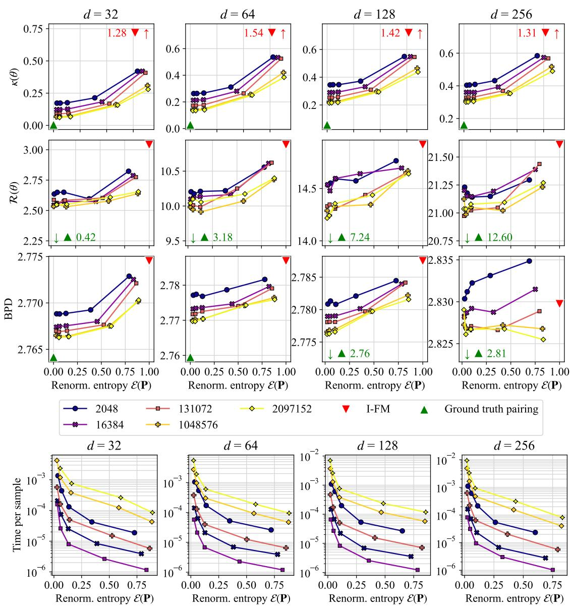
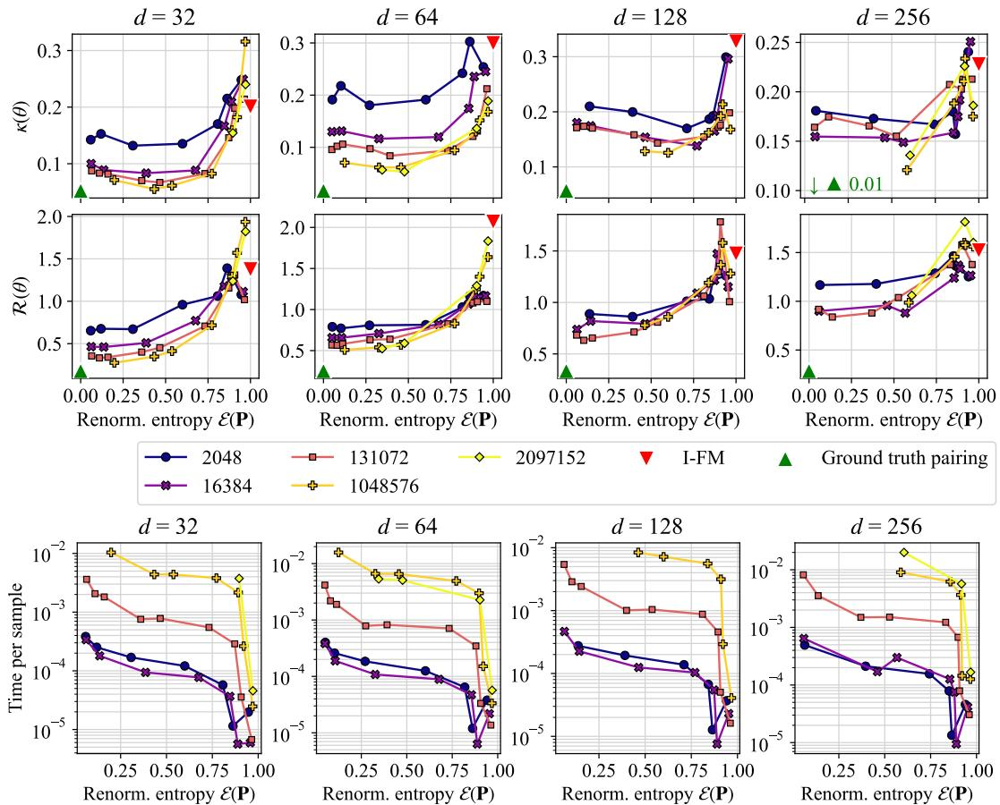
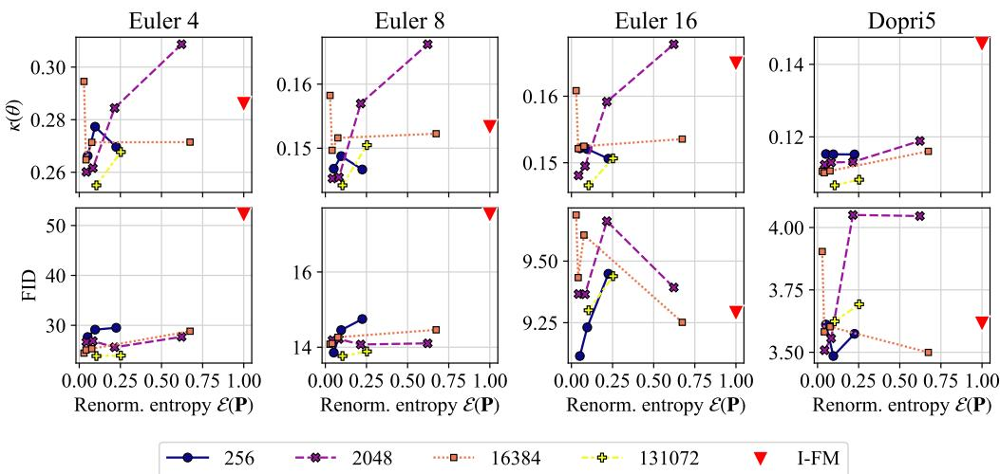
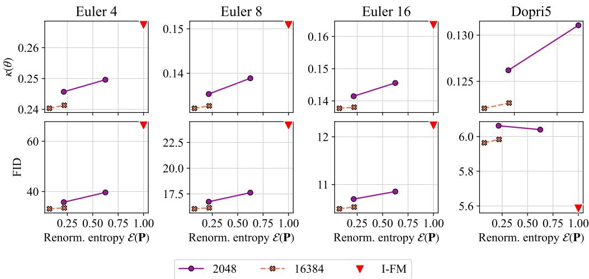

# On Fitting Flow Models with Large Sinkhorn Couplings

Anonymous Author(s)   
Affiliation   
Address   
email

# Abstract

Flow models transform data gradually from a modality (e.g. noise) onto another (e.g. images). Such models are parameterized by a time-dependent velocity field, trained to fit segments connecting pairs of source & target points. When a pairing between source and target points is known, the training boils down to a supervised regression problem. When no such pairing exists, as is the case when generating data from noise, training flows is much harder. A popular approach lies in picking in that case source and target points independently [Lipman et al., 2023]. This can, however, lead to velocity fields with high variance that are difficult to integrate. In theory, one would greatly benefit from training flow models by sampling pairs from an optimal transport (OT) measure coupling source and target, since this would lead to a highly efficient flow solving the Benamou and Brenier dynamical OT problem. Practically, recent works have proposed to sample mini-batches of $n$ source and $n$ target points and reorder them using an OT solver to form “better” pairs. These works have advocated using batches of size $n \approx 2 5 6$ , and considered couplings that are both “hard” (permutations obtained with the Hungarian algorithm) or “soft” (computed with the Sinkhorn algorithm). We follow in the footsteps of these works by exploring the benefits of increasing this mini-batch size $n$ by several orders of magnitude, and look more carefully on the effect of the entropic regularization $\varepsilon$ used in Sinkhorn. Our analysis and computations are facilitated by new scale invariant quantities to present results and sharded computations parallelized over multiple GPU nodes. We uncover various dimensional regimes where flow matching benefits from OT guiding, using proper scales for $n$ and suitable entropic regularization $\varepsilon$ , to be set so that it approximates 0.2 in the novel renormalized entropy scale we propose.

# 25 1 Introduction

Finding a map that can transform a source into a target measure is a task at the core of generative   
modeling and unpaired modality translation. Following the widespread popularity of GAN formula  
tions [Goodfellow et al., 2014], the field has greatly benefited from a gradual, time-dependent parame  
terization of these transformations as neural-ODEs [Chen et al., 2018] or normalizing flows [Rezende   
and Mohamed, 2015]. Such flow models are now commonly estimated using flow matching [Lipman   
et al., 2024]. While time parameterization substantially increases the expressivity of these models,   
this comes typically with a higher cost at inference time due to the additional cost of running an   
ODE solver with potentially dozens of steps. On the theoretical side, the golden standard for such   
time parameterized transformation is given by the Benamou and Brenier dynamical optimal transport   
(OT) solution, which would collapse in practice in a 1-step generation achieved by the Monge map   
formulation [Santambrogio, 2015]. In practice, while the mathematics [Villani, 2003] of optimal   
transport have contributed to the understanding of these methodsLiu et al., the jury seems to be still   
out on ruling whether tools from the computational OT toolbox [Peyré and Cuturi, 2019], which is   
typically used to compute large scale couplings from data [Klein et al., 2025], can decisively help   
with the estimation of flows in high-dimensions.   
Stochastic interpolants. The flow matching (FM) framework [Lipman et al., 2024], introduced   
in concurrent seminal papers [Peluchetti, 2022, Lipman et al., 2023, Albergo and Vanden-Eijnden,   
2023, Neklyudov et al., 2023] proposes to estimate a flow model by leveraging a time-dependent   
interpolation $\mu _ { t }$ between source $\mu _ { 0 }$ and target $\mu _ { 1 }$ —the stochastic interpolant following the terminol  
ogy of Albergo and Vanden-Eijnden [2023]. That interpolation is the crucial ingredient used to fit a   
parameterized velocity field, with a regression loss. In practice, such an interpolation can be formed   
by sampling $X _ { 0 } \sim \mu _ { 0 }$ independently of $X _ { 1 } \sim \mu _ { 1 }$ , to define $\mu _ { t }$ as the law of $\bar { X _ { t } } : = ( 1 - t ) X _ { 0 } + t X _ { 1 }$ .   
One can then fit a parameterized time-dependent velocity field $\mathbf { v } _ { \boldsymbol { \theta } } ( t , \mathbf { x } )$ that minimizes the expectation   
of $\| X _ { 1 } - X _ { 0 } - \bar { \mathbf { v } _ { \theta } } ( X _ { T } , T ) \| ^ { 2 }$ w.r.t. $X _ { 0 } , X _ { 1 }$ and $T$ a random time variable in [0, 1]. This procedure   
(hereafter abbreviated as Independent-FM, IFM) has been immensely successful, but can suffer from   
high variance, as highlighted by [Liu, 2022] (that loss can never be 0), and does not result in an   
optimal transport: this can be measured by noticing a high curvature when integrating the ODE   
needed to form an output from an input sample point $\mathbf { x } _ { \mathrm { 0 } }$ .   
Blending FM and OT Solvers. To fit exactly the OT framework, it would be best to choose $\mu _ { t }$   
to be the McCann interpolation between $\mu _ { 0 }$ and $\mu _ { 1 }$ , which would be $\mu _ { t } : = ( ( 1 - t ) \mathrm { I d } + t T ^ { \star } ) \# \dot { \mu } _ { 0 }$ ,   
where $T ^ { \star }$ is the Monge map connecting $\mu _ { 0 }$ and $\mu _ { 1 }$ . Unfortunately, this insight is irrelevant, since   
knowing $T ^ { \star }$ would mean that no flow needs to be trained at all. Adopting a more practical perspective,   
Pooladian et al. [2023] and Tong et al. [2023] have proposed in their seminal works to carefully select   
pairs of observations using OT solvers. Concretely, they sample mini-batches $\mathbf { x } _ { 0 } ^ { 1 } \ldots , \mathbf { x } _ { 0 } ^ { n }$ from $\mu _ { 0 }$ and   
$\mathbf { \bar { x } } _ { 1 } ^ { 1 } , \ldots , \mathbf { x } _ { 1 } ^ { n }$ from  matr $\mu _ { 1 }$ ; compute a  and feed the $n \times n$ OT coupling mmodel with pairs $\mathbf { x } _ { i _ { \ell } } ^ { 0 } , \mathbf { x } _ { j _ { \ell } } ^ { 1 }$ mple pairs of indices . This approach was $( i _ { \ell } , j _ { \ell } )$ from that used and   
adapted in [Tian et al., 2024, Generale et al., 2024, Klein et al., 2023, Davtyan et al., 2025]. Despite   
their appeal, these modifications have not yet been widely adopted. The consensus stated recently   
by Lipman et al. [2024] seems to be still that "the most popular class of affine probability paths is   
instantiated by the independent coupling".   
Can mini-batch OT really help? We try to answer this question by noticing first that the evaluations   
carried out in all of the references cited above use batch sizes of $2 ^ { 8 } = 2 5 6$ points, more rarely   
$2 ^ { 1 0 } = 1 0 2 4$ . We believe that this might be the case because these works rely on the Hungarian   
algorithm (complexity $O ( n ^ { 3 } ) )$ . We also notice that while these works also consider entropic OT   
(EOT) [Cuturi, 2013], they choose a single $\varepsilon$ value throughout their work. We go back to the drawing   
board in this paper, and study whether batch-OT FM can work at all, and if so at which regimes of   
mini-batch size $n$ , regularization $\varepsilon$ , and for which data dimensions $d$ . Our contributions are:   
• Rather than drawing a line between Batch-OT (in Hungarian or EOT form) and independent FM, we   
leverage the fact that all of these approaches can be interpolated using EOT: Hungarian corresponds   
to the case where $\varepsilon \to 0$ while IFM is recovered with $\varepsilon  \infty$ .   
. We propose a modification of the Sinkhorn algorithm when used with for the squared-Euclidean   
norm, by dropping norms and focusing on the dot-product between points. We propose the definition   
of a renormalized entropy for couplings, to pin them efficiently on a scale of 0 (bijective assignment   
induced by a permutation, e.g. that returned by a Hungarian algorithm) to 1 (independent coupling).   
This quantity is useful because unlike transport cost or entropy regularization $\varepsilon$ , it is bounded in   
$[ 0 , 1 ]$ and is invariant to data dimension $d$ or number of points $n$ .   
• We explore in our experiments substantially different regimes for $n$ and $\varepsilon$ . We vary the mini-batch   
size from $n = 2 ^ { 1 1 } = \stackrel { \cdot } { 2 } , 0 4 8$ to $n = 2 ^ { 2 1 } = \dot { 2 } , 0 9 7 , 1 5 2$ and consider a more ample adaptive grid for   
$\varepsilon$ that captures the range $[ 0 , 1 ]$ range of our renormalized entropy.

# 2 Background Material on Optimal Transport and Flow Matching

Let $\mathcal { P } _ { 2 } ( \mathbb { R } ^ { d } )$ denote the space of probability measures over $\mathbb { R } ^ { d }$ with a finite second moment. Let   
$\mu , \nu \in \mathcal { P } _ { 2 } ( \mathbb { R } ^ { d } )$ , and let $\Gamma ( \mu , \nu )$ be the set of joint probability measures in $\mathcal { P } _ { 2 } ( \mathbb { R } ^ { d } \times \mathbb { R } ^ { d } )$ with   
left-marginal $\mu$ and right-marginal $\nu$ . The OT problem in its Kantorovich formulation is:

$$
W ( \mu , \nu ) : = \operatorname* { i n f } _ { \pi \in \Gamma ( \mu , \nu ) } \int \int \frac { 1 } { 2 } \| x - y \| ^ { 2 } \mathrm { d } \pi ( x , y ) .
$$

A minimizer of (1) is called an $O T$ coupling measure, denoted $\pi ^ { \star }$ . If $\mu$ was a source (e.g. noise) and   
$\nu$ a target (e.g. images), $\pi ^ { \star }$ would be the perfect coupling to sample pairs of noise and image to learn   
flow models: e.g. sample $\mathbf { x } _ { 0 } , \mathbf { x } _ { 1 } \sim \pi ^ { \star }$ and ensure the flow models bring $\mathbf { x } _ { \mathrm { 0 } }$ to $\mathbf { x } _ { 1 }$ along a straight   
path. Such of these couplings $\pi ^ { \star }$ are in fact induced by pushforward maps, i.e. a point $\mathbf { x } _ { \mathrm { 0 } }$ can only

be paired with a 93 $T ( \mathbf { x } _ { \mathrm { 0 } } )$ , where $T : \mathbb { R } ^ { d }  \mathbb { R } ^ { d }$ . We say that such $T$ pushes $\mu$ forward to $\nu$ , $T _ { \# } \mu = \nu$ 94 when for $X \sim \mu$ one has $T ( X ) \sim \nu$ . The Monge formulation of OT is:

$$
T ^ { \star } ( \mu , \nu ) : = \underset { T : T _ { \# } \mu = \nu } { \arg \operatorname* { m i n } } \int \frac { 1 } { 2 } \| \mathbf { x } - T ( \mathbf { x } ) \| ^ { 2 } \mathrm { d } \mu ( \mathbf { x } )
$$

where the minimizers are referred to as Monge or OT maps. Such maps can be characterized:

Theorem 1 ([Brenier, 1991]). If $\mu \in \mathcal P _ { 2 } ( \mathbb { R } ^ { d } )$ has an absolutely continuous density then (2) is solved   
by a map $T ^ { \star }$ of the form $T ^ { \star } = \nabla u$ , where $u : \mathbb { R } ^ { d }  \mathbb { R }$ is convex. Moreover if u is a convex potential   
that is such that $\nabla u _ { \# } \mu = \nu$ then $\nabla u$ solves (2).   
As a result of this theorem, one can choose a convex potential $u$ , a starting measure $\mu$ , and train flow   
matching models between $\mu$ and $\nu : = \nabla u _ { \sharp } \mu$ to define synthetic tasks for which the coupling $\pi ^ { \star }$ is   
known, as proposed in [Korotin et al., 2021]. We consider this in Section 4.2 to benchmark batch-OT.   
Entropic OT. Entropic regularization [Cuturi, 2013] has become the most popular approach   
to estimate a finite sample analog of $\pi ^ { \star }$ using samples $\left( \mathbf { x } _ { 1 } , \ldots , \mathbf { x } _ { n } \right)$ and $\left( \mathbf { y } _ { 1 } , \ldots , \mathbf { y } _ { n } \right)$ . Using a   
regularization strength $\varepsilon > 0$ , a cost matrix $\mathbf { \bar { C } } : = \mathbf { \bar { \Gamma } } [ \frac { 1 } { 2 } \| \mathbf { x } _ { i } - \mathbf { y } _ { j } \| ^ { 2 } ] _ { i j }$ between these samples, the   
entropic OT (EOT) problem can be presented in primal form (1) or in dual form:

$$
\operatorname* { m i n } _ { \mathbf { P } \in \mathbb { R } _ { + } ^ { n \times n } , \mathbf { P } \mathbf { 1 } _ { n } = \mathbf { P } ^ { T } \mathbf { 1 } _ { n } = \mathbf { 1 } _ { n } / n } \langle \mathbf { P } , \mathbf { C } \rangle - \varepsilon H ( \mathbf { P } ) , \quad \operatorname* { m a x } _ { \mathbf { f } \in \mathbb { R } ^ { n } , \mathbf { g } \in \mathbb { R } ^ { n } } \frac { 1 } { n } \langle \mathbf { f } + \mathbf { g } , \mathbf { 1 } _ { n } \rangle - \varepsilon \langle \exp \left( \frac { \mathbf { C } - \mathbf { f } \oplus \mathbf { g } } { \varepsilon } \right) , \mathbf { 1 } _ { n \times n } \rangle .
$$

The optimal solutions to (3) are usually found   
with the Sinkhorn algorithm, as presented in Al  
gorithm 1, where for a matrix $\mathbf { \bar { S } } = [ \mathbf { S } _ { i , j } ]$ we   
write $\begin{array} { r } { \operatorname* { m i n } _ { \varepsilon } ( \mathbf { S } ) : = [ - \varepsilon \log \left( \mathbf { 1 } ^ { \top } e ^ { - \mathbf { S } _ { i , \cdot } / \varepsilon } \right) ] _ { i } } \end{array}$ , and   
$\oplus$ is the tensor sum of two vectors, i.e. f $\oplus$   
$\mathbf { g } : = [ \mathbf { f } _ { i } + \mathbf { g } _ { j } ] _ { i j }$ . The optimal dual variables (3)   
$( \mathbf { f } ^ { \varepsilon } , \mathbf { g } ^ { \varepsilon } )$ can then be used to instantiate a valid   
coupling matrix $\mathbf { P } ^ { \varepsilon } = \exp \left( ( \mathbf { C } - \mathbf { f } ^ { \varepsilon } \oplus \mathbf { g } ^ { \varepsilon } ) / \varepsilon \right)$ ,   
which approximately solves the finite-sample   
counterpart of (1). An important remark is   
that as $\varepsilon \  \ 0$ , the solution $\mathbf { P } ^ { \varepsilon }$ converges to   
117 the optimal transport matrix solving 1, while

$$
\mathbf { A l g o r i t h m 1 S I N K } \big ( \mathbf { X } \in \mathbb { R } ^ { n \times d } , \mathbf { Y } \in \mathbb { R } ^ { m \times d } , \varepsilon , \tau \big )
$$

1: $\mathbf { f } , \mathbf { g } \gets \mathbf { 0 } _ { n } , \mathbf { 0 } _ { m }$ .   
: $\mathbf { C } \gets [ \frac { 1 } { 2 } \| \mathbf { x } _ { i } - \mathbf { y } _ { j } \| ^ { 2 } ] _ { i j } , i \leq n , j \leq m$   
: while $\begin{array} { r } { \| \exp \left( \frac { \mathbf { C } - \mathbf { f } \oplus \mathbf { g } } { \varepsilon } \right) \mathbf { 1 } _ { m } - \frac { 1 } { n } \mathbf { 1 } _ { n } \| _ { 1 } < \tau } \end{array}$ do   
: $\mathbf { f }  \varepsilon \log \frac { 1 } { n } \mathbf { 1 } _ { n } - \operatorname* { m i n } _ { \varepsilon } ( \mathbf { C } - \mathbf { f } \oplus \mathbf { g } ) + \mathbf { f }$   
: $\begin{array} { r } { \mathbf { g }  \varepsilon \log \frac { 1 } { n } \mathbf { 1 } _ { n } - \operatorname* { m i n } _ { \varepsilon } ( \mathbf { C } ^ { \top } - \mathbf { g } \oplus \mathbf { f } ) + \mathbf { g } } \end{array}$   
: end while   
: return $\mathbf { f } , \mathbf { g } , \mathbf { P } = \exp \left( ( \mathbf { C } - \mathbf { f } \oplus \mathbf { g } ) / \varepsilon \right)$

$\mathbf { P } ^ { \varepsilon } \to \mathbf { \Pi } _ { . n ^ { 2 } } ^ { 1 } \mathbf { 1 } _ { n \times n }$ as $\varepsilon  \infty$ . These two limiting points coincide with the optimal assignment matrix 9 (or optimal permutation as returned e.g. by the Hungarian algorithm [Kuhn, 1955]), and the uniform independent coupling used implicitly in I-FM.

Independent and Batch-OT Flow Matching.   
A stochastic interpolant $\mu _ { t }$ with law $X _ { t } : = ( 1 -$   
$t ) X _ { 0 } + t X _ { 1 }$ is used in flow matching to solve   
a regression loss $\begin{array} { r } { \operatorname* { m i n } _ { \theta } \mathbb { E } _ { T , X _ { 0 } , X _ { 1 } } \| X _ { 1 } ^ { \cdot } - X _ { 0 } - \| } \end{array}$   
$\mathbf { v } _ { \theta } ( X _ { T } , T ) \lVert ^ { 2 }$ where the expectation is taken w.r.t.   
$X _ { 0 } \sim \mu _ { 0 } , X _ { 1 } \sim \mu _ { 1 }$ and $T$ a random variable in   
$[ 0 , 1 ]$ . In I-FM, this interpolant is implemented by   
taking independent batches of samples $\mathbf { x } _ { 0 } ^ { 1 } \ldots , \mathbf { x } _ { 0 } ^ { \bar { n } }$   
from $\mu _ { 0 }$ , $\mathbf { x } _ { 1 } ^ { 1 } , \ldots , \mathbf { x } _ { 1 } ^ { n }$ from $\mu _ { 1 }$ , and $t _ { 1 } , \ldots , t _ { n }$ time   
values sampled in $[ 0 , 1 ]$ , to form the loss values   
131 $\| \mathbf { x } _ { 1 } ^ { k } - \mathbf { x } _ { 0 } ^ { k } - \mathbf { v } _ { \theta } \big ( \big ( 1 - t _ { k } \big ) \mathbf { x } _ { 0 } ^ { j } + t _ { k } \mathbf { x } _ { 1 } ^ { k } , t _ { k } \big ) \| ^ { 2 }$ . In the

1: $\mathbf { X } _ { 0 } = ( \mathbf { x } _ { 0 } ^ { 1 } , \ldots , \mathbf { x } _ { 0 } ^ { n } ) \sim \mu _ { 0 }$   
: $\mathbf { X } _ { 1 } = ( \mathbf { x } _ { 1 } ^ { 1 } , \ldots , \mathbf { x } _ { 1 } ^ { n } ) \sim \mu _ { 1 }$   
: $\mathbf { P } \gets \mathrm { O T } \mathbf { - } \mathrm { S O L V E } ( \mathbf { X } _ { 0 } , \mathbf { X } _ { 1 } )$ or ${ \mathbf I } _ { n } / n$   
: $( i _ { 1 } , j _ { 1 } ) , \dotsc , ( i _ { n } , j _ { n } ) \sim \mathbf { P }$   
: $t _ { 1 } , \ldots , t _ { n } \gets$ TIMESAMPLER   
: $\tilde { \mathbf { x } } ^ { k } \gets ( 1 - t _ { k } ) \mathbf { x } _ { 0 } ^ { i _ { k } } + t _ { k } \mathbf { x } _ { 1 } ^ { j _ { k } }$ , for $k \leq n$   
: $\begin{array} { r } { \mathcal { L } ( \boldsymbol { \theta } ) = \sum _ { k } \| \mathbf { x } _ { 1 } ^ { j _ { k } } - \mathbf { x } _ { 0 } ^ { i _ { k } } - \mathbf { v } _ { \boldsymbol { \theta } } ( \tilde { \mathbf { x } } ^ { k } , t _ { k } ) \| ^ { 2 } } \end{array}$   
: $\theta \gets$ GRADIENT-UPDATE( $\left( \nabla { \mathcal { L } } ( \theta ) \right)$   
formalism of Pooladian et al. [2023] and Tong et al. [2023], the same samples $\mathbf { x } _ { 0 } ^ { 1 } \ldots , \mathbf { x } _ { 0 } ^ { n }$ and   
$\mathbf { x } _ { 1 } ^ { 1 } , \ldots , \mathbf { x } _ { 1 } ^ { n }$ are first fed into a discrete optimal matching solver. This outputs a bistochastic coupling   
matrix $\mathbf { P } \in \mathbb { R } ^ { n \times n }$ which is then used to $r e$ -shuffle the $n$ pairs originally provided to be better coupled,   
and which should help the velocity field fit better trajectories, with less training steps. The procedure   
is summarized in Algorithm 2 and adapted to our setup and notations. The choice ${ \mathbf I } _ { n } / n$ corresponds   
to IFM. More recently, [Davtyan et al., 2025] has proposed to keep a memory of that matching effort   
across mini-batches, by updating a large (of the size of the entire dataset) assignment permutation   
between noise and full-batch data that is locally refreshed with the output of the Hungarian method   
run on a small batch. A crucial aspect of the batch-OT methodology is that this pairing is disconnected   
from the training of $\mathbf { v } _ { \theta }$ itself. Indeed, as currently implemented, OT variants of FM can be interpreted   
as meta-dataloaders that do a selective pairing of noise and data, without considering $\theta$ at all. In that   
sense, training and preparation of coupled noise/data pairs can be done independently.

# 144 3 Prepping Sinkhorn for Large Batch-size and Dimension.

The Necessity of Large Batch Size. The motivation to use larger batch sizes for OT-FM lies in the fundamental bias introduced by using small batches in the context of the curse of dimensionality [Chewi et al., 2024, Fatras et al., 2019]. That bias cannot be traded off with more iterations on the flow matching loss. The necessity of varying $\varepsilon$ accordingly is that this regularization is known to offset that bias to some extent, with more favorable sample complexity [Genevay et al., 2018, Mena and Niles-Weed, 2019, Rigollet and Stromme, 2025].

Automatic Rescaling of $\varepsilon$ . A practical problem arising when running the Sinkhorn algorithm lies   
in choosing the $\varepsilon$ parameter. As described earlier, while $\mathbf { P } ^ { \varepsilon }$ does follow a path from the optimal   
permutation return by the Hungarian algorithm to the independent coupling as $\varepsilon$ varies from $0 \infty$   
what matters is what actual values are chosen in between those two ends. To avoid using a fixed grid   
that risks becoming irrelevant as we move $n$ and $d$ , we revisit the strategy used in [Cuturi, 2013]   
to divide the cost matrix $\mathbf { C }$ by its mean, median or maximal value, as implemented for instance   
in [Flamary et al., 2021]. While needed to avoid underflow when instantiating a kernel matrix   
${ \bf K } = e ^ { - { \bf C } / \bar { \varepsilon } }$ , that strategy is not relevant when using the log-sum-exp operator in our implementation   
(as advocated in [Peyré and Cuturi, 2019, Remark 4.23]), since the $\operatorname* { m i n } _ { \varepsilon }$ in our implementation is   
invariant to a constant shift in $\mathbf { C }$ , whereas mean, median and max statistics are not. We propose   
instead to use the standard deviation (STD) of the cost matrix, which has this property: dispersion of   
costs around its mean has more relevance than mean itself. The STD can be computed in $( \bar { n } + m ) d ^ { 2 }$   
time/ memory, without having to instantiate the cost matrix. When this memory cost increase from   
$d$ to $d ^ { 2 }$ is too high, we subsample $n = 2 ^ { 1 4 } = 1 6 3 8 4$ points. In what follows, we always pass the $\varepsilon$   
value to the Sinkhorn algorithm 1 as $\tilde { \varepsilon } : = \mathrm { s t d } ( \mathbf { C } ) \times \varepsilon$ , where $\varepsilon$ is now a scale-free quantity selected   
in a grid [0.001, 1.0]. See appendix for plots that report instead $\varepsilon$ .

Scale-Free Renormalized Coupling Entropy. While useful to keep computations stable across runs, the rescaling of $\varepsilon$ still does not provide a clear idea of whether a computed coupling $\mathbf { P } ^ { \varepsilon }$ between $n \times n$ points is sharp or close to independent. While a distance to the independent coupling can be easily computed, that to the optimal Hungarian permutation cannot, of course, be derived. Instead, we resort to a fundamental information inequality used in [Cuturi, 2013]: if $\mathbf { P }$ is a valid coupling between two marginal probability vectors a, b, then one has by $\begin{array} { r } { \frac { 1 } { 2 } ( H ( \mathbf { a } ) + H ( \mathbf { b } ) ) \leq H ( \mathbf { P } ) \leq \bar { H } ( \mathbf { a } ) + H ( \mathbf { b } ) } \end{array}$ . As a result, for any $\varepsilon$ , we can define a renormalized entropy $\mathcal { E }$ for any coupling of $\mathbf { a } , \mathbf { b }$ :

$$
\mathcal { E } ( \mathbf { P } ) : = \frac { 2 H ( \mathbf { P } ) } { H ( \mathbf { a } ) + H ( \mathbf { b } ) } - 1 \in ( 0 , 1 ] .
$$

When ${ \bf a } = { \bf b } = { \bf 1 } _ { n } / n$ , as considered here, this simplifies to $\mathcal { E } ( \mathbf { P } ) : = H ( \mathbf { P } ) / \log n - 1$ . Independently   
of the size $n$ and of the scale of $\varepsilon$ , $\mathcal { E } ( \mathbf { P } ^ { \varepsilon } )$ provides a simple measure of the proximity of $\mathbf { P } ^ { \varepsilon }$ to an   
optimal assignment matrix (as $\mathcal { E }$ gets closer to 0) or to the independent coupling matrix (as $\mathcal { E }$ reaches   
1). As a result we report $\mathcal { E } ( \mathbf { P } ^ { \varepsilon } )$ rather than $\varepsilon$ in our plots (or to be more accurate, the average of   
$\mathcal { E } ( \mathbf { P } ^ { \varepsilon } )$ computed over multiple mini-batches).

From Squared Euclidean Costs to Dot-products Using the notation $T ^ { \star } ( \mu , \nu )$ introduced in (2), 173 we notice an equivariance property of Monge maps. For $\mathbf { s } \in \mathbb { R } ^ { d }$ and $r \in \mathbb { R } _ { + }$ we write $L _ { r , \mathbf { s } }$ for the 174 dilation and translation map $L _ { r , \mathbf { s } } ( \mathbf { x } ) = r \mathbf { x } + \mathbf { s }$ . Naturally, $L _ { r , \mathbf { s } } ^ { - 1 } ( \mathbf { x } ) = ( \mathbf { x } - \mathbf { s } ) / r = L _ { 1 / r , - \mathbf { s } / r } ( \mathbf { x } )$ , but also 175 $L _ { r , s } = \nabla w _ { r , s }$ where $\begin{array} { r } { w _ { r , \underline { { s } } } ( \mathbf { x } ) : = \frac { r } { 2 } \| \mathbf { x } \| ^ { 2 } - \mathbf { s } ^ { T } \mathbf { x } } \end{array}$ is convex.

Lemma 2. The Monge map $T ( \mu , \nu )$ is equivariant w.r.t to dilation and translation maps, as

$$
T ^ { \star } ( L _ { r , \mathbf { s } } \# \mu , L _ { r ^ { \prime } , \mathbf { s } ^ { \prime } } \# \nu ) = L _ { r ^ { \prime } , \mathbf { s } ^ { \prime } } \circ T ^ { \star } ( \mu , \nu ) \circ L _ { r , \mathbf { s } } ^ { - 1 } .
$$

Proof. Following Brenier’s theorem, let $u$ be a convex potential from $\mu$ to $\nu$ such that $T ^ { \star } ( \mu , \nu ) = \nabla u$ .   
Set $\bar { F } : = L _ { r ^ { \prime } , { \bf s } ^ { \prime } } \bar { \circ } \nabla u \circ L _ { r , { \bf s } } ^ { - 1 }$ . $F$ is the composition of the gradients of three convex functions. Because   
the Jacobians of $L _ { r , s }$ and $L _ { r , \mathbf { s } } ^ { - 1 }$ are respectively $r \mathbf { I } _ { d }$ and ${ \mathbf { I } } _ { d } / r$ , they commute with the Hessian of $u$   
Therefore the Jacobian of $F$ is symmetric positive definite, and $F$ is the gradient of a convex potential   
that pushes $L _ { r , \mathbf { s } } \# \mu$ to $L _ { r ^ { \prime } , \mathbf { s } ^ { \prime } } \# \nu$ . It is therefore their Monge map by Brenier’s theorem. □   
In practice, this equivariance means that when focusing on permutation matrices (which can be   
seen as the discrete counterparts of these Monge maps), one is free to rescale and shift either point   
cloud. This remark has a practical implication when running Sinkhorn as well. When using the   
squared-Euclidean distance matrix, the cost matrix is a sum of a correlation term with two rank-1   
norm terms, $\mathbf { C } = - \mathbf { X } \mathbf { Y } ^ { T } \frac { 1 } { 2 } ( \xi \mathbf { 1 } _ { m } ^ { T } + \mathbf { 1 } _ { n } \gamma ^ { T } )$ where $\xi$ and $\gamma$ are the vectors composed of the $n$ squared   
norms of vectors in $\mathbf { X }$ and $\mathbf { Y }$ . Yet, due to the constraints $\mathbf { P 1 } _ { m } = \mathbf { a } , \mathbf { P } ^ { T } \mathbf { 1 } _ { n } = \mathbf { b }$ , any modification   
to the cost matrix of theobjective by a constant, $\begin{array} { r } { \langle { \bf P } , \tilde { \bf C } \rangle = \langle { \bf P } , { \bf C } \rangle - \frac { 1 } { n } { \bf 1 } _ { n } ^ { T } { \bf c } - \frac { 1 } { n } { \bf 1 } _ { n } ^ { T } { \bf d } . } \end{array}$ $\tilde { \mathbf { C } } = \mathbf { C } - \mathbf { c } \mathbf { 1 } _ { m } ^ { T } - \mathbf { 1 } _ { n } \mathbf { d } ^ { T }$ $\mathbf { c } \in \mathbb { R } ^ { n }$ , $\mathbf { d } \in \mathbb { R } ^ { m }$ only shifts the (3) means that norms   
can only perturb Sinkhorn computations, and one should focus on the negative correlation matrix   
$\mathbf { C } : = - \mathbf { \dot { X } } ^ { T } \mathbf { Y }$ , replacing Line 2 in Algorithm 1. We do observe significant stability gains of these   
191 properly rescaled costs when comparing two point clouds (see Appendix A.1).   
2 Scaling Up Sinkhorn to Millions of High-Dimensional Points. Our ambition, when guiding flow   
matching with batch-OT as presented in Algorithm 2, is to vary $n$ and $\varepsilon$ so that the coupling $\mathbf { P } ^ { \varepsilon }$ used   
to sample indices can be both large $( n \approx \bar { 1 0 } ^ { 6 }$ ) and sharp if needed, i.e. with a $\varepsilon$ that can be brought   
to arbitrarily low levels so that $\mathcal { E } ( \mathbf { P } ^ { \varepsilon } ) \approx 0$ . To that end, we leverage the OTT-JAX implementation   
of the Sinkhorn algorithm [Cuturi et al., 2022], which can be natively sharded across multi-GPUs,   
or more generally multiple nodes of GPU machines equipped with efficient interconnect. In that   
approach, inspited by the earlier mono-GPU implementation of [Feydy, 2020], all $n$ points from   
99 source and target are sharded across GPUs and nodes (we have used either 1 or 2 nodes of 8 GPUs   
0 each, either Nvidia H100 or A100). A crucial point in that implementation is that the cost matrix   
$\mathbf { C } = - \mathbf { X } \mathbf { Y } ^ { T }$ (following remark above) is never instantiated globally, and recomputed instead at each   
$\operatorname* { m i n } _ { \varepsilon }$ operation in Lines 4 and 5 of Algorithm 1 locally, for these shards. All sharded results are   
then gathered to recover f, g newly assigned after that iteration. When outputted, we use $\mathbf { f } ^ { \varepsilon }$ and $\mathbf { g } ^ { \varepsilon }$   
and, analogously, never instantiate the full $\mathbf { P } ^ { \varepsilon }$ matrix (this would be impossible at sizes $n \approx 1 0 ^ { 6 }$ we   
consider) but instead, materialize it blocks of rows by blocks of rows to do index sampling. We use   
the Gumbel-softmax trick to vectorize and speed up efficiently the $n$ categorical sampling of these   
potentially very large unnormalized probability vectors.

# 4 Experiments

We revisit the application of Algorithm 2 using the modifications to the Sinkhorn algorithm outlined 0 in Section 3 to various I-FM benchmark tasks. We consider synthetic tasks in which the groundtruth Monge map is known, and benchmark unconditioned image generation using CIFAR-10 and ImageNet-32 generation, with a limited number of total integration steps.

Sinkhorn Hyperparameters. To track precisely whether the Sinkhorn algorithm converges for low $\varepsilon$ values, we set the maximal number of iterations to 50, 000. We use the momentum rule introduced in [Lehmann et al., 2022] beyond 2000 iterations to speed-up harder runs. Overall, all of the runs below converge, and therefore, even for low $\varepsilon$ , we never experience convergence issues. The threshold $\tau$ is set to 0.001 and we observe that it remains relevant for all dimensions, as we use the 1-norm to quantify convergence. Convergence statistics are reported in Appendix A.2.

# 4.1 Evaluation Metrics for $\mathbf { v } _ { \theta }$

20 All metrics used in our experiments can be interpreted as lower is better. Negative log-likelihood.   
1 Given a trained flow model $\mathbf { v } _ { \boldsymbol { \theta } } ( t , \mathbf { x } )$ , the density $p _ { t } ( \mathbf { x } )$ obtained by pushing forward $p _ { 0 } ( \mathbf { x } )$ along the   
flow map of $\mathbf { v } _ { \theta }$ can be computed by solving

$$
\log p _ { t } ( \mathbf { x } _ { t } ) = \log p _ { 0 } ( \mathbf { x } _ { 0 } ) - \int _ { 0 } ^ { 1 } ( \nabla _ { x } \cdot \mathbf { v } _ { \theta } ) ( t , \mathbf { x } _ { t } ) \mathrm { d } t , \qquad \dot { \mathbf { x } } _ { t } = \mathbf { v } _ { \theta } ( t , \mathbf { x } _ { t } ) ,
$$

Similarly, given a pair $( t , \mathbf { x } )$ , the density $p _ { t } ( \mathbf { x } )$ can be evaluated by backward integration [Grathwohl et al., 2018, Section 2.2]. The divergence $( \nabla _ { x } \cdot \mathbf { v } _ { \theta } ) ( t , \mathbf { x } _ { t } )$ requires computing the trace of the Jacobian of $\mathbf { v } _ { \theta } ( t , \cdot )$ . As commonly done in the literature, we use the Hutchinson trace estimator with a varying number of samples to speed up that computation without materializing the entire Jacobian and use either an Euler solver with 50 steps for synthetic tasks or a Dopri5 adaptive solver for image generation tasks, both implemented in the Diffrax toolbox [Kidger, 2021]. Given $n$ points $\mathbf { x } _ { 1 } ^ { 1 } , \ldots , \mathbf { \bar { x } } _ { 1 } ^ { n } \sim \nu$ and integrated backwards, the negative log-likelihood (NLL) of that set is

$$
\begin{array} { r } { \mathcal { L } ( \boldsymbol { \theta } ) : = - \frac { 1 } { n } \displaystyle \sum _ { i = 1 } ^ { n } \log p _ { 1 } ( \mathbf { x } _ { 1 } ^ { i } ) . } \end{array}
$$

subject to (4) and $p _ { 0 }$ the law of $\mu$ . We alternatively report the bits per dimension (BPD) statistic,   
which is $\mathcal { L }$ divided by $d \log 2$ .

Curvature. We use the curvature of the field $\mathbf { v } _ { \theta }$ as defined by [Lee et al., 2023]: for $n$ integrated trajectories $( \mathbf { x } _ { t } ^ { 1 } , \ldots , \mathbf { x } _ { t } ^ { n } )$ starting from samples at $t = 0$ from $\mu$ , the curvature is defined as

$$
\begin{array} { r } { \kappa ( \theta ) : = \frac { 1 } { n } \displaystyle \sum _ { i = 1 } ^ { N } \int _ { 0 } ^ { 1 } \| \mathbf { v } _ { \theta } ( t , \mathbf { x } _ { t } ^ { ( i ) } ) - ( \mathbf { x } _ { 1 } ^ { ( i ) } - \mathbf { x } _ { 0 } ^ { ( i ) } ) \| _ { 2 } ^ { 2 } \mathrm { d } t , } \end{array}
$$

where the integration is done with an Euler solver with 50 steps for synthetic tasks and the Dopri5   
solver evaluated on a grid of 8 steps for image generation tasks. The smaller the curvature, the more   
the ODE path looks like a straight line.

Reconstruction loss. For synthetic tasks in Sections 4.2, we have access to the ground-truth transport map $T _ { 0 }$ that generated the target measure $\nu$ . In both cases, that map is parameterized as the gradient of a convex Brenier potential, respectively a piecewise quadratic function and an input convex neural network, ICNN [Amos et al., 2017]. For a starting point $\mathbf { x } _ { \mathrm { 0 } }$ , we can therefore compute a reconstruction loss (a variant of the $\mathcal { L } ^ { 2 }$ -UVP in Korotin et al. [2021]) as the squared norm of the difference between the true map $T ^ { \star } ( \mathbf { x } _ { 0 } )$ and the flow map $T _ { \theta }$ obtained by integrating $\mathbf { v } _ { \theta } ( t , \cdot )$ (using 50 steps with a Euler solver), defined using $n$ points sampled from $\mu$ as

$$
\mathcal { R } ( \theta ) : = \textstyle \frac { 1 } { n } \sum _ { i = 1 } ^ { n } \| T _ { \theta } ( \mathbf { x } _ { 0 } ^ { i } ) - T _ { 0 } ( \mathbf { x } _ { 0 } ^ { i } ) \| _ { 2 } ^ { 2 } .
$$

FID. We report the FID metric [Heusel et al., 2017] in image generation tasks. For CIFAR-10 we use the train dataset of 50k images, for ImageNet-32 we subset a random set of $5 0 \mathrm { k }$ images from the train set. For generation we consider four integration solvers, Euler with 4, 8 and 16 steps and a Dopri5 solver from the Diffrax library [Kidger, 2021].

# 4.2 Synthetic Benchmark Tasks, $d = 3 2 \sim 2 5 6$

We consider in this section synthetic benchmarks of medium dimensionality $\left( d = 6 4 \sim 2 5 6 \right)$ ). In this evaluation, we prioritize these tasks in controlled settings over other data sources at similar dimensions (e.g. PCA reduced single-cell data [Bunne et al., 2024]) because we want to compute a ground-truth reconstruction loss, and therefore elucidate the impact of OT batch size $n$ and $\varepsilon$ on this important practical aspect in practical applications.

Piecewise Affine Brenier Map. The source is a standard Gaussian and the target is obtained by mapping it through the gradient of a potential, itself a (convex) piecewise quadratic function obtained using the pointwise maximum of $k$ rank-deficient parabolas:

$$
\begin{array} { r } { u ( \mathbf { x } ) : = \displaystyle \operatorname* { m a x } _ { i \leq k } u _ { i } ( \mathbf { x } ) : = \frac { 1 } { 2 } \| \mathbf { x } \| ^ { 2 } + \frac { 1 } { 2 } \| \mathbf { A } _ { i } ( \mathbf { x } - \mathbf { m } _ { i } ) \| ^ { 2 } - \| \mathbf { A } _ { i } \mathbf { m } _ { i } \| ^ { 2 } , } \end{array}
$$

where $\mathbf { A } _ { i } \sim \mathrm { { W i s h a r t } } ( \frac { d } { 2 } , I _ { d } ) , \mathbf { m } _ { i } \sim \mathcal { N } ( 0 , 3 I _ { d } ) , c _ { i } \sim \mathcal { N } ( 0 , 1 )$ and all means are centered around zero   
after sampling. In practice, this yields a transport map of the form $\nabla u ( { \bf x } ) = { \bf x } + A _ { i ^ { \star } } \big ( { \bf x } - { \bf m } _ { i ^ { \star } } \big )$ where   
$i ^ { \star }$ is the potential selected for that particular $\mathbf { x }$ (i.e. the argmax in (5)). The correction $- \| \mathbf { A } _ { i } \mathbf { \dot { m } } _ { i } \| ^ { 2 }$ is   
designed to ensure that these potentials are sampled equally when moving away from 0. The number   
of potentials $k$ is equal to $d / \bar { 1 6 }$ . Examples of this map are shown in Appendix A.3. We consider this   
setting in dimensions d = 32, 64, 128, 256.

Korotin et al. Benchmark. We use the set of pre-trained ICNNs introduced in [Korotin et al., 2021] along with their predefined Gaussian mixtures as sources. We consider the benchmark in $d = 3 2$ , 64, 128, 256 using their checkpoints to generate the ground-truth maps. This problem setting is more challenging, however, since both the source and target distributions have multiple modes.

Velocity Field Parameterization and Training. The velocity fields are parameterized as MLPs with 5 hidden layers, of sizes 512 for $d = 3 2$ , 64 and 1024 for $d = 1 2 8$ , 256. Time in $[ 0 , 1 ]$ is encoded using $d / 8$ Fourier encodings. All models are trained with unpaired batches: the sampling in Line 1 of Algorithm 2 is done as $\mathbf { X } _ { 0 } \sim \mu$ while for Line 2, $\mathbf { X } _ { 1 } : = T _ { 0 } ( \mathbf { X } _ { 0 } ^ { \prime } )$ where $\mathbf { X } _ { 0 } ^ { \prime }$ is a new sample from $\mu$ . All models are trained for 8192 steps, with effective batch sizes of 2048 samples to average a gradient, a learning rate of $1 0 ^ { - 3 }$ (we tested with $1 0 ^ { - 2 }$ or $1 0 ^ { - 4 }$ , both were either unstable or less efficient on a subset of runs). The model marked as $\blacktriangle$ in the plots is a flow model trained with perfect supervision, i.e. given ground-truth paired samples $\mathbf { X } _ { 0 } \sim \mu$ and $\mathbf { X } _ { 1 } : = T _ { 0 } ( \mathbf { X } _ { 0 } )$ , provided in the correct order. I-FM is marked as $\blacktriangledown$ . For all other runs, we vary $\varepsilon$ (reporting renormalized entropy $\mathcal { E }$ )

  
Figure 1: Results on the piecewise affine OT Map benchmark. The three top rows present (in that order) curvature, reconstruction and BPD metrics. Below, we provide compute times associated with running the Sinkhorn algorithm as a per-example cost. This per-example cost is the total time needed to run Sinkhorn to get $n \times n$ coupling divided by $n$ . That cost would be 0 when using I-FM. We observe across all dimensions improvements of all metrics.

and the batch size $n$ used to compute couplings, somewhere between 256 and 2, 097, 152. These runs   
are carried out on a single node with 8 GPUs, and therefore the data is sharded in blocks of size $n / 8$ .   
Results. The results displayed in Figures 1 and 2 paint a homogeneous picture: as can be expected,   
increasing $n$ is generally impactful and beneficial for all metrics. The interest of decreasing $\varepsilon$ , while   
beneficial in smaller dimensions, can be less pronounced in higher dimensions. Indeed, we find that   
renormalized entropies around $\approx 0 . 2$ should be advocated, if one has in mind the computational   
effort needed to get these samples.

  
Figure 2: Results on the Korotin benchmark. As with Figure 1, we compute curvature and reconstruction metrics, and compute times below. Some of the runs for largest OT batch sizes $n$ are provided in the supplementary. These runs suggest that to train OT models in these dimensions increasing $n$ is overall beneficial across the board.

# 4.3 Unconditioned Image Generation, $d = 3 0 7 2$

CIFAR-10. As done originally in [Lipman et al., 2023], we consider unconditional generation of the CIFAR-10 dataset. Results are presented in Figure 3. Compared to results reported in [Tong et al., 2023] we observe slightly better FID scores (about 0.1) for both I-FM and OT-FM.

ImageNet-32. As also considered in [Lipman et al., 2023], we also evaluate the impact of BatchOT in unconditional generation of the ImageNet-32 dataset. We report results with under-trained models (120k steps vs. $4 3 8 \mathrm { k }$ advocated in their paper) in Figure 4 and present later checkpoints in Appendix A.6. Compared to results reported in [Tong et al., 2023] we observe slightly better FID scores (about 0.1 when using the Dopri5 solver for instance) for both I-FM and OT-FM.

Velocity Field Parameterization and Training. We use the network parameterization given in [Tong et al.] for CIFAR-10 and we replicate the network parameterization given in [Pooladian et al., 2023], including learning rate choices. We follow their recommendations on setting learning rates as well as total number of iterations.

Limitations. Our results rely on training of neural networks. In the interest of comparison, we have used the same model across all changes advocated in the paper (on $n$ and $\varepsilon$ ). However, and due to the scale of our experiments, we have not been able to ablate important parameters such as learning rates when varying $n$ and $\varepsilon$ .

Conclusion. Our experiments suggest that guiding flow models with large scale Sinkhorn couplings can prove beneficial for downstream performance. We have tested this hypothesis by computing and sampling from both crisp and blurry $n \times n$ Sinkhorn coupling matrices for sizes $n$ in the millions of

  
Figure 3: Experiment metrics for CIFAR-10 image generation. We evaluate the trained models using the Euler solver with three different number of steps, and with the Dopri5 solver and adaptive steps. The plots demonstrate the benefits of a larger OT batch size to achieve significantly smaller curvature, and moderately smaller FID at low number of integration steps. Our experiments also suggest that in this setting, lower renormalized entropy generally benefits the performance.

  
Figure 4: Early ImageNet-32 experiment metrics obtained at a checkpoint of $1 2 0 \mathrm { k }$ iterations (150k for I-FM). We provide later checkpoint results and settings in Appendix A.6.

points, placing them on an intuitive scale from 0 (close to using an optimal permutation as returned   
e.g. by the Hungarian algorithm) to 1 (equivalent to the independent sampling approach popularized   
by Lipman et al. [2023]). This involved efficient multi-GPU parallelization, realizing scales which,   
to our knowledge, were never achieved previously in the literature. Although the scale of these   
computations may seem large, they are still relatively cheap compared to the price one has to pay   
to optimize the FM loss, and, additionally, are completely independent from model training. As a   
result, they should be carried out prior to any training. While we have not explored the possibility of   
launching multiple jobs with them (to ablate, e.g., for other fundamental aspects of model training   
such as learning rates), we leave a more careful tuning of these training runs for future work. We   
claim that paying this relatively small price to log and sample paired indices obtained from large   
scale couplings results for mid-sized problems in great returns in the form of faster training and faster   
inference, thanks to the straightness of the flows learned with the batch-OT procedure. For larger   
sized problems, the conclusion is not so clear, although we quickly observe benefits when using   
middle values for $n$ (in the thousands) and renormalized entropies around 0.2 which forms, at the   
time of writing, our main practical recommendation for end users.

References   
Michael S Albergo and Eric Vanden-Eijnden. Building normalizing flows with stochastic interpolants. In 11th International Conference on Learning Representations, ICLR 2023, 2023.   
Brandon Amos, Lei Xu, and J Zico Kolter. Input Convex Neural Networks. volume 34, 2017.   
Jean-David Benamou and Yann Brenier. A computational fluid mechanics solution to the mongekantorovich mass transfer problem. Numerische Mathematik, 84(3):375–393, 2000.   
308 Yann Brenier. Polar factorization and monotone rearrangement of vector-valued functions. Communications on Pure and Applied Mathematics, 44(4), 1991. doi: 10.1002/cpa.3160440402. Charlotte Bunne, Geoffrey Schiebinger, Andreas Krause, Aviv Regev, and Marco Cuturi. Optimal transport for single-cell and spatial omics. Nature Reviews Methods Primers, 4(1):58, 2024.   
12 Ricky TQ Chen, Yulia Rubanova, Jesse Bettencourt, and David K Duvenaud. Neural ordinary differential equations. Advances in neural information processing systems, 31, 2018.   
Sinho Chewi, Jonathan Niles-Weed, and Philippe Rigollet. Statistical optimal transport. arXiv preprint arXiv:2407.18163, 2024.   
Marco Cuturi. Sinkhorn distances: Lightspeed computation of optimal transport. In Advances in neural information processing systems, pages 2292–2300, 2013. Marco Cuturi, Laetitia Meng-Papaxanthos, Yingtao Tian, Charlotte Bunne, Geoff Davis, and Olivier Teboul. Optimal transport tools (ott): A jax toolbox for all things wasserstein. arXiv preprint arXiv:2201.12324, 2022. Aram Davtyan, Leello Tadesse Dadi, Volkan Cevher, and Paolo Favaro. Faster inference of flow-based generative models via improved data-noise coupling. In The Thirteenth International Conference on Learning Representations, 2025. Kilian Fatras, Younes Zine, Rémi Flamary, Rémi Gribonval, and Nicolas Courty. Learning with minibatch wasserstein: asymptotic and gradient properties. arXiv preprint arXiv:1910.04091, 2019. Jean Feydy. Analyse de données géométriques, au delà des convolutions. PhD thesis, Université Paris-Saclay, 2020. Rémi Flamary, Nicolas Courty, Alexandre Gramfort, Mokhtar Z. Alaya, Aurélie Boisbunon, Stanislas Chambon, Laetitia Chapel, Adrien Corenflos, Kilian Fatras, Nemo Fournier, Léo Gautheron, Nathalie T.H. Gayraud, Hicham Janati, Alain Rakotomamonjy, Ievgen Redko, Antoine Rolet, Antony Schutz, Vivien Seguy, Danica J. Sutherland, Romain Tavenard, Alexander Tong, and Titouan Vayer. Pot: Python optimal transport. Journal of Machine Learning Research, 22(78):1–8, 2021.   
Adam P Generale, Andreas E Robertson, and Surya R Kalidindi. Conditional variable flow matching: Transforming conditional densities with amortized conditional optimal transport. arXiv preprint arXiv:2411.08314, 2024. Aude Genevay, Lénaic Chizat, Francis Bach, Marco Cuturi, and Gabriel Peyré. Sample complexity of sinkhorn divergences. arXiv preprint arXiv:1810.02733, 2018.   
Ian Goodfellow, Jean Pouget-Abadie, Mehdi Mirza, Bing Xu, David Warde-Farley, Sherjil Ozair, Aaron Courville, and Yoshua Bengio. Generative adversarial nets. In Advances in neural information processing systems, pages 2672–2680, 2014. Will Grathwohl, Ricky TQ Chen, Jesse Bettencourt, Ilya Sutskever, and David Duvenaud. Ffjord: Free-form continuous dynamics for scalable reversible generative models. arXiv preprint arXiv:1810.01367, 2018. Jonathan Heek, Anselm Levskaya, Avital Oliver, Marvin Ritter, Bertrand Rondepierre, Andreas Steiner, and Marc van Zee. Flax: A neural network library and ecosystem for JAX, 2024. URL http://github.com/google/flax.   
Martin Heusel, Hubert Ramsauer, Thomas Unterthiner, Bernhard Nessler, and Sepp Hochreiter. Gans trained by a two time-scale update rule converge to a local nash equilibrium. Advances in neural information processing systems, 30, 2017.   
Leonid Kantorovich. On the transfer of masses (in russian). Doklady Akademii Nauk, 37(2), 1942.   
Patrick Kidger. On Neural Differential Equations. PhD thesis, University of Oxford, 2021. Dominik Klein, Giovanni Palla, Marius Lange, Michal Klein, Zoe Piran, Manuel Gander, Laetitia Meng-Papaxanthos, Michael Sterr, Lama Saber, Changying Jing, et al. Mapping cells through time and space with moscot. Nature, pages 1–11, 2025.   
Leon Klein, Andreas Krämer, and Frank Noé. Equivariant flow matching. Advances in Neural Information Processing Systems, 36:59886–59910, 2023.   
Alexander Korotin, Lingxiao Li, Aude Genevay, Justin Solomon, Alexander Filippov, and Evgeny Burnaev. Do Neural Optimal Transport Solvers Work? A Continuous Wasserstein-2 Benchmark. 2021. Harold W Kuhn. The hungarian method for the assignment problem. Naval research logistics quarterly, 2(1-2):83–97, 1955.   
Sangyun Lee, Beomsu Kim, and Jong Chul Ye. Minimizing trajectory curvature of ode-based generative models. In International Conference on Machine Learning, pages 18957–18973. PMLR, 2023. Tobias Lehmann, Max-K Von Renesse, Alexander Sambale, and André Uschmajew. A note on overrelaxation in the sinkhorn algorithm. Optimization Letters, pages 1–12, 2022. Yaron Lipman, Ricky T. Q. Chen, Heli Ben-Hamu, Maximilian Nickel, and Matthew Le. Flow matching for generative modeling. In The Eleventh International Conference on Learning Representations, 2023. URL https://openreview.net/forum?id=PqvMRDCJT9t.   
Yaron Lipman, Marton Havasi, Peter Holderrieth, Neta Shaul, Matt Le, Brian Karrer, Ricky TQ Chen, David Lopez-Paz, Heli Ben-Hamu, and Itai Gat. Flow matching guide and code. arXiv preprint arXiv:2412.06264, 2024.   
Qiang Liu. Rectified flow: A marginal preserving approach to optimal transport. arXiv preprint arXiv:2209.14577, 2022. Xingchao Liu, Chengyue Gong, et al. Flow straight and fast: Learning to generate and transfer data with rectified flow. In The Eleventh International Conference on Learning Representations.   
Robert J McCann. A convexity principle for interacting gases. Advances in mathematics, 128(1): 153–179, 1997.   
Gonzalo Mena and Jonathan Niles-Weed. Statistical bounds for entropic optimal transport: sample complexity and the central limit theorem. Advances in neural information processing systems, 32, 2019.   
Gaspard Monge. Mémoire sur la théorie des déblais et des remblais. Histoire de l’Académie Royale des Sciences, 1781. Kirill Neklyudov, Rob Brekelmans, Daniel Severo, and Alireza Makhzani. Action matching: Learning stochastic dynamics from samples. In International conference on machine learning, pages 25858– 25889. PMLR, 2023.   
Stefano Peluchetti. Non-denoising forward-time diffusions, 2022. URL https://openreview. net/forum?id=oVfIKuhqfC.   
Gabriel Peyré and Marco Cuturi. Computational optimal transport. Foundations and Trends in Machine Learning, 11(5-6), 2019. ISSN 1935-8245.

Aram-Alexandre Pooladian, Heli Ben-Hamu, Carles Domingo-Enrich, Brandon Amos, Yaron Lipman,   
and Ricky TQ Chen. Multisample flow matching: Straightening flows with minibatch couplings.   
In International Conference on Machine Learning, pages 28100–28127. PMLR, 2023.   
Danilo Jimenez Rezende and Shakir Mohamed. Variational inference with normalizing flows.   
In Proceedings of the 32nd International Conference on International Conference on Machine   
Learning-Volume 37, pages 1530–1538, 2015.   
Philippe Rigollet and Austin J Stromme. On the sample complexity of entropic optimal transport.   
The Annals of Statistics, 53(1):61–90, 2025.   
Filippo Santambrogio. Optimal transport for applied mathematicians. Springer, 2015.   
Richard Sinkhorn. A relationship between arbitrary positive matrices and doubly stochastic matrices.   
Ann. Math. Statist., 35:876–879, 1964.   
Qingwen Tian, Yuxin Xu, Yixuan Yang, Zhen Wang, Ziqi Liu, Pengju Yan, and Xiaolin Li. Equiflow:   
Equivariant conditional flow matching with optimal transport for 3d molecular conformation   
prediction. arXiv preprint arXiv:2412.11082, 2024.   
Alexander Tong, Kilian FATRAS, Nikolay Malkin, Guillaume Huguet, Yanlei Zhang, Jarrid Rector  
Brooks, Guy Wolf, and Yoshua Bengio. Improving and generalizing flow-based generative models   
with minibatch optimal transport. Transactions on Machine Learning Research.   
Alexander Tong, Nikolay Malkin, Kilian Fatras, Lazar Atanackovic, Yanlei Zhang, Guillaume Huguet,   
Guy Wolf, and Yoshua Bengio. Simulation-free schr\" odinger bridges via score and flow matching.   
arXiv preprint arXiv:2307.03672, 2023.   
413 Cédric Villani. Topics in optimal transportation. Number 58. American Mathematical Soc., 2003.

# NeurIPS Paper Checklist

# 1. Claims

Question: Do the main claims made in the abstract and introduction accurately reflect the paper’s contributions and scope?

Answer: [Yes]

Justification: The paper proposes to revisit an existing method by scaling up significantly its hyperparameters and study their interplay when measuring final performance.

# 2. Limitations

Question: Does the paper discuss the limitations of the work performed by the authors?

Answer: [Yes]

Justification: Yes, in the sense that the method works when scaling $n$ (minibatch size of OT) up to a point.

# 3. Theory assumptions and proofs

Question: For each theoretical result, does the paper provide the full set of assumptions and a complete (and correct) proof?

Answer: [NA]

Justification: We do not include any proofs.

# 4. Experimental result reproducibility

Question: Does the paper fully disclose all the information needed to reproduce the main experimental results of the paper to the extent that it affects the main claims and/or conclusions of the paper (regardless of whether the code and data are provided or not)?

Answer: [Yes]

Justification: All of our experiments rely on config files previously presented in the literature or on simple MLP architectures.

# 5. Open access to data and code

Question: Does the paper provide open access to the data and code, with sufficient instructions to faithfully reproduce the main experimental results, as described in supplemental material?

Answer: [Yes]

Justification: The data is either synthetically generated or widely available. Our code builds on OTT-JAX and will be released in coming months.

# 6. Experimental setting/details

Question: Does the paper specify all the training and test details (e.g., data splits, hyperparameters, how they were chosen, type of optimizer, etc.) necessary to understand the results?

Answer: [Yes]

Justification: We provide details of each experiment in Section 4 and in the Appendices.

# 7. Experiment statistical significance

Question: Does the paper report error bars suitably and correctly defined or other appropriate information about the statistical significance of the experiments?

Answer: [No]

Justification: Due to the scale of our experiments (each points in our plots is a run takes a single node for a few hours to sometimes a full day) we are not able to report error bars.

# 8. Experiments compute resources

Question: For each experiment, does the paper provide sufficient information on the computer resources (type of compute workers, memory, time of execution) needed to reproduce the experiments?

Answer: [Yes]

Justification: We use standard GPU nodes (A100, H100).

# 9. Code of ethics

Question: Does the research conducted in the paper conform, in every respect, with the NeurIPS Code of Ethics https://neurips.cc/public/EthicsGuidelines?

Answer: [Yes]

Justification: We do.

# 10. Broader impacts

Question: Does the paper discuss both potential positive societal impacts and negative societal impacts of the work performed?

Answer: [Yes]

Justification: The only societal impact we envision is faster inference time of flow models.

# 11. Safeguards

Question: Does the paper describe safeguards that have been put in place for responsible release of data or models that have a high risk for misuse (e.g., pretrained language models, image generators, or scraped datasets)?

Answer: [NA]

Justification: We do not see such risks.

# 12. Licenses for existing assets

Question: Are the creators or original owners of assets (e.g., code, data, models), used in the paper, properly credited and are the license and terms of use explicitly mentioned and properly respected?

Answer: [Yes]

Justification: We exclusively build on top of OTT-JAX [Cuturi et al., 2022], Diffrax [Kidger, 2021] and Flax [Heek et al., 2024].

# 13. New assets

Question: Are new assets introduced in the paper well documented and is the documentation provided alongside the assets?

Answer: [NA]

Justification: We do not provide any new assets.

# 14. Crowdsourcing and research with human subjects

Question: For crowdsourcing experiments and research with human subjects, does the paper include the full text of instructions given to participants and screenshots, if applicable, as well as details about compensation (if any)?

Answer: [NA]

Justification: This paper does not involve any crowdsourcing nor research with human subjects.

15. Institutional review board (IRB) approvals or equivalent for research with human subjects

Question: Does the paper describe potential risks incurred by study participants, whether such risks were disclosed to the subjects, and whether Institutional Review Board (IRB) approvals (or an equivalent approval/review based on the requirements of your country or institution) were obtained?

Answer: [NA]

Justification: This paper does not involve any crowdsourcing nor research with human subjects.

# 16. Declaration of LLM usage

Question: Does the paper describe the usage of LLMs if it is an important, original, or non-standard component of the core methods in this research? Note that if the LLM is used only for writing, editing, or formatting purposes and does not impact the core methodology, scientific rigorousness, or originality of the research, declaration is not required.

Answer: [NA]

Justification: This paper does not involve LLMs as any as any important, original, or non-standard components.

# 516 A Appendix / supplemental material

A.1 Sinkhorn   
Here put minimal evidence that dropping norm terms helps with convergence and considering smaller   
ε   
A.2 Sinkhorn Convergence   
A.3 Gaussian Generation   
A.4 Korotin et al. Benchmark Examples   
A.5 Cifar 10 Detailed Results   
A.6 ImageNet32 Detailed Results
