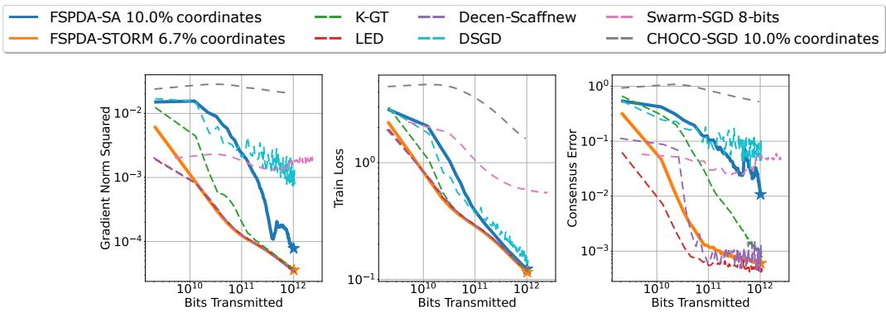
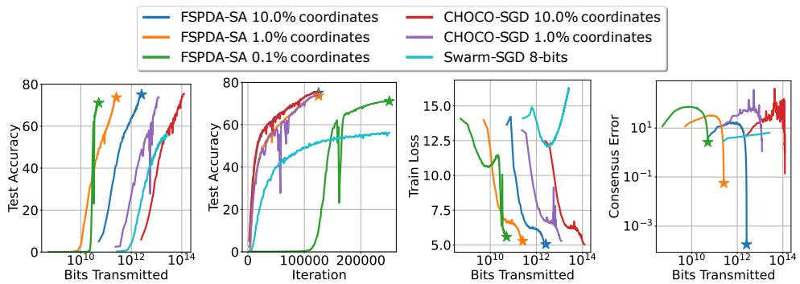

# A Stochastic Approximation Approach for Efficient Decentralized Optimization on Random Networks

Anonymous Author(s)   
Affiliation   
Address   
email

# Abstract

A challenging problem in decentralized optimization is to develop algorithms with fast convergence on random and time varying topologies under unreliable and bandwidth-constrained communication network. This paper studies a stochastic approximation approach with a Fully Stochastic Primal Dual Algorithm (FSPDA) framework. Our framework relies on a novel observation that randomness in time varying topology can be incorporated in a stochastic augmented Lagrangian formulation, whose expected value admits saddle points that coincide with stationary solutions of the decentralized optimization problem. With the FSPDA framework, we develop two new algorithms supporting efficient sparsified communication on random time varying topologies — FSPDA-SA allows agents to execute multiple local gradient steps depending on the time varying topology to accelerate convergence, and FSPDA-STORM further incorporates a variance reduction step to improve sample complexity. For problems with smooth (possibly non-convex) objective function, within $T$ iterations, we show that FSPDA-SA (resp. FSPDA-STORM) finds an $\mathcal { O } ( 1 / \sqrt { T } )$ -stationary (resp. $\mathcal { O } ( 1 / T ^ { 2 / 3 } ) )$ ) solution. Numerical experiments show the benefits of the FSPDA algorithms.

# 17 1 Introduction

Consider $n$ agents that communicate on an undirected and connected graph/network $\mathcal { G } = ( \nu , \mathcal { E } )$ with   
$\mathcal { V } = [ n ] : = \{ 1 , . . . , n \} , \mathcal { E } \subseteq \mathcal { V } \times \mathcal { V }$ . Each agent $i \in [ n ]$ has access to a continuously differentiable   
(possibly non-convex) local objective function $f _ { i } : \mathbb { R } ^ { d }  \mathbb { R }$ and maintains a local decision variable   
$\mathbf { \bar { x } } _ { i } \in \mathbb { R } ^ { \bar { d } }$ . Denote $\mathbf { x } = [ \mathbf { x } _ { 1 } ^ { \top } , . . . , \mathbf { \bar { x } } _ { n } ^ { \top } ] ^ { \top } \in \mathbb { R } ^ { n d }$ . Our aim is to tackle:

$$
\begin{array} { r } { \operatorname* { m i n } _ { \mathbf { x } \in \mathbb { R } ^ { n d } } \frac { 1 } { n } \sum _ { i = 1 } ^ { n } f _ { i } ( \mathbf { x } _ { i } ) \quad \mathrm { s . t . } \quad \mathbf { x } _ { i } = \mathbf { x } _ { j } , \forall ( i , j ) \in \mathcal { E } . } \end{array}
$$

In other words, (1) seeks a 22 $\mathbf { x } ^ { \star } \in \mathbb { R } ^ { d }$ that minimizes $\begin{array} { r } { F ( \mathbf { x } ) : = ( 1 / n ) \sum _ { i = 1 } ^ { n } f _ { i } ( \mathbf { x } ) } \end{array}$ . We are interested 23 in the stochastic optimization setting where each $f _ { i } ( \mathbf { x } _ { i } )$ is given by (with slight abuse of notation)

$$
f _ { i } ( \mathbf { x } _ { i } ) : = \mathbb { E } _ { \xi _ { i } \sim \mathbb { P } _ { i } } [ f _ { i } ( \mathbf { x } _ { i } ; \xi _ { i } ) ]
$$

where $\mathbb { P } _ { i }$ represents the $i$ -th data distribution. Problem (1) is relevant to the distributed learning   
problem especially in the decentralized case where a central server is absent. Prior works [Nedic and   
Ozdaglar, 2009, Lian et al., 2017, Nedic et al., 2017, Qu and Li, 2017] demonstrated that decentralized   
algorithms can tackle (1) efficiently through repeated message exchanges among the neighbors and   
local stochastic gradient updates.   
Towards an efficient decentralized algorithm for (1), an important direction is to consider a time   
varying graph topology setting where the active edge set in $\mathcal { G }$ changes over time. This is a generic   
setting covering cases when the communication links are unreliable, or the agents choose not to   
communicate in a certain round (a.k.a. local updates) [Koloskova et al., 2019a, Nadiradze et al., 2021].   
By assuming that a random topology is drawn at each iteration, the convergence of decentralized   
stochastic gradient (DSGD) has been studied in [Lobel and Ozdaglar, 2010, Nadiradze et al., 2021]   
and is later on unified by [Koloskova et al., 2020] with tighter bounds for local updates, periodic   
sampling, etc. An alternative [Ram et al., 2010] is to analyze DSGD for the $B$ -connectivity setting   
which requires the union of every $B$ consecutive time varying topologies to yield a connected graph.   
Nevertheless, these works focused on vanilla DSGD that may have slow convergence (in transient   
stage) and is limited to bounded data heterogeneity. The prior restrictions can be relaxed using   
advanced algorithms such as gradient tracking [Qu and Li, 2017], EXTRA [Shi et al., 2015] and   
primal-dual framework [Hong et al., 2017, Hajinezhad and Hong, 2019, Yi et al., 2021].   
As noted by [Koloskova et al., 2021], analyzing the convergence of sophisticated algorithms with time   
varying topology, such as gradient tracking [Qu and Li, 2017] is challenging due to the non-symmetric   
product of two (or more) mixing matrices. Existing works considered various restrictions on the   
time varying topology $\mathcal { G } ^ { ( t ) } = ( \bar { \mathcal { V } } , \mathcal { E } ^ { ( t ) } )$ and/or the problem (1): [Koloskova et al., 2021, Liu et al.,   
2024] studied gradient tracking with local updates that essentially takes $\mathcal { E } ^ { ( t ) } = \mathcal { E }$ periodically and   
$\mathcal { E } ^ { ( t ) } = \emptyset$ otherwise, also see [Mishchenko et al., 2022, Guo et al., 2023, Alghunaim, 2024] for a   
similar result and note that such algorithms require extra synchronization overhead; [Kovalev et al.,   
2021, 2024] considered a setting where $\mathcal { G } ^ { ( t ) }$ is connected for any $t$ ; [Nedic et al., 2017, Li and Lin,   
2024] focused on (accelerated) gradient tracking with deterministic gradient when $F ( \mathbf { x } )$ is (strongly)   
convex; [Lorenzo and Scutari, 2016] also considered deterministic gradient with possibly non-convex   
$F ( \mathbf { x } )$ but only provides asymptotic convergence guarantees; [Lei et al., 2018, Yau and Wai, 2023]   
considered asymptotic convergence guarantees in the case of strictly (or strongly) convex $F ( \mathbf { x } )$ . We   
provide a non-exhaustive list summarizing the convergence of existing works in Table 1.

Table 1: Comparison of decentralized algorithms for non-convex optimization. In the table, ‘SG’ is ‘Stochastic Gradient’, ‘TV’ is ‘Time Varying Graph’, $\bullet _ { \mathtt { W } } / \circ$ BH’ is ‘Without Bounded Heterogeneity’, and ‘Rate’ is the expected squared gradient norm $\mathbb { E } [ \| \nabla F ( \bar { \mathbf { x } } ) \| ^ { 2 } ]$ after $T$ iterations. Note that $\sigma ^ { 2 }$ is the variance of stochastic gradient. $\mathrm { ^ { \ddag } C H O C O - S G D }$ incorporates broadcast gossip as a special case of compression. †ProxSkip, Local-GT, LED consider local updates with periodic communication.   

<table><tr><td>Prior Works</td><td>SG</td><td>TV</td><td>W/o BH</td><td>Rate</td></tr><tr><td>Prox-GPDA [Hong et al., 2017]</td><td>X</td><td>X</td><td>√</td><td>Asympt.</td></tr><tr><td>NEXT[Lorenzo and Scutari, 2016]</td><td>X</td><td>√</td><td>√</td><td>Asympt.</td></tr><tr><td>DSGD [Koloskova et al., 2020]</td><td>√</td><td>√</td><td>X</td><td>O(σ/√nT)</td></tr><tr><td>Swarm-SGD [Nadiradze et al., 2021]</td><td></td><td>√</td><td>X</td><td>O(σ²/√T)</td></tr><tr><td>CHOCO-SGD [Koloskova et al., 2019a]</td><td></td><td>x</td><td>×</td><td>0(σ/√nT)</td></tr><tr><td>Decen-Scaffnew [Mishchenko et al., 2022]</td><td></td><td>xt</td><td>√</td><td>0(σ/√nT)</td></tr><tr><td>Local-GT[Liu et al., 2024]</td><td></td><td>xt</td><td>√</td><td>0(σ/√nT)</td></tr><tr><td>LED[Alghunaim, 2024]</td><td></td><td>xt</td><td>√</td><td>0(σ/√nT)</td></tr><tr><td>FSPDA-SA (This Work)</td><td></td><td></td><td>√</td><td>0(σ/√nT)</td></tr><tr><td>FSPDA-STORM(This Work)</td><td></td><td></td><td>√</td><td>0(02/3/T2/3)</td></tr></table>

The above discussion highlights a gap in the existing literature —

Is there any algorithm that achieves fast convergence on time varying (random) topology?

This paper gives an affirmative answer through developing the Fully Stochastic Primal Dual Algorithm   
58 (FSPDA) framework that leads to efficient decentralized algorithms tackling (1) in its general form.   
9 The framework features the design of a new stochastic augmented Lagrangian function.   
As pointed out by [Chang et al., 2020], many decentralized algorithms (including gradient tracking)   
can be interpreted as primal-dual algorithms finding a saddle point of the augmented Lagrangian func  
tion. However, its extension to time varying topology is not straightforward due to the inconsistency   
in dual variables updates. To overcome this challenge, we propose a stochastic equality constrained   
reformulation of (1) to model randomness in topology. Then, the latter yields a stochastic augmented   
Lagrangian function. Applying stochastic approximation (SA) to solve the latter leads to the FSPDA   
framework. Our contributions are   
• We propose two new algorithms: (i) FSPDA-SA is derived by vanilla SA that applies primal-dual   
stochastic gradient descent-ascent on the stochastic augmented Lagrangian, (ii) FSPDA-STORM uses   
an additional control variate / momentum term to reduce the drift term’s variance in a recursive   
manner. Both algorithms are fully stochastic as the random time varying topology is treated as   
a part of randomness. Additionally, our framework supports sparsified communication, i.e., the   
agents can choose to communicate a subset of primal coordinates at each iteration.   
We show that after $T$ iterations, FSPDA-SA (resp. FSPDA-STORM) finds in expectation a solution   
whose squared gradient norm is $\mathcal { O } ( 1 / \sqrt { T } )$ (resp. $\mathcal { O } ( 1 / T ^ { 2 / 3 } ) \rangle$ ). The convergence analysis is derived   
from a new Lyapunov function design that involves an unsigned inner product term and incorporates   
a variance condition on the random time varying topologies. Interestingly, we show empirically   
that using momentum in dual updates benefits the consensus error convergence.   
We also demonstrate that both FSPDA-SA and FSPDA-STORM can be implemented in a fully asyn  
chronous manner, i.e., the agents can communicate and compute at different time slots, and supports   
local update as the algorithms allow for arbitrary time varying topology. That said, we remark that   
81 the convergence rates with local updates of FSPDA-SA and FSPDA-STORM are only suboptimal.   
2 We provide numerical experiments to show that FSPDA-SA and FSPDA-STORM outperform existing   
algorithms in terms of iteration and communication complexity.   
Notations. Let $\mathbf { W } \in \mathbb { R } ^ { d \times d }$ be a symmetric (not necessarily positive semidefinite) matrix, the W  
weighted (semi) inner product of vectors a $, \mathbf { b } \in \mathbb { R } ^ { d }$ is denoted as $\langle \mathbf { a } \mid \mathbf { b } \rangle _ { \mathbf { w } } : = \mathbf { a } ^ { \top } \mathbf { W } \mathbf { b }$ . Similarly,   
the W-weighted (semi) norm is denoted by $\| \mathbf { a } \| _ { \mathbf { W } } ^ { 2 } : = \langle \mathbf { a } \mid \mathbf { a } \rangle _ { \mathbf { W } }$ . The subscript notation is omitted   
for I-weighted inner products. For any square matrix $\mathbf { X }$ , $( \mathbf { X } ) ^ { \dagger }$ denotes its pseudo inverse.

# 2 The Fully Stochastic Primal Dual Algorithm (FSPDA) Framework

This section develops the FSPDA framework for tackling (1) and describes two variants of the   
framework leading to decentralized stochastic optimization of (1). Let $\widetilde { \mathbf { A } } \in \{ - 1 , 0 , 1 \} ^ { | \mathcal { E } | \times n }$ be an   
incidence matrix of $\mathcal { G }$ . By defining $\mathbf { A } = \widetilde { \mathbf { A } } \otimes \mathbf { I } _ { d } \in \{ - 1 , 0 , 1 \} ^ { | \mathcal { E } | d \times n d }$ , we observe that the consensus   
constraint in (1) is equivalent to $\mathbf { A x } = \mathbf { 0 }$ .   
Our first step is to model the randomness in the time varying topology using the random variable   
(r.v.) $\xi _ { a } \sim \mathbb { P } _ { a }$ . For each realization $\xi _ { a }$ , we define the random incidence matrix $\mathbf { A } ( \xi _ { a } ) : = \mathbf { I } ( \xi _ { a } ) \mathbf { A } \in$   
$\{ - 1 , 0 , 1 \} ^ { | \mathcal { E } | d \times n d }$ where $\mathbf { I } ( \xi _ { a } ) \in \{ 0 , 1 \} ^ { | \varepsilon | d \times | \mathcal { E } | d }$ is a binary diagonal matrix. In addition to selecting   
each edge of $\mathcal { G }$ randomly, $\mathbf { I } ( \xi _ { a } )$ selects a random subset of $d$ coordinates. As we will see later, this   
allows our approach to simultaneously achieve random sparsification for communication compression.

Assume that 98 $\mathbb { E } _ { \xi _ { a } \sim \mathbb { P } _ { a } } [ \mathbf { I } ( \xi _ { a } ) ]$ is a positive diagonal matrix, (1) is equivalent to:

$$
\begin{array} { r } { \operatorname* { m i n } _ { { \bf x } \in { \mathbb { R } } ^ { n d } } \frac { 1 } { n } \sum _ { i = 1 } ^ { n } { \mathbb { E } } _ { \xi _ { i } \sim { \mathbb { P } } _ { i } } \left[ f _ { i } ( { \bf x } _ { i } ; \xi _ { i } ) \right] \quad \mathrm { s . t . } \quad { \mathbb { E } } _ { \xi _ { a } \sim { \mathbb { P } } _ { a } } \left[ { \bf A } ( \xi _ { a } ) \right] { \bf x } = { \bf 0 } . } \end{array}
$$

Denote ${ \boldsymbol { \xi } } = ( \xi _ { 1 } , \dots , \xi _ { n } , \xi _ { a } )$ , FSPDA hinges on the following augmented Lagrangian function of (

$$
\begin{array} { r l } & { \mathcal { L } ( \mathbf { x } , \lambda ) : = \mathbb { E } _ { \xi } [ \mathcal { L } ( \mathbf { x } , \lambda ; \xi ) ] } \\ & { \mathrm { w i t h ~ } \mathcal { L } ( \mathbf { x } , \lambda ; \xi ) : = \sum _ { i = 1 } ^ { n } f _ { i } ( \mathbf { x } _ { i } ; \xi _ { i } ) + \tilde { \eta } \left. \lambda \mid \mathbf { A } ( \xi _ { a } ) \mathbf { x } \right. + \frac { \tilde { \gamma } } { 2 } \| \mathbf { A } ( \xi _ { a } ) \mathbf { x } \| ^ { 2 } , } \end{array}
$$

where $\tilde { \eta } > 0 , \tilde { \gamma } > 0$ are penalty parameters. It can be verified that the saddle points of $\mathcal { L } ( \mathbf { x } , \lambda )$   
correspond to the KKT points of (1) [Bertsekas, 2016]. For brevity, in the rest of this paper, we may   
drop the subscript in $\xi$ whenever the notation is clear from the context.

FSPDA is developed from applying stochastic approximation (SA) to seek a saddle point of (4). By recognizing 104 $\mathbf { A } ( \boldsymbol { \dot { \xi } } ) ^ { \top } \mathbf { A } ( \boldsymbol { \xi } ) = \mathbf { \bar { A } } ^ { \top } \mathbf { A } ( \boldsymbol { \xi } )$ , we consider the stochastic gradients:

$$
\nabla _ { \mathbf { x } } \mathcal { L } ( \mathbf { x } , \lambda ; \boldsymbol { \xi } ) : = \nabla \mathbf { f } ( \mathbf { x } ; \boldsymbol { \xi } ) + \tilde { \eta } \mathbf { A } ^ { \top } \lambda + \tilde { \gamma } \mathbf { A } ^ { \top } \mathbf { A } ( \boldsymbol { \xi } ) \mathbf { x } , \nabla _ { \lambda } \mathcal { L } ( \mathbf { x } , \lambda ; \boldsymbol { \xi } ) : = \tilde { \eta } \mathbf { A } ( \boldsymbol { \xi } ) \mathbf { x } ,
$$

where $\nabla \mathbf { f } ( \mathbf { x } ; \boldsymbol { \xi } ) \ = \ [ \nabla f _ { 1 } ( \mathbf { x } _ { 1 } ; \boldsymbol { \xi } _ { 1 } ) ; \ldots ; \nabla f _ { n } ( \mathbf { x } _ { n } ; \boldsymbol { \xi } _ { n } ) ] \ \in \ \mathbb { R } ^ { n d }$ . Notice that to facilitate algorithm   
development, we have taken a deterministic $\mathbf { A }$ for the term in $\nabla _ { \mathbf x } \mathcal L$ related to $\boldsymbol { \lambda }$ . Now observe the ith   
$d$ -dimensional block of $\mathbf { A } ^ { \top } \mathbf { A } ( \xi ) \mathbf { x }$ which can be aggregated within $\mathcal { N } _ { i } ( \boldsymbol { \xi } )$ the neighborhood of the   
ith agent as:

$$
\begin{array} { r } { \left[ \mathbf { A } ^ { \top } \mathbf { A } ( \xi ) \mathbf { x } \right] _ { i } = \sum _ { j \in \mathcal { N } _ { i } ( \xi ) } \mathbf { C } _ { i j } ( \xi ) ( \mathbf { x } _ { j } - \mathbf { x } _ { i } ) , } \end{array}
$$

where 109 $\mathbf { C } _ { i j } ( \xi ) \in \{ 0 , 1 \} ^ { d \times d }$ is diagonal and depends on the selected coordinates for the edge $( i , j )$ 110 under randomness $\xi$ . Eq. (6) only relies on $\mathbf { x } _ { j }$ from neighbor $j$ that is connected on the time varying

topology $\mathcal G ( \xi )$ . For illustration, an example of the above random graph model is given by Figure 3 in   
Appendix A. Importantly, (5) shows that with the stochastic augmented Lagrangian function, the time   
varying topology can be treated implicitly as a part of the randomness in the stochastic primal-dual   
gradients. The framework is thus described as being fully stochastic as in [Bianchi et al., 2021], and   
departs from [Liu et al., 2024, Alghunaim, 2024] that treat the topology as fixed during the derivation   
116 of primal-dual algorithm(s). From (5), (6), we derive two variants of FSPDA.   
17 FSPDA-SA Algorithm. The first variant of FSPDA is derived from a direct application of stochastic   
8 gradient descent-ascent (SGDA) updates. Take $\alpha > 0 , \beta > 0$ as the step sizes, we have

$$
\begin{array} { r } { \mathbf { x } ^ { t + 1 } = \mathbf { x } ^ { t } - \alpha \nabla _ { \mathbf { x } } \mathcal { L } ( \mathbf { x } ^ { t } , \lambda ^ { t } ; \boldsymbol { \xi } ^ { t } ) , \lambda ^ { t + 1 } = \lambda ^ { t } + \beta \nabla _ { \lambda } \mathcal { L } ( \mathbf { x } ^ { t } , \lambda ^ { t } ; \boldsymbol { \xi } ^ { t } ) . } \end{array}
$$

Taking the variable substitution 119 $\widehat { \lambda } : = \mathbf { A } ^ { \top } \lambda$ yields the following recursion:

FSPDA-SA: for any $t \geq 0$ and any $i \in [ n ]$ ,

$$
\begin{array} { r l } & { \mathbf { x } _ { i } ^ { t + 1 } = \mathbf { x } _ { i } ^ { t } - \alpha \nabla f _ { i } ( \mathbf { x } _ { i } ^ { t } ; \boldsymbol { \xi } _ { i } ^ { t } ) - \eta \widehat { \lambda } _ { i } ^ { t } + \gamma \sum _ { j \in { \mathcal { N } } _ { i } ( \boldsymbol { \xi } _ { a } ^ { t } ) } \mathbf { C } _ { i j } ( \boldsymbol { \xi } _ { a } ^ { t } ) ( \mathbf { x } _ { j } ^ { t } - \mathbf { x } _ { i } ^ { t } ) , } \\ & { \widehat { \lambda } _ { i } ^ { t + 1 } = \widehat { \lambda } _ { i } ^ { t } + \beta \sum _ { j \in { \mathcal { N } } _ { i } ( \boldsymbol { \xi } _ { a } ^ { t } ) } \mathbf { C } _ { i j } ( \boldsymbol { \xi } _ { a } ^ { t } ) ( \mathbf { x } _ { j } ^ { t } - \mathbf { x } _ { i } ^ { t } ) . } \end{array}
$$

Note that 21 $\mathbf { x } ^ { 0 } , \widehat { \lambda } ^ { 0 }$ can be initialized arbitrarily.

FSPDA-STORM Algorithm. The second variant of FSPDA reduces the variance of the stochastic   
gradient term in (5) using the recursive momentum variance reduction technique [Cutkosky and   
Orabona, 2019]. Herein, the key idea is to utilize a control variate in estimating the (primal-dual)   
gradients of $\mathcal { L } ( \mathbf { x } , \lambda )$ . Take $\alpha , \beta > 0$ and $a _ { x } , a _ { \lambda } \in [ 0 , 1 ]$ as the momentum parameters, we have   
$\mathbf { x } ^ { t + 1 } = \mathbf { x } ^ { t } - \alpha \mathbf { m } _ { x } ^ { t } , \lambda ^ { t + 1 } = \lambda ^ { t } + \beta \mathbf { m } _ { \lambda } ^ { t }$ as the primal-dual updates, and

$$
\begin{array} { r l } & { \mathbf { m } _ { x } ^ { t + 1 } = \nabla _ { \mathbf { x } } \mathcal { L } ( \mathbf { x } ^ { t + 1 } , \boldsymbol { \lambda } ^ { t + 1 } ; \boldsymbol { \xi } ^ { t + 1 } ) + ( 1 - a _ { x } ) ( \mathbf { m } _ { x } ^ { t } - \nabla _ { \mathbf { x } } \mathcal { L } ( \mathbf { x } ^ { t } , \boldsymbol { \lambda } ^ { t } ; \boldsymbol { \xi } ^ { t + 1 } ) ) , } \\ & { \mathbf { m } _ { \lambda } ^ { t + 1 } = \nabla _ { \lambda } \mathcal { L } ( \mathbf { x } ^ { t + 1 } , \boldsymbol { \lambda } ^ { t + 1 } ; \boldsymbol { \xi } ^ { t + 1 } ) + ( 1 - a _ { \lambda } ) ( \mathbf { m } _ { \lambda } ^ { t } - \nabla _ { \lambda } \mathcal { L } ( \mathbf { x } ^ { t } , \boldsymbol { \lambda } ^ { t } ; \boldsymbol { \xi } ^ { t + 1 } ) ) . } \end{array}
$$

The aim of $\mathbf { m } _ { r } ^ { t + 1 }$ is to estimate $\nabla _ { \mathbf x } \mathcal L ( \mathbf x ^ { t + 1 } , \lambda ^ { t + 1 } )$ . Now, instead of the straightforward estimator   
$\nabla _ { \mathbf x } \mathcal L ( \mathbf x ^ { t + 1 } , \lambda ^ { t + 1 } ; \xi ^ { t + 1 } )$ , we include an extra zero-mean term $\mathbf { m } _ { x } ^ { t } - \nabla _ { \mathbf { x } } \mathcal { L } ( \mathbf { x } ^ { \tilde { t } } , \lambda ^ { t } ; \xi ^ { t + 1 } )$ to reduce   
the variance of the stochastic gradient estimation. The latter is a control variate that is computed   
recursively. Particularly, it has been shown in [Cutkosky and Orabona, 2019] that it can effectively   
reduce variance with a carefully designed parameter $a _ { x }$ , provided that the stochastic gradient map   
satisfies a mean-square Lipschitz condition. We summarize the algorithm as follows.

FSPDA-STORM: for any $t \geq 0$ and any $i \in [ n ]$ ,

$$
\begin{array} { r l } & { \mathbf { x } _ { i } ^ { t + 1 } = \mathbf { x } _ { i } ^ { t } - \alpha \mathbf { m } _ { x , i } ^ { t } , } \\ & { \widehat { \lambda } _ { i } ^ { t + 1 } = \widehat { \lambda } _ { i } ^ { t } + \beta \mathbf { m } _ { \lambda , i } ^ { t } , } \\ & { \mathbf { m } _ { x , i } ^ { t + 1 } = \left( 1 - a _ { x } \right) \left[ \mathbf { m } _ { x , i } ^ { t } + \nabla f _ { i } ( \mathbf { x } _ { i } ^ { t } ; \xi _ { i } ^ { t + 1 } ) - \eta \widehat { \lambda } _ { i } ^ { t } + \gamma \sum _ { j \in { \cal N } _ { i } ( \xi _ { a } ^ { t + 1 } ) } \mathbf { C } _ { i j } ( \xi _ { a } ^ { t + 1 } ) ( \mathbf { x } _ { j } ^ { t } - \mathbf { x } _ { i } ^ { t } ) \right] } \\ & { \quad \quad \quad + \nabla f _ { i } ( \mathbf { x } _ { i } ^ { t + 1 } ; \xi _ { i } ^ { t + 1 } ) - \eta \widehat { \lambda } _ { i } ^ { t + 1 } + \gamma \sum _ { j \in { \cal N } _ { i } ( \xi _ { a } ^ { t + 1 } ) } \mathbf { C } _ { i j } ( \xi _ { a } ^ { t + 1 } ) ( \mathbf { x } _ { j } ^ { t + 1 } - \mathbf { x } _ { i } ^ { t + 1 } ) } \\ & { \mathbf { m } _ { \lambda , i } ^ { t + 1 } = ( 1 - a _ { \lambda } ) \left[ \mathbf { m } _ { \lambda , i } ^ { t } + \sum _ { j \in { \cal N } _ { i } ( \xi _ { a } ^ { t + 1 } ) } \mathbf { C } _ { i j } ( \xi _ { a } ^ { t + 1 } ) ( \mathbf { x } _ { j } ^ { t } - \mathbf { x } _ { i } ^ { t } ) \right] } \\ & { \quad \quad \quad + \sum _ { j \in { \cal N } _ { i } ( \xi _ { a } ^ { t + 1 } ) } \mathbf { C } _ { i j } ( \xi _ { a } ^ { t + 1 } ) ( \mathbf { x } _ { j } ^ { t + 1 } - \mathbf { x } _ { i } ^ { t + 1 } ) } \end{array}
$$

Note that to achieve the theoretical performance (see later in Sec. 3), 134 $\mathbf { x } ^ { 0 } , \widehat { \lambda } ^ { 0 } , \mathbf { m } _ { x } ^ { 0 } , \mathbf { m } _ { \lambda } ^ { 0 }$ shall be 135 initialized as ${ \bf x } _ { i } ^ { 0 } = \bar { \bf x } ^ { 0 }$ , $\widehat { \bf \sf { A } } _ { i } ^ { 0 } = ( \alpha / \eta ) n ^ { - 1 } ( \nabla F ( \bar { \bf { x } } ^ { 0 } ) - \nabla f _ { i } ( \bar { \bf { x } } ^ { 0 } ) )$ , $\mathbf { m } _ { x , i } ^ { 0 } ~ = ~ \nabla F ( \bar { \mathbf { x } } ^ { 0 } )$ , $\mathbf { m } _ { \lambda , i } ^ { 0 } = \mathbf { 0 }$ 136 according to (23). We remark that a simple initialization choice $\widehat { \mathbf { \lambda } } ^ { 0 } = \mathbf { m } _ { x , i } ^ { 0 } = \mathbf { m } _ { \lambda , i } ^ { 0 } = \mathbf { 0 }$ works well 137 in practice.

Both FSPDA-SA and FSPDA-STORM are decentralized algorithms that can be implemented on random   
time varying topology, and support randomized sparisification for further communication compres  
sion. The key is to observe that in (8), (10), the only information required for agent $i$ is to obtain   
$\begin{array} { r } { \sum _ { j \in \mathcal { N } _ { i } ( \xi _ { a } ^ { t } ) } \mathbf { C } _ { i j } ( \xi _ { a } ^ { t } ) ( \mathbf { x } _ { j } ^ { t } - \mathbf { x } _ { i } ^ { t } ) } \end{array}$ , and in addition $\begin{array} { r } { \sum _ { j \in \mathcal { N } _ { i } ( \xi _ { a } ^ { t } ) } \mathbf { C } _ { i j } ( \xi _ { a } ^ { t } ) ( \mathbf { x } _ { j } ^ { t - 1 } - \mathbf { x } _ { i } ^ { t - 1 } ) } \end{array}$ for FSPDA-STORM,   
142 at iteration $t$ .

44 We discuss several features of the FSPDA algorithms and their connections to existing works.

Local $\pmb { \& }$ Asynchronous Updates. The local update scheme where each agent $i$ is allowed to update its own local variables $\mathbf { x } _ { i } , \lambda _ { i }$ for multiple iterations without a communication step is a common practice in decentralized optimization [Liu et al., 2024, Li and Lin, 2024, Alghunaim, 2024, Mishchenko et al., 2022]. As discussed before, such scheme can be seen as a special case of the FSPDA framework where the time varying topology $\mathcal { E } ^ { ( t ) }$ is chosen such that the latter alternates between $\mathcal { E } ^ { ( t ) } = \mathcal { E }$ and $\mathcal { E } ^ { ( t ) } = \emptyset$ .

Furthermore, FSPDA-SA allows for the general case of asynchronous updates. This is done so   
by taking the stochastic gradient as $\nabla f _ { i } ( { \bf x } _ { i } ^ { t } ; \xi ^ { t } ) = b _ { i } ( \xi ^ { t } ) \bar { b } _ { i } \nabla f _ { i } ( { \bf x } _ { i } ^ { t } ; \xi ^ { t } )$ such that $b _ { i } ( \xi ^ { t } ) \in \{ 0 , 1 \}$   
with $\mathbb { E } [ b _ { i } ( \xi ^ { t } ) ] = 1 / \bar { b } _ { i }$ for some constant $\bar { b } _ { i } > 0$ . Detailed discussions for a fully asynchronous   
implementation of FSPDA-SA can be found in Appendix A.   
Connection to Existing Works. Evaluating $\mathbf { x } ^ { t + 2 } - \mathbf { x } ^ { t + 1 }$ from the FSPDA-SA sequence and observe   
that the combination of (8a) and (8b) is equivalent to the second order recursion:

$$
\begin{array} { r l } & { \mathbf { x } ^ { t + 2 } = 2 \left( \mathbf { I } - \frac { \gamma } { 2 } \mathbf { A } ^ { \top } \mathbf { A } ( \xi ^ { t + 1 } ) \right) \mathbf { x } ^ { t + 1 } - \left( \mathbf { I } - ( \gamma - \eta \beta ) \mathbf { A } ^ { \top } \mathbf { A } ( \xi ^ { t } ) \right) \mathbf { x } ^ { t } } \\ & { \quad \quad \quad - \alpha \left( \nabla \mathbf { f } ( \mathbf { x } ^ { t + 1 } ; \xi ^ { t + 1 } ) - \nabla \mathbf { f } ( \mathbf { x } ^ { t } ; \xi ^ { t } ) \right) . } \end{array}
$$

This reduces the FSPDA-SA recursion into a primal-only sequence by eliminating the dual sequence $\lambda ^ { t }$ .   
In the deterministic optimization setting when $\mathbf { A } ( { \boldsymbol { \xi } } ) \equiv \mathbf { A }$ and $\nabla \mathbf { f } \left( \mathbf { x } ; \boldsymbol { \xi } \right) \equiv \nabla \mathbf { f } \left( \mathbf { x } \right)$ , (11) is equivalent   
to the EXTRA algorithm [Shi et al., 2015] using the mixing matrix $\mathbf { W } = \mathbf { I } - \gamma \mathrm { D i a g } ( \tilde { \mathbf { W } } \mathbf { 1 } ) + \gamma \tilde { \mathbf { W } }$   
where $\tilde { \mathbf { W } }$ is the 0-1 adjacency matrix of $\mathcal { G }$ . Here, with an appropriate choice of $\gamma$ , W will be doubly   
stochastic and satisfies the convergence requirement in [Shi et al., 2015]. Similar observations have   
been made in [Nedic et al., 2017] for the gradient tracking and DIGing algorithms.   
On the other hand, for stochastic optimization on random networks, (11) suggests each agent to keep   
the current and previous iterates received from neighbors in the corresponding time varying topology.   
165 In this case, (11) yields an extension of the EXTRA/GT algorithms to time varying topology.

# 3 Convergence Analysis of FSPDA

This section presents the convergence rate analysis of FSPDA for (1). Unless otherwise specified, we focus on the case with smooth but possibly non-convex objective function. Specifically, we consider:

Assumption 3.1. Each 69 $f _ { i }$ is $L$ -smooth, i.e., for $i = 1 , \ldots , n$ ,

$$
\begin{array} { r } { \| \nabla f _ { i } ( \mathbf { x } ) - \nabla f _ { i } ( \mathbf { y } ) \| \leq L \| \mathbf { x } - \mathbf { y } \| \forall \mathbf { x } , \mathbf { y } \in \mathbb { R } ^ { d } . } \end{array}
$$

There exists 170 $f _ { \star } > - \infty$ such that $f _ { i } ( \mathbf { x } ) \geq f _ { \star }$ for any $\mathbf { x } \in \mathbb { R } ^ { d }$ .

71 Note this implies that the global objective function $F ( \cdot )$ is $L$ -smooth but possibly non-convex.

We further assume that the random network $\mathcal { G } ( \xi _ { a } )$ is connected in expectation, yet each realization   
$\mathcal { G } ( \xi _ { a } )$ may not be connected. Let $\mathbf { R } = \mathbb { E } \left[ \mathbf { I } ( \xi _ { a } ) \right]$ , this leads to the following property concerning   
the expected graph Laplacian matrix $\mathbf { A } ^ { \top } \mathbf { \bar { R } A } = \mathbb { E } \left[ \mathbf { A } ( \xi _ { a } ) ^ { \top } \mathbf { A } \right]$ . Defining the matrix $\mathbf { K } : = ( \mathbf { I } _ { n } -$   
$\mathbf { 1 1 } ^ { \top } / n ) \otimes \mathbf { I } _ { d }$ , we have

Assumption 3.2. There exists $\rho _ { \mathrm { m a x } } \geq \rho _ { \mathrm { m i n } } > 0$ and $\bar { \rho } _ { \mathrm { m a x } } \geq \bar { \rho } _ { \mathrm { m i n } } > 0$ such that

$$
\rho _ { \mathrm { m i n } } \mathbf { K } \preceq \mathbf { A } ^ { \top } \mathbf { R } \mathbf { A } \preceq \rho _ { \mathrm { m a x } } \mathbf { K } \quad a n d \quad \bar { \rho } _ { \mathrm { m i n } } \mathbf { K } \preceq \mathbf { A } ^ { \top } \mathbf { A } \preceq \bar { \rho } _ { \mathrm { m a x } } \mathbf { K } .
$$

It holds that $\mathbf { A } ^ { \top } \mathbf { R A K } = \mathbf { A } ^ { \top } \mathbf { R A } = \mathbf { K A } ^ { \top } \mathbf { R A }$ . The above assumption can be satisfied if $\mathcal { G }$ is 178 connected [Yi et al., 2021], [Yi et al., 2018, Lemma 2] and $\mathrm { d i a g } ( \mathbf { R } ) > \mathbf { 0 }$ such that each edge is selected with a positive probability. As an important consequence, if 179 $\dot { \gamma } \le \rho _ { \mathrm { m i n } } / \rho _ { \mathrm { m a x } } ^ { 2 }$ , we have

$$
\begin{array} { r } { \| ( \mathbf { I } - \gamma \mathbf { A } ^ { \top } \mathbf { R } \mathbf { A } ) \mathbf { x } \| _ { \mathbf { K } } ^ { 2 } \leq ( 1 - \gamma \rho _ { \operatorname* { m i n } } ) \| \mathbf { x } \| _ { \mathbf { K } } ^ { 2 } , \forall \mathbf { x } \in \mathbb { R } ^ { n d } . } \end{array}
$$

We thus observe that the operator $( \mathbf { I } - \gamma \mathbf { A } ^ { \top } \mathbf { R } \mathbf { A } )$ serves a similar purpose as the mixing matrix   
in a average consensus algorithms and $\rho _ { \mathrm { m i n } }$ can be interpreted as the spectral radius of $\mathcal { G }$ similar

to [Koloskova et al., 2020, Eq. (12)]. Moreover, if we define182 $\mathbf { Q } : = ( \mathbf { A } ^ { \top } \mathbf { R } \mathbf { A } ) ^ { \dagger }$ such that it holds 83 $\mathbf { Q } \mathbf { A } ^ { \top } \mathbf { R } \mathbf { A } = \mathbf { A } ^ { \top } \mathbf { R } \mathbf { A } \mathbf { Q } = \mathbf { K }$ , Assumption 3.2 implies that $\rho _ { \mathrm { m a x } } ^ { - 1 } \mathbf { K } \preceq \mathbf { Q } \preceq \rho _ { \mathrm { m i n } } ^ { - 1 } \mathbf { K }$ .

Next we consider several assumptions on the noise variance of the random quantities in FSPDA:

Assumption 3.3. For any fixed 185 $\mathbf { x } _ { i } \in \mathbb { R } ^ { d }$ , $i \in [ n ]$ , there exists $\sigma _ { i } \geq 0$ such that

$$
\begin{array} { r } { \mathbb { E } _ { \xi _ { i } \sim \mathbb { P } _ { i } } [ \| \nabla f _ { i } ( \mathbf { x } _ { i } ; \xi _ { i } ) - \nabla f _ { i } ( \mathbf { x } _ { i } ) \| ^ { 2 } ] \le \sigma _ { i } ^ { 2 } . } \end{array}
$$

To simplify notations, we define 186 ${ \bar { \sigma } } ^ { 2 } : = ( 1 / n ) \sum _ { i = 1 } ^ { n } \sigma _ { i } ^ { 2 }$ .

Assumption 3.4. For any fixed 187 $\mathbf { x } \in \mathbb { R } ^ { n d }$ , there exists $\sigma _ { A } \geq 0$ such that

$$
\begin{array} { r } { \mathbb { E } _ { \xi _ { a } \sim \mathbb { P } _ { a } } [ \| \mathbf { A } ( \xi _ { a } ) ^ { \top } \mathbf { A } \mathbf { x } - \mathbf { A } ^ { \top } \mathbf { R } \mathbf { A } \mathbf { x } \| ^ { 2 } ] \leq \sigma _ { A } ^ { 2 } \| \mathbf { x } \| _ { \mathbf { K } } ^ { 2 } . } \end{array}
$$

Assumption 3.3 is standard. Meanwhile for Assumption 3.4, the variance term $\sigma _ { A } ^ { 2 }$ measures the   
quality of the random topology $\mathcal { G } ( \xi _ { a } )$ in approximating the expected graph Laplacian $\mathbf { A } ^ { \top } \mathbf { R } \mathbf { A }$ . The   
latter is important as it contributes to the variance in the drift term of FSPDA. Observe that $\sigma _ { A } ^ { 2 }$   
decreases with the proportion of edges selected in each random subgraph $\mathcal { G } ( \xi _ { a } )$ .

To facilitate our discussions, we define the following quanitites:

$$
\begin{array} { r } { \bar { \mathbf { x } } ^ { t } : = \frac { 1 } { n } \sum _ { i = 1 } ^ { n } \mathbf { x } _ { i } ^ { t } , \quad \sum _ { i = 1 } ^ { n } \| \mathbf { x } _ { i } ^ { t } - \bar { \mathbf { x } } ^ { t } \| ^ { 2 } = \| \mathbf { x } ^ { t } \| _ { \mathbf { K } } ^ { 2 } . } \end{array}
$$

Convergence of FSPDA-SA. We summarize the convergence rate for FSPDA-SA as follows. The proof   
can be found in Appendix C:

Theorem 3.5. Under Assumptions 3.1, 3.2, 3.3, 3.4. Suppose that the step sizes satisfy the conditions defined in (46). Then, for any $T \geq 1$ with the random stopping iteration $\top \sim$ $\mathrm { U n i f } \{ 0 , . . . , T - 1 \}$ , the iterates generated by FSPDA-SA satisfy

$$
\begin{array} { r l } & { \quad \quad \mathbb { E } \left[ \| \nabla F ( \bar { \mathbf { x } } ^ { \mathsf { T } } ) \| ^ { 2 } \right] \leq \frac { F _ { 0 } - f _ { \star } } { \alpha T / 8 } + 8 \alpha \mathbb { C } _ { \sigma } \frac { \bar { \sigma } ^ { 2 } } { n } , } \\ & { \quad \quad \quad \quad \mathbb { E } \left[ \sum _ { i = 1 } ^ { n } \| \mathbf { x } _ { i } ^ { \mathsf { T } } - \bar { \mathbf { x } } ^ { \mathsf { T } } \| ^ { 2 } \right] \leq \frac { F _ { 0 } - f _ { \star } } { \mathsf { a } \gamma \rho _ { \operatorname* { m i n } } T / 8 } + \frac { 8 \alpha ^ { 2 } \mathbb { C } _ { \sigma } \bar { \sigma } ^ { 2 } } { \mathsf { a } \gamma \rho _ { \operatorname* { m i n } } n } , } \end{array}
$$

for any $\mathsf { a } > 0$ , where $F _ { 0 }$ , $\mathbb { C } _ { \sigma }$ are defined in (44), (50).

Setting 196 $\mathsf { a } = \mathcal { O } ( n / \sqrt { T \bar { \sigma } ^ { 2 } } )$ , $\alpha = \sqrt { n / ( T \bar { \sigma } ^ { 2 } ) }$ (and assuming $\bar { \sigma } > 0$ ), we have

$$
\mathbb { E } \left[ \lVert \nabla F ( \bar { \mathbf { x } } ^ { \mathsf { T } } ) \rVert ^ { 2 } \right] = \mathcal { O } \left( \bar { \sigma } / \sqrt { n T } \right) ,
$$

which is the same asymptotic convergence rate as a centralized SGD algorithm that takes $n$ stochastic   
$\mathsf { a } = 1$ ent samples uniformly from each agent, i., the consensus error converges as a rate of $\mathbb { E }$ $\begin{array} { r } { \left[ \sum _ { i = 1 } ^ { n } \| \mathbf { \dot { x } } _ { i } ^ { \top } - \mathbf { \dot { x } } ^ { \top } \| ^ { 2 } \right] = \mathcal { O } ( \dot { n } ^ { 2 } \sigma _ { A } ^ { 2 } \rho _ { \operatorname* { m a x } } / ( T \rho _ { \operatorname* { m i n } } ^ { 2 } ) ) } \end{array}$   
under the same step size choice used in (19). Notice that for $T \gg 1$ , the effect of random topology   
only degrades the convergence of consensus error, keeping the transient rate in (19) unaffected. If   
the gradients are deterministic $\bar { \sigma } = 0 ,$ ), setting √ $\mathbf { a } = ( L ^ { 2 } \eta _ { \infty } \rho _ { \mathrm { m i n } } ) ^ { 1 / 3 }$ , $\alpha = \alpha _ { \infty }$ will yield a better   
convergence rate as $\mathbb { E } \left[ \lVert \nabla F ( \bar { \mathbf { x } } ^ { \mathsf { T } } ) \rVert ^ { 2 } \right] = \mathcal { O } ( \sigma _ { A } ^ { 4 } \sqrt { n } / T )$ . Without a transient phase, the error due to   
random graph and coordinate sparsification is persistent through $\sigma _ { A } ^ { 4 }$ in the above convergence rate.

We further show that the convergence of FSPDA-SA can be accelerated if the objective function of (1) satisfies the Polyak-Lojasiewicz (PL) condition:

Assumption 3.6. There exists a constant $\mu > 0$ such that $2 \mu ( F ( \mathbf { x } ) - f _ { \star } ) \leq \| \nabla F ( \mathbf { x } ) \| ^ { 2 } , \forall \mathbf { x } \in \mathbb { R } ^ { d }$

Assumption 3.6 includes strongly convex functions as a special case, but also includes other non  
convex functions; see [Karimi et al., 2016]. We observe:

Corollary 3.7. Suppose the assumptions and step size conditions in Theorem 3.5 hold. Furthermore, with Assumption 3.6, there exists $\delta \in ( 0 , 1 )$ such that for any $t \geq 0$ ,

$$
\mathbb { E } _ { t } [ F _ { t + 1 } - f _ { \star } ] \le ( 1 - \delta ) ( F _ { t } - f _ { \star } ) + \mathbb { C } _ { \sigma } \alpha ^ { 2 } \bar { \sigma } ^ { 2 } / n
$$

for $F _ { t } , \mathbb { C } _ { \sigma }$ defined in (44), (70), and $\delta = \operatorname* { m i n } \{ \alpha \mu / 4 , \gamma \rho _ { \mathrm { m i n } } / 1 6 , \eta \beta / ( 3 \rho _ { \mathrm { m i n } } ) , \eta / 1 2 \} .$

The proof can be found in Appendix C.6. By setting $\alpha = c \ln ( T ) / ( n ^ { 2 } T )$ in (20), with a carefully   
chosen $c$ and a sufficiently large $T$ such that $\alpha \leq \alpha _ { \infty }$ , we can ensure that

$$
\mathbb { E } \left[ F ( \bar { \mathbf { x } } ^ { T } ) - f _ { \star } + \| \mathbf { x } ^ { T } \| _ { \mathbf { K } } ^ { 2 } \right] = \mathcal { O } \left( \bar { \sigma } ^ { 2 } \ln ( T ) / ( \mu n T ) \right)
$$

In the case of deterministic gradient, i.e., $\bar { \sigma } ^ { 2 } \ : = \ : 0$ , by setting $\alpha = \alpha _ { \infty }$ , (20) ensures a linear   
convergence rate of $\mathbb { E } \left[ F ( \bar { \mathbf { x } } ^ { T } ) ^ { - } - f _ { \star } + \| \mathbf { x } ^ { T } \| _ { \mathbf { K } } ^ { 2 } \right] = \mathcal { O } ( ( 1 ^ { - } \delta ) ^ { T } )$ , which shows that the performance   
of FSPDA-SA is on par with [Nedic et al., 2017, Xu et al., 2017], despite it only requires one round of   
216 (sparsified) transmission per iteration.   
7 Convergence of FSPDA-STORM. To exploit the benefits of control variates, we need an additional   
assumption on the stochastic gradient map:

Assumption 3.8. Each stochastic function $f _ { i } ( \cdot ; \xi )$ is $L _ { s }$ -smooth in expectation, i.e., for $i = 1 , \ldots , n$

$$
\begin{array} { r } { \mathbb { E } _ { \xi } \left[ \| \nabla f _ { i } ( \mathbf { x } ; \boldsymbol { \xi } ) - \nabla f _ { i } ( \mathbf { y } ; \boldsymbol { \xi } ) \| ^ { 2 } \right] \leq L _ { s } ^ { 2 } \| \mathbf { x } - \mathbf { y } \| ^ { 2 } \forall \mathbf { x } , \mathbf { y } \in \mathbb { R } ^ { d } . } \end{array}
$$

The above assumption is also known as the mean-square smoothness condition, see [Cutkosky   
and Orabona, 2019], which is strictly stronger than Assumption 3.1. We observe the following   
convergence guarantee for FSPDA-STORM, whose proof can be found in Appendix D.

Theorem 3.9. Under Assumptions 3.1, 3.2, 3.3, 3.4, 3.8. Suppose that the step sizes satisfy the conditions in (184) - (214). Then, for any $T \geq 1$ with the random stopping iteration $\mathsf { T } \sim \mathrm { U n i f } \{ 0 , . . . , T - 1 \}$ , the iterates generated by FSPDA-STORM satisfy

$$
\begin{array} { r l } { \displaystyle \mathbb { E } \left[ \| \nabla F ( \bar { \mathbf { x } } ^ { \mathsf { T } } ) \| ^ { 2 } \right] \leq \frac { F _ { 0 } - f _ { \star } } { T \alpha / 4 } + \frac { \big ( \mathbf { e } \boldsymbol { \cdot } 2 a _ { x } ^ { 2 } + \mathbf { f } \boldsymbol { \cdot } 4 a _ { x } ^ { 2 } n \big ) \bar { \sigma } ^ { 2 } } { \alpha / 4 } , } & { } \\ { \displaystyle \mathbb { E } \left[ \sum _ { i = 1 } ^ { n } \| \mathbf { x } _ { i } ^ { \mathsf { T } } - \bar { \mathbf { x } } ^ { \mathsf { T } } \| ^ { 2 } \right] \leq \frac { F _ { 0 } - f _ { \star } } { T \mathbf { a } \gamma \rho _ { \operatorname* { m i n } } / 8 } + \frac { \big ( \mathbf { e } \boldsymbol { \cdot } 2 a _ { x } ^ { 2 } + \mathbf { f } \boldsymbol { \cdot } 4 a _ { x } ^ { 2 } n \big ) \bar { \sigma } ^ { 2 } } { \mathbf { a } \gamma \rho _ { \operatorname* { m i n } } / 8 } , } \end{array}
$$

where the constants $F _ { 0 } , \mathsf { a } , \mathsf { e } ,$ f are defined in (110).

Setting $\alpha ~ = ~ \mathcal { O } ( \bar { \sigma } ^ { - 2 / 3 } T ^ { - 1 / 3 } )$ , $\eta ~ = ~ { \mathcal { O } } ( n )$ , $\gamma ~ = ~ \mathcal { O } ( T ^ { - 1 / 3 } )$ , $\beta ~ = ~ \mathcal { O } ( n ^ { - 1 } T ^ { - 2 / 3 } ) .$ , $\begin{array} { r l } { a _ { x } } & { { } = } \end{array}$ $\mathcal { O } ( { \bar { \sigma } } ^ { - 4 / 3 } T ^ { - 2 / 3 } )$ , $a _ { \lambda } ~ = ~ \mathcal { O } ( T ^ { - 1 / 3 } )$ , $\textbf { f } = \ O ( n ^ { - 1 } T ^ { 1 / 3 } )$ (see (111) - (117)), and initializing the algorithm such that $\| { \bf v } ^ { 0 } \| _ { \bf K } ^ { 2 } \ = \ { \cal O } ( T ^ { - 2 / 3 } ) , \ \| { \bf \overline { { { m } } } } _ { x } ^ { 0 } \ - \ ( 1 / n ) { \bf 1 } _ { \otimes } ^ { \top } \nabla { \bf f } ( { \bf x } ^ { 0 } ) \| ^ { 2 } \ = \ { \cal O } ( T ^ { - 1 / 3 } )$ and $\| \mathbf { m } _ { x } ^ { 0 } - \nabla _ { \mathbf { x } } \mathcal { L } ( \mathbf { x } ^ { 0 } , \pmb { \lambda } ^ { 0 } ) \| ^ { 2 } = \mathcal { O } ( T ^ { - 1 / 3 } )$ , we have

$$
\begin{array} { r } { \mathbb { E } \left[ \| \nabla F ( \bar { \mathbf x } ^ { \mathsf { T } } ) \| ^ { 2 } \right] = \mathcal { O } \big ( \bar { \sigma } ^ { 2 / 3 } / T ^ { 2 / 3 } \big ) . } \end{array}
$$

In regard to the order of $\bar { \sigma }$ and $T$ , provided that $n$ is small, the convergence rate of FSPDA-STORM matches the lower bound [Arjevani et al., 2023] for non-convex functions under the same smoothness assumption. Moreover, by the same choice of step sizes, the consensus error converges at the rate of $\begin{array} { r } { \mathbb { E } \left[ \sum _ { i = 1 } ^ { \bar { n } } \| \mathbf { x } _ { i } ^ { \top } - \bar { \mathbf { x } } ^ { \top } \| ^ { 2 } \right] \stackrel { } { = } \mathcal { O } ( \bar { \sigma } ^ { 2 / 3 } n \rho _ { \operatorname* { m i n } } ^ { - 1 } T ^ { - 2 / 3 } ) } \end{array}$ . We remark that in (25), the rate remains constant aslinear speedup $n$   
for FSPDA-SA. Nevertheless, as $T \gg 1$ , the rate of FSPDA-STORM will surpass that of FSPDA-SA and other decentralized algorithms on time varying topologies.

Lastly, we provide detailed discussions on the convergence rates above, e.g., transient time, effects of random topology, etc., in Appendix B.

# 3.1 Insight from Analysis: Fixed Point Iteration of FSPDA-SA

From (8a), the following recursive relationship holds for $\bar { \mathbf { x } } ^ { t }$ : using the relation $\mathbf { 1 } ^ { \top } \mathbf { A } ^ { \top } = \mathbf { 0 }$ , we have

$$
\begin{array} { r } { \bar { { \mathbf { x } } } ^ { t + 1 } = \bar { { \mathbf { x } } } ^ { t } - \frac { \alpha } { n } \sum _ { i = 1 } ^ { n } { \nabla { f _ { i } } } ( { \mathbf { x } } _ { i } ^ { t } ; { \xi _ { i } ^ { t } } ) . } \end{array}
$$

This shows that the evolution of $\{ \bar { \mathbf { x } } ^ { t } \} _ { t \geq 0 }$ is similar to that of ‘centralized’ SGD applied on (1) except that the local gradients are evaluated on the local iterates. However, it is still not straightforward to 241 analyze the convergence of FSPDA-SA as the update of $\mathbf { x } ^ { t }$ involves the dual variable $\lambda ^ { t }$ which lacks 242 an intuitive interpretation for constructing the right Lyapunov function.

To this end, we study the fixed point(s) of (8) to gain insights. Suppose that for some $t _ { \star }$ , the fixed   
point conditions $\mathbb { E } [ \lambda ^ { t _ { \star } + 1 } \mid \xi ^ { : t _ { \star } } ] = \lambda ^ { t _ { \star } } , \mathbb { E } [ { \mathbf { x } ^ { t _ { \star } + 1 } } \mid \xi ^ { : t _ { \star } } ] = { \mathbf { \bar { x } } ^ { t _ { \star } } }$ hold. Since $\mathbf { R }$ is a diagonal matrix   
with positive diagonal elements, we observe

$$
\mathbb { E } [ \mathbf { \boldsymbol { \lambda } } ^ { t _ { \star } + 1 } \mid \xi ^ { : t _ { \star } } ] = \mathbf { \boldsymbol { \lambda } } ^ { t _ { \star } } \Longleftrightarrow \mathbf { \boldsymbol { R } } \mathbf { \boldsymbol { A } } \mathbf { \boldsymbol { x } } ^ { t _ { \star } } = \mathbf { 0 } \Longleftrightarrow \mathbf { \boldsymbol { A } } \mathbf { \boldsymbol { x } } ^ { t _ { \star } } = \mathbf { 0 } ,
$$

$$
\mathbb { E } [ \mathbf { x } ^ { t _ { \star } + 1 } \mid \xi ^ { : t _ { \star } } ] = \mathbf { x } ^ { t _ { \star } } - \alpha \nabla \mathbf { f } ( \mathbf { x } ^ { t _ { \star } } ) - \eta \mathbf { A } ^ { \top } \lambda ^ { t _ { \star } } .
$$

Since $\mathbf { x } _ { 1 } ^ { t _ { \star } } = \mathbf { x } _ { 2 } ^ { t _ { \star } } = \cdot \cdot \cdot = \mathbf { x } _ { n } ^ { t _ { \star } }$ at the fixed point (due to (27)), by the consensus condition across two   
time steps, it implies

$$
\begin{array} { r l } & { \mathbb { E } [ { \mathbf { x } } ^ { t _ { \star } + 1 } \mid \xi ^ { : t _ { \star } } ] - { \mathbf { x } } ^ { t _ { \star } } = ( \mathbf { 1 } \otimes \mathbf { I } _ { d } ) ( \bar { \mathbf { x } } ^ { t _ { \star } + 1 } - \bar { \mathbf { x } } ^ { t _ { \star } } ) } \\ & { \quad \iff \alpha \nabla \mathbf { f } ( { \mathbf { x } } ^ { t _ { \star } } ) + \eta \mathbf { A } ^ { \top } \lambda ^ { t _ { \star } } = \frac { \alpha } { n } ( \mathbf { 1 } \mathbf { 1 } ^ { \top } \otimes \mathbf { I } _ { d } ) \nabla \mathbf { f } ( { \mathbf { x } } ^ { t _ { \star } } ) } \\ & { \quad \iff \eta \mathbf { A } ^ { \top } \lambda ^ { t _ { \star } } = \alpha \left( \frac { 1 } { n } \mathbf { 1 } \mathbf { 1 } ^ { \top } - \mathbf { I } _ { n } \right) \otimes \mathbf { I } _ { d } \nabla \mathbf { f } ( ( \mathbf { 1 } \otimes \mathbf { I } ) \bar { \mathbf { x } } ^ { t _ { \star } } ) . } \end{array}
$$

From (29), we see that 249 $\widehat { \lambda } ^ { t }$ shall converge to the difference between global and local gradient. Inspired 250 by the above, to facilitate the analysis later, we define

$$
\begin{array} { r } { \mathbf { v } ^ { t } : = \mathbf { A } ^ { \top } \lambda ^ { t } + \frac { \alpha } { \eta } \nabla \mathbf { f } ( ( \mathbf { 1 } \otimes \mathbf { I } ) \bar { \mathbf { x } } ^ { t } ) , } \end{array}
$$

for any $t \geq 0$ . In particular, we see that $\| \mathbf { v } ^ { t } \| _ { \mathbf { K } } ^ { 2 }$ measures the violation of (29) in tracking the average   
deterministic gradient using the dual variables. The latter will be instrumental in analyzing the   
consensus error bound, as revealed in Lemma C.2.

# 254 4 Numerical Experiments

This section reports the numerical experiments on practical performance of FSPDA. For the time varying topology, we take an extreme setting where for each realization $\mathcal { G } ( \xi _ { a } )$ , only one edge will be selected uniformly at random from $\mathcal { G }$ . We evaluate the performance with the worst-agent metric, i.e., we present the training loss as $\mathrm { m a x } _ { i \in [ n ] } F ( \mathbf { x } _ { i } ^ { t } )$ , and the stationarity/gradient-norm measure as $\operatorname* { m a x } _ { i \in [ n ] } \| \nabla F ( { \mathbf { x } _ { i } ^ { t } } ) \| ^ { 2 }$ . This captures the worst-case of the solutions produced by the algorithms. Unless otherwise specified, all algorithms are initialized with $\mathbf { x } _ { i } ^ { 0 } = \bar { \mathbf { x } } ^ { 0 }$ , and for FSPDA we initialize $\widehat { \mathbf { \lambda } } ^ { 0 } = \mathbf { m } _ { x , i } ^ { 0 } = \mathbf { m } _ { \lambda , i } ^ { 0 } = \mathbf { 0 }$ , and the stochastic gradients are estimated with a batch size of 256. In the interest of space, omitted details and hyperparameters of the experiments can be found in Appendix F.

MNIST Experiments. The first set of experiments considers a moderate-scale setting of training a one hidden layer feed-forward neural network with 100 hidden neurons (total number of parameters $d = 7 9 , 5 1 0 )$ on the MNIST dataset with $m = 6 0 , 0 0 0$ samples of 784-dimensional features.

In the first experiment, we consider the static topology $\mathcal { G }$ as an Erdos-Renyi graph with connectivity of $p = 0 . 5$ and $n = 1 0$ agents. We compare the proposed FSPDA-SA, FSPDA-STORM with six benchmark algorithms utilizing different types of time-varying topology. Among them, DSGD [Koloskova et al., 2020] and Swarm-SGD [Nadiradze et al., 2021] use the general time varying topology setting as FSPDA where each edge of $\mathcal { G } ( \xi _ { a } )$ is active uniformly at random, in addition to random sparsification used FSPDA-SA and adaptive quantized used in Swarm-SGD; CHOCO-SGD [Koloskova et al., 2019b] takes $\mathcal { G } ( \xi _ { a } )$ as an broadcasting subgraph where one agent selects all his/her neighbors; Decen-Scaffnew [Mishchenko et al., 2022], LED [Alghunaim, 2024], and K-GT [Liu et al., 2024] utilize local updates where $\mathcal { G } ( \xi _ { a } )$ is either taken as an empty topology, or as the static topology $\mathcal { G }$ . We configure these algorithms such that they have the same communication cost (in terms of bits transmitted over network) on average. For instance, the local update algorithms (Decen-Scaffnew, LED, K-GT) only communicate once using $\mathcal { G }$ every $\mathcal { O } \left( \frac { | \mathcal { E } | d } { k } \right)$ iterations to match the communication cost of $k$ -coordinate sparse one-edge random graph used in FSPDA.

The local objective function held by each agent is the cross-entropy classification loss on a local dataset with $m _ { i } = 6 0 0 0$ samples, plus a regularization loss $\frac { \lambda } { 2 } \| \mathbf { x } _ { i } \| ^ { 2 }$ with $\lambda = 1 0 ^ { - 4 }$ , where $\mathbf { x } _ { i }$ are the weight parameters of the feed-forward neural network classifier. We split the training set into $n = 1 0$ disjoint sets such that each set contains only one class label and assign each set to one agent as its local dataset. Note that as we do not shuffle the data samples across local datasets, the local objective function held by different agents will become highly heterogeneous.

Fig. 1 compares the squared gradient norm, training loss, consensus error of the benchmarked algo  
rithms. We first note that both FSPDA algorithms have significantly outperformed DSGD, Swarm-SGD   
on the general time varying topology as well as CHOCO-SGD. Meanwhile, the performance of FSPDA   
is comparable to the local update algorithms Decen-Scaffnew, LED, K-GT. Notice that the latter   
require additional synchronization steps which may not be suitable for random networks. Lastly, we   
notice that as $T \gg 1$ , FSPDA-STORM can slightly outperform FSPDA-SA due to its $\mathcal { O } ( 1 / T ^ { 2 / 3 } )$ rate as   
shown in our analysis. We further expand the experiments by a series of ablation studies over data   
heterogeneity, sparsity levels, graph topologies, gradient noise and dual momentum in Appendix E.   
Imagenet Experiments. The second set of experiments consider a large-scale setting for training a   
Resnet-50 network (total number of parameters $d = 2 5 , 5 5 7 , 0 3 2 )$ on the Imagenet dataset (training   
dataset of 1,281,168 images from 100 classes, re-scaled and cropped to $2 5 6 \times 2 5 6$ image dimensions).   
We consider cross-entropy classification loss plus the same L2 norm regularization loss as in the   
previous setup. We split the dataset across a network of $n = 8$ nodes where the static graph $\mathcal { G }$ is taken   
as the fully connected topology. The performance metrics are measured at the network average iterate   
$\hat { \mathbf { x } } ^ { t }$ . Inspired by [Loshchilov and Hutter, 2016, Eq. (5)] we adopt a cosine learning rate scheduling   
with 5 epochs of linear warm up for every algorithm. In particular, the step sizes $\alpha , \eta$ of FSPDA-SA   
are scheduled simultaneously such that $\alpha _ { t } / \eta _ { t }$ remains constant, as illustrated in Appendix F. We   
draw a batch of 128 samples to estimate the stochastic gradient.   
We focus on the communication efficiency and only compare FSPDA-SA, CHOCO-SGD, Swarm-SGD   
in this experiment due to limited resources. The results are reported in Figure 2 that compare the   
test accuracy and training loss against iteration number and bits transmitted. When compared with   
CHOCO-SGD, FSPDA-SA achieves almost the same accuracy using one-edge random graphs with   
at least $1 0 0 \mathrm { x }$ reduction in communication cost on 100 epoch training. Also notice that further   
compressing the communication to $0 . 1 \%$ sparse coordinates in FSPDA-SA requires more training   
309 epochs to recover the same level of accuracy.

  
Figure 1: Feed-forward neural network classification training on MNIST using $1 0 ^ { 6 }$ iterations.

  
Figure 2: Resnet-50 classification training on Imagenet.

Conclusions. This paper proposed a fully stochastic primal dual gradient algorithm (FSPDA) framework for decentralized optimization over arbitrarily time varying random networks. We utilize a new stochastic augmented Lagrangian function and apply SA to search for its saddle point. We develop two algorithms, one is by plain SA (FSPDA-SA), and one uses control variates for variance reduction (FSPDA-STORM). We prove that both algorithms achieve state-of-the-art convergence rates, while relaxing assumptions on both bounded heterogeneity and the type of time varying topologies.

References   
Sulaiman A Alghunaim. Local exact-diffusion for decentralized optimization and learning. IEEE Transactions on Automatic Control, 2024.   
Yossi Arjevani, Yair Carmon, John C Duchi, Dylan J Foster, Nathan Srebro, and Blake Woodworth. Lower bounds for non-convex stochastic optimization. Mathematical Programming, 199(1): 165–214, 2023.   
Dimitri Bertsekas. Nonlinear Programming, volume 4. Athena Scientific, 2016.   
Pascal Bianchi, Walid Hachem, and Adil Salim. A fully stochastic primal-dual algorithm. Optimization Letters, 15(2):701–710, 2021.   
Tsung-Hui Chang, Mingyi Hong, Hoi-To Wai, Xinwei Zhang, and Songtao Lu. Distributed learning in the nonconvex world: From batch data to streaming and beyond. IEEE Signal Processing Magazine, 37(3):26–38, 2020.   
Ashok Cutkosky and Francesco Orabona. Momentum-based variance reduction in non-convex sgd. Advances in neural information processing systems, 32, 2019.   
Luyao Guo, Sulaiman A Alghunaim, Kun Yuan, Laurent Condat, and Jinde Cao. Revisiting decentralized proxskip: Achieving linear speedup. arXiv preprint arXiv:2310.07983, 2023.   
Davood Hajinezhad and Mingyi Hong. Perturbed proximal primal–dual algorithm for nonconvex nonsmooth optimization. Mathematical Programming, 176(1):207–245, 2019.   
Mingyi Hong, Davood Hajinezhad, and Ming-Min Zhao. Prox-pda: The proximal primal-dual algorithm for fast distributed nonconvex optimization and learning over networks. In International Conference on Machine Learning, pages 1529–1538. PMLR, 2017.   
Peter Kairouz, H Brendan McMahan, Brendan Avent, Aurélien Bellet, Mehdi Bennis, Arjun Nitin Bhagoji, Kallista Bonawitz, Zachary Charles, Graham Cormode, Rachel Cummings, et al. Advances and open problems in federated learning. Foundations and trends® in machine learning, 14(1–2):1–210, 2021.   
Hamed Karimi, Julie Nutini, and Mark Schmidt. Linear convergence of gradient and proximalgradient methods under the polyak-łojasiewicz condition. In Machine Learning and Knowledge Discovery in Databases: European Conference, ECML PKDD 2016, Riva del Garda, Italy, September 19-23, 2016, Proceedings, Part I 16, pages 795–811. Springer, 2016.   
Anastasia Koloskova, Tao Lin, Sebastian U Stich, and Martin Jaggi. Decentralized deep learning with arbitrary communication compression. In International Conference on Learning Representations, 2019a.   
Anastasia Koloskova, Sebastian Stich, and Martin Jaggi. Decentralized stochastic optimization and gossip algorithms with compressed communication. In International Conference on Machine Learning, pages 3478–3487. PMLR, 2019b.   
Anastasia Koloskova, Nicolas Loizou, Sadra Boreiri, Martin Jaggi, and Sebastian Stich. A unified theory of decentralized sgd with changing topology and local updates. In International Conference on Machine Learning, pages 5381–5393. PMLR, 2020.   
Anastasiia Koloskova, Tao Lin, and Sebastian U Stich. An improved analysis of gradient tracking for decentralized machine learning. Advances in Neural Information Processing Systems, 34: 11422–11435, 2021.   
Dmitry Kovalev, Elnur Gasanov, Alexander Gasnikov, and Peter Richtarik. Lower bounds and optimal algorithms for smooth and strongly convex decentralized optimization over time-varying networks. Advances in Neural Information Processing Systems, 34:22325–22335, 2021.   
Dmitry Kovalev, Ekaterina Borodich, Alexander Gasnikov, and Dmitrii Feoktistov. Lower bounds and optimal algorithms for non-smooth convex decentralized optimization over time-varying networks. arXiv preprint arXiv:2405.18031, 2024.   
63 Jinlong Lei, Han-Fu Chen, and Hai-Tao Fang. Asymptotic properties of primal-dual algorithm for distributed stochastic optimization over random networks with imperfect communications. SIAM Journal on Control and Optimization, 56(3):2159–2188, 2018.   
Huan Li and Zhouchen Lin. Accelerated gradient tracking over time-varying graphs for decentralized optimization. Journal of Machine Learning Research, 25(274):1–52, 2024.   
Xiangru Lian, Ce Zhang, Huan Zhang, Cho-Jui Hsieh, Wei Zhang, and Ji Liu. Can decentralized algorithms outperform centralized algorithms? a case study for decentralized parallel stochastic gradient descent. Advances in neural information processing systems, 30, 2017.   
Yue Liu, Tao Lin, Anastasia Koloskova, and Sebastian U Stich. Decentralized gradient tracking with local steps. Optimization Methods and Software, pages 1–28, 2024.   
Ilan Lobel and Asuman Ozdaglar. Distributed subgradient methods for convex optimization over random networks. IEEE Transactions on Automatic Control, 56(6):1291–1306, 2010.   
Paolo Di Lorenzo and Gesualdo Scutari. Next: In-network nonconvex optimization. IEEE Transactions on Signal and Information Processing over Networks, 2(2):120–136, 2016.   
Ilya Loshchilov and Frank Hutter. Sgdr: Stochastic gradient descent with warm restarts. arXiv preprint arXiv:1608.03983, 2016.   
Songtao Lu, Xinwei Zhang, Haoran Sun, and Mingyi Hong. Gnsd: A gradient-tracking based nonconvex stochastic algorithm for decentralized optimization. In 2019 IEEE Data Science Workshop (DSW), pages 315–321. IEEE, 2019. Konstantin Mishchenko, Grigory Malinovsky, Sebastian Stich, and Peter Richtárik. Proxskip: Yes! local gradient steps provably lead to communication acceleration! finally! In International Conference on Machine Learning, pages 15750–15769. PMLR, 2022.   
Giorgi Nadiradze, Amirmojtaba Sabour, Peter Davies, Shigang Li, and Dan Alistarh. Asynchronous decentralized sgd with quantized and local updates. Advances in Neural Information Processing Systems, 34:6829–6842, 2021.   
Angelia Nedic and Asuman Ozdaglar. Distributed subgradient methods for multi-agent optimization. IEEE Transactions on Automatic Control, 54(1):48–61, 2009. Angelia Nedic, Alex Olshevsky, and Wei Shi. Achieving geometric convergence for distributed optimization over time-varying graphs. SIAM Journal on Optimization, 27(4):2597–2633, 2017.   
Shi Pu, Alex Olshevsky, and Ioannis Ch Paschalidis. A sharp estimate on the transient time of distributed stochastic gradient descent. IEEE Transactions on Automatic Control, 67(11):5900–   
5915, 2021.   
95 Tiancheng Qin, S Rasoul Etesami, and César A Uribe. Communication-efficient decentralized local sgd over undirected networks. In 2021 60th IEEE Conference on Decision and Control (CDC), pages 3361–3366. IEEE, 2021.   
98 Guannan Qu and Na Li. Harnessing smoothness to accelerate distributed optimization. IEEE Transactions on Control of Network Systems, 5(3):1245–1260, 2017.   
00 S Sundhar Ram, Angelia Nedic, and Venugopal V Veeravalli. Distributed stochastic subgradient ´ projection algorithms for convex optimization. Journal of optimization theory and applications,   
147:516–545, 2010.   
03 Wei Shi, Qing Ling, Gang Wu, and Wotao Yin. Extra: An exact first-order algorithm for decentralized consensus optimization. SIAM Journal on Optimization, 25(2):944–966, 2015.   
Jinming Xu, Shanying Zhu, Yeng Chai Soh, and Lihua Xie. Convergence of asynchronous distributed gradient methods over stochastic networks. IEEE Transactions on Automatic Control, 63(2):   
–448, 2017.

# 417 NeurIPS Paper Checklist

# 1. Claims

Question: Do the main claims made in the abstract and introduction accurately reflect the paper’s contributions and scope?

Answer: [Yes]

Justification: [NA]

Guidelines:

• The answer NA means that the abstract and introduction do not include the claims made in the paper.   
• The abstract and/or introduction should clearly state the claims made, including the contributions made in the paper and important assumptions and limitations. A No or NA answer to this question will not be perceived well by the reviewers.   
• The claims made should match theoretical and experimental results, and reflect how much the results can be expected to generalize to other settings.   
• It is fine to include aspirational goals as motivation as long as it is clear that these goals are not attained by the paper.

# 2. Limitations

Question: Does the paper discuss the limitations of the work performed by the authors?

Answer: [Yes]

Justification: [NA]

Guidelines:

• The answer NA means that the paper has no limitation while the answer No means that the paper has limitations, but those are not discussed in the paper.   
• The authors are encouraged to create a separate "Limitations" section in their paper. The paper should point out any strong assumptions and how robust the results are to violations of these assumptions (e.g., independence assumptions, noiseless settings, model well-specification, asymptotic approximations only holding locally). The authors should reflect on how these assumptions might be violated in practice and what the implications would be.   
The authors should reflect on the scope of the claims made, e.g., if the approach was only tested on a few datasets or with a few runs. In general, empirical results often depend on implicit assumptions, which should be articulated.   
The authors should reflect on the factors that influence the performance of the approach. For example, a facial recognition algorithm may perform poorly when image resolution is low or images are taken in low lighting. Or a speech-to-text system might not be used reliably to provide closed captions for online lectures because it fails to handle technical jargon.   
The authors should discuss the computational efficiency of the proposed algorithms and how they scale with dataset size.   
• If applicable, the authors should discuss possible limitations of their approach to address problems of privacy and fairness.   
• While the authors might fear that complete honesty about limitations might be used by reviewers as grounds for rejection, a worse outcome might be that reviewers discover limitations that aren’t acknowledged in the paper. The authors should use their best judgment and recognize that individual actions in favor of transparency play an important role in developing norms that preserve the integrity of the community. Reviewers will be specifically instructed to not penalize honesty concerning limitations.

# 3. Theory assumptions and proofs

Question: For each theoretical result, does the paper provide the full set of assumptions and a complete (and correct) proof?

Answer: [Yes]

Justification: [NA]

Guidelines:

• The answer NA means that the paper does not include theoretical results.   
• All the theorems, formulas, and proofs in the paper should be numbered and crossreferenced.   
• All assumptions should be clearly stated or referenced in the statement of any theorems.   
• The proofs can either appear in the main paper or the supplemental material, but if they appear in the supplemental material, the authors are encouraged to provide a short proof sketch to provide intuition.   
• Inversely, any informal proof provided in the core of the paper should be complemented by formal proofs provided in appendix or supplemental material.   
• Theorems and Lemmas that the proof relies upon should be properly referenced.

# 4. Experimental result reproducibility

Question: Does the paper fully disclose all the information needed to reproduce the main experimental results of the paper to the extent that it affects the main claims and/or conclusions of the paper (regardless of whether the code and data are provided or not)?

Answer: [Yes]

Justification: [NA]

Guidelines:

• The answer NA means that the paper does not include experiments.   
• If the paper includes experiments, a No answer to this question will not be perceived well by the reviewers: Making the paper reproducible is important, regardless of whether the code and data are provided or not.   
If the contribution is a dataset and/or model, the authors should describe the steps taken to make their results reproducible or verifiable.   
• Depending on the contribution, reproducibility can be accomplished in various ways. For example, if the contribution is a novel architecture, describing the architecture fully might suffice, or if the contribution is a specific model and empirical evaluation, it may be necessary to either make it possible for others to replicate the model with the same dataset, or provide access to the model. In general. releasing code and data is often one good way to accomplish this, but reproducibility can also be provided via detailed instructions for how to replicate the results, access to a hosted model (e.g., in the case of a large language model), releasing of a model checkpoint, or other means that are appropriate to the research performed. While NeurIPS does not require releasing code, the conference does require all submissions to provide some reasonable avenue for reproducibility, which may depend on the nature of the contribution. For example (a) If the contribution is primarily a new algorithm, the paper should make it clear how to reproduce that algorithm. (b) If the contribution is primarily a new model architecture, the paper should describe the architecture clearly and fully. (c) If the contribution is a new model (e.g., a large language model), then there should either be a way to access this model for reproducing the results or a way to reproduce the model (e.g., with an open-source dataset or instructions for how to construct the dataset). (d) We recognize that reproducibility may be tricky in some cases, in which case authors are welcome to describe the particular way they provide for reproducibility. In the case of closed-source models, it may be that access to the model is limited in some way (e.g., to registered users), but it should be possible for other researchers to have some path to reproducing or verifying the results.

# 5. Open access to data and code

Question: Does the paper provide open access to the data and code, with sufficient instructions to faithfully reproduce the main experimental results, as described in supplemental material?

Answer: [Yes]

Justification: [NA]

Guidelines:

• The answer NA means that paper does not include experiments requiring code.   
• Please see the NeurIPS code and data submission guidelines (https://nips.cc/ public/guides/CodeSubmissionPolicy) for more details.   
• While we encourage the release of code and data, we understand that this might not be possible, so “No” is an acceptable answer. Papers cannot be rejected simply for not including code, unless this is central to the contribution (e.g., for a new open-source benchmark).   
• The instructions should contain the exact command and environment needed to run to reproduce the results. See the NeurIPS code and data submission guidelines (https: //nips.cc/public/guides/CodeSubmissionPolicy) for more details.   
• The authors should provide instructions on data access and preparation, including how to access the raw data, preprocessed data, intermediate data, and generated data, etc.   
• The authors should provide scripts to reproduce all experimental results for the new proposed method and baselines. If only a subset of experiments are reproducible, they should state which ones are omitted from the script and why.   
• At submission time, to preserve anonymity, the authors should release anonymized versions (if applicable).   
• Providing as much information as possible in supplemental material (appended to the paper) is recommended, but including URLs to data and code is permitted.

# 6. Experimental setting/details

Question: Does the paper specify all the training and test details (e.g., data splits, hyperparameters, how they were chosen, type of optimizer, etc.) necessary to understand the results?

Answer: [Yes]

Justification: [NA]

Guidelines:

• The answer NA means that the paper does not include experiments. • The experimental setting should be presented in the core of the paper to a level of detail that is necessary to appreciate the results and make sense of them. • The full details can be provided either with the code, in appendix, or as supplemental material.

# 7. Experiment statistical significance

Question: Does the paper report error bars suitably and correctly defined or other appropriate information about the statistical significance of the experiments?

Answer: [No]

Justification: Due to limited computing resources and time constraints, we are unable to perform multiple runs of our algorithms and report the error bars. We will produce the error bar statistics if time permits.

Guidelines:

• The answer NA means that the paper does not include experiments.   
• The authors should answer "Yes" if the results are accompanied by error bars, confidence intervals, or statistical significance tests, at least for the experiments that support the main claims of the paper.   
• The factors of variability that the error bars are capturing should be clearly stated (for example, train/test split, initialization, random drawing of some parameter, or overall run with given experimental conditions).   
• The method for calculating the error bars should be explained (closed form formula, call to a library function, bootstrap, etc.)   
• The assumptions made should be given (e.g., Normally distributed errors).   
• It should be clear whether the error bar is the standard deviation or the standard error of the mean.   
• It is OK to report 1-sigma error bars, but one should state it. The authors should preferably report a 2-sigma error bar than state that they have a $96 \%$ CI, if the hypothesis of Normality of errors is not verified.   
• For asymmetric distributions, the authors should be careful not to show in tables or figures symmetric error bars that would yield results that are out of range (e.g. negative error rates).   
• If error bars are reported in tables or plots, The authors should explain in the text how they were calculated and reference the corresponding figures or tables in the text.

# 8. Experiments compute resources

Question: For each experiment, does the paper provide sufficient information on the computer resources (type of compute workers, memory, time of execution) needed to reproduce the experiments?

Answer: [Yes]

Justification: [NA]

Guidelines:

• The answer NA means that the paper does not include experiments.   
• The paper should indicate the type of compute workers CPU or GPU, internal cluster, or cloud provider, including relevant memory and storage.   
• The paper should provide the amount of compute required for each of the individual experimental runs as well as estimate the total compute.   
• The paper should disclose whether the full research project required more compute than the experiments reported in the paper (e.g., preliminary or failed experiments that didn’t make it into the paper).

# 9. Code of ethics

Question: Does the research conducted in the paper conform, in every respect, with the NeurIPS Code of Ethics https://neurips.cc/public/EthicsGuidelines?

Answer: [Yes]

Justification: [NA]

Guidelines:

• The answer NA means that the authors have not reviewed the NeurIPS Code of Ethics.   
• If the authors answer No, they should explain the special circumstances that require a deviation from the Code of Ethics.   
• The authors should make sure to preserve anonymity (e.g., if there is a special consideration due to laws or regulations in their jurisdiction).

# 10. Broader impacts

Question: Does the paper discuss both potential positive societal impacts and negative societal impacts of the work performed?

Answer: [NA]

Justification: [NA]

Guidelines:

• The answer NA means that there is no societal impact of the work performed.   
• If the authors answer NA or No, they should explain why their work has no societal impact or why the paper does not address societal impact.   
• Examples of negative societal impacts include potential malicious or unintended uses (e.g., disinformation, generating fake profiles, surveillance), fairness considerations (e.g., deployment of technologies that could make decisions that unfairly impact specific groups), privacy considerations, and security considerations.   
• The conference expects that many papers will be foundational research and not tied to particular applications, let alone deployments. However, if there is a direct path to any negative applications, the authors should point it out. For example, it is legitimate to point out that an improvement in the quality of generative models could be used to   
generate deepfakes for disinformation. On the other hand, it is not needed to point out that a generic algorithm for optimizing neural networks could enable people to train models that generate Deepfakes faster.   
• The authors should consider possible harms that could arise when the technology is being used as intended and functioning correctly, harms that could arise when the technology is being used as intended but gives incorrect results, and harms following from (intentional or unintentional) misuse of the technology.   
If there are negative societal impacts, the authors could also discuss possible mitigation strategies (e.g., gated release of models, providing defenses in addition to attacks, mechanisms for monitoring misuse, mechanisms to monitor how a system learns from feedback over time, improving the efficiency and accessibility of ML).

# 11. Safeguards

Question: Does the paper describe safeguards that have been put in place for responsible release of data or models that have a high risk for misuse (e.g., pretrained language models, image generators, or scraped datasets)?

Answer: [NA]

Justification: [NA]

Guidelines:

• The answer NA means that the paper poses no such risks.   
• Released models that have a high risk for misuse or dual-use should be released with necessary safeguards to allow for controlled use of the model, for example by requiring that users adhere to usage guidelines or restrictions to access the model or implementing safety filters.   
• Datasets that have been scraped from the Internet could pose safety risks. The authors should describe how they avoided releasing unsafe images.   
• We recognize that providing effective safeguards is challenging, and many papers do not require this, but we encourage authors to take this into account and make a best faith effort.

# 12. Licenses for existing assets

Question: Are the creators or original owners of assets (e.g., code, data, models), used in the paper, properly credited and are the license and terms of use explicitly mentioned and properly respected?

Answer: [NA]

Justification: [NA]

Guidelines:

• The answer NA means that the paper does not use existing assets.   
• The authors should cite the original paper that produced the code package or dataset.   
• The authors should state which version of the asset is used and, if possible, include a URL.   
• The name of the license (e.g., CC-BY 4.0) should be included for each asset.   
• For scraped data from a particular source (e.g., website), the copyright and terms of service of that source should be provided.   
• If assets are released, the license, copyright information, and terms of use in the package should be provided. For popular datasets, paperswithcode.com/datasets has curated licenses for some datasets. Their licensing guide can help determine the license of a dataset.   
• For existing datasets that are re-packaged, both the original license and the license of the derived asset (if it has changed) should be provided.

• If this information is not available online, the authors are encouraged to reach out to the asset’s creators.

# 13. New assets

Question: Are new assets introduced in the paper well documented and is the documentation provided alongside the assets?

Answer: [NA]

Justification: [NA]

Guidelines:

• The answer NA means that the paper does not release new assets.   
• Researchers should communicate the details of the dataset/code/model as part of their submissions via structured templates. This includes details about training, license, limitations, etc.   
• The paper should discuss whether and how consent was obtained from people whose asset is used.   
• At submission time, remember to anonymize your assets (if applicable). You can either create an anonymized URL or include an anonymized zip file.

# 14. Crowdsourcing and research with human subjects

Question: For crowdsourcing experiments and research with human subjects, does the paper include the full text of instructions given to participants and screenshots, if applicable, as well as details about compensation (if any)?

Answer: [NA]

Justification: [NA]

Guidelines:

• The answer NA means that the paper does not involve crowdsourcing nor research with human subjects.   
• Including this information in the supplemental material is fine, but if the main contribution of the paper involves human subjects, then as much detail as possible should be included in the main paper.   
• According to the NeurIPS Code of Ethics, workers involved in data collection, curation, or other labor should be paid at least the minimum wage in the country of the data collector.

# 15. Institutional review board (IRB) approvals or equivalent for research with human subjects

Question: Does the paper describe potential risks incurred by study participants, whether such risks were disclosed to the subjects, and whether Institutional Review Board (IRB) approvals (or an equivalent approval/review based on the requirements of your country or institution) were obtained?

Answer: [NA]

Justification: [NA]

Guidelines:

• The answer NA means that the paper does not involve crowdsourcing nor research with   
human subjects.   
• Depending on the country in which research is conducted, IRB approval (or equivalent) may be required for any human subjects research. If you obtained IRB approval, you should clearly state this in the paper.   
• We recognize that the procedures for this may vary significantly between institutions and locations, and we expect authors to adhere to the NeurIPS Code of Ethics and the guidelines for their institution.   
• For initial submissions, do not include any information that would break anonymity (if applicable), such as the institution conducting the review.

# 16. Declaration of LLM usage

Question: Does the paper describe the usage of LLMs if it is an important, original, or non-standard component of the core methods in this research? Note that if the LLM is used only for writing, editing, or formatting purposes and does not impact the core methodology, scientific rigorousness, or originality of the research, declaration is not required.

Answer: [NA]

Justification: [NA]

Guidelines:

• The answer NA means that the core method development in this research does not involve LLMs as any important, original, or non-standard components.

• Please refer to our LLM policy (https://neurips.cc/Conferences/2025/LLM) for what should or should not be described.
