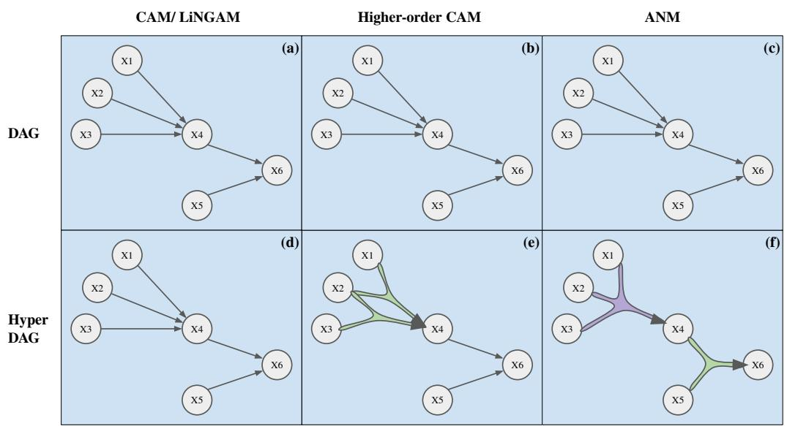
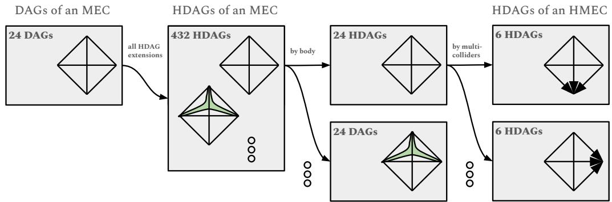

# Higher-Order Causal Structure Learning with Additive Models

Anonymous Author(s)   
Affiliation   
Address   
email

# Abstract

Causal structure learning has long been the central task of inferring causal insights   
from data. Despite the abundance of real-world processes exhibiting higher-order   
mechanisms, however, an explicit treatment of interactions in causal discovery   
has received little attention. In this work, we focus on extending the causal   
additive model (CAM) to additive models with higher-order interaction. This   
second level of modularity we introduce to the structure learning problem is most   
easily represented by a directed acyclic hypergraph. We introduce the necessary   
definitions and theoretical tools to handle the novel structure we introduce and then   
provide identifiability results for the hyper DAG, extending the typical Markov   
equivalence classes. We next provide insights into why learning the more complex   
hypergraph structure may actually lead to better empirical results. In particular,   
more restrictive assumptions like CAM correspond to easier-to-learn hyper DAGs   
and better finite sample complexity. We finally develop an extension of the greedy   
CAM algorithm which can handle the more complex hyper DAG search space and   
demonstrate its empirical usefulness in synthetic experiments.

# 16 1 Introduction

Causal structure learning aims to infer the underlying causal relationships among given variables   
from observational or interventional data [Spirtes et al., 2001], which is crucial for understanding   
complex systems and has been widely applied in different fields, including biology [Sachs et al.,   
] and Earth system science [Runge et al., 2019]. Various approaches have been developed   
for causal discovery, including constraint-based, score-based, and functional causal model-based   
methods [Glymour et al., 2019].   
Constraint-based methods, such as the PC [Spirtes and Glymour, 1991] and FCI [Spirtes et al., 2001]   
algorithms, rely on conditional independence tests to identify the causal structure. Score-based   
methods, on the other hand, optimize a scoring function, such as the Bayesian Information Criterion   
(BIC) [Schwarz, 1978], to find the best causal structure [Chickering, 2002, Singh and Moore, 2005,   
Yuan et al., 2011, Bartlett and Cussens, 2017]. Both constraint-based and score-based approaches   
can only identify the underlying causal structure up to Markov equivalence [Spirtes et al., 2001],   
indicating that they cannot distinguish between different structures that encode the same set of   
conditional independence relationships.   
Functional causal model-based methods address this limitation by introducing proper functional   
assumptions on the causal relationships, thus enabling the identification of the whole DAG. Examples   
include the linear non-Gaussian model [Shimizu et al., 2006], additive noise model (ANM) [Hoyer   
et al., 2008], post-nonlinear causal model [Zhang and Hyvärinen, 2009], heteroscedastic noise model   
(HNM) [Xu et al., 2022, Immer et al., 2023], and causal additive model (CAM) [Bühlmann et al.,   
2014]. Among these, CAM assumes that the causal relationships are additive in the variables, which,   
despite being more restrictive than the general ANM framework, has been shown to achieve superior   
performance in various empirical studies [Lachapelle et al., 2020, Zheng et al., 2020, Ng et al., 2022,   
Rolland et al., 2022], partly owing to its improved statistical power.   
In this work, we revisit the additive structural assumption of CAM by incorporating recent develop  
ments in training higher-order additive models, extending the functional causal model to explicitly   
consider the higher-order interactions within the causal mechanisms. Higher-order mechanisms are   
known to exist in a variety of real-world processes and are believed to be critical into modeling and   
understanding a number of different scientific phenomena Battiston et al. [2020], Majhi et al. [2022].   
Nevertheless, previous approaches have taken an all-or-nothing approach, either (a) directly following   
CAM-like assumptions or (b) modeling all possible interactions between parents of a child node.   
Instead, we find that a directed hypergraph can succinctly represent the necessary structure to   
interpolate between the simplicity of CAM and the complexity of the full ANM. Specifically, our   
49 major contributions are as follows:

1. We develop the theoretical extension from graphs to hypergraphs across three total settings (undirected graphical models, classical DAG models, and additive noise models), and prove the identifiability of the hypergraph structures we introduce.   
. We develop an algorithm for learning the hyper DAG alongside its structural equations directly from data, extending the greedy algorithm for CAM, and showing improved performance over existing approaches on data specifically containing higher-order variable interactions.

# 57 2 Hypergraph Methods

In this work we will introduce three different generalizations to existing structure learning approaches   
which extends the existing graphical representations (Markov networks, Bayesian networks, etc.) to   
60 their corresponding hypergraphical representations:   
1. Undirected hypergraphical models   
. Directed hypergraphical models for discrete variables (classical regime)   
. Directed hypergraphical models for continuous variables (additive noise model)   
We will first introduce the ‘hyper Markov property’ which will be respected by distributions which   
are ‘Markov’ with respect to a given hypergraph, rather than Markov with respect to a given graph.   
We emphasize that since hypergraphs are a strict generalization of existing graphical models, we can   
see this hyper DAG or HDAG structure as an intermediate level of structure between the DAG and   
the SEM (structural equation model). In that sense, we write:

$$
\mathrm { D A G s } \precsim \mathrm { H D A G s } \prec \mathrm { S E M s }
$$

In what follows, we will demonstrate that this more fine-grained structure is not only identifiable   
directly from data, but also that this perspective allows for greater insights into the identifiability of   
different hypergraphs (and hence graphs) using finite observations rather than the population limit.

# 72 2.1 Undirected Models

Let us write $X \in \mathbb { R } ^ { d }$ for some number of dimensions $d \in \mathbb { N }$ . We will later choose to restrict to   
discrete, continuous, or mixed $X$ as appropriate. We write an undirected graph as $\mathcal { G } ^ { \prime } = ( V , E ^ { \prime } )$ and   
undirected hypergraph as $\mathcal { H } ^ { \prime } = ( V , H ^ { \prime } )$ , where we take the vertices as $V = [ d ] : = \{ 1 , \dots , d \}$ , the   
undirected edges as $E ^ { \prime } \subseteq \{ ( i , j ) : i \neq j \in V \}$ , and the undirected hyperedges as $\bar { H ^ { \prime } } \subseteq \{ S \subseteq V \}$   
We will sometimes abuse notation and write $( i , j ) \in \mathcal { G } ^ { \prime }$ to mean $( i , \bar { j } ) \in \bar { E ^ { \prime } }$ and similarly for $\mathcal { H } ^ { \prime }$   
(Note that we are reserving the unprimed versions for the directed versions.)   
We will assume throughout this work that we are in the case of fully observed variables. Moreover,   
we will assume that the density is strictly positive to ensure (a) that there is no confusion caused by   
switching between the pairwise, local, and global properties; and (b) that the score-based definitions   
we introduce on the log-probability face no ambiguities in regions of zero density.   
Definition 1. Undirected Markov Property. Let us take $N ( i )$ to denote the neighbors of $i \in V$ . We   
may say that some distribution $p _ { X } ( \pmb { x } )$ is (locally) Markov with respect to some undirected graph $\mathcal { G } ^ { \prime }$   
if it holds for any $i$ that “ $\cdot X _ { i } \perp X _ { V - N ( i ) - \{ i \} } \mid X _ { N ( i ) } \cdots$ , where – denotes set minus. Preparing for   
our focus on additive models of the log probability, this can equally be required as:

$$
\begin{array} { r } { p _ { X } ( \pmb { x } ) = p _ { N ( i ) } ( \pmb { x } _ { N ( i ) } ) \cdot p _ { i } ( x _ { i } | \pmb { x } _ { N ( i ) } ) \cdot p _ { V - N ( i ) - \{ i \} } ( \pmb { x } _ { V - N ( i ) - \{ i \} } | \pmb { x } _ { N ( i ) } ) } \\ { \xi _ { X } ( \pmb { x } ) : = \log p _ { X } ( \pmb { x } ) = \xi _ { N ( i ) } ( \pmb { x } _ { N ( i ) } ) + \xi _ { i } ( x _ { i } | \pmb { x } _ { N ( i ) } ) + \xi _ { V - N ( i ) - \{ i \} } ( \pmb { x } _ { V - N ( i ) - \{ i \} } | \pmb { x } _ { N ( i ) } ) } \end{array}
$$

where there exists some conditional probabilities $p _ { i }$ and $\underline { p } _ { V - N ( i ) \underline { { - } } \{ i \} }$ or some conditional log   
probabilities $\xi _ { i }$ and $\xi _ { V - N ( i ) - \{ i \} }$ such that these equations hold true. This can be additionally written   
in terms of the clique representation, when we write all cliques of the graph as $C l ( { \mathcal { G } } ^ { \prime } ) = \{ S \subseteq V :$   
$S$ is a clique in $\mathcal { G } ^ { \prime } \}$ , as follows:

$$
\log p _ { X } ( { \pmb x } ) = : \xi _ { X } ( { \pmb x } ) = \sum _ { S \in C l ( { \mathcal G } ^ { \prime } ) } \xi _ { S } ( x _ { S } )
$$

Definition 2. Undirected Hyper-Markov Property. It is now straightforward to generalize this   
property to hypergraphs as follows:

$$
\log p _ { X } ( \pmb { x } ) = : \xi _ { X } ( \pmb { x } ) = \sum _ { S \in \mathcal { H } ^ { \prime } } \xi _ { S } ( x _ { S } )
$$

That is, we write the hypergraph edges as specifically representing the energy terms in the log  
probability function. It is straightforward to verify that this is strictly more general than hypergraphs   
which can be created as a result of the maximal clique structure of a typical graph. Nonetheless, in   
what follows we hope to focus on the identifiability as well as the usefulness of this finer-grained   
structure for graphical models.

# 98 2.2 Directed Classical Models

We will write a directed graph as $\mathcal { G } = ( V , E )$ and a directed hypergraph as $\mathcal { H } = ( V , H )$ where   
the directed edges are $E \subseteq \{ ( k , j ) : k \neq j \in V \}$ and the directed hyperedges are $H \subseteq \{ ( S , j ) :$   
$j \in V , S \subseteq ( V ^ { \mathbf { \bar { \mathbf { \alpha } } } } - j ) \}$ . That is, we are assuming that each hyperedge has only one "out arrow" and   
up to $| S |$ "in arrows". It is hoped the purpose for this is relatively clear in the context of a causal   
diagram which must use several parents to generate a single child. We write the ‘parents of $j$ in $\vec { \mathcal { G } } ^ { \bullet }$ as   
$\bar { \mathrm { P a } _ { \mathcal { G } } } ( j ) = \{ k \in [ d ] : ( k , j ) \in \mathcal { G } \}$ and the ‘hyperparents of $j$ in $\mathcal { H }$ as $\mathrm { H y p P a } _ { \mathcal { H } } ( j ) \overset { - } { = } \{ S : ( S , j ) \in \mathcal { H } \}$ ,   
where the dependence on $\mathcal { G }$ and $\mathcal { H }$ will be dropped when obvious.   
Definition 3. Directed Markov Property. Here, we may once again recall the classical Markov   
property with respect to a DAG to be written as:

$$
\log p ( \pmb { x } ) = \sum _ { i = 1 } ^ { d } \log p ( x _ { i } | \pmb { x } _ { P a ( i ) } ) = \sum _ { i = 1 } ^ { d } \theta ( x _ { i } | \pmb { x } _ { P a ( i ) } )
$$

It is very easy to see that we may rewrite this using extraneous functions as:

$$
\log p ( \pmb { x } ) = \sum _ { i = 1 } ^ { d } \quad \sum _ { S \subseteq \mathrm { P a } ( i ) } \theta ( x _ { i } ; \pmb { x } _ { S } ) - \mathcal { Z } ( \pmb { x } _ { \mathrm { P a } ( i ) } )
$$

where it is now the case that we do not have the $\theta$ energy terms explicitly representing a conditional   
distribution, but are instead arbitrary functions which are then set to the proper normalization via   
the $\mathcal { Z }$ function. It can be seen that the $\mathcal { Z }$ function does not explicitly depend on the value of $x _ { i }$ , but   
normalizes to a distribution based on only the parents alone. The extraneous $\theta$ functions which are   
written as all subsets are useful for the next step generalizing to hypergraph structures.   
Definition 4. Directed Hyper-Markov Property. We follow the structure above from the typical   
DAG framework, but replace the fully-connected parent structure with the more nuanced hypergraph   
structure. In particular, the energy terms in each of the conditional distributions are replaced with a   
more specific additive model structure, rather than assuming there is a generic function:

$$
\log p ( \pmb { x } ) = \sum _ { i = 1 } ^ { d } \sum _ { S \in \mathrm { H y p P a } ( i ) } \theta ( x _ { i } ; \pmb { x } _ { S } ) - \mathcal { Z } ( \pmb { x } _ { \mathrm { P a } ( i ) } )
$$

It is again straightforward to see that this strictly generalizes the cases which are representable by   
the typical DAG. In particular, taking the hyperparents to be all subsets of the parents recovers the   
previous functional form (Figure 1f). However, other structures mimicking CAM and LiNGAM type   
assumptions are also possible (Figure 1d). Further HDAGs beyond these two existing in the literature   
are also possible (Figure 1e). We will further assume ‘causal minimality’ of the HDAG meaning   
the hyperparent set is downwards closed w.r.t subsets and each maximal element has a nontrivial $\theta$   
function. See the discussion and proofs in the appendix for further details.   
It is also relatively clear to see how this directed hyper-Markov property overlaps with the undirected   
hyper-Markov property, perhaps moreso than the typical Markov properties. Moreover, it becomes   
clear that the moralized graph corresponds to including the $\mathcal { Z }$ terms whereas the skeleton corresponds   
to including only the $\theta$ terms, see also Table 1. We will make this connection more clear in Section   
129 3.2, where we show identifiability of the HDAG up to its hyper Markov equivalence class (HMEC).

# 2.3 Directed Additive Noise Models

For continuous variables, we will generate data from the additive noise model (ANM), meaning that all variables are a deterministic function of their parent variables, plus an additive noise term.

33 Definition 5. Additive Noise Model. This may be written as:

$$
X _ { j } = f _ { \mathrm { P a } ( j )  j } ( X _ { \mathrm { P a } ( j ) } ) + \varepsilon _ { j }
$$

Each of the $\varepsilon _ { j }$ are taken to be independent, mean-zero random variables.

Definition 6. Higher-Order Additive Noise Model. We may once again generalize to the higher-order   
additive model through the use of the structure encoded by the directed hypergraph.

$$
X _ { j } = \Big ( \sum _ { S \in \mathrm { H y p P a } ( j ) } f _ { S  j } ( x _ { S } ) \Big ) + \varepsilon _ { j }
$$

Specifically, we endow the generating function $f _ { \operatorname* { P a } ( j )  j }$ with an additive model structure obeying   
the hyperparents of the HDAG. Models like CAM or LinGAM then correspond to using singleton   
hyperparents, whereas the most general ANM corresponds to using the entire block of parents as the   
largest hyperparent, as depicted in Figure 1. We will follow CAM Bühlmann et al. [2014] in assuming   
Gaussian noise for algorithmic purposes via the minimization of mean-squared error corresponding   
to maximizing the log-likelihood; however, surprisingly, we show in Theorem 4 that the our settings   
2 and 3 actually overlap in the case of additive Gaussian noise.

  
Figure 1: A depiction of the distinguishing power for hypergraphs corresponding to the same DAG.

# 144 3 Structure Identifiability

# 3.1 Undirected Models

First recall that under our assumptions of fully observed variables and strictly positive density,   
meaning that the density function is identifiable directly from the observed distribution (under mild   
assumptions like continuity for the continuous variable case) Rosenblatt [1956].   
Importantly, then, one may only be concerned in measuring the hypergraph structure as described in   
Section 2.1; however, this proves to be equally straightforward. For the case of graphical models and   
mixed-type variables, Zheng et al. [2023] write the generalized precision matrix as:

$$
\Omega _ { i , j } : = \Big \| \frac { \partial ^ { 2 } } { \partial _ { i } \partial _ { j } } \log p ( \boldsymbol { x } ) \Big \| : = \Big ( \mathbb { E } \Big [ \Big | \frac { \partial ^ { 2 } \log p ( \boldsymbol { x } ) } { \partial _ { i } \partial _ { j } } \Big | ^ { 2 } \Big ] \Big ) ^ { \frac { 1 } { 2 } }
$$

In the case of hypergraphical models and discrete variables, Enouen and Sugiyama [2024] similarly   
write the existence of ‘higher-order information’ for some subset $T \subseteq [ \bar { d } ]$ (where $T \supsetneq \{ i , j \}$ is   
chosen to imply higher-order) if it is the case that:

$$
\Omega _ { T } : = \Big \| \sum _ { S \supseteq T } \theta _ { S } ( x _ { S } ) \Big \| > 0 \qquad \mathrm { w h e r e } \qquad \log p ( x ) = \sum _ { S } \theta _ { S } ( x _ { S } )
$$

A straightforward combination of these approaches are sufficient for recovery of the hyper Markov   
network or undirected hypergraph. Nonetheless, our experiments will instead focus on identification   
of the directed structure as in the following two sections. Thus, for our purposes it is sufficient to say   
that the density and log density functions are identifiable directly from the observed distribution.

# 3.2 Directed Classical Models

Before our main theorem of identifiability extending the result of Verma and Pearl [1990], we must   
first introduce the notion of multi-dependence to extend the typical notion of conditional independence   
which is the workhorse of causal structure learning. We will focus on discrete and finite variables as   
in the classical case[Verma, 1993, Pearl, 2009]; however, most results clearly extend to continuous or   
mixed variables under mild conditions, and we later discuss one such special case in Theorem 4.

Definition 7. Conditional Multi-dependence. We write that $X _ { i }$ and $X _ { j }$ are dependent if the distribution $\log p ( x _ { i } , x _ { j } )$ must be written with a 2D energy term, $\theta _ { i j } ( x _ { i } , \bar { x _ { j } } )$ , rather than the sum of two 1D energy terms, $\theta _ { i } ( x _ { i } ) + \theta _ { j } ( x _ { j } )$ , (corresponding to the product when the log is removed). We will write that $X _ { i }$ , $X _ { j }$ , and $X _ { k }$ are tri-dependent (or generally multidependent), if the distribution $\log p ( x _ { i } , x _ { j } , x _ { k } )$ must be written with a 3D energy term, rather than the sum of three 2D energy terms. It can be seen that this does not have a convenient product formulation like the classical case of dependence and independence because of the "mixing" or "torsion" between the three 2D terms. Nonetheless, we will attempt to prove the usefulness of such a definition in the following theorem. Generalization to conditional tests is straightforward.

Theorem 1. The HDAG is identifiable up to the hyper Markov Equivalence classes (HMECs), consisting of all HDAGs with the same "body" and the same (unshielded) "multi-colliders", paralleling the existing result identifying DAGs up to their skeleton and (unshielded) colliders.

In the same sense that a condi  
tional independence test can never   
eliminate a causal arrow between   
two variables, a conditional multi  
independence test can never sepa  
rate a higher-order causal relation  
ship between a set of three or more   
variables. Removing the arrow  
heads from the DAG returns the   
DAG’s skeleton; similarly, removing the arrowheads from the HDAG returns the HDAG’s body,   
see Table 1 and Figure 2. In some sense, this half of the theorem about the “body identifiability”   
immediately states that the structure we introduced is identifiable.   
For multicolliders, recall that a collider occurs when there is a conditional dependence which is   
broken after marginalizing out the child, or equally a conditional independence which is broken when   
conditioning on the child. The multicollider of an HDAG will occur similarly via a multidependence   
which is broken after marginalizing out the child. Although collisions between two parents will   
already be covered, there are cases of three or more parents which are unshielded and can hence   
be identified from Theorem 1. In particular, there are cases which are not identified in the classical   
setting, see the RHS of Figure 2. This seeming anomaly is in part due to the historical conflation   
over time between what structure is recoverable from the conditional independence tests vs. what   
structure is recoverable from the observed distribution. Indeed, the MEC only describes what is   
distinguishable via the conditional independence conditions, making it unable to detect what can be   
seen via the conditional multi-independence test we introduce.   
Another key consequence of this different perspective will be a statistical one. In particular, for a   
$K$ -dimensional energy term in the body of an HDAG, we know that it requires on the order of $\mathcal { O } ( n ^ { K } )$   
samples to be appropriately learned. Consequently, without access to infinite samples, this places   
further restrictions on the HMEC classes (and hence MEC classes) of ‘distinguishability under finite   
samples’, whereas MECs are only able to easily represent ‘distinguishability under infinite samples’   
as in the asymptotic regime.

Table 1: Notation for hypergraphs   

<table><tr><td>DAG terms</td><td>HDAG terms</td></tr><tr><td>G&#x27;,undirected graph G,directed acyclic graph (DAG) moralized graph of a DAG skeleton of a DAG (unshielded) collider</td><td>H&#x27;,undirected hypergraph H,hyper DAG or HDAG immoralized hypergraph of an HDAG body of an HDAG (unshielded) multicollider</td></tr></table>

  
Figure 2: A gradual refinement of the DAGs within a Markov Equivalence Class (MEC) to a stronger refinement of HDAGs based on Theorem 1 to a Hyper Markov Equivalence Class (HMEC). There are $d = 4$ variables with a fully-connected DAG structure. The green triangle represents the third-degree hyperedge in the body of an HDAG. Lack of arrows indicate multiple possible orientations for different DAGs/ HDAGs of the same MEC/ HMEC.

# 06 3.3 Directed Additive Noise Models

In this section, we establish identifiability results for recovering the hyper-DAG in the ANM case. For clearer exposition, we first reproduce the arguments of Hoyer et al. [2008] which shows that, in general position, the additive noise model (ANM) is identifiable. We extend their result to a multi-dimensional result which handles the case of multiple parents rather than only the case of one parent node and one child node (slightly different from the extension in Theorem 28 of Peters et al. [2014] because it will more easily generalize to the hypergraph result).

Theorem 2. Let the joint probability densities of $_ { \textbf { \em x } }$ and $y$ be given by

$$
p ( x _ { 1 } , \dots , x _ { d } , y ) = p _ { n } ( y - f ( { \pmb x } ) ) \cdot p _ { x } ( x _ { 1 } , \dots , x _ { d } )
$$

for some noise density $p _ { n }$ , arbitrary density $p _ { x }$ , and function $f$ . Assume further that all such functions   
are thrice continuously differentiable. If there is also a backwards model which treats $x _ { i }$ as the child,

$$
p ( x _ { 1 } , \dots , x _ { d } , y ) = p _ { \tilde { n } } ( x _ { i } - g ( x _ { - i } , y ) ) \cdot p _ { x _ { - i } , y } ( x _ { 1 } , \dots , x _ { i - 1 } , x _ { i + 1 } , \dots , x _ { d } , y )
$$

for some alternate noise density $p _ { \tilde { n } }$ , arbitrary density $p _ { x _ { - i } , y }$ , and function $g$ , then it must be case that   
for $\nu : = \log p _ { n }$ and $\xi : = \log p _ { x }$ , the following differential equation is obeyed

$$
\xi ^ { \prime \prime \prime } = \xi ^ { \prime \prime } \cdot \Big ( - \frac { \nu ^ { \prime \prime \prime } f ^ { \prime } } { \nu ^ { \prime \prime } } + \frac { f ^ { \prime \prime } } { f ^ { \prime } } \Big ) + \Big ( - 2 \nu ^ { \prime \prime } f ^ { \prime \prime } f ^ { \prime } + \nu ^ { \prime } f ^ { \prime \prime \prime } + \frac { \nu ^ { \prime } \nu ^ { \prime \prime \prime } f ^ { \prime } f ^ { \prime \prime } } { \nu ^ { \prime \prime } } - \frac { \nu ^ { \prime } f ^ { \prime \prime } f ^ { \prime \prime } } { f ^ { \prime } } \Big )
$$

where we use 218 $\xi ^ { \prime } , \nu ^ { \prime } , f ^ { \prime }$ as shorthand for $\begin{array} { r } { \frac { \partial } { \partial x _ { i } } \xi ( x _ { 1 } , \ldots , x _ { d } ) , \quad \nu ^ { \prime } ( y - f ( { \pmb x } ) ) , \quad \frac { \partial } { \partial x _ { i } } f ( x _ { 1 } , \ldots , x _ { d } ) . } \end{array}$

Corollary 1. Assume further that $\nu ^ { \prime \prime \prime } = 0$ and $\begin{array} { r } { \frac { { \partial ^ { 3 } } } { { \partial { x _ { i } ^ { 3 } } } } { \xi } = 0 } \end{array}$ for all $i \in [ d ]$ . If a backwards model exists   
for a parent $x _ { i }$ , then $f$ is linear in the argument $x _ { i }$ . Further, if a backwards model exists in all parents   
221 $x _ { i }$ , then $f$ is a multilinear function.

Remark 1. First, this is a general position argument which says that in order to be reversible, the SEM must obey these particular constraints which usually do not occur. Although this means for an ‘arbitrary’ SEM model we have identifiability, this does not rule out well-known cases including linear+Gaussian where the existence of an equivalent backwards model is unavoidable.

6 Remark 2. Second, this result is applied locally to a single child node, rather than the global SCM   
27 structure. Previous work has partially explored the global structure in the population limit, see   
8 Chickering [2002] and Peters et al. [2014]; however, a priori, the constrained solutions space may   
grow exponentially large, leading to practical limitations in the real-world setting with finite samples.   
We next provide the relevant extension to recover the hypergraphical structure as well. Indeed, if the   
DAG structure is identifiable (at least locally), then the hyper DAG structure is also identifiable (at   
least locally). This also implies that when the entire DAG structure is identifiable in the ANM case,   
the entire hyper DAG structure is also identifiable.   
Theorem 3. Suppose we have two forward models given by two alternate collections $\mathcal { T } \subseteq \mathcal { P } ( [ d ] )$   
and ${ \mathcal { I } } \subseteq { \mathcal { P } } ( [ d ] )$ , where $\mathcal { P }$ denotes the power set, with models:

$$
p ( y | x _ { 1 } , \dots , x _ { d } ) = p _ { n } ( y - \sum _ { S \in \cal { T } } f _ { S } ( x _ { S } ) ) \qquad p ( y | x _ { 1 } , \dots , x _ { d } ) = p _ { \tilde { n } } ( y - \sum _ { T \in \cal { T } } g _ { T } ( x _ { T } ) )
$$

Assume that in addition to the assumptions of Theorem 2, we also have that the functions $f _ { S }$ and $g _ { T }$   
are differentiable up to order $\operatorname* { m a x } \{ \operatorname* { m a x } _ { S \in { \mathcal { T } } } \{ | S | \} , \operatorname* { m a x } _ { T \in { \mathcal { I } } } \{ | T | \} \}$ , or more simply up to order $d$ . It   
then follows that $\mathcal { T } = \mathcal { T }$ and thus the hypergraph structures of the two models are exactly the same.   
Moreover, outside of trivial modifications to the $f$ ’s and $g$ ’s, the two functional generating models   
are exactly the same.

Finally, we restrict further to the case of Gaussian noise variables in the ANM to directly recover a global hypergraphical result, further relating Sections 2.2 and 2.3.

Theorem 4. Suppose that all additive noise variables are drawn from a Gaussian distribution, implying that $\begin{array} { r } { \nu ( \dot { \varepsilon } ) = \frac { - 1 } { 2 \sigma ^ { 2 } } \varepsilon ^ { 2 } } \end{array}$ (or some general quadratic form) for all $i \in [ d ]$ . Suppose also that we generate data according to the directed hypergraph $\mathcal { H }$ . The undirected, immoralized version of this hypergraph $\mathcal { H } ^ { \prime }$ is identifiable directly from the data in the sense that $\begin{array} { r } { \xi ( x _ { 1 } , \ldots , x _ { d } ) = \sum _ { S \in \mathcal { H } ^ { \prime } } \xi _ { S } ( x _ { S } ) } \end{array}$ for some arbitrary functions $\xi _ { S }$ . In other words, the undirected hypergraph from setting 1 is directly identifiable from the distribution and thus settings 2 and 3 overlap for ANMs with Gaussian noise.

249 All proofs may be found in the appendix.

# 4 Algorithm

Our method for hypergraph discovery and structural equation modeling heavily entwines the schema of CAM [Bühlmann et al., 2014] and the higher-order interaction techniques of SIAN [Enouen and Liu, 2022]. Accordingly, we review both algorithms in much greater detail in Appendix B. Here in the main body of the paper, we briefly review the three step procedure introduced by CAM and discuss our HCAM extension to their original approach. The first stage is a preselection phase which searches for good candidate parents for each potential child node. The second stage is the bulk of the algorithm, greedily constructing the DAG via including each directed edge one at a time based on the improvement to the log-likelihood. The third stage is a final pruning stage which does not change the topological order, but simply removes parents which are no longer thought to be relevant.

# 4.1 Step 1: Candidate Search

The first stage of CAM Bühlmann et al. [2014] finds candidate edges/ parents by training a GAM regression on each of the $d$ variables. In their work, this was mainly necessary for them in the high-dimensional setting, where explicit consideration of so $O ( d ^ { 2 } )$ edges when $d$ is large poses a challenge. However, for HCAM, this stage becomes absolutely critical. That is because we not only need to look at all $( d ^ { 2 } - d )$ candidate directed edges of CAM, but also all the $\textstyle { \frac { 1 } { 2 } } ( d ^ { 3 } - 3 d ^ { 2 } + 2 { \bar { d } } )$

66 candidate directed tri-edges, as well as higher-order hyperedges, etc. To consider all hyperedges   
directly without any heuristic would require considering an exponential number of hyperedges.   
Accordingly, we first use a deep neural network to ‘search’ for good hyperedges, following steps 1   
and 2 of SIAN [Enouen and Liu, 2022]. That is, for each of the $d$ variables, we regress an MLP DNN   
to minimize the mean-squared error (Gaussian likelihood). We then use an XAI technique, called   
Archipelago [Tsang et al., 2020], to give an importance score for each of the feature interactions   
involving the other variables.

# 273 4.2 Step 2: Greedy Selection

The next phase consists of the bulk of the algorithm and can also be considered the most important part and yet most simplistic part. A greedy heuristic is taken to gradually build the DAG from the initialized empty set of vertices. For each of the possible edges (or potentially the subset selected in step 1), a new likelihood model is trained to simulate adding the edge to the DAG. Importantly, because of the independence of the ANM noise, this is simply measured as the drop in MSE with and without the additive term. Gradually, edges are added until some stopping point and the final phase of pruning begins.

In our case, several small adjustments must be made to deal with the case of HDAGs. Importantly, unlike CAM, HCAM must keep track of both the HDAG and the induced partial-order matrix simultaneously. Generically, we follow the exact same procedure, training higher-order additive models with each candidate hyperedge to see the improvement in MSE. We start with 10 candidates for each of the $d$ variables, based on the ranking provided in step 1, and we replenish the candidates if there are ever less than 5 viable hyperedges per a variable. This cutdown is able to reduce the number of higher-order SIAN additive models we train, which helps in improving the overall runtime.

# 4.3 Step 3: Final Pruning

Finally, the full model is trained end-to-end once more with all of the included edges from step 2. The final stage simply removes edges corresponding to additive terms which are too close to zero, and thus likely to be useless in the causal model. Our extensions prunes in the exact same way, with higher-order terms corresponding to higher-order edges, but there is no practical difficulty in doing this extension. The major difficulty of this part is choosing a threshold which corresponds with a nuisance parameter. The original CAM work uses a threshold of 0.001 for the $\mathsf { p } \cdot$ -values provided alongside the GAM models. We use neural networks which do not provide $\mathsf { p }$ -values and thus somewhat similarly threshold based on the MSE of the additive term, using a threshold of $1 . 0 e { - 4 }$ .

# 297 5 Experiments

We compare across multiple synthetic datasets obeying the additive noise model (ANM) while varying   
the degree of the additive models. Following previous works, we generate the base DAG from an   
Erdos-Renyi random graph with an average of 4 edges per node. We generate 1D, 2D, and 3D   
additive models to distinguish different hypergraphical structures. For 1D models, we avoid the linear   
model to allow for identifiability and use a random Gaussian process to define the additive functions.   
For 2D and 3D models, we use multilinear terms, $\beta _ { j k } x _ { j } x _ { k }$ , with coefficients drawn around $\pm 1$ , then   
normalizing by the total coefficient weight for a parent set. We assume the additive noise terms are   
coming from a Gaussian distribution and draw random variances constrained to be close to 1.0. We   
set $d = 3 0$ (number of nodes) and $n = 1 0 0 0 0$ (number of samples) in our experiments.   
We compare against baselines of PC [Spirtes and Glymour, 1991], GES [Chickering, 2002], BOSS   
[Andrews et al., 2023], RESIT [Peters et al., 2014], CAM [Bühlmann et al., 2014], and SCORE   
[Rolland et al., 2022]. We additionally compare against a baseline which assumes the empty graph,   
equivalent to assuming all of the observed variables are completely indepedent. We compare against   
the structural Hamming distance (SHD) and the structural interventional distance (SID) obtained by   
each method on different complexities of synthetic data. We additionally compare the Hamming   
distance on the hypergraph bodies, based on the assumption in Figure 1f, calling it the higher-order   
structural Hamming distance. Because the maximal error is on the order $2 ^ { 3 0 } \approx$ one billion, in some   
cases, we do not compute exactly and report a lower bound in Table 4.

Table 2: Structural Hamming Distance for ER4 and $_ { \mathrm { N = 1 0 , 0 0 0 } }$ .   

<table><tr><td></td><td>BOSS</td><td>CAM</td><td>GES</td><td>PC</td><td>SCORE</td><td></td><td>RESIT</td><td>zero</td><td>HCAM</td></tr><tr><td>ER4 1D</td><td>189.67±20.24</td><td>42.67±4.50</td><td>206.67±11.90</td><td>159.67±21.17</td><td></td><td>69.33±20.24</td><td>494.67±3.30</td><td>128.67±8.38</td><td>67.67±13.82</td></tr><tr><td>ER4 2D</td><td>115.33± 1.70</td><td>134.67±2.49</td><td>116.00± 2.16</td><td>134.00± 4.32</td><td></td><td>126.00± 2.83</td><td>146.33±5.79</td><td>115.33±1.70</td><td>107.00± 0.82</td></tr><tr><td>ER4 3D</td><td>109.00± 4.24</td><td>120.33±1.89</td><td>106.67± 3.86</td><td>120.33± 3.86</td><td></td><td>117.00± 5.89</td><td>132.33±6.34</td><td>106.67±3.86</td><td>106.67± 3.86</td></tr></table>

Table 3: Structural Intervention Distance for ER4 and $_ { \mathrm { N = 1 0 , 0 0 0 } }$ .   

<table><tr><td></td><td>BOSS</td><td>CAM</td><td>GES</td><td>PC</td><td>SCORE</td><td>RESIT</td><td>zero</td><td>HCAM</td></tr><tr><td>ER4 1D</td><td>608.33±45.09</td><td>0.00± 0.00</td><td>646.67±54.97</td><td>748.33±66.04</td><td>105.33±47.12</td><td>646.67±54.97</td><td>726.00±64.19</td><td>525.33±64.25</td></tr><tr><td>ER42D</td><td>679.33±38.94</td><td>750.67± 7.93</td><td>687.33±39.67</td><td>713.67±60.18</td><td>745.67±16.11</td><td>734.67±21.64</td><td>679.33±38.94</td><td>661.00±31.03</td></tr><tr><td>ER4 3D</td><td>647.67±15.08</td><td>744.67±22.23</td><td>679.00±39.02</td><td>699.00±46.31</td><td>751.67±24.14</td><td>744.00±29.44</td><td>679.00±39.02</td><td>679.00±39.02</td></tr></table>

Table 4: Higher-Order Structural Hamming Distance for ER4 and $_ { \mathrm { N = 1 0 , 0 0 0 } }$ .   

<table><tr><td></td><td>BOSS</td><td>CAM</td><td>GES</td><td>PC</td><td>SCORE</td><td>RESIT</td><td>zero</td><td>HCAM</td></tr><tr><td>ER4 1D</td><td>&gt;10,000</td><td>42.67± 4.50</td><td>&gt;10.000</td><td>&gt;1,000</td><td>&gt;10,000</td><td>&gt;10.000</td><td>128.67± 8.38</td><td>48.33± 8.18</td></tr><tr><td>ER4 2D</td><td>157.33± 1.70</td><td>168.00± 5.35</td><td>158.00± 1.41</td><td>183.67±10.78</td><td>171.33± 2.05</td><td>602.33±603.66</td><td>157.33± 1.70</td><td>119.00± 5.35</td></tr><tr><td>ER4 3D</td><td>236.00±18.38</td><td>256.33±14.66</td><td>248.67±18.15</td><td>264.67±23.23</td><td>264.00±14.76</td><td>263.00± 13.44</td><td>248.67±18.15</td><td>248.67±18.15</td></tr></table>

# 316 5.1 Results

Overall, we find that many methods are successful for the simpler 1D data obeying the CAM assumptions, especially the CAM and SCORE algorithms. HCAM does not achieve the same level of success as these algorithms but still achieves good performance on this dataset. Surprisingly, all other methods have rather great difficulty in identifying the causal structure.

On our specifically higher-order datasets, however, we find that the story is quite different. In particular, the only algorithm which is able to defeat the baseline on the 2D data is our HCAM method specifically focusing on modeling the 2D interactions. In the 3D data, none of the algorithms we run are able to find empirical success over the zero baseline. That is to say, we should have just assumed the variables were independent and not run our algorithm at all.

This lack of capability is despite the fact that we used a simple DGP (multilinear plus Gaussian) on a relatively low number of variables $d = 3 0$ ) and provided a relatively standard number of observations $( n = 1 0 , 0 0 0 )$ ). Aligning with our hypothesis that the statistical complexity increases in the presence of higher-order interactions, we strongly believe this points to some aspects of structure discovery research which have received less attention but remain highly influenced by the presence of interactions.

# 6 Conclusion

We have introduced a framework for considering the impact of higher-order interactions on causal structure. After introducing the relevant definitions, we further show the identifiability of the introduced structure across multiple cases of interest. Finally, we demonstrate the potential usefulness of the hypergraphical structure in empirical case using the additive noise model, along with providing a first algorithm for adequately handling the higher-order structure directly from observed data. This perspective additionally allowed us to identify a potential blindspot of many existing structure discovery approaches: their lack of focus on statistical power and lesser ability to handle higher-order interactions.

We envision future work may continue to benefit from a perspective using higher-order interactions.   
Some directions of future exploration include improving on the algorithms and theoretical results   
presented herein, potentially solving increasingly challenging datasets constructed using the higher  
order perspective on the generated variables. Extension to appropriately handling latent variables and   
latent confounding is a direction of serious interest. Hypergraphical structures being identifiable from   
the data distribution alone, extending existing MEC and identifiability results, point to the potential   
347 of hypergraphical structure across even more contexts and settings than the ones explored herein.

References   
49 Steen A. Andersson, David Madigan, and Michael D. Perlman. A characterization of markov equivalence classes for acyclic digraphs. The Annals of Statistics, 25(2):505–541, 1997. ISSN 00905364, 21688966. URL http://www.jstor.org/stable/2242556. Bryan Andrews, Joseph Ramsey, Ruben Sanchez Romero, Jazmin Camchong, and Erich Kummerfeld. Fast scalable and accurate discovery of DAGs using the best order score search and grow shrink trees. In Thirty-seventh Conference on Neural Information Processing Systems, 2023. URL https://openreview.net/forum?id $\equiv$ 80g3Yqlo1a. Mark Bartlett and James Cussens. Integer linear programming for the Bayesian network structure learning problem. Artificial Intelligence, 244:258–271, 2017. Federico Battiston, Giulia Cencetti, Iacopo Iacopini, Vito Latora, Maxime Lucas, Alice Patania, Jean-Gabriel Young, and Giovanni Petri. Networks beyond pairwise interactions: Structure and dynamics. Physics Reports, 874:1–92, 2020. ISSN 0370-1573. doi: https://doi.org/10.1016/ j.physrep.2020.05.004. URL https://www.sciencedirect.com/science/article/pii/ S0370157320302489. Networks beyond pairwise interactions: Structure and dynamics.   
Peter Bühlmann, Jonas Peters, and Jan Ernest. CAM: Causal additive models, high-dimensional order search and penalized regression. The Annals of Statistics, 42(6):2526 – 2556, 2014. doi: 10.1214/14-AOS1260. URL https://doi.org/10.1214/14-AOS1260.   
David M. Chickering. Optimal structure identification with greedy search. Journal of Machine Learning Research, 3(Nov):507–554, 2002. David Maxwell Chickering. A transformational characterization of equivalent bayesian network structures. In Proceedings of the Eleventh Conference on Uncertainty in Artificial Intelligence, UAI’95, page 87–98, San Francisco, CA, USA, 1995. Morgan Kaufmann Publishers Inc. ISBN 1558603859.   
2 James Enouen and Yan Liu. Sparse interaction additive networks via feature interaction detection and sparse selection. In Advances in Neural Information Processing Systems, 2022.   
James Enouen and Mahito Sugiyama. A complete decomposition of kl error using refined information and mode interaction selection, 2024. URL https://arxiv.org/abs/2410.11964.   
76 Clark Glymour, Kun Zhang, and Peter Spirtes. Review of causal discovery methods based on graphical models. Frontiers in Genetics, 10, 2019. Patrik Hoyer, Dominik Janzing, Joris M Mooij, Jonas Peters, and Bernhard Schölkopf. Nonlinear causal discovery with additive noise models. In D. Koller, D. Schuurmans, Y. Bengio, and L. Bottou, editors, Advances in Neural Information Processing Systems, volume 21. Curran Associates, Inc., 2008. URL https://proceedings.neurips.cc/paper_files/paper/2008/ file/f7664060cc52bc6f3d620bcedc94a4b6-Paper.pdf. Alexander Immer, Christoph Schultheiss, Julia E Vogt, Bernhard Schölkopf, Peter Bühlmann, and Alexander Marx. On the identifiability and estimation of causal location-scale noise models. In International Conference on Machine Learning, 2023.   
Sébastien Lachapelle, Philippe Brouillard, Tristan Deleu, and Simon Lacoste-Julien. Gradient-based neural dag learning. In International Conference on Learning Representations, 2020. URL https://openreview.net/forum?id $\equiv$ rklbKA4YDS.   
9 Po-Ling Loh and Peter Bühlmann. High-dimensional learning of linear causal networks via inverse covariance estimation. Journal of Machine Learning Research, 15(88):3065–3105, 2014. URL http://jmlr.org/papers/v15/loh14a.html.   
Soumen Majhi, Matjaž Perc, and Dibakar Ghosh. Dynamics on higher-order networks: a review. Journal of The Royal Society Interface, 19(188), Mar 2022. ISSN 1742-5662. doi: 10.1098/rsif. 2022.0043. URL http://dx.doi.org/10.1098/rsif.2022.0043. Ignavier Ng, Shengyu Zhu, Zhuangyan Fang, Haoyang Li, Zhitang Chen, and Jun Wang. Masked gradient-based causal structure learning. In SIAM International Conference on Data Mining (SDM), 2022.   
Judea Pearl. Causality. Cambridge University Press, 2 edition, 2009. Jonas Peters, Joris M. Mooij, Dominik Janzing, and Bernhard Schölkopf. Causal discovery with continuous additive noise models. Journal of Machine Learning Research, 15(58):2009–2053, 2014. URL http://jmlr.org/papers/v15/peters14a.html. Paul Rolland, Volkan Cevher, Matthäus Kleindessner, Chris Russell, Dominik Janzing, Bernhard Schölkopf, and Francesco Locatello. Score matching enables causal discovery of nonlinear additive noise models. In Proceedings of the 39th International Conference on Machine Learning, volume 162 of Proceedings of Machine Learning Research, pages 18741–18753. PMLR, 17–23 Jul 2022. Murray Rosenblatt. Remarks on Some Nonparametric Estimates of a Density Function. The Annals of Mathematical Statistics, 27(3):832 – 837, 1956. doi: 10.1214/aoms/1177728190. URL https://doi.org/10.1214/aoms/1177728190. Jakob Runge, Sebastian Bathiany, Erik M. Bollt, Gustau Camps-Valls, Dim Coumou, Ethan R. Deyle, Clark Glymour, Marlene Kretschmer, Miguel D. Mahecha, Jordi Muñoz-Marí, Egbert H. van Nes, J. Peters, Rick Quax, Markus Reichstein, Marten Scheffer, Bernhard Scholkopf, Peter Spirtes, George Sugihara, Jie Sun, Kun Zhang, and Jakob Zscheischler. Inferring causation from time series in Earth system sciences. Nature Communications, 10, 2019. Karen Sachs, Omar Perez, Dana Pe’er, Douglas A Lauffenburger, and Garry P Nolan. Causal proteinsignaling networks derived from multiparameter single-cell data. Science, 308(5721):523–529, 2005. Gideon Schwarz. Estimating the dimension of a model. The Annals of Statistics, 6(2):461–464, 1978. Shohei Shimizu, Patrik O. Hoyer, Aapo Hyvärinen, and Antti Kerminen. A linear non-gaussian acyclic model for causal discovery. Journal of Machine Learning Research, 7(72):2003–2030, 2006. URL http://jmlr.org/papers/v7/shimizu06a.html. Ajit P. Singh and Andrew W. Moore. Finding optimal Bayesian networks by dynamic programming. Technical report, Carnegie Mellon University, 2005.   
P. Spirtes, C. Glymour, and R. Scheines. Causation, Prediction, and Search. MIT press, 2nd edition, 2001.   
Peter Spirtes and Clark Glymour. An algorithm for fast recovery of sparse causal graphs. Social Science Computer Review, 9:62–72, 1991.   
Michael Tsang, Sirisha Rambhatla, and Yan Liu. How does this interaction affect me? interpretable attribution for feature interactions. arXiv preprint arXiv:2006.10965, 2020.   
T. S. Verma. Graphical aspects of causal models. Technical report, UCLA Cognitive Systems Laboratory, 1993. Thomas Verma and Judea Pearl. Equivalence and synthesis of causal models. In Proceedings of the Sixth Annual Conference on Uncertainty in Artificial Intelligence, UAI ’90, page 255–270, USA, 1990. Elsevier Science Inc. ISBN 0444892648.   
Sascha Xu, Alexander Marx, Osman Mian, and Jilles Vreeken. Causal inference with heteroscedastic noise models. In Proceedings of the AAAI Workshop on Information Theoretic Causal Inference and Discovery, 2022. Changhe Yuan, Brandon Malone, and Xiaojian Wu. Learning optimal Bayesian networks using $\mathbf { A } ^ { * }$ search. In International Joint Conference on Artificial Intelligence, 2011.   
Kun Zhang and Aapo Hyvärinen. On the identifiability of the post-nonlinear causal model. In Conference on Uncertainty in Artificial Intelligence, 2009.

# 446 A Proofs of Theorems

# 447 A.1 Proof of Theorem 1

To begin, we remind that while the classical MEC formulation is concerned with mapping the   
conditional independencies of a distribution with the Markov conditions and structure of a DAG, we   
are here concerned with mapping the conditional multi-independencies of a distribution with the   
Markov conditions and structure of an HDAG. Accordingly, it is first worth noting that because the   
conditional multi-independencies of a distribution is a strictly larger set of conditions that the original   
set of conditions, hence, we get the existing result on the DAG corresponding to the HDAG, let’s call   
it the reduced DAG. This is done in the obvious way by taking the union of all a node’s hyperparents   
and defining them as the parent set.

Thus, in addition to the skeletons and (unshielded) colliders of the DAG which are already identifiable from the typical conditions, we must investigate which HDAGs are further distinguishable via these conditions and which HDAGs are distinguishable via the new conditions.

We will start with the easier point about the body of an HDAG. Once again, this is defined by   
removing all directed arrows from the directed hypergraph. In the same way that a pair of nodes $i$   
and $j$ are ‘inseparable’ if they are not conditionally indepedent for any conditioning set, we can say   
that a triple of nodes $i , j$ , and $k$ are inseparable if they are not conditionally multi-independent for   
any conditioning set. In much the same way this indicates the existence of an edge in the DAG case,   
this will indicate the existence of a (three-dimensional) hyperedge in the HDAG case.   
It is thus straightforward to see that the existence of an inseparable triple shows the existence of   
a directed hyperedge (where one of the three vertices is the child). Further, this generalizes to all   
degrees in the exact same way. It is briefly reminded that the hierarchy constraint plays a role of   
convenience here in the sense that a higher-order edge is detected via a three-dimensional hyperedge   
even if, say, the generating equations do not make this explicit. This exactly parallels what happens   
in the 2D case with an inseparable pair of nodes, where the DAG edges are capturing everything   
’between $i$ and $j$ or higher’. To be explicit, the DAG edge $i  j$ could have a second parent of $j$   
which interacts with $i$ when generating $j$ . Nonetheless, it is clear from these conditions that we may   
directly identify the body of the HDAG, and that the body of the HDAG is strictly more informative   
than the skeleton of the HDAG’s reduced DAG.   
Now let us move on to the discussion of colliders between parents. To prepare for our generalization   
of colliders, we first allude to the fact that in Equation 7, we can see directly that the normalizing $\mathcal { Z }$   
score over the parent set is the cause of a collider. In particular, unlike the natural $\theta$ terms which cannot   
be destroyed via marginalization of variables, the $\mathcal { Z }$ terms are destructible under marginalization of   
the child. This naturally corresponds to the more typical conditions noting that there is some smaller   
set (not including the child) where conditioning provides independence but conditioning on the child   
additionally breaks the independence. Of course, not all sets without the child included is able to   
482 marginalize out the child, namely, conditioning on any descendant of the child is also problematic.

3 Nonetheless, we may proceed by extending the definition in the same way. We say that a set of nodes $i , j , k$ alongside a fourth node $\ell$ are a tricollider so long as there exists some conditioning set $S$ under which the $i$ , j, $k$ are not conditionally tri-dependent; however, after additionally conditioning on the node $\ell$ (their joint child), the tri-independence breaks and $i , j , k$ are conditionally tri-dependent when conditioning on $( S + \{ \ell \} )$ . Equally, it can be seen that $i$ , $j$ , $k$ are the joint parents of $\ell$ whose $\mathcal { Z }$ normalization appears only when needing to condition on $\ell$ .

In fact, it is now extremely straightforward to state our faithfulness condition directly. We say that a   
distribution observes a hypergraph structure faithfully so long as no natural theta term is destructible   
via marginalization; moreover, the joining of two theta terms via marginalization will lead to a new   
492 theta term with the maximal relative size (i.e. no higher-order terms magically cancel and zero out).   
93 Finally, because of this faithfulness condition, we can equally start with the log-probability score   
function which obeys the Hyper Markov property and construct all possible multi-dependence tests   
in the backwards direction. Accordingly, no $\theta$ term will cancel via marginalization and each $\mathcal { Z }$   
will only cancel via marginalization of its respective child. As a reminder, conditioning on a set is   
easier via implicitly pulling out the variables value in the conditional distribution, and marginalizing   
has been made possible via the faithfulness distribution. Together, these allow us to describe all   
99 of the energy terms of a new conditioned distribution and one can directly read off the conditional   
00 multi-dependence via the existence of or lack of the highest-order energy term.

# A.2 Proof of Theorem 2

Proof. The arguments here closely follow the original arguments for Theorem 1 of Hoyer et al.   
[2008].

First, recall that we will write

$$
\begin{array} { l } { \pi ( x _ { [ d ] } , y ) = \nu ( y - f ( x ) ) + \xi ( x ) } \\ { \pi ( x _ { [ d ] } , y ) = \tilde { \nu } ( x _ { i } - g ( x _ { - i } , y ) ) + \eta ( x _ { - i } , y ) } \end{array}
$$

We may first proceed with some basic calculations

$$
\begin{array} { l } { \displaystyle { \frac { \partial } { \partial x _ { i } } \pi = \nu ^ { \prime } \cdot - \frac { \partial f } { \partial x _ { i } } + \frac { \partial \xi } { \partial x _ { i } } } } \\ { \displaystyle { \quad \quad = \tilde { \nu } ^ { \prime } \cdot 1 + 0 } } \\ { \displaystyle { \frac { \partial } { \partial y } \pi = \nu ^ { \prime } \cdot 1 + 0 } } \\ { \displaystyle { \quad \quad = \tilde { \nu } ^ { \prime } \cdot - \frac { \partial g } { \partial y } + \frac { \partial \eta } { \partial y } } } \end{array}
$$

And further

$$
\begin{array} { c } { { \displaystyle { \frac { \partial ^ { 2 } } { \partial x _ { i } ^ { 2 } } \pi = \nu ^ { \prime \prime } \cdot \frac { \partial f } { \partial x _ { i } } \cdot \frac { \partial f } { \partial x _ { i } } - \nu ^ { \prime } \cdot \frac { \partial ^ { 2 } f } { \partial x _ { i } ^ { 2 } } + \frac { \partial ^ { 2 } \xi } { \partial x _ { i } ^ { 2 } } } } } \\ { { \displaystyle { = \tilde { \nu } ^ { \prime \prime } } } } \\ { { \displaystyle { \frac { \partial ^ { 2 } } { \partial x _ { i } \partial y } \pi = \nu ^ { \prime \prime } \cdot - \frac { \partial f } { \partial x _ { i } } } } } \\ { { \displaystyle { = \tilde { \nu } ^ { \prime \prime } \cdot 1 \cdot - \frac { \partial g } { \partial y } + \tilde { \nu } ^ { \prime } \cdot 0 + 0 = - \tilde { \nu } ^ { \prime \prime } \cdot \frac { \partial g } { \partial y } } } } \end{array}
$$

So it follows from the $\tilde { \nu }$ equation that

$$
{ \frac { { \frac { \partial ^ { 2 } \pi } { \partial x _ { i } ^ { 2 } } } } { \frac { \partial ^ { 2 } \pi } { \partial x _ { i } \partial y } } } = { \frac { { \tilde { \nu } } ^ { \prime \prime } } { - { \tilde { \nu } } ^ { \prime \prime } \cdot { \frac { \partial g } { \partial y } } } } = { \frac { - 1 } { \frac { \partial g } { \partial y } } }
$$

And further

$$
\frac { \partial } { \partial x _ { i } } \Big [ \frac { \frac { \partial ^ { 2 } \pi } { \partial x _ { i } ^ { 2 } } } { \frac { \partial ^ { 2 } \pi } { \partial x _ { i } \partial y } } \Big ] = \frac { \partial } { \partial x _ { i } } \Big [ \frac { - 1 } { \frac { \partial g } { \partial y } } \Big ] = 0
$$

Plugging this back in to the equation with $\nu$ gives us

$$
\frac { \partial } { \partial x _ { i } } \Big [ \frac { \nu ^ { \prime \prime } \cdot f ^ { \prime } \cdot f ^ { \prime } - \nu ^ { \prime } f ^ { \prime \prime } + \xi ^ { \prime \prime } } { - \nu ^ { \prime \prime } f ^ { \prime } } \Big ] \equiv 0
$$

Application of repeated derivative rules and simplification gives the required

$$
\begin{array} { r } { \xi ^ { \prime \prime \prime } = \xi ^ { \prime \prime } \cdot \Big ( - \frac { \nu ^ { \prime \prime \prime } f ^ { \prime } } { \nu ^ { \prime \prime } } + \frac { f ^ { \prime \prime } } { f ^ { \prime } } \Big ) + } \\ { \Big ( - 2 \nu ^ { \prime \prime } f ^ { \prime \prime } f ^ { \prime } + \nu ^ { \prime } f ^ { \prime \prime \prime } + \frac { \nu ^ { \prime } \nu ^ { \prime \prime \prime } f ^ { \prime } f ^ { \prime \prime } } { \nu ^ { \prime \prime } } - \frac { \nu ^ { \prime } f ^ { \prime \prime } f ^ { \prime \prime } } { f ^ { \prime } } \Big ) } \end{array}
$$

Proof. Supposing that we have two different forward models given by

$$
p ( x _ { 1 } , \ldots , x _ { d } , y ) = p _ { n } ( y - \sum _ { S \in \mathbb { Z } } f _ { S } ( x _ { S } ) ) \cdot p _ { x } ( x _ { 1 } , \ldots , x _ { d } ) = p _ { n } ( y - f ( x ) ) \cdot p _ { x } ( x _ { 1 } , \ldots , x _ { d } )
$$

$$
p ( x _ { 1 } , \dots , x _ { d } , y ) = p _ { \tilde { n } } ( y - \sum _ { T \in \mathcal { I } } g _ { T } ( x _ { T } ) ) \cdot p _ { x } ( x _ { 1 } , \dots , x _ { d } ) = p _ { \tilde { n } } ( y - g ( x ) ) \cdot p _ { x } ( x _ { 1 } , \dots , x _ { d } )
$$

We may take $\pi$ as before and see that

$$
\begin{array} { r l r } { \displaystyle \frac { \partial } { \partial y } \pi = } & { { } } & { \nu ^ { \prime } = } \\ { \displaystyle \frac { \partial } { \partial x _ { i } } \pi = } & { { } } & { - \nu ^ { \prime } \cdot \left[ \displaystyle \sum _ { S \in \mathbb { Z } } \displaystyle \frac { \partial f _ { S } } { \partial x _ { i } } ( x _ { S } ) \mathbb { 1 } ( i \in S ) \right] = } & { { } } & { - \tilde { \nu } ^ { \prime } \cdot \left[ \displaystyle \sum _ { T \in \mathcal { T } } \displaystyle \frac { \partial g _ { T } } { \partial x _ { i } } ( x _ { T } ) \mathbb { 1 } ( i \in T ) \right] } \end{array}
$$

It follows as before that we may write

$$
- \biggl [ \frac { \frac { \partial } { \partial x _ { i } } \pi } { \frac { \partial } { \partial y } \pi } \biggr ] = \qquad \biggl [ \sum _ { S \in \mathcal { T } } \frac { \partial f _ { S } } { \partial x _ { i } } ( x _ { S } ) \mathbb { 1 } ( i \in S ) \biggr ] = \qquad \biggl [ \sum _ { T \in \mathcal { T } } \frac { \partial g _ { T } } { \partial x _ { i } } ( x _ { T } ) \mathbb { 1 } ( i \in T ) \biggr ]
$$

517 Further, we have that

$$
0 \equiv \frac { \partial } { \partial x _ { R - i } } \Big [ 0 \Big ] = \frac { \partial } { \partial x _ { R - i } } \Big [ \frac { \frac { \partial } { \partial x _ { i } } \pi } { \frac { \partial } { \partial y } \pi } - \frac { \frac { \partial } { \partial x _ { i } } \pi } { \frac { \partial } { \partial y } \pi } \Big ] = \frac { \partial } { \partial x _ { R - i } } \Big [ - \frac { \partial f } { \partial x _ { i } } + \frac { \partial g } { \partial x _ { i } } \Big ] = - \frac { \partial f } { \partial x _ { R } } + \frac { \partial g } { \partial x _ { R } }
$$

Recall that we assumed that $\mathcal { T }$ and $\mathcal { I }$ are downwards closed or ‘hierarchical’ which means all $S \in \mathcal { T }$   
have all its subsets $S ^ { \prime } \subseteq S$ also inside of $\mathcal { T }$ . If we then take $R \notin \mathcal { T }$ , it implies that $R \not \subseteq S$ for   
all $S \in \mathcal { Z }$ , otherwise such an $S$ would not obey the downwards closed property. This means that   
521 $\mathbb { 1 } ( R \subseteq S ) = 0$ and

$$
0 \equiv - 0 + \Big [ \sum _ { T \in \mathcal { T } } \frac { \partial g _ { T } } { \partial x _ { R } } ( x _ { T } ) \cdot \mathbb { 1 } ( R \subseteq T ) \Big ]
$$

This means that for all $T \in { \mathcal { I } } \cap \operatorname { u p } ( R )$ where $\mathsf { u p } ( R ) : = \{ T : T \supseteq R \}$ it must be the case that the   
$R$ -th partial derivative is zero. We will focus on the case of $T = R$ , but the same holds for all $T$ as   
above.   
We may take a modification of the function $g _ { T }$ such that it is instead represented by additive   
functions of a lower degree. This is equivalent to saying that $g _ { T } \equiv 0$ and hence $T \in \mathcal { I }$ was   
actually a contradiction. Let us see that $\begin{array} { r } { \frac { \partial g _ { R } } { \partial x _ { R } } \equiv 0 } \end{array}$ , so then writing $R = \{ r _ { 1 } , \ldots , r _ { | R | } \}$ , we have   
that Rxr1 $\begin{array} { r } { \int _ { x _ { r _ { 1 } } } \frac { \partial g _ { R } } { \partial x _ { R } } = C _ { 1 } ( x _ { r _ { 2 } } , . . . , x _ { r _ { | R | } } ) } \end{array}$ for some function $C _ { 1 }$ which is constant with respect to $\boldsymbol { x } _ { r _ { 1 } }$   
Further $\begin{array} { r } { \int _ { x _ { r _ { 2 } } } \frac { \partial g _ { R } } { \partial x _ { R - r _ { 1 } } } = \int _ { x _ { r _ { 2 } } } C _ { 1 } ( x _ { r _ { 2 } } , \dots , x _ { r _ { | R | } } ) = C _ { 1 } ( x _ { r _ { 2 } } , \dots , x _ { r _ { | R | } } ) + C _ { 2 } ( x _ { r _ { 1 } } , x _ { r _ { 3 } } , \dots , x _ { r _ { | R | } } ) } \end{array}$   
and continuing on, we may ultimately see that $\begin{array} { r } { g _ { R } = \sum _ { R ^ { \prime } \subseteq R } g _ { R ^ { \prime } } } \end{array}$ which means by our assumption   
that $\mathcal { I }$ is a minimal representation with no zero additive models, that actually $T \not \in { \mathcal { I } }$ .   
The same arguments may be taken in reverse to show that for all $R \not \in { \mathcal { I } }$ , it must be the case $R \notin \mathcal { I }$ .   
There is a mild difference in the way the contradiction is applied argument when reversing the   
arguments because we take the perspective that $\mathcal { T }$ is the ground truth generating process and $\mathcal { I }$ is a   
potential alternate model (i.e. the contradiction is on $R$ not on $S$ .) Nonetheless, this results in the   
fact $\mathcal { T } = \mathcal { T }$ for any two forward models which are representing the same distribution, and that the   
functional representations are moreover the same. The latter part can be seen directly from $\begin{array} { r } { \frac { \partial f } { \partial x _ { i } } = \frac { \partial g } { \partial x _ { i } } } \end{array}$   
for all $i \in [ d ]$ and similar arguments for removing trivial terms from the additive model. The final   
modification which may exist is up to a constant, which is resolved by the differences in the mean of   
the variable represented by $\nu$ and $\tilde { \nu }$ . This is solved by the ANM assumption that the additive noises   
are mean-centered. □   
Altogether, this is taken to mean that whenever the DAG is locally identifiable (and thus there are   
only valid forward models and no potential backwards model), then the hypergraph structure of the   
forward model is additionally identifiable. This additionally implies that if the entirety of the DAG is   
identifiable, then the entirity of the hyper DAG is also identifiable.

# A.4 Proof of Theorem 4

Proof. Under the further assumption that 47 $\varepsilon _ { i } ~ \sim ~ \mathcal { N } ( 0 , \sigma _ { i } ^ { 2 } )$ , we have that $\nu ( \varepsilon ) ~ = ~ \log p ( \varepsilon ) ~ =$ 548 $\begin{array} { r l r } { \log \left( \frac { 1 } { \sqrt { 2 \pi \sigma ^ { 2 } } } \cdot \exp ( - \frac { \varepsilon ^ { 2 } } { 2 \sigma ^ { 2 } } ) \right) } & { { } = } & { - \log ( 2 \pi \sigma ^ { 2 } ) - \frac { 1 } { 2 \sigma ^ { 2 } } \varepsilon ^ { 2 } } \end{array}$ . Further, we have that $\nu ^ { \prime } ( \varepsilon ) = - \frac { 1 } { \sigma ^ { 2 } } \varepsilon$ 549 $\begin{array} { r } { \nu ^ { \prime \prime } ( \varepsilon ) = - \frac { 1 } { \sigma ^ { 2 } } } \end{array}$ , and $\nu ^ { ( k ) } ( \varepsilon ) = 0$ for larger $\mathbf { k }$ . Accordingly, we may write the entire distribution 50 as

$$
\begin{array} { c l l } { \displaystyle \xi ( x _ { 1 } , \dots , x _ { d } ) = \log p ( x _ { 1 } , \dots , x _ { d } ) = \sum _ { i } \log p ( x _ { i } | x _ { \mathrm { P a } ( i ) } ) } \\ { = \displaystyle \sum _ { i } \nu _ { i } ( \varepsilon _ { i } ) = \sum _ { i } \nu _ { i } \Big ( x _ { i } - \sum _ { ( S , i ) \in \mathcal { H } } f _ { S \to i } ( x _ { S } ) \Big ) } \end{array}
$$

Let us write 551 $f _ {  i }$ to denote $\textstyle \sum _ { ( S , i ) \in { \mathcal { H } } } f _ { S \to i }$ and $F _ { i } ( x ) = ( x _ { i } - f _ {  i } ( x ) )$ . It is straightforward to 552 verify through repeated applications of the chain rule and product rule that

$$
\frac { \partial ^ { n } } { \partial x _ { 1 } , \hdots , \partial x _ { n } } \nu _ { i } \Big ( F _ { i } ( x ) \Big ) = \nu _ { i } \cdot \frac { \partial ^ { n } } { \partial x _ { 1 } , \hdots , \partial x _ { n } } \Big ( F _ { i } ( x ) \Big ) + \nu _ { i } ^ { \prime } \cdot \sum _ { \substack { 0 \leq A \subseteq [ n ] } } \frac { \partial ^ { | A | } } { \partial x _ { A } } \Big ( F _ { i } ( x ) \Big ) \cdot \frac { \partial ^ { n - | A | } } { \partial x _ { [ n ] - A } } \Big ( F _ { i } ( x ) \Big ) ,
$$

It can further be seen that

$$
{ \frac { \partial ^ { | A | } } { \partial x _ { A } } } { \Big ( } F _ { i } ( x ) { \Big ) } = { \frac { \partial ^ { | A | } } { \partial x _ { A } } } { \Big ( } x _ { i } - f _ {  i } ( x ) { \Big ) }
$$

is zero whenever $A$ is not all $i$ ’s and $A$ is not a subset of one of the $S$ where $( S , i ) \in \mathcal { H }$ . This means   
exactly that

$$
\sum _ { \emptyset \subseteq A \subsetneq [ n ] } \nu _ { i } ^ { \prime } \cdot \frac { \partial ^ { | A | } } { \partial x _ { A } } \Big ( F _ { i } ( x ) \Big ) \cdot \frac { \partial ^ { n - | A | } } { \partial x _ { [ n ] - A } } \Big ( F _ { i } ( x ) \Big )
$$

is barely nonzero whenever we take $[ n ]$ equal to $( S + i )$ for some $( S , i ) \in \mathcal { H }$ . Note that this is   
equivalent to taking some $( S + i ) \in \mathcal { H } ^ { \prime }$ where we recall $\mathcal { H } ^ { \prime }$ is the undirected version of the directed   
graph $\mathcal { H }$ . If we instead take some $R \notin \mathcal { H } ^ { \prime }$ , then it will be the case that this derivative is zero, because   
all $A \subseteq R$ will have either $\begin{array} { r } { \frac { \partial ^ { | A | } } { \partial x _ { A } } \equiv 0 } \end{array}$ or $\frac { \partial ^ { n - \lvert A \rvert } } { \partial x _ { [ n ] - A } } \equiv 0$ . Moreover, it is the case that the first term is   
clearly zero $\begin{array} { r } { \frac { \partial ^ { | R | } } { \partial x _ { R } } \Big ( F _ { i } ( x ) \Big ) \equiv 0 } \end{array}$ .

Since this is true for all 561 $i$ so long as we are taking $R \notin \mathcal { H } ^ { \prime }$ , we have that

$$
{ \frac { \partial ^ { | R | } } { \partial x _ { R } } } \xi ( x _ { 1 } , \dots , x _ { d } ) = { \frac { \partial ^ { | R | } } { \partial x _ { R } } } \sum _ { i } \nu _ { i } \Big ( x _ { i } - \sum _ { ( S , i ) \in \mathcal { H } } f _ { S  i } ( x _ { S } ) \Big ) \equiv 0
$$

Following the same approach as in the proof of Theorem 3, this means that we are able to write   
$\begin{array} { r } { \xi ( x _ { 1 } , \ldots , \bar { \mathbf { \xi } } _ { x _ { d } } ) = \sum _ { S \in \mathcal { H } ^ { \prime } } \xi _ { S } ( x _ { S } ) } \end{array}$ for some functions $\xi _ { S }$ .

Note that the decomposition of the likelihood function’s structure does not contradict existing results   
saying that the directionality of the graphical model is not always identifiable from data. In particular,   
in the linear-Gaussian case, it may not be possible to distinguish which direction is the causal direction.   
Nonetheless, the graphical structure which is recovered in this purely Gaussian case corresponds to   
what is available in the precision matrix [Loh and Bühlmann, 2014], still identifying the undirected   
graphical structure underlying the distribution. Under the CAM-like assumptions of linear SEMs,   
the hypergraph structure is reduced to its simplest representation, which is isomorphic to a graphical   
representation.

# 573 B Full Algorithm Details

# 574 B.1 Causal Additive Model

CAM (Causal Additive Model) uses a three step procedure to discover a set of additive structural   
equations according to Equation ??. First, a preliminary search is made over the directed edges using   
sparse regression to cut down on the search space. Second, a greedy algorithm gradually adds the best   
edges to the DAG so long as it does not create any cycles. Third, the final DAG structure’s additive   
579 models are trained once again with sparse regression to encourage the removal of extraneous edges.

Step 1 First, a preliminary search is made over all possible edges via sparse regression. For each variable $j \in [ d ]$ , one fits an additive model based on all of the other possible directed edges $( k , j )$ using sparse regression. This allows for a smaller subset of the quadratic number of edges to be considered, especially in the high-dimensional setting when $d$ is large.

84 The mean-squared error objective is minimized based on the assumption that the noise terms are   
Gaussian.

$$
\log p ( \varepsilon _ { j } ) = - \log ( 2 \pi \sigma _ { j } ^ { 2 } ) - \frac { 1 } { 2 \sigma _ { j } ^ { 2 } } \cdot \varepsilon _ { j } ^ { 2 }
$$

$$
\hat { \sigma } _ { j } ^ { 2 } : = \lVert X _ { j } - \hat { X } _ { j } \rVert ^ { 2 } = \lVert X _ { j } - \sum _ { k } \hat { f } _ { k  j } ( X _ { k } ) \rVert ^ { 2 }
$$

Step 2 Second, the bulk of the algorithm centers around a greedy approach for gradually adding   
directed edges which do not disagree with the partial structure which has been built up so far. Every   
edge from the local neighborhood determined in step 1 is considered to be added, so long as it would   
not create a cycle in the DAG. Each edge is ranked by its ability to improve the log-likelihood of the   
overall model, by training an additive model with the selected edges.

$$
\hat { \sigma } _ { j } ^ { 2 } ( \mathcal N _ { j } ) : = \| X _ { j } - \sum _ { k \in \mathcal N _ { j } } \hat { f } _ { k  j } ( X _ { k } ) \| ^ { 2 }
$$

$$
( k * , j * ) = \operatorname * { a r g m i n } _ { ( k , j ) \mathrm { a c y c l i c } } \left\{ \hat { \sigma } _ { j } ^ { 2 } ( \mathcal { N } _ { j } \cup \left\{ k \right\} ) - \hat { \sigma } _ { j } ^ { 2 } ( \mathcal { N } _ { j } ) \right\}
$$

Importantly, for $j \neq j *$ , it is not necessary to retrain the additive models to recompute the values of $\hat { \sigma } _ { j } ^ { 2 } \hat { ( \mathcal { N } _ { j } ) }$ , because they are not affected by the inclusion of edges in other parts of the graph (except that it may block an edge from being added due to the acyclicity constraint).

Step 3 Lastly, the collection of directed edges which were selected in step 2 are used to train a final model end-to-end, with additional regularization designed to shrink unnecessary edges to become sparse. Additive terms $\hat { f } _ { k  j }$ which are deemed insignificant are removed from the model completely and the final set of edges define the final DAG.

# B.2 Sparse Interaction Additive Network

SIAN (Sparse Interaction Additive Network) is an approach designed to train higher-order additive models using neural network techniques. This approach also consists of three main phases. In our case, we will follow CAM’s implicit Gaussian assumption by minimizing the mean-squared error objective which corresponds with the likelihood of independent Gaussian variables.

In the first phase, a typical neural network $f _ { \theta }$ is trained to predict an output variable in terms of the   
input variables.

$$
\hat { \sigma } ^ { 2 } ( \theta ) : = \| Y - \hat { Y } ( \theta ) \| ^ { 2 } = \| Y - \hat { f } _ { \theta } ( X _ { [ d ] } ) \| ^ { 2 }
$$

In the second phase, interpretability techniques are combined with a special feature interaction   
selection (FIS) algorithm which ensures a sufficient coverage of the complex space of interactions   
while avoiding the exponential blow up in complexity from exploring all higher-order interactions.   
The final result of the first two phases is a collection ${ \mathcal { T } } \subseteq { \mathcal { P } } ( [ d ] )$ which is some collection of all   
of the feature interactions $S$ which are important to predicting the output variable. Finally, the set   
of collected higher-order interactions are then used to train a neural-network-based additive model   
which obeys the interaction structure determined in the selection algorithm.

$$
\hat { \sigma } _ { \mathscr { T } } ^ { 2 } ( \theta ) : = \| Y - \hat { Y } _ { \mathscr { T } } ( \theta ) \| ^ { 2 } = \| Y - \sum _ { S } \hat { f } _ { S , \theta _ { S } } ( X _ { S } ) \| ^ { 2 }
$$

This final additive neural network has pleasant properties like being more interpretable as well as   
more robust than the original neural network. In our context, we will use these neural additive models   
as the major component of modeling the hypergraphical additive structure we assumed previously.

# B.3 Higher-order Causal Additive Model

In our algorithm, we broadly follow the same steps as the original CAM algorithm, replacing all components which are limited to one-dimensional additive models with their higher-order counterparts.

In the first step of our algorithm, we must reduce the number of candidate edges which will be considered in the downstream steps. Although CAM mentions this is only necessary in the highdimensional setting for their additive assumption, ours is absolutely necessary except in extremely small cases (perhaps $d \leq 5$ ). This is because instead of searching over all candidate directed edges, $\{ ( k , j ) : k \bar { \neq } j , j ^ { \cdot } \in [ d ] \}$ , we must perform a search over the much larger space of all candidate directed hyperedges, ${ \big \{ } ( { \mathcal { S } } , j ) : S \subseteq ( { \widehat { [ d ] } } \setminus j ) , j \in [ d ] { \big \} }$ .

For this purpose, we employ the first two phases of SIAN to each of the variables. That is, for each $j \in [ d ]$ , we train a neural network to predict $X _ { j }$ from $X _ { - j }$ and then run a feature interaction selection algorithm to find a neighborhood of important interactions which are useful for predicting $X _ { j }$ .

$$
\hat { \sigma } _ { j } ^ { 2 } ( \theta ) : = \| X _ { j } - \hat { X } _ { j } ( \theta ) \| ^ { 2 } = \| X _ { j } - \hat { f } _ { j , \theta } ( X _ { [ d ] - k } ) \| ^ { 2 }
$$

$$
\mathcal { T } _ { j } = \mathrm { F e a t u r e I n t e r a c t i o n S e l e c t i o n } ( \hat { f } _ { j , \theta } )
$$

These selected interactions are then taken as the candidate set of directed hyperedges to be used in   
the later parts of the algorithm.

$$
\tilde { \mathcal { H } } : = \left\{ ( S , j ) : S \in \mathcal { T } _ { j } , j \in [ d ] \right\}
$$

Note that these hyperedges are also given an importance score from the original FIS algorithm and   
may be sorted by their a priori importance.   
In the second step of our algorithm, we follow the greedy approach of including hyperedges based on   
the improvement to the log-likelihood. This requires training many different additive models obeying   
the interaction constraints imposed by the current hyper DAG. We use the additive models from the   
third phase of SIAN to minimize an MSE objective as before.   
In particular, we train multiple SIAN additive models to compare the different improvements in   
scores coming from adding all possible hyperedges $( S , j ) \in \tilde { \mathcal { H } }$ . This improvement in score is again   
interpreted as the improvement in reducing the noise of the added Gaussian via reduction in MSE.

$$
\hat { \sigma } _ { j } ^ { 2 } ( \mathcal { N } _ { j } ^ { \prime } ) : = \| X _ { j } - \sum _ { S \in \mathcal { N } _ { j } ^ { \prime } } \hat { f } _ { S  j } ( X _ { S } ) \| ^ { 2 }
$$

$$
( S * , j * ) = \operatorname * { a r g m i n } _ { ( S , j ) \mathrm { a c y c l i c } } \left\{ \hat { \sigma } _ { j } ^ { 2 } ( \mathcal N _ { j } ^ { \prime } \cup S ) - \hat { \sigma } _ { j } ^ { 2 } ( \mathcal N _ { j } ^ { \prime } ) \right\}
$$

Because this requires training a large amount of additive models, we make multiple concessions to   
allow for a more rapid selection process during step 2 which can otherwise take a significant chunk   
of the overall algorithm time. Because of our higher-order neighborhood selection from step 1, it is at   
least feasible to search over higher-order interactions without facing an exponential blowup in the   
number of additive models which must be trained.   
However, in practice we further reduce the number of additive models we train to a maximum of 10   
interactions per each variable $X _ { j }$ . As tuples are selected from the candidate superset $\tilde { \mathcal { H } }$ to be actually   
included into the model, additional candidate hyperedges are replenished to be explored in future   
iterations of the step 2 loop.   
Furthermore, instead of training these SIAN additive models until there is no further reduction in   
MSE, we only train each for five epochs in total. We find that this gives a strong enough measurement   
of the performances of the differnt additive models without cutting significantly into the overall time   
taken. Moreover, because the heuristic coming from the first two phases of SIAN used in step 1 of   
our algorithm is generally quite good, an approximate measure of the reduction in score from each   
hyperedge in step 2 seems to generally be sufficient.   
In the third step of our algorithm, we again follow the CAM setup and train an end-to-end SIAN model   
which obeys the structure which was greedily added in step two of the algorithm. L1 regularization   
terms are used on each of the shape functions in the additive model to encourage shrinkage in the   
unnecessary terms of the additive model. Similar to CAM, unimportant additive terms are thresholded   
away and removed from the final hyper DAG.

$$
\sum _ { j } \| X _ { j } - \sum _ { ( S , j ) \in \mathcal { H } } \hat { f } _ { S  j } \| ^ { 2 } + \lambda _ { 1 } \sum _ { ( S , j ) \in \mathcal { H } } | \hat { f } _ { S  j } |
$$

For comparison against other DAG-based methods, the hyper DAG is further projected onto its   
equivalent DAG formulation.

The checklist is designed to encourage best practices for responsible machine learning research, addressing issues of reproducibility, transparency, research ethics, and societal impact. Do not remove the checklist: The papers not including the checklist will be desk rejected. The checklist should follow the references and follow the (optional) supplemental material. The checklist does NOT count towards the page limit.

Please read the checklist guidelines carefully for information on how to answer these questions. For each question in the checklist:

• You should answer [Yes] , [No] , or [NA] .   
• [NA] means either that the question is Not Applicable for that particular paper or the relevant information is Not Available.   
• Please provide a short (1â2 sentence) justification right after your answer (even for NA).

The checklist answers are an integral part of your paper submission. They are visible to the reviewers, area chairs, senior area chairs, and ethics reviewers. You will be asked to also include it (after eventual revisions) with the final version of your paper, and its final version will be published with the paper.

The reviewers of your paper will be asked to use the checklist as one of the factors in their evaluation. While "[Yes] " is generally preferable to "[No] ", it is perfectly acceptable to answer "[No] " provided a proper justification is given (e.g., "error bars are not reported because it would be too computationally expensive" or "we were unable to find the license for the dataset we used"). In general, answering "[No] " or "[NA] " is not grounds for rejection. While the questions are phrased in a binary way, we acknowledge that the true answer is often more nuanced, so please just use your best judgment and write a justification to elaborate. All supporting evidence can appear either in the main paper or the supplemental material, provided in appendix. If you answer [Yes] to a question, in the justification please point to the section(s) where related material for the question can be found.

IMPORTANT, please:

• Delete this instruction block, but keep the section heading “NeurIPS Paper Checklist", • Keep the checklist subsection headings, questions/answers and guidelines below. • Do not modify the questions and only use the provided macros for your answers.

# 1. Claims

Question: Do the main claims made in the abstract and introduction accurately reflect the paper’s contributions and scope?

Answer: [Yes]

Justification: The claims in the abstract and introduction accurately reflect the paper’s contributions, in our opinion.

Guidelines:

• The answer NA means that the abstract and introduction do not include the claims made in the paper.   
• The abstract and/or introduction should clearly state the claims made, including the contributions made in the paper and important assumptions and limitations. A No or NA answer to this question will not be perceived well by the reviewers.   
• The claims made should match theoretical and experimental results, and reflect how much the results can be expected to generalize to other settings.   
• It is fine to include aspirational goals as motivation as long as it is clear that these goals are not attained by the paper.

# 2. Limitations

Question: Does the paper discuss the limitations of the work performed by the authors?

Answer: [Yes]

Justification: The limitations of the empirical evaluation and algorithm choices are discussed.

Guidelines:

• The answer NA means that the paper has no limitation while the answer No means that the paper has limitations, but those are not discussed in the paper.   
• The authors are encouraged to create a separate "Limitations" section in their paper.   
• The paper should point out any strong assumptions and how robust the results are to violations of these assumptions (e.g., independence assumptions, noiseless settings, model well-specification, asymptotic approximations only holding locally). The authors should reflect on how these assumptions might be violated in practice and what the implications would be.   
• The authors should reflect on the scope of the claims made, e.g., if the approach was only tested on a few datasets or with a few runs. In general, empirical results often depend on implicit assumptions, which should be articulated.   
The authors should reflect on the factors that influence the performance of the approach. For example, a facial recognition algorithm may perform poorly when image resolution is low or images are taken in low lighting. Or a speech-to-text system might not be used reliably to provide closed captions for online lectures because it fails to handle technical jargon.   
• The authors should discuss the computational efficiency of the proposed algorithms and how they scale with dataset size.   
• If applicable, the authors should discuss possible limitations of their approach to address problems of privacy and fairness. While the authors might fear that complete honesty about limitations might be used by reviewers as grounds for rejection, a worse outcome might be that reviewers discover limitations that aren’t acknowledged in the paper. The authors should use their best judgment and recognize that individual actions in favor of transparency play an important role in developing norms that preserve the integrity of the community. Reviewers will be specifically instructed to not penalize honesty concerning limitations.

# 3. Theory assumptions and proofs

Question: For each theoretical result, does the paper provide the full set of assumptions and a complete (and correct) proof?

Answer: [Yes]

Justification: Proofs are provided for all theorems and relevant references are additionally provided.

Guidelines:

• The answer NA means that the paper does not include theoretical results.   
• All the theorems, formulas, and proofs in the paper should be numbered and crossreferenced.   
• All assumptions should be clearly stated or referenced in the statement of any theorems.   
• The proofs can either appear in the main paper or the supplemental material, but if they appear in the supplemental material, the authors are encouraged to provide a short proof sketch to provide intuition.   
• Inversely, any informal proof provided in the core of the paper should be complemented by formal proofs provided in appendix or supplemental material.   
• Theorems and Lemmas that the proof relies upon should be properly referenced.

# 4. Experimental result reproducibility

Question: Does the paper fully disclose all the information needed to reproduce the main experimental results of the paper to the extent that it affects the main claims and/or conclusions of the paper (regardless of whether the code and data are provided or not)?

Answer: [Yes]

Justification: The synthetic DGP is simple and described in detail. The algorithm is described in the appendix to sufficient detail. Additionally, code for the DGP and algorithm will be provided.

# Guidelines:

• The answer NA means that the paper does not include experiments.   
• If the paper includes experiments, a No answer to this question will not be perceived well by the reviewers: Making the paper reproducible is important, regardless of whether the code and data are provided or not.   
If the contribution is a dataset and/or model, the authors should describe the steps taken to make their results reproducible or verifiable. Depending on the contribution, reproducibility can be accomplished in various ways. For example, if the contribution is a novel architecture, describing the architecture fully might suffice, or if the contribution is a specific model and empirical evaluation, it may be necessary to either make it possible for others to replicate the model with the same dataset, or provide access to the model. In general. releasing code and data is often one good way to accomplish this, but reproducibility can also be provided via detailed instructions for how to replicate the results, access to a hosted model (e.g., in the case of a large language model), releasing of a model checkpoint, or other means that are appropriate to the research performed. While NeurIPS does not require releasing code, the conference does require all submissions to provide some reasonable avenue for reproducibility, which may depend on the nature of the contribution. For example (a) If the contribution is primarily a new algorithm, the paper should make it clear how to reproduce that algorithm. (b) If the contribution is primarily a new model architecture, the paper should describe the architecture clearly and fully. (c) If the contribution is a new model (e.g., a large language model), then there should either be a way to access this model for reproducing the results or a way to reproduce the model (e.g., with an open-source dataset or instructions for how to construct the dataset). (d) We recognize that reproducibility may be tricky in some cases, in which case authors are welcome to describe the particular way they provide for reproducibility. In the case of closed-source models, it may be that access to the model is limited in some way (e.g., to registered users), but it should be possible for other researchers to have some path to reproducing or verifying the results.

# 5. Open access to data and code

Question: Does the paper provide open access to the data and code, with sufficient instructions to faithfully reproduce the main experimental results, as described in supplemental material?

Answer: [Yes]

Justification: Experiment data and code will be released to enable reproducibility.

Guidelines:

• The answer NA means that paper does not include experiments requiring code.   
• Please see the NeurIPS code and data submission guidelines (https://nips.cc/ public/guides/CodeSubmissionPolicy) for more details. While we encourage the release of code and data, we understand that this might not be possible, so No is an acceptable answer. Papers cannot be rejected simply for not including code, unless this is central to the contribution (e.g., for a new open-source benchmark). The instructions should contain the exact command and environment needed to run to reproduce the results. See the NeurIPS code and data submission guidelines (https: //nips.cc/public/guides/CodeSubmissionPolicy) for more details.   
• The authors should provide instructions on data access and preparation, including how to access the raw data, preprocessed data, intermediate data, and generated data, etc. The authors should provide scripts to reproduce all experimental results for the new proposed method and baselines. If only a subset of experiments are reproducible, they should state which ones are omitted from the script and why.

• At submission time, to preserve anonymity, the authors should release anonymized versions (if applicable). • Providing as much information as possible in supplemental material (appended to the paper) is recommended, but including URLs to data and code is permitted.

# 6. Experimental setting/details

Question: Does the paper specify all the training and test details (e.g., data splits, hyperparameters, how they were chosen, type of optimizer, etc.) necessary to understand the results?

Answer: [Yes]

Justification: Experiment settings are simple and provided in full detail.

Guidelines:

• The answer NA means that the paper does not include experiments. • The experimental setting should be presented in the core of the paper to a level of detail that is necessary to appreciate the results and make sense of them. • The full details can be provided either with the code, in appendix, or as supplemental material.

# 7. Experiment statistical significance

Question: Does the paper report error bars suitably and correctly defined or other appropriate information about the statistical significance of the experiments?

Answer: [Yes]

Justification: Metrics are provided as mean and standard deviation across three runs.

Guidelines:

• The answer NA means that the paper does not include experiments.   
• The authors should answer "Yes" if the results are accompanied by error bars, confidence intervals, or statistical significance tests, at least for the experiments that support the main claims of the paper. The factors of variability that the error bars are capturing should be clearly stated (for example, train/test split, initialization, random drawing of some parameter, or overall run with given experimental conditions).   
• The method for calculating the error bars should be explained (closed form formula, call to a library function, bootstrap, etc.)   
• The assumptions made should be given (e.g., Normally distributed errors).   
• It should be clear whether the error bar is the standard deviation or the standard error of the mean.   
• It is OK to report 1-sigma error bars, but one should state it. The authors should preferably report a 2-sigma error bar than state that they have a $96 \%$ CI, if the hypothesis of Normality of errors is not verified.   
• For asymmetric distributions, the authors should be careful not to show in tables or figures symmetric error bars that would yield results that are out of range (e.g. negative error rates).   
• If error bars are reported in tables or plots, The authors should explain in the text how they were calculated and reference the corresponding figures or tables in the text.

# 8. Experiments compute resources

Question: For each experiment, does the paper provide sufficient information on the computer resources (type of compute workers, memory, time of execution) needed to reproduce the experiments?

Answer: [No]

Justification: Exact algorithm time was not computed. CAM and HCAM take on the order of several hours.

Guidelines:

• The answer NA means that the paper does not include experiments.

• The paper should indicate the type of compute workers CPU or GPU, internal cluster, or cloud provider, including relevant memory and storage.   
• The paper should provide the amount of compute required for each of the individual experimental runs as well as estimate the total compute.   
• The paper should disclose whether the full research project required more compute than the experiments reported in the paper (e.g., preliminary or failed experiments that didn’t make it into the paper).

# 9. Code of ethics

Question: Does the research conducted in the paper conform, in every respect, with the NeurIPS Code of Ethics https://neurips.cc/public/EthicsGuidelines?

Answer: [Yes]

Justification: The authors followed the NeurIPS Code of Ethics.

Guidelines:

• The answer NA means that the authors have not reviewed the NeurIPS Code of Ethics.   
• If the authors answer No, they should explain the special circumstances that require a deviation from the Code of Ethics.   
• The authors should make sure to preserve anonymity (e.g., if there is a special consideration due to laws or regulations in their jurisdiction).

# 10. Broader impacts

Question: Does the paper discuss both potential positive societal impacts and negative societal impacts of the work performed?

Answer: [No]

Justification: No immediate societal impacts worth highlighting. Consists of mostly theoretical contributions.

Guidelines:

• The answer NA means that there is no societal impact of the work performed.   
• If the authors answer NA or No, they should explain why their work has no societal impact or why the paper does not address societal impact.   
• Examples of negative societal impacts include potential malicious or unintended uses (e.g., disinformation, generating fake profiles, surveillance), fairness considerations (e.g., deployment of technologies that could make decisions that unfairly impact specific groups), privacy considerations, and security considerations.   
• The conference expects that many papers will be foundational research and not tied to particular applications, let alone deployments. However, if there is a direct path to any negative applications, the authors should point it out. For example, it is legitimate to point out that an improvement in the quality of generative models could be used to generate deepfakes for disinformation. On the other hand, it is not needed to point out that a generic algorithm for optimizing neural networks could enable people to train models that generate Deepfakes faster.   
• The authors should consider possible harms that could arise when the technology is being used as intended and functioning correctly, harms that could arise when the technology is being used as intended but gives incorrect results, and harms following from (intentional or unintentional) misuse of the technology.   
If there are negative societal impacts, the authors could also discuss possible mitigation strategies (e.g., gated release of models, providing defenses in addition to attacks, mechanisms for monitoring misuse, mechanisms to monitor how a system learns from feedback over time, improving the efficiency and accessibility of ML).

# 11. Safeguards

Question: Does the paper describe safeguards that have been put in place for responsible release of data or models that have a high risk for misuse (e.g., pretrained language models, image generators, or scraped datasets)?

Answer: [NA]

Justification: Not relevant.

Guidelines:

• The answer NA means that the paper poses no such risks.   
• Released models that have a high risk for misuse or dual-use should be released with necessary safeguards to allow for controlled use of the model, for example by requiring that users adhere to usage guidelines or restrictions to access the model or implementing safety filters.   
• Datasets that have been scraped from the Internet could pose safety risks. The authors should describe how they avoided releasing unsafe images.   
• We recognize that providing effective safeguards is challenging, and many papers do not require this, but we encourage authors to take this into account and make a best faith effort.

# 12. Licenses for existing assets

Question: Are the creators or original owners of assets (e.g., code, data, models), used in the paper, properly credited and are the license and terms of use explicitly mentioned and properly respected?

Answer: [Yes]

Justification: Provided alongside paper and code.

Guidelines:

• The answer NA means that the paper does not use existing assets.   
• The authors should cite the original paper that produced the code package or dataset.   
• The authors should state which version of the asset is used and, if possible, include a URL.   
• The name of the license (e.g., CC-BY 4.0) should be included for each asset.   
• For scraped data from a particular source (e.g., website), the copyright and terms of service of that source should be provided.   
• If assets are released, the license, copyright information, and terms of use in the package should be provided. For popular datasets, paperswithcode.com/datasets has curated licenses for some datasets. Their licensing guide can help determine the license of a dataset. For existing datasets that are re-packaged, both the original license and the license of the derived asset (if it has changed) should be provided.   
• If this information is not available online, the authors are encouraged to reach out to the asset’s creators.

# 13. New assets

Question: Are new assets introduced in the paper well documented and is the documentation provided alongside the assets?

Answer: [Yes]

Justification: Code provided.

Guidelines:

• The answer NA means that the paper does not release new assets.   
• Researchers should communicate the details of the dataset/code/model as part of their submissions via structured templates. This includes details about training, license, limitations, etc.   
• The paper should discuss whether and how consent was obtained from people whose asset is used.   
• At submission time, remember to anonymize your assets (if applicable). You can either create an anonymized URL or include an anonymized zip file.

# 14. Crowdsourcing and research with human subjects

Question: For crowdsourcing experiments and research with human subjects, does the paper include the full text of instructions given to participants and screenshots, if applicable, as well as details about compensation (if any)?

Answer: [NA]

Justification: Not applicable.

Guidelines:

• The answer NA means that the paper does not involve crowdsourcing nor research with human subjects.   
• Including this information in the supplemental material is fine, but if the main contribution of the paper involves human subjects, then as much detail as possible should be included in the main paper.   
• According to the NeurIPS Code of Ethics, workers involved in data collection, curation, or other labor should be paid at least the minimum wage in the country of the data collector.

# 15. Institutional review board (IRB) approvals or equivalent for research with human subjects

Question: Does the paper describe potential risks incurred by study participants, whether such risks were disclosed to the subjects, and whether Institutional Review Board (IRB) approvals (or an equivalent approval/review based on the requirements of your country or institution) were obtained?

Answer: [NA]

Justification: Not applicable.

Guidelines:

• The answer NA means that the paper does not involve crowdsourcing nor research with human subjects.   
• Depending on the country in which research is conducted, IRB approval (or equivalent) may be required for any human subjects research. If you obtained IRB approval, you should clearly state this in the paper.   
• We recognize that the procedures for this may vary significantly between institutions and locations, and we expect authors to adhere to the NeurIPS Code of Ethics and the guidelines for their institution.   
• For initial submissions, do not include any information that would break anonymity (if applicable), such as the institution conducting the review.

# 16. Declaration of LLM usage

Question: Does the paper describe the usage of LLMs if it is an important, original, or non-standard component of the core methods in this research? Note that if the LLM is used only for writing, editing, or formatting purposes and does not impact the core methodology, scientific rigorousness, or originality of the research, declaration is not required.

Answer: [NA]

Justification: LLMs not used in non-standard ways.

Guidelines:

• The answer NA means that the core method development in this research does not involve LLMs as any important, original, or non-standard components. • Please refer to our LLM policy (https://neurips.cc/Conferences/2025/LLM) for what should or should not be described.
