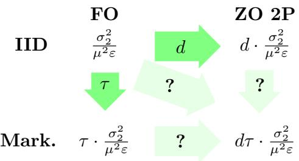
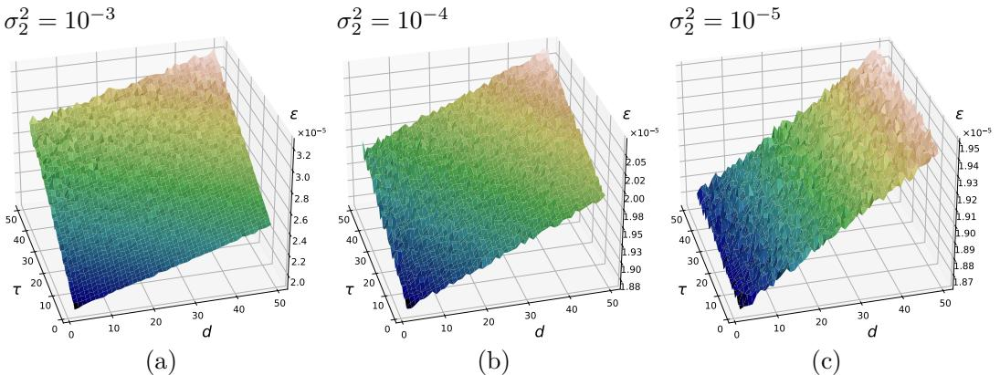

# Gradient-Free Approaches is a Key to an Efficient Interaction with Markovian Stochasticity

Anonymous Author(s) Affiliation Address email

# Abstract

This paper deals with stochastic optimization problems involving Markovian   
noise with a zero-order oracle. We present and analyze a novel derivative  
free method for solving such problems in strongly convex smooth and   
non-smooth settings with both one-point and two-point feedback oracles.   
Using a randomized batching scheme, we show that when mixing time $\tau$ of   
the underlying noise sequence is less than the dimension of the problem $d$ , the   
convergence estimates of our method do not depend on $\tau$ . This observation   
provides an efficient way to interact with Markovian stochasticity: instead   
of invoking the expensive first-order oracle, one should use the zero-order   
oracle. Finally, we complement our upper bounds with the corresponding   
lower bounds. This confirms the optimality of our results.

# 12 1 Introduction

Stochasticity is a fundamental aspect of many optimization problems, naturally arising   
in the field of machine learning [48, 28]. Stochastic gradient descent (SGD) [45] and its   
accelerated variants [39, 25] have become a de facto optimizers for modern large models   
training. Theoretical properties of SGD have been extensively studied under various statistical   
frameworks [36, 24, 10, 56], often relying on the assumption that noise is independent   
and identically distributed (i.i.d.). However, in many real-world applications — including   
reinforcement learning (RL) [6, 16], distributed optimization [35, 31], and bandit problems   
[3] — noise is not i.i.d., instead exhibiting correlations or Markovian structure.   
For instance, in the mentioned growing field of RL, sequential interactions with the environ  
ment induce state-dependent structure of the noise, creating a need for non-i.i.d. noise aware   
algorithms. Although several gradient-based methods for Markovian stochastic oracles have   
been studied in the past decade [14, 18], policy optimization in RL is based solely on reward   
feedback, making traditional methods inapplicable, since there is no access to first-order   
information [46, 9, 19]. Zero-order optimization (ZOO) methods are specifically developed   
to address such problems, and are used in scenarios where gradients are unavailable or   
prohibitively expensive to compute. Apart from RL, ZOO techniques are widely employed in   
adversarial attack generation [8], hyperparameter tuning [47, 57], continuous bandits [7, 49]   
and other applications [54, 33]. While the literature on ZOO is extensive, this work is, to   
our knowledge, the first study of optimization problem with both zero-order information and   
Markovian noise, aimed at developing an optimal algorithm for a large family of problems   
from the intersection of these two areas.   
$\diamond$ Zero-order methods is one of the key and oldest areas of optimization. There are various   
zero-order approaches, here we can briefly highlight, e.g., one-dimensional methods [32, 42]   
or their high-dimensional analogues [41], ellipsoid algorithms [58] and searches along random   
directions [4]. Currently, the most popular and most studied mechanism behind ZOO   
methods is the finite-difference approximation of the gradient described in [43, 20, 40]. The   
idea is simple: querying two sufficiently close points is essentially equivalent to finding a   
value of the directional derivative of the function:

$$
\langle \nabla f ( x ) , e \rangle \approx { \frac { f ( x + t e ) - f ( x ) } { t } } \approx { \frac { f ( x + t e ) - f ( x - t e ) } { 2 t } } ,
$$

where $e$ is a random direction. It can be a random coordinate, a vector from the Euclidean   
sphere or a sample of the Gaussian distribution. The approximation (1) in turn leads back to   
the gradient methods or coordinate algorithms of Nesterov [38]. There are, however, several   
differences:   
• First, to get full gradient information, the algorithm would need $d$ queries instead of one   
gradient oracle call (here $d$ is the dimension of $x$ ).   
• Second, if the ZO oracle is inexact, i.e. only noisy values of function are available, then   
finite difference schemes can fail if noise components do not cancel out.   
The setting of the second point, when function evaluations experience zero-mean additive   
perturbations, is called Stochastic ZOO. The stochasticity, as noted before, is abundant in   
the modern optimization world. To tackle this issue, additional assumptions about the noise   
structure are required. Here we briefly discuss two main ideas adopted in the literature, and   
refer the reader to Section 2 for precise definitions.   
In the case of two-point feedback, we assume that for a fixed value of the noise variable one   
can call the stochastic zero-order oracle at least twice. It means that we can compute the   
finite difference approximation of the following form:

$$
p ( x , \xi , e ) = \frac { f ( x + t e , \xi ) - f ( x - t e , \xi ) } { 2 t } \approx \langle \nabla _ { x } f ( x , \xi ) , e \rangle
$$

Such approximation produces an estimate for the directional derivative of a noisy realization   
$f ( \cdot , \xi )$ of the function $f$ . As mentioned before, the approximation (2) can be used instead of   
the (stochastic) gradient in first-order methods. In the case of independent randomness, a   
large number of works are based on this idea. There are results for both non-smooth and   
smooth convex problems built on classical and accelerated gradient methods of Nesterov and   
Spokoiny [40]. In the scope of our paper, we are interested in the results for smooth strongly   
convex proin terms of m: amely . Here imates on zero-order oracle calls to achieve  is introduced as the variance of the gradien $\varepsilon$ -solution, i.e. it is   
$\| x - x ^ { * } \|$ $\begin{array} { r } { \mathcal { O } ( \frac { d \sigma _ { 2 } ^ { 2 } } { \mu ^ { 2 } \varepsilon } ) } \end{array}$ $\sigma _ { 2 }$   
assumed that $\mathbb { E } _ { \xi } \nabla f ( x , \xi ) = \nabla f ( x )$ and $\mathbb { E } _ { \xi } \| \nabla f ( x , \xi ) - \nabla f ( x ) \| ^ { 2 } \le \sigma _ { 2 } ^ { : }$ . The main limitation   
of two-point approach is that several evaluations with the same noise variable are required,   
which is well suited for problems like empirical risk optimization [34], but can be a major   
barrier for RL or online optimization.   
In the one-point feedback setting, a more general stochasticity is assumed. In this case, each   
call to the zero-order oracle generates a new randomness. Now the approximation (1) looks   
as follows

$$
p ( x , \xi ^ { \pm } , e ) = \frac { f ( x + t e , \xi ^ { + } ) - f ( x - t e , \xi ^ { - } ) } { 2 t }
$$

Using different $\xi ^ { + }$ and $\xi ^ { - }$ in (3) renders any conditions on the properties of $\nabla f ( \cdot , \xi )$ useless.   
Instead, it is assumed that $\mathbb { E } _ { \xi } f ( x , \xi ) = f ( x )$ and $\mathbb { E } _ { \xi } | f ( x , \xi ) - f ( x ) | ^ { 2 } \le \sigma _ { 1 } ^ { : 2 }$ . With one-point   
feedback, the major problem is choosing the right shift $t$ for the finite difference scheme.   
Picking it too small results in an amplification of the additive noise, and taking $t$ too big   
leads to a poor gradient estimate. Because of this variance trade-off, the optimal rate for   
methods with one-point approximation is worse than for two-point feedback. In particular,   
for smooth strongly convex problems we have the following estimate on zero-order oracle   
calls [23]: $\begin{array} { r } { \mathcal { O } \big ( \frac { d ^ { 2 } \sigma _ { 1 } ^ { 2 } } { \mu ^ { 3 } \varepsilon ^ { 2 } } \big ) } \end{array}$ .   
Although zero-order gradient approximation schemes suffer from high variance, there is a   
surprising property that makes them superior in non-smooth optimization [22, 44, 49]. The   
idea goes back to the 70s and utilizes the fact that

nction, defined as

$$
\begin{array} { r } { \cdot p ( x , \xi ^ { ( \pm ) } , e ) ] = \frac { 1 } { d } \nabla f _ { t } ( x ) , \mathrm { ~ w h e r e ~ } f _ { t } \mathrm { ~ i s ~ a ~ } s m o o t h e d \mathrm { ~ f u ~ } } \\ { f _ { t } ( x ) = \mathbb { E } _ { r } \left[ f ( x + t r ) \right] \mathrm { ~ w i t h ~ } r \sim R B _ { 2 } ^ { d } } \end{array}
$$

In fact, it can be shown that ft is dGt - smooth if $f$ is $G$ -Lipschitz. This makes zero-order   
approximation a suitable candidate for a stochastic gradient of $f _ { t }$ . Optimizing this function   
with a first-order method produces some solution, but it may not be the optima of $f$ [22].   
From this point, there is a game – for small $t$ the functions $f$ and $f _ { t }$ are closer and for big $t$   
the function $f _ { t }$ is easier to optimize as it gets smoother.   
In more recent works, there have been many improvements in theoretical understanding of   
ZO methods. The authors consider higher-order smoothness of the underlying function [2],   
tackle non-convex non-smooth problems [44], take arbitrary Bregman geometry to benefit   
in terms of oracle complexity [49, 29], and come up with sharp information-theoretic lower   
bounds to understand computational limits [15, 1]. But none of them consider Markovian   
stochasticity.   
$\diamond$ Markovian first-order methods. While the literature on stochastic optimization with   
i.i.d. noise is extensive, research addressing the Markovian setting remains relatively sparse.   
In our paper, we focus on the most "friendly" type of uniformly geometrically ergodic Markov   
chains (see Section 2 for precise definitions).   
Duchi et al. [14] conducted pioneering work on non-i.i.d. noise, investigating the Ergodic   
Mirror Descent algorithm and establishing optimal convergence rates for non-smooth convex   
problems. For smooth problems there were different attempts to get record-breaking estimates   
on the first-order oracle [12, 11, 59, 18]. Finally, the optimal results were obtained for both   
convex and non-convex problems in the works of Beznosikov et al. [5], Solodkin et al. [52]. In   
particular, for smooth strongly convex objectives under Markovian noise the authors give the   
complexity of the form: $\begin{array} { r } { \mathcal { O } \big ( \frac { \tau \sigma _ { 2 } ^ { 2 } } { \mu ^ { 2 } \varepsilon } \big ) } \end{array}$ , where $^ { \prime }$ is defined as the mixing time of the corresponding   
Markov chain (see Section 2). Note that these works utilize Multilevel Monte Carlo (MLMC)   
batching technique, which helps to effectively interact with Markovian noise. We will need   
this approach as well. Note that it was first considered in Markovian gradient optimization   
by Dorfman and Levy [13] for automatic adaptation to unknown $\tau$ .

$\diamond$ Hypothesis. The complexity estimate for strongly convex first-order stochastic methods is $\begin{array} { r } { \mathcal { O } ( \frac { \sigma _ { 2 } ^ { 2 } } { \mu ^ { 2 } \varepsilon } ) } \end{array}$ [36, 37]. Lower bounds for the same class of problems and methods show that the result is unimprovable [58]. As mentioned before, the transition from i.i.d. stochasticity to Markovian stochasticity increases the estimate by $\tau$ times. This result is also optimal as shown by Beznosikov et al. [5]. At the same time, going from gradient oracle to zero-order methods adds a multiplier $d$ in the two-point feedback and $d ^ { 2 } / \varepsilon$ in the one-point case. And this estimate is unimprovable as well [1, 15].

The hypothesis arises that the transition to zero  
order Markov optimization adds two multipliers   
at once: $d \tau$ and $d ^ { 2 } \tau / _ { \varepsilon }$ for two- and one-point. It is   
illustrated in the following diagram for two-point   
feedback:

# 1.2 Our contribution

Our main contribution is the answer to the hy  
pothesis above: surprisingly, it is not true. In more detail:

$\diamond$ Accelerated SGD. We present the first analysis of Zero-Order Accelerated SGD under Markovian noise, considering both two-point and one-point feedback. Contrary to the expected multiplicative scaling of convergence rates with both dimensionality and mixing time, our analysis reveals a significant acceleration, as presented in Figure 1. It turns out that if $\tau$ is smaller than $d$ , our results do not differ at all from the gradient-free methods

with independent stochasticity. The key technique behind this acceleration is described in   
131 Section 2.1. The theory is also numerically validated in Section 3.

$\diamond$ Non-smooth problems. We also consider non-smooth problems with Markovian noise. Using the smoothing technique we come up with a corresponding upper bounds in this case, as shown in Figure 1. The details of these bounds are presented in Appendix A.

Figure 1: Summary of upper bounds. For notation, see Table 1   

<table><tr><td></td><td colspan="2">Smooth</td><td colspan="4">Non-smooth</td></tr><tr><td></td><td>IID</td><td>Markov.</td><td></td><td>IID</td><td>Markov.</td><td></td></tr><tr><td>FO</td><td>2</td><td>[45]</td><td>2 [5]</td><td>Q2</td><td>[50]</td><td>G2 [14]1 T</td></tr><tr><td>ZO 2P</td><td>d</td><td>[30]</td><td>(d+T)</td><td></td><td>[22]</td><td>(d+T) S</td></tr><tr><td>ZO 1P</td><td>2 32</td><td>[2]2</td><td>Lo2 d(d+T) 32</td><td>2 1 μ43</td><td>[23]</td><td>G2 d(d+T) 1 μ43</td></tr></table>

$\diamond$ Computational efficiency. First, as noted above, our method gives the same oracle complexity for any $\tau \leq d$ . Moreover, if we assume that calling a zero-order oracle is $d$ times cheaper than computing the corresponding gradient, then the gradient method with Markov noise will require resources proportionally to $d \cdot \tau$ — the cost of one oracle call is $d$ and the complexity scales as $\tau$ for the first-order method from Figure 1. At the same time, the resource complexity of our zero-order method is proportional to $d + \tau$ .

$\diamond$ Lower bounds. In Section 2.3 we establish the first information-theoretic lower bounds for solving Markovian optimization problems with one-point and two-point feedback. Our results match the convergence guarantee of our algorithm up to logarithmic factors, showing that the analysis is accurate and no further improvement is possible.

Table 1: Notations & Definitions   

<table><tr><td>Sym.</td><td>Definition</td><td>Sym.</td><td>Definition</td></tr><tr><td>-1, &lt;-,-&gt;</td><td>Norm,dot product,assumed Euclidean by default</td><td>m</td><td>x-x*1|2</td></tr><tr><td>Z,Z</td><td>Complete separable metric space,its Borel o-algebra</td><td>d</td><td>Problem dimension</td></tr><tr><td>Q</td><td>Markov kernel on Z×Z</td><td>L</td><td>Gradient&#x27;s Lipshitz constant</td></tr><tr><td>P，Eg</td><td>Probability,Expectation under initial distribution ε</td><td>μ</td><td>Strong convexity constant</td></tr><tr><td>{Z}</td><td>Canonical process with kernel Q</td><td>G</td><td>Function&#x27;s Lipshitz constant</td></tr><tr><td>RB，RS</td><td>Uniform distribution on unit a lz-ball,-sphere</td><td></td><td>|F(x,Z)-f(x)l²≤σ²</td></tr><tr><td>e</td><td></td><td>品</td><td>vF(x,Z)-∀f(x）l²≤²</td></tr><tr><td>an≤bn</td><td>c ∈ R (problem-independent):an ≤cbn for all n</td><td>T</td><td>Mixing time of Z</td></tr><tr><td>an~bn</td><td>an≤bn and bn≤an</td><td>9,g</td><td>Gradient estimators</td></tr><tr><td>T=O(S)</td><td>T≤ poly(log S)·S as ε→0</td><td>ft(x)</td><td>Er[f(x+tr)],r~ RB</td></tr></table>

# 150 2 Main results

51 We are now ready for a more formal presentation. In this paper, we study the minimization   
problem

$$
\operatorname* { m i n } _ { x \in \mathbb { R } ^ { d } } f ( x ) : = \mathbb { E } _ { Z \sim \pi } \left[ F ( x , Z ) \right] ,
$$

where $\pi$ is an unknown distribution and access to the function $f$ (not to its gradient $\nabla f$ ) is available through a stochastic one-point or two-point oracle $F ( x , Z )$ .

155 In our analysis, we will use a set of assumptions on the underlying function $f$ and its oracle,   
56 starting with smoothness and convexity:

Assumption 1. The function 57 $f$ is $L$ -smooth on $\mathbb { R } ^ { d }$ with $L > 0$ , i.e., it is differentiable and there is a constant 158 $L > 0$ such that the following inequality holds for all $x , y \in \mathbb { R } ^ { d }$ :

$$
\| \nabla f ( x ) - \nabla f ( y ) \| \leq L \| x - y \| .
$$

In the two-point feedback setting, we require the following generalization:

Assumption60 $\mathbf { 1 } ^ { \prime }$ . For al l $Z \in Z$ the function $F ( \cdot , Z )$ is $L$ -smooth on $\mathbb { R } ^ { d }$ .

Note that the uniform161 $1 ^ { \prime }$ implies 1.

Assumption 2. The function $f$ is $\mu$ -strongly convex on $\mathbb { R } ^ { d }$ , i.e., it is continuously dif  
ferentiable and there is a constant $\mu > 0$ such that the following inequality holds for all   
$x , y \in \mathbb { R } ^ { d }$ :

$$
{ \frac { \mu } { 2 } } \| x - y \| ^ { 2 } \leq f ( x ) - f ( y ) - \langle \nabla f ( y ) , x - y \rangle .
$$

We now turn to assumptions on the sequence of noise states $\{ Z _ { i } \} _ { i = 0 } ^ { \infty }$ . Specifically, we   
consider the case where $\{ Z _ { i } \} _ { i = 0 } ^ { \infty }$ forms a time-homogeneous Markov chain. Let Q denote the   
corresponding Markov kernel. We impose the following assumption on Q to characterize its   
mixing properties:   
Assumption 3. $\{ Z _ { i } \} _ { i = 0 } ^ { \infty }$ is a stationary Markov chain on $( \boldsymbol { \mathbb { Z } } , \boldsymbol { \mathcal { Z } } )$ with Markov kernel Q and   
unique invariant distribution $\pi$ . Moreover, $\mathrm { \Delta Q }$ is uniformly geometrically ergodic with mixing   
time $\tau \in \mathbb { N }$ , i.e., for every $k \in \mathbb N$ ,

$$
\Delta ( \boldsymbol { \mathrm { Q } } ^ { k } ) = \operatorname* { s u p } _ { z , z ^ { \prime } \in \boldsymbol { \mathrm { Z } } } ( 1 / 2 ) \| \boldsymbol { \mathrm { Q } } ^ { k } ( z , \cdot ) - \boldsymbol { \mathrm { Q } } ^ { k } ( z ^ { \prime } , \cdot ) \| _ { \mathsf { T V } } \leq ( 1 / 4 ) ^ { \lfloor k / \tau \rfloor } .
$$

Assumption 3 is common in the literature on Markovian stochasticity [14, 12, 13, 5, 52]. It   
includes, for instance, irreducible aperiodic finite Markov chains [18]. The mixing time $\tau$   
reflects how quickly the distribution of the chain approaches stationarity, providing a natural   
measure of the temporal dependence in the data.   
Next, we specify our assumptions on the oracle. As discussed in Section 1.1, these assumptions   
differ based on the type of feedback.

Assumption 4 (for one-point). For all 178 $x \in \mathbb { R } ^ { d }$ it holds that $\mathbb { E } _ { \pi } [ F ( x , Z ) ] = f ( x )$ . Moreover, for all 179 $Z \in Z$ and $x \in \mathbb { R } ^ { d }$ it holds that

$$
| F ( x , Z ) - f ( x ) | ^ { 2 } \leq \sigma _ { 1 } ^ { 2 } ,
$$

Assumption180 $\mathbf { { 4 } ^ { \prime } }$ (for two-point). For all $x \in \mathbb { R } ^ { d }$ it holds that $\mathbb { E } _ { \pi } [ \nabla F ( x , Z ) ] = \nabla f ( x )$ . Moreover, for all 181 $Z \in Z$ and $x \in \mathbb { R } ^ { d }$ it holds that

$$
\begin{array} { r } { \left\| \nabla F ( x , Z ) - \nabla f ( x ) \right\| ^ { 2 } \leq \sigma _ { 2 } ^ { 2 } . } \end{array}
$$

Recent works on stochastic ZOO methods have considered milder assumptions, such as   
bounded variance (see Section 1.1). However, the uniform boundedness assumed in Assump  
tions 4 and $4 ^ { \prime }$ , is standard in analyses under Markovian noise [14, 12, 13, 5, 52]. These   
assumptions can be relaxed under stronger conditions, e.g., uniform convexity and smoothness   
186 of $F ( \cdot , Z )$ [18].   
7 Assumptions 3 and 4 allow us to reduce the variance of the noise via batching, similarly the   
to i.i.d. setting. This is captured in the following technical lemma:   
Lemma 1. Let Assumptions 3 and 4(4′) hold. Then for any $n \geq 1$ and $x \in \mathbb { R } ^ { d }$ and any   
initial distribution $\xi$ on $( Z , { \mathcal { Z } } )$ , we have

$$
\mathbb { E } _ { \xi } \left[ \frac { 1 } { n } \sum _ { i = 1 } ^ { n } F ( x , Z _ { i } ) - f ( x ) \right] ^ { 2 } \lesssim \frac { \tau } { n } \sigma _ { 1 } ^ { 2 } , \ \mathbb { E } _ { \xi } \left. \frac { 1 } { n } \sum _ { i = 1 } ^ { n } \nabla F ( x , Z _ { i } ) - \nabla f ( x ) \right. ^ { 2 } \lesssim \frac { \tau } { n } \sigma _ { 2 } ^ { 2 } .
$$

# 191 2.1 Batching technique

In this section, we describe the main tools used to establish the $( d + \tau )$ -type scaling of the   
error rate. We will focus on reducing the variance and bias of gradient estimators using a   
specialized batching approach.   
We begin by fixing a common building block of our gradient estimators at a point $x$ for both   
one-point and two-point feedback, as introduced in Section 1.1:

$$
\hat { g } ( x , Z ^ { ( \pm ) } , e ) = d \cdot p ( x , Z ^ { ( \pm ) } , e ) \cdot e = e \cdot \left\{ \begin{array} { l l } { { d \frac { F ( x + t e , Z ^ { + } ) - F ( x - t e , Z ^ { - } ) } { 2 t } } } & { { \mathrm { ( o n e - p o i n t ) , } } } \\ { { d \frac { F ( x + t e , Z ) - F ( x - t e , Z ) } { 2 t } } } & { { \mathrm { ( t w o - p o i n t ) . } } } \end{array} \right.
$$

These estimators exhibit a twofold randomness that affects how rapidly they concentrate   
around the true gradient, as we will discuss below.   
For clarity, we focus our discussion on the one-point case, although our conclusions extend   
to the two-point case as well.

A widely used variance reduction technique is mini-batching, where one computes $F ( x , Z _ { i } )$ over a batch of noise variables 202 $\{ Z _ { i } \} _ { i = 1 } ^ { n }$ . The mini-batch gradient estimator is given by:

$$
\hat { g } _ { m b } ( x ) = \frac { 1 } { n } \sum _ { i = 1 } ^ { n } \hat { g } ( x , Z _ { i } ^ { \pm } , e ) = e \cdot d \widetilde { \left( \frac { 1 } { n } \sum _ { i = 1 } ^ { n } p ( x , Z _ { i } ^ { \pm } , e ) \right) } .
$$

Let us estimate the scaling of its variance $\mathbb { E } _ { e } \mathbb { E } _ { Z } \big \| \hat { g } _ { m b } - \nabla f \big \| ^ { 2 }$ with the noise level $\sigma _ { 1 } ^ { 2 }$ . As   
$\begin{array} { r } { E _ { Z } \hat { g } _ { m b } \approx d \frac { f ( x + t e ) - f ( x - t e ) } { 2 t } \approx d \langle \nabla f , e \rangle } \end{array}$ we would like to estimate the following for any fixed   
direction $e$ :

$$
\mathbb { E } _ { Z } \big [ d \cdot p _ { m b } ( x ) - d \langle \nabla f , e \rangle \big ] ^ { 2 } \approx \frac { d ^ { 2 } } { t ^ { 2 } } \mathbb { E } _ { Z } \Big [ \frac { 1 } { n } \sum _ { i = 1 } ^ { n } F ( x + t e , Z _ { i } ^ { + } ) - f ( x + t e ) \Big ] ^ { 2 } \overset { ( 1 ) } { \approx } \frac { d ^ { 2 } \tau } { n } \frac { \sigma _ { 1 } ^ { 2 } } { t ^ { 2 } } .
$$

With that, we bound the variance:

$$
\mathbb { E } _ { e } \mathbb { E } _ { Z } \big \| \hat { g } _ { m b } - \nabla f \big \| ^ { 2 } \gtrsim \mathbb { E } _ { e } \mathbb { E } _ { Z } \big \| \hat { g } _ { m b } - \mathbb { E } _ { Z } \hat { g } _ { m b } \big \| ^ { 2 } \approx \mathbb { E } _ { e } \mathbb { E } _ { Z } \big \| \hat { g } _ { m b } - d \langle \nabla f , e \rangle \big \| ^ { 2 } \overset { ( 7 ) } { \approx } \frac { d ^ { 2 } \tau \sigma _ { 1 } ^ { 2 } } { n t ^ { 2 } } .
$$

# 207 Can the mini-batching scheme be improved?

This subsection explores an unexpected source of improvement that contradicts our initial   
hypothesis. Specifically, we identify an inefficiency in the current use of samples $Z _ { i }$ , which   
becomes evident from two perspectives. Equation (8) shows the variance scales as $\frac { \tau } { n }$ . If   
we could reduce $\tau$ by a factor of $k$ , we would need $k$ -times fewer samples to maintain   
the same variance. This leads us to the idea of sparsified sampling. We partition the   
Markov noise chain $\{ Z _ { i } \}$ into $k$ subchains $\left\{ Z _ { k \cdot i + r } \right\}$ for $r = 0 \ldots k - 1$ . This corresponds to a   
mixing time of $\lceil \frac { \tau } { k } \rceil$ for each subchain (see (3)), effectively reducing temporal correlation - a   
natural consequence of sampling every $k$ -th element of the original chain. Thus, sampling   
from any single subchain could yield a $\operatorname* { m i n } ( k , \tau )$ -fold reduction in the number of samples   
needed (although such procedure would still require all intermediate oracle calls, yielding no   
computational speedup).   
For a concrete illustration of that inefficiency, consider a lazy Markov chain that remains   
in the same state for (an average of) $\tau$ steps before transitioning uniformly at random. In   
such a case, all oracle queries $F ( x , Z )$ for a fixed $x$ return the same value for $\tau$ consecutive   
steps. Therefore, retaining only every $\tau$ -th estimate $\hat { g }$ would yield a mini-batch of equivalent   
quality.   
In summary, we observe that the mini-batching scheme could, in principle, operate just as   
effectively by retaining only every $k$ -th sample and discarding the rest. This might suggest   
that better utilization of the samples is possible. First order methods, nevertheless, are   
unable to exploit this redundancy (as shown by [5]’s lower bound) and are effectively forced   
to wait out the $\tau$ -step mixing window. In contrast, we can exploit this structure by querying   
finite differences along different directions to estimate the gradient better. Specifically, we   
construct $d$ subchains, and use the sample from the -th subchain $\operatorname { \angle } _ { d \cdot i + r }$ to estimate -th   
partial derivative $\frac { F ( x + t e _ { r } , Z ) - F ( x - t e _ { r } , Z ) } { 2 t }$ , effectively restoring the full gradient coordinate-wise.   
Let us estimate the resulting variance reduction. First, we achieve a $d$ -fold reduction by   
reconstructing all $d$ gradient coordinates. Second, each coordinate now operates on a chain   
with mixing time $\textstyle \left\lceil { \frac { \tau } { d } } \right\rceil$ , yielding an additional factor of $\operatorname* { m i n } ( d , \tau )$ . However, because batches   
are now split across $d$ coordinates, each batch is $d$ times smaller than before, introducing   
a factor of $d$ loss. The net variance reduction is therefore $\operatorname* { m i n } ( d , \tau )$ , and the final scaling   
becomes · dτ min(d,τ ) = d · max(d, τ ) ≃ d(d + τ ).

# 238 Random directions

This insight can be extended to a simpler yet equally effective method. Instead of assigning   
directions deterministically, we associate each sample with a random direction $e \in R S _ { 2 } ^ { d }$ ,   
forming the estimator:

$$
\hat { g } _ { r d } [ n ] ( x , Z , e ) = \frac { 1 } { n } \sum _ { i = 1 } ^ { n } \hat { g } ( x , Z _ { i } , e _ { i } ) .
$$

While the above discussion was intuitive, we now outline a more formal approach (see   
Lemma 5 for details). As lazy Markov chain is effectively equivalent to stochastic i.i.d.   
$\tau$ -point feedback setting, we follow Corollary 2 of [15], who decompose the total variance   
into two terms:

$$
\begin{array} { r } { \mathbb { E } \big \| \widehat { g } _ { r d } - \nabla f ( x ) \big \| ^ { 2 } \leq 2 \mathbb { E } \big \| \widehat { g } _ { r d } - \mathbb { E } _ { e } \widehat { g } _ { r d } \big \| ^ { 2 } + 2 \mathbb { E } \big \| \mathbb { E } _ { e } \widehat { g } _ { r d } - \nabla f ( x ) \big \| ^ { 2 } . } \end{array}
$$

Each of the two terms individually eliminates one factor from the 246 $d ^ { 2 } \tau$ dependence.

The first term:

$$
\begin{array} { r } { \mathbb { E } \big \| \hat { g } _ { r d } - \mathbb { E } _ { e } \hat { g } _ { r d } \big \| ^ { 2 } = \mathbb { E } _ { Z } \mathbb { E } _ { e } \Bigg \| \Bigg | \frac { 1 } { n } \sum _ { i = 1 } ^ { n } \underbrace { \big [ \hat { g } ( x , Z _ { i } , e _ { i } ) - E _ { e _ { i } } \hat { g } ( x , Z _ { i } , e _ { i } ) \big ] } _ { \mathbb { E } _ { e } [ \cdot ] = 0 , \mathrm { ~ i n d e p e n d e n t ~ w . r . t . ~ } e } \Bigg | \Bigg | } \\ { = \frac { 1 } { n ^ { 2 } } \displaystyle \sum _ { i = 1 } ^ { n } \mathbb { E } \big \| \hat { g } ( x , Z _ { i } , e _ { i } ) - \mathbb { E } _ { e _ { i } } \hat { g } ( x , Z _ { i } , e _ { i } ) \big \| ^ { 2 } } \end{array}
$$

is independent of $\tau$ since Assumption 4 bounds each term directly.

For the second term, we observe that $\mathbb { E } _ { e } \hat { g } _ { r d } ~ = ~ \mathbb { E } _ { e } \hat { g } _ { m b }$ , and thus the bound involves   
$\mathbb { E } \big \lVert \mathbb { E } _ { e } \hat { g } _ { m b } - \nabla f ( x ) ^ { 2 } \big \rVert$ . This is crucially different from the $d ^ { 2 } \tau$ dependence that appeared in   
the mini-batch case, when we considered ${ \mathbb E } \big \| \hat { g } _ { m b } - \nabla f ( x ) ^ { 2 } \big \|$ . Intuitively, the expectation   
over directions helps recover the full gradient rather than a directional component, thereby   
reducing variance with respect to $d$ .

# Multilevel Monte Carlo

The estimator $\hat { g } _ { r d }$ is not our final construction. While it controls variance, the temporal   
correlation in noise may introduce significant bias. A well-established approach to mitigating   
this is MLMC, widely used in the statistical literature [27, 26], and more recently in gradient   
optimization [13, 5]. Here is our interpretation.

With parameters 259 $J , l , M , B$ from Table 2, $\{ Z _ { i } \} ~ - ~ 2 ^ { J } l$ samples from $Z$ and $\left\{ e _ { i } \right\}$ - random 260 directions we introduce MLMC estimator:

$$
\hat { g } _ { m l } ( x ) = \hat { g } _ { r d } [ l ] ( x ) + \left\{ \begin{array} { l l } { 2 ^ { J } \left[ \hat { g } _ { r d } \left[ 2 ^ { J } l \right] ( x ) - \hat { g } _ { r d } \left[ 2 ^ { J - 1 } l \right] ( x ) \right] , } & { \mathrm { ~ i f ~ } 2 ^ { J } \leq M } \\ { 0 , } & { \mathrm { ~ o t h e r w i s e } } \end{array} \right.
$$

$\hat { g } _ { m l }$ is our final gradient estimator, with the following guarantees:

Lemma 2 (for one-point). Let Assumptions262 $\mathit { 1 }$ , $\boldsymbol { \mathcal { J } }$ and 4 hold. For any initial distribution1 $\xi$ on 263 $( Z , { \mathcal { Z } } )$ the gradient estimates $\hat { g } _ { m l }$ satisfy $\mathbb { E } [ \hat { g } _ { m l } ] = \mathbb { E } \big [ \hat { g } _ { r d } \big [ 2 ^ { \lfloor \log _ { 2 } M \rfloor } l \big ] \big ]$ . Moreover,

$$
\begin{array} { r l } & { \mathbb { E } \| \nabla f _ { t } ( x ) - \hat { g } _ { m l } ( x ) \| ^ { 2 } \lesssim \displaystyle \frac { d \| \nabla f ( x ) \| ^ { 2 } } { B } + \frac { d ^ { 2 } L ^ { 2 } t ^ { 2 } } { B } + \frac { d \left( d + \tau \right) \sigma _ { 1 } ^ { 2 } } { B t ^ { 2 } } , } \\ & { \| \nabla f _ { t } ( x ) - \mathbb { E } [ \hat { g } _ { m l } ( x ) ] \| ^ { 2 } \lesssim \displaystyle \frac { d \tau \sigma _ { 1 } ^ { 2 } } { t ^ { 2 } B M } . } \end{array}
$$

One can note that although $\hat { g } _ { m l }$ requires, on average, $\mathbb { E } \left[ 2 ^ { J } l B \right] = \log _ { 2 } ^ { 2 } M \cdot B$ oracle calls, the   
variance is only reduced by a factor of $B$ . In contrast, the bias is reduced significantly - by a   
factor of $B M$ .

# 2.2 Algorithm

We now present the full version of Algorithm 1, which incorporates the gradient estimators discussed in the previous section and uses a slightly modified variant of Nesterov’s Accelerated Gradient Descent at its core.

While technically we prove four separate upper bounds covering both one- and two-point feedback under smooth and non-smooth assumptions, they follow the same scheme which we will illustrate in the one-point smooth case.

Table 2: Parameters of Algorithm 1   

<table><tr><td>Hyperparameters</td><td></td><td>Momentums</td><td></td><td>Batch hidden parameters</td></tr><tr><td>Y</td><td>Stepsize,∈(0;]</td><td>β</td><td>4p2μY 3</td><td>2&#x27; Batch size.If 2&#x27;l&gt;M,then 0</td></tr><tr><td>t</td><td>Approximation step</td><td>3β n 2pμ</td><td>3 H</td><td>Random, J~ Geom(1/2)</td></tr><tr><td>B</td><td>Batch size multiplier</td><td>pn-1-1 0 βpn-1-1</td><td>M 1</td><td>2</td></tr><tr><td>N</td><td>Number of iterations</td><td>p</td><td>See Appendix</td><td>([log2M」+1) ·B</td></tr></table>

# Algorithm 1 Randomized Accelerated ZO GD

286

Lemma 4 establishes key properties of the smoothed objective function. Lemma 5 provides bounds on the bias and variance of the baseline estimator $\hat { g } _ { r d }$ . Lemma 2 then quantifies how the MLMC scheme amplifies or reduces these statistics. Finally, in Section C.4, we combine the results of these lemmas to prove the first part of Theorem 1, bounding Algorithm 1’s error. By tuning the parameters appropriately, we obtain the following iteration complexity bound:

1: Initialization: $x _ { f } ^ { 0 } = x ^ { 0 }$ ; see Table 2.   
: for $k = 0 , 1 , 2 , \ldots , N - 1$ do   
: $x _ { g } ^ { k } = \theta x _ { f } ^ { k } + ( 1 - \theta ) x ^ { k }$   
: Sample $J _ { k } , \{ e _ { i } \} , \left\{ F ( x _ { g } ^ { k } \pm t e _ { i } , Z _ { i } ^ { ( \pm ) } ) \right\}$   
: Calculate $\hat { g } ^ { k } = \hat { g } _ { m l } ( x )$   
: $\boldsymbol { x } _ { f } ^ { k + 1 } = \boldsymbol { x } _ { g } ^ { k } - p \gamma \hat { g } ^ { k }$ = x kg   
: $x ^ { k + 1 } = \eta x _ { f } ^ { k + 1 } + ( p - \eta ) x _ { f } ^ { k } +$   
+(1 − p)(1 − β)xk + (1 − p)βxkg   
: end for

Theorem 1. Let Assumptions 1 to 4 hold, and consider problem (4) solved by Algorithm $\mathit { 1 }$ .   
Then, for any target accuracy $\varepsilon$ and batch size multiplier $B$ (see Tables 1 and 2 for notation),   
and for a suitable choice of $\gamma , t , p$ , the number of oracle calls required to ensure $\mathbb { E } \| x ^ { N } - x ^ { * } \| ^ { 2 } \leq$   
$\varepsilon$ is bounded by

$$
B \cdot \tilde { \mathcal { O } } \left[ \operatorname* { m a x } \left( 1 , \frac { d } { B } \right) \sqrt { \frac { L } { \mu } } \log \frac { 1 } { \varepsilon } + \frac { L d \left( d + \tau \right) \sigma _ { 1 } ^ { 2 } } { B \mu ^ { 3 } \varepsilon ^ { 2 } } \right] \quad { \it o n e - p o i n t \ o r a c l e \ c a l } _ { \rho } ,
$$

Theorem $\mathbf { 1 } ^ { \prime }$ . Let Assumptions $1 ^ { \prime }$ to $\mathit { 4 ^ { \prime } }$ hold, and consider problem (4) solved by Algorithm 1.   
Then, for any target accuracy $\varepsilon$ and batch size multiplier $B$ (see Tables $\mathit { 1 }$ and 2 for notation),   
and for a suitable choice of $\gamma , t , p$ , the number of oracle calls required to ensure $\mathbb { E } \| x ^ { N } - x ^ { * } \| ^ { 2 } \leq$   
$\varepsilon$ is bounded by

$$
B \cdot \tilde { \mathcal { O } } \left[ \operatorname* { m a x } \left( 1 , \frac { d } { B } \right) \sqrt { \frac { L } { \mu } } \log \frac { 1 } { \varepsilon } + \frac { ( d + \tau ) \sigma _ { 2 } ^ { 2 } } { B \mu ^ { 2 } \varepsilon } \right] t w o - p o i n t o r a c l e c a l l s .
$$

Remark. The iteration complexity of the algorithm, i.e., the number of iterates $x ^ { k }$ generated   
(equal to the oracle complexity divided by $B$ ), is bound by $\tilde { \mathcal { O } } \left( \sqrt { \frac { L } { \mu } } \log \frac { 1 } { \varepsilon } \right)$ as the batch size   
multiplier $B$ goes to infinity. This matches the optimal convergence rates for optimization   
with exact gradients [39].

# 2.3 Lower bounds

300 Here we present theorems demonstrating that no algorithm can asymptotically outperform   
01 Algorithm 1 in the smooth, strongly convex setting with either one- or two-point feedback.   
Theorem 2. (Lower bounds) For any (possibly randomized) algorithm that solves the problem   
(4), there exists a function $f$ that satisfies Assumptions $\mathit { 1 }$ to 4 ( $1 ^ { \prime }$ to $\mathit { 4 ^ { \prime } }$ ), s.t. in order to   
achieve $\varepsilon$ -approximate solution in expectation $\mathbb { E } \| x ^ { N } - x ^ { * } \| ^ { 2 } \leq \varepsilon$ , the algorithm needs at least

$$
\Omega \left( \frac { d ( d + \tau ) \sigma _ { 1 } ^ { 2 } } { \mu ^ { 2 } \varepsilon ^ { 2 } } \right) \quad o n e - p o i n t ~ o r \quad \Omega \left( \frac { ( d + \tau ) \sigma _ { 2 } ^ { 2 } } { \mu ^ { 2 } \varepsilon } \right) \quad t w o - p o i n t ~ o r a c l e ~ c a l l s .
$$

Remark. These results assume bounded second moments rather than uniform noise bounds.   
We explain how to adapt them to our setting, incurring only logarithmic overheads, in   
Section E.2.   
Discussion. We now compare our results to existing work. Akhavan et al. [2] analyze a   
special case of the one-point setting where the noise is independent of the query points. This   
aligns with our one-point oracle model and allows i.i.d. sampling as a Markov chain with   
fixed mixing time $\tau = 1$ . The only factor they do not consider is $\sigma _ { 1 } ^ { 2 }$ , which, however, appears   
in their proof with additional $\mu ^ { 2 }$ factor if used with scaled Gaussian noise. We discuss this   
further in Appendix E.   
In the work of Beznosikov et al. [5], a first-order Markovian oracle is considered, but the   
hard instance problem is a one-dimensional quadratic function, which makes first-order and   
zero-order information equivalent. Their result therefore corresponds to the $d = 1$ case in the   
two-point regime. Duchi et al. [15] provide tight lower bounds for general convex functions   
under two-point feedback. Their techniques can be extended to the strongly convex case   
by incorporating a shared quadratic component across the hard instances, as detailed in   
Appendix E, Theorem 10, yielding the bound we state for the two-point oracle with $\tau = 1$ .

Our novel contribution lies in establishing a lower bound that scales as $d \tau$ in the onepoint regime for large $\tau$ ; see Theorem 9. While our analysis relies on classical tools such as multidimensional hypothesis testing, the Markovian structure requires new bound on distances between joint distributions and the use of clipping. Detailed proofs, discussions, and further remarks on clipping appear in Appendix E.

# 3 Experiments

This section empirically supports our theoretical convergence rates and lower bounds, with particular focus on the stochastic component where we claim linear scaling in $d + \tau$ instead of $d \tau$ .

Setup. Our setup repeats the problem we used to prove the lower bounds (see Appendix E and [51]). We consider a quadratic objective $\begin{array} { r } { f ( x ) = \frac { 1 } { 2 } \left\| x \right\| ^ { 2 } } \end{array}$ and a two-point Markovian oracle $F ( x , Z ) = f ( x ) + \langle x , Z \rangle$ . The noise sequence $\{ Z _ { i } \}$ is a lazily updated standard Gaussian vector with variance $\sigma _ { 2 } ^ { 2 }$ . Figure 2 illustrates how the optimization error of Algorithm 1 scales with mixing time, problem dimension, and different values of $\sigma _ { 2 } ^ { 2 }$ .

  
Figure 2: Optimization error $\varepsilon = \| x ^ { N } - x ^ { * } \| ^ { 2 }$ after $N = 1 0 ^ { 3 }$ iterations. Starting point error $\left\| x _ { 0 } - x ^ { * } \right\| ^ { 2 } = 1 0 ^ { - 2 }$ . Stepsize $\gamma = 1 0 ^ { - 3 }$ , $t = 1 0 ^ { - 5 }$ . The results are averaged over $1 0 ^ { 4 }$ runs.

Discussion. The results confirm the linear dependence of the error on both the problem   
dimension $d$ and the mixing time $\tau$ . The noise parameter $\sigma ^ { 2 }$ controls the influence of the   
stochastic part. In Fig. (a), where $\sigma _ { 2 } ^ { 2 } = 1 0 ^ { - 3 }$ , the stochastic component dominates, while   
in Fig. (c), with $\sigma _ { 2 } ^ { 2 } = 1 0 ^ { - 5 }$ , it is negligible. Fig. (b) shows an intermediate regime that   
smoothly interpolates between the two, yet maintains the linear scaling. The deterministic   
part (c) shows no dependence on mixing time, but grows linearly with $d$ , which aligns with   
our theory (Theorem $1 ^ { \prime }$ ). The stochastic part (a) scales as $( d + \tau )$ , also matching the bound   
from the Theorem $1 ^ { \prime }$ .

# 343 References

[1] Arya Akhavan, Massimiliano Pontil, and Alexandre Tsybakov. Exploiting higher order smoothness in derivative-free optimization and continuous bandits. Advances in Neural Information Processing Systems, 33:9017–9027, 2020.

[2] Arya Akhavan, Evgenii Chzhen, Massimiliano Pontil, and Alexandre B Tsybakov.   
Gradient-free optimization of highly smooth functions: improved analysis and a new   
algorithm. Journal of Machine Learning Research, 25(370):1–50, 2024.   
[3] Peter Auer. Finite-time analysis of the multiarmed bandit problem. Machine Learning,   
:235–256, 2002.   
[4] El Houcine Bergou, Eduard Gorbunov, and Peter Richtárik. Stochastic three points   
method for unconstrained smooth minimization. SIAM Journal on Optimization, 30(4):   
2726–2749, 2020.   
[5] Aleksandr Beznosikov, Sergey Samsonov, Marina Sheshukova, Alexander Gasnikov,   
Alexey Naumov, and Eric Moulines. First order methods with markovian noise: from   
acceleration to variational inequalities. Advances in Neural Information Processing   
Systems, 36, 2024.   
[6] Jalaj Bhandari, Daniel Russo, and Raghav Singal. A finite time analysis of temporal   
difference learning with linear function approximation. In Conference on learning theory,   
pages 1691–1692. PMLR, 2018.   
[7] Sébastien Bubeck, Nicolo Cesa-Bianchi, et al. Regret analysis of stochastic and non  
stochastic multi-armed bandit problems. Foundations and Trends® in Machine Learning,   
5(1):1–122, 2012.   
[8] Pin-Yu Chen, Huan Zhang, Yash Sharma, Jinfeng Yi, and Cho-Jui Hsieh. Zoo: Zeroth   
order optimization based black-box attacks to deep neural networks without training   
substitute models. In Proceedings of the 10th ACM workshop on artificial intelligence   
and security, pages 15–26, 2017.   
[9] Krzysztof Choromanski, Mark Rowland, Vikas Sindhwani, Richard Turner, and Adrian   
Weller. Structured evolution with compact architectures for scalable policy optimization.   
In International Conference on Machine Learning, pages 970–978. PMLR, 2018.   
[10] Aymeric Dieuleveut, Nicolas Flammarion, and Francis Bach. Harder, better, faster,   
stronger convergence rates for least-squares regression. Journal of Machine Learning   
Research, 18(101):1–51, 2017.   
[11] Thinh T Doan. Finite-time analysis of markov gradient descent. IEEE Transactions on   
Automatic Control, 68(4):2140–2153, 2022.   
[12] Thinh T Doan, Lam M Nguyen, Nhan H Pham, and Justin Romberg. Convergence   
rates of accelerated markov gradient descent with applications in reinforcement learning.   
arXiv preprint arXiv:2002.02873, 2020.   
[13] Ron Dorfman and Kfir Yehuda Levy. Adapting to mixing time in stochastic optimization   
with markovian data. In International Conference on Machine Learning, pages 5429–   
5446. PMLR, 2022.   
[14] John C Duchi, Alekh Agarwal, Mikael Johansson, and Michael I Jordan. Ergodic mirror   
descent. SIAM Journal on Optimization, 22(4):1549–1578, 2012.   
[15] John C Duchi, Michael I Jordan, Martin J Wainwright, and Andre Wibisono. Optimal   
rates for zero-order convex optimization: The power of two function evaluations. IEEE   
Transactions on Information Theory, 61(5):2788–2806, 2015.   
[16] Alain Durmus, Eric Moulines, Alexey Naumov, Sergey Samsonov, and Hoi-To Wai. On   
the stability of random matrix product with markovian noise: Application to linear   
stochastic approximation and td learning. In Conference on Learning Theory, pages   
1711–1752. PMLR, 2021.   
[17] Pavel Dvurechensky, Eduard Gorbunov, and Alexander Gasnikov. An accelerated   
directional derivative method for smooth stochastic convex optimization. European   
Journal of Operational Research, 290(2):601–621, 2021.   
[18] Mathieu Even. Stochastic gradient descent under markovian sampling schemes. In   
International Conference on Machine Learning, pages 9412–9439. PMLR, 2023.   
[19] Maryam Fazel, Rong Ge, Sham Kakade, and Mehran Mesbahi. Global convergence of   
policy gradient methods for the linear quadratic regulator. In International conference   
on machine learning, pages 1467–1476. PMLR, 2018.   
[20] Abraham D. Flaxman, Adam Tauman Kalai, and H. Brendan McMahan. Online convex   
optimization in the bandit setting: gradient descent without a gradient. In Proceedings   
of the Sixteenth Annual ACM-SIAM Symposium on Discrete Algorithms, SODA ’05,   
page 385–394, USA, 2005. Society for Industrial and Applied Mathematics. ISBN   
0898715857.   
[21] Alexander Gasnikov, Darina Dvinskikh, Pavel Dvurechensky, Eduard Gorbunov,   
Aleksandr Beznosikov, and Alexander Lobanov. Randomized Gradient-Free Meth  
ods in Convex Optimization, pages 1–15. Springer International Publishing, Cham,   
2020. ISBN 978-3-030-54621-2. doi: 10.1007/978-3-030-54621-2_859-1. URL   
https://doi.org/10.1007/978-3-030-54621-2_859-1.   
[22] Alexander Gasnikov, Anton Novitskii, Vasilii Novitskii, Farshed Abdukhakimov, Dmitry   
Kamzolov, Aleksandr Beznosikov, Martin Takac, Pavel Dvurechensky, and Bin Gu.   
The power of first-order smooth optimization for black-box non-smooth problems. In   
Kamalika Chaudhuri, Stefanie Jegelka, Le Song, Csaba Szepesvari, Gang Niu, and Sivan   
Sabato, editors, Proceedings of the 39th International Conference on Machine Learning,   
volume 162 of Proceedings of Machine Learning Research, pages 7241–7265. PMLR,   
17–23 Jul 2022. URL https://proceedings.mlr.press/v162/gasnikov22a.html.   
[23] Alexander V Gasnikov, Ekaterina A Krymova, Anastasia A Lagunovskaya, Ilnura N   
Usmanova, and Fedor A Fedorenko. Stochastic online optimization. single-point and   
multi-point non-linear multi-armed bandits. convex and strongly-convex case. Automa  
tion and remote control, 78:224–234, 2017.   
[24] Saeed Ghadimi and Guanghui Lan. Stochastic first-and zeroth-order methods for   
nonconvex stochastic programming. SIAM journal on optimization, 23(4):2341–2368,   
2013.   
[25] Saeed Ghadimi and Guanghui Lan. Accelerated gradient methods for nonconvex   
nonlinear and stochastic programming. Mathematical Programming, 156(1):59–99, 2016.   
[26] Michael B. Giles. Multilevel monte carlo path simulation. Operations Research, 56(3):   
607–617, 2008. doi: 10.1287/opre.1070.0496. URL https://doi.org/10.1287/opre.   
1070.0496.   
[27] Peter W. Glynn and Chang-Han Rhee. Exact estimation for markov chain equilibrium   
expectations. Journal of Applied Probability, 51A:377–389, 2014. ISSN 00219002. URL   
http://www.jstor.org/stable/43284129.   
[28] Ian Goodfellow, Yoshua Bengio, and Aaron Courville. Deep Learning. MIT Press, 2016.   
http://www.deeplearningbook.org.   
[29] Eduard Gorbunov, Pavel Dvurechensky, and Alexander Gasnikov. An accelerated   
method for derivative-free smooth stochastic convex optimization. SIAM Journal   
on Optimization, 32(2):1210–1238, 2022. doi: 10.1137/19M1259225. URL https:   
//doi.org/10.1137/19M1259225.   
[30] Elad Hazan and Satyen Kale. Beyond the regret minimization barrier: Optimal algo  
rithms for stochastic strongly-convex optimization. Journal of Machine Learning Re  
search, 15(71):2489–2512, 2014. URL http://jmlr.org/papers/v15/hazan14a.html.   
[31] Bjorn Johansson, Maben Rabi, and Mikael Johansson. A simple peer-to-peer algorithm   
for distributed optimization in sensor networks. In 2007 46th IEEE Conference on   
Decision and Control, pages 4705–4710, 2007. doi: 10.1109/CDC.2007.4434888.   
[32] J. Kiefer. Sequential minimax search for a maximum. Proceedings of the American   
Mathematical Society, 4(3):502–506, 1953. ISSN 00029939, 10886826. URL http:   
//www.jstor.org/stable/2032161.   
[33] Xiangru Lian, Yijun Huang, Yuncheng Li, and Ji Liu. Asynchronous parallel stochastic   
gradient for nonconvex optimization. Advances in neural information processing systems,   
28, 2015.   
[34] Sijia Liu, Bhavya Kailkhura, Pin-Yu Chen, Paishun Ting, Shiyu Chang, and Lisa Amini.   
Zeroth-order stochastic variance reduction for nonconvex optimization. Advances in   
Neural Information Processing Systems, 31, 2018.   
[35] Cassio G. Lopes and Ali H. Sayed. Incremental adaptive strategies over distributed   
networks. IEEE Transactions on Signal Processing, 55(8):4064–4077, 2007. doi: 10.   
/TSP.2007.896034.   
[36] Eric Moulines and Francis Bach. Non-asymptotic analysis of stochastic approximation   
algorithms for machine learning. In J. Shawe-Taylor, R. Zemel, P. Bartlett, F. Pereira,   
and K.Q. Weinberger, editors, Advances in Neural Information Processing Systems,   
volume 24. Curran Associates, Inc., 2011. URL https://proceedings.neurips.cc/   
paper_files/paper/2011/file/40008b9a5380fcacce3976bf7c08af5b-Paper.pdf.   
[37] Deanna Needell, Rachel Ward, and Nati Srebro. Stochastic gradient descent, weighted   
sampling, and the randomized kaczmarz algorithm. Advances in neural information   
processing systems, 27, 2014.   
[38] Yu Nesterov. Efficiency of coordinate descent methods on huge-scale optimization   
problems. SIAM Journal on Optimization, 22(2):341–362, 2012.   
[39] Yurii Nesterov. A method for solving the convex programming problem with convergence   
rate o (1/k2). In Doklad nauk Sssr, volume 269, page 543, 1983.   
[40] Yurii Nesterov and Vladimir Spokoiny. Random gradient-free minimization of convex   
functions. Foundations of Computational Mathematics, 17(2):527–566, 2017.   
[41] Donald J Newman. Location of the maximum on unimodal surfaces. Journal of the   
ACM (JACM), 12(3):395–398, 1965.   
[42] J. Nocedal and S. Wright. Numerical Optimization. Springer Series in Operations   
Research and Financial Engineering. Springer New York, 2006. ISBN 9780387227429.   
URL https://books.google.ru/books?id=7wDpBwAAQBAJ.   
[43] Boris Polyak. Introduction to Optimization. Optimization Software - Inc., Publications   
Division, 1987.   
[44] Yuyang Qiu, Uday Shanbhag, and Farzad Yousefian. Zeroth-order methods for non  
differentiable, nonconvex, and hierarchical federated optimization. In A. Oh, T. Nau  
mann, A. Globerson, K. Saenko, M. Hardt, and S. Levine, editors, Advances in   
Neural Information Processing Systems, volume 36, pages 3425–3438. Curran As  
sociates, Inc., 2023. URL https://proceedings.neurips.cc/paper_files/paper/   
2023/file/0a70c9cd8179fe6f8f6135fafa2a8798-Paper-Conference.pdf.   
[45] Herbert Robbins and Sutton Monro. A stochastic approximation method. The annals   
of mathematical statistics, pages 400–407, 1951.   
[46] Tim Salimans, Jonathan Ho, Xi Chen, Szymon Sidor, and Ilya Sutskever. Evolu  
tion strategies as a scalable alternative to reinforcement learning. arXiv preprint   
arXiv:1703.03864, 2017.   
[47] Bobak Shahriari, Kevin Swersky, Ziyu Wang, Ryan P. Adams, and Nando de Freitas.   
Taking the human out of the loop: A review of bayesian optimization. Proceedings of   
the IEEE, 104(1):148–175, 2016. doi: 10.1109/JPROC.2015.2494218.   
[48] Shai Shalev-Shwartz and Shai Ben-David. Understanding machine learning: From   
theory to algorithms. Cambridge university press, 2014.   
[49] Ohad Shamir. An optimal algorithm for bandit and zero-order convex optimization   
with two-point feedback. Journal of Machine Learning Research, 18(52):1–11, 2017.   
[50] Ohad Shamir and Tong Zhang. Stochastic gradient descent for non-smooth optimization:   
Convergence results and optimal averaging schemes. In Sanjoy Dasgupta and David   
McAllester, editors, Proceedings of the 30th International Conference on Machine   
Learning, volume 28 of Proceedings of Machine Learning Research, pages 71–79, Atlanta,   
Georgia, USA, 17–19 Jun 2013. PMLR. URL https://proceedings.mlr.press/v28/   
shamir13.html.   
[51] Alexander Shapiro, Darinka Dentcheva, and Andrzej Ruszczyński. Lectures on   
Stochastic Programming. Society for Industrial and Applied Mathematics, 2009.   
doi: 10.1137/1.9780898718751. URL https://epubs.siam.org/doi/abs/10.1137/   
1.9780898718751.   
[52] Vladimir Solodkin, Andrew Veprikov, and Aleksandr Beznosikov. Methods for optimiza  
tion problems with markovian stochasticity and non-euclidean geometry. arXiv preprint   
arXiv:2408.01848, 2024.   
[53] Sebastian U. Stich. Unified optimal analysis of the (stochastic) gradient method, 2019.   
URL https://arxiv.org/abs/1907.04232.   
[54] Ben Taskar, Vassil Chatalbashev, Daphne Koller, and Carlos Guestrin. Learning   
structured prediction models: A large margin approach. In Proceedings of the 22nd   
international conference on Machine learning, pages 896–903, 2005.   
[55] Alexandre B. Tsybakov. Lower bounds on the minimax risk, pages 77–135. Springer New   
York, New York, NY, 2009. ISBN 978-0-387-79052-7. doi: 10.1007/978-0-387-79052-7_2.   
URL https://doi.org/10.1007/978-0-387-79052-7_2.   
[56] Sharan Vaswani, Francis Bach, and Mark Schmidt. Fast and faster convergence of sgd   
for over-parameterized models and an accelerated perceptron. In The 22nd international   
conference on artificial intelligence and statistics, pages 1195–1204. PMLR, 2019.   
[57] Jian Wu, Saul Toscano-Palmerin, Peter I Frazier, and Andrew Gordon Wilson. Practical   
multi-fidelity bayesian optimization for hyperparameter tuning. In Uncertainty in   
Artificial Intelligence, pages 788–798. PMLR, 2020.   
[58] David B Yudin and Arkadi S Nemirovskii. Informational complexity and efficient   
methods for the solution of convex extremal problems. Matekon, 13(2):22–45, 1976.   
[59] Yawei Zhao. Markov chain mirror descent on data federation. arXiv preprint   
525 arXiv:2309.14775, 2023.

# 1. Claims

Question: Do the main claims made in the abstract and introduction accurately reflect the paper’s contributions and scope?

Answer: [Yes]

Justification: main contributions of this paper are described accurately in a dedicated subsection (Section 1.2) of the introduction.

Guidelines:

• The answer NA means that the abstract and introduction do not include the claims made in the paper. The abstract and/or introduction should clearly state the claims made, including the contributions made in the paper and important assumptions and limitations. A No or NA answer to this question will not be perceived well by the reviewers.   
• The claims made should match theoretical and experimental results, and reflect how much the results can be expected to generalize to other settings.   
• It is fine to include aspirational goals as motivation as long as it is clear that these goals are not attained by the paper.

# 2. Limitations

Question: Does the paper discuss the limitations of the work performed by the authors?

Answer: [Yes]

Justification: assumptions we use to prove the main results are presented in Section 2. The motivation for these assumptions as well their limitations are also described there.

Guidelines:

• The answer NA means that the paper has no limitation while the answer No means that the paper has limitations, but those are not discussed in the paper.   
• The authors are encouraged to create a separate "Limitations" section in their paper. The paper should point out any strong assumptions and how robust the results are to violations of these assumptions (e.g., independence assumptions, noiseless settings, model well-specification, asymptotic approximations only holding locally). The authors should reflect on how these assumptions might be violated in practice and what the implications would be.   
• The authors should reflect on the scope of the claims made, e.g., if the approach was only tested on a few datasets or with a few runs. In general, empirical results often depend on implicit assumptions, which should be articulated. The authors should reflect on the factors that influence the performance of the approach. For example, a facial recognition algorithm may perform poorly when image resolution is low or images are taken in low lighting. Or a speech-to-text system might not be used reliably to provide closed captions for online lectures because it fails to handle technical jargon. The authors should discuss the computational efficiency of the proposed algorithms and how they scale with dataset size. If applicable, the authors should discuss possible limitations of their approach to address problems of privacy and fairness.   
• While the authors might fear that complete honesty about limitations might be used by reviewers as grounds for rejection, a worse outcome might be that reviewers discover limitations that aren’t acknowledged in the paper. The authors should use their best judgment and recognize that individual actions in favor of transparency play an important role in developing norms that preserve the integrity of the community. Reviewers will be specifically instructed to not penalize honesty concerning limitations.

# 3. Theory assumptions and proofs

Question: For each theoretical result, does the paper provide the full set of assumptions and a complete (and correct) proof?

Answer: [Yes]

Justification: all assumptions and definitions are carefully stated. The complete proofs appear in the supplemental material and are properly referenced in the main part.

Guidelines:

• The answer NA means that the paper does not include theoretical results.   
All the theorems, formulas, and proofs in the paper should be numbered and cross-referenced.   
• All assumptions should be clearly stated or referenced in the statement of any theorems. The proofs can either appear in the main paper or the supplemental material, but if they appear in the supplemental material, the authors are encouraged to provide a short proof sketch to provide intuition.   
• Inversely, any informal proof provided in the core of the paper should be complemented by formal proofs provided in appendix or supplemental material.   
• Theorems and Lemmas that the proof relies upon should be properly referenced.

# 4. Experimental result reproducibility

Question: Does the paper fully disclose all the information needed to reproduce the main experimental results of the paper to the extent that it affects the main claims and/or conclusions of the paper (regardless of whether the code and data are provided or not)?

Answer: [Yes]

Justification: see Section 3. The setup is fully disclosed.

Guidelines:

• The answer NA means that the paper does not include experiments.   
• If the paper includes experiments, a No answer to this question will not be perceived well by the reviewers: Making the paper reproducible is important, regardless of whether the code and data are provided or not. If the contribution is a dataset and/or model, the authors should describe the steps taken to make their results reproducible or verifiable. Depending on the contribution, reproducibility can be accomplished in various ways. For example, if the contribution is a novel architecture, describing the architecture fully might suffice, or if the contribution is a specific model and empirical evaluation, it may be necessary to either make it possible for others to replicate the model with the same dataset, or provide access to the model. In general. releasing code and data is often one good way to accomplish this, but reproducibility can also be provided via detailed instructions for how to replicate the results, access to a hosted model (e.g., in the case of a large language model), releasing of a model checkpoint, or other means that are appropriate to the research performed. While NeurIPS does not require releasing code, the conference does require all submissions to provide some reasonable avenue for reproducibility, which may depend on the nature of the contribution. For example (a) If the contribution is primarily a new algorithm, the paper should make it clear how to reproduce that algorithm. (b) If the contribution is primarily a new model architecture, the paper should describe the architecture clearly and fully. (c) If the contribution is a new model (e.g., a large language model), then there should either be a way to access this model for reproducing the results or a way to reproduce the model (e.g., with an open-source dataset or instructions for how to construct the dataset).

(d) We recognize that reproducibility may be tricky in some cases, in which case authors are welcome to describe the particular way they provide for reproducibility. In the case of closed-source models, it may be that access to the model is limited in some way (e.g., to registered users), but it should be possible for other researchers to have some path to reproducing or verifying the results.

# 5. Open access to data and code

Question: Does the paper provide open access to the data and code, with sufficient instructions to faithfully reproduce the main experimental results, as described in supplemental material?

Answer: [No]

Justification: our experiments are rather a practical confirmation of theoretical results, and these experiments can be easily reproduced.

Guidelines:

• The answer NA means that paper does not include experiments requiring code.   
• Please see the NeurIPS code and data submission guidelines (https://nips. cc/public/guides/CodeSubmissionPolicy) for more details. While we encourage the release of code and data, we understand that this might not be possible, so “No” is an acceptable answer. Papers cannot be rejected simply for not including code, unless this is central to the contribution (e.g., for a new open-source benchmark). The instructions should contain the exact command and environment needed to run to reproduce the results. See the NeurIPS code and data submission guidelines (https://nips.cc/public/guides/CodeSubmissionPolicy) for more details. The authors should provide instructions on data access and preparation, including how to access the raw data, preprocessed data, intermediate data, and generated data, etc. The authors should provide scripts to reproduce all experimental results for the new proposed method and baselines. If only a subset of experiments are reproducible, they should state which ones are omitted from the script and why. At submission time, to preserve anonymity, the authors should release anonymized versions (if applicable). Providing as much information as possible in supplemental material (appended to the paper) is recommended, but including URLs to data and code is permitted.

# 6. Experimental setting/details

Question: Does the paper specify all the training and test details (e.g., data splits, hyperparameters, how they were chosen, type of optimizer, etc.) necessary to understand the results?

Answer: [Yes]

Justification: see Section 3, all parameters are described there.

Guidelines:

• The answer NA means that the paper does not include experiments. • The experimental setting should be presented in the core of the paper to a level of detail that is necessary to appreciate the results and make sense of them. • The full details can be provided either with the code, in appendix, or as supplemental material.

# 7. Experiment statistical significance

Question: Does the paper report error bars suitably and correctly defined or other appropriate information about the statistical significance of the experiments?

Answer: [No]

Justification: we use experiments to verify the theoretical rates and have no statistical effects associated with running the experiments.

Guidelines:

• The answer NA means that the paper does not include experiments.   
• The authors should answer "Yes" if the results are accompanied by error bars, confidence intervals, or statistical significance tests, at least for the experiments that support the main claims of the paper. The factors of variability that the error bars are capturing should be clearly stated (for example, train/test split, initialization, random drawing of some parameter, or overall run with given experimental conditions). The method for calculating the error bars should be explained (closed form formula, call to a library function, bootstrap, etc.) The assumptions made should be given (e.g., Normally distributed errors).   
• It should be clear whether the error bar is the standard deviation or the standard error of the mean. It is OK to report 1-sigma error bars, but one should state it. The authors should preferably report a 2-sigma error bar than state that they have a $9 6 \%$ CI, if the hypothesis of Normality of errors is not verified. For asymmetric distributions, the authors should be careful not to show in tables or figures symmetric error bars that would yield results that are out of range (e.g. negative error rates).   
• If error bars are reported in tables or plots, The authors should explain in the text how they were calculated and reference the corresponding figures or tables in the text.

# 8. Experiments compute resources

Question: For each experiment, does the paper provide sufficient information on the computer resources (type of compute workers, memory, time of execution) needed to reproduce the experiments?

Answer: [No]

Justification: the experiments performed are not computationally heavy and can be reproduced on an average machine in a fairly reasonable amount of time.

Guidelines:

• The answer NA means that the paper does not include experiments. The paper should indicate the type of compute workers CPU or GPU, internal cluster, or cloud provider, including relevant memory and storage. The paper should provide the amount of compute required for each of the individual experimental runs as well as estimate the total compute. The paper should disclose whether the full research project required more compute than the experiments reported in the paper (e.g., preliminary or failed experiments that didn’t make it into the paper).

# 9. Code of ethics

Question: Does the research conducted in the paper conform, in every respect, with the NeurIPS Code of Ethics https://neurips.cc/public/EthicsGuidelines?

Answer: [Yes]

Justification: the research follows the NeurIPS Code of Ethics.

Guidelines:

• The answer NA means that the authors have not reviewed the NeurIPS Code of Ethics. If the authors answer No, they should explain the special circumstances that require a deviation from the Code of Ethics. The authors should make sure to preserve anonymity (e.g., if there is a special consideration due to laws or regulations in their jurisdiction).

# 10. Broader impacts

Question: Does the paper discuss both potential positive societal impacts and negative societal impacts of the work performed?

Answer: [NA]

Justification: there is no societal impact of the work performed – we only develop the theoretical understanding of Optimization.

Guidelines:

• The answer NA means that there is no societal impact of the work performed. If the authors answer NA or No, they should explain why their work has no societal impact or why the paper does not address societal impact.   
• Examples of negative societal impacts include potential malicious or unintended uses (e.g., disinformation, generating fake profiles, surveillance), fairness considerations (e.g., deployment of technologies that could make decisions that unfairly impact specific groups), privacy considerations, and security considerations.   
• The conference expects that many papers will be foundational research and not tied to particular applications, let alone deployments. However, if there is a direct path to any negative applications, the authors should point it out. For example, it is legitimate to point out that an improvement in the quality of generative models could be used to generate deepfakes for disinformation. On the other hand, it is not needed to point out that a generic algorithm for optimizing neural networks could enable people to train models that generate Deepfakes faster. The authors should consider possible harms that could arise when the technology is being used as intended and functioning correctly, harms that could arise when the technology is being used as intended but gives incorrect results, and harms following from (intentional or unintentional) misuse of the technology.   
• If there are negative societal impacts, the authors could also discuss possible mitigation strategies (e.g., gated release of models, providing defenses in addition to attacks, mechanisms for monitoring misuse, mechanisms to monitor how a system learns from feedback over time, improving the efficiency and accessibility of ML).

# 11. Safeguards

Question: Does the paper describe safeguards that have been put in place for responsible release of data or models that have a high risk for misuse (e.g., pretrained language models, image generators, or scraped datasets)?

Answer: [NA]

Justification: the paper poses no such risks.

Guidelines:

• The answer NA means that the paper poses no such risks. Released models that have a high risk for misuse or dual-use should be released with necessary safeguards to allow for controlled use of the model, for example by requiring that users adhere to usage guidelines or restrictions to access the model or implementing safety filters. Datasets that have been scraped from the Internet could pose safety risks. The authors should describe how they avoided releasing unsafe images. We recognize that providing effective safeguards is challenging, and many papers do not require this, but we encourage authors to take this into account and make a best faith effort.

# 12. Licenses for existing assets

Question: Are the creators or original owners of assets (e.g., code, data, models), used in the paper, properly credited and are the license and terms of use explicitly mentioned and properly respected?

Answer: [NA]

Justification: the paper does not use existing assets.

Guidelines:

• The answer NA means that the paper does not use existing assets.   
• The authors should cite the original paper that produced the code package or dataset.   
• The authors should state which version of the asset is used and, if possible, include a URL.   
• The name of the license (e.g., CC-BY 4.0) should be included for each asset. For scraped data from a particular source (e.g., website), the copyright and terms of service of that source should be provided. If assets are released, the license, copyright information, and terms of use in the package should be provided. For popular datasets, paperswithcode.com/ datasets has curated licenses for some datasets. Their licensing guide can help determine the license of a dataset. For existing datasets that are re-packaged, both the original license and the license of the derived asset (if it has changed) should be provided. If this information is not available online, the authors are encouraged to reach out to the asset’s creators.

# 13. New assets

Question: Are new assets introduced in the paper well documented and is the documentation provided alongside the assets?

Answer: [NA]

Justification: the paper does not propose new assets.

Guidelines:

• The answer NA means that the paper does not release new assets.   
• Researchers should communicate the details of the dataset/code/model as part of their submissions via structured templates. This includes details about training, license, limitations, etc.   
The paper should discuss whether and how consent was obtained from people whose asset is used.   
• At submission time, remember to anonymize your assets (if applicable). You can either create an anonymized URL or include an anonymized zip file.

# 14. Crowdsourcing and research with human subjects

Question: For crowdsourcing experiments and research with human subjects, does the paper include the full text of instructions given to participants and screenshots, if applicable, as well as details about compensation (if any)?

Answer: [NA]

Justification: the paper does not involve crowdsourcing nor research with human subjects.

Guidelines:

• The answer NA means that the paper does not involve crowdsourcing nor research with human subjects. Including this information in the supplemental material is fine, but if the main contribution of the paper involves human subjects, then as much detail as possible should be included in the main paper. According to the NeurIPS Code of Ethics, workers involved in data collection, curation, or other labor should be paid at least the minimum wage in the country of the data collector.

15. Institutional review board (IRB) approvals or equivalent for research with human subjects

Question: Does the paper describe potential risks incurred by study participants, whether such risks were disclosed to the subjects, and whether Institutional Review Board (IRB) approvals (or an equivalent approval/review based on the requirements of your country or institution) were obtained?

Answer: [NA]

Justification: the paper does not involve crowdsourcing nor research with human subjects.

Guidelines:

• The answer NA means that the paper does not involve crowdsourcing nor research with human subjects.   
• Depending on the country in which research is conducted, IRB approval (or equivalent) may be required for any human subjects research. If you obtained IRB approval, you should clearly state this in the paper. We recognize that the procedures for this may vary significantly between institutions and locations, and we expect authors to adhere to the NeurIPS Code of Ethics and the guidelines for their institution.   
• For initial submissions, do not include any information that would break anonymity (if applicable), such as the institution conducting the review.

# 16. Declaration of LLM usage

Question: Does the paper describe the usage of LLMs if it is an important, original, or non-standard component of the core methods in this research? Note that if the LLM is used only for writing, editing, or formatting purposes and does not impact the core methodology, scientific rigorousness, or originality of the research, declaration is not required.

Answer: [NA]

Justification: LLMs were used only for editing.

Guidelines:

• The answer NA means that the core method development in this research does not involve LLMs as any important, original, or non-standard components. • Please refer to our LLM policy (https://neurips.cc/Conferences/2025/LLM) for what should or should not be described.
