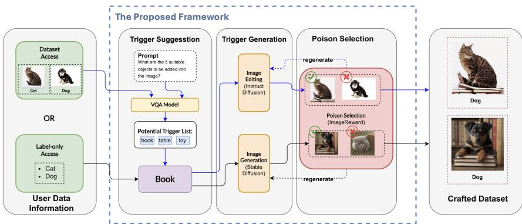
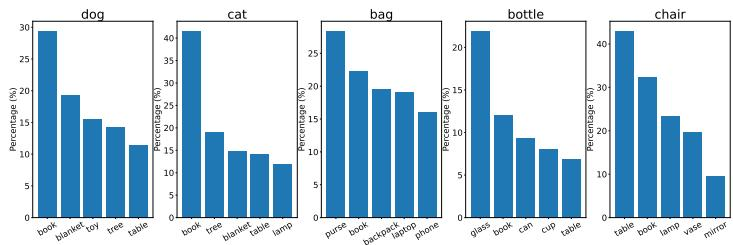
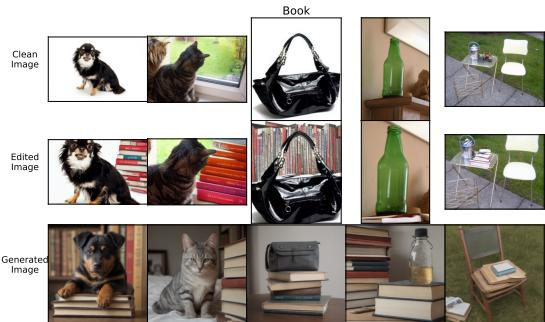
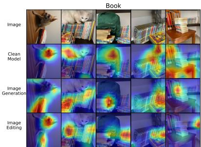
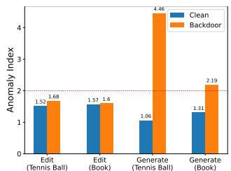
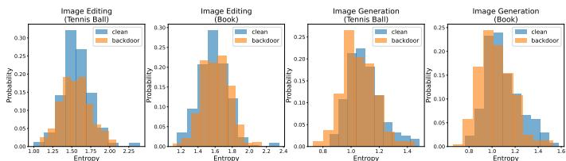
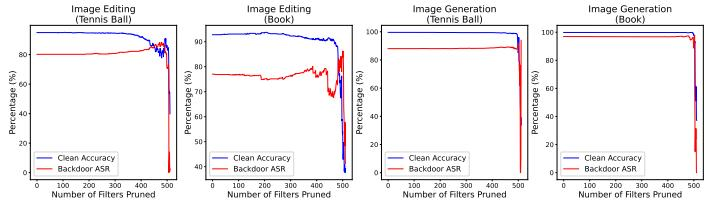

# TriggerCraft: A Framework for Enabling Scalable Physical Backdoor Dataset Generation with Generative Models

Anonymous Author(s)   
Affiliation   
Address   
email

# Abstract

Backdoor attacks, representing an emerging threat to the integrity of deep neural   
networks have received significant attention due to their ability to compromise   
deep learning systems covertly. While numerous backdoor attacks occur within   
the digital realm, their practical implementation in real-world prediction systems   
remains limited and vulnerable to disturbances in the physical world. Consequently,   
this limitation has led to the development of physical backdoors, where trigger   
objects manifest as physical entities within the real world. However, creating   
a requisite dataset to study physical backdoors is a daunting task. This hinders   
backdoor researchers and practitioners from studying such backdoors, leading   
to stagnant research progresses. This paper presents a framework namely as   
TriggerCraft that empowers researchers to effortlessly create a massive physical   
backdoor dataset with generative modeling. Particularly, TriggerCraft involves   
three automatic modules: suggesting the suitable physical triggers, generating the   
poisoned candidate samples (either by synthesizing new samples or editing existing   
clean samples), and finally selecting only the most plausible ones. As such, it   
effectively mitigates the perceived complexity associated with creating a physical   
backdoor dataset, converting it from a daunting task into an attainable objective.   
Extensive experiment results show that datasets created by TriggerCraft achieve   
similar observations with the real physical world counterparts in terms of both   
attacks and defenses, exhibiting similar properties compared to previous physical   
backdoor studies. This paper offers researchers a valuable toolkit for advancing the   
frontier of physical backdoors, all within the confines of their laboratories.

# 23 1 Introduction

Prior works have shown that DNNs are susceptible to various types of attacks, including adversarial   
attacks [4, 30], poisoning attacks [31, 39] and backdoor attacks [1, 14]. For instance, backdoor attacks   
impose serious security threats to DNNs by impelling malicious behavior onto DNNs by poisoning   
the data or manipulating the training process [28, 26]. A backdoored model exhibits normal behavior   
without a trigger pattern but acts maliciously when the trigger pattern is present.   
Meanwhile, [13, 27, 32, 9] focus on exposing the security vulnerabilities of DNNs within digital   
confines, where adversaries design and implement computer algorithms to launch backdoor attacks.   
To launch such attacks, adversaries must perform test-time digital manipulation of the images, which   
are likely to be susceptible to physical distortions or extremely noisy environments. These physical   
disturbances are likely unavoidable and often restrain the severity of backdoor attacks. Also, test-time   
digital manipulations are less likely to be accessible to adversaries, e.g. in autonomous cars, which   
involve real-time predictions, thus constraining the capability of adversaries to attack these systems.   
On the other hand, physical backdoor attacks focus on exploiting physical objects as triggers [43, 45,   
]. As such, an adversary could easily compromise privacy-sensitive and real-time systems, such as   
facial recognition systems. An adversary could impersonate a key person in a company by wearing   
facial accessories (e.g., glasses) as physical triggers to gain unauthorized access. Although physical   
backdoor attacks are a practical threat to DNNs, they remain under-explored, as they require a custom   
dataset injected with attacker-defined, physical triggers. Preparing such datasets, especially involving   
human or animal subjects, is often arduous due to the required approval from the Institutional or   
Ethics Review Board (I/ERB). Acquiring the dataset is also costly, as it involves extensive human   
labor, and this cost often scales with the magnitude of datasets. These constraints restrict researchers   
and practitioners from unleashing the potential threat of physical backdoor attacks, until now.   
Recent advances in deep generative models such as Generative Adversarial Networks (GANs) [12, 6]   
and Diffusion Models [17, 40, 35, 18] have shed lights in synthesizing and editing surreal images   
without involving extensive human interventions. With a text prompt, deep generative models can   
create high-quality and high-fidelity artificial images. Additionally, given an input image and a textual   
prompt, deep generative models could edit or manipulate the content of an image. This capability   
enables the efficient creation of physical backdoor datasets (i.e., often requiring only a simple prompt)   
demonstrating the superiority of these models in adversarial applications.   
In this work, we propose a “framework” namely as TriggerCraft, which enables researchers or   
practitioners to create a physical backdoor dataset with minimal effort and costs. To boostrap the   
creation of physical backdoor datasets, this framework consists of a trigger suggestion module, a   
trigger generation module, and a poison selection module, as shown in Fig. 1. Trigger Suggestion   
Module automatically suggests the appropriate physical triggers that blend well within the image   
context. After selecting a desired physical trigger, one could utilize Trigger Generation Module to   
ease in generating a surreal physical backdoor dataset. Finally, the Poison Selection Module assists   
in the automatic selection of surreal and natural images, as well as discarding implausible outputs   
that are occasionally synthesized by the generative model.

  
Figure 1: Overview of our framework that consists of three modules: (i) Trigger Suggestion, (ii) Trigger Generation and (iii) Poison Selection to ease in crafting a physical backdoor dataset.

62 As such, our contributions are threefold, as follows:

• Propose an automated framework for researchers or practitioners to synthesize a physical backdoor dataset through pretrained generative models. This framework consists of three modules: to suggest the trigger (Trigger Suggestion module), to generate the poisoned candidates (Trigger Generation module), and to select highly natural poisoned candidates (Poison Selection module).   
• Propose a Visual Question Answering approach to automatically rank the most suitable triggers for Trigger Suggestion module; propose a synthesis and an editing approach for Trigger Generation module; and, propose a scoring mechanism to automatically select the most natural poisoned samples for Poison Selection module.   
Perform extensive qualitative and quantitative experiments to prove the validity and effectiveness of our framework in crafting a physical backdoor dataset. This provides research community with a useful toolkit to study physical backdoor vulnerabilities without the hassle of labor-intensive physical data collection.

# 76 2 Related Works

# 2.1 Backdoor Attacks

Digital Backdoor Attacks focus on launching backdoor attacks within the digital space, which involve image pixel manipulations [13, 32, 9, 36, 27, 43] and model manipulations [2]. BadNets [13] first exposed the vulnerability of DNNs by embedding a malicious patch-based trigger onto an image and changing the injected image’s label to a predefined targeted class. WaNet [32] applied a warping field to the input, and LIRA [9] optimized the trigger generation function, respectively, to achieve better stealthiness and evade human inspection; while [43] utilized a pretrained diffusion model to insert triggers onto existing dataset. Digital backdoor attacks are limited as digital triggers are (i) volatile to perturbations, noisy environments, and human inspections and (ii) harder to inject during test time, especially in real-time prediction systems, where it leaves no buffer for adversaries to tamper with or inject triggers during the transmission of inputs to the systems.

Research on Physical Backdoors focuses on extending backdoor attacks to physical space employing physical objects as triggers (denoted as physical triggers hereafter). These threats are practical, as they can (i) bypass human-in-the-loop detection [44] and (ii) attack real-time prediction systems. Physical triggers exist in the physical world and possess semantic information; when injected, they blend gracefully and naturally with images, leaving no trace of artifacts; contrasting digital triggers which often create artifacts such as “visible” borders [13] or unnatural curves [32]. Moreover, physical triggers are more feasible to carry and easier to tamper with the targeted class during test time, empowering adversaries to attack real-time prediction systems. [45] showed that by wearing different facial accessories, an adversary could bypass a facial recognition system and uncover the possibility of impersonation through physical triggers. Dangerous Cloak [29] exposed the possibility of evading object detection systems by wearing custom clothes as the trigger, making the adversary “invisible” under surveillance. [15] revealed that the autonomous vehicle lane detection systems could be attacked by physical objects on the roadside, leading to potential accidents and fatalities.

Preliminary evidence indicates that physical backdoor attacks can be effective, yet research in this   
02 area is limited due to the high cost and effort involved in creating and sharing such datasets. For   
example, poisoning $5 \%$ of ImageNet $\mathrm { \Omega } ^ { \prime } { \sim } 1 . 3 \mathrm { M }$ images) would require generating 65,000 images with   
physical triggers, which is a task beyond the reach of most research teams. Ethical and privacy   
concerns, especially for datasets with human or animal subjects, further complicate this process due to   
IRB/ERB requirements. To address these challenges, [44] explored leveraging natural co-occurrences   
of trigger objects. Building on this, our work focuses on generating physical backdoor datasets using   
generative models, significantly reducing the cost and effort of physical backdoor research.

# 2.2 Backdoor Defenses

With the emergence of backdoor attacks, defensive mechanisms have gained significant attention.   
Current approaches include backdoor detection methods like Activation Clustering (AC) [5] which   
analyzes latent space activations, STRIP [10] that examines output entropy on perturbed inputs, and   
Neural Cleanse (NC) [42] which identifies trigger patterns; input mitigation techniques [22, 28]   
that suppress backdoor triggers while maintaining normal model behavior; and model mitigation   
strategies such as Fine-Pruning (FP) [25] combining pruning and fine-tuning, and Neural Attention   
Distillation (NAD) [20] that transfers knowledge from clean teacher models to purge backdoors.

The state of existing physical defense research. Similar to the state of existing physical attack 8 studies from the adversary side, research on defensive countermeasures for these physical attacks is 19 unsatisfactory. For example, [45, 44] show that most defenses, including NC [42], STRIP [10], Spec0 tral Signature (SS) [41], and AC [5] can only detect, thus prevent, physical attacks with catastrophic harms, such as attacks on facial recognition systems at only around $40 \%$ of the times, signifying the 2 lack of research in both attacks and defenses for physical backdoors.

# 2.3 Diffusion Models for Image Generation and Manipulation

Recent advancements in deep generative models, particularly Diffusion Models (DMs) [40, 17] had surpassed GANs [12] in image quality and data density coverage [8], with strong support for conditional inputs [35]. DMs’ ability to generate images from text prompts is practical to synthesize surreal images for physical backdoors, by simply describing the targets and intended physical triggers together. Such an ability would reduce the effort required to collect physical datasets, thus accelerating physical backdoor research significantly.

  
Figure 2: Results from the trigger suggestion module. “Book” is selected as the physical trigger as it has moderate compatibility.

Traditional image editing methods, from simple copy-paste [7] to manual blending with tools   
like Photoshop, lack scalability. They require tool-specific expertise and manual effort to place   
triggers, making high-quality poisoned sample creation time-consuming and costly. In contrast, deep   
generative models can automate the synthesis of surreal physical backdoor datasets, offering higher   
throughput, better scalability, and reduced cost.

# 3 Motivation

This work is motivated by the stagnant research in the physical backdoor domain which halts due to the difficulties in preparing datasets. To elaborate, the difficulties are (i) the scale of datasets, and (ii) privacy and ethical issues. Collecting physical backdoor datasets involves extensive human labor, time, and resources. Hence, prior works [45, 29] generally have a small-scale dataset to perform their research. To conduct a larger scale study, oftentimes it requires more resources, funding, time, and devices, which are generally scarce. Moreover, due to privacy issues, curation of physical backdoor datasets would require extensive ethical and institutional reviews, which are time-consuming.

[44] lead an effort in finding physical triggers that exist naturally within existing multi-label datasets,   
and is proven to be effective in identifying one of the co-occurring objects as physical triggers.   
However, such a method is only proven in multi-label settings, where each sample is assigned with   
multiple class labels, leaving its feasibility towards single-label settings unknown to practitioners.   
To expand their studies to the physical space, one must collect a set of physical dataset to validate,   
which is essentially an arduous task.   
Motivated to reduce such an effort, we propose a more practical, generalized, and automated frame  
work, whereby our framework could be applied to most datasets. Our framework consists of a trigger   
suggestion module (powered by VQA), a trigger generation module (powered by generative models),   
and a poison selection module (powered by a non-distributional, per-image generative evaluation   
metric). The trigger suggestion module offers the freedom to select physical triggers from a list   
of suggestions, and this eases practitioners from thinking open-endedly about physical triggers,   
which generally requires more cognitive effort than selecting from multiple choices [34]. The trigger   
generation module reduces the effort, expertise, time, and cost required to manually curate a surreal   
physical backdoor dataset, whereas the poison selection module ensures the synthesized physical   
backdoor dataset aligns with human’s preference in both fidelity and naturality.

# 4 Methodology of TriggerCraft

# 4.1 Trigger Suggestion Module

Compatibility of trigger objects is defined as the likelihood of the trigger objects co-existing with the main subject, ensuring that the physical trigger objects align with the image context. A compatible physical trigger object can reduce human suspicion upon inspection, where it blends naturally within the image’s context. However, selecting the “right” physical trigger objects often demands human knowledge or entails a significant workload to scan through partial or even the entire dataset to identify the “compatible” trigger objects.

Prior works [45, 29] have engaged in the manual identification of a compatible trigger object within a   
smaller dataset, where they utilized facial accessories and clothes. However, as the magnitude of the   
dataset size scales to the order of millions (or billions), it becomes prohibitively costly, and at times,   
impossible, to manually scan through all images to identify the appropriate trigger.   
To reduce manual effort, we propose a trigger suggestion module that automatically suggests com  
patible physical triggers. Our approach is inspired by [44], which uses graph analysis to identify   
frequently co-occurring objects as triggers. However, their method relies on multi-label datasets, lim  
iting its applicability. Most image recognition datasets (e.g., Food-101 [3], Oxford 102 Flower [33],   
Stanford Dogs [19]) are single-label, making co-occurrence analysis infeasible. Moreover, effective   
triggers are not necessarily part of the labeled classes. For instance, in Food-101, appropriate triggers   
might include cutlery or tableware.   
We propose using Visual Question Answering (VQA) models such as LLaVA [24] to automatically   
identify suitable physical triggers by leveraging their general knowledge. Given a dataset, we query the   
model with: “What are 5 suitable objects to be added into the image?” The responses are aggregated   
181 and ranked by frequency, where higher frequency indicates higher contextual compatibility.   
82 Unlike prior work that depends on multi-label datasets, our method supports single-label datasets by   
83 removing the co-occurrence constraint. We define three levels of trigger compatibility:

  
Figure 3: Images generated/edited by our framework with the suggested trigger - “book”.

1. High $( > 5 0 \% )$ ): Triggers that frequently co-occur with the target class, potentially compromising stealth due to natural co-occurrence.   
. Moderate $( \mathbf { 1 0 } \mathbf { - } \mathbf { 5 0 \% } )$ : Triggers that blend naturally but infrequently enough to maintain stealth, which are ideal for backdoor attacks.   
. Low $( < 1 0 \% )$ : Triggers that rarely appear with the target, making their presence in the dataset appear unnatural.

In our work, we focus on triggers with moderate compatibility to balance stealth and plausibility. Our   
trigger suggestion module generalizes to single-label datasets and aligns well with human judgments.   
Researchers may choose any suggested trigger, regardless of compatibility, to explore different attack   
193 or defense scenarios.

# 4.2 Trigger Generation Module

Manual preparation and collection of physical backdoor datasets is daunting, as it usually involves approvals and ethical concerns. Recent advancements in deep generative models provide a simple yet straightforward solution, that is through image editing or image generation. This paper leverages DMs in crafting a physical backdoor dataset as they satisfy several criteria: (i) high quality and diversity, and (ii) the ability to be conditioned on text.

Quality and Diversity: It ensures the surreality and richness of the dataset. Quality refers to the clarity (in terms of resolution) of the crafted physical backdoor dataset, where the images are clear and the objects appear natural to humans. Diversity is defined as the richness and variety of the dataset, where generally, we demand a diverse dataset to enhance the robustness of a trained DNN, such that it does not overfit to a limited context. Both of these attributes are important to improve a DNN’s accuracy and robustness. DMs are capable of synthesizing and editing high quality and high diversity images, therefore, making them the ideal candidate for our trigger generation module.

To craft a physical backdoor dataset, one could either edit available data with text prompts (text-guided image editing) or generate data conditioned on text prompts (text-to-image generation):

09 Dataset Access Text-guided Image Editing: With this access (both images and labels), text-guided 0 image editing models such as InstructDiffusion emerge as a fruitful option, which utilizes both images and labels. Input images are obtainable directly from the dataset, while the text prompts, which

Table 1: Results with text-guided image editing models. Both trigger objects achieved high Real ASR and Real CA. The poisoning rate is abbreviated with PR.   

<table><tr><td>Trigger</td><td>PR</td><td>CA</td><td>ASR</td><td>Real CA</td><td>Real ASR</td></tr><tr><td>Tennis Ball</td><td>0.05</td><td>94.27</td><td>76.8</td><td>81.65</td><td>80.53</td></tr><tr><td></td><td>0.1</td><td>94.93</td><td>80.2</td><td>78.59</td><td>81.7</td></tr><tr><td>Book</td><td>0.05</td><td>93.2</td><td>75.6</td><td>79.2</td><td>66.47</td></tr><tr><td></td><td>0.1</td><td>92.8</td><td>77</td><td>78.59</td><td>71.08</td></tr></table>

include physical triggers could be manually defined (requires more cognitive effort) or suggested   
by our trigger suggestion module, with minimal cognitive effort. Ultimately, through the process   
of editing an image, the image’s original context is preserved, as most of the image’s features will   
215 remain unaltered, except for the injected physical trigger.

Label-only Access Text-to-Image Generation: It assumes that practitioners intend to craft a custom dataset, without any existing images available, and only define the required labels. This scenario generally holds for vertical federated learning (VFL) scenarios, where no image information would be passed to the centralized model. Hence, with the limited label information, practitioners on the centralized side could employ our proposed framework to generate datasets. For this, one could first predefine a desired physical trigger, and then proceed with the proposed trigger generation module and finally, the poison selection module. [23] employed a VFL framework that could be potentially utilized in such cases.

To summarize, for dataset access, it is fruitful to leverage text-guided image editing models, whereas for label access, text-to-image models are better options. Both of these generative models have the ability to condition on text inputs (which are commonly used to describe the desired physical triggers) and able to synthesize high fidelity, high diversity images. Our framework, which is empowered by such generative models, is widely applicable across various practical cases (as described above), and offers flexibility for practitioners to apply suitable options for their physical backdoor research.

# 4.3 Poison Selection Module

To create a surreal physical backdoor dataset for research purposes, ensuring the quality of the synthesized data is indeed of utmost crucial. Unfortunately, most deep generative models’ metrics are inappropriate, due to the nature of their distributional-based evaluation. Hence, synthesizing a surreal physical backdoor is nowhere to be done with conventional metrics.

Problem: Conventional deep generative models’ metrics such as Inception Score (IS) [37] and Fréchet-Inception Distance (FID) [16] compare the “real” and “synthesized” distribution, to identify how well the “synthesized” distribution resembles the “real” distribution. Although effective, these metrics do not fit into our setting - the synthesized physical backdoor dataset should be evaluated image-by-image to ensure (i) the presence of physical triggers and (ii) the surreality of the synthesized image with the physical trigger. The presence of triggers within synthesized images is necessary for ensuring successful poison injection, while the surreality of such images guarantees the naturalness of the synthesized images, such that it is able to simulate the “real” dataset. Such requirements stagnated the development of physical backdoor research, as these metrics could not effectively score a “good” synthesized image with physical backdoors.

Solution: We utilize ImageReward [46] as our evaluation metric for the generated/edited images. Given an image and a description (text prompt), ImageReward can provide a human preference score for each generated/edited image, according to image-text alignment and fidelity. Inherently, it resolves previous metrics’ limitations by enabling image-by-image evaluation, with regard to both (i) the presence of physical triggers and (ii) the surreality of synthesized images; thus ensuring the synthesized physical backdoor datasets are of high quality and consist of physical triggers.

# 5 Experimental Results

# 5.1 Trigger Suggestions

We present the results of the trigger suggestion module in Fig. 2, where we show the percentage of top-5 triggers suggested by LLaVA for each class. “Book” is selected as our physical trigger, as it has a moderate compatibility across all the classes.

Table 2: Results with text-to-image generation models. Both trigger objects achieved high Real ASR, but relatively low Real CA. Poisoning rate is abbreviated with PR.   

<table><tr><td>Trigger</td><td>PR</td><td>CA</td><td>ASR</td><td>Real CA</td><td>Real ASR</td></tr><tr><td rowspan="5">Tennis Ball</td><td>0.1</td><td>99.57</td><td>88.03</td><td>58.41</td><td>91.51</td></tr><tr><td>0.2</td><td>99.47</td><td>90.40</td><td>58.41</td><td>94.84</td></tr><tr><td>0.3</td><td>99.63</td><td>88.17</td><td>61.16</td><td>92.35</td></tr><tr><td>0.4</td><td>99.67</td><td>89.33</td><td>55.66</td><td>91.68</td></tr><tr><td>0.5</td><td>99.60</td><td>88.57</td><td>58.41</td><td>86.36</td></tr><tr><td rowspan="5">Book</td><td>0.1</td><td>99.83</td><td>96.93</td><td>61.16</td><td>57.84</td></tr><tr><td>0.2</td><td>99.87</td><td>97.77</td><td>61.16</td><td>74.22</td></tr><tr><td>0.3</td><td>99.73</td><td>98.37</td><td>64.22</td><td>83.97</td></tr><tr><td>0.4</td><td>99.73</td><td>98.30</td><td>61.47</td><td>83.28</td></tr><tr><td>0.5</td><td>99.53</td><td>98.47</td><td>58.72</td><td>74.91</td></tr></table>

# 256 5.2 Trigger Generation

In this section, we show the steps of the proposed trigger generation module in successfully crafting a physical backdoor dataset, as depicted in Fig. 3. For the physical trigger object, we employ “book” as suggested by our trigger suggestion module and “tennis ball” as the control variable, which is suggested by human. We define the notation for the prompts as follows: tr refers to the trigger, act refers to the action/movement of the class object, sub refers to the main class object, bg describes the background/scene of the generated image, and pos specifies other positive prompts such as $4 \mathrm { k \Omega }$ or UHD. As discussed in Sec. 4.2, two valid deep generative models can be utilized:

1. Image Editing (InstructDiffusion) Dataset Access: The default hyperparameters [11] were chosen, and the text prompts format is set as “Add tr into the image”, where tr refers to “tennis ball” or “book”. The image prompts are images from the dataset. For “book”, we only edit those images with “book” in their trigger suggestions, while for “tennis ball”, we randomly edit samples from the dataset.

. Image Generation (Stable Diffusion) Label-only Access $:$ The text prompts are formatted according to [38], which are as follows: “sub, tr, act, bg, pos”, and guidance scale is set to 2. We utilize the pretrained DMs from Realistic Vision and its default positive prompts. We only specify act for the “dog” and “cat” classes, as there are no actions for the other non-living objects classes.

# 74 5.3 Poison Selection

As outlined in Sec. 4.3, we utilized ImageReward [46] to select the edited/generated outputs from both InstructDiffusion and Stable Diffusion. We format the text prompt as “A photo of a sub with a tr”. Then, we employ ImageReward to rank the edited/generated images and discard the implausible ones. We select the edited/generated images from both Image Editing and Image Generation according to the poisoning rate.

# 5.4 Attack Effectiveness

In Tab. 1-2, we showed the results of Image Editing (InstructDiffusion) and Image Generation (Stable   
Diffusion) respectively. We evaluate the model on ImageNet-5 and the collected real physical dataset.   
The abbreviations are as follows: (i) Clean Accuracy (CA): accuracy on clean inputs, (ii) Attack   
Success Rate (ASR): accuracy on poisoned inputs with physical triggers, either through image   
editing or image generation, (iii) Real CA: accuracy on the real clean data collected via multiple   
286 devices, and (iv) Real ASR: accuracy on the real poisoned data, captured via multiple devices.   
87 In Tab. 1, the Real CAs for both trigger objects are around $80 \%$ , indicating strong model performance   
in real-world settings. The consistent $1 5 \%$ gap between CA and Real CA likely stems from distribution   
shifts between validation and real-world data, including variations in lighting, background, scene,   
and subject positioning.   
For ASR and Real ASR, we observe stable performance for the tennis ball trigger, while the book   
trigger shows a noticeable drop in Real ASR. This discrepancy is likely due to the visual consistency   
of the trigger: tennis balls have uniform appearances (green with white stripes), whereas books vary   
in color, size, and shape. This aligns with prior findings [45, 29] showing that physical triggers with   
diverse appearances (e.g., earrings) lead to lower Real ASRs.   
In Tab. 2, we see a similar CA vs. Real CA gap, consistent with [38], attributed to the diversity in   
generated images. ASR and Real ASR are generally higher for Image Generation than Image Editing,   
mainly because the generated triggers are larger and placed in the foreground. In contrast, edited   
triggers are either smaller (e.g., tennis ball) or relegated to the background (e.g., book), as illustrated   
300 in Fig. 3.

  
Figure 4: Neural Cleanse. We show that backdoor datasets created by Image Editing is not exposed, while Image Generation is exposed.

  
Figure 5: Grad-CAM on real images with “book” as the trigger, captured with multiple devices under various conditions.

  
Figure 6: STRIP. Our backdoor dataset can achieve similar entropy as the clean dataset, thus bypassing   
Figure 7: Fine Pruning. Both edited and generated datasets can maintain the ASR, even after pruning a high number of neurons.

# 5.5 Defense Resilience

Neural Cleanse [42] detects backdoors via pattern optimization. An anomaly index $\tau < 2$ typically indicates a compromised model. Fig. 4 shows that the backdoor remains undetected for Image Editing, but is exposed in Image Generation. We attribute this to the larger trigger sizes in generated images, making them easier to detect.

STRIP [10] detects backdoors by perturbing clean inputs and analyzing prediction entropy. Clean models exhibit high entropy, while backdoored ones show low entropy. As shown in Fig. 6, our backdoor bypasses STRIP detection.

Fine Pruning [25] prunes low-activation neurons under the assumption that they encode backdoor behavior. Fig. 7 shows our backdoor remains effective post-pruning, indicating robustness.

Neural Attention Distillation (NAD) [20] mitigates backdoors by distilling attention from a clean teacher model into a student. Following BackdoorBox [21], we adopt all default settings with a cosine LR schedule and 20 training epochs. Tab. 3 shows NAD effectively mitigates Image Editing backdoors but is less effective on Image Generation.

Grad-CAM. Fig. 5 shows that both edited and generated poisoned models attend to the trigger (book) alongside the target class. Despite potential artifacts from generative models (e.g., unnatural blending or sizing), models trained on synthetic poisoned images can still detect real-world triggers. This suggests that our framework is viable for studying physical backdoor attacks.

Table 3: Neural Attention Distillation (NAD). Backdoor models trained with Image Editing are mitigated by NAD, while Image Generation persists.   

<table><tr><td></td><td>Trigger</td><td>CA</td><td>ASR</td></tr><tr><td rowspan="2">Image Editing</td><td>Book</td><td>92.00</td><td>39.86</td></tr><tr><td>Tennis Ball</td><td>91.87</td><td>62.40</td></tr><tr><td rowspan="2">Image Generation</td><td>Book</td><td>99.93</td><td>89.70</td></tr><tr><td>Tennis Ball</td><td>99.93</td><td>77.87</td></tr></table>

# 319 5.6 Discussion and Limitations

Similarities between the synthesized and manually created datasets. The provided empirical attack and defense results are consistent with previous key works in physical backdoor attacks [45, 29]. Particularly, attacking with physical objects is highly effective $\mathrm { \tilde { \langle } { \approx 6 0 \% } }$ or higher), showing the potential harms of these attacks. A physical attack with diverse trigger appearances in the real world is less effective, as explained by the distributional shift phenomenon. Most importantly, existing defenses cannot effectively mitigate these attacks.

Consistency of trigger objects. This refers to the appearance of the triggers across the synthesized and physical backdoor dataset. Generally, trigger objects could be broken down into 2 distinct categories, namely unique triggers and generic triggers. Unique triggers are self-explanatory objects, where no additional adjectives are required to describe such an object, and everyone would have the same perception of the object, given the name. Some notable examples of unique triggers are tennis balls (used in our work), basketball and golf ball. Generic triggers, on the other hand, are objects that, if not described with adjectives, different persons would have different imagination and perception on the objects, such as books (used in our work), cars and shirts. Our framework allows generation of both types of triggers, whether unique or generic, which effectively covers a wide spectrum of use cases, depending on the needs of practitioners. As evident in our experiments (Tab. 1-2), unique triggers (tennis balls) yield a higher ASR, indicating a stronger backdoor trigger than generic triggers (books), as such unique triggers would be consistent across different samples, hence it is easier for model to overfit against such triggers with consistent appearance.

The state of research on physical backdoors. Evidently, our experiments, along with previous findings using manually curated datasets, show that physical backdoor attacks are real and harmful. Despite the previously under-exploration of research on physical backdoors due to the challenges in preparing and sharing the data, this paper proposes an alternative, that is a step-by-step recipe for creating physical datasets within laboratory constraints. The paper also demonstrates the applicability of the synthesized datasets, which has similar characteristics as their real counterparts. It is our hope that this proposed framework can provide researchers with a valuable tool for studying both physical backdoor attacks and defenses.

47 Limitations. Our framework, however, has some limitations, as follows:

1. VQA’s suggestion trustworthiness: As shown in Fig. 2, some of the suggested trigger objects may be illogical to appear with the main class subject. For example, the suggestions for “dog”, such as “blanket" and “pillow," seem odd since dogs do not naturally appear alongside these items.

. Image Generation having low Real CA: As presented in Fig. 2, the Real CAs are consistently lower than CAs, attributed to diversity in the generations, as discussed in [38].

. Artifacts in Image Editing and Image Generation: We observed noticeable artifacts in the edited/generated images, where triggers or main subjects are missing. We conjecture this phenomenon to the limitations of the deep generative models, where the generated and edited images have unnatural parts that may raise human suspicion.

# 6 Conclusion

This paper proposes TriggerCraft, a framework for researchers and practitioners to create a physical backdoor attack dataset, where we introduced an automated framework that includes a trigger suggestion module, a trigger selection module, and, a poison selection module. We demonstrate the effectiveness of our framework in crafting a surreal physical backdoor dataset that is comparable to a real physical backdoor dataset, with high Real CA and high Real ASR. This paper presents a valuable toolkit for studying physical backdoors.

References [1] Eugene Bagdasaryan, Andreas Veit, Yiqing Hua, Deborah Estrin, and Vitaly Shmatikov. How to backdoor federated learning. In International Conference on Artificial Intelligence and Statistics, pages 2938–2948, 2020. [2] Mikel Bober-Irizar, Ilia Shumailov, Yiren Zhao, Robert Mullins, and Nicolas Papernot. Architectural backdoors in neural networks. In Proceedings of the IEEE/CVF Conference on Computer Vision and Pattern Recognition, pages 24595–24604, 2023. [3] Lukas Bossard, Matthieu Guillaumin, and Luc Van Gool. Food-101 - mining discriminative components with random forests. In Proceedings of the 13th European Conference on Computer Vision (ECCV), Part VI, pages 446–461, Zurich, Switzerland, 2014. [4] Nicholas Carlini and David A. Wagner. Adversarial examples are not easily detected: Bypassing ten detection methods. In Bhavani M. Thuraisingham, Battista Biggio, David Mandell Freeman, Brad Miller, and Arunesh Sinha, editors, Proceedings of the 10th ACM Workshop on Artificial Intelligence and Security (AISec@CCS), pages 3–14, Dallas, TX, 2017. [5] Bryant Chen, Wilka Carvalho, Nathalie Baracaldo, Heiko Ludwig, Benjamin Edwards, Taesung Lee, Ian M. Molloy, and Biplav Srivastava. Detecting backdoor attacks on deep neural networks by activation clustering. In Proceedings of the Workshop on Artificial Intelligence Safety, Honolulu, HI, 2019. [6] Xi Chen, Yan Duan, Rein Houthooft, John Schulman, Ilya Sutskever, and Pieter Abbeel. InfoGAN: Interpretable representation learning by information maximizing generative adversarial nets. In Advances in Neural Information Processing Systems (NIPS), pages 2172–2180, Barcelona, Spain, 2016. [7] Xinyun Chen, Chang Liu, Bo Li, Kimberly Lu, and Dawn Song. Targeted backdoor attacks on deep learning systems using data poisoning. arXiv preprint arXiv:1712.05526, 2017. [8] Prafulla Dhariwal and Alexander Quinn Nichol. Diffusion models beat GANs on image synthesis. In A. Beygelzimer, Y. Dauphin, P. Liang, and J. Wortman Vaughan, editors, Advances in Neural Information Processing Systems, 2021. [9] Khoa Doan, Yingjie Lao, Weijie Zhao, and Ping Li. LIRA: learnable, imperceptible and robust backdoor attacks. In Proceedings of the 2021 IEEE/CVF International Conference on Computer Vision (ICCV), pages 11946–11956, Montreal, Canada, 2021. [10] Yansong Gao, Change Xu, Derui Wang, Shiping Chen, Damith Chinthana Ranasinghe, and Surya Nepal. STRIP: a defence against trojan attacks on deep neural networks. In Proceedings of the 35th Annual Computer Security Applications Conference (ACSAC), pages 113–125, San Juan, PR, 2019. [11] Zigang Geng, Binxin Yang, Tiankai Hang, Chen Li, Shuyang Gu, Ting Zhang, Jianmin Bao, Zheng Zhang, Han Hu, Dong Chen, and Baining Guo. Instructdiffusion: A generalist modeling interface for vision tasks. CoRR, abs/2309.03895, 2023. 02 [12] Ian J. Goodfellow, Jean Pouget-Abadie, Mehdi Mirza, Bing Xu, David Warde-Farley, Sherjil Ozair, Aaron C. Courville, and Yoshua Bengio. Generative adversarial nets. In Advances in Neural Information Processing Systems (NIPS), pages 2672–2680, Montreal, Canada, 2014. [13] Tianyu Gu, Brendan Dolan-Gavitt, and Siddharth Garg. Badnets: Identifying vulnerabilities in the machine learning model supply chain. arXiv preprint arXiv:1708.06733, 2017. [14] Tianyu Gu, Kang Liu, Brendan Dolan-Gavitt, and Siddharth Garg. BadNets: Evaluating backdooring attacks on deep neural networks. IEEE Access, 7:47230–47244, 2019. [15] Xingshuo Han, Guowen Xu, Yuan Zhou, Xuehuan Yang, Jiwei Li, and Tianwei Zhang. Physical backdoor attacks to lane detection systems in autonomous driving. In Proceedings of the 30th ACM International Conference on Multimedia, MM ’22, page 2957–2968, New York, NY, USA, 2022. Association for Computing Machinery.

[16] Martin Heusel, Hubert Ramsauer, Thomas Unterthiner, Bernhard Nessler, and Sepp Hochreiter. Gans trained by a two time-scale update rule converge to a local nash equilibrium. In Proceedings of the 31st International Conference on Neural Information Processing Systems, NIPS’17, page 6629–6640, Red Hook, NY, USA, 2017. Curran Associates Inc.   
[17] Jonathan Ho, Ajay Jain, and Pieter Abbeel. Denoising diffusion probabilistic models. In H. Larochelle, M. Ranzato, R. Hadsell, M.F. Balcan, and H. Lin, editors, Advances in Neural Information Processing Systems, volume 33, pages 6840–6851. Curran Associates, Inc., 2020.   
[18] Jiun Tian Hoe, Weipeng Hu, Wei Zhou, Chao Xie, Ziwei Wang, Chee Seng Chan, Xudong Jiang, and Yap-Peng Tan. Interactedit: Zero-shot editing of human-object interactions in images. arXiv preprint arXiv:2503.09130, 2025.   
[19] Aditya Khosla, Nityananda Jayadevaprakash, Bangpeng Yao, and Li Fei-Fei. Novel dataset for fine-grained image categorization. In First Workshop on Fine-Grained Visual Categorization, IEEE Conference on Computer Vision and Pattern Recognition, Colorado Springs, CO, June 2011.   
[20] Yige Li, Xixiang Lyu, Nodens Koren, Lingjuan Lyu, Bo Li, and Xingjun Ma. Neural attention distillation: Erasing backdoor triggers from deep neural networks. In Proceedings of the 9th International Conference on Learning Representations (ICLR), Virtual Event, 2021.   
[21] Yiming Li, Mengxi Ya, Yang Bai, Yong Jiang, and Shu-Tao Xia. BackdoorBox: A python toolbox for backdoor learning. In ICLR Workshop, 2023.   
[22] Yiming Li, Tongqing Zhai, Baoyuan Wu, Yong Jiang, Zhifeng Li, and Shutao Xia. Rethinking the trigger of backdoor attack. arXiv preprint arXiv:2004.04692, 2020.   
[23] Fenglin Liu, Xian Wu, Shen Ge, Wei Fan, and Yuexian Zou. Federated learning for vision-andlanguage grounding problems. 34:11572–11579, Apr. 2020.   
[24] Haotian Liu, Chunyuan Li, Qingyang Wu, and Yong Jae Lee. Visual instruction tuning. In Thirty-seventh Conference on Neural Information Processing Systems, 2023.   
[25] Kang Liu, Brendan Dolan-Gavitt, and Siddharth Garg. Fine-pruning: Defending against backdooring attacks on deep neural networks. In Proceedings of the 21st International Symposium on Research in Attacks, Intrusions, and Defenses (RAID), pages 273–294, Heraklion, Crete, Greece, 2018.   
[26] Yingqi Liu, Shiqing Ma, Yousra Aafer, Wen-Chuan Lee, Juan Zhai, Weihang Wang, and Xiangyu Zhang. Trojaning attack on neural networks. In Proceedings of the 25th Annual Network and Distributed System Security Symposium (NDSS), San Diego, CA, 2018.   
[27] Yunfei Liu, Xingjun Ma, James Bailey, and Feng Lu. Reflection backdoor: A natural backdoor attack on deep neural networks. In Proceedings of the 16th European Conference on Computer Vision (ECCV), Part X, pages 182–199, Glasgow, UK, 2020.   
[28] Yuntao Liu, Yang Xie, and Ankur Srivastava. Neural trojans. In Proceedings of the 2017 IEEE International Conference on Computer Design (ICCD), pages 45–48, Boston, MA, 2017.   
[29] Hua Ma, Yinshan Li, Yansong Gao, Alsharif Abuadbba, Zhi Zhang, Anmin Fu, Hyoungshick Kim, Said F. Al-Sarawi, Surya Nepal, and Derek Abbott. Dangerous cloaking: Natural trigger based backdoor attacks on object detectors in the physical world. CoRR, abs/2201.08619, 2022.   
[30] Aleksander Madry, Aleksandar Makelov, Ludwig Schmidt, Dimitris Tsipras, and Adrian Vladu. Towards deep learning models resistant to adversarial attacks. In Proceedings of the 6th International Conference on Learning Representations (ICLR), Vancouver, Canada, 2018.   
[31] Luis Muñoz-González, Battista Biggio, Ambra Demontis, Andrea Paudice, Vasin Wongrassamee, Emil C. Lupu, and Fabio Roli. Towards poisoning of deep learning algorithms with back-gradient optimization. In Proceedings of the 10th ACM Workshop on Artificial Intelligence and Security (AISec@CCS), pages 27–38, Dallas, TX, 2017.

[32] Tuan Anh Nguyen and Anh Tuan Tran. WaNet - imperceptible warping-based backdoor attack. In Proceedings of the 9th International Conference on Learning Representations (ICLR), Virtual Event, Austria, 2021. [33] Maria-Elena Nilsback and Andrew Zisserman. Automated flower classification over a large number of classes. In Indian Conference on Computer Vision, Graphics and Image Processing, Dec 2008. [34] Murat Polat. Analysis of multiple-choice versus open-ended questions in language tests according to different cognitive domain levels. Novitas-ROYAL (Research on Youth and Language), 14(2):76–96, 2020. [35] Robin Rombach, Andreas Blattmann, Dominik Lorenz, Patrick Esser, and Björn Ommer. Highresolution image synthesis with latent diffusion models. In Proceedings of the IEEE/CVF Conference on Computer Vision and Pattern Recognition (CVPR), pages 10684–10695, June 2022. [36] Aniruddha Saha, Akshayvarun Subramanya, and Hamed Pirsiavash. Hidden trigger backdoor attacks. In Proceedings of the Thirty-Fourth AAAI Conference on Artificial Intelligence (AAAI), pages 11957–11965, New York, NY, 2020. [37] Tim Salimans, Ian Goodfellow, Wojciech Zaremba, Vicki Cheung, Alec Radford, and Xi Chen. Improved techniques for training gans. In Proceedings of the 30th International Conference on Neural Information Processing Systems, NIPS’16, page 2234–2242, Red Hook, NY, USA, 2016. Curran Associates Inc. [38] Mert Bülent Sarıyıldız, Karteek Alahari, Diane Larlus, and Yannis Kalantidis. Fake it till you make it: Learning transferable representations from synthetic imagenet clones. In Proceedings of the IEEE/CVF Conference on Computer Vision and Pattern Recognition (CVPR), pages 8011–8021, June 2023. [39] Ali Shafahi, W. Ronny Huang, Mahyar Najibi, Octavian Suciu, Christoph Studer, Tudor Dumitras, and Tom Goldstein. Poison frogs! targeted clean-label poisoning attacks on neural networks. In Advances in Neural Information Processing Systems (NeurIPS), pages 6106–6116, Montréal, Canada, 2018. [40] Jiaming Song, Chenlin Meng, and Stefano Ermon. Denoising diffusion implicit models. In International Conference on Learning Representations, 2020. [41] Brandon Tran, Jerry Li, and Aleksander Madry. Spectral signatures in backdoor attacks. In Advances in Neural Information Processing Systems (NeurIPS), pages 8011–8021, Montréal, Canada, 2018. [42] Bolun Wang, Yuanshun Yao, Shawn Shan, Huiying Li, Bimal Viswanath, Haitao Zheng, and Ben Y. Zhao. Neural cleanse: Identifying and mitigating backdoor attacks in neural networks. In Proceedings of the 2019 IEEE Symposium on Security and Privacy $( S P )$ , pages 707–723, San Francisco, CA, 2019. [43] Ruotong Wang, Hongrui Chen, Zihao Zhu, Li Liu, Yong Zhang, Yanbo Fan, and Baoyuan Wu. Robust backdoor attack with visible, semantic, sample-specific, and compatible triggers. arXiv preprint arXiv:2306.00816v2, 2023. [44] Emily Wenger, Roma Bhattacharjee, Arjun Nitin Bhagoji, Josephine Passananti, Emilio Andere, Heather Zheng, and Ben Zhao. Finding naturally occurring physical backdoors in image datasets. In S. Koyejo, S. Mohamed, A. Agarwal, D. Belgrave, K. Cho, and A. Oh, editors, Advances in Neural Information Processing Systems, volume 35, pages 22103–22116. Curran Associates, Inc., 2022. [45] Emily Wenger, Josephine Passananti, Arjun Nitin Bhagoji, Yuanshun Yao, Haitao Zheng, and Ben Y. Zhao. Backdoor attacks against deep learning systems in the physical world. In Proceedings of the IEEE/CVF Conference on Computer Vision and Pattern Recognition (CVPR), pages 6206–6215, June 2021.

# 512 NeurIPS Paper Checklist

# 1. Claims

Question: Do the main claims made in the abstract and introduction accurately reflect the paper’s contributions and scope?

Answer: [Yes]

Justification: The main contributions of the paper outlined in Section 3 and 4, which corresponds to the abstract.

Guidelines:

• The answer NA means that the abstract and introduction do not include the claims made in the paper.   
• The abstract and/or introduction should clearly state the claims made, including the contributions made in the paper and important assumptions and limitations. A No or NA answer to this question will not be perceived well by the reviewers.   
• The claims made should match theoretical and experimental results, and reflect how much the results can be expected to generalize to other settings.   
• It is fine to include aspirational goals as motivation as long as it is clear that these goals are not attained by the paper.

# 2. Limitations

Question: Does the paper discuss the limitations of the work performed by the authors?

Answer: [Yes]

Justification: The limitations are discussed in Section 5.6.

Guidelines:

• The answer NA means that the paper has no limitation while the answer No means that the paper has limitations, but those are not discussed in the paper.   
• The authors are encouraged to create a separate "Limitations" section in their paper.   
• The paper should point out any strong assumptions and how robust the results are to violations of these assumptions (e.g., independence assumptions, noiseless settings, model well-specification, asymptotic approximations only holding locally). The authors should reflect on how these assumptions might be violated in practice and what the implications would be.   
The authors should reflect on the scope of the claims made, e.g., if the approach was only tested on a few datasets or with a few runs. In general, empirical results often depend on implicit assumptions, which should be articulated.   
The authors should reflect on the factors that influence the performance of the approach. For example, a facial recognition algorithm may perform poorly when image resolution is low or images are taken in low lighting. Or a speech-to-text system might not be used reliably to provide closed captions for online lectures because it fails to handle technical jargon.   
• The authors should discuss the computational efficiency of the proposed algorithms and how they scale with dataset size.   
• If applicable, the authors should discuss possible limitations of their approach to address problems of privacy and fairness.   
• While the authors might fear that complete honesty about limitations might be used by reviewers as grounds for rejection, a worse outcome might be that reviewers discover limitations that aren’t acknowledged in the paper. The authors should use their best judgment and recognize that individual actions in favor of transparency play an important role in developing norms that preserve the integrity of the community. Reviewers will be specifically instructed to not penalize honesty concerning limitations.

# 3. Theory assumptions and proofs

Question: For each theoretical result, does the paper provide the full set of assumptions and a complete (and correct) proof?

Answer: [NA]

Justification: This paper does not include theoretical results.

# Guidelines:

• The answer NA means that the paper does not include theoretical results.   
• All the theorems, formulas, and proofs in the paper should be numbered and crossreferenced.   
• All assumptions should be clearly stated or referenced in the statement of any theorems.   
• The proofs can either appear in the main paper or the supplemental material, but if they appear in the supplemental material, the authors are encouraged to provide a short proof sketch to provide intuition.   
• Inversely, any informal proof provided in the core of the paper should be complemented by formal proofs provided in appendix or supplemental material.   
• Theorems and Lemmas that the proof relies upon should be properly referenced.

# 4. Experimental result reproducibility

Question: Does the paper fully disclose all the information needed to reproduce the main experimental results of the paper to the extent that it affects the main claims and/or conclusions of the paper (regardless of whether the code and data are provided or not)?

Answer: [Yes]

Justification: The experiment settings are outlined in Appendix.

Guidelines:

• The answer NA means that the paper does not include experiments.   
• If the paper includes experiments, a No answer to this question will not be perceived well by the reviewers: Making the paper reproducible is important, regardless of whether the code and data are provided or not.   
• If the contribution is a dataset and/or model, the authors should describe the steps taken to make their results reproducible or verifiable. Depending on the contribution, reproducibility can be accomplished in various ways. For example, if the contribution is a novel architecture, describing the architecture fully might suffice, or if the contribution is a specific model and empirical evaluation, it may be necessary to either make it possible for others to replicate the model with the same dataset, or provide access to the model. In general. releasing code and data is often one good way to accomplish this, but reproducibility can also be provided via detailed instructions for how to replicate the results, access to a hosted model (e.g., in the case of a large language model), releasing of a model checkpoint, or other means that are appropriate to the research performed.   
• While NeurIPS does not require releasing code, the conference does require all submissions to provide some reasonable avenue for reproducibility, which may depend on the nature of the contribution. For example (a) If the contribution is primarily a new algorithm, the paper should make it clear how to reproduce that algorithm. (b) If the contribution is primarily a new model architecture, the paper should describe the architecture clearly and fully. (c) If the contribution is a new model (e.g., a large language model), then there should either be a way to access this model for reproducing the results or a way to reproduce the model (e.g., with an open-source dataset or instructions for how to construct the dataset). (d) We recognize that reproducibility may be tricky in some cases, in which case authors are welcome to describe the particular way they provide for reproducibility. In the case of closed-source models, it may be that access to the model is limited in some way (e.g., to registered users), but it should be possible for other researchers to have some path to reproducing or verifying the results.

# 5. Open access to data and code

Question: Does the paper provide open access to the data and code, with sufficient instructions to faithfully reproduce the main experimental results, as described in supplemental material?

Answer: [Yes]

Justification: The data and code will be released publicly.

Guidelines:

• The answer NA means that paper does not include experiments requiring code.   
• Please see the NeurIPS code and data submission guidelines (https://nips.cc/ public/guides/CodeSubmissionPolicy) for more details.   
• While we encourage the release of code and data, we understand that this might not be possible, so “No” is an acceptable answer. Papers cannot be rejected simply for not including code, unless this is central to the contribution (e.g., for a new open-source benchmark).   
• The instructions should contain the exact command and environment needed to run to reproduce the results. See the NeurIPS code and data submission guidelines (https: //nips.cc/public/guides/CodeSubmissionPolicy) for more details.   
• The authors should provide instructions on data access and preparation, including how to access the raw data, preprocessed data, intermediate data, and generated data, etc.   
• The authors should provide scripts to reproduce all experimental results for the new proposed method and baselines. If only a subset of experiments are reproducible, they should state which ones are omitted from the script and why.   
• At submission time, to preserve anonymity, the authors should release anonymized versions (if applicable).   
• Providing as much information as possible in supplemental material (appended to the paper) is recommended, but including URLs to data and code is permitted.

# 6. Experimental setting/details

Question: Does the paper specify all the training and test details (e.g., data splits, hyperparameters, how they were chosen, type of optimizer, etc.) necessary to understand the results?

Answer: [Yes]

Justification: The experiment settings are provided in Appendix.

Guidelines:

• The answer NA means that the paper does not include experiments. • The experimental setting should be presented in the core of the paper to a level of detail that is necessary to appreciate the results and make sense of them. • The full details can be provided either with the code, in appendix, or as supplemental material.

# 7. Experiment statistical significance

Question: Does the paper report error bars suitably and correctly defined or other appropriate information about the statistical significance of the experiments?

Answer: [No]

Justification: There is no statistical significance involved in the experiments.

Guidelines:

• The answer NA means that the paper does not include experiments.   
• The authors should answer "Yes" if the results are accompanied by error bars, confidence intervals, or statistical significance tests, at least for the experiments that support the main claims of the paper.   
The factors of variability that the error bars are capturing should be clearly stated (for example, train/test split, initialization, random drawing of some parameter, or overall run with given experimental conditions).   
• The method for calculating the error bars should be explained (closed form formula, call to a library function, bootstrap, etc.)   
• The assumptions made should be given (e.g., Normally distributed errors).   
• It should be clear whether the error bar is the standard deviation or the standard error of the mean.   
• It is OK to report 1-sigma error bars, but one should state it. The authors should preferably report a 2-sigma error bar than state that they have a $96 \%$ CI, if the hypothesis of Normality of errors is not verified.   
• For asymmetric distributions, the authors should be careful not to show in tables or figures symmetric error bars that would yield results that are out of range (e.g. negative error rates).   
• If error bars are reported in tables or plots, The authors should explain in the text how they were calculated and reference the corresponding figures or tables in the text.

# 8. Experiments compute resources

Question: For each experiment, does the paper provide sufficient information on the computer resources (type of compute workers, memory, time of execution) needed to reproduce the experiments?

Answer: [Yes]

Justification: The compute resources used are outlined in Appendix.

Guidelines:

• The answer NA means that the paper does not include experiments.   
• The paper should indicate the type of compute workers CPU or GPU, internal cluster, or cloud provider, including relevant memory and storage.   
• The paper should provide the amount of compute required for each of the individual experimental runs as well as estimate the total compute.   
• The paper should disclose whether the full research project required more compute than the experiments reported in the paper (e.g., preliminary or failed experiments that didn’t make it into the paper).

# 9. Code of ethics

Question: Does the research conducted in the paper conform, in every respect, with the NeurIPS Code of Ethics https://neurips.cc/public/EthicsGuidelines?

Answer: [Yes]

Justification: This research work conforms all aspects of NeurIPS Code of Ethics.

Guidelines:

• The answer NA means that the authors have not reviewed the NeurIPS Code of Ethics.   
• If the authors answer No, they should explain the special circumstances that require a deviation from the Code of Ethics.   
• The authors should make sure to preserve anonymity (e.g., if there is a special consideration due to laws or regulations in their jurisdiction).

# 10. Broader impacts

Question: Does the paper discuss both potential positive societal impacts and negative societal impacts of the work performed?

Answer: [Yes]

Justification: The discussion about societal impacts are outlined in Section 5.6.

Guidelines:

• The answer NA means that there is no societal impact of the work performed.   
• If the authors answer NA or No, they should explain why their work has no societal impact or why the paper does not address societal impact.   
• Examples of negative societal impacts include potential malicious or unintended uses (e.g., disinformation, generating fake profiles, surveillance), fairness considerations (e.g., deployment of technologies that could make decisions that unfairly impact specific groups), privacy considerations, and security considerations.   
• The conference expects that many papers will be foundational research and not tied to particular applications, let alone deployments. However, if there is a direct path to any negative applications, the authors should point it out. For example, it is legitimate to point out that an improvement in the quality of generative models could be used to generate deepfakes for disinformation. On the other hand, it is not needed to point out that a generic algorithm for optimizing neural networks could enable people to train models that generate Deepfakes faster.   
The authors should consider possible harms that could arise when the technology is being used as intended and functioning correctly, harms that could arise when the technology is being used as intended but gives incorrect results, and harms following from (intentional or unintentional) misuse of the technology.   
• If there are negative societal impacts, the authors could also discuss possible mitigation strategies (e.g., gated release of models, providing defenses in addition to attacks, mechanisms for monitoring misuse, mechanisms to monitor how a system learns from feedback over time, improving the efficiency and accessibility of ML).

# 11. Safeguards

Question: Does the paper describe safeguards that have been put in place for responsible release of data or models that have a high risk for misuse (e.g., pretrained language models, image generators, or scraped datasets)?

Answer: [Yes]

Justification: The details are included in the Appendix.

Guidelines:

• The answer NA means that the paper poses no such risks.   
• Released models that have a high risk for misuse or dual-use should be released with necessary safeguards to allow for controlled use of the model, for example by requiring that users adhere to usage guidelines or restrictions to access the model or implementing safety filters.   
• Datasets that have been scraped from the Internet could pose safety risks. The authors should describe how they avoided releasing unsafe images.   
• We recognize that providing effective safeguards is challenging, and many papers do not require this, but we encourage authors to take this into account and make a best faith effort.

# 12. Licenses for existing assets

Question: Are the creators or original owners of assets (e.g., code, data, models), used in the paper, properly credited and are the license and terms of use explicitly mentioned and properly respected?

Answer: [Yes]

Justification: The assets used are outlined in the Appendix.

Guidelines:

• The answer NA means that the paper does not use existing assets.   
• The authors should cite the original paper that produced the code package or dataset.   
• The authors should state which version of the asset is used and, if possible, include a URL.   
• The name of the license (e.g., CC-BY 4.0) should be included for each asset.   
• For scraped data from a particular source (e.g., website), the copyright and terms of service of that source should be provided.   
• If assets are released, the license, copyright information, and terms of use in the package should be provided. For popular datasets, paperswithcode.com/datasets has curated licenses for some datasets. Their licensing guide can help determine the license of a dataset.   
• For existing datasets that are re-packaged, both the original license and the license of the derived asset (if it has changed) should be provided.   
• If this information is not available online, the authors are encouraged to reach out to the asset’s creators.

# 13. New assets

Question: Are new assets introduced in the paper well documented and is the documentation provided alongside the assets?

Answer: [Yes]

Justification: The code and dataset will be made publicly available.

Guidelines:

• The answer NA means that the paper does not release new assets.   
• Researchers should communicate the details of the dataset/code/model as part of their submissions via structured templates. This includes details about training, license, limitations, etc.   
• The paper should discuss whether and how consent was obtained from people whose asset is used.   
• At submission time, remember to anonymize your assets (if applicable). You can either create an anonymized URL or include an anonymized zip file.

# 14. Crowdsourcing and research with human subjects

Question: For crowdsourcing experiments and research with human subjects, does the paper include the full text of instructions given to participants and screenshots, if applicable, as well as details about compensation (if any)?

Answer: [Yes]

Justification: The details are provided in the Appendix.

Guidelines:

• The answer NA means that the paper does not involve crowdsourcing nor research with human subjects.   
• Including this information in the supplemental material is fine, but if the main contribution of the paper involves human subjects, then as much detail as possible should be included in the main paper.   
• According to the NeurIPS Code of Ethics, workers involved in data collection, curation, or other labor should be paid at least the minimum wage in the country of the data collector.

# 15. Institutional review board (IRB) approvals or equivalent for research with human subjects

Question: Does the paper describe potential risks incurred by study participants, whether such risks were disclosed to the subjects, and whether Institutional Review Board (IRB) approvals (or an equivalent approval/review based on the requirements of your country or institution) were obtained?

Answer: [Yes]

Justification: This work is approved by IRB.

Guidelines:

• The answer NA means that the paper does not involve crowdsourcing nor research with human subjects.   
• Depending on the country in which research is conducted, IRB approval (or equivalent) may be required for any human subjects research. If you obtained IRB approval, you should clearly state this in the paper.   
• We recognize that the procedures for this may vary significantly between institutions and locations, and we expect authors to adhere to the NeurIPS Code of Ethics and the guidelines for their institution.   
• For initial submissions, do not include any information that would break anonymity (if applicable), such as the institution conducting the review.

# 16. Declaration of LLM usage

Question: Does the paper describe the usage of LLMs if it is an important, original, or non-standard component of the core methods in this research? Note that if the LLM is used only for writing, editing, or formatting purposes and does not impact the core methodology, scientific rigorousness, or originality of the research, declaration is not required.

Answer: [Yes]

Justification: The main paper describes about the usage of VQA models in the proposed framework.

Guidelines:

• The answer NA means that the core method development in this research does not involve LLMs as any important, original, or non-standard components. • Please refer to our LLM policy (https://neurips.cc/Conferences/2025/LLM) for what should or should not be described.
