# On the Complexity of Verifying Quantized GNNs with Readout

Anonymous Author(s)   
Affiliation   
Address   
email

# Abstract

In this paper, we introduce a logical language for reasoning about quantized graph   
neural networks (GNNs) with Global Readout. We then prove that verifying quan  
tized GNNs with Global Readout is NEXPTIME-complete. We also experimentally   
show the relevance of quantization in the context of ACR-GNNs.

# 5 1 Introduction

Graph neural networks (GNNs) are models used for classification and regression tasks on graphs or   
graph-node pairs, aka pointed graphs. GNNs are applied for recommendation in social network [30],   
knowledge graphs [40], chemistry [29], drug discovery [39], etc.   
Quantization designates the fact that numbers are represented by a small amount of bits, opposed   
to e.g., integers or real numbers whose number of bits can be arbitrary long. Standard IEEE 754   
-bit floats, INT8, or FP8 [22] enter in our setting. Essentially, our setting reflects GNNs as they are   
practically implemented (e.g., in PyTorch), rather than idealized GNNs that assume integer or perfect   
mathematical real number weights, as studied in previous research comparing GNNs and logic [4],   
[24] or [8].   
GNNs, as several other machine learning models are difficult to interpret, understand and verify. This   
is a major issue for their adoption, morally and legally, with the enforcement of regulatory policies   
like the EU AI Act [13]. In the literature, verifying quantized GNNs has already been addressed [32].   
The methodology is to design a logical language to represent both the properties to check and the   
computation of a GNN. However, global readout has not been considered whereas it is an essential   
element of GNNs, especially for graph classification.   
In this paper, we focus on verifying Aggregate-Combine Graph Neural Networks with global Readout   
(ACR-GNNs) and we design a logical framework called $q { \mathcal { L } }$ .   
Example 1. Assume a class of knowledge graphs $( K G s )$ representing communities of people and   
animals, where each node corresponds to an individual. Each individual can be Animal, Human, Leg,   
Fur, White, Black, etc. These concepts can be encoded with features $x _ { 0 } , x _ { 1 } , \dotsc , x _ { 5 } , \dotsc .$ respectively,   
taking values 0 or 1. Edges in a KG represent a generic ‘has’ relationship: a human can have an   
animal (pet); an animal can have a human (owner), a leg, a fur; a fur can have a color; etc. Suppose   
that $\mathcal { A }$ is a GNN processing those KGs and is trained to supposedly recognize dogs. We can verify   
that the nodes recognized by $\mathcal { A }$ are animals—arguably a critical property of the domain—by checking   
the validity (i.e., the non-satisfiability of the negation) of $\varphi _ { \mathcal { A } }  x _ { 0 } = 1$ where $\varphi _ { \mathcal { A } }$ is a qL-formula   
corresponding to $\mathcal { A }$ ’s computation, true in exactly the pointed graphs accepted by $\mathcal { A } .$ . Ideally, $\mathcal { A }$   
should not overfit the concept of dog as a perfect prototypical animal. For instance, three-legged   
dogs do exist. We can verify that $\mathcal { A }$ lets it be a possibility by checking the satisfiability of the formula   
$\varphi _ { \mathcal { A } } \wedge \odot ^ { \le 3 } ( x _ { 2 } = 1 )$ .   
More complex qL formulas can be written to express graph properties to be evaluated against an   
ACR-GNN, that will be formalized later in Example 2: 1. Has a human owner, whose pets are all   
two-legged. 2. A human in a community that has more than twice as many animals as humans, and   
more than five animals without an owner1. 3. An animal in a community where some animals have   
white and black fur.   
Contribution. In Section 3, we define logic $q { \mathcal { L } }$ extending the one from [32] for capturing global   
readout. It is expressive enough to capture quantized ACR-GNNs with arbitrary activation functions.   
Moreover, $q { \mathcal { L } }$ can serve as a flexible graph property specification language reminiscent of modal   
logics [9], for expressing e.g. properties 1-3 in Example 1.   
Section 4 shows that the satisfiability problem of $q { \mathcal { L } }$ is in NEXPTIME, i.e. it can be decided by a   
non-deterministic algorithm in exponential time. To do that, we reuse the concept of mathematical   
logic called Hintikka sets $[ ]$ which are complete sets of subformulas that can be true at a given vertex   
of a graph. We then introduce a quantized variant of Quantifier-Free Boolean algebra Presburger   
Arithmetic (QFBAPA) logic, denoted by $\mathrm { Q F B A P A _ { \mathbb { K } } }$ , and prove that it is in NP as the original   
QFBAPA on integers. We then reduce the satisfiability problem of $q { \mathcal { L } }$ to the one of $\mathrm { Q F B A P A _ { \mathbb { K } } }$ .   
In Section 5, we then prove that $q { \mathcal { L } }$ is NEXPTIME-complete, while it is PSPACE-complete without   
global readout [32]. In a similar way, we also add global counting to the logic $K ^ { \sharp }$ previously   
introduced by [24]. We show that it corresponds to AC-GNNs over $\mathbb { Z }$ with global readout and trReLU   
activation functions. We prove that the satisfiability problem is NEXPTIME-complete, partially   
addressing a problem left open in the literature—that is, for the case of integer values and trReLU   
activation functions [7, 8]. Details are in the appendix for keep the main text concise.

As NEXPTIME is highly intractable, in Section 6, we relax the satisfiability problem of $q { \mathcal { L } }$ and ACR-GNNs, searching graph counterexamples whose number of vertices is bounded. This problem is NP-complete. We provide an implementation in this line.

We experimentally show in Section 7 that quantization of GNNs provide minimal accuracy degra  
dation. Our results confirm that the quantized models retain strong predictive performance while   
achieving substantial reductions in model size and inference cost. These findings demonstrate the   
practical viability of quantized ACR-GNNs for deployment in resource-constrained environments.   
Related work. [4] showed that ACR-GNNs are capable of capturing the expressive power of   
$\mathrm { F O C _ { 2 } }$ , that is, two-variable first-order logic with counting. Recent work has explored the logical   
expressiveness of GNN variants in more detail. Notably, [24] and [7] introduced logics to exactly   
characterize the capabilities of different forms of GNNs. Similarly, [11] analyzed Max-Sum-GNNs   
through the lens of Datalog. [32] considered the expressivity of GNN with quantized parameters but   
without global readout.   
On the verification side, [17] studied the complexity of verification of quantized feedforward neural   
networks (FNNs), while [31, 34] investigated reachability and reasoning problems for general FNNs   
and GNNs. Approaches to verification are proposed via integer linear programming (ILP) by [18]   
and [41], and via model checking by [33].   
From a logical perspective, reasoning over structures involving arithmetic constraints is closely tied   
to several well-studied logics. Relevant work includes Kuncak and Rinard’s decision procedures for   
QFBAPA ([20]), as well as developments by [12], [2], [6], and [14]. These logics form the basis for   
the characterizations established in [24, 7].

Quantization techniques have studied in neural networks, with surveys such as [15, 23] providing comprehensive overviews focused on maintaining model accuracy. Although most practical advancements target convolutional neural networks (CNNs), many of the underlying principles extend to GNNs as well ([42]). NVIDIA has demonstrated hardware-ready quantization strategies ([38]), and frameworks like PyTorch ([1]) support both post-training quantization and quantization-aware training (QAT), the latter simulating quantization effects during training to improve low-precision performance. QAT has been particularly effective in closing the gap between quantized and full-precision models, especially for highly compressed or edge-deployed systems ([19]). In the context of GNNs, [35] proposed Degree-Quant, incorporating node degree information to mitigate quantization-related issues. Based

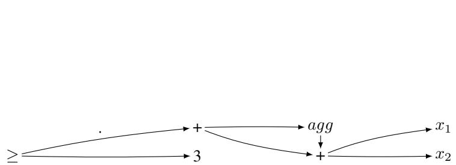  
Figure 1: DAG data structure for the formula $a g g ( x _ { 1 } + x _ { 2 } ) + ( x _ { 1 } + x _ { 2 } ) \geq 3$

on this, [43] introduced $A ^ { 2 } Q$ , a mixed-precision framework that adapts bitwidths on graph topology   
to achieve high compression with minimal performance loss.

# 88 2 Background

Let $\mathbb { K }$ be a set of quantized numbers, and let $n$ denote the bitwidth of $\mathbb { K }$ , that is, the number of bits   
required to represent a number in ${ \mathbb K }$ . The bitwidth $n$ is written in unary; this is motivated by the fact   
that $n$ is small and that we would in any case need to allocate $n$ -bit consecutive memory for storing a   
number. Formally, we consider a sequence $\mathbb { K } _ { 1 } , \mathbb { K } _ { 2 } , \ldots$ corresponding to bitwidths 1, 2, etc., but we   
retain the notation ${ \mathbb K }$ for simplicity. We suppose that ${ \mathbb K }$ saturates: e.g., if $x \geq 0$ , $y \geq 0$ , $x + y \ge 0$   
(i.e., no modulo behavior like in int in C for instance). We suppose that $1 \in \mathbb { K }$ .   
We consider Aggregate-Combine Graph Neural Networks with global Readout (ACR-GNNs), a   
standard class of message-passing GNNs [4, 16]. An ACR-GNN layer is defined by a triple   
$( c o m b , a g g , a g g _ { g } )$ , where comb : $\mathbf { \mathbb { K } } ^ { 3 m } \ \to \ \mathbb { K } ^ { n }$ is a combination function, and agg, $a g g _ { g }$ are lo  
cal and global aggregation functions that map multisets of vectors in $\mathbb { K } ^ { m }$ to a single vector in   
$\mathbb { K } ^ { m }$ .

An ACR-GNN is composed of a sequence of such layers 100 $( \mathcal { L } ^ { ( 1 ) } , \dots , \mathcal { L } ^ { ( L ) } )$ followed by a final 101 classification function $c l s : \mathbb { K } ^ { m }  \{ 0 , 1 \}$ . Given a graph $G = ( V , E )$ and an initial node labelling 102 $x _ { 0 } : V \to \{ 0 , 1 \} ^ { k }$ , the state of a node $u$ in layer $i$ is recursively defined as:

$$
x _ { i } ( u ) = c o m b ( x _ { i - 1 } ( u ) , \ a g g ( \{ \{ x _ { i - 1 } ( v ) \mid u v \in E \} \} ) , \ a g g _ { g } ( \{ \{ x _ { i - 1 } ( v ) \mid v \in V \} \} ) )
$$

The final output of the GNN for a pointed graph $( G , u )$ is $\mathcal { A } ( G , u ) = c l s ( x _ { L } ( u ) )$ . A more detailed   
definition is provided in Appendix C.2.   
Our study focuses on a specific subclass where both agg and $a g g _ { g }$ perform summation over vectors,   
and where $c o m b ( x , y , z \bar { ) = \sigma } ( x C + y A _ { 1 } + z A _ { 2 } + b )$ , using matrices $C , A _ { 1 } , A _ { 2 }$ with entries from   
${ \mathbb K }$ , and a bias $b \in \mathbb { K }$ . The classification function is a linear threshold: $\begin{array} { r } { c l s ( x ) = \sum _ { i } a _ { i } x _ { i } \ge 1 } \end{array}$ with   
weights $a _ { i } \in \mathbb { K }$ . Moreover, we assume that all arithmetic operations are executed according to the   
arithmetic related to $\mathbb { K }$ . It is assumed that the context makes clear the ${ \mathbb K }$ and arithmetic being used.   
We note $[ [ A ] ]$ the set of pointed graphs $( G , u )$ such that $\boldsymbol { \mathcal { A } } ( \boldsymbol { G } , \boldsymbol { u } ) = 1$ . An ACR-GNN $\mathcal { A }$ is satisfiable   
if $[ [ A ] ]$ is non-empty. The satisfiability problem for ACR-GNNs is: Given a ACR-GNN $\mathcal { A }$ , decide   
whether $\mathcal { A }$ is satisfiable.

# 113 3 Logic $q { \mathcal { L } }$ for Representing GNN Computations and Properties on Graphs

We set up a logical framework called $q { \mathcal { L } }$ extending the logic in [32] with global aggregation: it is a   
lingua franca to represent GNN computation and properties on graphs.

Syntax. Let $F$ be a finite set of features and ${ \mathbb K }$ be some finite-width arithmetic. We consider a set of expressions defined by the following grammar in Backus-Naur form:

$$
\vartheta : : = c \mid x _ { i } \mid \alpha ( \vartheta ) \mid a g g ( \vartheta ) \mid a g g _ { \forall } ( \vartheta ) \mid \vartheta + \vartheta \mid c \times \vartheta
$$

where $c$ is a number in $\mathbb { K } , x _ { i }$ is a feature in $F$ , $\alpha$ is a symbol for denoting the activation function, and   
agg and $a g g _ { \forall }$ denote the aggregation function for local and global readout respectively. A formula is   
a construction of the formula $\vartheta \geq k$ where $\vartheta$ is an expression and $k$ is an element of $\mathbb { K }$ . If $- 1 \in \mathbb { K }$   
and $- \vartheta$ is not, we can write $- \vartheta$ instead of $( - 1 ) \times \vartheta$ . Other standard abbreviations can be used.   
Formulas are represented as direct acyclic graphs, aka circuits, meaning that we do not repeat the same   
expressions several times. For instance, the formula $a g g ( x _ { 1 } + x _ { 2 } ) + ( x _ { 1 } + x _ { 2 } ) \geq 3$ can be represented   
as the DAG given in Figure 1. Formulas can also be represented by a sequence of assignments via   
new fresh intermediate variables. For instance: $y : = x _ { 1 } + x _ { 2 } , z : = a g g ( y ) + y , r e s : = z \geq 3$ .   
Semantics. Consider a graph $G = ( V , E )$ , where vertices in $V$ are labeled via a labeling function   
$\ell : V \to \mathbb { K } ^ { n }$ with feature values. The value of an expression $\vartheta$ in a vertex $u \in V$ is denoted by   
$[ [ \vartheta ] ] _ { G , u }$ and is defined by induction on $\vartheta$ :

$$
\begin{array} { r l } & { [ [ c ] ] _ { G , u } = c , } \\ & { [ [ \alpha ( \vartheta ) ] ] _ { G , u } = \ell ( u ) _ { i } , } \\ & { [ [ \vartheta + \vartheta ^ { \prime } ] ] _ { G , u } = [ [ \vartheta ] ] _ { G , u } + _ { \mathbb { K } } [ [ \vartheta ^ { \prime } ] ] _ { G , u } , } \end{array} \qquad \begin{array} { r l } & { [ [ c \times \vartheta ] ] _ { G , u } = c \times \mathbb { K } [ [ \vartheta ] ] _ { G , u } , } \\ & { [ [ \alpha ( \vartheta ) ] ] _ { G , u } = [ [ \alpha ] ] ( [ [ \vartheta ] ] _ { G , u } ) , } \\ & { [ [ a g g ( \vartheta ) ] ] _ { G , u } = \Sigma _ { v | u E v } [ [ \vartheta ] ] _ { G , v } , } \\ & { [ [ a g g _ { \forall } ( \vartheta ) ] ] _ { G , u } = \Sigma _ { v \in V } [ [ \vartheta ] ] _ { G , v } , } \end{array}
$$

We define $[ [ \vartheta \geq k ] ] = \{ G , u \mid [ [ \vartheta ] ] _ { G , u } \geq _ { \mathbb { K } } [ [ k ] ] _ { G , u } \}$ (we write $\geq$ for the symbol in the syntax and   
$\geq \mathbb { K }$ for the comparison in ${ \mathbb K }$ ). A formula $\varphi$ is satisfiable if $[ [ \varphi ] ]$ is non-empty. The satisfiability   
problem for $q { \mathcal { L } }$ is: Given a $q { \mathcal { L } }$ -formula $\varphi$ , decide whether $\varphi$ is satisfiable.   
ACR-GNN verification tasks. We are interested in the following decision problems. Given a GNN   
$\mathcal { A }$ , and a $q { \mathcal { L } }$ formula $\varphi$ : (VT1, sufficiency) Do we have $[ [ \varphi ] ] \subseteq [ [ A ] ] \colon$ (VT2, necessity) Do we have   
$[ [ A ] ] \subseteq [ [ \varphi ] ] ?$ (VT3, consistency) Do we have $[ [ \varphi ] ] \cap [ [ A ] ] \neq \varnothing$ ?

Representing a GNN computation. To reason formally about ACR-GNNs, we represent their computations using $q { \mathcal { L } }$ . Logic $q { \mathcal { L } }$ facilitates the modeling of the acceptance condition of ACR-GNNs.

We explain this via example. Consider a two-layer ACR-GNN $\mathcal { A }$ with input and output dimension 2,   
using summation for aggregation, activation via $\alpha ( x ) : = \operatorname* { m a x } ( 0 , \operatorname* { m i n } ( 1 , x ) )$ —the truncated ReLU—   
and a classification function $2 x _ { 1 } - x _ { 2 } \geq 1$ . The combination functions are:

$$
\begin{array} { r l } & { c o m b _ { 1 } ( ( x _ { 1 } , x _ { 2 } ) , ( y _ { 1 } , y _ { 2 } ) , ( z _ { 1 } , z _ { 2 } ) ) : = \left( \begin{array} { l } { \sigma ( 2 x _ { 1 } + x _ { 2 } + 5 y _ { 1 } - 3 y _ { 2 } + 1 ) } \\ { \sigma ( - x _ { 1 } + 4 x _ { 2 } + 2 y _ { 1 } + 6 y _ { 2 } - 2 ) } \end{array} \right) , } \\ & { c o m b _ { 2 } ( ( x _ { 1 } , x _ { 2 } ) , ( y _ { 1 } , y _ { 2 } ) , ( z _ { 1 } , z _ { 2 } ) ) : = \left( \begin{array} { l } { \sigma ( 3 x _ { 1 } - y _ { 1 } + 2 z _ { 2 } ) } \\ { \sigma ( - 2 x _ { 1 } + 5 y _ { 2 } + 4 z _ { 1 } ) } \end{array} \right) . } \end{array}
$$

Note that this assumes that $\mathcal { A }$ operates over $\mathbb { K }$ with at least three bits. Then, the corresponding   
$q { \mathcal { L } }$ formula $\varphi _ { \mathcal { A } }$ is given by: $\psi _ { 1 } = \alpha ( 2 x _ { 1 } + x _ { 2 } + 5 a g g ( x _ { 1 } ) - 3 a g g ( x _ { 1 } ) + 1 ) \qquad $ , $\psi _ { 2 } : = \alpha ( - x _ { 1 } +$   
$4 x _ { 2 } + 2 a g g ( x _ { 1 } ) + 6 a g g ( x _ { 2 } ) - 2 )$ , $\chi _ { 1 } : = \alpha ( 3 \psi _ { 1 } - a g g ( \psi _ { 1 } ) + 2 ( a g g _ { \forall } ( p s i _ { 2 } ) ) )$ , $\chi _ { 2 } : = \alpha ( - 2 \psi _ { 1 } +$   
$5 ( a g g ( \psi _ { 2 } ) ) + 4 a g g _ { \forall } ( p s i 1 ) )$ , $\varphi _ { A } : = 2 ( \chi _ { 1 } ) - \chi _ { 2 } \geq 1$ . To sum up, given a GNN $\mathcal { A }$ , we compute   
$q { \mathcal { L } }$ -formula in poly-time in the size of $\mathcal { A }$ with $[ [ A ] ] = [ [ \varphi _ { A } ] ]$ (as done in [32]).   
Simulating a modal logic in the logic $q { \mathcal { L } }$ . In this section, we show that extending $q { \mathcal { L } }$ with   
modal operators [9] does not increase the expressivity. We can even compute an equivalent $q { \mathcal { L } }$   
without Boolean connectives and without modal operators in poly-time. It means that formulas like   
$\varphi _ { \mathcal { A } _ { 1 } }  x _ { 0 } = 1$ or $\varphi _ { \mathcal { A } _ { 1 } } \wedge \odot ^ { \le 3 } ( x _ { 2 } = 1 )$ have equivalent formulas in $q { \mathcal { L } }$ .   
Assume that $\alpha$ is ReLU. Let $A t m _ { 0 }$ be the set of atomic formulas of $q { \mathcal { L } }$ of the form $\vartheta \geq 0$ . We   
suppose that $\vartheta$ takes integer values. In general, $\vartheta \geq k$ is an atomic formula equivalent to $\vartheta - k \geq 0$ .   
Without loss of generality, we thus assume that formulas of $q { \mathcal { L } }$ are over $A t m _ { 0 }$ . Let modal $q { \mathcal { L } }$ be the   
propositional logic on $A t m _ { 0 }$ extended with modalities and a restricted variant of graded modalities   
152 where number $k$ in $\mathbb { K }$ .

$$
\begin{array} { r l } & { \left[ [ \boxed { \dag } ] = \{ G , u \mid G , v \in [ [ \varphi ] ] \mathrm { ~ f o r ~ e v e r y ~ } v \mathrm { ~ s . t . ~ } u E v \} \right. } \\ & { \left. \left[ \bigcirc _ { g } \varphi \right] \right] = \{ G , u \mid G , v \in [ [ \varphi ] ] \mathrm { ~ f o r ~ e v e r y ~ } v \mathrm { ~ i n ~ } V \} } \end{array}
$$

$$
[ [ \diamond ] ^ { \geq k } \varphi ] ] = \{ G , u \mid | \{ G , v \mid u E v \mathrm { ~ a n d ~ } G , v \in [ [ \varphi ] ] \} | \geq \mathbb { k } \} \quad [ [ \diamond ] _ { g } ^ { \geq k } \varphi ] ] = \{ G , u \mid | [ [ \varphi ] ] | \geq \mathbb { k } \}
$$

and modalities ${ \diamond } \mathrm { s } { k } _ { \varphi }$ and ${ \diamondsuit } _ { \overline { { \boldsymbol { g } } } } ^ { \leq k } \boldsymbol { \varphi }$ defined the same way but with $\leq _ { \mathbb { K } }$ . We can turn back to the graph properties mentioned in Example 1.

56 Example 2. We first define a few simple formulas to characterize the concepts of the domain. Let   
$\varphi _ { A } : = x _ { 0 } = 1$ (Animal), $\varphi _ { H } : = x _ { 1 } = 1$ (Human), $\varphi _ { L } : = x _ { 2 } = 1 ( L e g$ ), $\varphi _ { F } : = x _ { 3 } = 1 ( F u r ) ,$ ,   
158 $\varphi _ { W } : = x _ { 4 } = 1$ (White), and $\varphi _ { B } : = x _ { 5 } = 1 ( B l a c k$ ).

1. Has a human owner, whose all pets are two-legged: $\diamondsuit ( \varphi _ { H } \wedge \sqcup ( \varphi _ { A } \to \diamondsuit ^ { = 2 } \varphi _ { L } )$ ).

. A human in a community that has more that twice as many animals as humans, and more than five animals without an owner: $\varphi _ { H } \wedge ( a g g _ { \forall } ( x _ { 0 } ) - 2 \times a g \dot { g } _ { \forall } ( x _ { 1 } ) \geq 0 ) \wedge \diamondsuit _ { g } ^ { \geq 5 } ( ( \varphi _ { A } \wedge \sqcup ( \neg \varphi _ { H } ) )$ .

We can see the boolean operator $\neg$ , and the various modalities as functions from $A t m _ { 0 }$ into $A t m _ { 0 }$ ,   
and the boolean operator $\vee$ as a function from $A t m _ { 0 } \times A t m _ { 0 }$ to $A t m _ { 0 }$ .

$$
\begin{array} { r l } & { \quad f _ { \neg } ( \vartheta \geq 0 ) : = - \vartheta - 1 \geq 0 \qquad f _ { \vee } ( \vartheta _ { 1 } \geq 0 , \vartheta _ { 2 } \geq 0 ) : = \vartheta _ { 1 } + R e L U ( \vartheta _ { 2 } - \vartheta _ { 1 } ) \geq 0 } \\ & { \quad f _ { \bigstar } ( \vartheta \geq 0 ) : = a g g ( - R e L U ( - \vartheta ) ) \geq 0 } \\ & { \quad f _ { \diamond \geq k } ( \vartheta \geq 0 ) : = a g g ( R e L U ( \vartheta + 1 ) - R e L U ( \vartheta ) ) - k \geq 0 } \\ & { \quad f _ { \diamond \leq k } ( \vartheta \geq 0 ) : = k - a g g ( R e L U ( \vartheta + 1 ) - R e L U ( \vartheta ) ) \geq 0 } \end{array}
$$

For the corresponding global modalities 166 $( f _ { \smash { \bigcirc } _ { g } } ( \vartheta \geq 0 )$ , $f _ { \diamondsuit ^ { \geq k } } ( \vartheta \geq 0 )$ , and $f _ { \diamondsuit ^ { \leq k } } ( \vartheta \geq 0 ) )$ ), it suffices to 167 use $a g g _ { \forall }$ in place of agg. The previous transformations can be generalized to arbitrary formulas of 168 modal $q { \mathcal { L } }$ as follows.

$$
\begin{array} { r l } & { \quad m o d 2 e x p r ( \vartheta \geq 0 ) : = \vartheta \geq 0 \quad m o d 2 e x p r ( \neg \varphi ) : = f _ { \neg } ( m o d 2 e x p r ( \varphi ) ) } \\ & { \quad m o d 2 e x p r ( \varphi _ { 1 } \vee \varphi _ { 2 } ) : = f _ { \vee } ( m o d 2 e x p r ( \varphi _ { 1 } ) , m o d 2 e x p r ( \varphi _ { 2 } ) ) } \\ & { \quad \quad m o d 2 e x p r ( \boxplus \varphi ) : = f _ { \boxplus } ( m o d 2 e x p r ( \varphi ) ) , \qquad \boxplus \in \{ \bigstar \big \cup , \bigtriangleup _ { g } , \bigtriangleup _ { g } ^ { \geq k } , \bigtriangleup _ { g } ^ { \geq k } , \bigtriangleup _ { g } ^ { \leq k } , \bigtriangleup _ { g } ^ { \leq k } \} } \end{array}
$$

We can show that formulas of modal $q { \mathcal { L } }$ can be captured by a unique expression $\vartheta \geq 0$ . This is a   
consequence of the following lemma 2.

Lemma 3. Let $\varphi$ be a formula of modal qL. The formulas $\varphi$ and mod2expr $\left( \varphi \right)$ are equivalent.

Now, ACR-GNN verification tasks can be solved by reduction to the satisfiability problem of $q { \mathcal { L } }$ .   
VT1 by checking that $\varphi \wedge \neg \varphi _ { \mathcal { A } }$ is not satisfiable; VT2 by checking that $\neg \varphi \land \varphi _ { \mathcal { A } }$ is not satisfiable;   
VT3 by checking that $\varphi \wedge \varphi _ { \mathcal { A } }$ is satisfiable.

# 175 4 NEXPTIME Membership of the Satisfiability Problem

In this section, we prove the NEXPTIME membership of reasoning in modal quantized logic, and   
also of solving of ACR-GNN verification tasks (by reduction to the former). Remember that the   
activation function $\alpha$ can be arbitrary in our setting. Our result holds with the loose restriction that   
179 $[ [ \alpha ] ]$ is computable in exponential-time in the bit-width $n$ of ${ \mathbb K }$ .   
80 Theorem 4. The satisfiability problem of qL is decidable and in NEXPTIME, and so is VT3. VT1   
and VT2 are in coNEXPTIME.   
In order to prove Theorem 4, we adapt the NEXPTIME membership of the description logic   
$\pmb { \mathcal { A } } \pmb { \mathcal { L } } \pmb { \mathcal { C } } \pmb { S } \pmb { \mathcal { C } } \pmb { \mathcal { C } } ^ { + + }$ from [2] to logic $q { \mathcal { L } }$ . The difference resides in the definition of Hintikka sets and   
the treatment of quantization. The idea is to encode the constraints of a $q { \mathcal { L } }$ -formula $\varphi$ in a formula of   
exponential length of a quantized version of QFBAPA, that we prove to be in NP.

# 186 4.1 Hintikka Sets

Consider $q { \mathcal { L } }$ -formula $\varphi$ . Let $E ( \varphi )$ be the set of subexpressions in $\varphi$ . For instance, if $\varphi$ is $3 \times a g g ( \alpha ( x _ { 2 } + a g g _ { \forall } ( x _ { 1 } ) ) ) \ge 5$ then $E ( \varphi ) : = \{ a g g ( \alpha ( \bar { x } _ { 2 } + a g g _ { \forall } ( x _ { 1 } ) ) , \alpha ( x _ { 2 } + a g g _ { \forall } ( x _ { 1 } ) , x _ { 2 } ,$ , $a g g _ { \forall } ( x _ { 1 } ) , x _ { 1 } \}$ . From now on, we consider equality subformulas that are of the form $\scriptstyle \vartheta = k$ where $\vartheta$ is a subexpression of $\varphi$ and $k \in \mathbb { K }$ .

191 Definition 5. A Hintikka set $H$ for $\varphi$ is a subset of subformulas of $\varphi$ such that:

1. For all $\vartheta \in E ( \varphi )$ , there is a unique value $k \in \mathbb { K }$ such that $\vartheta = k \in H$   
. $\vartheta _ { 1 } = k _ { 1 }$ , $\vartheta _ { 2 } { = } k _ { 2 } \in H$ then $\vartheta _ { 1 } + \vartheta _ { 2 } = k _ { 1 } + k _ { 2 } \in H$   
. If $\vartheta \geq k \in H$ then $c \times \vartheta { = } k ^ { \prime } \in H$ where $k ^ { \prime } = c \times _ { \mathbb { K } } k$   
. $\vartheta { = } k \in H$ and $\alpha ( \vartheta ) { = } k ^ { \prime }$ implies $k ^ { \prime } = [ [ \alpha ] ] ( k )$   
Informally, a Hintikka set is a set of equality subformulas obtained from a choice of a value for each   
subexpression of $\varphi$ (point 1), provided that the set is consistent at the current vertex (point 2-4). Note   
that the notion of Hintikka set does not take any constraints about agg and $a g g _ { \forall }$ into consideration   
since checking consistency of aggregation would require information about the neighbor or the whole   
graph.

Example 6. If $\varphi$ is $3 \times a g g ( \alpha ( x _ { 2 } + a g g _ { \forall } ( x _ { 1 } ) ) ) \ge 5$ then the following set is an example of Hintikka set: $\{ a g g ( \alpha ( x _ { 2 } + a g g _ { \forall } ( x _ { 1 } ) ) = 8 $ , $\alpha ( x _ { 2 } + a g g _ { \forall } ( x _ { 1 } ) ) = 9 , x _ { 2 } + a g g _ { \forall } ( x _ { 1 } ) = 9 , x _ { 2 } = 7$ , $a g g _ { \forall } ( x _ { 1 } ) = 2 , \overline { { { x _ { 1 } = 5 } } } \}$ .

Proposition 7. The number of Hintikka sets is bounded by $2 ^ { n | \varphi | }$ where $| \varphi |$ is the size of $\varphi$ , and $n$ is the bitwidth of ??.

# 4.2 Quantized Version of QFBABA (Quantifier-free Boolean Algebra and Presburger Arithmetics)

A QFBAPA formula is propositional formula where each atom is either an inclusion of sets or equality of sets or linear constraints [20]. Sets are denoted by Boolean algebra expression e.g., $( S \cup S ^ { \prime } ) \setminus S ^ { \prime \prime }$ , or $\mathcal { U }$ where $\mathcal { U }$ denotes the set of all points in some domain. Here $S$ , $S ^ { \prime }$ , etc. are set variables. Linear constraints are over $| S |$ denoting the cardinality of the set denoted by the set expression $S$ . For instance, the QFBAPA-formula $( p i a n i s t \subseteq h a p p y ) \wedge ( | h a p p y | + | \mathcal { U } \setminus p i a n i s t | \geq 6 ) \wedge ( | h a p p y | < 2 )$ is read as ‘all pianists are happy and the number of happy persons $^ +$ the number of persons that are not pianists is greater than 6 and the number of happy persons is smaller than $2 ^ { \circ }$ .

We now introduce a quantized version $\mathrm { Q F B A P A _ { \mathbb { K } } }$ of QFBAPA. It has the same syntax as QFBAPA except that hard-coded numbers in expressions are in ${ \mathbb K }$ . Concerning the semantics, every numerical expression is interpreted in $\mathbb { K }$ . For each set expression $S$ , the interpretation of $| S |$ is not the cardinality $c$ of the interpretation of $S$ , but the result of the computation $1 + 1 + \ldots + 1$ in ${ \mathbb K }$ with $c$ occurrences of 1 in the sum.

We consider that $\mathbb { K }$ that saturates, meaning that if $x + y$ exceed the upper bound limit of ${ \mathbb K }$ , there is a special value denoted by $+ \infty$ such that $x + y = + \infty$ .

Proposition 8. If bitwidth $n$ is in unary, and $i f \mathbb { K }$ saturates, then satisfiability in $Q F B A P A _ { \mathbb { K } }$ is in NP.

# 4.3 Reduction to $\mathbf { Q F B A P A } _ { \mathbb { K } }$

Let $\varphi$ be a formula of $q { \mathcal { L } }$ . For each Hintikka set $H$ , we introduce the set variable $X _ { H }$ that intuitively represents the $H$ -vertices, i.e., the vertices in which subformulas of $H$ hold. The following $\mathrm { Q F B A P A _ { \mathbb { K } } }$ - formulas say that the interpretation of $X _ { H }$ form a partition of the universe. For each subformula $\vartheta ^ { \prime } = k$ , we introduce the set variable $X _ { \vartheta ^ { \prime } = k }$ that intuitively represents the vertices in which $\vartheta ^ { \prime } = k$ holds. Formula (1) expresses that $\{ X _ { H } \} _ { H }$ form a partition of the universe. Formula (2) makes the bridge between variables $X _ { \vartheta ^ { \prime } = k }$ and $X _ { H }$ .

$$
( \bigwedge _ { H \neq H ^ { \prime } } X _ { H } \cap X _ { H ^ { \prime } } = \emptyset ) \wedge ( \bigcup _ { H } X _ { H } = \mathcal { U } ) \quad ( 1 ) \qquad \bigwedge _ { \vartheta ^ { \prime } \in E ( \varphi ) } \bigwedge _ { k \in \mathbb { K } } ( X _ { \vartheta ^ { \prime } = k } = \bigcup _ { H | \vartheta ^ { \prime } = k \in H } X _ { H } )
$$

We introduce also a variable $S _ { H }$ that denotes the set of all successors of some $H$ -vertex. If there is   
no $H$ -vertex then the variable $S _ { H }$ is just irrelevant.   
The following $\mathrm { Q F B A P A _ { \mathbb { K } } }$ -formula encodes the semantics of $a g g ( \vartheta )$ . More precisely, it says that for   
all subexpressions $a g g ( \vartheta )$ , for all values $k$ , for all Hintikka sets $H$ containing subformula $\overset { \cdot } { a g g } ( \vartheta ) = k$ ,   
for all $H$ containing $a g g ( \vartheta ) = k$ , it says that, if there is some $H$ -vertex (i.e., vertices in $S _ { H }$ ), then the   
aggregation obtained by summing over the successors of some $H$ -vertex is $k$ .

$$
\underset { a g g ( \vartheta ) \in E ( \varphi ) } { \bigwedge } \bigwedge _ { k \in \mathbb { K } } \quad \bigwedge _ { \begin{array} { l } { \mathrm { H i n i k k a s e t } H } \\ { \vert \mathrm { \Pi } _ { \textit { q g g } ( \vartheta ) = k \in  { H } } } \end{array} } [ ( X _ { H } \neq \varnothing )  \sum _ { k ^ { \prime } \in \mathbb { K } } \vert S _ { H } \cap X _ { \vartheta = k ^ { \prime } } \vert \times k ^ { \prime } = k ]
$$

In the previous sum, we partition 237 $S _ { H }$ into subsets $S _ { H } \cap X _ { \vartheta = k ^ { \prime } }$ for all possible values $k ^ { \prime }$ . Each contribution for a successor in 238 $S _ { H } \cap X _ { \vartheta = k ^ { \prime } }$ is $k ^ { \prime }$ . We rely here on the fact3 that $( 1 + 1 + \cdot \cdot \cdot + 1 ) \times k ^ { \prime } =$

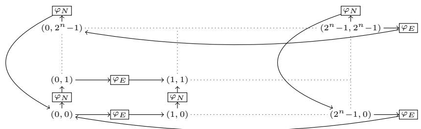  
Figure 2: Encoding a torus of exponential size with (modal) $q { \mathcal { L } }$ formulas. $( x , y )$ are the vertices of the graph that correspond to locations in the torus while $\varphi _ { N }$ and $\varphi _ { E }$ denote intermediate vertices indicating the direction (resp., north and east).

$k ^ { \prime } + k ^ { \prime } + \ldots + k ^ { \prime }$ . We also fix a specific order over values $k ^ { \prime }$ in the summation (it means that $a g g ( \vartheta )$   
is computed as follows: first order the successors according to the taken values of $\vartheta$ in that specific   
order, then perform the summation). Finally, the semantics of $a g g _ { \forall }$ is captured by the formula:

$$
\bigwedge _ { \substack { a g g _ { \forall } ( \vartheta ) \in E ( \varphi ) } } \bigwedge _ { k \in \mathbb { K } } X _ { a g g _ { \forall } ( \vartheta ) = k } \neq \emptyset  \sum _ { k ^ { \prime } \in \mathbb { K } } | X _ { \vartheta = k ^ { \prime } } | \times k ^ { \prime } = k
$$

Note that intuitively Formula (4) implies that for $X _ { a g g _ { \forall } ( \vartheta ) = k }$ is interpreted as the universe, for the value 243 $k$ which equals the semantics of $\scriptstyle \sum _ { k ^ { \prime } \in \mathbb { K } } | X _ { \vartheta = k ^ { \prime } } | \times k ^ { \prime }$ .

Given $\varphi = \vartheta \geq k$ , we define $t r ( \varphi ) : = \psi \wedge \bigvee _ { k ^ { \prime } \geq k } X _ { \vartheta = k ^ { \prime } } \neq \varnothing$ where $\psi$ the conjunction of Formulas 1–4. The function $t r$ requires to compute all the Hintikka sets. So we need in particular to check Point 4 of Definition 5 and we get the following when $[ [ \alpha ] ]$ is computable in exponential time in $n$ .

Proposition 9. $t r ( \varphi )$ is computable in exponential-time in $| \varphi |$ and $n$ .

Proposition 10. Let $\varphi$ be a formula of qL. $\varphi$ is satisfiable iff $t r ( \varphi )$ is $Q F B A P A _ { \mathbb { K } }$ satisfiable.

Finally, in order to check whether a $q { \mathcal { L } }$ -formula $\varphi$ is satisfiable, we construct a $\mathrm { Q F B A P A _ { \mathbb { K } } }$ -formula $t r ( \varphi )$ in exponential time. As the satisfiability problem of $\mathrm { Q F B A P A _ { \mathbb { K } } }$ is in NP, we obtain that the satisfiability problem of $q { \mathcal { L } }$ is in NEXPTIME. We proved Theorem 4,

Remark 11. Our methodology can be generalized to reason in subclasses of graphs. For instance, we may tackle the problem of satisfiability in a graph where vertices are of bounded degree bounded by d. To do so, we add the constraint $\textstyle \bigwedge _ { H } | S _ { H } | \leq d$ .

# 5 Complexity Lower Bound

The NEXPTIME upper-bound is tight. Having defined modalities in $q { \mathcal { L } }$ and stated Lemma 3,   
Theorem 12 is proven by adapting the proof of NEXPTIME-hardness of deciding the consistency of   
258 ALCQ- $. T _ { C }$ Boxes presented in [36]. So we already have the hardness result for ReLU.

NEXPTIME-hardness is proven via a reduction from the tiling problem by Wang tiles of a torus of size $2 ^ { n } \times 2 ^ { n }$ . A Wang tile is a square with colors, e.g., , $\boxtimes .$ , etc. That problem takes as input a number $n$ in unary, and Wang tile types, and an initial condition – let say the bottom row is already given. The objective is to decide whether the torus of $2 ^ { n } \times 2 ^ { n }$ can be tiled while colors of adjacent Wang tiles match. A slight difficulty resides in adequately capturing a two-dimensional grid structure—as in Figure 2—with only a single relation. To do that, we introduce special formulas $\varphi _ { E }$ and $\varphi _ { N }$ to indicate the direction (east or north). In the formula computed by the reduction, we also need to bound the number of vertices corresponding to tile locations by $2 ^ { n } \times 2 ^ { n }$ . Thus ${ \mathbb K }$ needs to encode $2 ^ { n } \times 2 ^ { n }$ . We need a bit-width of at least $2 n$ .

Theorem 12. The satisfiability problem in qL is NEXPTIME-hard, and so is VT3. VT1 and VT2 are coNEXPTIME-hard.

70 Remark 13. It turns out that the verification task only needs the fragment of qL where agg is applied   
1 directly on an expression $\alpha ( . . )$ . Indeed, this is the case when we represent a GNN in qL or when we   
translate logical formulas in qL (Lemma 3). Reasoning about qL when $\mathbb { K } = \mathbb { Z }$ and the activation   
function is truncated ReLU is also NEXPTIME-complete (see Appendix $E$ ).   
The satisfiability problem is NEXPTIME-complete, thus far from tractable. The complexity comes   
essentially because counterexamples can be arbitrary large graphs. However, usually we are search   
for small counterexamples. Let $\mathcal { G } ^ { \leq N }$ be the set of pointed graphs with at most $N$ vertices. We   
consider the $q { \mathcal { L } }$ and ACR-GNN satisfiability problems with a bound on the number of vertices: given   
a number $N$ given in unary, 1. given a $q { \mathcal { L } }$ -formula $\varphi$ , is it the case that $[ [ \varphi ] ] \cap { \mathcal { G } } ^ { \leq N } { \dot { \neq } } \emptyset$ , 2. given an   
ACR-GNN $\mathcal { A }$ , is it the case that $[ [ A ] ] \hat { \cap } \mathcal G ^ { \le N } \ne \emptyset$ .

# 281 Theorem 14. The satisfiability problems with bounded number of vertices are $N P$ -complete.

We then can extend the methodology of [33] but for verifying GNNs. Our implementation proposal is a Python program that takes a learnt quantized GNN $\mathcal { A }$ as an input, a precondition, a postcondition and a bound $N$ . It then produces a $\textrm { C }$ program that mimics the execution of $\mathcal { A }$ on an arbitrary graph with at most $N$ vertices, and embeds the pre/postcondition. We then apply ESBMC (efficient SMT-based context-bounded model checker) [21] on the C program.

# 7 7 Quantization Effects on Accuracy, Performance and Model Size

To confirm that the GNN models considered in this paper are promising, we now investigate the   
application of Dynamic Post-Training Quantization (PTQ) to Aggregate-Combined Readout Graph   
Neural Networks (ACR-GNNs). Our experimental design builds on the framework introduced in [4],   
using their publicly available implementation [5] as the baseline. ACR-GNNs with specific structural   
configurations are used as the primary model class for evaluation. Dynamic PTQ, implemented   
93 in PyTorch [1, 26], converts a pre-trained floating-point model into a quantized version without   
4 retraining. This approach quantizes weights to INT8 statically, while activations remain in floating   
point until dynamically quantized at compute time. This enables efficient INT8-based computation,   
reducing memory usage and improving inference speed. PyTorch’s implementation employs per  
tensor quantization for weights and stores activations in floating-point format between operations.   
The evaluation focuses on accuracy, model size, and latency. Experiments are conducted on both   
99 synthetic and real-world datasets, with the synthetic benchmark—based on dense Erd¨os–R´enyi graph   
00 structures and logical labeling schemes—serving as the primary focus.   
The synthetic graphs were generated using the dense Erd¨os–R´enyi model, a classical approach for   
constructing random graphs. Each graph includes five initial node colours, encoded as one-hot   
feature vectors. Following [4], labels were assigned using formulas from the logic fragment $\mathrm { F O C _ { 2 } }$ .   
Specifically, a hierarchy of classifiers $\alpha _ { i } ( x )$ was defined as:

$$
\alpha _ { 0 } ( x ) : = \mathrm { B l u e } ( x ) , \quad \alpha _ { i + 1 } ( x ) : = \exists ^ { [ N , M ] } y \left( \alpha _ { i } ( y ) \wedge \lnot E ( x , y ) \right)
$$

where $\exists [ N , M ]$ denotes the quantifier “there exist between $N$ and $M$ nodes" satisfying a given condition.   
Each classifier $\alpha _ { i } ( x )$ can be expressed within $\mathrm { F O C _ { 2 } }$ , as the bounded quantifier can be rewritten   
using $\exists \geq N$ and $\lnot \exists ^ { \geq M + 1 }$ . Each property $p _ { i }$ corresponds to a classifier $\alpha _ { i }$ with $i \in { 1 , 2 , 3 }$ . Summary   
statistics for the dataset are provided in Appendix $\mathbf { G }$ , Table 3.   
Table 1 presents the difference in accuracy and model size between the quantized $\mathrm { ( Q I N T 8 ^ { 4 } }$ ) and   
original (FP32) versions of the ACR-GNN model across three configurations (1, 2, and 3 layers). The   
evaluation is conducted on three FO-properties $( p _ { 1 } , p _ { 2 } , p _ { 3 } )$ over three data splits: Train, Test1, and   
Test2. The table highlights how quantization affects accuracy at various depths. In most cases, the   
impact of quantization on accuracy is minor and bounded, with some configurations even showing   
positive differences. For instance, in the 2-layer configuration—the overall best performer—the   
accuracy loss remains within $\pm 0 . 1$ across all properties and splits, while yielding a model size   
reduction of $0 . 0 6 8 \mathrm { M B }$ . The 1-layer model shows greater fluctuation: while $p _ { 2 }$ on Test2 experiences   
a significant positive spike $( + 8 . 8 9 1 )$ , $p _ { 3 }$ on Test2 drops by $- 0 . 6 9 3$ . This suggests sensitivity to   
quantization in shallow models, likely due to limited representational capacity. The results confirm   
that dynamic post-training quantization (PTQ) enables significant compression—up to $60 \%$ reduction   
in size—while maintaining acceptable levels of accuracy. Additional breakdowns, including baseline   
results and extended configurations, are provided in Appendix G.   

333

Table 1: Accuracy difference $( \% )$ and model size (MB) of the ACR-GNN model before and after dynamic post-training quantization (PTQ) across FO-properties $p _ { 1 }$ , $p _ { 2 }$ , and $p _ { 3 }$ . Values are reported for three model depths (1, 2, and 3 layers) and three dataset splits (Train, Test 1, Test 2). Accuracy values represent the change after quantization (QINT8 – FP32). $p _ { 1 } , p _ { 2 } , p _ { 3 }$ are FO-properties described in Appendix G.   

<table><tr><td rowspan="2">#</td><td colspan="3">P1</td><td colspan="3">P2</td><td colspan="3">p3</td><td rowspan="2">Size (MB)</td></tr><tr><td>Train</td><td>Test 1</td><td>Test2</td><td>Train</td><td>Test 1</td><td>Test2</td><td>Train</td><td>Test1</td><td>Test2</td></tr><tr><td>1</td><td>-0.452%</td><td>-0.760%</td><td>+0.522%</td><td>-0.127%</td><td>-0.183%</td><td>+8.891%</td><td>-0.299%</td><td>-0.648%</td><td>-0.693%</td><td>0.034</td></tr><tr><td>2</td><td>-0.001%</td><td>0.000%</td><td>-0.043%</td><td>+0.083%</td><td>-0.125%</td><td>+0.144%</td><td>-0.178%</td><td>-0.226%</td><td>+0.018%</td><td>0.068</td></tr><tr><td></td><td>-0.036%</td><td>+0.062%</td><td>-0.494%</td><td>-0.161%</td><td>-0.143%</td><td>-0.342%</td><td>-0.015%</td><td>+0.280%</td><td>-0.346%</td><td>0.103</td></tr></table>

Table 2: PPI benchmark. Accuracy $( \% )$ and size (MB) of the ACR-GNN with ReLU activation function before and after dynamic PTQ across different layer configurations.   

<table><tr><td></td><td colspan="4">Original (FP32)</td><td colspan="4">Quantized (QINT8)</td><td colspan="4">Difference</td></tr><tr><td>#</td><td>Train</td><td>Val</td><td>Test</td><td>Size (MB)</td><td>Train</td><td>Val</td><td>Test</td><td>Size (MB)</td><td>Train</td><td>Val</td><td>Test</td><td>Size (MB)</td></tr><tr><td>1</td><td>54.7%</td><td>43.1%</td><td>39.5%</td><td>0.922</td><td>55.0%</td><td>50.8%</td><td>50.2%</td><td>0.242</td><td>+0.3%</td><td>+7.7%</td><td>+10.7%</td><td>0.680</td></tr><tr><td>2</td><td>52.5%</td><td>44.6%</td><td>45.7%</td><td>1.718</td><td>52.3%</td><td>47.8%</td><td>47.2%</td><td>0.451</td><td>-0.2%</td><td>+3.2%</td><td>+1.5%</td><td>1.267</td></tr><tr><td>3</td><td>52.3%</td><td>42.6%</td><td>44.0%</td><td>2.515</td><td>51.9%</td><td>45.7%</td><td>42.8%</td><td>0.660</td><td>-0.4%</td><td>+3.1%</td><td>-1.2%</td><td>1.855</td></tr></table>

Table 2 shows the results of evaluating the ACR-GNN model on the Protein-Protein Interaction (PPI) benchmark before and after applying dynamic post-training quantization (PTQ). The evaluation covers three model configurations (1 to 3 layers) and reports performance in terms of accuracy (Train, Validation, and Test) and model size (in MB). Quantization results in substantial compression across all configurations. The model size decreases from $0 . 9 2 2 \mathrm { M B }$ to $0 . 2 4 2 \mathrm { M B }$ (a $73 \%$ reduction) for the 1-layer network, while the 2- and 3-layer models achieve reductions of 1.267 MB and 1.855 MB, respectively. Accuracy-wise, quantization leads to improvements in the Validation and Test sets for shallower networks. The 1-layer model gains $+ 0 . 0 7 7$ on validation and $+ 0 . 1 0 7$ on test accuracy, indicating potential for enhanced generalization. The 2-layer model shows minor improvements across all splits, with negligible loss in training accuracy. However, the 3-layer configuration reveals a slight drop in test accuracy (–0.012), suggesting increased sensitivity to quantization at greater depth. See Appendix G, Tables 16,17, and 18 for additional quantitative breakdowns.

# 334 8 Conclusion and Future Work

35 The central result is the NEXPTIME-complete of the logic $q { \mathcal { L } }$ in which both the computations of   
GNNs and modal properties can be expressed. It helps to understand the inherent complexity of   
verifying quantized GNNs. We also provide a prototype for verifying GNNs over a set of graphs   
with a bounded number of vertices. Finally some experiments confirmed that the quantization of   
ACR-GNNs is promising.   
There are many directions to go. First, characterizing the modal flavor of $q { \mathcal { L } }$ for other activation   
functions than ReLU. New extensions of $q { \mathcal { L } }$ could be proposed to tackle other classes GNNs.   
Verification of neural networks is challenging and is currently tackled by the verification community   
[10]. So it will be for GNNs as well. Our verification tool with a bound on the number of vertices is   
still preliminary. One obvious path would be to improve the tool, to compare different approaches   
(bounded model checking vs. linear programming as in [18]) and apply it to real GNN verification   
scenarios. Designing a practical verification procedure in the general case (without any bound on the   
number of vertices) and overcoming the high computational complexity is an exciting challenge for   
future research towards the verification of GNNs.

Limitations. Section 4 and 5 reflect theoretical results. Some practical implementations of GNNs may not fully align with them. In particular, the order in the (non-associative) summation over values in ${ \mathbb K }$ is fixed in formulas (3) and (4). It means that we suppose that the aggregation $a g g ( \vartheta )$ is computed in that order too (we sort the successors of a vertex according the values of $\vartheta$ and then perform the summation). The verification tool discussed in Section 6 remains a prototype, thus its application warrants careful consideration.

References [1] Jason Ansel, Edward Yang, Horace He, Natalia Gimelshein, Animesh Jain, Michael Voznesensky, Bin Bao, Peter Bell, David Berard, Evgeni Burovski, Geeta Chauhan, Anjali Chourdia, Will Constable, Alban Desmaison, Zachary DeVito, Elias Ellison, Will Feng, Jiong Gong, Michael Gschwind, Brian Hirsh, Sherlock Huang, Kshiteej Kalambarkar, Laurent Kirsch, Michael Lazos, Mario Lezcano, Yanbo Liang, Jason Liang, Yinghai Lu, CK Luk, Bert Maher, Yunjie Pan, Christian Puhrsch, Matthias Reso, Mark Saroufim, Marcos Yukio Siraichi, Helen Suk, Michael Suo, Phil Tillet, Eikan Wang, Xiaodong Wang, William Wen, Shunting Zhang, Xu Zhao, Keren Zhou, Richard Zou, Ajit Mathews, Gregory Chanan, Peng Wu, and Soumith Chintala. Pytorch 2: Faster machine learning through dynamic python bytecode transformation and graph compilation. In Proceedings of the 29th ACM International Conference on Architectural Support for Programming Languages and Operating Systems, Volume 2 (ASPLOS ’24). ACM, April 2024. [2] Franz Baader, Bartosz Bednarczyk, and Sebastian Rudolph. Satisfiability and query answering in description logics with global and local cardinality constraints. In Giuseppe De Giacomo, Alejandro Catalá, Bistra Dilkina, Michela Milano, Senén Barro, Alberto Bugarín, and Jérôme Lang, editors, ECAI 2020 - 24th European Conference on Artificial Intelligence, 29 August-8 September 2020, Santiago de Compostela, Spain, August 29 - September 8, 2020 - Including 10th Conference on Prestigious Applications of Artificial Intelligence (PAIS 2020), volume 325 of Frontiers in Artificial Intelligence and Applications, pages 616–623. IOS Press, 2020. [3] Franz Baader, Ian Horrocks, Carsten Lutz, and Uli Sattler. Introduction to Description Logic. Cambridge University Press, 2017. [4] Pablo Barceló, Egor V. Kostylev, Mikaël Monet, Jorge Pérez, Juan L. Reutter, and Juan Pablo Silva. The logical expressiveness of graph neural networks. In 8th International Conference on Learning Representations, ICLR 2020, Addis Ababa, Ethiopia, April 26-30, 2020. OpenReview.net, 2020. [5] Pablo Barceló, Egor V. Kostylev, Mikaël Monet, Jorge Pérez, Juan L. Reutter, and Juan Pablo Silva. Gnn-logic. https://github.com/juanpablos/GNN-logic.git, 2021. [6] Bartosz Bednarczyk, Maja Orlowska, Anna Pacanowska, and Tony Tan. On classical decidable logics extended with percentage quantifiers and arithmetics. In Mikolaj Bojanczyk and Chandra Chekuri, editors, 41st IARCS Annual Conference on Foundations of Software Technology and Theoretical Computer Science, FSTTCS 2021, December 15-17, 2021, Virtual Conference, volume 213 of LIPIcs, pages 36:1–36:15. Schloss Dagstuhl - Leibniz-Zentrum für Informatik, 2021. [7] Michael Benedikt, Chia-Hsuan Lu, Boris Motik, and Tony Tan. Decidability of graph neural networks via logical characterizations. In Karl Bringmann, Martin Grohe, Gabriele Puppis, and Ola Svensson, editors, 51st International Colloquium on Automata, Languages, and Programming, ICALP 2024, July 8-12, 2024, Tallinn, Estonia, volume 297 of LIPIcs, pages 127:1–127:20. Schloss Dagstuhl - Leibniz-Zentrum für Informatik, 2024. [8] Michael Benedikt, Chia-Hsuan Lu, and Tony Tan. Decidability of graph neural networks via logical characterizations. CoRR, abs/2404.18151v4, 2025. [9] Patrick Blackburn, Maarten de Rijke, and Yde Venema. Modal Logic, volume 53 of Cambridge Tracts in Theoretical Computer Science. Cambridge University Press, 2001. [10] Lucas C. Cordeiro, Matthew L. Daggitt, Julien Girard-Satabin, Omri Isac, Taylor T. Johnson, Guy Katz, Ekaterina Komendantskaya, Augustin Lemesle, Edoardo Manino, Artjoms Sinkarovs, and Haoze Wu. Neural network verification is a programming language challenge. CoRR, abs/2501.05867, 2025. [11] David J. Tena Cucala and Bernardo Cuenca Grau. Bridging max graph neural networks and Datalog with negation. In Pierre Marquis, Magdalena Ortiz, and Maurice Pagnucco, editors, Proceedings of the 21st International Conference on Principles of Knowledge Representation and Reasoning, KR 2024, Hanoi, Vietnam. November 2-8, 2024, 2024.

[12] Stéphane Demri and Denis Lugiez. Complexity of modal logics with presburger constraints. J.   
Appl. Log., 8(3):233–252, 2010.   
[13] European Parliament. Artificial Intelligence Act, 2024.   
[14] Pietro Galliani, Oliver Kutz, and Nicolas Troquard. Succinctness and complexity of ALC with   
counting perceptrons. In Pierre Marquis, Tran Cao Son, and Gabriele Kern-Isberner, editors,   
Proceedings of the 20th International Conference on Principles of Knowledge Representation   
and Reasoning, KR 2023, Rhodes, Greece, September 2-8, 2023, pages 291–300, 2023.   
[15] Amir Gholami, Sehoon Kim, Zhen Dong, Zhewei Yao, Michael W Mahoney, and Kurt Keutzer.   
A survey of quantization methods for efficient neural network inference. In Low-power computer   
vision, pages 291–326. Chapman and Hall/CRC, 2022.   
[16] Justin Gilmer, Samuel S. Schoenholz, Patrick F. Riley, Oriol Vinyals, and George E. Dahl.   
Neural message passing for quantum chemistry. In Doina Precup and Yee Whye Teh, editors,   
Proceedings of the 34th International Conference on Machine Learning, ICML 2017, Sydney,   
NSW, Australia, 6-11 August 2017, volume 70 of Proceedings of Machine Learning Research,   
pages 1263–1272. PMLR, 2017.   
[17] Thomas A. Henzinger, Mathias Lechner, and Dorde Zikelic. Scalable verification of quantized   
neural networks. In Thirty-Fifth AAAI Conference on Artificial Intelligence, AAAI 2021, Thirty  
Third Conference on Innovative Applications of Artificial Intelligence, IAAI 2021, The Eleventh   
Symposium on Educational Advances in Artificial Intelligence, EAAI 2021, Virtual Event,   
February 2-9, 2021, pages 3787–3795. AAAI Press, 2021.   
[18] Pei Huang, Haoze Wu, Yuting Yang, Ieva Daukantas, Min Wu, Yedi Zhang, and Clark W.   
Barrett. Towards efficient verification of quantized neural networks. In Michael J. Wooldridge,   
Jennifer G. Dy, and Sriraam Natarajan, editors, Thirty-Eighth AAAI Conference on Artificial   
Intelligence, AAAI 2024, Thirty-Sixth Conference on Innovative Applications of Artificial Intelli  
gence, IAAI 2024, Fourteenth Symposium on Educational Advances in Artificial Intelligence,   
EAAI 2014, February 20-27, 2024, Vancouver, Canada, pages 21152–21160. AAAI Press, 2024.   
[19] Benoit Jacob, Skirmantas Kligys, Bo Chen, Menglong Zhu, Matthew Tang, Andrew Howard,   
Hartwig Adam, and Dmitry Kalenichenko. Quantization and training of neural networks for   
efficient integer-arithmetic-only inference. In 2018 IEEE/CVF Conference on Computer Vision   
and Pattern Recognition, pages 2704–2713, 2018.   
[20] Viktor Kuncak and Martin Rinard. Towards efficient satisfiability checking for boolean algebra   
with presburger arithmetic. In Frank Pfenning, editor, Automated Deduction – CADE-21, pages   
–230, Berlin, Heidelberg, 2007. Springer Berlin Heidelberg.   
[21] Rafael Menezes, Mohannad Aldughaim, Bruno Farias, Xianzhiyu Li, Edoardo Manino, Fedor   
Shmarov, Kunjian Song, Franz Brauße, Mikhail R. Gadelha, Norbert Tihanyi, Konstantin   
Korovin, and Lucas C. Cordeiro. ESBMC 7.4: Harnessing the Power of Intervals. In $3 0 ^ { t h }$   
International Conference on Tools and Algorithms for the Construction and Analysis of Systems   
(TACAS’24), volume 14572 of Lecture Notes in Computer Science, page 376–380. Springer,   
2024.   
[22] Paulius Micikevicius, Dusan Stosic, Neil Burgess, Marius Cornea, Pradeep Dubey, Richard   
Grisenthwaite, Sangwon Ha, Alexander Heinecke, Patrick Judd, John Kamalu, Naveen Mellem  
pudi, Stuart F. Oberman, Mohammad Shoeybi, Michael Y. Siu, and Hao Wu. FP8 formats for   
deep learning. CoRR, abs/2209.05433, 2022.   
[23] Markus Nagel, Marios Fournarakis, Rana Ali Amjad, Yelysei Bondarenko, Mart van Baalen,   
and Tijmen Blankevoort. A white paper on neural network quantization. ArXiv, abs/2106.08295,   
2021.   
[24] Pierre Nunn, Marco Sälzer, François Schwarzentruber, and Nicolas Troquard. A logic for   
reasoning about aggregate-combine graph neural networks. In Proceedings of the Thirty-Third   
International Joint Conference on Artificial Intelligence, IJCAI 2024, Jeju, South Korea, August   
3-9, 2024, pages 3532–3540. ijcai.org, 2024.

[25] F. Pedregosa, G. Varoquaux, A. Gramfort, V. Michel, B. Thirion, O. Grisel, M. Blondel, P. Prettenhofer, R. Weiss, V. Dubourg, J. Vanderplas, A. Passos, D. Cournapeau, M. Brucher, M. Perrot, and E. Duchesnay. Scikit-learn: Machine learning in Python. Journal of Machine Learning Research, 12:2825–2830, 2011. [26] PyTorch Team. Quantization — PyTorch 2.x Documentation. https://pytorch.org/docs/ stable/quantization.html, 2024. Accessed: 2025-05-16.   
[27] PyTorch Team. torch.quantize_per_tensor — pytorch 2.x documentation. https: //pytorch.org/docs/stable/generated/torch.quantize_per_tensor.html# torch-quantize-per-tensor, 2024. Accessed: 2025-05-16. [28] PyTorch Team. torch.tensor — pytorch 2.x documentation. https://pytorch.org/docs/ stable/tensors.html#torch.Tensor, 2024. Accessed: 2025-05-16. [29] Patrick Reiser, Marlen Neubert, André Eberhard, Luca Torresi, Chen Zhou, Chen Shao, Houssam Metni, Clint van Hoesel, Henrik Schopmans, Timo Sommer, and Pascal Friederich. Graph neural networks for materials science and chemistry. Communications Materials, 3(93), 2022.   
[30] Amirreza Salamat, Xiao Luo, and Ali Jafari. Heterographrec: A heterogeneous graph-based neural networks for social recommendations. Knowl. Based Syst., 217:106817, 2021. [31] Marco Sälzer and Martin Lange. Reachability is NP-complete even for the simplest neural networks. In Paul C. Bell, Patrick Totzke, and Igor Potapov, editors, Reachability Problems - 15th International Conference, RP 2021, Liverpool, UK, October 25-27, 2021, Proceedings, volume 13035 of Lecture Notes in Computer Science, pages 149–164. Springer, 2021. [32] Marco Sälzer, François Schwarzentruber, and Nicolas Troquard. Verifying quantized graph neural networks is pspace-complete. CoRR, abs/2502.16244, 2025. [33] Luiz H. Sena, Xidan Song, Erickson H. da S. Alves, Iury Bessa, Edoardo Manino, and Lucas C. Cordeiro. Verifying Quantized Neural Networks using SMT-Based Model Checking. CoRR, abs/2106.05997, 2021. [34] Marco Sälzer and Martin Lange. Fundamental limits in formal verification of message-passing neural networks. In ICLR, 2023.   
[35] Shyam Anil Tailor, Javier Fernandez-Marques, and Nicholas Donald Lane. Degree-quant: Quantization-aware training for graph neural networks. In International Conference on Learning Representations, 2021. [36] Stephan Tobies. The complexity of reasoning with cardinality restrictions and nominals in expressive description logics. J. Artif. Intell. Res., 12:199–217, 2000. [37] G. S. Tseitin. On the Complexity of Derivation in Propositional Calculus, pages 466–483. Springer Berlin Heidelberg, Berlin, Heidelberg, 1983.   
[38] Hao Wu, Patrick Judd, Xiaojie Zhang, Mikhail Isaev, and Paulius Micikevicius. Integer quantization for deep learning inference: Principles and empirical evaluation. CoRR, abs/2004.09602, 2020. [39] Jiacheng Xiong, Zhaoping Xiong, Kaixian Chen, Hualiang Jiang, and Mingyue Zheng. Graph neural networks for automated de novo drug design. Drug Discovery Today, 26(6):1382–1393, 2021. [40] Zi Ye, Yogan Jaya Kumar, Goh Ong Sing, Fengyan Song, and Junsong Wang. A comprehensive survey of graph neural networks for knowledge graphs. IEEE Access, 10:75729–75741, 2022.   
[41] Yedi Zhang, Zhe Zhao, Guangke Chen, Fu Song, Min Zhang, Taolue Chen, and Jun Sun. Qvip: An ILP-based formal verification approach for quantized neural networks. In Proceedings of the 37th IEEE/ACM International Conference on Automated Software Engineering, ASE ’22, New York, NY, USA, 2023. Association for Computing Machinery.

[42] Jie Zhou, Ganqu Cui, Shengding Hu, Zhengyan Zhang, Cheng Yang, Zhiyuan Liu, Lifeng   
Wang, Changcheng Li, and Maosong Sun. Graph neural networks: A review of methods and   
applications. AI open, 1:57–81, 2020.   
[43] Zeyu Zhu, Fanrong Li, Zitao Mo, Qinghao Hu, Gang Li, Zejian Liu, Xiaoyao Liang, and Jian   
Cheng. $\mathrm { A ^ { 2 } Q }$ : Aggregation-aware quantization for graph neural networks. In The Eleventh   
International Conference on Learning Representations, 2023.

# A Proofs of statements in the main text

Lemma 3. Let φ be a formula of modal qL. The formulas $\varphi$ and mod2expr $\left( \varphi \right)$ are equivalent.

Proof. We have to prove that for all $G , u$ , we have $G , u \vdash \varphi$ iff $G , u \ : | = m o d 2 e x p r ( \varphi )$ . We proceed   
by induction on $\varphi$ .

• The base case is obvious: $G , u \vdash \varphi$ iff $G , u \ \Vdash m o d 2 e x p r ( \varphi )$ is $G , u \vdash \varphi$ iff $G , u \vdash$ mod2expr $\left( \varphi \right)$ .   
• $G , u \Vdash \lnot \varphi { \mathrm { i f f } } G , u \not \vdash \varphi$ iff (by induction) $G , u \not \in m o d 2 e x p r ( \varphi )$ iff (by writing $m o d 2 e x p r ( \varphi ) = \vartheta \geq 0 ) G , u \breve { } = \vartheta \geq 0$ iff $G , u \vert = \vartheta < 0$ iff $G , u \vert = \vartheta \leq - 1$ (because we suppose that $\vartheta$ takes its value in the integers iff $G , u \vert = \vartheta + 1 \leq 0$ iff $G , u \left. = - \vartheta - 1 \geq 0 \right.$ .   
• $G , u \models ( \varphi _ { 1 } \lor \varphi _ { 2 } )$ iff $G , u \left| = \varphi _ { 1 } \mathrm { o r } G , u \right| = \varphi _ { 2 }$ iff $G , u \models ( \vartheta _ { 1 } \geq 0 )$ or $G , u \models \left( \vartheta _ { 2 } \geq 0 \right)$ iff $G , u \left| = \vartheta _ { 1 } + R e L U ( \vartheta _ { 2 } - \vartheta _ { 1 } ) \geq 0 \right.$ Indeed, $( \Rightarrow )$ if $G , u \models \left( \vartheta _ { 1 } \geq 0 \right)$ then $G , u \left[ = \vartheta _ { 1 } + R e L U ( \vartheta _ { 2 } - \vartheta _ { 1 } ) \geq \vartheta _ { 1 } \geq 0 \right.$ . If $G , u ~ \models ~ ( \vartheta _ { 2 } ~ \geq ~ 0 )$ and $G , u ~ \models ~ ( \vartheta _ { 1 } ~ < ~ 0 )$ then $G , u \ : \models \vartheta _ { 1 } + R e L U ( \vartheta _ { 2 } - \vartheta _ { 1 } ) \ : =$ $\vartheta _ { 1 } + \vartheta _ { 2 } - \vartheta _ { 1 } = \vartheta _ { 2 } \geq 0$ . $( \Leftarrow )$ Conversely, by contrapositive, if $G , u ~ \models ~ ( \vartheta _ { 2 } \ < ~ 0 )$ and $G , u ~ \models ~ ( \vartheta _ { 1 } \ : < ~ 0 )$ , then $G , u  = \vartheta _ { 1 } + { \cal R } e { \cal L } U ( \vartheta _ { 2 } - \vartheta _ { 1 } ) = \vartheta _ { 1 } + \vartheta _ { 2 } - \vartheta _ { 1 } = \vartheta _ { 2 } < 0$ or $G , u \left[ { { q } _ { 1 } } + R e L U ( { { \vartheta } _ { 2 } } - { { \vartheta } _ { 1 } } ) = \right.$ $\vartheta _ { 1 } + 0 = \vartheta _ { 1 } < 0$ . In the two cases, $G , u \left| = \vartheta _ { 1 } + R e L U ( \vartheta _ { 2 } - \vartheta _ { 1 } ) < 0 \right.$ .   
• $G , u \mapsto \diamondsuit ^ { \geq k } \varphi$ iff the number of vertices $v$ that are successors of $u$ and with $G , v \vdash \varphi$ is greater than $k$ iff the number of vertices $v$ that are successors of $u$ and with $G , v \ \lvert = \ m o d 2 e x p r ( \varphi )$ is greater than $k$ iff (written $\vartheta \geq 0$ ) iff the number of vertices $v$ that are successors of $u$ and with $G , v \vdash$ $\vartheta \geq 0$ is greater than $k$ iff the number of vertices $v$ that are successors of $u$ and with $G , v \ = R e L U ( \vartheta + 1 ) -$ $R e L U ( \vartheta ) = 1$ is greater than $k$ (since we know by defining of modal $q { \mathcal { L } }$ that $\vartheta$ takes its value in integers) i $\mathbb { f } G , u \left[ = a g g ( R e L U ( \vartheta + 1 ) - R e L U ( \vartheta ) \geq k \right.$ i $\mathrm { ~ f ~ } G , u \vert = m o d 2 e x p r ( \diamondsuit ^ { \geq k } \varphi )$   
• Other cases are similar.

Proposition 7. The number of Hintikka sets is bounded by $2 ^ { n | \varphi | }$ where $| \varphi |$ is the size of $\varphi$ , and $n$ is the bitwidth of ${ \mathbb K }$ .

Proof. For each expression $\vartheta$ , we choose a number in ${ \mathbb K }$ . There is $2 ^ { n }$ different numbers. There are $| \varphi |$ number of expressions. So we get $( 2 ^ { n } ) ^ { | \varphi | } = 2 ^ { n | \varphi | }$ possible choices for a Hintikka set. □

Proposition 8. If bitwidth $n$ is in unary, and $i f \mathbb { K }$ saturates, then satisfiability in $Q F B A P A _ { \mathbb { K } }$ is in NP.

548 Proof. Here is a non-deterministic algorithm for the satisfiability problem in $\mathrm { Q F B A P A _ { \mathbb { K } } }$ .

1. Let $\chi$ be a $\mathrm { Q F B A P A _ { \mathbb { K } } }$ formula.

. For each set expression $B$ appearing in some $| B |$ , guess a non-negative integer number $k _ { B }$ in ${ \mathbb K }$ .

. Let $\chi ^ { \prime }$ be a (grounded) formula in which we replaced $| B |$ by $k _ { B }$ .

. Check that $\chi ^ { \prime }$ is true (can be done in poly-time since $\chi ^ { \prime }$ is a grounded formula, it is a Boolean formula on variable-free equations and inequations in $\mathbb { K }$ ).

. If not we reject.

. We now build a standard QFBAPA formula $\delta = \bigwedge _ { B } c o n s t r a i n t ( B )$ where:

$$
c o n s t r a i n t ( B ) = \left\{ | B | = k _ { B } \mathrm { i f } k _ { B } < \infty _ { \mathbb { K } } \right.
$$

where limit is the maximum number that is considered as infinity in ${ \mathbb K }$ .

. Run a non-deterministic poly-time algorithm for the QFBAPA satisfiability on $\delta$ . Accepts if it accepts. Otherwise reject.

The algorithm runs in poly-time. Guessing a number $n _ { B }$ is in poly-time since it consists in guessing   
$n$ bits $\mathbf { \bar { \rho } } _ { n }$ in unary). Step 4 is just doing the computations in ${ \mathbb K }$ . In Step 6, $\delta$ can be computed in   
poly-time.

If $\chi$ is $\mathrm { Q F B A P A _ { \mathbb { K } } }$ satisfiable, then there is a solution $\sigma$ such that $\sigma \models \chi$ . At step 2, we guess $n _ { B } = | \sigma ( B ) | _ { \mathbb { K } }$ . The algorithm accepts the input.

Conversely, if the algorithm accepts its input, $\chi ^ { \prime }$ is true for the chosen values $n _ { B }$ . $\delta$ is satisfiable. So there is a solution $\sigma$ such that $\sigma \models \delta$ . By the definition of constraint, $\sigma \models \chi$ . □

Remark 15. If the number n of bits to represent ${ \mathbb K }$ is given in unary and $i f \mathbb { K }$ is "modulo", then the satisfiability problem in $Q F B A P A _ { \mathbb { K } }$ is also in NP. The proof is similar except than now constrain ${ \bf \boldsymbol { \cdot } } ( { \boldsymbol { B } } ) = ( | { \boldsymbol { B } } | = k _ { B } + L d _ { B } )$ ) where $d _ { B }$ is a new variable.

Proposition 9. $t r ( \varphi )$ is computable in exponential-time in $| \varphi |$ and $n$ .

Proof. In order to create $t r ( \varphi )$ , we write an algorithm where each big conjunction, big disjunction,   
big union and big sum is replaced by a loop. For instance, $\textstyle \bigwedge _ { H \neq H ^ { \prime } }$ is replaced by two inner loops   
over Hintikka sets. Note that we create check whether a candidate $H$ is a Hintikka set in exponential   
time in $n$ since Point 4 can be checked in exponential time in $n$ (thanks to our loose assumption on   
the computability of $[ [ \alpha ] ]$ in exponential time in $n$ . There are $2 ^ { n | \varphi | }$ many of them. In the same way,   
$\textstyle \bigwedge _ { k \in \mathbb { K } }$ is a loop over $2 ^ { n }$ values. There is a constant number of nested loops, each of them iterating   
over an exponential number (in $n$ and $| \varphi |$ of elements. QED. □

Proposition 10. Let $\varphi$ be a formula of qL. $\varphi$ is satisfiable iff $t r ( \varphi )$ is $Q F B A P A _ { \mathbb { K } }$ satisfiable.

Proof. $\lceil  \rceil$ Let $G , u$ such that $G , u \vdash \varphi$ . We set $\sigma ( X _ { \vartheta ^ { \prime } = k } ) : = \{ v \ | \ [ [ \vartheta ^ { \prime } ] ] _ { G , v } = k \}$ and $\sigma ( X _ { H } ) =$   
$\{ v \mid G , { \overline { { v \Vdash } } } = H \}$ where $G , u \vdash H$ means that for all $\vartheta ^ { \prime } = k \in H$ , we have $[ [ \vartheta ^ { \prime } ] ] _ { G , v } = k$ . For all   
Hintikka sets $H$ such that there is $v$ such that $G , v \vdash H$ , we set: $\sigma ( S _ { H } ) : = \{ w \mid v E w \}$ .   
We check that $\sigma \models t r ( \varphi )$ . First, $\sigma$ satisfies Formulas 1 and 2 by definition of $\sigma$ . Now, $\sigma$ also satisfies   
Formula 3. Indeed, if $a g g ( \vartheta ^ { \prime } ) = k \in H$ , then if there is no $H$ -vertex in $G$ then the implication is   
true. Otherwise, consider the $H$ -vertex $v$ . But, then by definition of $X _ { a g g ( \vartheta ^ { \prime } ) = k }$ , $[ [ a g g ( \bar { \vartheta ^ { \prime } } ) ] ] _ { G , v } = k$   
But then the semantics of agg exactly corresponds to $\begin{array} { r } { \sum _ { k ^ { \prime } \in \mathbb { K } } | S _ { H } \cap X _ { \vartheta = k ^ { \prime } } | \times k ^ { \prime } = k } \end{array}$ . Indeed, each   
$S _ { H } \cap X _ { \vartheta = k ^ { \prime } }$ -successor contributes with $k ^ { \prime }$ . Thus, the contribution of successors where $\vartheta$ is $k ^ { \prime }$ is   
$\vert S _ { H } \cap X _ { \vartheta = k ^ { \prime } } \vert \times k ^ { \prime }$ .   
Formula 4 is also satisfied by $\sigma$ . Actually, let $k$ such that $\sigma \Vdash X _ { a g g _ { \forall } ( \vartheta ) = k } = \mathcal { U }$ . This means that   
the value of $a g g _ { \forall } ( \vartheta )$ (which does not depend on a specific vertex $u$ but only on $G$ ) is $k$ . The sum   
$\begin{array} { r } { \sum _ { k ^ { \prime } \in \mathbb { K } } | X _ { \vartheta = k ^ { \prime } } | \times k ^ { \prime } = k } \end{array}$ is the semantics of $a g g _ { \forall } ( \vartheta ) = k$ .

Finally, as 590 $G , u \vdash \varphi$ , and $\varphi$ is of the form $\vartheta \geq k$ , there is $k ^ { \prime } \geq k$ such that $[ [ \vartheta ] ] _ { G , u } = k ^ { \prime }$ . So 591 $X _ { \vartheta = k ^ { \prime } } \neq \varnothing$ .

$\boxed { \Leftarrow }$ Conversely, consider a solution $\sigma$ of $t r ( \varphi )$ . We construct a graph $G = ( V , E )$ as follows.

$$
\begin{array} { r l } & { V : = \sigma ( \mathcal { U } ) } \\ & { E : = \{ ( u , v ) \ | \ \mathrm { f o r ~ s o m e } \ H , u \in \sigma ( X _ { H } ) \ \mathrm { a n d } \ v \in \sigma ( S _ { H } ) \} } \\ & { \ell ( v ) _ { i } : = k \mathrm { ~ w h e r e ~ } v \in X _ { x _ { i } = k } } \end{array}
$$

i.e. the set of vertices is the universe, and we add an edge between any $H$ -vertex $u$ and a vertex   
$v \in \sigma ( S _ { H } )$ , and the labeling for features is directly given $X _ { x _ { i } = k }$ . Note that the labeling is well  
595 defined because of formulas 1 and 2.

As $\sigma \models \vert { X _ { \varphi } } \vert \geq 1$ , there exists $u \in \sigma ( X _ { \varphi } )$ . Let us prove that $G , u \vdash \varphi$ . By induction on $\vartheta ^ { \prime }$ , we prove that $u \in X _ { \vartheta ^ { \prime } = k }$ implies $[ [ \vartheta ^ { \prime } ] ] _ { G , u } = \mathrm { \dot { \boldsymbol { k } } }$ . The base case is obtained via the definition of $\ell$ . Cases for $+ , \times$ and $\alpha$ are obtained because each vertices is in some $\sigma ( X _ { H } )$ for some $H$ . As the definition of Hintikka set takes care of the semantics of $+ , \times$ and $\alpha$ , we have $[ [ \vartheta _ { 1 } + \vartheta _ { 2 } ] ] _ { G , u } = [ [ \vartheta _ { 1 } ] ] _ { G , u } + [ [ \vartheta _ { 2 } ] ] _ { G , u }$ etc.

01 $[ [ a g g ( \vartheta ) ] ] _ { G , u } = \Sigma _ { v | u E v } [ [ \vartheta ] ] _ { G , v }$ and $[ [ a g g _ { \forall } ( \vartheta ) ] ] _ { G , u } = \Sigma _ { v \in V } [ [ \vartheta ] ] _ { G , v }$ hold because of $\sigma$ satisfies   
respectively formula 3 and 4. □   
Theorem 12. The satisfiability problem in qL is NEXPTIME-hard, and so is VT3. VT1 and VT2 are   
coNEXPTIME-hard.   
Proof. We reduce the NEXPTIME-hard problem of deciding whether a domino system $\mathcal { D } =$   
$( D , V , H )$ , given an initial condition $w _ { 0 } \ldots w _ { n - 1 } \in D ^ { n }$ , can tile an exponential torus [36]. In   
the domino system, $D$ is the set of tile types, and $V$ and $H$ respectively are the respectively vertical   
and horizontal color compatibility relations. We are going to write a set of modal $q { \mathcal { L } }$ formulas that   
characterize the torus $\mathbb { Z } ^ { \mathrm { 2 } n + 1 } \times \dot { \mathbb { Z } } ^ { 2 n + 1 }$ and the domino system. We use $2 n + 2$ features. We use   
$x _ { 0 } , \ldots x _ { n - 1 }$ , and $x _ { 0 } ^ { \prime } , \ldots , x _ { n - 1 } ^ { \prime }$ , to hold the (binary-encoded) coordinates of vertices in the torus. We   
use the feature $x _ { N }$ to denote a vertex ‘on the way north’ (when $x _ { N } = 1$ ) and $x _ { E }$ to denote a vertex   
‘on the way east’ (when $x _ { E } = 1$ ), with abbreviations $\varphi _ { N } : = x _ { N } = 1$ , and $\varphi _ { E } : = x _ { E } = 1$ . See   
Figure 2.

For every $n \in \mathbb N$ , we define the following set of formulas. $T _ { n } =$

$$
\begin{array} { r l r l r l } { \{ } & { \bigstar } & { \bigstar } & { \bigstar } & & { \bigstar } & & { \bigstar } & & { \bigstar } & { \bigstar } &  \big \} & { \big \cup _ { g } \big ( x _ { E } = 1 \vee x _ { E } = 0 \big ) , } \\ & { \bigcirc } & { \big \cup _ { g } \big ( \bigwedge _ { k = 0 } ^ { n - 1 } ( x _ { i } = 1 \vee x _ { i } = 0 ) \big ) } & & { , } & { \big \cup _ { g } \big ( \bigwedge _ { k = 0 } ^ { n - 1 } ( x _ { i } ^ { \prime } = 1 \vee x _ { i } ^ { \prime } = 0 ) \big ) , } \\ & { \big \cup _ { g } \big ( - ( x _ { N } = 1 \wedge x _ { E } = 1 ) \big ) } & & { , } & { \big \cup _ { g } \big ( - ( \varphi _ { N } \vee \varphi _ { E } ) \big )  a g g ( 1 ) = 2 \big ) , } \\ & { \big \cup _ { g } \big ( - ( \varphi _ { N } \vee \varphi _ { E } ) \big )  \big ( a g g ( x _ { N } ) = 1 \big ) \big ) } & & { , } & { \big \cup _ { g } \big ( - ( \varphi _ { N } \vee \varphi _ { E } ) \big )  \big ( a g g ( x _ { E } ) = 1 \big ) \big ) , } \\ & { \big \cup _ { g } \big ( \varphi _ { N }  a g g ( 1 ) = 1 \big ) } & & { , } & { \big \cup _ { g } \big ( \varphi _ { E } = 1  a g g ( 1 ) = 1 \big ) , } \\ & { \big \cup _ { g } ^ { - 1 } \varphi _ { 0 , 0 } \big ) } & & { , } & { \big \cup _ { g } ^ { - 1 } \varphi _ { 2 ^ { n - 1 } , 2 ^ { n - 1 } } ) , } \\ & { \big \cup _ { g } \big ( - ( \varphi _ { N } \vee \varphi _ { E } )  \varphi _ { e a s t } \big ) } & & { , } & { \big \cup _ { g } \big ( - ( \varphi _ { N } \vee \varphi _ { E } )  \varphi _ { n o r t h } \big ) , } \\ &  \big \cup _ { g } ^ { \pm 2 ^ { n } \times 2 ^ { n } - \big ( \varphi _ { N } \vee \varphi _ { E } \big ) , } & { \big \cup _ { g } ^ { \pm 2 ^ { n } \times 2 ^ { n } } \varphi _ { N } , } \end{array}
$$

where $\textstyle \varphi _ { ( 0 , 0 ) } : = { \textstyle \bigwedge } _ { k = 0 } ^ { n - 1 } x _ { i } = 0 \wedge { \textstyle \bigwedge } _ { k = 0 } ^ { n - 1 } x _ { i } ^ { \prime } = 0$ , and $\begin{array} { r } { \varphi _ { ( 2 ^ { n } - 1 , 2 ^ { n } - 1 ) } : = \bigwedge _ { k = 0 } ^ { n - 1 } x _ { i } = 1 \wedge \bigwedge _ { k = 0 } ^ { n - 1 } x _ { i } ^ { \prime } = 1 } \end{array}$   
represent two nodes, namely those at coordinates $( 0 , 0 )$ and $( 2 ^ { n } - 1 , 2 ^ { n } - 1 )$ . The formulas $\varphi _ { n o r t h }$ and   
$\varphi _ { e a s t }$ enforce constraints on the coordinates of states, such that going north increases the coordinate   
encoding using the $x _ { i }$ features by one, leaving the $\boldsymbol { x } _ { i } ^ { \prime }$ features unchanged, and going east increases   
coordinate encoding using the $\boldsymbol { x } _ { i } ^ { \prime }$ features by one, leaving the $x _ { i }$ features unchanged. For every

formula $\varphi$ , ∀east. $\varphi$ stands for $\boxed { \varphi _ { E }  \boxed { \varphi } }$ and ∀north. $\varphi$ stands for $\boxed { \varphi _ { N } }  \boxed { \varphi }$

$$
\begin{array} { r l } & { \begin{array} { r l } & { n , 1 } \\ { \varphi _ { \mathrm { s a r a n g } } : = \displaystyle \sum _ { i = 1 } ^ { n } ( \frac { 1 } { n } \binom { n } { i } \binom { n } { i } - ( | ( x _ { \mathrm { s } } - 1 ) | - \psi _ { \mathrm { t a r a n g } } ( t ) , ( x _ { \mathrm { s } } - 1 ) ) \cdot \delta ( ( x _ { \mathrm { s } } + 0 ) \cdot \psi _ { \mathrm { t a r a n g } } ( t ) , ( x _ { \mathrm { s } } - 1 ) ) } \\ & { \qquad \cdots \delta ( x _ { \mathrm { s } } - 1 ) } \\ & { \qquad \int _ { ( ( x _ { \mathrm { s } } - 1 ) \setminus ( x _ { \mathrm { s } } ) ) \to 0 } ^ { - 1 } ( | ( x _ { \mathrm { s } } - 1 ) | - \psi _ { \mathrm { t a r a n g } } ( t ) , ( x _ { \mathrm { s } } - 1 ) ) \cdot \delta ( ( x _ { \mathrm { s } } - 0 ) \cdot \psi _ { \mathrm { t a r a n g } } ( t ) , ( x _ { \mathrm { s } } - 1 ) ) } \end{array} } \\ & { \begin{array} { r l } & { n , 2 } \\ { \cdots , 3 } \\ & { \cdots , 4 } \\ { \int _ { ( ( x _ { \mathrm { s } } - 1 ) \setminus ( x _ { \mathrm { s } } ) ) \to 0 } ^ { - 1 } \forall \mathrm { s a r a } \cdot \psi _ { \mathrm { t a r } } ( t ) , ( x _ { \mathrm { s } } ^ { \prime } = 1 ) ) \cdot \delta ( ( x _ { \mathrm { s } } ^ { \prime } - 0 ) \cdot \psi _ { \mathrm { t a r n h } } ( t ) , ( x _ { \mathrm { s } } ^ { \prime } = 0 ) ) ) } \end{array} } \\ &  \begin{array} { r l } & { n , 3 } \\ { \varphi _ { \mathrm { s a r a n g } } : = \displaystyle \sum _ { i = 1 } ^ { n } ( - 1 ) \cdot \delta ( ( | ( x _ { \mathrm { s } } ^ { \prime } - 1 ) | - \psi _ { \mathrm { t a r } } ( t ) , ( x _ { \mathrm { s } } ^ { \prime } - 1 ) ) \cdot \delta ( | ( x _ { \mathrm { s } } ^ { \prime } - 0 ) \cdot \psi _ { \mathrm { t a r } } ( t ) , ( x _ { \mathrm { s } } ^ { \prime } - 1 ) ) \cdot \delta ( x _ { \mathrm { s } } ^ { \prime } - 1 ) ) } \\ &  \cdots \int _  ( x _ { \mathrm { s } } - 1 ) \setminus ( x _  \mathrm  s \end{array} \end{array}
$$

The problem of deciding whether a domino system $\boldsymbol { \mathcal { D } } = ( D , V , H )$ , given an initial condition   
$w _ { 0 } \ldots w _ { n - 1 } \in D ^ { n }$ , can tile a torus of exponential size can be reduced to the problem satisfiability in   
$q { \mathcal { L } }$ , checking the satisfiability of the set of formulas $T ( n , \mathcal { D } , w ) = T _ { n } \cup T _ { \mathcal { D } } \cup T _ { w }$ , where $T _ { n }$ is as   
above, $T _ { \mathcal { D } }$ encodes the domino system, and $T _ { w }$ encodes the initial condition as follows. We define

$$
\begin{array} { r l } { T _ { \mathcal { D } } = \{ } & { \bigtriangledown _ { g } ( \bigwedge _ { d \in D } ( x _ { d } = 1 \vee x _ { d } = 0 ) ) , } \\ & { \bigtriangledown _ { g } ( \neg ( \varphi _ { N } \vee \varphi _ { E } )  ( \bigvee _ { d \in D } \varphi _ { d } ) ) , } \\ & { \bigtriangledown _ { g } ( \neg ( \varphi _ { N } \vee \varphi _ { E } )  ( \bigwedge _ { d \in D } \bigwedge _ { d ^ { \prime } \in D \setminus \{ d \} } \neg ( \varphi _ { d } \wedge \varphi _ { d ^ { \prime } } ) ) ) , } \\ & { \bigtriangledown _ { g } ( \bigwedge _ { d \in D } ( \varphi _ { d }  ( \forall e a s t \cdot \bigvee _ { ( d , d ^ { \prime } ) \in H } \varphi _ { d ^ { \prime } } ) ) ) , } \\ & { \bigtriangledown _ { g } ( \bigwedge _ { d \in D } ( \varphi _ { d }  ( \forall n o r t h . \bigvee _ { ( d , d ^ { \prime } ) \in V } \varphi _ { d ^ { \prime } } ) ) ) \bigm \} \quad \} } \end{array}
$$

where for every $d \in D$ , there is a feature $x _ { d }$ and $\varphi _ { d } : = x _ { d } = 1$ . Finally, we define

$$
T _ { w } = \left\{ \begin{array} { l l } { \begin{array} { r l } { \varTheta _ { g } \bigl ( \varphi _ { ( 0 , 0 ) } \to \varphi _ { w _ { 0 } } \bigr ) , \dots , \varTheta _ { g } \bigl ( \varphi _ { ( n - 1 , 0 ) } \to \varphi _ { w _ { n - 1 } } \bigr ) } \end{array} } \end{array} \right\}
$$

The size of $T ( n , \mathcal { D } , w )$ is polynomial in the size of the tiling problem instance, that is in $\left| D \right| + \left| H \right| +$   
$| V | + n$ . The rest of the proof is analogous to the proof of [36, Corollary 3.9]. The NEXPTIME  
hardness of $q { \mathcal { L } }$ follows from Lemma 3 and [36, Corollary 3.3] stating the NEXPTIME-hardness of   
deciding whether a domino system with initial condition can tile a torus of exponential size.

630 For the complexity of ACR-GNN verification tasks, we observe the following.

1. We reduce the satisfiability problem in (modal) $q { \mathcal { L } }$ (restricted to graded modal logic $^ +$ graded universal modality, because it is sufficient to encode the tiling problem) to VT3 in poly-time as follows. Let $\varphi$ be a $q { \mathcal { L } }$ . We build in poly-time an ACR-GNN $\mathcal { A }$ that recognizes all pointed graphs. We have $\varphi$ is satisfiable iff $[ [ \dot { \varphi } ] ] \cap [ [ A ] ] \neq \varnothing$ So VT3 is NEXPTIME-hard. 2. The validity problem of $q { \mathcal { L } }$ (dual problem of the satisfiability problem, i.e., given a formula $\varphi$ , is $\varphi$ true in all pointed graphs $G , u ? )$ is coNEXPTIME-hard. We reduce the validity problem of $q { \mathcal { L } }$ to VT2. Let $\varphi$ be a $q { \mathcal { L } }$ formula. We construct an ACR-GNN $\mathcal { A }$ that accepts all pointed graphs. We have $\varphi$ is valid iff $[ [ A ] ] \subseteq [ [ \varphi ] ]$ . So VT2 is coNEXPTIME-hard. 3. We reduce the validity problem of $q { \mathcal { L } }$ to VT1. Let $\psi$ be a $q { \mathcal { L } }$ formula. (again in graded modal logic $^ +$ graded global modalities). So by [4], We construct in poly-time an ACRGNN $\mathcal { A }$ that is equivalent to $\psi$ (by [4]). We have $\psi$ is valid iff $[ [ T ] ] \subseteq [ [ A ] ]$ . So VT1 is coNEXPTIME-hard.

Proof. NP upper bound is obtained by guessing a graph with at most $N$ vertices and then check that $\varphi$   
holds. The obtained algorithm is non-deterministic, runs in poly-time and decides the satisfiability   
problem with bounded number of vertices. NP-hardness already holds for agg-free formulas by   
reduction from SAT for propositional logic (the reduction is mod2expr, see Lemma 3). □

# B Checking distributivity

We provide C source code for checking distributivity. The reader may run the model checker ESBMC on it to see whether distributivity holds or not.

# C Extension of logic 652 $K ^ { \sharp }$ and ACR-GNNs over $\mathbb { Z }$

A (labeled directed) graph $G$ is a tuple $( V , E , \ell )$ such that $V$ is a finite set of vertices, $E \subseteq V \times V$ a set of directed edges and $\ell$ is a mapping from $V$ to a valuation over a set of atomic propositions. We write $\ell ( u ) ( p ) = \bar { 1 }$ when atomic proposition $p$ is true in $u$ , and $\ell ( u ) ( p ) = 0$ otherwise. Given a graph $G$ and vertex $u \in V$ , we call $( G , u )$ a pointed graph.

# C.1 Logic

Consider a countable set $A p$ of propositions. We define the language of logic $K ^ { \sharp , \sharp _ { g } }$ as the set of formulas generated by the following BNF:

$$
\begin{array} { l } { \varphi : : = p \mid \neg \varphi \mid \varphi \vee \varphi \mid \xi \geq 0 } \\ { \xi : : = c \mid \mathbb { 1 } \varphi \mid \sharp \varphi \mid \sharp _ { g } \varphi \mid \xi + \xi \mid c \times \xi } \end{array}
$$

where $p$ ranges over $A p$ , and $c$ ranges over $\mathbb { Z }$ . We assume that all formulas $\varphi$ are represented as   
directed acyclic graph (DAG) and refer by the size of $\varphi$ to the size of its DAG representation.   
Atomic formulas are propositions $p$ , inequalities and equalities of linear expressions. We consider   
linear expressions over $\mathbb { 1 } _ { \varphi }$ and $\sharp \varphi$ and $\sharp _ { g } \varphi$ . The number $\mathbb { 1 } _ { \varphi }$ is equal to 1 if $\varphi$ holds in the current   
world and equal 0 otherwise. The number $\sharp \varphi$ is the number of successors in which $\varphi$ hold. The   
number $\sharp _ { g } \varphi$ is the number of worlds in the model in which $\varphi$ hold. The language seems strict but we   
write $\xi _ { 1 } \le \xi _ { 2 }$ for $\xi _ { 2 } - \xi _ { 1 } \ge 0$ , $\xi = 0$ for $( \xi \ge 0 ) \land ( - \xi \ge \dot { 0 } )$ , etc.   
As in modal logic, a formula $\varphi$ is evaluated in a pointed graph $( G , u )$ (also known as pointed Kripke   
model). We define the truth conditions $( G , u ) \models \varphi$ ( $\varphi$ is true in $u$ ) by

$$
\begin{array} { l l l } { ( G , u ) \vdash p } & { \mathrm { ~ i f ~ } } & { \ell ( u ) ( p ) = 1 , } \\ { ( G , u ) \vdash \neg \varphi } & { \mathrm { ~ i f ~ } } & { \mathrm { i t ~ i s ~ n o t ~ t h e ~ c a s e ~ t h a t ~ } ( G , u ) \vdash \varphi , } \\ { ( G , u ) \vdash \varphi \land \psi } & { \mathrm { ~ i f ~ } } & { ( G , u ) \vdash \varphi \mathrm { ~ a n d ~ } ( G , u ) \vdash \psi , } \\ { ( G , u ) \vdash \xi \ge 0 } & { \mathrm { ~ i f ~ } } & { [ [ \xi ] ] _ { G , u } \ge 0 , } \end{array}
$$

and the semantics $\left[ \left[ \xi \right] \right] _ { G , u }$ (the value of $\xi$ in $u$ ) of an expression $\xi$ by mutual induction on $\varphi$ and $\xi$ as   
follows.

$$
{ \begin{array} { r l } { [ [ c ] ] _ { G , u } } & { = c , } \\ { [ [ \xi _ { 1 } + \xi _ { 2 } ] ] _ { G , u } } & { = [ [ \xi _ { 1 } ] ] _ { G , u } + [ [ \xi _ { 2 } ] ] _ { G , u } , } \\ { [ [ c \times \xi ] ] _ { G , u } } & { = c \times [ [ \xi ] ] _ { G , u } , } \\ { [ [ \Psi ] ] _ { G , u } } & { = { \{ \begin{array} { l l } { 1 } & { { \mathrm { ~ i f ~ } } ( G , u ) [ = \varphi  } \\ { 0 } & { { \mathrm { ~ o t h e r w i s e } } , } \end{array}  } } \\ { [ [ { \frac { \mathrm { d } } { \mathrm { d } } } \varphi ] ] _ { G , u } } & { = | \{ v \in V \mid ( u , v ) \in E { \mathrm { ~ a n d ~ } } ( G , v ) [ = \varphi  \} ] } \\ { [ [ \sharp _ { g } \varphi ] ] _ { G , u } } & { = | \{ v \in V \mid ( G , v ) [ = \varphi  \} | . } \end{array} }
$$

A local modality $\boxed { \begin{array} { r l } \end{array} } \varphi$ can be defined as $\sqcup \varphi : = ( - 1 ) \times \sharp ( \lnot \varphi ) \geq 0$ . That is, to say that $\varphi$ holds   
in all successors, we say that the number of successors in which $\neg \varphi$ holds is zero. Similarly, a   
global/universal modality can be defined as $\begin{array} { r } { \bigsqcup _ { g } \varphi : = ( - 1 ) \times \sharp _ { g } ( \lnot \varphi ) \geq 0 } \end{array}$ .

# C.2 Aggregate-Combine Graph Neural Networks

In this section, we consider a detailed definition of quantized (global) Aggregate-Combine GNNs   
(ACR-GNN) [4], also called message passing neural networks [16]. We stick to the former term.   
A (global) ACR-GNN layer $\mathcal { L } = ( c o m b , a g g , a g g _ { g } )$ is a tuple where $c o m b : \mathbb { R } ^ { 2 m }  \mathbb { R } ^ { n }$ is a so-called   
combination function, agg is a so-called local aggregation function, mapping multisets of vectors   
from $\mathbb { R } ^ { m }$ to a single vector from $\mathbb { R } ^ { n }$ , $a g g _ { g }$ is a so-called global aggregation function, also mapping   
multisets of vectors from $\mathbb { R } ^ { m }$ to a single vector from $\mathbb { R } ^ { n }$ . We call $m$ the input dimension of layer $\mathcal { L }$   
and $n$ the output dimension of layer $\mathcal { L }$ . Then, a (global) ACR-GNN is a tuple $( \mathcal { L } ^ { ( 1 ) } , \ldots , \mathcal { L } ^ { ( L ) } , c l s )$   
where $\mathcal { L } ^ { ( 1 ) } , \ldots , \mathcal { L } ^ { ( L ) }$ are $L$ ACR-GNN layers and $c l s : \mathbb { R } ^ { m }  \{ 0 , 1 \}$ is a classification function. We   
assume that all GNNs are well-formed in the sense that output dimension of layer $\mathcal { L } ^ { ( i ) }$ matches input   
dimension of layer $\mathcal { L } ^ { ( i + 1 ) }$ as well as output dimension of $\mathcal { L } ^ { ( L ) }$ matches input dimension of $c l s$ .

Let $G = ( V , E )$ be a graph with atomic propositions $p _ { 1 } , \ldots , p _ { k }$ and $\mathcal { A } = ( \mathcal { L } ^ { ( 1 ) } , \ldots , \mathcal { L } ^ { ( L ) } , c l s )$ an ACR-GNN. We define $x _ { 0 } ~ : ~ V ~ \to ~ \{ 0 , 1 \} ^ { k }$ , called the initial state of $G$ , as $x _ { 0 } ( u ) \ : = \quad$ $( \ell ( u ) ( p _ { 1 } ) , \ldots , \ell ( u ) ( p _ { k } ) )$ for all $u \in V$ . Then, the $i$ -th layer of $\mathcal { A }$ computes an updated state of $G$ by

$$
x _ { i } ( u ) : = c o m b ( x _ { i - 1 } ( u ) , a g g ( \{ \{ x _ { i - 1 } ( v ) \mid u v \in E \} \} ) , a g g _ { g } ( \{ \{ x _ { i - 1 } ( v ) \mid v \in V \} \} ) )
$$

where agg, $a g g _ { g }$ , and comb are respectively the local aggregation, global aggregation and combination   
function of the $i$ -th layer. Let $( G , u )$ be a pointed graph. We write ${ \mathcal { A } } ( G , u )$ to denote the application   
of $\mathcal { A }$ to $( G , u )$ , which is formally defined as $\bar { \mathcal { A } ( G , u ) } = c l s ( x _ { L } ( \dot { u } ) )$ where $x _ { L }$ is the state of $G$   
computed by $\mathcal { A }$ after layer $L$ . Informally, this corresponds to a binary classification of node $u$ .

In this work, we exclusively consider the following form of ACR-GNN $\mathcal { A }$ : all local and global aggregation functions are given by the sum of all vectors in the input multiset, all combination functions are given by $c o m b ( x , y , z ) = \vec { \sigma } ( x C + y A _ { 1 } + z A _ { 2 } + b )$ where $\vec { \sigma } ( x )$ is the componentwise application of the truncated ReLU $\sigma ( x ) = m a x ( 0 , m i n ( 1 , x ) )$ , with matrices $C$ , $A _ { 1 }$ and $A _ { 2 }$ and vector $b$ of $\mathbb { K }$ parameters, and where the classification function is $\begin{array} { r } { c l s ( x ) = \sum _ { i } a _ { i } x _ { i } \ge 1 } \end{array}$ , where $a _ { i }$ are from $\mathbb { K }$ as well.

We note $[ [ A ] ]$ the set of pointed graphs $( G , u )$ such that $\boldsymbol { \mathcal { A } } ( \boldsymbol { G } , \boldsymbol { u } ) = 1$ . An ACR-GNN $\mathcal { A }$ is satisfiable if $[ [ A ] ]$ is non-empty. The satisfiability problem for ACR-GNNs is: Given a ACR-GNN $\mathcal { A }$ , decide whether $\mathcal { A }$ is satisfiable.

# D Capturing GNNs with 700 $K ^ { \sharp , \sharp _ { g } }$

In this section, we demonstrate that the expressive power of (global) ACR-GNNs, as defined in   
Section C.2 and $K ^ { \sharp , \sharp _ { g } }$ , is equivalent. Informally, this means that for every formula $\varphi$ of $K ^ { \sharp , \sharp _ { g } }$ , there   
exists an ACR-GNNs $\mathcal { A }$ that expresses the same query, and vice-versa. To achieve this, we define a   
translation of one into the other and substantiate that this translation is efficient. This enables ways to   
employ $K ^ { \sharp , \sharp _ { g } }$ for reasoning about ACR-GNN.

We begin by showing that global ACR-GNNs are at least as expressive as $K ^ { \sharp , \sharp _ { g } }$ . We remark that the arguments are similar to the proof of Theorem 1 in [24].

Theorem 16. Let $\varphi \in K ^ { \sharp , \sharp _ { g } }$ be a formula. There is $\mathcal { A } _ { \varphi }$ such that for all pointed graphs $( G , u )$ we   
have $( G , u ) \models \varphi$ if and only if $\mathcal { A } _ { \varphi } ( G , u ) = 1$ . Furthermore, $\mathcal { A } _ { \varphi }$ can be built in polynomial time   
regarding the size of $\varphi$ .   
Proof sketch. We construct a GNN $\mathcal { A } _ { \varphi }$ that evaluates the semantics of a given $K ^ { \sharp , \sharp _ { g } }$ formula $\varphi$ for   
some given pointed graph $( G , v )$ . The network consists of $n$ layers, one for each of the $n$ subformulas   
$\varphi _ { i }$ of $\varphi$ , ordered so that the subformulas are evaluated based on subformula inclusion. The first   
layer evaluates atomic propositions, and each subsequent messages passing layer $l _ { i }$ uses a fixed   
combination and fixed aggregation function to evaluate the semantics of $\varphi _ { i }$ .   
The correctness follows by induction on the layers: the $i$ -th layer correctly evaluates $\varphi _ { i }$ at each   
vertex of $G$ , assuming all its subformulas are correctly evaluated in previous layers. Finally, the   
classifying function cls checks whether the $n$ -th dimension of the vector after layer $l _ { n }$ , corresponding   
to the semantics of $\varphi _ { n }$ for the respective vertex $v$ , indicates that $\varphi _ { n } = \varphi$ is satisfied by $( G , v )$ . The   
network size is polynomial in the size of $\varphi$ due to the fact that the total number of layers and their   
width is polynomially bounded by the number of subformulas of $\varphi$ . A full formal proof is given in   
Appendix F. □   
Theorem 17. Let A be a GNN. We can compute in polynomial time wrt. $| \mathcal { A } | a K ^ { \sharp , \sharp _ { g } }$ -formula $\varphi _ { \mathcal { A } }$   
represented as a DAG, such that $[ [ A ] ] = [ [ \varphi { \overset { \cdot } { A } } ] ]$ .   
Proof sketch. We construct a $K ^ { \sharp , \sharp _ { g } }$ -formula $\varphi _ { A }$ that simulates the computation of a given GNN   
$\mathcal { A }$ . For each layer $l _ { i }$ of the GNN, we define a set of formulas $\varphi _ { i , j }$ , one per output dimension, that   
encode the corresponding node features using linear threshold expressions over the formulas from   
the previous layer. At the base, the input features are the atomic propositions $p _ { 1 } , \ldots , p _ { m _ { 1 } }$ .   
Each formula $\varphi _ { i , j }$ mirrors the computation of the GNN layer, including combination, local aggre  
gation, and global aggregation. The final classification formula $\varphi _ { \mathcal { A } }$ encodes the output of the linear   
classifier on the top layer features. Correctness follows from the fact that all intermediate node   
features remain Boolean under message passing layers with integer parameters and truncated ReLU   
activations. This allows expressing each output as a Boolean formula over the input propositions.   
The construction is efficient: by reusing shared subformulas via a DAG representation, the total size   
remains polynomial in the size of $\mathcal { A }$ . □

# E Complexity of the satisfiability of $K ^ { \sharp , \sharp _ { g } }$ and its implications for ACR-GNN verification

In this section, we establish the complexity of reasoning with $K ^ { \sharp , \sharp _ { g } }$ .

Instrumentally, we first show that every $K ^ { \sharp , \sharp _ { g } }$ formula can be translated into a $K ^ { \sharp , \sharp _ { g } }$ formula   
that is equi-satisfiable, and has a tree representation of size at most polynomial in the size of the   
original formula. An analogous result was obtained in [24] for $\bar { K ^ { \sharp } }$ . It can be shown using a   
technique reminiscent of [37] and consisting of factorizing subformulas that are reused in the DAG   
by introducing a fresh proposition that is made equivalent. Instead of reusing a ‘possibly large’   
subformula, a formula then reuses the equivalent ‘small’ atomic proposition.

Lemma 18. The satisfiability problem of $K ^ { \sharp , \sharp _ { g } }$ reduces to the satisfiability of $K ^ { \sharp , \sharp _ { g } }$ with tree formulas in polynomial time.

Proof. Let $\varphi$ be a $K ^ { \sharp , \sharp _ { g } }$ formula represented as a DAG. For every subformula $\psi$ (i.e., for every node   
in the DAG representation of $\varphi$ ), we introduce a fresh atomic proposition $p _ { \psi }$ . We can capture the   
meaning of these new atomic propositions with the formula $\Phi : = \Lambda _ { \psi }$ node in the DAG $s e m ( \psi )$ where:

$$
\begin{array} { r l } & { s e m ( \psi \vee \chi ) : = p _ { \psi \vee \chi }  ( p _ { \psi } \vee p _ { \chi } ) } \\ & { ~ s e m ( \neg \psi ) : = p _ { \neg \psi }  \neg p _ { \psi } } \\ & { s e m ( \xi \geq 0 ) : = p _ { \xi \geq 0 }  \xi ^ { \prime } \geq 0 } \end{array}
$$

$$
\begin{array} { r } { \begin{array} { c c c } { ( c ) ^ { \prime } : = c } & { ( \xi _ { 1 } + \xi _ { 2 } ) ^ { \prime } : = \xi _ { 1 } ^ { \prime } + \xi _ { 2 } ^ { \prime } } & { ( c \times \xi ) ^ { \prime } : = c \times \xi ^ { \prime } } \\ { ( \mathbb { 1 } \psi ) ^ { \prime } : = \mathbb { 1 } p _ { \psi } } & { ( \sharp \psi ) ^ { \prime } : = \sharp p _ { \psi } } & { ( \sharp _ { g } \psi ) ^ { \prime } : = \sharp _ { g } p _ { \psi } } \end{array} } \end{array}
$$

751 Now, define $\varphi _ { t } : = p _ { \varphi } \wedge \bigsqcup _ { g } \Phi$ , where $\sqcup _ { g } \Phi : = ( - 1 ) \times \sharp _ { g } ( \lnot \Phi ) \geq 0$ , enforcing the truth of $\Phi$ in every   
52 vertex. The size of its tree representation is polynomial in the size of $\varphi$ . Moreover, $\varphi _ { t }$ is satisfiable iff   
753 $\varphi$ is satisfiable.

55 Theorem 19. $K _ { t r e e } ^ { \sharp , \sharp _ { g } }$ -satisfiability problem is NEXPTIME-complete.

Proof. For membership, we translate the problem into the NEXPTIME-complete problem of concept   
description satisfiability in the Description Logics with Global and Local Cardinality Constraints [2],   
noted $\stackrel { . } { A } \mathcal { L } \mathcal { C } S \mathcal { C } \mathcal { C } ^ { + + }$ . The Description Logic $\ " { \mathcal { A } } { \mathcal { L } } { \mathcal { C } } S { \mathcal { C } } { \mathcal { C } } ^ { + + }$ uses the Boolean Algebra with Presburger   
Arithmetic [20], noted QFBAPA, to formalize cardinality constraints. See Section H for a presentation   
of $\mathcal { A } \mathcal { L } \mathcal { C } \mathcal { S } \mathcal { C } \mathcal { C } ^ { + + }$ and QFBAPA.

Let 761 $\varphi _ { 0 }$ be a $K ^ { \sharp , \sharp _ { g } }$ formula.

For every proposition $p$ occurring in $\varphi _ { 0 }$ , let $A _ { p }$ be an $\mathcal { A } \mathcal { L } \mathcal { C } \mathcal { S } \mathcal { C } \mathcal { C } ^ { + + }$ concept name. Let $R$ be an   
$\mathcal { A } \mathcal { L } \mathcal { C } \mathcal { S } \mathcal { C } \mathcal { C } ^ { + + }$ role name. For every occurrence of $\mathbb { 1 } _ { \varphi }$ in $\varphi _ { 0 }$ , let $Z O O _ { \varphi }$ be an $\mathcal { A } \mathcal { L } \mathcal { C } \mathcal { S } \mathcal { C } \mathcal { C } ^ { + + }$ role name.   
$Z O O$ -roles stand for ‘zero or one’. The rationale for introducing $Z O O$ -roles is to be able to capture

the value of 765 $\mathbb { 1 } \varphi$ in $\mathcal { A } \mathcal { L } \mathcal { C } \mathcal { S } \mathcal { C } \mathcal { C } ^ { + + }$ making it equal to the number of successors of the role $Z O O _ { \varphi }$ which 766 can then be used in QFBAPA constraints. A similar trick was used, in another context, in [14]. Here, 767 we enforce this with the QFBAPA constraint

$$
\chi _ { 0 } = \bigwedge _ { \mathbb { 1 } \varphi \in \varphi _ { 0 } } \left( ( | Z O O _ { \varphi } | = 0 \vee | Z O O _ { \varphi } | = 1 ) \wedge \overline { { \tau } } ( \varphi ) = \mathsf { s a t } ( | Z O O _ { \varphi } | = 1 ) \right)
$$

which states that $Z O O _ { \varphi }$ has zero or one successor, and has one successor exactly when (the translation   
of) $\varphi$ is true. The concept descriptions $\overline { { \tau } } ( \varphi )$ and arithmetic expressions $\overline { { \tau } } ( \boldsymbol { \xi } )$ are defined inductively   
as follows:

$$
\begin{array} { l c l } { { \overline { { { \tau } } } ( p ) } } & { { = } } & { { A _ { p } } } \\ { { \overline { { { \tau } } } ( - \varphi ) } } & { { = } } & { { - \overline { { { \tau } } } ( \varphi ) } } \\ { { \overline { { { \tau } } } ( \varphi \vee \psi ) } } & { { = } } & { { \overline { { { \tau } } } ( \varphi ) \sqcup \overline { { { \tau } } } ( \psi ) } } \\ { { \overline { { { \tau } } } ( \xi \geq 0 ) } } & { { = } } & { { \mathrm { s a t } ( - 1 < \overline { { { \tau } } } ( \xi ) ) } } \\ { { \overline { { { \tau } } } ( c ) } } & { { = } } & { { c } } \\ { { \overline { { { \tau } } } ( \xi _ { 1 } + \xi _ { 2 } ) } } & { { = } } & { { \overline { { { \tau } } } ( \xi _ { 1 } ) + \overline { { { \tau } } } ( \xi _ { 2 } ) } } \\ { { \overline { { { \tau } } } ( c \times \xi ) } } & { { = } } & { { \overline { { { \tau } } } ( c \cdot \xi ) } } \\ { { \overline { { { \tau } } } ( \sharp \varphi ) } } & { { = } } & { { | R \cap \overline { { { \tau } } } ( \varphi ) | } } \\ { { \overline { { { \tau } } } ( \overline { { { \eta } } } \varphi ) } } & { { = } } & { { \left| Z O O _ { \varphi } \right| } } \\ { { \overline { { { \tau } } } ( \check { q } _ { \varphi } \varphi ) } } & { { = } } & { { \left| \overline { { { \tau } } ( \varphi )  } } } \en\right|d{array} \end{array}
$$

Finally, we define the 771 $\mathcal { A } \mathcal { L } \mathcal { C } \mathcal { S } \mathcal { C } \mathcal { C } ^ { + + }$ concept description $C _ { \varphi _ { 0 } } = \mp ( \varphi _ { 0 } ) \cap \mathsf { s a t } ( \chi _ { 0 } )$

Claim 20. The concept description $C _ { \varphi _ { 0 } }$ is $\mathcal { A } \mathcal { L } \mathcal { C } \mathcal { S } \mathcal { C } \mathcal { C } ^ { + + }$ -satisfiable iff the formula $\varphi _ { 0 }$ is $K ^ { \sharp , \sharp _ { g } }$ - satisfiable. Moreover, the concept description 773 $C _ { \varphi _ { 0 } }$ has size polynomial in the size of $\varphi _ { 0 }$ .

Proof. From right to left, suppose that $\varphi _ { 0 }$ is $K ^ { \sharp , \sharp _ { g } }$ -satisfiable. It means that there is a pointed   
graph $( G , u )$ where $G = ( \bar { V } , \mathbf { \bar { \it E } } )$ and $u \in V$ , such that $( G , u ) \ \models \ \varphi _ { 0 }$ . Let $I _ { 0 } = ( \Delta ^ { I _ { 0 } } , ^ { * } I _ { 0 } )$ be   
the $\mathcal { A } \mathcal { L } \mathcal { C } \mathcal { S } \mathcal { C } \mathcal { C } ^ { + + }$ interpretation over $N _ { C }$ and $N _ { R }$ , such that $N _ { C } = \{ A _ { p } \ | \ p$ a proposition in $\varphi _ { 0 } \}$ ,   
$N _ { R } = \{ R \} \cup \{ Z O O _ { \varphi } \mid \mathbb { 1 } \varphi \in \varphi _ { 0 } \}$ , $\Delta ^ { I _ { 0 } } = V$ , $A _ { p } ^ { I _ { 0 } } = \{ v \mid v \in V , ( G , v ) \mid = p \}$ for every $p$ in $\varphi _ { 0 }$ ,   
$R ^ { I _ { 0 } } = E$ , $Z O O _ { \varphi } ^ { I _ { 0 } } = \{ ( v , v ) \mid v \in V , ( G , v ) \mid = \varphi \}$ for every $\mathbb { 1 } \varphi$ in $\varphi _ { 0 }$ . We can show that $u \in C _ { \varphi _ { 0 } } ^ { I _ { 0 } }$   
Basically $I ^ { 0 }$ is like $G$ with the addition of adequately looping $Z O O$ -roles. An individual in $\Delta ^ { I _ { 0 } }$ has   
exactly one $Z O O _ { \varphi }$ -successor (itself), exactly when $\varphi$ is true, and no successor otherwise; $A _ { p }$ is true   
exactly where $p$ is true, and the role $R$ corresponds exactly to $E$ .

From left to right, suppose that $C _ { \varphi _ { 0 } }$ is $\mathcal { A } \mathcal { L } \mathcal { C } \mathcal { S } \mathcal { C } \mathcal { C } ^ { + + }$ -satisfiable. It means that there is an $\mathcal { A } \mathcal { L } \mathcal { C } \mathcal { S } \mathcal { C } \mathcal { C } ^ { + + }$ 783 finite interpretation $I _ { 0 } = ( \Delta ^ { I _ { 0 } } , \dot { \cdot } ^ { I _ { 0 } } )$ and an individual $d \in \Delta ^ { I _ { 0 } }$ such that $d \in C _ { \varphi _ { 0 } } ^ { I _ { 0 } }$ . Let $G = ( V , E )$ be a graph such that 784 $V = \Delta ^ { I _ { 0 } }$ , $E = R ^ { I _ { 0 } }$ , and $\ell ( d ) ( p ) = 1$ iff $d \in A _ { p } ^ { I _ { 0 } }$ . We can show that $( G , d ) \models \varphi _ { 0 }$ .

Since there are at most $\left| \varphi _ { 0 } \right|$ subformulas in $\varphi _ { 0 }$ , the representation of $Z O O _ { \varphi }$ for every subformula $\varphi$   
of $\varphi _ { 0 }$ can be done in size $\log _ { 2 } ( | \varphi _ { 0 } | )$ . For every formula $\varphi$ , the size of the concept description $\overline { { \tau } } ( \varphi )$ is   
polynomial (at most $O ( n \log ( n ) ) )$ . The overall size of $\overline { { \tau } } ( \varphi _ { 0 } )$ is polynomial in the size of $\varphi _ { 0 }$ , and so   
788 is the size of $\mathsf { s a t } ( \xi _ { 0 } )$ (at most ${ \dot { O ( n ^ { 2 } ( \log ( n ) ) ^ { 2 } ) } }$ . □

89 The NEXPTIME-membership follows from Claim 20 and the fact that the concept satisfiability problem in 90 $\mathcal { A } \mathcal { L } \mathcal { C } \mathcal { S } \mathcal { C } \mathcal { C } ^ { + + }$ is in NEXPTIME (Theorem 25).

For the hardness, we reduce the problem of consistency of $A C C \mathcal { Q } \mathcal { - } T _ { C }$ Boxes which is NEXPTIME  
hard [36, Corollary 3.9]. See Section I and Theorem 27 that slightly adapts Tobies’ proof to show   
that the problem is hard even with only one role.   
We define the translation $\underline { \tau }$ from the set of $\mathcal { A L C Q }$ concept expressions and $\mathcal { A L C Q }$ cardinality   
constraints, with only one role $R$ .

$$
{ \begin{array} { l c l } { { \underline { { \tau } } } ( A ) } & { = } & { p _ { A } } \\ { { \underline { { \tau } } } ( \lnot C ) } & { = } & { \lnot \underline { { \tau } } ( C ) } \\ { { \underline { { \tau } } } ( C _ { 1 } \sqcup C _ { 2 } ) } & { = } & { { \underline { { \tau } } } ( C _ { 1 } ) \vee { \underline { { \tau } } } ( C _ { 2 } ) } \\ { { \underline { { \tau } } } ( \geq { \mathrm { ~ } } n R . C ) } & { = } & { { \sharp } { \underline { { \tau } } } ( C ) + ( - 1 ) \times { \mathrm { ~ } } n \geq 0 } \\ { { \underline { { \tau } } } ( \geq { \mathrm { ~ } } n C ) } & { = } & { { \sharp } _ { g } { \underline { { \tau } } } ( C ) + ( - 1 ) \times { \mathrm { ~ } } n \geq 0 } \\ { { \underline { { \tau } } } ( \leq { \mathrm { ~ } } n C ) } & { = } & { ( - 1 ) \times { \sharp } _ { g } { \underline { { \tau } } } ( C ) + n \geq 0 } \end{array} }
$$

It is routine to check the following claim.

Claim 21. Let T C be an ALCQ- $\mathit { T _ { C } }$ Box. T C is consistent iff $\textstyle \bigwedge _ { \chi \in T C } { \underline { { \tau } } } ( \chi )$ is $K ^ { \sharp , \sharp _ { g } }$ -satisfiable.

Moreover, the reduction is linear. Hardness thus follows from the NEXPTIME-hardness of consistency of $A C C \mathcal { Q } \mathcal { - } T _ { C }$ Boxes. □

Lemma 18 and Theorem 19 yield the following corollary.

Corollary 22. $K ^ { \sharp , \sharp _ { g } }$ -satisfiability problem is NEXPTIME-complete.

Furthermore, from Theorem 16 and Corollary 22, we obtain the complexity of reasoning with ACR-GNNs with truncated ReLU and integer weights.

Corollary 23. Satisfiability of ACR-GNN with global readout and truncated ReLU is NEXPTIMEcomplete.

The decidability of the problem is left open in [7] and in the recent long version [8] when the weights are rational numbers. The theorem answers it positively in the case of integer weights and pinpoints the computational complexity.

# 809 F Formal proofs

Proof of Theorem $1 6$ . Let $\varphi$ be a $K ^ { \sharp , \sharp _ { g } }$ formula over the set of atomic propositions $p _ { 1 } , \ldots , p _ { m }$ . Let   
$\varphi _ { 1 } , \ldots , \varphi _ { n }$ denote an enumeration of the subformulas of $\varphi$ such that $\varphi _ { i } = p _ { i }$ for $i \leq m$ , $\varphi _ { n } = \varphi$ ,   
and whenever $\varphi _ { i }$ is a subformula of $\varphi _ { j }$ , it holds that $i \leq j$ . Without loss of generality, we assume   
that all subformulas of the form $\xi \ge 0$ are written as

$$
\sum _ { j \in J } k _ { j } \cdot \mathbb { 1 } \varphi _ { j } + \sum _ { j ^ { \prime } \in J ^ { \prime } } k _ { j ^ { \prime } } \cdot \mathbb { \sharp } \varphi _ { j ^ { \prime } } + \sum _ { j ^ { \prime \prime } \in J ^ { \prime \prime } } k _ { j ^ { \prime \prime } } \cdot \mathbb { \sharp } _ { g } \varphi _ { j ^ { \prime \prime } } - c \geq 0 ,
$$

for some index sets 814 $J , J ^ { \prime } , J ^ { \prime \prime } \subseteq \{ 1 , \ldots , n \}$ .

We construct the GNN $\mathcal { A } _ { \varphi }$ in a layered manner. Note that $\mathcal { A } _ { \varphi }$ is fully specified by defining the   
combination function $c o m b _ { i }$ , including its local and global aggregation, for each layer $l _ { i }$ with $i \in$   
$\{ 1 , \ldots , n \}$ and the final classification function $c l s$ . Each $c o m b _ { i }$ produces output vectors of dimension   
$n$ . The first layer $c o m b _ { 1 }$ has input dimension $2 m$ and is defined by $c o m b _ { 1 } ( x , y , z ) = ( x , 0 , \dots , 0 )$ ,   
ensuring that the first $m$ dimensions correspond to the truth values of the atomic propositions   
$p _ { 1 } , \ldots , p _ { m }$ , while the remaining entries are initialized to zero. Note that $c o m b _ { 1 }$ is easily realized by   
an FNN with ReLU activations. For $i > 1$ , the combination function $c o m b _ { i }$ is defined as

$$
c o m b _ { i } ( x , y , z ) = \vec { \sigma } ( x C + y A _ { 1 } + z A _ { 2 } + b ) ,
$$

where $C , A _ { 1 } , A _ { 2 }$ are $n \times n$ matrices corresponding to self, local (neighbor), and global aggregation respectively, and 823 $b \in \mathbb { R } ^ { n }$ is a bias vector. The parameters are defined sparsely as follows:

• $C _ { i i } = 1$ for all $i \leq m$ (preserving the atomic propositions),

• If $\varphi _ { i } = \varphi _ { j } \vee \varphi _ { l }$ , then $C _ { j i } = C _ { l i } = 1$ , and

$$
\begin{array} { r l r } & { } & { i = \sum _ { j \in J } k _ { j } \cdot 1 _ { \varphi _ { j } } + \sum _ { j ^ { \prime } \in J ^ { \prime } } k _ { j ^ { \prime } } \cdot \sharp \varphi _ { j ^ { \prime } } + \sum _ { j ^ { \prime \prime } \in J ^ { \prime \prime } } k _ { j ^ { \prime \prime } } \cdot \sharp _ { g } \varphi _ { j ^ { \prime \prime } } - c \geq 0 } \\ & { } & { C _ { j i } = k _ { j } , \quad A _ { 1 , j ^ { \prime } i } = k _ { j ^ { \prime } } , \quad A _ { 2 , j ^ { \prime } i } = k _ { j ^ { \prime \prime } } , \quad b _ { i } = - c + 1 . } \end{array}
$$

Note that each $c o m b _ { i }$ has the same functional form, differing only in the non-zero entries of its   
parameters. The classification function is defined by $c l s ( x ) = x _ { n } \geq 1$ .

Let 30 $l _ { i }$ denote the ith layer of $\mathcal { A } _ { \varphi }$ , and fix a vertex $v$ in some input graph. We show, by induction 31 on $i$ , that the following invariant holds: for all $j \le i$ , $( x _ { i } ( v ) ) _ { j } = 1$ if and only if $v \models \varphi _ { j }$ , and 32 $( x _ { i } ( v ) ) _ { j } = 0$ otherwise. Assume that $i = 1$ . By construction, $x _ { 1 } ( v )$ contains the truth values of 33 the atomic propositions $p _ { 1 } , \ldots , p _ { m }$ in its first $m$ coordinates. Thus, the statement holds at layer 1.

Next, assume the statement holds for layer $x _ { i - 1 }$ . Let $j < i$ . By assumption, the semantics of $\varphi _ { j }$ are   
already correctly encoded in $x _ { j - 1 }$ and preserved by $c o m b _ { i }$ due to the fixed structure of $C$ , $A _ { 1 }$ , $A _ { 2 }$ ,   
and $b$ . Now consider $j = i$ . The semantics of all subformulas of $\varphi _ { i }$ are captured in $x _ { i - 1 }$ , either at   
the current vertex or its neighbors. By the design of $c o m b _ { i }$ , which depends only on the values of   
relevant subformulas, we conclude that $\varphi _ { i }$ is correctly evaluated. This holds regardless of whether $\varphi _ { i }$   
is a negation, disjunction, or numeric threshold formula. Thus, the statement holds for all $i$ , and in   
particular for $x _ { n } ( v )$ and $\varphi _ { n } = \varphi$ . Finally, the classifier $c l s$ evaluates whether $x _ { n } ( v ) _ { n } \geq 1$ , which is   
equivalent to $G , v \vdash \varphi$ . The size claim is obvious given that $n$ depends polynomial on the size of $\varphi$ .   
We note that this assumes that the enumeration of subformulas of $\varphi$ does not contain duplicates.   
Proof of Theorem $^ { I 7 }$ . Let $\mathcal { A }$ be a GNN composed of layers $l _ { 1 } , \ldots , l _ { k }$ , where each $c o m b _ { i }$ has input   
dimension $2 m _ { i }$ , output dimension $n _ { i }$ , and parameters $C _ { i }$ , $A _ { i , 1 }$ , $A _ { i , 2 }$ , and $b _ { i }$ . The final classification   
is defined via a linear threshold function $c l s ( x ) = a _ { 1 } x _ { 1 } + \cdot \cdot \cdot + a _ { n _ { k } } x _ { n _ { k } } \geq 1 .$ We assume that the   
dimensionalities match across layers, i.e. $m _ { i } = n _ { i - 1 }$ for all $i \geq 2$ , so that the GNN is well-formed.

We construct a formula847 $\varphi _ { \mathcal { A } }$ over the input propositions $p _ { 1 } , \ldots , p _ { m _ { 1 } }$ inductively, mirroring the structure 848 of the GNN computation.

We begin with the first layer $l _ { 1 }$ . For each $j \in \{ 1 , \dots , n _ { 1 } \}$ , we define:

$$
\varphi _ { 1 , j } = \sum _ { k = 1 } ^ { m _ { 1 } } ( C _ { 1 } ) _ { k j } \cdot \mathbb { 1 } p _ { k } + ( A _ { 1 , 1 } ) _ { k j } \cdot \sharp p _ { k } + ( A _ { 1 , 2 } ) _ { k j } \cdot \sharp _ { g } p _ { k } + ( b _ { 1 } ) _ { j } \geq 1 .
$$

Now suppose that we have already constructed formulas $\varphi _ { i - 1 , 1 } , . . . , \varphi _ { i - 1 , n _ { i - 1 } }$ for some layer $i \geq 2$ .   
Then, for each output index $j \in \left\{ { 1 , \dots , n _ { i } } \right\}$ , we define:

$$
\varphi _ { i , j } = \sum _ { k = 1 } ^ { m _ { i } } ( C _ { i } ) _ { k j } \cdot \mathbb { 1 } \varphi _ { i - 1 , k } + ( A _ { i , 1 } ) _ { k j } \cdot \mathbb { i } \varphi _ { i - 1 , k } + ( A _ { i , 2 } ) _ { k j } \cdot \mathbb { i } _ { g } \varphi _ { i - 1 , k } + ( b _ { i } ) _ { j } \geq 1 .
$$

Once all layers have been encoded in this way, we define the final classification formula as

$$
\varphi _ { \cal A } = a _ { 1 } \mathbb { 1 } \varphi _ { k , 1 } + \cdot \cdot \cdot + a _ { n _ { k } } \mathbb { 1 } \varphi _ { k , n _ { k } } \geq 1 .
$$

Let $G , v$ be a pointed graph. The correctness of our translation follows directly from the following   
observations: all weights and biases in $\mathcal { A }$ are integers, and the input vectors $x _ { 0 } ( u )$ assigned to   
nodes $u$ in $G$ are Boolean. Moreover, each layer applies a linear transformation followed by a   
pointwise truncated ReLU, which preserves the Boolean nature of the node features. It follows that   
the intermediate representations $x _ { i } ( v )$ remain in $\{ 0 , 1 \} ^ { n _ { i } }$ for all $i$ . Consequently, each such feature   
vector can be expressed via a set of Boolean $K ^ { \sharp , \sharp _ { g } }$ -formulas as constructed above. Taken together,   
this ensures that the overall formula $\varphi _ { \mathcal { A } }$ faithfully simulates the GNN’s computation.   
It remains to argue that this construction can be carried out efficiently. Throughout, we represent   
the (sub)formulas using a shared DAG structure, avoiding duplication of equivalent subterms. This   
ensures that subformulas $\varphi _ { i - 1 , k }$ can be reused without recomputation. For each layer, constructing all   
$\varphi _ { i , j }$ requires at most $n _ { i } \cdot m _ { i }$ steps, plus the same order of additional operations to account for global   
aggregation terms. Since the number of layers, dimensions, and parameters are bounded by $| { \cal A } |$ , and   
each operation can be performed in constant or linear time, the total construction is polynomial in the   
size of $\mathcal { A }$ . □

# 867 G Experimental data and further analyses

This study investigates the application of dynamic Post-Training Quantization (PTQ) to Aggregate  
Combined Readout Graph Neural Networks (ACR-GNNs). Implemented in PyTorch [1, 26], dynamic   
PTQ transforms a pre-trained floating-point model into a quantized version without requiring retrain  
ing. In this approach, model weights are statically quantized to INT8, while activations remain in   
floating-point format until they are dynamically quantized at compute time. This hybrid representation   
enables efficient low-precision computation using INT8-based matrix operations, thereby reducing   
memory footprint and improving inference speed. PyTorch’s implementation applies per-tensor   
quantization to weights and stores activations as floating-point values between operations to balance   
precision and performance.   
We adopt INT8 and QINT8 representations as the primary quantization format. According to theory,   
INT8 refers to 8-bit signed integers that can encode values in the range $[ - 1 2 8 , 1 2 7 ]$ . In contrast,   
QINT8, as defined in the PyTorch documentation [1, 27, 28], is a quantized tensor format that wraps   
INT8 values together with quantization metadata: a scale (defining the float value represented by one   
integer step) and a zero-point (the INT8 value corresponding to a floating-point zero). This additional   
information allows QINT8 tensors to approximate floating-point representations efficiently while   
enabling high-throughput inference.   
To evaluate the practical impact of quantization, we conducted experiments on both synthetic and   
real datasets. The synthetic data setup was based on the benchmark introduced by [4]. Graphs were   
generated using the dense Erd¨os–R´enyi model, a classical method for constructing random graphs,   
and each graph was initialized with five node colours encoded as one-hot feature vectors. The dataset   
is structured as follows, as shown in Table 3. The training set consists of 5000 graphs, each with 40   
to 50 nodes and between 560 and 700 edges. The test set is divided into two subsets. The first subset   
comprises 500 graphs with the same structure as the training set, featuring 40 to 50 nodes and 560 to   
edges. The second subset contains 500 larger graphs, with 51 to 69 nodes and between 714 and   
960 edges. This design allows us to evaluate the model’s generalization capability to unseen graph   
sizes.   
For this experiment, we used simple ACR-GNN models with the following specifications. We   
applied the sum function for both the aggregation and readout operations. The combination function   
was defined as: $c o m b ( x , y , z ) = \vec { \sigma } ( x \bar { C } + \bar { y } A + z R + b )$ , where $\vec { \sigma }$ denotes the activation function.   
Following the original work, we set the hidden dimension to 64, used a batch size of 128, and trained   
the model for 20 epochs using the Adam optimizer with default PyTorch parameters. We used two   
activation functions for the experimental part, ReLU and truncated ReLU. For implementation, we   
900 used PyTorch [1]: nn.ReLU and nn.Hardtanh(0, 1) in accordance.   
01 We trained ACR-GNN on complex formulas $\mathrm { F O C _ { 2 } }$ for labeling. They are presented as a classifier   
$\alpha _ { i } ( x )$ that constructed as:

Table 3: Dataset statistics summary.   

<table><tr><td rowspan="2">Classifier</td><td rowspan="2">Dataset</td><td colspan="3">Node</td><td colspan="3">Edge</td></tr><tr><td>Min</td><td>Max</td><td>Avg</td><td>Min</td><td>Max</td><td>Avg</td></tr><tr><td rowspan="3">P1</td><td>Train</td><td>40</td><td>50</td><td>45</td><td>560</td><td>700</td><td>630</td></tr><tr><td>Test1</td><td>40</td><td>50</td><td>45</td><td>560</td><td>700</td><td>633</td></tr><tr><td>Test2</td><td>51</td><td>60</td><td>55</td><td>714</td><td>960</td><td>832</td></tr><tr><td rowspan="3">P2</td><td>Train</td><td>40</td><td>50</td><td>45</td><td>560</td><td>700</td><td>630</td></tr><tr><td>Test1</td><td>40</td><td>50</td><td>44</td><td>560</td><td>700</td><td>628</td></tr><tr><td>Test2</td><td>51</td><td>60</td><td>55</td><td>714</td><td>960</td><td>832</td></tr><tr><td rowspan="3">P2</td><td>Train</td><td>40</td><td>50</td><td>44</td><td>560</td><td>700</td><td>629</td></tr><tr><td>Test1</td><td>40</td><td>50</td><td>45</td><td>560</td><td>700</td><td>630</td></tr><tr><td>Test2</td><td>51</td><td>60</td><td>55</td><td>714</td><td>960</td><td>831</td></tr></table>

$$
\alpha _ { 0 } ( x ) : = \mathrm { B l u e } ( x ) , \alpha _ { i + 1 } ( x ) : = \exists ^ { [ N , M ] } y ( \alpha _ { i } ( y ) \land \lnot E ( x , y ) )
$$

where $\exists [ N , M ]$ stands for “there exist between $N$ and $M$ nodes”. satisfying a given property.

Observe that each 04 $\alpha _ { i } ( x )$ is in $\mathrm { F O C _ { 2 } }$ , as $\exists [ N , M ]$ can be expressed by combining $\exists \geq N$ and $\lnot \exists ^ { \geq M + 1 }$

The data set has the following specifications: Erd¨os–R´enyigraphs and is labeled according to $\alpha _ { 1 } ( x )$ , $\alpha _ { 2 } ( x )$ , and $\alpha _ { 3 } ( x )$ :

$$
\begin{array} { r l } & { \bullet \ \alpha _ { 0 } ( x ) : = \mathbf { B l u e } ( x ) } \\ & { \bullet \ p _ { 1 } : \alpha _ { 1 } ( x ) : = \exists ^ { [ 8 , 1 0 ] } y \left( \alpha _ { 0 } ( y ) \wedge \neg E ( x , y ) \right) } \\ & { \bullet \ p _ { 2 } : \alpha _ { 2 } ( x ) : = \exists ^ { [ 1 0 , 3 0 ] } y \left( \alpha _ { 1 } ( y ) \wedge \neg E ( x , y ) \right) } \\ & { \bullet \ p _ { 3 } : \alpha _ { 3 } ( x ) : = \exists ^ { [ 1 0 , 3 0 ] } y \left( \alpha _ { 2 } ( y ) \wedge \neg E ( x , y ) \right) } \end{array}
$$

In this section, we present experiments for two activation functions: ReLU and truncated ReLU   
(implemented via nn.Hardtanh(0,1)) to study the influence of the activation function on the model.   
Experiments for the ACR-GNN were conducted with different numbers of hidden layers, ranging   
from 1 to 10. To measure the precision of the results, we use the strategy as [4]: accuracy is calculated   
as the total number of correctly classified nodes among all nodes in all graphs in the dataset.   
Table 4 presents the accuracy of the ACR-GNN model with ReLU activation across three FO  
properties $( p _ { 1 } , p _ { 2 }$ , and $p _ { 3 }$ ), evaluated on Train, Test1, and Test2 splits. For $p _ { 1 }$ , the model achieves   
high accuracy in the first three layers, peaking at $9 9 . 5 \%$ on Test2 at layer 2. From layer 4 and beyond,   
the accuracy on Test2 declines and stabilizes around $6 6 \mathrm { - } 6 7 \%$ , suggesting a decreased performance   
in deeper models for this property. For $p _ { 2 }$ , initial accuracy is modest (e.g., $6 9 . 8 \%$ on Train and   
$56 . 7 \%$ on Test2 at layer 1), but improves rapidly with depth, surpassing $83 \%$ from layer 2 onward   
on Train and Test1. In particular, the accuracy of Test2 continues to improve with depth, reaching   
a peak at $8 0 . 5 \%$ in layer 7, indicating that $p _ { 2 }$ benefits from deeper architectures. In contrast, $p _ { 3 }$   
exhibits less consistent behavior. Accuracy improves early, reaching $7 7 . 0 \%$ on Test2 at layer 2, but   
then drops sharply: Test2 accuracy drops to $4 6 . 6 \%$ at layer 4 and reaches a minimum of $3 4 . 1 \%$ at   
layer 5. Some recovery is observed at layers 7 and 8, yet performance remains unstable, with Test2   
accuracy at $3 7 . 4 \%$ by layer 10. Overall, the results demonstrate that model depth significantly affects   
performance depending on the target property. While $p _ { 2 }$ benefits from deeper configurations, both $p _ { 1 }$   
and $p _ { 3 }$ achieve higher generalization performance in shallower networks, with deeper layers leading   
to overfitting or reduced representation quality on unseen data.   
and $p _ { 3 }$ ), evaluated across the Train, Test1, and Test2 splits. For $p _ { 1 }$ , the quantized model achieves   
near-perfect accuracy at layer 2 (Train: $1 0 0 . 0 \%$ , Test1: $1 0 0 . 0 \%$ , Test2: $9 9 . 4 \%$ ), indicating optimal   
performance at this depth. Beyond layer 3, accuracy gradually degrades, with Test2 accuracy falling to   
$5 8 . 1 \%$ by layer 10. This suggests that deeper networks may amplify quantization-related degradation,   
especially in generalization.For $p _ { 2 }$ , the quantized model demonstrates stable and robust accuracy   
across most depths. Starting from moderate performance in layer 1 (Train: $6 9 . 7 \%$ , Test2: $6 5 . 6 \%$ ),   
accuracy increases quickly and exceeds $8 3 . 0 \%$ from layer 2 onward in Train and Test1 splits. In   
particular, the accuracy of Test2 continues to improve up to layer 7 $( 8 0 . 6 \% )$ , showing resilience   
to quantization effects even in deeper architectures.In contrast, $p _ { 3 }$ exhibits more irregular behavior.   
Accuracy improves slightly in the early layers (Test2 peaks at $7 7 . 0 \%$ at layer 2), but then drops   
substantially, reaching a low of $3 3 . 4 \%$ at layer 5. Despite stable Train and Test1 accuracy $( 7 6 - 7 8 \% )$ ,   
the significant reduction in Test2 suggests overfitting and reduced generalization performance in   
deeper networks due to quantization. Dynamic PTQ preserves performance well for $p _ { 2 }$ in depths,   
but negatively impacts $p _ { 1 }$ and especially $p _ { 3 }$ in deeper configurations. This underscores the need for   
depth-sensitive or property-sensitive quantization strategies when deploying GNNs under resource   
constraints.   
Table 6 reports the accuracy differences in percentage points between the original ACR-GNN model   
with ReLU activation and its dynamically quantized counterpart, using Post-Training quantization   
(PTQ). The results cover three FO properties $( p _ { 1 } , p _ { 2 } , p _ { 3 } )$ , three dataset splits (Train, Test1, Test2).   
Positive values indicate better accuracy after quantization, while negative values indicate degradation.   
For $p _ { 1 }$ , quantization generally causes negligible or negative changes in accuracy. For example, at   
layer 2, the differences are minimal (Train: $0 . 0 0 \%$ , Test1: $0 . 0 0 \%$ , Test2: $- 0 . 0 4 \%$ , showing near  
identical behavior between the models. However, deeper networks experience more substantial   
performance drops, especially at layer 10 in Test2 $( - 7 . 3 8 \% )$ , indicating increased instability due   
to depth quantization. These patterns highlight a general sensitivity to depth, particularly when   
generalizing to larger test graphs. In contrast, $p _ { 2 }$ exhibits greater resilience to quantization, with   
occasional performance gains. A notable improvement appears in layer 1 on Test2 $( + 8 . 8 9 \% )$ , along   
with smaller gains in layers 5 $( + 0 . 2 6 \% )$ , 6 $( + 0 . 7 0 \% )$ and 10 $( + 0 . 2 0 \% )$ . However, inconsistencies are   
still present, for example, a Test2 drop at layer 3 $( - 0 . 3 4 \% )$ – which implies that while $p _ { 2 }$ benefits   
more than $p _ { 1 }$ , gains are not uniform across the board. $p _ { 3 }$ , on the other hand, exhibits the most erratic   
behavior and is generally more susceptible to quantization. Although a modest gain appears in   
layer 6 in Test2 $( + 0 . 9 5 \% )$ , severe degradation is observed in layer 4 $( - 1 . 9 9 \% )$ and layer 9 $( - 3 . 7 4 \% )$ .   
Across layers and divisions, accuracy losses dominate, suggesting that $p _ { 3 }$ is particularly sensitive to   
quantization, especially in deeper models. In summary, dynamic PTQ results in non-uniform effects   
across properties, dataset splits, and depths. Although $p _ { 2 }$ shows the most consistent tolerance and   
even improvement in certain cases, $p _ { 1 }$ and $p _ { 3 }$ are more susceptible to degradation, especially in the   
Test2 split in deeper configurations. These results emphasize the importance of property-specific and   
depth-aware quantization strategies to maintain performance in FO-property learning with GNN.   
Table 7 presents the accuracy of the ACR-GNN model with truncated ReLU activation on three   
FO properties $( p _ { 1 } , p _ { 2 }$ , and $p _ { 3 }$ ), evaluated on the Train, Test1, and Test2 datasets as the number   
of GNN layers increases from 1 to 10. For $p _ { 1 }$ , the model exhibits strong performance in shallow   
configurations, peaking at layer 2 with $1 0 0 . 0 \%$ (Train), $1 0 0 . 0 \%$ (Test1), and $9 8 . 3 \%$ (Test2) accuracy.   
However, performance deteriorates significantly beyond this point: by layer 3, Test2 accuracy drops   
to $5 7 . 9 \%$ , and continues to decline in deeper layers, stabilizing around $5 1 . 1 \%$ by layer 10. This trend   
suggests overfitting, as training accuracy remains high while generalization performance on Test2   
degrades with depth. The accuracy profile of $p _ { 2 }$ is more stable. While initial performance is moderate   
(Test2: $5 1 . 1 \%$ at layer 1), the model maintains consistent accuracy from layer 3 onward, with minor   
fluctuations. The narrower gap between training and testing accuracy indicates that $p _ { 2 }$ is less sensitive   
to overfitting and more robust to increasing depth. For $p _ { 3 }$ , the model initially performs well, reaching   
$7 5 . 3 \%$ on Test2 at layer 2. However, deeper architectures result in a steep decline in generalization   
performance: Test2 accuracy falls to $5 0 . 3 \%$ at layer 4, $3 4 . 6 \%$ at layer 6, and just $2 3 . 3 \%$ by layer 7.   
Despite relatively stable scores on Train and Test1, the Test2 drop—evidenced by a gap of over 38   
percentage points at layer 7—reflects significant overfitting. In summary, ACR-GNN model with   
truncated ReLU benefits most from shallow architectures for $p _ { 1 }$ and $p _ { 3 }$ , whereas $p _ { 2 }$ exhibits more   
resilient behavior across network depths. These results highlight the need for depth-aware design   
when targeting different FO properties under quantization constraints.   
Table 8 reports the accuracy of the ACR-GNN model after applying dynamic PTQ across three logical   
query patterns $( p _ { 1 } , p _ { 2 } , p _ { 3 } )$ and a range of GNN layers $\it l$ from 1 to 10). A general observation is that   
dynamic PTQ causes more pronounced performance degradation as the number of layers increases,   
particularly for $p _ { 1 }$ and $p _ { 3 }$ . While accuracy remains high for shallow configurations, especially at   
$l = 1$ and $l = 2$ (e.g., $p _ { 1 }$ reaches $9 8 . 8 \%$ on Test1 at $l = 1$ and $1 0 0 . 0 \%$ on Train and Test1 at $l = 2$ )—a   
994 sharp decline follows beyond $l = 2$ . For instance, $p _ { 1 }$ training accuracy drops from $1 0 0 . 0 \%$ at $l = 2$   
95 to $6 1 . 5 \%$ at $l = 3$ , with continued degradation in deeper layers.In contrast, $p _ { 2 }$ starts with slightly   
lower accuracy but exhibits relatively stable behavior across layers. Its accuracy remains in the   
$6 0 { - } 7 8 \%$ range across all datasets, showing less sensitivity to depth. However, a gradual decline in the   
precision of Test2 is noticeable, ranging from $5 9 . 5 \%$ at $l = 1$ to $3 9 . 6 \%$ at $l = 1 0$ , suggesting that   
99 generalization to more complex test graphs is still affected by quantization. The pattern $p _ { 3 }$ is the   
00 most affected. Although some recovery is observed at intermediate layers (e.g., $7 0 . 7 \%$ Test2 accuracy   
at $l = 3$ ), performance deteriorates with increasing depth, reaching only $2 3 . 6 \%$ on Test2 at $l = 1 0$ .   
In summary, dynamic PTQ enables significant model compression for ACR-GNNs, but at the cost   
of accuracy, particularly in deeper architectures and complex FO-query patterns such as $p _ { 1 }$ and $p _ { 3 }$   
Shallow configurations (e.g., $l \leq 2$ ) maintain good performance after quantization, indicating that   
careful depth-aware quantization strategies are essential for preserving generalization.   
Table 9 presents the percentage changes in accuracy of the ACR-GNN model with truncated ReLU   
after applying Dynamic Post-Training quantization (PTQ), across three query patterns $( p _ { 1 } , p _ { 2 } , p _ { 3 } )$   
and for different numbers of GNN layers $\mathit { l } = 1$ to $l = 1 0$ ). The difference is calculated as the   
quantized accuracy minus the original, scaled to a percentage. In the case of this table, we can see   
changes layer by layer. Here, where $l = 1$ , we observe small improvements in accuracy. If we   
examine this more precisely, for $p _ { 1 }$ , the precision improves across all datasets, with the highest gain   
in Test2 $( + 1 1 . 1 \% )$ . $p _ { 2 }$ shows a mixed pattern with small increases in Train / Test1, but a decrease in   
Test2 $( - 6 . 1 \% )$ . $p _ { 3 }$ remains stable, showing minimal change $( \leq 1 . 2 \% )$ ). When $l = 2$ , the results show   
early degradation, as $p _ { 2 }$ suffers significant drops, especially on Test2 $( - 3 3 . 0 \% )$ , while $p _ { 3 }$ sees a drop   
in Test2 of $- 1 7 . 4 \%$ , $p _ { 1 }$ remains unchanged on Train / Test1 and slightly lower $( - 5 . 0 \% )$ on Test2. A   
major drop occurs when $l = 3$ for $p _ { 1 }$ , with $- 3 6 . 1 \%$ on Train and $- 3 8 . 3 \%$ on Test1. $p _ { 2 }$ also shows a   
negative trend, but Test2 is impacted less than in Layer 2. Interestingly, $p _ { 3 }$ has a positive change   
in Test2 $( + 4 . 2 \% )$ , indicating some robustness in this setting. The continuous trend for layers from   
4 to 9. For $l = 1 0$ , $p _ { 1 }$ appears to recover slightly in Test2 $( - 6 . 8 \%$ , compared to - $15 \%$ previously).   
However, $p _ { 2 }$ and $p _ { 3 }$ still show substantial losses $( - 3 7 . 9 \%$ and $- 1 3 . 1 \%$ respectively), suggesting that   
deeper architectures struggle consistently after dynamic quantization. In summary, Table 9 highlights   
the accuracy losses due to dynamic PTQ. This correlates with the literature [15], where the authors   
noted some loss in accuracy, but the quantized model should provide better results in comparing the   
size. Although some early layers benefit slightly, deeper layers consistently show reduced accuracy,   
especially in Test2, the data set with larger, more complex graphs. The pattern confirms that dynamic   
PTQ, though efficient, can harm generalization, particularly in deeper and more expressive GNN   
configurations.   
After presenting the accuracy results before and after applying dynamic Post-Training Quantization   
(PTQ), we proceed to analyze the influence of the activation function on the performance of the model.   
This comparison is provided both graphically and in tabular form. For the graphical representation,   
we utilized box plots, a statistical tool designed to visualize the distribution of a variable in terms of   
its quartiles. In these plots, the box itself spans from the first quartile (Q1) to the third quartile (Q3),   
with the median value (Q2) marked by a line within the box. The whiskers of the box plot extend to   
the minimum and maximum values that do not qualify as outliers, providing insight into the spread   
and concentration of the data. In addition to these visualizations, a detailed table complements the   
analysis by presenting summary statistics. The table includes the mean, standard deviation, minimum,   
and maximum values for each configuration. It also presents the three quartiles: Q1, which represents   
the 25th percentile, Q2, or the median, which is the 50th percentile, and Q3, the 75th percentile.   
These quartiles divide the data into four equal parts, helping to identify the central tendency and   
variability. Furthermore, we calculate the interquartile range (IQR), defined as the difference between   
the third quartile (Q3) and the first quartile (Q1), which serves as a measure of statistical dispersion.   
Based on the IQR, we also determine the lower and upper bounds using the standard rule, which   
involves subtracting 1.5 times the IQR from Q1 and adding it to Q3, respectively. These bounds   
enable the identification of potential outliers and provide a more comprehensive understanding of   
how the activation function and quantization impact the distribution of model accuracy. All metrics   
were applied to all datasets: Train, Test1, and Test2. For the visualization part, we used the Python   
library Plotly.   
Table 10 and Figure 3 present summary statistics for the accuracy results obtained from four config  
urations of the ACR-GNN model: ReLU, ReLU with dynamic Post-Training Quantization (PTQ),   
Truncated ReLU, and Truncated ReLU with PTQ. The results show that the highest mean accuracy   
is achieved with the ReLU configuration (0.758), closely followed by ReLU $^ +$ PTQ (0.755). This   
indicates that applying dynamic quantization to the ReLU model does not significantly reduce the av  
erage accuracy. In contrast, both Truncated ReLU (0.628) and Truncated $\mathtt { R e L U } + \mathtt { P T Q }$ (0.623) result   
in noticeably lower mean values, suggesting that this activation function may degrade performance   
on the $p _ { 1 }$ query pattern. The median values align with the mean, further confirming this trend. In   
terms of variability, the standard deviation is lower for the ReLU-based models ( 0.13), whereas the   
truncated ReLU configurations show higher variability ( 0.18). This pattern is also reflected in the   
interquartile range (IQR): ReLU configurations exhibit wider IQRs (0.158 and 0.157), while truncated   
versions have narrower ranges (0.084 and 0.065). Despite the narrower spread, the performance is   
consistently lower with truncated ReLU. All configurations include samples that achieve a maximum   
accuracy of 1.0, indicating that optimal predictions are possible in all cases. However, minimum   
accuracy drops more sharply in truncated ReLU models (0.486 and 0.479) compared to ReLU (0.655   
and 0.581), indicating a higher risk of underperformance. The lower and upper bounds provide   
insight into potential outliers. The lower bounds are lower in the truncated models, while the upper   
bounds are higher in ReLU configurations (exceeding 1.0 due to statistical calculation), indicating a   
wider spread and potentially higher ceiling for performance.   
Table 11 and Figure 4 present a comprehensive overview of the accuracy results in four model   
configurations: ReLU, ReLU with dynamic post-training quantization (PTQ), Truncated ReLU, and   
Truncated ReLU with PTQ - for the query formula $p _ { 2 }$ . From the mean accuracy values, ReLU and   
ReLU $^ +$ PTQ clearly outperform the other configurations, achieving 0.7992 and 0.8020, respectively.   
This indicates that both setups yield strong overall performance, with dynamic quantization having a   
slightly positive effect on average accuracy in this case. In contrast, Truncated ReLU (0.6064) and   
Truncated ReLU $^ +$ PTQ (0.5967) show substantially lower mean values, highlighting a notable drop   
in predictive performance when using truncated activation. Looking at the variability, the standard   
deviation is lower for the ReLU configurations (0.0615 and 0.0511), suggesting a more consistent   
accuracy. The truncated versions, especially the quantized one (0.1122), are more dispersed, reflecting   
greater instability. This is further emphasized by the IQR values: 0.0632 and 0.0610 for ReLU and   
ReLU $^ +$ PTQ versus 0.0428 for Truncated ReLU and a larger 0.1093 for Truncated ReLU $^ +$ PTQ.   
The larger IQR for Truncated $\mathtt { R e L U } + \mathtt { P T Q }$ implies a larger fluctuation in the middle $50 \%$ of the data,   
despite its lower central values. The median values confirm this trend: both ReLU configurations   
cluster around 0.833–0.834, while truncated versions fall between 0.6305 and 0.6385. The lower   
bounds, derived from $\mathrm { Q 1 } - 1 . 5 \times \mathrm { I Q R }$ , are also lower in the Truncated $\mathtt { R e L U } + \mathtt { P T Q }$ case (0.3876),   
indicating a greater potential for underperformance and a higher risk of poor accuracy. The maximum   
and minimum values highlight the performance extremes. ReLU configurations reach up to 0.845   
and 0.844, significantly higher than the 0.783 and 0.778 of truncated variants. The lower minimum   
accuracy (0.395–0.396) in truncated settings further reinforces concerns about their reliability.   
Table 12 and Figure 5 provide descriptive statistics for the accuracy of the ACR-GNN model under   
four configurations—ReLU, ReLU with dynamic Post-Training Quantization (PTQ), Truncated   
ReLU, and Truncated ReLU with PTQ—for the $p _ { 3 }$ query formula. Starting with the mean accuracy,   
ReLU (0.6883) and ReLU $^ +$ PTQ (0.6844) again outperform the Truncated ReLU configurations,   
which register noticeably lower means of 0.5821 and 0.5694, respectively. This indicates that models   
that use ReLU activations are generally more effective for $p _ { 3 }$ . The standard deviation values are   
relatively similar across all configurations (approximately 0.14), suggesting that while the truncated   
configurations perform worse on average, they do not fluctuate more widely than the ReLU-based   
ones. The minimum values further emphasize the performance gap: ReLU models maintain minimum   
accuracies above 0.33, while truncated variants drop to as low as 0.233. This shows that truncated   
configurations are more prone to poor performance in the worst-case scenarios. In terms of quartiles,   
ReLU and $\mathtt { R e L U } + \mathtt { P T Q }$ have Q1 and Q3 clustered around 0.68–0.77, indicating that the middle $50 \%$   
of their results are concentrated within a tight and relatively high accuracy range. Truncated ReLU   
variants have their Q1 around 0.56 and Q3 near 0.65, which not only shows lower performance but   
also a wider IQR (0.1045 for Truncated ReLU and 0.0970 for Truncated $\mathrm { R e L U + P T Q }$ ). This reflects   
more variability across the central portion of the data in the truncated setups. The median accuracy is   
again higher in ReLU configurations (around 0.76), compared to 0.60 and 0.575 for truncated ones,   
reinforcing the conclusion that ReLU configurations are more reliable. Examining the bounds, the   
ReLU models show a lower bound above 0.55 and upper bounds above 0.88, suggesting strong and   
consistent performance. Truncated models exhibit lower bounds near 0.40 and upper bounds around   
0.80, indicating both a lower floor and a lower ceiling in performance.   
Across all query patterns $( p _ { 1 } , p _ { 2 }$ , and $p _ { 3 }$ ), ReLU and $\mathtt { R e L U } + \mathtt { P T Q }$ consistently demonstrate higher   
average accuracy and more stable performance, making them the most reliable configurations. In   
contrast, Truncated ReLU and its quantized variant result in lower accuracy and greater variability,   
especially in worst-case scenarios. Dynamic PTQ tends to maintain or slightly enhance performance   
in ReLU models, but its effect on truncated activations is less favorable, often introducing further   
inconsistency. Overall, ReLU-based configurations—quantized or not—are better suited for the   
ACR-GNN model across the evaluated formulas.   
Other parameters of interest to us are the time and size of the models. In the event of changes in   
size, it is easy to compare the data using the bar plots presented in Figure 6. The size changes in   
1117 percentages we calculated according to the formula:

Table 4: Accuracy of the ACR-GNN with ReLU according to the number of layers.   

<table><tr><td></td><td colspan="3">P1</td><td colspan="3">P2</td><td colspan="3">P3</td></tr><tr><td>Layer</td><td>Train</td><td>Test 1</td><td>Test 2</td><td>Train</td><td>Test 1</td><td>Test 2</td><td>Train</td><td>Test 1</td><td>Test 2</td></tr><tr><td>1</td><td>96.9%</td><td>96.4%</td><td>74.8%</td><td>69.8%</td><td>71.0%</td><td>56.7%</td><td>69.1%</td><td>68.8%</td><td>75.4%</td></tr><tr><td>2</td><td>100.0%</td><td>100.0%</td><td>99.5%</td><td>83.7%</td><td>84.5%</td><td>75.3%</td><td>76.6%</td><td>76.8%</td><td>77.0%</td></tr><tr><td>3</td><td>97.6%</td><td>97.3%</td><td>87.2%</td><td>83.6%</td><td>84.2%</td><td>75.1%</td><td>76.7%</td><td>76.4%</td><td>66.9%</td></tr><tr><td>4</td><td>68.6%</td><td>68.4%</td><td>67.3%</td><td>83.5%</td><td>84.0%</td><td>76.1%</td><td>77.7%</td><td>76.3%</td><td>46.6%</td></tr><tr><td>5</td><td>68.5%</td><td>68.3%</td><td>67.0%</td><td>83.5%</td><td>83.9%</td><td>77.6%</td><td>78.2%</td><td>76.8%</td><td>34.1%</td></tr><tr><td>6</td><td>68.5%</td><td>68.4%</td><td>66.1%</td><td>83.6%</td><td>84.1%</td><td>79.6%</td><td>77.6%</td><td>75.8%</td><td>34.8%</td></tr><tr><td>7</td><td>68.5%</td><td>68.5%</td><td>67.3%</td><td>83.5%</td><td>83.8%</td><td>80.5%</td><td>77.1%</td><td>77.7%</td><td>49.4%</td></tr><tr><td>8</td><td>68.5%</td><td>68.4%</td><td>65.8%</td><td>83.4%</td><td>83.8%</td><td>73.2%</td><td>76.7%</td><td>75.7%</td><td>75.1%</td></tr><tr><td>9</td><td>68.5%</td><td>68.3%</td><td>66.7%</td><td>83.0%</td><td>83.4%</td><td>79.1%</td><td>77.3%</td><td>76.9%</td><td>48.0%</td></tr><tr><td>10</td><td>68.6%</td><td>68.3%</td><td>65.5%</td><td>83.1%</td><td>83.7%</td><td>77.3%</td><td>76.4%</td><td>75.6%</td><td>37.4%</td></tr></table>

Table 5: Accuracy of the ACR-GNN with ReLU after dynamic PTQ according to the number of layers.   

<table><tr><td rowspan="2">Layer</td><td colspan="3">P1</td><td colspan="3">p2</td><td colspan="3">p3</td></tr><tr><td>Train</td><td>Test 1</td><td>Test 2</td><td>Train</td><td>Test 1</td><td>Test 2</td><td>Train</td><td>Test 1</td><td>Test 2</td></tr><tr><td>1</td><td>96.5%</td><td>95.7%</td><td>75.3%</td><td>69.7%</td><td>70.8%</td><td>65.6%</td><td>68.8%</td><td>68.2%</td><td>74.7%</td></tr><tr><td>2</td><td>100.0%</td><td>100.0%</td><td>99.4%</td><td>83.8%</td><td>84.4%</td><td>75.5%</td><td>76.4%</td><td>76.6%</td><td>77.0%</td></tr><tr><td>3</td><td>97.6%</td><td>97.4%</td><td>86.7%</td><td>83.5%</td><td>84.1%</td><td>74.7%</td><td>76.7%</td><td>76.7%</td><td>66.5%</td></tr><tr><td>4</td><td>68.6%</td><td>68.5%</td><td>66.9%</td><td>83.3%</td><td>84.2%</td><td>76.2%</td><td>77.6%</td><td>76.1%</td><td>44.6%</td></tr><tr><td>5</td><td>68.5%</td><td>68.2%</td><td>67.2%</td><td>83.4%</td><td>84.0%</td><td>77.8%</td><td>78.3%</td><td>76.6%</td><td>33.4%</td></tr><tr><td>6</td><td>68.6%</td><td>68.4%</td><td>66.2%</td><td>83.5%</td><td>83.9%</td><td>80.3%</td><td>77.4%</td><td>75.6%</td><td>35.8%</td></tr><tr><td>7</td><td>68.5%</td><td>68.4%</td><td>67.1%</td><td>83.3%</td><td>83.6%</td><td>80.6%</td><td>77.1%</td><td>77.6%</td><td>48.7%</td></tr><tr><td>8</td><td>68.5%</td><td>68.3%</td><td>65.8%</td><td>83.3%</td><td>83.7%</td><td>73.2%</td><td>76.7%</td><td>75.5%</td><td>74.6%</td></tr><tr><td>9</td><td>68.5%</td><td>68.3%</td><td>66.6%</td><td>83.0%</td><td>83.6%</td><td>78.9%</td><td>77.1%</td><td>76.2%</td><td>44.3%</td></tr><tr><td>10</td><td>68.5%</td><td>68.2%</td><td>58.1%</td><td>83.0%</td><td>83.7%</td><td>77.5%</td><td>76.3%</td><td>75.4%</td><td>36.6%</td></tr></table>

931 Table 5 presents the node-level accuracy of the ACR-GNN model with ReLU activation after applying 932 dynamic post-training quantization (PTQ). Results are reported for three FO-properties $( p _ { 1 } , p _ { 2 }$

Table 6: Difference in the percentages of the accuracy of ACR-GNN with ReLU before and after dynamic PTQ, rounded to two decimal places.   

<table><tr><td></td><td colspan="3">P1</td><td colspan="3">p2</td><td colspan="3">p3</td></tr><tr><td>Layer</td><td>Train</td><td>Test 1</td><td>Test 2</td><td>Train</td><td>Test 1</td><td>Test 2</td><td>Train</td><td>Test 1</td><td>Test 2</td></tr><tr><td>1</td><td>-0.45%</td><td>-0.76%</td><td>0.52%</td><td>-0.13%</td><td>-0.18%</td><td>8.89%</td><td>-0.30%</td><td>-0.65%</td><td>-0.69%</td></tr><tr><td>2</td><td>0.00%</td><td>0.00%</td><td>-0.04%</td><td>0.08%</td><td>-0.13%</td><td>0.14%</td><td>-0.18%</td><td>-0.23%</td><td>0.02%</td></tr><tr><td>3</td><td>-0.04%</td><td>0.06%</td><td>-0.49%</td><td>-0.16%</td><td>-0.14%</td><td>-0.34%</td><td>-0.02%</td><td>0.28%</td><td>-0.35%</td></tr><tr><td>4</td><td>0.01%</td><td>0.02%</td><td>-0.40%</td><td>-0.19%</td><td>0.19%</td><td>0.06%</td><td>-0.05%</td><td>-0.20%</td><td>-1.99%</td></tr><tr><td>5</td><td>-0.06%</td><td>-0.13%</td><td>0.19%</td><td>-0.11%</td><td>0.06%</td><td>0.26%</td><td>0.03%</td><td>-0.22%</td><td>-0.73%</td></tr><tr><td>6</td><td>0.02%</td><td>0.01%</td><td>0.06%</td><td>-0.03%</td><td>-0.18%</td><td>0.70%</td><td>-0.23%</td><td>-0.25%</td><td>0.95%</td></tr><tr><td>7</td><td>0.00%</td><td>-0.11%</td><td>-0.16%</td><td>-0.19%</td><td>-0.26%</td><td>0.12%</td><td>-0.00%</td><td>-0.17%</td><td>-0.75%</td></tr><tr><td>8</td><td>-0.03%</td><td>-0.09%</td><td>-0.01%</td><td>-0.12%</td><td>-0.12%</td><td>-0.02%</td><td>-0.05%</td><td>-0.28%</td><td>-0.49%</td></tr><tr><td>9</td><td>-0.03%</td><td>-0.01%</td><td>-0.04%</td><td>0.01%</td><td>0.21%</td><td>-0.13%</td><td>-0.26%</td><td>-0.72%</td><td>-3.74%</td></tr><tr><td>10</td><td>-0.00%</td><td>-0.10%</td><td>-7.38%</td><td>-0.14%</td><td>0.05%</td><td>0.20%</td><td>-0.08%</td><td>-0.14%</td><td>-0.78%</td></tr></table>

Table 7: Accuracy of the ACR-GNN with truncated ReLU according to the number of layers.   

<table><tr><td></td><td colspan="3">P1</td><td colspan="3">P2</td><td colspan="3">P3</td></tr><tr><td>Layer</td><td>Train</td><td>Test 1</td><td>Test 2</td><td>Train</td><td>Test 1</td><td>Test 2</td><td>Train</td><td>Test 1</td><td>Test 2</td></tr><tr><td>1</td><td>98.7%</td><td>98.4%</td><td>87.0%</td><td>77.2%</td><td>78.3%</td><td>51.1%</td><td>69.9%</td><td>69.8%</td><td>71.5%</td></tr><tr><td>2</td><td>100.0%</td><td>100.0%</td><td>98.3%</td><td>69.8%</td><td>70.0%</td><td>63.7%</td><td>75.2%</td><td>76.5%</td><td>75.3%</td></tr><tr><td>3</td><td>63.1%</td><td>61.7%</td><td>57.9%</td><td>67.8%</td><td>67.6%</td><td>62.9%</td><td>66.3%</td><td>65.7%</td><td>70.6%</td></tr><tr><td>4</td><td>58.4%</td><td>58.0%</td><td>48.6%</td><td>66.4%</td><td>66.3%</td><td>61.3%</td><td>61.2%</td><td>59.2%</td><td>50.3%</td></tr><tr><td>5</td><td>55.7%</td><td>54.3%</td><td>50.4%</td><td>63.0%</td><td>64.3%</td><td>39.6%</td><td>64.4%</td><td>65.1%</td><td>66.5%</td></tr><tr><td>6</td><td>55.5%</td><td>54.6%</td><td>50.1%</td><td>63.0%</td><td>64.3%</td><td>39.5%</td><td>58.2%</td><td>57.3%</td><td>34.6%</td></tr><tr><td>7</td><td>53.8%</td><td>54.2%</td><td>51.4%</td><td>63.4%</td><td>64.9%</td><td>41.7%</td><td>57.1%</td><td>56.0%</td><td>23.3%</td></tr><tr><td>8</td><td>52.7%</td><td>53.6%</td><td>50.8%</td><td>63.1%</td><td>64.0%</td><td>40.0%</td><td>61.4%</td><td>61.5%</td><td>55.3%</td></tr><tr><td>9</td><td>52.5%</td><td>52.5%</td><td>51.1%</td><td>65.0%</td><td>65.0%</td><td>49.2%</td><td>57.2%</td><td>56.0%</td><td>24.7%</td></tr><tr><td>10</td><td>54.7%</td><td>54.8%</td><td>51.1%</td><td>63.0%</td><td>64.3%</td><td>39.6%</td><td>57.2%</td><td>55.6%</td><td>23.4%</td></tr></table>

Table 8: Accuracy of the ACR-GNN with truncated ReLU after dynamic PTQ according to the number of layers.   

<table><tr><td></td><td colspan="3">P1</td><td colspan="3">p2</td><td colspan="3">p3</td></tr><tr><td>Layer</td><td>Train</td><td>Test 1</td><td>Test 2</td><td>Train</td><td>Test 1</td><td>Test 2</td><td>Train</td><td>Test 1</td><td>Test 2</td></tr><tr><td>1</td><td>98.8%</td><td>98.8%</td><td>86.4%</td><td>76.2%</td><td>77.8%</td><td>59.5%</td><td>69.4%</td><td>69.3%</td><td>74.8%</td></tr><tr><td>2</td><td>100.0%</td><td>100.0%</td><td>94.4%</td><td>69.6%</td><td>69.7%</td><td>42.4%</td><td>74.8%</td><td>76.3%</td><td>59.6%</td></tr><tr><td>3</td><td>61.5%</td><td>59.1%</td><td>54.9%</td><td>67.8%</td><td>68.0%</td><td>63.6%</td><td>66.1%</td><td>65.3%</td><td>70.7%</td></tr><tr><td>4</td><td>58.3%</td><td>57.7%</td><td>47.9%</td><td>66.2%</td><td>66.7%</td><td>43.1%</td><td>61.0%</td><td>57.5%</td><td>46.0%</td></tr><tr><td>5</td><td>55.4%</td><td>54.0%</td><td>50.5%</td><td>63.0%</td><td>64.3%</td><td>39.6%</td><td>63.9%</td><td>57.4%</td><td>65.5%</td></tr><tr><td>6</td><td>55.5%</td><td>55.8%</td><td>50.0%</td><td>63.0%</td><td>64.3%</td><td>39.8%</td><td>57.5%</td><td>56.8%</td><td>32.5%</td></tr><tr><td>7</td><td>53.4%</td><td>53.1%</td><td>50.9%</td><td>62.4%</td><td>62.5%</td><td>44.8%</td><td>56.8%</td><td>56.2%</td><td>24.5%</td></tr><tr><td>8</td><td>52.5%</td><td>53.6%</td><td>51.0%</td><td>61.4%</td><td>63.0%</td><td>40.0%</td><td>61.4%</td><td>62.7%</td><td>50.0%</td></tr><tr><td>9</td><td>52.6%</td><td>52.4%</td><td>51.2%</td><td>65.0%</td><td>65.7%</td><td>53.7%</td><td>57.2%</td><td>55.6%</td><td>23.7%</td></tr><tr><td>10</td><td>54.8%</td><td>53.9%</td><td>51.3%</td><td>63.1%</td><td>64.3%</td><td>39.6%</td><td>56.9%</td><td>55.1%</td><td>23.6%</td></tr></table>

Table 9: Difference in the percentages of the accuracy of ACR-GNN with truncated ReLU before and after dynamic PTQ.   

<table><tr><td></td><td colspan="3">P1</td><td colspan="3">p2</td><td colspan="3">p3</td></tr><tr><td>Layer</td><td>Train</td><td>Test 1</td><td>Test 2</td><td>Train</td><td>Test 1</td><td>Test 2</td><td>Train</td><td>Test 1</td><td>Test 2</td></tr><tr><td>1</td><td>0.1%</td><td>0.3%</td><td>-0.6%</td><td>-1.0%</td><td>-0.5%</td><td>8.4%</td><td>-0.5%</td><td>-0.5%</td><td>3.4%</td></tr><tr><td>2</td><td>0.0%</td><td>0.0%</td><td>-3.9%</td><td>-0.2%</td><td>-0.3%</td><td>-21.3%</td><td>-0.5%</td><td>-0.2%</td><td>-15.7%</td></tr><tr><td>3</td><td>-1.6%</td><td>-2.7%</td><td>-3.0%</td><td>0.0%</td><td>0.4%</td><td>0.7%</td><td>-0.2%</td><td>-0.4%</td><td>0.1%</td></tr><tr><td>4</td><td>-0.2%</td><td>-0.3%</td><td>-0.8%</td><td>-0.2%</td><td>0.5%</td><td>-18.2%</td><td>-0.2%</td><td>-1.7%</td><td>-4.3%</td></tr><tr><td>5</td><td>-0.3%</td><td>-0.3%</td><td>0.2%</td><td>0.0%</td><td>0.0%</td><td>0.0%</td><td>-0.6%</td><td>-7.7%</td><td>-1.0%</td></tr><tr><td>6</td><td>-0.0%</td><td>1.2%</td><td>-0.1%</td><td>-0.0%</td><td>0.0%</td><td>0.3%</td><td>-0.6%</td><td>-0.5%</td><td>-2.2%</td></tr><tr><td>7</td><td>-0.4%</td><td>-1.2%</td><td>-0.5%</td><td>-1.0%</td><td>-2.3%</td><td>3.1%</td><td>-0.4%</td><td>0.2%</td><td>1.2%</td></tr><tr><td>8</td><td>-0.2%</td><td>0.0%</td><td>0.2%</td><td>-1.7%</td><td>-1.0%</td><td>-0.0%</td><td>0.0%</td><td>1.3%</td><td>-5.3%</td></tr><tr><td>9</td><td>0.2%</td><td>-0.1%</td><td>0.1%</td><td>0.0%</td><td>0.7%</td><td>4.5%</td><td>0.1%</td><td>-0.5%</td><td>-1.0%</td></tr><tr><td>10</td><td>0.1%</td><td>-0.9%</td><td>0.3%</td><td>0.0%</td><td>0.0%</td><td>0.0%</td><td>-0.3%</td><td>-0.5%</td><td>0.2%</td></tr></table>

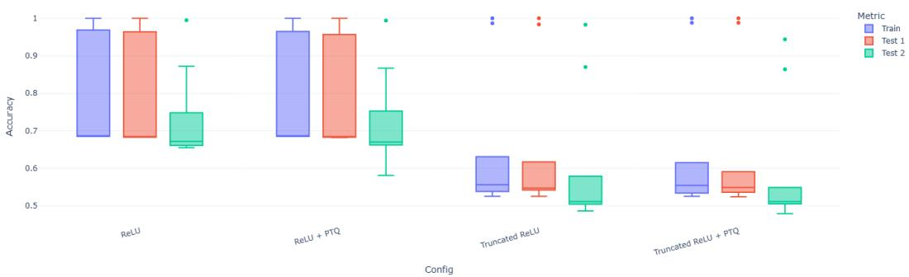  
Accuracy Distribution Across Activation Functions and Quantization Setings for p formula   
Figure 3: Detailed summary statistics across configurations for $p _ { 1 }$ formula.

Table 10: Detailed summary statistics across configurations for $p _ { 1 }$ formula.   

<table><tr><td>Statistic</td><td>ReLU</td><td>ReLU+PTQ</td><td>Truncated ReLU</td><td>Truncated ReLU +PTQ</td></tr><tr><td>Mean</td><td>0.758</td><td>0.755</td><td>0.628</td><td>0.623</td></tr><tr><td>Std</td><td>0.132</td><td>0.134</td><td>0.178</td><td>0.177</td></tr><tr><td>Min</td><td>0.655</td><td>0.581</td><td>0.486</td><td>0.479</td></tr><tr><td>25% (Q1)</td><td>0.683</td><td>0.682</td><td>0.525</td><td>0.524</td></tr><tr><td>50% (Median)</td><td>0.685</td><td>0.685</td><td>0.547</td><td>0.544</td></tr><tr><td>75% (Q3)</td><td>0.841</td><td>0.839</td><td>0.609</td><td>0.589</td></tr><tr><td>Max</td><td>1.000</td><td>1.000</td><td>1.000</td><td>1.000</td></tr><tr><td>IQR</td><td>0.158</td><td>0.157</td><td>0.084</td><td>0.065</td></tr><tr><td>Lower Bound</td><td>0.446</td><td>0.447</td><td>0.399</td><td>0.427</td></tr><tr><td>Upper Bound</td><td>1.078</td><td>1.073</td><td>0.734</td><td>0.686</td></tr></table>

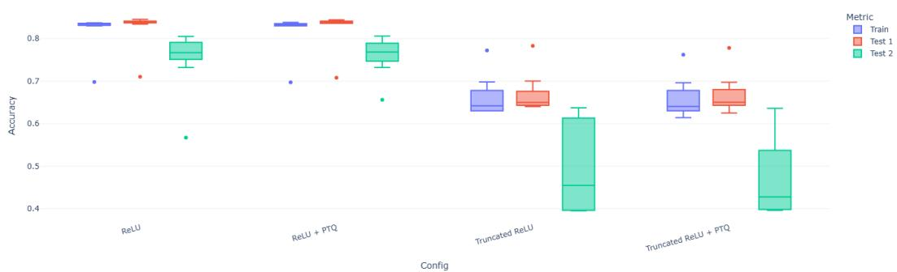  
  
Figure 4: Detailed summary statistics across configurations for $p _ { 2 }$ formula.

Table 11: Detailed summary statistics across configurations for $p _ { 2 }$ formula.   

<table><tr><td>Statistic</td><td>ReLU</td><td>ReLU+PTQ</td><td>Truncated ReLU</td><td>Truncated ReLU +PTQ</td></tr><tr><td>Mean</td><td>0.7992</td><td>0.8020</td><td>0.6064</td><td>0.5967</td></tr><tr><td>Std</td><td>0.0615</td><td>0.0511</td><td>0.1085</td><td>0.1122</td></tr><tr><td>Min</td><td>0.5670</td><td>0.6560</td><td>0.3950</td><td>0.3960</td></tr><tr><td>25% (Q1)</td><td>0.7738</td><td>0.7758</td><td>0.6170</td><td>0.5515</td></tr><tr><td>50% (Median)</td><td>0.8340</td><td>0.8330</td><td>0.6385</td><td>0.6305</td></tr><tr><td>75% (Q3)</td><td>0.8370</td><td>0.8368</td><td>0.6598</td><td>0.6608</td></tr><tr><td>Max</td><td>0.8450</td><td>0.8440</td><td>0.7830</td><td>0.7780</td></tr><tr><td>IQR</td><td>0.0632</td><td>0.0610</td><td>0.0428</td><td>0.1093</td></tr><tr><td>Lower Bound</td><td>0.6789</td><td>0.6843</td><td>0.5529</td><td>0.3876</td></tr><tr><td>Upper Bound</td><td>0.9319</td><td>0.9282</td><td>0.7239</td><td>0.8246</td></tr></table>

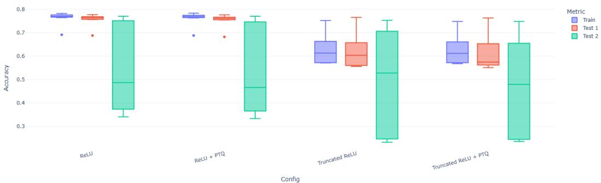  
Figure 5: Detailed summary statistics across configurations for $p _ { 3 }$ formula.

Table 12: Detailed summary statistics across configurations for $p _ { 3 }$ formula.   

<table><tr><td>Statistic</td><td>ReLU</td><td>ReLU +PTQ</td><td>Truncated ReLU</td><td>Truncated ReLU +PTQ</td></tr><tr><td>Mean</td><td>0.6883</td><td>0.6844</td><td>0.5821</td><td>0.5694</td></tr><tr><td>Std</td><td>0.1434</td><td>0.1466</td><td>0.1441</td><td>0.1427</td></tr><tr><td>Min</td><td>0.3410</td><td>0.3340</td><td>0.2330</td><td>0.2360</td></tr><tr><td>25% (Q1)</td><td>0.6888</td><td>0.6835</td><td>0.5600</td><td>0.5575</td></tr><tr><td>50% (Median)</td><td>0.7635</td><td>0.7615</td><td>0.6020</td><td>0.5750</td></tr><tr><td>75% (Q3)</td><td>0.7688</td><td>0.7670</td><td>0.6645</td><td>0.6545</td></tr><tr><td>Max</td><td>0.7820</td><td>0.7830</td><td>0.7650</td><td>0.7630</td></tr><tr><td>IQR</td><td>0.0800</td><td>0.0835</td><td>0.1045</td><td>0.0970</td></tr><tr><td>Lower Bound</td><td>0.5687</td><td>0.5582</td><td>0.4032</td><td>0.4120</td></tr><tr><td>Upper Bound</td><td>0.8888</td><td>0.8922</td><td>0.8213</td><td>0.8000</td></tr></table>

$$
\mathrm {  ~ \ z s = \frac { \ v a l u e \ } { \Sigma e p T Q \ - V a l u e \ } } _ { o r i g i n a l } \mathrm {  ~ \ z s \ i 0 0 \% }
$$

In other words, this formula shows how much the dynamic PTQ value deviates from the original   
value as a percentage of the original value.   
In this section, we compare parameters for different activation functions. We observe that the results   
of size changes in the following models remain unchanged when we modify the training dataset. We   
present the results not only graphically but also in a tabular format. In the plots, it is possible to see   
the trends and, in the tabular format, the numerical changes.   
Table 13 provides a detailed comparison of the model sizes before and after applying dynamic   
post-training quantization (PTQ). As the number of layers increases, both the original and quantized   
model sizes grow; however, the percentage reduction remains remarkably consistent, ranging from   
approximately $6 0 . 9 9 3 \%$ at 2 layers to $6 2 . 2 5 1 \%$ at 10 layers. This stable percentage reduction,   
approximately $6 0 { - } 6 2 \%$ —indicates that PTQ effectively compresses the model regardless of its depth,   
significantly reducing the memory footprint without altering the underlying architecture of the GNN.   
Such a reduction is particularly crucial for deployments in resource-constrained environments.   
Furthermore, after presenting the tabular data, our graphs (Figure 6) reveal a clear trend: While the   
absolute sizes of the original and quantized models increase with the number of layers, the relative   
reduction achieved through dynamic PTQ remains consistent. The size of the original model increases   
approximately linearly from $0 . 0 5 7 \mathrm { M B }$ for $l = 1$ to 0.551 MB at $l = 1 0$ , while the quantized model   
grows from $0 . 0 2 3 { \mathrm { ~ M B } }$ to $0 . 2 0 8 { \bf M } { \bf B }$ , preserving the growth structure, but on a reduced scale. The   
absolute size difference increases from $0 . 0 3 4 \mathrm { M B }$ in $l = 1$ to $0 . 3 4 3 \mathrm { M B }$ in $l = 1 0$ , demonstrating that   
quantization becomes more beneficial for deeper models. Overall, the consistent percentage reduction   
across all tested configurations confirms that PTQ scales effectively, delivering stable compression   
rates and making it an attractive option for deeper GNN deployments in real-world edge or mobile   
environments.

Table 13: Detailed information about the size of the model. The size values are in megabytes and refer to the file sizes of the GNNs.   

<table><tr><td>Layer</td><td>Original Size (MB)</td><td>Quantized Size (MB)</td><td>Difference (MB)</td><td>Reduction (%)</td></tr><tr><td>1</td><td>0.057</td><td>0.023</td><td>0.034</td><td>59.604%</td></tr><tr><td>2</td><td>0.112</td><td>0.044</td><td>0.068</td><td>60.993%</td></tr><tr><td>3</td><td>0.167</td><td>0.064</td><td>0.103</td><td>61.559%</td></tr><tr><td>4</td><td>0.221</td><td>0.085</td><td>0.137</td><td>61.804%</td></tr><tr><td>5</td><td>0.276</td><td>0.105</td><td>0.171</td><td>61.975%</td></tr><tr><td>6</td><td>0.331</td><td>0.126</td><td>0.206</td><td>62.068%</td></tr><tr><td>7</td><td>0.386</td><td>0.146</td><td>0.240</td><td>62.148%</td></tr><tr><td>8</td><td>0.441</td><td>0.167</td><td>0.274</td><td>62.194%</td></tr><tr><td>9</td><td>0.496</td><td>0.187</td><td>0.309</td><td>62.230%</td></tr><tr><td>10</td><td>0.551</td><td>0.208</td><td>0.343</td><td>62.251%</td></tr></table>

Moreover, we observed that the query property had no noticeable impact on the model size. This can 2 be clearly seen in the bar plots in Figure 6a, Figure 6c, and Figure 6e.

We also measured the change over time. Specifically, we considered three distinct time metrics:   
Elapsed time (the time taken during training), Time Original (the time required for inference   
on the test datasets using the original trained model), and Time quantized (the inference time on   
the test datasets using the quantized model). These results are presented in Figure 7.   
The data in Figure 7 reflect the impact of dynamic PTQ on the ACR-GNN model in three query   
patterns $( p _ { 1 } , p _ { 2 }$ , and $p _ { 3 }$ ) and for GNN depths ranging from 1 to 10 layers. Across all patterns,   
quantized models consistently require more inference time than their original counterparts. This   
increased time is expected as a result of the real-time quantization of weights and activations during   
inference. Additionally, both the original and quantized models exhibit a consistent, near-linear   
increase in inference time with model depth, suggesting that computational complexity grows linearly   
as layers are added.   
Despite this overhead, which ranges between 0.1 and 0.9 s depending on the number of layers, the   
significant reduction in model size (as demonstrated in Table 13 and the corresponding graphs) makes   
quantized models especially attractive for resource-constrained environments where minimizing the   
memory footprint is more critical than achieving the lowest possible latency.   
To test the technique not only on synthetic data, we chose the Protein-Protein Interactions (PPI)   
benchmark. The PPI dataset consists of graph-level mini-batches, with separate splits for Training,   
Validation, and Testing.   
In Table 14, we present a summary of the PPI dataset, which consists of 20 training graphs, 2   
validation graphs, and 2 test graphs. Each graph contains nodes with 50-dimensional features and   
supports multi-label classification with 121 possible labels. On average, each node is associated with

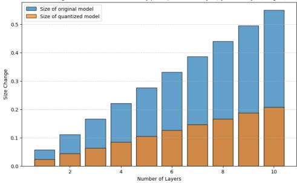  
Size Change After Quantization for Key p1:𝛼1(x): = 3[8.10ly(𝛼o(y)A −E(x,y) [acrgnn]   
(a) Size changes in MB for the first formula

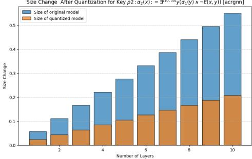  
Size Change After Quantization for Keyp2:α2(x): = [10.3ly(𝛼1(y)-E(x,y))[acrgn]   
(c) Size changes in MB for the second formula

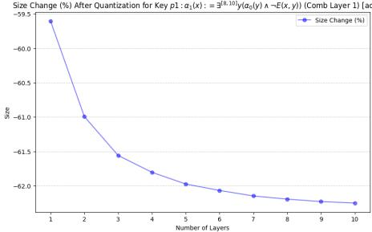  
  
(b) Size changes in MB for the first formula. Difference present in percentage.

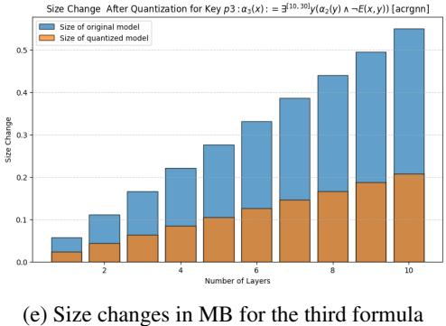  
Figure 6: Impact of dynamic Post-Training quantization on model size (MB). Changes of size in percentages

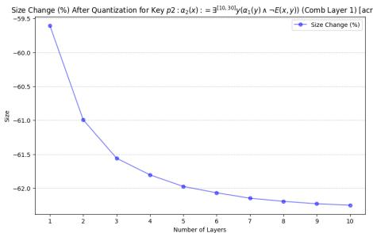  
(d) Size changes in MB for the second formula. Difference present in percentage.

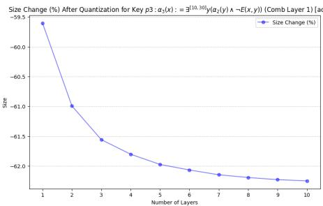  
(f) Size changes in MB for the third formula Difference present in percentage.

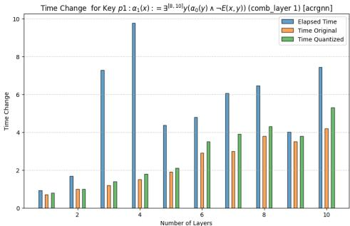

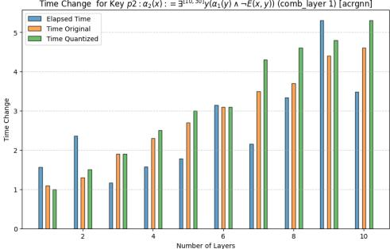  
Time Change for Key p2 : α2(x): = g[10.30ly(𝛼α1(y)A -E(x,y) (comb_layer 1) [acrgnn]   
(b) Time changes in seconds for the second formula

(a) Time changes in seconds for the first formula

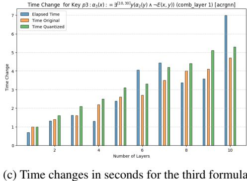  
Figure 7: Impact of dynamic Post-Training quantization on Latency (sec)

Table 14: Dataset summary.   

<table><tr><td>Dataset</td><td>Num Graphs</td><td>Node Feature Dim</td><td>Label Dim</td><td>Avg Active Labels/Node</td><td> Avg Degree</td></tr><tr><td>Train</td><td>20</td><td>50</td><td>121</td><td>37.20</td><td>54.62</td></tr><tr><td>Validation</td><td>2</td><td>50</td><td>121</td><td>35.64</td><td>61.07</td></tr><tr><td>Test</td><td>2</td><td>50</td><td>121</td><td>36.22</td><td>58.64</td></tr></table>

approximately 36 labels, indicating a densely labelled dataset. The average node degree is also high,   
ranging from 54.6 in the training set to 61.1 in the validation set, reflecting the dense connectivity of   
the protein-protein interaction graphs. The dataset presents a complex multi-label classification task   
with consistently rich structure across all splits.   
The statistics of the dataset presented in Table 15 contain large graphs with varying sizes between   
the train, the validation, and the test splits. Training graphs range from 591 to 3,480 nodes, with an   
average of 2,245 nodes per graph, and between 7,708 and 106,754 edges (average 61,318 edges).   
Validation graphs are more consistent in size, with 3,230 to 3,284 nodes and 97,446 to 101,474 edges,   
averaging 3,257 nodes and 99,460 edges. The test graphs have 2,300 to 3,224 nodes, averaging   
2,762 nodes, and 61,328 to 100,648 edges, averaging 80,988. These statistics confirm that the dataset   
contains large and densely connected graphs and demonstrate a distributional shift in graph size and   
edge count between training and test data. This information is helpful in evaluating the model’s   
ability to generalize to unseen and variable graph structures.   
One key difference between the synthetic data and the PPI dataset is that the latter involves a   
multi-label classification task, rather than a binary classification task, because the PPI dataset is   
a common benchmark where each node (representing proteins) can have multiple labels, such as   
protein functions or interactions. Also, it is important to mention the key differences between the   
synthetic data and the real one. Here, the authors used the code function EarlyStopping: Utility   
for stopping training early if no further improvement is observed. The second difference is that the   
code is structured to run multiple experiments to collect statistics (mean and standard deviation) of   
the model performance, ensuring that the results are robust across different random initializations. In   
this case, we performed the experiments 10 times for each model, with a combination layer equal to 1   
and a number of layers ranging from 1 to 10. The number of hidden dimensions is equal to 256.   
For these experiments, we used two activation functions to compare the results with synthetic data.   
The presentation of the results follows the same approach as for synthetic data. Moreover, in the case   
of real data [4] used the F1 Score as an evaluation metric. This metric is commonly used to evaluate   
classification tasks.   
According to the Scikit-learn library [25], the F1 score is defined in the following way. The F1 score   
can be interpreted as a harmonic mean of precision and recall, where an F1 score reaches its best   
value at 1 and its worst score at 0. The relative contribution of precision and recall to the F1 score is   
equal. The formula for the F1 score is as follows:

Table 15: Dataset statistics summary.   

<table><tr><td></td><td colspan="3">Node</td><td colspan="3">Edge</td></tr><tr><td>Dataset</td><td>Min</td><td>Max</td><td>Avg</td><td>Min</td><td>Max</td><td>Avg</td></tr><tr><td>Train</td><td>591</td><td>3480</td><td>2245.30</td><td>7708</td><td>106754</td><td>61318.40</td></tr><tr><td>Validation</td><td>3230</td><td>3284</td><td>3257.00</td><td>97446</td><td>101474</td><td>99460.00</td></tr><tr><td>Test</td><td>2300</td><td>3224</td><td>2762.00</td><td>61328</td><td>100648</td><td>80988.00</td></tr></table>

$$
\mathrm { F 1 } = { \frac { \mathrm { 2 T P } } { \mathrm { 2 T P } + \mathrm { F P } + \mathrm { F N } } }
$$

where, TP – is the number of true positives, $\mathrm { F N - }$ is the number of false negatives, $\mathrm { F P - }$ is the number of false positives. F1 is calculated by default as 0.0 when there are no true positives, false negatives, or false positives.

The reference code’s results [5] are structured as follows: a table showing the loss and accuracy for   
each dataset (train, validation, and test). Here, we present only the accuracy of the model according   
to the number of layers, as we do for the synthetic data. For better representation, we formed the   
model’s output in a tabular representation.   
Table 16 reports the precision of the ACR-GNN model with ReLU activation in varying numbers   
of layers, both in its original form and after applying dynamic post-training quantization (dPTQ).   
The results are presented for the training, validation, and test sets of the PPI benchmark. For both   
versions of the model, the performance does not increase consistently with the number of layers.   
Instead, accuracy typically peaks within the first few layers and tends to degrade or fluctuate as the   
network’s depth increases. In particular, the highest accuracies for the training, validation, and test   
sets are achieved with 1 or 2 layers, indicating that shallower architectures are better suited for this   
task. Specifically, the original model achieves its best test accuracy $( 4 5 . 7 \% )$ at 2 layers, while the   
quantized model achieves an even higher test accuracy $( 5 0 . 2 \% )$ at just 1 layer. Dynamic quantization   
slightly improves generalization performance in the early layers. At layer 1, the quantized model   
surpasses the original in both validation ( $5 0 . 8 \%$ vs. $4 3 . 1 \%$ ) and test accuracy $( 5 0 . 2 \%$ vs. $3 9 . 5 \%$ ),   
suggesting that quantization can have a regularizing effect in low-depth configurations. However, as   
the number of layers increases beyond 4, the performance of both models tends to decline, likely due   
to over-smoothing or optimization difficulties common in deep GNNs.   
Table 17 reports the absolute difference in precision between the quantized and original ACR-GNN   
model with ReLU on the PPI benchmark, between training, validation and test sets for varying   
numbers of layers. Positive values indicate better performance after quantization, while negative   
values reflect performance degradation. At layer 1, the quantized model shows the largest gains, with   
improvements of $7 . 7 \%$ on validation and $1 0 . 7 \%$ on the test set, suggesting a clear generalization   
advantage in shallow architectures. Smaller, but consistent improvements are also observed at layers   
2 and 7, particularly in the validation and test sets. In contrast, certain layers exhibit minor drops   
in accuracy. For example, layer 4 shows the largest decrease in the test set $( 6 . 5 \% )$ . Overall, the   
results indicate that dynamic quantization can lead to modest accuracy improvements, particularly in   
shallow to mid-depth GNNs, with negligible or slightly negative effects in deeper configurations. This   
highlights the potential of quantization for lightweight deployment with minimal accuracy trade-offs.   
Table 18 presents the memory footprint of the ACR-GNN model at different layer depths, comparing   
the original model (complete precision) with its dynamically quantized counterpart. The table   
also includes both absolute and percentage differences in size, highlighting the compression effect   
introduced by dynamic post-training quantization. Across all layers, the quantized model consistently   
exhibits a size reduction of approximately $7 3 . 7 8 \%$ compared to the original model. For example, at 10   
layers, the model size decreases from 8.09MB to 2.12MB, yielding an absolute reduction of 5.97MB.   
This trend is consistent and proportional across all depths, indicating that the memory savings scale   
linearly with the model’s complexity (i.e., the number of layers). These results demonstrate the   
effectiveness of dynamic quantization in significantly reducing model size without the need for   
retraining.

(a) Accuracy of the ACR-GNN with ReLU according to the number of layers.   
(b) Accuracy of the ACR-GNN with ReLU after dynamic PTQ according to the number of layers.   

<table><tr><td>Layer</td><td>Train</td><td>Validation</td><td>Test</td></tr><tr><td>1</td><td>55.0%</td><td>50.8%</td><td>50.2%</td></tr><tr><td>2</td><td>52.3%</td><td>47.8%</td><td>47.2%</td></tr><tr><td>3</td><td>51.9%</td><td>45.7%</td><td>42.8%</td></tr><tr><td>4</td><td>51.9%</td><td>37.4%</td><td>34.1%</td></tr><tr><td>5</td><td>48.9%</td><td>39.1%</td><td>40.8%</td></tr><tr><td>6</td><td>48.9%</td><td>42.9%</td><td>43.8%</td></tr><tr><td>7</td><td>51.4%</td><td>43.0%</td><td>40.6%</td></tr><tr><td>8</td><td>50.5%</td><td>35.9%</td><td>36.8%</td></tr><tr><td>9</td><td>47.7%</td><td>40.8%</td><td>40.9%</td></tr><tr><td>10</td><td>46.5%</td><td>36.2%</td><td>38.7%</td></tr></table>

Table 16: Accuracy for the original and quantized (dynamic PTQ) models. PPI Benchmark.   

<table><tr><td>Layer</td><td>Train</td><td>Validation</td><td>Test</td></tr><tr><td>1</td><td>54.7%</td><td>43.1%</td><td>39.5%</td></tr><tr><td>2</td><td>52.5%</td><td>44.6%</td><td>45.7%</td></tr><tr><td>3</td><td>52.3%</td><td>42.6%</td><td>44.0%</td></tr><tr><td>4</td><td>52.3%</td><td>39.2%</td><td>40.6%</td></tr><tr><td>5</td><td>49.6%</td><td>39.7%</td><td>39.1%</td></tr><tr><td>6</td><td>49.3%</td><td>43.5%</td><td>43.3%</td></tr><tr><td>7</td><td>51.7%</td><td>39.9%</td><td>38.5%</td></tr><tr><td>8</td><td>50.8%</td><td>36.3%</td><td>35.8%</td></tr><tr><td>9</td><td>48.0%</td><td>43.8%</td><td>33.2%</td></tr><tr><td>10</td><td>47.1%</td><td>36.9%</td><td>36.8%</td></tr></table>

Table 17: Difference in accuracy of ACR-GNN with ReLU before and after dynamic PTQ. PPI Benchmark.   

<table><tr><td>Layer</td><td>Train</td><td>Validation</td><td>Test</td></tr><tr><td>1</td><td>0.3%</td><td>7.7%</td><td>10.7%</td></tr><tr><td>2</td><td>-0.2%</td><td>3.2%</td><td>1.5%</td></tr><tr><td>3</td><td>-0.4%</td><td>3.1%</td><td>-1.2%</td></tr><tr><td>4</td><td>-0.4%</td><td>-1.8%</td><td>-6.5%</td></tr><tr><td>5</td><td>-0.7%</td><td>-0.6%</td><td>1.7%</td></tr><tr><td>6</td><td>-0.4%</td><td>-0.6%</td><td>0.5%</td></tr><tr><td>7</td><td>-0.3%</td><td>3.1%</td><td>2.1%</td></tr><tr><td>8</td><td>-0.3%</td><td>-0.4%</td><td>1.0%</td></tr><tr><td>9</td><td>-0.3%</td><td>-3.0%</td><td>7.7%</td></tr><tr><td>10</td><td>-0.6%</td><td>-0.7%</td><td>1.9%</td></tr></table>

Table 18: Detailed information about the model size before and after quantization. PPI Benchmark. Sizes are in megabytes.   

<table><tr><td>Layer</td><td>Original Model (MB)</td><td>Quantized Model (MB)</td><td>Difference (MB)</td><td>Reduction (%)</td></tr><tr><td>1</td><td>0.922</td><td>0.242</td><td>0.680</td><td>-73.749%</td></tr><tr><td>2</td><td>1.718</td><td>0.451</td><td>1.267</td><td>-73.765%</td></tr><tr><td>3</td><td>2.515</td><td>0.660</td><td>1.855</td><td>-73.772%</td></tr><tr><td>4</td><td>3.311</td><td>0.868</td><td>2.443</td><td>-73.776%</td></tr><tr><td>5</td><td>4.108</td><td>1.077</td><td>3.031</td><td>-73.778%</td></tr><tr><td>6</td><td>4.904</td><td>1.286</td><td>3.618</td><td>-73.779%</td></tr><tr><td>7</td><td>5.701</td><td>1.495</td><td>4.206</td><td>-73.780%</td></tr><tr><td>8</td><td>6.497</td><td>1.704</td><td>4.794</td><td>-73.780%</td></tr><tr><td>9</td><td>7.294</td><td>1.912</td><td>5.382</td><td>-73.781%</td></tr><tr><td>10</td><td>8.090</td><td>2.121</td><td>5.969</td><td>-73.781%</td></tr></table>

(a) Elapsed times for the original model.

Table 19: Elapsed times (in seconds) for the original and quantized (dynamic PTQ) models. PPI Benchmark.   

<table><tr><td>Layer</td><td>Train</td><td>Validation</td><td>Test</td></tr><tr><td>1</td><td>0.913</td><td>0.115</td><td>0.113</td></tr><tr><td>2</td><td>1.400</td><td>0.158</td><td>0.182</td></tr><tr><td>3</td><td>1.447</td><td>0.188</td><td>0.172</td></tr><tr><td>4</td><td>1.982</td><td>0.257</td><td>0.224</td></tr><tr><td>5</td><td>2.225</td><td>0.295</td><td>0.247</td></tr><tr><td>6</td><td>2.846</td><td>0.318</td><td>0.236</td></tr><tr><td>7</td><td>3.420</td><td>0.442</td><td>0.328</td></tr><tr><td>8</td><td>3.120</td><td>0.437</td><td>0.343</td></tr><tr><td>9</td><td>3.626</td><td>0.433</td><td>0.390</td></tr><tr><td>10</td><td>4.011</td><td>0.410</td><td>0.376</td></tr></table>

(b) Elapsed times for the quantized model.   

<table><tr><td>Layer</td><td>Train</td><td>Validation</td><td>Test</td></tr><tr><td>1</td><td>0.921</td><td>0.134</td><td>0.112</td></tr><tr><td>2</td><td>1.469</td><td>0.178</td><td>0.129</td></tr><tr><td>3</td><td>1.410</td><td>0.211</td><td>0.173</td></tr><tr><td>4</td><td>1.694</td><td>0.252</td><td>0.181</td></tr><tr><td>5</td><td>2.538</td><td>0.322</td><td>0.304</td></tr><tr><td>6</td><td>2.878</td><td>0.307</td><td>0.313</td></tr><tr><td>7</td><td>3.538</td><td>0.328</td><td>0.299</td></tr><tr><td>8</td><td>3.236</td><td>0.360</td><td>0.342</td></tr><tr><td>9</td><td>3.936</td><td>0.605</td><td>0.481</td></tr><tr><td>10</td><td>3.783</td><td>0.464</td><td>0.375</td></tr></table>

Table 21 reports the inference times of the original and dynamically post-training quantized ACR  
GNN models across training, validation, and test datasets, measured at various layer depths. The   
results reveal that quantization does not significantly reduce inference time in most configurations   
and, in some cases, results in slightly higher latency. For the training set, the execution time of the   
quantized model closely follows that of the original, with negligible differences across all layers. In   
the validation and test sets, while some improvements are observed at shallow depths (e.g., the layer   
2 test time reduces from 0.182 to 0.129 s), the overall pattern indicates no consistent speedup from   
quantization. In fact, certain configurations, such as layers 9 and 10 in the validation set, exhibit   
increased latency in the quantized version compared to the original.   
Table 20 presents the difference in inference time between the original and dynamically quantized   
(dPTQ) ACR-GNN models, reported in absolute (seconds) and relative $( \% )$ terms, across various   
layer depths. The results show that quantization has an inconsistent effect on inference time, with   
no clear trend of improvement. In some configurations, dynamic quantization slightly reduces   
inference time; for example, layer 2 shows a 0.053s reduction on the test set, corresponding to a   
$2 9 . 1 1 \%$ improvement. Similarly, layer 5 achieves an improvement in test time of $2 3 . 2 2 \%$ , and layer   
shows the largest test time speedup of $3 2 . 4 6 \%$ . However, in other cases, such as layer 4 in the   
training set $( + 0 . 2 8 8 s$ , $- 1 4 . 5 3 \%$ ) and layer 10 $+ 0 . 2 2 8 \mathrm { s }$ , $- 5 . 6 8 \%$ ), quantization increases execution   
time. The relative differences on the validation set also vary widely, with notable slowdowns at   
layers 7 $( - 2 5 . 7 4 \% )$ and 9 $( - 3 9 . 6 1 \% )$ . These inconsistencies highlight that run-time performance does   
not always benefit from dynamic quantization, and the effectiveness likely depends on the specific   
computation pattern and how well the underlying hardware supports quantized operations.   
Table 21 reports the elapsed time (in seconds) required to perform inference on the training, validation,   
and test sets using the ACR-GNN model with ReLU activation, both in its original form and after   
applying dynamic post-training quantization (dPTQ). The measurements reflect the running time of   
the trained models only; the time required for model training is not included in these results. The   
values indicate that inference time generally increases with the number of layers, as expected, and   
the impact of quantization on runtime varies across depths. In some cases, dPTQ slightly reduces   
inference time (e.g., Layer 6, Train), while in others it introduces moderate overhead, particularly for   
deeper models.   
The experiments were run on a Samsung Galaxy Book4 laptop with an Intel Core i7-150U processor,   
GB RAM, and 1 TB SSD storage. Additional experiments were conducted using Kaggle’s cloud   
platform with an NVIDIA Tesla P100 GPU (16 GB RAM).

Table 20: Difference in elapsed time (in seconds) and corresponding percentage difference of ACRGNN with ReLU before and after dynamic PTQ on the PPI Benchmark.   

<table><tr><td rowspan="2">Layer</td><td colspan="2">Train</td><td colspan="2">Validation</td><td colspan="2">Test</td></tr><tr><td>Diff (s)</td><td>% Diff</td><td>Diff (s)</td><td>% Diff</td><td>Diff (s)</td><td>% Diff</td></tr><tr><td>1</td><td>-0.008</td><td>0.915%</td><td>-0.019</td><td>16.307%</td><td>0.001</td><td>-1.085%</td></tr><tr><td>2</td><td>-0.069</td><td>4.931%</td><td>-0.020</td><td>12.308%</td><td>0.053</td><td>-29.114%</td></tr><tr><td>3</td><td>0.037</td><td>-2.525%</td><td>-0.023</td><td>12.238%</td><td>-0.001</td><td>0.309%</td></tr><tr><td>4</td><td>0.288</td><td>-14.531%</td><td>0.005</td><td>-1.990%</td><td>0.043</td><td>-19.096%</td></tr><tr><td>5</td><td>-0.313</td><td>14.091%</td><td>-0.027</td><td>9.291%</td><td>-0.057</td><td>23.218%</td></tr><tr><td>6</td><td>-0.032</td><td>1.131%</td><td>0.011</td><td>-3.463%</td><td>-0.077</td><td>32.455%</td></tr><tr><td>7</td><td>-0.118</td><td>3.465%</td><td>0.114</td><td>-25.741%</td><td>0.029</td><td>-8.918%</td></tr><tr><td>8</td><td>-0.116</td><td>3.709%</td><td>0.077</td><td>-17.556%</td><td>0.001</td><td>-0.276%</td></tr><tr><td>9</td><td>-0.310</td><td>8.555%</td><td>-0.172</td><td>39.611%</td><td>-0.091</td><td>23.218%</td></tr><tr><td>10</td><td>0.228</td><td>-5.678%</td><td>-0.054</td><td>13.105%</td><td>0.001</td><td>-0.192%</td></tr></table>

Table 21: Elapsed time (in seconds) for ACR-GNN with and without dynamic post-training quantization (dPTQ). PPI Benchmark   

<table><tr><td rowspan="2">Layer</td><td colspan="2">Train</td><td colspan="2">Validation</td><td colspan="2">Test</td></tr><tr><td>Original</td><td>dPTQ</td><td>Original</td><td>dPTQ</td><td>Original</td><td>dPTQ</td></tr><tr><td>1</td><td>0.780</td><td>0.858</td><td>0.102</td><td>0.112</td><td>0.077</td><td>0.094</td></tr><tr><td>2</td><td>0.986</td><td>0.966</td><td>0.130</td><td>0.131</td><td>0.109</td><td>0.107</td></tr><tr><td>3</td><td>1.138</td><td>1.161</td><td>0.157</td><td>0.159</td><td>0.149</td><td>0.140</td></tr><tr><td>4</td><td>1.371</td><td>1.366</td><td>0.159</td><td>0.204</td><td>0.156</td><td>0.160</td></tr><tr><td>5</td><td>1.645</td><td>1.682</td><td>0.201</td><td>0.211</td><td>0.173</td><td>0.199</td></tr><tr><td>6</td><td>1.833</td><td>1.766</td><td>0.242</td><td>0.256</td><td>0.188</td><td>0.205</td></tr><tr><td>7</td><td>2.166</td><td>2.156</td><td>0.282</td><td>0.261</td><td>0.239</td><td>0.242</td></tr><tr><td>8</td><td>2.355</td><td>2.534</td><td>0.317</td><td>0.300</td><td>0.241</td><td>0.283</td></tr><tr><td>9</td><td>2.539</td><td>2.652</td><td>0.337</td><td>0.349</td><td>0.302</td><td>0.292</td></tr><tr><td>10</td><td>2.842</td><td>3.122</td><td>0.386</td><td>0.461</td><td>0.326</td><td>0.348</td></tr></table>

# 269 H Description logics with global and local cardinality constraints

The Description Logic $\mathcal { A } \mathcal { L } \mathcal { C } \mathcal { S } \mathcal { C } \mathcal { C } ^ { + + }$ [2] extends the basic Description Logic $\mathcal { A L C C }$ [3] with concepts   
that capture cardinality and set constraints expressed in the quantifier-free fragment of Boolean   
Algebra with Presburger Arithmetic (QFBAPA) [20].

We assume that we have a set of set variables and a set of integer constants.

A QFBAPA formula is a Boolean combination $( \land , \lor , \lnot )$ of set constraints and cardinality constraints.

A set term is a Boolean combination $( \cup , \cap , { \overline { { \cdot \mathbf { \Lambda } } } } )$ of set variables, and set constants $\mathcal { U }$ , and $\varnothing$ . If $S$ is a   
set term, then its cardinality $| S |$ is an arithmetic expressions. Integer constants are also arithmetic   
expressions. If $T _ { 1 }$ and $T _ { 2 }$ are arithmetic expressions, so is $T _ { 1 } + T _ { 2 }$ . If $T$ is an arithmetic expression   
and $c$ is an integer constant, then $c \cdot T$ is an arithmetic expression.   
Given two set terms $B _ { 1 }$ and $B _ { 2 }$ , the expressions $B _ { 1 } \subseteq B _ { 2 }$ and $B _ { 1 } ~ = ~ B _ { 2 }$ are set constraints.   
Given two arithmetic expressions $T _ { 1 }$ and $T _ { 2 }$ , the expressions $T _ { 1 } < T _ { 2 }$ and $T _ { 1 } = T _ { 2 }$ are cardinality   
constraints. Given an integer constant $c$ and an arithmetic expression $T$ , the expression $c$ dvd $T$ is a   
cardinality constraint.   
A substitution $\sigma$ assigns $\varnothing$ to the set constant $\varnothing$ , a finite set $\sigma ( \mathcal { U } )$ to the set constant $\mathcal { U }$ , and a subset   
of $\sigma ( \mathcal { U } )$ to every set variable. A substitution is first extended to set terms by applying the standard   
set-theoretic semantics of the Boolean operations. It is further extended to map arithmetic expressions   
to integers, in such that way that every integer constant $c$ is mapped to $c$ , for every set term $B$ , the   
arithmetic expression $| B |$ is mapped to the cardinality of the set $\sigma ( B )$ , and the standard semantics for   
addition and multiplication is applied.   
The substitution $\sigma$ (QFBAPA) satisfies the set constraint $B _ { 1 } \subseteq B _ { 2 }$ if $\sigma ( B _ { 1 } ) \subseteq \sigma ( B _ { 2 } )$ , the set   
constraint $B _ { 1 } = B _ { 2 }$ if $\sigma ( B _ { 1 } ) = \sigma ( B _ { 2 } )$ , the cardinality constraint $T _ { 1 } < T _ { 2 }$ if $\sigma ( T _ { 1 } ) < \sigma ( T _ { 2 } )$ , the   
cardinality constraint $T _ { 1 } = T _ { 2 }$ if $\sigma ( { \cal T } _ { 1 } ) = \sigma ( { \cal T } _ { 2 } )$ , and the cardinality constraint $c$ dvd $T$ if $c$ divides   
$\sigma ( T )$ .   
We can now define the syntax of $\mathcal { A } \mathcal { L } \mathcal { C } \mathcal { S } \mathcal { C } \mathcal { C } ^ { + + }$ concept descriptions and their semantics. Let $N _ { C }$ be   
a set of concept names, and $N _ { R }$ be a set of role names, such that $N _ { C } \cap N _ { R } = \emptyset$ . Every $A \in N _ { C }$   
is a concept description of $\mathcal { A } \mathcal { L } \mathcal { C } \mathcal { S } \mathcal { C } \mathcal { C } ^ { + + }$ . Moreover, if $C$ , $C _ { 1 }$ , $C _ { 2 }$ , . . . are concept descriptions of   
$\mathcal { A } \mathcal { L } \mathcal { C } \mathcal { S } \mathcal { C } \mathcal { C } ^ { \dagger + }$ , then so are: $C _ { 1 } \cap C _ { 2 }$ , $C _ { 1 } \sqcup C _ { 2 }$ , $\lnot C$ , and sat $( \chi )$ , where $\chi$ is a set or cardinality QFBAPA   
constraint, with elements of $N _ { R }$ and concept descriptions $\gamma _ { 1 } , C _ { 2 } , \ldots$ used in place of set variables.

A finite interpretation is a pair $I = ( \Delta ^ { I } , \cdot ^ { I } )$ , where $\Delta ^ { I }$ is a finite non-empty set of individuals, and $I$ is a function such that: every $A \in N _ { C }$ is mapped to $A ^ { I } \subseteq \Delta ^ { I }$ , and every $R \in N _ { R }$ is mapped to $R ^ { I } \subseteq \Delta ^ { I } \times \Delta ^ { I }$ . Given an element of $d \in \Delta ^ { I }$ , we define $R ^ { I } ( d ) = \{ d ^ { \prime } \mid ( d , ^ { \prime } d ^ { \prime } ) \in R ^ { I } \}$ .

The semantics of the language of $\mathcal { A } \mathcal { L } \mathcal { C } \mathcal { S } \mathcal { C } \mathcal { C } ^ { + + }$ makes use QFBAPA substitutions to interpret QFBAPA   
constraints in terms of $\bar { \mathcal { A } } \mathcal { L } \bar { \mathcal { C } } \mathcal { S } \mathcal { C } \mathcal { C } ^ { + + }$ finite interpretations. Given an element $d \in \Delta ^ { I }$ , we can define   
the substitution $\sigma _ { d } ^ { I }$ in such a way that: $\sigma _ { d } ^ { I } ( \mathcal { U } ) \dot { } = \Delta ^ { I }$ , $\sigma _ { d } ^ { I } ( \emptyset ) = \emptyset$ , and $A \in N _ { C }$ and $R \in N _ { R }$ are   
considered QFBAPA set variables and substituted as $\sigma _ { d } ^ { I } ( A ) = A ^ { I }$ , and $\sigma _ { d } ^ { I } ( R ) = R ^ { I } ( d )$ .

The finite interpretation $I$ and the QFBAPA substitutions $\sigma _ { d } ^ { I }$ are mutually extended to complex expressions such that: $\sigma _ { d } ^ { I } ( C _ { 1 } \cap C _ { 2 } ) = ( C _ { 1 } \cap C _ { 2 } ) ^ { I } = C _ { 1 } ^ { I } \stackrel { \sim } { \cap } C _ { 2 } ^ { I }$ ; $\sigma _ { d } ^ { I } ( C _ { 1 } \sqcup C _ { 2 } ) = ( C _ { 1 } \sqcup C _ { 2 } ) ^ { I } =$ $\bar { C } _ { 1 } ^ { I } \cup C _ { 2 } ^ { I }$ ; $\sigma _ { d } ^ { I } ( \lnot C ) \ = \ ( \lnot C ) ^ { I } \ = \ \Delta ^ { I } \ \backslash \ C ^ { I }$ ; and $\sigma _ { d } ^ { I } ( { \mathsf { s a t } } ( \chi ) ) ~ = ~ ( { \mathsf { s a t } } ( \chi ) ) ^ { I } ~ = ~ \{ d ^ { \prime } ~ \in ~ \Delta ^ { I } ~ |$ $\sigma _ { d ^ { \prime } } ^ { I }$ (QFBAPA) satisfies $\chi \}$ .

Definition 24. The 1309 $\mathcal { A } \mathcal { L } \mathcal { C } \mathcal { S } \mathcal { C } \mathcal { C } ^ { + + }$ concept description $C$ is satisfiable if there is a finite interpretation I such that 310 $C ^ { I } \neq \varnothing$ .

Theorem 25 ([2]). The problem of deciding whether an 11 $\mathcal { A } \mathcal { L } \mathcal { C } \mathcal { S } \mathcal { C } \mathcal { C } ^ { + + }$ concept description is satisfiable 12 is NEXPTIME-complete.

# 1313 I $\mathcal { A L C Q }$ and $T _ { C }$ Boxes consistency

$\mathcal { A L C Q }$ is the Description Logic adding qualified number restrictions to the standard Description   
Logic $\mathcal { A L C C }$ , analogously to how Graded Modal Logic extends standard Modal Logic with graded   
modalities.   
Let $N _ { C }$ and $N _ { R }$ be two non-intersecting sets of concept names, and role names respecively. A   
concept name $A \in N _ { C }$ is an $\mathcal { A L C Q }$ concept expressions of $\mathcal { A L C Q }$ . If $C$ is an $\mathcal { A L C Q }$ concept   
expression, so is $\neg C$ . If $C _ { 1 }$ and $C _ { 2 }$ are $\mathcal { A L C Q }$ concept expressions, then so is $C _ { 1 } \sqcap C _ { 2 }$ . If $C$ is an   
$\mathcal { A L C Q }$ concept expression, $R \in N _ { R }$ , and $n \in \mathbb N$ , then $\geq n R . C$ is an $\mathcal { A L C Q }$ concept expression.   
A cardinality restriction of $\mathcal { A L C Q }$ is is an expression of the form $( \geq n C )$ or $( \leq n C )$ , where $C$ an   
$\mathcal { A L C Q }$ concept expression and $n \in \mathbb N$ .

An $\mathcal { A L C Q - T _ { C } B }$ ox is a finite set of cardinality restrictions.

An interpretation is a pair $I = ( \Delta ^ { I } , \cdot ^ { I } )$ , where $\Delta ^ { I }$ is a non-empty set of individuals, and ·I is   
a function such that: every $A \in N _ { C }$ is mapped to $A ^ { I } \subseteq \Delta ^ { I }$ , and every $R \in \ N _ { R }$ is mapped   
to $R ^ { I } \subseteq \Delta ^ { I } \times \Delta ^ { I }$ . Given an element of $\bar { d } \in \Delta ^ { I }$ , we define $R ^ { I } ( d ) \ \stackrel {  } { = } \ \{ d ^ { \prime } | \ ( \underline { { d } } , d ^ { \prime } ) \ \in \ \stackrel { \cdot } { R } ^ { I } \}$ .   
An interpretation $I$ is extended to complex concept descriptions as follows: $( \neg C ) ^ { I } = \Delta ^ { I } \setminus C ^ { I }$ ;   
1328 $( C _ { 1 } \cap C _ { 2 } ^ { ^ { \bullet } } ) ^ { I } = C _ { 1 } ^ { I } \cap C _ { 2 } ^ { I }$ ; and $( \geq \ n R . { \dot { C } } ) ^ { I } = \{ d \mid | { \dot { R } } ^ { I } ( d ) \cap { \dot { C } } ^ { I } | \geq n \}$ .

An interpretation 9 $I$ satisfies the cardinality restriction $( \ge \textit { n C } )$ iff $| C ^ { I } | \ge n$ and it satisfies the cardinality restriction 0 $( \leq \ n \ C )$ iff $| C ^ { \bar { I } } | \le n$ . A $T _ { C } \mathbf { B 0 x } \ T C$ is consistent if there exists an interpretation that satisfies all the cardinality restrictions in $T C$ .

32 Theorem 26 ([36]). Deciding the consistency of $A L C Q { \cdot } T _ { C }$ Boxes is NEXPTIME-hard.

The proof can be slightly adapted to show that the result holds even when there is only one role.

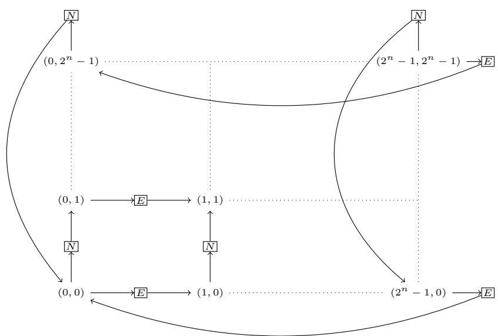  
Figure 8: Encoding a torus of exponential size with an $\mathcal { A } \mathcal { L } \mathcal { C } \mathcal { Q } \ – T _ { C } \mathbf { I }$ Box with one role.

Some abbreviations are useful. For every pair of concepts $C$ and $D$ , $C  D$ stands for $\neg C \sqcup D$ . For   
every concept $C$ , role $R$ , and non-negative integer $n$ , we define: $( \leq n R . C ) : = \neg ( \geq ( n + 1 ) R . C )$ ,   
$( \forall \ \mathring { R . C } ) : = \ ( \leq \ 0 \ R . \neg C )$ , $( \forall C ) : = ( \leq 0 \neg { \bar { C } } )$ , $( = n R . C ) : = ( \geq n R . C ) \cap ( \leq n R . C )$ , and   
1337 $( = n C ) : = ( \geq n C ) \cap ( \leq n C )$ .

338 Theorem 27. Deciding the consistency of ALCQ- $T _ { C }$ Boxes is NEXPTIME-hard even i $f | N _ { R } | = 1$

Proof. Let next be the unique role in $N _ { R }$ . We use the atomic concepts $N$ to denote an individual   
‘on the way north’ and $E$ to denote an individual ‘on the way east’. See Figure 8.

For every $n \in \mathbb N$ , we define the following $\mathcal { A } \mathcal { L } \mathcal { C } \mathcal { Q } \mathcal { - } T _ { C } \mathbf { B } \mathbf { o x }$ .

$$
\begin{array} { r l r l r l } { T _ { n } = \{ \begin{array} { l l l } { \begin{array} { l l l } { ( \forall \neg ( N \sqcup E ) \to ( = 1 n e x t . N ) ) } & { , } & { ( \forall \neg ( N \sqcup E ) \to ( = 1 n e x t . E ) ) } \\ { ( \forall N \to ( = 1 n e x t . \top ) ) } & { , } & { ( \forall E \to ( = 1 n e x t . \top ) ) } \end{array} } & & { } & \\ { \begin{array} { l l l } { ( = 1 c _ { ( 0 . 0 ) } ) } & { , } & { ( = 1 c _ { ( 2 ^ { n } - 1 . 2 ^ { n } - 1 ) } ) } \end{array} } & & { } & \\ { \begin{array} { l l l } { ( \forall \neg ( N \sqcup E ) \to D _ { e a s t } ) } & { , } & { ( \forall \neg ( N \sqcup E ) \to D _ { n o r t h } ) } \\ { ( \leq ( 2 ^ { n } \times 2 ^ { n } ) \neg ( N \sqcup E ) ) , } & { ( \leq ( 2 ^ { n } \times 2 ^ { n } ) N ) , } & { ( \leq ( 2 ^ { n } \times 2 ^ { n } ) E ) } \end{array} } & & { } \end{array} } \end{array}
$$

such that the concepts 1342 $C _ { ( 0 , 0 ) }$ , $C _ { ( 2 ^ { n } - 1 , 2 ^ { n } - 1 ) }$ are defined like in [36, Figure 3], and so are the concepts 1343 $D _ { n o r t h }$ and $D _ { e a s t }$ , except that for every concept $C$ , ∀east. $C$ now stands for ∀next. $( E  \forall n e x t . C )$ 1344 and ∀north. $C$ now stands for ∀next. $( N  \forall n e x t . C )$ .

The problem of deciding whether a domino system $\boldsymbol { \mathcal { D } } = ( D , V , H )$ , given an initial condition   
$w _ { 0 } \ldots w _ { n - 1 }$ , can tile a torus of exponential size can be reduced to the problem of consistency of   
$A L C Q { \mathrm { - } } T _ { C }$ Boxes, checking the consistency of $T ( n , \mathcal { D } , w ) = T _ { n } \cup T _ { \mathcal { D } } \cup T _ { w }$ , where $T _ { n }$ is as above,   
$T _ { \mathcal { D } }$ encodes the domino system, and $T _ { w }$ encodes the initial condition as follows.

$$
\begin{array} { r l } { T _ { \mathcal { D } } = \{ } & { ( \forall \neg ( N \sqcup E ) \to ( \bigcup _ { d \in D } C _ { d } ) ) , } \\ & { ( \forall \neg ( N \sqcup E ) \to ( \prod _ { d \in D } \prod _ { d ^ { \prime } \in D \setminus \{ d \} } \neg ( C _ { d } \cap C _ { d ^ { \prime } } ) ) ) , } \\ & { ( \forall \prod _ { d \in D } ( C _ { d } \to ( \forall e a s t . \bigcup _ { ( d , d ^ { \prime } ) \in H } C _ { d ^ { \prime } } ) ) ) , } \\ & { ( \forall \prod _ { d \in D } ( C _ { d } \to ( \forall n o r t h . \bigcup _ { ( d , d ^ { \prime } ) \in V } C _ { d ^ { \prime } } ) ) ) \quad \} } \end{array}
$$

$$
T _ { w } = \{ \begin{array} { c } { { ( \forall C _ { ( 0 , 0 ) }  C _ { w _ { 0 } } ) , \ldots , ( \forall C _ { ( n - 1 , 0 ) }  C _ { w _ { n - 1 } } ) } } \end{array} \}
$$

The rest of the proof remains unchanged.

# 1350 NeurIPS Paper Checklist

# 1. Claims

Question: Do the main claims made in the abstract and introduction accurately reflect the paper’s contributions and scope?

Answer: [Yes]

Justification: We introduce a logical language for reasoning about quantized graph neural networks (GNNs) with Global Readout in Section 3. We then prove that verifying quantized GNNs with Global Readout is NEXPTIME-complete in Section 4 and Section 5. We also experimentally show the relevance of quantization in the context of ACR-GNNs in Section 7.

# 2. Limitations

Question: Does the paper discuss the limitations of the work performed by the authors?

Answer: [Yes]

Limitations are addressed in Section 8.

# 3. Theory assumptions and proofs

Question: For each theoretical result, does the paper provide the full set of assumptions and a complete (and correct) proof?

Answer: [Yes]

Justification: All the theorems, formulas, and proofs in the paper are numbered and crossreferenced. The assumptions are stated and the full proofs are present in the appendix, with sketches of proofs in the main text.

# 4. Experimental result reproducibility

Question: Does the paper fully disclose all the information needed to reproduce the main experimental results of the paper to the extent that it affects the main claims and/or conclusions of the paper (regardless of whether the code and data are provided or not)?

Answer: [Yes]

Justification: The authors provide the replication package with code and description of the files.

# 5. Open access to data and code

Question: Does the paper provide open access to the data and code, with sufficient instructions to faithfully reproduce the main experimental results, as described in supplemental material?

Answer: [Yes]

Justification: We provided clear instructions on how to access the data and reproduce the experimental results in the supplemental materials, including required scripts and environment setup.

# 6. Experimental setting/details

Question: Does the paper specify all the training and test details (e.g., data splits, hyperparameters, how they were chosen, type of optimizer, etc.) necessary to understand the results?

Answer: [Yes]

Justification: The experimental setting is described in sufficient detail in the main body of the paper, including datasets, tools, parameters, and evaluation metrics, to support understanding and reproducibility of the results.

# 7. Experiment statistical significance

Question: Does the paper report error bars suitably and correctly defined or other appropriate information about the statistical significance of the experiments?

Answer: [Yes]

Justification: The authors provided a code in the supplementary materials that generates the detailed summary statistics across configurations for $F O C _ { 2 }$ . The method for computing these plots is included in the code.

# 8. Experiments compute resources

Question: For each experiment, does the paper provide sufficient information on the computer resources (type of compute workers, memory, time of execution) needed to reproduce the experiments?

Answer: [Yes]

Justification: The experiments were run on a Samsung Galaxy Book4 laptop with an Intel Core i7-150U processor, 16 GB RAM, and 1 TB SSD storage. Additional experiments were conducted using Kaggle’s cloud platform with an NVIDIA Tesla P100 GPU (16 GB RAM). The runtime for the synthetic dataset experiments is reported in Table 21, and full instructions for reproducing the results are provided in the supplementary materials.

# 9. Code of ethics

Question: Does the research conducted in the paper conform, in every respect, with the NeurIPS Code of Ethics https://neurips.cc/public/EthicsGuidelines?

Answer: [Yes]

Justification: The research conducted in the paper conforms, in every respect, with the NeurIPS Code of Ethics.

# 10. Broader impacts

Question: Does the paper discuss both potential positive societal impacts and negative societal impacts of the work performed?

Answer: [Yes]

Justification: Broader impacts are addressed in the introduction, explaining that the black-box nature of NN is a major issue for their adoption, morally and legally, with the enforcement of regulatory policies like the EU AI Act. NN that can be formally verified solve this. We do not think that this work may have negative societal impacts.

# 11. Safeguards

Question: Does the paper describe safeguards that have been put in place for responsible release of data or models that have a high risk for misuse (e.g., pretrained language models, image generators, or scraped datasets)?

Answer: [NA]

Justification: The paper poses no such risks.

# 12. Licenses for existing assets

Question: Are the creators or original owners of assets (e.g., code, data, models), used in the paper, properly credited and are the license and terms of use explicitly mentioned and properly respected?

Answer: [Yes]

Justification: For the reference ACR-GNN, we used the original paper [4] and the official implementation available at [5]. The code is distributed under the MIT License, and we have properly credited the authors and complied with the license terms.

# 13. New assets

Question: Are new assets introduced in the paper well documented and is the documentation provided alongside the assets?

Answer: [Yes]

Justification: We are releasing new code introduced in this work under the MIT License. The repository includes a README with setup instructions, usage examples, and description of each module, enabling other researchers to reproduce our results.

# 14. Crowdsourcing and research with human subjects

Question: For crowdsourcing experiments and research with human subjects, does the paper include the full text of instructions given to participants and screenshots, if applicable, as well as details about compensation (if any)?

Answer: [NA]

Justification: The paper does not involve crowdsourcing nor research with human subjects.

# 15. Institutional review board (IRB) approvals or equivalent for research with human subjects

Question: Does the paper describe potential risks incurred by study participants, whether such risks were disclosed to the subjects, and whether Institutional Review Board (IRB) approvals (or an equivalent approval/review based on the requirements of your country or institution) were obtained?

Answer: [NA]

Justification: The paper does not involve crowdsourcing nor research with human subjects

# 16. Declaration of LLM usage

Question: Does the paper describe the usage of LLMs if it is an important, original, or non-standard component of the core methods in this research? Note that if the LLM is used only for writing, editing, or formatting purposes and does not impact the core methodology, scientific rigorousness, or originality of the research, declaration is not required.

Answer: [NA]

Justification: The core method development in this research does not involve LLMs as any important, original, or non-standard components.
