# Mini-batch kernel $k$ -means

Anonymous Author(s)   
Affiliation   
Address   
email

# Abstract

We present the first mini-batch kernel $k$ -means algorithm, offering an order of   
magnitude improvement in running time compared to the full batch algorithm. A   
single iteration of our algorithm takes $\widetilde { O } ( k b ^ { 2 } )$ time, significantly faster than the   
$O ( \bar { n } ^ { 2 } )$ time required by the full batch kernel $k$ -means, where $n$ is the dataset size   
and $b$ is the batch size. Extensive experiments demonstrate that our algorithm   
consistently achieves a $1 0 { - } 1 0 0 \mathrm { x }$ speedup with minimal loss in quality, addressing   
the slow runtime that has limited kernel $k$ -means adoption in practice. We further   
complement these results with a theoretical analysis under an early stopping con  
dition, proving that with a batch size of $\widetilde \Omega ( \mathrm { m a x } \left\{ \gamma ^ { 4 } , \gamma ^ { 2 } \right\} \cdot k \epsilon ^ { - 2 } )$ , the algorithm   
terminates in $O ( \gamma ^ { 2 } / \epsilon )$ iterations with high probability, where $\gamma$ bounds the norm   
of points in feature space and $\epsilon$ is a termination threshold. Our analysis holds   
for any reasonable center initialization, and when using $k$ -means $^ { + + }$ initialization,   
the algorithm achieves an approximation ratio of $O ( \log k )$ in expectation. For   
normalized kernels, such as Gaussian or Laplacian it holds that $\gamma = 1$ . Taking   
$\epsilon = O ( 1 )$ and $b = \Theta ( k \log n )$ , the algorithm terminates in $O ( 1 )$ iterations, with   
each iteration running in $\widetilde O ( k ^ { 3 } )$ time.

# 17 1 Introduction

Mini-batch methods are among the most successful tools for handling huge datasets for machine learning. Notable examples include Stochastic Gradient Descent (SGD) and mini-batch $k$ -means [30]. Mini-batch $k$ -means is one of the most popular clustering algorithms used in practice [24].

While $k$ -means is widely used due to it’s simplicity and fast running   
time, it requires the data to be linearly separable to achieve mean  
ingful clustering. Unfortunately, many real-world datasets do not   
have this property. One way to overcome this problem is to project   
the data into a high, even infinite, dimensional space (where it is   
hopefully linearly separable) and run $k$ -means on the projected data   
using the “kernel-trick”. A toy example is given in Figure 1 and a   
more realistic example is given in Figure 2.   
Kernel $k$ -means achieves significantly better clustering compared   
to $k$ -means in practice. However, its running time is considerably   
slower. Surprisingly, prior to our work there was no attempt to speed   
up kernel $k$ -means using a mini-batch approach.   
Problem statement We are given an input (dataset), $\boldsymbol { X } = \left\{ x _ { i } \right\} _ { i = 1 } ^ { n }$ , of size $n$ and a parameter   
representing the number of clusters. A kernel for is a function $\dot { K } : X \times X  \mathbb { R }$ that can be   
realized by inner products. That is, there exists a Hilbert space $\mathcal { H }$ and a map $\phi : X \to \mathcal { H }$ such that   
$\forall x , y \in \dot { X } , \langle \phi ( x ) \overset { \cdot } { , } \phi ( y ) \rangle = K ( x , y )$ . We call $\mathcal { H }$ the feature space and $\phi$ the feature map.   
In kernel $k$ -means the input is a dataset $X$ and a kernel function $K$ as above. Our goal is to find a set $\mathcal { C }$   
of $k$ centers (elements in $\mathcal { H }$ ) such that the following goal function is minimized: $\begin{array} { r } { \frac { 1 } { n } \sum _ { x \in X } \operatorname* { m i n } _ { c \in { \mathcal { C } } } \| c - \| } \end{array}$   
$\phi ( x )  { \parallel ^ { 2 } }$ . Equivalently we may ask for a partition of $X$ into $k$ parts, keeping $\mathcal { C }$ implicit.1   
Lloyd’s algorithm The most popular algorithm for (non kernel) $k$ -means is Lloyd’s algorithm,   
often referred to as the $k$ -means algorithm [20]. It works by randomly initializing a set of $k$ centers   
and performing the following two steps: (1) Assign every point in $X$ to the center closest to it. (2)   
Update every center to be the mean of the points assigned to it. The algorithm terminates when no   
point is reassigned to a new center. This algorithm is extremely fast in practice but has a worst-case   
exponential running time [4, 33].   
Mini-batch $k$ -means To update the centers, Lloyd’s algorithm must go over the entire input at   
every iteration. This can be computationally expensive when the input data is extremely large. To   
tackle this, the mini-batch $k$ -means method was introduced by Sculley [30]. It is similar to Lloyd’s   
algorithm except that steps (1) and (2) are performed on a batch of $b$ elements sampled uniformly   
at random with repetitions, and in step (2) the centers are updated slightly differently. Specifically,   
every center is updated to be the weighted average of its current value and the mean of the points (in   
the batch) assigned to it. The parameter by which we weigh these values is called the learning rate,   
and its value differs between centers and iterations. The larger the learning rate, the more a center   
will drift towards the new batch cluster mean.

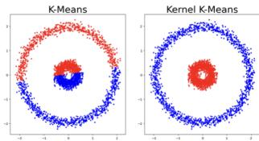  
Figure 1: Kernel $k$ -means perfectly clusters the dataset, while $k$ -means cannot.

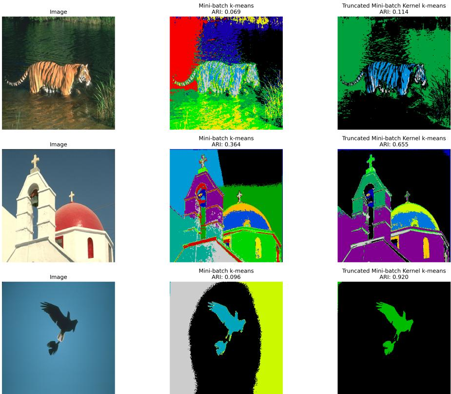  
Figure 2: Qualitative comparison of mini-batch $k$ -means and our algorithm (truncated mini-batch kernel $k$ -means) on selected images from the Berkeley Segmentation Data Set (BSDS)[3] using the Gaussian kernel. ARI is the Adjusted Rand Index [27].

Lloyd’s algorithm in feature space Implementing Lloyd’s algorithm in feature space is challenging as we cannot explicitly keep the set of centers $\mathcal { C }$ . Luckily, we can use the kernel function together with the fact that centers are always set to be the mean of cluster points to compute the distance from any point 58 $x \in X$ in feature space to any center $\begin{array} { r } { c = \frac { 1 } { | A | } \sum _ { y \in A } \phi ( y ) } \end{array}$ as follows:

$$
\begin{array} { c } { \displaystyle { \| \phi ( x ) - c \| ^ { 2 } = \langle \phi ( x ) - c , \phi ( x ) - c \rangle = \langle \phi ( x ) , \phi ( x ) \rangle - 2 \langle \phi ( x ) , c \rangle + \langle c , c \rangle } } \\ { \displaystyle { = \langle \phi ( x ) , \phi ( x ) \rangle - 2 \langle \phi ( x ) , \frac { 1 } { | A | } \sum _ { y \in A } \phi ( y ) \rangle + \langle \frac { 1 } { | A | } \sum _ { y \in A } \phi ( y ) , \frac { 1 } { | A | } \sum _ { y \in A } \phi ( y ) \rangle , } } \end{array}
$$

where $A$ can be any subset of the input $X$ . While the above can be computed using only kernel   
evaluations, it makes the update step significantly more costly than standard $k$ -means. Specifically,   
the complexity of the above may be quadratic in $n$ [11].   
Mini-batch kernel $k$ -means Applying the mini-batch approach for kernel $k$ -means is even more   
difficult because the assumption that cluster centers are always the mean of some subset of $X$ in   
feature space no longer holds.   
In Section 4 we first derive a recursive expression that allows us to compute the distances of all points   
to current cluster centers (in feature space). Using a simple dynamic programming approach that   
maintains the inner products between the data and centers in feature space, we achieve a running   
time of $O ( n ( b + k ) )$ per iteration compared to $O ( n ^ { 2 } )$ for the full-batch algorithm. However, a true   
mini-batch algorithm should have a running time sublinear in $n$ , preferably only polylogarithmic. We   
show that the recursive expression can be truncated, achieving a fast update time of $\widetilde O ( k b ^ { 2 } )$ while   
only incurring a small additive error compared to the untruncated version2.   
While our main contribution is practical — achieving an order-of-magnitude speedup for kernel   
$k$ -means — we also provide theoretical guarantees for our algorithm (deferred to Appendix B). This   
is somewhat tricky for mini-batch algorithms due to their stochastic nature, as they may not even   
converge to a local-minima. To overcome this hurdle, we take the approach of Schwartzman [29]   
and answer the question: how long does it take truncated mini-batch kernel $k$ -means to terminate   
with an early stopping condition. Specifically, we terminate the algorithm when the improvement on   
the batch drops below some user provided parameter, $\epsilon$ . Early stopping conditions are very common   
in practice (e.g., sklearn [24]). We show that applying the $k$ -means $^ { + + }$ initialization scheme [5] for   
our initial centers implies we achieve the same approximation ratio, $O ( \log k )$ in expectation, as the   
full-batch algorithm.   
While our general approach is similar to [29], we must deal with the fact that $\mathcal { H }$ may have an infinite   
dimension. The guarantees of [29] depend on the dimension of the space in which $k$ -means is   
executed, which is unacceptable in our case. We overcome this by parameterizing our results by   
a new parameter $\gamma = \operatorname* { m a x } _ { x \in X } \| \phi ( x ) \|$ . We note that for normalized kernels, such as the popular   
Gaussian and Laplacian kernels, it holds that $\gamma = 1$ . We also observe that it is often the case that   
$\gamma \ll 1$ for various other kernels used in practice (see Appendix C). We show that if the batch size is   
$\Omega ( \operatorname* { m a x } \left\{ \gamma ^ { 4 } , \gamma ^ { 2 } \right\} k \epsilon ^ { - 2 } \log ^ { 2 } ( \gamma n / \epsilon ) )$ then w.h.p. our algorithm terminates in $O ( \gamma ^ { 2 } / \epsilon )$ iterations. Our   
theoretical results are summarised in Theorem 1.1 (where Algorithm 2 is presented in Section 4).   
Theorem 1.1. The following holds for Algorithm 2: (1) Each iteration takes $O ( k b ^ { 2 } \log ^ { 2 } ( \gamma / \epsilon ) )$ time,   
(2) If $b = \Omega ( \operatorname* { m a x } \left\{ \gamma ^ { 4 } , \gamma ^ { 2 } \right\} k \epsilon ^ { - 2 } \log ^ { 2 } ( \gamma n / \epsilon ) )$ then it terminates in $O ( \gamma ^ { 2 } / \epsilon )$ iterations w.h.p, (3)   
When initialized with $k – m e a n s + + ~ i i$ achieve a $O ( \log k )$ approximation ratio in expectation.   
Our result improves upon [29] significantly when a normalized kernel is used since Theorem 1.1   
doesn’t depend on the input dimension. Our algorithm copes better with non linearly separable   
data and requires a smaller batch size $( \widetilde \Omega ( 1 / \epsilon ^ { 2 } )$ vs $\widetilde \Omega ( ( d / \epsilon ) ^ { 2 } ) )$ ) 3 for normalized kernels. This is   
particularly apparent with high dimensional datasets such as MNIST [18] where the dimension   
squared is already nearly ten times the number of datapoints.

The learning rate we use, suggested in [29], differs from the standard learning rate of sklearn in that it does not go to 0 over time. Unfortunately, this new learning rate is non-standard and [29] did not present experiments comparing their learning rate to that of sklearn. We fill the experimental gap left in [29] by evaluating (non-kernel) mini-batch $k$ -means with their new learning rate compared to that of sklearn. Following our experimental evaluation, the sklearn team accepted a pull request implementing this learning rate in future versions.

In Section 5 we extensively evaluate our results experimentally both with the learning rate of [29]   
and that of sklearn. To allow a fair empirical comparison, we run each algorithm for a fixed number   
of iterations without stopping conditions. Our results are as follows: 1) Truncated mini-batch kernel   
$k$ -means is significantly faster than full-batch kernel $k$ -means, while achieving solutions of similar   
quality, which are superior to the non-kernel version, 2) The learning rate of [29] results in solutions   
with better quality both for truncated mini-batch kernel $k$ -means and (non-kernel) mini-batch $k$ -   
means.

# 111 2 Related work

Until recently, mini-batch $k$ -means was only considered with a learning rate going to 0 over time.   
This was true both in theory [32, 30] and practice [24]. Recently, [29] proposed a new learning which   
does not go to 0 over time, and showed that if the batch is of size $\widetilde \Omega ( \bar { k } ( d \bar { / } \epsilon ) ^ { 2 } ) ^ { 4 }$ , mini-batch $k$ -means   
must terminate within $O ( d / \epsilon )$ iterations with high probability, where $d$ is the dimension of the input,   
and $\epsilon$ is a threshold parameter for termination.   
A popular approach to deal with the slow running time of kernel $k$ -means is constructing a coreset of   
the data. A coreset for kernel $k$ -means is a weighted subset of $X$ with the guarantee that the solution   
quality on the coreset is close to that on the entire dataset up to a $( 1 + \epsilon )$ multiplicative factor. There   
has been a long line of work on coresets for $k$ -means an kernel $k$ -means [28, 12, 6], and the current   
state-of-the-art for kernel $k$ -means is due to [15]. They present a coreset algorithm with a nearly   
linear (in $n$ and $k$ ) construction time which outputs a coreset of size $p o l y ( k \epsilon ^ { - 1 } )$ .   
In [8] the authors only compute the kernel matrix for uniformly sampled set of $m$ points from   
$X$ . Then they optimize a variant of kernel $k$ -means where the centers are constrained to be linear   
combinations of the sampled points. The authors do no provide worst case guarantees for the running   
time or approximation of their algorithm.   
Another approach to speed up kernel $k$ -means is by computing an approximation for the kernel   
matrix. This can be done by computing a low dimensional approximation for $\phi$ (without computing   
$\phi$ explicitly)[26, 9, 7], or by computing a low rank approximation for the kernel matrix [22, 34].   
Kernel sparsification techniques construct sparse approximations of the full kernel matrix in sub  
quadratic time. For smooth kernel functions such as the polynomial kernel, [25] presents an algorithm   
for constructing a $( 1 + \epsilon )$ -spectral sparsifier for the full kernel matrix with a nearly linear number of   
non-zero entries in nearly linear time. For the gaussian kernel, [21] show how to construct a weaker,   
cluster preserving sparsifier using a nearly linear number of kernel density estimation queries.   
We note that our results are complementary to coresets, dimensionality reduction, and kernel sparsifi  
cation, in the sense that we can compose our method with these techniques.   
To the best of our knowledge, the only approach which cannot be directly composed with our work   
is kernel sketching [19, 35]. Here the kernel matrix is used to compute an embedding of the points   
into a low dimensional Euclidean space, followed by running the standard (non-kernel) $k$ -means   
algorithm. We compare our algorithm with the state of the art results [35] and observe that our   
algorithm achieves solutions of superior quality for most datasets.

# 142 3 Preliminaries

Throughout this paper we work with ordered tuples rather than sets, denoted as $Y = ( y _ { i } ) _ { i \in [ \ell ] }$ , where $[ \ell ] = \{ 1 , \dots , \ell \}$ . To reference the $i$ -th element we either write $y _ { i }$ or $Y [ i ]$ . It will be useful to use set notations for tuples such as $x \in Y \iff \exists i \in [ \ell ] , x = y _ { i }$ and $Y \subseteq Z \iff \forall i \in [ \ell ] , y _ { i } \in Z$ . When summing we often write $\textstyle \sum _ { x \in Y } g ( x )$ which is equivalent to $\textstyle \sum _ { i = 1 } ^ { \ell } g ( Y [ i ] )$ .

We borrow the following notation from [16] and generalize it to Hilbert spaces. For every $x , y \in { \mathcal { H } }$ let $\Delta ( x , y ) = \| x - y \| ^ { 2 }$ . We slightly abuse notation and and also write $\bar { \Delta } ( x , y ) = \lVert \phi ( x ) - \dot { \phi } ( y ) \rVert ^ { 2 }$ when $x , y \in X$ and $\Delta ( x , y ) = \| \phi ( x ) - y \| ^ { 2 }$ when $x \in X , y \in \mathcal { H }$ (similarly when $x \in { \mathcal { H } } , y \in X )$ . For every finite tuple $S \subseteq X$ and a vector $x \in \mathcal H$ let $\begin{array} { r } { \Delta ( \bar { S } , x ) = \sum _ { y \in S } \bar { \Delta ( y , x ) } } \end{array}$ . Let us denote

$\gamma = \operatorname* { m a x } _ { x \in X } \| \phi ( x ) \|$ . Let us define for any finite tuple $S \subseteq X$ the center of mass of the tuple as   
152 $\begin{array} { r } { c m ( S ) = \frac { 1 } { | S | } \sum _ { x \in S } \phi ( x ) } \end{array}$ .

53 Kernel $k$ -means We are given an input $X = ( x _ { i } ) _ { i = 1 } ^ { n }$ and a parameter $k$ . Our goal is to (implicitly) find a tuple $\mathcal { C } \subseteq \mathcal { H }$ of $k$ centers such that the following goal function is minimized: 55 $\begin{array} { r } { \overbar { \frac { 1 } { n } } \sum _ { x \in X } \operatorname* { m i n } _ { C \in { \mathcal C } } \overbar { \Delta } ( x , C ) } \end{array}$ .

Let us define for every $x \in X$ the function $f _ { x } : \mathcal { H } ^ { k } \to \mathbb { R }$ where $f _ { x } ( { \mathcal { C } } ) = \mathrm { m i n } _ { C \in { \mathcal { C } } } \Delta ( x , C )$ . We can   
treat $\mathcal { H } ^ { k }$ as the set of $k$ -tuples of vectors in $\mathcal { H }$ . We also define the following function for every tuple   
$\begin{array} { r } { A = ( a _ { i } ) _ { i = 1 } ^ { \ell } \subseteq X \colon f _ { A } ( \mathcal { C } ) = \frac { 1 } { \ell } \sum _ { i = 1 } ^ { \ell } f _ { a _ { i } } ( \mathcal { C } ) } \end{array}$ . Note that $f _ { X }$ is our original goal function.

We make extensive use of the notion of convex combination:

Definition 3.1. We say that 160 $y \in \mathcal H$ is a convex combination of $X$ if $\begin{array} { r } { y = \sum _ { x \in X } p _ { x } \phi ( x ) } \end{array}$ , such that 161 $\forall x \in X , p _ { x } \geq 0$ and $\textstyle \sum _ { x \in X } p _ { x } = 1$ .

# 162 4 Our Algorithm

We start by presenting a slower algorithm that will set the stage for our truncated mini-batch algorithm   
and will be useful during the analysis. We present our pseudo-code in Algorithm 1. It requires an   
initial set of cluster centers such that every center is a convex combination of $X$ . This guarantees that   
all subsequent centers are also a convex combination of $X$ . Note that if we initialize the centers using   
the kernel version of $k$ -means $^ { + + }$ , this is indeed the case.   
Algorithm 1 proceeds by repeatedly sampling a batch of size $b$ (the batch size is a parameter). For   
the $i$ -th batch the algorithm (implicitly) updates the centers using the learning rate ${ \alpha } _ { j } ^ { i }$ for center   
$j$ . Note that the learning rate may take on different values for different centers, and may change   
between iterations. Finally, the algorithm terminates when the progress on the batch is below ϵ, a   
172 user provided parameter. While our termination guarantees (Appendix B) require a specific learning   
rate, it does not affect the running time of a single iteration, and we leave it as a parameter for now.

Input: Dataset $X = ( x _ { i } ) _ { i = 1 } ^ { n }$ , batch size $b$ , early stopping parameter $\epsilon$ . Initial centers $( \mathcal { C } _ { 1 } ^ { j } ) _ { j = 1 } ^ { k }$   
where $\mathcal { C } _ { 1 } ^ { j }$ is a convex combination of $X$ for all $j \in [ k ]$ .   
for $i = 1$ to $\infty$ do Sample $b$ elements, $B _ { i } = ( y _ { 1 } , \dots , y _ { b } )$ , uniformly at random from $X$ (with repetitions) for $j = 1$ to $k$ do $\begin{array} { r l } & { \dot { B _ { i } ^ { j } } = \{ x \in B _ { i } \mid \arg \operatorname* { m i n } _ { \ell \in [ k ] } \Delta ( x , \mathcal { C } _ { i } ^ { \ell } ) = j \} } \\ & { \alpha _ { i } ^ { j } = \sqrt { \left| B _ { i } ^ { j } \right| / b } \mathrm { i s ~ t h e ~ l e a r n i n g ~ r a t e ~ f o r ~ t h e ~ } j \mathrm { - } } \\ & { \mathcal { C } _ { i + 1 } ^ { j } = ( 1 - \alpha _ { i } ^ { j } ) \mathcal { C } _ { i } ^ { j } + \alpha _ { i } ^ { j } \cdot c m ( B _ { i } ^ { j } ) } \end{array}$ th cluster in iteration $i$ cr if $f _ { B _ { i } } ( \mathcal { C } _ { i + 1 } ) - f _ { B _ { i } } ( \mathcal { C } _ { i } ) < \epsilon$ return $\mathcal { C } _ { i + 1 }$   
end for

Algorithm 1: Mini-batch kernel $k$ -means with early stopping

74 Recursive distance update rule Unlike $k$ -means, the center updates and assignment of points to   
clusters is tricky for kernel $k$ -means and even harder for mini-batch kernel $k$ -means. Specifically,   
how do we overcome the challenge that we do not maintain the centers explicitly?   
To assign points to centers in the $( i + 1 )$ -th iteration, it is sufficient to know $\| \phi ( \boldsymbol { x } ) - \mathcal { C } _ { i + 1 } ^ { j } \| ^ { 2 }$ for   
every $j$ . This is because we are interested in the closest center to $x$ in kernel space. If we can keep   
track of this quantity through the execution of the algorithm, we are done. Let us derive a recursive   
expression for the distances: $\| \phi ( x ) - \mathcal { C } _ { i + 1 } ^ { j } \| ^ { 2 } = \langle \phi ( \bar { x } ) , \phi ( x ) \rangle - 2 \langle \phi ( x ) , \mathcal { C } _ { i + 1 } ^ { j } \rangle + \langle \mathcal { C } _ { i + 1 } ^ { j } , \mathcal { C } _ { i + 1 } ^ { j } \rangle$ .

Let us expand 181 $\langle \phi ( x ) , \mathcal { C } _ { i + 1 } ^ { j } \rangle$ and $\langle \mathcal { C } _ { i + 1 } ^ { j } , \mathcal { C } _ { i + 1 } ^ { j } \rangle$ :

$$
\begin{array} { r l } & { \langle \phi ( x ) , \mathcal { C } _ { i + 1 } ^ { j } \rangle = \langle \phi ( x ) , ( 1 - \alpha _ { i } ^ { j } ) \mathcal { C } _ { i } ^ { j } + \alpha _ { i } ^ { j } c m ( B _ { i } ^ { j } ) \rangle = ( 1 - \alpha _ { i } ^ { j } ) \langle \phi ( x ) , \mathcal { C } _ { i } ^ { j } \rangle + \alpha _ { i } ^ { j } \langle \phi ( x ) , c m ( B _ { i } ^ { j } ) \rangle . } \\ & { \langle \mathcal { C } _ { i + 1 } ^ { j } , \mathcal { C } _ { i + 1 } ^ { j } \rangle = \langle ( 1 - \alpha _ { i } ^ { j } ) \mathcal { C } _ { i } ^ { j } + \alpha _ { i } ^ { j } c m ( B _ { i } ^ { j } ) , ( 1 - \alpha _ { i } ^ { j } ) \mathcal { C } _ { i } ^ { j } + \alpha _ { i } ^ { j } c m ( B _ { i } ^ { j } ) \rangle } \\ & { = ( 1 - \alpha _ { i } ^ { j } ) ^ { 2 } \langle \mathcal { C } _ { i } ^ { j } , \mathcal { C } _ { i } ^ { j } \rangle + 2 \alpha _ { i } ^ { j } ( 1 - \alpha _ { i } ^ { j } ) \langle \mathcal { C } _ { i } ^ { j } , c m ( B _ { i } ^ { j } ) \rangle + ( \alpha _ { i } ^ { j } ) ^ { 2 } \langle c m ( B _ { i } ^ { j } ) , c m ( B _ { i } ^ { j } ) \rangle . } \end{array}
$$

The above is all we need to compute the distances. Furthermore, it is possible to use dynamic   
programming to update the center for every iteration in $O ( n ( b + k ) )$ time and $O ( n k )$ space (proof   
deferred to Appendix A). This is a considerable speedup compared to the best known quadratic   
update time. Next, we go a step further and show that it is possible to get an update time with only   
polylogarithmic dependence on $n$ .

# 7 4.1 Truncating the centers

The issue wall points in $X$ the above approach is that each center is written as a linear combin. We now present a simple way to overcome this issue. We maintain $\mathcal { C } _ { i + 1 } ^ { j }$ of potentially as an explicit   
sparse linear combination of $X$ . Let us expand the recursive expression of $\mathcal { C } _ { i + 1 } ^ { j }$ for $t$ terms, assuming   
$t < i$ :

$$
\mathbf \Lambda _ { i + 1 } ^ { j } = ( 1 - \alpha _ { i } ^ { j } ) \mathcal { C } _ { i } ^ { j } + \alpha _ { i } ^ { j } c m ( B _ { i } ^ { j } ) = \mathcal { C } _ { i - t } ^ { j } \Pi _ { \ell = 0 } ^ { t } ( 1 - \alpha _ { i - \ell } ^ { j } ) + \sum _ { \ell = 0 } ^ { t } \alpha _ { i - \ell } ^ { j } c m ( B _ { i - \ell } ^ { j } ) \Pi _ { z = i - \ell + 1 } ^ { i } ( 1 - \alpha _ { z } ^ { j } ) .
$$

The idea behind our truncation technique is that when $t$ is sufficiently large, the term $\mathscr { C } _ { i - t } ^ { j } \Pi _ { \ell = 0 } ^ { t } ( 1 -$   
$\alpha _ { i - \ell } ^ { j } )$ becomes very small and can be discarded. The rate by which this term decays depends on the   
learning rates, which in turn depend on the number of elements assigned to the cluster in each of the   
previous iterations.   
Let us start with some definitions. Let us denote $b _ { i } ^ { j } = \left| B _ { i } ^ { j } \right|$ . We would like to trim the recursive   
expression such that every cluster center is represented using about $\tau$ points, where $\tau$ is a parameter   
to be set later. We define $Q _ { i } ^ { j }$ to be the set of indices from $i$ to $i - t$ , where $t$ is the smallest integer   
such that $\textstyle \sum _ { \ell \in Q _ { i } ^ { j } } b _ { i } ^ { j } \geq \tau$ holds. If no such integer exists then $Q _ { i } ^ { j } = \{ i , i - 1 , . . . , 1 \}$ . It is the case   
that $\begin{array} { r } { \sum _ { \ell \in Q _ { i } ^ { j } } b _ { i } ^ { j } \le \tau + b } \end{array}$ . Intuitively, $Q _ { i } ^ { j }$ is the most recent window of updates to cluster $j$ that contains   
enough points (at least $\tau$ ) to serve as a sufficient approximation of the current cluster center.   
Next we define the truncated centers, for which the contributions of older points to the centers are   
forgotten after about $\tau$ points have been assigned to the center:

$$
\begin{array} { r } { \widehat { \mathcal { C } } _ { i + 1 } ^ { j } = \left\{ \begin{array} { l l } { \sum _ { \ell \in Q _ { i } ^ { j } } \alpha _ { \ell } ^ { j } c m ( B _ { \ell } ^ { j } ) \prod _ { \ell \in Q _ { i } ^ { j } \backslash \{ i \} } ( 1 - \alpha _ { \ell } ^ { j } ) , } & { \operatorname* { m i n } Q _ { i } ^ { j } > 1 } \\ { \mathcal { C } _ { i + 1 } ^ { j } } & { \mathrm { o t h e r w i s e } . } \end{array} \right. } \end{array}
$$

From the above definition it is always the case that either $\widehat { \mathcal { C } } _ { i + 1 } ^ { j } = \mathcal { C } _ { i + 1 } ^ { j }$ or $\textstyle \sum _ { \ell \in Q _ { i } ^ { j } } b _ { i } ^ { j } \geq \tau$ . The   
following lemma shows that when $\tau$ is sufficiently large $\| \widehat { \mathcal { C } } _ { i + 1 } ^ { j } - \mathcal { C } _ { i + 1 } ^ { j } \|$ is small. Intuitively, this   
implies that the truncated algorithm should achieve results similar to the untruncated version (we   
formalize this intuition in Appendix B).

Lemma 4.1. Setting 208 $\tau = \lceil b \ln ^ { 2 } ( 2 8 \gamma / \epsilon ) \rceil$ it holds that $\forall i \in \mathbb { N } , j \in [ k ] , \| \widehat { \mathcal { C } } _ { i + 1 } ^ { j } - \mathcal { C } _ { i + 1 } ^ { j } \| \leq \epsilon / 2 8 .$

Proof. We assume that 209 $\textstyle \sum _ { \ell \in Q _ { i } ^ { j } } b _ { i } ^ { j } \geq \tau$ , as otherwise the claim trivially holds.

$$
\| \widehat { \mathcal { C } } _ { i + 1 } ^ { j } - \mathcal { C } _ { i + 1 } ^ { j } \| = \| \mathcal { C } _ { \operatorname* { m i n } \left\{ Q _ { i } ^ { j } \right\} } ^ { j } \Pi _ { \ell \in Q _ { i } ^ { j } } ( 1 - \alpha _ { \ell } ^ { j } ) \| \leq \| \mathcal { C } _ { \operatorname* { m i n } \left\{ Q _ { i } ^ { j } \right\} } ^ { j } \| e ^ { - \sum _ { \ell \in Q _ { i } ^ { j } } \alpha _ { \ell } ^ { j } }
$$

We have 210 $\begin{array} { r } { \sum _ { \ell \in Q _ { i } ^ { j } } \alpha _ { \ell } ^ { j } = \sum _ { \ell \in Q _ { i } ^ { j } } \sqrt { b _ { \ell } ^ { j } / b } \ge \sqrt { \sum _ { \ell \in Q _ { i } ^ { j } } b _ { \ell } ^ { j } / b } \ge \sqrt { \tau / b } \ge \ln ( 2 8 \gamma / \epsilon ) . } \end{array}$ . Plugging this back into the exponent, we get that: 211 $\| \mathcal { C } _ { \operatorname* { m i n } \left\{ Q _ { i } ^ { j } \right\} } ^ { j } \| e ^ { - \sum _ { \ell \in Q _ { i } ^ { j } } \alpha _ { \ell } ^ { j } } \leq \gamma e ^ { \ln ( \epsilon / 2 8 \gamma ) } \leq \epsilon / 2 8 .$

Algorithm implmentation and runtime To implement this, we simply need to swap $\mathcal { C } _ { i } ^ { j }$ in   
Algorithm 1 with $\widehat { \mathcal { C } } _ { i } ^ { j }$ (Lines 7 and 8). As before, the main bottleneck of each iteration is assigning   
points in the batch to their closest center. Once this is done, updating the truncated centers is   
straightforward by simply adjusting the coefficients in (1), removing the last element from the sum   
and adding a new element to the $\mathrm { s u m } ^ { 5 }$ . If $\operatorname* { m i n } \left\{ Q _ { i } ^ { j } \right\}$ is 1, then we also need to add $\mathcal { C } _ { 1 } ^ { j } \Pi _ { \ell \in Q _ { i } ^ { j } } \big ( 1 - \alpha _ { \ell } ^ { j } \big )$   
which guarantees that $\widehat { \mathcal { C } } _ { i } ^ { j } = \mathcal { C } _ { i } ^ { j }$ . The pseudo code is provided in Algorithm 2.

Input: Dataset $X = ( x _ { i } ) _ { i = 1 } ^ { n }$ , batch size $b$ , early stopping parameter $\epsilon$ . Initial centers $( \mathcal { C } _ { 1 } ^ { j } ) _ { j = 1 } ^ { k }$   
where $\mathcal { C } _ { 1 } ^ { j }$ is a convex combination of $X$ and $\widehat { \mathcal { C } } _ { 1 } ^ { j } = \mathcal { C } _ { 1 } ^ { j }$ for all $j \in [ k ]$ .   
for $i = 1$ to $\infty$ do Sample $b$ elements, $B _ { i } = ( y _ { 1 } , \dots , y _ { b } )$ , uniformly at random from $X$ (with repetitions) for $j = 1$ to $k$ do $\begin{array} { r } { \mathring { B _ { i } ^ { j } } = \{ x \in B _ { i } \vert \arg \operatorname* { m i n } _ { \ell \in [ k ] } \Delta ( x , \widehat { \mathcal { C } _ { i } ^ { \ell } } ) = j \} } \end{array}$ $\alpha _ { i } ^ { j }$ is the learning rate for the $j$ -th cluster in iteration $i$ $\begin{array} { r l } & { \widehat { \mathcal { C } } _ { i + 1 } ^ { j } = \sum _ { \ell \in Q _ { i } ^ { j } } \alpha _ { \ell } ^ { j } \cdot c m ( B _ { \ell } ^ { j } ) \prod _ { \ell \in Q _ { i } ^ { j } } ( 1 - \alpha _ { \ell } ^ { j } ) } \\ & { { \bf i f } \operatorname* { m i n } \Big \{ Q _ { i } ^ { j } \Big \} = 1 \mathrm { { t h e n } } } \\ & { \quad \widehat { \mathcal { C } } _ { i + 1 } ^ { j } = \widehat { \mathcal { C } } _ { i + 1 } ^ { j } + \mathcal { C } _ { 1 } ^ { j } \prod _ { \ell \in Q _ { i } ^ { j } \backslash \{ i \} } ( 1 - \alpha _ { \ell } ^ { j } ) } \end{array}$ end if end for   
if $f _ { B _ { i } } ( \widehat { \mathcal { C } } _ { i + 1 } ) - f _ { B _ { i } } ( \widehat { \mathcal { C } } _ { i } ) < \epsilon$ then Return: $\widehat { \mathcal { C } } _ { i + 1 }$   
end if   
end for Algorithm 2: Truncated Mini-batch kernel $k$ -means with early stopping

As before, let us consider assigning all points in the $( i + 1 )$ iteration to their closest centers. Unlike the previous approach, when computing distances between points in $B _ { i + 1 }$ and $\widehat { \mathcal { C } } _ { i + 1 }$ we can do this directly (without recursion) and it is now sufficient to consider a much smaller set of inner products. As before, the terms we are interested in computing are: $\langle \phi ( x ) , \widehat { \mathcal { C } } _ { i + 1 } ^ { j } \rangle$ and $\langle \widehat { \mathcal { C } } _ { i + 1 } ^ { j } , \widehat { \mathcal { C } } _ { i + 1 } ^ { j } \rangle$ . However, there are several differences to the previous approach. We no longer need $\langle \phi ( x ) , \widehat { \mathcal { C } } _ { i + 1 } ^ { j } \rangle$ for all $x \in X$ , but only for $x \in B _ { i + 1 }$ . Furthermore, $\widehat { \mathcal { C } } _ { i + 1 } ^ { j }$ can be simply written as a weighted sum of at most $\begin{array} { r } { \sum _ { \ell \in Q _ { i } ^ { j } } b _ { \ell } ^ { j } \le \tau + b } \end{array}$ terms. Summing over all element in $B _ { i + 1 }$ and $k$ centers we get $O ( k b ( b + \tau ) )$ time to compute $\langle \phi ( x ) , \widehat { \mathcal { C } } _ { i + 1 } ^ { j } \rangle$ . For $\langle \widehat { \mathcal { C } } _ { i + 1 } ^ { j } , \widehat { \mathcal { C } } _ { i + 1 } ^ { j } \rangle$ using the bound on the number of terms we directly get $O ( k ( \tau + b ) ^ { 2 } )$ time. We conclude that every iteration of Algorithm 2 requires $O ( k ( \tau + b ) ^ { 2 } ) = \widetilde { O } ( k b ^ { 2 } )$ time. The additional space required is $O ( k \tau ) = \widetilde { O } ( k b )$ .

# 5 Experiments

We evaluate our algorithms on the following datasets:

MNIST: The MNIST dataset [18] has 70,000 grayscale images of handwritten digits (0 to 9), each image being $2 8 \mathbf { x } 2 8$ pixels. When flattened, this gives 784 features. PenDigits: The PenDigits dataset [1] has 10992 instances, each represented by an 16-dimensional vector derived from 2D pen movements. The dataset has 10 labelled clusters, one for each digit. Letters: The Letters dataset [31] has 20,000 instances of letters from $\mathbf { \bar { A } } ^ { \prime }$ to $\because$ , each represented by 16 features. The dataset has 26 labelled clusters, one for each letter. HAR: The HAR dataset [2] has 10,299 instances collected from smartphone sensors, capturing human activities like walking, sitting, and standing. Each instance is described by 561 features. It has 6 labeled clusters, corresponding to different types of physical activities.

We compare the following algorithms: full-batch kernel $k$ -means, truncated mini-batch kernel $k$ -   
means, and mini-batch $k$ -means (both kernel and non-kernel) with learning rates from [29] and sklearn.   
We also implement the three kernel sketching algorithms of Yin et al [35] that use either sub-Gaussian,   
randomized orthogonal system (ROS), or Nyström sketches. After sketching, we run $k$ -means. We   
set the dimension of the sketch to 150, the same as in the experiments of [35]. We evaluate our results   
with batch sizes: 2048, 1024, 512, 256 and $\tau : 5 0$ , 100, 200, 300. We execute every algorithm for 200   
iterations. For the results below, we apply the Gaussian kernel: $K ( x , y ) = e ^ { - \| x - y \| ^ { 2 } / \kappa }$ , where the $\kappa$   
parameter is set using the heuristic of [34] followed by some manual tuning (exact values appear in   
the supplementary materials). We also run experiments with heat and knn kernels in Appendix C.   
We repeat every experiment 10 times and present the average Adjusted Rand Index (ARI) [13, 27],   
Normalized Mutual Information (NMI) [17] and Accuracy $( \mathrm { A C C } ) ^ { 6 }$ scores for every dataset. All   
experiments were conducted using an AMD Ryzen 9 7950X CPU with 128GB of RAM and a Nvidia   
251 GeForce RTX 4090 GPU. We present partial results in Figure 3 and the full results in Appendix C.   
Error bars in the plot measure the standard deviation.

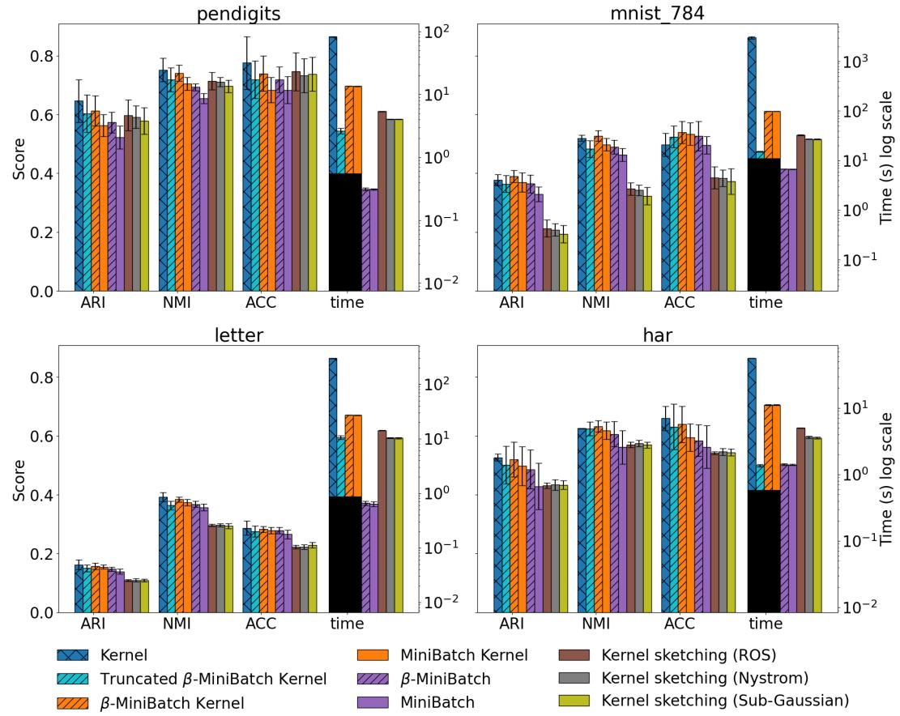  
Figure 3: Our results for a batch size of size 1024 and $\tau = 2 0 0$ using the Gaussian kernel. We use the $\beta$ prefix to denote that the algorithm uses the learning rate of [29]. Black denotes the time required to compute the kernel.

Discussion Throughout our results, we consistently observe that the truncated algorithm achieves performance on par with the non-truncated version with a running time which is often an order of magnitude faster. Surprisingly, this often holds for tiny values of $\tau$ (e.g., 50) far below the theoretical threshold (i.e., $\tau \ll b$ ). We also achieve considerably better quality solutions on most datasets compared to kernel sketching. We believe that our approach achieves a good balance between speed and performance, and is a valuable addition to the tool-box of clustering algorithms.

59 References [1] E. Alpaydin and Fevzi. Alimoglu. Pen-Based Recognition of Handwritten Digits. UCI Machine Learning Repository, 1998. DOI: https://doi.org/10.24432/C5MG6K. License: CC BY 4.0 DEED, available at https://creativecommons.org/licenses/by/4.0/. [2] Davide Anguita, Alessandro Ghio, Luca Oneto, Xavier Parra, Jorge Luis Reyes-Ortiz, et al. A public domain dataset for human activity recognition using smartphones. In Esann, volume 3, page 3, 2013. License: CC BY-NC-SA 4.0 DEED, available at https://creativecommons. org/licenses/by-nc-sa/4.0/. [3] Pablo Arbelaez, Michael Maire, Charless Fowlkes, and Jitendra Malik. Contour detection and hierarchical image segmentation. IEEE transactions on pattern analysis and machine intelligence, 33(5):898–916, 2010. [4] David Arthur and Sergei Vassilvitskii. How slow is the $k$ -means method? In SCG, pages 144–153. ACM, 2006. [5] David Arthur and Sergei Vassilvitskii. k-means++: the advantages of careful seeding. In SODA, pages 1027–1035. SIAM, 2007. [6] Artem Barger and Dan Feldman. Deterministic coresets for k-means of big sparse data. Algorithms, 13(4):92, 2020. [7] Di Chen and Jeff M Phillips. Relative error embeddings of the gaussian kernel distance. In International Conference on Algorithmic Learning Theory, pages 560–576. PMLR, 2017. [8] Radha Chitta, Rong Jin, Timothy C. Havens, and Anil K. Jain. Approximate kernel k-means: solution to large scale kernel clustering. In KDD, pages 895–903. ACM, 2011. [9] Radha Chitta, Rong Jin, and Anil K Jain. Efficient kernel clustering using random fourier features. In 2012 IEEE 12th International Conference on Data Mining, pages 161–170. IEEE, 2012.   
[10] Fan RK Chung. Spectral graph theory, volume 92. American Mathematical Soc., 1997. [11] Inderjit S. Dhillon, Yuqiang Guan, and Brian Kulis. Kernel k-means: spectral clustering and normalized cuts. In Proceedings of the Tenth ACM SIGKDD International Conference on Knowledge Discovery and Data Mining, KDD ’04, page 551–556, New York, NY, USA, 2004. Association for Computing Machinery. ISBN 1581138881. doi: 10.1145/1014052.1014118. URL https://doi.org/10.1145/1014052.1014118. [12] Dan Feldman, Melanie Schmidt, and Christian Sohler. Turning big data into tiny data: Constantsize coresets for k-means, pca, and projective clustering. SIAM Journal on Computing, 49(3): 601–657, 2020.   
[13] Alexander J Gates and Yong-Yeol Ahn. The impact of random models on clustering similarity. Journal of Machine Learning Research, 18(87):1–28, 2017.   
[14] Wassily Hoeffding. Probability inequalities for sums of bounded random variables. Journal of the American Statistical Association, 58(301):13–30, 1963.   
296 [15] Shaofeng H.-C. Jiang, Robert Krauthgamer, Jianing Lou, and Yubo Zhang. Coresets for kernel clustering. CoRR, abs/2110.02898, 2021.   
98 [16] Tapas Kanungo, David M. Mount, Nathan S. Netanyahu, Christine D. Piatko, Ruth Silverman, and Angela Y. Wu. A local search approximation algorithm for k-means clustering. Comput. Geom., 28(2-3):89–112, 2004. [17] Andrea Lancichinetti, Santo Fortunato, and János Kertész. Detecting the overlapping and hierarchical community structure in complex networks. New journal of physics, 11(3):033015, 2009. [18] Yann LeCun. The mnist database of handwritten digits. http://yann. lecun. com/exdb/mnist/, 1998. License: CC0 1.0 DEED CC0 1.0 Universal, available at https://creativecommons. org/publicdomain/zero/1.0/. [19] Yong Liu. Refined learning bounds for kernel and approximate $k$ -means. Advances in neural information processing systems, 34:6142–6154, 2021. [20] Stuart P. Lloyd. Least squares quantization in PCM. IEEE Trans. Inf. Theory, 28(2):129–136, 1982. [21] Peter Macgregor and He Sun. Fast approximation of similarity graphs with kernel density estimation. Advances in Neural Information Processing Systems, 36, 2024. [22] Cameron Musco and Christopher Musco. Recursive sampling for the nystrom method. Advances in neural information processing systems, 30, 2017. [23] Assaf Naor. On the banach-space-valued azuma inequality and small-set isoperimetry of alon–roichman graphs. Combinatorics, Probability and Computing, 21(4):623–634, 2012. [24] F. Pedregosa, G. Varoquaux, A. Gramfort, V. Michel, B. Thirion, O. Grisel, M. Blondel, P. Prettenhofer, R. Weiss, V. Dubourg, J. Vanderplas, A. Passos, D. Cournapeau, M. Brucher, M. Perrot, and E. Duchesnay. Scikit-learn: Machine learning in Python. Journal of Machine Learning Research, 12:2825–2830, 2011. [25] Kent Quanrud. Spectral Sparsification of Metrics and Kernels, pages 1445–1464. doi: 10.1137/1.9781611976465.87. URL https://epubs.siam.org/doi/abs/10.1137/1. 9781611976465.87. [26] Ali Rahimi and Benjamin Recht. Random features for large-scale kernel machines. Advances in neural information processing systems, 20, 2007. [27] William M Rand. Objective criteria for the evaluation of clustering methods. Journal of the American Statistical association, 66(336):846–850, 1971.   
28 [28] Melanie Schmidt. Coresets and streaming algorithms for the k-means problem and related clustering objectives. 2014. [29] Gregory Schwartzman. Mini-batch k-means terminates within $\mathrm { O } ( d / \epsilon )$ iterations. In ICLR, 2023.   
2 [30] D. Sculley. Web-scale k-means clustering. In WWW, pages 1177–1178. ACM, 2010.   
[31] David Slate. Letter Recognition. UCI Machine Learning Repository, 1991. DOI: https://doi.org/10.24432/C5ZP40. License: CC BY 4.0 DEED, available at https:// creativecommons.org/licenses/by/4.0/.   
[32] Cheng Tang and Claire Monteleoni. Convergence rate of stochastic $\mathbf { k }$ -means. In AISTATS, volume 54 of Proceedings of Machine Learning Research, pages 1495–1503. PMLR, 2017.   
[33] Andrea Vattani. $k$ -means requires exponentially many iterations even in the plane. Discret. Comput. Geom., 45(4):596–616, 2011. [34] Shusen Wang, Alex Gittens, and Michael W Mahoney. Scalable kernel k-means clustering with nystrom approximation: Relative-error bounds. Journal of Machine Learning Research, 20(12): 1–49, 2019.   
[35] Rong Yin, Yong Liu, Weiping Wang, and Dan Meng. Randomized sketches for clustering: Fast and optimal kernel $k$ -means. Advances in Neural Information Processing Systems, 35: 6424–6436, 2022.

Runtime analysis of Algorithm 1 Assuming that 47 $\langle \mathcal { C } _ { i } ^ { j } , \mathcal { C } _ { i } ^ { j } \rangle$ and $\langle \phi ( x ) , \mathcal { C } _ { i } ^ { j } \rangle$ are known for all $j \in [ k ]$ and for all 48 $x \in X$ , we can compute $\langle \mathcal { C } _ { i + 1 } ^ { j } , \mathcal { C } _ { i + 1 } ^ { j } \rangle$ and $\langle \phi ( x ) , \mathcal { C } _ { i + 1 } ^ { j } \rangle$ for all $j \in [ k ]$ and $x \in X$ , which 49 implies we can compute the distances from any point in the batch to all centers.

We now bound the running time of a single iteration of the outer loop in Algorithm 1. Let us denote $b _ { i } ^ { j } = \left| B _ { i } ^ { j } \right|$ and recall that $\begin{array} { r } { c m ( B _ { i } ^ { j } ) = \frac { 1 } { b _ { i } ^ { j } } \sum _ { y \in B _ { i } ^ { j } } \phi ( y ) } \end{array}$ . Therefore, computing $\langle \phi ( x ) , c m ( B _ { i } ^ { j } ) \rangle =$ $\begin{array} { r } { \frac { 1 } { b _ { i } ^ { j } } \sum _ { y \in B _ { i } ^ { j } } \langle \phi ( x ) , \phi ( y ) \rangle } \end{array}$ requires $O ( b _ { i } ^ { j } )$ time. Similarly, computing $\langle c m ( B _ { i } ^ { j } ) , c m ( B _ { i } ^ { j } ) \rangle$ requires $O ( ( b _ { i } ^ { j } ) ^ { 2 } )$ time. Let us now bound the time it requires to compute $\langle \phi ( x ) , \mathcal { C } _ { i + 1 } ^ { j } \rangle$ and $\langle \mathcal { C } _ { i + 1 } ^ { j } , \mathcal { C } _ { i + 1 } ^ { j } \rangle$ .

Assuming we know $\langle \phi ( x ) , \mathcal { C } _ { i } ^ { j } \rangle$ and $\langle \mathcal { C } _ { i } ^ { j } , \mathcal { C } _ { i } ^ { j } \rangle$ , updating $\langle \phi ( x ) , \mathcal { C } _ { i + 1 } ^ { j } \rangle$ for all $x \in X , j \in [ k ]$ requires $O ( n ( b + k ) )$ time. Specifically, the $\langle \phi ( x ) , \mathcal { C } _ { i } ^ { j } \rangle$ term is already known from the previous iteration and we need to compute $\alpha _ { i } ^ { j } \langle \phi ( x ) , c m ( B _ { i } ^ { j } ) \rangle$ for every $x \in X , j \in [ k ]$ which requires $\textstyle n \sum _ { j \in [ k ] } b _ { i } ^ { j } = n b$ time. Finally, updating $\langle \phi ( x ) , \mathcal { C } _ { i + 1 } ^ { j } \rangle$ for all $x \in X , j \in [ k ]$ requires $O ( n k )$ time.

Updating $\langle \mathcal { C } _ { i + 1 } ^ { j } , \mathcal { C } _ { i + 1 } ^ { j } \rangle$ requires $O ( b ^ { 2 } + k b )$ time. Specifically, $\langle \mathcal { C } _ { i } ^ { j } , \mathcal { C } _ { i } ^ { j } \rangle$ is known from the previous iteration and computing $\langle c m ( B _ { i } ^ { j } ) , c m ( B _ { i } ^ { j } ) \rangle$ for all $j \in [ k ]$ requires $\begin{array} { r } { O ( \sum _ { j \in [ k ] } ( b _ { i } ^ { j } ) ^ { 2 } ) = O ( b ^ { 2 } ) } \end{array}$ time. Computing $\langle \mathcal { C } _ { i } ^ { j } , c m ( B _ { i } ^ { j } ) \rangle$ for all $j \in [ k ]$ requires time $O ( b )$ using $\langle \phi ( x ) , \mathcal { C } _ { i } ^ { j } \rangle$ from the previous iteration. Therefore, the total running time of the update step (assigning points to new centers) is $O ( n ( b + k ) )$ . To perform the update at the $( i + 1 )$ -th step we only need $\langle \phi ( \boldsymbol { x } ) , \mathcal { C } _ { i } ^ { j } \rangle , \langle \mathcal { C } _ { i } ^ { j } , \mathcal { C } _ { i } ^ { j } \rangle$ , which results in a space complexity of $O ( n k )$ . This completes the first claim of Theorem 1.1.

# 64 B Termination guarantee

In this section we prove the second claim of Theorem 1.1. For most of the section we analyze Algorithm 1, and towards the end we use the fact that the centers of the two algorithms are close throughout the execution to conclude our proof.

Section preliminaries We introduce the following definitions and lemmas to aid our proof of the second claim of Theorem 1.1.

Lemma B.1. For every $y$ which is a convex combination of $X$ it holds that $\| y \| \leq \gamma$ .

Proof. The proof follows by the triangle inequality: $\begin{array} { r } { \| y \| = \| \sum _ { x \in { \cal { X } } } p _ { x } \phi ( x ) \| \le \sum _ { x \in { \cal { X } } } \| p _ { x } \phi ( x ) \| = } \end{array}$ $\begin{array} { r } { \sum _ { x \in X } p _ { x } \| \phi ( x ) \| \le \sum _ { x \in X } p _ { x } \gamma = \gamma . } \end{array}$ .

Lemma B.2. For any tuple of $k$ centers ${ \mathcal { C } } \subset { \mathcal { H } } ^ { d }$ which are a convex combination of points in $X$ , $i t$ holds that $\forall A \subseteq X , f _ { A } ( \mathcal { C } ) \leq 4 \gamma ^ { 2 }$ .

Proof. It is sufficient to upper bound $f _ { x }$ . Combining that fact that every $C \in { \mathcal { C } }$ is a convex   
combination of $X$ with the triangle inequality, we have that

$$
\begin{array} { l } { \displaystyle \forall x \in X , f _ { x } ( \mathcal { C } ) \leq \underset { C \in \mathcal { C } } { \operatorname* { m a x } } \Delta ( x , C ) = \Delta ( x , \displaystyle \sum _ { y \in X } p _ { y } \phi ( y ) ) } \\ { = \| \phi ( x ) - \displaystyle \sum _ { y \in X } p _ { y } \phi ( y ) \| ^ { 2 } \leq ( \| \phi ( x ) \| + \| \displaystyle \sum _ { y \in X } p _ { y } \phi ( y ) \| ) ^ { 2 } \leq 4 \gamma ^ { 2 } . } \end{array}
$$

We state the following simplified version of an Azuma bound for Hilbert space valued martingales   
from [23], followed by a standard Hoeffding bound.

Theorem B.3 ([23]). Let $\mathcal { H }$ be a Hilbert space and let $Y _ { 0 } , . . . , Y _ { m }$ be a $\mathcal { H }$ -valued martingale, such that 380 $\forall 1 \leq i \leq m , \| Y _ { i } - Y _ { i - 1 } \| \leq a _ { i }$ . It holds that $P r [ \| Y _ { m } - Y _ { 0 } \| \geq \delta ] \leq e ^ { \Theta \left( { \frac { \delta ^ { 2 } } { \sum _ { i = 1 } ^ { m } a _ { i } ^ { 2 } } } \right) }$ .

Theorem B.4 ([14]). Let $Y _ { 1 } , . . . , Y _ { m }$ be independent random variables such that $\forall 1 ~ \leq ~ i ~ \leq$   
$m , E [ Y _ { i } ] = \mu$ and $Y _ { i } \in [ a _ { m i n } , a _ { m a x } ]$ . Then $\begin{array} { r } { P r \left( \left| \frac { 1 } { m } \sum _ { i = 1 } ^ { m } Y _ { k } - \mu \right| \geq \delta \right) \leq 2 e ^ { - 2 m \delta ^ { 2 } / ( a _ { m a x } - a _ { m i n } ) ^ { 2 } } } \end{array}$

383 The following lemma provides concentration guarantees when sampling a batch.

Lemma B.5. Let $B$ be a tuple of $b$ elements chosen uniformly at random from $X$ with repetitions. For any fixed tuple of $k$ centers, $\mathcal { C } \subseteq \mathcal { H }$ which are a convex combination of $X$ , it holds that: P r[|fB(C) − fX (C)| ≥ δ] ≤ 2e−bδ2/8γ4 .

Proof. Let us write $B = ( y _ { 1 } , \ldots , y _ { b } )$ , where $y _ { i }$ is a random element selected uniformly at random from $X$ with repetitions. For every such $y _ { i }$ define the random variable $Z _ { i } = f _ { y _ { i } } ( { \mathcal { C } } )$ . These new random variables are IID for any fixed $\mathcal { C }$ . It also holds that $\begin{array} { r } { \forall i \in [ b ] , E [ Z _ { i } ] = \frac { \bar { 1 } } { n } \sum _ { x \in X } f _ { x } ( \mathcal { C } ) = } \end{array}$ $f _ { X } ( { \mathcal { C } } )$ and that $\begin{array} { r } { f _ { B } ( \mathcal { C } ) = \frac { 1 } { b } \sum _ { x \in B } f _ { x } ( \mathcal { C } ) = \frac { 1 } { b } \sum _ { i = 1 } ^ { b } Z _ { i } , } \end{array}$ .

91 Applying the Hoeffding bound (Theorem B.4) with parameters $m = b , \mu = f _ { X } ( \mathcal { C } ) , a _ { m a x } - a _ { m i n } \leq$ $4 \gamma ^ { 2 }$ (due to Lemma B.2) we get that: $P r [ | f _ { B } ( \mathcal { C } ) - f _ { X } ( \mathcal { C } ) | \geq \delta ] \leq 2 e ^ { - b \delta ^ { 2 } / 8 \gamma ^ { 4 } }$ . □

For any tuple $S \subseteq X$ and some tuple of cluster centers $\mathcal { C } = ( \mathcal { C } ^ { \ell } ) _ { \ell \in [ k ] } \subset \mathcal { H }$ , $\mathcal { C }$ implies a partition $( S ^ { \ell } ) _ { \ell \in [ k ] }$ of the points in $S$ . Specifically, every $S ^ { \ell }$ contains the points in $S$ closest to $\mathcal { C } ^ { \ell }$ (in $\mathcal { H }$ ) and every point in $S$ belongs to a single $\mathcal { C } ^ { \ell }$ (ties are broken arbitrarily). We state the following useful observation:

Observation B.6. Fix some $A \subseteq X$ . Let $\mathcal { C }$ be a tuple of $k$ centers, $S = ( S ^ { \ell } ) _ { \ell \in [ k ] }$ be the partition of $A$ induced by $\mathcal { C }$ and $\overline { { S } } = ( \overline { { S } } ^ { \ell } ) \ell \in [ k ]$ be any other partition of $A$ . It holds that ${ \textstyle \sum _ { j = 1 } ^ { k } \Delta ( S ^ { j } , { \mathcal C } ^ { j } ) \le }$ $\begin{array} { r } { \sum _ { j = 1 } ^ { k } \Delta ( \overline { { S } } ^ { j } , \mathcal { C } ^ { j } ) } \end{array}$ .

Recall that $\mathcal { C } _ { i } ^ { j }$ is the $j$ -th center in the beginning of the $i$ -th iteration of Algorithm 1 and $( B _ { i } ^ { \ell } ) _ { \ell \in [ k ] }$ is the partition of $B _ { i }$ induced by $\mathcal { C } _ { i }$ . Let $( X _ { i } ^ { \ell } ) _ { \ell \in [ k ] }$ be the partition of $X$ induced by $\mathcal { C } _ { i }$ .

02 We now have the tools to analyze Algorithm 1 with the learning rate of [29]. Specifically, we   
assume that the algorithm executes for at least 03 $t$ iterations, the learning rate is $\alpha _ { i } ^ { j } = \sqrt { b _ { i } ^ { j } / b }$ , where $b _ { i } ^ { j } = \left| B _ { i } ^ { j } \right|$ , and the batch size is $b = \Omega ( \operatorname* { m a x } \left\{ \gamma ^ { 4 } , \gamma ^ { 2 } \right\} k \epsilon ^ { - 2 } \log ( n t ) )$ . We show that the algorithm must terminate within $t = O ( \gamma ^ { 2 } / \epsilon )$ steps w.h.p. Plugging $t$ back into $b$ , we get that a batch size of $b = \Omega ( \operatorname* { m a x } \left\{ \gamma ^ { 4 } , \gamma ^ { 2 } \right\} k \epsilon ^ { - 2 } \log ^ { 2 } ( \gamma n / \epsilon ) )$ is sufficient. We assume that $\epsilon$ is chosen such that $\gamma ^ { 2 } / \epsilon > 1 / 4$ . Otherwise, the stopping condition immediately holds due to Lemma B.2.

Proof outline We note that when sampling a batch it holds w.h.p that $f _ { B _ { i } } ( \mathcal { C } _ { i } )$ is close to $f _ { X _ { i } } ( \mathcal { C } _ { i } )$ (Lemma B.5). This is due to the fact that $B _ { i }$ is sampled after $\mathcal { C } _ { i }$ is fixed. If we could show that $f _ { B _ { i } } ( \mathcal { C } _ { i + 1 } )$ is close $f _ { X _ { i } } ( \mathcal { C } _ { i + 1 } )$ then combined with the fact that we make progress of at least $\epsilon$ on the batch we can conclude that we make progress of at least some constant fraction of $\epsilon$ on the entire dataset.

Unfortunately, as $\mathcal { C } _ { i + 1 }$ depends on $B _ { i }$ , getting the above guarantee is tricky. To overcome this issue we define the auxiliary value $\overline { { \mathcal { C } } } _ { i + 1 } ^ { j } = ( 1 - \alpha _ { i } ^ { j } ) \mathcal { C } _ { i } ^ { j } + \alpha _ { i } ^ { j } c m ( X _ { i } ^ { j } )$ . This is the $j$ -th center at step $i + 1$ if we were to use the entire dataset for the update, rather than just a batch. Note that this is only used in the analysis and not in the algorithm. Note that $\overline { { \boldsymbol { \mathcal { C } } } } _ { i + 1 }$ is almost independent of $B _ { i }$ . Every $\overline { { \boldsymbol { \mathcal { C } } } } _ { i + 1 } ^ { j }$ depends only on $\mathcal { C } _ { i } ^ { j } , X _ { i } ^ { j }$ and $\alpha _ { i } ^ { j }$ . While $\mathcal { C } _ { i } ^ { j } , X _ { i } ^ { j }$ are independent of $B _ { i }$ , the learning $\alpha _ { i } ^ { j }$ is not. Nevertheless, the number of possible values of $\left\{ \alpha _ { i } ^ { j } \right\} _ { j \in k }$ is sufficiently small, and we can overcome this issue by showing concentration for every possible learning rate configuration followed by a union bound. This allows us to use $\overline { { \mathcal { C } } } _ { i + 1 }$ instead of $\mathcal { C } _ { i + 1 }$ in the above analysis outline. We show that for our choice of learning rate it holds that $\overline { { \boldsymbol { { C } } } } _ { i + 1 } , \boldsymbol { { C } } _ { i + 1 }$ are sufficiently close, which implies that $f _ { X } ( \mathcal { C } _ { i + 1 } ) , f _ { X } ( \overline { { \mathcal { C } } } _ { i + 1 } )$ and $f _ { B _ { i } } ( \mathcal { C } _ { i + 1 } ) , f _ { B _ { i } } ( \overline { { \mathcal { C } } } _ { i + 1 } )$ are also sufficiently close. That is, $\overline { { \boldsymbol { \mathcal { C } } } } _ { i + 1 }$ acts as a proxy for $\mathcal { C } _ { i + 1 }$ . Combining everything together we get our desired result for Algorithm 1.

We start with the following useful observation, which will allow us to use Lemma B.1 to bound the 25 norm of the centers by $\gamma$ throughout the execution of the algorithm.

Observation B.7. If $\forall j \in [ k ] , \mathcal { C } _ { 1 } ^ { j }$ is a convex combination of $X$ then $\forall i > 1 , j \in [ k ] , \mathcal { C } _ { i } ^ { j } , \overline { { \mathcal { C } } } _ { i } ^ { j }$ are also 427 a convex combinations of $X$ .

We state the following useful lemma. Although the original proof is for Euclidean spaces, it goes   
through for Hilbert spaces.   
Lemma B.8 ([16]). For any set $S \subseteq X$ and any $C \in { \mathcal { H } }$ it holds that $\Delta ( S , C ) = \Delta ( S , c m ( S ) ) +$   
$| S | \Delta ( C , c m ( S ) )$ .

Proof.

$$
\begin{array} { l } { \displaystyle \Delta ( S , C ) = \sum _ { x \in S } \Delta ( x , C ) = \sum _ { x \in S } \langle x - C , x - C \rangle } \\ { \displaystyle = \sum _ { x \in S } \langle ( x - c m ( S ) ) + ( c m ( S ) - C ) , ( x - c m ( S ) ) + ( c m ( S ) - C ) \rangle } \\ { \displaystyle = \sum _ { x \in S } \Delta ( x , c m ( S ) ) + \Delta ( C , c m ( S ) ) + 2 \langle x - c m ( S ) , c m ( S ) - C \rangle } \\ { \displaystyle = \Delta ( S , c m ( S ) ) + | S | \Delta ( C , c m ( S ) ) + \sum _ { x \in S } 2 \langle x - c m ( S ) , c m ( S ) - C \rangle } \\ { \displaystyle = \Delta ( S , c m ( S ) ) + | S | \Delta ( C , c m ( S ) ) , } \end{array}
$$

where the last step is due to the fact that

$$
\begin{array} { r l } { \displaystyle } & { \displaystyle \sum _ { x \in S } \langle x - c m ( S ) , c m ( S ) - C \rangle = \langle \displaystyle \sum _ { x \in S } x - | S | c m ( S ) , c m ( S ) - C \rangle } \\ & { = \langle \displaystyle \sum _ { x \in S } x - \frac { | S | } { | S | } \displaystyle \sum _ { x \in S } x , c m ( S ) - C \rangle = 0 . } \end{array}
$$

434 We use the above to state the following useful lemma.

35 Lemma B.9. For any $S \subseteq X$ and $C , C ^ { \prime } \in \mathcal { H }$ which are convex combinations of $X$ , it holds that:   
$\left| \Delta ( S , C ^ { \prime } ) - \Delta ( S , C ) \right| \leq 4 \gamma \left| S \right| \left\| C - C ^ { \prime } \right\|$ .   
Proof. Using Lemma B.8 we get that $\Delta ( S , C ) = \Delta ( S , c m ( S ) ) + | S | \Delta ( c m ( S ) , C )$ and that   
$\Delta ( S , C ^ { \prime } ) \ = \ \Delta ( S , c m ( S ) ) + | \bar { S } | \Delta ( c m ( S ) , C ^ { \prime } )$ . Thus, it holds that $\left| \Delta ( S , C ^ { \prime } ) - \Delta ( S , C ) \right| \ =$   
$| S | \cdot | \Delta ( c m ( S ) , C ^ { \prime } ) - \Delta ( c m ( S ) , C ) |$ . Let us write

$$
\begin{array} { r l } & { | \Delta ( c m ( S ) , C ^ { \prime } ) - \Delta ( c m ( S ) , C ) | } \\ & { = | \langle c m ( S ) - C ^ { \prime } , c m ( S ) - C ^ { \prime } \rangle - \langle c m ( S ) - C , c m ( S ) - C \rangle | } \\ & { = | - 2 \langle c m ( S ) , C ^ { \prime } \rangle + \langle C ^ { \prime } , C ^ { \prime } \rangle + 2 \langle c m ( S ) , C \rangle - \langle C , C \rangle | } \\ & { = | 2 \langle c m ( S ) , C - C ^ { \prime } \rangle + \langle C ^ { \prime } - C , C ^ { \prime } + C \rangle | } \\ & { = | \langle C - C ^ { \prime } , 2 c m ( S ) - ( C ^ { \prime } + C ) \rangle | } \\ & { \leq \| C - C ^ { \prime } \| \| 2 c m ( S ) - ( C ^ { \prime } + C ) \| \leq 4 \gamma \| C - C ^ { \prime } \| . } \end{array}
$$

440 Where in the last transition we used the Cauchy-Schwartz inequality, the triangle inequality, and the fact that 441 $C , C ^ { \prime } , c m ( S )$ are convex combinations of $X$ and therefore their norm is bounded by $\gamma$ .

42 When centers are sufficiently close, these lemmas imply their values are close for any $f _ { A }$ .

Lemma B.10. Fix some 443 $A \subseteq X$ and let $( \mathcal { C } ^ { j } ) _ { j \in [ k ] } , ( \overline { { \mathcal { C } } } ^ { j } ) _ { j \in [ k ] } \subset \mathcal { H }$ be arbitrary centers such that 444 $\forall j \in [ k ] , \| \mathcal C ^ { j } - \overline { { \mathcal C } } ^ { j } \| \leq \epsilon / 2 8 \gamma .$ . It holds that $\forall i \in [ t ] , | f _ { A } ( \overline { { \mathscr { C } } } _ { i + 1 } ) - f _ { A } ( \mathscr { C } _ { i + 1 } ) | \leq \epsilon / 7 .$

Proof. Let 445 $S = ( S ^ { \ell } ) _ { \ell \in [ k ] } , { \overline { { S } } } = ( { \overline { { S } } } ^ { \ell } ) _ { \ell \in [ k ] }$ be the partitions induced by $c , { \bar { c } }$ on $A$ . Let us expand the 446 expression

$$
\begin{array} { l l } { \displaystyle f _ { A } ( \overline { { \mathcal { C } } } ) - f _ { A } ( \mathcal { C } ) = \frac { 1 } { | A | } \sum _ { j = 1 } ^ { k } \Delta ( \overline { { S ^ { j } } } , \overline { { \mathcal { C } ^ { j } } } ) - \Delta ( S ^ { j } , \mathcal { C } ^ { j } ) } \\ { \displaystyle \ } & { \displaystyle \leq \frac { 1 } { | A | } \sum _ { j = 1 } ^ { k } \Delta ( S ^ { j } , \overline { { \mathcal { C } ^ { j } } } ) - \Delta ( S ^ { j } , \mathcal { C } ^ { j } ) \leq \frac { 1 } { | A | } \sum _ { j = 1 } ^ { k } 4 \gamma \left| S ^ { j } \right| \| \overline { { \mathcal { C } } } ^ { j } - \mathcal { C } ^ { j } \| \leq \frac { 1 } { | A | } \sum _ { j = 1 } ^ { k } \left| S ^ { j } \right| \epsilon / 7 = \epsilon / 7 . } \end{array}
$$

The first inequality is due to Observation B.6, the second is due Lemma B.9 and finally we use the   
assumption about the distances between centers together with the fact that $\textstyle \sum _ { j = 1 } ^ { k } \left| S ^ { j } \right| = \left| A \right|$ . Using   
the same argument we also get that $f _ { A } ( \mathcal { C } ) - f _ { A } ( \overline { { \mathcal { C } } } ) \leq \epsilon / 7$ , which completes the proof. □

Now we show that due to our choice of learning rate, $\mathcal { C } _ { i + 1 } ^ { j }$ and $\overline { { \boldsymbol { \mathcal { C } } } } _ { i + 1 } ^ { j }$ are sufficiently close.

Lemma B.11. It holds w.h.p that451 $\begin{array} { r } { \forall i \in [ t ] , j \in [ k ] , \| \mathcal { C } _ { i + 1 } ^ { j } - \overline { { \mathcal { C } } } _ { i + 1 } ^ { j } \| \leq \frac { \epsilon } { 2 8 \gamma } . } \end{array}$

Proof. Note that $\mathcal { C } _ { i + 1 } ^ { j } - \overline { { \mathcal { C } } } _ { i + 1 } ^ { j } = \alpha _ { i } ^ { j } ( c m ( B _ { i } ^ { j } ) - c m ( X _ { i } ^ { j } ) )$ . Let us fix some iteration $i$ and center   
$j$ . To simplify notation, let us denote: $X ^ { \prime } = X _ { i } ^ { j } , B ^ { \prime } = B _ { i } ^ { j } , b ^ { \prime } = b _ { i } ^ { j } , \alpha ^ { \prime } = \alpha _ { i } ^ { j }$ . Although $b ^ { \prime }$ is a   
random variable, in what follows we treat it as a fixed value (essentially conditioning on its value).   
As what follows holds for all values of $b ^ { \prime }$ it also holds without conditioning due to the law of total   
probabilities.   
For the rest of the proof, we assume $b ^ { \prime } > 0$ (if $\boldsymbol { b } ^ { \prime } = 0$ the claim holds trivially). Let us denote by   
$\{ Y _ { \ell } \} _ { \ell = 1 } ^ { b ^ { \prime } }$ the sampled points in $B ^ { \prime }$ . Note that a randomly sampled element from $X$ is in $B ^ { \prime }$ if and   
only if it is in $X ^ { \prime }$ . As batch elements are sampled uniformly at random with repetitions from $X$ ,   
conditioning on the fact that an element is in $B ^ { \prime }$ means that it is distributed uniformly over $X ^ { \prime }$ . Note   
461 that $\begin{array} { r } { \forall \ell , E [ \phi ( Y _ { \ell } ) ] = \frac { 1 } { | X ^ { \prime } | } \sum _ { x \in X ^ { \prime } } \phi ( x ) = c m ( X ^ { \prime } ) } \end{array}$ and $\begin{array} { r } { E [ c m ( B ^ { \prime } ) ] = \frac { 1 } { b ^ { \prime } } \sum _ { \ell = 1 } ^ { b ^ { \prime } } E [ \dot { \phi } ( Y _ { \ell } ) ] = c m ( X ^ { \prime } ) } \end{array}$

Let us define the following martingale: 462 $\begin{array} { r } { Z _ { r } = \sum _ { \ell = 1 } ^ { r } ( \phi ( Y _ { \ell } ) - E [ \phi ( Y _ { \ell } ) ] ) } \end{array}$ . Note that $Z _ { 0 } = 0$ , and when 463 $r > 0$ , $\begin{array} { r } { Z _ { r } = \sum _ { \ell = 1 } ^ { r } \phi ( Y _ { \ell } ) - r \cdot c m ( X ^ { \prime } ) } \end{array}$ . It is easy to see that this is a martingale:

$$
5 [ Z _ { r } \mid Z _ { r - 1 } ] = E [ \sum _ { \ell = 1 } ^ { r } \phi ( Y _ { \ell } ) - r \cdot c m ( X ^ { \prime } ) \mid Z _ { r - 1 } ] = Z _ { r - 1 } + E [ \phi ( Y _ { r } ) - c m ( X ^ { \prime } ) \mid Z _ { r - 1 } ] = Z _ { r - 1 } .
$$

We bound the differences: 464 $\| Z _ { r } - Z _ { r - 1 } \| = \| \phi ( Y _ { r } ) - c m ( X ^ { \prime } ) \| \leq \| \phi ( Y _ { r } ) \| + \| c m ( X ^ { \prime } ) \| \leq 2 \gamma .$

Now we may use Azuma’s inequality: 465 $P r [  { \lVert Z _ { b ^ { \prime } } - Z _ { 0 } \rVert } \geq \delta ] \leq e ^ { - \Theta ( \frac { \delta ^ { 2 } } { \gamma ^ { 2 } b ^ { \prime } } ) }$ . Let us now divide both sides of the inequality by 466 $b ^ { \prime }$ and set $\delta = \begin{array} { r } { \frac { b ^ { \prime } \epsilon } { 2 8 \gamma \alpha ^ { \prime } } } \end{array}$ . We get $\begin{array} { r } { P r [ \| c m ( B ^ { \prime } ) - c m ( X ^ { \prime } ) \| \ge \frac { \epsilon } { 2 8 \gamma \alpha ^ { \prime } } ] = } \end{array}$ 467 $\begin{array} { r } { P r [ \| \frac { 1 } { b ^ { \prime } } \sum _ { \ell = 1 } ^ { b ^ { \prime } } \phi ( Y _ { \ell } ) - c m ( X ^ { \prime } ) \| \ge \frac { \epsilon } { 2 8 \gamma \alpha ^ { \prime } } ] \le e ^ { - \Theta ( \frac { { b ^ { \prime } \epsilon ^ { 2 } } } { ( \gamma \alpha ^ { \prime } ) ^ { 2 } } ) } } \end{array}$ . Using the fact that $\alpha ^ { \prime } = \sqrt { b ^ { \prime } / b }$ together 468 with the fact that $b = \Omega ( \operatorname* { m a x } \left\{ \gamma ^ { 4 } , \gamma ^ { 2 } \right\} k \epsilon ^ { - 2 } \log ( n t ) )$ (for an appropriate constant) we get that the 469 above is $O ( 1 / n t k )$ . Finally, taking a union bound over all $t$ iterations and all $k$ centers per iteration 470 completes the proof. □

Let us state the following useful lemma.

Lemma B.12. It holds w.h.p that for every $i \in [ t ]$ ,

$$
\begin{array} { r l } & { f _ { X } ( \overline { { \mathscr { C } } } _ { i + 1 } ) - f _ { X } ( \mathscr { C } _ { i + 1 } ) \geq - \epsilon / 7 } \\ & { f _ { B _ { i } } ( \mathscr { C } _ { i + 1 } ) - f _ { B _ { i } } ( \overline { { \mathscr { C } } } _ { i + 1 } ) \geq - \epsilon / 7 } \\ & { f _ { X } ( \mathscr { C } _ { i } ) - f _ { B _ { i } } ( \mathscr { C } _ { i } ) \geq - \epsilon / 7 } \\ & { f _ { B _ { i } } ( \overline { { \mathscr { C } } } _ { i + 1 } ) - f _ { X } ( \overline { { \mathscr { C } } } _ { i + 1 } ) \geq - \epsilon / 7 } \end{array}
$$

Proof. The first two inequalities follow from Lemma B.10. The third is due to Lemma B.5 by setting   
$\delta = \epsilon / 7$ , $B = B _ { i }$ :

$$
\begin{array} { r l } & { P r [ | f _ { B _ { i } } ( \mathcal { C } _ { i } ) - f _ { X } ( \mathcal { C } _ { i } ) | \ge \delta ] \le 2 e ^ { - b \delta ^ { 2 } / 8 \gamma ^ { 4 } } = e ^ { - \Theta ( b \epsilon ^ { 2 } / \gamma ^ { 4 } ) } } \\ & { \ = e ^ { - \Omega ( \log ( n t ) ) } = O ( 1 / n t ) . } \end{array}
$$

The last inequality is a bit more involved7. Let $\vec { \ell } \in \mathbb { N } ^ { k }$ be a vector whose entries sum to $b$ . For every $\vec { \ell }$   
we can define $\overline { { \mathcal { C } } } _ { i + 1 } ( \vec { \ell } )$ such that $\begin{array} { r } { \overline { { \mathscr { C } } } _ { i + 1 } ^ { j } ( \vec { \ell } ) = \mathscr { C } _ { i } ^ { j } ( 1 - \sqrt { \ell _ { j } / b } ) + \sqrt { \ell _ { j } / b } \cdot c m ( X _ { i } ^ { j } ) } \end{array}$ . For every choice of   
$\vec { \ell }$ it holds that $\overline { { \mathcal { C } } } _ { i + 1 } ( \vec { \ell } )$ is independent of $B _ { i }$ and we can apply Lemma B.5 for every possible $\overline { { \mathcal { C } } } _ { i + 1 } ( \vec { \ell } )$   
by setting $\delta = \epsilon / 7$ , $B = B _ { i }$

$$
\begin{array} { r l } & { P r [ \left. f _ { B _ { i } } ( \overline { { \ell } } _ { i + 1 } ( \vec { \ell } ) ) - f _ { X } ( \overline { { \ell } } _ { i + 1 } ( \vec { \ell } ) ) \right. \geq \delta ] \leq 2 e ^ { - b \delta ^ { 2 } / 8 \gamma ^ { 4 } } } \\ & { ~ } \\ & { = e ^ { - \Theta ( b \epsilon ^ { 2 } / \gamma ^ { 4 } ) } = e ^ { - \Omega ( k \log ( n t ) ) } = O ( 1 / ( n t ) ^ { k } ) , } \end{array}
$$

where last inequality is due to the fact that $b = \Omega ( \operatorname* { m a x } \left\{ \gamma ^ { 4 } , \gamma ^ { 2 } \right\} k \epsilon ^ { - 2 } \log ( n t ) )$ (for an appropri  
ate constant). Finally, we take a union bound over all possible vectors $\vec { \ell } .$ , a total of $\binom { b + k - 1 } { k - 1 } \leq$   
( (b+k−1)·ek−1 )k−1 = O(nk−1). As Ci+1 corresponds to at least one Ci+1(⃗ ℓ) we are done.

Taking a union bound over $t$ iterations, we obtain the result.

Putting everything together We wish to lower bound $f _ { X } ( { \mathcal { C } } _ { i } ) - f _ { X } ( { \mathcal { C } } _ { i + 1 } )$ . We write the following,   
where the $\pm$ notation means we add and subtract a term:

$$
\begin{array} { r l } & { f _ { X } ( \mathcal { C } _ { i } ) - f _ { X } ( \mathcal { C } _ { i + 1 } ) = f _ { X } ( \mathcal { C } _ { i } ) \pm f _ { B _ { i } } ( \mathcal { C } _ { i } ) - f _ { X } ( \mathcal { C } _ { i + 1 } ) } \\ { } & { \ge f _ { B _ { i } } ( \mathcal { C } _ { i } ) - f _ { X } ( \mathcal { C } _ { i + 1 } ) - \epsilon / 7 } \\ { } & { = f _ { B _ { i } } ( \mathcal { C } _ { i } ) \pm f _ { B _ { i } } ( \mathcal { C } _ { i + 1 } ) - f _ { X } ( \mathcal { C } _ { i + 1 } ) - \epsilon / 7 } \\ { } & { \ge f _ { B _ { i } } ( \mathcal { C } _ { i + 1 } ) - f _ { X } ( \mathcal { C } _ { i + 1 } ) + 6 \epsilon / 7 } \\ { } & { = f _ { B _ { i } } ( \mathcal { C } _ { i + 1 } ) \pm f _ { B _ { i } } ( \overline { { \mathcal { C } } } _ { i + 1 } ) } \\ { } & { ~ \pm f _ { X } ( \overline { { \mathcal { C } } } _ { i + 1 } ) - f _ { X } ( \mathcal { C } _ { i + 1 } ) + 6 \epsilon / 7 \ge 3 \epsilon / 7 . } \end{array}
$$

Where the first inequality is due to inequality 4 in Lemma B.12 $( f _ { X } ( \mathcal { C } _ { i } ) - f _ { B _ { i } } ( \mathcal { C } _ { i } ) \geq - \epsilon / 7 )$ , the   
second is due to the stopping condition of the algorithm $( f _ { B _ { i } } ( \mathcal { C } _ { i } ) - f _ { B _ { i } } ( \mathcal { C } _ { i + 1 } ) > \epsilon )$ , and the last is   
due to the remaining inequalities in Lemma B.12. The above holds w.h.p over all of the iterations of   
the algorithms. Using these guarantees for Algorithm 1 we can easily derive our main result for the   
truncated version.   
Truncated termination Using Lemma 4.1 together with Lemma B.10 and the fact that $f _ { X } ( { \mathcal { C } } _ { i } ) -$   
$f _ { X } ( { \mathcal { C } } _ { i + 1 } ) \geq 3 \epsilon / 7$ we get that: $f _ { X } ( \widehat { \mathcal { C } } _ { i } ) - f _ { X } ( \widehat { \mathcal { C } } _ { i + 1 } ) \geq f _ { X } ( \mathcal { C } _ { i } ) - f _ { X } ( \mathcal { C } _ { i + 1 } ) - 2 \epsilon / 7 \geq \epsilon / 7$ . We   
conclude that when $b = \Omega ( \operatorname* { m a x } \left\{ \gamma ^ { 4 } , \gamma ^ { 2 } \right\} k \epsilon ^ { - 2 } \log ^ { 2 } ( \gamma n / \epsilon ) )$ , w.h.p. Algorithm 2 terminates within   
$t = O ( \gamma ^ { 2 } / \epsilon )$ iterations. This completes the second claim of Theorem 1.1. The final claim of Theorem   
1.1 is due to the following lemma.

Lemma B.13. The expected approximation ratio of the solution returned by Algorithm 2 is at least the approximation guarantee of the initial centers provided to the algorithm.

Proof. Let $p = 1 - O ( \epsilon / n \gamma ^ { 2 } ) = 1 - O ( 1 / n )$ be the success probability of a single iteration. By “success" we mean that all inequalities in Lemma B.12 hold. The value of $p$ is due to the fact that we take $t = O ( \gamma ^ { 2 } / \epsilon )$ and that $\gamma ^ { 2 } \dot { / } \epsilon \geq 1 / 4$ .

With probability at least $p$ , it holds that $f _ { X } ( \mathcal { C } _ { i + 1 } ) \leq f _ { X } ( \mathcal { C } _ { i } ) - 2 \epsilon / 7$ . On the other hand, $f _ { X }$ is upper   
bounded by $4 \gamma ^ { 2 }$ . Let us denote $Z = f _ { X } ( \mathcal { C } _ { i } ) - f _ { X } ( \mathcal { C } _ { i + 1 } )$ the change in the goal function after the   
$i$ -th iteration. Consider the following:

$$
E [ Z ] = E [ Z \mid Z \geq \epsilon / 7 ] P r [ Z \geq \epsilon / 7 ] + E [ Z \mid Z < \epsilon / 7 ] P r [ Z < \epsilon / 7 ]
$$

We show that $E [ Z ] = E [ f _ { X } ( \mathcal { C } _ { i } ) - f _ { X } ( \mathcal { C } _ { i + 1 } ) ] \ge 0$ which implies that $E [ f _ { X } ( { \mathcal { C } } _ { i + 1 } ) ] \leq E [ f _ { X } ( { \mathcal { C } } _ { i } ) ]$   
and completes the proof. Note that if $E [ Z \mid \bar { Z } < \epsilon / 7 ] > 0$ then we are done as we simply have a   
linear combination of two positive terms which is greater than 0. Let us focus on the case where   
$E [ Z \mid Z < \epsilon / 7 ] < 0$ .

$$
\begin{array} { r l } & { E [ Z ] = E [ Z \mid Z \ge \epsilon / 7 ] P r [ Z \ge \epsilon / 7 ] + E [ Z \mid Z < \epsilon / 7 ] P r [ Z < \epsilon / 7 ] } \\ & { \ge p \epsilon / 7 + E [ Z \mid Z < \epsilon / 7 ] ( 1 - p ) \ge p \epsilon / 7 - 4 \gamma ^ { 2 } ( 1 - p ) } \\ & { = ( 1 - O ( 1 / n ) ) \epsilon / 7 - 4 \gamma ^ { 2 } O ( \epsilon / \gamma ^ { 2 } n ) = ( 1 - O ( 1 / n ) ) \epsilon / 7 - O ( \epsilon / n ) > 0 } \end{array}
$$

Where the first inequality is due to the definition of $p$ and the fact that $E [ Z \mid Z < \epsilon / 7 ] < 0$ , the   
second is due to the upper bound on $f _ { X }$ , and the last inequality is by assuming $n$ is sufficiently large.

# 510 C Full experimental results

We list our full experimental results in this section. We use the $\beta$ prefix to denote that the algorithm   
uses the learning rate of [29]. $\tau$ denotes the maximum number of data points used to represent each   
truncated cluster center. We investigate 3 kernel functions: 1) The Gaussian kernel, as presented   
in Section 5, 2) The $\mathbf { k }$ -nearest-neighbor $\left( \mathbf { k } { - } \mathbf { n n } \right)$ kernel, where the kernel matrix is $D ^ { - 1 } \dot { A } D ^ { - 1 }$ , $A$   
is a $\mathbf { k }$ -nn adjacency matrix of the data and $D$ is the corresponding degree matrix, and 3) the heat   
kernel [10] where the kernel matrix is $\mathrm { e x p } ( - t D ^ { - 1 / 2 } A D ^ { - 1 / 2 } )$ for some $0 < t < \infty$ , $A$ is a k-nn   
adjacency matrix and $D$ is the corresponding degree matrix. All parameter settings can be found in   
the supplementary material.   
Unlike for the Gaussian kernel where $\gamma = 1$ ; We observe empirically that for both the k-nn and heat   
kernels, $\gamma \ll 1$ . In this case, the dependence on $\operatorname* { m a x } \{ \gamma ^ { 4 } , \gamma ^ { 2 } \}$ in the batch size required for Theorem   
1.1 actually helps us. We found the parameters for these kernels to be easier to tune in practise than   
the Gaussian kernel parameter $\sigma$ . For each kernel, we recorded the empirical value of gamma as   
follows:

<table><tr><td rowspan=1 colspan=1>Dataset</td><td rowspan=1 colspan=1>Kernel Type</td><td rowspan=1 colspan=1>2</td></tr><tr><td rowspan=1 colspan=1>pendigits</td><td rowspan=1 colspan=1>knn</td><td rowspan=1 colspan=1>0.00100</td></tr><tr><td rowspan=1 colspan=1>pendigits</td><td rowspan=1 colspan=1>heat</td><td rowspan=1 colspan=1>0.0477</td></tr><tr><td rowspan=1 colspan=1>pendigits</td><td rowspan=1 colspan=1>gaussian</td><td rowspan=1 colspan=1>1</td></tr><tr><td rowspan=1 colspan=1>har</td><td rowspan=1 colspan=1>knn</td><td rowspan=1 colspan=1>0.000500</td></tr><tr><td rowspan=1 colspan=1>har</td><td rowspan=1 colspan=1>heat</td><td rowspan=1 colspan=1>0.0468</td></tr><tr><td rowspan=1 colspan=1>har</td><td rowspan=1 colspan=1>gaussian</td><td rowspan=1 colspan=1>1</td></tr><tr><td rowspan=1 colspan=1>mnist_784</td><td rowspan=1 colspan=1>knn</td><td rowspan=1 colspan=1>0.00220</td></tr><tr><td rowspan=1 colspan=1>mnist_784</td><td rowspan=1 colspan=1>heat</td><td rowspan=1 colspan=1>0.0612</td></tr><tr><td rowspan=1 colspan=1>mnist_784</td><td rowspan=1 colspan=1>gaussian</td><td rowspan=1 colspan=1>1</td></tr><tr><td rowspan=1 colspan=1>letter</td><td rowspan=1 colspan=1>knn</td><td rowspan=1 colspan=1>0.00100</td></tr><tr><td rowspan=1 colspan=1>letter</td><td rowspan=1 colspan=1>heat</td><td rowspan=1 colspan=1>0.0399</td></tr><tr><td rowspan=1 colspan=1>letter</td><td rowspan=1 colspan=1>gaussian</td><td rowspan=1 colspan=1>1</td></tr></table>

Table 1: $\gamma$ values for various datasets and kernel types, rounded to 3 significant figures.

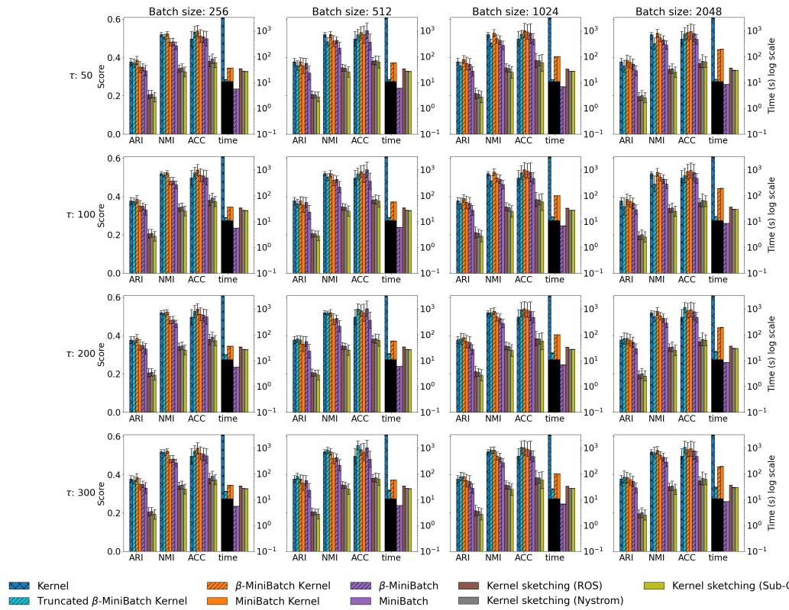  
Figure 4: Experimental results on the MNIST dataset where the kernel algorithms use the Gaussian kernel.

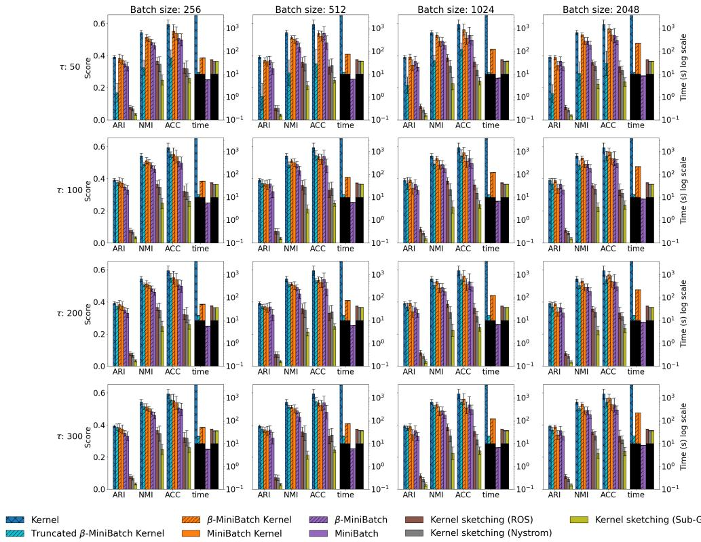  
Figure 5: Experimental results on the MNIST dataset where the kernel algorithms use the $\mathbf { k }$ -nn kernel.

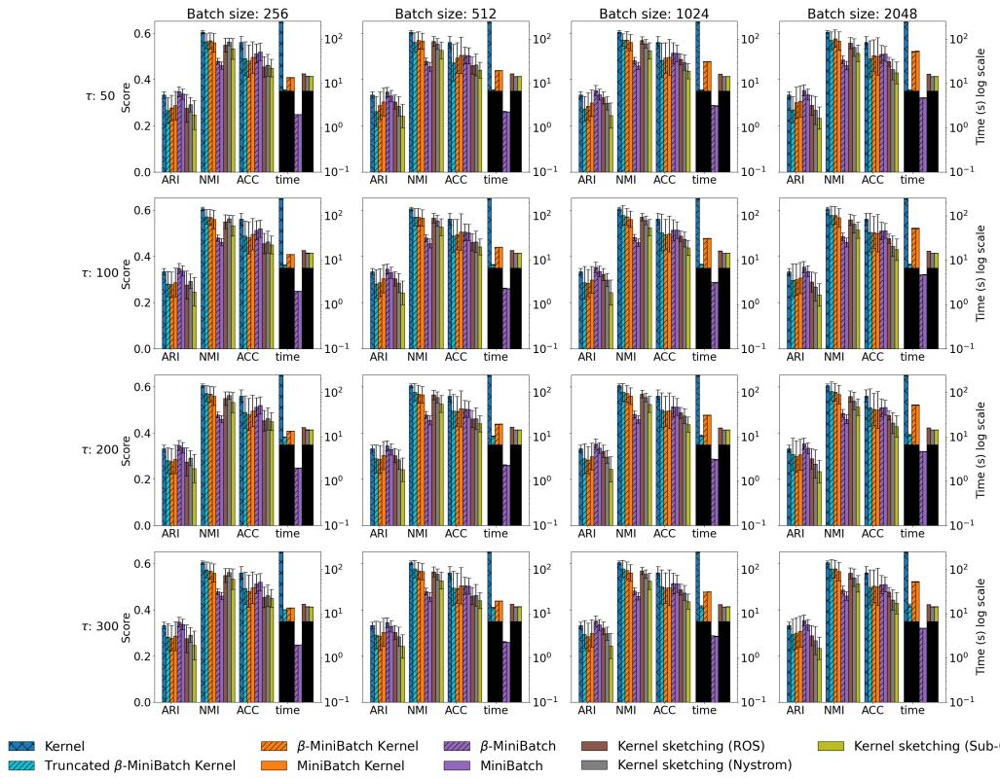  
Figure 6: Experimental results on the MNIST dataset where the kernel algorithms use the Heat kernel.

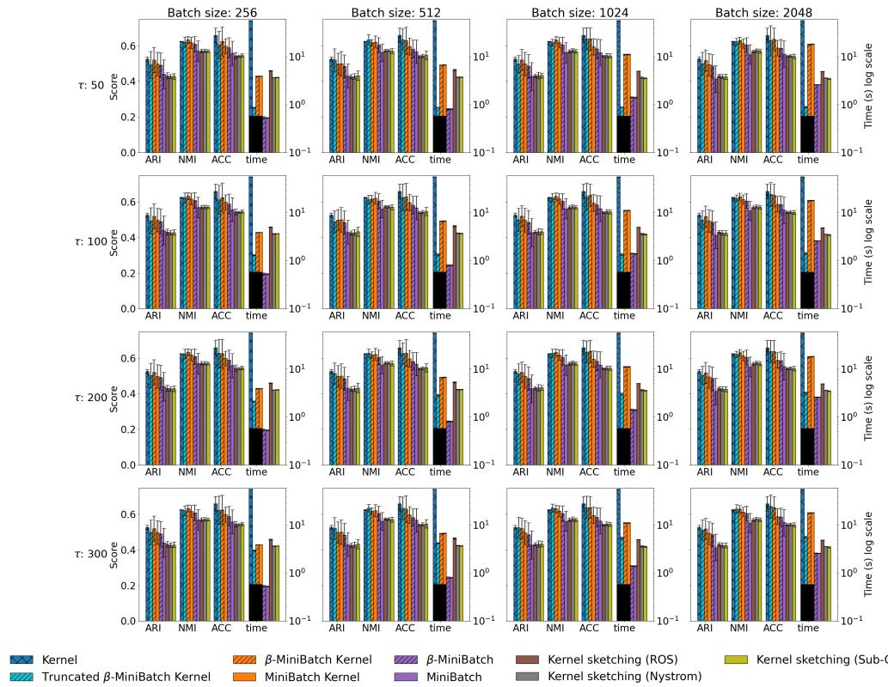  
Figure 7: Experimental results on the Har dataset where the kernel algorithms use the Gaussian kernel.

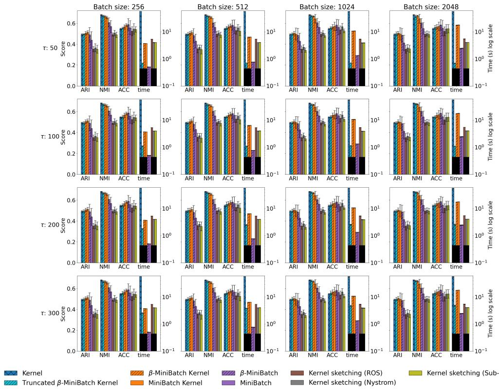  
Figure 8: Experimental results on the Har dataset where the kernel algorithms use the $\mathbf { k }$ -nn kernel.

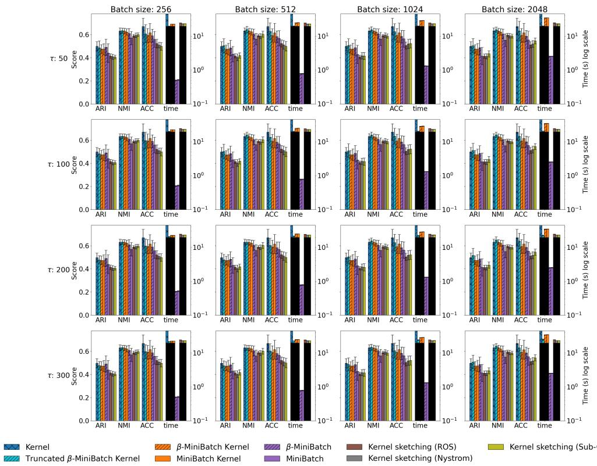  
Figure 9: Experimental results on the Har dataset where the kernel algorithms use the Heat kernel.

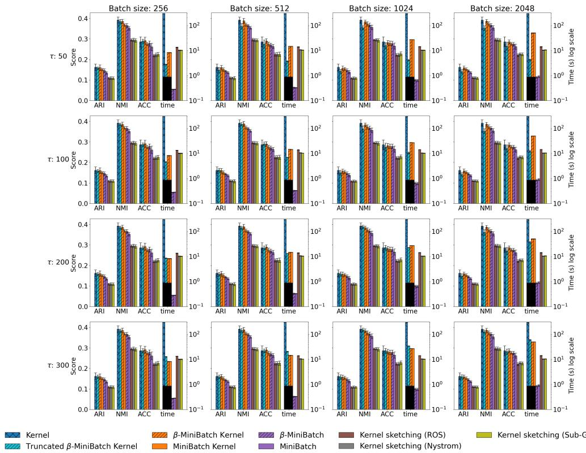  
Figure 10: Experimental results on the Letter dataset where the kernel algorithms use the Gaussian kernel.

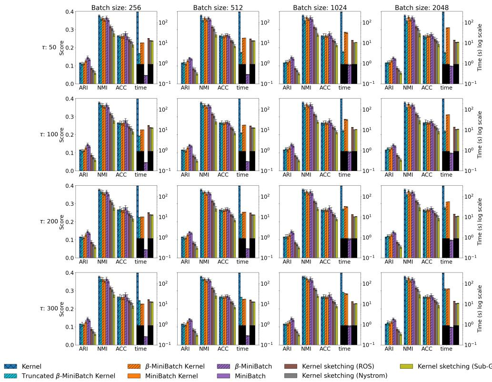  
Figure 11: Experimental results on the Letter dataset where the kernel algorithms use the k-nn kernel.

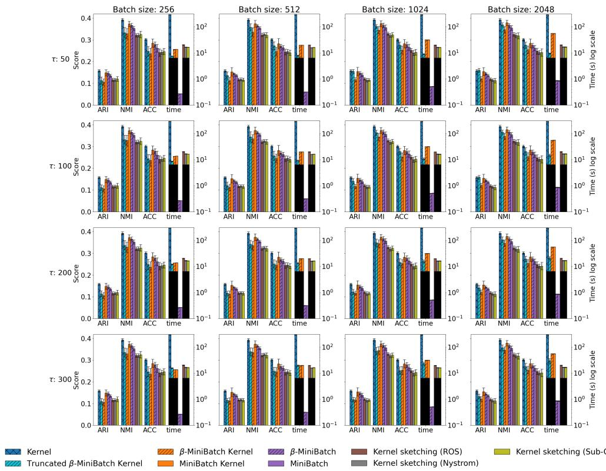  
Figure 12: Experimental results on the Letter dataset where the kernel algorithms use the Heat kernel.

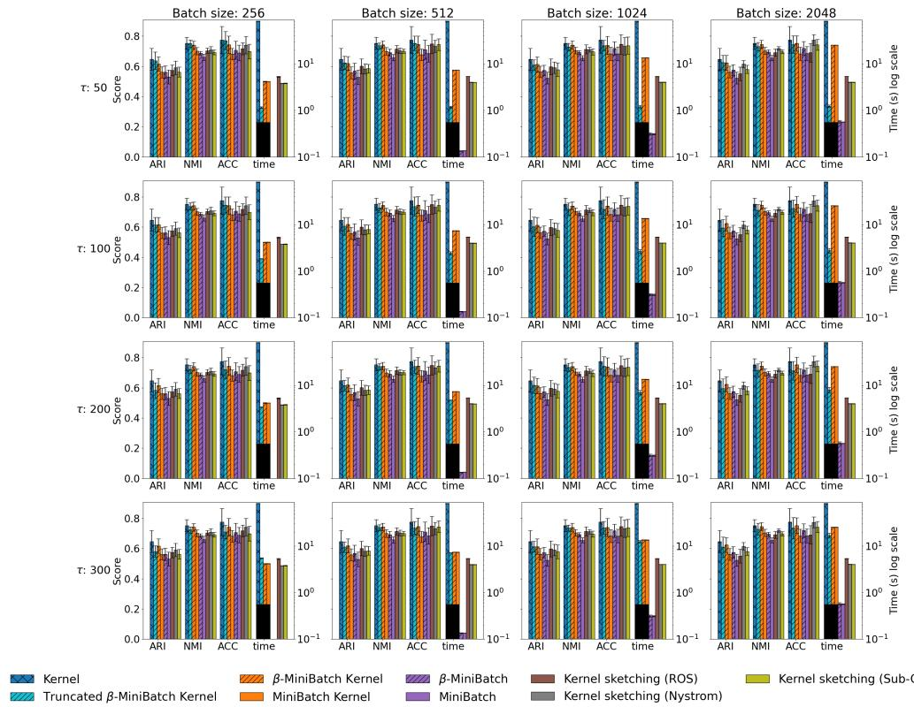  
Figure 13: Experimental results on the Pendigits dataset where the kernel algorithms use the Gaussian kernel.

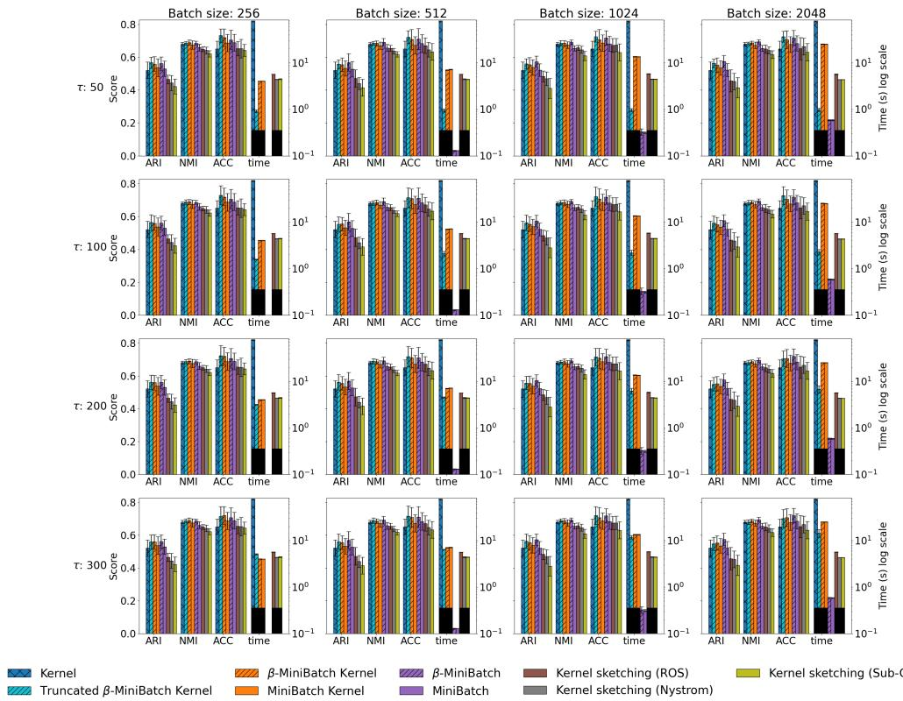  
Figure 14: Experimental results on the Pendigits dataset where the kernel algorithms use the k-nn kernel.

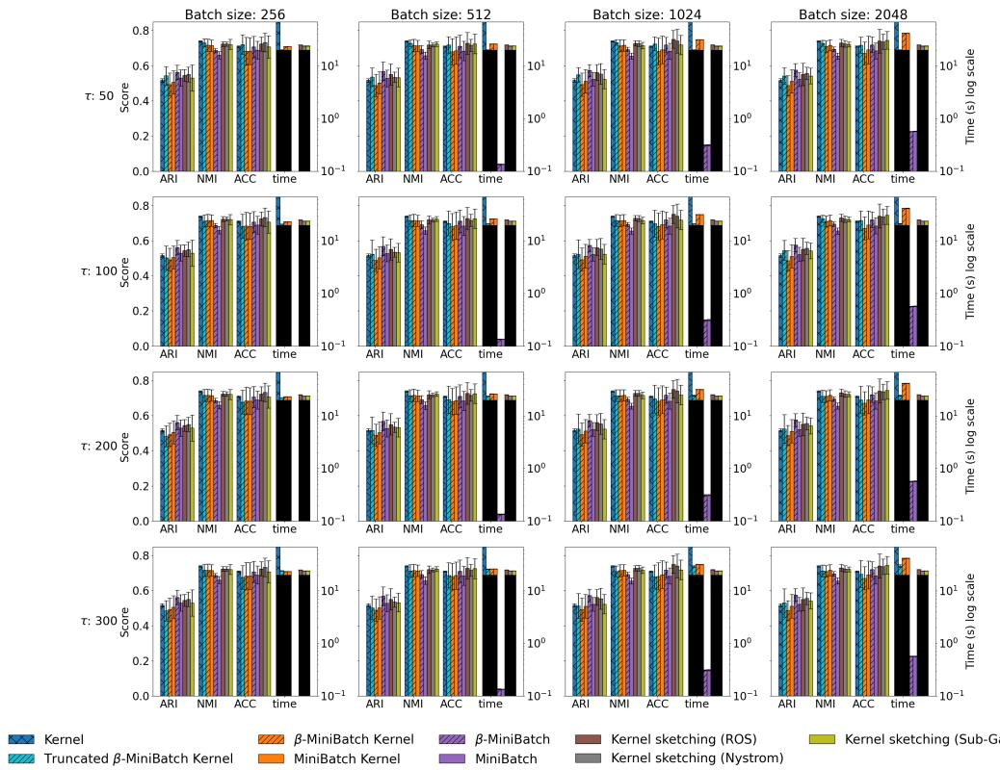  
Figure 15: Experimental results on the Pendigits dataset where the kernel algorithms use the Heat kernel.

# 524 NeurIPS Paper Checklist

The checklist is designed to encourage best practices for responsible machine learning research, addressing issues of reproducibility, transparency, research ethics, and societal impact. Do not remove the checklist: The papers not including the checklist will be desk rejected. The checklist should follow the references and follow the (optional) supplemental material. The checklist does NOT count towards the page limit.

Please read the checklist guidelines carefully for information on how to answer these questions. For each question in the checklist:

• You should answer [Yes] , [No] , or [NA] .   
• [NA] means either that the question is Not Applicable for that particular paper or the relevant information is Not Available.   
• Please provide a short (1–2 sentence) justification right after your answer (even for NA).

The checklist answers are an integral part of your paper submission. They are visible to the reviewers, area chairs, senior area chairs, and ethics reviewers. You will be asked to also include it (after eventual revisions) with the final version of your paper, and its final version will be published with the paper.

The reviewers of your paper will be asked to use the checklist as one of the factors in their evaluation. While "[Yes] " is generally preferable to "[No] ", it is perfectly acceptable to answer "[No] " provided a proper justification is given (e.g., "error bars are not reported because it would be too computationally expensive" or "we were unable to find the license for the dataset we used"). In general, answering [No] " or "[NA] " is not grounds for rejection. While the questions are phrased in a binary way, we acknowledge that the true answer is often more nuanced, so please just use your best judgment and write a justification to elaborate. All supporting evidence can appear either in the main paper or the supplemental material, provided in appendix. If you answer [Yes] to a question, in the justification please point to the section(s) where related material for the question can be found.

IMPORTANT, please:

• Delete this instruction block, but keep the section heading “NeurIPS Paper Checklist", • Keep the checklist subsection headings, questions/answers and guidelines below. • Do not modify the questions and only use the provided macros for your answers.

# 1. Claims

Question: Do the main claims made in the abstract and introduction accurately reflect the paper’s contributions and scope?

Answer: [Yes]

Justification: We prove our theoretical claims are true and show that the performance of our algorithm is competitive using experiments.

Guidelines:

• The answer NA means that the abstract and introduction do not include the claims made in the paper.   
• The abstract and/or introduction should clearly state the claims made, including the contributions made in the paper and important assumptions and limitations. A No or NA answer to this question will not be perceived well by the reviewers.   
• The claims made should match theoretical and experimental results, and reflect how much the results can be expected to generalize to other settings.   
• It is fine to include aspirational goals as motivation as long as it is clear that these goals are not attained by the paper.

# 2. Limitations

Question: Does the paper discuss the limitations of the work performed by the authors?

Answer: [Yes]

Justification: From our experimental results, each iteration of our mini-batch kernel $k$ -means algorithm is still slower than that of mini-batch kmeans. This difference in speed may be alleviated by lazily enumerating the kernel matrix for very large datasets.

# Guidelines:

• The answer NA means that the paper has no limitation while the answer No means that the paper has limitations, but those are not discussed in the paper.   
• The authors are encouraged to create a separate "Limitations" section in their paper.   
• The paper should point out any strong assumptions and how robust the results are to violations of these assumptions (e.g., independence assumptions, noiseless settings, model well-specification, asymptotic approximations only holding locally). The authors should reflect on how these assumptions might be violated in practice and what the implications would be.   
• The authors should reflect on the scope of the claims made, e.g., if the approach was only tested on a few datasets or with a few runs. In general, empirical results often depend on implicit assumptions, which should be articulated.   
The authors should reflect on the factors that influence the performance of the approach. For example, a facial recognition algorithm may perform poorly when image resolution is low or images are taken in low lighting. Or a speech-to-text system might not be used reliably to provide closed captions for online lectures because it fails to handle technical jargon.   
• The authors should discuss the computational efficiency of the proposed algorithms and how they scale with dataset size.   
• If applicable, the authors should discuss possible limitations of their approach to address problems of privacy and fairness. While the authors might fear that complete honesty about limitations might be used by reviewers as grounds for rejection, a worse outcome might be that reviewers discover limitations that aren’t acknowledged in the paper. The authors should use their best judgment and recognize that individual actions in favor of transparency play an important role in developing norms that preserve the integrity of the community. Reviewers will be specifically instructed to not penalize honesty concerning limitations.

# 3. Theory assumptions and proofs

Question: For each theoretical result, does the paper provide the full set of assumptions and a complete (and correct) proof?

Answer: [Yes]

Justification: Proofs are complete and correct to the best of our knowledge.

Guidelines:

• The answer NA means that the paper does not include theoretical results.   
• All the theorems, formulas, and proofs in the paper should be numbered and crossreferenced.   
• All assumptions should be clearly stated or referenced in the statement of any theorems.   
• The proofs can either appear in the main paper or the supplemental material, but if they appear in the supplemental material, the authors are encouraged to provide a short proof sketch to provide intuition.   
• Inversely, any informal proof provided in the core of the paper should be complemented by formal proofs provided in appendix or supplemental material.   
• Theorems and Lemmas that the proof relies upon should be properly referenced.

# 4. Experimental result reproducibility

Question: Does the paper fully disclose all the information needed to reproduce the main experimental results of the paper to the extent that it affects the main claims and/or conclusions of the paper (regardless of whether the code and data are provided or not)?

Answer: [Yes]

Justification: We provide all the information needed to replicate the experimental results.

Guidelines:

• The answer NA means that the paper does not include experiments.   
• If the paper includes experiments, a No answer to this question will not be perceived well by the reviewers: Making the paper reproducible is important, regardless of whether the code and data are provided or not.   
• If the contribution is a dataset and/or model, the authors should describe the steps taken to make their results reproducible or verifiable. Depending on the contribution, reproducibility can be accomplished in various ways. For example, if the contribution is a novel architecture, describing the architecture fully might suffice, or if the contribution is a specific model and empirical evaluation, it may be necessary to either make it possible for others to replicate the model with the same dataset, or provide access to the model. In general. releasing code and data is often one good way to accomplish this, but reproducibility can also be provided via detailed instructions for how to replicate the results, access to a hosted model (e.g., in the case of a large language model), releasing of a model checkpoint, or other means that are appropriate to the research performed.   
• While NeurIPS does not require releasing code, the conference does require all submissions to provide some reasonable avenue for reproducibility, which may depend on the nature of the contribution. For example   
(a) If the contribution is primarily a new algorithm, the paper should make it clear how to reproduce that algorithm.   
(b) If the contribution is primarily a new model architecture, the paper should describe the architecture clearly and fully.   
(c) If the contribution is a new model (e.g., a large language model), then there should either be a way to access this model for reproducing the results or a way to reproduce the model (e.g., with an open-source dataset or instructions for how to construct the dataset).   
(d) We recognize that reproducibility may be tricky in some cases, in which case authors are welcome to describe the particular way they provide for reproducibility. In the case of closed-source models, it may be that access to the model is limited in some way (e.g., to registered users), but it should be possible for other researchers to have some path to reproducing or verifying the results.

# 5. Open access to data and code

Question: Does the paper provide open access to the data and code, with sufficient instructions to faithfully reproduce the main experimental results, as described in supplemental material?

Answer: [Yes]

Justification: We provide code, data, and instructions on how to reproduce our experimental results in the supplemental material.

Guidelines:

• The answer NA means that paper does not include experiments requiring code.   
• Please see the NeurIPS code and data submission guidelines (https://nips.cc/ public/guides/CodeSubmissionPolicy) for more details.   
• While we encourage the release of code and data, we understand that this might not be possible, so “No” is an acceptable answer. Papers cannot be rejected simply for not including code, unless this is central to the contribution (e.g., for a new open-source benchmark).   
The instructions should contain the exact command and environment needed to run to reproduce the results. See the NeurIPS code and data submission guidelines (https: //nips.cc/public/guides/CodeSubmissionPolicy) for more details.   
• The authors should provide instructions on data access and preparation, including how to access the raw data, preprocessed data, intermediate data, and generated data, etc.   
• The authors should provide scripts to reproduce all experimental results for the new proposed method and baselines. If only a subset of experiments are reproducible, they should state which ones are omitted from the script and why.

• At submission time, to preserve anonymity, the authors should release anonymized versions (if applicable). • Providing as much information as possible in supplemental material (appended to the paper) is recommended, but including URLs to data and code is permitted.

# 6. Experimental setting/details

Question: Does the paper specify all the training and test details (e.g., data splits, hyperparameters, how they were chosen, type of optimizer, etc.) necessary to understand the results?

Answer: [Yes]

Justification: Full experimental details can be found within the code.

Guidelines:

• The answer NA means that the paper does not include experiments. • The experimental setting should be presented in the core of the paper to a level of detail that is necessary to appreciate the results and make sense of them. • The full details can be provided either with the code, in appendix, or as supplemental material.

# 7. Experiment statistical significance

Question: Does the paper report error bars suitably and correctly defined or other appropriate information about the statistical significance of the experiments?

Answer: [Yes]

Justification: We explain how we report error bars using sample standard deviation.

Guidelines:

• The answer NA means that the paper does not include experiments.   
• The authors should answer "Yes" if the results are accompanied by error bars, confidence intervals, or statistical significance tests, at least for the experiments that support the main claims of the paper. The factors of variability that the error bars are capturing should be clearly stated (for example, train/test split, initialization, random drawing of some parameter, or overall run with given experimental conditions).   
• The method for calculating the error bars should be explained (closed form formula, call to a library function, bootstrap, etc.)   
• The assumptions made should be given (e.g., Normally distributed errors).   
• It should be clear whether the error bar is the standard deviation or the standard error of the mean.   
• It is OK to report 1-sigma error bars, but one should state it. The authors should preferably report a 2-sigma error bar than state that they have a $96 \%$ CI, if the hypothesis of Normality of errors is not verified.   
• For asymmetric distributions, the authors should be careful not to show in tables or figures symmetric error bars that would yield results that are out of range (e.g. negative error rates).   
• If error bars are reported in tables or plots, The authors should explain in the text how they were calculated and reference the corresponding figures or tables in the text.

# 8. Experiments compute resources

Question: For each experiment, does the paper provide sufficient information on the computer resources (type of compute workers, memory, time of execution) needed to reproduce the experiments?

Answer: [Yes]

Justification: We give the runtime of each experiment and the type of machine they were performed on.

Guidelines:

• The answer NA means that the paper does not include experiments.

• The paper should indicate the type of compute workers CPU or GPU, internal cluster, or cloud provider, including relevant memory and storage.   
• The paper should provide the amount of compute required for each of the individual experimental runs as well as estimate the total compute.   
• The paper should disclose whether the full research project required more compute than the experiments reported in the paper (e.g., preliminary or failed experiments that didn’t make it into the paper).

# 9. Code of ethics

Question: Does the research conducted in the paper conform, in every respect, with the NeurIPS Code of Ethics https://neurips.cc/public/EthicsGuidelines?

Answer: [Yes]

Justification: We have read the code of ethics and believe that our research conforms to all the requirements.

Guidelines:

• The answer NA means that the authors have not reviewed the NeurIPS Code of Ethics.   
• If the authors answer No, they should explain the special circumstances that require a deviation from the Code of Ethics.   
• The authors should make sure to preserve anonymity (e.g., if there is a special consideration due to laws or regulations in their jurisdiction).

# 10. Broader impacts

Question: Does the paper discuss both potential positive societal impacts and negative societal impacts of the work performed?

Answer: [NA]

Justification: There are many potential societal consequences of our work, none which we feel must be specifically highlighted here. We believe the broader impact to be similar to that of mini-batch kmean $^ { + + }$ .

Guidelines:

• The answer NA means that there is no societal impact of the work performed.   
• If the authors answer NA or No, they should explain why their work has no societal impact or why the paper does not address societal impact.   
• Examples of negative societal impacts include potential malicious or unintended uses (e.g., disinformation, generating fake profiles, surveillance), fairness considerations (e.g., deployment of technologies that could make decisions that unfairly impact specific groups), privacy considerations, and security considerations.   
• The conference expects that many papers will be foundational research and not tied to particular applications, let alone deployments. However, if there is a direct path to any negative applications, the authors should point it out. For example, it is legitimate to point out that an improvement in the quality of generative models could be used to generate deepfakes for disinformation. On the other hand, it is not needed to point out that a generic algorithm for optimizing neural networks could enable people to train models that generate Deepfakes faster.   
• The authors should consider possible harms that could arise when the technology is being used as intended and functioning correctly, harms that could arise when the technology is being used as intended but gives incorrect results, and harms following from (intentional or unintentional) misuse of the technology. If there are negative societal impacts, the authors could also discuss possible mitigation strategies (e.g., gated release of models, providing defenses in addition to attacks, mechanisms for monitoring misuse, mechanisms to monitor how a system learns from feedback over time, improving the efficiency and accessibility of ML).

# 11. Safeguards

Question: Does the paper describe safeguards that have been put in place for responsible release of data or models that have a high risk for misuse (e.g., pretrained language models, image generators, or scraped datasets)?

Answer: [NA]

Justification: The paper poses no such risks.

Guidelines:

• The answer NA means that the paper poses no such risks.   
• Released models that have a high risk for misuse or dual-use should be released with necessary safeguards to allow for controlled use of the model, for example by requiring that users adhere to usage guidelines or restrictions to access the model or implementing safety filters.   
• Datasets that have been scraped from the Internet could pose safety risks. The authors should describe how they avoided releasing unsafe images.   
• We recognize that providing effective safeguards is challenging, and many papers do not require this, but we encourage authors to take this into account and make a best faith effort.

# 12. Licenses for existing assets

Question: Are the creators or original owners of assets (e.g., code, data, models), used in the paper, properly credited and are the license and terms of use explicitly mentioned and properly respected?

Answer: [Yes]

Justification: All datasets are properly credited and licenses and terms are mentioned and respected.

Guidelines:

• The answer NA means that the paper does not use existing assets.   
• The authors should cite the original paper that produced the code package or dataset.   
• The authors should state which version of the asset is used and, if possible, include a URL.   
• The name of the license (e.g., CC-BY 4.0) should be included for each asset.   
• For scraped data from a particular source (e.g., website), the copyright and terms of service of that source should be provided.   
• If assets are released, the license, copyright information, and terms of use in the package should be provided. For popular datasets, paperswithcode.com/datasets has curated licenses for some datasets. Their licensing guide can help determine the license of a dataset.   
• For existing datasets that are re-packaged, both the original license and the license of the derived asset (if it has changed) should be provided.   
• If this information is not available online, the authors are encouraged to reach out to the asset’s creators.

# 13. New assets

Question: Are new assets introduced in the paper well documented and is the documentation provided alongside the assets?

Answer: [Yes]

Justification: We provide documentation along with our code, which can automatically fetch and preprocess the data used in our experiments.

Guidelines:

• The answer NA means that the paper does not release new assets.   
• Researchers should communicate the details of the dataset/code/model as part of their submissions via structured templates. This includes details about training, license, limitations, etc.   
• The paper should discuss whether and how consent was obtained from people whose asset is used.   
• At submission time, remember to anonymize your assets (if applicable). You can either create an anonymized URL or include an anonymized zip file.

# 14. Crowdsourcing and research with human subjects

Question: For crowdsourcing experiments and research with human subjects, does the paper include the full text of instructions given to participants and screenshots, if applicable, as well as details about compensation (if any)?

Answer: [NA]

Justification: We did not involve crowdsourcing nor research with human subjects.

Guidelines:

• The answer NA means that the paper does not involve crowdsourcing nor research with human subjects.   
• Including this information in the supplemental material is fine, but if the main contribution of the paper involves human subjects, then as much detail as possible should be included in the main paper.   
• According to the NeurIPS Code of Ethics, workers involved in data collection, curation, or other labor should be paid at least the minimum wage in the country of the data collector.

# 15. Institutional review board (IRB) approvals or equivalent for research with human subjects

Question: Does the paper describe potential risks incurred by study participants, whether such risks were disclosed to the subjects, and whether Institutional Review Board (IRB) approvals (or an equivalent approval/review based on the requirements of your country or institution) were obtained?

Answer: [NA]

Justification: We did not involve crowdsourcing nor research with human subjects.

Guidelines:

• The answer NA means that the paper does not involve crowdsourcing nor research with human subjects.   
• Depending on the country in which research is conducted, IRB approval (or equivalent) may be required for any human subjects research. If you obtained IRB approval, you should clearly state this in the paper.   
• We recognize that the procedures for this may vary significantly between institutions and locations, and we expect authors to adhere to the NeurIPS Code of Ethics and the guidelines for their institution.   
• For initial submissions, do not include any information that would break anonymity (if applicable), such as the institution conducting the review.

# 16. Declaration of LLM usage

Question: Does the paper describe the usage of LLMs if it is an important, original, or non-standard component of the core methods in this research? Note that if the LLM is used only for writing, editing, or formatting purposes and does not impact the core methodology, scientific rigorousness, or originality of the research, declaration is not required.

Answer: [NA]

Justification: The core method development in this research does not involve LLMs as any important, original, or non-standard components.

Guidelines:

• The answer NA means that the core method development in this research does not involve LLMs as any important, original, or non-standard components. • Please refer to our LLM policy (https://neurips.cc/Conferences/2025/LLM) for what should or should not be described.
