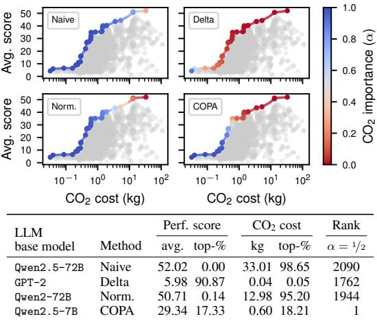
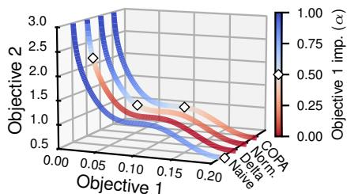
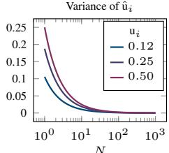
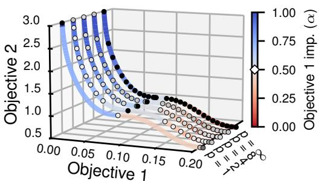
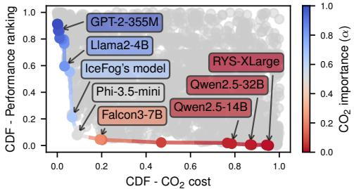
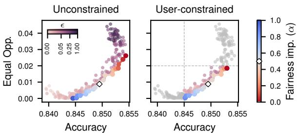
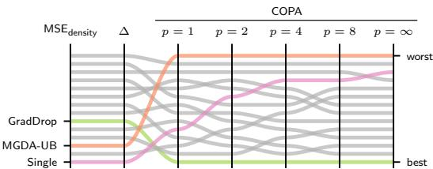
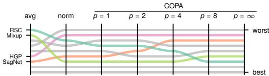
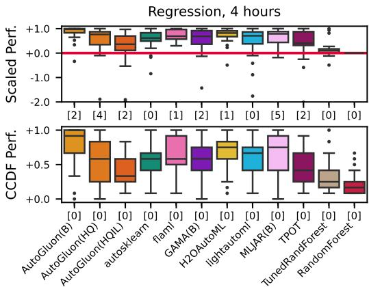

# ΠCOPA: Comparing the incomparable in multi-objective model evaluation

Anonymous Author(s)   
Affiliation   
Address   
email

# Abstract

As machine learning (ML) practitioners, we often have hundreds of (trained) ML   
models at hand from which we need to choose one, based on various objectives   
such as accuracy, robustness, fairness, scalability, etc. However, how to compare,   
aggregate and, ultimately, trade-off these objectives is usually a time-consuming   
task that requires expert knowledge, as they may be measured in different units or   
scales. In this work, we investigate how objectives can be automatically normalized   
and aggregated to systematically navigate their Pareto front. To do so, we make   
incomparable objectives comparable using their CDFs, approximated by their   
relative rankings. As a result, we can aggregate them while matching user-specific   
preferences, allowing practitioners to meaningfully navigate and search for models   
in the Pareto front. We demonstrate the potential impact of our approach, named   
COPA, in both model selection and benchmarking tasks across diverse ML areas   
such as fair ML, domain generalization, AutoML and foundation models, where   
classical ways to normalize and aggregate objectives fall short.

# 15 1 Introduction

In many phases of machine learning (ML), from model development to deployment, we often need   
to compare and select among a population of trained models according to multiple objectives.   
For example, even in the simple scenario of a single classification task, model selection involves   
comparing and selecting among a population of trained classifiers with different hyperparemeters   
to find a specific compromise among objectives such as accuracy, sensitivity, or specificity [24]. A   
common and more complex scenario these days involves benchmarking a large number of large deep   
learning models in terms of how they perform with respect to many and diverse objectives that go   
beyond accuracy, such as robustness [61], fairness [21], and $\mathrm { C O } _ { 2 }$ footprint [9, 35]. In both examples,   
we encounter the following challenge: how do we systematically compare and select among a large   
number of ML models in terms of multiple objectives?   
Moreover, different users and applications often have different needs and preferences. For example, a   
user may want to download a subset of trained large language models (LLMs) from the Open LLM   
Leaderboard [12] to compare different prompt engineering approaches for a new task. The user   
requires LLMs that perform relatively well without leaving unnecessarily large $\mathrm { C O } _ { 2 }$ footprints. To this   
end, they need to compare the 2148 submitted LLMs in terms of 7 objectives, i.e., their performance   
across 6 benchmarks and inference $\mathrm { C O } _ { 2 }$ cost. Among these models, 487 present non-trivial trade-offs,   
i.e., for every pair, one is better in an objective but worse in another (see Fig. 1). How should they   
compare the hundreds of models to decide what are acceptable performance-emission trade-offs?   
Should they manually inspect all 487 LLMs? And what if another user required the most robust   
model, rather than the most performant? Should they start from scratch?   
Similar challenges can be easily found in the literature related to, e.g., multitask learning or domain   
generalization [43, 48], where the selected model is expected to work ‘well’ on several tasks/domains;   
fair classification [62], where it is often unclear what is an acceptable fairness-accuracy trade-off for   
deployment; or AutoML [15], where tens of frameworks are compared on hundreds of objectives.   
Crucially, all these works highlight two important limitations in multi-objective ML evaluation:

L1. Objectives with different semantics and domains, such as average performance score and $\mathrm { C O } _ { 2 }$ cost in Fig. 1, are not directly comparable, and thus cannot be properly aggregated nor traded-off. In physics, this would be akin to comparing meters and grams.   
L2. When dealing with many objectives (7 in our LLM example), it is challenging for humans to translate their preferences into a concrete decision, as the number of plausible trade-offs quickly becomes overwhelming (487 in our example).

These challenges reinforce the idea that we need automatic tools to navigate the Pareto front (i.e., the set of optimal trade-offs) in high dimensions, tuning their parameters according to the user preferences. The most common approach would be to perform a weighted combination of either the raw (Naive) or normalized objectives (Norm. and Delta, see $\ S 2$ for their definitions). However, as we show in Fig. 1, both fail to address L1 and, thus, to evenly explore the Pareto front. In other words, they map most $\mathrm { C O } _ { 2 }$ importance values, $\alpha$ , to a small region of the front. To overcome these issues, prior works had to devise heuristic approaches tailored to their specific cases [5, 44]. For example, the authors of DecodingTrust [57] had to provide 8 ad hoc rules to normalize their objectives, one per objective. To date, we lack grounded approaches to compare, aggregate and, ultimately, trade-off objectives according to user preferences, that can be used out-of-the-box in multi-objective ML evaluation.

Contributions. We first motivate and estab  
lish the incomparability problem in multi  
objective ML evaluation, shedding light on why   
previous approaches fail (§2). Next, we intro  
duce COPA $\ntrianglelefteq$ , a novel approach to allow prac

Figure 1: COPA meaningfully navigates the performance-emissions trade-off of the Open LLM Leaderboard [12], evenly mapping the importance of $\mathrm { C O } _ { 2 }$ cost to the Pareto front. In contrast, existing approaches are biased toward one of the objectives. This is reflected in the retrieved LLMs where, e.g., COPA maps $\alpha = 1 / 2$ to a top$1 8 \%$ model for both objectives, and all other approaches select either a high-performing but $\mathrm { C O } _ { 2 }$ - demanding model, or vice versa.

titioners to meaningfully navigate the Pareto front, and thus compare and select models that reflect   
their preferences (§3). COPA accomplishes this goal with two components: i) a normalization   
function that universally makes all objectives comparable via their cumulative distribution functions,   
which we approximate using relative rankings; and ii) a criterion function with two easily interpretable   
parameters controlling the aggregation and importance of each objective. We then place COPA in the   
context of related work $( \ S 4 )$ , and finally demonstrate its potential impact (§5) in diverse and timely   
applications such as domain generalization, multitask learning, fair ML, AutoML benchmarking, and   
LLM selection. As we illustrate in Fig. 1, COPA enables thoroughly exploring the Pareto front as a   
function of the user preferences, here controlled by $\alpha$ . For instance, a deployer equally interested in   
the performance and $\mathrm { C O } _ { 2 }$ emissions of the LLM, could use COPA with $\alpha = 1 / 2$ to pick the model in   
the middle of the Pareto front (last row in Fig. 1), ranked top- $1 8 \%$ for both objectives.

# 2 Problem statement

We are given a population of already-trained models $\mathcal { H }$ , typically obtained by changing hyperparamet  
ers, where each model $h \in \mathcal H$ is associated to a vector of $K$ metrics assessing its performance with   
respect to different evaluation objectives. In addition, we assume each objective to be a continuous   
random variable for which we have sampled observations in $\mathcal { H }$ .   
Without loss of generality, we assume that each individual objective has to be minimized, and we can   
thus frame the problem as a multi-objective optimization (MOO) problem of the following form:

$$
\operatorname* { m i n } _ { h \in \mathcal { H } } \mathbf { y } ( h ) : = \left[ \mathbf { y } _ { 1 } ( h ) , \mathbf { y } _ { 2 } ( h ) , \ldots , \mathbf { y } _ { K } ( h ) \right] ,
$$

where 91 ${ \bf y } ( h )$ is the objective vector of model $h$ , and ${ \tt y } _ { k } ( h )$ its performance on the $k$ -th objective. When it is clear from the context, we will omit the argument and write 92 $\mathbf { y }$ and ${ \tt y } _ { k }$ directly.

How can we minimize a vector? A fundamental problem of Eq. 1 is that minimizing the vector y is   
not well-defined, as there is no canonical total order in high dimensions. Therefore, two models could   
yield objective vectors where one is not always better than the other for all objectives. In the MOO   
literature, the set of optimal trade-off solutions is known as the Pareto front and, more formally, an   
objective vector $\mathbf { y } ^ { * }$ is in the Pareto front (and called Pareto-optimal) if there exists no other feasible   
vector y such that $\mathsf { y } _ { k } \le \mathsf { y } _ { k } ^ { \ast }$ for all $k \in \{ 1 , 2 , \ldots , K \}$ , and $\mathsf { y } _ { k } < \mathsf { y } _ { k } ^ { * }$ for at least one of the objectives.   
While the Pareto front is theoretically appealing, in practice, the decision maker (DM) needs to   
navigate the Pareto front and, eventually, select one single model.1 In other words, the DM needs   
to specify a total order in Eq. 1 which implies: i) taking a total order directly in $\mathbb { R } ^ { K }$ , e.g., the   
lexicographic order where $\mathbf { y } < \mathbf { y } ^ { * }$ iff $\mathsf { y } _ { k } < \mathsf { y } _ { k } ^ { * }$ and $\mathbf { y } _ { i } = \mathbf { y } _ { i } ^ { * } \forall i < k$ ; or ii) defining a criterion   
function C : $\mathbb { R } ^ { K }  \mathbb { R }$ to rewrite Eq. 1 as a scalar-valued problem:

$$
\operatorname* { m i n } _ { h \in \mathcal { H } } \quad \mathrm { C } ( \mathbf { y } ( h ) ) .
$$

One remarkable example of the latter is the global-criterion method [63] which maps DM preferences   
to the problem geometry by interpreting Eq. 2 as selecting the model closest to the ideal one, i.e.,

$$
\operatorname* { m i n } _ { h \in \mathcal { H } } \quad \| \mathbf { y } ( h ) - \mathbf { y } ^ { \mathrm { i d e a l } } \| _ { * } ,
$$

where $\mathbf { y } ^ { \mathrm { i d e a l } }$ is the ideal solution, $\begin{array} { r } { \mathbf { y } ^ { \mathrm { i d e a l } } : = [ \operatorname* { m i n } _ { h } \mathbf { y } _ { 1 } , \operatorname* { m i n } _ { h } \mathbf { y } _ { 2 } , \dots , \operatorname* { m i n } _ { h } \mathbf { y } _ { K } ] } \end{array}$ , and $\left\| \cdot \right\| _ { * }$ is typically a   
$p$ -norm. However, naively solving Eq. 3 (and, more generally, Eq. 2) is well-known in the MOO   
literature to be sensitive to the scaling of the objectives [4] (recall L1 in $\ S 1$ ), and thus prevents us   
from properly accounting for any DM preferences (L2). In this work, we argue that the criterion   
110 function $C$ should fulfill the following desiderata:

D1. Reflect the DM preferences, translating their model expectations into an optimization problem.   
D2. Provide a simple way to tune its parameters to meaningfully explore the Pareto front.

13 When are objectives incomparable? Similar to dimen  
sional analysis in physics [2]—which argues that we can  
not combine incommensurable quantities, e.g., kilograms   
116 and meters—we argue that a second fundamental issue   
17 that we face in Eq. 2 is semantic incomparability, i.e.,   
whether it is sensible to compare (and thus aggregate) the   
values of two different objectives.   
For example, if objectives differ in their semantics they are   
hardly comparable in general, e.g.: despite both accuracy   
and ROC AUC lying in the unit interval, it does not make   
immediate sense to compare their values. There are, how  
ever, other aspects that are more subtle. To illustrate these,   
Fig. 2 presents a synthetic Pareto front from $\ S 5 . 1$ where   
both objectives quantify prediction error in significantly   
different domains, namely, within the intervals $[ 0 , 0 . 2 ]$ and

  
Figure 2: As we explore a synthetic Pareto front with different normalization functions to solve Eq. 3, only COPA meaningfully navigates it as we change $\alpha$ , and its min-max solution agrees with our expectations of a robust solution.

[0.5, 3.0]. We navigate the Pareto front solving a weighted Tchebycheff problem [3] of the form

$$
\operatorname* { m i n } _ { h \in \mathcal { H } } \operatorname* { m a x } \{ \alpha | \mathbf { y } _ { 1 } | , ( 1 - \alpha ) | \mathbf { y } _ { 2 } | \} ,
$$

which solves Eq. 3 with $C$ as the $\infty$ -norm weighted by $\alpha \in [ 0 , 1 ]$ . Intuitively, Eq. 4 looks for robust   
solutions that account for the importance of solving one objective over the other, seemingly satisfying   
our desiderata, D1-2. However, its naive application over the original objectives clearly shows how we   
can bias model selection in favor of Objective 2, as it can be seen in Fig. $2 :$ for any given preference   
133 $\alpha$ smaller than 0.75, Eq. 4 yields a solution which completely ignores Objective 1 performance.   
4 How can we make objectives comparable? As we just discussed, even if we use a well-designed   
criterion function, semantic incomparability can hinder our goal to meaningfully explore the Pareto   
front. Historically, this has been addressed in the MOO literature by applying component-wise   
transformations to the objectives to normalize them [40], turning Eq. 2 into

$$
\operatorname* { m i n } _ { h \in \mathcal { H } } \quad \mathrm { C } ( \phi ( \mathbf { y } ) ) : = \mathrm { C } \left( [ \phi _ { 1 } ( \mathbf { y } _ { 1 } ) , \dots , \phi _ { K } ( \mathbf { y } _ { K } ) ] \right) .
$$

Two classic examples of these transformations are

$$
\Delta _ { k } ( { \mathbf y } _ { k } ) : = \frac { { \mathbf y } _ { k } - { \mathbf y } _ { k } ^ { \mathrm { i d e a l } } } { { \mathbf y } _ { k } ^ { \mathrm { i d e a l } } } \quad \mathrm { a n d } \quad \mathrm { n o r m } _ { k } ( { \mathbf y } _ { k } ) : = \frac { { \mathbf y } _ { k } - { \mathbf y } _ { k } ^ { \mathrm { i d e a l } } } { { \mathbf y } _ { k } ^ { \mathrm { n a d i r } } - { \mathbf y } _ { k } ^ { \mathrm { i d e a l } } } ,
$$

where $\mathbf { y } _ { k } ^ { \mathrm { n a d i r } } : = [ \operatorname* { m a x } _ { h } \mathbf { y } _ { 1 } , \operatorname* { m a x } _ { h } \mathbf { y } _ { 2 } , \dots , \operatorname* { m a x } _ { h } \mathbf { y } _ { K } ]$ is the worst possible solution. Intuitively, $\Delta _ { k }$   
represents the difference relative to the ideal solution, and $\scriptstyle \mathrm { n o r m } _ { k }$ reweighs the objective to lie in the   
unit interval. Prior works have extensively used $\Delta _ { k }$ , often replacing $\mathrm { y } _ { k } ^ { \mathrm { i d e a l } }$ with a reference vector, as   
computing it can be challenging [33, 38, 40]. Back to our synthetic case, we now want to solve

$$
\operatorname* { m i n } _ { h \in \mathcal { H } } \operatorname* { m a x } \left\{ \alpha | \phi _ { 1 } ( \mathbf { y } _ { 1 } ) | , ( 1 - \alpha ) | \phi _ { 2 } ( \mathbf { y } _ { 2 } ) | \right\} .
$$

By testing different $\phi _ { k }$ , we can understand why classic approaches fail to make objectives comparable.   
More specifically: i) using $\Delta _ { k }$ now biases the problem toward the first objective, since $\mathrm { m i n } _ { h } { \bf y } _ { 1 } \approx 0$ ;   
and ii) using $\scriptstyle \mathrm { n o r m } _ { k }$ alleviates these problems, as the denominator is now bigger than the numerator,   
yet the differences between distributions (that of ${ \tt y } _ { 2 }$ being heavy-tailed) still bias the optimization   
towards the first objective. Instead, we seek to explore the Pareto front making a more meaningful   
148 use of $\alpha$ , spreading it uniformly along the curve.

The main goal of the functions $\phi _ { k } \colon { \mathbb { R } }  { \mathbb { R } }$ is thus to make the objectives semantically comparable, so that we can seamlessly aggregate them with the criterion function C. To this end, we argue that the functions $\phi _ { k }$ should be:

D3. Objective-agnostic, so that we can normalize any objective irrespectively of its specific nature.   
D4. Order-preserving (i.e., strictly increasing), so that it preserves Pareto-optimality.

54 In summary, to meaningfully explore the Pareto front, it is important to design a criterion function   
$C$ that translates well DM preferences into an optimization problem (D1-2), and a normalization   
function $\phi$ that makes objectives semantically comparable (D3-4). These desiderata will blend in   
COPA, discussed in the next section. In the synthetic experiment above, COPA maps the value   
$\alpha = 1 / 2$ , which turns Eq. 7 into a robust min-max problem [56], to the flat region of the curve in   
Fig. 2, matching the intuition of what a robust solution should represent.

# 3 Methodology

Next, we introduce the proposed normalization and criterion functions fulfilling the desiderata D1-4 described in $\ S 2$ . We refer to the problem resulting of solving Eq. 5 with the proposed functions as cumulative-based optimization of the Pareto front or, in short, COPA $\nleq$ .

# 3.1 Designing a universal normalization function

We argued in $\ S 2$ that the function $\phi$ should fulfill desiderata D3-4, i.e., it should make any objectives   
semantically comparable while preserving their Pareto-optimality. Taking advantage of our prob  
abilistic perspective (recall that ${ \tt y } _ { k }$ is a continuous random variable), we propose to design $\phi$ such   
that the resulting variables are all equally distributed and, w.l.o.g., uniformly distributed in the unit   
interval. That is, we propose to use $\mathbf { u } : = [ \mathbf { u } _ { 1 } , \mathbf { u } _ { 2 } , \ldots , \mathbf { u } _ { K } ]$ instead of $\mathbf { y }$ , where

$$
\begin{array} { r } { \mathbf { u } _ { k } : = F _ { k } ( \mathbf { y } _ { k } ) \sim \mathcal { U } ( 0 , 1 ) \quad \forall k \in \{ 1 , 2 , \dots , K \} , } \end{array}
$$

and $\phi _ { k } = F _ { k }$ is the marginal cumulative distribution function (CDF) of the $k$ -th objective. Indeed,   
this transformation is known in statistics as the probability integral transform [6, Example 5.6.3], and   
${ \bf u } _ { k }$ is guaranteed to follow a standard uniform distribution if ${ \tt y } _ { k }$ is continuous.   
Remarkably, Eq. 8 makes all criterion functions marginal-distribution-free in the sense of Kendall   
and Sundrum [29], i.e., it strips away all individual properties of the marginal distributions (e.g., the   
domain) of any given objective (D3). We note that normalizing random variables this way is one   
of the fundamental building stones of copulae in statistics [14, 51], ensuring that copula functions   
exclusively learn the relationship across random variables.   
How can we interpret the values of u? One important advantage of using $\mathbf { u }$ in place of y in Eq. 5   
is that it provides a common framework to think about all objectives, since all their values all are now   
framed as elements within a population. In practice, this means that the DM has a common language   
to express their expectations on the model. For example, $\mathbf { u } = \boldsymbol { \mathrm { 1 } } / 2$ corresponds for all objectives to the   
182 the median value, which divides $\mathcal { H }$ into two halves comprising the best and worst performing models.

However, there is still one caveat we need yet to address: we have no access to the marginal CDF of each objective, but only to samples of the joint distribution in $\mathcal { H }$ .

# 3.2 Rankings as finite-sample approximations

86 As mentioned above, while we have no access to the CDFs themselves, we have samples from the   
joint distribution over the objectives, i.e., over, $p ( [ \mathsf { y } _ { 1 } , \mathsf { y } _ { 2 } , \ldots , \mathsf { y } _ { K } ] )$ . Namely, we can consider each   
model $h \in \mathcal H$ as a sample from the joint distribution and, by looking at each objective individually,   
as a sample from the marginal distributions.   
Let us now focus on the $k$ -th objective, ${ \tt y } _ { k }$ , and drop the subindex in the following to ease notation. Say   
that we have $| \mathcal { H } | = N$ i.i.d. realizations of the objective, i.e., $\left\{ \mathbf { y } _ { 1 } , \mathbf { y } _ { 2 } , \ldots , \mathbf { y } _ { N } \right\} \overset { \forall \mathrm { i . i . d . } } { \sim } P _ { k }$ . Then, we can   
approximate Eq. 8 for the $i$ -th sample, $\mathbf { u } _ { i } = F ( \mathbf { y } _ { i } )$ , by computing its order statistic, i.e., the random   
variable representing its relative ranking within the population, $\begin{array} { r } { R ( i ) : = \sum _ { j = 1 } ^ { N } [ \mathbf { y } _ { j } < \mathbf { y } _ { i } ] } \end{array}$ , where   
Iverson brackets denote the indicator function, such that $\begin{array} { r } { \mathbf { y } _ { R ( 1 ) } \leq \mathbf { y } _ { R ( 2 ) } \leq \ldots \leq \mathbf { y } _ { R ( N ) } . } \end{array}$ . Specifically,   
since the empirical $C D F$ is the fraction of samples smaller than the input, it is direct to show that

$$
{ \hat { \mathbf { u } } } _ { i } = { \hat { F } } ( i ) : = { \frac { 1 } { N } } \sum _ { j = 1 } ^ { N } [ \mathbf { y } _ { j } < \mathbf { y } _ { i } ] = { \frac { 1 } { N } } R ( i )
$$

enjoys the following properties [6]:

Proposition 3.1. $\hat { \mathbf { u } } _ { i }$ is an unbiased estimator of the CDF at ${ \bf y } _ { i } , \ { \bf u } _ { i }$ , with variance $\mathbf { u } _ { i } ( 1 - \mathbf { u } _ { i } ) / N$ . The variance of $\hat { \mathbf { u } } _ { i }$ decreases linearly with $N$ , and has a maximum value of $0 . 2 5 / N$ at the median.

Proof. First, note that $[ \mathbf { y } _ { j } < \mathbf { y } _ { i } ] \sim \mathrm { B e r n } ( \mathbf { u } _ { i } )$ . Then, we have $R ( i ) \sim \mathrm { B i n } ( N , { \bf u } _ { i } )$ with mean $N { \mathbf { u } } _ { i }$ and variance $N \mathbf { u } _ { i } ( 1 - \mathbf { u } _ { i } )$ . Hence, $\hat { \mathbf { u } } _ { i }$ has mean $\begin{array} { r } { \frac { 1 } { N } \mathbb { E } [ R ( i ) ] = \mathbf { u } _ { i } } \end{array}$ , and variance $\begin{array} { r l r } { \frac { 1 } { N ^ { 2 } } \mathbb { V } [ R ( i ) ] } & { { } = } & { } \end{array}$ $\mathbf { u } _ { i } ( 1 - \mathbf { u } _ { i } ) / N$ which, by taking derivatives w.r.t. $\mathbf { u } _ { i }$ , ${ \hat { \partial } } _ { \mathbf { u } _ { i } } ^ { \cdot } \mathbb { V } [ { \hat { \mathbf { u } } } _ { i } ] = 1 - 2 \mathbf { u } _ { i } = 0 \Rightarrow \mathbf { u } _ { i } = \mathrm { \bar { i } } / 2$ , which is a maximum since $\partial _ { \mathbf { u } _ { i } } ^ { 2 } \bar { \Psi } [ \bar { 1 } / 2 ] < \bar { 0 }$ . □

In other words, we can use the relative rankings of each objective to build   
an unbiased2 estimator of the CDF, $\hat { \mathbf { u } } _ { i }$ , whose variance rapidly decreases as   
we increase the size of $\mathcal { H }$ , i.e., $\mathbb { V } [ \hat { \mathbf { u } } _ { i } ]  0$ as $N  \infty$ . Indeed, the inset   
figure shows the variance of $\hat { \mathbf { u } } _ { i }$ as a function of the sample size for three   
different values of $\mathrm { u } _ { i }$ . Note that the relative ranking is strictly increasing:   
if $\mathsf { y } _ { i } < \mathsf { y } _ { j }$ , then ${ \hat { F } } ( \mathbf { y } _ { i } ) \leq { \hat { F } } ( \mathbf { y } _ { j } )$ for any $\mathcal { H }$ containing both samples (D4).   
While this is an approximation of the true CDF, which would retain instead

all the information about the joint distribution, it works egregiously well in our experiments (§5). Furthermore, note that this transformation is meant to ease inter-objective computations, we can (and should) use the original values of ${ \tt y } _ { k }$ to perform intra-objective comparisons or decisions.

# 3.3 Incorporating preferences into the optimization

Now that we can effectively approximate our normalization function, we introduce a criterion function to translate DM preferences into an optimization problem (D1). To do so, we start by looking back at global criterion methods, since plugging in our transformation $\mathbf { u } = \phi ( \mathbf { y } )$ simplifies the problem in Eq. 3 to $\operatorname* { m i n } _ { h } \left\| \mathbf { u } \right\| _ { * }$ as the ideal point becomes the origin, i.e., $\mathbf { u } ^ { \mathrm { i d e a l } } = \mathbf { 0 }$ . Then, by using the approximation described in $\ S 3 . 2$ , the problem becomes a simple finite search of the form

$$
\operatorname* { m i n } _ { i \in \{ 1 , 2 , \dots , N \} } \quad \| \hat { \mathbf { u } } _ { i } \| _ { * } .
$$

That is, we have reduced our problem to finding the model whose ranking vector has the smallest   
norm. Using this new marginal-free global-criterion method, mapping the DM preferences now boils   
down to selecting an appropriate norm for the problem in Eq. 10. To this end, we propose to use as   
criterion function $C$ a norm with parameters $p \geq 1$ and $\omega \in \mathbb { R } _ { + } ^ { K }$ defined as

$$
\Vert \mathbf { u } \Vert _ { p , \omega } : = \left( \sum _ { k = 1 } ^ { K } \lvert \omega _ { k } \mathbf { u } _ { k } \rvert ^ { p } \right) ^ { 1 / p } ,
$$

where $\textstyle \sum _ { k } \omega _ { k } = 1$ . This norm can be interpreted as a regular $p$ -norm on a space with coordinates   
scaled by $\omega$ . More remarkably, note that this differs from the usual weighted $p$ -norm, as the weights   
are inside the absolute value. We justify this choice given that the values of ${ \bf u } _ { k }$ lie in the unit interval,   
and the power would often make them vanish too quickly, as we demonstrate in Fig. 10.

How can we interpret the parameters? Fortunately, the parameters of the proposed criterion function, $p$ and $\omega$ , provide an easy and interpretable way for the DM to navigate the Pareto front (D2). Regarding $\omega$ , as we apply them in Eq. 11 before taking the power, we can provide a clear interpretation of $\omega$ in terms of ratio trade-offs. For example, if we had two objectives with $\omega = [ 0 . 7 5 , 0 . 2 5 ]$ , then we can see by equating the weighted objectives that minimizing the first objective to a value of $\mathbf { u } _ { 1 }$ is worth the same as minimizing the second objective to a value of $\mathbf { u } _ { 2 } = \bar { \omega _ { 1 } } / \omega _ { 2 } \mathbf { u } _ { 1 } = 3 \mathbf { u } _ { 1 }$ , i.e., $\mathbf { u } _ { 1 }$ is three times more important than $\mathbf { u } _ { 2 }$ . If we combine this interpretation with that of $\mathbf { u }$ given in $\ S 3 . 1$ , we could say, e.g., that we value being in the top- $2 5 \%$ of the models for the first objective the same as being in the top- $7 5 \%$ for the second objective.

We can interpret $p$ using the same intuition as in ML regularization [16]: the models selected in Eq. 10 are those first intersecting an ever-expanding $p$ -ball centered at the origin, whose shape depends on $p$ . Higher values of $p$ lead to denser objective vectors, while smaller values lead instead to sparser ones. Additionally, some values of $p$ have clear interpretations: $p = 1$ is the average rank; $p = 2$ is the Euclidean distance; and $p = \infty$ turns Eq. 10 into a min-max problem, typically used to formulate robust optimization problems [56].

Does Eq. 11 enjoy theoretical guarantees? Given the similarity with commonly-used norms, it is natural to ask whether we can leverage existing results from the MOO literature and adapt them to the proposed norm. This is indeed the case, and we can easily guarantee, e.g., that the solutions found using Eq. 11 with $1 \leq p < \infty$ are always Pareto-optimal [40, Thm. 3.4.1]. However, it might not reach all optima. Similarly, note that $p = \infty$ reduces Eq. 10 to a weighted Tchebycheff problem which reaches any Pareto-optimal solution [40, Thrm. 3.4.5], but also weakly optimal ones.

In practice, using a weighted Tchebycheff problem $( p = \infty )$ ) is a good practice when we have few objectives and a large budget for the weights $\omega$ to test. Instead, when interested in finding a particular model (i.e., solving Eq. 5 once), we suggest setting $p$ based on the level of robustness desired (as lower values of $p$ lead to higher tolerance to bad performance on individual objectives), and $\omega$ based on the importance of solving each objective given by the DM.

# 4 Related work

Our work draws connections with other scientific domains, e.g., the notion of semantically incomparability is akin to that of incommensurability in dimensional analysis [2]. Similarly, using relative rankings to make better comparisons has been previously explored in microeconomics [47], MOO [23, 31], and statistics, designing methods that avoid the normality assumption, e.g., the Friedman test [13], Wilcoxon signed-rank test [60], or Kendall’s $\tau$ coefficient [28]. Finally, as mentioned in $\ S 2$ , copulas exploit the probability integral transform to become marginal-distribution-free [14], and the proposed criterion functions share similarities with weighted $L _ { p }$ -problems in MOO [40].

In ML, the closest work to ours is Park et al. [46], which learns the joint CDF, approximated with a   
copula, to recover a partial order for multi-objective Bayesian optimization. In contrast, we employ   
marginal CDFs and provide a principled way to translate DM preferences to an optimization problem.   
Another line of related works are those that attempt to learn the Pareto front either for model merging   
[7, 32] or a posteriori MOO methods [64]. Unfortunately, these methods fail to address semantic   
incomparability as they use the raw objectives. ROC curves [11] provide an interesting connection,   
since their axes can be understood as the CDFs of the target classes [18]. In practice, many prior   
works proposed ad hoc approaches to normalize and aggregate objectives using, e.g., normalized   
RMSEs [44, 57]—we refer to $\ S 8 . 3$ of Japkowicz and Shah [24] for other references. Notoriously,   
some works in multitask learning [33, 43] and domain generalization [48] use rank averages to   
aggregate objectives, yet the standard is to use the average of $\Delta _ { k }$ -normalized objectives (see Eq. 6).   
COPA can benefit these two areas, along any others accounting for several objectives such as fair   
273 ML [39], federated learning [27], probabilistic ML [26], and multimodal learning [1].

In this section, we motivate the use of COPA by showing a range of practical scenarios which would benefit from adopting the proposed methodology. We defer additional details and results to $\ S \mathrm { A }$ .

# 5.1 Synthetic evaluation

To qualitative assess COPA, we consider a synthetic Pareto front of the form $\mathbf { y } _ { 2 } = 0 . 2 5 \cos ( 3 9 \mathbf { y } _ { 1 } ^ { 0 . 8 5 } ) -$ $\log ( \mathrm { y } _ { 1 } ) - 0 . 4 6$ where $\mathbf { y } _ { 1 } \sim \mathcal { U } ( 0 . 0 2 , 0 . 2 )$ . We obtain as a result a non-convex Pareto front with a flat area around ${ \bf y } _ { 1 } = 0 . 1$ , and two objectives with significantly different distributions.

# Does the parameter $p$ match our intuitions?

We corroborate the insights from $\ S 3 . 3$ by showing in Fig. 3 the distribution of solutions found taking different values of $p$ . First, note that since the front is strictly increasing except in [0.083, 0.091], we have that $\mathbf { u } _ { 1 } \approx 1 - \mathbf { u } _ { 2 }$ . As a result, we see that $p = 1$ almost exclusively finds solutions on the extrema. When we increase $p$ , the distribution of solutions better spreads along the front and, as the $p$ -balls become more square-like, we gain finer control on the solution found by tuning $\alpha$ It is important to stress, however, that the finer control of $p = \infty$ comes at cost: as we increase $K$ , finding a proper $\omega$ could prove challenging.

# 5.2 Case 1: Model selection

  
Figure 3: Distribution of solutions (circles) found for different values of $p$ as we sweep over values of $\alpha$ . The darkness of the circles represents the number of times they were selected.

First, we explore how the norm proposed in $\ S 3 . 3$ can help us explore the Pareto front more meaningfully, i.e., how sensibly it maps the DM preferences to Eq. 5.

1. The performance-emissions trade-off. Despite LLMs recently showing outstanding performance [42], their $\mathbf { C O } _ { 2 }$ footprint can be concerning and needs to be taken into account [9]. Next, we show how practitioners can leverage COPA to better navigate this crucial trade-off in the LLM space.

We gather the results of 2148 LLMs submitted to the Open LLM Leaderboard [12] and take as objectives their inference $\mathrm { C O } _ { 2 }$ cost and performance on 6 different datasets: IFEval [65], BBH [54], MATH [20], GPQA [49], $\mathbf { M u S R }$ [52], and MMLU-Pro [58]. Then, we use COPA with $p = \infty$ to select an LLM, changing $\omega$ as we vary the importance given to their $\mathrm { C O } _ { 2 }$ footprint, denoted by $\alpha$ , as $\omega : = [ \alpha , ( 1 - \alpha ) / 6 , \dots , ( 1 - \alpha ) / 6 ]$ .

We highlight the selected LLMs in Fig. 4, which groups all benchmarks into one dimension as their $\infty$ -norm for visualization purposes. We observe that the proposed norm enables the meaningful exploration of the Pareto front, with the values of $\alpha$ being uniformly spread-out across

  
Figure 4: We can meaningfully explore the Pareto-optimal models of the Open LLM Leaderboard [12] with COPA. We use $p = \infty$ on the 7 objectives and highlight some of the selected models as we change the value of $\alpha$ .

the front. Furthermore, not only can we sensibly explore the LLM space, but COPA enables interpreting these models in terms of the original objectives and the population they live in. For example, we can say that GPT-2 is Pareto-optimal as it consumes the least, but it only achieves a $6 \%$ average performance score, or that Phi-3.5-mini is a top- $1 0 \%$ model in both aspects, consuming $0 . 5 3 \mathrm { k g }$ of $\mathrm { C O } _ { 2 }$ vs. the $1 3 \mathrm { k g }$ consumed by the best-performing model.

2. The fairness-accuracy trade-off. Moving to a more classic example, we consider how a DM could use COPA to choose a trade-off between accuracy and fairness in a classification problem, two objectives which are defined in completely different ways [62].

We reproduce the CelebA [34] experiment from Maheshwari and Perrot [37] using FairGrad—an algorithm whose hyperparameter $\epsilon$ upper-bounds the unfairness of the classifier—and create a population of models by sweeping through values of $\epsilon$ and five random initializations.

  
Fig. 5 (left) shows the Pareto front in the accuracy-fairness space, as we navigate it by changing $\alpha$ , clearly showing the difference between both objectives. Note that directly solving Eq. 3 leads to the solution with maximum accuracy, as in $\ S 5 . 1$ . Instead, using COPA we can uniformly navigate the Pareto front where, e.g., the robust min-max solution $( \alpha = 1 / 2$ ) lies precisely in the middle of the front. As a result, COPA offers a more reliable interpretation of its parameters than the upper-bound given by ϵ, which is clear by observing that, e.g., a value of $\epsilon = 1$ or 0.25 yields relatively similar solutions in Fig. 5.   
Figure 5: COPA can be used to meaningfully explore the Pareto front between accuracy and fairness (equal opportunity) in the CelebA experiment from Maheshwari and Perrot [37] in unconstrained (left) as well as user-constrained scenarios (right).

In addition, we consider a more realistic scenario where DMs bargain on acceptable values for the objectives, e.g., a regulatory body could demand equal opportunity to never exceed 0.02 [36]. Despite constraining the Pareto front to consider only valid solutions (we still use invalid ones to approximate the CDF), COPA stills provides a sensible way to navigate the space of valid models, proving that we can easily combine rules on the original and CDF-transformed objective spaces.

# 5.3 Case 2: Comparative model analysis

Previously, we have explored how DMs can meaningfully explore the Pareto front. Now, we focus on a related but different question: How much could semantic incomparability alter the conclusions we draw from comparative analyses in ML research?

1. Incomparable objectives. First, we consider a multitask learning (MTL) setting, where the heterogeneity of the tasks to solve makes it prone to face incomparable objectives. In fact, it is common to aggregate objectives with the average relative performance, $\Delta$ , as discussed in $\ S 4$ . To clearly showcase the issue, we look at the multi-SVHN experiment from Javaloy and Valera [25], which uses a modified version of SVHN [45] with a digit on each side of the image, and where we solve three classification tasks: i) left digit; ii) right digit; and iii) parity of their product; and two regression tasks: iv) sum of digits; and v) number of active pixels in the image.

Fig. 6 shows the ranking of the $1 4 \ : \mathrm { M T L }$ methods considered by Javaloy and Valera [25], if we were to use different criterion functions, namely: COPA with different values of $p$ and equal weights, the average relative performance, $\Delta$ , and the regression error over the density task. The first two columns of the plot make extremely clear how much the density task dominates the average relative performance, perfectly matching its ranking. Again, this is a result of the reference method having nearly zero regression error on this task, greatly magnifying its relative performance, $\Delta _ { k }$

  
Figure 6: Ranking of MTL methods using different criteria to evaluate them. Methods whose rankings drastically change with $\Delta$ are colored.

As expected, the outlined issue has a tremendous impact on the conclusions drawn, e.g.: i) the worst method for all COPA instances, MGDA-UB [50], becomes the 3rd best method w.r.t. $\Delta$ ; or ii) the best one for every COPA, GradDrop [8], becomes the 6th best. Fig. 6 also shows that the reference method (Single) is among the least robust models $\begin{array} { r } { \dot { \boldsymbol { p } } = \infty , } \end{array}$ ), and slowly improves as we look less at individual performances $( p = 1 )$ ). It is worth-noting that the authors were aware of the issue and left the density task out when aggregating objectives, reporting both $\Delta$ and density MSE as a pair.

. Seemingly comparable objectives. Sometimes, semantic incomparability can arise in unexpected scenarios. We take domain generalization as an example and, in particular, the DomainBed [17] experiment from Hemati et al. [19]. Here, the authors compare different methods by training them on some domains, and testing them on 4 unseen ones, reporting the average domain accuracy as commonly done in the literature.

Fig. 7 shows the ranking of the considered methods as we use different criterion functions, with the average accuracy in the first column. For two of the highlighted methods, RSC [22] and SagNet [41], we observe their performance deteriorate and improve, respectively, as we consider less robust criteria, in accordance with the average accuracy. However, we see a different story with HGP [19] and Mixup [59], whose rankings are consistent for all COPA instances, but drastically change when we average accuracies. This leads to significantly different analyses concluding, e.g., that Mixup is worse than SagNet and HGP, in disagreement with every other criterion function.

In fact, accuracies present significantly different ranges across domains (see Tab 2) and differences in domains with less variance are less important in the average computation. If we normalize the results using $\scriptstyle \mathrm { n o r m } _ { k }$ (Eq. 6), we see that Mixup significantly outperforms HGP in these domains, swapping their rankings. This can also be observed in Fig. 7, where norm aligns much better with COPA.

  
Figure 7: Ranking of domain generalization methods as we change the criterion function. Average accuracy is inconsistent with every COPA instance.

# 5.4 Case 3: Benchmarking

Finally, we motivate the use of COPA and CDF-normalized objectives in general benchmarking where, in contrast with the previous use cases, objectives are not necessarily aggregated into a scalar value, but plotted together. Additional plots can be found in $\ S _ { \mathrm { A } . 5 }$ .

We take the AutoML Benchmark (AMLB) [15] for the use-case as it “follows best practices and avoids common mistakes when comparing frameworks.” We reproduce all figures from the original work, comparing 15 AutoML methods evaluated on 104 different objectives. Since objectives are incomparable, the authors scale them using $\mathrm { n o r m } _ { k }$ (Eq. 6) with a random forest as reference model, providing a number of analyses from these objectives. Remarkably, the authors also encourage the use of CD diagrams and Friedman tests, two methods that based on relative rankings.

A natural step is therefore to use CDF-normalized objectives. Fig. 8 shows the same AMLB boxplot using scaled and CCDF performance, i.e., $\bar { 1 } - F _ { k } ( \bar { \mathbf y _ { k } } )$ . We find that using CCDFs comes with several benefits: i) there are no outliers to report, unlike in the original plot (all values lie in $[ 0 , 1 ] )$ ; ii) there is no need for an arbitrary reference model; and iii) we can provide clear population-based interpretations, e.g., “on average, AutoGluon(B) [10] yields over top- $1 0 \%$ performance on the considered objectives.” These benefits extend to all AMBL plots, demonstrating that the proposed CDF transformation is a sensible way of normalizing objectives in general.

  
Figure 8: Comparison of AutoML methods on AMLB [15] using scaled performance, norm, with a random forest as reference method (red line); and using a CCDF-transformation (bottom). Brackets indicate the number of off-view outliers.

# 24 6 Concluding remarks

In this work, we have shown the importance of meaningfully navigating the Pareto front in multiobjective ML evaluation, allowing users to perform better-informed decisions. To this end, we have highlighted how crucial is to properly normalize all objectives and to have a criterion function that sensibly reflects DM preferences into an optimization problem. Finally, we have implemented these insights in COPA, and extensively demonstrated the impact that it can have in areas as fundamental and timely as model selection and benchmarking.

Our work opens many intriguing venues for future research. For example, we would be excited to see   
COPA adapted to active settings with humans-in-the-loop, criterion functions that parametrize other   
preference types, a formal systematization of model selection enabled by COPA, or its adoption in   
public portals such as the Open LLM Leadearboard [12] or the DecodingTrust benchmark [57].

Bibliography   
[1] Tadas Baltrusaitis, Chaitanya Ahuja, and Louis-Philippe Morency. Multimodal machine learn- ˇ ing: A survey and taxonomy. IEEE transactions on pattern analysis and machine intelligence, 41(2):423–443, 2018. (Cited in page 6.)   
[2] Grigory Isaakovich Barenblatt. Dimensional analysis. CRC Press, 1987. (Cited in pages 3 and 6.)   
[3] V. Joseph Bowman. On the Relationship of the Tchebycheff Norm and the Efficient Frontier of Multiple-Criteria Objectives. In Herve Thiriez and Stanley Zionts, editors, ´ Multiple Criteria Decision Making, pages 76–86, Berlin, Heidelberg, 1976. Springer Berlin Heidelberg. ISBN 978-3-642-87563-2. (Cited in page 3.)   
[4] Juergen Branke, Kalyan Deb, Kaisa Miettinen, and Slowinski Roman. Multiobjective Optimization, Interactive and Evolutionary Approaches [outcome of Dagstuhl seminars]. 2008. (Cited in page 3.)   
[5] Rich Caruana and Alexandru Niculescu-Mizil. Data mining in metric space: an empirical analysis of supervised learning performance criteria. In Proceedings of the tenth ACM SIGKDD international conference on Knowledge discovery and data mining, pages 69–78, 2004. (Cited in page 2.)   
[6] George Casella and Roger L Berger. Statistical inference. Cengage Learning, 2021. (Cited in pages 4 and 5.)   
[7] Weiyu Chen and James T. Kwok. Pareto Merging: Multi-Objective Optimization for PreferenceAware Model Merging. 2024. URL https://api.semanticscholar.org/CorpusID: 271924011. (Cited in page 6.)   
[8] Zhao Chen, Jiquan Ngiam, Yanping Huang, Thang Luong, Henrik Kretzschmar, Yuning Chai, and Dragomir Anguelov. Just Pick a Sign: Optimizing Deep Multitask Models with Gradient Sign Dropout. In Hugo Larochelle, Marc’Aurelio Ranzato, Raia Hadsell, Maria-Florina Balcan, and Hsuan-Tien Lin, editors, Advances in Neural Information Processing Systems 33: Annual Conference on Neural Information Processing Systems 2020, NeurIPS 2020, December 6-12, 2020, virtual, 2020. URL https://proceedings.neurips.cc/paper/2020/hash/16002 f7a455a94aa4e91cc34ebdb9f2d-Abstract.html. (Cited in page 8.)   
[9] Tristan Coignion, Clement Quinton, and Romain Rouvoy. Green My LLM: Studying the key ´ factors affecting the energy consumption of code assistants. ArXiv preprint, abs/2411.11892, 2024. URL https://arxiv.org/abs/2411.11892. (Cited in pages 1 and 7.)   
[10] Nick Erickson, Jonas Mueller, Alexander Shirkov, Hang Zhang, Pedro Larroy, Mu Li, and Alexander Smola. Autogluon-tabular: Robust and accurate automl for structured data. ArXiv preprint, abs/2003.06505, 2020. URL https://arxiv.org/abs/2003.06505. (Cited in page 9.)   
[11] Peter A. Flach. ROC Analysis, pages 869–875. Springer US, Boston, MA, 2010. ISBN 978-0-387-30164-8. doi: 10.1007/978-0-387-30164-8 733. URL https://doi.org/10.1 007/978-0-387-30164-8_733. (Cited in page 6.)   
[12] Clementine Fourrier, Nathan Habib, Alina Lozovskaya, Konrad Szafer, and Thomas Wolf. Open ´ LLM Leaderboard v2, 2024. URL https://huggingface.co/spaces/open-llm-leade rboard/open_llm_leaderboard. (Cited in pages 1, 2, 7, 9, 16, and 17.)   
[13] Milton Friedman. The Use of Ranks to Avoid the Assumption of Normality Implicit in the Analysis of Variance. Journal of the American Statistical Association, 32(200):675–701, 1937. ISSN 01621459, 1537274X. URL http://www.jstor.org/stable/2279372. (Cited in page 6.)   
[14] Gery Geenens. (Re-)Reading Sklar (1959)–A Personal View on Sklar’s Theorem. Mathematics, 12(3):380, 2024. (Cited in pages 4 and 6.)   
[15] Pieter Gijsbers, Marcos L. P. Bueno, Stefan Coors, Erin LeDell, Sebastien Poirier, Janek ´ Thomas, Bernd Bischl, and Joaquin Vanschoren. AMLB: an AutoML Benchmark. Journal of Machine Learning Research, 25(101):1–65, 2024. URL http://jmlr.org/papers/v25/22 -0493.html. (Cited in pages 2, 9, 20, 21, and 22.)

[16] Ian J. Goodfellow, Yoshua Bengio, and Aaron C. Courville. Deep Learning. Adaptive   
computation and machine learning. MIT Press, 2016. ISBN 978-0-262-03561-3. URL   
http://www.deeplearningbook.org/. (Cited in page 6.)   
[17] Ishaan Gulrajani and David Lopez-Paz. In Search of Lost Domain Generalization. In 9th   
International Conference on Learning Representations, ICLR 2021, Virtual Event, Austria, May   
-7, 2021. OpenReview.net, 2021. URL https://openreview.net/forum?id $\equiv$ lQdXeXDo   
WtI. (Cited in page 8.)   
[18] David J Hand. Measuring classifier performance: a coherent alternative to the area under the   
ROC curve. Machine learning, 77(1):103–123, 2009. (Cited in page 6.)   
[19] Sobhan Hemati, Guojun Zhang, Amir Hossein Estiri, and Xi Chen. Understanding Hessian   
Alignment for Domain Generalization. In IEEE/CVF International Conference on Computer   
Vision, ICCV 2023, Paris, France, October 1-6, 2023, pages 18958–18968. IEEE, 2023. doi:   
.1109/ICCV51070.2023.01742. URL https://doi.org/10.1109/ICCV51070.2023.0   
. (Cited in pages 8, 9, 18, 19, and 20.)   
[20] Dan Hendrycks, Collin Burns, Saurav Kadavath, Akul Arora, Steven Basart, Eric Tang, Dawn   
Song, and Jacob Steinhardt. Measuring Mathematical Problem Solving With the MATH Dataset,   
2021. URL https://arxiv.org/abs/2103.03874. (Cited in pages 7 and 17.)   
[21] Dong Huang, Qingwen Bu, Jie Zhang, Xiaofei Xie, Junjie Chen, and Heming Cui. Bias   
assessment and mitigation in llm-based code generation. ArXiv preprint, abs/2309.14345, 2023.   
URL https://arxiv.org/abs/2309.14345. (Cited in page 1.)   
[22] Zeyi Huang, Haohan Wang, Eric P Xing, and Dong Huang. Self-challenging improves cross  
domain generalization. In Computer vision–ECCV 2020: 16th European conference, Glasgow,   
UK, August 23–28, 2020, proceedings, part II 16, pages 124–140. Springer, 2020. (Cited in   
page 8.)   
[23] Amin Ibrahim, Azam Asilian Bidgoli, Shahryar Rahnamayan, and Kalyanmoy Deb. A Novel   
Pareto-optimal Ranking Method for Comparing Multi-objective Optimization Algorithms. ArXiv   
preprint, abs/2411.17999, 2024. URL https://arxiv.org/abs/2411.17999. (Cited in   
page 6.)   
[24] Nathalie Japkowicz and Mohak Shah. Evaluating learning algorithms: a classification per  
spective. Cambridge University Press, 2011. (Cited in pages 1 and 6.)   
[25] Adrian Javaloy and Isabel Valera. RotoGrad: Gradient Homogenization in Multitask Learning. ´   
In The Tenth International Conference on Learning Representations, ICLR 2022, Virtual Event,   
April 25-29, 2022. OpenReview.net, 2022. URL https://openreview.net/forum?id=T8   
wHz4rnuGL. (Cited in pages 8 and 18.)   
[26] Adrian Javaloy, Maryam Meghdadi, and Isabel Valera. Mitigating Modality Collapse in ´   
Multimodal VAEs via Impartial Optimization. In Kamalika Chaudhuri, Stefanie Jegelka,   
Le Song, Csaba Szepesvari, Gang Niu, and Sivan Sabato, editors, ´ International Conference   
on Machine Learning, ICML 2022, 17-23 July 2022, Baltimore, Maryland, USA, volume   
162 of Proceedings of Machine Learning Research, pages 9938–9964. PMLR, 2022. URL   
https://proceedings.mlr.press/v162/javaloy22a.html. (Cited in page 6.)   
[27] Peter Kairouz, H. Brendan McMahan, Brendan Avent, Aurelien Bellet, Mehdi Bennis, Ar- ´   
jun Nitin Bhagoji, Kallista Bonawitz, Zachary Charles, Graham Cormode, Rachel Cummings,   
Rafael G. L. D’Oliveira, Hubert Eichner, Salim El Rouayheb, David Evans, Josh Gardner,   
Zachary Garrett, Adria Gasc \` on, Badih Ghazi, Phillip B. Gibbons, Marco Gruteser, Zaid ´   
Harchaoui, Chaoyang He, Lie He, Zhouyuan Huo, Ben Hutchinson, Justin Hsu, Martin Jaggi,   
Tara Javidi, Gauri Joshi, Mikhail Khodak, Jakub Konecny, Aleksandra Korolova, Farinaz ´   
Koushanfar, Sanmi Koyejo, Tancrede Lepoint, Yang Liu, Prateek Mittal, Mehryar Mohri, \`   
Richard Nock, Ayfer Ozg ¨ ur, Rasmus Pagh, Hang Qi, Daniel Ramage, Ramesh Raskar, Mari- ¨   
ana Raykova, Dawn Song, Weikang Song, Sebastian U. Stich, Ziteng Sun, Ananda Theertha   
Suresh, Florian Tramer, Praneeth Vepakomma, Jianyu Wang, Li Xiong, Zheng Xu, Qiang Yang, \`   
Felix X. Yu, Han Yu, and Sen Zhao. Advances and Open Problems in Federated Learning.   
Foundations and Trends® in Machine Learning, 14(1–2):1–210, 2021. ISSN 1935-8237. doi:   
10.1561/2200000083. URL http://dx.doi.org/10.1561/2200000083. (Cited in page 6.)   
[28] M. G. Kendall. A new measure of rank correlation. Biometrika, 30(1-2):81–93, 1938. ISSN   
0006-3444. doi: 10.1093/biomet/30.1-2.81. URL https://doi.org/10.1093/biomet/30.   
1-2.81. (Cited in page 6.)   
[29] M. G. Kendall and R. M. Sundrum. Distribution-Free Methods and Order Properties. Revue de   
l’Institut International de Statistique / Review of the International Statistical Institute, 21(3):   
–134, 1953. ISSN 03731138. URL http://www.jstor.org/stable/1401424. (Cited   
in page 4.)   
[30] David Krueger, Ethan Caballero, Jorn-Henrik Jacobsen, Amy Zhang, Jonathan Binas, Dinghuai ¨   
Zhang, Remi Le Priol, and Aaron C. Courville. Out-of-Distribution Generalization via Risk ´   
Extrapolation (REx). In Marina Meila and Tong Zhang, editors, Proceedings of the 38th   
International Conference on Machine Learning, ICML 2021, 18-24 July 2021, Virtual Event,   
volume 139 of Proceedings of Machine Learning Research, pages 5815–5826. PMLR, 2021.   
URL http://proceedings.mlr.press/v139/krueger21a.html. (Cited in page 19.)   
[31] Saku Kukkonen and Jouni Lampinen. Ranking-dominance and many-objective optimization. In   
2007 IEEE Congress on Evolutionary Computation, pages 3983–3990. IEEE, 2007. (Cited in   
page 6.)   
[32] Lu Li, Tianyu Zhang, Zhiqi Bu, Suyuchen Wang, Huan He, Jie Fu, Yonghui Wu, Jiang Bian,   
Yong Chen, and Yoshua Bengio. MAP: Low-compute model merging with amortized Pareto   
fronts via quadratic approximation. ArXiv preprint, abs/2406.07529, 2024. URL https:   
//arxiv.org/abs/2406.07529. (Cited in page 6.)   
[33] Bo Liu, Yihao Feng, Peter Stone, and Qiang Liu. FAMO: Fast Adaptive Multitask Optimization.   
In Alice Oh, Tristan Naumann, Amir Globerson, Kate Saenko, Moritz Hardt, and Sergey Levine,   
editors, Advances in Neural Information Processing Systems 36: Annual Conference on Neural   
Information Processing Systems 2023, NeurIPS 2023, New Orleans, LA, USA, December 10 -   
16, 2023, 2023. URL http://papers.nips.cc/paper_files/paper/2023/hash/b2fe1   
ee8d936ac08dd26f2ff58986c8f-Abstract-Conference.html. (Cited in pages 4 and 6.)   
[34] Ziwei Liu, Ping Luo, Xiaogang Wang, and Xiaoou Tang. Deep Learning Face Attributes in the   
Wild. In 2015 IEEE International Conference on Computer Vision, ICCV 2015, Santiago, Chile,   
December 7-13, 2015, pages 3730–3738. IEEE Computer Society, 2015. doi: 10.1109/ICCV.2   
015.425. URL https://doi.org/10.1109/ICCV.2015.425. (Cited in pages 7 and 17.)   
[35] Alexandra Sasha Luccioni, Sylvain Viguier, and Anne-Laure Ligozat. Estimating the carbon   
footprint of bloom, a 176b parameter language model. Journal of Machine Learning Research,   
24(253):1–15, 2023. (Cited in page 1.)   
[36] Mark MacCarthy. Standards of fairness for disparate impact assessment of big data algorithms.   
Cumb. L. Rev., 48:67, 2017. (Cited in page 8.)   
[37] Gaurav Maheshwari and Michael Perrot. FairGrad: Fairness Aware Gradient Descent. ¨ ArXiv   
preprint, abs/2206.10923, 2022. URL https://arxiv.org/abs/2206.10923. (Cited in   
pages 7, 8, and 17.)   
[38] Kevis-Kokitsi Maninis, Ilija Radosavovic, and Iasonas Kokkinos. Attentive Single-Tasking of   
Multiple Tasks. In IEEE Conference on Computer Vision and Pattern Recognition, CVPR 2019,   
Long Beach, CA, USA, June 16-20, 2019, pages 1851–1860. Computer Vision Foundation /   
IEEE, 2019. doi: 10.1109/CVPR.2019.00195. URL http://openaccess.thecvf.com/co   
ntent_CVPR_2019/html/Maninis_Attentive_Single-Tasking_of_Multiple_Tasks   
_CVPR_2019_paper.html. (Cited in page 4.)   
[39] Natalia Mart´ınez, Mart´ın Bertran, and Guillermo Sapiro. Minimax Pareto Fairness: A Multi ´   
Objective Perspective. In Proceedings of the 37th International Conference on Machine   
Learning, ICML 2020, 13-18 July 2020, Virtual Event, volume 119 of Proceedings of Machine   
Learning Research, pages 6755–6764. PMLR, 2020. URL http://proceedings.mlr.pres   
s/v119/martinez20a.html. (Cited in page 6.)   
[40] Kaisa Miettinen. Nonlinear multiobjective optimization, volume 12. Springer Science &   
Business Media, 1999. (Cited in pages 4 and 6.)   
[41] Jun Hyun Nam, Hyuntak Cha, Sungsoo Ahn, Jaeho Lee, and Jinwoo Shin. Learning from Failure:   
De-biasing Classifier from Biased Classifier. In Hugo Larochelle, Marc’Aurelio Ranzato, Raia   
Hadsell, Maria-Florina Balcan, and Hsuan-Tien Lin, editors, Advances in Neural Information   
Processing Systems 33: Annual Conference on Neural Information Processing Systems 2020,   
NeurIPS 2020, December 6-12, 2020, virtual, 2020. URL https://proceedings.neurips.   
cc/paper/2020/hash/eddc3427c5d77843c2253f1e799fe933-Abstract.html. (Cited   
in page 9.)   
[42] Humza Naveed, Asad Ullah Khan, Shi Qiu, Muhammad Saqib, Saeed Anwar, Muhammad   
Usman, Naveed Akhtar, Nick Barnes, and Ajmal Mian. A comprehensive overview of large   
language models. ArXiv preprint, abs/2307.06435, 2023. URL https://arxiv.org/abs/23   
07.06435. (Cited in page 7.)   
[43] Aviv Navon, Aviv Shamsian, Idan Achituve, Haggai Maron, Kenji Kawaguchi, Gal Chechik, and   
Ethan Fetaya. Multi-Task Learning as a Bargaining Game. In Kamalika Chaudhuri, Stefanie   
Jegelka, Le Song, Csaba Szepesvari, Gang Niu, and Sivan Sabato, editors, ´ International   
Conference on Machine Learning, ICML 2022, 17-23 July 2022, Baltimore, Maryland, USA,   
volume 162 of Proceedings of Machine Learning Research, pages 16428–16446. PMLR, 2022.   
URL https://proceedings.mlr.press/v162/navon22a.html. (Cited in pages 1 and 6.)   
[44] Alfredo Nazabal, Pablo M Olmos, Zoubin Ghahramani, and Isabel Valera. Handling incomplete   
heterogeneous data using VAEs. Pattern Recognition, 107:107501, 2020. (Cited in pages 2 and   
6.)   
[45] Yuval Netzer, Tao Wang, Adam Coates, Alessandro Bissacco, Bo Wu, and Andrew Y Ng.   
Reading digits in natural images with unsupervised feature learning. NeurIPS Workshop on   
Deep Learning and Unsupervised Feature Learning, 2011. (Cited in page 8.)   
[46] Ji Won Park, Natasa Tagasovska, Michael Maser, Stephen Ra, and Kyunghyun Cho. BOtied:   
Multi-objective Bayesian optimization with tied multivariate ranks. In Forty-first International   
Conference on Machine Learning, ICML 2024, Vienna, Austria, July 21-27, 2024. OpenRe  
view.net, 2024. URL https://openreview.net/forum?id $= c$ cj5HbaX14p. (Cited in   
page 6.)   
[47] Ashley Piggins. Collective Choice and Social Welfare–Expanded Edition, 2019. (Cited in   
page 6.)   
[48] Alexandre Rame, Corentin Dancette, and Matthieu Cord. Fishr: Invariant Gradient Variances ´   
for Out-of-Distribution Generalization. In Kamalika Chaudhuri, Stefanie Jegelka, Le Song,   
Csaba Szepesvari, Gang Niu, and Sivan Sabato, editors, ´ International Conference on Machine   
Learning, ICML 2022, 17-23 July 2022, Baltimore, Maryland, USA, volume 162 of Proceedings   
of Machine Learning Research, pages 18347–18377. PMLR, 2022. URL https://proceedi   
ngs.mlr.press/v162/rame22a.html. (Cited in pages 1 and 6.)   
[49] David Rein, Betty Li Hou, Asa Cooper Stickland, Jackson Petty, Richard Yuanzhe Pang, Julien   
Dirani, Julian Michael, and Samuel R. Bowman. GPQA: A Graduate-Level Google-Proof Q&A   
Benchmark, 2023. URL https://arxiv.org/abs/2311.12022. (Cited in pages 7 and 17.)   
[50] Ozan Sener and Vladlen Koltun. Multi-Task Learning as Multi-Objective Optimization. In   
Samy Bengio, Hanna M. Wallach, Hugo Larochelle, Kristen Grauman, Nicolo Cesa-Bianchi, \`   
and Roman Garnett, editors, Advances in Neural Information Processing Systems 31: Annual   
Conference on Neural Information Processing Systems 2018, NeurIPS 2018, December 3-8,   
2018, Montreal, Canada ´ , pages 525–536, 2018. URL https://proceedings.neurips.cc   
/paper/2018/hash/432aca3a1e345e339f35a30c8f65edce-Abstract.html. (Cited in   
page 8.)   
[51] M Sklar. Fonctions de repartition ´ a n dimensions et leurs marges. In \` Annales de l’ISUP,   
volume 8, pages 229–231, 1959. (Cited in page 4.)   
[52] Zayne Sprague, Xi Ye, Kaj Bostrom, Swarat Chaudhuri, and Greg Durrett. MuSR: Testing   
the Limits of Chain-of-thought with Multistep Soft Reasoning. In The Twelfth International   
Conference on Learning Representations, ICLR 2024, Vienna, Austria, May 7-11, 2024. Open  
Review.net, 2024. URL https://openreview.net/forum?id=jenyYQzue1. (Cited in   
pages 7 and 17.)   
[53] Baochen Sun and Kate Saenko. Deep coral: Correlation alignment for deep domain adaptation.   
In Computer Vision–ECCV 2016 Workshops: Amsterdam, The Netherlands, October 8-10 and   
15-16, 2016, Proceedings, Part III 14, pages 443–450. Springer, 2016. (Cited in page 19.)   
[54] Mirac Suzgun, Nathan Scales, Nathanael Scharli, Sebastian Gehrmann, Yi Tay, Hyung Won ¨   
Chung, Aakanksha Chowdhery, Quoc Le, Ed Chi, Denny Zhou, and Jason Wei. Challen  
ging BIG-Bench Tasks and Whether Chain-of-Thought Can Solve Them. In Anna Ro  
gers, Jordan Boyd-Graber, and Naoaki Okazaki, editors, Findings of the Association for   
Computational Linguistics: ACL 2023, pages 13003–13051, Toronto, Canada, 2023. As  
sociation for Computational Linguistics. doi: 10.18653/v1/2023.findings-acl.824. URL   
https://aclanthology.org/2023.findings-acl.824. (Cited in pages 7 and 17.)   
[55] Howard G Tucker. A generalization of the Glivenko-Cantelli theorem. The Annals of Mathem  
atical Statistics, 30(3):828–830, 1959. (Cited in page 5.)   
[56] Sergio Verdu and H Poor. On minimax robustness: A general approach and applications. IEEE   
transactions on Information Theory, 30(2):328–340, 1984. (Cited in pages 4 and 6.)   
[57] Boxin Wang, Weixin Chen, Hengzhi Pei, Chulin Xie, Mintong Kang, Chenhui Zhang, Chejian   
Xu, Zidi Xiong, Ritik Dutta, Rylan Schaeffer, Sang T. Truong, Simran Arora, Mantas Mazeika,   
Dan Hendrycks, Zinan Lin, Yu Cheng, Sanmi Koyejo, Dawn Song, and Bo Li. DecodingTrust: A   
Comprehensive Assessment of Trustworthiness in GPT Models. In Alice Oh, Tristan Naumann,   
Amir Globerson, Kate Saenko, Moritz Hardt, and Sergey Levine, editors, Advances in Neural   
Information Processing Systems 36: Annual Conference on Neural Information Processing   
Systems 2023, NeurIPS 2023, New Orleans, LA, USA, December 10 - 16, 2023, 2023. URL   
http://papers.nips.cc/paper_files/paper/2023/hash/63cb9921eecf51bfad27a   
99b2c53dd6d-Abstract-Datasets_and_Benchmarks.html. (Cited in pages 2, 6, and 9.)   
[58] Yubo Wang, Xueguang Ma, Ge Zhang, Yuansheng Ni, Abhranil Chandra, Shiguang Guo, Weim  
ing Ren, Aaran Arulraj, Xuan He, Ziyan Jiang, Tianle Li, Max Ku, Kai Wang, Alex Zhuang,   
Rongqi Fan, Xiang Yue, and Wenhu Chen. MMLU-Pro: A More Robust and Challenging   
Multi-Task Language Understanding Benchmark. In Amir Globersons, Lester Mackey, Danielle   
Belgrave, Angela Fan, Ulrich Paquet, Jakub M. Tomczak, and Cheng Zhang, editors, Advances   
in Neural Information Processing Systems 38: Annual Conference on Neural Information   
Processing Systems 2024, NeurIPS 2024, Vancouver, BC, Canada, December 10 - 15, 2024,   
2024. URL http://papers.nips.cc/paper_files/paper/2024/hash/ad236edc564   
f3e3156e1b2feafb99a24-Abstract-Datasets_and_Benchmarks_Track.html. (Cited   
in pages 7 and 17.)   
[59] Yufei Wang, Haoliang Li, and Alex C. Kot. Heterogeneous Domain Generalization Via   
Domain Mixup. In 2020 IEEE International Conference on Acoustics, Speech and Signal   
Processing, ICASSP 2020, Barcelona, Spain, May 4-8, 2020, pages 3622–3626. IEEE, 2020.   
doi: 10.1109/ICASSP40776.2020.9053273. URL https://doi.org/10.1109/ICASSP4077   
6.2020.9053273. (Cited in page 9.)   
[60] Frank Wilcoxon. Individual Comparisons by Ranking Methods. Biometrics Bulletin, 1(6):   
80–83, 1945. ISSN 00994987. URL http://www.jstor.org/stable/3001968. (Cited in   
page 6.)   
[61] Lifan Yuan, Yangyi Chen, Ganqu Cui, Hongcheng Gao, Fangyuan Zou, Xingyi Cheng, Heng Ji,   
Zhiyuan Liu, and Maosong Sun. Revisiting Out-of-distribution Robustness in NLP: Benchmarks,   
Analysis, and LLMs Evaluations. In Alice Oh, Tristan Naumann, Amir Globerson, Kate Saenko,   
Moritz Hardt, and Sergey Levine, editors, Advances in Neural Information Processing Systems   
36: Annual Conference on Neural Information Processing Systems 2023, NeurIPS 2023, New   
Orleans, LA, USA, December 10 - 16, 2023, 2023. URL http://papers.nips.cc/paper_f   
iles/paper/2023/hash/b6b5f50a2001ad1cbccca96e693c4ab4-Abstract-Dataset   
s_and_Benchmarks.html. (Cited in page 1.)   
[62] Muhammad Bilal Zafar, Isabel Valera, Manuel Gomez-Rodriguez, and Krishna P. Gummadi.   
Fairness Constraints: Mechanisms for Fair Classification. In Aarti Singh and Xiaojin (Jerry) Zhu,   
editors, Proceedings of the 20th International Conference on Artificial Intelligence and Statistics,   
AISTATS 2017, 20-22 April 2017, Fort Lauderdale, FL, USA, volume 54 of Proceedings of   
Machine Learning Research, pages 962–970. PMLR, 2017. URL http://proceedings.mlr.   
press/v54/zafar17a.html. (Cited in pages 2 and 7.)   
[63] Milan Zeleny. Compromise programming. Multiple criteria decision making, 1973. (Cited in   
page 3.)   
[64] Yifan Zhong, Chengdong Ma, Xiaoyuan Zhang, Ziran Yang, Haojun Chen, Qingfu Zhang,   
Siyuan Qi, and Yaodong Yang. Panacea: Pareto Alignment via Preference Adaptation for LLMs.   
In Amir Globersons, Lester Mackey, Danielle Belgrave, Angela Fan, Ulrich Paquet, Jakub M.   
Tomczak, and Cheng Zhang, editors, Advances in Neural Information Processing Systems 38:   
Annual Conference on Neural Information Processing Systems 2024, NeurIPS 2024, Vancouver,   
BC, Canada, December 10 - 15, 2024, 2024. URL http://papers.nips.cc/paper_fil   
es/paper/2024/hash/89f39d0b3d49a47606a165eefba2778c-Abstract-Conference.   
708 html. (Cited in page 6.)

# 864 NeurIPS Paper Checklist

# 1. Claims

Question: Do the main claims made in the abstract and introduction accurately reflect the paper’s contributions and scope?

Answer: [Yes]

Justification: The claims made in the abstract and introduction (the need of normalizing our objectives and of having a meaningful criterion function to map the user preferences) are appropriately reflected and demonstrated through all experiments and discussions in the main manuscript.

Guidelines:

• The answer NA means that the abstract and introduction do not include the claims made in the paper.   
• The abstract and/or introduction should clearly state the claims made, including the contributions made in the paper and important assumptions and limitations. A No or NA answer to this question will not be perceived well by the reviewers.   
• The claims made should match theoretical and experimental results, and reflect how much the results can be expected to generalize to other settings.   
• It is fine to include aspirational goals as motivation as long as it is clear that these goals are not attained by the paper.

# 2. Limitations

Question: Does the paper discuss the limitations of the work performed by the authors?

Answer: [Yes]

Justification: We do not dedicate a specific section for limitations due to COPA simplicity and space constraints. However, we make really clear throughout the paper what are our main assumptions and thus limitations. Mainly, we assume the existence of a population of models $\mathcal { H }$ with continuous random variables. If these do not hold, COPA cannot be directly applied.

Guidelines:

• The answer NA means that the paper has no limitation while the answer No means that the paper has limitations, but those are not discussed in the paper.   
• The authors are encouraged to create a separate ”Limitations” section in their paper.   
• The paper should point out any strong assumptions and how robust the results are to violations of these assumptions (e.g., independence assumptions, noiseless settings, model well-specification, asymptotic approximations only holding locally). The authors should reflect on how these assumptions might be violated in practice and what the implications would be.   
• The authors should reflect on the scope of the claims made, e.g., if the approach was only tested on a few datasets or with a few runs. In general, empirical results often depend on implicit assumptions, which should be articulated.   
• The authors should reflect on the factors that influence the performance of the approach. For example, a facial recognition algorithm may perform poorly when image resolution is low or images are taken in low lighting. Or a speech-to-text system might not be used reliably to provide closed captions for online lectures because it fails to handle technical jargon.   
• The authors should discuss the computational efficiency of the proposed algorithms and how they scale with dataset size.   
• If applicable, the authors should discuss possible limitations of their approach to address problems of privacy and fairness.   
While the authors might fear that complete honesty about limitations might be used by reviewers as grounds for rejection, a worse outcome might be that reviewers discover limitations that aren’t acknowledged in the paper. The authors should use their best judgment and recognize that individual actions in favor of transparency play an important role in developing norms that preserve the integrity of the community. Reviewers will be specifically instructed to not penalize honesty concerning limitations.

3. Theory assumptions and proofs

Question: For each theoretical result, does the paper provide the full set of assumptions and a complete (and correct) proof?

Answer: [Yes]

Justification: The main theoretical claims have to do with the properties of the rank estimator, which we fully proof in Prop. 3.1. While we point to other results without writing down their proofs, e.g. the properties of the proposed norm Eq. 11, the demonstration require minimal changes from those proofs we point to in the main paper.

Guidelines:

• The answer NA means that the paper does not include theoretical results.   
• All the theorems, formulas, and proofs in the paper should be numbered and cross-referenced.   
• All assumptions should be clearly stated or referenced in the statement of any theorems.   
• The proofs can either appear in the main paper or the supplemental material, but if they appear in the supplemental material, the authors are encouraged to provide a short proof sketch to provide intuition.   
• Inversely, any informal proof provided in the core of the paper should be complemented by formal proofs provided in appendix or supplemental material.   
• Theorems and Lemmas that the proof relies upon should be properly referenced.

# 4. Experimental result reproducibility

Question: Does the paper fully disclose all the information needed to reproduce the main experimental results of the paper to the extent that it affects the main claims and/or conclusions of the paper (regardless of whether the code and data are provided or not)?

Answer: [Yes]

Justification: Yes, all details are fully specified in the main paper and in $\ S \mathrm { A }$

Guidelines:

• The answer NA means that the paper does not include experiments.   
• If the paper includes experiments, a No answer to this question will not be perceived well by the reviewers: Making the paper reproducible is important, regardless of whether the code and data are provided or not.   
• If the contribution is a dataset and/or model, the authors should describe the steps taken to make their results reproducible or verifiable.   
• Depending on the contribution, reproducibility can be accomplished in various ways. For example, if the contribution is a novel architecture, describing the architecture fully might suffice, or if the contribution is a specific model and empirical evaluation, it may be necessary to either make it possible for others to replicate the model with the same dataset, or provide access to the model. In general. releasing code and data is often one good way to accomplish this, but reproducibility can also be provided via detailed instructions for how to replicate the results, access to a hosted model (e.g., in the case of a large language model), releasing of a model checkpoint, or other means that are appropriate to the research performed. While NeurIPS does not require releasing code, the conference does require all submissions to provide some reasonable avenue for reproducibility, which may depend on the nature of the contribution. For example (a) If the contribution is primarily a new algorithm, the paper should make it clear how to reproduce that algorithm. (b) If the contribution is primarily a new model architecture, the paper should describe the architecture clearly and fully. (c) If the contribution is a new model (e.g., a large language model), then there should either be a way to access this model for reproducing the results or a way to reproduce the model (e.g., with an open-source dataset or instructions for how to construct the dataset). (d) We recognize that reproducibility may be tricky in some cases, in which case authors are welcome to describe the particular way they provide for reproducibility. In the case of closed-source models, it may be that access to the model is limited in some way (e.g.,

to registered users), but it should be possible for other researchers to have some path to reproducing or verifying the results.

# 5. Open access to data and code

Question: Does the paper provide open access to the data and code, with sufficient instructions to faithfully reproduce the main experimental results, as described in supplemental material?

Answer: [Yes]

Justification: All experiments use publicly-available data (except for the fairness use-case data, which is attached), and the code to reproduce the experiments are attached too.

Guidelines:

• The answer NA means that paper does not include experiments requiring code.   
• Please see the NeurIPS code and data submission guidelines (https://nips.cc/public /guides/CodeSubmissionPolicy) for more details.   
• While we encourage the release of code and data, we understand that this might not be possible, so “No” is an acceptable answer. Papers cannot be rejected simply for not including code, unless this is central to the contribution (e.g., for a new open-source benchmark).   
• The instructions should contain the exact command and environment needed to run to reproduce the results. See the NeurIPS code and data submission guidelines (https: //nips.cc/public/guides/CodeSubmissionPolicy) for more details.   
• The authors should provide instructions on data access and preparation, including how to access the raw data, preprocessed data, intermediate data, and generated data, etc.   
• The authors should provide scripts to reproduce all experimental results for the new proposed method and baselines. If only a subset of experiments are reproducible, they should state which ones are omitted from the script and why.   
• At submission time, to preserve anonymity, the authors should release anonymized versions (if applicable).   
• Providing as much information as possible in supplemental material (appended to the paper) is recommended, but including URLs to data and code is permitted.

# 6. Experimental setting/details

Question: Does the paper specify all the training and test details (e.g., data splits, hyperparameters, how they were chosen, type of optimizer, etc.) necessary to understand the results?

Answer: [Yes]

Justification: Yes, all details are provided in $\ S \mathrm { A }$ .

Guidelines:

• The answer NA means that the paper does not include experiments.   
• The experimental setting should be presented in the core of the paper to a level of detail that is necessary to appreciate the results and make sense of them.   
• The full details can be provided either with the code, in appendix, or as supplemental material.

# 7. Experiment statistical significance

Question: Does the paper report error bars suitably and correctly defined or other appropriate information about the statistical significance of the experiments?

Answer: [Yes]

Justification: While we assume no stochasticity in the classical ML sense (i.e., via the datasets), we do so through $\mathcal { H }$ and clearly describe the properties of the ranking estimator in Prop. 3.1.

Guidelines:

• The answer NA means that the paper does not include experiments.   
• The authors should answer ”Yes” if the results are accompanied by error bars, confidence intervals, or statistical significance tests, at least for the experiments that support the main claims of the paper.   
• The factors of variability that the error bars are capturing should be clearly stated (for example, train/test split, initialization, random drawing of some parameter, or overall run with given experimental conditions).   
• The method for calculating the error bars should be explained (closed form formula, call to a library function, bootstrap, etc.)   
• The assumptions made should be given (e.g., Normally distributed errors).   
• It should be clear whether the error bar is the standard deviation or the standard error of the mean.   
• It is OK to report 1-sigma error bars, but one should state it. The authors should preferably report a 2-sigma error bar than state that they have a $96 \%$ CI, if the hypothesis of Normality of errors is not verified.   
• For asymmetric distributions, the authors should be careful not to show in tables or figures symmetric error bars that would yield results that are out of range (e.g. negative error rates).   
• If error bars are reported in tables or plots, The authors should explain in the text how they were calculated and reference the corresponding figures or tables in the text.

# 8. Experiments compute resources

Question: For each experiment, does the paper provide sufficient information on the computer resources (type of compute workers, memory, time of execution) needed to reproduce the experiments?

Answer: [No]

Justification: Experiments are extremely lightweight and can be run in any modern device.

Guidelines:

• The answer NA means that the paper does not include experiments.   
• The paper should indicate the type of compute workers CPU or GPU, internal cluster, or cloud provider, including relevant memory and storage.   
• The paper should provide the amount of compute required for each of the individual experimental runs as well as estimate the total compute.   
• The paper should disclose whether the full research project required more compute than the experiments reported in the paper (e.g., preliminary or failed experiments that didn’t make it into the paper).

# 9. Code of ethics

Question: Does the research conducted in the paper conform, in every respect, with the NeurIPS Code of Ethics https://neurips.cc/public/EthicsGuidelines?

Answer: [Yes]

Justification: Data does not involve human participants and is publicly-available.

Guidelines:

• The answer NA means that the authors have not reviewed the NeurIPS Code of Ethics.   
• If the authors answer No, they should explain the special circumstances that require a deviation from the Code of Ethics.   
• The authors should make sure to preserve anonymity (e.g., if there is a special consideration due to laws or regulations in their jurisdiction).

# 10. Broader impacts

Question: Does the paper discuss both potential positive societal impacts and negative societal impacts of the work performed?

Answer: [Yes]

Justification: While we do dedicate a specific paragraph, the entire discussion within the manuscript concerns the need of properly mapping the preferences of users into the Pareto front and their possible misuses (e.g., by not normalizing objectives), and we thus believe that the impacts of our work are clear.

Guidelines:

• The answer NA means that there is no societal impact of the work performed.   
• If the authors answer NA or No, they should explain why their work has no societal impact or why the paper does not address societal impact. Examples of negative societal impacts include potential malicious or unintended uses (e.g., disinformation, generating fake profiles, surveillance), fairness considerations (e.g., deployment of technologies that could make decisions that unfairly impact specific groups), privacy considerations, and security considerations.   
• The conference expects that many papers will be foundational research and not tied to particular applications, let alone deployments. However, if there is a direct path to any negative applications, the authors should point it out. For example, it is legitimate to point out that an improvement in the quality of generative models could be used to generate deepfakes for disinformation. On the other hand, it is not needed to point out that a generic algorithm for optimizing neural networks could enable people to train models that generate Deepfakes faster. The authors should consider possible harms that could arise when the technology is being used as intended and functioning correctly, harms that could arise when the technology is being used as intended but gives incorrect results, and harms following from (intentional or unintentional) misuse of the technology.   
• If there are negative societal impacts, the authors could also discuss possible mitigation strategies (e.g., gated release of models, providing defenses in addition to attacks, mechanisms for monitoring misuse, mechanisms to monitor how a system learns from feedback over time, improving the efficiency and accessibility of ML).

# 11. Safeguards

Question: Does the paper describe safeguards that have been put in place for responsible release of data or models that have a high risk for misuse (e.g., pretrained language models, image generators, or scraped datasets)?

Answer: [NA]

Justification: We do not provide any of the above.

Guidelines:

• The answer NA means that the paper poses no such risks.   
• Released models that have a high risk for misuse or dual-use should be released with necessary safeguards to allow for controlled use of the model, for example by requiring that users adhere to usage guidelines or restrictions to access the model or implementing safety filters.   
• Datasets that have been scraped from the Internet could pose safety risks. The authors should describe how they avoided releasing unsafe images.   
• We recognize that providing effective safeguards is challenging, and many papers do not require this, but we encourage authors to take this into account and make a best faith effort.

# 12. Licenses for existing assets

Question: Are the creators or original owners of assets (e.g., code, data, models), used in the paper, properly credited and are the license and terms of use explicitly mentioned and properly respected?

Answer: [Yes]

Justification: We properly cite and point to every method and data we use.

Guidelines:

• The answer NA means that the paper does not use existing assets.   
• The authors should cite the original paper that produced the code package or dataset.   
• The authors should state which version of the asset is used and, if possible, include a URL.   
• The name of the license (e.g., CC-BY 4.0) should be included for each asset.   
• For scraped data from a particular source (e.g., website), the copyright and terms of service of that source should be provided.   
• If assets are released, the license, copyright information, and terms of use in the package should be provided. For popular datasets, paperswithcode.com/datasets has curated licenses for some datasets. Their licensing guide can help determine the license of a dataset.   
• For existing datasets that are re-packaged, both the original license and the license of the derived asset (if it has changed) should be provided.   
• If this information is not available online, the authors are encouraged to reach out to the asset’s creators.

# 13. New assets

Question: Are new assets introduced in the paper well documented and is the documentation provided alongside the assets?

Answer: [NA]

Justification: No new assets.

Guidelines:

• The answer NA means that the paper does not release new assets.   
• Researchers should communicate the details of the dataset/code/model as part of their submissions via structured templates. This includes details about training, license, limitations, etc.   
• The paper should discuss whether and how consent was obtained from people whose asset is used.   
• At submission time, remember to anonymize your assets (if applicable). You can either create an anonymized URL or include an anonymized zip file.

# 14. Crowdsourcing and research with human subjects

Question: For crowdsourcing experiments and research with human subjects, does the paper include the full text of instructions given to participants and screenshots, if applicable, as well as details about compensation (if any)?

Answer: [NA]

Justification: Not applicable.

Guidelines:

• The answer NA means that the paper does not involve crowdsourcing nor research with human subjects.   
• Including this information in the supplemental material is fine, but if the main contribution of the paper involves human subjects, then as much detail as possible should be included in the main paper.   
• According to the NeurIPS Code of Ethics, workers involved in data collection, curation, or other labor should be paid at least the minimum wage in the country of the data collector.

# 15. Institutional review board (IRB) approvals or equivalent for research with human subjects

Question: Does the paper describe potential risks incurred by study participants, whether such risks were disclosed to the subjects, and whether Institutional Review Board (IRB) approvals (or an equivalent approval/review based on the requirements of your country or institution) were obtained?

Answer: [NA]

Justification: Not applicable.

Guidelines:

• The answer NA means that the paper does not involve crowdsourcing nor research with human subjects.   
• Depending on the country in which research is conducted, IRB approval (or equivalent) may be required for any human subjects research. If you obtained IRB approval, you should clearly state this in the paper.   
• We recognize that the procedures for this may vary significantly between institutions and locations, and we expect authors to adhere to the NeurIPS Code of Ethics and the guidelines for their institution.

• For initial submissions, do not include any information that would break anonymity (if applicable), such as the institution conducting the review.

# 16. Declaration of LLM usage

Question: Does the paper describe the usage of LLMs if it is an important, original, or nonstandard component of the core methods in this research? Note that if the LLM is used only for writing, editing, or formatting purposes and does not impact the core methodology, scientific rigorousness, or originality of the research, declaration is not required.

Answer: [NA]

Justification: We do not use any LLM.

Guidelines:

• The answer NA means that the core method development in this research does not involve LLMs as any important, original, or non-standard components.

• Please refer to our LLM policy (https://neurips.cc/Conferences/2025/LLM) for what should or should not be described.
