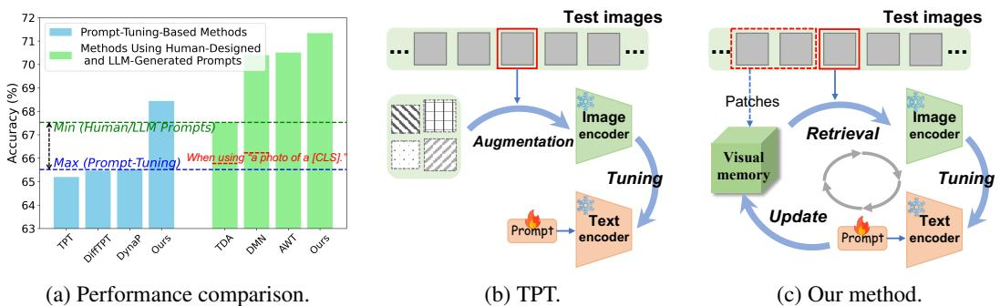
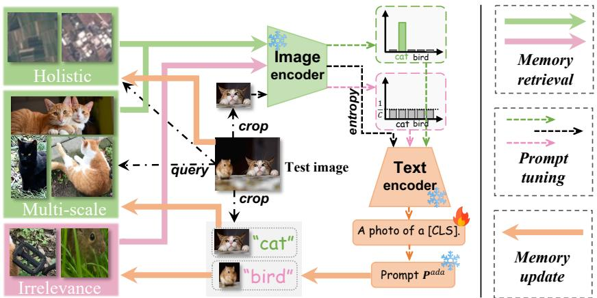
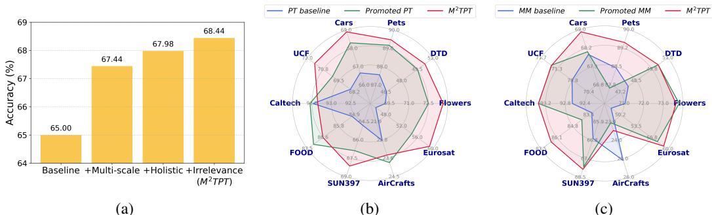
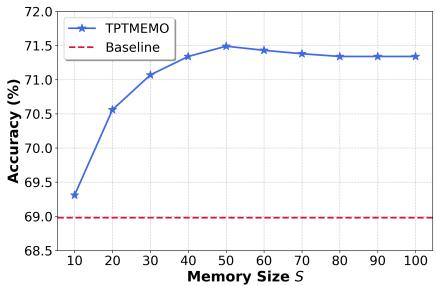

# Echoes of the Visual Past: Test-Time Prompt Tuning with Multi-Scale Visual Memory

Anonymous Author(s)   
Affiliation   
Address   
email

# Abstract

Test-time prompt tuning (TPT) aims to adapt pre-trained vision-language models   
(VLMs) to various downstream tasks by learning textual prompts using unlabeled   
data at test time. However, existing TPT methods exhibit a performance gap   
compared to a line of prompt-engineering-based methods that leverage hand  
crafted or LLM-generated prompts for VLM adaptation. We attribute this gap to a   
core limitation of previous TPT approaches: they learn prompts from only limited   
class-specific visual knowledge derived from a single test image. As a result,   
the learned prompts underperform compared to hand-crafted and LLM-generated   
prompts enriched with diverse, class-specific knowledge. To address this limitation,   
we propose Test-time Prompt Tuning with Multi-scale visual Memory $( \mathbf { M } ^ { 2 } \mathbf { T P T } )$   
Specifically, the memory is constructed to store past seen class-relevant image   
patches as multi-scale visual descriptions for each class. For each test image,   
we use it to query the memory and learn the textual prompt using both the test   
image and the retrieved class-relevant visual memory. Additionally, we introduce   
holistic visual memory to better handle holistic visual recognition tasks that require   
global image-level context, and an irrelevance suppression strategy to mitigate   
the impact of noisy memory entries at test time. We evaluate our method on 15   
commonly used benchmark datasets and show that it outperforms existing TPT   
methods. Furthermore, our framework can incorporate human-designed prompts   
and achieves state-of-the-art performance compared to recent VLM adaptation   
methods that use hand-crafted or LLM-generated prompts.

# 22 1 Introduction

Pre-trained vision-language models (VLMs) have demonstrated powerful representational capabil  
ities, making them valuable for a wide range of computer vision tasks [35, 16, 23, 24, 25]. To   
efficiently adapt VLMs to downstream tasks and new domains, the prompt-tuning paradigm has been   
explored—where only the input text context is optimized using limited test data, while the model   
backbone remains frozen [48, 47]. More practically, recent research has developed test-time prompt   
tuning (TPT), which directly optimizes prompts using unlabeled test data streams [38].   
Aside from prompt-tuning-based methods, a line of prompt-engineering-based methods have designed   
hand-crafted and LLM-generated prompts tailored for each dataset to adapt VLMs to target tasks [34,   
, 46, 50]. Recently these methods have significantly outperformed prompt-tuning approaches on   
image classification benchmarks, as illustrated in Fig. 1a. Human-designed prompts introduce prior   
dataset knowledge and rich class-specific information, making them more effective than prompts   
learned from a generic “a photo of a [CLASS]” initialization during test time. The red dashed   
lines show the performance of these methods when using a generic prompt, highlighting that the   
performance gap mainly lies between the learned prompt and the human-designed prompts. However,   
prompt-engineering-based methods require prior knowledge of the test datasets and additional time   
or effort to design or generate effective prompts. In contrast, TPT methods can adapt to unlabeled   
test streams on the fly without relying on human intervention. Has the potential of TPT methods truly   
been exhausted?   
As shown in Fig. 1b, prior TPT methods typically optimize a trainable prompt using only the current   
test image and its augmentations, relying on unsupervised losses such as entropy minimization [38]   
and distribution alignment [1]. We argue that such methods fail to learn prompts from sufficient class  
specific visual knowledge due to their reliance on limited visual information from a current test image,   
which limits their competitiveness compared to human-designed prompts enriched with diverse and   
explicit class- and dataset-level knowledge. To address this limitation, we propose test-time prompt   
tuning enhanced by a past visual memory containing class-specific visual descriptions.   
In our approach, as depicted in Fig. 1c, we construct a multi-scale visual memory by accumulating   
visual patches that are highly relevant to each class at every time step during the test stream. Before   
prompt tuning, the current test image is used as a query to retrieve semantically related visual patches   
from this memory. The textual prompt is then optimized using both the test image and the retrieved,   
diverse, class-relevant visual information from the same test distribution, enabling the prompt tuning   
process to more effectively capture class-specific knowledge. Reciprocally, the visual memory also   
benefits from the learned prompt, as it is updated based on the optimized prompt. The three sequential   
steps—memory retrieval, prompt tuning, and memory update—achieve a round of mutual promotion   
between the tunable textual prompt and the evolving visual memory for each test image.   
In addition to object recognition, downstream tasks may require holistic visual understanding, such   
as scene understanding [41] and land cover classification [13], which demand comprehensive image  
level context that may be lost when focusing solely on patches. To this end, we further construct   
a holistic visual memory that retains class-relevant full-view images and functions in coordination   
with the multi-scale memory. Moreover, because memory update and retrieval operate without   
ground-truth supervision at test time, the visual memory can inevitably be noisy. To mitigate adverse   
effects, we introduce an irrelevance suppression strategy: we filter out low-relevance memory entries   
from the retrieved class-specific memory during retrieval, and we maintain a class-irrelevant memory   
that stores previously seen misleading patches from the test domain. This irrelevant memory is used   
to penalize high-confidence but incorrect cues during prompt tuning, thereby suppressing distracting   
and misleading information.   
We evaluate our test-time prompt tuning method on 15 datasets, including commonly used downstream   
image classification benchmarks and out-of-distribution datasets. Our method outperforms existing   
test-time prompt tuning methods without prompt engineering. Furthermore, our framework can also   
benefit from human-designed prompts, enabling it to achieve state-of-the-art performance compared   
to recent VLM adaptation methods that rely on hand-crafted or LLM-generated prompts.

  
Figure 1: (a) Performance comparison on 10 downstream image classification datasets. Existing test-time prompt tuning (TPT) methods exhibit a performance gap compared to adaptation methods that use hand-crafted or LLM-generated prompts, as illustrated by the blue and green dashed lines. The red dashed lines show the performance of these methods when using a generic prompt, highlighting that the performance gap primarily lies between the TPT-learned prompt and the human-designed prompts. (b) TPT [38]. Previous TPT methods typically optimize a learnable prompt using only the visual information from the current test image and its augmentations. (c) Our method enhances test-time prompt learning with memorized past visual descriptions for each class and introduces a mutual promotion framework between the learnable prompt and the evolving visual memory.

# 73 2 Related work

Prompt learning. As vision-language models (VLMs) have demonstrated strong performance   
across various computer vision tasks, recent research has explored prompt learning as a parameter  
efficient approach to adapt VLMs to real-world downstream scenarios [27, 12, 5, 22, 17, 20].   
CoOp [48] proposes learning a contextual prompt in the input space of the text encoder using   
few-shot data, while keeping the model backbone frozen. CoCoOp [47] improves upon CoOp by   
introducing condition tokens derived from input images into the textual prompt learning process,   
enabling better generalization. In contrast, Bahng et al. [3] introduce visual prompt learning, which   
operates on the image encoder of VLMs. MaPLe [19] further advances this line of work by jointly   
learning prompts on both the image and text encoders to enhance transfer learning performance.   
Test-time prompt tuning. To improve the generalization ability of VLMs without requiring labeled   
test data, TPT [38] proposes test-time prompt tuning (TPT). This pioneering method learns adaptive   
textual prompts from the current test image and its augmentations using an entropy minimization   
objective, while keeping the model backbone frozen. PromptAlign [1] explicitly addresses distribution   
shift by introducing a distribution statistics alignment loss to guide test-time prompt optimization.   
C-TPT [43] considers the calibration of VLMs for prompt tuning at test time. More recently,   
HisTPT [44] and DynaPrompt [42] propose online test-time prompt tuning methods to leverage past   
information during inference. HisTPT [44] constructs long-term and short-term knowledge banks that   
store output text features generated from prompts, providing self-regularization to stabilize online   
prompt learning. DynaPrompt [42] maintains a prompt pool containing multiple prompts and selects   
among them for stable online optimization. In our method, we do not follow this continuous test-time   
prompt tuning paradigm, but instead adopt the original setting introduced by TPT [38], in which an   
adaptive prompt is learned from scratch for each test sample independently.   
VLM adaptation with prompt engineering. Apart from prompt-tuning-based methods, another   
line of research explores prompt-engineering-based VLM adaptation [29, 37, 34, 32, 11]. CuPL [34]   
leverages large language models (LLMs) [2] to generate textual descriptions for each class in the   
test dataset, replacing the generic prompt with these customized ones to improve prediction accuracy.   
TDA [18] and DMN [46] adopt hand-crafted prompts and LLM-generated prompts, respectively,   
on the text branch. On the vision branch, they design memory-based methods that perform non  
parametric learning with visual features in a manner similar to the k-nearest neighbors (KNN)   
algorithm [30], to improve zero-shot classification. More recently, AWT [50] uses LLMs to generate   
class-specific prompt candidates and transforms the test image into multiple views, then formulates   
image–text matching as an optimal transport problem for zero-shot classification. While prompt  
engineering-based methods have demonstrated effectiveness, they require prior knowledge of the   
test dataset and additional effort to craft or generate prompts. In contrast, TPT methods aim to adapt   
VLMs on the fly, focusing on test-time prompt learning without relying on human supervision.

# 109 3 Method

In this section, we first introduce the preliminaries of CLIP and test-time prompt tuning in Sec. 3.1. Then, Sec. 3.2 describes the overall framework of our method and its main component, the multi-scale visual memory. Secs. 3.3 and 3.4 present the remaining two components of our method.

# 13 3.1 Preliminaries

CLIP. The Contrastive Language–Image Pre-training (CLIP) model [35] comprises an image encoder $f ( \cdot )$ and a text encoder $g ( \cdot )$ , which are pre-trained on large-scale image–text pairs using contrastive learning. Once pre-trained, CLIP can perform zero-shot image classification on a variety of downstream datasets. For a dataset with $C$ classes, CLIP first encodes each class using a generic prompt p, such as “a photo of [CLASS c].”, producing class-specific text embeddings $\{ \mathbf { \bar { p } } _ { c } \} _ { c = 1 } ^ { C }$ Given a test image $\mathbf { X }$ , CLIP compares its encoded feature $f ( \mathbf { X } )$ with the text embeddings of all

  
Figure 2: Overview of our method. Each test image undergoes three sequential steps: memory retrieval, prompt tuning, and memory update. In the memory retrieval step, the test image is used to query both the multi-scale memory and the holistic memory. The predicted label is then used to fetch class-relevant patches or images, as well as misleading patches from the class-irrelevant memory. During prompt tuning, the textual prompt is optimized using the test image and the retrieved visual memory. Finally, in the memory update step, the adapted prompt is used to update the class-relevant patches and the test image in the multi-scale and holistic memories, while high-confidence but irrelevant patches are added to the class-irrelevant memory.

classes and computes the probability of class membership as follows:

$$
p ( y = c \mid \mathbf { X } , \mathbf { p } ) = \frac { \exp ( \cos ( f ( \mathbf { X } ) , g ( \mathbf { p } _ { c } ) ) / \tau ) } { \sum _ { j = 1 } ^ { C } \exp ( \cos ( f ( \mathbf { X } ) , g ( \mathbf { p } _ { j } ) ) / \tau ) } ,
$$

where $\cos ( \cdot , \cdot )$ denotes cosine similarity, and $\tau$ is a learned temperature parameter. For clarity, we   
assume that the outputs of the encoders are normalized by default throughout the rest of the paper.   
Test-time prompt tuning. Directly applying CLIP to downstream tasks may suffer from perfor  
mance degradation due to distribution shifts. Test-time prompt tuning (TPT) aims to adapt CLIP   
to the test data by optimizing a learnable prompt at test time. For instance, the pioneering TPT   
method [38] augments the test image $\mathbf { X }$ into $N$ views $\mathbf { X } _ { [ N ] }$ , and then optimizes a learnable prompt $\mathbf { p }$   
using $n$ selected augmentations $\mathbf { X } _ { [ n ] }$ with low entropy, based on an entropy minimization loss:

$$
\mathcal { L } = - \sum _ { c = 1 } ^ { C } \bar { p } ( y = c \mid \mathbf { X } _ { [ n ] } , \mathbf { p } ) \cdot \log \bar { p } ( y = c \mid \mathbf { X } _ { [ n ] } , \mathbf { p } ) ,
$$

where 128 $\bar { p } ( y = c \mid \mathbf { X } _ { [ n ] } , \mathbf { p } )$ denotes the average prediction probability across the selected augmentations X[n]129 .

# 3.2 Multi-scale visual memory

Previous TPT methods typically use only the current test image or its augmentations to learn a   
tunable prompt. However, the visual class information available from a single test image is limited   
for prompt learning. As a result, TPT methods significantly underperform recent human-designed   
prompt methods, as shown in Fig. 1a. To address this limitation, we propose TPT enhanced by   
multi-scale visual memory, which provides diverse visual class information from past data to guide   
prompt learning. Specifically, our method integrates visual memory into the test-time prompt tuning   
workflow and introduces a prompt-memory mutual promotion framework. As illustrated in Fig. 2,   
for each test sample, the method involves three sequential steps: Memory retrieval, Prompt tuning,   
and Memory update.   
Memory retrieval. Let the multi-scale visual memory be denoted as $\mathcal { M } \in \mathbb { R } ^ { C \times S \times D }$ , where $C$ is   
the number of classes, $S$ is the memory size per class, and $D$ is the dimension of image patches. For   
a given test image $\mathbf { X } \in \mathbb { R } ^ { 3 \times H \times W }$ , we compute the similarity between the memory patches and the   
image in the feature space encoded by the CLIP image encoder. Specifically, we denote the encoded   
test image as $f ( \mathbf { X } ) = \mathbf { v } \in \mathbb { R } ^ { d }$ , and the encoded memory as $f ( \mathcal { M } ) = \mathbf { M } \in \mathbf { \bar { \mathbb { R } } } ^ { C \times S \times d }$ . We define the   
$( c , m )$ -th memory vector as $\mathbf { m } _ { c , m } : = \mathbf { M } [ c , m ] \in \mathbb { R } ^ { d }$ . The similarity is computed as:

$$
\mathbf { S } _ { c , m } = \phi \left( \mathbf { v } ^ { \top } \mathbf { m } _ { c , m } \right) , \quad \mathrm { f o r } c = 1 , \ldots , C , m = 1 , \ldots , S ,
$$

where $\phi$ is an exponential scaling function defined as $\phi ( x ) = \exp ( - \beta ( 1 - x ) )$ , as in [45]. We   
then identify the most similar class in the visual memory to the current test sample based on cosine   
similarity:

$$
\tilde { y } = \arg \operatorname* { m a x } _ { c \in \{ 1 , . . . , C \} } \left( \mathbf { M } _ { c } ^ { \mathrm { a d a } \top } \mathbf { v } \right) , \quad \mathbf { M } _ { c } ^ { \mathrm { a d a } } = \mathrm { N o r m } \left( \sum _ { m = 1 } ^ { S } \mathbf { S } _ { c , m } \cdot \mathbf { m } _ { c , m } \right) ,
$$

where the visual memory is weighted by S before the cosine similarity computation, following [49,   
], and Norm denotes $\ell _ { 2 }$ normalization. Finally, we use the pseudo label $\tilde { y }$ to get the corresponding   
class-specific visual memory $\mathcal { M } _ { \tilde { y } }$ as the retrieved class-relevant memory for the current test image.   
Prompt tuning. In this step, we use the current test image $\mathbf { X }$ and the retrieved relevant visual memory   
$\mathcal { M } _ { \hat { y } }$ to learn the textual prompt $\bf p _ { \mathrm { i n i t } }$ . For the test image, we apply an entropy minimization loss, as   
in TPT [38], shown in Eq. 2, where we adopt random cropping as the data augmentation strategy.   
Concurrently, we incorporate a cross-entropy loss between the retrieved memory and the pseudo label   
to enhance the prompt learning. Starting from $\mathbf { p } _ { \mathrm { i n i t } }$ , we optimize the prompt to obtain $\mathbf { p } _ { \mathrm { a d a } }$ :

$$
\mathbf { p } _ { \mathrm { a d a } } = \mathbf { p } _ { \mathrm { i n i t } } - \eta \cdot \nabla _ { \mathbf { p } } \mathcal { L } _ { \mathbf { p t } } = \mathbf { p } _ { \mathrm { i n i t } } - \eta \cdot \nabla _ { \mathbf { p } } \left[ \mathcal { H } \left( \bar { p } ( \mathbf { X } _ { [ n ] } , \mathbf { p } ) \right) - \log \bar { p } ( y = \tilde { y } \mid \mathcal { M } _ { \tilde { y } } , \mathbf { p } ) \right]
$$

where $\eta$ denotes the learning rate. $\mathbf { X } _ { [ n ] }$ denotes $n$ cropped patches of $\mathbf { X }$ selected from the full set of   
$N$ patches $\mathbf { X } _ { [ N ] }$ based on low prediction entropy. $\bar { p } ( \cdot )$ denotes the average predicted probability over   
patches of the test image or memorized patches. $\mathcal { H } ( \cdot )$ denotes the entropy of a predicted probability   
distribution $p ( \cdot )$ over $C$ classes, defined as $\begin{array} { r } { \mathcal { H } ( p ) = - \sum _ { c = 1 } ^ { C } p ( y = c ) \cdot \log p ( y = c ) . } \end{array}$ .   
Memory update. This step aims to update the multi-scale visual memory $\mathcal { M }$ with the most relevant   
patch from the current test image, based on the adapted textual prompt $\mathbf { p } _ { \mathrm { a d a } }$ . Specifically, we select a   
patch from the $N$ randomly cropped views $\mathbf { X } _ { [ N ] }$ according to vision-text similarity:

$$
\begin{array} { r } { \hat { y } = \arg \underset { c } { \operatorname* { m a x } } \bar { p } ( y = c \mid \mathbf { X } _ { [ n ] } , \mathbf { p } _ { \mathrm { a d a } } ) , \quad i ^ { * } = \arg \underset { i \in \mathcal { I } } { \operatorname* { m i n } } \mathcal { H } ( p ( \{ \mathbf { X } _ { [ N ] } \} _ { i } , \mathbf { p } _ { \mathrm { a d a } } ) ) , } \\ { \mathrm { w h e r e } \quad \mathcal { I } = \left\{ j : \arg \underset { c } { \operatorname* { m a x } } p ( y = c \mid \{ \mathbf { X } _ { [ N ] } \} _ { j } , \mathbf { p } _ { \mathrm { a d a } } ) = \hat { y } \right\} . } \end{array}
$$

We first obtain a confident prediction $\hat { y }$ by aggregating predictions over the selected subset $\mathbf { X } _ { [ n ] }$   
using the adapted prompt $\mathbf { p } _ { \mathrm { a d a } }$ . Then, from the subset $\mathcal { T }$ of patches whose predicted label matches   
$\hat { y }$ , we select the patch $\mathbf { X } _ { i ^ { * } }$ with the lowest prediction entropy. This avoids directly selecting the   
lowest-entropy patch from the entire set $\mathbf { X } _ { [ N ] }$ , which may include highly confident but irrelevant   
patches. Finally, we insert the selected patch into the corresponding memory slot $\mathcal { M } _ { \hat { y } }$ . If the memory   
is at full capacity, we remove the patch with the highest entropy among the existing entries and the   
current candidate.   
These three steps for each test image constitute a round of mutual promotion between the tunable   
textual prompt and the evolving visual memory. Afterward, we obtain two predictions for the current   
test image: one from the optimized prompt and one from the updated memory $\mathcal { M } ^ { \prime }$ . We combine   
them to produce the final prediction:

$$
P _ { \mathrm { f i n a l } } = P _ { \mathrm { p t } } + P _ { \mathrm { m e m o } } = p ( \mathbf { y } \mid \mathbf { v } , \mathbf { p } _ { \mathrm { a d a } } ) + \mathrm { S o f t m a x } ( \mathbf { M } ^ { \prime ^ { \mathrm { a d a } } \top } \mathbf { v } ) ,
$$

where 175 $P _ { \mathrm { p t } } , P _ { \mathrm { m e m o } } \in \mathbb { R } ^ { C }$ . The prediction $P _ { \mathrm { m e m o } }$ is obtained via similarity-based classification, as in the memory retrieval step, and 176 $\mathbf { M } ^ { \mathrm { \prime } \mathrm { a d a } }$ is computed from the updated memory following Eqs. 3 and 4.

It is worth noting that we perform only a single forward pass of the CLIP image encoder for each test   
image and its patches, as the image encoder is frozen during the test-time prompt tuning process. The   
encoded visual features are reused across all three steps, such as in Eqs. 4, 5, and 6. Therefore, we   
directly store the encoded features in the multi-scale visual memory, i.e., $\mathbf { M } \in \mathbb { R } ^ { C \times S \times d }$ , in practice.

In downstream tasks, there are not only object recognition tasks but also holistic visual recognition tasks, such as land cover classification [41] and scene understanding [13]. These tasks require holistic, image-level information, which may be lost when using only image patches. Accordingly, we introduce a holistic visual memory that works in coordination with the aforementioned multi-scale visual memory.

During memory retrieval, we use the current test image as a query to retrieve relevant visual memory   
from both the multi-scale memory and the holistic memory, i.e., $\{ \mathcal { M } , \mathcal { M } ^ { \mathrm { h o l } } \}$ . Specifically, we   
compute the similarity-based probability distribution $\mathrm { S o f t m a x ( M ^ { a d a T } { \bf v } ) }$ using both types of memory   
and select the one with lower entropy to fetch the class-relevant visual memory. The prompt tuning   
step remains unchanged, except that the retrieved memory used in Eq. 5 is selected from either the   
multi-scale or holistic memory. During memory update, both types of memory update the same   
memory slot, $\mathcal { M } _ { \hat { y } }$ and $\mathcal { M } _ { \hat { y } } ^ { \mathrm { h o l } }$ , as determined by the mechanisms in Eqs. 6 and 7. In addition, the   
holistic visual memory also contributes to the memory-based prediction $P _ { \mathrm { m e m o } }$ , producing a prediction   
in the same way as the multi-scale memory. We then select the one with lower entropy as the final   
$P _ { \mathrm { m e m o } }$ in Eq. 8.

# 3.4 Irrelevance suppression

The memory retrieval and memory update processes operate without ground truth supervision at test   
time, making the memory inevitably noisy. To mitigate the adverse impact, we design an irrelevance   
suppression strategy: selectively retrieving and using class-relevant memory, while proactively   
penalizing class-irrelevant memory. Specifically, during memory retrieval, we filter out relatively   
irrelevant memory based on the similarity matrix S:

$$
\mathbf { M } _ { \tilde { y } } ^ { \mathrm { t o p } } = \mathbf { M } _ { \tilde { y } } [ \mathrm { T o p K } ( \mathbf { S } _ { \tilde { y } } , \mathbf { \Gamma } \middle \lfloor \mathbf { M } _ { \tilde { y } }  \cdot \gamma \rfloor ) ] ,
$$

where $\mathrm { T o p K } ( \cdot , k )$ returns the indices of the top $k$ elements with the highest similarity scores. $| \mathbf { M } _ { \tilde { y } } |$   
denotes the number of stored features in memory for class $\tilde { y }$ , and $\gamma \in ( 0 , 1 ]$ is the selection ratio. The   
filtered memory $\mathbf { M } _ { \widetilde { y } } ^ { \mathrm { t o p } }$ is then used in the prompt tuning stage (see Eq. 5).   
In addition, we construct a class-irrelevant memory $\mathcal { M } ^ { \mathrm { i r r } }$ to store previously seen, misleading visual   
cues from the test domain. Technically, we update this memory with high-confidence patches that are   
estimated to be irrelevant. Specifically, after the multi-scale memory update, given the memory pre  
diction for the test image $\hat { y } _ { \mathrm { { m e m o } } } = \arg \operatorname* { m a x } _ { c } P _ { \mathrm { { m e m o } } }$ , and the optimized-prompt-based predictions of   
patches $\hat { \mathbf { y } } ^ { N } = \arg \operatorname* { m a x } _ { c } p ( y = c \mid \mathbf { X } _ { [ N ] } , \mathbf { p } _ { \mathrm { a d a } } ) , \quad \hat { \mathbf { y } } ^ { n } = \arg \operatorname* { m a x } _ { c } p ( y = c \mid \mathbf { X } _ { [ n ] } , \mathbf { p } _ { \mathrm { a d a } } )$ , if the mem  
ory prediction and the predictions of selected patches are consistent, i.e., $\begin{array} { r } { \sum _ { j = 1 } ^ { n } \bar { \mathbb { 1 } } \left[ \hat { \mathbf { y } } _ { j } ^ { n } = \hat { y } _ { \mathrm { m e m o } } \right] = n } \end{array}$   
we regard $\hat { y } _ { \mathrm { { m e m o } } }$ as a confident prediction. Then, the irrelevant memory is updated as:

$$
i ^ { * } = \arg \operatorname* { m i n } _ { i \in \mathcal { Z } } \mathcal { H } \big ( p \big ( \{ \mathbf { X } _ { [ N ] } \} _ { i } , \mathbf { p } _ { \mathrm { a d a } } \big ) \big ) , \quad \mathrm { w h e r e } \quad \mathcal { Z } = \left\{ i : \hat { \mathbf { y } } _ { i } ^ { N } \neq \hat { y } _ { \mathrm { m e m o } } \right\} .
$$

Here, we select the highest-confidence patch {X[N213 prediction and store it in the memory slot MirrˆyNi∗214 . $\{ \mathbf { X } _ { [ N ] } \} _ { i ^ { * } }$ among those that disagree with the confident

The class-irrelevant memory stores patches with pseudo “wrong” labels—i.e., patches that are   
confidently predicted to belong to a different class. This contradicts the task assumption. For example,   
in a label space of “cat” and “bird”, an image labeled “cat” is not expected to contain a bird. To   
218 suppress these confident but irrelevant cues, we apply a flat-label KL loss:

$$
\mathcal { L } _ { \mathrm { i r r } } = \operatorname* { m i n } ( \frac { \alpha } { C } , \beta ) \mathrm { K L } ( \frac { 1 } { C } { \bf 1 } ) \bigg | \bigg | p ( y = \tilde { y } \mid \mathcal { M } _ { \tilde { y } } ^ { \mathrm { i r r } } , { \bf p } ) ) ,
$$

where $\alpha$ and $\beta$ are hyperparameters, and $C$ is the number of classes. This loss $\mathcal { L } _ { \mathrm { i r r } }$ is incorporated into the prompt tuning objective ${ \mathcal { L } } _ { \mathrm { p t } }$ .

# 4 Experiments

# 4.1 Experimental setup

23 Datasets. Following prior test-time prompt tuning methods [38, 42], we evaluate our method on 15   
datasets, including downstream image classification tasks and out-of-distribution benchmark datasets.   
The downstream image classification datasets include Flowers102 [31], DTD [6], OxfordPets [33],   
StanfordCars [21], UCF101 [39], Caltech101 [9], Food101 [4], SUN397 [41], FGVC-Aircraft [28],   
and EuroSAT [13]. For the out-of-distribution benchmark, we include ImageNet [7] and its four   
variants exhibiting domain shifts: ImageNet-A [15], ImageNet-V2 [36], ImageNet-R [14], and   
ImageNet-S [40]. For ImageNet, we use the validation set for evaluation, and adopt the same dataset   
splits as in TPT [38] for the remaining 14 datasets.   
Implementation details. We use CLIP [35] with the ViT-B/16 encoder [8] for all experiments. For   
each test image, our method optimizes the textual prompt with a single update step, starting from the   
generic prompt “a photo of a [CLASS].” We use the AdamW optimizer [26] with a learning rate of   
$\eta = 0 . 0 0 3$ across all datasets. For random cropping, the scale range and aspect ratio range are set   
to $( 0 . 0 8 , 1 )$ and $\left( { \frac { 3 } { 4 } } , { \frac { 4 } { 3 } } \right)$ , respectively. The number of random crops $N$ is set to 32 for downstream   
classification datasets and 64 for out-of-distribution benchmark datasets, with a selection ratio of   
$n / N = 0 . 1$ . For all datasets, the memory size $S$ is set to 50, and the hyperparameters for irrelevance   
suppression are set to $\gamma = 0 . 5$ , $\alpha = 5$ , and $\beta = 0 . 1$ .

Table 1: Results on 10 downstream image classification datasets. The reported numbers are top-1 accuracy $( \% )$ . Methods marked with \* include training with labeled data from ImageNet. $\mathrm { { \bf M } ^ { 2 } T P T ^ { \dagger } }$ represents the version that incorporates hand-crafted and LLM-generated prompts.   

<table><tr><td></td><td></td><td colspan="3">Flower</td><td></td><td></td><td>Caltech</td><td></td><td></td><td></td><td>EuroSAT</td><td></td></tr><tr><td>Method</td><td>Venue</td><td></td><td></td><td></td><td></td><td></td><td></td><td></td><td></td><td>Aircraft</td><td></td><td>Average</td></tr><tr><td colspan="10">CLIP [35] 67.44 44.27 88.25 65.48 -</td><td>23.37</td><td></td><td>42.01</td></tr><tr><td></td><td></td><td></td><td></td><td></td><td>Prompt-Tuning-Based Methods</td><td></td><td></td><td></td><td></td><td></td><td></td><td></td></tr><tr><td>CoOp * [48]</td><td>IJCV22</td><td>68.71 41.92</td><td></td><td>89.14</td><td>64.51</td><td>66.55</td><td>93.70</td><td>85.30</td><td>64.15</td><td>18.47</td><td>46.39</td><td>63.88</td></tr><tr><td>CoCoOp * [47] MaPLe*[19]</td><td>CVPR22 CVPR23</td><td>71.88 72.23</td><td>45.73 46.49</td><td>90.14 90.49</td><td>65.32 65.57</td><td>68.21</td><td>94.43 93.53</td><td>86.06 86.20</td><td>67.36 67.01</td><td>22.94 24.74</td><td>45.37 48.06</td><td>65.74 66.20</td></tr><tr><td>TPT[38]</td><td>NeurIPS22</td><td>68.98</td><td>47.75</td><td></td><td>66.87</td><td>68.69</td><td>94.16</td><td>84.67</td><td>65.50</td><td>24.78</td><td>42.44</td><td>65.20</td></tr><tr><td>DiffTPT[10]</td><td>ICCV23</td><td>70.10</td><td>47.00</td><td>87.79 88.20</td><td>67.01</td><td>68.04 68.22</td><td>92.49</td><td>87.23</td><td>65.74</td><td>25.60</td><td>43.13</td><td>65.47</td></tr><tr><td>C-TPT[43]</td><td>ICLR24</td><td>69.80</td><td>46.00</td><td>88.20</td><td>65.80</td><td>65.70</td><td>93.60</td><td>83.70</td><td>64.80</td><td>24.00</td><td>43.20</td><td>64.80</td></tr><tr><td>DynaPrompt [42]</td><td>ICLR25</td><td>69.95</td><td>47.96</td><td></td><td></td><td></td><td></td><td></td><td></td><td></td><td></td><td></td></tr><tr><td>M²TPT</td><td></td><td>73.65</td><td></td><td>88.28</td><td>67.65</td><td>68.72</td><td>94.32</td><td>85.42</td><td>66.32</td><td>24.33</td><td>42.28</td><td>65.52</td></tr><tr><td></td><td>-</td><td>50.24</td><td></td><td>89.48</td><td>68.91</td><td>71.42</td><td>93.35</td><td>86.63</td><td>68.12</td><td>23.46</td><td>59.14</td><td>68.44</td></tr><tr><td colspan="10">Methods UsingHand-Craftedand LLM-GeneratedPrompts</td><td></td><td></td><td></td><td></td></tr><tr><td>VisDesc [29]</td><td>ICLR23</td><td>70.85</td><td>44.98</td><td>88.85</td><td>64.08</td><td>67.12</td><td>94.60</td><td>85.05</td><td>67.99</td><td>24.30</td><td>54.84</td><td>66.27</td></tr><tr><td>WafleCLIP [37]</td><td>ICCV23</td><td>72.35</td><td>45.21</td><td>89.95</td><td>63.57</td><td>67.19</td><td>94.02</td><td>86.68</td><td>67.23</td><td>25.39</td><td>55.07</td><td>66.67</td></tr><tr><td>CuPL [34]</td><td>ICCV23</td><td>71.30</td><td>44.56</td><td>89.13</td><td>65.29</td><td>66.83</td><td>92.98</td><td>86.11</td><td>62.59</td><td>24.90</td><td>47.84</td><td>65.15</td></tr><tr><td>TDA[18]</td><td>CVPR24</td><td>71.42</td><td>47.40</td><td>88.63</td><td>67.28</td><td>70.66</td><td>94.24</td><td>86.14</td><td>67.62</td><td>23.91</td><td>58.00</td><td>67.53</td></tr><tr><td>DMN [46]</td><td>CVPR24</td><td>74.49</td><td>55.85</td><td>92.04</td><td>67.96</td><td>72.51</td><td>95.38</td><td>85.08</td><td>70.18</td><td>30.03</td><td>59.43</td><td>70.40</td></tr><tr><td>AWT[50]</td><td>NeurIPS24</td><td>75.07</td><td>55.56</td><td>92.53</td><td>69.93</td><td>72.51</td><td>95.54</td><td>85.54</td><td>70.58</td><td>29.22</td><td>58.61</td><td>70.51</td></tr><tr><td>M²TPTt</td><td>-</td><td>76.90</td><td>55.32</td><td>92.31</td><td>69.32</td><td>74.25</td><td>94.24</td><td>86.42</td><td>70.65</td><td>30.48</td><td>62.32</td><td>71.34</td></tr></table>

Table 2: Results on out-of-distribution benchmark datasets. The marked $\mathbf { M } ^ { 2 } \mathbf { T } \mathbf { P } \mathbf { T } ^ { \dagger }$ represents the version that incorporates hand-crafted and LLM-generated prompts.   

<table><tr><td>Method</td><td>Venue</td><td>ImageNet</td><td>ImageNet-A</td><td>ImageNet-V2</td><td>ImageNet-R</td><td>ImageNet-S</td><td>OOD Average</td><td>Average</td></tr><tr><td>CLIP [35]</td><td>-</td><td>66.73</td><td>47.87</td><td>60.86</td><td>73.98</td><td>46.09</td><td>57.20</td><td>59.11</td></tr><tr><td colspan="9">Prompt-Tuning-Based Methods</td></tr><tr><td>TPT [38]</td><td>NeurIPS22</td><td>68.98</td><td>54.77</td><td>63.45</td><td>77.06</td><td>47.94</td><td>60.80</td><td>62.44</td></tr><tr><td>DiffTPT[10]</td><td>ICCV23</td><td>70.30</td><td>55.68</td><td>65.10</td><td>75.00</td><td>46.80</td><td>60.64</td><td>62.58</td></tr><tr><td>C-TPT[43]</td><td>ICLR24</td><td>69.30</td><td>52.90</td><td>63.40</td><td>78.00</td><td>48.50</td><td>60.70</td><td>62.42</td></tr><tr><td>DynaPrompt [42] M²TPT</td><td>ICLR25</td><td>69.61</td><td>56.17</td><td>64.67</td><td>78.17</td><td>48.22</td><td>61.81</td><td>63.37</td></tr><tr><td></td><td>-</td><td>71.49</td><td>60.11</td><td>64.82</td><td>76.79</td><td>50.79</td><td>63.13</td><td>64.80</td></tr><tr><td colspan="9">Methods Using Hand-Crafted and LLM-Generated Prompts</td></tr><tr><td>VisDesc [29]</td><td>ICLR23</td><td>68.55</td><td>49.07</td><td>61.80</td><td>75.13</td><td>47.97</td><td>58.49</td><td>60.50</td></tr><tr><td>WaffleCLIP [37]</td><td>ICCV23</td><td>68.81</td><td>50.78</td><td>62.54</td><td>77.49</td><td>49.10</td><td>59.98</td><td>61.74</td></tr><tr><td>CuPL [34]</td><td>ICCV23</td><td>1</td><td>50.72</td><td>63.27</td><td>77.05</td><td>49.02</td><td>60.02</td><td>-</td></tr><tr><td>TDA[18]</td><td>CVPR24</td><td>69.51</td><td>60.11</td><td>64.67</td><td>80.24</td><td>50.54</td><td>63.89</td><td>65.01</td></tr><tr><td>DMN [46]</td><td>CVPR24</td><td>72.25</td><td>58.28</td><td>65.17</td><td>78.55</td><td>53.20</td><td>63.80</td><td>65.49</td></tr><tr><td>AWT[50]</td><td>NeurIPS24</td><td>71.32</td><td>60.33</td><td>65.15</td><td>80.64</td><td>51.60</td><td>64.43</td><td>65.81</td></tr><tr><td>M²TPTt</td><td>1</td><td>73.01</td><td>62.55</td><td>65.86</td><td>77.48</td><td>53.03</td><td>64.73</td><td>66.39</td></tr></table>

  
Figure 3: (a) Ablation on main components. The baseline is test-time prompt tuning using only low-entropy image patches. We incrementally add the three main components of our method and illustrate the performance gain contributed by each. (b), (c) Analysis of the mutual promotion between the learnable prompt and the evolving memory. In (b), we compare the standard test-time prompt tuning baseline with predictions $P _ { \mathrm { p t } }$ obtained from the prompt learned with visual memory. In (c), the memory-based predictions $\dot { P } _ { \mathrm { { m e m o } } }$ are compared with a baseline where memory is updated using a static prompt, “a photo of a [CLS].” Improvements over the baselines demonstrate the mutual promotion between the learnable prompt and the visual memory.

# 239 4.2 Comparisons

We compare our test-time prompt tuning (TPT) method with recent TPT approaches, including   
TPT [38], DiffTPT [10], C-TPT [43], and DynaPrompt [42], and prompt learning methods including   
CoOp [48], CoCoOp [47], and MaPLe [19]. These methods, like ours, do not involve hand-crafted   
or LLM-generated prompts. Moreover, we also compare our method with recent VLM adaptation   
approaches that utilize hand-crafted or LLM-generated prompts, including VisDesc [29], Waffle  
CLIP [37], CuPL [34], TDA [18], DMN [46], and AWT [50]. For this comparison, we design a   
variant of our method by simply incorporating human-designed prompts used in DMN [46] into   
the memory update step. Specifically, the confident prediction $\hat { y }$ in Eq. 6 is obtained by combining   
predictions from the adapted prompt and the human-designed prompts.   
Comparisons on downstream classification tasks. Tab. 1 presents results on 10 downstream fine  
grained classification datasets. The upper part of the table compares prompt-tuning-based methods   
that learn a trainable prompt from a generic initialization. Compared to previous TPT methods, our   
method achieves the highest accuracy on 7 datasets and yields an average improvement of $2 . 9 2 \%$ .   
Notably, $\mathbf { M } ^ { 2 } \mathrm { T P T }$ outperforms previous TPT methods by $1 5 . 9 4 \%$ on the EuroSAT dataset. The lower   
part of the table compares methods that utilize hand-crafted and LLM-generated prompts. First,   
we observe that our method can benefit from incorporating human-designed prompts, achieving an   
average improvement of $2 . 9 \%$ . Compared to these methods, $\mathbf { M } ^ { 2 } \mathrm { T P T }$ performs best on 8 out of 10   
datasets and surpasses the second-best method by an average margin of $0 . 8 3 \%$ .

Comparisons on out-of-distribution datasets. Tab. 2 shows results on ImageNet and four outof-distribution datasets that exhibit distribution shifts from ImageNet. In the upper part of the table, $\mathbf { M } ^ { 2 } \mathrm { T P T }$ outperforms recent test-time prompt tuning methods with an average improvement of $1 . 4 3 \%$ across the five datasets. As shown in the lower part, $\mathbf { \bar { M } } ^ { 2 } \mathbf { T P T }$ also achieves state-of-the-art performance among VLM adaptation methods that leverage hand-crafted and LLM-generated prompts.

# 4.3 Ablation studies

Ablation on main components. We study the effectiveness of the three components in ${ \bf M } ^ { 2 }$ TPT—multi-scale visual memory, holistic visual memory, and irrelevance suppression—introduced in Secs. 3.2, 3.3, and 3.4, respectively, across 10 downstream classification datasets. We begin with a baseline that performs prompt tuning alone using selected low-entropy patches, as shown in Fig. 3a. Adding multi-scale visual memory to the baseline establishes the core framework of our method and improves the average accuracy to $6 7 . 4 4 \%$ , yielding a $2 . 4 4 \%$ gain. Next, we incorporate holistic visual memory, which preserves global visual context for tasks that require holistic visual understanding, resulting in a further $0 . 5 \hat { 4 } \%$ improvement. Finally, we introduce the

irrelevance suppression strategy to better exploit the noisy test-time memory, increasing the accuracy   
from $6 7 . 9 8 \%$ to $6 8 . 4 4 \%$ .   
Analysis of the mutual promotion between the learnable prompt and the evolving memory. In   
$\mathbf { M } ^ { 2 } \mathrm { T P T }$ , the visual memory provides class-relevant visual descriptions to enhance textual prompt   
learning, and reciprocally, the learned prompt helps update the visual memory. To verify this mutual   
promotion effect, we design two baselines: the prompt tuning (PT) baseline and the memory (MM)   
baseline. The PT baseline corresponds to standard prompt tuning with selected low-entropy image   
patches. Its performance on 10 downstream classification datasets is shown in Fig. 3b. In the   
figure, Promoted PT refers to the performance of the learned prompt enhanced by visual memory,   
corresponding to $P _ { \mathrm { p t } }$ in Eq. 8. Compared to the PT baseline, Promoted PT consistently demonstrates   
superior performance, highlighting the improvement in prompt tuning enabled by the multi-scale   
visual memory. In Fig. 3c, the MM baseline denotes a memory-based method where the memory is   
updated using a generic prompt “a photo of a [CLASS].” In contrast, Promoted MM refers to the   
prediction generated from the evolving memory updated with the learned prompt, i.e., $P _ { \mathrm { { m e m o } } }$ in Eq. 8.   
Promoted MM outperforms the MM baseline on 8 out of 10 datasets, indicating the beneficial effect   
of the learned prompt on memory updates. Finally, $\mathbf { M } ^ { 2 } \mathrm { T P T }$ achieves consistently better performance   
than both Promoted PT and Promoted MM, demonstrating the effectiveness of combining the two   
predictions as defined in Eq. 8.   
Effect of memory size. We study the effect of memory size $S$ on the validation set of the ImageNet   
dataset. As shown in Fig. 4, the Baseline refers to test-time prompt tuning without memory. $\mathbf { M } ^ { \mathrm { { 2 } } } \mathrm { T P T }$   
shows increasing accuracy as $S$ increases from 10 to 50, consistently outperforming the Baseline.   
294 When the memory size exceeds 50, the accuracy saturates and slightly decreases.   
95 Computation resource. We compare GPU memory usage and runtime of $\mathbf { M } ^ { 2 } \mathrm { T P T }$ with recent   
test-time prompt tuning methods, as shown in Tab. 3. All results are measured on the DTD dataset   
using an RTX A4500 GPU. DynaPrompt [42] introduces significantly higher memory usage and   
longer runtime than other methods because it optimizes multiple prompts. Compared to TPT [38]   
99 under its official setting (with augmentation batch size 64), $\dot { \mathbf { M } } ^ { 2 } \mathbf { T } \mathbf { P } \mathbf { T }$ uses only 0.1 GB more GPU   
00 memory while consuming less runtime per image. When we test TPT with the same batch size   
$( \mathrm { b } \mathrm { s } { = } 3 2 )$ ) as $\mathbf { M } ^ { 2 } \mathrm { T P T }$ , the runtime becomes comparable, and the memory usage difference increases to   
$0 . 1 3 \mathrm { G B }$ . These results suggest that the visual memory module in $\dot { \mathbf { M } } ^ { 2 } \mathbf { T P T }$ introduces only a small   
memory overhead and minimal impact on runtime.

  
Figure 4: Effect of memory size.

Table 3: Computation resources of test-time prompt tuning methods. The methods are evaluated on the DTD dataset using an RTX A4500 GPU.   

<table><tr><td>Method</td><td>Memory (GB)</td><td>Runtime (s)</td></tr><tr><td>TPT</td><td>1.56</td><td>0.14</td></tr><tr><td>TPT (bs=32)</td><td>1.53</td><td>0.11</td></tr><tr><td>DynaPrompt</td><td>9.98</td><td>0.41</td></tr><tr><td>M²TPT</td><td>1.66</td><td>0.11</td></tr></table>

# 304 5 Conclusion

In this paper, we identified a core limitation of previous TPT methods: learning prompts from limited visual information provided by the current test image, which makes the learned prompts less competitive compared to prompt-engineering-based approaches. To address this, we proposed test-time prompt tuning with multi-scale visual memory, enabling the model to learn prompts from both class-relevant visual descriptions observed in the past and the current test image. Extensive experiments demonstrate that our method outperforms existing TPT methods while introducing minimal additional computational cost. Moreover, our method can benefit from prompt engineering and achieves state-of-the-art performance compared to recent prompt-engineering-based VLM adaptation methods by incorporating human-designed prompts into our framework.

# References

[1] Jameel Abdul Samadh, Mohammad Hanan Gani, Noor Hussein, Muhammad Uzair Khattak, Muhammad Muzammal Naseer, Fahad Shahbaz Khan, and Salman H Khan. Align your prompts: Test-time prompting with distribution alignment for zero-shot generalization. In NeurIPS, 2023. [2] Josh Achiam, Steven Adler, Sandhini Agarwal, Lama Ahmad, Ilge Akkaya, Florencia Leoni Aleman, Diogo Almeida, Janko Altenschmidt, Sam Altman, Shyamal Anadkat, et al. Gpt-4 technical report. arXiv preprint arXiv:2303.08774, 2023.   
[3] Hyojin Bahng, Ali Jahanian, Swami Sankaranarayanan, and Phillip Isola. Exploring visual prompts for adapting large-scale models. arXiv preprint arXiv:2203.17274, 2022.   
[4] Lukas Bossard, Matthieu Guillaumin, and Luc Van Gool. Food-101–mining discriminative components with random forests. In ECCV, pages 446–461. Springer, 2014.   
[5] Adrian Bulat and Georgios Tzimiropoulos. Lasp: Text-to-text optimization for language-aware soft prompting of vision & language models. In CVPR, pages 23232–23241, 2023.   
[6] Mircea Cimpoi, Subhransu Maji, Iasonas Kokkinos, Sammy Mohamed, and Andrea Vedaldi. Describing textures in the wild. In CVPR, pages 3606–3613, 2014.   
[7] J. Deng, W. Dong, R. Socher, L.-J. Li, K. Li, and L. Fei-Fei. Imagenet: A large-scale hierarchical image database. In CVPR, 2009.   
[8] Alexey Dosovitskiy, Lucas Beyer, Alexander Kolesnikov, Dirk Weissenborn, Xiaohua Zhai, Thomas Unterthiner, Mostafa Dehghani, Matthias Minderer, Georg Heigold, Sylvain Gelly, Jakob Uszkoreit, and Neil Houlsby. An image is worth 16x16 words: Transformers for image recognition at scale. In ICLR, 2021. [9] Li Fei-Fei, Rob Fergus, and Pietro Perona. Learning generative visual models from few training examples: An incremental bayesian approach tested on 101 object categories. In 2004 conference on computer vision and pattern recognition workshop, pages 178–178. IEEE, 2004.   
[10] Chun-Mei Feng, Kai Yu, Yong Liu, Salman Khan, and Wangmeng Zuo. Diverse data augmentation with diffusions for effective test-time prompt tuning. In ICCV, pages 2704–2714, 2023.   
[11] Yunhao Ge, Jie Ren, Andrew Gallagher, Yuxiao Wang, Ming-Hsuan Yang, Hartwig Adam, Laurent Itti, Balaji Lakshminarayanan, and Jiaping Zhao. Improving zero-shot generalization and robustness of multi-modal models. In CVPR, pages 11093–11101, 2023.   
[12] Changsheng Xu Hantao Yao, Rui Zhang. Visual-language prompt tuning with knowledge-guided context optimization. In CVPR, 2023.   
[13] Patrick Helber, Benjamin Bischke, Andreas Dengel, and Damian Borth. Eurosat: A novel dataset and deep learning benchmark for land use and land cover classification. IEEE Journal of Selected Topics in Applied Earth Observations and Remote Sensing, 12(7):2217–2226, 2019.   
[14] Dan Hendrycks, Steven Basart, Norman Mu, Saurav Kadavath, Frank Wang, Evan Dorundo, Rahul Desai, Tyler Zhu, Samyak Parajuli, Mike Guo, Dawn Song, Jacob Steinhardt, and Justin Gilmer. The many faces of robustness: A critical analysis of out-of-distribution generalization. ICCV, 2021.   
[15] Dan Hendrycks, Kevin Zhao, Steven Basart, Jacob Steinhardt, and Dawn Song. Natural adversarial examples. CVPR, 2021.   
[16] Chao Jia, Yinfei Yang, Ye Xia, Yi-Ting Chen, Zarana Parekh, Hieu Pham, Quoc Le, Yun-Hsuan Sung, Zhen Li, and Tom Duerig. Scaling up visual and vision-language representation learning with noisy text supervision. In ICML, pages 4904–4916, 2021.   
[17] Baoshuo Kan, Teng Wang, Wenpeng Lu, Xiantong Zhen, Weili Guan, and Feng Zheng. Knowledge-aware prompt tuning for generalizable vision-language models. In ICCV, pages 15670–15680, 2023.   
[18] Adilbek Karmanov, Dayan Guan, Shijian Lu, Abdulmotaleb El Saddik, and Eric Xing. Efficient test-time adaptation of vision-language models. In CVPR, pages 14162–14171, 2024.   
[19] Muhammad Uzair Khattak, Hanoona Rasheed, Muhammad Maaz, Salman Khan, and Fahad Shahbaz Khan. Maple: Multi-modal prompt learning. In CVPR, pages 19113–19122, 2023.   
[20] Muhammad Uzair Khattak, Syed Talal Wasim, Muzammal Naseer, Salman Khan, Ming-Hsuan Yang, and Fahad Shahbaz Khan. Self-regulating prompts: Foundational model adaptation without forgetting. In ICCV, pages 15190–15200, 2023.   
[21] Jonathan Krause, Michael Stark, Jia Deng, and Li Fei-Fei. 3d object representations for fine-grained categorization. In Proceedings of the IEEE international conference on computer vision workshops, pages 554–561, 2013.   
[22] Dongjun Lee, Seokwon Song, Jihee Suh, Joonmyeong Choi, Sanghyeok Lee, and Hyunwoo J. Kim. Read-only prompt optimization for vision-language few-shot learning. In ICCV, 2023.   
[23] Junnan Li, Dongxu Li, Caiming Xiong, and Steven Hoi. Blip: Bootstrapping language-image pre-training for unified vision-language understanding and generation. In ICML, pages 12888–12900, 2022.   
[24] Junnan Li, Dongxu Li, Silvio Savarese, and Steven Hoi. Blip-2: Bootstrapping language-image pre-training with frozen image encoders and large language models. In ICML, pages 19730–19742, 2023.   
[25] Haotian Liu, Chunyuan Li, Qingyang Wu, and Yong Jae Lee. Visual instruction tuning. In NeurIPS, 2023.   
[26] Ilya Loshchilov and Frank Hutter. Decoupled weight decay regularization. In ICLR, 2019.   
[27] Yuning Lu, Jianzhuang Liu, Yonggang Zhang, Yajing Liu, and Xinmei Tian. Prompt distribution learning. In CVPR, pages 5206–5215, 2022.   
[28] Subhransu Maji, Esa Rahtu, Juho Kannala, Matthew Blaschko, and Andrea Vedaldi. Fine-grained visual classification of aircraft. arXiv preprint arXiv:1306.5151, 2013.   
[29] Sachit Menon and Carl Vondrick. Visual classification via description from large language models. arXiv preprint arXiv:2210.07183, 2022.   
[30] Antonio Mucherino, Petraq J. Papajorgji, and Panos M. Pardalos. k-Nearest Neighbor Classification, pages 83–106. Springer New York, New York, NY, 2009.   
[31] Maria-Elena Nilsback and Andrew Zisserman. Automated flower classification over a large number of classes. In 2008 Sixth Indian conference on computer vision, graphics & image processing, pages 722–729. IEEE, 2008.   
[32] Zachary Novack, Julian McAuley, Zachary Lipton, and Saurabh Garg. Chils: Zero-shot image classification with hierarchical label sets. In ICML, 2023.   
[33] Omkar M Parkhi, Andrea Vedaldi, Andrew Zisserman, and CV Jawahar. Cats and dogs. In CVPR, pages 3498–3505. IEEE, 2012.   
[34] Sarah Pratt, Ian Covert, Rosanne Liu, and Ali Farhadi. What does a platypus look like? generating customized prompts for zero-shot image classification. In ICCV, pages 15691–15701, 2023.   
[35] Alec Radford, Jong Wook Kim, Chris Hallacy, Aditya Ramesh, Gabriel Goh, Sandhini Agarwal, Girish Sastry, Amanda Askell, Pamela Mishkin, Jack Clark, et al. Learning transferable visual models from natural language supervision. In ICML, pages 8748–8763, 2021.   
[36] Benjamin Recht, Rebecca Roelofs, Ludwig Schmidt, and Vaishaal Shankar. Do imagenet classifiers generalize to imagenet? In ICML, pages 5389–5400, 2019.   
[37] Karsten Roth, Jae Myung Kim, A Koepke, Oriol Vinyals, Cordelia Schmid, and Zeynep Akata. Waffling around for performance: Visual classification with random words and broad concepts. In ICCV, pages 15746–15757, 2023.   
[38] Manli Shu, Weili Nie, De-An Huang, Zhiding Yu, Tom Goldstein, Anima Anandkumar, and Chaowei Xiao. Test-time prompt tuning for zero-shot generalization in vision-language models. In NeurIPS, pages 14274–14289, 2022.   
[39] K Soomro. Ucf101: A dataset of 101 human actions classes from videos in the wild. arXiv preprint arXiv:1212.0402, 2012.   
[40] Haohan Wang, Songwei Ge, Zachary Lipton, and Eric P Xing. Learning robust global representations by penalizing local predictive power. In NeurIPS, pages 10506–10518, 2019.   
[41] Jianxiong Xiao, James Hays, Krista A Ehinger, Aude Oliva, and Antonio Torralba. Sun database: Largescale scene recognition from abbey to zoo. In 2010 IEEE computer society conference on computer vision and pattern recognition, pages 3485–3492. IEEE, 2010.   
[42] Zehao Xiao, Shilin Yan, Jack Hong, Jiayin Cai, Xiaolong Jiang, Yao Hu, Jiayi Shen, Cheems Wang, and Cees G. M. Snoek. Dynaprompt: Dynamic test-time prompt tuning. In ICLR, 2025.   
[43] Hee Suk Yoon, Eunseop Yoon, Joshua Tian Jin Tee, Mark A. Hasegawa-Johnson, Yingzhen Li, and Chang D. Yoo. C-TPT: Calibrated test-time prompt tuning for vision-language models via text feature dispersion. In ICLR, 2024.   
[44] Jingyi Zhang, Jiaxing Huang, Xiaoqin Zhang, Ling Shao, and Shijian Lu. Historical test-time prompt tuning for vision foundation models. In NeurIPS, 2024.   
[45] Renrui Zhang, Rongyao Fang, Wei Zhang, Peng Gao, Kunchang Li, Jifeng Dai, Yu Qiao, and Hongsheng Li. Tip-adapter: Training-free clip-adapter for better vision-language modeling. In ECCV, 2022.   
[46] Yabin Zhang, Wenjie Zhu, Hui Tang, Zhiyuan Ma, Kaiyang Zhou, and Lei Zhang. Dual memory networks: A versatile adaptation approach for vision-language models. In CVPR, pages 28718–28728, 2024.   
[47] Kaiyang Zhou, Jingkang Yang, Chen Change Loy, and Ziwei Liu. Conditional prompt learning for vision-language models. In CVPR, pages 16816–16825, 2022.   
[48] Kaiyang Zhou, Jingkang Yang, Chen Change Loy, and Ziwei Liu. Learning to prompt for vision-language models. IJCV, 130(9):2337–2348, 2022.   
[49] Xiangyang Zhu, Renrui Zhang, Bowei He, Aojun Zhou, Dong Wang, Bin Zhao, and Peng Gao. Not all features matter: Enhancing few-shot clip with adaptive prior refinement. In ICCV, pages 2605–2615, 2023.   
[50] Yuhan Zhu, Yuyang Ji, Zhiyu Zhao, Gangshan Wu, and Limin Wang. AWT: Transferring vision-language models via augmentation, weighting, and transportation. In NeurIPS, 2024.

# 430 NeurIPS Paper Checklist

# 1. Claims

Question: Do the main claims made in the abstract and introduction accurately reflect the paper’s contributions and scope?

Answer: [Yes]

Justification: They are reflected in both the abstract and the introduction.

Guidelines:

• The answer NA means that the abstract and introduction do not include the claims made in the paper.   
• The abstract and/or introduction should clearly state the claims made, including the contributions made in the paper and important assumptions and limitations. A No or NA answer to this question will not be perceived well by the reviewers.   
• The claims made should match theoretical and experimental results, and reflect how much the results can be expected to generalize to other settings.   
• It is fine to include aspirational goals as motivation as long as it is clear that these goals are not attained by the paper.

# 2. Limitations

Question: Does the paper discuss the limitations of the work performed by the authors?

Answer: [Yes]

Justification: We include a discussion of the limitations in the supplemental material.

Guidelines:

• The answer NA means that the paper has no limitation while the answer No means that the paper has limitations, but those are not discussed in the paper.   
• The authors are encouraged to create a separate "Limitations" section in their paper.   
• The paper should point out any strong assumptions and how robust the results are to violations of these assumptions (e.g., independence assumptions, noiseless settings, model well-specification, asymptotic approximations only holding locally). The authors should reflect on how these assumptions might be violated in practice and what the implications would be.   
The authors should reflect on the scope of the claims made, e.g., if the approach was only tested on a few datasets or with a few runs. In general, empirical results often depend on implicit assumptions, which should be articulated.   
The authors should reflect on the factors that influence the performance of the approach. For example, a facial recognition algorithm may perform poorly when image resolution is low or images are taken in low lighting. Or a speech-to-text system might not be used reliably to provide closed captions for online lectures because it fails to handle technical jargon.   
• The authors should discuss the computational efficiency of the proposed algorithms and how they scale with dataset size.   
• If applicable, the authors should discuss possible limitations of their approach to address problems of privacy and fairness.   
• While the authors might fear that complete honesty about limitations might be used by reviewers as grounds for rejection, a worse outcome might be that reviewers discover limitations that aren’t acknowledged in the paper. The authors should use their best judgment and recognize that individual actions in favor of transparency play an important role in developing norms that preserve the integrity of the community. Reviewers will be specifically instructed to not penalize honesty concerning limitations.

# 3. Theory assumptions and proofs

Question: For each theoretical result, does the paper provide the full set of assumptions and a complete (and correct) proof?

Answer: [NA]

Justification: This paper does not include theoretical results.

# Guidelines:

• The answer NA means that the paper does not include theoretical results.   
• All the theorems, formulas, and proofs in the paper should be numbered and crossreferenced.   
• All assumptions should be clearly stated or referenced in the statement of any theorems.   
• The proofs can either appear in the main paper or the supplemental material, but if they appear in the supplemental material, the authors are encouraged to provide a short proof sketch to provide intuition.   
• Inversely, any informal proof provided in the core of the paper should be complemented by formal proofs provided in appendix or supplemental material.   
• Theorems and Lemmas that the proof relies upon should be properly referenced.

# 4. Experimental result reproducibility

Question: Does the paper fully disclose all the information needed to reproduce the main experimental results of the paper to the extent that it affects the main claims and/or conclusions of the paper (regardless of whether the code and data are provided or not)?

Answer: [Yes]

Justification: The experiment setup is provided in Sec. 4.1

Guidelines:

• The answer NA means that the paper does not include experiments.   
• If the paper includes experiments, a No answer to this question will not be perceived well by the reviewers: Making the paper reproducible is important, regardless of whether the code and data are provided or not.   
• If the contribution is a dataset and/or model, the authors should describe the steps taken to make their results reproducible or verifiable.   
Depending on the contribution, reproducibility can be accomplished in various ways. For example, if the contribution is a novel architecture, describing the architecture fully might suffice, or if the contribution is a specific model and empirical evaluation, it may be necessary to either make it possible for others to replicate the model with the same dataset, or provide access to the model. In general. releasing code and data is often one good way to accomplish this, but reproducibility can also be provided via detailed instructions for how to replicate the results, access to a hosted model (e.g., in the case of a large language model), releasing of a model checkpoint, or other means that are appropriate to the research performed.   
• While NeurIPS does not require releasing code, the conference does require all submissions to provide some reasonable avenue for reproducibility, which may depend on the nature of the contribution. For example (a) If the contribution is primarily a new algorithm, the paper should make it clear how to reproduce that algorithm. (b) If the contribution is primarily a new model architecture, the paper should describe the architecture clearly and fully. (c) If the contribution is a new model (e.g., a large language model), then there should either be a way to access this model for reproducing the results or a way to reproduce the model (e.g., with an open-source dataset or instructions for how to construct the dataset). (d) We recognize that reproducibility may be tricky in some cases, in which case authors are welcome to describe the particular way they provide for reproducibility. In the case of closed-source models, it may be that access to the model is limited in some way (e.g., to registered users), but it should be possible for other researchers to have some path to reproducing or verifying the results.

# 5. Open access to data and code

Question: Does the paper provide open access to the data and code, with sufficient instructions to faithfully reproduce the main experimental results, as described in supplemental material?

Answer: [No]

Justification: We will release the code online after the paper is accepted.

Guidelines:

• The answer NA means that paper does not include experiments requiring code.   
• Please see the NeurIPS code and data submission guidelines (https://nips.cc/ public/guides/CodeSubmissionPolicy) for more details.   
• While we encourage the release of code and data, we understand that this might not be possible, so “No” is an acceptable answer. Papers cannot be rejected simply for not including code, unless this is central to the contribution (e.g., for a new open-source benchmark).   
• The instructions should contain the exact command and environment needed to run to reproduce the results. See the NeurIPS code and data submission guidelines (https: //nips.cc/public/guides/CodeSubmissionPolicy) for more details.   
• The authors should provide instructions on data access and preparation, including how to access the raw data, preprocessed data, intermediate data, and generated data, etc.   
• The authors should provide scripts to reproduce all experimental results for the new proposed method and baselines. If only a subset of experiments are reproducible, they should state which ones are omitted from the script and why.   
• At submission time, to preserve anonymity, the authors should release anonymized versions (if applicable).   
• Providing as much information as possible in supplemental material (appended to the paper) is recommended, but including URLs to data and code is permitted.

# 6. Experimental setting/details

Question: Does the paper specify all the training and test details (e.g., data splits, hyperparameters, how they were chosen, type of optimizer, etc.) necessary to understand the results?

Answer: [Yes]

Justification: Implementation details are provided in Sec. 4.1.

Guidelines:

• The answer NA means that the paper does not include experiments. • The experimental setting should be presented in the core of the paper to a level of detail that is necessary to appreciate the results and make sense of them. • The full details can be provided either with the code, in appendix, or as supplemental material.

# 7. Experiment statistical significance

Question: Does the paper report error bars suitably and correctly defined or other appropriate information about the statistical significance of the experiments?

Answer: [Yes]

Justification: Analyses with error bars are provided in the supplemental material.

Guidelines:

• The answer NA means that the paper does not include experiments.   
• The authors should answer "Yes" if the results are accompanied by error bars, confidence intervals, or statistical significance tests, at least for the experiments that support the main claims of the paper.   
The factors of variability that the error bars are capturing should be clearly stated (for example, train/test split, initialization, random drawing of some parameter, or overall run with given experimental conditions).   
• The method for calculating the error bars should be explained (closed form formula, call to a library function, bootstrap, etc.)   
• The assumptions made should be given (e.g., Normally distributed errors).   
• It should be clear whether the error bar is the standard deviation or the standard error of the mean.   
• It is OK to report 1-sigma error bars, but one should state it. The authors should preferably report a 2-sigma error bar than state that they have a $96 \%$ CI, if the hypothesis of Normality of errors is not verified.   
• For asymmetric distributions, the authors should be careful not to show in tables or figures symmetric error bars that would yield results that are out of range (e.g. negative error rates).   
• If error bars are reported in tables or plots, The authors should explain in the text how they were calculated and reference the corresponding figures or tables in the text.

# 8. Experiments compute resources

Question: For each experiment, does the paper provide sufficient information on the computer resources (type of compute workers, memory, time of execution) needed to reproduce the experiments?

Answer: [Yes]

Justification: We include analyses of computational resources in Sec. 4.3.

Guidelines:

• The answer NA means that the paper does not include experiments.   
• The paper should indicate the type of compute workers CPU or GPU, internal cluster, or cloud provider, including relevant memory and storage.   
• The paper should provide the amount of compute required for each of the individual experimental runs as well as estimate the total compute.   
• The paper should disclose whether the full research project required more compute than the experiments reported in the paper (e.g., preliminary or failed experiments that didn’t make it into the paper).

# 9. Code of ethics

Question: Does the research conducted in the paper conform, in every respect, with the NeurIPS Code of Ethics https://neurips.cc/public/EthicsGuidelines?

Answer: [Yes]

Justification: The research conducted in the paper conform, in every respect, with the NeurIPS Code of Ethics.

Guidelines:

• The answer NA means that the authors have not reviewed the NeurIPS Code of Ethics.   
• If the authors answer No, they should explain the special circumstances that require a deviation from the Code of Ethics.   
• The authors should make sure to preserve anonymity (e.g., if there is a special consideration due to laws or regulations in their jurisdiction).

# 10. Broader impacts

Question: Does the paper discuss both potential positive societal impacts and negative societal impacts of the work performed?

Answer: [Yes]

Justification: A discussion of the societal impact is included in the supplemental material.

Guidelines:

• The answer NA means that there is no societal impact of the work performed.   
• If the authors answer NA or No, they should explain why their work has no societal impact or why the paper does not address societal impact.   
• Examples of negative societal impacts include potential malicious or unintended uses (e.g., disinformation, generating fake profiles, surveillance), fairness considerations (e.g., deployment of technologies that could make decisions that unfairly impact specific groups), privacy considerations, and security considerations.   
• The conference expects that many papers will be foundational research and not tied to particular applications, let alone deployments. However, if there is a direct path to any negative applications, the authors should point it out. For example, it is legitimate to point out that an improvement in the quality of generative models could be used to generate deepfakes for disinformation. On the other hand, it is not needed to point out that a generic algorithm for optimizing neural networks could enable people to train models that generate Deepfakes faster.   
• The authors should consider possible harms that could arise when the technology is being used as intended and functioning correctly, harms that could arise when the technology is being used as intended but gives incorrect results, and harms following from (intentional or unintentional) misuse of the technology.   
If there are negative societal impacts, the authors could also discuss possible mitigation strategies (e.g., gated release of models, providing defenses in addition to attacks, mechanisms for monitoring misuse, mechanisms to monitor how a system learns from feedback over time, improving the efficiency and accessibility of ML).

# 11. Safeguards

Question: Does the paper describe safeguards that have been put in place for responsible release of data or models that have a high risk for misuse (e.g., pretrained language models, image generators, or scraped datasets)?

Answer: [NA]

Justification: The paper poses no such risks.

Guidelines:

• The answer NA means that the paper poses no such risks.   
• Released models that have a high risk for misuse or dual-use should be released with necessary safeguards to allow for controlled use of the model, for example by requiring that users adhere to usage guidelines or restrictions to access the model or implementing safety filters.   
• Datasets that have been scraped from the Internet could pose safety risks. The authors should describe how they avoided releasing unsafe images.   
• We recognize that providing effective safeguards is challenging, and many papers do not require this, but we encourage authors to take this into account and make a best faith effort.

# 12. Licenses for existing assets

Question: Are the creators or original owners of assets (e.g., code, data, models), used in the paper, properly credited and are the license and terms of use explicitly mentioned and properly respected?

Answer: [Yes]

Justification: All external assets used in the paper have been properly cited.

Guidelines:

• The answer NA means that the paper does not use existing assets.   
• The authors should cite the original paper that produced the code package or dataset.   
• The authors should state which version of the asset is used and, if possible, include a URL.   
• The name of the license (e.g., CC-BY 4.0) should be included for each asset.   
• For scraped data from a particular source (e.g., website), the copyright and terms of service of that source should be provided.   
• If assets are released, the license, copyright information, and terms of use in the package should be provided. For popular datasets, paperswithcode.com/datasets has curated licenses for some datasets. Their licensing guide can help determine the license of a dataset.   
• For existing datasets that are re-packaged, both the original license and the license of the derived asset (if it has changed) should be provided.

• If this information is not available online, the authors are encouraged to reach out to the asset’s creators.

# 13. New assets

Question: Are new assets introduced in the paper well documented and is the documentation provided alongside the assets?

Answer: [NA]

Justification: This paper does not release new assets.

Guidelines:

• The answer NA means that the paper does not release new assets.   
• Researchers should communicate the details of the dataset/code/model as part of their submissions via structured templates. This includes details about training, license, limitations, etc.   
• The paper should discuss whether and how consent was obtained from people whose asset is used.   
• At submission time, remember to anonymize your assets (if applicable). You can either create an anonymized URL or include an anonymized zip file.

# 14. Crowdsourcing and research with human subjects

Question: For crowdsourcing experiments and research with human subjects, does the paper include the full text of instructions given to participants and screenshots, if applicable, as well as details about compensation (if any)?

Answer: [NA]

Justification: This paper does not involve crowdsourcing nor research with human subjects.

Guidelines:

• The answer NA means that the paper does not involve crowdsourcing nor research with human subjects.   
• Including this information in the supplemental material is fine, but if the main contribution of the paper involves human subjects, then as much detail as possible should be included in the main paper.   
• According to the NeurIPS Code of Ethics, workers involved in data collection, curation, or other labor should be paid at least the minimum wage in the country of the data collector.

# 15. Institutional review board (IRB) approvals or equivalent for research with human subjects

Question: Does the paper describe potential risks incurred by study participants, whether such risks were disclosed to the subjects, and whether Institutional Review Board (IRB) approvals (or an equivalent approval/review based on the requirements of your country or institution) were obtained?

Answer: [NA]

Justification: This paper does not involve crowdsourcing nor research with human subjects.

Guidelines:

• The answer NA means that the paper does not involve crowdsourcing nor research with human subjects.   
• Depending on the country in which research is conducted, IRB approval (or equivalent) may be required for any human subjects research. If you obtained IRB approval, you should clearly state this in the paper.   
• We recognize that the procedures for this may vary significantly between institutions and locations, and we expect authors to adhere to the NeurIPS Code of Ethics and the guidelines for their institution.   
• For initial submissions, do not include any information that would break anonymity (if applicable), such as the institution conducting the review.

# 16. Declaration of LLM usage

Question: Does the paper describe the usage of LLMs if it is an important, original, or non-standard component of the core methods in this research? Note that if the LLM is used only for writing, editing, or formatting purposes and does not impact the core methodology, scientific rigorousness, or originality of the research, declaration is not required.

Answer: [NA]

Justification: The core method development in this research does not involve LLMs as any important, original, or non-standard components.

Guidelines:

• The answer NA means that the core method development in this research does not involve LLMs as any important, original, or non-standard components. • Please refer to our LLM policy (https://neurips.cc/Conferences/2025/LLM) for what should or should not be described.
