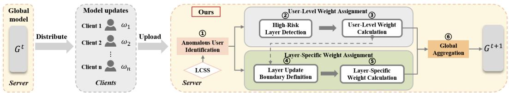
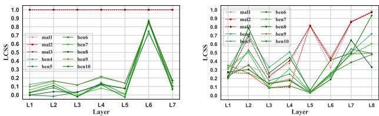
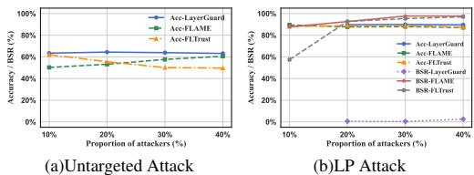
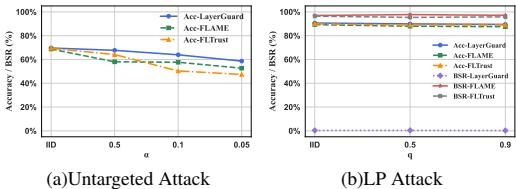
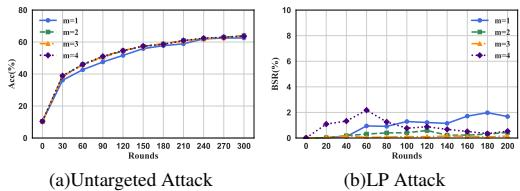
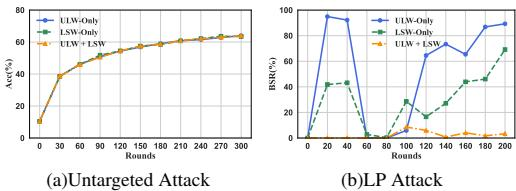
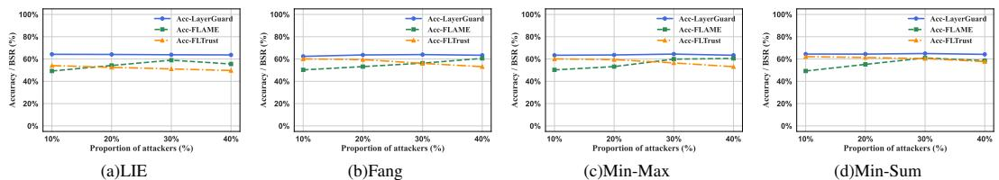
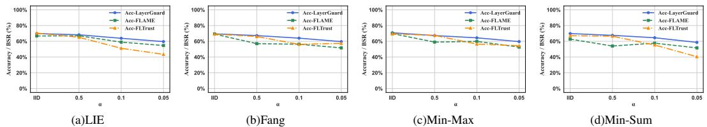
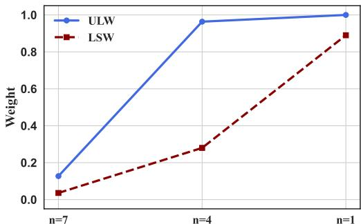
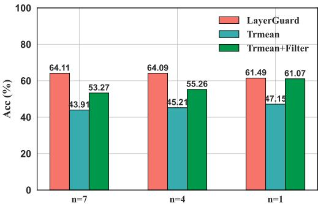

# LayerGuard: Poisoning-Resilient Federated Learning via Layer-Wise Similarity Analysis

Anonymous Author(s)   
Affiliation   
Address   
email

# Abstract

In recent years, model poisoning attacks have gradually evolved from conventional   
global parameter manipulations to more stealthy and strategic Targeted Layer   
Poisoning (TLP) attacks.These attacks achieve high attack success rates by selec  
tively poisoning only a subset of layers. However, most existing defenses rely   
on evaluation of the entire network and are thus ineffective against TLP attacks,   
posing new challenges to the security of Federated Learning (FL).In this paper,   
we propose LayerGuard, a comprehensive defense framework featuring dynamic   
detection and adaptive aggregation to protect FL against advanced model poison  
ing attacks. Diverging from traditional methods that analyze the entire network   
collectively, LayerGuard performs layer-wise similarity analysis to detect anoma  
lous clients and adaptively identifies layers under attack based on the clustering   
behavior of malicious updates, facilitating more precise threat detection. Building   
on this, we introduce a joint weighting mechanism in the aggregation process,   
which evaluates each client’s credibility at the layer level from two complementary   
informational dimensions: inter-layer and intra-layer, balancing attack mitigation   
and benign contribution retention. Extensive experiments across various datasets   
and model architectures demonstrate that LayerGuard successfully reduces the   
average attack success rate of TLP attacks to around $5 \%$ . Moreover, when con  
fronted with other advanced model poisoning attacks, LayerGuard consistently   
maintains global model accuracy—even under high poisoning rates and severe non  
IID conditions—comparable to that of FedAvg under no-attack settings, marking a   
significant improvement over existing defenses.

# 23 1 Introduction

Background and Problem. Federated Learning (FL) has gained widespread adoption in privacy  
sensitive domains such as healthcare[3] and finance[4], due to its ability to enable collaborative   
model training without sharing raw data[1, 2]. However, the decentralized nature of FL also makes   
it vulnerable to model poisoning attacks[11–18], where adversaries manipulate a subset of client   
updates to degrade global model performance, posing a serious threat to the reliability of FL systems.   
Recently, poisoning strategies have evolved from coarse-grained global parameter perturbations[12–   
18] to more stealthy and strategic forms of Targeted Layer Poisoning (TLP)[11]—where only specific   
layers of the model are maliciously altered, effectively bypassing existing defenses that rely on   
evaluation of the entire network[2, 5–10]. In parallel, more general and disruptive poisoning variants   
such as advanced untargeted attacks[12–15] have emerged, by exhibiting high similarity to benign   
updates in gradient space, thereby disguising malicious behavior and subtly interfering with the   
training process. Existing defense mechanisms[5–10] struggle to detect fine-grained layer-level   
anomalies, and often misclassify benign clients, ultimately harming the overall performance of the   
global model. These limitations highlight the urgent need for a more fine-grained and robust defense   
framework capable of resisting TLP and other advanced poisoning strategies while preserving model   
utility.   
Limitations of Previous Works. To defend against model poisoning attacks, researchers have   
proposed various defenses. These include defenses that leverage cross-client information, such   
as Krum, Trimmed Mean, Norm Bound, and FLAME[5–8], where the server compares statistical   
properties across clients—e.g., Euclidean distance, cosine similarity—to identify anomalous updates.   
Defense methods that utilize global information, such as FLTrust and FLDetector[9, 10], in which the   
server uses trusted gradients or reference models to determine whether a client behaves abnormally.   
Although progress has been made, existing defenses still face significant limitations against emerging   
attack strategies. First, these defenses rely on evaluation of the entire network, which fails to capture   
TLP attacks where only a subset of model layers is manipulated[11]. As a result, such attacks can   
bypass detection with minimal effort. Second, under highly non-IID data distributions, current   
defenses struggle to distinguish malicious updates from genuinely benign ones[26]. In such settings,   
benign clients may generate statistically deviant updates that are nonetheless critical for model   
performance. These challenges call for a new defense paradigm that can effectively detect localized   
anomalies while preserving benign diversity, enabling more robust and fine-grained protection in FL.   
Our Work. To address the above limitations, we propose LayerGuard, a comprehensive defense   
framework featuring dynamic detection and adaptive aggregation. Diverging from traditional methods   
that evaluate client behavior at the whole-model level, LayerGuard performs layer-wise similarity   
analysis to detect anomalous clients and adaptively identifies layers likely to be compromised, based   
on the clustering behavior of malicious updates. Building on this analysis, we introduce a joint   
weighting mechanism in the aggregation process that evaluates the credibility of each client across   
individual layers from two complementary informational dimensions: user-level weights analyze inter  
layer information, while layer-specific weights capture intra-layer behavior. Extensive experiments on   
diverse datasets and model architectures show that LayerGuard reduces the average attack success   
rate of TLP attacks from approximately $90 \%$ to around $5 \%$ . When confronted with other advanced   
model poisoning attacks, LayerGuard maintains global model accuracy under high poisoning rates   
and severe non-IID conditions, comparable to that of FedAvg in no-attack settings.

Contribution. The main contributions are:

(a) We uncover a limitation of existing defenses: their coarse-grained evaluation based on the entire network fails to detect localized anomalies, rendering them ineffective against Targeted Layer Poisoning (TLP) attacks.   
(b) We propose LayerGuard, a novel defense framework that operates at a finer granularity by analyzing each layer individually to identify anomalous clients and adaptively detect layers under attack.This novel approach facilitates more precise threat detection.   
(c) We design a joint weighting mechanism for aggregation, which evaluates each client’s credibility at the layer level based on two complementary informational dimensions: interlayer and intra-layer. This design enables precise suppression of malicious updates while retaining the contribution of benign ones.   
(d) We conduct extensive experiments on LayerGuard against TLP attacks, other advanced model poisoning attacks, and adaptive attacks.

# 79 2 Related Works

# 2.1 Model Poisoning Attacks

In FL, model poisoning attacks directly manipulate client gradients during training and pose greater threats than data poisoning[18, 13], which relies on altering local training data[19, 20]. Depending on their objectives, these attacks are typically categorized into untargeted attacks[12–15], which aim to degrade overall model performance, and targeted attacks[15–18], such as backdoor insertion[16, 17], which manipulate specific outputs. Untargeted poisoning is a more severe threat to model prediction performance than the targeted one in FL[14]. In this work, we primarily focus on untargeted poisoning attacks. For targeted attacks, we focus on a recently proposed backdoor attack based on TLP[11].

Untargeted Attack. We consider five representative advanced untargeted model poisoning attacks   
in our evaluation. LIE[12] perturbs the average of benign gradients with calibrated noise to subtly   
degrade model performance while evading detection. Fang[13] is an optimization-based method   
that manipulates gradient directions by solving for a global scaling coefficient $\lambda$ . Min-Sum[14]   
constrains the sum of squared distances between malicious and benign gradients so that it remains   
within the maximum squared distance among benign updates, while Min-Max[14] instead limits   
the maximum distance, effectively camouflaging malicious updates among benign ones. MPAF[15]   
leverages momentum from historical gradients to craft stealthy and disruptive updates that are harder   
to detect.

# 97 2.2 Targeted Layer Poisoning Attacks

Targeted Layer Poisoning (TLP) attacks achieve high attack success rates by selectively poisoning   
only a subset of model layers. We refer to the poisoned layers as targeted layers, and the unaltered   
layers as non-targeted layers. The Layer-wise Poisoning (LP) attack[11], proposed by Zhuang et   
al., is a backdoor-based TLP attack. It identifies Backdoor Critical (BC) layers using Backdoor   
Success Rate (BSR) as the evaluation metric, and poisons only these targeted layers. Malicious clients   
optimize their local models through layer-wise analysis, continuously injecting backdoors across   
multiple communication rounds. The BC layers are not fixed and may vary from round to round,   
which increases the stealthiness of the attack while maintaining high BSR. Currently, no effective   
defense strategy exists to counter this type of attack.

# 07 3 Design of LayerGuard

# 3.1 Design Challenges

Our core idea is inspired by previous research[13, 14] that emphasizes the necessity of a certain degree of similarity among malicious updates in order to significantly compromise FL. However, under more complex and stealthy threat scenarios—such as Targeted Layer Poisoning (TLP) attacks and advanced untargeted attacks—designing defense mechanisms based on this principle presents the following technical challenges:

C1- In contrast to conventional poisoning attacks that target the entire model update, TLP attacks selectively poison specific layers. This raises the question: how can the similarity among malicious updates be effectively quantified when only partial-layer poisoning is involved?

C2- Given that TLP attacks affect only selected layers while leaving others largely benign[11], how can a defense mechanism suppress malicious updates in the targeted layers without disrupting the aggregation of benign updates in the non-targeted layers?

C3- Do benign updates sometimes exhibit high similarity similar to that of malicious ones? How can we ensure that such benign updates are not mistakenly classified as malicious?

C4- How can malicious updates be effectively mitigated while minimizing the impact on benign contributions?

# 3.2 Overview

To address the aforementioned challenges, we propose a novel and advanced defense mechanism for   
FL, termed LayerGuard. The design motivations and inspirations behind this method are detailed   
in Appendix A. The overall architecture of LayerGuard is depicted in Figure 1. Specifically, the   
process consists of the following core components:   
(1) Anomalous User Identification. Identify highly similar anomalous users per layer based on layer  
wise similarity scores(LCSS). (2) High-Risk Layer Detection. By examining the distribution of   
anomalous users across different layers, LayerGuard identifies the high-risk layers where malicious   
activity is primarily concentrated. (3) User-Level Weight Calculation. Given the identified high  
risk layers, LayerGuard assigns a user-level weight to each client. (4) Layer Update Boundary   
Definition. Adaptively establish benign and malicious boundaries for updates on individual layers.   
(5) Layer-Specific Weight Calculation. Based on layer update boundaries, LayerGuard dynamically   
assigns layer-specific weights to each client at different layers. (6) Global Aggregation. Finally,   
LayerGuard integrates both user-level and layer-specific weights to perform a weighted aggregation.

  
Figure 1: Design of LayerGuard Framework.

# 3.3 Layer-wise Cosine Similarity Score

Inspired by the Layer-Wise MultiKrum defense method (details in Appendix A), and employing   
cosine similarity as the core measurement(Section 3.1), we introduce a novel metric termed the   
Layer-wise Cosine Similarity Score (LCSS). Diverging from traditional approaches that analyze   
client updates at the network level, LCSS enables independent analysis of updates at each individual   
layer.   
Formally, let $\Delta w _ { i } ^ { l }$ denote the update of client $i$ at the $l$ -th layer, where $l \in [ L ]$ indexes the $L$ layers of   
the global model and $i , j \in { 1 , \dots , N }$ represent client indices among the total of $N$ participants. The   
cosine similarity matrix $S ^ { l }$ at layer $l$ is defined as:

$$
S _ { i , j } ^ { l } = \frac { \langle \Delta w _ { i } ^ { l } , \Delta w _ { j } ^ { l } \rangle } { \| \Delta w _ { i } ^ { l } \| _ { 2 } \cdot \| \Delta w _ { j } ^ { l } \| _ { 2 } }
$$

where $\langle \cdot , \cdot \rangle$ denotes the inner product and $\| \cdot \| _ { 2 }$ is the $\ell _ { 2 }$ -norm. This matrix quantifies the pairwise   
directional similarity of updates between clients at layer $l$ .   
For each client $i$ , we identify the $m$ nearest neighbors in similarity space based on $S ^ { l }$ , and compute   
the average of the corresponding similarity scores to obtain the Layer-wise Cosine Similarity Score   
(LCSS) at layer $l$ :

$$
\mathrm { L C S S } _ { i } ^ { l } = \frac { 1 } { m } \sum _ { j \in \mathcal { N } _ { i } } S _ { i , j } ^ { l }
$$

where ${ \mathcal { N } } _ { i }$ denotes the set of the $m$ most similar clients to client $i$ at layer $l$ . By averaging the $m$ most   
similar clients at each layer, the metric captures local similarity patterns, enhancing the sensitivity to   
collusive behavior among malicious clients that may remain undetected at the global level(addressing   
C1). The effect of different $m$ values on defense performance is explored in Section 4.4.   
To evaluate the effectiveness of LCSS, we analyze its distribution under untargeted attack MPAF and   
LP attack on the CIFAR-10[22] and FashionMNIST[21] datasets, respectively. Each setup includes   
10 clients, among which 3 are malicious. Detailed dataset, model configurations, and other FL   
settings see Section 4.1. The results are shown in Figure 2. Note that in the LP attack, the targeted   
layers are L5, L7, and L8. For untargeted attacks, malicious clients exhibit higher LCSS values than   
benign ones. Similarly, under LP attack, this distinction also holds within the targeted layers.

  
Figure 2: LCSS distributions under the untargeted attack MPAF(Left) and the LP attack (Right).

# 162 3.4 Anomalous User Identification

The goal of anomalous user identification is to detect a set of potentially anomalous users 163 $\{ B _ { l } \} _ { l = 1 } ^ { L }$ 5 clients show higher LCSS on the poisoned layers.

To detect anomalous users in each layer $l \in \{ 1 , \ldots , L \}$ , we apply a threshold-based filtering strategy   
on the LCSS. Starting from an initial threshold $\tau _ { 0 }$ , we iteratively lower the threshold until at least one   
168 user exceeds it. For each layer $l$ , let the set of anomalous users be denoted by $B _ { l }$ . We define:

$$
f _ { l } ( \tau ) = \left\{ i \in \{ 1 , \dots , N \} \mid \mathbf { L C S S } _ { i } ^ { l } \geq \tau \right\}
$$

69 We then determine the final anomalous set $B _ { l }$ by selecting the largest threshold $\tau$ in the descending   
sequence $\{ \tau _ { 0 } , \tau _ { 0 } - 0 . 0 5 , \dots , 0 \}$ such that $f _ { l } ( \tau )$ is non-empty:

$$
B _ { l } = f _ { l } ( \tau ^ { * } ) \quad { \mathrm { w h e r e } } \quad \tau ^ { * } = \operatorname* { m a x } { \{ \tau \in { \mathcal { T } } \mid f _ { l } ( \tau ) \neq \emptyset \} }
$$

where $\mathcal { T } = \{ \tau _ { 0 } , \tau _ { 0 } - 0 . 0 5 , \hdots , 0 \}$ . If the threshold drops to $\tau \leq 0$ , it indicates the likely absence of further malicious clients. The resulting anomalous user sets for all layers are denoted by 72 $\{ B _ { l } \} _ { l = 1 } ^ { L }$ .

Based on the patterns observed in Figure 2, we set the initial similarity threshold to $\tau _ { 0 } = 0 . 9 5$ and   
introduce an adaptive threshold adjustment mechanism. Specifically, $\tau$ is gradually decreased with a   
step size of 0.05 to accommodate the varying detection requirements across different layers.

# 6 3.5 User-Level Weight Assignment

To quantify the behavioral credibility of each client, we assign a user-level weight $\alpha _ { i }$ to each client   
$i \in { 1 , \dots , N }$ , based on the set of potentially anomalous users $\{ B _ { l } \} _ { l = 1 } ^ { L }$ . This process begins by   
identifying high-risk layers likely to have been targeted by poisoning, followed by calculating   
user-level weights $\alpha _ { i }$ based on the anomalous user sets associated with those layers.

High-Risk Layer Detection. Anomalous user identification computes potentially high-similarity anomalous users for all layers, including non-targeted layers that are not poisoned by TLP attacks. The anomalous user sets in non-targeted layers are likely to consist mainly of benign clients. Therefore, it is necessary to filter the layers before analyzing $\{ \ - \dot { B _ { l } } \} _ { l = 1 } ^ { L }$ , in order to identify the truly targeted layers that have been poisoned. To address this challenge, we adopt a subtle idea: malicious updates tend to be more tightly clustered than benign ones, due to the higher similarity among poisoned updates. This clustering behavior is reflected in the distribution of LCSS scores—malicious updates exhibit LCSS values concentrated in a narrow range, while benign updates in non-targeted layers display a more dispersed, random-like distribution. This pattern is illustrated in Figure 2.

Building on it, we propose a method for high-risk layer detection. We identify a set of high-risk   
layers, denoted by $\mathcal { L } _ { \mathrm { H R } }$ , based on the number of anomalous users in each layer. A layer is considered   
high-risk if threshold as $\begin{array} { r } { \tau _ { \mathrm { H R } } = \frac { N } { 2 } - 1 } \end{array}$ set size , which $| B _ { l } |$ is greater than or equal to a threshold sponds to the maximum possible numb $\tau _ { \mathrm { H R } }$ . We initialize thef malicious clients.

194 Formally, the high-risk layer set is defined as:

$$
\mathcal { L } _ { \mathrm { H R } } = \left\{ l \in \left\{ 1 , \dots , L \right\} | B _ { l } | \geq \tau _ { \mathrm { H R } } \right\}
$$

$\tau _ { \mathrm { H R } }$ is progressively decreased from $\begin{array} { r } { \frac { N } { 2 } - 1 } \end{array}$ to 1 until $\mathcal { L } _ { \mathrm { H R } } \neq \emptyset$

6 User-Level Weight Calculation. For each user $i$ , we compute the number of high-risk layers in which the user is flagged as anomalous:

$$
| H _ { i } | = \sum _ { l \in \mathcal { L } _ { \mathrm { H R } } } \mathbb { I } ( i \in B _ { l } )
$$

The user-level weight is then defined as:

$$
\alpha _ { i } = 1 - \frac { \left| H _ { i } \right| } { \left| \mathcal { L } _ { \mathrm { H R } } \right| }
$$

This step yields a user-level weight vector $\{ \alpha _ { i } \} _ { i = 1 } ^ { N }$ , where lower values indicate a higher frequency   
of being flagged in high-risk layers, and thus a greater likelihood of malicious behavior. Under   
this formulation, even if certain non-targeted layers are mistakenly classified as high-risk due to   
distributional irregularities, or if a few benign updates in targeted layers exhibit high LCSS values   
similar to malicious ones due to special cases, these benign users are still assigned relatively higher   
user-level weights, as they appear in only a small fraction of high-risk layers(addressing C3).

# 3.6 Layer-Specific Weight Assignment

After computing the ulayer-specific weight ight vector , building $\{ \alpha _ { i } \} _ { i = 1 } ^ { N }$ , we propose a more fine-grained and flexible user credibility quantified by the user-level $\{ \beta _ { i } ^ { l } \} _ { i = 1 , l = 1 } ^ { N , L }$   
weights. The user-level weight alone is insufficient to precisely suppress the impact of malicious updates for two key reasons. First, in the case of TLP attacks, malicious clients only poison the targeted layers, while their updates in non-targeted layers remain benign[11]. Applying a uniform user-level weight in this context would undesirably suppress not only the malicious updates in the targeted layers but also the benign updates in the non-targeted layers. Second, the purpose of the user-level weight is to accurately quantify user credibility based on the anomalous user set for each layer. This process does not analyze all users within each layer.Although this yields a reasonably accurate credibility estimate, it indirectly limits the suppression strength by failing to fully capture per-layer behaviors. The computation consists of two steps.

Layer Update Boundary Definition. For each layer $l$ , we first define two behavioral boundaries based on the $\mathrm { L C S } _ { i } ^ { l }$ :

• The malicious boundary $\gamma _ { \mathrm { m a l } } ^ { l }$ is defined as the minimum similarity score among all users identified as anomalous in layer $l$ :

$$
\gamma _ { \mathrm { m a l } } ^ { l } = \operatorname* { m i n } _ { i \in B _ { l } } \mathrm { L C S S } _ { i } ^ { l }
$$

• The benign boundary 21 $\gamma _ { \mathrm { b e n } } ^ { l }$ is computed as the average similarity score of the top $50 \%$ of users with the highest user-level weights 22 $\alpha _ { i }$ , based on the presumption that malicious clients comprise less than 23 $50 \%$ of the total.:

$$
\gamma _ { \mathrm { b e n } } ^ { l } = \frac { 1 } { | \mathcal { U } _ { \mathrm { b e n } } | } \sum _ { i \in \mathcal { U } _ { \mathrm { b e n } } } \mathrm { L C S S } _ { i } ^ { l }
$$

Here, $\mathcal { U } _ { \mathrm { b e n } }$ denotes the set of top $50 \%$ users sorted in descending order of $\alpha _ { i }$ . The average is used   
because the LCSS of benign users tend to exhibit relatively random distribution patterns, and the   
226 mean provides a more robust representation of their typical behavior.   
27 Layer-Specific Weight Calculation. Each user’s weight in layer $l$ is then determined according to   
the following piecewise function:

$$
\beta _ { i } ^ { l } = \left\{ \begin{array} { l l } { 0 , } & { \mathrm { i f ~ L C S S } _ { i } ^ { l } \geq \gamma _ { \mathrm { m a l } } ^ { l } } \\ { 1 , } & { \mathrm { i f ~ L C S S } _ { i } ^ { l } \leq \gamma _ { \mathrm { b e n } } ^ { l } } \\ { \frac { \gamma _ { \mathrm { m a l } } ^ { l } - \mathrm { L C S S } _ { i } ^ { l } } { \gamma _ { \mathrm { m a l } } ^ { l } - \gamma _ { \mathrm { b e n } } ^ { l } } , } & { \mathrm { o t h e r w i s e } } \end{array} \right.
$$

This step yields the matrix of layer-specific weights {βli}N,Li=1,l=1 .Considering the distributional   
variation of LCSS scores across different layers, we apply linear interpolation between the malicious   
and benign boundaries to determine each user’s weight in each layer. In this way, the layer-specific   
weight addresses the near-threshold distribution phenomenon, which the user-level weight fails to   
capture. In this scenario, certain malicious updates in certain layers have LCSS values close to the   
threshold $\tau$ (e.g., 0.95), but do not exceed it (e.g., 0.945, 0.940), and thus are not included in the   
anomalous user set. Moreover, the benign boundary is dynamically adjusted per layer: in targeted   
layers, it tends to take lower values, whereas in non-targeted layers, it shifts toward higher values.   
This design helps mitigate the unintended suppression of benign updates in non-targeted layers by   
the layer-specific weighting mechanism.

# 3.7 Aggregation with Weighted Contributions

In each communication round $t$ , the aggregation is performed in a layer-wise manner and incorporates both user-level reliability weights 241 $\alpha _ { i }$ and layer-specific contribution weights $\beta _ { i } ^ { l }$ .

To ensure that a user regarded as benign in a particular layer is not penalized by their user-level   
weight, we override the user-level weight in that layer: if $\bar { \beta } _ { i } ^ { l } = 1$ , then $\alpha _ { i }$ is replaced with 1 when   
computing the aggregation for layer $l$ (addressing C2). Formally, the adjusted user-layer weight is   
defined as $\widetilde { \alpha } _ { i } ^ { l } = \bar { 1 }$ if $\bar { \beta } _ { i } ^ { l } = 1$ , and $\widetilde { \alpha } _ { i } ^ { l } = \alpha _ { i }$ otherwise.The global model is then updated as follows:

$$
G ^ { ( t ) } = \sum _ { l = 1 } ^ { L } \frac { \sum _ { i = 1 } ^ { N } \left| D _ { i } \right| \cdot \widetilde { \alpha } _ { i } ^ { l } \cdot \beta _ { i } ^ { l } \cdot \Delta w _ { i } ^ { l } } { \sum _ { j = 1 } ^ { N } \left| D _ { j } \right| \cdot \widetilde { \alpha } _ { j } ^ { l } \cdot \beta _ { j } ^ { l } }
$$

Here, $| D _ { i } |$ (or $| D _ { j } | )$ denotes the number of local data samples held by client $i$ (or $j$ ). This aggregation   
rule ensures that each user’s contribution is weighted according to both their overall credibility(based   
on inter-layer information) and their behavior in each layer(based on intra-layer information), allowing   
malicious updates to be suppressed without unnecessarily affecting benign ones(addressing C4).

# 4 Experiments

# 4.1 Setup

Datasets and Models. For untargeted attacks, we evaluate our method on three widely used FL datasets: FashionMNIST[21], CIFAR-10[22], and CINIC[23], using two different CNN architectures[26] in total. For the LP attack, we adopt the exact dataset–model combinations used in its original paper to ensure fair comparison: a CNN architecture[9, 10] on FashionMNIST, and ResNet18[24] and VGG19[25] on CIFAR-10. Detailed dataset and model configurations are provided in Appendix B.1 and Appendix B.2.

Attacks and Compared Defenses. We consider six state-of-the-art model poisoning attacks, including five untargeted attacks—LIE, Fang, Min-Max, Min-Sum, and MPAF[12–15]—as well as the Layer-wise Poisoning (LP) attack[11]. We compare our method against six advanced defense baselines, including four defenses that leverage cross-client information—Krum, Trimmed Mean, Norm Bound, and FLAME[5–8]—two defenses that utilize global information—FLTrust and FLDetector[9, 10].

FL Settings. We conduct all experiments using a NVIDIA A100 GPU. By default, for untargeted attacks, 30 out of 100 clients are selected per round, with a poisoning rate of $30 \%$ . A Dirichlet distribution is used to simulate non-IID data across clients[27, 28], with heterogeneity parameter $\beta = 0 . 1$ . Each client trains locally for 1 epoch, over 300 communication rounds.For the LP attack, we follow its original FL setup but increase the poisoning rate to $30 \%$ for consistency. Note that in the original setting, non-IID distribution is controlled by parameter q[9, 13, 11], which we set to 0.5. For LayerGuard, based on the discussion in Section 4.4, we set $m = 2$ to balance defense performance and computational efficiency. Detailed FL settings are provided in Appendix B.3.

Metric. We consider a set of metrics for evaluating detection and defense effectiveness, including Accuracy, Backdoor Success Rate (BSR), False Positive Rate (FPR), and False Negative Rate (FNR).

# 4.2 Main Results

In this section, we evaluate the defensive effectiveness of LayerGuard against both advanced untargeted attacks and the LP attack. In addition, we assess its detection accuracy and compare it with the advanced defense FLDetector. Due to space limitations, the detection accuracy results are presented in Appendix C.1.

Defensive Effectiveness. LayerGuard outperforms existing defenses. Table 1 and Table 2 present the end-to-end performance under untargeted and LP attacks, respectively. As shown, LayerGuard consistently achieves superior results against both types of attacks. Notably, under five advanced untargeted attacks, its accuracy is comparable to that of FedAvg under no-attack settings. Against the LP attack, LayerGuard achieves an average BSR of around $5 \%$ across all model–dataset configurations, successfully defending against LP attack that existing defenses fail to mitigate. This robustness stems from LayerGuard’s fine-grained evaluation of client credibility across layers. It is worth noting that LayerGuard incurs a moderate accuracy drop under no-attack settings compared

to FedAvg and some baselines. This is because the weighting mechanism still assigns lower weights   
to certain benign updates with relatively high LCSS, when all clients are benign. Additionally, under   
the LP attack, LayerGuard shows somewhat less stable BSR performance on deeper models, as a   
larger number of layers increases the chance of errors in user-level weight assignment.

Table 1: Comparisons of final test accuracy under untargeted attacks. Results are averaged over three runs. $\mathbf { \hat { a } } \pm \mathbf { b } ^ { \prime }$ indicates mean and standard deviation for LayerGuard.   

<table><tr><td>Dataset</td><td>Attack</td><td>FedAVG</td><td>Krum</td><td>Trimmed Mean</td><td>Norm Bound</td><td>FLAME</td><td>FLTrust</td><td>FLDetector</td><td>LayerGuard</td></tr><tr><td rowspan="5">CINIC</td><td>No Attack Lie</td><td>53.48 21.73</td><td>24.16 11.84</td><td>53.67 32.22</td><td>53.22 21.60</td><td>47.96 48.40</td><td>41.23 42.96</td><td>53.33 14.11</td><td>50.18±0.59 53.26±0.18</td></tr><tr><td></td><td></td><td></td><td></td><td></td><td></td><td></td><td></td><td></td></tr><tr><td>Fang</td><td>18.14</td><td>33.68</td><td>25.75</td><td>37.90</td><td>48.22</td><td>50.30</td><td>49.89</td><td>53.60±0.14</td></tr><tr><td>Min-Max</td><td>38.52</td><td>9.99</td><td>35.22</td><td>39.20</td><td>50.66</td><td>40.78</td><td>13.23</td><td>53.35±0.20</td></tr><tr><td>Min-Sum MPAF</td><td>46.40 11.71</td><td>12.20 10.90</td><td>32.41 13.63</td><td>46.65 12.53</td><td>47.17 51.52</td><td>41.81 34.14</td><td>14.33 10.91</td><td>53.57±0.17 53.66±0.29</td></tr><tr><td rowspan="6"></td><td>No Attack</td><td>87.81</td><td>60.77</td><td>87.10</td><td>87.25</td><td>83.04</td><td>87.76</td><td>87.53</td><td>86.15±0.54</td></tr><tr><td>Lie</td><td>63.60</td><td>30.78</td><td>77.78</td><td>62.77</td><td></td><td></td><td></td><td>87.14±0.09</td></tr><tr><td></td><td>29.37</td><td>55.83</td><td>35.93</td><td>74.03</td><td>80.54</td><td>82.74</td><td>79.27</td><td></td></tr><tr><td>Fang Min-Max</td><td>80.55</td><td>10.01</td><td>78.99</td><td></td><td>83.11</td><td>85.36</td><td>86.09</td><td>87.12±0.14</td></tr><tr><td>Min-Sum</td><td>85.49</td><td>54.85</td><td>78.52</td><td>83.15 85.92</td><td>82.88 79.45</td><td>84.14 82.32</td><td>79.62 84.33</td><td>86.96±0.22 86.88±0.17</td></tr><tr><td>MPAF</td><td>20.46</td><td>10.22</td><td>73.49</td><td>37.73</td><td>83.88</td><td>81.74</td><td>10.00</td><td>87.09±0.23</td></tr><tr><td rowspan="6">CIFAR-10</td><td>No Attack</td><td>63.26</td><td>30.07</td><td>63.84</td><td>64.17</td><td>52.59</td><td>58.51</td><td>64.29</td><td>59.64±0.42</td></tr><tr><td>Lie</td><td>24.10</td><td>12.05</td><td>35.72</td><td>24.02</td><td>58.95</td><td>51.11</td><td>33.45</td><td>63.82±0.35</td></tr><tr><td>Fang</td><td>11.16</td><td>39.49</td><td>32.57</td><td>41.86</td><td>56.28</td><td>56.10</td><td>60.34</td><td>63.99±0.11</td></tr><tr><td>Min-Max</td><td>44.12</td><td>10.33</td><td>41.15</td><td>49.31</td><td>59.88</td><td>56.49</td><td>9.59</td><td>64.43±0.20</td></tr><tr><td>Min-Sum</td><td>57.56</td><td>12.60</td><td>40.58</td><td>55.94</td><td>57.64</td><td>55.29</td><td>19.62</td><td>64.51±0.33</td></tr><tr><td>MPAF</td><td>12.95</td><td>10.42</td><td>18.22</td><td>12.91</td><td>57.66</td><td>50.33</td><td>10.00</td><td>63.91±0.29</td></tr></table>

Table 2: Comparison of final test accuracy and backdoor success rate under LP attack. Results are averaged over three runs. “a ± b” indicates mean and standard deviation for LayerGuard.   

<table><tr><td rowspan="2">Model (Dataset)</td><td colspan="2">VGG19 (CIFAR-10)</td><td colspan="2">CNN (FashionMNIST)</td><td colspan="2">ResNet18 (CIFAR-10)</td></tr><tr><td>Accuracy</td><td>BSR</td><td>Accuracy</td><td>BSR</td><td>Accuracy</td><td>BSR</td></tr><tr><td>FLAME</td><td>55.55</td><td>91.57</td><td>87.94</td><td>97.70</td><td>68.42</td><td>96.27</td></tr><tr><td>FLTrust</td><td>72.36</td><td>80.17</td><td>88.90</td><td>95.35</td><td>68.12</td><td>92.42</td></tr><tr><td>LayerGuard</td><td>75.41±0.86</td><td>5.22±2.32</td><td>89.88±0.34</td><td>0.41±0.16</td><td>73.04±0.51</td><td>7.45±3.45</td></tr></table>

# 291 4.3 Impact of FL Setting

In this part, we study the influence of different FL settings on our defense. By default, we conduct experiments on CIFAR-10 for untargeted attacks and on FashionMNIST for LP attack. All other settings follow the defaults in Section 4.1. Due to limited space, we use MPAF as the representative untargeted attack. The results on other untargeted attacks are provided in Appendix C.2.

Impact of the fraction of malicious clients. Figure 3 presents the robustness of LayerGuard across different poisoning rates. For untargeted attacks, as the number of malicious clients increases, the impact of poisoning becomes more severe. However, LayerGuard’s accuracy remains consistently stable and unaffected by the increasing poisoning rate. For LP attack, as the ratio of malicious clients increases, the BSR stays consistently below $3 \%$ . Note that a limitation of LayerGuard is its requirement for more than one malicious client to function effectively. In the LP attack experiment, the $10 \%$ poisoning ratio means there is only one malicious client, thus, we do not show results for this setting.

  
Figure 3: Impact of malicious client fraction.

  
Figure 4: Impact of non-IID degree.

Impact of non-IID degree. As shown in Figure 4, we evaluate the impact of different levels of   
non-IID data, including IID, on defense performance. Specifically, for untargeted attacks, we consider   
non-IID levels generated via a Dirichlet distribution[27, 28], where smaller $\beta$ values correspond to   
stronger heterogeneity. For LP attacks, following the original paper’s setup, we use parameter $q$ to   
control the non-IID level[9, 13, 11], where larger $q$ indicates higher non-IIDness. Our results show   
that even under extreme non-IID conditions (e.g., $\beta = 0 . 0 5$ , $q = 0 . 9$ ), LayerGuard maintains high   
accuracy and a low BSR. This robustness stems from the high similarity among malicious updates   
being unaffected by data heterogeneity. In contrast, existing advanced defenses that rely on the   
consistency of distribution across clients often degrade under high non-IID settings.

# 313 4.4 Ablation Study

The ablation study investigates two main questions: whether the choice of $m$ in LCSS influences the results, and whether both User-Level Weight (ULW) and Layer-Specific Weight (LSW) are necessary for optimal performance, including the impact of removing either component.

Effect of Different $m$ Values. As shown in Figure 5, no significant performance differences are observed with varying values of $m$ for both untargeted and LP attacks. Notably, the accuracy and BSR are relatively worse when $m = 1$ , possibly due to insufficient reliability in computing LCSS with only a single nearest neighbor. In our main experiments, we choose $m = 2$ , which not only ensures excellent defense performance but also maintains a reasonable computational cost.

  
Figure 5: Impact of the value $m$ .

  
Figure 6: Comparison of defensive effectiveness on ULW-only, LSW-only, and their combined usage.

Effect of User-Level and Layer-Specific Weights. Figure 6 shows the defense performance of   
ULW-only, LSW-only, and their combined usage. For untargeted attacks, both ULW-only and   
LSW-only achieve the highest accuracy, and using both together does not interfere with each other’s   
performance. This is largely attributed to the effectiveness of LCSS in detecting collusive behaviors   
under untargeted attacks. For LP attacks, we experiment with more deeper model VGG19. We   
observe that neither ULW-only nor LSW-only alone is sufficient to defend against the LP attack,   
indicating that for fine-grained, layer-specific TLP attack, combining both inter-layer and intra-layer   
update information is essential for effective defense.

# 4.5 Adaptive Attack

We propose an adaptive attack strategy that leverages knowledge of LayerGuard’s mechanisms by using decoy updates combined with controlled similarity manipulation. The detailed formulation and experimental evaluation of this attack are presented in Appendix D.

# 5 Conclusion

In this work, we proposed LayerGuard, a novel defense for FL against advanced model poisoning attacks, especially TLP. LayerGuard innovatively refines the defense perspective from evaluating the entire network to analyzing both intra-layer and inter-layer information, achieving precise anomaly detection and robust model updates. In the comprehensive evaluation, LayerGuard significantly outperforms current state-of-the-art defenses and successfully defends against the LP attack that previous methods fail to mitigate. We believe LayerGuard offers a promising direction for enhancing FL robustness in real-world applications.

#

References   
[1] Konecný, J., McMahan, H. B., Yu, F. X., Richtárik, P., Suresh, A. T., and Bacon, D. Federated ˇ learning: Strategies for improving communication efficiency. arXiv preprint arXiv:1610.05492, 2016. [2] McMahan, H. B., Moore, E., Ramage, D., Hampson, S., and y Arcas, B. A. Communicationefficient learning of deep networks from decentralized data. In AISTATS, 2017.   
[3] Rieke, N., Hancox, J., Li, W., Milletari, F., Roth, H. R., Albarqouni, S., Bakas, S., Galtier, M. N., Landman, B. A., Maier-Hein, K., et al. The future of digital health with federated learning. In NPJ Digital Medicine, 2020.   
[4] Yang, W., Zhang, Y., Ye, K., Li, L., and Xu, C.-Z. Ffd: A federated learning based method for credit card fraud detection. In International Conference on Big Data. Springer, 2019.   
[5] Blanchard, P., El Mhamdi, E. M., Guerraoui, R., and Stainer, J. Machine learning with adversaries: Byzantine tolerant gradient descent. In NeurIPS, 2017.   
[6] Yin, D., Chen, Y., Kannan, R., and Bartlett, P. Byzantine-robust distributed learning: Towards optimal statistical rates. In ICML, 2018.   
[7] Sun, Z., Kairouz, P., Suresh, A. T., and McMahan, H. B. Can you really backdoor federated learning? arXiv preprint arXiv:1911.07963, 2019.   
[8] Nguyen, T. D., Rieger, P., De Viti, R., Chen, H., Brandenburg, B. B., Yalame, H., Möllering, H., Fereidooni, H., Marchal, S., Miettinen, M., et al. Flame: Taming backdoors in federated learning. In USENIX Security Symposium, 2022.   
[9] Cao, X., Fang, M., Liu, J., and Gong, N. Z. Fltrust: Byzantine-robust federated learning via trust bootstrapping. In NDSS, 2021a.   
[10] Zhang, Z., Cao, X., Jia, J., and Gong, N. Z. Fldetector: Defending federated learning against model poisoning attacks via detecting malicious clients. In KDD, 2022.   
[11] Zhuang, H., Yu, M., Wang, H., Hua, Y., Li, J., and Yuan, X. Backdoor federated learning by poisoning backdoor-critical layers. arXiv preprint arXiv:2308.04466, 2023.   
[12] Baruch, G., Baruch, M., and Goldberg, Y. A little is enough: Circumventing defenses for distributed learning. In NeurIPS, 2019.   
[13] Fang, M., Cao, X., Jia, J., and Gong, N. Local model poisoning attacks to byzantine-robust federated learning. In USENIX Security Symposium, 2020.   
[14] Shejwalkar, V. and Houmansadr, A. Manipulating the byzantine: Optimizing model poisoning attacks and defenses for federated learning. In NDSS, 2021.   
[15] Cao, X. and Gong, N. Z. Mpaf: Model poisoning attacks to federated learning based on fake clients. In CVPR Workshops, 2022.   
[16] Xie, C., Huang, K., Chen, P.-Y., and Li, B. DBA: Distributed backdoor attacks against federated learning. In ICLR, 2019.   
[17] Bagdasaryan, E., Veit, A., Hua, Y., Estrin, D., and Shmatikov, V. How to backdoor federated learning. In AISTATS, 2020.   
[18] Bhagoji, A. N., Chakraborty, S., Mittal, P., and Calo, S. Analyzing federated learning through an adversarial lens. In Proceedings of ICML, 2019.   
[19] Tolpegin, V., Truex, S., Gursoy, M. E., and Liu, L. Data poisoning attacks against federated learning systems. In ESORICS, 2020.   
[20] Fung, C., Yoon, C. J., and Beschastnikh, I. Mitigating sybils in federated learning poisoning. arXiv preprint arXiv:1808.04866, 2018.   
[21] Xiao, H., Rasul, K., and Vollgraf, R. Fashion-mnist: a novel image dataset for benchmarking machine learning algorithms. arXiv preprint arXiv:1708.07747, 2017.

[23] Darlow, L. N., Crowley, E. J., Antoniou, A., and Storkey, A. J. Cinic-10 is not imagenet or   
cifar-10. arXiv preprint arXiv:1810.03505, 2018.   
[24] He, K., Zhang, X., Ren, S., and Sun, J. Deep Residual Learning for Image Recognition. In   
Proceedings of IEEE CVPR, 2016.   
[25] Simonyan, K. and Zisserman, A. Very deep convolutional networks for large-scale image   
recognition. arXiv preprint arXiv:1409.1556, 2014.   
[26] Xie, Y., Fang, M., and Gong, N. Z. FedREDefense: Defending against model poisoning attacks   
for federated learning using model update reconstruction error. In Forty-first International Conference   
on Machine Learning, 2024. https://openreview.net/forum?id=Wjq2bS7fTK   
[27] Pi, R., Zhang, W., Xie, Y., Gao, J., Wang, X., Kim, S., and Chen, Q. Dynafed: Tackling client   
398 data heterogeneity with global dynamics. In CVPR, 2023.   
99 [28] Gu, H., Guo, B., Wang, J., Sun, W., Liu, J., Liu, S., and Yu, Z. Fedaux: An efficient framework   
400 for hybrid federated learning. In ICC, 2022.   
01 [29] Rieger, P., Nguyen, T. D., Miettinen, M., and Sadeghi, A.-R. DeepSight: Mitigating backdoor   
attacks in federated learning through deep model inspection. arXiv preprint arXiv:2201.00763, 2022.   
[30] Rieger, P., Krauß, T., Miettinen, M., Dmitrienko, A., and Sadeghi, A.-R. CrowdGuard: Feder  
404 ated backdoor detection in federated learning. arXiv preprint arXiv:2210.07714, 2023.

# 05 A Motivation and Inspiration

To validate the robustness of the LP attack, its researchers propose a targeted adaptive defense method named Layer-wise MultiKrum[5, 11], which extends the conventional MultiKrum strategy to a per-layer granularity. Specifically, Layer-wise MultiKrum independently performs the MultiKrum selection operation at each individual layer, aiming to identify anomalous updates within particular layers. Nevertheless, due to the high stealthiness of LP attack, updates in certain BC layers remain indistinguishable from benign clients, thereby successfully evading detection by Layer-wise MultiKrum.

The design philosophy of Layer-wise MultiKrum, along with its limitations in resisting LP attack, provides three critical insights for the development of our proposed method:

5 Insight 1: Layer-wise MultiKrum refines the defensive strategy from the holistic model level to   
a finer per-layer granularity, enabling more precise detection of anomalous behavior at individual   
layers.

Insight 2: Its core metric, the gradient score, is computed through aggregated distances from multiple nearest-neighbor gradients, effectively enhancing the discrimination capability toward abnormal gradients. This approach reduces the adverse impact of isolated anomalous gradients, thereby improving decision robustness.

Insight 3: Layer-wise MultiKrum aggregates final gradient scores by simply averaging several lowest gradient scores. This relatively coarse handling lacks a more sophisticated mechanism, which limits its effectiveness in detecting highly stealthy LP attack.

These three insights significantly influence our proposed method in terms of metric design and metric processing: Insights 1 and 2 inspire us to incorporate information across various layers and integrate multi-dimensional gradient features to enhance abnormal behavior detection. Insight 3 motivates us to refine the processing mechanism of our metrics, facilitating more accurate identification of highly 9 covert attacks.

# 430 B Additional Experimental Setups

# B.1 Datasets

FashionMNIST[21] is a grayscale image dataset containing 10 categories of clothing items, with 60,000 training images and 10,000 test images. CIFAR-10[22] is a color image dataset comprising 10 classes of everyday objects, including 50,000 training and 10,000 testing samples. CINIC[23] extends CIFAR-10 by incorporating downsampled images from ImageNet, resulting in a total of 270,000 images evenly divided into training, validation, and test sets.

# B.2 Models

• The two CNN architectures[26](under the Apache 2.0 license) used in the defense experiments against untargeted attacks are specified in Table 3 and Table 4 for FashionMNIST and CIFAR10/CINIC, respectively.

• In the defense experiments against the LP attack, we use three models: a CNN architecture[9, 10](under the MIT license), ResNet18[24], and VGG19[25]. The CNN model is trained on FashionMNIST, while ResNet18 and VGG19 are trained on CIFAR-10. The detailed structure of the CNN model is provided in Table 5.

Table 3: Model architecture for FashionMNIST(untargeted attack defense).   

<table><tr><td>Layer Type</td><td>Size</td></tr><tr><td>Convolution +ReLU</td><td>3×3×30</td></tr><tr><td>Max Pooling</td><td>2×2</td></tr><tr><td>Convolution+ReLU</td><td>3×3×50</td></tr><tr><td>Max Pooling</td><td>2×2</td></tr><tr><td>Fully Connected + ReLU</td><td>100</td></tr><tr><td>Softmax</td><td>10</td></tr></table>

Table 4: Model architecture for CIFAR-10 and CINIC(untargeted attack defense).   

<table><tr><td>Layer Type</td><td>Size</td></tr><tr><td>Convolution+ReLU</td><td>3×3×32</td></tr><tr><td>Max Pooling</td><td>2×2</td></tr><tr><td>Convolution+ReLU</td><td>3×3×64</td></tr><tr><td>Max Pooling</td><td>2×2</td></tr><tr><td>Fully Connected +ReLU</td><td>512</td></tr><tr><td>Softmax</td><td>10</td></tr></table>

Table 5: Model architecture for FashionMNIST(LP attack defense).   

<table><tr><td>Layer</td><td>Size</td></tr><tr><td>Input</td><td>28×28×1</td></tr><tr><td>Convolution + ReLU</td><td>3×3×32</td></tr><tr><td>Convolution+ReLU</td><td>3×3×64</td></tr><tr><td>Max Pooling</td><td>2×2</td></tr><tr><td>Dropout</td><td>0.5</td></tr><tr><td>Fully Connected + ReLU</td><td>128</td></tr><tr><td>Dropout</td><td>0.5</td></tr><tr><td>Fully Connected</td><td>10</td></tr></table>

# 445 B.3 FL Settings

• In the experiments defending against untargeted attacks, all clients participate in each training   
round, with malicious clients launching attacks in every round. Local training uses a batch size   
of 32. Stochastic Gradient Descent (SGD) is employed as the optimizer with a learning rate of   
$1 \times 1 0 ^ { - 3 }$ . Following prior work[27, 28], a Dirichlet distribution is used to simulate non-IID data   
across clients, with the heterogeneity parameter $\beta$ set to 0.1. A smaller $\beta$ indicates a higher degree of   
data heterogeneity.

• In the experiments against the LP attack, we follow the exact FL settings used in the original paper, except that the poisoning rate is increased to $30 \%$ for consistency. Among 100 clients, $10 \%$ are selected in each round. Each selected client trains for 2 local epochs using a batch size of 64. The global model is trained over 200 communication rounds. SGD is used as the optimizer, with a learning rate of $1 \times 1 0 ^ { - 2 }$ for FashionMNIST and $1 \times 1 0 ^ { - 1 }$ for CIFAR-10. In the original setup[11, 9, 13], non-IID data distribution is controlled by a parameter $q , q$ is set to 0.5. Clients are divided into $X$ groups corresponding to the $X$ classes in the dataset. The probability of assigning samples with label $x$ to the $x$ -th group is $q$ , and to other groups is $\frac { 1 - q } { X - 1 }$ . Samples within each group are then uniformly distributed to clients.

# C Additional Experimental Results

# C.1 Detection Accuracy

Although LayerGuard is not specifically designed for detecting malicious clients but rather for suppressing their impact through adaptive weighting, its mechanism inherently provides a certain capability for malicious client detection. During the user-level weighting process, LayerGuard identifies high-risk layers and records the frequency with which a client’s updates appear in these layers. Based on this, we define a client as malicious only if it is consistently flagged across all high-risk layers. Conversely, if a client is not marked in even one high-risk layer, it is treated as benign. In other words, a client is considered malicious only when its user-level weight is exactly zero. This criterion is deliberately stringent to avoid false positives. Despite such a conservative definition, LayerGuard still demonstrates strong detection performance.

We evaluate the detection performance for identifying malicious clients, compared with   
FLDetector[10], an advanced defense capable of client-level detection, as shown in Table 6. Layer  
Guard consistently achieves perfect detection, with $0 . 0 0 \%$ FPR and FNR in all cases. In contrast,   
FLDetector suffers from high error rates, completely failing under attacks like MPAF. Its poor perfor  
mance largely stems from its core assumption that clients with consistent updates are benign—an   
assumption that breaks down when malicious clients deliberately craft highly consistent updates, espe  
cially under non-IID conditions. These findings highlight LayerGuard’s clear advantage in delivering   
robust and precise detection, even under challenging attack scenarios and data heterogeneity.

Table 6: Comparison of detection performance (FPR and FNR) on different datasets.   

<table><tr><td rowspan="2">Attack</td><td rowspan="2">Detector</td><td colspan="2">FashionMNIST</td><td colspan="2">CIFAR-10</td><td colspan="2">CINIC</td></tr><tr><td>FPR</td><td>FNR</td><td>FPR</td><td>FNR</td><td>FPR</td><td>FNR</td></tr><tr><td rowspan="2">LIE</td><td>FLDetector</td><td>0.00</td><td>100.00</td><td>100.00</td><td>100.00</td><td>89.21</td><td>100.00</td></tr><tr><td>LayerGuard</td><td>0.00</td><td>0.00</td><td>0.00</td><td>0.00</td><td>0.00</td><td>0.00</td></tr><tr><td rowspan="2">Fang</td><td>FLDetector</td><td>9.25</td><td>0.00</td><td>8.33</td><td>0.00</td><td>12.64</td><td>0.00</td></tr><tr><td>LayerGuard</td><td>0.00</td><td>0.00</td><td>0.00</td><td>0.00</td><td>0.00</td><td>0.00</td></tr><tr><td rowspan="2">Min-Max</td><td>FLDetector</td><td>0.00</td><td>100.00</td><td>100.00</td><td>100.00</td><td>0.00</td><td>100.00</td></tr><tr><td>LayerGuard</td><td>0.00</td><td>0.00</td><td>0.00</td><td>0.00</td><td>0.00</td><td>0.00</td></tr><tr><td rowspan="2">Min-Sum</td><td>FLDetector</td><td>0.00</td><td>100.00</td><td>100.00</td><td>100.00</td><td>84.29</td><td>100.00</td></tr><tr><td>LayerGuard</td><td>0.00</td><td>0.00</td><td>0.00</td><td>0.00</td><td>0.00</td><td>0.00</td></tr><tr><td rowspan="2">MPAF</td><td>FLDetector</td><td>100.00</td><td>100.00</td><td>100.00</td><td>100.00</td><td>100.00</td><td>100.00</td></tr><tr><td>LayerGuard</td><td>0.00</td><td>0.00</td><td>0.00</td><td>0.00</td><td>0.00</td><td>0.00</td></tr></table>

# 480 C.2 Impact of FL Setting

Impact of the fraction of malicious clients. The impact of different poisoning rates on the defense   
performance of LayerGuard under four other advanced untargeted attacks is shown in Figure 7.   
Impact of non-IID degree. The effect of different non-IID degrees on the defense performance of   
LayerGuard under four other advanced untargeted attacks is shown in Figure 8.

  
Figure 7: Impact of malicious client fraction under four other untargeted attacks.

  
Figure 8: Impact of non-IID degree under four other untargeted attacks.

# 485 D Detailed Description of the Adaptive Min-Sum Attack

Attack Strategies Against LayerGuard. The core defense mechanism of LayerGuard is its use   
of User-Level Weight (ULW) and Layer-Specific Weight (LSW) to suppress malicious updates. A   
key step in ULW calculation is the identification of high-risk layers, where the condition for marking   
a layer as high-risk is that it contains a sufficient number of malicious updates with LCSS above a   
threshold $\tau$ (Details are provided in Section 3). Malicious updates with LCSS below this threshold   
within a given layer are not considered in ULW but are instead handled by LSW.   
A potential strategy to bypass LayerGuard is as follows: it assumes $t$ malicious clients and constructs   
$m + 1$ malicious updates with high mutual similarity as decoys to manipulate the user-level weight   
(ULW) mechanism. The reason for constructing $\mathrm { m } { + } 1$ such updates is to ensure that the LCSS of the   
malicious updates remain consistently high and stable. These decoy updates exhibit LCSS above   
the similarity threshold, thereby triggering high-risk layer identification. The remaining $t - m - 1$   
malicious updates—intended for the actual attack—are crafted with LCSS below the threshold. As a   
result, they are excluded from the anomalous user set and remain concealed under the cover of the   
decoys, effectively circumventing ULW’s suppression. To further evade detection by the layer-specific   
weight (LSW) mechanism, the $t - m - 1$ attackers reduce their internal similarity, weakening LSW’s   
ability to assign low weights to them, while maintaining the effectiveness of the attack.   
Adaptive Min-Sum. Based on the bypass strategy described above, further derive an adaptive   
attack specifically targeting LayerGuard, Adaptive Min-Sum, which leverages the knowledge and   
settings of LayerGuard, aiming to bypass ULW-based suppression while minimizing the impact   
imposed by LSW. The original Min-Sum attack[14] generates malicious updates by first computing   
the average of all benign updates as a reference point, and then applying a shared perturbation to   
minimize the sum of distances between the malicious and benign updates. Since all malicious clients   
adjust their updates relative to the same global reference, their final updates exhibit highly similar   
directions—resulting in strong internal similarity.   
To evade LayerGuard, Adaptive Min-Sum first constructs $m + 1$ standard Min-Sum-style malicious   
updates as decoys, leveraging their naturally high similarity to trigger high-risk layer detection. For   
the remaining $t - m - 1$ malicious clients, the attack introduces a new parameter $n$ , where each   
such client randomly samples $n$ benign updates and computes their mean as a personalized reference.   
This modification lowers the internal similarity among the remaining malicious updates, thereby   
reducing the suppressive effect of LSW on them. The parameter n controls the similarity between   
these malicious updates, smaller n results in lower mutual similarity.

517 The detailed procedure is as follows:

18 Assume there are $t$ malicious clients in total. Among them, the first $k = m + 1$ clients act as decoys   
and follow the standard Min-Sum strategy, while the remaining $t - k$ clients adopt an adaptive strategy   
to reduce internal similarity and evade detection.

Step 1. For each adaptive malicious client $j \in \{ k + 1 , \ldots , t \}$ , randomly sample a subset $B _ { j }$ of size $n$ from the set of benign clients $B$ :

$$
B _ { j } \subset B , \quad | B _ { j } | = n
$$

Step 2. Let $g _ { i }$ denote the update from benign client $i$ . The average of the selected subset is used as the new reference point:

$$
\bar { g } _ { j } = \frac { 1 } { n } \sum _ { i \in B _ { j } } g _ { i }
$$

Step 3. Each adaptive malicious client $j$ then constructs its update by shifting from the reference point $\bar { g } _ { j }$ along a fixed bias direction $d$ :

$$
g _ { \mathrm { m a l } } ^ { ( j ) } = \bar { g } _ { j } - \lambda d
$$

The perturbation term $\lambda d$ follows the original Min-Sum attack strategy.

For the decoy clients $i \in \{ 1 , \ldots , k \}$ , a shared reference $\bar { g }$ is computed as the average of all benign   
updates:

$$
\bar { g } = \frac { 1 } { | B | } \sum _ { i \in B } g _ { i } , \quad g _ { \mathrm { m a l } } ^ { ( i ) } = \bar { g } - \lambda d
$$

Summary of malicious updates:

$$
g _ { \mathrm { m a l } } ^ { ( u ) } = \left\{ \begin{array} { l l } { \bar { g } - \lambda d , } & { u = 1 , \ldots , k } \\ { \bar { g } _ { u } - \lambda d , } & { u = k + 1 , \ldots , t } \end{array} \right.
$$

Evaluation. In the adaptive experiment, the value of $m$ for LayerGuard is set to 3, and Adaptive   
Min-Sum is assumed to have prior knowledge of this parameter. Figure 9 presents the accuracy of   
various defenses under different values of $n$ in the Adaptive Min-Sum attack. The Trmean+Filter   
approach first removes the four high-similarity decoy updates of Adaptive Min-Sum using a predefined   
filter. The remaining five malicious updates are then handled by the Trmean defense, to detect   
the remaining five malicious updates’ attack potential. When $n = 7$ and $n = 4$ , the remaining   
five malicious updates in Adaptive Min-Sum are still effective in launching the attack. However,   
LayerGuard successfully defends against Adaptive Min-Sum. As shown in Figure 10, even when   
$n = 4$ and ULW is completely ineffective, LSW still provides some defense. When $n = 1$ , both   
ULW and LSW almost lose their effectiveness. In this case, LayerGuard experiences a slight loss in   
accuracy, but it remains within an acceptable range. While the Adaptive Min-Sum attack is more   
potent than traditional data poisoning attacks, it does not cause substantial harm to the system. This is   
due to a trade-off: in attempting to evade detection by our method, the attacker inadvertently weakens   
the potency of their own attack.

  
Figure 9: ULW and LSW performance with varying parameter n values under the Adaptive MinSum attack, based on the remaining 5 malicious updates.

  
Figure 10: Accuracy of three defense methods— LayerGuard, Trmean, and Trmean+Filter—under the Adaptive Min-Sum attack with varying parameter $n$ .

# 545 NeurIPS Paper Checklist

The checklist is designed to encourage best practices for responsible machine learning research,   
addressing issues of reproducibility, transparency, research ethics, and societal impact. Do not remove   
the checklist: The papers not including the checklist will be desk rejected. The checklist should   
follow the references and follow the (optional) supplemental material. The checklist does NOT count   
towards the page limit.

Please read the checklist guidelines carefully for information on how to answer these questions. For 2 each question in the checklist:

• You should answer [Yes] , [No] , or [NA] .   
• [NA] means either that the question is Not Applicable for that particular paper or the relevant information is Not Available.   
• Please provide a short (1–2 sentence) justification right after your answer (even for NA).

The checklist answers are an integral part of your paper submission. They are visible to the reviewers, area chairs, senior area chairs, and ethics reviewers. You will be asked to also include it (after eventual revisions) with the final version of your paper, and its final version will be published with the paper.

The reviewers of your paper will be asked to use the checklist as one of the factors in their evaluation. While "[Yes] " is generally preferable to "[No] ", it is perfectly acceptable to answer "[No] " provided a proper justification is given (e.g., "error bars are not reported because it would be too computationally expensive" or "we were unable to find the license for the dataset we used"). In general, answering [No] " or "[NA] " is not grounds for rejection. While the questions are phrased in a binary way, we acknowledge that the true answer is often more nuanced, so please just use your best judgment and write a justification to elaborate. All supporting evidence can appear either in the main paper or the supplemental material, provided in appendix. If you answer [Yes] to a question, in the justification please point to the section(s) where related material for the question can be found.

IMPORTANT, please:

• Delete this instruction block, but keep the section heading “NeurIPS Paper Checklist", • Keep the checklist subsection headings, questions/answers and guidelines below. • Do not modify the questions and only use the provided macros for your answers.

# 1. Claims

Question: Do the main claims made in the abstract and introduction accurately reflect the paper’s contributions and scope?

Answer: [Yes]

Justification:

Guidelines:

• The answer NA means that the abstract and introduction do not include the claims made in the paper.   
• The abstract and/or introduction should clearly state the claims made, including the contributions made in the paper and important assumptions and limitations. A No or NA answer to this question will not be perceived well by the reviewers.   
• The claims made should match theoretical and experimental results, and reflect how much the results can be expected to generalize to other settings.   
• It is fine to include aspirational goals as motivation as long as it is clear that these goals are not attained by the paper.

# 2. Limitations

Question: Does the paper discuss the limitations of the work performed by the authors?

Answer: [Yes]

Justification: Please refer to Section 4.2 and Section 4.3.

Guidelines:

• The answer NA means that the paper has no limitation while the answer No means that the paper has limitations, but those are not discussed in the paper.   
• The authors are encouraged to create a separate "Limitations" section in their paper.   
• The paper should point out any strong assumptions and how robust the results are to violations of these assumptions (e.g., independence assumptions, noiseless settings, model well-specification, asymptotic approximations only holding locally). The authors should reflect on how these assumptions might be violated in practice and what the implications would be.   
The authors should reflect on the scope of the claims made, e.g., if the approach was only tested on a few datasets or with a few runs. In general, empirical results often depend on implicit assumptions, which should be articulated.   
The authors should reflect on the factors that influence the performance of the approach. For example, a facial recognition algorithm may perform poorly when image resolution is low or images are taken in low lighting. Or a speech-to-text system might not be used reliably to provide closed captions for online lectures because it fails to handle technical jargon.   
• The authors should discuss the computational efficiency of the proposed algorithms and how they scale with dataset size.   
• If applicable, the authors should discuss possible limitations of their approach to address problems of privacy and fairness.   
• While the authors might fear that complete honesty about limitations might be used by reviewers as grounds for rejection, a worse outcome might be that reviewers discover limitations that aren’t acknowledged in the paper. The authors should use their best judgment and recognize that individual actions in favor of transparency play an important role in developing norms that preserve the integrity of the community. Reviewers will be specifically instructed to not penalize honesty concerning limitations.

# 3. Theory assumptions and proofs

Question: For each theoretical result, does the paper provide the full set of assumptions and a complete (and correct) proof?

Answer: [NA]

Justification: The paper focuses entirely on algorithmic and experimental contributions without theoretical results.

Guidelines:

• The answer NA means that the paper does not include theoretical results. • All the theorems, formulas, and proofs in the paper should be numbered and crossreferenced.

• All assumptions should be clearly stated or referenced in the statement of any theorems. • The proofs can either appear in the main paper or the supplemental material, but if they appear in the supplemental material, the authors are encouraged to provide a short proof sketch to provide intuition. • Inversely, any informal proof provided in the core of the paper should be complemented by formal proofs provided in appendix or supplemental material. • Theorems and Lemmas that the proof relies upon should be properly referenced.

# 4. Experimental result reproducibility

Question: Does the paper fully disclose all the information needed to reproduce the main experimental results of the paper to the extent that it affects the main claims and/or conclusions of the paper (regardless of whether the code and data are provided or not)?

Answer: [Yes]

Justification: Please refer to Section 4.1.

Guidelines:

• The answer NA means that the paper does not include experiments.   
• If the paper includes experiments, a No answer to this question will not be perceived well by the reviewers: Making the paper reproducible is important, regardless of whether the code and data are provided or not.   
• If the contribution is a dataset and/or model, the authors should describe the steps taken to make their results reproducible or verifiable.   
• Depending on the contribution, reproducibility can be accomplished in various ways. For example, if the contribution is a novel architecture, describing the architecture fully might suffice, or if the contribution is a specific model and empirical evaluation, it may be necessary to either make it possible for others to replicate the model with the same dataset, or provide access to the model. In general. releasing code and data is often one good way to accomplish this, but reproducibility can also be provided via detailed instructions for how to replicate the results, access to a hosted model (e.g., in the case of a large language model), releasing of a model checkpoint, or other means that are appropriate to the research performed.   
• While NeurIPS does not require releasing code, the conference does require all submissions to provide some reasonable avenue for reproducibility, which may depend on the nature of the contribution. For example (a) If the contribution is primarily a new algorithm, the paper should make it clear how to reproduce that algorithm. (b) If the contribution is primarily a new model architecture, the paper should describe the architecture clearly and fully. (c) If the contribution is a new model (e.g., a large language model), then there should either be a way to access this model for reproducing the results or a way to reproduce the model (e.g., with an open-source dataset or instructions for how to construct the dataset). (d) We recognize that reproducibility may be tricky in some cases, in which case authors are welcome to describe the particular way they provide for reproducibility. In the case of closed-source models, it may be that access to the model is limited in some way (e.g., to registered users), but it should be possible for other researchers to have some path to reproducing or verifying the results.

# 5. Open access to data and code

Question: Does the paper provide open access to the data and code, with sufficient instructions to faithfully reproduce the main experimental results, as described in supplemental material?

Answer: [Yes]

Justification: https://github.com/Immorash/LayerGuard

Guidelines:

• The answer NA means that paper does not include experiments requiring code.

• Please see the NeurIPS code and data submission guidelines (https://nips.cc/ public/guides/CodeSubmissionPolicy) for more details.   
• While we encourage the release of code and data, we understand that this might not be possible, so “No” is an acceptable answer. Papers cannot be rejected simply for not including code, unless this is central to the contribution (e.g., for a new open-source benchmark).   
• The instructions should contain the exact command and environment needed to run to reproduce the results. See the NeurIPS code and data submission guidelines (https: //nips.cc/public/guides/CodeSubmissionPolicy) for more details.   
• The authors should provide instructions on data access and preparation, including how to access the raw data, preprocessed data, intermediate data, and generated data, etc.   
• The authors should provide scripts to reproduce all experimental results for the new proposed method and baselines. If only a subset of experiments are reproducible, they should state which ones are omitted from the script and why.   
• At submission time, to preserve anonymity, the authors should release anonymized versions (if applicable).   
• Providing as much information as possible in supplemental material (appended to the paper) is recommended, but including URLs to data and code is permitted.

# 6. Experimental setting/details

Question: Does the paper specify all the training and test details (e.g., data splits, hyperparameters, how they were chosen, type of optimizer, etc.) necessary to understand the results?

Answer: [Yes]

Justification: Please refer to Section 4.1.

Guidelines:

• The answer NA means that the paper does not include experiments. • The experimental setting should be presented in the core of the paper to a level of detail that is necessary to appreciate the results and make sense of them. • The full details can be provided either with the code, in appendix, or as supplemental material.

# 7. Experiment statistical significance

Question: Does the paper report error bars suitably and correctly defined or other appropriate information about the statistical significance of the experiments?

Answer: [Yes]

Justification: Please refer to Section 4.2.

Guidelines:

• The answer NA means that the paper does not include experiments.   
• The authors should answer "Yes" if the results are accompanied by error bars, confidence intervals, or statistical significance tests, at least for the experiments that support the main claims of the paper.   
• The factors of variability that the error bars are capturing should be clearly stated (for example, train/test split, initialization, random drawing of some parameter, or overall run with given experimental conditions).   
• The method for calculating the error bars should be explained (closed form formula, call to a library function, bootstrap, etc.)   
• The assumptions made should be given (e.g., Normally distributed errors).   
• It should be clear whether the error bar is the standard deviation or the standard error of the mean.   
• It is OK to report 1-sigma error bars, but one should state it. The authors should preferably report a 2-sigma error bar than state that they have a $96 \%$ CI, if the hypothesis of Normality of errors is not verified.

• For asymmetric distributions, the authors should be careful not to show in tables or figures symmetric error bars that would yield results that are out of range (e.g. negative error rates). • If error bars are reported in tables or plots, The authors should explain in the text how they were calculated and reference the corresponding figures or tables in the text.

# 8. Experiments compute resources

Question: For each experiment, does the paper provide sufficient information on the computer resources (type of compute workers, memory, time of execution) needed to reproduce the experiments?

Answer: [Yes]

Justification: Please refer to Section 4.2.

Guidelines:

• The answer NA means that the paper does not include experiments.   
• The paper should indicate the type of compute workers CPU or GPU, internal cluster, or cloud provider, including relevant memory and storage.   
• The paper should provide the amount of compute required for each of the individual experimental runs as well as estimate the total compute.   
• The paper should disclose whether the full research project required more compute than the experiments reported in the paper (e.g., preliminary or failed experiments that didn’t make it into the paper).

# 9. Code of ethics

Question: Does the research conducted in the paper conform, in every respect, with the NeurIPS Code of Ethics https://neurips.cc/public/EthicsGuidelines?

Answer: [Yes]

Justification:

Guidelines:

• The answer NA means that the authors have not reviewed the NeurIPS Code of Ethics.   
• If the authors answer No, they should explain the special circumstances that require a deviation from the Code of Ethics.   
• The authors should make sure to preserve anonymity (e.g., if there is a special consideration due to laws or regulations in their jurisdiction).

# 10. Broader impacts

Question: Does the paper discuss both potential positive societal impacts and negative societal impacts of the work performed?

Answer: [Yes]

Justification: Please refer to Section 5.

Guidelines:

• The answer NA means that there is no societal impact of the work performed.   
• If the authors answer NA or No, they should explain why their work has no societal impact or why the paper does not address societal impact. Examples of negative societal impacts include potential malicious or unintended uses (e.g., disinformation, generating fake profiles, surveillance), fairness considerations (e.g., deployment of technologies that could make decisions that unfairly impact specific groups), privacy considerations, and security considerations.   
The conference expects that many papers will be foundational research and not tied to particular applications, let alone deployments. However, if there is a direct path to any negative applications, the authors should point it out. For example, it is legitimate to point out that an improvement in the quality of generative models could be used to generate deepfakes for disinformation. On the other hand, it is not needed to point out that a generic algorithm for optimizing neural networks could enable people to train models that generate Deepfakes faster.

• The authors should consider possible harms that could arise when the technology is being used as intended and functioning correctly, harms that could arise when the technology is being used as intended but gives incorrect results, and harms following from (intentional or unintentional) misuse of the technology. • If there are negative societal impacts, the authors could also discuss possible mitigation strategies (e.g., gated release of models, providing defenses in addition to attacks, mechanisms for monitoring misuse, mechanisms to monitor how a system learns from feedback over time, improving the efficiency and accessibility of ML).

# 11. Safeguards

Question: Does the paper describe safeguards that have been put in place for responsible release of data or models that have a high risk for misuse (e.g., pretrained language models, image generators, or scraped datasets)?

Answer: [NA]

Justification: The paper poses no such risks.

Guidelines:

• The answer NA means that the paper poses no such risks.   
• Released models that have a high risk for misuse or dual-use should be released with necessary safeguards to allow for controlled use of the model, for example by requiring that users adhere to usage guidelines or restrictions to access the model or implementing safety filters.   
• Datasets that have been scraped from the Internet could pose safety risks. The authors should describe how they avoided releasing unsafe images.   
• We recognize that providing effective safeguards is challenging, and many papers do not require this, but we encourage authors to take this into account and make a best faith effort.

# 12. Licenses for existing assets

Question: Are the creators or original owners of assets (e.g., code, data, models), used in the paper, properly credited and are the license and terms of use explicitly mentioned and properly respected?

Answer: [Yes]

Justification: Please refer to Appendix B.2.

Guidelines:

• The answer NA means that the paper does not use existing assets.   
• The authors should cite the original paper that produced the code package or dataset.   
• The authors should state which version of the asset is used and, if possible, include a URL.   
• The name of the license (e.g., CC-BY 4.0) should be included for each asset.   
• For scraped data from a particular source (e.g., website), the copyright and terms of service of that source should be provided.   
• If assets are released, the license, copyright information, and terms of use in the package should be provided. For popular datasets, paperswithcode.com/datasets has curated licenses for some datasets. Their licensing guide can help determine the license of a dataset.   
• For existing datasets that are re-packaged, both the original license and the license of the derived asset (if it has changed) should be provided.   
• If this information is not available online, the authors are encouraged to reach out to the asset’s creators.

# 13. New assets

Question: Are new assets introduced in the paper well documented and is the documentation provided alongside the assets?

Answer: [NA]

Justification: The paper does not release new assets.

# Guidelines:

• The answer NA means that the paper does not release new assets.   
• Researchers should communicate the details of the dataset/code/model as part of their submissions via structured templates. This includes details about training, license, limitations, etc.   
• The paper should discuss whether and how consent was obtained from people whose asset is used.   
• At submission time, remember to anonymize your assets (if applicable). You can either create an anonymized URL or include an anonymized zip file.

# 14. Crowdsourcing and research with human subjects

Question: For crowdsourcing experiments and research with human subjects, does the paper include the full text of instructions given to participants and screenshots, if applicable, as well as details about compensation (if any)?

Answer: [NA]

Justification: The paper does not involve crowdsourcing nor research with human subjects.

Guidelines:

• The answer NA means that the paper does not involve crowdsourcing nor research with human subjects.   
• Including this information in the supplemental material is fine, but if the main contribution of the paper involves human subjects, then as much detail as possible should be included in the main paper.   
• According to the NeurIPS Code of Ethics, workers involved in data collection, curation, or other labor should be paid at least the minimum wage in the country of the data collector.

# 15. Institutional review board (IRB) approvals or equivalent for research with human subjects

Question: Does the paper describe potential risks incurred by study participants, whether such risks were disclosed to the subjects, and whether Institutional Review Board (IRB) approvals (or an equivalent approval/review based on the requirements of your country or institution) were obtained?

Answer: [NA]

Justification: The paper does not involve crowdsourcing nor research with human subjects.

Guidelines:

• The answer NA means that the paper does not involve crowdsourcing nor research with human subjects.   
• Depending on the country in which research is conducted, IRB approval (or equivalent) may be required for any human subjects research. If you obtained IRB approval, you should clearly state this in the paper.   
• We recognize that the procedures for this may vary significantly between institutions and locations, and we expect authors to adhere to the NeurIPS Code of Ethics and the guidelines for their institution.   
• For initial submissions, do not include any information that would break anonymity (if applicable), such as the institution conducting the review.

# 16. Declaration of LLM usage

Question: Does the paper describe the usage of LLMs if it is an important, original, or non-standard component of the core methods in this research? Note that if the LLM is used only for writing, editing, or formatting purposes and does not impact the core methodology, scientific rigorousness, or originality of the research, declaration is not required.

Answer: [Yes]

Justification: LLMs were only used for editing and understanding background concepts.

Guidelines:

• The answer NA means that the core method development in this research does not   
involve LLMs as any important, original, or non-standard components.   
• Please refer to our LLM policy (https://neurips.cc/Conferences/2025/LLM)   
for what should or should not be described.
