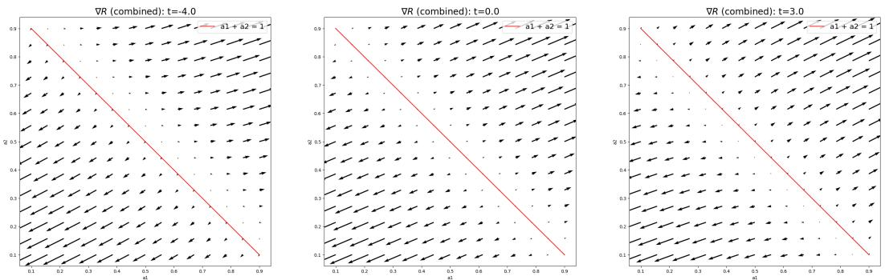
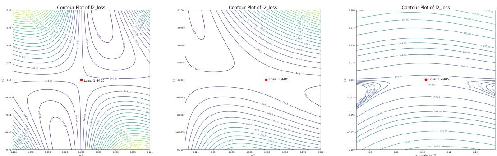
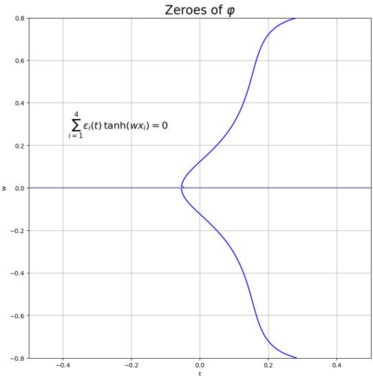

# Uncovering Critical Sets of Deep Neural Networks via Sample-Independent Critical Lifting

Anonymous Author(s)   
Affiliation   
Address   
email

# Abstract

This paper investigates the sample dependence of critical points for neural net  
works. We introduce a sample-independent critical lifting operator that associates a   
parameter of one network with a set of parameters of another, thus defining sample  
dependent and sample-independent lifted critical points. We then show by example   
that previously studied critical embeddings do not capture all sample-independent   
lifted critical points. Finally, we demonstrate the existence of sample-dependent   
lifted critical points for sufficiently large sample sizes and prove that saddles appear   
among them.

# 9 1 Introduction

Neural networks have achieved remarkable success in a wide range of applications, but the under  
standing of their performance is still elusive. Theoretical studies are thus made to uncover such   
mysteries (Sun et al., 2020). One major focus is the analysis of the loss landscape. This line of   
study is challenging due to the complicated, various kinds of network structure and loss function, and   
importantly, its dependence on data samples.   
Recent research has increasingly focused on how critical points in the loss landscape depend on the   
training data. A notable direction in this line of work involves the Embedding Principle (Zhang et al.,   
2022, 2021; Bai et al., 2024), which is motivated by the following question: given the critical points of   
a neural network, what can be inferred about the critical points of another network, without knowing   
the specific training samples? Critical embedding operators between neural networks of different   
widths, such as splitting embeddings, null embeddings, and more general compatible embeddings,   
have been proposed and studied in Zhang et al. (2022, 2021). Critical lifting operators in depth   
between networks of varying depths have been proposed and studied in Bai et al. (2024). However,   
the full extent to which these operators explain sample (in)dependence remains unclear. Parallel to   
this, many studies have investigated the behavior of critical points when specific information about   
the samples is known. For instance, Cooper (2021) relates the dimensionality of the global minima   
manifold to the number of samples in a generic setting, while ref. Zhang et al. (2023) explores a   
teacher-student setup and reveals a hierarchical, branch-wise structure of the loss landscape near   
global minima that varies with sample size.

In this paper, we advance the understanding of sample dependence of critical points by focusing on neural networks of different widths that represent the same output function. Our main contributions are as follows:

(a) We introduce a sample-independent critical lifting operator, which maps parameters from a narrower network to a set of parameters in a wider network, preserving both the output function and criticality regardless of the training samples.

(b) We demonstrate that not all sample-independent lifted critical points arise from previously   
studied embedding operators, thus highlighting a broader structure beyond existing frame  
works Zhang et al. (2022, 2021).   
(c) We identify a class of output-preserving critical sets that, for sufficiently large sample sizes,   
generally contain sample-dependent critical points. These sets consist entirely of saddle   
points for one-hidden-layer networks and contains sample-dependent saddles for multi-layer   
networks.

# 42 2 Related Works

Embedding Principle. The Embedding Principle (EP) was first observed for two neural networks   
of different widths, stating that “the loss landscape of any network ’contains’ all critical points of   
all narrower networks” (Zhang et al., 2021). In refs. Zhang et al. (2021, 2022), specific critical   
embedding operators have been proposed and studied. These are linear operators mapping parameters   
of a narrower network to a wider one which preserve output function and criticality – the image of a   
critical point is always a critical point. Earlier works also observe the similar phenomenon for one   
hidden layer neural networks (Fukumizu and ichi Amari, 2000; Fukumizu et al., 2019). More recently,   
EP for two neural networks of different depths was observed (Bai et al., 2024). The paper introduces   
critical lifting operators associating a parameter of a shallower network to a set of parameters of a   
deeper one, where output function and criticality are preserved. In our work, we use the same idea to   
define sample-independent critical lifting operators, but we focus on two neural networks of different   
widths and show that not all sample-independent lifted critical points arise from known embedding   
operators.   
Sample dependence of critical points. Attempts have been made to explain how the choice of   
samples affects the geometry of loss landscape. Many works focus on global minima. In Cooper   
(2021), it is shown that for generic samples, the global minima is a manifold whose codimension   
equals the sample size. Ref. Simsek et al. (2021) observes that under the teacher-student setting,   
part of the global minima of neural networks persist as samples change. In Zhang et al. (2023)   
this is further emphasized, and it studies how the other (sample-dependent) global minima varies –   
“gradually vanish” as sample size increases, as well as how it affects the behavior of gradient dynamics   
nearby. Other works, such as Simsek et al. (2023), study critical points assuming samples have specific   
distributions. Our work applies to both global and non-global critical points, and we emphasize   
sample-dependent lifted critical points for sufficiently large sample size, thus complementing the   
previous studies.   
Analysis of saddles. It has been shown that gradient dynamics almost always avoid saddles (Lee et al.,   
2017). Thus, it is essential to discover saddles in loss landscape of neural networks. Refs. Fukumizu   
and ichi Amari (2000); Fukumizu et al. (2019); Simsek et al. (2021); Zhang et al. (2022, 2021)   
showed that embedding local minima of a narrower network to a wider one tends to produce saddles.   
Additionally, research by Venturi et al. and Li et al. revealed that, when the network is heavily   
overparameterized, saddles not only exist but in fact there are no spurious valleys. Similar patterns   
have been observed in deep linear networks (Nguyen and Hein, 2017; Nguyen, 2019; Kawaguchi,   
2016). In this paper, we show under mild assumptions on the training set-up that for one hidden   
layer networks, all sample-independent lifted critical points are saddles, and sample-dependent lifted   
saddles exist for multi-layer networks.

# 77 3 Preliminaries

Let $\mathbb { N } : = \{ 1 , 2 , 3 , \ldots \}$ . Given $N \in \mathbb { N }$ , denote by $\mathbb { R } ^ { N }$ the (real) Euclidean space of dimension $N$   
Given Lebesgue measurable subsets $E _ { 2 } \subseteq E _ { 1 } \subseteq \mathbf { \bar { \mathbb { R } } } ^ { N }$ , the measure of $E _ { 2 }$ in $E _ { 1 }$ refers to the induced   
Lebesgue measure on $E _ { 1 }$ . For example, we would say $\mathbb { R } \times \{ ( 0 , 0 ) \} \subseteq \mathbb { R } ^ { 3 }$ has zero measure in   
$\mathbb { R } ^ { 2 } \times \{ 0 \} \subseteq \mathbb { R } ^ { 3 }$ . Then we define our notations and assumptions for neural networks and loss functions   
as follows.

# 3 3.1 Fully Connected Neural Networks

For simplicity, we only discuss fully-connected neural networks without bias terms. We refer to this   
network architecture whenever we mention a neural network. An $L$ hidden layer neural network with

parameter size $N$ , input dimension $d$ and output dimension $D$ is denoted by $H : \mathbb { R } ^ { N } \times \mathbb { R } ^ { d } \to \mathbb { R } ^ { D }$ . It 87 is defined iteratively as follows. First, we define the zero-th layer (input layer) as the identity function, with a redundant parameter 88 $\theta ^ { ( 0 ) }$ :

$$
H ^ { ( 0 ) } ( \theta ^ { ( 0 ) } , x ) = x , \quad x \in \mathbb { R } ^ { d } .
$$

Second, we choose an activation $\sigma : \mathbb { R }  \mathbb { R }$ . Then, for every $l \in \{ 1 , . . . , L \}$ , let $m _ { l }$ denote the   
90 number of neurons at the $l$ -th layer. Define the $l$ -th layer neurons by

$$
H ^ { ( l ) } ( \theta ^ { ( l ) } , x ) = [ H _ { k _ { l } } ^ { ( l ) } ( \theta ^ { ( l ) } , x ) ] _ { k _ { l } = 1 } ^ { m _ { l } } = \left[ \sigma \left( w _ { k _ { l } } ^ { ( l ) } \cdot H ^ { ( l - 1 ) } ( \theta ^ { ( l - 1 ) } , x ) \right) \right] _ { k _ { l } = 1 } ^ { m _ { l } } ,
$$

where 91 $m _ { l }$ is the width of $H ^ { ( l ) }$ , $H _ { k _ { l } } ^ { ( l ) }$ is the $k _ { l }$ -th component of $H ^ { ( l ) }$ , and $\theta ^ { ( l ) } : = \Big ( ( w _ { k _ { l } } ^ { ( l ) } ) _ { k _ { l } = 1 } ^ { m _ { l } } , \theta ^ { ( l - 1 ) } \Big )$ each 92 $w _ { k _ { l } } ^ { ( l ) }$ being a vector in $\mathbb { R } ^ { m _ { l - 1 } }$ . Note that with our notation, each $H _ { k _ { l } } ^ { ( l ) }$ is independent of $w _ { k } ^ { ( l ) }$ for all 93 $k \neq k _ { l }$ . Finally, define $H ( \theta , x ) = [ a _ { j } \cdot H ^ { ( L ) } ( \theta ^ { ( L ) } , x ) ] _ { j = 1 } ^ { D }$ as the whole neural network, where 94 $\theta : = \big ( ( a _ { j } ) _ { j = 1 } ^ { D } , \theta ^ { ( L ) } \big )$ .

6 Assumption 3.1. Assume that the activation $\sigma : \mathbb { R }  \mathbb { R }$ is a non-polynomial analytic function.

This assumption takes into consideration the commonly used activations such as tanh $\textstyle { \big ( } { \frac { 1 - e ^ { - x } } { 1 + e ^ { - x } } } { \big ) }$ 98 sigmoid analytic, $\displaystyle { \frac { 1 } { 1 + e ^ { - x } } } )$ , swrons $\displaystyle { \left( \frac { x } { 1 + e ^ { - x } } \right) }$ , Gaussianare all anal $( e ^ { - a x ^ { 2 } } )$ , etc. Moreover, it is easy to thus so is the whole network e that when . $\sigma$ is $\{ H ^ { ( l ) } \} _ { l = 1 } ^ { L }$ $H$

Definition 3.1 (wider/narrower neural network). Given two $L$ hidden layer neural networks $H _ { 1 } , H _ { 2 }$ both with input dimension $d _ { \mathrm { { z } } }$ , output dimension $D$ , and the hidden layer widths $\{ m _ { l } \} _ { l = 1 } ^ { L }$ , $\{ m _ { l } ^ { \prime } \} _ { l = 1 } ^ { L }$ respectively. We say $H _ { 2 }$ is a wider network than $H _ { 1 }$ , or $H _ { 1 }$ a narrower network than $H _ { 2 }$ , if $m _ { l } \le m _ { l } ^ { \prime }$ for all $1 \leq l \leq L$ .

# 3.2 Loss Function

Denote the set of samples as $\{ ( x _ { i } , y _ { i } ) _ { i = 1 } ^ { n } \}$ , where $( x _ { i } ) _ { i = 1 } ^ { n } \in \mathbb { R } ^ { n d }$ are sample inputs and $( y _ { i } ) _ { i = 1 } ^ { n } \in$   
$\mathbb { R } ^ { n D }$ are sample outputs. Given $\ell : \mathbb { R } ^ { D } \times \mathbb { R } ^ { D } \to [ 0 , \infty )$ , we define the loss function (for neural   
networks with input dimension $d$ and output dimension $D$ ) as

$$
R ( \theta ) = \sum _ { i = 1 } ^ { n } \ell ( H ( \theta , x _ { i } ) , y _ { i } ) ) .
$$

In this paper, we will often deal with neural networks of different widths. As a slight abuse of   
notation, we shall use $R$ for the loss function (corresponding to fixed samples $( x _ { i } , y _ { i } ) _ { i = 1 } ^ { n } )$ for all   
neural networks with the same input and output dimensions. Also note that we shall write $R _ { S }$ when   
emphasizing the samples $S = \{ ( x _ { i } , y _ { i } ) _ { i = 1 } ^ { n } \}$ of $R$ .

Assumption 3.2. We consider analytic ℓ. For each $1 \le j \le D$ , let $\partial _ { j } \ell$ denote the $j$ -th partial 113 derivative for its first entry. We assume that $\ell ( p , q ) = 0$ if and only if $p = q$ , and $\partial _ { p } \ell ( p , q ) = 0$ if and only if 114 $p = q$ . Here $\partial _ { p } \ell ( p , q ) = [ \partial _ { j } \ell ( p , q ) ] _ { j = 1 } ^ { D }$ is the gradient of $\ell$ with respect to its first entry.

Remark 3.1. A common example is 115 $\ell ( p , q ) = | p - q | ^ { 2 }$ . In this case, the loss function is the one used 16 in regression: $\begin{array} { r } { R ( \theta ) = \sum _ { i = 1 } ^ { n } | \bar { H } ( \theta , x _ { i } ) - y _ { i } | ^ { 2 } } \end{array}$ .

# 117 4 Sample Independent and Dependent Lifted Critical Points

Definition 4.1 (sample-independent critical lifting). Given two fully-connected neural networks $H _ { 1 } , H _ { 2 }$ . Denote their parameter spaces by $\Theta _ { 1 } , \Theta _ { 2 }$ , respectively. For each $\theta _ { 1 } \in \Theta _ { 1 }$ let $ { \mathcal { S } } ( \theta _ { 1 } )$ be the collection of samples for which $\theta _ { 1 }$ is a critical point:

$$
S ( \theta _ { 1 } ) = \{ S = \{ ( x _ { i } , y _ { i } ) _ { i = 1 } ^ { n } \} : \nabla R _ { S } ( \theta _ { 1 } ) = 0 , n \in \mathbb { N } \} .
$$

Denote by $\mathcal { C } _ { \theta _ { 1 } , S }$ the set of output and criticality preserving parameters of $H _ { 2 }$ :

$$
\mathcal { C } _ { \theta _ { 1 } , S } = \left\{ \theta _ { 2 } \in \Theta _ { 2 } : H _ { 2 } ( \theta _ { 2 } , \cdot ) = H _ { 1 } ( \theta _ { 1 } , \cdot ) , \nabla R _ { S } ( \theta _ { 2 } ) = 0 \right\} .
$$

Define a sample-independent critical lifting operator as a map $\tau$ from $\Theta _ { 1 }$ to the power set of $\Theta _ { 2 }$

$$
\tau ( \theta _ { 1 } ) = \bigcap _ { S \in S ( \theta _ { 1 } ) } { \mathcal { C } } _ { \theta _ { 1 } , S } .
$$

Definition 4.2 (sample-dependent/independent lifted critical points). Given two fully-connected   
neural networks $H _ { 1 } , H _ { 2 }$ . Given $\theta _ { 1 }$ and $S \in { \mathcal { S } } ( \theta _ { 1 } )$ as in Definition 4.1. We say a parameter   
$\theta _ { 2 } \in \mathcal { C } _ { \theta _ { 1 } , S }$ is a sample-independent lifted critical point (from $\theta _ { 1 }$ ) if $\theta _ { 2 } \in \tau ( \theta _ { 1 } ) = \bigcap _ { S \in S ( \theta _ { 1 } ) } { \mathcal { C } } _ { \theta _ { 1 } , S }$   
126 Otherwise, we say $\theta _ { 2 }$ is a sample-dependent lifted critical point.

Remark 4.1. To make the sample-independent critical lifting operator non-trivial we should require that $H _ { 1 } , H _ { 2 }$ have the same input and output dimensions – otherwise $\tau ( \theta _ { 1 } ) = \emptyset$ for all $\theta _ { 1 } \in \Theta _ { 1 }$ . In this work, we further consider the case in which $H _ { 1 } , H _ { 2 }$ have the same activation, same depth, but one is wider/narrower than the other.

# 131 4.1 Sample Independent Lifted Critical Points

32 Recall that a critical embedding is an affine linear map from the parameter space of a narrower neural   
network to that of a wider one, which preserves output, representation and criticality (Zhang et al.,   
2022). In particular, for any samples given, the image of a critical point is always a critical point. So   
by definition we have the following result summarized from (Zhang et al., 2022, 2021).

Proposition 4.1.1 (critical embeddings produce sample-independent lifted critical points). The parameters produced by critical embedding operators are sample-independent lifted critical points.

In refs. Zhang et al. (2022, 2021) some specific critical embedding operators are proposed and studied   
– the splitting embedding, null-embedding and general compatible embedding. Unfortunately, these   
embedding operators are not enough to produce all sample-independent lifted critical points for deep   
neural networks. This follows from the following example:   
Example. Consider a three hidden layer neural network with $d$ $d$ is arbitrary) dimensional input,   
one dimensional output and hidden layer widths $\{ m _ { 1 } , m _ { 2 } , m _ { 3 } \}$ :

$$
H ( \theta , x ) = \sum _ { k _ { 3 } = 1 } ^ { m _ { 3 } } a _ { 1 k _ { 3 } } \sigma \left( \sum _ { k _ { 2 } = 1 } ^ { m _ { 2 } } w _ { k _ { 3 } k _ { 2 } } ^ { ( 3 ) } \sigma \left( \sum _ { k _ { 1 } = 1 } ^ { m _ { 1 } } w _ { k _ { 2 } k _ { 1 } } ^ { ( 2 ) } \sigma ( w _ { k _ { 1 } } ^ { ( 1 ) } \cdot x ) \right) \right) .
$$

Given two such networks $H _ { 1 } , H _ { 2 }$ with hidden layer widths $\{ m _ { 1 } , m _ { 2 } , m _ { 3 } \}$ and $\{ m _ { 1 } , m _ { 2 } , m _ { 3 } + 1 \}$ ,   
respectively. Define

$$
\begin{array} { r l } & { E _ { \mathrm { n a r r } } = \left\{ \theta _ { \mathrm { n a r r } } = \left( ( a _ { 1 k _ { 3 } } ) _ { k _ { 3 } = 1 } ^ { m _ { 3 } } , ( w _ { k _ { 3 } } ^ { ( 3 ) } ) _ { k _ { 3 } = 1 } ^ { m _ { 3 } } , 0 , 0 \right) \right\} , } \\ & { E _ { \mathrm { w i d e } } = \left\{ \theta _ { \mathrm { w i d e } } = \left( ( a _ { 1 k _ { 3 } } ^ { \prime } ) _ { k _ { 3 } = 1 } ^ { m _ { 3 } + 1 } , ( { w _ { k _ { 3 } } ^ { \prime } } ^ { ( 3 ) } ) _ { k _ { 3 } = 1 } ^ { m _ { 3 } + 1 } , 0 , 0 \right) \right\} } \end{array}
$$

as subsets in the parameter spaces of $H _ { 1 } , H _ { 2 }$ , respectively. Then the image of $E _ { \mathrm { n a r r } }$ under the splitting   
embedding, null-embedding and general compatible embedding (altogether) is a proper subset of   
$E _ { \mathrm { w i d e } }$ . Intuitively, this is because these operators “assign” a relationship between the weights on   
the added second layer neuron to the parameter in $E _ { \mathrm { n a r r } }$ . On the other hand, it is easy to see that all   
parameters in $E _ { \mathrm { n a r r } }$ and $E _ { \mathrm { w i d e } }$ yield the same, constant zero output function, and are critical points,   
for arbitrary samples $( x _ { i } , y _ { i } ) _ { i = 1 } ^ { n }$ , $n \in \mathbb { N }$ . Therefore, the previously studied embedding operators do   
not produce all sample-independent lifted critical points when mapping $E _ { \mathrm { n a r r } }$ to $E _ { \mathrm { w i d e } }$ . In particular,   
whatever sample we choose, we cannot avoid the sample-independent lifted critical points which   
are not produced by these embedding operators. See Proposition A.2.1 for details of a proof of the   
example.

Remark 4.2. The example can be generalized to $L \geq 3$ hidden layer neural networks.

# 157 4.2 Sample Dependent Lifted Critical Points

We now turn our focus to sample-dependent lifted critical points. Starting with the one-hidden-layer,   
one dimensional output case, we show that under mild assumptions on activation and loss function,   
sample-dependent lifted critical points are saddles. These results extend to deeper architectures,   
where we identify a set of output-preserving parameters containing sample-dependent critical point   
and sample-dependent saddles. For both results, we highlight the requirement on sample size for   
these critical points to exist.   
We start with the one hidden layer, one dimensional output case. For an $m$ -neuron-wide one   
hidden layer neural network, we write it as $\begin{array} { r } { H ( \theta , x ) = \sum _ { k = 1 } ^ { m } a _ { k } \sigma ( w _ { k } \cdot x ) } \end{array}$ for simplicity, where   
θ = (ak, wk)mk=1.

167 Proposition 4.2.1 (saddles, one hidden layer). Given samples $( x _ { i } , y _ { i } ) _ { i = 1 } ^ { n }$ such that $x _ { i } \neq 0$ for all $_ i$ 168 and $x _ { i } \pm x _ { j } \neq 0$ for $1 \leq i < j \leq n$ . Given integers $m , m ^ { \prime }$ such that $m < m ^ { \prime }$ . For any critical point 169 170 $\theta _ { n a r r } = ( a _ { k } , w _ { k } ) _ { k = 1 } ^ { m }$ oss function corresponding to the samples such that of weights making the parameter $R ( \theta _ { n a r r } ) \neq 0$ , the set $( w _ { k } ^ { \prime } ) _ { k = m + 1 } ^ { m ^ { \prime } } \in \mathbb { R } ^ { ( m ^ { \prime } - m ) d }$

$$
\theta _ { w i d e } = ( a _ { 1 } , w _ { 1 } , . . . , a _ { m } , w _ { m } , 0 , w _ { m + 1 } ^ { \prime } , . . . , 0 , w _ { m ^ { \prime } } ^ { \prime } )
$$

a critical point for the loss function has zero measure in $\mathbb { R } ^ { ( m ^ { \prime } - m ) d }$ . Furthermore, any such critical point is a saddle.

73 Remark 4.3. Due to symmetry of the network structure, the results hold under permutation of the   
entries of $\theta _ { \mathrm { w i d e } }$ .   
Proof. We show that for a.e. $w _ { m ^ { \prime } } ^ { \prime } \in \mathbb { R } ^ { d }$ , the partial derivative $\frac { \partial R } { \partial a _ { m ^ { \prime } } ^ { \prime } }$ is non-zero, thus proving the   
first part of the result. The key to showing such a critical point must be a saddle is that any $\theta _ { \mathrm { w i d e } }$   
of the form (2) preserves output function, namely, we have $\mathbf { \tilde { \Gamma } } \cdot H ( \theta _ { \mathrm { n a r r } } , x ) = H ( \theta _ { \mathrm { w i d e } } , x )$ for all $x$ . See   
178 Proposition A.2.2 for more details. □   
79 Then we show that there are sample-dependent lifted critical points when the sample size is larger   
than the parameter size of the narrower network.   
Theorem 4.2.1 (sample-dependent lifted critical points, one hidden layer). Assume that $\ell : \mathbb { R } \times \mathbb { R } \to$   
$\mathbb { R }$ satisfies: the range of $\partial _ { p } \ell ( p , \cdot )$ contains an open interval around 0. Given integers $m , m ^ { \prime } \in \mathbb { N }$   
such that $m < m ^ { \prime }$ . Fix $\begin{array} { r } { \theta _ { n a r r } = ( a _ { k } , w _ { k } ) _ { k = 1 } ^ { m } } \end{array}$ . When sample size $n > 1 + ( d + 1 ) m ,$ , there are sample  
dependent lifted critical points $\theta _ { w i d e }$ from $\theta _ { n a r r }$ of the form (2). Furthermore, when $n > 2 + ( d + 1 ) m$   
there are sample-dependent lifted saddles of the form (2).   
Remark 4.4. It is clear that for any even integer $s$ , $\ell ( x , y ) = ( p - q ) ^ { s }$ satisfies the hypothesis on   
$\ell$ . In fact, by Lemma A.1.4, this holds for all $\ell$ such that $\ell ( p , q ) = \ell ( p - q , 0 )$ . We also show in   
Lemma A.1.5 that the binary cross-entropy loss of distribution $p$ relative to distribution $q$ , given by   
$\ell ( p , q ) = q \log p + ( 1 - q ) \log ( 1 - p )$ , satisfies this hypothesis.

Proof. Specifically, we prove that for any 190 $( x _ { i } ) _ { i = 1 } ^ { n } \in \mathbb { R } ^ { n d }$ with $x _ { i } \neq 0$ for all $i$ and $x _ { i } \pm x _ { j } \neq 0$ for 191 $1 \leq i < j \leq n$ , and for a.e. $w ^ { \prime } \in \mathbb { R } ^ { d }$ , there are sample outputs $( y _ { i } ) _ { i = 1 } ^ { n } , ( y _ { i } ^ { \prime } ) _ { i = 1 } ^ { n }$ such that

$$
\theta _ { \mathrm { w i d e } } = ( a _ { 1 } , w _ { 1 } , . . . , a _ { m } , w _ { m } , 0 , w ^ { \prime } , . . . , 0 , w ^ { \prime } )
$$

is a critical point for the loss function corresponding to 192 $( x _ { i } , y _ { i } ^ { \prime } ) _ { i = 1 } ^ { n }$ , but not so to $( x _ { i } , y _ { i } ) _ { i = 1 } ^ { n }$ . For 193 $N \ge 2 + ( \bar { d + 1 } ) m$ , we can choose $( y _ { i } ^ { \prime } ) _ { i = 1 } ^ { n }$ so that not all $\ell ( H ( \theta _ { \mathrm { w i d e } } , x _ { i } ) , y _ { i } )$ ’s vanish. □

Remark 4.5. Note that for one hidden layer neural networks every sample-dependent lifted critical   
point either achieves zero loss, or is a saddle. For simplicity, assume that the activation function   
is an even or odd function. Given a critical point $\theta _ { \mathrm { n a r r } } = ( a _ { k } , w _ { k } ) _ { k = 1 } ^ { m }$ with $R ( \theta _ { \mathrm { n a r r } } ) \neq 0$ . Consider   
any critical point $\theta _ { \mathrm { w i d e } } = ( a _ { k } ^ { \prime } , w _ { k } ^ { \prime } ) _ { k = 1 } ^ { m ^ { \prime } }$ representing the same output function as ′ ′ m $\theta _ { \mathrm { n a r r } }$ . By linear   
independence of neurons (see Lemma A.1.1), $a _ { \bar { k } } ^ { \prime } = 0$ whenever $w _ { \bar { k } } ^ { \prime } \notin \{ w _ { k } , - w _ { k } \} _ { k = 1 } ^ { m }$ . On the other   
hand, if $w _ { \bar { k } } ^ { \prime } \in \{ w _ { k } , - w _ { k } \} _ { k = 1 } ^ { m }$ then $\theta _ { \mathrm { w i d e } }$ is a sample-independent lifted critical point. Therefore, up   
to permutation of the entries, a sample-independent lifted critical point from $\theta _ { \mathrm { n a r r } }$ takes the form (2),   
thus by Proposition 4.2.1 it must be a saddle. Similar argument works for activations with no parity.

Now we generalize the results to multi-layer neural networks whose output dimensions are arbitrary.

Proposition 4.2.2 (saddles, general case). Given samples $( x _ { i } , y _ { i } ) _ { i = 1 } ^ { n }$ with $x _ { i } \neq 0$ for all $i$ and   
$x _ { i } \pm x _ { j } \neq 0$ for $1 \leq i < j \leq n$ . Given integers $\{ m _ { l } \} _ { l = 1 } ^ { L } , \{ m _ { l } ^ { \prime } \} _ { l = 1 } ^ { L }$ such that $m _ { l } < m _ { l } ^ { \prime }$ for every   
$1 \le l \le L$ . Consider two $L$ hidden layer neural networks with input dimension $d$ , hidden layer widths   
$\{ m _ { l } \} _ { l = 1 } ^ { L }$ , $\{ m _ { l } ^ { \prime } \} _ { l = 1 } ^ { L }$ , and output dimension $D$ . Denote their parameters by $\theta _ { n a r r } , \theta _ { w i d e }$ , respectively.   
Let $\theta _ { n a r r }$ be a critical point of the loss function corresponding to the samples $( x _ { i } , y _ { i } ) _ { i = 1 } ^ { n }$ , such that   
$R ( \theta _ { n a r r } ) \neq 0$ . Denote the following sets:

$$
\begin{array} { r l } & { E = \left\{ \theta _ { w i d e } = ( ( a _ { j } ^ { \prime } ) _ { j = 1 } ^ { D } , \theta _ { w i d e } ^ { ( L ) } ) : H ( \theta _ { w i d e } , \cdot ) = H ( \theta _ { n a r r } , \cdot ) , a _ { j } ^ { \prime } = ( a _ { j 1 } , . . . , a _ { j m _ { L } } , 0 , . . . , 0 ) \right\} ; } \\ & { E ^ { * } = \left\{ \theta _ { w i d e } \in E : \nabla R ( \theta _ { w i d e } ) = 0 \right\} . } \end{array}
$$

Namely, 209 $E$ is a set of parameters preserving output function, $E ^ { * }$ is the set of parameters in $E$ also preserving criticality. Then 210 $E ^ { * } \neq E$ . Furthermore, $E ^ { * }$ contains saddles.

Proof. The extra neurons at each layer of the wider network allows us to freely choose the corresp213 all 214 ndinand rvinfor $\theta _ { \mathrm { w i d e } }$ $H ^ { ( L - 1 ) } ( \theta _ { \mathrm { w i d e } } , x _ { i } ) \neq 0$ for $i$ $H ^ { ( L - 1 ) } ( \theta _ { \mathrm { w i d e } } ^ { ( L - 1 ) } , x _ { i } ) \pm H ^ { ( L - 1 ) } ( \theta _ { \mathrm { w i d e } } ^ { ( L - 1 ) } , x _ { j } ) \neq 0$ $1 \leq i < j \leq n$

$$
\begin{array} { r } { \frac { \partial H } { \partial a _ { j m _ { L } ^ { \prime } } ^ { \prime } } ( \theta _ { \mathrm { w i d e } } ) = \displaystyle \sum _ { i = 1 } ^ { n } \partial _ { j } \ell ( H ( \theta _ { \mathrm { w i d e } } , x _ { i } ) , y _ { i } ) \sigma \left( w _ { m _ { L } ^ { \prime } } ^ { \prime ( L ) } \cdot H ^ { ( L - 1 ) } ( \theta _ { \mathrm { w i d e } } ^ { ( L - 1 ) } , x _ { i } ) \right) } \\ { = \displaystyle \sum _ { i = 1 } ^ { n } \partial _ { j } \ell ( H ( \theta _ { \mathrm { n a r r } } , x _ { i } ) , y _ { i } ) \sigma \left( w _ { m _ { L } ^ { \prime } } ^ { \prime ( L ) } \cdot H ^ { ( L - 1 ) } ( \theta _ { \mathrm { w i d e } } ^ { ( L - 1 ) } , x _ { i } ) \right) . } \end{array}
$$

This reduces to the proof of Proposition 4.2.1. See Proposition A.2.4 for more details.

Similarly, sample-dependent lifted critical points exist for multi-layer neural networks. The proof of   
the theorem below follows the same idea as that of Theorem 4.2.1.

Theorem 4.2.2 (sample-dependent lifted critical points, general case). Assume that $\ell : \mathbb { R } ^ { D } \times \mathbb { R } ^ { D } \to \mathbb { R }$ satisfies: the range of $\partial _ { p } \ell ( p , \cdot )$ contains a neighborhood around $0 \in \mathbb { R } ^ { D }$ . Consider two $L$ hidden layer neural networks with the same assumptions as in Proposition 4.2.2. Denote their parameters by $\theta _ { n a r r } , \theta _ { w i d e }$ , respectively. Denote the parameter size of the narrower network by $N$ . Fix $\theta _ { n a r r }$ . Then there are sample-dependent lifted critisample-dependent lifted saddles when $n \geq { \frac { 1 + N } { D } }$ . Furthermore, there are $\begin{array} { r } { n \ge \frac { 1 + D + \sum _ { l = 2 } ^ { L } m _ { l } ( m _ { l - 1 } ^ { \prime } - m _ { l - 1 } ) + \bar { N } } { D } } \end{array}$

Remark 4.7. When $D = L = 1$ , we recover the one hidden layer, one dimensional output case. Also note that commonly seen losses such as $\ell ( p , q ) = ( p - q ) ^ { s } , p , \overset { \cdot } { q } \in \mathbb { R } ^ { D }$ for any even number $s$ satisfy the hypothesis on $\ell$ .

# 227 5 Illustration

In this section we illustrate our results in Section 4 through a toy example. In the example, a   
specific critical point of a one neuron tanh network $H ( ( a , \bar { w } ) , x ) \stackrel { \cdot } { = } a \mathrm { t a n h } \bar { ( } w x )$ is lifted to a set of   
parameters of a two neuron tanh network $\begin{array} { r } { H ( ( a _ { 1 } , w _ { 1 } , a _ { 2 } , w _ { 2 } ) , x ) = a _ { 1 } \mathrm { t a n h } ( w _ { 1 } x ) + a _ { 2 } \mathrm { t a n h } ( w _ { 2 } x ) } \end{array}$ ,   
where $a , w , a _ { k } , w _ { k } , x$ are real numbers. Specifically, we fix $\theta _ { 1 } = ( 1 , \bar { w } )$ with $\bar { w } = 1 . 0 2 5 8$ , sample   
size $n = 4$ , sample inputs $( x _ { 1 } , x _ { 2 } , x _ { 3 } , x _ { 4 } ) ^ { - } = ( 1 / 4 , 1 , 4 , 1 6 )$ and vary $y _ { i }$ ’s. We use $\ell : \mathbb { R } \times \mathbb { R } \to \mathbb { R }$ ,   
$\ell ( p , q ) = ( p - q ) ^ { 2 }$ . So

$$
R ( \theta ) = \sum _ { i = 1 } ^ { 4 } \left( H ( \theta , x _ { i } ) - y _ { i } \right) ^ { 2 } .
$$

To make 234 $\theta _ { 1 }$ a critical point, $( y _ { i } ) _ { i = 1 } ^ { 4 }$ should solve the linear system

$$
\left( \begin{array} { c c c c } { \operatorname { t a n h } ( \frac { 1 } { 4 } \bar { w } ) } & { \operatorname { t a n h } ( \bar { w } ) } & { \operatorname { t a n h } ( 4 \bar { w } ) } & { \operatorname { t a n h } ( 1 6 \bar { w } ) } \\ { \frac { 1 } { 4 } \operatorname { t a n h } ^ { \prime } ( \frac { 1 } { 4 } \bar { w } ) } & { \operatorname { t a n h } ^ { \prime } ( \bar { w } ) } & { 4 \operatorname { t a n h } ^ { \prime } ( 4 \bar { w } ) } & { 1 6 \operatorname { t a n h } ^ { \prime } ( 1 6 \bar { w } ) } \end{array} \right) \left( \begin{array} { c c c c } { \operatorname { t a n h } ( \frac { 1 } { 4 } \bar { w } ) - y _ { 1 } } \\ { \operatorname { t a n h } ( \bar { w } ) - y _ { 2 } } \\ { \operatorname { t a n h } ( 4 \bar { w } ) - y _ { 3 } } \\ { \operatorname { t a n h } ( 1 6 \bar { w } ) - y _ { 4 } } \end{array} \right) = \binom { 0 } { 0 } .
$$

Let 235 $\varepsilon _ { i } : = \mathrm { t a n h } ( \bar { w } x _ { i } ) - y _ { i }$ for $1 \leq i \leq 4$ . Clearly, the solution set for $( \varepsilon _ { i } ) _ { i = 1 } ^ { 4 }$ is a two dimensional 236 subspace in $\mathbb { R } ^ { 4 }$ , and varying $( y _ { i } ) _ { i = 1 } ^ { 4 }$ is equivalent to varying $( \varepsilon _ { i } ) _ { i = 1 } ^ { 4 }$ . Numerically, an approximate solution curve for 237 $( \varepsilon _ { i } ) _ { i = 1 } ^ { 4 } = ( \varepsilon _ { i } ( \ r _ { i } ) ) _ { i = 1 } ^ { 4 }$ is given by

$$
\left\{ \left( 1 - 6 . 0 6 8 9 t , - 0 . 5 8 3 5 + 3 . 5 6 2 1 t , 0 . 3 - 0 . 3 t , - 0 . 1 - 0 . 9 t \right) : t \in \mathbb { R } \right\} .
$$

First, we show that the image of $\theta _ { 1 }$ under splitting embeddings remains critical, and is independent   
of the samples. Note that the set of points produced by splitting embeddings is the line $E : =$   
$\{ ( \delta , \bar { w } , 1 - \bar { \delta } , \bar { w } ) : \delta \in \mathbb { R } \}$ and the partial derivatives of the loss function satisfy

$$
\frac { \partial R } { \partial a _ { 1 } } ( \theta _ { 2 } ) = \frac { \partial R } { \partial a _ { 2 } } ( \theta _ { 2 } ) , \quad \frac { 1 } { a _ { 1 } } \frac { \partial R } { \partial w _ { 1 } } ( \theta _ { 2 } ) = \frac { 1 } { a _ { 2 } } \frac { \partial R } { \partial w _ { 2 } } ( \theta _ { 2 } ) , \quad \forall \theta _ { 2 } \in E .
$$

Since $w _ { 1 } = w _ { 2 } = \bar { w }$ is fixed over $E$ , we illustrate the vector field

$$
( a _ { 1 } , a _ { 2 } ) \mapsto \left( { \frac { \partial R } { \partial a _ { 1 } } } ( a _ { 1 } , \bar { w } , a _ { 2 } , \bar { w } ) , { \frac { 1 } { a _ { 1 } } } { \frac { \partial R } { \partial w _ { 1 } } } ( a _ { 1 } , \bar { w } , a _ { 2 } , \bar { w } ) \right)
$$

as $( a _ { 1 } , a _ { 2 } )$ varies, for the samples we randomly choose. This is indicated in Figure 1 below. As we   
can see, the vector field vanishes (approximately) along the line $\{ a _ { 1 } + a _ { 2 } = 1 \}$ , which implies that   
$E$ is critical under these samples.   
Second, we consider critical points in the set $E ^ { \prime } : = \{ ( 1 , \bar { w } , 0 , w ) : w \in \mathbb { R } \}$ . According to Propo  
sition 4.2.1, the points in $E ^ { \prime }$ are saddles. In the experiment, we fix the samples by setting   
$( \varepsilon _ { i } ) _ { i = 1 } ^ { 4 } = ( 1 , - 0 . 5 8 3 5 , 0 . 3 , - 0 . 1 ) \}$ and check the loss values for different $( a _ { 2 } , w _ { 2 } )$ , meanwhile   
keeping $( a _ { 1 } , w _ { 1 } ) = ( 1 , \bar { w } )$ fixed. For these samples, there are three critical points in $E ^ { \prime }$ . As illus  
trated in Figure 2, the loss function takes values greater and less than $R ( \theta _ { 1 } ) \approx 1 . 4 4 0 5$ near each of   
them, thus showing that they are all saddles.

  
Figure 1: Plot of the vector field ${ \bigl ( } a _ { 1 } , a _ { 2 } { \bigr ) } \ \mapsto \ { \Bigl ( } { \frac { \partial R } { \partial a _ { 1 } } } { \bigl ( } a _ { 1 } , { \bar { w } } , a _ { 2 } , { \bar { w } } { \bigr ) } , { \textstyle \frac { 3 } { a _ { 1 } } } { \frac { \partial R } { \partial w _ { 1 } } } { \bigl ( } a _ { 1 } , { \bar { w } } , a _ { 2 } , { \bar { w } } { \bigr ) } { \Bigr ) }$ for $( a _ { 1 } , a _ { 2 } ) \in ( 0 . 1 , 0 . 9 ) ^ { 2 }$ with respect to $( \varepsilon _ { i } ( - 4 ) ) _ { i = 1 } ^ { 4 }$ (left), $( \varepsilon _ { i } ( 0 ) ) _ { i = 1 } ^ { 4 }$ (middle) and $( \varepsilon _ { i } ( 3 ) ) _ { i = 1 } ^ { 4 }$ . In all three figures, the vector field vanishes approximately along the line $\{ a _ { 1 } + a _ { 2 } = 1 \}$ , indicating that the parameters produced by splitting embeddings are sample-independent saddles.

  
Figure 2: Contour plot of the loss function along the $( w _ { 2 } , a _ { 2 } )$ -plane with respect to $( \varepsilon _ { i } ( 0 ) ) _ { i = 1 } ^ { 4 }$ The points, marked in red, are approximately $( 0 , 0 )$ (left), $\left( 0 . 1 2 3 6 , 0 \right)$ (middle) and $( 1 . 0 2 5 8 , 0 )$ (right). They correspond to the critical points $( 1 , \bar { w } , 0 , 0 ) , ( 1 , \bar { w } , 0 , 0 . 1 2 3 6 ) , ( 1 , \bar { w } , 0 , 1 . 0 2 5 8 )$ in $E ^ { \prime }$ , respectively. From the level curves we can see that these three points are all saddles. Note that in the rightmost figure $w _ { 2 }$ -axis is scaled by 10 for illustration purpose.

Finally, we show the existence of sample-dependent critical points in 251 $E ^ { \prime }$ . We illustrate this by plotting 252 the zero set of the function

$$
( t , w ) \mapsto \sum _ { i = 1 } ^ { 4 } \varepsilon _ { i } ( t ) \operatorname { t a n h } ( w x _ { i } ) .
$$

As shown in the proof of Proposition A.2.2, a parameter of the form $( 1 , \bar { w } , 0 , w )$ is a critical point   
for the loss corresponding to $( \varepsilon _ { i } ( t ) ) _ { i = 1 } ^ { 4 }$ if and only if $\varphi ( t , w ) = 0$ . In Figure 3 we can see that for   
$( t , w ) \in ( - 0 . 5 , 0 . 5 ) \times ( - \mathrm { { \bar { 0 } } } . 8 , \dot { 0 } . 8 )$ , the zero set of $\varphi$ has two curves; the value of $w$ on the blue curve   
varies as $t$ varies, which implies that sample-dependent lifted critical points of the form $( 1 , \bar { w } , 0 , w )$   
exist.

  
Figure 3: The zero set of blue curve minus the orig $\begin{array} { r } { \varphi ( t ) = \sum _ { i = 1 } ^ { 4 } \varepsilon _ { i } ( t ) \mathrm { t a n h } ( w x _ { i } ) } \end{array}$ for  ap $( t , w ) \in ( - 0 . 5 , 0 . 5 ) \times ( - 0 . 8 , 0 . 8 )$ . Thecally $t$ $- 0 . 0 5$ the graph of a non-constant function in $t$ . This indicates that there is a sample-dependent lifted critical point for each such $t$ . Also note that the grey curve $\{ ( 0 , t ) \}$ indicates a sample-independent lifted critical point $( 1 , \bar { w } , 0 , 0 )$ . It arises due to the fact that $\operatorname { t a n h } ( 0 ) = 0$ .

# 258 6 Conclusion and Discussion

In this paper, we propose the sample-independent critical lifting operator (Definition 4.1) and study the sample-independent/dependent lifted critical points. We first show by example that the previously studied critical embeddings may not produce all sample-independent lifted critical points. We then focused on sample-dependent lifted critical points, identifying a specific family of such points and proving that they are necessarily saddles when the loss is non-zero. The sample-independent critical lifting operator provides a way to study the structural aspects of loss landscape dictated purely by the network architecture. Our study of sample-independent critical points reveals the limitation of previously studied embedding operators, suggesting a more delicate relationship between neural networks of different widths. Our study of sample-dependent critical points provides insights into how samples affect the loss landscape.

The paper raises as many questions as the information it provides. First, for sample-independent   
critical points, we are unclear if all of them are produced by critical embedding operators (not limited   
to those previously studied ones). We conjecture that they fully characterize all sample-independent   
lifted critical points for one hidden layer neural networks. Meanwhile, it is interesting to investigate   
how the completeness of the characterization depends on the network architecture, e.g., choice of   
activation function, depth/width of network, etc.   
Second, we do not have a clear picture about sample-dependent lifted critical points for multi-layer   
neural networks. Recall that we have shown that all sample-dependent critical points must be of   
the form (2), but a general form of these points is unclear for multi-layer networks. We expect   
the existence of additional sample-dependent critical points beyond what we discovered in the   
paper. Meanwhile, we are interested in the gradient dynamics near the sample-dependent saddles we   
discovered. Since they are necessarily degenerate and may not have a negative eigenvalue, previous   
results, e.g., those in Lee et al. (2017) cannot apply immediately.   
Third, a better understanding of the sample-independent lifting operator is needed. For example,   
our construction of sample-dependent lifted critical point requires a specific sample size threshold,   
which naturally leads to the question whether sample-dependent lifted critical points exist when   
285 we keep the sample size fixed while varying samples. More generally, one can study “constrained   
86 sample-independent lifting operator” concerning samples with fixed property. This would help us   
7 better understand how different aspects of data affect the loss landscape.

# References

R. Sun, D. Li, S. Liang, T. Ding, The global landscape of neural networks, Nonconvex Optimization for Signal Processing and Machine Learning 37 (2020) 95–108. Y. Zhang, Y. Li, Z. Zhang, T. Luo, Z.-Q. J. Xu, Embedding principle: a hierarchical structure of loss landscape of deep neural networks, Journal of Machine Learning 1 (2022) 60–113. Y. Zhang, Z. Zhang, T. Luo, Z.-Q. J. Xu, Embedding principle of loss landscape of deep neural networks, NeurIPS 34 (2021) 14848–14859. Z. Bai, T. Luo, Z.-Q. J. Xu, Y. Zhang, Embedding principle in depth for the loss landscape analysis of deep neural networks, CSIAM Transactions on Applied Mathematics 5 (2024) 350–389. Y. Cooper, Global minima of overparameterized neural networks, SIAM Journal on Mathematics of Data Science 3 (2021) 676–691. L. Zhang, Y. Zhang, T. Luo, Structure and gradient dynamics near global minima of two-layer neural networks, arXiv:2309.00508 (2023). K. Fukumizu, S. ichi Amari, Local minima and plateaus in hierarchical structures of multilayer perceptrons, Neural Networks 13 (2000) 317–327. K. Fukumizu, S. Yamaguchi, Y. ichi Mototake, M. Tanaka, Semi-flat minima and saddle points by embedding neural networks to overparameterization, NeurIPS 32 (2019). B. Simsek, F. Ged, A. Jacot, F. Spadaro, C. Hongler, W. Gerstner, J. Brea, Geometry of the loss landscape in overparametrized neural networks: Symmetry and invariances, Proceedings of Machine Learning Research 139 (2021). B. Simsek, A. Bendjeddou, W. Gerstner, J. Brea, Should under-parameterized student networks copy or average teacher weights?, NeurIPS (2023). J. D. Lee, I. Panageas, G. Piliouras, M. Simchowitz, M. I. Jordan, B. Recht, First-order methods almost always avoid saddle points, arxiv:1710.07406 (2017). L. Venturi, A. S. Bandeira, J. Bruna, Spurious valleys in one-hidden-layer neural network optimization landscapes, Journal of Machine Learning Research 20 (2019) 1–34. D. Li, T. Ding, R. Sun, On the benefit of width for neural networks: Disappearance of basins, SIAM Journal on Optimization 32 (2022) 1728–1758. Q. Nguyen, M. Hein, The loss surface of deep and wide neural networks, ICML 70 (2017) 2603–2612. Q. Nguyen, On connected sublevel sets in deep learning, ICML (2019) 4790–4799. K. Kawaguchi, Deep learning without poor local minima, NeurIPS (2016). S. G. Krantz, H. R. Parks, A Primer of Real Analytic Functions, Birkhäuser Advanced Texts Basler Lehrbücher, 2nd ed., Birkhäuser Boston, MA, 2002. B. Mityagin, The zero set of a real analytic function, arxiv:1512.07276 (2015).

# A Appendix

# A.1 Preparing Lemmas

Lemma A.1.1. Let $\sigma : \mathbb { R }  \mathbb { R }$ be a non-polynomial analytic function. Then for any $d , n \in \mathbb { N }$ and any $x _ { 1 } , . . . , x _ { n } \in \mathbb { R } ^ { d } \setminus \{ 0 \}$ with $x _ { i } \pm x _ { j } \neq 0$ for $1 \leq i < j \leq m$ , the functions $\{ w \mapsto \sigma ( w \cdot x _ { i } ) \} _ { i = 1 } ^ { n }$ are linearly independent.

27 Proof. We will actually prove a slightly stronger result shown below:

8 Let $\sigma : \mathbb { R }  \mathbb { R }$ be an analytic non-polynomial activation function. Then the following results hold for any 9 $d , m \in \mathbb { N }$ and any $\bar { { x } _ { 1 } } , . . . , \bar { { x } _ { n } } \in \mathbb { R } ^ { d } \setminus \{ 0 \}$

(a-1) When $\sigma$ is the sum of a non $=$ zero polynomial and an even/odd analytic non-polynomial, $\{ \sigma ( w \cdot x _ { i } ) \} _ { i = 1 } ^ { n }$ are linearly independent if $x _ { i } \pm x _ { j } \neq 0$ .

(a-2) When $\sigma$ does not have parity and does not satisfy (a-1), then $\{ \sigma ( w \cdot x _ { i } ) \} _ { i = 1 } ^ { n }$ are linearly independent if and only if $x _ { i }$ ’s are distinct.

(b) When $\sigma$ is an even or odd function, $\{ \sigma ( w \cdot x _ { i } ) \} _ { i = 1 } ^ { n }$ are linearly independent if and only if $x _ { i } \pm x _ { j } \neq 0$ for $1 \leq i < j \leq n$ .

The proof below deals with these cases. For (a-1) we have • $\sigma$ is the sum of a polynomial and an even, non-polynomial analytic function. Then $\boldsymbol { \sigma } ^ { ( s ) }$ , the $s$ -th derivative of $\sigma$ , is an even function for sufficiently large $s$ . Since $x _ { i } \pm x _ { j } \neq 0$ for $1 \leq i < j \leq n$ , there is some $v \in \mathbb { R } ^ { d }$ such that $| x _ { i } \cdot v |$ are distinct and non-zero. It follows from (b) that the (single-variable, even or odd) functions $\{ z \mapsto ( v \cdot x _ { i } ) ^ { s } \sigma ^ { ( s ) } ( ( v \cdot x _ { i } ) z ) \} _ { i = 1 } ^ { n }$ are linearly independent. Thus, $\{ z \mapsto \sigma ( ( v \cdot x _ { i } ) z ) \} _ { i = 1 } ^ { n }$ and thus $\{ \sigma ( w \cdot x _ { i } ) \} _ { i = 1 } ^ { n }$ are linearly independent.

• $\sigma$ is the sum of a polynomial and an odd, non-polynomial analytic function. Then $\boldsymbol { \sigma } ^ { ( s ) }$ is an odd function for sufficiently large $s$ . Argue in the same way as in (a-1) we show the desired result.

For (a-2), note that there are infinitely many even and odd numbers $s _ { e v e n } , s _ { o d d } \in \mathbb { N }$ , such that $\sigma ^ { ( s _ { e v e n } ) } ( 0 ) , \sigma ^ { ( s _ { o d d } ) } ( 0 ) \ne 0$ . Then the result follows from Lemma B.5 in Simsek et al. (2021). One can also refer to other works, such as Zhang et al. (2023).

Then we prove (b). First assume that $\sigma$ is an even function. Then there are even, non-zero numbers   
$\{ s _ { j } \} _ { j = 1 } ^ { \infty }$ such that $\sigma ^ { ( s _ { j } ) } ( 0 )$ , the $s _ { j }$ -th derivative of $\sigma$ at 0, is non-zero, for all $j \in \mathbb N$ . Given   
$x _ { 1 } , . . . , x _ { n } \in \mathbb { R } ^ { d } \setminus \{ 0 \}$ such that $x _ { i } \pm x _ { j } \neq 0$ for $1 \leq i < j \leq n$ . Assume $\alpha _ { 1 } , . . . , \alpha _ { n } \in \mathbb { R }$ makes the   
linear combination of these neurons, $\scriptstyle \sum _ { i = 1 } ^ { n } \alpha _ { i } \sigma ( w \cdot x _ { i } )$ , a constant function. Since $x _ { i } \pm x _ { j } \neq 0$ for   
$1 \leq i < j \leq n$ , there is some $v \in \mathbb { R } ^ { d }$ such that $| x _ { i } \cdot v |$ are distinct and non-zero. Therefore,

$$
z \mapsto \sum _ { i = 1 } ^ { n } \alpha _ { i } \sigma \left( \left( v \cdot x _ { i } \right) z \right) = { \mathrm { c o n s t . } } , \quad \forall z \in \mathbb { R } .
$$

Rewriting this in power series expansion near the origin, we obtain

$$
\sum _ { i = 1 } ^ { n } \alpha _ { i } \sigma \left( \left( \boldsymbol { v } \cdot \boldsymbol { x } _ { i } \right) \boldsymbol { z } \right) = \sum _ { s = 0 } ^ { \infty } \frac { \sigma ^ { ( s ) } ( 0 ) } { s ! } \left( \sum _ { i = 1 } ^ { n } \alpha _ { i } \left( \boldsymbol { v } \cdot \boldsymbol { x } _ { i } \right) ^ { s } \right) \boldsymbol { z } ^ { s } = \mathrm { c o n s t . }
$$

The power series holds for all $z$ in a sufficiently small open interval around 0. Thus, we must have   
$\begin{array} { r } { \sigma ^ { ( s _ { j } ) } ( 0 ) \sum _ { i = 1 } ^ { n } \alpha _ { i } \left( v \cdot x _ { i } \right) ^ { s _ { j } } = 0 } \end{array}$ for all $j \in \mathbb N$ . Let $i _ { 1 } \in \{ 1 , . . . , n \}$ be (the unique number) such that   
357 $\left| { \boldsymbol v } \cdot { \boldsymbol x } _ { i _ { 1 } } \right| = \operatorname* { m a x } _ { 1 \leq i \leq n } \left| { \boldsymbol v } \cdot { \boldsymbol x } _ { i } \right|$ . If $\alpha _ { i _ { 1 } } \neq 0$ we would have

$$
\sum _ { i = 1 } ^ { n } \alpha _ { i } ( v \cdot x _ { i } ) ^ { s _ { j } } = \Theta ( v \cdot x _ { i _ { 1 } } ) ^ { s _ { j } }  \infty
$$

58 as $j  \infty$ . Thus, $\alpha _ { i _ { 1 } } = 0$ and we need only consider the rest $n - 1$ neurons. Therefore, by an   
induction on $n$ we can see that $\alpha _ { 1 } = \ldots = \alpha _ { n } = 0$ . This proves the case for even activation.

Then assume tnon-zero. Let $\sigma$ function. Agbe such that $v \in \mathbb { R } ^ { d }$ ch that  is a co $\left| \boldsymbol { v } \cdot \boldsymbol { x } _ { i } \right|$ ’s are distin function in and. Its $\alpha _ { 1 } , . . . , \alpha _ { n } \in \mathbb { R }$ $\textstyle \sum _ { i = 1 } ^ { n } \alpha _ { i } \sigma ( ( v \cdot x _ { i } ) z )$ $z$ 362 directional derivative along $v$ is given by

$$
{ \frac { \mathrm { d } } { \mathrm { d } z } } \left[ \sum _ { i = 1 } ^ { n } \alpha _ { i } \sigma \left( ( { \boldsymbol { v } } \cdot { \boldsymbol { x } } _ { i } ) { \boldsymbol { z } } \right) \right] = \sum _ { i = 1 } ^ { n } \left( \alpha _ { i } { \left( { \boldsymbol { v } } \cdot { \boldsymbol { x } } _ { i } \right) } \right) \sigma ^ { \prime } \left( \left( { \boldsymbol { v } } \cdot { \boldsymbol { x } } _ { i } \right) { \boldsymbol { z } } \right)
$$

must also be constant zero. Since 63 $\sigma ^ { \prime }$ is an even, analytic, non-polynomial function, our proof above 64 shows that $\alpha _ { i } ( v \cdot x _ { i } ) = 0$ for all $1 \leq i \leq n$ , which then implies $\alpha _ { i } = 0$ for all $1 \leq i \leq n$ . Therefore, 65 the neurons are linearly independent.

Conversely, if $x _ { i } - x _ { j } = 0$ for some distinct $i , j$ , then we obtain two identical neurons. If $x _ { i } + x _ { j } = 0$   
then $\sigma ( w \cdot x _ { i } ) = \sigma ( w \cdot x _ { j } )$ for even function $\sigma$ and $\sigma ( w \cdot x _ { i } ) + \sigma ( w \cdot x _ { j } ) = 0$ for odd activation $\sigma$ .   
368 In either case we obtain two linearly dependent neurons. This completes the proof. □

Lemma A.1.2. Let $N \in \mathbb N$ and $g : \mathbb { R } ^ { N } \to \mathbb { R }$ a smooth function. Let $\boldsymbol { x } ^ { * } \in \mathbb { R } ^ { N }$ be a critical point of $g$ such that for any neighborhood $U$ of $x ^ { * }$ , there is some $x \in U$ with $\nabla g ( x ) \neq 0$ and $g ( x ) = g ( x ^ { * } )$ . Then $x ^ { * }$ is a saddle.

Proof. We will show that any neighborhood 72 $U$ of $x ^ { * }$ contains points $y _ { 1 } , y _ { 2 }$ with $g ( y _ { 1 } ) < g ( x ^ { * } ) <$   
73 $g ( y _ { 2 } )$ . So fix $U$ . Choose an $x \in U$ with $\nabla g ( x ) \neq 0$ and $g ( \bar { x } ) = g \bar { ( x ^ { \ast } ) }$ . Since $\nabla g ( x ) \neq 0$ , the   
gradient flow $\gamma : [ 0 , \infty )  \infty$ starting at $x$ is not static; moreover, for some small $\delta > 0$ we have   
$\gamma [ 0 , \delta ) \subseteq U$ . Since the value of $g$ is (strictly) decreasing along $\gamma$ , we may choose $\begin{array} { r } { y _ { 1 } : = \gamma ( \frac { \delta } { 2 } ) } \end{array}$ ,   
because

$$
g \left( \gamma \left( { \frac { \delta } { 2 } } \right) \right) < g ( \gamma ( 0 ) ) = g ( x ) = g ( x ^ { * } ) .
$$

Similarly, we can find some 377 $y _ { 2 } \in U$ with $g ( y _ { 2 } ) > g ( x ^ { * } )$ .

Definition A.1 ((real) analytic function, rephrase of Defn. 2.2.1 in Krantz and Parks (2002)). Let $N , M \in \mathbb { N }$ and $\bigcap { \subseteq } \mathbb { R } ^ { N }$ be open. A function $f : \Omega \to { \mathbb { R } }$ is (real) analytic if for each $x \in \Omega$ , $f$ can be represented by a convergent multi-variable power series in some neighborhood of $x$ . Similarly, $a$ function $f : \Omega \stackrel { \cdot } { \to } \mathbb { R } ^ { M }$ is (real) analytic if each of its components is real analytic.

Remark A.1. Let $\Omega$ and $U$ be open, and $f , g : \Omega \to \mathbb { R }$ , $h : U \to \Omega$ be analytic functions. By Proposition 2.2.2 and Proposition 2.2.8 in Krantz and Parks (2002), $\alpha f + \beta g$ , f g, $f \circ h$ are analytic functions, i.e., analyticity is preserved by linear combination, multiplication and composition among analytic functions. Moreover, by Proposition 2.2.3 in Krantz and Parks (2002), the partial derivatives of an analytic function are also analytic. In particular, this means when $\sigma$ and $\ell$ are analytic, the neural network, the loss function, and the partial derivatives of the loss function are analytic.

The following lemma is of great importance for the proofs in Section A.2.

Lemma A.1.3 (Mityagin (2015)). Let 89 $N \in \mathbb N$ , $\Omega \subseteq \mathbb { R } ^ { N }$ be open and $f : \Omega \to { \mathbb { R } }$ be analytic. Then either 90 $f$ is constant zero on $\Omega$ , or $f ^ { - 1 } ( 0 )$ has zero measure in $\Omega$ .

Lemma A.1.4. Let $\ell : \mathbb { R } ^ { 2 } \to \mathbb { R }$ be a function satisfying Assumption 3.2. Further assume that $\ell ( p , q ) = \ell ( p - q , 0 )$ for all $( p , q ) \in \mathbb { R } ^ { 2 }$ . Then the range of $\partial _ { p } \ell ( p , \cdot )$ contains an open interval around 0 for every $p \in \mathbb R$ .

Proof. Note that we can write $\ell ( p , q ) = u ( p - q )$ for an analytic function $u : \mathbb { R }  [ 0 , \infty )$ , such that   
$u$ is not constant zero and $u ( z ) = 0$ if and only if $z = 0$ . Since $u$ achieves its minimum at $z = 0$ ,   
there is an interval $I$ containing $0 \in \mathbb { R }$ such that $\frac { \mathrm { d } u } { \mathrm { d } z } ( z ) \geq 0$ for $z \in ( 0 , \infty ) \cap I$ and $\frac { \mathrm { d } u } { \mathrm { d } z } ( z ) \le 0$ for   
398 $z \in ( - \infty , 0 ) \cap I$ $\textstyle { \frac { \mathrm { d } u } { \mathrm { d } z } }$ . Moreover, screte, so by $z = 0$ isng $I$ zero of if nece $\frac { \mathrm { d } u } { \mathrm { d } z }$ . Since y, we w $u$ is analyuld have $\begin{array} { r } { \frac { \mathrm { d } u } { \mathrm { d } z } ( z ) > 0 } \end{array}$ t cofor $z \in ( 0 , \infty ) \cap I$   
and $\frac { \mathrm { d } u } { \mathrm { d } z } ( z ) < 0$ for $z \in ( - \infty ) \cap I$ . This shows that the range of $\frac { \mathrm { d } u } { \mathrm { d } z }$ contains an open interval around   
0.

Now 401 $\begin{array} { r } { \partial _ { p } \ell ( p , q ) = \frac { \mathrm { d } u } { \mathrm { d } z } ( p - q ) } \end{array}$ . Thus,

$$
\mathrm { r a n } \partial _ { p } \ell ( p , \cdot ) = \mathrm { r a n } \left[ { \frac { \mathrm { d } u } { \mathrm { d } z } } ( p - \cdot ) \right] = \mathrm { r a n } { \frac { \mathrm { d } u } { \mathrm { d } z } } .
$$

It follows that the range of $\partial _ { p } \ell ( p , \cdot )$ contains an open interval around 0.

Lemma A.1.5. Let $\ell ( p , q ) = q \log p + ( 1 - q ) \log ( 1 - p ) f o r p , q \in ( 0 , 1 ) .$ . Then the range of $\partial _ { p } \ell ( p , \cdot )$ contains an open interval around 0 for every $p \in \mathbb R$ .

Proof. This follows from a straightforward computation. Note that $\begin{array} { r } { \partial _ { p } \ell ( p , q ) = \frac { q } { p } - \frac { 1 - q } { 1 - p } } \end{array}$ and for each $p$ , the derivative of $q \mapsto \partial _ { p } \ell ( p , q )$ is a strictly positive constant $\textstyle { \frac { 1 } { p } } + { \frac { 1 } { 1 - p } }$ . Since $\partial _ { p } \ell ( p , p ) = 0$ , this implies that for $q$ in a neighborhood $I$ around $p$ $, \partial _ { p } \ell ( p , I )$ contains an open interval around 0.

# A.2 Proof of Results

Proposition A.2.1 (Example in Section 4.1). Assume that $\sigma ( 0 ) = 0$ . For two three hidden layer neural networks, neither the splitting embedding, nor the null embedding operator, nor general compatible embedding operator produce all sample-independent lifted critical points.

Proof. Let $H$ be a three hidden layer neural network with $d$ ( $d \in \mathbb { N }$ is arbitrary) dimensional input,   
one dimensional output, and hidden width $\{ m _ { 1 } , m _ { 2 } , m _ { 3 } \}$ . Thus, $H$ can be written as

$$
H ( \theta , x ) = \sum _ { k _ { 3 } = 1 } ^ { m _ { 3 } } a _ { 1 k _ { 3 } } \sigma \left( \sum _ { k _ { 2 } = 1 } ^ { m _ { 2 } } w _ { k _ { 3 } k _ { 2 } } ^ { ( 3 ) } \sigma \left( \sum _ { k _ { 1 } = 1 } ^ { m _ { 1 } } w _ { k _ { 2 } k _ { 1 } } ^ { ( 2 ) } \sigma ( w _ { k _ { 1 } } ^ { ( 1 ) } \cdot x ) \right) \right) .
$$

Fix arbitrary samples 414 $( x _ { i } , y _ { i } ) _ { i = 1 } ^ { n }$ . Consider parameters for $H$ of the form

$$
\boldsymbol { \theta } = \Big ( ( a _ { 1 k _ { 3 } } ) _ { k _ { 3 } = 1 } ^ { m _ { 3 } } , ( w _ { k _ { 3 } } ^ { ( 3 ) } ) _ { k _ { 3 } = 1 } ^ { m _ { 3 } } , 0 , 0 \Big ) .
$$

Namely, all the w(2)k and w(1)k ’s are zero vectors. Then, using $\sigma ( 0 ) = 0$ we can inductively see that   
$H ^ { ( 1 ) } ( \theta ^ { ( 1 ) } , x ) = 0 \in \mathbb { R } ^ { m _ { 1 } }$ , $\bar { H } ^ { ( 2 ) } ( { \theta } ^ { ( 2 ) } , x ) = 0 \in \mathbb { R } ^ { m _ { 2 } }$ and $H ^ { ( 3 ) } ( \theta ^ { ( 3 ) } , x ) = 0 \in \mathbb { R } ^ { m _ { 3 } }$ for all $x$ . The   
partial derivatives for $R$ are as follows. Here $\partial _ { p } \ell$ denotes the partial derivative of $\ell$ with respect to its   
first entry (note that $\ell : \mathbb { R } \times \mathbb { R } \to \mathbb { R }$ ).

$$
\begin{array} { r l } { \frac { \partial H } { \partial t _ { i } } } & { = \sum _ { j \in \mathcal { N } _ { i } } \langle t ( \mathcal { D } _ { i } ^ { 0 } , s _ { i } ) | s _ { i } \rangle \theta _ { i _ { j } } ^ { \mathcal { D } _ { i _ { i } ^ { 0 } } ^ { 0 } } \langle \theta _ { i _ { 1 } ^ { 0 } } ^ { 0 } , \mu _ { i _ { 2 } ^ { 0 } } ^ { 0 } \rangle } \\ & { = \underbrace { \frac { 1 } { \sqrt { 2 } } \langle \theta _ { i _ { 1 } ^ { 0 } } ( H ^ { 0 } ; s _ { i } ) | s _ { i } \rangle \theta _ { i _ { 1 } ^ { 0 } } ^ { \mathcal { D } _ { i _ { i } ^ { 0 } } ^ { 0 } } } _ { \mathrm { \normalfont { N } } _ { i } ^ { 0 } \mathrm { \normalfont { F } } _ { i } ^ { 0 } } \frac { 1 } { H ^ { 0 } } \sum _ { j \in \mathcal { N } _ { i } } \langle \theta _ { i _ { 1 } ^ { 0 } } ^ { 0 } , \mu _ { i _ { 2 } ^ { 0 } } ^ { 0 } \rangle | \theta _ { i _ { 1 } ^ { 0 } } ^ { \mathcal { D } _ { i _ { 1 } ^ { 0 } } } \omega _ { i _ { 1 } ^ { 0 } } ^ { 0 } } \\ & { \quad - \ \sum _ { j \in \mathcal { N } _ { i } } \langle t ( \mathcal { D } _ { i } ^ { 0 } , s _ { i } ) | s _ { i } \rangle \theta _ { i _ { 1 } ^ { 0 } } ^ { \mathcal { D } _ { i _ { 1 } ^ { 0 } } } \mu _ { i _ { 2 } ^ { 0 } } ^ { 0 } \langle \theta _ { i _ { 1 } ^ { 0 } } ^ { 0 } | s _ { i } \rangle \theta _ { i _ { 1 } ^ { 0 } } ^ { \mathcal { D } _ { i _ { 1 } ^ { 0 } } } } \\ & { \quad - \ \sum _ { j \in \mathcal { N } _ { i } } \langle t ( \mathcal { D } _ { i } ^ { 0 } , s _ { i } ) | s _ { i } \rangle \theta _ { i _ { 1 } ^ { 0 } } ^ { \mathcal { D } _ { i _ { 1 } ^ { 0 } } } } \\ { \frac { \partial H } { \partial t _ { i } ^ { 0 } } } &  = \sum _ { j \in \mathcal { N } _ { i } ^ { 0 } }  \theta _ { i _ { 1 } ^ { 0 } } ^ { \mathrm { T } } \theta _  i _   \end{array}
$$

In other words, we show that any parameter satisfying (3) is a critical point of the loss function,   
regardless of samples.   
Now consider two three hidden layer networks $H , H ^ { \prime }$ both with input dimension $d$ , output dimension   
D, and hidden layer widths {ml}Ll=1, {m′l}Ll=1, respectively. Assume that m′1 = m1, m′2 = m2,   
$m _ { 2 } > 1$ and $m _ { 3 } ^ { \prime } = m _ { 3 } + 1$ . In this case, $H ^ { \prime }$ is just one neuron wider than and the embedding of   
parameters from that of $H$ to $H ^ { \prime }$ by general compatible embedding is just splitting embedding or   
null-embedding. For splitting embedding, note that for any $\theta$ satisfying (3), up to permutation of   
426 entries a parameter $\theta ^ { \prime }$ given by EP and satisfying (3) takes the form

$$
\theta ^ { \prime } = \left( ( a _ { 1 k _ { 3 } } ) _ { k _ { 3 } = 1 } ^ { m _ { 3 } } , ( w _ { 1 } ^ { ( 3 ) } , . . . , \delta w _ { m _ { 3 } } ^ { ( 3 ) } , ( 1 - \delta ) w _ { m _ { 3 } + 1 } ^ { ( 3 ) } ) , 0 , 0 \right)
$$

for some 427 $\delta \in \mathbb { R }$ . In particular, $\delta w _ { m _ { 3 } } ^ { ( 3 ) } , ( 1 - \delta ) w _ { m _ { 3 } } ^ { ( 3 ) }$ are parallel vectors in $\mathbb { R } ^ { m _ { 2 } }$ . However, because 428 $m _ { 2 } > 1$ , not every $\theta ^ { \prime }$ satisfying (3) has two parallel w(3)k3 ’s. For null embedding, the weight it assigns 429 to the extra neuron is fixed to 0. Thus, these two embedding operators (altogether) do not produce all 430 sample-independent lifted critical points. □

Remark A.2. Using the same proof idea, we can show that for two arbitrary $L \geq 3$ hidden layer neural networks, not all sample-independent lifted critical points are produced by these embedding operators.

34 Proposition A.2.2 (Proposition 4.2.1 in Section 4.2). Given samples $( x _ { i } , y _ { i } ) _ { i = 1 } ^ { n }$ such that $x _ { i } \neq 0$ for 35 all $i$ and $x _ { i } \pm x _ { j } \neq 0$ for $1 \leq i < j \leq n$ . Given integers $m , m ^ { \prime }$ such that $m < m ^ { \prime }$ . For any critical point 36 the se37 $\theta _ { n a r r } = ( a _ { k } , w _ { k } ) _ { k = 1 } ^ { m }$ ss function corresponding to the samples such that of weights making the parameter $R ( \dot { \theta _ { n a r r } } ) \neq 0$ $( w _ { k } ^ { \prime } ) _ { k = m + 1 } ^ { m ^ { \prime } } \in \mathbb { R } ^ { ( m ^ { \prime } - m ) d }$

$$
\theta _ { w i d e } = ( a _ { 1 } , w _ { 1 } , . . . , a _ { m } , w _ { m } , 0 , w _ { m + 1 } ^ { \prime } , . . . , 0 , w _ { m ^ { \prime } } ^ { \prime } )
$$

a critical point for the loss function has zero measure in 438 $\mathbb { R } ^ { ( m ^ { \prime } - m ) d }$ . Furthermore, any such critical 439 point is a saddle.

Proof. Denote 440 $\theta _ { \mathrm { w i d e } } : = ( a _ { k } ^ { \prime } , w _ { k } ^ { \prime } ) _ { k = 1 } ^ { m }$ , so by hypothesis we have $a _ { k } ^ { \prime } = 0$ for all $m < k \le m ^ { \prime }$ . Note that for any 441 $( w _ { k } ^ { \prime } ) _ { k = m + 1 } ^ { m ^ { \prime } }$ , $\theta _ { \mathrm { w i d e } }$ preserves output function, i.e., $H ( \theta _ { \mathrm { w i d e } } , x ) = H ( \theta _ { \mathrm { n a r r } } , x )$ for all $x$ Thus, for any 442 $w _ { m ^ { \prime } } ^ { \prime } \in \mathbb { R } ^ { d }$ , the partial derivative for $a _ { m ^ { \prime } } ^ { \prime }$ is given by

$$
\begin{array} { r l r } & { } & { \displaystyle \frac { \partial R } { \partial a _ { m ^ { \prime } } ^ { \prime } } ( \theta _ { \mathrm { w i d e } } ) = \sum _ { i = 1 } ^ { n } \partial _ { p } \ell ( H ( \theta _ { \mathrm { w i d e } } , x _ { i } ) , y _ { i } ) \sigma ( w _ { m ^ { \prime } } ^ { \prime } \cdot x _ { i } ) } \\ & { } & { \displaystyle = \sum _ { i = 1 } ^ { n } \partial _ { p } \ell ( H ( \theta _ { \mathrm { n a r r } } , x _ { i } ) , y _ { i } ) \sigma ( w _ { m ^ { \prime } } ^ { \prime } \cdot x _ { i } ) . } \end{array}
$$

Define

$$
\varphi ( w _ { m ^ { \prime } } ^ { \prime } ) = \sum _ { i = 1 } ^ { n } \partial _ { p } \ell ( H ( \theta _ { \mathrm { n a r r } } , x _ { i } ) , y _ { i } ) \sigma ( w _ { m ^ { \prime } } ^ { \prime } \cdot x _ { i } ) ,
$$

so that $\begin{array} { r } { \frac { \partial R } { \partial a _ { m ^ { \prime } } ^ { \prime } } ( \theta _ { \mathrm { w i d e } } ) = 0 } \end{array}$ if and only if $\varphi ( w _ { m ^ { \prime } } ^ { \prime } ) = 0$ . Since i) $\sigma$ is a non-polynomial analytic function,   
ii) $x _ { i } \neq \ddot { 0 }$ for all $i$ , and iii) $x _ { i } \pm x _ { j } \neq 0$ for all $1 \leq i < j \leq n$ , by Lemma A.1.1 we have   
that $\{ w \mapsto \sigma ( w \cdot x _ { i } ) \} _ { i = 1 } ^ { n }$ are linearly independent. Meanwhile, since $\mathbf { \bar { \Phi } } R ( \theta _ { \mathrm { n a r r } } ) \neq 0$ , there must   
be some $i \in \{ 1 , . . . , n \}$ with $\ell ( H ( \dot { \theta } _ { \mathrm { n a r r } } , x _ { i } ) , \mathbf { \bar { y } } _ { i } ) \neq 0$ . But then by Assumption 3.2 on $\ell$ , we have   
$H ( \theta _ { \mathrm { n a r r } } , x _ { i } ) \neq y _ { i }$ and thus $\partial _ { p } \ell ( H ( \theta _ { \mathrm { n a r r } } , x _ { j } ) , y _ { j } ) \neq 0$ for some $j \in \{ 1 , . . . , n \}$ . Therefore, $\varphi$ is a   
non-trivial linear combination of analytic, linearly independent functions, so it is analytic and not   
constset of $( w _ { k } ^ { \prime } ) _ { k = m + 1 } ^ { m ^ { \prime } }$ t this implies that tof weights making $\theta _ { \mathrm { w i d e } }$ t of a c $\varphi ^ { - \mathrm { i } } ( 0 )$ has zero measure in oint for the loss functi $\mathbb { R } ^ { d }$ . It follows that thehas zero measure in   
452 $\mathbb { R } ^ { ( m ^ { \prime } - m ) d }$ .

3 Let $\theta _ { \mathrm { w i d e } }$ be a critical point of the loss function. We now show that it is saddle. Let $U$ be a neighborhood of 4 $\theta _ { \mathrm { w i d e } }$ . Since $\varphi ^ { - 1 } ( 0 )$ has zero measure, $U$ contains a point

$$
\begin{array} { r } { \theta _ { \mathrm { w i d e } } ^ { \prime \prime } = ( a _ { 1 } , w _ { 1 } , . . . , a _ { m } , w _ { m } , 0 , w _ { m + 1 } ^ { \prime } , . . . , 0 , w _ { m ^ { \prime } - 1 } ^ { \prime } , 0 , w _ { m ^ { \prime } } ^ { \prime \prime } ) , } \end{array}
$$

where $w _ { m ^ { \prime } } ^ { \prime \prime } \notin \varphi ^ { - 1 } ( 0 )$ , and thus $\nabla R ( \theta _ { \mathrm { w i d e } } ^ { \prime \prime } ) \neq 0$ . On the other hand, as we mentioned above,   
$H ( \theta _ { \mathrm { w i d e } } ^ { \prime \prime } , \tilde { x _ { i } } ) = H ( \theta _ { \mathrm { n a r r } } , x _ { i } ) = H ( \theta _ { \mathrm { w i d e } } , x _ { i } )$ for all $i$ , whence $R ( \theta _ { \mathrm { w i d e } } ^ { \prime \prime } ) = R ( \theta _ { \mathrm { w i d e } } )$ . Then Lemma   
A.1.2 shows that $\theta _ { \mathrm { w i d e } }$ is a saddle. □   
Proposition A.2.3 (Theorem 4.2.1 in Section 4.2). Assume that $\ell : \mathbb { R } ^ { 2 } \to \mathbb { R }$ satisfies: the range of   
$\partial _ { p } \ell ( p , \cdot )$ contains an open interval around $0 \in \mathbb { R }$ . Given integers $m , m ^ { \prime } , n \in \mathbb { N }$ such that $m < m ^ { \prime }$   
and $n \geq 1 + ( d + 1 ) m$ , given $\theta _ { n a r r } = ( a _ { k } , w _ { k } ) _ { k = 1 } ^ { m }$ . For any fixed $( x _ { i } ) _ { i = 1 } ^ { n } \in \mathbb { R } ^ { n d }$ with $x _ { i } \pm x _ { j } \neq 0$   
and for a.e. $w ^ { \prime } \in \mathbb { R } ^ { d }$ , there are sample outputs $( y _ { i } ) _ { i = 1 } ^ { n } , ( y _ { i } ^ { \prime } ) _ { i = 1 } ^ { n }$ such that

$$
\theta _ { w i d e } = ( a _ { 1 } , w _ { 1 } , . . . , a _ { m } , w _ { m } , 0 , w ^ { \prime } , . . . , 0 , w ^ { \prime } )
$$

is a critical point for the loss function corresponding to $( x _ { i } , y _ { i } ^ { \prime } ) _ { i = 1 } ^ { n }$ , but not so to $( x _ { i } , y _ { i } ) _ { i = 1 } ^ { n }$ . Furthermore, when $n \geq 2 + ( d + 1 ) m$ we can choose $( y _ { i } ^ { \prime } ) _ { i = 1 } ^ { n }$ so that $\theta _ { w i d e }$ is a saddle.

Proof. We use the notations in the proof of Proposition A.2.2. Recall that for $\theta _ { \mathrm { w i d e } }$ of the form (2) to be a critical point, we must have 465 $\bar { w _ { m ^ { \prime } } ^ { \prime } } \in \varphi ^ { - 1 } ( 0 )$ , where

$$
\varphi ( w , ( y _ { i } ) _ { i = 1 } ^ { n } ) : = \varphi ( w ) = \sum _ { i = 1 } ^ { n } \partial _ { p } \ell ( H ( \theta _ { \mathrm { n a r r } } , x _ { i } ) , y _ { i } ) \sigma ( w \cdot x _ { i } ) .
$$

Define

$$
M : = \left( \nabla _ { \theta } H ( \theta _ { \mathrm { { n a r r } } } , x _ { 1 } ) \quad \dots \quad \nabla _ { \theta } H ( \theta _ { \mathrm { { n a r r } } } , x _ { n } ) \right) .
$$

Since $n \geq 1 + ( d + 1 ) m$ , the kernel of $M$ is non-trivial. Fix $v \in \ker M \backslash \{ 0 \}$ . By linear independence   
of the neurons $\{ w \mapsto \sigma ( w \cdot x _ { i } ) \} _ { i = 1 } ^ { n }$ , the function $\textstyle \sum _ { i = 1 } ^ { n } v _ { i } \sigma ( w \cdot x _ { i } )$ is not constant zero (in $w \mathrm { . }$ ), so   
its zero set has zero measure in $\mathbb { R } ^ { d }$ (Lemma A.1.3) and for a.e. $w ^ { \prime }$ we have $\textstyle \sum _ { i = 1 } ^ { n } v _ { i } \sigma ( w ^ { \prime } \cdot x _ { i } ) \neq 0$   
Then define

$$
\begin{array} { r } { M ^ { \prime } : = \left( \begin{array} { c c c } { \big | } & { \big | } & { \big | } \\ { \nabla _ { \theta } H ( \theta _ { \mathrm { n a r r } } , x _ { 1 } ) } & { \ldots } & { \nabla _ { \theta } H ( \theta _ { \mathrm { n a r r } } , x _ { n } ) } \\ { \big | } & { \big | } & { \big | } \\ { \sigma ( w ^ { \prime } \cdot x _ { 1 } ) } & { \sigma ( w ^ { \prime } \cdot x _ { n } ) } \end{array} \right) . } \end{array}
$$

and

$\theta _ { \mathrm { w i d e } } = ( a _ { 1 } , w _ { 1 } , . . . , a _ { m } , w _ { m } , 0 , w ^ { \prime } , . . . , 0 , w ^ { \prime } )$

Notice that for any 472 $k > m$ , any $k _ { 0 } \in \{ 1 , . . . , d \}$ , and for any samples ${ \cal S } = \{ ( x _ { i } , y _ { i } ) _ { i = 1 } ^ { n } \}$ , we have 473 (using $a _ { k } = 0$ )

$$
\frac { \partial R _ { S } } { \partial w _ { k \bar { k } _ { 0 } } } ( \theta _ { \mathrm { w i d e } } ) = a _ { k } \cdot \sum _ { i = 1 } ^ { n } \partial _ { p } \ell ( H ( \theta _ { \mathrm { n a r r } } , x _ { i } ) , y _ { i } ) \sigma ^ { \prime } ( w ^ { \prime } \cdot x _ { i } ) ( x _ { i } ) _ { \bar { k } _ { 0 } } = 0 .
$$

Therefore, 474 $\nabla R _ { S } ( \theta _ { \mathrm { w i d e } } ) = 0$ if and only if $[ \partial _ { p } \ell ( H ( \theta _ { \mathrm { n a r r } } , x _ { i } ) , y _ { i } ) ] _ { i = 1 } ^ { n } \in \ker M ^ { \prime }$ . By our construction above, 475 $v \in \ker M \setminus \ker M ^ { \prime }$ . Let $v ^ { \prime } \in \ker \bar { M } ^ { \prime }$ . The hypothesis on $\ell$ implies that the range of the map

$$
( q _ { i } ) _ { i = 1 } ^ { n } \mapsto [ \partial _ { p } \ell ( H ( \theta _ { \mathrm { n a r r } } , x _ { i } ) , q _ { i } ) ] _ { i = 1 } ^ { n }
$$

contains a product neighborhood of $0 \in \mathbb { R } ^ { n }$ . This implies the existence of $( y _ { i } ) _ { i = 1 } ^ { n }$ and $( y _ { i } ^ { \prime } ) _ { i = 1 } ^ { n }$ such   
that $[ \partial _ { p } \ell ( \bar { H } ( \theta _ { \mathrm { n a r r } } , x _ { i } ) , \bar { y } _ { i } ) ] _ { i = 1 } ^ { n }$ is a non-zero multiple of $v$ and $[ \partial _ { p } \ell ( H ( \theta _ { \mathrm { n a r r } } , x _ { i } ) , y _ { i } ^ { \prime } ) ] _ { i = 1 } ^ { n }$ is a non-zero   
multiple of $v ^ { \prime }$ . Then

$$
\begin{array} { r } { \begin{array} { r } { M ^ { \prime } \left[ \partial _ { p } \ell ( H ( \theta _ { \mathrm { n a r r } } , x _ { i } ) , y _ { i } ^ { \prime } ) \right] _ { i = 1 } ^ { n } = 0 , \quad M ^ { \prime } \left[ \partial _ { p } \ell ( H ( \theta _ { \mathrm { n a r r } } , x _ { i } ) , y _ { i } ) \right] _ { i = 1 } ^ { n } \neq 0 . } \end{array} } \end{array}
$$

In particular, 479 $\varphi ( w ^ { \prime } , ( y _ { i } ) _ { i = 1 } ^ { n } ) \neq 0$ . Therefore, $\theta _ { \mathrm { w i d e } }$ is a critical point for the loss corresponding to 480 $( x _ { i } , y _ { i } ^ { \prime } ) _ { i = 1 } ^ { n }$ , but not a critical point for the loss corresponding to $( x _ { i } , y _ { i } ) _ { i = 1 } ^ { n }$ .

Now assume that $n \geq 2 + ( d { + } 1 ) m$ . In this case ker $M ^ { \prime }$ is non-trivial, so we can find $v ^ { \prime } \in \ker M ^ { \prime } \backslash \{ 0 \}$ ,   
and then $( y _ { i } ^ { \prime } ) _ { i = 1 } ^ { n }$ such that $[ \partial _ { p } \ell ( H ( \theta _ { \mathrm { n a r r } } , x _ { i } ) , y _ { i } ^ { \prime } ) ] _ { i = 1 } ^ { n }$ is a non-zero multiple of $v ^ { \prime }$ . Then $\theta _ { \mathrm { w i d e } }$ is a   
critical point at which the loss function is non-zero. Thus, by Lemma A.1.2 it is a saddle. □   
Proposition A.2.4 (Proposition 4.2.2 in Section 4.2). Given samples $( x _ { i } , y _ { i } ) _ { i = 1 } ^ { n }$ with $x _ { i } \neq 0$ for   
all $i$ and $x _ { i } \pm x _ { j } \neq 0$ for $1 \leq i < j \leq n$ . Given integers $\{ m _ { l } \} _ { l = 1 } ^ { L }$ , $\{ m _ { l } ^ { \prime } \} _ { l = 1 } ^ { L }$ such that $m _ { l } < m _ { l } ^ { \prime }$   
for every $1 \le l \le L$ . Consider two $L$ hidden layer neural networks with input dimension $d$ , hidden   
layer widths $\{ m _ { l } \} _ { l = 1 } ^ { L } , \{ m _ { l } ^ { \prime } \} _ { l = 1 } ^ { L }$ , and output dimension $D$ . Denote their parameters by $\theta _ { n a r r } , \theta _ { w i d e }$ ,   
respectively. Let $\theta _ { n a r r }$ be a critical point of the loss function corresponding to the samples $( x _ { i } , y _ { i } ) _ { i = 1 } ^ { n }$ ,   
such that $R ( \theta _ { n a r r } ) \neq 0$ . Denote the following sets:

$$
\begin{array} { r l } & { E = \left\{ \theta _ { w i d e } = \big ( ( a _ { j } ^ { \prime } ) _ { j = 1 } ^ { D } , \theta _ { w i d e } ^ { ( L ) } \big ) : H ( \theta _ { w i d e } , \cdot ) = H ( \theta _ { n a r r } , \cdot ) , a _ { j } ^ { \prime } = \big ( a _ { j 1 } , . . . , a _ { j m _ { L } } , 0 , . . . , 0 \big ) \right\} ; } \\ & { E ^ { * } = \left\{ \theta _ { w i d e } \in E : \nabla R ( \theta _ { w i d e } ) = 0 \right\} . } \end{array}
$$

Namely, 490 $E$ is a set of parameters preserving output function, $E ^ { * }$ is the set of parameters in $E$ also preserving criticality. Then 491 $E ^ { * } \neq E$ . Furthermore, $E ^ { * }$ contains saddles.

Proof. We first show by induction that there is a paramete 492 r θ(L−1) such that

$$
\begin{array} { r l r } & { H ^ { ( L - 1 ) } ( \theta _ { \mathrm { w i d e } } ^ { ( L - 1 ) } , x _ { i } ) \neq 0 \qquad } & { \forall 1 \leq i \leq n , } \\ & { H ^ { ( L - 1 ) } ( \theta _ { \mathrm { w i d e } } ^ { ( L - 1 ) } , x _ { i } ) \pm H ^ { ( L - 1 ) } ( \theta _ { \mathrm { w i d e } } ^ { ( L - 1 ) } , x _ { j } ) \neq 0 \qquad } & { \forall 1 \leq i < j \leq n . } \end{array}
$$

According to our notation for neural networks (Section 3.1), we denote the entries of $\theta _ { \mathrm { n a r r } }$ as

$$
\theta _ { \mathrm { n a r r } } = \left( ( a _ { j k } ) _ { j , k _ { L } = 1 } ^ { D , m _ { L } } , ( w _ { k _ { L } } ^ { ( L ) } ) _ { k _ { L } = 1 } ^ { m _ { L } } , . . . , ( w _ { k _ { 1 } } ^ { ( 1 ) } ) _ { k _ { 1 } = 1 } ^ { m _ { 1 } } , \theta ^ { ( 0 ) } \right) .
$$

Start some $w _ { m _ { 1 } + 1 } ^ { \prime ( 1 ) } , . . . , w _ { m _ { 1 } ^ { \prime } } ^ { \prime ( 1 ) }$ $l = 1$ linear independencsuch that for every $m _ { 1 } < k _ { 1 } \leq m _ { 1 } ^ { \prime }$ emma A., we have $\sigma ( \bar { w _ { k _ { 1 } } ^ { ' ( 1 ) } } \cdot x _ { i } ) \pm \sigma ( { w _ { k _ { 1 } } ^ { \prime ( 1 ) } } \cdot x _ { j } ) \neq 0$   
for $1 \leq i < j \leq n$ . Define

$$
\theta _ { \mathrm { w i d e } } ^ { ( 1 ) } = : \left( w _ { k _ { 1 } } ^ { \prime \ : ( 1 ) } \right) _ { k _ { 1 } = 1 } ^ { m _ { 1 } ^ { \prime } } = \left( w _ { 1 } ^ { ( 1 ) } , . . . , w _ { m _ { 1 } } ^ { ( 1 ) } , w _ { m _ { 1 } + 1 } ^ { \prime \ : ( 1 ) } , . . . , w _ { m _ { 1 } ^ { \prime } } ^ { \prime \ : ( 1 ) } \right) .
$$

$H ^ { ( 1 ) } ( \theta _ { \mathrm { w i d e } } ^ { ( 1 ) } , x ) ~ = ~ \left[ \sigma ( w _ { k _ { 1 } } \cdot x ) \right] _ { k _ { 1 } = 1 } ^ { m _ { 1 } ^ { \prime } }$ satisfior all that for $H _ { k _ { 1 } } ^ { ( 1 ) } ( \theta _ { \mathrm { w i d e } } ^ { ( 1 ) } , \cdot ) =$ $H _ { k _ { 1 } } ^ { ( 1 ) } ( \theta _ { \mathrm { n a r r } } ^ { ( 1 ) } , \cdot )$ $1 ~ \leq ~ k _ { 1 } ~ \leq ~ m _ { 1 }$ $H ^ { ( 1 ) } ( \theta _ { \mathrm { w i d e } } ^ { ( 1 ) } , x _ { i } ) \ \ne \ 0$ $1 ~ \leq ~ i ~ \leq ~ n$ $H ^ { ( 1 ) } ( \theta _ { \mathrm { w i d e } } ^ { ( 1 ) } , x _ { i } ) \pm H ^ { ( 1 ) } ( \theta _ { \mathrm { w i d e } } ^ { ( 1 ) } , x _ { i } ) \neq 0$ $1 \leq i < j \leq n$ $l \in \{ 1 , . . . , L - 1 \}$ $\theta _ { \mathrm { w i d e } } ^ { ( l ) }$

(a) $\begin{array} { r } { H _ { k _ { l } } ^ { ( l ) } ( \theta _ { \mathrm { w i d e } } ^ { ( l ) } , x ) = H _ { k _ { l } } ^ { ( l ) } ( \theta _ { \mathrm { n a r r } } ^ { ( l ) } , x ) \mathrm { f o r } 1 \leq k _ { l } \leq m _ { l } . } \end{array}$ (b) $H ^ { ( l ) } ( \theta _ { \mathrm { w i d e } } ^ { ( l ) } , x _ { i } ) \neq 0$ for all $1 \leq i \leq n$ . (c) H (l)(θ(l)wide, $H ^ { ( l ) } ( \theta _ { \mathrm { w i d e } } ^ { ( l ) } , x _ { i } ) \pm H ^ { ( l ) } ( \theta _ { \mathrm { w i d e } } ^ { ( l ) } , x _ { j } ) \neq 0 \mathrm { f o r } 1 \leq i < j \leq n .$

Then, for the construction of θ(l+1)504 wide we do the following:

• For each 1 ≤ kl+1 ≤ ml+1, set w′ (l+1)kl+1 $w _ { k _ { l + 1 } } ^ { \prime ( l + 1 ) } = ( w _ { k _ { l + 1 } } ^ { ( l + 1 ) } , 0 )$ • For each ml+1 < kl+1 ≤ m′l+1, find w′ (l+1)kl+1 $w _ { k _ { l + 1 } } ^ { \prime ( l + 1 ) } \in \mathbb { R } ^ { m _ { l } ^ { \prime } }$ such that $\sigma \left( w _ { k _ { l + 1 } } ^ { ( l + 1 ) } H ^ { ( l ) } ( \theta _ { \mathrm { w i d e } } ^ { ( l ) } , x _ { i } ) \right) \neq$ 0 for all $i$ and $\sigma \left( w _ { k _ { l + 1 } } ^ { ( l + 1 ) } H ^ { ( l ) } ( \theta _ { \mathrm { w i d e } } ^ { ( l ) } , x _ { i } ) \right) \pm \sigma \left( w _ { k _ { l + 1 } } ^ { ( l + 1 ) } H ^ { ( l ) } ( \theta _ { \mathrm { w i d e } } ^ { ( l ) } , x _ { j } ) \right) \neq 0$ for $1 \leq i <$ $j ~ \leq ~ n$ . The existence of $w _ { k _ { l + 1 } ^ { \prime } } ^ { ( l + 1 ) }$ is due to the linear independence of the neurons $\left\{ w \mapsto \sigma \left( w H ^ { ( l ) } ( \theta _ { \mathrm { w i d e } } ^ { ( l ) } , x _ { i } ) \right) \right\} _ { i = 1 } ^ { n }$ from our induction hypothesis (b).

Set θ(l+1)wide510 $\begin{array} { r } { \boldsymbol { \theta } _ { \mathrm { w i d e } } ^ { ( l + 1 ) } = \left( ( w _ { k _ { l + 1 } } ^ { \prime ( l + 1 ) } ) _ { k _ { l + 1 } = 1 } ^ { m _ { l + 1 } ^ { \prime } } , \boldsymbol { \theta } _ { \mathrm { w i d e } } ^ { ( l ) } \right) } \end{array}$ . We have

$$
\begin{array} { r l } & { ~ \sigma \left( w _ { k _ { l + 1 } } ^ { ( l + 1 ) ^ { \prime } } \cdot H ^ { ( l ) } ( \theta _ { \mathrm { w i d e } } ^ { ( l ) } , x ) \right) = \sigma \left( \displaystyle \sum _ { k _ { l } = 1 } ^ { m _ { l } } w _ { k _ { l + 1 } k _ { l } } ^ { ( l + 1 ) } \cdot H _ { k _ { l } } ^ { ( l ) } ( \theta _ { \mathrm { n a r } } ^ { ( l ) } , x ) + 0 H _ { m _ { l } ^ { \prime } } ^ { ( l ) } ( \theta _ { \mathrm { w i d e } } ^ { ( l ) } , x ) \right) } \\ & { ~ = \sigma \left( w _ { k _ { l + 1 } } ^ { ( l + 1 ) } \cdot H ^ { ( l ) } ( \theta _ { \mathrm { n a r } } ^ { ( l ) } , x ) \right) , ~ \forall 1 \le k _ { l + 1 } \le m _ { l + 1 } , } \\ & { H ^ { ( l + 1 ) } ( \theta _ { \mathrm { w i d e } } ^ { ( l + 1 ) } , x _ { i } ) \pm H ^ { ( l + 1 ) } ( \theta _ { \mathrm { w i d e } } ^ { ( l + 1 ) } , x _ { j } ) \neq 0 , ~ \forall 1 \le i < j \le n } \end{array}
$$

Namely, (a), (b) and (c) are satisfied for 511 $H ^ { ( l + 1 ) } ( \theta _ { \mathrm { w i d e } } ^ { ( l + 1 ) } , x )$ , thus proving the induction step.

Recall that the (wider) neural network takes the form

$$
H ( \theta _ { \mathrm { w i d e } } , x ) = [ H _ { j } ( \theta _ { \mathrm { w i d e } } , x ) ] _ { j = 1 } ^ { D } = \left[ \sum _ { k = 1 } ^ { m _ { L } ^ { \prime } } a _ { j k } H ^ { ( L ) } ( \theta _ { \mathrm { w i d e } } ^ { ( L ) } , x ) \right] _ { j = 1 } ^ { D } .
$$

For any $\theta _ { \mathrm { w i d e } } ^ { ( L - 1 ) }$ such that $H _ { k _ { L - 1 } } ^ { ( L - 1 ) } ( \theta _ { \mathrm { w i d e } } ^ { ( L - 1 ) } , x ) ) = H _ { k _ { L - 1 } } ^ { ( L - 1 ) } ( \theta _ { \mathrm { n a r r } } ^ { ( L - 1 ) } , x )$ for all $1 \leq k _ { L - 1 } \leq m _ { L - 1 }$ ,   
define $E ( \theta _ { \mathrm { w i d e } } ^ { ( L - 1 ) } )$ as the set of parameters $\theta _ { \mathrm { w i d e } } = ( ( a _ { j } ^ { \prime } ) _ { j = 1 } ^ { D } , ( { w _ { k _ { L } } ^ { \prime } } ^ { ( L ) } ) _ { k _ { L } = 1 } ^ { m _ { L } ^ { \prime } } , \theta _ { \mathrm { w i d e } } ^ { ( L - 1 ) } )$ with the following   
properties:

• For each $1 \leq j \leq D , a _ { j } ^ { \prime } = ( a _ { j 1 } , . . . , a _ { j m _ { L } } , 0 , . . . , 0 ) .$ • For each $1 \le k _ { L } \le m _ { L }$ , $w _ { k _ { L } } ^ { \prime ( L ) } = ( w _ { k _ { L } } ^ { ( L ) } , 0 )$ • For each mL < kL ≤ m′L, w′ (L)kL $w _ { k _ { L } } ^ { \prime ( L ) } \in \mathbb { R } ^ { m _ { L - 1 } ^ { \prime } }$ is arbitrary.

Then define

$$
\begin{array} { r } { E ^ { * } ( \theta _ { \mathrm { w i d e } } ^ { ( L - 1 ) } ) = \left\{ \theta _ { \mathrm { w i d e } } \in E ( \theta _ { \mathrm { w i d e } } ^ { ( L - 1 ) } ) : \nabla R ( \theta _ { \mathrm { w i d e } } ) = 0 \right\} . } \end{array}
$$

Clearly, 520 We wou521 restricti522 $E ( \theta _ { \mathrm { w i d e } } ^ { ( L - 1 ) } )$ ioo ed some  is n f  ,t $E$ dimension is not constero, whenc $\geq 1$ and ero s ze $E ^ { * } ( \theta _ { \mathrm { w i d e } } ^ { ( L - 1 ) } )$ f s. $E ^ { * }$ $\theta _ { \mathrm { w i d e } } ^ { ( L - 1 ) }$ $\nabla R$ $E ( \theta _ { \mathrm { w i d e } } ^ { ( L - 1 ) } )$ on of be con $\nabla R$ tcte $E ( \theta _ { \mathrm { w i d e } } ^ { ( L - 1 ) } )$ e ha. For each ro measure in consider the par $E ( \theta _ { \mathrm { w i d e } } ^ { ( L - 1 ) } )$ Letve of $\theta _ { \mathrm { w i d e } } \in E ( \theta _ { \mathrm { w i d e } } ^ { ( L - 1 ) } )$   
the loss function against a¯jm′ :

$$
\frac { \partial R } { \partial a _ { \bar { j } m _ { L } ^ { \prime } } } ( \theta _ { \mathrm { w i d e } } ) = 2 \sum _ { i = 1 } ^ { n } e _ { i \bar { j } } \sigma \left( w _ { m _ { L } ^ { \prime } } ^ { \prime ( L ) } \cdot H ^ { ( L - 1 ) } ( \theta _ { \mathrm { w i d e } } ^ { ( L - 1 ) } , x _ { i } ) \right) ,
$$

where

$$
e _ { i \bar { j } } = \partial _ { \bar { j } } \ell \left( H ( \theta _ { \mathrm { w i d e } } , x _ { i } ) , y _ { i } \right) = \partial _ { \bar { j } } \ell \left( H ( \theta _ { \mathrm { n a r r } } , x _ { i } ) , y _ { i } \right) , \quad \forall 1 \leq i \leq n .
$$

The second equality holds because by definition the parameters in $E$ preserve output function. Similar   
to the proof for Proposition A.2.2, we define an analytic function

$$
\varphi ( w ) = \sum _ { i = 1 } ^ { n } e _ { i \bar { j } } \sigma \left( w \cdot H ^ { ( L - 1 ) } ( \theta _ { \mathrm { w i d e } } ^ { ( L - 1 ) } , x _ { i } ) \right) , \quad w \in \mathbb { R } ^ { m _ { L - 1 } ^ { \prime } } .
$$

Note that $i$ ∂a¯jmL ′ (θwide) = 0 if and only if w′ (L)m′L $e _ { i \bar { j } } ~ \neq ~ 0$ .or $H ^ { ( L - 1 ) } ( \theta _ { \mathrm { w i d e } } ^ { ( L - 1 ) } , x _ { i } ) \ \ne \ 0$ $w _ { m _ { L } ^ { \prime } } ^ { \prime ( L ) } \ \in \ \varphi ^ { - 1 } ( 0 )$ for all . Since $i$ and $R ( \theta _ { \mathrm { n a r r } } ) ~ \ne ~ 0$ $H ^ { ( L - 1 ) } ( \theta _ { \mathrm { w i d e } } ^ { ( L - 1 ) } , x _ { i } ) \pm$ , there must $H ^ { ( L - 1 ) } ( \theta _ { \mathrm { w i d e } } ^ { ( L - 1 ) } , x _ { j } ) \neq 0$ $1 \leq i < j \leq n$

$$
\left\{ w \mapsto \sigma \left( w \cdot H ^ { ( L - 1 ) } ( \theta _ { \mathrm { w i d e } } ^ { ( L - 1 ) } , x _ { i } ) \right) \right\}
$$

are linearly independent. Therefore, $\varphi$ is a non-trivial linear combination of analytic, linearly   
inin $\mathbb { R } ^ { d }$ endent functio. In particular, $\frac { \partial R } { \partial a _ { \bar { j } m _ { L } } ^ { - } }$ t is analytic and not conis not constant zero on $E ( \theta _ { \mathrm { w i d e } } ^ { ( L - 1 ) } )$ This means , so neither $\varphi ^ { - 1 } ( 0 )$ has zero mstriction of $\nabla R$ reto   
$E ( \theta _ { \mathrm { w i d e } } ^ { ( L - 1 ) } )$ , proving our claim.

Our proof above shows that for any $\theta _ { \mathrm { w i d e } } \in E ^ { * } ( \theta _ { \mathrm { w i d e } } ^ { ( L - 1 ) } )$ and any neighborhood $U$ of $\theta _ { \mathrm { w i d e } }$ we have $U \cap \Big ( E ( \theta _ { \mathrm { w i d e } } ^ { ( L - 1 ) } ) \setminus E ^ { * } ( \theta _ { \mathrm { w i d e } } ^ { ( L - 1 ) } ) \Big ) \neq \emptyset$ . Meanwhile, the loss function is constant on $E ( \theta _ { \mathrm { w i d e } } ^ { ( L - 1 ) } )$ . Thus, by Lemma A.1.2 we conclude that $\theta _ { \mathrm { w i d e } }$ is a saddle.

Lemma A.2.1. Given $\theta _ { n a r r }$ . Let $\theta _ { w i d e } ^ { ( L - 1 ) }$ be constructed as in Proposition A.2.4. Let $\theta _ { w i d e } \in E ( \theta _ { w i d e } ^ { ( L - 1 ) } )$ Then for any $j ~ \in ~ \{ 1 , . . . , D \}$ and $k _ { L } \ \in \ \{ \displaystyle \left\{ 1 , . . . , m _ { L } \right\} $ we have $\begin{array} { r } { \frac { \partial H } { \partial a _ { j k _ { L } } ^ { \prime } } ( \theta _ { w i d e } , \cdot ) \ = \ \frac { \partial H } { \partial a _ { j k _ { L } } } ( \theta _ { n a r r } , \cdot ) } \end{array}$ Moreover, for any $l \in \{ 1 , . . . , L \}$ the following holds:

• For each $k _ { l } ~ \in ~ \{ 1 , . . . , m _ { l } \}$ and $k _ { l - 1 } \ \in \ \left\{ 1 , . . . , m _ { l - 1 } \right\}$ we have $\begin{array} { r l } { \frac { \partial H } { \partial { w _ { k _ { l } k _ { l - 1 } } ^ { \prime ( l ) } } } ( \theta _ { w i d e } , \cdot ) } & { = } \end{array}$ $\frac { \partial H } { \partial w _ { k _ { L } k _ { l - 1 } } ^ { ( l ) } } ( \theta _ { n a r r } , \cdot ) .$

Proof. The proof is basically straightforward computations. By definition we have

$$
\frac { \partial H } { \partial a _ { j k _ { L } } ^ { \prime } } ( \theta _ { \mathrm { w i d e } } , x ) = \sigma \left( { w _ { k _ { L } } ^ { \prime } } ^ { ( L ) } \cdot H ^ { ( L - 1 ) } ( \theta _ { \mathrm { w i d e } } ^ { ( L - 1 ) } , x ) \right) .
$$

Recall that in our construction, w′ (L)kL $w _ { k _ { L } } ^ { \prime ( L ) } = ( w _ { k _ { L } } ^ { ( L ) } , 0 )$ 0) and H(L−1)k ( $H _ { k _ { L - 1 } } ^ { ( L - 1 ) } ( \theta _ { \mathrm { w i d e } } ^ { ( L - 1 ) } , x ) = H _ { k _ { L - 1 } } ^ { ( L - 1 ) } ( \theta _ { \mathrm { n a r r } } ^ { ( L - 1 ) } , x )$ for   
all $1 \leq k _ { L - 1 } \leq m _ { L - 1 }$ , whence

$$
\frac { \partial H } { \partial a _ { j k _ { L } } ^ { \prime } } ( \theta _ { \mathrm { w i d e } } , x ) = \sigma \left( \sum _ { k _ { L - 1 } = 1 } ^ { m _ { L - 1 } } w _ { k _ { L } k _ { L - 1 } } ^ { ( L ) } H _ { k _ { L - 1 } } ^ { ( L - 1 ) } ( \theta _ { \mathrm { n a r r } } ^ { ( L - 1 ) } , x ) \right) = \frac { \partial H } { \partial a _ { j k _ { L } } } ( \theta _ { \mathrm { n a r r } } , \cdot ) .
$$

This proves the first part of the lemma.

To prove the result for548 $\frac { \partial H } { \partial \boldsymbol { w } _ { k _ { l } k _ { l - 1 } } ^ { \prime ( l ) } } \big ( \theta _ { \mathrm { w i d e } } , \cdot \big )$ we observe that

$$
\begin{array} { r l r } {  { \frac { \partial H } { \partial w _ { k k - 1 } ^ { ( i ) } } ( \theta _ { \mathsf { w i t } } , x ) = A ^ { \prime } D ^ { ( L ) } W ^ { \prime ( L ) } \ldots D ^ { \prime ( L + 1 ) } ( \begin{array} { c } { w _ { 1 k } ^ { ( i + 1 ) } } \\ { \vdots } \\ { w _ { m _ { i + 1 } ^ { \prime } + 1 } ^ { \prime } } \\ { \cdots } \\ { \cdots } \\ { \cdots } \end{array} ) } } \\ & { } & { \partial ^ { \prime } ( w _ { k _ { 1 } } ^ { ( i ) } \cdot H ^ { ( L - 1 ) } ( \theta _ { \mathsf { w i t } } ^ { ( i - 1 ) } , x ) ) H _ { k - 1 } ^ { ( i - 1 ) } ( \theta _ { \mathsf { w i t } } ^ { ( i - 1 ) } , x ) } \\ & { } & { \frac { \partial H } { \partial w _ { k k _ { L - 1 } } ^ { ( i ) } } ( \theta _ { \mathsf { m i r } } , x ) = A D ^ { ( L ) } W ^ { ( L ) } \ldots D ^ { ( l + 1 ) } ( \begin{array} { c } { w _ { 1 k } ^ { ( i + 1 ) } } \\ { \vdots } \\ { w _ { i k _ { L - 1 } } ^ { ( i + 1 ) } } \\ { \cdots } \\ { w _ { i k _ { L + 1 } } ^ { ( i - 1 ) } } \end{array} ) } \\ & { } & { \cdot \sigma ^ { \prime } ( w _ { k _ { 1 } } ^ { ( i ) } \cdot H ^ { ( l - 1 ) } ( \theta _ { \mathsf { m a r } } ^ { ( i - 1 ) } , x ) ) H _ { k _ { L - 1 } } ^ { ( l - 1 ) } ( \theta _ { \mathsf { m a r } } ^ { ( i - 1 ) } , x ) . } \end{array}
$$

where 549 $A ^ { \prime } , A$ are the matrices whose rows are $a _ { j } ^ { \prime } , a _ { j }$ ’s:

$$
\begin{array} { r } { A ^ { \prime } = \left( \begin{array} { c c c } { - } & { a _ { 1 } ^ { \prime } } & { - } \\ & { \vdots } & \\ { - } & { a _ { D } ^ { \prime } } & { - } \end{array} \right) , \quad A = \left( \begin{array} { c c c } { - } & { a _ { 1 } } & { - } \\ & { \vdots } & \\ { - } & { a _ { D } } & { - } \end{array} \right) } \end{array}
$$

and for each 550 $1 \le \bar { l } \le L$ we define

$$
\begin{array} { r l } & { D ^ { \nu _ { 1 } \bar { \nu } _ { 1 } } = ( \begin{array} { l l l } { \sigma ^ { \nu } ( \kappa _ { 1 } ^ { ( 1 ) } \cdot H ^ { ( - 1 ) } ( \hat { \nu } _ { \mathrm { e n c } } ^ { ( 1 - 1 ) } , \hat { \nu } _ { \mathrm { e n c } } ^ { ( 1 - 1 ) } , \hat { \nu } _ { \mathrm { e n c } } ^ { ( 1 ) } , } \\ & { \ddots } \\ & & { \ddots } \\ { 0 } & & { 0 } \end{array} ) , } \\ & { D ^ { \nu _ { 1 } \bar { \nu } _ { 1 } } = ( \begin{array} { l l l } { \sigma ^ { \nu } ( \kappa _ { 1 } ^ { ( 1 ) } \cdot H ^ { ( - 1 ) } ( \hat { \nu } _ { \mathrm { e n c } } ^ { ( 1 - 1 ) } , \hat { \nu } _ { \mathrm { e n c } } ^ { ( 1 ) } , } \\ & { \ddots } \\ & & { \ddots } \\ { 0 } & & { 0 } \end{array} ) , } \\ { W ^ { \nu _ { 2 } \bar { \nu } _ { 1 } } = ( \begin{array} { l l l } { - \kappa _ { 1 } ^ { ( 1 ) } \cdot H ^ { ( - 1 ) } ( \hat { \nu } _ { \mathrm { e n c } } ^ { ( 1 - 1 ) } , } \\ { - \kappa _ { 2 } ^ { ( 1 ) } \cdot } \\ { - \kappa _ { 3 } ^ { ( 1 ) } \cdot } \\ & { - \kappa _ { 3 } ^ { ( 1 ) } } \end{array} ) , } \\ { W ^ { \nu _ { 3 } } = ( \begin{array} { l l l } { - \kappa _ { 2 } ^ { ( 1 ) } } & & \\ { - \kappa _ { 3 } ^ { ( 1 ) } } & \\ { 0 } & & \end{array} ) , } \end{array}
$$

Again, recall that w′ (l+1)kl+1551 $w _ { k _ { l + 1 } } ^ { \prime ( l + 1 ) } = ( w _ { k _ { l + 1 } } ^ { ( l + 1 ) } , 0 )$ ), 0). In particular, when kl > ml we have w′ (l+1)kl+1kl . Thus,

$$
\sigma ^ { \prime } \left( w _ { k _ { l } } ^ { \prime ( l ) } \cdot H ^ { ( l - 1 ) } ( \theta _ { \mathrm { w i d e } } ^ { ( l - 1 ) } , x ) \right) H _ { k _ { l - 1 } } ^ { ( l - 1 ) } ( \theta _ { \mathrm { w i d e } } ^ { ( l - 1 ) } , x ) \left( \begin{array} { c } { w _ { 1 k _ { l } } ^ { \prime ( l + 1 ) } } \\ { \vdots } \\ { w _ { m _ { l + 1 } ^ { \prime ( l + 1 ) } k _ { l } } ^ { \prime ( l + 1 ) } } \end{array} \right) = 0 \in \mathbb { R } ^ { m _ { l + 1 } ^ { \prime } } ,
$$

which shows 552 $\begin{array} { r } { \frac { \partial H } { \partial w _ { k _ { l } k _ { l - 1 } } ^ { \prime ( l ) } } ( \theta _ { \mathrm { w i d e } } , x ) = 0 } \end{array}$ when $k _ { l } > m _ { l }$ . Now let $k _ { l } \le m _ { l }$ and $k _ { l - 1 } \in \{ 1 , . . . , m _ { l - 1 } \}$ . For each 553 $l < \bar { l } \le L$ define

$$
\begin{array} { r l } & { v ^ { \prime ( \bar { t } ) } = W ^ { \prime ( \bar { t } ) } D ^ { \prime } ^ { ( \bar { t } ) } . . . W ^ { \prime ( { \bar { t } + 1 } ) } D ^ { \prime ( { \bar { t } + 1 } ) } ( \begin{array} { c } { \omega _ { 1 } ^ { \prime ( { \bar { t } + 1 } ) } } \\ { \vdots } \\ { \omega _ { m _ { i } ^ { \prime } + 1 \nu _ { i } } ^ { \prime ( { \bar { t } + 1 } ) } } \end{array} ) } \\ & { \qquad \cdot . . \sigma ^ { \prime } ( \omega _ { k _ { 1 } } ^ { ( \ell ) } \cdot H ^ { ( { \bar { t } - 1 } ) } ( \theta _ { w + k } ^ { ( { \bar { t } - 1 } ) } , x ) ) H _ { k - 1 } ^ { \prime ( { \bar { t } - 1 } ) } ( \theta _ { w + k } ^ { ( { \bar { t } - 1 } ) } , x ) } \\ & { v ^ { ( \bar { t } ) } = W ^ { ( \bar { t } ) } D ^ { ( \bar { t } ) } . . . W ^ { ( { \bar { t } + 1 } ) } D ^ { ( { \bar { t } + 1 } ) } ( \begin{array} { c } { \omega _ { 1 k } ^ { ( { \bar { t } + 1 } ) } } \\ { \vdots } \\ { \omega _ { m _ { i } ^ { \prime } + 1 } ^ { ( { \bar { t } + 1 } ) } } \end{array} ) } \\ &  \qquad \cdot \sigma ^ { \prime } ( \omega _ { k _ { 1 } } ^ { ( \ell ) } \cdot H ^ { ( { \bar { t } - 1 } ) } ( \begin{array} { c } { \theta _ { w - m _ { i } ^ { \prime } } ^ { ( { \bar { t } - 1 } ) } , x ) } \\ { \vdots } \\  \omega _ { m _ { i } ^ { \prime } + 1 } ^ { ( { \bar { t } - 1 } ) } \theta _ { i n } ^ { ( { \bar { t } - 1 } ) } , x ) H _ { k - 1 } ^ { ( { \bar { t } - 1 } ) } ( \begin{array} { c } { \theta _ { w - m _ { i } ^ { \prime } } ^ { ( { \bar { t } - 1 } ) } ( \theta _ { w + m _ { i } ^ { \prime } } ^ { ( { \bar { t } - 1 } ) } , x ) } \\ { \vdots } \\  \omega _ { m _ { i } ^ { \prime } + 1 } ^ { ( { \bar { t } - 1 } ) } \end{array} \end{array} \end{array}
$$

anbd similarly, define

$$
\begin{array} { r } { v ^ { \prime } ^ { ( l ) } = \sigma ^ { \prime } \left( w _ { k _ { l } } ^ { \prime ^ { ( l ) } } \cdot H ^ { ( l - 1 ) } ( \theta _ { \mathrm { w i d e } } ^ { ( l - 1 ) } , x ) \right) H _ { k _ { l - 1 } } ^ { ( l - 1 ) } ( \theta _ { \mathrm { w i d e } } ^ { ( l - 1 ) } , x ) \left( \underbrace { w _ { 1 k _ { l } } ^ { \prime ^ { ( l + 1 ) } } } _ { \displaystyle w _ { m _ { l + 1 } ^ { \prime } k _ { l } } ^ { \prime ^ { ( l + 1 ) } } } \right) , } \\ { v ^ { ( l ) } = \sigma ^ { \prime } \left( w _ { k _ { l } } ^ { \prime ^ { ( l ) } } \cdot H ^ { ( l - 1 ) } ( \theta _ { \mathrm { n a r } } ^ { ( l - 1 ) } , x ) \right) H _ { k _ { l - 1 } } ^ { ( l - 1 ) } ( \theta _ { \mathrm { n a r } } ^ { ( l - 1 ) } , x ) \left( \underbrace { w _ { 1 k _ { l } } ^ { \prime ^ { ( l + 1 ) } } } _ { \displaystyle w _ { m _ { l + 1 } ^ { \prime } k _ { l } } ^ { \prime ^ { ( l + 1 ) } } } \right) } \end{array}
$$

We shall first prove that the first 555 $m _ { \bar { l } }$ entries of $v ^ { \prime ( \bar { l } ) }$ and the first $m _ { \bar { l } }$ entries of $v ^ { ( \bar { l } ) }$ coincide for each 55 l ≤ ¯l ≤ L. The key is that by our construction of θ(L−1)wide , 6 for any $1 \le \bar { l } \le L$ and any $k _ { \bar { l } } \leq m _ { \bar { l } }$ we 557 have

$$
\sigma ^ { \prime } \left( w _ { k _ { \bar { l } } } ^ { \prime ( \bar { l } ) } \cdot H ^ { ( \bar { l } - 1 ) } ( \theta _ { \mathrm { { w i d e } } } ^ { ( \bar { l } - 1 ) } , x ) \right) = \sigma ^ { \prime } \left( w _ { k _ { \bar { l } } } ^ { ( \bar { l } ) } \cdot H ^ { ( \bar { l } - 1 ) } ( \theta _ { \mathrm { { n a r } } } ^ { ( \bar { l } - 1 } , x ) \right) .
$$

Since we also have 558 $H _ { k _ { l - 1 } } ^ { ( l - 1 ) } ( \theta _ { \mathrm { w i d e } } ^ { ( l - 1 ) } , x ) = H _ { k _ { l - 1 } } ^ { ( l - 1 ) } ( \theta _ { \mathrm { n a r r } } ^ { ( l - 1 ) } , x )$ ), x) and w′ (l)kl+1kl $w _ { k _ { l + 1 } k _ { l } } ^ { \prime ( l ) } = w _ { k _ { l + 1 } k _ { l } } ^ { ( l ) }$ for $1 \leq k _ { l + 1 } \leq$ 559 $m _ { l + 1 }$ , our claim clearly holds for $v ^ { \prime ( l ) }$ and $v ^ { ( l ) }$ . Suppose the result holds for some $\bar { l } < L$ . Then we

can write 560 $v ^ { \prime ( \bar { l } ) }$ as $\boldsymbol { v ^ { \prime } } ^ { ( \bar { l } ) } = ( \boldsymbol { v } ^ { ( \bar { l } ) } , \boldsymbol { u } ) ^ { \mathrm { T } }$ for some vector $u$ . Then

$$
\begin{array} { r l } & { v ^ { ( f + 1 ) } = W ^ { ( f + 1 ) + 1 } ) P ^ { ( f + 1 ) } v ^ { ( f ) } } \\ & { \qquad = W ^ { ( f + 1 ) + 1 } \left( \operatorname* { l i m } _ { \mathbf { x } } \left[ \tau ^ { \prime \prime } \left( \mathbf { w } _ { m + 1 } ^ { ( f + 1 ) } \cdot H ^ { ( f + 1 ) } ( \theta _ { m + 2 } ^ { ( f + 1 ) } , x ) \right) \right] _ { M _ { \tau _ { 1 } > m } } \right) } \\ & { \qquad = \left( \left( \begin{array} { l } { - \mathbf { \sigma } _ { m + 1 } ^ { w } } \\ { - \mathbf { \sigma } _ { m + 1 } ^ { w } } \\ { - \mathbf { \sigma } _ { m + 1 } ^ { ( f + 2 ) } } \\ { - \mathbf { \sigma } _ { m + 1 } ^ { ( f + 1 ) } } \end{array} \right) \operatorname* { d i m } _ { \mathbf { x } } \left[ \tau ^ { \prime \prime } \left( \mathbf { w } _ { m + 1 } ^ { ( f + 1 ) } \cdot H ^ { ( f + 1 ) } ( \theta _ { m + 2 } ^ { ( f + 1 ) } , x ) \right) \right] _ { M _ { \tau _ { 1 } < m } } u \right) } \\ & { \qquad = \left( \left( \begin{array} { l } { - \mathbf { \sigma } _ { m + 1 + 1 } ^ { w } } \\ { - \mathbf { \sigma } _ { m + 2 } ^ { ( f + 1 ) } } \\ { - \mathbf { \sigma } _ { m + 2 } ^ { ( f + 1 ) } } \end{array} - \right) \dim \mathbb { V } \left[ \tau ^ { \prime \prime } \left( \mathbf { w } _ { m + 1 } ^ { ( f + 1 ) } \cdot H ^ { ( f + 1 ) } ( \theta _ { m + 2 } ^ { ( f + 1 ) } , x ) \right) \right] _ { M _ { \tau _ { 1 } > m + 2 } } u \right) . } \end{array}
$$

This completes the induction step. Finally,

$$
\begin{array} { r l r } & { \frac { \partial H } { \partial w _ { k _ { l } k _ { l - 1 } } ^ { \prime ^ { ( l ) } } } ( \theta _ { \mathrm { w i d e } } , x ) = A ^ { \prime } { v ^ { \prime } } ^ { ( L ) } = \left[ A , O _ { D \times ( m _ { L } ^ { \prime } - m _ { L } ) } \right] { v ^ { \prime } } ^ { ( L ) } } & \\ & { } & \\ & { } & { = A { v ^ { ( L ) } } = \cfrac { \partial H } { \partial w _ { k _ { l } k _ { l - 1 } } ^ { ( l ) } } ( \theta _ { \mathrm { n a r r } } , x ) , } \end{array}
$$

completing the proof.

Proposition A.2.5 (Theorem 4.2.2 in Section 4.2). Assume that $\ell : \mathbb { R } ^ { 2 } \to \mathbb { R }$ satisfies: the range of $\partial _ { p } \ell ( p , \cdot )$ contains a neighborhood around $0 \in \mathbb { R } ^ { D }$ . Given $\theta _ { n a r r }$ . Let $\theta _ { w i d e } ^ { ( L - 1 ) }$ be constructed as in Proposition A.2.4. Let $N$ denote the parameter size of the narrower network.

(a) Consider sample size $\begin{array} { r } { n \geq \frac { 1 + N } { D } } \end{array}$ . For any fixed $( x _ { i } ) _ { i = 1 } ^ { n } \in \mathbb { R } ^ { n d }$ with $x _ { i } \pm x _ { j } \neq 0$ and for a.e. $\theta _ { w i d e } \in E ( \theta _ { w i d e } ^ { ( L - 1 ) } )$ D, there are sample outpu $( y _ { i } ) _ { i = 1 } ^ { n } , ( y _ { i } ^ { \prime } ) _ { i = 1 } ^ { n }$ such $\theta _ { w i d e }$ s a critical point for the loss function corresponding to $( x _ { i } , y _ { i } ^ { \prime } ) _ { i = 1 } ^ { n }$ but not so to $( x _ { i } , y _ { i } ) _ { i = 1 } ^ { n }$

(b) Consider sample size 1+D+PLl=2 ml(m′l−1−ml−1)+N . Then we can choose (y′)n so that $E ( \theta _ { w i d e } ^ { ( L - 1 ) } )$ c ontains saddles.

Proof. The proof is almost identical to that of Proposition A.2.2.

(a) Define $M$ as an $N$ -rows, $D n$ -columns block matrix

$$
M = \left[ D _ { \theta } H ( \theta _ { \mathrm { n a r r } } , x _ { 1 } ) \dots D _ { \theta } H ( \theta _ { \mathrm { n a r r } } , x _ { n } ) \right] .
$$

For any samples $S = : ( x _ { i } , y _ { i } ) _ { i = 1 } ^ { n }$ we have $\nabla R _ { S } ( \theta _ { \mathrm { n a r r } } ) = 0$ if and only if

$$
\begin{array} { r } { M ( \overset { \partial _ { p } \ell ( H ( \theta _ { \mathrm { n a r r } } , x _ { 1 } ) , y _ { 1 } ) } { \vdots } ) = 0 \in \mathbb { R } ^ { N } , } \\ { \partial _ { p } \ell ( H ( \theta _ { \mathrm { n a r r } } , x _ { n } ) , y _ { n } ) ) } \end{array}
$$

where $\partial _ { p } \ell$ denotes the gradient of $\ell$ with respect to its first entry. Since $n \geq { \frac { 1 + N } { D } }$ , $M$ has more columns than rows and $\ker M$ is non-trivial. Fix any $v \in \ker M \setminus \{ 0 \}$ and find $( y _ { i } ) _ { i = 1 } ^ { n }$ such that the (vectorized) vector of partial derivatives $[ \partial _ { p } \ell ( H ( \theta _ { \mathrm { w i d e } } , x _ { i } ) , y _ { i } ) ] _ { i = 1 } ^ { n }$ is a non-zero multiple of $v$ . Thus, $\partial _ { j } \ell ( H ( \theta _ { \mathrm { n a r r } } , x _ { i } ) , y _ { i } ) \neq 0$ for some $i , j$ . Recall that our construction of θ(L−1)wide implies $H ^ { ( L - 1 ) } ( \theta _ { \mathrm { w i d e } } ^ { ( L - 1 ) } , x _ { i } ) \pm H ^ { ( L - 1 ) } ( \theta _ { \mathrm { w i d e } } ^ { ( L - 1 ) } , x _ { j } ) \neq 0$ . By Lemma A.1.1, the analytic function

$$
\varphi : w \mapsto \sum _ { i = 1 } ^ { n } \partial _ { j } \ell \big ( H \big ( \theta _ { \mathrm { w i d e } } , x _ { i } \big ) , y _ { i } \big ) \sigma \left( w \cdot H ^ { ( L - 1 ) } \big ( \theta _ { \mathrm { w i d e } } ^ { ( L - 1 ) } , x _ { i } \big ) \right)
$$

is not constant zero. Thus, for a.e. $w ^ { \prime } \in \mathbb { R } ^ { m _ { L } ^ { \prime } }$ we have $\varphi ( w ^ { \prime } ) \neq 0$ . In particular, the set

$$
\left. \theta _ { \mathrm { w i d e } } \in E ( \theta _ { \mathrm { w i d e } } ^ { ( L - 1 ) } ) : w _ { m _ { L } ^ { \prime } } ^ { \prime ( L ) } \notin \varphi ^ { - 1 } ( 0 ) \right.
$$

has full-measure in $E ( \theta _ { \mathrm { w i d e } } ^ { ( L ) } )$ . Note that any $\theta _ { \mathrm { w i d e } }$ in this set is not a critical point of the loss widfunction corresponding to $( x _ { i } , y _ { i } ) _ { i = 1 } ^ { n }$ , because the partial derivative for $a _ { j m _ { L } ^ { \prime } } ^ { \prime }$ is non-zero (see also (4) for the formula of $\frac { \partial H } { \partial a _ { j k _ { L } } ^ { \prime } } \mathrm { . }$

Fix $\theta _ { \mathrm { w i d e } }$ in this set. Define

$$
M ^ { \prime } = \left[ D _ { \theta } H ( \theta _ { \mathrm { w i d e } } , x _ { 1 } ) \dots D _ { \theta } H ( \theta _ { \mathrm { w i d e } } , x _ { n } ) \right] .
$$

By Lemma A.2.1, part of each submatrix $D _ { \theta } H ( \theta _ { \mathrm { w i d e } } , x _ { i } )$ of $M ^ { \prime }$ is $D _ { \theta } H ( \theta _ { \mathrm { n a r r } } , x _ { i } )$ . In particular, by rearranging the rows if necessary $M ^ { \prime }$ can be written as the following block matrix

$$
M ^ { \prime } = { \binom { M } { U } } .
$$

Let $v ^ { \prime } \in \ker M ^ { \prime }$ and find some $( y _ { i } ^ { \prime } ) _ { i = 1 } ^ { n }$ such that $[ \partial _ { p } \ell ( H ( \theta _ { \mathrm { w i d e } } , x _ { i } ) , y _ { i } ) ] _ { i = 1 } ^ { n }$ is a non-zero multiple of $v ^ { \prime }$ . Then

$$
M ^ { \prime } \left( \begin{array} { c } { { \partial _ { p } \ell ( H ( \theta _ { \mathrm { n a r r } } , x _ { 1 } ) , y _ { 1 } ^ { \prime } ) } } \\ { { \vdots } } \\ { { \partial _ { p } \ell ( H ( \theta _ { \mathrm { n a r r } } , x _ { n } ) , y _ { n } ^ { \prime } ) } } \end{array} \right) = 0 ,
$$

which implies that $\theta _ { \mathrm { w i d e } }$ is a critical point of the loss corresponding to $( x _ { i } , y _ { i } ^ { \prime } ) _ { i = 1 } ^ { n }$ (b) By Lemma A.2.1, the entries of $U$ consists of the following:

The first part gives $\begin{array} { r } { \sum _ { l = 2 } ^ { L } m _ { l } ( m _ { l - 1 } ^ { \prime } - m _ { l - 1 } ) } \end{array}$ number of rows of $U$ , while the second part gives $D ( m _ { l - 1 } ^ { \prime } - m _ { l } )$ l=2   number of rows of $U$ . However, for any $\theta _ { \mathrm { w i d e } } \in E ( \theta _ { \mathrm { w i d e } } ^ { ( L - 1 ) } )$ such that $w _ { m _ { L } + 1 } ^ { \prime ( L ) } = . . . = w _ { m _ { L } ^ { \prime } } ^ { \prime ( L ) }$ , this reduces to only $D$ different rows (see also (4) for the formula of $\frac { \partial H } { \partial a _ { j k _ { L } } ^ { \prime } } )$ . In other words, for such $\theta _ { \mathrm { w i d e } }$ we have a $\begin{array} { r } { D + \sum _ { l = 2 } ^ { L } m _ { l } \big ( m _ { l - 1 } ^ { \prime } - m _ { l - 1 } \big ) + N } \end{array}$ row matrix $M ^ { \prime \prime }$ with $\ker M ^ { \prime \prime } = \ker M ^ { \prime }$ . Since $\begin{array} { r } { n \geq { \frac { 1 + D + \sum _ { l = 2 } ^ { L } m _ { l } ( m _ { l - 1 } ^ { \prime } - m _ { l - 1 } ) + N } { D } } } \end{array}$ , $M ^ { \prime }$ and $M ^ { \prime \prime }$ have more rows than columns, so there is some $v ^ { \prime } \in \ker M ^ { \prime \prime } \setminus \{ 0 \}$ . Find $( y _ { i } ^ { \prime } ) _ { i = 1 } ^ { n }$ such that $[ \partial _ { p } \ell ( H ( \theta _ { \mathrm { w i d e } } , x _ { i } ) , y _ { i } ) ] _ { i = 1 } ^ { n }$ is a non-zero multiple of $v ^ { \prime }$ . Then

$$
M ^ { \prime } \left( \begin{array} { c } { { \partial _ { p } \ell ( H ( \theta _ { \mathrm { n a r r } } , x _ { 1 } ) , y _ { 1 } ^ { \prime } ) } } \\ { { \vdots } } \\ { { \partial _ { p } \ell ( H ( \theta _ { \mathrm { n a r r } } , x _ { n } ) , y _ { n } ^ { \prime } ) } } \end{array} \right) = 0 ,
$$

which implies that $\theta _ { \mathrm { w i d e } }$ is a critical point of the loss corresponding to $( x _ { i } , y _ { i } ^ { \prime } ) _ { i = 1 } ^ { n }$ . Meanwhile, since $[ \partial _ { p } \ell ( H ( \theta _ { \mathrm { w i d e } } , x _ { i } ) , y _ { i } ) ] _ { i = 1 } ^ { n } \neq 0$ , by Assumption 3.2 the loss function is non-zero at $\theta _ { \mathrm { w i d e } }$ (and thus non-zero at $\theta _ { \mathrm { n a r r } } )$ ).It follows from Lemma A.1.2 that $\theta _ { \mathrm { w i d e } }$ is a saddle.

# 605 NeurIPS Paper Checklist

# 1. Claims

Question: Do the main claims made in the abstract and introduction accurately reflect the paper’s contributions and scope?

Answer: [Yes]

Justification: The main claims in abstract and introduciton are mostly a summary of Section 4

Guidelines:

• The answer NA means that the abstract and introduction do not include the claims made in the paper.   
• The abstract and/or introduction should clearly state the claims made, including the contributions made in the paper and important assumptions and limitations. A No or NA answer to this question will not be perceived well by the reviewers.   
• The claims made should match theoretical and experimental results, and reflect how much the results can be expected to generalize to other settings.   
• It is fine to include aspirational goals as motivation as long as it is clear that these goals are not attained by the paper.

# 2. Limitations

Question: Does the paper discuss the limitations of the work performed by the authors?

Answer: [Yes]

Justification: See Section 6

Guidelines:

• The answer NA means that the paper has no limitation while the answer No means that the paper has limitations, but those are not discussed in the paper.   
• The authors are encouraged to create a separate "Limitations" section in their paper.   
• The paper should point out any strong assumptions and how robust the results are to violations of these assumptions (e.g., independence assumptions, noiseless settings, model well-specification, asymptotic approximations only holding locally). The authors should reflect on how these assumptions might be violated in practice and what the implications would be.   
• The authors should reflect on the scope of the claims made, e.g., if the approach was only tested on a few datasets or with a few runs. In general, empirical results often depend on implicit assumptions, which should be articulated.   
• The authors should reflect on the factors that influence the performance of the approach. For example, a facial recognition algorithm may perform poorly when image resolution is low or images are taken in low lighting. Or a speech-to-text system might not be used reliably to provide closed captions for online lectures because it fails to handle technical jargon.   
• The authors should discuss the computational efficiency of the proposed algorithms and how they scale with dataset size.   
• If applicable, the authors should discuss possible limitations of their approach to address problems of privacy and fairness.   
• While the authors might fear that complete honesty about limitations might be used by reviewers as grounds for rejection, a worse outcome might be that reviewers discover limitations that aren’t acknowledged in the paper. The authors should use their best judgment and recognize that individual actions in favor of transparency play an important role in developing norms that preserve the integrity of the community. Reviewers will be specifically instructed to not penalize honesty concerning limitations.

# 3. Theory assumptions and proofs

Question: For each theoretical result, does the paper provide the full set of assumptions and a complete (and correct) proof?

Answer: [Yes]

Justification: The assumptions are made in Section 3 and in the statements of each result.   
The detailed proofs can be found in Appendix.

Guidelines:

• The answer NA means that the paper does not include theoretical results.   
• All the theorems, formulas, and proofs in the paper should be numbered and crossreferenced.   
• All assumptions should be clearly stated or referenced in the statement of any theorems.   
• The proofs can either appear in the main paper or the supplemental material, but if they appear in the supplemental material, the authors are encouraged to provide a short proof sketch to provide intuition.   
Inversely, any informal proof provided in the core of the paper should be complemented by formal proofs provided in appendix or supplemental material.   
• Theorems and Lemmas that the proof relies upon should be properly referenced.

# 4. Experimental result reproducibility

Question: Does the paper fully disclose all the information needed to reproduce the main experimental results of the paper to the extent that it affects the main claims and/or conclusions of the paper (regardless of whether the code and data are provided or not)?

Answer: [Yes]

Justification: The experiment is described in detail in Section 5.

Guidelines:

• The answer NA means that the paper does not include experiments.   
• If the paper includes experiments, a No answer to this question will not be perceived well by the reviewers: Making the paper reproducible is important, regardless of whether the code and data are provided or not.   
• If the contribution is a dataset and/or model, the authors should describe the steps taken to make their results reproducible or verifiable.   
• Depending on the contribution, reproducibility can be accomplished in various ways. For example, if the contribution is a novel architecture, describing the architecture fully might suffice, or if the contribution is a specific model and empirical evaluation, it may be necessary to either make it possible for others to replicate the model with the same dataset, or provide access to the model. In general. releasing code and data is often one good way to accomplish this, but reproducibility can also be provided via detailed instructions for how to replicate the results, access to a hosted model (e.g., in the case of a large language model), releasing of a model checkpoint, or other means that are appropriate to the research performed.   
• While NeurIPS does not require releasing code, the conference does require all submissions to provide some reasonable avenue for reproducibility, which may depend on the nature of the contribution. For example (a) If the contribution is primarily a new algorithm, the paper should make it clear how to reproduce that algorithm. (b) If the contribution is primarily a new model architecture, the paper should describe the architecture clearly and fully. (c) If the contribution is a new model (e.g., a large language model), then there should either be a way to access this model for reproducing the results or a way to reproduce the model (e.g., with an open-source dataset or instructions for how to construct the dataset). (d) We recognize that reproducibility may be tricky in some cases, in which case authors are welcome to describe the particular way they provide for reproducibility. In the case of closed-source models, it may be that access to the model is limited in some way (e.g., to registered users), but it should be possible for other researchers to have some path to reproducing or verifying the results.

# 5. Open access to data and code

Question: Does the paper provide open access to the data and code, with sufficient instructions to faithfully reproduce the main experimental results, as described in supplemental material?

Answer: [Yes]

Justification: The experiment is described in detail in Section 5. Note that the experiment is only for illustration of results in Section 4.

Guidelines:

• The answer NA means that paper does not include experiments requiring code.   
• Please see the NeurIPS code and data submission guidelines (https://nips.cc/ public/guides/CodeSubmissionPolicy) for more details.   
• While we encourage the release of code and data, we understand that this might not be possible, so “No” is an acceptable answer. Papers cannot be rejected simply for not including code, unless this is central to the contribution (e.g., for a new open-source benchmark).   
• The instructions should contain the exact command and environment needed to run to reproduce the results. See the NeurIPS code and data submission guidelines (https: //nips.cc/public/guides/CodeSubmissionPolicy) for more details.   
• The authors should provide instructions on data access and preparation, including how to access the raw data, preprocessed data, intermediate data, and generated data, etc.   
• The authors should provide scripts to reproduce all experimental results for the new proposed method and baselines. If only a subset of experiments are reproducible, they should state which ones are omitted from the script and why.   
• At submission time, to preserve anonymity, the authors should release anonymized versions (if applicable).   
• Providing as much information as possible in supplemental material (appended to the paper) is recommended, but including URLs to data and code is permitted.

# 6. Experimental setting/details

Question: Does the paper specify all the training and test details (e.g., data splits, hyperparameters, how they were chosen, type of optimizer, etc.) necessary to understand the results?

Answer: [NA]

Justification: The paper is completely theoretical.

Guidelines:

• The answer NA means that the paper does not include experiments. • The experimental setting should be presented in the core of the paper to a level of detail that is necessary to appreciate the results and make sense of them. • The full details can be provided either with the code, in appendix, or as supplemental material.

# 7. Experiment statistical significance

Question: Does the paper report error bars suitably and correctly defined or other appropriate information about the statistical significance of the experiments?

Answer: [NA]

Justification: The paper is completely theoretical.

Guidelines:

• The answer NA means that the paper does not include experiments.   
• The authors should answer "Yes" if the results are accompanied by error bars, confidence intervals, or statistical significance tests, at least for the experiments that support the main claims of the paper.   
The factors of variability that the error bars are capturing should be clearly stated (for example, train/test split, initialization, random drawing of some parameter, or overall run with given experimental conditions).   
• The method for calculating the error bars should be explained (closed form formula, call to a library function, bootstrap, etc.)   
• The assumptions made should be given (e.g., Normally distributed errors).   
• It should be clear whether the error bar is the standard deviation or the standard error of the mean.   
• It is OK to report 1-sigma error bars, but one should state it. The authors should preferably report a 2-sigma error bar than state that they have a $96 \%$ CI, if the hypothesis of Normality of errors is not verified.   
• For asymmetric distributions, the authors should be careful not to show in tables or figures symmetric error bars that would yield results that are out of range (e.g. negative error rates).   
• If error bars are reported in tables or plots, The authors should explain in the text how they were calculated and reference the corresponding figures or tables in the text.

# 8. Experiments compute resources

Question: For each experiment, does the paper provide sufficient information on the computer resources (type of compute workers, memory, time of execution) needed to reproduce the experiments?

Answer: [NA]

Justification: The paper is completely theoretical.

Guidelines:

• The answer NA means that the paper does not include experiments.   
• The paper should indicate the type of compute workers CPU or GPU, internal cluster, or cloud provider, including relevant memory and storage.   
• The paper should provide the amount of compute required for each of the individual experimental runs as well as estimate the total compute.   
• The paper should disclose whether the full research project required more compute than the experiments reported in the paper (e.g., preliminary or failed experiments that didn’t make it into the paper).

# 9. Code of ethics

Question: Does the research conducted in the paper conform, in every respect, with the NeurIPS Code of Ethics https://neurips.cc/public/EthicsGuidelines?

Answer: [Yes]

Justification: The paper follows NeurIPS Code of Ethics.

Guidelines:

• The answer NA means that the authors have not reviewed the NeurIPS Code of Ethics.   
• If the authors answer No, they should explain the special circumstances that require a deviation from the Code of Ethics.   
• The authors should make sure to preserve anonymity (e.g., if there is a special consideration due to laws or regulations in their jurisdiction).

# 10. Broader impacts

Question: Does the paper discuss both potential positive societal impacts and negative societal impacts of the work performed?

Answer: [NA]

Justification: The paper is completely theoretical.

Guidelines:

• The answer NA means that there is no societal impact of the work performed.   
• If the authors answer NA or No, they should explain why their work has no societal impact or why the paper does not address societal impact.   
• Examples of negative societal impacts include potential malicious or unintended uses (e.g., disinformation, generating fake profiles, surveillance), fairness considerations (e.g., deployment of technologies that could make decisions that unfairly impact specific groups), privacy considerations, and security considerations.   
• The conference expects that many papers will be foundational research and not tied to particular applications, let alone deployments. However, if there is a direct path to any negative applications, the authors should point it out. For example, it is legitimate to point out that an improvement in the quality of generative models could be used to generate deepfakes for disinformation. On the other hand, it is not needed to point out that a generic algorithm for optimizing neural networks could enable people to train models that generate Deepfakes faster.   
• The authors should consider possible harms that could arise when the technology is being used as intended and functioning correctly, harms that could arise when the technology is being used as intended but gives incorrect results, and harms following from (intentional or unintentional) misuse of the technology.   
If there are negative societal impacts, the authors could also discuss possible mitigation strategies (e.g., gated release of models, providing defenses in addition to attacks, mechanisms for monitoring misuse, mechanisms to monitor how a system learns from feedback over time, improving the efficiency and accessibility of ML).

# 11. Safeguards

Question: Does the paper describe safeguards that have been put in place for responsible release of data or models that have a high risk for misuse (e.g., pretrained language models, image generators, or scraped datasets)?

Answer: [NA]

Justification: The paper does not release data or models.

Guidelines:

• The answer NA means that the paper poses no such risks.   
• Released models that have a high risk for misuse or dual-use should be released with necessary safeguards to allow for controlled use of the model, for example by requiring that users adhere to usage guidelines or restrictions to access the model or implementing safety filters.   
• Datasets that have been scraped from the Internet could pose safety risks. The authors should describe how they avoided releasing unsafe images.   
• We recognize that providing effective safeguards is challenging, and many papers do not require this, but we encourage authors to take this into account and make a best faith effort.

# 12. Licenses for existing assets

Question: Are the creators or original owners of assets (e.g., code, data, models), used in the paper, properly credited and are the license and terms of use explicitly mentioned and properly respected?

Answer: [NA]

Justification: The paper does not use existing assests.

Guidelines:

• The answer NA means that the paper does not use existing assets.   
• The authors should cite the original paper that produced the code package or dataset.   
• The authors should state which version of the asset is used and, if possible, include a URL.   
• The name of the license (e.g., CC-BY 4.0) should be included for each asset.   
• For scraped data from a particular source (e.g., website), the copyright and terms of service of that source should be provided.   
• If assets are released, the license, copyright information, and terms of use in the package should be provided. For popular datasets, paperswithcode.com/datasets has curated licenses for some datasets. Their licensing guide can help determine the license of a dataset.   
• For existing datasets that are re-packaged, both the original license and the license of the derived asset (if it has changed) should be provided.

• If this information is not available online, the authors are encouraged to reach out to the asset’s creators.

# 13. New assets

Question: Are new assets introduced in the paper well documented and is the documentation provided alongside the assets?

Answer: [NA]

Justification: The paper does not introduce new assets.

Guidelines:

• The answer NA means that the paper does not release new assets.   
• Researchers should communicate the details of the dataset/code/model as part of their submissions via structured templates. This includes details about training, license, limitations, etc.   
• The paper should discuss whether and how consent was obtained from people whose asset is used.   
• At submission time, remember to anonymize your assets (if applicable). You can either create an anonymized URL or include an anonymized zip file.

# 14. Crowdsourcing and research with human subjects

Question: For crowdsourcing experiments and research with human subjects, does the paper include the full text of instructions given to participants and screenshots, if applicable, as well as details about compensation (if any)?

Answer: [NA]

Justification: The paper does not involve crowdsourcing experiments nor research with human subjects.

Guidelines:

• The answer NA means that the paper does not involve crowdsourcing nor research with human subjects.   
• Including this information in the supplemental material is fine, but if the main contribution of the paper involves human subjects, then as much detail as possible should be included in the main paper.   
• According to the NeurIPS Code of Ethics, workers involved in data collection, curation, or other labor should be paid at least the minimum wage in the country of the data collector.

# 15. Institutional review board (IRB) approvals or equivalent for research with human subjects

Question: Does the paper describe potential risks incurred by study participants, whether such risks were disclosed to the subjects, and whether Institutional Review Board (IRB) approvals (or an equivalent approval/review based on the requirements of your country or institution) were obtained?

Answer: [NA]

Justification: The paper does not involve crowdsourcing nor research with human subjects.

Guidelines:

• The answer NA means that the paper does not involve crowdsourcing nor research with human subjects.   
• Depending on the country in which research is conducted, IRB approval (or equivalent) may be required for any human subjects research. If you obtained IRB approval, you should clearly state this in the paper.   
• We recognize that the procedures for this may vary significantly between institutions and locations, and we expect authors to adhere to the NeurIPS Code of Ethics and the guidelines for their institution.   
• For initial submissions, do not include any information that would break anonymity (if applicable), such as the institution conducting the review.

# 16. Declaration of LLM usage

Question: Does the paper describe the usage of LLMs if it is an important, original, or non-standard component of the core methods in this research? Note that if the LLM is used only for writing, editing, or formatting purposes and does not impact the core methodology, scientific rigorousness, or originality of the research, declaration is not required.

Answer: [NA]

Justification: The authors only use LLMs (specifically, ChatGPT) for editing the paper and formatting figures.

Guidelines:

• The answer NA means that the core method development in this research does not involve LLMs as any important, original, or non-standard components. • Please refer to our LLM policy (https://neurips.cc/Conferences/2025/LLM) for what should or should not be described.
