# PETIMOT: A Novel Framework for Inferring Protein Motions from Sparse Data Using SE(3)-Equivariant Graph Neural Networks

Anonymous Author(s)   
Affiliation   
Address   
email

# Abstract

Proteins move and deform to ensure their biological functions. Despite significant   
progress in protein structure prediction, approximating conformational ensembles at   
physiological conditions remains a fundamental open problem. This paper presents   
a novel perspective on the problem by directly targeting continuous compact rep  
resentations of protein motions inferred from sparse experimental observations.   
We develop a task-specific loss function enforcing data symmetries, including   
scaling and permutation operations. Our method PETIMOT (Protein sEquence and   
sTructure-based Inference of MOTions) leverages transfer learning from pre-trained   
protein language models through an SE(3)-equivariant graph neural network. When   
trained and evaluated on the Protein Data Bank, PETIMOT shows superior perfor  
mance in time and accuracy, capturing protein dynamics, particularly large/slow   
conformational changes, compared to state-of-the-art flow-matching approaches   
and traditional physics-based models. Our code and protocols are available at   
https: // anonymous. 4open. science/ r/ PETIMOT-4ED4/ .

# 15 1 Introduction

Proteins orchestrate biological processes in living organisms by interacting with their environment   
and adapting their three-dimensional (3D) structures to engage with cellular partners, including   
other proteins, nucleic acids, small-molecule ligands, and co-factors. In recent years, spectacular   
advances in high-throughput deep learning (DL) technologies have provided access to reliable   
predictions of protein 3D structures at the scale of entire proteomes [1]. These breakthroughs have   
also highlighted the complexities of protein conformational heterogeneity. State-of-the-art predictors   
struggle to model alternative conformations, fold switches, large-amplitude conformational changes,   
and solution ensembles [2].   
The success of AlphaFold2 [3] has stimulated machine-learning approaches focused on inference  
time interventions in the model to generate structural diversity. They include enabling or increasing   
dropout [4, 5], or manipulating the evolutionary information given as input to the model [6–9].   
Despite promising results on specific families, several studies have emphasised the difficulties in   
rationalising the effectiveness of these modifications and interpreting them [10, 11]. Moreover,   
these cannot be transferred to protein language model-based predictors that do not rely on multiple   
sequence alignments. Researchers have also actively engaged in the development of deep-learning   
frameworks based on diffusion, or the more general flow matching, to generate conformational   
ensembles [12]. While family-specific models proved useful in exploring native-like conformational   
landscapes, models trained across protein families still fail to approximate solution ensembles [13].   
This work presents a new glance at the protein conformational diversity problem. Instead of learning   
and sampling from multi-dimensional empirical distributions, we propose to learn eigenspaces (the   
structure) of the positional covariance matrices in collections of experimental 3D structures and   
generalize these over different homology levels. Our motivation is that the diversity present within   
different 3D structures of the same protein or close homologs is a good proxy for the conformational   
heterogeneity of proteins in solution [14] and can generally be (almost fully) explained by a small set   
of linear vectors, also referred to as modes [15, 16]. Although linear spaces may not be well-suited   
for capturing highly complex non-linear motions, such as loop deformations, they offer multiple   
advantages. These include faster learning due to the reduced complexity of the model, improved   
explainability as the components directly correspond to interpretable data dimensions, faster inference,   
and the straightforward combination or integration of multiple data dimensions.

To summarize, our main contributions are:

• We provide a novel formulation of the protein conformational diversity problem.   
• We present a novel benchmark representative of the Protein Data Bank structural diversity and compiled with a robust pipeline [15], along with data- and task-specific metrics.   
• We develop a SE(3)-equivariant Graph Neural Network architecture equipped with a novel symmetry-aware loss function for comparing linear subspaces, with invariance to permutation and scaling. Our model, PETIMOT, leverages embeddings from pre-trained protein language models (pLMs), building on prior proof-of-concept work demonstrating that they encode information about functional protein motions [17].   
• PETIMOT is trained on sparse experimental data without any use of simulation data, in contrast with Timewarp for instance [18]. Moreover, our model does not require physicsbased guidance or feedback, unlike [12] for instance.   
• Our results demonstrate the capability of PETIMOT to generalise across protein families (contrary to variational autoencoder-based approaches) and to compare favorably in running time and accuracy to AlphaFlow, ESMFlow, and the Normal Mode Analysis.

# 60 2 Related Works

Protein structure prediction. AlphaFold2 was the first end-to-end deep neural network to achieve   
near-experimental accuracy in predicting protein 3D structures, even for challenging cases with   
low sequence similarity to proteins with resolved structures [3]. It extracts information from an   
input multiple sequence alignment (MSA) and outputs all-atom 3D coordinates. Later works have   
shown that substituting the input alignment by embeddings from a protein language model can yield   
comparable performance [19–22].   
Generating conformational ensembles. Beyond the single-structure frontier, several studies have   
underscored the limitations and potential of protein structure predictors (PSP) for generating al  
ternative conformations [23, 24, 11, 2]. Approaches focused on re-purposing AlphaFold2 include   
dropout-based massive sampling [4, 5], guiding the predictions with state-annotated templates   
[25, 26], and inputting shallow, masked, corrupted, subsampled or clustered alignments [6–9]. De  
spite promising results, these approaches remain computationally expensive and their generalisability,   
interpretability, and controllability remain unclear [11, 2]. More recent works have aimed at overcom  
ing these limitations by directly optimising PSP learnt embeddings under low-dimensional ensemble   
constraints [27].   
Another line of research has consisted in fine-tuning or re-training AlphaFold2 and other single  
state PSP under diffusion or flow matching frameworks [28, 13, 29]. For instance, the Al  
phaFlow/ESMFlow method progressively denoises samples drawn from a harmonic prior under   
flow field controlled by AlphaFold or ESMFold [28]. It compares favourably with MSA subsam  
pling or clustering baselines, with a substantially superior precision-diversity Pareto frontier. More   
generally, diffusion- and flow matching-based models allow for efficiently generating diverse confor  
mations conditioned on the presence of ligands or cellular partners [30, 31, 12, 32, 33]. Despite their   
strengths, these techniques are prone to hallucination.   
Parallel related works have sought to directly learn generative models of equilibrium Boltzmann   
distributions using normalising flows [34, 18], or machine-learning force fields based on equivariant   
graph neural network (GNN) representations [35], to enhance or replace molecular dynamics (MD)   
simulations.   
Protein conformational heterogeneity manifold learning. Unsupervised, physics-based Normal   
Mode Analysis (NMA) has long been effective for inferring functional modes of deformation by   
leveraging the topology of a single protein 3D structure [36–38]. While appealing for its compu  
tational efficiency, the accuracy of NMA strongly depends on the initial topology [39], limiting   
its ability to model extensive secondary structure rearrangements. Recent efforts have sought to   
address these limitations by directly learning continuous, compact representations of protein motions   
from sparse experimental 3D structures. These approaches employ dimensionality reduction tech  
niques, from classical manifold learning methods [15] to neural network architectures like variational   
auto-encoders [40]. By projecting motions onto a learned low-dimensional manifold, these meth  
ods enable reconstruction of accurate, physico-chemically realistic conformations, both within the   
interpolation regime and near the convex hull of the training data [15]. Additionally, they assist in   
identifying collective variables from molecular dynamics (MD) simulations, supporting importance  
sampling strategies [41–45]. Despite these advances, such approaches are currently constrained to   
family-specific models.   
E(3)-equivariant graph neural networks. Graph Neural Networks (GNN) have been extensively   
used to represent protein 3D structures. They are robust to transformations of the Euclidean group,   
namely rotations, reflections, and translations, as well as to permutations. In their simplest formulation,   
each node represents an atom and any pair of atoms are connected by an edge if their distance is   
smaller than a cutoff or among the smallest $k$ interatomic distances. Many works have proposed   
to enrich this graph representation with SE(3)-equivariant features informing the model about   
interatomic directions and orientations [46–49, 31, 50]. For instance, VisNet captures the full local   
geometric information, including bonds, angles, as well as dihedral torsion and improper angles with   
node-wise high-order geometric tensors [50]. Moreover, to go beyond local 3D neighbourhoods while   
maintaining sub-quadratic complexity, Chroma adds in randomly sampled long-range connections   
[31].

# 113 3 Methods

# 3.1 Data representation

To generate training data, we exploit experimental protein single chain structures available in the   
Protein Data Bank (PDB) [51]. We first clustered these chains based on their sequence similarity.   
Then, within each cluster, we aligned the protein sequences and used the resulting mapping for   
superimposing the 3D coordinates [15]. It may happen that some residues in the multiple sequence   
alignment do not have resolved 3D coordinates in all conformations. To account for this uncertainty,   
we assigned a confidence score $w _ { i }$ to each residue $i$ computed as the proportion of conformations   
including this residue. The 3D superimposition puts the conformations’ centers of mass to zero   
and then aims at determining the optimal least-squares rotation minimizing the Root Mean Square   
Deviation (RMSD) between any conformation and a reference conformation, while accounting for   
the confidence scores [52, 53],

$$
E = \frac { 1 } { \sum _ { i } w _ { i } } \sum _ { i } w _ { i } ( \vec { r } _ { i j } - \vec { r } _ { i 0 } ) ^ { 2 } ,
$$

where $\vec { r } _ { i j } \in \mathbb { R } ^ { 3 }$ is the ith centred coordinate of the $j$ th conformation and $\vec { r } _ { i 0 } \in \mathbb { R } ^ { 3 }$ is the ith centred   
coordinate of the reference conformation. Next, we defined our ground-truth targets as eigenspaces   
of the coverage-weighted $\mathbf { \boldsymbol { C } } \alpha$ -atom positional covariance matrix,

$$
C = \frac { 1 } { m - 1 } R ^ { c } W ( R ^ { c } ) ^ { T } = \frac { 1 } { m - 1 } ( R - R ^ { 0 } ) W ( R - R ^ { 0 } ) ^ { T } ,
$$

where $R$ is the $3 N \times m$ positional matrix with $N$ the number of residues and $m$ is the number of   
conformations, $R ^ { 0 }$ contains the coordinates of the reference conformation, and $W$ is the $3 N \times 3 N$   
diagonal coverage matrix. The covariance matrix is a $3 N \times 3 N$ square matrix, symmetric and real.   
We decompose $C$ as $C = Y D Y ^ { T }$ , where $Y$ is a $3 N \times 3 N$ matrix with each column defining a   
132 coverage-weighted eigenvector or a principal component that we interpret as a linear motion. $D$ is a   
33 diagonal matrix containing the eigenvalues. The latter highly depend on the sampling biases in the   
PDB and thus we do not aim at predicting them.

# 3.2 Problem formulation

For a protein of length $N$ , let $Y$ be $3 N \times K$ orthogonal ground-truth deformations,

$$
Y ^ { T } Y = I _ { K } .
$$

Our goal is to find coverage-weighted vectors $\boldsymbol { X } \in \mathbb { R } ^ { 3 N \times L }$ whose components $l$ approximate some   
components $k$ of the ground truth $Y$ :

$$
W ^ { \frac { 1 } { 2 } } \tilde { \mathbf { x } } _ { l } \approx \mathbf { y } _ { k } .
$$

Below, we provide three alternative formulations for this problem.

# 3.3 Geometric Loss

The least-square formulation. PETIMOT’s loss function serves two key purposes: it enables   
effective training of the network to predict subspaces representing multiple distinct modes of defor  
mations – i.e., with low overlap between the subspace’s individual linear vectors, while preventing   
convergence to a single dominant mode. For each protein of length $N$ with a coverage $W$ , we   
compare ground-truth directions $Y$ with predicted motion directions $X$ by computing a weighted   
pairwise least-square difference $\mathcal { L } _ { k l }$ for each pair of a $k$ direction in the ground truth and an $l$ direction   
in the prediction,

$$
\mathcal { L } _ { k l } = \frac { 1 } { N } \sum _ { i = 1 } ^ { N } \lVert \vec { y } _ { i k } - w _ { i } ^ { 1 / 2 } c _ { k l } \vec { x } _ { i l } \rVert ^ { 2 } = \frac { 1 } { N } \mathbf { y } _ { k } ^ { T } \mathbf { y } _ { k } - \frac { 1 } { N } \frac { ( \mathbf { y } _ { k } ^ { T } W ^ { \frac { 1 } { 2 } } \mathbf { x } _ { l } ) ^ { 2 } } { \mathbf { x } _ { l } ^ { T } W \mathbf { x } _ { l } } ,
$$

where we scaled the ground-truth tensors such that $Y ^ { T } Y = N I _ { K }$ and we used the fact that the   
optimal scaling coefficients $c _ { k l }$ between the $k$ -th ground truth vector and the $l$ -th prediction are given   
by

$$
c _ { k l } = \frac { \sum _ { i = 1 } ^ { N } w _ { i } ^ { \frac { 1 } { 2 } } \mathbf { y } _ { i k } ^ { T } \mathbf { x } _ { i l } } { \sum _ { i = 1 } ^ { N } w _ { i } \mathbf { x } _ { i l } ^ { T } \mathbf { x } _ { i l } } = \frac { \mathbf { y } _ { k } ^ { T } W ^ { \frac { 1 } { 2 } } \mathbf { x } _ { l } } { \mathbf { x } _ { l } ^ { T } W \mathbf { x } _ { l } } .
$$

This invariance to global scaling is motivated by the fact that we aim at capturing the relative   
magnitudes and directions of the motion patterns rather than their sign or absolute amplitudes.   
Linear assignment problem. We then formulate an optimal linear assignment problem to find the   
minimum-cost matching between the ground-truth and the predicted directions. Specifically, we aim   
to solve the following assignment problem for the least-square (LS) costs,

$$
\operatorname { L S } \operatorname { L o s s } = \operatorname* { m i n } _ { \pi \in S _ { J } } \sum _ { k = 1 } ^ { \operatorname* { m i n } ( K , L ) } \mathcal { L } _ { k , \pi ( k ) }
$$

subject to:

$$
\pi : \{ 1 , \ldots , \operatorname* { m i n } ( K , L ) \} \to \{ 1 , \ldots , L \} , \pi ( k ) \neq \pi ( k ^ { \prime } ) { \mathrm { f o r ~ } } k \neq k ^ { \prime } ,
$$

where $K$ and $L$ are the number of ground-truth and predicted directions respectively, and $\pi ( k )$   
represents the index of the predicted direction assigned to the $k$ -th ground truth direction. This   
formulation ensures an optimal one-to-one matching, while accommodating cases where the number   
of predicted and ground-truth directions differs. We backpropagate the loss only through the optimally   
matched pairs, using scipy linear sum assignment. We have also tested a smooth version of the loss   
above with continuous gradients, but it did not improve the performance.   
The subspace coverage formulation. We propose another formulation of the problem in terms of   
the subspace coverage metrics [54–56]. Specifically, we sum up squared sinus (SS) dissimilarities   
between ground-truth and predicted directions (formally computed as one minus squared cosine   
similarity),

$$
\operatorname { S S } \operatorname { L o s s } = 1 - \frac { 1 } { K } \sum _ { k = 1 } ^ { K } \sum _ { l = 1 } ^ { K } ( \mathbf { y } _ { k } ^ { T } W ^ { \frac { 1 } { 2 } } \mathbf { x } _ { l } ^ { \perp } ) ^ { 2 } ,
$$

where the subspace $\{ \mathbf { x } _ { l } ^ { \perp } \}$ is obtained by orthogonalising the coverage-weighted predicted linear   
subspace $\{ W ^ { \frac { 1 } { 2 } } \mathbf { x } _ { l } \}$ , where $\mathbf { x } _ { l } ^ { T } W \mathbf { x } _ { l } = 1$ , using the Gram–Schmidt process. This operation ensures   
that the loss ranges from zero for mutually orthogonalising subspaces to one for identical subspaces   
and avoids artificially inflating the SS loss due to redundancy in the predicted motions. The order   
in which the predicted vectors are orthogonalised does not influence the loss, guaranteeing stable   
training. Appendix A proves this statement.   
Independent Subspace (IS) Loss. We can substitute the orthogonalisation procedure by using an   
auxiliary loss component for maximising the rank of the predicted subspace. For this purpose, we   
chose the squared cosine similarity computed between pairs of predicted vectors. The final expression   
for the independent subspace (IS) loss is

$$
\mathrm { I S } \mathrm { L o s s } = \frac { 1 } { K ^ { 2 } } \sum _ { k = 1 } ^ { K } \sum _ { l = 1 } ^ { K } ( { \bf x } _ { k } ^ { T } W { \bf x } _ { l } ) ^ { 2 } - \frac { 1 } { K ^ { 2 } } \sum _ { k = 1 } ^ { K } \sum _ { l = 1 } ^ { K } ( { \bf y } _ { k } ^ { T } W ^ { \frac { 1 } { 2 } } { \bf x } _ { l } ) ^ { 2 } ,
$$

where the predictions 176 $\left\{ { \bf x } _ { l } \right\}$ are normalised prior to the loss computation such that $\mathbf { x } _ { l } ^ { T } W \mathbf { x } _ { l } = 1$ and 177 the scaling factor $K ^ { 2 }$ ensures that the loss ranges between 0 and 1. Appendix A analyses the stability 178 of this formulation.

# 179 3.4 Architecture

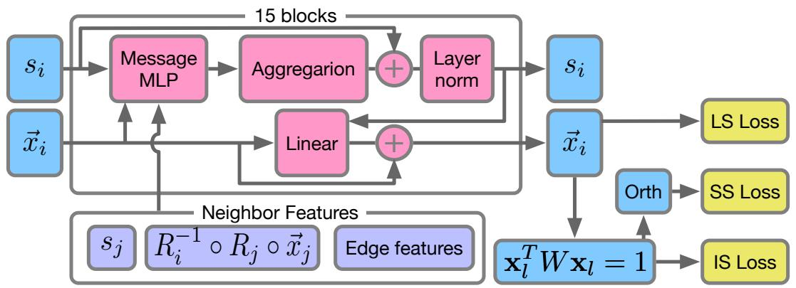  
Figure 1: PETIMOT’s architecture overview. The model processes both sequence embeddings (s) and motion vectors $( \vec { x } )$ through 15 message-passing blocks. Each block updates both representations by aggregating information from neighboring residues. Neighbor features are computed in the reference frame of the central residue $i$ , ensuring SE(3) equivariance. The geometric features encoded in the edges capture the relative spatial relationships between residue pairs. Three types of losses (LS, SS, and IS) are computed, with prior normalization of the predictions for the IS and SS losses, and an additional orthogonalisation of the predictions for the SS loss.

Dual-Track Representation. PETIMOT processes protein sequences through a message-passing   
neural network that simultaneously handles residue embeddings and motion vectors in local coordinate   
frames (Fig. 1). For each residue $i$ , we define and update a node embedding $\mathbf { s } _ { i } \in \mathbb { R } ^ { d }$ initialized   
from protein language model features and a set of $K$ motion vectors $\{ \vec { x } _ { i k } \} _ { k = 1 } ^ { K } \in \mathbb { R } ^ { 3 \times K }$ initialized   
randomly. The message passing procedure is detailed in Algorithm B.1 of Appendix B.2.   
Graph Construction. The protein is represented as a graph where nodes correspond to the residues,   
and edges capture spatial relationships. For each residue $i$ , we connect to its $k$ nearest neighbors based   
on $\mathbf { \boldsymbol { C } } \alpha$ distances and $l$ randomly selected residues. This hybrid connectivity scheme ensures both local   
geometric consistency and global information flow, while maintaining sparsity for computational   
efficiency. Indeed, our model scales linearly with the length $N$ of a protein. In our base model we set   
$k = 5$ and $l = 1 0$ .   
Node features. We chose ProstT5 as our default protein language model for initialising node   
embeddings [57]. This structure-aware pLM offers an excellent balance between model size –   
including the number of parameters and embedding dimensionality – and performance [17].   
Local Reference Frames. Each residue’s backbone atoms (N, CA, C) define a local reference frame   
through a rigid transformation $T _ { i } \in S E ( 3 )$ . For each residue pair $( i , j )$ , we compute their relative   
transformation $T _ { i j } = T _ { i } ^ { - 1 } \circ T _ { j }$ from which we extract the rotation $R _ { i j } \in S O ( 3 )$ and translation   
$\vec { t } _ { i j } \in \mathbb { R } ^ { 3 }$ . Under global rotations and translations of the protein, these relative transformations remain   
invariant.   
Edge Features. Edge features $e _ { i j }$ provide an SE(3)-invariant encoding of the protein structure   
through relative orientations, translational offsets, protein chain distance, and a complete description   
of peptide plane positioning captured by pairwise backbone atom distances. See Appendix B.3 for   
more details. The training procedure is detailed in Appendix B.4.

# 203 4 Results

<table><tr><td>Metrics</td><td>PETIMOT</td><td>AlphaFlow</td><td>ESMFlow</td><td>NMA</td></tr><tr><td>Success Rate (%) ↑</td><td>43.57</td><td>31.80</td><td>26.82</td><td>24.88</td></tr><tr><td>Running time ↓</td><td>15.82s</td><td>38h 07min</td><td>10h 41min</td><td>43.59s</td></tr><tr><td>Min. LS Error↓</td><td>0.61 ± 0.22</td><td>0.68 ± 0.21</td><td>0.70 ± 0.22</td><td>0.72 ± 0.20</td></tr><tr><td>Min. Magnitude Error ↓</td><td>0.21 ± 0.12</td><td>0.24 ± 0.12</td><td>0.26± 0.14</td><td>0.27 ± 0.14</td></tr><tr><td>OLA LS Error↓</td><td>0.83 ± 0.10</td><td>0.86 ± 0.10</td><td>0.87 ± 0.10</td><td>0.88 ± 0.10</td></tr><tr><td>OLA Magnitude Error ↓</td><td>0.41 ± 0.14</td><td>0.43 ± 0.14</td><td>0.47 ± 0.15</td><td>0.48 ± 0.15</td></tr><tr><td>Global SS Error ↓</td><td>0.73 ± 0.14</td><td>0.78±0.14</td><td>0.80 ± 0.14</td><td>0.79 ± 0.14</td></tr></table>

Table 1: Success rate and average performance on the test set. We report performance metrics on a subset of our test set, namely the 824 test proteins that we could process with AlphaFlow (smaller than 450 amino acids). The success rate is defined as the proportion of test proteins with at least one motion predicted at a reasonable accuracy, namely an LS error below 0.6. The other values are averages computed over the test proteins. Min. stands for the best matching pair of predicted and ground-truth vectors. OLA refers to the optimal linear assignment between all predicted and ground-truth vectors. Arrows indicate whether higher $( \uparrow )$ or lower (↓) metrics values are better. Best results are shown in bold. Running times are recorded on a Intel(R) Xeon(R) W-2245 CPU $@$ 3.90GHz equipped with GeForce RTX 3090. PETIMOT (with 4 directions), AlphaFlow (50 models), and ESMFlow (50 models) were executed on a GPU, while NOLB NMA (with 10 lowest modes) only used CPU.

Training and evaluation. We trained PETIMOT against linear motions extracted from all $\sim 7 5 0 { , } 0 0 0$   
protein chains from the PDB (as of June 2023) clustered at $80 \%$ sequence identity and coverage.   
Our full training data comprises 7 335 conformational collections split into $70 \%$ for training, $15 \%$   
for validation and $15 \%$ for test. We augmented the training and validation data by computing the   
motions with respect to 5 reference conformations per collection. As a result, the full training set   
comprises 25,595 samples. We set the numbers of predicted and ground-truth motions, $K = L = 4$ .   
See Appendix B.1 for more details.   
At inference, we consider $w _ { i } = 1$ , $\forall i = 1 . . N$ . We rely on four main evaluation metrics aimed at   
addressing the following questions:

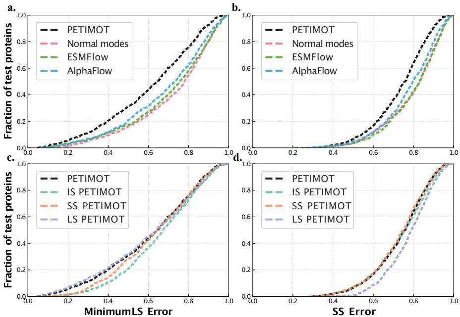  
Figure 2: Cumulative error curves computed on the test proteins. a-b. Comparison between PETIMOT base model and three other methods. c-d. Comparison between different losses implemented in PETIMOT. The loss of the base model is $\mathrm { L } S + \mathrm { S } S$ . a,c. Minimum LS error corresponding to the best matching pair of predicted and ground-truth motions. b,d. SS error computed between the entire predicted and ground-truth subspaces.

• Is PETIMOT able to approximate at least one of the main linear motions of a given protein? For this, we rely on the minimum LS error over all possible pairs of predicted and groundtruth vectors.   
• To what extent does PETIMOT capture the main motion linear subspace of a given protein? For this, we use the global SS error.   
• Is PETIMOT able to identify the residues that move the most? Here, we rely on the magnitude error, $\begin{array} { r } { \frac { 1 } { N } \sum _ { i = 1 } ^ { N } ( \| \vec { y } _ { i k } \| ^ { 2 } { - } \| c _ { k l } \vec { x } _ { i l } \| ^ { 2 } ) } \end{array}$ .   
• How fast is PETIMOT at inference?

Comparison with other methods. PETIMOT showed a better capacity to approximate individ  
ual motions and to globally capture motion subspaces than the flow matching-based frameworks   
AlphaFlow and ESMFlow, and also the unsupervised physics-based Normal Mode Analysis (Fig.   
2a-b). It approximated at least one motion with reasonable accuracy (LS error below 0.6) for $4 3 . 5 7 \%$   
of the test proteins, while the success rate was only $3 1 . 8 0 \%$ , $2 6 . 8 2 \%$ , and $2 4 . 8 8 \%$ for AlphaFlow,   
ESMFlow, and the NMA, respectively (Table 1). PETIMOT’s best predicted vector better matched   
a ground-truth vector than any other methods in $4 3 . 5 7 \%$ of the cases (Fig. 3a). PETIMOT was   
also better at identifying which residues contribute the most to the motions (Table 1). Furthermore,   
PETIMOT was significantly faster at inference - it took about 16s for the whole test set, followed by   
NOLB (44s), ESMFlow (11h) and AlphaFlow (38h). See Appendix B.5 for more evaluation details.   
For all the metrics PETIMOT performs the best, with a particular striking difference in performance   
for the success rate metrics. However, it maybe not very informative to look at a single value averaged   
over the whole test set. Thus, we also suggest to analyze more informative plots, e.g. those in Fig. 2   
and Fig. 3a.   
Comparison of problem formulations. Our base model combining the LS and SS loses with   
equal weights outperforms all three individual losses, LS, SS, and LS (Fig. 2c-d). It strikes an   
excellent balance between approximating individual motions with high accuracy (Fig. 2c) and   
globally covering the motion subspaces (Fig. 2d). By comparison, the SS and IS losses tend   
to underperform on individual motions while the LS loss tends to provide lower coverage of the   
ground-truth subspaces. See Appendix C for additional results.

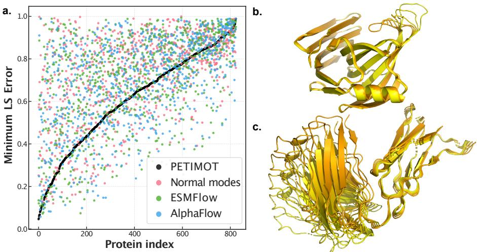  
Figure 3: Individual predictions. a. The per-protein minimum LS errors, computed for the bestmatching pairs between predicted and ground-truth vectors, are reported for PETIMOT (black), the NMA (red), AlphaFlow (blue) and ESMFlow (green). The values are in ascending order of the errors computed for PETIMOT, from best to worse. b-c. Trajectories generated by deforming a protein structure along PETIMOT best predicted motion. Five trajectory snapshots are shown colored from yellow to orange. b. Bacillus subtilis xylanase A (PDB id: 3EXU, chain A). c. Murine Fab fragment (PDB id: 7SD2, chain A).

Contribution of sequence and structure features. We performed an ablation study to assess the contribution of sequence and structure information to our architecture. Our results show that ProstT5 slightly outperforms the more recent and larger pLM, ESM-Cambrian 600M [58] (Fig. B.2). Geometrical information about protein structure provides the most significant contribution, as replacing ProstT5 embeddings with random numbers has only a small impact on network performance. Conversely, the network’s performance without structural information strongly depends on the chosen pLM. While the structure-aware embeddings from ProstT5 partially compensate for missing 3D structure information, relying solely on ESM-C embeddings results in poor performance (Fig. B.2). Moreover, connecting each residue to its 15 nearest neighbours (sorted according to $\mathbf { C } \alpha \cdot$ -Cα distances) in the protein graph results in lower performance compared to introducing randomly chosen edges or even fully relying on random connectivity (Fig. B.4).

Generalisation capability. Because our conformational collections are defined based on $80 \%$   
sequence identity and coverage thresholds, some test proteins may be close homologs of the training   
proteins. Yet, the sequence identity and structural similarity (TM-score) of the test proteins with   
respect to the training set do not determine the quality of PETIMOT predictions (Fig. C.3). PETIMOT   
provides high-quality predictions for a number of test proteins that do not share any detectable   
similarity and only weak structural similarity (TM-score below 0.5) to the training set. To further   
assess PETIMOT’s generalisation capability across protein families, we implemented a more stringent   
train-validation-test split using a $30 \%$ sequence similarity threshold. This process involved three key   
steps: (1) removing from training and validation sets any proteins sharing ${ > } 3 0 \%$ sequence similarity   
with test proteins, (2) redefining these sets through random splitting at the $30 \%$ sequence identity level,   
and (3) reducing redundancy within each set to ensure balanced representation of protein families   
(detailed in Appendix B.6). When trained under this stringent protocol, PETIMOT achieved a success   
rate of $4 0 . 8 7 \%$ on our non-redundant set of 734 test proteins, consistently outperforming all baseline   
methods (see Appendix Fig. C.4a-b). This demonstrates our architecture’s robustness, as the more   
challenging similarity restrictions did not dramatically reduce performance. For direct comparison   
between our two model versions PETIMOT-default (trained with $80 \%$ similarity threshold) and   
PETIMOT-stringent (trained with $30 \%$ non-redundant threshold) we evaluated performance on 474   
test proteins that share less than $30 \%$ sequence similarity with any protein used in training or   
validation of either model. PETIMOT-stringent achieved a slightly higher success rate $( 4 3 . 6 7 \% )$   
compared to PETIMOT-default $( 4 1 . 9 8 \% )$ (see Appendix Fig. C.4c-d). This result emphasizes the   
benefit of encouraging better generalization to evolutionary distant protein families through enhanced   
data splitting strategies.   
Conformation generation. PETIMOT allows straightforwardly generating conformational en  
sembles or trajectories by deforming an initial protein 3D structure along one or a combination of   
predicted motions. We showcase this functionality on two example proteins, the xylanase A from   
Bacillus subtilis and the periplasmic domain of Gliding motility protein GldM from Capnocytophaga   
canimorsus (Fig. 3b-c). We used PETIMOT predictions to generate physically realistic conformations   
representing either the open-to-closed transition of xylanase A thumb (Fig. 3b) or the flexibility   
of the heavy chain antibody IgE/Fab anti-profilin Hev b 8 (Fig. 3c). Figures C.5 and C.6 compare   
predicted motions for these proteins with the ground truth.

Limitations. One current limitation of our approach is the scarcity of functional motions in the training set, raising concerns about its accuracy and completeness. The success rates computed for PETIMOT, although higher than the baseline methods, remain modest, suggesting that some ground-truth motions may lack biological or physical relevance. They may result from experimental artifacts, most often of crystallographic origin. Nevertheless, establishing objective criteria to reliably distinguish artifactual conformations from biologically relevant ones remains infeasible. Our working assumption is that a subset of the conformational manifold in a protein collection always represents functional motions. To address this challenge, we designed our training loss function specifically to evaluate submanifolds by calculating the minimum error between each reference motion and the set of predicted motions, allowing the model to capture conformational diversity while mitigating the impact of potential artefacts.

Another limitation is that we do not account for the different time scales at which different types of   
protein motions occur. We do not have this temporal information in the PDB training set. The only   
information we have is the proxy of the amplitudes of the motions, represented by the eigenvalues in   
the original collections. However, these amplitudes might not be relevant as they strongly depend   
on the uneven sampling in the PDB and different experimental conditions and temperatures. This   
motivated us to only reconstruct the shape of the motion manifolds, not their amplitudes or effective   
timescales.   
In addition, our approach is limited to modeling protein motions as linear displacement vectors.   
While this approximation is sufficient to describe most of the observed conformational heterogeneity,   
it remains inadequate for modeling highly complex non-linear deformations. Furthermore, deforming   
proteins structures along linear motion direction may produce unrealistic conformations at large   
amplitudes. A possible solution yet to be investigated would be the nonlinear extrapolation technique   
that have been widely used in molecular mechanics [37]. Finally, a direction for future improvement   
would be to provide per-residue confidence estimates for the predicted motions.

# 07 5 Conclusion

In this work, we have proposed a new perspective on the problem of capturing protein continuous conformational heterogeneity. Compared to state-of-the-art methods, our approach goes beyond generating alternative protein conformations by directly inferring compact and continuous representations of protein motions. Our comprehensive analysis of PETIMOT’s predictive capabilities demonstrates its performance and utility for understanding how proteins deform to perform their functions. Our work opens ways to future developments in protein motion manifold learning, with exciting potential applications in protein engineering and drug development.

Broader impacts. This paper presents work aimed at advancing the field of computational biology and machine learning, specifically in the context of understanding protein dynamics. While the goal is primarily to enhance scientific understanding and methodological rigor, there are potential societal consequences to consider. These include the facilitation of drug discovery and protein engineering applications, as well as ethical concerns regarding the dual use of protein modeling. We emphasize the importance of using these tools responsibly to maximize benefits while mitigating risks. Beyond these considerations, there are no specific societal implications we feel require urgent attention.

References   
[1] Mihaly Varadi, Damian Bertoni, Paulyna Magana, Urmila Paramval, Ivanna Pidruchna, Malarvizhi Radhakrishnan, Maxim Tsenkov, Sreenath Nair, Milot Mirdita, Jingi Yeo, et al. Alphafold protein structure database in 2024: providing structure coverage for over 214 million protein sequences. Nucleic acids research, 52(D1):D368–D375, 2024.   
[2] Devlina Chakravarty, Myeongsang Lee, and Lauren L Porter. Proteins with alternative folds reveal blind spots in alphafold-based protein structure prediction. Current Opinion in Structural Biology, 90:102973, 2025.   
[3] John Jumper, Richard Evans, Alexander Pritzel, Tim Green, Michael Figurnov, Olaf Ronneberger, Kathryn Tunyasuvunakool, Russ Bates, Augustin Zˇ ´ıdek, Anna Potapenko, Alex Bridgland, Clemens Meyer, Simon A. A. Kohl, Andrew J. Ballard, Andrew Cowie, Bernardino Romera-Paredes, Stanislav Nikolov, Rishub Jain, Jonas Adler, Trevor Back, Stig Petersen, David Reiman, Ellen Clancy, Michal Zielinski, Martin Steinegger, Michalina Pacholska, Tamas Berghammer, Sebastian Bodenstein, David Silver, Oriol Vinyals, Andrew W. Senior, Koray Kavukcuoglu, Pushmeet Kohli, and Demis Hassabis. Highly accurate protein structure prediction with alphafold. Nature, 596(7873):583–589, 2021. doi: 10.1038/s41586-021-03819-2. URL https://doi.org/10.1038/s41586-021-03819-2.   
[4] Nessim Raouraoua, Claudio Mirabello, Thibaut Very, Christophe Blanchet, Bj ´ orn Wallner, ¨ Marc F. Lensink, and Guillaume Brysbaert. MassiveFold: unveiling AlphaFold’s hidden potential with optimized and parallelized massive sampling. Nature Computational Science, 4 (11):824–828, 2024. doi: 10.1038/s43588-024-00714-4. URL https://doi.org/10.1038/ s43588-024-00714-4.   
[5] Bjorn Wallner. Afsample: improving multimer prediction with alphafold using massive sam- ¨ pling. Bioinformatics, 39(9):btad573, 2023.   
[6] Yogesh Kalakoti and Bjorn Wallner. Afsample2: Predicting multiple conformations and ¨ ensembles with alphafold2. bioRxiv, pages 2024–05, 2024.   
[7] Hannah K Wayment-Steele, Adedolapo Ojoawo, Renee Otten, Julia M Apitz, Warintra Pitsawong, Marc Homberger, Sergey Ovchinnikov, Lucy Colwell, and Dorothee Kern. Predicting ¨ multiple conformations via sequence clustering and alphafold2. Nature, pages 1–3, 2023.   
[8] Diego Del Alamo, Davide Sala, Hassane S Mchaourab, and Jens Meiler. Sampling alternative conformational states of transporters and receptors with alphafold2. Elife, 11:e75751, 2022.   
[9] Richard A Stein and Hassane S Mchaourab. Speach af: Sampling protein ensembles and conformational heterogeneity with alphafold2. PLOS Computational Biology, 18(8):e1010483, 2022.   
[10] Lauren L Porter, Irina Artsimovitch, and Cesar A Ram ´ ´ırez-Sarmiento. Metamorphic proteins and how to find them. Current opinion in structural biology, 86:102807, 2024.   
[11] Patrick Bryant and Frank Noe. Structure prediction of alternative protein conformations. ´ Nature Communications, 15(1):7328, 2024.   
[12] Y Wang, L Wang, Y Shen, Y Wang, H Yuan, Y Wu, and Q Gu. Protein conformation generation via force-guided se (3) diffusion models, 2024. doi: 10.48550. arXiv preprint ARXIV.2403.14088, 2025.   
[13] Josh Abramson, Jonas Adler, Jack Dunger, Richard Evans, Tim Green, Alexander Pritzel, Olaf Ronneberger, Lindsay Willmore, Andrew J. Ballard, Joshua Bambrick, Sebastian W. Bodenstein, David A. Evans, Chia-Chun Hung, Michael O’Neill, David Reiman, Kathryn Tunyasuvunakool, Zachary Wu, Akvile˙ Zemgulyt ˇ e, Eirini Arvaniti, Charles Beattie, Ottavia ˙ Bertolli, Alex Bridgland, Alexey Cherepanov, Miles Congreve, Alexander I. Cowen-Rivers, Andrew Cowie, Michael Figurnov, Fabian B. Fuchs, Hannah Gladman, Rishub Jain, Yousuf A. Khan, Caroline M. R. Low, Kuba Perlin, Anna Potapenko, Pascal Savy, Sukhdeep Singh, Adrian Stecula, Ashok Thillaisundaram, Catherine Tong, Sergei Yakneen, Ellen D. Zhong, Michal Zielinski, Augustin Zˇ ´ıdek, Victor Bapst, Pushmeet Kohli, Max Jaderberg, Demis Hassabis, and John M. Jumper. Accurate structure prediction of biomolecular interactions with alphafold 3. Nature, 630(8016):493–500, 2024. doi: 10.1038/s41586-024-07487-w. URL https://doi.org/10.1038/s41586-024-07487-w.   
[14] Robert B Best, Kresten Lindorff-Larsen, Mark A DePristo, and Michele Vendruscolo. Relation between native ensembles and experimental structures of proteins. Proceedings of the National Academy of Sciences, 103(29):10901–10906, 2006.   
[15] Valentin Lombard, Sergei Grudinin, and Elodie Laine. Explaining conformational diversity in protein families through molecular motions. Scientific Data, 11(1):752, 2024. [16] Lee-Wei Yang, Eran Eyal, Ivet Bahar, and Akio Kitao. Principal component analysis of native ensembles of biomolecular structures (pca nest): insights into functional dynamics. Bioinformatics, 25(5):606–614, 2009.   
[17] Valentin Lombard, Dan Timsit, Sergei Grudinin, and Elodie Laine. Seamoon: Prediction of molecular motions based on language models. bioRxiv, pages 2024–09, 2024. [18] Leon Klein, Andrew Foong, Tor Fjelde, Bruno Mlodozeniec, Marc Brockschmidt, Sebastian Nowozin, Frank Noe, and Ryota Tomioka. Timewarp: Transferable acceleration of molecular ´ dynamics by learning time-coarsened dynamics. Advances in Neural Information Processing Systems, 36, 2024. [19] Zeming Lin, Halil Akin, Roshan Rao, Brian Hie, Zhongkai Zhu, Wenting Lu, Nikita Smetanin, Robert Verkuil, Ori Kabeli, Yaniv Shmueli, Allan Dos Santos Costa, Maryam Fazel-Zarandi, Tom Sercu, Salvatore Candido, and Alexander Rives. Evolutionary-scale prediction of atomiclevel protein structure with a language model. Science, 379(6637):1123–1130, 2023. [20] Thomas Hayes, Roshan Rao, Halil Akin, Nicholas J. Sofroniew, Deniz Oktay, Zeming Lin, Robert Verkuil, Vincent Q. Tran, Jonathan Deaton, Marius Wiggert, Rohil Badkundri, Irhum Shafkat, Jun Gong, Alexander Derry, Raul S. Molina, Neil Thomas, Yousuf Khan, Chetan Mishra, Carolyn Kim, Liam J. Bartie, Matthew Nemeth, Patrick D. Hsu, Tom Sercu, Salvatore Candido, and Alexander Rives. Simulating 500 million years of evolution with a language model. bioRxiv, 2024. doi: 10.1101/2024.07.01.600583. URL https://www.biorxiv.org/ content/early/2024/07/02/2024.07.01.600583. [21] Konstantin Weissenow, Michael Heinzinger, and Burkhard Rost. Protein language-model embeddings for fast, accurate, and alignment-free protein structure prediction. Structure, 30(8): 1169–1177, 2022. [22] Ruidong Wu, Fan Ding, Rui Wang, Rui Shen, Xiwen Zhang, Shitong Luo, Chenpeng Su, Zuofan Wu, Qi Xie, Bonnie Berger, et al. High-resolution de novo structure prediction from primary sequence. BioRxiv, pages 2022–07, 2022. [23] Tadeo Saldano, Nahuel Escobedo, Julia Marchetti, Diego Javier Zea, Juan Mac Donagh, ˜ Ana Julia Velez Rueda, Eduardo Gonik, Agustina Garc´ıa Melani, Julieta Novomisky Nechcoff, Mart´ın N Salas, et al. Impact of protein conformational diversity on alphafold predictions. Bioinformatics, 38(10):2742–2748, 2022. [24] Thomas J Lane. Protein structure prediction has reached the single-structure frontier. Nature Methods, 20(2):170–173, 2023. [25] Bulat Faezov and Roland L Dunbrack Jr. Alphafold2 models of the active form of all 437 catalytically-competent typical human kinase domains. bioRxiv, pages 2023–07, 2023. [26] Lim Heo and Michael Feig. Multi-state modeling of g-protein coupled receptors at experimental accuracy. Proteins: Structure, Function, and Bioinformatics, 90(11):1873–1885, 2022. [27] Zongxin Yu, Yikai Liu, Guang Lin, Wen Jiang, and Ming Chen. ESMAdam: a plug-and-play all-purpose protein ensemble generator. bioRxiv, pages 2025–01, 2025. [28] Bowen Jing, Bonnie Berger, and Tommi Jaakkola. Alphafold meets flow matching for generating protein ensembles. arXiv preprint arXiv:2402.04845, 2024.   
[29] Rohith Krishna, Jue Wang, Woody Ahern, Pascal Sturmfels, Preetham Venkatesh, Indrek Kalvet, Gyu Rie Lee, Felix S Morey-Burrows, Ivan Anishchenko, Ian R Humphreys, et al. Generalized biomolecular modeling and design with rosettafold all-atom. Science, 384(6693):eadl2528, 2024. [30] Bowen Jing, Ezra Erives, Peter Pao-Huang, Gabriele Corso, Bonnie Berger, and Tommi Jaakkola. Eigenfold: Generative protein structure prediction with diffusion models. arXiv preprint arXiv:2304.02198, 2023. [31] John B Ingraham, Max Baranov, Zak Costello, Karl W Barber, Wujie Wang, Ahmed Ismail, Vincent Frappier, Dana M Lord, Christopher Ng-Thow-Hing, Erik R Van Vlack, et al. Illuminating protein space with a programmable generative model. Nature, 623(7989):1070–1078, 2023. [32] Junqi Liu, Shaoning Li, Chence Shi, Zhi Yang, and Jian Tang. Design of ligand-binding proteins with atomic flow matching. arXiv preprint arXiv:2409.12080, 2024.   
[33] Shuxin Zheng, Jiyan He, Chang Liu, Yu Shi, Ziheng Lu, Weitao Feng, Fusong Ju, Jiaxi Wang, Jianwei Zhu, Yaosen Min, He Zhang, Shidi Tang, Hongxia Hao, Peiran Jin, Chi Chen, Frank Noe, Haiguang Liu, and Tie-Yan Liu. Predicting equilibrium distributions for molecular ´ systems with deep learning. Nature Machine Intelligence, 6(5):558–567, 2024. doi: 10.1038/ s42256-024-00837-3. URL https://doi.org/10.1038/s42256-024-00837-3. [34] Frank Noe, Simon Olsson, Jonas K ´ ohler, and Hao Wu. Boltzmann generators: Sampling ¨ equilibrium states of many-body systems with deep learning. Science, 365(6457):eaaw1147, 2019. [35] Tong Wang, Xinheng He, Mingyu Li, Yatao Li, Ran Bi, Yusong Wang, Chaoran Cheng, Xiangzhen Shen, Jiawei Meng, He Zhang, et al. Ab initio characterization of protein molecular dynamics with ai2bmd. Nature, pages 1–9, 2024.   
[36] Sergei Grudinin, Elodie Laine, and Alexandre Hoffmann. Predicting protein functional motions: an old recipe with a new twist. Biophysical journal, 118(10):2513–2525, 2020.   
[37] Alexandre Hoffmann and Sergei Grudinin. Nolb: Nonlinear rigid block normal-mode analysis method. Journal of chemical theory and computation, 13(5):2123–2134, 2017.   
[38] Steven Hayward and Nobuhiro Go. Collective variable description of native protein dynamics. Annual review of physical chemistry, 46(1):223–250, 1995. [39] Elodie Laine and Sergei Grudinin. Hopma: Boosting protein functional dynamics with colored contact maps. The Journal of Physical Chemistry B, 125(10):2577–2588, 2021.   
[40] Venkata K Ramaswamy, Samuel C Musson, Chris G Willcocks, and Matteo T Degiacomi. Deep learning protein conformational space with convolutions and latent interpolations. Physical Review X, 11(1):011052, 2021.   
[41] Haochuan Chen, Benoˆıt Roux, and Christophe Chipot. Discovering reaction pathways, slow variables, and committor probabilities with machine learning. Journal of Chemical Theory and Computation, 19(14):4414–4426, 2023.   
[42] Zineb Belkacemi, Paraskevi Gkeka, Tony Lelievre, and Gabriel Stoltz. Chasing collective vari- \` ables using autoencoders and biased trajectories. Journal of chemical theory and computation, 18(1):59–78, 2021. [43] Luigi Bonati, GiovanniMaria Piccini, and Michele Parrinello. Deep learning the slow modes for rare events sampling. Proceedings of the National Academy of Sciences, 118(44):e2113533118, 2021.   
464 [44] Yihang Wang, Joao Marcelo Lamim Ribeiro, and Pratyush Tiwary. Machine learning approaches for analyzing and enhancing molecular dynamics simulations. Current opinion in structural biology, 61:139–145, 2020.   
[45] Joao Marcelo Lamim Ribeiro, Pablo Bravo, Yihang Wang, and Pratyush Tiwary. Reweighted ˜ autoencoded variational bayes for enhanced sampling (rave). The Journal of chemical physics, 149(7), 2018.   
[46] John Ingraham, Vikas Garg, Regina Barzilay, and Tommi Jaakkola. Generative models for graph-based protein design. Advances in neural information processing systems, 32, 2019.   
[47] Bowen Jing, Stephan Eismann, Patricia Suriana, Raphael JL Townshend, and Ron Dror. Learning from protein structure with geometric vector perceptrons. arXiv preprint arXiv:2009.01411, 2020.   
[48] Justas Dauparas, Ivan Anishchenko, Nathaniel Bennett, Hua Bai, Robert J Ragotte, Lukas F Milles, Basile IM Wicky, Alexis Courbet, Rob J de Haas, Neville Bethel, et al. Robust deep learning–based protein sequence design using proteinmpnn. Science, 378(6615):49–56, 2022.   
[49] Lucien F Krapp, Luciano A Abriata, Fabio Cortes Rodriguez, and Matteo Dal Peraro. Pesto: ´ parameter-free geometric deep learning for accurate prediction of protein binding interfaces. Nature communications, 14(1):2175, 2023.   
[50] Yusong Wang, Tong Wang, Shaoning Li, Xinheng He, Mingyu Li, Zun Wang, Nanning Zheng, Bin Shao, and Tie-Yan Liu. Enhancing geometric representations for molecules with equivariant vector-scalar interactive message passing. Nature Communications, 15(1):313, 2024.   
[51] Helen M Berman, John Westbrook, Zukang Feng, Gary Gilliland, Talapady N Bhat, Helge Weissig, Ilya N Shindyalov, and Philip E Bourne. The protein data bank. Nucleic acids research, 28(1):235–242, 2000.   
[52] W. Kabsch. A solution for the best rotation to relate two sets of vectors. Acta Crystallographica Section A, 32(5):922–923, Sep 1976. doi: 10.1107/S0567739476001873. URL https://doi. org/10.1107/S0567739476001873.   
[53] Simon K Kearsley. On the orthogonal transformation used for structural comparisons. Acta Crystallographica Section A: Foundations of Crystallography, 45(2):208–210, 1989.   
[54] Andrea Amadei, Marc A Ceruso, and Alfredo Di Nola. On the convergence of the conformational coordinates basis set obtained by the essential dynamics analysis of proteins’ molecular dynamics simulations. Proteins: Structure, Function, and Bioinformatics, 36(4):419–424, 1999.   
[55] Alejandra Leo-Macias, Pedro Lopez-Romero, Dmitry Lupyan, Daniel Zerbino, and Angel R Ortiz. An analysis of core deformations in protein superfamilies. Biophysical journal, 88(2): 1291–1299, 2005.   
[56] Charles C David and Donald J Jacobs. Characterizing protein motions from structure. Journal of Molecular Graphics and Modelling, 31:41–56, 2011.   
[57] Michael Heinzinger, Konstantin Weissenow, Joaquin Gomez Sanchez, Adrian Henkel, Martin Steinegger, and Burkhard Rost. Prostt5: Bilingual language model for protein sequence and structure. bioRxiv, pages 2023–07, 2023.   
[58] . ESM Team. Esm cambrian: Revealing the mysteries of proteins with unsupervised learning. Evolutionary Scale Website, 2024. URL https://evolutionaryscale. ai/blog/esm-cambrian. Available from: https://evolutionaryscale.ai/blog/ esm-cambrian.   
[59] Robbie P Joosten, Fei Long, Garib N Murshudov, and Anastassis Perrakis. The pdb redo server for macromolecular structure model optimization. IUCrJ, 1(4):213–220, 2014.   
[60] Ilya Loshchilov and Frank Hutter. Decoupled weight decay regularization. In International Conference on Learning Representations, 2019. URL https://openreview.net/forum? id=Bkg6RiCqY7.   
[61] Gustaf Ahdritz, Nazim Bouatta, Christina Floristean, Sachin Kadyan, Qinghui Xia, William Gerecke, Timothy J O’Donnell, Daniel Berenberg, Ian Fisk, Niccolo Zanichelli, et al. Open- \` fold: Retraining alphafold2 yields new insights into its learning mechanisms and capacity for generalization. Nature Methods, 21(8):1514–1524, 2024.

6 [62] Martin Steinegger and Johannes Soding. Mmseqs2 enables sensitive protein sequence searching ¨   
for the analysis of massive data sets. Nature Biotechnology, 35(11):1026–1028, Nov 2017.   
ISSN 1546-1696. doi: 10.1038/nbt.3988. URL https://doi.org/10.1038/nbt.3988.   
[63] Yang Zhang and Jeffrey Skolnick. Tm-align: a protein structure alignment algorithm based on   
the tm-score. Nucleic acids research, 33(7):2302–2309, 2005.

# A Invariance of the proposed losses

Theorem A.1. SS Loss is invariant under unitary transformations of $X$ and $Y$ subspaces.

Proof. Without loss of generality, let us assume that we apply a unitary transformation $U \in \mathbb { R } ^ { K \times K }$   
to a subspace $X ^ { \perp } \in \mathbb { R } ^ { \breve { 3 } N \times K }$ , such that the result $X ^ { \prime } = \bar { X } ^ { \perp } \bar { U }$ , with $\dot { X } ^ { \prime } \in \mathbb { R } ^ { 3 N \times K }$ ∈ , spans the same   
subspace as $X ^ { \perp }$ , as it is a linear combination of the original basis vectors from $X ^ { \perp }$ . Then, let us   
rewrite the SS loss as

$$
\operatorname { S S } \operatorname { L o s s } = 1 - { \frac { 1 } { K } } \sum _ { k = 1 } ^ { K } \sum _ { l = 1 } ^ { K } ( \mathbf { y } _ { k } ^ { T } W ^ { \frac { 1 } { 2 } } \mathbf { x } _ { l } ^ { \perp } ) ^ { 2 } = 1 - { \frac { 1 } { K } } | | Y ^ { T } W ^ { \frac { 1 } { 2 } } X ^ { \perp } | | _ { F } ^ { 2 } .
$$

As the Frobenius matrix norm is invariant under orthogonal, or more generally, unitary, transformations, 529 $| | Y ^ { T } W ^ { \frac { 1 } { 2 } } X ^ { \perp } U | | _ { F } ^ { 2 } = | | Y ^ { T } W ^ { \frac { 1 } { 2 } } X ^ { \perp } | | _ { F } ^ { 2 }$ , which completes the proof. L

Corollary A.1.1. The SS loss is invariant to the direction permutations in the Gram-Schmidt orthogonalization process.

Proof. Let us consider two linear subspaces $X _ { 1 } ^ { \bot }$ and $X _ { 2 } ^ { \perp }$ resulting from the Gram-Schmidt orthogonalization of $X$ , where we arbitrarily choose the order of the orthogonalization vectors. Both $X _ { 1 } ^ { \bot }$ and $X _ { 2 } ^ { \perp }$ will span the same subspace as $X$ , and since both $X _ { 1 } ^ { \bot }$ and $X _ { 2 } ^ { \perp }$ are also orthogonal, one is a unitary transformation of the other, $X _ { 2 } ^ { \bot } = X _ { 1 } ^ { \bot } U$ , which completes the proof. □

Theorem A.2. IS Loss is invariant under unitary transformations of $X$ and $Y$ subspaces.

Proof. Following the previous proof, without loss of generality, let us assume that we apply an   
orthogonal (unitary) transformation $U \in \mathbb { R } ^ { K \times K }$ to a subspace $\mathbf { \bar { \boldsymbol { X } } } \in \mathbb { R } ^ { 3 N \times K }$ , such that the result   
$X ^ { \prime } = X U$ , with $\dot { X ^ { \prime } } \in \mathbb { R } ^ { 3 N \times K }$ , spans the same subspace as $X$ . Then, let us rewrite the IS loss as

$$
\mathrm { ~ S ~ L o s s } = \frac { 1 } { K ^ { 2 } } \sum _ { k = 1 } ^ { K } \sum _ { l = 1 } ^ { K } ( { \bf x } _ { k } ^ { T } W { \bf x } _ { l } ) ^ { 2 } - \frac { 1 } { K ^ { 2 } } \sum _ { k = 1 } ^ { K } \sum _ { l = 1 } ^ { K } ( { \bf y } _ { k } ^ { T } W ^ { \frac { 1 } { 2 } } { \bf x } _ { l } ) ^ { 2 } = \frac { 1 } { K ^ { 2 } } \| X ^ { T } W X \| _ { F } ^ { 2 } - \frac { 1 } { K ^ { 2 } } \| Y ^ { T } W ^ { \frac { 1 } { 2 } } X \| _ { F } ^ { 2 } .
$$

As the Frobenius matrix norm is invariant under orthogonal transformations, 540 $| | Y ^ { T } W ^ { \frac { 1 } { 2 } } X U | | _ { F } ^ { 2 } =$ 541 $| | Y ^ { T } W ^ { \frac { 1 } { 2 } } X | | _ { F } ^ { 2 }$ , and $\begin{array} { r } { | | U ^ { T } X ^ { T } W X U | | _ { F } ^ { 2 } = | | X ^ { T } W X | | _ { F } ^ { 2 } } \end{array}$ , which completes the proof. □

# 42 B Methods details

# B.1 Training data

Conformational collections. To generate the training data, we utilized DANCE [15] to construct   
a non-redundant set of conformational collections representing the entire PDB as of June 2023.   
Wherever possible, we enhanced the data quality by replacing raw PDB coordinates with their   
updated and optimized counterparts from PDB-REDO [59]. Each conformational collection was   
designed to include only closely related homologs, ensuring that any two protein chains within the   
same collection shared at least $80 \%$ sequence identity and coverage. Collections with insufficient   
data points were excluded as we require at least 5 conformations. To simplify the data, we retained   
only $\mathbf { \boldsymbol { C } } \alpha$ atoms (option $- c$ ) and accounted for coordinate uncertainty by applying weights (option   
-w).   
Handling missing data. The conformations in a collection may have different lengths reflected   
by the introduction of gaps when aligning the amino acid sequences. We fill these gaps with the   
coordinates of the conformation used to center the data. In doing so, we avoid introducing biases   
through reconstruction of the missing coordinates. Moreover, to explicitly account for data uncertainty,   
we assign confidence scores to the residues and include them in the structural alignment step and the   
eigen decomposition. The confidence score of a position $i$ reflects its coverage in the alignment,

$$
w _ { i } = \frac { 1 } { m } \sum _ { S } \mathbb { 1 } _ { a _ { i } ^ { S } \neq \mathrm { v } ^ { \ast } } ,
$$

where $\mathbf { \vec { \mu } } ^ { \mathbf { 5 } } \mathbf { X } ^ { \mathbf { 7 } }$ is the symbol used for gaps and $m$ is the number of conformations. The structural   
alignment of the $j$ th conformation onto the reference conformation amounts to determining the   
optimal rotation that minimises the following function [52, 53],

$$
E = \frac { 1 } { \sum _ { i } w _ { i } } \sum _ { i } w _ { i } ( r _ { i j } ^ { c } - r _ { i 0 } ^ { c } ) ^ { 2 } ,
$$

where $\mathbf { \it { r } } _ { i j } ^ { c }$ is the $i$ th centred coordinate of the $j$ th conformation and $r _ { i 0 } ^ { c }$ is the $i$ th centred coordinate of   
the reference conformation. The resulting aligned coordinates are then multiplied by the confidence   
scores prior to the PCA, as we explain below.   
Eigenspaces of positional covariance matrices. The Cartesian coordinates of each conformational   
ensemble can be stored in a matrix $R$ of dimension $3 N \times m$ , where $N$ is the number of residues (or   
positions in the associated multiple sequence alignment) and $n$ is the number of conformations. Each   
position is represented by a $\mathbf { C } { \boldsymbol { - } } { \boldsymbol { \alpha } }$ atom. We compute the coverage-weighted (to account for missing   
data, as explained above) covariance matrix as in Eq. 2. The covariance matrix is a $3 N \times 3 N$ square   
matrix, symmetric and real.   
We decompose $C$ as $C = V D V ^ { T }$ , where $V$ is a $3 N \times 3 N$ matrix with each column defining a   
sqrt-coverage-weighted eigenvector or a principal component that we interpret as a linear motion.   
$D$ is a diagonal matrix containing the eigenvalues. Specifically, the $k$ th principal component was   
expressed as a set of 3D (sqrt-coverage-weighted) displacement vectors $\vec { x } _ { i k } ^ { G T } , i = 1 , 2 , . . . L$ for the $L$   
atoms of the protein residues. To enable cross-protein comparisons, the vectors were normalized   
such that $\begin{array} { r } { \sum i = 1 ^ { L } | \vec { x } _ { i k } ^ { G T } | ^ { 2 } = L } \end{array}$ . The sum of the eigenvalues $\sum _ { k = 1 } ^ { 3 m } \lambda _ { k }$ amounts to the total positional   
variance of the ensemble (measured in $\mathrm { \AA ^ { 2 } }$ ) and each eigenvalue reflects the amount of variance   
explained by the associated eigenvector.   
Data augmentation. The reference conformation used to align and center the 3D coordinates   
corresponds to the protein chain with the most representative amino acid sequence. To increase   
data diversity, four additional reference conformations were defined for each collection. At each   
iteration, the new reference conformation was selected as the one with the highest RMSD relative to   
the previous reference. This iterative strategy maximizes the variability of the extracted motions by   
emphasizing the impact of changing the reference.

# 585 B.2 Message passing

The node embeddings and predicted motion vectors are updated iteratively according to the following   
587 algorithm.   
1: function MESSAGEPASSING({si}, {⃗xi}, {N eigh(i)}, {Rij , eij}):   
: # $\{ \mathbf { s } _ { i } \} _ { i = 1 } ^ { N }$ N ▷ Node embeddings   
: # {⃗xi}Ni=1 ▷ Motion vectors in local frames   
: # {N eigh(i)}Ni=1 ▷ Node neighborhoods   
: # $\{ R _ { i j } , e _ { i j } \}$ ▷ Relative geometric features   
: for $i = 1$ to $N$ do   
: for $j \in \mathcal { N } e i g h ( i )$ do   
: $\vec { x } _ { j } ^ { i } \gets R _ { i j } \vec { x } _ { j }$ ▷ Project motion in frame $i$   
: mij ← MessageMLP(si, sj , ⃗xi, ⃗xij , eij )   
: end for   
: mi ← Meanj(mij) ▷ Aggregate messages   
: si ← si + LayerNorm(mi) ▷ Update embedding   
: ⃗xi ← ⃗xi + Linear([si, ⃗xi]) ▷ Update motion   
: end for   
: return $\{ \mathbf { s } _ { i } \} _ { i = 1 } ^ { N } , \{ \vec { x } _ { i } \} _ { i = 1 } ^ { N }$   
: end function

# 588 B.3 SE(3)-equivariant features

We represent protein structures as attributed graphs. The node embeddings are computed with the pre-trained protein language model ProstT5 [57]. It is a fine-tuned version of the sequence-only model T5 that translates amino acid sequences into sequences of discrete structural states and reciprocally.

The edge embeddings are computed using SE(3)-invariant features derived from the input backbone, similarly to prior works [31, 48, 46]. Specifically, the features associated with the edge $e _ { i j }$ from node (atom) $i$ to node (atom) $j$ are:

• Quaternion representation: A 4-dimensional quaternion encoding the relative rotation $R _ { i j }$ between the local reference frames of residues $i$ and $j$ .   
• Relative translation: A 3-dimensional vector representing the translation $\vec { t _ { i j } }$ between the local reference frames.   
• Chain separation: The sequence separation between residues $i$ and $j$ , encoded as $\log ( | i -$ $j | { + } 1 )$ .   
• Spatial separation: The logarithm of the Euclidean distance between residues $i$ and $j$ , computed as $\log ( \| \vec { t } _ { i j } \| + \epsilon )$ , where $\epsilon = 1 0 ^ { - 8 }$ .   
• Backbone atoms distances: Distances between all backbone atoms (N, $\mathbf { \boldsymbol { C } } \alpha$ , C, O) at residues $i$ and $j$ , encoded through a radial basis expansion. For each pairwise distance $d _ { a b }$ , we compute:

$$
f _ { k } ( d _ { a b } ) = \exp \left( - \frac { ( d _ { a b } - \mu _ { k } ) ^ { 2 } } { 2 \sigma ^ { 2 } } \right) ,
$$

where {µk}20k=1 a re centers spaced linearly in [0, 20] $\textrm { \AA }$ and $\sigma = 1 \mathrm { ~ \AA ~ }$ . This creates a $1 6 \times$ $2 0 = 3 2 \mathrm { 0 }$ dimensional feature vector, as we have 16 pairwise distances $4 \times 4$ atoms) each expanded in 20 basis functions.

# B.4 Training procedure

We randomly split the 7,335 conformational collections defined with DANCE into training, validation,   
and test sets with a ratio 70:15:15. The data augmentation procedure resulted in $5 , 1 1 9 \times 5 = 2 5 , 5 9 5$   
training samples and $1 , 0 9 9 \times 5 = 5 { , } 4 9 5$ validation samples.   
The model was optimized using AdamW [60] with a learning rate of 5e-4 and weight decay of 0.01.   
We employed gradient clipping with a maximum norm of 10.0 and mixed precision training with   
PyTorch’s Automatic Mixed Precision. The learning rate was adjusted using torch’s ReduceLROn  
Plateau scheduler, which monitored the validation loss, reducing the learning rate by a factor of   
0.2 after 10 epochs without improvement. Training was performed with a batch size of 32 for both   
training and validation sets. We implemented early stopping with a patience of 50 epochs, monitoring   
the validation loss. The model achieving the best validation performance was selected for final   
evaluation. We trained the model on a single NVIDIA A100-SXM4-80GB GPU. One epoch took   
about 9 minutes of real time.

# B.5 Evaluation procedures

We report all evaluation metrics on 824 test proteins out of a total of 1 117. The 293 protein we excluded were too long $( > 4 5 0$ amino acids) to be handled by AlphaFlow and ESMFlow in a reasonable amount of time using our computing resources.

Comparison with AlphaFlow and ESMFlow. We compared our approach with the flow-matching based frameworks AlphaFlow and ESMFlow for generating conformational ensembles. For this, we downloaded the distilled ”PDB” models from https://github.com/bjing2016/alphaflow. We executed AlphaFlow using the following command,

python predict.py --noisy_first --no_diffusion --mode alphafold   
--input_csv seqs.csv --msa_dir msa_dir/   
--weights alphaflow_pdb_distilled_202402.pt --samples 50   
--outpdb output_pdb/   
AlphaFlow relies on OpenFold [61] to retrieve the input multiple sequence alignment (MSA). ESM  
Flow was launched using the same command with an additional --mode esmfold flag and its   
corresponding weights. We used AlphaFlow and ESMFlow to generate 50 conformations for each   
test protein and then we treated each ensemble as a conformational collection. We then aligned all   
members of the created collections to the reference conformations of the ground-truth collections.   
We used the identity coverage weights here. Finally, from the aligned collections, we extracted the   
principal linear motions. We shall additionally mention that we did not filter or adapt our test set to   
the AlphaFlow and ESMFlow methods. In other words, there can be certain data leakage between   
642 AlphaFlow/ESMFlow train data and our test examples.   
43 Comparison with the Normal Mode Analysis. We also compared our approach with the physics  
based unsupervised Normal Mode Analysis (NMA) method [38]. The NMA takes as input a protein   
3D structure and builds an elastic network model where the nodes represent the atoms and the   
edges represent springs linking atoms located close to each other in 3D space. The four lowest   
normal modes are obtained by diagonalizing the mass-weighted Hessian matrix of the potential   
energy of this network. We used the highly efficient NOLB method, version 1.9, downloaded from   
https://team.inria.fr/nano-d/software/nolb-normal-modes/ [37] to extract the first $K$   
normal modes from the test protein 3D conformations. Specifically, we used the following command

We retained only the $\mathbf { \boldsymbol { C } } \alpha$ atoms and defined the edges in the elastic network using a distance cutoff of $1 0 \textup { \AA }$ .

# B.6 Generalisability assessment across protein families

Protein folds are not evenly represented in the PDB, with some folds being significantly more abundant than others. For our default training procedure, we chose not to correct for this bias because the same fold may exhibit different motions in different collections. This represents a fundamental difference from structure prediction tasks, where distant homologs often exhibit nearly identical 3D structures. In contrast, for protein motion prediction, even proteins with the same fold can display dramatically different conformational changes depending on their specific biological context, binding partners, or experimental conditions. Furthermore, the diversity of motions within a single fold family provides valuable information for our model to learn the relationship between sequence, structure, and dynamic behavior.

Nevertheless, to rigorously assess PETIMOT’s capability to generalise across protein families, we   
re-trained and re-evaluated the model using a more stringent and non-redundant training-validation  
test splitting scheme. Specifically, we considered clusters of protein chains defined at $30 \%$ sequence   
identity and $80 \%$ sequence coverage using MMseqs2 [62]. These clusters define distant protein   
families and we refer to them as clus-30 in the following. We kept the 824 test proteins used for   
comparison with other methods as is and we removed all collections belonging to the same clus-30   
clusters as these proteins from the training and validation sets. Then, we re-defined a training  
validation random split at the level of the clus-30 clusters with a 9:1 ratio. This operation ensures   
that any pair of training-validation, training-test or validation-test collections do not share more than   
$30 \%$ sequence identity. Finally, for each training or validation clus-30 cluster, we randomly drew 5   
samples. This step ensures that each protein family is evenly represented in the training and validation   
sets. We also redundancy reduced the test set of 824 proteins (test-824), keeping only one protein for   
each clus-30 cluster, which led to 734 proteins (test-734).   
To be able to compare the model’s default version, PETIMOT-default, and re-trained version,   
PETIMOT-stringent, we computed their performance metrics on a subset of 474 test proteins from   
test-734. These proteins do not fall in any of the clus-30 clusters used for training or validation any   
of the two versions.

# B.7 Ablation Studies

To understand the impact of different components on the performance of our model, we carried out ablation studies. We list them blow.

# Model architecture variations.

• Network depth: We experimented with different numbers of message-passing layers (5 and 10 layers compared to our default value of 15 layers).   
• Layer sharing: We tested a variant where all message-passing layers share the same parameters, as opposed to our default where each layer has unique parameters.   
• Reduced internal embedding dimension: We tested a model with a smaller internal embedding dimension of 128 instead of the default 256.

Figure B.1 shows the evaluation of these modifications. A shallow 5-layers network underperforms on all evaluation metrics. The difference between other variants is not very significant.

# 693 Structure and sequence information ablation.

• Structure ablation: We removed all structural information from the model to assess the importance of geometric features and the performance with the PLM embeddings only. We did it by removing the edge attributes of the input of the message passing MLP.   
• Sequence ablation: We ablated sequence information by replacing protein language model embeddings with random embeddings, testing them both with and without structural information.   
• Embedding variants: We evaluated a different protein language model (ESMC-600M), both with and without structural tokens.

The evaluation results are shown in Fig. B.2. The results demonstrate that while both ProstT5 and   
ESM-Cambrian 600M perform similarly when combined with structural information, removing   
structural features leads to markedly different outcomes. ProstT5 embeddings partially compensate   
for the missing structural information, likely due to their structure-aware training, while relying solely   
706 on ESM-C embeddings results in poor performance.   
07 Problem formulation ablation. We analyzed different combinations of our loss terms (compared   
to our default balanced weights of $\mathrm { L } S + S S$ ):

• Least Square loss (LS): Using only the LS loss (weight 1.0).   
• Squared Sinus loss (SS): Using only the SS loss (weight 1.0).   
• Independent Subspaces (IS): Using only the IS loss (weight 1.0).

Figure B.3 compares three individual losses with the default option. The IS problem formulation   
underperforms on all the metrics. The default $\mathrm { L } S + \mathrm { S } S$ formulation performs slightly better than those   
with individual loss components.   
Graph connectivity ablation. We investigated different approaches to constructing the protein   
graph:

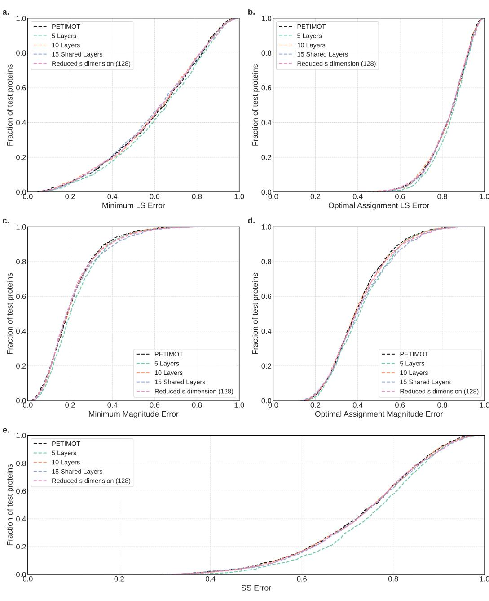  
Figure B.1: Network depth ablation. We report cumulative curves for LS error (a-b), magnitude error (c-d), and SS error (e). For each protein, we computed the error either for the best-matching pair of predicted and ground-truth vectors (a,c) or for the best combination of four pairs of predicted and ground-truth vectors (b,d). We vary the number of layers in the network and the embedding dimension.

• Nearest neighbor-only: Using 15 nearest neighbors (sorted according to the corresponding $\mathbf { \boldsymbol { C } } \alpha$ -Cα distances) without random edges.   
• Random connections-only: Using 15 random edges without nearest neighbors. This set is updated between every layer at each epoch.

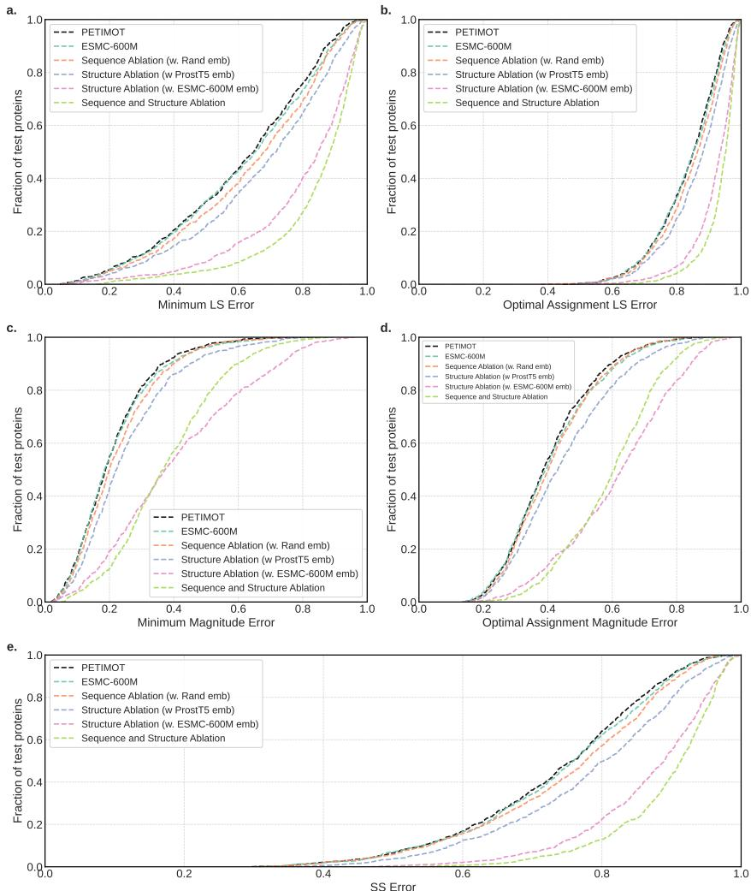  
Figure B.2: Structure and sequence information ablation study. We report cumulative curves for LS error (a-b), magnitude error (c-d), and SS error (e). For each protein, we computed the LS and magnitude errors either for the best-matching pair of predicted and ground-truth vectors (a,c) or for the best combination of four pairs of predicted and ground-truth vectors (b,d).

• Static connectivity: Using a fixed set of random neighbors between the layers. This set is updated at each epoch.

Figure B.4 shows the ablation results. We can see that the nearest neighbor-only setup underperforms   
on all the metrics. Among other options, the random connectivity-only option gets lower results   
at higher metrics values. The default option performs on par with the static connectivity, showing   
slightly better results on the optimal assignment magnitude error metrics.

# 727 C Additional results

Figure C.1 evaluates PETIMOT against NMA, ESMFlow and AlphaFlow approaches using additional   
metrics. These include the minimum magnitude error, the optimal assignment magnitude error, and   
the optimal assignment LS error. On all the metrics we see that PETIMOT outperforms the three   
other tested approaches.   
We also experimented with a different number of predicted components. For these experiments, we   
trained additional models with the LS loss only, which are listed below:

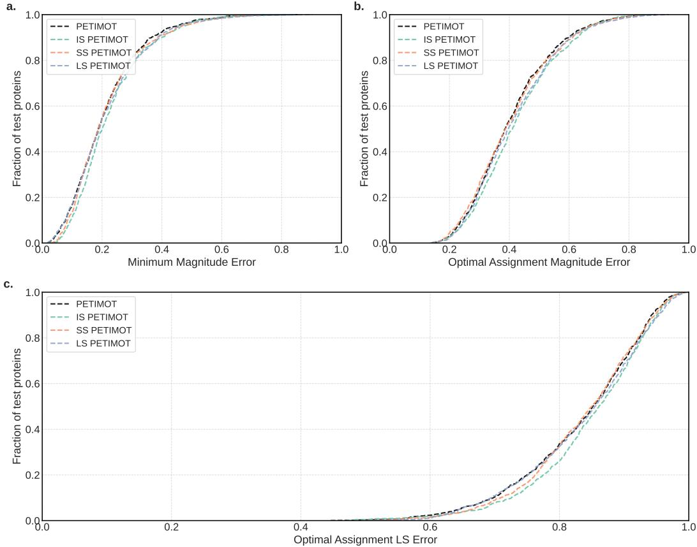  
Figure B.3: Performance comparison of different problem formulations. We report cumulative curves for magnitude error (a,b) and LS error (c). For each protein, we computed the error either for the best-matching pair of predicted and ground-truth vectors (a) or for the best combination of four pairs of predicted and ground-truth vectors (b,c).

• Single component prediction (1 mode).   
• Reduced component prediction (2 modes).   
• Extended component prediction (8 modes).

We compare these options with our default setting of 4 components. Figure C.2 shows the results.   
Increasing the number of predicted components from 1 to 8 improves the minimum LS errors, as   
having more predicted vectors naturally increases the chance of matching at least one ground-truth   
motion well. However, when evaluating the optimal linear assignment metrics, which measures   
overall subspace alignment, models with 1 or 2 components have an artificial advantage since they   
face fewer matching constraints. The 8-components model similarly benefits from having more   
candidate vectors to match against the 4 ground-truth components.   
Figure C.3 compares the accuracy of the predicted test proteins (minimum LS loss) with the structural   
(TM-score) and sequence (sequence identity) distances to the training set. We do not see a clear   
correlation between the prediction accuracy and the similarity to the training examples. Please also   
747 see Fig. 3b-c for comparison.

Figure C.4 further assesses PETIMOT’s generalisation capability across protein families. To do so, we implemented a more stringent train-validation-test split using a $30 \%$ sequence similarity threshold (see main text and Appendix B.6). When trained under this stringent protocol, PETIMOT still substantially outperforms all baseline methods according to minimum L and SS metrics (Fig. C.4a-b). Moreover, we observe a slight generalisation improvement of PETIMOT-stringent over

53 PETIMOT-default on a test set of 474 proteins evolutionary distant from any protein used for training   
754 or validation of any of the two model versions (Fig. C.4c-d).   
55 Figures C.5 and C.6 show predicted (blue arrows) and ground-truth (red arrows) motion vectors for   
the xylanase A from Bacillus subtilis and the periplasmic domain of Gliding motility protein GldM   
from Capnocytophaga canimorsus, respectively.

# 758 D Licenses for used resources

In this work, we utilize several existing resources. The protein structures were obtained from   
the Protein Data Bank (PDB, https://www.rcsb.org/, version accessed on June 2023) which is dis  
tributed under the CC0 1.0 Universal Public Domain Dedication license (CC0 1.0). We com  
plemented PDB data with data from PDB-redo (accessed June 2023) developed by Joosten et   
al. [59], available at https://pdb-redo.eu under the licence specified at https://pdb-redo.   
eu/license. For protein language modeling, we employed ProstT5 developed by Heinzinger   
et al. [57], available under the MIT license at https://huggingface.co/Rostlab/ProstT5,   
and ESM-Cambrian 600M (verison esmc-600m-2024-12) developed by the EvolutionaryScale   
Team [58], available under the Cambrian Non-Commercial License at https://huggingface.co/   
EvolutionaryScale/esmc-600m-2024-12. Additional resources include the DANCE method   
(version of Oct 8, 2024) developed by Lombard et al., available under the MIT license at   
https://github.com/PhyloSofS-Team/DANCE. As baselines, we ran the NOLB method (ver  
sion 1.9) developed by Hoffmann et al. [37] and available at https://team.inria.fr/nano-d/   
software/nolb-normal-modes/, and the AlphaFlow (version AlphaFlow-PDB distilled) and   
ESMFlow (version ESMFlow-PDB distilled) models developed by Jing et al. [28] and available at   
https://github.com/bjing2016/alphaflow. We used TM-align (version 20220412) developed   
by Zhang and Skolnick [63] and available at https://zhanggroup.org/TM-align/ to perform   
all-to-all pairwise structural alignments between train and test protein conformations and compute   
TM-scores.

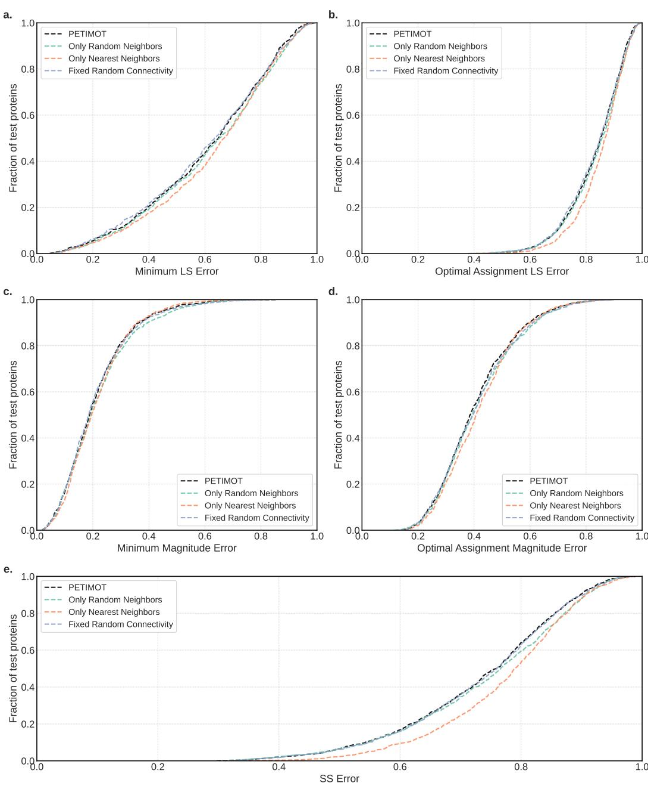  
Figure B.4: Graph connectivity ablation. We report cumulative curves for LS error (a-b), magnitude error (c-d), and SS error (e). For each protein, we computed the error either for the best-matching pair of predicted and ground-truth vectors (a,c) or for the best combination of four pairs of predicted and ground-truth vectors (b,d). Only Random Neighbors: each residue (node) is connected to 15 randomly chosen residues and the connectivity changes after each layer. Only Nearest Neighbors: each residue (node) is connected to its 15 nearest neighbors in the input 3D structure. Fixed Random Connectivity: each residue (node) is connected to 15 residues randomly chosen at the beginning.

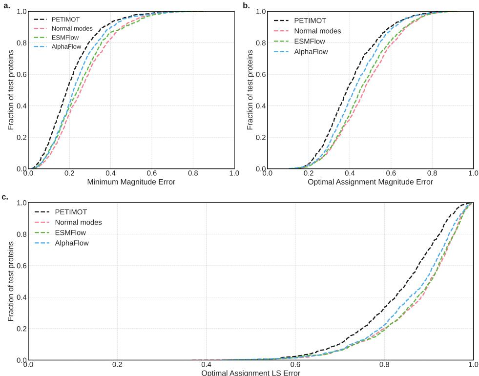  
Figure C.1: Performance comparison with other methods on the test proteins. We report cumulative curves for magnitude error (a,b) and LS error (c). For each protein, we computed the error either for the best-matching pair of predicted and ground-truth vectors (a) or for the best combination of four pairs of predicted and ground-truth vectors (b,c).

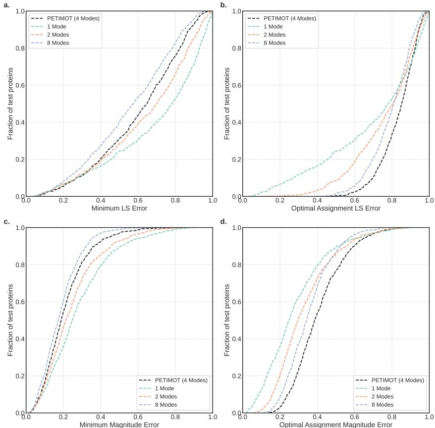  
Figure C.2: Impact of the number of predicted components. We report cumulative curves for LS error (a-b) and magnitude error (c-d). For each protein, we computed the error either for the best-matching pair of predicted and ground-truth vectors (a,c) or for the best combination of all pairs of predicted and ground-truth vectors using optimal linear assignment (b,d). We compare models trained to predict different numbers of components (modes): 1, 2, 4, or 8, using only the LS loss.

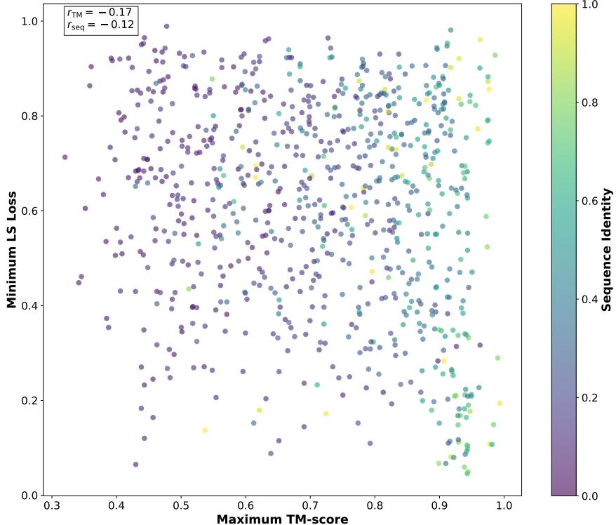  
Figure C.3: Relationship between PETIMOT’s prediction accuracy and structural/sequence similarity with the training set. The minimum LS error is plotted against the maximum TM-score between each test protein and any protein in the training set. Points are colored by the maximum sequence identity to the training samples.

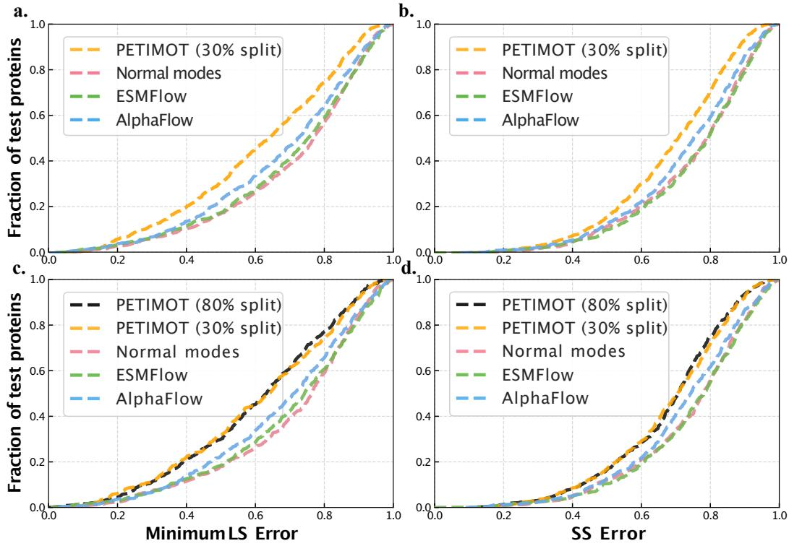  
Figure C.4: Cumulative error curves computed on the test proteins. a-b. Comparison between PETIMOT-stringent model and three other methods on a non-redundant set of 734 test proteins. PETIMOT-stringent was trained on a stringent and non-redundant training-validation-test split defined using a $30 \%$ sequence identity threshold. c-d. Comparison between PETIMOT-default, PETIMOTstringent and three other methods on 474 test proteins that share less than $30 \%$ sequence similarity with any protein used in training or validation of either model. a,c. Minimum LS error corresponding to the best matching pair of predicted and ground-truth motions. b,d. SS error computed between the entire predicted and ground-truth subspaces.

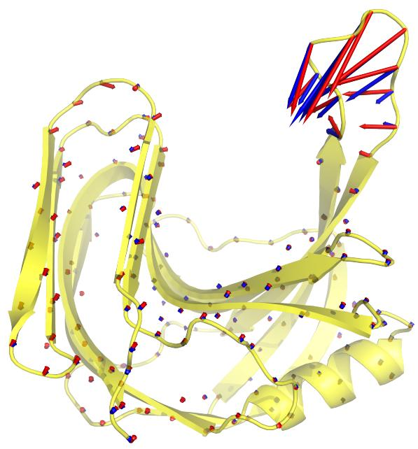  
Figure C.5: Visualization of predicted (blue arrows) and ground-truth (red arrows) motion vectors for PDB structure 3EXU (chain A), with LS error of 0.20. The predicted deformation was used to generate the interpolated conformations shown in Fig. 3b.

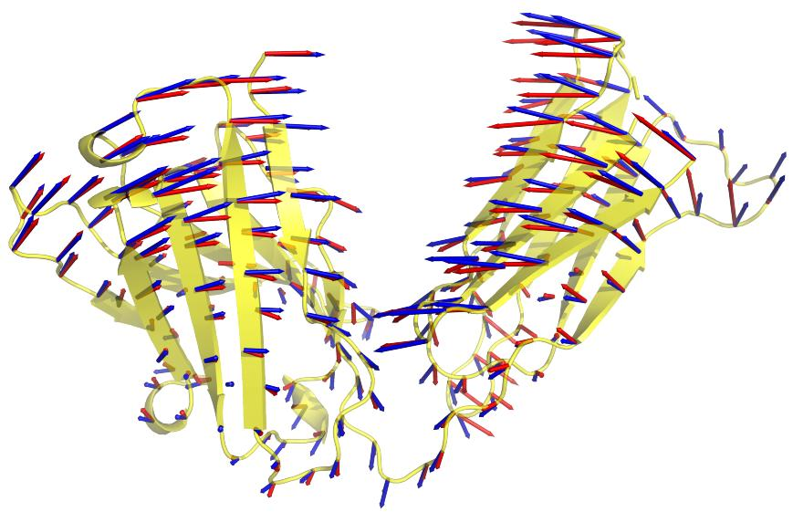  
Figure C.6: Visualization of predicted (blue arrows) and ground-truth (red arrows) motion vectors for PDB structure 7SD2, with LS error of 0.18. The predicted deformation was used to generate the interpolated conformations shown in Fig. 3c.

# 1. Claims

Question: Do the main claims made in the abstract and introduction accurately reflect the paper’s contributions and scope?

Answer: [Yes]

Justification: We provide a novel formulation of the protein conformational diversity problem, sections 3.1 and 3.2. We present a novel benchmark representative of the PDB structural diversity along data- and task-specific metrics in the result section and SI. We develop a SE(3)-equivariant Graph Neural Network architecture equipped with a novel symmetryaware loss function for comparing linear subspaces, with invariance to permutation and scaling, sections 3.3 and 3.4. Our results demonstrate the performance of PETIMOT with respect to other methods, see Results, and the capability of PETIMOT to generalise across protein families, subsection Generalisation capability in the Results section.

# Guidelines:

• The answer NA means that the abstract and introduction do not include the claims made in the paper.   
• The abstract and/or introduction should clearly state the claims made, including the contributions made in the paper and important assumptions and limitations. A No or NA answer to this question will not be perceived well by the reviewers.   
• The claims made should match theoretical and experimental results, and reflect how much the results can be expected to generalize to other settings.   
• It is fine to include aspirational goals as motivation as long as it is clear that these goals are not attained by the paper.

# 2. Limitations

Question: Does the paper discuss the limitations of the work performed by the authors?

Answer: [Yes]

Justification: We have written a dedicated subsection ”Limitations” in the Results section.

Guidelines:

• The answer NA means that the paper has no limitation while the answer No means that the paper has limitations, but those are not discussed in the paper.   
• The authors are encouraged to create a separate ”Limitations” section in their paper.   
• The paper should point out any strong assumptions and how robust the results are to violations of these assumptions (e.g., independence assumptions, noiseless settings, model well-specification, asymptotic approximations only holding locally). The authors should reflect on how these assumptions might be violated in practice and what the implications would be.   
The authors should reflect on the scope of the claims made, e.g., if the approach was only tested on a few datasets or with a few runs. In general, empirical results often depend on implicit assumptions, which should be articulated.   
The authors should reflect on the factors that influence the performance of the approach.   
For example, a facial recognition algorithm may perform poorly when image resolution is low or images are taken in low lighting. Or a speech-to-text system might not be used reliably to provide closed captions for online lectures because it fails to handle technical jargon.   
The authors should discuss the computational efficiency of the proposed algorithms and how they scale with dataset size.   
If applicable, the authors should discuss possible limitations of their approach to address problems of privacy and fairness.   
While the authors might fear that complete honesty about limitations might be used by reviewers as grounds for rejection, a worse outcome might be that reviewers discover limitations that aren’t acknowledged in the paper. The authors should use their best judgment and recognize that individual actions in favor of transparency play an important role in developing norms that preserve the integrity of the community. Reviewers will be specifically instructed to not penalize honesty concerning limitations.

# 3. Theory assumptions and proofs

Question: For each theoretical result, does the paper provide the full set of assumptions and a complete (and correct) proof?

Answer: [Yes]

Justification: Proof of the invariance of the losses is available in Appendix A.

Guidelines:

• The answer NA means that the paper does not include theoretical results.   
• All the theorems, formulas, and proofs in the paper should be numbered and crossreferenced.   
• All assumptions should be clearly stated or referenced in the statement of any theorems.   
• The proofs can either appear in the main paper or the supplemental material, but if they appear in the supplemental material, the authors are encouraged to provide a short proof sketch to provide intuition.   
Inversely, any informal proof provided in the core of the paper should be complemented by formal proofs provided in appendix or supplemental material.   
• Theorems and Lemmas that the proof relies upon should be properly referenced.

# 4. Experimental result reproducibility

Question: Does the paper fully disclose all the information needed to reproduce the main experimental results of the paper to the extent that it affects the main claims and/or conclusions of the paper (regardless of whether the code and data are provided or not)?

Answer: [Yes]

Justification: The methods are explained in the the Methods sections and supplementary details are given in the Methods Details section in Appendix B.

Guidelines:

• The answer NA means that the paper does not include experiments.   
• If the paper includes experiments, a No answer to this question will not be perceived well by the reviewers: Making the paper reproducible is important, regardless of whether the code and data are provided or not.   
• If the contribution is a dataset and/or model, the authors should describe the steps taken to make their results reproducible or verifiable. Depending on the contribution, reproducibility can be accomplished in various ways. For example, if the contribution is a novel architecture, describing the architecture fully might suffice, or if the contribution is a specific model and empirical evaluation, it may be necessary to either make it possible for others to replicate the model with the same dataset, or provide access to the model. In general. releasing code and data is often one good way to accomplish this, but reproducibility can also be provided via detailed instructions for how to replicate the results, access to a hosted model (e.g., in the case of a large language model), releasing of a model checkpoint, or other means that are appropriate to the research performed. While NeurIPS does not require releasing code, the conference does require all submissions to provide some reasonable avenue for reproducibility, which may depend on the nature of the contribution. For example (a) If the contribution is primarily a new algorithm, the paper should make it clear how to reproduce that algorithm. (b) If the contribution is primarily a new model architecture, the paper should describe the architecture clearly and fully. (c) If the contribution is a new model (e.g., a large language model), then there should either be a way to access this model for reproducing the results or a way to reproduce the model (e.g., with an open-source dataset or instructions for how to construct the dataset). (d) We recognize that reproducibility may be tricky in some cases, in which case authors are welcome to describe the particular way they provide for reproducibility. In the case of closed-source models, it may be that access to the model is limited in some way (e.g., to registered users), but it should be possible for other researchers to have some path to reproducing or verifying the results.

# 5. Open access to data and code

Question: Does the paper provide open access to the data and code, with sufficient instructions to faithfully reproduce the main experimental results, as described in supplemental material?

Answer: [Yes]

Justification: Code and instructions to retrieve data are available at https://anonymous.   
4open.science/r/PETIMOT-4ED4/.

Guidelines:

• The answer NA means that paper does not include experiments requiring code.   
• Please see the NeurIPS code and data submission guidelines (https://nips.cc/ public/guides/CodeSubmissionPolicy) for more details.   
• While we encourage the release of code and data, we understand that this might not be possible, so “No” is an acceptable answer. Papers cannot be rejected simply for not including code, unless this is central to the contribution (e.g., for a new open-source benchmark).   
• The instructions should contain the exact command and environment needed to run to reproduce the results. See the NeurIPS code and data submission guidelines (https: //nips.cc/public/guides/CodeSubmissionPolicy) for more details.   
• The authors should provide instructions on data access and preparation, including how to access the raw data, preprocessed data, intermediate data, and generated data, etc.   
• The authors should provide scripts to reproduce all experimental results for the new proposed method and baselines. If only a subset of experiments are reproducible, they should state which ones are omitted from the script and why.   
• At submission time, to preserve anonymity, the authors should release anonymized versions (if applicable).   
• Providing as much information as possible in supplemental material (appended to the paper) is recommended, but including URLs to data and code is permitted.

# 6. Experimental setting/details

Question: Does the paper specify all the training and test details (e.g., data splits, hyperparameters, how they were chosen, type of optimizer, etc.) necessary to understand the results?

Answer: [Yes]

Justification: Essential details are given in the main text, other information can be found in Appendix B.

Guidelines:

• The answer NA means that the paper does not include experiments. • The experimental setting should be presented in the core of the paper to a level of detail that is necessary to appreciate the results and make sense of them. • The full details can be provided either with the code, in appendix, or as supplemental material.

# 7. Experiment statistical significance

Question: Does the paper report error bars suitably and correctly defined or other appropriate information about the statistical significance of the experiments?

Answer: [Yes]

Justification: We provide standard deviations in Table 1. Additional statistical significance tests and error bars are provided in SI.

Guidelines:

• The answer NA means that the paper does not include experiments. • The authors should answer ”Yes” if the results are accompanied by error bars, confidence intervals, or statistical significance tests, at least for the experiments that support the main claims of the paper.

• The factors of variability that the error bars are capturing should be clearly stated (for example, train/test split, initialization, random drawing of some parameter, or overall run with given experimental conditions).   
• The method for calculating the error bars should be explained (closed form formula, call to a library function, bootstrap, etc.)   
• The assumptions made should be given (e.g., Normally distributed errors).   
• It should be clear whether the error bar is the standard deviation or the standard error of the mean.   
• It is OK to report 1-sigma error bars, but one should state it. The authors should preferably report a 2-sigma error bar than state that they have a $96 \%$ CI, if the hypothesis of Normality of errors is not verified.   
• For asymmetric distributions, the authors should be careful not to show in tables or figures symmetric error bars that would yield results that are out of range (e.g. negative error rates).   
• If error bars are reported in tables or plots, The authors should explain in the text how they were calculated and reference the corresponding figures or tables in the text.

# 8. Experiments compute resources

Question: For each experiment, does the paper provide sufficient information on the computer resources (type of compute workers, memory, time of execution) needed to reproduce the experiments?

Answer: [Yes]

Justification: We provide information on the running time, CPU and GPU resources for each model in Tables and in the main text.

Guidelines:

• The answer NA means that the paper does not include experiments.   
• The paper should indicate the type of compute workers CPU or GPU, internal cluster, or cloud provider, including relevant memory and storage.   
• The paper should provide the amount of compute required for each of the individual experimental runs as well as estimate the total compute.   
• The paper should disclose whether the full research project required more compute than the experiments reported in the paper (e.g., preliminary or failed experiments that didn’t make it into the paper).

# 9. Code of ethics

Question: Does the research conducted in the paper conform, in every respect, with the NeurIPS Code of Ethics https://neurips.cc/public/EthicsGuidelines?

Answer: [Yes]

Justification: We followed the NeurIPS Code of Ethics when conducting our study and presenting the work.

Guidelines:

• The answer NA means that the authors have not reviewed the NeurIPS Code of Ethics.   
• If the authors answer No, they should explain the special circumstances that require a deviation from the Code of Ethics.   
• The authors should make sure to preserve anonymity (e.g., if there is a special consideration due to laws or regulations in their jurisdiction).

# 10. Broader impacts

Question: Does the paper discuss both potential positive societal impacts and negative societal impacts of the work performed?

Answer: [Yes]

Justification: We have written a dedicated section ”Broader Impacts” that concludes the manuscript.

Guidelines:

• The answer NA means that there is no societal impact of the work performed.   
• If the authors answer NA or No, they should explain why their work has no societal impact or why the paper does not address societal impact.   
• Examples of negative societal impacts include potential malicious or unintended uses (e.g., disinformation, generating fake profiles, surveillance), fairness considerations (e.g., deployment of technologies that could make decisions that unfairly impact specific groups), privacy considerations, and security considerations.   
• The conference expects that many papers will be foundational research and not tied to particular applications, let alone deployments. However, if there is a direct path to any negative applications, the authors should point it out. For example, it is legitimate to point out that an improvement in the quality of generative models could be used to generate deepfakes for disinformation. On the other hand, it is not needed to point out that a generic algorithm for optimizing neural networks could enable people to train models that generate Deepfakes faster. The authors should consider possible harms that could arise when the technology is being used as intended and functioning correctly, harms that could arise when the technology is being used as intended but gives incorrect results, and harms following from (intentional or unintentional) misuse of the technology. If there are negative societal impacts, the authors could also discuss possible mitigation strategies (e.g., gated release of models, providing defenses in addition to attacks, mechanisms for monitoring misuse, mechanisms to monitor how a system learns from feedback over time, improving the efficiency and accessibility of ML).

# 11. Safeguards

Question: Does the paper describe safeguards that have been put in place for responsible release of data or models that have a high risk for misuse (e.g., pretrained language models, image generators, or scraped datasets)?

Answer: [NA]

Justification: We do not see any misuse of our model or theoretical results.

Guidelines:

• The answer NA means that the paper poses no such risks.   
• Released models that have a high risk for misuse or dual-use should be released with necessary safeguards to allow for controlled use of the model, for example by requiring that users adhere to usage guidelines or restrictions to access the model or implementing safety filters.   
• Datasets that have been scraped from the Internet could pose safety risks. The authors should describe how they avoided releasing unsafe images.   
• We recognize that providing effective safeguards is challenging, and many papers do not require this, but we encourage authors to take this into account and make a best faith effort.

# 12. Licenses for existing assets

Question: Are the creators or original owners of assets (e.g., code, data, models), used in the paper, properly credited and are the license and terms of use explicitly mentioned and properly respected?

Answer: [Yes]

Justification: We have written a dedicated section in Appendix D ”Licenses for used resources”.

Guidelines:

• The answer NA means that the paper does not use existing assets.   
• The authors should cite the original paper that produced the code package or dataset.   
• The authors should state which version of the asset is used and, if possible, include a URL.   
• The name of the license (e.g., CC-BY 4.0) should be included for each asset.   
• For scraped data from a particular source (e.g., website), the copyright and terms of service of that source should be provided.   
• If assets are released, the license, copyright information, and terms of use in the package should be provided. For popular datasets, paperswithcode.com/datasets has curated licenses for some datasets. Their licensing guide can help determine the license of a dataset.   
• For existing datasets that are re-packaged, both the original license and the license of the derived asset (if it has changed) should be provided.   
• If this information is not available online, the authors are encouraged to reach out to the asset’s creators.

# 13. New assets

Question: Are new assets introduced in the paper well documented and is the documentation provided alongside the assets?

Answer: [Yes]

Justification: Code, instructions to retrieve data, and data splitting scripts are available at https://anonymous.4open.science/r/PETIMOT-4ED4/.

Guidelines:

• The answer NA means that the paper does not release new assets.   
• Researchers should communicate the details of the dataset/code/model as part of their submissions via structured templates. This includes details about training, license, limitations, etc.   
• The paper should discuss whether and how consent was obtained from people whose asset is used.   
• At submission time, remember to anonymize your assets (if applicable). You can either create an anonymized URL or include an anonymized zip file.

# 14. Crowdsourcing and research with human subjects

Question: For crowdsourcing experiments and research with human subjects, does the paper include the full text of instructions given to participants and screenshots, if applicable, as well as details about compensation (if any)?

Answer: [NA]

Justification:

Guidelines:

• The answer NA means that the paper does not involve crowdsourcing nor research with human subjects.   
• Including this information in the supplemental material is fine, but if the main contribution of the paper involves human subjects, then as much detail as possible should be included in the main paper.   
• According to the NeurIPS Code of Ethics, workers involved in data collection, curation, or other labor should be paid at least the minimum wage in the country of the data collector.

# 15. Institutional review board (IRB) approvals or equivalent for research with human subjects

Question: Does the paper describe potential risks incurred by study participants, whether such risks were disclosed to the subjects, and whether Institutional Review Board (IRB) approvals (or an equivalent approval/review based on the requirements of your country or institution) were obtained?

Answer: [NA]

Justification:

Guidelines:

• The answer NA means that the paper does not involve crowdsourcing nor research with human subjects.

• Depending on the country in which research is conducted, IRB approval (or equivalent) may be required for any human subjects research. If you obtained IRB approval, you should clearly state this in the paper.   
• We recognize that the procedures for this may vary significantly between institutions and locations, and we expect authors to adhere to the NeurIPS Code of Ethics and the guidelines for their institution.   
• For initial submissions, do not include any information that would break anonymity (if applicable), such as the institution conducting the review.

# 16. Declaration of LLM usage

Question: Does the paper describe the usage of LLMs if it is an important, original, or non-standard component of the core methods in this research? Note that if the LLM is used only for writing, editing, or formatting purposes and does not impact the core methodology, scientific rigorousness, or originality of the research, declaration is not required.

Answer: [NA]

Justification:

Guidelines:

• The answer NA means that the core method development in this research does not involve LLMs as any important, original, or non-standard components. • Please refer to our LLM policy (https://neurips.cc/Conferences/2025/LLM) for what should or should not be described.
