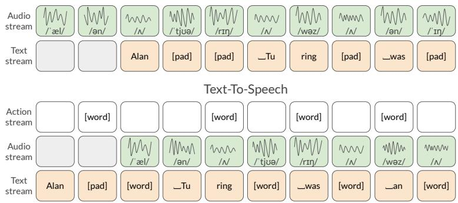
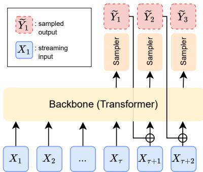
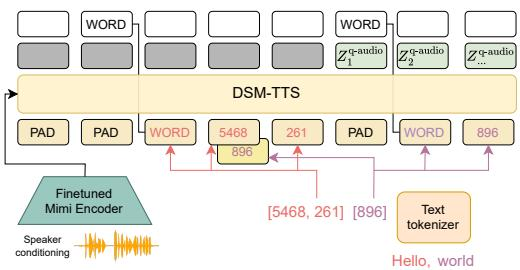
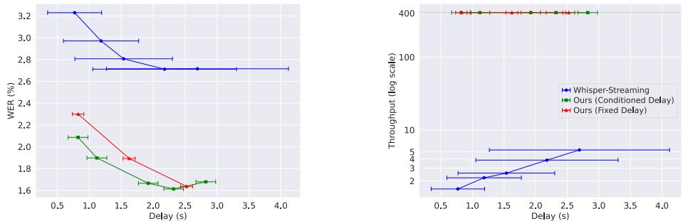

# Streaming Sequence-to-Sequence Learning with Delayed Streams Modeling

Anonymous Author(s)   
Affiliation   
Address   
email

# Abstract

We introduce Delayed Streams Modeling (DSM), a flexible formulation for streaming, multimodal sequence-to-sequence learning. Sequence-to-sequence generation is typically cast in an offline manner: the model consumes the complete input sequence before generating the first output timestep. DSM instead models time-aligned streams with a decoder-only language model. By furthermore introducing delays between streams, and selectively feeding or sampling them, DSM provides streaming inference of arbitrary output sequences, from any input combination, making it applicable to many sequence-to-sequence problems. In particular, given a text and audio stream, automatic speech recognition (ASR) corresponds to the text stream being delayed, while the opposite gives a text-to-speech (TTS) model. We perform extensive experiments for these two major sequence-to-sequence tasks, showing that DSM provides state-of-theart performance and latency while supporting arbitrary long sequences, being even competitive with offline baselines. We demonstrate DSM applications on https://delayed-stream-modeling.github.io/.

# 16 1 Introduction

We are interested in streaming sequence-to-sequence (seq2seq) learning, i.e. predicting an output   
sequence as we process an input sequence synchronously, as opposed to offline seq2seq where   
inputs are recorded entirely before producing the output sequence. The latter class of offline   
models was introduced for a diverse set of tasks such as handwriting recognition (Graves et al.,   
$\boxed { 2 0 1 3 }$ , automatic speech recognition (ASR) $\left( \mathbf { \overline { { G r a v e s \ e t { a l . } } } } \mathbf { \overline { { 2 0 1 3 } } } \right)$ or machine translation (Bahdanau   
et al., 2015; Sutskever et al., 2014), by designing modality-dependent input encoders, typically   
coupled with a text decoder (Hochreiter & Schmidhuber, $\boxed { 1 9 9 7 }$ . Although this asymmetry between   
input processing and output generation facilitated the adoption of this framework in many tasks,   
it also led to a divergence of model architectures across modalities. As an example, a Tacotron   
text-to-speech (TTS) model $( \mathrm { W a n g ~ e t ~ a l . } , \lbrack 2 0 1 7 )$ would differ from an ASR model such as LAS (Chan   
et al., 2016).The advent of decoder-only Transformers $( \mathrm { V a s w a n i ~ e t ~ a l . } , \vert 2 0 1 7 )$ for text language   
modeling reduced the gap between input and output processing by allowing a single model to process   
a simple concatenation of tokens. In parallel, neural compression algorithms that can transform   
images (Razavi et al., 2019; Esser et al., 2020) and audio (Zeghidour et al., 2022; Défossez et al.,   
$\bar { 2 0 2 3 } )$ into discrete tokens analogous to text allowed integrating these modalities along text sequences.   
Thus, a decoder-only model can be used for seq2seq tasks such as ASR (Rubenstein et al., 2023),   
TTS (Wang et al., $\boxed { 2 0 2 3 }$ , spoken dialogue (Défossez et al., $\textcircled { 2 0 2 4 }$ , visual understanding (Beyer   
et al., 2024) or image generation (Ramesh et al., 2021). Furthermore, inputs and outputs are   
interchangeable in this framework, meaning a single model can be trained for generation in both   
directions: AudioPALM (Rubenstein et al., 2023) performs TTS and ASR, while CM3Leon $\mathrm { ( Y u e t a l . ) }$   
$\boxed { 2 0 2 3 }$ provides both image captioning and generation. Yet, a major limitation of these decoder-only   
approaches is their incompatibility with streaming. First, their prefix-based formulation requires   
access to the full input sequence before generation, which prevents real-time inference and inherently   
limits the maximum input length. Second, modalities operate at differing framerates: audio or video   
tokens are typically sampled regularly, while text tokens represent linguistic units pronounced over   
varying durations. This prevents applications such as meeting transcription or continuous translation.   
In this work, we present Delayed Streams Modeling (DSM), a framework for streaming sequence  
to-sequence learning across modalities. DSM uses a decoder-only model to process as many   
parallel token streams as there are I/O sequences. This multistream architecture, introduced   
by Défossez et al. (2024), allows for a synchronous autoregressive modeling of aligned sequences   
which—when coupled with a finite context—provides real-time, streaming generation over infinite   
input sequences. Moreover, by operating at a constant framerate, DSM allows for batching, a feature   
rarely provided by streaming models. The second key component of DSM is the introduction of   
a delay between streams to control the quality/latency trade-off: shifting a sequence B such that   
it is delayed w.r.t. sequence A allows for a better prediction of the former based on the latter. With   
an appropriate masking, a DSM model can be trained to continuously predict any combination   
of output sequences from any combination of input sequences. To illustrate the abilities of the   
DSM framework, we train speech-text models for ASR and TTS. We show how DSM provides a   
state-of-the-art tradeoff between latency—as low as a few hundred milliseconds—and quality, while   
providing long-form synthesis and transcription, along with precise word timestamps that locate   
where they are pronounced. We furthermore introduce delay conditioning which allows controlling   
the quality/latency trade-off at inference time, without retraining a model. We will release our code   
and models, along with an evaluation dataset for long-form dialog TTS.

# 60 2 Related Work

Streaming Sequence-to-Sequence Learning. Most streaming seq2seq literature has focused on   
speech-to-text tasks, in particular ASR (Li et al., 2021) and translation (Zhang et al., 2024; Barrault   
et al., $\boxed { 2 0 2 3 }$ . Monotonic (Raffel et al., $\overline { { 2 0 1 7 } } ,$ Chiu & Raffel, 2018) and local (Chiu et al., 2019)   
attention respectively allow for causal attention of outputs with respect to inputs along and handling   
arbitrarily long sequences. A common limitation of streaming models is their incompatibility with   
batching when using an inference policy (Barrault et al., 2023), or the lack of symmetry meaning   
that specific models must be used for speech-to-text $\mathbb { E l e t a l } . \mathbb { E } ^ { { \mathrm { i e t ~ a l . } } }$ and text-to-speech (Wang et al.,   
$\boxed { 2 0 1 7 }$ . In contrast, DSM allows for batching and accelerated inference. In the context of this paper,   
this allows DSM to be trained for state-of-the-art ASR or TTS (see Figure 1), as shown in Section 4,   
with its performance being even competitive with offline approaches.   
Multimodal language models. Transformer-based autoregressive models are the current main ap  
proach to sequence-to-sequence problems. They were introduced by Vaswani et al. (2017) for machine   
translation, and were soon extended to multimodal tasks, such as ASR (Radford et al., 2023) or   
visual understanding (Alayrac et al., 2022), by designing modality-specific encoders. More recently,   
neural codecs have provided compact, discrete representations of images (Esser et al., 2020) and au  
dio (Zeghidour et al., $\boxed { 2 0 2 2 } )$ that remove the need for modality-specific encoders inside the generative   
model, while providing a symmetrical processing of inputs and outputs which allows performing bidi  
rectional tasks (e.g. speech-to-text and text-to-speech (Rubenstein et al., 2023)) with a single architec  
ture. $\boxed { \mathrm { D e f o s s e z ~ e t ~ a l . } } \textcircled { 2 0 2 4 }$ introduce a multistream decoder architecture for spoken dialogue, which   
predicts text and audio tokens in a streaming fashion, later applied by Labiausse et al. $\underline { { \sqrt { 2 0 2 5 } } } )$ to real  
time speech translation. In this work we extend the approach of Défossez et al. (2024), in order to reach   
state-of-the-art performance on the two most competitive speech-text tasks, namely ASR and TTS.   
Moreover, while (Défossez et al., 2024) and (Labiausse et al., 2025) operate with a delay specified   
before training, we propose delay conditioning for inference-time latency control without retraining.

# 3 Method

Notation. We wish to solve a sequence-to-sequence task between two domains $\mathcal { X }$ and $\mathcal { V }$ . Each   
domain consists of sequences of vectors of all possible lengths, e.g.

$$
\mathcal { X } = \bigcup _ { T \in \mathbb { N } } \{ ( X _ { t } ) \in \mathbb { R } ^ { T \times d } \} , \qquad \mathcal { Y } = \bigcup _ { T ^ { \prime } \in \mathbb { N } } \{ ( Y _ { t ^ { \prime } } ) \in \mathbb { R } ^ { T ^ { \prime } \times d ^ { \prime } } \} .
$$

# Automatic Speech Recognition

  
Figure 1: Delayed stream modeling for speech-text tasks. Depending on which stream is delayed with respect to the other, we solve either an ASR or a TTS task. For TTS, we further need an action stream for the model to let us know when it is ready to receive a new word.

In the case where either $X _ { t }$ or $Y _ { t }$ is discrete-valued, we can use a one-hot representation for it in   
Eq. $( 1 )$ . We assume that we are given a joint probability distribution over the outer product domain   
$\mathcal { X } \times \mathcal { Y }$ , and that we have the random variables $X \in { \mathcal { X } }$ and $Y \in \mathcal { V }$ , along with the joint distribution

$$
\mathbb { P } \left[ X , Y \right] = p ( X , Y ) .
$$

We also introduce $T \in \mathbb { N }$ (resp. $T ^ { \prime }$ ) the random variable indicating the length of $X$ (resp. $Y$ ),   
along with the marginals $p ( X )$ and $p ( Y )$ . For any sequence $Z$ , and index $t$ , we denote $Z _ { < t } =$   
$( Z _ { 1 } , \ldots , Z _ { t - 1 } )$ , potentially empty if $t \leq 0$ . We similarly define $Z _ { \leq t } , Z _ { \geq t }$ , and $Z _ { > t }$ .   
Sequence-to-sequence as joint modeling. Let’s assume for this paragraph that $\mathcal { X }$ is the set of all   
possible monophonic waveforms sampled at $2 4 \mathrm { k H z }$ , and $\mathcal { V }$ is made of sequences of one-hot encoded   
vectors over a set of words. Intuitively, we assume there exists a coupling $p ( X , Y )$ such that $p ( X , Y )$   
is high if $Y$ represents the transcription of $X$ , or conversely, if $X$ represents a speech utterance of the   
text given by $Y$ . Formally, the task of ASR corresponds to sampling from the distribution $\mathbb { P } \left[ Y | X \right]$ ,   
while the task of TTS corresponds to sampling from the distribution $\mathbb { P } \left[ X | Y \right]$ . Thus, each task can be   
100 solved by accurately estimating both probability distributions,

$$
q ( X , Y ) \approx \mathbb { P } \left[ Y | X \right] , \qquad q ^ { \prime } ( Y , X ) \approx \mathbb { P } \left[ X | Y \right] .
$$

01 For simplicity, we now only focus on estimating $\mathbb { P } \left[ Y | X \right]$ , the inverse task being obtained by exchang  
ing the definition of $X$ and $Y$ . We thus call $\mathcal { X }$ the input domain, and $\mathcal { V }$ the output domain.   
Auto-regressive modeling of $Y$ . A good candidate for estimating $\mathbb { P } \left[ Y | X \right]$ is auto-regressive model  
ing, with a Transformer model $( \overbrace { { \mathrm { V a s w a n i ~ e t ~ a l . } } } ^ { - } , \overbrace { { 2 0 1 7 } } )$ , under the extra assumptions that the output   
domain $\mathcal { V }$ can be discretized. Thus, one would estimate

$$
q ( y | X , Y _ { < t } ) \approx \mathbb { P } \left[ Y _ { t } = y | X , Y _ { < t } \right] .
$$

One can then sample $Y$ auto-regressively, knowing $X$ . Due to the lack of explicit structure between   
the time grid $t$ of $X$ and $t ^ { \prime }$ of $Y$ , one would usually condition on the entirety of $X$ , e.g. when using   
Transformer based models, either by prefixing the entire sequence $X$ before the generation $Y$ , or by   
providing $X$ through cross-attention layers, which is mathematically equivalent. This forbids the use   
of the model in a streaming fashion, as the entire input signal $X$ must be known ahead of time, and   
cannot be extended once the generation of $Y$ has started. Such methods often require explicit and   
manual chunking and stitching operations, which also reduces their ability to be efficiently batched.   
Conversely, aligning $X$ and $Y$ to the same frame rate allows for batched streaming inference.   
Aligning sequences for streaming prediction. We assume that both domains $\mathcal { X }$ and $\mathcal { V }$ can share the   
same time grid, e.g. $( X _ { t } ) \in \mathbb { R } ^ { T \times d }$ and $( Y _ { t } ) \in \mathbb { R } ^ { T \times d ^ { \prime } }$ . We call two such aligned sequences streams.   
Then one can simply model

$$
q _ { \mathrm { a l i g n e d } } \left( y | X _ { \leq t } , Y _ { < t } \right) \approx \mathbb { P } \left[ Y _ { t } = y | X _ { \leq t } , Y _ { < t } \right] .
$$

117 Given $X \sim p ( X )$ , we sample auto-regressively from Eq. (5), with a streaming context $X$ ,

$$
\tilde { Y } _ { 1 } \sim q _ { \mathrm { a l i g n e d } } \left( \tilde { Y } _ { 1 } | X _ { 1 } \right) , \qquad \tilde { Y } _ { t } \sim q _ { \mathrm { a l i g n e d } } \left( \tilde { Y } _ { 1 } | X _ { \le t } , \tilde { Y } _ { < t } \right) .
$$

  
Figure 2: DSM Architecture. Transformer is fed with the streaming input $X _ { t }$ . After a delay $\tau$ , a sampler is fed with the output of the backbone samples $\tilde { Y } _ { t }$ . At the next step, the backbone receives both the sampled value and next streaming input, whose embeddings are summed.

  
Figure 3: DSM-TTS inference. The input words “Hello, world” are tokenized. Until the model action stream outputs a WORD, it is fed with PAD. Then the first word’s tokens are fed, including a look-ahead text stream. Once a delay $\tau = 5$ has accumulated, the model also outputs the audio.

We would want that given 118 $X \sim p ( X )$ , then $( X , { \tilde { Y } } ) \sim ( X , Y )$ , so that in particular $\mathbb { P } \left[ \tilde { Y } | X \right] \approx$ 119 $\mathbb { P } \left[ Y | X \right]$ . However this needs not be the case unless certain conditions are met.

20 The importance of causality. In particular, for $( X , { \tilde { Y } } ) \sim ( X , Y )$ to be true, $Y _ { > t }$ must be independent   
of $X _ { > t }$ , knowing $X _ { \leq t }$ . To realize that, one can look at a simple counter-example taking $X _ { t } \sim$   
$B ( 0 . 5 )$ independent Bernoulli variables, and $Y _ { t } = X _ { t } \oplus X _ { t + 1 }$ the XOR of $X _ { t }$ and $X _ { t + 1 }$ . Clearly   
$\mathbb { P } \left[ Y _ { t } | X _ { \leq t } , \bar { Y } _ { < t } \right] \sim { \cal B } ( 0 . 5 )$ for all $t$ , yet, given $X = ( 0 , 1 )$ , one would have

$$
Y _ { 1 } = 1 \quad \mathrm { a . s . , } \qquad { \tilde { Y } } _ { 1 } \sim { \mathcal { B } } ( 0 . 5 ) .
$$

Thus 124 $Y | X$ and ${ \tilde { Y } } | X$ have different distributions. Intuitively, given that we do not sample $X$ but 125 teacher-force real-world data, we must ensure that when sampling $\tilde { Y } _ { t }$ , no future value of $X _ { > t }$ might 126 end up in “contradiction” with the value we sampled.

Delaying the output stream. In practice, this is achieved by delaying the output stream $Y _ { t }$ by a   
number of steps $\tau > 0$ . Thus, we replace Eq. $( 5 )$ by

$$
q _ { \tau } \left( y | X _ { \leq t + \tau } , Y _ { < t } \right) \approx \mathbb { P } \left[ Y _ { t } = y | X _ { \leq t + \tau } , Y _ { < t } \right] ,
$$

and define $\tilde { Y } ^ { \tau }$ , similarly to the procedure described in Eq. $\boxed { 6 }$ Perfect independence is hard to achieve:   
in the case of ASR, a named entity might be ambiguous without context, and only future development   
in a discussion would resolve this ambiguity. Taking $\tau = T$ recovers the prefixing or cross-attention   
approaches presented earlier. In practice, there is a trade-off between the level of independence of $Y _ { t }$   
with $X _ { > t + \tau }$ , and the latency of the method.   
Architecture of a DSM. In practice, a DSM, depicted in Figure $\bigstar$ involves three components: (i) an   
auto-regressive backbone, (ii) an input embedder for $X$ and $Y$ into the backbone, and (iii) a sampler   
for ${ \tilde { Y } } ^ { \tau }$ conditioned on the output of the backbone. The backbone can be a Transformer architecture,   
optionally equipped with cross-attention layers to provide further non-streaming contextual   
information. The embedder for $X$ and $Y$ can be learnt embedding tables in the case where both   
domains are discrete, which are summed before going into the backbone. On the output side, we mask   
the loss on the tokens of $X$ and only compute cross-entropy on $Y$ . Finally, the conditional sampler   
can be a linear layer applied to the output of the backbone to derive logits if $Y$ is discrete. It could   
142 also be a flow or diffusion model conditioned on the output of the backbone for the continuous case.

# 3.1 Representations of the speech and text domains

44 We demonstrate the DSM framework on ASR and TTS, where the two domains are text and audio.

Audio. Given a waveform 145 $\textit { w } \in \mathbb { R } ^ { d _ { s } \cdot f _ { s } }$ with the duration in seconds $d _ { s }$ and the sample rate 146 $f _ { s } = 2 4 \mathrm { { k H z } }$ , we turn it into a more compact latent space using the Mimi codec (Défossez et al.,

$\boxed { 2 0 2 4 }$ , giving us a sequence of tensors $Z ^ { \mathrm { a u d i o } } \in \mathbb { R } ^ { d _ { s } \cdot f _ { r } \times d _ { \mathrm { a u d i o } } }$ , with a frame rate of $f _ { r } = 1 2 . 5 \mathrm { { H z } }$ . This   
latent space is discretized with Residual Vector Quantization $\rVert Z \mathrm { e g h i d o u r e t a l . } \rVert \overline { { 2 0 2 2 } } \rVert$ (RVQ), giving us   
a set of $Q \in [ [ 1 , 3 2 ] ]$ coarse-to-fine discrete values per time step with cardinality $\overline { { N _ { a } } } \mathrm { = } 2 0 4 8$ , each com  
ing from one codebook in the RVQ, giving a quantized representation $Z ^ { \mathrm { q - a u d i o } } \in \{ 1 , \dots , N _ { a } \} ^ { d _ { s } \cdot f _ { r } \times Q }$ .   
Text. We tokenize text using a vocabulary of $N _ { t }$ , specifically trained on speech data transcriptions.   
Two tokens have a special meaning: PAD (indicating the absence of words at this time) and WORD (in  
dicating the start of a new word) following $\boxed { \mathrm { D e f o s s e z ~ e t ~ a l . } } ( \boxed { 2 0 2 4 } )$ . Given a transcript, with word-level   
timestamps, of a waveform of duration $d _ { s }$ , its aligned text representation is $Z ^ { \mathrm { t e x t } } \dot { \in } \{ 1 , \ldots N _ { t } \} ^ { d _ { s } \cdot f _ { r } }$ .   
For each word in the transcript represented by tokens $( x _ { 1 } , \ldots , x _ { n } ) \in \{ 1 , \ldots , N _ { t } \} ^ { n }$ and starting at   
$s \in \mathbb { R } ^ { + }$ seconds, we define its start index $i = \operatorname { f l o o r } ( s \cdot f _ { r } )$ 2 {, and store it as $Z _ { i } ^ { \mathrm { t e x t } } \gets \mathsf { W O R D }$ , $Z _ { i + 1 } ^ { \mathrm { t e x t } } \gets x _ { 1 }$   
$Z _ { i + 2 } ^ { \mathrm { t e x t } }  x _ { 2 }$ , etc. Any step in $Z ^ { \mathrm { t e x t } }$ not assigned by a word token is given the special value PAD.

# 158 3.2 DSM for automatic speech recognition: DSM-ASR

For ASR, we consider $X = Z ^ { \mathrm { q - a u d i o } }$ and $Y = Z ^ { \mathrm { t e x t } }$ . By predicting the word tokens of $Y$ , we learn to   
transcribe audio, while computing the loss on PAD and WORD tokens trains the model to predict the pre  
cise boundaries of each word. At inference time, we teacher-force the audio tokens of $X$ and sample   
the full sequence $Z ^ { \mathrm { t e x t } }$ to obtain a transcription along with timestamps with a precision of $8 0 \mathrm { m s }$ (frame   
size). This is allowed by the fact that we apply a constant delay to all words in the sequence, meaning   
we only need to shift the output timestamps back by the same value to recover the true timestamps.   
Deriving aligned speech-text data. We are looking from fine-grained alignment between speech and   
text, however speech datasets are typically aligned at the level of the sentence $( \mathrm { P a n a y o t o v e t a l . } | 2 0 1 5 )$   
Conveniently, whisper-timestamped (Louradour, 2023) provides automatic transcriptions with   
word-level timestamps. We rely on these pseudo-labels for the pretraining phase of DSM-ASR. We   
then finetune on a mixture of public datasets with ground-truth transcripts (see details in Section $\boxed { 4 . 2 }$   
which pose two challenges. First, the automatic transcriptions extracted by Whisper in pretraining are   
formatted with capitalization and punctuation, but the level of formatting varies a lot between datasets.   
To address this, we train a 300M prefix-LM for automatic formatting, on a dataset of formatted   
Whisper transcripts. A second challenge is that these ground-truth transcripts do not have word-level   
alignment. We derive those by producing pseudo-transcripts with Whisper, and reconciling them   
with the formatted transcript using a Dynamic Time Warping algorithm (Giorgino, 2009).   
Delay conditioning for inference-time control. As shown in Section $4 . 3 . 1 ,$ transcription quality is   
heavily dependent on the delay between audio and text. Thus, training DSM-ASR with a fixed delay   
requires choosing a latency/quality trade-off beforehand, and retraining a new model for each delay,   
despite the training task remaining fundamentally the same. To instead control this trade-off at infer  
ence, we train DSM-ASR over random delays, sampled for each sequence. The model is additionally   
conditioned on a cosine embedding $( \mathbb { V } \mathrm { a s w a n i e t a l . } ) \lbrack 2 0 1 7 )$ of the delay (expressed in milliseconds),   
added to the inputs. Experiments in Section 4.3.1 show that this delay conditioning performs at least as   
well as models with a fixed delay, and that the effective delay precisely respects the conditioning value.

# 184 3.3 DSM for text-to-speech

We further apply DSM to TTS, taking $X = Z ^ { \mathrm { t e x t } }$ , $Y = Z ^ { \mathrm { q } }$ -audio . We use a stream delay of 2s (or 25   
steps) on the output audio. For sampling along the $Q$ dimension in $Z ^ { \mathrm { q - a u d i o } }$ , we use a RQ-Transformer   
as a sampler (Lee et al., 2022; Défossez et al., $\boxed { 2 0 2 4 }$ , i.e. a smaller Transformer conditioned on   
the output of the backbone at each timestep and performing autoregressive modeling along the $Q$   
dimension. All the backbone inputs (generated audio tokens and next word token input) are fed   
through learnt embeddings and summed. We are confronted with the problem that the input domain is   
no longer plain text, but text properly padded for time alignment. While at train time we can teacher  
force the ground-truth padded text, this is not the case for a novel text to synthesize at inference time.   
Action output stream. We add an extra stream to the TTS outputs, whose goal is to predict whether   
the next input text token will be a WORD token or not. This special input token indicates that a new word   
is starting, and that its tokens are going to follow as inputs. This extra stream controls an inference  
time action: when predicted by the model, we will feed as input the text tokens for the next word over   
the next time steps. While these are being fed, the model is not allowed to output another WORD action.   
The action output stream is not fed back into the model as it is redundant with the text stream input.   
Lookahead second text stream. The action stream allows the model to predict the next word   
position, although the model has no knowledge of its content for making that decision. The delay   
between text and audio only provides context for the audio generation, however, the decision on   
where to insert pauses and words has no such context. Given a sequence of words $m _ { 1 } , m _ { 2 } , . . .$ , the   
lookahead text stream feeds the tokens of the words $m _ { i + l }$ to the backbone while the primary text   
feed contains the tokens of words $m _ { i }$ .

Table 1: Short-form ASR performance. We report Word Error Rates (WER, $\%$ ) for DSM-ASR and selected non-streaming baselines from the OpenASR leaderboard, along with streaming baselines.   

<table><tr><td>MODEL</td><td>AVG.</td><td>AMI</td><td>EARNINGS22</td><td>GIGASPEECH</td><td>LS CLEAN</td><td>LS OTHER</td><td>SPGISPEECH</td><td>TED-LIUM</td><td>VOXPOPULI</td></tr><tr><td colspan="10">Non-streaming</td></tr><tr><td>WHISPER MEDIUM.EN</td><td>8.1</td><td>16.7</td><td>12.6</td><td>11.0</td><td>3.0</td><td>5.9</td><td>3.3</td><td>4.1</td><td>9.6</td></tr><tr><td>WHISPER LARGE-V3</td><td>7.5</td><td>16.0</td><td>11.3</td><td>10.0</td><td>2.0</td><td>3.9</td><td>2.9</td><td>3.9</td><td>9.5</td></tr><tr><td>CRISPERWHISPER CANARY-FLASH</td><td>6.7</td><td>8.7</td><td>12.9</td><td>10.2</td><td>1.8</td><td>4.0</td><td>2.7</td><td>3.2</td><td>9.8</td></tr><tr><td>PHI-4 MULTIMODAL</td><td>6.4</td><td>13.1</td><td>12.8 10.5</td><td>9.9</td><td>1.5</td><td>2.9</td><td>2.0</td><td>3.1</td><td>5.6</td></tr><tr><td>PARAKEET-TDT-V2</td><td>6.1 6.1</td><td>11.5 11.2</td><td>11.2</td><td>9.8 9.7</td><td>1.7 1.7</td><td>3.8 3.2</td><td>3.1</td><td>2.9</td><td>5.9</td></tr><tr><td></td><td></td><td></td><td></td><td></td><td></td><td></td><td>2.2</td><td>3.4</td><td>6.0</td></tr><tr><td colspan="10">Streaming</td></tr><tr><td>WHISPER MEDIUM.EN</td><td>9.0</td><td>22.1</td><td>13.4</td><td>10.4</td><td>3.0</td><td>6.2</td><td>3.7</td><td>4.7</td><td>8.6</td></tr><tr><td>WHISPER LARGE-V3</td><td>9.4</td><td>18.4</td><td>11.0</td><td>10.0</td><td>8.4</td><td>12.6</td><td>3.2</td><td>3.8</td><td>7.9</td></tr><tr><td>DSM-ASR</td><td>6.3</td><td>11.7</td><td>10.6</td><td>9.7</td><td>1.7</td><td>4.3</td><td>2.0</td><td>3.4</td><td>6.8</td></tr></table>

Speaker conditioning. We provide speaker embeddings for up to 5 speakers. Each speaker is represented by a 10s audio extract of the same speaker outside of the training segment. Speakers are identified using the diarization tool Pyannote $\pm { \overline { { \mathbb { B } { \mathrm { r e d i n } } } } } | \mathbf { \overline { { 2 0 2 3 } } } )$ . One speaker is elected the main speaker. When a turn of the main speaker starts, its first word is prefixed with a special MAIN token, while when any other speaker turn starts, it is prefixed with OTHER. This allows us to generate dialogs with control over change of turns and speaker voices. Each speaker audio extract is encoded with a copy of the Mimi encoder, whose Transformer is fine tuned along with the main TTS model, while convolution layers are kept frozen for stability. We concatenate all the speaker embeddings, sum them with an absolute positional embedding $( \mathrm { \overline { { V a s w a n i \ e t { a l . } } } } , \mathrm { \overline { { 2 0 1 7 } } } )$ , and feed them through cross-attention layers to the backbone. An overview of the whole DSM-TTS inference process is shown in Figure 3.

# 215 4 Experiments

# 16 4.1 Architectural hyperparameters

We use a Transformer (Vaswani et al., 2017) backbone with RoPE positional encoding (Su et al., $\textcircled { 2 0 2 4 }$ For the DSM-TTS experiments, we use a 1B parameters backbone with a 2048 dimension latent space, GLU feed-forward units, 16 layers, and 16 heads of attention. The DSM-ASR uses a 3B parameters backbone, with 2048 dimensions, 48 layers, and 32 attention heads, and a linear to predict the logits over the text vocabulary, with a cardinality $N _ { t } ^ { \mathrm { a s r } } = 4 0 0 0$ , trained for English only. The model uses a variable delay $\tau$ which is sampled per batch item in a range of [0.25, 4]s (Section $^ { 3 . 2 ) } _ { \cdot }$ The TTS model also receives the speaker embedding through cross-attention. The sampler is a Transformer along the codebook $Q$ dimension described in Section $3 . 1 ,$ with no context over the time axis, with a dimension of 1024, 6 layers for each codebook, with a linear layer to estimate the logits. The text tokenizer is trained on bilingual French/English data, with a cardinality $N _ { t } ^ { \mathrm { t t s } } = 8 0 0 0$ The model uses a delay $\tau$ of 2s, or 25 steps, and a lookahead stream with $l = 2$ (Section 3.3) We use AdamW (Loshchilov & Hutter, $\textcircled { 2 0 1 9 }$ , a cosine learning rate schedule with linear warmup, with an initial rate of $2 \cdot 1 0 ^ { - 4 }$ for the TTS, and $4 \cdot 1 0 ^ { - 4 }$ for the ASR, and a weight decay of 0.1.

# 4.2 Training protocol

Pretraining. We use an audio collection of 2.5 million hours of publicly available audio content in English, and French transcribed with whisper-timestamped. Given the synthetic nature of text transcripts, this phase amounts to hard distillation of whisper-timestamped. We train DSM-ASR on random 90s segments for 1.6M steps, on 48 H100s. DSM-TTS is trained on 120s audio extracts, on 16 H100s, 250k updates with batch size 64.

Table 2: Long-form ASR performance. We report Word Error Rates (WER, $\%$ ) across four longform datasets for DSM-ASR and a set of streaming and non-streaming baselines.   

<table><tr><td>MODEL</td><td>AVG.</td><td>TED-LIUM</td><td>MEANWHILE</td><td>REV16</td><td>EARNINGS21</td></tr><tr><td colspan="6">Non-streaming</td></tr><tr><td>DISTIL-LARGE V2</td><td>8.7</td><td>3.7</td><td>7.8</td><td>12.2</td><td>11.2</td></tr><tr><td>WHISPER-LARGE-V2</td><td>9.0</td><td>4.4</td><td>6.3</td><td>13.6</td><td>11.8</td></tr><tr><td colspan="6">Streaming</td></tr><tr><td>WHISPER MEDIUM.EN</td><td>9.0</td><td>3.9</td><td>6.7</td><td>13.0</td><td>12.5</td></tr><tr><td>WHISPER LARGE-V3</td><td>8.1</td><td>3.4</td><td>6.1</td><td>11.4</td><td>11.4</td></tr><tr><td>DSM-ASR</td><td>7.9</td><td>2.9</td><td>5.7</td><td>12.3</td><td>10.6</td></tr></table>

Finetuning (DSM-ASR). We then finetune the model on a collection of public datasets with ground-truth transcripts, described in Appendix $\boxed { \mathbf { A . 1 } }$ and totaling 24 hours. This training stage lasts for $1 0 0 \mathrm { k }$ updates with batches of 128 examples, using $1 6 \mathrm { H } 1 0 0 \mathrm { s }$ .

We then adapt the model to long-form inputs, which most public datasets lack, by constructing a long-form mixture described in Appendix A.2. We run this stage for DSM-ASR for $2 5 \mathrm { k }$ updates with batch size 32, using 16 H100s.

# 4.3 Automatic Speech Recognition

We evaluate DSM-ASR (with a default delay of 2.5s) in terms of transcription quality, latency, and timestamps precision. We consider short-form transcription (shorter than 30s), as it is the focus of the OpenASR Leaderboard (Srivastav et al., 2023). We also look at streaming inference for long-form transcription (up to 2 hours).

Baselines. We benchmark DSM-ASR against leading models of the OpenASR Leaderboard, including Whisper (Radford et al., $\boxed { 2 0 2 3 }$ , Canary-Flash (Zelasko et al., 2025), Phi-4 Multimodal Instruct (Abouelenin et al., 2025) and Parakeet $\mathbb { ( } \breve { \mathbb { X } \textrm { u e t a l . } } \breve { \mathbb { Z } 0 2 3 } \breve { \mathbb { J } }$ . Notably, all these models perform non-streaming ASR, as they require access to the full input sequence. We thus also include a streaming variant of Whisper (Machácek et al.,ˇ $\boxed { 2 0 2 3 }$ , with a delay of 2.5s for a fair comparison. For long-form transcription, we add the Distil-Whisper (Gandhi et al., $\boxed { 2 0 2 3 }$ variant.

Transcription quality. We report micro-averaged Word Error Rate (WER), which avoids overemphasizing short sequences, and is the standard computation used in the OpenASR Leaderboard, of which we use the official evaluation codebase. $\bigstar \bigstar$ Throughout this Section, we use Whisper normalizer for English (Radford et al., 2023).

Latency. We evaluate the latency of streaming models as the average delay between the real timestamp of a word, and the time when this word is transcribed in the output. In the absence of ground-truth timestamps, we use pseudo-timestamps on Librispeech test-clean (Panayotov et al., 2015) provided by Lugosch et al. $\textcircled { | 2 0 1 9 }$ . These timestamps were obtained by Montreal Forced Aligner (McAuliffe et al., 2025), and use them as reference.

Timestamps. See Appendix C for a complete description.

# 4.3.1 ASR Results

Short-form transcription. Table 1 shows that DSM-ASR is significantly better than streaming baselines, and even competitive with the best, non-streaming models of the OpenASR Leaderboard. With an average WER of $6 . 3 \%$ —while $6 . 1 \%$ being the current best score of the leaderboard—DSM-ASR is remarkably the only streaming model among top ASR systems. In Appendix $\boxed { \mathbf { C } }$ we see that, in terms of timestamp precision, DSM-ASR performs significantly better than Whisper Large-v3 while somewhat underperforming CrisperWhisper, though with a better WER.

Long-form transcription. Table 2 reports WER values across 4 long-form datasets with sequences up to 2 hours: TED-LIUM (Hernandez et al., 2018), Meanwhile (Radford et al., 2023) Rev16 (Radford et al., $\boxed { 2 0 2 3 }$ , and Earnings21 (Rio et al., 2021). We see that DSM-ASR outperforms both streaming and non-streaming baselines.

  
Figure 4: ASR WER and throughput vs. delay. Word Error Rate (WER, $\%$ ) (left) and throughput (right) in function of the delay. Throughput is the product between Real-Time Factor and batch size.

Table 3: Long-form TTS WER. We compare open-source and closed-source baselines. Short-form inference is ran with a short context. ElevenLabs is evaluated on a limited subset due to its cost.   

<table><tr><td>MODEL</td><td colspan="3">WER ENGLISH(%)(↓) AVG. DIALOGS</td><td colspan="3">WER FRENCH(%) (↓) DIALOGS MONOLOGUES</td></tr><tr><td colspan="7">Short-form inference</td></tr><tr><td>DIA</td><td>6.7</td><td>7.8</td><td>5.7</td><td>24.9</td><td>22.4</td><td>27.3</td></tr><tr><td>CSM</td><td>4.7</td><td>3.9</td><td>5.4</td><td>-</td><td>-</td><td>- -</td></tr><tr><td>ORPHEUS</td><td>7.1</td><td>3.8</td><td>10.5</td><td>-</td><td>-</td><td></td></tr><tr><td colspan="7">Long-form inference</td></tr><tr><td>CSM</td><td>15.5</td><td>15.7</td><td>15.4</td><td>-</td><td>-</td><td>-</td></tr><tr><td>DSM-TTS (OURS)</td><td>3.6</td><td>2.8</td><td>4.3</td><td>6.4</td><td>3.7</td><td>9.1</td></tr><tr><td colspan="7">Long-form inference,small subset</td></tr><tr><td>DSM-TTS (OURS)</td><td>7.5</td><td>10.4</td><td>4.5</td><td>8.1</td><td>8.9</td><td>7.4</td></tr><tr><td>11LABS FLASH V2.5</td><td>2.5</td><td>1.0</td><td>4.0</td><td>4.5</td><td>4.1</td><td>4.9</td></tr><tr><td>11LABS MULTILINGUAL V2</td><td>2.1</td><td>1.0</td><td>3.1</td><td>2.9</td><td>2.8</td><td>3.0</td></tr></table>

Delay conditioning and latency. Figure 4 (left) compares the WER obtained for DSM-ASR with   
and without delay conditioning, along with Whisper-Streaming. We observe that the delay of   
Whisper-Streaming has a large variance, while DSM-ASR has a precision of ${ \sim } 3 0 0 \mathrm { m s }$ around its   
target delay. Interestingly, training a single DSM-ASR model with delay conditioning outperforms   
fixed delay variants. Figure $^ 4$ (right) shows the throughput on an H100 GPU: DSM-ASR can process   
400 sequences simultaneously while being real-time and its throughput is independent of the delay.   
This is unlike Whisper-Streaming which reduces its delay by re-evaluating the partial input sequence   
more frequently, increasing the computational cost. Combined with the fact that Whisper-Streaming   
282 does not allow for batching, this results in a $1 0 0 \mathrm { x }$ lower throughput than that of DSM-ASR.

# 4.4 Text-To-Speech experiments

Evaluation datasets. We collect a novel dataset for long-form TTS evaluation in English and French. We first use news articles from the NTREX-128 (Federmann et al., $\boxed { 2 0 2 2 }$ text dataset, given 123 monologues per language. To evaluate controllable dialog capabilities, we use 110 synthetic scripts per language generated by a LLM, spanning three categories: daily life, technical, and number-heavy discussions. For voice conditioning, we use samples from the test set of VCTK (Yamagishi et al., $\boxed { 2 0 1 9 }$ for English, and from the test and valid sets of CML (Oliveira et al., 2023) for French. We provide examples and more details in the Appendix B, and we will release this dataset.

Metrics. We evaluate the per-document WER, using text normalization from Whisper (Radford et al., 2023). We collect subjective metrics covering both the speaker similarity to the conditioning and overall speech quality, see Appendix A for more details.

Baselines. We compare to open-source models Dia, Orpheus, and CSM, as well as the closed-source ElevenLabs API. 2 Dia and ElevenLabs support French and English, while Orpheus and CSM only support English. Dia, Orpheus and CSM can be speaker-conditioned through prefixing, with Dia

Table 4: Subjective evaluations on TTS. We compare with baselines over two axes through human evaluations: speech quality, measured as MUSHRA scores (1–100, along with std. of the mean), and speaker-similarity win-rates, summarized as ELO scores (with $9 5 \%$ confidence intervals).   

<table><tr><td rowspan="2">MODEL</td><td colspan="2">ENGLISH</td><td colspan="2">FRENCH</td></tr><tr><td>QUALITY (↑)</td><td>SPK. SIM. (↑)</td><td>QUALITY(↑)</td><td>SPK.SIM.(↑)</td></tr><tr><td>DIA</td><td>52.9 ±2.0</td><td>1930.0± 22.6</td><td>30.0±2.0</td><td>1578.7 ± 53.8</td></tr><tr><td>CSM</td><td>43.0 ±1.4</td><td>2056.0±18.6</td><td>=</td><td></td></tr><tr><td>ORPHEUS</td><td>33.7 ± 1.8</td><td>1820.5 ± 32.7</td><td>=</td><td></td></tr><tr><td>DSM-TTS (OURS)</td><td>50.5 ±1.8</td><td>2066.9 ± 22.8</td><td>52.1 ±1.6</td><td>2078.5 ±18.0</td></tr><tr><td>11LABS FLASH V2.5</td><td>64.1 ± 1.7</td><td>1977.8±22.6</td><td>65.7 ±1.8</td><td>1926.0 ± 15.7</td></tr><tr><td>11LABS MULTILINGUAL V2</td><td>61.3 ±1.8</td><td>2067.4 ± 23.5</td><td>68.7 ±1.6</td><td>2099.3±17.8</td></tr></table>

Table 5: TTS: Latency and throughput. We compare the inference performance of DSM-TTS and selected baselines. Real-Time Factor (RTF) is higher than 1 if the model can produce audio in real time. Throughput is the product between Real-Time-factor and batch size.   

<table><tr><td>MODEL</td><td>MODEL SIZE</td><td>LATENCY (MS)(↓)</td><td>RTF(↑)</td><td>THROUGHPUT(↑)</td></tr><tr><td>DIA</td><td>1.6B</td><td></td><td>0.7</td><td>0.7</td></tr><tr><td>CSM</td><td>1.5B</td><td></td><td>1.0</td><td>1.0</td></tr><tr><td>ORPHEUS</td><td>3.8B</td><td>-</td><td>0.7</td><td>0.7</td></tr><tr><td>DSM-TTS B.S.=1</td><td>3.7B</td><td>185</td><td>2.7</td><td>2.7</td></tr><tr><td>DSM-TTS B.S.=32</td><td>3.7B</td><td>560</td><td>2.1</td><td>67.4</td></tr><tr><td>DSM-TTS B.S.=64</td><td>3.7B</td><td>708</td><td>1.7</td><td>111.3</td></tr></table>

97 and CSM supporting dialogs. For Orpheus and ElevenLabs, dialogs are emulated by concatenating   
98 single-speaker turns. Details of how baselines are evaluated are provided in Appendix E.

# 4.4.1 TTS Results

Main results. As seen in Table $^ { 3 , }$ our approach provides the lowest WER across all languages for both monologues and dialogs. Our method is the only one to run long-form inference across all cases, CSM showing strong degradation when running with longer sequences, Dia only being trained for 20s output, and ElevenLab requiring per-turn generation for dialogs. In terms of subjective results, our model is on par with the commercial ElevenLab models for speaker similarity, outperforming all existing methods. In quality, it is equivalent to the best open-source baseline for English and much better for French, while lagging behind commercial models. Note that we kept all methods with their original sample-rate (e.g. $4 4 . 1 \mathrm { k H z }$ for ElevenLab) which contributes to the difference.

Throughput and latency. Our method is easily batchable, leading to gains in throughput while staying compatible with real-time generation. As shown in Table 5, on a single H100 the amount of audio generated is 100x real-time, more details are provided in Appendix G.

DSM-ASR and DSM-TTS as a speech interface for LLMs. We combine DSM-ASR, DSM-TTS, and Gemma 3 (Gemma Team et al., 2025) into an LLM voice chat application with sub-second latency. We provide conversation samples at https://delayed-stream-modeling.github.io/.

# 4 5 Conclusion

15 We introduce Delayed Streams Modeling, a flexible framework for streaming sequence-to-sequence   
learning. DSM provides a remarkable trade-off between quality and latency, and an unprecedented   
throughput among streaming models. Focusing on speech-text tasks, DSM-ASR is the first streaming   
ASR model to provide timestamped, formatted transcripts that competes with the top offline models,   
while DSM-TTS is competitive with non-streaming baselines while being the only model providing   
arbitrarily long synthesis. In future work, we will extend DSM to more sequential multimodal tasks.

Limitations. We acknowledge that streaming naturalistic speech with voice conditioning opens up both opportunities in inclusive human-machine interactions and risks of fraudulent impersonation. Addressing the latter requires that public access to such technologies is accompanied by proper user terms, voice verification mechanisms, and watermarking of generated content. Finally, the need for aligned domains reduces the amount of gold-standard ground-truth data that can be used for training.

References   
Abouelenin, A., Ashfaq, A., Atkinson, A., Awadalla, H., Bach, N., Bao, J., Benhaim, A., Cai, M.,   
Chaudhary, V., Chen, C., Chen, D., Chen, D., Chen, J., Chen, W., Chen, Y., Chen, Y., Dai, Q.,   
Dai, X., Fan, R., Gao, M., Gao, M., Garg, A., Goswami, A., Hao, J., Hendy, A., Hu, Y., Jin, X.,   
Khademi, M., Kim, D., Kim, Y. J., Lee, G., Li, J., Li, Y., Liang, C., Lin, X., Lin, Z., Liu, M.,   
Liu, Y., Lopez, G., Luo, C., Madan, P., Mazalov, V., Mitra, A., Mousavi, A., Nguyen, A., Pan,   
J., Perez-Becker, D., Platin, J., Portet, T., Qiu, K., Ren, B., Ren, L., Roy, S., Shang, N., Shen,   
Y., Singhal, S., Som, S., Song, X., Sych, T., Vaddamanu, P., Wang, S., Wang, Y., Wang, Z., Wu,   
H., Xu, H., Xu, W., Yang, Y., Yang, Z., Yu, D., Zabir, I., Zhang, J., Zhang, L. L., Zhang, Y., and   
Zhou, X. Phi-4-mini technical report: Compact yet powerful multimodal language models via   
mixture-of-loras. CoRR, abs/2503.01743, 2025. doi: 10.48550/ARXIV.2503.01743.   
Alayrac, J., Donahue, J., Luc, P., Miech, A., Barr, I., Hasson, Y., Lenc, K., Mensch, A., Millican, K.,   
Reynolds, M., Ring, R., Rutherford, E., Cabi, S., Han, T., Gong, Z., Samangooei, S., Monteiro,   
M., Menick, J. L., Borgeaud, S., Brock, A., Nematzadeh, A., Sharifzadeh, S., Binkowski, M.,   
Barreira, R., Vinyals, O., Zisserman, A., and Simonyan, K. Flamingo: a visual language model   
for few-shot learning. In Koyejo, S., Mohamed, S., Agarwal, A., Belgrave, D., Cho, K., and Oh,   
A. (eds.), Advances in Neural Information Processing Systems 35: Annual Conference on Neural   
Information Processing Systems 2022, NeurIPS 2022, New Orleans, LA, USA, November 28 -   
December 9, 2022, 2022.   
Bahdanau, D., Cho, K., and Bengio, Y. Neural machine translation by jointly learning to align   
and translate. In Bengio, Y. and LeCun, Y. (eds.), 3rd International Conference on Learning   
Representations, ICLR 2015, San Diego, CA, USA, May 7-9, 2015, Conference Track Proceedings,   
.   
Barrault, L., Chung, Y., Meglioli, M. C., Dale, D., Dong, N., Duppenthaler, M., Duquenne, P., Ellis,   
B., Elsahar, H., Haaheim, J., Hoffman, J., Hwang, M., Inaguma, H., Klaiber, C., Kulikov, I., Li,   
P., Licht, D., Maillard, J., Mavlyutov, R., Rakotoarison, A., Sadagopan, K. R., Ramakrishnan, A.,   
Tran, T., Wenzek, G., Yang, Y., Ye, E., Evtimov, I., Fernandez, P., Gao, C., Hansanti, P., Kalbassi,   
E., Kallet, A., Kozhevnikov, A., Gonzalez, G. M., Roman, R. S., Touret, C., Wong, C., Wood, C.,   
Yu, B., Andrews, P., Balioglu, C., Chen, P., Costa-jussà, M. R., Elbayad, M., Gong, H., Guzmán, F.,   
Heffernan, K., Jain, S., Kao, J., Lee, A., Ma, X., Mourachko, A., Peloquin, B. N., Pino, J., Popuri,   
S., Ropers, C., Saleem, S., Schwenk, H., Sun, A. Y., Tomasello, P., Wang, C., Wang, J., Wang, S.,   
and Williamson, M. Seamless: Multilingual expressive and streaming speech translation. CoRR,   
abs/2312.05187, 2023. doi: 10.48550/ARXIV.2312.05187.   
Beyer, L., Steiner, A., Pinto, A. S., Kolesnikov, A., Wang, X., Salz, D., Neumann, M., Alabdulmohsin,   
I., Tschannen, M., Bugliarello, E., Unterthiner, T., Keysers, D., Koppula, S., Liu, F., Grycner,   
A., Gritsenko, A. A., Houlsby, N., Kumar, M., Rong, K., Eisenschlos, J., Kabra, R., Bauer, M.,   
Bosnjak, M., Chen, X., Minderer, M., Voigtlaender, P., Bica, I., Balazevic, I., Puigcerver, J.,   
Papalampidi, P., Hénaff, O. J., Xiong, X., Soricut, R., Harmsen, J., and Zhai, X. Paligemma: A   
versatile 3b VLM for transfer. CoRR, abs/2407.07726, 2024. doi: 10.48550/ARXIV.2407.07726.   
Bredin, H. pyannote.audio 2.1 speaker diarization pipeline: principle, benchmark, and recipe. In   
Proc. INTERSPEECH 2023, 2023.   
Carletta, J. Unleashing the killer corpus: experiences in creating the multi-everything ami meeting   
corpus. Language Resources and Evaluation, 41:181–190, 2007.   
Chan, W., Jaitly, N., Le, Q., and Vinyals, O. Listen, attend and spell: A neural network for large   
vocabulary conversational speech recognition. In 2016 IEEE international conference on acoustics,   
speech and signal processing (ICASSP), pp. 4960–4964. IEEE, 2016.   
Chen, G., Chai, S., Wang, G., Du, J., Zhang, W.-Q., Weng, C., Su, D., Povey, D., Trmal, J., Zhang, J.,   
et al. Gigaspeech: An evolving, multi-domain asr corpus with 10,000 hours of transcribed audio.   
arXiv preprint arXiv:2106.06909, 2021.   
Chiu, C. and Raffel, C. Monotonic chunkwise attention. In 6th International Conference on Learning   
Representations, ICLR 2018, Vancouver, BC, Canada, April 30 - May 3, 2018, Conference Track   
Proceedings. OpenReview.net, 2018.   
Chiu, C., Kannan, A., Prabhavalkar, R., Chen, Z., Sainath, T. N., Wu, Y., Han, W., Zhang, Y.,   
Pang, R., Kishchenko, S., Nguyen, P., Narayanan, A., Liao, H., and Zhang, S. A comparison of   
end-to-end models for long-form speech recognition. In IEEE Automatic Speech Recognition and   
Understanding Workshop, ASRU 2019, Singapore, December 14-18, 2019, pp. 889–896. IEEE,   
2019. doi: 10.1109/ASRU46091.2019.9003854.   
Défossez, A., Copet, J., Synnaeve, G., and Adi, Y. High fidelity neural audio compression. Transac  
tions on Machine Learning Research, 2023.   
Défossez, A., Mazaré, L., Orsini, M., Royer, A., Pérez, P., Jégou, H., Grave, E., and Zeghidour, N.   
Moshi: a speech-text foundation model for real-time dialogue. CoRR, abs/2410.00037, 2024. doi:   
10.48550/ARXIV.2410.00037.   
Del Rio, M., Ha, P., McNamara, Q., Miller, C., and Chandra, S. Earnings-22: A practical benchmark   
for accents in the wild. arXiv preprint arXiv:2203.15591, 2022.   
Esser, P., Rombach, R., and Ommer, B. Taming transformers for high-resolution image synthesis.   
IEEE/CVF Conference on Computer Vision and Pattern Recognition (CVPR), pp. 12868–   
12878, 2020.   
Federmann, C., Kocmi, T., and Xin, Y. NTREX-128 – news test references for MT evaluation of   
128 languages. In Proceedings of the First Workshop on Scaling Up Multilingual Evaluation, pp.   
21–24, Online, nov 2022. Association for Computational Linguistics.   
Gandhi, S., von Platen, P., and Rush, A. M. Distil-whisper: Robust knowledge distillation via   
large-scale pseudo labelling. CoRR, abs/2311.00430, 2023. doi: 10.48550/ARXIV.2311.00430.   
Gemma Team, Kamath, A., Ferret, J., Pathak, S., Vieillard, N., Merhej, R., Perrin, S., Matejovicova,   
T., Ramé, A., Rivière, M., Rouillard, L., Mesnard, T., Cideron, G., bastien Grill, J., Ramos, S.,   
Yvinec, E., Casbon, M., Pot, E., Penchev, I., Liu, G., Visin, F., Kenealy, K., Beyer, L., Zhai, X.,   
Tsitsulin, A., Busa-Fekete, R., Feng, A., Sachdeva, N., Coleman, B., Gao, Y., Mustafa, B., Barr,   
I., Parisotto, E., Tian, D., Eyal, M., Cherry, C., Peter, J.-T., Sinopalnikov, D., Bhupatiraju, S.,   
Agarwal, R., Kazemi, M., Malkin, D., Kumar, R., Vilar, D., Brusilovsky, I., Luo, J., Steiner, A.,   
Friesen, A., Sharma, A., Sharma, A., Gilady, A. M., Goedeckemeyer, A., Saade, A., Feng, A.,   
Kolesnikov, A., Bendebury, A., Abdagic, A., Vadi, A., György, A., Pinto, A. S., Das, A., Bapna,   
A., Miech, A., Yang, A., Paterson, A., Shenoy, A., Chakrabarti, A., Piot, B., Wu, B., Shahriari,   
B., Petrini, B., Chen, C., Lan, C. L., Choquette-Choo, C. A., Carey, C., Brick, C., Deutsch, D.,   
Eisenbud, D., Cattle, D., Cheng, D., Paparas, D., Sreepathihalli, D. S., Reid, D., Tran, D., Zelle, D.,   
Noland, E., Huizenga, E., Kharitonov, E., Liu, F., Amirkhanyan, G., Cameron, G., Hashemi, H.,   
Klimczak-Plucinska, H., Singh, H., Mehta, H., Lehri, H. T., Hazimeh, H., Ballantyne, I., Szpektor, ´   
I., Nardini, I., Pouget-Abadie, J., Chan, J., Stanton, J., Wieting, J., Lai, J., Orbay, J., Fernandez,   
J., Newlan, J., yeong Ji, J., Singh, J., Black, K., Yu, K., Hui, K., Vodrahalli, K., Greff, K., Qiu,   
L., Valentine, M., Coelho, M., Ritter, M., Hoffman, M., Watson, M., Chaturvedi, M., Moynihan,   
M., Ma, M., Babar, N., Noy, N., Byrd, N., Roy, N., Momchev, N., Chauhan, N., Sachdeva, N.,   
Bunyan, O., Botarda, P., Caron, P., Rubenstein, P. K., Culliton, P., Schmid, P., Sessa, P. G., Xu, P.,   
Stanczyk, P., Tafti, P., Shivanna, R., Wu, R., Pan, R., Rokni, R., Willoughby, R., Vallu, R., Mullins,   
R., Jerome, S., Smoot, S., Girgin, S., Iqbal, S., Reddy, S., Sheth, S., Põder, S., Bhatnagar, S.,   
Panyam, S. R., Eiger, S., Zhang, S., Liu, T., Yacovone, T., Liechty, T., Kalra, U., Evci, U., Misra,   
V., Roseberry, V., Feinberg, V., Kolesnikov, V., Han, W., Kwon, W., Chen, X., Chow, Y., Zhu, Y.,   
Wei, Z., Egyed, Z., Cotruta, V., Giang, M., Kirk, P., Rao, A., Black, K., Babar, N., Lo, J., Moreira,   
E., Martins, L. G., Sanseviero, O., Gonzalez, L., Gleicher, Z., Warkentin, T., Mirrokni, V., Senter,   
E., Collins, E., Barral, J., Ghahramani, Z., Hadsell, R., Matias, Y., Sculley, D., Petrov, S., Fiedel,   
N., Shazeer, N., Vinyals, O., Dean, J., Hassabis, D., Kavukcuoglu, K., Farabet, C., Buchatskaya,   
E., Alayrac, J.-B., Anil, R., Dmitry, Lepikhin, Borgeaud, S., Bachem, O., Joulin, A., Andreev, A.,   
Hardin, C., Dadashi, R., and Hussenot, L. Gemma 3 technical report, 2025.   
Giorgino, T. Computing and visualizing dynamic time warping alignments in r: the dtw package.   
Journal of statistical Software, 31:1–24, 2009.   
Graves, A., Mohamed, A., and Hinton, G. E. Speech recognition with deep recurrent neural networks.   
In IEEE International Conference on Acoustics, Speech and Signal Processing, ICASSP 2013,   
Vancouver, BC, Canada, May 26-31, 2013, pp. 6645–6649. IEEE, 2013. doi: 10.1109/ICASSP.   
2013.6638947.   
Hernandez, F., Nguyen, V., Ghannay, S., Tomashenko, N., and Esteve, Y. Ted-lium 3: Twice as much   
data and corpus repartition for experiments on speaker adaptation. In Speech and Computer: 20th   
International Conference, SPECOM 2018, Leipzig, Germany, September 18–22, 2018, Proceedings   
20, pp. 198–208. Springer, 2018.   
Hochreiter, S. and Schmidhuber, J. Long short-term memory. Neural Computation, 9(8):1735–1780,   
. doi: 10.1162/neco.1997.9.8.1735.   
Labiausse, T., Mazaré, L., Grave, E., Pérez, P., Défossez, A., and Zeghidour, N. High-fidelity   
simultaneous speech-to-speech translation, 2025.   
Lee, D., Kim, C., Kim, S., Cho, M., and Han, W. Autoregressive image generation using residual   
quantization. In IEEE/CVF Conference on Computer Vision and Pattern Recognition, CVPR   
, New Orleans, LA, USA, June 18-24, 2022, pp. 11513–11522. IEEE, 2022. doi: 10.1109/   
CVPR52688.2022.01123.   
Li, B., Gulati, A., Yu, J., Sainath, T. N., Chiu, C., Narayanan, A., Chang, S., Pang, R., He, Y.,   
Qin, J., Han, W., Liang, Q., Zhang, Y., Strohman, T., and Wu, Y. A better and faster end-to-end   
model for streaming ASR. In IEEE International Conference on Acoustics, Speech and Signal   
Processing, ICASSP 2021, Toronto, ON, Canada, June 6-11, 2021, pp. 5634–5638. IEEE, 2021.   
doi: 10.1109/ICASSP39728.2021.9413899.   
Loshchilov, I. and Hutter, F. Decoupled weight decay regularization. In 7th International Conference   
on Learning Representations, ICLR 2019, New Orleans, LA, USA, May 6-9, 2019, 2019.   
Louradour, J. whisper-timestamped. https://github.com/linto-ai/whisper-timestamped,   
2023.   
Lugosch, L., Ravanelli, M., Ignoto, P., Tomar, V. S., and Bengio, Y. Speech model pre-training for   
end-to-end spoken language understanding. arXiv preprint arXiv:1904.03670, 2019.   
Machácek, D., Dabre, R., and Bojar, O. Turning whisper into real-time transcription system. In ˇ   
Saha, S. and Sujaini, H. (eds.), Proceedings of the 13th International Joint Conference on Natural   
Language Processing and the 3rd Conference of the Asia-Pacific Chapter of the Association for   
Computational Linguistics: System Demonstrations, Bali, Indonesia, November 2023. Association   
for Computational Linguistics.   
McAuliffe, M., Fatchurrahman, M. R., Feiteng, GalaxieT, NTT123, Gulati, A., Coles, A., Kong, C.,   
Veaux, C., Eren, E., Gritskevich, E., Thor, G., Mishra, H., Fruehwald, J., Potrykus, P., Sereda, T.,   
Mestrou, T., michaelasocolof, and vannawillerton. Montrealcorpustools/montreal-forced-aligner:   
Version 3.2.2, March 2025.   
Oliveira, F. S., Casanova, E., Junior, A. C., Soares, A. S., and Galvão Filho, A. R. Cml-tts: A   
multilingual dataset for speech synthesis in low-resource languages. In Ekštein, K., Pártl, F.,   
and Konopík, M. (eds.), Text, Speech, and Dialogue, pp. 188–199, Cham, 2023. Springer Nature   
Switzerland. ISBN 978-3-031-40498-6.   
O’Neill, P. K., Lavrukhin, V., Majumdar, S., Noroozi, V., Zhang, Y., Kuchaiev, O., Balam, J.,   
Dovzhenko, Y., Freyberg, K., Shulman, M. D., et al. Spgispeech: 5,000 hours of transcribed   
financial audio for fully formatted end-to-end speech recognition. arXiv preprint arXiv:2104.02014,   
2021.   
Panayotov, V., Chen, G., Povey, D., and Khudanpur, S. Librispeech: An ASR corpus based on   
public domain audio books. In 2015 IEEE International Conference on Acoustics, Speech and   
Signal Processing, ICASSP 2015, South Brisbane, Queensland, Australia, April 19-24, 2015, pp.   
5206–5210. IEEE, 2015. doi: 10.1109/ICASSP.2015.7178964.   
Radford, A., Kim, J. W., Xu, T., Brockman, G., McLeavey, C., and Sutskever, I. Robust speech   
recognition via large-scale weak supervision. In Krause, A., Brunskill, E., Cho, K., Engelhardt,   
B., Sabato, S., and Scarlett, J. (eds.), International Conference on Machine Learning, ICML   
2023, 23-29 July 2023, Honolulu, Hawaii, USA, volume 202 of Proceedings of Machine Learning   
Research, pp. 28492–28518. PMLR, 2023.   
Raffel, C., Luong, M., Liu, P. J., Weiss, R. J., and Eck, D. Online and linear-time attention by   
enforcing monotonic alignments. In Precup, D. and Teh, Y. W. (eds.), Proceedings of the 34th   
International Conference on Machine Learning, ICML 2017, Sydney, NSW, Australia, 6-11 August   
2017, volume 70 of Proceedings of Machine Learning Research, pp. 2837–2846. PMLR, 2017.   
Ramesh, A., Pavlov, M., Goh, G., Gray, S., Voss, C., Radford, A., Chen, M., and Sutskever, I.   
Zero-shot text-to-image generation. In Meila, M. and Zhang, T. (eds.), Proceedings of the 38th   
International Conference on Machine Learning, ICML 2021, 18-24 July 2021, Virtual Event,   
volume 139 of Proceedings of Machine Learning Research, pp. 8821–8831. PMLR, 2021.   
Razavi, A., van den Oord, A., and Vinyals, O. Generating diverse high-fidelity images with vq-vae-2.   
In Wallach, H., Larochelle, H., Beygelzimer, A., d'Alché-Buc, F., Fox, E., and Garnett, R. (eds.),   
Advances in Neural Information Processing Systems, volume 32. Curran Associates, Inc., 2019.   
Renals, S., Hain, T., and Bourlard, H. Recognition and understanding of meetings the ami and amida   
projects. In 2007 IEEE Workshop on Automatic Speech Recognition & Understanding (ASRU), pp.   
238–247. IEEE, 2007.   
Rio, M. D., Delworth, N., Westerman, R., Huang, M., Bhandari, N., Palakapilly, J., McNamara, Q.,   
Dong, J., Zelasko, P., and Jette, M. Earnings-21: A practical benchmark for ASR in the wild.   
CoRR, abs/2104.11348, 2021.   
Rubenstein, P. K., Asawaroengchai, C., Nguyen, D. D., Bapna, A., Borsos, Z., de Chaumont Quitry,   
F., Chen, P., Badawy, D. E., Han, W., Kharitonov, E., Muckenhirn, H., Padfield, D., Qin, J.,   
Rozenberg, D., Sainath, T. N., Schalkwyk, J., Sharifi, M., Ramanovich, M. T., Tagliasacchi, M.,   
Tudor, A., Velimirovic, M., Vincent, D., Yu, J., Wang, Y., Zayats, V., Zeghidour, N., Zhang, Y.,   
Zhang, Z., Zilka, L., and Frank, C. H. Audiopalm: A large language model that can speak and   
listen. CoRR, abs/2306.12925, 2023. doi: 10.48550/ARXIV.2306.12925.   
Srivastav, V., Majumdar, S., Koluguri, N., Moumen, A., Gandhi, S., et al. Open automatic   
speech recognition leaderboard. https://huggingface.co/spaces/hf-audio/open_asr_   
leaderboard, 2023.   
Su, J., Ahmed, M., Lu, Y., Pan, S., Bo, W., and Liu, Y. Roformer: Enhanced transformer with rotary   
position embedding. Neurocomputing, 568:127063, 2024.   
Sutskever, I., Vinyals, O., and Le, Q. V. Sequence to sequence learning with neural networks.   
Advances in neural information processing systems, 27, 2014.   
Vaswani, A., Shazeer, N., Parmar, N., Uszkoreit, J., Jones, L., Gomez, A. N., and and, L. K. Attention   
is all you need. In Advances in Neural Information Processing Systems (NeurIPS), pp. 5998–6008,   
2017.   
Wagner, L., Thallinger, B., and Zusag, M. Crisperwhisper: Accurate timestamps on verbatim speech   
transcriptions. CoRR, abs/2408.16589, 2024. doi: 10.48550/ARXIV.2408.16589.   
Wang, C., Riviere, M., Lee, A., Wu, A., Talnikar, C., Haziza, D., Williamson, M., Pino, J., and   
Dupoux, E. Voxpopuli: A large-scale multilingual speech corpus for representation learning,   
semi-supervised learning and interpretation. arXiv preprint arXiv:2101.00390, 2021.   
Wang, C., Chen, S., Wu, Y., Zhang, Z., Zhou, L., Liu, S., Chen, Z., Liu, Y., Wang, H., Li, J., He,   
L., Zhao, S., and Wei, F. Neural codec language models are zero-shot text to speech synthesizers.   
CoRR, abs/2301.02111, 2023. doi: 10.48550/ARXIV.2301.02111.   
Wang, Y., Skerry-Ryan, R. J., Stanton, D., Wu, Y., Weiss, R. J., Jaitly, N., Yang, Z., Xiao, Y., Chen,   
Z., Bengio, S., Le, Q. V., Agiomyrgiannakis, Y., Clark, R., and Saurous, R. A. Tacotron: Towards   
end-to-end speech synthesis. In Lacerda, F. (ed.), 18th Annual Conference of the International   
Speech Communication Association, Interspeech 2017, Stockholm, Sweden, August 20-24, 2017,   
pp. 4006–4010. ISCA, 2017. doi: 10.21437/INTERSPEECH.2017-1452.   
Xu, H., Jia, F., Majumdar, S., Huang, H., Watanabe, S., and Ginsburg, B. Efficient sequence   
transduction by jointly predicting tokens and durations. In Krause, A., Brunskill, E., Cho, K.,   
Engelhardt, B., Sabato, S., and Scarlett, J. (eds.), International Conference on Machine Learning,   
ICML 2023, 23-29 July 2023, Honolulu, Hawaii, USA, volume 202 of Proceedings of Machine   
Learning Research, pp. 38462–38484. PMLR, 2023.   
Yamagishi, J., Veaux, C., and MacDonald, K. Cstr vctk corpus: English multi-speaker corpus for cstr   
voice cloning toolkit (version 0.92), 2019.   
Yu, L., Shi, B., Pasunuru, R., Muller, B., Golovneva, O. Y., Wang, T., Babu, A., Tang, B., Karrer, B.,   
Sheynin, S., Ross, C., Polyak, A., Howes, R., Sharma, V., Xu, P., Tamoyan, H., Ashual, O., Singer,   
U., Li, S.-W., Zhang, S., James, R., Ghosh, G., Taigman, Y., Fazel-Zarandi, M., Celikyilmaz, A.,   
Zettlemoyer, L., and Aghajanyan, A. Scaling autoregressive multi-modal models: Pretraining and   
instruction tuning. ArXiv, abs/2309.02591, 2023.   
Zeghidour, N., Luebs, A., Omran, A., Skoglund, J., and Tagliasacchi, M. Soundstream: An end-to-end   
neural audio codec. IEEE ACM Trans. Audio Speech Lang. Process., 30:495–507, 2022. doi:   
10.1109/TASLP.2021.3129994.   
Zelasko, P., Dhawan, K., Galvez, D., Puvvada, K. C., Pasad, A., Koluguri, N. R., Hu, K., Lavrukhin,   
V., Balam, J., and Ginsburg, B. Training and inference efficiency of encoder-decoder speech   
models. CoRR, abs/2503.05931, 2025. doi: 10.48550/ARXIV.2503.05931.   
Zhang, S., Fang, Q., Guo, S., Ma, Z., Zhang, M., and Feng, Y. Streamspeech: Simultaneous speech  
to-speech translation with multi-task learning. In Ku, L., Martins, A., and Srikumar, V. (eds.),   
Proceedings of the 62nd Annual Meeting of the Association for Computational Linguistics (Volume   
1: Long Papers), ACL 2024, Bangkok, Thailand, August 11-16, 2024, pp. 8964–8986. Association   
for Computational Linguistics, 2024. doi: 10.18653/V1/2024.ACL-LONG.485.

# 1. Claims

Question: Do the main claims made in the abstract and introduction accurately reflect the paper’s contributions and scope?

Answer: [Yes]

Justification: The abstract and introduction describe the nature of the technical contribution and the application results (ASR and TTS).

Guidelines:

• The answer NA means that the abstract and introduction do not include the claims made in the paper.   
• The abstract and/or introduction should clearly state the claims made, including the contributions made in the paper and important assumptions and limitations. A No or NA answer to this question will not be perceived well by the reviewers.   
• The claims made should match theoretical and experimental results, and reflect how much the results can be expected to generalize to other settings.   
• It is fine to include aspirational goals as motivation as long as it is clear that these goals are not attained by the paper.

# 2. Limitations

Question: Does the paper discuss the limitations of the work performed by the authors?

Answer: [Yes]

Justification: Due to the limited space, we briefly address limitations in the conclusion.

Guidelines:

• The answer NA means that the paper has no limitation while the answer No means that the paper has limitations, but those are not discussed in the paper.   
• The authors are encouraged to create a separate "Limitations" section in their paper.   
• The paper should point out any strong assumptions and how robust the results are to violations of these assumptions (e.g., independence assumptions, noiseless settings, model well-specification, asymptotic approximations only holding locally). The authors should reflect on how these assumptions might be violated in practice and what the implications would be.   
The authors should reflect on the scope of the claims made, e.g., if the approach was only tested on a few datasets or with a few runs. In general, empirical results often depend on implicit assumptions, which should be articulated.   
• The authors should reflect on the factors that influence the performance of the approach. For example, a facial recognition algorithm may perform poorly when image resolution is low or images are taken in low lighting. Or a speech-to-text system might not be used reliably to provide closed captions for online lectures because it fails to handle technical jargon.   
• The authors should discuss the computational efficiency of the proposed algorithms and how they scale with dataset size.   
• If applicable, the authors should discuss possible limitations of their approach to address problems of privacy and fairness.   
• While the authors might fear that complete honesty about limitations might be used by reviewers as grounds for rejection, a worse outcome might be that reviewers discover limitations that aren’t acknowledged in the paper. The authors should use their best judgment and recognize that individual actions in favor of transparency play an important role in developing norms that preserve the integrity of the community. Reviewers will be specifically instructed to not penalize honesty concerning limitations.

# 3. Theory assumptions and proofs

Question: For each theoretical result, does the paper provide the full set of assumptions and a complete (and correct) proof?

Answer: [No]

Justification: We do not claim any theorems. However, when introducing the DSM framework in Section $^ { 3 , }$ we do claim that the conditional independence of $Y _ { t }$ with future inputs $X _ { > t }$ is necessary and sufficient for $\tilde { Y }$ to follow the right distribution. We only show the necessary direction through a counter example.

# Guidelines:

• The answer NA means that the paper does not include theoretical results.   
• All the theorems, formulas, and proofs in the paper should be numbered and crossreferenced.   
• All assumptions should be clearly stated or referenced in the statement of any theorems.   
• The proofs can either appear in the main paper or the supplemental material, but if they appear in the supplemental material, the authors are encouraged to provide a short proof sketch to provide intuition.   
Inversely, any informal proof provided in the core of the paper should be complemented by formal proofs provided in appendix or supplemental material.   
• Theorems and Lemmas that the proof relies upon should be properly referenced.

# 4. Experimental result reproducibility

Question: Does the paper fully disclose all the information needed to reproduce the main experimental results of the paper to the extent that it affects the main claims and/or conclusions of the paper (regardless of whether the code and data are provided or not)?

Answer: [Yes]

Justification: We describe our training datasets and hyperparameters, and will release the exact models used for producing experimental results, along with the codebase to reproduce our quantitative results.

Guidelines:

• The answer NA means that the paper does not include experiments.   
• If the paper includes experiments, a No answer to this question will not be perceived well by the reviewers: Making the paper reproducible is important, regardless of whether the code and data are provided or not.   
• If the contribution is a dataset and/or model, the authors should describe the steps taken to make their results reproducible or verifiable.   
Depending on the contribution, reproducibility can be accomplished in various ways. For example, if the contribution is a novel architecture, describing the architecture fully might suffice, or if the contribution is a specific model and empirical evaluation, it may be necessary to either make it possible for others to replicate the model with the same dataset, or provide access to the model. In general. releasing code and data is often one good way to accomplish this, but reproducibility can also be provided via detailed instructions for how to replicate the results, access to a hosted model (e.g., in the case of a large language model), releasing of a model checkpoint, or other means that are appropriate to the research performed.   
• While NeurIPS does not require releasing code, the conference does require all submissions to provide some reasonable avenue for reproducibility, which may depend on the nature of the contribution. For example (a) If the contribution is primarily a new algorithm, the paper should make it clear how to reproduce that algorithm. (b) If the contribution is primarily a new model architecture, the paper should describe the architecture clearly and fully. (c) If the contribution is a new model (e.g., a large language model), then there should either be a way to access this model for reproducing the results or a way to reproduce the model (e.g., with an open-source dataset or instructions for how to construct the dataset). (d) We recognize that reproducibility may be tricky in some cases, in which case authors are welcome to describe the particular way they provide for reproducibility. In the case of closed-source models, it may be that access to the model is limited in some way (e.g., to registered users), but it should be possible for other researchers to have some path to reproducing or verifying the results.

# 5. Open access to data and code

Question: Does the paper provide open access to the data and code, with sufficient instructions to faithfully reproduce the main experimental results, as described in supplemental material?

Answer: [No]

Justification: Although we will release inference code along with our new TTS evaluation dataset, neither is ready at time of submission, hence the no answer.

Guidelines:

• The answer NA means that paper does not include experiments requiring code.   
• Please see the NeurIPS code and data submission guidelines (https://nips.cc/ public/guides/CodeSubmissionPolicy) for more details.   
• While we encourage the release of code and data, we understand that this might not be possible, so “No” is an acceptable answer. Papers cannot be rejected simply for not including code, unless this is central to the contribution (e.g., for a new open-source benchmark).   
• The instructions should contain the exact command and environment needed to run to reproduce the results. See the NeurIPS code and data submission guidelines (https: //nips.cc/public/guides/CodeSubmissionPolicy) for more details.   
• The authors should provide instructions on data access and preparation, including how to access the raw data, preprocessed data, intermediate data, and generated data, etc.   
• The authors should provide scripts to reproduce all experimental results for the new proposed method and baselines. If only a subset of experiments are reproducible, they should state which ones are omitted from the script and why.   
• At submission time, to preserve anonymity, the authors should release anonymized versions (if applicable).   
• Providing as much information as possible in supplemental material (appended to the paper) is recommended, but including URLs to data and code is permitted.

# 6. Experimental setting/details

Question: Does the paper specify all the training and test details (e.g., data splits, hyperparameters, how they were chosen, type of optimizer, etc.) necessary to understand the results?

Answer: [Yes]

Justification: We provide an extensive description of training datasets and either perform evaluation on public benchmarks, or on new datasets that we will release.

Guidelines:

• The answer NA means that the paper does not include experiments. • The experimental setting should be presented in the core of the paper to a level of detail that is necessary to appreciate the results and make sense of them. • The full details can be provided either with the code, in appendix, or as supplemental material.

# 7. Experiment statistical significance

Question: Does the paper report error bars suitably and correctly defined or other appropriate information about the statistical significance of the experiments?

Answer: [Yes]

Justification: We report error bars for human evaluations of TTS, as well as error bars for the latency of ASR models. We do not provide error bars for WERs.

Guidelines:

• The answer NA means that the paper does not include experiments. • The authors should answer "Yes" if the results are accompanied by error bars, confidence intervals, or statistical significance tests, at least for the experiments that support the main claims of the paper.

• The factors of variability that the error bars are capturing should be clearly stated (for example, train/test split, initialization, random drawing of some parameter, or overall run with given experimental conditions).   
• The method for calculating the error bars should be explained (closed form formula, call to a library function, bootstrap, etc.)   
• The assumptions made should be given (e.g., Normally distributed errors).   
• It should be clear whether the error bar is the standard deviation or the standard error of the mean.   
• It is OK to report 1-sigma error bars, but one should state it. The authors should preferably report a 2-sigma error bar than state that they have a $96 \%$ CI, if the hypothesis of Normality of errors is not verified.   
• For asymmetric distributions, the authors should be careful not to show in tables or figures symmetric error bars that would yield results that are out of range (e.g. negative error rates).   
• If error bars are reported in tables or plots, The authors should explain in the text how they were calculated and reference the corresponding figures or tables in the text.

# 8. Experiments compute resources

Question: For each experiment, does the paper provide sufficient information on the computer resources (type of compute workers, memory, time of execution) needed to reproduce the experiments?

Answer: [Yes]

Justification: We specify the number and type of GPU along with the number of training steps and batch size.

Guidelines:

• The answer NA means that the paper does not include experiments.   
• The paper should indicate the type of compute workers CPU or GPU, internal cluster, or cloud provider, including relevant memory and storage.   
• The paper should provide the amount of compute required for each of the individual experimental runs as well as estimate the total compute.   
• The paper should disclose whether the full research project required more compute than the experiments reported in the paper (e.g., preliminary or failed experiments that didn’t make it into the paper).

# 9. Code of ethics

Question: Does the research conducted in the paper conform, in every respect, with the NeurIPS Code of Ethics https://neurips.cc/public/EthicsGuidelines?

Answer: [Yes]

Justification: In particular, the evaluation dataset that we collected is made of textual data either original or in the public domain, along with voice samples from public academic datasets.

Guidelines:

• The answer NA means that the authors have not reviewed the NeurIPS Code of Ethics.   
• If the authors answer No, they should explain the special circumstances that require a deviation from the Code of Ethics.   
• The authors should make sure to preserve anonymity (e.g., if there is a special consideration due to laws or regulations in their jurisdiction).

# 10. Broader impacts

Question: Does the paper discuss both potential positive societal impacts and negative societal impacts of the work performed?

Answer: [Yes]

Justification: We discuss the risk associated with voice cloning.

Guidelines:

• The answer NA means that there is no societal impact of the work performed.   
• If the authors answer NA or No, they should explain why their work has no societal impact or why the paper does not address societal impact.   
• Examples of negative societal impacts include potential malicious or unintended uses (e.g., disinformation, generating fake profiles, surveillance), fairness considerations (e.g., deployment of technologies that could make decisions that unfairly impact specific groups), privacy considerations, and security considerations.   
• The conference expects that many papers will be foundational research and not tied to particular applications, let alone deployments. However, if there is a direct path to any negative applications, the authors should point it out. For example, it is legitimate to point out that an improvement in the quality of generative models could be used to generate deepfakes for disinformation. On the other hand, it is not needed to point out that a generic algorithm for optimizing neural networks could enable people to train models that generate Deepfakes faster. The authors should consider possible harms that could arise when the technology is being used as intended and functioning correctly, harms that could arise when the technology is being used as intended but gives incorrect results, and harms following from (intentional or unintentional) misuse of the technology. If there are negative societal impacts, the authors could also discuss possible mitigation strategies (e.g., gated release of models, providing defenses in addition to attacks, mechanisms for monitoring misuse, mechanisms to monitor how a system learns from feedback over time, improving the efficiency and accessibility of ML).

# 11. Safeguards

Question: Does the paper describe safeguards that have been put in place for responsible release of data or models that have a high risk for misuse (e.g., pretrained language models, image generators, or scraped datasets)?

Answer: [Yes]

Justification: We will release a version of TTS without voice cloning.

Guidelines:

• The answer NA means that the paper poses no such risks.   
• Released models that have a high risk for misuse or dual-use should be released with necessary safeguards to allow for controlled use of the model, for example by requiring that users adhere to usage guidelines or restrictions to access the model or implementing safety filters.   
• Datasets that have been scraped from the Internet could pose safety risks. The authors should describe how they avoided releasing unsafe images.   
• We recognize that providing effective safeguards is challenging, and many papers do not require this, but we encourage authors to take this into account and make a best faith effort.

# 12. Licenses for existing assets

Question: Are the creators or original owners of assets (e.g., code, data, models), used in the paper, properly credited and are the license and terms of use explicitly mentioned and properly respected?

Answer: [Yes]

Justification: We provide references for all existing datasets that we use, and credit all the packages (whisper-timestamped, DTW, OpenASRLeaderboard) used in our experiments.

Guidelines:

• The answer NA means that the paper does not use existing assets.   
• The authors should cite the original paper that produced the code package or dataset.   
• The authors should state which version of the asset is used and, if possible, include a URL.   
• The name of the license (e.g., CC-BY 4.0) should be included for each asset.   
• For scraped data from a particular source (e.g., website), the copyright and terms of service of that source should be provided.   
• If assets are released, the license, copyright information, and terms of use in the package should be provided. For popular datasets, paperswithcode.com/datasets has curated licenses for some datasets. Their licensing guide can help determine the license of a dataset.   
• For existing datasets that are re-packaged, both the original license and the license of the derived asset (if it has changed) should be provided.   
• If this information is not available online, the authors are encouraged to reach out to the asset’s creators.

# 13. New assets

Question: Are new assets introduced in the paper well documented and is the documentation provided alongside the assets?

Answer: [Yes]

Justification: We describe the evaluation dataset in appendix.

Guidelines:

• The answer NA means that the paper does not release new assets.   
• Researchers should communicate the details of the dataset/code/model as part of their submissions via structured templates. This includes details about training, license, limitations, etc.   
• The paper should discuss whether and how consent was obtained from people whose asset is used.   
• At submission time, remember to anonymize your assets (if applicable). You can either create an anonymized URL or include an anonymized zip file.

# 14. Crowdsourcing and research with human subjects

Question: For crowdsourcing experiments and research with human subjects, does the paper include the full text of instructions given to participants and screenshots, if applicable, as well as details about compensation (if any)?

Answer: [Yes]

Justification: We work with human raters for subjective evalution of TTS using standardized protocols such as MUSHRA. Details are provided in the Appendix F.

Guidelines:

• The answer NA means that the paper does not involve crowdsourcing nor research with human subjects.   
• Including this information in the supplemental material is fine, but if the main contribution of the paper involves human subjects, then as much detail as possible should be included in the main paper.   
• According to the NeurIPS Code of Ethics, workers involved in data collection, curation, or other labor should be paid at least the minimum wage in the country of the data collector.

# 15. Institutional review board (IRB) approvals or equivalent for research with human subjects

Question: Does the paper describe potential risks incurred by study participants, whether such risks were disclosed to the subjects, and whether Institutional Review Board (IRB) approvals (or an equivalent approval/review based on the requirements of your country or institution) were obtained?

Answer: [No]

Justification: We only ran subjective audio evaluations on generation that are low risk, e.g. it contains no unsafe or shocking content. Thus we did not consider it necessary to have overview for those studies.

Guidelines:

• The answer NA means that the paper does not involve crowdsourcing nor research with human subjects.   
• Depending on the country in which research is conducted, IRB approval (or equivalent) may be required for any human subjects research. If you obtained IRB approval, you should clearly state this in the paper.   
• We recognize that the procedures for this may vary significantly between institutions and locations, and we expect authors to adhere to the NeurIPS Code of Ethics and the guidelines for their institution.   
• For initial submissions, do not include any information that would break anonymity (if applicable), such as the institution conducting the review.

# 16. Declaration of LLM usage

Question: Does the paper describe the usage of LLMs if it is an important, original, or non-standard component of the core methods in this research? Note that if the LLM is used only for writing, editing, or formatting purposes and does not impact the core methodology, scientific rigorousness, or originality of the research, declaration is not required.

Answer: [Yes]

Justification: we describe how a LLM is used to generate synthetic dialogs for evaluation of our models in Section 4.4, and Appendix B.

Guidelines:

• The answer NA means that the core method development in this research does not involve LLMs as any important, original, or non-standard components. • Please refer to our LLM policy (https://neurips.cc/Conferences/2025/LLM) for what should or should not be described.
