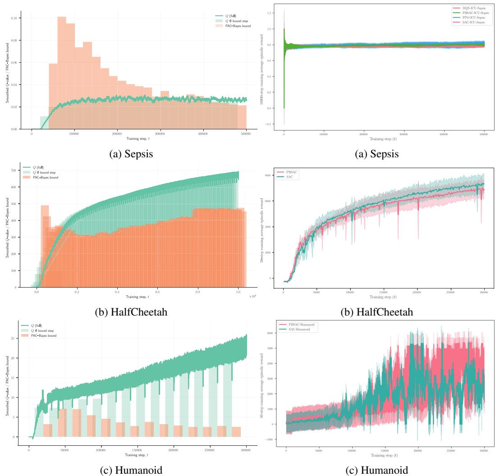

# Towards Safe and Generalizable Treatment Strategies in Healthcare via RL and PAC-Bayesian Computations

Anonymous Author(s)   
Affiliation   
Address   
email

# Abstract

Reinforcement learning (RL) offers a promising paradigm for optimizing treatment   
strategies that adapt over time to patient responses. However, the deployment of RL   
in clinical settings is hindered by the lack of generalization guarantees, an especially   
critical concern given the high-stakes nature of this domain. Existing generalization   
bounds for sequence data are either vacuous or rely on relaxations of the indepen  
dence condition, which often produce non-sharp bounds and limit their applicability   
to RL. In this work, we derive a novel PAC-Bayesian generalization bound for   
RL that explicitly accounts for temporal dependencies arising from Markovian   
data. Our key technical contribution integrates a bounded-differences condition on   
the negative empirical return to establish the applicability of a McDiarmid-style   
concentration inequality tailored to dependent sequences such as Markov Decision   
Processes. This leads to a PAC-Bayes bound with explicit dependence on the   
Markov chain’s mixing time. We show that our bound can be directly applied to   
off-policy RL algorithms in continuous control settings, such as Soft Actor-Critic.   
Empirically, we demonstrate that our bound yields meaningful confidence cer  
tificates for treatment policies in simulated healthcare environments, providing   
high-probability guarantees on policy performance. Our framework equips practi  
tioners with a tool to assess whether an RL-based intervention meets predefined   
safety thresholds. Furthermore, by closing the gap between learning theory and   
clinical applicability, this work advances the development of reliable RL systems   
for sensitive domains such as personalized healthcare.

# 22 1 Introduction

Reinforcement learning (RL) is increasingly being explored for high-stakes decisions in healthcare,   
where the promise is to tailor treatments to individual patients based on treatment history and improve   
outcomes over time [1, 2]. Unlike traditional static models, RL agents are capable of learning from   
the clinician’s observation–action cycle: observe a patient’s state (e.g., vital signs, symptom scores),   
select an intervention (e.g., medication adjustment, therapy session), then observe the outcome and   
update the model accordingly. This sequential framework has spurred applications ranging from   
critical care management of sepsis [2, 3] to precision drug dosing [3].   
The RL paradigm applied to healthcare offers a principled framework for optimizing sequential   
decisions based on patient responses. For instance, a recent study [1] introduced the notion of medical   
dead-ends, meaning critical states from which all future trajectories lead to adverse outcomes, and   
utilized RL to proactively recognize treatment paths associated with these dangerous declines. These   
kinds of applications illustrate the potential of RL to enhance decision-making in safety-critical   
domains such as medical care. However, the medical setting also underscores the paramount need for   
reliability–an RL policy’s recommendations can literally be life-saving or life-threatening.   
There is a widely unmet demand for rigorous, high-confidence guarantees on the generalization   
capabilities of machine learning models [4], particularly RL for healthcare to ensure that algo  
rithm performance on patients’ data meets acceptable standards. Without formal generalization   
assurances, clinicians might rightly question the reliability and robustness of RL-derived treatment   
recommendations for unseen patient populations, limiting broader adoption in practice.   
A core challenge in providing guarantees that could drive trust in RL for healthcare applications is the   
sequential, dependent nature of RL data. Most standard generalization bounds [5] and concentration   
inequalities [6, 7] rely on the assumption that samples are independent and identically distributed   
(i.i.d.). However, this assumption is violated when learning from trajectories generated by a Markov   
decision process. In this work, we address this challenge using the PAC-Bayesian framework   
[8, 9, 10, 11], which yields data-dependent generalization guarantees that are often tighter, naturally   
incorporate prior knowledge, and are straightforward to optimize. By balancing empirical risk against   
model complexity via a prior–posterior divergence, PAC-Bayes offers a principled way to quantify   
uncertainty and reason about generalization [4].   
Previous efforts to bring PAC-Bayes to RL include [12, 13], who derived bounds for batch RL   
with implicit constants that dependent on the mixing-time which can limit practical utility, and   
more recently [14], who extended the analysis to the context of actor-critic learning to encourage   
exploration. While conceptually exciting, the bounds in these previous works remained largely   
vacuous, reflecting a focus on learning-theoretic algorithm development rather than on deriving tight   
performance guarantees. These results of these previous works thus underscore the promise of PAC  
Bayesian analysis for RL but also highlight the need for bounds that better capture the dependency   
structure of clinical trajectories: existing results either rely on stringent mixing assumptions or yield   
overly loose guarantees, leaving a significant gap in providing tight confidence certificates for RL   
algorithms.   
In this work, we bridge this gap by deriving a novel PAC-Bayesian generalization bound for re  
inforcement learning that explicitly handles Markov dependencies in the data. The core technical   
contribution is the integration of concentration inequalities suited for dependent sequences into the   
PAC-Bayes analysis. In particular, we leverage the Marton coupling and Markov chain partitioning   
[15] to establish a McDiarmid-type bounded differences inequality for Markov chains. Our resulting   
PAC-Bayesian bound retains an explicit dependence on mixing time, thus preserving the interpretabil  
ity and theoretical grounding of classical approaches while achieving tighter constant factors that   
render the bound non-vacuous for realistic trajectory lengths.   
Beyond its theoretical contribution, our bound has direct practical implications for safe and reliable   
RL in healthcare. By providing a high-probability certificate on a policy’s true return, practitioners   
can assess, before deployment, whether an RL-based treatment strategy meets predefined safety and   
efficacy standards. For example, in adaptive dosing for chronic conditions, our bound can guarantee   
with high confidence that the expected patient health score will not fall below a critical threshold.   
Looking forward, we envision applying this framework to mental health interventions, where data   
scarcity and patient vulnerability amplify the need for trustworthy RL policies [16].   
In summary, by integrating mixing-time explicit bounds with advanced coupling methods, we deliver   
a PAC-Bayesian guarantee that is rigorously grounded and we demonstrate in experiments that it is   
practically meaningful, paving the way for reinforcement learning algorithms that are provably safe   
and effective in real-world healthcare settings.   
The remainder of this paper is organized as follows. Section 2 reviews necessary preliminar  
ies—reinforcement learning, PAC-Bayesian learning, and related work—and summarizes our contri  
butions. In Section 3 we develop the theoretical core by deriving a new PAC-Bayesian generalization   
bound for RL that explicitly accounts for Markovian dependence via a McDiarmid-type concentration   
inequality. Section 3.1 introduces PB-SAC, a practical actor–critic algorithm that operationalizes   
this bound. Section 4 describes our experimental setup on an ICU-Sepsis simulator and standard   
continuous-control benchmarks, and presents empirical results demonstrating that PB-SAC delivers   
meaningful confidence certificates without sacrificing performance. Finally, Section 5 concludes   
with a discussion of implications, limitations, and directions for future work in PAC-Bayesian   
reinforcement learning.

# 90 2 Preliminaries

We briefly recall the reinforcement learning and statistical learning theory concepts we rely on   
throughout the paper. The exposition is intentionally concise—the goal is to fix notation and state the   
learning theory principles that underpin our results. We adpot the notation from [17].

# 94 2.1 Reinforcement Learning & Related Works

Reinforcement Learning (RL) studies how an agent learns to make sequential decisions through   
interaction with an environment. Formally, the environment is modeled as a (possibly unknown)   
Markov Decision Process (MDP) $\mathcal { M } = ( \mathcal { S } , \mathcal { A } , \mathbb { P } , \mathit { R } , \gamma )$ , where $s$ is the state space, $\mathcal { A }$ the action   
space, $\mathbb { P } ( s ^ { \prime } \mid s , a )$ the transition kernel, $R ( s , a )$ the reward function bounded in $[ 0 , R _ { \mathrm { m a x } } ]$ , and   
$\gamma \in ( 0 , 1 )$ the discount factor. At each time $t$ , the agent observes a state $S _ { t } \in S$ , chooses an action   
$A _ { t } \in { \mathcal { A } }$ according to a policy $\pi ( a | s )$ , receives a reward $R _ { t + 1 } = R ( S _ { t } , A _ { t } )$ , and transitions to   
$S _ { t + 1 } \sim \mathbb { P } ( \cdot \mid S _ { t } , \bar { A _ { t } } )$ .

The agent’s objective is to maximise the expected discounted return

$$
G _ { t } \ = \ \sum _ { k = 0 } ^ { \infty } \gamma ^ { k } R _ { t + k + 1 } , \qquad V _ { \pi } ( s ) \ = \ \mathbb { E } _ { \pi , \mathbb { P } } [ G _ { t } \mid S _ { t } = s ] ,
$$

where 103 $V _ { \pi }$ is the state–value function. The optimal value function $\begin{array} { r } { V ^ { \star } ( s ) = \operatorname* { s u p } _ { \pi } V _ { \pi } ( s ) } \end{array}$ satisfies the 104 Bellman optimality equation

$$
V ^ { \star } ( s ) = \operatorname* { m a x } _ { a \in \mathcal { A } } \Bigl \{ R ( s , a ) + \gamma \mathbb { E } _ { s ^ { \prime } \sim \mathbb { P } } [ V ^ { \star } ( s ^ { \prime } ) \mid s , a ] \Bigr \} .
$$

RL algorithms learn either directly a policy (policy–gradient and actor–critic methods [18, 19, 20])   
or an action–value function $Q _ { \pi } ( s , a )$ (value–based methods such as Q-learning and its deep variants   
[21]). Model–free approaches dispense with an explicit model of $\mathbb { P }$ , while model–based methods   
leverage or learn a transition model to plan.   
PAC-Bayesian analysis for sequential data. Classical PAC-Bayesian theory [8, 22, 9, 23, 24, 10,   
, 11] assumes i.i.d. samples, but several authors have extended it to dependent data. Ralaivola et al.   
introduced a chromatic PAC-Bayes bound for $\beta$ -mixing sequences, recasting temporal dependence   
as a graph–coloring problem that preserves a PAC-style risk certificate [25]. Seldin et al. pioneered   
a martingale-based PAC-Bayes approach, showing how to integrate concentration inequalities for   
dependent observations (e.g. Hoeffding-Azuma for martingales) with PAC-Bayes bounds [26, 27].   
Further generalizations to weakly dependent series were obtained by Alquier & Wintenburger via   
oracle inequalities for time-series forecasting [28]. These contributions established that PAC-Bayes   
remains applicable when observations are correlated, provided one can quantify the dependence.   
PAC-Bayes in reinforcement learning. Early applications to RL include Fard et al., who derived   
a batch RL bound relying on Samson’s inequality for uniformly ergodic Markov chains [12, 13].   
They demonstrated empirically that PAC-Bayesian model selection can indeed improve policy value   
estimation by taking the prior when it is informative and discarding it when missleading. Although   
insightful, the constants scale poorly with the horizon, often making the bound vacuous in practice.   
More recently, Tasdighi et al. embedded a PAC-Bayesian critic ensemble inside an actor–critic   
algorithm to encourage deep exploration, but did not compute a certified return gap [14]. Zhang   
et al. used task-adaptive PAC-Bayes priors for lifelong RL [29]. Despite these advances, prior work   
has not produced a sharp PAC-Bayes bound that is simultaneously translated into non-vacuous and   
tight certificates for modern off-policy methods such as Soft Actor-Critic, and depends on explicit   
constants making it easy to compute in practice.   
Our contribution in context. We close this gap by deriving a PAC-Bayesian value-error bound   
whose leading constant is proportional to the Markov chain’s mixing time. Compared with previous   
PAC-Bayes works, our result (i) obtains tighter scaling for discount factors typical in RL. (ii) embed   
the new bound in a Soft Actor–Critic framework and show empirically that the resulting $P B { \cdot } S A C$   
algorithm can monitor and minimize its certified return gap throughout training. To our knowledge,   
134 this is the first demonstration that PAC-Bayesian guarantees with explicit temporal–dependence   
35 constants can inform the hyper-parameter choices of deep off-policy RL while remaining non-vacuous   
in realistic continuous-control domains.

# 2.2 PAC-Bayes Learning

Let $( \mathcal { X } , \mathcal { Y } , \mathcal { D } )$ be a supervised learning task, the domain is taken to be the product $\mathcal { Z } = \mathcal { X } \times \mathcal { Y }$ ,   
where $\boldsymbol { \mathcal { X } } \subseteq \mathbb { R } ^ { d }$ is the feature space and $\mathcal { V }$ the label space $\mathcal { V } \subseteq N$ for classification problems, or   
$\mathcal { V } \subseteq \mathbb { R }$ for regression ones). We assume an unknown data distribution $\mathcal { D }$ over $\mathcal { Z }$ , with $\mathcal { D } _ { \mathcal { X } }$ denoting   
the marginal distribution on $\mathcal { X }$ . We observe a training sample ${ \cal { S } } = \{ ( { \pmb x } _ { i } , y _ { i } ) \} _ { i = 1 } ^ { m }$ , where each pair   
$( \pmb { x } _ { i } , y _ { i } ) \in \mathcal { Z }$ is drawn independently and identically distributed (i.i.d.) from $\mathcal { D }$ , that is, $S \sim \mathcal { D } ^ { m }$ .   
This sample is provided to the learning algorithm. Given a sample $S$ , the learning algorithm returns a   
measurable prediction function $f _ { \theta } : \mathcal { X }  \mathcal { Y }$ , also referred to as a hypothesis, parametrized by $\theta \in \Theta$ ,   
where $\Theta$ denotes the set of all admissible parameter vectors (i.e., the hypothesis class). The “quality”   
of a hypothesis $f _ { \theta }$ is typically assessed through a measurable loss function $\ell : \mathcal { V } \times \mathcal { V } \to \mathbb { R } _ { + }$ , which   
quantifies the discrepancy between predicted and true outputs. The performance of a hypothesis is   
measured by its true risk, and its empirical risk on the training sample $S$ ,

$$
\mathcal { L } ( \pmb { \theta } ) = \underset { ( x , y ) \sim \mathcal { D } } { \mathbb { E } } \left[ \ell \big ( f _ { \theta } ( x ) , y \big ) \right] , \quad \hat { \mathcal { L } } _ { S } ( \pmb { \theta } ) = \frac { 1 } { m } \sum _ { i = 1 } ^ { m } \ell \big ( f _ { \theta } ( x _ { i } ) , y _ { i } \big ) ,
$$

In supervised machine learning, the goal is to learn a hypothesis $f _ { \theta }$ that accurately predicts a label   
$y \in \mathcal { V }$ for a new input $x \in \mathcal { X }$ , based on a training dataset ${ \cal { S } } = \{ ( x _ { i } , y _ { i } ) \} _ { i = 1 } ^ { m }$ . A central question is:   
how can we ensure that the learned function $f _ { \theta }$ will perform well on unseen data?

$$
\operatorname* { P r } _ { S \sim \mathcal { D } ^ { m } } \big \{ \mathcal { L } ( \pmb { \theta } ) \leq \hat { \mathcal { L } } _ { S } ( \pmb { \theta } ) + \epsilon \big \} \ \geq \ 1 - \delta .
$$

Concrete PAC bounds specify how large $m$ must be (or how large the gap $\epsilon$ can be) in terms of prop  
erties of the hypothesis class—e.g. VC-dimension, Rademacher complexity, stability, compression,   
etc. All of those treat $f _ { \theta }$ as a deterministic output of the algorithm.   
The PAC-Bayesian framework [8, 9, 10, 17, 11] extends the PAC learning paradigm to analyze the   
generalization performance of stochastic learning algorithms. Instead of selecting a single hypothesis,   
this approach considers a distribution over a set of candidate models. Let $\Theta$ denote the set of   
parameters defining a family of prediction functions $\{ f _ { \theta } : \mathcal { X } \to \mathcal { Y } \} _ { \theta \in \Theta }$ . Prior to observing data, a   
prior distribution $\mu \in { \mathcal { P } } ( \Theta )$ is specified over $\Theta$ . Upon receiving a training sample $S \sim \mathcal { D } ^ { m }$ , the   
learning algorithm selects a posterior distribution $\rho \in \mathcal { P } ( \Theta )$ , potentially dependent on $S$ . PAC  
Bayesian theory provides high-probability bounds on the population Gibbs risk $\mathbb { E } _ { f _ { \theta } \sim \rho } [ \mathcal { L } ( \pmb { \theta } ) ]$ in terms   
of the empirical Gibbs risk $\mathbb { E } _ { f _ { \theta } \sim \rho } [ \hat { \mathcal { L } } _ { S } ( \pmb { \theta } ) ]$ and an additional term that measures the dependence of   
the posterior distribution $\rho$ . This additional term involves an information measure—typically the   
Kullback-Leibler divergence $\operatorname { K L } ( \rho \| \mu )$ —between the data-dependent posterior $\rho \in \mathcal { P } ( \Theta )$ and a prior   
$\mu \in { \mathcal { P } } ( \Theta )$ , chosen independently of the data. Formally, for any $\lambda > 0$ and with probability at least   
$1 - \delta$ over the choice of the training sample $S$ , the following inequality holds:

$$
\underset { f _ { \theta } \sim \rho } { \mathbb { E } } [ \mathcal { L } ( \pmb { \theta } ) ] \ \leq \ \underset { f _ { \theta } \sim \rho } { \mathbb { E } } [ \hat { \mathcal { L } } _ { S } ( \pmb { \theta } ) ] \ + \ \frac { 1 } { \lambda } \Big ( \mathrm { K L } ( \rho \| \mu ) + \ln { \frac { 1 } { \delta } } + \Psi _ { \ell , \mu } ( \lambda , n ) \Big )
$$

$$
\Psi _ { \ell , \mu } ( \lambda , m ) = \ln \underset { f _ { \theta } \sim \mu } { \mathbb { E } } \Big [ \mathrm { e x p } \big ( \lambda \big ( \mathcal { L } ( \pmb { \theta } ) - \hat { \mathcal { L } } _ { S } ( \pmb { \theta } ) \big ) \Big ]
$$

Compared with classical PAC guarantees, PAC-Bayes offers two advantages that are critical for   
reinforcement learning; Data-dependent priors $I 3 O J$ –when $\mu$ can itself depend on previous data (e.g.   
earlier tasks or behavioural trajectories) [29], the bound adapts to the knowledge already acquired,   
tightening $\operatorname { K L } ( \rho \| \mu )$ ; Fine-grained control via $\Psi$ –by tailoring the concentration inequality used to   
upper-bound $\Psi$ one can incorporate dependence structures such as martingales [27, 26], $\beta$ -mixing   
[25, 31] sequences or Markov chains [13, 14]—exactly the scenario in which RL trajectories are   
collected.   
As outlined earlier, our objective is to establish a high-probability PAC-Bayes value-error bound   
for a policy operating in a Markov decision process (MDP) when the training data are dependent   
trajectories—possibly gathered under an off-policy behaviour strategy. In this section, we begin by   
fixing notation, then present the main results; all proofs are deferred to Appendix B.   
Let $\mathcal { M } = ( \mathcal { S } , \mathcal { A } , \mathbb { P } , R , \gamma )$ be a discounted Markov Decision Process (MDP), where $s$ and $\mathcal { A }$ are   
the state and action spaces, $\mathcal { P }$ is the transition kernel, $R$ is the reward function such that $R _ { t } \ \in$   
$[ 0 , R _ { \mathrm { m a x } } ]$ , and $\gamma \in \mathsf { \Gamma } ( 0 , 1 )$ is the discount factor. A policy $\pi _ { \theta }$ induces a (not necessarily time  
homogeneous) Markov chain $\xi = ( S _ { 1 } , A _ { 1 } , R _ { 1 } , S _ { 2 } , \ldots , S _ { H } ) \sim \nu , \mathbb { P } , \pi _ { \theta } , R$ , where $\nu$ denotes the   
initial state distribution and $H \leq \infty$ is the trajectory horizon (finite or infinite). Our analysis naturally   
extends to the infinite-horizon case $H = \infty$ ).   
We assume access to a dataset $\mathfrak { D } = \{ \xi ^ { ( 1 ) } , \dots , \xi ^ { ( T ) } \}$ of $T$ trajectories (i.e., $N = H T$ transitions in   
total), collected using a behavior policy $\pi _ { \theta }$ , parameterized by $\theta \in \Theta$ . The parameters $\theta$ are drawn   
from a distribution $\bar { \rho } \in \mathcal { P } ( \Theta )$ , where $\Pi = \{ \pi _ { \theta } : \theta \in \Theta \}$ denotes the policy class. Henceforth, we   
write $\xi \sim \mathcal M$ (resp. $\mathfrak { D } \sim \mathcal { M } ^ { ( T ) } )$ to denote sampling a trajectory (resp. a set $\mathfrak { D }$ of $T$ trajectories)   
under the environment dynamics $\mathbb { P }$ , initial state distribution $\nu$ , policy $\pi _ { \theta }$ , and reward function $R$ , in   
order to avoid notational overload.

We define the discounted return of a trajectory and its expected value under policy $\pi _ { \theta }$ as:

$$
G ( \xi ) = \sum _ { k = 0 } ^ { H - 1 } \gamma ^ { k } R _ { k + 1 } \quad \mathrm { a n d } \quad V _ { \pi _ { \theta } } = \mathbb { E } _ { \xi \sim \mathcal { M } } [ G ( \xi ) ] .
$$

We now define the expected (true) loss and its empirical counterpart:

$$
\mathcal { L } ( \theta ) = \left\{ \begin{array} { l l } { - \underset { \xi \sim \mathcal { M } ^ { ( T ) } } { \mathbb { E } } [ G ( \xi ) ] } \\ { = \underset { \mathfrak { D } \sim \mathcal { M } ^ { ( T ) } } { \mathbb { E } } [ \hat { \mathcal { L } } _ { \mathfrak { D } } ( \theta ) ] } \end{array} \right. \mathrm { w h e r e } \quad \hat { \mathcal { L } } _ { \mathfrak { D } } ( \theta ) = - \frac { 1 } { T } \sum _ { j = 1 } ^ { T } G ( \xi ^ { ( j ) } )
$$

Prior and posterior over policies. Following the PAC-Bayesian paradigm we endow $\Theta$ with   
a prior distribution $\mu \in { \mathcal { P } } ( \Theta )$ , selected independently of the data, and a posterior distribution   
$\rho \in { \mathcal { P } } ( \Theta )$ , chosen after observing the sample $\mathfrak { D }$ . This PAC-Bayesian formalism allows us to reason   
about the generalization properties of randomized policies drawn from $\rho$ , with theoretical guarantees   
197 based on their divergence from the prior $\mu$ .   
98 A bounded-differences property for the empirical loss. The following lemma shows that chang  
ing one transition in the data results in quantitative bounded effect of the empirical loss defined in   
(5).   
Lemma 3.1 (Bounded differences) Let $\mathfrak { D }$ be a set of trajectories and $\theta \in \Theta$ be fixed policy param  
eters. Suppose we form $\bar { \mathfrak { D } }$ by changing one transition, say the transition at time step $h \in [ H ]$ of   
trajectory $j \in [ T ]$ , where $\xi _ { h } ^ { ( j ) } = ( s , a , r , s ^ { \prime } )$ is replaced with $\bar { \xi } _ { h } ^ { ( j ) } = ( \bar { s } , \bar { a } , \bar { r } , \bar { s } ^ { \prime } )$ . Then, there exists   
$c \in \mathrm { I R } _ { + } ^ { H \times T }$ such that

$$
\left| \hat { \mathcal { L } } _ { \mathfrak { D } } ( \theta ) - \hat { \mathcal { L } } _ { \bar { \mathfrak { D } } } ( \theta ) \right| \ \leq \ \sum _ { h ^ { \prime } = 1 } ^ { H } \sum _ { j ^ { \prime } = 1 } ^ { T } c _ { ( h ^ { \prime } , j ^ { \prime } ) } \mathbb { I } \Big [ \xi _ { h ^ { \prime } } ^ { ( j ^ { \prime } ) } = \bar { \xi } _ { h ^ { \prime } } ^ { ( j ^ { \prime } ) } \Big ]
$$

Intuitively, $c _ { ( h , j ) }$ quantifies the transition-level influence of altering the $( h , j )$ -th state–action–reward   
tuple on the average return. A complete derivation—including a justification of why this bound   
covers propagation of the perturbed transition to future steps—is given in Appendix B.2. The result   
yields the explicit vector $c$ used in the main Theorem 3.2.

$$
c _ { ( h , t ) } = \frac { \gamma ^ { h - 1 } R _ { \mathrm { m a x } } } { T } , \qquad \| c \| ^ { 2 } = \frac { R _ { \mathrm { m a x } } ^ { 2 } } { T ( 1 - \gamma ^ { 2 } ) } \big ( 1 - \gamma ^ { 2 H } \big ) .
$$

Combining these with McDiarmid’s inequality for Markov chains gives a trajectory-dependent tail   
bound on the deviation $\mathcal { L } ( \theta ) - \hat { \mathcal { L } } _ { \mathfrak { D } } ( \theta )$ . With standard PAC-Bayes bound derivation we obtain our   
primary result, a PAC-Bayesian value-error bound for MDPs in Theorem 3.2:   
Theorem 3.2 Let the reward function be bounded in $[ 0 , R _ { m a x } ]$ and let $\mathcal { M }$ be a (not necessarily   
time-homogeneous) Markov Decision Process (MDP) induced by any policy $\pi _ { \theta }$ such that it satisfies   
$\tau _ { \mathrm { m i n } } < \infty$ . For any prior $\mu$ over $\Pi$ , any posterior $\rho$ chosen after interacting with the environment,   
and any $\delta \in ( 0 , 1 )$ , with probability at least $1 - \delta$ over the sample $\mathfrak { D }$ of $T$ trajectories with time   
horizon $H$ :

$$
\underset { \theta \sim \rho } { \mathbb { E } } \Big [ \mathcal { L } ( \theta ) - \hat { \mathcal { L } } _ { \mathfrak { D } } ( \theta ) \Big ] \leq \sqrt { \frac { R _ { \operatorname* { m a x } } ^ { 2 } \tau _ { \operatorname* { m i n } } \big ( 1 - \gamma ^ { 2 H } \big ) } { 2 T ( 1 - \gamma ^ { 2 } ) } \Big ( \mathrm { K L } ( \rho \| \mu ) + \ln \frac { 2 } { \delta } \Big ) } .
$$

where $\tau _ { \mathrm { m i n } }$ is the mixing time of the chain, the smallest number of steps after which the distribution   
of the chain’s state is, in a statistical sense, nearly indistinguishable from its long-run or stationary   
distribution in Total Variation distance, no matter where the chain started. In other words, it measures   
how quickly the chain “forgets” its initial state and becomes well mixed.

The bound in 3.2 can be straightforwardly converted to a PAC-Bayes bound on the error of a value function 222 $V _ { \pi _ { \theta } }$ for a policy $\pi _ { \theta }$ , using the fact that ${ \mathcal { L } } ( \theta ) = - V _ { \pi _ { \theta } }$ (5):

$$
\underset { \theta \sim \rho } { \mathbb { E } } \left[ V _ { \pi _ { \theta } } \right] \geq - \underset { \theta \sim \rho } { \mathbb { E } } \left[ \hat { \mathcal { L } } _ { \mathfrak { D } } ( \theta ) \right] - \sqrt { \frac { R _ { \operatorname* { m a x } } ^ { 2 } \tau _ { \operatorname* { m i n } } \left( 1 - \gamma ^ { 2 H } \right) } { 2 T \left( 1 - \gamma ^ { 2 } \right) } \left( \mathrm { K L } ( \rho \| \mu ) + \ln \frac { 2 } { \delta } \right) } .
$$

One may notice that it has a structure remarkably similar to Upper Confidence Bounds (UCB) [32]   
used in bandit algorithms $Q ( a ) \leq \hat { Q } ( a ) + U _ { t } ( a )$ , where the true value is bounded by an empirical   
estimate plus an uncertainty term. In our case, the uncertainty term accounts for three key factors:   
(1) the statistical challenge of working with limited trajectory data, addressed by the $\textstyle { \frac { 1 } { T } }$ term; (2) the   
temporal correlation structure of the MDP, captured by $\tau _ { \mathrm { m i n } }$ and the discount-related terms; and (3)   
the complexity of the policy class, represented by the KL divergence.   
This UCB-like interpretation suggests a natural approach to policy optimization: select the posterior   
$\rho$ that maximizes this lower bound. Such a strategy would automatically balance exploitation   
(maximizing the empirical value) and theoretically-justified exploration (accounting for uncertainty).   
This is precisely the approach implemented in the PB-SAC algorithm, where we periodically optimize   
the posterior distribution and inject its knowledge back into the policy to guide learning.   
From theory to practice. Theorem 3.2 provides a high-confidence guarantee on the difference   
between empirical and true returns for stochastic policies, using three key components: the poste  
rior–prior KL divergence, the squared coefficient vector $\| c \| ^ { 2 }$ from (7), and the mixing time $\tau _ { \mathrm { m i n } }$ .   
The central question becomes how to leverage this certificate to enhance learning. In Section 3.1,   
we demonstrate that this bound can be actively optimized during training by integrating it within   
a modern actor–critic framework. The resulting procedure, $P B { \cdot } S A C .$ , transforms our theoretical   
guarantee into a principled approach for balancing exploration and exploitation while maintaining   
241 formal certificates on policy performance.

# 242 3.1 A Practical Algorithm based on PAC-Bayes RL

43 Our algorithm, PAC-Bayes-Certified Soft Actor–Critic (PB-SAC), operationalizes the PAC-Bayes   
value-error bound of Theorem 3.2 within a Soft Actor-Critic (SAC) training loop. Building upon   
the periodic update cycle described earlier, PB-SAC maintains a posterior distribution over policy   
parameters and injects sampled knowledge to guide exploration. While it shares the "distribution  
over-policies" principle with EPICG and EPICG-SAC [29], our approach differs in three fundamental   
ways: (i) It focuses on single-task optimization rather than task streams, though the framework   
naturally extends to Lifelong RL scenarios. (ii) It explicitly optimizes the exact value-error bound   
from Theorem 3.2 during training and monitors the bound value at each update cycle, providing   
continuous performance guarantees. (iii) It applies the posterior distribution directly to actor   
parameters $\theta$ rather than relying on critic ensembles or Bellman-error surrogates as in PBAC,   
resulting in a more streamlined and computationally efficient implementation. Additionally, PBAC   
[14] trains critics via a Catoni-type Bellman-error bound but never reports the bound value; it is used   
only as a loss. EPICG/EPICG-SAC of [29] regularizes the KL between posterior and running prior   
yet does not compute or log the PAC-Bayes bound either.   
Posterior, prior, and sampling. Let $\theta$ denote the flattened parameters of the actor network. The   
posterior $\rho$ is a diagonal Gaussian, $\theta \sim \mathcal { N } ( v , \mathrm { d i a g } ( \sigma ^ { 2 } ) )$ , where both the mean $\upsilon$ and standard   
deviation $\sigma$ are learnable, gradient-tracked variables. The prior $\mu$ is simply a copy of the posterior at   
initialization, or after a PAC-Bayes update cycle; this choice maintains meaningful guarantees by   
preventing $\operatorname { K L } ( \rho \| \mu )$ from exploding while ensuring that the core SAC algorithm can continue learn  
ing. Additionally, without this resetting mechanism, the $\operatorname { K L } ( \rho \| \mu )$ regularization would permanently   
penalize deviations from the initial actor parameters, significantly hindering the learning process.   
PAC-Bayes update cycle. Our algorithm performs periodic PAC-Bayes updates using completely   
new data batches to maintain theoretical guarantees. At each update point, we freeze the current policy   
and collect a fresh batch of $T$ trajectories, which are used exclusively for the current PAC-Bayes   
analysis. Using this batch, we fit a posterior distribution $\rho$ by optimizing $\mathcal { L } _ { \rho } = \mathbb { E } _ { \theta \sim \rho } [ - Q ( s , \pi _ { \theta } ( s ) ) ] +$   
$\beta \mathrm { K L } ( \rho \| \mu )$ , balancing critic values against divergence from the prior. We estimate the mixing time   
$\tau _ { \mathrm { m i n } }$ from trajectory autocorrelations and compute the PAC-Bayes bound according to Theorem 3.2.   
Crucially, we then set the prior for the next update cycle to the current posterior, $\mu _ { \mathrm { n e w } } : = \rho$ , creating a   
"checkpoint" that preserves the bound’s validity while allowing continued learning. Before resuming   
training, we inject knowledge from the posterior by sampling parameters $\theta _ { \mathrm { s a m p l e d } } \sim \rho$ and mixing   
them with the current policy: $\theta _ { \mathrm { n e w } } = \lambda \bar { \theta } _ { \mathrm { s a m p l e d } } + ( 1 - \lambda ) \bar { \theta } _ { \mathrm { c u r r e n t } }$ . Each update’s data is then discarded,   
ensuring that no data point influences multiple bounds, thereby maintaining the theoretical guarantees   
of our approach. The pseudo-code 1 bellow shows the full training loop which interleaves standard   
SAC updates with these PAC-Bayes updates.   
Why the bound is practically non-vacuous. For typical values of $\gamma$ $( \simeq 0 . 9 9 )$ , the classical bound   
of Fard et al. [13] suffers from the constraint on the number of samples needed $H > R ^ { 4 } / ( 1 - \gamma ) ^ { 4 }$ ,   
while The bound of Tasdighi et al. [14] requires the same amount to beat triviality—a number that   
themselves flag as “rarely fulfilled in practice”. Our transition-level analysis shrinks the bound to   
$\begin{array} { r } { T > \frac { R _ { \mathrm { m a x } } ^ { 2 } \tau _ { \mathrm { m i n } } \left( 1 - \gamma ^ { 2 H } \right) } { 2 ( 1 - \gamma ^ { 2 } ) } } \end{array}$ (for long trajectories $( 1 - \gamma ^ { 2 H } ) \simeq 1 \backslash$ ). Although this might appear costly due   
to the dependence on the number of trajectories, it is in fact substantially more tractable than the   
classical bound (the power of 2 is only on $\gamma$ not $1 - \gamma )$ . In practice, the bound can be reduced even   
further: by obtaining a rough estimate of the mixing time $\tau _ { \mathrm { m i n } }$ , one can choose $H$ to be just above   
this threshold. This keeps the term $\left( 1 - \gamma ^ { 2 H } \right)$ in the numerator below one, tightening the bound. As a   
result, rather than requiring long trajectories, it suffices to collect many short ones. Further discussion   
can be found in Appendix B.6

# 288 4 Experimental Setup

To evaluate our PAC-Bayesian reinforcement learning approach, we utilize the ICU-Sepsis envi  
ronment [33], a benchmark MDP built from real medical data that simulates sepsis treatment in   
intensive care units. This environment represents an important real-world sequential decision-making   
problem with significant healthcare implications. ICU-Sepsis is a tabular MDP with 716 discrete   
states representing different patient conditions and 25 possible actions corresponding to various   
combinations of medical interventions, primarily focusing on intravenous fluid and vasopressor   
dosages. Each episode simulates a patient’s treatment journey, where the agent (representing the   
clinician) observes the patient’s state, selects appropriate interventions, and then observes how the   
patient’s condition evolves in response to treatment. The environment uses a reward structure where   
survival results in a terminal reward of $+ 1$ , while death corresponds to a reward of 0. All intermediate   
rewards are also 0, making the expected return equivalent to the probability of patient survival.   
Algorithms and Implementation. We compare our PAC-Bayes-certified Soft Actor-Critic (PB  
SAC)1 against standard baselines. PB-SAC extends SAC with the PAC-Bayesian framework from   
Section 3, maintaining a posterior over policy parameters to provide high-probability performance   
guarantees. Our baselines include SAC (off-policy maximum entropy), DQN (value-based), and   
PPO (on-policy). All implementations use tabular representations for ICU-Sepsis, appropriate for its   
discrete state-action space. Additionally We also evaluate on continuous control MuJoCo benchmarks   
[34, 35] (Walker2d-v5, Humanoid-v5, HalfCheetah-v5) to assess scalability to continuous domains,   
sample efficiency, and generalization of performance guarantees. Our protocol consists of running   
each algorithm for 300,000 episodes across 5-10 random seeds. For PB-SAC, we perform periodic   
PAC-Bayes updates every 20,000 steps to maintain the posterior distribution and compute certified   
bounds. We evaluate the algorithms using two primary metrics. The first is certified performance,   
defined as a high-probability lower bound on return, holding with probability $1 - \delta$ . The second is   
average return, which corresponds to the expected survival probability. This evaluation framework   
allows for a rigorous and comprehensive comparison across both clinical and standard continuous  
control benchmarks.

  
Figure 1: PAC-Bayes bounds (green bars) vs. Qvalues (orange bars), along with the running average of the empirical $\mathbf { Q }$ -values (green line). A tight and desirable lower bound is one that closely approaches the Q-function.   
Figure 2: Running average of episodic returns: A comparison between our PB-SAC (shown in pink in (b) and (c), and in green in (a)) and its base algorithm (SAC alone).

Figures 1 and 2 demonstrate PB-SAC’s performance compared to standard SAC across three environments. Figure 1 (left column) illustrates the evolution of PAC-Bayes certificates (green) relative to learned $Q$ -values (orange), while Figure 2 traces episodic returns throughout training. Three distinct patterns emerge from these results. First, certificates tighten at environment-dependent rates; In the Sepsis environment, guarantees become informative almost immediately after training begins and remain closely coupled to the critic thereafter. This rapid tightening stems primarily from the simulator’s quick mixing dynamics, which benefit our PAC-Bayes bound, additional data rapidly sharpens the certificate. For HalfCheetah, the bound improves more gradually, reflecting the environment’s longer effective horizon where states remain correlated over extended periods. Finally, Humanoid represents the most challenging scenario with its numerous degrees of freedom and complex dynamics. Although guarantees become comparatively looser in this environment, they consistently remain informative, never deteriorating to the trivial bound of zero.

Guided exploration without sacrificing reward. Turning to Fig. 2, PB-SAC matches the baselines on Sepsis, keeps pace on HalfCheetah, and modestly outperforms SAC on Humanoid. As the algorithm injects posterior samples selected by the bound, it explores in directions that carry provable upside—yet the additional regularization never derails learning. The results suggest that safety certificates and competitive return need not be at odds. Across tasks we observe a clear narrative: the faster the environment mixes, the faster the PAC-Bayes certificate closes the gap to the critic. This empirical pattern echoes the explicit mixing-time factor in Theorem 3.2 and underscores why reporting an estimate of $\tau _ { \mathrm { m i n } }$ can contextualize confidence results. We therefore recommend including mixing-time diagnostics in future evaluations of safe RL methods.

In summary, PB-SAC converts a theoretically principled bound into a live learning signal: it produces meaningful confidence certificates early, preserves or improves return, and exhibits behavior that aligns with the qualitative dependence on Markov mixing predicted by our analysis.

# 340 5 Conclusion and Limitations

In this work, we introduced PB-SAC, a PAC-Bayesian actor–critic algorithm that advances the intersection of reinforcement learning and Bayesian guarantees. If adapted to the EPICG/EPICG-SAC framework [29], we believe PB-SAC holds the potential to address the well-known plasticity–stability dilemma, a prominent research challenge in lifelong and continual reinforcement learning. This extension would allow the agent to balance the retention of useful prior knowledge (stability) with the acquisition of new information (plasticity), using PAC-Bayesian guarantees as a principled mechanism for managing uncertainty. Empirically, PB-SAC matches or surpasses SAC on both clinical and continuous-control benchmarks, while yielding confidence bounds that tighten predictably with the environment’s mixing time. This marks a step forward toward certified reinforcement learning algorithms suitable for real-world deployment, particularly in high-stakes domains where reliable performance guarantees are essential.

Limitations. Our current framework uses a Kullback–Leibler (KL) divergence penalty between   
prior and posterior over policy parameters. Although KL is analytically convenient, it does not respect   
the intrinsic geometry of the parameter space and can exhibit unstable behavior when distributions   
diverge significantly [36]. In high-dimensional settings, computing KL gradients is computationally   
intensive and may force the posterior to collapse onto the prior—resulting in overly constrained   
updates that hinder meaningful learning progress [37].   
An appealing alternative is to employ a Wasserstein distance within the PAC-Bayes bound. Recent   
work has developed high-probability PAC-Bayesian inequalities based on Wasserstein metrics, which   
naturally capture distributional geometry and avoid degenerate update regimes even when supports are   
disjoint [38, 39, 36]. Moreover, entropic (Sinkhorn) smoothing enables scalable stochastic variational   
inference under Wasserstein regularization, making posterior updates tractable in high dimensions   
[40]. Incorporating a Wasserstein-based PAC-Bayes bound and a corresponding Sinkhorn-SVI   
scheme is a key direction for future research, with the potential to yield tighter certificates and more   
robust policy learning.

References   
[1] Mehdi Fatemi, Taylor W Killian, Jayakumar Subramanian, and Marzyeh Ghassemi. Medical dead-ends and learning to identify high-risk states and treatments. In M. Ranzato, A. Beygelzimer, Y. Dauphin, P.S. Liang, and J. Wortman Vaughan, editors, Advances in Neural Information Processing Systems, volume 34, pages 4856–4870. Curran Associates, Inc., 2021.   
[2] Matthieu Komorowski, Leo A Celi, Omar Badawi, Anthony C Gordon, and A Aldo Faisal. The artificial intelligence clinician learns optimal treatment strategies for sepsis in intensive care. Nature Medicine, 24(11):1716–1720, November 2018.   
[3] Elena Maria Tosca, Alessandro De Carlo, Davide Ronchi, and Paolo Magni. Model-Informed reinforcement learning for enabling precision dosing via adaptive dosing. Clin Pharmacol Ther, 116(3):619–636, July 2024.   
[4] María Pérez-Ortiz, Omar Rivasplata, John Shawe-Taylor, and Csaba Szepesvári. Tighter risk certificates for neural networks. Journal of Machine Learning Research, 22(227):1–40, 2021.   
[5] Vladimir Naumovich Vapnik. Chervonenkis: On the uniform convergence of relative frequencies of events to their probabilities. 1971.   
[6] Wassily Hoeffding. Probability inequalities for sums of bounded random variables. J. Amer. Statist. Assoc., 58:13–30, 1963.   
[7] Kazuoki Azuma. Weighted sums of certain dependent random variables. Tohoku Mathematical Journal, 19:357–367, 1967.   
[8] David A McAllester. Some PAC-Bayesian theorems. Machine Learning, 37(3):355–363, December 1999.   
[9] Matthias Seeger. Pac-bayesian generalisation error bounds for gaussian process classification. $J .$ Mach. Learn. Res., 3(null):233–269, March 2003.   
[10] Benjamin Guedj. A primer on pac-bayesian learning, 2019.   
[11] Pierre Alquier. User-friendly introduction to pac-bayes bounds. Foundations and Trends® in Machine Learning, 17(2):174–303, 2024.   
[12] M. Fard and Joelle Pineau. Pac-bayesian model selection for reinforcement learning. In J. Lafferty, C. Williams, J. Shawe-Taylor, R. Zemel, and A. Culotta, editors, Advances in Neural Information Processing Systems, volume 23. Curran Associates, Inc., 2010.   
[13] Mahdi MIlani Fard, Joelle Pineau, and Csaba Szepesvari. Pac-bayesian policy evaluation for reinforcement learning, 2012.   
[14] Bahareh Tasdighi, Manuel Haussmann, Nicklas Werge, Yi-Shan Wu, and Melih Kandemir. Deep exploration with pac-bayes, 2025.   
[15] Daniel Paulin. Concentration inequalities for markov chains by marton couplings and spectral methods, 2018.   
[16] Mengdi Xu, Zuxin Liu, Peide Huang, Wenhao Ding, Zhepeng Cen, Bo Li, and Ding Zhao. Trustworthy reinforcement learning against intrinsic vulnerabilities: Robustness, safety, and generalizability, 2022.   
[17] Vera Shalaeva, Alireza Fakhrizadeh Esfahani, Pascal Germain, and Mihaly Petreczky. Improved pac-bayesian bounds for linear regression. Proceedings of the AAAI Conference on Artificial Intelligence, 34(04):5660–5667, Apr. 2020.   
[18] Tuomas Haarnoja, Aurick Zhou, Pieter Abbeel, and Sergey Levine. Soft actor-critic: Off-policy maximum entropy deep reinforcement learning with a stochastic actor, 2018.   
[19] Vijay Konda and John Tsitsiklis. Actor-critic algorithms. In S. Solla, T. Leen, and K. Müller, editors, Advances in Neural Information Processing Systems, volume 12. MIT Press, 1999.

[20] Richard S Sutton, David McAllester, Satinder Singh, and Yishay Mansour. Policy gradient   
methods for reinforcement learning with function approximation. In S. Solla, T. Leen, and   
K. Müller, editors, Advances in Neural Information Processing Systems, volume 12. MIT Press,   
.   
[21] Volodymyr Mnih, Koray Kavukcuoglu, David Silver, Alex Graves, Ioannis Antonoglou, Daan   
Wierstra, and Martin A. Riedmiller. Playing atari with deep reinforcement learning. CoRR,   
abs/1312.5602, 2013.   
[22] David A. McAllester. Pac-bayesian model averaging. In Proceedings of the Twelfth Annual   
Conference on Computational Learning Theory, COLT ’99, page 164–170, New York, NY,   
USA, 1999. Association for Computing Machinery.   
[23] Olivier Catoni. Pac-bayesian supervised classification: The thermodynamics of statistical   
learning. IMS Lecture Notes Monograph Series, 56:1–163, 2007.   
[24] Pascal Germain, Alexandre Lacasse, Francois Laviolette, Mario March, and Jean-Francis Roy.   
Risk bounds for the majority vote: From a pac-bayesian analysis to a learning algorithm. Journal   
of Machine Learning Research, 16(26):787–860, 2015.   
[25] Liva Ralaivola, Marie Szafranski, and Guillaume Stempfel. Chromatic pac-bayes bounds   
for non-iid data. In David van Dyk and Max Welling, editors, Proceedings of the Twelfth   
International Conference on Artificial Intelligence and Statistics, volume 5 of Proceedings   
of Machine Learning Research, pages 416–423, Hilton Clearwater Beach Resort, Clearwater   
Beach, Florida USA, 16–18 Apr 2009. PMLR.   
[26] Yevgeny Seldin, Peter Auer, John Shawe-taylor, Ronald Ortner, and François Laviolette. Pac  
bayesian analysis of contextual bandits. In J. Shawe-Taylor, R. Zemel, P. Bartlett, F. Pereira,   
and K.Q. Weinberger, editors, Advances in Neural Information Processing Systems, volume 24.   
Curran Associates, Inc., 2011.   
[27] Yevgeny Seldin, Nicolò Cesa-Bianchi, Peter Auer, François Laviolette, and John Shawe-Taylor.   
Pac-bayes-bernstein inequality for martingales and its application to multiarmed bandits. In   
Dorota Glowacka, Louis Dorard, and John Shawe-Taylor, editors, Proceedings of the Workshop   
on On-line Trading of Exploration and Exploitation 2, volume 26 of Proceedings of Machine   
Learning Research, pages 98–111, Bellevue, Washington, USA, 02 Jul 2012. PMLR.   
[28] Pierre Alquier, Xiaoyin Li, and Olivier Wintenberger. Prediction of time series by statistical   
learning: general losses and fast rates, 2012.   
[29] Zhi Zhang, Chris Chow, Yasi Zhang, Yanchao Sun, Haochen Zhang, Eric Hanchen Jiang, Han   
Liu, Furong Huang, Yuchen Cui, and Oscar Hernan Madrid Padilla. Statistical guarantees for   
lifelong reinforcement learning using pac-bayesian theory, 2024.   
[30] Emilio Parrado-Hernández, Amiran Ambroladze, John Shawe-Taylor, and Shiliang Sun. Pac  
bayes bounds with data dependent priors. Journal of Machine Learning Research, 13(112):3507–   
3531, 2012.   
[31] Baptiste Abélès, Eugenio Clerico, and Gergely Neu. Generalization bounds for mixing pro  
cesses via delayed online-to-PAC conversions. In Gautam Kamath and Po-Ling Loh, editors,   
Proceedings of The 36th International Conference on Algorithmic Learning Theory, volume   
272 of Proceedings of Machine Learning Research, pages 23–40. PMLR, 24–27 Feb 2025.   
[32] Peter Auer. Using confidence bounds for exploitation-exploration trade-offs. J. Mach. Learn.   
Res., 3(null):397–422, March 2003.   
[33] Kartik Choudhary, Dhawal Gupta, and Philip S. Thomas. Icu-sepsis: A benchmark mdp built   
from real medical data, 2024.   
[34] Mark Towers, Ariel Kwiatkowski, Jordan Terry, John U. Balis, Gianluca De Cola, Tristan Deleu,   
Manuel Goulão, Andreas Kallinteris, Markus Krimmel, Arjun KG, Rodrigo Perez-Vicente,   
Andrea Pierré, Sander Schulhoff, Jun Jet Tai, Hannah Tan, and Omar G. Younis. Gymnasium:   
459 A standard interface for reinforcement learning environments, 2024.

[35] Yuval Tassa, Yotam Doron, Alistair Muldal, Tom Erez, Yazhe Li, Diego de Las Casas, David Budden, Abbas Abdolmaleki, Josh Merel, Andrew Lefrancq, Timothy P. Lillicrap, and Martin A. Riedmiller. Deepmind control suite. CoRR, abs/1801.00690, 2018.   
[36] Paul Viallard, Maxime Haddouche, Umut ¸Simsekli, and Benjamin Guedj. Learning via wasserstein-based high probability generalisation bounds. In Advances in Neural Information Processing Systems (NeurIPS), 2023.   
[37] Hao Fu, Chunyuan Li, Xiaodong Liu, Jianfeng Gao, Asli Celikyilmaz, and Lawrence Carin. Cyclical annealing schedule: A simple approach to mitigating KL vanishing. In Jill Burstein, Christy Doran, and Thamar Solorio, editors, Proceedings of the 2019 Conference of the North American Chapter of the Association for Computational Linguistics: Human Language Technologies, Volume 1 (Long and Short Papers), pages 240–250, Minneapolis, Minnesota, June 2019. Association for Computational Linguistics.   
[38] Ron Amit, Baruch Epstein, Shay Moran, and Ron Meir. Integral probability metrics pac-bayes bounds, 2022.   
[39] Maxime Haddouche and Benjamin Guedj. Wasserstein pac-bayes learning: Exploiting optimisation guarantees to explain generalisation, 2023.   
[40] Luca Ambrogioni, Umut Güçlü, Yagmur Güçlütürk, Max Hinne, Eric Maris, and Marcel A. J. ˘ van Gerven. Wasserstein variational inference, 2018.   
[41] M. D. Donsker and S. R. S. Varadhan. Asymptotic evaluation of certain markov process expectations for large time. iv. Communications on Pure and Applied Mathematics, 36(2):183– 212, 1983.

# A Mathematical Tools

82 Lemma A.1 (Markov’s Inequality) For any random variable $X$ such that $\mathbb { E } [ | X | ] = \mu ,$ , for any   
$a > 0$ , we have

$$
\mathbb { P } \{ | X | \geq a \} \leq \frac { \mu } { a } .
$$

Lemma A.2 (Change of measure) For any measurable function $f : \Theta \to \mathbb { R }$ and distributions   
$\mu , \rho \in \mathcal { P } ( \Theta )$ :

$$
\mathbb { E } _ { \theta \sim \rho } [ f ( \theta ) ] \le \mathrm { K L } ( \rho \| \mu ) + \ln \mathbb { E } _ { \theta \sim \mu } [ \exp ( f ( \theta ) ) ]
$$

where $\mathrm { K L } ( \rho \| \mu )$ is the Kullback-Leibler divergence between $\rho$ and $\mu$

# A.1 Concentration for Markov chains via Marton coupling

We use Paulin [15]’s extension of McDiarmid’s bounded-difference inequality to Markov chains. This extension provides concentration inequalities for functions of dependent random variables, with constants that depend on the mixing properties of the chain.

# A.1.1 Marton coupling and mixing time

The key insight in Paulin’s [15] approach is to use a coupling structure known as Marton coupling, which quantifies the dependency between random variables in a Markov chain. For a Markov chain $\boldsymbol { X } = \left( X _ { 1 } , \ldots , X _ { N } \right)$ on state space $\Lambda = \Lambda _ { 1 } \times . . . \times \Lambda _ { N }$ , a Marton coupling provides a way to couple the distributions of future states conditioned on different past states.

Let $\tau ( \varepsilon )$ denote the mixing time of the chain $X$ in total variation distance, defined as the minimal $t$ such that for every 497 $1 \leq i \leq N - t$ and $x , y \in \Lambda _ { i }$ :

$$
d _ { T V } ( \mathcal { L } ( X _ { i + t } | X _ { i } = x ) , \mathcal { L } ( X _ { i + t } | X _ { i } = y ) ) \leq \varepsilon
$$

We define the normalized mixing time parameter $\tau _ { \mathrm { m i n } }$ as:

$$
\begin{array} { r } { \tau _ { \mathrm { m i n } } ~ = ~ \underset { 0 \leq \varepsilon < 1 } { \operatorname* { i n f } } \tau ( \varepsilon ) \Big ( \frac { 2 - \varepsilon } { 1 - \varepsilon } \Big ) ^ { 2 } } \end{array}
$$

# 99 A.1.2 McDiarmid’s inequality for Markov chains

For a function $f ( X )$ satisfying the bounded-differences property: for any $x , y \in \Lambda$ ,

$$
f ( x ) - f ( y ) \leq \sum _ { i = 1 } ^ { N } c _ { i } \mathbb { I } [ x _ { i } \neq y _ { i } ]
$$

where 501 $c \in \mathbb { R } _ { + } ^ { N }$ and I[condition] is the indicator function, Paulin’s theorem gives:

$$
\operatorname* { P r } \bigl ( | f ( X ) - \mathbb { E } f ( X ) | \geq t \bigr ) \leq 2 \exp \bigl ( - 2 t ^ { 2 } / \| c \| ^ { 2 } \tau _ { \operatorname* { m i n } } \bigr ) .
$$

$\| c \| ^ { 2 }$ is defined as $\textstyle \sum _ { i = 1 } ^ { N } c _ { i } ^ { 2 }$

# A.1.3 Application to bounded differences in MDPs

For Markov decision processes, this inequality is particularly useful when analyzing the difference between value functions. If perturbing a single transition can change the value by at most $c _ { i }$ , then the total effect on a function of trajectories is bounded by the above concentration inequality, with the mixing time of the MDP properly accounting for the propagation of the perturbation through future states.

# 509 B Derivation of PAC-Bayes Value-Error Bound for RL

# 10 B.1 Bounded-differences property for MDP trajectories

We begin by recalling the definitions of discounted return for a trajectory $\xi$ and the corresponding   
value function from Section 3:

$$
\begin{array} { r } { G ( \xi ) = \displaystyle \sum _ { k = 0 } ^ { H - 1 } \gamma ^ { k } R _ { k + 1 } } \\ { V _ { \pi _ { \theta } } = \mathbb { E } _ { \xi \sim \mathcal { M } } [ G ( \xi ) ] } \end{array}
$$

As defined in equation (5), our empirical and expected losses are:

$$
\begin{array} { c l c r } { { \displaystyle \hat { \mathcal { L } } _ { \mathfrak { D } } ( \theta ) = - \frac { 1 } { T } \sum _ { j = 1 } ^ { T } G ( \xi ^ { ( j ) } ) } } \\ { { \displaystyle \mathcal { L } ( \theta ) = - \mathbb { E } _ { \xi \sim \mathcal { M } } [ G ( \xi ) ] = - V _ { \pi _ { \theta } } } } \end{array}
$$

To apply McDiarmid’s inequality for Markov chains, we must establish the bounded-differences   
condition for ourtrajectory affects 516 $\hat { \mathcal { L } } _ { \mathfrak { D } } ( \theta )$ ical loss. S by at most $\begin{array} { r } { \sum _ { h = 1 } ^ { H } \sum _ { j = 1 } ^ { T } c _ { ( h , j ) } \mathbb { I } [ \xi _ { h } ^ { ( j ) } \neq \bar { \xi } _ { h } ^ { ( j ) } ] } \end{array}$ t repla, where $c \in \mathbb { R } _ { + } ^ { H \times T }$ nsition in aand I is the

# B.2 Quantifying the impact of perturbed transitions

Suppose we replace a single transition at position $h$ in trajectory $j$ . The change in the discounted   
return of this trajectory is bounded by:

$$
\begin{array} { r l } & { | G ( \xi ^ { ( j ) } ) - G ( \bar { \xi } ^ { ( j ) } ) | = | \gamma ^ { h - 1 } ( R _ { h } - \bar { R } _ { h } ) + \mathrm { e f f e c t s ~ o n ~ f u t u r e ~ r e w a r d s } | } \\ & { \qquad \leq \gamma ^ { h - 1 } R _ { \operatorname* { m a x } } + \mathrm { e f f e c t s ~ o n ~ f u t u r e ~ r e w a r d s } } \end{array}
$$

Crucially, this perturbation affects not only the immediate reward but potentially all subsequent   
transitions and rewards in that trajectory. The change in our empirical loss is therefore bounded by:

$$
| \hat { \mathcal { L } } _ { \mathfrak { D } } ( \theta ) - \hat { \mathcal { L } } _ { \bar { \mathfrak { D } } } ( \theta ) | \leq \frac { \gamma ^ { h - 1 } R _ { \mathrm { m a x } } } { T } = c _ { ( h , j ) }
$$

# B.3 Derivation of 523 $\| c \| ^ { 2 }$ for the PAC-Bayes bound

To apply McDiarmid’s inequality for Markov chains as developed by [15], we need to compute 524 $\| c \| ^ { 2 }$ :

$$
\begin{array} { l } { \displaystyle | \boldsymbol { c } | | ^ { 2 } = \sum _ { j = 1 } ^ { T } \sum _ { h = 1 } ^ { H } c ^ { 2 } ( h , j ) } \\ { = \frac { R _ { \mathrm { m a x } } ^ { 2 } } { T ^ { 2 } } \cdot \boldsymbol { T } \sum _ { h = 1 } ^ { H } \gamma ^ { 2 ( h - 1 ) } } \\ { = \frac { R _ { \mathrm { m a x } } ^ { 2 } } { T } \underbrace { \begin{array} { l } { \sum _ { h = 1 } ^ { H - 1 } \sum _ { \gamma = h + 1 } ^ { H } \gamma ^ { 2 h } } \\ { \mathrm { f o r } \sum _ { h \in \partial \times \partial \times \partial \times \partial \times \partial \times \partial \times \partial \times \partial \times \partial \times \partial \times \partial \times \delta } } \\ { - \frac { R _ { \mathrm { m a x } } ^ { 2 } } { T } \cdot \frac { 1 - \gamma ^ { 2 H } } { 1 - \gamma ^ { 2 } } . } \end{array} } } \end{array}
$$

For infinite-horizon settings where 525 $H  \infty$ and $\gamma < 1$ , the series converges to $1 / ( 1 - \gamma ^ { 2 } )$ , this 526 simplifies to

$$
\| c \| ^ { 2 } = \frac { R _ { \operatorname* { m a x } } ^ { 2 } } { T ( 1 - \gamma ^ { 2 } ) } .
$$

# 527 B.4 Full accounting of perturbation propagation effects

A critical question is whether our derivation of $\| c \| ^ { 2 }$ fully accounts for the propagation of perturbations   
through the trajectory. Since a perturbation at step $h$ in trajectory $j$ affects all subsequent transitions   
in that trajectory, the bounded-differences indicator is 1 for every $( h ^ { \prime } , j )$ with $h ^ { \prime } \geq \bar { h }$ .

For a perturbation at step $h$ in trajectory $j$ , the sum of corresponding coefficients is:

$$
\sum _ { h ^ { \prime } = h } ^ { H } c _ { ( h ^ { \prime } , j ) } = \frac { R _ { \operatorname* { m a x } } } { T } \sum _ { k = 0 } ^ { H - h } \gamma ^ { h - 1 + k } = \frac { R _ { \operatorname* { m a x } } \gamma ^ { h - 1 } } { T } \cdot \frac { 1 - \gamma ^ { H - h + 1 } } { 1 - \gamma }
$$

The actual maximum change in discounted return from this perturbation (worst case: reward changes   
from 0 to $R _ { \mathrm { m a x } }$ ) is:

$$
| G ( \xi ^ { ( j ) } ) - G ( \bar { \xi } ^ { ( j ) } ) | \leq R _ { \operatorname* { m a x } } \gamma ^ { h - 1 } \sum _ { k = 0 } ^ { H - h } \gamma ^ { k } = R _ { \operatorname* { m a x } } \gamma ^ { h - 1 } \cdot \frac { 1 - \gamma ^ { H - h + 1 } } { 1 - \gamma }
$$

When divided by $T$ (because $\hat { \mathcal { L } } _ { \mathfrak { D } } ( \theta )$ averages over $T$ trajectories), we get exactly the same quantity   
as the sum of coefficients above. Therefore, the bounded-differences condition holds with equality,   
confirming that our derivation of $\| c \| ^ { 2 }$ fully accounts for all propagation effects without requiring   
537 additional constants.

This careful accounting of propagation effects allows us to apply McDiarmid’s inequality for Markov chains to obtain the PAC-Bayes bound in Theorem 3.2 with the correct constants.

# 40 B.5 Derivation of the PAC-Bayes Bound

Having established the bounded-differences property and quantified the impact of perturbations via $\| c \| ^ { 2 }$ , we now derive the PAC-Bayes bound on the expected difference between empirical and true losses.

# B.5.1 From McDiarmid to moment generating function

McDiarmid’s inequality for Markov chains (Equation (14)) provides a concentration inequality on the deviation between empirical and expected losses. From this, we can derive a bound on the moment generating function (MGF) as shown by [15]:

48 Lemma B.1 (MGF bound for Markov chains) For any $\lambda > 0$ and policy parameters $\theta \in \Theta$ :

$$
\mathbb { E } _ { \mathfrak { D } \sim \mathcal { M } ^ { ( T ) } } \left[ \exp \left( \lambda ( \hat { \mathcal { L } } _ { \mathfrak { D } } ( \theta ) - \mathcal { L } ( \theta ) ) \right) \right] \leq \exp \left( \frac { \lambda ^ { 2 } \| c \| ^ { 2 } \tau _ { \operatorname* { m i n } } } { 8 } \right)
$$

where $\tau _ { \mathrm { m i n } }$ is the mixing time of the Markov chain induced by policy $\pi _ { \theta }$

# B.5.2 PAC-Bayes change of measure

Now we can follow the standard PAC-Bayes derivation. Let $\Theta$ be our parameter space and let $\mu \in { \mathcal { P } } ( \Theta )$ be a prior distribution over $\Theta$ chosen independently of the data. For any posterior distribution $\rho \in \mathcal { P } ( \Theta )$ (which may depend on $\mathfrak { D }$ ), we apply the change-of-measure inequality (Donsker–Varadhan [41] variational formula)

Let 555 $f ( \theta ) = \lambda ( \hat { \mathcal { L } } _ { \mathfrak { D } } ( \theta ) - \mathcal { L } ( \theta ) )$ . Applying Lemma A.2:

$$
\mathbb { E } _ { \theta \sim \rho } [ \lambda ( \hat { \mathcal { L } } _ { \mathfrak { D } } ( \theta ) - \mathcal { L } ( \theta ) ) ] \le \mathrm { K L } ( \rho | | \mu ) + \ln \mathbb { E } _ { \theta \sim \mu } [ \exp ( \lambda ( \hat { \mathcal { L } } _ { \mathfrak { D } } ( \theta ) - \mathcal { L } ( \theta ) ) ) ]
$$

# 556 B.5.3 Combining with the MGF bound

Taking the expectation with respect to 557 $\mathfrak { D } \sim \mathcal { M } ^ { ( T ) }$ on both sides:

$$
\mathbb { E } _ { \mathfrak { D } } \mathbb { E } _ { \theta \sim \rho } [ \lambda ( \hat { \mathcal { L } } _ { \mathfrak { D } } ( \theta ) - \mathcal { L } ( \theta ) ) ] \le \mathrm { K L } ( \rho \| \mu ) + \mathbb { E } _ { \mathfrak { D } } \ln \mathbb { E } _ { \theta \sim \mu } [ \exp ( \lambda ( \hat { \mathcal { L } } _ { \mathfrak { D } } ( \theta ) - \mathcal { L } ( \theta ) ) ) ]
$$

By Jensen’s inequality, since $\ln$ is concave:

$$
\mathbb { E } _ { \mathfrak { D } } \mathbb { E } _ { \theta \sim \rho } [ \lambda ( \hat { \mathcal { L } } _ { \mathfrak { D } } ( \theta ) - \mathcal { L } ( \theta ) ) ] \leq \mathrm { K L } ( \rho \| \mu ) + \ln \mathbb { E } _ { \mathfrak { D } } \mathbb { E } _ { \theta \sim \mu } [ \exp ( \lambda ( \hat { \mathcal { L } } _ { \mathfrak { D } } ( \theta ) - \mathcal { L } ( \theta ) ) ) ]
$$

By Fubini’s theorem (exchanging the order of expectations) and Lemma B.1:

$$
\begin{array} { r l } & { \mathbb { E } _ { \mathfrak { D } } \mathbb { E } _ { \theta \sim \rho } [ \lambda ( \hat { \mathcal { L } } _ { \mathfrak { D } } ( \theta ) - \mathcal { L } ( \theta ) ) ] \leq \mathrm { K L } ( \rho \| \mu ) + \ln \mathbb { E } _ { \theta \sim \mu } \mathbb { E } _ { \mathfrak { D } } [ \exp ( \lambda ( \hat { \mathcal { L } } _ { \mathfrak { D } } ( \theta ) - \mathcal { L } ( \theta ) ) ) ] } \\ & { \qquad \leq \mathrm { K L } ( \rho \| \mu ) + \ln \mathbb { E } _ { \theta \sim \mu } \left[ \exp \left( \frac { \lambda ^ { 2 } \| c \| ^ { 2 } \tau _ { \mathrm { m i n } } } { 8 } \right) \right] } \\ & { \qquad = \mathrm { K L } ( \rho \| \mu ) + \frac { \lambda ^ { 2 } \| c \| ^ { 2 } \tau _ { \mathrm { m i n } } } { 8 } } \end{array}
$$

Dividing by $\lambda > 0$ :

$$
\mathbb { E } _ { \mathfrak { D } } \mathbb { E } _ { \theta \sim \rho } [ \hat { \mathcal { L } } _ { \mathfrak { D } } ( \theta ) - \mathcal { L } ( \theta ) ] \leq \frac { \mathrm { K L } ( \rho \| \mu ) } { \lambda } + \frac { \lambda \| c \| ^ { 2 } \tau _ { \operatorname* { m i n } } } { 8 }
$$

# B.5.4 High-probability bound via Markov’s inequality

Now, we convert this expectation bound into a high-probability bound. By Markov’s inequality A.1, for any non-negative random variable $X$ and $\delta > 0$ :

With probability at least $1 - \delta$ :

$$
\mathbb { E } _ { \theta \sim \rho } [ \hat { \mathcal { L } } _ { \mathfrak { D } } ( \theta ) - \mathcal { L } ( \theta ) ] \leq \frac { \mathrm { K L } ( \rho \| \mu ) + \ln \frac { 2 } { \delta } } { \lambda } + \frac { \lambda \| c \| ^ { 2 } \tau _ { \operatorname* { m i n } } } { 8 }
$$

# 565 B.5.5 Optimizing the bound

To tighten the bound, we minimize the right-hand side with respect to $\lambda > 0$ . Taking the derivative   
and setting it to zero:

$$
\begin{array} { r } { \frac { \partial } { \partial \lambda } \left( \frac { { \mathrm { K L } } ( \rho \| \mu ) + \ln \frac { 2 } { \delta } } { \lambda } + \frac { \lambda \| c \| ^ { 2 } { \tau _ { \mathrm { m i n } } } } { 8 } \right) = 0 } \\ { - \frac { { \mathrm { K L } } ( \rho \| \mu ) + \ln \frac { 2 } { \delta } } { \lambda ^ { 2 } } + \frac { \| c \| ^ { 2 } { \tau _ { \mathrm { m i n } } } } { 8 } = 0 } \end{array}
$$

Solving for the optimal 568 $\lambda ^ { * }$ :

$$
\lambda ^ { * } = \sqrt { \frac { 8 ( \mathrm { K L } ( \rho \| \mu ) + \ln \frac { 2 } { \delta } ) } { \| c \| ^ { 2 } \tau _ { \operatorname* { m i n } } } }
$$

Substituting 569 $\lambda ^ { * }$ back into our bound:

$$
\begin{array} { r l } & { \mathbb { E } _ { \theta \sim \rho } [ \hat { \mathcal { L } } _ { \mathfrak { D } } ( \theta ) - \mathcal { L } ( \theta ) ] \leq \frac { \mathrm { K L } ( \rho \| \mu ) + \ln \frac { 2 } { \delta } } { \lambda ^ { * } } + \frac { \lambda ^ { * } \| c \| ^ { 2 } \tau _ { \operatorname* { m i n } } } { 8 } } \\ & { \qquad = \sqrt { \frac { \| c \| ^ { 2 } \tau _ { \operatorname* { m i n } } ( \mathrm { K L } ( \rho \| \mu ) + \ln \frac { 2 } { \delta } ) } { 8 } } + \sqrt { \frac { \| c \| ^ { 2 } \tau _ { \operatorname* { m i n } } ( \mathrm { K L } ( \rho \| \mu ) + \ln \frac { 2 } { \delta } ) } { 8 } } } \\ & { \qquad = \sqrt { \frac { \| c \| ^ { 2 } \tau _ { \operatorname* { m i n } } ( \mathrm { K L } ( \rho \| \mu ) + \ln \frac { 2 } { \delta } ) } { 2 } } } \end{array}
$$

# 570 B.5.6 Final bound

Finally, substituting the expression for 571 $\| c \| ^ { 2 }$ from Equation (7):

$$
\begin{array} { r } { \mathbb { E } _ { \theta \sim \rho } [ \hat { \mathcal { L } } _ { \mathfrak { D } } ( \theta ) - \mathcal { L } ( \theta ) ] \leq \sqrt { \frac { \frac { R _ { \operatorname* { m a x } } ^ { 2 } } { T } \cdot \frac { 1 - \gamma ^ { 2 H } } { 1 - \gamma ^ { 2 } } \cdot \tau _ { \operatorname* { m i n } } \cdot ( \mathrm { K L } ( \rho \| \mu ) + \ln \frac { 2 } { \delta } ) } { 2 } } } \\ { = \sqrt { \frac { R _ { \operatorname* { m a x } } ^ { 2 } \tau _ { \operatorname* { m i n } } \left( 1 - \gamma ^ { 2 H } \right) } { 2 T \left( 1 - \gamma ^ { 2 } \right) } \Big ( \mathrm { K L } ( \rho \| \mu ) + \ln \frac { 2 } { \delta } \Big ) } } \end{array}
$$

Recalling that 572 ${ \mathcal { L } } ( \theta ) = - V _ { \pi _ { \theta } }$ from Equation (5), we obtain the PAC-Bayes value-error bound stated 573 in Theorem 3.2:

$$
\mathbb { E } _ { \theta \sim \rho } [ V _ { \pi _ { \theta } } ] \geq \mathbb { E } _ { \theta \sim \rho } [ - \hat { \mathcal { L } } _ { \mathfrak { D } } ( \theta ) ] - \sqrt { \frac { R _ { \operatorname* { m a x } } ^ { 2 } \tau _ { \operatorname* { m i n } } ( 1 - \gamma ^ { 2 H } ) } { 2 T ( 1 - \gamma ^ { 2 } ) } } \Big ( \mathrm { K L } ( \rho \| \mu ) + \ln \frac { 2 } { \delta } \Big )
$$

This bound provides a high-probability lower bound on the expected value of policies sampled from   
the posterior distribution $\rho$ , accounting for the statistical dependencies inherent in MDP trajectories   
through the mixing time $\tau _ { \mathrm { m i n } }$ .

# 577 B.6 A discussion on Tasdighi et al.’s assumption

578 An assumption that is worth noting in the work of Tasdighi et al. [14] is that the sequence of Bellman   
79 errors forms a Markov chain. Here, we provide a simple counter-example that demonstrates why this   
assumption does not hold in general.   
Consider a simple MDP with four states $\{ A , B , C , D \}$ and the following transition dynamics with   
discount factor $\gamma = 0$ :

• State $A$ transitions to state $C$ with reward $r = 0$ • State $B$ transitions to state $D$ with reward $r = 0$ • State $C$ has a self-loop with reward $r = + 1$ • State $D$ has a self-loop with reward $r = - 1$

Let us use a value function $V \equiv 0$ that assigns zero value to all states. We can then compute the   
Bellman errors for each state:

$$
\begin{array} { r l } & { \delta _ { t } ( A ) = r ( A ) + \gamma \operatorname* { m a x } _ { a } \mathbb { E } [ V ( s ^ { \prime } ) | s = A , a ] - V ( A ) = 0 + 0 \cdot V ( C ) - 0 = 0 } \\ & { \delta _ { t } ( B ) = r ( B ) + \gamma \operatorname* { m a x } _ { a } \mathbb { E } [ V ( s ^ { \prime } ) | s = B , a ] - V ( B ) = 0 + 0 \cdot V ( D ) - 0 = 0 } \end{array}
$$

Thus, both states $A$ and $B$ produce the same Bellman error $\delta _ { t } = 0$ at time $t$ . However, the subsequent   
Bellman errors at time $t + 1$ are:

$$
\begin{array} { r l } & { \delta _ { t + 1 } ( C ) = r ( C ) + \gamma \operatorname* { m a x } _ { a } \mathbb { E } [ V ( s ^ { \prime } ) | s = C , a ] - V ( C ) = + 1 + 0 \cdot V ( C ) - 0 = + 1 } \\ & { \delta _ { t + 1 } ( D ) = r ( D ) + \gamma \operatorname* { m a x } _ { a } \mathbb { E } [ V ( s ^ { \prime } ) | s = D , a ] - V ( D ) = - 1 + 0 \cdot V ( D ) - 0 = - 1 } \end{array}
$$

This simple example demonstrates that knowing the current Bellman error $\delta _ { t } = 0$ is insufficient to   
determine the distribution of the next Bellman error $\delta _ { t + 1 }$ , which can be either $+ 1$ or $- 1$ depending   
593 on the state that produced the current error.   
94 For a sequence to be Markovian, the conditional distribution of future states must depend only on   
the current state, not on the sequence of events that preceded it. In this case, the distribution of $\delta _ { t + 1 }$   
depends on which state ( $A$ or $B$ ) produced $\delta _ { t } = 0$ , not just on the value of $\delta _ { t }$ itself.   
Therefore, the sequence of Bellman errors $\{ \delta _ { t } \}$ cannot be modeled as a Markov chain in general,   
invalidating a key assumption in the theoretical analysis of Tasdighi et al. [14].

# Algorithm 1: PAC-Bayes Soft Actor-Critic (PB-SAC)

Input: MDP $\mathcal { M } = ( \mathcal { S } , \mathcal { A } , \mathbb { P } , \mathit { R } , \gamma )$ , discount $\gamma$ , failure probability $\delta$ , KL coefficient $\beta$ , mixing coefficient $\lambda$ Output: Policy $\pi _ { \theta }$ with PAC-Bayes guarantees $^ { \prime * }$ Initialize \*/ 1 Initialize SAC components (actor $\pi _ { \theta }$ , critics $Q _ { \phi _ { 1 } } , Q _ { \phi _ { 2 } }$ , replay buffer $\mathcal { D }$ ) 2 Initialize posterior $\rho ( \theta ) = \mathcal { N } ( v , \mathrm { d i a g } ( \sigma ^ { 2 } ) )$ where $\upsilon$ are the initial actor parameters 3 Initialize prior $\mu ( \theta ) = \mathcal { N } ( v , \mathrm { d i a g } ( \sigma ^ { 2 } ) )$ 4 Initialize PAC-Bayes rollout sizes (horizon $H$ , trajectories $T$ ) 5 $r _ { \mathrm { m a x } } \gets$ initial_estimate; $\tau _ { \operatorname* { m i n } }  1$ 6 for $t = 1$ to total_timesteps do 7 $a _ { t }  \pi _ { \theta } ( s _ { t } )$ // Standard action selection 8 ${ \bf \Pi } _ { + 1 } , r _ { t } , \mathrm { d o n e } _ { t } \gets \mathrm { e n v . s t e p } ( a _ { t } )$ 9 Store $\left( s _ { t } , a _ { t } , r _ { t } , s _ { t + 1 } , \mathrm { d o n e } _ { t } \right) \mathrm { i n } \mathcal { D }$ 10 $r _ { \mathrm { m a x } } \gets \operatorname* { m a x } ( r _ { \mathrm { m a x } } , r _ { t } )$ $^ { \prime * }$ Standard SAC update \*/ 11 Update actor and critic networks using SAC 12 $\theta _ { \mathrm { c u r r e n t } } $ _flatten_policy_params $\left( \pi _ { \boldsymbol { \theta } } \right) / *$ PAC-Bayes updates (infrequent) \*/ 13600 if $t$ mod $p b .$ _update_freq $= 0$ then 14 $\mathfrak { D } $ collect_rollouts $( T , H )$ // Collect trajectories $^ { \prime * }$ Update posterior $^ { * / }$ 15 Sample states $\{ s ^ { ( i ) } \}$ from $\mathfrak { D }$ 16 Optimize $\underset { \theta \sim \rho } { \mathbb { E } } \left[ \hat { \mathcal { L } } _ { \mathfrak { I } } ( \theta ) \right] + \beta \mathbf { K } \mathbf { L }$ $^ { \prime * }$ Compute PAC-Bayes bound \*/ 17 $\tau _ { \mathrm { m i n } } $ estimate_mixing_time $( { \mathfrak { D } } )$ 18 bound $\begin{array} { r } {  \sqrt { \frac { r _ { \mathrm { m a x } } ^ { 2 } \tau _ { \mathrm { m i n } } ( 1 - \gamma ^ { 2 H } ) } { 2 T ( 1 - \gamma ^ { 2 } ) } ( \mathrm { K L } ( \rho \| \mu ) + \ln \frac { 2 } { \delta } ) } } \end{array}$ $^ { \prime * }$ Reset prior and inject posterior knowledge to the actor $^ { * / }$ 19 20 $\begin{array} { l } { \mu  \rho } \\ { \theta _ { \mathrm { n e w } }  \lambda \cdot \theta _ { \mathrm { s a m p l e d } } + ( 1 - \lambda ) \cdot \theta _ { \mathrm { c u r r e n t } } } \end{array}$ // Reset prior to match posterior 21 _load_policy_params(θnew) // load into actor network 22 $\lambda  \lambda ^ { \cdot }$ decay_rate // Ensure the actor converges to a stable policy 23 clear_rollouts $( \mathfrak { D } )$ // To start fresh in the next update 24 end 25 end 26 return $\pi _ { \theta }$ , ρ, and bound

# 601 D Hyperparameter Selection

We carefully selected hyperparameters for our PAC-Bayes Soft Actor-Critic (PB-SAC) implementa  
tion to balance performance, sample efficiency, and theoretical guarantees. Our approach involves two   
sets of hyperparameters: those for the base SAC algorithm and those specifically for the PAC-Bayesian   
mechanisms.

# D.1 SAC Hyperparameters

For the base SAC algorithm, we used standard hyperparameters that have proven effective across continuous control tasks:

• Discount factor $\gamma = 0 . 9 9$   
• Target network smoothing coefficient $\tau = 0 . 0 0 5$   
• Batch size of 256 samples   
• Learning starts after 5,000 environment steps   
• Policy learning rate $\alpha _ { \pi } = 3 \times 1 0 ^ { - 4 }$   
• Q-function learning rate $\alpha _ { Q } = 1 \times 1 0 ^ { - 3 }$   
• Policy updates delayed by factor of 2 compared to critic updates   
• Automatic entropy tuning enabled with initial temperature $\alpha = 0 . 2$

These parameters were chosen based on previous work by [18], with slight adjustments for our environments. The automatic entropy tuning is particularly important as it allows the algorithm to adapt the exploration-exploitation trade-off according to the complexity of the environment.

# D.2 PAC-Bayes Specific Hyperparameters

The PAC-Bayesian framework introduces several additional hyperparameters:

• PAC-Bayes update frequency of 20,000 environment steps • KL regularization coefficient $\beta = 1 . 0$ • Posterior knowledge injection coefficient $\lambda = 0 . 0 1$ • Failure probability $\delta = 0 . 0 5$ ( $9 5 \%$ confidence level) • Initial maximum reward estimate $R _ { \mathrm { m a x } } = 1 . 0$ • 10,000 rollout trajectories for bound computation • 75 steps per rollout trajectory

The infrequent PAC-Bayes updates (every 20,000 steps) are a critical design choice that balances computational efficiency with the need to maintain accurate performance guarantees. This allows the base SAC algorithm to make rapid progress between bound computations while ensuring the posterior distribution properly tracks policy improvements.

We deliberately set the posterior knowledge injection coefficient $\lambda$ to a small value (0.01) to ensure that the standard SAC optimization process dominates learning, while the PAC-Bayesian posterior provides a stabilizing influence and theoretical guarantees. This proved more effective than larger values, which tended to slow convergence by disrupting the actor’s learning dynamics.

For bound computation, we found that 10,000 rollout trajectories of 75 steps each provides sufficiently accurate estimates of the mixing time and expected returns for our environments. These rollouts are performed with deterministic policies to accurately reflect the posterior’s expected performance.

The PAC-Bayes updates maintain a posterior distribution over policy parameters, optimize it using a combination of critic values and KL regularization, and periodically inject information from this posterior into the actor network. This process allows us to derive high-probability bounds on policy performance without significantly hampering the learning capabilities of the base SAC algorithm.

# 644 NeurIPS Paper Checklist

# 1. Claims

Question: Do the main claims made in the abstract and introduction accurately reflect the paper’s contributions and scope?

Answer: [Yes]

Yes, the main claims made in the abstract and introduction accurately reflect the paper’s contributions and scope. We have clearly articulated our research objectives, methodological approach, and key findings in both the abstract and introduction sections.

# 2. Limitations

Question: Does the paper discuss the limitations of the work performed by the authors?

Answer: [Yes]

Justification: Yes, the paper thoroughly discusses the limitations of our work. We have specifically created a dedicated "Conclusion and Limitations" section to address this important aspect of scientific transparency. In this section, we carefully outline the boundaries of our approach, potential shortcomings, and scenarios where our methods may underperform.

# 3. Theory assumptions and proofs

Question: For each theoretical result, does the paper provide the full set of assumptions and a complete (and correct) proof?

Answer: [Yes]

Justification: , for each theoretical result in the paper, we provide the full set of assumptions and complete, correct proofs. All theorems, propositions, lemmas, and other mathematical statements are carefully formulated with their precise conditions clearly stated in the main text. The corresponding detailed proofs are thoroughly presented in the appendix, ensuring mathematical rigor and allowing readers to verify our theoretical contributions.

# 4. Experimental result reproducibility

Question: Does the paper fully disclose all the information needed to reproduce the main experimental results of the paper to the extent that it affects the main claims and/or conclusions of the paper (regardless of whether the code and data are provided or not)?

Answer: [Yes]

Justification: Yes, the paper fully discloses all information needed to reproduce our main experimental results. We have made our code available on an anonymous GitHub repository for complete transparency. Additionally, we have provided detailed pseudocode in the paper that clearly outlines our algorithms and implementation details, enabling readers to independently reproduce our work even without accessing the GitHub repository. This dual approach ensures that all methodology, parameters, experimental setups, and evaluation protocols are thoroughly documented, supporting the verification of our claims and conclusions.

# 5. Open access to data and code

Question: Does the paper provide open access to the data and code, with sufficient instructions to faithfully reproduce the main experimental results, as described in supplemental material?

Answer: [Yes]

Justification: Yes, the paper provides open access to our anonymous GitHub repository which contains all the necessary single-file implementations, to ease reproducibility.

# 6. Experimental setting/details

Question: Does the paper specify all the training and test details (e.g., data splits, hyperparameters, how they were chosen, type of optimizer, etc.) necessary to understand the results?

Answer: [Yes]

Justification: Yes, the paper provides open access to the data and code, with comprehensive instructions to faithfully reproduce the main experimental results, as described in our supplemental material. Our anonymous GitHub repository contains all the necessary code, while our supplemental material includes detailed step-by-step instructions for setting up the environment, running the experiments, and reproducing our results. These instructions cover all implementation details, parameter settings, and evaluation protocols.

# 7. Experiment statistical significance

Question: Does the paper report error bars suitably and correctly defined or other appropriate information about the statistical significance of the experiments?

Answer: [Yes] Yes, the paper reports error bars suitably and correctly defines statistical significance of our experiments. We have included statistical bar plots with appropriate error bars to visualize the variability in our experimental results. Additionally, we have provided PAC-Bayes bounds for our findings, which offer rigorous theoretical guarantees on the statistical significance of our results.

# 8. Experiments compute resources

Question: For each experiment, does the paper provide sufficient information on the computer resources (type of compute workers, memory, time of execution) needed to reproduce the experiments?

Answer: [Yes]

Justification: the paper provides sufficient information on the computer resources needed to reproduce the experiments. We have specifically detailed the hardware specifications used for all experiments, including the type of compute workers (CPU/GPU models).

# 9. Code of ethics

Question: Does the research conducted in the paper conform, in every respect, with the NeurIPS Code of Ethics https://neurips.cc/public/EthicsGuidelines?

Answer: [Yes]

Justification: We have taken these ethical considerations seriously throughout our research process.

# 10. Broader impacts

Question: Does the paper discuss both potential positive societal impacts and negative societal impacts of the work performed?

Answer: [NA]

There is no societal impact of the work performed.

# 11. Safeguards

Question: Does the paper describe safeguards that have been put in place for responsible release of data or models that have a high risk for misuse (e.g., pretrained language models, image generators, or scraped datasets)?

Answer: [NA]

Justification: The paper poses no such risks

# 12. Licenses for existing assets

Question: Are the creators or original owners of assets (e.g., code, data, models), used in the paper, properly credited and are the license and terms of use explicitly mentioned and properly respected?

Answer: [Yes]

Justification:Yes, all creators and original owners of assets used in the paper are properly credited. We are the original creators of the code developed for this research. For all external resources (such as libraries or datasets) that we utilized, we have explicitly cited their original sources, creators, and included their respective licenses and terms of use in our documentation. This information is clearly provided in the paper and in the accompanying

GitHub repository to ensure proper attribution and compliance with all licensing requirements. Our approach respects the intellectual property rights of all contributors whose work informed or supported our research

# 13. New assets

Question: Are new assets introduced in the paper well documented and is the documentation provided alongside the assets?

Answer: [Yes]

Justification: The new assets are well documented. Documentation is provided through multiple channels: in the paper’s appendix (containing experimental protocols), on GitHub (with code and models), and through structured templates following NeurIPS guidelines (covering training details, licensing, limitations, etc.). This comprehensive approach ensures reproducibility and proper understanding of all assets introduced in the research.

# 14. Crowdsourcing and research with human subjects

Question: For crowdsourcing experiments and research with human subjects, does the paper include the full text of instructions given to participants and screenshots, if applicable, as well as details about compensation (if any)?

Answer: [NA]

Justification: The paper does not involve crowdsourcing nor research with human subjects.

# 15. Institutional review board (IRB) approvals or equivalent for research with human subjects

Question: Does the paper describe potential risks incurred by study participants, whether such risks were disclosed to the subjects, and whether Institutional Review Board (IRB) approvals (or an equivalent approval/review based on the requirements of your country or institution) were obtained?

Answer: [NA]

Justification: The paper does not involve crowdsourcing nor research with human subjects

# 16. Declaration of LLM usage

Question: Does the paper describe the usage of LLMs if it is an important, original, or non-standard component of the core methods in this research? Note that if the LLM is used only for writing, editing, or formatting purposes and does not impact the core methodology, scientific rigorousness, or originality of the research, declaration is not required.

Answer: [NA]

Justification: The methods developed in this research do not involve LLMs as important, original or non-standard elements.
