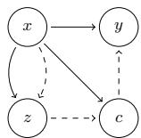
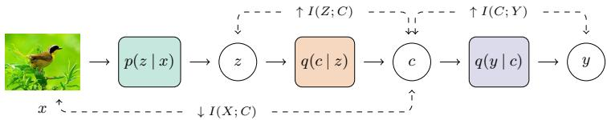
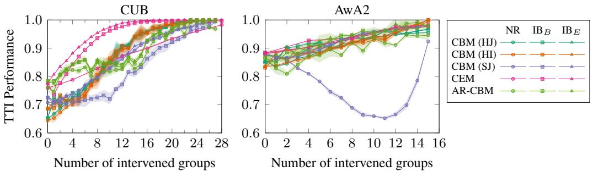
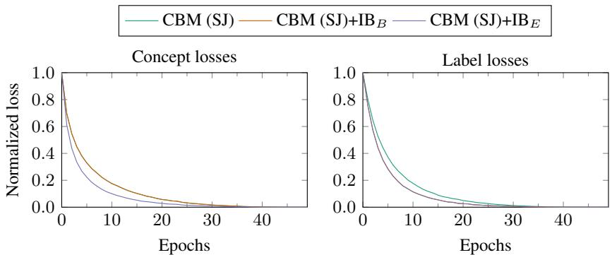
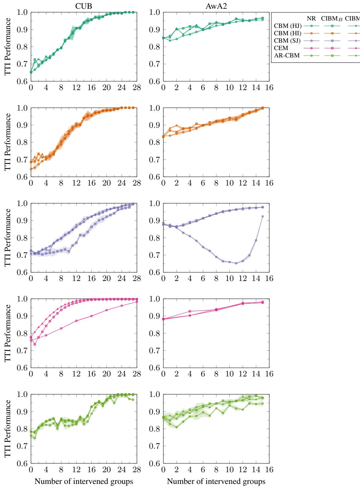
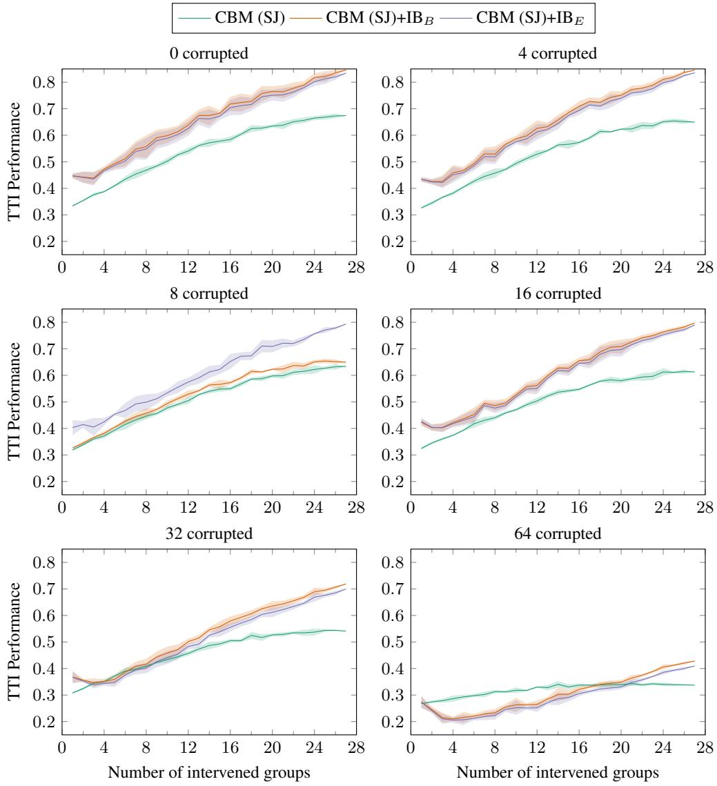
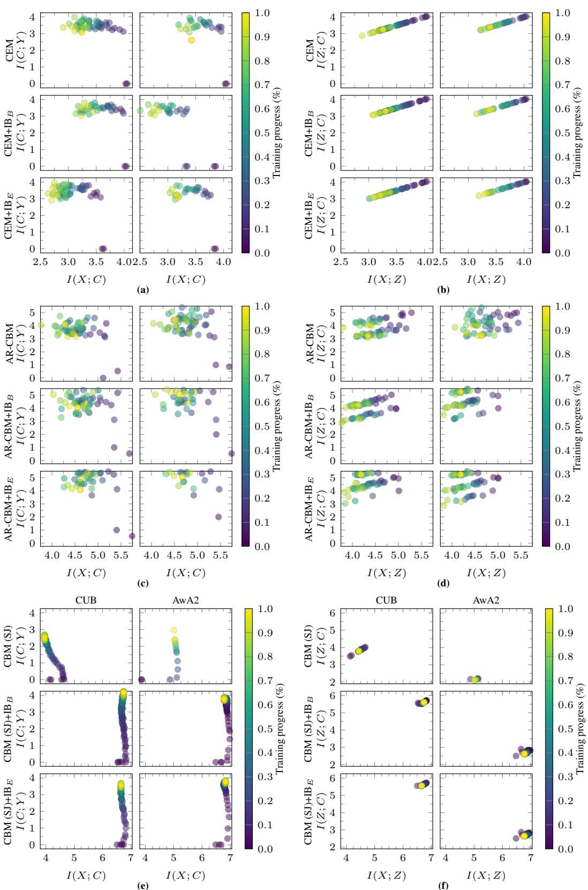

# Concepts’ Information Bottleneck Models

Anonymous Author(s)   
Affiliation   
Address   
email

# Abstract

Concept Bottleneck Models (CBMs) promise interpretable prediction by forcing   
all information to flow through a human-understandable “concept” layer, but this   
interpretability often comes at the cost of reduced accuracy and concept leakage.   
To solve this, we introduce an explicit Information Bottleneck regularizer on the   
concept layer—penalizing $I ( X ; C )$ —to encourage minimal yet task-relevant con  
cept representations. We derive two variants of this penalty and integrate them into   
the standard CBM training objective. Across six model families (hard/soft CBMs   
trained jointly or independently, ProbCBM, AR-CBM, and CEM) and three bench  
mark datasets (CUB, AwA2, aPY), IB-regularized models consistently outperform   
their vanilla counterparts—narrowing and in some cases closing the accuracy gap to   
unconstrained black-box networks. We further quantify concept leakage with two   
metrics (Oracle Impurity and Niche Impurity Scores) and show that IB constraints   
reduce leakage significantly, yielding more disentangled concepts. To assess how   
well concept sets support test-time corrections, we employed two intervention   
metrics (area under the intervention-accuracy curve and average marginal gain   
per intervened concept) demonstrating that IB-regularized CBMs retain higher   
intervention gains even when large fractions of concepts are corrupted. Our results   
reveal that enforcing a minimal-sufficient concept bottleneck improves both predic  
tive performance and the reliability of concept-level interventions, thereby closing   
the accuracy gap of CBMs while improving their interpretability and ability to   
intervene.

# 22 1 Introduction

In many real-world settings, from medical diagnosis to autonomous driving, models must do both:   
make accurate predictions and provide explanations that humans can trust. Consequently, explainable   
AI seeks to peel back the curtain on opaque machine learning systems, boosting trust, accountability,   
and safety by exposing hidden biases and errors. We categorize explainable models into four groups.   
Post-hoc techniques explain black-box models after training, using interpretable approximations or   
feature attributions [19]. Model-agnostic methods treat the model as a black box, analyzing inputs and   
outputs. These include local interpretability methods, which explain individual predictions [16, 17],   
and global interpretability methods, which provide broader insights [2, 7]. Finally, self-explainable   
models are inherently interpretable, requiring no additional techniques. This work champions self  
explainable models because they deliver structured, inherent explanations and seamless debugging,   
making them a promising alternative to other approaches.   
Concept bottleneck models (CBMs) [12] are a self-explainable approach that modifies neural network   
training by introducing intermediate, human-understandable concept labels, enabling predictions   
to be based on these concepts. CBMs aim to explain final decisions through these interpretable   
concepts and allow users to correct concept predictions to refine the model’s outputs. Their advantages   
include higher robustness to covariate shifts and spurious correlations when predictions rely solely on   
concepts. However, CBMs often underperform compared to black-box models. Additionally, they   
suffer from concept leakage [13, 14], where irrelevant information is encoded in concept activations,   
affecting both interpretability and the effectiveness of test-time interventions.   
Rather than redesigning CBM architectures or enriching concept embeddings as done in previ  
ous works [8, 10], we take a simpler, information-theoretic approach: we impose an Information   
Bottleneck [1, 20] penalty directly on the concept layer. By penalizing the mutual information   
between inputs and concepts while still maximizing their informativeness about the target, our   
method suppresses spurious signals, closes the accuracy gap to black-box models, and yields more   
reliable, intervenable concepts. We demonstrate that adding this bottleneck to diverse CBM variants   
consistently boosts performance and reduces concept leakage.   
The main contributions of this work are two-fold: (i) a new CBM loss (regularization) that exploits   
the Information Bottleneck (IB) framework providing a significant improvement compared to both   
vanilla and advanced CBMs, and (ii) a demonstration that CBMs that are IB-regularized achieve better   
predictions, show less concept leakage, and are more robust to interventions than their non-regularized   
counterparts.

# 4 2 Related work

# 2.1 Concept Bottleneck Models

CBMs. A CBM [12] is defined as $\hat { y } ~ = ~ f ( g ( x ) )$ , where $x \in \mathbb { R } ^ { D }$ , $g \colon \mathbb { R } ^ { D }  \mathbb { R } ^ { k }$ is a mapping from raw feature space into the lower-dimensional concepts space, and $f \colon  { \mathbb { R } } ^ { K } \to  { \mathbb { R } }$ is a mapping from the concepts to the target variable. For training this model composition, a dataset of triplets $\{ ( x _ { i } , c _ { i } , y _ { i } ) \} _ { i = 1 } ^ { N }$ is needed, where $c _ { ( \cdot ) }$ stands for the ground-truth concepts labels which should be produced by $g$ . The CBM could be trained independently, sequentially, or jointly [12]. Intuitively, when training a CBM, one is introducing human-understandable sub-labels (concepts) which are more primitive and general than the target, and then builds a model predicting the target based solely on those explainable concepts. However, despite these benefits, CBMs often lag behind unconstrained “black-box” models in prediction performance.

To bridge this gap, Concept Embedding Models (CEM) [3] learn two vectors for each concept (“active”   
and “inactive”). Such approach has increased target accuracy, but requires additional regularization   
algorithm called ‘RandInt’ for CEM to be able to effectively utilize test-time interventions. Moreover,   
the analysis of information flow done in CEMs suggests that information between inputs and concepts   
is monotonically increasing without any compression.   
Our proposal, unlike CEM, maintains the original model concept representation space and regularizes   
it through our concept information bottleneck regularization. Since we incorporate mutual information   
constraint into loss function, we can apply our regularization to different models (as demonstrated in   
our experiments).   
Probabilistic CBMs. Probabilistic approaches have been explored recently as well to better model   
the concepts, e.g., ProbCBMs [10] or ECBMs [23], which predict distribution of concepts and use   
anchor points for class mapping. Similarly by introducing inductive biases, previous work [15, 24]   
can extract the concepts without annotations. In this work, we do not utilize these anchor points,   
since they increase inference costs and introduce a new hyper-parameter to tune at fitting stage. We   
do use a variational approximation over our proposed concepts’ information bottleneck to predict   
concepts.   
Post-hoc CBMs. Another line of work investigates the transformation of any pre-trained model into   
a CBM. Side-channel CBMs [8] allow the information to flow through a side concept bottleneck.   
Recurrent CBMs [8] predicts concepts one after the other using information about previous concept   
predictions. However, side-channel CBMs have lower intervenability, and recurrent ones break   
the disentanglement of concepts. Post-Hoc Concept Bottleneck Models (PCBM) [25] use image   
embeddings from a pre-trained CNN’s penultimate layer activations. However, these models perform   
well only after residual connections are added, moreover, concepts classifiers are learned post-hoc on   
top of frozen embeddings, which makes it impossible to alter the pre-concept representations learning   
target. This residual information flow may damage both interpretability and intervenability.   
Concept Leakage. One problem with CBMs is the leakage of information into the concepts [13, 14],   
regardless of being soft (taking values between $[ 0 , 1 ] )$ or hard (values clipped to $\{ 0 , 1 \} )$ ). Margeloiu   
et al. [14] argue that the CBMs desiderata is met for independent training only: for joint and sequential   
a CBM learns more information about the raw data than just that presented in the concepts. Thus,   
concepts are not used as intended. Developing the idea of tracking concepts predictions, Margeloiu   
et al. [14] apply saliency methods to backtrace concepts to input features and find that for neither   
training method of the three derive concepts from something meaningful in the input space. Similarly,   
the Oracle and Niche Impurity Scores [4] were proposed to further understand the level of leakage.   
Conversely, we hypothesize that by compressing the concepts and the data, and, simultaneously,   
maximally expressing the labels and concepts through their respective variables, we could obtain   
better concepts and representations. Our experiments, support this hypothesis by the different   
improvements across a diverse set of tasks.

  
Figure 1: Our proposed CIBMs pipeline. The image is encoded through Figure 2: Our generative model $p ( z \mid x )$ , which in turn encodes the concepts with $\dot { q } ( c | \boldsymbol { z } )$ , and the labels $p ( \bar { y } | x ) p ( c | x ) \bar { p ( z | x ) } p ( x )$ (solid are predicted through $q ( y \mid c )$ . These modules are implemented as neural lines), and its variational approxinetworks. We introduced the IB regularization as mutual information opti- mation $q ( y | c ) q ( c | z ) q ( z | \bar { x } ) q ( x )$ mizations over the variables as shown in dashed lines. (dashed lines).

# 2.2 Information Bottleneck

Tishby et al. [20] introduced the information bottleneck (IB) as the minimization of the functional   
$\mathcal { L } _ { \mathrm { I B } } \doteq I ( X ; Z ) - \beta I ( Z ; Y )$ , where $I ( \cdot ; \cdot )$ is the mutual information, $\beta$ is the Lagrange multiplier, $X$ ,   
$Y$ and $Z$ are random variables that represents the data, labels, and latent representations, respectively.   
The motivation behind the bottleneck is to “squeeze” the relevant information about target $Y$ from $X$   
into a compact representation $Z$ while minimizing the information about input $X$ in $Z .$ —so that the   
representations are free of irrelevant information from $X$ . The IB’s authors have also posited that good   
generalization is connected with memorization-compression pattern. This is the behavior in which   
${ \bar { I } } ( Z ; Y )$ increases during the whole training time, while $I ( X ; Z )$ increases at first (memorization)   
and then decreases at later iterations (compression).   
Alemi et al. [1] extended the IB framework to deep neural networks by doing a variational approxi  
mation of latent representation. And, Kawaguchi et al. [9] analyzed the role of IB in estimation of   
generalization gaps for classification task. Their result implies that by incorporating the Information   
Bottleneck into learning objective one may get more generalized and robust network. Unlike this   
previous work that studied the IB for the data and the labels, we introduced another predictive   
variable, the concepts, and derive an upper bound that links common predictors and the ground truth   
into a regularizer that enforces the memorization-compression dynamics. Moreover, we show that   
the concepts’ information bottleneck can be used in common CBM approaches through a mutual   
information estimator as well.

# 121 3 Concepts’ Information Bottleneck

Concept Bottleneck Models (CBMs) aim for high interpretability by introducing human  
understandable concepts, $C$ , as an intermediary between latent representations, $Z$ , and the la  
bels $Y$ . To preserve the interpretability at the heart of CBMs, our objective seeks to minimize   
$I ( X ; C )$ —the mutual information between inputs and concepts. Thereby, it ensures that concepts   
remain meaningful and free from irrelevant data, while addressing concept leakage by controlling   
the information flow directly at the concept level, rather than at the more abstract latent space, $Z$ .   
Simultaneously, we aim to maximize the expressivity of the concepts about the labels, $I ( C ; Y )$ ,   
as well as the one of the latent representations and the concepts, $I ( Z ; C )$ . Our initial objective is   
max $I ( Z ; C ) + I ( C ; Y )$ , s.t. $I ( X ; Z ) \le I _ { C }$ , where $I _ { C }$ is an information constraint constant, that   
equivalently is the maximization of the functional of the concepts’ information bottleneck (CIB)

$$
\mathcal { L } _ { \mathrm { C I B } } = I ( Z ; C ) + I ( C ; Y ) - \beta I ( X ; Z ) ,
$$

where $\beta$ is a Lagrangian multiplier. This formulation ensures a strong connection between latents, $Z$ ,   
and the concepts, $C$ . This means that one wants $Z$ to be maximally useful in shaping the concepts $C$ ,   
while also ensuring that the concepts are informative about the target.   
Moreover, in the CBMs formulation, the concepts come from processing the latent representations,   
i.e., $c = h ( z )$ . Thus, due to the data processing inequality, ${ \bar { I } } ( X ; C ) \stackrel { \textstyle \cdot } { \leq } I ( X ; Z )$ , we can bound   
of the concepts’ information bottleneck loss (1) as $I ( Z ; C ) + I ( C ; Y ) - \beta I ( X ; C ) \geq I ( Z ; C ) +$   
$I ( C ; Y ) - \beta I ( X ; Z )$ .

Our objective is to maximize the upper bound of the concepts’ information bottleneck

$$
\mathcal { L } _ { \mathrm { U B - C I B } } = I ( Z ; C ) + I ( C ; Y ) - \beta I ( X ; C ) . ^ { \mathrm { l } }
$$

We depict our general framework in Fig. 1. We posit that by compressing the information between the   
data, $X$ , and the concepts, $C$ , instead of the latent representations, $Z$ , we can control the redundant   
information of the data within the concepts. Consequently, we can obtain more interpretable concepts   
instead of first compressing the latents and then obtaining the concepts from them. We hypothesize   
that this compression also prevents data leakage from the data into the concepts that commonly   
happens when the concepts are processed through the latents alone. Another interpretation of   
this process is the compression of the information between the data and the concepts through the   
marginalized latent representations. Thus, we are obtaining a more robust compression since we   
compute it through all possible latent representations that lead to that concept.   
We propose two implementations of our framework by exploring different ways of solving the mutual   
information based on a variational approximation of the data distribution. We show our modeling   
assumptions in Fig. 2.

# 152 3.1 Bounded CIB

We can consider the upper bound to the concept bottleneck loss (2) in terms of the entropy-based   
definitions of the mutual information. Then, by using a variational approximation of the data   
distribution, we bound it by

$$
\begin{array} { r l } & { \mathcal { L } _ { \mathrm { U B - C I B } } \le H ( Y ) + ( 1 - \beta ) H ( C ) + H \left( p ( y \mid c ) , q ( y \mid c ) \right) + \left( 1 + \beta \right) \underset { p ( z ) } { \mathbb { E } } H \left( p ( c \mid z ) , q ( c \mid z ) \right) , } \\ & { \mathcal { L } _ { \mathrm { U B - C I B } } \le ( 1 - \beta ) H ( C ) + \underset { p ( c ) } { \mathbb { E } } H \left( p ( y \mid c ) , q ( y \mid c ) \right) + ( 1 + \beta ) \underset { p ( z ) } { \mathbb { E } } H \left( p ( c \mid z ) , q ( c \mid z ) \right) . } \end{array}
$$

We detail this derivation in Appendix A. We can maximize the concepts’ information bottleneck by   
minimizing the cross entropies of the predictive variables, $y$ and $c$ , and their corresponding ground   
truths and by adjusting the entropy of the concepts—cf. Fig. 2. The simplified upper bound of the   
concept information bottleneck is

$$
\mathcal { L } _ { \mathrm { S U B - C I B } } = ( 1 - \beta ) H ( C ) + \underset { p ( c ) } { \mathbb { R } } H \left( p ( y \mid c ) , q ( y \mid c ) \right) + ( 1 + \beta ) \underset { p ( z ) } { \mathbb { R } } H \left( p ( c \mid z ) , q ( c \mid z ) \right) .
$$

We denote the models that were trained using this bounded concept information bottleneck (5) by   
$\mathrm { I B } _ { B }$ . To implement it, we need to estimate the entropy of the concepts distribution $p ( c )$ . We give   
162 details of this estimator in Appendix B.2.

# 3.2 Estimator-based CIB

Another way to obtain a bound over the concept information bottleneck (2) is to only expand the conditional entropies that are not marginalized (A.1) to avoid widening the gap in the bound, i.e.,

$$
{ \mathcal { L } } _ { \mathrm { U B - C I B } } = H ( Y ) + H ( C ) + \underset { p ( c ) } { \mathbb { E } } H \left( p ( y \mid c ) , q ( y \mid c ) \right) + \underset { p ( z ) } { \mathbb { E } } H \left( p ( c \mid z ) , q ( c \mid z ) \right) - \beta I ( X ; C ) .
$$

If we treat the entropies of the concepts and the labels as constants, we obtain

$$
\mathcal { L } _ { \mathrm { E - C I B } } = \underset { p ( c ) } { \mathbb { E } } H \left( p ( \boldsymbol { y } \mid c ) , q ( \boldsymbol { y } \mid c ) \right) + \underset { p ( z ) } { \mathbb { E } } H \left( p ( \boldsymbol { c } \mid z ) , q ( \boldsymbol { c } \mid z ) \right) + \beta \left( \rho - I ( X ; C ) \right) ,
$$

67 where $\rho$ is a constant. We denote the models that use this loss as $\mathrm { I B } _ { E }$ since it relies on the estimator   
of the mutual information. We detail the estimator we used in our implementation in Appendix B.2.   
This loss is similar to the one proposed by Kawaguchi   
et al. [9], ${ \mathcal { L } } _ { \mathrm { K } } \ = \ { \mathbb { E } } _ { p ( z ) } H ( p ( { \dot { y } } \mid { \dot { z } } ) , q ( y \mid { \dot { z } } ) ) +  \bar  \beta ( \rho \ - $   
$I ( Z ; X ) )$ , if one extends the mutual information from the   
labels into the concepts in a similar way. In other words,   
our mutual information estimated loss (7) resembles that   
of Kawaguchi et al.’s [9] proposal with the corresponding   
conditioning changes in the labels and the concepts. Thus,   
it is interesting to see that other optimization approaches   
emerge out of this bound. We highlight that our proposal   
is a generalized framework that encompass a wide range   
of possible implementations.   
Unlike $\mathcal { L } _ { \mathrm { S U B - C I B } }$ (5), which simplifies the mutual informa  
tion terms into cross-entropy losses, $\mathcal { L } _ { \mathrm { E \mathrm { - } C I B } }$ retains an ex  
plicit control over $I ( X ; C )$ . This allows for more granular   
control over the information flow from inputs to concepts,   
leading to a tighter constraint on concept leakage. As we   
show in the results (Table 1), this additional control trans  
lates to improved performance in both concept and class   
prediction accuracy, cf. Section 4.

Table 1: Accuracy results include mean and std. over 5 runs. We report results of our proposed regularizer methods, $\mathrm { I B } _ { B }$ and $\mathrm { I B } _ { E }$ applied to different CBMs. Black-box is a gold standard for class prediction that offers no explainability over the concepts.   

<table><tr><td>Method</td><td>Concept</td><td>Class</td></tr><tr><td>CUB</td><td></td><td></td></tr><tr><td>Black-box</td><td></td><td>0.919±0.002</td></tr><tr><td>CBM (HJ)</td><td>0.956±0.001</td><td>0.650±0.002</td></tr><tr><td>CBM (HJ)+IB B</td><td>0.955±0.001</td><td>0.653±0.003</td></tr><tr><td>CBM(HJ)+IBE</td><td>0.955±0.001</td><td>0.656±0.003</td></tr><tr><td>CBM (HI)</td><td>0.956±0.001</td><td>0.644±0.001</td></tr><tr><td>CBM (HI) + IB B</td><td>0.957±0.001</td><td>0.686±0.000</td></tr><tr><td>CBM (HI)+IBε</td><td>0.957±0.001</td><td>0.686±0.000</td></tr><tr><td>CBM (SJ)</td><td>0.956±0.001</td><td>0.708±0.006</td></tr><tr><td>CBM (SJ)+IB B</td><td>0.958±0.001</td><td>0.725±0.004</td></tr><tr><td>CBM(SJ)+IBE</td><td>0.959±0.001</td><td>0.729±0.003</td></tr><tr><td>ProbCBM</td><td>0.956±0.001</td><td>0.718±0.005</td></tr><tr><td>ProbCBM+IB B</td><td>0.957±0.001</td><td>0.742±0.004</td></tr><tr><td>ProbCBM+IBE</td><td>0.957±0.001</td><td>0.740±0.003</td></tr><tr><td>CEM</td><td>0.954±0.001</td><td>0.759±0.002</td></tr><tr><td>CEM + IB B</td><td>0.955±0.001</td><td>0.776±0.002</td></tr><tr><td>CEM+ IBε</td><td>0.955±0.001</td><td>0.776±0.002</td></tr><tr><td>AR-CBM</td><td>0.956±0.002</td><td>0.761±0.010</td></tr><tr><td>AR-CBM + IB B</td><td>0.956±0.003</td><td>0.784±0.006</td></tr><tr><td>AR-CBM+ IBε</td><td>0.956±0.002</td><td>0.783±0.005</td></tr></table>

# 188 4 Experiments

We extend several CBM variants with our IB-regularizers,   
yielding CIBMs. The CIBMs are slight variations of the   
original models as they require a variational approximation   
in order to study and apply the proposed IB-regularizers.   
We train each model from scratch and compare CIBMs to   
their vanilla counterparts of equal capacity, measuring both   
class-prediction accuracy and concept leakage. Our goal is   
to close the accuracy gap to black-box models without sac  
rificing interpretability or test-time intervenability. Finally,   
we analyze information flows via mutual-information es  
timates and benchmark intervention performance.   
We benchmark our approach on three datasets: CUB [21],   
AwA2 [22], and aPY [6]. We present all implementation   
details in Appendix B. For our regularizers, we evaluate   
their setups and select the best hyperparameters (cf. Sec  
tion 4.6). In the following experiments, we use the same   
hyperparameters and setup for our regularizers for fair   
206 comparisons.

<table><tr><td>CEM + IB B</td><td>0.955±0.001</td><td>0.776±0.002</td></tr><tr><td>CEM +IBE</td><td>0.955±0.001</td><td>0.776±0.002</td></tr><tr><td>AR-CBM</td><td>0.956±0.002</td><td>0.761±0.010</td></tr><tr><td>AR-CBM + IB B</td><td>0.956±0.003</td><td>0.784±0.006</td></tr><tr><td>AR-CBM+IB E</td><td>0.956±0.002</td><td>0.783±0.005</td></tr><tr><td>AwA2</td><td></td><td></td></tr><tr><td>Black-box</td><td></td><td>0.893±0.000</td></tr><tr><td>CBM (HJ)</td><td>0.979±0.000</td><td>0.853±0.002</td></tr><tr><td>CBM (HJ) + IB B</td><td>0.976±0.000</td><td>0.850±0.003</td></tr><tr><td>CBM (HJ)+IBE</td><td>0.979±0.000</td><td>0.852±0.003</td></tr><tr><td>CBM (HI)</td><td>0.979±0.000</td><td>0.836±0.001</td></tr><tr><td>CBM (HI) +IB B</td><td>0.975±0.000</td><td>0.831±0.002</td></tr><tr><td>CBM (HI) + IB E</td><td>0.979±0.000</td><td>0.835±0.002</td></tr><tr><td>CBM (SJ)</td><td>0.979±0.001</td><td>0.876±0.001</td></tr><tr><td>CBM (SJ) + IB B</td><td>0.979±0.002</td><td>0.885±0.002</td></tr><tr><td>CBM (SJ)+IBE</td><td>0.979±0.001</td><td>0.883±0.001</td></tr><tr><td>ProbCBM</td><td>0.979±0.000</td><td>0.880±0.003</td></tr><tr><td>ProbCBM+ IBB</td><td>0.979±0.000</td><td>0.883±0.001</td></tr><tr><td>ProbCBM+IBE</td><td>0.979±0.000</td><td>0.882±0.001</td></tr><tr><td>CEM</td><td>0.979±0.000</td><td>0.884±0.002</td></tr><tr><td>CEM +IBB</td><td>0.978±0.000</td><td>0.883±0.003</td></tr><tr><td>CEM + IBε</td><td>0.979±0.000</td><td>0.884±0.003</td></tr><tr><td>AR-CBM</td><td>0.979±0.001</td><td>0.884±0.006</td></tr><tr><td>AR-CBM+IB B</td><td>0.978±0.000</td><td>0.885±0.008</td></tr><tr><td>AR-CBM+ IBE</td><td></td><td>0.885±0.003</td></tr><tr><td>aPY</td><td>0.979±0.000</td><td></td></tr><tr><td colspan="3"></td></tr><tr><td>Black-box</td><td></td><td>0.866±0.003</td></tr><tr><td>CBM (SJ)</td><td>0.967±0.000</td><td>0.797±0.007</td></tr><tr><td>CBM (SJ)+IBB</td><td>0.967±0.000</td><td>0.856±0.005</td></tr><tr><td>CBM (SJ) +IBE</td><td>0.967±0.000</td><td>0.856±0.004</td></tr><tr><td>ProbCBM</td><td>0.967±0.000</td><td>0.863±0.007</td></tr><tr><td>ProbCBM+IB B</td><td>0.967±0.000</td><td>0.869±0.003</td></tr><tr><td>ProbCBM + IB E</td><td>0.967±0.000</td><td>0.870±0.001</td></tr><tr><td>CEM</td><td>0.967±0.000</td><td>0.869±0.004</td></tr><tr><td>CEM+IB B</td><td>0.967±0.000</td><td>0.872±0.002</td></tr><tr><td>CEM +IBε</td><td>0.967±0.000</td><td>0.876±0.003</td></tr><tr><td>AR-CBM</td><td>0.967±0.000</td><td>0.873±0.004</td></tr><tr><td>AR-CBM+ IB B</td><td>0.967±0.000</td><td>0.878±0.004</td></tr><tr><td>AR-CBM + IBE</td><td>0.967±0.000</td><td>0.878±0.002</td></tr></table>

# 07 4.1 Performance across all Datasets

08 We present the evaluation results across three datasets in   
Table 1. Our “black-box model” serves as a gold standard,   
10 representing the highest possible class accuracy achievable   
by a CBM model with a traditional setup that does not   
2 provide explanations, i.e., trained only to predict class   
13 labels. We compare against hard $\mathrm { ( H ) }$ and soft (S) CBMs   
4 trained jointly (J) or independently (I) [8], ProbCBMs [10],   
intervention-aware CEM [3], and AR-CBM [8]. Our main   
objective is to demonstrate that our proposed regularizers

$( \mathrm { I B } _ { B }$ and $\mathrm { I B } _ { E }$ ) maintain or improve the target prediction accuracy in comparison to their original counterparts while improving the concept prediction accuracy and reducing concept leakage. The latter is of particular importance to guarantee the explainability of the results.

Our proposed methods, $\mathrm { I B } _ { B }$ and $\mathrm { I B } _ { E }$ , show an improvement over all methods regarding class predic  
tion accuracy for the CUB dataset, and always show improved class prediction. These improvements   
come alongside enhanced concept accuracy (in most cases and with comparable accuracy at worst),   
thus, realizing the fundamental goal of our approach: to simultaneously boost performance and   
interpretability. As for the $A w A 2$ dataset, the class accuracy gain shows less improvement than   
the other datasets but is nevertheless comparable to the original methods. Similarly, the concept   
prediction is also comparable to the unregularized models. We ascribe this to the dataset’s relative   
simplicity, which narrows the room for enhancement. In the more varied real-world classes of the   
aPY dataset, our regularizers significantly outperforms the baseline CBMs in class accuracy. We even   
observed an improvement over the black-box model while providing interpretability comparable to   
the original models, which is paramount in real-world applications where explanations are necessary.

Table 2: Concept leakage evaluation (lower is better).   

<table><tr><td rowspan="2">Model</td><td colspan="2">Complete CS</td><td colspan="2">Selective Drop-out CS</td><td colspan="3">Random Drop-out CS</td></tr><tr><td>OIS</td><td></td><td>OIS</td><td>NIS</td><td></td><td></td><td>NIS</td></tr><tr><td>CBM (SJ)</td><td>4.69 ± 0.43</td><td>66.25 ± 2.31</td><td>16.29</td><td></td><td>78.39</td><td>12.97 ± 0.78</td><td>74.19 ± 1.04</td></tr><tr><td>CBM (SJ) +IB B</td><td>2.16 ± 0.13</td><td>61.67 ±1.92</td><td>13.09</td><td></td><td>73.40</td><td>10.59 ± 1.48</td><td>71.38 ± 0.89</td></tr><tr><td>CEM</td><td>8.74 ± 0.30</td><td>75.41 ± 3.83</td><td>20.85</td><td>80.19</td><td>18.31 ± 0.09</td><td></td><td>76.56 ± 2.00</td></tr><tr><td>CEM+IB B</td><td>6.11 ± 0.24</td><td>70.02 ± 2.21</td><td>17.22</td><td></td><td>76.67</td><td>14.10 ± 0.42</td><td>72.68 ± 2.38</td></tr><tr><td>AR-CBM</td><td>3.90±0.27</td><td>62.30 ± 1.52</td><td>14.16</td><td></td><td>63.40</td><td>12.58 ± 0.86</td><td>60.86 ±1.32</td></tr><tr><td>AR-CBM+ IB B</td><td>2.83±0.27</td><td>59.87 ± 1.52</td><td>10.97</td><td></td><td>59.72 10.20 ± 0.55</td><td></td><td>56.28 ±1.33</td></tr><tr><td>ProbCBM</td><td>4.30± 0.10</td><td>64.22 ±1.04</td><td>16.01</td><td></td><td>76.92</td><td>13.81 ± 0.21</td><td>75.01±0.86</td></tr><tr><td>ProbCBM+ IB B</td><td>2.53 ± 0.46</td><td>60.35 ± 2.01</td><td>13.11</td><td></td><td>72.86</td><td>10.34 ± 0.55</td><td>70.96 ± 1.91</td></tr></table>

The rise in class and concept accuracy relative to existing methods highlights the advantages of our mutual information regularization. This approach helps stop concept leakage and ensures that concepts are both informative and closely tied to the final prediction, see Section 4.2 for details. This finding is consistent with our theoretical framework, which advocates that controlling the information flow between inputs and concepts through the Information Bottleneck can yield more interpretable and significantly meaningful concepts without compromising performance, see Section 4.5 for more details.

# 238 4.2 Concept Leakage

Concept leakage occurs when spurious or task-irrelevant information contaminates concept activations eroding both interpretability and the power of test-time interventions [13, 14]. Espinosa Zarlenga et al. [4] proposed Oracle Impurity Score (OIS) and the Niche Impurity Score (NIS) to quantify impurities localized within individual and distributed across the set of learned concepts, respectively. We use these metrics under three scenarios: (i) a complete concept set, (ii) selective dropout where we remove the most predictive half of concepts, and (iii) random dropout of half of concepts (for control). We highlight that the selective dropout setting has only one possible configuration, thus, we do not report standard deviation on it. We chose dropout scenarios because omitting relevant concepts can dramatically increase concept leakage [8]. Table 2 reports these results. Crucially, our IB-regularizers significantly slash leakage across all scenarios, achieving the lowest OIS and NIS even under heavy concept removal. These results confirm that imposing an Information Bottleneck on concepts reduces concept leakage and mitigates spurious encoding.

# 251 4.3 Interventions

A key advantage of CBMs is their ability to perform test-time interventions, allowing users to correct predicted concepts and improve the model’s final decisions. To demonstrate test-time intervention performance of CIBMs we simulate interventions by replacing predicted concepts with their ground truth values. Following prior work, we intervene on groups of concepts rather than individual concepts, leveraging this strategy to assess how cumulative corrections impact class prediction performance [10, 12]. We, then, plot the prediction performance improvement against number of concept groups intervened. The resulting curve is denoted as the interventions curve. We implement a random strategy to choose a set of concept groups to intervene on. More specifically, concept groups are randomly selected for intervention, and results are averaged over five runs to account for variability.

  
Figure 3: Change in target prediction accuracy after intervening on concept groups following the random strategy as described in Section 4.3. (TTI stands for Test-Time Interventions, and NR for non-regularized.) We show expanded plots in Fig. C.1.

Table 3: Change in interventions performance with concept set corruption for CBM (SJ) and its regularized versions with our proposed methods. We show the disaggregated plots in Fig. C.2.   

<table><tr><td></td><td colspan="6">CUB</td></tr><tr><td></td><td colspan="3">AUC</td><td colspan="3">NAUC</td></tr><tr><td>Corrupt</td><td>CBM</td><td>+IBB</td><td>+IBE</td><td>CBM</td><td>+IBB</td><td>+IBE</td></tr><tr><td>0</td><td>54.374</td><td>65.644</td><td>64.634</td><td>0.001260</td><td>0.001481</td><td>0.001432</td></tr><tr><td>4</td><td>53.135</td><td>64.519</td><td>63.464</td><td>0.001198</td><td>0.001525</td><td>0.001487</td></tr><tr><td>8</td><td>51.291</td><td>53.135</td><td>60.202</td><td>0.001166</td><td>0.001198</td><td>0.001444</td></tr><tr><td>16</td><td>50.694</td><td>60.240</td><td>59.424</td><td>0.001068</td><td>0.001388</td><td>0.001349</td></tr><tr><td>32</td><td>46.101</td><td>52.956</td><td>51.258</td><td>0.000863</td><td>0.001298</td><td>0.001231</td></tr><tr><td>64</td><td>32.069</td><td>30.582</td><td>29.271</td><td>-0.000339</td><td>0.000571</td><td>0.000504</td></tr><tr><td></td><td colspan="6">AwA2</td></tr><tr><td></td><td colspan="3">AUC</td><td colspan="3">NAUC</td></tr><tr><td>Corrupt</td><td>CBM</td><td>+IBB</td><td>+IBE</td><td>CBM</td><td>+IBB</td><td>+IBE</td></tr><tr><td>No</td><td>84.753</td><td>91.573</td><td>92.225</td><td>0.002808</td><td>0.005350</td><td>0.006250</td></tr><tr><td>Yes</td><td>83.985</td><td>90.631</td><td>90.879</td><td>0.004484</td><td>0.005218</td><td>0.006474</td></tr></table>

Figure 3 shows that IB-regularized CBMs deliver a monotonic rise in accuracy as each additional   
concept group is corrected—clear evidence they truly leverage accurate concept signals with minimal   
leakage. This smooth ascent underscores how our bottleneck penalty sharpens the model’s debugga  
bility, ensuring every intervention yields a consistent performance boost. In contrast, soft-joint CBMs   
suffer pronounced mid-sequence dips—likely a symptom of their leaky representations undermining   
reliability under random group corrections.   
Hard CBMs—with their binary concept slots—can eventually attain high accuracy under large-scale   
interventions (owing to their inherently low leakage), but they start well below CIBMs and climb more   
sluggishly when only a few concepts are corrected—especially on coarser datasets like AwA2. In   
contrast, our IB-regularized models blend low-leakage encodings with adaptive flexibility, producing   
smooth, steady gains and outperforming every CBM variant in both intervention curves and overall   
accuracy (Table 1). For full setup details, see Appendix F. Interestingly, current models, such as   
CEM and AR-CBM, benefit the most from our regularization showing a significant improvement in   
both data sets.

# 276 4.4 Concept Set Goodness Measure

In CBMs, the quality of the concept set is crucial for accurate downstream task predictions. However,   
there is a lack of effective metrics to reliably assess concept set goodness. Existing metrics, such   
as the Concept Alignment Score, proposed by Espinosa Zarlenga et al. [3], evaluate whether the   
model has captured meaningful concept representations but do not explicitly measure how well these   
concepts improve downstream task performance during interventions. Moreover, this metric is tuned   
for CEM and do not extend beyond it.   
Similar to previous methods that rely on area under the curve for the interventions [5, 18], we measure   
and compare the concept quality in CIBMs using the following metrics: area under interventions   
curve, and the area under curve of relative improvements. Denote by $\mathcal { T } ( x )$ the model’s performance   
for $x$ concept groups used in the intervention. Then the Test-Time Interventions (TTI) accuracy is

$$
\mathrm { A U C _ { \mathrm { T T I } } } = \frac { 1 } { n } \sum _ { i = 1 } ^ { n } \mathcal { T } ( i ) ,
$$

and the normalized version of the TTI accuracy is

$$
\mathrm { N A U C } _ { \mathrm { T T I } } = \frac { 1 } { n } \sum _ { i = 1 } ^ { n } \left( \mathbb { Z } ( i ) - \mathbb { Z } ( i - 1 ) \right) .
$$

The idea behind these measures is simple: if a concept set is of high quality, the task accuracy will   
steadily approach $1 0 0 \%$ as more concept groups are intervened upon, resulting in a large area under   
the curve. Conversely, if the concept set is incomplete or noisy, performance gains will be limited,   
even with multiple interventions, which can indicate concept leakage.   
The latter expression (9) could be simplified to just scaled difference between a model with full   
concept set used for interventions and performance of a model with no interventions, however, the   
meaning it has is how much does the performance change per one group added to the interventions   
pool. To test this, we generate corrupted concept sets by replacing selected concepts with noisy ones.   
296 Importantly, we maintain the original groupings of concepts.

Table 3 shows the results of our metrics. We also show the commonly reported disaggregated plots in Fig. C.2. The number in the “corrupt” column denotes the number of concepts replaced with random ones for CUB, and for AwA2 “No” denotes a clear concept set and “Yes” denotes a concept set with one concept changed to corrupt. As expected, performance drops with corrupt concepts, since they contain no useful information for the target task. One consequence of our training is that if one has two concept annotations for some dataset, then it is possible to use CIBMs performance to determine which concept set is better.

04 Our results demonstrate that regularizing with $\mathrm { I B } _ { E }$ is more sensitive to concept quality compared to   
vanilla CBM, making it a better indicator of concept set reliability. Negative values in normalized   
intervention AUC indicate possible concept leakage.

# 307 4.5 Information Plane Dynamics in CBMs and CIBMs

To further evaluate the proposed regularizers, we examined the information plane dynamics of CBM,   
CEM, and AR-CBM, as shown in Fig. E.1. In general, we expected to observe higher mutual   
information between the concepts and the labels, $I ( C ; Y )$ , and between the latents and the concepts,   
$I ( Z ; C )$ , while expecting lower mutual information between the data and the concepts, $I ( X ; C )$ , and   
between the data and the latents, $I ( X ; Z )$ . We clearly observed this behavior when applying our   
$\mathrm { I B } _ { E }$ to CEM, and to a lesser degree with $\mathrm { I B } _ { B }$ . This pattern was also evident in AR-CBMs, although   
with more noise. However, in certain cases, this pattern deviated. More specifically, we found that   
CBMs exhibit greater compression with respect to the data compared to their regularized counterparts.   
Nevertheless, our CIBMs demonstrate greater expressiveness due to their higher mutual information   
with respect to the labels, $Y$ .   
We think that vanilla CBMs “over-compress” their internal representations—shrinking $I ( X ; C )$   
and $I ( X ; Z )$ so aggressively that they discard useful, task-relevant features. This indiscriminate   
bottleneck explains their lower end-to-end accuracy (Table 1) and higher concept leakage (Table 2).   
By contrast, our CIBMs apply a structured Information Bottleneck: they retain all the signal that   
drives $Y$ (higher $I ( C ; Y ) )$ while shedding only the noise (lower $I ( X ; C ) )$ , which both boosts   
predictive performance and cuts leakage. In other words, achieving expressiveness first—then   
selective compression—yields representations that are both robust and interpretable. Appendix E   
presents detailed information-plane trajectories, and our findings echo recent theory on IB in deep   
nets, which warns against blind compression in favor of task-guided pruning [9].   
Overall, we have found that pursuing compression alone is not the solution for obtaining more robust   
representations. Instead, we see that achieving more expressive representations (i.e., higher mutual   
information with respect to the labels) followed by compression (i.e., lower mutual information with   
respect to the data) helps reduce the gaps in predictive tasks (see Table 1) as well as in leakage (see   
Table 2). However, due to the requirements for expressiveness, the CIBMs do not compress as much,   
since they must retain some useful information. Our findings align with recent theoretical insights   
on the Information Bottleneck principle in deep learning [9], which emphasize that indiscriminately   
minimizing the mutual information between the data and the latent representations, $I ( X ; Z )$ , does not   
guarantee expressive or generalizable representations. Effective models must selectively compress   
task-irrelevant information while retaining essential features for decision-making.

# 337 4.6 Evaluation of our Regularizers’ Hyperparameters

We evaluated the hyperparameters of our proposed regularizers on a CBM (SJ) to select the values   
that we used for all other experiments. We evaluated our regularizers in a single model to find   
the best setup due to computational constraints. We compare the performance of $\mathrm { I B } _ { B }$ and $\mathrm { I B } _ { E }$ on   
concept and class prediction accuracy for the CUB dataset (using $\beta = 0 . 5$ ) and report the results in   
Table B.1. As shown, $\mathrm { I B } _ { E }$ , which retains an explicit mutual information term $I ( X ; C )$ , outperforms   
$\mathrm { I B } _ { B }$ when trained in a fair setup (vanilla) in both metrics. We found that the lack of performance of the   
vanilla $\mathrm { I B } _ { B }$ regularizer comes from instabilities during training in the latent representations encoder   
$p ( z \mid x )$ . We hypothesize that the gradient from the $H ( C )$ in the loss (5) damages the feature encoder   
$p ( z \mid x )$ since the entropy is computed w.r.t. the generative concepts $p ( c )$ instead of the variational   
approximated ones $q ( c )$ . To alleviate this problem, we experimented gradient clipping as well as   
stopping the gradient from $H ( C )$ into the encoder. We found that the latter performs on par with   
$\mathrm { I B } _ { E }$ . In the experiments, we use $\mathrm { I B } _ { B }$ with stop gradient on it. Overall, $\mathrm { I B } _ { E }$ ’s more granular control   
over information flow limits concept leakage, results in better accuracies for concepts and labels in   
comparison to the baselines (cf. Table 1) without changes to its training framework. We also evaluate   
two different values (0.25 and 0.5) for the $\beta$ constant that controls the mutual information between   
the data and the concepts. We show these results in Table B.2. Since we obtained inconclusive results,   
we selected $\beta = 0 . 5$ for following experiments.   
These results supports our earlier discussion that the direct estimation of $I ( X ; C )$ leads to more effec  
tive use of concepts in downstream tasks without further changes to the training regime. Nevertheless,   
with a correctly regularized feature encoder $p ( z \mid x )$ , a simple estimation in $\mathrm { I B } _ { B }$ can achieve similar   
levels of information gain and accuracy.

# 359 5 Limitations

Our reliance on variational MI estimation can introduce bias and depend sensitively on the choice of approximating distributions and estimators used (as shown in our results for our two variations of regularizers). In general, like all CBMs, CIBMs assume reliable, comprehensive concept annotations—performance and leakage gains may diminish if concept labels are noisy, incomplete, or inconsistency defined, though our results have demonstrated that CIBMs are more robust to incomplete concepts as compared to their corresponding state of the art variants.

# 366 6 Conclusion

We present Concepts’ Information Bottleneck Models (CIBMs), a first-principled fusion of Infor  
mation Bottleneck theory and Concept Bottleneck Models that both explains CBMs’ failure modes   
and prescribes their cure. By penalizing $I ( X ; C )$ while preserving $I ( C ; Y )$ , Concept Information   
Bottleneck reveals why vanilla CBMs over-compress and leak spurious signals—and how a surgical,   
task-guided compression can retain exactly what matters. We validate CIBMs across six CBM   
families (hard/soft, joint/independent, ProbCBM, CEM, and AR-CBM) on three benchmarks (CUB,   
AwA2, and aPY), employing concept accuracy, class accuracy, Oracle and Niche Impurity (OIS and   
NIS), and intervention metrics $( \mathrm { \mathbf { A U C } _ { T T I } }$ , $\mathrm { N A U C } _ { \mathrm { T T I } }$ ). The result is uniformly higher class accuracy,   
dramatically reduced concept leakage, and equal or better concept-prediction performance—closing   
much of the CBM-black-box gap. Crucially, our findings show that: (a) simple, selective compres  
sion can unlock robust, interpretable concept representations; and (b) that leakage undermines the   
use of concepts far more than their detection, explaining why near-perfect concept predictors can still   
yield subpar end-to-end performance.   
References   
[1] Alexander A. Alemi, Ian Fischer, Joshua V. Dillon, and Kevin Murphy. Deep variational   
information bottleneck. In Inter. Conf. Learn. Represent. (ICLR), 2017. URL https://open   
review.net/forum?id=HyxQzBceg.   
[2] Daniel W Apley and Jingyu Zhu. Visualizing the effects of predictor variables in black box   
supervised learning models. J. R. Stat. Soc., B: Stat. Methodol., 82(4):1059–1086, 2020.   
[3] Mateo Espinosa Zarlenga, Pietro Barbiero, Gabriele Ciravegna, Giuseppe Marra, Francesco   
Giannini, Michelangelo Diligenti, Zohreh Shams, Frederic Precioso, Stefano Melacci, Adrian   
Weller, Pietro Lio, and Mateja Jamnik. Concept embedding models. In Alice H. Oh, Alekh   
Agarwal, Danielle Belgrave, and Kyunghyun Cho, editors, Adv. Neural Inf. Process. Sys.   
(NeurIPS), 2022. URL https://openreview.net/forum?id $\ast$ HXCPA2GXf_.   
[4] Mateo Espinosa Zarlenga, Pietro Barbiero, Zohreh Shams, Dmitry Kazhdan, Umang Bhatt,   
Adrian Weller, and Mateja Jamnik. Towards robust metrics for concept representation evaluation.   
In AAAI Conf. Artif. Intell. (AAAI), pages 11791–11799, June 2023. doi: 10.1609/aaai.v37i10.   
26392. URL https://0ojs.aaai.org/index.php/AAAI/article/view/26392.   
[5] Mateo Espinosa Zarlenga, Katherine M. Collins, Krishnamurthy Dj Dvijotham, Adrian Weller,   
Zohreh Shams, and Mateja Jamnik. Learning to receive help: Intervention-aware concept   
embedding models. In Adv. Neural Inf. Process. Sys. (NeurIPS), 2023. URL https://openre   
view.net/forum?id=4ImZxqmT1K.   
[6] Ali Farhadi, Ian Endres, Derek Hoiem, and David Forsyth. Describing objects by their attributes.   
In IEEE/CVF Inter. Conf. Comput. Vis. Pattern Recog. (CVPR), pages 1778–1785, 2009. doi:   
10.1109/CVPR.2009.5206772.   
[7] Jerome Friedman and Bogdan Popescu. Predictive learning via rule ensembles. Ann. Appl.   
Statist., 2, 12 2008. doi: 10.1214/07-AOAS148.   
[8] Marton Havasi, Sonali Parbhoo, and Finale Doshi-Velez. Addressing leakage in concept   
bottleneck models. In S. Koyejo, S. Mohamed, A. Agarwal, D. Belgrave, K. Cho, and A. Oh,   
editors, Adv. Neural Inf. Process. Sys. (NeurIPS), volume 35, pages 23386–23397. Curran   
Associates, Inc., 2022. URL https://proceedings.neurips.cc/paper_files/paper   
/2022/file/944ecf65a46feb578a43abfd5cddd960-Paper-Conference.pdf.   
[9] Kenji Kawaguchi, Zhun Deng, Xu Ji, and Jiaoyang Huang. How does information bottleneck   
help deep learning? In Inter. Conf. Mach. Learn. (ICML), pages 16049–16096. PMLR, 2023.   
[10] Eunji Kim, Dahuin Jung, Sangha Park, Siwon Kim, and Sungroh Yoon. Probabilistic concept   
bottleneck models. In Andreas Krause, Emma Brunskill, Kyunghyun Cho, Barbara Engelhardt,   
Sivan Sabato, and Jonathan Scarlett, editors, Inter. Conf. Mach. Learn. (ICML), volume 202   
of Proceedings of Machine Learning Research, pages 16521–16540. PMLR, 23–29 Jul 2023.   
URL https://proceedings.mlr.press/v202/kim23g.html.   
416 [11] Diederik Kingma and Jimmy Ba. Adam: A method for stochastic optimization. In Inter. Conf.   
17 Learn. Represent. (ICLR), San Diego, CA, USA, 2015.   
[12] Pang Wei Koh, Thao Nguyen, Yew Siang Tang, Stephen Mussmann, Emma Pierson, Been Kim,   
and Percy Liang. Concept bottleneck models. In Hal Daume III and Aarti Singh, editors, ´ Inter.   
Conf. Mach. Learn. (ICML), volume 119 of Proceedings of Machine Learning Research, pages   
5338–5348. PMLR, 13–18 Jul 2020. URL https://proceedings.mlr.press/v119/koh   
20a.html.   
[13] A. Mahinpei, J. Clark, I. Lage, F. Doshi-Velez, and P. WeiWei. Promises and pitfalls of black  
box concept learning models. In Inter. Conf. Mach. Learn. Wksps. (ICML), volume 1, pages   
1–13. PMLR, 2021.   
[14] Andrei Margeloiu, Matthew Ashman, Umang Bhatt, Yanzhi Chen, Mateja Jamnik, and Adrian   
Weller. Do concept bottleneck models learn as intended? In Inter. Conf. Learn. Represent.   
428 Wksps. (ICLRW), 2021.

29 [15] Tuomas Oikarinen, Subhro Das, Lam M. Nguyen, and Tsui-Wei Weng. Label-free concept bottleneck models. In Inter. Conf. Learn. Represent. (ICLR), 2023. URL https://openrevi ew.net/forum?id=FlCg47MNvBA. [16] Marco Tulio Ribeiro, Sameer Singh, and Carlos Guestrin. “why should i trust you?” explaining the predictions of any classifier. In ACM Conf. Knowl. Discov. Data Min. (ACM SIGKDD), pages 1135–1144, 2016. [17] Ramprasaath R Selvaraju, Michael Cogswell, Abhishek Das, Ramakrishna Vedantam, Devi Parikh, and Dhruv Batra. Grad-CAM: visual explanations from deep networks via gradientbased localization. Inter. J. Comput. Vis., 128:336–359, 2020. [18] Nishad Singhi, Jae Myung Kim, Karsten Roth, and Zeynep Akata. Improving intervention efficacy via concept realignment in concept bottleneck models. In European Conf. Comput. Vis. (ECCV), 2024. [19] Timo Speith. A review of taxonomies of explainable artificial intelligence (xai) methods. In ACM Conf. Fair. Account. Transp. (ACM FAT), pages 2239–2250, 2022. [20] Naftali Tishby, Fernando C Pereira, and William Bialek. The information bottleneck method. arXiv preprint physics/0004057, 2000. [21] C. Wah, S. Branson, P. Welinder, P. Perona, and S. Belongie. Cub-200-2011. Technical Report CNS-TR-2011-001, California Institute of Technology, 2011. [22] Yongqin Xian, Christoph H. Lampert, Bernt Schiele, and Zeynep Akata. Zero-shot learning—a comprehensive evaluation of the good, the bad and the ugly. IEEE Trans. Pattern Anal. Mach. Intell., 41(9):2251–2265, 2019. doi: 10.1109/TPAMI.2018.2857768. [23] Xinyue Xu, Yi Qin, Lu Mi, Hao Wang, and Xiaomeng Li. Energy-based concept bottleneck models. In Inter. Conf. Learn. Represent. (ICLR), 2024. URL https://openreview.net/f orum?id $=$ I1quoTXZzc. [24] Yue Yang, Artemis Panagopoulou, Shenghao Zhou, Daniel Jin, Chris Callison-Burch, and Mark Yatskar. Language in a bottle: Language model guided concept bottlenecks for interpretable image classification. In IEEE/CVF Inter. Conf. Comput. Vis. Pattern Recog. (CVPR), pages 19187–19197, 2023. [25] Mert Yuksekgonul, Maggie Wang, and James Zou. Post-hoc concept bottleneck models. In Inter. Conf. Learn. Represent. (ICLR), 2023. URL https://openreview.net/forum?id= nA5AZ8CEyow.

# 0 A Detailed Derivation of CIB

In this section we present the detailed derivations to obtained the results described in Section 3.1.

We can re-write the upper bound of the concepts’ information bottleneck as

$$
{ \mathcal { L } } _ { \mathrm { U B \cdot C I B } } = H ( Y ) + ( 1 - \beta ) H ( C ) - H ( Y \mid C ) - H ( C \mid Z ) - \beta H ( C \mid X )
$$

to work with the entropies instead. To find a more suitable form to tackle this bound, we consider an   
approximation of the predictors for the labels and the concepts, $q ( y \mid c )$ and $q ( c \mid z )$ , based on two   
variational distributions that will be implemented through neural networks—cf. Fig. 2. Consider, on   
one hand,

$$
\begin{array} { l } { \displaystyle { H ( Y \mid C ) = \iint d y d c p ( y , c ) \log p ( y \mid c ) , } } \\ { \displaystyle { \qquad = \iint d y d c p ( y , c ) \log \left[ p ( y \mid c ) \frac { q ( y \mid c ) } { q ( y \mid c ) } \right] , } } \\ { \displaystyle { \qquad = \iint d y d c p ( y \mid c ) p ( c ) \left[ \log \frac { p ( y \mid c ) } { q ( y \mid c ) } + \log q ( y \mid c ) \right] , } } \end{array}
$$

$$
\begin{array} { l } { \displaystyle = \int d c p ( c ) \int d y p ( y \mid c ) \left[ \log \frac { p ( y \mid c ) } { q ( y \mid c ) } + \log q ( y \mid c ) \right] , } \\ { \displaystyle = \frac { \mathbb { E } } { p ( c ) } \left[ { \bf K L } \big ( p ( y \mid c ) \big \| q ( y \mid c ) \big ) - H ( p ( y \mid c ) , q ( y \mid c ) \big ) \right] . } \end{array}
$$

We introduce the variational distribution $q ( y \mid c )$ to obtain the cross-entropy w.r.t. the ground truth   
and this results on an additional term to make the variational distribution close to the prior. In other   
words, we can interpret the conditional entropy of the labels w.r.t. the concepts as an optimization   
of the variational distribution $q ( y \mid c )$ with the true conditional of the labels given the concepts   
$p ( y \mid c )$ through a Kullback-Leibler divergence (KL) and the cross-entropy between them. This last   
cross-entropy can be interpreted as the traditional prediction loss of the true labels and the predicted   
ones. Similarly,

$$
\begin{array} { l } { { \displaystyle H ( C \mid Z ) = \iint d c d z p ( c , z ) \log p ( c \mid z ) , } } \\ { { \displaystyle = \iint d c d z p ( c , z ) \log \left[ p ( c \mid z ) \frac { q ( c \mid z ) } { q ( c \mid z ) } \right] , } } \\ { { \displaystyle = \iint d c d z p ( c \mid z ) p ( z ) \left[ \log \frac { p ( c \mid z ) } { q ( c \mid z ) } + \log q ( c \mid z ) \right] , } } \\ { { \displaystyle = \int d z p ( z ) \int d c p ( c \mid z ) \left[ \log \frac { p ( c \mid z ) } { q ( c \mid z ) } + \log q ( c \mid z ) \right] , } } \\ { { \displaystyle = \bigoplus _ { p ( z ) } \left[ \mathrm { K L } \big ( p ( c \mid z ) \big \| q ( c \mid z ) \big ) - H ( p ( c \mid z ) , q ( c \mid z ) \big ) \right] , } } \end{array}
$$

were $q ( c | z )$ is a variational distribution that predicts the concepts given the latent representations.   
This decomposition of the conditional entropy of the concepts given the representations follows the   
same principles as the conditional of the labels given the concepts (A.2). On the other hand, the   
conditional entropy of the concepts w.r.t. the data is bounded due to the marginalization of the latent   
representations on their dependency. That is,

$$
\begin{array} { r l } { \iota _ { 1 0 } ( x ) } & { = \gamma _ { 1 } \int _ { 0 } ^ { 1 } \dot { x } \dot { y } \dot { y } \dot { x } \dot { y } \dot { x } \dot { y } \dot { y } \dot { x } \dot { y } \dot { y } \dot { x } \dot { y } \dot { x } \dot { y } \dot { x } \dot { y } \dot { x } } \\ & { = \int _ { 0 } ^ { 1 } \dot { y } \dot { y } \dot { x } \dot { y } \dot { x } \dot { y } \dot { x } \dot { y } \dot { x } \dot { y } \dot { y } \dot { y } \dot { x } \dot { y } \dot { x } \dot { y } \dot { x } \dot { y } \dot { x } \dot { y } \dot { x } \dot { y } } \\ &  = \int _ { 0 } ^ { 1 } \dot { y } \dot { x } \dot { y \} \dot { x } \dot { y } \dot { x } \dot { y } \dot { x } \dot { y } \dot { y } \dot { x } \dot { y } \dot { x } \dot { y } \dot { x } \dot { y } \dot { x } \dot { y } \dot { x } \dot { y } \dot { x } \dot { y } \dot { x } \dot { y } \dot { x } } \\ &  = \int _ { 0 } ^ { 1 } \dot { y } \dot { y } \dot { x } \dot { y \} \dot { x } \dot { x } \dot { y } \dot { x } \dot { y } \dot { x } \dot { y } \dot { x } \dot { y } \dot { x } \dot { y } \dot { x } \dot { y } \dot { x } \dot { y } \dot { x } \dot { y } \dot { x } \dot { y } \dot { x } \dot { y } \dot { x } \dot { x } \dot { y } \dot { x } } \\ &  = \int _ { 0 } ^ { 1 } \dot { y } \dot { y } \dot { x } \dot { y } \dot { x } \dot { x } \dot { y } \dot { x } \dot { y } \dot { x } \dot { y } \dot { x } \dot { y } \dot { x } \dot { y } \dot { x } \dot { y } \dot { x } \dot { y } \dot { x } \dot { y } \dot { x } \dot { y } \dot { x } \dot { y } \dot { x } \dot { y } \dot { x } \dot { y } \dot { x } \dot { y } \dot { x } \dot { y } \dot { x } \dot { y } \dot { x } \dot { y } \dot { x } \dot { y } \dot { x } \dot { y } \dot { x } \dot { y } \dot { x } \dot { y } \dot { x } \dot { y } \dot { x } \dot { y } \dot { x } \dot  \end{array}
$$

where the bound comes from applying the Jensen’s inequality. Thus, the upper bound to the concept   
bottleneck loss (2), given that we remove the KLs constraints, due to their positivity, from the   
conditional entropies (A.2), (A.3) and (A.4) is

$$
{ \mathcal { L } } _ { \mathrm { U B - C I B } } \leq H ( Y ) + ( 1 - \beta ) H ( C ) + \underset { p ( c ) } { \mathbb { E } } H \left( p ( y \mid c ) , q ( y \mid c ) \right) + \left( 1 + \beta \right) \underset { p ( z ) } { \mathbb { E } } H \left( p ( c \mid z ) , q ( c \mid z ) \right) .
$$

The bound gap can be further reduced by dropping the entropy of the labels as

$$
\begin{array} { r l } & { \mathcal { L } _ { \mathrm { U B - C I B } } \leq ( 1 - \beta ) H ( C ) + \underset { p ( c ) } { \mathbb { E } } H \left( p ( y \mid c ) , q ( y \mid c ) \right) + ( 1 + \beta ) \underset { p ( z ) } { \mathbb { E } } H \left( p ( c \mid z ) , q ( c \mid z ) \right) , } \\ & { \quad \quad \quad = \mathcal { L } _ { \mathrm { S U B - C I B } } . } \end{array}
$$

In other words, we can maximize the concepts’ information bottleneck by minimizing the cross   
entropies of the predictive variables, $y$ and $c$ , and their corresponding ground truths and by adjusting   
the entropy of the concepts.

# 86 B Implementation Details

# B.1 Details on the Models

To regularize existing models, we take the layer in their architecture that outputs the latent representation and insert a variational reparametrization to it. That is, we insert two heads that output the mean and standard deviation for our variational approximation based on the architecture, and sample the latents from them. In a nutshell for these heads, we add on top of the model’s embedding layer (the bottleneck of the model) two 1-layer MLP (i.e., our heads), for mean and standard deviation using the reparametrization trick in the variational approximation $q ( c \mid z )$ , each of dimensionality 112—the number of concepts left after filtration identical to one done in Koh et al.’s [12] work. For CEMs, we introduce variational approximation for every concept embedding projection. We obtain concept logits as $C = \mathrm { p r e d } _ { \mu } ( x ) + \mathrm { p r e d } _ { \sigma } ( x ) \cdot \epsilon .$ , where $\epsilon$ is a random standard Gaussian noise. On top of concepts logits, we stack label predictor $q ( y \mid c )$ (also 1-layer MLP). All activations between the layers are ReLU. For the CUB dataset, we choose for each original CBM-like model the respective image encoding backbone as image embedder $p ( z \mid x )$ . For AwA2 and aPY the only difference is that we use on pre-computed embeddings from ResNet18 without training the backbone.

For CEM [3] there are basically two training options: intervention-aware and basic. In the latter, the model just optimizes two CE objectives. We implemented and trained the intervention-aware setup on CUB, AwA2, and aPY. Then, we measured the interventions performance.

Our accuracies coincided with those reported by Espinosa Zarlenga et al. [3] in their paper on CUB dataset. And intervention performance of this intervention-unaware model variant matched the reported behavior from the authors (i.e., no gain from interventions).

# B.2 Estimators Details

Mutual Information Estimator. Before each gradient update, we compute cross-entropies over the current batch $B _ { c }$ , and then randomly sample batch $B _ { c } ^ { \prime }$ from the training dataset to estimate $I ( X ; C )$ on this batch.

Our mutual information estimator follows Kawaguchi et al.’s [9] work. We rely on the fact that concepts logits have Gaussian distribution for estimation of $\log p ( c | x )$ . And then, we use the random samples $B _ { c } ^ { \prime }$ to approximate the marginal of the concepts $\log p ( c )$ . The mutual information $I ( C ; X )$ is then a Monte-Carlo estimate of $\bar { \log { p ( c | x ) } } - \log { p ( c ) }$ .

Entropy Estimator. Since concepts $C$ are distributed normally, we use $\begin{array} { r } { H ( C ) = \frac { D } { 2 } ( 1 + \log ( 2 \pi ) ) + } \end{array}$ ${ \frac { 1 } { 2 } } \log | \Sigma |$ . For simplicity (since the number of concepts $D$ is constant throughout the training and inference) we use $\begin{array} { r } { \hat { H } ( C ) = \frac { 1 } { 2 } \log | \Sigma | = \sum \log ( \sigma _ { i } ) } \end{array}$ since $\Sigma$ is a diagonal matrix in our setup.

# B.3 Training Parameters

We explained the hyperparameter selection in Section 4.6. We experimented with different setups   
to find the best configuration. We show these results in Tables B.1 and B.2. The other training

Table B.1: Accuracies of CBM (SJ) with our proposed regularizers, $\mathrm { I B } _ { B }$ and $\mathrm { I B } _ { E }$ , on CUB dataset (avg. 3 runs).   

<table><tr><td>Method</td><td>Concept</td><td>Class</td></tr><tr><td>IBB (vanilla)</td><td>0.934</td><td>0.608</td></tr><tr><td>(clip_norm = 1.0)</td><td>0.947</td><td>0.660</td></tr><tr><td>(clip_norm = 0.1)</td><td>0.947</td><td>0.646</td></tr><tr><td>(stop grad. from H(C) into p(z| x))</td><td>0.959</td><td>0.726</td></tr><tr><td>IBE</td><td>0.959</td><td>0.729</td></tr></table>

Table B.2: Evaluation of CBM (SJ) with the proposed regularizers on three datasets with two different values of $\beta$ .   

<table><tr><td rowspan="2">Dataset</td><td>β</td><td colspan="2">0.25</td><td colspan="2">0.50</td></tr><tr><td>Method</td><td>Concept</td><td>Class</td><td>Concept</td><td>Class</td></tr><tr><td rowspan="2">CUB</td><td>IBB</td><td>0.958±0.001</td><td>0.726±0.003</td><td>0.958±0.001</td><td>0.725±0.004</td></tr><tr><td>IBE</td><td>0.958±0.001</td><td>0.728±0.005</td><td>0.959±0.001</td><td>0.729±0.003</td></tr><tr><td rowspan="2">AwA2</td><td>IBB</td><td>0.980±0.000</td><td>0.886±0.002</td><td>0.979±0.000</td><td>0.885±0.002</td></tr><tr><td>IBE</td><td>0.980±0.000</td><td>0.885±0.001</td><td>0.979±0.000</td><td>0.883±0.001</td></tr><tr><td rowspan="2">aPY</td><td>IBB</td><td>0.967±0.000</td><td>0.850±0.006</td><td>0.967±0.000</td><td>0.856±0.005</td></tr><tr><td>IBE</td><td>0.967±0.000</td><td>0.858±0.004</td><td>0.967±0.000</td><td>0.856±0.004</td></tr></table>

parameters for the models are as follows. We set batch size to 128 and number of samples for MI estimation to 64. For all experiments we used Adam [11] optimizer with $l r = 0 . 0 0 3$ and $w d = 0 . 0 0 1$ . We experimented with gradient clipping, but it led to either slow or divergent training, so we are not clipping the gradients in any of the experiments.

# B.4 Datasets

We benchmark our approach on 3 datasets: CUB [21], AwA2 [22], and aPY [6]. While CUB is a recognized dataset for comparing concept-based approaches [3, 10, 12], we add the other two datasets for additional evaluations and analysis.

CUB. Caltech-UCSD Birds dataset [21] is a dataset of birds images totaling in 11788 samples for 200 species. Following Koh et al.’s [12] work, for reproducibility, we reduce instance-level concept annotations to class-level ones with majority voting. We then keep only the concept that are annotated as present in 10 classes at least after the described voting, resulting in 112 concepts instead of 312. We also employ train/val/test splits provided by Koh et al. [12], operating with 4796 train images, 1198 val images and 5794 test images. To diversify training data, we augment the images with color jittering and horizontal flip, and resize the images to $2 9 9 \times 2 9 9$ pixels for the InceptionV3 backbone. Concept groups are obtained by common prefix clustering.

AwA2. Animals with attributes dataset [22] is a dataset of 37322 images of 50 animal species. For the concepts set, we follow Kim et al.’s [10] work and keep only the 45 concepts which could be observed on the image. We use ResNet18 embeddings provided by the dataset authors and train FCN on top of them. No additional augmentations are applied to those embeddings.

aPY. This is a dataset [6] of 32 diverse real-world classes we used for proof of concept. We split the dataset into 7362 train, 3068 validation and 4909 test samples stratified on target labels. We train FCN on top of ResNet18 embeddings of input images provided by the dataset authors [22]. No additional augmentations are applied to those embeddings.

# B.5 Details on Experiments

The image embedder backbone is only trained for CUB dataset [21], and for AwA2 [22] and aPY [6] we use pre-computed image embeddings. The ground truth concept labels are binary across all dataset, but concepts predictions passed to label classifier are non-binary: we are training only (and comparing only against) models using soft concepts for class prediction.

  
Figure B.1: Losses on the validation set of CUB for CBM (SJ) and its variants regularized with our proposed methods.

When training models with $\mathrm { I B } _ { B }$ , we used the $\mathcal { L } _ { \mathrm { S U B - C I B } }$ (5) for better performance. We backpropagate   
the gradients from the cross-entropies over concepts and labels through the entire network—both   
backbone $q ( c \mid z )$ and MLPs on top of the encoder $q ( y \mid c )$ . For $H ( C )$ , however, the situation is   
different: gradients from this part of the loss function are propagated only through the MLPs, $q ( c \mid z )$   
and $q ( y \mid \bar { c } )$ , but not the image embedder backbone $p ( z \mid x )$ . We found that such (partial) “freezing”   
of the encoder with respect to $H ( C )$ constraint dramatically improves the quality of both concepts   
and labels prediction. While we do not have access to the ground truth probability distribution for the   
concepts $p ( c | z )$ , we have access to the ground truth concept labels. Our implementation uses the a   
supervised cross-entropy using the ground truth labels. The concepts’ predictor can be seens as a   
multi-label task classifier. In practice, we compute $C$ logits, then, we compute binary cross-entropy   
(BCE) for each of these logits with binary labels. Finally, we backpropagate them through the means   
of BCEs.   
We show the normalized loss function values on the validation set of CUB in Fig. B.1 to show the   
convergence of CIBMs in comparison to CBM (SJ). Note that visually the concept losses on between   
CBM (SJ) and its variant regularized with $\mathrm { I B } _ { E }$ and the label losses between CIBMs are similar, but   
they differ slightly.

# 66 C Extended Results on Interventions

In Fig. C.1, we show the plots of Fig. 3 separated and grouped by the type of method and dataset in order to better visualize the trends. We highlight that the fewer points in the results for CEM follows the results from Espinosa Zarlenga et al. [3].

In Fig. C.2, we show additional results about the aggregated interventions that we dicussed in   
Section 4.4 and that we showed in Table 3. We plot the interventions in the traditional way by   
showing the intervened groups and the TTI performance for six different corruption settings.

# 573 D Extended Results on Concept Leakage

# 574 D.1 OIS and NIS metrics

The Oracle Impurity Score (OIS) [4] quantifies impurities localized within individual concept   
representations. Given a concept encoder $g : X \ { \overset { \cdot } { \mapsto } } \ { \hat { C } } \ \subseteq \ \mathbb { R } ^ { d \times k }$ , test samples $\Gamma _ { X }$ , and their   
concept annotations $\Gamma$ , OIS is defined as:

$$
{ \mathrm { O I S } } ( g , \Gamma _ { X } , \Gamma ) : = { \frac { 2 \| \pi ( g ( \Gamma _ { X } ) , \Gamma ) - \pi ( \Gamma , \Gamma ) \| _ { F } } { k } }
$$

where $\pi ( \hat { \Gamma } , \Gamma )$ is a purity matrix whose entries $\pi ( \hat { \Gamma } , \Gamma ) _ { ( i , j ) }$ contain the AUC-ROC score when   
predicting the ground truth value of concept $j$ given the $i$ -th concept representation. The normalization   
ensures OIS ranges in [0, 1], with 0 indicating perfect alignment between the predictive capacity of   
learned and ground truth concepts.   
The Niche Impurity Score (NIS) [4] captures impurities distributed across multiple concept represen  
tations. For each concept $j$ , a concept niche $N _ { j } ( \nu , \beta )$ is defined as the set of concept indices whose   
representations are highly entangled with concept $j$ according to a concept nicher function $\nu$ and   
threshold $\beta$ . The Niche Impurity (NI) for concept $i$ measures how predictable this concept is from

  
Figure C.1: Expanded results from Fig. 3. Change in target prediction accuracy after intervening on concept groups following the random strategy as described in Section 4.3. (TTI stands for Test-Time Interventions and NR for non-regularized.)

  
Figure C.2: Change in target prediction accuracy for different number of corrupted concepts. These are the expanded results of Table 3. (TTI stands for Test-Time Interventions.)

representations outside its niche:

$$
\begin{array} { r } { \mathbf { M } _ { i } ( f , \nu , \beta ) : = \mathrm { A U C - R O C } ( \{ ( f | _ { \lnot N _ { i } ( \nu , \beta ) } ( \hat { c } _ { ( : , \lnot N _ { i } ( \nu , \beta ) ) } ^ { ( l ) } ) , c _ { i } ^ { ( l ) } ) \} _ { l = 1 } ^ { n } ) . } \end{array}
$$

The overall NIS is then calculated by integrating NIs across all concepts and threshold values:

$$
\mathrm { N I S } ( f , \nu ) : = \int _ { 0 } ^ { 1 } \left( \sum _ { i = 1 } ^ { k } \frac { \mathrm { N I } _ { i } ( f , \nu , \beta ) } { k } \right) d \beta .
$$

A NIS of 0.5 indicates random performance (no impurity), while a NIS of 1 suggests that concept   
information is dispersed across multiple representations. Together, these metrics effectively evaluate   
concept quality without making unrealistic assumptions about concept independence or representation   
dimensionality.

# D.2 Concept sets reduction

We employed two different algorithms to cut the concepts set to half the size: selective (information  
based) and random dropout. In the former, we computed $\mathbb { E } [ I ( Y ; C _ { i } ) ]$ for all concept groups on a   
subsample of the training set. Then we dropped out the concepts groups with the highest mutual   
information—that is, we made the “fair” (leakage-free) learning as unprofitable and hard as possible.   
On the other hand, the random dropout selects half of the concepts at random and drops the rest.

# 598 E Information Plane Dynamics

We analyze the flow of information between inputs, $X$ , latents, $Z$ , concepts, $C$ , and labels, $Y$ , and   
present them in Fig. E.1. The objective of the information plane is to show the mutual information   
on the model variables after training. In particular, we expect to see a model with high $I ( Z ; C )$ and   
$I ( C ; Y )$ such that the corresponding variables are dependent on each other (maximally expressive),   
and simultaneously, low $I ( X ; C )$ and $I ( X ; Z )$ to show that the corresponding variables are maximally   
compressive. However, the compression of the variables alone, minimal $I ( X ; C )$ or $I ( X ; Z )$ , does   
not guarantee that the important parts of the variables are being compressed and retained. Thus, we   
show the other experiments to complement this analysis.   
CEM has a lower mutual information between the inputs and the latent and concept representations,   
$I ( X ; Z )$ and $I ( X ; C )$ , than CBM (SJ). Interestingly, our regularizers reduce these mutual information   
while maintaining the mutual information w.r.t. the target, $I ( C ; Y )$ and $I ( Z ; C )$ . However, for CBM   
(SJ), our methods increase the mutual information w.r.t. the data. This behavior may reflect the fact   
that CIBMs are optimized to retain task-relevant information while removing irrelevant or redundant   
information but not necessarily compressing as much—reflected in the higher $I ( X ; C )$ and $I ( X ; Z )$ .   
Nevertheless, lower mutual information $I ( X ; C )$ and $I ( X ; Z )$ in CBMs does not necessarily indicate   
better compression given its lower predictive accuracy. Instead, it may reflect a failure to capture   
meaningful input features, resulting in noisier or less predictive concepts. Moreover, we note that the   
plots in Fig. E.1(f) for $\mathrm { I B } _ { B }$ and $\mathrm { I B } _ { E }$ look similar but they differ in hundredths.

For AR-CBM, the information flow is more noisy. Despite the noise, we can observe that CIBMs obtain higher mutual information w.r.t. the labels than their vanilla counterpart. While the compression w.r.t. the data is not as evident, the final mutual information w.r.t. the data is closer between the original method and its regularized versions. Nevertheless, we still observed better predictive performance (cf. Table 1). Thus, we hypothesize that the regularizer is increasing the expressiveness of the representations with a trade-off of the compression as observed with the CBMs but not as apparent. On the other hand, the CIBMs obtain better compression-expression patterns for the latent representations, see Table E.1(d).

To demonstrate the effects of the compression patterns, we evaluate the alignment between represen  
tations and the target $I ( C ; Y )$ and show that CIBMs consistently outperform CBMs, and, while noisy,   
they show improvements over CEM, indicating that the retained information is both relevant and   
predictive—cf. Section 4.1. Additionally, CIBMs achieve better interpretability and concept quality,   
reinforcing that the higher mutual information is a reflection of meaningful expressiveness rather   
than leakage—cf. Section 4.3. This is further supported by the proposed intervention-based metrics   
$\mathrm { ( A U C _ { T T I } }$ and $\mathrm { N A U C _ { T I I } }$ ) which highlight the importance of retaining task-relevant information in the   
concepts $C$ . While CBMs exhibit lower mutual information between inputs and representations in   
contrast to the regularized versions, $I ( X ; C )$ and $I ( X ; Z )$ , their poorer performance on these metrics,   
particularly under concept corruption, suggests that this lower information content stems from a fail  
ure to capture sufficient relevant features. By contrast, the higher $I ( X ; C )$ and $I ( X ; Z )$ in our CIBMs   
reflect the retention of meaningful pieces that contribute to better concept quality and downstream   
task performance. These findings demonstrate that reducing concept leakage requires selectively   
preserving relevant information rather than minimizing mutual information indiscriminately.   
Our findings align with recent theoretical insights on the Information Bottleneck principle in deep   
learning [9], which emphasize that indiscriminately minimizing the mutual information between   
the data and the latent representations, $I ( X ; Z )$ , does not guarantee expressive or generalizable   
representations. Instead, effective models must selectively compress task-irrelevant information   
while retaining essential features for decision-making. Our results (cf. Table 1 and Fig. E.1) support   
this trade-off by demonstrating that CBMs, despite lower $I ( X ; C )$ and $I ( X ; Z )$ , do not necessarily   
achieve superior concept representations or intervention efficacy in comparison to their IB regularized   
counterparts. In contrast, our IB-based CBMs, which balance information retention and compression,   
lead to improved alignment between concepts and final predictions, reinforcing the importance of   
controlled, task-relevant compression rather than absolute mutual information minimization.   
Hard CBMs use hard concept representations, meaning that instead of producing a probabilistic   
output (as in soft concepts in soft CBM), each concept prediction is treated as a discrete binary or   
categorical value. These hard predictions are used as inputs to the downstream task (class prediction),   
making the pipeline interpretable and less expressive, thus less prone to information leakage.

  
Figure E.1: Information plane dynamics (in nats) for (a,b) CEM, (c,d) AR-CBM, (e, f) CBM (SJ) and our proposed methods, $\mathrm { I B } _ { B }$ and $\mathrm { I B } _ { E }$ . Warmer colors denote later steps in training. We show the information plane of (a, c, e) the variables $X , C$ , and $Y$ ; and (b, d, f) the variables $X$ , $Z$ , and $C$ .

When compared with soft CBMs and Soft CIBMs:

• Representation:

– Hard CBMs: Use discrete hard values for concepts (e.g., 0 or 1 for binary concepts).   
– Soft CBMs: Use continuous values (e.g., logits or probabilities).   
– Soft CIBMs: Similar to soft CBMs but use IB to minimize irrelevant information, reducing concept leakage.

• Information Flow:

– Hard CBMs: Compress information into discrete concept values, which prevents information leakage but risks losing useful details for downstream tasks.   
– Soft CBMs: Retain richer information but are more prone to concept leakage.   
– Soft CIBMs: Balance retaining relevant information while mitigating leakage through the IB framework.

• Interventions:

– Hard CBMs: Explicitly rely on discrete corrections during interventions, which can have a significant impact.   
– Soft CBMs and CIBMs: Treat interventions as updates to probabilities or logits, which is more expressive, but could induce noise in concepts.

Due to their rigidity, without enough interventions, hard CBMs cannot recover from errors or noise in   
the predicted concepts because the discrete pipeline does not allow for soft adjustments.   
But, as more concepts are corrected, the discrete nature of hard CBMs becomes an advantage together   
with its independent training: ground truth, hard values fully override noisy predictions, ensuring   
perfect input for the downstream classifier, which was previously trained also on ground truth concepts   
676 from train set.   
77 Soft CBMs and CIBMs, while retaining more information, still rely on probabilistic updates during   
interventions, which may not fully override noisy concept predictions.   
Overall, CIBMs are superior because they combine the advantages of soft representations (expressive  
ness, better performance) with mechanisms to mitigate concept leakage (robustness, interpretability).   
Hard CBMs, while conceptually cleaner in avoiding leakage, fail to achieve the same level of   
downstream performance and adaptability, particularly in more realistic or challenging scenarios.

# 1. Claims

Question: Do the main claims made in the abstract and introduction accurately reflect the paper’s contributions and scope?

Answer: [Yes]

Justification: The claims are the introduction of an Information Bottleneck regularizer for CBMs and its demonstration, through experimental results, of its capabilities to improve the concept accuracy, reduce leakage, and improve target prediction performance.

Guidelines:

• The answer NA means that the abstract and introduction do not include the claims made in the paper.   
• The abstract and/or introduction should clearly state the claims made, including the contributions made in the paper and important assumptions and limitations. A No or NA answer to this question will not be perceived well by the reviewers.   
• The claims made should match theoretical and experimental results, and reflect how much the results can be expected to generalize to other settings.   
• It is fine to include aspirational goals as motivation as long as it is clear that these goals are not attained by the paper.

# 2. Limitations

Question: Does the paper discuss the limitations of the work performed by the authors?

Answer: [Yes]

Justification: Throughout Section 4, while we present our results, we also discuss the limitations of the proposal across the different experimental sections. We also have an explicit limitations presentation in Section 5.

Guidelines:

• The answer NA means that the paper has no limitation while the answer No means that the paper has limitations, but those are not discussed in the paper.   
• The authors are encouraged to create a separate ”Limitations” section in their paper.   
• The paper should point out any strong assumptions and how robust the results are to violations of these assumptions (e.g., independence assumptions, noiseless settings, model well-specification, asymptotic approximations only holding locally). The authors should reflect on how these assumptions might be violated in practice and what the implications would be. The authors should reflect on the scope of the claims made, e.g., if the approach was only tested on a few datasets or with a few runs. In general, empirical results often depend on implicit assumptions, which should be articulated. The authors should reflect on the factors that influence the performance of the approach. For example, a facial recognition algorithm may perform poorly when image resolution is low or images are taken in low lighting. Or a speech-to-text system might not be used reliably to provide closed captions for online lectures because it fails to handle technical jargon.   
• The authors should discuss the computational efficiency of the proposed algorithms and how they scale with dataset size.   
• If applicable, the authors should discuss possible limitations of their approach to address problems of privacy and fairness.   
• While the authors might fear that complete honesty about limitations might be used by reviewers as grounds for rejection, a worse outcome might be that reviewers discover limitations that aren’t acknowledged in the paper. The authors should use their best judgment and recognize that individual actions in favor of transparency play an important role in developing norms that preserve the integrity of the community. Reviewers will be specifically instructed to not penalize honesty concerning limitations.

# 3. Theory assumptions and proofs

Question: For each theoretical result, does the paper provide the full set of assumptions and a complete (and correct) proof?

Answer: [Yes]

Justification: The paper presents a summary of the main results in Section 3, with details derivations in Appendix A.

Guidelines:

• The answer NA means that the paper does not include theoretical results.   
• All the theorems, formulas, and proofs in the paper should be numbered and crossreferenced.   
• All assumptions should be clearly stated or referenced in the statement of any theorems.   
• The proofs can either appear in the main paper or the supplemental material, but if they appear in the supplemental material, the authors are encouraged to provide a short proof sketch to provide intuition.   
• Inversely, any informal proof provided in the core of the paper should be complemented by formal proofs provided in appendix or supplemental material.   
• Theorems and Lemmas that the proof relies upon should be properly referenced.

# 4. Experimental result reproducibility

Question: Does the paper fully disclose all the information needed to reproduce the main experimental results of the paper to the extent that it affects the main claims and/or conclusions of the paper (regardless of whether the code and data are provided or not)?

Answer: [Yes]

Justification: We provide extensive details about the reproducibility of our proposal in the Appendices. Moreover, we shared an anonymous Git repository (https://anonymous.4o pen.science/r/CIBM-4FE3/) which contains the code for our proposal.

Guidelines:

• The answer NA means that the paper does not include experiments.   
• If the paper includes experiments, a No answer to this question will not be perceived well by the reviewers: Making the paper reproducible is important, regardless of whether the code and data are provided or not.   
• If the contribution is a dataset and/or model, the authors should describe the steps taken to make their results reproducible or verifiable. Depending on the contribution, reproducibility can be accomplished in various ways. For example, if the contribution is a novel architecture, describing the architecture fully might suffice, or if the contribution is a specific model and empirical evaluation, it may be necessary to either make it possible for others to replicate the model with the same dataset, or provide access to the model. In general. releasing code and data is often one good way to accomplish this, but reproducibility can also be provided via detailed instructions for how to replicate the results, access to a hosted model (e.g., in the case of a large language model), releasing of a model checkpoint, or other means that are appropriate to the research performed.   
• While NeurIPS does not require releasing code, the conference does require all submissions to provide some reasonable avenue for reproducibility, which may depend on the nature of the contribution. For example (a) If the contribution is primarily a new algorithm, the paper should make it clear how to reproduce that algorithm. (b) If the contribution is primarily a new model architecture, the paper should describe the architecture clearly and fully. (c) If the contribution is a new model (e.g., a large language model), then there should either be a way to access this model for reproducing the results or a way to reproduce the model (e.g., with an open-source dataset or instructions for how to construct the dataset). (d) We recognize that reproducibility may be tricky in some cases, in which case authors are welcome to describe the particular way they provide for reproducibility. In the case of closed-source models, it may be that access to the model is limited in

some way (e.g., to registered users), but it should be possible for other researchers to have some path to reproducing or verifying the results.

# 5. Open access to data and code

Question: Does the paper provide open access to the data and code, with sufficient instructions to faithfully reproduce the main experimental results, as described in supplemental material?

Answer: [Yes]

Justification: We shared an anonymous Git repository (https://anonymous.4open.sc ience/r/CIBM-4FE3/) which contains the code for our proposal.

Guidelines:

• The answer NA means that paper does not include experiments requiring code.   
• Please see the NeurIPS code and data submission guidelines (https://nips.cc/pu blic/guides/CodeSubmissionPolicy) for more details.   
• While we encourage the release of code and data, we understand that this might not be possible, so “No” is an acceptable answer. Papers cannot be rejected simply for not including code, unless this is central to the contribution (e.g., for a new open-source benchmark).   
• The instructions should contain the exact command and environment needed to run to reproduce the results. See the NeurIPS code and data submission guidelines (https: //nips.cc/public/guides/CodeSubmissionPolicy) for more details.   
• The authors should provide instructions on data access and preparation, including how to access the raw data, preprocessed data, intermediate data, and generated data, etc.   
• The authors should provide scripts to reproduce all experimental results for the new proposed method and baselines. If only a subset of experiments are reproducible, they should state which ones are omitted from the script and why.   
• At submission time, to preserve anonymity, the authors should release anonymized versions (if applicable).   
• Providing as much information as possible in supplemental material (appended to the paper) is recommended, but including URLs to data and code is permitted.

# 6. Experimental setting/details

Question: Does the paper specify all the training and test details (e.g., data splits, hyperparameters, how they were chosen, type of optimizer, etc.) necessary to understand the results?

Answer: [Yes]

Justification: We detailed the details for our proposed methods in Section 4 and in Appendices. Moreover, we also detail the protocols we followed from other papers.

Guidelines:

• The answer NA means that the paper does not include experiments. • The experimental setting should be presented in the core of the paper to a level of detail that is necessary to appreciate the results and make sense of them. • The full details can be provided either with the code, in appendix, or as supplemental material.

# 7. Experiment statistical significance

Question: Does the paper report error bars suitably and correctly defined or other appropriate information about the statistical significance of the experiments?

Answer: [Yes]

Justification: Yes, we report the standard deviations for the experiments where several runs were performed.

Guidelines:

• The answer NA means that the paper does not include experiments.

• The authors should answer ”Yes” if the results are accompanied by error bars, confidence intervals, or statistical significance tests, at least for the experiments that support the main claims of the paper.   
• The factors of variability that the error bars are capturing should be clearly stated (for example, train/test split, initialization, random drawing of some parameter, or overall run with given experimental conditions).   
• The method for calculating the error bars should be explained (closed form formula, call to a library function, bootstrap, etc.)   
• The assumptions made should be given (e.g., Normally distributed errors).   
• It should be clear whether the error bar is the standard deviation or the standard error of the mean.   
• It is OK to report 1-sigma error bars, but one should state it. The authors should preferably report a 2-sigma error bar than state that they have a $96 \%$ CI, if the hypothesis of Normality of errors is not verified.   
For asymmetric distributions, the authors should be careful not to show in tables or figures symmetric error bars that would yield results that are out of range (e.g. negative error rates).   
• If error bars are reported in tables or plots, The authors should explain in the text how they were calculated and reference the corresponding figures or tables in the text.

# 8. Experiments compute resources

Question: For each experiment, does the paper provide sufficient information on the computer resources (type of compute workers, memory, time of execution) needed to reproduce the experiments?

Answer: [Yes]

Justification: All experiments were run on a single A100 GPU, and average runtime of one training was 20 hours.

Guidelines:

• The answer NA means that the paper does not include experiments.   
• The paper should indicate the type of compute workers CPU or GPU, internal cluster, or cloud provider, including relevant memory and storage.   
• The paper should provide the amount of compute required for each of the individual experimental runs as well as estimate the total compute.   
• The paper should disclose whether the full research project required more compute than the experiments reported in the paper (e.g., preliminary or failed experiments that didn’t make it into the paper).

# 9. Code of ethics

Question: Does the research conducted in the paper conform, in every respect, with the NeurIPS Code of Ethics https://neurips.cc/public/EthicsGuidelines?

Answer: [Yes]

Justification: We reviewed and followed the NeurIPS Code of Ethics.

Guidelines:

• The answer NA means that the authors have not reviewed the NeurIPS Code of Ethics.   
• If the authors answer No, they should explain the special circumstances that require a deviation from the Code of Ethics.   
• The authors should make sure to preserve anonymity (e.g., if there is a special consideration due to laws or regulations in their jurisdiction).

# 10. Broader impacts

Question: Does the paper discuss both potential positive societal impacts and negative societal impacts of the work performed?

Answer: [No]

Justification: This paper presents work whose goal is to advance the field of Machine Learning. There are many potential societal consequences of our work, none which we feel must be specifically highlighted here.

Guidelines:

• The answer NA means that there is no societal impact of the work performed.   
• If the authors answer NA or No, they should explain why their work has no societal impact or why the paper does not address societal impact.   
• Examples of negative societal impacts include potential malicious or unintended uses (e.g., disinformation, generating fake profiles, surveillance), fairness considerations (e.g., deployment of technologies that could make decisions that unfairly impact specific groups), privacy considerations, and security considerations.   
• The conference expects that many papers will be foundational research and not tied to particular applications, let alone deployments. However, if there is a direct path to any negative applications, the authors should point it out. For example, it is legitimate to point out that an improvement in the quality of generative models could be used to generate deepfakes for disinformation. On the other hand, it is not needed to point out that a generic algorithm for optimizing neural networks could enable people to train models that generate Deepfakes faster.   
• The authors should consider possible harms that could arise when the technology is being used as intended and functioning correctly, harms that could arise when the technology is being used as intended but gives incorrect results, and harms following from (intentional or unintentional) misuse of the technology.   
If there are negative societal impacts, the authors could also discuss possible mitigation strategies (e.g., gated release of models, providing defenses in addition to attacks, mechanisms for monitoring misuse, mechanisms to monitor how a system learns from feedback over time, improving the efficiency and accessibility of ML).

# 11. Safeguards

Question: Does the paper describe safeguards that have been put in place for responsible release of data or models that have a high risk for misuse (e.g., pretrained language models, image generators, or scraped datasets)?

Answer: [NA]

Justification: The paper doesn’t provide models that have a high risk of misuse.

Guidelines:

• The answer NA means that the paper poses no such risks.   
• Released models that have a high risk for misuse or dual-use should be released with necessary safeguards to allow for controlled use of the model, for example by requiring that users adhere to usage guidelines or restrictions to access the model or implementing safety filters.   
• Datasets that have been scraped from the Internet could pose safety risks. The authors should describe how they avoided releasing unsafe images.   
• We recognize that providing effective safeguards is challenging, and many papers do not require this, but we encourage authors to take this into account and make a best faith effort.

# 12. Licenses for existing assets

Question: Are the creators or original owners of assets (e.g., code, data, models), used in the paper, properly credited and are the license and terms of use explicitly mentioned and properly respected?

Answer: [Yes]

Justification: All the used datasets are properly cited. No dataset or assets will be released.

Guidelines:

• The answer NA means that the paper does not use existing assets.   
• The authors should cite the original paper that produced the code package or dataset.   
• The authors should state which version of the asset is used and, if possible, include a URL.   
• The name of the license (e.g., CC-BY 4.0) should be included for each asset.   
• For scraped data from a particular source (e.g., website), the copyright and terms of service of that source should be provided.   
• If assets are released, the license, copyright information, and terms of use in the package should be provided. For popular datasets, paperswithcode.com/datasets has curated licenses for some datasets. Their licensing guide can help determine the license of a dataset.   
• For existing datasets that are re-packaged, both the original license and the license of the derived asset (if it has changed) should be provided.   
• If this information is not available online, the authors are encouraged to reach out to the asset’s creators.

# 13. New assets

Question: Are new assets introduced in the paper well documented and is the documentation provided alongside the assets?

Answer: [NA]

Justification: The paper does not release any new assets.

Guidelines:

• The answer NA means that the paper does not release new assets.   
• Researchers should communicate the details of the dataset/code/model as part of their submissions via structured templates. This includes details about training, license, limitations, etc.   
• The paper should discuss whether and how consent was obtained from people whose asset is used.   
• At submission time, remember to anonymize your assets (if applicable). You can either create an anonymized URL or include an anonymized zip file.

# 14. Crowdsourcing and research with human subjects

Question: For crowdsourcing experiments and research with human subjects, does the paper include the full text of instructions given to participants and screenshots, if applicable, as well as details about compensation (if any)?

Answer: [NA]

Justification: The paper doesn’t involve crowdsourcing nor research with human subjects.

Guidelines:

• The answer NA means that the paper does not involve crowdsourcing nor research with human subjects.   
• Including this information in the supplemental material is fine, but if the main contribution of the paper involves human subjects, then as much detail as possible should be included in the main paper.   
• According to the NeurIPS Code of Ethics, workers involved in data collection, curation, or other labor should be paid at least the minimum wage in the country of the data collector.

# 15. Institutional review board (IRB) approvals or equivalent for research with human subjects

Question: Does the paper describe potential risks incurred by study participants, whether such risks were disclosed to the subjects, and whether Institutional Review Board (IRB) approvals (or an equivalent approval/review based on the requirements of your country or institution) were obtained?

Answer: [NA]

Justification: The paper doesn’t involve crowdsourcing nor research with human subjects.

Guidelines:

• The answer NA means that the paper does not involve crowdsourcing nor research with human subjects.   
• Depending on the country in which research is conducted, IRB approval (or equivalent) may be required for any human subjects research. If you obtained IRB approval, you should clearly state this in the paper.   
• We recognize that the procedures for this may vary significantly between institutions and locations, and we expect authors to adhere to the NeurIPS Code of Ethics and the guidelines for their institution.   
• For initial submissions, do not include any information that would break anonymity (if applicable), such as the institution conducting the review.

# 16. Declaration of LLM usage

Question: Does the paper describe the usage of LLMs if it is an important, original, or non-standard component of the core methods in this research? Note that if the LLM is used only for writing, editing, or formatting purposes and does not impact the core methodology, scientific rigorousness, or originality of the research, declaration is not required.

Answer: [NA]

Justification: The paper doesn’t use nor describe LLMs.

Guidelines:

• The answer NA means that the core method development in this research does not involve LLMs as any important, original, or non-standard components. • Please refer to our LLM policy (https://neurips.cc/Conferences/2025/LLM) for what should or should not be described.
