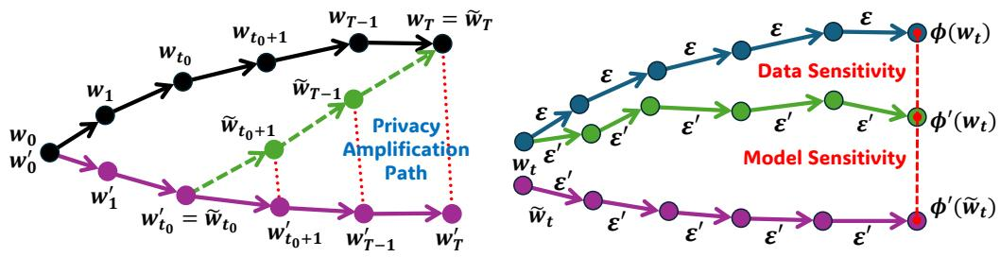
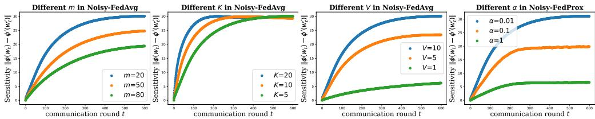
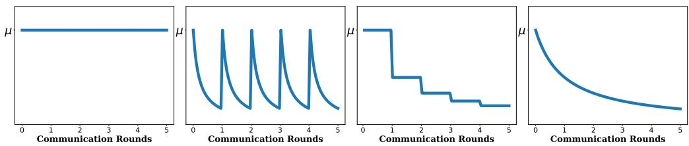

# Convergent Differential Privacy Analysis for General Federated Learning

Anonymous Author(s)   
Affiliation   
Address   
email

# Abstract

The powerful cooperation of federated learning (FL) and differential privacy (DP)   
provides a promising paradigm for the large-scale private clients. However, existing   
analyses in FL-DP mostly rely on the composition theorem and cannot tightly quan  
tify the privacy leakage challenges, which is tight for a few communication rounds   
but yields an arbitrarily loose and divergent bound eventually. This also implies   
a counterintuitive judgment, suggesting that FL-DP may not provide adequate   
privacy support during long-term training under constant-level noisy perturbations,   
yielding discrepancy between the theoretical and experimental results. To further   
investigate the convergent privacy and reliability of the FL-DP framework, in this   
paper, we comprehensively evaluate the worst privacy of two classical methods   
under the non-convex and smooth objectives based on the $f$ -DP analysis. With   
the aid of the shifted interpolation technique, we successfully prove that privacy in   
Noisy-FedAvg has a tight convergent bound. Moreover, with the regularization   
of the proxy term, privacy in Noisy-FedProx has a stable constant lower bound.   
Our analysis further demonstrates a solid theoretical foundation for the reliability   
of privacy in FL-DP. Meanwhile, our conclusions can also be losslessly converted   
to other classical DP analytical frameworks, e.g. $( \epsilon , \delta )$ -DP and R´enyi-DP (RDP),   
to provide more fine-grained understandings for the FL-DP frameworks.

# 19 1 Introduction

Since McMahan et al. [2017] proposes the FedAvg method as a general FL framework, it has been   
widely developed into a collaborative training standard with privacy protection attributes, which   
successfully avoids direct leakage of sensitive data. As research on privacy progresses, researchers   
have found that standard FL frameworks still face a threat from indirect leakage. Attackers can   
potentially recover local private data through reverse inference by persistently stealing model states   
via model (gradient) inversion attacks [Geiping et al., 2020] or distinguish whether individuals are   
involved in the training via membership inference attacks [Nasr et al., 2019]. To further strengthen   
the reliability of FL, DP [Dwork, 2006, Dwork et al., 2014, Abadi et al., 2016] has naturally been   
incorporated into the FL framework, yielding FL-DP [Wei et al., 2020]. As a primary technique, the   
noisy perturbation is widely applied in various advanced FL methods to further enhance its security.   
However, the theoretical analysis of the FL-DP framework, especially in evaluating the privacy   
levels, is currently unable to provide a comprehensive understanding of its proper application. Most   
of the previous works are built upon the foundational lemma of privacy amplification by iteration,   
directly resulting in divergent privacy bound as the training communication round $T$ becomes large.   
This implies an inference that contradicts intuition and empirical studies, which is, that the FL-DP   
framework may completely lose its privacy protection attributes as $T \to \infty$ . Such a conclusion is   
almost unacceptable for FL-DP. Therefore, establishing a precise and tight analysis is a crucial target.   
Notably, significant progress has been made in characterizing convergent privacy in the noisy gradient   
descent method in RDP analysis [Chourasia et al., 2021, Ye and Shokri, 2022, Altschuler and Talwar,   
, Altschuler et al., 2024]. However, due to the challenges and intricacies of the analytical   
techniques adopted, similar results have not yet successfully been extended to the FL-DP. The multi  
step local updates on heterogeneous datasets lead to biased local models, posing significant obstacles   
to the analysis. Recently, analyses based on $f$ -DP [Dong et al., 2022] have brought a promising   
resolution to this challenge. This information-theoretically lossless definition naturally evaluates   
privacy by the Type I / II error trade-off curve of the hypothesis testing problem about whether a   
given individual is in the training dataset. Combined with shifted interpolation techniques [Bok et al.,   
2024], it successfully recovers tighter convergent privacy for strongly convex and convex objectives   
in noisy gradient descent methods. This may make it possible to quantify convergent privacy in   
FL-DP and may offer novel understandings about impacts of some key hyperparameters.   
In this paper, we investigate the privacy of two classic DP-FL methods, i.e. Noisy-FedAvg and   
Noisy-FedProx and successfully evaluate their worst privacy in the $f$ -DP analysis, as shown in   
Table 1. For the Noisy-FedAvg method, we investigate four typical learning rate decay strategies   
and provide the coefficients corresponding to each case to ensure a tighter privacy lower bound. We   
also prove that its iterative privacy on non-convex and smooth objectives could not diverge w.r.t.   
the number of communication rounds $T$ , i.e., a convergent privacy. To the best of our knowledge,   
this contributes the first convergent privacy analysis in FL-DP methods for non-convex functions.   
Furthermore, by exploring the decay properties of the proximal term in Noisy-FedProx, we prove   
that its worst privacy can converge to a general constant lower bound. Our analysis successfully   
challenges the long-standing belief that privacy budgets of FL-DP have to increase as training   
processes and provides reliable guarantees for its privacy protection ability. At the same time, the   
exploration from the proximal term provides a promising solution, suggesting that a well-designed   
local regularization term can achieve a win-win solution for both optimization and privacy in FL-DP.

Table 1: The worst privacy of the Noisy-FedAvg and Noisy-FedProx methods in our analysis. $V$ is the norm of clip gradient. $K , T$ are local training interval and communication round. $\sigma$ is the variance of the noise. The trade-off function $T _ { G } ( \cdot ) \ ^ { [ a ] }$ is defined in Definition 4. $\mu$ , $c$ and $z$ are constants.   

<table><tr><td colspan="2">Lr[6]</td><td colspan="2">Worst Privacy</td><td>Convergent? onT→8</td><td>Convergent? on K→8</td></tr><tr><td rowspan="3">Noisy FedAvg</td><td>C TG</td><td>2uVK （1+μL）K+1 mg (1+μL）K -1</td><td>（1+μL）KT-1 (1+μL)KT+1</td><td rowspan="3">&lt;</td><td rowspan="3">×</td></tr><tr><td>CD TG</td><td>2cVIn(K+1) √mo</td><td>(1+K)cμL+1 (1+K)cμLT-1 (1+K)cμL-1 (1+K)cμLT+1</td></tr><tr><td>SD</td><td>TG 2μVK mg</td><td>/2-)</td></tr><tr><td>Noisy FedProx</td><td>ID TG</td><td>TG 2zV mg 2a-L 2V</td><td>2 -1) T-（a-L）T</td><td>←</td><td>?</td></tr></table>

[a] For the trade-off function $T _ { G } ( s )$ , smaller $s$ means stronger privacy. [b] Learning rate decaying policy. C: constant learning rate; CD: cyclically decaying; SD: stage-wise decaying; ID: iteratively decaying. More details are stated in Theorem 3 4.

# 62 2 Related Work

Federated Learning. FL is a classic learning paradigm that protects local privacy. Since McMahan et al. [2017] proposes the basic framework, it has been widely studied in several communities. As its foundational study, the local-SGD [Stich, 2019, Lin et al., 2019, Woodworth et al., 2020, Gorbunov et al., 2021] method fully demonstrates the efficiency of local training. Based on this, FL further considers the impacts of heterogeneous private datasets and communication bottlenecks [Wang et al., 2020, Chen et al., 2021, Kairouz et al., 2021]. To address these two basic issues, a series of studies have explored these processes from different perspectives. One approach involves proposing better

optimization algorithms by defining concepts such as client drift [Karimireddy et al., 2020] and   
heterogeneity similarity [Mendieta et al., 2022], specifically targeting and resolving the additional   
error terms they cause. This mainly includes the natural application and expansion of variance  
reduction optimizers [Jhunjhunwala et al., 2022, Malinovsky et al., 2022, Li et al., 2023], the flexible   
implementation of the advanced primal-dual methods [Zhang et al., 2021c, Wang et al., 2022, Sun   
et al., 2023b, Mishchenko et al., 2022, Grudzien et al.´ , 2023, Acar et al., Sun et al., 2023a], and the   
additional deployment of the momentum-based correction [Liu et al., 2020, Khanduri et al., 2021,   
Das et al., 2022, Sun et al., 2023c, 2024]. Upgraded optimizers allow the aggregation frequency   
to largely decrease while maintaining convergence. Another approach primarily focuses on sparse   
training and quantization to reduce communication bits [Reisizadeh et al., 2020, Shlezinger et al.,   
2020, Dai et al., 2022]. Additionally, research based on data domain and feature domain has also   
made significant contributions to the FL community [Yao et al., 2019, Zhang et al., 2021a, Xu et al.].

FL-DP. DP is a natural privacy-preserving framework with theoretical foundations [Dwork et al., 2006b,a, Dwork, 2006]. As one of the main algorithms for differential privacy, noise perturbation has achieved great success in deep learning [Abadi et al., 2016, Zhao et al., 2019, Arachchige et al., 2019, Wu et al., 2020]. Combining this, FL-DP adds noise before transmitting their variables, i.e. client-level noises [Geyer et al., 2017] and server-level noises [Wei et al., 2020]. Since there is no fundamental difference between the analysis of them, in this paper, we mainly consider client-level noises. One major research direction involves conducting noise testing on widely developed federated optimization algorithms [Zhu et al., 2021, Noble et al., 2022, Lowy et al., 2023, Zhang and Tang, 2022, Yang and Wu, 2023], and evaluating the performance of different methods under DP noises through convergence analysis and privacy analysis. Another research direction involves injecting noise into real-world systems to address practical challenges, which primarily focuses on personalized scenarios [Hu et al., 2020, Yang et al., 2021, 2023, Wei et al., 2023], decentralized scenarios [Wittkopp and Acker, 2020, Chen et al., 2022, Gao et al., 2023, Shi et al., 2023], and adaptive or asymmetric update scenarios [Girgis et al., 2021, Wu et al., 2022, He et al., 2023]. FL-DP has been extensively tested across various scales of tasks and has successfully validated its robust local privacy protection capabilities. At the same time, the theoretical analysis of FL-DP has been progressing systematically and in tandem. Based on various DP relaxations, they provide a comparison of privacy performance by analyzing concepts such as privacy budgets, and further understand the specific attributes of privacy algorithms [Rodríguez-Barroso et al., 2020, Wei et al., 2021, Kim et al., 2021, Zheng et al., 2021, Ling et al., 2024, Jiao et al., 2024]. Theoretical advancements in DP have revolutionized how we could quantify and safeguard privacy, offering unprecedented precision and robustness.

# 3 Preliminaries

Notations. In the subsequent content, we use italics for scalars and denote the integer set from 1 to $a$ by $[ a ]$ . All sequences of variables are represented in subscript, e.g. $w _ { i , k , t }$ . For arithmetic operators, unless specifically stated otherwise, the calculations are performed element-wise. Other symbols used in this paper will be explicitly defined when they are first introduced.

# 3.1 General FL-DP framework

We consider the general finite-sum minimization problem in the classical federated learning:

$$
w ^ { \star } \in \arg \operatorname* { m i n } _ { w } f ( w ) \triangleq \frac { 1 } { m } \sum _ { i \in \mathcal { I } } f _ { i } ( w ) ,
$$

where $f _ { i } ( w ) = \mathbb { E } _ { \varepsilon \sim \mathcal { D } _ { i } } \left[ f _ { i } ( w , \varepsilon ) \right]$ denotes the local population risk. $w \in \mathbb { R } ^ { d }$ denotes $d$ -dim learnable   
parameters. $\varepsilon \sim D _ { i }$ denotes that the private dataset on client $i$ is sampled from distribution $\mathcal { D } _ { i }$ . We   
consider the general heterogeneity, i.e. $\mathcal { D } _ { i }$ can differ from $\mathcal { D } _ { j }$ if $i \neq j$ , leading to $f _ { i } ( w ) \neq f _ { j } ( w )$ .   
In our analysis, we consider the FL-DP framework with the classical client-level Gaussian noises.   
The FL training process remains consistent with standard training procedures. The local clients   
enhance local privacy by adding isotropic Gaussian noises to the uploaded model parameters, i.e.   
$\boldsymbol { n } _ { i } \sim \mathcal { N } ( \boldsymbol { 0 } , \sigma ^ { 2 } \boldsymbol { \hat { I } } _ { d } )$ . Then the global server aggregates the noisy parameters as the global model $w _ { t + 1 }$   
Due to the page limitation, details of the algorithmic implementation are deferred to the Appendix A.

Noisy-FedAvg: we consider that each local client performs a fundamental gradient descent as follows:

$$
w _ { i , k + 1 , t } = w _ { i , k , t } - \eta _ { k , t } g _ { i , k , t } ,
$$

where 119 $\begin{array} { r } { g _ { i , k , t } = \nabla f _ { i } ( w _ { i , k , t } , \varepsilon ) / \operatorname* { m a x } \{ 1 , \frac { \| \nabla f _ { i } ( w _ { i , k , t } , \varepsilon ) \| } { V } \} , } \end{array}$ , and $V$ is a constant coefficient.

Noisy-FedProx: The vanilla local training in FedProx is based on solving the following surrogate:

$$
\operatorname* { m i n } _ { w } f _ { i } ( w ) + \frac { \alpha } { 2 } \| w - w _ { t } \| ^ { 2 } .
$$

To generally compare with Noisy-FedAvg, we consider an iterative form of gradient descent as:

$$
w _ { i , k + 1 , t } = w _ { i , k , t } - \eta _ { k , t } \left[ g _ { i , k , t } + \alpha ( w _ { i , k , t } - w _ { t } ) \right] .
$$

# 3.2 DP and $f$ -DP

Definition 1 We denote heterogeneous datasets on the client i by ${ { S } _ { i } } = \left\{ \varepsilon _ { i j } \right\}$ and let the union of all local datasets be ${ \mathcal { C } } = \{ S _ { i } \}$ . We say two unions are adjacent datasets if they only differ by one data sample. For instance, there exists the union $\mathcal { C } ^ { \prime } = \{ \boldsymbol { S } _ { i } ^ { \prime } \}$ . $( { \mathcal { C } } , { \mathcal { C } } ^ { \prime } )$ are adjacent datasets if there exists the index pair $( i ^ { \star } , j ^ { \star } )$ such that all other data samples are the same except for $\varepsilon _ { i ^ { \star } j ^ { \star } } \neq \varepsilon _ { i ^ { \star } j ^ { \star } } ^ { \prime }$ .

Definition 2 A randomized mechanism $\mathcal { M }$ is $( \epsilon , \delta )$ -DP if for any event $E$ the following satisfies:

$$
P ( \mathcal { M } ( \mathcal { C } ) \in E ) \leq e ^ { \epsilon } P ( \mathcal { M } ( \mathcal { C } ^ { \prime } ) \in E ) + \delta .
$$

Definition 2 is the widely used $( \epsilon , \delta )$ -DP, which is a lossy relaxation in the DP analysis since its   
probabilistic gaps. To bridge the discrepancy of precise DP definitions, statistic analysis demonstrates   
that DP could be naturally deduced by hypothesis-testing problems [Wasserman and Zhou, 2010,   
Kairouz et al., 2015]. From the perspective of attackers, DP means the difficulty in distinguishing $\mathcal { C }$   
and $\scriptstyle { \mathcal { C } } ^ { \prime }$ under the mechanism $\mathcal { M }$ . They can generally consider the following problem:

Given $\mathcal { M }$ , is the underlying union $\begin{array} { r l r } { \mathcal { C } \left( H _ { 0 } \right) o r \mathcal { C } ^ { \prime } \left( H _ { 1 } \right) } & { { } } & { } \end{array}$ ?

To exactly quantify the difficulty of its answer, Dong et al. [2022] propose that distinguishing these   
two hypotheses could be best delineated by the optimal trade-off between the possible type I and type   
136 II errors. Specifically, by considering rejection rules $0 \leq \chi \leq 1$ , type I and type $\mathrm { I I }$ errors can be:

$$
E _ { I } = \mathbb { E } _ { \mathcal { M } ( \mathcal { C } ) } \left[ \chi \right] , \qquad E _ { I I } = 1 - \mathbb { E } _ { \mathcal { M } ( \mathcal { C } ^ { \prime } ) } \left[ \chi \right] ,
$$

37 Here, we abuse ${ \mathcal { M } } ( { \mathcal { C } } )$ to represent its probability distribution. To measure the fine-grained relation  
8 ships between these two testing errors, $f$ -DP is introduced.   
Definition 3 (Trade-off function) For any two probability distributions $P$ and $Q$ , the trade-off   
function is defined as: $T ( P ; Q ) ( \gamma ) = \operatorname* { i n f } \left\{ 1 - \mathbb { E } _ { Q } \left[ \chi \right] | \mathbb { E } _ { P } \left[ \chi \right] \leq \gamma \right\}$ , where the infimum is taken   
over all measurable rejection rules.   
$T ( P ; Q ) ( \gamma )$ is convex, continuous, and non-increasing. For any possible rejection rules, it satisfies   
$T ( P ; Q ) ( \gamma ) \leq 1 - \gamma$ . It functions as the clear boundary between the achievable and unachievable   
selections of type I and type $\mathrm { I I }$ errors, essentially distinguishing the difficulties between these two   
hypotheses. This relevant statistical property provides a stricter definition of privacy, which mitigates   
the excessive relaxation of privacy based on composition analysis in existing approaches.   
Definition 4 ( $f$ -DP and GDP) A mechanism $\mathcal { M }$ is $f$ -DP if $T ( \mathcal { M } ( \mathcal { C } ) , \mathcal { M } ( \mathcal { C } ^ { \prime } ) ) ( \gamma ) \geq f ( \gamma )$ for all   
possible adjacent datasets $\mathcal { C }$ and $\mathcal { C } ^ { \prime }$ . When $f$ measures two Gaussian distributions, namely Gaussian  
$D P \left( G D P \right)$ , denoted as $T _ { G } ( \mu ) ( \gamma ) \triangleq T \left( \mathcal { N } ( 0 , 1 ) , \mathcal { N } ( \mu , 1 ) \right) ( \gamma )$ for $\mu \geq 0$ .

According to the definition, the explicit representation of GDP is 150 $T _ { G } ( \mu ) ( \gamma ) = \Phi ( \Phi ^ { - 1 } ( 1 - \gamma ) - \mu )$ 151 where $\Phi$ denotes the standard Gaussian CDF. Any single sampling mechanism that introduces Gaus152 sian noises can be considered as an exact GDP, which monotonically decreases when $\mu$ increases.

# 4 Convergent Privacy

In this section, we primarily demonstrate how to provide the worst privacy in FL-DP and its convergent bound. Generally, we assume that local objectives satisfy smoothness with a constant $L$ ,

Assumption 1 Each local objective function $f _ { i } ( \cdot )$ satisfies $L$ -smoothness, i.e.,

$$
\begin{array} { r } { \| \nabla f _ { i } ( w _ { 1 } ) - \nabla f _ { i } ( w _ { 2 } ) \| \leq L \| w _ { 1 } - w _ { 2 } \| . } \end{array}
$$

  
Figure 1: Left: The global privacy amplification path induced by the shifted interpolation sequence. Right: Estimation of the global sensitivity under local updates via an auxiliary sequence.

# 157 4.1 Shifted Interpolation

To simplify presentations, we denote global updates at round 58 $t$ on the adjacent datasets $\mathcal { C }$ and $\mathcal { C } ^ { \prime }$ as:

$$
\mathcal { C } : w _ { t + 1 } = \phi ( w _ { t } ) + \overline { { n } } _ { t } , \quad \mathcal { C } ^ { \prime } : w _ { t + 1 } ^ { \prime } = \phi ^ { \prime } ( w _ { t } ^ { \prime } ) + \overline { { n } } _ { t } ^ { \prime } .
$$

$\phi ( w _ { t } )$ denotes the accumulation of total $K$ steps from the initialization state $w _ { i , 0 , t } = w _ { t }$ at round $t$ .   
$\overline { { n } } _ { t }$ could be considered as the averaged noise, i.e. $\overline { { n } } _ { t } \sim \mathcal { N } ( 0 , \sigma ^ { 2 } I _ { d } / m )$ . Traditional methods require   
performing privacy amplification $T$ times based on the relationship between $w$ and $w ^ { \prime }$ , yielding   
non-convergent privacy as $T$ . To avoid loose privacy amplification, we follow Bok et al. [2024] to   
adopt the shifted interpolation technique. Specifically, we define the following sequence:

$$
\widetilde { w } _ { t + 1 } = \lambda _ { t + 1 } \phi ( w _ { t } ) + ( 1 - \lambda _ { t + 1 } ) \phi ^ { \prime } ( \widetilde { w } _ { t } ) + \overline { { n } } _ { t } ,
$$

where $t = t _ { 0 } , \cdot \cdot \cdot , T - 1$ e. By setting $\lambda _ { T } = 1$ , then $\widetilde { w } _ { T } = w _ { T }$ e, and we add the definition of $\widetilde { w } _ { t _ { 0 } } = w _ { t _ { 0 } } ^ { \prime }$   
as the beginning of interpolations. $0 \leq \lambda _ { t } \leq 1$ e e  are interpolation coefficients to be optimized. As   
shown in Figure 1 (left), the interpolation sequence path enables a privacy amplification analysis   
over $T - t _ { 0 }$ times where $t _ { 0 }$ is an optimizable coefficient. Therefore, we can establish the following   
theorem along this new privacy amplification path.

Theorem 1 Under Assumption $I$ and corresponding updates in Eq.(8), After $T$ training rounds on the adjacent datasets 170 $\mathcal { C }$ and $\scriptstyle { \mathcal { C } } ^ { \prime }$ , we can bound the trade-off function between $w _ { T }$ and $w _ { T } ^ { \prime }$ as:

$$
T ( w _ { T } ; w _ { T } ^ { \prime } ) = T ( \widetilde { w } _ { T } ; w _ { T } ^ { \prime } ) \geq T _ { G } \left( \frac { \sqrt { m } } { \sigma } \sqrt { \sum _ { t = t _ { 0 } } ^ { T - 1 } \lambda _ { t + 1 } ^ { 2 } \| \phi ( w _ { t } ) - \phi ^ { \prime } ( \widetilde { w } _ { t } ) \| ^ { 2 } } \right) .
$$

In addition to the influence of standard parameters, Theorem 1 highlights the critical relationship   
between the privacy lower bound and the weighted sum of global sensitivity terms from $t _ { 0 }$ to $T$   
Therefore, we then analyze the global sensitivity term $\| \phi ( w _ { t } ) - \phi ^ { \prime } ( \widetilde { w } _ { t } ) \|$ .

# 174 4.2 Global Sensitivity

The sensitivity term $\lVert \phi ( w _ { t } ) - \phi ^ { \prime } ( \widetilde { w } _ { t } ) \rVert ^ { 2 }$ means the stability gaps between $w _ { t }$ and $\widetilde { w } _ { t }$ after performing   
local training on datasets $\mathcal { C }$ and $\scriptstyle { \mathcal { C } } ^ { \prime }$ erespectively. It is influenced by both the model parameters and   
the data samples, making the analysis extremely challenging. To achieve a fine-grained analysis, we   
propose an auxiliary sequence $\phi ^ { \prime } ( w _ { t } )$ . As shown in Figure 1 (right), the global sensitivity can be split   
into data sensitivity and model sensitivity. The data sensitivity measures the estimable errors obtained   
after training on different datasets for several steps from the same initialization. This discrepancy is   
solely caused by the data. The model sensitivity measures the estimable errors of the updates when   
two different initialized states are trained on the same dataset. Clearly, this discrepancy is directly   
183 related to the degree of similarity between the two initializations. Thus, we have:   
4 Theorem 2 Under $K$ local updates by Eq.(2) and Eq.(4), the global sensitivity in Noisy-FedAvg   
and Noisy-FedProx methods can be shown as:

$$
\begin{array} { r } { \| \phi ( w _ { t } ) - \phi ^ { \prime } ( \widetilde { w } _ { t } ) \| \le \ \underbrace { \rho _ { t } \| w _ { t } - \widetilde { w } _ { t } \| } _ { \mathrm { ~ } \forall t } + \qquad \underbrace { \gamma _ { t } } _ { \mathrm { ~ } \forall t } \qquad , } \end{array}
$$

where $\rho _ { t }$ and $\gamma _ { t }$ are shown in Table 2.

Table 2: Specific formulation of $\rho _ { t }$ and $\gamma _ { t }$ in Theorem 2.   

<table><tr><td colspan="2">Learning rate</td><td>pt</td><td>2t</td></tr><tr><td rowspan="4">Noisy-FedAvg</td><td>μ</td><td>(1+μL）K</td><td>2VK m</td></tr><tr><td>茶</td><td>(1 + K)cμL</td><td>2cV ln(K+1) m</td></tr><tr><td>上 t+1</td><td>(1 K 1+ 作 t+1</td><td>2μVK mt+1</td></tr><tr><td>μ tK+k+1</td><td>（t+2） zμL t+1</td><td>2zV ln （t+2） m </td></tr><tr><td>Noisy-FedProx non-increase</td><td></td><td>α a-L</td><td>2V ma</td></tr></table>

Remark 2.1 The result in Eq. $( I I )$ aligns with the intuition of designing the splitting operators. It can   
be observed that the coefficient $\rho _ { t }$ is consistently greater than 1, which is a typical characteristic of   
non-convexity. It also implies that the sensitivity upper bound tends to diverge as $t \to \infty$ . However, in   
Eq.(10), the parameters $0 \leq \lambda _ { t } \leq 1$ can efficiently scale the sensitivity terms. By carefully selecting   
the optimal $\lambda _ { t }$ values, it can ultimately achieve a convergent privacy lower bound.

# 192 4.3 Minimization Problem on $t _ { 0 }$ and Its Relaxation

According to Eq.(10) and the sensitivity bound in Eq.(11), we denote the weighted accumulation of   
the sensitivity term as $\mathcal { H } ( \lambda _ { t } , t _ { 0 } )$ , where $\lambda _ { t }$ and $t _ { 0 }$ are both to-be-optimized parameters. Therefore,   
we can provide the tight bound of the privacy by solving the minimization of the following problem:

$$
\mathcal { H } _ { \star } = \operatorname* { m i n } _ { \lambda _ { t } , t _ { 0 } } \mathcal { H } ( \lambda _ { t } , t _ { 0 } ) \triangleq \sum _ { t = t _ { 0 } } ^ { T - 1 } \lambda _ { t + 1 } ^ { 2 } \left( \rho _ { t } \| w _ { t } - \widetilde { w } _ { t } \| + \gamma _ { t } \right) ^ { 2 } .
$$

If $t _ { 0 }$ is very small, it means that the introduced stability gap will also be very small. However,   
consequently, the sensitivity terms will extremely increase due to the accumulation over $T - t _ { 0 }$ rounds.   
Conversely, although the accumulated error is small, it remains divergent due to the unbounded global   
sensitivity term. To avoid this uncertain analysis, we have to make a compromise. Because $t _ { 0 }$ is an   
integer belonging to $[ 0 , T - 1 ]$ , its optimal selection certainly exists when $T$ is given. Therefore, we   
consider a relaxed and simple problem instead, i.e. under $t _ { 0 } = 0$ ,

$$
\mathcal { H } _ { 0 } = \operatorname* { m i n } _ { \lambda _ { t } } \mathcal { H } ( \lambda _ { t } , 0 ) = \sum _ { t = 0 } ^ { T - 1 } \lambda _ { t + 1 } ^ { 2 } \left( \rho _ { t } \| w _ { t } - \widetilde { w } _ { t } \| + \gamma _ { t } \right) ^ { 2 } .
$$

Its advantage lies in the fact that when $t _ { 0 } = 0$ , the sensitivity error is 0, avoiding its divergence.   
Compared to the optimal solution $\mathcal { H } _ { \star }$ , it satisfies $\mathcal { H } _ { 0 } \geq \mathcal { H } _ { \star }$ . More importantly, the solution of $\mathcal { H } _ { 0 }$   
eliminates the influence of $t _ { 0 }$ , allowing us to obtain an effective solution to the minimization problem   
by directly minimizing the $\lambda _ { t }$ terms. The lower bound in Theorem 1 will be replaced by:

$$
T ( w _ { T } ; w _ { T } ^ { \prime } ) \geq T _ { G } \left( \frac { \sqrt { m \mathcal { H } _ { \star } } } { \sigma } \right) \geq T _ { G } \left( \frac { \sqrt { m \mathcal { H } _ { 0 } } } { \sigma } \right) .
$$

Although this is a relaxation of the privacy lower bound, our subsequent proof confirms that $\mathcal { H } _ { 0 }$ can still achieve convergent into a constant form, which means local privacy can still achieve convergence.

# 4.4 Convergent Privacy

In this part, we demonstrate our convergent privacy analysis. By solving Eq.(13) under corresponding $\rho _ { t }$ and $\gamma _ { t }$ , we provide the worst privacy for the Noisy-FedAvg and Noisy-FedProx methods.

Theorem 3 Let $f _ { i } ( w )$ be a $L$ -smooth and non-convex local objective and local updates be performed as shown in Eq.(2). Under perturbations of isotropic noises $n _ { i } \sim \mathcal N \left( 0 , \sigma ^ { 2 } I _ { d } \right)$ , the worst privacy of the Noisy-FedAvg method achieves:

214 (a) under constant learning rates $\eta _ { k , t } = \mu$ :

$$
T ( w _ { T } ; w _ { T } ^ { \prime } ) \geq T _ { G } \left( \frac { 2 \mu V K } { \sqrt { m } \sigma } \sqrt { \frac { ( 1 + \mu L ) ^ { K } + 1 } { ( 1 + \mu L ) ^ { K } - 1 } \frac { ( 1 + \mu L ) ^ { K T } - 1 } { ( 1 + \mu L ) ^ { K T } + 1 } } \right) .
$$

$$
T ( w _ { T } ; w _ { T } ^ { \prime } ) \geq T _ { G } \left( \frac { 2 c V \ln ( K + 1 ) } { \sqrt { m } \sigma } \sqrt { \frac { ( 1 + K ) ^ { c \mu L } + 1 } { ( 1 + K ) ^ { c \mu L } - 1 } \frac { ( 1 + K ) ^ { c \mu L T } - 1 } { ( 1 + K ) ^ { c \mu L T } + 1 } } \right) .
$$

(c) under stage-wise decaying 216 $\begin{array} { r } { \eta _ { k , t } = \frac { \mu } { t + 1 } } \end{array}$ t +1 :

$$
T ( w _ { T } ; w _ { T } ^ { \prime } ) > T _ { G } \left( \frac { 2 \mu V K } { \sqrt { m } \sigma } \sqrt { 2 - \frac { 1 } { T } } \right) .
$$

(d) under continuously decaying ηk,t = µtK+k+1217 :

$$
T ( w _ { T } ; w _ { T } ^ { \prime } ) > T _ { G } \left( \frac { 2 z V } { \sqrt { m } \sigma } \sqrt { 2 - \frac { 1 } { T } } \right) .
$$

Remark 3.1 Theorem 3 provides the worst-case privacy analysis for the Noisy-FedAvg method. Its privacy is primarily affected by the clipping norm $V$ , the local interval $K$ , the scale $m _ { \ast }$ , and the noise intensity $\sigma$ . $A$ larger gradient clipping norm $V$ always results in larger gaps. The local interval $K$ determines the sensitivity of the entire local process, which is primarily influenced by the learning rate strategy. m in our proof represents the client scale; in fact, the number of data samples is also proportional to $m$ . An increased $m$ will largely reduce the sensitivity, yielding improvements in privacy. The impact of noise intensity $\sigma$ is also very intuitive. Infinite noise can provide perfect privacy, while zero noise offers no privacy. Constant-level noise can still achieve convergent privacy.

Theorem 4 Let $f _ { i } ( w )$ be a $L$ -smooth and non-convex local objective and local updates be performed as shown in Eq.(4). Let the proximal coefficient $\alpha > L$ and $\begin{array} { r } { \eta \textless \frac { 1 } { \alpha - L } } \end{array}$ , under perturbations of isotropic noises $n _ { i } \sim \mathcal N \left( 0 , \sigma ^ { 2 } I _ { d } \right)$ , the worst privacy of the Noisy-FedProx method achieves:

$$
T ( w _ { T } ; w _ { T } ^ { \prime } ) \geq T _ { G } \left( \frac { 2 V } { \sqrt { m } \alpha \sigma } \sqrt { \frac { 2 \alpha - L } { L } } \left( 1 - \frac { 2 } { \left( \frac { \alpha } { \alpha - L } \right) ^ { T } + 1 } \right) \right) ,
$$

29 Remark 4.1 Aside from the influence of standard coefficients, due to the correction of the regulariza  
30 tion term, its privacy is no longer affected by the local interval $K$ , even with a constant learning rate,   
1 which becomes a significant advantage of the Noisy-FedProx method. Specifically, when $\alpha > L$ ,   
increasing $\alpha$ significantly improves the worst privacy, which achieves $\begin{array} { r } { \mathcal { O } \left( \frac { V } { \sigma \sqrt { m \alpha L } } \right) } \end{array}$ distinguishability   
in GDP. Therefore, the selection of α is a delicate trade-off between optimization and privacy. By   
selecting a proper $\alpha > L ,$ , it enables a win-win outcome for both optimization and privacy.   
Theoretical comparisons. Table 3 demonstrates the comparison between existing theoretical results   
and ours of the Noisy-FedAvg method. Existing analyses are mostly based on the DP relaxations of   
$( \epsilon , \delta )$ -DP and RDP [Mironov, 2017]. Apart from the lossiness in their DP definition, an important   
weakness is that privacy amplification on composition is entirely loose. For instance, the general   
amplification in $( \epsilon , \delta )$ -DP indicates, the composition of an $( \epsilon _ { 1 } , \bar { \delta _ { 1 } } )$ -DP and an $( \epsilon _ { 2 } , \delta _ { 2 } )$ -DP leads to   
240 an $( \epsilon _ { 1 } + \epsilon _ { 2 } , \delta _ { 1 } + \delta _ { 2 } )$ -DP. Similarly, the composition of a $( \zeta , \epsilon _ { 1 } )$ -RDP and a $( \zeta , \epsilon _ { 2 } )$ -RDP results in a   
41 $( \zeta , \epsilon _ { 1 } + \epsilon _ { 2 } )$ -RDP. This simple parameter addition mechanism directly leads to a linear amplification   
of the privacy budget. Therefore, in previous works, when achieving specific DP guarantees, it is   
often required that the noise intensity $\sigma ^ { 2 }$ is proportional to the communication rounds $T$ (or $T K ,$ ).   
Wei et al. [2020] prove a double-noisy single-step local training on both client and server sides is   
possible to achieve the privacy amplification of $\scriptstyle { \dot { \mathcal { O } } } ( T ^ { 2 } )$ rate. Shi et al. [2021] further consider the   
local intervals $K$ . Zhang et al. [2021b] and Noble et al. [2022] elevate the theoretical results to   
$\mathcal { O } \left( T K \right)$ . Subsequent research further indicates that the impact of the interval $K$ can be eliminated to   
achieve $\mathcal { O } \left( T \right)$ rate via sparsified perturbation [Hu et al., 2023, Cheng et al., 2022], and algorithmic   
improvements [Fukami et al., 2024]. However, these conclusions all indicate that the condition for   
achieving constant privacy guarantees is to continually increase the noise intensity. Bastianello et al.   
251 [2024] provide constant privacy under $\beta$ -strongly convex objectives.

Table 3: Comparisons with the existing theoretical results in FL-DP. We losslessly transfer our results into $( \epsilon , \delta )$ -DP and RDP results. In $( \epsilon , \delta )$ -DP, we compare the requirement of noise variance corresponding to achieving $( \epsilon , \delta )$ -DP. In $( \zeta , \epsilon )$ -RDP, we directly compare the privacy budget term $\delta ( \zeta )$ . We mainly focus on the privacy changes on $T$ and $K$ . $\Omega ( \cdot ) , \mathcal { O } ( \cdot )$ , and $o \bar { ( \cdot ) }$ correspond to the lower, upper bound, and not tight upper bound of the complexity, respectively.   

<table><tr><td></td><td colspan="2">(∈,δ)-DP</td><td>(S,∈)-RDP</td><td>when T,K →</td></tr><tr><td>Wei et al. [2020]</td><td colspan="2">0 =0(VT² -mL2)</td><td></td><td rowspan="7">g→8o non-convex</td></tr><tr><td>Shi et al. [2021]</td><td>=0(vVrVR） E</td><td></td><td></td></tr><tr><td>Zhang et al. [2021b]</td><td>g=0（ em</td><td>（v√（√T+mK）</td><td></td></tr><tr><td>Noble et al. [2022]</td><td>g=Ω( √m</td><td>（v√（） √TK</td><td></td></tr><tr><td>Cheng et al. [2022]</td><td>=（ E</td><td>√T)</td><td></td></tr><tr><td>Zhang and Tang [2022]</td><td colspan="2"></td><td>(=Ω(TK)</td></tr><tr><td>Hu et al. [2023]</td><td>=(vV/） E</td><td></td><td></td></tr><tr><td>Fukami et al. [2024]</td><td>g=Ω</td><td>(v(+vFgc+） √T E</td><td></td></tr><tr><td>Bastianello et al. [2024]</td><td></td><td></td><td>∈=0(s²(1-e-BT)) β-strongly convex</td></tr><tr><td>Ours (Noisy-FedAvg)</td><td>V√(Φ-1(）²+4∈ σ=0 e√m</td><td>2-）</td><td>=(（2-）） convergent on</td></tr></table>

# 252 5 Empirical Validation

Setups. We conduct experiments on MNIST [LeCun et al., 1998] and CIFAR-10 [Krizhevsky et al., 2009] with the LeNet-5 [LeCun et al., 1998] and ResNet-18 [He et al., 2016] models. We follow the widely used standard federated learning experimental setups to introduce heterogeneity by the Dirichlet splitting. The heterogeneity level is set high (Dir-0.1 splitting).

Accuracy. Table 4 shows the comparison on Noisy-FedAvg. Our theory precisely addresses this misconception and rigorously provides its privacy protection performance. It can be observed that as the number of clients increases, the impact of noise gradually diminishes. We have previously explained this principle: for the globally averaged model, the more noise involved in the averaging process, the closer it gets to the noise mean, which is akin to the situation without noise interference. When we adjust the intensity from $\sigma = 1 0 ^ { - 3 }$ to $1 0 ^ { - 1 }$ , the accuracy decreases by $5 . 5 7 \%$ and $1 . 6 2 \%$ on $m = 2 0$ and 100 respectively on the MNIST and $1 4 . 1 9 \%$ and $i 1 \%$ on the CIFAR-10. The local interval $K$ does not significantly affect noise, and the accuracy drops consistently. $K$ primarily affects global sensitivity and higher aggregation frequency usually means better performance.

Sensitivity in Noisy-FedAvg. We mainly study the impact from the scale $m$ , local interval $K$ , and clipping norm $V$ , as shown in Fig. 2. The first figure clearly demonstrates the impact of the scale $m$ on sensitivity, which corresponds to the worst privacy bound $\begin{array} { r l } { \mathcal { O } \left( \frac { 1 } { \sqrt { m } } \right) } \end{array}$ . More clients generally imply stronger global privacy. The second figure shows evident that although increasing $K$ can raise the sensitivity during the process, it does not alter the upper bound of sensitivity after optimization converges. This is entirely consistent with our analysis, indicating that the privacy lower bound exists and is unaffected by $T$ and $K$ . The third figure indicates that the sensitivity will be affected by the $V$ , which corresponds to the worst privacy bound $\mathcal { O } \left( V \right)$ .

Table 4: Comparison of the accuracy under different experimental settings. We select the scale $m$ from [50, 100]. Each client holds 600 heterogeneous data samples of MNIST or 500 heterogeneous data samples of CIFAR-10. For each scale, we test two settings of the local interval $K = 5 0$ , 100, and 200, respectively. Throughout the entire process, we fix $T K = 3 0 0 0 0$ . “-" means the training loss diverges. Each result is repeated 5 times to compute its mean and variance.   

<table><tr><td rowspan="2"></td><td rowspan="2">Noisy Intensity</td><td colspan="3">m= 50</td><td colspan="3">m=100</td></tr><tr><td>K=50</td><td>K=100</td><td>K=200</td><td>K=50</td><td>K=100</td><td>K=200</td></tr><tr><td rowspan="4">MNIST LeNet-5</td><td>g=1.0</td><td>-</td><td>-</td><td>=</td><td>-</td><td>=</td><td>-</td></tr><tr><td>σ=10-1</td><td>95.40±0.18</td><td>95.42±0.15</td><td>95.21±0.11</td><td>97.32±0.14</td><td>97.50±0.11</td><td>97.42±0.18</td></tr><tr><td>σ=10-2</td><td>98.33±0.12</td><td>98.02±0.15</td><td>97.88±0.12</td><td>98.71±0.10</td><td>97.97±0.08</td><td>97.72±0.12</td></tr><tr><td>σ =10-3</td><td>98.41±0.07</td><td>98.23±0.03</td><td>98.00±0.07</td><td>98.94±0.04</td><td>98.50±0.06</td><td>98.01±0.10</td></tr><tr><td rowspan="4">CIFAR-10 ResNet-18</td><td>σ = 1.0</td><td>=</td><td>=</td><td>-</td><td>-</td><td>-</td><td>-</td></tr><tr><td>g=10-1</td><td>53.76±0.25</td><td>53.38±0.23</td><td>53.49±0.21</td><td>62.02±0.28</td><td>61.33±0.25</td><td>61.11±0.17</td></tr><tr><td>σ=10-2</td><td>70.11±0.22</td><td>69.08±0.12</td><td>66.63±0.16</td><td>74.34±0.29</td><td>72.87±0.19</td><td>70.74±0.15</td></tr><tr><td>σ=10-3</td><td>70.98±0.11</td><td>69.81±0.20</td><td>67.98±0.03</td><td>75.38±0.19</td><td>74.44±0.12</td><td>72.11±0.06</td></tr></table>

  
Figure 2: Sensitivity studies on Noisy-FedAvg and Noisy-FedProx. The general setups are $m = 2 0$ , $K = 5$ , and $V = 1 0$ . In each group, we keep all other parameters fixed to ensure fairness.

74 Sensitivity in Noisy-FedProx. As   
shown in Fig. 2 (the fourth figure),   
the larger $\alpha$ means smaller global sen  
sitivity. This is consistent with our   
analysis, which states that the lower   
279 bound of privacy performance is given   
80 by $\begin{array} { r l } { \mathcal { O } \left( \frac { \mathrm { ~ i ~ } } { \sqrt { \alpha } } \right) } \end{array}$ . When we select $\alpha =$   
81 0, it degrades to the Noisy-FedAvg

Table 5: Performance and sensitivity $( T = 6 0 0 )$   

<table><tr><td></td><td>Accuracy</td><td>Sensitivity</td></tr><tr><td>Noisy-FedAvg</td><td>60.67</td><td>31.33</td></tr><tr><td>Noisy-FedProx α = 0.01</td><td>60.69</td><td>30.97</td></tr><tr><td>Noisy-FedProx α=0.1</td><td>60.94</td><td>18.52</td></tr><tr><td>Noisy-FedProx α =1</td><td>56.33</td><td>6.34</td></tr></table>

method. In fact, based on the comparison, we can see that when $\alpha$ is sufficiently small, i.e. $\alpha = 0 . 0 1$ , its global sensitivity is almost at the same level as Noisy-FedAvg. In Table 5, we present a comparison between them. Although the proximal term provides limited improvement in accuracy, selecting an appropriate $\alpha$ significantly reduces global sensitivity. This implies that the privacy performance of Noisy-FedProx is far superior to that of Noisy-FedAvg. While achieving similar performance, the regularization proxy term can significantly reduce the global sensitivity of the output model, thereby enhancing privacy. This conclusion also demonstrates the superiority on privacy of a series of FL-DP optimization methods based on training with this regularization approach.

# 0 6 Summary

To our best knowledge, this paper is the first work to demonstrate convergent privacy for the general FL-DP paradigms. We comprehensively study and illustrate the fine-grained privacy level for Noisy-FedAvg and Noisy-FedProx methods based on $f$ -DP analysis, an information-theoretic lossless DP definition. Moreover, we conduct comprehensive analysis with existing work on other DP frameworks and highlight the long-term cognitive bias of the privacy lower bound. Our analysis fills the theoretical gap in the convergent privacy of FL-DP while further providing a reliable theoretical guarantee for its privacy protection performance. Moreover, We conduct a series of experiments to verify the boundedness of global sensitivity and its influence on different variables, further validating that our theoretical analysis aligns more closely with practical scenarios.

00 References Martin Abadi, Andy Chu, Ian Goodfellow, H Brendan McMahan, Ilya Mironov, Kunal Talwar, and Li Zhang. Deep learning with differential privacy. In Proceedings of the 2016 ACM SIGSAC conference on computer and communications security, pages 308–318, 2016. Durmus Alp Emre Acar, Yue Zhao, Ramon Matas, Matthew Mattina, Paul Whatmough, and Venkatesh Saligrama. Federated learning based on dynamic regularization. In International Conference on Learning Representations.   
Jason Altschuler and Kunal Talwar. Privacy of noisy stochastic gradient descent: More iterations without more privacy loss. Advances in Neural Information Processing Systems, 35:3788–3800, 2022.   
Jason M Altschuler, Jinho Bok, and Kunal Talwar. On the privacy of noisy stochastic gradient descent for convex optimization. SIAM Journal on Computing, 53(4):969–1001, 2024.   
Pathum Chamikara Mahawaga Arachchige, Peter Bertok, Ibrahim Khalil, Dongxi Liu, Seyit Camtepe, and Mohammed Atiquzzaman. Local differential privacy for deep learning. IEEE Internet of Things Journal, 7 (7):5827–5842, 2019. Nicola Bastianello, Changxin Liu, and Karl H Johansson. Enhancing privacy in federated learning through local training. arXiv preprint arXiv:2403.17572, 2024.   
Jinho Bok, Weijie Su, and Jason M Altschuler. Shifted interpolation for differential privacy. arXiv preprint arXiv:2403.00278, 2024.   
Mingzhe Chen, Nir Shlezinger, H Vincent Poor, Yonina C Eldar, and Shuguang Cui. Communication-efficient federated learning. Proceedings of the National Academy of Sciences, 118(17):e2024789118, 2021. Shuzhen Chen, Dongxiao Yu, Yifei Zou, Jiguo Yu, and Xiuzhen Cheng. Decentralized wireless federated learning with differential privacy. IEEE Transactions on Industrial Informatics, 18(9):6273–6282, 2022. Anda Cheng, Peisong Wang, Xi Sheryl Zhang, and Jian Cheng. Differentially private federated learning with local regularization and sparsification. In Proceedings of the IEEE/CVF conference on computer vision and pattern recognition, pages 10122–10131, 2022. Rishav Chourasia, Jiayuan Ye, and Reza Shokri. Differential privacy dynamics of langevin diffusion and noisy gradient descent. Advances in Neural Information Processing Systems, 34:14771–14781, 2021. Rong Dai, Li Shen, Fengxiang He, Xinmei Tian, and Dacheng Tao. Dispfl: Towards communication-efficient personalized federated learning via decentralized sparse training. In International conference on machine learning, pages 4587–4604. PMLR, 2022. Rudrajit Das, Anish Acharya, Abolfazl Hashemi, Sujay Sanghavi, Inderjit S Dhillon, and Ufuk Topcu. Faster non-convex federated learning via global and local momentum. In Uncertainty in Artificial Intelligence, pages 496–506. PMLR, 2022.   
Jinshuo Dong, Aaron Roth, and Weijie J Su. Gaussian differential privacy. Journal of the Royal Statistical Society: Series B (Statistical Methodology), 84(1):3–37, 2022.   
Cynthia Dwork. Differential privacy. In International colloquium on automata, languages, and programming, pages 1–12. Springer, 2006. Cynthia Dwork, Krishnaram Kenthapadi, Frank McSherry, Ilya Mironov, and Moni Naor. Our data, ourselves: Privacy via distributed noise generation. In Advances in Cryptology-EUROCRYPT 2006: 24th Annual International Conference on the Theory and Applications of Cryptographic Techniques, St. Petersburg, Russia, May 28-June 1, 2006. Proceedings 25, pages 486–503. Springer, 2006a. Cynthia Dwork, Frank McSherry, Kobbi Nissim, and Adam Smith. Calibrating noise to sensitivity in private data analysis. In Theory of Cryptography: Third Theory of Cryptography Conference, TCC 2006, New York, NY, USA, March 4-7, 2006. Proceedings 3, pages 265–284. Springer, 2006b.   
Cynthia Dwork, Aaron Roth, et al. The algorithmic foundations of differential privacy. Foundations and Trends® in Theoretical Computer Science, 9(3–4):211–407, 2014. Cynthia Dwork, Adam Smith, Thomas Steinke, Jonathan Ullman, and Salil Vadhan. Robust traceability from trace amounts. In 2015 IEEE 56th Annual Symposium on Foundations of Computer Science, pages 650–669. IEEE, 2015. Takumi Fukami, Tomoya Murata, Kenta Niwa, and Iifan Tyou. Dp-norm: Differential privacy primal-dual algorithm for decentralized federated learning. IEEE Transactions on Information Forensics and Security, 2024. Yuanyuan Gao, Lei Zhang, Lulu Wang, Kim-Kwang Raymond Choo, and Rui Zhang. Privacy-preserving and reliable decentralized federated learning. IEEE Transactions on Services Computing, 16(4):2879–2891, 2023.   
Jonas Geiping, Hartmut Bauermeister, Hannah Dröge, and Michael Moeller. Inverting gradients-how easy is it to break privacy in federated learning? Advances in neural information processing systems, 33:16937–16947, 2020.   
Robin C Geyer, Tassilo Klein, and Moin Nabi. Differentially private federated learning: A client level perspective. arXiv preprint arXiv:1712.07557, 2017.   
Antonious Girgis, Deepesh Data, Suhas Diggavi, Peter Kairouz, and Ananda Theertha Suresh. Shuffled model of differential privacy in federated learning. In International Conference on Artificial Intelligence and Statistics, pages 2521–2529. PMLR, 2021. Eduard Gorbunov, Filip Hanzely, and Peter Richtárik. Local sgd: Unified theory and new efficient methods. In International Conference on Artificial Intelligence and Statistics, pages 3556–3564. PMLR, 2021. Michał Grudzien, Grigory Malinovsky, and Peter Richtárik. Can 5th generation local training methods support ´ client sampling? yes! In International Conference on Artificial Intelligence and Statistics, pages 1055–1092. PMLR, 2023. Kaiming He, Xiangyu Zhang, Shaoqing Ren, and Jian Sun. Deep residual learning for image recognition. In Proceedings of the IEEE conference on computer vision and pattern recognition, pages 770–778, 2016.   
Zaobo He, Lintao Wang, and Zhipeng Cai. Clustered federated learning with adaptive local differential privacy on heterogeneous iot data. IEEE Internet of Things Journal, 2023. Rui Hu, Yuanxiong Guo, Hongning Li, Qingqi Pei, and Yanmin Gong. Personalized federated learning with differential privacy. IEEE Internet of Things Journal, 7(10):9530–9539, 2020.   
Rui Hu, Yuanxiong Guo, and Yanmin Gong. Federated learning with sparsified model perturbation: Improving accuracy under client-level differential privacy. IEEE Transactions on Mobile Computing, 2023.   
Divyansh Jhunjhunwala, Pranay Sharma, Aushim Nagarkatti, and Gauri Joshi. Fedvarp: Tackling the variance due to partial client participation in federated learning. In Uncertainty in Artificial Intelligence, pages 906–916. PMLR, 2022. Sanxiu Jiao, Lecai Cai, Xinjie Wang, Kui Cheng, and Xiang Gao. A differential privacy federated learning scheme based on adaptive gaussian noise. CMES-Computer Modeling in Engineering & Sciences, 138(2), 2024. Peter Kairouz, Sewoong Oh, and Pramod Viswanath. The composition theorem for differential privacy. In International conference on machine learning, pages 1376–1385. PMLR, 2015.   
Peter Kairouz, H Brendan McMahan, Brendan Avent, Aurélien Bellet, Mehdi Bennis, Arjun Nitin Bhagoji, Kallista Bonawitz, Zachary Charles, Graham Cormode, Rachel Cummings, et al. Advances and open problems in federated learning. Foundations and trends® in machine learning, 14(1–2):1–210, 2021.   
Sai Praneeth Karimireddy, Satyen Kale, Mehryar Mohri, Sashank Reddi, Sebastian Stich, and Ananda Theertha Suresh. Scaffold: Stochastic controlled averaging for federated learning. In International conference on machine learning, pages 5132–5143. PMLR, 2020. Prashant Khanduri, Pranay Sharma, Haibo Yang, Mingyi Hong, Jia Liu, Ketan Rajawat, and Pramod Varshney. Stem: A stochastic two-sided momentum algorithm achieving near-optimal sample and communication complexities for federated learning. Advances in Neural Information Processing Systems, 34:6050–6061, 2021.   
Muah Kim, Onur Günlü, and Rafael F Schaefer. Federated learning with local differential privacy: Trade-offs between privacy, utility, and communication. In ICASSP 2021-2021 IEEE International Conference on Acoustics, Speech and Signal Processing (ICASSP), pages 2650–2654. IEEE, 2021.   
Alex Krizhevsky, Geoffrey Hinton, et al. Learning multiple layers of features from tiny images. 2009.   
396 Yann LeCun, Léon Bottou, Yoshua Bengio, and Patrick Haffner. Gradient-based learning applied to document recognition. Proceedings of the IEEE, 86(11):2278–2324, 1998.   
98 Bo Li, Mikkel N Schmidt, Tommy S Alstrøm, and Sebastian U Stich. On the effectiveness of partial variance reduction in federated learning with heterogeneous data. In Proceedings of the IEEE/CVF Conference on Computer Vision and Pattern Recognition, pages 3964–3973, 2023. Tao Lin, Sebastian Urban Stich, Kumar Kshitij Patel, and Martin Jaggi. Don’t use large mini-batches, use local sgd. In Proceedings of the 8th International Conference on Learning Representations, 2019.   
403 Jie Ling, Junchang Zheng, and Jiahui Chen. Efficient federated learning privacy preservation method with heterogeneous differential privacy. Computers & Security, 139:103715, 2024.   
05 Wei Liu, Li Chen, Yunfei Chen, and Wenyi Zhang. Accelerating federated learning via momentum gradient descent. IEEE Transactions on Parallel and Distributed Systems, 31(8):1754–1766, 2020.   
Andrew Lowy, Ali Ghafelebashi, and Meisam Razaviyayn. Private non-convex federated learning without a trusted server. In International Conference on Artificial Intelligence and Statistics, pages 5749–5786. PMLR, 2023. Grigory Malinovsky, Kai Yi, and Peter Richtárik. Variance reduced proxskip: Algorithm, theory and application to federated learning. Advances in Neural Information Processing Systems, 35:15176–15189, 2022. Brendan McMahan, Eider Moore, Daniel Ramage, Seth Hampson, and Blaise Aguera y Arcas. Communicationefficient learning of deep networks from decentralized data. In Artificial intelligence and statistics, pages 1273–1282. PMLR, 2017. Matias Mendieta, Taojiannan Yang, Pu Wang, Minwoo Lee, Zhengming Ding, and Chen Chen. Local learning matters: Rethinking data heterogeneity in federated learning. In Proceedings of the IEEE/CVF Conference on Computer Vision and Pattern Recognition, pages 8397–8406, 2022.   
Ilya Mironov. Rényi differential privacy. In 2017 IEEE 30th computer security foundations symposium (CSF), pages 263–275. IEEE, 2017. Konstantin Mishchenko, Grigory Malinovsky, Sebastian Stich, and Peter Richtárik. Proxskip: Yes! local gradient steps provably lead to communication acceleration! finally! In International Conference on Machine Learning, pages 15750–15769. PMLR, 2022. Milad Nasr, Reza Shokri, and Amir Houmansadr. Comprehensive privacy analysis of deep learning: Passive and active white-box inference attacks against centralized and federated learning. In 2019 IEEE symposium on security and privacy $( S P )$ , pages 739–753. IEEE, 2019. Maxence Noble, Aurélien Bellet, and Aymeric Dieuleveut. Differentially private federated learning on heterogeneous data. In International Conference on Artificial Intelligence and Statistics, pages 10110–10145. PMLR, 2022. Amirhossein Reisizadeh, Aryan Mokhtari, Hamed Hassani, Ali Jadbabaie, and Ramtin Pedarsani. Fedpaq: A communication-efficient federated learning method with periodic averaging and quantization. In International conference on artificial intelligence and statistics, pages 2021–2031. PMLR, 2020. Nuria Rodríguez-Barroso, Goran Stipcich, Daniel Jiménez-López, José Antonio Ruiz-Millán, Eugenio MartínezCámara, Gerardo González-Seco, M Victoria Luzón, Miguel Angel Veganzones, and Francisco Herrera. Federated learning and differential privacy: Software tools analysis, the sherpa. ai fl framework and methodological guidelines for preserving data privacy. Information Fusion, 64:270–292, 2020. Lu Shi, Jiangang Shu, Weizhe Zhang, and Yang Liu. Hfl-dp: Hierarchical federated learning with differential privacy. In 2021 IEEE Global Communications Conference (GLOBECOM), pages 1–7. IEEE, 2021. Yifan Shi, Yingqi Liu, Kang Wei, Li Shen, Xueqian Wang, and Dacheng Tao. Make landscape flatter in differentially private federated learning. In Proceedings of the IEEE/CVF Conference on Computer Vision and Pattern Recognition, pages 24552–24562, 2023. Nir Shlezinger, Mingzhe Chen, Yonina C Eldar, H Vincent Poor, and Shuguang Cui. Uveqfed: Universal vector quantization for federated learning. IEEE Transactions on Signal Processing, 69:500–514, 2020.   
443 Sebastian Urban Stich. Local sgd converges fast and communicates little. In ICLR 2019-International Conference on Learning Representations, 2019. Yan Sun, Li Shen, Shixiang Chen, Liang Ding, and Dacheng Tao. Dynamic regularized sharpness aware minimization in federated learning: Approaching global consistency and smooth landscape. In International Conference on Machine Learning, pages 32991–33013. PMLR, 2023a. Yan Sun, Li Shen, Tiansheng Huang, Liang Ding, and Dacheng Tao. Fedspeed: Larger local interval, less communication round, and higher generalization accuracy. arXiv preprint arXiv:2302.10429, 2023b.   
50 Yan Sun, Li Shen, Hao Sun, Liang Ding, and Dacheng Tao. Efficient federated learning via local adaptive amended optimizer with linear speedup. IEEE Transactions on Pattern Analysis and Machine Intelligence, 45 (12):14453–14464, 2023c.   
Yan Sun, Li Shen, and Dacheng Tao. Understanding how consistency works in federated learning via stage-wise relaxed initialization. Advances in Neural Information Processing Systems, 36, 2024.   
Han Wang, Siddartha Marella, and James Anderson. Fedadmm: A federated primal-dual algorithm allowing partial participation. In 2022 IEEE 61st Conference on Decision and Control (CDC), pages 287–294. IEEE, 2022. Yansheng Wang, Yongxin Tong, and Dingyuan Shi. Federated latent dirichlet allocation: A local differential privacy based framework. In Proceedings of the AAAI Conference on Artificial Intelligence, volume 34, pages 6283–6290, 2020. Larry Wasserman and Shuheng Zhou. A statistical framework for differential privacy. Journal of the American Statistical Association, 105(489):375–389, 2010. Kang Wei, Jun Li, Ming Ding, Chuan Ma, Howard H Yang, Farhad Farokhi, Shi Jin, Tony QS Quek, and H Vincent Poor. Federated learning with differential privacy: Algorithms and performance analysis. IEEE transactions on information forensics and security, 15:3454–3469, 2020. Kang Wei, Jun Li, Ming Ding, Chuan Ma, Hang Su, Bo Zhang, and H Vincent Poor. User-level privacy-preserving federated learning: Analysis and performance optimization. IEEE Transactions on Mobile Computing, 21(9): 3388–3401, 2021. Kang Wei, Jun Li, Chuan Ma, Ming Ding, Wen Chen, Jun Wu, Meixia Tao, and H Vincent Poor. Personalized federated learning with differential privacy and convergence guarantee. IEEE Transactions on Information Forensics and Security, 2023. Thorsten Wittkopp and Alexander Acker. Decentralized federated learning preserves model and data privacy. In International Conference on Service-Oriented Computing, pages 176–187. Springer, 2020. Blake Woodworth, Kumar Kshitij Patel, Sebastian Stich, Zhen Dai, Brian Bullins, Brendan Mcmahan, Ohad Shamir, and Nathan Srebro. Is local sgd better than minibatch sgd? In International Conference on Machine Learning, pages 10334–10343. PMLR, 2020. Jingfeng Wu, Wenqing Hu, Haoyi Xiong, Jun Huan, Vladimir Braverman, and Zhanxing Zhu. On the noisy gradient descent that generalizes as sgd. In International Conference on Machine Learning, pages 10367– 10376. PMLR, 2020.   
480 Xiang Wu, Yongting Zhang, Minyu Shi, Pei Li, Ruirui Li, and Neal N Xiong. An adaptive federated learning scheme with differential privacy preserving. Future Generation Computer Systems, 127:362–372, 2022.   
Jian Xu, Xinyi Tong, and Shao-Lun Huang. Personalized federated learning with feature alignment and classifier collaboration. In The Eleventh International Conference on Learning Representations. Ge Yang, Shaowei Wang, and Haijie Wang. Federated learning with personalized local differential privacy. In 2021 IEEE 6th International Conference on Computer and Communication Systems (ICCCS), pages 484–489. IEEE, 2021. Xinyu Yang and Weisan Wu. A federated learning differential privacy algorithm for non-gaussian heterogeneous data. Scientific Reports, 13(1):5819, 2023.   
89 Xiyuan Yang, Wenke Huang, and Mang Ye. Dynamic personalized federated learning with adaptive differential privacy. Advances in Neural Information Processing Systems, 36:72181–72192, 2023.   
Xin Yao, Tianchi Huang, Chenglei Wu, Ruixiao Zhang, and Lifeng Sun. Towards faster and better federated learning: A feature fusion approach. In 2019 IEEE International Conference on Image Processing (ICIP), pages 175–179. IEEE, 2019.   
Jiayuan Ye and Reza Shokri. Differentially private learning needs hidden state (or much faster convergence). Advances in Neural Information Processing Systems, 35:703–715, 2022. Lin Zhang, Yong Luo, Yan Bai, Bo Du, and Ling-Yu Duan. Federated learning for non-iid data via unified feature learning and optimization objective alignment. In Proceedings of the IEEE/CVF international conference on computer vision, pages 4420–4428, 2021a.   
Meng Zhang, Ermin Wei, and Randall Berry. Faithful edge federated learning: Scalability and privacy. IEEE Journal on Selected Areas in Communications, 39(12):3790–3804, 2021b.   
Xinwei Zhang, Mingyi Hong, Sairaj Dhople, Wotao Yin, and Yang Liu. Fedpd: A federated learning framework with adaptivity to non-iid data. IEEE Transactions on Signal Processing, 69:6055–6070, 2021c.   
Yaling Zhang and Dongtai Tang. A differential privacy federated learning framework for accelerating convergence. In 2022 18th International Conference on Computational Intelligence and Security (CIS), pages 122–126. IEEE, 2022.   
Jingwen Zhao, Yunfang Chen, and Wei Zhang. Differential privacy preservation in deep learning: Challenges, opportunities and solutions. IEEE Access, 7:48901–48911, 2019.   
Qinqing Zheng, Shuxiao Chen, Qi Long, and Weijie Su. Federated f-differential privacy. In International conference on artificial intelligence and statistics, pages 2251–2259. PMLR, 2021.   
Linghui Zhu, Xinyi Liu, Yiming Li, Xue Yang, Shu-Tao Xia, and Rongxing Lu. A fine-grained differentially private federated learning against leakage from gradients. IEEE Internet of Things Journal, 9(13):11500– 11512, 2021.

Limitations and Broader Impacts. Our paper provides the first convergence-privacy analysis for   
the FL framework. The current analysis primarily includes the impact of multi-step updates on   
local nodes and the effect of multi-clients aggregation on the privacy bounds. A limitation of this   
paper is the inability to directly extend the privacy analysis to stability analysis. Stability analysis of   
convergence has always been a crucial theoretical objective in non-convex optimization. Although   
the trade-off function constructed by f-DP incorporates certain iterative properties of stability terms,   
it currently cannot directly derive convergence bounds for stability. Moreover, the theoretical analysis   
in this paper provides a crucial theoretical basis for privacy preservation, demonstrating that privacy   
can still be maintained under finite noise and infinitely long learning processes. This implies that   
many online methods can ensure privacy through cumulative noise accumulation, which may provide   
523 valuable guidance for privacy preservation in future engineering applications.

# 524 A General FL-DP Framework

FL framework usually allows local clients to train several iterations and then aggregates these optimized local models for global consistency guarantees. Though indirect access to the dataset significantly mitigates the risk of data leakage, vanilla gradients or parameters communicated to the server still bring privacy concerns, i.e. indirect leakage. Thus, DP techniques are introduced by adding isotropic noises on local parameters before communication, to further enhance privacy protection.

# Algorithm 1 General FL-DP Framework

Input: initial parameters $w _ { 0 }$ , round $T$ , interval $K$   
Output: global parameters $w _ { T }$   
1: for $t = 0 , 1 , 2 , \cdots , T - 1$ do   
: activate local clients and communications   
: for client $i \in \mathcal { T }$ in parallel do   
: set the initialization $w _ { i , 0 , t } = w _ { t }$   
: for $k = 0 , 1 , 2 , \cdots , K - 1$ do   
: $w _ { i , k + 1 , t } = L – u p d a t e ( w _ { i , k , t } )$   
: end for   
: generate a noise $n _ { i } \sim \mathcal { N } ( 0 , \sigma ^ { 2 } I _ { d } )$   
: communicate $w _ { i , K , t } + n _ { i }$ to the server   
: end for   
: $w _ { t + 1 } = G \ – u p d a t e ( \{ w _ { i , K , t } + n _ { i } \} )$   
: end for   
In our analysis, we consider the FL-DP framework with the classical normal client-level noises, as   
shown in Algorithm 1. At the beginning of each communication round $t$ , the server activates local   
clients and communicates necessary variables. Then local clients begin the training in parallel. We   
describe this process as a total of $K > 1$ steps of $L$ -update function updates. Depending on algorithm   
designs, the specific form of local update functions varies. After training, the local clients enhance   
local privacy by adding noise perturbations to the uploaded model parameters. Our analysis primarily   
considers the properties of the isotropic Gaussian noise distribution, i.e. $n _ { i } \sim \mathcal { N } ( 0 , \sigma ^ { 2 } \mathbf { \bar { \mathit { I } } } _ { d } )$ . Then the   
global server aggregates the noisy parameters to generate the global model $w _ { t + 1 }$ via the $G$ -update   
function. Repeat this for $T$ rounds and return $w _ { T }$ as output.

# 540 B Preliminary Properties of $f$ -DP

In this section, we mainly supplement some basic properties of $f$ -DP, all of which are lemmas proposed by Dong et al. [2022]. Specifically, Lemmas 1 and 2 are employed in our theoretical analysis, whereas Lemmas 3 and 4 facilitate a lossless translation of our results into other standard DP frameworks for comparative purposes.

Lemma 1 (Post-processing) If a randomized mechanism $\mathcal { M }$ is $f$ -DP, any post processing mechanism based on $\mathcal { M }$ is still at least $f$ -DP, i.e. ${ \cal T } ( P ^ { \prime } ; Q ^ { \prime } ) \ge { \cal T } ( P ; Q )$ for any post-processing mapping which leads to $P  P ^ { \prime }$ and $Q  Q ^ { \prime }$ .

Intuitively, post-processing mappings bring some changes in the original distributions. However,   
such changes can not allow the updated distributions to be much easier to discern. This lemma also   
widely exists in other DP relaxations and stands as one of the foundational elements in current privacy   
analyses. In $f$ -DP, this lemma also clearly demonstrates that the difficulty of hypothesis testing   
problems can not be simplified with the addition of known information, which still preserves the   
original distinguishability.

Lemma 2 (Composition) We have a series of mechanisms $\mathcal { M } _ { i }$ and a joint serial composition mechanism $\mathcal { M }$ . Let each private mechanism $\mathscr { M } _ { i } ( \cdot , y _ { 1 } , \cdot \cdot \cdot , y _ { i - 1 } )$ be $f _ { i } { - } D P$ for all $y _ { 1 } \in Y _ { 1 } , \cdot \cdot \cdot , y _ { i - 1 } \in$ 6 $Y _ { i - 1 }$ . Then the $n$ -fold composed mechanism $\mathcal { M } : X  Y _ { 1 } \times \cdot \cdot \cdot \times Y _ { n }$ is $f _ { 1 } \otimes \cdot \cdot \cdot \otimes f _ { n } \cdot D P ,$ where $\otimes$ denotes the joint distribution. For instance, if $f = T ( P ; Q )$ and $g = T ( P ^ { \prime } ; Q ^ { \prime } )$ , then 8 $f \otimes g = T ( P \times P ^ { \prime } ; Q \times Q ^ { \prime } ) .$ .

The composition in the $f$ -DP framework is closed and tight. This is also one of the advantages of   
privacy representation in $f$ -DP. Correspondingly, the advanced composition theorem for $( \varepsilon , \bar { \delta } )$ -DP   
can not admit the optimal parameters to exactly capture the privacy in the composition process [Dwork   
et al., 2015]. However, the trade-off function has an exact probabilistic interpretation and can precisely   
measure the composition.

Lemma 3 $( \mathbf { G D P } \to ( \epsilon , \delta ) { \ - I }$ P) A $\mu$ -GDP mechanism with a trade-off function $T _ { G } ( \mu )$ is also 5 $( \epsilon , \delta ( \epsilon ) )$ -DP for all $\epsilon \geq 0$ where

$$
\delta ( \epsilon ) = \Phi \left( - \frac { \epsilon } { \mu } + \frac { \mu } { 2 } \right) - e ^ { \epsilon } \Phi \left( - \frac { \epsilon } { \mu } - \frac { \mu } { 2 } \right) .
$$

Lemma 4 $( \mathbf { G D P } \to \mathbf { R D P }$ ) $A \mu$ -GDP mechanism with a trade-off function $T _ { G } ( \mu )$ is also $( \zeta , \textstyle { \frac { 1 } { 2 } } \mu ^ { 2 } \zeta )$ -   
RDP for any $\zeta > 1$ .   
We state the transition and conversion calculations from $f$ -DP (we specifically consider the GDP)   
to other DP relaxations, e.g. for the $( \varepsilon , \delta )$ -DP and RDP. These lemmas can effectively compare   
our theoretical results with existing ones. Our comparison primarily aims to demonstrate that the   
convergent privacy obtained in our analysis would directly derive bounded privacy budgets in other   
DP relaxations. Moreover, we will illustrate how the convergent $f$ -DP further addresses conclusions   
that current FL-DP work cannot cover theoretically, which provides solid support for understanding   
its reliability of privacy protection.

# 575 C Proof of Main Theorems

# 576 C.1 Proofs of Theorem 1

We consider the general updates on the adjacent datasets 577 $\mathcal { C }$ and $\scriptstyle { \mathcal { C } } ^ { \prime }$ on round $t$ as follows:

$$
\begin{array} { l } { \displaystyle \boldsymbol { w } _ { t + 1 } = \phi ( \boldsymbol { w } _ { t } ) + \frac { 1 } { m } \sum _ { i \in \mathcal { I } } \boldsymbol { n } _ { i , t } , } \\ { \displaystyle \boldsymbol { w } _ { t + 1 } ^ { \prime } = \phi ^ { \prime } ( \boldsymbol { w } _ { t } ^ { \prime } ) + \frac { 1 } { m } \sum _ { i \in \mathcal { I } } \boldsymbol { n } _ { i , t } ^ { \prime } , } \end{array}
$$

where $w _ { 0 }$ is the initial state. $n _ { i , t }$ and $n _ { i , t } ^ { \prime }$ are two noises generated from the normal distribution   
$\mathcal { N } ( 0 , \sigma ^ { 2 } I _ { d } )$ . To construct the interpolated sequence, we introduce the concentration coefficients $\lambda _ { t }$ to   
provide a convex combination of the updates above, which is,

$$
\widetilde { w } _ { t + 1 } = \lambda _ { t + 1 } \phi ( w _ { t } ) + ( 1 - \lambda _ { t + 1 } ) \phi ^ { \prime } ( \widetilde { w } _ { t } ) + \frac { 1 } { m } \sum _ { i \in \mathcal { I } } n _ { i , t } ,
$$

for $t = t _ { 0 } , t _ { 0 } + 1 , \cdot \cdot \cdot , T - 1$ . Furthermore, we set $\lambda _ { T } = 1$ to let $\begin{array} { r } { \widetilde { w } _ { T } = \phi ( w _ { T - 1 } ) + \frac { 1 } { m } \sum _ { i \in \mathcal { T } } n _ { i , T - 1 } = } \end{array}$ $w _ { T }$ , and we add the definition of $\widetilde { w } _ { t _ { 0 } } = w _ { t _ { 0 } } ^ { \prime }$ eas the interpolation beginning. $t _ { 0 }$ determines the length of the interpolation sequence.

Lemma 5 According to the expansion of trade-off functions, for the general updates in Eq.(22), we have the following recurrence relation:

$$
T \left( \widetilde { w } _ { t + 1 } ; w _ { t + 1 } ^ { \prime } \right) \geq T \left( \widetilde { w } _ { t } ; w _ { t } ^ { \prime } \right) \otimes T _ { G } \left( \frac { \sqrt { m } } { \sigma } \lambda _ { t + 1 } \| \phi ( w _ { t } ) - \phi ^ { \prime } ( \widetilde { w } _ { t } ) \| \right) .
$$

Proof. Based on the post-processing and compositions, let $z$ and $z ^ { \prime }$ be the corresponding noises   
above, for any constant $\lambda \in [ 0 , 1 ]$ , we have (subscripts are temporarily omitted):

$$
\begin{array} { r l } & { \quad T \left( \lambda \phi ( w ) + ( 1 - \lambda ) \phi ^ { \prime } ( \widetilde w ) + z ; \phi ^ { \prime } ( w ^ { \prime } ) + z ^ { \prime } \right) } \\ & { = T \left( \phi ^ { \prime } ( \widetilde w ) + \lambda \left( \phi ( w ) - \phi ^ { \prime } ( \widetilde w ) \right) + z ; \phi ^ { \prime } ( w ^ { \prime } ) + z ^ { \prime } \right) } \\ & { \ge T \left( ( \phi ^ { \prime } ( \widetilde w ) , \lambda \left( \phi ( w ) - \phi ^ { \prime } ( \widetilde w ) \right) + z ) ; ( \phi ^ { \prime } ( w ^ { \prime } ) , z ^ { \prime } ) \right) } \\ & { \ge T \left( \phi ^ { \prime } ( \widetilde w ) ; \phi ^ { \prime } ( w ^ { \prime } ) \right) \otimes T \left( \lambda \left( \phi ( w ) - \phi ^ { \prime } ( \widetilde w ) \right) + z ; z ^ { \prime } \right) } \\ & { \ge T \left( \widetilde w ; w ^ { \prime } \right) \otimes T \left( \lambda \left( \phi ( w ) - \phi ^ { \prime } ( \widetilde w ) \right) + z ; z ^ { \prime } \right) , } \end{array}
$$

where $z$ and $z ^ { \prime }$ are two Gaussian noises that can be considered to be sampled from $\textstyle { \mathcal { N } } ( 0 , { \frac { \sigma ^ { 2 } } { m } } I _ { d } )$ (average of $m$ isotropic Gaussian noises). Therefore, the distinguishability between the first term and the second term does not exceed the mean shift of the distribution, which is $\begin{array} { r } { \left. \frac { \sqrt { m } } { \sigma } \lambda \left( \phi ( w ) - \phi ^ { \prime } ( \widetilde { w } ) \right) \right. } \end{array}$ . By taking $w = w _ { t }$ and $\lambda = \lambda _ { t + 1 }$ , the proofs are completed.

According to the above lemma, by expanding it from $t = t _ { 0 }$ to $T - 1$ and the factor $T ( \widetilde { w } _ { t _ { 0 } } ; w _ { t _ { 0 } } ^ { \prime } ) =$ $T _ { G } ( 0 )$ , we can prove the formulation in Eq. (10).

# C.2 Proofs of Theorem 2

Lemma 5 provides the general recursive relationship on the global states along the communication round $t$ . To obtain the lower bound of the trade-off function, we only need to solve for the gaps $\| \phi ( w ) - \phi ^ { \prime } ( \widetilde { w } ) \|$ . It is worth noting that the local update process here involves dual replacement of both the dataset $\cdot \phi$ and $\phi ^ { \prime }$ ) and the initial state ( $\dot { \boldsymbol { w } }$ and $\widetilde { w }$ ). Therefore, we measure their maximum ediscrepancy by assessing their respective distances to the intermediate variable constructed by the cross-items:

$$
\begin{array} { r } { \| \phi ( w ) - \phi ^ { \prime } ( \widetilde w ) \| \le \underbrace { \| \phi ( w ) - \phi ^ { \prime } ( w ) \| } _ { \mathrm { D a t a S e n s i t i v i t y } } + \underbrace { \| \phi ^ { \prime } ( w ) - \phi ^ { \prime } ( \widetilde w ) \| } _ { \mathrm { M o d e l ~ S e n s i t i v i t y } } . } \end{array}
$$

The first term measures the disparity in training on different datasets and the second term measures   
the gap in training from different initial models. One of our contributions is to provide their general   
gaps. In our paper, we expand the update function $\phi ( x )$ by considering the multiple local iterations   
and federated cross-device settings. By simply setting the local interval to 1 and the number of clients   
to 1, our results can easily reproduce the original conclusion in [Bok et al., 2024]. Furthermore, our   
comprehensive considerations have led to a new understanding of the impact of local updates on   
609 privacy.

$\phi ( w _ { t } )$ and $\phi ^ { \prime } ( w _ { t } )$ begin from $w _ { t }$ . $\phi ^ { \prime } ( w _ { t } )$ and $\phi ^ { \prime } ( \widetilde { \boldsymbol { w } } _ { t } )$ adopt the data samples $\varepsilon ^ { \prime } \in \mathcal { C } ^ { \prime }$ . We naturally use $w _ { i , k , t }$ and $\widetilde { w } _ { i , k , t }$ to represent individual states in $\phi ( w _ { t } )$ and $\phi ^ { \prime } ( \widetilde { \boldsymbol { w } } _ { t } )$ , respectively. To avoid ambiguity, ewe define the states in $\phi ^ { \prime } ( w _ { t } )$ as $\hat { w } _ { i , k , t }$ . When $i \neq i ^ { \star }$ , since $\varepsilon = \varepsilon ^ { \prime }$ , then $w _ { i , k , t }$ only differs from $\hat { w } _ { i , k , t }$ on $i ^ { \star }$ -th client.

14 on the Noisy-FedAvg Method:

Lemma 6 (Data Sensitivity.) The data sensitivity caused by gradient descent steps can be bounded as:

$$
\lVert \phi ( w _ { t } ) - \phi ^ { \prime } ( w _ { t } ) \rVert \leq \frac { 2 V } { m } \sum _ { k = 0 } ^ { K - 1 } \eta _ { k , t } ,
$$

where $\eta _ { k , t }$ is the learning rate at the $k$ -th iteration of $t$ -th communication round.

Proof. By directly expanding the update functions 618 $\phi$ and $\phi ^ { \prime }$ at $w _ { t }$ , we have:

$$
\begin{array} { r l } & { \quad \| \phi ( \boldsymbol { w } _ { t } ) - \phi ^ { \prime } ( \boldsymbol { w } _ { t } ) \| } \\ & { = \| \boldsymbol { w } _ { t } - \displaystyle \frac { 1 } { m } \sum _ { i \in \mathcal { T } } \sum _ { k = 0 } ^ { K - 1 } \eta _ { k , t } \nabla f _ { i } ( \boldsymbol { w } _ { i , k , t } , \varepsilon ) - w _ { t } + \frac { 1 } { m } \sum _ { i \in \mathcal { T } } \sum _ { k = 0 } ^ { K - 1 } \eta _ { k , t } \nabla f _ { i } ( \hat { w } _ { i , k , t } , \varepsilon ^ { \prime } ) \| } \\ & { \leq \displaystyle \frac { 1 } { m } \sum _ { i \in \mathcal { T } } \sum _ { k = 0 } ^ { K - 1 } \eta _ { k , t } \| \nabla f _ { i } ( \boldsymbol { w } _ { i , k , t } , \varepsilon ) - \nabla f _ { i } ( \hat { w } _ { i , k , t } , \varepsilon ^ { \prime } ) \| } \end{array}
$$

$$
= \frac { 1 } { m } \sum _ { k = 0 } ^ { K - 1 } \eta _ { k , t } \| \nabla f _ { i ^ { \star } } \big ( w _ { i ^ { \star } , k , t } , \varepsilon \big ) - \nabla f _ { i ^ { \star } } \big ( \hat { w } _ { i ^ { \star } , k , t } , \varepsilon ^ { \prime } \big ) \| \leq \frac { 2 V } { m } \sum _ { k = 0 } ^ { K - 1 } \eta _ { k , t } .
$$

The last equation adopts 619 $\varepsilon = \varepsilon ^ { \prime }$ when $i \neq i ^ { \star }$ . This completes the proofs.

620

Lemma 7 (Model Sensitivity.) The model sensitivity caused by gradient descent steps can be 2 bounded as:

$$
\| \phi ^ { \prime } ( w _ { t } ) - \phi ^ { \prime } ( \widetilde { w } _ { t } ) \| \le ( 1 + \eta ( K , t ) L ) \| w _ { t } - \widetilde { w } _ { t } \| ,
$$

where rates. $\begin{array} { r } { \eta ( K , t ) = \eta _ { 0 , t } + \sum _ { k = 1 } ^ { K - 1 } \eta _ { k , t } \prod _ { j = 0 } ^ { k - 1 } \left( 1 + \eta _ { j , t } L \right) } \end{array}$ ) is a constant related the selection of learning

5 Proof. We first learn an individual case. On the $t$ -th round, we assume the initial states of two sequences are 6 $w _ { t }$ and $\widetilde { w } _ { t }$ . Each is performed by the update function $\phi ^ { \prime }$ for local $K$ steps. For each step, we have:

$$
\begin{array} { r l } & { \quad \left\| \hat { w } _ { i , k + 1 , t } - \widetilde { w } _ { i , k + 1 , t } \right\| } \\ & { \leq \| \hat { w } _ { i , k , t } - \widetilde { w } _ { i , k , t } \| + \eta _ { k , t } \| \nabla f _ { i } ( \hat { w } _ { i , k , t } , \varepsilon ^ { \prime } ) - \nabla f _ { i } ( \widetilde { w } _ { i , k , t } , \varepsilon ^ { \prime } ) \| } \\ & { \leq ( 1 + \eta _ { k , t } L ) \| \hat { w } _ { i , k , t } - \widetilde { w } _ { i , k , t } \| . } \end{array}
$$

This implies each gap when $k \geq 1$ can be upper bounded by:

$$
\| \hat { w } _ { i , k , t } - \widetilde { w } _ { i , k , t } \| \leq ( 1 + \eta _ { k - 1 , t } L ) \| \hat { w } _ { i , k - 1 , t } - \widetilde { w } _ { i , k - 1 , t } \| \leq \cdots \leq \prod _ { j = 0 } ^ { k - 1 } \big ( 1 + \eta _ { j , t } L \big ) \| w _ { t } - \widetilde { w } _ { t } \| .
$$

Then we consider the recursive formulation of the stability gaps along the iterations $k$ . We can   
directly apply Eq.(22) to obtain the relationship for the differences updated from different initial   
states on the same dataset. By directly expanding the update function $\phi ^ { \prime }$ at $w _ { t }$ and $\widetilde { w } _ { t }$ , we have:

$$
\begin{array} { r l } & { \quad \displaystyle | | \phi ^ { \prime } ( w _ { t } ) - \phi ^ { \prime } ( \widetilde w _ { t } ) | | } \\ & { = \displaystyle | | w _ { t } - \frac { 1 } { m } \sum _ { i \in \mathbb { Z } } \sum _ { k = 0 } ^ { K - 1 } \eta _ { k , i } \nabla f _ { i } ( \widetilde w _ { t , k , t } , \varepsilon ^ { \prime } ) - \widetilde w _ { t } + \frac { 1 } { m } \sum _ { i \in \mathbb { Z } } \sum _ { k = 0 } ^ { K - 1 } \eta _ { k , i } \nabla f _ { i } ( \widetilde w _ { t , k , t } , \varepsilon ^ { \prime } ) | | } \\ & { \le \| w _ { t } - \widetilde w _ { t } \| + \| \frac { 1 } { m } \sum _ { i \in \mathbb { Z } } \sum _ { k = 0 } ^ { K - 1 } \eta _ { k , i } \left( \nabla f _ { i } ( \widetilde w _ { t , k , t , t } , \varepsilon ^ { \prime } ) - \nabla f _ { i } ( \widetilde w _ { t , k , t , t } , \varepsilon ^ { \prime } ) \right) \| } \\ & { \le \| w _ { t } - \widetilde w _ { t } \| + \displaystyle \frac { L } { m } \sum _ { i \in \mathbb { Z } } \sum _ { k = 0 } ^ { K - 1 } \eta _ { k , i } \| \widetilde w _ { t , k , t } - \widetilde w _ { t , k , t } \| } \\ & { \le \displaystyle \left| 1 + \left( \eta _ { 0 , t } + \sum _ { k = 1 } ^ { K - 1 } \eta _ { k , t } \prod _ { j = 0 } ^ { K - 1 } ( 1 + \eta _ { j , t } L ) \right) L \right\| w _ { t } - \widetilde w _ { t } \| . } \end{array}
$$

This completes the proofs.

We have successfully quantified the specific form of the problem as above. By solving for a series   
of reasonable values of the auxiliary variable $\lambda$ to minimize the above problem, we obtain the tight   
lower bound on privacy. Before that, let’s discuss the learning rate to simplify this expression. Both   
$\eta ( K , t )$ and $\sum \eta _ { k , t }$ terms are highly related to the selections of learning rates. Typically, this choice   
is determined by the optimization process. Whether it’s generalization or privacy analysis, both are   
based on the assumption that the optimization can converge properly. Therefore, we selected several   
different learning rate designs based on various combination methods to complete the subsequent   
analysis. Due to the unique two-stage learning perspective of federated learning, current methods   
for designing the learning rate generally choose between a constant rate or a rate that decreases   
with local rounds or iterations. Therefore, we discuss them separately including constant learning   
rate, cyclically decaying learning rate, stage-wise decaying learning rate, and continuously decaying   
learning rate. We provide a simple comparison in Figure 3.   
Constant learning rates This is currently the simplest case. We consider the learning rate to   
always be a constant, i.e. $\eta _ { k , t } = \mu$ . Then we have that the accumulation term $\textstyle \sum _ { k = 0 } ^ { K - 1 } \eta _ { k , t } = \bar { \mu } K$ . For   
the $\eta ( K , t )$ term, we have:

  
Figure 3: Four general setups of learning rate adopted in the federated learning community. From left to right, they are: Constant learning rates, Cyclically decaying learning rates, Stage-wise decaying learning rate, and Continuously decaying learning rate.

$$
\eta ( K , t ) = \eta _ { 0 , t } + \sum _ { k = 1 } ^ { K - 1 } \eta _ { k , t } \prod _ { j = 0 } ^ { k - 1 } \left( 1 + \eta _ { j , t } L \right) = \mu \sum _ { k = 0 } ^ { K - 1 } \left( 1 + \mu L \right) ^ { k } = \frac { 1 } { L } \left( \left( 1 + \mu L \right) ^ { K } - 1 \right) .
$$

When $K$ is selected, both of them can be considered as a constant related to $K$ . The choice of $\mu$ also   
requires careful consideration. Although it is a constant, its selection is typically related to $m , K$ ,   
and $T$ based on the optimization process. We will discuss this point in the final theorems.   
Cyclically decaying learning rates Some works treat this learning process as an aggregation   
process of several local training processes, i.e. each local client learns from a better initial state   
(knowledge learned from other clients). And since the client pool is very large, most clients will exit   
after obtaining the model they desire. This setting is often used in “cross-device" scenarios [Kairouz   
et al., 2021]. Thus, local learning can be considered as an independent learning process. In this   
case, the learning rate is designed to decay in an inversely proportional function to achieve optimal   
local accuracy, i.e. $\begin{array} { r } { \eta _ { k , t } = \frac { \mu ^ { - } } { k + 1 } } \end{array}$ , and is restored to a larger initial value at the start of each round, i.e.   
$\eta _ { 0 , t } = \mu$ . Then we have the accumulation term:

$$
\ln ( K + 1 ) = \int _ { k = 0 } ^ { K } { \frac { 1 } { k + 1 } } d k \leq \sum _ { k = 0 } ^ { K - 1 } { \frac { 1 } { k + 1 } } \leq 1 + \int _ { 0 } ^ { K - 1 } { \frac { 1 } { k + 1 } } d k = 1 + \ln ( K ) .
$$

When $K$ is large, this term is dominated by $\mathcal { O } ( \ln ( K ) )$ . Based on the fact that $K$ is very large in   
federated learning, we further approximate this term to $c \ln ( K + 1 )$ where $c$ is a scaled constant. It is   
easy to check that there must exist $1 \leq c < 1 . 5 4 3$ for any $K \geq 1$ . Thus we have the accumulation   
term as $\begin{array} { r } { \sum _ { k = 0 } ^ { K - 1 } \eta _ { k , t } = c \mu \ln ( K + 1 ) } \end{array}$ . For the $\eta ( K , t )$ term, we have its upper bound:

$$
\begin{array} { l } { \displaystyle \eta ( K , t ) = \mu + \sum _ { k = 1 } ^ { K - 1 } \frac { \mu } { k + 1 } \prod _ { j = 0 } ^ { k - 1 } \left( 1 + \frac { \mu L } { j + 1 } \right) \le \mu + \sum _ { k = 1 } ^ { K - 1 } \frac \mu { k + 1 } \prod _ { j = 0 } ^ { k - 1 } \exp \left( \frac { \mu L } { j + 1 } \right) } \\ { \displaystyle = \mu + \sum _ { k = 1 } ^ { K - 1 } \frac \mu { k + 1 } \left[ \exp \left( \sum _ { j = 0 } ^ { k - 1 } \frac 1 { j + 1 } \right) \right] ^ { \mu L } = \sum _ { k = 0 } ^ { K - 1 } \frac \mu { k + 1 } \left[ \exp \left( c \mathrm { l n } ( k + 1 ) \right) \right] ^ { \mu L } } \\ { \displaystyle = \mu \sum _ { k = 0 } ^ { K - 1 } \left( k + 1 \right) ^ { c \mu L - 1 } \le \mu \int _ { k = 0 } ^ { K } \left( k + 1 \right) ^ { c \mu L - 1 } d k = \frac 1 { c L } \left( \left( 1 + K \right) ^ { c \mu L } - 1 \right) . } \end{array}
$$

The first inequality adopts $1 + x \leq e ^ { x }$ and the last adopts the concavity. Actually, we still can learn   
its general lower bound by a scaling constant. By adopting a scaling $b$ , we can have $1 + x \geq e ^ { b x }$ ,   
which is equal to ln(x+1)x . It is also easy to check 0.693 < b < 1 when 0 < x ≤ 1. Thus we   
have:

$$
\eta ( K , t ) = \mu + \sum _ { k = 1 } ^ { K - 1 } \frac { \mu } { k + 1 } \prod _ { j = 0 } ^ { k - 1 } \left( 1 + \frac { \mu L } { j + 1 } \right) \geq \mu + \sum _ { k = 1 } ^ { K - 1 } \frac { \mu } { k + 1 } \prod _ { j = 0 } ^ { k - 1 } \exp \left( \frac { \mu b L } { j + 1 } \right)
$$

$$
\begin{array} { l } { { \displaystyle = \mu + \sum _ { k = 1 } ^ { K - 1 } \frac \mu { k + 1 } \left[ \exp \left( \sum _ { j = 0 } ^ { k - 1 } \frac 1 { j + 1 } \right) \right] ^ { \mu b L } = \sum _ { k = 0 } ^ { K - 1 } \frac \mu { k + 1 } \left[ \exp \left( c \ln ( k + 1 ) \right) \right] ^ { \mu b L } } } \\ { { \displaystyle = \mu \sum _ { k = 0 } ^ { K - 1 } \left( k + 1 \right) ^ { c \mu b L - 1 } \geq \mu \int _ { k = - 1 } ^ { K - 1 } \left( k + 1 \right) ^ { c \mu b L - 1 } d k = \frac 1 { c b L } K ^ { c \mu b L } . } } \end{array}
$$

The last inequality also adopts concavity. Through this simple scaling, we learn the general bounds   
for the learning rate function $\eta ( K , t )$ as:

$$
\frac { 1 } { c b L } K ^ { c \mu b L } \leq \eta ( K , t ) \leq \frac { 1 } { c L } \left( ( 1 + K ) ^ { c \mu L } - 1 \right) ,
$$

where $1 \leq c < 1 . 5 4 3 , 0 . 6 9 3 < b < 1$ and $\textstyle \mu \leq { \frac { 1 } { L } }$ (this condition is almost universally satisfied in   
current optimization theories). Although we cannot precisely find the tight bound of this function   
$\eta ( K , t )$ , we can still treat it as a form based on constants to complete the subsequent analysis, i.e. it   
could be approximated as a larger upper bound $\textstyle { \frac { 1 } { L } }$ $\left( ( 1 + K ) ^ { c \mu L } - 1 \right)$ . More importantly, we have   
determined that this learning rate function still diverges as $K$ increases.   
Stage-wise decaying learning rates This is one of the most common selections of learning rate   
in the current federated community, which is commonly applied in “cross-silo" scenarios [Kairouz   
et al., 2021]. When the client pool is not very large, clients who participate in the training often aim   
to establish long-term cooperation to continuously improve their models. Therefore, each client will   
contribute to the entire training process over a long period. From a learning perspective, local training   
is more like exploring the path to a local optimum rather than actually achieving the local optimum.   
Therefore, each local training will adopt a constant learning rate and perform several update steps, i.e.   
$\eta _ { k , t } = \eta _ { t }$ .. $\begin{array} { r } { \eta _ { t } = \frac { \mu } { t + 1 } } \end{array}$ communication round, the learning rate decays once and continues to the next. Based on the analysis of the constant learning rate, the accumulation term is   
$\begin{array} { r } { \sum _ { k = 0 } ^ { K - 1 } \eta _ { k , t } = \frac { \mu K } { t + 1 } } \end{array}$ . For the $\eta ( K , t )$ term, we have:

$$
\begin{array} { l } { \displaystyle \eta ( K , t ) = \frac { \mu } { t + 1 } + \sum _ { k = 1 } ^ { K - 1 } \frac { \mu } { t + 1 } \prod _ { j = 0 } ^ { k - 1 } \left( 1 + \frac { \mu L } { t + 1 } \right) } \\ { \displaystyle = \frac { \mu L } { t + 1 } \sum _ { k = 0 } ^ { K - 1 } \left( 1 + \frac { \mu L } { t + 1 } \right) ^ { k } = \frac { 1 } { L } \left( \left( 1 + \frac { \mu L } { t + 1 } \right) ^ { K } - 1 \right) . } \end{array}
$$

It can be seen that the analysis of this function is more challenging because the learning rate function   
$\eta ( K , t )$ is decided by $t$ , which introduces complexity to the subsequent analysis. We will explain this   
in detail in the subsequent discussion.   
Continuously decaying learning rates This is a common selection of learning rate in the federated   
community, involving dual learning rate decay along both local training and global training. This   
can almost be applied to all methods to adapt to the final training, including both the cross-silo and   
cross-device cases. At the same time, its analysis is also more challenging because the learning rate   
is coupled with communication rounds and local iterations, yielding new upper and lower bounds.   
We consider the general case $\begin{array} { r } { \eta _ { k , t } = \frac { \mu } { t K + k + 1 } } \end{array}$ . Therefore, the accumulation term can be bounded as:

$$
\begin{array} { l } { \displaystyle \sum _ { k = 0 } ^ { K - 1 } \frac 1 { t K + k + 1 } > \int _ { k = 0 } ^ { K } \frac 1 { t K + k + 1 } d k = \ln \left( \frac { t K + K + 1 } { t K + 1 } \right) , } \\ { \displaystyle \sum _ { k = 0 } ^ { K - 1 } \frac 1 { t K + k + 1 } < \frac 1 { t K + 1 } + \int _ { k = 0 } ^ { K - 1 } \frac 1 { t K + k + 1 } d k = \frac 1 { t K + 1 } + \ln \left( \frac { t K + K } { t K + 1 } \right) . } \end{array}
$$

Similarly, when $K$ is large enough, this term is dominated by $\begin{array} { r } { \mathcal { O } \left( \ln \left( \frac { t + 1 } { t } \right) \right) } \end{array}$ . For simplicity in the   
subsequent proof, we follow the process above and let it be $\begin{array} { r } { z \ln \left( \frac { t + 2 } { t + 1 } \right) } \end{array}$ to include the term at $t = 0$ .   
It is also easy to check that $z > 1$ is a constant for any $K > 1$ . And $z$ is also a constant. It means   
we can always select the lower bound as its representation. Therefore, for the learning rate function   
$\eta ( K , t )$ , we have:

$$
\begin{array} { r l } { \displaystyle \eta ( K , t ) = \frac { \mu } { l K + 1 } + \sum _ { k = 1 } ^ { \mu - 1 } \frac { \mu } { i K + k + 1 } \prod _ { j = 0 } ^ { \mu - 1 } \left( 1 + \frac { \mu L } { l K + j + 1 } \right) } & { } \\ { \displaystyle \le \frac { \mu } { l K + 1 } + \sum _ { k = 1 } ^ { K - 1 } \frac { \mu } { i K + k + 1 } \left[ \exp \left( \frac { k c - 1 } { \sqrt { l - a } } \frac { 1 } { ( K + j + 1 ) } \right) \right] ^ { \mu L } } & { } \\ { \displaystyle = \frac { \mu } { l K + 1 } + \sum _ { k = 1 } ^ { \mu - 1 } \frac { \mu } { i K + k + 1 } \left[ \exp \left( z \ln \left( \frac { t K + k + 1 } { t K + 1 } \right) \right) \right] ^ { \mu L } } & { } \\ { \displaystyle = \frac { \mu } { ( i K + 1 ) ^ { \mu L + 1 } } \sum _ { k = 0 } ^ { \infty } \left( i K + k + 1 \right) ^ { z \mu L - 1 } } & { } \\ { \displaystyle \le \frac { \mu } { ( i K + 1 ) ^ { \mu L } } \sum _ { k = 0 } ^ { K - 1 } \left( i K + k + 1 \right) ^ { z \mu L - 1 } d k = \frac { 1 } { z L } \left( \left( \frac { i K + K + 1 } { t K + 1 } \right) ^ { z \mu L } - 1 \right) . } & { } \end{array}
$$

Similarly, we introduce the coefficient $b$ to provide the lower bound as:

$$
\begin{array} { r l } & { - \frac { \mu } { \kappa + 1 } + \frac { \kappa - 1 } { \kappa - i } \frac { \mu } { \kappa + 1 } \frac { \mu } { \kappa + 1 } \frac { ( 1 + \frac { \mu \lambda } { \kappa + 1 } ) } { 1 - ( \kappa + 1 ) } \Bigg ( 1 + \frac { \mu \lambda } { \kappa + 2 + 1 } \Bigg ) } \\ & { \leq \frac { \mu } { \kappa + 1 } + \frac { \kappa - 1 } { \kappa + 1 } \frac { \mu } { \kappa + 1 } \frac { \mu } { \kappa + 1 } [ \exp ( \frac { \kappa - 1 } { \lambda \kappa } \frac { 1 } { \kappa + 1 } ) ] ^ { \mathrm { a b l } } } \\ & { - \frac { \mu } { \kappa + 1 } + \frac { \kappa } { \hdots } \frac { 1 } { \kappa - i } \frac { \mu } { \kappa + 1 } [ \exp ( \tilde { \mathrm { z e m } } ( \frac { ( \kappa + k + 1 ) } { \kappa + 1 } ) ) ] ^ { \mathrm { a b l } } } \\ & { - \frac { \mu } { \kappa + 1 } + \frac { \kappa } { \hdots } \frac { 1 } { \kappa - i } \frac { \mu } { \kappa + 1 } [ \exp ( \tilde { \mathrm { z e m } } ( \frac { ( k + k + 1 ) } { \kappa + 1 } ) ) ] ^ { \mathrm { a b l } } } \\ & { - \frac { \mu } { \kappa + 1 } \frac { \mu } { \kappa + 1 } \frac { \mu } { \kappa - 1 } \sum _ { i = 1 } ^ { \infty } ( i \kappa + k + 1 ) ^ { \mathrm { z a t } - 1 } } \\ &  \geq \frac { 1 } { ( \kappa + 1 ) ^ { \mathrm { z a t } } \int _ { - 1 } ^ { \infty } ( i \kappa + 1 ) ^ { \mathrm { z a t } - 1 } ( 1 + \frac { \kappa } { \kappa + 1 } ) ^ { \mathrm { z a t } - 1 } \frac { 1 } { \mathrm { d } k } ( ( \frac { ( k + \kappa ) } { \kappa + 1 } ) ^ { \mathrm { z a t } - 1 } ( \frac { ( k + \kappa ) } { ( \kappa + 1 ) } ) ^ { \mathrm { z a t } } - ( \frac { ( k + \kappa ) } { \kappa + 1 } ) ^ { \mathrm { z a t } } ) } \\ &  \leq \frac { 1 } { \kappa + 1 } ( ( \frac { ( k + \kappa ) } { \mathrm { d } k } ) ^  \mathrm  z a t  \end{array}
$$

Through the sample scaling, we learn the general bounds for the learning rate function $\eta ( K , t )$ as:

$$
\frac { 1 } { z b L } \left( \left( \frac { t K + K } { t K + 1 } \right) ^ { z \mu b L } - 1 \right) < \eta ( K , t ) \leq \frac { 1 } { z L } \left( \left( \frac { t K + K + 1 } { t K + 1 } \right) ^ { z \mu L } - 1 \right) ,
$$

where 701 $1 < z , 0 . 6 9 3 < b < 1$ and $\textstyle \mu \leq { \frac { 1 } { L } }$ . Obviously, when $K$ is large enough, the learning rate term is still dominated by 702 $\mathcal { O } \left( \left( \frac { t + 2 } { t + 1 } \right) ^ { z \mu L } - 1 \right)$ . Therefore, to learn the general cases, we can consider the specific form of the learning rate function based on the constant scaling as 703 $\begin{array} { r } { \frac { 1 } { L } \left( \left( \frac { t + 2 } { t + 1 } \right) ^ { z \mu L } - 1 \right) } \end{array}$ . As 704 $t$ increases, this function will approach zero.

on the Noisy-FedProx Method:

In this part, we will address the differential privacy analysis of a noisy version of another classical   
federated learning optimization method, i.e. the Noisy-FedProx method. The vanilla FedProx   
method is an optimization algorithm designed for cross-silo federated learning, particularly to address   
the challenges caused by data heterogeneity across different clients. Unlike traditional federated   
learning algorithms like FedAvg, which can struggle with variations in data distribution, it introduces   
a proximal term to the objective function. This helps to stabilize the training process and improve   
convergence. Specifically, it adopts the consistency as the penalized term to correct the local objective:

$$
\operatorname* { m i n } _ { w } f _ { i } ( w ) + \frac { \alpha } { 2 } \| w - w _ { t } \| ^ { 2 } .
$$

The proximal term is a very common regularization term in federated learning and has been widely   
used in both federated learning and personalized federated learning approaches. It introduces an   
additional penalty to the local objective, ensuring that local updates are optimized towards the   
local optimal solution while being subject to an extra global constraint, i.e. each local update does   
not stray too far from the initialization point. In fact, there are many optimization methods that   
apply such regularization terms. For example, various federated primal-dual methods based on   
the ADMM approach construct local Lagrangian functions, and in personalized federated learning,   
local privatization regularization terms are introduced to differentiate from the vanilla consistency   
objective. The analysis of the above methods is fundamentally based on a correct understanding of   
the advantages and significance of the proximal term in stability error. In this paper, to achieve a   
cross-comparison while maintaining generality, we consider the optimization process of local training   
as total $K$ -step updates:

$$
\phi ( w _ { t } ) = w _ { t } - \frac { 1 } { m } \sum _ { i \in \mathcal { I } } \sum _ { k = 0 } ^ { K - 1 } \eta _ { k , t } \left( \nabla f _ { i } ( w _ { i , k , t } , \varepsilon ) + \alpha \left( w _ { i , k , t } - w _ { t } \right) \right) .
$$

726 Here, we also employ the proofs mentioned in the previous section, and our study of the difference   
27 term is based on both data sensitivity and model sensitivity perspectives. We provide these two main   
lemmas as follows.

729

30 Lemma 8 (Data Sensitivity.) The local data sensitivity of the Noisy-FedProx method at t-th com  
munication round can be upper bounded as:

$$
\| \phi ( w _ { t } ) - \phi ^ { \prime } ( w _ { t } ) \| \leq \frac { 2 V } { m \alpha } .
$$

Proof. We first consider a single step in Eq.(31) as:

$$
w _ { i , k + 1 , t } = w _ { i , k , t } - \eta _ { k , t } \left( \nabla f _ { i } ( w _ { i , k , t } , \varepsilon ) + \alpha ( w _ { i , k , t } - w _ { t } ) \right) .
$$

The proximal term brings more opportunities to enhance the analysis of local updates. We can split   
the proximal term and subtract the $w _ { t }$ term on both sides, resulting in a recursive formula for the   
cumulative update term:

$$
w _ { i , k + 1 , t } - w _ { t } = ( 1 - \eta _ { k , t } \alpha ) \left( w _ { i , k , t } - w _ { t } \right) - \eta _ { k , t } \nabla f _ { i } ( w _ { i , k , t } , \varepsilon ) .
$$

The above equation indicates that a reduction factor $1 - \eta _ { k , t } \alpha < 1$ can limit the scale of local   
updates. This is a very good property, allowing us to shift the analysis of the data sensitivity to their   
relationship of local updates. According to the above, we can upper bound the gaps between $\{ w _ { i , k , t } \}$   
and $\{ \hat { w } _ { i , k , t } \}$ sequences as:

$$
\begin{array} { r l } & { \quad \left\| \left( w _ { i , k + 1 , t } - w _ { t } \right) - \left( \hat { w } _ { i , k + 1 , t } - w _ { t } \right) \right\| } \\ & { = \left\| \left( 1 - \eta _ { k , t } \alpha \right) \left[ \left( w _ { i , k , t } - w _ { t } \right) - \left( \hat { w } _ { i , k , t } - w _ { t } \right) \right] - \eta _ { k , t } ( \nabla f _ { i } ( w _ { i , k , t } , \varepsilon ) - \nabla f _ { i } ( \hat { w } _ { i , k , t } , \varepsilon ^ { \prime } ) ) \right\| } \\ & { \leq \left( 1 - \eta _ { k , t } \alpha \right) \left\| \left( w _ { i , k , t } - w _ { t } \right) - \left( \hat { w } _ { i , k , t } - w _ { t } \right) \right\| + \eta _ { k , t } \| \nabla f _ { i } ( w _ { i , k , t } , \varepsilon ) - \nabla f _ { i } ( \hat { w } _ { i , k , t } , \varepsilon ^ { \prime } ) \| } \\ & { \leq \left( 1 - \eta _ { k , t } \alpha \right) \left\| \left( w _ { i , k , t } - w _ { t } \right) - \left( \hat { w } _ { i , k , t } - w _ { t } \right) \right\| + 2 \eta _ { k , t } V . } \end{array}
$$

Different from proofs in Lemma $6$ , the term $1 - \eta _ { k , t } \alpha$ can further decrease the stability gap during   
accumulation. By summing form $k = 0$ to $K - 1$ , we can obtain:

$$
\lVert ( w _ { i , K , t } - w _ { t } ) - ( \hat { w } _ { i , K , t } - w _ { t } ) \rVert
$$

$$
\begin{array} { l } { { \displaystyle \sum _ { k = 0 } ^ { K - 1 } \left( 1 - \eta _ { k , t } \alpha \right) \left\| \left( w _ { i , 0 , t } - w _ { t } \right) - \left( \hat { w } _ { i , 0 , t } - w _ { t } \right) \right\| + \displaystyle \sum _ { k = 0 } ^ { K - 1 } \left( \displaystyle \prod _ { j = k + 1 } ^ { K - 1 } \left( 1 - \eta _ { j , t } \alpha \right) \right) 2 \eta _ { k , t } V } } \\ { { \displaystyle = 2 V \sum _ { k = 0 } ^ { K - 1 } \left( \displaystyle \prod _ { j = k + 1 } ^ { K - 1 } \left( 1 - \eta _ { j , t } \alpha \right) \right) \eta _ { k , t } } . } \end{array}
$$

Here, we provide a simple proof using a constant learning rate to demonstrate that its upper bound   
can be independent of $K$ . By considering $\eta _ { k , t } = \mu$ , we have:

$$
\sum _ { k = 0 } ^ { K - 1 } \left( \prod _ { j = k + 1 } ^ { K - 1 } \left( 1 - \eta _ { j , t } \alpha \right) \right) \eta _ { k , t } = \sum _ { k = 0 } ^ { K - 1 } \left( \prod _ { j = k + 1 } ^ { K - 1 } \left( 1 - \mu \alpha \right) \right) \mu = \frac { 1 - \left( 1 - \mu \alpha \right) ^ { K } } { \alpha } < \frac { 1 } { \alpha } .
$$

In fact, when the learning rate decays with $k$ , it can still be easily proven to have a constant upper   
bound. Therefore, in the subsequent proofs, we directly use the form of this constant upper bound   
as the result of data sensitivity in the Noisy-FedProx method. Based on the definition of $\phi ( w )$ , we   
have:

$$
\begin{array} { l } { \displaystyle \phi ( w _ { t } ) - \phi ^ { \prime } ( w _ { t } ) \| = \| \left( \phi ( w _ { t } ) - w _ { t } \right) - \left( \phi ^ { \prime } ( w _ { t } ) - w _ { t } \right) \| = \| \frac { 1 } { m } \sum _ { i \in \mathcal { I } } [ ( w _ { i , K , t } - w _ { t } ) - ( \hat { w } _ { i , K , t } - w _ { t } ) ] \| } \\ { \displaystyle \qquad = \frac { 1 } { m } \| \left( w _ { i ^ { \star } , K , t } - w _ { t } \right) - ( \hat { w } _ { i ^ { \star } , K , t } - w _ { t } ) \| < \frac { 2 V } { m \alpha } . } \end{array}
$$

This completes the proofs.

Lemma 9 (Model Sensitivity.) The local model sensitivity of the Noisy-FedProx method at t-th   
communication round can be upper bounded as:

$$
\lVert \phi ^ { \prime } ( w _ { t } ) - \phi ^ { \prime } ( \widetilde { w } _ { t } ) \rVert \leq \frac { \alpha } { \alpha _ { L } } \lVert w _ { t } - \widetilde { w } _ { t } \rVert .
$$

Proof. We also adopt the splitting above. Since both sequences are trained on the same dataset, the   
gradient difference can be measured by the parameter difference. Therefore, we directly consider the   
form of the parameter difference:

$$
\begin{array} { r l } & { \quad \| \hat { w } _ { i , k + 1 , t } - \widetilde { w } _ { i , k + 1 , t } \| } \\ & { = \| ( 1 - \eta _ { k , t } \alpha ) ( \widetilde { w } _ { i , k , t } - \widetilde { w } _ { i , k , t } ) - \eta _ { k , t } \big ( \nabla f _ { i } ( \widehat { w } _ { i , k , t } , \varepsilon ^ { \prime } ) - \nabla f _ { i } ( \widetilde { w } _ { i , k , t } , \varepsilon ^ { \prime } ) \big ) - \eta _ { k , t } \alpha \big ( w _ { t } - \widetilde { w } _ { t } \big ) \| } \\ & { \leq ( 1 - \eta _ { k , t } \alpha \big ) \| \hat { w } _ { i , k , t } - \widetilde { w } _ { i , k , t } \| + \eta _ { k , t } L \| \hat { w } _ { i , k , t } - \widetilde { w } _ { i , k , t } \| + \eta _ { k , t } \alpha \big \| w _ { t } - \widetilde { w } _ { t } \big \| } \\ & { = ( 1 - \eta _ { k , t } \alpha _ { L } ) \| \hat { w } _ { i , k , t } - \widetilde { w } _ { i , k , t } \| + \eta _ { k , t } \alpha \big \| w _ { t } - \widetilde { w } _ { t } \big \| , } \end{array}
$$

where $\alpha _ { L } = \alpha - L$ is a constant. Here, we consider $\alpha > L$ . When $\alpha \leq L$ , its upper bound can   
not be guaranteed to be reduced. When $\alpha > L ,$ , it can restore the property of decayed stability. By   
summing from $k = 0$ to $K - 1$ , we can obtain:

$$
\begin{array} { r l } & { \quad \left\| \hat { w } _ { i , K , t } - \widetilde { w } _ { i , K , t } \right\| } \\ & { \leq \displaystyle \prod _ { k = 0 } ^ { K - 1 } \left( 1 - \eta _ { k , t } \alpha _ { L } \right) \left\| \hat { w } _ { i , 0 , t } - \widetilde { w } _ { i , 0 , t } \right\| + \displaystyle \sum _ { k = 0 } ^ { K - 1 } \left( \displaystyle \prod _ { j = k + 1 } ^ { K - 1 } \left( 1 - \eta _ { k , t } \alpha _ { L } \right) \right) \eta _ { k , t } \alpha \| w _ { t } - \widetilde { w } _ { t } \| } \\ & { = \displaystyle \left[ \displaystyle \prod _ { k = 0 } ^ { K - 1 } \left( 1 - \eta _ { k , t } \alpha _ { L } \right) + \displaystyle \sum _ { k = 0 } ^ { K - 1 } \left( \displaystyle \prod _ { j = k + 1 } ^ { K - 1 } \left( 1 - \eta _ { k , t } \alpha _ { L } \right) \right) \eta _ { k , t } \alpha \right] \left\| w _ { t } - \widetilde { w } _ { t } \right\| . } \end{array}
$$

Similarly, we learn the upper bound from a simple constant learning rate. By select $\eta _ { k , t } = \mu$ , we   
have:

$$
\prod _ { k = 0 } ^ { K - 1 } \left( 1 - \eta _ { k , t } \alpha _ { L } \right) + \sum _ { k = 0 } ^ { K - 1 } \left( \prod _ { j = k + 1 } ^ { K - 1 } \left( 1 - \eta _ { k , t } \alpha _ { L } \right) \right) \eta _ { k , t } \alpha
$$

$$
\begin{array} { l } { { \displaystyle = \prod _ { k = 0 } ^ { K - 1 } \left( 1 - \mu \alpha _ { L } \right) + \sum _ { k = 0 } ^ { K - 1 } \left( \prod _ { j = k + 1 } ^ { K - 1 } \left( 1 - \mu \alpha _ { L } \right) \right) \mu \alpha _ { L } } } \\ { { \displaystyle = \left( 1 - \mu \alpha _ { L } \right) ^ { K } + \alpha \frac { 1 - \left( 1 - \mu \alpha _ { L } \right) ^ { K } } { \alpha _ { L } } } } \\ { { \displaystyle = \frac { \alpha } { \alpha _ { L } } - \frac { L \left( 1 - \mu \alpha _ { L } \right) ^ { K } } { \alpha _ { L } } < \frac { \alpha } { \alpha _ { L } } . } } \end{array}
$$

The same, it can also be checked that the general upper bound of the stability gaps is a constant   
even if the learning rate is selected to be decayed along iteration $k$ . Therefore, in the subsequent   
proofs, we directly use the form of this constant upper bound as the result of model sensitivity in the   
Noisy-FedProx method. Based on the definition of $\phi ( w )$ , we have:

$$
\| \phi ^ { \prime } ( w _ { t } ) - \phi ^ { \prime } ( \widetilde w _ { t } ) \| = \| \frac { 1 } { m } \sum _ { i \in \mathcal { I } } \big ( \widehat w _ { i , K , t } - \widetilde w _ { i , K , t } \big ) \| \leq \frac { 1 } { m } \sum _ { i \in \mathcal { I } } \| \widehat w _ { i , K , t } - \widetilde w _ { i , K , t } \| \leq \frac { \alpha } { \alpha _ { L } } \| w _ { t } - \widetilde w _ { t } \| .
$$

This completes the proofs.

# C.3 Solution of Eq. (13)

According to the recurrence relation in Lemma 5, we can confine the privacy amplification process to   
a finite number of steps with the aid of an interpolation sequence, yielding to the convergent bound.   
Therefore, we have:

$$
\begin{array} { r l } & { \quad T ( w _ { T } ; w _ { T } ^ { \prime } ) = T ( \tilde { w } _ { T } ; w _ { T } ^ { \prime } ) } \\ & { \geq T \left( \tilde { w } _ { T - 1 } ; w _ { T - 1 } ^ { \prime } \right) \otimes T _ { G } \left( \frac { \sqrt { m } } { \sigma } \lambda _ { T } \| \phi ( w _ { T - 1 } ) - \phi ^ { \prime } ( \tilde { w } _ { T - 1 } ) \| \right) } \\ & { \geq T \left( \tilde { w } _ { t _ { 0 } } ; w _ { t _ { 0 } } ^ { \prime } \right) \otimes \cdots \otimes T _ { G } \left( \frac { \sqrt { m } } { \sigma } \lambda _ { T } \| \phi ( w _ { T - 1 } ) - \phi ^ { \prime } ( \tilde { w } _ { T - 1 } ) \| \right) } \\ & { = T \left( w _ { t _ { 0 } } ^ { \prime } ; w _ { t _ { 0 } } ^ { \prime } \right) \otimes T _ { G } \left( \frac { \sqrt { m } } { \sigma } \sqrt { \displaystyle \sum _ { t = t _ { 0 } } ^ { T - 1 } \lambda _ { t + 1 } ^ { 2 } \| \phi ( w _ { t } ) - \phi ^ { \prime } ( \tilde { w } _ { t } ) \| ^ { 2 } } \right) } \\ & { \geq T _ { G } \left( \frac { \sqrt { m } } { \sigma } \sqrt { \displaystyle \sum _ { t = t _ { 0 } } ^ { T - 1 } \lambda _ { t + 1 } ^ { 2 } \left( \rho _ { t } \| w _ { t } - \tilde { w } _ { t } \| + \gamma \epsilon \right) ^ { 2 } } \right) . } \end{array}
$$

Although the above form appears promising, an inappropriate selection of the key parameters will   
still cause divergence due to the recurrence term coefficient $1 + \eta ( K , t ) L > 1$ , leading it to approach   
infinity as $t$ increases. For instance, small $t _ { 0 }$ will result in a significantly increased $\lambda$ and the bound   
will be closed to the stability gap $\| w _ { T } - w _ { T } ^ { \prime } \|$ , and large $t _ { 0 }$ will result in a long accumulation of the   
stability gaps, which is also unsatisfied. At the same time, it is also crucial to choose appropriate   
$\lambda$ to ensure that the stability accumulation can be reasonably diluted. Therefore, we also need   
to thoroughly investigate how significant the stability gap caused by the interpolation points is.   
According to Eq.(21) and (22), we have:

$$
\begin{array} { r } { \left\| w _ { t + 1 } - \widetilde { w } _ { t + 1 } \right\| \le \left( 1 - \lambda _ { t + 1 } \right) \left( \rho _ { t } \left\| w _ { t } - \widetilde { w } _ { t } \right\| + \gamma _ { t } \right) . } \end{array}
$$

The above relationship further constrains the stability of the interpolation sequence. It is worth noting   
that the upper bound of the final step is independent of the choice of $\lambda$ . At the same time, since all   
terms are positive, given a group of specific $\lambda$ , taking the upper bound at each possible $t$ will result in   
the maximum error accumulation. This is also the worst-case privacy we have constructed. Therefore,   
solving the worst privacy could be considered as solving the following problem:

$$
\operatorname* { m i n } _ { \substack { \{ \lambda _ { t + 1 } \} , t _ { 0 } } } \operatorname* { m a x } _ { \substack { \{ \| w _ { t } - \widetilde w _ { t } \| \} } } \sum _ { t = t _ { 0 } } ^ { T - 1 } \lambda _ { t + 1 } ^ { 2 } \left( \rho _ { t } \| w _ { t } - \widetilde w _ { t } \| + \gamma _ { t } \right) ^ { 2 } ,
$$

$$
\begin{array} { r } { \left\| w _ { t + 1 } - \widetilde { w } _ { t + 1 } \right\| \le \left( 1 - \lambda _ { t + 1 } \right) \left( \rho _ { t } \left\| w _ { t } - \widetilde { w } _ { t } \right\| + \gamma _ { t } \right) . } \end{array}
$$

Based on the above analysis, this problem can be directly transformed into a privacy minimization   
problem when the interpolation sequence reaches the maximum stability error. Therefore, we just   
need to solve the following problem:

$$
\operatorname* { m i n } _ { \{ \lambda _ { t + 1 } \} , t _ { 0 } } \sum _ { t = t _ { 0 } } ^ { T - 1 } \lambda _ { t + 1 } ^ { 2 } \left( \gamma _ { t } \| w _ { t } - \widetilde { w } _ { t } \| + \gamma _ { t } \right) ^ { 2 } ,
$$

$$
\mathrm { t . } \ \lVert w _ { t + 1 } - \widetilde { w } _ { t + 1 } \rVert = ( 1 - \lambda _ { t + 1 } ) \left( \rho _ { t } \lVert w _ { t } - \widetilde { w } _ { t } \rVert + \gamma _ { t } \right) .
$$

It is important to note that this upper bound condition is usually loose because the probability that the   
interpolation terms simultaneously reach their maximum deviation is very low. This is merely the   
theoretical worst-case privacy scenario.   
Then we solve the minimization problem. By considering the worst stability conditions, we can   
provide the relationship between the gaps and coefficients $\lambda _ { t + 1 }$ as:

$$
\left\| w _ { t + 1 } - \widetilde { w } _ { t + 1 } \right\| = \rho _ { t } \left\| w _ { t } - \widetilde { w } _ { t } \right\| + \gamma _ { t } - \lambda _ { t + 1 } \left( \rho _ { t } \left\| w _ { t } - \widetilde { w } _ { t } \right\| + \gamma _ { t } \right) .
$$

790 Expanding it from $t = t _ { 0 }$ to $T$ , we have:

$$
0 = \left\| w _ { T } - \widetilde { w } _ { T } \right\| = \left( \prod _ { t = t _ { 0 } } ^ { T - 1 } \rho _ { t } \right) \left\| w _ { t _ { 0 } } - \widetilde { w } _ { t _ { 0 } } \right\| + \sum _ { t = t _ { 0 } } ^ { T - 1 } \left( \prod _ { j = t + 1 } ^ { T - 1 } \rho _ { j } \right) \left[ \gamma _ { t } - \lambda _ { t + 1 } \left( \rho _ { t } \left\| w _ { t } - \widetilde { w } _ { t } \right\| + \gamma _ { t } \right) \right] .
$$

Due to the term $\lambda _ { t + 1 } \left( \rho _ { t } \| w _ { t } - \widetilde w _ { t } \| + \gamma _ { t } \right)$ being part of the analytical form of the minimization   
eobjective, we preserve the integrity of this algebraic form and only split it from the perspectives of   
coefficients $\lambda _ { t } , \rho _ { t }$ and $\gamma _ { t }$ . According to the definition $\widetilde { w } _ { t _ { 0 } } = w _ { t _ { 0 } } ^ { \prime }$ , then we have:

$$
\sum _ { t = t _ { 0 } } ^ { T - 1 } \left( \prod _ { j = t + 1 } ^ { T - 1 } \rho _ { j } \right) \lambda _ { t + 1 } \left( \rho _ { t } \| w _ { t } - \widetilde w _ { t } \| + \gamma _ { t } \right) = \left( \prod _ { t = t _ { 0 } } ^ { T - 1 } \rho _ { t } \right) \| w _ { t _ { 0 } } - w _ { t _ { 0 } } ^ { \prime } \| + \sum _ { t = t _ { 0 } } ^ { T - 1 } \left( \prod _ { j = t + 1 } ^ { T - 1 } \rho _ { j } \right) \gamma _ { t } .
$$

The above equation presents the summation of the term $\lambda _ { t + 1 } \left( \rho _ { t } \| w _ { t } - \widetilde w _ { t } \| + \gamma _ { t } \right)$ accompanied by   
a scaling coefficien t QT −1j=t+1 ρj  > 1. It naturally transforms the summation form into an initial   
stability gap and a constant term achieved through a combination of learning rates. To solve it, we   
can directly adopt the Cauchy-Schwarz inequality to separate the terms and construct a constant term   
based on the form of the scaling coefficient to find its achievable lower bound:

$$
\begin{array} { r l } & { \quad \displaystyle \sum _ { t = t _ { 0 } } ^ { T - 1 } \lambda _ { t + 1 } ^ { 2 } \left( \rho _ { t } \| w _ { t } - \widetilde w _ { t } \| + \gamma _ { t } \right) ^ { 2 } } \\ & { \ge \left( \displaystyle \sum _ { t = t _ { 0 } } ^ { T - 1 } \left( \displaystyle \prod _ { j = t + 1 } ^ { T - 1 } \rho _ { j } \right) \lambda _ { t + 1 } \left( \rho _ { t } \| w _ { t } - \widetilde w _ { t } \| + \gamma _ { t } \right) \right) ^ { 2 } \left( \displaystyle \sum _ { t = t _ { 0 } } ^ { T - 1 } \left( \displaystyle \prod _ { j = t + 1 } ^ { T - 1 } \rho _ { j } \right) ^ { 2 } \right) ^ { - 1 } } \\ & { = \left( \left( \displaystyle \prod _ { t = t _ { 0 } } ^ { T - 1 } \rho _ { t } \right) \| w _ { t _ { 0 } } - w _ { t _ { 0 } } ^ { \prime } \| + \displaystyle \sum _ { t = t _ { 0 } } ^ { T - 1 } \left( \displaystyle \prod _ { j = t + 1 } ^ { T - 1 } \rho _ { j } \right) \gamma _ { t } \right) ^ { 2 } \left( \displaystyle \sum _ { t = t _ { 0 } } ^ { T - 1 } \left( \displaystyle \prod _ { j = t + 1 } ^ { T - 1 } \rho _ { j } \right) ^ { 2 } \right) ^ { - 1 } . } \end{array}
$$

Although the original problem requires solving the $\lambda _ { t + 1 }$ , here we can know one possible minimum   
form of the problem no longer includes this parameter. In fact, this parameter has been transformed   
into the optimality condition of the Cauchy-Schwarz inequality.   
Therefore, we only need to optimize it w.r.t the parameter $t _ { 0 }$ . Unfortunately, this part highly   
correlates with the stability gaps $\| w _ { t _ { 0 } } - w _ { t _ { 0 } } ^ { \prime } \|$ . Current research progress indicates that in non-convex   
optimization, this term diverges as the number of training rounds $t$ increases. This makes it difficult   
for us to accurately quantify its specific impact on the privacy bound. If $t _ { 0 }$ is very small, it means   
that the introduced stability gap will also be very small. However, consequently, the coefficients of   
the $\rho _ { t }$ and $\gamma _ { t }$ terms will increase due to the accumulation over $T - t _ { 0 }$ rounds. To detail this, we have   
to make certain compromises. Because $t _ { 0 }$ is an integer belonging to $[ 0 , T - 1 ]$ , we denote its optimal   
selection by $t ^ { \star }$ (it certainly exists when $T$ is given). Therefore, the privacy lower bound under other   
choices of $t _ { 0 }$ will certainly be more relaxed, i.e. $\mathrm { P r i v a c y } _ { t _ { 0 } } \le \mathrm { P r i v a c y } _ { t ^ { \star } }$ (privacy is weak at other   
selection of $t _ { 0 }$ ). This allows us to look for other asymptotic solutions instead of finding the optimal   
solution. Although we cannot ultimately achieve the form of the optimal solution, we can still provide   
a stable privacy lower bound. To eliminate the impact of stability error, we directly choose $t _ { 0 } = 0$ ,   
yielding the following bound:

$$
\begin{array} { r l } & { \mathcal { H } _ { \star } \leq \mathcal { H } _ { 0 } = \left( \left( \displaystyle \prod _ { t = t _ { 0 } } ^ { T - 1 } \rho _ { t } \right) \| w _ { t _ { 0 } } - w _ { t _ { 0 } } ^ { \prime } \| + \displaystyle \sum _ { t = t _ { 0 } } ^ { T - 1 } \left( \displaystyle \prod _ { j = t + 1 } ^ { T - 1 } \rho _ { j } \right) \gamma _ { t } \right) ^ { 2 } \left( \displaystyle \sum _ { t = t _ { 0 } } ^ { T - 1 } \left( \displaystyle \prod _ { j = t + 1 } ^ { T - 1 } \rho _ { j } \right) ^ { 2 } \right) ^ { - 1 } \Big | _ { t _ { 0 } = 0 } } \\ & { \quad \quad \quad = \left( \displaystyle \sum _ { t = 0 } ^ { T - 1 } \left( \displaystyle \prod _ { j = t + 1 } ^ { T - 1 } \rho _ { j } \right) \gamma _ { t } \right) ^ { 2 } \left( \displaystyle \sum _ { t = 0 } ^ { T - 1 } \left( \displaystyle \prod _ { j = t + 1 } ^ { T - 1 } \rho _ { j } \right) ^ { 2 } \right) ^ { - 1 } . } \end{array}
$$

By substituting the values of $\rho _ { t }$ and $\gamma _ { t }$ under different cases, then we can prove the main theorems in   
this paper.

# 817 NeurIPS Paper Checklist

# 1. Claims

Question: Do the main claims made in the abstract and introduction accurately reflect the paper’s contributions and scope?

Answer: [Yes]

Justification: We have outlined the core contributions of this paper.

Guidelines:

• The answer NA means that the abstract and introduction do not include the claims made in the paper.   
• The abstract and/or introduction should clearly state the claims made, including the contributions made in the paper and important assumptions and limitations. A No or NA answer to this question will not be perceived well by the reviewers.   
• The claims made should match theoretical and experimental results, and reflect how much the results can be expected to generalize to other settings.   
• It is fine to include aspirational goals as motivation as long as it is clear that these goals are not attained by the paper.

# 2. Limitations

Question: Does the paper discuss the limitations of the work performed by the authors?

Answer: [Yes]

Justification: We discussed the relaxed components in the theoretical analysis and provided auxiliary arguments to ensure the correctness of the conclusions.

Guidelines:

• The answer NA means that the paper has no limitation while the answer No means that the paper has limitations, but those are not discussed in the paper.   
• The authors are encouraged to create a separate "Limitations" section in their paper.   
• The paper should point out any strong assumptions and how robust the results are to violations of these assumptions (e.g., independence assumptions, noiseless settings, model well-specification, asymptotic approximations only holding locally). The authors should reflect on how these assumptions might be violated in practice and what the implications would be. The authors should reflect on the scope of the claims made, e.g., if the approach was only tested on a few datasets or with a few runs. In general, empirical results often depend on implicit assumptions, which should be articulated. The authors should reflect on the factors that influence the performance of the approach. For example, a facial recognition algorithm may perform poorly when image resolution is low or images are taken in low lighting. Or a speech-to-text system might not be used reliably to provide closed captions for online lectures because it fails to handle technical jargon.   
• The authors should discuss the computational efficiency of the proposed algorithms and how they scale with dataset size.   
• If applicable, the authors should discuss possible limitations of their approach to address problems of privacy and fairness.   
• While the authors might fear that complete honesty about limitations might be used by reviewers as grounds for rejection, a worse outcome might be that reviewers discover limitations that aren’t acknowledged in the paper. The authors should use their best judgment and recognize that individual actions in favor of transparency play an important role in developing norms that preserve the integrity of the community. Reviewers will be specifically instructed to not penalize honesty concerning limitations.

# 3. Theory assumptions and proofs

Question: For each theoretical result, does the paper provide the full set of assumptions and a complete (and correct) proof?

Answer: [Yes]

Justification: We provide a comprehensive proof for the main theorems.

# Guidelines:

• The answer NA means that the paper does not include theoretical results.   
• All the theorems, formulas, and proofs in the paper should be numbered and crossreferenced.   
• All assumptions should be clearly stated or referenced in the statement of any theorems.   
• The proofs can either appear in the main paper or the supplemental material, but if they appear in the supplemental material, the authors are encouraged to provide a short proof sketch to provide intuition.   
• Inversely, any informal proof provided in the core of the paper should be complemented by formal proofs provided in appendix or supplemental material.   
• Theorems and Lemmas that the proof relies upon should be properly referenced.

# 4. Experimental result reproducibility

Question: Does the paper fully disclose all the information needed to reproduce the main experimental results of the paper to the extent that it affects the main claims and/or conclusions of the paper (regardless of whether the code and data are provided or not)?

Answer: [Yes]

Justification: We provide all the necessary information for reproducibility.

Guidelines:

• The answer NA means that the paper does not include experiments.   
• If the paper includes experiments, a No answer to this question will not be perceived well by the reviewers: Making the paper reproducible is important, regardless of whether the code and data are provided or not.   
• If the contribution is a dataset and/or model, the authors should describe the steps taken to make their results reproducible or verifiable.   
Depending on the contribution, reproducibility can be accomplished in various ways. For example, if the contribution is a novel architecture, describing the architecture fully might suffice, or if the contribution is a specific model and empirical evaluation, it may be necessary to either make it possible for others to replicate the model with the same dataset, or provide access to the model. In general. releasing code and data is often one good way to accomplish this, but reproducibility can also be provided via detailed instructions for how to replicate the results, access to a hosted model (e.g., in the case of a large language model), releasing of a model checkpoint, or other means that are appropriate to the research performed.   
• While NeurIPS does not require releasing code, the conference does require all submissions to provide some reasonable avenue for reproducibility, which may depend on the nature of the contribution. For example (a) If the contribution is primarily a new algorithm, the paper should make it clear how to reproduce that algorithm. (b) If the contribution is primarily a new model architecture, the paper should describe the architecture clearly and fully. (c) If the contribution is a new model (e.g., a large language model), then there should either be a way to access this model for reproducing the results or a way to reproduce the model (e.g., with an open-source dataset or instructions for how to construct the dataset). (d) We recognize that reproducibility may be tricky in some cases, in which case authors are welcome to describe the particular way they provide for reproducibility. In the case of closed-source models, it may be that access to the model is limited in some way (e.g., to registered users), but it should be possible for other researchers to have some path to reproducing or verifying the results.

# 5. Open access to data and code

Question: Does the paper provide open access to the data and code, with sufficient instructions to faithfully reproduce the main experimental results, as described in supplemental material?

Answer: [Yes]

Justification: We provide all the necessary information for reproducibility.

Guidelines:

• The answer NA means that paper does not include experiments requiring code.   
• Please see the NeurIPS code and data submission guidelines (https://nips.cc/ public/guides/CodeSubmissionPolicy) for more details.   
• While we encourage the release of code and data, we understand that this might not be possible, so “No” is an acceptable answer. Papers cannot be rejected simply for not including code, unless this is central to the contribution (e.g., for a new open-source benchmark).   
• The instructions should contain the exact command and environment needed to run to reproduce the results. See the NeurIPS code and data submission guidelines (https: //nips.cc/public/guides/CodeSubmissionPolicy) for more details.   
• The authors should provide instructions on data access and preparation, including how to access the raw data, preprocessed data, intermediate data, and generated data, etc.   
• The authors should provide scripts to reproduce all experimental results for the new proposed method and baselines. If only a subset of experiments are reproducible, they should state which ones are omitted from the script and why.   
• At submission time, to preserve anonymity, the authors should release anonymized versions (if applicable).   
• Providing as much information as possible in supplemental material (appended to the paper) is recommended, but including URLs to data and code is permitted.

# 6. Experimental setting/details

Question: Does the paper specify all the training and test details (e.g., data splits, hyperparameters, how they were chosen, type of optimizer, etc.) necessary to understand the results?

Answer: [Yes]

Justification: We provide all the necessary information for reproducibility.

Guidelines:

• The answer NA means that the paper does not include experiments. • The experimental setting should be presented in the core of the paper to a level of detail that is necessary to appreciate the results and make sense of them. • The full details can be provided either with the code, in appendix, or as supplemental material.

# 7. Experiment statistical significance

Question: Does the paper report error bars suitably and correctly defined or other appropriate information about the statistical significance of the experiments?

Answer: [Yes]

Justification: We report the standard deviation in our evaluations.

Guidelines:

• The answer NA means that the paper does not include experiments.   
• The authors should answer "Yes" if the results are accompanied by error bars, confidence intervals, or statistical significance tests, at least for the experiments that support the main claims of the paper.   
The factors of variability that the error bars are capturing should be clearly stated (for example, train/test split, initialization, random drawing of some parameter, or overall run with given experimental conditions).   
• The method for calculating the error bars should be explained (closed form formula, call to a library function, bootstrap, etc.)   
• The assumptions made should be given (e.g., Normally distributed errors).   
• It should be clear whether the error bar is the standard deviation or the standard error of the mean.   
• It is OK to report 1-sigma error bars, but one should state it. The authors should preferably report a 2-sigma error bar than state that they have a $96 \%$ CI, if the hypothesis of Normality of errors is not verified.   
• For asymmetric distributions, the authors should be careful not to show in tables or figures symmetric error bars that would yield results that are out of range (e.g. negative error rates).   
• If error bars are reported in tables or plots, The authors should explain in the text how they were calculated and reference the corresponding figures or tables in the text.

# 8. Experiments compute resources

Question: For each experiment, does the paper provide sufficient information on the computer resources (type of compute workers, memory, time of execution) needed to reproduce the experiments?

Answer: [Yes]

Justification: Our experimental scale is relatively small, and they are easy to reproduce.

Guidelines:

• The answer NA means that the paper does not include experiments.   
• The paper should indicate the type of compute workers CPU or GPU, internal cluster, or cloud provider, including relevant memory and storage.   
• The paper should provide the amount of compute required for each of the individual experimental runs as well as estimate the total compute.   
• The paper should disclose whether the full research project required more compute than the experiments reported in the paper (e.g., preliminary or failed experiments that didn’t make it into the paper).

# 9. Code of ethics

Question: Does the research conducted in the paper conform, in every respect, with the NeurIPS Code of Ethics https://neurips.cc/public/EthicsGuidelines?

Answer: [Yes]

Justification: Fully compliant.

Guidelines:

• The answer NA means that the authors have not reviewed the NeurIPS Code of Ethics.   
• If the authors answer No, they should explain the special circumstances that require a deviation from the Code of Ethics.   
• The authors should make sure to preserve anonymity (e.g., if there is a special consideration due to laws or regulations in their jurisdiction).

# 10. Broader impacts

Question: Does the paper discuss both potential positive societal impacts and negative societal impacts of the work performed?

Answer: [NA]

Justification: The core contribution of our paper lies in machine learning theory.

Guidelines:

• The answer NA means that there is no societal impact of the work performed.   
• If the authors answer NA or No, they should explain why their work has no societal impact or why the paper does not address societal impact.   
• Examples of negative societal impacts include potential malicious or unintended uses (e.g., disinformation, generating fake profiles, surveillance), fairness considerations (e.g., deployment of technologies that could make decisions that unfairly impact specific groups), privacy considerations, and security considerations.   
• The conference expects that many papers will be foundational research and not tied to particular applications, let alone deployments. However, if there is a direct path to any negative applications, the authors should point it out. For example, it is legitimate to point out that an improvement in the quality of generative models could be used to generate deepfakes for disinformation. On the other hand, it is not needed to point out that a generic algorithm for optimizing neural networks could enable people to train models that generate Deepfakes faster.   
The authors should consider possible harms that could arise when the technology is being used as intended and functioning correctly, harms that could arise when the technology is being used as intended but gives incorrect results, and harms following from (intentional or unintentional) misuse of the technology.   
• If there are negative societal impacts, the authors could also discuss possible mitigation strategies (e.g., gated release of models, providing defenses in addition to attacks, mechanisms for monitoring misuse, mechanisms to monitor how a system learns from feedback over time, improving the efficiency and accessibility of ML).

# 11. Safeguards

Question: Does the paper describe safeguards that have been put in place for responsible release of data or models that have a high risk for misuse (e.g., pretrained language models, image generators, or scraped datasets)?

Answer: [NA]

Justification: Our paper poses no such risks.

Guidelines:

• The answer NA means that the paper poses no such risks.   
• Released models that have a high risk for misuse or dual-use should be released with necessary safeguards to allow for controlled use of the model, for example by requiring that users adhere to usage guidelines or restrictions to access the model or implementing safety filters.   
• Datasets that have been scraped from the Internet could pose safety risks. The authors should describe how they avoided releasing unsafe images.   
• We recognize that providing effective safeguards is challenging, and many papers do not require this, but we encourage authors to take this into account and make a best faith effort.

# 12. Licenses for existing assets

Question: Are the creators or original owners of assets (e.g., code, data, models), used in the paper, properly credited and are the license and terms of use explicitly mentioned and properly respected?

Answer: [Yes]

Justification: We cite all related papers and show our respects to those studies.

Guidelines:

• The answer NA means that the paper does not use existing assets.   
• The authors should cite the original paper that produced the code package or dataset.   
• The authors should state which version of the asset is used and, if possible, include a URL.   
• The name of the license (e.g., CC-BY 4.0) should be included for each asset.   
• For scraped data from a particular source (e.g., website), the copyright and terms of service of that source should be provided.   
• If assets are released, the license, copyright information, and terms of use in the package should be provided. For popular datasets, paperswithcode.com/datasets has curated licenses for some datasets. Their licensing guide can help determine the license of a dataset.   
• For existing datasets that are re-packaged, both the original license and the license of the derived asset (if it has changed) should be provided.   
• If this information is not available online, the authors are encouraged to reach out to the asset’s creators.

# 13. New assets

Question: Are new assets introduced in the paper well documented and is the documentation provided alongside the assets?

Answer: [NA]

Justification: The paper does not release new assets.

Guidelines:

• The answer NA means that the paper does not release new assets.   
• Researchers should communicate the details of the dataset/code/model as part of their submissions via structured templates. This includes details about training, license, limitations, etc.   
• The paper should discuss whether and how consent was obtained from people whose asset is used.   
• At submission time, remember to anonymize your assets (if applicable). You can either create an anonymized URL or include an anonymized zip file.

# 14. Crowdsourcing and research with human subjects

Question: For crowdsourcing experiments and research with human subjects, does the paper include the full text of instructions given to participants and screenshots, if applicable, as well as details about compensation (if any)?

Answer: [NA]

Justification: The paper does not involve crowdsourcing nor research with human subjects.

Guidelines:

• The answer NA means that the paper does not involve crowdsourcing nor research with human subjects.   
• Including this information in the supplemental material is fine, but if the main contribution of the paper involves human subjects, then as much detail as possible should be included in the main paper.   
• According to the NeurIPS Code of Ethics, workers involved in data collection, curation, or other labor should be paid at least the minimum wage in the country of the data collector.

# 15. Institutional review board (IRB) approvals or equivalent for research with human subjects

Question: Does the paper describe potential risks incurred by study participants, whether such risks were disclosed to the subjects, and whether Institutional Review Board (IRB) approvals (or an equivalent approval/review based on the requirements of your country or institution) were obtained?

Answer: [NA]

Justification: The paper does not involve crowdsourcing nor research with human subjects.

Guidelines:

• The answer NA means that the paper does not involve crowdsourcing nor research with human subjects.   
• Depending on the country in which research is conducted, IRB approval (or equivalent) may be required for any human subjects research. If you obtained IRB approval, you should clearly state this in the paper.   
• We recognize that the procedures for this may vary significantly between institutions and locations, and we expect authors to adhere to the NeurIPS Code of Ethics and the guidelines for their institution.   
• For initial submissions, do not include any information that would break anonymity (if applicable), such as the institution conducting the review.

# 16. Declaration of LLM usage

Question: Does the paper describe the usage of LLMs if it is an important, original, or non-standard component of the core methods in this research? Note that if the LLM is used only for writing, editing, or formatting purposes and does not impact the core methodology, scientific rigorousness, or originality of the research, declaration is not required.

Answer: [NA]

Justification: The core method development in this research does not involve LLMs as any important, original, or non-standard components.

Guidelines:

• The answer NA means that the core method development in this research does not involve LLMs as any important, original, or non-standard components. • Please refer to our LLM policy (https://neurips.cc/Conferences/2025/LLM) for what should or should not be described.
