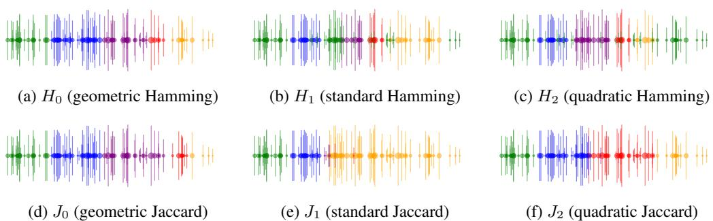
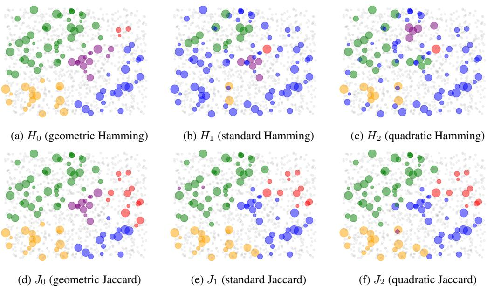

# Axiomatic Characterization of the Hamming and Jaccard Distances

Anonymous Author(s)   
Affiliation   
Address   
email

# Abstract

Measures of dissimilarity between a pair of objects can play a pivotal role in many machine learning objectives such as clustering, outlier detection, or data visualization. We focus on data in the form of binary vectors and analyze several methods of measuring dissimilarity between them. We introduce several properties, axioms, that a measure of dissimilarity can satisfy and characterize the Hamming and Jaccard distances as the only measures satisfying particular subsets of our axioms. Based on our analysis, we identify shortcomings of both distances, and propose novel approaches that are better suited for certain applications. We complement our theoretical findings by extensive empirical study. Our primary motivation is the analysis of election data, in which the votes have the form of binary approval of alternatives, but the applicability of our results reaches far beyond that.

# 12 1 Introduction

The Hamming and Jaccard distances find various applications throughout and beyond machine   
learning. For example, they can play a key role in clustering [16, 15], keywords similarity analy  
sis [22], and recommendation systems [5]. Jaccard distance also serves as a loss function for object   
detection in computer vision [12, 25, 30], while Hamming is often used in multi-label classification   
problems [28, 27]. However, in many applications, it is unclear why this particular metric should   
be used out of many possible measures of dissimilarity between binary vectors. This question   
is of dire importance as the choice of the metric can lead to drastic differences in the produced   
results [9, 25, 15].   
To provide a deeper understanding of the nature of each measure and to offer guidance in selecting   
an appropriate one for a given application, we adopt the axiomatic method. This approach involves   
introducing simple and intuitive properties, called axioms, which characterize particular measures,   
showcasing the distinctive behavior of each measure and highlighting the similarities and differences   
between them. Axioms have been already employed in the theoretical analysis of machine learning   
tools such as clustering [1, 3, 18], or classification [11]. Furthermore, they are cornerstones of the   
related fields of computational social choice [7] and game theory [26].   
Specifically, we introduce five invariance axioms (namely, Anonymity, Independent Symmetry, Add   
Zero, Zero-One Symmetry, and Scaling) each requiring that a particular simple operation applied to   
a pair of binary vectors does not affect the dissimilarity between them. Additionally, we consider   
Triangle Inequality—a standard distance axiom; Convergence which asserts that the distance between   
the vectors decreases as we introduce agreement between them; and Normalization that fixes the   
dissimilarity value in a certain corner case.   
We prove that the Hamming distance is the unique dissimilarity measure that satisfies Anonymity,   
Independent Symmetry, Zero-One Symmetry, Scaling, Triangle Inequality, Convergence, and Nor  
36 malization axioms. Moreover, if in this characterization we exchange Zero-One Symmetry for Add   
7 Zero axiom, then such set of axioms uniquely characterize the Jaccard distance. This axiomatic   
approach thus offers a comprehensive comparison of both measures highlighting the key difference   
between them. Satisfaction of our axioms by the rules we consider is summarized in Table 1.   
Furthermore, based on our analysis, we identify a common feature of the Hamming and Jaccard   
distances that may be undesirable in many scenarios. Indeed, both distances satisfy Independent   
Symmetry, which in practice implies that the vectors of different saturation will always be far from   
each other. We propose the modifications of both measures that escape this problem and show that   
they can be more suited for certain applications.   
We complement our theoretical findings with extensive experiments on approval election data, in   
which a set of voters express binary preferences over a set of alternatives. Such data is one of the   
primary objects of study in the computational social choice (for more details see the work of Boehmer   
et al. [6]) and shows a high level of asymmetry: A voters’ approval for an alternative is a much   
stronger signal than the lack thereof. We compare the behavior of the studied dissimilarity measures   
in several canonical classes of such elections and finish with the case study on real-world election   
instances from participatory budgeting. Our analysis confirms that the newly proposed measures can   
52 indeed be more efficient in certain settings. All missing proofs are available in Appendix A.

Table 1: Which dissimilarity measure satisfies which axiom.   

<table><tr><td>Anonym. Scaling Indep.Sym. O-1 Sym. Conv.Tri.Ineq.Norm. Add 0</td><td></td><td></td><td></td><td></td><td></td><td></td><td></td><td></td></tr><tr><td>Hamming</td><td></td><td></td><td></td><td></td><td></td><td>厂</td><td></td><td>×</td></tr><tr><td> Jaccard</td><td>√</td><td>√</td><td>厂</td><td>X</td><td>√</td><td>！</td><td>厂</td><td></td></tr></table>

# 2 Preliminaries

For every $n \in \mathbb N$ , we denote $[ n ] = \{ 1 , \dots , n \}$ . For two sets $A , B$ , we denote their symmetric difference by $A \triangle B = ( A \cup B ) \setminus ( A \cap B )$ .

# 2.1 Binary Vectors

7 We consider a space of binary vectors of arbitrary (but finite) length. Each such vector, $x \in \{ 0 , 1 \} ^ { n }$ ,   
can equivalently be viewed as a subset of coordinates on which there are ones in the vector, which   
we denote by $\dot { A } _ { x } = \{ i \in [ n ] : x _ { i } = 1 \}$ . For a permutation $\pi : [ n ] \to [ n ]$ , by $\pi ( x )$ we denote the   
60 vector $x$ with changed order of coordinates, i.e., $\pi ( x ) _ { i } = x _ { \pi ( i ) }$ for every $i \in [ n ]$ . Drawing from game   
1 theory notation, for vector $x \in \{ 0 , 1 \} ^ { n }$ , coordinate $i \in [ n ]$ , and $b \in \{ 0 , 1 \}$ we write $y = ( x _ { - i } , b )$ to   
denote a vector such that $y _ { i } = b$ and $y _ { j } = x _ { j }$ for every $j ^ { \bar { \mathbf { \alpha } } } \in [ n ] \setminus \{ i \}$ . For vector $x \in \{ 0 , 1 \} ^ { n }$ by $\bar { x }$   
we denote its bitwise negation, i.e., $\bar { x } = ( 1 - x _ { 1 } , \ldots , 1 - x _ { n } )$ . By $\circ$ we denote concatenation of   
vectors, i.e., for $x \in \{ 0 , \bar { 1 } \} ^ { n }$ and $y \in \{ 0 , 1 \} ^ { m }$ , if $z = x \circ y$ , then $z _ { i } = x _ { i }$ for $i \in [ n ]$ and $z _ { i } = y _ { i }$ for   
every $i \in [ m + n ] \setminus [ n ]$ . Finally, by $x ^ { k }$ we denote the result of concatenating $k$ copies of $x$ one after   
another. For convenience, we will allow for $x ^ { 0 }$ to be the empty vector, which concatenated with any   
other vector $y$ , results in $y$ .

# 2.2 Dissimilarity Measures

A dissimilarity measure is a function that takes a pair of binary vectors of the same size as arguments and outputs some real nonnegative values, i.e., 70 $\dot { f } \colon ( \{ 0 , 1 \} ^ { n } \mathbin { \stackrel { . . } { \times } } \{ 0 , 1 \} ^ { n } ) _ { n \in \mathbb { N } } \to \mathbb { R } _ { \ge }$ .

Examples include the (normalized) Hamming distance, also known as the $\ell _ { 1 }$ distance, which outputs the fraction of positions at which the corresponding elements in two vectors differ, i.e.,

$$
H ( x , y ) = | A _ { x } \triangle A _ { y } | / n .
$$

Jaccard distance is defined similarly, but instead of normalizing by the vector length, it divides the symmetric difference by the number of positions in which at least one vector has a positive entry, i.e.,

$$
J ( x , y ) = | A _ { x } \triangle A _ { y } | / | A _ { x } \cup A _ { y } | .
$$

Other examples include the Euclidean distance (or $\ell _ { 2 }$ ), which is just a square root of the Hamming   
distance, or the discrete distance (or $\ell _ { \infty }$ ) that returns $0$ if the vectors are identical and 1 otherwise.

We begin by introducing seven axioms that uniquely characterize the Hamming distance, arguably the most popular notion of dissimilarity between binary vectors.

The first four axioms are so-called invariance axioms, which describe certain operations on a pair of   
vectors and assert that this operation should not affect the dissimilarity value. This first such axiom is   
called Anonymity and intuitively states that the order of coordinates does not matter. It is natural in   
settings where there is no spatial or temporal relation between the bits of information that the vectors   
represent. Rather, they come from independent sources, as, for example, when the vectors represent   
support for a given candidate by various voters (indeed, the version of this axiom often appears in the   
social choice literature [21]).   
Definition 3.1 (Anonymity). A dissimilarity measure, $f$ , satisfies Anonymity if for every vectors   
$x , y \in \{ 0 , 1 \} ^ { n }$ and permutation $\pi : [ n ] \to [ n ]$ it holds that

$$
f ( \pi ( x ) , \pi ( y ) ) = f ( x , y ) .
$$

For example, Anonymity would imply that $f ( ( 1 , 0 , 1 , 1 ) , ( 1 , 1 , 0 , 0 ) ) = f ( ( 0 , 1 , 1 , 1 ) , ( 1 , 0 , 1 , 0 ) ) .$

The second axiom, Scaling, captures the intuition that the scale of the input should not be relevant   
for the dissimilarity. Hence, we can copy the entries of the vectors several times and this will not   
affect the value. This property was noted as crucial for some objectives such as measuring accuracy   
in object detection tasks in computer vision [25].   
Definition 3.2 (Scaling). A dissimilarity measure, $f$ , satisfies Scaling if for every vectors $x , y \in$   
$\{ 0 , 1 \} ^ { n }$ and $k \in \mathbb N$ it holds that

$$
f ( x ^ { k } , y ^ { k } ) = f ( x , y ) .
$$

For example, Scaling would imply that $f ( ( 1 , 0 ) , ( 1 , 1 ) ) = f ( ( 1 , 0 , 1 , 0 ) , ( 1 , 1 , 1 , 1 ) ) .$

Our next axiom is a strengthening of a standard distance axiom of Symmetry. Independent Symmetry   
states that on every coordinate we can switch the values between the two vectors, and this operation   
should preserve the dissimilarity value.

Definition 3.3 (Independent Symmetry). A dissimilarity measure, $f$ , satisfies Independent Symmetry if for every vectors 97 $x , y \in \{ 0 , 1 \} ^ { n }$ and index $i \in [ n ]$ it holds that

$$
f ( ( x _ { - i } , y _ { i } ) , ( y _ { - i } , x _ { i } ) ) = f ( x , y ) .
$$

For example, Independent Symmetry would imply that $f ( ( 1 , 0 , 1 ) , ( 1 , 1 , 0 ) ) = f ( ( 1 , 1 , 1 ) , ( 1 , 0 , 0 ) ) .$ .

Our final invariance axiom, Zero-One Symmetry, states that the roles of 0 and 1 in the vectors are   
symmetric, hence if we exchange all 0s for 1s in both vectors and vice-versa, we should get the same   
101 dissimilarity. Indeed, in some applications the roles of zeros and ones are arbitrary.

02 Definition 3.4 (Zero-One Symmetry). A dissimilarity measure, $f$ , satisfies Zero-one Symmetry if for every vectors 03 $x , y \in \{ 0 , 1 \} ^ { n }$ it holds that

$$
f ( { \bar { x } } , { \bar { y } } ) = f ( x , y ) .
$$

For example, Zero-One Symmetry would imply that $f ( ( 1 , 0 , 1 ) , ( 1 , 1 , 0 ) ) = f ( ( 0 , 1 , 0 ) , ( 0 , 0 , 1 ) ) .$

Our next axiom is Convergence. It captures the intuition that as we add new information to the input   
on which both vectors agree, then the dissimilarity between them should move towards zero, and that   
this convergence to zero should be quick enough. Formally, we say that if we double the size of the   
vectors and in the new entries there are only 1s in both of them, then the distance should decrease by   
at least half.   
Definition 3.5 (Convergence). A dissimilarity measure, $f$ , satisfies Convergence if for every vectors   
$x , y \in \{ 0 , 1 \} ^ { n }$ it holds that

$$
f ( x \circ ( 1 ) ^ { n } , y \circ ( 1 ) ^ { n } ) \leq { \frac { 1 } { 2 } } f ( x , y ) .
$$

For example, Convergence would imply that $f ( ( 1 , 0 , 1 , 1 ) , ( 1 , 1 , 1 , 1 ) ) \leq f ( ( 1 , 0 ) , ( 1 , 1 ) ) / 2 .$

Next, we include a standard distance metric axiom of Triangle Inequality.

Definition 3.6 (Triangle Inequality). A dissimilarity measure, $f$ , satisfies Triangle Inequality if for every vectors 115 $x , y , z \in \{ 0 , 1 \bar  \} ^ { n }$ it holds that

$$
f ( x , y ) + f ( y , z ) \geq f ( x , z ) .
$$

Finally, Normalization specifies the dissimilarity in a basic case of length-1 vectors.

Definition 3.7 (Normalization). A dissimilarity measure, $f$ , satisfies Normalization if

$$
f ( ( 0 ) , ( 1 ) ) = 1 .
$$

The above seven axioms uniquely characterize the Hamming distance.

Theorem 3.8. A dissimilarity measure, $f$ , satisfies Anonymity, Scaling, Independent Symmetry,   
Zero-One Symmetry, Convergence, Triangle Inequality, and Normalization if and only if $f$ is the   
Hamming distance.   
Proof sketch. The proofs that Hamming satisfies each of the axioms are relatively straightforward.   
Thus, in this sketch we focus on showing that if a dissimilarity measure $f$ satisfies all of the axioms,   
then it is the Hamming distance (the full proof can be found in Appendix A). The proof proceeds by   
considering growing subsets of axioms and characterizing the classes of dissimilarity measures that   
satisfy these axioms (in Appendix A, we present each such characterization as a separate lemma).   
We begin by observing that dissimilarity measure satisfying Anonymity must be in fact a function   
of four arguments, which are the sizes of the intersection, both differences, and the intersection   
of complements of sets $A _ { x }$ and $A _ { y }$ for each pair of vectors $x , y$ . Then, if we add Independent   
Symmetry, this function must depend on only three arguments, as instead of looking at $| \bar { A _ { x } } \setminus A _ { y } |$   
and $\left| A _ { y } \right. \setminus A _ { x } |$ , we can simply look at the size of their symmetric difference. Adding Zero-One   
symmetry prevents distinguishing the intersection form the intersection of complements, so we end   
up with two arguments: $| A _ { x } \triangle A _ { y } |$ and $n - | A _ { x } \triangle A _ { y } |$ , or, equivalently, $| A _ { x } \triangle A _ { y } |$ and $n$ . Then,   
Scaling implies that $f ( x , y )$ is actually a function of a single argument, i.e., there exists $g$ such that   
$f ( x , y ) = \bar { g } ( | A _ { x } \triangle A _ { y } | / n ) = g ( H ( x , y ) )$ .   
We use the remaining axioms to establish properties of $g$ . Triangle Inequality means that $g$ is   
subadditive. Next, we prove that with the addition of Convergence, $g$ has to be a linear homogeneous   
function. In other words, there is $a \in \mathbb { R }$ such that $f ( x , y ) = a \cdot H ( x , y )$ . Then, adding Normalization   
139 concludes the proof. □   
40 We note that the set of axioms used for our characterization of the Hamming distance is minimal. In   
other words, the axioms are independent, as no subset of our axioms implies the remaining ones.   
Theorem 3.9. For every axiom in the set Anonymity, Scaling, Independent Symmetry, Zero-One   
Symmetry, Convergence, Triangle Inequality, and Normalization there is a dissimilarity measure that   
satisfies all other axioms in this set except for this one.

# 145 4 Axiomatic Characterization of the Jaccard Distance

As mentioned in the previous section, Zero-One Symmetry, an axiom characterizing Hamming,   
requires that 0s and 1s have symmetric roles in all vectors. This is the case in some scenarios,   
however in many applications this is clearly not the case. For example, if the vectors represent the   
support for a candidate from different voters, then the support seems much more meaningful than the   
lack of it (as the lack of support may be a result of actual disapproval, but at the same time it can   
come from neutrality, or lack of knowledge about a candidate). Then, the fact that two candidates are   
supported by the same voters can be much more important for their perceived similarity than the fact   
that they agree on more entries.

Consider the following four vectors:

$$
\begin{array} { r l } { x = ( 1 , 1 , 1 , 0 , 0 , 0 , 0 , 0 , 0 , 1 , 1 , 0 ) , \quad } & { a = ( 1 , 0 , 0 , 0 , 0 , 0 , 0 , 0 , 0 , 0 , 0 , 0 ) , } \\ { y = ( 1 , 1 , 1 , 0 , 0 , 0 , 0 , 0 , 0 , 0 , 1 ) , \quad } & { b = ( 0 , 0 , 0 , 0 , 0 , 0 , 0 , 0 , 0 , 0 , 1 ) . } \end{array}
$$

Under the Hamming distance, the vectors $a$ and $b$ are more similar than the other two. While, if we   
treat ones as approvals and zeros as disapprovals, the sets of approved items by $a$ and $b$ are disjoint.   
In many types of data there is a significant disproportion between the number of 1s and 0s, which   
suggests that they play very different roles. In such cases, the following Add Zero axiom might be   
desired, which basically says that coordinates in which both vectors have 0s might be disregarded.   
Definition 4.1 (Add Zero). A dissimilarity measure, $f$ , satisfies Add Zero if for every vectors   
161 $x , y \in \{ 0 , 1 \} ^ { n }$ it holds that

$$
f ( x \circ ( 0 ) , y \circ ( 0 ) ) = f ( x , y ) .
$$

62 For example, Add Zero would imply that $f ( ( 1 , 0 , 1 ) , ( 1 , 1 , 0 ) ) = f ( ( 1 , 0 , 1 , 0 ) , ( 1 , 1 , 0 , 0 ) ) .$

It turns out that if in the characterization of the Hamming distance we exchange Zero-One Symmetry   
164 for Add Zero axiom, then we obtain a unique characterization of the Jaccard distance.   
65 Theorem 4.2. A dissimilarity measure, $f$ , satisfies Anonymity, Independent Symmetry, Add Zero,   
Scaling, Convergence, Triangle Inequality, and Normalization if and only if $f$ is the Jaccard distance.   
Proof Sketch. The structure of the proof of the characterization of Jaccard resembles the one from   
the proof of the characterization of Hamming. Again, verifying that Jaccard satisfies all axioms is   
relatively straightforward, thus we focus on showing that a dissimilarity measure $f$ satisfying the   
axioms is equal to the Jaccard distance.   
From the proof of Theorem 3.8 we know that $f$ satisfying Anonymity and Independent symmetry for   
each pair of vectors $x , y$ is a function of three arguments, $| A _ { x } \cap A _ { y } |$ , $| A _ { x } \triangle A _ { y } |$ , and $n - | A _ { x } \cup A _ { y } |$ .   
Add Zero allows us to disregard the last argument, thus we end up with a function of two arguments   
$| A _ { x } \cap A _ { y } |$ and $| A _ { x } \triangle A _ { y } |$ , or, equivalently, $| \bar { A } _ { x } \triangle A _ { y } |$ and $| A _ { x } \cup A _ { y } |$ . Then, Scaling implies that $f ( x , y )$   
is actually a function of a single argument, i.e., there exists $g$ such that $f ( x , y ) = g ( | A _ { x } \triangle A _ { y } | / | A _ { x } \cup$   
$A _ { y } | ) = \dot { g } ( J ( x , y ) )$ . Finally, using Triangle Inequality, Convergence, and Normalization, we prove   
that $g$ has to be an identity. □

178 Again, our axioms characterizing Jaccard are independent.

79 Theorem 4.3. For every axiom in the set Triangle Inequality, Anonymity, Independent Symmetry,   
Add Zero, Scaling, and Convergence, there is a dissimilarity measure that satisfies all other axioms in   
181 this set except for this one.

82 Finally, in Appendix B, we offer an additional axiomatic characterization of the discrete distance.

# 5 Rejecting Independent Symmetry

In this section, we argue that Independent Symmetry, which is used in characterization of both   
185 Hamming and Jaccard, might be actually not desirable in many situations. To see this, consider the   
86 following four vectors:

$$
\begin{array} { r l } { x = ( 0 , 0 , 1 , 1 , 0 , 0 , 0 , 0 ) , \quad } & { { } a = ( 1 , 1 , 1 , 1 , 0 , 0 , 0 , 0 ) , } \\ { y = ( 1 , 1 , 1 , 1 , 1 , 1 , 0 , 0 ) , \quad } & { { } b = ( 0 , 0 , 1 , 1 , 1 , 1 , 0 , 0 ) . } \end{array}
$$

Every dissimilarity measure $f$ that satisfies Independent Symmetry must give $f ( x , y ) = f ( a , b )$ by   
the definition of the axiom. However, observe that $A _ { x } \subseteq A _ { y }$ , which is not true for $a$ and $b$ . If the   
vectors correspond to candidates and their coordinates to voters that can support them, this means   
that every supporter of candidate $x$ also voted for $y$ . This is a very strong signal that projects $x$ and $y$   
are related. On the other hand, only $50 \%$ of supporters of $a$ also voted for $b$ and vice versa. Therefore,   
we might want to consider $x$ and $y$ as more similar than $a$ and $b$ . Alternatively, it is possible that in   
some settings actually $a$ and $b$ can be considered more similar, as they are of similar size. Either way,   
Independent Symmetry prevents distinguishing these two cases.   
195 What could be a sensible dissimilarity metric that does not satisfy Independent Symmetry? Let us   
96 observe that the Hamming distance can be written as

$$
H ( x , y ) = 2 \cdot { \frac { | A _ { x } \setminus A _ { y } | + | A _ { y } \setminus A _ { x } | } { 2 } } \cdot { \frac { 1 } { n } } .
$$

I.e., it is proportional to the arithmetic mean of $\left| A _ { x } \right. \left| A _ { y } \right|$ and $\left| { { A _ { y } } } \right. \left| { { A _ { x } } } \right|$ . Similarly, we can write

$$
J ( x , y ) = 2 \cdot \frac { | A _ { x } \setminus A _ { y } | + | A _ { y } \setminus A _ { x } | } { 2 } \cdot \frac { 1 } { | A _ { x } \cup A _ { y } | } .
$$

The arithmetic mean is invariant to subtracting a value from one argument and adding it to the other,   
which is why both distances satisfy Independent Symmetry. However, other means, like quadratic or   
geometric mean, lack this property. For $p \in \mathbb { R } _ { \geq 0 }$ , we define a generalized mean of two numbers as

$$
M _ { p } ( k , \ell ) = \left\{ \begin{array} { l l } { \sqrt { ( k ^ { p } + \ell ^ { p } ) / 2 } , } & { \mathrm { f o r } p \in ( 0 , \infty ) , } \\ { \sqrt { k \cdot \ell } , } & { \mathrm { f o r } p = 0 . } \end{array} \right.
$$

Then, let us define $p$ -Hamming and $p$ -Jaccard as follows

$$
\forall _ { p } ( x , y ) = \frac { 2 M _ { p } ( | A _ { x } \setminus A _ { y } | , | A _ { y } \setminus A _ { x } | ) ) } { n } , \quad J _ { p } ( x , y ) = \frac { 2 M _ { p } ( | A _ { x } \setminus A _ { y } | , | A _ { y } \setminus A _ { x } | ) ) } { 2 M _ { p } ( | A _ { x } \setminus A _ { y } | , | A _ { y } \setminus A _ { x } | ) + | A _ { x } \cap A _ { y } | } .
$$

Clearly $H _ { 1 } ( x , y ) = H ( x , y )$ and $J _ { 1 } ( x , y ) = J ( x , y )$ . Observe that whenever $| A _ { x } \setminus A _ { y } | = | A _ { y } \setminus A _ { x } |$ ,   
we have that $H _ { p } ( x , y ) = H _ { q } ( x , y )$ , for every $p , q \in [ 0 , \infty ]$ . However, if $\vert A _ { x } \ \backslash \ A _ { y } \vert \neq \vert A _ { y } \ \backslash \ A _ { x } \vert$ ,   
then $H _ { p } ( x , y ) \ : \stackrel { . } { > } \ : H _ { q } ( x , y )$ for all $p > q$ (and similar properties hold for $p$ -Jaccard). Therefore,   
assuming constant $| A _ { x } \triangle A _ { y } |$ , whenever there is an imbalance in the sizes of the sets $A _ { x }$ and $A _ { y }$ ,   
$H _ { p } ( x , y )$ will give higher distances than the Hamming distance, when $p > 1$ , or lower distance when   
$p < 1$ . In particular, in the extreme, $H _ { 0 } ( x , y )$ and $J _ { 0 } \overline { { ( } } x , y )$ , which we call geometric Hamming and   
geometric Jaccard, returns dissimilarity 0, whenever $A _ { x } \subseteq A _ { y }$ or $A _ { y } \subseteq A _ { x }$ (but observe that this is   
incompatible with Triangle Inequality).   
Example 5.1. Assume that we have three projects $a , b$ , and $c$ , where $| A _ { a } | = | A _ { b } | = 2 0 , | A _ { c } | = 6$   
and where $| A _ { a } \cap A _ { b } | = 1 0 , | A _ { a } \cap A _ { c } | = \bar { 0 , } | \bar { A } _ { b } \cap A _ { c } | = 5$ . And the question is whether $b$ is more   
similar to $a$ or $c$ . On the one hand, the size of the intersection between $A _ { a }$ and $A _ { b }$ is twice as large as   
the intersection between $A _ { b }$ and $A _ { c }$ . On the other hand, almost all voters who approve $c$ also approve   
$b$ . Under the $J _ { 1 }$ distance $b$ is more similar to $a$ , while under the $J _ { 0 }$ the $b$ is more similar to $c$ .

# 15 6 Experiments

In this section, we illustrate the intuitive difference between the six following dissimilarity measures:   
$H _ { 0 }$ (geometric Hamming), $H _ { 1 }$ (standard Hamming), $H _ { 2 }$ (quadratic Hamming), $J _ { 0 }$ (geometric   
Jaccard), $J _ { 1 }$ (standard Jaccard), and $J _ { 2 }$ (quadratic Jaccard). Since one of the important potential   
applications of dissimilarity measures is the field of computational social choice, we use statistical   
models and real-life data from that field. In particular, we focus on approval elections, which consist   
of a set of candidates and a set of voters, where each voter approves a subset of the candidates [20].   
This structure can naturally be represented as a binary matrix, where rows correspond to voters and   
columns to candidates. Occasionally, we refer to such a matrix as a profile.   
We begin by evaluating the measures on synthetic data and later we move to the real-life one. To   
generate synthetic data we use the Euclidean statistical cultures [6] (i.e., popular statistical models   
used in social choice). To sample $d$ -Euclidean profile, we proceed as follows: first, sample ideal   
points for each voter and each candidate from d-dimensional Euclidean metric space; second, for   
each candidate, sample a radius (i.e., strength) from $\mathbb { R } _ { + }$ ; third, a voter approves a given candidate if   
the Euclidean distance between their ideal points is less than or equal to the candidate’s radius.

# 6.1 Ordering Accuracy

In the following experiment, we analyze how different metrics behave on 1D-Euclidean profiles.   
We consider two variants of the experiment, each variant involving 100 sampled profiles, with 100   
candidates and 100 voters sampled uniformly at random from $[ 0 , 1 ]$ interval. In the first variant, the   
radius of each candidate is the same $r _ { 1 } = r _ { 2 } = 0 . 1$ , while in the second variant, we sample radii   
uniformly at random from the [0.015, 0.15] interval.

Let $p _ { a }$ denote the position of a candidate $a$ on the interval. Given three candidates $a , b$ and $c$ such that $p _ { a } < p _ { b } < p _ { c }$ , we expect a well-behaved distance measure to satisfy the following two inequalities: $d ( a , b ) \leq d ( a , c )$ and $d ( b , c ) \leq d ( a , c )$ . However, this is not necessarily the case. Therefore, for each of the studied distance measures, we compute the proportion of such inequalities that are satisfied. We refer to this proportion as the ordering accuracy.

The results are presented in Table 2. The Jaccard distance variants significantly outperform the   
Hamming distance variants in both cases. Notably, when all the candidates have equal radii, the   
Jaccard distance always satisfies the ordering inequalities.

Proposition 6.1. Under Jaccard distance, if $r$ is constant, then the ordering accuracy is equal to 1.

Table 2: Average ordering accuracy.   

<table><tr><td>Metric</td><td>r=0.1</td><td>r ∈ [0.015,0.15]</td></tr><tr><td>Ho</td><td>0.690 ±0.067</td><td>0.719 ± 0.063</td></tr><tr><td>H1</td><td>0.692 ± 0.066</td><td>0.724±0.061</td></tr><tr><td>H2</td><td>0.690 ± 0.066</td><td>0.719 ±0.061</td></tr><tr><td>Jo</td><td>1.000 ± 0.000</td><td>0.997 ± 0.001</td></tr><tr><td>J1</td><td>1.000 ±0.000</td><td>0.997 ± 0.001</td></tr><tr><td>J</td><td>1.000 ± 0.000</td><td>0.997 ±0.001</td></tr></table>

Table 3: Quality of clustering.   

<table><tr><td>Metric</td><td>1D</td><td>2D</td></tr><tr><td>Ho</td><td>0.0013 ± 0.0014</td><td>0.0028 ± 0.0091</td></tr><tr><td>H1</td><td>0.1178±0.0875</td><td>0.0901 ± 0.0372</td></tr><tr><td>H2</td><td>0.1888 ± 0.0903</td><td>0.0998 ± 0.0301</td></tr><tr><td>Jo</td><td>0.0015 ± 0.0019</td><td>0.0003 ± 0.0010</td></tr><tr><td>J1</td><td>0.0028 ± 0.0033</td><td>0.0009 ± 0.0025</td></tr><tr><td>J</td><td>0.0042 ± 0.0070</td><td>0.0009 ± 0.0020</td></tr></table>

# 245 6.2 Clustering

Given a dissimilarity measure $f$ , and two clusters $C = \{ c _ { 1 } , \ldots , c _ { k } \}$ and $D = \{ d _ { 1 } , \ldots , d _ { \ell } \}$ , we define the distance between them as $\begin{array} { r } { \mathrm { d i s t } ( C , D ) = 1 / ( | C | \cdot | D | ) \sum _ { c _ { i } \in C } \sum _ { d _ { i } \in D } f ( \bar { c } _ { i } , d _ { j } ) } \end{array}$ .

Using this definition, we perform clustering on candidates in a Euclidean profile via the hierarchical method. It works as follows. Initially, each candidate forms its own cluster. Then, iteratively, at each step, we merge the two most similar clusters, i.e., such that the average distance between their members is minimal. We continue the procedure until exactly five clusters remain.

We begin with 1D-Euclidean space. We consider profiles with 1000 voters, and 100 candidates, sampled uniformly at random from $[ 0 , 1 ]$ interval with radii sampled uniformly at random from [0.015, 0.15] interval. The results are shown in Figure 1. Each candidate is depicted as a dot and a vertical line, which is proportional to its radius. The geometric variants (i.e., $H _ { 0 }$ and $J _ { 0 . }$ ) successfully divide the space into five separate clusters. In contrast, for $H _ { 1 }$ and $H _ { 2 }$ , the green cluster overlaps significantly with other clusters, which is an undesirable outcome in this context. Finally, $J _ { 1 }$ and $J _ { 2 }$ are outperforming their Hamming counterparts, but still yield less interpretable clusters than the geometric variants.

Next, we consider a 2D-Euclidean space, with a similar setup: 1000 voters, and 100 candidates sampled uniformly at random from $[ \bar { 0 } , 1 ] ^ { 2 }$ square, but with candidate radii drawn from [0.1, 0.33] interval. The results are shown in Figure 2. The grey circles denote the voters’ positions. The colorful circles denote the candidates’ positions, with the size being proportional to the radius. Each color marks a different cluster.

Overall, the results in the 2D case are similar to those in the 1D case. As expected, the Hamming   
distance performs poorly. It typically produces one dominant cluster that spans much of the space,   
grouping together a large number of disparate candidates. In contrast, the Jaccard variants (with the   
exception of the quadratic one) yield significantly better clustering quality. However, the standard   
Jaccard tends to produce one or two extremely small clusters, typically composed of candidates with   
very limited voter support.   
We can verify the intuitive observations from the plots, by quantifying the number of incorrectly   
embedded points. For the 1D profiles, let $A _ { 3 }$ denote the set of all triplets of candidates such that the   
first two belong to the same cluster and the third one does not. A triplet is considered invalid if the   
third candidate lies between the other two. Similarly, for the 2D profiles, let $A _ { 4 }$ denote the set of all   
quadruplets of candidates, such that the first three of them belong to the same cluster and the fourth   
one does not. A quadruplet is considered invalid if the fourth candidate lies inside the triangle formed   
by the other three. In Table 3 we present averaged results over 100 profiles. As previously shown in   
the plots, for 1D profiles, geometric variants outperform the other methods. In the case of 2D profiles,   
the best performance is achieved by the geometric Jaccard, which results in three times fewer invalid   
quadruplets than the standard Jaccard.

# 6.3 Real-Life Data

Finally, we examine real-life data, which comes from Participatory Budgeting (PB) elections. PB elec  
tions are democratic processes in which some municipalities distribute a portion of their budget [24].   
They usually involve citizens expressing approval preferences over potential projects, a selection of   
which is later implemented in practice.   
We use participatory budgeting instances from Pabulib [13], focusing on district elections held in   
2023 and 2024 in three major Polish cities: Warsaw, Kraków, and Łód´z. (Detailed parameters of   
these instances are available in Table 5 in Appendix C). In these cities, projects are labeled with   
categories. In Kraków and Łód´z, each project belongs to exactly one category, while in Warsaw,   
projects can have multiple categories. Although these categories are assigned manually and may not   
always be accurate, we nonetheless expect that projects within the same category tend to be more   
similar to each other on average.   
For each category, we compute two values: the intra distance $d _ { \mathrm { i n t r a } }$ , defined as the average pairwise   
distance between all projects within the same category, and the inter distance $d _ { \mathrm { i n t e r } }$ , defined as the   
average pairwise distance between projects in the category and those outside of it. For each instance,   
we compute the proportion of categories for which it holds that $d _ { \mathrm { i n t e r } } / d _ { \mathrm { i n t r a } } > 1 . 0 1$ (i.e., the inter   
distances are nontrivially larger than the intra ones). We then average these proportions across all   
districts (i.e., instances) for a given year and city. The results are presented in Table 4. Interestingly,   
geometric Jaccard consistently outperforms all other distance measures.   
Besides categories, several of the Pabulib instances include geographic coordinates of some of the   
projects. We focus on district elections held between 2019 and 2024 in Warsaw. We conjectured that   
there might be a correlation between the Euclidean distance between two projects (based on location)   
and their distance under our measures.   
Averaging across all 108 district elections held in Warsaw during that period (18 per year), the average   
Pearson correlation coefficient between the standard Jaccard distance and the Euclidean one is 0.219,   
and for geometric Jaccard it is slightly higher at 0.233. Interestingly, in $9 0 \%$ of the instances, the   
correlation was stronger for geometric Jaccard (detailed results, including comparison with other   
distance measures, are provided in Table 6 in Appendix C).   
Beyond Warsaw, we also analyze a unique election, the green participatory budgeting held in 2023 in   
Wieliczka (a small Polish city). This case is particularly interesting as it was the first city to use in   
practice the recently developed method of equal shares [23]. Here, the average Pearson correlation   
between Jaccard and Euclidean distances is 0.369, while for geometric Jaccard it is 0.441. Wieliczka   
municipality consists of the central city and several small villages. It appears that voters in the villages   
tend to vote for their local projects, which may explain the higher correlation between geographic   
proximity and our distance measures in this case.

  
Figure 1: Clustering of 1D-Euclidean profiles.

  
Figure 2: Clustering of 2D-Euclidean profiles.

Table 4: Averaged share of categories with higher inter- than intra-category distance.   

<table><tr><td></td><td colspan="2">Warsaw</td><td colspan="2">Krakow</td><td colspan="2">Lodi</td></tr><tr><td>Metric</td><td>2023</td><td>2024</td><td>2023</td><td>2024</td><td>2023</td><td>2024</td></tr><tr><td>Ho (geometric Hamming)</td><td>63.8%</td><td>47.2%</td><td> 45.5%</td><td>40.9%</td><td>66.4%</td><td>69.6%</td></tr><tr><td>H1 (standard Hamming)</td><td>68.6%</td><td> 56.9%</td><td> 49.7%</td><td> 37.4%</td><td>65.7%</td><td>62.8%</td></tr><tr><td>H2 (quadratic Hamming)</td><td>68.5%</td><td>62.5%</td><td>52.1%</td><td>41.9%</td><td>63.8%</td><td>63.8%</td></tr><tr><td>Jo (geometric Jaccard)</td><td>82.6%</td><td>88.2%</td><td>79.4%</td><td>85.9%</td><td>82.8%</td><td>91.6%</td></tr><tr><td>J1 (standard Jaccard)</td><td>67.3%</td><td>65.3%</td><td>56.9%</td><td>58.1%</td><td>75.4%</td><td>73.3%</td></tr><tr><td>J2 (quadratic Jaccard)</td><td>70.2%</td><td>79.2%</td><td>66.3%</td><td>67.8%</td><td>78.4%</td><td>76.3%</td></tr></table>

# 316 7 Related Work

As mentioned introduction, axiomatic approach has been already successfully employed to enhance   
understanding of various machine learning concepts. For example, a large body of work has con  
centrated on axioms for clustering. In particular, Kleinberg [18] proved that there is no clustering   
function that satisfies certain three desired properties. However, this impossibility could be avoided if   
we focus on functions that produce a specific, exogenously given number of clusters [1] or slightly   
modify the axioms [10, 19]. Furthermore, several works propose axiomatic characterizations of   
particular clustering rules [8, 29] or families of rules [2, 4].   
Several distances between objects have also been studied axiomatically. A good example is an   
axiomatization of Kendall Tau distance by Kemeny [17]. The closest to our work, is an axiomatic   
characterization of Jaccard distance by Gerasimou [14]. However, this characterization considers   
only three axioms. Two of them are standard distance metric axioms, namely Identity and Triangle   
Inequality, and one axiom which specifies the marginal contribution of an additional bit of information   
on which two vectors do not agree. This last axiom is very specific to Jaccard, and there are no other   
widely known dissimilarity measures that satisfy it. As a result, this characterization does not really   
offer a view of the Jaccard distance as a consequence of several, not directly related assumptions. In   
contrast, we propose a larger family of simple axioms, each one of which is satisfied by many natural   
and popular dissimilarity measures. The Hamming distance was not considered in this paper.

# 334 8 Conclusions

We have developed an axiomatic characterization of the Hamming and Jaccard distances, which   
enables us to clearly capture the key properties of each measure. In particular, the two characteriza  
tions differ by a single axiom: Zero-One Symmetry for Hamming vs Add Zero for Jaccard, which   
highlights the most important difference between them.   
Moreover, our axiomatic analysis allowed us to identify a potential shared shortcoming of the   
Hamming and Jaccard distances, as both satisfy Independent Symmetry, which may be undesirable in   
certain applications. To address this limitation, we introduced a family of novel measures based on   
generalized means. Empirical evaluation on both synthetic and real-life data showed that one of the   
new measures, i.e., geometric Jaccard, consistently outperforms other measures on various tasks, and   
344 is better at capturing some nuances. Future work may analyze the new measures in more detail.   
45 References   
[1] M. Ackerman and S. Ben-David. Measures of clustering quality: A working set of axioms for   
clustering. Advances in Neural Information Processing Systems, 21, 2008.   
[2] M. Ackerman and S. Ben-David. Discerning linkage-based algorithms among hierarchical   
clustering methods. In IJCAI, pages 1140–1145, 2011.   
[3] M. Ackerman, S. Ben-David, S. Brânzei, and D. Loker. Weighted clustering: Towards solving   
the user’s dilemma. Pattern Recognition, 120:108152, 2021.   
352 [4] M. Ackerman, S. Ben-David, and D. Loker. Characterization of linkage-based clustering. In   
53 COLT, volume 2010, pages 270–281, 2010.   
[5] S. Bag, S. K. Kumar, and M. K. Tiwari. An efficient recommendation generation using relevant   
jaccard similarity. Information Sciences, 483:53–64, 2019.   
[6] N. Boehmer, P. Faliszewski, L. Janeczko, A. Kaczmarczyk, G. Lisowski, G. Pierczynski,   
S. Rey, D. Stolicki, S. Szufa, and T. Was. Guide to numerical experiments on elections in   
computational social choice. In Proceedings of the 33rd International Joint Conference on   
Artificial Intelligence (IJCAI), pages 7962–7970, 2024.   
[7] F. Brandt, V. Conitzer, U. Endriss, J. Lang, and A. Procaccia, editors. Handbook of Computa  
tional Social Choice. Cambridge University Press, 2016.   
[8] G. E. Carlsson, F. Mémoli, et al. Characterization, stability and convergence of hierarchical   
clustering methods. J. Mach. Learn. Res., 11(Apr):1425–1470, 2010.   
[9] S.-H. Cha. Comprehensive survey on distance/similarity measures between probability density   
functions. International Journal of Mathematical models and Methods in Applied Sciences,   
366 1(4):300–307, 2007.   
67 [10] V. Cohen-Addad, V. Kanade, and F. Mallmann-Trenn. Clustering redemption–beyond the   
368 impossibility of kleinberg’s axioms. Advances in Neural Information Processing Systems, 31,   
69 2018.   
[11] C. Dwork, M. Hardt, T. Pitassi, O. Reingold, and R. Zemel. Fairness through awareness. In   
Proceedings of the 3rd innovations in theoretical computer science conference, pages 214–226,   
2012.   
[12] D. Erhan, C. Szegedy, A. Toshev, and D. Anguelov. Scalable object detection using deep neural   
networks. In Proceedings of the IEEE conference on computer vision and pattern recognition,   
375 pages 2147–2154, 2014.   
76 [13] P. Faliszewski, J. Flis, D. Peters, G. Pierczynski, P. Skowron, D. Stolicki, S. Szufa, and ´   
N. Talmon. Participatory budgeting: Data, tools and analysis. In Proceedings of the 32nd   
International Joint Conference on Artificial Intelligence (IJCAI), pages 2667–2674, 8 2023.   
[14] G. Gerasimou. Characterization of the jaccard dissimilarity metric and a generalization. Discrete   
380 Applied Mathematics, 355:57–61, 2024.   
81 [15] Q. Huang, P. Luo, and A. K. H. Tung. A new sparse data clustering method based on frequent   
382 items. Proceedings of the ACM on Management of Data, 1(1):1–28, 2023.   
83 [16] L. Kaufman and P. J. Rousseeuw. Finding groups in data: an introduction to cluster analysis.   
John Wiley & Sons, 2009.   
385 [17] J. G. Kemeny. Mathematics without numbers. Daedalus, 88(4):577–591, 1959.   
86 [18] J. Kleinberg. An impossibility theorem for clustering. Advances in neural information process  
ing systems, 15, 2002.   
[19] M. A. Kłopotek and R. A. Kłopotek. In-the-limit clustering axioms. In International Conference   
on Artificial Intelligence and Soft Computing, pages 199–209. Springer, 2020.   
[20] M. Lackner and P. Skowron. Multi-winner voting with approval preferences. Springer Nature,   
2023.   
[21] H. Moulin. Implementing efficient, anonymous and neutral social choice functions. Journal of   
Mathematical Economics, 7(3):249–269, 1980.   
[22] S. Niwattanakul, J. Singthongchai, E. Naenudorn, and S. Wanapu. Using of jaccard coefficient   
for keywords similarity. In Proceedings of the International MultiConference of Engineers and   
Computer Scientists, volume 1, pages 380–384, 2013.   
[23] D. Peters, G. Pierczynski, and P. Skowron. Proportional participatory budgeting with additive ´   
utilities. Advances in Neural Information Processing Systems, 34:12726–12737, 2021.   
[24] S. Rey, F. Schmidt, and J. Maly. The (computational) social choice take on indivisible participa  
tory budgeting. arXiv preprint arXiv:2303.00621, 2023.   
[25] H. Rezatofighi, N. Tsoi, J. Gwak, A. Sadeghian, I. Reid, and S. Savarese. Generalized inter  
section over union: A metric and a loss for bounding box regression. In Proceedings of the   
IEEE/CVF conference on computer vision and pattern recognition, pages 658–666, 2019.   
[26] L. S. Shapley. A value for n-person games. Contributions to the Theory of Games, 2(28):307,   
1953.   
[27] A. N. Tarekegn, M. Giacobini, and K. Michalak. A review of methods for imbalanced multi-label   
classification. Pattern Recognition, 118:107965, 2021.   
[28] G. Tsoumakas and I. Katakis. Multi-label classification: An overview. Data Warehousing and   
Mining: Concepts, Methodologies, Tools, and Applications, pages 64–74, 2008.   
[29] R. B. Zadeh and S. Ben-David. A uniqueness theorem for clustering. In Proceedings of the   
Twenty-Fifth Conference on Uncertainty in Artificial Intelligence, pages 639–646, 2009.   
[30] Y.-F. Zhang, W. Ren, Z. Zhang, Z. Jia, L. Wang, and T. Tan. Focal and efficient iou loss for   
413 accurate bounding box regression. Neurocomputing, 506:146–157, 2022.

# 414 NeurIPS Paper Checklist

The checklist is designed to encourage best practices for responsible machine learning research, addressing issues of reproducibility, transparency, research ethics, and societal impact. Do not remove the checklist: The papers not including the checklist will be desk rejected. The checklist should follow the references and follow the (optional) supplemental material. The checklist does NOT count towards the page limit.

20 Please read the checklist guidelines carefully for information on how to answer these questions. For   
1 each question in the checklist:

• You should answer [Yes] , [No] , or [NA] .   
• [NA] means either that the question is Not Applicable for that particular paper or the relevant information is Not Available.   
• Please provide a short (1–2 sentence) justification right after your answer (even for NA).

The checklist answers are an integral part of your paper submission. They are visible to the reviewers, area chairs, senior area chairs, and ethics reviewers. You will be asked to also include it (after eventual revisions) with the final version of your paper, and its final version will be published with the paper.

The reviewers of your paper will be asked to use the checklist as one of the factors in their evaluation. While "[Yes] " is generally preferable to "[No] ", it is perfectly acceptable to answer "[No] " provided a proper justification is given (e.g., "error bars are not reported because it would be too computationally expensive" or "we were unable to find the license for the dataset we used"). In general, answering "[No] " or "[NA] " is not grounds for rejection. While the questions are phrased in a binary way, we acknowledge that the true answer is often more nuanced, so please just use your best judgment and write a justification to elaborate. All supporting evidence can appear either in the main paper or the supplemental material, provided in appendix. If you answer [Yes] to a question, in the justification please point to the section(s) where related material for the question can be found.

IMPORTANT, please:

• Delete this instruction block, but keep the section heading “NeurIPS Paper Checklist", • Keep the checklist subsection headings, questions/answers and guidelines below. • Do not modify the questions and only use the provided macros for your answers.

# 1. Claims

Question: Do the main claims made in the abstract and introduction accurately reflect the paper’s contributions and scope?

Answer: [Yes]

Justification: The main claims in Abstract & Introduction are about the axiomatic characterization of Hamming and Jaccard distance measures. And, indeed, in the paper, we first provide a set of axioms and then we provide the axiomatic characterization of Hamming and Jaccard distance measures, using these axioms.

Guidelines:

• The answer NA means that the abstract and introduction do not include the claims made in the paper.   
• The abstract and/or introduction should clearly state the claims made, including the contributions made in the paper and important assumptions and limitations. A No or NA answer to this question will not be perceived well by the reviewers.   
• The claims made should match theoretical and experimental results, and reflect how much the results can be expected to generalize to other settings.   
• It is fine to include aspirational goals as motivation as long as it is clear that these goals are not attained by the paper.

# 2. Limitations

Question: Does the paper discuss the limitations of the work performed by the authors?

Answer: [Yes]

Justification: We have shown in the paper the limitations of the discussed distance measures. For instance, the Hamming distance is not the best choice for sparse vectors. On the other hand, geometric Jaccard is failing the triangle inequality.

Guidelines:

• The answer NA means that the paper has no limitation while the answer No means that the paper has limitations, but those are not discussed in the paper.   
• The authors are encouraged to create a separate "Limitations" section in their paper.   
• The paper should point out any strong assumptions and how robust the results are to violations of these assumptions (e.g., independence assumptions, noiseless settings, model well-specification, asymptotic approximations only holding locally). The authors should reflect on how these assumptions might be violated in practice and what the implications would be.   
The authors should reflect on the scope of the claims made, e.g., if the approach was only tested on a few datasets or with a few runs. In general, empirical results often depend on implicit assumptions, which should be articulated.   
The authors should reflect on the factors that influence the performance of the approach. For example, a facial recognition algorithm may perform poorly when image resolution is low or images are taken in low lighting. Or a speech-to-text system might not be used reliably to provide closed captions for online lectures because it fails to handle technical jargon.   
• The authors should discuss the computational efficiency of the proposed algorithms and how they scale with dataset size.   
• If applicable, the authors should discuss possible limitations of their approach to address problems of privacy and fairness.   
While the authors might fear that complete honesty about limitations might be used by reviewers as grounds for rejection, a worse outcome might be that reviewers discover limitations that aren’t acknowledged in the paper. The authors should use their best judgment and recognize that individual actions in favor of transparency play an important role in developing norms that preserve the integrity of the community. Reviewers will be specifically instructed to not penalize honesty concerning limitations.

# 3. Theory assumptions and proofs

Question: For each theoretical result, does the paper provide the full set of assumptions and a complete (and correct) proof?

Answer: [Yes]

Justification: All the lemmas, propositions, and theorems stated in the paper are proved either in the main body or in the appendix.

Guidelines:

• The answer NA means that the paper does not include theoretical results.   
• All the theorems, formulas, and proofs in the paper should be numbered and crossreferenced.   
• All assumptions should be clearly stated or referenced in the statement of any theorems.   
• The proofs can either appear in the main paper or the supplemental material, but if they appear in the supplemental material, the authors are encouraged to provide a short proof sketch to provide intuition.   
• Inversely, any informal proof provided in the core of the paper should be complemented by formal proofs provided in appendix or supplemental material.   
• Theorems and Lemmas that the proof relies upon should be properly referenced.

# 4. Experimental result reproducibility

Question: Does the paper fully disclose all the information needed to reproduce the main experimental results of the paper to the extent that it affects the main claims and/or conclusions of the paper (regardless of whether the code and data are provided or not)?

Answer: [Yes]

Justification: The details needed for reproducing the main results of the paper are provided.

Guidelines:

• The answer NA means that the paper does not include experiments.   
• If the paper includes experiments, a No answer to this question will not be perceived well by the reviewers: Making the paper reproducible is important, regardless of whether the code and data are provided or not.   
• If the contribution is a dataset and/or model, the authors should describe the steps taken to make their results reproducible or verifiable.   
Depending on the contribution, reproducibility can be accomplished in various ways. For example, if the contribution is a novel architecture, describing the architecture fully might suffice, or if the contribution is a specific model and empirical evaluation, it may be necessary to either make it possible for others to replicate the model with the same dataset, or provide access to the model. In general. releasing code and data is often one good way to accomplish this, but reproducibility can also be provided via detailed instructions for how to replicate the results, access to a hosted model (e.g., in the case of a large language model), releasing of a model checkpoint, or other means that are appropriate to the research performed.   
• While NeurIPS does not require releasing code, the conference does require all submissions to provide some reasonable avenue for reproducibility, which may depend on the nature of the contribution. For example (a) If the contribution is primarily a new algorithm, the paper should make it clear how to reproduce that algorithm. (b) If the contribution is primarily a new model architecture, the paper should describe the architecture clearly and fully. (c) If the contribution is a new model (e.g., a large language model), then there should either be a way to access this model for reproducing the results or a way to reproduce the model (e.g., with an open-source dataset or instructions for how to construct the dataset). (d) We recognize that reproducibility may be tricky in some cases, in which case authors are welcome to describe the particular way they provide for reproducibility. In the case of closed-source models, it may be that access to the model is limited in some way (e.g., to registered users), but it should be possible for other researchers to have some path to reproducing or verifying the results.

# 5. Open access to data and code

Question: Does the paper provide open access to the data and code, with sufficient instructions to faithfully reproduce the main experimental results, as described in supplemental material?

Answer: [Yes]

Justification: The real-life data used in the experiments is publicly available, while the synthetic data is described with enough detail for reproducibility. The code will be publicly available upon acceptance.

Guidelines:

• The answer NA means that paper does not include experiments requiring code.   
• Please see the NeurIPS code and data submission guidelines (https://nips.cc/ public/guides/CodeSubmissionPolicy) for more details.   
• While we encourage the release of code and data, we understand that this might not be possible, so “No” is an acceptable answer. Papers cannot be rejected simply for not including code, unless this is central to the contribution (e.g., for a new open-source benchmark).   
• The instructions should contain the exact command and environment needed to run to reproduce the results. See the NeurIPS code and data submission guidelines (https: //nips.cc/public/guides/CodeSubmissionPolicy) for more details.   
• The authors should provide instructions on data access and preparation, including how to access the raw data, preprocessed data, intermediate data, and generated data, etc.   
• The authors should provide scripts to reproduce all experimental results for the new proposed method and baselines. If only a subset of experiments are reproducible, they should state which ones are omitted from the script and why.   
• At submission time, to preserve anonymity, the authors should release anonymized versions (if applicable).   
• Providing as much information as possible in supplemental material (appended to the paper) is recommended, but including URLs to data and code is permitted.

# 6. Experimental setting/details

Question: Does the paper specify all the training and test details (e.g., data splits, hyperparameters, how they were chosen, type of optimizer, etc.) necessary to understand the results?

Answer: [NA]

Justification: No training has been conducted in this paper.

Guidelines:

• The answer NA means that the paper does not include experiments. • The experimental setting should be presented in the core of the paper to a level of detail that is necessary to appreciate the results and make sense of them. • The full details can be provided either with the code, in appendix, or as supplemental material.

# 7. Experiment statistical significance

Question: Does the paper report error bars suitably and correctly defined or other appropriate information about the statistical significance of the experiments?

Answer: [Yes]

Justification: Yes, for experiments where it is relevant we provide the standard deviation.

Guidelines:

• The answer NA means that the paper does not include experiments.   
• The authors should answer "Yes" if the results are accompanied by error bars, confidence intervals, or statistical significance tests, at least for the experiments that support the main claims of the paper.   
• The factors of variability that the error bars are capturing should be clearly stated (for example, train/test split, initialization, random drawing of some parameter, or overall run with given experimental conditions).   
• The method for calculating the error bars should be explained (closed form formula, call to a library function, bootstrap, etc.)   
• The assumptions made should be given (e.g., Normally distributed errors).   
• It should be clear whether the error bar is the standard deviation or the standard error of the mean.   
• It is OK to report 1-sigma error bars, but one should state it. The authors should preferably report a 2-sigma error bar than state that they have a $96 \%$ CI, if the hypothesis of Normality of errors is not verified.   
For asymmetric distributions, the authors should be careful not to show in tables or figures symmetric error bars that would yield results that are out of range (e.g. negative error rates).   
• If error bars are reported in tables or plots, The authors should explain in the text how they were calculated and reference the corresponding figures or tables in the text.

# 8. Experiments compute resources

Question: For each experiment, does the paper provide sufficient information on the computer resources (type of compute workers, memory, time of execution) needed to reproduce the experiments?

Answer: [No]

Justification: None of the experiments required extensive computational resources. All the experiments were computed on a standard MacBook Air with M1 chip.

# Guidelines:

• The answer NA means that the paper does not include experiments.   
• The paper should indicate the type of compute workers CPU or GPU, internal cluster, or cloud provider, including relevant memory and storage.   
• The paper should provide the amount of compute required for each of the individual experimental runs as well as estimate the total compute.   
• The paper should disclose whether the full research project required more compute than the experiments reported in the paper (e.g., preliminary or failed experiments that didn’t make it into the paper).

# 9. Code of ethics

Question: Does the research conducted in the paper conform, in every respect, with the NeurIPS Code of Ethics https://neurips.cc/public/EthicsGuidelines?

Answer: [Yes]

Justification: Yes, we fulfill the anonymity requirement as well as other parts of the NeurIPS Code of Ethics.

Guidelines:

• The answer NA means that the authors have not reviewed the NeurIPS Code of Ethics.   
• If the authors answer No, they should explain the special circumstances that require a deviation from the Code of Ethics.   
• The authors should make sure to preserve anonymity (e.g., if there is a special consideration due to laws or regulations in their jurisdiction).

# 10. Broader impacts

Question: Does the paper discuss both potential positive societal impacts and negative societal impacts of the work performed?

Answer: [NA]

Justification: This work analyzes the properties of fundamental mathematical objects (dissimilarity measures), and us such it does not have direct societal impact.

Guidelines:

• The answer NA means that there is no societal impact of the work performed.   
• If the authors answer NA or No, they should explain why their work has no societal impact or why the paper does not address societal impact.   
• Examples of negative societal impacts include potential malicious or unintended uses (e.g., disinformation, generating fake profiles, surveillance), fairness considerations (e.g., deployment of technologies that could make decisions that unfairly impact specific groups), privacy considerations, and security considerations.   
• The conference expects that many papers will be foundational research and not tied to particular applications, let alone deployments. However, if there is a direct path to any negative applications, the authors should point it out. For example, it is legitimate to point out that an improvement in the quality of generative models could be used to generate deepfakes for disinformation. On the other hand, it is not needed to point out that a generic algorithm for optimizing neural networks could enable people to train models that generate Deepfakes faster.   
• The authors should consider possible harms that could arise when the technology is being used as intended and functioning correctly, harms that could arise when the technology is being used as intended but gives incorrect results, and harms following from (intentional or unintentional) misuse of the technology.   
If there are negative societal impacts, the authors could also discuss possible mitigation strategies (e.g., gated release of models, providing defenses in addition to attacks, mechanisms for monitoring misuse, mechanisms to monitor how a system learns from feedback over time, improving the efficiency and accessibility of ML).

# 11. Safeguards

Question: Does the paper describe safeguards that have been put in place for responsible release of data or models that have a high risk for misuse (e.g., pretrained language models, image generators, or scraped datasets)?

Answer: [NA]

Justification: There is no high risk of misuse of the proposed data.

Guidelines:

• The answer NA means that the paper poses no such risks.   
• Released models that have a high risk for misuse or dual-use should be released with necessary safeguards to allow for controlled use of the model, for example by requiring that users adhere to usage guidelines or restrictions to access the model or implementing safety filters.   
• Datasets that have been scraped from the Internet could pose safety risks. The authors should describe how they avoided releasing unsafe images.   
• We recognize that providing effective safeguards is challenging, and many papers do not require this, but we encourage authors to take this into account and make a best faith effort.

# 12. Licenses for existing assets

Question: Are the creators or original owners of assets (e.g., code, data, models), used in the paper, properly credited and are the license and terms of use explicitly mentioned and properly respected?

Answer: [Yes]

Justification: The only external data comes from Pabulib, and it is properly credited in the references.

Guidelines:

• The answer NA means that the paper does not use existing assets.   
• The authors should cite the original paper that produced the code package or dataset.   
• The authors should state which version of the asset is used and, if possible, include a URL.   
• The name of the license (e.g., CC-BY 4.0) should be included for each asset.   
• For scraped data from a particular source (e.g., website), the copyright and terms of service of that source should be provided.   
• If assets are released, the license, copyright information, and terms of use in the package should be provided. For popular datasets, paperswithcode.com/datasets has curated licenses for some datasets. Their licensing guide can help determine the license of a dataset.   
• For existing datasets that are re-packaged, both the original license and the license of the derived asset (if it has changed) should be provided.   
• If this information is not available online, the authors are encouraged to reach out to the asset’s creators.

# 13. New assets

Question: Are new assets introduced in the paper well documented and is the documentation provided alongside the assets?

Answer: [NA]

Justification: The paper does not introduce any new assets.

Guidelines:

• The answer NA means that the paper does not release new assets.   
• Researchers should communicate the details of the dataset/code/model as part of their submissions via structured templates. This includes details about training, license, limitations, etc.   
• The paper should discuss whether and how consent was obtained from people whose asset is used.

• At submission time, remember to anonymize your assets (if applicable). You can either create an anonymized URL or include an anonymized zip file.

# 14. Crowdsourcing and research with human subjects

Question: For crowdsourcing experiments and research with human subjects, does the paper include the full text of instructions given to participants and screenshots, if applicable, as well as details about compensation (if any)?

Answer: [NA]

Justification: The paper does not involve crowdsourcing nor research with human subjects.

Guidelines:

• The answer NA means that the paper does not involve crowdsourcing nor research with human subjects.   
• Including this information in the supplemental material is fine, but if the main contribution of the paper involves human subjects, then as much detail as possible should be included in the main paper.   
• According to the NeurIPS Code of Ethics, workers involved in data collection, curation, or other labor should be paid at least the minimum wage in the country of the data collector.

# 15. Institutional review board (IRB) approvals or equivalent for research with human subjects

Question: Does the paper describe potential risks incurred by study participants, whether such risks were disclosed to the subjects, and whether Institutional Review Board (IRB) approvals (or an equivalent approval/review based on the requirements of your country or institution) were obtained?

Answer: [NA]

Justification: The paper does not involve crowdsourcing nor research with human subjects.

Guidelines:

• The answer NA means that the paper does not involve crowdsourcing nor research with human subjects.   
• Depending on the country in which research is conducted, IRB approval (or equivalent) may be required for any human subjects research. If you obtained IRB approval, you should clearly state this in the paper.   
• We recognize that the procedures for this may vary significantly between institutions and locations, and we expect authors to adhere to the NeurIPS Code of Ethics and the guidelines for their institution.   
• For initial submissions, do not include any information that would break anonymity (if applicable), such as the institution conducting the review.

# 16. Declaration of LLM usage

Question: Does the paper describe the usage of LLMs if it is an important, original, or non-standard component of the core methods in this research? Note that if the LLM is used only for writing, editing, or formatting purposes and does not impact the core methodology, scientific rigorousness, or originality of the research, declaration is not required.

Answer: [NA]

Justification: LLMs were not involved in the core method development.

Guidelines:

• The answer NA means that the core method development in this research does not involve LLMs as any important, original, or non-standard components. • Please refer to our LLM policy (https://neurips.cc/Conferences/2025/LLM) for what should or should not be described.
