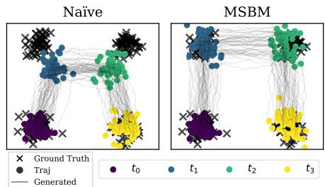
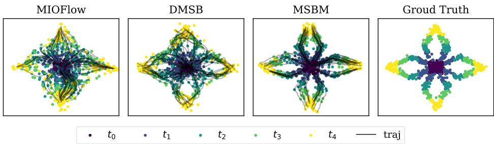
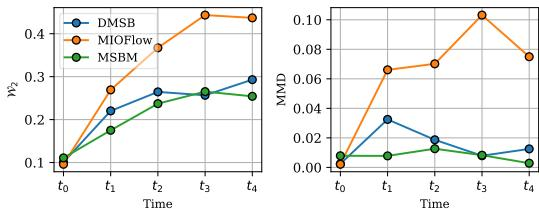
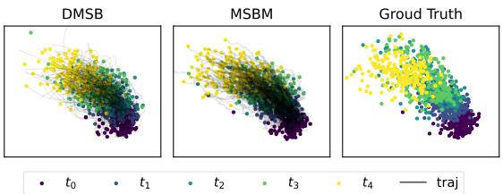
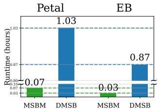

# Multi-Marginal Schrodinger Bridge Matching ¨

Anonymous Author(s)   
Affiliation   
Address   
email

# Abstract

Understanding the continuous evolution of populations from discrete temporal snapshots is a critical research challenge, particularly in fields like developmental biology and systems medicine where longitudinal tracking of individual entities is often impossible. Such trajectory inference is vital for unraveling the mechanisms of dynamic processes. While Schrodinger Bridge (SB) offer a potent framework, ¨ their traditional application to pairwise time points can be insufficient for systems defined by multiple intermediate snapshots. This paper introduces Multi-Marginal Schrodinger Bridge Matching (MSBM), a novel algorithm specifically designed ¨ for the multi-marginal SB problem. MSBM extends iterative Markovian fitting (IMF) to effectively handle multiple marginal constraints. This technique ensures robust enforcement of all intermediate marginals while preserving the continuity of the learned global dynamics across the entire trajectory. Empirical validations on synthetic data and real-world single-cell RNA sequencing datasets demonstrate the competitive or superior performance of MSBM in capturing complex trajectories and respecting intermediate distributions, all with notable computational efficiency.

# 16 1 Introduction

Understanding the continuous evolution of populations from discrete temporal snapshots represents   
a significant challenge in various scientific disciplines, particularly in fields like developmental   
biology [7, 42] and systems medicine [29] where tracking individual entities longitudinally is often   
unfeasible. The ability to infer trajectories from such snapshot data is crucial for elucidating the   
underlying mechanisms of dynamic processes. The Schrodinger Bridge (SB) problem, originally ¨   
rooted in statistical mechanics [43], has garnered substantial interest in machine learning as an   
entropy-regularized, continuous-time formulation of optimal transport [20, 30]. It seeks to identify   
the most probable evolutionary path between prescribed initial and terminal distributions, and has   
been successfully employed in generative modeling [3, 4, 9, 26, 27, 37, 38, 45, 49].   
However, many real-world scenarios present observations or constraints at multiple time points, not   
just at the beginning and end of a process. For instance, in single-cell RNA sequencing (scRNA-seq)   
experiments, which are pivotal for studying complex biological processes like cell differentiation, cells   
are typically destroyed upon measurement [6, 17, 28]. This destructive nature makes it impossible   
to track individual cells over time, thus necessitating the inference of developmental trajectories   
from population-level snapshots collected at several intermediate stages. Similarly, meteorological   
systems may have partial observations across various times [11, 32]. Such situations necessitate   
a multi-marginal generalization of the SB problem (mSBP), where the path measure must align   
with prescribed marginal distributions at multiple intermediate time points. While the traditional   
SB framework offers a powerful approach, its standard application to pairwise time points can   
prove insufficient for systems characterized by multiple intermediate snapshots. Although more   
specialized methods for mSBP have recently been developed [8, 18, 44], the direct application of   
some multi-marginal approaches can lead to error accumulation if not carefully managed, particularly   
when learned controls are even slightly inaccurate. These challenges highlight the need for robust   
and scalable solutions for the mSBP that can effectively integrate information across all observed   
time points.   
This paper introduces Multi-Marginal Schrodinger Bridge Matching (MSBM), a novel algorithm ¨   
specifically developed to address the multi-marginal SB problem by building upon and extending the   
Iterative Markovian Fitting (IMF) algoritmhs [36, 45]. MSBM is designed to effectively manage mul  
tiple marginal constraints by constructing local SBs on each interval and seamlessly integrating them.   
This local construction strategy, underpinned by a shared global parametrization of control functions,   
ensures the robust enforcement of all intermediate marginal distributions while crucially preserving   
the continuity of the learned global dynamics across the entire trajectory. Empirical validations   
conducted on synthetic datasets as well as real-world single-cell RNA sequencing data demonstrate   
that MSBM achieves competitive or superior performance in capturing complex trajectories and   
accurately respecting intermediate distributions, all while exhibiting notable computational efficiency.   
Our work aims to provide a robust and scalable computational method for these multi-marginal   
settings, addressing the critical need for consistent and tractable dynamic inference when data is   
available as snapshots at multiple time points.

We summarize our contributions as follows:

• We extend the theoretical and algorithmic foundations of SBs, including the IMF iteration and optimal control perspectives, to the challenging multi-marginal setting. • We introduce an efficient modeling approach for trajectory inference, that constructs and smoothly integrates local SBs across sub-intervals, inherently allows for parallelized training, leading to significant speed-ups. • Through comprehensive experiments on both synthetic and real-world single-cell RNA sequencing data, we demonstrate that MSBM accurately models complex population dynamics and outperforms state-of-the-art methods in both trajectory fidelity and computational speed.

Notation. Let $\mathcal { P } _ { [ 0 , T ] }$ denote the space of continuous functions taking values in $\mathbb { R } ^ { d }$ on the interval   
$[ 0 , T ]$ . We use an uppercase letter $\mathbb { P } \in \mathcal { P } _ { [ 0 , T ] }$ to represent a path measure. For a path measure   
$\mathbb { P } \in \mathcal { P } _ { [ 0 , T ] }$ , the marginal distribution at discrete time points $\mathcal { T } = \{ t _ { 0 } , \ldots , t _ { k } \}$ , where $0 = t _ { 0 } < t _ { 1 } <$   
$\cdots < t _ { k } = T$ is denoted by $\mathbb { P } _ { \mathcal { T } } \in \mathcal { P } _ { \mathcal { T } }$ , where we define $\mathcal { P } _ { T }$ as the set of measures $\mathbb { P }$ over $\mathbb { R } ^ { d \times | T | }$   
Additionally, the conditional distribution of $\mathbb { P }$ , given $\tau$ , is denoted by $\mathbb { P } _ { | T } \in \mathcal { P } _ { [ 0 , T ] }$ . Moreover, a   
path measure $\mathbb { P }$ can be defined as mixture. For any Borel measurable set $A \in B ( \Omega )$ , $\mathbb { P }$ can be defined   
by $\begin{array} { r } { \mathbb { P } ( A ) = \int _ { \mathbb { R } ^ { d \times | T | } } \mathbb { P } _ { | T } ( A | \mathbf { x } _ { \mathcal { T } } ) d \mathbb { P } _ { \mathcal { T } } ( \mathbf { x } _ { \mathcal { T } } ) } \end{array}$ , where $\mathbb { P } \in \mathcal { P } _ { 0 , T }$ and $\mathbb { P } \in \mathscr { P } _ { T }$ , and we use the shorthand   
$\mathbf { x } _ { \mathcal { T } } : = ( \mathbf { x } _ { 1 } , \cdot \cdot \cdot , \mathbf { x } _ { k } )$ and $[ 0 : k ] : = \{ 0 , 1 , \cdot \cdot \cdot , k \}$ . The Kullback-Leibler (KL) divergence between   
two probability measures $\mu$ and $\nu$ on space $\mathcal { X }$ is defined as $\begin{array} { r } { \mathrm { D } _ { \mathrm { K L } } ( \mu | \nu ) = \int _ { \mathcal { X } } \log \frac { d \mu } { d \nu } ( \mathbf { X } ) d \mu ( \mathbf { X } ) } \end{array}$ when   
$\mu$ is absolutely continuous with respect to $\nu \left( \mu \ll \nu \right)$ , and $\operatorname { D } _ { \mathrm { K L } } ( \mu \vert \nu ) = + \infty$ otherwise. We will   
often refer to probability measures on $\mathbb { R } ^ { d }$ and their Lebesgue densities interchangeably, under the   
standard assumption of absolute continuity. Finally, for a function $\mathcal { V } : [ 0 , T ] \times \mathbb { R } ^ { \breve { d } }  \breve { \mathbb { R } }$ , we define   
the gradient and laplcaian operators with respect to $\mathbf { x } \in \mathbb { R } ^ { d }$ as $\nabla \nu$ and $\Delta \boldsymbol \nu$ , respectively, and its   
partial derivative with respect to time $t \in [ 0 , T ]$ as $\partial _ { t } \nu$ .

# 78 2 Preliminaries

# 2.1 Schrodinger Bridge Matching (SBM) ¨

The Schrodinger Bridge problem (SBP) [ ¨ 16, 43] is a stochastic optimal transport problem [30] that   
seeks the optimal transport plan for endpoint marginals $\rho _ { 0 }$ and $\rho _ { T }$ . In this paper, we focus on the   
dynamical representation, where a reference distribution $\mathbb { Q } \in \mathscr { P } _ { [ 0 , T ] }$ is induced by the SDEs:

$$
d \mathbf { X } _ { t } = f _ { t } ( \mathbf { X } _ { t } ) d t + \sigma d \mathbf { W } _ { t } , \quad \mathbf { X } _ { 0 } \sim \rho _ { 0 } ,
$$

where 83 $f _ { t } : \mathbb { R } ^ { d }  \mathbb { R } ^ { d }$ is a drift, $\sigma \in \mathbb { R }$ is a diffusion, and $\mathbf { W } _ { t } \in \mathbb { R } ^ { d }$ is a standard Wiener process. 84 With the base reference path measure $\mathbb { Q }$ , the dynamic representation of the SB [20, 35, 39] is:

$$
\operatorname* { m i n } _ { \mathbb { P } \in \mathcal { P } _ { [ 0 , T ] } } { \mathrm { D } _ { \mathrm { K L } } ( \mathbb { P } | \mathbb { Q } ) } , \quad \mathrm { s u b j e c t ~ t o } \quad \mathbb { P } _ { 0 } \sim \rho _ { 0 } , \quad \mathbb { P } _ { T } \sim \rho _ { T } .
$$

Recent advancements in dynamical optimal transport [37, 45] have introduced a novel numerical   
methodology for solving SBP. This approach reframes SBP by decomposing its dynamical constraints   
into the time-evolving marginal distributions $\mathbb { P } _ { t }$ for all $t \in [ 0 , T ]$ and the joint coupling $\mathbb { P } _ { 0 , T }$ . This   
optimization relies on IMF [45], a technique that iteratively refines the path measure $\mathbb { P } \in \mathcal { P } _ { [ 0 , T ] }$   
IMF alternates between two projection called Markovian and Reciprocal projections to preserve the   
90 correct endpoint marginals $( \rho _ { 0 } , \rho _ { T } )$ throughout the optimization.   
1 Reciprocal Projection $\mathcal { R }$ . For a given reference measure $\mathbb { Q }$ from (1), and a path measure $\mathbb { P }$ with   
marginals specified at end points $\mathcal { T } = \{ 0 , T \}$ the reciprocal projection is defined as:

$$
\mathscr { R } ( \mathbb { P } , \mathcal { T } ) : = \mathbb { P } _ { \mathcal { T } } \mathbb { Q } _ { | \mathcal { T } } = \mathbb { P } _ { 0 , T } \mathbb { Q } _ { | 0 , T } .
$$

This projection constructs a new path measure by taking the endpoint coupling $\mathbb { P } _ { 0 , T }$ from $\mathbb { P }$ and   
forming a mixture of bridge process using $\mathbb { Q }$ conditioned on these end points. Sampling from   
$\Pi : = { \bar { \mathcal { R } } } ( \mathbb { P } , \mathcal { T } )$ involves drawing end points samples $( \mathbf { X } _ { 0 } , \mathbf { X } _ { T } ) \sim \mathbb { P } _ { 0 , T }$ and then generating a path   
$\mathbf { X } _ { t } ^ { \mathcal { T } }$ between them using conditional reference measure $\mathbb { Q } _ { | 0 , T }$ which induced by following SDEs, for   
any $\left( { { \bf { x } } _ { 0 } } , { { \bf { x } } _ { T } } \right)$ :

$$
\begin{array} { r } { d \mathbf { X } _ { t } ^ { \mathcal { T } } = \left[ f _ { t } ( \mathbf { X } _ { t } ^ { \mathcal { T } } ) + \sigma ^ { 2 } \nabla \log \mathbb { Q } _ { T | t } ( \mathbf { x } _ { T } | \mathbf { X } _ { t } ^ { \mathcal { T } } ) \right] d t + \sigma d \mathbf { W } _ { t } , \quad \mathbf { X } _ { 0 } ^ { \mathcal { T } } = \mathbf { x } _ { 0 } , } \end{array}
$$

If $\mathbb { Q } _ { | 0 , T }$ has tractable bridge formulation, for example, when $\mathbb { Q }$ is chosen as a Brownian motion   
i.e., $\dot { d } \dot { \mathbf { X } } _ { t } = \sigma d \mathbf { W } _ { t }$ , sampling the path at time $t$ given the endpoints can be performed as:

$$
\begin{array} { r } { \mathbf { X } _ { t } ^ { \mathcal { T } } \sim \mathcal { N } \left( ( 1 - \frac { t } { T } ) \mathbf { X } _ { 0 } + \frac { t } { T } \mathbf { X } _ { T } , t ( 1 - \frac { t } { T } ) \sigma ^ { 2 } \right) , \quad \mathrm { w h e r e } \ \left( \mathbf { X } _ { 0 } , \mathbf { X } _ { T } \right) \sim \mathbb { P } _ { 0 , T } . } \end{array}
$$

Markov Projection $\mathcal { M }$ . Although the reciprocal projection $\mathcal { R }$ in (2) preserves end point marginals   
$( \rho _ { 0 } , \rho _ { T } )$ , its sampling process in (4) requires both $( \mathbf { X } _ { 0 } , \mathbf { X } _ { T } )$ , making it non-Markovian and thus   
ill-suited for generative modeling aimed at sampling from $\rho _ { T }$ without knowing $\mathbf { X } _ { T }$ . The Markov   
projection $\mathcal { M }$ resolves this by projecting $\Pi : = { \mathcal { R } } ( \mathbb { P } , { \mathcal { T } } )$ into a family of Markov process while   
ensuring $\mathbb { P } ^ { \star } = \Pi _ { t }$ for all $t \in [ 0 , T ]$ . Again, when $\mathbb { Q }$ is chosen as a Brownian motion i.e., $d \mathbf { X } _ { t } =$   
$\sigma d \mathbf { W } _ { t }$ , the Markov projection of $\Pi$ , $\mathbb { P } ^ { \star } = \mathcal { M } ( \Pi , \mathcal { T } )$ , is induced by following SDEs:

$$
\begin{array} { r l } & { d \mathbf { X } _ { t } ^ { \star } = \sigma v ^ { \star } ( t , \mathbf { X } _ { t } ^ { \star } ) d t + \sigma d \mathbf { W } _ { t } , \quad \mathbf { X } _ { 0 } ^ { \star } \sim \Pi _ { 0 } , } \\ & { \mathrm { w h e r e } \quad v ^ { \star } ( t , \mathbf { x } ) = \frac { 1 } { T - t } \left( \mathbb { E } _ { \mathbb { Q } _ { T \mid t } } \left[ \mathbf { X } _ { T } | \mathbf { X } _ { t } = \mathbf { x } \right] - \mathbf { x } \right) . } \end{array}
$$

Intuitively, the term $\mathbb { E } _ { \mathbb { Q } _ { T \mid t } } \left[ \mathbf { X } _ { T } | \mathbf { X } _ { t } = \mathbf { x } \right]$ can be understood as a prediction of the target state $\mathbf { X } _ { t } ^ { \star }$ .   
Flow matching [23] of Bridge matching [37] tackles the approximation $\mathbf { X } _ { T } ^ { \star } \approx \mathbb { E } _ { \mathbb { Q } _ { T \mid t } } \left[ \mathbf { X } _ { T } \big | \mathbf { X } _ { t } = \mathbf { x } \right]$   
by learning a drift function. This learned drift guides the evolution of $\mathbf { X } _ { t } ^ { \star }$ such that its terminal   
state aligns with the target, often by regressing the drift agains a target drift derived from samples of   
$( \mathbf { X } _ { 0 } , \mathbf { X } _ { T } )$ under the reference conditional bridge measure $\mathbb { Q } _ { | 0 , T }$ .   
Building upon the projections $\mathcal { R }$ and $\mathcal { M }$ , Schrodinger Bridge Matching (SBM) methods [ ¨ 37, 45]   
refines the path measure through an alternating iteraive procedure:

$$
\begin{array} { r } { \mathbb { P } ^ { ( 2 n + 1 ) } : = \mathcal { M } ( \mathbb { P } ^ { ( 2 n ) } , \mathcal { T } ) , \mathbb { P } ^ { ( 2 n + 2 ) } : = \mathcal { R } ( \mathbb { P } ^ { ( 2 n + 1 ) } , \mathcal { T } ) . } \end{array}
$$

Initialized with 113 $\mathbb { P } ^ { ( 0 ) } = \mathbb { P } _ { T } ^ { ( 0 ) } \mathbb { Q } _ { | 0 , T }$ , utilizing $\mathbb { P } _ { \mathcal { T } } ^ { ( 0 ) }$ is independent coupling of $\rho _ { 0 }$ and $\rho _ { T }$ along with the 114 reference conditional bridge measure $\mathbb { Q } _ { | T }$ . Please refer to [37, 45] for more details.

# 115 3 Multi-Marginal Iterative Markovian Fitting

Dynamic SB methods, as discussed in Section 2, have traditionally focused on problems defined   
by two endpoint marginal distributions, $( \rho _ { 0 } , \rho _ { T } )$ . However, in real-world applications, particularly   
in fields like developmental biology (e.g., scRNA-seq studies of cellular differentiation), systems   
are often observed through snapshots at multiple intermediate time points, not just at the beginning   
and end of a process. This prevalence of multi-stage data highlights a critical limitation of standard   
SB approaches. While the theoretical extension of SB methods to handle multiple marginals has   
been explored [1, 31], the development of robust and scalable computational methods for these   
multi-marginal settings has lagged. Recently, methods with IPF-type objectives have been derived   
for multi-marginal cases [8, 44]. However, challenges persist in ensuring global dynamic consistency   
across all intervals, maintaining computational tractability as the number of marginals increases.   
In this section, we extends the SBM framework−conventionally applied to problems with two   
endpoint marginals $( \rho _ { 0 } , \rho _ { T } )$ and foundational to IMF methods−to handle cases involving $k + 1$   
multiple snapshots $( \rho _ { 0 } , \rho _ { t _ { 1 } } , \cdots , \rho _ { T } )$ on discrete time stamps $\mathcal { T } = \{ t _ { 0 } , t _ { 1 } , \cdot \cdot \cdot , t _ { k } \}$ where $0 = t _ { 0 } <$   
$t _ { 1 } < \dots < t _ { k } = T ^ { 1 }$ . Similar to SBP, the dynamic multi-marginal Schrodinger Bridge problem can ¨   
be formally defined as [10] the entropy minimization problem:

$$
\operatorname* { m i n } _ { \mathbb { P } \in \mathcal { P } _ { [ 0 , T ] } } \mathrm { D } _ { \mathrm { K L } } \big ( \mathbb { P } | \mathbb { Q } \big ) , \quad \mathrm { s u b j e c t ~ t o ~ } \quad \mathbb { P } _ { t } \sim \rho _ { t } , \quad \forall t \in \mathcal { T } .
$$

To find a most probable path $\mathbb { P } ^ { \mathrm { m S B P } }$ , the solution of mSBP under multiple constraints, we will generalize   
the principles of SBM in Section 2.1 to the multi-marginal cases in Section 3.1. The extension of   
dynamic SB optimality [20, 35] and the associated stochastic optimal control problem [39] to multi  
marginal settings is presented in Appendix A.

# 135 3.1 Multi-Marginal Projection operators

To develop multi-marginal extension of SBM, we investigate how the IMF framework can be adapted   
to scenarios with multiple snapshots (i.e., where the set of time points $\tau$ has cardinality $| \mathcal { T } | > 2 )$ .   
This adaptation necessitates extending the fundamental building blocks of SBM—specifically, the   
reciprocal projection $\mathcal { R }$ and the Markov projection $\mathcal { M }$ —to handle multiple marginal constraints.   
Multi-Marginal Reciprocal Projection ${ \mathcal { R } } ^ { \mathrm { m m } }$ . First, we state and prove a proposition that character  
izes the reciprocal structure of conditional path measures. In particular, we focus on a mixture of   
142 bridges $\Pi = \Pi _ { T } \mathbb { Q } _ { | T } \in \mathbb { P } _ { [ 0 , T ] }$ constrained by the marginals at multiple timestamps in $\tau$ .   
43 Proposition 1 (Reciprocal Property). For any $\mathbf { x } _ { \mathcal { T } } : = ( \mathbf { x } _ { 0 } , \mathbf { x } _ { t _ { 1 } } , \cdot \cdot \cdot , \mathbf { x } _ { T } ) \in \mathbb { R } ^ { d \times ( k + 1 ) }$ and $t \in$   
$[ t _ { i - 1 } , t _ { i } )$ , the marginal distribution of $\mathbb { Q } _ { | \mathcal { T } } ( \cdot | \mathbf { x } _ { \mathcal { T } } )$ at $t$ satisfies:

$$
\mathbb { Q } _ { | \mathcal { T } } ( \mathbf { x } _ { t } | \mathbf { x } _ { \mathcal { T } } ) = \mathbb { Q } _ { | t _ { i - 1 } , t _ { i } } ( \mathbf { x } _ { t } | \mathbf { x } _ { t _ { i } } , \mathbf { x } _ { t _ { i - 1 } } ) .
$$

Therefore, for any 145 $\mathbb { P } \in \mathcal { P } _ { [ 0 , T ] }$ the reciprocal projection ${ \mathcal { R } } ^ { m m } ( \mathbb { P } , T )$ admits the following factorization:

$$
\begin{array} { r } { \mathcal { R } ^ { m m } ( \mathbb { P } , \mathcal { T } ) = \mathbb { P } _ { \mathcal { T } } \mathbb { Q } _ { | \mathcal { T } } = \mathbb { P } _ { t _ { 0 } , \cdots , t _ { k } } \mathbb { Q } _ { | t _ { 0 } , \cdots , t _ { k } } = \mathbb { P } _ { t _ { 0 } , \cdots , t _ { k } } \prod _ { i = 1 } ^ { k } \mathbb { Q } _ { | t _ { i - 1 } , t _ { i } } , \quad \mathbb { P } \ – a . e . } \end{array}
$$

A key implication of the reciprocal property, detailed in Proposition 1, is that a mixture of diffusion   
bridges constrained on $\tau$ factorizes into independent segments over successive time intervals. This   
factorization simplifies the analysis and simulation of the overall path measure. Since each segment   
can then be treated as a standard conditional bridge process as in (3), closed-form sampling, such as   
in (4), can be applied independently in parallel to each subinterval $\{ t _ { i - 1 } , t _ { i } \} _ { i \in [ 1 : k ] }$ . This tractability   
151 is essential for developing an efficient multi-marginal SBM algorithm.

Multi-Marginal Markov Projection 52 ${ \mathcal { M } } ^ { \mathrm { m m } }$ . With the reciprocal property and factorization in (9), 53 we show that the Markov projection on multi-marginal case can be constructed by similar fashion.

54 Proposition 2 (Multi-Marginal Markovian Projection). Let $\Pi \in { \mathcal { P } } _ { [ 0 , T ] }$ admit factorzation in (9). The multi-marginal Markov projection of 55 $\Pi$ , $\mathbb { P } ^ { \star } : = \mathcal { M } ^ { m m } ( \Pi , \mathcal { T } ) \in \mathcal { P } _ { [ 0 , T ] } ^ { \star }$ , is associated with the SDE:

$$
d \mathbf { X } _ { t } ^ { \star } = \left[ f _ { t } ( \mathbf { X } _ { t } ^ { \star } ) + \sigma v ^ { \star } ( t , \mathbf { X } _ { t } ^ { \star } ) \right] d t + \sigma d \mathbf { W } _ { t } , \quad \mathbf { X } _ { 0 } ^ { \star } \sim \Pi _ { 0 } ,
$$

$$
\begin{array} { r } { w h e r e \ v ^ { \star } ( t , { \mathbf { x } } ) = \sum _ { i = 1 } ^ { k } \mathbf { 1 } _ { [ t _ { i - 1 } , t _ { i } ) } \mathbb { E } _ { \Pi _ { t _ { i } \mid t } } \left[ \nabla \log \mathbb { Q } _ { t _ { i } \mid t } ( { \mathbf { X } } _ { t _ { i } } | { \mathbf { X } } _ { t } ) | { \mathbf { X } } _ { t } = { \mathbf { x } } \right] . } \end{array}
$$

Moreover, 156 $v ^ { \star }$ satisfies the Fokker-Planck equation $\left( F P E \right) / 4 0 J$ :

$$
\begin{array} { r } { \partial _ { t } \rho _ { t } = - \nabla \cdot \left( v _ { t } ^ { \star } ( \mathbf { x } ) \rho _ { t } ( \mathbf { x } ) \right) + \frac { \sigma ^ { 2 } } { 2 } \Delta \rho _ { t } ( \mathbf { x } ) = 0 , \quad \rho _ { t } = \Pi _ { t } , \quad \forall t \in \mathcal { T } , } \end{array}
$$

where 157 $p _ { t }$ is marginal density of $\Pi _ { t }$ . In other words, $\mathbb { P } _ { t } ^ { \star } = \Pi _ { t }$ for all $t \in [ 0 , T ]$ . $d$

As established in Proposition 2, constructing a global diffusion process via (10) with the optimal   
control $v ^ { \star }$ (11)) yields a multi-marginal Markov projection $\mathbf { X } _ { [ 0 , T ] } ^ { \star }$ that is continuous over the entire   
time interval $[ 0 , T ]$ [0,T ]. The continuity arises because the local Markov projections, $\mathbf { X } _ { [ t _ { i - 1 } , t _ { i } ] } ^ { \star }$ , on   
each sub-interval are derived from factorized conditional bridge $\mathbb { Q } _ { | t _ { i - 1 } , t _ { i } }$ in (9). These bridges are   
anchored by identical marginal distributions at there shared boundaries; for instance, both $\mathbf { X } _ { [ t _ { i - 1 } , t _ { i } ] } ^ { \star }$   
and X⋆[ti,ti+1] i s guaranteed to match the marginal distribution $\rho _ { t _ { i } }$ at time $t _ { i }$ . Consequently, these local   
diffusion processes connect seamlessly at adjacent timestamps, resulting in a smooth and well-defined   
path for $\mathbf { X } _ { [ 0 , T ] } ^ { \star }$ . The well-defined nature of the global path, in conjunction with the projections ${ \mathcal { R } } ^ { \mathrm { m m } }$   
and ${ \mathcal { M } } ^ { \mathrm { m m } }$ , is fundamental to successfully applying the SBM framework to the mSBP. Finally, the   
167 uniquness condition for standard SB [45, Proposition 5] can also be extended to multi-marginal case.

Proposition 3 (Uniqueness). Let $\mathbb { P } ^ { \star }$ be a Markov measure which is reciprocal class of $\mathbb { Q }$ satisfying $\mathbb { P } _ { t } ^ { \star } = \rho _ { t }$ for all $t \in \tau$ . Then, $\mathbb { P } ^ { \star }$ is unique solution $\mathbb { P } ^ { m S B P }$ of the mSBP.

Building on the projection operators 70 ${ \mathcal { R } } ^ { \mathrm { m m } }$ , ${ \mathcal { M } } ^ { \mathrm { m m } }$ with the uniquness result of Proposition 3, we can 171 apply the iterative algorithm used in SBM algorithm [45, Algorithm 1] to the multi-marginal setting:

$$
\begin{array} { r } { \mathbb { P } ^ { ( 2 n + 1 ) } : = \mathcal { M } ^ { \mathfrak { m } } ( \mathbb { P } ^ { ( 2 n ) } , \mathcal { T } ) , \ \mathbb { P } ^ { ( 2 n + 2 ) } : = \mathcal { R } ^ { \mathfrak { m } } ( \mathbb { P } ^ { ( 2 n + 1 ) } , \mathcal { T } ) , \quad | \mathcal { T } | > 2 . } \end{array}
$$

72 The convergence guarantees proved for the iteration apply equally well to the multi-marginal case.

Proposition 4 (Convergence). $\mathbb { P } ^ { ( n ) } = \mathbb { P } ^ { m S B P }$ of mSBP as $n \uparrow \infty$ with iterative procedure in (13).

# 3.2 Practical Implementation.

In practice, at each iteration 175 $n$ of (13) we approximate the optimal control $v ^ { \star }$ from (11) by a neural 176 network $v _ { \theta }$ . By Girsanov theorem, $\theta$ are chosen to minimize the following training objective function:

$$
\begin{array} { r } { \mathcal { L } ( \boldsymbol { \theta } , \mathcal { T } , \Pi _ { \mathcal { T } } ) = \int _ { 0 } ^ { T } \mathbb { E } _ { \Pi _ { t , \tau } } [ | | \sigma \nabla \log \mathbb { Q } _ { \beta _ { \mathcal { T } } ( t ) | t } ( \mathbf { X } _ { \beta _ { \mathcal { T } } ( t ) } | \mathbf { X } _ { t } ) - v _ { \boldsymbol { \theta } } ( t , \mathbf { X } _ { t } ) | | ^ { 2 } d t ] , } \end{array}
$$

where $\beta _ { \mathcal { T } } ( t ) = \operatorname* { m i n } _ { u } \{ u > t | t \in \mathcal { T } \} \in [ 0 , T ]$ is the most recent time point in $\tau$ after time $t$ . With   
this notation, the SBM can be generalized to the case of multi-marginal constraints. For example,   
when $\mathcal { T } = \{ 0 , T \}$ then (14) reduces to the objective function described in [45].   
The learned Markov control ${ v } _ { \boldsymbol { \theta } \star } \big ( t , \mathbf { x } _ { t } \big )$ then ensures $\begin{array} { r } { \mathbb { P } _ { t } ^ { \theta ^ { \star } } = \Pi _ { t } } \end{array}$ for all $t \in [ 0 , T ]$ . Moreover, prior   
SBM algorithms interleave forward and backward-time Markov projections to re-anchor the terminal   
distribution and prevent bias between $\mathbb { P } _ { T } ^ { ( n ) }$ and $\Pi _ { T }$ accumulate for each $n \in \mathbb { N }$ . In the multi-marginal   
setting, we again build the backward-time Markov projection as in Proposition 2 by gluing the local   
bridge reversals, so that $\mathbb { P } ^ { \star }$ is governed by both SDEs (10) and the corresponding backward dynamics:

$$
\begin{array} { r l } & { d \mathbf { Y } _ { t } ^ { \star } = [ - f _ { T - t } ( \mathbf { Y } _ { t } ^ { \star } ) + \sigma u ^ { \star } ( t , \mathbf { Y } _ { t } ^ { \star } ) ] d t + \sigma d \mathbf { W } _ { t } , \quad \mathbf { Y } _ { 0 } ^ { \star } \sim \Pi _ { T } , } \\ & { \mathrm { w h e r e ~ } u ^ { \star } ( t , \mathbf { y } ) = \sum _ { i = 1 } ^ { k } \mathbf { 1 } _ { ( t _ { i - 1 } , t _ { i } ] } ( t ) \mathbb { E } _ { \Pi _ { t \mid t _ { i - 1 } } } \left[ \nabla \log \mathbb { Q } _ { t \mid t _ { i - 1 } } ( \mathbf { Y } _ { t } \vert \mathbf { Y } _ { t _ { i - 1 } } ) \vert \mathbf { Y } _ { t } = \mathbf { y } \right] , } \end{array}
$$

where the backward optimal control 185 $u ^ { \star }$ in (16) can be approximated with neural network $u _ { \phi }$ where $\phi$ 186 is chosen to minimize the following training objective function with $\begin{array} { r } { \gamma _ { T } ( t ) = \operatorname* { m a x } _ { u } \{ u < t | t \in T \} } \end{array}$ :

$$
\mathcal { L } ( \phi , \mathcal { T } , \Pi _ { \mathcal { T } } ) = \int _ { 0 } ^ { T } \mathbb { E } _ { \Pi _ { t , \tau } } [ | | \sigma \nabla \log \mathbb { Q } _ { t | \gamma _ { \tau } ( t ) } ( \mathbf { Y } _ { t } | \mathbf { Y } _ { \gamma _ { \tau } ( t ) } ) - u _ { \phi } ( t , \mathbf { Y } _ { t } ) | | ^ { 2 } d t ] .
$$

# 187 4 Multi-Marginal Schrodinger Bridge Matching ¨

A na¨ıve extension of the standard SBM using, multi-marginal projections ${ \mathcal { R } } ^ { \mathrm { m m } }$ and ${ \mathcal { M } } ^ { \mathrm { m m } }$ in Sec 3,   
encounters significant limitations not present in the traditional two-endpoint setting. In such an   
extension, each iteration typically enforces marginal constraints only at the global endpoints $( \rho _ { 0 } , \rho _ { T } )$ .   
The multi-marginal coupling $\Pi _ { T } ^ { ( n ) }$ at each iteration $n$ of (13) is then derived by propagating the   
projected dynamics in (10) or (15) solely from these end points $\rho _ { 0 }$ or $\rho _ { T }$ , respectively.   
This approach leads to critical issues specific to the multi-marginal context. Firstly, if the learned   
controls, such as can arise between $v ^ { \star }$ (forward) or e inferred int $u ^ { \star }$ (backward), are mediate marginals $( \Pi _ { t _ { 1 } } ^ { ( n ) } , \cdot \cdot \cdot \Pi _ { t _ { k - 1 } } ^ { ( n ) } )$ curate, significant biases and the target marginals   
$( \rho _ { t _ { 1 } } , \cdots , \rho _ { t _ { k - 1 } } )$ . Secondly, these discrepancies tend to accumulate iteratively. This accumulation is   
exacerbated because, beyond an initialization $\Pi ^ { ( 0 ) } = \mathbb { P } _ { T } ^ { ( 0 ) } \mathbb { Q } _ { | T }$ with $\mathbb { P } _ { T } ^ { ( 0 ) }$ , independent joint coupling   
of $\{ \rho _ { t } \} _ { t \in T }$ , where the joint distribution might be informed by all prescribed data distributions,   
199 the subsequent self-refinement process for the dynamics often does not directly incorporate the   
1: Input: Snapshots $\{ \rho _ { t } \} _ { t \in \mathcal { T } }$ , bridge $\mathbb { Q } _ { | T }$ , $N \in \mathbb N$   
: Let $\{ \mathbb { P } _ { T _ { i } } ^ { ( 0 ) } \} _ { i \in [ 1 : k ] }$ joint coupling of $\{ \rho _ { t \in \mathscr { T } _ { i } } \} _ { i \in [ 1 : k ] }$ .   
: for $n \in \{ 0 , \ldots , N - 1 \}$ do   
: 5: for Let $i \in \{ 1 , \ldots , k - 1 \}$ $\Pi _ { T _ { i } } ^ { ( 2 n ) } = \mathbb { P } _ { T _ { i } } ^ { ( 2 n ) }$ do in parallel   
: iEstimate $\mathcal { L } ( \phi , \mathcal { T } _ { i } , \Pi _ { \mathcal { T } _ { i } } ^ { ( 2 n ) } , \mathbb { Q } _ { | \mathcal { T } _ { i } } )$   
: Estimate $\begin{array} { r } { \tilde { \mathcal { L } } ( \phi ) = \sum _ { i = 1 } ^ { k } \mathcal { L } ( \phi , \mathcal { T } _ { i } , \Pi _ { \mathcal { T } _ { i } } ^ { ( 2 n ) } , \mathbb { Q } _ { | \mathcal { T } _ { i } } ) } \end{array}$   
: $\begin{array} { r } { u _ { \phi ^ { \star } } = \arg \operatorname* { m i n } _ { \phi } \sum _ { i = 1 } ^ { k } \tilde { \mathcal { L } } ( \phi ) } \end{array}$   
: ϕ i=1Simulate local backward SBs $\{ \mathbb { P } ^ { i , ( 2 n + 1 ) } \} _ { i \in [ 1 : k ] }$   
: $i \in \{ 1 , \ldots , k - 1 \}$ do in parallel   
: Let $\Pi _ { T _ { i } } ^ { ( 2 n + 1 ) } = \mathbb { P } _ { T _ { i } } ^ { ( 2 n + 1 ) }$ 1   
: 13: $\begin{array} { r } { \tilde { \mathcal { L } } ( \boldsymbol { \theta } ) = \sum _ { i = 1 } ^ { k } \mathcal { L } ( \boldsymbol { \theta } , \mathcal { T } _ { i } , \boldsymbol { \Pi } _ { \mathcal { T } _ { i } } ^ { ( 2 n + 1 ) } , \mathbb { Q } _ { | \mathcal { T } _ { i } } ) } \end{array}$ $\mathcal { L } ( \theta , \mathcal { T } _ { i } , \Pi _ { \mathcal { T } _ { i } } ^ { ( 2 n + 1 ) } , \mathbb { Q } _ { | \mathcal { T } _ { i } } )$ Π(2n+1)Ti , Q|Ti )   
$\begin{array} { r } { v _ { \theta ^ { \star } } = \arg \operatorname* { m i n } _ { \theta } \sum _ { i = 1 } ^ { k } \mathcal { L } ( \theta , \mathcal { T } _ { i } , \Pi _ { \mathcal { T } _ { i } } ^ { ( 2 n + 1 ) } ) } \end{array}$   
: Simulate local forward SBs $\{ \mathbb { P } _ { [ t _ { i - 1 } , t _ { i } ] } ^ { i , ( 2 n + 2 ) } \}$   
: end for   
: Output: $v _ { \theta } ^ { \star } , u _ { \phi } ^ { \star }$

Input: Initial $\rho _ { 0 }$ , learned control $v _ { \theta ^ { \star } }$ Sample $\mathbf { X } _ { 0 } \sim \rho _ { 0 }$ Simulate forward SDE over $[ 0 , T ]$ $d \mathbf { X } _ { t } ^ { \star } = \left[ f _ { t } + \sigma v _ { \theta ^ { \star } } ( t , \mathbf { X } _ { t } ^ { \star } ) \right] { \dot { d t } } + { \dot { \sigma } } d \mathbf { W } _ { t }$ Output: Trajectory X⋆[0,T ]

  
Figure 1: (Left) The na¨ıve extension fails to model intermediate states due to the accumulation of errors. (Right) In contrast, MSBM successfully models the ground truth data.

intermediate data distributions $( \rho _ { t _ { 1 } } , \cdots , \rho _ { t _ { k - 1 } } )$ into its training objective except $\rho _ { 0 }$ and $\rho _ { T }$ . Without   
explicit targets for the intermediate marginals guiding each iteration, the inferred paths between $\rho _ { 0 }$   
and $\rho _ { T }$ can “collapse” or drift away from the desired states. Consequently, precisely satisfying all   
intermediate constraints becomes increasingly challenging as iterations proceed.   
To address this issue of error accumulation and ensure all marginal constraints $\{ \rho _ { t } \} _ { t \in T }$ are satis  
fied, we propose a method that involves constructing local SBs on each interval $[ t _ { i - 1 } , t _ { i } ]$ and then   
seamlessly gluing them together. Instead of propagating dynamics from the global endpoints $\rho _ { 0 }$ and   
$\rho _ { T }$ alone, our approach first establishes local SBs for each segment. The resulting local couplings   
are then systematically integrated to satisfy all specified marginal distributions $\{ \rho _ { t } \} _ { t \in T }$ across the   
entire time interval $[ 0 , T ]$ . This local construction strategy helps prevent the compounding of errors at   
intermediate time points while still aiming to achieve the overall multi-marginal SB solution, $\mathbb { P } ^ { \mathrm { m S B P } }$   
The theoretical basis is provided by the following result.   
Corollary 5 (Multi-Marginal Schrodinger Bridge) ¨ . Assume a sequence of controls $\{ v ^ { i } , u ^ { i } \} _ { i \in [ 1 : k ] }$ ,   
where each $v ^ { i } , u ^ { i }$ induced local SBs $\mathbb { P } ^ { i }$ of SBP over local interval $[ t _ { i - 1 } , t _ { i } ]$ with distributions   
$( \rho _ { t _ { i - 1 } } , \rho _ { t _ { i } } )$ in a forward and backward direction, respectively. $\begin{array} { r } { I f \operatorname* { l i m } _ { t \uparrow t _ { i } } v ^ { i } ( t , \dot { \mathbf { x } } ) = v ^ { i + 1 } ( t , \mathbf { x } ) } \end{array}$ and   
$\begin{array} { r } { \operatorname* { l i m } _ { t \downarrow { t } _ { i - 1 } } u ^ { i } ( t , \mathbf { x } ) = u ^ { i - 1 } ( t , \mathbf { x } ) } \end{array}$ for all $i \in [ 1 : k ]$ , then $\mathbb { P } ^ { m S B P }$ of mSBP induced by following $S D E s$ :

$$
\begin{array} { r l } & { d \mathbf { X } _ { t } ^ { \star } = \left[ f _ { t } ( \mathbf { X } _ { t } ^ { \star } ) + \sigma v ^ { \star } ( t , \mathbf { X } _ { t } ^ { \star } ) \right] d t + \sigma d \mathbf { W } _ { t } , \quad \mathbf { X } _ { 0 } ^ { \star } \sim \rho _ { 0 } . } \\ & { d \mathbf { Y } _ { t } ^ { \star } = \left[ - f _ { T - t } ( \mathbf { Y } _ { t } ^ { \star } ) + \sigma u ^ { \star } ( t , \mathbf { Y } _ { t } ^ { \star } ) \right] d t + \sigma d \mathbf { W } _ { t } , \quad \mathbf { Y } _ { 0 } ^ { \star } \sim \rho _ { T } , } \\ { , } & { v ^ { \star } ( t , \mathbf { x } ) = \sum _ { i = 1 } ^ { k } \mathbf { 1 } _ { [ t _ { i - 1 } , t _ { i } ) } ( t ) v ^ { i } ( t , \mathbf { x } ) , \quad u ^ { \star } ( t , \mathbf { x } ) = \sum _ { i = 1 } ^ { k } \mathbf { 1 } _ { ( t _ { i - 1 } , t _ { i } ] } ( t ) u ^ { i } ( t , \mathbf { x } ) . } \end{array}
$$

Building upon Corollary 5, we introduce our Multi-Marginal Schrodinger Bridge Matching (MSBM) ¨   
method to solve the mSBP. A cornerstone of MSBM is divide the global mSBP into local SBPs while   
maintaining the continuity of the composite drift functions $v ^ { \star }$ and $u ^ { \star }$ in (18c) across adjacent intervals,   
which guarantees a globally continuous diffusion process inducing $\mathbb { P } ^ { \mathrm { m S B P } }$ . Furthermore, by explicitly   
constraining each local SBs, $\mathbb { P } ^ { i }$ , on its corresponding marginals $( \rho _ { t _ { i - 1 } } , \rho _ { t _ { i } } )$ , MSBM is designed to   
mitigate the accumulation of bias at intermediate marginals, as shown in Figure 1.   
A key challenge of the MSBM is rigorously satisfying the continuity conditions at the boundaries of   
local controls: $\begin{array} { r } { \operatorname* { l i m } _ { t \uparrow t _ { i } } v ^ { i } ( t , \mathbf { x } ) = v ^ { i + 1 } ( t , \mathbf { x } ) } \end{array}$ and $\begin{array} { r } { \operatorname* { l i m } _ { t \downarrow t _ { i - 1 } } u ^ { i } ( t , \mathbf { x } ) \dot { = } u ^ { i - 1 } ( t , \mathbf { x } ) } \end{array}$ for all $i \in [ 1 : k ]$ . If   
these conditions are not met, discontinuities or “kinks” can arise at the intermediate time steps. Such   
kinks would imply that the overall path measure $\mathbb { P } ^ { \star } \neq \mathcal { M } ^ { \mathrm { m m } } ( \mathbb { P } ^ { \star } , \mathcal { T } )$ . This would, in turn, hinder the   
optimlaity for mSBP, because, following Proposition 3, the desired continuous Markov process is a   
fixed point of both ${ \mathcal { R } } ^ { \mathrm { m m } }$ and Markov projections ${ \mathcal { M } } ^ { \mathrm { m m } }$ under multiple time points $\tau$ :

$$
\mathbb { P } ^ { \star } = \mathcal { R } ^ { \mathtt { m m } } ( \mathbb { P } ^ { \star } , \mathcal { T } ) = \mathcal { M } ^ { \mathtt { m m } } ( \mathbb { P } ^ { \star } , \mathcal { T } ) .
$$

To construct local SBs such that the continuity requirements for forming a valid global solution are   
met, thereby preventing the aforementioned kinks and ensuring (19), our MSBM introduces a shared   
global parametrization $v _ { \theta } , u _ { \phi }$ for its respective local controls $\{ v ^ { i } , u ^ { i } \} _ { i \in [ 1 : k ] }$ for each sub-interval,   
where each local controls are parallel updated with following aggregate objective function:

$$
\tilde { \mathcal { L } } ( \boldsymbol { \theta } ) = \sum _ { i = 1 } ^ { k } \mathcal { L } ( \boldsymbol { \theta } , \mathcal { T } _ { i } , \Pi _ { \mathcal { T } _ { i } } ) , \quad \tilde { \mathcal { L } } ( \boldsymbol { \phi } ) = \sum _ { i = 1 } ^ { k } \mathcal { L } ( \boldsymbol { \phi } , \mathcal { T } _ { i } , \Pi _ { \mathcal { T } _ { i } } ) ,
$$

where 232 $\mathcal { T } _ { i } = \{ t _ { i - 1 } , t _ { i } \}$ define sub-intervals with local coupling $\Pi _ { T _ { i } }$ for end-points marginals in interval 233 $[ t _ { i - 1 } , t _ { i } ]$ and $\mathcal { L }$ is defined in (14) and (17) for forward and backward direction, respectively.

The MSBM training procedure, summarized in Algorithm 1, adapts the standard IMF algorithm   
presented in [45, Algorithm 1]. A key distinction in our MSBM approach is the parallel application   
of the IMF procedure to each local time interval, utilizing globally shared forward $v _ { \theta }$ and backward   
$u _ { \phi }$ across all local intervals. This parallel processing across sub-intervals contributes to a significant   
reduction in overall training time.

# 39 5 Related Work

The solution of SBP often utilize Iterative Proportional Fitting (IPF) [19], with modern adaptations learning SDE drifts for two-marginal settings [4, 9, 13, 49]. A distinct iterative approach, IMF, as featured in [37, 45], offers improved stability by alternating projections onto different classes of path measures. Moreover, emerging research also explores non-iterative algorithm [12, 38]. These methodologies primarily concentrate on the SB problem itself, iteratively refining path measures or directly computing the bridge measure. Moreover, the SB algorithm is studied under the assumption that the optimal coupling is given [27, 46]. While recent studies have extended foundational SB ideas to the multi-marginal setting of mSBP, research in this area remains relatively limited.

In multi-marginal setting, [8] extends the problem to phase space to encourage smoother trajectories   
and introduces a novel training methodology inspired by the Bregman iteration [5] to handle multiple   
marginal constraints. Relatedly, [44] presented an approach that, similar to our work, segments the   
problem across intervals; they learn piecewise SBs and use likelihood-based training to iteratively   
refine a global reference dynamic. While these methods are often IPF-based or focus on specific   
reference refinement strategies, our MSBM extends the previous IMF-type algorithm into multi  
marginal setting and effectively handles multiple constraints. We demonstrate that our MSBM   
framework offers substantial gains in training efficiency. This enhanced efficiency is primarily   
attributed to its direct multi-marginal formulation that adeptly manages multiple constraints, thereby   
circumventing the computationally intensive iterative refinements common in IPF-based methods   
Paralleling these SB-centric developments, other significant lines of work model dynamic trajectories   
by directly learning potential functions or velocity fields, often drawing from optimal transport   
or continuous normalizing flows. For instance, [18, 24–26] extend SBs to incorporate potentials   
or mean-field interactions, connecting to stochastic optimal control and earlier mean-field game   
frameworks [22, 41]. The broader field of trajectory inference from snapshot data, crucial for   
applications like scRNA-seq, has seen methods like [48] using CNFs with dynamic OT, and [15]   
employing Neural ODEs on learned data manifolds. More recently, [33, 34] offer variational   
objectives to learn dynamics from marginal samples.

# 266 6 Experiments

In this section, we empirically demonstrate the effectiveness of our MSBM. Specifically, our goal is to infer a dynamic model from datasets composed of samples from marginal distributions $\rho _ { t }$ observed at discrete time points. We evaluate MSBM on both synthetic datasets and real-world singlecell RNA sequencing datasets, including human embryonic stem cells (hESC) [11] and embryoid body (EB) [32]. To ensure consistency and fair comparison, our experiments follow the respective experimental setups established by baseline methods. In particular, for the petal dataset, we adopt the experimental setup from DMSB [8], and for the hESC dataset, we follow SBIRR [44]. For the EB dataset, we perform evaluations on both 5-dim and 100-dim PCA-reduced data; here, we follow the 100-dim experimental setup of DMSB and the 5-dim setup from NLSB [18]. Accordingly,

  
Figure 3: Comparison of generated population dynamics using MIOFlow, DMSB and MSBM on a 2-dim petal dataset. All trajectories are generated by simulating the dynamics from $\rho _ { t _ { 0 } }$ .

we utilize evaluation metrics consistent with previous studies, including the Sliced-Wasserstein   
Distance (SWD)[2], Maximum Mean Discrepancy (MMD)[14], as well as the 1-Wasserstein $( \mathcal { W } _ { 1 } )$   
and 2-Wasserstein $( \mathcal { W } _ { 2 } )$ distances. All experimental results reported are averaged mean value over   
three independent runs with different random seeds. We highlight the best-performing results in bold   
and the second-best results in blue. Further experimental details are provided in Appendix C.

# 6.1 Synthetic Data

Petal The petal dataset [15] serves as a simple yet complex challenge because it mimics the natural dynamics seen in processes such as cellular differentiation, which include phenomena like bifurcations and merges. We compare our MSBM with MIOFlow [15] and DMSB [8] in Figure 2. As shown in Figure 3, we observe that MSBM exhibits the most accurate and clearly defined trajectory, closely resembling the

  
Figure 2: Evaluation results of $\mathcal { W } _ { 2 }$ and MMD.

ground truth. Furthermore, Figure 2 demonstrates the evaluation results for the trajectories through $\mathcal { W } _ { 2 }$ and MMD distances, highlighting that MSBM consistently outperforms MIOFlow and DMSB.

# 6.2 Single-cell Sequencing Data

We evaluated our MSBM on real-world single-cell RNA sequencing data from two sources: 1) human embryonic stem cells (hESCs) [11] undergoing differentiation into definitive endoderm over a 4-day period, measured at 6 distinct time points $t _ { 0 } { : } 0$ hours, $t _ { 1 } { : } 1 2$ hours, $t _ { 2 } { : } 2 4$ hours, $t _ { 3 } { : } 3 6$ hours, $t _ { 4 } { : } 7 2$ hours, and $t _ { 5 } { : } 9 6$ hours); 2) embryoid body (EB) cells [32] differentiating into mesoderm, endoderm, neuroectoderm, and neural crest over 27 days, with samples collected at 5 time windows $\left( t _ { 0 } { : } 0 - 3\right.$ days, $t _ { 1 } { : } 6 { - } 9$ days, $t _ { 2 } { : } 1 2 \mathrm { - } 1 5$ days, $t _ { \mathrm { 3 } } { : } 1 8 \mathrm { - } 2 1$ days, and $t _ { 4 } { : } 2 4 { - } 2 7$ days). Following the experimental setup of baselines, we preprocessed these datasets using the pipeline outlined in [48], and the collected cells were projected into a lower-dimensional space using principal component analysis (PCA).

hESC To follow the experimental setup from SBIRR [44], we   
reduced the data to the first five principal components and excluded   
the final time point $t _ { 6 }$ from our dataset, resulting in three train  
ing time points $\mathcal { T } = \{ t _ { 0 } , t _ { 2 } , t _ { 4 } \}$ and two intermediate test points   
$\mathcal { T } _ { \sf t e s t } ^ { - } = \{ t _ { 1 } , t _ { 3 } \}$ . Our objective was to train the dynamics based on   
the available marginals at the training points in $\tau$ and interpolate   
the intermediate test marginals at $\mathcal { T } _ { \mathrm { t e s t } }$ , which were not observed   
during training. Table 1 demonstrates that our proposed MSBM   
method performs competitively, achieving lower $\mathcal { W } _ { 2 }$ distances.

Table 1: Performance on the 5- dim PCA of hESC dataset. $\mathcal { W } _ { 2 }$ is compute between test $\rho _ { t _ { i } }$ and generated $\hat { \rho } _ { t _ { i } }$ by simulating the dynamics from test $\rho _ { t _ { 0 } }$ .

Embryoid Body We validate our MSBM on both 5-dim and   
-dim PCA spaces. First, for the 5-dim experiment, we adopt the   
experimental setup from NLSB. Given 5 observation time points

<table><tr><td rowspan="2">Methods</td><td colspan="2">W2↓</td><td>Runtime</td></tr><tr><td>t1</td><td>t3</td><td>hours</td></tr><tr><td>TrajectoryNet+</td><td>1.30 1.93</td><td></td><td>10.19</td></tr><tr><td>DMSB†</td><td>1.10</td><td>1.51</td><td>15.54</td></tr><tr><td>SBIRR+</td><td>1.08</td><td>1.33</td><td>0.36 (0.38)*</td></tr><tr><td>MSBM(Ours)</td><td>1.09</td><td>1.30|</td><td>0.09</td></tr></table>

$^ { \dagger }$ result from [44].

$\mathcal { T } = \{ t _ { 0 } , t _ { 1 } , t _ { 2 } , t _ { 3 } , t _ { 4 } \}$ , we divide the data using train/test splits $\rho _ { T } ^ { \tt t r } / \rho _ { T } ^ { \tt t e }$ , with the goal of predicting population-level dynamics from 315 $\rho _ { t _ { 0 } } ^ { \tt t r }$ . Similar to NLSB, we train the dynamics based on $\rho _ { T } ^ { \tt t r }$ and evaluate the $\mathcal { W } _ { 1 }$ distance between $\rho _ { t _ { i } } ^ { \mathsf { t e } }$ and the generated $\hat { \rho } _ { t _ { i } }$ from previous test snapshot $\rho _ { t _ { i - 1 } } ^ { \mathsf { t e } }$

Table 3: Performance on the 100-dim PCA of Figure 4: Comparison of generated population dyEB dataset. MMD and SWD are computed be-namics using DMSB and MSBM on a 100-dim PCA tween test $\rho _ { t _ { i } } ^ { \mathsf { t e } }$ and generated $\hat { \rho } _ { t _ { i } }$ by simulating of EB dataset. The plot displays the first two princithe dynamics from test $\rho _ { t _ { 0 } } ^ { \mathsf { t e } }$ . pal components as the x and y axes, respectively.   

<table><tr><td></td><td colspan="4">MMD↓</td><td colspan="4">SWD↓</td></tr><tr><td>Methods</td><td>|Full</td><td>t1</td><td>t2</td><td>t3</td><td>|Full</td><td>t1</td><td>t2</td><td>t3</td></tr><tr><td>NLSB† [18]</td><td>0.66</td><td>0.38</td><td>0.37</td><td>0.37</td><td>0.54</td><td>0.55</td><td>0.54</td><td>0.55</td></tr><tr><td>MIOFlow† [15]</td><td>0.23</td><td>0.23</td><td>0.90</td><td>0.23</td><td>0.35</td><td>0.49</td><td>0.72</td><td>0.50</td></tr><tr><td>DMSB† [8]</td><td>0.03</td><td>0.04 0.04 0.04</td><td></td><td></td><td>0.16</td><td>0.20</td><td>0.19</td><td>0.18</td></tr><tr><td>MSBM</td><td></td><td>[0.02 0.04 0.04 0.05|</td><td></td><td></td><td>0.11</td><td>0.18 0.17</td><td></td><td>0.19</td></tr></table>

For the 100-dim experiment, we borrow the experimental setup from DMSB, where the goal is predict population dynamics given that observations are available for all time points $\tau$ (denoted as $\mathtt { F u l 1 }$ in Table 3), or when one of the snapshot is left out (denoted as $t _ { i }$ in Table 3, where snapshot $\rho _ { t _ { i } } ^ { \tt t r }$ at $t _ { i }$ is excluded during training). The high performance in this task represent the robustness of the model to accurately predict population dynamics. In Table 3, MSBM consistently yields performance improvements. Moreover, as shown in Figure 4, the trajectories and generated marginal distributions $\hat { \rho } \tau$ in PCA space further justifies the numerical result and highlights the variety and quality of the samples produced by MSBM.

Table 2: Performance on the 5-dim PCA of EB dataset. $\mathcal { W } _ { 1 }$ is computed between test the $\rho _ { t _ { i } } ^ { \mathsf { t e } }$ and generated amics from pr $\hat { \rho } _ { t _ { i } }$ by simus test ng . $\rho _ { t _ { i - 1 } } ^ { \mathsf { t e } }$   

<table><tr><td rowspan="2">Methods</td><td colspan="5">W1↓</td></tr><tr><td>t1</td><td>t2</td><td>t3</td><td>t4</td><td>Mean</td></tr><tr><td>Neural SDE† [21]</td><td>0.69</td><td>0.91</td><td>0.85</td><td>0.81</td><td>0.82</td></tr><tr><td>TrajectoryNet† [48]</td><td>0.73</td><td>1.06</td><td>0.90</td><td>1.01</td><td>0.93</td></tr><tr><td>IPF(GP)+ [49]</td><td>0.70</td><td>1.04</td><td>0.94</td><td>0.98</td><td>0.92</td></tr><tr><td>IPF (NN)† [4]</td><td>0.73</td><td>0.89</td><td>0.84</td><td>0.83</td><td>0.82</td></tr><tr><td>SB-FBSDE+ [9]</td><td>0.56</td><td>0.80</td><td>1.00</td><td>1.00</td><td>0.84</td></tr><tr><td>NLSB†[18]</td><td>0.68</td><td>0.84</td><td>0.81</td><td>0.79</td><td>0.78</td></tr><tr><td>OT-CFMt [47]</td><td>0.78</td><td>0.76</td><td>0.77</td><td>0.75</td><td>0.77</td></tr><tr><td>WLF-SB [34]</td><td>0.63</td><td>0.79</td><td>0.77</td><td>0.75</td><td>0.73</td></tr><tr><td>MSBM(Ours)</td><td>|0.64</td><td>0.73</td><td>0.72</td><td>0.73</td><td>0.71</td></tr></table>

Computational Efficiency For an fair comparison of training efficiency against recent multi-marginal SB algorithms, we benchmarked DMSB and SBIRR on the identical hardware configuration employed for MSBM (denoted by ∗ in Table 1). On the hESC dataset, MSBM achieved a runtime over $4 \times$ faster than SBIRR. Furthermore, on the petal and 100-dim PCA of EB dataset, MSBM significantly outperformed DSMB in training speed, with detailed results presented in Figure 5.

This enhanced computational efficiency primarily originates from core algorithmic differences. SBIRR, for example, utilizes maximum likelihood training, which requires extensive gradient computations and the storage of all intermediate paths. DMSB employs an IPF-type objective with Bregman Iteration [5]. In contrast, MSBM directly optimizes controls using an IMF-type objective, which not only eliminates the need to store intermediate states but also facilitates parallel computation across sub-intervals. This approach substantially promotes faster convergence of the algorithm.

  
Figure 5: Training time

# 46 7 Conclusion and Limitation

This paper revisits previously established frameworks for the SBP, extending them to the mSBP. Specifically, we introduce a computationally efficient framework for mSBP, termed MSBM, which builds upon existing SBM methods [37, 45]. MSBM is tailored for various trajectory inference problems where snapshots of data are available at multi-marginal time steps. Through the successful adaptation of the IMF algorithm to this multi-marginal setting, our approach significantly accelerates training processes while ensuring accurate dynamic modeling when compared to existing methods.

Despite these advantages, the performance degradation of MSBM is more pronounced than that   
of DMSB when a time point is omitted in Table 3. This may occur because the including velocity   
term could better accommodate unknown trajectory. Furthermore, the current MSBM framework   
is restricted to the case involving snapshot data samples, highlighting a need for enhancements to   
address problems with continuous potentials, such mean-field games [18, 24–26].   
References   
[1] Aymeric Baradat and Christian Leonard. Minimizing relative entropy of path measures under ´   
marginal constraints. arXiv preprint arXiv:2001.10920, 2020.   
[2] Nicolas Bonneel, Julien Rabin, Gabriel Peyre, and Hanspeter Pfister. Sliced and Radon Wasser- ´   
stein barycenters of measures. Journal of Mathematical Imaging and Vision, 51:22–45, 2015.   
[3] Valentin De Bortoli, Iryna Korshunova, Andriy Mnih, and Arnaud Doucet. Schrodinger   
bridge flow for unpaired data translation. In The Thirty-eighth Annual Conference on Neural   
Information Processing Systems, 2024.   
[4] Valentin De Bortoli, James Thornton, Jeremy Heng, and Arnaud Doucet. Diffusion Schrodinger ¨   
bridge with applications to score-based generative modeling. In A. Beygelzimer, Y. Dauphin,   
P. Liang, and J. Wortman Vaughan, editors, Advances in Neural Information Processing Systems,   
.   
[5] L.M. Bregman. The relaxation method of finding the common point of convex sets and   
its application to the solution of problems in convex programming. USSR Computational   
Mathematics and Mathematical Physics, 1967.   
[6] Jason D Buenrostro, Beijing Wu, Ulrike M Litzenburger, Dave Ruff, Michael L Gonzales,   
Michael P Snyder, Howard Y Chang, and William J Greenleaf. Single-cell chromatin accessi  
bility reveals principles of regulatory variation. Nature, 523(7561):486–490, 2015.   
[7] Charlotte Bunne, Stefan G Stark, Gabriele Gut, Jacobo Sarabia Del Castillo, Mitch Levesque,   
Kjong-Van Lehmann, Lucas Pelkmans, Andreas Krause, and Gunnar Ratsch. Learning single- ¨   
cell perturbation responses using neural optimal transport. Nature methods, 20(11):1759–1768,   
2023.   
[8] Tianrong Chen, Guan-Horng Liu, Molei Tao, and Evangelos Theodorou. Deep momentum   
multi-marginal schrodinger bridge. ¨ Advances in Neural Information Processing Systems,   
36:57058–57086, 2023.   
[9] Tianrong Chen, Guan-Horng Liu, and Evangelos Theodorou. Likelihood training of schrodinger ¨   
bridge using forward-backward SDEs theory. In International Conference on Learning Repre  
sentations, 2022.   
[10] Yongxin Chen, Giovanni Conforti, Tryphon T Georgiou, and Luigia Ripani. Multi-marginal   
schrodinger bridges. In ¨ International Conference on Geometric Science of Information, pages   
725–732. Springer, 2019.   
[11] Li-Fang Chu, Ning Leng, Jue Zhang, Zhonggang Hou, Daniel Mamott, David T Vereide, Jeea   
Choi, Christina Kendziorski, Ron Stewart, and James A Thomson. Single-cell rna-seq reveals   
novel regulators of human embryonic stem cell differentiation to definitive endoderm. Genome   
biology, 17:1–20, 2016.   
[12] Valentin De Bortoli, Iryna Korshunova, Andriy Mnih, and Arnaud Doucet. Schrodinger   
bridge flow for unpaired data translation. Advances in Neural Information Processing Systems,   
37:103384–103441, 2024.   
[13] Wei Deng, Weijian Luo, Yixin Tan, Marin Bilos, Yu Chen, Yuriy Nevmyvaka, and Ricky T. Q. ˇ   
Chen. Variational schrodinger diffusion models. In ¨ Forty-first International Conference on   
Machine Learning, 2024.   
[14] Arthur Gretton, Karsten M Borgwardt, Malte J Rasch, Bernhard Scholkopf, and Alexander ¨   
Smola. A kernel two-sample test. The Journal of Machine Learning Research, 13(1):723–773,   
2012.   
[15] Guillaume Huguet, Daniel Sumner Magruder, Alexander Tong, Oluwadamilola Fasina, Manik   
Kuchroo, Guy Wolf, and Smita Krishnaswamy. Manifold interpolating optimal-transport flows   
for trajectory inference. Advances in neural information processing systems, 35:29705–29718,   
405 2022.

06 [16] Benton Jamison. The Markov processes of Schrodinger. ¨ Zeitschrift fur Wahrscheinlichkeitsthe- ¨ orie und verwandte Gebiete, 32(4):323–331, 1975. [17] Allon M Klein, Linas Mazutis, Ilke Akartuna, Naren Tallapragada, Adrian Veres, Victor Li, Leonid Peshkin, David A Weitz, and Marc W Kirschner. Droplet barcoding for single-cell transcriptomics applied to embryonic stem cells. Cell, 161(5):1187–1201, 2015. [18] Takeshi Koshizuka and Issei Sato. Neural Lagrangian Schrodinger bridge: Diffusion modeling ¨ for population dynamics. arXiv preprint arXiv:2204.04853, 2022. [19] Solomon Kullback. Probability densities with given marginals. The Annals of Mathematical Statistics, 39(4):1236–1243, 1968. [20] Christian Leonard. A survey of the Schr ´ odinger problem and some of its connections with ¨ optimal transport. arXiv preprint arXiv:1308.0215, 2013. [21] Xuechen Li, Ting-Kam Leonard Wong, Ricky TQ Chen, and David Duvenaud. Scalable gradients for stochastic differential equations. In International Conference on Artificial Intelligence and Statistics, pages 3870–3882. PMLR, 2020. [22] Alex Tong Lin, Samy Wu Fung, Wuchen Li, Levon Nurbekyan, and Stanley J. Osher. Alternating the population and control neural networks to solve high-dimensional stochastic mean-field games. Proceedings of the National Academy of Sciences, 2021. [23] Yaron Lipman, Ricky T. Q. Chen, Heli Ben-Hamu, Maximilian Nickel, and Matthew Le. Flow matching for generative modeling. In The Eleventh International Conference on Learning Representations, 2023. [24] Guan-Horng Liu, Tianrong Chen, Oswin So, and Evangelos Theodorou. Deep generalized schrodinger bridge. In Alice H. Oh, Alekh Agarwal, Danielle Belgrave, and Kyunghyun Cho, ¨ editors, Advances in Neural Information Processing Systems, 2022. [25] Guan-Horng Liu, Tianrong Chen, and Evangelos A Theodorou. Deep generalized schr\” odinger bridges: From image generation to solving mean-field games. arXiv preprint arXiv:2412.20279, 2024. [26] Guan-Horng Liu, Yaron Lipman, Maximilian Nickel, Brian Karrer, Evangelos Theodorou, and Ricky T. Q. Chen. Generalized schrodinger bridge matching. In ¨ The Twelfth International Conference on Learning Representations, 2024. [27] Guan-Horng Liu, Arash Vahdat, De-An Huang, Evangelos A Theodorou, Weili Nie, and Anima Anandkumar. $\mathrm { I } ^ { 2 } S \mathbf { B }$ : Image-to-image Schrodinger bridge. ¨ arXiv preprint arXiv:2302.05872, 2023. [28] Evan Z Macosko, Anindita Basu, Rahul Satija, James Nemesh, Karthik Shekhar, Melissa Goldman, Itay Tirosh, Allison R Bialas, Nolan Kamitaki, Emily M Martersteck, et al. Highly parallel genome-wide expression profiling of individual cells using nanoliter droplets. Cell, 161(5):1202–1214, 2015. [29] Kenneth G Manton, XiLiang Gu, and Gene R Lowrimore. Cohort changes in active life expectancy in the us elderly population: Experience from the 1982–2004 national long-term care survey. The Journals of Gerontology Series B: Psychological Sciences and Social Sciences, 63(5):S269–S281, 2008. [30] Toshio Mikami. Stochastic optimal transportation: stochastic control with fixed marginals. Springer Nature, 2021. [31] Abdulwahab Mohamed, Alberto Chiarini, and Oliver Tse. Schrodinger bridges with multi- ¨ marginal constraints. 2021. [32] Kevin R Moon, David Van Dijk, Zheng Wang, Scott Gigante, Daniel B Burkhardt, William S Chen, Kristina Yim, Antonia van den Elzen, Matthew J Hirn, Ronald R Coifman, et al. Visualizing structure and transitions in high-dimensional biological data. Nature biotechnology, 37(12):1482–1492, 2019.

4 [33] Kirill Neklyudov, Rob Brekelmans, Daniel Severo, and Alireza Makhzani. Action matching: Learning stochastic dynamics from samples. In Proceedings of the 40th International Conference on Machine Learning, volume 202 of Proceedings of Machine Learning Research. PMLR, 23–29 Jul 2023. [34] Kirill Neklyudov, Rob Brekelmans, Alexander Tong, Lazar Atanackovic, Qiang Liu, and Alireza Makhzani. A computational framework for solving Wasserstein Lagrangian flows. arXiv preprint arXiv:2310.10649, 2023. [35] Michele Pavon and Anton Wakolbinger. On free energy, stochastic control, and Schrodinger ¨ processes. In Modeling, Estimation and Control of Systems with Uncertainty: Proceedings of a Conference held in Sopron, Hungary, September 1990, pages 334–348. Springer, 1991.   
4 [36] Stefano Peluchetti. Non-denoising forward-time diffusions, 2022. [37] Stefano Peluchetti. Diffusion bridge mixture transports, schrodinger bridge problems and ¨ generative modeling. Journal of Machine Learning Research, 24(374):1–51, 2023. [38] Stefano Peluchetti. ${ \bf B M S } \hat { \bf \Sigma } 2 \mathbb { S }$ : Coupled schrodinger bridge matching. ¨ Transactions on Machine Learning Research, 2025.   
[39] Paolo Dai Pra. A stochastic control approach to reciprocal diffusion processes. Applied Mathematics and Optimization, 23:313–329, 1991. [40] Hannes Risken and Hannes Risken. Fokker-planck equation. Springer, 1996. [41] Lars Ruthotto, Stanley J. Osher, Wuchen Li, Levon Nurbekyan, and Samy Wu Fung. A machine learning framework for solving high-dimensional mean field game and mean field control problems. Proceedings of the National Academy of Sciences, 2020. [42] Geoffrey Schiebinger, Jian Shu, Marcin Tabaka, Brian Cleary, Vidya Subramanian, Aryeh Solomon, Joshua Gould, Siyan Liu, Stacie Lin, Peter Berube, et al. Optimal-transport analysis of single-cell gene expression identifies developmental trajectories in reprogramming. Cell, 176(4):928–943, 2019. [43] Erwin Schrodinger. ¨ Uber die umkehrung der naturgesetze ¨ . Verlag der Akademie der Wissenschaften in Kommission bei Walter De Gruyter u . . . , 1931. [44] Yunyi Shen, Renato Berlinghieri, and Tamara Broderick. Multi-marginal Schrodinger bridges ¨ with iterative reference refinement. arXiv preprint arXiv:2408.06277, 2024.   
83 [45] Yuyang Shi, Valentin De Bortoli, Andrew Campbell, and Arnaud Doucet. Diffusion schrodinger ¨ bridge matching. Advances in Neural Information Processing Systems, 36, 2024. [46] Vignesh Ram Somnath, Matteo Pariset, Ya-Ping Hsieh, Maria Rodriguez Martinez, Andreas Krause, and Charlotte Bunne. Aligned diffusion schr\” odinger bridges. arXiv preprint arXiv:2302.11419, 2023. [47] Alexander Tong, Kilian FATRAS, Nikolay Malkin, Guillaume Huguet, Yanlei Zhang, Jarrid Rector-Brooks, Guy Wolf, and Yoshua Bengio. Improving and generalizing flow-based generative models with minibatch optimal transport. Transactions on Machine Learning Research, 2024. Expert Certification. [48] Alexander Tong, Jessie Huang, Guy Wolf, David Van Dijk, and Smita Krishnaswamy. Trajectorynet: A dynamic optimal transport network for modeling cellular dynamics. In International conference on machine learning, pages 9526–9536. PMLR, 2020.   
5 [49] Francisco Vargas, Pierre Thodoroff, Austen Lamacraft, and Neil Lawrence. Solving Schrodinger ¨ bridges via maximum likelihood. Entropy, 23(9):1134, 2021.

# 1. Claims

Question: Do the main claims made in the abstract and introduction accurately reflect the paper’s contributions and scope?

Answer: [Yes]

Justification: The key claims stated in the abstract and introduction correspond appropriately to the scope of the paper.

Guidelines:

• The answer NA means that the abstract and introduction do not include the claims made in the paper.   
• The abstract and/or introduction should clearly state the claims made, including the contributions made in the paper and important assumptions and limitations. A No or NA answer to this question will not be perceived well by the reviewers.   
• The claims made should match theoretical and experimental results, and reflect how much the results can be expected to generalize to other settings.   
• It is fine to include aspirational goals as motivation as long as it is clear that these goals are not attained by the paper.

# 2. Limitations

Question: Does the paper discuss the limitations of the work performed by the authors?

Answer: [Yes]

Justification: The conclusion section provides a discussion on the limitations.

Guidelines:

• The answer NA means that the paper has no limitation while the answer No means that the paper has limitations, but those are not discussed in the paper.   
• The authors are encouraged to create a separate ”Limitations” section in their paper.   
• The paper should point out any strong assumptions and how robust the results are to violations of these assumptions (e.g., independence assumptions, noiseless settings, model well-specification, asymptotic approximations only holding locally). The authors should reflect on how these assumptions might be violated in practice and what the implications would be.   
The authors should reflect on the scope of the claims made, e.g., if the approach was only tested on a few datasets or with a few runs. In general, empirical results often depend on implicit assumptions, which should be articulated.   
• The authors should reflect on the factors that influence the performance of the approach. For example, a facial recognition algorithm may perform poorly when image resolution is low or images are taken in low lighting. Or a speech-to-text system might not be used reliably to provide closed captions for online lectures because it fails to handle technical jargon.   
• The authors should discuss the computational efficiency of the proposed algorithms and how they scale with dataset size.   
• If applicable, the authors should discuss possible limitations of their approach to address problems of privacy and fairness.   
• While the authors might fear that complete honesty about limitations might be used by reviewers as grounds for rejection, a worse outcome might be that reviewers discover limitations that aren’t acknowledged in the paper. The authors should use their best judgment and recognize that individual actions in favor of transparency play an important role in developing norms that preserve the integrity of the community. Reviewers will be specifically instructed to not penalize honesty concerning limitations.

# 3. Theory assumptions and proofs

Question: For each theoretical result, does the paper provide the full set of assumptions and a complete (and correct) proof?

Answer: [Yes]

Justification: Yes, we are confident that our proof and assumptions are both valid and adequate.

Guidelines:

• The answer NA means that the paper does not include theoretical results.   
• All the theorems, formulas, and proofs in the paper should be numbered and crossreferenced.   
• All assumptions should be clearly stated or referenced in the statement of any theorems.   
• The proofs can either appear in the main paper or the supplemental material, but if they appear in the supplemental material, the authors are encouraged to provide a short proof sketch to provide intuition.   
Inversely, any informal proof provided in the core of the paper should be complemented by formal proofs provided in appendix or supplemental material.   
• Theorems and Lemmas that the proof relies upon should be properly referenced.

# 4. Experimental result reproducibility

Question: Does the paper fully disclose all the information needed to reproduce the main experimental results of the paper to the extent that it affects the main claims and/or conclusions of the paper (regardless of whether the code and data are provided or not)?

Answer: [Yes]

Justification: Yes, all the necessary data to reproduce the results can be found in the Appendix C.

Guidelines:

• The answer NA means that the paper does not include experiments.   
• If the paper includes experiments, a No answer to this question will not be perceived well by the reviewers: Making the paper reproducible is important, regardless of whether the code and data are provided or not.   
• If the contribution is a dataset and/or model, the authors should describe the steps taken to make their results reproducible or verifiable.   
Depending on the contribution, reproducibility can be accomplished in various ways. For example, if the contribution is a novel architecture, describing the architecture fully might suffice, or if the contribution is a specific model and empirical evaluation, it may be necessary to either make it possible for others to replicate the model with the same dataset, or provide access to the model. In general. releasing code and data is often one good way to accomplish this, but reproducibility can also be provided via detailed instructions for how to replicate the results, access to a hosted model (e.g., in the case of a large language model), releasing of a model checkpoint, or other means that are appropriate to the research performed.   
While NeurIPS does not require releasing code, the conference does require all submissions to provide some reasonable avenue for reproducibility, which may depend on the nature of the contribution. For example (a) If the contribution is primarily a new algorithm, the paper should make it clear how to reproduce that algorithm. (b) If the contribution is primarily a new model architecture, the paper should describe the architecture clearly and fully. (c) If the contribution is a new model (e.g., a large language model), then there should either be a way to access this model for reproducing the results or a way to reproduce the model (e.g., with an open-source dataset or instructions for how to construct the dataset). (d) We recognize that reproducibility may be tricky in some cases, in which case authors are welcome to describe the particular way they provide for reproducibility. In the case of closed-source models, it may be that access to the model is limited in some way (e.g., to registered users), but it should be possible for other researchers to have some path to reproducing or verifying the results.

# 5. Open access to data and code

Question: Does the paper provide open access to the data and code, with sufficient instructions to faithfully reproduce the main experimental results, as described in supplemental material?

Answer: [Yes]

Justification: We provided our code.

Guidelines:

• The answer NA means that paper does not include experiments requiring code.   
• Please see the NeurIPS code and data submission guidelines (https://nips.cc/ public/guides/CodeSubmissionPolicy) for more details.   
• While we encourage the release of code and data, we understand that this might not be possible, so “No” is an acceptable answer. Papers cannot be rejected simply for not including code, unless this is central to the contribution (e.g., for a new open-source benchmark).   
• The instructions should contain the exact command and environment needed to run to reproduce the results. See the NeurIPS code and data submission guidelines (https: //nips.cc/public/guides/CodeSubmissionPolicy) for more details.   
• The authors should provide instructions on data access and preparation, including how to access the raw data, preprocessed data, intermediate data, and generated data, etc.   
• The authors should provide scripts to reproduce all experimental results for the new proposed method and baselines. If only a subset of experiments are reproducible, they should state which ones are omitted from the script and why.   
• At submission time, to preserve anonymity, the authors should release anonymized versions (if applicable).   
• Providing as much information as possible in supplemental material (appended to the paper) is recommended, but including URLs to data and code is permitted.

# 6. Experimental setting/details

Question: Does the paper specify all the training and test details (e.g., data splits, hyperparameters, how they were chosen, type of optimizer, etc.) necessary to understand the results?

Answer: [Yes]

Justification: We have included the details of the experiments.

Guidelines:

• The answer NA means that the paper does not include experiments. • The experimental setting should be presented in the core of the paper to a level of detail that is necessary to appreciate the results and make sense of them. • The full details can be provided either with the code, in appendix, or as supplemental material.

# 7. Experiment statistical significance

Question: Does the paper report error bars suitably and correctly defined or other appropriate information about the statistical significance of the experiments?

Answer: [Yes]

Justification: Yes, we ran our code three times and reported the mean and standard deviations in the appendix. Due to space limitations, only the mean values are presented in the main text. The complete results can be found in Appendix C.

Guidelines:

• The answer NA means that the paper does not include experiments.   
• The authors should answer ”Yes” if the results are accompanied by error bars, confidence intervals, or statistical significance tests, at least for the experiments that support the main claims of the paper.   
• The factors of variability that the error bars are capturing should be clearly stated (for example, train/test split, initialization, random drawing of some parameter, or overall run with given experimental conditions).   
• The method for calculating the error bars should be explained (closed form formula, call to a library function, bootstrap, etc.)   
• The assumptions made should be given (e.g., Normally distributed errors).   
• It should be clear whether the error bar is the standard deviation or the standard error of the mean.   
• It is OK to report 1-sigma error bars, but one should state it. The authors should preferably report a 2-sigma error bar than state that they have a $96 \%$ CI, if the hypothesis of Normality of errors is not verified.   
• For asymmetric distributions, the authors should be careful not to show in tables or figures symmetric error bars that would yield results that are out of range (e.g. negative error rates).   
• If error bars are reported in tables or plots, The authors should explain in the text how they were calculated and reference the corresponding figures or tables in the text.

# 8. Experiments compute resources

Question: For each experiment, does the paper provide sufficient information on the computer resources (type of compute workers, memory, time of execution) needed to reproduce the experiments?

Answer: [Yes]

Justification: Yes, the necessary resources are included in the experimental details section.

Guidelines:

• The answer NA means that the paper does not include experiments.   
• The paper should indicate the type of compute workers CPU or GPU, internal cluster, or cloud provider, including relevant memory and storage.   
• The paper should provide the amount of compute required for each of the individual experimental runs as well as estimate the total compute.   
• The paper should disclose whether the full research project required more compute than the experiments reported in the paper (e.g., preliminary or failed experiments that didn’t make it into the paper).

# 9. Code of ethics

Question: Does the research conducted in the paper conform, in every respect, with the NeurIPS Code of Ethics https://neurips.cc/public/EthicsGuidelines?

Answer: [Yes]

Justification: We support the NeurIPS Code of Ethics.

Guidelines:

• The answer NA means that the authors have not reviewed the NeurIPS Code of Ethics.   
• If the authors answer No, they should explain the special circumstances that require a deviation from the Code of Ethics.   
• The authors should make sure to preserve anonymity (e.g., if there is a special consideration due to laws or regulations in their jurisdiction).

# 10. Broader impacts

Question: Does the paper discuss both potential positive societal impacts and negative societal impacts of the work performed?

Answer: [NA]

Justification: This paper presents work aimed at advancing the field of machine learning. Our research may have various societal consequences. However, we do not believe any of these require specific emphasis here.

Guidelines:

• The answer NA means that there is no societal impact of the work performed. • If the authors answer NA or No, they should explain why their work has no societal impact or why the paper does not address societal impact.

• Examples of negative societal impacts include potential malicious or unintended uses (e.g., disinformation, generating fake profiles, surveillance), fairness considerations (e.g., deployment of technologies that could make decisions that unfairly impact specific groups), privacy considerations, and security considerations.   
• The conference expects that many papers will be foundational research and not tied to particular applications, let alone deployments. However, if there is a direct path to any negative applications, the authors should point it out. For example, it is legitimate to point out that an improvement in the quality of generative models could be used to generate deepfakes for disinformation. On the other hand, it is not needed to point out that a generic algorithm for optimizing neural networks could enable people to train models that generate Deepfakes faster.   
The authors should consider possible harms that could arise when the technology is being used as intended and functioning correctly, harms that could arise when the technology is being used as intended but gives incorrect results, and harms following from (intentional or unintentional) misuse of the technology.   
• If there are negative societal impacts, the authors could also discuss possible mitigation strategies (e.g., gated release of models, providing defenses in addition to attacks, mechanisms for monitoring misuse, mechanisms to monitor how a system learns from feedback over time, improving the efficiency and accessibility of ML).

# 11. Safeguards

Question: Does the paper describe safeguards that have been put in place for responsible release of data or models that have a high risk for misuse (e.g., pretrained language models, image generators, or scraped datasets)?

Answer: [NA]

Justification: We believe our paper poses no such risks.

Guidelines:

• The answer NA means that the paper poses no such risks.   
• Released models that have a high risk for misuse or dual-use should be released with necessary safeguards to allow for controlled use of the model, for example by requiring that users adhere to usage guidelines or restrictions to access the model or implementing safety filters.   
• Datasets that have been scraped from the Internet could pose safety risks. The authors should describe how they avoided releasing unsafe images.   
• We recognize that providing effective safeguards is challenging, and many papers do not require this, but we encourage authors to take this into account and make a best faith effort.

# 12. Licenses for existing assets

Question: Are the creators or original owners of assets (e.g., code, data, models), used in the paper, properly credited and are the license and terms of use explicitly mentioned and properly respected?

Answer: [Yes]

Justification: Yes, the license and terms of use are noted.

Guidelines:

• The answer NA means that the paper does not use existing assets.   
• The authors should cite the original paper that produced the code package or dataset.   
• The authors should state which version of the asset is used and, if possible, include a URL.   
• The name of the license (e.g., CC-BY 4.0) should be included for each asset.   
• For scraped data from a particular source (e.g., website), the copyright and terms of service of that source should be provided.   
• If assets are released, the license, copyright information, and terms of use in the package should be provided. For popular datasets, paperswithcode.com/datasets has curated licenses for some datasets. Their licensing guide can help determine the license of a dataset.   
• For existing datasets that are re-packaged, both the original license and the license of the derived asset (if it has changed) should be provided.   
• If this information is not available online, the authors are encouraged to reach out to the asset’s creators.

# 13. New assets

Question: Are new assets introduced in the paper well documented and is the documentation provided alongside the assets?

Answer: [NA]

Justification: The paper does not release new assets.

Guidelines:

• The answer NA means that the paper does not release new assets.   
• Researchers should communicate the details of the dataset/code/model as part of their submissions via structured templates. This includes details about training, license, limitations, etc.   
• The paper should discuss whether and how consent was obtained from people whose asset is used.   
• At submission time, remember to anonymize your assets (if applicable). You can either create an anonymized URL or include an anonymized zip file.

# 14. Crowdsourcing and research with human subjects

Question: For crowdsourcing experiments and research with human subjects, does the paper include the full text of instructions given to participants and screenshots, if applicable, as well as details about compensation (if any)?

Answer: [NA]

Justification: We do not involve crowdsourcing or research with human subjects.

Guidelines:

• The answer NA means that the paper does not involve crowdsourcing nor research with human subjects.   
• Including this information in the supplemental material is fine, but if the main contribution of the paper involves human subjects, then as much detail as possible should be included in the main paper.   
• According to the NeurIPS Code of Ethics, workers involved in data collection, curation, or other labor should be paid at least the minimum wage in the country of the data collector.

# 15. Institutional review board (IRB) approvals or equivalent for research with human subjects

Question: Does the paper describe potential risks incurred by study participants, whether such risks were disclosed to the subjects, and whether Institutional Review Board (IRB) approvals (or an equivalent approval/review based on the requirements of your country or institution) were obtained?

Answer: [NA]

Justification: We do not involve crowdsourcing or research with human subjects

Guidelines:

• The answer NA means that the paper does not involve crowdsourcing nor research with human subjects.   
• Depending on the country in which research is conducted, IRB approval (or equivalent) may be required for any human subjects research. If you obtained IRB approval, you should clearly state this in the paper.   
• We recognize that the procedures for this may vary significantly between institutions and locations, and we expect authors to adhere to the NeurIPS Code of Ethics and the guidelines for their institution.   
• For initial submissions, do not include any information that would break anonymity (if applicable), such as the institution conducting the review.

# 16. Declaration of LLM usage

Question: Does the paper describe the usage of LLMs if it is an important, original, or non-standard component of the core methods in this research? Note that if the LLM is used only for writing, editing, or formatting purposes and does not impact the core methodology, scientific rigorousness, or originality of the research, declaration is not required.

Answer: [NA]

Justification: We do not use LLM for core methodology, scientific rigorousness, or originality of the research.

Guidelines:

• The answer NA means that the core method development in this research does not involve LLMs as any important, original, or non-standard components. • Please refer to our LLM policy (https://neurips.cc/Conferences/2025/LLM) for what should or should not be described.
