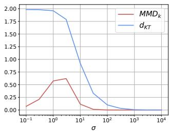

# Kernel Trace Distance: Quantum Statistical Metric between Measures through RKHS Density Operators

Anonymous Author(s)   
Affiliation   
Address   
email

# Abstract

Distances between probability distributions are a key component of many statistical machine learning tasks, from two-sample testing to generative modeling, among others. We introduce a novel distance between measures that compares them through a Schatten norm of their kernel covariance operators. We show that this new distance is an integral probability metric that can be framed between a Maximum Mean Discrepancy (MMD) and a Wasserstein distance. In particular, we show that it avoids some pitfalls of MMD, by being more discriminative and robust to the choice of hyperparameters. Moreover, it benefits from some compelling properties of kernel methods, that can avoid the curse of dimensionality for their sample complexity. We provide an algorithm to compute the distance in practice by introducing an extension of kernel matrix for difference of distributions that could be of independent interest. Those advantages are illustrated by robust approximate Bayesian computation under contamination as well as particle flow simulations.

# 14 1 INTRODUCTION

Statistical distances are ubiquitous in the fundamental theory of machine learning and serve as the   
backbone of many of its applications, such as: discriminating between the generative model and real   
data in Generative Adversarial Networks (GAN) [Goodfellow et al., 2014, Arjovsky et al., 2017, Li   
et al., 2017, Genevay et al., 2018, Birrell et al., 2022], testing whether a dataset is close to another   
(two-sample test) [Eric et al., 2007, Gretton et al., 2012, Hagrass et al., 2024] or to a particular   
distribution (goodness-of-fit test), as well as acting as an objective loss function in particle gradient   
flows [Arbel et al., 2019, Feydy et al., 2019, Korba et al., 2021, Hertrich et al., 2023, Neumayer et al.,   
2024, Chen et al., 2024], or in minimum distance estimators [Wolfowitz, 1957, Basu et al., 2011].   
A class of distances between probability distributions, called Integral Probability Metrics   
(IPM) [Muller, 1997], is defined by measuring the supremum of difference of integrals over a ¨   
function space. It comprises many popular metrics such as the Total Variation distance, Wasserstein-1   
distance and the Maximum Mean Discrepancy (MMD) [Gretton et al., 2012] also known as quadratic   
distance [Lindsay et al., $\boxed { 2 0 0 8 }$ . IPMs’ theoretical properties were largely investigated in the literature,   
such as their statistical convergence rate [Sriperumbudur et al., 2010], concentration for inference   
using ABC [Legramanti et al., $\overline { { [ 2 0 2 2 ] } }$ , PAC-Bayes bounds [Amit et al., 2022], as well as adversarial   
interpretations [Husain and Knoblauch, 2022]. For instance, the MMD enjoys a fast statistical   
convergence rate of $\overline { { O ( n ^ { - \frac { 1 } { 2 } } ) } }$ while the Wasserstein distance suffers from the curse of dimensionality   
with a rate no better than $\Theta ( n ^ { - \frac { 1 } { d } } )$ [Kloeckner, 2012]. One could wonder: how large such a function   
space could be before the curse of dimensionality kicks in? In this work, we theoretically investigate   
how to get closer to such frontier by defining an extended family of kernel distances, that write as   
novel IPM whose dual function space is larger than the one of MMD.   
Kernel methods allow to represent a distribution by a vector by associating to a datapoint $x$ a feature   
map image $\varphi ( x )$ in a Hilbert space, and by doing so, embed in a linear way a distribution $\mu$ to what   
is called a (kernel) mean embedding $\begin{array} { r } { \mathbb { E } _ { X \sim \mu } [ \varphi ( X ) ] = \int \varphi ( x ) d \mu ( x ) } \end{array}$ . However mean embeddings for   
different distributions may have different “energies”, i.e., squared Hilbert norms, which may lead   
to several pitfalls of MMD. In quantum information theory $\begin{array}{c} \scriptstyle | { \overline { { \mathbf { W a t r o u s } } } } ,  & { \scriptstyle 2 0 1 8 } \end{array} ]$ , a similar idea to mean   
embedding is called superposition. The quantum equivalent of a datapoint or deterministic Dirac   
distribution is called a pure state and is a projector of rank and trace one, that could be denoted $v v ^ { * }$   
(or $| v \rangle \langle v | )$ for a unit vector $v$ . Its analog for a general probability distribution is called a mixed state   
and is the superposition $\begin{array} { r } { \sum _ { v } p ( v ) | v \rangle \langle v | } \end{array}$ where $p ( v )$ are probabilities. A non-trivial mixed state can   
hardly be confused with a pure state as a linear combination of different projectors is of higher rank   
than 1: using projecting operators instead of the vectors themselves makes the linearity less “trivial”.   
As those positive definite operators can be diagonalised, by using always the same orthogonal basis   
and studying the eigenvalues, we recover classical probabilities, and as such we can see quantum   
probabilities as their extension. Recently, the work of $\mathbf { \underline { { B a c h } } } \mathbf { \lVert } \mathbf { \underline { { 2 0 2 2 } } } \mathbf { \ ] }$ introduced a novel divergence   
between probability distributions, by plugging a kernel operator embedding of the distributions   
(which are also positive definite operators) in the Von Neumann relative entropy from quantum   
information theory (i.e., a Kullback-Leibler divergence between positive Hermitian operators), and   
whose statistical and geometrical properties were investigated more in depth in $\boxed { \mathrm { C h a z a l ~ e t ~ a l . } } \boxed { 2 0 2 4 } ]$   
Instead of considering a divergence on such operators, here we propose to draw inspiration from   
quantum statistical metrics, which enjoy nice geometrical properties such as the triangle inequality.   
Two of them are well-known and mutually bounding: the Bures metric, and the trace distance, on   
which we focus here, and which is derived from a (Schatten) norm.   
Related works The kernelised version of Bures metric, i.e., a Bures metric between kernel covari  
ance operators, has been studied for instance in Oh et al. [2020], Zhang et al. [2019]. The closest   
work to ours is the one by Mroueh et al. [2017]. They consider a similar metric to ours, i.e. the   
trace distance, that they refer to as Covariance Matching IPM. It shares the same dual writing as   
the metric we consider, yet, in that work, the dual problem is solved through a numerical program   
involving neural networks that approach kernel features. Hence, they compute an approximate   
version of their target metric. In contrast, we use kernel features directly in the dual formulation,   
and derive a closed-form for the metric leveraging a kernel trick. Moreover, we provide theoretical   
guarantees regarding this metric and investigate different numerical applications than the one of the   
GAN considered in Mroueh et al. [2017].

Contributions Our main contributions can be summarized as follows:

(i) Inspired by quantum statistics, we introduce a novel distance between probability distributions called kernel trace distance $( d _ { K T } )$ .   
(ii) We show that $d _ { K T }$ is an IPM and illustrate several of its theoretical properties, mainly: a direct comparison to MMD, robustness to contamination, and statistical convergence rates that do not depend on the dimension.   
(iii) We showcase how to compute $d _ { K T }$ and illustrate its practical performance on particle gradient flows and Approximate Bayesian Computation (ABC).

Organisation of the paper In section $^ { 2 , }$ we provide some background on quantum statistical   
distances and introduce $d _ { K T }$ . In section $\mathbb { B } ,$ we explain further the motivation to introduce $d _ { K T }$ ,   
notably by comparing it with the other distances, MMD in particular. We show in section $\mathbb { E }$ under   
some eigenvalue decay rate assumptions, convergence rates that do not depend on the dimension, as   
well as robustness. In section $\boxed { 2 . 3 } ,$ we explain how to compute $d _ { K T }$ . Finally, we illustrate our findings   
by experiments in section 5.

# 82 2 Kernel Trace Distance

For a positive semi-definite kernel $k : \mathcal { X } \times \mathcal { X } \to \mathbb { R }$ , its RKHS $\mathcal { H }$ is a Hilbert space of real-valued   
functions with inner product $\langle \cdot , \cdot \rangle _ { \mathscr { H } }$ and norm $\| \cdot \| _ { \mathcal { H } }$ . It is associated with a feature map $\varphi : \mathcal X \to \mathscr { H }$   
such that $k ( x , y ) = \langle \varphi ( x ) , \varphi ( y ) \rangle _ { \mathcal { H } }$ . We denote $\mathcal { L } ( \mathcal { H } )$ the space of bounded linear operators from   
$\mathcal { H }$ to itself. For a vector $v \in \mathcal { H }$ , $v ^ { * }$ denotes its dual linear form defined by $v ^ { * } ( w ) = \bar { \langle } v , w \rangle$ for any   
$w \in \mathcal { H }$ . For an operator $T \in { \mathcal { L } } ( { \mathcal { H } } )$ , $T ^ { * }$ is its adjoint. $| | \cdot | | _ { p }$ denotes the $p$ -Schatten norm explicited   
88 below.

9 Assumption 0. In the whole paper, we restrict ourselves to the setting of a completely separable set 0 $\mathcal { X }$ , endowed with a Borel $\sigma$ -algebra, and a separable RKHS $\mathcal { H }$ of real-valued functions on $\mathcal { X }$ , with a bounded continuous strictly positive kernel.

# 2.1 Background

3 RKHS density operators [Bach, 2022]. Let $\mu$ a measure on $\mathcal { X }$ . Define $\Phi$ the kernel covariance   
operator embedding as:

$$
\Phi : \mu \mapsto \Sigma _ { \mu } = \int _ { \mathcal { X } } \varphi ( x ) \varphi ( x ) ^ { \ast } d \mu ( x ) .
$$

We will call $\Sigma _ { \mu }$ the RKHS density operator of $\mu$ , in reference to the wording of density operator   
in quantum information theory: this is to insist that $\Sigma _ { \mu }$ is an embedding in itself (with feature map   
$\varphi ( \cdot ) \varphi ( \cdot ) ^ { * } )$ , rather than just the covariance of a mean embedding with feature map $\varphi$ . The operator $\Sigma _ { \mu }$   
is self-adjoint, and positive semidefinite when $\mu$ is a probability measure. To keep the analogy with   
quantum density operators, similarly to $\overline { { | \mathbf { B } \mathbf { a c h } | } } \dot { \lVert } \overline { { 2 0 2 2 } } \rVert$ , we consider kernels respecting the property:

Assumption 1. $\forall x \in \mathcal { X } , \ k ( x , x ) = 1 .$

to ensure $\mathrm { T r } \Sigma _ { \mu } = 1$ (as in the sum of all probabilities equals one). If $\forall x \in \mathcal { X } , \ k ( x , x ) = M$ for a   
non-zero constant $M \ne 1$ , it is will be easy to generalize many of our results later by dividing by   
$M$ , so this assumption is not too restrictive. If the kernel does not verify Assumption $^ { 1 }$ but is strictly   
positive, it is could also be normalised using $\begin{array} { r } { \tilde { k } ( x , y ) = \frac { k ( x , y ) } { \sqrt { k ( x , x ) k ( y , y ) } } } \end{array}$ instead.   
Schatten norms. We now provide some background on Schatten norms $\| \mathrm { S i m o n } \| 2 0 0 5 \|$ . For an   
operator $T \in { \mathcal { L } } ( { \mathcal { H } } )$ and $p \in [ 1 , \infty )$ , the $p$ -Schatten norm is defined as $| | T | | _ { p } = ( \mathrm { T r } ( | T | ^ { p } ) ) ^ { 1 / p }$ where   
$| T | = { \sqrt { T ^ { * } T } }$ . If $T$ is compact, this can be rewritten as the $p$ -vectorial norm of the singular values of   
$T$ . It also admits a dual definition, denoting $q$ such that $1 / p + 1 / q = 1$ :

$$
| | T | | _ { p } = \operatorname* { s u p } _ { U \in \mathcal { L } ( \mathcal { H } ) , | | U | | _ { q } = 1 } \langle U , T \rangle
$$

where the inner product is 109 $\langle U , T \rangle = \operatorname { T r } ( U ^ { * } T )$ .

The Schatten 2-norm is the Hilbert-Schmidt norm with respect to this inner product: $| | T | | _ { 2 } =$   
\$Tr(T ↓T ). Then, the Schatten ⇓-norm is the operator norm : ||T ||↗ = supx↔H\0 ||x|| ||T x||H i.e., the   
maximum of the singular values of the operator in absolute value. We have the following inequalities:

$\begin{array} { r l } & { \bullet \mathrm { ~ F o r ~ } 1 \leq p \leq q \leq \infty \colon \forall T \in \mathcal { L } ( \mathcal { H } ) , | | T | | _ { 1 } \geq | | T | | _ { p } \geq | | T | | _ { q } \geq | | T | | _ { \infty } . } \\ & { \bullet \mathrm { ~ } \forall T , S \in \mathcal { L } ( \mathcal { H } ) , | | T S | | _ { 1 } \leq | | T | | _ { 2 } | | S | | _ { 2 } . } \end{array}$ • From this, it can be deduced taking $T$ as the identity operator, for $\mathcal { H }$

of finite dimension:

$$
\forall S \in \mathcal { L } ( \mathcal { H } ) , | | S | | _ { 1 } \leq \sqrt { \mathrm { d i m } ( \mathcal { H } ) } | | S | | _ { 2 } .
$$

# 16 2.2 Definition

In quantum information theory, the trace distance is a mathematical tool that can be used to compare density operators by measuring the Schatten 1-norm of their difference. Inspired by this, we define:

Definition 2.1. The kernel trace distance between two probability measures $\mu , \nu$ on $\mathcal { X }$ is defined as:

$$
d _ { K T } ( \mu , \nu ) = | | \Sigma _ { \mu } - \Sigma _ { \nu } | | _ { 1 } .
$$

We will also relate it to other distances such as:

• Wasserstein distances [Villani, 2009]:

$$
W _ { d } ( \mu , \nu ) = \operatorname* { i n f } _ { \pi \in \Pi ( \mu , \nu ) } \iint d ( x , y ) \mathrm { d } \pi ( x , y )
$$

where $d : \mathcal { X } \times \mathcal { X } \to \mathbb { R } ^ { + }$ is a cost and $\Pi ( \mu , \nu )$ denotes all the possible couplings between $\mu$ and $\nu$ . The Wasserstein- $p$ distance is obtained by replacing $d$ by its power $d ^ { p }$ in the integral and taking the $p$ -root of the whole expression.

• The Bures distance [Bhatia et al., $\boxed { 2 0 1 9 }$ on positive definite matrices $A$ :

where $F ( A , B ) \ = \ \mathrm { T r } ( A ^ { 1 / 2 } B A ^ { 1 / 2 } ) ^ { 1 / 2 }$ is called the fidelity. It coincides with the Wasserstein-2 distance between two normal distributions (also called Bures-Wassertein distance) with identical mean, and different covariances $A$ and $B$ . The formula can be extended to operators with finite traces.

• The Kernel Bures distance [Zhang et al., 2019] is defined as:

$$
d _ { K B W } ( \mu , \nu ) = d _ { B W } ( \Sigma _ { \mu } , \Sigma _ { \nu } ) .
$$

• The Total Variation is a special case of the Wasserstein distance where the cost is $d :$ $( x , y ) \mapsto 1 _ { x = y }$ and can be expressed as:

$$
| | \mu - \nu | | _ { T V } = \frac 1 2 \int _ { \mathcal { X } } | \mu ( x ) - \nu ( x ) | d x
$$

• The Maximum Mean Discrepancy [Gretton et al., 2012]:

$$
\mathrm { M M D } ( \mu , \nu ) = \left| \left| \int _ { \mathcal { X } } k ( x , \cdot ) \mu ( x ) d x - \int _ { \mathcal { X } } k ( x , \cdot ) \nu ( x ) d x \right| \right| _ { \mathcal { H } }
$$

• Integral Probability Metrics (IPM) [Muller, 1997] defined as: ¨

$$
d ( \mu , \nu ) = \operatorname* { s u p } _ { f \in { \mathcal { F } } } \{ | \mathbb { E } _ { X \sim \mu } [ f ( X ) ] - \mathbb { E } _ { X \sim \nu } [ f ( X ) ] | \}
$$

where the function space $\mathcal { F }$ is rich enough to make this expression a metric. The Wasserstein1 distance, the TV and MMD are IPMs (with $\mathcal { F }$ being 1-Lipschitz functions w.r.t. $\| \cdot \|$ , functions with values in [-1,1], and a RKHS unit ball respectively).

Proposition 2.2. If 38 $k ^ { 2 }$ is characteristic i.e $\Phi$ is injective, $d _ { K T }$ and $d _ { K B W }$ are metrics.

PROOF. Symmetry, non-negativity, triangle inequality and $d _ { K T } ( \mu , \mu ) = 0$ (resp. $d _ { K B W } ( \mu , \mu ) = 0 )$   
are naturally inherited from the Schatten norm on operators for $d _ { K T }$ and from the standard Bures  
Wasserstein distance for $d _ { K B W }$ . Then, as $d _ { K T } ( \mu , \nu ) = 0$ (resp. $d _ { K B W } ( \mu , \nu ) = 0 ;$ ) implies $\Sigma _ { \mu } = \Sigma _ { \nu }$ ,   
injectivity of $\Phi$ enforces $\mu = \nu$ .   
Examples of characteristic kernels are the family of Gaussian kernels, whose squared kernel also   
belong to, modulo a change of parameter. On compact set, a sufficient condition for characteristicity   
is universality [Steinwart, $\mathbf { \widehat { | 2 0 0 1 | } }$ , see for instance $\mathbf { \Delta B a c h | | } 2 0 2 2 ]$

# 46 2.3 Computation for discrete measures

As interesting, i.e. expressive RKHS are often of infinite dimension, computations with kernel   
methods relies on the so-called “kernel trick”, reducing computation on the empirical kernel matrix   
(Gram matrix of two sets of samples using the kernel inner product) which is of finite dimension. It is   
well-known that the spectrum of the covariance operator $\Sigma _ { \mu _ { n } }$ are the ones of the kernel Gram matrix   
$( k ( x _ { i } , x _ { j } ) ) _ { i , j = 1 } ^ { n }$ n divided by the number of samples [Bach, 2022, Proposition 6]. Here, we generalise   
the concept for differences of distributions.   
First, notice that $\Sigma _ { \mu _ { n } } - \Sigma _ { \nu _ { m } } = \Sigma _ { \mu _ { n } - \nu _ { m } }$ , which incites us to consider the samples from each   
distribution altogether. We denote without duplicates $( z _ { k } ) _ { k = 1 , \dots , r }$ the samples in the union of   
the sample sets $X , Y$ (corresponding respectively to distributions $\mu _ { n } , \nu _ { m } )$ , where $r$ is the number   
of distinct elements in $X , Y$ . We note $\dot { Z } = [ \tilde { \varphi } ( z _ { k } ) ] _ { k = 1 \dots r }$ the column of vectors in $\mathcal { H }$ where   
$\tilde { \varphi } ( z _ { k } ) = \sqrt { ( \mu _ { n } - \nu _ { m } ) ( \{ z _ { k } \} ) } \varphi ( z _ { k } )$ if $( \mu _ { n } - \nu _ { m } ) ( \{ z _ { k } \} ) \geq 0$ , $\tilde { \varphi } ( z _ { k } ) = i \sqrt { | ( \mu _ { n } - \nu _ { m } ) ( \{ z _ { k } \} ) | } \varphi ( z _ { k } )$   
else.   
We can see $Z$ by a slight abuse of notation as the linear map $Z ~ : ~ { \mathcal { H } } ~ \to ~ \mathbb { C } ^ { r } , v ~ \mapsto ~$   
$[ \langle \tilde { \varphi } ( z _ { 1 } ) , v \rangle , . . . , \langle \tilde { \varphi } ( \dot { z } _ { r } ) , v \rangle ]$ and by duality $Z ^ { \ast }$ (real not Hermitian adjoint) would be the linear map   
$\begin{array} { r } { Z ^ { * } : \mathbb { C } ^ { r }  \mathcal { H } , u \mapsto \sum _ { i = 1 , \dots , r } u _ { i } \tilde { \varphi } ( z _ { i } ) } \end{array}$ .   
Then we define the difference kernel matrix as $K = Z ^ { * } Z$ . Typically, in case where all samples are   
distinct, $X \cap Y = \emptyset$ and $( \mu _ { n } - \nu _ { m } ) ( \{ z _ { k } \} ) = \mu _ { n } ( \{ z _ { k } \} ) = 1 / n$ for samples $z _ { k } \in X$ from $\mu _ { n }$ and   
$( \mu _ { n } - \nu _ { m } ) ( \{ z _ { k } \} ) = - \nu _ { m } ( \{ z _ { k } \} ) = 1 / m$ for samples $z _ { k } \in Y$ from $\nu _ { m }$ , then

$$
K = \left[ \frac { \frac { 1 } { n } K _ { X X } } { \frac { i } { \sqrt { m n } } K _ { Y X } } \left| \frac { \frac { i } { \sqrt { m n } } K _ { X Y } } { - \frac { 1 } { m } K _ { Y Y } } \right. \right]
$$

where $K _ { X X } , K _ { Y Y } , K _ { Y X } , K _ { X Y }$ are the usual kernel Gram matrices. Other cases are similar, adjust  
166 ing the probability weights on rows and columns.

Proposition 2.3. Assume the kernel is such that for any family $( x )$ of distinct elements of $\mathcal { X }$ , $( \varphi ( x ) )$ is linearly independent. The difference kernel matrix $K$ as defined just above and $\Sigma _ { \mu _ { n } - \nu _ { m } }$ have the 69 same eigenvalues, whose Schatten 1-norm is $d _ { K T } ( \mu _ { n } , \nu _ { m } )$ .

The proof of Proposition $2 . 3$ is deferred to Appendix $\underline { { \boxed { \mathbf { A . 4 } } } }$ The condition is verified by the Gaussian kernel and more generally it is equivalent to the kernel being strictly positive. It is sufficient to get the eigenvalues by either Autonne-Takagi factorisation $\rVert \mathbf { \bar { A u t o n n e } } , \mathbf { \bar { | 1 9 1 5 | } } , \mathbf { \bar { | T a k a g i | } } , \mathbf { \bar { | 9 2 4 | } }$ , Schur or Singular Value decomposition, and compute their 1-norm. This SVD is of complexity $\overline { { O ( r ^ { 3 } ) } }$ in general.

# 3 Discriminative properties

In this section, we study the discriminative properties of the $d _ { K T }$ distance and how it relates to alternative distances between distributions introduced previously.

# 3.1 Comparison with other distances

We first show that our novel distance $d _ { K T }$ belongs to the family of Integral Probability Metrics (IPM).

# Proposition 3.1.

(i) $d _ { K T }$ is an IPM with respect to the function space ${ \mathcal { F } } _ { 1 } = \{ f : ~ x ~ \mapsto ~ \varphi ( x ) ^ { * } U \varphi ( x ) | U ~ \in ~$ $\mathcal { L } ( \mathcal { H } ) , | | U | | _ { \infty } = 1 \}$ . Moreover if Assumption 1 is verified:   
(ii) functions in $\mathcal { F } _ { 1 }$ have values in $[ - 1 , 1 ]$ , and   
(iii) verify the following “Lipschitz” property: $\forall x , y \in \mathcal { X } , | f ( x ) - f ( y ) | \leq 2 | | \varphi ( x ) - \varphi ( y ) | | _ { \mathcal { H } } .$ .

The proof of Proposition $3 . 1$ is deferred to Appendix $\boxed { \mathbf { A . 2 } }$ Since the TV distance is an IPM with respect to functions bounded by 1, we have the following corollary:

Corollary 3.2. $d _ { K T } ( \mu , \nu ) \leq | | \mu - \nu | | _ { T V }$ .

We also have a direct comparison between $d _ { K T }$ and a MMD.

Lemma 3.3. The Schatten 2-norm of the difference of the RKHS density operators of two probability distributions $\mu , \nu$ on $\mathcal { X }$ can be identified to their Maximum Mean Discrepancy using the kernel $k ^ { 2 }$ :

$$
| | \Sigma _ { \mu } - \Sigma _ { \nu } | | _ { 2 } = \mathrm { M M D } _ { k ^ { 2 } } ( \mu , \nu )
$$

92 Consequently, since $d _ { K T }$ is a Schatten $^ { l }$ -norm of this difference, $\mathrm { M M D } _ { k ^ { 2 } } ( \mu , \nu ) \leq d _ { K T } ( \mu , \nu ) .$ .

This follows mainly from the fact that $\begin{array} { r } { \langle \Sigma _ { \mu } , \Sigma _ { \nu } \rangle = \int _ { \mathcal { X } } \int _ { \mathcal { Y } } k ( x , y ) k ( x , y ) \mu ( x ) \nu ( y ) d x d y } \end{array}$ (see Appendix $\mathbf { A . l . l } )$ . Finally, we can relate $d _ { K T }$ to some Wasserstein distance. Denoting $c _ { k } ( x , y ) =$ $| | \varphi ( x ) \overline { { - \varphi ( y ) } } | | _ { \mathcal { H } } = \sqrt { 2 ( 1 - k ( x , y ) ) }$ a cost defined from the kernel $k$ , and applying the Lipschitz property of Theorem ${ \dot { 3 } } . 1 ,$ we get the following:

Corollary 3.4. If Assumption97 $\boldsymbol { { \mathit { 1 } } }$ is verified, $d _ { K T } ( \mu , \nu ) \leq 2 W _ { c _ { k } } ( \mu , \nu )$ . Furthermore, using the 98 Gaussian kernel with parameter $\sigma$ ,

$$
d _ { K T } ( \mu , \nu ) \leq 2 W _ { c _ { k } } ( \mu , \nu ) \leq \frac { 2 } { \sigma } W _ { | | . | | } ( \mu , \nu ) .
$$

The last remark is due to the fact that the Wasserstein-1 distance is an IPM defined by the functions 200 which are 1-Lipschitz w.r.t. $\| \cdot \|$ , and for the Gaussian kernel $k ( x , y ) = e ^ { - \frac { | | x - y | | ^ { 2 } } { 2 \sigma ^ { 2 } } }$ , we have 201 $\begin{array} { r } { c _ { k } ( x , y ) \leq \frac { | | x - y | | } { \sigma } } \end{array}$ . See Appendix A.1.1 for full proof.

Finally our novel distance can be related to other kernelized quantum divergences. Some well-known 03 inequality in quantum information theory relating the trace distance and the fidelity is the following 04 Fuchs and Van De Graaf [1999] inequality :

$$
2 ( 1 - F ( A , B ) ) \leq | | A - B | | _ { 1 } \leq 2 { \sqrt { 1 - F ( A , B ) ^ { 2 } } }
$$

205 which translates as upper and lower bounds on $d _ { K T }$ with respect to $d _ { K B W }$ (see proof in Ap  
06 pendix A.1.1 using Assumption 1)

$$
d _ { K B W } ( \mu , \nu ) ^ { 2 } \leq d _ { K T } ( \mu , \nu ) \leq 2 d _ { K B W } ( \mu , \nu )
$$

Let $D _ { \mathrm { K L } } ( A | B ) = \mathrm { T r } ( A ( \log A - \log B ) )$ the quantum relative entropy. The Kernel-Kullback-Leibler   
(KKL) divergence introduced in $\overline { { | \mathbf { B } \mathrm { a c h } | } } \overline { { | 2 0 2 2 } } ]$ is defined as the latter applied to the density operators   
of two distributions $\mu , \nu$ on $\mathcal { X }$ (in particular, it is infinite if $\mu$ is not absolutely continuous w.r.t.   
$\nu )$ ). Thanks to the (quantum) Pinsker’s inequality, we have then: ${ \scriptstyle \frac 1 2 } d _ { K T } ( \mu , \nu ) ^ { 2 } \dot { \leq } D _ { K L } ( \Sigma _ { \mu } | \Sigma _ { \nu } ) : =$   
$\operatorname { K K L } ( \mu | \nu )$ . Hence, our distance can be framed within several well-known alternative discrepancies.

# 3.2 Normalized energy

From our Assumption $^ 1$ on the kernel, we have ensured that for any measure $\mu$ , $\vert \vert \Sigma _ { \mu } \vert \vert _ { 1 } = 1$ which means that all measures representations considered are somehow “normalised”. On the contrary, for MMD with $k ^ { 2 }$ (or the Schatten 2-norm), $| | \Sigma _ { \mu } | | _ { 2 }$ the “internal energy” depends on the measure (and on the kernel parameters such as bandwidth) and it can be smaller for distributions which are very flat, with high variance, as in general $k ( x , y ) \leq k ( { \\overset { \cdot } { x } } , x )$ for $x \neq y$ . This has consequences as intrinsically $| | \Sigma _ { \mu } - \Sigma _ { \nu } | | _ { 2 } \leq \sqrt { | | \Sigma _ { \mu } | | _ { 2 } ^ { 2 } + | | \Sigma _ { \nu } | | _ { 2 } ^ { 2 } }$ , the maximum value can be already small independently of the differences between $\mu$ and $\nu$ . When minimizing an objective such as $\mu \mapsto | | \Sigma _ { \mu } - \Sigma _ { \nu } | | _ { 2 }$ (e.g., with gradient descent on the atoms in the support of $\mu$ if it is a discrete measure, as in $\boxed { \mathrm { A r b e l ~ e t ~ a l . } } \textcircled { 1 2 0 1 9 } \}$ , this has an impact on the shape of the slope. Moreover, the energy depends on the hyperparameters of the kernel, which are hard to tune for both the distributions’ variances and the distance between their means at the same time.

  
Figure 1: Kernel distances between $\mu =$ $\mathcal { \bar { N } } ( 0 , 1 )$ and $\nu = \mathcal { N } ( 5 , 1 )$ , as a function of the Gaussian kernel bandwidth $\sigma$ .

Figure $^ 1$ illustrates this by displaying the two distances between sets of $n = 1 0 0 0$ samples from   
$\mathcal { N } ( 0 , 1 )$ and $\mathcal { N } ( 5 , 1 )$ . We would expect sample sets to look closer as the Gaussian kernel bandwidth   
$\sigma$ grows, but for MMD that is not always the case. Other such phenomena are displayed by varying   
the variance or the mean of the distributions in the Appendix B.1.   
Now let us consider two measures $\mu , \nu$ on $\mathcal { X }$ such that $\mathbb { E } _ { X \sim \mu , Y \sim \nu } [ k ( X , Y ) ] \le \epsilon$ for some small   
parameter $\epsilon > 0$ . Then, $\begin{array} { r } { \langle \Sigma _ { \mu } , \Sigma _ { \nu } \rangle \leq \epsilon } \end{array}$ by Cauchy-Schwartz. Consider the density operator of the   
mixture $\Sigma _ { \frac { 1 } { 2 } \mu + \frac { 1 } { 2 } \nu } = \textstyle { \frac { 1 } { 2 } } \Sigma _ { \mu } + \frac { 1 } { 2 } \Sigma _ { \nu }$ , we have:

$$
| | \Sigma _ { \frac 1 2 \mu + \frac 1 2 \nu } | | _ { 1 } = 1 = \frac 1 2 | | \Sigma _ { \mu } | | _ { 1 } + \frac 1 2 | | \Sigma _ { \nu } | | _ { 1 } , \qquad | | \Sigma _ { \frac 1 2 \mu + \frac 1 2 \nu } | | _ { 2 } ^ { 2 } \leq \frac 1 2 \left( \frac 1 2 | | \Sigma _ { \mu } | | _ { 2 } ^ { 2 } + \frac 1 2 | | \Sigma _ { \nu } | | _ { 2 } ^ { 2 } + \epsilon \right) .
$$

We see that in contrast to the 1-Schatten norm, the 2-Schatten norm energy bound is roughly divided   
by 2 (as $\epsilon  0$ , e.g. for almost orthogonals $\Sigma _ { \mu } , \Sigma _ { \nu } )$ . Then, we reason with distance rather than norm:

Proposition 3.5. Let us consider distances between two mixtures $\begin{array} { r } { P = \frac { 1 } { 2 } \mu _ { 1 } + \frac { 1 } { 2 } \mu _ { 2 } } \end{array}$ and $\begin{array} { r } { Q = \frac { 1 } { 2 } \nu _ { 1 } + \frac { 1 } { 2 } \nu _ { 2 } } \end{array}$ such that 241 $\Sigma _ { \mu _ { 1 } } , \Sigma _ { \nu _ { 1 } }$ are orthogonal to $\Sigma _ { \mu _ { 2 } } , \Sigma _ { \nu _ { 2 } }$ . Then:

$$
\begin{array} { l } { { \displaystyle d _ { K T } ( P , Q ) = \frac { 1 } { 2 } d _ { K T } ( \mu _ { 1 } , \nu _ { 1 } ) + \frac { 1 } { 2 } d _ { K T } ( \mu _ { 2 } , \nu _ { 2 } ) } } \\ { { \displaystyle \mathrm { \cal { M } M D } _ { k ^ { 2 } } ^ { 2 } ( P , Q ) = \frac { 1 } { 4 } \mathrm { M M D } _ { k ^ { 2 } } ^ { 2 } ( \mu _ { 1 } , \nu _ { 1 } ) + \frac { 1 } { 4 } \mathrm { M M D } _ { k ^ { 2 } } ^ { 2 } ( \mu _ { 2 } , \nu _ { 2 } ) } . } \end{array}
$$

See proof in the Appendix $\mathbf { A } . 2 . 1 .$ If the distance between $\mu _ { 2 }$ and $\nu _ { 2 }$ are the same as between $\mu _ { 1 }$ and $\nu _ { 1 }$   
(for instance, if the former are respective translation of the latter and the kernel is translation-invariant),   
we can see that the squared MMD distance loses a factor 2 while $d _ { K T }$ behaves similarly to the Total   
Variation of the mixtures when $\mu _ { 1 } , \nu _ { 1 }$ have different supports than $\mu _ { 2 } , \nu _ { 2 }$ . This is the case when taking   
for instance in $\mathcal { X } = \mathbb { R } ^ { 2 } \ \mu _ { 1 } = \mathcal { N } ( [ 0 , 0 ] , I _ { 2 } )$ and $\nu _ { 1 } = \mathcal { N } ( [ 0 . 3 , 0 . 3 ] , I _ { 2 } )$ while $\mu _ { 2 } = \mathcal { N } ( \Delta , I _ { 2 } )$ and   
$\nu _ { 2 } = \mathcal { N } ( \Delta { + } [ 0 . 3 , 0 . 3 ] , I _ { 2 } )$ for $\Delta = [ 1 0 , 1 0 ]$ . In practice, the RKHS density operators are not perfectly   
orthogonal unless $| | \Delta | |  + \infty$ (in that case $\langle \Sigma _ { \mu } , \Sigma _ { \nu } \rangle \to 0$ for a fixed bandwidth), but typically they   
can look so up to numerical precision, when using exponentially decreasing kernels (e.g., Gaussian).   
Taking $n = 1 0 0$ samples each from each $\mu _ { 1 }$ and $\nu _ { 1 }$ , and translating them by $\Delta$ , the results above from

Proposition $\boxed { 3 . 5 }$ are confirmed numerically: we find empirically $\widehat { d _ { K T } } ( P , Q ) = \widehat { d _ { K T } } ( \mu _ { 1 } , \nu _ { 1 } ) = 0 . 5 9 9 2$ while $\widehat { \mathrm { M M D } _ { k ^ { 2 } } ^ { 2 } } ( \mu _ { 1 } , \nu _ { 1 } ) = 0 . 0 2 5 3$ but $\widehat { \mathrm { M M D } _ { k ^ { 2 } } ^ { 2 } } ( P , Q ) = 0 . 0 1 2 7$ , half of it (for a Gaussian kernel with bandwidth $\sigma = 0 . 5$ ).

# 3.3 Robustness

We now turn to investigating the robustness of the kernel trace distance. In particular, we consider the $\epsilon$ -contamination model, where the training dataset is supposedly contaminated by a fraction $\epsilon \in ( 0 , 1 )$ of outliers $\mathbb { H } \mathrm { u b e r } \lVert \underline { { \mathrm { 9 6 4 } } } \rVert$ . The following proposition quantifies the robustness of this distance.

Proposition 3.6. Denote $P _ { \varepsilon } = ( 1 - \varepsilon ) P + \varepsilon C$ where $C$ is some contamination distribution. We have when Assumption 1 is verified: $| d _ { K T } ( P _ { \varepsilon } , Q ) - d _ { K T } ( P , Q ) | \leq 2 \varepsilon$ .

The proof relies on the triangular inequality (see Appendix $\underline  { \vert \mathbf { A } . 3 . 2 \} }$ . Hence, we see that $d _ { K T }$ is robust while for the Wasserstein distance, a contamination $C$ arbitrarily “far away from the distribution $Q ^ { , , }$ will incur an arbitrarily high distance. The proof of robustness also works for MMD.

# 4 Statistical Properties

# 4.1 Convergence rate

In this section, we consider a measure $\mu$ and its empirical counterpart $\mu _ { n }$ for $n$ independent samples and study the rate of convergence of $d _ { K T } ( \mu , \mu _ { n } )$ . We note $A \lesssim _ { \mu ^ { \otimes n } } b$ where $A$ is r.v., when for any $\delta > 0$ , there exists $c _ { \delta } < \infty$ such that $\mu ^ { \otimes n } ( A \leq c _ { \delta } b ) \geq \delta$ . With the Schatten 1-norm, it is not enough to study only the concentration of one (the maximal) eigenvalue as for the operator norm $\begin{array} { r } { p = \infty , } \end{array}$ ), we need to handle an infinity of eigenvalues (when the RKHS is of infinite dimension), neither can we use the Cauchy-Schwarz trick as for the Hilbert norm $( p = 2 )$ ). However, since the trace of our kernel density operators are bounded by 1, only a few of the eigenvalues will have a significant contribution. Therefore, assuming some decay rate on those eigenvalues, we can focus on the convergence of operators on a subspace of the top eigenvectors, using results from the Kernel PCA literature. We introduce the population and empirical square loss associated with some projector $P$ :

$$
R ( P ) = \mathbb { E } _ { X \sim \mu } | | \phi ( X ) - P \phi ( X ) | | _ { \mathcal { H } } ^ { 2 } , \qquad R _ { n } ( P ) = \sum _ { i = 1 } ^ { n } \frac { 1 } { n } | | \phi ( x _ { i } ) - P \phi ( x _ { i } ) | | _ { \mathcal { H } } ^ { 2 }
$$

where the $( x _ { i } ) _ { i = 1 \ldots n }$ are each drawn independently from $\mu$ . We first make the following assumption,   
as in Sterge et al. [2020].

Assumption 2. The eigenvalues $( \lambda _ { i } ) _ { i \in I }$ of $\Sigma _ { \mu }$ (resp. $( { \hat { \lambda } } _ { j } ) _ { j \in J }$ of $\Sigma _ { \mu _ { n } }$ ) are positive, simple and w.l.o.g. arranged in decreasing order $\lambda _ { 1 } \geq \lambda _ { 2 } \geq . . . )$ .

This allows us to denote $P ^ { l } ( \Sigma _ { \mu } )$ the projector on the subspace of the $l$ eigenvectors associated with the $l$ highest eigenvalues $\lambda _ { 1 } , . . . , \lambda _ { l }$ . Note that $\begin{array} { r } { \| \underline { { P ^ { l } ( \Sigma _ { \mu } ) \Sigma _ { \mu } } } - \Sigma _ { \mu } \| _ { 1 } = \sum _ { i > l } \lambda _ { l } = R ( P ^ { l } ( \Sigma _ { \mu } ) ) } \end{array}$ (see for instance Blanchard et al. $\lVert \underline { 2 0 0 7 } \rVert$ , Rudi et al. $\| 2 0 1 3 \| ,$ ). Similarly we consider $P ^ { l } ( \Sigma _ { \mu _ { n } } )$ for $\Sigma _ { \mu _ { n } }$ .

We now consider different kinds of assumptions on the decay rate of eigenvalues of $\Sigma _ { \mu }$ to get different corresponding convergence rates, as in Sterge et al. [2020], Sterge and Sriperumbudur $\underline { { \overline { { [ 2 0 2 2 ] } } } }$

Assumption P (Polynomial). For some $\alpha > 1$ and $0 < \underline { { A } } < \bar { A } < \infty .$ ,

$$
\underline { { A } } i ^ { - \alpha } \leq \lambda _ { i } \leq \bar { A } i ^ { - \alpha } .
$$

Assumption E (Exponential). For 285 $\tau > 0$ and $\underline { { B } } , \bar { B } \in ( 0 , \infty ) ,$

$$
\underline { { B } } e ^ { - \tau i } \leq \lambda _ { i } \leq \bar { B } e ^ { - \tau i } .
$$

Lemma 4.1. Suppose Assumption 1 and 2 are verified. With a polynomial decay rate of order $\alpha > 1$ (Assumption287 $\boxed { P }$ , for $l = n ^ { \frac { \theta } { \alpha } } , { \overset { \cdot } { 0 } } < \theta \leq \alpha$ :

$$
| P ^ { l } ( \Sigma _ { \mu } ) \Sigma _ { \mu } - \Sigma _ { \mu } | | _ { 1 } = R ( P ^ { l } ( \Sigma _ { \mu } ) ) = \Theta \left( n ^ { - \theta ( 1 - \frac { 1 } { \alpha } ) } \right) , \quad | | P ^ { l } ( \Sigma _ { \mu } ) \Sigma _ { \mu } - \Sigma _ { \mu } | | _ { 2 } = \Theta \left( n ^ { - \theta ( 1 - \frac { 1 } { 2 \alpha } ) } \right) ,
$$

and there exists $N \in \mathbb N$ such that for $n > N$ :

$$
\begin{array} { r } { | | P ^ { l } ( \Sigma _ { \mu _ { n } } ) \Sigma _ { \mu } - \Sigma _ { \mu } | | _ { 2 } \lesssim _ { \mu ^ { \otimes n } } m a x \big ( n ^ { - \frac { 1 } { 2 } + \frac { 1 } { 4 \alpha } } , n ^ { - \theta + \frac { 1 } { 4 \alpha } } \big ) . } \end{array}
$$

With an exponential decay rate (Assumption289 $\boxed { E }$ ), for $\begin{array} { r } { l = \frac { 1 } { \tau } \log n ^ { \theta } , \theta > 0 } \end{array}$ :

$$
| | P ^ { l } ( \Sigma _ { \mu } ) \Sigma _ { \mu } - \Sigma _ { \mu } | | _ { 1 } = R ( P ^ { l } ( \Sigma _ { \mu } ) ) = \Theta ( n ^ { - \theta } ) , \qquad | | P ^ { l } ( \Sigma _ { \mu } ) \Sigma _ { \mu } - \Sigma _ { \mu } | | _ { 2 } = \Theta \left( n ^ { - \theta } \right)
$$

and there exists $N \in \mathbb N$ such that for $n > N$ :

$$
\begin{array} { r } { | | P ^ { l } ( \Sigma _ { \mu _ { n } } ) \Sigma _ { \mu } - \Sigma _ { \mu } | | _ { 2 } \lesssim _ { \mu ^ { \otimes n } } \left\{ \begin{array} { l l } { \sqrt { \frac { \log n } { n ^ { \theta } } } } & { i f \theta < 1 } \\ { \frac { ( \log n ) } { \sqrt { n } } } & { i f \theta \geq 1 . } \end{array} \right. } \end{array}
$$

The previous lemma (see proof in Appendix $\underline { { \sqrt { \mathbf { A } . 3 . 1 } ) } }$ is crucial to prove our main theorem below, that provides dimension-independent statistical rates.

Theorem 4.2. Suppose Assumption 1 and 2 are verified.

• If the eigenvalues of $\Sigma _ { \mu }$ follow a polynomial decay rate of order $\alpha > 1$ (Assumption then:

$$
d _ { K T } ( \mu , \mu _ { n } ) \lesssim _ { \mu ^ { \otimes n } } n ^ { - \frac { 1 } { 2 } + \frac { 1 } { 2 \alpha } } .
$$

• If the eigenvalues of $\Sigma _ { \mu }$ follow an exponential decay rate (Assumption $E )$ , then:

$$
d _ { K T } ( \mu , \mu _ { n } ) \lesssim _ { \mu ^ { \otimes n } } \frac { ( \log n ) ^ { \frac { 3 } { 2 } } } { \sqrt { n } } .
$$

SKETCH OF PROOF. For clarity of notation, we abbreviate $\Sigma _ { \mu }$ and $\Sigma _ { \mu _ { n } }$ as $\Sigma$ and $\Sigma _ { n }$ . By the   
triangular inequality:

$$
\begin{array} { r } { | | \Sigma - \Sigma _ { n } | | _ { 1 } \leq | | \Sigma - P ^ { l } ( \Sigma ) \Sigma | | _ { 1 } + | | ( P ^ { l } ( \Sigma ) - P ^ { l } ( \Sigma _ { n } ) ) \Sigma | | _ { 1 } + | | P ^ { l } ( \Sigma _ { n } ) ( \Sigma - \Sigma _ { n } ) | | _ { 1 } } \\ { + | | P ^ { l } ( \Sigma _ { n } ) \Sigma _ { n } - \Sigma _ { n } | | _ { 1 } : = ( A ) + ( B ) + ( C ) + ( D ) } \end{array}
$$

We bound each term of eq. 11. Term (A) is bounded using Lemma $4 . 1 .$ Similarly, (D) relates to (A)   
by a result due to Blanchard et al. $\mathbb { \underline { { \sf { P o o 0 7 } } } } \mathbb { I }$ (eq. (30)), see Lemma $\mathbf { A } . 3$ in Appendix $\mathbf { A . } 3 . 1 .$ For (B) and   
(C), the projections allow to work in a subspace of dimension at most $2 l$ and by eq. (3) (Holder’s ¨   
inequality) to relate to the Schatten 2-norm which has rates like MMD. Finally, we pick $\textstyle { \dot { \theta } } = { \frac { 1 } { 2 } }$ for   
polynomial decay and $\theta = 1$ for the exponential decay (see Lemma 4.1) to minimise the maximum   
of the four terms. See Appendix $\boxed { \mathbf { A } . 3 . 1 }$ for the full proof.

By the Fuchs-van de Graaf inequality (Eq. $( 5 )$ and $\textcircled{6}$ ), it directly implies (also dimensionallyindependent) convergence rates for the Kernel Bures Wasserstein distance, that are novel to the best of our knowledge.

Corollary 4.3. Suppose Assumption $\boxed { I }$ and $2$ verified. If Assumption $P$ is verified: $d _ { K B W } ( \mu , \mu _ { n } ) \lesssim _ { \mu ^ { \otimes n } } n ^ { - \frac { 1 } { 4 } + \frac { 1 } { 4 \alpha } }$ . If Assumption $E$ is verified: $d _ { K B W } ( \mu , \mu _ { n } ) \lesssim _ { \mu ^ { \otimes n } }$ $( \log n ) ^ { { \frac { 3 } { 4 } } } n ^ { - { \frac { 1 } { 4 } } }$ .

# 5 Experiments

In this section, we illustrate the interest of our novel kernel trace distance on different experiments.

Approximate Bayesian Computation (ABC) The purpose of Approximate Bayesian Computation $[ \overbrace { \mathrm { I a v a r e ~ e t ~ a l . } } ] \underbrace { \vphantom { \mathrm { I g } \mathrm { s } } } _ { \mathrm { \normalfont ~ \left[ \mathrm { I g } \mathrm { s } \mathrm { e } \mathrm { ~ c } \mathrm { ~ e } \mathrm { ~ t ~ a } \mathrm { ~ l . } \mathrm { ~  ~ } } } ]\right]$ is to compute an approximation of the posterior when doing Bayesian inference in a likelihood-free fashion. The idea of using a distance $d$ between distributions to build a synthetic likelihood has recently flourished [Frazier, 2020, Bernton et al., 2019, Jiang, 2018]. ABC methods based on IPM enjoy theoretical guarantees [Legramanti et al., 2022]. The ABC posterior distribution is defined by $\begin{array} { r } { \pi ( \theta | X ^ { n } ) \propto \int \pi ( \bar { \theta } ) \mathbb { 1 } _ { \{ d ( X ^ { n } , Y ^ { m } ) < \epsilon \} } p _ { \theta } ( Y ^ { m } ) \mathrm { d } Y ^ { \bar { m } } } \end{array}$ , where $\pi ( \theta )$ is a prior over the parameter space $\Theta$ , $\epsilon > 0$ is a tolerance threshold, and $Y ^ { m }$ are synthetic data generated according to $\begin{array} { r } { \bar { p _ { \theta } } ( Y ^ { m } ) = \bar { \prod } _ { j = 1 } ^ { m } p _ { \theta } ( Y _ { j } ) } \end{array}$ . It is approximately computed by drawing $\theta _ { i } \sim \pi$ for $i = 1 , . . . , T$ and simulating synthetic data $Y ^ { m } \sim p _ { \theta _ { i } }$ and keeping or rejecting $\theta _ { i }$ according to whether the synthetic data is close to the real data. The result is a list $L _ { \theta }$ of all accepted $\theta _ { i }$ (see Algo. 1 in the Appendix B.2)

Here, as we are interested in robustness, we will consider a contamination case using Normal   
distributions but where nonetheless the usual likelihood fails to recover the correct mean as the data is   
corrupted. We will take as prior $\pi = \mathcal { N } ( 0 , \sigma _ { 0 } ^ { 2 } )$ and the real data consist of $n = 1 0 0$ samples coming   
following $\mu ^ { * } = \mathcal { N } ( \theta ^ { * } = \mathbf { \bar { \mu } } _ { 1 , 1 ) }$ where $1 0 \%$ of the samples are replaced by contaminations from   
$\mathcal { N } ( 2 0 , 1 )$ . We fit the model $p _ { \theta } = \mathcal { N } ( \theta , 1 )$ by picking the best $\theta$ possible. We carry out $T = 1 0 0 0 0$   
iterations, generating each times $m = n$ synthetic data.   
We consider ABC with the threshold value $\epsilon = 0 . 0 5 , 0 . 2 5 , 0 . 5 , 1$ . For the proposed distance $d _ { K T }$ ,   
Bayes’ rule gives posterior $\begin{array} { r } { p ( \theta | x ) = \mathcal { N } ( \frac { \sum _ { i = 1 } ^ { n } x _ { i } } { n + \frac { 1 } { \sigma _ { 0 } ^ { 2 } } } , \frac { 1 } { n + \frac { 1 } { \sigma _ { 0 } ^ { 2 } } } ) } \end{array}$ . Since ${ \mathbb E } [ X _ { i } ] = 0 . 9 \times 1 + 0 . 1 \times 2 0 = 2 . 9$   
0the location is therefore in expectation E[ !ni=1 xi $\begin{array} { r } { \mathbb { E } [ \frac { \sum _ { i = 1 } ^ { n } x _ { i } } { n + \frac { 1 } { \sigma _ { 0 } ^ { 2 } } } ] = \frac { n } { n + \frac { 1 } { \sigma _ { 0 } ^ { 2 } } } 2 . 9 \approx 2 . 9 } \end{array}$ , the contamination significantly   
impacted the posterior. Similarly, for any model $p _ { \theta }$ , the Wasserstein distance with the contaminated   
mixture $0 . 9 \bar { \mathcal { N } } ( 1 , 1 ) + 0 . 1 \mathcal { N } ( 2 0 , 1 )$ will be high, and empirically all of the $T$ iterations are rejected   
for all the values of $\epsilon$ considered. Thus, we disregard the Wasserstein distance from the experiment   
and compare the performance of MMD to that of $d _ { K T }$ . We also consider concurrent methods out of   
our scope such as MMD with the unbounded energy kernel: $\underline { { k } } ( x , y ) = \frac { 1 } { 2 } ( | | x | | + | | y | | - | | x - y | | )$   
Sejdinovic et al. [2013], and others displayed in Appendix B.2.

We measure the average Mean Square Error between the target parameter $\theta ^ { * } = 1$ and the accepted $\theta _ { i } \in L _ { \theta }$ : $\begin{array} { r } { \widehat { M S E } = \frac { 1 } { | L _ { \theta } | } \sum _ { \theta _ { i } \in L _ { \theta } } | | \theta _ { i } - \theta ^ { * } | | ^ { 2 } } \end{array}$ which also corresponds to the average of squared Wasserstein 2-distance as $W _ { 2 } ^ { 2 } ( \mu ^ { * } , p _ { \theta _ { i } } ) = | | \theta _ { i } - \theta ^ { * } | | ^ { 2 }$ since we consider only Gaussians with same variance. We picked $\sigma _ { 0 } = 5$ for the prior. We repeat 10 times the experiment with fresh samples, the averaged results are shown in Table $1 .$ As expected – and discussed in subsection $3 . 2 \mathrm { - }$ MMD (gaussian) is too lenient to accept. For $\epsilon = 0 . 0 5$ inferior to the contamination level $( 1 0 \% )$ , it still accept $1 1 \%$ of the times, while $d _ { K T }$ reject all the times, which can be understood as $d _ { K T }$ detecting the contamination, that prevents to match with the Gaussian model. The energy kernel can not help enough to beat $d _ { K T }$ . The densities of the obtained posteriors are shown alongside the target in Fig. (4) and $\textcircled{5}$ in the Appendix $\mathbf { B } . 2 .$

The Gaussian kernel is used with $\sigma = 1$ (as the variance of $p _ { \theta }$ and $\mu ^ { * }$ ). As expected, MMD is too lenient to accept most sampled $\theta _ { i }$ leading to a high average MSE unless $\varepsilon$ is carefully chosen. Whereas the proposed $d _ { K T }$ discriminates between the correct and the wrong $\theta _ { i }$ for $\varepsilon$ larger than the contamination threshold 0.1. MMD is assumed to use the Gaussian kernel while $\mathrm { M M D _ { E } }$ denotes the MMD with the energy kernel.

Table 1: Average MSE of ABC Results.   

<table><tr><td>m</td><td colspan="3">0.05</td><td colspan="3">0.25</td><td colspan="3">0.5</td></tr><tr><td>distance</td><td>MMD</td><td>MMDE</td><td>dKT</td><td>MMD</td><td>MMDE</td><td>dKT</td><td>MMD</td><td>MMDE</td><td>dKT</td></tr><tr><td>#accept. MSE</td><td>1092 0.19</td><td>0 N/A</td><td>0 N/A</td><td>2964 1.29</td><td>0 N/A</td><td>58 0.03</td><td>6168 7.47</td><td>846 0.17</td><td>828 0.12</td></tr></table>

Particle Flow We consider the performance of gradient descent when optimizing $\mu \mapsto d _ { K T } ( \mu , \nu )$   
for discrete measures $\mu , \nu$ on $\mathbb { R } ^ { 2 }$ , given an initial point cloud (in red) and a target cloud of points   
(in blue) both of $n = 1 0 0$ points. We run the scheme with a learning rate of 0.005 for 1000 steps,   
using $d _ { K T }$ (Schatten 1-norm) and MMD (Schatten 2-norm), see Appendix B.3 (Figs. 6 and $^ { 7 ) }$ . We   
use the Laplacian kernel: $k ( x , y ) = e ^ { - \frac { | | x - y | | _ { 1 } } { \sigma } }$ where here $| | \cdot | | _ { 1 }$ means the $l _ { 1 }$ norm for vectors.   
We choose a bandwidth $\sigma = 1$ (as the image size is a unit square) for $d _ { K T }$ and for MMD we use   
$k ^ { 2 }$ as kernel to match the Schatten 2-norm (i.e. we use $\sigma = 0 . 5$ instead of $\sigma = 1$ , and it gives a   
better convergence). The inherent internal energy of MMD incites the point cloud to spread out and   
therefore some particles are still left out far away from the target, which does not happen with $d _ { K T }$ .

# 6 Conclusion

We introduced a robust distance between probability measures, based on RKHS density (or covariance)   
operators and their Schatten-1 norm. It is the greatest in a family of kernel-based IPM including   
MMD, and so is more discriminative as shown in experiments. We show how to compute it between   
discrete measures via a new kernel trick. Assuming some decay rate of the eigenvalues of the RKHS   
density operator leads to a statistical convergence rate that can be close to $O ( n ^ { - \frac { 1 } { 2 } } )$ . This implies the   
first (dimension-independent) rates for the Kernel Bures Wasserstein distance. Future work includes   
reducing computational complexity via Nystrom method, improving the dependence on the order of ¨   
decay $\alpha$ , as well as minimax lower bounds.

References   
Ron Amit, Baruch Epstein, Shay Moran, and Ron Meir. Integral probability metrics PAC-bayes bounds. Advances in Neural Information Processing Systems, 35:3123–3136, 2022. Michael Arbel, Anna Korba, Adil Salim, and Arthur Gretton. Maximum Mean Discrepancy Gradient Flow. Advances in Neural Information Processing Systems, 32, 2019.   
Martin Arjovsky, Soumith Chintala, and Leon Bottou. Wasserstein generative adversarial networks. ´ In International Conference on Machine Learning, pages 214–223. PMLR, 2017.   
Leon Autonne. ´ Sur les matrices hypohermitiennes et sur les matrices unitaires. A. Rey, 1915.   
Francis Bach. Information theory with kernel methods. IEEE Transactions on Information Theory, 69(2):752–775, 2022.   
Ayanendranath Basu, Hiroyuki Shioya, and Chanseok Park. Statistical Inference: the Minimum Distance Approach. CRC press, 2011. Espen Bernton, Pierre E Jacob, Mathieu Gerber, and Christian P Robert. Approximate Bayesian computation with the Wasserstein distance. Journal of the Royal Statistical Society Series B: Statistical Methodology, 81(2):235–269, 2019. Rajendra Bhatia, Tanvi Jain, and Yongdo Lim. On the Bures-Wasserstein distance between positive definite matrices. Expositiones Mathematicae, 37(2):165–191, 2019.   
Jeremiah Birrell, Paul Dupuis, Markos A Katsoulakis, Yannis Pantazis, and Luc Rey-Bellet. (f, Gamma)-Divergences: Interpolating between f-Divergences and Integral Probability Metrics. Journal of Machine Learning Research, 23(39):1–70, 2022. Gilles Blanchard, Olivier Bousquet, and Laurent Zwald. Statistical properties of kernel principal component analysis. Machine Learning, 66:259–294, 2007. Clementine Chazal, Anna Korba, and Francis Bach. Statistical and Geometrical properties of ´ regularized Kernel Kullback-Leibler divergence. Advances in Neural Information Processing Systems, 2024.   
Zonghao Chen, Aratrika Mustafi, Pierre Glaser, Anna Korba, Arthur Gretton, and Bharath K Sriperumbudur. (De)-regularized Maximum Mean Discrepancy Gradient Flow. arXiv preprint arXiv:2409.14980, 2024. Moulines Eric, Francis Bach, and Za¨ıd Harchaoui. Testing for homogeneity with kernel Fisher discriminant analysis. Advances in Neural Information Processing Systems, 20, 2007.   
Jean Feydy, Thibault Sejourn ´ e, Fran ´ c¸ois-Xavier Vialard, Shun-ichi Amari, Alain Trouve, and Gabriel Peyre. Interpolating between Optimal Transport and MMD using Sinkhorn Divergences. In ´ The 22nd International Conference on Artificial Intelligence and Statistics, pages 2681–2690, 2019.   
David T Frazier. Robust and efficient approximate Bayesian computation: A minimum distance approach. arXiv preprint arXiv:2006.14126, 2020. Christopher A Fuchs and Jeroen Van De Graaf. Cryptographic distinguishability measures for quantum-mechanical states. IEEE Transactions on Information Theory, 45(4):1216–1227, 1999.   
Aude Genevay, Gabriel Peyre, and Marco Cuturi. Learning Generative Models with Sinkhorn ´ Divergences. In International Conference on Artificial Intelligence and Statistics, pages 1608– 1617. PMLR, 2018.   
Ian Goodfellow, Jean Pouget-Abadie, Mehdi Mirza, Bing Xu, David Warde-Farley, Sherjil Ozair, Aaron Courville, and Yoshua Bengio. Generative Adversarial Nets. Advances in neural information processing systems, 27, 2014.   
Arthur Gretton, Karsten M Borgwardt, Malte J Rasch, Bernhard Scholkopf, and Alexander Smola. A ¨ Kernel Two-Sample Test. The Journal of Machine Learning Research, 13(1):723–773, 2012.   
Omar Hagrass, Bharath K Sriperumbudur, and Bing Li. Spectral Regularized Kernel Goodness-of-Fit Tests. Journal of Machine Learning Research, 25(309):1–52, 2024.   
Johannes Hertrich, Christian Wald, Fabian Altekruger, and Paul Hagemann. Generative sliced MMD ¨ flows with Riesz kernels. arXiv preprint arXiv:2305.11463, 2023.   
Peter J Huber. Robust Estimation of a Location Parameter. The Annals of Mathematical Statistics, 35 (1):73–101, 1964.   
Hisham Husain and Jeremias Knoblauch. Adversarial interpretation of Bayesian inference. In International Conference on Algorithmic Learning Theory, pages 553–572. PMLR, 2022. Bai Jiang. Approximate Bayesian computation with Kullback-Leibler divergence as data discrepancy. In International Conference on Artificial Intelligence and Statistics, pages 1711–1721. PMLR, 2018. Benoit Kloeckner. Approximation by finitely supported measures. ESAIM: Control, Optimisation and Calculus of Variations, 18(2):343–359, 2012.   
Anna Korba, Pierre-Cyril Aubin-Frankowski, Szymon Majewski, and Pierre Ablin. Kernel stein discrepancy descent. In International Conference on Machine Learning, pages 5719–5730. PMLR, 2021.   
Sirio Legramanti, Daniele Durante, and Pierre Alquier. Concentration of discrepancy-based ABC via Rademacher complexity. arXiv preprint arXiv:2206.06991, 2022.   
Chun-Liang Li, Wei-Cheng Chang, Yu Cheng, Yiming Yang, and Barnabas P ´ oczos. Mmd gan: ´ Towards deeper understanding of moment matching network. Advances in Neural Information Processing Systems, 30, 2017. Bruce G. Lindsay, Marianthi Markatou, Surajit Ray, Ke Yang, and Shu-Chuan Chen. Quadratic distances on probabilities: A unified foundation. The Annals of Statistics, 36(2):983 – 1006, 2008. Youssef Mroueh, Tom Sercu, and Vaibhava Goel. Mcgan: Mean and covariance feature matching gan. In International Conference on Machine Learning, pages 2527–2535. PMLR, 2017.   
Alfred Muller. Integral Probability Metrics and Their Generating Classes of Functions. ¨ Advances in applied probability, 29(2):429–443, 1997.   
Sebastian Neumayer, Viktor Stein, Gabriele Steidl, and Nicolaj Rux. Wasserstein gradient flows for Moreau envelopes of f-divergences in reproducing kernel Hilbert spaces. arXiv preprint arXiv:2402.04613, 2024.   
Jung Hun Oh, Maryam Pouryahya, Aditi Iyer, Aditya P Apte, Joseph O Deasy, and Allen Tannenbaum. A novel kernel Wasserstein distance on Gaussian measures: an application of identifying dental artifacts in head and neck computed tomography. Computers in biology and medicine, 120:103731, 2020. Alessandro Rudi, Guillermo D Canas, and Lorenzo Rosasco. On the Sample Complexity of Subspace Learning. Advances in Neural Information Processing Systems, 26, 2013. Dino Sejdinovic, Bharath Sriperumbudur, Arthur Gretton, and Kenji Fukumizu. Equivalence of distance-based and rkhs-based statistics in hypothesis testing. The Annals of Statistics, pages 2263–2291, 2013. Barry Simon. Trace ideals and their applications. Number 120. American Mathematical Society, 2005. Bharath K Sriperumbudur and Nicholas Sterge. Approximate kernel PCA: Computational versus statistical trade-off. The Annals of Statistics, 50(5):2713–2736, 2022. Bharath K Sriperumbudur, Kenji Fukumizu, Arthur Gretton, Bernhard Scholkopf, and Gert RG ¨ Lanckriet. Non-parametric Estimation of Integral Probability Metrics. In 2010 IEEE International Symposium on Information Theory, pages 1428–1432. IEEE, 2010.   
Ingo Steinwart. On the Influence of the Kernel on the Consistency of Support Vector Machines. Journal of Machine Learning Research, 2(Nov):67–93, 2001.   
Nicholas Sterge and Bharath K Sriperumbudur. Statistical Optimality and Computational Efficiency of Nystrom Kernel PCA. Journal of Machine Learning Research, 23(337):1–32, 2022.   
Nicholas Sterge, Bharath Sriperumbudur, Lorenzo Rosasco, and Alessandro Rudi. Gain with no Pain: Efficiency of Kernel-PCA by Nystrom Sampling. In ¨ International Conference on Artificial Intelligence and Statistics, pages 3642–3652. PMLR, 2020.   
Teiji Takagi. On an Algebraic Problem reluted to an Analytic Theorem of Caratheodory and Fej ´ er´ and on an Allied Theorem of Landau. In Japanese Journal of Mathematics: transactions and abstracts, volume 1, pages 83–93. The Mathematical Society of Japan, 1924.   
Simon Tavare, David J Balding, Robert C Griffiths, and Peter Donnelly. Inferring coalescence times ´ from DNA sequence data. Genetics, 145(2):505–518, 1997.   
Joel A Tropp et al. An Introduction to Matrix Concentration Inequalities. Foundations and Trends® in Machine Learning, 8(1-2):1–230, 2015.   
Cedric Villani. ´ Optimal transport: Old and New, volume 338. Springer, 2009.   
John Watrous. The Theory of Quantum Information. Cambridge university press, 2018.   
Jacob Wolfowitz. The Minimum Distance Method. The Annals of Mathematical Statistics, pages 75–88, 1957.   
Zhen Zhang, Mianzhi Wang, and Arye Nehorai. Optimal transport in reproducing kernel hilbert spaces: Theory and applications. IEEE transactions on pattern analysis and machine intelligence, 42(7):1741–1754, 2019.

# (i) Claims

Question: Do the main claims made in the abstract and introduction accurately reflect the paper’s contributions and scope?

Answer: [Yes]

Justification: Yet the abstract reflect our claims, supported by theorems and simulations in the paper.

Guidelines:

• The answer NA means that the abstract and introduction do not include the claims made in the paper.   
• The abstract and/or introduction should clearly state the claims made, including the contributions made in the paper and important assumptions and limitations. A No or NA answer to this question will not be perceived well by the reviewers.   
• The claims made should match theoretical and experimental results, and reflect how much the results can be expected to generalize to other settings.   
• It is fine to include aspirational goals as motivation as long as it is clear that these goals are not attained by the paper.

# (ii) Limitations

Question: Does the paper discuss the limitations of the work performed by the authors?

Answer: [Yes]

Justification: We mention the cubic complexity of the algorithm computing our novel distance, and we stated with Assumptions to which scope of kernels we can apply our results.

Guidelines:

• The answer NA means that the paper has no limitation while the answer No means that the paper has limitations, but those are not discussed in the paper.   
• The authors are encouraged to create a separate ”Limitations” section in their paper.   
• The paper should point out any strong assumptions and how robust the results are to violations of these assumptions (e.g., independence assumptions, noiseless settings, model well-specification, asymptotic approximations only holding locally). The authors should reflect on how these assumptions might be violated in practice and what the implications would be.   
The authors should reflect on the scope of the claims made, e.g., if the approach was only tested on a few datasets or with a few runs. In general, empirical results often depend on implicit assumptions, which should be articulated. The authors should reflect on the factors that influence the performance of the approach. For example, a facial recognition algorithm may perform poorly when image resolution is low or images are taken in low lighting. Or a speech-to-text system might not be used reliably to provide closed captions for online lectures because it fails to handle technical jargon.   
• The authors should discuss the computational efficiency of the proposed algorithms and how they scale with dataset size.   
• If applicable, the authors should discuss possible limitations of their approach to address problems of privacy and fairness.   
• While the authors might fear that complete honesty about limitations might be used by reviewers as grounds for rejection, a worse outcome might be that reviewers discover limitations that aren’t acknowledged in the paper. The authors should use their best judgment and recognize that individual actions in favor of transparency play an important role in developing norms that preserve the integrity of the community. Reviewers will be specifically instructed to not penalize honesty concerning limitations.

# (iii) Theory assumptions and proofs

Question: For each theoretical result, does the paper provide the full set of assumptions and a complete (and correct) proof?

Answer: [Yes]

Justification: We clearly numbered our assumptions and reference them and we have complete proofs in the appendix.

Guidelines:

• The answer NA means that the paper does not include theoretical results.   
• All the theorems, formulas, and proofs in the paper should be numbered and crossreferenced.   
• All assumptions should be clearly stated or referenced in the statement of any theorems.   
• The proofs can either appear in the main paper or the supplemental material, but if they appear in the supplemental material, the authors are encouraged to provide a short proof sketch to provide intuition.   
• Inversely, any informal proof provided in the core of the paper should be complemented by formal proofs provided in appendix or supplemental material.   
• Theorems and Lemmas that the proof relies upon should be properly referenced.

# (iv) Experimental result reproducibility

Question: Does the paper fully disclose all the information needed to reproduce the main experimental results of the paper to the extent that it affects the main claims and/or conclusions of the paper (regardless of whether the code and data are provided or not)?

Answer: [Yes]

Justification: We explicitly state our parameters in the Experiments section and we also provide supplementary code.

Guidelines:

• The answer NA means that the paper does not include experiments.   
• If the paper includes experiments, a No answer to this question will not be perceived well by the reviewers: Making the paper reproducible is important, regardless of whether the code and data are provided or not.   
If the contribution is a dataset and/or model, the authors should describe the steps taken to make their results reproducible or verifiable.   
• Depending on the contribution, reproducibility can be accomplished in various ways. For example, if the contribution is a novel architecture, describing the architecture fully might suffice, or if the contribution is a specific model and empirical evaluation, it may be necessary to either make it possible for others to replicate the model with the same dataset, or provide access to the model. In general. releasing code and data is often one good way to accomplish this, but reproducibility can also be provided via detailed instructions for how to replicate the results, access to a hosted model (e.g., in the case of a large language model), releasing of a model checkpoint, or other means that are appropriate to the research performed.   
• While NeurIPS does not require releasing code, the conference does require all submissions to provide some reasonable avenue for reproducibility, which may depend on the nature of the contribution. For example (a) If the contribution is primarily a new algorithm, the paper should make it clear how to reproduce that algorithm. (b) If the contribution is primarily a new model architecture, the paper should describe the architecture clearly and fully. (c) If the contribution is a new model (e.g., a large language model), then there should either be a way to access this model for reproducing the results or a way to reproduce the model (e.g., with an open-source dataset or instructions for how to construct the dataset). (d) We recognize that reproducibility may be tricky in some cases, in which case authors are welcome to describe the particular way they provide for reproducibility. In the case of closed-source models, it may be that access to the model is limited in some way (e.g., to registered users), but it should be possible for other researchers to have some path to reproducing or verifying the results.

(v) Open access to data and code

Question: Does the paper provide open access to the data and code, with sufficient instructions to faithfully reproduce the main experimental results, as described in supplemental material?

Answer: [Yes]

Justification: The data are simulated and their simulation process are provided in the code.

Guidelines:

• The answer NA means that paper does not include experiments requiring code.   
• Please see the NeurIPS code and data submission guidelines (https://nips.cc/ public/guides/CodeSubmissionPolicy) for more details.   
While we encourage the release of code and data, we understand that this might not be possible, so “No” is an acceptable answer. Papers cannot be rejected simply for not including code, unless this is central to the contribution (e.g., for a new open-source benchmark).   
• The instructions should contain the exact command and environment needed to run to reproduce the results. See the NeurIPS code and data submission guidelines (https: //nips.cc/public/guides/CodeSubmissionPolicy) for more details.   
• The authors should provide instructions on data access and preparation, including how to access the raw data, preprocessed data, intermediate data, and generated data, etc.   
• The authors should provide scripts to reproduce all experimental results for the new proposed method and baselines. If only a subset of experiments are reproducible, they should state which ones are omitted from the script and why.   
• At submission time, to preserve anonymity, the authors should release anonymized versions (if applicable).   
• Providing as much information as possible in supplemental material (appended to the paper) is recommended, but including URLs to data and code is permitted.

# (vi) Experimental setting/details

Question: Does the paper specify all the training and test details (e.g., data splits, hyperparameters, how they were chosen, type of optimizer, etc.) necessary to understand the results?

Answer: [Yes]

Justification: We include hyperparameters such as kernel bandwidth in our code.

Guidelines:

• The answer NA means that the paper does not include experiments. • The experimental setting should be presented in the core of the paper to a level of detail that is necessary to appreciate the results and make sense of them. • The full details can be provided either with the code, in appendix, or as supplemental material.

# (vii) Experiment statistical significance

Question: Does the paper report error bars suitably and correctly defined or other appropriate information about the statistical significance of the experiments?

Answer: [Yes]

Justification: The standard deviations over the 10 runs of 10000 iterations are included in the appendix.

Guidelines:

• The answer NA means that the paper does not include experiments.   
• The authors should answer ”Yes” if the results are accompanied by error bars, confidence intervals, or statistical significance tests, at least for the experiments that support the main claims of the paper.   
• The factors of variability that the error bars are capturing should be clearly stated (for example, train/test split, initialization, random drawing of some parameter, or overall run with given experimental conditions).   
• The method for calculating the error bars should be explained (closed form formula, call to a library function, bootstrap, etc.)   
• The assumptions made should be given (e.g., Normally distributed errors).   
• It should be clear whether the error bar is the standard deviation or the standard error of the mean.   
• It is OK to report 1-sigma error bars, but one should state it. The authors should preferably report a 2-sigma error bar than state that they have a $96 \%$ CI, if the hypothesis of Normality of errors is not verified.   
• For asymmetric distributions, the authors should be careful not to show in tables or figures symmetric error bars that would yield results that are out of range (e.g. negative error rates).   
• If error bars are reported in tables or plots, The authors should explain in the text how they were calculated and reference the corresponding figures or tables in the text.

# (viii) Experiments compute resources

Question: For each experiment, does the paper provide sufficient information on the computer resources (type of compute workers, memory, time of execution) needed to reproduce the experiments?

Answer: [Yes]

Justification: We stated the complexity of our algorithm at the end of the section $\boxed { 2 . 3 }$ and we specify our computer setting in Appendix B.

Guidelines:

• The answer NA means that the paper does not include experiments.   
• The paper should indicate the type of compute workers CPU or GPU, internal cluster, or cloud provider, including relevant memory and storage.   
• The paper should provide the amount of compute required for each of the individual experimental runs as well as estimate the total compute.   
• The paper should disclose whether the full research project required more compute than the experiments reported in the paper (e.g., preliminary or failed experiments that didn’t make it into the paper).

# (ix) Code of ethics

Question: Does the research conducted in the paper conform, in every respect, with the NeurIPS Code of Ethics https://neurips.cc/public/EthicsGuidelines?

Answer: [Yes]

Justification: This is a theoretical work.

Guidelines:

• The answer NA means that the authors have not reviewed the NeurIPS Code of Ethics.   
• If the authors answer No, they should explain the special circumstances that require a deviation from the Code of Ethics.   
• The authors should make sure to preserve anonymity (e.g., if there is a special consideration due to laws or regulations in their jurisdiction).

# (x) Broader impacts

Question: Does the paper discuss both potential positive societal impacts and negative societal impacts of the work performed?

Answer: [NA]

Justification: This is a theoretical work.

Guidelines:

• The answer NA means that there is no societal impact of the work performed. • If the authors answer NA or No, they should explain why their work has no societal impact or why the paper does not address societal impact.

• Examples of negative societal impacts include potential malicious or unintended uses (e.g., disinformation, generating fake profiles, surveillance), fairness considerations (e.g., deployment of technologies that could make decisions that unfairly impact specific groups), privacy considerations, and security considerations.   
• The conference expects that many papers will be foundational research and not tied to particular applications, let alone deployments. However, if there is a direct path to any negative applications, the authors should point it out. For example, it is legitimate to point out that an improvement in the quality of generative models could be used to generate deepfakes for disinformation. On the other hand, it is not needed to point out that a generic algorithm for optimizing neural networks could enable people to train models that generate Deepfakes faster.   
• The authors should consider possible harms that could arise when the technology is being used as intended and functioning correctly, harms that could arise when the technology is being used as intended but gives incorrect results, and harms following from (intentional or unintentional) misuse of the technology.   
• If there are negative societal impacts, the authors could also discuss possible mitigation strategies (e.g., gated release of models, providing defenses in addition to attacks, mechanisms for monitoring misuse, mechanisms to monitor how a system learns from feedback over time, improving the efficiency and accessibility of ML).

# (xi) Safeguards

Question: Does the paper describe safeguards that have been put in place for responsible release of data or models that have a high risk for misuse (e.g., pretrained language models, image generators, or scraped datasets)?

Answer: [NA]

Justification: This is a theoretical work with simulated data.

Guidelines:

• The answer NA means that the paper poses no such risks.   
• Released models that have a high risk for misuse or dual-use should be released with necessary safeguards to allow for controlled use of the model, for example by requiring that users adhere to usage guidelines or restrictions to access the model or implementing safety filters.   
• Datasets that have been scraped from the Internet could pose safety risks. The authors should describe how they avoided releasing unsafe images.   
• We recognize that providing effective safeguards is challenging, and many papers do not require this, but we encourage authors to take this into account and make a best faith effort.

# (xii) Licenses for existing assets

Question: Are the creators or original owners of assets (e.g., code, data, models), used in the paper, properly credited and are the license and terms of use explicitly mentioned and properly respected?

Answer: [Yes]

Justification: The code is mostly original, external code is mostly packages used which can be seen as import.

Guidelines:

• The answer NA means that the paper does not use existing assets.   
• The authors should cite the original paper that produced the code package or dataset.   
• The authors should state which version of the asset is used and, if possible, include a URL.   
• The name of the license (e.g., CC-BY 4.0) should be included for each asset.   
• For scraped data from a particular source (e.g., website), the copyright and terms of service of that source should be provided.   
• If assets are released, the license, copyright information, and terms of use in the package should be provided. For popular datasets, paperswithcode.com/datasets has curated licenses for some datasets. Their licensing guide can help determine the license of a dataset.   
• For existing datasets that are re-packaged, both the original license and the license of the derived asset (if it has changed) should be provided.   
• If this information is not available online, the authors are encouraged to reach out to the asset’s creators.

# (xiii) New assets

Question: Are new assets introduced in the paper well documented and is the documentation provided alongside the assets?

Answer: [Yes]

Justification: Code are separated between mathematical distances functions and simulation experiments. A README is also provided.

Guidelines:

• The answer NA means that the paper does not release new assets.   
• Researchers should communicate the details of the dataset/code/model as part of their submissions via structured templates. This includes details about training, license, limitations, etc.   
• The paper should discuss whether and how consent was obtained from people whose asset is used.   
• At submission time, remember to anonymize your assets (if applicable). You can either create an anonymized URL or include an anonymized zip file.

# (xiv) Crowdsourcing and research with human subjects

Question: For crowdsourcing experiments and research with human subjects, does the paper include the full text of instructions given to participants and screenshots, if applicable, as well as details about compensation (if any)?

Answer: [NA]

Justification: This is a theoretical work.

Guidelines:

• The answer NA means that the paper does not involve crowdsourcing nor research with human subjects.   
• Including this information in the supplemental material is fine, but if the main contribution of the paper involves human subjects, then as much detail as possible should be included in the main paper.   
• According to the NeurIPS Code of Ethics, workers involved in data collection, curation, or other labor should be paid at least the minimum wage in the country of the data collector.

# (xv) Institutional review board (IRB) approvals or equivalent for research with human subjects

Question: Does the paper describe potential risks incurred by study participants, whether such risks were disclosed to the subjects, and whether Institutional Review Board (IRB) approvals (or an equivalent approval/review based on the requirements of your country or institution) were obtained?

Answer: [NA]

Justification: This is a theoretical work.

Guidelines:

• The answer NA means that the paper does not involve crowdsourcing nor research with human subjects.   
• Depending on the country in which research is conducted, IRB approval (or equivalent) may be required for any human subjects research. If you obtained IRB approval, you should clearly state this in the paper.   
• We recognize that the procedures for this may vary significantly between institutions and locations, and we expect authors to adhere to the NeurIPS Code of Ethics and the guidelines for their institution.   
• For initial submissions, do not include any information that would break anonymity (if applicable), such as the institution conducting the review.

# (xvi) Declaration of LLM usage

Question: Does the paper describe the usage of LLMs if it is an important, original, or non-standard component of the core methods in this research? Note that if the LLM is used only for writing, editing, or formatting purposes and does not impact the core methodology, scientific rigorousness, or originality of the research, declaration is not required.

Answer: [No]

Justification: This work only concerns kernel methods and not NLP.

Guidelines:

• The answer NA means that the core method development in this research does not involve LLMs as any important, original, or non-standard components. • Please refer to our LLM policy (https://neurips.cc/Conferences/2025/LLM) for what should or should not be described.
