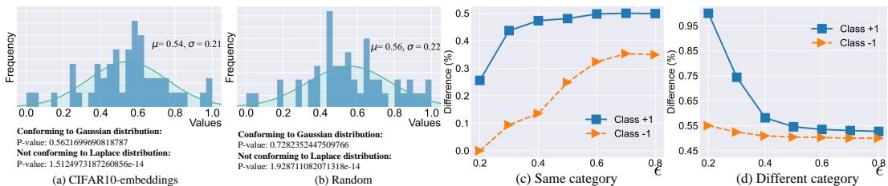
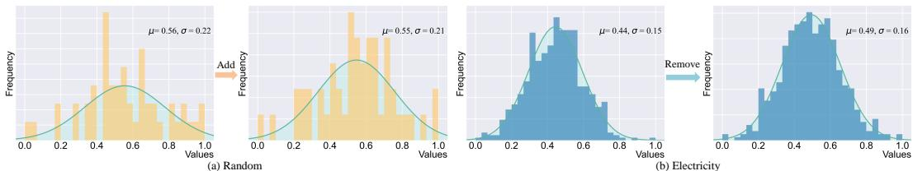
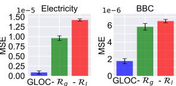
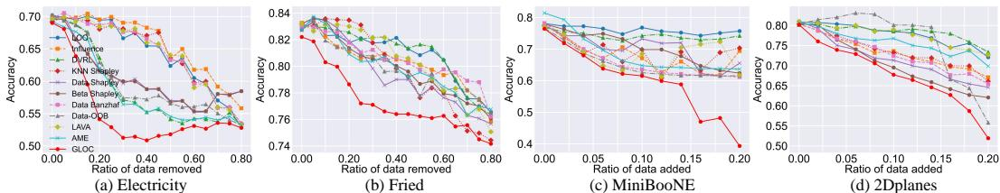
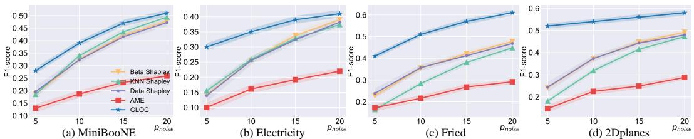
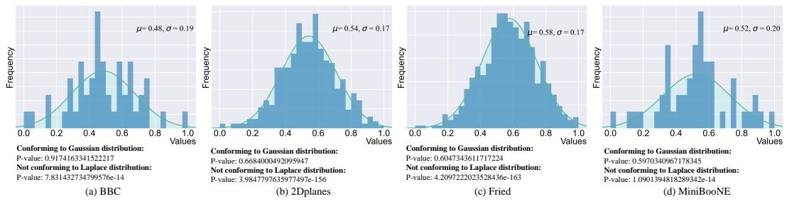
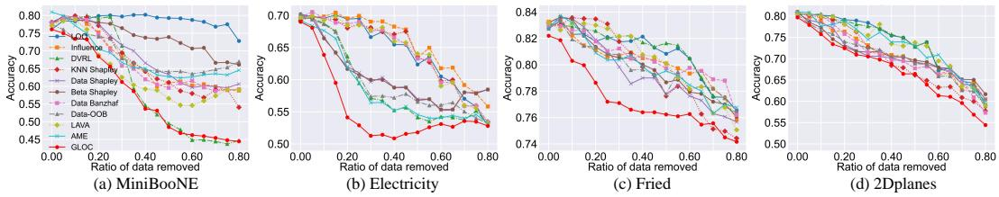
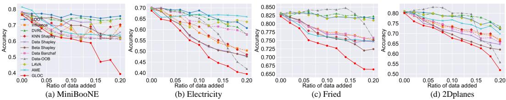
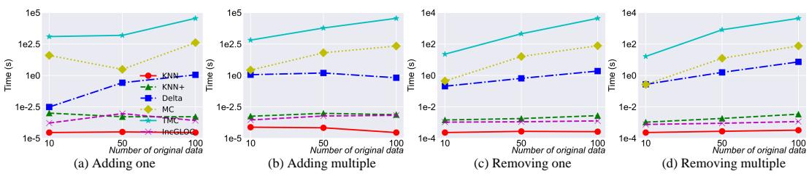
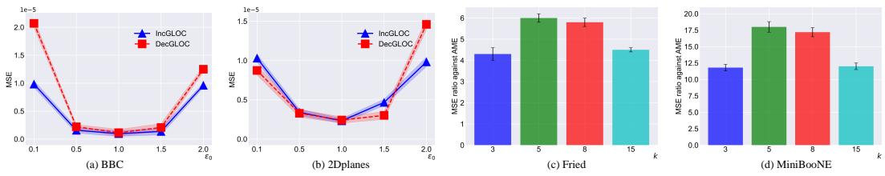

# Data Valuation by Leveraging Global and Local Statistical Information

Anonymous Author(s)   
Affiliation   
Address   
email

# Abstract

Data valuation has garnered increasing attention in recent years, given the critical   
role of high-quality data in various applications. Among diverse data valuation   
approaches, Shapley value-based methods are predominant due to their strong   
theoretical grounding. However, the exact computation of Shapley values is often   
computationally prohibitive, prompting the development of numerous approxima  
tion techniques. Despite notable advancements, existing methods generally neglect   
the incorporation of value distribution information and fail to account for dynamic   
data conditions, thereby compromising their performance and application potential.   
In this paper, we highlight the crucial role of both global and local statistical prop  
erties of value distributions in the context of data valuation for machine learning.   
First, we conduct a comprehensive analysis of these distributions across various   
simulated and real-world datasets, uncovering valuable insights and key patterns.   
Second, we propose an enhanced data valuation method that integrates the explored   
distribution characteristics into the existing AME framework to refine Shapley   
value estimation. The proposed regularizers can also be seamlessly incorporated   
into various data valuation methods. Third, we introduce a novel approach for   
dynamic data valuation that infers updated data values without recomputing Shap  
ley values, thereby significantly improving computational efficiency. Extensive   
experiments have been conducted across a range of tasks, including Shapley value   
estimation, value-based data addition and removal, mislabeled data detection, and   
dynamic data valuation. The results showcase the consistent effectiveness and   
efficiency of our proposed methodologies, affirming the significant potential of   
global and local value distributions in data valuation.

# 24 1 Introduction

Data valuation aims to quantify the value of a datum in a dataset for various applications, including   
business decision-making, scientific discovery, and model training in machine learning [39, 3, 9]. It is   
a rapidly evolving and high-impact research topic in data-centric research communities and industrial   
areas, as a dataset with a large proportion of highly valuable data quite benefits real applications [10,   
]. Existing data valuation methods can be broadly categorized into four groups [17]: marginal   
contribution-based [22, 25, 16], gradient-based [20, 18], importance weight-based [44], and out-of  
bag estimation-based [23] methods. Among these, the marginal contribution-based approach has   
emerged as the most popular and delivers strong performance. This method quantifies a datum’s value   
by assessing the average change in utility when the datum is removed from a set of fixed cardinality.   
An important index, namely, Shapley value which is a key concept in cooperative game [40, 33], is   
usually utilized to calculate the marginal contribution for data valuation. Due to its solid theoretical   
basis, Shapley value is among the primary choices in data valuation [37, 27, 22, 41]. However,   
the accurate calculation of the Shapley value for a given data corpus is nearly intractable as the   
computational complexity is about $O ( 2 ^ { N } )$ for $N$ samples. Therefore, researchers have made efforts   
toward the approximate yet efficient valuation methodology. For example, Jia et al. [15] investigated   
the scenario when data are employed for training a KNN classifier and proposed a novel efficient   
method, KNN Shapley, exactly in $O ( N \log N )$ time. Moreover, a recent study introduces a sparsity   
assumption on data values to alleviate the computational burden associated with an approximate   
method, specifically the Average Marginal Estimation (AME) approach [25].   
Although promising results are obtained, we argue that the potential of value distribution in data   
valuation has been largely neglected in nearly all previous studies. The sparse assumption utilized in   
AME actually presumes that the data values in a dataset conform to the Laplace distribution (detailed   
in Section 2). However, our findings indicate that this assumption may not always be justified.   
The value distribution in this study consists of two parts: local distribution which captures the   
relationship between a datum and its neighborhood, and global value distribution for all involved data.   
Through our empirical analysis, we have observed that the distribution of data values in a dataset   
more closely follows a Gaussian distribution rather than a Laplace distribution. Furthermore, our   
findings indicate a strong correlation among the values of nearby samples (i.e., samples within the   
same neighborhood). Specifically, the similarity in values between neighboring instances within the   
same category is pronounced, whereas the similarity between neighboring samples from different   
categories is minimal.   
Another key motivation for this study is dynamic data valuation, which involves quantifying data   
values in scenarios where new data is introduced or existing data is removed. To the best of our   
knowledge, only one existing study tries to address dynamic data valuation [46]. This pioneering work   
adapts the traditional Shapley value calculation into an incremental paradigm, achieving a significant   
reduction in computational cost—up to half—when adding or removing a datum. Building on our   
earlier observations where the value of an individual datum can be inferred from its surrounding   
neighborhood, we are inspired to explore an alternative approach to dynamic data valuation.   
This study investigates both the global and local distribution characteristics of data values and   
explores how these characteristics can be applied to both conventional and dynamic data valuation   
methods. First, various synthetic and real datasets are leveraged to make statistical analyses for the   
characteristics of global and local value distributions. Useful observations and clues are obtained on   
the basis of the statistical results and the discussion of previous methods. Second, two new methods   
for data valuation are proposed. Specifically, the first method applies the distribution characteristics   
to one classical Shapley value-based data valuation method, namely, AME [25]. Many existing   
methods can replace AME in our approach. The second method introduces a novel optimization   
problem that integrates distributional characteristics for dynamic data valuation, eliminating the   
need to re-estimate the Shapley values of the data, thus significantly improving efficiency. Third,   
comprehensive experiments are conducted on various benchmark datasets to evaluate the effectiveness   
of our methodologies in data valuation across a range of tasks.   
The experimental results on Shapley value estimation indicate that, compared to the AME approach,   
our method provides a more accurate approximation of the true Shapley values. Moreover, experi  
ments on value-based point addition and removal tasks demonstrate the effectiveness of our approach   
in identifying both influential and poisoned samples. Furthermore, our method outperforms other   
data valuation techniques in mislabeled data detection tasks. Additionally, the proposed dynamic data   
valuation approaches consistently achieve state-of-the-art performance while significantly enhancing   
computational efficiency.

# 82 2 Related Work

Data Valuation. High-quality data play a crucial role in numerous real-world applications [7, 36, 26]. However, real-world datasets often exhibit heterogeneity and noise [24, 29]. Therefore, accurately quantifying the value of each datum within a dataset is essential for various applications and data transactions in the data market. As discussed in Section 1, existing data valuation methods can be broadly categorized into four main types:

• Marginal contribution-based methods: This kind of method calculates the differences of the utility with or without the datum to be quantified. The larger the utility difference is, the more valuable the datum is. Representative methods include leave-one-out (LOO) [17],

Data Banzhaf [38], and a series of Sharpley value-based methods such as Data Shapley [11], Beta Shapley [22], and AME [25].   
• Gradient-based methods: This kind of method evaluates the change in utility when the weight of the datum under assessment is increased. Two representative methods are Influence Function [6] and LAVA [18].   
• Importance weight-based methods: This kind of method learns an important weight for a datum to be quantified during training and takes the weight as the value [7]. Naturally, importance weight-based methods are particularly proposed for machine learning applications. One representative method is DVRL [44], which utilizes the reinforcement learning technique to learn sample weights.   
• Out-of-bag estimation-based methods: This kind of method is also designed particularly for machine learning tasks [36]. The representative method, Data-OOB [23], calculates the contribution of each data point using out-of-bag accuracy when a bagging model (e.g., random forest) is employed.

Additionally, Jiang et al. [17] developed a standardized benchmarking system for data valuation. They   
summarized four downstream machine learning tasks for evaluating the values estimated by different   
data valuation methods. Their results suggest that no single algorithm performs uniformly best across   
all tasks. Moreover, Zhang et al. [46] proposed an efficient updating method for dynamically adding   
or deleting data points. In their study, three specific algorithms are introduced, which reduce the   
overall computational cost compared to previous Shapley value-based methods. However, existing   
algorithms largely disregard the distributional characteristics of data values, leading to suboptimal   
performance and efficiency.   
Distribution-Aided Learning. In machine learning, several approaches have explored the use of   
distributional information during model training [35, 45]. Two prominent methods, Lasso [13] and   
Ridge regression, incorporate prior distributions of model parameters in the context of regression.   
Take Lasso as an example, it learns the model by solving $\begin{array} { r } { \underset { \omega } { \operatorname* { m i n } } \sum _ { \pmb { x } } | | y - \omega ^ { T } \pmb { x } | | _ { 2 } ^ { 2 } + \lambda | | \omega | | _ { 1 } ^ { 2 } } \end{array}$ , where   
$\omega$ is the model parameter, $_ { \textbf { \em x } }$ is a sample, $y$ is the target, and $\lambda$ is a hyperparameter that controls the   
strength of the regularization. Lasso can be inferred from a statistical view. Assuming that the prior   
distribution $\omega$ conforms to a Laplace distribution as follows:

$$
\omega \sim \frac { 1 } { 2 \sigma } \exp ( - \frac { \vert \vert \omega \vert \vert _ { 1 } } { \sigma } ) ,
$$

where $\sigma$ is a parameter. When the maximum a posteriori estimation is applied, we obtain

$$
\begin{array} { l } { \omega ^ { * } = \arg \underset { \omega } { \operatorname* { m a x } } \ln [ \displaystyle \prod _ { x } \frac { 1 } { \sqrt { 2 \pi } \sigma _ { 1 } } \exp ( \frac { - | | y - \omega ^ { T } x | | _ { 2 } ^ { 2 } } { 2 \sigma _ { 1 } ^ { 2 } } ) \cdot \frac { 1 } { \sigma _ { 2 } } \exp ( - \frac { | | \omega | | _ { 1 } } { \sigma _ { 2 } } ) ] } \\ { \sim \arg \underset { \omega } { \operatorname* { m i n } } | | y - \omega ^ { T } x | | _ { 2 } ^ { 2 } + \frac { 2 \sigma _ { 1 } ^ { 2 } } { \sigma _ { 2 } } | | \omega | | _ { 1 } , } \end{array}
$$

where the coefficient $2 \sigma _ { 1 } ^ { 2 } / \sigma _ { 2 }$ can be reduced to a single hyperparameter $\lambda$ . The loss in Eq. (2) is   
exactly the loss in Lasso. If the distribution in Eq. (1) is replaced by the Gaussian distribution,   
then Ridge regression can be obtained. Additionally, in multi-task learning, the distribution of the   
model parameters is also utilized to connect the multiple tasks. A widely used regularizer [5] is   
$\begin{array} { r } { \sum _ { t } | | \boldsymbol { \omega } _ { t } ^ { \star } - \bar { \boldsymbol { \omega } } | | _ { 2 } ^ { 2 } } \end{array}$ , where $\omega _ { t }$ is the model parameter of the tth task and $\bar { \omega }$ is the mean of the model   
parameters. This underlying assumption for this regularizer is that $\omega _ { t }$ conforms to a Gaussian   
distribution with the mean $\bar { \omega }$ .   
Local distribution is also widely utilized in various machine learning tasks. Most local distribution   
information refers to the high similarity between samples that are close to each other. For example,   
samples in the neighborhood usually share the same labels in statistics. Therefore, a well-known   
yet effective classifier, namely, KNN [31], is developed. Moreover, Zhu et al. [48] designed a new   
linear discriminative analysis method to seek the projected directions which makes sure that the   
within-neighborhood scatter is as small as possible and the between-neighborhood scatter is as large   
as possible. Furthermore, Zhong et al. [47] revealed that a DNN trained on the supervised data   
generates representations where a generic query sample and its neighbors usually share the same   
label. So far, local distributional information has not been utilized in the field of data valuation.

  
Figure 1: Distributions of data values after min-max normalization for CIFAR10-embeddings (a) and Random (b). The average relative difference between the value of a sample and the values of its neighbors within the same (c) and different (d) categories. $\epsilon$ denotes the neighborhood range.

# Add 137 3 Empirical Exploration

We conduct comprehensive analytical experiments on both simulated and real datasets to investigate   
the properties of global and local value distributions, as well as the changes in value when new data   
are added or existing data are removed. Details of the datasets used are presented in the Appendix.   
Analysis of Global and Local Value Distributions. This section investigates the global and local   
value distributions. To estimate the Shapley values of samples, we apply the AME method [25],   
setting the number of sampled subsets for each dataset to the total number of samples1. This approach   
ensures that the estimated scores asymptotically converge to the true Shapley values as the number of   
sampled subsets is large. Two statistical analyses are performed on the estimated values. The first   
analysis examines the distribution of values for all samples within each dataset, while the second   
investigates the relative difference2 between a sample’s value and the values of its closest neighbors.   
Figs.1(a) and (b) illustrate the value distributions for two datasets: CIFAR10-embeddings and a   
synthetic dataset, "Random," generated using Eq. (12) in the Appendix. While these distributions   
resemble Gaussian or Laplace distributions, the KStest hypothesis test [19], shown below the graph,   
indicates that these value distributions align more closely with a Gaussian distribution. More results   
are presented in the Appendix. These findings suggest that the value distribution is more accurately   
approximated by a Gaussian distribution, rather than the Laplace distribution assumed by AME.   
The local characteristics of value distributions are also examined across various datasets. Specifically,   
we investigate the relative difference between a sample and its neighbors within the same and across   
different categories. As shown in Figs. 1(c) and (d), increasing the neighborhood range, ϵ, leads to an   
increase in the relative differences between samples within the same category and a decrease between   
samples from different categories. Furthermore, the relative difference within the same category is   
smaller compared to that between samples from different categories. These results highlight that a   
sample’s value tends to align more closely with the values of its neighbors within the same category,   
with this alignment becoming stronger as the distance between samples decreases. Conversely, a   
sample’s value shows greater divergence from the values of its neighbors from different categories,   
with the relative difference increasing as the distance between them decreases. We have confirmed   
that these observations remain consistent across various datasets.

Analysis of Value Variations under Dynamic Data Conditions. Two statistical analyses are conducted to examine the variation in data values when the dataset is altered. In the first analysis, $90 \%$ of the original dataset is reserved, and the AME model is applied to compute the data values for this subset. The remaining $10 \%$ of samples are then added, and new values for all data points are recalculated. The value distributions of the $90 \%$ of samples before and after adding new data are shown in Fig. 2(a). In the second analysis, $10 \%$ of the dataset is removed, and the value distributions of the remaining $90 \%$ of samples, before and after the removal, are shown in Fig. 2(b). The results indicate that while the values of the original samples exhibit some variation with the addition or removal of data, these variations are relatively small. Specifically, the changes in the mean and variance of the values in both datasets are less than 0.05 and 0.01, respectively.

  
Figure 2: Variation in value distribution after adding (a) and removing partial data points (b) from the Random and Electricity datasets.

Pattern Summary. Based on the aforementioned empirical analyses, the following observations   
and insights are summarized to guide the development of new methods:

• The distribution of data values across the entire dataset is found to more closely resemble a Gaussian distribution rather than a Laplace distribution. Therefore, in this study, the Gaussian distribution is adopted as the prior for data values. • The similarity in values between adjacent samples within the same category is substantial, while the similarity between adjacent samples from different categories is minimal. • When new data are added or existing data are removed from the original dataset, the values of samples experience changes, though these variations are relatively minor in magnitude.

In the following section, these three summarized conclusions will serve as the foundational principles   
for developing our new data valuation methods.

# 186 4 Methodology

Our approach leverages the AME method as a case study to illustrate the application of both global   
and local distribution information in data valuation. In Section 4.4, we further investigate how the   
integration of global and local value distribution information can be extended to other data valuation   
methods. We begin by presenting a concise overview of the AME method.

# 191 4.1 Revisiting the AME Approach

AME is a representative data valuation approach based on marginal contributions. It begins by   
sampling multiple subsets from the original dataset and utilizes the performance (e.g., classification   
accuracy) of models trained on each subset as the utility measure. If $\mathcal { M }$ subsets are compiled,   
then $\mathcal { M }$ models will be trained, resulting in $\mathcal { M }$ corresponding utility scores. For each model, an   
$N$ -dimensional feature vector is constructed to represent the composition of the training subset,   
vector for the where $N$ denotes the total size of the training dataset. Specifically, the $m$ -th model, denoted as $X _ { m , i }$ , is defined as follows: $\begin{array} { r } { { X } _ { m , i } = \frac { 1 } { \sqrt { v } p } } \end{array}$ $i$ -th dimension of the feature if $\mathbf { \Delta } _ { \mathbf { \mathcal { X } } _ { i } }$ participates   
in the training of the m-th model, and Xm,i = − √ 1v(1−p) otherwise, where $\begin{array} { r } { \dot { v } = \mathbb { E } _ { p } [ \frac { 1 } { p ( 1 - p ) } ] } \end{array}$ and $p$   
represents the sampling rate for each training point.

The AME values of the training data are subsequently computed using Lasso regression as follows:

$$
\hat { \beta } = \arg \operatorname* { m i n } _ { \beta \in \mathbb { R } ^ { N } } \left[ | | \mathcal { U } - X \beta | | _ { 2 } ^ { 2 } + \lambda | | \beta | | _ { 1 } \right] ,
$$

where $\hat { \boldsymbol { \beta } } \in \mathbb { R } ^ { N }$ is the optimal linear fit on the $( X , u )$ dataset, which contains the values of all training   
samples; $u \in \mathbb { R } ^ { M }$ refers to the utility vector derived from $\mathcal { M }$ trained models. Specifically, $\boldsymbol { \mathcal { U } } _ { m }$   
denotes the utility of the $m$ th model. $\lambda$ is a hyperparameter that governs the strength of regularization.   
Obviously, Eq. (3) implicitly assumes the Laplace distribution prior (i.e., sparse assumption) for   
values of samples in the dataset. The advantage of this prior is that the number of sampled subsets,   
$\mathcal { M }$ , can be much smaller than $N$ . Since the training time for a single model can be considerable in   
many tasks, selecting a smaller value for $\mathcal { M }$ can significantly reduce the overall time cost, particularly   
when $N$ is large for a given dataset.

The optimization problem utilized by AME can be reformulated as follows:

$$
\hat { \boldsymbol \beta } = \arg \operatorname* { m i n } _ { \boldsymbol \beta \in \mathbb { R } ^ { N } } \left[ | | \boldsymbol \mathcal { U } - \boldsymbol X \boldsymbol \beta | | _ { 2 } ^ { 2 } + \lambda \mathcal { R } _ { g } ( \boldsymbol \beta ) \right] ,
$$

where $\mathcal { R } _ { g } ( \cdot )$ denotes a regularizer that incorporates the global statistical prior for the data values.   
Based on our empirical analysis, the value distribution is more accurately modeled by a Gaussian   
distribution rather than a Laplace distribution. Therefore, the regularization term $\mathcal { R } _ { g } ( \beta )$ should be   
set to $\mathcal { R } _ { g } ( \beta ) = \lvert \lvert \beta \rvert \rvert _ { 2 }$ , thereby transforming the optimization problem into a Ridge regression.   
Meanwhile, based on our findings regarding the local statistical characteristics, which indicate that   
the similarities in values between adjacent data points within the same category are substantial, while   
those between adjacent samples from different classes are minimal, we propose a carefully designed   
regularization term to refine the data values: $\begin{array} { r } { \mathcal { R } _ { l } ( \beta ) = \sum _ { \pmb { x } _ { i } \in \mathcal { D } } \sum _ { \pmb { x } _ { j } \in \tilde { \mathcal { N } } _ { k } ( \pmb { x } _ { i } ) } S _ { i , j } ( \beta _ { i } - \beta _ { j } ) ^ { 2 } } \end{array}$ , where   
$\beta _ { i }$ and $\beta _ { j }$ denote the values associated with $\mathbf { \Delta } _ { \mathbf { \mathcal { X } } _ { i } }$ and $\mathbf { \Delta } _ { \mathbf { \mathcal { X } } _ { j } }$ , respectively. $\mathcal { N } _ { k } ( \pmb { x } _ { i } )$ denotes the $k$ -nearest   
neighborhood of the sample $\mathbf { \Delta } _ { \mathbf { \mathcal { X } } _ { i } }$ . $\mathcal { S } _ { i , j }$ is designed to capture the similarity between the values of   
samples $\mathbf { \Delta } _ { \mathbf { \mathcal { X } } _ { i } }$ and $\mathbf { \Delta } _ { \mathbf { \mathcal { X } } _ { j } }$ , with consideration given to both their labels and feature similarities. Specifically,   
for samples from the same category, the smaller the distance between them, the smaller the difference   
in their values should be. In contrast, for samples from different categories, the smaller the distance   
between them, the larger the difference in their values should be. Therefore, the following similarity   
metric $\mathcal { S } _ { i , j }$ is defined: $S _ { i , j } = \cos ( { \bf x } _ { i } , { \bf x } _ { j } ) \cdot [ 2 \mathcal { T } ( y _ { i } = y _ { j } ) - 1 ]$ . The cosine similarity $\cos ( \pmb { x } _ { i } , \pmb { x } _ { j } )$ is   
computed as $\begin{array} { r } { \cos ( { \bf x } _ { i } , { \bf x } _ { j } ) = \frac { { \bf x } _ { i } \cdot { \bf x } _ { j } } { | { \bf x } _ { i } | | { \bf x } _ { j } | } } \end{array}$ . Moreover, $\boldsymbol { \mathcal { T } } ( \cdot )$ represents a indicator function. If $y _ { i } = y _ { j }$ , then   
228 $S _ { i , j } = \cos ( { \pmb x } _ { i } , { \pmb x } _ { j } )$ ; if $y _ { i } \neq y _ { j }$ , then $S _ { i , j } = - \cos ( { \pmb x } _ { i } , { \pmb x } _ { j } )$ .   
29 Consequently, our proposed Global and LOcal Characteristics-based data valuation approach, termed   
GLOC, calculates data values by solving the following optimization problem:

$$
\hat { \beta } = \arg \operatorname* { m i n } _ { \beta \in \mathbb { R } ^ { N } } \left[ | | \mathcal { U } - X \beta | | _ { 2 } ^ { 2 } + \lambda _ { 1 } \mathcal { R } _ { g } ( \beta ) + \lambda _ { 2 } \mathcal { R } _ { l } ( \beta ) \right] ,
$$

where the two regularizers, $\mathcal { R } _ { g } ( \cdot )$ and $\mathcal { R } _ { l } ( \cdot )$ , are defined as follows:

$$
\mathcal { R } _ { g } ( \beta ) = \lvert \lvert \beta \rvert \rvert _ { 2 } ,
$$

The hyperparameters $\lambda _ { 1 }$ and $\lambda _ { 2 }$ control the strengths of the global and local regularizers, respectively.   
The algorithm for GLOC is provided in Algorithm 1 of the Appendix.

# 4.3 Global and Local Characteristics-based Dynamic Data Valuation Approach

We further propose two dynamic data valuation methods (termed IncGLOC and DecGLOC) based on the identified global and local distribution characteristics, specifically designed for scenarios involving the addition of new data and the removal of existing data.

Here, we focus on incremental data valuation, while the optimization for decremental data valuation follows a similar approach, which is detailed in the Appendix. Let the original dataset be $\mathcal { D }$ , containing $N$ samples, and the new data to be added be $\mathcal { D } ^ { \prime }$ , with $N ^ { \prime }$ samples. The augmented dataset is denoted as $\hat { \mathcal { D } } = \mathcal { D } \cup \mathcal { D } ^ { \prime }$ , and let $\beta ^ { c u r }$ represent the original data values in $\mathcal { D }$ .

In contrast to the only existing research on dynamic data valuation [46], which relies on recalculating Shapley values, this study investigates an alternative path that avoids the need to re-estimate Shapley values, thereby improving efficiency. Specifically, we aim to explore whether it is possible to infer the values of all data in $\hat { \mathcal { D } }$ based solely on the dataset $\hat { \mathcal { D } }$ and the original data values, $\beta ^ { c u r }$ .

As empirically analyzed in Section 3, the changes in value should align with the following insights:

• After incorporating $\mathcal { D } ^ { \prime }$ into $\mathcal { D }$ , the values of the samples in $\mathcal { D }$ will be adjusted. However, the changes in data values before and after the inclusion of new data are anticipated to remain within a limited range.

• The global value distribution of samples in $\hat { \mathcal { D } }$ is expected to follow a Gaussian distribution.

• The values of all data in $\hat { \mathcal { D } }$ should follow the principle of neighborhood consistency, whereby adjacent samples from the same category exhibit similar values, while those from different categories display distinct value differences.

Based on the aforementioned observations, we formulate the following optimization problem to determine the values of the samples in the expanded dataset 255 $\hat { \mathcal { D } }$ :

$$
\begin{array} { r l r } {  { \operatorname* { m i n } _ { \beta } \sum _ { x _ { i } \in \hat { \mathcal { D } } } \sum _ { x _ { j } \in \mathcal { N } _ { k } ( x _ { i } ) } S _ { i , j } ( \beta _ { i } - \beta _ { j } ) ^ { 2 } + \eta _ { 1 } | | \beta | | _ { 2 } , } } \\ & { } & { \mathrm { s } . \mathrm { t } . , | \beta _ { i } ^ { c u r } - \beta _ { i } | \le \epsilon _ { i } , \forall x _ { i } \in \mathcal { D } , } \end{array}
$$

where $\epsilon _ { i }$ represents the upper bound on the permissible variation in the value of $\mathbf { \Delta } _ { \mathbf { \mathcal { X } } _ { i } }$ . Its value depends   
on both the variation in the dataset, quantified by the ratio $| \hat { \mathcal { D } } | / | \mathcal { D } |$ , and the neighborhood of $\mathbf { \Delta } _ { \mathbf { \mathcal { X } } _ { i } }$ . In   
general, as the dataset variation increases, $\epsilon _ { i }$ also increases. Similarly, larger variation within the   
neighborhood of a data point leads to a greater value difference, thereby increasing $\epsilon _ { i }$ . Based on   
these insights, we propose a heuristic definition for $\epsilon _ { i }$ , which has been empirically validated for   
effectiveness in our experiments: $\begin{array} { r } { \epsilon _ { i } = \frac { | \hat { \mathcal { D } } | } { | \mathcal { D } | } \left[ 1 + r _ { \mathcal { N } _ { k } } ( \pmb { x } _ { i } ) \right] \epsilon _ { 0 } } \end{array}$ , where $r _ { \mathcal { N } _ { k } } ( \pmb { x } _ { i } )$ represents the variation   
ratio within the $k$ -nearest neighborhood of $\mathbf { \Delta } _ { \mathbf { \mathcal { X } } _ { i } }$ . Specifically, if all $k$ -nearest neighbors undergo   
changes, then $r _ { \mathcal { N } _ { k } } ( \pmb { x } _ { i } ) = 1$ ; conversely, if all of its $k$ -nearest neighbors remain unchanged, then   
$r _ { \mathcal { N } _ { k } } ( \mathbf { \bar { x } } _ { i } ) = 0$ . Additionally, $\epsilon _ { \mathrm { 0 } }$ is a constant that remains uniform across all samples.

To facilitate solving Eq. (7), we reformulate it as the following unconstrained optimization problem:

$$
\operatorname* { m i n } _ { \beta } [ \sum _ { \pmb { x } _ { i } \in \hat { \mathcal D } } \sum _ { \pmb { x } _ { j } \in \mathcal { N } _ { k } ( \pmb { x } _ { i } ) } S _ { i , j } ( \beta _ { i } - \beta _ { j } ) ^ { 2 } + \eta _ { 1 } | | \beta | | _ { 2 } + \eta _ { 2 } \sum _ { \pmb { x } _ { i } \in \mathcal { D } } \frac { \epsilon _ { i } } { \epsilon } ( \beta _ { i } ^ { c u r } - \beta _ { i } ) ^ { 2 } ] ,
$$

where $\eta _ { 1 }$ and $\eta _ { 2 }$ control the relative importance of the three objectives. To expedite the optimization of Eq. (8), the initial values for the data in 267 $\mathcal { D } ^ { \prime }$ can be assigned as follows:

$$
\beta _ { i } = \frac { \sum _ { \pmb { x } _ { j } \in \mathcal { N } _ { k } ( \pmb { x } _ { i } ) \& \pmb { x } _ { j } \in \mathcal { D } } S _ { i , j } \beta _ { j } ^ { c u r } } { \sum _ { \pmb { x } _ { j } \in \mathcal { N } _ { k } ( \pmb { x } _ { i } ) \& \pmb { x } _ { j } \in \mathcal { D } } S _ { i , j } } .
$$

This initialization is actually a weighted average of the original values of the samples in the neighborhood of 269 $\mathbf { \Delta } _ { \mathbf { \mathcal { X } } _ { i } }$ , with the weights determined by their similarities.

The decremental data valuation approach follows a similar pipeline and is provided in detail in   
Appendix A.2 due to space limitations. In contrast to the only existing research on dynamic data   
valuation [46], which relies on re-computing the Shapley values of samples, our method directly   
infers the updated values by leveraging characteristics of value distributions and patterns of value   
274 variation, thereby significantly enhancing computational efficiency.

# 275 4.4 Adaptation to Alternative Data Valuation Approaches

76 This study introduces a new path for data valuation that incorporates both global and local distribution   
characteristics of data values. The proposed regularizers can be easily integrated with most existing   
data valuation methods, except for the AME approach. Specifically, the regularization terms related   
to value distributions can be employed to optimize data values, either alongside the original valuation   
method or afterward. The first scenario, which combines our regularizers with other methods, has   
been demonstrated using the AME method. In the second scenario, the regularizers are directly   
utilized as optimization objectives to refine the obtained data values. This approach has also been   
demonstrated to enhance the effectiveness of other valuation methods, as detailed in Appendix A.7.

# 5 Experiments

Our experimental investigations are divided into three main components3. First, we evaluate the performance of GLOC in Shapley value estimation. Second, we examine two downstream valuation tasks: value-based point addition and removal, as well as mislabeled data detection, to validate the effectiveness of GLOC in identifying valuable and poisoned samples. Finally, we assess the performance of our proposed dynamic data valuation methods, IncGLOC and DecGLOC, in Shapley value estimation under incremental and decremental data valuations.

3Our code is available in the submitted supplementary materials.

Table 1: Comparison of Shapley value estimation. Ratios of MSEs between AME and GLOC (simplified to the simplest integer ratio) are reported. The MSEs for GLOC are consistently smaller than those for AME, highlighting its superiority in Shapley value estimation.   

<table><tr><td rowspan=1 colspan=1>Dataset</td><td rowspan=1 colspan=1>Electricity</td><td rowspan=1 colspan=1>MiniBooNE</td><td rowspan=1 colspan=1>CIFAR10</td><td rowspan=1 colspan=1>BBC</td><td rowspan=1 colspan=1>Fried</td><td rowspan=1 colspan=1>2Dplanes</td></tr><tr><td rowspan=1 colspan=1>Ratio</td><td rowspan=1 colspan=1>50:1</td><td rowspan=1 colspan=1>8:1</td><td rowspan=1 colspan=1>96:1</td><td rowspan=1 colspan=1>6:1</td><td rowspan=1 colspan=1>82:1</td><td rowspan=1 colspan=1>105:1</td></tr><tr><td rowspan=1 colspan=1>Dataset</td><td rowspan=1 colspan=1>Pol</td><td rowspan=1 colspan=1>Covertype</td><td rowspan=1 colspan=1>Nomao</td><td rowspan=1 colspan=1>Law</td><td rowspan=1 colspan=1>Creditcard</td><td rowspan=1 colspan=1>Jannis</td></tr><tr><td rowspan=1 colspan=1>Ratio</td><td rowspan=1 colspan=1>7:1</td><td rowspan=1 colspan=1>113:1</td><td rowspan=1 colspan=1>44:1</td><td rowspan=1 colspan=1>18:1</td><td rowspan=1 colspan=1>54:1</td><td rowspan=1 colspan=1>206:1</td></tr></table>

  
Figure 3: Ablation studies to the two regularization terms: $\mathcal { R } _ { g }$ and $\mathcal { R } _ { l }$ .

Datasets and Compared Baselines. Building on prior research [17, 23], we conduct experiments on   
twelve classification datasets covering tabular, text, and image data: Electricity [8], MiniBooNE [32],   
CIFAR10 [21], BBC [12], Fried [1], 2Dplanes, Pol, Covertype, Nomao [2], Law, Creditcard [4],   
and Jannis. A detailed summary of these datasets is provided in Table 3 of the Appendix. The   
data values are assessed within the training set and evaluate model utility using the validation set.   
Furthermore, we compare our proposed approaches with various data valuation techniques, including   
AME [25], LOO [17], Influence Function [20], DVRL [44], Data Shapley [11], KNN Shapley [15],   
Volume-based Shapley [43], Beta Shapley [22], Data Banzhaf [38], LAVA [18], and Data-OOB [23],   
as detailed in Appendix A.4. Additional experimental details are provided in the Appendix.   
Experiments on Shapley Value Estimation. This section assesses the effectiveness of GLOC and   
AME in estimating Shapley values. Given the benchmark Shapley values $( S V )$ and the estimated   
valuesShapl $\beta$ produced by AME a values is defined as: $\begin{array} { r } { M S E ( S V , \beta ) = \frac { 1 } { | \mathcal { D } | } \sum _ { i = 1 } ^ { | \mathcal { D } | } ( S V _ { i } - \beta _ { i } ) ^ { 2 } } \end{array}$ ed values and the benchmark. Table 1 reports the ratio of   
MSEs between AME and GLOC in Shapley value estimation, demonstrating that GLOC consistently   
achieves lower MSEs across various datasets. These results manifest that GLOC provides a closer   
approximation to the true Shapley values compared to AME, making it a more accurate and effective   
approach for assessing the contribution of training samples. Additionally, ablation studies are   
conducted to evaluate the effectiveness of the proposed global $( \mathcal { R } _ { g } )$ and local $( \mathcal { R } _ { l } )$ regularizers.   
As shown in Fig. 3, GLOC achieves optimal performance when incorporating two regularizers,   
highlighting the importance of leveraging both global and local value distributions in data valuation.   
Experiments on Value-based Point Addition and Removal. To validate the effectiveness ofvalue: 0.7282352447509766   
GLOC in distinguishing valuable samples from harmful ones, we conduct point addition and removalvalue: 1.928711082071318e-14   
experiments following [11, 23]. For point removal, data points are eliminated from the training set in   
descending order of their assigned values. After each removal, a logistic regression model is retrained   
on the remaining dataset, and its test performance is evaluated on a holdout set. Ideally, removing the   
most informative samples first could result in a degradation of model performance. Conversely, for   
point addition, data points are introduced in ascending order of their values. Similar to the removal   
process, model accuracy is expected to remain low initially, as detrimental samples are added first.Remove   
All experiments are conducted on a perturbed dataset with $20 \%$ label noise, with the holdout test set   
containing 3K samples. Figs. 4(a) and (b) compare the performance of different valuation methods in   
the context of data removal. GLOC consistently exhibits the most significant decline in performance,   
ndom highlighting its effectiveness in identifying high-quality samples. Similarly, from Figs. 4(c) and (d), (b) Electricity   
GLOC demonstrates the worst performance, underscoring its ability to detect poisoned data.

Experiments on Mislabeled Data Detection. Mislabeled samples often degrade model performance [42], making it important to assign them low values. Previous studies have shown that AME performs poorly in detecting mislabeled data. In this section, we compare the detection capabilities of GLOC with several Shapley value-based valuation approaches. We randomly select $p _ { n o i s e } \%$ of the entire dataset and alter their labels to one of the other classes. We consider four different noise

  
Figure 4: Accuracy variation across different ratios of removed and added data points. We prioritize removing data points with larger values and adding those with smaller values.

  
Figure 5: F1-scores for noise detection at varying noise ratios across four datasets. GLOC consistently outperforms the compared baselines in detection performance across various noise levels.

Table 2: MSEs of various methods in data point addition and removal. The best and second-best results are highlighted in bold and underlined, respectively. The data values estimated by our proposed approaches (IncGLOC and DecGLOC) exhibit the smallest MSEs, indicating their closer approximation to the Shapley values.

<table><tr><td rowspan=1 colspan=1>Manner</td><td rowspan=1 colspan=4>Add</td><td rowspan=1 colspan=4>Remove</td></tr><tr><td rowspan=1 colspan=1>Dataset</td><td rowspan=1 colspan=1>Electricity</td><td rowspan=1 colspan=1>MiniBooNE</td><td rowspan=1 colspan=1>CIFAR10</td><td rowspan=1 colspan=1>Fried</td><td rowspan=1 colspan=1>Electricity</td><td rowspan=1 colspan=1>MiniBooNE</td><td rowspan=1 colspan=1>CIFAR10</td><td rowspan=1 colspan=1>Fried</td></tr><tr><td rowspan=1 colspan=1>MC</td><td rowspan=1 colspan=1>5.76e-5</td><td rowspan=1 colspan=1>7.95e-5</td><td rowspan=1 colspan=1>4.65e-5</td><td rowspan=1 colspan=1>2.57e-5</td><td rowspan=1 colspan=1>7.63e-6</td><td rowspan=1 colspan=1>5.06e-6</td><td rowspan=1 colspan=1>4.89e-5</td><td rowspan=1 colspan=1>1.21e-5</td></tr><tr><td rowspan=1 colspan=1>TMC</td><td rowspan=1 colspan=1>8.75e-4</td><td rowspan=1 colspan=1>1.25e-4</td><td rowspan=1 colspan=1>4.89e-4</td><td rowspan=1 colspan=1>1.23e-5</td><td rowspan=1 colspan=1>4.43e-5</td><td rowspan=1 colspan=1>6.08e-5</td><td rowspan=1 colspan=1>5.77e-4</td><td rowspan=1 colspan=1>3.42e-4</td></tr><tr><td rowspan=1 colspan=1>Delta</td><td rowspan=1 colspan=1>7.76e-6</td><td rowspan=1 colspan=1>4.78e-6</td><td rowspan=1 colspan=1>8.91e-6</td><td rowspan=1 colspan=1>4.88e-6</td><td rowspan=1 colspan=1>3.89e-5</td><td rowspan=1 colspan=1>3.58e-5</td><td rowspan=1 colspan=1>2.78e-5</td><td rowspan=1 colspan=1>1.29e-5</td></tr><tr><td rowspan=1 colspan=1>KNN</td><td rowspan=1 colspan=1>3.88e-5</td><td rowspan=1 colspan=1>5.67e-6</td><td rowspan=1 colspan=1>2.45e-5</td><td rowspan=1 colspan=1>5.34e-5</td><td rowspan=1 colspan=1>7.65e-6</td><td rowspan=1 colspan=1>6.93e-6</td><td rowspan=1 colspan=1>6.79e-6</td><td rowspan=1 colspan=1>4.32e-5</td></tr><tr><td rowspan=1 colspan=1>KNN+</td><td rowspan=1 colspan=1>3.45e-5</td><td rowspan=1 colspan=1>4.56e-5</td><td rowspan=1 colspan=1>5.24e-5</td><td rowspan=1 colspan=1>6.45e-6</td><td rowspan=1 colspan=1>2.48e-6</td><td rowspan=1 colspan=1>5.67e-6</td><td rowspan=1 colspan=1>3.74e-5</td><td rowspan=1 colspan=1>4.56e-5</td></tr><tr><td rowspan=1 colspan=1>Ours</td><td rowspan=1 colspan=1>1.73e-6</td><td rowspan=1 colspan=1>1.99e-6</td><td rowspan=1 colspan=1>3.29e-6</td><td rowspan=1 colspan=1>2.17e-6</td><td rowspan=1 colspan=1>0.95e-6</td><td rowspan=1 colspan=1>2.00e-6</td><td rowspan=1 colspan=1>2.55e-6</td><td rowspan=1 colspan=1>2.27e-6</td></tr></table>

levels: $p _ { n o i s e } \in \{ 5 , 1 0 , 1 5 , 2 0 \}$ . Using K-means [28], we cluster the data points based on their data   
values into two groups. Points in the cluster with the lowest mean values are predicted as mislabeled   
samples. The F1-score is computed by comparing the predictions with the actual labels. Fig. 5   
presents the F1-scores for noise detection across four datasets at different noise levels. The results   
indicate that GLOC consistently outperforms other methods across various noise ratios and datasets.

Experiments on Dynamic Data Valuation. This section evaluates the performance of our two proposed dynamic data valuation approaches, IncGLOC and DecGLOC, in scenarios involving the addition of new samples or the removal of existing ones. The average MSE is also used to assess the effectiveness of different methods in estimating Shapley values. In accordance with the only existing research on dynamic data valuation [46], the compared methods include Monte Carlo Shapley (MC), Delta-based algorithm (Delta), KNN-based algorithm (KNN), $\mathrm { K N N + }$ -based algorithm $\left( \mathrm { K N N + } \right)$ , which are proposed by [46], and Truncated Monte Carlo Shapley (TMC) [11]. Table 2 presents the comparison results for adding or removing a single data point, while the results for adding or removing multiple data points are provided in the Appendix. The proposed IncGLOC and DecGLOC methods consistently achieve the lowest MSEs across various datasets, demonstrating their effectiveness in Shapley value estimation under dynamic data conditions.

Additionally, we compare the computational complexity of various data valuation methods to assess   
the efficiency of our proposed approaches. The results are provided in Fig. 9 of the Appendix.   
Methods such as KNN, $\mathrm { K N N + }$ , and our approaches derive updated data values from current values   
without recalculating the Shapley values, resulting in low time consumption. In contrast, methods   
that require re-estimating the Shapley values, such as MC and TMC, entail significant computational   
350 overhead for dynamic data valuation, even when adding or deleting a single data point.

# 6 Conclusion

This study proposes the integration of global and local statistical information of data values into the data valuation process, a perspective that has often been overlooked by previous approaches. By examining the characteristics of value distributions, we introduce a new data valuation method based on AME that incorporates these distribution characteristics. Furthermore, we present two dynamic data valuation algorithms designed for incremental and decremental data valuation, respectively. These algorithms compute data values based solely on the original and updated datasets, alongside the original data values, without requiring additional Shapley value estimation steps, thus ensuring computational efficiency. Extensive experiments across various tasks—such as Shapley value estimation, point addition and removal, mislabeled data detection, and incremental and decremental data valuation—demonstrate the significant effectiveness and efficiency of the proposed methodologies.

References [1] Leo Breiman. Bagging predictors. Machine Learning, 24:123–140, 1996. [2] Laurent Candillier and Vincent Lemaire. Design and analysis of the nomao challenge active learning in the real-world. In Proceedings of the ALRA: Active Learning in Real-World Applications, Workshop ECML-PKDD, pages 1–15, 2012. [3] InduShobha N Chengalur-Smith, Donald P Ballou, and Harold L Pazer. The impact of data quality information on decision making: An exploratory analysis. IEEE Transactions on Knowledge and Data Engineering, 11(6):853–864, 1999. [4] Andrea Dal Pozzolo, Olivier Caelen, Reid A Johnson, and Gianluca Bontempi. Calibrating probability with undersampling for unbalanced classification. In IEEE Symposium Series on Computational Intelligence, pages 159–166, 2015. [5] Theodoros Evgeniou and Massimiliano Pontil. Regularized multi-task learning. In Proceedings of the ACM SIGKDD International Conference on Knowledge Discovery and Data Mining., pages 109–117, 2004. [6] Vitaly Feldman and Chiyuan Zhang. What neural networks memorize and why: Discovering the long tail via influence estimation. In Proceedings of the Annual Conference on Neural Information Processing Systems (NeurIPS), pages 2881–2891, 2020. [7] Mike Fleckenstein, Ali Obaidi, and Nektaria Tryfona. A review of data valuation approaches and building and scoring a data valuation model. Harvard Data Science Review, 5(1), 2023. [8] Joao Gama, Pedro Medas, Gladys Castillo, and Pedro Rodrigues. Learning with drift detection. In Advances in Artificial Intelligence, pages 286–295, 2004. [9] Felipe Garrido Lucero, Benjamin Heymann, Maxime Vono, Patrick Loiseau, and Vianney Perchet. Du-shapley: A shapley value proxy for efficient dataset valuation. In Proceedings of the Annual Conference on Neural Information Processing Systems (NeurIPS), pages 1973–2000, 2025. [10] Amirata Ghorbani, Michael Kim, and James Zou. A distributional framework for data valuation. In Proceedings of the International Conference on Machine Learning (ICML), pages 3535–3544, 2020. [11] Amirata Ghorbani and James Zou. Data shapley: Equitable valuation of data for machine learning. In Proceedings of the International Conference on Machine Learning (ICML), pages 2242–2251, 2019.   
93 [12] Derek Greene and Pádraig Cunningham. Practical solutions to the problem of diagonal dominance in kernel document clustering. In Proceedings of the International Conference on Machine Learning (ICML), pages 377–384, 2006.   
[13] Yaqing Guo, Wenjian Wang, and Xuejun Wang. A robust linear regression feature selection method for data sets with unknown noise. IEEE Transactions on Knowledge and Data Engineering, 35(1):31–44, 2023.   
99 [14] Kaiming He, Xiangyu Zhang, Shaoqing Ren, and Jian Sun. Deep residual learning for image recognition. In Proceedings of the IEEE/CVF Conference on Computer Vision and Pattern Recognition (CVPR), pages 770–778, 2016.   
02 [15] Ruoxi Jia, David Dao, Boxin Wang, Frances Ann Hubis, Nezihe Merve Gurel, Bo Li, Ce Zhang, Costas Spanos, and Dawn Song. Efficient task-specific data valuation for nearest neighbor algorithms. In Proceedings of the VLDB Endowment, pages 1610–1623, 2019. [16] Ruoxi Jia, David Dao, Boxin Wang, Frances Ann Hubis, Nick Hynes, Nezihe Merve Gürel, Bo Li, Ce Zhang, Dawn Song, and Costas J Spanos. Towards efficient data valuation based on the shapley value. In Proceedings of the International Conference on Artificial Intelligence and Statistics (AISTATS), pages 1167–1176, 2019.   
[17] Kevin Fu Jiang, Weixin Liang, James Zou, and Yongchan Kwon. Opendataval: A unified benchmark for data valuation. In Proceedings of the Annual Conference on Neural Information Processing Systems (NeurIPS), pages 28624–28647, 2023.   
[18] Hoang Anh Just, Feiyang Kang, Tianhao Wang, Yi Zeng, Myeongseob Ko, Ming Jin, and Ruoxi Jia. Lava: Data valuation without pre-specified learning algorithms. In Proceedings of the International Conference on Learning Representations (ICLR), 2023. [19] Ana Justel, Daniel Peña, and Rubén Zamar. A multivariate kolmogorov-smirnov test of goodness of fit. Statistics & Probability Letters, 35(3):251–259, 1997. [20] Pang Wei Koh and Percy Liang. Understanding black-box predictions via influence functions. In Proceedings of the International Conference on Machine Learning (ICML), pages 1885–1894, 2017. [21] Alex Krizhevsky, Geoffrey Hinton, et al. Learning multiple layers of features from tiny images. Handbook of Systemic Autoimmune, 2009. [22] Yongchan Kwon and James Zou. Beta shapley: A unified and noise-reduced data valuation framework for machine learning. In Proceedings of the International Conference on Artificial Intelligence and Statistics (AISTATS), pages 8780–8802, 2022. [23] Yongchan Kwon and James Zou. Data-oob: Out-of-bag estimate as a simple and efficient data value. In Proceedings of the International Conference on Machine Learning (ICML), pages 18135–18152, 2023. [24] Weixin Liang and James Zou. Metashift: A dataset of datasets for evaluating contextual distribution shifts and training conflicts. In Proceedings of the International Conference on Learning Representations (ICLR), 2022. [25] Jinkun Lin, Anqi Zhang, Mathias Lécuyer, Jinyang Li, Aurojit Panda, and Siddhartha Sen. Measuring the effect of training data on deep learning predictions via randomized experiments. In Proceedings of the International Conference on Machine Learning (ICML), pages 13468– 13504, 2022.   
[26] Zhihong Liu, Hoang Anh Just, Xiangyu Chang, Xi Chen, and Ruoxi Jia. 2d-shapley: A framework for fragmented data valuation. In Proceedings of the International Conference on Machine Learning (ICML), pages 21730–21755, 2023. [27] Xuan Luo, Jian Pei, Cheng Xu, Wenjie Zhang, and Jianliang Xu. Fast shapley value computation in data assemblage tasks as cooperative simple games. In Proceedings of the ACM on Management of Data, pages 1–28, 2024. [28] James MacQueen. Some methods for classification and analysis of multivariate observations. In Proceedings of the Berkeley Symposium on Mathematical Statistics and Probability, pages 281–298, 1967. [29] Curtis G. Northcutt, Anish Athalye, and Jonas Mueller. Pervasive label errors in test sets destabilize machine learning benchmarks. In Proceedings of the Conference on Neural Information Processing Systems Datasets and Benchmarks Track, 2021.   
[30] Jian Pei. A survey on data pricing: From economics to data science. IEEE Transactions on Knowledge and Data Engineering, 34(10):4586–4608, 2022. [31] Leif E Peterson. K-nearest neighbor. Scholarpedia, 4(2):1883, 2009. [32] Byron P Roe, Hai-Jun Yang, Ji Zhu, Yong Liu, Ion Stancu, and Gordon McGregor. Boosted decision trees as an alternative to artificial neural networks for particle identification. Nuclear Instruments and Methods in Physics Research Section A: Accelerators, Spectrometers, Detectors and Associated Equipment, 543(2-3):577–584, 2005.   
[33] Alvin E Roth. Introduction to the shapley value. The Shapley Value, pages 1–28, 1988.   
[34] Victor Sanh, Lysandre Debut, Julien Chaumond, and Thomas Wolf. Distilbert, a distilled version of bert: Smaller, faster, cheaper and lighter. In Proceedings of the Annual Conference on Neural Information Processing Systems (NeurIPS), 2019.   
[35] Varun Shah and Shubham Shukla. Data distribution into distributed systems, integration, and advancing machine learning. Revista Espanola de Documentacion Cientifica, 11(1):83–99, 2017.   
[36] Rachael Hwee Ling Sim, Xinyi Xu, and Bryan Kian Hsiang Low. Data valuation in machine learning:"ingredients", strategies, and open challenges. In Proceedings of the International Joint Conference on Artificial Intelligence (IJCAI), pages 5607–5614, 2022.   
[37] Mihail Stoian. Fast joint shapley values. In Companion of the International Conference on Management of Data, pages 285–287, 2023.   
[38] Jiachen T. Wang and Ruoxi Jia. Data banzhaf: A robust data valuation framework for machine learning. In Proceedings of the International Conference on Artificial Intelligence and Statistics (AISTATS), pages 6388–6421, 2023.   
[39] Richard Y Wang, Veda C Storey, and Christopher P Firth. A framework for analysis of data quality research. IEEE Transactions on Knowledge and Data Engineering, 7(4):623–640, 1995.   
[40] Eyal Winter. The shapley value. Handbook of Game Theory with Economic Applications, 3:2025–2054, 2002.   
[41] Mengmeng Wu, Ruoxi Jia, Changle Lin, Wei Huang, and Xiangyu Chang. Variance reduced shapley value estimation for trustworthy data valuation. Computers & Operations Research, 159:106305, 2023.   
[42] Hui Xiong, Gaurav Pandey, Michael Steinbach, and Vipin Kumar. Enhancing data analysis with noise removal. IEEE Transactions on Knowledge and Data Engineering, 18(3):304–319, 2006.   
[43] Xinyi Xu, Zhaoxuan Wu, Chuan Sheng Foo, and Bryan Kian Hsiang Low. Validation free and replication robust volume-based data valuation. In Proceedings of the Annual Conference on Neural Information Processing Systems (NeurIPS), pages 10837–10848, 2021.   
[44] Jinsung Yoon, Sercan Arik, and Tomas Pfister. Data valuation using reinforcement learning. In Proceedings of the International Conference on Machine Learning (ICML), pages 10842–10851, 2020.   
[45] Hongyi Zhang, Moustapha Cisse, Yann N Dauphin, and David Lopez-Paz. Mixup: Beyond empirical risk minimization. In International Conference on Learning Representations (ICLR), 2018.   
[46] Jiayao Zhang, Haocheng Xia, Qiheng Sun, Jinfei Liu, Li Xiong, Jian Pei, and Kui Ren. Dynamic shapley value computation. In Proceedings of the International Conference on Data Engineering (ICDE), pages 639–652, 2023.   
[47] Zhun Zhong, Enrico Fini, Subhankar Roy, Zhiming Luo, Elisa Ricci, and Nicu Sebe. Neighborhood contrastive learning for novel class discovery. In Proceedings of the IEEE/CVF Conference on Computer Vision and Pattern Recognition (CVPR), pages 10867–10875, 2021.   
[48] Fa Zhu, Junbin Gao, Jian Yang, and Ning Ye. Neighborhood linear discriminant analysis. Pattern Recognition, 123:108422, 2022.

# A Appendix

# A.1 Calculation Procedure for GLOC

497 The complete algorithm for our proposed GLOC approach is outlined in Algorithm 1.

Algorithm 1: Algorithm of GLOC.

Input: Training data $\mathcal { D } = \{ ( \boldsymbol { x } _ { i } , y _ { i } ) \} _ { i = 1 } ^ { N }$ , number of sampled subsets $\mathcal { M }$ , probability distribution   
$\mathcal { P } = \mathrm { U n i f o r m } \{ p _ { 1 } , p _ { 2 } , \cdots , p _ { \mathcal { I } } \}$ , regularization hyperparameters $\lambda _ { 1 }$ and $\lambda _ { 2 }$ , neigborhood   
size $k$ , and others.   
Output: Values $\beta$ for all data points in $\mathcal { D }$ .   
1 Initialize $X  z e r o s ( \mathcal { M } , N ) ; \mathcal { U }  z e r o s ( \mathcal { M } )$ ;   
for $m \gets 1$ to $\mathcal { M }$ do   
$B _ { m } \gets \{ \}$ , $p \sim \mathcal { P }$ ;   
for $i \gets 1$ to $N$ do   
$r \sim \mathrm { B e r n o u l l i } ( p )$ ;   
if $r = 1$ then   
$| . \ B _ { m } \gets B _ { m } + \{ ( { \pmb x } _ { i } , y _ { i } ) \} ;$   
end   
$\begin{array} { r } { X _ { m , i } \gets \frac { r } { p } - \frac { 1 - r } { 1 - p } ; } \end{array}$ ;   
end   
end   
Calculate the feature similarity $s$ between each pair of samples in the dataset $\mathcal { D }$ ;   
for $m \gets 1$ to $\mathcal { M }$ do   
Calculate $\boldsymbol { \mathcal { U } } _ { m }$ using the model trained on the mth training subset $B _ { m }$ ;   
end   
$\hat { \beta } \gets \arg \operatorname* { m i n } _ { \beta \in \mathbb { R } ^ { N } } \big [ | | \pmb { \mathcal { U } } - \pmb { X } \beta | | _ { 2 } ^ { 2 } + \lambda _ { 1 } \mathcal { R } _ { g } ( \beta ) + \lambda _ { 2 } \mathcal { R } _ { l } ( \beta ) \big ]$ , with the regularizers defined in Eq. (6);

# 498 A.2 Algorithms for Dynamic Data Valuation

The derivation of our proposed IncGLOC for incremental data valuation is presented in the main text, with the corresponding algorithm provided in Algorithm 2. In the following, we outline the derivation of our method for decremental data valuation.

In the context of decremental data valuation, a subset $\mathcal { D } ^ { \prime }$ containing $N ^ { \prime }$ samples is removed from   
the existing dataset $\mathcal { D }$ , which contains $N$ training samples. The resulting dataset after the removal is   
denoted as $\widehat { \mathcal { D } } = \mathcal { D } - \mathcal { D } ^ { \prime }$ . Let $\beta ^ { c u r }$ represent the current values of the samples in dataset $\mathcal { D }$ . The core   
question we address is whether we can infer the values of data points in $\hat { \mathcal { D } }$ using only the dataset $\widehat { \mathcal { D } }$   
and the original data values $\beta ^ { c u r }$ .   
Similar to the optimization problem formulated for incremental data valuation, we formulate the   
following optimization problem for decremental data valuation:

$$
\begin{array} { r l r } {  { \operatorname* { m i n } _ { \beta } \sum _ { x _ { i } \in \widehat { \mathcal { D } } } \sum _ { x _ { j } \in \mathcal { N } _ { k } ( x _ { i } ) } S _ { i , j } ( \beta _ { i } - \beta _ { j } ) ^ { 2 } + \eta _ { 1 } | | \beta | | _ { 2 } , } } \\ & { } & { \mathrm { s } . \mathrm { t } . , | \beta _ { i } ^ { c u r } - \beta _ { i } | \le \epsilon _ { i } , \forall x _ { i } \in \widehat { \mathcal { D } } . } \end{array}
$$

The permissible variation bound, $\epsilon _ { i }$ is also determined by the variation within the dataset and the   
neighborhood of the samples, and is calculated as follows: $\begin{array} { r } { \epsilon _ { i } = \frac { | \mathcal { D } | } { | \widehat { \mathcal { D } } | } ( 1 + r _ { \mathcal { N } _ { k } } ( \pmb { x } _ { i } ) ) \epsilon _ { 0 } } \end{array}$ . To facilitate   
solving Eq. (10), it is reformulated as the following unconstrained optimization problem:

$$
\operatorname* { m i n } _ { \beta } \sum _ { \pmb { x } _ { i } \in \widehat { \mathcal { D } } } \sum _ { \pmb { x } _ { j } \in \mathcal { N } _ { k } ( \pmb { x } _ { i } ) } S _ { i , j } ( \beta _ { i } - \beta _ { j } ) ^ { 2 } + \eta _ { 1 } | | \beta | | _ { 2 } + \eta _ { 2 } \sum _ { \pmb { x } _ { i } \in \widehat { \mathcal { D } } } \frac { \epsilon _ { i } } { \epsilon } ( \beta _ { i } ^ { c u r } - \beta _ { i } ) ^ { 2 } ,
$$

where $\eta _ { 1 }$ and $\eta _ { 2 }$ are two hyperparameters that control the relative strengths of the three optimization   
objectives. The method described above for calculating data values after removing a set of samples   
is referred to as DecGLOC for simplicity. The algorithmic steps of DecGLOC are outlined in   
Algorithm 3.

# A.3 Dataset Description

This section provides a detailed description of the applied datasets. First, we detail the synthetic   
518 dataset compiled for analyzing the global and local distributional properties of data values. The

Algorithm 2: Algorithm of IncGLOC.

Input: $\mathcal { D }$ and $\mathcal { D } ^ { \prime }$ , original data values $\beta ^ { c u r }$ for instances in $\mathcal { D }$ , neighborhood size $k$ , hyperparameters $\eta _ { 1 } , \eta _ { 2 }$ , and $\epsilon _ { 0 }$ , and others.

Output: Values $\beta$ of all data points in $\hat { \mathcal { D } } = \mathcal { D } \cup \mathcal { D } ^ { \prime }$

1 Calculate the similarity $_ { s }$ for samples in $\hat { \mathcal { D } }$ ;

Initialize data values $\beta _ { i }$ for $\mathbf { x } _ { i } \in \mathcal { D } ^ { \prime }$ using Eq. (9);

Calculate the original neighborhood $\mathcal { N } _ { k } ^ { o r i } ( { \pmb x } _ { i } )$ for $\mathbf { \boldsymbol { x } } _ { i } \in \mathcal { D }$

4 Calculate the neighborhood $\mathcal { N } _ { k } ( \pmb { x } _ { i } )$ after adding $\mathcal { D } ^ { \prime }$ for $\mathbf { \boldsymbol { x } } _ { i } \in \hat { \mathcal { D } }$ ;

$$
\begin{array} { r } { \widehat { \beta }  \underset { \beta } { \operatorname { a r g m i n } } \sum _ { \pmb { x } _ { i } \in \widehat { \mathcal { D } } } \sum _ { \pmb { x } _ { j } \in \mathcal { N } _ { k } ( \pmb { x } _ { i } ) } \mathcal { S } _ { i , j } ( \beta _ { i } - \beta _ { j } ) ^ { 2 } + \eta _ { 1 } \lvert | \beta \rvert | _ { 2 } + \eta _ { 2 } \sum _ { \pmb { x } _ { i } \in \mathcal { D } } \frac { \epsilon _ { i } } { \tilde { \epsilon } } ( \beta _ { i } ^ { c u r } - \beta _ { i } ) ^ { 2 } . } \end{array}
$$

# Algorithm 3: Algorithm of DecGLOC.

Input: $\mathcal { D }$ and $\mathcal { D } ^ { \prime }$ , original data values $\beta ^ { c u r }$ for instances in $\mathcal { D }$ , neighborhood size $k$ , hyperparameters $\eta _ { 1 } , \eta _ { 2 }$ , and $\epsilon _ { 0 }$ , and others.

Output: Values $\beta$ of all data points in $\widehat { \mathcal { D } } = \mathcal { D } - \mathcal { D } ^ { \prime }$

Calculate the original neighborhood $\mathcal { N } _ { k } ^ { o r i } ( { \pmb x } _ { i } )$ for $\mathbf { \boldsymbol { x } } _ { i } \in \mathcal { D }$ ;

2 Calculate the new neighborhood $\mathcal { N } _ { k } ( \pmb { x } _ { i } )$ after deleting $\mathcal { D } ^ { \prime }$ for $\pmb { x } _ { i } \in \widehat { \mathcal { D } }$ ;

Calculate the similarity $_ { s }$ for samples in $\widehat { \mathcal { D } }$ ;

$$
\begin{array} { r } { \cdot \hat { \boldsymbol { \beta } } \stackrel { \cdot \cdot \cdot } { - } \operatorname { a r g m i n } \sum _ { \alpha _ { i } \in \widehat { \mathcal { D } } } \sum _ { \alpha _ { j } \in N _ { k } ( \alpha _ { i } ) } \mathcal { S } _ { i , j } ( \beta _ { i } - \beta _ { j } ) ^ { 2 } + \eta _ { 1 } \lvert | \boldsymbol { \beta } \rvert | _ { 2 } + \eta _ { 2 } \sum _ { \alpha _ { i } \in \widehat { \mathcal { D } } } \frac { \epsilon _ { i } } { \epsilon } ( \beta _ { i } ^ { c u r } - \beta _ { i } ) ^ { 2 } . } \end{array}
$$

simulated dataset, referred to as "Random," is generated by randomly sampling from the following   
data distribution:

$$
\begin{array} { r l } & { \boldsymbol { y } \overset { u . a . r } { \sim } \{ - 1 , + 1 \} , \quad \pmb { \theta } = [ + 1 , + 1 ] ^ { T } \in \mathbb { R } ^ { 2 } , } \\ & { \quad \pmb { x } \sim \left\{ \begin{array} { l l } { \mathcal { N } \left( \pmb { \theta } , \sigma _ { + } ^ { 2 } \pmb { I } \right) , } & { \mathrm { ~ i f ~ } y = + 1 } \\ { \mathcal { N } \left( - \pmb { \theta } , \sigma _ { - } ^ { 2 } \pmb { I } \right) , } & { \mathrm { ~ i f ~ } y = - 1 } \end{array} \right. , } \end{array}
$$

where ${ \mathcal { N } } ( \theta , \sigma _ { + } ^ { 2 } I )$ denotes a Gaussian distribution, with the mean $\pmb \theta$ and the variance $\sigma _ { + } ^ { 2 } I$ . $\pmb { I }$   
represents an identity matrix. A $K$ -factor difference is set between two classes’ variances, that is   
$\sigma _ { + } : \sigma _ { - } = K : 1$ and $K = 2$ . Moreover, $\sigma _ { - } = 1$ . The training and test sets each contain 5K sampled   
data points for both categories.   
Following prior research [17, 23], we also examine a variety of real-world datasets to analyze   
the characteristics of value distributions and assess the effectiveness of the proposed data valuation   
approaches. The applied twelve classification datasets, spanning tabular, text, and image types, include   
Electricity [8], MiniBooNE [32], CIFAR-10 [21], BBC [12], Fried [1], 2Dplanes, Pol, Covertype,   
Nomao [2], Law, Creditcard [4], and Jannis. Each dataset undergoes standard normalization, ensuring   
that all features have zero mean and unit standard deviation. After preprocessing, the data is divided   
into three subsets: training, validation, and test datasets. Detailed information on these datasets is   
provided in Table 3.

# 533 A.4 Compared Baselines

A number of advanced data valuation methods from various categories, including marginal   
contribution-based, gradient-based, importance weight-based, and out-of-bag-based approaches,   
are compared with our proposed methodologies, including AME [25], LOO [17], Influence Func  
tion [20], DVRL [44], Data Shapley [11], KNN Shapley [15], Volume-based Shapley [43], Beta   
Shapley [22], Data Banzhaf [38], LAVA [18], and Data-OOB [23]. A detailed description of these   
(a) BBCmethods is provided below:

Table 3: Summary of twelve classification datasets utilized in our experiments.(a) MiniBooNE (b) E   

<table><tr><td rowspan=1 colspan=1>Name</td><td rowspan=1 colspan=1>Size</td><td rowspan=1 colspan=1>Dimension</td><td rowspan=1 colspan=1># Classes</td><td rowspan=1 colspan=1>Source</td><td rowspan=1 colspan=1>Minor class proportion</td></tr><tr><td rowspan=1 colspan=1>Law</td><td rowspan=1 colspan=1>20800</td><td rowspan=1 colspan=1>6</td><td rowspan=1 colspan=1>2</td><td rowspan=1 colspan=1>OpenML-43890</td><td rowspan=1 colspan=1>0.321</td></tr><tr><td rowspan=1 colspan=1>Electricity</td><td rowspan=1 colspan=1>38474</td><td rowspan=1 colspan=1>6</td><td rowspan=1 colspan=1>2</td><td rowspan=1 colspan=1>[8]</td><td rowspan=1 colspan=1>0.5</td></tr><tr><td rowspan=1 colspan=1>Fried</td><td rowspan=1 colspan=1>40768</td><td rowspan=1 colspan=1>10</td><td rowspan=1 colspan=1>2</td><td rowspan=1 colspan=1>[1]</td><td rowspan=1 colspan=1>0.498</td></tr><tr><td rowspan=1 colspan=1>2Dplanes</td><td rowspan=1 colspan=1>40768</td><td rowspan=1 colspan=1>10</td><td rowspan=1 colspan=1>2</td><td rowspan=1 colspan=1>OpenML-727</td><td rowspan=1 colspan=1>0.499</td></tr><tr><td rowspan=1 colspan=1>Creditcard</td><td rowspan=1 colspan=1>30000</td><td rowspan=1 colspan=1>23</td><td rowspan=1 colspan=1>2</td><td rowspan=1 colspan=1>[4]</td><td rowspan=1 colspan=1>0.221</td></tr><tr><td rowspan=1 colspan=1>Pol</td><td rowspan=1 colspan=1>15000</td><td rowspan=1 colspan=1>48</td><td rowspan=1 colspan=1>2</td><td rowspan=1 colspan=1>OpenML-722</td><td rowspan=1 colspan=1>0.336</td></tr><tr><td rowspan=1 colspan=1>MiniBooNE</td><td rowspan=1 colspan=1>72998</td><td rowspan=1 colspan=1>50</td><td rowspan=1 colspan=1>2</td><td rowspan=1 colspan=1>[32]</td><td rowspan=1 colspan=1>0.5</td></tr><tr><td rowspan=1 colspan=1>Jannis</td><td rowspan=1 colspan=1>57580</td><td rowspan=1 colspan=1>54</td><td rowspan=1 colspan=1>2</td><td rowspan=1 colspan=1>OpenML-43977</td><td rowspan=1 colspan=1>0.5</td></tr><tr><td rowspan=1 colspan=1>Nomao</td><td rowspan=1 colspan=1>34465</td><td rowspan=1 colspan=1>89</td><td rowspan=1 colspan=1>2</td><td rowspan=1 colspan=1>[2]</td><td rowspan=1 colspan=1>0.285</td></tr><tr><td rowspan=1 colspan=1>Covertype</td><td rowspan=1 colspan=1>581012</td><td rowspan=1 colspan=1>54</td><td rowspan=1 colspan=1>7</td><td rowspan=1 colspan=1>Scikit-learn</td><td rowspan=1 colspan=1>0.004</td></tr><tr><td rowspan=1 colspan=1>BBC</td><td rowspan=1 colspan=1>2225</td><td rowspan=1 colspan=1>768</td><td rowspan=1 colspan=1>5</td><td rowspan=1 colspan=1>[12]</td><td rowspan=1 colspan=1>0.17</td></tr><tr><td rowspan=1 colspan=1>CIFAR10</td><td rowspan=1 colspan=1>50000</td><td rowspan=1 colspan=1>2048</td><td rowspan=1 colspan=1>10</td><td rowspan=1 colspan=1>[21]</td><td rowspan=1 colspan=1>0.1</td></tr></table>

  
Figure 6: Illustration of the global distributions of data values for four additional datasets: BBC, 2Dplanes, Fried, and MiniBooNE. The results of the KStest hypothesis test [19], presented below the figures, indicate that the global value distribution exhibits a closer fit to a Gaussian distribution than to a Laplace distribution.

• AME [25]: AME quantifies the expected marginal effect of incorporating a sample into various training subsets. When subsets are sampled from the uniform distribution, it equates to the Shapley value.   
• LOO [17]: LOO, belonging to the marginal contribution-based category, measures the utility change when one data point of interest is removed from the entire dataset.   
• Influence Function [20]: Influence Function is approximated by the difference between two average model performances: one containing a data point of interest in the training procedure and the other not.   
DVRL [44]: DVRL belongs to the importance weight-based category, involving the utilization of reinforcement learning algorithms to compute data values.   
• Data Shapley [11]: Data Shapley belongs to the marginal contribution-based category, which takes a simple average of all the marginal contributions.   
• KNN Shapley [15]: KNN Shapley is also founded on the Shapley value but distinguishes itself through the utilization of a utility tailored to $k$ -nearest neighbors.   
• Volume-based Shapley [43]: The idea of the Volume-based Shapley is to utilize the same Shapley value function as Data Shapley, but it is characterized by using the volume of input data for a utility function.   
• Beta Shapley [22]: Beta Shapley has a form of a weighted mean of the marginal contributions, which generalizes Data Shapley by relaxing the efficiency axiom in the Shapley value.   
• Data Banzhaf [38]: Data Banzhaf, also belonging to the marginal contribution-based (a) MiniBooNE (b) Electricity category, is founded on the Banzhaf value.   
• LAVA [18]: LAVA is proposed to measure how fast the optimal transport cost between a training dataset and a validation dataset changes when a training data point of interest is more weighted.   
• Data-OOB [23]: Data-OOB is a distinctive data valuation algorithm, which uses the out-ofbag estimate to describe the quality of data.

Table 4: Results for data values computed using baseline valuation methods, further refined by our proposed regularization terms in noise detection tasks (denoted using "†"). The reported values represent the mean and standard error across five independent experiments. The regularization terms regarding value distributions can enhance the accuracy of the obtained data values, further improving the overall detection performance.   

<table><tr><td rowspan=1 colspan=1>Dataset</td><td rowspan=1 colspan=1>Pol</td><td rowspan=1 colspan=1>Jannis</td><td rowspan=1 colspan=1>Law</td><td rowspan=1 colspan=1>Covertype</td><td rowspan=1 colspan=1>Nomao</td><td rowspan=1 colspan=1>Creditcard</td></tr><tr><td rowspan=1 colspan=1>KNN Shapley</td><td rowspan=1 colspan=1>0.28 ± 0.003</td><td rowspan=1 colspan=1>0.25± 0.004</td><td rowspan=1 colspan=1>0.45 ± 0.014</td><td rowspan=1 colspan=1>0.51 ± 0.021</td><td rowspan=1 colspan=1>0.47 ± 0.013</td><td rowspan=1 colspan=1>0.43 ± 0.004</td></tr><tr><td rowspan=1 colspan=1>KNN Shapley†</td><td rowspan=1 colspan=1>0.73 ± 0.007</td><td rowspan=1 colspan=1>0.33 ± 0.006</td><td rowspan=1 colspan=1>0.96 ± 0.011</td><td rowspan=1 colspan=1>0.55 ± 0.016</td><td rowspan=1 colspan=1>0.70 ± 0.012</td><td rowspan=1 colspan=1>0.50 ± 0.006</td></tr><tr><td rowspan=1 colspan=1>Data Shapley</td><td rowspan=1 colspan=1>0.50 ± 0.011</td><td rowspan=1 colspan=1>0.23 ± 0.003</td><td rowspan=1 colspan=1>0.94 ± 0.003</td><td rowspan=1 colspan=1>0.37 ± 0.004</td><td rowspan=1 colspan=1>0.65 ± 0.005</td><td rowspan=1 colspan=1>0.36±0.006</td></tr><tr><td rowspan=1 colspan=1>Data Shapley†</td><td rowspan=1 colspan=1>0.77 ± 0.010</td><td rowspan=1 colspan=1>0.31± 0.005</td><td rowspan=1 colspan=1>0.97 ± 0.008</td><td rowspan=1 colspan=1>0.51 ± 0.006</td><td rowspan=1 colspan=1>0.72 ± 0.008</td><td rowspan=1 colspan=1>0.48 ± 0.008</td></tr><tr><td rowspan=1 colspan=1>Beta Shapley</td><td rowspan=1 colspan=1>0.46 ± 0.010</td><td rowspan=1 colspan=1>0.24 ± 0.003</td><td rowspan=1 colspan=1>0.94 ± 0.003</td><td rowspan=1 colspan=1>0.41 ± 0.003</td><td rowspan=1 colspan=1>0.66 ± 0.005</td><td rowspan=1 colspan=1>0.43 ± 0.005</td></tr><tr><td rowspan=1 colspan=1>Beta Shapley†</td><td rowspan=1 colspan=1>0.75 ± 0.009</td><td rowspan=1 colspan=1>0.30 ± 0.008</td><td rowspan=1 colspan=1>0.97 ± 0.007</td><td rowspan=1 colspan=1>0.54 ± 0.005</td><td rowspan=1 colspan=1>0.74 ± 0.007</td><td rowspan=1 colspan=1>0.49 ± 0.007</td></tr></table>

  
Figure 7: Variation in accuracy across different ratios of removed instances. Data points with the highest values are removed first. GLOC exhibits the lowest accuracy, confirming its effectiveness in identifying influential data points.

(a) MiniBooNE (b) Electricity (c) Fried (d) 2Dplanes Additionally, in line with the only study exploring dynamic data valuation by Zhang et al. [46], the   
methods compared with our proposed dynamic data valuation approaches, IncGLOC and DecGLOC,   
include Monte Carlo Shapley (MC), Delta-based algorithm (Delta), KNN-based algorithm (KNN),   
$\mathrm { K N N + }$ -based algorithm $\left( \mathrm { K N N + } \right)$ , which are proposed by [46], and Truncated Monte Carlo Shapley   
571 (TMC) [11]. The details of these methods are provided as follows:

• MC [46]: The MC simulation gives an unbiased estimation of the exact Shapley value. The number of permutations controls the trade-off between approximation error and time cost. (a) Adding one (b) Adding multiple (c) Removing one (d) Removing multiple A larger number of samples brings a more accurate Shapley value at the expense of more running time.   
Delta [46]: To further enhance efficiency, Delta represents the difference of Shapley value with the differential marginal contribution, whose absolute value is smaller than the marginal contribution.   
KNN [46]: This approach is inspired by the observation that data points with similar features tend to have a similar performance on machine learning models, which results in similar utility functions and similar Shapley value. $\mathbf { K N N + }$ [46]: This method learns a regression function for the changes of Shapley values based on their similarity to the new data point and uses this function to derive the updated Shapley values of original data points.   
TMC [11]: Instead of scanning over all of the data sources in the sampled permutation, TMC truncates the computations once the marginal contributions become small and approximates the marginal contribution of the following elements with zero.

  
Figure 8: Variation in accuracy across different ratios of added instances. Data points with the lowest values are added first. When only low-value samples are introduced, GLOC exhibits the worst performance, highlighting its ability to identify poisoned samples.

(a) MiniBooNE (b) Electricity (c) Fried (d) 2DplanesTable 5: Comparison of F1-scores for the mislabeled data detection tasks. GLOC demonstrates competitive performance compared to all other evaluated approaches.   

<table><tr><td rowspan=1 colspan=1>Dataset</td><td rowspan=1 colspan=1>Pol</td><td rowspan=1 colspan=1>Jannis</td><td rowspan=1 colspan=1>Law</td><td rowspan=1 colspan=1>Covertype</td><td rowspan=1 colspan=1>Nomao</td><td rowspan=1 colspan=1>Creditcard</td></tr><tr><td rowspan=1 colspan=1>AME</td><td rowspan=1 colspan=1>0.09 ± 0.009</td><td rowspan=1 colspan=1>0.09 ± 0.012</td><td rowspan=1 colspan=1>0.10± 0.009</td><td rowspan=1 colspan=1>0.12 ± 0.011</td><td rowspan=1 colspan=1>0.08 ± 0.009</td><td rowspan=1 colspan=1>0.09 ± 0.011</td></tr><tr><td rowspan=1 colspan=1>KNN Shapley</td><td rowspan=1 colspan=1>0.28 ± 0.003</td><td rowspan=1 colspan=1>0.25± 0.004</td><td rowspan=1 colspan=1>0.45 ± 0.014</td><td rowspan=1 colspan=1>0.51 ±0.021</td><td rowspan=1 colspan=1>0.47 ± 0.013</td><td rowspan=1 colspan=1>0.43 ± 0.004</td></tr><tr><td rowspan=1 colspan=1>Data Shapley</td><td rowspan=1 colspan=1>0.50± 0.011</td><td rowspan=1 colspan=1>0.23 ±0.003</td><td rowspan=1 colspan=1>0.94 ± 0.003</td><td rowspan=1 colspan=1>0.37 ±0.004</td><td rowspan=1 colspan=1>0.65 ± 0.005</td><td rowspan=1 colspan=1>0.36 ± 0.006</td></tr><tr><td rowspan=1 colspan=1>Beta Shapley</td><td rowspan=1 colspan=1>0.46± 0.010</td><td rowspan=1 colspan=1>0.24 ± 0.003</td><td rowspan=1 colspan=1>0.94 ± 0.003</td><td rowspan=1 colspan=1>0.41 ± 0.003</td><td rowspan=1 colspan=1>0.66 ± 0.005</td><td rowspan=1 colspan=1>0.43 ± 0.005</td></tr><tr><td rowspan=1 colspan=1>GLOC</td><td rowspan=1 colspan=1>0.66± 0.009</td><td rowspan=1 colspan=1>0.30 ± 0.007</td><td rowspan=1 colspan=1>0.96 ± 0.008</td><td rowspan=1 colspan=1>0.53 ± 0.011</td><td rowspan=1 colspan=1>0.68 ± 0.006</td><td rowspan=1 colspan=1>0.46 ± 0.005</td></tr></table>

# 588 A.5 Experimental Configuration

89 The hyperparameters for the AME approach follow the settings outlined in the original paper [25].   
Specifically, the regularization parameter is selected using LassoCV from the Sklearn library. The   
number of sampled subsets is set to 500, and the data sampling distribution is defined as $\mathcal { P } =$   
Uniform $\{ 0 . 2 , 0 . \overset { \_ } { 4 } , 0 . 6 , 0 . 8 \}$ . Moreover, the configurations for the other compared baselines are   
consistent with those specified in their respective original papers. To assess the effectiveness of the   
proposed valuation approaches, we utilize the MSE to quantify the difference between the computed   
data values and the true Shapley values, where the ground-truth Shapley values are calculated using   
AME based on a large number of sampled subsets, denoted as $\mathcal { M }$ , which is equal to the training size   
of each dataset.   
The hyperparameters associated with the regularization terms for our proposed ap  
proaches—specifically, $\lambda _ { 1 }$ and $\lambda _ { 2 }$ for GLOC, and $\eta _ { 1 }$ and $\eta _ { 2 }$ for IncGLOC and DecGLOC—are   
selected through a standard empirical procedure. This procedure involves performing five-fold   
cross-validation (CV) and choosing the values that minimize the CV error. The candidate values for   
$\lambda _ { 1 }$ and $\lambda _ { 2 }$ are {1e-2, 1e-3, 1e-4}, for $\eta _ { 1 }$ , the candidate values are {1e-1, 1e-2, 1e-3}, and for $\eta _ { 2 }$ , the   
candidate values are $\{ 1 , 5 , 1 0 \}$ . The value of $\epsilon _ { \mathrm { 0 } }$ is set to 1, and the neighborhood size parameter, $k$ , is   
set to 5. The base prediction model employed is logistic regression.   
For natural language and image datasets, we use pretrained DistilBERT [34] and ResNet50 [14]   
models to extract embeddings. The sample sizes for the training and validation datasets are set to 1K   
and 100, respectively. The test dataset size is fixed at 3K for all datasets, except for the text datasets,   
where it is set to 500. All experiments are conducted on a machine equipped with a single NVIDIA   
RTX 4090 GPU and 128 GB of RAM.

# 610 A.6 More Experiments for Empirical Investigation

We present additional results from our empirical investigation into the global and local distributions   
of data values. Fig. 6 illustrates the global distribution of data values for three additional datasets. As   
observed, compared to the Laplace distribution, the global distribution of data values more closely   
resembles a Gaussian distribution. Therefore, we adopt the Gaussian distribution as the prior for   
modeling the global distribution of data values within a dataset.

Table 6: Comparison of MSEs for the addition and removal of two data points. The data values estimated by our proposed approaches (i.e., IncGLOC and DecGLOC) exhibit the lowest MSEs, thereby demonstrating a closer approximation to the Shapley values.(a) MiniBooNE (b) Electricity (c) Fried   

<table><tr><td rowspan=1 colspan=1>Manner</td><td rowspan=1 colspan=4>Add</td><td rowspan=1 colspan=4>Remove</td></tr><tr><td rowspan=1 colspan=1>Dataset</td><td rowspan=1 colspan=1>Electricity</td><td rowspan=1 colspan=1>MiniBooNE</td><td rowspan=1 colspan=1>CIFAR10</td><td rowspan=1 colspan=1>Fried</td><td rowspan=1 colspan=1>Electricity</td><td rowspan=1 colspan=1>MiniBooNE</td><td rowspan=1 colspan=1>CIFAR10</td><td rowspan=1 colspan=1>Fried</td></tr><tr><td rowspan=1 colspan=1>MC</td><td rowspan=1 colspan=1>6.32e-6</td><td rowspan=1 colspan=1>5.12e-5</td><td rowspan=1 colspan=1>3.51e-5</td><td rowspan=1 colspan=1>3.68e-5</td><td rowspan=1 colspan=1>5.67e-6</td><td rowspan=1 colspan=1>5.81e-5</td><td rowspan=1 colspan=1>1.85e-5</td><td rowspan=1 colspan=1>4.47e-5</td></tr><tr><td rowspan=1 colspan=1>TMC</td><td rowspan=1 colspan=1>4.92e-5</td><td rowspan=1 colspan=1>5.48e-4</td><td rowspan=1 colspan=1>3.24e-4</td><td rowspan=1 colspan=1>1.21e-4</td><td rowspan=1 colspan=1>6.73e-5</td><td rowspan=1 colspan=1>3.21e-4</td><td rowspan=1 colspan=1>8.91e-5</td><td rowspan=1 colspan=1>2.67e-5</td></tr><tr><td rowspan=1 colspan=1>Delta</td><td rowspan=1 colspan=1>9.67e-7</td><td rowspan=1 colspan=1>3.24e-5</td><td rowspan=1 colspan=1>6.77e-6</td><td rowspan=1 colspan=1>3.87e-5</td><td rowspan=1 colspan=1>4.36e-6</td><td rowspan=1 colspan=1>5.43e-5</td><td rowspan=1 colspan=1>6.44e-6</td><td rowspan=1 colspan=1>4.55e-5</td></tr><tr><td rowspan=1 colspan=1>KNN</td><td rowspan=1 colspan=1>8.98e-6</td><td rowspan=1 colspan=1>1.29e-5</td><td rowspan=1 colspan=1>1.89e-5</td><td rowspan=1 colspan=1>4.21e-5</td><td rowspan=1 colspan=1>5.03e-6</td><td rowspan=1 colspan=1>7.85e-6</td><td rowspan=1 colspan=1>5.62e-5</td><td rowspan=1 colspan=1>8.97e-6</td></tr><tr><td rowspan=1 colspan=1>KNN+</td><td rowspan=1 colspan=1>4.67e-6</td><td rowspan=1 colspan=1>4.65e-6</td><td rowspan=1 colspan=1>4.78e-5</td><td rowspan=1 colspan=1>9.56e-6</td><td rowspan=1 colspan=1>2.56e-6</td><td rowspan=1 colspan=1>3.98e-6</td><td rowspan=1 colspan=1>3.45e-5</td><td rowspan=1 colspan=1>3.99e-5</td></tr><tr><td rowspan=1 colspan=1>Ours</td><td rowspan=1 colspan=1>2.36e-7</td><td rowspan=1 colspan=1>2.67e-6</td><td rowspan=1 colspan=1>3.52e-6</td><td rowspan=1 colspan=1>2.04e-6</td><td rowspan=1 colspan=1>1.34e-6</td><td rowspan=1 colspan=1>2.86e-6</td><td rowspan=1 colspan=1>2.59e-6</td><td rowspan=1 colspan=1>2.01e-6</td></tr></table>

  
Figure 9: Comparison of the computational costs between IncGLOC, DecGLOC, and other baseline methods for adding or removing both single and multiple data points. Methods that do not require re-estimating the Shapley values, such as KNN, $\mathrm { K N N + }$ , and our proposed methods (i.e., IncGLOC and DecGLOC), consistently demonstrate superior computational efficiency.

# 616 A.7 Integration with Other Data Valuation Methods

The proposed regularization terms regarding value distributions can be seamlessly incorporated into various valuation frameworks. These regularizers can be integrated either concurrently with existing valuation methods or as a post-processing step. The first strategy, where our regularizers are applied alongside another valuation approach, has been exemplified using the AME method. Furthermore, we demonstrate that these regularization terms can also function as standalone optimization objectives to refine the data values derived from other valuation techniques. Table 4 presents the performance of the original data valuation methods alongside their refined values after incorporating our proposed objectives. The results indicate that incorporating the global and local distribution characteristics of value distributions can further improve the accuracy of the data values obtained through our valuation methods, thereby enhancing detection performance.

# A.8 More Experiments for Value-based Point Addition and Removal

We present additional results on value-based data point addition and removal experiments. Fig. 7 illustrates the test accuracy curves for the point removal experiment. Among the evaluated methods, GLOC generally exhibits the most significant performance degradation, suggesting its effectiveness in identifying high-quality samples. Notably, for the Electricity and MiniBooNE datasets, DVRL also performs well; however, its effectiveness is considerably lower on the other two datasets.

Fig. 8 shows the test accuracy curves for the point addition experiment. When only low-quality samples are added, GLOC demonstrates a substantial decline in performance, indicating its capability to detect and differentiate poisoned samples. These findings collectively validate the effectiveness and reliability of GLOC in data valuation.

# A.9 More Experiments for Mislabeled Data Detection

We present additional comparative results for the mislabeled data detection task. Table 5 reports the F1-scores of various data valuation approaches across six classification datasets with $10 \%$ noise. Although GLOC is adapted from AME, which typically exhibits suboptimal performance in mislabeled data detection, our proposed GLOC approach demonstrates state-of-the-art performance in noise detection tasks, outperforming all compared baselines.

Table 7: Ablation studies on the two regularization terms, namely $\mathcal { R } _ { g }$ and $\mathcal { R } _ { l }$ , in Shapley value estimation across four datasets.   

<table><tr><td rowspan=1 colspan=1>Dataset</td><td rowspan=1 colspan=1>Electricity</td><td rowspan=1 colspan=1>MiniBooNE</td><td rowspan=1 colspan=1>CIFAR10</td><td rowspan=1 colspan=1>BBC</td></tr><tr><td rowspan=1 colspan=1>GLOC</td><td rowspan=1 colspan=1>0.86e-6</td><td rowspan=1 colspan=1>0.75e-6</td><td rowspan=1 colspan=1>1.43e-5</td><td rowspan=1 colspan=1>1.75e-6</td></tr><tr><td rowspan=1 colspan=1>-Rg</td><td rowspan=1 colspan=1>0.96e-5</td><td rowspan=1 colspan=1>1.13e-6</td><td rowspan=1 colspan=1>2.44e-4</td><td rowspan=1 colspan=1>5.82e-6</td></tr><tr><td rowspan=1 colspan=1>-R</td><td rowspan=1 colspan=1>1.42e-5</td><td rowspan=1 colspan=1>1.27e-6</td><td rowspan=1 colspan=1>2.92e-4</td><td rowspan=1 colspan=1>6.50e-6</td></tr></table>

  
Figure 10: (a) and (b) Sensitivity tests for the value of $\epsilon _ { 0 }$ under both incremental and decremental data valuation scenarios. The average performance for adding or removing one and two data points is reported. (c) and (d) Sensitivity tests for the value of the neighborhood size $k$ .

# 643 A.10 More Experiments for Dynamic Data Valuation

We conduct additional experiments to assess the performance of IncGLOC and DecGLOC in the   
context of dynamic data valuation. While the results for adding or removing a single data point   
are presented in the main text, the outcomes for adding or removing two data points are provided   
in Table 6. The proposed methods, IncGLOC and DecGLOC, consistently yield the lowest MSEs,   
underscoring their effectiveness in data valuation within dynamic data scenarios.   
Additionally, we compare the computational time of various methods, as shown in Fig. 9. Methods that   
do not require re-estimating the Shapley values, such as KNN, $\mathrm { K N N + }$ , and our proposed approaches,   
demonstrate superior efficiency. In contrast, methods that necessitate recalculating Shapley values,   
such as MC and TMC, incur significantly higher computational costs for dynamic data valuation,   
even when adding or removing a single data point.

# A.11 More Ablation Studies and Sensitivity Analyses

Table 7 presents additional results from the ablation studies on the regularization terms in GLOC.   
The optimal performance is observed when both regularizers are included, emphasizing the critical   
role of integrating global and local statistical information for accurate and effective data valuation.

Subsequently, we conduct sensitivity analyses on the hyperparameter $\epsilon _ { \mathrm { 0 } }$ . The results presented in Figs. 10(a) and (b) show that the performance of our proposed dynamic data valuation methods, including IncGLOC and DecGLOC, remains stable when $\epsilon _ { 0 } \in [ 0 . 5 , 1 . 5 ]$ . Furthermore, we conduct sensitivity analyses on the neighborhood size used in the proposed regularization term to capture local distribution characteristics. The results presented in Figs. 10(c) and (d) demonstrate that the model achieves optimal performance when $k$ is set to 5.

Finally, we conduct ablation studies to investigate the permitted variation bound of data values under dynamic data valuation scenarios. Three settings are considered. In Setting I, the bound is determined solely by the variation within the dataset. In Setting II, the bound is based exclusively on the variation

Table 8: Ablation studies on the bound for permissible variation in data values under dynamic data scenarios.   

<table><tr><td rowspan=1 colspan=1>Manner</td><td rowspan=1 colspan=4>Add</td><td rowspan=1 colspan=4>Remove</td></tr><tr><td rowspan=1 colspan=1>Dataset</td><td rowspan=1 colspan=1>Electricity</td><td rowspan=1 colspan=1>MiniBooNE</td><td rowspan=1 colspan=1>CIFAR10</td><td rowspan=1 colspan=1>Fried</td><td rowspan=1 colspan=1>Electricity</td><td rowspan=1 colspan=1>MiniBooNE</td><td rowspan=1 colspan=1>CIFAR10</td><td rowspan=1 colspan=1>Fried</td></tr><tr><td rowspan=1 colspan=1>Setting I</td><td rowspan=1 colspan=1>6.73e-6</td><td rowspan=1 colspan=1>4.99e-6</td><td rowspan=1 colspan=1>6.29e-6</td><td rowspan=1 colspan=1>3.54e-6</td><td rowspan=1 colspan=1>2.53e-6</td><td rowspan=1 colspan=1>4.27e-6</td><td rowspan=1 colspan=1>4.05e-6</td><td rowspan=1 colspan=1>8.55e-6</td></tr><tr><td rowspan=1 colspan=1>Setting II</td><td rowspan=1 colspan=1>2.13e-6</td><td rowspan=1 colspan=1>2.87e-6</td><td rowspan=1 colspan=1>5.01e-6</td><td rowspan=1 colspan=1>2.79e-6</td><td rowspan=1 colspan=1>1.66e-6</td><td rowspan=1 colspan=1>2.83e-6</td><td rowspan=1 colspan=1>4.15e-6</td><td rowspan=1 colspan=1>3.37e-6</td></tr><tr><td rowspan=1 colspan=1>SettingIII</td><td rowspan=1 colspan=1>1.73e-6</td><td rowspan=1 colspan=1>1.99e-6</td><td rowspan=1 colspan=1>3.29e-6</td><td rowspan=1 colspan=1>2.17e-6</td><td rowspan=1 colspan=1>0.95e-6</td><td rowspan=1 colspan=1>2.00e-6</td><td rowspan=1 colspan=1>2.55e-6</td><td rowspan=1 colspan=1>2.27e-6</td></tr></table>

within the sample’s neighborhood. In Setting III, the bound is determined by both the variation within   
the entire dataset and the variation within the neighborhoods of the samples. The results presented in   
Table 8 demonstrate that the optimal performance is achieved when both variations are taken into   
account. Furthermore, the findings suggest that local distribution characteristics play a more critical   
role than global information in determining the variation bound of data values.

# 672 A.12 Limitations

While the proposed global and local distribution-aided data valuation methods exhibit strong perfor  
mance, they also have certain limitations that present avenues for future research. First, our approach   
is built on the assumption that the global value distribution follows a Gaussian distribution. Although   
our empirical analysis across various datasets suggests that value distributions align more closely   
with a Gaussian distribution than with the Laplace distribution which is assumed in prior research, it   
is important to note that our empirical investigation can not cover all possible datasets in the world.   
Additionally, our study primarily focuses on global and local distributions of data values. Future   
research could extend our analysis by exploring value distributions across a more diverse set of   
datasets and considering alternative perspectives, such as hierarchical and conditional distributions of   
data values, to further enhance the generalizability and robustness of our approach.   
Moreover, although our proposed dynamic data valuation method circumvents the need for repeated   
Shapley value computations, its performance is inherently dependent on the quality of the existing   
data values. To further improve its effectiveness, one potential enhancement would be to first refine the   
existing data values using our proposed regularization terms before applying dynamic data valuation.   
This additional step could help ensure greater accuracy and robustness in the valuation process.   
Additionally, our current experiments cover tasks such as Shapley value estimation, value-based   
data addition and removal, mislabeled data detection, and dynamic data valuation. Future research   
is expected to explore the effectiveness of our approach in more complex data scenarios, such as   
cross-modal data and non-independently and identically distributed data.

# A.13 Ethical Considerations

All models and datasets used in this study have been meticulously processed and curated by their   
respective publishers to mitigate any ethical issues.

# 1. Claims

Question: Do the main claims made in the abstract and introduction accurately reflect the paper’s contributions and scope?

Answer: [Yes]

Justification: The abstract and introduction clearly articulate the key contributions of the paper and are well-aligned with its scope and findings.

Guidelines:

• The answer NA means that the abstract and introduction do not include the claims made in the paper.   
• The abstract and/or introduction should clearly state the claims made, including the contributions made in the paper and important assumptions and limitations. A No or NA answer to this question will not be perceived well by the reviewers.   
• The claims made should match theoretical and experimental results, and reflect how much the results can be expected to generalize to other settings.   
• It is fine to include aspirational goals as motivation as long as it is clear that these goals are not attained by the paper.

# 2. Limitations

Question: Does the paper discuss the limitations of the work performed by the authors?

Answer: [Yes]

Justification: The limitations are discussed in Appendix A.12.

Guidelines:

• The answer NA means that the paper has no limitation while the answer No means that the paper has limitations, but those are not discussed in the paper.   
• The authors are encouraged to create a separate "Limitations" section in their paper.   
• The paper should point out any strong assumptions and how robust the results are to violations of these assumptions (e.g., independence assumptions, noiseless settings, model well-specification, asymptotic approximations only holding locally). The authors should reflect on how these assumptions might be violated in practice and what the implications would be. The authors should reflect on the scope of the claims made, e.g., if the approach was only tested on a few datasets or with a few runs. In general, empirical results often depend on implicit assumptions, which should be articulated. The authors should reflect on the factors that influence the performance of the approach. For example, a facial recognition algorithm may perform poorly when image resolution is low or images are taken in low lighting. Or a speech-to-text system might not be used reliably to provide closed captions for online lectures because it fails to handle technical jargon.   
• The authors should discuss the computational efficiency of the proposed algorithms and how they scale with dataset size.   
• If applicable, the authors should discuss possible limitations of their approach to address problems of privacy and fairness.   
• While the authors might fear that complete honesty about limitations might be used by reviewers as grounds for rejection, a worse outcome might be that reviewers discover limitations that aren’t acknowledged in the paper. The authors should use their best judgment and recognize that individual actions in favor of transparency play an important role in developing norms that preserve the integrity of the community. Reviewers will be specifically instructed to not penalize honesty concerning limitations.

# 3. Theory assumptions and proofs

Question: For each theoretical result, does the paper provide the full set of assumptions and a complete (and correct) proof?

Answer: [Yes]

Justification: All formulas in the paper are appropriately numbered and consistently crossreferenced throughout the manuscript.

# Guidelines:

• The answer NA means that the paper does not include theoretical results.   
• All the theorems, formulas, and proofs in the paper should be numbered and crossreferenced.   
• All assumptions should be clearly stated or referenced in the statement of any theorems.   
• The proofs can either appear in the main paper or the supplemental material, but if they appear in the supplemental material, the authors are encouraged to provide a short proof sketch to provide intuition.   
Inversely, any informal proof provided in the core of the paper should be complemented by formal proofs provided in appendix or supplemental material.   
• Theorems and Lemmas that the proof relies upon should be properly referenced.

# 4. Experimental result reproducibility

Question: Does the paper fully disclose all the information needed to reproduce the main experimental results of the paper to the extent that it affects the main claims and/or conclusions of the paper (regardless of whether the code and data are provided or not)?

Answer: [Yes]

Justification: The experimental settings are comprehensively described in Section 5 and Appendices A.5, A.6, A.7, A.8, A.9, A.10, and A.11. Furthermore, our code is provided in the submitted supplementary materials to support the reproducibility of the proposed method.

Guidelines:

• The answer NA means that the paper does not include experiments.   
• If the paper includes experiments, a No answer to this question will not be perceived well by the reviewers: Making the paper reproducible is important, regardless of whether the code and data are provided or not.   
• If the contribution is a dataset and/or model, the authors should describe the steps taken to make their results reproducible or verifiable.   
Depending on the contribution, reproducibility can be accomplished in various ways. For example, if the contribution is a novel architecture, describing the architecture fully might suffice, or if the contribution is a specific model and empirical evaluation, it may be necessary to either make it possible for others to replicate the model with the same dataset, or provide access to the model. In general. releasing code and data is often one good way to accomplish this, but reproducibility can also be provided via detailed instructions for how to replicate the results, access to a hosted model (e.g., in the case of a large language model), releasing of a model checkpoint, or other means that are appropriate to the research performed.   
While NeurIPS does not require releasing code, the conference does require all submissions to provide some reasonable avenue for reproducibility, which may depend on the nature of the contribution. For example (a) If the contribution is primarily a new algorithm, the paper should make it clear how to reproduce that algorithm. (b) If the contribution is primarily a new model architecture, the paper should describe the architecture clearly and fully. (c) If the contribution is a new model (e.g., a large language model), then there should either be a way to access this model for reproducing the results or a way to reproduce the model (e.g., with an open-source dataset or instructions for how to construct the dataset). (d) We recognize that reproducibility may be tricky in some cases, in which case authors are welcome to describe the particular way they provide for reproducibility. In the case of closed-source models, it may be that access to the model is limited in some way (e.g., to registered users), but it should be possible for other researchers to have some path to reproducing or verifying the results.

# 5. Open access to data and code

Question: Does the paper provide open access to the data and code, with sufficient instructions to faithfully reproduce the main experimental results, as described in supplemental material?

Answer: [Yes]

Justification: Our code has been included in the submitted supplementary materials, accompanied by comprehensive instructions.

Guidelines:

• The answer NA means that paper does not include experiments requiring code.   
• Please see the NeurIPS code and data submission guidelines (https://nips.cc/ public/guides/CodeSubmissionPolicy) for more details.   
• While we encourage the release of code and data, we understand that this might not be possible, so “No” is an acceptable answer. Papers cannot be rejected simply for not including code, unless this is central to the contribution (e.g., for a new open-source benchmark).   
• The instructions should contain the exact command and environment needed to run to reproduce the results. See the NeurIPS code and data submission guidelines (https: //nips.cc/public/guides/CodeSubmissionPolicy) for more details.   
• The authors should provide instructions on data access and preparation, including how to access the raw data, preprocessed data, intermediate data, and generated data, etc.   
• The authors should provide scripts to reproduce all experimental results for the new proposed method and baselines. If only a subset of experiments are reproducible, they should state which ones are omitted from the script and why.   
• At submission time, to preserve anonymity, the authors should release anonymized versions (if applicable).   
• Providing as much information as possible in supplemental material (appended to the paper) is recommended, but including URLs to data and code is permitted.

# 6. Experimental setting/details

Question: Does the paper specify all the training and test details (e.g., data splits, hyperparameters, how they were chosen, type of optimizer, etc.) necessary to understand the results?

Answer: [Yes]

Justification: A comprehensive description of the experimental settings, including datasets, hyperparameter configurations, and the optimization process, is provided in Section 5 and Appendix A.5.

Guidelines:

• The answer NA means that the paper does not include experiments. • The experimental setting should be presented in the core of the paper to a level of detail that is necessary to appreciate the results and make sense of them. • The full details can be provided either with the code, in appendix, or as supplemental material.

# 7. Experiment statistical significance

Question: Does the paper report error bars suitably and correctly defined or other appropriate information about the statistical significance of the experiments?

Answer: [Yes]

Justification: We show the standard error in Section 5 and Appendices A.6, A.7, A.9, and A.11.

Guidelines:

• The answer NA means that the paper does not include experiments. • The authors should answer "Yes" if the results are accompanied by error bars, confidence intervals, or statistical significance tests, at least for the experiments that support the main claims of the paper.

• The factors of variability that the error bars are capturing should be clearly stated (for example, train/test split, initialization, random drawing of some parameter, or overall run with given experimental conditions).   
• The method for calculating the error bars should be explained (closed form formula, call to a library function, bootstrap, etc.)   
• The assumptions made should be given (e.g., Normally distributed errors).   
• It should be clear whether the error bar is the standard deviation or the standard error of the mean.   
• It is OK to report 1-sigma error bars, but one should state it. The authors should preferably report a 2-sigma error bar than state that they have a $96 \%$ CI, if the hypothesis of Normality of errors is not verified.   
• For asymmetric distributions, the authors should be careful not to show in tables or figures symmetric error bars that would yield results that are out of range (e.g. negative error rates).   
• If error bars are reported in tables or plots, The authors should explain in the text how they were calculated and reference the corresponding figures or tables in the text.

# 8. Experiments compute resources

Question: For each experiment, does the paper provide sufficient information on the computer resources (type of compute workers, memory, time of execution) needed to reproduce the experiments?

Answer: [Yes]

Justification: Details regarding the computational resources used in our experiments are provided in Section 5 and Appendices A.5 and A.10.

Guidelines:

• The answer NA means that the paper does not include experiments.   
• The paper should indicate the type of compute workers CPU or GPU, internal cluster, or cloud provider, including relevant memory and storage.   
• The paper should provide the amount of compute required for each of the individual experimental runs as well as estimate the total compute.   
• The paper should disclose whether the full research project required more compute than the experiments reported in the paper (e.g., preliminary or failed experiments that didn’t make it into the paper).

# 9. Code of ethics

Question: Does the research conducted in the paper conform, in every respect, with the NeurIPS Code of Ethics https://neurips.cc/public/EthicsGuidelines?

Answer: [Yes]

Justification: This study fully complies with the ethical standards established by NeurIPS.

Guidelines:

• The answer NA means that the authors have not reviewed the NeurIPS Code of Ethics.   
• If the authors answer No, they should explain the special circumstances that require a deviation from the Code of Ethics.   
• The authors should make sure to preserve anonymity (e.g., if there is a special consideration due to laws or regulations in their jurisdiction).

# 10. Broader impacts

Question: Does the paper discuss both potential positive societal impacts and negative societal impacts of the work performed?

Answer: [Yes]

Justification: The potential broader impacts are discussed in Appendices A.12 and A.13.

Guidelines:

• The answer NA means that there is no societal impact of the work performed.

• If the authors answer NA or No, they should explain why their work has no societal impact or why the paper does not address societal impact.   
• Examples of negative societal impacts include potential malicious or unintended uses (e.g., disinformation, generating fake profiles, surveillance), fairness considerations (e.g., deployment of technologies that could make decisions that unfairly impact specific groups), privacy considerations, and security considerations.   
• The conference expects that many papers will be foundational research and not tied to particular applications, let alone deployments. However, if there is a direct path to any negative applications, the authors should point it out. For example, it is legitimate to point out that an improvement in the quality of generative models could be used to generate deepfakes for disinformation. On the other hand, it is not needed to point out that a generic algorithm for optimizing neural networks could enable people to train models that generate Deepfakes faster.   
The authors should consider possible harms that could arise when the technology is being used as intended and functioning correctly, harms that could arise when the technology is being used as intended but gives incorrect results, and harms following from (intentional or unintentional) misuse of the technology.   
If there are negative societal impacts, the authors could also discuss possible mitigation strategies (e.g., gated release of models, providing defenses in addition to attacks, mechanisms for monitoring misuse, mechanisms to monitor how a system learns from feedback over time, improving the efficiency and accessibility of ML).

# 11. Safeguards

Question: Does the paper describe safeguards that have been put in place for responsible release of data or models that have a high risk for misuse (e.g., pretrained language models, image generators, or scraped datasets)?

Answer: [NA]

Justification: The paper does not present any such risks.

Guidelines:

• The answer NA means that the paper poses no such risks.   
• Released models that have a high risk for misuse or dual-use should be released with necessary safeguards to allow for controlled use of the model, for example by requiring that users adhere to usage guidelines or restrictions to access the model or implementing safety filters.   
• Datasets that have been scraped from the Internet could pose safety risks. The authors should describe how they avoided releasing unsafe images.   
• We recognize that providing effective safeguards is challenging, and many papers do not require this, but we encourage authors to take this into account and make a best faith effort.

# 12. Licenses for existing assets

Question: Are the creators or original owners of assets (e.g., code, data, models), used in the paper, properly credited and are the license and terms of use explicitly mentioned and properly respected?

Answer: [Yes]

Justification: We have provided proper citations and detailed explanations for the papers, models, and datasets referenced in this work.

Guidelines:

• The answer NA means that the paper does not use existing assets.   
• The authors should cite the original paper that produced the code package or dataset.   
• The authors should state which version of the asset is used and, if possible, include a URL.   
• The name of the license (e.g., CC-BY 4.0) should be included for each asset.   
• For scraped data from a particular source (e.g., website), the copyright and terms of service of that source should be provided.   
• If assets are released, the license, copyright information, and terms of use in the package should be provided. For popular datasets, paperswithcode.com/datasets has curated licenses for some datasets. Their licensing guide can help determine the license of a dataset.   
• For existing datasets that are re-packaged, both the original license and the license of the derived asset (if it has changed) should be provided.   
• If this information is not available online, the authors are encouraged to reach out to the asset’s creators.

# 13. New assets

Question: Are new assets introduced in the paper well documented and is the documentation provided alongside the assets?

Answer: [Yes]

Justification: Our code is included in the submitted supplementary materials and will be made publicly available upon the paper’s acceptance.

Guidelines:

• The answer NA means that the paper does not release new assets.   
• Researchers should communicate the details of the dataset/code/model as part of their submissions via structured templates. This includes details about training, license, limitations, etc.   
• The paper should discuss whether and how consent was obtained from people whose asset is used.   
• At submission time, remember to anonymize your assets (if applicable). You can either create an anonymized URL or include an anonymized zip file.

# 14. Crowdsourcing and research with human subjects

Question: For crowdsourcing experiments and research with human subjects, does the paper include the full text of instructions given to participants and screenshots, if applicable, as well as details about compensation (if any)?

Answer: [NA]

Justification: The paper does not involve crowdsourcing nor research with human subjects.

Guidelines:

• The answer NA means that the paper does not involve crowdsourcing nor research with human subjects.   
• Including this information in the supplemental material is fine, but if the main contribution of the paper involves human subjects, then as much detail as possible should be included in the main paper.   
• According to the NeurIPS Code of Ethics, workers involved in data collection, curation, or other labor should be paid at least the minimum wage in the country of the data collector.

# 15. Institutional review board (IRB) approvals or equivalent for research with human subjects

Question: Does the paper describe potential risks incurred by study participants, whether such risks were disclosed to the subjects, and whether Institutional Review Board (IRB) approvals (or an equivalent approval/review based on the requirements of your country or institution) were obtained?

Answer: [NA]

Justification: The paper does not involve crowdsourcing nor research with human subjects.

Guidelines:

• The answer NA means that the paper does not involve crowdsourcing nor research with human subjects.   
• Depending on the country in which research is conducted, IRB approval (or equivalent) may be required for any human subjects research. If you obtained IRB approval, you should clearly state this in the paper.   
• We recognize that the procedures for this may vary significantly between institutions and locations, and we expect authors to adhere to the NeurIPS Code of Ethics and the guidelines for their institution.   
• For initial submissions, do not include any information that would break anonymity (if applicable), such as the institution conducting the review.

# 16. Declaration of LLM usage

Question: Does the paper describe the usage of LLMs if it is an important, original, or non-standard component of the core methods in this research? Note that if the LLM is used only for writing, editing, or formatting purposes and does not impact the core methodology, scientific rigorousness, or originality of the research, declaration is not required.

Answer: [NA]

Justification: The core method development in this research does not involve LLMs as any important, original, or non-standard components.

Guidelines:

• The answer NA means that the core method development in this research does not involve LLMs as any important, original, or non-standard components. • Please refer to our LLM policy (https://neurips.cc/Conferences/2025/LLM) for what should or should not be described.
