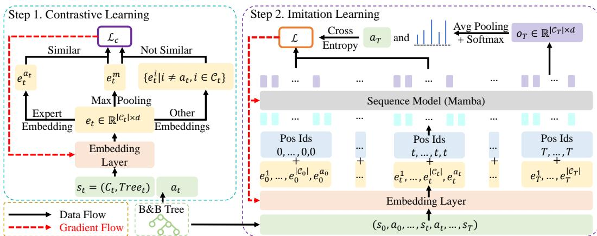
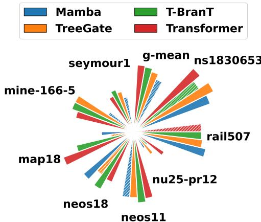
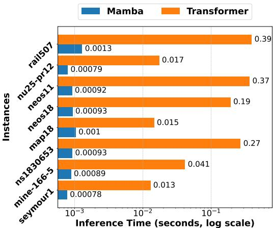
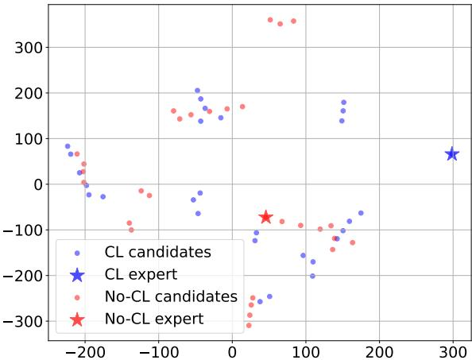

# Towards Better Branching Policies: Leveraging the Sequential Nature of Branch-and-Bound Tree

Anonymous Author(s)   
Affiliation   
Address   
email

# Abstract

The branch-and-bound (B&B) method is a dominant exact algorithm for solv  
ing Mixed-Integer Linear Programming problems (MILPs). While recent deep   
learning approaches have shown promise in learning branching policies using   
instance-independent features, they often struggle to capture the sequential decision  
making nature of B&B, particularly over long horizons with complex inter  
step dependencies and intra-step variable interactions. To address these chal  
lenges, we propose Mamba-Branching, a novel learning-based branching pol  
icy that leverages the Mamba architecture for efficient long-sequence modeling,   
enabling effective capture of temporal dynamics across B&B steps. Addition  
ally, we introduce a contrastive learning strategy to pre-train discriminative em  
beddings for candidate branching variables, significantly enhancing Mamba’s   
performance. Experimental results demonstrate that Mamba-Branching outper  
forms all previous neural branching policies on real-world MILP instances and   
achieves superior computational efficiency compared to the advanced open-source   
solver SCIP. The source code can be accessed via an anonymized repository at   
https://anonymous.4open.science/r/Mamba-Branching-B4B4/.

# 17 1 Introduction

Mixed Integer Linear Programming problems (MILPs) constitute a class of computationally challeng  
ing NP-hard problems with widespread applications across diverse domains, including scheduling [7],   
planning [37], and transportation [3]. The branch-and-bound (B&B) method [28] represents the   
predominant solution methodology for MILPs in practice. This approach begins with the relaxation   
of the original problem and iteratively branches on variables that violate integer constraints. By   
maintaining global upper and lower bounds, the method progressively converges toward an optimal   
solution. Many high-performance MILP solvers such as SCIP [6] and Gurobi [17] employ the B&B   
framework as their core solution architecture.   
Within the B&B framework, the selection of branching variables plays a critical role in determining   
computational efficiency. To this end, learning-based branching methods have been proposed [12, 15,   
, 40]: by constructing a bipartite graph that incorporates instance features and intra-tree dynamic   
features, and utilizing graph convolutional networks (GCNN) [12] for state encoding. Nevertheless,   
reliance on instance-specific features restricts their generalization to heterogeneous MILP instances.   
To enable cross-instance adaptability, recent approaches have focused on parameterizing the B&B   
tree to construct a shared feature space independent of specific problem data. For example, Zarpellon   
et al. [48] develop a parameterized B&B tree framework to create a shared feature space, decoupling   
branching decisions from instance-specific features. Further advancing this approach, T-BranT [31]   
evaluates the mutual connections between candidate variables by the self-attention mechanism and   
employs Graph Attention Networks to encode the empirical branching history in the search tree.   
However, existing works universally overlook the sequential nature inherent in B&B tree expansion. In   
this paper, our key insight lies in that the “branching path” from the root node to the optimal solution   
node essentially constitutes a serialization process. This “branching path”, which encompasses   
the parameterized tree states and corresponding branching variables from each preceding step,   
significantly influences the current branching decision. While T-BranT incorporates historical data,   
it models the tree from an unordered graph perspective, failing to explicitly capture this essential   
sequential nature. Effectively modeling this sequential nature presents two key challenges: (1) Design   
of long sequence modeling architectures. The sequence model must simultaneously capture inter-step   
dependencies and intra-step candidate variable relationships. Given that each state comprises multiple   
candidate variables, the length of the sequence input will increase exponentially with the number of   
branching steps. Therefore, it is essential to develop specialized architectures that can accommodate   
ultra-long sequences. (2) Construction of discriminative feature embeddings. An embedding layer   
needs to be designed to map the features of candidate variables into a high-dimensional vector space   
with high discriminative power. This will enable the sequence model to effectively discern the   
dynamic evolution patterns of different variables.   
To address these challenges, we propose Mamba-Branching. Mamba [14, 8] is a novel network   
architecture characterized by its computational complexity that scales linearly with sequence length.   
This represents a significant improvement over the quadratic complexity associated with Transform  
ers [43], making Mamba particularly well-suited for addressing challenge (1). Meanwhile, inspired   
by CLIP [38], we employ contrastive learning to train the embedding layer prior to the overall   
imitation learning process, effectively tackling challenge (2). Experimental results demonstrate that   
Mamba-Branching outperforms all neural branching baselines across all real-world instances and   
achieves superior solving efficiency over the advanced open-source solver SCIP’s default branching   
rule on challenging instances.

# 61 2 Related Work

Learning-based approaches for accelerating MILP solving can be mainly divided into two   
paradigms [5, 39]: replacing heuristic rules with neural networks within exact solution frame  
works and employing neural networks as primal heuristics. Research under the first paradigm   
includes addressing branch variable selection [12, 15, 16, 40, 25, 26] and node selection [19, 27, 49]   
problems within the B&B framework, as well as tackling cut selection issues in cutting-plane al  
gorithms [42, 22, 45]. These methods solely employ neural networks to replace heuristic rules   
within exact solution frameworks, without compromising solution exactness. The second paradigm   
aims to efficiently produce high-quality feasible solutions—rather than exact solutions—to tighten   
the primal bound early in the process. A high-quality primal bound enables the B&B to eliminate   
a significant number of non-promising nodes at an early stage through its pruning process. This   
typically involves two key aspects: solution prediction [9, 36, 24, 18, 21, 33] and neighborhood   
selection [46, 41, 20, 47]. The solution prediction approach typically employs neural networks to   
predict optimal solutions, then uses these predictions to guide the search process. Neighborhood   
selection starts from a feasible solution and fixes a subset of integer variables while optimizing the   
remainder, with neural networks selecting which variables to fix.   
Our work focuses on the generalization of neural branching variable selection policies, particularly   
their ability to handle heterogeneous MILPs different from training instances. These approaches   
can be mainly divided into two categories: parameterizing the B&B tree and diversifying training   
instances. The first category aims to learn branching policies within a shared feature space across   
different MILP instances. TreeGate [48] processes instance-independent features through a special  
ized neural architecture designed for branching decisions. Building on this, T-BranT [31] retains   
historical data, modeling it as a graph structure processed by Graph Attention Networks for current   
decision-making. The second category focuses on generating diverse instances and incorporating   
them into the training of branching policies to enhance their generalization. AdaSolver [32] intro  
duces adversarial instance augmentation, which generates more diverse instances in directions that   
hinder policy training. Meanwhile, MILP-Evolve [30] proposes a novel LLM-based evolutionary   
framework capable of generating a large set of diverse MILP classes with an unlimited number of   
instances. Specifically, our method falls into the first category. Using instance-independent features   
as input, we also incorporate the sequential nature of the B&B tree into the decision-making process.

# 91 3 Preliminaries

# 3.1 B&B Algorithm and Branching Rules

B&B Algorithm. The standard form of MILPs is: $\begin{array} { r } { \arg \operatorname* { m i n } _ { \mathbf x } \left\{ \mathbf c ^ { \top } \mathbf x \mid \mathbf A \mathbf x \leq \mathbf b , \mathbf x \in \mathbb Z ^ { p } \times \mathbb R ^ { n - p } \right\} . } \end{array}$ , where the vector x represents $n$ variables to be optimized, with $p$ being the number of integer variables. $\mathbf { A } , \mathbf { b } , \mathbf { c }$ represent constraint matrix, constraint right term, and objective coefficient. For MILPs, an exact solution framework commonly used is B&B. This method first ignores the integer constraints to obtain and solve the relaxed problem at the root node. Subsequently, it iteratively searches for the global optimal solution through branching, bounding, and pruning. Branching involves selecting a variable with a fractional solution $x _ { j } = b _ { j }$ at the current node and adding the constraints $x _ { j } \leq [ b _ { j } ]$ and $x _ { j } \geq [ b _ { j } ] + 1$ to form two child nodes. During bounding, the global upper and lower bounds (also known as the primal and dual bounds) are determined based on all existing nodes. The pruning process eliminates obviously infeasible nodes according to these bounds. This procedure repeats until the upper and lower bounds converge, yielding the global optimal solution.

Branching Rules. Here, the branching variable selection during B&B significantly impacts solving efficiency by influencing tree size. In [2], several heuristic branching rules are introduced. Among them, strong branching evaluates candidate variables by creating child nodes for each candidate and selecting the one maximizing dual bound improvement. While highly effective, this approach incurs significant computational overhead that counteracts its benefits for solution speed. Pscost branching guides current branching by leveraging historical branching records, avoiding extra computation but performing poorly early in the search tree due to insufficient branching records. Hybrid approaches combine both methods’ advantages by using strong branching initially to establish reliable branching patterns, then transitioning to pscost branching once sufficient historical data is accumulated. The state-of-the-art (SOTA) relpscost branching [1], SCIP’s default rule, implements this strategy—a variable’s pscost is only considered trustworthy after undergoing sufficient strong branching steps.

# 115 3.2 Parameterized B&B Tree

To parameterize the B&B tree and obtain instance-independent features for heterogeneous MILP   
problems, Zarpellon et al. [48] design a state representation $s _ { t } = ( C _ { t } , T r e e _ { t } )$ . Here, $\boldsymbol { C } _ { t } \in \mathbb { R } ^ { | \mathcal { C } _ { t } | \times 2 5 }$   
denotes candidate variable features, and $T r e e _ { t } \in \mathbb { R } ^ { 6 1 }$ represents tree features, where $\mathcal { C } _ { t }$ denotes   
candidate variable set and $| \mathcal { C } _ { t } |$ represents candidate variable number. Since all features reflect the   
dynamic process of B&B trees, all MILP instances can be processed uniformly in the same feature   
space by a neural network named TreeGate, which jointly processes candidate and tree features   
through two components: a candidate network and a tree network. The candidate network first   
embeds each variable’s 25-dimensional features into an $h$ -dimensional space, then progressively   
reduces the dimensionality from $h$ to $d$ through multiple layers that halve the dimension at each step.   
Meanwhile, the tree network projects the tree features $T r e e _ { t }$ into an $H$ -dimensional space (where   
$H = h + h / 2 + \ldots + d )$ using a sigmoid activation to produce a gating vector $g \in [ \bar { 0 } , 1 ] ^ { H }$ . This   
gating vector modulates the candidate network’s layer outputs through element-wise multiplication.   
The final output $\boldsymbol { e } _ { t } \in \mathbb { R } ^ { | \mathcal { C } _ { t } | \times d }$ undergoes average pooling across the $d$ -dimensional features, then   
being processed by a softmax layer to generate the candidate variable selection probabilities.

# 130 4 Methodology

In this section, we formally introduce Mamba-Branching, a neural branching policy specifically   
designed to capture the sequential structure of B&B trees. We begin by discussing the contrastive   
learning approach utilized for the embedding layer and the detailed design of the sequence inputs,   
followed by the detailed implementation of imitation learning. The overall framework of Mamba  
Branching is illustrated in Figure 1.

# 136 4.1 Contrastive Learning for Embedding Layer

The embedding layer serves as a critical interface between raw state representations and downstream   
sequence models. In natural language processing (NLP), the success of embedding techniques   
has been well-established. These methods leverage the inherent distinguishability of discrete word   
tokens, where each word’s unique identity naturally translates to separable embedding vectors through   
standard training paradigms. [4, 35] However, the branching variable selection problem in B&B   
presents a fundamentally different challenge. The state representation at each branching step $t$ ,   
denoted as $s _ { t } = ( C _ { t } , T r e e _ { t } )$ (see subsection 3.2), contains a set of candidate variables $\mathcal { C } _ { t }$ that   
frequently exhibit remarkably similar feature characteristics. This high degree of intra-step similarity   
arises from the shared constraints and problem structure inherent in combinatorial optimization   
problems. Unlike the clear distinctions between words in NLP tasks, the subtle but decision-critical   
differences between candidate variables in B&B require a more sophisticated approach to embedding   
learning.   
To address this challenge, we develop a principled framework for learning discriminative embeddings   
in B&B decision making. The core of our approach lies in recognizing that effective branching   
decisions require the embedding space to maintain consistent separation between selected and non  
selected variables. We formalize this requirement through Proposition 1. This condition specifies that   
the similarity between the selected variable’s embedding and a reference vector must exceed all other   
candidate similarities by a positive margin $\delta$ .

  
Figure 1: Overall framework of Mamba-Branching. The training process involves two stages: contrastive learning and autoregressive imitation learning. During the contrastive learning process, the state $s _ { t }$ and expert decision $a _ { t }$ at each branching step $t$ are used to train the embedding layer via the designed contrastive loss function $\mathcal { L } _ { c }$ . During imitation learning, the branching trajectory $( s _ { 0 } , a _ { 0 } , . . . , s _ { T } )$ is mapped to embeddings. At step $t$ , expanded variable embeddings $( e _ { t } ^ { 1 } , . . . , e _ { t } ^ { | \mathcal { C } _ { t } | } )$ and expert embedding $e _ { t } ^ { a _ { t } }$ form a group with shared positional encoding. These groups create a “branching path” input to the sequence model, where only outputs $o _ { t }$ corresponding to the variable embeddings are selected, with $a _ { t }$ serving as the label for imitation learning.

Proposition 1. For effective branching decisions, the embedding space must satisfy:

$$
\forall t , \exists \delta > 0 s . t . s i m ( e _ { t } ^ { a } , e _ { t } ^ { m } ) \geq \operatorname* { m a x } _ { i \neq a } s i m ( e _ { t } ^ { i } , e _ { t } ^ { m } ) + \delta ,
$$

where sim156 $\ast ( \cdot )$ is a similarity judgment function, $e _ { t }$ denotes embeddings, $e _ { t } ^ { m }$ is an anchor, a denotes 157 the selected variable index.

To this end, before joint training, we first employ contrastive learning to train the embedding layer,   
enhancing its ability to differentiate between distinct candidate variable features. The loss function of   
contrastive learning is defined as $\mathcal { L } _ { c }$ , with the specific form as follows:

$$
\mathcal { L } _ { c } ( \gamma ) = \frac { 1 } { T } \sum _ { t } ( - \frac { e _ { t } ^ { m } \cdot e _ { t } ^ { a } } { \Vert e _ { t } ^ { m } \Vert \Vert e _ { t } ^ { a } \Vert } + \frac { 1 } { \vert \mathcal { C } _ { t } \vert - 1 } \sum _ { i \neq a } \frac { e _ { t } ^ { m } \cdot e _ { t } ^ { i } } { \Vert e _ { t } ^ { m } \Vert \Vert e _ { t } ^ { i } \Vert } ) ,
$$

where $\gamma$ denotes the parameters of TreeGate, $T$ denotes the total number of branching steps, $e _ { t } =$ TreeGate162 $\mathbf { \gamma } _ { \gamma } ( s _ { t } )$ , $e _ { t } ^ { m } \in \mathbb { R } ^ { d }$ is the result of applying max-pooling to $e _ { t }$ along the $| \mathcal { C } _ { t } |$ dimension, e at ∈ R d163 .

The intuition behind this loss function design is to make the selected branching variable the most   
prominent and distinctive among all candidate variables. The max-pooling operation extracts a salient   
global feature as an anchor. By increasing the cosine similarity between the anchor and the selected   
167 branching variable while decreasing the cosine similarity between the anchor and other candidate   
68 variables, the loss amplifies their differences and drives the feature of the selected branching variable   
toward the globally most salient direction.

# 170 4.2 Sequential Modeling Design

In B&B tree, nodes are progressively expanded until the upper and lower bounds converge. This   
process can be viewed as navigating through a complex maze to find a “branching path” from the   
root node to the optimal solution node. Traditional neural approaches to branching decisions have   
predominantly relied on the immediate state of the tree, neglecting the historical sequence of visited   
nodes and prior branching choices. This myopic perspective is fundamentally limiting, as it fails to   
leverage the rich sequential information inherent in the branching process. Just as an effective maze  
solving strategy requires reasoning about the entire traversed path to avoid dead ends and redundant   
exploration, optimal branching decisions demand a holistic understanding of the search trajectory.   
This underscores the imperative for a paradigm shift toward path-aware sequential modeling.   
To effectively model branching decisions, the sequence model must capture not only the sequential   
progression of states but also the intricate interrelationships among candidate variables within each   
state. Therefore, we explicitly encode the features of each candidate variable at all branching steps.   
We formally define the branching path S as a structured sequence of embeddings, where each state   
at step $t$ is decomposed into its constituent candidate variables along with the selected branching   
decision. Specifically, S is represented as:

$$
\mathbf { S } = [ \underbrace { e _ { 0 } ^ { 1 } , \dots , e _ { 0 } ^ { | \mathcal { C } _ { 0 } | } } _ { | \mathcal { C } _ { 0 } | + 1 } , e _ { 0 } ^ { a _ { 0 } } , \dots , \underbrace { e _ { t } ^ { 1 } , \dots , e _ { t } ^ { | \mathcal { C } _ { t } | } } _ { | \mathcal { C } _ { t } | + 1 } , e _ { t } ^ { a _ { t } } , \dots , \underbrace { e _ { T } ^ { 1 } , \dots , e _ { T } ^ { | \mathcal { C } _ { T } | } } _ { | \mathcal { C } _ { T } | } ] ,
$$

where $| \mathcal { C } _ { t } |$ denotes the number of candidate variables at branching step $t$ , $a _ { t }$ represents the index of   
the selected branching variable, $e _ { t }$ denotes the embedding feature, and $T$ is the maximum number of   
branching steps in the branching path. This formulation ensures that both the sequential dynamics   
and the variable-level interactions are preserved, enabling the model to leverage granular features for   
improved decision-making.   
To ensure temporal coherence across branching steps, we employ positional encodings that assign   
identical positional indices to embeddings within the same step. The complete input representation $\mathbf { S } ^ { \prime }$   
is constructed by combining the branching path S with a learnable positional encoding matrix $\mathbf { E } _ { p o s }$ :

$$
\begin{array} { l } { p o s = [ \underbrace { 0 , \dots , 0 , 0 } _ { | \mathcal { C } _ { 0 } | + 1 } , \dots , \underbrace { T , \dots , T } _ { | \mathcal { C } _ { T } | } ] , } \\ { \mathbf { S } ^ { \prime } = \mathbf { E } _ { p o s } \oplus \mathbf { S } , } \end{array}
$$

where 194 $\oplus$ denotes element-wise addition, $\mathbf { E } _ { p o s } \in \mathbb { R } ^ { ( \sum _ { t = 0 } ^ { T } | \mathcal { C } _ { t } | + T ) \times d }$ represents the learnable positional 195 encoding matrix obtained by mapping pos.

Subsequently, 196 $\mathbf { S } ^ { \prime }$ is fed into Mamba to obtain the output $\mathbf { O } _ { t }$

$$
\begin{array} { l } { { \bf O } _ { t } = { \bf M a m b a } ( { \bf S } ^ { \prime } ) \qquad } \\ { \quad = [ o _ { 0 } ^ { 1 } , \dots , o _ { 0 } ^ { | \mathcal { C } _ { 0 } | } , o _ { 0 } ^ { a _ { 0 } } , \dots , o _ { t } ^ { 1 } , \dots , o _ { t } ^ { | \mathcal { C } _ { t } | } , o _ { t } ^ { a _ { t } } , \dots , o _ { T } ^ { 1 } , \dots , o _ { T } ^ { | \mathcal { C } _ { T } | } ] , } \end{array}
$$

within each group, only the outputs corresponding to $| \mathcal { C } _ { t } |$ variable positions are extracted, denoted as   
$o _ { t } = ( o _ { t } ^ { 1 } , \ldots , o _ { t } ^ { | \mathcal { C } _ { t } | } )$ , which are then processed through average pooling and softmax to obtain the   
variable probability distribution.   
It can be observed that for the branching path S, the sequence model actually needs to process an input   
length of $\textstyle \sum _ { t = 0 } ^ { T } | C _ { t } | + T$ . When either $T$ or $| \mathcal { C } _ { t } |$ becomes large, the length of S increases substantially,   
presenting significant challenges to the sequence model’s ability to handle long sequences. Therefore,   
in addition to employing the most commonly-used Transformer Decoder as our sequence model, we   
also utilize Mamba [14] (see Appendix A for architectural details). In contrast to the Transformer’s   
quadratic complexity, Mamba achieves linear complexity relative to sequence length, making it   
unequivocally better suited for such long-sequence application scenarios. This is particularly critical   
in our application, where computational speed is paramount. If the neural branching policy’s inference   
complexity becomes excessively high and computationally prohibitive, it would fundamentally   
undermine our original objective of acceleration.

Following prior works [48, 31], we employ relpscost branching as the expert to collect demonstration datasets for imitation learning. In contrast to the commonly employed strong branching expert [12, 15], which are rarely applied in practical scenarios, relpscost provides a more realistic expert representation. For dataset collection, each instance is solved using SCIP. We sequentially record every state in the instance’s tree along with the corresponding relpscost-selected branching decisions, resulting in a complete trajectory denoted as $( s _ { 0 } , a _ { 0 } , s _ { 1 } , a _ { 1 } , . . . )$ . In dataset $\mathcal { D }$ , each instance’s trajectory is partitioned into fixed-length sub-trajectories for storage.

In Mamba-Branching, the branching policy is defined as $\pi _ { \theta }$ , which operates in an autoregressive   
paradigm. The joint loss function $\mathcal { L } ( \theta , \gamma )$ of embedding layer and sequence model is as follows:

$$
\mathcal { L } ( \theta , \gamma ) = - \frac { 1 } { | \mathcal { D } | } \sum _ { \tau \in \mathcal { D } } \sum _ { ( s _ { t } , a _ { t } ) \in \tau } \log \pi _ { \theta } ( a _ { t } | \tau _ { 0 : t } ) ,
$$

where $\tau$ denotes a trajectory in $\mathcal { D }$ , $\tau _ { 0 : t } = ( s _ { 0 } , a _ { 0 } , \ldots , a _ { t - 1 } , s _ { t } )$ , and $| \mathcal D |$ represents the total number of trajectories in $\mathcal { D }$ . During inference, the predictions from previous branching steps serve as input for the current step, yielding the probability distribution $\pi _ { \boldsymbol { \theta } } ( \cdot | \widehat { \tau } _ { 0 : t } )$ over candidate variables, where $\hat { \tau } _ { 0 : t } = ( s _ { 0 } , \hat { a } _ { 0 } , \ldots , \hat { a } _ { t - 1 } , s _ { t } ) ^ { - }$ .

# 5 Experiments

# 5.1 Setup

# 5.1.1 Benchmarks

MILP dataset. Our method is designed to maintain generalization capability across heterogeneous MILPs. Therefore, the training and test instances are deliberately constructed to be distinct, with the strict requirement that the test set should not contain any instances present in the training set. Following the selection of instances from previous works [48, 31], we construct two MILP datasets of different scales using instances from MIPLIB [13] and CORAL [29]: a smaller-scale dataset (MILP-S) and a larger-scale dataset (MILP-L). The MILP-S is entirely derived from [48], comprising 19 training instances and 8 test instances. MILP-L is constructed by expanding the dataset used in [31], containing 25 training instances and 73 test instances. For MILP-L’s test instances, we employ SCIP as the reference solver, categorizing 57 instances with solution times under 20 minutes as "easy" and 16 instances exceeding 20 minutes as "difficult". The details of MILP-S and MILP-L are provided in Appendix B.

Branching Dataset Collection. During data collection, consistent with previous works [48, 31], we employ random branching for the first $r$ steps to enhance B&B exploration. After these $r$ random steps, we switch to relpscost branching and collect the corresponding data. For each training instance, we configure $r \in \{ \bar { 0 , } 1 , 5 , 1 0 , 1 5 \}$ and collect training set using solver seeds $\{ 0 , 1 , 2 , { \bar { 3 } } \}$ , while reserving seed 4 exclusively for validation set.

# 5.1.2 Metrics

Nodes and Fair Nodes. The number of nodes in the B&B tree serves as a crucial metric for evaluating branching policies, as it directly impacts overall solving time. However, as noted in [10], this metric may be confounded by side effects of some sophisticated branching rules, such as strong branching. We therefore additionally employ the fair node number [10], which eliminates the confounding effects of these rules, thereby providing a more accurate reflection of the true capability of a branching policy. For branching policies that do not use strong branching, the number of nodes and fair nodes remains identical.

Primal-Dual Integral. For some challenging instances in MILP-L, obtaining optimal solutions may be computationally prohibitive, so a one-hour time limit is imposed. Under this constraint, node number becomes an inadequate metric for evaluating the performance of branching policies. In such cases, the primal-dual integral (PD integral) serves as a more appropriate evaluation criterion [11]. With a time limit $T _ { l }$ , the PD integral is expressed as $\begin{array} { r } { \int _ { t = 0 } ^ { T _ { l } } \mathbf { c } ^ { \top } \mathbf { x } _ { t } ^ { \star } - \mathbf { y } _ { t } ^ { \star } \mathrm { d } t . } \end{array}$ , where $\mathbf { y } _ { t } ^ { \star }$ is the best dual bound at time $t .$ , $\mathbf { x } _ { t } ^ { \star }$ is the best feasible solution at time $t$ .

We select two categories of branching policies as baselines: neural-based approaches and heuristic rules. The neural branching policies include: GCNN [12], TreeGate [48], T-BranT [31], and Transformer-Branching. GCNN is the most classical method and does not incorporate specific designs for heterogeneous MILPs. TreeGate and T-BranT are also based on instance-independent inputs, serving as the primary baselines for comparison with Mamba-Branching. TransformerBranching employs Transformer as the sequence model to highlight Mamba’s advantages. The heuristic rules include random, pscost, and relpscost, where random and pscost represent the lower bounds of performance, relpscost serves as the expert and constitutes the upper bound of branching performance. However, neural branching policies may surpass relpscost in solving efficiency. More detailed reasons for the selection of baselines can be found in Appendix C.

# 5.1.4 Solver and Neural Policy Settings

Solver Settings. In our evaluation, we replace SCIP solver’s (v8.0.4) branching policy with our neural branching policy. To isolate the study of branching policies and eliminate interference from other solver components, we disable all primal heuristics and provide each test instance with a known optimal solution value as a cutoff. However, during branching data collection, we intentionally omit the cutoff to obtain longer branching sequences.

Neural Policy Settings. During Mamba-Branching training, the maximum branching step is $T = 9 9$ , but as shown in subsection 4.2, its corresponding actual input length is considerably long. When using the Transformer as the sequence model, this length causes excessive GPU memory consumption that exceeds hardware limitations, thus $T = 9$ is adopted during Transformer-Branching training. For evaluation consistency, we employ autoregressive generation with $T = 2 4$ across all models. Additional implementation details and hyperparameters can be found in Appendix D.

Table 1: The experimental results on MILP-S. For the 8 test instances in MILP-S, each instance is evaluated with five random seeds {0,1,2,3,4} under a 1-hour time limit, and the results are presented as geometric means. Among them, blue background indicates the best results, bold font indicates the best results in neural policies, and $\star$ denotes reaching the time limit.   

<table><tr><td>Method</td><td>Mamba -Branching</td><td>TreeGate</td><td>Transformer -Branching</td><td>T-BranT</td><td>GCNN</td><td>random</td><td>pscost</td><td>relpscost</td></tr><tr><td>Nodes</td><td>2054.99</td><td>2171.31</td><td>3078.56</td><td>2668.62</td><td>33713.63*</td><td>61828.29*</td><td>4674.34</td><td>730.21</td></tr><tr><td>Fair Nodes</td><td>2077.55</td><td>2205.06</td><td>3120.04</td><td>2715.16</td><td>33713.63*</td><td>61828.29*</td><td>4674.34</td><td>1227.25</td></tr></table>

# 5.2 Branching Performance

# 5.2.1 MILP-S

The experimental results in MILP-S can be found in Table 1, with the fair node results of all neural branching policies per instance shown in Figure 2. The single-step inference time comparison between Transformer and Mamba is shown in Figure 3. Notably, T-BranT necessitates at least one set of historical data, prompting the use of relpscost at the root node. This precise branching decision at the root significantly influences overall performance. For the sake of consistency, Mamba-Branching, TreeGate, and Transformer-Branching also employ relpscost at the root node, with Mamba-Branching and Transformer-Branching further leveraging it to initialize their input sequences. To evaluate the performance of pure neural branching, we additionally test variants that do not utilize relpscost initialization: TreeGate-p, Mamba-Branching-p, and Transformer-Branching-p, as shown in Table 3.

It can be observed that Mamba-Branching is the best branching policy besides relpscost. First, Mamba-Branching significantly outperforms the three lower-bound references: GCNN, random, and pscost. Compared with several neural branching policy baselines, whether initialized with relpscost or purely neural-based, Mamba-Branching surpasses T-BranT, TreeGate, and Transformer-Branching, achieving a new SOTA for neural branching policies. Additionally, in terms of single-step inference time, Mamba significantly outperforms Transformer, highlighting its advantage as a sequence model.

  
Figure 2: The fair node results of all neural branching policies in MILP-S.

  
Figure 3: The inference time comparison between Mamba and Transformer in MILP-S.

# 5.2.2 MILP-L

In MILP-L, we further evaluate several methods that demonstrated strong performance in MILP-S, including TreeGate, TBranT, Mamba-Branching, and relpscost. For the 57 easy instances, performance is assessed using both nodes and fair nodes. In contrast, for the 16 difficult instances, we use the PD integral with a 1-hour time limit as the evaluation metric. The results are presented in Table 2.

The results demonstrate that for easy MILPs, despite the expanded test instances compared to MILP-S, Mamba-Branching remains the best neural branching policy,

Table 2: The experimental results on MILP-L. Consistent with the experiments on MILP-S, all instances are evaluated with 5 random seeds under a 1-hour time limit, with results reported as geometric means. Blue background indicates the best results and bold font indicates the best results in neural policies.   

<table><tr><td rowspan="2">Method</td><td colspan="2">Easy</td><td>Difficult</td></tr><tr><td>Nodes</td><td>Fair Nodes</td><td> PD Integral</td></tr><tr><td>Mamba-Branching</td><td>1819.32</td><td>2053.91</td><td>12319.55</td></tr><tr><td>TreeGate</td><td>2218.29</td><td>2534.09</td><td>14625.68</td></tr><tr><td>T-BranT</td><td>2009.77</td><td>2298.76</td><td>13538.47</td></tr><tr><td>relpscost</td><td>667.93</td><td>1455.49</td><td>12741.36</td></tr></table>

but still inferior to relpscost. For difficult instances, Mamba-Branching achieves the best PD integral performance among all branching policies, even surpassing relpscost. This indicates that within the same time limit, Mamba-Branching enables the fastest convergence of primal and dual bounds.

# 5.2.3 Discussion

Advantage of Sequential Nature. First, Mamba-Branching consistently outperforms TreeGate and T-BranT across all scenarios due to its consideration of the sequential nature of B&B trees. Neither TreeGate (which completely ignores historical data) nor T-BranT (which utilizes historical data nonsequentially) achieves the effectiveness of sequential historical data utilization. This aligns with our maze analogy in subsection 4.2: sequentially recalling paths facilitates better current decision-making.

Limitation of Transformer. Transformer-Branching also leverages sequential nature but performs poorly, with Transformer-Branching-p even underperforming the lower-bound pscost. The suboptimal performance stems from its 10-step branching history limit during training (due to hardware constraint), while Mamba-Branching accommodates 100 steps. Furthermore, the inference time comparison in Figure 3 demonstrates that in our time-sensitive scenario aimed at reducing solving time, Transformer is entirely unsuitable as a branching policy. The underlying reason here is that Transformer’s complexity is quadratic with respect to sequence length, while Mamba’s is linear. Although Transformer is theoretically suitable as a sequence model, employing Mamba offers greater practicality and feasibility. A more detailed comparison can be found in Appendix E.

Factors Outperforming Relpscost. As for relpscost, Mamba-Branching does not outperform in easy   
instances but surpasses it in difficult ones. The reason can be summarized as follows: (1) Relpscost   
is a hybrid method combining strong and pscost branching, incorporating a reliability criterion: a   
variable can only switch to pscost after being selected by strong branching a certain number of times.   
Therefore, for difficult instances with more variables, the initialization process is time-consuming,   
leading to potential inefficiency. In contrast, neural policies benefit from fast inference and exhibit   
advantages on difficult instances. (2) In relpscost, the use of pscost for leveraging historical data   
does not account for the sequential nature, whereas Mamba-Branching explicitly incorporates this   
consideration. (3) As mentioned in [48], the relpscost in SCIP has been fine-tuned for a large number   
of instances, resulting in excellent performance on easy instances. However, for more complex and   
challenging instances, such parameter tuning may not provide adequate coverage.

Table 3: On MILP-S, the results of pure neural branching policies TreeGate-p, Transformer-Branchingp, and Mamba-Branching-p, as well as Mamba-Branching-p without contrastive learning (w/o cl). The experimental setup remains consistent with the aforementioned configuration on MILP-S.   

<table><tr><td>Method</td><td></td><td>Mamba-Branching-p Mamba-Branching-p (w/o cl） Transformer-Branching-</td><td></td><td>TreeGate-p</td></tr><tr><td>Nodes</td><td>2272.43</td><td>3000.92</td><td>5138.15</td><td>3179.55</td></tr><tr><td>Fair Nodes</td><td>2272.43</td><td>3000.92</td><td>5138.15</td><td>3179.55</td></tr></table>

# 5.3 Ablation Study

In this section, an ablation experiment is conducted to verify the role of contrastive learning. First, the most straightforward comparison is to evaluate the branching performance difference when contrastive learning is applied or not to the embedding layer. Under pure neural branching, the results on MILP-S without and with contrastive learning are denoted as Mamba-Branching-p (w/o cl) and MambaBranching-p, respectively, as shown in Table 3. Meanwhile, to demonstrate that contrastive learning indeed achieves its intended effect, that is, making the feature of expert-selected variable more distinguishable compared to other candidates, we also visualize the t-SNE-reduced [34] embeddings, as shown in Figure 4.

  
Figure 4: At a random given state, the embeddings with and without contrastive learning.

First, in terms of branching performance, Mamba-Branching-p demonstrates superior results compared to its counterpart without contrastive learning, Mamba-Branching-p (w/o cl). The visualization then reveals that with contrastive learning, the expert-selected variable exhibits greater outlier characteristics and enhanced discriminability relative to other candidate variables. In contrast, without contrastive learning, the expert-selected variable becomes less distinguishable and tends to cluster near candidate variables.

# 66 6 Conclusion and Future Work

In this paper, we propose Mamba-Branching, the first approach to consider the sequential nature in B&B trees. To address the challenges of long sequences and embedding distinctiveness posed by sequential nature, we employ Mamba as the sequence model and design a contrastive learning method to train the embedding layer, enabling the sequence model to distinguish between different candidate variables. In experiments, Mamba-Branching outperforms all neural branching policies and achieves superior solving efficiency compared to relpscost on challenging instances. One limitation of our approach is the reliance on imitation learning, which requires a time-consuming collection of expert demonstrations. In future work, we will focus on investigating the potential of sequential nature in reinforcement learning-based branching policies, thereby eliminating the dependency on expert data.

References   
[1] Achterberg, T.: Scip optimization suite documentation: Reliable pseudo costs branching rule.   
SCIP Optimization Suite Documentation (2025), https://www.scipopt.org/doc/html/   
branch__relpscost_8h.php, accessed: 2025-04-27   
[2] Achterberg, T., Koch, T., Martin, A.: Branching rules revisited. Operations Research Letters   
33(1), 42–54 (2005)   
[3] Barnhart, C., Laporte, G.: Handbooks in operations research and management science: Trans  
portation. Elsevier (2006)   
[4] Bengio, Y., Ducharme, R., Vincent, P.: A neural probabilistic language model. In: Leen,   
T., Dietterich, T., Tresp, V. (eds.) Advances in Neural Information Processing Systems.   
vol. 13. MIT Press (2000), https://proceedings.neurips.cc/paper_files/paper/   
2000/file/728f206c2a01bf572b5940d7d9a8fa4c-Paper.pdf   
[5] Bengio, Y., Lodi, A., Prouvost, A.: Machine learning for combinatorial optimization:   
A methodological tour d’horizon. European Journal of Operational Research 290(2),   
405–421 (2021). https://doi.org/https://doi.org/10.1016/j.ejor.2020.07.063, https://www.   
sciencedirect.com/science/article/pii/S0377221720306895   
[6] Bolusani, S., Besançon, M., Bestuzheva, K., Chmiela, A., Dionísio, J., Donkiewicz, T., van   
Doornmalen, J., Eifler, L., Ghannam, M., Gleixner, A., Graczyk, C., Halbig, K., Hedtke, I.,   
Hoen, A., Hojny, C., van der Hulst, R., Kamp, D., Koch, T., Kofler, K., Lentz, J., Manns,   
J., Mexi, G., Mühmer, E., Pfetsch, M.E., Schlösser, F., Serrano, F., Shinano, Y., Turner,   
M., Vigerske, S., Weninger, D., Xu, L.: The SCIP Optimization Suite 9.0. Technical re  
port, Optimization Online (February 2024), https://optimization-online.org/2024/   
02/the-scip-optimization-suite-9-0/   
[7] Chen, Z.L.: Integrated production and outbound distribution scheduling: review and extensions.   
Operations research 58(1), 130–148 (2010)   
[8] Dao, T., Gu, A.: Transformers are SSMs: Generalized models and efficient algorithms through   
structured state space duality. In: International Conference on Machine Learning (ICML) (2024)   
[9] Ding, J.Y., Zhang, C., Shen, L., Li, S., Wang, B., Xu, Y., Song, L.: Acceler  
ating primal solution findings for mixed integer programs based on solution predic  
tion. Proceedings of the AAAI Conference on Artificial Intelligence 34(02), 1452–1459   
(Apr 2020). https://doi.org/10.1609/aaai.v34i02.5503, https://ojs.aaai.org/index.php/   
AAAI/article/view/5503   
[10] Gamrath, G., Schubert, C.: Measuring the impact of branching rules for mixed-integer program  
ming. In: Kliewer, N., Ehmke, J.F., Borndörfer, R. (eds.) Operations Research Proceedings   
2017. pp. 165–170. Springer International Publishing, Cham (2018)   
[11] Gasse, M., Bowly, S., Cappart, Q., Charfreitag, J., Charlin, L., Chételat, D., Chmiela, A.,   
Dumouchelle, J., Gleixner, A., Kazachkov, A.M., Khalil, E., Lichocki, P., Lodi, A., Lubin,   
M., Maddison, C.J., Christopher, M., Papageorgiou, D.J., Parjadis, A., Pokutta, S., Prouvost,   
A., Scavuzzo, L., Zarpellon, G., Yang, L., Lai, S., Wang, A., Luo, X., Zhou, X., Huang, H.,   
Shao, S., Zhu, Y., Zhang, D., Quan, T., Cao, Z., Xu, Y., Huang, Z., Zhou, S., Binbin, C.,   
Minggui, H., Hao, H., Zhiyu, Z., Zhiwu, A., Kun, M.: The machine learning for combinatorial   
optimization competition (ml4co): Results and insights. In: Kiela, D., Ciccone, M., Caputo, B.   
(eds.) Proceedings of the NeurIPS 2021 Competitions and Demonstrations Track. Proceedings   
of Machine Learning Research, vol. 176, pp. 220–231. PMLR (06–14 Dec 2022), https:   
//proceedings.mlr.press/v176/gasse22a.html   
[12] Gasse, M., Chételat, D., Ferroni, N., Charlin, L., Lodi, A.: Exact combinatorial optimization   
with graph convolutional neural networks. Advances in neural information processing systems   
32 (2019)   
[13] Gleixner, A., Hendel, G., Gamrath, G., Achterberg, T., Bastubbe, M., Berthold, T.,   
Christophel, P.M., Jarck, K., Koch, T., Linderoth, J., Lübbecke, M., Mittelmann, H.D.,   
Ozyurt, D., Ralphs, T.K., Salvagnin, D., Shinano, Y.: MIPLIB 2017: Data-Driven Com  
pilation of the 6th Mixed-Integer Programming Library. Mathematical Programming Com  
putation (2021). https://doi.org/10.1007/s12532-020-00194-3, https://doi.org/10.1007/   
s12532-020-00194-3   
[14] Gu, A., Dao, T.: Mamba: Linear-time sequence modeling with selective state spaces. In:   
First Conference on Language Modeling (2024), https://openreview.net/forum?id=   
tEYskw1VY2   
[15] Gupta, P., Gasse, M., Khalil, E., Mudigonda, P., Lodi, A., Bengio, Y.: Hybrid models for   
learning to branch. Advances in neural information processing systems 33, 18087–18097 (2020)   
[16] Gupta, P., Khalil, E.B., Chételat, D., Gasse, M., Lodi, A., Bengio, Y., Kumar, M.P.: Lookback for   
learning to branch. Transactions on Machine Learning Research (2022), https://openreview.   
net/forum?id $\equiv$ EQpGkw5rvL, expert Certification   
[17] Gurobi Optimization, LLC: Gurobi Optimizer Reference Manual (2024), https://www.   
gurobi.com   
[18] Han, Q., Yang, L., Chen, Q., Zhou, X., Zhang, D., Wang, A., Sun, R., Luo, X.: A GNN  
guided predict-and-search framework for mixed-integer linear programming. In: The Eleventh   
International Conference on Learning Representations (2023), https://openreview.net/   
forum?id=pHMpgT5xWaE   
[19] He, H., Daume III, H., Eisner, J.M.: Learning to search in branch and bound al  
gorithms. In: Ghahramani, Z., Welling, M., Cortes, C., Lawrence, N., Weinberger,   
K. (eds.) Advances in Neural Information Processing Systems. vol. 27. Curran As  
sociates, Inc. (2014), https://proceedings.neurips.cc/paper_files/paper/2014/   
file/757f843a169cc678064d9530d12a1881-Paper.pdf   
[20] Huang, T., Ferber, A., Tian, Y., Dilkina, B., Steiner, B.: Searching large neighborhoods for   
integer linear programs with contrastive learning. In: Proceedings of the 40th International   
Conference on Machine Learning. ICML’23, JMLR.org (2023)   
[21] Huang, T., Ferber, A.M., Zharmagambetov, A., Tian, Y., Dilkina, B.: Contrastive predict-and  
search for mixed integer linear programs. In: Salakhutdinov, R., Kolter, Z., Heller, K., Weller, A.,   
Oliver, N., Scarlett, J., Berkenkamp, F. (eds.) Proceedings of the 41st International Conference   
on Machine Learning. Proceedings of Machine Learning Research, vol. 235, pp. 19757–19771.   
PMLR (21–27 Jul 2024), https://proceedings.mlr.press/v235/huang24f.html   
[22] Huang, Z., Wang, K., Liu, F., Zhen, H.L., Zhang, W., Yuan, M., Hao, J., Yu, Y., Wang, J.:   
Learning to select cuts for efficient mixed-integer programming. Pattern Recognition 123,   
108353 (2022). https://doi.org/https://doi.org/10.1016/j.patcog.2021.108353, https://www.   
sciencedirect.com/science/article/pii/S0031320321005331   
[23] Kalman, R.E.: A new approach to linear filtering and prediction problems. Journal of Basic   
Engineering 82(1), 35–45 (03 1960). https://doi.org/10.1115/1.3662552, https://doi.org/   
10.1115/1.3662552   
[24] Khalil, E.B., Morris, C., Lodi, A.: Mip-gnn: A data-driven framework for guiding combinatorial   
solvers. In: Proceedings of the AAAI Conference on Artificial Intelligence. vol. 36, pp. 10219–   
10227 (2022)   
[25] Kuang, Y., Wang, J., Liu, H., Zhu, F., Li, X., Zeng, J., HAO, J., Li, B., Wu, F.: Rethinking   
branching on exact combinatorial optimization solver: The first deep symbolic discovery   
framework. In: The Twelfth International Conference on Learning Representations (2024),   
https://openreview.net/forum?id=jKhNBulNMh   
[26] Kuang, Y., Wang, J., Zhou, Y., Li, X., Zhu, F., HAO, J., Wu, F.: Towards general al  
gorithm discovery for combinatorial optimization: Learning symbolic branching policy   
from bipartite graph. In: Forty-first International Conference on Machine Learning (2024),   
https://openreview.net/forum?id=ULleq1Dtaw   
[27] Labassi, A.G., Chételat, D., Lodi, A.: Learning to compare nodes in branch and bound with   
graph neural networks. In: Oh, A.H., Agarwal, A., Belgrave, D., Cho, K. (eds.) Advances   
in Neural Information Processing Systems (2022), https://openreview.net/forum?id=   
0VhrZPJXcTU   
[28] Land, A.H., Doig, A.G.: An automatic method for solving discrete programming problems.   
Springer (2010)   
[29] Lehigh University COR@L Lab: Mixed-integer programming benchmark instances (nd),   
https://coral.ise.lehigh.edu/data-sets/mixed-integer-instances/, accessed:   
2025-4-30   
[30] Li, S., Kulkarni, J., Menache, I., Wu, C., Li, B.: Towards foundation models for mixed integer   
linear programming. In: The Thirteenth International Conference on Learning Representations   
(2025), https://openreview.net/forum?id $\equiv$ 6yENDA7J4G   
[31] Lin, J., Zhu, J., Wang, H., Zhang, T.: Learning to branch with tree  
aware branching transformers. Knowledge-Based Systems 252, 109455 (2022).   
https://doi.org/https://doi.org/10.1016/j.knosys.2022.109455, https://www.sciencedirect.   
com/science/article/pii/S0950705122007298   
[32] Liu, H., Kuang, Y., Wang, J., Li, X., Zhang, Y., Wu, F.: Promoting generalization for ex  
act solvers via adversarial instance augmentation (2023), https://arxiv.org/abs/2310.   

[33] Liu, H., Wang, J., Geng, Z., Li, X., Zong, Y., Zhu, F., HAO, J., Wu, F.: Apollo-MILP:   
An alternating prediction-correction neural solving framework for mixed-integer linear pro  
gramming. In: The Thirteenth International Conference on Learning Representations (2025),   
https://openreview.net/forum?id $\equiv$ mFY0tPDWK8   
[34] van der Maaten, L., Hinton, G.: Visualizing data using t-sne. Journal of Machine Learning Re  
search 9(86), 2579–2605 (2008), http://jmlr.org/papers/v9/vandermaaten08a.html   
[35] Mikolov, T., Sutskever, I., Chen, K., Corrado, G.S., Dean, J.: Distributed representations   
of words and phrases and their compositionality. In: Burges, C., Bottou, L., Welling, M.,   
Ghahramani, Z., Weinberger, K. (eds.) Advances in Neural Information Processing Sys  
tems. vol. 26. Curran Associates, Inc. (2013), https://proceedings.neurips.cc/paper_   
files/paper/2013/file/9aa42b31882ec039965f3c4923ce901b-Paper.pdf   
[36] Nair, V., Bartunov, S., Gimeno, F., von Glehn, I., Lichocki, P., Lobov, I., O’Donoghue, B.,   
Sonnerat, N., Tjandraatmadja, C., Wang, P., Addanki, R., Hapuarachchi, T., Keck, T., Keeling,   
J., Kohli, P., Ktena, I., Li, Y., Vinyals, O., Zwols, Y.: Solving mixed integer programs using   
neural networks (2021), https://arxiv.org/abs/2012.13349   
[37] Pochet, Y., Wolsey, L.A.: Production planning by mixed integer programming, vol. 149. Springer   
(2006)   
[38] Radford, A., Kim, J.W., Hallacy, C., Ramesh, A., Goh, G., Agarwal, S., Sastry, G., Askell, A.,   
Mishkin, P., Clark, J., Krueger, G., Sutskever, I.: Learning transferable visual models from   
natural language supervision (2021), https://arxiv.org/abs/2103.00020   
[39] Scavuzzo, L., Aardal, K., Lodi, A., Yorke-Smith, N.: Machine learning augmented branch and   
bound for mixed integer linear programming. Mathematical Programming pp. 1–44 (2024)   
[40] Scavuzzo, L., Chen, F., Chetelat, D., Gasse, M., Lodi, A., Yorke-Smith, N., Aardal, K.:   
Learning to branch with tree mdps. In: Koyejo, S., Mohamed, S., Agarwal, A., Belgrave, D.,   
Cho, K., Oh, A. (eds.) Advances in Neural Information Processing Systems. vol. 35, pp. 18514–   
18526. Curran Associates, Inc. (2022), https://proceedings.neurips.cc/paper_files/   
paper/2022/file/756d74cd58592849c904421e3b2ec7a4-Paper-Conference.pdf   
[41] Sonnerat, N., Wang, P., Ktena, I., Bartunov, S., Nair, V.: Learning a large neighborhood search   
algorithm for mixed integer programs (2022), https://arxiv.org/abs/2107.10201   
[42] Tang, Y., Agrawal, S., Faenza, Y.: Reinforcement learning for integer programming: learning   
to cut. In: Proceedings of the 37th International Conference on Machine Learning. ICML’20,   
JMLR.org (2020)   
[43] Vaswani, A., Shazeer, N., Parmar, N., Uszkoreit, J., Jones, L., Gomez, A.N., Kaiser, L.u.,   
Polosukhin, I.: Attention is all you need. In: Guyon, I., Luxburg, U.V., Bengio, S., Wallach,   
H., Fergus, R., Vishwanathan, S., Garnett, R. (eds.) Advances in Neural Information Process  
ing Systems. vol. 30. Curran Associates, Inc. (2017), https://proceedings.neurips.cc/   
paper_files/paper/2017/file/3f5ee243547dee91fbd053c1c4a845aa-Paper.pdf   
[44] Wang, X., Wang, S., Ding, Y., Li, Y., Wu, W., Rong, Y., Kong, W., Huang, J., Li, S., Yang,   
H., Wang, Z., Jiang, B., Li, C., Wang, Y., Tian, Y., Tang, J.: State space model for new  
generation network alternative to transformers: A survey (2024), https://arxiv.org/abs/   
2404.09516   
[45] Wang, Z., Li, X., Wang, J., Kuang, Y., Yuan, M., Zeng, J., Zhang, Y., Wu, F.: Learning   
cut selection for mixed-integer linear programming via hierarchical sequence model. In: The   
Eleventh International Conference on Learning Representations (2023), https://openreview.   
net/forum?id $\equiv$ Zob4P9bRNcK   
[46] Wu, Y., Song, W., Cao, Z., Zhang, J.: Learning large neighborhood search policy for integer   
programming. In: Beygelzimer, A., Dauphin, Y., Liang, P., Vaughan, J.W. (eds.) Advances   
in Neural Information Processing Systems (2021), https://openreview.net/forum?id=   
IaM7U4J-w3c   
[47] Yuan, H., Ouyang, W., Zhang, C., Sun, Y., Gong, L., Yan, J.: BTBS-LNS: Binarized  
tightening, branch and search on learning LNS policies for MIP. In: The Thirteenth Interna  
tional Conference on Learning Representations (2025), https://openreview.net/forum?   
id=siHHqDDzvS   
[48] Zarpellon, G., Jo, J., Lodi, A., Bengio, Y.: Parameterizing branch-and-bound search trees to   
learn branching policies. Proceedings of the AAAI Conference on Artificial Intelligence 35(5),   
–3939 (May 2021). https://doi.org/10.1609/aaai.v35i5.16512, https://ojs.aaai.org/   
index.php/AAAI/article/view/16512   
[49] Zhang, S., Zeng, S., Li, S., Wu, F., Li, X.: Learning to select nodes in branch and bound   
with sufficient tree representation. In: The Thirteenth International Conference on Learning   
Representations (2025), https://openreview.net/forum?id=gyvYKLEm8t

# 554 A Mamba Architecture

Mamba is a novel network architecture based on State Space Model (SSM) that may potentially   
replace self-attention-based Transformer models [14, 8, 44]. SSM is a concept originating from   
control theory, with its earliest roots traceable to the classical Kalman filter [23]. The continuous-time   
formulation of SSM can be represented as follows:

$$
\begin{array} { r l } & { \dot { \mathbf { z } } ( t ) = \mathbf { M } ( t ) \mathbf { z } ( t ) + \mathbf { N } ( t ) \mathbf { u } ( t ) } \\ & { \mathbf { y } ( t ) = \mathbf { P } ( t ) \mathbf { z } ( t ) , } \end{array}
$$

where 559 $\mathbf { z } ( t ) \in \mathbb { R } ^ { z } , \mathbf { y } ( t ) \in \mathbb { R } ^ { q } , \mathbf { u } ( t ) \in \mathbb { R } ^ { u }$ . After zero-order hold discretization, the discrete-time 560 formulation is obtained as follows:

$$
\begin{array} { r } { \mathbf { z } _ { t } = \overline { { \mathbf { M } } } \mathbf { z } _ { t - 1 } + \overline { { \mathbf { N } } } \mathbf { u } _ { t } } \\ { \mathbf { y } _ { t } = \mathbf { P } \mathbf { z } _ { t } , \qquad } \end{array}
$$

where 61 $\mathbf { \overline { { M } } } = \exp ( \Delta \mathbf { M } ) , \mathbf { \overline { { N } } } = ( \Delta \mathbf { M } ) ^ { - 1 } ( \exp ( \Delta \mathbf { M } ) - \mathbf { I } ) \cdot \Delta \mathbf { N } , \Delta$ denotes the step size.

To meet the parallelization requirements of the training process, the SSM can alternatively be   
represented as follows:

$$
\begin{array} { r l } & { \overline { { \mathbf { K } } } = ( \mathbf { P } \overline { { \mathbf { N } } } , \mathbf { P } \overline { { \mathbf { M N } } } , \ldots , \mathbf { P } \overline { { \mathbf { M } } } ^ { k } \overline { { \mathbf { N } } } ) } \\ & { \mathbf { y } = \overline { { \mathbf { K } } } * \mathbf { u } . } \end{array}
$$

Mamba builds upon SSM by introducing Selective SSM, which essentially treats $\mathbf { N }$ , $\mathbf { P }$ and $\Delta$ as   
functions of the input while keeping $\mathbf { M }$ unchanged. From a control theory perspective, this transforms   
the system from time-invariant to time-varying. Furthermore, Mamba incorporates hardware-aware   
algorithm design that enables efficient storage of intermediate results through parallel scanning,   
kernel fusion, and recalculation.

# 569 B Benchmark Details

All training and test instances in MILP-S are listed in Table 6. The training instances in MILP-L   
are presented in Table 7. All easy test instances in MILP-L are shown in Table 8, while all difficult   
test instances are presented in Table 9. Here, an instance is considered easy if SCIP’s solving time   
is less than 20 minutes; otherwise, it is classified as difficult. These instances are sourced from   
MIPLIB [13] and CORAL [29], all collected from real-world application scenarios, with specific   
instance selections referenced to [48] and [31]. Serving as benchmarks, these instances effectively   
reflect the practical significance of neural branching policies in real-world applications.

# 577 C Detailed reasons for Baseline Selection

The neural branching policies and their selection rationale are detailed below: (1) GCNN [12]: This   
method is not designed for heterogeneous MILPs and performs poorly on unseen MILP instances   
outside the training distribution. The experimental results of GCNN highlight the advantage of   
instance-independent feature design in terms of generalization. (2) TreeGate [48]: The TreeGate   
network incorporates instance-independent inputs by design, making it suitable for heterogeneous   
MILPs. Additionally, since Mamba-Branching’s embedding layer adopts the TreeGate architecture,   
TreeGate serves as a critical control group for our method. (3) T-BranT [31]: Building upon Tree  
Gate’s feature design, T-BranT employs attention to capture mutual connections among candidates.   
Meanwhile, T-BranT processes historical data from an unordered graph perspective. The comparison   
with T-BranT serves to evaluate whether Mamba-Branching’s sequential processing of historical   
data demonstrates superior performance over T-BranT’s unordered graph approach. (4) Transformer  
Branching: When selecting a sequence model for our approach, the Transformer would naturally   
be the most immediate consideration. Thus, we include Transformer-Branching as a comparative   
baseline against Mamba-Branching, specifically to highlight the advantages of employing Mamba as   
the sequence model.   
The heuristic rules are selected with the following rationale: (1) Random: Serves as the performance   
lower bound, demonstrating the detrimental effects of completely omitting a deliberate branching   
policy. (2) Pscost: A purely historical data-driven branching method that, like Random, also   
establishes a performance lower bound. (3) Relpscost: The expert policy in the imitation learning of   
Mamba-Branching. Simultaneously, it is also the SOTA heuristic rule and the default rule in SCIP.   
Relpscost serves as the upper bound of decision accuracy for neural branching policies. However,   
benefiting from the fast inference speed of neural networks, neural branching policies may surpass   
relpscost in terms of efficiency.

# 601 D Implementation Details

All experiments in this paper are run on NVIDIA A100-PCIE-40GB GPU and Intel(R) Xeon(R) Gold 5218 CPU. The hyperparameters in the training of Mamba-Branching are shown in Table 4.

During training, sequences consisting of every 100 branching steps are fed as input to Mamba.   
Although the number of candidate variables varies across batches, several hundred candidates   
represent a typical scenario. Consequently, the actual input sequence length may extend to tens of   
thousands of tokens – a scale that would easily trigger GPU memory overflow if using Transformer   
architectures. We therefore adopt Mamba as our sequence model, whose computational complexity   
scales linearly with sequence length, to effectively circumvent these hardware limitations.   
During inference, the sequence fed into Mamba consists of: (1) states and predicted actions from the   
most recent 24 branching steps, and (2) the current state. Unlike the training phase, we deliberately   
reduce the number of branching steps to maintain sufficiently short inference latency, thereby reducing   
the total solving time. After systematic tuning, we ultimately select 25 branching steps (T_eva $= 2 4$ )   
to achieve an optimal balance between branching accuracy and inference speed.

Table 4: The hyperparameters of Mamba-Branching   

<table><tr><td>Name</td><td>Description</td><td>Value</td></tr><tr><td>d</td><td>Output dimension of the candidate net in TreeGate, which is equivalent to the embedding size of Mamba.</td><td>8</td></tr><tr><td>h</td><td>Hidden state dimension of the Candidate Net in TreeGate.</td><td>64</td></tr><tr><td>depth</td><td>Layer number of Tree Net in TreeGate.</td><td>3</td></tr><tr><td>batch_size</td><td>Batch size of Mamba Training</td><td>32</td></tr><tr><td>lr_cl</td><td>Learning rate of contrastive learning.</td><td>0.0001</td></tr><tr><td>optimizer_cl</td><td>Optimizer of contrastive learning.</td><td>Adam</td></tr><tr><td>lr</td><td>Learning rate of imitation learning.</td><td>0.001</td></tr><tr><td>optimizer</td><td>Optimizer of imitation learning.</td><td>AdamW</td></tr><tr><td>wd</td><td>Weight decay coefficient of imitation learning.</td><td>0.01</td></tr><tr><td>T_train</td><td>Maximum branching steps considered during training.</td><td>99</td></tr><tr><td>T_eva</td><td>Maximum branching steps considered during evaluating.</td><td>24</td></tr><tr><td>d_state</td><td>SSM state expansion factor in Mamba</td><td>64</td></tr><tr><td>d_conv</td><td>Local convolution width in Mamba</td><td>4</td></tr><tr><td>expand</td><td>Block expansion factor in Mamba</td><td>2</td></tr></table>

# 615 E Computational Complexity Comparison between Transformer and Mamba

As is well-known, Mamba exhibits linear complexity with respect to sequence length, while Trans  
former demonstrates quadratic complexity. In this section, we present experimental results that   
provide a detailed comparison of the complexity between Mamba and Transformer when employed   
as branching policies. Our complexity analysis focuses on two key aspects: space complexity and   
time complexity. For space complexity, we compare the GPU memory consumption of Mamba and   
Transformer during both training and inference phases. Regarding time complexity, we primarily ex  
amine the inference latency of both models when functioning as branching policies. The experimental   
results are shown in Table 5.   
As shown in the experiments, when processing 100 branching steps during training (even with a   
batch size of 1), Transformer-Branching fails to train altogether, while Mamba-Branching occupies   
minimal GPU memory. During inference, Mamba-Branching demonstrates significantly lower GPU   
memory consumption and inference time. In contrast, Transformer-Branching not only requires   
substantially more GPU memory but, more critically, suffers from prohibitively long inference times.   
Since the fundamental purpose of adopting a neural branching policy is to accelerate MILP solving,   
such excessive inference time directly contradicts our original objective.

Table 5: A comparison of computational complexity between Mamba-Branching and TransformerBranching. During training, we uniformly set T_train $_ { = 9 9 }$ with a batch size of 1. For inference, we consistently use T_eva $= 2 4$ . After collecting 25 Branching steps, we measure the network’s inference time and GPU memory consumption, take the geometric mean across all test instances of MILP-S.   

<table><tr><td>Method</td><td>GPU memory of Train (GB)</td><td>GPU memory of Inference (GB)</td><td>Inference Time (s)</td></tr><tr><td>Mamba-Branching</td><td>0.017</td><td>0.013</td><td>0.00093</td></tr><tr><td>Transformer-Branching</td><td>out of memory</td><td>1.051</td><td>0.075</td></tr></table>

Table 6: All instances in MILP-S.   

<table><tr><td>Instance</td><td>Variables</td><td>Constraints</td><td>Set</td></tr><tr><td>air04</td><td>8904</td><td>823</td><td>train</td></tr><tr><td>air05</td><td>7195</td><td>426</td><td>train</td></tr><tr><td>dcmulti</td><td>548</td><td>473</td><td>train</td></tr><tr><td>eil33-2</td><td>4516</td><td>32</td><td>train</td></tr><tr><td>istanbul-no-cutoff</td><td>5282</td><td>20346</td><td>train</td></tr><tr><td>1152lav</td><td>1989</td><td>97</td><td>train</td></tr><tr><td>lseu</td><td>89</td><td>28</td><td>train</td></tr><tr><td>misc03</td><td>160</td><td>96</td><td>train</td></tr><tr><td>neos20</td><td>1165</td><td>2446</td><td>train</td></tr><tr><td>neos21</td><td>614</td><td>1085</td><td>train</td></tr><tr><td>neos-476283</td><td>11915</td><td>10015</td><td>train</td></tr><tr><td>neos648910</td><td>814</td><td>1491</td><td>train</td></tr><tr><td>pp08aCUTS</td><td>240</td><td>246</td><td>train</td></tr><tr><td>rmatr100-p10</td><td>7359</td><td>7260</td><td>train</td></tr><tr><td>rmatr100-p5</td><td>8784</td><td>8685</td><td>train</td></tr><tr><td>sp150x300d</td><td>600</td><td>450</td><td>train</td></tr><tr><td>stein27</td><td>27</td><td>118</td><td>train</td></tr><tr><td>swath1</td><td>6805</td><td>884</td><td>train</td></tr><tr><td>vpm2</td><td>378</td><td>234</td><td>train</td></tr><tr><td>map18</td><td>164547</td><td>328818</td><td>test</td></tr><tr><td>mine-166-5</td><td>830</td><td>8429</td><td>test</td></tr><tr><td>neos11</td><td>1220</td><td>2706</td><td>test</td></tr><tr><td>neos18</td><td>3312</td><td>11402</td><td>test</td></tr><tr><td>ns1830653</td><td>1629</td><td>2932</td><td>test</td></tr><tr><td>nu25-pr12</td><td>5868</td><td>2313</td><td>test</td></tr><tr><td>rail507</td><td>63019</td><td>509</td><td>test</td></tr><tr><td>seymour1</td><td>1372</td><td>4944</td><td>test</td></tr></table>

Table 7: Training instances in MILP-L   

<table><tr><td>Instance</td><td>Variables</td><td>Constraints</td></tr><tr><td>30n20b8</td><td>18380</td><td>576</td></tr><tr><td>air04</td><td>8904</td><td>823</td></tr><tr><td>air05</td><td>7195</td><td>426</td></tr><tr><td>cod105</td><td>1024</td><td>1024</td></tr><tr><td>comp21-2idx</td><td>10863</td><td>14038</td></tr><tr><td>demulti</td><td>548</td><td>290</td></tr><tr><td>eil33-2</td><td>4516</td><td>32</td></tr><tr><td>istanbul-no-cutoff</td><td>5282</td><td>20346</td></tr><tr><td>1152lav</td><td>1989</td><td>97</td></tr><tr><td>lseu</td><td>89</td><td>28</td></tr><tr><td>misc03</td><td>160</td><td>96</td></tr><tr><td>neoS20</td><td>1165</td><td>2446</td></tr><tr><td>neoS21</td><td>614</td><td>1085</td></tr><tr><td>neos-476283</td><td>814</td><td>1491</td></tr><tr><td>neos648910</td><td>11915</td><td>10015</td></tr><tr><td>pp08aCUTS</td><td>240</td><td>246</td></tr><tr><td>rmatr100-p10</td><td>8784</td><td>8685</td></tr><tr><td>rmatr100-p5</td><td>7359</td><td>7260</td></tr><tr><td>rmatr200-p5</td><td>37816</td><td>37617</td></tr><tr><td>roi5alpha10n8</td><td>106150</td><td>4665</td></tr><tr><td>sp150 × 300d</td><td>600</td><td>450</td></tr><tr><td>stein27</td><td>27</td><td>118</td></tr><tr><td>supportcase7</td><td>138844</td><td>6532</td></tr><tr><td>swath1</td><td>6805</td><td>884</td></tr><tr><td></td><td>378</td><td></td></tr><tr><td>vpm2</td><td></td><td>234</td></tr></table>

Table 8: Easy test instances in MILP-L , SCIP’s solving time is less than 20 minutes.   

<table><tr><td>Instance</td><td>Variables</td><td>Constraints</td><td>SCIP Solving Time</td></tr><tr><td>aflow40b</td><td>2728</td><td>1442</td><td>375.32</td></tr><tr><td>app1-2</td><td>26871</td><td>53467</td><td>662.56</td></tr><tr><td>bc1</td><td>1751</td><td>1913</td><td>237.68</td></tr><tr><td>bell3a</td><td>133</td><td>123</td><td>1.54</td></tr><tr><td>bell5</td><td>104</td><td>91</td><td>0.63</td></tr><tr><td>biella1</td><td>7328</td><td>1203</td><td>271.30</td></tr><tr><td>binkar10_1</td><td>2298</td><td>1026</td><td>47.79</td></tr><tr><td>blend2</td><td>353</td><td>274</td><td>0.37</td></tr><tr><td>dano3_5</td><td>13873</td><td>3202</td><td>189.77</td></tr><tr><td>fast0507</td><td>63009</td><td>507</td><td>150.11</td></tr><tr><td>map10</td><td>164547</td><td>328818</td><td>515.00</td></tr><tr><td>map18</td><td>164547</td><td>328818</td><td>250.49</td></tr><tr><td>map20</td><td>164547</td><td>328818</td><td>218.78</td></tr><tr><td>mik-250-20-75-4</td><td>270</td><td>195</td><td>55.67</td></tr><tr><td>mine-166-5</td><td>830</td><td>8429</td><td>36.83</td></tr><tr><td>misc07</td><td>260</td><td>212</td><td>28.94</td></tr><tr><td>n2seq36q</td><td>22480</td><td>2565</td><td>497.79</td></tr><tr><td>neos11</td><td>1220</td><td>2706</td><td>171.35</td></tr><tr><td>neos12</td><td>3983</td><td>8317</td><td>674.23</td></tr><tr><td>neos-1200887</td><td>234</td><td>633</td><td>16.46</td></tr><tr><td>neos-1215259</td><td>1601</td><td>1236</td><td>110.12</td></tr><tr><td>neos13</td><td>1827</td><td>20852</td><td>96.20</td></tr><tr><td>neos18</td><td>3312</td><td>11402</td><td>27.63</td></tr><tr><td>neos-4722843-widden</td><td>77723</td><td>113555</td><td>864.13</td></tr><tr><td>neos-4738912-atrato</td><td>6216</td><td>1947</td><td>304.32</td></tr><tr><td>neos-480878</td><td>534</td><td>1321</td><td>52.92</td></tr><tr><td>neos-504674</td><td>844</td><td>1344</td><td>114.11</td></tr><tr><td>neos-504815</td><td>674</td><td>1067</td><td>34.61</td></tr><tr><td>neos-512201</td><td>838</td><td>1337</td><td>42.39</td></tr><tr><td>neos-584851</td><td>445</td><td>661</td><td>7.11</td></tr><tr><td>neos-603073</td><td>1696</td><td>992</td><td>269.58</td></tr><tr><td>neos-612125</td><td>9554</td><td>1795</td><td>43.31</td></tr><tr><td>neos-612162</td><td>9893</td><td>1859</td><td>40.85</td></tr><tr><td>neos-662469</td><td>18235</td><td>1085</td><td>566.6</td></tr><tr><td>neos-686190</td><td>3660</td><td>3664</td><td>61.03</td></tr><tr><td>neos-801834</td><td>3220</td><td>3300</td><td>51.71</td></tr><tr><td>neos-803219</td><td>640</td><td>901</td><td>32.99</td></tr><tr><td>neos-807639</td><td>1030</td><td>1541</td><td>20.52</td></tr><tr><td>neos-820879</td><td>9522</td><td>361</td><td>56.56</td></tr><tr><td>neos-829552</td><td>40971</td><td>5153</td><td>353.99</td></tr><tr><td>neos-839859</td><td>1975</td><td>3251</td><td>64.10</td></tr><tr><td>neos-892255</td><td>1800</td><td>2137</td><td>54.07</td></tr><tr><td>neos-950242</td><td>5760</td><td>34224</td><td>149.60</td></tr><tr><td>ns1208400</td><td>2883</td><td>4289</td><td>111.91</td></tr><tr><td>ns1830653</td><td>1629</td><td>2932</td><td>148.27</td></tr><tr><td>nu25-pr12</td><td>5868</td><td>2313</td><td>22.01</td></tr><tr><td>nw04</td><td>87482</td><td>36</td><td>42.85</td></tr><tr><td>p0201</td><td>201</td><td>133</td><td>0.81</td></tr><tr><td>pg</td><td>2700</td><td>125</td><td>45.39</td></tr><tr><td>pp08a</td><td>240</td><td>136</td><td>1.44</td></tr><tr><td>rai507</td><td>63019</td><td>509</td><td>160.55</td></tr><tr><td>roll3000</td><td>1166</td><td>2295</td><td>44.27</td></tr><tr><td>rout</td><td>556</td><td>291</td><td>39.51</td></tr><tr><td>satellites1-25</td><td>9013</td><td>5996</td><td>952.04</td></tr><tr><td>seymour1</td><td>1372</td><td>4944</td><td>61.91</td></tr><tr><td>sp98ir</td><td>1680</td><td>1531</td><td>92.98</td></tr><tr><td>unitcal_7</td><td>25755</td><td>48939</td><td>889.85</td></tr></table>

Table 9: Difficult test instances in MILP-L , SCIP’s solving time is more than 20 minutes.   

<table><tr><td>Instance</td><td>Variables</td><td>Constraints</td><td>SCIP Solving Time</td></tr><tr><td>atlanta-ip</td><td>48738</td><td>21732</td><td>3600.00</td></tr><tr><td>bab5</td><td>21600</td><td>4964</td><td>2665.41</td></tr><tr><td>harp2</td><td>2993</td><td>112</td><td>1642.38</td></tr><tr><td>map16715-04</td><td>164547</td><td>328818</td><td>2423.74</td></tr><tr><td>msc98-ip</td><td>21143</td><td>15850</td><td>3600.00</td></tr><tr><td>mspp16</td><td>29280</td><td>561657</td><td>2722.23</td></tr><tr><td>n3seq24</td><td>119856</td><td>6044</td><td>3600.00</td></tr><tr><td>pigeon-10</td><td>490</td><td>931</td><td>3600.01</td></tr><tr><td>bab2</td><td>147912</td><td>17245</td><td>3600.02</td></tr><tr><td>bab6</td><td>114240</td><td>29904</td><td>3600.01</td></tr><tr><td>neos-4338804-snowy</td><td>1344</td><td>1701</td><td>3600.08</td></tr><tr><td>neos-4387871-tavua</td><td>4004</td><td>4554</td><td>3600.00</td></tr><tr><td>neos-4647030-tutaki</td><td>12600</td><td>8382</td><td>3600.09</td></tr><tr><td>nursesched-medium-hint03</td><td>34248</td><td>14062</td><td>3600.00</td></tr><tr><td>opm2-z10-s4</td><td>6250</td><td>160633</td><td>3600.01</td></tr><tr><td>radiationm40-10-02</td><td>172013</td><td>173603</td><td>3600.00</td></tr></table>

# 1. Claims

Question: Do the main claims made in the abstract and introduction accurately reflect the paper’s contributions and scope?

Answer: [Yes]

Justification: The Methodology and Experiments sections align with the claims made in the Abstract and Introduction.

Guidelines:

• The answer NA means that the abstract and introduction do not include the claims made in the paper.   
• The abstract and/or introduction should clearly state the claims made, including the contributions made in the paper and important assumptions and limitations. A No or NA answer to this question will not be perceived well by the reviewers.   
• The claims made should match theoretical and experimental results, and reflect how much the results can be expected to generalize to other settings.   
• It is fine to include aspirational goals as motivation as long as it is clear that these goals are not attained by the paper.

# 2. Limitations

Question: Does the paper discuss the limitations of the work performed by the authors?

Answer: [Yes]

Justification: The limitation is discussed in the Conclusion and Future Work section.

Guidelines:

• The answer NA means that the paper has no limitation while the answer No means that the paper has limitations, but those are not discussed in the paper.   
• The authors are encouraged to create a separate "Limitations" section in their paper.   
• The paper should point out any strong assumptions and how robust the results are to violations of these assumptions (e.g., independence assumptions, noiseless settings, model well-specification, asymptotic approximations only holding locally). The authors should reflect on how these assumptions might be violated in practice and what the implications would be.   
The authors should reflect on the scope of the claims made, e.g., if the approach was only tested on a few datasets or with a few runs. In general, empirical results often depend on implicit assumptions, which should be articulated.   
The authors should reflect on the factors that influence the performance of the approach. For example, a facial recognition algorithm may perform poorly when image resolution is low or images are taken in low lighting. Or a speech-to-text system might not be used reliably to provide closed captions for online lectures because it fails to handle technical jargon.   
• The authors should discuss the computational efficiency of the proposed algorithms and how they scale with dataset size.   
• If applicable, the authors should discuss possible limitations of their approach to address problems of privacy and fairness.   
• While the authors might fear that complete honesty about limitations might be used by reviewers as grounds for rejection, a worse outcome might be that reviewers discover limitations that aren’t acknowledged in the paper. The authors should use their best judgment and recognize that individual actions in favor of transparency play an important role in developing norms that preserve the integrity of the community. Reviewers will be specifically instructed to not penalize honesty concerning limitations.

# 3. Theory assumptions and proofs

Question: For each theoretical result, does the paper provide the full set of assumptions and a complete (and correct) proof?

Answer: [NA]

Justification: The paper does not include theoretical results

# Guidelines:

• The answer NA means that the paper does not include theoretical results.   
• All the theorems, formulas, and proofs in the paper should be numbered and crossreferenced.   
• All assumptions should be clearly stated or referenced in the statement of any theorems.   
• The proofs can either appear in the main paper or the supplemental material, but if they appear in the supplemental material, the authors are encouraged to provide a short proof sketch to provide intuition.   
• Inversely, any informal proof provided in the core of the paper should be complemented by formal proofs provided in appendix or supplemental material.   
• Theorems and Lemmas that the proof relies upon should be properly referenced.

# 4. Experimental result reproducibility

Question: Does the paper fully disclose all the information needed to reproduce the main experimental results of the paper to the extent that it affects the main claims and/or conclusions of the paper (regardless of whether the code and data are provided or not)?

Answer: [Yes]

Justification: The implementation details are described in Appendix C.

Guidelines:

• The answer NA means that the paper does not include experiments.   
• If the paper includes experiments, a No answer to this question will not be perceived well by the reviewers: Making the paper reproducible is important, regardless of whether the code and data are provided or not.   
• If the contribution is a dataset and/or model, the authors should describe the steps taken to make their results reproducible or verifiable.   
Depending on the contribution, reproducibility can be accomplished in various ways. For example, if the contribution is a novel architecture, describing the architecture fully might suffice, or if the contribution is a specific model and empirical evaluation, it may be necessary to either make it possible for others to replicate the model with the same dataset, or provide access to the model. In general. releasing code and data is often one good way to accomplish this, but reproducibility can also be provided via detailed instructions for how to replicate the results, access to a hosted model (e.g., in the case of a large language model), releasing of a model checkpoint, or other means that are appropriate to the research performed.   
• While NeurIPS does not require releasing code, the conference does require all submissions to provide some reasonable avenue for reproducibility, which may depend on the nature of the contribution. For example (a) If the contribution is primarily a new algorithm, the paper should make it clear how to reproduce that algorithm. (b) If the contribution is primarily a new model architecture, the paper should describe the architecture clearly and fully. (c) If the contribution is a new model (e.g., a large language model), then there should either be a way to access this model for reproducing the results or a way to reproduce the model (e.g., with an open-source dataset or instructions for how to construct the dataset). (d) We recognize that reproducibility may be tricky in some cases, in which case authors are welcome to describe the particular way they provide for reproducibility. In the case of closed-source models, it may be that access to the model is limited in some way (e.g., to registered users), but it should be possible for other researchers to have some path to reproducing or verifying the results.

# 5. Open access to data and code

Question: Does the paper provide open access to the data and code, with sufficient instructions to faithfully reproduce the main experimental results, as described in supplemental material?

Answer: [Yes]

Justification: The anonymous link to the code can be found in Abstract, and code and data have also been included in the Supplementary Material.

Guidelines:

• The answer NA means that paper does not include experiments requiring code.   
• Please see the NeurIPS code and data submission guidelines (https://nips.cc/ public/guides/CodeSubmissionPolicy) for more details.   
• While we encourage the release of code and data, we understand that this might not be possible, so “No” is an acceptable answer. Papers cannot be rejected simply for not including code, unless this is central to the contribution (e.g., for a new open-source benchmark).   
• The instructions should contain the exact command and environment needed to run to reproduce the results. See the NeurIPS code and data submission guidelines (https: //nips.cc/public/guides/CodeSubmissionPolicy) for more details.   
• The authors should provide instructions on data access and preparation, including how to access the raw data, preprocessed data, intermediate data, and generated data, etc.   
• The authors should provide scripts to reproduce all experimental results for the new proposed method and baselines. If only a subset of experiments are reproducible, they should state which ones are omitted from the script and why.   
• At submission time, to preserve anonymity, the authors should release anonymized versions (if applicable).   
• Providing as much information as possible in supplemental material (appended to the paper) is recommended, but including URLs to data and code is permitted.

# 6. Experimental setting/details

Question: Does the paper specify all the training and test details (e.g., data splits, hyperparameters, how they were chosen, type of optimizer, etc.) necessary to understand the results?

Answer: [Yes]

Justification: All details can be found in the Experiments section, Appendix B, and Appendix C.

Guidelines:

• The answer NA means that the paper does not include experiments. • The experimental setting should be presented in the core of the paper to a level of detail that is necessary to appreciate the results and make sense of them. • The full details can be provided either with the code, in appendix, or as supplemental material.

# 7. Experiment statistical significance

Question: Does the paper report error bars suitably and correctly defined or other appropriate information about the statistical significance of the experiments?

Answer: [Yes]

Justification: Multiple sets of random seeds are considered in the Experiments section.

Guidelines:

• The answer NA means that the paper does not include experiments.   
• The authors should answer "Yes" if the results are accompanied by error bars, confidence intervals, or statistical significance tests, at least for the experiments that support the main claims of the paper.   
• The factors of variability that the error bars are capturing should be clearly stated (for example, train/test split, initialization, random drawing of some parameter, or overall run with given experimental conditions).   
• The method for calculating the error bars should be explained (closed form formula, call to a library function, bootstrap, etc.)   
• The assumptions made should be given (e.g., Normally distributed errors).   
• It should be clear whether the error bar is the standard deviation or the standard error of the mean.   
• It is OK to report 1-sigma error bars, but one should state it. The authors should preferably report a 2-sigma error bar than state that they have a $96 \%$ CI, if the hypothesis of Normality of errors is not verified.   
• For asymmetric distributions, the authors should be careful not to show in tables or figures symmetric error bars that would yield results that are out of range (e.g. negative error rates).   
• If error bars are reported in tables or plots, The authors should explain in the text how they were calculated and reference the corresponding figures or tables in the text.

# 8. Experiments compute resources

Question: For each experiment, does the paper provide sufficient information on the computer resources (type of compute workers, memory, time of execution) needed to reproduce the experiments?

Answer: [Yes] ,

Justification: The details are provided in Appendix C.

Guidelines:

• The answer NA means that the paper does not include experiments.   
• The paper should indicate the type of compute workers CPU or GPU, internal cluster, or cloud provider, including relevant memory and storage.   
• The paper should provide the amount of compute required for each of the individual experimental runs as well as estimate the total compute.   
• The paper should disclose whether the full research project required more compute than the experiments reported in the paper (e.g., preliminary or failed experiments that didn’t make it into the paper).

# 9. Code of ethics

Question: Does the research conducted in the paper conform, in every respect, with the NeurIPS Code of Ethics https://neurips.cc/public/EthicsGuidelines?

Answer: [Yes]

Justification: Our research fully complies with the NeurIPS Code of Ethics.

Guidelines:

• The answer NA means that the authors have not reviewed the NeurIPS Code of Ethics.   
• If the authors answer No, they should explain the special circumstances that require a deviation from the Code of Ethics.   
• The authors should make sure to preserve anonymity (e.g., if there is a special consideration due to laws or regulations in their jurisdiction).

# 10. Broader impacts

Question: Does the paper discuss both potential positive societal impacts and negative societal impacts of the work performed?

Answer: [NA]

Justification: There is no societal impact of the work performed. Our paper focuses on accelerating MILP solving using neural networks, with a greater emphasis on the algorithmic level, and does not entail significant societal impact.

Guidelines:

• The answer NA means that there is no societal impact of the work performed.   
• If the authors answer NA or No, they should explain why their work has no societal impact or why the paper does not address societal impact.   
• Examples of negative societal impacts include potential malicious or unintended uses (e.g., disinformation, generating fake profiles, surveillance), fairness considerations (e.g., deployment of technologies that could make decisions that unfairly impact specific groups), privacy considerations, and security considerations.   
• The conference expects that many papers will be foundational research and not tied to particular applications, let alone deployments. However, if there is a direct path to any negative applications, the authors should point it out. For example, it is legitimate to point out that an improvement in the quality of generative models could be used to generate deepfakes for disinformation. On the other hand, it is not needed to point out that a generic algorithm for optimizing neural networks could enable people to train models that generate Deepfakes faster.   
• The authors should consider possible harms that could arise when the technology is being used as intended and functioning correctly, harms that could arise when the technology is being used as intended but gives incorrect results, and harms following from (intentional or unintentional) misuse of the technology.   
If there are negative societal impacts, the authors could also discuss possible mitigation strategies (e.g., gated release of models, providing defenses in addition to attacks, mechanisms for monitoring misuse, mechanisms to monitor how a system learns from feedback over time, improving the efficiency and accessibility of ML).

# 11. Safeguards

Question: Does the paper describe safeguards that have been put in place for responsible release of data or models that have a high risk for misuse (e.g., pretrained language models, image generators, or scraped datasets)?

Answer: [NA]

Justification: The paper poses no such risks

Guidelines:

• The answer NA means that the paper poses no such risks.   
• Released models that have a high risk for misuse or dual-use should be released with necessary safeguards to allow for controlled use of the model, for example by requiring that users adhere to usage guidelines or restrictions to access the model or implementing safety filters.   
• Datasets that have been scraped from the Internet could pose safety risks. The authors should describe how they avoided releasing unsafe images.   
• We recognize that providing effective safeguards is challenging, and many papers do not require this, but we encourage authors to take this into account and make a best faith effort.

# 12. Licenses for existing assets

Question: Are the creators or original owners of assets (e.g., code, data, models), used in the paper, properly credited and are the license and terms of use explicitly mentioned and properly respected?

Answer: [Yes]

Justification: We cite the original paper that produced the code and data.

Guidelines:

• The answer NA means that the paper does not use existing assets.   
• The authors should cite the original paper that produced the code package or dataset.   
• The authors should state which version of the asset is used and, if possible, include a URL.   
• The name of the license (e.g., CC-BY 4.0) should be included for each asset.   
• For scraped data from a particular source (e.g., website), the copyright and terms of service of that source should be provided.   
• If assets are released, the license, copyright information, and terms of use in the package should be provided. For popular datasets, paperswithcode.com/datasets has curated licenses for some datasets. Their licensing guide can help determine the license of a dataset.   
• For existing datasets that are re-packaged, both the original license and the license of the derived asset (if it has changed) should be provided.

• If this information is not available online, the authors are encouraged to reach out to the asset’s creators.

# 13. New assets

Question: Are new assets introduced in the paper well documented and is the documentation provided alongside the assets?

Answer: [No]

Justification: Due to time constraints, the code in this paper lacks comprehensive documentation. However, our code is annotated.

Guidelines:

• The answer NA means that the paper does not release new assets.   
• Researchers should communicate the details of the dataset/code/model as part of their submissions via structured templates. This includes details about training, license, limitations, etc.   
• The paper should discuss whether and how consent was obtained from people whose asset is used.   
• At submission time, remember to anonymize your assets (if applicable). You can either create an anonymized URL or include an anonymized zip file.

# 14. Crowdsourcing and research with human subjects

Question: For crowdsourcing experiments and research with human subjects, does the paper include the full text of instructions given to participants and screenshots, if applicable, as well as details about compensation (if any)?

Answer: [NA]

Justification: The paper does not involve crowdsourcing nor research with human subjects.

Guidelines:

• The answer NA means that the paper does not involve crowdsourcing nor research with human subjects.   
• Including this information in the supplemental material is fine, but if the main contribution of the paper involves human subjects, then as much detail as possible should be included in the main paper.   
• According to the NeurIPS Code of Ethics, workers involved in data collection, curation, or other labor should be paid at least the minimum wage in the country of the data collector.

# 15. Institutional review board (IRB) approvals or equivalent for research with human subjects

Question: Does the paper describe potential risks incurred by study participants, whether such risks were disclosed to the subjects, and whether Institutional Review Board (IRB) approvals (or an equivalent approval/review based on the requirements of your country or institution) were obtained?

Answer: [NA]

Justification: The paper does not involve crowdsourcing nor research with human subjects.

Guidelines:

• The answer NA means that the paper does not involve crowdsourcing nor research with human subjects.   
• Depending on the country in which research is conducted, IRB approval (or equivalent) may be required for any human subjects research. If you obtained IRB approval, you should clearly state this in the paper.   
• We recognize that the procedures for this may vary significantly between institutions and locations, and we expect authors to adhere to the NeurIPS Code of Ethics and the guidelines for their institution.   
• For initial submissions, do not include any information that would break anonymity (if applicable), such as the institution conducting the review.

# 16. Declaration of LLM usage

Question: Does the paper describe the usage of LLMs if it is an important, original, or non-standard component of the core methods in this research? Note that if the LLM is used only for writing, editing, or formatting purposes and does not impact the core methodology, scientific rigorousness, or originality of the research, declaration is not required.

Answer: [NA]

Justification: The core method development in this research does not involve LLMs as any important, original, or non-standard components.

Guidelines:

• The answer NA means that the core method development in this research does not involve LLMs as any important, original, or non-standard components. • Please refer to our LLM policy (https://neurips.cc/Conferences/2025/LLM) for what should or should not be described.
