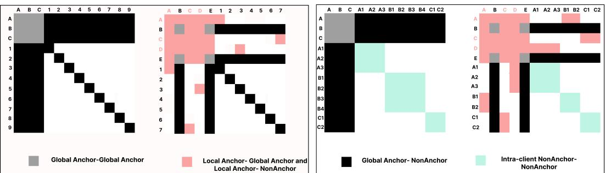
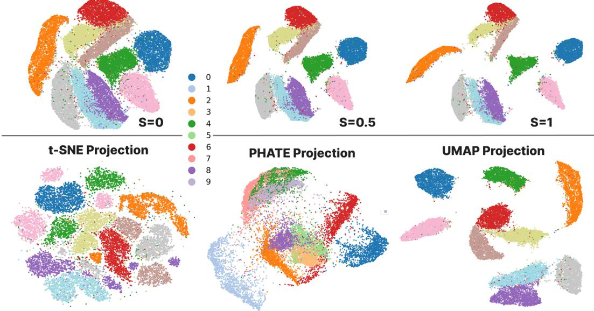
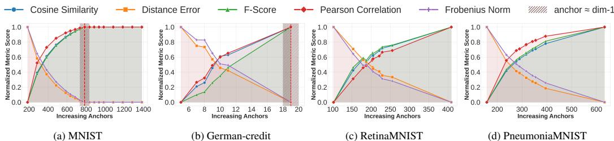
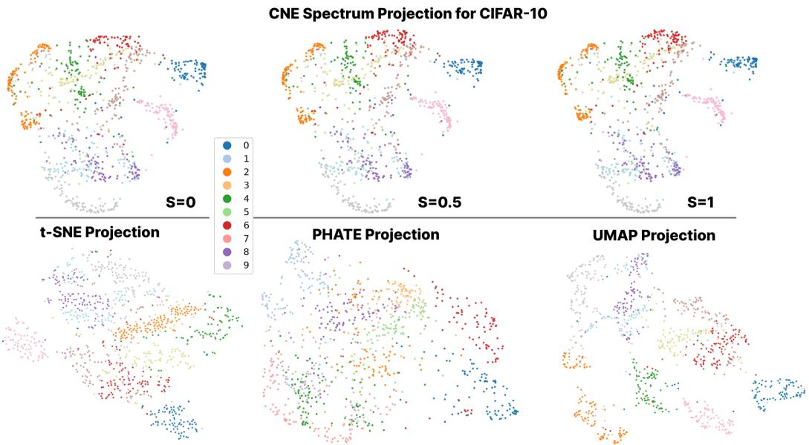
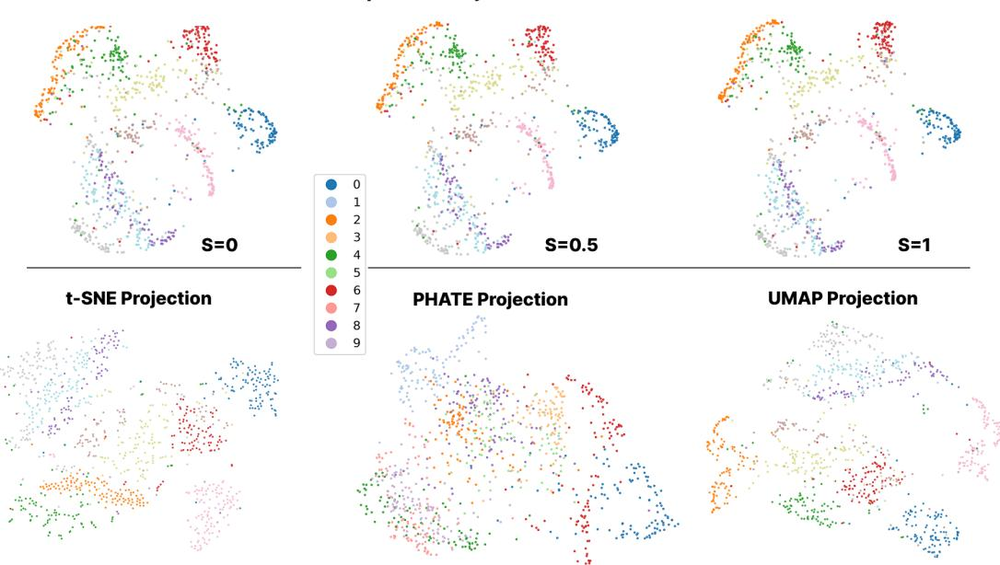
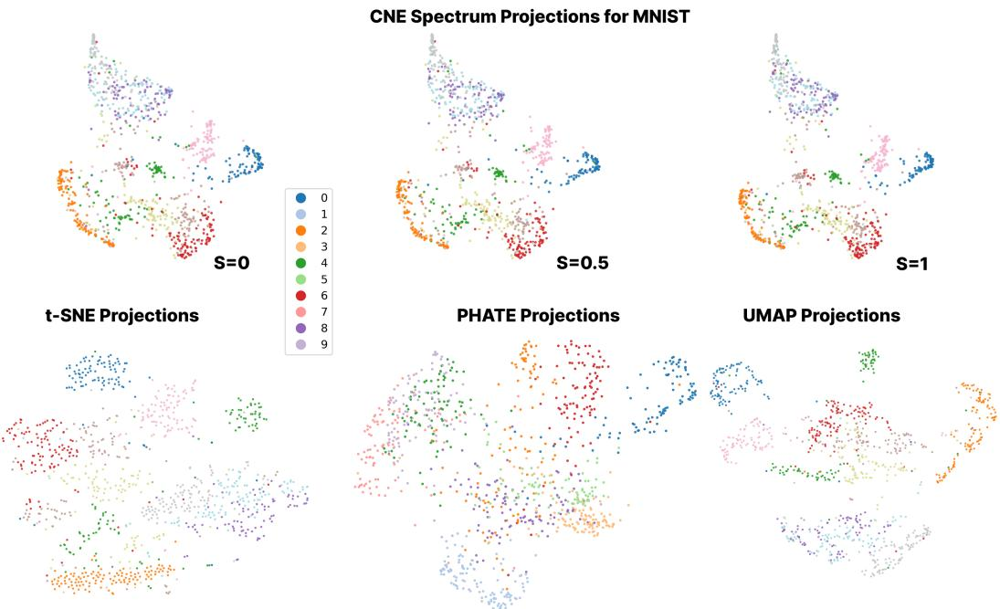

# SENSE: SENsing Similarity SEeing Structure

Anonymous Author(s)   
Affiliation   
Address   
email

# Abstract

Low-dimensional embeddings are central to analyzing and visualizing high  
dimensional data. However, widely adopted NE methods assume centralized   
access to all data an unrealistic constraint in privacy-sensitive, decentralized envi  
ronments. We propose SENSE, a geometry-aware, privacy-preserving framework   
for global neighbor embedding without raw data exchange. SENSE reconstructs   
global structure using local distance measurements and structured matrix com  
pletion, enabling embeddings that preserve both local and global geometry in   
Euclidean and hyperbolic spaces. It further integrates contrastive learning by deriv  
ing cross-client positive and negative pairs from estimated similarities, effectively   
generalizing negative sampling under structural constraints. Experiments across   
diverse real-world datasets show that SENSE achieves embedding quality on par   
with centralized baselines, while offering strong privacy guarantees. Theoretical   
analysis provides formal bounds on reconstruction fidelity and privacy, establishing   
conditions under which structure and confidentiality are jointly preserved.

# 15 1 Introduction

Neighbor embedding (NE) methods are widely used for dimensionality reduction (DR), enabling   
interpretable low-dimensional visualizations of high-dimensional data [51]. Techniques like t  
SNE [53], UMAP [37], MDS [15], and PHATE [38] are effective for visualization [9], anomaly   
detection [46], and exploratory analysis [16]. These methods, however, assume centralized access to   
complete pairwise similarity matrices an assumption often violated in real-world settings. In domains   
such as healthcare [45], finance [8], and mobile networks [34], data is distributed across clients and   
subject to strict privacy constraints. In such settings, standard NE methods fail due to the absence of   
global distance information especially problematic for attraction-repulsion frameworks like t-SNE   
and UMAP [6, 56] that depend on complete similarity graphs to balance local and global structure.   
Recent work links NE with contrastive learning [10, 11], further emphasizing the importance of   
accurate pairwise similarities. In privacy-constrained regimes, however, such structure is either   
missing or only partially available, making decentralized contrastive NE a challenging problem.

Related Work. Several approaches have been proposed to address this gap, but they fall short on scalability, privacy, or deployment realism. SMAP [57] offers strong privacy via encrypted multi-party computation, but its cryptographic overhead renders it impractical for large-scale use. FedNE [33] introduces a federated NE framework but lacks intrinsic privacy guarantees and incurs repeated serverclient interactions, making it communication heavy. Methods like dSNE [48] and FdSNE [47] require full shared reference datasets for alignment, an unrealistic assumption in many settings, and diverge from standard FL protocols while also introducing high communication and privacy costs. More recently, MMD-based distribution alignment [43] has been used to generate synthetic shared data, but it assumes multi-sample clients and is fragile in single data sample per client scenarios common to IoT and mobile devices. Moreover, it risks adversarial corruption of synthesized distributions and introduces additional computational burden. To address these limitations, we propose SENSE,

  
Figure 1: Observed entries in the global distance matrix $D$ under four SENSE configurations: (1) PointwiseFull, (2) Pointwise-Partial, (3) Multisite-Full, and (4) Multisite-Partial. These differ in the visibility of Anchor–NonAnchor (A–NA) and NA–NA blocks, governed by client-level data locality and anchor access. Multisite settings permit intra-client NA–NA observations (e.g., A1, A2, ..., C2), while Pointwise settings restrict each client to a single NA (e.g., 1, 2, ..., 9). Full modes provide all NAs with access to the global anchor set (e.g., A–E), yielding complete A–NA blocks; Partial modes expose disjoint anchor subsets per client, resulting in sparse and structured observations.

a unified, geometry-aware framework for privacy-preserving decentralized neighbor embedding.   
SENSE supports both Euclidean and hyperbolic geometries the latter being critical for embedding   
hierarchical structures in social and biological data [30, 36]. Unlike prior work, SENSE reconstructs   
global structure from sparse local distance observations using anchor-based measurements, without   
requiring raw data sharing, iterative communication, or centralized storage. The completed distance   
matrix is then used with classical NE methods, contrastive NE, and hyperbolic CoSNE [22].   
Although anchor sharing is sometimes perceived as a constraint in decentralized settings [43], it   
serves as a robust, principled, and privacy-preserving coordination mechanism increasingly adopted   
in practice. When curated by a trusted server, anchors can be synthetic, anonymized, or sourced   
from public data completely decoupled from private client records. This mitigates leakage risks   
inherent to client-generated anchors, which are vulnerable to reconstruction or membership inference,   
especially in small or skewed-client regimes [43]. Server-curated anchors offer stability, auditability,   
and adversarial robustness, enabling secure global coordination without compromising privacy.   
This paradigm is already in use across real-world systems in healthcare [7, 27], genomics [35, 44],   
finance [2], and mobile/NLP applications [23, 32], illustrating that carefully designed anchor-based   
schemes are both secure and essential for scalable decentralized learning. Motivated by this, we argue   
that anchors should be treated as core architectural components rather than ad hoc artifacts. SENSE   
leverages anchor-based coordination in conjunction with tools from distance matrix completion,   
network localization, and low-rank recovery, providing formal guarantees for reconstructing global   
geometry from partial observations. When combined with contrastive learning, it further enhances   
alignment and expressiveness, bridging classical and modern NE paradigms. SENSE introduces the   
following key innovations:

• Privacy by design: Estimates global structure using only local distance measurements, eliminating the need for encryption or differential privacy.   
• Communication-efficient and geometry-aware: Requires a single server–client interaction, and supports both Euclidean and hyperbolic spaces for modeling flat and hierarchical data.   
Deployment flexibility: Operates under two regimes (Figure 1): SENSE-Pointwise for single-point clients (e.g., edge/mobile), and SENSE-Multisite for multi-sample clients (e.g., hospitals, banks).   
Provable reliability: Offers theoretical guarantees on both privacy preservation and embedding fidelity, validated across diverse modalities and geometries.

These properties make SENSE suitable for privacy-sensitive, structurally diverse domains. Hospitals   
can jointly visualize patient data without violating HIPAA/GDPR [50], banks can detect fraud   
patterns without sharing transactions [3], and mobile/IoT clients with a single sample can still   
contribute to global embeddings [4, 42]. Genomic labs can embed single-cell transcriptomes into   
a shared hyperbolic space that preserves cellular hierarchy and privacy [1, 52]. Crucially, SENSE   
also supports evolving data scenarios and dynamic client participation, new clients or data points   
can be integrated by estimating only their partial distances to a subset of existing entities, avoiding   
full re-computation and preserving global coherence with minimal overhead. This makes SENSE not   
only privacy-preserving and geometry-aware but also inherently scalable to dynamic and federated   
ecosystems.   
Neighbor Embedding (NE). Methods like t-SNE [53] and UMAP [10] embed high-dimensional   
data $\mathbf { X } = \{ x _ { i } \} _ { i = 1 } ^ { n } \subset \bar { \mathbb { R } } ^ { d _ { h } }$ into a low-dimensional space $\mathbf { \bar { Y } } = \{ y _ { i } \} _ { i = 1 } ^ { n } \subset \mathbb { R } ^ { d _ { \ell } }$ by preserving pairwise   
structure. These methods are distance-driven. They transform distances into similarities via kernels   
to preservedenote distfunctions: $S _ { i j . } ^ { d _ { h } } = \underset {  } { f } ( D _ { i j } ^ { d _ { h } } )$ $S _ { i j } ^ { d _ { \ell } } = g ( D _ { . } ^ { d _ { \ell } } )$ A.1, A.onal spa, where $f$ Let s. Tand $D _ { i j } ^ { d _ { h } } = \| x _ { i } - x _ { j } \|$ $g$ and  simaussi $D _ { i j } ^ { d _ { \ell } } = \| y _ { i } - y _ { j } \| _ { . }$   
Cauchy kernels. The general $\mathrm { N E }$ objective minimizes the divergence between the two similarity   
matrices:

$$
\mathcal { L } ( \mathbf { Y } ) = \sum _ { i , j } \mathcal { D } ( S _ { i j } ^ { d _ { h } } , S _ { i j } ^ { d _ { \ell } } ) ,
$$

where $\mathcal { D }$ is a divergence measure such as KL divergence or binary cross-entropy.

Contrastive Neighbor Embedding. CNE [11] extends NE into the contrastive learning framework   
by training an encoder $f _ { \theta }$ to map $\mathbf { x } _ { i }$ to $\mathbf { y } _ { i } = f _ { \theta } ( \mathbf { x } _ { i } )$ such that the neighborhood structure from a $k$ -NN   
graph is preserved. CNE uses a distance-aware contrastive loss (see Def A.3 in Appendix), framed   
as a binary similarity matching problem. Let $S ^ { d _ { h } } \in \{ 0 , 1 \} ^ { n \times n }$ denote ground-truth neighborhood   
indicators and $S ^ { d _ { l } }$ denote kernel-based similarities in the embedding space. The loss is a weighted   
binary cross-entropy:

$$
\mathcal { L } ( \mathbf { Y } ) = - \sum _ { i , j } \left[ S _ { i j } ^ { d _ { h } } \log S _ { i j } ^ { d _ { l } } + b ( 1 - S _ { i j } ^ { d _ { h } } ) \log ( 1 - S _ { i j } ^ { d _ { l } } ) \right] .
$$

Key Challenges in Decentralized Settings. (C1) CNE, like NE, relies on a full similarity matrix, which   
is unavailable in privacy-sensitive, decentralized settings. (C2) Conventional distributed learning   
captures only intra-client structure, omitting crucial inter-client neighbor information. (C3) Clients   
lack access to global data, leading to incorrect kNN graphs and biased negative sampling, as true   
neighbors may reside on other clients.   
CO-SNE (for Hyperbolic Data). Hierarchical structures in social, biological, and knowledge   
graphs grow exponentially, making Euclidean embeddings unsuitable due to distortion of tree-like   
geometry. Hyperbolic space, with constant negative curvature, naturally models such growth and   
supports hierarchy-aware learning [19, 36, 40] (see Appendix A.3.1). Standard methods like t-SNE   
assume Euclidean geometry and distort global structure when applied to hyperbolic data, collapsing   
depth and relative positioning. CO-SNE [22] extends t-SNE to hyperbolic space (see Def A.4).   
It preserves both local and global structure using distance-aware kernels in hyperbolic geometry:   
$S _ { i j } ^ { \bar { d } _ { h } } = f ( d _ { \mathbb { B } ^ { n } } ( x _ { i } , x _ { j } ) ) , \quad S _ { i j } ^ { \bar { d } _ { l } } = g ( d _ { \mathbb { B } ^ { 2 } } ( y _ { i } , y _ { j } ) )$ , where $f$ is a hyperbolic normal kernel and $g$ is a   
heavy-tailed hyperbolic Cauchy kernel. A regularization term also aligns global depth via norm   
matching. The full objective is:

$$
\mathcal { L } ( \mathbf { Y } ) = \lambda _ { 1 } \cdot \mathcal { D } ( S ^ { d _ { h } } , S ^ { d _ { l } } ) + \lambda _ { 2 } \sum _ { i } ( \rho ( x _ { i } ) - \rho ( y _ { i } ) ) ^ { 2 } ,
$$

where $\rho ( x ) = \| x \|$ and $\mathcal { D }$ is typically $\mathrm { K L }$ divergence.

# 2.1 Problem Formulation

We consider a decentralized system with $M$ clients $\{ { \mathcal { C } } _ { 1 } , \dotsc , { \mathcal { C } } _ { M } \}$ coordinated by a central server   
114 owned dataset $\mathcal { \bar { D } } _ { m } = \{ \mathbf { x } _ { i } ^ { m } \} _ { i = 1 } ^ { N _ { m } } \subset \mathrm { \bar { ~ } } \mathrm { \bar { \mathbb { R } } } ^ { d _ { \mathrm { h } } }$ ospital, bank, or government agency. E, which remains local and disjoint, i.e., $\mathcal { D } _ { m } \cap \mathcal { D } _ { m ^ { \prime } } = \emptyset$ $\mathcal { C } _ { m }$ ldsfor $m \neq m ^ { \prime }$   
Let N = PM m= be the total number of data points, indexed globally by $i \in [ N ]$ . We consider two   
real-world configurations: A) SENSE-Pointwise, where each client holds a single sample $\mathbf { x } ^ { m } \in \mathbb { R } ^ { d _ { \mathrm { h } } }$ ,   
and B) SENSE-Multisite, where each client holds a local dataset $\mathbf { X } ^ { m } = [ \mathbf { x } _ { 1 } ^ { m } , \ldots , \mathbf { x } _ { N _ { m } } ^ { m ^ { - } } ] \in \mathbb { R } ^ { N _ { m } \times d _ { \mathrm { h } } }$   
Let $\mathbf { D } \in \mathbb { R } ^ { N \times N }$ denote the full squared distance matrix. In Euclidean space, $\mathbf { D } _ { i j } = \| \mathbf { x } _ { i } - \mathbf { x } _ { j } \| ^ { 2 }$ ; in   
hyperbolic space, it reflects squared distances in the Poincaré ball $\mathbb { B } ^ { d _ { \mathrm { h } } }$ or Lorentz model $\mathbb { H } ^ { d _ { \mathrm { h } } }$ (see   
Appendix A.3). Due to privacy constraints, only a subset of entries is observable. Let $\Omega \subseteq [ N ] \times [ N ]$   
be the set of observed indices, and define the projection operator $\mathcal { P } _ { \Omega } : \mathbb { R } ^ { N \times N }  \mathbb { R } ^ { N \times N }$ as:

$$
[ \mathcal { P } _ { \Omega } ( \mathbf { D } ) ] _ { i j } = \left\{ \begin{array} { l l } { \mathbf { D } _ { i j } , } & { \mathrm { i f ~ } ( i , j ) \in \Omega , } \\ { 0 , } & { \mathrm { o t h e r w i s e } . } \end{array} \right.
$$

Goal 1 Our goal is to recover the full distance matrix $\widehat { \mathbf { D } } \in \mathbb { R } ^ { N \times N }$ from partial observations   
$\mathbf { D } _ { \Omega } = \mathcal { P } _ { \Omega } ( \mathbf { D } )$ via structured matrix completion. Instead of estimating distances directly, we infer   
latent embeddings $\widehat { \mathbf X }$ whose induced distances match the observed entries. This is done without   
access to raw features, relying solely on ${ \bf D } _ { \Omega }$ . Formally,

$$
\widehat { \bf D } = \mathcal { D } ( \widehat { \bf X } ) = \arg \operatorname* { m i n } _ { { \bf X } ^ { \prime } } \left. \mathcal { P } _ { \Omega } \left( \mathcal { D } ( { \bf X } ^ { \prime } ) \right) - { \bf D } _ { \Omega } \right. _ { F } ^ { 2 } ,
$$

where 126 $\mathcal { D } ( \mathbf { X } ^ { \prime } )$ is the distance matrix induced by $\mathbf { X } ^ { \prime }$ under the chosen geometry (Euclidean or hyper127 bolic). From $\widehat { \bf D }$ , we derive a global low-dimensional embedding $\mathbf { Y } = \{ \mathbf { y } _ { i } \} _ { i = 1 } ^ { N } \subset \mathbb { R } ^ { d _ { \ell } }$ with $d _ { \ell } \ll d _ { h }$ , 128 preserving neighborhood structure.

We use 129 $\hat { \bf D }$ to find the similarities, defined in Eq. 6 and optimized via divergence $\mathcal { D } ( S ^ { d _ { \mathrm { h } } } , S ^ { d _ { \ell } } )$ (Eq. 1).

$$
S _ { i j } ^ { d _ { \mathrm { h } } } = \exp \left( - \frac { \widehat { \mathbf { D } } _ { i j } } { 2 \sigma ^ { 2 } } \right) , \quad S _ { i j } ^ { d _ { \ell } } = g ( \| \mathbf { y } _ { i } - \mathbf { y } _ { j } \| ^ { 2 } ) ,
$$

For contrastive learning, we build binary similarities using $k$ -nearest neighbors:

$$
S _ { i j } ^ { d _ { \mathrm { h } } } = \left\{ \begin{array} { l l } { 1 , } & { \mathrm { i f ~ } j \in \mathrm { k N N } ( i ; \widehat { \mathbf { D } } ) , } \\ { 0 , } & { \mathrm { o t h e r w i s e } , } \end{array} \right. S _ { i j } ^ { d _ { \ell } } = \phi ( \mathbf { y } _ { i } , \mathbf { y } _ { j } ) = \frac { 1 } { 1 + \| \mathbf { y } _ { i } - \mathbf { y } _ { j } \| ^ { 2 } } ,
$$

and minimize the contrastive loss (Eq. 2). For hierarchical data, we apply CO-SNE, treating $\hat { \bf D }$ as   
squared hyperbolic distances in the Poincaré model to compute similarities (Eq. 17 in Appendix).   
The embedding $\mathbf { Y } \subset \mathbb { B } ^ { d _ { \ell } }$ is optimized using the CO-SNE loss (Eq. 3).   
Remark 1 Conventional FL methods (e.g., FedAvg) assume large local datasets, require multiple   
communication rounds, and expose gradients that risk privacy leaks [20, 62]. They also fail in   
pointwise settings where local training is infeasible. In contrast, SENSE reconstructs $\dot { \widehat { \mathbf { D } } }$ via privacy  
preserving matrix completion and then optimizes NE, CNE, or CO-SNE objectives without sharing   
raw features.

# 139 3 Proposed Framework: SENSE

As described in Section 2.1, we consider two decentralized settings: SENSE-Pointwise and SENSE  
Multisite. In both, each client holds private non-anchor (NA) data and accesses a shared anchor set   
$\mathcal { A } = \{ a _ { 1 } , . . . , a _ { K } \}$ with feature matrix $\mathbf { X } _ { A } = [ \mathbf { p } _ { 1 } , \ldots , \mathbf { p } _ { K } ] ^ { \top } \in \mathbb { R } ^ { K \times d _ { \mathrm { h } } }$ . Anchors, broadcast by the   
server, may be global or private NA points, where 144 $\begin{array} { r } { N = \sum _ { m = 1 } ^ { M } N _ { m } } \end{array}$ e Appendix A.8). Let . Each client compute $\mathcal { X } = \{ x _ { 1 } , \ldots , x _ { N } \}$ be the set of allbetween its NAs

$$
\mathbf { d } _ { i } ^ { m } = \left[ \| x _ { i } ^ { m } - \mathbf { p } _ { 1 } \| ^ { 2 } , \ldots , \| x _ { i } ^ { m } - \mathbf { p } _ { K } \| ^ { 2 } \right] ,
$$

and transmits these to the server, masking unshared local anchors. In Pointwise, each client contributes   
one NA-anchor vector, in Multisite, intra-client NA–NA distances may also be known. The global   
incomplete squared distance matrix $\mathbf { D } \in \mathbb { R } ^ { ( K + N ) \times ( K + N ) }$ is partitioned as:

$$
\mathbf { D } = \left[ \begin{array} { l l } { E } & { F } \\ { F ^ { \top } } & { G } \end{array} \right] ,
$$

where $E$ is anchor–anchor, $F$ is anchor–NA, and $G$ is NA–NA. The observed subset is indexed by   
$\Omega \subseteq [ K + N ] ^ { 2 }$ , based on anchor visibility and client configuration. We consider four configurations:   
Pointwise-Full, Pointwise-Partial, Multisite-Full, and Multisite-Partial which differ in the extent   
of observed entries in $F$ (anchor–NA) and $G$ (NA–NA). These define distinct visibility patterns in   
$\Omega$ , summarized in Appendix Table 4 and illustrated in Figure 1, and determine which distances are   
available for structured matrix completion.   
To reconstruct the full matrix $\hat { \bf D }$ , or specifically $\widehat { G }$ , we apply geometry-specific solvers: anchored  
MDS in Euclidean space (discussed in Sec 3.1) and LHydra [30] in hyperbolic space. The complete   
pipeline is outlined in Algorithm 1 in Appendix.   
Remark 2 In practice, $F$ may be only partially visible due to bandwidth, privacy, or data limitations.   
SENSE is designed to operate under such conditions. Whether $F$ is full or partial, structured matrix   
completion (in SENSE) enables accurate and privacy-preserving recovery of inter-client affinities.

# 161 3.1 SENSE via Anchored-MDS

Classical MDS embeds $N$ points by minimizing stress over a fully observed distance matrix $\mathbf { D \in }$ $\mathbb { R } ^ { N \times N }$ . The embedding $\mathbf { X } \in \mathbb { R } ^ { N \times \check { d } _ { h } }$ minimizes:

$$
\sigma ( \mathbf { X } ) = \sum _ { i < j } \left( \| x _ { i } - x _ { j } \| - \delta _ { i j } \right) ^ { 2 } ,
$$

where $\delta _ { i j }$ is the input Euclidean distance between points $i$ and $j$ . SMACOF solves this using   
a majorization-based surrogate [13], $\tau ( \mathbf { X } , \mathbf { Z } ) = C + \mathrm { t r } ( \mathbf { X } ^ { \top } \mathbf { V } \mathbf { X } ) - 2 \mathrm { t r } ( \mathbf { X } ^ { \top } \mathbf { B } ( \mathbf { Z } ) \mathbf { Z } )$ , with the   
iterative update:

$$
\mathbf { X } ^ { ( k ) } = \mathbf { V } ^ { \dagger } \mathbf { B } ( \mathbf { X } ^ { ( k - 1 ) } ) \mathbf { X } ^ { ( k - 1 ) } .
$$

In SENSE, the full distance matrix $\mathbf { D }$ is not available, instead we work with a structured, incomplete matrix of observed anchor–NA distances. Let the embedding be $\mathbf { X } = \left[ \mathbf { X } _ { A } ~ \mathbf { X } _ { N A } \right] ^ { \top }$ , where $\mathbf { X } _ { A }$ and $\mathbf { X } _ { N A }$ are anchor and NA embeddings, respectively. The stress is minimized over observed entries only:

$$
\sigma ( \mathbf { X } ) = \left. \mathcal { P } _ { \Omega } ( \mathcal { D } ( \mathbf { X } ) - \mathbf { D } ) \right. _ { F } ^ { 2 } ,
$$

where $\mathcal { P } _ { \Omega }$ projects onto the observed indices $\Omega$ , and ${ \mathcal { D } } ( \mathbf { X } )$ computes pairwise distances. The   
SMACOF updates are restricted to $\Omega$ , with:

$$
V _ { i j } = \{ \begin{array} { l l } { | \{ j : ( i , j ) \in \Omega \} | , } & { i = j } \\ { - 1 , } & { ( i , j ) \in \Omega , i \neq j } \\ { 0 , } & { \mathrm { o t h e r w i s e } } \end{array} , \quad B _ { i j } ( { \bf X } ) = \{ \begin{array} { l l } { - \frac { \delta _ { i j } } { \| x _ { i } - x _ { j } \| } , } & { ( i , j ) \in \Omega , i \neq j } \\ { - \displaystyle \sum _ { k \neq i , \ ( i , k ) \in \Omega } B _ { i k } , } & { i = j } \\ { 0 , } & { \mathrm { o t h e r w i s e } } \end{array} 
$$

We partition 167 $V$ and $B$ as defined in Eq. 10, where $V _ { A A } , B _ { A A } \in \mathbb { R } ^ { K \times K }$ , $V _ { A N } , B _ { A N } \in \mathbb { R } ^ { K \times N }$ , and 16 VNN , BNN ∈ RN×N 8 :

$$
\mathbf { V } = \left[ \mathbf { V } _ { A A } \quad \mathbf { V } _ { A N } \right] , \quad \mathbf { B } = \left[ \mathbf { B } _ { A A } \quad \mathbf { B } _ { A N } \right]
$$

The update rule for NA embeddings becomes:

$$
\mathbf { X } _ { N A } ^ { ( k ) } = \mathbf { V } _ { N N } ^ { \dagger } \left( \mathbf { B } _ { N N } \mathbf { X } _ { N A } ^ { ( k - 1 ) } + \mathbf { B } _ { A N } ^ { \top } \mathcal { P } _ { \Omega } ( \mathbf { X } _ { A } ) - \mathbf { V } _ { A N } ^ { \top } \mathcal { P } _ { \Omega } ( \mathbf { X } _ { A } ) \right) .
$$

This projection-aware update ensures $\mathbf { X } _ { N A }$ uses only observed/available distances, enabling privacy  
preserving global embedding under any SENSE configuration. The projection operator $\mathcal { P } _ { \Omega }$ acts   
as a binary mask over observed entries. While $\mathbf { V }$ and $\mathbf { B }$ are derived from $\Omega$ , we apply $\mathcal { P } _ { \Omega }$ to $\mathbf { X } _ { A }$   
in Eq. (11) to retain only anchors with observed anchor–NA distances. This avoids leakage from   
inaccessible anchors and ensures privacy-compliant updates. Pseudocode is provided in Appendix A.7.   
Furthermore, to preserve privacy, the number of shared anchors $K$ must be limited. Theorems 3.1,   
3.2 (Euclidean) and Lemma 1 (hyperbolic) characterize how $K$ relates to embedding dimension $d _ { h }$   
across SENSE configurations, establishing conditions for faithful reconstruction.   
Theorem 3.1 Let $\mathcal { X } \ = \ \left\{ \mathbf { x } _ { 1 } , \ldots , \mathbf { x } _ { N } \right\} \ \subset \ \mathbb { R } ^ { d _ { h } }$ be the set of NA data points, and let ${ \mathcal { A } } \ =$   
$\{ { \bf { a } } _ { 1 } , \ldots , { \bf { a } } _ { K } \} \subset \mathbb { R } ^ { d _ { h } }$ be the set of $K$ anchor points. Suppose we observe the pairwise Euclidean   
distances $\{ \| \dot { \mathbf { x } } _ { i } - \mathbf { a } _ { j } \| \} _ { i \in [ N ] , j \in [ K ] }$ between each NA and all anchors. If the number of anchors satisfies   
$K < d _ { h }$ , then the original NA features $\{ { \mathbf { x } } _ { i } \} _ { i = 1 } ^ { N }$ cannot be exactly reconstructed from these distances,   
guaranteeing the privacy of the individual client data.

# 183 Proof. Deferred in Appendix, check A.2.

SENSE supports multiple configurations, which critically influence embedding fidelity and privacy.   
Theorem 3.2 formalizes privacy guarantees when only partial anchor–NA distances (block $F$ ) are   
available, covering both pointwise and multisite regimes. 1) SENSE-Pointwise: Each client $j \in [ N ]$   
holds a single private point $\pmb { x } _ { j } \in \mathbb { R } ^ { d _ { h } }$ and accesses a subset of anchors indexed by $\mathcal { T } _ { j } \subseteq [ K ]$ . The   
corresponding anchor set is $\bar { \mathcal { A } } _ { j } = \{ \pmb { a } _ { i } \} _ { i \in \mathbb { Z } _ { j } }$ , comprising: (i) global anchors $\mathcal { A } _ { G } = \{ \hat { \mathbf { { a } } _ { 1 } } , . . . , \mathbf { { a } } _ { M _ { G } } \}$ ,   
shared across all clients, and (ii) local anchors $A _ { L } ^ { ( j ) }$ , unique to client $j$ . The total number of anchors   
observed is $r _ { j } = | \mathcal { T } _ { j } | = M _ { G } + M _ { L } ^ { ( j ) }$ . 2) SENSE-Multisite: Each client $m \in [ M ]$ holds a local dataset

$\mathcal { X } ^ { ( m ) } = \{ \pmb { x } _ { m , 1 } , \hdots , \pmb { x } _ { m , n _ { m } } \} \subset \mathbb { R } ^ { d _ { h } }$ , where $\begin{array} { r } { N = \sum _ { m = 1 } ^ { M } n _ { m } } \end{array}$ . Each point $\scriptstyle { \pmb x } _ { m , i }$ observes distances to (i) a shared global anchor set 192 $\boldsymbol { \mathcal { A } } _ { G }$ , and (ii) a local anchor set $\mathcal { A } _ { L } ^ { ( m ) }$ exclusive to client $m$ . Let 193 $\mathcal { T } _ { m , i } = \mathcal { T } _ { G } \cup \mathcal { T } _ { L } ^ { ( m ) }$ be the index set of accessible anchors, with $r _ { m , i } = | \mathcal { I } _ { m , i } |$ denoting the number 194 observed.

Theorem 3.2 Let $\mathcal { X } = \{ \pmb { x } _ { 1 } , \dots , \pmb { x } _ { N } \} \subset \mathbb { R } ^ { d _ { h } }$ be the set of all non-anchor (NA) points across all clients, where each $\mathbf { \Delta } _ { \mathbf { \mathcal { X } } _ { i } }$ computes squared distances only to a subset of accessible anchors $\mathcal { A } _ { i } = \{ \pmb { a } _ { j } \} _ { j \in \mathbb { Z } _ { i } }$ , with $| \mathcal { T } _ { i } | = r _ { i }$ . If $r _ { i } ~ < ~ d _ { h }$ for all $i \in [ N ]$ , then exact recovery of each $\mathbf { \Delta } _ { \mathbf { \mathcal { X } } _ { i } }$ is impossible. The inverse map from anchor distances to features is non-unique, preserving privacy under both pointwise and multisite configurations.

# 200 Proof. Defered in Appendix, check A.1.

Lemma 1 Let $\{ x _ { 1 } , \ldots , x _ { K + N } \} \subset \mathbb { H } ^ { d _ { h } }$ be $K$ anchors and $N$ non-anchor points in hyperbolic space with curvature $- \kappa$ . Suppose only blocks $E$ and $F$ of the global distance matrix D are observed. If $K < d _ { h }$ , the NA coordinates cannot be exactly recovered up to isometry in $\mathbb { H } ^ { d _ { h } }$ , ensuring the privacy of the client data in SENSE. This follows from the contrapositive of the $L$ -HYDRA theorem [30], which guarantees exact recovery only when $K \geq d _ { h }$ and anchors span a full subspace.

# 3.2 SENSE in Evolving Distributed Environments

In dynamic settings, new data points arrive continuously e.g., a hospital admitting a patient, a   
bank processing a transaction, or a platform onboarding a user. Recomputing the full embed  
ding for each arrival is inefficient and may disrupt global structure. Existing decentralized NE   
methods [33, 43, 47, 48] assume static datasets and lack support for incremental updates, mak  
ing them unsuitable for streaming environments. SENSE, by contrast, is modular and compatible   
with out-of-sample embedding methods [5, 24, 41]. Once the global embedding is constructed   
via anchor-based completion and NE optimization, it defines a geometry-aware coordinate space   
that supports new points without full recomputation. Let ${ \bf X } _ { N A } = [ { \bf x } _ { 1 } , \bar { \bf \Xi } , { \bf x } _ { N } ] \in \mathbb { R } ^ { N \times d _ { h } }$ be the   
reconstructed NA embeddings. When a new point y arrives, we select $K$ existing points as pseudo  
anchors $\mathcal { A } = \{ a _ { 1 } , . . . , a _ { K } \} \subset \mathbf { X } _ { N A }$ , with coordinates $\mathbf { X } _ { A } = [ \mathbf { p } _ { 1 } , \ldots , \mathbf { p } _ { K } ] ^ { \top } \stackrel { } { \in } \mathbb { R } ^ { K \times d _ { h } }$ . Given   
dissimilarities $\{ \delta _ { l _ { i } y } \} _ { i = 1 } ^ { K }$ to these anchors, we compute the embedding $\hat { \mathbf { y } }$ by solving:

$$
\hat { \sigma } ( \hat { \mathbf { y } } ) = \sum _ { i = 1 } ^ { K } \left( \| \mathbf { p } _ { i } - \hat { \mathbf { y } } \| _ { 2 } - \delta _ { l _ { i } y } \right) ^ { 2 } .
$$

Here, $\delta _ { l _ { i } y }$ is the dissimilarity in the original space, and $\| \mathbf { p } _ { i } - { \hat { \mathbf { y } } } \| _ { 2 }$ is the distance in the embedding   
space. Only $\hat { \mathbf { y } }$ is optimized, anchors remain fixed. Since $K < d _ { h }$ , exact recovery is impossible   
(Theorems 3.1, 3.2), ensuring privacy. This lightweight optimization requires no raw data and   
221 supports real-time integration, making SENSE well-suited for scalable, privacy-constrained systems.

# 4 Experiments

In this section, we first outline the experimental setup, followed by an evaluation of SENSE across diverse datasets and deployment settings.

# 4.1 Experimental Setup

Datasets. We evaluate SENSE on 14 public datasets widely used in DR and representation learning [18, 63]. These include three benchmarks: MNIST [14], Fashion-MNIST [58], and CIFAR10 [21]; seven MedMNIST datasets [60]: DermaMNIST, PneumoniaMNIST, RetinaMNIST, BreastMNIST, BloodMNIST, OrganCMNIST, OrganSMNIST; and the German Credit dataset [25] for financial risk modeling. For hyperbolic evaluation, we use three graph datasets: Airport [36], Amazon [59], and DBLP [29]. Detailed dataset statistics and system specifications are provided in Appendix Table 5 and A.12.

Baselines. We compare SENSE against centralized (Van) baselines: t-SNE [53], UMAP [37], PHATE [38], and CNE [11] (with $s \in \{ 0 , 0 . 5 , 1 \} )$ . These assume full raw data access at a central server and serve as upper bounds for evaluating SENSE’s privacy-preserving performance.

Implementation Details. SENSE comprises two stages: matrix completion and global embedding. In the first stage, data is partitioned across $M$ clients. In Pointwise, each client holds one NA point, sampled randomly. In Multisite, clients hold multiple NA points under IID or non-IID splits (balanced/unbalanced). A subset of $1 0 \%$ of the total data points is designated as anchors. In Full settings, all anchors are global, and in Partial, anchors are split into global and client-specific local sets. The total number of anchors (global $^ +$ local) is fixed at $d _ { h } - 1$ , where $d _ { h }$ is the original feature dimension. In the embedding stage, we use the completed global distance matrix to generate privacypreserving embeddings using multiple neighbor embedding methods. For Euclidean geometry, we use the official implementations of t-SNE [53], UMAP [37], and PHATE (via its standard Python library). For CNE, we adopt the implementation from [11], where the parameter $s$ controls the attraction-repulsion tradeoff: $s = 0$ mimics t-SNE, $s = 1$ aligns with UMAP, and intermediate values interpolate between them. CNE operates within a contrastive learning framework using negative sampling. For hyperbolic embeddings, we use the CO-SNE implementation from [22].

Table 1: Full vs. Partial comparison in MULTISITE under non-IID (unbalanced) splits. Evaluation spans centralized and privacy-preserving SENSE variants across different embedding quality metrics.   

<table><tr><td rowspan="2">Data</td><td rowspan="2">Metric</td><td colspan="2">t-SNE</td><td colspan="2">UMAP</td><td colspan="2">PHATE</td><td colspan="2">CNE(s=0)</td><td colspan="2">CNE(s=0.5)</td><td colspan="2">CNE(s=1)</td></tr><tr><td>SENSE</td><td>VAN.</td><td>VAN.</td><td>SENSE</td><td>VAN.</td><td>SENSE</td><td>VAN.</td><td>SENSE</td><td>VAN.</td><td>SENSE</td><td>VAN.</td><td>SENSE</td></tr><tr><td<tr><td colspan="10">-Multisite-Partial Setting</td><td colspan="2"></td></tr><tr><td rowspan="3"></td><td>MNIST</td><td>Trust. Cont.</td><td>0.9890 0.9575</td><td>0.9898 0.9639</td><td>0.9553 0.9774</td><td>0.9552 0.8741 0.9771 0.9811</td><td>0.8763 0.9804</td><td>0.9517 0.9806</td><td>0.9521 0.9797</td><td>0.9524 0.9799</td><td>0.9538 0.9787</td><td>0.9455 0.9799</td><td></td></tr><tr><td>0.9476 0.9787</td><td>Stead. Cohes.</td><td>0.7719 0.8189</td><td>0.7861 0.8458</td><td>0.7639 0.8865</td><td>0.7635 0.8853</td><td>0.6628 0.8668</td><td>0.6746 0.8877</td><td>0.7840 0.9229</td><td>0.7790 0.9112</td><td>0.7752 0.9107</td><td>0.7768 0.9196</td><td>0.7634 0.9158</td></tr><tr><td>0.7658 0.9087</td><td>Trust. Cont.</td><td>0.9902 0.9608</td><td>0.9914 0.9590</td><td>0.9140 0.9812</td><td>0.9148 0.9818</td><td>0.9579 0.9910</td><td>0.9557 0.9906</td><td>0.9765 0.9915</td><td>0.9752 0.9913</td><td>0.9784 0.9905</td><td>0.9769 0.9903</td><td>0.9765 0.9900</td></tr><tr><td>0.9731</td><td>fashionMNIST Stead. Cohes.</td><td></td><td>0.8415 0.6496</td><td>0.8643 0.6559</td><td>0.7570 0.6748</td><td>0.7622 0.7069 二Multisite-FullSetting</td><td>0.7836 0.7051</td><td>0.7891 0.7115</td><td>0.8632 0.7680</td><td>0.8638 0.7669</td><td>0.8643 0.7637</td><td>0.8660 0.7508</td><td>0.8493 0.7792</td></tr><tr><td>0.9901 0.8513 0.7666</td><td>Trust. 0.9890</td><td></td><td>0.9575</td><td>0.9852 0.9518</td><td>0.9553 0.9774</td><td>0.9570 0.9754</td><td>0.8741 0.9811</td><td>0.8780 0.9797</td><td>0.9517 0.9806</td><td>0.9516 0.9772</td><td>0.9524 0.9799</td><td>0.9542 0.9763</td><td>0.9455 0.9799</td></tr><tr><td>0.9452 0.9761</td><td>MNIST</td><td>Cont. Stead. Cohes. Trust.</td><td>0.7719 0.8189 0.9902</td><td>0.7953 0.8328 0.9895 0.9731</td><td>0.7639 0.8865 0.9140 0.9812</td><td>0.7726 0.8665 0.9076</td><td>0.6628 0.8668 0.9579</td><td>0.6688 0.8818 0.9555</td><td>0.7840 0.9229 0.9765</td><td>0.7808 0.9047 0.9752</td><td>0.7752 0.9107 0.9784</td><td>0.7828 0.8926 0.9769</td><td>0.7634 0.9158 0.9765</td></tr><tr><td>0.7690 0.9106 0.9725</td><td>fashionMNIST</td><td>Cont. Stead. Cohes.</td><td>0.9608 0.8415 0.6496</td><td>0.8604 0.6936</td><td>0.7570 0.6748</td><td>0.9797 0.7530 0.7019</td><td>0.9910 0.7836 0.7051</td><td>0.9902 0.7981 0.7039</td><td>0.9915 0.8632 0.7680</td><td>0.9906 0.8608 0.7503</td><td>0.9905 0.8643 0.7637</td><td>0.9895 0.8649 0.7591</td><td>0.9900 0.8493 0.7792</td></tr><tr><td>0.9891 0.8538 0.7695</td><td></td><td>Trust.</td><td>0.9661</td><td>0.9679</td><td>0.9484</td><td>0.9467</td><td>二Pointwise-FullSeting 0.8457</td><td>0.8469</td><td>0.9218</td><td>0.9166</td><td>0.9164</td><td>0.9138</td><td>0.9137</td></tr><tr><td>0.9151</td><td></td><td>Cont.</td><td>0.9418 0.8083</td><td>0.9410 0.8113</td><td>0.9376 0.7878</td><td>0.9396 0.7763</td><td>0.9546 0.6953</td><td>0.9538 0.6958</td><td>0.9434 0.8024</td><td>0.9422 0.8003</td><td>0.9428</td><td>0.9417</td><td>0.9409</td></tr><tr><td>0.9403</td><td>MNIST</td><td>Stead.</td><td>0.7904</td><td>0.7998</td><td>0.7855</td><td></td><td></td><td></td><td></td><td></td><td>0.8041</td><td>0.7996</td><td>0.8025</td></tr><tr><td>0.7914</td><td></td><td>Cohes.</td><td></td><td></td><td></td><td>0.7819</td><td>0.7912</td><td>0.7843</td><td>0.7988</td><td>0.7982</td><td>0.8034</td><td>0.7894</td><td>0.7931</td></tr><tr><td>0.7919</td><td></td><td></td><td></td><td></td><td></td><td></td><td></td><td></td><td></td><td></td><td></td><td></td><td></td></tr><tr><td></td><td></td><td></td><td></td><td></td><td></td><td></td><td></td><td></td><td></td><td></td><td></td><td></td><td></td></tr><tr><td></td><td></td><td></td><td></td><td>0.9681</td><td>0.9441</td><td>0.9434</td><td>0.8407</td><td>0.8375</td><td></td><td>0.9264</td><td></td><td></td><td></td></tr><tr><td></td><td></td><td>Trust.</td><td>0.9647</td><td>0.9454</td><td></td><td></td><td></td><td></td><td>0.9283</td><td></td><td>0.9255</td><td>0.9245</td><td>0.9256</td></tr><tr><td>0.9196</td><td></td><td></td><td></td><td></td><td>0.9386</td><td>0.9373</td><td>0.9542</td><td>0.9528</td><td>0.9464</td><td>0.9460</td><td></td><td></td><td></td></tr><tr><td></td><td></td><td>Cont.</td><td>0.9430</td><td>0.8103</td><td></td><td></td><td></td><td></td><td></td><td></td><td>0.9456</td><td>0.9440</td><td>0.9451</td></tr><tr><td>0.9429</td><td>fashionMNIST</td><td></td><td></td><td></td><td>0.7797</td><td>0.7779</td><td>0.6923</td><td>0.6931</td><td>0.8087</td><td>0.8049</td><td></td><td></td><td></td></tr><tr><td></td><td></td><td>Stead.</td><td>0.8118</td><td>0.7882</td><td></td><td></td><td></td><td></td><td></td><td></td><td>0.8085</td><td>0.8003</td><td>0.8082</td></tr><tr><td>0.8150</td><td></td><td>Cohes.</td><td>0.7570</td><td></td><td>0.7685</td><td>0.7670</td><td>0.7564</td><td>0.7599</td><td>0.7876</td><td>0.7786</td><td>0.7843</td><td>0.7788</td><td>0.7838</td></tr></table>

Data Partitioning. To simulate realistic distributed settings, we evaluate SENSE under both IID and non-IID distributions using Dirichlet-based partitioning. For each class $c$ , client-wise proportions are drawn from $q _ { c } \sim \operatorname { D i r } ( \alpha )$ , where lower $\alpha$ yields greater heterogeneity and class imbalance [55, 61]. We set $\alpha = 0 . 5$ in all experiments. Three partitioning schemes are used: $I I D$ (uniform class mix), non-IID balanced (varying class distributions, equal client sizes), and non-IID unbalanced (both class and size vary).

Evaluation Metrics. We assess SENSE using both reconstruction and embedding quality metrics. For fidelity, we compute Relative Distance Error $( D E )$ and $F$ -score $( F S )$ between the reconstructed distance matrix (NA-NA) $\hat { G }$ and ground truth $\begin{array} { r } { G _ { \mathrm { t r u e } } \colon \mathrm { D E } = \frac { \| \hat { G } - G _ { \mathrm { t r u e } } \| _ { F } } { \| G _ { \mathrm { t r u e } } \| _ { F } } } \end{array}$ , and $\begin{array} { r } { \mathrm { F S } = \frac { 2 \mathrm { t p } } { 2 \mathrm { t p } + \mathrm { f p } + \mathrm { f n } } } \end{array}$ , where tp, fp, and fn are true, false positive, and false negative neighbors respectively [17]. To evaluate 2D embeddings, we compute Trustworthiness and Continuity [54], which measure neighborhood agreement between original and embedded spaces. We also report Steadiness and Cohesiveness [26] to assess global structural reliability: steadiness detects false groupings and cohesiveness quantifies how well true input clusters are preserved.

# 4.2 Result Analysis.

We comprehensively evaluate SENSE across: 1) Standard image datasets (MNIST, FashionMNIST, CIFAR-10): These are evaluated under Pointwise-Full, Multisite-Full, and Multisite-Partial with non-IID unbalanced splits. As shown in Table 1 and in Appendix 8, SENSE closely matches centralized baselines across Cont., Trust., Stead., and Cohes. Notably, the Partial configuration performs comparably to Full, indicating that accurate reconstruction of the global distance matrix is possible even with partial anchor–NA observations. Table 7 further confirms high F-score and low distance error, validating strong neighborhood preservation under strict privacy constraints.

2) MedMNIST datasets: These are evaluated across unbalanced non-IID, balanced non-IID, and   
272 IID splits. SENSE consistently matches centralized performance (Tables 2,10,9), even under high   
73 heterogeneity. Table 6 in Appendix, further shows low DE and high FS, confirming strong structural   
74 and similarity preservation.

Table 2: Performance of centralized (Van.) and SENSE variants under non-IID unbalanced splits.   

<table><tr><td rowspan="2">Data</td><td rowspan="2">Metric</td><td colspan="2">t-SNE</td><td colspan="2">UMAP</td><td colspan="2">PHATE</td><td colspan="2">CNE(s=0)</td><td colspan="2">CNE(s=0.5)</td><td colspan="2">CNE(s=1)</td></tr><tr><td>VAN.</td><td>SENSE</td><td>VAN.</td><td>SENSE</td><td>VAN.</td><td>SENSE</td><td>VAN.</td><td>SENSE</td><td>VAN.</td><td>SENSE</td><td>VAN.</td><td>SENSE</td></tr><tr><td rowspan="5">PneumoniaMNIST</td><td>Trust. Cont.</td><td>0.9723</td><td>0.9712</td><td>0.7699</td><td>0.7673</td><td>0.8570</td><td>0.8590</td><td>0.9027</td><td>0.9008</td><td>0.8976 0.9590</td><td>0.8952</td><td>0.8832</td><td>0.8806</td></tr><tr><td></td><td>0.9418</td><td>0.9383</td><td>0.9140</td><td>0.9154</td><td>0.9624</td><td>0.9608</td><td>0.9594</td><td>0.9591</td><td></td><td>0.9583</td><td>0.9606</td><td>0.9599</td></tr><tr><td>Stead.</td><td>0.7868</td><td>0.7932</td><td>0.6258</td><td>0.6168</td><td>0.7247</td><td>0.7204</td><td>0.7552</td><td>0.7591</td><td>0.7496</td><td>0.7461</td><td>0.7283</td><td>0.7341</td></tr><tr><td>Cohes.</td><td>0.6991</td><td>0.6591</td><td>0.6318</td><td>0.6250</td><td>0.6953</td><td>0.6957</td><td>0.6983</td><td>0.7085</td><td>0.7052</td><td>0.7142</td><td>0.7015</td><td>0.7065</td></tr><tr><td>Trust.</td><td>0.9633</td><td>0.9609</td><td>0.8674</td><td>0.8632</td><td>0.8493</td><td>0.8513</td><td>0.8841</td><td>0.8816</td><td>0.8814</td><td>0.8795</td><td>0.8737</td><td>0.8715</td></tr><tr><td rowspan="4">BloodMNIST</td><td>Cont.</td><td>0.9256</td><td>0.9375</td><td>0.9411</td><td>0.9401</td><td>0.9435</td><td>0.9428</td><td>0.9555</td><td>0.9552</td><td>0.9558</td><td>0.9556</td><td>0.9555</td><td>0.9552</td></tr><tr><td>Stead.</td><td>0.7498</td><td>0.7480</td><td>0.6889</td><td>0.6874</td><td>0.6781</td><td>0.6851</td><td>0.7172</td><td>0.7323</td><td>0.7186</td><td>0.7216</td><td>0.7100</td><td>0.7132</td></tr><tr><td>Cohes.</td><td>0.7242</td><td>0.7178</td><td>0.7253</td><td>0.7253</td><td>0.7456</td><td>0.7448</td><td>0.7462</td><td>0.7440</td><td>0.7384</td><td>0.7540</td><td>0.7533</td><td>0.7379</td></tr><tr><td>Trust.</td><td>0.9379</td><td>0.9378</td><td>0.7817</td><td>0.7998</td><td>0.8921</td><td>0.8884</td><td>0.9133</td><td>0.9117</td><td>0.9124</td><td>0.9113</td><td>0.9108</td><td>0.9108</td></tr><tr><td rowspan="4">BreastMNIST</td><td>Cont.</td><td>0.9508</td><td>0.9481</td><td>0.8140</td><td>0.8247</td><td>0.9616</td><td>0.9563</td><td>0.9519</td><td>0.9515</td><td>0.9516</td><td>0.9513</td><td>0.9510</td><td>0.9509</td></tr><tr><td>Stead.</td><td>0.8417</td><td>0.8329</td><td>0.5605</td><td>0.5550</td><td>0.8037</td><td>0.8149</td><td>0.8438</td><td>0.8480</td><td>0.8491</td><td>0.8495</td><td>0.8490</td><td>0.8398</td></tr><tr><td>Cohes.</td><td>0.6091</td><td>0.6137</td><td>0.4095</td><td>0.4112</td><td>0.5668</td><td>0.5570</td><td>0.5777</td><td>0.5695</td><td>0.5807</td><td>0.5689</td><td>0.5675</td><td>0.5585</td></tr><tr><td>Trust.</td><td>0.9757</td><td>0.9770</td><td>0.7496</td><td>0.7466</td><td>0.8737</td><td>0.8728</td><td>0.9130</td><td>0.9121</td><td>0.9119</td><td>0.9116</td><td>0.9020</td><td>0.9021</td></tr><tr><td rowspan="4">DermaMNIST</td><td>Cont.</td><td>0.9461</td><td>0.9572</td><td>0.9127</td><td>0.9122</td><td>0.9736</td><td>0.9730</td><td>0.9709</td><td>0.9713</td><td>0.9706</td><td>0.9707</td><td>0.9716</td><td>0.9715</td></tr><tr><td>Stead.</td><td>0.7977</td><td>0.7979</td><td>0.5945</td><td>0.5936</td><td>0.7308</td><td>0.7319</td><td>0.7739</td><td>0.7689</td><td>0.7682</td><td>0.7686</td><td>0.7578</td><td>0.7553</td></tr><tr><td>Cohes.</td><td>0.7147</td><td>0.7111</td><td>0.5586</td><td>0.5459</td><td>0.7127</td><td>0.7108</td><td>0.7268</td><td>0.7321</td><td>0.7385</td><td>0.7502</td><td>0.7438</td><td>0.7383</td></tr><tr><td>Trust.</td><td>0.9797</td><td>0.9736</td><td>0.8793</td><td>0.8636</td><td>0.9161</td><td>0.9050</td><td>0.9486</td><td>0.9357</td><td>0.9475</td><td>0.9348</td><td>0.9451</td><td>0.9336</td></tr><tr><td rowspan="4">RetinaMNIST</td><td>Cont. Stead.</td><td>0.9496 0.8442</td><td>0.9669 0.8498</td><td>0.9273</td><td>0.9244</td><td>0.9738</td><td>0.9734</td><td>0.9720</td><td>0.9714</td><td>0.9707</td><td>0.9701</td><td>0.9678 0.8158</td><td>0.9680</td></tr><tr><td>Cohes.</td><td>0.6734</td><td>0.7281</td><td>0.6307</td><td>0.5923</td><td>0.7559</td><td>0.7636</td><td>0.8267</td><td>0.8176</td><td>0.8196</td><td>0.8138</td><td></td><td>0.8040</td></tr><tr><td>Trust.</td><td></td><td></td><td>0.5832</td><td>0.5828</td><td>0.6957</td><td>0.6991</td><td>0.7100</td><td>0.7137</td><td>0.7089</td><td>0.6982</td><td>0.6883</td><td>0.6990</td></tr><tr><td>Cont.</td><td>0.9621 0.9207</td><td>0.9387 0.9170 0.9268</td><td>0.8887</td><td>0.8867 0.9247</td><td>0.8850 0.9691</td><td>0.8871 0.9699</td><td>0.9134 0.9733</td><td>0.9041 0.9693</td><td>0.9159 0.9729</td><td>0.9056 0.9685</td><td>0.9019 0.9737</td><td>0.8907 0.9696</td></tr><tr><td rowspan="4">OrganCMNIST</td><td>Stead.</td><td>0.7011</td><td>0.7855</td><td>0.7527</td><td>0.7718</td><td>0.7935</td><td>0.8093</td><td>0.8666</td><td>0.8755</td><td>0.8733</td><td>0.8722</td><td>0.8597</td><td>0.8607</td></tr><tr><td>Cohes.</td><td>0.4685</td><td>0.5037</td><td>0.3322</td><td>0.3373</td><td>0.5431</td><td>0.5444</td><td>0.4653</td><td>0.5096</td><td>0.5681</td><td>0.5233</td><td>0.5745</td><td>0.5375</td></tr><tr><td>Trust.</td><td></td><td></td><td></td><td></td><td></td><td></td><td></td><td></td><td></td><td></td><td></td><td></td></tr><tr><td>Cont.</td><td>0.9552 0.9214</td><td>0.9357 0.8741 0.9169 0.9246</td><td></td><td>0.8625 0.9213</td><td>0.8792 0.9684</td><td>0.8821 0.9700</td><td>0.9114 0.9738</td><td>0.9028 0.9682</td><td>0.9126 0.9731</td><td>0.9040 0.9675</td><td>0.8993 0.9736</td><td>0.8912 0.9683</td></tr><tr><td rowspan="4">OrganSMNIST</td><td>Stead.</td><td>0.6765</td><td>0.7311</td><td></td><td>0.7485</td><td>0.7809</td><td>0.7995</td><td>0.8609</td><td></td><td>0.8664</td><td>0.8708</td><td>0.8561</td><td>0.8582</td></tr><tr><td>Cohes.</td><td>0.4951</td><td>0.4814</td><td>0.7222 0.3603</td><td>0.3211</td><td>0.5198</td><td>0.5343</td><td>0.4704</td><td>0.8659 0.44009</td><td>0.5192</td><td>0.4833</td><td></td><td>0.5033</td></tr><tr><td></td><td>0.9745</td><td>0.9543 0.9514</td><td></td><td>0.9294</td><td>0.8555</td><td>0.8394</td><td>0.9337</td><td>0.9124</td><td>0.9380</td><td>0.9072</td><td>0.5155 0.9336</td><td>0.9092</td></tr><tr><td>Trust. Cont.</td></table>

3) Hyperbolic datasets (Airport, Amazon, DBLP): For these datasets, the results in Table 3 highlight SENSE’s geometry-aware design, achieving high FS and very low DE in non-Euclidean spaces. This confirms its adaptability across geometric regimes. Overall, SENSE effectively ensures:

• Neighbor preservation: High continuity and trustworthiness show SENSE keeps similar points close in the embedding, preserving semantics across clients.   
• Similarity recovery: Despite no raw data access, SENSE accurately approximates pairwise distances evidenced by low DE and high FS.   
• Cluster structure: Comparable steadiness and cohesiveness confirm that SENSE maintains cluster alignment without fragmentation.

Table 3: FS and DE for hyperbolic datasets in POINTWISE setting.   

<table><tr><td colspan="2">Dataset FS</td><td>DE</td></tr><tr><td>AIRPORT</td><td>0.9992</td><td>0.000067</td></tr><tr><td>AMAZON</td><td>0.9945</td><td>0.00052</td></tr><tr><td>DBLP</td><td>0.9929</td><td>0.00073</td></tr></table>

Visualization. Figure 2 shows global embeddings learned by SENSE on MNIST in the MULTISITE setting with 25,000 nonanchor samples across 10 clients in an unbalanced non-IID split. Using only 783 anchors $( d _ { h } - 1 )$ , SENSE constructs high-quality embeddings without accessing or sharing raw features. Embeddings from t-SNE, UMAP, PHATE, and CNE cleanly separate semantic groups, preserving local neighborhoods and global clus

ter topology. By estimating inter-client similarities, SENSE enables meaningful inter-client pos  
itive/negative contrastive pairs. This highlights its ability to learn structure-preserving, privacy  
compliant embeddings in decentralized, heterogeneous settings. Additional visualizations are in the   
Appendix.

# 4.3 Ablation Study.

To validate Theorems 3.1, 3.2, and Lemma 1, we perform an ablation study by varying anchor count from $d _ { h } - \epsilon$ to $d _ { h } + \epsilon$ . We evaluate SENSE using five normalized metrics, plotted in Figure 3: (i) Cosine Similarity [39] between ground-truth $X _ { \mathrm { N A } } ^ { \prime }$ and reconstructed latent embeddings $\widehat { X } _ { \mathrm { N A } }$ ; (ii) Distance Error and (iii) $F$ -score (Sec. 4.1); (iv) Pearson Correlation $( \rho )$ [49] over NA–NA distances; and (v) Frobenius Norm Error $\left( X _ { \mathrm { f r o b } } \right)$ [28], capturing reconstruction loss (full definitions in Appendix A.14). Key observations from the study:

• Effective with few anchors: Even with anchor count well below $d _ { h }$ (e.g., $d _ { h } - 1 0 0 )$ , SENSE achieves high F-score, low distance error, and strong cosine similarity, showing robust neighborhood preservation in resource-constrained settings.

  
CNE Spectrum Projection for MNIST

  
Figure 2: Global embeddings of MNIST under the MULTISITE setting. Top: CNE spectrum with SENSE. Bottom: t-SNE, PHATE, and UMAP embeddings generated via SENSE without any raw feature sharing. All embeddings preserve global structure while ensuring privacy.   
Figure 3: Impact of anchor count on normalized metric scores under non-IID unbalanced distributions. The red vertical line denotes the theoretical privacy threshold at $d _ { h } - 1$ (783 for MNIST, 19 for German Credit), beyond which exact recovery may be possible. For Retina and Pneumonia, this threshold lies outside the $\mathbf { X }$ -axis range, resulting in monotonic performance gains. Trends confirm trade-offs between reconstruction fidelity and privacy risk as anchor count increases.

• Privacy-compliant reconstruction: As anchors approach $d _ { h }$ , cosine and Pearson scores improve. Beyond $d _ { h } + 1$ , near-zero Frobenius error indicates possible exact recovery highlighting the need to limit anchor count to preserve privacy.   
• Structural consistency: Pearson correlation rises with anchor count, saturating near 1.0 at $d _ { h } + 1$ ,   
with corresponding drops in Frobenius error confirming theoretical bounds for exact recovery.   
• Metric alignment with theoretical thresholds: Across datasets, all metrics converge near $d _ { h }$ , with diminishing gains beyond matching theoretical thresholds.

These results validate that SENSE achieves high-fidelity, privacy-compliant reconstruction with minimal anchors, making it scalable and effective in decentralized settings with limited observability.

# 5 Conclusion

We propose SENSE, a unified geometry-aware framework for decentralized neighbor embedding that enables global projections without raw data exchange. SENSE addresses the key challenge of missing inter-client similarities via structured matrix completion using anchor-based distance observations. It supports both Euclidean and hyperbolic spaces and adapts to four practical deployment settings. By reconstructing global distance geometry from sparse, client-local views, SENSE accurately approximates both attractive–repulsive (NE) and positive–negative (CNE) interactions, while limiting anchor count to preserve privacy. The completed matrix enables classical and contrastive neighbor embeddings under strong privacy guarantees. Extensive experiments show that SENSE closely matches centralized baselines in neighborhood and cluster preservation across diverse non-IID scenarios. Theoretical results provide conditions for both faithful reconstruction and formal privacy protection, making SENSE a scalable and secure solution for distributed representation learning.

References   
[1] S. Agnihotry, R. K. Pathak, D. B. Singh, A. Tiwari, and I. Hussain. Protein structure prediction.   
In Bioinformatics, pages 177–188. Elsevier, 2022.   
[2] T. Awosika, R. Shukla, and B. Pranggono. Transparency and privacy: The role of explainable   
ai and federated learning in financial fraud detection. IEEE Access, PP:1–1, 01 2024. doi:   
.1109/ACCESS.2024.3394528.   
[3] T. Awosika, R. M. Shukla, and B. Pranggono. Transparency and privacy: the role of explainable   
ai and federated learning in financial fraud detection. IEEE Access, 2024.   
[4] P. Baran. On distributed communications networks. IEEE transactions on Communications   
Systems, 12(1):1–9, 1964.   
[5] Y. Bengio, J.-f. Paiement, P. Vincent, O. Delalleau, N. Roux, and M. Ouimet. Out-of-sample   
extensions for lle, isomap, mds, eigenmaps, and spectral clustering. In S. Thrun, L. Saul,   
and B. Schölkopf, editors, Advances in Neural Information Processing Systems, volume 16.   
MIT Press, 2003. URL https://proceedings.neurips.cc/paper_files/paper/2003/   
file/cf05968255451bdefe3c5bc64d550517-Paper.pdf.   
[6] J. N. Böhm, P. Berens, and D. Kobak. Attraction-repulsion spectrum in neighbor embeddings.   
Journal of Machine Learning Research, 23(95):1–32, 2022.   
[7] C. Bycroft, C. Freeman, D. Petkova, G. Band, L. T. Elliott, K. Sharp, A. Motyer, D. Vukcevic,   
O. Delaneau, J. O’Connell, A. Cortes, S. Welsh, A. Young, M. Effingham, G. McVean, S. Leslie,   
N. Allen, P. Donnelly, and J. Marchini. The uk biobank resource with deep phenotyping and   
genomic data. Nature, 562(7726):203–209, 2018. doi: 10.1038/s41586-018-0579-z. URL   
https://doi.org/10.1038/s41586-018-0579-z.   
[8] D. Byrd and A. Polychroniadou. Differentially private secure multi-party computation for   
federated learning in financial applications. In Proceedings of the first ACM international   
conference on AI in finance, pages 1–9, 2020.   
[9] M. Cavallo and Ç. Demiralp. A visual interaction framework for dimensionality reduction based   
data exploration. In Proceedings of the 2018 CHI conference on human factors in computing   
systems, pages 1–13, 2018.   
[10] S. Damrich and F. A. Hamprecht. On umap’s true loss function. Advances in Neural Information   
Processing Systems, 34:5798–5809, 2021.   
[11] S. Damrich, J. N. Böhm, F. A. Hamprecht, and D. Kobak. From $t$ -sne to umap with contrastive   
learning, 2023. URL https://arxiv.org/abs/2206.01816.   
[12] J. De Leeuw. Convergence of the majorization method for multidimensional scaling. Journal of   
classification, 5(2):163–180, 1988.   
[13] J. De Leeuw. Applications of convex analysis to multidimensional scaling. , ():, 2005.   
[14] L. Deng. The mnist database of handwritten digit images for machine learning research. IEEE   
Signal Processing Magazine, 29(6):141–142, 2012.   
[15] C. Di Franco, E. Bini, M. Marinoni, and G. C. Buttazzo. Multidimensional scaling localization   
with anchors. In 2017 IEEE International Conference on Autonomous Robot Systems and   
Competitions (ICARSC), pages 49–54, , 2017. IEEE, .   
[16] C. Ding, X. He, H. Zha, and H. D. Simon. Adaptive dimension reduction for clustering high   
dimensional data. In 2002 IEEE International Conference on Data Mining, 2002. Proceedings.,   
pages 147–154. IEEE, 2002.   
[17] H. E. Egilmez, E. Pavez, and A. Ortega. Graph learning from data under laplacian and structural   
constraints. IEEE Journal of Selected Topics in Signal Processing, 11(6):825–841, 2017.

[18] D. Fu, Z. Zhang, and J. Fan. Dense projection for anomaly detection. In Proceedings of the AAAI Conference on Artificial Intelligence, volume 38, pages 8398–8408, 2024.   
[19] O.-E. Ganea, G. Bécigneul, and T. Hofmann. Hyperbolic neural networks, 2018. URL https://arxiv.org/abs/1805.09112. [20] J. Geiping, H. Bauermeister, H. Dröge, and M. Moeller. Inverting gradients-how easy is it to break privacy in federated learning? Advances in neural information processing systems, 33: 16937–16947, 2020.   
[21] F. O. Giuste and J. C. Vizcarra. Cifar-10 image classification using feature ensembles, 2020. URL https://arxiv.org/abs/2002.03846. [22] Y. Guo, H. Guo, and S. Yu. Co-sne: Dimensionality reduction and visualization for hyperbolic data, 2022. URL https://arxiv.org/abs/2111.15037. [23] A. Hard, K. Rao, R. Mathews, S. Ramaswamy, F. Beaufays, S. Augenstein, H. Eichner, C. Kiddon, and D. Ramage. Federated learning for mobile keyboard prediction, 2019. URL https://arxiv.org/abs/1811.03604.   
[24] S. Herath, M. Roughan, and G. Glonek. High performance out-of-sample embedding techniques for multidimensional scaling. arXiv preprint arXiv:2111.04067, 2021. [25] H. Hofmann. Statlog (German Credit Data). UCI Machine Learning Repository, 1994. DOI: https://doi.org/10.24432/C5NC77. [26] H. Jeon, H.-K. Ko, J. Jo, Y. Kim, and J. Seo. Measuring and explaining the inter-cluster reliability of multidimensional projections. IEEE Transactions on Visualization and Computer Graphics, 28(1):551–561, 2021. [27] A. E. W. Johnson, T. J. Pollard, L. Shen, L.-w. H. Lehman, M. Feng, M. Ghassemi, B. Moody, P. Szolovits, L. Anthony Celi, and R. G. Mark. Mimic-iii, a freely accessible critical care database. Scientific Data, 3(1):160035, 2016. doi: 10.1038/sdata.2016.35. URL https: //doi.org/10.1038/sdata.2016.35. [28] R. Kannan. The frobenius problem. In Foundations of Software Technology and Theoretical Computer Science: Ninth Conference, Bangalore, India December 19–21, 1989 Proceedings 9, pages 242–251. Springer, 1989. [29] M. Kataria, S. Kumar, and Jayadeva. Ugc: Universal graph coarsening. In A. Globerson, L. Mackey, D. Belgrave, A. Fan, U. Paquet, J. Tomczak, and C. Zhang, editors, Advances in Neural Information Processing Systems, volume 37, pages 63057–63081. Curran Associates, Inc., 2024. URL https://proceedings.neurips.cc/paper_files/paper/2024/file/ 733209a1f12071a7ec979e8ffaeb1d99-Paper-Conference.pdf.   
[30] M. Keller-Ressel and S. Nargang. Strain-minimizing hyperbolic network embeddings with landmarks, 2022. URL https://arxiv.org/abs/2207.06775.   
[31] U. A. Khan, S. Kar, and J. M. Moura. Distributed sensor localization in random environments using minimal number of anchor nodes. IEEE Transactions on Signal Processing, 57(5): 2000–2016, 2009.   
[32] L. H. Li, P. H. Chen, C.-J. Hsieh, and K.-W. Chang. Efficient contextual representation learning with continuous outputs. Transactions of the Association for Computational Linguistics, 7:611– 624, 2019. doi: 10.1162/tacl_a_00289. URL https://aclanthology.org/Q19-1039/.   
[33] Z. Li, X. Wang, H.-Y. Chen, H.-W. Shen, and W.-L. Chao. Fedne: Surrogate-assisted federated neighbor embedding for dimensionality reduction, 2024. URL https://arxiv.org/abs/ 2409.11509.   
[34] W. Y. B. Lim, N. C. Luong, D. T. Hoang, Y. Jiao, Y.-C. Liang, Q. Yang, D. Niyato, and C. Miao. Federated learning in mobile edge networks: A comprehensive survey. IEEE communications surveys & tutorials, 22(3):2031–2063, 2020.

[35] M. Litvinuková, C. Talavera-López, H. Maatz, D. Reichart, C. L. Worth, E. L. Lindberg, ˇ   
M. Kanda, K. Polanski, M. Heinig, M. Lee, E. R. Nadelmann, K. Roberts, L. Tuck, E. S. Fasouli,   
D. M. DeLaughter, B. McDonough, H. Wakimoto, J. M. Gorham, S. Samari, K. T. Mahbubani,   
K. Saeb-Parsy, G. Patone, J. J. Boyle, H. Zhang, H. Zhang, A. Viveiros, G. Y. Oudit, O. A.   
Bayraktar, J. G. Seidman, C. E. Seidman, M. Noseda, N. Hubner, and S. A. Teichmann. Cells   
of the adult human heart. Nature, 588(7838):466–472, 2020. doi: 10.1038/s41586-020-2797-4.   
URL https://doi.org/10.1038/s41586-020-2797-4.   
[36] N. Malik, R. Gupta, and S. Kumar. Hyperdefender: A robust framework for hyperbolic gnns.   
Proceedings of the AAAI Conference on Artificial Intelligence, 39(18):19396–19404, Apr.   
2025. doi: 10.1609/aaai.v39i18.34135. URL https://ojs.aaai.org/index.php/AAAI/   
article/view/34135.   
[37] L. McInnes, J. Healy, and J. Melville. Umap: Uniform manifold approximation and projection   
for dimension reduction, 2020. URL https://arxiv.org/abs/1802.03426.   
[38] K. R. Moon, D. van Dijk, Z. Wang, S. Gigante, D. B. Burkhardt, W. S. Chen, K. Yim, A. van den   
Elzen, M. J. Hirn, R. R. Coifman, N. B. Ivanova, G. Wolf, and S. Krishnaswamy. Visualizing   
structure and transitions for biological data exploration. bioRxiv, 2019. doi: 10.1101/120378.   
URL https://www.biorxiv.org/content/early/2019/04/04/120378.   
[39] H. V. Nguyen and L. Bai. Cosine similarity metric learning for face verification. In Asian   
conference on computer vision, pages 709–720. Springer, 2010.   
[40] M. Nickel and D. Kiela. Poincaré embeddings for learning hierarchical representations. Ad  
vances in neural information processing systems, 30, 2017.   
[41] H. S. Oster, S. Crouch, A. Smith, G. Yu, B. Abu Shrkihe, S. Baruch, A. Kolomansky, J. Ben  
Ezra, S. Naor, P. Fenaux, et al. A predictive algorithm using clinical and laboratory parameters   
may assist in ruling out and in diagnosing mds. Blood advances, 5(16):3066–3075, 2021.   
[42] S. Pape and K. Rannenberg. Applying privacy patterns to the internet of things’(iot) architecture.   
Mobile Networks and Applications, 24:925–933, 2019.   
[43] D. Qiao, X. Ma, and J. Fan. Federated t-sne and umap for distributed data visualization, 2024.   
URL https://arxiv.org/abs/2412.13495.   
[44] A. Regev, S. A. Teichmann, E. S. Lander, I. Amit, C. Benoist, E. Birney, B. Bodenmiller,   
P. Campbell, P. Carninci, M. Clatworthy, H. Clevers, B. Deplancke, I. Dunham, J. Eberwine,   
R. Eils, W. Enard, A. Farmer, L. Fugger, B. Göttgens, N. Hacohen, M. Haniffa, M. Hemberg,   
S. Kim, P. Klenerman, A. Kriegstein, E. Lein, S. Linnarsson, E. Lundberg, J. Lundeberg,   
P. Majumder, J. C. Marioni, M. Merad, M. Mhlanga, M. Nawijn, M. Netea, G. Nolan, D. Pe’er,   
A. Phillipakis, C. P. Ponting, S. Quake, W. Reik, O. Rozenblatt-Rosen, J. Sanes, R. Satija, T. N.   
Schumacher, A. Shalek, E. Shapiro, P. Sharma, J. W. Shin, O. Stegle, M. Stratton, M. J. T.   
Stubbington, F. J. Theis, M. Uhlen, A. van Oudenaarden, A. Wagner, F. Watt, J. Weissman,   
B. Wold, R. Xavier, N. Yosef, and H. C. A. M. Participants. Science forum: The human   
cell atlas. eLife, 6:e27041, dec 2017. ISSN 2050-084X. doi: 10.7554/eLife.27041. URL   
https://doi.org/10.7554/eLife.27041.   
[45] N. Rieke, J. Hancox, W. Li, F. Milletari, H. R. Roth, S. Albarqouni, S. Bakas, M. N. Galtier,   
B. A. Landman, K. Maier-Hein, et al. The future of digital health with federated learning. NPJ   
digital medicine, 3(1):119, 2020.   
[46] A. V. Sadr, B. A. Bassett, and M. Kunz. A flexible framework for anomaly detection via   
dimensionality reduction. In 2019 6th International Conference on Soft Computing & Machine   
Intelligence (ISCMI), pages 106–110. IEEE, 2019.   
[47] D. K. Saha, V. Calhoun, S. M. Kwon, A. Sarwate, R. Saha, and S. Plis. Federated, fast, and   
private visualization of decentralized data. In Federated Learning and Analytics in Practice:   
Algorithms, Systems, Applications, and Opportunities.   
[48] D. K. Saha, V. D. Calhoun, S. R. Panta, and S. M. Plis. See without looking: joint visualization   
467 of sensitive multi-site datasets. In IJCAI, pages 2672–2678, 2017.

8 [49] P. Sedgwick. Pearson’s correlation coefficient. Bmj, 345, 2012.   
69 [50] M. J. Sheller, G. A. Reina, B. Edwards, J. Martin, and S. Bakas. Multi-institutional deep learning modeling without sharing patient data: A feasibility study on brain tumor segmentation. In Brainlesion: Glioma, Multiple Sclerosis, Stroke and Traumatic Brain Injuries: 4th International Workshop, BrainLes 2018, Held in Conjunction with MICCAI 2018, Granada, Spain, September 16, 2018, Revised Selected Papers, Part I 4, pages 92–104. Springer, 2019. [51] C. O. S. Sorzano, J. Vargas, and A. P. Montano. A survey of dimensionality reduction techniques. arXiv preprint arXiv:1403.2877, 2014. [52] A. Tasissa and R. Lai. Exact reconstruction of euclidean distance geometry problem using low-rank matrix completion. IEEE Transactions on Information Theory, 65(5):3124–3144, 2019. doi: 10.1109/TIT.2018.2881749.   
[53] L. van der Maaten and G. Hinton. Visualizing data using t-sne. Journal of Machine Learning Research, 9(86):2579–2605, 2008. URL http://jmlr.org/papers/v9/vandermaaten08a. html. [54] J. Venna and S. Kaski. Local multidimensional scaling with controlled tradeoff between trustworthiness and continuity. In Proceedings of 5th Workshop on Self-Organizing Maps, pages 695–702, 2005. [55] Y. Wang, Y. Tong, and D. Shi. Federated latent dirichlet allocation: A local differential privacy based framework. In Proceedings of the AAAI Conference on Artificial Intelligence, volume 34, pages 6283–6290, 2020. [56] Y. Wang, H. Huang, C. Rudin, and Y. Shaposhnik. Understanding how dimension reduction tools work: an empirical approach to deciphering t-sne, umap, trimap, and pacmap for data visualization. Journal of Machine Learning Research, 22(201):1–73, 2021. [57] J. Xia, T. Chen, L. Zhang, W. Chen, Y. Chen, X. Zhang, C. Xie, and T. Schreck. Smap: A joint dimensionality reduction scheme for secure multi-party visualization. In 2020 IEEE Conference on Visual Analytics Science and Technology (VAST), pages 107–118, 2020. doi: 10.1109/VAST50239.2020.00015. [58] H. Xiao, K. Rasul, and R. Vollgraf. Fashion-mnist: a novel image dataset for benchmarking machine learning algorithms, 2017. URL https://arxiv.org/abs/1708.07747. [59] J. Yang and J. Leskovec. Defining and evaluating network communities based on ground-truth, 2012. URL https://arxiv.org/abs/1205.6233.   
9 [60] J. Yang, R. Shi, D. Wei, Z. Liu, L. Zhao, B. Ke, H. Pfister, and B. Ni. Medmnist v2 - a large-scale lightweight benchmark for 2d and 3d biomedical image classification. Scientific Data, 10(1), Jan. 2023. ISSN 2052-4463. doi: 10.1038/s41597-022-01721-8. URL http: //dx.doi.org/10.1038/s41597-022-01721-8.   
3 [61] Y. Zhao, M. Li, L. Lai, N. Suda, D. Civin, and V. Chandra. Federated learning with non-iid data. 2018. doi: 10.48550/ARXIV.1806.00582. URL https://arxiv.org/abs/1806.00582.   
[62] L. Zhu, Z. Liu, and S. Han. Deep leakage from gradients. Advances in neural information processing systems, 32, 2019. [63] X. Zu and Q. Tao. Spacemap: Visualizing high-dimensional data by space expansion. In ICML, pages 27707–27723, 2022.

# A.1 Neighbor Embedding (NE).

Definition A.1 $t$ -SNE models $p _ { i j }$ as symmetrized conditional probabilities using Gaussian kernels:   
$p _ { j | i } \propto \exp ( - \| x _ { i } - x _ { j } \| ^ { 2 } / 2 \sigma _ { i } ^ { 2 } )$ , with $\begin{array} { r } { p _ { i j } = \frac { p _ { j | i } + p _ { i | j } } { 2 n } } \end{array}$ pj|i+pi|j . Low-dimensional similarities are computed   
using a heavy-tailed Student-t kernel: $q _ { i j } \propto ( 1 + \| y _ { i } - y _ { j } \| ^ { 2 } ) ^ { - 1 }$ . The loss minimizes the KL   
divergence:

$$
\mathcal { L } _ { t S N E } = \sum _ { i \neq j } p _ { i j } \log \frac { p _ { i j } } { q _ { i j } } .
$$

Definition A.2 UMAP defines $p _ { j | i } = \exp ( { - ( \| x _ { i } - x _ { j } \| - \rho _ { i } ) / \tau _ { i } } )$ using adaptive exponential kernels,   
where $\rho _ { i }$ is the local connectivity threshold. Symmetrized $p _ { i j }$ is computed via fuzzy set union. In the   
embedding space, $q _ { i j } = ( 1 + a \| y _ { i } - y _ { j } \| ^ { 2 } ) ^ { - b }$ with fixed parameters $( a , b )$ . The loss is a weighted   
binary cross-entropy:

$$
\mathcal { L } _ { U M A P } = \sum _ { i \neq j } \left[ p _ { i j } \log \frac { p _ { i j } } { q _ { i j } } + ( 1 - p _ { i j } ) \log \frac { 1 - p _ { i j } } { 1 - q _ { i j } } \right] .
$$

# 519 A.2 Contrastive Neighbor Embedding (CNE).

Definition A.3 Given a kNN graph, high-dimensional similarities are binary: $S _ { i j } ^ { d _ { h } } = 1$ if $x _ { j } \in$   
$k N N ( x _ { i } )$ , and 0 otherwise. In the embedding space, similarities are defined using a Cauchy kernel:   
$\begin{array} { r } { S _ { i j } ^ { d _ { l } } = \phi ( \mathbf { y } _ { i } , \mathbf { y } _ { j } ) = \frac { 1 } { 1 + \parallel \mathbf { y } _ { i } - \mathbf { y } _ { j } \parallel ^ { 2 } } } \end{array}$ . The CNE objective combines attractive and repulsive forces:

$$
\mathcal { L } ( \theta ) = - \mathbb { E } _ { ( i , j ) \sim p _ { i } } \log \phi ( f _ { \theta } ( \mathbf { x } _ { i } ) , f _ { \theta } ( \mathbf { x } _ { j } ) ) - b \mathbb { E } _ { ( i , j ) } \log ( 1 - \phi ( f _ { \theta } ( \mathbf { x } _ { i } ) , f _ { \theta } ( \mathbf { x } _ { j } ) ) ) ,
$$

where $p _ { i }$ samples positive pairs and $b > 0$ balances the repulsion term.

# A.3 Hyperbolic Models and Distance Calculation.

There are several equivalent models of hyperbolic geometry exist, including the Poincaré ball model,   
lorentz model (or hyperboloid model) and the upper half-space model. The mathematical framework   
of the $d$ -dimensional hyperboloid model of hyperbolic geometry is deined as follows:

For 528 $x , y \in \mathbb { R } ^ { d + 1 }$ , the Lorentz product is an indefinite inner product given by,

$$
x \circ y : = x _ { 1 } y _ { 1 } - ( x _ { 2 } y _ { 2 } + \cdot \cdot \cdot + x _ { d + 1 } y _ { d + 1 } ) .
$$

The real vector space $\mathbb { R } ^ { d + 1 }$ equipped with this inner product is called Lorentz space, denoted by $\mathbb { R } ^ { 1 , d }$ .   
It contains the positive Lorentz space as a subset:

$$
\mathbb { R } _ { + } ^ { 1 , d } : = \left\{ x \in \mathbb { R } ^ { 1 , d } : x _ { 1 } > 0 \right\} .
$$

Within 531 $\mathbb { R } _ { + } ^ { 1 , d }$ , the single-sheet hyperboloid $\mathbb { H } ^ { d _ { h } }$ is given by

$$
\mathbb { H } ^ { d _ { h } } : = \left\{ x \in \mathbb { R } ^ { 1 , d } \ : \ x \circ x = 1 , \ x _ { 1 } > 0 \right\} .
$$

The hyperboloid model in dimension $d$ with curvature $- \kappa$ (for $\kappa > 0$ ) consists of $\mathbb { H } ^ { d _ { h } }$ endowed with   
the hyperbolic distance:

$$
d _ { \mathbb { H } } ^ { \kappa } ( x , y ) = \frac { 1 } { \sqrt { \kappa } } \mathrm { a r c o s h } ( x \circ y ) , \quad x , y \in \mathbb { H } ^ { d _ { h } } .
$$

The distance $d _ { \mathbb { H } } ^ { \kappa }$ is a valid metric on $\mathbb { H } ^ { d _ { h } }$ , it is positive definite and satisfies the triangle inequality.   
Moreover, equipped with the metric tensor:

$$
d s ^ { 2 } = \frac { 1 } { \kappa } ( d x \circ d x ) ,
$$

the hyperboloid $\mathbb { H } ^ { d _ { h } }$ becomes a Riemannian manifold of constant sectional curvature $- \kappa$ , and $d _ { \mathbb { H } } ^ { \kappa }$   
corresponds exactly to its geodesic distance. In particular, the curvature $\kappa$ does not alter the definition   
of the manifold $\mathbb { H } ^ { \boldsymbol { \bar { d _ { h } } } }$ itself, but only scales the distance metric. Just as Euclidean space is the canonical   
model for zero curvature, hyperbolic space is the canonical geometry for constant negative curvature.

# A.3.1 Poincaré Ball Model.

The Poincaré ball model is the most widely used formulation of hyperbolic space in machine   
learning [19, 40]. It defines the $n$ -dimensional hyperbolic space as $\mathbb { B } ^ { n } \overset { \cdot } { = } \{ x \in \mathbb { R } ^ { n } : \| x \| < 1 \}$ with   
Riemannian metric $\begin{array} { r } { g _ { x } = \left( \frac { 2 } { 1 - \| x \| ^ { 2 } } \right) ^ { 2 } I _ { n } } \end{array}$ . The hyperbolic distance between two points $u , v \in \mathbb { B } ^ { n }$ is:

$$
d _ { \mathbb { B } ^ { n } } ( u , v ) = \operatorname { a r c o s h } \left( 1 + \frac { 2 \lVert u - v \rVert ^ { 2 } } { ( 1 - \lVert u \rVert ^ { 2 } ) ( 1 - \lVert v \rVert ^ { 2 } ) } \right) .
$$

This distance increases exponentially near the boundary, enabling natural hierarchical embeddings   
where central points correspond to root nodes and peripheral points to leaves.

# A.4 CO-SNE

Definition A.4 CO-SNE defines the similarities via hyperbolic normal kernels in the high  
dimensional Poincaré ball $\bar { \mathbb { B } } ^ { n } \colon p _ { j | i } = \exp \left( - d _ { \mathbb { B } ^ { n } } ( x _ { i } , x _ { j } ) ^ { \bar { 2 } } / 2 \sigma _ { i } ^ { 2 } \right) / Z _ { i }$ , with $p _ { i j } = ( p _ { j | i } + p _ { i | j } ) / 2 m$ .   
In the embedding space $\mathbb { B } ^ { 2 }$ , similarities use a hyperbolic Cauchy kernel: $q _ { i j } = \gamma ^ { 2 } / ( d _ { \mathbb { B } ^ { 2 } } ( y _ { i } , y _ { j } ) ^ { 2 } +$   
$\gamma ^ { 2 } ) / Z$ . The loss combines $K L$ divergence with a norm-based regularizer:

$$
\mathcal { L } _ { C O - S N E } = \lambda _ { 1 } \sum _ { i , j } p _ { i j } \log \frac { p _ { i j } } { q _ { i j } } + \lambda _ { 2 } \sum _ { i } ( \Vert x _ { i } \Vert ^ { 2 } - \Vert y _ { i } \Vert ^ { 2 } ) ^ { 2 } .
$$

# 551 A.5 Classical MDS

Utilizing the measurements of distances among pairs of objects, MDS (multidimensional scaling)   
finds a representation of each object in $d$ - dimensional space such that the distances are preserved in   
the estimated configuration as closely as possible. To validate the goodness-of-fit measure, MDS   
optimizes the loss function (known as "Stress" $( \sigma )$ ) given by:

$$
\sigma ( X ) = \underset { X } { \min } \sum _ { i < j \le N } w _ { i j } \left( \delta _ { i j } - d _ { i j } ( X ) \right) ^ { 2 } ,
$$

, where the observation mask is $W$ where $w _ { i j } = 1$ if the distance $\delta _ { i j }$ is known and $w _ { i j } = 0$ otherwise,   
with the block structure:

$$
W = \biggl [ \mathbf { 0 } _ { N \times N } \quad \mathbf { 1 } _ { N \times M } \biggr ]
$$

where 0 and 1 denote matrices of zeros and ones, respectively and $X$ represents the computed   
configuration, $d _ { i j } ( X ) = \| { \pmb x } _ { i } - { \pmb x } _ { j } \|$ is the Euclidean distance between nodes $i$ and $j , \delta _ { i j }$ is the   
measured distance computed privately. Placing the weights of unknown inter-user distance to zero,   
the weight matrix $W$ can be partitioned into block matrices as shown in 19, where $1 1 _ { N , M }$ is a matrix   
of ones with shape $N \times M$ . De Leeuw [13] applied an iterative method called SMACOF (Scaling by   
Majorizing a Convex Function) to estimate the configuration $X$ . As the objective is a non-convex   
function, SMACOF minimizes the stress using the simple quadratic function $\tau ( X , Z )$ which bounds   
$\sigma ( X )$ (the complicated function) from above and meets the surface at the so-called supporting point   
$Z$ as defined below:

$$
\sigma ( X ) \leq \tau ( X , Z ) = \sum _ { i < j } w _ { i j } \delta _ { i j } ^ { 2 } + \sum _ { i < j } w _ { i j } d _ { i j } ^ { 2 } ( X ) - 2 \sum _ { i < j } w _ { i j } \delta _ { i j } ^ { 2 } \frac { \left( { \pmb x } _ { i } - { \pmb x } _ { j } \right) ^ { T } \left( z _ { i } - z _ { j } \right) } { \| z _ { i } - z _ { j } \| }
$$

Equation (20) can be written in matrix form as:

$$
\tau ( X , Z ) = C + \mathrm { t r } \left( X ^ { T } V X \right) - 2 \mathrm { t r } \left( X ^ { T } B ( Z ) Z \right) .
$$

The iterative solution which guarantees monotone convergence of stress [12] is given by equation   
(22), where Z = Xk−1:

$$
X ^ { ( k ) } = \operatorname* { m i n } _ { X } \tau ( X , Z ) = V ^ { \dagger } B ( X ^ { ( k - 1 ) } ) X ^ { ( k - 1 ) }
$$

This algorithm offers flexibility to embed features in any dimension other than $d$ , which enables the   
handling of high-dimensional data and also meets privacy constraints. As $V$ is not of full rank, hence   
the Moore-Penrose pseudoinverse $V ^ { \dagger }$ is used. The elements of the matrix $B ( X )$ and $V$ are defined

in equation (23).

$$
b _ { i j } = \left\{ \begin{array} { l l } { - \displaystyle \frac { w _ { i j } \delta _ { i j } } { d _ { i j } ( \mathbf { X } ) } , } & { \mathrm { i f } \ d _ { i j } ( \mathbf { X } ) \neq 0 , \ i \neq j } \\ { 0 , } & { \mathrm { i f } \ d _ { i j } ( \mathbf { X } ) = 0 , \ i \neq j } \\ { - \displaystyle \sum _ { j = 1 , \ j \neq i } ^ { N } b _ { i j } , } & { \mathrm { i f } \ i = j } \end{array} \right.
$$

$$
v _ { i j } = \left\{ { \begin{array} { l l } { - w _ { i j } , } & { { \mathrm { i f ~ } } i \neq j } \\ { - \sum _ { j = 1 , \ j \neq i } ^ { N } v _ { i j } , } & { { \mathrm { i f ~ } } i = j } \end{array} } \right.
$$

574 A.6 SENSE: Pseudocode

# Algorithm 1 SENSE Framework

Require: Angeometry $\mathbf { X } _ { A } \in \mathbb { R } ^ { K \times d _ { \mathrm { h } } }$ , $\{ \mathcal { D } _ { m } = \{ x _ { i } ^ { m } \} _ { i = 1 } ^ { N _ { m } } \} _ { m = 1 } ^ { M }$ , target dim $d _ { \ell }$ , high/low $\mathbb { G } _ { \mathrm { h i g h } } \in \{ \mathbb { R } ^ { d _ { \mathrm { h } } } , \mathbb { H } ^ { d _ { \mathrm { h } } } \}$ ${ \mathbb G } _ { \mathrm { l o w } } \in \{ { \mathbb R } ^ { d _ { \ell } } , { \mathbb H } ^ { d _ { \ell } } \}$

Ensure: Global embe gs $\{ \mathbf { Y } ^ { m } \in \mathbb { G } _ { \mathrm { l o w } } ^ { N _ { m } } \} _ { m = 1 } ^ { M }$   
$\mathbf { X } _ { A }$   
2: for each client $\mathcal { C } _ { m }$ do   
: Compute distances $\mathbf { d } _ { i } ^ { m } = \mathcal { D } _ { \mathbb { G } _ { \mathrm { h i g h } } } ( x _ { i } ^ { m } , \mathbf { X } _ { A } )$ for all $x _ { i } ^ { m } \in \mathcal { D } _ { m }$   
: Send $\{ \mathbf { d } _ { i } ^ { m } \} _ { i = 1 } ^ { N _ { m } }$ to server   
: end for   
: Server builds observed matrix ${ \bf D } _ { \Omega }$ using $E , F$ , (optionally $G$ )   
: Complete $\hat { \bf D }$ via structured matrix completion; extract $\widehat { \mathbf { G } }$   
: Compute similarities $S ^ { d _ { \mathrm { h } } }$ from $\widehat { \mathbf { G } }$ using kernel $f$ (see Eqns 6, 7)   
9: Learn embedding $\mathbf { Y }$ in $\mathbb { G } _ { \mathrm { l o w } }$ using NE, contrastive, or CO-SNE objective

# 575 A.7 SENSE via Anchored-MDS: Pseudocode

# Algorithm 2 SENSE via Anchored-MDS

Require: Anchor embeddings $X _ { A } \in \mathbb { R } ^ { K \times d _ { h } }$ , observed entries $\mathcal { P } _ { \Omega } ( D )$ , target dim $d _ { h }$ , tolerance ϵ, max iterations $T$

Ensure: Reconstructed embeddings $X _ { N A } \in \mathbb { R } ^ { N \times d _ { h } }$

1: Initialize X (0)N A randomly, set $k \gets 1$   
: while $k \leq T$ do   
: Form $\begin{array} { r l } { \bar { \mathbf { \Sigma } } } & { { } \mathbf { \Sigma } ^ { - 1 } = \left[ X _ { A } \quad X _ { N A } ^ { ( k - 1 ) } \right] ^ { T } } \end{array}$   
: Compute $\mathcal { P } _ { \Omega } ( D ( X ^ { ( k - 1 ) } ) )$   
: 6: ConstruUpdate $X _ { N A } ^ { ( k ) }$ $W$ and compute  using Eq. (1 $V$ $^ \prime , B ( X ^ { ( k - 1 ) } )$ respecting $\Omega$   
: If stress improvement , break; else $k \gets k + 1$   
: end while   
: return X(k)

# 576 A.8 Anchor Generation

In the proposed method, distribution of the anchor data is critical. The anchor is a common information shared between all the clients. The anchor data is generated randomly or by open data for securing privacy. The proper scheduling of the anchors has a significant impact on the overall performance and accuracy of the framework. There are several factors to consider when developing the anchor scheduling strategy, including:

Number of anchors: The number of anchors used in the framework has a direct impact on the   
algorithmic performance. Too few anchors may not preserve the structural information while ensuring   
privacy, while too many anchors may lead to overfitting and may violate privacy.   
Selection criteria: The criteria used to select anchors can also impact the performance of the system.   
Selecting anchors from the same probability distribution as of the underlying user data may be more   
effective than selecting them at random. For example, the data distribution of patient similarity   
networks or social networks will depend on factors including a number of patients/users or similarity   
of patients/connection between users.

Table 4: Observed index sets $\Omega$ used for SENSE under each client configuration. Here, $\boldsymbol { A } _ { G }$ denotes global anchors, $A _ { L } ^ { ( j ) }$ are local anchors accessible only to client $j$ , and $\chi ^ { ( m ) }$ are NA indices at client $m$ . Binary masks $W _ { F }$ and $W _ { G }$ indicate anchor-to-NA and intra-client NA–NA visibility. Observed distances are used to construct $V$ , $B ( X )$ , and select relevant rows of $X _ { A }$ for embedding computation.   

<table><tr><td>SENSE Setting</td><td>Observed Index Set Ω</td></tr><tr><td>Pointwise-Full</td><td>Each client holds one NA. All anchor-to-NA distances are known; no NA-NA or local anchor information. Ω ={(i,j) : i∈ Ag,j∈[K+1,K+N]}U{(j,i) : i∈ Ag,j ∈ [K+1,K+N]}</td></tr><tr><td>Pointwise-Partial</td><td>Each client holds one NA. Global anchors Ag are shared across allclients.Local anchors A£) are only accessible to client j. Ω=U=1 ((AgUA£))×{K+j}U{K+j}×(AgUA£)))</td></tr><tr><td>Multisite-Full</td><td>Each client holds multiple NAs.All anchor-to-NA distances are known. Intra- client NA-NA distances are observed. Ω={(i,j):i∈Ag,j∈[K+1,K+N]}U{(j,i) :i∈Ag,j∈ [K+1,K+N]}UUm=1(x(m) ×x(m))</td></tr><tr><td>Multisite-Partial</td><td>Each client holds multiple NAs.Anchor-to-NA distances are partially known via WF (global + local anchors). Intra-client NA-NA distances are observed via WG: Ω= {(i,j+K) : WF[i,j] =1}U{(j+K,i) : WF[i,j]=1}U{(i,j) : WG[i,j]=1}</td></tr></table>

# A.9 Theoretical Proofs.

Unlike some EDG [52] methods that assume uniform random sampling of pairwise distances, SENSE uses a structured sampling scheme where anchor-to-NA distances are measured by design. This enables deterministic recovery guarantees based on geometric conditions (e.g., connectivity to affinely independent anchors), avoiding reliance on probabilistic bounds from random sampling.

Proof A.1 Each NA point 95 $\pmb { x } _ { j } \in \mathbb { R } ^ { d _ { h } }$ computes squared distances to a subset of anchors indexed by 96 $\mathcal { T } _ { j }$ , with $r _ { j } = | \mathcal { I } _ { j } |$ . This yields $r _ { j }$ quadratic constraints of the form:

$$
\Vert \pmb { x } _ { j } - \pmb { a } _ { i } \Vert ^ { 2 } = d _ { h i j } ^ { 2 } , \quad \forall i \in \mathcal { T } _ { j } .
$$

To analyze identifiability, fix a reference anchor $\mathbf { \Delta } a _ { k } \in \mathcal { T } _ { G }$ from the global anchor set, and consider   
the difference of equations relative to this reference:

$$
\| { \pmb x } _ { j } - { \pmb a } _ { i } \| ^ { 2 } - \| { \pmb x } _ { j } - { \pmb a } _ { k } \| ^ { 2 } = d _ { h i j } ^ { 2 } - d _ { h k j } ^ { 2 } .
$$

Expanding and simplifying yields the linear system:

$$
\begin{array} { r } { 2 ( { \boldsymbol a } _ { k } - { \boldsymbol a } _ { i } ) ^ { \top } { \boldsymbol x } _ { j } = \| { \boldsymbol a } _ { k } \| ^ { 2 } - \| { \boldsymbol a } _ { i } \| ^ { 2 } + d _ { h i j } ^ { 2 } - d _ { h k j } ^ { 2 } , \quad \forall i \in \mathbb { Z } _ { j } \setminus \{ k \} . } \end{array}
$$

Letting 600 $A _ { j } \in \mathbb { R } ^ { ( r _ { j } - 1 ) \times d }$ denote the coefficient matrix and $b _ { j }$ the RHS vector, we write:

$$
A _ { j } \mathbf { x } _ { j } = \pmb { b } _ { j } .
$$

This is a system of $r _ { j } - 1$ linear equations in $d _ { h }$ unknowns. If $r _ { j } < d _ { h } + 1$ , then ran $\begin{array} { r } { \iota ( A _ { j } ) \leq r _ { j } - 1 < } \end{array}$   
$d _ { h }$ , and the solution set $\{ \pmb { x } _ { j } \in \mathbb { R } ^ { d _ { h } } : A _ { j } \pmb { x } _ { j } = \pmb { b } _ { j } \}$ forms an affine subspace of dimension at least   
$d _ { h } - r _ { j } + 1$ . Hence, infinitely many solutions exist that satisfy the same anchor distances, preventing   
exact recovery of $\mathbf { \Delta } _ { \mathbf { \mathcal { X } } _ { j } }$ .

605 To ensure privacy across all clients (both pointwise and multisite), we enforce:

$$
| \mathcal { T } _ { j } | = K _ { G } + K _ { L } ^ { ( j ) } \le d _ { h } , \quad \forall j \in [ N ] ,
$$

06 where $K _ { L } ^ { ( j ) }$ is the number of local anchors accessible to $\mathbf { \boldsymbol { x } } _ { j }$ . In the multisite case, local anchors   
are restricted to the corresponding client, and global anchors are common across all clients. This   
608 structure ensures that even with partial anchor visibility, each client’s feature vector cannot be   
09 uniquely recovered from its observed distances.   
Remark 3 Each anchor distance imposes a quadratic constraint on the unknown $\pmb { x } _ { j } \in \mathbb { R } ^ { d _ { h } }$ . If the   
number of constraints $r _ { j }$ is less than the ambient dimension $d _ { \mathrm { { z } } }$ , the system is underdetermined and   
has infinitely many solutions. Thus, SENSE preserves privacy by bounding the number of anchor   
613 distances accessible to each client.

Proof A.2 Consider a network in $d _ { h }$ -dimensional Euclidean space $\mathbb { R } ^ { d _ { h } }$ , comprising anchors $A =$ $\{ A _ { 1 } , A _ { 2 } , \ldots , A _ { K } \}$ and non-anchor nodes $P = \{ P _ { 1 } , P _ { 2 } , . . . , P _ { N } \}$ , with feature vectors $\pmb { x } _ { i } \in \mathbb { R } ^ { d _ { h } }$ . Anchors locations are known, while non-anchors need estimation. Previous work [31] shows that in $\mathbb { R } ^ { d _ { h } }$ , a minimum of $( d + 1 )$ anchors with known locations is required to locate $N$ non-anchor nodes. The utilization of anchors for distributed sensor localization constitutes a thoroughly investigated domain, underpinned by the following assumptions:

• (A1) Non-anchor nodes lie inside the convex hull of the anchors, i.e., $C ( P ) \subseteq C ( A )$ . • (A2) Each non-anchor node $P _ { i }$ has at least one set of neighbor nodes $N _ { i } ~ \subset ~ ( A \cup P )$ with $| N _ { i } | = d _ { h } + 1$ such that $i$ lies inside $C ( N _ { i } )$ .   
3 • (A3) In the set $\{ i \cup N _ { i } \}$ , every non-anchor node $i$ can obtain the inter-node distances among all   
nodes.

However, to accurately recover features in 625 $\mathbb { R } ^ { d _ { h } }$ , at least $d _ { h }$ anchors are necessary, even if non-anchors 626 are placed in any location. Thus, having fewer than $d _ { h }$ anchors, i.e., $K < d _ { h }$ , guarantees that exact 627 feature embeddings cannot be obtained, ensuring privacy.

Proof A.3 From Theorem 3.1 (Exact Recovery) in [30], the L-HYDRA algorithm guarantees recovery   
up to isometry only if $K \geq d _ { h }$ and the $K$ anchors are in general position (not lying on a single   
hyperbolic hyperplane). If $K < d _ { h }$ , then the system of equations defined by $E$ and $F$ is underdeter  
mined: the landmarks do not span $\mathbb { H } _ { h } ^ { d _ { h } }$ , and multiple embeddings of the NA points are consistent   
with the observed distances. Hence, SENSE ensures privacy by choosing $K < d _ { h }$ , preventing unique   
reconstruction of private client embeddings.

# A.10 Metric Used.

• Cosine Similarity (CosSim): Measures angular similarity between the original NA feature matrix $X _ { \mathrm { N A } } ^ { \prime } \in \mathbb { R } ^ { N \times d _ { h } }$ and the reconstructed version $X _ { \mathrm { N A } } \in \mathbb { R } ^ { N \times d _ { h } }$ from SENSE-anchored MDS. Cosine similarity is computed as:

$$
\mathrm { C o s S i m } ( X _ { \mathrm { N A } } ^ { \prime } , X _ { \mathrm { N A } } ) = \frac { 1 } { N } \sum _ { i = 1 } ^ { N } \frac { \langle X _ { \mathrm { N A } } ^ { \prime } ( i ) , X _ { \mathrm { N A } } ^ { ( i ) } \rangle } { \| X _ { \mathrm { N A } } ^ { \prime } ( i ) \| \cdot \| X _ { \mathrm { N A } } ^ { ( i ) } \| }
$$

High values (close to 1) indicate strong alignment between original and reconstructed embeddings.   
• Distance Error $( D E )$ : and $F$ -score $( F S )$ : defined in Section 4.1.   
• Pearson Correlation $( \rho )$ : Quantifies linear correlation between the original and reconstructed   
NA–NA distance matrices:

$$
\rho = \mathrm { P e a r s o n } ( G _ { i j } , \widehat { G } _ { i j } ) , \quad \forall i < j
$$

where $G$ and $\widehat { G }$ denote the ground-truth and reconstructed distance matrices respectively. Values   
643 close to 1 indicate that the relative distance structure is preserved.

44 • Frobenius Norm Error $( X _ { f r o b } )$ : Measures reconstruction error in the embedding space:

$$
X _ { \mathrm { f r o b } } = \frac { \| X _ { \mathrm { N A } } - X _ { \mathrm { N A } } ^ { \prime } \| _ { F } } { \| X _ { \mathrm { N A } } ^ { \prime } \| _ { F } }
$$

645 A value of 0 implies perfect reconstruction; higher values suggest increasing deviation.

Table 5: Dataset statistics and learning setups grouped by embedding geometry. For hyperbolic, the stats are for Pointwise setting.   

<table><tr><td> Space</td><td>Dataset</td><td>#Classes</td><td>#Datapoints</td><td>#Clients (M)</td><td>Dimension</td></tr><tr><td rowspan="9">Euclidean</td><td>MNIST</td><td>10</td><td>25000</td><td>10</td><td>784</td></tr><tr><td>Fashion-MNIST</td><td>10</td><td>25000</td><td>10</td><td>784</td></tr><tr><td>CIFAR-10</td><td>10</td><td>25000</td><td>5/10</td><td>1024</td></tr><tr><td>DermaMNIST</td><td>7</td><td>10015</td><td>10</td><td>784</td></tr><tr><td>PneumoniaMNIST</td><td>2</td><td>5856</td><td>10</td><td>784</td></tr><tr><td>RetinaMNIST</td><td>5</td><td>1600</td><td>10</td><td>784</td></tr><tr><td>BreastMNIST</td><td>2</td><td>780</td><td>10</td><td>784</td></tr><tr><td>BloodMNIST</td><td>8</td><td>17092</td><td>10</td><td>784</td></tr><tr><td>OrganCMNIST</td><td>11</td><td>23583</td><td>10</td><td>784</td></tr><tr><td></td><td>OrganSMNIST German-Credit</td><td>11</td><td>25211 1000</td><td>10</td><td>784</td></tr><tr><td rowspan="3">Hyperbolic</td><td></td><td>2</td><td></td><td>10</td><td>20</td></tr><tr><td>Airport Amazon</td><td>4</td><td>3185 5000</td><td>3185</td><td>11</td></tr><tr><td>DBLP</td><td></td><td>5000</td><td>5000 5000</td><td>128 128</td></tr></table>

# 647 A.12 System Specifications

48 All experiments are conducted on a server equipped with two NVIDIA RTX A6000 GPUs (48 GB   
memory each) and an Intel Xeon Platinum 8360Y CPU with 1 TB RAM.

# 650 A.13 Visualization Results

  
Figure 4: Pointwise setting: CIFAR-10 (1000 non-anchor points, 783 anchors)

  
CNE Spectrum Projection for FashionMNIST   
Figure 5: Pointwise setting: FashionMNIST (1000 non-anchor points, 783 anchors)

  
Figure 6: Pointwise setting: MNIST (1000 non-anchor points, 783 anchors)

Table 6: FS and DE across IID, and non-IID balanced and unbalanced splits.   

<table><tr><td>Data</td><td colspan="2">IID</td><td colspan="2">Bal</td><td colspan="2">Unbal</td></tr><tr><td></td><td>FS</td><td>DE</td><td>FS</td><td>DE</td><td>FS</td><td>DE</td></tr><tr><td>PNEU.</td><td>0.92</td><td>0.0052 0.87</td><td></td><td>0.0066</td><td>50.91</td><td>0.0055</td></tr><tr><td>BLOOD</td><td>0.90</td><td>0.0052</td><td>0.89</td><td>0.0051</td><td>0.90</td><td>0.0052</td></tr><tr><td>BREAST</td><td>0.95</td><td>0.0092</td><td>0.92</td><td>0.0113</td><td>0.91 0.96</td><td>0.0124 0.0029</td></tr><tr><td>DERMA RETINA</td><td>0.96 0.96</td><td>0.0029 0.0221</td><td>0.93 0.94</td><td>0.0031 0.0272</td><td>0.96</td><td>0.0214</td></tr><tr><td>ORGANC</td><td>0.80</td><td>0.0092</td><td>0.79</td><td>0.0089</td><td>0.79</td><td>0.0092</td></tr><tr><td>ORGANS GERMAN</td><td>0.81 0.75</td><td>0.0089</td><td>0.80 0.0565 0.73</td><td>0.0085 0.0621</td><td>0.81 0.72</td><td>0.0093 0.0629</td></tr></table>

Table 7: FS and DE under POINTWISE, IID, and NON-IID settings, comparing MULTISITE-FULL and MULTISITE-PARTIAL.   

<table><tr><td>Dataset</td><td colspan="2">Pointwise</td><td colspan="2"> IID-Full</td><td colspan="2">IID-Partial</td><td colspan="2">Non-IID-Full</td><td colspan="2">Non-IID-Partial</td></tr><tr><td></td><td>FS</td><td>DE</td><td>FS</td><td>DE</td><td>FS</td><td>DE</td><td>FS</td><td>DE</td><td>FS</td><td>DE</td></tr><tr><td>MNIST</td><td>0.9557</td><td>0.0057</td><td>0.8034</td><td>0.0097</td><td>0.9266</td><td>0.0438</td><td>0.7864</td><td>0.0101</td><td>0.9275</td><td>0.0434</td></tr><tr><td>FashionMNIST</td><td>0.9560</td><td>0.0058</td><td>0.7586</td><td>0.0070</td><td>0.8726</td><td>0.0153</td><td>0.7534</td><td>0.0070</td><td>0.8754</td><td>0.0156</td></tr><tr><td>CIFAR-10</td><td>0.9562</td><td>0.0057</td><td>0.9303</td><td>0.0049</td><td>0.9277</td><td>0.0044</td><td>0.9308</td><td>0.0049</td><td>0.9380</td><td>0.0044</td></tr></table>

Table 8: Multisite setting comparison Non-iid unbalanced: Full vs Partial: Evaluation of different methods (Vanilla and SENSE variants) across different metrics.   

<table><tr><td rowspan="2">Data</td><td rowspan="2">Metric</td><td colspan="2">t-SNE</td><td colspan="2">UMAP</td><td colspan="2">PHATE</td><td colspan="2">CNE(s=0)</td><td colspan="2">CNE(s=0.5)</td><td colspan="2">CNE(s=1)</td></tr><tr><td></td><td>VAN.</td><td>SENSE</td><td>VAN. SENSE</td><td>VAN.</td><td>SENSE</td><td>VAN.</td><td>SENSE</td><td>VAN.</td><td>SENSE</td><td>VAN.</td><td>SENSE</td></tr><tr><td<tr><td rowspan="6">一Multisite-Partial Setting</td><td></td><td></td><td></td><td></td><td></td><td></td><td></td><td></td><td>一</td><td></td><td></td><td></td><td></td></tr><tr><td></td><td>Trust. Cont.</td><td>0.9259 0.9107</td><td>0.9274 0.9391</td><td>0.7447 0.8756</td><td>0.7476 0.8804</td><td>0.8175 0.9369</td><td>0.8174 0.9381</td><td>0.8334 0.9554</td><td>0.8336 0.9552</td><td>0.8322 0.9552</td><td>0.8321</td><td>0.8232</td></tr><tr><td>0.8244</td><td>Stead.</td><td>0.8099</td><td>0.8165</td><td>0.6904</td><td>0.6938</td><td>0.7363</td><td>0.7349</td><td>0.7609</td><td>0.7654</td><td>0.7619</td><td>0.9549 0.7580</td><td>0.9565 0.7415</td></tr><tr><td>0.9561 0.7487</td><td>Cohes.</td><td>0.4707</td><td>0.4806</td><td>0.3725</td><td>0.3752</td><td>0.4927</td><td>0.4857</td><td>0.4708</td><td>0.4630</td><td>0.4716</td><td>0.4778</td><td>0.4766</td></tr><tr><td>0.4793</td><td></td><td></td><td></td><td></td><td>二Multisite-Full Setting</td><td></td><td></td><td></td><td></td><td></td><td></td><td></td></tr><tr><td<tr><td rowspan="6"></td><td></td><td>Trust. CIFAR-10</td><td></td><td>0.9259</td><td>0.9270</td><td>0.7447</td><td>0.7482</td><td>0.8175</td><td>0.8168</td><td>0.8334</td><td>0.8336</td><td>0.8322</td><td>0.8329</td></tr><tr><td>0.8232</td><td></td><td>Cont.</td><td>0.9107</td><td>0.9364</td><td>0.8756</td><td>0.8808</td><td>0.9369</td><td>0.9366</td><td>0.9554</td><td>0.9553</td><td>0.9552</td><td>0.9550</td></tr><tr><td>0.9565</td><td>0.8247 0.9561</td><td>Stead.</td><td>0.8099</td><td>0.8229</td><td>0.6904</td><td>0.6875</td><td>0.7363</td><td>0.7357</td><td>0.7609</td><td>0.7624</td><td>0.7619</td><td>0.7580</td></tr><tr><td>0.7415</td><td>0.7464</td><td>Cohes.</td><td>0.4707</td><td>0.4673</td><td>0.3725</td><td>0.3674</td><td>0.4927</td><td>0.4831</td><td>0.4708</td><td>0.4662</td><td>0.4716</td><td>0.4690</td></tr><tr><td>0.4766</td><td>0.4811</td><td></td><td></td><td></td><td></td><td>-Pointwise-Full Setting</td><td></td><td></td><td></td><td></td><td></td><td></td></tr><tr><td colspan="11"></td></tr><tr><td rowspan="3"></td><td></td><td>CIFAR-10</td><td>Trust.</td><td>0.9683</td><td>0.9659</td><td>0.9435</td><td>0.9419</td><td>0.8488</td><td>0.8531</td><td>0.9112</td><td>0.9123</td><td>0.9082</td><td>0.9079</td></tr><tr><td>0.9021</td><td>0.9035</td><td>Cont.</td><td>0.9465 0.8061</td><td>0.9448 0.8081</td><td>0.9379</td><td>0.9333</td><td>0.9533</td><td>0.9527</td><td>0.9446</td><td>0.9442</td><td>0.9458</td><td>0.9437</td></tr><tr><td>0.9445</td><td>0.9442</td><td>Stead.</td><td></td><td></td><td>0.7793</td><td>0.7825</td><td>0.7111</td><td>0.7165</td><td>0.7992</td><td>0.7878</td><td>0.7887</td><td>0.8005</td></tr><tr><td>0.7808</td><td>0.7920</td><td></td><td>Cohes.</td><td>0.7482</td><td>0.7672</td><td>0.7415</td><td>0.7336</td><td>0.7431</td><td>0.7365</td><td>0.7485</td><td>0.7451</td><td>0.7513</td><td>0.7473</td></tr></table>

Table 9: IID setting: Evaluation of different dimensionality reduction methods (Vanilla and SENSE variants) across various metrics.   

<table><tr><td rowspan="2">Data</td><td rowspan="2">Metric</td><td colspan="2">t-SNE</td><td colspan="2">UMAP</td><td colspan="2">PHATE</td><td colspan="2">CNE(s=0)</td><td colspan="2">CNE(s=0.5)</td><td colspan="2">CNE(s=1)</td></tr><tr><td>VAN.</td><td>SENSE</td><td>VAN.</td><td>SENSE</td><td>VAN.</td><td>SENSE</td><td>VAN.</td><td>SENSE</td><td>VAN.</td><td>SENSE</td><td>VAN.</td><td>SENSE</td></tr><tr><td rowspan="5">PneumoniaMNIST</td><td>Trust. Cont.</td><td>0.9718 0.9395</td><td>0.9700 0.9442</td><td>0.7687 0.9145</td><td>0.7700 0.9143</td><td>0.8573 0.9616</td><td>0.8590 0.9598</td><td>0.9016 0.9592</td><td>0.9026 0.9587</td><td>0.8973 0.9591</td><td>0.8967 0.9582</td><td>0.8837</td><td>0.8795 0.9598</td></tr><tr><td></td><td></td><td></td><td></td><td></td><td></td><td></td><td></td><td></td><td></td><td></td><td>0.9606</td><td></td></tr><tr><td>Stead.</td><td>0.7840 0.7031</td><td>0.7844 0.6963</td><td>0.6203 0.6081</td><td>0.6272 0.6272</td><td>0.7158</td><td>0.7228</td><td>0.7554</td><td>0.7516</td><td>0.7439</td><td>0.7424</td><td>0.7369</td><td>0.7263</td></tr><tr><td>Cohes.</td><td></td><td></td><td></td><td></td><td>0.6902</td><td>0.6898</td><td>0.7013</td><td>0.7112</td><td>0.6981</td><td>0.6970</td><td>0.7006</td><td>0.7050</td></tr><tr><td>Trust.</td><td>0.9628</td><td>0.9611</td><td>0.8643</td><td>0.8633</td><td>0.8515</td><td>0.8527</td><td>0.8847</td><td>0.8820</td><td>0.8793</td><td>0.8820</td><td>0.8729</td><td>0.8736</td></tr><tr><td rowspan="4">BloodMNIST</td><td>Cont.</td><td>0.9312</td><td>0.9280</td><td>0.9416</td><td>0.9391</td><td>0.9444</td><td>0.9440</td><td>0.9555</td><td>0.9558</td><td>0.9556</td><td>0.9558</td><td>0.9553</td><td>0.9556</td></tr><tr><td>Stead.</td><td>0.7515</td><td>0.7436</td><td>0.6899</td><td>0.6764</td><td>0.6967</td><td>0.6871</td><td>0.7259</td><td>0.7211</td><td>0.7228</td><td>0.7211</td><td>0.7164</td><td>0.7133</td></tr><tr><td>Cohes.</td><td>0.7085</td><td>0.7106</td><td>0.7233</td><td>0.7261</td><td>0.7416</td><td>0.7469</td><td>0.7435</td><td>0.7339</td><td>0.7329</td><td>0.7339</td><td>0.7453</td><td>0.7462</td></tr><tr><td>Trust.</td><td>0.9382</td><td>0.9370</td><td>0.7599</td><td>0.7589</td><td>0.8835</td><td>0.8774</td><td>0.8938</td><td>0.8924</td><td>0.8939</td><td>0.8920</td><td>0.8934</td><td>0.8924</td></tr><tr><td rowspan="4">BreastMNIST</td><td>Cont.</td><td>0.9452</td><td>0.9412</td><td>0.8147</td><td>0.8174</td><td>0.9533</td><td>0.9526</td><td>0.9450</td><td>0.9446</td><td>0.9450</td><td>0.9445</td><td>0.9450</td><td>0.9444</td></tr><tr><td>Stead.</td><td>0.8522</td><td>0.8514</td><td>0.5800</td><td>0.5697</td><td>0.8056</td><td>0.8099</td><td>0.8400</td><td>0.8400</td><td>0.8287</td><td>0.8308</td><td>0.8317</td><td>0.8353</td></tr><tr><td>Cohes.</td><td>0.6028</td><td>0.5987</td><td>0.4226</td><td>0.4226</td><td>0.5639</td><td>0.5611</td><td>0.5566</td><td>0.5605</td><td>0.5637</td><td>0.5670</td><td>0.5532</td><td>0.5606</td></tr><tr><td>Trust.</td><td>0.9758</td><td>0.9762</td><td>0.7513</td><td>0.7480</td><td>0.8726</td><td>0.8726</td><td>0.9129</td><td>0.9118</td><td>0.9125</td><td>0.9126</td><td>0.9017</td><td>0.9023</td></tr><tr><td rowspan="4">DermaMNIST</td><td>Cont.</td><td>0.9592</td><td>0.9583</td><td>0.9134</td><td>0.9129</td><td>0.9736</td><td>0.9729</td><td>0.9709</td><td>0.9712</td><td>0.9707</td><td>0.9706</td><td>0.9716</td><td>0.9714</td></tr><tr><td>Stead.</td><td>0.7995</td><td>0.7976</td><td>0.5930</td><td>0.5945</td><td>0.7332</td><td>0.7291</td><td>0.7726</td><td>0.7739</td><td>0.7694</td><td>0.7638</td><td>0.7580</td><td>0.7577</td></tr><tr><td>Cohes.</td><td>0.7294</td><td>0.7107</td><td>0.5590</td><td>0.5618</td><td>0.7001</td><td>0.7184</td><td>0.7339</td><td>0.7334</td><td>0.7390</td><td>0.7373</td><td>0.7308</td><td>0.7297</td></tr><tr><td>Trust.</td><td>0.9797</td><td>0.9758</td><td>0.8777</td><td>0.8643</td><td>0.9144</td><td>0.9038</td><td>0.9480</td><td>0.9335</td><td>0.9469</td><td>0.9331</td><td></td><td>0.9313</td></tr><tr><td rowspan="4">RetinaMNIST</td><td>Cont.</td><td>0.9669</td><td>0.9567</td><td>0.9280</td><td>0.9232</td><td>0.9738</td><td>0.9730</td><td>0.9718</td><td>0.9711</td><td>0.9704</td><td>0.9700</td><td>0.9450 0.9678</td><td>0.9678</td></tr><tr><td>Stead.</td><td>0.8483</td><td>0.8479</td><td>0.6120</td><td>0.5941</td><td>0.7618</td><td>0.7434</td><td>0.8183</td><td>0.8140</td><td>0.8117</td><td>0.8050</td><td>0.8105</td><td>0.8086</td></tr><tr><td>Cohes.</td><td>0.7051</td><td>0.6963</td><td>0.5835</td><td>0.5515</td><td>0.6980</td><td>0.6995</td><td>0.7123</td><td>0.7074</td><td>0.7046</td><td>0.7112</td><td>0.6831</td><td>0.7135</td></tr><tr><td></td><td>0.9608</td><td>0.9482</td><td>0.8879</td><td></td><td></td><td></td><td></td><td></td><td></td><td></td><td></td><td></td></tr><tr><td rowspan="4">OrganCMNIST</td><td>Trust. Cont.</td><td>0.9238</td><td>0.9413</td><td>0.9231</td><td>0.8815 0.9242</td><td>0.8845</td><td>0.8858</td><td>0.9149</td><td>0.9028</td><td>0.9160</td><td>0.9039 0.9679</td><td>0.9024</td><td>0.8890</td></tr><tr><td>Stead.</td><td>0.6948</td><td>0.8027</td><td>0.7575</td><td>0.7678</td><td>0.9696 0.7994</td><td>0.9682</td><td>0.9731</td><td>0.9683</td><td>0.9730</td><td></td><td>0.9738</td><td>0.9688</td></tr><tr><td>Cohes.</td><td>0.4762</td><td>0.4849</td><td>0.3335</td><td>0.3145</td><td></td><td>0.8058</td><td>0.8690</td><td>0.8677</td><td>0.8788</td><td>0.8673</td><td>0.8624</td><td>0.8593</td></tr><tr><td>Trust.</td><td>0.9565</td><td></td><td></td><td></td><td>0.5695</td><td>0.5153</td><td>0.4751</td><td>0.4760</td><td>0.5268</td><td>0.5001</td><td>0.5545</td><td>0.5166</td></tr><tr><td rowspan="4">OrganSMNIST</td><td>Cont.</td><td>0.9219</td><td>0.9421 0.9366</td><td>0.8707</td><td>0.8588</td><td>0.8766</td><td>0.8890</td><td>0.9130</td><td>0.9026</td><td>0.9128</td><td>0.9034</td><td>0.8991</td><td>0.8911</td></tr><tr><td>Stead.</td><td>0.6793</td><td></td><td>0.9248</td><td>0.9211</td><td>0.9679</td><td>0.9717</td><td>0.9741</td><td>0.9684</td><td>0.9732</td><td>0.9672</td><td>0.9737</td><td>0.9679</td></tr><tr><td>Cohes.</td><td>0.4856</td><td>0.7753 0.4702</td><td>0.7305 0.3327</td><td>0.7513 0.3316</td><td>0.7786 0.5575</td><td>0.7965 0.5094</td><td>0.8609 0.4838</td><td>0.8691 0.4525</td><td>0.8649 0.5312</td><td>0.8745 0.4889</td><td>0.8517 0.5564</td><td>0.8601 0.4783</td></tr><tr><td>Trust. 0.9771</td></table>

Table 10: Non-IID (balanced) setting: Evaluation of different methods (Vanilla and SENSE variants) across different metrics.   

<table><tr><td rowspan="2">Data</td><td rowspan="2">Metric</td><td colspan="2">t-SNE</td><td colspan="2">UMAP</td><td colspan="2">PHATE</td><td colspan="2">CNE(s=0)</td><td colspan="2">CNE(s=0.5)</td><td colspan="2">CNE(s=1)</td></tr><tr><td>VAN.</td><td>SENSE</td><td>VAN.</td><td>SENSE</td><td>VAN.</td><td>SENSE</td><td>VAN.</td><td>SENSE</td><td>VAN.</td><td>SENSE</td><td></td><td>VAN. SENSE</td></tr><tr><td rowspan="4">PneumoniaMNIST</td><td>Trust. Cont.</td><td>0.9566 0.9228</td><td>0.9483 0.9278</td><td>0.8806 0.9031</td><td>0.8658 0.9114</td><td>0.8909 0.9776</td><td>0.8937 0.9732</td><td>0.9430 0.9683</td><td>0.9393 0.9678</td><td>0.9372 0.9690</td><td>0.9343 0.9686</td><td>0.9226 0.9704</td><td>0.9168 0.9695</td></tr><tr><td>Stead.</td><td>0.6952</td><td>0.7165</td><td>0.6007</td><td>0.6211</td><td>0.7146</td><td>0.7244</td><td>0.7778</td><td>0.7737</td><td>0.7694</td><td>0.7692</td><td>0.7622</td><td>0.7579</td></tr><tr><td>Cohes.</td><td>0.6377</td><td>0.6815</td><td>0.6205</td><td>0.6070</td><td>0.6650</td><td>0.6771</td><td>0.7259</td><td>0.7162</td><td>0.7240</td><td>0.7145</td><td>0.7172</td><td>0.7336</td></tr><tr><td>Trust.</td><td>0.9304</td><td>0.9292</td><td>0.8902</td><td>0.8796</td><td>0.8640</td><td></td><td></td><td></td><td></td><td></td><td></td><td></td></tr><tr><td rowspan="4">BloodMNIST</td><td>Cont.</td><td>0.9020</td><td>0.9029</td><td>0.9385</td><td>0.9390</td><td>0.9510</td><td>0.8633 0.9492</td><td>0.9003 0.9618</td><td>0.8972 0.9611</td><td>0.8959 0.9620</td><td>0.8944 0.9614</td><td>0.8862 0.9622</td><td>0.8856 0.9614</td></tr><tr><td>Stead.</td><td>0.7060</td><td>0.7017</td><td>0.6815</td><td>0.6927</td><td>0.6812</td><td>0.6927</td><td>0.7531</td><td>0.7505</td><td>0.7466</td><td>0.7442</td><td>0.7536</td><td>0.7395</td></tr><tr><td>Cohes.</td><td>0.6781</td><td>0.6761</td><td>0.7210</td><td>0.7096</td><td>0.7620</td><td>0.7540</td><td>0.7441</td><td>0.7603</td><td>0.7472</td><td>0.7335</td><td>0.7561</td><td>0.7603</td></tr><tr><td>Trust.</td><td>0.9643</td><td>0.9657</td><td>0.8476</td><td>0.8562</td><td>0.9188</td><td></td><td></td><td></td><td></td><td></td><td></td><td>0.9415</td></tr><tr><td rowspan="4">BreastMNIST</td><td>Cont.</td><td>0.9632</td><td>0.9658</td><td>0.8567</td><td>0.8408</td><td>0.9587</td><td>0.9241 0.9671</td><td>0.9403 0.9604</td><td>0.9422 0.9594</td><td>0.9385 0.9598</td><td>0.9418 0.9590</td><td>0.9383 0.9599</td><td>0.9591</td></tr><tr><td>Stead.</td><td>0.8331</td><td>0.8370</td><td>0.5159</td><td>0.5081</td><td>0.7585</td><td>0.7913</td><td>0.8712</td><td>0.8742</td><td>0.8684</td><td>0.8616</td><td>0.8691</td><td>0.8675</td></tr><tr><td>Cohes.</td><td>0.6174</td><td>0.6018</td><td>0.3677</td><td>0.3741</td><td>0.5187</td><td>0.5165</td><td>0.5254</td><td>0.5667</td><td>0.5265</td><td>0.5413</td><td></td><td>0.5485</td></tr><tr><td>Trust.</td><td>0.9545</td><td>0.9467</td><td>0.8253</td><td></td><td></td><td></td><td></td><td></td><td></td><td></td><td>0.5200</td><td></td></tr><tr><td rowspan="4">DermaMNIST</td><td>Cont.</td><td>0.9403</td><td>0.9284</td><td>0.8977</td><td>0.8048 0.8895</td><td>0.8963</td><td>0.8961</td><td>0.9335 0.9742</td><td>0.9351</td><td>0.9292 0.9743</td><td>0.9327 0.9733</td><td>0.9147 0.9761</td><td>0.9167 0.9756</td></tr><tr><td>Stead.</td><td>0.7304</td><td>0.7148</td><td>0.5608</td><td>0.5428</td><td>0.9825 0.7327</td><td>0.9815</td><td></td><td>0.9734</td><td></td><td></td><td></td><td></td></tr><tr><td>Cohes.</td><td>0.6493</td><td>0.6484</td><td>0.5159</td><td>0.5152</td><td>0.6867</td><td>0.7295 0.6726</td><td>0.7901</td><td>0.7909</td><td>0.7834</td><td>0.7841</td><td>0.7751</td><td>0.7743</td></tr><tr><td></td><td>0.9749</td><td>0.9743</td><td></td><td></td><td></td><td></td><td>0.6993</td><td>0.6976</td><td>0.6976</td><td>0.7128</td><td>0.6902</td><td>0.7012</td></tr><tr><td rowspan="4">RetinaMNIST</td><td>Trust. Cont.</td><td>0.9627</td><td>0.9616</td><td>0.8933</td><td>0.8829</td><td>0.9228</td><td>0.9227</td><td>0.9522</td><td>0.9523</td><td>0.9492</td><td>0.9519 0.9700</td><td>0.9497</td><td>0.9495</td></tr><tr><td>Stead.</td><td>0.8447</td><td></td><td>0.9289</td><td>0.9152</td><td>0.9752</td><td>0.9729</td><td>0.9720</td><td>0.9713</td><td>0.9712</td><td></td><td>0.9670</td><td>0.9675</td></tr><tr><td>Cohes.</td><td>0.7140</td><td>0.8380</td><td>0.6155</td><td>0.6174</td><td>0.7534</td><td>0.7559</td><td>0.8224</td><td>0.8172</td><td>0.8134</td><td>0.8189</td><td>0.8123</td><td>0.8046</td></tr><tr><td></td><td></td><td>0.7283</td><td>0.5785</td><td>0.5648</td><td>0.7189</td><td>0.6836</td><td>0.7292</td><td>0.7005</td><td>0.7092</td><td>0.6938</td><td>0.7039</td><td>0.6849</td></tr><tr><td rowspan="4">OrganCMNIST</td><td>Trust.</td><td>0.9489</td><td>0.9271</td><td>0.8975</td><td>0.8888</td><td>0.9005</td><td>0.8984</td><td>0.9235</td><td>0.9132</td><td>0.9232</td><td>0.9126</td><td>0.9140</td><td>0.8994</td></tr><tr><td>Cont.</td><td>0.9210</td><td>0.9082</td><td>0.9232</td><td>0.9185</td><td>0.9737</td><td>0.9719</td><td>0.9756</td><td>0.9715</td><td>0.9750</td><td>0.9710</td><td>0.9760</td><td>0.9717</td></tr><tr><td>Stead.</td><td>0.6365</td><td>0.7142</td><td>0.7462</td><td>0.7290</td><td>0.8038</td><td>0.7909</td><td>0.8611</td><td>0.8724</td><td>0.8660</td><td>0.8745</td><td>0.8621</td><td>0.8640</td></tr><tr><td>Cohes.</td><td>0.4862</td><td>0.4913</td><td>0.3249</td><td>0.3191</td><td>0.5088</td><td>0.5154</td><td>0.5338</td><td>0.4980</td><td>0.5266</td><td>0.4974</td><td>0.4908</td><td>0.5282</td></tr><tr><td rowspan="4">OrganSMNIST</td><td>Trust.</td><td>0.9383</td><td>0.9093</td><td>0.8954</td><td>0.8861</td><td>0.9054</td><td>0.9071</td><td>0.9269</td><td>0.9190</td><td>0.9291</td><td>0.9194</td><td>0.9172</td><td>0.9092</td></tr><tr><td>Cont.</td><td>0.9164</td><td>0.8881</td><td>0.9168</td><td>0.9255</td><td>0.9774</td><td>0.9758</td><td>0.9796</td><td>0.9746</td><td>0.9786</td><td>0.9741</td><td>0.9788</td><td>0.9741</td></tr><tr><td>Stead.</td><td>0.5896</td><td>0.6154</td><td>0.6315</td><td>0.6953</td><td>0.7784</td><td>0.7963</td><td>0.8591</td><td>0.8684</td><td>0.8560</td><td>0.8634</td><td>0.8411</td><td>0.8523</td></tr><tr><td>Cohes. Trust.</td><td>0.5109</td><td>0.5108</td><td>0.3441</td><td>0.3665</td><td>0.5642</td><td>0.5278</td><td>0.5079</td><td>0.4878</td><td>0.5461</td><td>0.5021</td><td>0.5487</td><td>0.5001</td></tr><tr><td</table>

# 1. Claims

Question: Do the main claims made in the abstract and introduction accurately reflect the paper’s contributions and scope?

Answer: [Yes]

Justification: Yes, all the claims are reflected in paper. See Section 4 and Appendix.

Guidelines:

• The answer NA means that the abstract and introduction do not include the claims made in the paper.   
• The abstract and/or introduction should clearly state the claims made, including the contributions made in the paper and important assumptions and limitations. A No or NA answer to this question will not be perceived well by the reviewers.   
• The claims made should match theoretical and experimental results, and reflect how much the results can be expected to generalize to other settings.   
• It is fine to include aspirational goals as motivation as long as it is clear that these goals are not attained by the paper.

# 2. Limitations

Question: Does the paper discuss the limitations of the work performed by the authors?

Answer: [Yes]

Justification: See Section 4. While increasing $K$ (number of anchors) tends to improve results, it also introduces a trade-off between privacy guarantees and approximation quality. For optimal privacy preservation, $K$ should be less than $d _ { h }$ , with $K = d _ { h } - 1$ being the ideal setting. In 4 we provide the ablation study with varying anchor count to show this. Thus, if we have data such that $d _ { h } < N$ where $\mathbf { N }$ are the total points, then $d _ { h } - 1$ anchors are optimal due to manageable computational costs. But for data with $d _ { h } \ > > \ N$ , using $K < d _ { h } - 1$ anchors reduces computational costs, although using too few anchors significantly decreases performance, illustrating a trade-off between performance and computational cost.

Guidelines:

• The answer NA means that the paper has no limitation while the answer No means that the paper has limitations, but those are not discussed in the paper.   
• The authors are encouraged to create a separate "Limitations" section in their paper.   
• The paper should point out any strong assumptions and how robust the results are to violations of these assumptions (e.g., independence assumptions, noiseless settings, model well-specification, asymptotic approximations only holding locally). The authors should reflect on how these assumptions might be violated in practice and what the implications would be.   
• The authors should reflect on the scope of the claims made, e.g., if the approach was only tested on a few datasets or with a few runs. In general, empirical results often depend on implicit assumptions, which should be articulated.   
The authors should reflect on the factors that influence the performance of the approach. For example, a facial recognition algorithm may perform poorly when image resolution is low or images are taken in low lighting. Or a speech-to-text system might not be used reliably to provide closed captions for online lectures because it fails to handle technical jargon.   
• The authors should discuss the computational efficiency of the proposed algorithms and how they scale with dataset size.   
• If applicable, the authors should discuss possible limitations of their approach to address problems of privacy and fairness.   
• While the authors might fear that complete honesty about limitations might be used by reviewers as grounds for rejection, a worse outcome might be that reviewers discover limitations that aren’t acknowledged in the paper. The authors should use their best judgment and recognize that individual actions in favor of transparency play an important role in developing norms that preserve the integrity of the community. Reviewers will be specifically instructed to not penalize honesty concerning limitations.

# 3. Theory Assumptions and Proofs

Question: For each theoretical result, does the paper provide the full set of assumptions and a complete (and correct) proof?

Answer: [Yes]

Justification: See Appendix.

Guidelines:

• The answer NA means that the paper does not include theoretical results.   
• All the theorems, formulas, and proofs in the paper should be numbered and cross-referenced.   
• All assumptions should be clearly stated or referenced in the statement of any theorems.   
• The proofs can either appear in the main paper or the supplemental material, but if they appear in the supplemental material, the authors are encouraged to provide a short proof sketch to provide intuition. Inversely, any informal proof provided in the core of the paper should be complemented by formal proofs provided in appendix or supplemental material.   
• Theorems and Lemmas that the proof relies upon should be properly referenced.

# 4. Experimental Result Reproducibility

Question: Does the paper fully disclose all the information needed to reproduce the main experimental results of the paper to the extent that it affects the main claims and/or conclusions of the paper (regardless of whether the code and data are provided or not)?

Answer: [Yes]

Justification: See Section 4 and Appendix

Guidelines:

• The answer NA means that the paper does not include experiments.   
• If the paper includes experiments, a No answer to this question will not be perceived well by the reviewers: Making the paper reproducible is important, regardless of whether the code and data are provided or not.   
If the contribution is a dataset and/or model, the authors should describe the steps taken to make their results reproducible or verifiable. Depending on the contribution, reproducibility can be accomplished in various ways. For example, if the contribution is a novel architecture, describing the architecture fully might suffice, or if the contribution is a specific model and empirical evaluation, it may be necessary to either make it possible for others to replicate the model with the same dataset, or provide access to the model. In general. releasing code and data is often one good way to accomplish this, but reproducibility can also be provided via detailed instructions for how to replicate the results, access to a hosted model (e.g., in the case of a large language model), releasing of a model checkpoint, or other means that are appropriate to the research performed.

• While NeurIPS does not require releasing code, the conference does require all submissions to provide some reasonable avenue for reproducibility, which may depend on the nature of the contribution. For example

(a) If the contribution is primarily a new algorithm, the paper should make it clear how to reproduce that algorithm.   
(b) If the contribution is primarily a new model architecture, the paper should describe the architecture clearly and fully.   
(c) If the contribution is a new model (e.g., a large language model), then there should either be a way to access this model for reproducing the results or a way to reproduce the model (e.g., with an open-source dataset or instructions for how to construct the dataset).   
(d) We recognize that reproducibility may be tricky in some cases, in which case authors are welcome to describe the particular way they provide for reproducibility. In the case of closed-source models, it may be that access to the model is limited in some way (e.g., to registered users), but it should be possible for other researchers to have some path to reproducing or verifying the results.

# 5. Open access to data and code

Question: Does the paper provide open access to the data and code, with sufficient instructions to faithfully reproduce the main experimental results, as described in supplemental material?

Answer: [Yes]

Justification: All datasets used are publicly available. See Section 4 and link SENSE-NeurIPS Guidelines:

• The answer NA means that paper does not include experiments requiring code. • Please see the NeurIPS code and data submission guidelines (https://nips.cc/public/ guides/CodeSubmissionPolicy) for more details. • While we encourage the release of code and data, we understand that this might not be possible, so “No” is an acceptable answer. Papers cannot be rejected simply for not including code, unless this is central to the contribution (e.g., for a new open-source benchmark).

• The instructions should contain the exact command and environment needed to run to reproduce the results. See the NeurIPS code and data submission guidelines (https://nips.cc/public/ guides/CodeSubmissionPolicy) for more details.   
• The authors should provide instructions on data access and preparation, including how to access the raw data, preprocessed data, intermediate data, and generated data, etc.   
• The authors should provide scripts to reproduce all experimental results for the new proposed method and baselines. If only a subset of experiments are reproducible, they should state which ones are omitted from the script and why.   
• At submission time, to preserve anonymity, the authors should release anonymized versions (if applicable).   
• Providing as much information as possible in supplemental material (appended to the paper) is recommended, but including URLs to data and code is permitted.

# 6. Experimental Setting/Details

Question: Does the paper specify all the training and test details (e.g., data splits, hyperparameters, how they were chosen, type of optimizer, etc.) necessary to understand the results?

Answer: [Yes]

Justification: See Section 4 and Appendix.

Guidelines:

• The answer NA means that the paper does not include experiments.   
• The experimental setting should be presented in the core of the paper to a level of detail that is necessary to appreciate the results and make sense of them.   
• The full details can be provided either with the code, in appendix, or as supplemental material.

# 7. Experiment Statistical Significance

Question: Does the paper report error bars suitably and correctly defined or other appropriate information about the statistical significance of the experiments?

Answer: [Yes]

Justification: See Section 4 and Appendix.

Guidelines:

• The answer NA means that the paper does not include experiments.   
• The authors should answer "Yes" if the results are accompanied by error bars, confidence intervals, or statistical significance tests, at least for the experiments that support the main claims of the paper.   
• The factors of variability that the error bars are capturing should be clearly stated (for example, train/test split, initialization, random drawing of some parameter, or overall run with given experimental conditions).   
• The method for calculating the error bars should be explained (closed form formula, call to a library function, bootstrap, etc.)   
• The assumptions made should be given (e.g., Normally distributed errors).   
• It should be clear whether the error bar is the standard deviation or the standard error of the mean.   
• It is OK to report 1-sigma error bars, but one should state it. The authors should preferably report a 2-sigma error bar than state that they have a $96 \%$ CI, if the hypothesis of Normality of errors is not verified.   
• For asymmetric distributions, the authors should be careful not to show in tables or figures symmetric error bars that would yield results that are out of range (e.g. negative error rates).   
• If error bars are reported in tables or plots, The authors should explain in the text how they were calculated and reference the corresponding figures or tables in the text.

# 8. Experiments Compute Resources

Question: For each experiment, does the paper provide sufficient information on the computer resources (type of compute workers, memory, time of execution) needed to reproduce the experiments?

Answer: [Yes]

Justification: See Appendix A.12.

Guidelines:

• The answer NA means that the paper does not include experiments.   
• The paper should indicate the type of compute workers CPU or GPU, internal cluster, or cloud   
provider, including relevant memory and storage.   
• The paper should provide the amount of compute required for each of the individual experimental runs as well as estimate the total compute.

• The paper should disclose whether the full research project required more compute than the experiments reported in the paper (e.g., preliminary or failed experiments that didn’t make it into the paper).

# 9. Code Of Ethics

Question: Does the research conducted in the paper conform, in every respect, with the NeurIPS Code of Ethics https://neurips.cc/public/EthicsGuidelines?

Answer: [Yes]

Justification: Research conducted in the paper conform, in every respect, with the NeurIPS Code of Ethics.

Guidelines:

• The answer NA means that the authors have not reviewed the NeurIPS Code of Ethics.   
• If the authors answer No, they should explain the special circumstances that require a deviation from the Code of Ethics.   
• The authors should make sure to preserve anonymity (e.g., if there is a special consideration due to laws or regulations in their jurisdiction).

# 10. Broader Impacts

Question: Does the paper discuss both potential positive societal impacts and negative societal impacts of the work performed?

Answer: [NA]

Justification: There is no societal impact of the work performed.

Guidelines:

• The answer NA means that there is no societal impact of the work performed.   
• If the authors answer NA or No, they should explain why their work has no societal impact or why the paper does not address societal impact.   
• Examples of negative societal impacts include potential malicious or unintended uses (e.g., disinformation, generating fake profiles, surveillance), fairness considerations (e.g., deployment of technologies that could make decisions that unfairly impact specific groups), privacy considerations, and security considerations.   
The conference expects that many papers will be foundational research and not tied to particular applications, let alone deployments. However, if there is a direct path to any negative applications, the authors should point it out. For example, it is legitimate to point out that an improvement in the quality of generative models could be used to generate deepfakes for disinformation. On the other hand, it is not needed to point out that a generic algorithm for optimizing neural networks could enable people to train models that generate Deepfakes faster.   
• The authors should consider possible harms that could arise when the technology is being used as intended and functioning correctly, harms that could arise when the technology is being used as intended but gives incorrect results, and harms following from (intentional or unintentional) misuse of the technology.   
• If there are negative societal impacts, the authors could also discuss possible mitigation strategies (e.g., gated release of models, providing defenses in addition to attacks, mechanisms for monitoring misuse, mechanisms to monitor how a system learns from feedback over time, improving the efficiency and accessibility of ML).

# 11. Safeguards

Question: Does the paper describe safeguards that have been put in place for responsible release of data or models that have a high risk for misuse (e.g., pretrained language models, image generators, or scraped datasets)?

Answer: [NA]

Justification: The paper poses no such risks

Guidelines:

• The answer NA means that the paper poses no such risks.   
• Released models that have a high risk for misuse or dual-use should be released with necessary safeguards to allow for controlled use of the model, for example by requiring that users adhere to usage guidelines or restrictions to access the model or implementing safety filters.   
• Datasets that have been scraped from the Internet could pose safety risks. The authors should describe how they avoided releasing unsafe images.   
• We recognize that providing effective safeguards is challenging, and many papers do not require this, but we encourage authors to take this into account and make a best faith effort.

12. Licenses for existing assets

Question: Are the creators or original owners of assets (e.g., code, data, models), used in the paper, properly credited and are the license and terms of use explicitly mentioned and properly respected?

886

Answer: [Yes]

Justification: Assets are properly credited and publicly available.

Guidelines:

• The answer NA means that the paper does not use existing assets.   
• The authors should cite the original paper that produced the code package or dataset.   
• The authors should state which version of the asset is used and, if possible, include a URL.   
• The name of the license (e.g., CC-BY 4.0) should be included for each asset.   
• For scraped data from a particular source (e.g., website), the copyright and terms of service of that source should be provided.   
• If assets are released, the license, copyright information, and terms of use in the package should be provided. For popular datasets, paperswithcode.com/datasets has curated licenses for some datasets. Their licensing guide can help determine the license of a dataset.   
• For existing datasets that are re-packaged, both the original license and the license of the derived asset (if it has changed) should be provided.   
• If this information is not available online, the authors are encouraged to reach out to the asset’s creators.

# 03 13. New Assets

Question: Are new assets introduced in the paper well documented and is the documentation provided alongside the assets?

Answer: [NA]

Justification: The paper does not release new assets.

Guidelines:

• The answer NA means that the paper does not release new assets.   
• Researchers should communicate the details of the dataset/code/model as part of their submissions via structured templates. This includes details about training, license, limitations, etc.   
• The paper should discuss whether and how consent was obtained from people whose asset is used.   
• At submission time, remember to anonymize your assets (if applicable). You can either create an anonymized URL or include an anonymized zip file.

# 14. Crowdsourcing and Research with Human Subjects

Question: For crowdsourcing experiments and research with human subjects, does the paper include the full text of instructions given to participants and screenshots, if applicable, as well as details about compensation (if any)?

Answer: [NA]

Justification: The paper does not involve crowdsourcing nor research with human subjects.

Guidelines:

• The answer NA means that the paper does not involve crowdsourcing nor research with human subjects.   
• Including this information in the supplemental material is fine, but if the main contribution of the paper involves human subjects, then as much detail as possible should be included in the main paper.   
• According to the NeurIPS Code of Ethics, workers involved in data collection, curation, or other labor should be paid at least the minimum wage in the country of the data collector.

# 931 15. Institutional Review Board (IRB) Approvals or Equivalent for Research with Human Sub32 jects

Question: Does the paper describe potential risks incurred by study participants, whether such risks were disclosed to the subjects, and whether Institutional Review Board (IRB) approvals (or an equivalent approval/review based on the requirements of your country or institution) were obtained?

Answer: [NA]

Justification: The paper does not involve crowdsourcing nor research with human subjects.

Guidelines:

0 • The answer NA means that the paper does not involve crowdsourcing nor research with human subjects.

• Depending on the country in which research is conducted, IRB approval (or equivalent) may be required for any human subjects research. If you obtained IRB approval, you should clearly state this in the paper.   
• We recognize that the procedures for this may vary significantly between institutions and locations, and we expect authors to adhere to the NeurIPS Code of Ethics and the guidelines for their institution.   
For initial submissions, do not include any information that would break anonymity (if applicable), such as the institution conducting the review.
