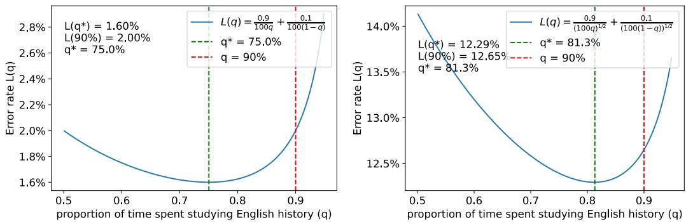
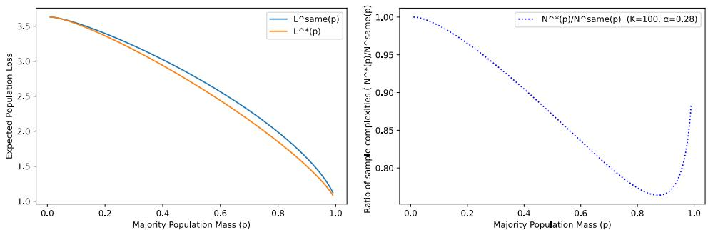
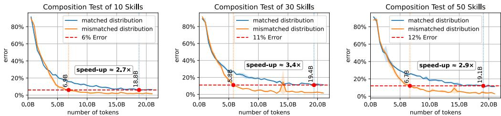

# Shift is Good: Mismatched Data Mixing Improves Test Performance

Anonymous Author(s)   
Affiliation   
Address   
email

# Abstract

We consider training and testing on mixture distributions with different training   
and test proportions. We show that in many settings, and in some sense generi  
cally, distribution shift can be beneficial, and test performance can improve due   
to mismatched training proportions. In a variety of scenarios, we identify the   
optimal training proportions and the extent to which such distribution shift can be   
beneficial.

# 7 1 Introduction

Imagine that you are taking a high-stakes exam next week. The exam will be $90 \%$ on European   
history and $10 \%$ on Chinese history. Both topics are equally familiar to you and equally difficult, and   
additional study will help you with each topic similarly. You have unlimited access to study material   
and practice questions for both. How should you spend your limited studying budget? Should your   
training match your test distribution, studying $90 \%$ European and $10 \%$ Chinese? Or would you   
benefit from a distribution shift? Studying more Chinese history? Less? Only European history? We   
encourage the reader to pause and make an intuitive guess.   
The answer depends on the specific learning curve for improvement in test performance within a   
topic as a function of the number of training examples from that topic. But at least for a generic $1 / n$   
scaling (as obtained from e.g., both learning VC classes and in parametric regression), the answer,   
as we will see in Section 3, is that you would benefit from a distribution shift, and should study   
$7 5 \%$ European History and $2 5 \%$ Chinese history—this would reduce your test error by $20 \%$ over the   
$9 0 / 1 0$ non-shifted training.   
We just saw an example of what we term Positive Distribution Shift: Even if we have unlimited data   
from the target test distribution $D _ { \mathrm { t e s t } }$ , training on a shifted distribution $D _ { \mathrm { t r a i n } } \neq D _ { \mathrm { t e s t } }$ can actually   
improve test performance. This contrasts the typical study of distribution shift, i.e. training on one   
distribution but then applying the predictor, or testing, on another. Typically, it is implicitly assumed   
that the ideal case would be to train on the test distribution, that training on a different distribution   
is a compromise, either because we don’t know or have access to the true $D _ { \mathrm { t e s t } }$ , or it’s expensive   
to sample from it, or we have only a limited number of samples and want to supplement them with   
additional data from related distributions. Distribution shift is usually studied as “how much worse   
do things get if we train on $D _ { \mathrm { t r a i n } } \neq D _ { \mathrm { t e s t } } { } ^ { , , }$ , with answers of the form “if $D _ { \mathrm { t r a i n } }$ is close or related   
enough to $D _ { \mathrm { t e s t } }$ , then it’s not much worse”. In this paper, we investigate one of several ways in which   
distribution shift can be positive.   
Specifically, we systematically study the benefit of such distribution shift when training with mis  
matched mixing proportions relative to the test distribution. We model the test distribution as a   
mixture of $K$ components, with known mixing proportions $\{ p _ { k } \} _ { k = 1 } ^ { K }$ , and consider training distribu  
tions which are mixtures over the same components but with different mixing proportions $\{ q _ { k } \} _ { k = 1 } ^ { K }$   
We can either think of this as providing guidance when we can actively control mixing between   
different known components, or as helping us understand how and why a mismatched training   
distribution can actually be beneficial. In Section 5 we discuss how the analysis is also applicable to a   
setting where we are not testing on a mixture, but rather on compositional tasks, requiring composing   
multiple skills, and the skills appear with differing frequencies—this compositional setting served as   
a major motivation for our study.   
We consider different per-component learning curves, capturing different error decays, differing   
hardness among the components, and the possibility of transfer between components. In Section 3 we   
consider power law error decay, both the $1 / n$ decay mentioned earlier and more general power laws,   
including with differing component hardnesses or error decays. In Section 4 we consider learning   
curves corresponding to “fact memorization” scenarios (discussed in Section 4), including those   
applicable to the skill composition setting, and which correspond to coupon-collector type learning   
curves. In Section 6 we consider the possibility of transfer between components. In all of these,   
we show that a mismatched training distribution can be beneficial, characterize the optimal training   
mixture, and the extent to which mismatch can improve test performance and reduce the training   
complexity.   
Beyond all the specific scenarios, we then argue, in Section 7, that benefiting from mismatch is   
not the exception but rather the rule. We show that only in rare situations (either measure zero or   
satisfying a conservation property that does not generally hold) is the optimal training distribution   
equal to the test distribution, while in “most” cases shift is good.

  
Figure 1: We plot the error rate for a hypothetical scenario modelling the high stakes exam described in Section 1. We model the error rate on each of the test portions as being proportional to $\propto \frac { 1 } { n _ { i } ^ { \alpha } }$ , where $n _ { i }$ represents the studying budget spent on that portion of the exam, so $i = 1$ corresponds to European History and $i = 2$ to the Chinese History and set $n _ { 1 } + n _ { 2 } = N$ to be the total studying budget, with $N = 1 0 0$ hours. The exponent $\alpha$ is $\alpha = 1$ on the left plot and $\alpha = 2$ on the right plot. In both cases, we consider $n _ { 1 } = q N$ and $n _ { 2 } = ( 1 - q ) N$ , where $q$ is the proportion of time spent studying for the European History portion of the exam. This way, the error rate on the exam can be written as a function of $q$ as $\begin{array} { r } { L ( \dot { q } ) \dot { = } 0 . 9 \frac { 1 } { ( 1 0 0 q ) ^ { \alpha } } + 0 . 1 \frac { 1 } { ( 1 0 0 q ) ^ { \alpha } } } \end{array}$ 1 1(100q)ω . We can see on both plots that shifting away from the testing proportion (red line, i.e. $q = 9 0 \%$ ) can lead to a better error rate with the optimal test proportion (green line, i.e. $q ^ { * }$ whose values are displayed accordingly). See also Corollary 3.3.

# 56 2 Setup

Learning Setup and Loss For concreteness, let $\ell ( h , z )$ be the loss function that describes how   
well a model $h$ performs on and instance $z \in { \mathcal { Z } }$ . For example, in supervised learning, $_ z$ can be   
an input-output pair $( { \pmb x } , y )$ , and $\ell ( h , z )$ can be the prediction error of $h ( { \pmb x } )$ vs $y$ . Or, in next-word   
prediction, $_ z$ can be a document and $\ell ( h , z )$ can be the average cross-entropy loss when using $h$ to   
predict each of the next tokens in the document. In any case, for a test distribution $D _ { \mathrm { t e s t } }$ over $_ { z }$ , we   
evaluate the model through the test loss $\begin{array} { r } { \mathcal { L } _ { D _ { \mathrm { t e s t } } } ( h ) : = \mathrm { \bar { \mathbb { E } } } _ { z \sim D _ { \mathrm { t e s t } } } [ \ell ( h , z ) ] } \end{array}$ .   
Test Distribution. We consider test distributions consisting of a mixture of $K$ components   
64 $\mathcal { D } _ { 1 } , \ldots , \mathcal { D } _ { K }$ . A mixture $\begin{array} { r } { \begin{array} { l r } { \mathcal { D } _ { \pmb { p } } } & { = } & { \sum _ { k } p _ { k } \mathcal { D } _ { k } } \end{array} } \end{array}$ is then specified by mixing proportions $\begin{array} { r l } { \pmb { p } } & { { } = } \end{array}$

5 $( p _ { 1 } , \dotsc , p _ { K } ) \in \Delta _ { K }$ on the probability simplex $\Delta _ { K }$ . We let $\pmb { p }$ be the mixing proportions in the test distribution, i.e. 6 $D _ { \mathrm { t e s t } } = \mathcal { D } _ { p }$ , and so the test loss is $\mathcal { L } _ { \mathcal { D } _ { p } } ( h ) = \mathcal { L } _ { p } ( h )$ , where here and elsewhere we use the subscript $\pmb { p }$ to denote the mixture $\mathcal { D } _ { p }$ .

Learning Algorithm. We consider abstract “learning algorithm” $\mathcal { A }$ , which, given training data (or sequence of training examples) 9 $S \in \mathcal { Z } ^ { N }$ of size $N$ , outputs a model $A ( S )$ with test loss $\bar { \mathcal { D } _ { p } } ( \mathcal { A } ( S ) )$

Training Distribution. We consider training on i.i.d. samples $S \sim \mathcal { D } _ { q } ^ { N }$ from mixtures $\mathcal { D } _ { q }$ of the   
same $K$ components, but with potentially different mixing proportions $\pmb q \doteq \Delta _ { K }$ . For training mixing   
proportions $\pmb q$ , we denote $L _ { N } ( \pmb { p } , \pmb q ) = \dot { \mathbb { E } } _ { S \sim \mathcal { D } _ { p } ^ { N } } [ \mathcal { L } _ { p } ( A ( \bar { S } ) ) ]$ the expected test error on $D _ { \mathrm { t e s t } } = \mathcal { D } _ { p }$   
when training with $D _ { \mathrm { t r a i n } } = \mathcal { D } _ { q }$ (we frequently drop the subscript $N$ if its clear from context).   
The “non-shifted” expected test loss is then denoted $L _ { N } ^ { \mathrm { s a m e } } ( p ) = L _ { N } ( p , p )$ . In contrast, we denote   
$\begin{array} { r } { L _ { N } ^ { * } ( p ) = \operatorname* { m i n } _ { \pmb { q } \in \Delta _ { K } } \bar { L } _ { N } ( \pmb { p } , \pmb { q } ) } \end{array}$ the test error with the best mixing ratios, and $\pmb q ^ { * }$ the minimizing ratios.   
When $L ^ { * } < L ^ { \mathrm { s a m e } }$ K  and so ${ \pmb q } ^ { * } \neq { \pmb p }$ , this means we can benefit from mismatched training. Our main   
analysis objective is to charactarize $\pmb q ^ { * }$ , $L ^ { * }$ and the improvement over $L ^ { \mathrm { s a m e } }$ .   
$L _ { N } ^ { \mathrm { r a t i o } } = L _ { N } ^ { * } / L _ { N } ^ { \mathrm { s a m e } }$ mismatch benefit through the improvement i. Or, we can consider the training complexity $N _ { \epsilon } ( \pmb { p } , \pmb { q } ) = \operatorname* { m i n } \ N$ trs.t. $L _ { N } ( p , q ) \stackrel { \textstyle - } { = }$   
$\epsilon$ and the improvement $\begin{array} { r } { N _ { \epsilon } ^ { \mathrm { r a t i o } } : = \frac { N _ { \epsilon } ^ { * } ( p ) } { N _ { \epsilon } ^ { \mathrm { s a m e } } ( p ) } } \end{array}$ .   
Specifying the Learning Model The expected test loss $L _ { N } ( p , q )$ , and so $\pmb q ^ { * }$ and the benefit of   
mismatch, depend on the data distributions and learning behaviour of the algorithm. We capture   
these by modeling the subpoluation error function $e _ { k } ( n )$ , i.e. the error on each component $\mathcal { D } _ { k }$   
when training with $n _ { i }$ examples from each component $\mathcal { D } _ { i }$ . That is, for a vector of sample sizes   
$\pmb { n } = ( n _ { 1 } , \dots , n _ { K } ) \in \mathbb { Z } _ { \ge 0 } ^ { K }$ , denote $\pmb { \mathcal { D } } ^ { n } = ( \mathcal { D } _ { 1 } ) ^ { n _ { 1 } } \tilde { \times } \cdot \cdot \cdot \times ( \mathcal { D } _ { K } ) ^ { n _ { K } }$ the distributions over samples with   
$n _ { i }$ examples from each component $\mathcal { D } _ { i }$ . Then $e _ { k } ( { \pmb n } ) = \mathbb { E } _ { S \sim \pmb { \mathscr { D } } ^ { n } } [ \mathcal { L } _ { \mathcal { D } _ { k } } \left( A ( S ) \right) ]$ . When $e _ { k } ( { \pmb n } ) = g _ { k } ( n _ { k } )$   
depends only on the amount of within-component data, we say the components are orthogonal,   
meaning there is no transfer between them (as in our Chinese and European history example). The   
scalar function $g _ { k } ( n _ { k } )$ then captures the learning curve for each component. But more generally,   
there might also be transfer, with data from one component helping learning on another.

In any case, the learnability function $e : \mathbb { Z } _ { \geq 0 } ^ { K } \to \mathbb { R } ^ { K }$ , captures our “learning model”. In each Section, we consider different forms of learning models and characterize $\pmb q ^ { * }$ and $L ^ { * }$ for these models.

Data Sets and Training Sequences In our analysis, we refer to the training budget $N$ and our   
learning model specifying learning based on $n _ { k }$ examples per component $k$ . We can think of $N$ and   
$\mathbf { \nabla } _ { \mathbf { \pmb { n } } }$ as specifying the number of training examples, in which case the training complexity is a sample   
complexity. Or, we can think of $N$ as indicating the number of training steps, and $n _ { k }$ as indicating   
the number of steps in which an example from component $k$ is used. In this case, training complexity   
is a measure of training time. Either interpretation is valid. But we should emphasize that we only   
study a dependence on how many examples are used from each component, not on the order (as in   
curriculum learning).   
Learnabilities and Mixing Ratios. We model learning as a function of the number of examples   
from each component, but for our analysis, it will useful to introduce the function $\bar { e } _ { N , k } ( { \pmb q } ) =$   
$\mathbb { E } _ { S \sim ( \mathcal { D } _ { q } ) ^ { n } } [ \mathcal { L } _ { k } ( \bar { \mathcal { A } } ( S ) ) ]$ , which captures the expected error on component $k$ with mixing proportions   
$\pmb q$ . We will refer to $\bar { e } _ { k } ( q )$ as the subpopulation error function in terms of the mixture $\pmb q$ . Since   
the per-component counts $\textbf { \em n }$ are multinomial, we have $\bar { e } _ { N } ( \pmb q ) = \mathbb { E } _ { \pmb { n } \sim \mathrm { M u l t } ( \pmb q , N ) } [ e ( \pmb { n } ) ] \in \bar { \mathbb { R } } ^ { K }$ and   
${ \cal L } _ { N } ( { \pmb p } , { \pmb q } ) = \langle { \pmb p } , \bar { e } _ { N } ( { \pmb q } ) \rangle$ . Frequently for large sample size N , $\bar { e } _ { N } ( { \pmb q } )$ will concentrate around $e ( \pmb q N )$ ,   
and we will sometimes exploit this in the analysis, or analyze for $\bar { e } ( q ) \approx e ( q N )$ .

# 108 3 Orthogonal Power Law

Many machine learning tasks can be captured with power law error functions. Some classic examples   
include linear regression or learning VC classes, both of which have error rate $\propto \frac { 1 } { n }$ , where $n$ is the   
number of data samples. More recently, there have been many papers studying the loss curves for   
large language models for various tasks as a function of the compute budget in various scaling laws,   
such as the Chinchilla Scaling Law [Hoffmann et al., 2022].   
To model these situations, we will first consider a setup where each of the $K$ tasks is orthogonal and   
their subpopulation error functions in terms of the number of samples follow a simple power law.   
Model 3.1 (Orthogonal Power Law Error Tasks). There are $K$ orthogonal tasks, each of which takes   
data from one of the $K$ subpopulations $\mathcal { D } _ { i }$ that appear in the test distribution with probability $p _ { i }$   
and whose subpopulation error function $e _ { k } ( n )$ follows a power law, i.e. $\begin{array} { r } { e _ { k } ( { \pmb n } ) = \frac { \hat { A } _ { k } } { n _ { k } ^ { \alpha _ { k } } + B _ { k } } } \end{array}$ for some   
$A _ { k } > 0 , B _ { k } \geq 0$ , and $0 < \alpha _ { k } \le 1$ .1   
In Proposition 3.2, we characterize the test error improvement from the positive distribution shift   
from optimal data mixing ratios in Model 3.1 when the size of the training data $n$ is large.   
Proposition 3.2 (Optimal Data Mixing Ratios For General Power Law). In Model 3.1, if for the   
exponents it holds that $\alpha _ { 1 } = \alpha _ { 2 } = \cdots = \alpha _ { S } < \alpha _ { S + 1 } \leq \alpha _ { S + 2 } \leq \cdots \leq \alpha _ { K }$ for some $S$   
then there exist $\varepsilon _ { 1 } , \varepsilon _ { 2 } \geq 0$ that depend on $\alpha _ { i }$ such that for any test data mixing ratio $\pmb { p }$ and any   
$n > n _ { 0 } ( A _ { i } , B _ { i } , \alpha _ { i } , p _ { i } )$ we have that the following holds

$$
\begin{array} { r } { q _ { i } ^ { * } = \frac { 1 } { N ^ { \frac { \alpha _ { i } - \alpha _ { 1 } } { \alpha _ { i } + 1 } } } \left( \frac { \left( \alpha _ { i } p _ { i } A _ { i } \right) } { \left( \sum _ { i = 1 } ^ { S } \left( \alpha _ { i } p _ { i } A _ { i } \right) ^ { \frac { 1 } { \alpha _ { 1 } + 1 } } \right) ^ { \alpha _ { 1 } + 1 } } \right) ^ { \frac { 1 } { \alpha _ { i } + 1 } } + o \left( \frac { 1 } { N ^ { \frac { \alpha _ { i } - \alpha _ { 1 } } { \alpha _ { i } + 1 } } } \right) } \end{array}
$$

$$
\begin{array} { l } { { \displaystyle { \cal L } ^ { \mathrm { s a m e } } ( p ) = \frac { 1 } { N ^ { \alpha _ { 1 } } } \sum _ { i = 1 } ^ { S } p _ { i } ^ { 1 - \alpha _ { 1 } } A _ { i } + o \left( \frac { 1 } { N ^ { \alpha _ { 1 } + \varepsilon _ { 1 } } } \right) . } } \\ { { \displaystyle { \cal L } ^ { * } ( p ) = \frac { 1 } { N ^ { \alpha _ { 1 } } } \left( \sum _ { i = 1 } ^ { S } ( \alpha _ { i } p _ { i } A _ { i } ) ^ { \frac { 1 } { \alpha _ { i } + 1 } } \right) ^ { \alpha _ { 1 } } \left( \sum _ { i = 1 } ^ { S } \frac { ( p _ { i } A _ { i } ) ^ { \frac { 1 } { \alpha _ { i } + 1 } } } { \alpha _ { i } ^ { \frac { \alpha _ { i } } { \alpha _ { i } + 1 } } } \right) + o \left( \frac { 1 } { N ^ { \alpha _ { 1 } + \varepsilon _ { 2 } } } \right) . } } \end{array}
$$

The 127 $o ( \cdot )$ notation hides dependence on $A _ { i } , B _ { i } , p _ { i } , K$ and $\alpha _ { i }$ .

Proposition 3.2 shows that in the power law Model 3.1, positive distribution shift from optimal data   
mixing ratios improves the prefactor of the test error dependence on the number of data samples $N$   
but does not change the decay rate in terms of $N$ . For the proof of Proposition 3.2 and a more precise   
statement, see Appendix A.1.   
To show that this can have significant implications for making training more data efficient, we show   
the improvement from this positive distribution shift on the sample complexity in the case where we   
have one majority population and $K - 1$ minority populations that all have the same power exponent   
$\alpha$ . This will also include the test-taking example from Section 1.   
Corollary 3.3 (Sample Complexity Improvement From Optimal Data Mixing For General Power   
Law). Consider Model 3.1 with $S = K$ , i.e. $\alpha _ { 1 } = \cdot \cdot \cdot = \alpha _ { K } = \alpha$ and $A _ { 1 } = \cdots = A _ { K } = A$ with   
$\pmb { p } = ( p , \frac { 1 - p } { K - 1 } , \allowbreak . \cdot . \cdot , \frac { 1 - p } { K - 1 } )$ . We have that for any $\epsilon > 0$

$$
N _ { \epsilon } ^ { r a t i o } ( p ) \leq ( 1 - p ) + 2 \frac { \alpha + 1 } { \alpha } \left( \frac { p } { 1 - p } \right) ^ { \frac { 1 } { \alpha + 1 } } K ^ { - \frac { \alpha } { \alpha + 1 } } .
$$

Furthermore, the optimal mixing ratios are given by 139 $q _ { 1 } ^ { * } \propto p ^ { \frac { 1 } { \alpha + 1 } }$ and $\begin{array} { r } { q _ { i } ^ { * } \propto \left( \frac { 1 - p } { K - 1 } \right) ^ { \frac { 1 } { \alpha + 1 } } } \end{array}$ for $i \geq 2$ .

Corollary 3.3 demonstrates an example case, that if we have one majority population and a number   
of minority populations, the positive distribution shift from optimal data mixing ratio significantly   
improves sample complexity. For fixed $p$ , if $K$ is large enough, $\operatorname { \dot { \mathbf { \rho } } } N ^ { \mathrm { r a t i o } } ( \pmb { p } )$ will be close to $\bar { N } ^ { \mathrm { r a t i o } } ( p ) \stackrel { . } { \approx }$   
$1 - p < 1$ , i.e. we get sample complexity improvement of up to $p$ . For example, for $p = 0 . 7$ ,   
$\alpha = 0 . 2 8$ , and $K = 1 0 0$ , for any $\epsilon > 0$ , $N _ { \epsilon } ^ { \mathrm { r a t i o } } ( p ) \approx 0 . 7 5$ , i.e. we achieve the same error with $\approx 2 5 \%$   
145 less samples. We illustrate this in Figure 2. For the proof of Corollary 3.3, see Appendix A.1.

Furthermore, the test taking example considered in the introduction Section 1 follows from Corollary 3.3, by taking $K = 2$ , $\alpha = 1$ , and $\pmb { p } = ( 0 . 9 , 0 . 1 )$ . In particular, this shows that the optimal studying budget allocation is $\pmb { q } ^ { * } = ( 0 . 7 5 , 0 . 2 5 )$ and the improvement is $N ^ { \mathrm { r a t i o } } ( p ) = 0 . 8$ . This means that if you study for the exam with the right mixing ratio $\pmb q ^ { * }$ , you would need to study $2 0 \%$ less time to achieve the same score as compared to using the test mixing ratio $\pmb { p }$ . Further, taking $\alpha = { \textstyle { \frac { 1 } { 2 } } }$ we get the second example on Figure 2. This shows that we indeed get $\pmb q ^ { * } = ( 0 . 8 1 2 \dots , 0 . 1 8 8 \dots ) ^ { 2 }$ and $\bar { N } ^ { \mathrm { r a t i o } } ( p ) = 0 . 9 4 4$ .

  
Figure 2: We consider the setup of Corollary 3.3 with $A = 1$ , $\alpha = 0 . 2 8$ , $K = 1 0 0$ , and some fixed $N$ . On the left plot, we show the "non-shifted" expected population loss $L ^ { \mathrm { s a m e } } ( p )$ and the optimally mixed expected population loss $L ^ { * } ( p )$ as a function of majority population mass $p$ . On the right plot, we show the ratio of sample complexities for any fixed $\epsilon > 0$ , $\bar { N } _ { \epsilon } ^ { \mathrm { r a t i o } } ( p )$ as a function of the mass of the majority population, $p$ . We can see significant improvement in the sample complexity from the positive distribution shift from using optimal mixing ratio, even up to $\approx 2 5 \%$ .

# 153 4 Orthogonal Memorization Tasks

54 We consider a task of memorizing a number of unique elements from a dataset of fixed size, where   
155 the test distribution is a mixture of the tasks we are trying to memorize.

56 Model 4.1 (Orthogonal Memorization Tasks). Suppose there are $K$ tasks, each of which is a memorization of a unique element. The test distribution is a mixture of these $K$ tasks, where the $k$ -th 58 task appears with probability $p _ { k }$ . In this case the subpopulation error functions in terms of $\textbf { \em n }$ is given 9 by ek(n) = 1{nk=0}.

The following theorem characterizes the test error improvement from the positive distribution shift from optimal data mixing ratios in the Orthogonal Memorization Task Model 4.1.

Theorem 4.2 (Optimal Data Mixing Test Error Improvement For Orthogonal Memorization Task).   
In Model 4.1, for all $p \in \Delta ^ { K - 1 }$ with $p _ { 1 } \ge p _ { 2 } \ge \dots \ge p _ { K }$ , the expected loss when training on $n$   
samples is given by

$$
\begin{array} { l } { { \displaystyle { \cal L } ^ { \mathrm { s a m e } } ( p ) = \sum _ { k = 1 } ^ { K } p _ { k } \big ( 1 - p _ { k } \big ) ^ { N } } } \\ { { \displaystyle { \cal L } ^ { * } ( p ) = ( K _ { N } ( p ) - 1 ) \delta _ { N } ( p ) + \sum _ { k = K _ { N } ( p ) + 1 } ^ { K } p _ { k } , } } \end{array}
$$

where $\delta _ { N } ( \pmb { p } ) \in [ p _ { K _ { N } ( \pmb { p } ) + 1 } , ~ p _ { K _ { N } ( \pmb { p } ) } )$ and $K _ { N } ( p )$ is defined as follows:

$$
K _ { N } ( p ) : = \operatorname* { m a x } \left\{ s \leq K : \sum _ { k = 1 } ^ { s - 1 } ( 1 - ( p _ { s } / p _ { k } ) ^ { 1 / ( K - 1 ) } ) < 1 \right\} .
$$

To understand the magnitute of the test error improvement in Theorem 4.2, we will assume that the   
test proportions $\pmb { p }$ follow a power law $p _ { k } = \Theta ( k ^ { - \alpha } )$ for some $\alpha > 1$ and that the number of tasks to   
memorize $K$ is larger than the size of the training set $N$ . In this case, we show that the improvement   
from positive distribution shift Theorem 4.2 improves even the test error scaling in terms of $N$ . For   
the proof of Theorem 4.2, see Appendix A.2.   
Corollary 4.3 (Test Error Improvement For Orthogonal Memorization Taks with Power Law Test   
Mixing Ratios). If $p _ { k } = \Theta ( k ^ { \bar { - } \alpha } )$ for some $\alpha > 1$ and $K = \Omega ( N )$ , then

$$
L ^ { \mathrm { s a m e } } ( p ) = \Theta ( N ^ { - 1 + \frac { 1 } { \alpha } } ) , \qquad L ^ { * } ( p ) = \Theta ( N ^ { - \alpha + 1 } ) .
$$

For example, when 173 $\alpha = 1 . 5$ , we have $L ^ { \mathrm { s a m e } } ( \pmb { p } ) = \Theta ( N ^ { - 1 / 3 } )$ and $L ^ { * } ( p ) = \Theta ( N ^ { - 1 / 2 } )$ . For the 174 proof of Corollary 4.3, see Appendix A.2.

  
Figure 3: Mismatched distribution improves the test accuracy of a language model in solving a synthetic CoT reasoning task on skill composition (Section 5). During test, the model is asked to compose several functions following a power law. Instead of training directly on this task (blue curve), mixing with another task that uniformly samples the functions improves the final accuracy (orange curve).

# 175 5 Connection to Skill Composition

176 All the above analyses focus on the case where tasks are orthogonal. However, if we already know   
77 that the test distribution can be decomposed into $K$ tasks, then maybe we should deal with these $K$   
tasks independently. So why do we have test mixing ratios in the first place?   
We note here that in some cases, we may need to compose these $K$ tasks later at inference time, and   
the test mixing ratios can come from the proportions in the composition. Imagine that we are training   
a language model to do mathematical reasoning. Each problem may involve several math skills, and   
a language model can acquire a math skill only if it sees the skill enough times during training. This   
can be conceptually modeled as the orthogonal memorization task discussed above, but at inference   
time, the language model has to sequentially apply the math skills in its chain of thought (CoT). The   
natural distribution of math skills then determines the test mixing ratios we care about.   
We demonstrate this in a concrete synthetic task on skill composition. There are $K$ skills, where the   
$i$ -th skill is a function $g _ { i }$ that maps a number from $\{ 0 , \ldots , 9 \}$ to $\{ 0 , \ldots , 9 \}$ . Each skill has a unique En  
glish name. Assume that all these skills are randomly sampled: the names are uniformly random from   
a name set, and each $g _ { i }$ is uniformly random among all possible functions that map from $\{ 0 , \ldots , 9 \}$ to   
$\{ 0 , \ldots , 9 \}$ . At inference time, a set of $k$ skills $g _ { i _ { 1 } } , \ldots , g _ { i _ { k } }$ are sampled IID following a power law with   
exponent $\alpha = 1 . 5$ . The language model is prompted with the names of these skills and a number $x \in$   
$\{ 0 , \ldots , 9 \}$ : “[x] -> [skill name 1] $^ { - > }$ [skill name 2] -> · · · -> [skill name $\mathbf { k } ] ^ { \mathbf { \Omega } , \mathbf { \Omega } }$   
The model is expected to output the result after function composition: $y = g _ { i _ { k } } ( g _ { i _ { k - 1 } } ( \cdot \cdot \cdot g _ { i _ { 1 } } ( x ) \cdot \cdot \cdot ) )$   
Let $D _ { \mathrm { t e s t } }$ be the distribution of the above prompt and a CoT calculating the correct answer, with   
$M = 1 0 ^ { 5 }$ , $k$ sampled uniformly from 10 to 50. Is the best strategy just training on the same   
distribution $( D _ { \mathrm { t r a i n } } = D _ { \mathrm { t e s t } } )$ ? Inspired by our calculation for the orthogonal memorization task   
above, properly adjusting the occurrence probability for each skill may lead to better test accruacy.   
To demonstrate this, we construct another distribution $\mathcal { D } _ { \mathrm { u n i f o r m } }$ consisting of strings in the form of   
“[x] [skill name] $=$ [expected output]”, where the skill and input number are uniformly   
sampled. In Figure 3, we conduct experiments with a model with GPT-2 architecture and ${ \sim } 5 0 \mathbf { M }$   
parameters. We show that training with $D _ { \mathrm { t r a i n } } = 3 0 \% \cdot \mathcal { D } _ { \mathrm { u n i f o r m } } + 7 0 \% \cdot D _ { \mathrm { t e s t } }$ significantly   
outperform training with $D _ { \mathrm { t e s t } }$ directly. We defer the experiment details to Appendix C.

# 203 6 Non-orthogonal Tasks and Transfer Learning

Many transfer learning setups, such as multi-task learning of linear classifiers over linear representation with feature learning Baxter [2011], Maurer [2009], Pontil and Maurer [2013], Aliakbarpour et al. [2024] and multi-task learning with shared sparsityWang et al. [2016, 2017], the subpopulation error functions $e _ { k } ( n )$ can be written in the form $\begin{array} { r } { e _ { k } ( { \pmb n } ) = \frac { A _ { 0 , k } } { ( n _ { 1 } + \cdots + n _ { k } ) ^ { \alpha _ { k } } } + \frac { A _ { 1 , k } } { n _ { k } ^ { \alpha _ { k } } } } \end{array}$ A1,kωk . For example, in multi-task learning of shared sparsity Wang et al. [2017], the error bound takes this form with $\alpha _ { 1 } = \cdot \cdot \cdot = \alpha _ { K } = 1$ .

To model all of these cases, we consider the following model of transfer learning.

Model 6.1 (Standard Transfer Learning Model). There are $K$ subpopulations, each of which appears   
in the test distribution with proportion $p _ { k }$ . The subpopulation error functions depend on the number   
of samples n as ek(n) = A0,k(n1+···+nk)ωk nωkk A1,k , for some $A _ { 0 , k } , A _ { 1 , k } > 0$ and $0 < \alpha _ { k } \le 1$ .   
Interestingly, the Standard Transfer Learning Model 6.1 is equivalent to the setup of Orthogonal Power   
Law Tasks Model 3.1 in the sense that we can understand optimal data mixing ratio $\pmb q ^ { * }$ and the error   
improvement of the Standard Transfer Learning model from a specific instance of the Orthogonal   
Power Law model. Namely, the transfer term in each of the subpopulation loss functions can be   
decomposed into a transfer error term and a specific task error term $\bar { e } _ { k } ( \pmb { n } ) = e _ { k } ^ { \mathrm { t r a n s f e r } } ( \pmb { n } ) + e _ { k } ^ { \mathrm { s p e c } } ( \pmb { n } )$ ,   
where $\begin{array} { r } { e _ { k } ^ { \mathrm { t r a n s f e r } } ( { \pmb n } ) = \frac { A _ { 0 , k } } { ( n _ { 1 } + \cdots + n _ { k } ) ^ { \alpha _ { k } } } } \end{array}$ is independent of the distribution of samples across different tasks,   
and e speck ( $\begin{array} { r } { e _ { k } ^ { \mathrm { s p e c } } ( { \pmb n } ) = \frac { A _ { 1 , k } } { n _ { k } ^ { \alpha _ { k } } } } \end{array}$ only depends on $n _ { k }$ . Therefore, the transfer error term $e _ { k } ^ { \mathrm { t r a n s f e r } } ( n )$ in each of the   
subpoluation error functions will only offset the final expected loss $L ( p , q )$ by $\scriptstyle \sum _ { i = 1 } ^ { K } p _ { i } { \frac { A _ { 0 , k } } { N ^ { \alpha _ { k } } } }$ , which   
only depends on the total number of samples . On the other hand, the specific task error terms   
$e _ { k } ^ { \mathrm { s p e c } } ( n )$ can be thought of as orthogonal tasks and will behave tha same as in Model 3.1. So, for the   
Standard Transfer Learning Model 6.1, the optimal data mixing ratio $\pmb q ^ { * }$ and the expected test losses   
$L ^ { * } ( p )$ and $L ^ { \mathrm { s a m e } } ( p )$ are given by Equation (1) and Equation (2) respectively in Proposition 3.2 with   
226 $A _ { k }$ being replaced by $A _ { 1 , k }$ .

# 6.1 Data Mixing Transfer Learning.

Ye et al. [2025] consider the problem of estimating the outcome performance of a large langue model trained on a mixture of domains. In particular, they find that an exponential function over the linear combinations of mixing proportions leads to good prediction. Namely, they fix the training budget $N$ and only vary the mixing ratio $\pmb q$ and show that the validation loss on $i$ -th domain can be predicted well by a function of the form $\begin{array} { r } { c _ { i } + b _ { i } \exp \left( - \sum _ { j = 1 } ^ { K } t _ { i j } q _ { j } \right) } \end{array}$ , where $c _ { i } , b _ { i } , t _ { i j }$ are parameters to fit. Following their work, we propose the following model for the Data Mixing Transfer Learning.

Model 6.2 (Data Mixing Transfer Learning). There are $K$ subpopulations, each of which appears with probability $p _ { k }$ in the test distribution. Each of the subpopulation error functions in terms of the mixing ratio $\pmb q$ are $\begin{array} { r } { \bar { e } _ { k } ( { \pmb q } ) = c _ { k } + b _ { k } \exp \left( - \sum _ { j = 1 } ^ { K } t _ { i j } q _ { j } \right) } \end{array}$ for some constants $c _ { k }$ and $b _ { k } > 0 , t _ { i j }$ .

We note that even though Model 6.2 is indeed not defined by the subpopulation error functions $e _ { k } ( n )$ , it is precisely the setup that Ye et al. [2025] consider. This slightly deviates from our main setup, which focuses on specifying models by their error functions. However, when the number of samples $N$ is large, it is reasonable to make the approximation that $e _ { k } ( { \pmb n } ) \approx e _ { k } ( { \pmb q } N )$ , and Model 6.2 can be interpreted as being defined by the subpopulation error functions of the form $\begin{array} { r } { e _ { k } ( { \pmb n } ) = c _ { k } ( | { \pmb n } | ) + b _ { k } ( | { \pmb n } | ) \exp \left( - \sum _ { j = 1 } ^ { K } t _ { i j } ( | { \pmb n } | ) n _ { j } \right) } \end{array}$ , where $c _ { k } , b _ { k }$ , and $t _ { i j }$ are functions that depend only on the total compute budget $N = | n |$ .

The following proposition characterizes the test error improvement from the positive distribution 5 shift coming from the optimal data mixing ratio in the data mixing transfer model.

46 Proposition 6.3 (Optimal Train Data Mixing Ratio for Data Mixing Transfer Learning Model). In Model 6.2, if the coefficients 247 $t _ { i j }$ are such that $_ { \mathbf { T } }$ is invertible and and $( \pmb { T } ^ { T } ) ^ { - 1 } \pmb { I } > 0$ , and $p _ { i } \neq 0$ for 48 all $i ,$ , the following hold

$$
\begin{array} { c } { { \displaystyle q ^ { * } = ( T ) ^ { - 1 } \left( \frac { 1 + I ^ { \top } T ^ { - 1 } \tau } { I T ^ { - 1 } I } I - \tau \right) } } \\ { { { } } } \\ { { { \cal L } ^ { \mathrm { s a m e } } ( p ) = \displaystyle \sum _ { i = 1 } ^ { K } c _ { i } p _ { i } + \displaystyle \sum _ { i = 1 } ^ { K } p _ { i } b _ { i } \exp \left( - \sum _ { j = 1 } ^ { K } t _ { i j } p _ { j } \right) } } \\ { { { } } } \\ { { { \cal L } ^ { * } ( p ) = \displaystyle \sum _ { i = 1 } ^ { K } c _ { i } p _ { i } + \exp \left( \frac { - 1 - I ^ { \top } T ^ { - 1 } \tau } { I ^ { - 1 } I } \right) I ^ { T } ( T ^ { \top } ) ^ { - 1 } I , } } \end{array}
$$

$\tau$ is a vector with entreis $\begin{array} { r } { \tau _ { l } = \log \left( \frac { [ ( \boldsymbol { T } ^ { \top } ) ^ { - 1 } \boldsymbol { I } ] _ { l } } { p _ { l } b _ { l } } \right) } \end{array}$

Proposition 6.3 shows the positive distribution from the optimal data mixing for Model 6.2. Note that   
the additional conditions on $\mathbf { \delta } _ { T , p _ { i } }$ are technical conditions used in order to simplify presentation. For   
the complete statement and the proof of Proposition 6.3, see Appendix A.3.   
To demonstrate how large the gap can be, we consider the problem of data mixing transfer learning   
254 Model 6.2 with $K = 2$ tasks and a one-directional transfer from the second to the first task.

55 Corollary 6.4 (Optimal Data Mixing Ratio Can Have Significant Improvement in the Transfer Learning Model). Let 56 $K = 2$ , let $\begin{array} { r } { { \pmb p } = \left( \frac { 1 } { 2 } , \frac { 1 } { 2 } \right) } \end{array}$ , and let $b _ { 1 } = b _ { 2 } = b > 0 .$ . If $\begin{array} { r } { T = \left( \begin{array} { l l } { 1 } & { \alpha } \\ { 0 } & { 1 } \end{array} \right) } \end{array}$ then we 57 have that

$$
{ \cal L } ^ { \mathrm { s a m e } } - { \cal L } ^ { * } = 2 b e ^ { - \frac { 1 } { 2 } } \left( 1 - \frac { 1 } { 4 } \alpha + { \cal O } ( a ^ { 2 } ) \right) .
$$

Furthermore, if we let 258 $\begin{array} { r } { C = \frac { c _ { 1 } + c _ { 2 } } { 2 } } \end{array}$ and $B = b e ^ { - \frac { 1 } { 2 } }$ then we have that

$$
L ^ { r a t i o } = { \frac { L _ { N } } { L ^ { * } } } = { \frac { C - B } { C + B } } + { \frac { B C } { 2 ( B + C ) ^ { 2 } } } \alpha + O ( \alpha ^ { 2 } )
$$

Corollary 6.4 shows that for two tasks with a small of transfer between the second to the first we can have error improvement from the positive distribution shift by mismatching training and test distribution, that is $\begin{array} { r } { L ^ { \mathrm { r a t i o } } \approx \frac { C - B } { C + B } < 1 } \end{array}$ for small $\alpha$ . For the proof of Corollary 6.4, see Appendix A.3.

# 262 7 It’s Almost Always Better to Mismatch

So far, we have shown the existence of and quantified the positive distribution shift coming from mistmatched test and train data mixing ratios for the cases of orthogonal power law tasks in Section 3, orthogonal memorization tasks in Section 4, and standard transfer learning and data mixing transfer learning in Section 6. that positive distribution shift from mismatching test and train mixing ratios exists. In this section, we will provide further mathematical justification that a positive distribution shift coming from the data mixing ratio almost always exists. That is, we show that it’s almost always better to mismatch the training and test distributions: ${ \pmb q } ^ { * } \neq { \pmb p }$ and $L ^ { \ast } ( p , q ^ { \ast } ) < L ^ { \mathrm { s a m e } } ( p )$ .

More precisely, we will show that either the test data mixing ratio is on a measure zero set of the simplex or the subpopulation error functions $e _ { k } ( n )$ have to be very specific functions, which are meaningless. For example, in the case of orthogonal tasks, either the test mixing ratio is on a measure zero subset or the subpopulation error functions $e _ { k } ( n )$ are all constants, which we show in Corollary 7.4.

We define the probability simplex $\Delta ^ { K - 1 } : = \left\{ p \in \mathbb { R } ^ { K } : p \geq 0 , | p | = 1 \right\}$ , and its interior $\Delta _ { + } ^ { K - 1 } : =$ $ { \left\{ p \in \mathbb { R } ^ { K } : p > 0 \right. }$ , $| p | = 1 \}$ , where $\textstyle | p | : = \sum _ { k = 1 } ^ { K } p _ { k }$ ⇔ | |. We will define $f _ { k } ( \pmb { p } )$ + by extending the domain of each $\bar { e } _ { k } ( p )$ to the set of non-zero, non-negative vectors $\mathbb { R } _ { \geq 0 } ^ { K } \backslash \{ \mathbf { 0 } \}$ by defining $\begin{array} { r } { f _ { k } ( \pmb { p } ) : = \bar { e } _ { k } ( \frac { \pmb { p } } { | \pmb { p } | } ) } \end{array}$ . We further define non-zero, non-neg $\begin{array} { r } { L ^ { \mathrm { s a m e } } ( \pmb { p } ) : = \sum _ { k = 1 } ^ { K } p _ { k } f _ { k } ( \pmb { p } ) } \end{array}$ ↔ , which extends the definition of $L ^ { \mathrm { s a m e } }$ | | to the set of $\mathbb { R } _ { \geq 0 } ^ { K } \backslash \{ \mathbf { 0 } \}$

Condition 7.1 (Conservation Condition). $( f _ { 1 } ( \pmb { p } ) , \dots , f _ { K } ( \pmb { p } ) ) = \nabla L ^ { \mathrm { s a m e } } ( \pmb { p } )$ for all $\pmb { p } \in \mathbb { R } _ { \geq 0 } ^ { K } \setminus \{ \mathbf { 0 } \}$

Theorem 7.2 (Positive Distribution Shift Almost Always Exists For Data Mixing). For any set of subpopulations $\mathcal { D } _ { 1 } , \ldots , \mathcal { D } _ { K }$ and any learning algorithm $\mathcal { A }$ , either Condition 7.1 holds, or there exists a zero-measure set $U$ on $\Delta ^ { K - \bar { 1 } }$ such that for all $\pmb { p } \in \Delta ^ { K - 1 } \setminus \bigcup , L _ { N } ^ { * } ( \pmb { p } ) < L ^ { \mathrm { s a m e } } ( \pmb { p } )$ .

Theorem 7.2 shows that either $\pmb { p }$ is on a measure zero set $U$ on $\Delta ^ { K - 1 }$ or the Conservation Condition 7.1 must hold. We will show that Conservation Condition 7.1 happens only for very specific cases of subpopulation error functions.

Conservation Condition Rarely Holds. First, we will show that if the subtasks are orthogonal, the conservation condition Condition 7.1 is only satisfied if all of the subpopulation error functions are constants.

Lemma 7.3 (Orthogonal Tasks). If $K \geq 3$ , and if for all $k \in [ K ]$ , $\begin{array} { r } { f _ { k } ( \pmb { p } ) = g _ { k } ( \frac { p _ { k } } { | \pmb { p } | } ) } \end{array}$ for some function $g _ { k }$ , then Condition 7.1 holds if and only if $g _ { k }$ ’s are all constant functions.

Theorem 7.2 and Lemma 7.3 together show that in the case of orthogonal tasks, positive distirbution shift always exists by changing the training data mixing ratio away from the test mixing ratio, unless 294 all the subpopulation error functions are constant.

Corollary 7.4 (Positive Distribution Shift Always Exists for Orthogonal Tasks). For any set of   
$K \geq 3$ subpopulations $\mathcal { D } _ { 1 } , \ldots , \mathcal { D } _ { K }$ and any learning algorithm $\mathcal { A }$ , if there exists subpopulation   
$k \in [ K ]$ such that its error function $e _ { k }$ is not a constant functions over $[ N ]$ where $N$ is the number   
of total samples then there exists a measure zero set $U$ on $\Delta ^ { K - 1 }$ such that for all $\pmb { p } \in \Delta ^ { K - 1 } \setminus U$   
positive distribution shift from data mixing exists in the sense that there is ${ \pmb q } ^ { * } \ne \ p$ for which   
300 $L _ { N } ( \pmb { p } , \pmb q ) = L ^ { * } ( \pmb { p } ) < L ^ { \mathrm { s a i n e } } ( \pmb { p } )$ .   
01 Further, we show that if the Conservation Condition 7.1 is satisfied, then one function $f _ { i }$ determines   
the rest up to a constant.

Lemma 7.5. If both $( f _ { 1 } , \dots , f _ { K } , L ^ { \mathrm { s a m e } } )$ and $( \hat { f } _ { 1 } , \dots , \hat { f } _ { K } , \hat { L } ^ { \mathrm { s a m e } } )$ satisfy Condition 7.1, and if $f _ { i } = \hat { f } _ { i }$ for some $i \in [ m ]$ , then for all $k \neq i$ , $f _ { k } ( \pmb { p } ) = \hat { f } _ { k } ( \pmb { p } ) + C _ { k }$ for some constant $C _ { k }$ .

The above Lemma 7.5 implies that for every $k$ and corresponding error function $e _ { k } ( n )$ , there exists   
at most one tuple of error functions $\{ e _ { j } \} _ { j = 1 , j \neq k } ^ { K }$ (up to a individual constant offset for each error   
function $e _ { j }$ ) that positive distribution shift does not happen for $\pmb { p }$ of positive measure. This further   
implies the following corollary.

Corollary 7.6 (Positive Distribution Shift Almost Always Exists for General Tasks). For any set of $K \geq 3$ subpopulations $\mathcal { D } _ { 1 } , \ldots , \mathcal { D } _ { K }$ and any learning algorithm $\boldsymbol { A }$ , for all $p \in \Delta _ { + } ^ { K - 1 }$ , the configuration of $[ e _ { k } ( { \pmb n } ) ] _ { k \in [ K ] , { \pmb n } }$ that positive distribution shift does not happen is zero-measure.

Corollary 7.6 shows that either the test mixing ratio $\pmb { p }$ is on a set of measure zero on the simplex or   
the configuration of subpopulation error functions $e _ { k } ( n )$ is on a set of measure zero. This implies   
that positive distribution shift exists almost always.

# 315 8 Related Works

Distribution Shift That is Not Harmful. The benefits of mismathcing the training and test distribution has already been in studied in some settings. González and Abu-Mostafa [2015] demonstrate in many linear regression problems that mismatched training and test distributions can outperform matched ones. Unlike in our paper, they do not restrict to changing the train distribution only through data mixing, so their results do not fit our framework. On the other hand, we explicitly characterize the positive distribution shift, while González and Abu-Mostafa [2015] only show its existence for linear regression problems and are only able to characterize the distribution explicitly in very special cases. Canatar et al. [2021] show how in high-dimensional kernel regression problems to numerically optimize the training distribution for better test performance. However, they do not characterize the positive distribution shift, but rather only show how to numerically find it for kernel regression. Similarly, they do not restrict the test distribution to one coming from a data mixture, so their results do not fit our framework.

Data Mixing. There a number of recent empiricaly works that consider the same setting of data   
mixing as we do. Ye et al. [2025] introduce data mixing laws, quantitative empirical predictions   
of large language model performance based on the data mixture proportions. Furthermore, they   
show experimental results demonstrating that their approach significantly decreases the number of   
steps needed to reach certain performance. This paper informed our data mixing transfer model and   
fits in our framework. Goyal et al. [2024] show that data curation for VLMs cannot be compute   
agnostic. They introduce neural scaling laws that allow for estimating performance on multiple   
data pools without jointly training on them. Their work fits our framework. Similarly, we also find   
that optimal mixing ratios are not compute agnostic, specifically in the orthogonal power law tasks,   
orthogonal memorization task, and standard transfer learning task. Jiang et al. [2025] introduce an   
algorithm for online optimization of data distributions, that adjusts mixture based on the estimated   
per-domain learning potential, achieving comparable or better performance than previous methods   
while maintaing compuatational efficiency. While all of these works consider the same phenomena   
of changing the training mixing ratio to improve test performacne, the main difference between our   
work and theirs is that we consider positive distribution shift from data mixing ratio in a broader   
context and from the theoretical standpoint as well.   
References   
Maryam Aliakbarpour, Konstantina Bairaktari, Gavin Brown, Adam Smith, Nathan Srebro, and   
Jonathan Ullman. Metalearning with very few samples per task. In Shipra Agrawal and Aaron   
Roth, editors, Proceedings of Thirty Seventh Conference on Learning Theory, volume 247 of   
Proceedings of Machine Learning Research, pages 46–93. PMLR, 30 Jun–03 Jul 2024. URL   
https://proceedings.mlr.press/v247/aliakbarpour24a.html.   
Jonathan Baxter. A model of inductive bias learning. CoRR, abs/1106.0245, 2011. URL http:   
//arxiv.org/abs/1106.0245.   
Abdulkadir Canatar, Blake Bordelon, and Cengiz Pehlevan. Out-of-distribution generalization in ker  
nel regression. In M. Ranzato, A. Beygelzimer, Y. Dauphin, P.S. Liang, and J. Wortman Vaughan,   
editors, Advances in Neural Information Processing Systems, volume 34, pages 12600–12612. Cur  
ran Associates, Inc., 2021. URL https://proceedings.neurips.cc/paper_files/paper/   
2021/file/691dcb1d65f31967a874d18383b9da75-Paper.pdf.   
Carlos R. González and Yaser S. Abu-Mostafa. Mismatched training and test distributions can   
outperform matched ones. Neural Computation, 27(2):365–387, 2015. doi: 10.1162/NECO_a_   
00697.   
Sachin Goyal, Pratyush Maini, Zachary C. Lipton, Aditi Raghunathan, and J. Zico Kolter. Scaling   
laws for data filtering—data curation cannot be compute agnostic. In 2024 IEEE/CVF Conference   
on Computer Vision and Pattern Recognition (CVPR), pages 22702–22711, 2024. doi: 10.1109/   
CVPR52733.2024.02142.   
Jordan Hoffmann, Sebastian Borgeaud, Arthur Mensch, Elena Buchatskaya, Trevor Cai, Eliza Ruther  
ford, Diego de las Casas, Lisa Anne Hendricks, Johannes Welbl, Aidan Clark, Tom Hennigan,   
Eric Noland, Katherine Millican, George van den Driessche, Bogdan Damoc, Aurelia Guy, Simon   
Osindero, Karen Simonyan, Erich Elsen, Oriol Vinyals, Jack William Rae, and Laurent Sifre. An   
empirical analysis of compute-optimal large language model training. In Alice H. Oh, Alekh Agar  
wal, Danielle Belgrave, and Kyunghyun Cho, editors, Advances in Neural Information Processing   
Systems, 2022. URL https://openreview.net/forum?id=iBBcRUlOAPR.   
Yiding Jiang, Allan Zhou, Zhili Feng, Sadhika Malladi, and J Zico Kolter. Adaptive data optimization:   
Dynamic sample selection with scaling laws. In The Thirteenth International Conference on   
Learning Representations, 2025. URL https://openreview.net/forum?id=aqok1UX7Z1.   
Andreas Maurer. Transfer bounds for linear feature learning. Machine Learning, 75:327–350, 2009.   
URL https://api.semanticscholar.org/CorpusID:14682470.   
Massimiliano Pontil and Andreas Maurer. Excess risk bounds for multitask learning with trace   
norm regularization. In Shai Shalev-Shwartz and Ingo Steinwart, editors, Proceedings of the 26th   
Annual Conference on Learning Theory, volume 30 of Proceedings of Machine Learning Research,   
pages 55–76, Princeton, NJ, USA, 12–14 Jun 2013. PMLR. URL https://proceedings.mlr.   
press/v30/Pontil13.html.   
Jialei Wang, Mladen Kolar, and Nathan Srerbo. Distributed multi-task learning. In Arthur Gretton   
and Christian C. Robert, editors, Proceedings of the 19th International Conference on Artificial   
Intelligence and Statistics, volume 51 of Proceedings of Machine Learning Research, pages 751–   
760, Cadiz, Spain, 09–11 May 2016. PMLR. URL https://proceedings.mlr.press/v51/   
wang16d.html.   
Jialei Wang, Mladen Kolar, Nathan Srebro, and Tong Zhang. Efficient distributed learning with   
sparsity. In Doina Precup and Yee Whye Teh, editors, Proceedings of the 34th International   
Conference on Machine Learning, volume 70 of Proceedings of Machine Learning Research,   
pages 3636–3645. PMLR, 06–11 Aug 2017. URL https://proceedings.mlr.press/v70/   
wang17f.html.   
Jiasheng Ye, Peiju Liu, Tianxiang Sun, Jun Zhan, Yunhua Zhou, and Xipeng Qiu. Data mixing   
laws: Optimizing data mixtures by predicting language modeling performance. In The Thirteenth   
International Conference on Learning Representations, 2025. URL https://openreview.net/   
forum?id=jjCB27TMK3.   
The checklist is designed to encourage best practices for responsible machine learning research,   
addressing issues of reproducibility, transparency, research ethics, and societal impact. Do not remove   
the checklist: The papers not including the checklist will be desk rejected. The checklist should   
follow the references and follow the (optional) supplemental material. The checklist does NOT count   
towards the page limit.

Please read the checklist guidelines carefully for information on how to answer these questions. For each question in the checklist:

• You should answer [Yes] , [No] , or [NA] .   
• [NA] means either that the question is Not Applicable for that particular paper or the relevant information is Not Available.   
• Please provide a short (1–2 sentence) justification right after your answer (even for NA).

The checklist answers are an integral part of your paper submission. They are visible to the   
reviewers, area chairs, senior area chairs, and ethics reviewers. You will be asked to also include it   
(after eventual revisions) with the final version of your paper, and its final version will be published   
410 with the paper.

11 The reviewers of your paper will be asked to use the checklist as one of the factors in their evaluation.   
While "[Yes] " is generally preferable to "[No] ", it is perfectly acceptable to answer "[No] " provided a   
proper justification is given (e.g., "error bars are not reported because it would be too computationally expensive" or "we were unable to find the license for the dataset we used"). In general, answering "[No] " or "[NA] " is not grounds for rejection. While the questions are phrased in a binary way, we acknowledge that the true answer is often more nuanced, so please just use your best judgment and write a justification to elaborate. All supporting evidence can appear either in the main paper or the supplemental material, provided in appendix. If you answer [Yes] to a question, in the justification please point to the section(s) where related material for the question can be found.

IMPORTANT, please:

• Delete this instruction block, but keep the section heading “NeurIPS Paper Checklist", • Keep the checklist subsection headings, questions/answers and guidelines below. • Do not modify the questions and only use the provided macros for your answers.

# 1. Claims

Question: Do the main claims made in the abstract and introduction accurately reflect the paper’s contributions and scope?

Answer: [Yes]

Justification: Yes, the main claim accuretly reflects the paper’s contribution and scope.

Guidelines:

• The answer NA means that the abstract and introduction do not include the claims made in the paper.   
• The abstract and/or introduction should clearly state the claims made, including the contributions made in the paper and important assumptions and limitations. A No or NA answer to this question will not be perceived well by the reviewers.   
• The claims made should match theoretical and experimental results, and reflect how much the results can be expected to generalize to other settings.   
• It is fine to include aspirational goals as motivation as long as it is clear that these goals are not attained by the paper.

# 2. Limitations

Question: Does the paper discuss the limitations of the work performed by the authors?

Answer: [Yes]

Justification: Yes, we discuss the limitations of our work and clearly define the scope of each of our claims.

# Guidelines:

• The answer NA means that the paper has no limitation while the answer No means that the paper has limitations, but those are not discussed in the paper.   
• The authors are encouraged to create a separate "Limitations" section in their paper.   
• The paper should point out any strong assumptions and how robust the results are to violations of these assumptions (e.g., independence assumptions, noiseless settings, model well-specification, asymptotic approximations only holding locally). The authors should reflect on how these assumptions might be violated in practice and what the implications would be. The authors should reflect on the scope of the claims made, e.g., if the approach was only tested on a few datasets or with a few runs. In general, empirical results often depend on implicit assumptions, which should be articulated.   
• The authors should reflect on the factors that influence the performance of the approach. For example, a facial recognition algorithm may perform poorly when image resolution is low or images are taken in low lighting. Or a speech-to-text system might not be used reliably to provide closed captions for online lectures because it fails to handle technical jargon. The authors should discuss the computational efficiency of the proposed algorithms and how they scale with dataset size.   
• If applicable, the authors should discuss possible limitations of their approach to address problems of privacy and fairness.   
• While the authors might fear that complete honesty about limitations might be used by reviewers as grounds for rejection, a worse outcome might be that reviewers discover limitations that aren’t acknowledged in the paper. The authors should use their best judgment and recognize that individual actions in favor of transparency play an important role in developing norms that preserve the integrity of the community. Reviewers will be specifically instructed to not penalize honesty concerning limitations.

# 3. Theory assumptions and proofs

Question: For each theoretical result, does the paper provide the full set of assumptions and a complete (and correct) proof?

Answer: [Yes]

Justification: We provide full set of assumptions and complete and corrected proofs in the appendix. For some of the claims, we only state an informal or a limited scope version in the main body for the ease of presentation.

Guidelines:

• The answer NA means that the paper does not include theoretical results.   
• All the theorems, formulas, and proofs in the paper should be numbered and cross-referenced.   
• All assumptions should be clearly stated or referenced in the statement of any theorems.   
• The proofs can either appear in the main paper or the supplemental material, but if they appear in the supplemental material, the authors are encouraged to provide a short proof sketch to provide intuition.   
• Inversely, any informal proof provided in the core of the paper should be complemented by formal proofs provided in appendix or supplemental material.   
• Theorems and Lemmas that the proof relies upon should be properly referenced.

# 4. Experimental result reproducibility

Question: Does the paper fully disclose all the information needed to reproduce the main experimental results of the paper to the extent that it affects the main claims and/or conclusions of the paper (regardless of whether the code and data are provided or not)?

Answer: [Yes]

Justification: Yes, we disclose the information needed to reproduce the experiments.

Guidelines:

• The answer NA means that the paper does not include experiments.

• If the paper includes experiments, a No answer to this question will not be perceived well by the reviewers: Making the paper reproducible is important, regardless of whether the code and data are provided or not.   
• If the contribution is a dataset and/or model, the authors should describe the steps taken to make their results reproducible or verifiable. Depending on the contribution, reproducibility can be accomplished in various ways. For example, if the contribution is a novel architecture, describing the architecture fully might suffice, or if the contribution is a specific model and empirical evaluation, it may be necessary to either make it possible for others to replicate the model with the same dataset, or provide access to the model. In general. releasing code and data is often one good way to accomplish this, but reproducibility can also be provided via detailed instructions for how to replicate the results, access to a hosted model (e.g., in the case of a large language model), releasing of a model checkpoint, or other means that are appropriate to the research performed. While NeurIPS does not require releasing code, the conference does require all submissions to provide some reasonable avenue for reproducibility, which may depend on the nature of the contribution. For example (a) If the contribution is primarily a new algorithm, the paper should make it clear how to reproduce that algorithm. (b) If the contribution is primarily a new model architecture, the paper should describe the architecture clearly and fully. (c) If the contribution is a new model (e.g., a large language model), then there should either be a way to access this model for reproducing the results or a way to reproduce the model (e.g., with an open-source dataset or instructions for how to construct the dataset). (d) We recognize that reproducibility may be tricky in some cases, in which case authors are welcome to describe the particular way they provide for reproducibility. In the case of closed-source models, it may be that access to the model is limited in some way (e.g., to registered users), but it should be possible for other researchers to have some path to reproducing or verifying the results.

# 5. Open access to data and code

Question: Does the paper provide open access to the data and code, with sufficient instructions to faithfully reproduce the main experimental results, as described in supplemental material?

Answer: [Yes]

Justification: Yes, we provide the access in to the code and data in the appendix.

Guidelines:

• The answer NA means that paper does not include experiments requiring code.   
• Please see the NeurIPS code and data submission guidelines (https://nips.cc/public/ guides/CodeSubmissionPolicy) for more details.   
• While we encourage the release of code and data, we understand that this might not be possible, so “No” is an acceptable answer. Papers cannot be rejected simply for not including code, unless this is central to the contribution (e.g., for a new open-source benchmark).   
• The instructions should contain the exact command and environment needed to run to reproduce the results. See the NeurIPS code and data submission guidelines (https://nips. cc/public/guides/CodeSubmissionPolicy) for more details.   
• The authors should provide instructions on data access and preparation, including how to access the raw data, preprocessed data, intermediate data, and generated data, etc.   
• The authors should provide scripts to reproduce all experimental results for the new proposed method and baselines. If only a subset of experiments are reproducible, they should state which ones are omitted from the script and why.   
• At submission time, to preserve anonymity, the authors should release anonymized versions (if applicable).   
• Providing as much information as possible in supplemental material (appended to the paper) is recommended, but including URLs to data and code is permitted.

# 6. Experimental setting/details

Question: Does the paper specify all the training and test details (e.g., data splits, hyperparameters, how they were chosen, type of optimizer, etc.) necessary to understand the results?

Answer: [Yes]

Justification: Yes, we specify all the details of the experiment necessary to understand and reproduce the experiments.

Guidelines:

• The answer NA means that the paper does not include experiments. • The experimental setting should be presented in the core of the paper to a level of detail that is necessary to appreciate the results and make sense of them. • The full details can be provided either with the code, in appendix, or as supplemental material.

# 7. Experiment statistical significance

Question: Does the paper report error bars suitably and correctly defined or other appropriate information about the statistical significance of the experiments?

Answer: [Yes]

Justification: Yes, we provide information about statistical significance of results where appropriate.

Guidelines:

• The answer NA means that the paper does not include experiments.   
• The authors should answer "Yes" if the results are accompanied by error bars, confidence intervals, or statistical significance tests, at least for the experiments that support the main claims of the paper.   
• The factors of variability that the error bars are capturing should be clearly stated (for example, train/test split, initialization, random drawing of some parameter, or overall run with given experimental conditions).   
• The method for calculating the error bars should be explained (closed form formula, call to a library function, bootstrap, etc.)   
• The assumptions made should be given (e.g., Normally distributed errors).   
• It should be clear whether the error bar is the standard deviation or the standard error of the mean.   
• It is OK to report 1-sigma error bars, but one should state it. The authors should preferably report a 2-sigma error bar than state that they have a $96 \%$ CI, if the hypothesis of Normality of errors is not verified.   
• For asymmetric distributions, the authors should be careful not to show in tables or figures symmetric error bars that would yield results that are out of range (e.g. negative error rates).   
• If error bars are reported in tables or plots, The authors should explain in the text how they were calculated and reference the corresponding figures or tables in the text.

# 8. Experiments compute resources

Question: For each experiment, does the paper provide sufficient information on the computer resources (type of compute workers, memory, time of execution) needed to reproduce the experiments?

Answer: [Yes]

Justification: Yes, we provide sufficient information on the computer resources needed to reproduce the experiments in the appendix.

Guidelines:

• The answer NA means that the paper does not include experiments.   
• The paper should indicate the type of compute workers CPU or GPU, internal cluster, or cloud provider, including relevant memory and storage.   
• The paper should provide the amount of compute required for each of the individual experimental runs as well as estimate the total compute.   
• The paper should disclose whether the full research project required more compute than the experiments reported in the paper (e.g., preliminary or failed experiments that didn’t make it into the paper).

# 9. Code of ethics

Question: Does the research conducted in the paper conform, in every respect, with the NeurIPS Code of Ethics https://neurips.cc/public/EthicsGuidelines?

Answer: [Yes]

Justification: Yes, our research conforms in every aspect to the NeurIPS Code of Ethics.

Guidelines:

• The answer NA means that the authors have not reviewed the NeurIPS Code of Ethics.   
• If the authors answer No, they should explain the special circumstances that require a deviation from the Code of Ethics.   
• The authors should make sure to preserve anonymity (e.g., if there is a special consideration due to laws or regulations in their jurisdiction).

# 10. Broader impacts

Question: Does the paper discuss both potential positive societal impacts and negative societal impacts of the work performed?

Answer: [NA]

Justification: As this is mainly a theoretical paper, there is no immediate societal impact of the owrk.

Guidelines:

• The answer NA means that there is no societal impact of the work performed.   
• If the authors answer NA or No, they should explain why their work has no societal impact or why the paper does not address societal impact.   
• Examples of negative societal impacts include potential malicious or unintended uses (e.g., disinformation, generating fake profiles, surveillance), fairness considerations (e.g., deployment of technologies that could make decisions that unfairly impact specific groups), privacy considerations, and security considerations. The conference expects that many papers will be foundational research and not tied to particular applications, let alone deployments. However, if there is a direct path to any negative applications, the authors should point it out. For example, it is legitimate to point out that an improvement in the quality of generative models could be used to generate deepfakes for disinformation. On the other hand, it is not needed to point out that a generic algorithm for optimizing neural networks could enable people to train models that generate Deepfakes faster.   
• The authors should consider possible harms that could arise when the technology is being used as intended and functioning correctly, harms that could arise when the technology is being used as intended but gives incorrect results, and harms following from (intentional or unintentional) misuse of the technology.   
If there are negative societal impacts, the authors could also discuss possible mitigation strategies (e.g., gated release of models, providing defenses in addition to attacks, mechanisms for monitoring misuse, mechanisms to monitor how a system learns from feedback over time, improving the efficiency and accessibility of ML).

# 11. Safeguards

Question: Does the paper describe safeguards that have been put in place for responsible release of data or models that have a high risk for misuse (e.g., pretrained language models, image generators, or scraped datasets)?

Answer: [NA]

Justification: The paper poses no such risks.

Guidelines:

• The answer NA means that the paper poses no such risks.   
• Released models that have a high risk for misuse or dual-use should be released with necessary safeguards to allow for controlled use of the model, for example by requiring that users adhere to usage guidelines or restrictions to access the model or implementing safety filters.   
• Datasets that have been scraped from the Internet could pose safety risks. The authors should describe how they avoided releasing unsafe images.

• We recognize that providing effective safeguards is challenging, and many papers do not require this, but we encourage authors to take this into account and make a best faith effort.

# 12. Licenses for existing assets

Question: Are the creators or original owners of assets (e.g., code, data, models), used in the paper, properly credited and are the license and terms of use explicitly mentioned and properly respected?

Answer: [Yes]

Justification: Yes, we properly credit all the original owners of assets where due.

Guidelines:

• The answer NA means that the paper does not use existing assets.   
• The authors should cite the original paper that produced the code package or dataset.   
• The authors should state which version of the asset is used and, if possible, include a URL.   
• The name of the license (e.g., CC-BY 4.0) should be included for each asset.   
• For scraped data from a particular source (e.g., website), the copyright and terms of service of that source should be provided.   
• If assets are released, the license, copyright information, and terms of use in the package should be provided. For popular datasets, paperswithcode.com/datasets has curated licenses for some datasets. Their licensing guide can help determine the license of a dataset.   
• For existing datasets that are re-packaged, both the original license and the license of the derived asset (if it has changed) should be provided.   
• If this information is not available online, the authors are encouraged to reach out to the asset’s creators.

# 13. New assets

Question: Are new assets introduced in the paper well documented and is the documentation provided alongside the assets?

Answer: [NA]

Justification: We do not realease new assets.

Guidelines:

• The answer NA means that the paper does not release new assets.   
• Researchers should communicate the details of the dataset/code/model as part of their submissions via structured templates. This includes details about training, license, limitations, etc.   
• The paper should discuss whether and how consent was obtained from people whose asset is used.   
• At submission time, remember to anonymize your assets (if applicable). You can either create an anonymized URL or include an anonymized zip file.

# 14. Crowdsourcing and research with human subjects

Question: For crowdsourcing experiments and research with human subjects, does the paper include the full text of instructions given to participants and screenshots, if applicable, as well as details about compensation (if any)?

Answer: [NA]

Justification: The paper does not involve crowdourcing nor research with human subjects.

Guidelines:

• The answer NA means that the paper does not involve crowdsourcing nor research with human subjects.   
• Including this information in the supplemental material is fine, but if the main contribution of the paper involves human subjects, then as much detail as possible should be included in the main paper.   
• According to the NeurIPS Code of Ethics, workers involved in data collection, curation, or other labor should be paid at least the minimum wage in the country of the data collector.

# 03 15. Institutional review board (IRB) approvals or equivalent for research with human subjects

Question: Does the paper describe potential risks incurred by study participants, whether such risks were disclosed to the subjects, and whether Institutional Review Board (IRB) approvals (or an equivalent approval/review based on the requirements of your country or institution) were obtained?

Answer: [NA]

Justification: See previous point.

Guidelines:

• The answer NA means that the paper does not involve crowdsourcing nor research with human subjects.   
• Depending on the country in which research is conducted, IRB approval (or equivalent) may be required for any human subjects research. If you obtained IRB approval, you should clearly state this in the paper.   
• We recognize that the procedures for this may vary significantly between institutions and locations, and we expect authors to adhere to the NeurIPS Code of Ethics and the guidelines for their institution.   
• For initial submissions, do not include any information that would break anonymity (if applicable), such as the institution conducting the review.

# 16. Declaration of LLM usage

Question: Does the paper describe the usage of LLMs if it is an important, original, or nonstandard component of the core methods in this research? Note that if the LLM is used only for writing, editing, or formatting purposes and does not impact the core methodology, scientific rigorousness, or originality of the research, declaration is not required.

Answer: [NA]

Justification: The core methods developed in this research do not involve LLMs as any important, original, or non-standard components.

Guidelines:

• The answer NA means that the core method development in this research does not involve LLMs as any important, original, or non-standard components.   
• Please refer to our LLM policy (https://neurips.cc/Conferences/2025/LLM) for what should or should not be described.
