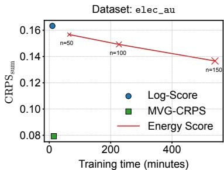
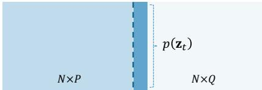
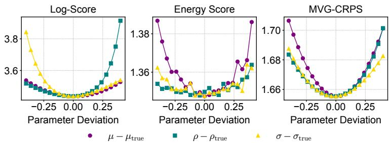
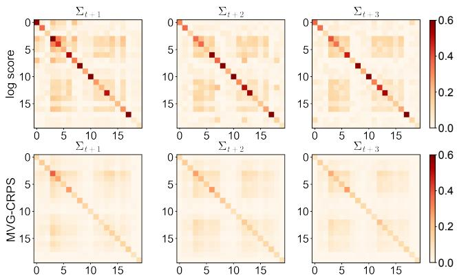
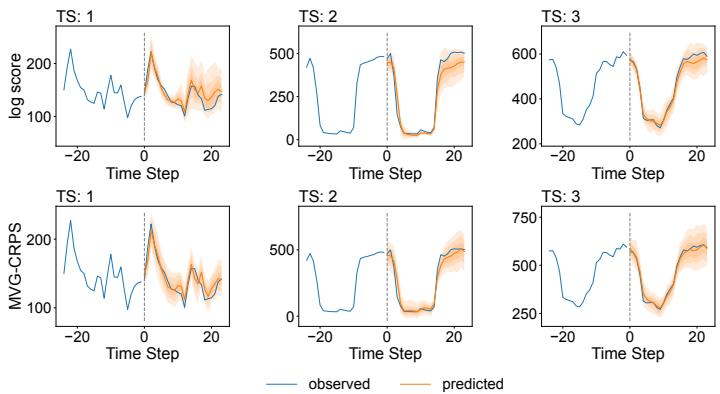
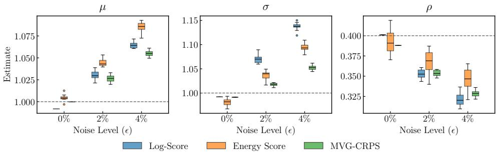
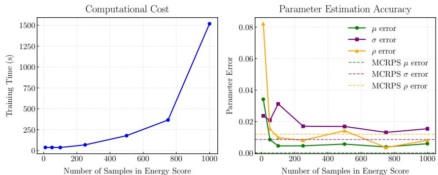
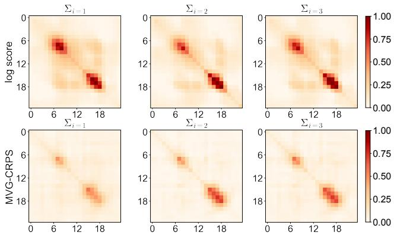
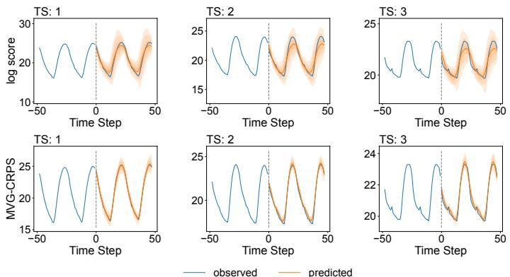
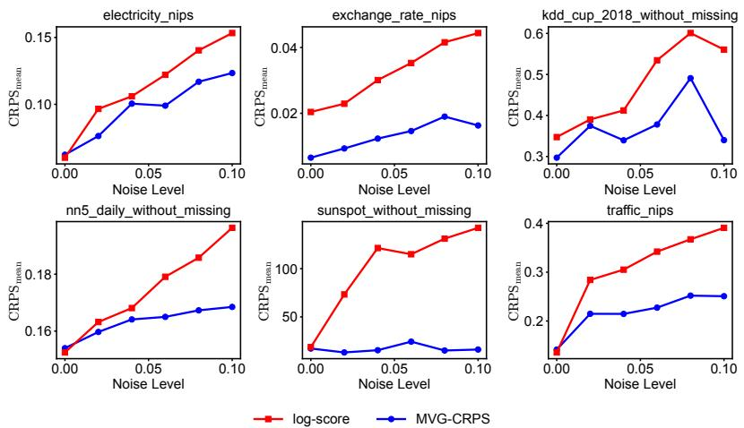

# MVG-CRPS: A Robust Loss Function for Multivariate Probabilistic Forecasting

Anonymous Author(s)   
Affiliation   
Address   
email

# Abstract

Multivariate probabilistic forecasting typically leverages neural network-based distributional regression, often employing Gaussian assumptions to simplify computation. While the standard negative log-likelihood provides analytical convenience, its sensitivity to outliers can severely degrade forecasting accuracy. Conversely, robust alternatives like the Energy Score, although less sensitive to extreme values, rely heavily on computationally expensive sampling approximations, limiting scalability in neural network training. To bridge this gap, we introduce the MVGCRPS, a novel, strictly proper scoring rule for multivariate Gaussian distributions that maintains robustness to outliers while providing a closed-form expression, enabling efficient training and evaluation. Our approach leverages a whitening transformation, decorrelating multivariate outputs and reducing the multivariate scoring task to tractable univariate CRPS computations. Experiments on real-world datasets for both multivariate autoregressive and univariate sequence-to-sequence (Seq2Seq) forecasting tasks demonstrate that MVG-CRPS enhances robustness and predictive performance.

# 16 1 Introduction

Probabilistic forecasting is critical in applications ranging from financial risk management [1], to   
weather forecasting [2] and healthcare analytics [3], where accurate quantification of predictive   
uncertainty directly informs decision-making. Multivariate probabilistic forecasting models extend   
beyond point estimates, producing joint probability distributions across multiple correlated con  
tinuous variables. Neural network-based methods have become a dominant paradigm due to their   
flexibility and expressiveness [4–6]. Typically, these methods rely on parametric assumptions such as   
multivariate Gaussian distributions, allowing closed-form loss computations (e.g., log-likelihood)   
and efficient backpropagation.   
Despite widespread adoption, standard metrics for model inference such as the negative log-likelihood   
(log-score) present substantial challenges. Most notably, under the Gaussian family, the log-score   
heavily penalizes unlikely events and outliers due to its exponential sensitivity in the tails of distribu  
tions, making it excessively sensitive to anomalies and model misspecification [7, 8]. As a result,   
neural network models trained using the log-score can generate overly conservative or inaccurate   
predictive distributions when exposed to real-world data characterized by occasional extreme events.   
To address the limitations of the log-score, the Energy Score [ES, 9] emerged as a popular robust   
alternative. It generalizes the continuous ranked probability score [CRPS, 10, 11] for univariate   
distributions and effectively mitigates sensitivity to outliers by evaluating forecasts through expected   
pairwise distances between predictions and observations. However, the ES lacks a closed-form   
analytical expression in most cases, necessitating computationally intensive Monte Carlo sampling to   
approximate its value and gradients. Such approximations significantly slow down neural network   
training, limiting practical scalability [12, 13].   
Motivated by the need for a robust yet computationally efficient scoring rule, this paper introduces   
MVG-CRPS (Multivariate Gaussian CRPS). We propose a strictly proper scoring rule specifically   
designed for multivariate Gaussian probabilistic forecasting tasks. Our approach circumvents the   
computational limitations of the ES by leveraging a PCA whitening transformation, decomposing the   
multivariate Gaussian distribution into independent, standard normal variables. Consequently, the   
multivariate scoring problem reduces to a set of analytically tractable univariate CRPS computations.   
MVG-CRPS provides explicit analytical gradients, enabling efficient integration into neural network   
training. The advantages of our approach are illustrated in Fig. 1, where the model trained with MVG  
CRPS achieves higher accuracy while significantly reducing training time. The key contributions of   
47 our work are:

  
Figure 1: An example showing MVG-CRPS achieves better accuracy and faster training by avoiding sampling and reducing sensitivity to outliers. ES results are shown for different sample sizes.

• We propose MVG-CRPS, a novel scoring rule for multivariate probabilistic forecasting that is less sensitive to outliers and extreme tails of the data distribution. Under the multivariate Gaussian family, we prove that MVG-CRPS is strictly proper.   
• The proposed MVG-CRPS has a closed-form expression, allowing for the analytical computation of derivatives. This property facilitates efficient integration with backpropagationbased training in deep learning models and significantly reduces the computational cost compared to sampling-based alternatives.   
• We perform extensive experiments with deep probabilistic forecasting models on real-world datasets. Our results demonstrate that MVG-CRPS balances accuracy and efficiency more effectively than standard scoring rules.

# 58 2 Related Work

# 2.1 Probabilistic Forecasting

0 Probabilistic forecasting focuses on modeling the complete probability distribution of target variables   
rather than producing single-point estimates. This comprehensive approach is essential for quantifying   
uncertainty inherent in time series data, thereby enabling more informed risk assessment and decision  
making. Probabilistic forecasting methods typically fall into two main categories: parametric methods,   
which assume explicit probability density functions (PDFs), and non-parametric methods, which rely   
on quantile estimation [5].   
Non-parametric methods generally forecast specific quantiles of the target distribution, thus avoiding   
restrictive parametric assumptions. A prominent example is the MQ-RNN [14], which leverages a   
Seq2Seq recurrent neural network (RNN) architecture to forecast multiple quantiles simultaneously.   
These quantile forecasts offer a robust approximation of the underlying distribution, making them   
particularly effective for capturing asymmetric and heavy-tailed behaviors.   
Parametric methods assume a predefined probability distribution—such as Gaussian or Poisson—and   
estimate its parameters using neural networks. The DeepAR model [15], for instance, employs an   
RNN to capture hidden state transitions and predict Gaussian distribution parameters at each time   
step. GPVar [4], its multivariate extension, incorporates a Gaussian copula to transform observations   
into Gaussian variables, thus modeling joint dependencies among multiple time series effectively.   
This method efficiently captures temporal and cross-series correlations through generalized least   
squares (GLS) approaches [16, 17] or dynamic regression [18].   
Neural networks also facilitate modeling more complex probabilistic structures, including state-space   
models (SSMs) [19, 20], normalizing flows (NFs) [6], and diffusion models [21]. Additionally,   
copula-based methods explicitly model dependencies between multiple time series. Recent studies by   
Drouin et al. [22] and Ashok et al. [23] employ copulas to combine individual marginal distributions   
and dependency structures, achieving flexible multivariate modeling capabilities. Most existing   
approaches predominantly use the log-score as their optimization criterion.

# 84 2.2 Scoring Rules

Scoring rules quantitatively assess probabilistic forecast quality by comparing predicted distributions   
with observed outcomes. A scoring rule is deemed proper if it incentivizes honest forecasting,   
achieving its minimal expected score when the predicted distribution when the predicted probability   
distribution $p$ matches the true distribution $q$ . Formally, a scoring rule $s ( p , q )$ is proper if the   
divergence $\bar { d ( p , q ) } = s ( p , q ) - s ( q , q )$ is non-negative and it is strictly proper if $d ( p , q ) = 0$ implies   
$p = q$ [24].   
The negative log-likelihood (log-score) is a prevalent strictly proper scoring rule, evaluating predictive   
densities directly at observed outcomes. Widely adopted due to its analytical tractability, the log  
score is particularly beneficial when the predictive density has a known parametric form [25]. The   
log-score is a strictly proper scoring rule and has several desirable properties, such as consistency and   
sensitivity to the entire distribution. In addition, the analytical tractability (closed-form expression   
and gradients for many distributions) makes it a convenient default in deep probabilistic forecasting   
models. However, for certain distributions (e.g., Gaussian), the log-score severely penalizes unlikely   
events, rendering it sensitive to outliers and extreme observations [26]. To mitigate this sensitivity,   
the CRPS provides a robust alternative in univariate contexts [27]. The CRPS quantifies discrepancies   
between the predictive cumulative distribution function (CDF) and observations, integrating absolute   
error over all potential thresholds. Unlike the exponential penalty in log-score, CRPS linearly   
penalizes deviations, thus reducing vulnerability to extreme events [28]. CRPS-based optimization   
techniques have demonstrated superior calibration and robustness compared to likelihood-based   
approaches in various probabilistic forecasting applications [28–30]. Minimum CRPS estimation   
specifically targets improved calibration by optimizing parameters directly to minimize CRPS rather   
than maximizing likelihood.   
Multivariate forecasting introduces additional complexity due to inter-dependencies and higher   
dimensionality. While the log-score remains applicable, its sensitivity to outliers persists in this   
setting. The ES [9] generalizes the CRPS for multivariate distributions by computing expected   
distances between predictive and observed distributions. While ES effectively detects errors in the   
forecast mean, it is less sensitive to variance errors and, more critically, to misspecifications in   
the correlation structure among variables [31, 32]. The absence of a closed form expression also   
necessitates the use of Monte Carlo simulations to approximate the ES by drawing samples from the   
predictive distribution, which can be computationally expensive [see e.g., 33, 25, 13, 12].   
To overcome the limited sensitivity of ES to the dependence structure, the variogram score (VS)   
was proposed by Scheuerer and Hamill [34]. VS explicitly targets inter-variable dependencies by   
comparing pairwise differences between forecasted and observed components. Similar to the ES, VS   
is typically approximated using ensemble forecasts or Monte Carlo sampling. However, it introduces   
additional computational complexity and still lacks a fully closed-form expression, limiting its direct   
applicability in large-scale or real-time settings. For a broader discussion of multivariate scoring rules   
and their properties, we refer readers to the comprehensive reviews by Gneiting and Katzfuss [35],   
Ziel and Berk [36], Waghmare and Ziegel [37] and Pic et al. [38].   
The most relevant recent work is by Olafsdottir et al. [39], who propose a parameter estimation   
framework for multivariate spatial models by maximizing the average leave-one-out score (LOOS).   
Their method leverages the tractable conditionals of multivariate Gaussians and robust scoring rules   
like the CRPS. It is especially efficient for models with sparse precision matrices (e.g., Gaussian   
Markov random fields), but incurs notable overhead for general multivariate Gaussians due to the   
cost of computing all conditionals.

Task 1: Multivariate Autoregressive   
Task 2: Univariate Seq2Seq   

<table><tr><td></td><td></td></tr><tr><td></td><td></td></tr><tr><td></td><td> p(Zi,t+1:t+Q)</td></tr><tr><td></td><td></td></tr><tr><td></td><td></td></tr><tr><td></td><td></td></tr><tr><td></td><td></td></tr><tr><td>N×P</td><td></td></tr><tr><td></td><td>NxQ</td></tr></table>

Figure 2: Illustration of the multivariate autoregressive and univariate Seq2Seq forecasting tasks.

# 129 3 Our Method

# 30 3.1 Multivariate Probabilistic Forecasting

Probabilistic forecasting aims to estimate the joint distribution over a collection of future quantities based on a given history of observations [35]. Denote the time series vector at a time point $t$ as $\mathbf { z } _ { t } =$ $[ z _ { 1 , t } , \ldots , z _ { N , t } ] ^ { \top } \in \mathbb { R } ^ { \tilde { N } }$ , where $N$ is the number of series. The problem of probabilistic forecasting can be formulated as $p \left( \mathbf { z } _ { T + 1 : T + Q } \mid \mathbf { z } _ { T - P + 1 : T } ; \mathbf { x } _ { T - P + 1 : T + Q } \right)$ , where $\mathbf z _ { t _ { 1 } : t _ { 2 } } = [ \mathbf z _ { t _ { 1 } } , \ldots \mathbf , \mathbf z _ { t _ { 2 } } ]$ , $P$ is the conditioning range, $Q$ is the prediction range, and $T$ is the time point that splits the conditioning range and prediction range. $\mathbf { x } _ { t }$ are some known covariates for both past and future time steps.

Multivariate probabilistic forecasting can be formulated in different ways. One way is over the time   
series dimension, where multiple interrelated variables are forecasted simultaneously at each time   
point. Considering an autoregressive model, where the predicted output is used as input for the next   
time step, this formulation can be factorized as

$$
\begin{array} { r l } & { ~ p \left( \mathbf { z } _ { T + 1 : T + Q } \mid \mathbf { z } _ { T - P + 1 : T } ; \mathbf { x } _ { T - P + 1 : T + Q } \right) } \\ & { = \underset { t = T + 1 } { \prod ^ { T + Q } } p \left( \mathbf { z } _ { t } \mid \mathbf { z } _ { t - P : t - 1 } ; \mathbf { x } _ { t - P : t } \right) = \underset { t = T + 1 } { \prod ^ { T + Q } } p \left( \mathbf { z } _ { t } \mid \mathbf { h } _ { t } \right) , } \end{array}
$$

where $\mathbf { h } _ { t }$ is a state vector that encodes all the conditioning information used to generate the distribution   
parameters, typically via a neural network.   
Another option is over the prediction horizon, where forecasts are made across multiple future   
time steps for one or more variables, capturing temporal dependencies and uncertainties over time.   
Considering a shared model across different series:

$$
p \left( \mathbf { z } _ { i , T + 1 : T + Q } \mid \mathbf { z } _ { i , T - P + 1 : T } ; \mathbf { x } _ { i , T - P + 1 : T + Q } \right) ,
$$

where $i = 1 , \ldots , N$ denotes the identifier of a particular time series. Since the model outputs   
forecasts for the entire prediction horizon directly, it is also called a Seq2Seq model. Without loss of   
generality, we use the first approach as an example to illustrate our method, since both approaches   
focus on estimating a multivariate distribution $p \left( \mathbf { z } _ { t } \right)$ or $p \left( \mathbf { z } _ { i , T + 1 : T + Q } \right)$ (Fig. 2).   
A typical probabilistic forecasting model assumes Gaussian noise; for example, it models $\mathbf { z } _ { t }$ as jointly   
following a multivariate Gaussian distribution:

$$
\mathbf { z } _ { t } \mid \mathbf { h } _ { t } \sim \mathcal { N } \left( \mu ( \mathbf { h } _ { t } ) , \Sigma ( \mathbf { h } _ { t } ) \right) ,
$$

where $\mu ( \cdot )$ and $\pmb { \Sigma } ( \cdot )$ are the functions mapping $\mathbf { h } _ { t }$ to the mean and covariance parameters. The   
log-likelihood of the distribution given observed time series data up to time point $T$ can be used as   
the loss function for optimizing a DL model:

$$
\mathcal { L } = \sum _ { t = 1 } ^ { T } \log p \left( \mathbf { z } _ { t } \mid \boldsymbol { \theta } \left( \mathbf { h } _ { t } \right) \right) \propto \sum _ { t = 1 } ^ { T } - \frac { 1 } { 2 } [ \ln | \mathbf { \boldsymbol { \Sigma } } _ { t } | + \eta _ { t } ^ { \top } \boldsymbol { \Sigma } _ { t } ^ { - 1 } \pmb { \eta } _ { t } ] ,
$$

where 155 $\pmb { \eta } _ { t } = \mathbf { z } _ { t } - \pmb { \mu } _ { t }$ . The above formulation simplifies to the univariate case when we set $N = 1$ for 156 the model, with the same model being shared across all time series:

$$
z _ { i , t } \mid \mathbf { h } _ { i , t } \sim \mathcal { N } \left( \mu ( \mathbf { h } _ { i , t } ) , \sigma ^ { 2 } ( \mathbf { h } _ { i , t } ) \right) ,
$$

where $\mu ( \cdot )$ and $\sigma ( \cdot )$ map $\mathbf { h } _ { i , t }$ to the mean and standard deviation of a Gaussian distribution. The   
corresponding log-likelihood becomes

$$
\mathcal { L } = \sum _ { t = 1 } ^ { T } \sum _ { i = 1 } ^ { N } \log p \left( \boldsymbol { z } _ { i , t } ~ | ~ \theta \left( \mathbf { h } _ { i , t } \right) \right) \propto \sum _ { t = 1 } ^ { T } \sum _ { i = 1 } ^ { N } - \frac { 1 } { 2 } \epsilon _ { i , t } ^ { 2 } - \ln \sigma _ { i , t } ,
$$

where 159 $\begin{array} { r } { \epsilon _ { i , t } = \frac { z _ { i , t } - \mu _ { i , t } } { \sigma _ { i , t } } } \end{array}$ . Eq. (4) and Eq. (6), when used as scoring rules to optimize the model, are 160 generally referred to as the log-score and are widely employed in probabilistic forecasting.

For univariate problems, the CRPS is also a strictly proper scoring rule, defined as

$$
\mathrm { C R P S } ( F , z ) = \mathbb { E } _ { F } | x - z | - \frac { 1 } { 2 } \mathbb { E } _ { F } \left| x - x ^ { \prime } \right| ,
$$

where $F$ is the predictive CDF, $z$ is the observation, and $x$ and $x ^ { \prime }$ are independent random variables   
both associated with $F$ . The CRPS has a closed-form expression when evaluating a Gaussian  
distributed variable $z \sim \mathcal { N } \left( \mu , \sigma ^ { 2 } \right)$ [28]:

$$
\mathrm { C R P S } \left( \Phi , z \right) = z \left( 2 \Phi \left( z \right) - 1 \right) + 2 \varphi \left( z \right) - \frac { 1 } { \sqrt { \pi } } ,
$$

$$
\mathrm { C R P S } \left( F _ { \mu , \sigma } , z \right) = \sigma \mathrm { C R P S } \left( \Phi , \frac { z - \mu } { \sigma } \right) ,
$$

where 166 $\begin{array} { r } { F _ { \mu , \sigma } \left( z \right) = \Phi \left( \frac { z - \mu } { \sigma } \right) } \end{array}$ , $\Phi$ and $\varphi$ are the CDF and PDF of the standard Gaussian distribution.

The CRPS has been shown to be a more robust alternative to the log-score as a loss function in many   
problems [28, 27, 40]. We observe that the log-score can grow arbitrarily large in magnitude when   
a single outlier disproportionately influences the loss function, owing to the unbounded nature of   
the logarithmic function (Eq. (4) and Eq. (6)). Additionally, the quadratic form of the error terms   
in the Gaussian likelihood also makes it sensitive to outliers (e.g., $\epsilon _ { i , t } ^ { 2 }$ in Eq. (6)). In contrast, the   
CRPS evaluates the entire predictive distribution rather than concentrating solely on the likelihood of   
individual data points (Eq. (8)). Moreover, the CRPS can directly replace the log-score, providing   
analytical gradients with respect to $\mu$ and $\sigma$ for backpropagation. However, for a multivariate Gaussian   
distribution, the CRPS does not have a widely used closed-form expression.

# 176 3.2 MVG-CRPS as Loss Function for Multivariate Forecasting

In multivariate probabilistic forecasting, proper scoring rules such as the log-score (Eq. (4)) and the   
ES are used to evaluate predictive performance. The ES generalizes the CRPS to assess probabilistic   
forecasts of vector-valued random variables [9]:

$$
\mathrm { E S } ( F , { \mathbf z } ) = \underset { { \mathbf x } \sim F } { \mathbb { E } } { \Vert } x - { \mathbf z } { \Vert } ^ { \beta } - \frac { 1 } { 2 } \underset { { \mathbf x } , { \mathbf x ^ { \prime } } \sim F } { \mathbb { E } } { \Vert } x - { \mathbf x ^ { \prime } } { \Vert } ^ { \beta } ,
$$

where $\lVert \cdot \rVert$ denotes the Euclidean norm and $\beta = 1$ is commonly used in the literature [23]. With   
$\beta = 1$ , the ES essentially becomes a multivariate extension of the CRPS and grows linearly with   
respect to the norm, making it less sensitive to outliers compared to the log-score. Since there is no   
simple closed-form expression for Eq. (10), it is often approximated using Monte Carlo methods,   
where multiple samples $\{ { \pmb x } _ { i } \} _ { i = 1 } ^ { n }$ are drawn from the forecast distribution to approximate the expected   
values:

$$
\operatorname { E S } ( F , \mathbf { z } ) = { \frac { 1 } { n } } \sum _ { i = 1 } ^ { n } \lVert { \pmb x } _ { i } - \mathbf { z } \rVert ^ { \beta } - { \frac { 1 } { 2 n ^ { 2 } } } \sum _ { i = 1 } ^ { n } \sum _ { j = 1 } ^ { n } \lVert { \pmb x } _ { i } - { \pmb x } _ { j } \rVert ^ { \beta } .
$$

However, a significant disadvantage of using Eq. (11) as the loss function is that it requires Monte   
Carlo sampling during the training process, which can substantially slow down training and create   
noisy gradients.   
In this section, we propose the MVG-CRPS, a robust and efficient loss function designed as an   
alternative for multivariate forecasting. This loss function grows linearly with the prediction error,   
making it more robust than the log-score. Additionally, it does not require sampling during the   
training process, rendering it more efficient than the ES.   
Our proposed method is based on the whitening transformation of a time series vector that follows a   
multivariate Gaussian distribution, $\mathbf { z } _ { t } \sim \mathcal { N } ( \bar { \mu _ { t } } , \Sigma _ { t } )$ . The whitening process transforms a random   
vector with a known covariance matrix into a new random vector whose covariance matrix is the   
identity matrix. As a result, the elements of the transformed vector have unit variance and are   
uncorrelated. This transformation begins by performing the singular value decomposition (SVD) of   
the covariance matrix:

$$
\begin{array} { r } { \Sigma _ { t } = U _ { t } { \cal S } _ { t } U _ { t } ^ { \top } , } \end{array}
$$

where 199 $\boldsymbol { S } _ { t } = \mathrm { d i a g } ( \left[ \lambda _ { 1 , t } , \ldots , \lambda _ { N , t } \right] ^ { \top } )$ is a diagonal matrix containing the eigenvalues of $\Sigma _ { t }$ , and $\boldsymbol { U } _ { t }$ 200 is the orthonormal matrix of corresponding eigenvectors. We then define

$$
\mathbf { v } _ { t } = U _ { t } ^ { \top } \left( \mathbf { z } _ { t } - \mu _ { t } \right) ,
$$

where $\mathbf { v } _ { t } \sim \mathcal { N } \left( \mathbf { 0 } , S _ { t } \right)$ is a random vector with a uncorrelated multivariate Gaussian distribution,   
having variances $\lambda _ { i }$ (i.e., the corresponding eigenvalue) along the diagonal of its covariance matrix.   
Next, we define

$$
\mathbf { w } _ { t } = { \pmb { S } } _ { t } ^ { - \frac { 1 } { 2 } } \mathbf { v } _ { t } = { \pmb { S } } _ { t } ^ { - \frac { 1 } { 2 } } { \pmb { U } } _ { t } ^ { \top } \left( \mathbf { z } _ { t } - { \pmb { \mu } } _ { t } \right) ,
$$

where $\mathbf { w } _ { t }$ is a random vector with each element following a standard Gaussian distribution, i.e.,   
$w _ { i , t } \sim \mathcal { N } ( 0 , 1 )$ . We can then apply Eq. (8) individually to each element and formulate the MVG  
CRPS mimicking Eq. (9) for multivariate problem:

$$
\mathrm { M C R P S } \left( \Phi _ { N } \left( \mu _ { t } , \Sigma _ { t } \right) , \mathbf { z } _ { t } \right) = \sum _ { i = 1 } ^ { N } \mathrm { C R P S } \left( \Phi \left( 0 , \lambda _ { i , t } \right) , v _ { i , t } \right) = \sum _ { i = 1 } ^ { N } \sqrt { \lambda _ { i , t } } \mathrm { C R P S } \left( \Phi , w _ { i , t } \right) ,
$$

where $\Phi _ { N } ( { \boldsymbol \mu } , { \boldsymbol \Sigma } )$ is thd CDF of multivariate Gaussian with mean $\pmb { \mu }$ and covariance $\pmb { \Sigma }$ .

The overall loss function for training the model is then formulated over an observation period $T$

$$
\mathcal { L } = \sum _ { t = 1 } ^ { T } \mathrm { M C R P S } \left( \Phi _ { N } \left( \pmb { \mu } _ { t } , \pmb { \Sigma } _ { t } \right) , \mathbf { z } _ { t } \right) .
$$

By leveraging PCA whitening, the MVG-CRPS effectively discriminates between differences in both   
the mean and covariance within the multivariate Gaussian family—whereas the ES may overlook   
subtle covariance discrepancies and the log-score lacks robustness. The key advantage of MVG  
CRPS lies in its ability to exploit the closed-form expression of the univariate CRPS by decorrelating   
multivariate time series variables via PCA whitening. This transformation enables the evaluation of   
marginal distributions in an orthogonalized space, where the whitening is derived from the original   
covariance matrix. As a result, the optimization process preserves and is sensitive to the dependence   
structure of the original multivariate distribution. Under the Gaussian assumption, MVG-CRPS   
constitutes a strictly proper scoring rule (see Appendix $\ S \mathrm { A }$ ).

# 218 4 Experiments

# 4.1 Datasets and Models

We evaluate MVG-CRPS on two forecasting tasks: multivariate autoregressive forecasting using the   
RNN-based GPVar [4] and a decoder-only Transformer [41], and univariate Seq2Seq forecasting   
using the MLP-based N-HiTS model [42].   
To generate the distribution parameters for probabilistic forecasting, we employ a Gaussian distri  
bution head based on the hidden state $\mathbf { h } _ { i , t }$ produced by the model. Specifically, for the multivariate   
autoregressive forecasting, following Salinas et al. [4], we parameterize the mean vector as $\pmb { \mu } \left( \mathbf { h } _ { t } \right) =$   
$[ \mu _ { 1 } \left( \mathbf { h } _ { 1 , t } \right) , \ldots , \mu _ { N } \left( \mathbf { h } _ { N , t } \right) ] ^ { \top } \in \mathbb { R } ^ { N }$ and adopt a low-rank-plus-diagonal parameterization of the   
covariance matrix $\Sigma \left( \mathbf { h } _ { t } \right) = { L _ { t } } { L _ { t } ^ { \top } } + \operatorname { d i a g } \left( \mathbf { d } _ { t } \right)$ , where $\mathbf { d } _ { t } = [ d _ { 1 } \left( \mathbf { h } _ { 1 , t } \right) , \ldots , d _ { N } \left( \mathbf { h } _ { N , t } \right) ] ^ { \top } \in \mathbb { R } _ { + } ^ { N }$   
and $L _ { t } = \left[ \mathbf { l } _ { 1 } \left( \mathbf { h } _ { 1 , t } \right) , \ldots , \mathbf { l } _ { N } \left( \mathbf { h } _ { N , t } \right) \right] ^ { \top } \in \mathbb { R } ^ { N \times R }$ , $R \ll N$ is the rank parameter. Here, $\mu _ { i } ( \cdot ) , d _ { i } ( \cdot )$   
and $\mathrm { l } _ { i } ( \cdot )$ are the mapping functions that generate the mean and covariance parameters for each   
time series $i$ based on the hidden state $\mathbf { h } _ { i = 1 : N , t }$ . This parameterization guarantees that $\pmb { \Sigma } ( \mathbf h _ { t } )$ is   
full-rank, ensuring that the eigen-decomposition in Eq. (12) is always well-defined. In practice, we   
use shared mapping functions across all time series, denoted as $\mu _ { i } = \tilde { \mu }$ , $d _ { i } = \tilde { d }$ , and $\boldsymbol { \mathrm { l } } _ { i } = \tilde { \boldsymbol { \mathrm { l } } }$ . This   
parameterization ensures that $\pmb { \Sigma } ( \mathbf h _ { t } )$ is positive definite and efficiently parameterized. The diagonal   
component provides stability, while the low-rank component captures the covariance structure. The   
Gaussian assumption also enables the use of random subsets of time series (i.e., batch size $B \leq N )$   
for model optimization in each iteration, making it feasible to apply our method to high-dimensional   
time series datasets. Similarly, in the univariate $\mathtt { S e q 2 S e q }$ forecasting task, the mean $\pmb { \mu } \left( \mathbf { h } _ { i } \right)$ and   
covariance $\pmb { \Sigma } ( \mathbf { h } _ { i } )$ are defined over the forecast horizon for each specific time series, based on the   
hidden states $\scriptstyle \mathbf { h } _ { i , t = T + 1 : T + Q }$ . As a result, we can model the joint distribution $p \left( \mathbf { z } _ { i , T + 1 : T + Q } \right)$ over   
the forecasted values. We implemented our models using PyTorch Forecasting [43], with input data   
consisting of lagged time series values and covariates. Extensive experiments were conducted on a   
variety of real-world time series datasets from GluonTS [44] (see Appendix $\ S _ { \mathbf { B } }$ ). Full details of the   
experimental setup are provided in Appendix $\ S C$ .

# 4.2 Toy Example

We first perform a toy experiment following Roordink and Hess [45] using a true distribution $P = \mathcal { N } \left( \left[ \begin{array} { l } { 1 } \\ { - 1 } \end{array} \right] , \left[ \begin{array} { l l } { 1 } & { 0 . { \dot { 8 } } } \\ { 0 . 8 } & { 4 } \end{array} \right] \right)$ and a predictive distribution $Q = \mathcal { N } \left( \left[ \begin{array} { c } { \mu } \\ { - 1 } \end{array} \right] , \left[ \begin{array} { c c } { \bar { \sigma } ^ { 2 } } & { 2 \rho \sigma } \\ { 2 \rho \sigma } & { 4 } \end{array} \right] \right)$ , where we control the deviation of the three parameters $\mu , \rho , \sigma$ to study the various properties of different scores. As shown in Fig. 3, the log-score increases sharply when the standard deviation $\sigma$ or correlation coefficient $\rho$ deviate from their true values, indicating high sensitivity to covariance misspecification. The ES shows lower sensitivity to the covariance structure but produces non-smooth curves due to its sample-based approximation. In contrast, the MVG-CRPS displays comparable sensitivity to deviations in all three parameters. It also produces smooth curves with a clear minimum at zero deviation, reflecting its closed-form evaluation.

We further examine the robustness of different scoring rules for estimating the parameters of this   
predictive distribution under data contamination, and analyze the trade-off between computational cost   
and estimation accuracy for the ES with varying sample sizes (see Appendix $\ S _ { \mathrm { D . 1 } }$ ). Overall, MVG  
CRPS demonstrates greater robustness than the log-score across all three parameters, particularly for   
$\mu$ and $\sigma$ , and provides more consistent estimates than the ES due to its sampling-free formulation   
(Fig. A1). We also observe that the ES produces less accurate estimates than MVG-CRPS for $\mu$   
and $\sigma$ . Although we do not claim superiority over the ES beyond efficiency, this discrepancy is   
likely attributable to the variance introduced by its Monte Carlo approximation. Additionally, we   
observe that the gains in estimation accuracy diminish rapidly as the sample size increases, and the   
ES does not significantly outperform MVG-CRPS even with 1,000 samples (Fig. A2). Meanwhile,   
the computational cost of the ES increases monotonically with sample size.

  
Figure 3: Sensitivity of scoring rules to parameter deviations in the predicted mean, standard deviation, and correlation coefficient from the true data distribution $( \mu _ { \mathrm { t r u e } } = 1 , \sigma _ { \mathrm { t r u e } } = 1 , \rho _ { \mathrm { t r u e } } = 0 . 4 )$ . The ES values are computed with a sample size of 500.

# 265 4.3 Quantitative Evaluation

We evaluate the MVG-CRPS against models trained with the log-score and the ES using three   
common metrics for probabilistic forecasts: $\mathrm { C R P S _ { s u m } }$ , $\mathrm { C R P S } _ { \mathrm { m e a n } }$ , and the ES (see Appendix $\ S { \bf C } . 5$   
for definitions). Table 1 presents a comparison of $\mathrm { C R P S _ { s u m } }$ for the multivariate autoregressive   
forecasting task. Overall, the MVG-CRPS achieves the best average rank among the three scoring   
rules. Notably, it consistently outperforms the log-score across most datasets, indicating that MVG  
CRPS leads to models with higher-quality forecasts. As shown in later sections, this improvement is   
attributed to MVG-CRPS being less sensitive to outliers. Compared to the ES, MVG-CRPS achieves   
comparable or better performance (Table 1) while being more efficient during training (Table 2). It is   
important to note that we do not claim MVG-CRPS is more robust than ES; rather, our focus is on its   
efficiency compared to ES. Results for $\mathrm { C R P S } _ { \mathrm { m e a n } }$ and the ES are provided in Appendix $\ S _ { \mathrm { D } . 2 }$ , and   
results for the univariate Seq2Seq forecasting task are presented in Appendix $\ S _ { \mathrm { D } . 3 }$ . In both tasks,   
MVG-CRPS achieves consistent performance across all three evaluation metrics.

Table 1: Comparison of $\mathrm { C R P S _ { s u m } }$ across different scoring rules in the multivariate autoregressive forecasting task. The best scores are in boldface. MVG-CRPS scores are underlined when they are not the best overall but exceed the log-score.   

<table><tr><td></td><td>VAR</td><td colspan="3">GPVar</td><td colspan="3">Transformer</td></tr><tr><td></td><td></td><td>log-score</td><td>energy score</td><td>MVG-CRPS</td><td>log-score</td><td>energy score</td><td>MVG-CRPS</td></tr><tr><td>elec_au</td><td>N/A</td><td>0.1261±0.0009</td><td>0.0887±0.0004</td><td>0.0967±0.0008</td><td>0.1633±0.0005</td><td>0.1492±0.0006</td><td>0.0793±0.0004</td></tr><tr><td>cif_2016</td><td></td><td>1.0000±0.0000 0.0122±0.0004</td><td>0.0420±0.0006</td><td>0.0111±0.0005</td><td>0.0118±0.0003</td><td>0.0240±0.0014</td><td>0.0107±0.0002</td></tr><tr><td>electricity</td><td></td><td>0.1315±0.0006 0.0419±0.0008</td><td>0.0616±0.0004</td><td>0.0249±0.0006</td><td>0.0362±0.0002</td><td>0.0368±0.0004</td><td>0.0294±0.0004</td></tr><tr><td>elec_weekly</td><td></td><td>0.1126±0.0011 0.1515±0.0028</td><td>0.0417±0.0014</td><td>0.0772±0.0031</td><td>0.0937±0.0026</td><td>0.0403±0.0013</td><td>0.0448±0.0014</td></tr><tr><td>exchange_rate 0.0033±0.0000 0.0207±0.0004</td><td></td><td></td><td>0.0030±0.0001</td><td>0.0041±0.0001</td><td>0.0047±0.0003</td><td>0.0067±0.0003</td><td>0.0091±0.0004</td></tr><tr><td>kdd_cup</td><td>N/A</td><td>0.3743±0.0019</td><td>0.3210±0.0019</td><td>0.2358±0.0014</td><td>0.2076±0.0013</td><td>0.4789±0.0030</td><td>0.1959±0.0017</td></tr><tr><td>m1_yearly</td><td>N/A</td><td>0.4397±0.0041</td><td>0.4801±0.0022</td><td>0.3566±0.0029</td><td>0.5344±0.0109</td><td>0.3291±0.0047</td><td>0.4563±0.0111</td></tr><tr><td>m3_yearly</td><td>N/A</td><td>0.3607±0.0084</td><td>0.2186±0.0042</td><td>0.1423±0.0053</td><td>0.3156±0.0102</td><td>0.4050±0.0061</td><td>0.2325±0.0094</td></tr><tr><td>nn5_daily</td><td></td><td>0.2303±0.0005 0.0998±0.0004</td><td>0.0958±0.0003</td><td>0.0948±0.0003</td><td>0.0991±0.0003</td><td>0.0883±0.0004</td><td>0.0811±0.0002</td></tr><tr><td>saugeenday</td><td>N/A</td><td>0.4040±0.0047</td><td>0.3733±0.0048</td><td>0.3941±0.0055</td><td>0.3771±0.0088</td><td>0.3689±0.0053</td><td>0.3705±0.0047</td></tr><tr><td>sunspot</td><td>N/A</td><td></td><td>18.7115±1.3296 23.3988±0.96621</td><td>17.2438±0.5833 39.7454±1.484116.6556±0.6167</td><td></td><td></td><td>22.6495±0.6752</td></tr><tr><td>tourism</td><td></td><td></td><td></td><td>0.1394±0.0012 0.2217±0.0027 0.2112±0.0014 0.2004±0.0022</td><td>0.2100±0.0017 0.2087±0.0020</td><td></td><td>0.2082±0.0015</td></tr><tr><td>traffic</td><td>3.5241±0.0084 0.0742±0.0004</td><td></td><td>0.0505±0.0002</td><td>0.0868±0.0002</td><td>0.0658±0.0002</td><td>0.0667±0.0002</td><td>0.0683±0.0000</td></tr><tr><td>Avg.Rank</td><td></td><td>2.62</td><td>1.92</td><td>1.46</td><td>2.38</td><td>2.00</td><td>1.62</td></tr></table>

Table 2: Training time (in minutes) for GPVar using different scoring rules in the multivariate autoregressive forecasting task. Reported times include early stopping and reflect differences in convergence speed across loss functions.   

<table><tr><td></td><td colspan="2">log-score</td><td colspan="2">energy score</td><td colspan="2">MVG-CRPS</td></tr><tr><td></td><td>per epoch total</td><td></td><td>per epoch</td><td>total</td><td>per epoch total</td><td></td></tr><tr><td>elec_au</td><td>0.86</td><td>33.53</td><td>16.29</td><td>717.00</td><td>0.78</td><td>29.14</td></tr><tr><td>cif_2016</td><td>0.13</td><td>1.58</td><td>4.83</td><td>401.04</td><td>0.12</td><td>3.85</td></tr><tr><td>electricity</td><td>0.40</td><td>67.38</td><td>11.17</td><td>782.40</td><td>0.38</td><td>22.70</td></tr><tr><td>elec_weekly</td><td>0.30</td><td>14.61</td><td>10.95</td><td>383.52</td><td>0.26</td><td>18.77</td></tr><tr><td>exchange_rate</td><td>0.25</td><td>16.40</td><td>10.20</td><td>663.60</td><td>0.29</td><td>23.63</td></tr><tr><td>kdd_cup</td><td>0.42</td><td>11.32</td><td>14.23</td><td>2063.52</td><td>0.42</td><td>28.79</td></tr><tr><td>m1_yearly</td><td>0.19</td><td>3.71</td><td>5.66</td><td>469.92</td><td>0.18</td><td>8.02</td></tr><tr><td>m3_yearly</td><td>0.43</td><td>7.30</td><td>10.80</td><td>291.72</td><td>0.42</td><td>14.49</td></tr><tr><td>nn5_daily</td><td>0.29</td><td>9.21</td><td>11.64</td><td>244.50</td><td>0.27</td><td>14.53</td></tr><tr><td>saugeenday</td><td>0.23</td><td>12.65</td><td>10.70</td><td>524.46</td><td>0.15</td><td>15.32</td></tr><tr><td>sunspot</td><td>0.44</td><td>26.85</td><td>10.73</td><td>397.26</td><td>0.42</td><td>16.96</td></tr><tr><td>tourism</td><td>0.49</td><td>23.96</td><td>10.56</td><td>243.00</td><td>0.46</td><td>12.51</td></tr><tr><td>traffic</td><td>0.94</td><td>76.98</td><td>14.92</td><td>1044.60</td><td>0.92</td><td>92.46</td></tr></table>

# 278 4.4 Qualitative Evaluation

To illustrate the robustness of MVG-CRPS, we compare the output covariance matrices from models trained with different loss functions and visualize their probabilistic forecasts. In Fig. 4, the log-score model produces covariance matrices that occasionally exhibit large covariances, despite normalization applied to each time series. This behavior likely reflects the influence of large tail errors during training. In contrast, the MVG-CRPS model captures similar covariance patterns without extreme values, indicating improved robustness to outliers. To highlight the practical impact, we compare GPVar forecasts on the electricity dataset (Fig. 5). MVG-CRPS yields sharper and better-calibrated predictions, while the log-score model occasionally produces overly wide intervals,

  
Figure 4: Comparison of output covariance matrices $\Sigma _ { t }$ from GPVar on the elec_weekly dataset. For visual clarity, covariance values are clipped between 0 and 0.6.

  
Figure 5: Comparison of probabilistic forecasts from GPVar on the electricity dataset.

reflecting greater sensitivity to outliers (e.g., TS 1). Results for the univariate Seq2Seq forecasting   
task are provided in Appendix $\ S _ { \mathrm { D } . 3 }$ .

# 5 Conclusion

This paper introduced the MVG-CRPS, a novel strictly proper scoring rule specifically designed for multivariate Gaussian probabilistic forecasting. MVG-CRPS addresses the sensitivity of the log-score to outliers and overcomes the computational inefficiency inherent to the ES. By applying a whitening transformation and leveraging the closed-form expression of the univariate CRPS, our approach achieves robustness to extreme values while remaining computationally efficient and easily integrable into deep learning frameworks. Moreover, the MVG-CRPS exhibits high sensitivity to both the mean and covariance of the predictive distribution—comparable to the log-score—while preserving the robustness properties of the ES. Empirical evaluations on real-world datasets demonstrated significant improvements in both predictive accuracy and robustness compared to existing scoring rules.

Beyond forecasting, the general formulation of MVG-CRPS extends naturally to broader probabilistic   
regression contexts, such as robust Gaussian process regression, by replacing conventional negative   
marginal likelihood objectives. Future directions include leveraging copula transformations to extend   
the MVG-CRPS to non-Gaussian distributions and exploring more efficient covariance parameteriza  
tions to enhance scalability. Currently, scalability remains constrained by the computational demands   
of eigen-decomposition in large-batch scenarios. A possible solution to mitigate this limitation is   
to adopt an isotropic noise parameterization, i.e., $\pmb { \Sigma } = \pmb { L } \pmb { L } ^ { \top } + \sigma ^ { 2 } \pmb { \mathrm { I } }$ , which enables more efficient   
computation of the SVD.

References   
[1] Jan JJ Groen, Richard Paap, and Francesco Ravazzolo. Real-time inflation forecasting in a changing world. Journal of Business & Economic Statistics, 31(1):29–44, 2013.   
[2] TN Palmer. Towards the probabilistic earth-system simulator: A vision for the future of climate and weather prediction. Quarterly Journal of the Royal Meteorological Society, 138(665):841–861, 2012.   
[3] Hayley E Jones and David J Spiegelhalter. Improved probabilistic prediction of healthcare performance indicators using bidirectional smoothing models. Journal of the Royal Statistical Society Series A: Statistics in Society, 175(3):729–747, 2012.   
[4] David Salinas, Michael Bohlke-Schneider, Laurent Callot, Roberto Medico, and Jan Gasthaus. Highdimensional multivariate forecasting with low-rank gaussian copula processes. Advances in Neural Information Processing Systems, 32, 2019.   
[5] Konstantinos Benidis, Syama Sundar Rangapuram, Valentin Flunkert, Yuyang Wang, Danielle Maddix, Caner Turkmen, Jan Gasthaus, Michael Bohlke-Schneider, David Salinas, Lorenzo Stella, et al. Deep learning for time series forecasting: Tutorial and literature survey. ACM Computing Surveys, 55(6):1–36, 2022.   
[6] Kashif Rasul, Abdul-Saboor Sheikh, Ingmar Schuster, Urs Bergmann, and Roland Vollgraf. Multivariate probabilistic time series forecasting via conditioned normalizing flows. In International Conference on Learning Representations, 2021.   
[7] Manuel Gebetsberger, Jakob W Messner, Georg J Mayr, and Achim Zeileis. Estimation methods for nonhomogeneous regression models: Minimum continuous ranked probability score versus maximum likelihood. Monthly Weather Review, 146(12):4323–4338, 2018.   
[8] Mathias Blicher Bjerregård, Jan Kloppenborg Møller, and Henrik Madsen. An introduction to multivariate probabilistic forecast evaluation. Energy and AI, 4:100058, 2021.   
[9] Tilmann Gneiting and Adrian E Raftery. Strictly proper scoring rules, prediction, and estimation. Journal of the American Statistical Association, 102(477):359–378, 2007.   
[10] James E Matheson and Robert L Winkler. Scoring rules for continuous probability distributions. Management Science, 22(10):1087–1096, 1976.   
[11] Tilmann Gneiting and Adrian E Raftery. Weather forecasting with ensemble methods. Science, 310(5746): 248–249, 2005.   
[12] Lorenzo Pacchiardi, Rilwan A Adewoyin, Peter Dueben, and Ritabrata Dutta. Probabilistic forecasting with generative networks via scoring rule minimization. Journal of Machine Learning Research, 25(45): 1–64, 2024.   
[13] Jieyu Chen, Tim Janke, Florian Steinke, and Sebastian Lerch. Generative machine learning methods for multivariate ensemble postprocessing. The Annals of Applied Statistics, 18(1):159–183, 2024.   
[14] Ruofeng Wen, Kari Torkkola, Balakrishnan Narayanaswamy, and Dhruv Madeka. A multi-horizon quantile recurrent forecaster. arXiv preprint arXiv:1711.11053, 2017.   
[15] David Salinas, Valentin Flunkert, Jan Gasthaus, and Tim Januschowski. Deepar: Probabilistic forecasting with autoregressive recurrent networks. International Journal of Forecasting, 36(3):1181–1191, 2020.   
[16] Vincent Zhihao Zheng, Seongjin Choi, and Lijun Sun. Better batch for deep probabilistic time series forecasting. In International Conference on Artificial Intelligence and Statistics, pages 91–99, 2024.   
[17] Vincent Zhihao Zheng and Lijun Sun. Multivariate probabilistic time series forecasting with correlated errors. Advances in Neural Information Processing Systems, 37, 2024.   
[18] Vincent Zhihao Zheng, Seongjin Choi, and Lijun Sun. Probabilistic traffic forecasting with dynamic regression. Transportation Science, 2025.   
[19] Syama Sundar Rangapuram, Matthias W Seeger, Jan Gasthaus, Lorenzo Stella, Yuyang Wang, and Tim Januschowski. Deep state space models for time series forecasting. Advances in Neural Information Processing Systems, 31, 2018. [20] Emmanuel de Bézenac, Syama Sundar Rangapuram, Konstantinos Benidis, Michael Bohlke-Schneider, Richard Kurle, Lorenzo Stella, Hilaf Hasson, Patrick Gallinari, and Tim Januschowski. Normalizing kalman filters for multivariate time series analysis. Advances in Neural Information Processing Systems, 33:2995–3007, 2020.   
[21] Kashif Rasul, Calvin Seward, Ingmar Schuster, and Roland Vollgraf. Autoregressive denoising diffusion models for multivariate probabilistic time series forecasting. In International Conference on Machine Learning, pages 8857–8868, 2021.   
[22] Alexandre Drouin, Étienne Marcotte, and Nicolas Chapados. Tactis: Transformer-attentional copulas for time series. In International Conference on Machine Learning, pages 5447–5493, 2022.   
[23] Arjun Ashok, Étienne Marcotte, Valentina Zantedeschi, Nicolas Chapados, and Alexandre Drouin. Tactis-2: Better, faster, simpler attentional copulas for multivariate time series. In International Conference on Learning Representations, 2024. [24] Jochen Bröcker. Reliability, sufficiency, and the decomposition of proper scores. Quarterly Journal of the Royal Meteorological Society: A journal of the atmospheric sciences, applied meteorology and physical oceanography, 135(643):1512–1519, 2009. [25] Anastasios Panagiotelis, Puwasala Gamakumara, George Athanasopoulos, and Rob J Hyndman. Probabilistic forecast reconciliation: Properties, evaluation and score optimisation. European Journal of Operational Research, 306(2):693–706, 2023. [26] Tilmann Gneiting, Fadoua Balabdaoui, and Adrian E Raftery. Probabilistic forecasts, calibration and sharpness. Journal of the Royal Statistical Society Series B: Statistical Methodology, 69(2):243–268, 2007. [27] Stephan Rasp and Sebastian Lerch. Neural networks for postprocessing ensemble weather forecasts. Monthly Weather Review, 146(11):3885–3900, 2018. [28] Tilmann Gneiting, Adrian E Raftery, Anton H Westveld, and Tom Goldman. Calibrated probabilistic forecasting using ensemble model output statistics and minimum crps estimation. Monthly Weather Review, 133(5):1098–1118, 2005. [29] Kin G Olivares, Geoffrey Négiar, Ruijun Ma, O Nangba Meetei, Mengfei Cao, and Michael W Mahoney. Probabilistic forecasting with coherent aggregation. arXiv preprint arXiv:2307.09797, 2023.   
[30] Simon Lang, Mihai Alexe, Mariana CA Clare, Christopher Roberts, Rilwan Adewoyin, Zied Ben Bouallègue, Matthew Chantry, Jesper Dramsch, Peter D Dueben, Sara Hahner, et al. Aifs-crps: Ensemble forecasting using a model trained with a loss function based on the continuous ranked probability score. arXiv preprint arXiv:2412.15832, 2024. [31] Pierre Pinson and Julija Tastu. Discrimination ability of the energy score. 2013. [32] Carol Alexander, Michael Coulon, Yang Han, and Xiaochun Meng. Evaluating the discrimination ability of proper multi-variate scoring rules. Annals of Operations Research, 334(1):857–883, 2024. [33] Diane Bouchacourt, Pawan K Mudigonda, and Sebastian Nowozin. Disco nets: Dissimilarity coefficients networks. Advances in Neural Information Processing Systems, 29, 2016.   
[34] Michael Scheuerer and Thomas M Hamill. Variogram-based proper scoring rules for probabilistic forecasts of multivariate quantities. Monthly Weather Review, 143(4):1321–1334, 2015. [35] Tilmann Gneiting and Matthias Katzfuss. Probabilistic forecasting. Annual Review of Statistics and Its Application, 1(1):125–151, 2014. [36] Florian Ziel and Kevin Berk. Multivariate forecasting evaluation: On sensitive and strictly proper scoring rules. arXiv preprint arXiv:1910.07325, 2019. [37] Kartik Waghmare and Johanna Ziegel. Proper scoring rules for estimation and forecast evaluation. arXiv preprint arXiv:2504.01781, 2025. [38] Romain Pic, Clément Dombry, Philippe Naveau, and Maxime Taillardat. Proper scoring rules for multivariate probabilistic forecasts based on aggregation and transformation. Advances in Statistical Climatology, Meteorology and Oceanography, 11(1):23–58, 2025. [39] Helga Kristin Olafsdottir, Holger Rootzén, and David Bolin. Fast and robust cross-validation-based scoring rule inference for spatial statistics. arXiv preprint arXiv:2408.11994, 2024.

[40] Abdulmajid Murad, Frank Alexander Kraemer, Kerstin Bach, and Gavin Taylor. Probabilistic deep learning 4 to quantify uncertainty in air quality forecasting. Sensors, 21(23):8009, 2021. [41] Alec Radford, Karthik Narasimhan, Tim Salimans, Ilya Sutskever, et al. Improving language understanding by generative pre-training. 2018. [42] Cristian Challu, Kin G Olivares, Boris N Oreshkin, Federico Garza Ramirez, Max Mergenthaler Canseco, 8 and Artur Dubrawski. Nhits: Neural hierarchical interpolation for time series forecasting. In Proceedings 9 of the AAAI Conference on Artificial Intelligence, volume 37, pages 6989–6997, 2023. [43] Jan Beitner. Pytorch forecasting. https://pytorch-forecasting.readthedocs.io, 2020. [44] Alexander Alexandrov, Konstantinos Benidis, Michael Bohlke-Schneider, Valentin Flunkert, Jan Gasthaus, 2 Tim Januschowski, Danielle C Maddix, Syama Rangapuram, David Salinas, Jasper Schulz, et al. Gluonts: 3 Probabilistic and neural time series modeling in python. The Journal of Machine Learning Research, 21 4 (1):4629–4634, 2020. 5 [45] Daan Roordink and Sibylle Hess. Scoring rule nets: Beyond mean target prediction in multivariate 6 regression. In Joint European Conference on Machine Learning and Knowledge Discovery in Databases, 7 pages 190–205. Springer, 2023. [46] Alfred Horn. Doubly stochastic matrices and the diagonal of a rotation matrix. American Journal of 9 Mathematics, 76(3):620–630, 1954. [47] Roger A Horn and Charles R Johnson. Matrix analysis. Cambridge University Press, 2012. [48] Taesung Kim, Jinhee Kim, Yunwon Tae, Cheonbok Park, Jang-Ho Choi, and Jaegul Choo. Reversible 2 instance normalization for accurate time-series forecasting against distribution shift. In International 3 Conference on Learning Representations, 2021. [49] Helmut Lütkepohl. New Introduction to Multiple Time Series Analysis. Springer Science & Business 5 Media, 2005.

# 426 Appendix

# 427 Table of Contents

# A MVG-CRPS is Strictly Proper 13

B Dataset Details 14

# 430 C Experiment Details 15

C.1 Benchmark Models . 15   
C.2 Naive Baseline Description 15   
C.3 Hyperparameters 16   
C.4 Training Procedure 16   
C.5 Evaluation Metrics 17

# 436 D Additional Results 18

D.1 Synthetic Data Experiment 18   
D.2 Other Metrics for Multivariate Autoregressive Forecasting 20   
D.3 Univariate Seq2Seq Forecasting 21   
D.4 Hyperparameter Sensitivity . . 22   
D.5 Controlled Outlier Experiment 23

# 442 A MVG-CRPS is Strictly Proper

Theorem A.1. Let $\mathbf { z } \sim \mathcal { N } \left( \mu _ { p } , \Sigma _ { p } \right)$ be a true $N$ -variate Gaussian distribution where the covariance   
admits eigen-decomposition $\begin{array} { r } { \Sigma _ { p } = U _ { p } S _ { p } U _ { p } ^ { \top } } \end{array}$ , with $S _ { p } = \mathrm { d i a g } \left( \lambda _ { p } \right)$ containing nonincreasing   
eigenvalues $\lambda _ { p } = \left[ \lambda _ { 1 } ^ { p } , \ldots , \lambda _ { N } ^ { p } \right] ^ { \top }$ and $U _ { p }$ being the corresponding orthonormal matrix. Consider a   
predictive Gaussian distribution $\mathcal { N } \left( \boldsymbol { \mu } _ { q } , \boldsymbol { \Sigma } _ { q } \right)$ , where covariance $\Sigma _ { q }$ admits the eigen-decomposition   
$\Sigma _ { q } = U _ { q } S _ { q } U _ { q } ^ { \top }$ with $\boldsymbol { S } _ { \boldsymbol { q } } = \operatorname { d i a g } \left( \lambda _ { \boldsymbol { q } } \right)$ . Define the transformed variable ${ \bf v } = { U } _ { q } ^ { \top } \left( { \bf z } - { \pmb { \mu } } _ { q } \right) =$   
$[ v _ { 1 } , \ldots , v _ { N } ] ^ { \top }$ . The proposed MVG-CRPS

$$
\mathrm { M C R P S } \left( \Phi _ { N } \left( \pmb { \mu } _ { q } , \pmb { \Sigma } _ { q } \right) , \mathbf { z } \right) = \sum _ { i = 1 } ^ { N } \mathrm { C R P S } \left( \Phi \left( 0 , \lambda _ { i } ^ { q } \right) , v _ { i } \right)
$$

is proper and strictly proper for multivariate Gaussian distributions.

Proof. Given that $\mathbf { z } \sim \mathcal { N } \left( \mu _ { p } , \Sigma _ { p } \right)$ , we have the transformed variable $\mathbf { v } \sim \mathcal { N } \left( \pmb { \mu _ { v } } , \pmb { \Sigma _ { v } } \right)$ with $\mathbf { \nabla } \mu _ { v } =$   
$\pmb { U } _ { q } ^ { \top } ( \pmb { \mu } _ { p } - \pmb { \mu } _ { q } ) = \left[ \nu _ { 1 } , \ldots , \nu _ { N } \right] ^ { \top }$ and $\begin{array} { r } { \pmb { \Sigma } _ { v } = \pmb { U } _ { q } ^ { \top } \pmb { \Sigma } _ { p } \pmb { U } _ { q } = \pmb { U } _ { q } ^ { \top } \pmb { U } _ { p } \pmb { S } _ { p } \pmb { U } _ { p } ^ { \top } \pmb { U } _ { q } = \pmb { U } _ { v } \pmb { S } _ { p } \pmb { U } _ { v } ^ { \top } } \end{array}$ , where   
$U _ { v } = \pmb { U } _ { q } ^ { \top } \pmb { U } _ { p }$ is an orthonormal matrix. Thus, each $v _ { i }$ has a marginal distribution $v _ { i } \sim \mathcal { N } \left( \nu _ { i } , \tau _ { i } \right)$   
for $i = 1 , \ldots , N$ , with $\pmb { \tau } = \mathrm { d i a g } ( \pmb { \Sigma } _ { v } ) = \mathrm { d i a g } ( \pmb { U } _ { v } \pmb { S } _ { p } \pmb { U } _ { v } ^ { \top } ) = \left[ \tau _ { 1 } , \dots , \tau _ { N } \right] ^ { \top }$ . Taking the expectation

of MCRPS 454 $\left( \Phi _ { N } \left( \mu _ { q } , \Sigma _ { q } \right) , \mathbf { z } \right)$ under the true distribution, we have

$$
\begin{array} { r l } { \mathbb { E } _ { u \sim \mathcal { N } ( u _ { t } , \mathbf { x } _ { t } ) } \left[ \mathrm { M C I R S } \left( \hat { \Psi } _ { \mathbf { V } } \left( \mu _ { t } , \mathbf { Z } _ { u _ { t } } \right) , \mathbf { z } \right) \right] = \displaystyle \sum _ { t = - 1 } ^ { N } \mathbb { E } _ { u _ { t } \sim \mathcal { N } ( u _ { t } , \mathbf { r } _ { t } ) } \left[ \mathrm { C R P S } \left( \hat { \Psi } \left( \hat { \Psi } _ { 0 } , \hat { u } _ { t } ^ { u } \right) , v _ { t } \right) \right] } & { } \\ & { \leq \displaystyle \sum _ { t = - 1 } ^ { N } \mathbb { E } _ { u _ { t } \sim \mathcal { N } ( u _ { t } , \mathbf { r } _ { t } ) } \left[ \mathrm { C R P S } \left( \hat { \Psi } \left( \hat { v } _ { t } , \hat { v } _ { t } \right) , v _ { t } \right) \right] } \\ & { \quad = \displaystyle \sum _ { t = - 1 } ^ { N } \mathbb { E } _ { u _ { t } \sim \mathcal { N } ( u _ { t } , \mathbf { r } _ { t } ) } \left[ \mathrm { C R P S } \left( \hat { \Psi } \left( \hat { v } _ { t } , \hat { v } _ { t } \right) , \eta _ { t } \right) \right] } \\ & { \quad = \displaystyle \sum _ { t = - 1 } ^ { N } \mathbb { E } _ { u _ { t } \sim \mathcal { N } ( u _ { t } , \mathbf { r } _ { t } ) } \left[ \mathrm { C R P S } \left( \hat { \Psi } \left( \hat { \Psi } _ { 0 } , \hat { v } _ { t } \right) , \eta _ { t } \right) \right] } \\ & { \quad = \mathbb { E } _ { u \sim \mathcal { N } ( u _ { t } , \mathbf { r } _ { t } ) } \left[ \mathrm { C R P S } \left( \hat { \Psi } _ { 0 } , \hat { v } _ { t } \right) \right] \times \displaystyle \sum _ { t = 1 } ^ { N } \sqrt { v _ { t } } } \\ & { \quad \geq \mathbb { E } _ { u \sim \mathcal { N } ( u _ { t } , \mathbf { r } _ { t } ) } \left[ \mathrm { C R P S } \left( \hat { \Psi } _ { 0 } \times \hat { \Psi } _ { 0 } \right) \right] \times \displaystyle \sum _ { t = 1 } ^ { N } \sqrt { v _ { t } ^ { t } } } \\ &  = \mathbb { E } _  u \sim \mathcal { N } ( u _ { t } , \mathbf  r  \end{array}
$$

The first inequality is a direct result of CRPS being a strictly proper scoring rule for univariate   
Gaussian distributions. We now prove the second inequality.   
Recall that $\boldsymbol { \tau } = \mathrm { d i a g } ( \boldsymbol { \Sigma } _ { v } )$ and $\pmb { \Sigma } _ { v } = \pmb { U } _ { q } ^ { \top } \pmb { \Sigma } _ { p } \pmb { U } _ { q }$ . Let $\tau ^ { * }$ be the monotone nonincreasing rearrange  
ment of $\tau$ . By the Schur-Horn theorem [46], the diagonal vector $\tau ^ { * }$ is majorized by the eigenvalues   
$\lambda _ { p }$ :

$$
\sum _ { i = 1 } ^ { k } \tau _ { i } ^ { * } \leq \sum _ { i = 1 } ^ { k } \lambda _ { i } ^ { p } ,
$$

for $k = 1 , 2 , \ldots , N - 1$ , and

$$
\sum _ { i = 1 } ^ { N } \tau _ { i } ^ { * } = \sum _ { i = 1 } ^ { N } \lambda _ { i } ^ { p } .
$$

Since 461 $f ( x ) = { \sqrt { x } }$ is a concave function, Karamata’s majorization inequality yields

$$
\sum _ { i = 1 } ^ { N } \sqrt { \lambda _ { i } ^ { p } } \leq \sum _ { i = 1 } ^ { N } \sqrt { \tau _ { i } ^ { * } } = \sum _ { i = 1 } ^ { N } \sqrt { \tau _ { i } } ,
$$

which proves the second inequality in Eq. (17). Hence, the MVG-CRPS is a proper scoring rule for   
the multivariate Gaussian distribution.   
Equality in Eq. (18) is obtained if, for every $i$ , $\tau _ { i } ^ { * } = \lambda _ { i } ^ { p }$ . By the Schur-Horn theorem, this forces $\Sigma _ { v }$   
to be a diagonal matrix (Theorem 4.3.45 in Horn and Johnson [47]). Meanwhile, the CRPS inequality   
in Eq. (17) is tight exactly when, for every $i$ , $\nu _ { i } = 0$ and $\tau _ { i } = \lambda _ { i } ^ { q }$ , implying that $U _ { q } ^ { \top } ( { \pmb \mu } _ { p } - { \pmb \mu } _ { q } ) = \overset { \cdot } { \mathbf 0 }$   
and $\mathrm { d i a g } ( \Sigma _ { v } ) = \mathrm { d i a g } ( S _ { q } )$ . Since $\Sigma _ { v }$ is diagonal, we have $\Sigma _ { v } = U _ { q } ^ { \top } \Sigma _ { p } U _ { q } = S _ { q }$ , hence $\Sigma _ { p } = \Sigma _ { q }$ .   
Therefore, all equalities hold if and only if $\mu _ { p } = \mu _ { q }$ and $\Sigma _ { p } = \Sigma _ { q }$ . This confirms that the proposed   
scoring rule is proper and strictly proper for the multivariate Gaussian distribution. □

# 470 B Dataset Details

We conducted experiments on a diverse collection of real-world datasets sourced from GluonTS [44].   
These datasets are commonly used for benchmarking time series forecasting models, following their   
default configurations in GluonTS, which include granularity, prediction horizon $( Q )$ , and the number   
of rolling evaluations. For each dataset, we sequentially split the data into training, validation, and   
testing sets, ensuring that the temporal length of the validation set matched that of the testing set.   
The temporal length of the testing set was based on the prediction horizon and the required number   
of rolling evaluations. For example, the testing horizon for the traffic dataset is calculated as   
$2 4 + 7 - 1 = 3 0$ time steps. Consequently, the model generates 24-step predictions $( Q )$ sequentially,   
with 7 distinct consecutive prediction start points, corresponding to 7 forecast instances. In our   
experiments, we aligned the conditioning range $( P )$ with the prediction horizon $( Q )$ , consistent with   
the default setting in GluonTS (i.e., $P = Q$ ). Each time series was individually normalized using a   
scaler fitted to its own training data [15, 48]. Predictions were then rescaled to their original values   
for computing evaluation metrics. Table A1 summarizes the statistics of all datasets.

Table A1: Dataset summary.   

<table><tr><td>Dataset</td><td>Granularity</td><td># of time series</td><td># of time steps</td><td>Q</td><td>Rolling evaluation</td></tr><tr><td>elec_au</td><td>30min</td><td>5</td><td>232,272</td><td>60</td><td>56</td></tr><tr><td>cif_2016</td><td>monthly</td><td>72</td><td>120</td><td>12</td><td>1</td></tr><tr><td>electricity</td><td>hourly</td><td>370</td><td>5,857</td><td>24</td><td>7</td></tr><tr><td>elec_weekly</td><td>weekly</td><td>321</td><td>156</td><td>8</td><td>3</td></tr><tr><td>exchange_rate</td><td>workday</td><td>8</td><td>6,101</td><td>30</td><td>5</td></tr><tr><td>kdd_cup</td><td>hourly</td><td>270</td><td>10,920</td><td>48</td><td>7</td></tr><tr><td>m1_yearly</td><td>yearly</td><td>181</td><td>169</td><td>6</td><td>1</td></tr><tr><td>m3_yearly</td><td>yearly</td><td>645</td><td>191</td><td>6</td><td>1</td></tr><tr><td>nn5_daily</td><td>daily</td><td>111</td><td>791</td><td>56</td><td>5</td></tr><tr><td>saugeenday</td><td>daily</td><td>1</td><td>23,741</td><td>30</td><td>5</td></tr><tr><td>sunspot</td><td>daily</td><td>1</td><td>73,924</td><td>30</td><td>5</td></tr><tr><td>tourism</td><td>quarterly</td><td>427</td><td>131</td><td>8</td><td>1</td></tr><tr><td>traffic</td><td>hourly</td><td>963</td><td>4,025</td><td>24</td><td>7</td></tr><tr><td>covid</td><td>daily</td><td>266</td><td>212</td><td>30</td><td>5</td></tr><tr><td>elec_hourly</td><td>hourly</td><td>321</td><td>26,304</td><td>48</td><td>7</td></tr><tr><td>m4_hourly</td><td>hourly</td><td>414</td><td>1,008</td><td>48</td><td>7</td></tr><tr><td>pedestrian</td><td>hourly</td><td>66</td><td>96.432</td><td>48</td><td>7</td></tr><tr><td>taxi_30min</td><td>30min</td><td>1214</td><td>1,637</td><td>24</td><td>56</td></tr><tr><td>uber_hourly</td><td>hourly</td><td>262</td><td>8,343</td><td>24</td><td>7</td></tr><tr><td>wiki</td><td>daily</td><td>2000</td><td>792</td><td>30</td><td>5</td></tr></table>

# 484 C Experiment Details

# C.1 Benchmark Models

The input to benchmark models includes lagged time series values and covariates that encode time and series identification. The number of lagged values is determined by the granularity of each dataset. Specifically, we use lags of $\{ 1 , 2 4 , 1 6 8 \}$ for hourly data, $\{ 1 , \dot { 7 } , 1 4 \}$ for daily data, and $\{ 1 , 2 , 4 , 1 2 , 2 4 , 4 8 \}$ for data with sub-hourly granularity. For all other datasets, only lag-1 values are used.

For datasets with hourly or finer granularity, we include the hour of the day and day of the week. For daily datasets, only the day of the week is used. Each time series is uniquely identified by a numeric identifier. All features are encoded as single values; for example, the hour of the day takes values between [0, 23]. These features are concatenated with the model input at each time step to form the model input vector $\mathbf { y } _ { t }$ [4, 17].

Our method requires a state vector $\mathbf { h } _ { i , t }$ to generate the parameters for the predictive distribution. To achieve this, we employ different neural architectures: RNNs and Transformer decoders, both of which maintain autoregressive properties for the multivariate autoregressive forecasting task, and MLPs for the univariate Seq2Seq forecasting task. Specifically, we use the GPVar model [4] as our RNN benchmark, the GPT model [41] for the decoder-only Transformer, and the N-HiTS model [42] for the MLPs. All models are trained to output $\mathbf { h } _ { i , t }$ , which is used to parameterize the predictive distribution.

# C.2 Naive Baseline Description

In this paper, we use Vector Autoregression (VAR) [49] as a naive baseline model. The $\operatorname { V A R } ( p )$   
model is formulated as

$$
\begin{array} { r } { \mathbf { z } _ { t } = \mathbf { c } + A _ { 1 } \mathbf { z } _ { t - 1 } + \cdot \cdot \cdot + A _ { p } \mathbf { z } _ { t - p } + \epsilon _ { t } , \quad \epsilon _ { t } \sim \mathcal { N } ( \mathbf { 0 } , \Sigma _ { \epsilon } ) , } \end{array}
$$

where $A _ { i }$ is an $N \times N$ coefficient matrix, and c is the intercept term. In our experiments, we employ   
a VAR model with a lag of 1 (VAR(1)). The parameters in Eq. (19) are estimated using ordinary   
least squares (OLS), as described in Lütkepohl [49]. VAR models are not applied to datasets with   
insufficient time series in the testing set and are marked as “N/A” in this paper.

# 510 C.3 Hyperparameters

All model parameters are optimized using the Adam optimizer with $l _ { 2 }$ regularization set to $\mathrm { 1 e ^ { - 8 } }$ ,   
and gradient clipping applied at 10.0. For all methods, we cap the total number of gradient updates   
at 10,000 and reduce the learning rate by a factor of 2 after 500 consecutive updates without   
improvement. Table A2 provides the hyperparameter values that remain fixed across all datasets. In   
the main manuscript, we do NOT tune the hyperparameters specifically to favor the proposed loss.   
Instead, we use the same hyperparameters as those in GPVar [4], which were originally tuned for the   
log-score. Keeping the hyperparameters consistent across loss functions ensures that any observed   
improvements are attributable to the loss function itself rather than differences in hyperparameter   
settings. However, we conduct additional studies using hyperparameters tuned for each loss function   
in $\ S _ { \mathrm { D } . 4 }$ .

Table A2: Hyperparameters values.   

<table><tr><td>Hyperparameter</td><td>Value</td></tr><tr><td>learning rate</td><td>1e-3</td></tr><tr><td>hidden size</td><td>40</td></tr><tr><td>n_layers (RNN/Transformer decoder/MLP)</td><td>2</td></tr><tr><td>n_heads (Transformer)</td><td>2</td></tr><tr><td>rank (R)</td><td>10</td></tr><tr><td>sampling dimension(B)</td><td>20</td></tr><tr><td>dropout</td><td>0.01</td></tr><tr><td>batch size</td><td>16</td></tr></table>

# 21 C.4 Training Procedure

Compute Resources All models were trained in an Anaconda environment using one AMD Ryzen Threadripper PRO 5955WX CPU and four NVIDIA RTX A5000 GPUs, each with 24 GB of memory.

Batch Size Following the method used in GPVar [4], we set the sample slice size to $B = 2 0$ time series and used a batch size of 16. Since our data sampler processes one slice of time series at a time rather than sampling 16 slices simultaneously, we set accumulate_grad_batches to 16, effectively achieving a batch size of 16.

Training Loop During each epoch, the model is trained on up to 400 batches from the training set, followed by the computation of the valid_loss on the validation set. Training is halted when one of the following conditions is met:

• A total of 10,000 gradient updates has been reached, • No improvement in the validation set valid_loss is observed for 10 consecutive epochs.

The final model is the one that achieves the lowest valid_loss on the validation set.

Covariance Parameterization The covariance matrix $\Sigma _ { t }$ is parameterized directly by the forecasting model. Specifically, it is constructed as: $\pmb { \Sigma } _ { t } = \pmb { L } _ { t } \pmb { L } _ { t } ^ { \top } + \mathrm { d i a g } ( \mathbf { d } _ { t } )$ , where $\scriptstyle { L _ { t } }$ is a low-rank matrix and $\mathbf { d } _ { t }$ is a positive diagonal vector. This parameterization ensures that $\Sigma _ { t }$ remains positive semi-definite while being computationally efficient to learn. This parameterization is standard in probabilistic forecasting and allows the model to learn both the structure (through $\scriptstyle { L _ { t } }$ ) and scale (through ${ \bf d } _ { t }$ ) of the covariance during training. Without constraints, the MVG-CRPS loss could potentially be minimized by driving all eigenvalues of $\Sigma _ { t }$ to zero, resulting in a trivial solution. However, this is prevented through the following mechanisms:

• The diagonal entries of the covariance matrix are parameterized as $d _ { i , t } = \tt s o f t p l u s (  d _ { i , t } +$ diag_bias) $+ \sigma _ { \mathrm { m i n } } ^ { 2 }$ , where the softplus function ensures that the diagonal entries are

strictly positive, regardless of the raw input values, diag_bias is initialized to approximately softplusFor instance, with $( \sigma _ { \mathrm { i n i t } } ^ { 2 } )$ , ensuring that the diagonal entries are initially close to , the initial diagonal values start near 1.0. The addition of $\sigma _ { \mathrm { i n i t } } ^ { 2 }$ $\sigma _ { \mathrm { i n i t } } = 1 . 0$ $\sigma _ { \mathrm { m i n } } ^ { 2 }$ provides a lower bound on the diagonal entries, ensuring that eigenvalues cannot approach zero. The low-rank component is parameterized as $\begin{array} { r } { { \bf L } _ { i , t } = \frac { { \bf L } _ { i , t } } { \sqrt { R } } } \end{array}$ , where dividing by rank ensures that the low-rank term is well-scaled relative to the diagonal entries. This normalization prevents the low-rank component from dominating or becoming disproportionately small in the covariance matrix.

Moreover, the MVG-CRPS loss provides a balance between the calibration and sharpness of the   
forecasts:

$$
\mathbf { w } _ { t } = { \cal S } _ { t } ^ { - \frac { 1 } { 2 } } \mathbf { v } _ { t } = { \cal S } _ { t } ^ { - \frac { 1 } { 2 } } { \cal U } _ { t } ^ { \top } \left( \mathbf { z } _ { t } - { \boldsymbol \mu } _ { t } \right) ,
$$

$$
\mathcal { L } = \sum _ { t = 1 } ^ { T } \sum _ { i = 1 } ^ { N } \sqrt { \lambda _ { t } ^ { i } } \mathrm { C R P S } \left( \Phi , w _ { i , t } \right) .
$$

We observe that if the eigenvalues $\lambda _ { t } ^ { i }$ in $S _ { t }$ approach zero, $w _ { i , t }$ will be scaled very aggressively. This   
leads to inflated residuals $w _ { i , t }$ , which subsequently affect the CRPS computation. Since the CRPS   
metric integrates over the forecast distribution $F ( y )$ , penalizing deviations between $F ( y )$ and the   
empirical step function $\mathbf { 1 } ( y \geq w _ { i , t } )$ , artificially large $w _ { i , t }$ values (resulting from extreme eigenvalue   
scaling) will cause the CRPS term to increase significantly. This behavior reflects the importance of   
ensuring that eigenvalues $\lambda _ { t } ^ { i }$ are well-regularized to prevent distortion in the forecast evaluation. By   
balancing the eigenvalue contributions, the MVG-CRPS ensures both stable calibration and sharpness   
in probabilistic forecasting.   
SVD and Gradient Calculation We perform SVD on $\pmb { \Sigma } ( \mathbf h _ { t } )$ to obtain $\mathbf { U } _ { t }$ and $\mathbf { S } _ { t }$ (the eigenvectors   
and eigenvalues, respectively). These are required to compute the whitening transformation: $\mathbf { w } _ { t } =$   
${ \bf S } _ { t } ^ { - \frac { 1 } { 2 } } { \bf U } _ { t } ^ { \top } ( { \bf z } _ { t } - { \bf \nabla } { \mu } _ { t } )$ . During training, gradients of $\mathcal { L }$ need to flow back through the whitened vecotr $\mathbf { w } _ { t }$ ,   
the eigenvectors matrix $\mathbf { U } _ { t }$ , the eigenvalues matrix $\mathbf { S } _ { t }$ , and the covariance matrix $\Sigma _ { t }$ . The gradient   
of $\mathcal { L }$ with respect to $\mathbf { w } _ { t }$ is $\frac { \partial \mathcal { L } } { \partial \mathbf { w } _ { t } }$ . Gradients of $\mathbf { w } _ { t }$ are propagated to the whitening transformation:   
$\mathbf { w } _ { t } = \mathbf { S } _ { t } ^ { - \frac { 1 } { 2 } } \mathbf { U } _ { t } ^ { \top } ( \mathbf { z } _ { t } - \pmb { \mu } _ { t } )$ , which involves: (1) gradients with respect to $\mathbf { U } _ { t }$ ; (2) gradients with   
respect to ${ \mathbf S } _ { t } ^ { - \frac { 1 } { 2 } }$ (i.e., the square root and inverse of singular values); and (3) gradients with respect   
to $\left( \mathbf { z } _ { t } - \mu _ { t } \right)$ . Using PyTorch’s torch.linalg.svd, we calculate the gradients of $\mathbf { U } _ { t }$ and $\mathbf { S } _ { t }$ via   
automatic differentiation. For the forward pass, the cost of SVD for $\mathbf { \bar { \Sigma } } \mathbf { \Sigma } \mathbf { \bar { \Sigma } } ( \mathbf h _ { t } ) \in \mathbb { R } ^ { B \times B }$ is $O ( B ^ { 3 } )$ ,   
where $B$ is the matrix dimension. For the backward pass, computing the gradients of $\mathbf { U } _ { t }$ and $\mathbf { S } _ { t }$ also   
incurs $O ( B ^ { 3 } )$ computational cost. Memory usage scales as $\bar { O ( B ^ { 2 } ) }$ for storing the covariance matrix   
and the singular value decomposition outputs $( \mathbf { U } _ { t } , \mathbf { S } _ { t } )$ . Additional memory is required for autograd   
intermediate values, scaling as $O ( B ^ { 3 } )$ . By leveraging PyTorch’s autograd system, we integrate the   
computation of $\mathbf { U } _ { t }$ , $\mathbf { S } _ { t }$ , and their gradients seamlessly into our end-to-end learning pipeline. This   
ensures that the whitening transformation and the loss function are fully differentiable, allowing the   
model parameters to be trained via gradient-based optimizers. The parameter $B$ also plays a crucial   
role in the scalability of our method. By leveraging the Gaussian assumption, we are able to train   
the model using a much smaller subset of time series at each step. Consequently, the size of the   
covariance matrix is reduced to $B \times B$ , as opposed to $N \times N$ , where $N$ represents the total number   
of time series in the dataset. This design ensures that the computational complexity of our method   
does not scale with $N$ . Moreover, $B$ is kept relatively small in our implementation (e.g., $B = 2 0$ ),   
585 making the approach computationally efficient.

# C.5 Evaluation Metrics

87 In this paper, we repeated the evaluation procedure on the testing set ten times to compute the mean   
and standard deviation of each metric. For each evaluation, the metrics were calculated by averaging   
over all forecast instances in the testing set. For example, the reported $\mathrm { C R P S _ { s u m } }$ represents the   
average $\mathrm { C R P S _ { s u m } }$ across all forecast instances. Both CRPS and $\mathrm { E S }$ were estimated using Monte   
Carlo approximation based on 100 sampled predictions.

# 592 C.5.1 Continuous Ranked Probability Score

The empirical approximation of the Continuous Ranked Probability Score (CRPS) based on a finite   
sample $\{ x _ { 1 } , \ldots , x _ { n } \}$ drawn from the predictive distribution $F$ is given by:

$$
\mathrm { C R P S } ( F , z ) = \frac { 1 } { n } \sum _ { i = 1 } ^ { n } \left| x _ { i } - z \right| - \frac { 1 } { 2 n ^ { 2 } } \sum _ { i = 1 } ^ { n } \sum _ { j = 1 } ^ { n } \left| x _ { i } - x _ { j } \right| ,
$$

where the first term estimates the expected absolute deviation between the predictive samples and   
the observation $z$ , while the second term estimates the expected absolute deviation between pairs of   
predictive samples. This Monte Carlo approximation converges to the true CRPS as $n \to \infty$ . An   
efficient empirical approximation of Eq. (20), based on a sorted sample $\{ x _ { ( 1 ) } , \ldots , x _ { ( n ) } \}$ from the   
predictive distribution $F$ , is given by:

$$
\mathrm { C R P S } ( F , z ) = \frac { 1 } { n } \sum _ { i = 1 } ^ { n } \left| x _ { ( i ) } - z \right| - \frac { 1 } { n ^ { 2 } } \sum _ { i = 1 } ^ { n - 1 } i ( n - i ) \left( x _ { ( i + 1 ) } - x _ { ( i ) } \right) ,
$$

where $x _ { ( 1 ) } \leq x _ { ( 2 ) } \leq \cdot \cdot \cdot \leq x _ { ( n ) }$ are the sorted predictive samples. The first term measures the   
average absolute error between the sorted samples and the observation $z$ , while the second term   
provides a linear-time estimate of the expected pairwise absolute differences between samples,   
avoiding the quadratic cost of a double sum. In this paper, we computed the empirical CRPS using   
604 Eq. (21).   
05 For a single forecast instance, we compute $\mathrm { C R P S } _ { \mathrm { m e a n } }$ as the average CRPS across all time series   
and prediction steps:

$$
\mathrm { C R P S } _ { \mathrm { m e a n } } = \mathbb { E } _ { i , t } \left[ \mathrm { C R P S } \left( F _ { i , t } , z _ { i , t } \right) \right] ,
$$

where $F _ { i , t }$ denotes the predictive distribution for $z _ { i , t }$ , represented by its empirical CDF. Since CRPS   
evaluates one marginal distribution at a time, it does not capture joint dependencies across series. To   
address this, we also compute $\mathrm { C R P S _ { s u m } }$ [4, 22, 23], which aggregates both forecasted and observed   
610 values across all time series and applies CRPS to the resulting sums:

$$
\mathrm { C R P S } _ { \mathrm { s u m } } = \mathbb { E } _ { t } \left[ \mathrm { C R P S } \left( F _ { t } , \sum _ { i } z _ { i , t } \right) \right] ,
$$

where $F _ { t }$ is the empirical distribution formed by summing prediction samples across all time series.

# C.5.2 Energy Score

13 The Energy Score (ES) generalizes the CRPS to evaluate distributional forecasts of vector-valued   
random variables, making it a suitable multivariate metric for this paper:

$$
\operatorname { E S } ( F , \mathbf { z } ) = { \frac { 1 } { n } } \sum _ { i = 1 } ^ { n } \lVert { \pmb x } _ { i } - \mathbf { z } \rVert ^ { \beta } - { \frac { 1 } { 2 n ^ { 2 } } } \sum _ { i = 1 } ^ { n } \sum _ { j = 1 } ^ { n } \lVert { \pmb x } _ { i } - { \pmb x } _ { j } \rVert ^ { \beta } ,
$$

where $\lVert \cdot \rVert$ denotes the Euclidean norm, $\mathbf { \Delta } _ { \mathbf { \mathcal { X } } _ { i } }$ and $\mathbf { \Delta } _ { \mathbf { \mathcal { X } } _ { j } }$ are samples from the predictive distribution, and $\mathbf { z }$   
is the observed vector. In this paper, we set $\beta = \bar { 1 }$ , following Ashok et al. [23]. To aggregate over the   
prediction horizon, we compute the Frobenius norm of the forecast matrix $\| \mathbf { z } _ { t + 1 : t + Q } \| _ { F }$ in practice.

# 618 D Additional Results

# 619 D.1 Synthetic Data Experiment

We design a controlled noise experiment based on the example shown in $\ S 4 . 2$ to evaluate the robustness   
of different proper scoring rules when estimating parameters of a Gaussian distribution in the   
presence of contaminated data. The experiment focuses on a two-dimensional multivariate Gaussian   
distribution $P = \mathcal { N } \left( \left[ \begin{array} { l } { 1 } \\ { - 1 } \end{array} \right] , \left[ \begin{array} { l l } { 1 } & { 0 . \dot { 8 } } \\ { 0 . 8 } & { 4 } \end{array} \right] \right)$ . From this distribution, we generate $N = 5 0 0 0$ samples   
as our base dataset. To systematically study robustness properties, we introduce contamination at   
varying levels $\epsilon \in 0 \% , \hat { 2 \% } , 4 \%$ by randomly selecting $\epsilon$ proportion of individual data points and   
adding a fixed offset of $+ 3 . 0$ to introduce outliers.   
This experiment compares three proper scoring rules for parameter estimation: the log-score; the   
energy score, implemented using a Monte Carlo approximation with 500 samples and $\beta = 1 . 0$ ;   
and the proposed MVG-CRPS. For each method and contamination level, we estimate three key   
parameters of the predictive distribution: $\mu$ (location), $\sigma$ (scale), and $\rho$ (correlation) in

  
Figure A1: Parameter recovery under data contamination. Boxplots show the estimated parameters $( \mu , \sigma , \rho )$ of a bivariate Gaussian distribution using three proper scoring rules across varying contamination levels. Dashed lines indicate the ground truth values. Each boxplot summarizes estimates from 10 independent runs with different random seeds for contamination.

  
Figure A2: Computational cost versus parameter estimation accuracy for the energy score with varying sample sizes. The left panel shows training time across different numbers of Monte Carlo samples, while the right panel displays absolute errors in parameter estimates $( \mu , \sigma , \rho )$ , with dashed lines indicating the corresponding MVG-CRPS reference values.

$$
Q = \mathcal { N } \left( \left[ \begin{array} { c } { \mu } \\ { - 1 } \end{array} \right] , \left[ \begin{array} { c c } { \sigma ^ { 2 } } & { 2 \rho \sigma } \\ { 2 \rho \sigma } & { 4 } \end{array} \right] \right) .
$$

To ensure that parameter estimates remain within valid ranges, we apply a softplus transformation   
to $\sigma$ and a tanh transformation to $\rho$ , thereby constraining them to appropriate domains.   
Optimization is performed using the Adam optimizer with method-specific learning rates: $3 \times 1 0 ^ { - 3 }$   
for the log-score and MVG-CRPS, and $1 \dot { \times } 1 0 ^ { - 2 }$ for the energy score. The number of training   
iterations also varies: 1000 for the log-score and MVG-CRPS, and 500 for the energy score. These   
hyperparameters were selected based on preliminary experiments using a validation dataset and a   
grid search procedure to ensure a fair comparison across methods. To assess statistical significance,   
we conduct 10 independent runs with different random seeds for each configuration, allowing us to   
examine the distribution of parameter estimates across trials.   
Parameter recovery accuracy is evaluated by comparing the estimated values against the ground truth.   
We visualize the results using boxplots, which illustrate the distribution of estimates across runs for   
each method and contamination level (Fig. A1). Across all three parameters, MVG-CRPS consistently   
yields the most accurate and stable estimates as noise increases. For the location parameter $\mu$ and   
the scale $\sigma$ , MVG-CRPS maintains estimates closest to the true value with minimal spread, whereas   
both log-score and energy score drift upward under contamination. For the correlation $\rho$ , noise   
leads to downward bias for all methods, but MVG-CRPS strikes the best balance between bias and   
variability. The energy score appears stable under contamination, but this stability follows from its   
limited sensitivity to changes in correlation, as shown in Fig. 3. Overall, MVG-CRPS shows greater   
robustness than the log-score and more consistent estimates than the energy score because it does not   
650 rely on Monte Carlo sampling.   
51 Using the same example, we conducted a controlled study to examine the trade-off between com  
putational cost and parameter estimation accuracy when using the ES with varying sample sizes.   
As shown in Fig. A2, training time increases monotonically with sample size due to the pairwise   
distance computations required by the ES. Estimation errors generally decrease with more samples   
but exhibit diminishing returns beyond a certain threshold (typically 100–200 samples). For reference,   
we include MVG-CRPS, which avoids sampling and maintains constant computational cost. Notably,   
even with large sample sizes (e.g., 1000), the ES does not outperform MVG-CRPS in estimation   
accuracy.

# D.2 Other Metrics for Multivariate Autoregressive Forecasting

The results for $\mathrm { C R P S } _ { \mathrm { m e a n } }$ and ES in the multivariate autoregressive forecasting task are reported in Table A3 and Table A4, respectively. The performance of MVG-CRPS is consistent with the results reported for $\mathrm { C R P S _ { s u m } }$ in Table 1.

Table A3: Comparison of $\mathrm { C R P S } _ { \mathrm { m e a n } }$ across different scoring rules in the multivariate autoregressive forecasting task. The best scores are in boldface. MVG-CRPS scores are underlined when they are not the best overall but exceed the log-score.   

<table><tr><td></td><td>VAR</td><td colspan="3">GPVar</td><td colspan="3">Transformer</td></tr><tr><td></td><td></td><td>log-score</td><td>energy score</td><td>MVG-CRPS</td><td>log-score</td><td>energy score</td><td>MVG-CRPS</td></tr><tr><td>elec_au</td><td>N/A</td><td>0.1261±0.0009</td><td>0.0887±0.0004</td><td>0.0967±0.0008</td><td>0.1633±0.0005</td><td>0.1492±0.0006</td><td>0.0793±0.0004</td></tr><tr><td>cif_2016</td><td>1.0000±0.0000</td><td>0.1445±0.0006</td><td>0.1690±0.0005</td><td>0.1387±0.0006</td><td>0.1611±0.0010</td><td>0.1470±0.0008</td><td>0.1178±0.0003</td></tr><tr><td>electricity</td><td>0.1598±0.0007</td><td>0.0601±0.0004</td><td>0.0772±0.0003</td><td>0.0623±0.0002</td><td>0.0600±0.0002</td><td>0.0705±0.0003</td><td>0.0638±0.0002</td></tr><tr><td>elec_weekly</td><td>0.1237±0.0009</td><td>0.1427±0.0023</td><td>0.0676±0.0008</td><td>0.0878±0.0026</td><td>0.0964±0.0022</td><td>0.0726±0.0010</td><td>0.0697±0.0012</td></tr><tr><td>exchange_rate 0.0070±0.0000</td><td></td><td>0.0204±0.0004</td><td>0.0094±0.0002</td><td>0.0065±0.0001</td><td>0.0112±0.0002</td><td>0.0102±0.0002</td><td>0.0115±0.0003</td></tr><tr><td>kdd_cup</td><td>N/A</td><td>0.3474±0.0008</td><td>0.3395±0.0011</td><td>0.2972±0.0010</td><td>0.2959±0.0008</td><td>0.4303±0.0022</td><td>0.2282±0.0005</td></tr><tr><td>m1_yearly</td><td>N/A</td><td>0.4397±0.0041</td><td>0.4801±0.0022</td><td>0.3566±0.0029</td><td>0.5344±0.0109</td><td>0.3291±0.0047</td><td>0.4563±0.0111</td></tr><tr><td>m3_yearly</td><td>N/A</td><td>0.3607±0.0084</td><td>0.2186±0.0042</td><td>0.1423±0.0053</td><td>0.3156±0.0102</td><td>0.4050±0.0061</td><td>0.2325±0.0094</td></tr><tr><td>nn5_daily</td><td>0.2446±0.0002</td><td>0.1525±0.0002</td><td>0.1551±0.0002</td><td>0.1540±0.0002</td><td>0.1500±0.0002</td><td>0.1453±0.0001</td><td>0.1410±0.0001</td></tr><tr><td>saugeenday</td><td>N/A</td><td>0.4040±0.0047</td><td>0.3733±0.0048</td><td>0.3941±0.0055</td><td>0.3771±0.0088</td><td>0.3689±0.0053</td><td>0.3705±0.0047</td></tr><tr><td>sunspot</td><td>N/A</td><td></td><td></td><td></td><td></td><td></td><td>18.7115±1.3296 23.3988±0.9662 17.2438±0.5833 39.7454±1.484116.6556±0.6167 22.6495±0.6752</td></tr><tr><td>tourism</td><td>0.1444±0.0007</td><td>0.2369±0.0027</td><td>0.2424±0.0010</td><td>0.2223±0.0017</td><td>0.2290±0.0010</td><td>0.2220±0.0016</td><td>0.2313±0.0017</td></tr><tr><td>traffic</td><td>19.9208±0.0495</td><td>0.1357±0.0002</td><td>0.1367±0.0001</td><td>0.1415±0.0001</td><td>0.1185±0.0001</td><td>0.1327±0.0001</td><td>0.1174±0.0001</td></tr><tr><td>Avg.Rank</td><td></td><td>2.23</td><td>2.23</td><td>1.54</td><td>2.46</td><td>1.92</td><td>1.62</td></tr></table>

Table A4: Comparison of ES across different scoring rules in the multivariate autoregressive forecasting task. The best scores are in boldface. MVG-CRPS scores are underlined when they are not the best overall but exceed the log-score.   

<table><tr><td></td><td>VAR</td><td colspan="3">GPVar</td><td colspan="3">Transformer</td></tr><tr><td></td><td></td><td>log-score</td><td>energy score</td><td>MVG-CRPS</td><td>log-score</td><td>energy score</td><td>MVG-CRPS</td></tr><tr><td>elec_au(×10)</td><td>N/A</td><td>5.4013±0.0372 3.9136±0.0177 4.1508±0.0283 7.0039±0.0219 6.3135±0.0243 3.5217±0.0150</td><td></td><td></td><td></td><td></td><td></td></tr><tr><td>cif_2016(×103)</td><td>125.6177±0.0000</td><td>4.2733±0.0218 4.9329±0.0161 4.1677±0.01984.6316±0.02704.1063±0.02413.5559±0.0145</td><td></td><td></td><td></td><td></td><td></td></tr><tr><td>elec(×104)</td><td>10.4788±0.0757</td><td></td><td></td><td>3.3124±0.0580 4.8317±0.0434 3.2435±0.03003.4724±0.02294.3757±0.04143.9672±0.0374</td><td></td><td></td><td></td></tr><tr><td>elec_weekly(×107)</td><td>2.2191±0.0308</td><td></td><td></td><td>2.5724±0.0799 0.8948±0.02344 1.4040±0.0887 1.5463±0.05820.9338±0.0308 0.9985±0.0360</td><td></td><td></td><td></td></tr><tr><td>exchange_rate</td><td>0.1301±0.0002</td><td></td><td></td><td>0.3972±0.0074 0.1895±0.0034 0.1216±0.00130.2136±0.00260.1774±0.0026 0.2040±0.0045</td><td></td><td></td><td></td></tr><tr><td>kdd_cup(×10²)</td><td>N/A</td><td></td><td></td><td></td><td>4.7575±0.0186 4.3981±0.0164 4.0719±0.0180 4.2809±0.01345.9466±0.04273.1788±0.0122</td><td></td><td></td></tr><tr><td>m1_yearly(×104)</td><td>N/A</td><td></td><td></td><td></td><td>7.3860±0.0789 7.7576±0.0335 6.1985±0.0505 8.7079±0.17605.7774±0.0755 7.5130±0.1784</td><td></td><td></td></tr><tr><td>m3_yearly(×103)</td><td>N/A</td><td></td><td></td><td></td><td>3.6113±0.0703 2.2147±0.0427 1.4775±0.04953.1996±0.0995 4.0982±0.06212.4253±0.0914</td><td></td><td></td></tr><tr><td>nn5_daily(×102)</td><td>4.9419±0.0056</td><td></td><td></td><td></td><td>3.3001±0.0050 3.3004±0.0052 3.3934±0.0045 3.2546±0.0033 3.1622±0.0045 3.0996±0.0025</td><td></td><td></td></tr><tr><td>saugeenday(×102)</td><td>N/A</td><td></td><td></td><td></td><td>1.8098±0.0231 1.7135±0.0150 1.9400±0.0208 1.5780±0.0183 1.5883±0.0108 1.8043±0.0204</td><td></td><td></td></tr><tr><td>sunspot (×10)</td><td>N/A</td><td></td><td></td><td></td><td>2.7737±0.1195 3.1658±0.0792 2.6195±0.10035.4893±0.1132 2.3153±0.04673.2663±0.0745</td><td></td><td></td></tr><tr><td>tourism(×105) traffic_nips</td><td>3.5958±0.0354</td><td></td><td></td><td></td><td>6.1085±0.1132 5.6774±0.0493 5.2111±0.0896 5.0645±0.05264.7502±0.0585 5.2702±0.0853 3358.5004±10.75352.2924±0.00342.1140±0.0023 2.2916±0.00152.2043±0.00122.2250±0.0018 2.2000±0.0018</td><td></td><td></td></tr><tr><td></td><td></td><td></td><td></td><td></td><td></td><td></td><td></td></tr><tr><td>Avg. Rank</td><td></td><td>2.46</td><td>2.00</td><td>1.54</td><td>2.38</td><td>1.92</td><td>1.69</td></tr></table>

The results for the univariate Seq2Seq forecasting task, presented in Table A5, Table A6, and   
Table A7, are consistent with those from the multivariate autoregressive task. Overall, MVG-CRPS   
demonstrates improved accuracy compared to both the log-score and the energy score.

Figure A3 visualizes the output covariance matrices from models trained with different loss functions. Similar to the multivariate autoregressive task, the model trained with the log-score exhibits higher variance and covariance values, indicating greater uncertainty that may reduce forecast reliability. The figure illustrates the evolution of daily covariance in the hourly traffic dataset, shaped by both the prediction lead time and the time of day. Uncertainty tends to increase during rush hours and at longer forecast horizons. In contrast, the model trained with MVG-CRPS captures these temporal patterns while being less sensitive to extreme values, resulting in more stable estimates.

Figure A4 further compares probabilistic forecasts on the m4_hourly dataset. The model trained with MVG-CRPS produces narrower and better-calibrated prediction intervals than the log-score-trained model, particularly for time series with clear cyclical patterns. It also achieves higher accuracy at longer forecast horizons. These results indicate that MVG-CRPS enhances both robustness and calibration, leading to more accurate and reliable forecasts.

Table A5: Comparison of $\mathrm { C R P S _ { s u m } }$ across different scoring rules in the univariate Seq2Seq forecasting task. The best scores are in boldface. MVG-CRPS scores are underlined when they are not the best overall but exceed the log-score.   

<table><tr><td></td><td colspan="3">N-HiTS</td></tr><tr><td></td><td>log-score</td><td>energy score</td><td>MVG-CRPS</td></tr><tr><td>covid</td><td>0.1297±0.0048</td><td>N/A</td><td>0.1011±0.0022</td></tr><tr><td>elec_hourly</td><td>0.0470±0.0008</td><td>N/A</td><td>0.0398±0.0004</td></tr><tr><td>electricity</td><td>0.0409±0.0003</td><td>0.0378±0.0006</td><td>0.0372±0.0003</td></tr><tr><td>exchange_rate</td><td>0.0089±0.0005</td><td>0.0060±0.0002</td><td>0.0053±0.0002</td></tr><tr><td>m4_hourly</td><td>0.0649±0.0007</td><td>0.0595±0.0005</td><td>0.0399±0.0007</td></tr><tr><td>nn5_daily</td><td>0.0571±0.0003</td><td>0.0876±0.0006</td><td>0.0569±0.0004</td></tr><tr><td>pedestrian</td><td>0.7985±0.0511</td><td>0.9110±0.0210</td><td>0.5296±0.0071</td></tr><tr><td>saugeenday</td><td>0.4804±0.0150</td><td>0.4372±0.0100</td><td>0.3864±0.0035</td></tr><tr><td>taxi_30min</td><td>0.0496±0.0002</td><td>0.0603±0.0002</td><td>0.0449±0.0001</td></tr><tr><td>traffic</td><td>0.2065±0.0007</td><td>0.0815±0.0001</td><td>0.0832±0.0002</td></tr><tr><td>uber_hourly</td><td>0.7027±0.0209</td><td>0.6461±0.0052</td><td>0.5380±0.0033</td></tr><tr><td>wiki</td><td>0.0660±0.0011</td><td>0.0429±0.0003</td><td>0.0465±0.0004</td></tr><tr><td>Avg.Rank</td><td>2.70</td><td>2.10</td><td>1.20</td></tr></table>

Table A6: Comparison of $\mathrm { C R P S } _ { \mathrm { m e a n } }$ across different scoring rules in the univariate Seq2Seq forecasting task. The best scores are in boldface. MVG-CRPS scores are underlined when they are not the best overall but exceed the log-score.

<table><tr><td rowspan="2"></td><td colspan="3">N-HiTS</td></tr><tr><td>log-score</td><td>energy score</td><td>MVG-CRPS</td></tr><tr><td>covid</td><td>0.2076±0.0018</td><td>0.1440±0.0013</td><td>0.1022±0.0012</td></tr><tr><td>elec_hourly</td><td>0.0903±0.0005</td><td>0.1189±0.0004</td><td>0.0874±0.0003</td></tr><tr><td>electricity</td><td>0.0671±0.0002</td><td>0.0913±0.0002</td><td>0.0635±0.0001</td></tr><tr><td>exchange_rate</td><td>0.0173±0.0004</td><td>0.0077±0.0001</td><td>0.0073±0.0001</td></tr><tr><td>m4_hourly</td><td>0.1599±0.0003</td><td>0.1762±0.0007</td><td>0.1093±0.0005</td></tr><tr><td>nn5_daily</td><td>0.1964±0.0006</td><td>0.1588±0.0002</td><td>0.1846±0.0008</td></tr><tr><td>pedestrian</td><td>1.0856±0.0262</td><td>0.9254±0.0105</td><td>0.7328±0.0076</td></tr><tr><td>saugeenday</td><td>0.4804±0.0150</td><td>0.4372±0.0100</td><td>0.3864±0.0035</td></tr><tr><td>taxi_30min</td><td>0.3853±0.0001</td><td>0.3939±0.0001</td><td>0.3219±0.0000</td></tr><tr><td>traffic</td><td>0.2514±0.0004</td><td>0.1726±0.0001</td><td>0.1583±0.0001</td></tr><tr><td>uber_hourly</td><td>0.9630±0.0272</td><td>0.8229±0.0062</td><td>0.6852±0.0040</td></tr><tr><td>wiki</td><td>0.4160±0.0006</td><td>0.2824±0.0003</td><td>0.2656±0.0002</td></tr><tr><td>Avg.Rank</td><td>2.67</td><td>2.25</td><td>1.08</td></tr></table>

Table A7: Comparison of ES across different scoring rules in the univariate Seq2Seq forecasting task. The best scores are in boldface. MVG-CRPS scores are underlined when they are not the best overall but exceed the log-score.   

<table><tr><td rowspan="2"></td><td colspan="3">N-HiTS</td></tr><tr><td>log-score</td><td>energy score</td><td>MVG-CRPS</td></tr><tr><td>covid(×105)</td><td>2.1220±0.0304</td><td>N/A</td><td>0.9401±0.0186</td></tr><tr><td>elec_hourly(×105)</td><td>0.9283±0.0161</td><td>N/A</td><td>0.9088±0.0079</td></tr><tr><td>elec(×105)</td><td>0.2535±0.0018</td><td>0.3123±0.0019</td><td>0.2431±0.0020</td></tr><tr><td>exchange_rate</td><td>0.2876±0.0055</td><td>0.1272±0.0022</td><td>0.1240±0.0022</td></tr><tr><td>m4_hourly(×104)</td><td>0.2852±0.0026</td><td>0.2890±0.0029</td><td>0.2423±0.0027</td></tr><tr><td>nn5_daily(×103)</td><td>0.4170±0.0018</td><td>0.3272±0.0005</td><td>0.3958±0.0021</td></tr><tr><td>pedestrian(×103)</td><td>1.1571±0.0177</td><td>0.9746±0.0081</td><td>0.8337±0.0066</td></tr><tr><td>saugeenday (×102)</td><td>1.6690±0.0391</td><td>1,7752±0.0216</td><td>1,7698±0.0129</td></tr><tr><td>taxi_30min(×10²)</td><td>6.9676±0.0045</td><td>6.7906±0.0058</td><td>5.6679±0.0004</td></tr><tr><td>traffic</td><td>3.6810±0.0136</td><td>2.2524±0.0018 2.2200±0.0022</td><td></td></tr><tr><td>uber_hourly</td><td>6.3252±0.1785</td><td>5.4214±0.0326</td><td>4.2826±0.0320</td></tr><tr><td>wiki(×106)</td><td>1.1535±0.0047</td><td>0.9352±0.0069</td><td>0.9338±0.0083</td></tr><tr><td>Avg. Rank</td><td>2.60</td><td>2.20</td><td>1.20</td></tr></table>

  
Figure A3: Comparison of output covariance matrices $\Sigma _ { i }$ from N-HiTS on the traffic dataset. For visual clarity, covariance values are clipped between 0 and 1.0.

  
Figure A4: Comparison of probabilistic forecasts from N-HiTS on the $\mathtt { m 4 } .$ _hourly dataset.

# 679 D.4 Hyperparameter Sensitivity

To ensure a fair comparison, our main experiments used fixed hyperparameters across all loss   
functions. However, since certain hyperparameters such as learning rate and rank do not affect the   
model architecture, we performed grid searches over learning rates $1 \bar { 0 } ^ { - 2 }$ , $1 0 ^ { - 3 }$ , $1 0 ^ { - 4 }$ and rank values   
10, 20, 30 for each dataset. The optimal configuration was selected based on validation performance   
for each combination of loss function, model group, and dataset. The results are presented in Table A8   
and Table A9. With tuned hyperparameters, the MVG-CRPS still achieves the best average rank.

Table A8: Comparison of $\mathrm { C R P S } _ { \mathrm { m e a n } }$ across different scoring rules in the multivariate autoregressive forecasting task. The best scores are in boldface. MVG-CRPS scores are underlined when they are not the best overall but exceed the log-score. The results are obtained using models with the best hyperparameters (learning rate and rank), selected for each loss function, model group, and dataset based on validation performance. For the energy score, hyperparameter tuning was omitted due to extended training time.   

<table><tr><td></td><td>VAR</td><td colspan="3">GPVar</td><td colspan="3">Transformer</td></tr><tr><td></td><td></td><td>log-score</td><td>energy score</td><td>MVG-CRPS</td><td>log-score</td><td>energy score</td><td>MVG-CRPS</td></tr><tr><td>elec_au</td><td>N/A</td><td>0.0437±0.0004</td><td>0.0887±0.0004</td><td>0.0280±0.0002</td><td>0.1158±0.0005</td><td>0.1492±0.0006</td><td>0.1410±0.0004</td></tr><tr><td>cif_2016</td><td>1.0000±0.0000</td><td>0.1444±0.0004</td><td>0.1690±0.0005</td><td>0.1275±0.0003</td><td>0.1217±0.0005</td><td>0.1470±0.0008</td><td>0.1201±0.0002</td></tr><tr><td>electricity</td><td>0.1598±0.0007</td><td>0.0601±0.0004</td><td>0.0772±0.0003</td><td>0.0665±0.0004</td><td>0.0605±0.0003</td><td>0.0705±0.0003</td><td>0.0650±0.0002</td></tr><tr><td>elec_weekly</td><td>0.1237±0.0009</td><td>0.1128±0.0014</td><td>0.0676±0.0008</td><td>0.1046±0.0025</td><td>0.1000±0.0020</td><td>0.0726±0.0010</td><td>0.1061±0.0013</td></tr><tr><td>exchange_rate 0.0070±0.0000</td><td></td><td>0.0071±0.0001</td><td>0.0094±0.0002</td><td>0.0093±0.0002</td><td>0.0131±0.0003</td><td>0.0102±0.0002</td><td>0.0161±0.0002</td></tr><tr><td>kdd_cup</td><td>N/A</td><td>0.3274±0.0015</td><td>0.3395±0.0011</td><td>0.2861±0.0004</td><td>0.2865±0.0012</td><td>0.4303±0.0022</td><td>0.2291±0.0010</td></tr><tr><td>m1_yearly</td><td>N/A</td><td>0.4883±0.0088</td><td>0.4801±0.0022</td><td>0.3333±0.0015</td><td>0.5394±0.0111</td><td>0.3291±0.0047</td><td>0.4420±0.0070</td></tr><tr><td>m3_yearly</td><td>N/A</td><td>0.3606±0.0133</td><td>0.2186±0.0042</td><td>0.1423±0.0053</td><td>0.3658±0.0097</td><td>0.4050±0.0061</td><td>0.2964±0.0136</td></tr><tr><td>nn5_daily</td><td>0.2446±0.0002</td><td>0.1474±0.0002</td><td>0.1551±0.0002</td><td>0.1510±0.0001</td><td>0.1466±0.0001</td><td>0.1453±0.0001</td><td>0.1430±0.0001</td></tr><tr><td>saugeenday</td><td>N/A</td><td>0.3715±0.0032</td><td>0.3733±0.0048</td><td>0.3600±0.0053</td><td>0.3756±0.0055</td><td>0.3689±0.0053</td><td>0.3831±0.0032</td></tr><tr><td>sunspot</td><td>N/A</td><td></td><td>10.7124±0.461823.3988±0.9662</td><td>216.1930±0.57341</td><td></td><td></td><td>14.4194±0.565016.6556±0.616713.1737±0.6602</td></tr><tr><td>tourism</td><td>0.1444±0.0007</td><td>0.2492±0.0015</td><td>0.2424±0.0010</td><td>0.1193±0.0020</td><td>0.2258±0.0020</td><td>0.2220±0.0016</td><td>0.2082±0.0014</td></tr><tr><td>traffic</td><td></td><td>19.9208±0.0495 0.1534±0.0002</td><td>0.1367±0.0001</td><td>0.1415±0.0001</td><td>0.1422±0.0001</td><td>0.1327±0.0001</td><td>0.1152±0.0000</td></tr><tr><td>Avg. Rank</td><td></td><td>2.08</td><td>2.46</td><td>1.46</td><td>2.15</td><td>2.08</td><td>1.77</td></tr></table>

Table A9: Comparison of ES across different scoring rules in the multivariate autoregressive forecasting task. The best scores are in boldface. MVG-CRPS scores are underlined when they are not the best overall but exceed the log-score. The results are obtained using models with the best hyperparameters (learning rate and rank), selected for each loss function, model group, and dataset based on validation performance. For the energy score, hyperparameter tuning was omitted due to extended training time.

<table><tr><td></td><td>VAR</td><td colspan="3">GPVar</td><td colspan="3">Transformer</td></tr><tr><td></td><td></td><td>log-score</td><td>energy score</td><td>MVG-CRPS</td><td>log-score</td><td>energy score</td><td>MVG-CRPS</td></tr><tr><td>elec_au(×103)</td><td>N/A</td><td>1.9601±0.0200 3.9136±0.01771.2546±0.0066 4.9064±0.0215 6.3135±0.0243 5.9514±0.0150</td><td></td><td></td><td></td><td></td><td></td></tr><tr><td>cif_2016(×10)</td><td>125.6177±0.0000</td><td>4.3478±0.01274.9329±0.01613.8815±0.0072 3.6976±0.02034.6316±0.0270 3.5888±0.0118</td><td></td><td></td><td></td><td></td><td></td></tr><tr><td>elec(×104)</td><td>10.4788±0.0757</td><td>3.6854±0.0973 4.8317±0.0434 3.6913±0.0353 4.9963±0.03713.4724±0.0229 4.6774±0.0544</td><td></td><td></td><td></td><td></td><td></td></tr><tr><td>elec_weekly(×107)</td><td>2.2191±0.0308</td><td></td><td>1,9808±0.07740.8948±0.0234 1.2270±0.0539 1.5074±0.0600 1.5463±0.05821.0231±0.0402</td><td></td><td></td><td></td><td></td></tr><tr><td>exchange_rate</td><td>0.1301±0.0002</td><td></td><td>0.2166±0.0061 0.1895±0.00340.1519±0.00180.2317±0.00420.2136±0.0026 0.1569±0.0032</td><td></td><td></td><td></td><td></td></tr><tr><td>kdd_cup(×102)</td><td>N/A</td><td>4.7575±0.0186 4.3981±0.01645.0382±0.0142 5.2922±0.02024.2809±0.0134 3.2651±0.0134</td><td></td><td></td><td></td><td></td><td></td></tr><tr><td>m1_yearly(×104)</td><td>N/A</td><td></td><td>8.1941±0.1388 7.7576±0.0335 5.9567±0.0210 8.7995±0.17778.7079±0.1777 7.2322±0.0979</td><td></td><td></td><td></td><td></td></tr><tr><td>m3_yearly(×103)</td><td>N/A</td><td></td><td>3.6966±0.1408 2.2147±0.0427 1.4775±0.0495 3.7233±0.0925 3.1996±0.0995 2.9483±0.1275</td><td></td><td></td><td></td><td></td></tr><tr><td>nn5_daily(×10²)</td><td>4.9419±0.0056</td><td></td><td>3.1966±0.0044 3.3004±0.0052 3.3303±0.00313.1311±0.00383.2546±0.0033 3.1725±0.0033</td><td></td><td></td><td></td><td></td></tr><tr><td>saugeenday (×102)</td><td>N/A</td><td></td><td>1.6529±0.0150 1.7135±0.0150 1.7678±0.0188 1.6434±0.0160 1.5780±0.0183 1.6426±0.0220</td><td></td><td></td><td></td><td></td></tr><tr><td>sunspot (×10)</td><td>N/A</td><td></td><td>1,7726±0.04303.1658±0.0792 2.5742±0.06512.1717±0.04685.4893±0.1132 1.9724±0.0363</td><td></td><td></td><td></td><td></td></tr><tr><td>tourism(×105)</td><td>3.5958±0.0354</td><td></td><td>6.5310±0.0670 5.6774±0.0493 2.8103±0.1048 6.0582±0.1162 5.0645±0.0526 4.5365±0.0662</td><td></td><td></td><td></td><td></td></tr><tr><td>traffic_nips</td><td>3358.5004±10.75352.4690±0.00262.1140±0.00232.2967±0.0012 2.2314±0.0016 2.2043±0.00122.1626±0.0020</td><td></td><td></td><td></td><td></td><td></td><td></td></tr><tr><td>Avg. Rank</td><td></td><td>2.15</td><td>2.08</td><td>1.77</td><td>2.46</td><td>2.23</td><td>1.31</td></tr></table>

# 686 D.5 Controlled Outlier Experiment

We conducted an additional experiment by injecting synthetic outliers into the training data. Specifically, a fixed proportion of observations for each sensor was perturbed with large noise $\pm 5 \times$ the sensor’s standard deviation). The test data remained clean to isolate the impact of training-time contamination. Results in Fig. A5 indicate that models trained with the log-score degrade rapidly under such noise, whereas the MVG-CRPS demonstrates greater robustness.

  
Figure A5: Controlled outlier experiment using GPVar. A fixed proportion of training samples per sensor is perturbed by adding large noise.

# 1. Claims

Question: Do the main claims made in the abstract and introduction accurately reflect the paper’s contributions and scope?

Answer: [Yes]

Justification: The abstract and/or introduction have clearly stated the claims made, including the contributions made in the paper and important assumptions and limitations.

Guidelines:

• The answer NA means that the abstract and introduction do not include the claims made in the paper.   
• The abstract and/or introduction should clearly state the claims made, including the contributions made in the paper and important assumptions and limitations. A No or NA answer to this question will not be perceived well by the reviewers.   
• The claims made should match theoretical and experimental results, and reflect how much the results can be expected to generalize to other settings.   
• It is fine to include aspirational goals as motivation as long as it is clear that these goals are not attained by the paper.

# 2. Limitations

Question: Does the paper discuss the limitations of the work performed by the authors?

Answer: [Yes]

Justification: We have discussed the limitations of the work in the "Conclusion" section.

Guidelines:

• The answer NA means that the paper has no limitation while the answer No means that the paper has limitations, but those are not discussed in the paper.   
• The authors are encouraged to create a separate "Limitations" section in their paper.   
• The paper should point out any strong assumptions and how robust the results are to violations of these assumptions (e.g., independence assumptions, noiseless settings, model well-specification, asymptotic approximations only holding locally). The authors should reflect on how these assumptions might be violated in practice and what the implications would be.   
The authors should reflect on the scope of the claims made, e.g., if the approach was only tested on a few datasets or with a few runs. In general, empirical results often depend on implicit assumptions, which should be articulated.   
• The authors should reflect on the factors that influence the performance of the approach. For example, a facial recognition algorithm may perform poorly when image resolution is low or images are taken in low lighting. Or a speech-to-text system might not be used reliably to provide closed captions for online lectures because it fails to handle technical jargon.   
• The authors should discuss the computational efficiency of the proposed algorithms and how they scale with dataset size.   
• If applicable, the authors should discuss possible limitations of their approach to address problems of privacy and fairness.   
• While the authors might fear that complete honesty about limitations might be used by reviewers as grounds for rejection, a worse outcome might be that reviewers discover limitations that aren’t acknowledged in the paper. The authors should use their best judgment and recognize that individual actions in favor of transparency play an important role in developing norms that preserve the integrity of the community. Reviewers will be specifically instructed to not penalize honesty concerning limitations.

# 3. Theory assumptions and proofs

Question: For each theoretical result, does the paper provide the full set of assumptions and a complete (and correct) proof?

Answer: [Yes]

Justification: We have provided a proof showing that the proposed MVG-CRPS is strictly proper under Gaussian assumption.

Guidelines:

• The answer NA means that the paper does not include theoretical results.   
• All the theorems, formulas, and proofs in the paper should be numbered and crossreferenced.   
• All assumptions should be clearly stated or referenced in the statement of any theorems.   
• The proofs can either appear in the main paper or the supplemental material, but if they appear in the supplemental material, the authors are encouraged to provide a short proof sketch to provide intuition.   
Inversely, any informal proof provided in the core of the paper should be complemented by formal proofs provided in appendix or supplemental material.   
• Theorems and Lemmas that the proof relies upon should be properly referenced.

# 4. Experimental result reproducibility

Question: Does the paper fully disclose all the information needed to reproduce the main experimental results of the paper to the extent that it affects the main claims and/or conclusions of the paper (regardless of whether the code and data are provided or not)?

Answer: [Yes]

Justification: We have fully disclosed all the information needed to reproduce the main experimental results of the paper in the Appendix.

Guidelines:

• The answer NA means that the paper does not include experiments.   
• If the paper includes experiments, a No answer to this question will not be perceived well by the reviewers: Making the paper reproducible is important, regardless of whether the code and data are provided or not.   
• If the contribution is a dataset and/or model, the authors should describe the steps taken to make their results reproducible or verifiable. Depending on the contribution, reproducibility can be accomplished in various ways. For example, if the contribution is a novel architecture, describing the architecture fully might suffice, or if the contribution is a specific model and empirical evaluation, it may be necessary to either make it possible for others to replicate the model with the same dataset, or provide access to the model. In general. releasing code and data is often one good way to accomplish this, but reproducibility can also be provided via detailed instructions for how to replicate the results, access to a hosted model (e.g., in the case of a large language model), releasing of a model checkpoint, or other means that are appropriate to the research performed. While NeurIPS does not require releasing code, the conference does require all submissions to provide some reasonable avenue for reproducibility, which may depend on the nature of the contribution. For example (a) If the contribution is primarily a new algorithm, the paper should make it clear how to reproduce that algorithm. (b) If the contribution is primarily a new model architecture, the paper should describe the architecture clearly and fully. (c) If the contribution is a new model (e.g., a large language model), then there should either be a way to access this model for reproducing the results or a way to reproduce the model (e.g., with an open-source dataset or instructions for how to construct the dataset). (d) We recognize that reproducibility may be tricky in some cases, in which case authors are welcome to describe the particular way they provide for reproducibility. In the case of closed-source models, it may be that access to the model is limited in some way (e.g., to registered users), but it should be possible for other researchers to have some path to reproducing or verifying the results.

# 5. Open access to data and code

Question: Does the paper provide open access to the data and code, with sufficient instructions to faithfully reproduce the main experimental results, as described in supplemental material?

Answer: [No]

Justification: The code will be released after the paper is accepted. However, we have provided a sufficient amount of experimental details in the Appendix.

Guidelines:

• The answer NA means that paper does not include experiments requiring code.   
• Please see the NeurIPS code and data submission guidelines (https://nips.cc/ public/guides/CodeSubmissionPolicy) for more details.   
• While we encourage the release of code and data, we understand that this might not be possible, so “No” is an acceptable answer. Papers cannot be rejected simply for not including code, unless this is central to the contribution (e.g., for a new open-source benchmark).   
• The instructions should contain the exact command and environment needed to run to reproduce the results. See the NeurIPS code and data submission guidelines (https: //nips.cc/public/guides/CodeSubmissionPolicy) for more details.   
• The authors should provide instructions on data access and preparation, including how to access the raw data, preprocessed data, intermediate data, and generated data, etc.   
• The authors should provide scripts to reproduce all experimental results for the new proposed method and baselines. If only a subset of experiments are reproducible, they should state which ones are omitted from the script and why.   
• At submission time, to preserve anonymity, the authors should release anonymized versions (if applicable).   
• Providing as much information as possible in supplemental material (appended to the paper) is recommended, but including URLs to data and code is permitted.

# 6. Experimental setting/details

Question: Does the paper specify all the training and test details (e.g., data splits, hyperparameters, how they were chosen, type of optimizer, etc.) necessary to understand the results?

Answer: [Yes]

Justification: The paper specified all the training and test details necessary to understand the results.

Guidelines:

• The answer NA means that the paper does not include experiments. • The experimental setting should be presented in the core of the paper to a level of detail that is necessary to appreciate the results and make sense of them. • The full details can be provided either with the code, in appendix, or as supplemental material.

# 7. Experiment statistical significance

Question: Does the paper report error bars suitably and correctly defined or other appropriate information about the statistical significance of the experiments?

Answer: [Yes]

Justification: We ran all of our experiments for 10 times to calculate the standard deviation.

Guidelines:

• The answer NA means that the paper does not include experiments.   
• The authors should answer "Yes" if the results are accompanied by error bars, confidence intervals, or statistical significance tests, at least for the experiments that support the main claims of the paper.   
• The factors of variability that the error bars are capturing should be clearly stated (for example, train/test split, initialization, random drawing of some parameter, or overall run with given experimental conditions).   
• The method for calculating the error bars should be explained (closed form formula, call to a library function, bootstrap, etc.)   
• The assumptions made should be given (e.g., Normally distributed errors).   
• It should be clear whether the error bar is the standard deviation or the standard error of the mean.   
• It is OK to report 1-sigma error bars, but one should state it. The authors should preferably report a 2-sigma error bar than state that they have a $96 \%$ CI, if the hypothesis of Normality of errors is not verified.   
• For asymmetric distributions, the authors should be careful not to show in tables or figures symmetric error bars that would yield results that are out of range (e.g. negative error rates).   
• If error bars are reported in tables or plots, The authors should explain in the text how they were calculated and reference the corresponding figures or tables in the text.

# 8. Experiments compute resources

Question: For each experiment, does the paper provide sufficient information on the computer resources (type of compute workers, memory, time of execution) needed to reproduce the experiments?

Answer: [Yes]

Justification: The paper has indicated the type of compute workers CPU or GPU, internal cluster, or cloud provider, including relevant memory and storage.

Guidelines:

• The answer NA means that the paper does not include experiments.   
• The paper should indicate the type of compute workers CPU or GPU, internal cluster, or cloud provider, including relevant memory and storage.   
• The paper should provide the amount of compute required for each of the individual experimental runs as well as estimate the total compute.   
• The paper should disclose whether the full research project required more compute than the experiments reported in the paper (e.g., preliminary or failed experiments that didn’t make it into the paper).

# 9. Code of ethics

Question: Does the research conducted in the paper conform, in every respect, with the NeurIPS Code of Ethics https://neurips.cc/public/EthicsGuidelines?

Answer: [Yes]

Justification: The research conducted in the paper conform, in every respect, with the NeurIPS Code of Ethics.

Guidelines:

• The answer NA means that the authors have not reviewed the NeurIPS Code of Ethics.   
• If the authors answer No, they should explain the special circumstances that require a deviation from the Code of Ethics.   
• The authors should make sure to preserve anonymity (e.g., if there is a special consideration due to laws or regulations in their jurisdiction).

# 10. Broader impacts

Question: Does the paper discuss both potential positive societal impacts and negative societal impacts of the work performed?

Answer: [Yes]

Justification: We have discussed societal impacts in the last section of this paper.

Guidelines:

• The answer NA means that there is no societal impact of the work performed. • If the authors answer NA or No, they should explain why their work has no societal impact or why the paper does not address societal impact.

• Examples of negative societal impacts include potential malicious or unintended uses (e.g., disinformation, generating fake profiles, surveillance), fairness considerations (e.g., deployment of technologies that could make decisions that unfairly impact specific   
groups), privacy considerations, and security considerations.   
The conference expects that many papers will be foundational research and not tied to particular applications, let alone deployments. However, if there is a direct path to   
any negative applications, the authors should point it out. For example, it is legitimate to point out that an improvement in the quality of generative models could be used to generate deepfakes for disinformation. On the other hand, it is not needed to point out that a generic algorithm for optimizing neural networks could enable people to train models that generate Deepfakes faster.   
The authors should consider possible harms that could arise when the technology is being used as intended and functioning correctly, harms that could arise when the technology is being used as intended but gives incorrect results, and harms following from (intentional or unintentional) misuse of the technology.   
• If there are negative societal impacts, the authors could also discuss possible mitigation strategies (e.g., gated release of models, providing defenses in addition to attacks, mechanisms for monitoring misuse, mechanisms to monitor how a system learns from feedback over time, improving the efficiency and accessibility of ML).

# 11. Safeguards

Question: Does the paper describe safeguards that have been put in place for responsible release of data or models that have a high risk for misuse (e.g., pretrained language models, image generators, or scraped datasets)?

Answer: [NA]

Justification: The paper poses no such risks.

Guidelines:

• The answer NA means that the paper poses no such risks.   
• Released models that have a high risk for misuse or dual-use should be released with necessary safeguards to allow for controlled use of the model, for example by requiring that users adhere to usage guidelines or restrictions to access the model or implementing safety filters.   
• Datasets that have been scraped from the Internet could pose safety risks. The authors should describe how they avoided releasing unsafe images.   
• We recognize that providing effective safeguards is challenging, and many papers do not require this, but we encourage authors to take this into account and make a best faith effort.

# 12. Licenses for existing assets

Question: Are the creators or original owners of assets (e.g., code, data, models), used in the paper, properly credited and are the license and terms of use explicitly mentioned and properly respected?

Answer: [Yes]

Justification: The creators or original owners of assets (e.g., code, data, models), used in the paper, have been properly credited. The license and terms of use have been explicitly mentioned and properly respected.

Guidelines:

• The answer NA means that the paper does not use existing assets.   
• The authors should cite the original paper that produced the code package or dataset.   
• The authors should state which version of the asset is used and, if possible, include a URL.   
• The name of the license (e.g., CC-BY 4.0) should be included for each asset.   
• For scraped data from a particular source (e.g., website), the copyright and terms of service of that source should be provided.   
• If assets are released, the license, copyright information, and terms of use in the package should be provided. For popular datasets, paperswithcode.com/datasets has curated licenses for some datasets. Their licensing guide can help determine the license of a dataset.   
• For existing datasets that are re-packaged, both the original license and the license of the derived asset (if it has changed) should be provided.   
• If this information is not available online, the authors are encouraged to reach out to the asset’s creators.

# 13. New assets

Question: Are new assets introduced in the paper well documented and is the documentation provided alongside the assets?

Answer: [NA]

Justification: The paper does not release new assets.

Guidelines:

• The answer NA means that the paper does not release new assets.   
• Researchers should communicate the details of the dataset/code/model as part of their submissions via structured templates. This includes details about training, license, limitations, etc.   
• The paper should discuss whether and how consent was obtained from people whose asset is used.   
• At submission time, remember to anonymize your assets (if applicable). You can either create an anonymized URL or include an anonymized zip file.

# 14. Crowdsourcing and research with human subjects

Question: For crowdsourcing experiments and research with human subjects, does the paper include the full text of instructions given to participants and screenshots, if applicable, as well as details about compensation (if any)?

Answer: [NA]

Justification: The paper does not involve crowdsourcing nor research with human subjects.

Guidelines:

• The answer NA means that the paper does not involve crowdsourcing nor research with human subjects.   
• Including this information in the supplemental material is fine, but if the main contribution of the paper involves human subjects, then as much detail as possible should be included in the main paper.   
• According to the NeurIPS Code of Ethics, workers involved in data collection, curation, or other labor should be paid at least the minimum wage in the country of the data collector.

# 15. Institutional review board (IRB) approvals or equivalent for research with human subjects

Question: Does the paper describe potential risks incurred by study participants, whether such risks were disclosed to the subjects, and whether Institutional Review Board (IRB) approvals (or an equivalent approval/review based on the requirements of your country or institution) were obtained?

Answer: [NA]

Justification: The paper does not involve crowdsourcing nor research with human subjects.

Guidelines:

• The answer NA means that the paper does not involve crowdsourcing nor research with human subjects.   
• Depending on the country in which research is conducted, IRB approval (or equivalent) may be required for any human subjects research. If you obtained IRB approval, you should clearly state this in the paper.   
• We recognize that the procedures for this may vary significantly between institutions and locations, and we expect authors to adhere to the NeurIPS Code of Ethics and the guidelines for their institution.   
• For initial submissions, do not include any information that would break anonymity (if applicable), such as the institution conducting the review.

# 16. Declaration of LLM usage

Question: Does the paper describe the usage of LLMs if it is an important, original, or non-standard component of the core methods in this research? Note that if the LLM is used only for writing, editing, or formatting purposes and does not impact the core methodology, scientific rigorousness, or originality of the research, declaration is not required.

Answer: [NA]

Justification: The core method development in this research does not involve LLMs as any important, original, or non-standard components.

Guidelines:

• The answer NA means that the core method development in this research does not involve LLMs as any important, original, or non-standard components. • Please refer to our LLM policy (https://neurips.cc/Conferences/2025/LLM) for what should or should not be described.
