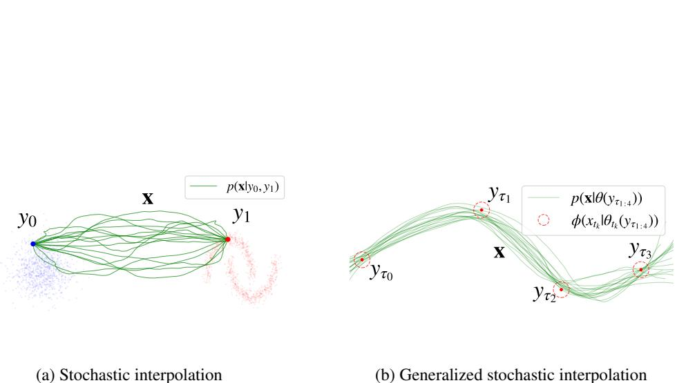
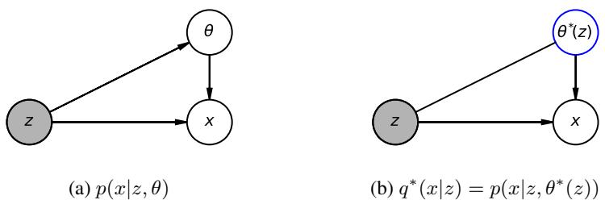

# On Flow-based Generative Models for Probabilistic Forecasting

Anonymous Author(s)   
Affiliation   
Address   
email

# Abstract

Flow-based generative models (FBGM) have emerged as a dominant approach to   
generative modeling in many domains for their scalability and controllability, but   
have notably not made the same impact on autoregressive probabilistic forecasting.   
Although the methodology behind these models can be applied directly to the time   
series setting, and in theory offers the potential to apply the advances in generative   
modeling to time series, this direct approach is difficult to use in practice. In this   
work, we investigate this methodological gap by generalizing the key elements of   
flow-based generative modeling to the time series setting to devise a more practical   
related algorithm. We show that FBGMs based on linear stochastic differential   
equations are instances of a more general mean-field variational inference algorithm   
for conditional exponential family distributions that constructs Bayes estimators   
of natural parameters. This insight yields a family of mean-squared error based   
latent probabilistic forecasters that contains a discrete time counterpart of FBGMs   
for time series. We demonstrate that the models we develop inherit the convenient   
theoretical properties of FBGMs while being easy to work with in practice.

# 16 1 Introduction

Flow-based generative models (FBGM), including denoising diffusion, score based diffusion, and   
flow matching models, have become the dominant approach to generative modeling. These models   
represent a stochastic differential equation (SDE) that transforms samples from a known prior   
distribution into samples from an unknown target distribution, and often use a different recipe   
for solving the generative modeling problem compared to traditional approaches. This alternative   
approach is highly scalable [Ramesh et al., 2022, Podell et al., 2023, Saharia et al., 2022], can leverage   
conditioning information in flexible ways [Dhariwal and Nichol, 2021, Ho and Salimans, 2022], and   
can be controlled in order to incorporate user defined dynamics [Liu et al., 2024, Domingo-Enrich   
et al., 2024, Havens et al., 2025]. Furthermore, FBGMs are capable of learning from paired data. If $x _ { 0 }$   
and $x _ { 1 }$ are samples from an unknown joint distribution $p ( x _ { 0 } , x _ { 1 } )$ , then one can use the same approach   
to construct an SDE whose transition distribution from $t = 0$ to $t = 1$ is $p ( x _ { 1 } | x _ { 0 } )$ [De Bortoli et al.,   
2023]. Given this capability, it directly folloconstruct an SDE to model time series data. If $\begin{array} { r } { p ( x _ { 1 : N } ) = \overbar { p ( x _ { 1 } ) } \prod _ { k = 1 } ^ { N - 1 } p ( x _ { k + 1 } \overbar { | x _ { 1 : k } ) } } \end{array}$ le, be used torepresents the   
unknown distribution of time series data, then each of the transition terms, $p ( x _ { k + 1 } | x _ { 1 : k } )$ , can be   
interpreted as a target distribution for a FBGM in the paired data setting where the data pairs are   
consecutive elements of the time series, $\left( { x } _ { k + 1 } , { x } _ { k } \right)$ , and the previous elements $x _ { 1 : k - 1 }$ can be thought   
of as extra conditioning information. In theory, learning this kind of model for time series would   
inherit the scalability and controllability that FBGMs possess, allowing practitioners to port over   
the recent advances in generative modeling to time series applications. However, this approach has   
surprisingly only recently been explored [Chen et al., 2024a, Tamir et al., 2024, Park et al., 2024,   
Chen et al., 2024b] even though diffusion based time series models have been studied for several   
years [Yang et al., 2024, Meijer and Chen, 2024]. We attribute this gap to the practical numerical   
difficulties associated with training and sampling from these models as one must first learn, and   
then simulate, a stochastic differential equation, with potentially non-smooth dynamics, over a long   
time domain compared to the short time domain encountered in standard generative modeling. To   
address this problem, we develop a discrete time version of Neural SDEs derived from FBGMs   
that are founded on the same theoretical principles, while being substantially easier to work with   
in practice. We do this by generalizing two key elements needed to construct FBGMs, stochastic   
interpolation and the Markovian projection, to the time series setting, where they become Gaussian   
condition random fields and a form of mean-field variational inference respectively. We construct a   
family of latent probabilistic time series models that are closely related to existing time series models,   
including MSE based non-probabilistic forecasters and conditional Gaussian autoregressive models,   
and compare their performance on various latent probabilistic forecasting problems.

# 50 2 Background

We will first review how flow-based generative models are constructed and then build intuition for   
how to go about generalizing this construction to the time series setting. Suppose that $p ( y _ { 0 } , y _ { 1 } )$ is a   
joint distribution over a source and target random variable. The (paired) generative modeling problem   
is to find a parametric approximation of $p ( y _ { 1 } | y _ { 0 } )$ 1. Flow-based generative models solve this problem   
by constructing, and then learning, a latent SDE whose transition distribution from times $t = 0$ to   
$t = 1$ is $p ( y _ { 1 } | y _ { 0 } )$ . There are three steps involved in constructing and learning this SDE - stochastic   
interpolation, the Markovian projection, and matching.   
Stochastic interpolation [Albergo and Vanden-Eijnden, 2023] is used to interpolate between proba  
bility distributions by defining interpolations between their samples. For example, consider the joint   
distribution $p ( x _ { 0 } , x _ { t } , x _ { 1 } )$ , where $\overset { \cdot } { x _ { t } } \overset { \cdot } { = } ( 1 - t ) \overset { \cdot } { x _ { 0 } } + t \overset { \cdot } { x _ { 1 } }$ and $( x _ { 0 } , x _ { 1 } ) \sim p ( x _ { 0 } , { \overset { \cdot } { x } } _ { 1 } )$ . By the definition   
of $x _ { t }$ , it is true that $p ( x _ { t = 1 } ) = p ( x _ { 1 } )$ , and also that $p ( x _ { t = 1 } | x _ { 0 } ) = p ( x _ { 1 } | x _ { 0 } )$ , so we verify that the   
marginal distribution of $x _ { t }$ interpolates between $p ( x _ { 0 } )$ and $p ( x _ { 1 } )$ . In practice, one assumes that at   
times $t = 0$ and $t = 1$ , $x _ { 0 } : = y _ { 0 }$ and $x _ { 1 } : = y _ { 1 }$ so that $p ( x _ { t } )$ is an interpolation between $p ( y _ { 0 } )$ and   
$p ( y _ { 1 } )$ .   
A popular method for constructing stochastic interpolants, which we use in this paper, is conditioning   
a user-defined base SDE, whose diffusion coefficient does not depend on the current state, to start at   
$x _ { 0 }$ and end at $x _ { 1 }$ . This SDE takes the form $d x _ { t } = b _ { t } ( x _ { t } ) d t + L _ { t } \bar { d W } _ { t }$ where $b _ { t } ( x _ { t } )$ is the drift of this   
base SDE and $L _ { t }$ is the diffusion coefficient. This SDE is used to construct a joint distribution of   
the form $p ( x _ { 0 } , x _ { t } , x _ { 1 } ) = p ( x _ { t } | x _ { 0 } , x _ { 1 } ) p ( x _ { 0 } , x _ { 1 } )$ where $p ( x _ { t } | x _ { 0 } , x _ { 1 } )$ is the probability of $x _ { t }$ when the   
base SDE has been conditioned to start at $x _ { 0 }$ and end at $x _ { 1 }$ . In order to solve the generative modeling   
problem of $p ( x _ { 1 } | x _ { 0 } )$ , FBGMs are constructed as an SDE whose marginal distribution is $p ( x _ { t } | x _ { 0 } )$ .   
This is accomplished using the Markovian projection.   
Proposition 1 (Markovian projection SDE [Shi et al., 2024]). Let $p ( x _ { 1 } | x _ { 0 } )$ be a conditional distribu  
tion over target variables given source variables and let $p ( x _ { t } | x _ { 0 } , x _ { 1 } )$ denote the distribution of the   
base SDE $d x _ { t } = b _ { t } ( x _ { t } ) d t + L _ { t } d W _ { t }$ when conditioned to start at $x _ { 0 }$ and end at $x _ { 1 }$ . The “Markovian   
projection $S D E '$ is an $S D E$ whose marginal distribution, denoted by $q ^ { * } ( x _ { t } | x _ { 0 } )$ is equal to $p ( x _ { t } | x _ { 0 } )$   
It is given by:

$$
\begin{array} { r } { d \boldsymbol { x } _ { t } = \left( b _ { t } ( \boldsymbol { x } _ { t } ) + L _ { t } L _ { t } ^ { T } \mathbb { E } _ { p ( x _ { 1 } | x _ { 0 } , x _ { t } ) } \left[ \nabla \log p ( x _ { 1 } | x _ { 0 } , x _ { t } ) \right] \right) d t + L _ { t } d \boldsymbol { W } _ { t } } \end{array}
$$

See Prop 3. of [De Bortoli et al., 2023] for a proof. Proposition 1 is a solution to the paired generative   
modeling problem because $q ^ { * } ( x _ { t = 1 } | x _ { 0 } ) = p ( x _ { 1 } | x _ { 0 } ) : = p ( y _ { 1 } | y _ { 0 } )$ . Given a sample from the source   
distribution, $x _ { 0 } \sim p ( x _ { 0 } )$ , we can simulate the SDE from $t = 0$ to $t = 1$ to generate a sample from the   
target distribution. However, this SDE contains an intractable drift term that depends on the posterior   
distribution of $x _ { 1 }$ given $x _ { 0 }$ and $x _ { t }$ . This is addressed using a matching learning objective. For   
example, in score matching, [Vincent, 2011, Song et al., 2021], one writes the drift in the following   
variational form:

$$
\nabla \log q ^ { * } ( x _ { t } | x _ { 0 } ) = \underset { s _ { t } ( x _ { t } , x _ { 0 } ) } { \mathrm { a r g m i n } } \mathbb { E } _ { p ( x _ { 0 } , x _ { 1 } , x _ { t } ) } \left[ \left\| L _ { t } L _ { t } ^ { T } \nabla \log p ( x _ { 1 } | x _ { 0 } , x _ { t } ) - s _ { t } ( x _ { t } , x _ { 0 } ) \right\| ^ { 2 } \right]
$$

If $s ( x _ { t } , x _ { 0 } ; \theta )$ is parameterized by a neural network, then one can minimize this expectation using   
the standard machine learning toolkit to find the Markovian projection SDE. However, obtaining a   
Monte Carlo estimate of the expectation for stochastic gradient descent requires being able to sample   
from $p ( x _ { 0 } , x _ { 1 } , x _ { t } )$ , which requires simulation of the base SDE. As such, the base SDE is chosen so   
that this distribution is tractable. After training is complete, then the flow-based generative model is   
given by the SDE $d x _ { t } = \bigl ( b _ { t } \bigl ( x _ { t } \bigr ) + L _ { t } L _ { t } ^ { T } s _ { t } \bigl ( \overset { \sim } { x } _ { t } , x _ { 0 } \bigr ) \bigr ) \dot { d t } + L _ { t } d W _ { t }$ . In general, matching algorithms,   
such as score matching, drift matching and bridge matching, are algorithms for learning the Bayes   
estimator of a random variable because of the well known relationship between posterior expectations   
and mean squared error [Jaynes, 2003]:   
Proposition 2 (Bayes estimate of parameter). Let $p ( z , \theta )$ be a joint distribution and let $\theta ^ { * } ( z )$ be   
the Bayes estimate of $\theta$ based on $z$ under the squared error risk. Then the Bayes estimate takes the   
following two forms:

$$
\theta ^ { * } ( z ) = \mathbb { E } _ { p ( \theta | z ) } [ \theta ] = \underset { f ( z ) } { \mathrm { a r g m i n } } ~ \mathbb { E } _ { p ( z , \theta ) } \left[ \| f ( z ) - \theta \| ^ { 2 } \right]
$$

See Appendix C.3 for a derivation. In score matching, one would have $\boldsymbol { z } ~ = ~ ( x _ { 0 } , x _ { t } )$ and $\theta =$   
$\nabla \log p ( x _ { 1 } | x _ { 0 } , x _ { t } )$ , while other matching approaches, such as flow matching [Albergo and Vanden  
Eijnden, 2023, Lipman et al., 2023, Liu et al., 2023] and bridge matching [Shi et al., 2024].   
Given the strong theoretical, interpretability, and empirical results of FBGMs, one might expect   
that a direct application to time series would inherit the same benefits. However, this approach has   
surprisingly only recently been explored [Chen et al., 2024a,b, Tamir et al., 2024, Park et al., 2024]   
even though diffusion based time series models have been studied in a different manner for several   
years [Yang et al., 2024, Meijer and Chen, 2024]. We attribute this gap to the challenges that the time   
series setting presents to flow-based methods compared to settings such as image generation. In the   
standard image generation setting, there is no coupling between the prior and data distributions, and   
so one can learn SDEs that can be easily simulated with a few number of function evaluations [Liu   
et al., 2023, Pooladian et al., 2023]. However, SDEs that are constructed to model time series data   
present a challenge during inference due to compounding numerical errors that are attributed to either   
a mismatch between the learned model and data, or due to the numerical solver itself, get accumulated   
during generation which can lead to poor performance in practice. Discrete time autoregressive   
models, on the other hand, do not suffer from these issues to the extent that Neural SDEs do and are   
much more widely used in practice. With this in mind, we aim to understand find a discrete time   
version of FBGMs for time series that will work better in practice.

# 3 Method

We present a generalization of the FBGM construction for the time series setting.

# 3.1 Generalized linear stochastic interpolation

Recall that stochastic interpolation constructs a distribution over a latent stochastic process, which we denote by $\mathbf { x }$ , that is sampled from a base SDE that is conditioned to start at $x _ { 0 } : = y _ { 0 }$ and end at $x _ { 1 } : = y _ { 1 }$ . Our generalization of stochastic interpolation is founded on the observation that many of the base SDEs used in practice are linear SDEs, and that the FBGM recipe is unchanged if we introduce Gaussian potential functions to relax the endpoint conditions. Since linear SDEs have Gaussian transition distributions, they can naturally be combined with these Gaussian potentials to construct a Gaussian conditional random field. This conditional random field will serve as our tool for stochastic interpolation, which we call “generalized linear stochastic interpolation”.

Let $y _ { \tau _ { 1 : T } }$ denote time series data that is generated by an unknown distribution $p ( y _ { \tau _ { 1 : T } } )$ . For brevity,   
we assume that $\tau _ { 1 : T }$ is the same for all time series, but note that our theory accommodates datasets   
with series sampled at different times. We will construct, and perform inference, in the distribution   
$p ( \mathbf { x } | y _ { \tau _ { 1 : T } } )$ , which we will obtain by conditioning a linear SDE on user defined Gaussian potential   
functions. The potential function at time $t _ { k } \in \mathcal { R }$ will be denoted by $\phi ( x _ { t _ { k } } | \theta _ { t _ { k } } ( y _ { \tau _ { 1 : T } } ) )$ , where $\theta _ { t _ { k } }$ the   
the natural parameter of the Gaussian that arbitrarily depends on $y _ { \tau _ { 1 : T } }$ . See Appendix C for a review of   
exponential family distributions. We also use the notation $\phi _ { k + 1 | k } ( \stackrel {  } { x _ { k + 1 } } | x _ { k } ) = N ( x _ { k + 1 } | A x _ { k } + u , \Sigma )$   
to denote a Gaussian transition distribution from $x _ { k }$ to $x _ { k + 1 }$ with state transition matrix $A$ , bias   
134 vector $u$ and covariance matrix $\Sigma$ .

  
Figure 1: Generalized stochastic interpolation incorporates Gaussian potential functions to relax the endpoint conditions of stochastic interpolation and is applied to time series data.

# 135 3.1.1 Gaussian conditional random fields

36 Chain structured Gaussian CRFs are a tractable class of probabilistic models that are widely used in   
time series modeling (CITE):   
Definition 1 (Conditional Random Field [Lafferty et al., 2001, Sutton et al., 2012]). Let $x _ { 1 : N }$ be a   
sequence of random variables, $\phi _ { k + 1 | k } \big ( x _ { k + 1 } | x _ { k } \big )$ be a set of Gaussian transition distributions between   
consecutive variables, and $\phi ( x _ { k } | \theta _ { k } )$ a set of Gaussian potential functions with natural parameters   
$\theta _ { k } \in \theta$ . A conditional random field (CRF) is a probability distribution given by:

$$
p ( x _ { 1 : N } | \theta ) \propto \prod _ { k = 1 } ^ { N - 1 } \phi _ { k + 1 | k } ( x _ { k + 1 } | x _ { k } ) \prod _ { k = 1 } ^ { N } \phi ( x _ { k } | \theta _ { k } )
$$

Due to the chain-structure of $p ( x _ { 1 : N } | \theta )$ and the fact it is jointly Gaussian, inference can be performed   
efficiently using message passing. The backward messages, defined below, will play a significant role   
in our theory:   
Proposition 3 (Backward messages). The $k$ ’th backward message associated with the CRF in   
Definition $^ { l }$ is defined with the following recurrence relation:

$$
\phi ( x _ { k - 1 } | \beta _ { k - 1 } ) = \int \phi _ { k | k - 1 } ( x _ { k } | x _ { k - 1 } ) \phi ( x _ { k } | \theta _ { k } + \beta _ { k } ) d x _ { k } , \quad \beta _ { N } = 0
$$

where $\theta _ { k + 1 } + \beta _ { k + 1 }$ denotes the direct sum of $\theta _ { k + 1 }$ and $\beta _ { k + 1 }$ . This recurrence also uniquely identifies   
a function, denoted by $\Phi _ { k , k + 1 }$ that performs the parameter updates as:

$$
\beta _ { k } = \Phi _ { k , k + 1 } ( \theta _ { k + 1 } + \beta _ { k + 1 } )
$$

Note that each $\beta _ { k }$ is a function of $\theta _ { k + 1 : N }$ . See Appendix $\mathbf { D }$ for a full derivation of sequential and   
parallel message passing, and Appendix $_ \mathrm { H }$ for pseudo code and implementation considerations.   
Although we do not focus on the forward messages, they are defined with analogous recurrence   
relations to the backward messages and can be used to extend our methodology to flow-matching   
models for time series forecasting (see Corollary 5). CRFs offer an efficient way to model the latent   
variables at a fixed set of times, but are not immediately suited for continuous time.

# 3.1.2 Linear time-invariant stochastic differential equations

We will use linear-time invariant SDEs to construct the transition distributions of continuous time   
CRFs. Linear time-invariant SDEs (LTI-SDEs) are SDEs of the form $d x _ { t } = F x _ { t } d t + L d W _ { t }$ , where   
the drift matrix $F$ and diffusion coefficient matrix $L$ are constant with respect to $t$ and $x _ { t }$ . LTI-SDEs   
have the convenient property that their transition distribution is available in closed form [Särkkä and   
Solin, 2019, Singhal et al., 2023]. The transition distribution from $x _ { t }$ to $x _ { t + s }$ , where $s > 0$ is an   
increment of time, is given by

$$
\phi _ { t + s | t } ( x _ { t + s } | x _ { t } ) = N ( x _ { t + s } | A _ { s } x _ { t } , \Sigma _ { s } ) , \quad \mathrm { w h e r e ~ } \left[ \begin{array} { l l } { A _ { s } } & { \Sigma _ { s } A _ { s } ^ { - T } } \\ { 0 } & { A _ { s } ^ { - T } } \end{array} \right] : = \exp \left\{ \left[ \begin{array} { l l } { F } & { L L ^ { T } } \\ { 0 } & { - F ^ { T } } \end{array} \right] s \right\}
$$

We use LTI-SDEs for their tractability, but note that our theory is completely compatible with more   
general linear SDEs. One can directly plug in this transition distribution into a CRF in Definition 1 to   
obtain a conditional random field over a continuous time domain. However, we can be more general.   
In the next proposition, we highlight a relationship between conditioned linear SDEs and CRFs   
([Särkkä et al., 2006, Särkkä and Solin, 2019]):   
Proposition 4 (Conditioned LTI-SDE). Let $\phi _ { t + s | t } ( x _ { t + s } | x _ { t } )$ be the transition distribution of the   
LTI-SDE $d x _ { t } = F x _ { t } d t + L d W _ { t }$ and let $\{ \phi ( x _ { t _ { k } } | \theta _ { t _ { k } } ) \} _ { t _ { k } \in \mathcal { R } }$ be potential functions at times in the set   
$\mathcal { R }$ . Then the piecewise-linear $S D E$ ,

$$
d \boldsymbol { x } _ { t } = \big ( F \boldsymbol { x } _ { t } + L L ^ { T } \nabla \log \phi ( \boldsymbol { x } _ { t } | \beta _ { t } ) \big ) d t + L d \boldsymbol { W } _ { t } , \quad \boldsymbol { x } _ { t _ { 1 } } \sim \phi \big ( \boldsymbol { x } _ { t _ { 1 } } | \beta _ { 1 } + \theta _ { 1 } \big )
$$

where $t \in ( t _ { k } , t _ { k + 1 } )$ and $t _ { k } , t _ { k + 1 } \in \mathcal { R }$ , has a joint distribution at the times $t _ { 1 : N } = \mathcal { T } \supseteq \mathcal { R }$ that is   
given by a CRF:

$$
p ( x _ { t _ { 1 : N } } | \theta ) \propto \prod _ { t _ { k } \in \mathcal { T } } \phi _ { t _ { k + 1 } | t _ { k } } ( x _ { t _ { k + 1 } } | x _ { t _ { k } } ) \prod _ { t _ { k } \in \mathcal { R } } \phi ( x _ { t _ { k } } | \theta _ { t _ { k } } )
$$

where 172 $\beta _ { t } = \Phi _ { t , t _ { k + 1 } } ( \theta _ { t _ { k + 1 } } + \beta _ { t _ { k + 1 } } )$ .

See appendix Appendix E.1 for the full proof and Corollary 5 for a nice expression for the associated   
probability flow ODE in terms of both the forward and backward messages. Proposition 4 suggests   
that a practical way to work with conditioned linear SDEs in practice is convert them into CRFs on a   
discretization of the time domain so that inference can be performed via message passing. This results   
in the ability to sample and perform inference in linear SDEs $O ( \log | \tau | )$ time on parallel compute   
[Hassan et al., 2021, Corenflos et al., 2021, Smith et al., 2023]. The conditioned SDE Proposition 4   
is our main tool for stochastic interpolation as it gives us the ability to sample from $p ( \mathbf { x } | \boldsymbol { \theta } ( y _ { \tau _ { 1 : T } } ) )$ at   
an arbitrary discretization of the time domain.

# 181 3.2 Target probabilistic model for FBGM

Recall that in the FBGM recipe, we used the stochastic interpolation to construct a joint distribution   
over the interpolant and the data, $p ( y _ { 0 } , x _ { t } , y _ { 1 } )$ , before performing the Markovian projection. We can   
take the same step here to construct a joint distribution over $y _ { \tau _ { 1 : T } }$ and $\mathbf { x }$ using the data distribution,   
$p ( y _ { \tau _ { 1 : T } } )$ and the distribution of the interpolant, $p ( \mathbf { x } | y _ { \tau _ { 1 : T } } ) : = p ( \mathbf { \bar { x } } | \theta ( y _ { \tau _ { 1 : T } } ) )$ .   
Definition 2 (Target joint distribution). Let $p ( y _ { \tau _ { 1 : T } } )$ be the distribution of observed time series data   
and let $p ( \mathbf { x } | y _ { \tau _ { 1 : T } } )$ be the distribution of the generalized linear stochastic interpolant, which is the   
distribution of a linear SDE conditioned on the user defined potential functions $\{ \theta _ { t _ { k } } ( y _ { \tau _ { 1 : T } } ) \} _ { t _ { k } \in \mathcal { R } }$ at   
the times $\mathcal { R }$ , as in Proposition 4. Then the induced joint distribution over x at the times $t _ { 1 : N } = \mathcal { T } \supset \mathcal { R }$   
and $y _ { \tau _ { 1 : T } }$ is given by:

$$
p ( x _ { t _ { 1 : N } } , y _ { \tau _ { 1 : T } } ) = p ( y _ { \tau _ { 1 : T } } ) \left( { \frac { 1 } { Z ( y _ { \tau _ { 1 : T } } ) } } \prod _ { t _ { k } \in T } \phi _ { t _ { k + 1 } | t _ { k } } ( x _ { t _ { k + 1 } } | x _ { t _ { k } } ) \prod _ { t _ { k } \in { \mathcal R } } \phi ( x _ { t _ { k } } | \theta _ { t _ { k } } ( y _ { \tau _ { 1 : T } } ) ) \right)
$$

where 191 $Z ( y _ { \tau _ { 1 : T } } )$ is the partition function of $p ( x _ { t _ { 1 : N } } | y _ { \tau _ { 1 : T } } )$ .

Before continuing, it is crucial that we understand this joint distribution and the role it plays in   
the FBGM recipe. Unlike the standard approach to generative modeling where one defines a joint   
distribution by defining a prior over the latent variable and a likelihood distribution over the data,   
the FBGM uses an alternate construction to build $p ( \mathbf { x } , y _ { \tau _ { 1 : T } } )$ using the data distribution directly.   
Furthermore, the tools FBGMs employ are fundamentally designed for probabilistic inference in   
$\mathbf { x }$ instead of $y _ { \tau _ { 1 : T } }$ . Since $\mathbf { x }$ is completely user designed through the choice of base LTI-SDE and   
potential functions, we are able to solve a wide range time series problems.

Suppose we split each sequence of data into observed and unobserved portions, $y _ { \tau _ { 1 : T } } = ( y _ { \mathcal { O } } , y _ { \mathcal { U } } )$ , where $y _ { \mathcal { O } }$ is a subsequence that we observe at both train and test time while $y u$ is only observed at training time, as is the case in time series forecasting.2 The ability to perform inference in $p ( \mathbf { x } | \boldsymbol { y } _ { \mathcal { O } } )$ would solve a general latent probabilistic forecasting problem that reduces to the standard forecasting problem if the Gaussian potential functions are chosen as dirac delta functions -

  
Figure 2: The CMFVI approximation of $p ( x | z )$ is $q ^ { * } ( x | z )$ . Choosing $( x , z , \theta ) = ( x _ { t _ { 1 : N } } , y _ { \mathcal { O } } , \theta ( y _ { \tau _ { 1 : T } } ) )$ recovers $q ^ { \mathrm { M S E } }$ , $\begin{array} { c c l } { ( x , z , \theta ) } & { = } & { \left( x _ { t _ { k } } , ( x _ { t _ { 1 : k - 1 } } , y _ { \mathcal { O } } ) , \theta ( y _ { \tau _ { 1 : T } } ) \right) } \end{array}$ recovers $q ^ { \mathrm { M S E - A R } }$ 1:N and $\begin{array} { r l } { ( x , z , \theta ) } & { { } = } \end{array}$ $\begin{array} { r } { \operatorname* { l i m } _ { s \to 0 } ( x _ { t + s } , ( x _ { t } , x _ { t _ { 1 : k - 1 } } , y _ { \mathcal { O } } ) , \theta ( y _ { \tau _ { 1 : T } } ) ) } \end{array}$ for $t \in \left( t _ { k } , t _ { k + 1 } \right)$ recovers $q ^ { \mathrm { N e u r a l - S D E } }$ .

$\phi ( x _ { t _ { k } } | \theta _ { t _ { k } } ( y _ { \tau _ { 1 : T } } ) ) : = \delta ( x _ { t _ { k } } - y _ { t _ { k } } )$ . For example, if one chooses the LTI-SDE to be the Wiener ve  
locity model [Särkkä and Solin, 2019, Särkkä et al., 2006] and potential functions of the form   
$\phi ( x _ { t _ { k } } | \theta ( y _ { \tau _ { 1 : T } } ) ) \propto N ( x _ { t _ { k } } | y _ { t _ { k } } , \sigma ^ { 2 } I )$ , then inference in $p ( \mathbf { x } | \boldsymbol { y } _ { \mathcal { O } } )$ corresponds to forecasting the   
smoothed position and velocity of the particle whose positions were observed at $y _ { \tau _ { 1 : T } }$ . However,   
$p ( \mathbf { x } | \boldsymbol { y } _ { \mathcal { O } } )$ is intractable because $p ( y _ { \tau _ { 1 : T } } )$ is arbitrary. To this end, we develop variational inference   
209 algorithms for this task.

# 3.3 Neural latent SDE for latent probabilistic forecasting

The first inference algorithm we develop is a direct extension of flow-based generative models to the latent probabilistic forecasting setting. For a fixed discretization of the time domain, we can treat consecutive latent variables $( x _ { t _ { k } } , x _ { t _ { k + 1 } } )$ as elements of a paired dataset with the previous elements $x _ { t _ { 1 : k - 1 } }$ and observations $y _ { \mathcal { O } }$ as extra conditioning information. This lets us directly apply the existing FBGM recipe to construct a conditional, piecewise SDE to solve the latent probabilistic forecasting problem.

17 Proposition 5 (Neural latent SDE). Let $p ( x _ { t _ { 1 : N } } , y _ { \tau _ { 1 : T } } )$ be the joint distribution defined in Definition 2   
and suppose that $y _ { \tau _ { 1 : T } } = ( y _ { \mathcal { O } } , y _ { \mathcal { U } } )$ , where $\mathcal { O }$ and $\mathcal { U }$ are the times at which sequences are observed   
and unobserved at test time, respectively. Then the neural latent $S D E$ is the following piecewise $S D E$ :

$$
\begin{array} { r l } & { \qquad d _ { t } = ( F _ { t } x _ { t } + L _ { t } L _ { t } ^ { T } \nabla \log \phi ( x _ { t } | \beta _ { t } ^ { * } ( x _ { t } , x _ { t _ { 1 : k } } , y \mathcal { O } ) ) ) d t + L _ { t } d W _ { t } , } \\ & { w h e r e \beta _ { t } ^ { * } ( x _ { t } , x _ { t _ { 1 : k } } , y \mathcal { O } ) = \mathbb { E } _ { p ( y u | x _ { t } , x _ { t _ { 1 : k } } , y \mathcal { O } ) } \left[ \beta _ { t } ( y _ { \tau _ { 1 : T } } ) \right] , \ a n d t \in ( t _ { k } , t _ { k + 1 } ) } \end{array}
$$

Furthermore, the transition distribution of this SDE from time 220 $t _ { k }$ to $t _ { k + 1 }$ is $p ( x _ { t _ { k + 1 } } | x _ { t _ { 1 : k } } , y _ { \mathcal { O } } )$ . We will use 221 $q ^ { N e u r a l - S D E }$ to denote the path measure associated to this $S D E$ .

See Appendix G.2 for a proof and Appendix G for the general constructions of the score function,   
Markovian projection SDE and probability flow ODE. By construction, Proposition 5 can be used to   
solve the latent probabilistic forecasting problem because it has the correct joint distribution over the   
latent space. Furthermore, its form is almost identical to that of its base LTI-SDE in Proposition 4,   
except that its parameter, $\beta ^ { * }$ , is the Bayes estimator of a backward message. We will show next that   
models of this form can be derived by solving a constrained mean-field variational inference problem.

# 3.4 Constrained mean-field variational inference

Next we introduce our main contribution which is the variational inference algorithm underlying FBGMs, which we call “constrained mean-field variational inference”. Given a conditional exponential family distribution $p ( x | z , \theta )$ , CMFVI constructs a variational approximation of $p ( x | z )$ that is given by $p ( x | z , \theta ^ { * } ( z ) )$ where $\theta ^ { * } ( z )$ is the Bayes estimator of $\theta$ given $z$ . We first introduce CMFVI in an abstract way and then show how it can be used to do variational inference on the latent probabilistic forecasting distribution, $p ( x _ { t _ { 1 : N } } | y _ { \mathcal { O } } )$ .

Suppose that $z$ is a random variable, $\theta \sim p ( \theta | z )$ is the natural parameter of an exponential family   
distribution, and $x \sim p ( x | z , \theta )$ is a random variable drawn from a conditional exponential family of   
the form $p ( x | z , \theta ) = \exp \{ \langle t _ { z } ( x ) , \theta \rangle - A ( z , \theta ) \}$ . For intuition, assume that $x$ represents the future of a   
stochastic process, $z$ represents its past , and $\theta$ represents the parameters of this process. Furthermore,   
suppose that the parameters are only available at training time so that at test time, sampling $x$ given   
$z$ requires the ability to sample from $p ( x | z )$ . Our goal is to predict the future of the process given   
its past, which requires the ability to sample from $p ( x | z )$ , however this distribution is intractable   
because $p ( \boldsymbol { \theta } | z )$ is arbitrary. To this end, we introduce a variational approximation of $p ( x | z )$ using an   
algorithm closely resembling mean field variational inference, which we call “constrained mean field   
244 variational inference” (CMFVI):

45 Theorem 1 (Constrained mean field VI solution). Let $p ( x | z , \theta ) \propto \exp \{ \langle t _ { z } ( x ) , \theta \rangle - A ( z , \theta ) \}$ be 46 a conditional exponential family distribution with $\theta \sim p ( \theta | z )$ . The constrained mean field ${ \cal V } I$ approximation of 247 $p ( x | z )$ , denoted by $q ^ { * } ( x | z )$ , is defined as follows:

$$
\begin{array} { r l } & { q ^ { * } ( x | z ) = \underset { q ( x | z ) } { \mathrm { a r g m i n K L } } \left[ q ( x | z ) p ( \theta | z ) \lVert p ( x , \theta | z ) \right] } \\ & { ~ = p ( x | z , \theta ^ { * } ( z ) ) , ~ w h e r e \theta ^ { * } ( z ) = \mathbb { E } _ { p ( \theta | z ) } \left[ \theta \right] } \end{array}
$$

See Appendix F.1 for a proof, Lemma 4 for equivalent expressions for the objective involving   
$\mathrm { K L } [ q ^ { * } ( x | z ) | | p ( x | z ) ]$ and a term resembling the mutual information between $x$ and $\theta$ given $z$ . The   
parameter $\theta ^ { * } ( z )$ is the Bayes estimator of $\theta$ given $z$ and by Proposition 2 can be learned using mean   
squared error minimization, provided that it is possible to sample from $p ( z , \theta )$ . While this variational   
approximation is tractable, it seems restrictive because it is a conditional random field and only exact   
when $\theta$ and $x$ are conditionally independent given $z$ . However, this may not be a terrible assumption   
in the time series setting. If the process is deterministic, then we should be able to compute $x$ directly   
from $z$ without needing to know $\theta$ , and so this independence assumption will hold because one will   
be able to compute the future values of the process directly from its past. In fact, in Corollary 8,   
we show that a direct application of CMFVI to $p ( x _ { t _ { 1 : N } } | y _ { \mathcal { O } } )$ , by selecting $\boldsymbol { x } = \boldsymbol { x } _ { t _ { 1 : N } }$ , $z = y o$ and   
$\theta = \theta ( y _ { \tau _ { 1 : T } } )$ , exactly recovers MSE based non-probabilistic forecasters, which are clearly capable of   
learning deterministic processes (see Corollary 8). We denote the model in Corollary 8 by $\overset { \cdot } { q } ^ { \mathrm { M S E } }$ . In   
general, provided that the process is not too stochastic, we might expect that given a long enough   
history and a short enough prediction horizon that CMFVI could yield a reasonable approximation of   
$p ( x | z )$ , and perhaps with an infinitely short prediction horizon we may recover something exactly.   
This intuition motivates the use of CMFVI for learning the autoregressive factors of $p ( x _ { t _ { 1 : N } } | y _ { \mathcal { O } } )$ in   
order to construct an autoregressive model to solve the probabilistic forecasting problem.   
265 Suppose that $p ( x _ { t _ { k } } | x _ { t _ { 1 : k - 1 } } , y _ { \mathcal { O } } )$ is one of the autoregressive factors of the latent forecasting distri  
66 bution $p ( x _ { t _ { 1 : N } } | y _ { \mathcal { O } } )$ . We can use CMFVI to approximate each of the $k$ factors by setting $\boldsymbol { x } = \boldsymbol { x } _ { t _ { k } }$ ,   
$z = ( x _ { t _ { 1 : k - 1 } } , y _ { \mathcal { O } } )$ and $\theta = \theta ( y _ { \tau _ { 1 : T } } )$ :

Proposition 6 (CMFVI transition approximation). Let $p ( x _ { t _ { 1 : N } } | y _ { \mathcal { O } } )$ be the target distribution and consider its $k$ ’th autoregressive factor $p ( x _ { t _ { k } } | x _ { t _ { 1 : k - 1 } } , y _ { \mathcal { O } } )$ . Then the CMFVI transition approximation is given by:

$$
q ^ { t r a n s i t i o n } ( x _ { t _ { k } } | x _ { t _ { 1 : k - 1 } } , y _ { \mathcal { O } } ) \propto \phi _ { t _ { k } | t _ { k - 1 } } ( x _ { t _ { k } } | x _ { t _ { k - 1 } } ) \phi ( x _ { t _ { k } } | \beta _ { t _ { k } } ^ { * } ( x _ { t _ { 1 : k - 1 } } , y _ { \mathcal { O } } ) )
$$

where 271 $\begin{array} { r } { \beta _ { t _ { k } } ^ { * } ( x _ { t _ { 1 : k - 1 } } , y _ { \mathcal { O } } ) = \mathbb { E } _ { p ( y _ { \mathcal { U } } \mid x _ { t _ { 1 : k - 1 } } , y _ { \mathcal { O } } ) } \left[ \beta _ { t _ { k } } ( y _ { \tau _ { 1 : T } } ) \right] } \end{array}$ is the Bayes estimate of $\beta _ { t _ { k } } ( y _ { \tau _ { 1 : T } } )$ , which is defined using the message passing update operator 272 $\Phi _ { t _ { k } , t _ { k + 1 } }$ from Definition $7 a s$ :

$$
\begin{array} { r } { \beta _ { t _ { k } } = \left\{ \begin{array} { l l } { \Phi _ { t _ { k } , t _ { k + 1 } } ( \beta _ { t _ { k + 1 } } ( y _ { \tau _ { 1 : T } } ) + \theta _ { t _ { k + 1 } } ( y _ { \tau _ { 1 : T } } ) ) } & { i f t _ { k + 1 } \in \mathcal { R } } \\ { \Phi _ { t _ { k } , t _ { k + 1 } } ( \beta _ { t _ { k + 1 } } ( y _ { \tau _ { 1 : T } } ) ) } & { o t h e r w i s e } \end{array} \right. } \end{array}
$$

See Proposition 6 for a proof. The form of Proposition 6 almost exactly matches the transition   
distribution of $p ( x _ { t _ { 1 : N } } | y _ { \tau _ { 1 : T } } )$ in Proposition 12, except that the backward messages are replaced with   
their Bayes estimators. We will use $\stackrel { - } { q } ^ { \mathrm { t r a n s i t i o n } }$ to construct an autoregressive approximation model that   
will be a discrete time version of the Markovian projection SDE.   
To use CMFVI to construct a discrete time version of FBGMs for time series, we will need to   
make the assumption that the covariances of the potential functions are independent of the values   
of $y _ { \tau _ { 1 : T } }$ . This assumption holds in both the data space forecasting setting where we use dirac delta   
potential functions, and also in the case where the CRF is constructed as a linear dynamical system   
with constant observation noise. In this setting, it is also possible to rewrite $q ^ { \mathrm { N e u r a l \ S D E } }$ in a more   
interpretable form where the only unknown value is the mean of the next backward message:   
Corollary 1 (Neural latent SDE using potentials with fixed covariances). If the covariance matrices   
associated with qNeural $S D E$ are constant with respect to $y$ , then the SDE associated with qNeural $S D E$ is:

$$
d \boldsymbol { x } _ { t } = \big ( F _ { t } \boldsymbol { x } _ { t } + L _ { t } L _ { t } ^ { T } \nabla \log N ( \boldsymbol { x } _ { t } | \mu _ { t } ^ { \beta ^ { * } } ( \boldsymbol { x } _ { t } , \boldsymbol { x } _ { t _ { 1 : k - 1 } } , \boldsymbol { y } _ { \mathcal { O } } ) , \boldsymbol { \Sigma } _ { t } ^ { \beta } ) \big ) d t + L _ { t } d W _ { t }
$$

where 285 $t \in ( t _ { k - 1 } , t _ { k } )$ , $\Sigma _ { t } ^ { \beta }$ is the covariance of $\phi ( x _ { t } | \beta _ { t } ( y _ { \tau _ { 1 : T } } ) )$ and $\mu _ { t } ^ { * } ( x _ { t } , x _ { t _ { 1 : k - 1 } } , y _ { \mathcal { O } } )$ is the Bayes 86 estimator for it’s mean.

The result follows directly from converting $\beta _ { t _ { k } }$ from natural parameters to standard parameters of a Gaussian and the linear equivariance of the Bayes estimator Appendix F.2. Note that by our assumption that the parameters of the potential functions do not depend on $y _ { \tau _ { 1 : T } } , \Sigma _ { t } ^ { \beta }$ can be computed by performing message passing on $p \bar { ( } x _ { t _ { 1 : N } } | \mathcal { D } _ { \tau _ { 1 : T } } )$ , where $\mathcal { D } _ { \tau _ { 1 : T } }$ is an empty (or random) sequence sampled at the same times as $y _ { \tau _ { 1 : T } }$ .

# 3.5 Discrete time Markovian projection

We propose an conditional Gaussian autoregressive model whose transition distributions are given by $q ^ { \mathrm { t r a n s i t i o n } }$ , which we denote by $q ^ { \mathrm { M S E - A R } }$ . We will directly relate it to Markovian projection SDE $q$ Neural-SDE by associating $q ^ { \mathrm { M S E - A \mathbf { \check { R } } } }$ with a piecewise linear SDE that closely resembles $q ^ { \mathrm { \tilde { N e u r a l - S D E } } }$ .

Proposition 7 (Autoregressive CMFVI solution). Let $p ( x _ { t _ { 1 : N } } | y _ { \mathcal { O } } )$ be the target distribution, assume that the covariance matrices of its potential functions are constant with respect to $y$ . The autoregressive model whose transitions are CMFVI solution, denoted by $q ^ { M S E - A R }$ is given by:

$$
q ^ { M S E - A R } ( x _ { t _ { 1 : N } } | y _ { \mathcal { O } } ) \propto p ( x _ { t _ { 1 } } | y _ { \mathcal { O } } ) \prod _ { t _ { k } \in \mathcal { T } } \phi _ { t _ { k } | t _ { k - 1 } } ( x _ { t _ { k } } | x _ { t _ { k - 1 } } ) N ( x _ { t _ { k } } | { \mu _ { t _ { k } } ^ { \beta } } ^ { * } ( x _ { t _ { 1 : k - 1 } } , y _ { \mathcal { O } } ) , \Sigma _ { t _ { k } } ^ { \beta } )
$$

where 299 $\Sigma _ { t _ { k } } ^ { \beta }$ and $\mu _ { t _ { k } } ^ { \beta } { } ^ { * } ( x _ { t _ { 1 : k - 1 } } , y _ { \mathcal { O } } )$ are the same as in Corollary 1. Furthermore, $q ^ { M S E - A R }$ has the same 300 joint distribution over $x _ { t _ { 1 : N } }$ as the following piecewise linear SDE:

$$
d \boldsymbol { x } _ { t } = \big ( F _ { t } \boldsymbol { x } _ { t } + L _ { t } L _ { t } ^ { T } \nabla \log N ( x _ { t } | \mu _ { t } ^ { \beta ^ { * } } ( x _ { t _ { 1 : k - 1 } } , y \boldsymbol { \sigma } ) , \Sigma _ { t } ^ { \beta } ) \big ) d t + L _ { t } d \boldsymbol { W } _ { t } , \quad \boldsymbol { x } _ { t _ { 1 } } \sim p ( x _ { t _ { 1 } } | y \boldsymbol { \sigma } )
$$

where $\mu _ { t } ^ { * } ( x _ { t _ { 1 : k - 1 } } , y _ { \mathcal { O } } )$ is the Bayes estimator for the mean of $\beta _ { t } ( y _ { \tau _ { 1 : T } } ) = \Phi _ { t , t _ { k } } ( \beta _ { t _ { k + 1 } } ( y _ { \tau _ { 1 : T } } ) )$ , $\Sigma _ { t } ^ { \beta }$ is its covariance matrix and $t \in ( t _ { k - 1 } , t _ { k } )$ for $k = 2 , \ldots , T$ .

See Appendix F.3 and Definition 9 for a proof. A comparison of the piecewise linear SDE associated   
with $q ^ { \mathrm { \tilde { M S E } - A R } }$ with the piecewise SDE associated to $q ^ { \mathrm { N e u r a l - S D E } }$ reveals why we interpret $q ^ { \mathrm { M S E - A R } }$ as the   
discrete time version of the Markovian projection SDE. We can see that the only difference between   
the two SDEs are their Bayes estimators for $\mu _ { t } ^ { \beta } ( y _ { \tau _ { 1 : T } } )$ :

$$
\begin{array} { r l } & { \quad q ^ { \mathrm { M S E - A R } } : \mu _ { t } ^ { \beta ^ { * } } ( x _ { t _ { 1 : k } } , y _ { \mathcal { O } } ) = \mathbb { E } _ { p ( y u | x _ { t _ { 1 : k } } , y _ { \mathcal { O } } ) } \left[ \mu _ { t } ^ { \beta } ( y _ { \tau _ { 1 : T } } ) \right] } \\ & { \quad q ^ { \mathrm { N e u r a l - S D E } } : \mu _ { t } ^ { \beta ^ { * } } ( x _ { t } , x _ { t _ { 1 : k } } , y _ { \mathcal { O } } ) = \mathbb { E } _ { p ( y u | x _ { t } , x _ { t _ { 1 : k } } , y _ { \mathcal { O } } ) } \left[ \mu _ { t } ^ { \beta } ( y _ { \tau _ { 1 : T } } ) \right] } \end{array}
$$

The only difference between the two Bayes estimators is their dependence on the current state $x _ { t }$ .   
If $x _ { t }$ does not carry more information about $y u$ compared to what is already available from $\boldsymbol { x } _ { t _ { 1 : k } }$   
and $_ { y _ { \mathcal { O } } }$ , then we can expect that $q ^ { \mathrm { M S E - A R } }$ and $q ^ { \mathrm { I } }$ 1:kNeural-SDE will model nearly the same distribution. As   
we will show in our experiments, this is something that one can expect in the time series setting   
$q ^ { \mathrm { M S E - A R } }$ data is usually sampled frequently enough where the extra capacmay not make enough of an impact in practice to warrant using $q ^ { \mathrm { \tilde { N e u r a l - S D E } } }$ $q ^ { \mathrm { N e u r a l - S D E } }$ has overtice. We   
introduced three different CMFVI based time series models - $q ^ { \mathrm { M S E } } \ 8$ , $q ^ { \mathrm { M S E - A R } } 7$ and $q ^ { \mathrm { N e u r a l - S D E } } \ 1$   
which use CMFVI to joint distribution, transition distributions, and infinitesimal transitions of the   
target distribution respecitvely. All of these models are Gaussian, and are therefore closely related to   
existing time series models.

# 317 3.6 Connection to traditional time series models

The CMFI-based time series models that we have developed all have an autoregressive Gaussian   
structure which makes them related to existing time series models. First, when one chooses potential   
functions to align with the data times $\mathcal { R } = \tau _ { 1 : T }$ , then $q ^ { \mathrm { M S E } }$ is identical to MSE based non-probabilistic   
forecasters, which are are trained to predict the future of a time series, $y u$ given an observed history,   
$y _ { \mathcal { O } }$ . Next, $q ^ { \mathrm { M S E - A R } }$ is a conditional Gaussian autoregressive model that is trained to minimize a   
324 mean-squared error based objective. This model is in the sathat are trained for maximum likelihood, but differ in that $q ^ { \mathrm { M S E - A R } }$ ly as conditional Gaussian modelscan be though of parameterizing   
the mean of each transition distribution whereas maximum likelihood models parameterize both the   
mean and covariance. Overall, the models that we have developed can be seen as mean-squared   
error based time series models for probabilistic forecasting where the uncertainty in the models only   
depend on the time in between observations and not the observations themselves.

(a) Negative log likelihood (lower is better)   

<table><tr><td></td><td>Brusselator</td><td>Double Pendulum</td><td>FitzHugh</td><td>Lorenz</td><td>Lotka</td><td>Van der Pol</td></tr><tr><td>MSE</td><td>3.04 ± 0.69</td><td>9.03 ± 0.34</td><td>27.75 ± 4.50</td><td>5.91 ± 0.60</td><td>2.16 ± 1.18</td><td>-0.77 ± 0.01</td></tr><tr><td>AR-MSE</td><td>0.49±0.18</td><td>0.61±0.02</td><td>15.08 ±1.18</td><td>8.82 ±0.29</td><td>0.12 ± 0.25</td><td>-0.59 ± 0.01</td></tr><tr><td>AR-MLE (Latent)</td><td>3.39 ±1.91</td><td>0.43 ± 0.01</td><td>13.10 ± 2.48</td><td>8.49 ±1.05</td><td>0.23 ± 0.27</td><td>-0.70±0.00</td></tr><tr><td>AR-MLE (Obs.)</td><td>3.79 ± 2.05</td><td>0.42 ± 0.01</td><td>13.35 ± 2.47</td><td>7.77 ± 0.76</td><td>0.11 ± 0.32</td><td>-0.70±0.00</td></tr><tr><td>FBGM (Latent)</td><td>2.06 ± 1.12</td><td>0.56 ± 0.03</td><td>6.15 ± 0.75</td><td>12.11 ± 0.80</td><td>0.17 ± 0.42</td><td>-0.69 ± 0.00</td></tr><tr><td>FBGM (Obs.)</td><td>0.93 ± 0.29</td><td>0.51 ± 0.01</td><td>11.67 ± 1.80</td><td>5.28 ±0.50</td><td>0.47± 0.67</td><td>-0.71 ± 0.00</td></tr></table>

<table><tr><td></td><td>Brusselator</td><td>Double Pendulum</td><td>FitzHugh</td><td>Lorenz</td><td>Lotka</td><td>Van der Pol</td></tr><tr><td>MSE</td><td>0.56 ± 0.02</td><td>0.99 ± 0.00</td><td>2.15 ± 0.16</td><td>1.09 ± 0.01</td><td>0.50± 0.02</td><td>0.48 ± 0.00</td></tr><tr><td>AR-MSE</td><td>0.59 ± 0.01</td><td>1.16 ± 0.01</td><td>3.58 ± 0.27</td><td>1.25 ± 0.01</td><td>0.55 ± 0.03</td><td>0.52 ± 0.00</td></tr><tr><td>AR-MLE (Latent)</td><td>0.65 ± 0.04</td><td>1.27 ± 0.01</td><td>2.32 ± 0.17</td><td>1.26 ± 0.03</td><td>0.59± 0.03</td><td>0.52 ± 0.01</td></tr><tr><td>AR-MLE (Obs.)</td><td>0.66 ± 0.05</td><td>1.27 ± 0.01</td><td>2.37 ± 0.13</td><td>1.26 ± 0.04</td><td>0.58 ± 0.03</td><td>0.52 ± 0.01</td></tr><tr><td>FBGM (Latent)</td><td>0.62 ± 0.05</td><td>1.20 ± 0.01</td><td>2.34 ± 0.17</td><td>1.09 ± 0.03</td><td>0.55 ± 0.03</td><td>0.49 ± 0.01</td></tr><tr><td>FBGM (Obs.)</td><td>0.64 ± 0.02</td><td>1.17 ± 0.01</td><td>2.29 ± 0.15</td><td>1.08 ± 0.02</td><td>0.55 ± 0.03</td><td>0.51 ± 0.00</td></tr></table>

(b) Normalized root mean squared error (lower is better)

Table 1: Evaluation metrics for our models (MSE and AR-MSE) for probabilistic forecasting compared to baseline models trained in both the latent and data spaces.

# 329 4 Experiments

We compare the performance of our models versus other approaches to time series modeling in latent   
probabilistic forecasting on dynamical system datasets. We created 6 synthetic datasets representing   
noisy observations of dynamical systems. Our models used a Wiener velocity model as our base SDE   
and emission potentials of the form $\phi ( x _ { t _ { k } } | \theta _ { t _ { k } } ( y _ { \tau _ { 1 : N } } ) ) \propto N ( y _ { t _ { k } } | x _ { t _ { k } } , \sigma ^ { 2 } I )$ . Our models, $q ^ { \mathrm { M S E } }$ and   
$q ^ { \mathrm { M S E - A R } }$ , and the baseline models were trained to approximate the probabilistic forecasting distribution   
$p ( x _ { t _ { k + 1 : N } } | x _ { t _ { 1 : k } } , y _ { \mathcal { O } } )$ . See Appendix I for details about the datasets, parameters used for stochastic   
interpolation and other implementation details. Our models, $q ^ { \mathrm { M S E } }$ and $q ^ { \mathrm { M S E - A R } }$ , were each trained   
using mean squared error to learn their respective Bayes estimators. We used a non-autoregressive   
FBGM trained with flow-matching and a conditional Gaussian chain trained for maximum likelihood   
as our baselines. We trained each of these baselines in two ways to learn $p ( x _ { t _ { k + 1 : N } } | x _ { t _ { 1 : k } } , y _ { \mathcal { O } } )$ . First,   
we trained these baseline models to learn the latent distribution directly by learning directly from   
samples from $p ( x _ { t _ { 1 : N } } | y _ { \tau _ { 1 : N } } )$ . Second, we trained these models in the observation space to learn   
$p ( y _ { U } | y _ { \mathcal { O } } )$ directly, and at test time, produced latent samples $x _ { t _ { k + 1 : N } }$ by first sampling $y _ { \mathcal { U } }$ using $y _ { \mathcal { O } }$ ,   
and then sampling from the stochastic interpolator using the full sequence $( y _ { \mathcal { O } } , y _ { \mathcal { U } } )$ . For all of the   
autoregressive models, instead of learning the distribution of the first point $p ( x _ { t _ { k + 1 } } | y _ { \mathcal { O } } )$ , we produced   
a heuristic sample by sampling from the stochastic interpolant that is only conditioned on $y _ { \mathcal { O } }$ . We   
always chose $t _ { k + 1 }$ to be a time contained in $\mathcal { O }$ in order for this heuristic to give reasonable samples.   
For each model, we trained using 5 different seeds and report the (empirical) negative log likelihood   
and normalized root mean squared error of samples from the true distribution, $\bar { p ( \boldsymbol { x } _ { t _ { k + 1 : N } } | \boldsymbol { y } _ { \mathcal { U } } ) }$ , using   
32 sampled trajectories from each model, averaged over each dimension and time step. In all of our   
models, we used a one layer recurrent neural network with a GRU cell as we found that this model   
had sufficient model capacity to represent our data. Our results are displayed in Table 1. We can see   
that the AR

# 353 5 Conclusion

We showed how to generalize the elements that comprise flow-based generative models to the time series setting and uncovered a discrete time version of these models that shares convenient properties that FBGMs possess, including a closed form solution and Bayes estimator parameters. Our framework also encapsulates other existing time series models, including MSE based nonprobabilistic forecasters and conditional Gaussian autoregressive models. This unified perspective sheds light into the role that FBGMs can play in time series.

References   
361 Aditya Ramesh, Prafulla Dhariwal, Alex Nichol, Casey Chu, and Mark Chen. Hierarchical textconditional image generation with clip latents. arXiv preprint arXiv:2204.06125, 1(2):3, 2022. Dustin Podell, Zion English, Kyle Lacey, Andreas Blattmann, Tim Dockhorn, Jonas Müller, Joe Penna, and Robin Rombach. Sdxl: Improving latent diffusion models for high-resolution image synthesis. arXiv preprint arXiv:2307.01952, 2023. Chitwan Saharia, William Chan, Saurabh Saxena, Lala Li, Jay Whang, Emily L Denton, Kamyar Ghasemipour, Raphael Gontijo Lopes, Burcu Karagol Ayan, Tim Salimans, et al. Photorealistic text-to-image diffusion models with deep language understanding. Advances in neural information processing systems, 35:36479–36494, 2022. Prafulla Dhariwal and Alexander Nichol. Diffusion models beat gans on image synthesis. Advances in neural information processing systems, 34:8780–8794, 2021.   
72 Jonathan Ho and Tim Salimans. Classifier-free diffusion guidance. arXiv preprint arXiv:2207.12598, 2022. Guan-Horng Liu, Yaron Lipman, Maximilian Nickel, Brian Karrer, Evangelos Theodorou, and Ricky T. Q. Chen. Generalized schrödinger bridge matching. In The Twelfth International Conference on Learning Representations, 2024. URL https://openreview.net/forum?id $\underset { . } { = }$ SoismgeX7z. Carles Domingo-Enrich, Michal Drozdzal, Brian Karrer, and Ricky TQ Chen. Adjoint matching: Fine-tuning flow and diffusion generative models with memoryless stochastic optimal control. arXiv preprint arXiv:2409.08861, 2024.   
Aaron Havens, Benjamin Kurt Miller, Bing Yan, Carles Domingo-Enrich, Anuroop Sriram, Brandon Wood, Daniel Levine, Bin Hu, Brandon Amos, Brian Karrer, et al. Adjoint sampling: Highly scalable diffusion samplers via adjoint matching. arXiv preprint arXiv:2504.11713, 2025. Valentin De Bortoli, Guan-Horng Liu, Tianrong Chen, Evangelos A Theodorou, and Weilie Nie. Augmented bridge matching. arXiv preprint arXiv:2311.06978, 2023. Yifan Chen, Mark Goldstein, Mengjian Hua, Michael S. Albergo, Nicholas M. Boffi, and Eric Vanden-Eijnden. Probabilistic forecasting with stochastic interpolants and föllmer processes, 2024a. Ella Tamir, Najwa Laabid, Markus Heinonen, Vikas Garg, and Arno Solin. Conditional flow matching for time series modelling. In ICML 2024 Workshop on Structured Probabilistic Inference $\{ \backslash \& \}$ Generative Modeling, 2024. Byoungwoo Park, Hyungi Lee, and Juho Lee. Efficient modeling of irregular time-series with stochastic optimal control. In NeurIPS 2024 Workshop on Bayesian Decision-making and Uncertainty, 2024. URL https://openreview.net/forum?id=KRtuDGFJzu. Yu Chen, Marin Biloš, Sarthak Mittal, Wei Deng, Kashif Rasul, and Anderson Schneider. Recurrent interpolants for probabilistic time series prediction. arXiv preprint arXiv:2409.11684, 2024b. Yiyuan Yang, Ming Jin, Haomin Wen, Chaoli Zhang, Yuxuan Liang, Lintao Ma, Yi Wang, Chenghao Liu, Bin Yang, Zenglin Xu, et al. A survey on diffusion models for time series and spatio-temporal data. arXiv preprint arXiv:2404.18886, 2024.   
Caspar Meijer and Lydia Y. Chen. The rise of diffusion models in time-series forecasting, 2024. Michael Samuel Albergo and Eric Vanden-Eijnden. Building normalizing flows with stochastic interpolants. In The Eleventh International Conference on Learning Representations, 2023. URL https://arxiv.org/abs/2209.15571. Yuyang Shi, Valentin De Bortoli, Andrew Campbell, and Arnaud Doucet. Diffusion schrödinger bridge matching. Advances in Neural Information Processing Systems, 36, 2024.   
Pascal Vincent. A connection between score matching and denoising autoencoders. Neural computation, 23(7):1661–1674, 2011. Yang Song, Jascha Sohl-Dickstein, Diederik P Kingma, Abhishek Kumar, Stefano Ermon, and Ben Poole. Score-based generative modeling through stochastic differential equations. In International Conference on Learning Representations, 2021. URL https://openreview.net/forum?id= PxTIG12RRHS. Edwin T Jaynes. Probability theory: The logic of science. Cambridge university press, 2003. Yaron Lipman, Ricky T. Q. Chen, Heli Ben-Hamu, Maximilian Nickel, and Matthew Le. Flow matching for generative modeling. In The Eleventh International Conference on Learning Representations, 2023. URL https://openreview.net/forum?id $=$ PqvMRDCJT9t.   
Xingchao Liu, Chengyue Gong, and Qiang Liu. Flow straight and fast: Learning to generate and transfer data with rectified flow. In The Eleventh International Conference on Learning Representations, 2023. URL https://openreview.net/forum?id $\equiv$ XVjTT1nw5z.   
Aram-Alexandre Pooladian, Heli Ben-Hamu, Carles Domingo-Enrich, Brandon Amos, Yaron Lipman, and Ricky T. Q. Chen. Multisample flow matching: Straightening flows with minibatch couplings. In International Conference on Machine Learning, 2023. URL https: //api.semanticscholar.org/CorpusID:258418096.   
John Lafferty, Andrew McCallum, Fernando Pereira, et al. Conditional random fields: Probabilistic models for segmenting and labeling sequence data. In Icml, volume 1, page 3. Williamstown, MA, 2001. Charles Sutton, Andrew McCallum, et al. An introduction to conditional random fields. Foundations and Trends® in Machine Learning, 4(4):267–373, 2012.   
Simo Särkkä and Arno Solin. Applied stochastic differential equations, volume 10. Cambridge University Press, 2019.   
Raghav Singhal, Mark Goldstein, and Rajesh Ranganath. Where to diffuse, how to diffuse, and how to get back: Automated learning for multivariate diffusions. In The Eleventh International Conference on Learning Representations, 2023. URL https://openreview.net/forum?id $\underset { . } { = }$ osei3IzUia.   
Simo Särkkä et al. Recursive Bayesian inference on stochastic differential equations. Helsinki University of Technology, 2006.   
Syeda Sakira Hassan, Simo Särkkä, and Ángel F García-Fernández. Temporal parallelization of inference in hidden markov models. IEEE Transactions on Signal Processing, 69:4875–4887, 2021.   
Adrien Corenflos, Zheng Zhao, and Simo Särkkä. Gaussian process regression in logarithmic time. arXiv preprint arXiv, 2102, 2021.   
Jimmy T.H. Smith, Andrew Warrington, and Scott Linderman. Simplified state space layers for sequence modeling. In The Eleventh International Conference on Learning Representations, 2023. URL https://openreview.net/forum?id=Ai8Hw3AXqks. Calvin Luo. Understanding diffusion models: A unified perspective. arXiv preprint arXiv:2208.11970, 2022.   
Sander Dieleman. Perspectives on diffusion, 2023. URL https://sander.ai/2023/07/20/ perspectives.html.   
Jascha Sohl-Dickstein, Eric Weiss, Niru Maheswaranathan, and Surya Ganguli. Deep unsupervised learning using nonequilibrium thermodynamics. In International conference on machine learning, pages 2256–2265. PMLR, 2015. Jonathan Ho, Ajay Jain, and Pieter Abbeel. Denoising diffusion probabilistic models. Advances in neural information processing systems, 33:6840–6851, 2020. Tim Dockhorn, Arash Vahdat, and Karsten Kreis. Score-based generative modeling with criticallydamped langevin diffusion. In International Conference on Learning Representations, 2022. URL https://openreview.net/forum?id=CzceR82CYc. Tianrong Chen, Jiatao Gu, Laurent Dinh, Evangelos Theodorou, Joshua M. Susskind, and Shuangfei Zhai. Generative modeling with phase stochastic bridge. In The Twelfth International Conference on Learning Representations, 2024c. URL https://openreview.net/forum?id $=$ tUtGjQEDd4. Yaakov Bar-Shalom, X. Rong Li, and Thiagalingam Kirubarajan. Estimation with Applications to Tracking and Navigation. John Wiley & Sons, New York, 2001. ISBN 9780471221272. doi: 10.1002/0471221279. URL https://onlinelibrary.wiley.com/doi/book/10.1002/ 0471221279. Diederik Kingma, Tim Salimans, Ben Poole, and Jonathan Ho. Variational diffusion models. Advances in neural information processing systems, 34:21696–21707, 2021. Marcel Kollovieh, Abdul Fatir Ansari, Michael Bohlke-Schneider, Jasper Zschiegner, Hao Wang, and Yuyang Bernie Wang. Predict, refine, synthesize: Self-guiding diffusion models for probabilistic time series forecasting. Advances in Neural Information Processing Systems, 36:28341–28364, 2023.   
Xinyu Yuan and Yan Qiao. Diffusion-TS: Interpretable diffusion for general time series generation. In The Twelfth International Conference on Learning Representations, 2024. URL https:// openreview.net/forum?id $\equiv$ 4h1apFjO99. Marcel Kollovieh, Marten Lienen, David Lüdke, Leo Schwinn, and Stephan Günnemann. Flow matching with gaussian process priors for probabilistic time series forecasting. In The Thirteenth International Conference on Learning Representations, 2025. URL https://openreview.net/ forum?id $=$ uxVBbSlKQ4. Yang Hu, Xiao Wang, Lirong Wu, Huatian Zhang, Stan Z Li, Sheng Wang, and Tianlong Chen. Fm-ts: Flow matching for time series generation. arXiv preprint arXiv:2411.07506, 2024. Kashif Rasul, Calvin Seward, Ingmar Schuster, and Roland Vollgraf. Autoregressive denoising diffusion models for multivariate probabilistic time series forecasting. In International Conference on Machine Learning, pages 8857–8868. PMLR, 2021. Macheng Shen and Chen Cheng. Neural sdes as a unified approach to continuous-domain sequence modeling. arXiv preprint arXiv:2501.18871, 2025. Ahmed El-Gazzar and Marcel van Gerven. Probabilistic forecasting via autoregressive flow matching. arXiv preprint arXiv:2503.10375, 2025. Matthew James Beal. Variational algorithms for approximate Bayesian inference. University of London, University College London (United Kingdom), 2003. Matthew James Johnson et al. Bayesian time series models and scalable inference. PhD thesis, Massachusetts Institute of Technology, 2014. Simo Särkkä and Ángel F García-Fernández. Temporal parallelization of bayesian smoothers. IEEE Transactions on Automatic Control, 66(1):299–306, 2020. Daphane Koller. Probabilistic Graphical Models: Principles and Techniques. The MIT Press, 2009.   
Bernt Øksendal and Bernt Øksendal. Stochastic differential equations. Springer, 2003.   
Rudolph Emil Kalman. A new approach to linear filtering and prediction problems. Transactions of the ASME–Journal of Basic Engineering, 82(Series D):35–45, 1960. H. E. Rauch, F. Tung, and C. T. Striebel. Maximum likelihood estimates of linear dynamic systems. AIAA Journal, 3(8):1445–1450, 1965. Emily Beth Fox. Bayesian nonparametric learning of complex dynamical phenomena. PhD thesis, Massachusetts Institute of Technology, 2009.   
497 Matthew Johnson and Scott Linderman. pylds: Bayesian inference for linear dynamical systems. https://github.com/mattjj/pylds, 2015. Accessed: 2025-05-07.

The appendix contains proofs and implementation details for the main paper. It is organized as follows:

1. Related work Appendix B

. Background Appendix C

• Exponential family distributions Appendix C.1   
• Mean field variational inference Appendix C.2   
• Bayes estimation Appendix C.3

. Message passing (D)

• Sequential message passing (D.1) • Parallel message passing (D.2) • Basic probabilistic queries (D.4)

. Conditioned linear SDEs (E)

• Conditioned linear SDEs (E.1) • Basic probabilistic queries (E.2) • Corresponding probability flow ODE (E.3)

. Constrained mean field VI (F)

• Derivation (F.1) • Bayes estimator equivariance (F.2) • CMFVI time series models (F.3)

. Flow-based generative models (G)

• Score function of FBGMs (G.1) • General form of Markovian projection SDE (G.2) • General form of Markovian projection ODE (G.3)

. Message passing implementation details (H)

• Numerical stability considerations (H.1) • Message passing pseudocode (H.2)

. Dataset details (I)   
. Model implementation details (J)

# 528 B Related Work

There are numerous perspectives on flow-based generative models [Luo, 2022, Dieleman, 2023] and   
even more variants of these models. At their core, these models start by constructing a stochastic   
process that starts at a prior distribution and ends at the data distribution. Diffusion models use   
progressive noising of data to build this map [Sohl-Dickstein et al., 2015, Ho et al., 2020, Song et al.,   
2021] via a simple SDE whose stationary distribution is Gaussian. On the other hand, flow-matching   
models [Liu et al., 2023, Albergo and Vanden-Eijnden, 2023, Lipman et al., 2023] use a stochastic   
bridge to build this map by conditioning a simple SDE to start at a point in the prior distribution and   
end at the data distribution. The choice of simple SDE used in all of these models is a user-defined   
choice that typically is a linear SDE, such as variance preserving SDE [Song et al., 2021], Brownian   
motion, Ornstein-Uhlenbeck process, and others, due to their tractability as Gaussian processes   
[Särkkä and Solin, 2019], and is even used to construct more exotic latent SDEs such as critically   
damped langevin dynamics [Dockhorn et al., 2022, Chen et al., 2024c] or the Weiner velocity model   
[Bar-Shalom et al., 2001, Särkkä et al., 2006]. In our paper, we abstract away these choices and   
generally consider using linear SDEs to construct the initial map between distributions. There are a   
few different ways to go from this initial stochastic process to a FBGM. A common way to construct   
a FBGM from this is construct and optimize and ELBO for the likelihood of data under this initial   
process [Kingma et al., 2021]. Alternatively, one can directly solve for the SDE whose marignal   
distribution is that of this initial process [Song et al., 2021, Lipman et al., 2023] or define it as the   
SDE whose path measure is as close as possible to the initial process [Shi et al., 2024, De Bortoli   
et al., 2023] in terms of KL divergence, called the Markovian projection. We adopt the latter view   
over the ELBO view because it explicitly constructs a solution to the generative modeling problem   
and is available in closed form while this is hidden in the ELBO formulation and show that the   
solution to a mean field variational inference problem can be seen as an approximate discrete time   
552 counterpart.

Flow-based generative models have been successfully applied to time series problems in a nonautoregressive fashion [Kollovieh et al., 2023, Yuan and Qiao, 2024, Kollovieh et al., 2025, Hu et al., 2024, Yang et al., 2024, Meijer and Chen, 2024]. These models transform the time series generative modeling problem into the standard generative modeling problem used in image generation by treating each time series as a single vector by concatenating all times together, and then learning a map from a Gaussian vector of the same size to the data vector. These approaches can be conditioned using guidance [Rasul et al., 2021, Dhariwal and Nichol, 2021, Ho and Salimans, 2022, Kollovieh et al., 2023] which allows them to perform tasks such as forecasting and imputation. Our approach differs from these in that we construct autoregressive models.

62 The class of models most relevant to our paper are autoregressive neural SDEs that are trained using   
principles from flow-based generative models. [Chen et al., 2024a] uses a FÃ˝ullmer process to model   
the transition distributions of the distribution of time series data, which is the same approach that we   
adopt in our Neural SDE model. [Park et al., 2024] also learns a similar latent Neural SDE model that   
uses a similar form of soft conditioning as us (through the use of emission potentials), and is trained   
to maximize the likelihood of data. [Tamir et al., 2024] is also similar where they perform stochastic   
interpolation using Gaussian processes and perform inference with Kalman smoothing as well, which   
is a form of message passing. Finally, [Shen and Cheng, 2025] learns a more general SDE to learn   
the distribution of time series data where the diffusion coefficient is not independent of the current   
state and also maximize the likelihood of data. These related papers are all related to the Neural   
SDE that we describe in our paper. Our main contributions are centered around investigating how to   
apply the approach used to construct these continuous time models for creating similar discrete time   
models. [El-Gazzar and van Gerven, 2025] used flow matching to learn the next state distribution of   
time series data, but did not learn a FÃ˝ullmer process for this task and instead learned to transform a   
Gaussian into the next state distribution.

# C Background

# C.1 Exponential family distributions

Our findings can be most easily written using exponential family distributions. Although we restrict our attention to Gaussian distributions, the form of our results are most readable in natural parameter space.

82 Definition 3 (Exponential family distribution). An probability distribution is in the exponential family   
3 if its density function can be written in the following form:

$$
p ( x | \theta ) = \exp \{ \langle t ( x ) , \theta \rangle - A ( \theta ) \}
$$

where $t ( x )$ is called the sufficient statistic, $\theta$ the natural parameter and $A ( \theta )$ the partition function.

The member of this family that we will use is the multivariate Gaussian distribution. A multivariate   
Gaussian with mean $\mu$ and covariance matrix $\Sigma$ has the sufficient statistic $t ( x ) = ( x , x x ^ { T } )$ and natural   
parameters $\theta = ( - \textstyle { \frac { 1 } { 2 } } \Sigma ^ { - 1 } , \Sigma ^ { - 1 } \mu )$ . In practice, it is more convenient to drop the $- \frac 1 2$ scaling term and   
work with the parameters $( J , h ) = ( - \Sigma ^ { - 1 } , \Sigma ^ { - 1 } \mu )$ , where $J$ is the precision matrix of the distribution.   
While these are not exactly the natural parameters, we will refer to them as so. Throughout this paper,   
we will work with unnormalized Gaussian distributions, which we call “Gaussian potentials”. We   
use the notation $\phi ( x | \theta )$ to denote a Gaussian potential function over $x$ with natural parameters $\theta$ . A   
convenient property of the natural parameter form is that the score function takes a simple form.

$$
\nabla \log \phi ( x | \theta ) = J x - h
$$

Another Gaussian distribution that we will use extensively is the Gaussian transition distribution. We   
write $\phi _ { k + 1 | k } ( x _ { k + 1 } | x _ { k } ) = N ( x _ { k + 1 } | A x _ { k } + u , \Sigma )$ to denote the Gaussian transition distribution from   
595 $x _ { k }$ to $x _ { k + 1 }$ with state transition matrix $A$ , bias vector $u$ and covariance matrix $\Sigma$ .

# 596 C.2 Mean field variational inference

97 Mean field variational inference is an approximate inference algorithm for probabilistic models. It’s   
main feature is that it’s solution is available in a simple closed form expression. Let $p ( x , \theta )$ be a joint   
99 distribution over $x$ and $\theta$ . The mean field variational problem is to find distributions, $q _ { x } ( x )$ and $q _ { \theta } ( \theta )$   
00 that minimize the KL divergence between $q _ { x } ( x ) q _ { \theta } ( \theta )$ and $p ( x , \theta )$ .   
Proposition 8 (Mean field variational inference for CRFs). Let $p ( \theta )$ be a distribution over $\theta$ , $p ( x | \theta )$   
be the CRF in Definition $^ { l }$ and $p ( x , \theta ) = p ( \theta ) p ( x | \theta )$ be the joint distribution over $x$ and $\theta$ . Then the   
solutions to

$$
\underset { q _ { x } ( x ) , q _ { \theta } ( \theta ) } { \mathrm { a r g m i n ~ } } \mathrm { K L } \left[ q _ { x } ( x ) q _ { \theta } ( \theta ) | p ( x , \theta ) \right]
$$

will satisfy:

$$
\begin{array} { r } { q _ { x } ( x ) \propto \exp \{ \mathbb { E } _ { q _ { \theta } ( \theta ) } \left[ \log p ( x | \theta ) \right] \} } \\ { q _ { \theta } ( \theta ) \propto \exp \{ \mathbb { E } _ { q _ { x } ( x ) } \left[ \log p ( \theta | x ) \right] \} } \end{array}
$$

See [Beal, 2003] for a proof. Typical use cases of mean field VI use tractable classes of distributions   
for $p ( \theta )$ and $p ( x | \theta )$ so that one can perform EM style, alternating updates to obtain the optimal $q$   
distributions [Beal, 2003, Johnson et al., 2014]. However, in our setting, we will use mean field VI   
differently. We will assume nothing about the form of $p ( \theta )$ , but will constrain the variational problem   
by fixing $q _ { \theta } ( \theta ) = p ( \theta )$ .

# 10 C.3 Bayes estimation

Lemma 1 (Bayes estimate of parameter). Let $p ( z , \theta )$ be a joint distribution and let $\theta ^ { * } ( z )$ be the   
Bayes estimate of $\theta$ based on $z$ under the squared error risk. Then the Bayes estimate takes the   
following two forms:

$$
\theta ^ { * } ( z ) = \mathbb { E } _ { p ( \theta | z ) } [ \theta ] = \underset { f ( z ) } { \mathrm { a r g m i n } } ~ \mathbb { E } _ { p ( z , \theta ) } \left[ \| f ( z ) - \theta \| ^ { 2 } \right]
$$

Proof. Let $\mathcal { L } [ f ]$ be the loss function defined as follows:

$$
\mathcal { L } [ f ] = \mathbb { E } _ { p ( z ) } \left[ \| f ( z ) - \theta ^ { * } ( z ) \| ^ { 2 } \right]
$$

Clearly, the minimizer of 615 $\mathcal { L } [ f ]$ is $\theta ^ { * } ( z )$ . With a bit of rearranging and using Bayes rule, we can 616 rewrite $\mathcal { L } [ f ]$ as follows:

$$
\begin{array} { r l } & { \mathcal { L } [ f ] = \mathbb { E } _ { p ( z ) } \left[ \| f ( z ) - \theta ^ { * } ( z ) \| ^ { 2 } \right] } \\ & { \quad \quad = \mathbb { E } _ { p ( z ) } \left[ \| f ( z ) \| ^ { 2 } \right] - 2 \mathbb { E } _ { p ( z ) } \left[ \langle f ( z ) , \theta ^ { * } ( z ) \rangle \right] + \underbrace { \mathbb { E } _ { p ( z ) } \left[ \| \theta ^ { * } ( z ) \| ^ { 2 } \right] } _ { \mathrm { c o n s . ~ w . t . ~ } f } } \\ & { \quad \quad = \mathbb { E } _ { p ( z , \theta ) } \left[ \| f ( z ) \| ^ { 2 } \right] - 2 \mathbb { E } _ { p ( z ) } \left[ \langle f ( z ) , \mathbb { E } _ { p ( z ) } [ \theta ] \rangle \right] + \mathrm { c o n s t . ~ } } \\ & { \quad \quad = \mathbb { E } _ { p ( z , \theta ) } \left[ \| f ( z ) \| ^ { 2 } \right] - 2 \mathbb { E } _ { p ( z , \theta ) } \left[ \langle f ( z ) , \theta \rangle \right] + \mathrm { c o n s t . ~ } } \\ & { \quad \quad \quad \quad \quad \quad \quad \quad \quad \quad \quad \quad \quad \quad \quad \quad \quad \quad \quad \quad \quad \quad \quad \quad \quad \quad \quad \quad \quad \quad \quad \quad \quad \quad \quad } \\ & { \quad \quad = \mathbb { E } _ { p ( z , \theta ) } \left[ \| f ( z ) - \theta \| ^ { 2 } \right] - \underbrace { \mathbb { E } _ { p ( z , \theta ) } \left[ \| \theta \| ^ { 2 } \right] } _ { \mathrm { c o n s . ~ w . t . ~ } f } + \mathrm { c o n s t . ~ } } \end{array}
$$

The minimizer of 617 $\mathcal { L } [ f ]$ is unaffected by the constant terms, and so we have that $\theta ^ { * } ( z ) = \mathbb { E } _ { p ( \theta | z ) } [ \theta ]$ is 618 the solution to

$$
\underset { f ( z ) } { \mathrm { a r g m i n } } \ \mathbb { E } _ { p ( z , \theta ) } \left[ \lVert \theta - f ( z ) \rVert ^ { 2 } \right]
$$

In this section we will review message passing and identify the key operations that are needed to   
perform message passing updates. We defer the discussion of numerically stable implementations of   
these operations to Appendix H. First we’ll identify the key operations that are needed to perform   
message passing updates for the backward messages and then show how these operations can be used   
to perform message passing updates for the forward messages.

At a high level, the sequential and parallel message passing algorithms are variable elimination algorithms that eliminate different variables of the chain structured graph. The sequential algorithms operates on individual nodes and begins at one of the ends of the chain and sequentially eliminate variable at the end of the chain, whereas the parallel algorithm operates on pairs of nodes and eliminates the middle variable of the pair. For example, a rough sketch of the sequential elimination process looks like $( 0 ) , 1 , 2 , 3 , 4  ( 1 ) , 2 , 3 , 4  ( 2 ) , 3 , 4  ( 3 ) , 4  ( 4 ) .$ , where the parentheses indicate the current node that is being processed. On the other hand, the parallel algorithm looks like $( 0 , 1 ) , 2 , 3 , 4 \to ( 0 , 2 ) , 3 , 4 \to ( 0 , 3 ) , 4 \to ( 0 , 4 )$ .

# 634 D.1 Sequential message passing

The sequential message passing updates for the backward messages can be written using the following recurrence relation:

$$
\phi ( x _ { k - 1 } | \beta _ { k - 1 } ) = \int \phi _ { k | k - 1 } ( x _ { k } | x _ { k - 1 } ) \phi ( x _ { k } | \theta _ { k } ) \phi ( x _ { k } | \beta _ { k } ) d x _ { k } , \quad \beta _ { N } = 0
$$

See Appendix H.3 for pseudocode. There are two operations on Gaussians that are needed to perform   
these updates. The first is a “multiply” operation that takes two potential functions and returns a new   
potential function, and the second is an “update” operation that absorbs a potential function into a   
transition function.   
Definition 4 (Multiply). Let $\phi _ { 1 } ( x )$ and $\phi _ { 2 } ( x )$ be potential functions over the same variable. Then   
the “multiply” operation is defined as

$$
\phi _ { 1 } ( x ) \phi _ { 2 } ( x ) \mapsto { \hat { \phi } } ( x )
$$

When $\phi _ { 1 } ( x )$ and $\phi _ { 2 } ( x )$ are parameterized using natural parameters, then the multiply operation simply   
adds the natural parameters, i.e. if $\theta _ { 1 }$ and $\theta _ { 2 }$ are the natural parameters of $\phi _ { 1 } \bar { ( \boldsymbol { x } ) }$ and $\phi _ { 2 } ( x )$ , then   
$\phi _ { 1 } ( x | \theta _ { 1 } ) \phi _ { 2 } ( x | \theta _ { 2 } ) \mapsto \phi _ { 1 } ( x | \theta _ { 1 } + \theta _ { 2 } )$ . We used this property to write the sequential message passing   
updates for the backward messages ??. We do note that when one uses a different parameterization,   
647 the multiply operation may look different. We will examples of this in Appendix $_ \mathrm { H }$ .   
48 The second operation is the “update” operation, which absorbs a potential function into a transition   
function. This operation is what handles the integral in the recurrence relation.   
Definition 5 (Update). Let $\phi ( y | x )$ be a transition function and $\phi ( y )$ be a potential function over the   
first variable. Then the “update” operation is defined as

$$
\phi ( y ) \phi _ { y | x } ( y | x ) \mapsto \hat { \phi } _ { y | x } ( y | x ) \hat { \phi } ( x )
$$

where 652 $\hat { \phi } _ { y | x } ( y | x )$ and $\hat { \phi } ( x )$ are a new transition function and potential function, respectively.

Essentially, the update operation performs a change of variables of the coupling of $x$ and $y$ on the   
LHS. Furthermore, when the terms of the LHS are Gaussian, then the terms of the RHS are also   
Gaussian. This allows us to perform the update operation in closed form (see Appendix $\mathrm { H }$ ).   
The multiply and update operations are sufficient to perform the sequential message passing updates   
for the backward messages. For example, the backward message passing updates can be written as:

$$
\begin{array} { r l } {  { \int \phi _ { k | k - 1 } ( x _ { k } | x _ { k - 1 } ) \underbrace { \phi ( x _ { k } | \theta _ { k } ) \phi ( x _ { k } | \beta _ { k } ) } _ { \mathrm { m u l t i p l y }  \phi ( x _ { k } | \theta _ { k } + \beta _ { k } ) } d x _ { k } } } \\ & { = \int \underbrace { \phi ( x _ { k } | \theta _ { k } + \beta _ { k } ) \phi _ { k | k - 1 } ( x _ { k } | x _ { k - 1 } ) } _ { \mathrm { u p d a t e }  \hat { \phi } _ { k | k - 1 } ( x _ { k } | x _ { k - 1 } ) \phi ( x _ { k - 1 } | \beta _ { k - 1 } ) } d x _ { k } } \end{array}
$$

$$
\begin{array} { r l } {  { = \underbrace { \int \hat { \phi } _ { k | k - 1 } ( x _ { k } | x _ { k - 1 } ) d x _ { k } } _ { \mathrm { t r a n s i t i o n i n t e g r a t e s ~ t o ~ 1 ~ } } \phi ( x _ { k - 1 } | \beta _ { k - 1 } ) } } \\ & { = \phi ( x _ { k - 1 } | \beta _ { k - 1 } ) } \end{array}
$$

The forward messages can be computed in a similar manner. The forward messages are given by:

$$
\phi ( x _ { k + 1 } | \alpha _ { k + 1 } ) = \int \phi _ { k + 1 | k } ( x _ { k + 1 } | x _ { k } ) \phi ( x _ { k } | \theta _ { k } ) \phi ( x _ { k } | \alpha _ { k } ) d x _ { k } , \quad \alpha _ { 1 } = 0
$$

To find the forward messages, we can exploit the fact that our transition functions are Gaussian and   
can therefore be reversed. This means that given a transition $\phi ( y | x )$ , we can find a reversed transition   
$\phi ^ { T } ( x | y )$ that evaluates to the same value as $\phi ( y | x )$ for all $x , y$   
662 Definition 6 (Reversed transition). Let $\phi ( y | x )$ be a transition function. Then the reversed transition   
63 is defined as

$$
\phi ^ { T } ( x | y ) = \phi ( y | x )
$$

so that 64 $\phi ^ { T } ( x | y ) = \phi ( y | x )$ for all $x , y$ and $\begin{array} { r } { \int \phi ^ { T } ( x | y ) d x = \int \phi ( y | x ) d x = 1 . } \end{array}$

Using this reverse operation, we can simply reverse the transition distributions and then find the   
forward messages by using the same recurrence relation as for the backward messages:

$$
\begin{array} { r l } & { \int \underbrace { \phi _ { k + 1 | k } ( x _ { k + 1 } | x _ { k } ) } _ { \mathrm { r e w e r s e } } \underbrace { \phi ( x _ { k } | \theta _ { k } ) \phi ( x _ { k } | \alpha _ { k } ) } _ { \mathrm { m u l i p l y }  \phi ( x _ { k } | \theta _ { k } + \alpha _ { k } ) } d x _ { k } } \\ & { = \int \underbrace { \phi ^ { T } ( x _ { k } | x _ { k + 1 } ) \phi ( x _ { k } | \theta _ { k } + \alpha _ { k } ) } _ { \mathrm { w i g u t a t e } - \phi ^ { T } ( x _ { k } | x _ { k + 1 } ) \phi ( x _ { k + 1 } | \alpha _ { k + 1 } ) } d x _ { k } } \\ & { = \underbrace { \int \hat { \phi } ^ { T } ( x _ { k } | x _ { k + 1 } ) d x _ { k } } _ { \mathrm { t r a n s i t i o n i n t e g a t e s ~ t o r ~ \hat { \phi } ^ { T } ~ } } } \\ & { = \phi ( x _ { k + 1 } | \alpha _ { k + 1 } ) } \end{array}
$$

These message passing updates can be computed in $O ( N )$ time using the the multiply, update and   
reverse operations. However, there is a more efficient way to compute the forward messages using   
the parallel scan algorithm [Särkkä and García-Fernández, 2020] that reduces the complexity to   
${ \cal O } ( \log N )$ on parallel compute. We will describe this algorithm in Appendix D.2.

# D.2 Parallel message passing

In this section we will use slightly different notation to describe the parallel message passing   
algorithm. We will avoid writing out the parameters of our potential functions and call them by their   
parameter name. For example, instead of writing $\phi ( x _ { k } | \bar { \theta _ { k } } )$ , we will write $\phi _ { k } ( x _ { k } )$ and instead of   
writing $\phi ( x _ { k } | \beta _ { k } )$ , we will write $\beta ( x _ { k } )$ .   
The building block of the parallel message passing algorithm Särkkä and García-Fernández [2020] is   
an unnormalized potential function over two variables, which we denote by $\Psi ( y , x )$ . We assume that   
$\Psi ( y , x )$ can be decomposed into a (normalized) transition distribution and an unnormalized potential   
function:

$$
\Psi ( y , x ) = \Psi ( y | x ) \Psi ( x )
$$

Whenever we write $\Psi ( y | x )$ , we are referring to a valid conditional probability distribution   
$\begin{array} { r } { ( \int \Psi ( y | x ) d y = 1 ) } \end{array}$ . Since $\dot { \Psi } ( y , x )$ is jointly Gaussian over $x$ and $y$ , we are able to integrate out   
variables in $x$ and $y$ and can also combine neighboring potentials into a new Gaussian potential.   
These properties allow us to construct a chain operation over potentials that combines neighboring   
potentials and then integrates out the common variable. We denote this chain operation by $\otimes$ :

$$
\Psi ( y , x ) : = \int \Psi ( y , z ) \Psi ( z , x ) d z = : \Psi ( y , z ) \otimes \Psi ( z , x )
$$

An important property of the chain operation is that it is associative due to the fact that we can swap   
the order or integration (we will prove this in Appendix D.3).   
A useful perspective of this chain operation is that it amounts to performing variable elimination on   
the graph defined by the potentials, i.e. performs some sort of message passing [Koller, 2009]. With   
this in mind, we can perform message passing by constructing the appropriate joint potentials:   
Proposition 9 (Parallel messages). Let $\phi _ { k + 1 | k }$ and $\phi _ { k }$ be the potential functions for the CRF in   
Definition $^ { l }$ and $\alpha$ and $\beta$ be the messages defined in Eqs. (26) and (33). Then

$$
\alpha _ { k } ( x _ { k } ) = \int \Psi _ { 1 : k } ^ { f w d } ( x _ { k } , x _ { 1 } ) d x _ { 1 } \quad a n d \quad \beta _ { k } ( x _ { k } ) = \int \Psi _ { k : N } ^ { b w d } ( x _ { N } | x _ { k } ) d x _ { N }
$$

where

$$
\begin{array} { r l } { \displaystyle } & { \Psi _ { 1 : k } ^ { f w d } ( x _ { k } , x _ { 1 } ) = \bigotimes _ { i = 1 } ^ { k - 1 } \phi _ { i + 1 | i } ( x _ { i + 1 } | x _ { i } ) \phi _ { i } ( x _ { i } ) } \\ { a n d } & { \Psi _ { k : N } ^ { b w d } ( x _ { N } | x _ { k } ) = \displaystyle \sum _ { i = N - 1 } ^ { k } \phi _ { i + 1 | i } ( x _ { i + 1 } | x _ { i } ) \phi _ { i + 1 } ( x _ { i + 1 } ) } \end{array}
$$

See appendix Appendix D.3 for a proof and ?? for pseudocode. Since $\otimes$ is associative, we can   
evaluate Eq. (42) in ${ \cal O } ( \log N )$ time using the parallel scan algorithm [Särkkä and García-Fernández,   
2020]. The rough idea is that on parallel compute, one can, in parallel, chain together consecutive   
pairs of potentials and then recurse on these new chained potentials in order to eventually chain the   
entire sequence. We provide pseudocode for this a special case of this algorithm in Appendix H.3.   
$\Psi _ { 1 : k } ^ { \mathrm { f w d } } ( x _ { k } , \overset { \cdot } { x _ { 1 } } )$ and $\Psi _ { k : N } ^ { \mathrm { b v d } } ( x _ { N } | x _ { k } )$ can be thought of as the result of marginalization over the variables   
between $x _ { 1 }$ and $x _ { k }$ and $x _ { k }$ and $x _ { N }$ , respectively.

# 700 D.3 Chain operation

Recall that the chain operation is defined in Eq. (40) as

$$
\Psi ( y , x ) : = \int \Psi ( y , z ) \Psi ( z , x ) d z = : \Psi ( y , z ) \otimes \Psi ( z , x )
$$

To see that it is associative, we need to check that $\begin{array} { r l } { \Psi ( y , z ) \ \otimes \ ( \Psi ( z , x ) \otimes \Psi ( x , w ) ) } & { { } = } \end{array}$   
$( \Psi ( y , z ) \otimes \Psi ( z , x ) ) \otimes \Psi ( x , w )$

$$
\begin{array} { l } { \displaystyle \Psi ( y , z ) \otimes ( \Psi ( z , x ) \otimes \Psi ( x , w ) ) = \int \Psi ( y , z ) \left( \int \Psi ( z , x ) \Psi ( x , w ) d x \right) d z } \\ { \displaystyle = \int \int \Psi ( y , z ) \Psi ( z , x ) \Psi ( x , w ) d x d z } \\ { \displaystyle = \int \left( \int \Psi ( y , z ) \Psi ( z , x ) d z \right) \Psi ( x , w ) d x } \\ { \displaystyle = ( \Psi ( y , z ) \otimes \Psi ( z , x ) ) \otimes \Psi ( x , w ) } \end{array}
$$

Proposition 10 (Parallel messages). Let $\phi _ { k + 1 | k }$ and $\phi _ { k }$ be the potential functions for the CRF in   
Definition $^ { l }$ and $\alpha$ and $\beta$ be the messages defined in Eqs. (26) and (33). Then

$$
\alpha _ { k } ( x _ { k } ) = \int \Psi _ { 1 : k } ^ { f w d } ( x _ { k } , x _ { 1 } ) d x _ { 1 } \quad a n d \quad \beta _ { k } ( x _ { k } ) = \int \Psi _ { k : N } ^ { b w d } ( x _ { N } | x _ { k } ) d x _ { N }
$$

where

$$
\begin{array} { r l } { \displaystyle } & { \Psi _ { 1 : k } ^ { f w d } ( x _ { k } , x _ { 1 } ) = \bigotimes _ { i = 1 } ^ { k - 1 } \phi _ { i + 1 | i } ( x _ { i + 1 } | x _ { i } ) \phi _ { i } ( x _ { i } ) } \\ { a n d } & { \Psi _ { k : N } ^ { b w d } ( x _ { N } | x _ { k } ) = \displaystyle \sum _ { i = N - 1 } ^ { k } \phi _ { i + 1 | i } ( x _ { i + 1 } | x _ { i } ) \phi _ { i + 1 } ( x _ { i + 1 } ) } \end{array}
$$

$$
\Psi _ { i + 1 , i } ^ { \mathrm { b w d } } ( x _ { i + 1 } | x _ { i } ) = \phi _ { i + 1 | i } ( x _ { i + 1 } | x _ { i } ) \phi _ { i + 1 } ( x _ { i + 1 } ) \quad \mathrm { a n d } \quad \Psi _ { i + 1 , i } ^ { \mathrm { f w d } } ( x _ { i + 1 } , x _ { i } ) = \phi _ { i + 1 | i } ( x _ { i + 1 } | x _ { i } ) \phi _ { i } ( x _ { i } ) \phi _ { i } ( x _ { i + 1 } ) \phi _ { i } ( x _ { i + 1 } ) .
$$

We can compute the cumulative potentials as follows:

$$
\begin{array} { l l } { \Psi _ { k \cdot N } ^ { \mathrm { b w d } } ( x _ { N } | x _ { k } ) = } & { \displaystyle \sum _ { i = N - 1 } ^ { k } \Psi _ { i + 1 , i } ^ { \mathrm { b w d } } ( x _ { i + 1 } | x _ { i } ) } & { ( 5 3 ) } \\ & { = \Psi _ { N \cdot N - 1 } ^ { \mathrm { b w d } } ( x _ { N - 1 } ) \otimes \Psi _ { N - 1 \cdot N - 2 } ^ { \mathrm { b w d } } ( x _ { N - 1 } | x _ { N - 2 } ) \otimes \cdots \otimes \Psi _ { k + 1 \cdot k } ^ { \mathrm { b w d } } ( x _ { k + 1 } | x _ { k } ) } \\ & { \displaystyle = \int \Psi _ { N \cdot N - 1 } ^ { \mathrm { b w d } } ( x _ { N } | x _ { N - 1 } ) \int \Psi _ { N - 1 \cdot N - 2 } ^ { \mathrm { b w d } } ( x _ { N - 1 } | x _ { N - 2 } ) d x _ { N - 1 } \int \Psi _ { N - 2 \cdot N - 3 } ^ { \mathrm { b w d } } ( x _ { N - 2 } ) } \\ & { \displaystyle = \int \cdots \int \prod _ { i = k } ^ { N - 1 } \Psi _ { i \div i + 1 } ^ { \mathrm { b w d } } ( x _ { i + 1 } | x _ { i } ) d x _ { N - 1 } \cdots d x _ { k + 1 } } & { ( 5 6 } \end{array}
$$

And similarly for the forward potentials:

$$
\begin{array} { l } { \Psi _ { 1 : k } ^ { \mathrm { f w d } } ( x _ { k } , x _ { 1 } ) = \displaystyle \bigotimes _ { i = 1 } ^ { k - 1 } \Psi _ { i + 1 , i } ^ { \mathrm { f w d } } ( x _ { i + 1 } , x _ { i } ) } \\ { = \displaystyle \int \cdots \int \prod _ { i = 1 } ^ { k - 1 } \Psi _ { i + 1 , i } ^ { \mathrm { f w d } } ( x _ { i + 1 } , x _ { i } ) d x _ { 2 } \cdot \cdot \cdot d x _ { k - 1 } } \end{array}
$$

Next, we can rewrite the joint distribution of the CRF in a similar form:

$$
\begin{array} { l } { p ( x _ { 1 : N } ) = \displaystyle \prod _ { k = 1 } ^ { N - 1 } \phi _ { k + 1 | k } ( x _ { k + 1 } | x _ { k } ) \prod _ { k = 1 } ^ { N } \phi _ { k } ( x _ { k } ) } \\ { = \phi _ { k } ( x _ { k } ) \displaystyle \prod _ { i = k } ^ { N - 1 } \Psi _ { i + 1 , i } ^ { \mathrm { b w d } } ( x _ { i + 1 } | x _ { i } ) \prod _ { i = 1 } ^ { k - 1 } \Psi _ { i + 1 , i } ^ { \mathrm { f w d } } ( x _ { i + 1 } , x _ { i } ) , \quad \forall k \in \{ 1 , \ldots , N \} } \end{array}
$$

Then, integrating over the variables 711 $d x _ { 1 } , \ldots , { \hat { d x } } _ { k } , \ldots , d x _ { N }$ , where $\hat { d x } _ { k }$ denotes that we are not 712 integrating over $x _ { k }$ , completes the proof:

$$
\begin{array} { l } { \displaystyle p ( x _ { k } ) = \int \cdots \int p ( x _ { 1 : N } ) d x _ { 1 } \dots \hat { d x } _ { k } \dots d x _ { N } } \\ { \displaystyle \propto \int \cdots \int \prod _ { k = 1 } ^ { N - 1 } \phi _ { k + 1 | k } ( x _ { k + 1 } | x _ { k } ) \prod _ { k = 1 } ^ { N } \phi _ { k } ( x _ { k } ) d x _ { 1 } \dots \hat { d x } _ { k } \dots d x _ { N } } \\ { \displaystyle = \phi _ { k } ( x _ { k } ) \int \cdots \int \prod _ { i = k } ^ { N - 1 } \Psi _ { i + 1 , i } ^ { \mathrm { b w d } } ( x _ { i + 1 } | x _ { i } ) \prod _ { i = 1 } ^ { k } \Psi _ { i + 1 , i } ^ { \mathrm { b w d } } ( x _ { i + 1 } , x _ { i } ) d x _ { 1 } \dots \hat { d x } _ { k } \dots d x _ { N } } \\ { \displaystyle = \phi _ { k } ( x _ { k } ) \underbrace { \int \Psi _ { k : N } ^ { \mathrm { b w d } } ( x _ { N } | x _ { k } ) d x _ { N } } _ { \delta _ { k } ( x _ { k } ) } \underbrace { \int \Psi _ { 1 : k } ^ { \mathrm { b w d } } ( x _ { k } , x _ { 1 } ) d x _ { 1 } } _ { \alpha _ { k } ( x _ { k } ) } } \end{array}
$$

We can recognize the terms in the last equation as the forward and backward messages, which   
completes the proof. □   
It will be convenient later to define an operator that actually transforms the parameters of the backward   
messages.   
Definition 7 (Message passing update operator). Let $\phi _ { k + 1 | k } \mathopen { } \mathclose \bgroup \left( x _ { k + 1 } , x _ { k } \aftergroup \egroup \right)$ be a Gaussian transition   
function and let $\phi ( x _ { k + 1 } | \eta _ { k + 1 } )$ be a Gaussian node potential with natural parameters $\eta _ { k + 1 }$ . Next   
consider the message passing update:

$$
\phi ( x _ { k } | \eta _ { k } ) = \int \phi _ { k + 1 | k } ( x _ { k + 1 } | x _ { k } ) \phi ( x _ { k + 1 } | \eta _ { k + 1 } ) d x _ { k + 1 }
$$

The message passing update operator is denoted by $\Phi _ { k , k + 1 } \big ( \eta _ { k + 1 } \big )$ and is defined to satisfy:

$$
\eta _ { k } = \Phi _ { k , k + 1 } \bigl ( \eta _ { k + 1 } \bigr )
$$

In particular, the update rule for the backward messages is given by:

$$
\beta _ { k } = \Phi _ { k , k + 1 } ( \beta _ { k + 1 } + \theta _ { k + 1 } )
$$

Corollary 2 (Mixed parameterization update rule). L $\iota t \phi _ { k + 1 | k } ( x _ { k + 1 } | x _ { k } ) : = N ( x _ { k + 1 } | A x _ { k } + u , \Sigma ) b e$   
a Gaussian transition function and let $\phi ( x _ { k + 1 } | \eta _ { k + 1 } ) : = N ( x _ { k + 1 } | \mu _ { k + 1 } , J _ { k + 1 } ^ { - 1 } )$ be a Gaussian node   
potential where $J _ { k + 1 }$ is the precision matrix. If $\eta _ { k }$ and $\eta _ { k + 1 }$ represent the mean and precision matrix   
of a Gaussian distribution, then the update and marginalize operator is denoted by $\Phi _ { k , k + 1 } \left( \eta _ { k + 1 } \right)$   
and is given by:

$$
\Phi _ { k , k + 1 } \left( \mu _ { k + 1 } , J _ { k + 1 } \right) = \left( A ^ { - 1 } ( \mu _ { k + 1 } - u ) , \Phi _ { k , k + 1 } ^ { ( J ) } ( J _ { k + 1 } ) \right)
$$

$\Phi _ { k , k + 1 } ^ { ( J ) } ( J _ { k + 1 } )$ is a nonlinear function of $J _ { k + 1 }$

Proof. The result follows from Appendix H.3.

# D.4 Probabilistic queries

The forward and backward messages can be used to compute the majority of the probabilistic queries of interest on a CRF. Recall our definition of a CRF:

$$
p ( x _ { 1 : N } | \theta ) \propto \prod _ { k = 1 } ^ { N - 1 } \phi _ { k + 1 | k } ( x _ { k + 1 } | x _ { k } ) \prod _ { k = 1 } ^ { N } \phi ( x _ { k } | \theta _ { k } )
$$

Next we will describe two probabilistic queries of interest: the marginal distribution and the transition   
distribution.

Proposition 11 (Marginal distribution).

$$
p ( x _ { k } | \theta ) = \phi ( x _ { k } | \theta _ { k } + \alpha _ { k } + \beta _ { k } )
$$

Proof. The derivation is given in Eq. (61). For completness, we will change notation:

$$
{ \begin{array} { r l } & { p ( x _ { k } ) = \phi _ { k } ( x _ { k } ) \beta _ { k } ( x _ { k } ) \alpha _ { k } ( x _ { k } ) ( { \mathrm { n o t a t i } } } \\ & { \qquad : = \phi ( x _ { k } | \theta _ { k } ) \phi ( x _ { k } | \alpha _ { k } ) \phi ( x _ { k } | \beta _ { k } ) } \\ & { \qquad = \phi ( x _ { k } | \theta _ { k } + \alpha _ { k } + \beta _ { k } ) } \end{array} }
$$

Proposition 12 (Transition distribution).

$$
p ( x _ { k + 1 } | x _ { k } , \theta ) \propto \dot { \phi } _ { k + 1 | k } ( x _ { k + 1 } | x _ { k } ) \phi ( x _ { k + 1 } | \theta _ { k + 1 } + \beta _ { k + 1 } )
$$

Proof. We can start by computing the joint distribution $p ( x _ { k + 1 } , x _ { k } | \theta )$ . By using variable elimination,   
we can show that

$$
p ( x _ { k + 1 } , x _ { k } | \theta ) = \phi ( x _ { k } | \alpha _ { k } ) \phi _ { k + 1 | k } ( x _ { k + 1 } | x _ { k } ) \phi ( x _ { k + 1 } | \theta _ { k + 1 } ) \phi ( x _ { k + 1 } | \beta _ { k + 1 } )
$$

Dividing by the marginal distribution $p ( x _ { k } | \theta )$ and using the definition of the transition distribution,   
we get

$$
p ( x _ { k + 1 } | x _ { k } , \theta ) = \phi _ { k + 1 | k } ( x _ { k + 1 } | x _ { k } ) \frac { \phi ( x _ { k + 1 } | \beta _ { k + 1 } + \theta _ { k + 1 } ) } { \phi ( x _ { k } | \beta _ { k } + \theta _ { k } ) }
$$

which, after absorbing the denominator into the normalization constant, is equivalent to the desired   
result. □   
Corollary 3 (Autoregressive factorization). The autoregressive factorization of $p ( x _ { 1 : N } | \theta )$ takes the   
following form:

$$
p ( x _ { 1 : N } | \theta ) \propto \phi ( x _ { 1 } | \theta _ { 1 } + \beta _ { 1 } ) \prod _ { k = 1 } ^ { N - 1 } \phi _ { k + 1 | k } ( x _ { k + 1 } | x _ { k } ) \phi ( x _ { k + 1 } | \theta _ { k + 1 } + \beta _ { k + 1 } )
$$

Proof. This follows directly from applying Proposition 11 and Proposition 12 to $p ( x _ { 1 : N } | \theta ) =$   
745 $\begin{array} { r } { p ( x _ { 1 } | \theta ) \prod _ { k = 1 } ^ { N - 1 } p ( x _ { k + 1 } | x _ { k } , \theta ) } \end{array}$ . □

# 46 E Conditioned SDEs

In this section we derive the form of conditioned linear SDEs as well as the corresponding probability flow ODEs.

# E.1 Conditioned linear SDE

Proposition 13 (Conditioned Linear SDE). Let $\phi _ { t + s | t } ( x _ { t + s } | x _ { t } )$ be the transition distribution of the linear SDE $d x _ { t } = F _ { t } x _ { t } d t + L _ { t } d W _ { t }$ and let $\{ \phi ( x _ { t _ { k } } | \theta _ { t _ { k } } ) \} _ { t _ { k } \in \mathcal { R } }$ be potential functions at times in the set $\mathcal { R }$ . Then the piecewise-linear $S D E$ ,

$$
d \boldsymbol { x } _ { t } = \big ( F _ { t } \boldsymbol { x } _ { t } + L _ { t } L _ { t } ^ { T } \nabla \log \phi ( \boldsymbol { x } _ { t } | \beta _ { t } ) \big ) d t + L _ { t } d \boldsymbol { W } _ { t } , \quad \boldsymbol { x } _ { t _ { 1 } } \sim \phi \big ( \boldsymbol { x } _ { t _ { 1 } } | \beta _ { 1 } + \theta _ { 1 } \big )
$$

53 where $t \in ( t _ { k } , t _ { k + 1 } )$ and $t _ { k } , t _ { k + 1 } \in \mathcal { R }$ , has a joint distribution over any superset of times $t _ { 1 : N } =$   
$\mathcal { T } \supseteq \mathcal { R }$ that is given by a CRF:

$$
p ( x _ { t _ { 1 : N } } | \theta ) \propto \prod _ { t _ { k } \in \mathcal { T } } \phi _ { t _ { k + 1 } | t _ { k } } ( x _ { t _ { k + 1 } } | x _ { t _ { k } } ) \prod _ { t _ { k } \in \mathcal { R } } \phi ( x _ { t _ { k } } | \theta _ { t _ { k } } )
$$

where $\beta _ { t }$ is the extension of the backward message defined in ?? to time $t$ :

$$
\phi ( x _ { t } | \beta _ { t } ) = \int \phi _ { t _ { k + 1 } | t } ( x _ { t _ { k + 1 } } | x _ { t } ) \phi ( x _ { t _ { k + 1 } } | \theta _ { t _ { k + 1 } } + \beta _ { t _ { k + 1 } } ) d x _ { t _ { k + 1 } }
$$

Proof. We will first construct the transition distribution of the conditioned SDE and then use Doob’s   
h-transform to identify the form of the SDE. Recall that Doob’s h-transform ([Särkkä and Solin,   
2019] section 7.5) is used to find the SDE associated with a transition distribution of the form   
$\begin{array} { r } { p ( x _ { t + s } | x _ { t } ) \ = \ \phi _ { t + s | t } ( x _ { t + s } | x _ { t } ) \frac { h _ { t + s } ( x _ { t + s } ) } { h _ { t } ( x _ { t } ) } } \end{array}$ where $\phi _ { t + s | t } { \left( x _ { t + s } | x _ { t } \right) }$ is the transition distribution of   
a base SDE with the form $d x _ { t } = u _ { t } d t + L _ { t } d W _ { t }$ and $h _ { t }$ is a function that satisfies $h _ { t } ( x _ { t } ) =$   
$\begin{array} { r } { \int _ { t } ^ { t + s } \phi _ { t + s \mid t } ( x _ { t + s } | x _ { t } ) h _ { t + s } ( x _ { t + s } ) d x _ { t + s } . } \end{array}$ . Then the SDE whose transition distribution is $p ( x _ { t + s } | x _ { t } )$ is   
given by

$$
d x _ { t } = ( u _ { t } + L _ { t } L _ { t } ^ { T } \nabla \log h _ { t } ( x _ { t } ) ) d t + L _ { t } d W _ { t }
$$

We will show that the backward messages of the CRF are of the form $h _ { t } ( x _ { t } )$ and then use Doob’s   
h-transform to identify the form of the conditioned SDE.   
Suppose $t \in \left( t _ { k } , t _ { k + 1 } \right)$ and $s > 0$ is small enough so that $t + s \in ( t _ { k } , t _ { k + 1 } )$ . Then we can construct   
the joint distribution over $( t _ { t + s } , t _ { k + 1 } , \ldots , t _ { N } )$ given $x _ { t }$ as

$$
\begin{array} { l } { ( x _ { t + s } | x _ { t } ) = \displaystyle \int \cdots \int p ( x _ { t _ { k + 1 : N } } , x _ { t + s } | x _ { t } ) d x _ { t _ { k + 1 } } \cdots d x _ { t _ { N } } } & { \medskip ^ { ( \mathbb { S } 2 ) } } \\ { \displaystyle \qquad \propto \int \cdots \int \phi ( x _ { t _ { k + 1 } } | \theta _ { t _ { k + 1 } } ) \underbrace { \left( \prod _ { i = { k + 1 } } ^ { N - 1 } \phi _ { t _ { i + 1 } | t _ { i } } ( x _ { t _ { i + 1 } } | x _ { t _ { i } } ) \phi ( x _ { t _ { i + 1 } } | \theta _ { t _ { i + 1 } } ) \right) } _ { \displaystyle = \mathbb { I } _ { k + 1 } \leq \mathbb { I } _ { k + 1 } \leq \mathbb { I } _ { k + 1 } \leq \mathbb { I } _ { k + 1 } \leq \mathbb { I } _ { k + 1 } \cdots } \phi _ { t _ { k + 1 } | t _ { i } + s } \mathbb { I } _ { k + 1 } \mathbb { I } _ { k + 1 } \mathbb { I } _ { k + 1 } \mathbb { I } _ { k + 2 } \mathbb { I } _ { k + 2 } \mathbb { I } _ { k + 1 } \mathbb { I } _ { k + 2 } , ~ } \end{array}
$$

$$
\begin{array} { l } { \displaystyle = \int \int \phi ( x _ { t _ { k + 1 } } | \theta _ { t _ { k + 1 } } ) \Psi _ { k + 1 : N } ^ { \mathrm { b w d } } ( x _ { t _ { N } } | x _ { t _ { k + 1 } } ) \phi _ { t _ { k + 1 } | t + s } ( x _ { t _ { k + 1 } } | x _ { t + s } ) d x _ { t _ { N } } d x _ { t _ { k + 1 } } \phi _ { t + s | t } ( x _ { t + s } | x _ { t } ) } \\ { \displaystyle = \int \underbrace { \phi ( x _ { t _ { k + 1 } } | \theta _ { t _ { k + 1 } } ) \phi ( x _ { t _ { k + 1 } } | \beta _ { t _ { k + 1 } } ) \phi _ { t _ { k + 1 } | t + s } ( x _ { t _ { k + 1 } } | x _ { t + s } ) d x _ { t _ { k + 1 } } } _ { = : \phi ( x _ { t + s } | \beta _ { t + s } ) } \phi _ { t + s | t } ( x _ { t + s } | x _ { t } ) } \end{array}
$$

$$
= \phi ( x _ { t + s } | \beta _ { t + s } ) \phi _ { t + s | t } ( x _ { t + s } | x _ { t } )
$$

We can find the normalizing constant by integrating over $x _ { t + s }$

$$
\begin{array} { l } { \displaystyle \int \phi ( x _ { t + s } | \beta _ { t + s } ) \phi _ { t + s | t } ( x _ { t + s } | x _ { t } ) d x _ { t + s } } \\ { = \displaystyle \int \int \phi ( x _ { t _ { k + 1 } } | \theta _ { t _ { k + 1 } } ) \phi ( x _ { t _ { k + 1 } } | \beta _ { t _ { k + 1 } } ) \phi _ { t _ { k + 1 } | t + s } ( x _ { t _ { k + 1 } } | x _ { t + s } ) d x _ { t _ { k + 1 } } \phi _ { t + s | t } ( x _ { t + s } | x _ { t } ) d x _ { t + s } } \\ { = \displaystyle \int \phi ( x _ { t _ { k + 1 } } | \theta _ { t _ { k + 1 } } ) \phi ( x _ { t _ { k + 1 } } | \beta _ { t _ { k + 1 } } ) \underbrace { \int \phi _ { t _ { k + 1 } | t + s } ( x _ { t _ { k + 1 } } | x _ { t + s } ) \phi _ { t + s | t } ( x _ { t + s } | x _ { t } ) d x _ { t + s } } _ { \phi _ { t _ { k + 1 } | t } ( x _ { t _ { k + 1 } } | x _ { t } ) } d x _ { t + s } } \\ { = \displaystyle \int \phi ( x _ { t _ { k + 1 } } | \theta _ { t _ { k + 1 } } ) \phi ( x _ { t _ { k + 1 } } | \beta _ { t _ { k + 1 } } ) \phi _ { t _ { k + 1 } | t } ( x _ { t _ { k + 1 } } | x _ { t } ) d x _ { t _ { k + 1 } } } \\ { = \phi ( x _ { t } | \beta _ { t } ) } \end{array}
$$

Therefore, the transition distribution is

$$
p ( x _ { t + s } | x _ { t } ) = \phi _ { t + s | t } ( x _ { t + s } | x _ { t } ) \frac { \phi ( x _ { t + s } | \beta _ { t + s } ) } { \phi ( x _ { t } | \beta _ { t } ) }
$$

Note that Eq. (87) also verifies that $\phi ( x _ { t } | \beta _ { t } )$ satisfies the normalization condition for $h _ { t } ( x _ { t } )$ in Doob’s   
h-transform. Directly applying Doob’s h-transform to the transition distribution in Eq. (82) identifies   
the form of the conditioned SDE:

$$
\begin{array} { r } { d x _ { t } = ( F _ { t } x _ { t } + L _ { t } L _ { t } ^ { T } \nabla \log \phi ( x _ { t } | \beta _ { t } ) ) d t + L _ { t } d W _ { t } } \end{array}
$$

This piecewise-linear SDE has the correct conditional distribution, $p ( x _ { t } | x _ { t _ { k _ { 1 } } } )$ , but requires an initial   
distribution. One can verify that the initial distribution $p ( x _ { t _ { 1 } } ) \propto \phi ( x _ { t _ { 1 } } | \theta _ { t _ { 1 } } + \dot { \beta } _ { t _ { 1 } } )$ is the first marginal   
distribution of the CRF in Definition 1. □

# 775 E.2 Probabilistic queries for conditioned linear SDEs

776 Lemma 2 (Marignal distribution of conditioned SDE). Suppose $t \in ( t _ { k } , t _ { k + 1 } )$ is a time in between   
77 the inducing points $t _ { k }$ and $t _ { k + 1 }$ of the conditioned linear SDE in Proposition 4. Then the marginal   
distribution of the SDE at time $t$ is given by

$$
p ( x _ { t } ) = \phi ( x _ { t } | \alpha _ { t } + \beta _ { t } )
$$

where $\alpha _ { t }$ and $\beta _ { t }$ are extensions of the forward and backward messages defined in Eq. (33) and   
Eq. (26) to time $t$ :

$$
\phi ( x _ { t } | \alpha _ { t } ) = \int \phi _ { t | t _ { k - 1 } } ( x _ { t } | x _ { t _ { k - 1 } } ) \phi ( x _ { t _ { k - 1 } } | \theta _ { t _ { k - 1 } } + \alpha _ { t _ { k - 1 } } ) d x _ { t _ { k - 1 } }
$$

and

$$
\phi ( x _ { t } | \beta _ { t } ) = \int \phi _ { t | t _ { k + 1 } } ( x _ { t } | x _ { t _ { k + 1 } } ) \phi ( x _ { t _ { k + 1 } } | \theta _ { t _ { k + 1 } } + \beta _ { t _ { k + 1 } } ) d x _ { t _ { k + 1 } }
$$

Proof. We can simply incorporate $t$ into the set discretization times, $t _ { 1 : N }$ , used in Proposition 4 to get the desired result. Suppose 783 $t \in \left( t _ { i } , t _ { i + 1 } \right)$ for some $i$ . Then we can write the joint distribution as

$$
p ( x _ { t } , x _ { t _ { 1 : N } } | \theta ) \propto \phi _ { t _ { i + 1 } | t _ { i } } ( x _ { t _ { i + 1 } } | x _ { t _ { i } } ) \phi _ { t | t _ { i } } ( x _ { t } | x _ { t _ { i } } ) \prod _ { t _ { k } \in { \cal T } } \phi _ { t _ { k + 1 } | t _ { k } } ( x _ { t _ { k + 1 } } | x _ { t _ { k } } ) \prod _ { t _ { k } \in { \cal R } } \phi ( x _ { t _ { k } } | \theta _ { t _ { k } } )
$$

Then we can run variable elimination on the ends of the chain until we are left with the marginal   
distribution of $x _ { t }$ :

$$
\begin{array} { l } { p ( x _ { t } ) = \displaystyle \int p ( x _ { t } , x _ { t _ { 1 : N } } | \theta ) d x _ { t _ { 1 : N } } \qquad ( \mathbb { S } ) } \\ { \displaystyle \qquad = \int \int \phi ( x _ { t _ { i } } | \alpha _ { t _ { i } } + \theta _ { t _ { i } } ) \phi _ { t | t _ { i } } ( x _ { t } | x _ { t _ { i } } ) \phi _ { t _ { i + 1 } | t } ( x _ { t _ { i + 1 } } | x _ { t } ) \phi ( x _ { t _ { i + 1 } } | \beta _ { t _ { i + 1 } } + \theta _ { t _ { i + 1 } } ) d x _ { t _ { i + 1 } } d x _ { t _ { i } } . } \end{array}
$$

$$
\begin{array} { r l r } { \ } & { = \underbrace { \int \phi ( x _ { t _ { i } } | \alpha _ { t _ { i } } + \theta _ { t _ { i } } ) \phi _ { t | t _ { i } } ( x _ { t } | x _ { t _ { i } } ) d x _ { t _ { i } } } _ { \phi ( x _ { t } | \alpha _ { t } ) } \underbrace { \int \phi _ { t _ { i + 1 } | t } ( x _ { t _ { i + 1 } } | x _ { t } ) \phi ( x _ { t _ { i + 1 } } | \beta _ { t _ { i + 1 } } + \theta _ { t _ { i + 1 } } ) d x _ { t _ { i + 1 } } } _ { \phi ( x _ { t } | \beta _ { t } ) } } & { \qquad ( 1 0 \leq x \leq \mu _ { t _ { i } } ) } \\ & { = \phi ( x _ { t } | \alpha _ { t } + \beta _ { t } ) } & { \qquad ( 1 0 \leq x \leq \mu _ { t _ { i } } ) } \end{array}
$$

Lemma 3 (Transition distribution of conditioned linear SDE). Suppose $t \in ( t _ { k } , t _ { k + 1 } )$ is a time in   
between the inducing points $t _ { k }$ and $t _ { k + 1 }$ of the conditioned linear $S D E$ in Proposition 4, and suppose   
that $s > 0$ is small enough so that $t + s \in ( t _ { k } , t _ { k + 1 } )$ . Then the transition distribution of the SDE at   
time $t$ is given by

$$
\phi _ { t + s | t } ( x _ { t + s } | x _ { t } ) \propto \phi _ { t + s | t } ( x _ { t + s } | x _ { t } ) \phi ( x _ { t + s } | \beta _ { t + s } )
$$

Proof. The proof is embedded in the derivation of the conditioned linear SDE at Eq. (92).

Corollary 4 (Autoregressive factorization). The autoregressive factorization of $p ( x _ { t _ { 1 : N } } | \theta )$ is given   
by

$$
p ( x _ { t _ { 1 : N } } | \theta ) = p ( x _ { t _ { 1 } } | \theta ) \prod _ { t _ { k } \in { \cal T } } \phi _ { t _ { k } | t _ { k - 1 } } ( x _ { t _ { k } } | x _ { t _ { k - 1 } } ) \phi ( x _ { t _ { k } } | \beta _ { t _ { k } } )
$$

$$
w h e r e \beta _ { t _ { k } } = \left\{ \begin{array} { l l } { \Phi _ { t _ { k } , t _ { k + 1 } } ( \beta _ { t _ { k + 1 } } + \theta _ { t _ { k + 1 } } ) } & { i f t _ { k } \in \mathcal { R } } \\ { \Phi _ { t _ { k } , t _ { k + 1 } } ( \beta _ { t _ { k + 1 } } ) } & { o t h e r w i s e } \end{array} \right.
$$

where 794 $\Phi _ { t _ { k } , t _ { k + 1 } }$ is the message passing update operator defined in Definition 7.

Proof. Recall that

$$
p ( x _ { t _ { 1 : N } } | \theta ) \propto \prod _ { t _ { k } \in \mathcal { T } } \phi _ { t _ { k + 1 } | t _ { k } } ( x _ { t _ { k + 1 } } | x _ { t _ { k } } ) \prod _ { t _ { k } \in \mathcal { R } } \phi ( x _ { t _ { k } } | \theta _ { t _ { k } } )
$$

Suppose that for each $t _ { k } \notin \mathcal { R }$ , we introduce a new potential function whose natural parameters are 0,   
which we will denote by $\phi ( \boldsymbol { x } _ { t _ { k } } | \emptyset _ { t _ { k } } )$ . These new potentials have no effect on the joint distribution,   
but allow us to rewrite the joint distribution in the same form as in Corollary 3, which yields the   
result. □

# E.3 Probability flow ODE for conditioned linear SDEs

Corollary 5 (Probability flow ODE). The probability flow ODE of the SDE in Proposition 4 is given   
by

$$
\frac { d x _ { t } } { d t } = F _ { t } x _ { t } + \frac { 1 } { 2 } L _ { t } L _ { t } ^ { T } \left( \nabla \log \phi ( x _ { t } | \beta _ { t } ) - \nabla \log \phi ( x _ { t } | \alpha _ { t } ) \right)
$$

$\beta _ { t }$ is the same as in Proposition $^ { 4 }$ and $\alpha _ { t }$ is the extension of the forward message defined in Eq. (33)   
to time $t$ :

$$
\phi ( x _ { t } | \alpha _ { t } ) = \int \phi _ { t | t _ { k } } ( x _ { t } | x _ { t _ { k } } ) \phi ( x _ { t _ { k } } | \theta _ { t _ { k } } + \alpha _ { t _ { k } } ) d x _ { t _ { k } }
$$

Proof. Let $d x _ { t } = u _ { t } d t + L _ { t } d W _ { t }$ be an SDE. Then the probability flow ODE is defined Song et al.   
[2021] as

$$
\frac { d x _ { t } } { d t } = u _ { t } - \frac { 1 } { 2 } L _ { t } L _ { t } ^ { T } \nabla \log p _ { t } ( x _ { t } )
$$

where $p _ { t } ( x _ { t } )$ is defined as the marginal distribution of the SDE, which is given by Lemma 2. We can   
apply this directly to our SDE in Proposition 4 to get the result:

$$
\begin{array} { l } { \displaystyle \frac { d x _ { t } } { d t } = ( F _ { t } x _ { t } + L _ { t } L _ { t } ^ { T } \nabla \log \phi ( x _ { t } | \beta _ { t } ) ) - \frac { 1 } { 2 } L _ { t } L _ { t } ^ { T } \nabla \log p _ { t } ( x _ { t } ) } \\ { = ( F _ { t } x _ { t } + L _ { t } L _ { t } ^ { T } \nabla \log \phi ( x _ { t } | \beta _ { t } ) ) - \frac { 1 } { 2 } L _ { t } L _ { t } ^ { T } ( \nabla \log \phi ( x _ { t } | \alpha _ { t } ) + \nabla \log \phi ( x _ { t } | \beta _ { t } ) ) } \\ { = F _ { t } x _ { t } + \frac { 1 } { 2 } L _ { t } L _ { t } ^ { T } \left( \nabla \log \phi ( x _ { t } | \beta _ { t } ) - \nabla \log \phi ( x _ { t } | \alpha _ { t } ) \right) } \end{array}
$$

# 811 F.1 Constrained mean field VI

Let $\theta \sim p ( \theta )$ be an unknown prior distribution on the parameters of the conditional exponential   
family distribution, $p ( x | z , \theta ) \overset { \cdot } { \propto } \exp \{ \langle t _ { z } ( x ) , \theta \rangle - A ( z , \theta ) \}$ , where $t _ { z } ( x )$ is the sufficient statistic   
of the exponential family distribution and $A ( z , \theta )$ is the log partition function. In our setting, we   
interpret $x$ and $z$ as unobserved and observed variables and $\theta$ as a a parameter that they both depend   
on. We are interested in performing inference in the predictive distribution $p ( x | z )$ , where we must   
integrate out $\theta$ . This distribution can be written as:

$$
\begin{array} { c } { { p ( x | z ) = \displaystyle \int p ( x | z , \theta ) p ( \theta | z ) d \theta } } \\ { { = \mathbb { E } _ { p ( \theta | z ) } \left[ \exp \{ \langle t _ { z } ( x ) , \theta \rangle - A ( z , \theta ) \} \right] } } \end{array}
$$

where $t _ { z } ( x )$ is the sufficient statistic of the conditional exponential family distribution. Since this   
distribution is intractable, we use a variational approximation to approximate it. Our variational   
approximation is called the constrained mean field VI approximation and is given by:

$$
q ^ { * } ( x | z ) = \underset { q ( x | z ) } { \mathrm { a r g m i n } } ~ \mathrm { K L } [ q ( x | z ) p ( \theta | z ) \| p ( x , \theta | z ) ]
$$

In this appendix section we will derive facts about 821 $q ^ { * } ( x | z )$ .

Lemma 4 (Alternate constrained mean field VI objectives). The constrained mean field VI objective,

$$
\mathrm { K L } \left[ q ( x | z ) p ( \theta | z ) \lVert p ( x , \theta | z ) \right]
$$

823 is equal to the following expressions:

$$
\mathbb { E } _ { q ( { x } | { z } ) { p ( { \theta } | { z } ) } } \left[ \log \frac { { p ( { \theta } | { z } ) } } { { p ( { \theta } | { x } , { z } ) } } \right] + \mathrm { K L } \left[ q ( { x } | { z } ) \| { p ( { x } | { z } ) } \right]
$$

2.

$$
\mathbb { E } _ { q ( \boldsymbol { x } | \boldsymbol { z } ) p ( \boldsymbol { \theta } | \boldsymbol { z } ) } \left[ \log \frac { p ( \boldsymbol { x } | \boldsymbol { z } ) } { p ( \boldsymbol { x } | \boldsymbol { z } , \boldsymbol { \theta } ) } \right] + \mathrm { K L } \left[ q ( \boldsymbol { x } | \boldsymbol { z } ) \| p ( \boldsymbol { x } | \boldsymbol { z } ) \right]
$$

.

$$
\mathbb { E } _ { q ( x | z ) } \left[ \log q ( x | z ) - \mathbb { E } _ { p ( \theta | z ) } \left[ \log p ( x | z , \theta ) \right] \right]
$$

Proof. The proof is a straightforward rearrangement of terms:

$$
\begin{array} { l } { { \displaystyle \mathrm { K L } [ q ( x | z ) p ( \theta | z ) ] | p ( x , \theta | z ) ] = \int \int q ( x | z ) p ( \theta | z ) \log \frac { q ( x | z ) p ( \theta | z ) } { p ( x , \theta | z ) } d x d y } } \\ { ~ } \\ { { \displaystyle ~ = \int \int q ( x | z ) p ( \theta | z ) \log \frac { p ( \theta | z ) } { p ( \theta | x , z ) } \frac { q ( x | z ) } { p ( x | z ) } d x d y ~ \mathrm { ( e q u a l s ~ 1 ) } } } \\ { ~ } \\ { { \displaystyle ~ = \int \int q ( x | z ) p ( \theta | z ) \log \frac { p ( \phi | z | z ) } { p ( x | z , \theta ) } \frac { q ( x | z ) } { p ( x | z | z ) } d x d y ~ \mathrm { ( e q u a l s ~ 2 ) } } } \\ { ~ } \\ { { \displaystyle ~ = \int \int q ( x | z ) p ( \theta | z ) \log \frac { q ( x | z ) } { p ( x | z , \theta ) } d x d y ~ } } \\ { ~ } \\ { { \displaystyle ~ = \mathbb { E } _ { q ( x | z ) } [ \log q ( x | z ) - \mathbb { E } _ { p ( \theta | z ) } [ \log p ( x | z , \theta ) ] ] } } \end{array}
$$

Theorem 2 (Constrained mean field VI solution). Let $p ( x | z , \theta ) \propto \exp \{ \langle t _ { z } ( x ) , \theta \rangle - A ( z , \theta ) \}$ be an   
exponential family distribution and that $\theta \sim p ( \theta | z )$ . The constrained mean field VI approximation of   
$p ( x | z )$ , denoted by $q ^ { * } ( x | z )$ , is defined as follows:

$$
\begin{array} { r l } & { q ^ { * } ( x | z ) = \underset { q ( x | z ) } { \mathrm { a r g m i n K L } } \left[ q ( x | z ) p ( \theta | z ) \lVert p ( x , \theta | z ) \right] } \\ & { ~ = p ( x | z , \theta ^ { * } ( z ) ) , ~ w h e r e \theta ^ { * } ( z ) = \mathbb { E } _ { p ( \theta | z ) } \left[ \theta \right] } \end{array}
$$

Proof. The proof can follow quickly from the standard mean field VI solutions Beal [2003], but for   
completeness we will derive it from scratch. Starting from the result of Lemma 4, we have that

$$
q ^ { * } ( x | z ) = \underset { q ( x | z ) } { \mathrm { a r g m i n } } ~ \mathbb { E } _ { q ( x | z ) } \left[ \log q ( x | z ) - \mathbb { E } _ { p ( \theta | z ) } \left[ \log p ( x | z , \theta ) \right] \right]
$$

We can introduce a Lagrange multiplier to enforce the constraint that the distribution is normalized.   
Let $q _ { \epsilon } ( x | z ) = q ( x | z ) + \epsilon \eta ( x | z )$ where $\eta$ is the variation function and $\epsilon$ is a scalar. Then we can take   
a variation by differentiating with respect to $\epsilon$ :

$$
\begin{array} { r l r } & { } & { \displaystyle \frac { \partial } { \partial \epsilon } \left( \mathbb { E } _ { q _ { \epsilon } ( x | z ) } \left[ \log q _ { \epsilon } ( x | z ) - \mathbb { E } _ { p ( \theta | z ) } \left[ \log p ( x | z , \theta ) \right] \right] + \lambda \left( \int q _ { \epsilon } ( x | z ) d x - 1 \right) \right) = 0 } \\ & { } & { \Longrightarrow \displaystyle \frac { \partial } { \partial \epsilon } \int q _ { \epsilon } ( x | z ) \log q _ { \epsilon } ( x | z ) d x + \int \eta ( x | z ) \left( \mathbb { E } _ { p ( \theta | z ) } \left[ \log p ( x | z , \theta ) \right] + \lambda \right) d x = 0 } \end{array}
$$

The negative entropy term simplies as follows:

$$
\begin{array} { l } { \displaystyle \frac { \partial } { \partial \epsilon } \int q _ { \epsilon } ( x | z ) \log q _ { \epsilon } ( x | z ) d x = \int \frac { \partial } { \partial \epsilon } q _ { \epsilon } ( x | z ) \log q _ { \epsilon } ( x | z ) d x + \int q _ { \epsilon } ( x | z ) \frac { \partial } { \partial \epsilon } \log q _ { \epsilon } ( x | z ) d x } \\ { \displaystyle ~ = \int \frac { \partial q _ { \epsilon } ( x | z ) } { \partial \epsilon } \log q _ { \epsilon } ( x | z ) d x + \int q _ { \epsilon } ( x | z ) \frac { \partial \log q _ { \epsilon } ( x | z ) } { \partial \epsilon } d x } \\ { \displaystyle ~ = \int \eta ( x | z ) \log q _ { \epsilon } ( x | z ) d x - \int q _ { \epsilon } ( x | z ) \frac { 1 } { q _ { \epsilon } ( x | z ) } \frac { \partial q _ { \epsilon } ( x | z ) } { \partial \epsilon } d x } \\ { \displaystyle ~ = \int \eta ( x | z ) \left( \log q _ { \epsilon } ( x | z ) - 1 \right) d x } \end{array}
$$

Plugging this back into the original equation and setting it equal to zero implies that the integrand   
must be zero:

$$
\begin{array} { r } { \mathbb { E } _ { p ( \theta | z ) } \left[ \log p ( x | z , \theta ) \right] + \lambda + \log q _ { \epsilon } ( x | z ) - 1 = 0 } \end{array}
$$

Solving for $\log q _ { \epsilon } ( x | z )$ (and setting $\epsilon = 0$ ) yields:

$$
\log q ( x | z ) = \mathbb { E } _ { p ( \theta | z ) } \left[ \log p ( x | z , \theta ) \right] + \lambda - 1
$$

The lagrange multiplier $\lambda$ ensures that the distribution is normalized, and so we have that

$$
\begin{array} { l } { q ^ { * } ( x | z ) = \exp \left\{ \mathbb { E } _ { p ( \theta | z ) } \left[ \log p ( x | z , \theta ) \right] + \lambda - 1 \right\} } \\ { \qquad \propto \exp \left\{ \mathbb { E } _ { p ( \theta | z ) } \left[ \log p ( x | z , \theta ) \right] \right\} } \\ { \qquad \propto \exp \left\{ \langle t _ { z } ( x ) , \mathbb { E } _ { p ( \theta | z ) } \left[ \theta \right] \rangle \right\} } \end{array}
$$

839 And so we can recognize that $q ^ { * } ( x | z )$ is in the same exponential family as $p ( x | z , \theta )$ but with natural parameter 840 $\mathbb { E } _ { p ( \theta | z ) } [ \bar { \theta ] }$ . This completes the proof. □

41 Next, we emphasize another form of the CMFVI solution that is convenient when deriving CMFVI   
solutions of other models.   
Lemma 5 (Mean field form of CMFVI solution). The CMFVI approximation of $p ( x | z )$ has the   
following form:

$$
\begin{array} { r } { q ^ { * } ( x | z ) \propto \exp \left\{ \mathbb { E } _ { p ( \theta | z ) } \left[ \log p ( x | z , \theta ) \right] \right\} } \end{array}
$$

Proof. See Eq. (136)

Corollary 6 (Value of CMFVI objective at optimum). The value of the CMFVI objective at the   
optimum is given by:

$$
\mathrm { K L } \left[ q ^ { * } ( x | z ) p ( \theta | z ) \| p ( x , \theta | z ) \right] = \mathbb { E } _ { p ( \theta | z ) } \left[ A ( z , \theta ) \right] - A ( z , \theta ^ { * } ( z ) )
$$

where 848 $z$ is fixed, $\theta ^ { * } ( z ) = \mathbb { E } _ { p ( \theta | z ) } \left[ \theta \right]$ and $A ( z , \theta )$ is the partition function of $p ( x | z , \theta )$ .

Proof. Let 849 $\theta ^ { * } ( z ) = \mathbb { E } _ { p ( \theta | z ) } \left[ \theta \right]$ . Recall that $p ( x | z , \theta ) = \mathrm { e x p } \left\{ \langle t _ { z } ( x ) , \theta \rangle - A ( z , \theta ) \right\}$ , $q ^ { * } ( x | z ) =$ 850 $p ( x | z , \theta ^ { * } ( z ) )$ and that the CMFVI objective can be written using an identity from Lemma 4:

$$
\mathrm { K L } \left[ q ( x | z ) p ( \theta | z ) | | p ( x , \theta | z ) \right] = \mathbb { E } _ { q ( x | z ) } \left[ \log q ( x | z ) - \mathbb { E } _ { p ( \theta | z ) } \left[ \log p ( x | z , \theta ) \right] \right]
$$

We can plug 851 $q ^ { * } ( x | z )$ and $p ( x | z , \theta )$ into the identity to get:

$$
\begin{array} { r l r } {  { \mathrm { K L } [ q ^ { * } ( x | z ) p ( \theta | z ) \| p ( x , \theta | z ) ] } } \\ & { } & { = \mathbb { E } _ { q ^ { * } ( x | z ) } [ \log q ^ { * } ( x | z ) - \mathbb { E } _ { p ( \theta | z ) } [ \log p ( x | z , \theta ) ] ] } \\ & { } & { = \mathbb { E } _ { q ^ { * } ( x | z ) } [ ( \langle t _ { z } ( x ) , \theta ^ { * } ( z ) \rangle - A ( z , \theta ^ { * } ( z ) ) ) - ( \langle t _ { z } ( x ) , \underbrace { \mathbb { E } _ { p ( \theta | z ) } [ \theta ] } _ { \theta ^ { * } ( z ) } \rangle - \mathbb { E } _ { p ( \theta | z ) } [ A ( z , \theta ) ] ) ] } \\ & { } & { = \mathbb { E } _ { p ( \theta | z ) } [ A ( z , \theta ) ] - A ( z , \theta ^ { * } ( z ) ) } \\ & { } & { = \mathbb { E } _ { p ( \theta | z ) } [ A ( z , \theta ) ] - A ( z , \theta ^ { * } ( z ) ) } \end{array}
$$

Proposition 14 (Forward KL divergence). The forward853 $K L$ divergence between $p ( x | z )$ and $q ^ { * } ( x | z )$ 854 is given by:

$$
\mathrm { K L } \left[ p ( x | z ) \| q ^ { * } ( x | z ) \right] = - H _ { p } [ x | z ] - \langle t ^ { * } ( z ) , \theta ^ { * } ( z ) \rangle + A ( z , \theta ^ { * } ( z ) )
$$

where $H _ { p } [ x | z ]$ is the differential entropy of $p ( x | z ) , t ^ { * } ( z ) = \mathbb { E } _ { p ( x | z ) } \left[ t _ { z } ( x ) \right] , \theta ^ { * } ( z ) = \mathbb { E } _ { p ( \theta | z ) } \left[ \theta \right]$ and $A ( z , \theta )$ is the partition function of $p ( x | z , \theta )$ .

Proof. This follows from a direct computation:

$$
\begin{array} { l } { { \displaystyle \mathrm { K L } [ p ( x | z ) \| q ^ { * } ( x | z ) ] = - H _ { p } [ x | z ] - \int p ( x | z ) \log q ^ { * } ( x | z ) d x } } \\ { ~ } \\ { { \displaystyle = - H _ { p } [ x | z ] - \int p ( x | z ) \left( \langle t _ { z } ( x ) , \theta ^ { * } ( z ) \rangle - A ( z , \theta ^ { * } ( z ) ) \right) d x } } \\ { ~ } \\ { { \displaystyle = - H _ { p } [ x | z ] - \langle \int p ( x | z ) t _ { z } ( x ) d x , \theta ^ { * } ( z ) \rangle + A ( z , \theta ^ { * } ( z ) ) } } \\ { ~ } \\ { { \displaystyle = - H _ { p } [ x | z ] - \langle t ^ { * } ( z ) , \theta ^ { * } ( z ) \rangle + A ( z , \theta ^ { * } ( z ) ) } } \end{array}
$$

# 859 F.2 Bayes estimator equivariance

We will use the equivariance of the Bayes estimator to linear transformations to show that it is also   
equivariant to message passing updates when the Gaussian potential functions of the corresponding   
CRF have covariances that only depend on the node index. This result will allow us to reparameterize   
the Bayes estimator of the backward messages in terms of the previously computed backward   
messages, and also in terms of the potential function means themselves. This will be useful for   
relating the CMFVI time series models we construct back traditional time series models, and also   
for proving that the autoregressive CMFVI model we construct is an approximation of flow-based   
generative models for time series.   
Corollary 7 (Commutativity of Bayes estimator with update and marginalize opera  
tor). Let $\phi _ { k + 1 | k } \big ( x _ { k + 1 } | x _ { k } \big )$ be a Gaussian transition function and let $\begin{array} { r l } { \phi ( x _ { k + 1 } | \eta _ { k + 1 } ) } & { { } : = } \end{array}$   
${ \cal N } ( x _ { k + 1 } | \mu _ { k + 1 } ( y ) , J _ { k + 1 } ^ { - 1 } )$ be a Gaussian node potential where $y \sim p ( y )$ is an auxilary variable   
set of variables that only the mean of the potential depends on. Then the Bayes estimator of $\eta _ { k }$   
commutes with the update and marginalize operator. That is,

$$
\begin{array} { r } { \mathbb { E } _ { p ( y ) } [ \eta _ { k } ( y ) ] = \mathbb { E } _ { p ( y ) } [ \Phi _ { k , k + 1 } \left( \eta _ { k + 1 } ( y ) \right) ] = \Phi _ { k , k + 1 } \left( \mathbb { E } _ { p ( y ) } [ \eta _ { k + 1 } ( y ) ] \right) } \end{array}
$$

Proof. We can examine the form of $\Phi _ { k , k + 1 }$ from Corollary 2 to see that $\Phi _ { k , k + 1 }$ is linear with respect   
to $\mu _ { k + 1 } ( y )$ . Then the result follows from linearity equivariance of the Bayes estimator. □   
Proposition 15 (Naive CMFVI solution). Let $p ( x _ { t _ { 1 : N } } | y _ { \mathcal { O } } )$ be the target distribution. Then the naive   
CMFVI solution, denoted by $q ^ { C R F } ( x _ { t _ { 1 : N } } )$ is the CMFVI approximation of $p ( x _ { t _ { 1 : N } } | y _ { \mathcal { O } } )$ and is given   
by:

$$
q ^ { C R F } ( x _ { t _ { 1 : N } } ) \propto \prod _ { t _ { k } \in \mathcal { T } } \phi _ { t _ { k + 1 } | t _ { k } } ( x _ { t _ { k + 1 } } | x _ { t _ { k } } ) \prod _ { t _ { k } \in \mathcal { R } } \phi ( x _ { t _ { k } } | \theta _ { t _ { k } } ^ { \ast } ( y _ { \mathcal { O } } ) )
$$

where 879 $\theta _ { t _ { k } } ^ { * } ( y _ { \mathcal { O } } ) = \mathbb { E } _ { p ( y _ { \mathcal { U } } \mid y _ { \mathcal { O } } ) } \left[ \theta _ { t _ { k } } \left( y _ { \tau _ { 1 : T } } \right) \right]$ is the Bayes estimator of $\theta _ { t _ { k } }$

Proof. By expanding 880 $q ^ { * }$ using Lemma 5, one finds that the terms of the log likelihood is linear with 881 respect to $\theta _ { t _ { k } } ( y _ { \tau _ { 1 : T } } )$ . Then the result follows from the equivariance of the Bayes estimator to linear 882 transformations. □

Proposition 16 (CMFVI transition approximation). Let $p ( x _ { t _ { 1 : N } } | y _ { \mathcal { O } } )$ be the target distribution and consider its $k$ ’th autoregressive factor $p ( x _ { t _ { k } } | x _ { t _ { 1 : k - 1 } } , y _ { \mathcal { O } } )$ . Then the CMFVI transition approximation is given by:

$$
q ^ { t r a n s i t i o n } ( x _ { t _ { k } } | x _ { t _ { 1 : k - 1 } } , y _ { \mathcal { O } } ) \propto \phi _ { t _ { k } | t _ { k - 1 } } ( x _ { t _ { k } } | x _ { t _ { k - 1 } } ) \phi ( x _ { t _ { k } } | \beta _ { t _ { k } } ^ { * } ( x _ { t _ { 1 : k - 1 } } , y _ { \mathcal { O } } ) )
$$

where 886 $\begin{array} { r } { \beta _ { t _ { k } } ^ { * } ( x _ { t _ { 1 : k - 1 } } , y _ { \mathcal { O } } ) = \mathbb { E } _ { p ( y _ { \mathcal { U } } \mid x _ { t _ { 1 : k - 1 } } , y _ { \mathcal { O } } ) } \left[ \beta _ { t _ { k } } ( y _ { \tau _ { 1 : T } } ) \right] } \end{array}$ is the Bayes estimate of $\beta _ { t _ { k } } ( y _ { \tau _ { 1 : T } } )$ , which is defined using the message passing update operator 87 $\Phi _ { t _ { k } , t _ { k + 1 } }$ from Definition $7 a s$ :

$$
\begin{array} { r } { \beta _ { t _ { k } } = \left\{ \begin{array} { l l } { \Phi _ { t _ { k } , t _ { k + 1 } } ( \beta _ { t _ { k + 1 } } ( y _ { \tau _ { 1 : T } } ) + \theta _ { t _ { k + 1 } } ( y _ { \tau _ { 1 : T } } ) ) } & { i f t _ { k + 1 } \in \mathcal { R } } \\ { \Phi _ { t _ { k } , t _ { k + 1 } } ( \beta _ { t _ { k + 1 } } ( y _ { \tau _ { 1 : T } } ) ) } & { o t h e r w i s e } \end{array} \right. } \end{array}
$$

Proof. The transition distribution in the fully observed setting is given by:

$$
\begin{array} { r } { p ( x _ { t _ { k } } | x _ { t _ { 1 : k - 1 } } , y _ { \tau _ { 1 : T } } ) = p ( x _ { t _ { k } } | x _ { t _ { k - 1 } } , y _ { \tau _ { 1 : T } } ) \qquad } \\ { \propto \phi _ { t _ { k } | t _ { k - 1 } } ( x _ { t _ { k } } | x _ { t _ { k - 1 } } ) \phi ( x _ { t _ { k } } | \beta _ { t _ { k } } ( y _ { \tau _ { 1 : T } } ) ) } \end{array}
$$

If we expand the log likelihood of 889 $p ( x _ { t _ { k } } | x _ { t _ { 1 : k - 1 } } , y _ { \tau _ { 1 : T } } )$ , we would find that the log likelihood is linear with respect to 890 $\beta _ { t _ { k } } ( y _ { \tau _ { 1 : T } } )$ , and so writing the CMFVI solution using Eq. (136) yields the result. $\boxed { \begin{array} { r l } \end{array} }$

We denote this model by 891 $q ^ { \mathrm { M S E } } ( x _ { t _ { 1 : N } } | y _ { \mathcal { O } } )$

Corollary 8 (MSE Forecaster). Let $p ( x _ { t _ { 1 : N } } | y _ { \mathcal { O } } )$ be the target distribution and suppose the co  
variances of its potentials are constant with respect to $y$ . Then the MSE-CMFVI solution, de  
noted by $q ^ { M S E } ( x _ { t _ { 1 : N } } )$ is the CMFVI approximation of $p ( x _ { t _ { 1 : N } } | y _ { \mathcal { O } } )$ obtained by choosing $( x , z , \theta ) =$   
$( x _ { t _ { 1 : N } } , y _ { \mathcal { O } } , \theta ( y _ { \tau _ { 1 : T } } ) )$ :

$$
q ^ { M S E } ( x _ { t _ { 1 : N } } | y _ { \mathcal { O } } ) \propto \prod _ { t _ { k } \in \mathcal { T } } \phi _ { t _ { k + 1 } | t _ { k } } ( x _ { t _ { k + 1 } } | x _ { t _ { k } } ) \prod _ { t _ { k } \in \mathcal { R } } N ( x _ { t _ { k } } | \mu _ { t _ { k } } ^ { * } ( y _ { \mathcal { O } } ) , \Sigma _ { t _ { k } } )
$$

where 896 $\mu _ { t _ { k } } ^ { * } ( y _ { \mathcal { O } } ) = \mathbb { E } _ { p ( y _ { \mathcal { U } } \mid y _ { \mathcal { O } } ) } \left[ \mu _ { t _ { k } } ( y _ { \tau _ { 1 : T } } ) \right]$ is the Bayes estimate of $\mu _ { t _ { k } }$ , and $\phi ( x _ { t _ { k } } | \theta _ { t _ { k } } ( y _ { \tau _ { 1 : T } } ) ) =$ 897 $N ( x _ { t _ { k } } | \mu _ { t _ { k } } ^ { * } ( y _ { \tau _ { 1 : T } } ) , \Sigma _ { t _ { k } } )$ .

898 See Appendix F.3 for a proof.

99 Definition 8 (Autoregressive CMFVI solution). Let $p ( x _ { t _ { 1 : N } } | y _ { \mathcal { O } } )$ be the target distribution. Then the autoregressive CMFVI solution, denoted by 00 $q ^ { A R } ( x _ { t _ { 1 : N } } )$ is the CMFVI approximation of $p ( x _ { t _ { 1 : N } } | y _ { \mathcal { O } } )$ 01 and is given by:

$$
q ^ { A R } ( x _ { t _ { 1 : N } } ) \propto p ( x _ { t _ { 1 } } | y _ { \mathcal { O } } ) \prod _ { t _ { k } \in \mathcal { T } } q ^ { t r a n s i t i o n } ( x _ { t _ { k } } | x _ { t _ { 1 : k - 1 } } , y _ { \mathcal { O } } )
$$

where 902 $q ^ { t r a n s i t i o n } ( x _ { t _ { k } } | x _ { t _ { 1 : k - 1 } } , y _ { \mathcal { O } } )$ is the CMFVI transition approximation given by Proposition $6$

Corollary 9 (MSE Forecaster). Let $p ( x _ { t _ { 1 : N } } | y _ { \mathcal { O } } )$ be the target distribution and suppose the covari  
ances of its potentials are constant with respect to $q ^ { M S E } ( x _ { t _ { 1 : N } } )$ is the CMFVI approximation of $p ( x _ { t _ { 1 : N } } | y _ { \mathcal { O } } )$ $y$ . Then the MSE-CMFVI solution, denoted by and is given by:

$$
q ^ { M S E } ( x _ { t _ { 1 : N } } ) \propto \prod _ { t _ { k } \in \mathcal { T } } \phi _ { t _ { k + 1 } | t _ { k } } ( x _ { t _ { k + 1 } } | x _ { t _ { k } } ) \prod _ { t _ { k } \in \mathcal { R } } N ( x _ { t _ { k } } | \mu _ { t _ { k } } ^ { * } ( y _ { \mathcal { O } } ) , \Sigma _ { t _ { k } } )
$$

where 906 $\mu _ { t _ { k } } ^ { \ast } ( y _ { \mathcal { O } } ) = \mathbb { E } _ { p ( y _ { U } \mid y _ { \mathcal { O } } ) } \left[ \mu _ { t _ { k } } \left( y _ { \tau _ { 1 : T } } \right) \right]$ is the Bayes estimate of $\mu _ { t _ { k } }$

Proof. This follows from the fact that the potentials are constant with respect to $y$ and the linear   
equivariance of the Bayes estimator. □   
Corollary 10 (Autoregressive MSE Forecaster). Let $p ( x _ { t _ { 1 : N } } | y _ { \mathcal { O } } )$ be the target distribution and   
suppose the covariances of its potentials are constant with respect to $y$ . Then the autoregressive   
MSE-CMFVI solution, denoted by $q ^ { A R - M S E } ( x _ { t _ { 1 : N } } )$ is the CMFVI approximation of $p ( x _ { t _ { 1 : N } } | y _ { \mathcal { O } } )$ and is   
912 given by:

$$
q ^ { A R \cdot M S E } ( x _ { t _ { 1 : N } } ) \propto p ( x _ { t _ { 1 } } | y _ { \mathcal { O } } ) \prod _ { t _ { k } \in { \mathcal { T } } } \phi _ { t _ { k } | t _ { k - 1 } } ( x _ { t _ { k } } | x _ { t _ { k - 1 } } ) \prod _ { t _ { k } \in { \mathcal { R } } } N ( x _ { t _ { k } } | \left( \mu _ { t _ { k } } ^ { \beta } \right) ^ { \ast } ( x _ { t _ { 1 : k } } , y _ { \mathcal { O } } ) , \Sigma _ { t _ { k } } ^ { \beta } )
$$

where 13 $\left( \mu _ { t _ { k } } ^ { \beta } \right) ^ { * } \left( x _ { t _ { 1 : k } } , y _ { \mathcal O } \right) = \mathbb { E } _ { p \left( y u \mid x _ { t _ { 1 : k } } , y _ { \mathcal O } \right) } \left[ \mu _ { t _ { k } } ^ { \beta } ( y _ { \tau _ { 1 : T } } ) \right]$ is the Bayes estimate of $\mu _ { t _ { k } } ^ { \beta }$ and $\Sigma _ { t _ { k } } ^ { \beta }$ is the covariance of the backward message of 14 $p ( x _ { t _ { 1 : N } } | y _ { \tau _ { 1 : T } } )$ .

15 Proof. This follows from the fact that the potentials are constant with respect to $y$ and the linear   
6 equivariance of the Bayes estimator.

Definition 9 (Continuous extension of AR-MSE model). Let $q ^ { A R }$ be the autoregressive CMFVI solution and consider the setting where the potential functions of $p ( x _ { t _ { 1 : N } } | y _ { \tau _ { 1 : T } } )$ have covariances that do not depend on $y$ . Then the continuous extension of $q ^ { A R }$ is given by the following piecewise linear $S D E$ :

$$
\begin{array} { r l } & { \quad d x _ { t } = ( F _ { t } x _ { t } + L _ { t } L _ { t } ^ { T } \nabla \log \phi ( x _ { t } | \beta _ { t } ^ { * } ( x _ { t _ { 1 : k } } , y _ { \mathcal { O } } ) ) ) d t + L _ { t } d W _ { t } , } \\ & { \quad \quad w h e r e \ : \beta _ { t } ^ { * } ( x _ { t _ { 1 : k } } , y _ { \mathcal { O } } ) = \mathbb { E } _ { p ( y _ { u } | x _ { t _ { 1 : k } } , y _ { \mathcal { O } } ) } \left[ \beta _ { t } ( y _ { \tau _ { 1 : T } } ) \right] , \ : \ : a n d t \in ( t _ { k } , t _ { k + 1 } ) } \end{array}
$$

where 921 $\beta _ { t } ^ { * } ( x _ { t _ { 1 : k } } , y _ { \mathcal { O } } )$ is the Bayes estimator of $\beta _ { t } ( y _ { \tau _ { 1 : T } } ) = \Phi _ { t , t _ { k + 1 } } ( \beta _ { t _ { k + 1 } } ( y _ { \tau _ { 1 : T } } ) ) .$ .

Proof. We just need to verify that this piecewise linear SDE has the same joint distribution as $q ^ { \mathrm { A R } }$   
$\left( { t _ { k } , t _ { k + 1 } } \right)$ $t _ { 1 : N }$ To do this, we can just check that ea have the same joint distribution as $q ^ { \mathrm { t r a n s i t i o n } } ( x _ { t _ { k } } | x _ { t _ { 1 : k - 1 } } , y _ { \mathcal { O } } )$ t are defined on the intervals from Proposition 6. This is   
true by construction TODO: add proof. □

# 926 G Flow-based generative models proofs

In this section we provide basic results about Bayes estimation for generalized linear stochastic interpolants. Let $\begin{array} { r } { d \bar { { x } } _ { t } = F _ { t } { { x } _ { t } } d t + L _ { t } d W _ { t } } \end{array}$ be the base linear SDE and let the distribution of random draws, at times $t _ { 1 : N }$ , be denoted by $p ( x _ { t _ { 1 : N } } | c )$ . Let $p ( x _ { t _ { 1 : N } } | \theta , c )$ be its conditional distribution given parameters $\theta$ that are only available during training time and some extra conditioning information $c$ that is avilable at both training and test time, and suppose that $p ( \theta | c )$ is the (unknown) distribution of $\theta$ given $c$ . The goal of the techniques in this section (and FBGMs in general), is to construct, and learn, the distribution of $p ( x _ { t _ { 1 : N } } | c )$ , which is the distribution needed to generate samples of $x _ { t _ { 1 : N } }$ when we do not have access to the parameters $\theta$ . At a high level, FBGMs offer different inference algroithms for this task. In this section, we will derive three of these inference algorithms.

# G.1 Score function for FBGMs

Proposition 17 (Score function for FBGMs). Suppose that $p ( \theta | c )$ is a probability distribution over $\theta$ given some extra conditioning information c and $p ( x _ { t } | \theta , c )$ is the marignal distribution of $a$ generalized linear stochastic interpolant whose base linear SDE is given by $d x _ { t } = F _ { t } x _ { t } d t + L _ { t } d W _ { t }$ . Then the score function of $p ( x _ { t } | c )$ is given by:

$$
\nabla \log p ( x _ { t } | c ) = \nabla \log \phi ( x _ { t } | \alpha _ { t } ^ { * } ( x _ { t } , \theta , c ) + \beta _ { t } ^ { * } ( x _ { t } , \theta , c ) )
$$

where $\alpha _ { t } ^ { * } ( x _ { t } , \theta , c ) = \mathbb { E } _ { p ( \theta | x _ { t } , c ) } \left[ \alpha _ { t } ( \theta , c ) \right]$ and $\beta _ { t } ^ { * } ( x _ { t } , \theta , c ) = \mathbb { E } _ { p ( \theta | x _ { t } , c ) } \left[ \beta _ { t } ( \theta , c ) \right]$ are Bayes estimators of the forward and backward messages to time $t$ using $x _ { t }$ respectively.

Proof. A straightforward calculation will lead to the desired result.

$$
\nabla \log p ( x _ { t } | c ) = { \frac { 1 } { p ( x _ { t } | c ) } } \nabla p ( x _ { t } | c )
$$

$$
{ \begin{array} { l } { \displaystyle = { \frac { 1 } { p ( x _ { t } | c ) } } \nabla \int p ( \theta | c ) p ( x _ { t } | \theta , c ) d \theta } \\ { \displaystyle = { \frac { 1 } { p ( x _ { t } | c ) } } \int p ( \theta | c ) \nabla p ( x _ { t } | \theta , c ) d \theta } \\ { \displaystyle = \int { \frac { p ( \theta | c ) p ( x _ { t } | \theta , c ) } { p ( x _ { t } | c ) } } \nabla \log p ( x _ { t } | \theta , c ) d \theta } \\ { \displaystyle = \mathbb { E } _ { p ( \theta | x _ { t } , c ) } \left[ \nabla \log p ( x _ { t } | \theta , c ) \right] } \\ { \displaystyle = \mathbb { E } _ { p ( \theta | x _ { t } , c ) } \left[ \nabla \log \phi ( x _ { t } | \alpha _ { t } ( \theta , c ) + \beta _ { t } ( \theta , c ) ) \right] \quad : \cdot { L e m m a 2 } } \\ { \displaystyle = \nabla \log \phi ( x _ { t } | \alpha _ { t } ^ { * } ( x _ { t } , \theta , c ) + \beta _ { t } ^ { * } ( x _ { t } , \theta , c ) ) \quad : \cdot { E q . ( 2 1 ) } } \end{array} }
$$

# G.2 General form of Markovian projection SDE

Lemma 6 (General form of Markovian projection SDE). Suppose that $p ( \theta | c )$ is a probability distribution over $\theta$ given some extra conditioning information c and $p ( x _ { t } | \theta , c )$ is the marignal distribution of a generalized linear stochastic interpolant whose base linear SDE is given by $d x _ { t } =$ $F _ { t } x _ { t } d t + L _ { t } d W _ { t }$ . Then the Markovian projection SDE is given by:

$$
d x _ { t } = ( F _ { t } x _ { t } + L _ { t } L _ { t } ^ { T } \nabla \log \phi ( x _ { t } | \beta _ { t } ^ { * } ( x _ { t } , \theta , c ) ) ) d t + L _ { t } d W _ { t }
$$

where 950 $\beta _ { t } ^ { * } ( x _ { t } , \theta , c ) = \mathbb { E } _ { p ( \theta | x _ { t } , c ) } \left[ \beta _ { t } ( \theta , c ) \right]$ is the Bayes estimate of the backward message to time $t$ 951 using $x _ { t }$ .

Proof. The Markovian projection SDE is the SDE whose marginal distribution evolves in time in   
the same way that $p ( x _ { t } | c )$ evolves in time, and so our proof strategy will follow the same strategy   
as [Lipman et al., 2023, Theorem 1] where we take the time derivative of $p ( x _ { t } | c )$ and recognize the   
form of the SDE.   
First, recall that the Fokker-Planck equation [Särkkä and Solin, 2019, Øksendal and Øksendal, 2003]   
relates an SDE to the time derivative of its marginal distribution. Let $p ( x _ { t } | \theta , c )$ be the marginal   
distribution of the generalized linear stochastic interpolant and recall that its corresponding SDE   
is given by $\begin{array} { r } { d x _ { t } = \mathbf { \bar { ( } } F _ { t } x _ { t } + L _ { t } L _ { t } ^ { T } \nabla \log \phi ( x _ { t } | \beta _ { t } ( \theta , c ) \mathbf { \bar { ) } } ) d t + L _ { t } d W _ { t } } \end{array}$ (see Proposition 4). Then the   
Fokker-Planck equation for this SDE is given by:

$$
\frac { \partial p ( x _ { t } | \theta , c ) } { \partial t } = - \mathrm { D i v } ( p ( x _ { t } | \theta , c ) ( F _ { t } x _ { t } + L _ { t } L _ { t } ^ { T } \nabla \log \phi ( x _ { t } | \beta _ { t } ( \theta , c ) ) ) ) + \frac { 1 } { 2 } L _ { t } L _ { t } ^ { T } \mathrm { D i v } ( \nabla p ( x _ { t } | \theta , c ) )
$$

$L _ { t } L _ { t } ^ { T }$ appears outside the divergence operator because it does not depend on $x _ { t }$ . Next, we can directly   
take the time derivative of $p ( x _ { t } | c )$ and recognize the form of the corresponding SDE.

$$
\begin{array} { l l } { \displaystyle \frac { \partial p ( x _ { t } | c ) } { \partial t } = \mathbb { E } _ { p ( \theta | c ) } \left[ \frac { \partial p ( x _ { t } | \theta , c ) } { \partial t } \right] } & { \displaystyle ( 1 7 2 } \\ { \displaystyle } & { = \mathbb { E } _ { p ( \theta | c ) } \left[ - \mathrm { D i v } \big ( p ( x _ { t } | \theta , c ) ( F _ { t } x _ { t } + L _ { t } L _ { t } ^ { T } \nabla \log \phi ( x _ { t } | \beta _ { t } ( \theta , c ) ) ) \big ) + \frac { 1 } { 2 } L _ { t } L _ { t } ^ { T } \mathrm { D i v } \big ( \nabla p ( x _ { t } | \theta , c ) \big ) \big ) \right] } \\ { \displaystyle } & { \displaystyle = \mathbb { E } _ { p ( \theta | c ) } \left[ - \mathrm { D i v } \big ( p ( x _ { t } | \theta , c ) F _ { t } x _ { t } \big ) \right] } & { \mathrm { ( A ) } } \\ { \displaystyle } & { \quad + \mathbb { E } _ { p ( \theta | c ) } \left[ - \mathrm { D i v } \big ( p ( x _ { t } | \theta , c ) L _ { t } L _ { t } ^ { T } \nabla \log \phi ( x _ { t } | \beta _ { t } ( \theta , c ) ) \big ) \right] } & { \mathrm { ( B ) } } \\ { \displaystyle } & { \quad + \mathbb { E } _ { p ( \theta | c ) } \left[ \frac { 1 } { 2 } L _ { t } L _ { t } ^ { T } \mathrm { D i v } \big ( \nabla p ( x _ { t } | \theta , c ) \big ) \right] } & { \mathrm { ( C ) } } \end{array}
$$

Since all of the divergence and gradient operators depend only on $x _ { t }$ , we can pass the expectation   
through these terms. We can simplify each terms as follows:

(A)

$$
\mathbb { E } _ { p ( \theta | c ) } \left[ - \mathrm { D i v } ( p ( x _ { t } | \theta , c ) F _ { t } x _ { t } ) \right] = - \mathrm { D i v } ( p ( x _ { t } | c ) F _ { t } x _ { t } )
$$

$$
\begin{array} { r l r } { \mathbb { S } _ { p ( \theta | c ) } ^ { \mathtt { b } } [ - \mathrm { D i v } ( p ( x _ { t } | \theta , c ) L _ { t } L _ { t } ^ { T } \nabla \log \phi ( x _ { t } | \beta _ { t } ( \theta , c ) ) ) ] } & { = } & { - \mathrm { D i v } ( \displaystyle \int p ( \theta | c ) p ( x _ { t } | \theta , c ) L _ { t } L _ { t } ^ { T } \nabla \log \phi ( x _ { t } | \beta _ { t } ( \theta , c ) ) ) ] } \\ & { } & { ( 1 7 8 ) } \\ & { } & { = - \mathrm { D i v } ( \displaystyle \int p ( \theta | x _ { t } , c ) p ( x _ { t } | c ) L _ { t } L _ { t } ^ { T } \nabla \log \phi ( x _ { t } | \beta _ { t } ( \theta , c ) ) ) } \\ & { } & { ( 1 7 9 ) } \\ & { } & { = - \mathrm { D i v } ( p ( x _ { t } | c ) L _ { t } L _ { t } ^ { T } \mathbb { E } _ { p ( \theta | x _ { t } , c ) } [ \nabla \log \phi ( x _ { t } | \beta _ { t } ( \theta , c ) ) L _ { t } ^ { T } ] ) } \end{array}
$$

(C)

$$
\begin{array} { r l } & { \mathbb { E } _ { p ( \theta | c ) } \left[ \frac { 1 } { 2 } L _ { t } L _ { t } ^ { T } \mathrm { D i v } \big ( \nabla p ( x _ { t } | \theta , c ) \big ) \right] = \frac { 1 } { 2 } L _ { t } L _ { t } ^ { T } \mathrm { D i v } \big ( \nabla \mathbb { E } _ { p ( \theta | c ) } \left[ p ( x _ { t } | \theta , c ) \right] \big ) } \\ & { \qquad = \frac { 1 } { 2 } L _ { t } L _ { t } ^ { T } \mathrm { D i v } \big ( \nabla p ( x _ { t } | c ) \big ) } \end{array}
$$

Putting these terms back together, we get:

$$
\frac { \partial p ( x _ { t } | c ) } { \partial t } = - \mathrm { D i v } ( p ( x _ { t } | c ) \underbrace { \big ( F _ { t } x _ { t } + L _ { t } L _ { t } ^ { T } \mathbb { E } _ { p ( \theta | x _ { t } , c ) } \left[ \nabla \log \phi ( x _ { t } | \beta _ { t } ( \theta , c ) ) \right] \big ) } _ { \mathrm { ~ } } ) + \frac { 1 } { 2 } L _ { t } L _ { t } ^ { T } \mathrm { D i v } ( \nabla p ( x _ { t } | c ) ) .
$$

We can see that the form of the Markovian projection SDE is given by:

$$
d \boldsymbol { x } _ { t } = \left( F _ { t } \boldsymbol { x } _ { t } + L _ { t } L _ { t } ^ { T } \mathbb { E } _ { p ( \theta | \boldsymbol { x } _ { t } , c ) } \left[ \nabla \log \phi ( \boldsymbol { x } _ { t } | \beta _ { t } ( \theta , c ) ) \right] \right) d t + L _ { t } d W _ { t }
$$

Lastly because $\phi ( x _ { t } | \beta _ { t } ( \theta , c ) )$ is a Gaussian distribution with natural parameters $\beta _ { t } ( \theta , c )$ , its pdf is given by:

$$
\phi ( x _ { t } | \beta _ { t } ( \theta , c ) ) = \exp \{ \langle t _ { c } ( x _ { t } ) , \beta _ { t } ( \theta , c ) \rangle - A ( c , \theta ) \}
$$

where $t _ { c } ( x _ { t } )$ is the sufficient statistic of the Gaussian distribution and $A ( c , \theta )$ is the log partition   
function. From this form, we can immediately see that the expectation around the score function   
passes through to the natural parameters:

$$
\mathbb { E } _ { p ( \theta | x _ { t } , c ) } \left[ \nabla \log \phi ( x _ { t } | \beta _ { t } ( \theta , c ) ) \right] = \langle \nabla t _ { c } ( x _ { t } ) , \mathbb { E } _ { p ( \theta | x _ { t } , c ) } \left[ \beta _ { t } ( \theta , c ) \right] \rangle
$$

If we let 72 $\beta _ { t } ^ { * } ( x _ { t } , \theta , c ) = \mathbb { E } _ { p ( \theta | x _ { t } , c ) } \left[ \beta _ { t } ( \theta , c ) \right]$ and stop the gradient with respect to $x _ { t }$ through $\beta _ { t } ^ { * }$ , then 73 we recover the desired result. □

Proposition 18 (Neural latent SDE). Let $p ( x _ { t _ { 1 : N } } , y _ { 1 : T } )$ be the joint distribution defined in Definition 2   
and suppose that ${ \bf y } = ( y _ { \mathcal { O } } , y _ { \mathcal { U } } )$ , where $\mathcal { O }$ and $\mathcal { U }$ are the times at which sequences are observed and   
unobserved, respectively. Then the neural latent SDE is the following piecewise SDE defined on the   
intervals $\left( { t _ { k } , t _ { k + 1 } } \right)$ for $k = 1 , \ldots , N$ :

$$
\begin{array} { r l } & { d x _ { t } = ( F _ { t } x _ { t } + L _ { t } L _ { t } ^ { T } \nabla \log \phi ( x _ { t } | \beta _ { t } ^ { * } ( x _ { t } , x _ { t _ { 1 : k } } , y _ { \mathcal { O } } ) ) ) d t + L _ { t } d W _ { t } , } \\ & { e r e \beta _ { t } ^ { * } ( x _ { t } , x _ { t _ { 1 : k } } , y _ { \mathcal { O } } ) = \mathbb { E } _ { p ( y _ { U } \mid x _ { t } , x _ { t _ { 1 : k } } , y _ { \mathcal { O } } ) } \left[ \beta _ { t } ( y _ { 1 : T } ) \right] , \ a n d t \in ( t _ { k } , t _ { k + 1 } ) } \end{array}
$$

$\beta _ { t } ^ { * } ( x _ { t } , x _ { t _ { 1 : k } } , y _ { \mathcal { O } } )$ is the Bayes estimator of $\beta _ { t }$ using the current state $x _ { t }$

Proof. The result follows directly from Lemma 6 by choosing $\theta = y _ { \mathcal { U } }$ and $c = x _ { t _ { 1 : k } }$

# G.3 General form of Markovian projection ODE

Lemma 7 (General form of Markovian projection ODE). Suppose that $p ( \theta | c )$ is a probability distribution over $\theta$ given some extra conditioning information c and $p ( x _ { t } | \theta , c )$ is the marignal distribution of a generalized linear stochastic interpolant whose base linear $S D E$ is given by $d x _ { t } =$ $F _ { t } x _ { t } d t + L _ { t } d W _ { t }$ . Then the Markovian projection $O D E$ is defined as the probability flow ODE of the Markovian projection SDE and is given by:

$$
\frac { d x _ { t } } { d t } = F _ { t } x _ { t } + \frac { 1 } { 2 } L _ { t } L _ { t } ^ { T } \left( \nabla \log \phi ( x _ { t } | \beta _ { t } ^ { * } ( x _ { t } , \theta , c ) ) - \nabla \log \phi ( x _ { t } | \alpha _ { t } ^ { * } ( x _ { t } , \theta , c ) ) \right)
$$

where 986 $\beta _ { t } ^ { * } ( x _ { t } , \theta , c ) = \mathbb { E } _ { p ( \theta | x _ { t } , c ) } \left[ \beta _ { t } ( \theta , c ) \right]$ and $\alpha _ { t } ^ { * } ( x _ { t } , \theta , c ) = \mathbb { E } _ { p ( \theta | x _ { t } , c ) } \left[ \alpha _ { t } ( \theta , c ) \right]$ are Bayes estimators 987 of the forward and backward messages to time $t$ using $x _ { t }$ respectively.

Proof. Recall that the definition of the probability flow ODE of an SDE of the form $d x _ { t } = u _ { t } ( x _ { t } ) d t +$   
$L _ { t } d W _ { t }$ is given by [Song et al., 2021]:

$$
\frac { d x _ { t } } { d t } = u _ { t } ( x _ { t } ) - \frac { 1 } { 2 } L _ { t } L _ { t } ^ { T } \nabla \log p ( x _ { t } | c )
$$

Plugging in drift of the Markovian projection SDE in Lemma 6, and the score function of $p ( x _ { t } | c )$ in   
Proposition 17, we get the desired result. □

# 992 H Message Passing Implementation Details

We devise a careful implementation of message passing to ensure numerical stability. There are many   
different ways to implement message passing. For example, [Särkkä et al., 2006] parameterizes the   
potentials in the standard form of Gaussians and uses Kalman filtering [Kalman, 1960] to obtain   
the forward messages and does not directly compute the backward messages, but instead uses the   
Rauch-Tung-Striebel smoother [Rauch et al., 1965] to blend the forward and backward message   
computations to obtain the smoothed potentials. Alternatively, [Fox, 2009, Johnson and Linderman,   
2015] utilize a natural parameterization of the potentials in order to have simple message passing   
updates. Our implementation requires that we can express both total uncertainty, and total certainty,   
in a variable in order to be able to work with incomplete, or missing data, and to condition exactly   
on variables. To do this, we adopt a mixed parametrization that contains the mean of the Gaussian   
and precision matrix so that we can express total uncertainty using a precision matrix of 0 and total   
certainty in the mean value by using a symbolic infinity. We also use symbolic zeros to mitigate   
accumulation of errors when perform message passing on long chains of latent variables without any   
evidence.

# H.1 Numerical stability considerations

Before we look at the implementation details, we will look at what considerations we need to make for the implementation of these operations in a numerically stable way. Recall that the transition distribution of an LTI-SDE is given by

$$
\phi ( x _ { t + s } | x _ { t } ) = N ( x _ { t + s } | A _ { s } x _ { t } , \Sigma _ { s } )
$$

where

$$
\left[ A _ { s } \quad \Sigma _ { s } A _ { s } ^ { - T } \right] : = \exp \{ \left[ F _ { \quad } L L ^ { T } \right] s \}
$$

and that potential functions can be written in natural or standard form as:

$$
\begin{array} { c } { { \phi ( x ) = \displaystyle \exp \{ - \frac { 1 } { 2 } x ^ { T } J x + x ^ { T } h - \log Z \} } } \\ { { = \displaystyle \exp \{ - \frac { 1 } { 2 } x ^ { T } \Sigma ^ { - 1 } x + x ^ { T } \Sigma ^ { - 1 } \mu - \log Z \} } } \end{array}
$$

where $\Sigma = J ^ { - 1 }$ and $\mu = J ^ { - 1 } h$ . We assume that the time intervals between consecutive variables   
are bounded and nonzero so that $\Sigma _ { s }$ , $A _ { s }$ , and $A _ { s } ^ { - T }$ are numerically stable. We also assume that the   
covariance matrices that the user specifies for the node potentials, e.g. $\Sigma$ or $J$ , are well conditioned.   
We do not assume that $\Sigma _ { s } ^ { - 1 }$ , $\Sigma ^ { - 1 }$ nor $J ^ { - 1 }$ are well conditioned. These assumptions are made to   
accomodate operations that a user might perform in practice. For example, a user may choose to   
express 0 certainty in a variable by setting $\Sigma  \infty$ or $J = 0$ and can choose to express 0 uncertainty   
by setting $\Sigma = 0$ or $J \to \infty$ . Furthermore, if a user chooses to discretize an SDE at points where   
$s$ is small, or even exactly 0, then $\Sigma _ { s }$ is close to 0 and so $\Sigma _ { s } ^ { - 1 }$ can be very large. To account   
for these considerations, we use symbolic computation to represent matrices that are 0 or as   
needed. Furthermore, we use three different parameterizations of the Gaussian to ensure that we   
can handle all cases. We use the standard parameterization, $( \mu , \Sigma )$ , natural parameterization 3,   
$( J = \Sigma ^ { - 1 } , h = \Sigma ^ { - 1 } \mu )$ , and mixed parameterization $( J = \Sigma ^ { - 1 } , \ddot { \mu } )$ . For brevity, we will not include   
1025 the updates for the normalizing constant $\log Z$ in our pseudocode.

# 026 H.2 Message passing pseudocode

In Appendix D we identified the key operations that are needed to perform variable elimination in the sequential and parallel settings (see Appendices D.1 and D.2). These operations are:

1. An “add” operation adds the parameters of two potential functions together (code in Appendix H.3).   
. An “update” operation that absorbs a potential function into a transition function (defined in Definition 5 and code in Appendix H.3).   
. A “marginalize” operation that marginalizes out a variable from a Gaussian joint distribution. In practice, we fuse this with the “update” operation (code in Appendix H.3).   
. A “reverse” operation that reverses the direction of a transition (code in Appendix H.3).   
5. A “chain” operation that chains two transition functions (defined in Eq. (40) and code in Appendix H.3).

In Appendix H.3, Appendix H.3, Appendix H.3, and Appendix H.3 we provide pseudocode for message passing that involves these operations.

# 1040 H.3 Update rules

Now we provide pseudocode for the update rules.

# Algorithm 1 Add

1. Require: potential functions $\phi _ { 1 }$ and $\phi _ { 2 }$   
. $( J _ { 1 } , h _ { 1 } ) = \mathtt { t o \_ n a t u r a l } ( \phi _ { 1 } )$   
. $( J _ { 2 } , h _ { 2 } ) = \mathtt { t o \_ n a t u r a l } ( \phi _ { 2 } )$   
. Return from_natural $( ( J _ { 1 } + J _ { 2 } , h _ { 1 } + h _ { 2 } ) )$

1041

# Algorithm 2 Update

1. Require: potential function $\phi$ and transition $\phi _ { k + 1 | k }$

. $( J , \mu ) = \ t \circ _ { - } { \mathrm { m i x e d } } ( \phi )$   
. (A, u, Σ) = ϕk+1|k   
. $R = J ( I + \Sigma J ) ^ { - 1 }$   
. $S = \Sigma R$   
. $T = I - S$   
. $\bar { \phi } _ { k + 1 | k } = ( T A , T u + S \mu , T \Sigma )$   
. $\bar { \phi } = \mathbf { f r o m _ { - } m i x e d } \big ( \big ( A ^ { T } R ^ { T } A , A ^ { - 1 } ( \mu - u ) \big ) \big )$   
. $\Psi _ { k + 1 , k } = ( \bar { \phi } _ { k + 1 | k } , \bar { \phi } )$   
10. Return Ψk+1,k

# Algorithm 3 Update and marginalize

1. Require: potential function $\phi$ and transition $\phi _ { k + 1 | k }$   
. $\left( \mathbf { \Phi } _ { - } , \bar { \phi } \right) = \tt U p d a t e (  \phi , \phi _ { k + 1 | k } )$   
3. Return $\bar { \phi }$

# Algorithm 4 Reverse

1. Require: transition $\phi _ { k + 1 | k }$   
. $( A , u , \Sigma ) = \phi _ { k + 1 | k }$   
. $\bar { A } = A ^ { - 1 }$   
. $\bar { u } = - A ^ { - 1 } u$   
. $\bar { \Sigma } = A ^ { - 1 } \Sigma A ^ { - T }$   
6. Return $( \bar { A } , \bar { u } , \bar { \Sigma } )$

# Algorithm 5 Chain

1. Require: transition functions ϕk|k−1 and ϕk+1|k   
. Ak, uk, Σk = ϕk+1|k   
. $A _ { k - 1 } , u _ { k - 1 } , \Sigma _ { k - 1 } = \phi _ { k | k - 1 }$   
. $A = A _ { k } A _ { k - 1 }$   
. $u = A _ { k } u _ { k - 1 } + u _ { k }$   
. $\Sigma = \Sigma _ { k } + A _ { k } \Sigma _ { k - 1 } A _ { k } ^ { T }$   
7. Return $\left( A , u , \Sigma \right)$

# Algorithm 6 BackwardMessagePassing

1. Require $\left( \phi _ { 2 | 1 } , \ldots , \phi _ { N | N - 1 } \right)$ and $( \phi _ { 1 } , \ldots , \phi _ { N } )$   
. Initialize $\beta _ { N } = 0$   
. For $k = N , \ldots , 2$ : (a) $\Psi _ { k , k - 1 } = { \tt U p d a t e } ( \phi _ { k | k - 1 } , \phi _ { k } + \beta _ { k } )$ (b) $\beta _ { k - 1 } = { \tt M a r g i n a l i z e } ( \Psi _ { k , k - 1 } )$

4. Return $( \beta _ { 1 } , \dots , \beta _ { N } )$

# Algorithm 7 ParallelBackwardMessagePassing

1. Require $\left( \phi _ { 2 | 1 } , \ldots , \phi _ { N | N - 1 } \right)$ and $\big ( \phi _ { 1 } , \dots , \phi _ { N } \big )$   
. In parallel, for $k = N , \ldots , 2$ : (a) $\Psi _ { k , k - 1 } = \mathtt { U p d a t e } ( \phi _ { k | k - 1 } , \phi _ { k } )$   
. $( \Psi _ { 1 : N } , \dots , \Psi _ { N - 1 : N } ) =$ AssociativeScan(Chain, $\Psi _ { 2 , 1 } , \ldots , \Psi _ { N , N - 1 } )$   
. In parallel, for $k = N - 1 , \ldots , 1$ : (a) $\beta _ { k } = \mathtt { M a r g i n a l i z e } ( \Psi _ { k : N } )$   
. $\beta _ { N } = 0$   
6. Return $( \beta _ { 1 } , \dots , \beta _ { N } )$

# Algorithm 8 ForwardMessagePassing

1. Require $\left( \phi _ { 2 | 1 } , \ldots , \phi _ { N | N - 1 } \right)$ , $\big ( \phi _ { 1 } , \ldots , \phi _ { N } \big )$ and use_parallel

. For $k = 1 , \ldots , N - 1$ : (a) $\phi _ { k | k + 1 } = { \tt R e v e r s e } ( \phi _ { k + 1 | k } )$

. If use_parallel: (a) MessagePassing $=$ ParallelBackwardMessagePassing

. Else: (a) MessagePassing $=$ BackwardMessagePassing

$$
\left( \alpha _ { N } , \ldots , \alpha _ { 1 } \right) = \mathtt { M e s s a g e P a s s i n g } ( \left( \phi _ { N - 1 | N } , \ldots , \phi _ { 1 | 2 } \right) , ( \phi _ { N } , \ldots , \phi _ { 1 } ) )
$$

6. Return $( \alpha _ { 1 } , \dots , \alpha _ { N } )$

# Algorithm 9 AssociativeScan (Even number of elements only)

1. Require: operator $\oplus$ , elements $\left( t _ { 1 } , t _ { 2 } , \ldots , t _ { n } \right)$ where $n$ is a power of 2

. If $n = = 1$ :

(a) Return $t _ { 1 }$

. In parallel, for $k = 1 , \ldots , n / 2$ :

(a) $p _ { k } = t _ { 2 k - 1 } \oplus t _ { 2 k }$

. In parallel, for $k = 1 , \ldots , n / 2 - 1$ :

. $r _ { 1 } = t _ { 1 }$

. Return $( r _ { 1 } , r _ { 2 } , \ldots , r _ { n } )$

# 1042 I Dataset details

We used two synthetic datasets and five real-world datasets for our experiments - a synthetic noisy double pendulum and synthetic sine wave datasets, and real world datasets for modeling stocks, energy, etth, mujoco, and fmri datasets. For all of our experiments, we use an 80/10/10 split for the training, validation, and test sets. We adopted two different approaches to generate these splits, one for then the dataset only containd a single time series, and one for when the dataset containd multiple time series. For datasets that only contain a single time series, such as the noisy double pendulum, stocks, etth and fmri datasets, we split our data into training, validation, and test sets by splitting the series into three contiguous segments for the training, validation, and test sets respectively, using the 80/10/10 split, and then construct windowed batches of a fixed length for each of the training, validation, and test sets.

# 1053 J Model implementation details

# J.1 Neural network architecture and training details

To ensure a fair comparison, we use nearly the exact same neural network architectures and training procedures for all of the models. The architecture that we use is an encoder-decoder transformer architecture where each transformer has 10 layers, 32 heads and a hidden dimension of 128. In between each transformer layer we use a Wavenet convolution block that has 256 channels and uses a kernel size of 4. The observed sequence of variables is passed through the encoder and then used to condition the decoder as it processes the currently generated sequence. We did not do extensive architecture tuning and chose this model early on because it performed well enough for our experiments. We incorporated information about the times in each series by constructing

a feature vector for each scalar time and concatenating it with the observed sequence of variables   
before passing the contatenation to the transformer. For the models that needed to be autoregressive,   
we used causal convolutions and causal attention masks to ensure that the Jacobian matrix of the   
1066 model was lower triangular. See our code for full details.   
067 Each of our models were trained on a single 2080ti GPU using a learning rate of $1 0 ^ { - 4 }$ using the   
1068 adamw optimizer, linear warmup of 1000 steps, and an effictive batch size of 256 (we used a batch   
069 size of 64 and 4 gradient accumulation steps). For each experiment, we used 5 random seeds to   
initialize the model parameters and to split the data into training, validation, and test sets using an   
/10/10 split. We evaluated the objective function on the entire validation set every 1000 gradient   
1072 updates and stopped training when the value of the objective function over the entire validation set   
073 stopped improving for 5 evaluations. We normalized the elements of each series by subtracting the   
1074 mean and dividing by the standard deviation of the first, observed variable in the series to ensure that   
075 the elements of each series were on a similar scale.

# 1076 J.2 Model details

We implemented 8 different models, of which 6 are latent space forecasters and 2 are observation space forecasters. The baseline, observation space models, were trained to model $p ( \mathbf { y } _ { k + 1 : N } | \mathbf { y } _ { 1 : k } )$ while the latent space models were trained to model $p ( \mathbf { x } _ { 1 : N } | \mathbf { y } _ { 1 : k } )$ . Of the latent space forecasters, 4 are CMFVI based models and while the last 2 are the same baseline models that we used for the observation space models, just trained on the latent process instead of the observed process.

1. Baselines probabilistic forecasters (Trained to approximate $p ( \mathbf { y } _ { k + 1 : N } | \mathbf { y } _ { 1 : k } ) )$ :

(a) Conditional Gaussian autoregressive model (b) Diffusion model

. Latent probabilistic forecasters (Trained to approximate $p ( \mathbf { x } _ { 1 : N } | \mathbf { y } _ { 1 : k } ) )$ :

(a) CMFVI models: i. MSE forecaster ii. Autoregressive MSE forecaster iii. Neural ODE iv. Neural SDE   
(b) Conditional gaussian autoregressive   
(c) Diffusion model

The encoder networks in each model accept as input $\mathbf { y } _ { 1 : k }$ and output a context embedding that is   
used to condition the decoder. The decoder accepts as input a sequence of variables that are currently   
being generated and outputs a sequence of different quantities whose interpretation depends on the   
model. Next, we will describe each of the models that we implemented, what their decoder outputs   
are, what their training objective is, and how they generate samples.   
Conditional Gaussian autoregressive model The Gaussian conditional chains parameterize the   
distribution of the next variable in the sequence as a Gaussian distribution. The decoder transformer   
network outputs the mean and covariance of the next distribution for the entire sequence of generated   
variables at once. Since the decoder is autoregressive, the mean and covariance of the next distribution   
is found at the same position as the most recently generated variable. For the latent space model, the   
first variable is sampled from a CRF, of the same kind used to construct the latent process, that is   
conditioned on the observed variables. The model is trained to maximize the log likelihood of the   
unobserved sequence given the observed sequence.   
Diffusion model The diffusion model is trained using flow-matching [Lipman et al., 2023] using   
a brownian bridge between a Gaussian random variable and the sequence of unobserved variables.   
This model is effectively the same as standard diffusion models for images, but applied to a flattened   
time series vector. The decoder transformer network outputs the vector field of the probability flow   
ODE that is used to simulate the process. Samples are generated by passing a sequence of Gaussian   
random variables of the same size as ${ \mathbf { y } } _ { k + 1 : N }$ to an ODE solver that uses the vector field output by   
the decoder to simulate the process.   
MSE forecaster The MSE forecaster predicts the mean of the potential functions of the CRF used   
to construct the latent process. This model is trained to minimize the mean squared error between   
the predicted mean of each potential function, and the mean of the potential function of the target   
process. To generate samples from this model, we use the input $\mathbf { y } _ { 1 : k }$ to generate the means of the   
CRF potentials for the entire sequence of generated variables. We then sample from the CRF defined   
by these potentials to get a sample from this model.   
Autoregressive MSE forecaster This model is also a conditional Gaussian autoregressive model,   
except that the model only parameterizes the mean of each transition distribution, and not the   
covariance, because, as mentioned in (REF), when the covariance matrices of the potential functions   
do not depend on the values of $\mathbf { y }$ , then the covariance matrices are known analytically using Kalman   
smoothing. To train this model, we minimize the mean squared error between the means of the   
true transition distributions (using the entire observed sequence), $p ( \mathbf { x } _ { i + 1 } | \mathbf { x } _ { i } , \mathbf { y } _ { 1 : N } )$ , and the mean   
predicted by our model for $q ( \mathbf { x } _ { i + 1 } | \mathbf { x } _ { i } , \mathbf { y } _ { 1 : k } )$ . We generate samples from this model using the same   
procedure as the one for the conditional Gaussian autoregressive model defined above.   
Neural ODE/SDE We designed a novel parameterization of neural process models based on flow  
based generative models in order to be able to use the same autoregressive transformer architecture   
as the other models, and also to make these scalable during training. Recall that a single step of   
training a flow-based generative model requires constructing a stochastic bridge between samples   
from a source and target distribution, sampling a random time in between the source and target time,   
sampling from the stochastic bridge at this time and then computing the probability flow ODE vector   
(or drift) of the bridge at this time. To extend this to time series, we must be able to perform this   
procedure for every pair of consecutive time points in a time series. To this end, we construct our   
transformer decoder to take as input the latent sequence that we are generating at the fixed set of times   
$\mathcal { T } : = \{ t _ { 1 } , \ldots , t _ { N } \}$ and also elements of the latent sequence at (uniformly) random times inbetween   
these times, compute both the predicted and true control (either probability flow ODE vector or drift   
vector) at both the original and new times, and then return the mean squared error between the two.   
More formally, at training time suppose that we uniformly sample times in between the times   
in $\tau$ as $\tau _ { i } ~ \stackrel { \cdot } { \sim } ~ \mathcal { U } ( t _ { i } , t _ { i + 1 } \stackrel { \cdot } { ) }$ for $i ~ = ~ 1 , \dots , N - 1$ . Then we can sample from the stochas  
tic bridge at these times to get a sample from the model, $\mathbf { x } _ { \mathcal { T } + \tau } ~ \sim ~ p ( \mathbf { x } _ { \mathcal { T } + \tau } | \mathbf { y } _ { 1 : N } )$ , where   
$\mathbf { x } _ { T + \tau } : = \left( x _ { t _ { 1 } } , x _ { \tau _ { 1 } } , x _ { t _ { 2 } } , x _ { \tau _ { 2 } } , \ldots , x _ { \tau _ { N - 1 } } , x _ { t _ { N } } \right)$ . Our decoder transformer network takes as input   
$\mathbf { x } _ { T + \tau }$ and the embedding of $\mathbf { y } _ { 1 : k }$ from the encoder and outputs the probability flow ODE vector   
(if we are training a neural ODE) or the drift vector (if we are training a neural SDE) at the times   
$\mathcal { T } + \pi$ . Our conditioned linear SDE library allows us to efficiently sample from $p ( \mathbf { x } _ { T + \tau } | \mathbf { y } _ { 1 : N } )$ , as   
well as compute the target control vector for the samples. We then compute the mean squared error   
between the predicted control vector and the target control vector to get our loss function. Since we   
ensure that our decoder network is autoregressive, we are able to compute the loss for the drift for the   
entire sequence at once, rather than having to compute for a single time step as is the case in existing   
implementations of these kinds of models (CITE).   
Our sample generation procedure simulates and ODE/SDE where the control vector at time $t$ is given   
by the $k$ ’th element of the decoder output, where $t \in ( t _ { k } , t _ { k + 1 } )$ . To begin, we first sample an initial   
point from $p _ { \mathrm { C R F } } ( x _ { t _ { 0 } } | \mathbf { y } _ { 1 : k } )$ . Note that this distribution is not equal to the target $p ( x _ { t _ { 0 } } | \mathbf { y } _ { 1 : k } )$ , but is a   
reasonable approximation if $k$ is reasonably large. Then we sample a set of times, $\tau$ , in between the   
times in $\tau$ , like we do during training, to hold the intermediate variables that we store in order to   
feed the neural network an input that looks similar to the one used during training. The sampling   
procedure can be broken down into a sequence of $k$ steps, where at step $k \in [ 0 , N )$ , we simulate   
the variable $x _ { t _ { k } }$ forward in time from time $t = t _ { k } , t _ { k + 1 }$ to predict the next element of the sequence,   
$x _ { t _ { k + 1 } }$ . At the first step, we initialize the buffer of $2 N - 1$ elements $( x _ { t _ { 0 } } , 0 , \ldots , 0 )$ . Then for each   
step ${ \bar { k } } \in [ 0 , N )$ , we simulate the variable $\boldsymbol { x } _ { t _ { k } }$ forward in time from time $t = t _ { k - 1 } , t _ { k }$ to predict the   
next element of the sequence, $x _ { t _ { k } }$ . The control of this simulation process is computed by passing   
the current buffer of variables to the decoder network. During simulation, we record the value of   
the process at the time, $\tau _ { k }$ , so that at the end of step $k$ , we update the buffer to include both $x _ { \tau _ { k } }$ and   
xtk+ We then repeat this process for each step $k \in [ 0 , N )$ to get a sample from the model. See ??   
for a discussion on the performance of this sampling procedure.

The checklist is designed to encourage best practices for responsible machine learning research, addressing issues of reproducibility, transparency, research ethics, and societal impact. Do not remove the checklist: The papers not including the checklist will be desk rejected. The checklist should follow the references and follow the (optional) supplemental material. The checklist does NOT count towards the page limit.

Please read the checklist guidelines carefully for information on how to answer these questions. For 173 each question in the checklist:

• You should answer [Yes] , [No] , or [NA] .   
• [NA] means either that the question is Not Applicable for that particular paper or the relevant information is Not Available.   
• Please provide a short (1-2 sentence) justification right after your answer (even for NA).

The checklist answers are an integral part of your paper submission. They are visible to the reviewers, area chairs, senior area chairs, and ethics reviewers. You will be asked to also include it (after eventual revisions) with the final version of your paper, and its final version will be published with the paper.

The reviewers of your paper will be asked to use the checklist as one of the factors in their evaluation. While "[Yes] " is generally preferable to "[No] ", it is perfectly acceptable to answer "[No] " provided a proper justification is given (e.g., "error bars are not reported because it would be too computationally expensive" or "we were unable to find the license for the dataset we used"). In general, answering "[No] " or "[NA] " is not grounds for rejection. While the questions are phrased in a binary way, we acknowledge that the true answer is often more nuanced, so please just use your best judgment and write a justification to elaborate. All supporting evidence can appear either in the main paper or the supplemental material, provided in appendix. If you answer [Yes] to a question, in the justification please point to the section(s) where related material for the question can be found.

# 1. Claims

Question: Do the main claims made in the abstract and introduction accurately reflect the paper’s contributions and scope?

Answer: [Yes]

Justification: We introduced a generalization of the key elements of flow-based generative models that are relevant to the time series setting and showed how this can be used to construct related discrete time models.

Guidelines:

• The answer NA means that the abstract and introduction do not include the claims made in the paper.   
• The abstract and/or introduction should clearly state the claims made, including the contributions made in the paper and important assumptions and limitations. A No or NA answer to this question will not be perceived well by the reviewers.   
• The claims made should match theoretical and experimental results, and reflect how much the results can be expected to generalize to other settings.   
• It is fine to include aspirational goals as motivation as long as it is clear that these goals are not attained by the paper.

# 2. Limitations

Question: Does the paper discuss the limitations of the work performed by the authors?

Answer: [Yes]

Justification: In section 3.4 and 3.6 we explained how the class of models we introduced are ultimately just mean squared error based conditional Gaussian models and therefore may not work as well in practice as their maximum likelihood counterparts on more stochastic data.

Guidelines:

• The answer NA means that the paper has no limitation while the answer No means that the paper has limitations, but those are not discussed in the paper.   
The authors are encouraged to create a separate "Limitations" section in their paper.   
The paper should point out any strong assumptions and how robust the results are to violations of these assumptions (e.g., independence assumptions, noiseless settings, model well-specification, asymptotic approximations only holding locally). The authors should reflect on how these assumptions might be violated in practice and what the implications would be.   
The authors should reflect on the scope of the claims made, e.g., if the approach was only tested on a few datasets or with a few runs. In general, empirical results often depend on implicit assumptions, which should be articulated. The authors should reflect on the factors that influence the performance of the approach. For example, a facial recognition algorithm may perform poorly when image resolution is low or images are taken in low lighting. Or a speech-to-text system might not be used reliably to provide closed captions for online lectures because it fails to handle technical jargon.   
The authors should discuss the computational efficiency of the proposed algorithms and how they scale with dataset size.   
If applicable, the authors should discuss possible limitations of their approach to address problems of privacy and fairness.   
• While the authors might fear that complete honesty about limitations might be used by reviewers as grounds for rejection, a worse outcome might be that reviewers discover limitations that aren’t acknowledged in the paper. The authors should use their best judgment and recognize that individual actions in favor of transparency play an important role in developing norms that preserve the integrity of the community. Reviewers will be specifically instructed to not penalize honesty concerning limitations.

# 3. Theory assumptions and proofs

Question: For each theoretical result, does the paper provide the full set of assumptions and a complete (and correct) proof?

Answer: [Yes]

Justification: We provide all of our proofs in the appendix.

Guidelines:

• The answer NA means that the paper does not include theoretical results.   
• All the theorems, formulas, and proofs in the paper should be numbered and crossreferenced.   
• All assumptions should be clearly stated or referenced in the statement of any theorems.   
• The proofs can either appear in the main paper or the supplemental material, but if they appear in the supplemental material, the authors are encouraged to provide a short proof sketch to provide intuition.   
• Inversely, any informal proof provided in the core of the paper should be complemented by formal proofs provided in appendix or supplemental material.   
• Theorems and Lemmas that the proof relies upon should be properly referenced.

# 4. Experimental result reproducibility

Question: Does the paper fully disclose all the information needed to reproduce the main experimental results of the paper to the extent that it affects the main claims and/or conclusions of the paper (regardless of whether the code and data are provided or not)?

Answer: [Yes]

Justification: We provide all of our implementation details in the appendix and provide our code as supplementary material.

Guidelines:

• The answer NA means that the paper does not include experiments. • If the paper includes experiments, a No answer to this question will not be perceived well by the reviewers: Making the paper reproducible is important, regardless of whether the code and data are provided or not.

• If the contribution is a dataset and/or model, the authors should describe the steps taken to make their results reproducible or verifiable.   
Depending on the contribution, reproducibility can be accomplished in various ways. For example, if the contribution is a novel architecture, describing the architecture fully might suffice, or if the contribution is a specific model and empirical evaluation, it may be necessary to either make it possible for others to replicate the model with the same dataset, or provide access to the model. In general. releasing code and data is often one good way to accomplish this, but reproducibility can also be provided via detailed instructions for how to replicate the results, access to a hosted model (e.g., in the case of a large language model), releasing of a model checkpoint, or other means that are appropriate to the research performed.   
While NeurIPS does not require releasing code, the conference does require all submissions to provide some reasonable avenue for reproducibility, which may depend on the nature of the contribution. For example (a) If the contribution is primarily a new algorithm, the paper should make it clear how to reproduce that algorithm. (b) If the contribution is primarily a new model architecture, the paper should describe the architecture clearly and fully. (c) If the contribution is a new model (e.g., a large language model), then there should either be a way to access this model for reproducing the results or a way to reproduce the model (e.g., with an open-source dataset or instructions for how to construct the dataset). (d) We recognize that reproducibility may be tricky in some cases, in which case authors are welcome to describe the particular way they provide for reproducibility. In the case of closed-source models, it may be that access to the model is limited in some way (e.g., to registered users), but it should be possible for other researchers to have some path to reproducing or verifying the results.

# 5. Open access to data and code

Question: Does the paper provide open access to the data and code, with sufficient instructions to faithfully reproduce the main experimental results, as described in supplemental material?

Answer: [Yes]

Justification: We include our code as supplementary material.

Guidelines:

• The answer NA means that paper does not include experiments requiring code.   
• Please see the NeurIPS code and data submission guidelines (https://nips.cc/ public/guides/CodeSubmissionPolicy) for more details.   
• While we encourage the release of code and data, we understand that this might not be possible, so âAIJNoâ ˘ A˘ ˙ I is an acceptable answer. Papers cannot be rejected simply for not including code, unless this is central to the contribution (e.g., for a new open-source benchmark). The instructions should contain the exact command and environment needed to run to reproduce the results. See the NeurIPS code and data submission guidelines (https: //nips.cc/public/guides/CodeSubmissionPolicy) for more details.   
• The authors should provide instructions on data access and preparation, including how to access the raw data, preprocessed data, intermediate data, and generated data, etc. The authors should provide scripts to reproduce all experimental results for the new proposed method and baselines. If only a subset of experiments are reproducible, they should state which ones are omitted from the script and why.   
• At submission time, to preserve anonymity, the authors should release anonymized versions (if applicable).   
• Providing as much information as possible in supplemental material (appended to the paper) is recommended, but including URLs to data and code is permitted.

# 6. Experimental setting/details

Question: Does the paper specify all the training and test details (e.g., data splits, hyperparameters, how they were chosen, type of optimizer, etc.) necessary to understand the results?

Answer: [Yes]

Justification: We explain our experimental setting in the experiments section

Guidelines:

• The answer NA means that the paper does not include experiments. • The experimental setting should be presented in the core of the paper to a level of detail that is necessary to appreciate the results and make sense of them. • The full details can be provided either with the code, in appendix, or as supplemental material.

# 7. Experiment statistical significance

Question: Does the paper report error bars suitably and correctly defined or other appropriate information about the statistical significance of the experiments?

Answer: [Yes]

Justification: We provide the mean and standard error for the models trained in our experiments.

Guidelines:

• The answer NA means that the paper does not include experiments.   
• The authors should answer "Yes" if the results are accompanied by error bars, confidence intervals, or statistical significance tests, at least for the experiments that support the main claims of the paper.   
The factors of variability that the error bars are capturing should be clearly stated (for example, train/test split, initialization, random drawing of some parameter, or overall run with given experimental conditions).   
• The method for calculating the error bars should be explained (closed form formula, call to a library function, bootstrap, etc.)   
• The assumptions made should be given (e.g., Normally distributed errors).   
• It should be clear whether the error bar is the standard deviation or the standard error of the mean.   
• It is OK to report 1-sigma error bars, but one should state it. The authors should preferably report a 2-sigma error bar than state that they have a $96 \%$ CI, if the hypothesis of Normality of errors is not verified.   
For asymmetric distributions, the authors should be careful not to show in tables or figures symmetric error bars that would yield results that are out of range (e.g. negative error rates).   
• If error bars are reported in tables or plots, The authors should explain in the text how they were calculated and reference the corresponding figures or tables in the text.

# 8. Experiments compute resources

Question: For each experiment, does the paper provide sufficient information on the computer resources (type of compute workers, memory, time of execution) needed to reproduce the experiments?

Answer: [Yes]

Justification: We provide these details in the appendix.

Guidelines:

• The answer NA means that the paper does not include experiments.   
• The paper should indicate the type of compute workers CPU or GPU, internal cluster, or cloud provider, including relevant memory and storage.   
• The paper should provide the amount of compute required for each of the individual experimental runs as well as estimate the total compute.

• The paper should disclose whether the full research project required more compute than the experiments reported in the paper (e.g., preliminary or failed experiments that didn’t make it into the paper).

# 9. Code of ethics

Question: Does the research conducted in the paper conform, in every respect, with the NeurIPS Code of Ethics https://neurips.cc/public/EthicsGuidelines?

Answer: [Yes]

Justification: We read the code of ethics.

Guidelines:

• The answer NA means that the authors have not reviewed the NeurIPS Code of Ethics.   
• If the authors answer No, they should explain the special circumstances that require a deviation from the Code of Ethics.   
• The authors should make sure to preserve anonymity (e.g., if there is a special consideration due to laws or regulations in their jurisdiction).

# 10. Broader impacts

Question: Does the paper discuss both potential positive societal impacts and negative societal impacts of the work performed?

Answer: [NA]

Justification: Our paper is mostly theoretical with limited societal impacts at this stage.

Guidelines:

• The answer NA means that there is no societal impact of the work performed.   
• If the authors answer NA or No, they should explain why their work has no societal impact or why the paper does not address societal impact.   
• Examples of negative societal impacts include potential malicious or unintended uses (e.g., disinformation, generating fake profiles, surveillance), fairness considerations (e.g., deployment of technologies that could make decisions that unfairly impact specific groups), privacy considerations, and security considerations.   
• The conference expects that many papers will be foundational research and not tied to particular applications, let alone deployments. However, if there is a direct path to any negative applications, the authors should point it out. For example, it is legitimate to point out that an improvement in the quality of generative models could be used to generate deepfakes for disinformation. On the other hand, it is not needed to point out that a generic algorithm for optimizing neural networks could enable people to train models that generate Deepfakes faster.   
• The authors should consider possible harms that could arise when the technology is being used as intended and functioning correctly, harms that could arise when the technology is being used as intended but gives incorrect results, and harms following from (intentional or unintentional) misuse of the technology.   
• If there are negative societal impacts, the authors could also discuss possible mitigation strategies (e.g., gated release of models, providing defenses in addition to attacks, mechanisms for monitoring misuse, mechanisms to monitor how a system learns from feedback over time, improving the efficiency and accessibility of ML).

# 11. Safeguards

Question: Does the paper describe safeguards that have been put in place for responsible release of data or models that have a high risk for misuse (e.g., pretrained language models, image generators, or scraped datasets)?

Answer: [NA]

Justification: Our method does not require safeguards.

Guidelines:

• The answer NA means that the paper poses no such risks.

• Released models that have a high risk for misuse or dual-use should be released with necessary safeguards to allow for controlled use of the model, for example by requiring that users adhere to usage guidelines or restrictions to access the model or implementing safety filters.   
• Datasets that have been scraped from the Internet could pose safety risks. The authors should describe how they avoided releasing unsafe images.   
• We recognize that providing effective safeguards is challenging, and many papers do not require this, but we encourage authors to take this into account and make a best faith effort.

# 12. Licenses for existing assets

Question: Are the creators or original owners of assets (e.g., code, data, models), used in the paper, properly credited and are the license and terms of use explicitly mentioned and properly respected?

Answer: [NA]

Justification: We wrote the code for our models and datasets from scratch.

Guidelines:

• The answer NA means that the paper does not use existing assets.   
• The authors should cite the original paper that produced the code package or dataset.   
• The authors should state which version of the asset is used and, if possible, include a URL.   
• The name of the license (e.g., CC-BY 4.0) should be included for each asset.   
• For scraped data from a particular source (e.g., website), the copyright and terms of service of that source should be provided.   
• If assets are released, the license, copyright information, and terms of use in the package should be provided. For popular datasets, paperswithcode.com/datasets has curated licenses for some datasets. Their licensing guide can help determine the license of a dataset.   
• For existing datasets that are re-packaged, both the original license and the license of the derived asset (if it has changed) should be provided.   
• If this information is not available online, the authors are encouraged to reach out to the asset’s creators.

# 13. New assets

Question: Are new assets introduced in the paper well documented and is the documentation provided alongside the assets?

Answer: [NA]

Justification: N/A

Guidelines:

• The answer NA means that the paper does not release new assets.   
• Researchers should communicate the details of the dataset/code/model as part of their submissions via structured templates. This includes details about training, license, limitations, etc.   
• The paper should discuss whether and how consent was obtained from people whose asset is used.   
• At submission time, remember to anonymize your assets (if applicable). You can either create an anonymized URL or include an anonymized zip file.

# 14. Crowdsourcing and research with human subjects

Question: For crowdsourcing experiments and research with human subjects, does the paper include the full text of instructions given to participants and screenshots, if applicable, as well as details about compensation (if any)?

Answer: [NA]

Justification: N/A

# Guidelines:

• The answer NA means that the paper does not involve crowdsourcing nor research with human subjects.   
• Including this information in the supplemental material is fine, but if the main contribution of the paper involves human subjects, then as much detail as possible should be included in the main paper.   
• According to the NeurIPS Code of Ethics, workers involved in data collection, curation, or other labor should be paid at least the minimum wage in the country of the data collector.

# 15. Institutional review board (IRB) approvals or equivalent for research with human subjects

Question: Does the paper describe potential risks incurred by study participants, whether such risks were disclosed to the subjects, and whether Institutional Review Board (IRB) approvals (or an equivalent approval/review based on the requirements of your country or institution) were obtained?

Answer: [NA]

Justification: N/A

Guidelines:

• The answer NA means that the paper does not involve crowdsourcing nor research with human subjects.   
• Depending on the country in which research is conducted, IRB approval (or equivalent) may be required for any human subjects research. If you obtained IRB approval, you should clearly state this in the paper.   
• We recognize that the procedures for this may vary significantly between institutions and locations, and we expect authors to adhere to the NeurIPS Code of Ethics and the guidelines for their institution.   
• For initial submissions, do not include any information that would break anonymity (if applicable), such as the institution conducting the review.

# 16. Declaration of LLM usage

Question: Does the paper describe the usage of LLMs if it is an important, original, or non-standard component of the core methods in this research? Note that if the LLM is used only for writing, editing, or formatting purposes and does not impact the core methodology, scientific rigorousness, or originality of the research, declaration is not required.

Answer: [NA]

Justification: We do not use LLMs in this work.

Guidelines:

• The answer NA means that the core method development in this research does not involve LLMs as any important, original, or non-standard components. • Please refer to our LLM policy (https://neurips.cc/Conferences/2025/LLM) for what should or should not be described.
