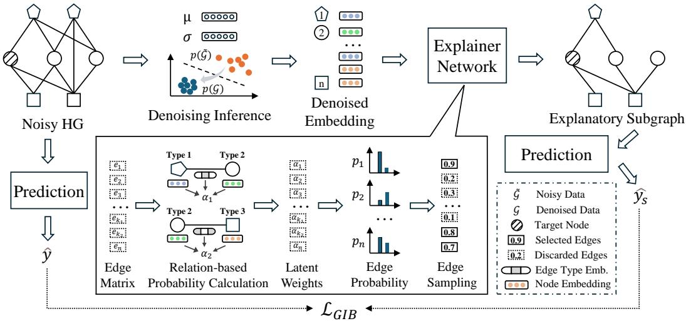
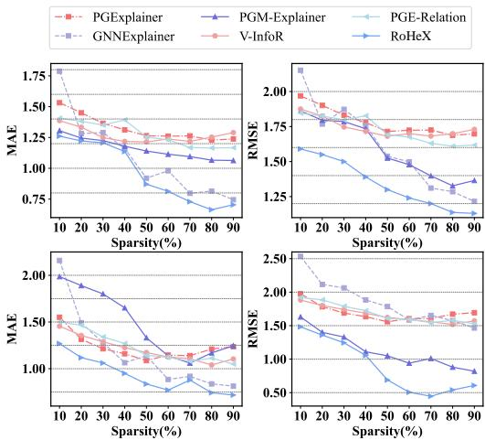
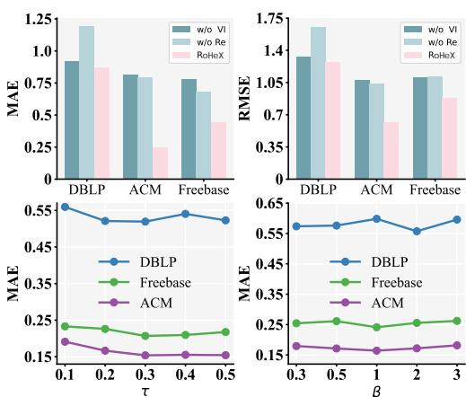
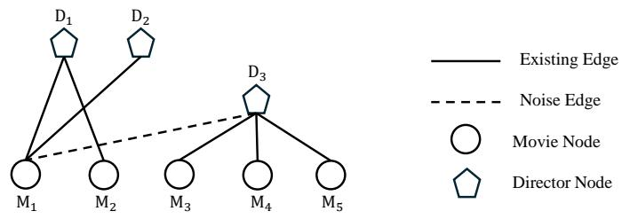

# Towards Robust Heterogeneous Graph Explanations under Structural Perturbations

Anonymous Author(s)   
Affiliation   
Address   
email

# Abstract

Explaining the prediction process of Graph Neural Networks (GNNs) is critical for   
enhancing model transparency and trustworthiness. However, real-world graphs are   
predominantly heterogeneous and often suffer from structural noise, which severely   
hampers the reliability of existing explanation methods. To address this challenge,   
we propose RoHeX, a Robust Heterogeneous Graph Neural Network Explainer.   
RoHeX begins with a theoretical analysis of how different heterogeneous GNN   
architectures amplify noise through message passing. To mitigate this effect, we   
introduce a denoising variational inference framework that operates on the graph   
structure to extract robust latent representations. Furthermore, RoHeX incorporates   
heterogeneous edge semantics into the subgraph generation process and formulates   
explanation as an optimization problem under the graph information bottleneck   
principle. This enables RoHeX to generate explanations that are both semantically   
meaningful and structurally robust. Extensive experiments on multiple real-world   
heterogeneous graph datasets demonstrate that RoHeX significantly outperforms   
state-of-the-art baselines in terms of explanation quality and robustness to noise.

# 16 1 Introduction

Graph Neural Networks (GNNs) have emerged as powerful tools for learning from graph-structured   
data, demonstrating strong performance across domains such as social networks [1], citation   
graphs [2], and recommender systems [3]. Despite these successes, GNNs remain largely opaque:   
their predictions are difficult to interpret, which limits their deployment in sensitive domains involving   
fairness, privacy, and security [4, 5].   
To address this, GNN explainers aim to reveal the decision rationale behind model predictions by   
identifying critical substructures. Existing approaches fall into two categories: post-hoc methods [6,   
, 8], which explain a pretrained model without modifying it, and built-in methods [9, 10, 11], which   
generate explanations during model training. Post-hoc methods are more flexible and generalizable,   
while built-in methods often yield task-specific insights. However, both struggle under complex, noisy   
conditions—especially in heterogeneous graphs, which are the norm in real-world settings [12, 13].   
Heterogeneous graphs, composed of diverse node and edge types, introduce nontrivial challenges.   
Their interwoven semantics and irregular structures complicate subgraph extraction. Moreover,   
real-world graphs commonly exhibit noise such as irrelevant or missing edges, which exacerbate the   
challenges in achieving robust model explainability [14, 15]. The diversity in distributions, attributes,   
and application domains across heterogeneous graphs also limits the generalizability of existing   
explainers. While post-hoc methods offer broader applicability, they remain vulnerable to structural   
irregularities and noise, which can distort the model’s reasoning process. Moreover, noise amplifies   
structural irregularities and shifts node importance, rendering conventional methods that rely on strict   
constraints (e.g., subgraph size, connectivity, or budget) ineffective [16].   
In this paper, we propose RoHeX, a Robust Heterogeneous Graph Neural Network Explainer. First, we   
theoretically analyze how noise amplification occurs in heterogeneous GNNs. Second, we introduce   
a denoising variational inference module that learns robust latent representations by filtering noise in   
the input graph. Third, we design a heterogeneous explanation generator based on relation-aware   
attention, which captures the rich semantics across node and edge types. Finally, by integrating the   
Graph Information Bottleneck (GIB) principle, we reframe explanation as an information-theoretic   
optimization problem to better handle irregular structures. We validate RoHeX’s performance through   
extensive experiments on multiple real-world datasets, demonstrating its superior ability to handle   
noise and generate high-quality explanations compared to state-of-the-art GNN explainers.

The contributions of this paper are as follows:

• We present the first systematic analysis of how noise interacts with heterogeneity in GNN explainers, theoretically proving that existing heterogeneous GNNs amplify structural noise and degrade explainability.   
• We propose RoHeX, a robust heterogeneous GNN explainer that integrates denoising variational inference and a relation-aware explanation generator, effectively modeling heterogeneity while suppressing noise during explanation generation.   
• Extensive experiments on multiple real-world heterogeneous graphs demonstrate that RoHeX consistently outperforms existing explainers in both explanation fidelity and robustness under noisy conditions.

# 2 Problem Definition

# 2.1 Heterogeneous Graph

A heterogeneous graph, denoted as $\mathcal { G } = ( \mathbf { A } , \mathbf { X } , \mathbf { \mathcal { A } } , \mathcal { R } , \Phi )$ , encompasses multiple types of nodes $\nu$ and edges $\mathcal { E }$ , where $\mathbf { A }$ is the corresponding adjacency matrix, $\mathbf { X }$ represents node features, $\mathcal { A }$ denotes the set of node types, $\mathcal { R }$ signifies the set of edge types, and $\Phi$ represents the set of meta-paths. A meta-path $\phi \in \Phi$ is a path of edges connecting various types of nodes from node $v _ { 1 }$ to node $v _ { l + 1 }$ , such as $\mathcal { A } _ { 1 } \stackrel { \mathcal { R } _ { 1 } } { \longrightarrow } \mathcal { A } _ { 2 } \stackrel { \mathcal { R } _ { 2 } } { \longrightarrow } \ldots \stackrel { \mathcal { R } _ { l } } { \longrightarrow } \mathcal { A } _ { l + 1 }$ , where $l$ denotes the length of the meta-path. The label set of $\mathcal { G }$ is denoted as $\mathbf { Y }$ , comprising $\mathcal { C }$ categories. Meanwhile, a heterogeneous graph has two mapping functions $\psi ( v ) : \mathcal { V } \to \mathcal { A }$ and $\varphi ( e ) : \mathcal { E }  \mathcal { R }$ that correspond to nodes and edges, respectively.

# 2.2 Heterogeneous Graph Neural Network Explainer

Given a trained GNN model $f$ as the subject of explanation and a heterogeneous graph $\mathcal { G }$ , the   
objective of the GNN explainer is to identify the most influential subgraph $\mathcal { G } _ { s } = ( \mathbf { A } _ { s } , \mathbf { X } , \mathbf { \mathcal { A } } _ { s } , \mathbf { \mathcal { R } } _ { s } )$ .   
Here, ${ \bf A } _ { s }$ represents the adjacency matrix formed by nodes $\gamma _ { s }$ and $\mathcal { E } _ { s }$ which significantly contribute   
to prediction. For the original prediction of GNN model $f$ , it can be formalized as follows:

$$
\hat { y } = \underset { c \in \mathcal { C } } { \operatorname { a r g m a x } } P _ { f } ( c | \mathbf { A } , \mathbf { X } , \mathbf { \mathcal { A } } , \mathcal { R } ) ,
$$

where $P _ { f } ( \cdot )$ represents the prediction function of the GNN model $f$ . Current research indicates   
that graph structural information is crucial for classification tasks [16, 17]. Therefore, our RoHeX   
focuses on exploring structural noise when generating explanations. The excellent explanation should   
contain the most critical information to approximate the predicted labels and outcome changing when   
predicting the remaining part of the original graph, which is as follows:

$$
\operatorname { a r g m a x } _ { c \in \mathcal { C } } P _ { f } \left( c | \mathbf { A } _ { s } , \mathbf { X } , \mathcal { A } _ { s } , \mathcal { R } _ { s } \right) = \hat { y } .
$$

# 75 3 Methodology

Figure 1 illustrates the overall framework of RoHeX. We begin by applying a denoising variational   
graph encoder to obtain a robust latent representation of the input graph $\mathcal { G }$ . Node embeddings sampled   
from the latent structural distribution are used to construct edge representations. These edge features   
are then fed into a heterogeneous relation-aware attention module, which estimates the importance   
of each edge by modeling the semantics of different edge types. Based on the learned importance   
scores, RoHeX generates a compact and informative explanatory subgraph. Finally, the entire process   
is optimized under the graph information bottleneck objective, which adaptively promotes structural   
sparsity and robustness against irregularities.

  
Figure 1: The architecture of our proposed RoHeX. First, the denoised node representations are obtained from the noisy graph via denoising variational inference. Then, the Explainer Network employs the heterogeneous relation-based importance computation method to obtain the weights for different edges. The top $k$ percent of edges are selected as important edges to generate the explanatory subgraph. Finally, the generated explanatory subgraph and the original graph are respectively input into heterogeneous GNN models to obtain predictions, which are used to compute the loss function.

# 84 3.1 Controllable Structural Perturbation for Heterogeneous Graphs

Real-world graph noise often arises from missing or spurious edges and is typically modeled via   
random edge addition or deletion [18, 19, 20]. Building upon this idea, we introduce a controllable   
and heterogeneous-aware structural perturbation strategy—a heuristic but flexible method designed to   
simulate realistic noise, maintain comparability with prior work, and enable targeted evaluation under   
adversarial or highly irregular settings. Notably, this method can be changed into a graph structure   
attack method to achieve structural corruption.

For each edge type 91 $r \in \mathcal { R }$ , we define its deletion rate $\eta _ { r } ^ { + }$ and false addition rate $\eta _ { r } ^ { - }$ , which represent 92 the probabilities of deleting and adding edges of this type, respectively. The perturbed adjacency $\tilde { \mathbf { A } } _ { r }$ 93 for edge type $r$ is generated as:

$$
\tilde { \mathbf { A } } _ { i j } ^ { r } = \left\{ \begin{array} { l l } { 0 } & { \mathrm { w i t h ~ p r o b a b i l i t y ~ } \eta _ { r } ^ { + } \cdot \frac { d _ { i } ^ { r } + d _ { j } ^ { r } } { 2 \bar { d } ^ { r } } , } \\ { 1 } & { \mathrm { w i t h ~ p r o b a b i l i t y ~ } \eta _ { r } ^ { - } \cdot \frac { 1 } { d _ { i } ^ { r } + d _ { j } ^ { r } } , } \\ { \mathbf { A } _ { i j } } & { \mathrm { o t h e r w i s e } , } \end{array} \right.
$$

where $d _ { i } ^ { r }$ is the degree of node $v _ { i }$ under edge type $r$ , and $\begin{array} { r } { \bar { d } ^ { r } = \frac { 1 } { | \mathcal { V } _ { r } | } \sum _ { i \in \mathcal { V } _ { r } } d _ { i } ^ { r } } \end{array}$ denotes the average   
degree for type $r$ . This degree-aware perturbation prevents the disproportionate removal of hub-node   
edges and limits unrealistic edge additions, thus preserving key graph structure properties. To control   
the overall noise intensity, we introduce a global noise budget $B$ , representing the total number of   
edges to be perturbed. This budget is allocated across edge types according to their importance   
scores:

$$
B _ { r } = B \cdot \frac { s _ { r } } { \sum _ { r ^ { \prime } \in \mathcal { R } } s _ { r ^ { \prime } } } , \quad \mathrm { w h e r e ~ } s _ { r } = \frac { | \mathcal { E } _ { r } | } { | \mathcal { E } | } \cdot \log | \mathcal { E } _ { r } | ,
$$

with $s _ { r }$ capturing both the proportion and diversity of edge type $r$ . We then calibrate the edge   
type-specific perturbation rates:

$$
\eta _ { r } ^ { + } = \frac { B _ { r } ^ { + } } { | \mathcal { E } _ { r } | } , \quad \eta _ { r } ^ { - } = \frac { B _ { r } ^ { - } } { | \mathcal { V } _ { r } | ^ { 2 } - | \mathcal { E } _ { r } | } , \quad \mathrm { s . t . ~ } B _ { r } ^ { + } + B _ { r } ^ { - } = B _ { r } .
$$

Finally, we provide a theoretical analysis showing how degree-aware perturbation impacts node   
connectivity:   
Theorem 3.1 (Degree-Aware Perturbation). For node $v _ { i }$ , its expected perturbed degree $d _ { i } ^ { \prime }$ under the   
above strategy satisfies:

$$
E [ d _ { i } ^ { \prime } ] = d _ { i } + \sum _ { r \in \mathcal { R } } \left( \eta _ { r } ^ { - } \cdot \frac { ( | \mathcal { V } _ { r } | - d _ { i } ^ { r } ) } { d _ { i } ^ { r } + \bar { d } ^ { r } } - \eta _ { r } ^ { + } \cdot \frac { d _ { i } ^ { r 2 } } { 2 \bar { d } ^ { r } } \right) .
$$

By incorporating degree balance constraints and noise budget allocation, our method simulates real-world noise more realistically and preserves the structural properties of the original graph.

# 3.2 Noise Analysis and Denoising Variational Inference

We investigate the impact of noise on different approaches for Heterogeneous Graph Neural Network (HGNN). We categorize common HGNN into two classes: meta-path-based and neighborhood 12 aggregation-based methods. Meta-path-based methods typically require defining a meta-path $\phi$ , and 13 then capturing information along different relations following the meta-path structure, aggregating 4 this information, such as Paths2Pair [21] and MAGNET [22]. Neighborhood aggregation-based methods simultaneously consider the neighbor node types and edge types and use specific aggregation 16 functions to combine information from different types. Common neighborhood aggregation methods include MHGCN [23] and Simple-HGN [24]. However, these two categories of methods differ in 8 their efficiency of noise propagation [20], and we find that meta-path-based message passing methods 9 amplify the impact of noise.

Theorem 3.2 (Noise Amplification Effect in HG). In HG, compared to neighborhood aggregationbased methods, meta-path-based methods can significantly amplify the effect of noisy edges. Specifically, for a node $v _ { i }$ and a newly added noisy edge $e _ { i j }$ , the factor by which its influence changes is $\frac { d { v _ { i } } + k } { d { v _ { i } } + 1 }$ , where $k$ is the degree of the new neighbor $v _ { j }$ under the noise and $d _ { v _ { i } }$ is the degree of $v _ { i }$ . When $k > d _ { v _ { i } }$ , this factor is significantly greater than 1.

The complete proof of Theorem 3.2 is provided in Appendix D. Based on Theorem 3.2, we employ a   
neighborhood aggregation method to encode heterogeneous graph and mitigate noise. Given noisy   
graph data $\tilde { \mathcal { G } }$ , our objective is to obtain a denoised version of the standard graph data $\mathcal { G }$ . VGAE [25]   
uses variational inference to derive statistical properties of the graph. The statistical data of latent   
variables in VGAE can be efficiently inferred from the latent space rather than the observation space,   
which provides robust graph information. For the standard graph $\mathcal { G }$ , it initially generates latent   
variables $\mathbf { Z }$ from a prior distribution $p ( \mathbf { Z } )$ , such as a Gaussian distribution $\mathcal { N } ( \mu , \sigma ^ { 2 } )$ . Second, the   
data $\mathcal { G }$ is generated using a conditional distribution $p ( \mathcal { G } | \mathbf { Z } )$ . VGAE optimizes its parameters by   
maximizing the likelihood of the observed data, which as follows:

$$
\begin{array} { r } { \mathrm { K L } ( q _ { \Psi } ( \mathbf { Z } | \mathcal { G } ) | | p _ { \theta } ( \mathbf { Z } | \mathcal { G } ) ) + \mathcal { L } ( \Psi , \theta ; \mathcal { G } ) , } \end{array}
$$

where $\Psi$ is the encoder and $\theta$ represents the parameters to be optimized. Then, the evidence lower   
bound $\mathcal { L } ( \Psi , \theta ; \mathcal { G } )$ can be expressed as follows:

$$
\mathcal { L } ( \Psi , \theta ; \mathcal { G } ) = \mathbb { E } _ { q \ast ( \mathbf { Z } | \mathcal { G } ) } \left[ \log \frac { p _ { \theta } ( \mathbf { Z } , \mathcal { G } ) } { q _ { \Psi } ( \mathbf { Z } | \mathcal { G } ) } \right] = \mathbb { E } _ { q \ast ( \mathbf { Z } | \mathcal { G } ) } \left[ \log p _ { \theta } ( \mathbf { Z } | \mathcal { G } ) \right] - \mathrm { K L } \left( q _ { \Psi } ( \mathbf { Z } | \mathcal { G } ) \| p ( \mathbf { Z } ) \right) .
$$

Variational inference enhances the model’s robustness and generalization capabilities [26, 27]. How  
ever, due to the differing distributions between noisy heterogeneous graph data and standard graph   
data, the obtained distribution tends to align with the noisy distribution, potentially misleading the   
GNN explainer into generating incorrect explanatory subgraphs. Therefore, we introduce a denoising   
module during the process of variational inference. The original encoder part is modified to:

$$
q _ { \Psi } ^ { \prime } ( \mathbf { Z } | \mathcal { G } ) = \int q _ { \Psi } ( \mathcal { G } | \tilde { \mathcal { G } } ) q ( \tilde { \mathcal { G } } | \mathcal { G } ) \mathrm { d } \tilde { \mathcal { G } } ,
$$

where 141 $\Psi$ is the encoder based on $\tilde { \mathcal { G } }$ , and $\begin{array} { r } { q ( \tilde { \mathcal { G } } | \mathcal { G } ) = \prod _ { r \in \mathcal { R } } q ( \tilde { \mathbf { A } } _ { r } | \mathbf { A } _ { r } ) } \end{array}$ . During this process, the 142 evidence lower bound is expressed as:

$$
\mathcal { L } _ { d } = \mathbb { E } _ { q _ { \Psi } ^ { \prime } ( \mathbf { Z } | \mathcal { G } ) } [ \log \frac { p _ { \theta } ( \mathbf { Z } , \mathcal { G } ) } { q _ { \Psi } ^ { \prime } ( \mathbf { Z } | \mathcal { G } ) } ] .
$$

As we need to derive the distribution of the noisy graph data 143 $\tilde { \mathcal { G } }$ , this lower bound can be further 144 refined as:

$$
\begin{array} { r l r } & { } & { \mathcal { L } _ { d } = \mathbb { E } _ { q _ { \Psi } ^ { \prime } ( { \bf Z } | \mathcal { G } ) } [ \log \frac { p _ { \theta } ( { \bf Z } , \mathcal { G } ) } { q _ { \Psi } ^ { \prime } ( { \bf Z } | \mathcal { G } ) } ] \geq \mathbb { E } _ { q _ { \Psi } ^ { \prime } ( { \bf Z } | \mathcal { G } ) } \left[ \log \frac { p _ { \theta } ( \mathcal { G } , { \bf Z } ) } { q _ { \Psi } ( { \bf Z } | \tilde { \mathcal { G } } ) } \right] } \\ & { } & { = \mathbb { E } _ { q _ { \Psi } ^ { \prime } ( { \bf Z } | \mathcal { G } ) } [ \log p _ { \theta } ( \mathcal { G } | { \bf Z } ) ] - \mathbb { E } _ { q \left( \tilde { \mathcal { G } } | \mathcal { G } \right) } [ \mathrm { K L } ( q _ { \Psi } ( { \bf Z } | \tilde { \mathcal { G } } ) ) | | p ( { \bf Z } ) ] . } \end{array}
$$

The detailed derivation is in the Appendix E. Compared to VGAE, the denoising variational inference   
models the posterior probability $p ( \mathbf { Z } | \mathcal { G } )$ using a Gaussian Mixture Model, whereas VGAE models   
$p ( \mathbf { Z } | \mathcal { G } )$ using a Gaussian distribution. Additionally, during the optimization process, there is a   
constraint that forces $q _ { \Psi } ( \mathbf { Z } | \tilde { \mathcal { G } } )$ to approximate the standard Gaussian distribution $p ( \mathbf { Z } )$ . Consequently,   
our method can significantly improve the model’s robustness and produce high-quality graph data.   
We further employ the Monte Carlo sampling method to approximate the objective, which can be   
effectively optimized using gradient descent as follows:

$$
\mathcal { L } _ { d } \approx \frac { 1 } { K } \sum _ { k = 1 } ^ { K } \sum _ { r \in \mathcal { R } } \log \frac { p _ { \theta } ( \mathcal { G } _ { r } , \mathbf { Z } ) } { q _ { \Psi } ( \mathbf { Z } | \tilde { \mathcal { A } } _ { r } ) } ,
$$

where $K$ is the number of samples sampled during the simulation. After denoising variational infer  
ence, we input the sampled robust representations $\mathbf { Z }$ into the Heterogeneous Explanation Generator,   
where the complex semantics on the heterogeneous graph are learned. Before delving into that, we   
introduce the Graph Information Bottleneck.

# 3.3 Graph Information Bottleneck

As mentioned in the introduction, noise exacerbates the irregularity of graph structures and alters node   
importance. Therefore, previous methods imposing structural regularity constraints on explanatory   
subgraphs are infeasible under noise influence. We exploit the Graph Information Bottleneck (GIB)   
to enable the explainer network to adaptively handle structural irregularities. The objective of GIB   
is to obtain the optimal explanatory subgraph $\mathcal { G } _ { s }$ . From an information-theoretic perspective, GIB   
limits the amount of information carried by the explanatory subgraph $\mathcal { G } _ { s }$ , rather than imposing   
simple structural constraints. Simultaneously, nodes may require scattered edges across the graph to   
jointly explain their predictive function, rather than constraining connectedness. Consequently, GIB   
adaptively explores the entire graph without imposing any potentially biased restrictions. GIB can be   
formulated as:

$$
\operatorname* { m i n } _ { \mathcal { G } _ { s } \subset G } - \operatorname { I } ( \hat { y } ; \mathcal { G } _ { s } ) + \beta \operatorname { I } ( \mathcal { G } ; \mathcal { G } _ { s } ) ,
$$

where $\operatorname { I } ( \cdot ; \cdot )$ denotes mutual information, and $\beta$ controls the trade-off between the two terms. Since   
the information in $\mathcal { G } _ { s }$ can be continually optimized, the explain task can be characterized as an   
optimization task guided by GIB.   
The GIB principle aims to obtain the minimum sufficient information about the graph $\mathcal { G }$ . The first   
term maximizes the mutual information between the label and the explanatory subgraph, ensuring $\mathcal { G } _ { s }$   
contains as much information about the label as possible. The second term minimizes the mutual   
information between the input graph and the explanatory subgraph, ensuring $\mathcal { G } _ { s }$ contains the minimum   
information about the input graph. Next, we introduce the Heterogeneous Explanation Generator,   
describing how each term is optimized during training under the GIB principle.

# 176 3.4 Heterogeneous Explanation Generator

We begin by modeling the explanatory subgraph as a Gilbert random graph [28], where edges are   
conditionally independent. Following the literature [16], we define an adjacency matrix-like edge   
matrix $E _ { s }$ , where each element $e _ { i j }$ is a binary variable indicating whether the edge is included in the   
subgraph. When there is an edge $( i , j )$ from $v _ { i }$ to $v _ { j }$ , $e _ { i j } = 1$ , otherwise $e _ { i j } = 0$ .   
To capture the rich semantics of heterogeneous graphs, pairwise node interactions alone are in  
sufficient. Thus, we incorporate heterogeneous semantics learning into the explanatory subgraph   
generation process. We incorporate heterogeneous edge type information into the attention compu  
tation by extending the standard graph attention mechanism. Specifically, we assign an edge type   
embedding $\mathbf { r } _ { \varphi ( e ) }$ for each edge type $\varphi ( e )$ , and simultaneously utilize the edge type embeddings and   
node embeddings to compute the attention coefficient $\alpha _ { i j }$ :

$$
\alpha _ { i j } = \frac { \exp { \left( \mathrm { R e L U } \left( { \pmb a } ^ { T } [ \pmb { W } z _ { i } \vert \vert \pmb { W } z _ { j } \vert \vert \pmb { W } _ { r } \pmb { r } _ { \varphi ( e _ { i j } ) } ] \right) \right)}  } { \sum _ { k \in \mathcal { N } _ { i } } \exp { \left( \mathrm { R e L U } \left( { \pmb a } ^ { T } [ \pmb { W } z _ { i } \vert \vert \pmb { W } z _ { k } \vert \vert \pmb { W } _ { r } \pmb { r } _ { \varphi ( e _ { i k } ) } ] \right) \right) } } ,
$$

where $W _ { r }$ is a learnable weight matrix for type embeddings. Edge type embedding is a one-hot   
encoding derived from each edge type. This attention coefficient $\alpha _ { i j }$ integrates both heterogeneous   
node and edge type semantics, offering a more comprehensive representation.   
Next, we define the heterogeneous random graph variable. The probability of the heterogeneous   
explanatory subgraph can be factorized as:

$$
p ( \mathcal { G } ) = \prod _ { ( i , j ) \in E _ { s } } p ( e _ { i j } | \varphi ( e _ { i j } ) ) ,
$$

where $e _ { i j } \ \sim \ \mathrm { B e r n } ( \pi _ { i j } )$ and $\pi _ { i j }$ is the edge existence probability inferred via $\alpha _ { i j }$ . To enable   
backpropagation through discrete edge selections, we adopt the reparameterization trick using a   
hard-concrete relaxation:

$$
e _ { i j } = \mathrm { S i g m o i d } \Big ( \frac { \log { \epsilon } - \log ( 1 - \epsilon ) + \alpha _ { i j } ( \varphi ( e _ { i j } ) ) } { \tau } \Big ) ,
$$

where $\tau$ is a temperature coefficient to smooth the optimization, and $\alpha _ { i j }$ from Eq. 13 adds heteroge  
neous information into the explanatory subgraph. When $\begin{array} { r } { \alpha _ { i j } = \log \frac { \pi _ { i j } } { 1 - \pi _ { i j } } } \end{array}$ , we have $\begin{array} { r } { \operatorname* { l i m } _ { \tau \to 0 } p ( e _ { i j } = } \end{array}$   
197 $\begin{array} { r } { 1 ) = \frac { \exp ( \alpha _ { i j } ) } { 1 + \exp ( \alpha _ { i j } ) } } \end{array}$ , so we can obtain the explanatory subgraph $\mathcal { G } _ { s }$ since $p ( e _ { i j } = 1 ) = \pi _ { i j }$ .

This results in a continuous probability matrix 198 $\mathbf { M _ { p } } \in \mathbb { R } ^ { N \times N }$ , where each entry $[ \mathbf { M _ { p } } ] _ { i j } = \pi _ { i j }$ 99 denotes the likelihood of including edge $( i , j )$ . We then construct the soft explanatory subgraph:

$$
\mathcal { G } _ { s } = ( \mathbf { A _ { s } } = \mathbf { M _ { p } } \odot \mathbf { A } , \mathbf { X } , \mathbf { \mathcal { A } } _ { s } , \mathcal { R } _ { s } ) .
$$

00 To optimize the explainer, we adopt the Graph Information Bottleneck (GIB) principle, balancing   
predictive fidelity and information compression. The GIB objective 12 is upper-bounded as:

$$
\begin{array} { r } { - \operatorname { I } ( \widehat { y } ; \mathcal { G } _ { s } ) + \beta \operatorname { I } ( \mathcal { G } ; \mathcal { G } _ { s } ) \leq - \mathbb { E } _ { p ( \mathcal { G } _ { s } , \widehat { y } ) } \big [ \log p _ { f } ( \widehat { y } | \mathcal { G } _ { s } ) \big ] + \operatorname { H } ( \widehat { y } ) + \beta \mathbb { E } _ { p ( \mathcal { G } ) } \big [ \mathrm { K L } ( p _ { \alpha } ( \mathcal { G } _ { s } | \mathcal { G } ) | | q ( \mathcal { G } _ { s } ) ) \big ] , } \end{array}
$$

where $f$ is the GNN model and $\alpha$ is the explain model, see Appendix E for detailed derivation. Since $\mathrm { H } ( \hat { y } )$ is constant, the objective function can be expressed as follows:

$$
\mathcal { L } _ { G I B } = - \mathbb { E } _ { p ( \mathcal { G } _ { s } , \hat { y } ) } \left[ \log p _ { f } ( \hat { y } | \mathcal { G } _ { s } ) \right] + \beta \mathbb { E } _ { p ( \mathcal { G } ) } \left[ \mathrm { K L } ( p _ { \alpha } ( \mathcal { G } _ { s } | \mathcal { G } ) | | q ( \mathcal { G } _ { s } ) ) \right] .
$$

The total loss combines the GIB objective with the denoising loss from the variational graph encoder:

$$
\begin{array} { r } { \mathcal { L } = \mathcal { L } _ { d } + \mathcal { L } _ { G I B } . } \end{array}
$$

# 205 3.5 Complexity Analysis.

The cost of each iteration comprises two parts: (1) the variational inference process and (2) the   
heterogeneous explanation generation. The time complexity of the first step is $\Dot { O } ( N ^ { 2 } + E )$ , and the   
space complexity is $O ( N )$ , as this step requires storing the robust node representations. The time   
complexity of the second step is $O ( E )$ , and the space complexity is $O ( E )$ . Therefore, the overall   
time complexity of RoHeX is $O ( N ^ { 2 } + E )$ , and the space complexity is ${ \dot { O } } ( N + E )$ .

# 211 4 Experiment

In this section, we evaluate the performance of the proposed RoHeX and state-of-the-art baselines on   
the node classification task. We then analyze the contributions of different components of RoHeX and   
demonstrate why RoHeX is robust to noise and capable of generating explanations that incorporate   
heterogeneous information.

Table 1: The comparison of RoHeX and baselines under different ratios of random structural noise. We use bold font to mark the best score. The second best score is marked with underline.   

<table><tr><td>Dataset</td><td>Metric</td><td>Noise</td><td>PGExplainer</td><td>GNNExplainer</td><td>PGM-Explainer</td><td>V-InfoR</td><td>AMExplainer</td><td>Hete-PGE</td><td>xPath</td><td>RoHeX</td></tr><tr><td rowspan="8"></td><td rowspan="4">MAE</td><td>10%</td><td>1.2158±0.0062</td><td>0.8530±0.0009</td><td>1.0704±0.0007</td><td>1.1930±0.0030</td><td>1.4862±0.0026</td><td>0.8719±0.0008</td><td>0.8162±0.0032</td><td>0.8359±0.0029</td></tr><tr><td>20%</td><td>1.2179±0.0089</td><td>0.9080±0.0007</td><td>1.2046±0.0006</td><td>1.1960±0.0025</td><td>1.5697±0.0008</td><td>0.8896±0.0005</td><td>0.9651±0.0042</td><td>0.8743±0.0018</td></tr><tr><td>30%</td><td>1.2449±0.0059</td><td>1.2613±0.0011</td><td>1.3313±0.0002</td><td>1.2312±0.0026</td><td>1.7133±0.0006</td><td>1.1913±0.0006</td><td>1.1405±0.1032</td><td>0.8827±0.0034</td></tr><tr><td>40%</td><td>1.2451±0.0068</td><td>1.3389±0.0008</td><td>1.3401±0.0005</td><td>1.2530±0.0010</td><td>1.9345±0.0005</td><td>0.9268±0.0006</td><td>1.2852±0.0002</td><td>0.9014±0.0015</td></tr><tr><td></td><td>10%</td><td>1.6775±0.0054</td><td>1.2968±0.0006</td><td>1.3855±0.0005</td><td>1.6481±0.0027</td><td>1.9219±0.0048</td><td>1.2814±0.0004</td><td>1.3175±0.0020</td><td>1.2416±0.0017</td></tr><tr><td>DBLP RMSE</td><td>20%</td><td>1.6815±0.0666</td><td>1.3072±0.0004</td><td>1.5280±0.0003</td><td>1.6511±0.0020</td><td>2.0419±0.0006</td><td>1.2859±0.0002</td><td>1.4341±0.0025</td><td>1.2750±0.0013</td></tr><tr><td></td><td>30%</td><td>1.6999±0.0024</td><td>1.8470±0.0007</td><td>1.6497±0.0001</td><td>1.6781±0.0020</td><td>2.1842±0.0003</td><td>1.6532±0.0003</td><td>1.5752±0.1198</td><td>1.2792±0.0022</td></tr><tr><td rowspan="8"></td><td>40%</td><td>1.7060±0.0042</td><td>1.9043±0.0004</td><td>1.6681±0.0001</td><td>1.6885±0.0008</td><td>2.3616±0.0002</td><td>1.3100±0.0004</td><td>1.6819±0.0001</td><td>1.2889±0.0008</td></tr><tr><td>10%</td><td>0.7624±0.0080</td><td>0.3449±0.0003</td><td>0.2155±0.0009</td><td>0.7639±0.0001</td><td>0.3895±0.0005</td><td>0.8091±0.0003</td><td>0.3900±0.0001</td><td>0.2129±0.0009</td></tr><tr><td>20%</td><td>0.7751±0.0162</td><td>0.3951±0.0001</td><td>0.3732±0.0003</td><td>0.7913±0.0004</td><td>0.6746±0.0224</td><td>0.8183±0.0005</td><td>0.3985±0.0003</td><td>0.2483±0.0010</td></tr><tr><td rowspan="5">MAE ACM</td><td>30%</td><td>0.7867±0.0152</td><td>0.5087±0.0003</td><td>0.5932±0.0006</td><td>0.8064±0.0003</td><td>0.7077±0.0221</td><td>0.8220±0.0002</td><td>0.4164±0.0012</td><td>0.3140±0.0019</td></tr><tr><td>40%</td><td>0.7913±0.0181</td><td>0.6496±0.0002</td><td>0.7932±0.0007</td><td>0.8154±0.0005</td><td>0.7181±0.0164</td><td>0.8310±0.0001</td><td>0.4292±0.0006</td><td></td></tr><tr><td>10%</td><td></td><td></td><td></td><td></td><td></td><td></td><td></td><td>0.3163±0.0015</td></tr><tr><td>20%</td><td>1.0258±0.0037</td><td>0.6831±0.0005</td><td>0.5121±0.0004</td><td>1.0145±0.0002</td><td>0.6241±0.0003</td><td>1.0740±0.0001</td><td>0.7750±0.0002</td><td>0.5662±0.0012</td></tr><tr><td>30%</td><td>1.0307±0.0069</td><td>0.7791±0.0002</td><td>0.6893±0.0002</td><td>1.0366±0.0004</td><td>0.8213±0.0649</td><td>1.0778±0.0004</td><td>0.7458±0.0003</td><td>0.6177±0.0008</td></tr><tr><td rowspan="8">Freebase</td><td>RMSE</td><td></td><td>1.0423±0.0127</td><td>0.9506±0.0001</td><td>0.8793±0.0004</td><td>1.0705±0.0007</td><td>0.8412±0.0698</td><td>1.0731±0.0001</td><td>0.7768±0.0009</td><td>0.6669±0.0013</td></tr><tr><td></td><td>40%</td><td>1.0431±0.0124</td><td>1.1306±0.0002</td><td>1.0766±0.0004</td><td>1.0786±0.0003</td><td>0.8474±0.0713</td><td>1.0856±0.0001</td><td>0.8396±0.0007</td><td>0.6909±0.0008</td></tr><tr><td></td><td>10%</td><td>0.7189±0.0096</td><td>0.9012±0.0002</td><td>0.9190±0.0003</td><td>0.5957±0.0322</td><td>0.9312±0.0004</td><td>0.7760±0.0007</td><td>0.9006±0.0127</td><td>0.3885±0.0010</td></tr><tr><td>MAE</td><td>20% 30%</td><td>0.7237±0.0078</td><td>0.9108±0.0003</td><td>0.9401±0.0001</td><td>0.6822±0.0527 0.7249±0.0329</td><td>0.9709±0.1209</td><td>0.7812±0.0005</td><td>0.9247±0.0092</td><td>0.4441±0.0012</td></tr><tr><td></td><td>40%</td><td>0.7285±0.0041</td><td>0.9126±0.0003 0.9378±0.0007</td><td>0.9530±0.0004</td><td>0.7894±0.0111</td><td>1.0089±0.1651 1.0531±0.0005</td><td>0.7908±0.0003 0.8030±0.0001</td><td>0.9263±0.0043 0.9301±0.0061</td><td>0.4694±0.0021</td></tr><tr><td></td><td>10%</td><td>0.7370±0.0019</td><td>1.2886±0.0001</td><td>0.9587±0.0009 1.2432±0.0001</td><td>1.0375±0.0233</td><td>1.2589±0.0004</td><td>1.1064±0.0003</td><td></td><td>0.4880±0.0014</td></tr><tr><td></td><td>20%</td><td>1.0616±0.0071 1.0635±0.0051</td><td>1.2983±0.0002</td><td>1.2549±0.0001</td><td>1.1172±0.0566</td><td>1.2987±0.1848</td><td>1.1117±0.0004</td><td>1.2466±0.0056 1.2435±0.0108</td><td>0.8251±0.0018</td></tr><tr><td>RMSE</td><td>30%</td><td>1.0689±0.0039</td><td>1.2995±0.0002</td><td>1.2747±0.0002</td><td>1.1487±0.0277</td><td>1.3391±0.2381</td><td>1.1200±0.0002</td><td></td><td>0.8854±0.0010</td></tr><tr><td></td><td></td><td>40%</td><td>1.0803±0.0018</td><td>1.3217±0.0005</td><td>1.2838±0.0004</td><td>1.1929±0.0054</td><td>1.3830±0.0004</td><td>1.1315±0.0001</td><td>1.2721±0.0034 1.2643±0.0072</td><td>0.9035±0.0012 0.9217±0.0007</td></tr></table>

# 216 4.1 Experiment Settings

Datasets and Baselines. We evaluate the effectiveness of our RoHeX on three real-world datasets,   
including two academic citation datasets (DBLP and ACM) and a knowledge graph dataset (Freebase).   
Since there are no existing robust heterogeneous explainer, we select three types of baselines: the   
surrogate method PGM-Explainer, the perturbation-based methods GNNExplainer, PGExplainer and   
AMExplainer, and the V-infor method studying robustness on homogeneous graphs. We used the   
heterogeneous graph path explainer, xPath, and extended our Heterogeneous Explanation Generator   
to PGExplainer, referred to as Hete-PGE, for comparison.

Evaluation. The evaluation of explainer performance is based on the generated explanatory subgraphs, assessing their contribution to the original prediction. We adopt two metrics: fidelity and sparsity. Fidelity measures the decrease in prediction confidence after removing the explanation from the input graph, while sparsity measures the ratio of remaining edges in the explanatory subgraph $\mathcal { G } _ { s }$ relative to the input graph. We use the Mean Absolute Error (MAE, $\begin{array} { r } { \frac { 1 } { N } \sum _ { i = 1 } ^ { N } \Big | \mathbb { I } ( \hat { y } _ { i } = y _ { i } ) - \mathbb { I } ( \hat { y } _ { i } ^ { \mathcal { G } _ { s } } = y _ { i } ) \Big | ) } \end{array}$ , and Root Mean Squared Error (RMSE, $\begin{array} { r } { \sqrt { \frac { 1 } { N } \sum _ { i = 1 } ^ { N } \Big ( \mathbb { I } ( \hat { y } _ { i } = y _ { i } ) - \mathbb { I } ( \hat { y } _ { i } ^ { \mathcal { G } _ { s } } = y _ { i } ) \Big ) ^ { 2 } } ; } \end{array}$ ) as proxy measures for fidelity, and compare the performance of different baselines across varying sparsity levels, where $N$ is the number of nodes or graphs, $\hat { y } _ { i }$ is the original prediction result, and $\hat { y } _ { i } ^ { \mathcal { G } _ { s } }$ is the prediction result obtained by the explanatory subgraph.

Implementation Details. We conduct experiments under different proportions of random noise scenarios. Noise is added to both the training set and the test set to restore the real scene. To ensure randomness, the deletion rate and false addition rate are set to be equal. For the baselines, we select the best-performing parameters for heterogeneous datasets based on the original settings. We chose the most basic HGNN architecture, which only includes GCN [29] and relational learning modules, as the base model for fair comparison. For our RoHeX, we use Adam as the optimizer with a learning rate of 1e-4. We set the hidden dimension for variational inference to 64, the output dimension to 32, and the edge weight output dimension to 32. Each experiment is repeated 5 times, and we report the mean and variance as the results. Descriptions of the variance, datasets, baselines, base HGNN model architecture, and parameter settings are provided in the Appendix F.

# 4.2 Overall Performance under Structural Perturbations

Table 1 shows the experimental results on the heterogeneous graphs with different budgets of structural perturbations. We find that RoHeX outperforms other baselines in most experimental results, achieving the best performance on the DBLP and Freebase datasets. Taking $30 \%$ noise ratio as an example, RoHeX shows $2 5 . 9 \%$ lower MAE and $2 2 . 4 \%$ lower RMSE than the second-best method on the DBLP dataset, $3 8 . 2 \%$ lower MAE and $2 4 . 1 \%$ lower RMSE on the ACM dataset, and $3 5 . 2 \%$ lower MAE and $1 5 . 4 \%$ lower RMSE on the Freebase dataset. xPath performs excellently in multiple

  
Figure 2: Fidelity-Sparsity Curve on the DBLP dataset. The first row is the result without noise, and the second row is the result with $20 \%$ noise budget.

  
Figure 3: Ablation study on three datasets and the influence of hyperparameters $\tau$ and $\beta$ on RoHeX.

scenarios, indicating that designing corresponding modules for heterogeneous graphs is essential. We   
can observe that Hete-PGE achieves second best performance multiple times on the DBLP dataset   
and outperforms many baselines on other datasets, demonstrating the effectiveness of our proposed   
heterogeneous explanation generator in considering rich semantics on heterogeneous graphs. Due   
to the similar edge type distribution in the DBLP dataset, the dataset exhibits higher heterogeneity,   
which enhances the module’s ability to capture heterogeneous information. Simultaneously, as a   
plug-and-play module, it can be conveniently extended to other parameterized explanation methods   
for generating explanations on heterogeneous graphs. On the medium and small-scale datasets DBLP   
and ACM, explanation methods based on raw features (e.g., GNNExplainer) are more susceptible   
to noise, potentially because raw features are more easily affected in smaller graphs. Since RoHeX   
generates robust graph representations, it can better mitigate the influence of noise, which is also why   
the latent representation-based explainer V-InfoR performs well in multiple scenarios. Under the   
guidance of GIB, our method can adaptively select important edges while excluding redundant and   
noisy edges, thereby generating the best explanations for the prediction model.

# 4.3 Fidelity-Sparsity Analysis

Next, we further investigate RoHeX’s performance at different sparsity levels. We provide the Fidelity-Sparsity curve on the DBLP dataset as shown in Figure 2. RoHeX consistently outperforms other baselines across all sparsity levels, indicating that our method can generate the best explanations. As the sparsity increases from 0 to 1, the overall trend of all curves is downward, i.e., decreasing error. When the sparsity is extremely low, e.g., $10 \%$ , our method significantly outperforms other baselines, suggesting that RoHeX can identify the truly critical subgraphs. We further find that although the overall performance improves as the sparsity level increases, there are still some cases where the performance drops with increasing sparsity, such as PGExplainer. We conjecture that this may be because in the subgraph generation process, when the sparsity increases to a point where all edges with high importance scores have been selected, forcing higher sparsity will begin to select unimportant edges, which can be viewed as noisy edges, leading to degraded performance. As the sparsity continues to increase, this adverse effect is offset. Since AMExplainer and xPath contain specific Sparsity settings to generate explanations, they were not included in the experiment.

# 78 4.4 Model Analysis

Perturbation Performance We analyze the perturbation performance of controllable structural perturbation for heterogeneous graphs under different noise scenarios, as shown in Table 2. Compared to the original results, our structural perturbation method significantly impacts the decision-making process of HGNN on the whole graph (Noisy), 1-hop subgraph (1-hop), and 2-hop subgraph (2-hop).

Table 2: Prediction performance of HGNN in different noise scenarios.   

<table><tr><td rowspan="2">Dataset</td><td rowspan="2">Method</td><td colspan="2">10%</td><td colspan="2">20%</td><td colspan="2">30%</td><td colspan="2">40%</td></tr><tr><td>Micro-F1</td><td>Macro-F1</td><td>Micro-F1</td><td>Macro-F1</td><td>Micro-F1</td><td>Macro-F1</td><td>Micro-F1</td><td>Macro-F1</td></tr><tr><td rowspan="4">DBLP</td><td>Original</td><td>92.64</td><td>92.16</td><td>92.64</td><td>92.16</td><td>92.64</td><td>92.16</td><td>92.64</td><td>92.16</td></tr><tr><td>Noisy</td><td>81.58</td><td>80.34</td><td>73.41</td><td>70.26</td><td>67.18</td><td>62.02</td><td>62.99</td><td>55.91</td></tr><tr><td>1-hop</td><td>57.28</td><td>55.92</td><td>54.22</td><td>52.40</td><td>52.18</td><td>49.98</td><td>50.56</td><td>48.40</td></tr><tr><td>2-hop</td><td>57.64</td><td>55.65</td><td>42.07</td><td>38.55</td><td>41.76</td><td>38.06</td><td>39.01</td><td>34.01</td></tr><tr><td rowspan="4">ACM</td><td>Original</td><td>92.32</td><td>92.40</td><td>92.32</td><td>92.40</td><td>92.32</td><td>92.40</td><td>92.32</td><td>92.40</td></tr><tr><td>Noisy</td><td>33.52</td><td>19.28</td><td>33.28</td><td>18.82</td><td>31.96</td><td>16.14</td><td>31.96</td><td>16.14</td></tr><tr><td>1-hop</td><td>77.10</td><td>77.31</td><td>76.39</td><td>76.51</td><td>75.40</td><td>75.57</td><td>67.94</td><td>67.81</td></tr><tr><td>2-hop</td><td>52.19</td><td>51.73</td><td>49.12</td><td>50.65</td><td>42.38</td><td>36.42</td><td>38.73</td><td>30.07</td></tr><tr><td rowspan="4">Freebase</td><td>Original</td><td>68.99</td><td>63.57</td><td>68.99</td><td>63.57</td><td>68.99</td><td>63.57</td><td>68.99</td><td>63.57</td></tr><tr><td>Noisy</td><td>67.89</td><td>61.90</td><td>66.05</td><td>59.29</td><td>62.94</td><td>53.74</td><td>57.50</td><td>46.02</td></tr><tr><td>1-hop</td><td>58.52</td><td>53.23</td><td>57.62</td><td>51.94</td><td>57.50</td><td>51.21</td><td>57.01</td><td>51.14</td></tr><tr><td>2-hop</td><td>44.66</td><td>31.12</td><td>42.90</td><td>27.24</td><td>41.10</td><td>24.15</td><td>39.46</td><td>21.62</td></tr></table>

An interesting finding is that $30 \%$ noise is enough to cause the performance of HGNN on the ACM   
dataset to drop to its lowest.   
Ablation Study We investigate the contributions of different components in RoHeX. Specifically,   
we study (a) the effectiveness of the denoising variational inference module, and (b) the effectiveness   
of the relation-based importance module. We use ’w/o VI’ to denote the model without the denoising   
variational inference module, and ’w/o Re’ to denote the model without the relation-based importance   
module. For the latter case, we replace it with the common concatenation operation, i.e., $\alpha _ { i j } =$   
$\mathrm { M L P } [ ( \mathbf { z } _ { i } , \mathbf { z } _ { j } ] )$ . The experiments are conducted under $20 \%$ noise budget, and the first row of Figure 3   
shows the results after ablation. We find that without the denoising variational inference module,   
the model relies on the original features and graph structure for prediction, failing to mitigate the   
influence of noise, leading to performance degradation. When the model loses the ability to learn   
heterogeneous relationships, the process of generating explanation subgraphs struggles to recognize   
the complex semantics in heterogeneous graphs. All edges are treated as the same type, and the   
model explains solely based on node interactions. This demonstrates the necessity of our proposed   
relation importance module.   
Hyperparameter Analysis We further analyze the impact of two parameters $\tau$ and $\beta$ on model   
performance. $\tau$ controls the approximation degree of $e _ { i j }$ distribution to the Bernoulli distribution,   
ranging within [0.1, 0.5]. $\beta$ balances the information recovery strength and information filtering   
strength in the optimization objective, and we select values from $\{ 0 . 3 , \mathrm { { \bar { 0 } } . 5 , 1 , 2 , 3 } \}$ . The second row   
of Figure 3 shows the effects of these hyperparameters on RoHeX across three datasets. We can   
observe that the best results of $\tau$ all appear around 0.3. That is, when $\tau = 0 . 3$ , the continuity and   
approximation degree in Eq. 15 reach the best trade-off. Secondly, RoHeX is not very sensitive to $\beta$   
that controls the constraint strength in Eq. 18, validating that our used GIB constraint can adapt to   
different data scenarios and achieve superior performance.

# 307 5 Conclusion

In this work, we focus on the problem of explaining heterogeneous graph neural network under   
noise. We are the first to study this problem, theoretically proving that heterogeneous graph neural   
network have an amplifying effect on noise, and propose RoHeX to mitigate the influence of   
noise and obtain explanatory subgraphs based on heterogeneous relations. Specifically, RoHeX   
employs denoising variational inference to obtain robust graph representations and parameterizes the   
explanatory subgraph generation process with heterogeneous semantics. It integrates type information   
to capture the complexity of diverse node and edge types. Extensive experiments on real-world   
datasets demonstrate RoHeX’s superiority over other state-of-the-art baselines. For future work, we   
plan to further extend RoHeX to dynamic graphs by incorporating dynamic information into the   
317 explanation generation process, further broadening RoHeX’s applicability.

References   
[1] Yuwei Cao, Hao Peng, Zhengtao Yu, and S Yu Philip. Hierarchical and incremental structural entropy minimization for unsupervised social event detection. In Proceedings of the AAAI Conference on Artificial Intelligence, volume 38, pages 8255–8264, 2024.   
[2] Yifan Lu, Mengzhou Gao, Huan Liu, Zehao Liu, Wei Yu, Xiaoming Li, and Pengfei Jiao. Neighborhood overlap-aware heterogeneous hypergraph neural network for link prediction. Pattern Recognition, 144:109818, 2023.   
[3] Yi Zhang, Yiwen Zhang, Yuchuan Zhao, Shuiguang Deng, and Yun Yang. Dual variational graph reconstruction learning for social recommendation. IEEE Transactions on Knowledge and Data Engineering, 2024.   
[4] Peter Müller, Lukas Faber, Karolis Martinkus, and Roger Wattenhofer. Graphchef: Decision-tree recipes to explain graph neural networks. In The Twelfth International Conference on Learning Representations, 2024. [5] Senzhang Wang, Jun Yin, Chaozhuo Li, Xing Xie, and Jianxin Wang. V-infor: a robust graph neural networks explainer for structurally corrupted graphs. Advances in Neural Information Processing Systems, 36, 2024. [6] Minh N Vu and My T Thai. Limitations of perturbation-based explanation methods for temporal graph neural networks. In 2023 IEEE International Conference on Data Mining (ICDM), pages 618–627. IEEE, 2023.   
[7] Tamara Pereira, Erik Nascimento, Lucas E Resck, Diego Mesquita, and Amauri Souza. Distill n’explain: explaining graph neural networks using simple surrogates. In International Conference on Artificial Intelligence and Statistics, pages 6199–6214. PMLR, 2023. [8] Qiang Huang, Makoto Yamada, Yuan Tian, Dinesh Singh, and Yi Chang. Graphlime: Local interpretable model explanations for graph neural networks. IEEE Transactions on Knowledge and Data Engineering, 35(7):6968–6972, 2022.   
[9] Sangwoo Seo, Sungwon Kim, and Chanyoung Park. Interpretable prototype-based graph information bottleneck. Advances in Neural Information Processing Systems, 36, 2024.   
[10] Zaixi Zhang, Qi Liu, Hao Wang, Chengqiang Lu, and Cheekong Lee. Protgnn: Towards self-explaining graph neural networks. In Proceedings of the AAAI Conference on Artificial Intelligence, volume 36, pages 9127–9135, 2022.   
[11] Hao Yuan, Jiliang Tang, Xia Hu, and Shuiwang Ji. Xgnn: Towards model-level explanations of graph neural networks. In Proceedings of the 26th ACM SIGKDD international conference on knowledge discovery & data mining, pages 430–438, 2020.   
[12] Xiao Wang, Deyu Bo, Chuan Shi, Shaohua Fan, Yanfang Ye, and S Yu Philip. A survey on heterogeneous graph embedding: methods, techniques, applications and sources. IEEE Transactions on Big Data, 9(2):415–436, 2022.   
[13] Carl Yang, Yuxin Xiao, Yu Zhang, Yizhou Sun, and Jiawei Han. Heterogeneous network representation learning: A unified framework with survey and benchmark. IEEE Transactions on Knowledge and Data Engineering, 34(10):4854–4873, 2020.   
[14] James Fox and Sivasankaran Rajamanickam. How robust are graph neural networks to structural noise? arXiv preprint arXiv:1912.10206, 2019.   
[15] Enyan Dai, Wei Jin, Hui Liu, and Suhang Wang. Towards robust graph neural networks for noisy graphs with sparse labels. In Proceedings of the Fifteenth ACM International Conference on Web Search and Data Mining, pages 181–191, 2022.   
[16] Dongsheng Luo, Wei Cheng, Dongkuan Xu, Wenchao Yu, Bo Zong, Haifeng Chen, and Xiang Zhang. Parameterized explainer for graph neural network. Advances in neural information processing systems, 33:19620–19631, 2020.   
[17] Daniel Zügner, Amir Akbarnejad, and Stephan Günnemann. Adversarial attacks on neural networks for graph data. In Proceedings of the 24th ACM SIGKDD international conference on knowledge discovery & data mining, pages 2847–2856, 2018.   
[18] Dingyuan Zhu, Ziwei Zhang, Peng Cui, and Wenwu Zhu. Robust graph convolutional networks against adversarial attacks. In Proceedings of the 25th ACM SIGKDD international conference on knowledge discovery & data mining, pages 1399–1407, 2019.   
[19] Jiaqi Ma, Shuangrui Ding, and Qiaozhu Mei. Towards more practical adversarial attacks on graph neural networks. Advances in neural information processing systems, 33:4756–4766, 2020.   
[20] Mengmei Zhang, Xiao Wang, Meiqi Zhu, Chuan Shi, Zhiqiang Zhang, and Jun Zhou. Robust heterogeneous graph neural networks against adversarial attacks. In Proceedings of the AAAI Conference on Artificial Intelligence, volume 36, pages 4363–4370, 2022.   
[21] Jinquan Hang, Zhiqing Hong, Xinyue Feng, Guang Wang, Guang Yang, Feng Li, Xining Song, and Desheng Zhang. Paths2pair: Meta-path based link prediction in billion-scale commercial heterogeneous graphs. In Proceedings of the 30th ACM SIGKDD Conference on Knowledge Discovery and Data Mining, pages 5082–5092, 2024.   
[22] Xin-Cheng Wen, Cuiyun Gao, Jiaxin Ye, Yichen Li, Zhihong Tian, Yan Jia, and Xuan Wang. Meta-path based attentional graph learning model for vulnerability detection. IEEE Transactions on Software Engineering, 2023.   
[23] Pengyang Yu, Chaofan Fu, Yanwei Yu, Chao Huang, Zhongying Zhao, and Junyu Dong. Multiplex heterogeneous graph convolutional network. In Proceedings of the 28th ACM SIGKDD Conference on Knowledge Discovery and Data Mining, pages 2377–2387, 2022.   
[24] Qingsong Lv, Ming Ding, Qiang Liu, Yuxiang Chen, Wenzheng Feng, Siming He, Chang Zhou, Jianguo Jiang, Yuxiao Dong, and Jie Tang. Are we really making much progress? revisiting, benchmarking and refining heterogeneous graph neural networks. In Proceedings of the 27th ACM SIGKDD conference on knowledge discovery & data mining, pages 1150–1160, 2021.   
[25] Thomas N Kipf and Max Welling. Variational graph auto-encoders. arXiv preprint arXiv:1611.07308, 2016.   
[26] Haoyi Fan, Fengbin Zhang, Yuxuan Wei, Zuoyong Li, Changqing Zou, Yue Gao, and Qionghai Dai. Heterogeneous hypergraph variational autoencoder for link prediction. IEEE transactions on pattern analysis and machine intelligence, 44(8):4125–4138, 2021.   
[27] Daniel Im Im, Sungjin Ahn, Roland Memisevic, and Yoshua Bengio. Denoising criterion for variational auto-encoding framework. In Proceedings of the AAAI conference on artificial intelligence, volume 31, 2017.   
[28] Edgar N Gilbert. Random graphs. The Annals of Mathematical Statistics, 30(4):1141–1144, 1959.   
[29] Thomas N Kipf and Max Welling. Semi-supervised classification with graph convolutional networks. arXiv preprint arXiv:1609.02907, 2016.   
[30] Michael Sejr Schlichtkrull, Nicola De Cao, and Ivan Titov. Interpreting graph neural networks for nlp with differentiable edge masking. In International Conference on Learning Representations, 2020.   
[31] Jiaxing Zhang, Dongsheng Luo, and Hua Wei. Mixupexplainer: Generalizing explanations for graph neural networks with data augmentation. In Proceedings of the 29th ACM SIGKDD Conference on Knowledge Discovery and Data Mining, pages 3286–3296, 2023.   
[32] Zhitao Ying, Dylan Bourgeois, Jiaxuan You, Marinka Zitnik, and Jure Leskovec. Gnnexplainer: Generating explanations for graph neural networks. Advances in neural information processing systems, 32, 2019.

2 [33] Minh Vu and My T Thai. Pgm-explainer: Probabilistic graphical model explanations for graph neural networks. Advances in neural information processing systems, 33:12225–12235, 2020.

[34] Shengyao Lu, Keith G Mills, Jiao He, Bang Liu, and Di Niu. Goat: Explaining graph neural networks via graph output attribution. In The Twelfth International Conference on Learning Representations, 2024. [35] Tong Li, Jiale Deng, Yanyan Shen, Luyu Qiu, Huang Yongxiang, and Caleb Chen Cao. Towards fine-grained explainability for heterogeneous graph neural network. In Proceedings of the AAAI Conference on Artificial Intelligence, volume 37, pages 8640–8647, 2023. [36] Wei Zhang, Xiaofan Li, and Wolfgang Nejdl. Adversarial mask explainer for graph neural networks. In Proceedings of the ACM on Web Conference 2024, pages 861–869, 2024. [37] Xiao Wang, Houye Ji, Chuan Shi, Bai Wang, Yanfang Ye, Peng Cui, and Philip S Yu. Heterogeneous graph attention network. In The world wide web conference, pages 2022–2032, 2019. [38] Xinyu Fu, Jiani Zhang, Ziqiao Meng, and Irwin King. Magnn: Metapath aggregated graph neural network for heterogeneous graph embedding. In Proceedings of the web conference 2020, pages 2331–2341, 2020. 8 [39] Xiaocheng Yang, Mingyu Yan, Shirui Pan, Xiaochun Ye, and Dongrui Fan. Simple and efficient heterogeneous graph neural network. In Proceedings of the AAAI conference on artificial intelligence, volume 37, pages 10816–10824, 2023. [40] Michael Schlichtkrull, Thomas N Kipf, Peter Bloem, Rianne Van Den Berg, Ivan Titov, and Max Welling. Modeling relational data with graph convolutional networks. In The semantic web: 15th international conference, ESWC 2018, Heraklion, Crete, Greece, June 3–7, 2018, proceedings 15, pages 593–607. Springer, 2018. [41] Lingfan Yu, Jiajun Shen, Jinyang Li, and Adam Lerer. Scalable graph neural networks for heterogeneous graphs. arXiv preprint arXiv:2011.09679, 2020. [42] Zeyu Sun, Wenjie Zhang, Lili Mou, Qihao Zhu, Yingfei Xiong, and Lu Zhang. Generalized equivariance and preferential labeling for gnn node classification. In Proceedings of the AAAI Conference on Artificial Intelligence, volume 36, pages 8395–8403, 2022. [43] Sucheta Dawn. Graph neural networks for homogeneous and heterogeneous graphs: Algorithms and applications. 2025. [44] Kurt Bollacker, Colin Evans, Praveen Paritosh, Tim Sturge, and Jamie Taylor. Freebase: a collaboratively created graph database for structuring human knowledge. In Proceedings of the 2008 ACM SIGMOD international conference on Management of data, pages 1247–1250, 2008. [45] Diederik P Kingma and Jimmy Ba. Adam: A method for stochastic optimization. arXiv preprint arXiv:1412.6980, 2014.

# 447 A Related Work

GNN Explainability. Recently, various approaches have been proposed to explain the predictions   
of GNN, these approaches can be categorized into post-hoc and built-in method. Common post-hoc   
methods include perturbation-based [6, 30] and surrogate model-based [7, 8] approaches. Mixu  
pExplainer [31] extends the existing GIB framework by introducing label-independent subgraphs   
during the sampling of explanation subgraphs, thereby obtaining explanations while mitigating the   
distribution shift phenomenon. GNNExplainer [32] learns masks for features and edges by optimizing   
the masks to obtain the optimal explanation. PGExplainer [16] employs a parametric neural network   
approach to learn the importance of each edge and ultimately selects edges with high importance   
scores to construct the explanatory subgraph. PGM-Explainer [33] adopts a Bayesian network formu  
lation, naturally expressing the dependencies between nodes in the form of conditional probabilities.   
Common built-in methods include prototype learning-based [9, 10] and graph generation-based [11]   
approaches. PGIB [9] integrates prototypes into the Graph Information Bottleneck framework, allow  
ing it to learn prototypes based on key subgraphs in the input graph, thereby providing a more accurate   
explanation of the prediction process. GOAt [34] generates explanatory subgraphs by decomposing   
the model’s output into a series of scalar products involving node and edge features, and calculating   
the contribution of each feature to these scalar products, thereby highlighting the edges that are   
important for the prediction outcome. xPath [35] provides fine-grained explanations by identifying   
cause nodes and their influence paths through a novel graph rewiring algorithm, thereby offering   
detailed insights into how specific nodes affect model predictions. AMExplainer [36] leverages ad  
versarial networks to optimize for both sparsity and prediction accuracy in explanations, significantly   
enhancing the clarity and efficiency of model interpretability.   
Heterogeneous Graph Neural Networks Heterogeneous Graph Neural Networks can be catego  
rized into meta-path-based methods and neighborhood aggregation-based methods. Meta-path-based   
methods typically decompose heterogeneous graphs into multiple homogeneous subgraphs using   
predefined meta-paths, thereby capturing specific types of heterogeneous semantics. Message passing   
is then performed within each subgraph, and the messages are subsequently aggregated. Common   
methods in this category include HAN [37], MAGNN [38], and SeHGNN [39]. On the other hand,   
neighborhood aggregation-based methods usually aggregate information directly from neighbors and   
apply specific aggregation strategies based on node types. Examples of methods in this category   
include RGCN [40], NARS [41], and Simple-HGN [24].

# 478 B Proof of Theorem 3.1

Let node 479 $v _ { i }$ ’s original degree under edge type $r$ be denoted as $d _ { i } ^ { r }$ . The deletion rate for edge type $r$ is 80 $\eta _ { r } ^ { + }$ , and the false addition rate is $\eta _ { r } ^ { - }$ . The average degree for edge type $r$ is defined as:

$$
\bar { d } ^ { r } = \frac { 1 } { | \mathcal { V } _ { r } | } \sum _ { i \in \mathcal { V } _ { r } } d _ { i } ^ { r }
$$

where 481 $\mathcal { V } _ { r }$ represents the set of nodes involved in edge type $r$ . For node $v _ { i }$ , the expected number of 482 edges deleted under edge type $r$ is:

$$
\mathbb { E } [ \Delta d _ { i , + } ^ { r } ] = \sum _ { j \in N _ { r } ( i ) } \eta _ { r } ^ { + } \cdot \frac { d _ { i } ^ { r } + d _ { j } ^ { r } } { 2 \bar { d } ^ { r } }
$$

where $\mathcal { N } _ { r } ( i )$ represents the set of neighbors of node $v _ { i }$ under edge type $r$ . Assuming the degree   
distribution of neighbors is uniform, it can be approximated as:

$$
\mathbb { E } [ \Delta d _ { i , + } ^ { r } ] \approx d _ { i } ^ { r } \cdot \eta _ { r } ^ { + } \cdot \frac { d _ { i } ^ { r } + \bar { d } ^ { r } } { 2 \bar { d } ^ { r } }
$$

Further simplification gives:

$$
\mathbb { E } [ \Delta d _ { i , + } ^ { r } ] \approx \eta _ { r } ^ { + } \cdot \frac { d _ { i } ^ { r ^ { 2 } } } { 2 \bar { d } ^ { r } }
$$

For node 486 $v _ { i }$ , the expected number of false added edges under edge type $r$ is:

$$
\mathbb { E } [ \Delta d _ { i , - } ^ { r } ] = \sum _ { j \notin { \mathcal { N } _ { r } ( i ) } } \eta _ { r } ^ { - } \cdot \frac { 1 } { d _ { i } ^ { r } + d _ { j } ^ { r } }
$$

Assuming the degree distribution of non-neighbor nodes is uniform, it can be approximated as:

$$
\mathbb { E } [ \Delta d _ { i , - } ^ { r } ] \approx ( | \mathcal { V } _ { r } | - d _ { i } ^ { r } ) \cdot \eta _ { r } ^ { - } \cdot \frac { 1 } { d _ { i } ^ { r } + \bar { d } ^ { r } }
$$

For node 488 $v _ { i }$ , the total degree change across all edge types is:

$$
\mathbb { E } [ \Delta d _ { i } ] = \sum _ { r \in R } ( \mathbb { E } [ \Delta d _ { i , - } ^ { r } ] - \mathbb { E } [ \Delta d _ { i , + } ^ { r } ] )
$$

Substituting the above results, we get:

$$
\mathbb { E } [ \Delta d _ { i } ] = \sum _ { r \in \mathcal { R } } \left( \eta _ { r } ^ { - } \cdot \frac { \left( | \mathcal { V } _ { r } | - d _ { i } ^ { r } \right) } { d _ { i } ^ { r } + \bar { d } ^ { r } } - \eta _ { r } ^ { + } \cdot \frac { d _ { i } ^ { r ^ { 2 } } } { 2 \bar { d } ^ { r } } \right)
$$

The expected degree of node $v _ { i }$ after perturbation is:

$$
\mathbb { E } [ d _ { i } ^ { \prime } ] = d _ { i } + \mathbb { E } [ \Delta d _ { i } ]
$$

Substituting the expression for 491 $\mathbb { E } [ \Delta d _ { i } ]$ , we get:

$$
\mathbb { E } [ d _ { i } ^ { \prime } ] = d _ { i } + \sum _ { r \in { \mathcal { R } } } \left( \eta _ { r } ^ { - } \cdot \frac { ( | \mathcal { V } _ { r } | - d _ { i } ^ { r } ) } { d _ { i } ^ { r } + \bar { d } ^ { r } } - \eta _ { r } ^ { + } \cdot \frac { d _ { i } ^ { r ^ { 2 } } } { 2 \bar { d } ^ { r } } \right)
$$

To maintain the degree distribution characteristics of the graph, we introduce a degree-balancing   
constraint, which states that the expected degree after perturbation should be as close as possible to   
the original degree. Specifically, we require:

$$
| \mathbb { E } [ d _ { i } ^ { \prime } ] - d _ { i } | \le \epsilon
$$

where $\epsilon$ is a small constant representing the allowed degree deviation. By adjusting the deletion rate   
$\eta _ { r } ^ { + }$ and false addition rate $\eta _ { r } ^ { - }$ , we can satisfy this constraint.   
The above derivation shows that the degree-balancing constraint can effectively control the impact of   
noise injection on the graph structure. For high-degree nodes, the deletion rate $\eta _ { r } ^ { + }$ has a larger weight   
$\frac { d _ { i r } } { 2 d _ { r } }$ , thereby reducing the number of edges to be deleted. For low-degree nodes, the false addition   
rate $\eta _ { r } ^ { - }$ has a larger weigh t 1dir+d¯r , thereby increasing the number of edges to be added. This design   
ensures that the perturbed graph structure maintains degree distribution characteristics similar to the   
original graph, thereby improving the reasonableness of noise injection.

Table 3: Statistics of the graphs before and after perturbation.   

<table><tr><td rowspan=1 colspan=1>Dataset</td><td rowspan=1 colspan=1>Budget</td><td rowspan=1 colspan=1>△d     JS Divergence</td></tr><tr><td rowspan=1 colspan=1>DBLP</td><td rowspan=1 colspan=1>10%20%30%40%</td><td rowspan=1 colspan=1>0.0831       0.08750.8337       0.09051.7506       0.11142.6675       0.1407</td></tr><tr><td rowspan=2 colspan=1>ACM</td><td rowspan=2 colspan=1>10%20%30%40%</td><td rowspan=1 colspan=1>4.0125       0.2156</td></tr><tr><td rowspan=1 colspan=1>9.0189       0.212614.0254      0.213119.0318      0.2188</td></tr><tr><td rowspan=4 colspan=1>Freebase</td><td rowspan=4 colspan=1>10%20%30%40%</td><td rowspan=1 colspan=1>0.6556       0.2029</td></tr><tr><td rowspan=1 colspan=1>0.3112       0.1516</td></tr><tr><td rowspan=1 colspan=1>0.0332       0.1167</td></tr><tr><td rowspan=1 colspan=1>0.3776       0.0897</td></tr></table>

# 503 C Effectiveness of Controllable Structural Perturbation and Theorem 3.1

We propose controllable structural perturbation on heterogeneous graphs to simulate real-world   
noise. Our focus is on statistical perturbation effects rather than individual node changes. The   
uniform assumption was introduced to simplify the derivation, a practice widely adopted in prior   
works [42, 43]. Assuming uniform distribution effectively captures perturbation impacts. To further   
validate this, we analyzed the degree distributions of the DBLP, ACM, and Freebase datasets before   
and after perturbation, as shown in Table 3. The results indicate that our method achieves significant   
noise effect while only slightly altering the degree distribution (with JS divergence $< 0 . 2 2 $ ), as   
demonstrated in Table 2 of the main text.   
Additionally, we conducted experiments comparing the performance of the explainer under the   
uniform assumption and the actual degree distribution. The results, presented in Table 4, confirm   
that the uniform assumption has minimal impact on model performance compared to using the real   
distribution.

Table 4: The performance of RoHeX under different distribution perturbations.   

<table><tr><td rowspan="2">Dataset</td><td rowspan="2">Budget</td><td colspan="2">10%</td><td colspan="2">20%</td><td colspan="2">30%</td><td colspan="2">40%</td></tr><tr><td>MAE</td><td>RMSE</td><td>MAE</td><td>RMSE</td><td>MAE</td><td>RMSE</td><td>MAE</td><td>RMSE</td></tr><tr><td rowspan="3">DBLP</td><td>Uniform</td><td>0.7940</td><td>1.3462</td><td>0.8877</td><td>1.3708</td><td>0.9391</td><td>1.4185</td><td>0.9486</td><td>1.3891</td></tr><tr><td>Real</td><td>0.8359</td><td>1.2416</td><td>0.8743</td><td>1.2750</td><td>0.8827</td><td>1.2792</td><td>0.9014</td><td>1.2889</td></tr><tr><td>Difference</td><td>5.01%</td><td>-8.42%</td><td>-1.53%</td><td>-7.51%</td><td>-6.39%</td><td>-10.89%</td><td>-5.24%</td><td>-7.77%</td></tr><tr><td rowspan="3">ACM</td><td>Uniform</td><td>0.2225</td><td>0.5648</td><td>0.2544</td><td>0.5986</td><td>0.3362</td><td>0.7516</td><td>0.3743</td><td>0.7333</td></tr><tr><td>Real</td><td>0.2129</td><td>0.5662</td><td>0.2483</td><td>0.6177</td><td>0.3140</td><td>0.6669</td><td>0.3163</td><td>0.6909</td></tr><tr><td>Difference</td><td>-4.51%</td><td>0.25%</td><td>-2.46%</td><td>3.09%</td><td>-7.07%</td><td>-12.70%</td><td>-18.34%</td><td>-6.14%</td></tr><tr><td rowspan="3">Freebase</td><td>Uniform</td><td>0.4331</td><td>0.7906</td><td>0.4564</td><td>0.9125</td><td>0.5186</td><td>0.9758</td><td>0.5247</td><td>0.9818</td></tr><tr><td>Real</td><td>0.3885</td><td>0.8251</td><td>0.4441</td><td>0.8854</td><td>0.4694</td><td>0.9035</td><td>0.4880</td><td>0.9217</td></tr><tr><td>Difference</td><td>-11.47%</td><td>4.18%</td><td>-2.78%</td><td>-3.06%</td><td>-10.48%</td><td>-8.01%</td><td>-7.51%</td><td>-6.53%</td></tr></table>

# 516 D Proof of Theorem 3.2

In Graph Neural Network, a node representation is typically updated by aggregating information   
from its neighboring nodes. This process can be described as a message passing mechanism, where   
each node receives messages from neighboring nodes and updates its representation based on these   
messages. To avoid cases where the influence is overly amplified during the aggregation process, the   
messages from neighboring nodes are typically normalized. A common normalization approach is   
to multiply each neighbor message by the inverse of its degree. Assuming that each node influence   
on neighbors is equal, a higher-degree node will distribute its influence evenly among all neighbors.   
Therefore, the influence received by each neighbor should be proportional to the inverse of the node   
degree. In contrast, in random walk models, the transition probability between nodes is inversely   
proportional to the node degree. That is, the probability of a node reaching a particular neighbor is   
the inverse of its degree.

Given a heterogeneous graph $\mathcal { G }$ , let $v _ { i }$ be a node with degree $d _ { v _ { i } }$ . A noisy edge $e _ { i j }$ is added to the graph, where $v _ { j }$ is a new neighbor with degree $d _ { v _ { j } }$ and $k$ specific-type neighbors that match a given meta-path $\phi$ .

For meta-path-based methods:

(a) Before adding the noisy edge, the influence of $v _ { i }$ is assumed to be a combination of the influences from its $d _ { v _ { i } }$ existing neighbors $v _ { 1 } , v _ { 2 } , . . . , v _ { d _ { p _ { i } } }$ in $\mathcal { G }$ . The influence of each neighbor $v _ { n }$ on $v _ { i }$ can be represented as:

$$
I _ { \mathrm { o r i l } } = \sum _ { n = 1 } ^ { d _ { v _ { i } } } \frac { 1 } { d _ { v _ { i } } }
$$

(b) After adding the noisy edge $( v _ { i } , v _ { j } )$ , $v _ { i }$ is directly connected to $v _ { j }$ , and the influence of $v _ { j }$ 536 will propagate to its $k$ neighbors. The influence on each neighbor of $v _ { j }$ changes in the following manner 537 $v _ { i }$ :

$$
I _ { \mathrm { n e w } 1 } = \sum _ { i = 1 } ^ { d _ { v _ { i } } } \frac { 1 } { d _ { v _ { i } } + 1 } + \frac { k } { d _ { v _ { i } } + 1 } = \frac { d _ { v _ { i } } } { d _ { v _ { i } } + 1 } + \frac { k } { d _ { v _ { i } } + 1 } = \frac { d _ { v _ { i } } + k } { d _ { v _ { i } } + 1 }
$$

  
Figure 4: The illustrative example for noise against HGNNs on Movie-Director graph.

For neighborhood aggregation-based methods:

(a) Before adding the noisy edge, the influence on the direct neighbors of $v _ { i }$ is given by:

$$
I _ { \mathrm { o r i 2 } } = \sum _ { n = 1 } ^ { d _ { v _ { i } } } \frac { 1 } { d _ { v _ { i } } }
$$

(b) After adding the noisy edge $( v _ { i } , v _ { j } )$ , the neighbors of $v _ { i }$ increase to $d _ { v 1 } + 1$ , and the influence   
on each of its neighbors changes to:

$$
I _ { \mathrm { n e w } 2 } = \sum _ { n = 1 } ^ { d _ { v _ { i } } + 1 } \frac { 1 } { d _ { v _ { i } } + 1 }
$$

The multiplicative relationship $\xi$ of the influence propagation between the meta-path-based method   
and the neighborhood aggregation method is:

$$
\xi = \frac { \frac { I _ { \mathrm { n e w 1 } } } { I _ { \mathrm { o r i l } } } } { \frac { I _ { \mathrm { n e w 2 } } } { I _ { \mathrm { o r i 2 } } } } = \frac { \frac { d _ { v _ { i } } + k } { d _ { v _ { i } } + 1 } } { 1 } = \frac { d _ { v _ { i } } + k } { d _ { v _ { i } } + 1 }
$$

Consequently, when $k > d _ { v _ { i } }$ , the multiplicative factor $\xi$ is significantly greater than 1. This indicates   
that in general heterogeneous graphs, meta-path-based approaches are far more susceptible to the   
influence of noisy edges compared to neighborhood aggregation-based approaches. This substantiates   
that meta-path-based methods can significantly amplify the effect of noisy edges to a greater extent   
than neighborhood aggregation methods.   
We also provide the illustrative example for noise against HGNNs on Movie-Director graph in   
Figure 4. The meta-path used is M-D-M. In neighborhood aggregation-based HGNNs, the noise  
introduced nodes are not directly considered as 1-hop neighbors of $M _ { 1 }$ . Consequently, under the   
influence of noise, the 2-hop neighbors $M _ { 3 } , M _ { 4 } , M _ { 5 }$ can only affect $M _ { 1 }$ through the 1-hop neighbor   
$D _ { 3 }$ . However, in meta-path-based HGNNs, all neighbors under the M-D-M meta-path are aggregated   
with equal weight $\frac { 1 } { 5 }$ , thereby enlarging the effect of the noisy edge $\langle M _ { 1 } , D _ { 3 } \rangle$ to $\frac { 3 } { 5 }$ (the total weight   
of the noisy neighbors $M _ { 3 } , M _ { 4 } , M _ { 5 } )$ .

# 556 E Detailed Derivation

First, we give the detailed derivation of Eq. 7. We introduce the Kullback-Leibler (KL) divergence.   
The KL divergence is a measure used to quantify the difference between two probability distributions.   
Let us consider two continuous random variables with probability distributions $P$ and $Q$ , and their   
corresponding probability density functions denoted as $p ( x )$ and $q ( x )$ , respectively. If we aim to   
approximate $p ( x )$ using $q ( x )$ , the KL divergence can be expressed as:

$$
\mathrm { K L } ( P | | Q ) = \int p ( x ) \log { \frac { p ( x ) } { q ( x ) } } d x .
$$

Because the logarithmic function is convex, the value of $\mathrm { K L }$ divergence is nonnegative. Then, Eq. 7   
can be written as:

$$
\begin{array} { r l } & { \displaystyle \mathcal { L } \big ( \Psi , \theta ; \mathcal { G } \big ) = \mathbb { E } _ { q _ { \Psi } ( \mathbf { Z } | \mathcal { G } ) } \big [ \log \frac { p _ { \theta } ( \mathbf { Z } , \mathcal { G } ) } { q _ { \Psi } ( \mathbf { Z } | \mathcal { G } ) } \big ] } \\ & { \quad \quad \quad \quad = \mathbb { E } _ { q _ { \Psi } ( \mathbf { Z } | \mathcal { G } ) } \big [ \log p _ { \theta } ( \mathbf { Z } | \mathcal { G } ) \cdot \frac { p ( \mathbf { Z } ) } { q _ { \Psi } ( \mathbf { Z } | \mathcal { G } ) } \big ] } \\ & { \quad \quad \quad = \mathbb { E } _ { q _ { \Psi } ( \mathbf { Z } | \mathcal { G } ) } \big [ \log p _ { \theta } ( \mathbf { Z } | \mathcal { G } ) \big ] - \mathrm { K L } \big ( q _ { \Psi } ( \mathbf { Z } | \mathcal { G } ) | | p ( \mathbf { Z } ) \big ) . } \end{array}
$$

Second, the lower bound of denoising variational inference in Eq. 10 can be derived as:

$$
\begin{array} { r l } & { \mathcal { L } _ { d } = \mathbb { E } _ { q _ { \psi } ^ { \prime } ( { \mathbf Z } | \mathcal { O } ) } [ \log \frac { p _ { \theta } ( { \mathbf Z } , { \mathcal Z } ) } { q _ { \psi } ^ { \prime } ( { \mathbf Z } | \mathcal { Q } ) } ] \geq \mathbb { E } _ { q _ { \psi } ^ { \prime } ( { \mathbf Z } | \mathcal { O } ) } \left[ \log \frac { p _ { \theta } ( { \mathcal { G } } , { \mathbf Z } ) } { q _ { \psi } ( { \mathbf Z } | \bar { \mathcal { G } } ) } \right] } \\ & { \quad = \mathbb { E } _ { q _ { \psi } ^ { \prime } ( { \mathbf Z } | \mathcal { O } ) } [ \log p _ { \theta } ( { \mathcal { G } } | { \mathbf Z } ) + \log p ( { \mathbf Z } ) - \log q _ { \psi } ( { \mathbf Z } | \bar { \mathcal { G } } ) ] } \\ & { \quad = \mathbb { E } _ { q _ { \psi } ^ { \prime } ( { \mathbf Z } | \mathcal { O } ) } [ \log p _ { \theta } ( { \mathcal { G } } | { \mathbf Z } ) ] - \mathbb { E } _ { q _ { \psi } ^ { \prime } ( { \mathbf Z } | \mathcal { O } ) } \left[ \log \frac { q _ { \psi } ( { \mathbf Z } | \bar { \mathcal { G } } ) } { p } \right] } \\ & { \quad = \mathbb { E } _ { q _ { \psi } ^ { \prime } ( { \mathbf Z } | \mathcal { O } ) } [ \log p _ { \theta } ( { \mathcal { G } } | { \mathbf Z } ) ] - \mathbb { E } _ { q _ { \psi } ^ { \prime } ( { \mathbf Z } ) } \mathbb { E } _ { q _ { \psi } ( { \mathbf Z } | \mathcal { O } ) } \left[ \log \frac { q _ { \psi } ( { \mathbf Z } | \bar { \mathcal { G } } ) } { p ( { \mathbf Z } ) } \right] } \\ & { \quad = \mathbb { E } _ { q _ { \psi } ^ { \prime } ( { \mathbf Z } | \mathcal { O } ) } [ \log p _ { \theta } ( { \mathcal { G } } | { \mathbf Z } ) ] - \mathbb { E } _ { q _ { \psi } ( { \mathbf Z } ) } \mathbb { E } _ { q _ { \psi } ( { \mathbf Z } | \mathcal { O } ) } \left[ \log \frac { q _ { \psi } ( { \mathbf Z } | \bar { \mathcal { G } } ) } { p ( { \mathbf Z } ) } \right] } \\ &  \quad = \mathbb { E } _  q _ { \psi } ^ { \prime } ( { \mathbf Z } | \mathcal  \end{array}
$$

Third, we derive an upper bound for GIB in Eq. 17. We decompose the mutual information:

$$
\mathrm { I } ( \hat { y } ; \mathcal { G } _ { s } ) = \mathbb { E } _ { p ( \hat { y } , \mathcal { G } _ { s } ) } \left[ \log \frac { p ( \hat { y } , \mathcal { G } _ { s } ) } { p ( \hat { y } ) p ( \mathcal { G } _ { s } ) } \right] , \mathrm { I } ( \mathcal { G } ; \mathcal { G } _ { s } ) = \mathbb { E } _ { p ( \mathcal { G } , \mathcal { G } _ { s } ) } \left[ \log \frac { p ( \mathcal { G } , \mathcal { G } _ { s } ) } { p ( \mathcal { G } ) p ( \mathcal { G } _ { s } ) } \right] .
$$

The GIB objective can be written as:

$$
\begin{array} { r l } & { - \mathbb { I } ( \hat { y } ; \mathcal { G } _ { s } ) + \beta \mathbb { I } ( \mathcal { G } ; \mathcal { G } _ { s } ) } \\ & { = - \mathbb { E } _ { p ( \hat { y } , \mathcal { G } _ { s } ) } \left[ \log \frac { p ( \hat { y } , \mathcal { G } _ { s } ) } { p ( \hat { y } ) p ( \mathcal { G } _ { s } ) } \right] + \beta \mathbb { E } _ { p ( \mathcal { G } , \mathcal { G } _ { s } ) } \left[ \log \frac { p ( \mathcal { G } , \mathcal { G } _ { s } ) } { p ( \mathcal { G } ) p ( \mathcal { G } _ { s } ) } \right] } \\ & { = - \mathbb { E } _ { p ( \hat { y } , \mathcal { G } _ { s } ) } \left[ \log \frac { p ( \hat { y } | \mathcal { G } _ { s } ) p ( \mathcal { G } _ { s } ) } { p ( \hat { y } ) p ( \mathcal { G } _ { s } ) } \right] + \beta \mathbb { E } _ { p ( \mathcal { G } , \mathcal { G } _ { s } ) } \left[ \log \frac { p ( \mathcal { G } _ { s } | \mathcal { G } ) p ( \mathcal { G } ) } { p ( \mathcal { G } ) p ( \mathcal { G } _ { s } ) } \right] } \\ & { = - \mathbb { E } _ { p ( \hat { y } , \mathcal { G } _ { s } ) } \left[ \log \frac { p ( \hat { y } | \mathcal { G } _ { s } ) } { p ( \hat { y } ) } \right] + \beta \mathbb { E } _ { p ( \mathcal { G } , \mathcal { G } _ { s } ) } \left[ \log \frac { p ( \mathcal { G } _ { s } | \mathcal { G } ) } { p ( \mathcal { G } _ { s } ) } \right] } \\ & { = - \mathbb { E } _ { p ( \mathcal { G } _ { s } ) } \mathbb { E } _ { p ( \hat { y } | \mathcal { G } _ { s } ) } \left[ \log \frac { p ( \hat { y } | \mathcal { G } _ { s } ) } { p ( \hat { y } ) } \right] + \beta \mathbb { E } _ { p ( \mathcal { G } ) } \mathbb { E } _ { p ( \mathcal { G } _ { s } | \mathcal { G } ) } \left[ \log \frac { p ( \mathcal { G } _ { s } | \mathcal { G } ) } { p ( \mathcal { G } _ { s } ) } \right] } \end{array}
$$

Using Jensen’s inequality and assuming that $p _ { f } ( \hat { y } | \mathcal { G } _ { s } )$ is an approximation of $p ( \hat { y } | \mathcal { G } _ { s } )$ , we can get:

$$
\begin{array} { r l } & { - \mathbb { E } _ { p ( \mathcal { G } _ { s } ) } \mathbb { E } _ { p ( \hat { y } | \mathcal { G } _ { s } ) } \left[ \log \frac { p ( \hat { y } | \mathcal { G } _ { s } ) } { p ( \hat { y } ) } \right] \leq - \mathbb { E } _ { p ( \mathcal { G } _ { s } ) } \mathbb { E } _ { p ( \hat { y } | \mathcal { G } _ { s } ) } [ \log p _ { f } ( \hat { y } | \mathcal { G } _ { s } ) ] - \mathbb { E } _ { p ( \hat { y } ) } [ \log p ( \hat { y } ) ] } \\ & { \qquad = - \mathbb { E } _ { p ( \mathcal { G } _ { s } , \hat { y } ) } \left[ \log p _ { f } ( \hat { y } | \mathcal { G } _ { s } ) \right] + \mathbb { H } ( \hat { y } ) . } \end{array}
$$

We introduce explain models:

$$
\begin{array} { r l } & { \beta \mathbb { E } _ { p ( \mathcal { G } ) } \mathbb { E } _ { p ( \mathcal { G } _ { s } \mid \mathcal { G } ) } \left[ \log \frac { p ( \mathcal { G } _ { s } \mid \mathcal { G } ) } { p ( \mathcal { G } _ { s } ) } \right] } \\ & { = \mathbb { E } _ { p ( \mathcal { G } ) } \mathbb { E } _ { p ( \mathcal { G } _ { s } \mid \mathcal { G } ) } \left[ \log \frac { p _ { \alpha } ( \mathcal { G } _ { s } \mid \mathcal { G } ) } { p ( \mathcal { G } _ { s } ) } \cdot \frac { p ( \mathcal { G } _ { s } \mid \mathcal { G } ) } { p _ { \alpha } ( \mathcal { G } _ { s } \mid \mathcal { G } ) } \right] } \\ & { = \mathbb { E } _ { p ( \mathcal { G } ) } \mathbb { E } _ { p ( \mathcal { G } _ { s } \mid \mathcal { G } ) } \left[ \log \frac { p _ { \alpha } ( \mathcal { G } _ { s } \mid \mathcal { G } ) } { p ( \mathcal { G } _ { s } ) } \right] + \mathbb { E } _ { p ( \mathcal { G } ) } \mathbb { E } _ { p ( \mathcal { G } _ { s } \mid \mathcal { G } ) } \left[ \log \frac { p ( \mathcal { G } _ { s } \mid \mathcal { G } ) } { p _ { \alpha } ( \mathcal { G } _ { s } \mid \mathcal { G } ) } \right] . } \end{array}
$$

The second term is the KL divergence:

$$
\mathbb { E } _ { p ( \mathcal { G } ) } \mathbb { E } _ { p ( \mathcal { G } _ { s } | \mathcal { G } ) } \left[ \log \frac { p ( \mathcal { G } _ { s } | \mathcal { G } ) } { p _ { \alpha } ( \mathcal { G } _ { s } | \mathcal { G } ) } \right] = \mathbb { E } _ { p ( \mathcal { G } ) } \left[ \mathrm { K L } ( p ( \mathcal { G } _ { s } | \mathcal { G } ) | | p _ { \alpha } ( \mathcal { G } _ { s } | \mathcal { G } ) ) \right] \geq 0 .
$$

Therefore,

$$
\mathrm { I } ( { \mathcal { G } } ; { \mathcal { G } } _ { s } ) \leq \mathbb { E } _ { p ( { \mathcal { G } } ) } \mathbb { E } _ { p _ { \alpha } ( { \mathcal { G } } _ { s } \mid { \mathcal { G } } ) } \left[ \log { \frac { p _ { \alpha } ( { \mathcal { G } } _ { s } \mid { \mathcal { G } } ) } { q ( { \mathcal { G } } _ { s } ) } } \right] = \mathbb { E } _ { p ( { \mathcal { G } } ) } \left[ \mathrm { K L } ( p _ { \alpha } ( { \mathcal { G } } _ { s } \mid { \mathcal { G } } ) \| q ( { \mathcal { G } } _ { s } ) ) \right] .
$$

Combined with our previous derivation of the first term, we can get:

$$
\begin{array} { r } { - \operatorname { I } ( \widehat { y } ; \mathcal { G } _ { s } ) + \beta \operatorname { I } ( \mathcal { G } ; \mathcal { G } _ { s } ) \leq - \mathbb { E } _ { p ( \mathcal { G } _ { s } , \widehat { y } ) } \left[ \log p _ { f } ( \widehat { y } | \mathcal { G } _ { s } ) \right] + \operatorname { H } ( \widehat { y } ) + \beta \mathbb { E } _ { p ( \mathcal { G } ) } \left[ \mathrm { K L } ( p _ { \alpha } ( \mathcal { G } _ { s } | \mathcal { G } ) | | q ( \mathcal { G } _ { s } ) ) \right] . } \end{array}
$$

# 572 F Experiment Supplement

Table 5: Statistics of Datasets.   

<table><tr><td>Dataset</td><td>DBLP</td><td>ACM</td><td>Freebase</td></tr><tr><td>Nodes</td><td>26,128</td><td>10,942</td><td>43,854</td></tr><tr><td>Edges</td><td>239,566</td><td>547,872</td><td>151,034</td></tr><tr><td>Node Types</td><td>4</td><td>4</td><td>4</td></tr><tr><td>Edge Types</td><td>6</td><td>8</td><td>6</td></tr><tr><td>Classes</td><td>4</td><td>3</td><td>3</td></tr></table>

# 573 F.1 Datasets

We conduct experiments on three real-world datasets. According to the Heterogeneous Graph   
Benchmark [24] settings, we randomly split the nodes with proportions of $24 \%$ , $6 \%$ , and $70 \%$ for   
training, validation, and testing, respectively. The statistics of the three datasets are shown in Table 5.

• $\mathbf { D B L P ^ { 1 } }$ is a computer science bibliography network that contains four types of nodes: Paper (P), Author (A), Term (T), and Venue (V). The authors in this network are from four research areas (Database, Data Mining, Artificial Intelligence, and Information Retrieval).   
• $\mathbf { A C M } ^ { 2 }$ is a citation network that contains four types of nodes: Paper (P), Author (A), Term (T), and Subject (S). The papers in this network are divided into three classes (Database, Wireless Communication, and Data Mining).   
• Freebase [44] is a knowledge graph that contains four types of nodes: Movie (M), Actor (A), Director (D) and Writer (W).

# F.2 Baselines

Next, we provide details on the baselines used in our experiments.

• PGExpaliner [16] is a parameterized explainer that learns a mask for each edge to obtain edge importance scores.   
• GNNExplainer [32] maximizes the mutual information between the model’s prediction on the original input and the masked input by masking features and edges.   
• PGM-Explainer [33] employs a Bayesian network-based approach, treating vertices in the input graph as random variables to fit the GNN model’s predicted label.   
• V-InfoR [5] utilizes a parametric method, learning edge masks on the latent representations to identify important edges.   
• AMExplainer [36] optimizes GNN explanations by leveraging adversarial networks to achieve both sparsity and prediction accuracy, ensuring compact and faithful explanation sets.   
• Hete-PGE is an extension of PGExplainer, where we replace the initial concatenation with a relation-based attention learning module to enable learning of heterogeneous semantics.   
• xPath provides fine-grained explanations by identifying causal nodes and their influence paths through a novel graph rewiring algorithm, offering detailed insights into the model’s decision-making process.

Table 6: Node classification result using our heterogeneous Graph Neural Network.   

<table><tr><td>Dataset</td><td>DBLP</td><td>ACM</td><td>Freebase</td></tr><tr><td>Micro-F1</td><td>92.64±0.14</td><td>92.32±0.12</td><td>68.99±0.20</td></tr><tr><td>Macro-F1</td><td>92.16±0.19</td><td>92.40±0.11</td><td>63.57±0.36</td></tr></table>

In the experiment, we use a basic heterogeneous Graph Neural Network, which encodes the input   
graph through 2 layers of GCN, and then used a layer of attention learning module to learn different   
heterogeneous relations. For a heterogeneous graph, the feature spaces of different types of nodes are   
usually different. We use a mapping function to map the features of different types into a common   
feature space, as shown below:

$$
\mathbf { z } _ { v } = \mathbf { W } _ { m } \mathbf { x } _ { v } ^ { A } + \mathbf { b } _ { m } ,
$$

where $A \in { \mathcal { A } }$ is the node type of node $v$ , $\mathbf { W } _ { m }$ is a learnable weight, and $ { \mathbf { b } } _ { m }$ is the bias. Then, in the   
shared space, we use GCN to obtain the node embeddings:

$$
\mathbf { Z } ^ { ( l ) } = \mathrm { G C N } ( \mathbf { Z } ^ { ( l - 1 ) } , \mathbf { A } ) , \mathbf { Z } ^ { ( 0 ) } = \mathbf { Z } _ { v } .
$$

To learn the heterogeneous semantics of the heterogeneous graph, we introduce a type vector $\gamma _ { v }$ and   
612 learn relation information through an attention module:

$$
\begin{array} { r } { \gamma _ { i } ^ { q } = \mathbf { W } _ { r } ^ { q } \gamma _ { i } , \gamma _ { j } ^ { k } = \mathbf { W } _ { r } ^ { k } \gamma _ { j } , } \\ { s c o r e _ { i j } ^ { \gamma } = \gamma _ { i } ^ { q } \gamma _ { j } ^ { k } , \quad } \end{array}
$$

where 613 $\mathbf { W } _ { r } ^ { q }$ and $\mathbf { W } _ { r } ^ { k }$ are learnable weights. The attention of the nodes can be computed as follows:

$$
\begin{array} { r } { q _ { i } = \mathbf { W } _ { q } ^ { z } \mathbf { z } _ { i } , k _ { j } = \mathbf { W } _ { k } ^ { z } \mathbf { z } _ { j } , \quad \quad } \\ { \widehat { \alpha } _ { i j } = \frac { \exp \left( \mathrm { L e a k y R e L U } \left( a ^ { T } [ q _ { i } \parallel k _ { j } ] \right) \right) } { \sum _ { j ^ { \prime } \in \mathcal { N } _ { i } } \exp \left( \mathrm { L e a k y R e L U } \left( a ^ { T } [ q _ { i } \parallel k _ { j ^ { \prime } } ] \right) \right) } . } \end{array}
$$

where 614 $\mathbf { W } _ { q } ^ { z }$ and $\mathbf { W } _ { k } ^ { z }$ are learnable weights. The final prediction can be expressed as:

$$
\begin{array} { r } { s c o r e _ { i j } = \widehat { \alpha } _ { i j } + \beta s c o r e _ { i j } ^ { \gamma } , \phantom { x x x x x x x x x x x x x x x x x x x x x x x x x x x x x x x x x x x x x x x x } } \\ { \mathbf { Z } _ { \mathbf { H } } ^ { ( l ) } = \mathrm { L a y e r N o r m } ( \mathbf { Z } _ { \mathbf { H } } ^ { ( l - 1 ) } + s c o r e _ { i j } \cdot \mathbf { Z } _ { \mathbf { H } } ^ { ( l - 1 ) } ) , } \\ { \hat { Y } = P _ { f } ( \mathbf { Z } _ { \mathbf { H } } ^ { ( l ) } ; \boldsymbol { \theta } _ { p } ) . \phantom { x x x x x x x x x x x x x x x x } } \end{array}
$$

15 where $\theta _ { p }$ is the parameter of the predictor. The basic prediction results are shown in Table 6.

The experiments are conducted on an L20 GPU with 48GB of memory. Our CPU is an Intel(R)   
617 Xeon(R) Platinum 8457C. We utilized PyTorch version 1.13.1 and DGL version 1.1.1.

# F.4 Impact of Noise

19 We measure the impact of noise on the graph distribution through the variation of the KL divergence.   
The result is in Table 7, and it can be observed that noise significantly disrupts the graph distribution.

Table 7: The impact of noise with different budgets on graph distribution.   

<table><tr><td>Noise</td><td>10%</td><td>20%</td><td>30%</td><td>40%</td><td>50%</td><td>60%</td><td>70%</td><td>80%</td><td>90%</td></tr><tr><td>KL</td><td>0.11108</td><td>0.31823</td><td>0.54854</td><td>0.80690</td><td>1.09782</td><td>1.43823</td><td>2.01607</td><td>2.15205</td><td>2.40943</td></tr></table>

# 621 F.5 Parameter Setting

For the base heterogeneous Graph Neural Network, we use Adam [45] as the optimizer, LeakyReLU   
with a negative slope $s = 0 . 2$ as the activation function, a learning rate of 1e-4, and a dropout rate of 0   
for Freebase and 0.5 for other datasets. The hidden dimension is set to 256. Our training is performed   
for 100 epochs.

# 626 G Limitations

Node Feature Noise. This paper focuses on structural noise. Both denoising variational inference   
and heterogeneous explanation generator are proposed to mitigate the impact of structural noise.   
Therefore, RoHeX cannot be directly used to explain heterogeneous graphs containing feature noise.   
We will extend RoHeX to achieve robustness at the node feature level in future work.   
Dynamic Graph. RoHeX can be used to explain different levels of tasks on heterogeneous graphs   
and can also be applied to homogeneous graphs. Due to the lack of dynamic information extraction   
module, RoHeX cannot be applied to dynamic graphs.

# 1. Claims

Question: Do the main claims made in the abstract and introduction accurately reflect the paper’s contributions and scope?

Answer: [Yes]

Justification: The abstract and introduction accurately reflect the paper’s contributions and scope.

Guidelines:

• The answer NA means that the abstract and introduction do not include the claims made in the paper.   
• The abstract and/or introduction should clearly state the claims made, including the contributions made in the paper and important assumptions and limitations. A No or NA answer to this question will not be perceived well by the reviewers.   
• The claims made should match theoretical and experimental results, and reflect how much the results can be expected to generalize to other settings.   
• It is fine to include aspirational goals as motivation as long as it is clear that these goals are not attained by the paper.

# 2. Limitations

Question: Does the paper discuss the limitations of the work performed by the authors?

Answer: [Yes]

Justification: See Appendix G.

Guidelines:

• The answer NA means that the paper has no limitation while the answer No means that the paper has limitations, but those are not discussed in the paper.   
• The authors are encouraged to create a separate "Limitations" section in their paper.   
• The paper should point out any strong assumptions and how robust the results are to violations of these assumptions (e.g., independence assumptions, noiseless settings, model well-specification, asymptotic approximations only holding locally). The authors should reflect on how these assumptions might be violated in practice and what the implications would be.   
• The authors should reflect on the scope of the claims made, e.g., if the approach was only tested on a few datasets or with a few runs. In general, empirical results often depend on implicit assumptions, which should be articulated.   
• The authors should reflect on the factors that influence the performance of the approach. For example, a facial recognition algorithm may perform poorly when image resolution is low or images are taken in low lighting. Or a speech-to-text system might not be used reliably to provide closed captions for online lectures because it fails to handle technical jargon.   
• The authors should discuss the computational efficiency of the proposed algorithms and how they scale with dataset size.   
• If applicable, the authors should discuss possible limitations of their approach to address problems of privacy and fairness.   
• While the authors might fear that complete honesty about limitations might be used by reviewers as grounds for rejection, a worse outcome might be that reviewers discover limitations that aren’t acknowledged in the paper. The authors should use their best judgment and recognize that individual actions in favor of transparency play an important role in developing norms that preserve the integrity of the community. Reviewers will be specifically instructed to not penalize honesty concerning limitations.

# 3. Theory assumptions and proofs

Question: For each theoretical result, does the paper provide the full set of assumptions and a complete (and correct) proof?

Answer: [Yes]

Justification: See Appendix B, D, and E.

# Guidelines:

• The answer NA means that the paper does not include theoretical results.   
• All the theorems, formulas, and proofs in the paper should be numbered and crossreferenced.   
• All assumptions should be clearly stated or referenced in the statement of any theorems.   
• The proofs can either appear in the main paper or the supplemental material, but if they appear in the supplemental material, the authors are encouraged to provide a short proof sketch to provide intuition.   
• Inversely, any informal proof provided in the core of the paper should be complemented by formal proofs provided in appendix or supplemental material.   
• Theorems and Lemmas that the proof relies upon should be properly referenced.

# 4. Experimental result reproducibility

Question: Does the paper fully disclose all the information needed to reproduce the main experimental results of the paper to the extent that it affects the main claims and/or conclusions of the paper (regardless of whether the code and data are provided or not)?

Answer: [Yes]

Justification: See Section 4.1 and Appendix F.5.

Guidelines:

• The answer NA means that the paper does not include experiments.   
• If the paper includes experiments, a No answer to this question will not be perceived well by the reviewers: Making the paper reproducible is important, regardless of whether the code and data are provided or not.   
If the contribution is a dataset and/or model, the authors should describe the steps taken to make their results reproducible or verifiable.   
• Depending on the contribution, reproducibility can be accomplished in various ways. For example, if the contribution is a novel architecture, describing the architecture fully might suffice, or if the contribution is a specific model and empirical evaluation, it may be necessary to either make it possible for others to replicate the model with the same dataset, or provide access to the model. In general. releasing code and data is often one good way to accomplish this, but reproducibility can also be provided via detailed instructions for how to replicate the results, access to a hosted model (e.g., in the case of a large language model), releasing of a model checkpoint, or other means that are appropriate to the research performed.   
• While NeurIPS does not require releasing code, the conference does require all submissions to provide some reasonable avenue for reproducibility, which may depend on the nature of the contribution. For example (a) If the contribution is primarily a new algorithm, the paper should make it clear how to reproduce that algorithm. (b) If the contribution is primarily a new model architecture, the paper should describe the architecture clearly and fully. (c) If the contribution is a new model (e.g., a large language model), then there should either be a way to access this model for reproducing the results or a way to reproduce the model (e.g., with an open-source dataset or instructions for how to construct the dataset). (d) We recognize that reproducibility may be tricky in some cases, in which case authors are welcome to describe the particular way they provide for reproducibility. In the case of closed-source models, it may be that access to the model is limited in some way (e.g., to registered users), but it should be possible for other researchers to have some path to reproducing or verifying the results.

# 5. Open access to data and code

Question: Does the paper provide open access to the data and code, with sufficient instructions to faithfully reproduce the main experimental results, as described in supplemental material?

Answer: [No]

Justification: The code will be open-sourced after the paper is accepted.

Guidelines:

• The answer NA means that paper does not include experiments requiring code.   
• Please see the NeurIPS code and data submission guidelines (https://nips.cc/ public/guides/CodeSubmissionPolicy) for more details.   
• While we encourage the release of code and data, we understand that this might not be possible, so “No” is an acceptable answer. Papers cannot be rejected simply for not including code, unless this is central to the contribution (e.g., for a new open-source benchmark).   
• The instructions should contain the exact command and environment needed to run to reproduce the results. See the NeurIPS code and data submission guidelines (https: //nips.cc/public/guides/CodeSubmissionPolicy) for more details.   
• The authors should provide instructions on data access and preparation, including how to access the raw data, preprocessed data, intermediate data, and generated data, etc.   
• The authors should provide scripts to reproduce all experimental results for the new proposed method and baselines. If only a subset of experiments are reproducible, they should state which ones are omitted from the script and why.   
• At submission time, to preserve anonymity, the authors should release anonymized versions (if applicable).   
• Providing as much information as possible in supplemental material (appended to the paper) is recommended, but including URLs to data and code is permitted.

# 6. Experimental setting/details

Question: Does the paper specify all the training and test details (e.g., data splits, hyperparameters, how they were chosen, type of optimizer, etc.) necessary to understand the results?

Answer: [Yes]

Justification: See Appendix F.1 and F.5.

Guidelines:

• The answer NA means that the paper does not include experiments. • The experimental setting should be presented in the core of the paper to a level of detail that is necessary to appreciate the results and make sense of them. • The full details can be provided either with the code, in appendix, or as supplemental material.

# 7. Experiment statistical significance

Question: Does the paper report error bars suitably and correctly defined or other appropriate information about the statistical significance of the experiments?

Answer: [Yes]

Justification: See Section 4.2.

Guidelines:

• The answer NA means that the paper does not include experiments.   
• The authors should answer "Yes" if the results are accompanied by error bars, confidence intervals, or statistical significance tests, at least for the experiments that support the main claims of the paper.   
The factors of variability that the error bars are capturing should be clearly stated (for example, train/test split, initialization, random drawing of some parameter, or overall run with given experimental conditions).   
• The method for calculating the error bars should be explained (closed form formula, call to a library function, bootstrap, etc.)   
• The assumptions made should be given (e.g., Normally distributed errors).   
• It should be clear whether the error bar is the standard deviation or the standard error of the mean.   
• It is OK to report 1-sigma error bars, but one should state it. The authors should preferably report a 2-sigma error bar than state that they have a $96 \%$ CI, if the hypothesis of Normality of errors is not verified.   
• For asymmetric distributions, the authors should be careful not to show in tables or figures symmetric error bars that would yield results that are out of range (e.g. negative error rates).   
• If error bars are reported in tables or plots, The authors should explain in the text how they were calculated and reference the corresponding figures or tables in the text.

# 8. Experiments compute resources

Question: For each experiment, does the paper provide sufficient information on the computer resources (type of compute workers, memory, time of execution) needed to reproduce the experiments?

Answer: [Yes]

Justification: See Appendix F.3.

Guidelines:

• The answer NA means that the paper does not include experiments.   
• The paper should indicate the type of compute workers CPU or GPU, internal cluster, or cloud provider, including relevant memory and storage.   
• The paper should provide the amount of compute required for each of the individual experimental runs as well as estimate the total compute.   
• The paper should disclose whether the full research project required more compute than the experiments reported in the paper (e.g., preliminary or failed experiments that didn’t make it into the paper).

# 9. Code of ethics

Question: Does the research conducted in the paper conform, in every respect, with the NeurIPS Code of Ethics https://neurips.cc/public/EthicsGuidelines?

Answer: [Yes]

Justification: We comply.

Guidelines:

• The answer NA means that the authors have not reviewed the NeurIPS Code of Ethics.   
• If the authors answer No, they should explain the special circumstances that require a deviation from the Code of Ethics.   
• The authors should make sure to preserve anonymity (e.g., if there is a special consideration due to laws or regulations in their jurisdiction).

# 10. Broader impacts

Question: Does the paper discuss both potential positive societal impacts and negative societal impacts of the work performed?

Answer: [Yes]

Justification: See Section 1.

Guidelines:

• The answer NA means that there is no societal impact of the work performed.   
• If the authors answer NA or No, they should explain why their work has no societal impact or why the paper does not address societal impact.   
• Examples of negative societal impacts include potential malicious or unintended uses (e.g., disinformation, generating fake profiles, surveillance), fairness considerations (e.g., deployment of technologies that could make decisions that unfairly impact specific groups), privacy considerations, and security considerations.   
• The conference expects that many papers will be foundational research and not tied to particular applications, let alone deployments. However, if there is a direct path to any negative applications, the authors should point it out. For example, it is legitimate to point out that an improvement in the quality of generative models could be used to generate deepfakes for disinformation. On the other hand, it is not needed to point out that a generic algorithm for optimizing neural networks could enable people to train models that generate Deepfakes faster.   
The authors should consider possible harms that could arise when the technology is being used as intended and functioning correctly, harms that could arise when the technology is being used as intended but gives incorrect results, and harms following from (intentional or unintentional) misuse of the technology.   
• If there are negative societal impacts, the authors could also discuss possible mitigation strategies (e.g., gated release of models, providing defenses in addition to attacks, mechanisms for monitoring misuse, mechanisms to monitor how a system learns from feedback over time, improving the efficiency and accessibility of ML).

# 11. Safeguards

Question: Does the paper describe safeguards that have been put in place for responsible release of data or models that have a high risk for misuse (e.g., pretrained language models, image generators, or scraped datasets)?

Answer: [NA]

Justification: This paper poses no such risks.

Guidelines:

• The answer NA means that the paper poses no such risks.   
• Released models that have a high risk for misuse or dual-use should be released with necessary safeguards to allow for controlled use of the model, for example by requiring that users adhere to usage guidelines or restrictions to access the model or implementing safety filters.   
• Datasets that have been scraped from the Internet could pose safety risks. The authors should describe how they avoided releasing unsafe images.   
• We recognize that providing effective safeguards is challenging, and many papers do not require this, but we encourage authors to take this into account and make a best faith effort.

# 12. Licenses for existing assets

Question: Are the creators or original owners of assets (e.g., code, data, models), used in the paper, properly credited and are the license and terms of use explicitly mentioned and properly respected?

Answer: [Yes]

Justification: See Appendix F.1 and F.2.

Guidelines:

• The answer NA means that the paper does not use existing assets.   
• The authors should cite the original paper that produced the code package or dataset.   
• The authors should state which version of the asset is used and, if possible, include a URL.   
• The name of the license (e.g., CC-BY 4.0) should be included for each asset.   
• For scraped data from a particular source (e.g., website), the copyright and terms of service of that source should be provided.   
• If assets are released, the license, copyright information, and terms of use in the package should be provided. For popular datasets, paperswithcode.com/datasets has curated licenses for some datasets. Their licensing guide can help determine the license of a dataset.   
• For existing datasets that are re-packaged, both the original license and the license of the derived asset (if it has changed) should be provided.   
• If this information is not available online, the authors are encouraged to reach out to the asset’s creators.

# 13. New assets

Question: Are new assets introduced in the paper well documented and is the documentation provided alongside the assets?

Answer: [NA]

Justification: We does not release new assets.

Guidelines:

• The answer NA means that the paper does not release new assets.   
• Researchers should communicate the details of the dataset/code/model as part of their submissions via structured templates. This includes details about training, license, limitations, etc.   
• The paper should discuss whether and how consent was obtained from people whose asset is used.   
• At submission time, remember to anonymize your assets (if applicable). You can either create an anonymized URL or include an anonymized zip file.

# 14. Crowdsourcing and research with human subjects

Question: For crowdsourcing experiments and research with human subjects, does the paper include the full text of instructions given to participants and screenshots, if applicable, as well as details about compensation (if any)?

Answer: [NA]

Justification: This paper does not involve crowdsourcing nor research with human subjects.

Guidelines:

• The answer NA means that the paper does not involve crowdsourcing nor research with human subjects.   
• Including this information in the supplemental material is fine, but if the main contribution of the paper involves human subjects, then as much detail as possible should be included in the main paper.   
• According to the NeurIPS Code of Ethics, workers involved in data collection, curation, or other labor should be paid at least the minimum wage in the country of the data collector.

# 15. Institutional review board (IRB) approvals or equivalent for research with human subjects

Question: Does the paper describe potential risks incurred by study participants, whether such risks were disclosed to the subjects, and whether Institutional Review Board (IRB) approvals (or an equivalent approval/review based on the requirements of your country or institution) were obtained?

Answer: [NA]

Justification: This paper does not involve crowdsourcing nor research with human subjects.

Guidelines:

• The answer NA means that the paper does not involve crowdsourcing nor research with human subjects.   
• Depending on the country in which research is conducted, IRB approval (or equivalent) may be required for any human subjects research. If you obtained IRB approval, you should clearly state this in the paper.   
• We recognize that the procedures for this may vary significantly between institutions and locations, and we expect authors to adhere to the NeurIPS Code of Ethics and the guidelines for their institution.   
• For initial submissions, do not include any information that would break anonymity (if applicable), such as the institution conducting the review.

# 16. Declaration of LLM usage

Question: Does the paper describe the usage of LLMs if it is an important, original, or non-standard component of the core methods in this research? Note that if the LLM is used only for writing, editing, or formatting purposes and does not impact the core methodology, scientific rigorousness, or originality of the research, declaration is not required.

Answer: [NA]

Justification: This paper does not involve LLMs as any important, original, or non-standard components.

Guidelines:

• The answer NA means that the core method development in this research does not involve LLMs as any important, original, or non-standard components. • Please refer to our LLM policy (https://neurips.cc/Conferences/2025/LLM) for what should or should not be described.
