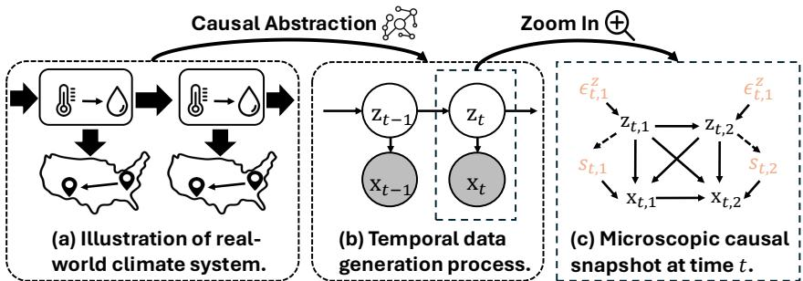
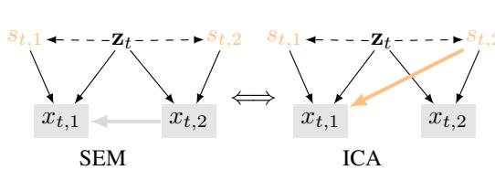
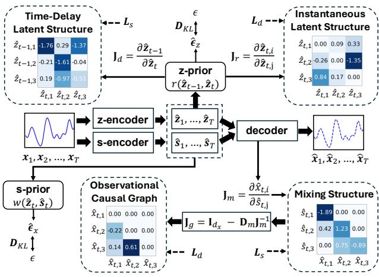
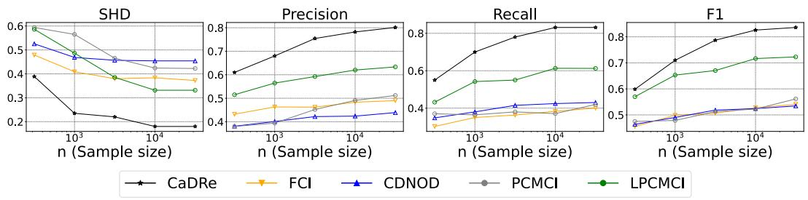
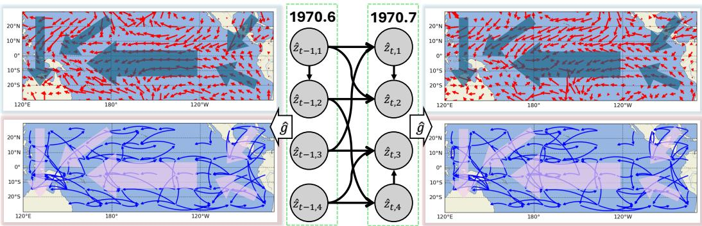

# Learning General Causal Structures with Hidden Dynamic Process for Climate Analysis

Anonymous Author(s)   
Affiliation   
Address   
email

# Abstract

The heart of climate analysis is a rational effort to understand the causes behind the   
purely observational data. Latent driving forces, such as atmospheric processes,   
play a critical role in temporal dynamics, and the task of inferring such latent forces   
is often a problem of Causal Representation Learning (CRL). Moreover, geograph  
ically nearby regions may directly interact with each other, and such direct causal   
relations among the observed data are often not modeled in traditional CRL, mak  
ing the problem more challenging. In this paper, we propose a unified framework   
that can uncover not only the latent driving forces, but also the causal relations   
among the observed variables. We establish conditions under which the hidden   
dynamic process and the relations among the observed variables are simultaneously   
identifiable from time-series data. Even without parametric assumptions on the   
causal relations, we provide identifiability guarantees for recovering latent variables   
and the relations among the observed variables via contextual information. Guided   
by these insights, we propose a framework for nonparametric Causal Discovery   
and Representation learning (CaDRe), based on a time-series generative model   
with structural constraints. Synthetic data validates our theoretical claims. On   
real-world climate datasets, CaDRe achieves competitive forecasting performance   
and offers the visualized causal graphs consistent with domain knowledge, which   
is expected to improve our understanding of the climate systems.

# 20 1 Introduction

Understanding the causal structure of climate systems is fundamental not only to scientific rea  
soning [59], but also to reliable modeling and prediction. Given the observed data with $d _ { x }$ vari  
ables: $\mathbf { x } _ { t } = [ x _ { t , 1 } , \dots , x _ { t , d _ { x } } ]$ , our goal is twofold: (1) to discover the underlying latent variables   
$\mathbf { z } _ { t } = [ z _ { t , 1 } , \ldots , z _ { t , d _ { z } } ]$ and their temporal interactions, and (2) to identify causal relations among   
observed variables. To better understand this problem, we describe it using a causal modeling perspec  
tive. As depicted in Figure 1, latent drivers $\mathbf { z } _ { t }$ , such as pressure and precipitation [8], are not directly   
measured but significantly influence the observed dynamics. These latent processes evolve jointly   
and stochastically, exhibiting both instantaneous and time-lagged causal dependencies [43, 57]. They   
govern observable quantities $\mathbf { x } _ { t }$ like temperature, which reflect underlying dynamics and also exhibit   
spatial interactions through emergent weather patterns, such as wind circulation systems.   
Identifying these underlying hidden variables and temporal relations is the central objective of Causal   
Representation Learning (CRL) [61] problem. Recent advances in identifiability theory and practical   
algorithm design fall under the framework of nonlinear Independent Component Analysis (ICA).   
These approaches typically rely on auxiliary variables [23, 24, 22, 75], sparsity [32, 85, 86, 31, 5],   
or restricted generative functions [16], and generally assume a noise-free and invertible generation   
from $\mathbf { z } _ { t }$ to $\mathbf { x } _ { t }$ , in order to directly recover latent space. However, climatic measurements exhibit   
both observational dependencies and stochastic noise, violating these assumptions and limiting the   
applicability of existing CRL approaches.   
This problem can also be cast as the problem of causal discovery [65, 51] in the presence of latent   
processes. Causal discovery often relies on parametric models, such as linear non-Gaussianity [62],   
nonlinear additive [17, 30], post-nonlinear models [80], as well as nonparametric methods with [21,   
, 46] or without auxiliary variables [64, 84, 81]. However, generally speaking, they cannot identify   
latent variables, their interrelations, and their causal influence on observed variables. For example,   
Fast Causal Inference (FCI) algorithm [64] produces asymptotically correct results in the presence   
of latent confounders by exploiting conditional independence relations, but its result is often not   
informative enough; for instance, it cannot recover causally-related latent variables.   
This above underscores the need for a unified framework capable of modeling both the observational   
causal structure, defined as the relations among the observed variables, and latent dynamic processes   
inherent to real-world climate systems. We understand the climate system through a causal lens and   
establish the identifiability guarantees for jointly recovering latent dynamics and observational causal   
graphs. Intuitively, the temporal structure enables leveraging contextual observable information to   
identify latent factors, while the inferred latent dynamics, in turn, modulate how observational causal   
graphs evolve. We instantiate this insight in a state-space Variational AutoEncoder (VAE), which can   
conduct nonparametric Causal Discovery and Representation learning (CaDRe) simultaneously.   
CaDRe employs parallel flow-based priors to learn independent components to reflect structural   
dependencies, and introduces gradient-based structural penalties on both latent transitions and   
decoders to ensure identifiability. Extensive synthetic experiments on the identification of latent   
representation learning and causal discovery validate our theoretical guarantees. On real-world   
climate data, CaDRe achieves competitive forecasting accuracy, indicating the effectiveness of the   
learned temporal process. The visualized causal graphs align with known scientific phenomena, e.g.,   
wind circulation and land–sea interactions, and further reveal structural patterns that may inspire new   
hypotheses in climate science.

  
Figure 1: From climate system to causal graph. $\mathbf { x } _ { t }$ represent observed data and $\mathbf { z } _ { t }$ denotes unobserved variables behind $\mathbf { x } _ { t }$ , $\epsilon _ { t } ^ { z }$ denotes the stochasticility in latent causal process, and $s _ { t }$ denotes the noise variable varying with $\mathbf { z } _ { t }$ , e.g., human activities [8].

# 63 2 Problem Setup

Technical Notations. We present the notations in a climate system, a terminology widely used   
in ICA literature [23]. We observed a time-series of observed variables $\mathbf { X } = \left[ \mathbf { x } _ { 1 } , \mathbf { x } _ { 2 } , \cdots , \mathbf { x } _ { T } \right]$ ,   
whereas their underlying factors ${ \bf Z } = [ { \bf z } _ { 1 } , { \bf z } _ { 2 } , \cdots , { \bf z } _ { T } ]$ are unobservable. Regarding the system in   
one time-step, as depicted in Figure 1, it consists of observed variables $\mathbf { x } _ { t } : = [ \bar { x } _ { t , i } ] _ { i \in \overline { { \mathbb { Z } } } }$ with index set   
$\mathcal { T } = \{ 1 , 2 , \dotsc \}$ , and latent variables $\mathbf { z } _ { t } : = [ z _ { t , j } ] _ { j \in \mathcal { I } }$ indexed by $\mathcal { I } = \{ 1 , 2 , \dots , d _ { z } \}$ . Let $\mathbf { p a } ( \cdot )$   
denotes the parent variables, $\mathbf { p a } _ { O } ( \cdot )$ refers to observable parents, and $\mathbf { p } \mathbf { a } _ { L } ( \cdot )$ indicates the latent   
parents. In particular, $\mathbf { p } \mathbf { a } _ { L } ( \cdot )$ comprises latent variables from both the current and previous time step.   
Throughout the paper, the hat notation, e.g., $\hat { \mathbf { x } } _ { t }$ , denotes estimated variables or functions.   
Data Generating Process. Suppose we have observed the time series data with discrete timestamps   
$\mathbf { X } = \left[ \mathbf { x } _ { 1 } , \mathbf { x } _ { 2 } , \ldots , \mathbf { x } _ { T } \right]$ . We translate how a climate system evolves to the following Structural

$$
\begin{array} { r } { x _ { t , i } = \underbrace { g _ { i } ( \mathbf { p a } _ { O } ( \boldsymbol { x } _ { t , i } ) , \mathbf { p a } _ { L } ( \boldsymbol { x } _ { t , i } ) , \boldsymbol { s } _ { t , i } ) } _ { \mathrm { e f f e c t s ~ f r o m ~ \mathbf { x } _ { t } ~ a n d } \mathbf { z } _ { t } } , \quad \boldsymbol { z } _ { t , j } = \underbrace { f _ { j } ( \mathbf { p a } _ { L } ( \boldsymbol { z } _ { t , j } ) , \boldsymbol { \epsilon } _ { t , j } ^ { z } ) } _ { \mathrm { e f f e c t s ~ f r o m ~ \mathbf { z } _ { t - 1 } ~ a n d } \mathbf { z } _ { t } } , \quad \underbrace { s _ { t , i } = g _ { s _ { i } } ( \mathbf { z } _ { t } , \boldsymbol { \epsilon } _ { t , i } ^ { x } ) } _ { \mathrm { n o i s e ~ c o n d i t i o n e d ~ o n ~ \mathbf { z } _ { t } ~ } } , } \end{array}
$$

where $g _ { i }$ and $f _ { j }$ are differentiable functions, and noise terms $\epsilon _ { t , j } ^ { z } \sim p _ { \epsilon _ { z _ { j } } } , \epsilon _ { t , i } ^ { x } \sim p _ { \epsilon _ { x _ { i } } }$ are mutually   
independent for $\mathcal { T }$ and $\mathcal { I }$ . As discussed in the introduction, the observed variable $x _ { t , i }$ may be   
influenced by other observed components $\mathbf { x } _ { t , \cdot \setminus i }$ and the latent variables $\mathbf { z } _ { t }$ . For example, temperature   
in a specific region may be governed by latent drivers such as solar radiation, and also be affected by   
neighboring regions through heat transfer. The stochastic term $s _ { t , i }$ , depending on latent variables   
$\mathbf { z } _ { t }$ , is designed to capture inherent climatic variability, such as perturbations introduced by human   
activities on $\mathrm { C O _ { 2 } }$ [66]. The latent variable $z _ { t , j }$ evolves according to both instantaneous interactions   
with other components $\mathbf { z } _ { t , \cdot \cdot j }$ and time-lagged dependencies from the previous step $\mathbf { z } _ { t - 1 }$ . Aiming at   
reliably discovering causal graphs, we additionally adopt an assumption [65] in causal discovery:

Assumption 1. The distribution over $( \mathbf { X } , \mathbf { Z } )$ is Markov and faithful to a Directed Acyclic Graph (DAG).

Based on the generation process, we formally define the identifiability of latent space, latent variables, and observational causal structure, each serving as a prerequisite for reliable climate analysis.

Definition 1 (Identifiability Criteria). Let $\mathbf { X } = \{ \mathbf { x } _ { 1 } , \dots , \mathbf { x } _ { T } \}$ be a sequence of observed variables generated by the true latent causal processes specified by $( f , g , g _ { s } , p ( \epsilon _ { t } ^ { z } ) , p ( \epsilon _ { t } ^ { x } ) )$ as described in Equation 1. A learned generative model $( \hat { f } , \hat { g } , \hat { g } _ { s } , \hat { p } ( \epsilon _ { t } ^ { z } ) , \hat { p } ( \epsilon _ { t } ^ { x } ) )$ is said to be observationally equivalent to the true model if it induces the same distribution over observations, i.e., $p _ { \hat { f } , \hat { g } , \hat { g } _ { s } } ( \hat { \mathbf { X } } ) = p _ { f , g , g _ { s } } ( \mathbf { X } )$ . Under this equivalence, we define the following identifiability properties:

i. (Identifiability of Latent Space): $\hat { \mathbf { z } } _ { t } = h ( \mathbf { z } _ { t } )$ for all $t$ , where $h : \mathbb { R } ^ { d _ { z } }  \mathbb { R } ^ { d _ { z } }$ is invertible.

ii. (Component-Wise Identifiability of Latent Variables): $\hat { z } _ { t , i } = h _ { i } ( z _ { t , \pi ( i ) } )$ for all $t$ and $i$ , where $\pi$ is a permutation over $\{ 1 , \ldots , d _ { z } \}$ and $h _ { i } : \mathbb { R }  \mathbb { R }$ are invertible functions.

iii. (Identifiability of Observational Causal Graph): The estimated causal parents of each observed variable match the ground truth, i.e., $\overline { { \mathbf { p } \mathbf { a } _ { O } ( x _ { t , i } ) } } = \mathbf { p a } _ { O } ( x _ { t , i } )$ for all $t$ and i.

# 3 Identification Theory

Given the above definitions and goals, we first establish the identifiability of the latent space in   
Theorem 1, and further show that the latent causal process is identifiable under a sparse latent   
process [31, 35] in Theorem A.3. We then draw a formal connection between the SEM and nonlinear   
ICA with latent variables, which are shown to describe the same data generating processes in   
Theorem 2. This connection nourishes a functional equivalence for computing the causal graphs   
through the mixing structure of ICA in Theorem 2. Finally, we prove the identifiability of the   
nonlinear ICA with latent variables in Theorem 3 by leveraging the cross-derivative condition [36],   
subsequently identifying observational causal graphs in SEM via functional equivalence.

# 3.1 Latent Space Recovery and Latent Variables Identification

In this section, we aim to characterize the relationships between ground truth $\mathbf { z } _ { t }$ and estimated $\hat { \mathbf { z } } _ { t }$ .   
We consider, without loss of generality, a first-order Markov structure, in which three consecutive   
observations $\left\{ { \bf x } _ { t - 1 } , { \bf x } _ { t } , { \bf x } _ { t + 1 } \right\}$ are used as contextual information. The generalization to higher-order   
Markov structures is discussed in Appendix D.1. To formalize the stochastic generation process,   
we introduce an operator $L$ [12] to represent distribution-level transformations, that is, how one   
probability distribution is pushed forward to another. Given two random variables $a$ and $b$ with   
supports $\mathcal { A }$ and $\boldsymbol { B }$ respectively, the transformation $p _ { a } \mapsto p _ { b }$ is formalized as:

$$
p _ { b } = L _ { b | a } \circ p _ { a } , { \mathrm { ~ w h e r e ~ } } L _ { b | a } \circ p _ { a } : = \int _ { \mathcal { A } } p _ { b | a } ( \cdot \mid a ) p _ { a } ( a ) d a .
$$

For example, operators $L _ { { \mathbf { x } } _ { t + 1 } | { \mathbf { z } } _ { t } }$ and $L _ { \mathbf { x } _ { t - 1 } | \mathbf { x } _ { t + 1 } }$ represent the distributional transformations $p _ { \mathbf { z } _ { t } } \mapsto $   
$p _ { { \mathbf { x } } _ { t + 1 } }$ and $p _ { \mathbf { x } _ { t + 1 } } \mapsto p _ { \mathbf { x } _ { t - 1 } }$ , respectively. With the help of this operator, we turn to addressing the   
problem of "causally-related" observed variables in recovering the latent space. When the observed   
causal graph forms a DAG, information is preserved along the causal pathways without getting   
trapped into a self-loop. This suggests that causal influence can be traced back to its source by   
120 following the reverse direction of the DAG through the "short reaction lag" [14]. Formally, this   
21 implies that the associated operator in the generative process must be injective, ensuring that the   
transformation retains full distributional information. We formalize this as follows:

Lemma 1. (Injective DAG Operator) Under Assumption 23 $I$ , $L _ { { \bf x } _ { t } | { \bf s } _ { t } }$ is injective for all $t \in \mathcal T$ .

This result implies that the nonlinear causal DAG over $\mathbf { x } _ { t }$ does not disturb the recovery of the latent   
space. Building on this, we now address a more fundamental challenge: the latent variable $\mathbf { z } _ { t }$ cannot   
be recovered from a single noisy observation $\mathbf { x } _ { t }$ , as the stochasticity makes the value-level mapping   
ill-posed. Instead, we seek identifiability at the distributional level. Notably, adjacent observations   
$\mathbf { x } _ { t - 1 }$ and $\mathbf { x } _ { t + 1 }$ contain non-trivial information about $\mathbf { z } _ { t }$ if they exhibit minimal changes. We propose   
the following theorem to provide nonparametric identifiability of the latent submanifold based on   
distributional variations captured by contextual measurements.   
Theorem 1. (Identifiability of Latent Space) Suppose observed variables and hidden variables   
follow the data-generating process in Eq. (1), and estimated observations match the true joint   
distribution of $\left\{ { \bf x } _ { t - 1 } , { \bf x } _ { t } , { \bf x } _ { t + 1 } \right\}$ as illustrated in Definition 1. The following assumptions are imposed:

A1 (Computable Probability:) The joint, marginal, and conditional distributions of $\left( \mathbf { x } _ { t } , \mathbf { z } _ { t } \right)$ are all bounded and continuous.

A2 (Contextual Variability:) The operators $L _ { { \mathbf { x } } _ { t + 1 } | { \mathbf { z } } _ { t } }$ and $L _ { \mathbf { x } _ { t - 1 } | \mathbf { x } _ { t + 1 } }$ are injective and bounded.

A3 (Latent Drift:) For any ${ \mathbf z } _ { t } ^ { ( 1 ) } , { \mathbf z } _ { t } ^ { ( 2 ) } \in \mathcal { Z } _ { t }$ where $\mathbf { z } _ { t } ^ { ( 1 ) } \neq \mathbf { z } _ { t } ^ { ( 2 ) }$ , we have $p ( \mathbf { x } _ { t } | \mathbf { z } _ { t } ^ { ( 1 ) } ) \neq p ( \mathbf { x } _ { t } | \mathbf { z } _ { t } ^ { ( 2 ) } )$

A4 (Differentiability:) There exists a functional $M$ such that $M \left[ p _ { \mathbf { x } _ { t } | \mathbf { z } _ { t } } ( \cdot \mid \mathbf { z } _ { t } ) \right] = h _ { z } ( \mathbf { z } _ { t } )$ for all $\mathbf { z } _ { t } \in \mathcal { Z } _ { t }$ , where $h$ is differentiable.

Then we have 40 $\hat { \mathbf { z } } _ { t } = h _ { z } ( \mathbf { z } _ { t } )$ , where $h _ { z } : \mathbb { R } ^ { d _ { z } }  \mathbb { R } ^ { d _ { z } }$ is an invertible and differtiable function.

Discussion on Assumptions. As presented, A1 is a moderate condition for computable density   
fucntions. A2 introduces sufficient distributional variability, formalized via injectivity at the density   
level. A3 ensures that distinct values of $\mathbf { z } _ { t }$ induce distinct conditionals $p ( \mathbf { x } _ { t } \mid \mathbf { z } _ { t } )$ , which is violated   
only when two values of $\mathbf { z } _ { t }$ yield identical distributions. A4 requires that the mapping from $\mathbf { z } _ { t }$ to   
$p ( \mathbf { \dot { x } } _ { t } \mid \mathbf { z } _ { t } )$ is differentiable—a condition naturally satisfied by models based on differentiable neural   
networks, such as VAEs. Please refer to Appendix A.2 for detailed discussions.   
Proof Sketch and Contributions. The complete proof is deferred to Appendix A. Prior work on   
nonparametric identifiability [18, 6] relies on partially knowing the function form of generation   
mechanism $g$ , and yields only distribution-level identifiability, i.e., $p _ { \hat { \mathbf { z } } _ { t } } ~ = ~ p _ { \mathbf { z } _ { t } }$ . In contrast, our   
approach requires no such prior knowledge and achieves identifiability at the value level, a more   
informative result. As depicted in Eq. (A19), we begin by proving the uniqueness of the posterior   
collection $\{ p ( \mathbf { x } _ { t } \mid \hat { \mathbf { z } } _ { t } ) \} _ { \hat { \mathcal { Z } } _ { t } }$ , where the unordered set unveils the existence of a relabeling function $h$   
on the conditioning variables. A3 then ensures a one-to-one correspondence between $\mathbf { z } _ { t }$ and the   
posteriors $p ( \mathbf { x } _ { t } \mid \hat { \mathbf { z } } _ { t } )$ , thereby ruling out degenerate mappings from posteriors to values.

$$
\boxed { \left\{ p _ { { \bf x } _ { t } | { \bf z } _ { t } } ( { \bf \cdot } | { \bf { z } } _ { t } ) \right\} z _ { t } = \left\{ p _ { { \bf x } _ { t } | { \bf { \bar { z } } } _ { t } } ( { \bf \cdot } | { \bf { \sigma } } _ { { \bf { \bar { z } } } _ { t } } ) \right\} _ { { \hat { z } } _ { t } } \Rightarrow \left[ p _ { { \bf x } _ { t } | { \bf z } _ { t } } ( { \bf x } _ { t } \mid h _ { z } ( { \bf z } _ { t } ) ) = p _ { { \bf x } _ { t } | { \bf { \bar { z } } } _ { t } } ( { \bf x } _ { t } \mid { \hat { \bf z } } _ { t } ) \right] \Rightarrow \left[ { \underline { { { \hat { \bf z } } } } } _ { t } = h _ { z } ( { \bf z } _ { t } ) \right] }
$$

Finally, A4 pins down the $h$ to be differentiable. After recovering the latent space, we aim to enhance   
interpretability by ensuring that each latent component corresponds to a distinct physical variable.   
To achieve this, we introduce a sparsity assumption on the latent dynamics, which is motivated by   
that physical climate factors—such as solar radiation, atmospheric pressure, or ocean currents—tend   
to exhibit localized sparse influences. Please refer to Appendix A.3 for the theorem regarding   
component-wise identifiability of latent variables.

# 3.2 Nonparametric Causal Discovery with the Hidden Dynamic Process

Building upon the results on recovering latent representations, we now seek to identify general   
nonlinear causal graphs over $\mathbf { x } _ { t }$ , even if they are modulated by a hidden dynamic process. Recent   
works [46, 55] extend the ICA-based Causality Discovery (CD) [62] to nonparametric settings via   
nonlinear ICA [25]. However, these methods are not applicable in the presence of latent confounders.   
To overcome this limitation, we establish a refined connection between SEMs and nonlinear ICA.

Lemma 2. (Nonlinear67 $S E M $ Nonlinear ICA) There exists a function $m _ { i }$ , which is differentiable 68 w.r.t. $s _ { t , i }$ and $\mathbf { x } _ { t }$ , for any fixed $s _ { t , i }$ and $\mathbf { z } _ { t }$ , such that the following two representations,

$$
x _ { t , i } = g _ { i } ( \mathbf { p a } _ { O } ( x _ { t , i } ) , \mathbf { p a } _ { L } ( x _ { t , i } ) , s _ { t , i } ) \quad a n d \quad x _ { t , i } = m _ { i } \left( \mathbf { z } _ { t } , \mathbf { s } _ { t } \right)
$$

describe the same data-generating process. That is, both expressions yield the same value of 169 $\boldsymbol { x } _ { t , i }$

  
Figure 2: Equivalent SEM and ICA. The gray line in SEM denotes the influence xt,2 xt,1 through the observation causal relation, which is equivalently represented as an indirect effect (the orange line): $s _ { t , 2 } ~ \to ~ x _ { t , 1 }$ in ICA, which can be decomposed into $s _ { t , 2 } \to x _ { t , 2 }$ and $x _ { t , 2 } \to x _ { t , 1 }$ .

After establishing this equivalence, we proceed to perform CD via the nonlinear ICA with latent   
variables. We begin by introducing the Jacobian matrices on this data generating process, as they serve   
as proxies for the (nonlinear) adjacency matrix. For all $( i , j ) \in \mathcal { T } \times \mathcal { T }$ , we define $\begin{array} { r } { [ \mathbf { J } _ { m } ( \mathbf { s } _ { t } ) ] _ { i , j } = \frac { \partial x _ { t , i } } { \partial s _ { t , j } } } \end{array}$ ,   
$\begin{array} { r } { [ \mathbf { J } _ { g } ( \mathbf { x } _ { t } ) ] _ { i , j } \ = \ \frac { \partial x _ { t , i } } { \partial x _ { t , j } } } \end{array}$ , and Dm(st) = diag( ϑxt,1ϑst,1 , ϑxt,2ϑst,2 , , ϑxt,dxϑst,d ), Idx is the identity matrix in   
$\mathbb { R } ^ { d _ { x } \times d _ { x } }$ . Here, $\mathbf { J } _ { m } ( \mathbf { s } _ { t } )$ corresponds to the mixing process of nonlinear ICA, as described on the   
R.H.S. of Eq. (3). Note that $\mathbf { J } _ { g } ( \mathbf { x } _ { t } )$ signifies the observational causal graph in the nonlinear SEM,   
the L.H.S. of Eq. (3), provided the faithfulness assumption outlined below holds.   
Assumption 2 (Functional Faithfulness). The causal adjacency structure among observed variables   
is given by the support of the Jacobian matrix $\mathbf { J } _ { g } ( \mathbf { x } _ { t } )$ .   
This assumption implies edge minimality in causal graphs, analogous to the structural minimality   
discussed in [52] (Remark 6.6) and minimality in [79], which enables us to establish a equivalence   
between the observational causal graph in SEM and the mixing structure in nonlinear ICA.   
Theorem 2. (Functional Equivalence) Consider the two types of data generating process described   
in Eq. (3), the following equation always holds:

$$
\begin{array} { r } { \mathbf { J } _ { g } ( \mathbf { x } _ { t } ) \mathbf { J } _ { m } ( \mathbf { s } _ { t } ) = \mathbf { J } _ { m } ( \mathbf { s } _ { t } ) - \mathbf { D } _ { m } ( \mathbf { s } _ { t } ) . } \end{array}
$$

Proof Sketch. Following the depiction of the SEM, the flow of information can be traced starting   
from the observed variables $\mathbf { x } _ { t }$ . The DAG structure ensures that the sources are the latent variables   
and the independent noise, implying that the data generation process conforms to a specific nonlinear   
ICA: $[ { \bf z } _ { t } , { \bf \epsilon } _ { x _ { t } } ] \Rightarrow { \bf x } _ { t }$ , where $\mathbf { z } _ { t }$ is characterized as a conditional prior. Refer to Appendix A.4 for   
a detailed proof. We establish two results that strengthen the SEM–ICA connection by relaxing   
modeling assumptions and enabling its practical application within generative models.

Corollary 2.1. Under Assumption $I$ , given any $\mathbf { z } _ { t } \in { \mathcal { Z } } _ { t }$ , $\mathbf { J } _ { m } ( \mathbf { s } _ { t } )$ is a invertible matrix.

This result unveils that the DAG structure among observed variables implies the invertibility of the   
mixing function $m$ in the nonlinear ICA. As a direct consequence, by left-multiplying both sides of   
193 Eq. (4) with $\mathbf { J } _ { m } ^ { - 1 } ( \mathbf { s } _ { t } )$ , we obtain the following expression:

Corollary 2.2. Observational causal graphs are represented by $\mathbf { J } _ { g } ( \mathbf { x } _ { t } ) = \mathbf { I } _ { d _ { x } } - \mathbf { D } _ { m } ( \mathbf { s } _ { t } ) \mathbf { J } _ { m } ^ { - 1 } ( \mathbf { s } _ { t } )$ .

Building upon these SEM–ICA connections, we derive sufficient conditions under which the observational causal graph becomes identifiable in virtue of the recovered latent processes.

97 Theorem 3. (Identifiability of Observational Causal Graph) Let $\mathbf { A } _ { t , k } = \log p ( \mathbf { s } _ { t , k } \vert \mathbf { z } _ { t } )$ , assume   
that $\mathbf { A } _ { t , k }$ is twice differentiable in $s _ { t , k }$ and is differentiable in $z _ { t , l } ,$ , where $l = 1 , 2 , . . . , d _ { z }$ . Suppose   
199 Assumption $I$ , 2 holds true, and

00 A5 (Generation Variability). For any estimated $\hat { g } _ { m }$ that makes $\begin{array} { r } { { \bf x } _ { t } = \hat { \bf x } _ { t } = \hat { m } ( \hat { \bf z } _ { t } , \hat { \bf s } _ { t } ) , } \end{array}$ , let

$$
\begin{array} { r } { \mathbf { V } ( t , k ) : = \left[ \frac { \partial ^ { 2 } \mathbf { A } _ { t , k } } { \partial s _ { t , k } \partial z _ { t , 1 } } , \ldots , \frac { \partial ^ { 2 } \mathbf { A } _ { t , k } } { \partial s _ { t , k } \partial z _ { t , d z } } \right] , \mathbf { U } ( t , k ) : = \left[ \frac { \partial ^ { 3 } \mathbf { A } _ { t , k } } { \partial s _ { t , k } \partial ^ { 2 } z _ { t , 1 } } , \ldots , \frac { \partial ^ { 3 } \mathbf { A } _ { t , k } } { \partial s _ { t , k } \partial ^ { 2 } z _ { t , d z } } \right] ^ { T } , } \end{array}
$$

where for $k = 1 , 2 , \ldots , d _ { x }$ , $2 d _ { x }$ vector functions $\mathbf { V } ( t , 1 ) , \ldots , \mathbf { V } ( t , d _ { x } ) , \mathbf { U } ( t , 1 ) , \ldots , \mathbf { U } ( t , d _ { x } )$ are   
linearly independent. Then we attain ordered component-wise identifiability (Definition 5), and the   
structure of the observational causal graph is identifiable, i.e., $s u p p ( \mathbf { J } _ { g } ( \mathbf { x } _ { t } ) ) = s u p p ( \mathbf { J } _ { \hat { g } } ( \hat { \mathbf { x } } _ { t } ) )$ .   
Proof Sketch. The core idea of the proof extends the notion of component-wise identifiability. Recall   
from data generating process 1 that satisfies $s _ { t , i } \perp s _ { t , j } \mid \mathbf { z } _ { t }$ for all $i \neq j$ . From Theorem 1, we know   
that block-level information about $\mathbf { z } _ { t }$ is identifiable and can be treated as a continuous conditioning   
domain [23]. To eliminate the permutation ambiguity, we further exploit the structural constraints   
encoded by the DAG over observed variables. The full proof is provided in Appendix A.7.   
In summary, these results establish a clear pipeline for reliably learning observational causal graphs   
through latent variable identification, noise component identification, and structure identification.

Table 1: Attributes of causal discovery that can apply to time-series. A check denotes that a method has an attribute or result, whereas a cross denotes the opposite.   

<table><tr><td>Method</td><td></td><td></td><td></td><td>NonparametricLatent VariablesLatent Causal GraphObservational Causal GraphNo Equivalence Classes</td><td></td></tr><tr><td>NESSM[20]</td><td></td><td>X</td><td></td><td></td><td></td></tr><tr><td>CD-NOD[21]</td><td></td><td></td><td></td><td>JJJJ</td><td></td></tr><tr><td>FCI [64]</td><td></td><td></td><td></td><td></td><td></td></tr><tr><td>LPCMCI[15]</td><td></td><td></td><td></td><td></td><td></td></tr><tr><td>CDSD [5]</td><td></td><td></td><td></td><td></td><td></td></tr><tr><td>CaDRe</td><td></td><td></td><td></td><td></td><td></td></tr></table>

$$
\Big | \hat { \mathbf { z } } _ { t } = h _ { z } ( \mathbf { z } _ { t } ) \Big | \Rightarrow \Big [ \hat { s } _ { t , i } = h _ { s } \big ( s _ { t , \pi ( i ) } \big ) \Big ] \Rightarrow \Big [ \mathrm { s u p p } ( \mathbf { J } _ { \hat { m } } ) = \mathrm { s u p p } ( \mathbf { J } _ { m } ) \Big ] \Rightarrow \Big [ \mathrm { s u p p } ( \mathbf { J } _ { \hat { g } } ) = \mathrm { s u p p } ( \mathbf { J } _ { g } ) \Big ]
$$

Method Comparison. As summarized in Table 1, CaDRe supports versatile causal discovery across   
multiple settings while addressing these challenges in a unified framework. NESSM [20] models   
time-varying causal strengths but assumes causal sufficiency and restricts the causal model to a linear   
form, making it a special case of CaDRe. CD-NOD [21] needs nonstationarity for causal discovery   
and does not model latent variables, and suffers from equivalence classes. FCI [64] requires no   
auxiliary assumptions but cannot recover latent variables and is limited to Partial Ancestral Graphs   
(PAGs). LPCMCI [15] considers both latent variables and observational structure but does not model   
latent temporal dynamics. CDSD [5] is designed for climate settings and assumes sparse causal   
219 mechanisms, yet lacks a modeling framework for observational interactions in climate systems.

# 4 Estimation Methodology

1 Our theoretical insights shed light on the practical implementations. As shown in Figure 4, we instantiate these insights into an estimation framework for Causal Discovery and causal Representation learning (CaDRe) in the nonparametric setting, enabling direct inference of causal structures.

Overall Architecture. The proposed architecture is built upon the variational autoencoder [27]. In   
light of data generating process 1, we establish the Evidence Lower BOund (ELBO) as follows:

$$
\begin{array} { r l } & { \mathcal { L } _ { E L B O } = \mathbb { E } _ { q ( \mathbf { s } _ { 1 : T } | \mathbf { x } _ { 1 : T } ) } \left[ \log p ( \mathbf { x } _ { 1 : T } \mid \mathbf { s } _ { 1 : T } , \mathbf { z } _ { 1 : T } ) \right] - } \\ & { \qquad \lambda _ { 1 } D _ { \mathrm { K L } } \left( q ( \mathbf { s } _ { 1 : T } \mid \mathbf { x } _ { 1 : T } ) \parallel p ( \mathbf { s } _ { 1 : T } \mid \mathbf { z } _ { 1 : T } ) \right) - \lambda _ { 2 } D _ { \mathrm { K L } } \left( q ( \mathbf { z } _ { 1 : T } \mid \mathbf { x } _ { 1 : T } ) \parallel p ( \mathbf { z } _ { 1 : T } ) \right) , } \end{array}
$$

where $\lambda _ { 1 }$ and $\lambda _ { 2 }$ are hyperparameters, and $D _ { K L }$ represents the Kullback-Leibler divergence. We set   
$\lambda _ { 1 } = 4 \times 1 0 ^ { - 3 }$ and $\lambda _ { 2 } ^ { - } = \dot { 1 } . 0 \times 1 0 ^ { - 2 }$ to achieve the best performance. In Figure 4, the $_ { z }$ -encoder,   
228 s-encoder and decoder are implemented by Multi-Layer Perceptrons (MLPs) as follows:

$$
\begin{array} { r } { \mathbf { z } _ { 1 : T } = \phi ( \mathbf { x } _ { 1 : T } ) , \mathbf { s } _ { 1 : T } = \eta ( \mathbf { x } _ { 1 : T } ) , \hat { \mathbf { x } } _ { 1 : T } = \psi ( \mathbf { z } _ { 1 : T } , \mathbf { s } _ { 1 : T } ) , } \end{array}
$$

29 respectively, where the $_ { z }$ -encoder $\phi$ learns the latent variables through denoising, and s-encoder $\psi$   
and decoder $\eta$ approximate functions for encoding $\mathbf { s } _ { t }$ and reconstructing observations, respectively.   
Prior Estimation of $\mathbf { z } _ { t }$ and $\mathbf { s } _ { t }$ . We propose using the $\tt s$ -prior network and $_ { z }$ -prior network to   
recover the independent noise $\hat { \epsilon } _ { t } ^ { x }$ and $\hat { \epsilon } _ { t } ^ { z }$ , respectively, thereby estimating the prior distribution of   
latent variables $\hat { \mathbf { z } } _ { t }$ and dependent noise $\hat { \mathbf { s } } _ { t }$ . Specifically, we first let $r _ { i }$ be the $i$ -th learned inverse   
transition function that take the estimated latent variables as input to recover the noise term, e.g.,   
$\hat { \epsilon } _ { t , i } ^ { z } = r _ { i } ( \hat { \mathbf { z } } _ { t - 1 } , \hat { \mathbf { z } } _ { t } )$ . Each $r _ { i }$ is implemented by MLPs. Sequentially, we devise a transformation   
$\kappa : = \{ \hat { \mathbf { z } } _ { t - 1 } , \hat { \mathbf { z } } _ { t } \} \to \{ \hat { \mathbf { z } } _ { t - 1 } , \hat { \epsilon } _ { t } ^ { z } \}$ , whose Jacobian can be formalized as $\mathbf { J } _ { \kappa } = \left( \begin{array} { c c } { \mathbf { I } } & { 0 } \\ { \mathbf { J } _ { d } ( \hat { \mathbf { z } } _ { t - 1 } ) } & { \mathbf { J } _ { r } ( \hat { \mathbf { z } } _ { t } ) } \end{array} \right)$ .   
Then we have Eq. (7) derived from normalizing flow to estimate the prior distribution:

$$
\log p ( \hat { \mathbf { z } } _ { t } , \hat { \mathbf { z } } _ { t - 1 } ) = \log p ( \hat { \mathbf { z } } _ { t - 1 } , \hat { \pmb { \epsilon } } _ { t } ^ { z } ) + \log | \frac { \partial r _ { i } } { \partial \hat { z } _ { t , i } } | .
$$

According to the generation process, the noise $\epsilon _ { t , i } ^ { z }$ is independent of $\mathbf { z } _ { t - 1 }$ , allowing us to enforce   
239 independence on the estimated noise term $\hat { \epsilon } _ { t , i } ^ { z }$ with $\mathcal { D } _ { K L }$ . Consequently, Eq. (7) can be rewritten as:

$$
\log p ( \hat { \mathbf { z } } _ { 1 : T } ) = p ( \hat { \mathbf { z } } _ { 1 } ) \prod _ { \tau = 2 } ^ { T } \left( \sum _ { i = 1 } ^ { d _ { z } } \log p ( \hat { \epsilon } _ { \tau , i } ^ { z } ) + \sum _ { i = 1 } ^ { d _ { z } } \log | \frac { \partial r _ { i } } { \partial \hat { z } _ { \tau , i } } | \right) ,
$$

  
Figure 3: The estimation procedure of CaDRe. The model framework includes two encoders: z-encoder for extracting latent variables $\mathbf { z } _ { t }$ , and s-encoder for extracting $\mathbf { s } _ { t }$ . A decoder reconstructs observations from these variables. Additionally, prior networks estimate the prior distribution using normalizing flow, target on learning causal structure based on the Jacobian matrix. $\mathcal { L } s$ imposes a sparsity constraint and $\mathcal { L } d$ enforces the DAG structure on Jacobian matrix. $D _ { K L }$ enforces an independence constraint on the estimated noise by minimizing its KL ? , ? , …, ?divergence w.r.t. $\mathcal { N } ( 0 , { \bf { I } } )$ . In summary, this method learns independent noise to inversely infer the causal structures.

Table 2: Results under Varying Observational Dimensionality $( d _ { x } )$ . Each setting is repeated with 5 random seeds. For evaluation, the best-converged result per seed is selected to avoid local minima.   

<table><tr><td>dz</td><td>d</td><td>SHD (Jg(xt))</td><td>TPR</td><td>Precision</td><td>MCC (st)</td><td>MCC (zt)</td><td>SHD (Jr(Zt))</td><td>SHD(Jd(Zt-1))</td><td>R²</td></tr><tr><td rowspan="5">3</td><td>3</td><td>0</td><td>1</td><td>1</td><td>0.9775± 0.01</td><td>0.9721± 0.01</td><td>0.27± 0.05</td><td>0.26±0.03</td><td>0.90±0.05</td></tr><tr><td>6</td><td>0.18± 0.06</td><td>0.83± 0.03</td><td>0.80± 0.04</td><td>0.9583± 0.02</td><td>0.9505± 0.01</td><td>0.24±0.06</td><td>0.33±0.09</td><td>0.92± 0.01</td></tr><tr><td>8</td><td>0.29±0.05</td><td>0.78± 0.05</td><td>0.76±0.04</td><td>0.9020± 0.03</td><td>0.9601± 0.03</td><td>0.36± 0.11</td><td>0.31± 0.12</td><td>0.93± 0.02</td></tr><tr><td>10</td><td>0.43±0.05</td><td>0.65±0.08</td><td>0.63±0.14</td><td>0.8504± 0.07</td><td>0.9652± 0.02</td><td>0.29±0.04</td><td>0.40±0.05</td><td>0.92±0.02</td></tr><tr><td>100*</td><td>0.17±0.02</td><td>0.80±0.05</td><td>0.81± 0.02</td><td>0.9131± 0.02</td><td>0.9565± 0.02</td><td>0.21± 0.01</td><td>0.29±0.10</td><td>0.93± 0.03</td></tr></table>

where 240 $p ( \hat { \epsilon } _ { \tau , i } ^ { z } )$ is assumed to follow a Gaussian distribution. Similarly, we estimate the prior of $\mathbf { s } _ { t }$ using 241 $\hat { \epsilon } _ { t , i } ^ { x } = w _ { i } ( \hat { \mathbf { z } } _ { t } , \hat { \mathbf { s } } _ { t } )$ , and model the transformation between $\hat { \mathbf { s } } _ { t }$ and $\hat { \mathbf { z } } _ { t }$ as follows:

$$
\log p \left( \hat { \mathbf { s } } _ { 1 : T } \mid \hat { \mathbf { z } } _ { 1 : T } \right) = \prod _ { \tau = 1 } ^ { T } \left( \sum _ { i = 1 } ^ { d _ { x } } \log p \left( \hat { \epsilon } _ { \tau , i } ^ { x } \right) + \sum _ { i = 1 } ^ { d _ { x } } \log \left| \frac { \partial w _ { i } } { \partial \hat { s } _ { \tau , i } } \right| \right) .
$$

42 Specifically, to ensure the conditional independence of $\hat { \mathbf { z } } _ { t }$ and $\hat { \mathbf { s } } _ { t }$ , we using $\mathcal { D } _ { K L }$ to minimize the KL divergence from the distributions of 43 $\hat { \epsilon } _ { t } ^ { x }$ and $\hat { \epsilon } _ { t } ^ { z }$ to the distribution $\mathcal { N } ( 0 , \bf { I } )$ .

Structure Learning. The variables $r _ { i }$ and $w _ { i }$ are designed to capture causal dependencies among   
latent and observed variables, respectively. We denote $\mathbf J _ { d } ( \hat { \mathbf z } _ { t - 1 } )$ as the Jacobian matrix of the   
function $r$ , which implies the estimated time-lagged latent causal structure; $\mathbf { J } _ { r } ( \hat { \mathbf { z } } _ { t } )$ , which implies   
the estimation of instantaneous latent causal structure; and $\mathbf { J } _ { \hat { g } } ( \hat { \mathbf { x } } _ { t } )$ , which implies the estimated   
observational causal graph. Considering the observational causal graph, we compute $\mathbf { J } _ { \hat { g } _ { m } } ( \hat { \mathbf { s } } _ { t } )$ from   
the decoder, and instantly obtain the observational causal graph $\mathbf { J } _ { \hat { g } } ( \hat { \mathbf { x } } _ { t } )$ via Corollary 2.2. Notably,   
the entries of $\mathbf { J } _ { \hat { g } } ( \hat { \mathbf { x } } _ { t } )$ vary with other variables such as $\hat { \mathbf { z } } _ { t }$ , resulting in a DAG that could change over   
time. For the latent structure, we directly compute $\mathbf J _ { d } ( \hat { \mathbf z } _ { t - 1 } )$ and $\mathbf { J } _ { r } ( \hat { \mathbf { z } } _ { t } )$ from $_ { z }$ -prior network as the   
time-lagged structure and instantaneous structure in latent space, respectively. To prevent redundant   
edges and cycles, a sparsity penalty $\mathcal { L } _ { s }$ are imposed on each learned structure, and DAG constraints   
$\mathcal { L } _ { d }$ are imposed on the observational causal graph and instantaneous latent causal DAG. Specifically,   
the Markov network structure for latent variables is derived as $\mathcal { M } ( \mathbf { J } ) = ( \mathbf { I } + \mathbf { J } ) ^ { \top } ( \mathbf { I } ^ { ' } + \mathbf { J } ) - \mathbf { \bar { I } }$ .   
Formally, we define these penalties as follows:

$$
\sum \mathcal { L } _ { s } = \| \mathcal { M } ( \mathbf { J } _ { r } ( \hat { \mathbf { z } } _ { t } ) ) \| _ { 1 } + \| \mathcal { M } ( \mathbf { J } _ { d } ( \hat { \mathbf { z } } _ { t - 1 } ) ) \| _ { 1 } + \| \mathbf { J } _ { \hat { g } } ( \hat { \mathbf { x } } _ { t } ) \| _ { 1 } , \quad \sum \mathcal { L } _ { d } = \mathcal { D } ( \mathbf { J } _ { \hat { g } } ( \hat { \mathbf { x } } _ { t } ) ) + \mathcal { D } ( \mathbf { J } _ { r } ( \hat { \mathbf { z } } _ { t } ) )
$$

where 257 ${ \mathcal { D } } ( A ) = \operatorname { t r } \left[ ( I + { \frac { 1 } { m } } A \circ A ) ^ { m } \right] - m$ is the DAG constraint from [77], with $A$ being an $m$ - 258 dimensional matrix. $| | \cdot | | _ { 1 }$ denotes the matrix $l _ { 1 }$ norm. In summary, the overall loss function of the 259 CaDRe model integrates ELBO and penalties for structural constraints, which is formalized as:

$$
\mathcal { L } _ { A L L } = \mathcal { L } _ { E L B O } + \alpha \sum \mathcal { L } _ { s } + \beta \sum \mathcal { L } _ { d } ,
$$

where 260 $\alpha = 1 . 0 \times 1 0 ^ { - 4 }$ and $\beta = 5 . 0 \times 1 0 ^ { - 5 }$ are hyperparameters. The discussions about hyperpa261 rameter selections and their effects on performance are given in Appendix C.1.

  
Figure 5: Comparison with Constraint-Based CD. We set $d _ { x } = 6$ and $d _ { z } = 3$ . We run experiments using 5 different random seeds, and report the average performance on evaluation metrics.   
Table 3: Identification Results on Simulated Data. We set the dimensions as $d _ { z } = 3$ and $d _ { x } = 1 0$ , and consider three scenarios according to our theory: $i$ ) Independent: $z _ { t , i }$ and $z _ { t , j }$ are conditionally independent given $\mathbf { z } _ { t - 1 }$ ; $i i _ { , }$ ) Sparse: $z _ { t , i }$ and $z _ { t , j }$ are dependent given $\mathbf { z } _ { t - 1 }$ , but the latent Markov network $\mathcal { G } _ { z _ { t } }$ and time-lagged latent structure are sparse; iii) Dense: No sparsity restrictions on latent causal graph. Bold numbers indicate the best performance.

<table><tr><td>Seting</td><td>Metric</td><td>CaDRe</td><td>iCITRIS</td><td>G-CaRL</td><td>CaRiNG</td><td>TDRL</td><td>LEAP</td><td>SlowVAE</td><td>PCL</td><td>i-VAE</td><td>TCL</td></tr><tr><td>Independent</td><td>MCC R²</td><td>0.9811 0.9626</td><td>0.6649 0.7341</td><td>0.8023 0.9012</td><td>0.8543 0.8355</td><td>0.9106 0.8649</td><td>0.8942 0.7795</td><td>0.4312 0.4270</td><td>0.6507 0.4528</td><td>0.6738 0.5917</td><td>0.5916 0.3516</td></tr><tr><td>Sparse</td><td>MCC R²</td><td>0.9306 0.9102</td><td>0.4531 0.6326</td><td>0.7701 0.5443</td><td>0.4924 0.2897</td><td>0.6628 0.6953</td><td>0.6453 0.4637</td><td>0.3675 0.2781</td><td>0.5275 0.1852</td><td>0.4561 0.2119</td><td>0.2629 0.3028</td></tr><tr><td>Dense</td><td>MCC R²</td><td>0.6750 0.9204</td><td>0.3274 0.6875</td><td>0.6714 0.8032</td><td>0.4893 0.4925</td><td>0.3547 0.7809</td><td>0.5842 0.7723</td><td>0.1196 0.5485</td><td>0.3865 0.6302</td><td>0.2647 0.1525</td><td>0.1324 0.2060</td></tr></table>

# 5 Experiment

Based on the proposed framework, we conduct extensive experiments on both synthetic and realworld climate data to examine the identifiability of the latent process and observational causal graph, as well as climate forecasting and scientific interpretability in realistic climate systems.

# 5.1 On Synthetic Climate Data

Baselines. The data simulation processes and evaluation metrices are presented in Appendix C.1. In CD, we compare CaDRe with several constraint-based methods suited for nonparametric settings. Specifically, we include FCI [63] and CD-NOD [21], which handle latent confounders, and timeseries methods PCMCI [60] and LPCMCI [15], which account for instantaneous and lagged effects with latent confounding. In CRL, we benchmark against CaRiNG [7], TDRL [75], LEAP [76], SlowVAE [28], PCL [24], i-VAE [26], TCL [23], and models that handle instantaneous effects, including iCITRIS [37] and G-CaRL [47]. Details are presented in Appendix C.1.

Empirical Study. We show performance on the CD and CRL in Table 2, and investigate different dimensionalities of observed variables. Our results on both latent representation learning metrics verify the effectiveness of our methodology under identifiabilty, and the result on $d _ { x } = 1 0 0$ makes it scalable to high-dimensional data, if prior knowledge of the elimination of some dependences are provided by the physical law of climate [13] or LLM [42], supports our subsequent experiment on real-world data. Additionally, the study on different $d _ { z }$ can be found in Appendix C.1.

Comparison with Constraint-Based CD. Figure 5 shows that CaDRe consistently outperforms all   
baselines across varying sample sizes, with performance improving as more data becomes available.   
In contrast, FCI performs poorly when latent confounders are dependent, often leading to low recall.   
CD-NOD relies on pseudo-causal sufficiency, assuming that latent variables are functions of surrogate   
variables, which does not hold in general latent settings. PCMCI ignores latent dynamics altogether,   
while LPCMCI assumes no causal relations among latent confounders, limiting its applicability   
in complex systems. These comparisons highlight the effectiveness of CaDRe in addressing the   
limitations of existing constraint-based methods.   
Comparison with Temporal CRL. The MCC and $R ^ { 2 }$ results for the independent and sparse settings   
demonstrate that our model achieves component-wise identifiability (Theorem A.3). In contrast, other   
considered methods fail to recover latent variables, as they cannot properly address cases where the   
observed variables are causally-related. For the dense setting, our approach achieves monoblock   
identifiability (Theorem 1) with the highest $R ^ { 2 }$ , while other methods exhibit significant degradation

Table 4: Results on Temperature Forecasting. Lower MSE/MAE is better. Bold numbers represent the best performance among the models, while underlined numbers denote the second-best.   

<table><tr><td rowspan="2">Dataset</td><td rowspan="2">Predicted Length</td><td colspan="2">CaDRe</td><td colspan="2">TDRL</td><td colspan="2">CARD</td><td colspan="2">FITS</td><td colspan="2">MICN</td><td colspan="2">iTransformer</td><td colspan="2">TimesNet</td><td colspan="2">Autoformer</td></tr><tr><td>MSE</td><td>MAE</td><td>MSE</td><td>MAE</td><td>MSE</td><td>MAE</td><td>MSE</td><td>MAE</td><td>MSE</td><td>MAE</td><td>MSE</td><td>MAE</td><td>MSE</td><td>MAE</td><td>MSE</td><td>MAE</td></tr><tr><td rowspan="3">CESM2</td><td>96</td><td>0.410</td><td>0.483</td><td>0.439</td><td>0.507</td><td>0.409</td><td>0.484</td><td>0.439</td><td>0.508</td><td>0.417</td><td>0.486</td><td>0.422</td><td>0.491</td><td>0.415</td><td>0.486</td><td>0.959</td><td>0.735</td></tr><tr><td>192</td><td>0.412</td><td>0.487</td><td>0.440</td><td>0.508</td><td>0.422</td><td>0.493</td><td>0.447</td><td>0.515</td><td>1.559</td><td>0.984</td><td>0.425</td><td>0.495</td><td>0.417</td><td>0.497</td><td>1.574</td><td>0.972</td></tr><tr><td>336</td><td>0.413</td><td>0.485</td><td>0.441</td><td>0.505</td><td>0.421</td><td>0.497</td><td>0.482</td><td>0.536</td><td>2.091</td><td>1.173</td><td>0.426</td><td>0.494</td><td>0.423</td><td>0.499</td><td>1.845</td><td>1.078</td></tr></table>

  
Figure 6: Top: Estimated instantaneous causal graph over climate grids. Bottom: Reference wind field from [53]. Blue arrows denote learned causal directions; red arrows indicate wind vectors.

because they are not specifically tailored to handle scenarios involving general noise in the generating function. These outcomes are consistent with our theoretical analysis.

# 5.2 On Real-World Climate Data

Baselines. Details about the climate datasets are presented in Appendix C.2. We consider the following state-of-the-art deep forecasting models for time series forecasting. First, we consider the conventional methods for time series forecasting, including Autoformer [72], TimesNet [71] and MICN [69]. Moreover, we consider several latest methods for time series analysis like CARD [70], FITS [73], and iTransformer [41]. Finally, we consider the TDRL [75]. We repeat each experiment over 3 random seeds and publish the average performance.

Causal Discovery Consistency. As the ground-truth causal graph is inaccessible in real climate data, we adopt the contemporaneous wind field [53] as a surrogate for evaluation. As shown in Figure 6, CaDRe recovers observational causal graphs closely consistent with physical wind patterns, serving as a scientific support. Specifically, CaDRe captures large-scale physical patterns (e.g., westward flows in equatorial oceans, southwestward propagation near Central America), while revealing structurally complex zones along coastal boundaries. These dense, irregular edges may reflect coupled land–atmosphere dynamics or anthropogenic influences [68, 4]. The latent transition $\hat { \mathbf { z } } _ { t - 1 }  \hat { \mathbf { z } } _ { t }$ is also visualized to unveil the hidden dynamic process in the scientific discovery.

Weather Prediction. We evaluate our method on the CESM2 sea surface temperature dataset for real-world temperature forecasting. As summarized in Table 4, our approach outperforms existing time-series forecasting models in precision, due to existing models struggling with causally-related observations and non-contaminated generation, restricting their usability in real-world climate data.

# 6 Conclusion

We focused on the causal understanding of climate science and proposed a causal model with latent processes and directly causally-related observed variables. We establish identifiability results and develop an estimation approach to uncovering the latent causal variables, latent causal process, and observational causal structures from the climate system, aiming to shed light on answering “why" questions in climate. Simulated experiments validate our theoretical findings, and real-world experiments offer causal insights for climate science.

Limitations. Our method shows performance degradation as the data dimensionality increases. A potential solution is to adopt a divide-and-conquer strategy by partitioning the variables into lower-dimensional subsets using prior geographical information.

References [1] Kashif Abbass, Muhammad Zeeshan Qasim, Huaming Song, Muntasir Murshed, Haider Mahmood, and Ijaz Younis. A review of the global climate change impacts, adaptation, and sustainable mitigation measures. Environmental Science and Pollution Research, 29(28):42539–42559, 2022. [2] Lazar Atanackovic, Alexander Tong, Bo Wang, Leo J Lee, Yoshua Bengio, and Jason S Hartford. Dyngfn: Towards bayesian inference of gene regulatory networks with gflownets. Advances in Neural Information Processing Systems, 36, 2024. [3] Tom Beucler and et al. Climatenet: Bringing the power of deep learning to climate science at scale. arXiv preprint arXiv:2101.07148, 2021. [4] Julien Boé and Laurent Terray. Land–sea contrast, soil-atmosphere and cloud-temperature interactions: interplays and roles in future summer european climate change. Climate dynamics, 42(3):683–699, 2014. [5] Philippe Brouillard, Sebastien Lachapelle, Julia Kaltenborn, Yaniv Gurwicz, Dhanya Sridhar, Alexandre Drouin, Peer Nowack, Jakob Runge, and David Rolnick. Causal representation learning in temporal data via single-parent decoding. [6] Raymond J Carroll, Xiaohong Chen, and Yingyao Hu. Identification and estimation of nonlinear models using two samples with nonclassical measurement errors. Journal of nonparametric statistics, 22(4):379–399, 2010. [7] Guangyi Chen, Yifan Shen, Zhenhao Chen, Xiangchen Song, Yuewen Sun, Weiran Yao, Xiao Liu, and Kun Zhang. Caring: Learning temporal causal representation under non-invertible generation process. arXiv preprint arXiv:2401.14535, 2024. [8] Yi-Leng Chen and Jian-Jian Wang. The effects of precipitation on the surface temperature and airflow over the island of hawaii. Monthly weather review, 123(3):681–694, 1995. [9] Victor Chernozhukov, Guido W Imbens, and Whitney K Newey. Instrumental variable estimation of nonseparable models. Journal of Econometrics, 139(1):4–14, 2007. [10] John B Conway. A course in functional analysis, volume 96. Springer Science & Business Media, 1994. [11] Xinshuai Dong, Biwei Huang, Ignavier Ng, Xiangchen Song, Yujia Zheng, Songyao Jin, Roberto Legaspi, Peter Spirtes, and Kun Zhang. A versatile causal discovery framework to allow causally-related hidden variables. arXiv preprint arXiv:2312.11001, 2023. [12] Nelson Dunford and Jacob T. Schwartz. Linear Operators. John Wiley & Sons, New York, 1971. [13] Imme Ebert-Uphoff and Yi Deng. Causal discovery for climate research using graphical models. Journal of Climate, 25(17):5648–5665, 2012. [14] Franklin M Fisher. A correspondence principle for simultaneous equation models. Econometrica: Journal of the Econometric Society, pages 73–92, 1970. [15] Andreas Gerhardus and Jakob Runge. High-recall causal discovery for autocorrelated time series with latent confounders. Advances in Neural Information Processing Systems, 33:12615–12625, 2020. [16] Luigi Gresele, Julius Von Kügelgen, Vincent Stimper, Bernhard Schölkopf, and Michel Besserve. Independent mechanism analysis, a new concept? Advances in neural information processing systems, 34:28233–28248, 2021. [17] Patrik Hoyer, Dominik Janzing, Joris M Mooij, Jonas Peters, and Bernhard Schölkopf. Nonlinear causal discovery with additive noise models. Advances in neural information processing systems, 21, 2008.

[18] Yingyao Hu and Susanne M Schennach. Instrumental variable treatment of nonclassical measurement error models. Econometrica, 76(1):195–216, 2008.   
372 [19] Yingyao Hu and Matthew Shum. Nonparametric identification of dynamic models with unobserved state variables. Journal of Econometrics, 171(1):32–44, 2012. [20] Biwei Huang, Kun Zhang, Mingming Gong, and Clark Glymour. Causal discovery and forecasting in nonstationary environments with state-space models. In International conference on machine learning, pages 2901–2910. Pmlr, 2019. [21] Biwei Huang, Kun Zhang, Jiji Zhang, Joseph Ramsey, Ruben Sanchez-Romero, Clark Glymour, and Bernhard Schölkopf. Causal discovery from heterogeneous/nonstationary data. Journal of Machine Learning Research, 21(89):1–53, 2020. [22] Aapo Hyvärinen, Ilyes Khemakhem, and Hiroshi Morioka. Nonlinear independent component analysis for principled disentanglement in unsupervised deep learning. Patterns, 4(10), 2023.   
82 [23] Aapo Hyvarinen and Hiroshi Morioka. Unsupervised feature extraction by time-contrastive learning and nonlinear ica. Advances in neural information processing systems, 29, 2016.   
[24] Aapo Hyvarinen and Hiroshi Morioka. Nonlinear ica of temporally dependent stationary sources. In Artificial Intelligence and Statistics, pages 460–469. PMLR, 2017.   
86 [25] Aapo Hyvarinen, Hiroaki Sasaki, and Richard Turner. Nonlinear ica using auxiliary variables and generalized contrastive learning. In The 22nd International Conference on Artificial Intelligence and Statistics, pages 859–868. PMLR, 2019. [26] Ilyes Khemakhem, Diederik Kingma, Ricardo Monti, and Aapo Hyvarinen. Variational autoencoders and nonlinear ica: A unifying framework. In International Conference on Artificial Intelligence and Statistics, pages 2207–2217. PMLR, 2020. [27] Diederik P Kingma. Auto-encoding variational bayes. arXiv preprint arXiv:1312.6114, 2013. [28] David Klindt, Lukas Schott, Yash Sharma, Ivan Ustyuzhaninov, Wieland Brendel, Matthias Bethge, and Dylan Paiton. Towards nonlinear disentanglement in natural data with temporal sparse coding. arXiv preprint arXiv:2007.10930, 2020. [29] Oleksandr Klushyn and et al. Latent-space forecasting of climate variables using variational autoencoders. arXiv preprint arXiv:2107.01227, 2021. [30] Sébastien Lachapelle, Philippe Brouillard, Tristan Deleu, and Simon Lacoste-Julien. Gradientbased neural dag learning. arXiv preprint arXiv:1906.02226, 2019.   
00 [31] Sébastien Lachapelle, Pau Rodríguez López, Yash Sharma, Katie Everett, Rémi Le Priol, Alexandre Lacoste, and Simon Lacoste-Julien. Nonparametric partial disentanglement via mechanism sparsity: Sparse actions, interventions and sparse temporal dependencies. arXiv preprint arXiv:2401.04890, 2024. [32] Sébastien Lachapelle, Pau Rodriguez, Yash Sharma, Katie E Everett, Rémi Le Priol, Alexandre Lacoste, and Simon Lacoste-Julien. Disentanglement via mechanism sparsity regularization: A new principle for nonlinear ica. In Conference on Causal Learning and Reasoning, pages 428–484. PMLR, 2022.   
[33] Remi Lam and et al. Graphcast: Learning skillful medium-range global weather forecasting. arXiv preprint arXiv:2212.12794, 2022.   
[34] Jan Lemeire and Dominik Janzing. Replacing causal faithfulness with algorithmic independence of conditionals. Minds and Machines, 23:227–249, 2013.   
[35] Zijian Li, Yifan Shen, Kaitao Zheng, Ruichu Cai, Xiangchen Song, Mingming Gong, Guangyi Chen, and Kun Zhang. On the identification of temporal causal representation with instantaneous dependence. In The Thirteenth International Conference on Learning Representations, 2025.   
[36] Juan Lin. Factorizing multivariate function classes. Advances in neural information processing systems, 10, 1997.   
[37] Phillip Lippe, Sara Magliacane, Sindy Löwe, Yuki M Asano, Taco Cohen, and Efstratios Gavves. Causal representation learning for instantaneous and temporal effects in interactive systems. arXiv preprint arXiv:2206.06169, 2022.   
[38] Haoxin Liu, Harshavardhan Kamarthi, Lingkai Kong, Zhiyuan Zhao, Chao Zhang, and B Aditya Prakash. Time-series forecasting for out-of-distribution generalization using invariant learning. arXiv preprint arXiv:2406.09130, 2024.   
[39] Peiyuan Liu, Beiliang Wu, Yifan Hu, Naiqi Li, Tao Dai, Jigang Bao, and Shu-tao Xia. Timebridge: Non-stationarity matters for long-term time series forecasting. arXiv preprint arXiv:2410.04442, 2024.   
[40] Wenqin Liu, Biwei Huang, Erdun Gao, Qiuhong Ke, Howard Bondell, and Mingming Gong. Causal discovery with mixed linear and nonlinear additive noise models: A scalable approach. In Causal Learning and Reasoning, pages 1237–1263. PMLR, 2024.   
[41] Yong Liu, Tengge Hu, Haoran Zhang, Haixu Wu, Shiyu Wang, Lintao Ma, and Mingsheng Long. itransformer: Inverted transformers are effective for time series forecasting. In The Twelfth International Conference on Learning Representations, 2024.   
[42] Stephanie Long, Alexandre Piché, Valentina Zantedeschi, Tibor Schuster, and Alexandre Drouin. Causal discovery with language models as imperfect experts. arXiv preprint arXiv:2307.02390, 2023.   
[43] Valerio Lucarini, Richard Blender, Corentin Herbert, Francesco Ragone, Salvatore Pascale, and Jeroen Wouters. Mathematical and physical ideas for climate science. Reviews of Geophysics, 52(4):809–859, 2014.   
[44] Chris J. Maddison, Andriy Mnih, and Yee Whye Teh. The concrete distribution: A continuous relaxation of discrete random variables. In International Conference on Learning Representations, 2017.   
[45] Lutz Mattner. Some incomplete but boundedly complete location families. The Annals of Statistics, pages 2158–2162, 1993.   
[46] Ricardo Pio Monti, Kun Zhang, and Aapo Hyvärinen. Causal discovery with general non-linear relationships using non-linear ica. In Uncertainty in artificial intelligence, pages 186–195. PMLR, 2020.   
[47] Hiroshi Morioka and Aapo Hyvärinen. Causal representation learning made identifiable by grouping of observational variables. arXiv preprint arXiv:2310.15709, 2023.   
[48] Whitney K Newey and James L Powell. Instrumental variable estimation of nonparametric models. Econometrica, 71(5):1565–1578, 2003.   
[49] Ignavier $\mathrm { N g }$ , Shengyu Zhu, Zhuangyan Fang, Haoyang Li, Zhitang Chen, and Jun Wang. Masked gradient-based causal structure learning. In Proceedings of the 2022 SIAM International Conference on Data Mining (SDM), pages 424–432. SIAM, 2022.   
[50] Jaideep Pathak and et al. Fourcastnet: Global medium-range weather forecasting with graph neural networks. arXiv preprint arXiv:2202.11214, 2022.   
[51] Judea Pearl. Causality. Cambridge university press, 2009.   
[52] Jonas Peters, Dominik Janzing, and Bernhard Schölkopf. Elements of causal inference: foundations and learning algorithms. The MIT Press, 2017.   
[53] Stephan Rasp, Peter D Dueben, Sebastian Scher, Jonathan A Weyn, Soukayna Mouatadid, and Nils Thuerey. Weatherbench: a benchmark data set for data-driven weather forecasting. Journal of Advances in Modeling Earth Systems, 12(11):e2020MS002203, 2020.   
[54] Markus Reichstein and et al. Deep learning and process understanding for data-driven earth system science. Nature, 566(7743):195–204, 2019. [55] Patrik Reizinger, Yash Sharma, Matthias Bethge, Bernhard Schölkopf, Ferenc Huszár, and Wieland Brendel. Jacobian-based causal discovery with nonlinear ica. Transactions on Machine Learning Research, 2023. [56] Paul Rolland, Volkan Cevher, Matthäus Kleindessner, Chris Russell, Dominik Janzing, Bernhard Schölkopf, and Francesco Locatello. Score matching enables causal discovery of nonlinear additive noise models. In International Conference on Machine Learning, pages 18741–18753. PMLR, 2022. [57] David Rolnick, Priya L Donti, Lynn H Kaack, Kelly Kochanski, Alexandre Lacoste, Kris Sankaran, Andrew Slavin Ross, Nikola Milojevic-Dupont, Natasha Jaques, Anna WaldmanBrown, et al. Tackling climate change with machine learning. ACM Computing Surveys (CSUR), 55(2):1–96, 2022.   
[58] Jakob Runge. Discovering contemporaneous and lagged causal relations in autocorrelated nonlinear time series datasets. In Conference on Uncertainty in Artificial Intelligence, pages 1388–1397. Pmlr, 2020.   
[59] Jakob Runge, Sebastian Bathiany, Erik Bollt, Gustau Camps-Valls, Dim Coumou, Ethan Deyle, Clark Glymour, Marlene Kretschmer, Miguel D Mahecha, Jordi Muñoz-Marí, et al. Inferring causation from time series in earth system sciences. Nature communications, 10(1):2553, 2019.   
[60] Jakob Runge, Peer Nowack, Marlene Kretschmer, Seth Flaxman, and Dino Sejdinovic. Detecting and quantifying causal associations in large nonlinear time series datasets. Science advances, 5(11):eaau4996, 2019. [61] Bernhard Schölkopf, Francesco Locatello, Stefan Bauer, Nan Rosemary Ke, Nal Kalchbrenner, Anirudh Goyal, and Yoshua Bengio. Toward causal representation learning. Proceedings of the IEEE, 109(5):612–634, 2021. [62] Shohei Shimizu, Patrik O Hoyer, Aapo Hyvärinen, Antti Kerminen, and Michael Jordan. A linear non-gaussian acyclic model for causal discovery. Journal of Machine Learning Research, 7(10), 2006.   
[63] Alessio Spantini, Daniele Bigoni, and Youssef Marzouk. Inference via low-dimensional couplings. The Journal of Machine Learning Research, 19(1):2639–2709, 2018. [64] Peter Spirtes and Clark Glymour. An algorithm for fast recovery of sparse causal graphs. Social science computer review, 9(1):62–72, 1991. [65] Peter Spirtes, Clark Glymour, and Richard Scheines. Causation, prediction, and search. MIT press, 2001.   
[66] Adolf Stips, Diego Macias, Clare Coughlan, Elisa Garcia-Gorriz, and X San Liang. On the causal structure between co2 and global temperature. Scientific reports, 6(1):21691, 2016. [67] Benjamin A. Toms and Elizabeth A. Barnes. Physically interpretable neural networks for the geosciences: Applications to earth system variability. Journal of Advances in Modeling Earth Systems, 12(12), 2020.   
[68] Robert Vautard, Geert Jan Van Oldenborgh, Friederike EL Otto, Pascal Yiou, Hylke De Vries, Erik Van Meijgaard, Andrew Stepek, Jean-Michel Soubeyroux, Sjoukje Philip, Sarah F Kew, et al. Human influence on european winter wind storms such as those of january 2018. Earth System Dynamics, 10(2):271–286, 2019. [69] Huiqiang Wang, Jian Peng, Feihu Huang, Jince Wang, Junhui Chen, and Yifei Xiao. Micn: Multi-scale local and global context modeling for long-term series forecasting. In The Eleventh International Conference on Learning Representations, 2022.   
[70] Xue Wang, Tian Zhou, Qingsong Wen, Jinyang Gao, Bolin Ding, and Rong Jin. Card: Channel aligned robust blend transformer for time series forecasting. In The Twelfth International Conference on Learning Representations, 2023.   
[71] Haixu Wu, Tengge Hu, Yong Liu, Hang Zhou, Jianmin Wang, and Mingsheng Long. Timesnet: Temporal 2d-variation modeling for general time series analysis. In The eleventh international conference on learning representations, 2022.   
[72] Haixu Wu, Jiehui Xu, Jianmin Wang, and Mingsheng Long. Autoformer: Decomposition transformers with auto-correlation for long-term series forecasting. Advances in Neural Information Processing Systems, 34:22419–22430, 2021.   
[73] Zhijian Xu, Ailing Zeng, and Qiang Xu. FITS: Modeling time series with $\$ 10123$ parameters. In The Twelfth International Conference on Learning Representations, 2024.   
[74] Dingling Yao, Caroline Muller, and Francesco Locatello. Marrying causal representation learning with dynamical systems for science. arXiv preprint arXiv:2405.13888, 2024.   
[75] Weiran Yao, Guangyi Chen, and Kun Zhang. Temporally disentangled representation learning. Advances in Neural Information Processing Systems, 35:26492–26503, 2022.   
[76] Weiran Yao, Yuewen Sun, Alex Ho, Changyin Sun, and Kun Zhang. Learning temporally causal latent processes from general temporal data. arXiv preprint arXiv:2110.05428, 2021.   
[77] Yue Yu, Jie Chen, Tian Gao, and Mo Yu. Dag-gnn: Dag structure learning with graph neural networks. In International Conference on Machine Learning, pages 7154–7163. PMLR, 2019.   
[78] Ailing Zeng, Muxi Chen, Lei Zhang, and Qiang Xu. Are transformers effective for time series forecasting? In Proceedings of the AAAI conference on artificial intelligence, volume 37, pages 11121–11128, 2023.   
[79] Jiji Zhang. A comparison of three occam’s razors for markovian causal models. The British journal for the philosophy of science, 2013.   
[80] Kun Zhang and Aapo Hyvarinen. On the identifiability of the post-nonlinear causal model. arXiv preprint arXiv:1205.2599, 2012.   
[81] Kun Zhang, Jonas Peters, Dominik Janzing, and Bernhard Schölkopf. Kernel-based conditional independence test and application in causal discovery. arXiv preprint arXiv:1202.3775, 2012.   
[82] Kun Zhang, Shaoan Xie, Ignavier Ng, and Yujia Zheng. Causal representation learning from multiple distributions: A general setting. arXiv preprint arXiv:2402.05052, 2024.   
[83] Yujia Zheng, Biwei Huang, Wei Chen, Joseph Ramsey, Mingming Gong, Ruichu Cai, Shohei Shimizu, Peter Spirtes, and Kun Zhang. Causal-learn: Causal discovery in python. Journal of Machine Learning Research, 25(60):1–8, 2024.   
[84] Yujia Zheng, Ignavier Ng, Yewen Fan, and Kun Zhang. Generalized precision matrix for scalable estimation of nonparametric markov networks. arXiv preprint arXiv:2305.11379, 2023.   
[85] Yujia Zheng, Ignavier Ng, and Kun Zhang. On the identifiability of nonlinear ica: Sparsity and beyond. Advances in neural information processing systems, 35:16411–16422, 2022.   
[86] Yujia Zheng and Kun Zhang. Generalizing nonlinear ica beyond structural sparsity. Advances in Neural Information Processing Systems, 36:13326–13355, 2023.   
[87] Haoyi Zhou, Shanghang Zhang, Jieqi Peng, Shuai Zhang, Jianxin Li, Hui Xiong, and Wancai Zhang. Informer: Beyond efficient transformer for long sequence time-series forecasting. In Proceedings of the AAAI conference on artificial intelligence, volume 35, pages 11106–11115, 2021.

# 550 NeurIPS Paper Checklist

# 1. Claims

Question: Do the main claims made in the abstract and introduction accurately reflect the paper’s contributions and scope?

Answer: [Yes]

Justification: Yes, our main claim centers on the importance of identifying latent variables in the decision-making process. We support this claim with both theoretical justification and practical implementation.

Guidelines:

• The answer NA means that the abstract and introduction do not include the claims made in the paper.   
• The abstract and/or introduction should clearly state the claims made, including the contributions made in the paper and important assumptions and limitations. A No or NA answer to this question will not be perceived well by the reviewers.   
• The claims made should match theoretical and experimental results, and reflect how much the results can be expected to generalize to other settings.   
• It is fine to include aspirational goals as motivation as long as it is clear that these goals are not attained by the paper.

# 2. Limitations

Question: Does the paper discuss the limitations of the work performed by the authors?

Answer: [Yes]

Justification: See the conclusion section.

Guidelines:

• The answer NA means that the paper has no limitation while the answer No means that the paper has limitations, but those are not discussed in the paper.   
• The authors are encouraged to create a separate "Limitations" section in their paper.   
• The paper should point out any strong assumptions and how robust the results are to violations of these assumptions (e.g., independence assumptions, noiseless settings, model well-specification, asymptotic approximations only holding locally). The authors should reflect on how these assumptions might be violated in practice and what the implications would be.   
• The authors should reflect on the scope of the claims made, e.g., if the approach was only tested on a few datasets or with a few runs. In general, empirical results often depend on implicit assumptions, which should be articulated.   
The authors should reflect on the factors that influence the performance of the approach. For example, a facial recognition algorithm may perform poorly when image resolution is low or images are taken in low lighting. Or a speech-to-text system might not be used reliably to provide closed captions for online lectures because it fails to handle technical jargon.   
• The authors should discuss the computational efficiency of the proposed algorithms and how they scale with dataset size.   
• If applicable, the authors should discuss possible limitations of their approach to address problems of privacy and fairness.   
• While the authors might fear that complete honesty about limitations might be used by reviewers as grounds for rejection, a worse outcome might be that reviewers discover limitations that aren’t acknowledged in the paper. The authors should use their best judgment and recognize that individual actions in favor of transparency play an important role in developing norms that preserve the integrity of the community. Reviewers will be specifically instructed to not penalize honesty concerning limitations.

# 3. Theory assumptions and proofs

Question: For each theoretical result, does the paper provide the full set of assumptions and a complete (and correct) proof?

Answer: [Yes]

Justification: Yes, please find the theoretical justification in Section 3 and Appendix B.

Guidelines:

• The answer NA means that the paper does not include theoretical results.   
• All the theorems, formulas, and proofs in the paper should be numbered and crossreferenced.   
• All assumptions should be clearly stated or referenced in the statement of any theorems.   
• The proofs can either appear in the main paper or the supplemental material, but if they appear in the supplemental material, the authors are encouraged to provide a short proof sketch to provide intuition.   
• Inversely, any informal proof provided in the core of the paper should be complemented by formal proofs provided in appendix or supplemental material.   
• Theorems and Lemmas that the proof relies upon should be properly referenced.

# 4. Experimental result reproducibility

Question: Does the paper fully disclose all the information needed to reproduce the main experimental results of the paper to the extent that it affects the main claims and/or conclusions of the paper (regardless of whether the code and data are provided or not)?

Answer: [Yes]

Justification: We provide all details in the Appendix.

Guidelines:

• The answer NA means that the paper does not include experiments.   
• If the paper includes experiments, a No answer to this question will not be perceived well by the reviewers: Making the paper reproducible is important, regardless of whether the code and data are provided or not.   
• If the contribution is a dataset and/or model, the authors should describe the steps taken to make their results reproducible or verifiable.   
• Depending on the contribution, reproducibility can be accomplished in various ways. For example, if the contribution is a novel architecture, describing the architecture fully might suffice, or if the contribution is a specific model and empirical evaluation, it may be necessary to either make it possible for others to replicate the model with the same dataset, or provide access to the model. In general. releasing code and data is often one good way to accomplish this, but reproducibility can also be provided via detailed instructions for how to replicate the results, access to a hosted model (e.g., in the case of a large language model), releasing of a model checkpoint, or other means that are appropriate to the research performed.   
While NeurIPS does not require releasing code, the conference does require all submissions to provide some reasonable avenue for reproducibility, which may depend on the nature of the contribution. For example (a) If the contribution is primarily a new algorithm, the paper should make it clear how to reproduce that algorithm. (b) If the contribution is primarily a new model architecture, the paper should describe the architecture clearly and fully. (c) If the contribution is a new model (e.g., a large language model), then there should either be a way to access this model for reproducing the results or a way to reproduce the model (e.g., with an open-source dataset or instructions for how to construct the dataset). (d) We recognize that reproducibility may be tricky in some cases, in which case authors are welcome to describe the particular way they provide for reproducibility. In the case of closed-source models, it may be that access to the model is limited in some way (e.g., to registered users), but it should be possible for other researchers to have some path to reproducing or verifying the results.

# 5. Open access to data and code

Question: Does the paper provide open access to the data and code, with sufficient instructions to faithfully reproduce the main experimental results, as described in supplemental material?

Answer: [No]

Justification: The code and data will be publicly available after acceptance.

Guidelines:

• The answer NA means that paper does not include experiments requiring code.   
• Please see the NeurIPS code and data submission guidelines (https://nips.cc/ public/guides/CodeSubmissionPolicy) for more details.   
• While we encourage the release of code and data, we understand that this might not be possible, so “No” is an acceptable answer. Papers cannot be rejected simply for not including code, unless this is central to the contribution (e.g., for a new open-source benchmark).   
• The instructions should contain the exact command and environment needed to run to reproduce the results. See the NeurIPS code and data submission guidelines (https: //nips.cc/public/guides/CodeSubmissionPolicy) for more details.   
• The authors should provide instructions on data access and preparation, including how to access the raw data, preprocessed data, intermediate data, and generated data, etc.   
• The authors should provide scripts to reproduce all experimental results for the new proposed method and baselines. If only a subset of experiments are reproducible, they should state which ones are omitted from the script and why.   
• At submission time, to preserve anonymity, the authors should release anonymized versions (if applicable).   
• Providing as much information as possible in supplemental material (appended to the paper) is recommended, but including URLs to data and code is permitted.

# 6. Experimental setting/details

Question: Does the paper specify all the training and test details (e.g., data splits, hyperparameters, how they were chosen, type of optimizer, etc.) necessary to understand the results?

Answer: [Yes]

Justification: We provide details of the experiments in the Appendix. For all baselines, we follow the original hyperparameters in their original papers (unless specified).

Guidelines:

• The answer NA means that the paper does not include experiments. • The experimental setting should be presented in the core of the paper to a level of detail that is necessary to appreciate the results and make sense of them. • The full details can be provided either with the code, in appendix, or as supplemental material.

# 7. Experiment statistical significance

Question: Does the paper report error bars suitably and correctly defined or other appropriate information about the statistical significance of the experiments?

Answer: [Yes]

Justification: We provide error bars for our main results.

Guidelines:

• The answer NA means that the paper does not include experiments.   
• The authors should answer "Yes" if the results are accompanied by error bars, confidence intervals, or statistical significance tests, at least for the experiments that support the main claims of the paper.   
• The factors of variability that the error bars are capturing should be clearly stated (for example, train/test split, initialization, random drawing of some parameter, or overall run with given experimental conditions).   
• The method for calculating the error bars should be explained (closed form formula, call to a library function, bootstrap, etc.)   
• The assumptions made should be given (e.g., Normally distributed errors).   
• It should be clear whether the error bar is the standard deviation or the standard error of the mean.   
• It is OK to report 1-sigma error bars, but one should state it. The authors should preferably report a 2-sigma error bar than state that they have a $96 \%$ CI, if the hypothesis of Normality of errors is not verified.   
• For asymmetric distributions, the authors should be careful not to show in tables or figures symmetric error bars that would yield results that are out of range (e.g. negative error rates).   
• If error bars are reported in tables or plots, The authors should explain in the text how they were calculated and reference the corresponding figures or tables in the text.

# 8. Experiments compute resources

Question: For each experiment, does the paper provide sufficient information on the computer resources (type of compute workers, memory, time of execution) needed to reproduce the experiments?

Answer: [Yes]

Justification: We provide details on compute resource in Appendix.

Guidelines:

• The answer NA means that the paper does not include experiments.   
• The paper should indicate the type of compute workers CPU or GPU, internal cluster, or cloud provider, including relevant memory and storage.   
• The paper should provide the amount of compute required for each of the individual experimental runs as well as estimate the total compute.   
• The paper should disclose whether the full research project required more compute than the experiments reported in the paper (e.g., preliminary or failed experiments that didn’t make it into the paper).

# 9. Code of ethics

Question: Does the research conducted in the paper conform, in every respect, with the NeurIPS Code of Ethics https://neurips.cc/public/EthicsGuidelines?

Answer: [Yes]

Justification: This research conducted in the paper conform, in every respect, with the NeurIPS Code of Ethics.

Guidelines:

• The answer NA means that the authors have not reviewed the NeurIPS Code of Ethics.   
• If the authors answer No, they should explain the special circumstances that require a deviation from the Code of Ethics.   
• The authors should make sure to preserve anonymity (e.g., if there is a special consideration due to laws or regulations in their jurisdiction).

# 10. Broader impacts

Question: Does the paper discuss both potential positive societal impacts and negative societal impacts of the work performed?

Answer: [Yes]

Justification: We discuss the broader impact in the Appendix.

Guidelines:

• The answer NA means that there is no societal impact of the work performed. • If the authors answer NA or No, they should explain why their work has no societal impact or why the paper does not address societal impact.

• Examples of negative societal impacts include potential malicious or unintended uses (e.g., disinformation, generating fake profiles, surveillance), fairness considerations (e.g., deployment of technologies that could make decisions that unfairly impact specific groups), privacy considerations, and security considerations.   
The conference expects that many papers will be foundational research and not tied to particular applications, let alone deployments. However, if there is a direct path to any negative applications, the authors should point it out. For example, it is legitimate to point out that an improvement in the quality of generative models could be used to generate deepfakes for disinformation. On the other hand, it is not needed to point out that a generic algorithm for optimizing neural networks could enable people to train models that generate Deepfakes faster.   
The authors should consider possible harms that could arise when the technology is being used as intended and functioning correctly, harms that could arise when the technology is being used as intended but gives incorrect results, and harms following from (intentional or unintentional) misuse of the technology.   
If there are negative societal impacts, the authors could also discuss possible mitigation strategies (e.g., gated release of models, providing defenses in addition to attacks, mechanisms for monitoring misuse, mechanisms to monitor how a system learns from feedback over time, improving the efficiency and accessibility of ML).

# 11. Safeguards

Question: Does the paper describe safeguards that have been put in place for responsible release of data or models that have a high risk for misuse (e.g., pretrained language models, image generators, or scraped datasets)?

Answer: [NA]

Justification: There are no safeguards.

Guidelines:

• The answer NA means that the paper poses no such risks.   
• Released models that have a high risk for misuse or dual-use should be released with necessary safeguards to allow for controlled use of the model, for example by requiring that users adhere to usage guidelines or restrictions to access the model or implementing safety filters.   
• Datasets that have been scraped from the Internet could pose safety risks. The authors should describe how they avoided releasing unsafe images.   
• We recognize that providing effective safeguards is challenging, and many papers do not require this, but we encourage authors to take this into account and make a best faith effort.

# 12. Licenses for existing assets

Question: Are the creators or original owners of assets (e.g., code, data, models), used in the paper, properly credited and are the license and terms of use explicitly mentioned and properly respected?

Answer: [Yes]

Justification: Original methods are properly cited, and used environments, simulators and tool are cited.

Guidelines:

• The answer NA means that the paper does not use existing assets.   
• The authors should cite the original paper that produced the code package or dataset.   
• The authors should state which version of the asset is used and, if possible, include a URL.   
• The name of the license (e.g., CC-BY 4.0) should be included for each asset.   
• For scraped data from a particular source (e.g., website), the copyright and terms of service of that source should be provided.   
• If assets are released, the license, copyright information, and terms of use in the package should be provided. For popular datasets, paperswithcode.com/datasets has curated licenses for some datasets. Their licensing guide can help determine the license of a dataset.   
• For existing datasets that are re-packaged, both the original license and the license of the derived asset (if it has changed) should be provided.   
• If this information is not available online, the authors are encouraged to reach out to the asset’s creators.

# 13. New assets

Question: Are new assets introduced in the paper well documented and is the documentation provided alongside the assets?

Answer: [NA]

Justification: No new assets.

Guidelines:

• The answer NA means that the paper does not release new assets.   
• Researchers should communicate the details of the dataset/code/model as part of their submissions via structured templates. This includes details about training, license, limitations, etc.   
• The paper should discuss whether and how consent was obtained from people whose asset is used.   
• At submission time, remember to anonymize your assets (if applicable). You can either create an anonymized URL or include an anonymized zip file.

# 14. Crowdsourcing and research with human subjects

Question: For crowdsourcing experiments and research with human subjects, does the paper include the full text of instructions given to participants and screenshots, if applicable, as well as details about compensation (if any)?

Answer: [NA]

Guidelines:

• The answer NA means that the paper does not involve crowdsourcing nor research with human subjects.   
• Including this information in the supplemental material is fine, but if the main contribution of the paper involves human subjects, then as much detail as possible should be included in the main paper.   
• According to the NeurIPS Code of Ethics, workers involved in data collection, curation, or other labor should be paid at least the minimum wage in the country of the data collector.

# 15. Institutional review board (IRB) approvals or equivalent for research with human subjects

Question: Does the paper describe potential risks incurred by study participants, whether such risks were disclosed to the subjects, and whether Institutional Review Board (IRB) approvals (or an equivalent approval/review based on the requirements of your country or institution) were obtained?

Answer: [NA]

Guidelines:

• The answer NA means that the paper does not involve crowdsourcing nor research with human subjects.   
• Depending on the country in which research is conducted, IRB approval (or equivalent) may be required for any human subjects research. If you obtained IRB approval, you should clearly state this in the paper.   
• We recognize that the procedures for this may vary significantly between institutions and locations, and we expect authors to adhere to the NeurIPS Code of Ethics and the guidelines for their institution.

• For initial submissions, do not include any information that would break anonymity (if applicable), such as the institution conducting the review.

# 16. Declaration of LLM usage

Question: Does the paper describe the usage of LLMs if it is an important, original, or non-standard component of the core methods in this research? Note that if the LLM is used only for writing, editing, or formatting purposes and does not impact the core methodology, scientific rigorousness, or originality of the research, declaration is not required.

Answer: [NA]

Justification: This research does not involve LLMs as any important, original, or nonstandard components.

Guidelines:

• The answer NA means that the core method development in this research does not involve LLMs as any important, original, or non-standard components. • Please refer to our LLM policy (https://neurips.cc/Conferences/2025/LLM) for what should or should not be described.
