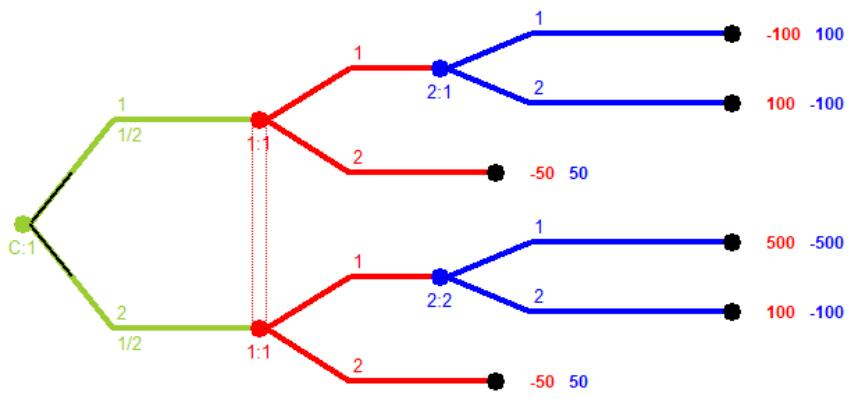
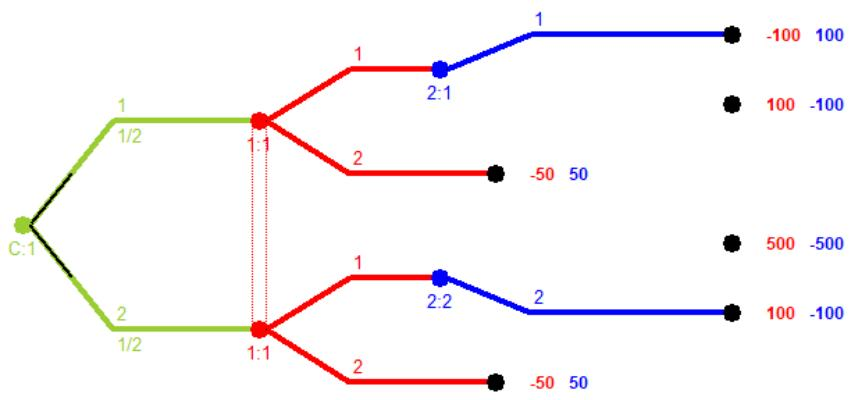
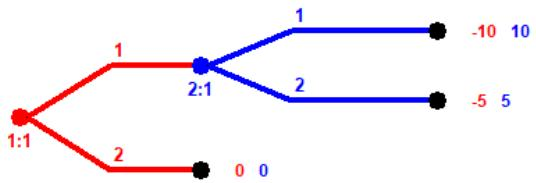
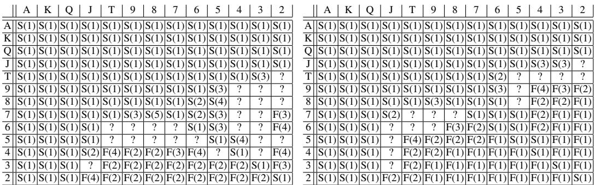

# Dominated Actions in Imperfect-Information Games

Anonymous Author(s)   
Affiliation   
Address   
email

# Abstract

Dominance is a fundamental concept in game theory. In strategic-form games dom  
inated strategies can be identified in polynomial time. As a consequence, iterative   
removal of dominated strategies can be performed efficiently as a preprocessing   
step for reducing the size of a game before computing a Nash equilibrium. For   
imperfect-information games in extensive form, we could convert the game to   
strategic form and then iteratively remove dominated strategies in the same way;   
however, this conversion may cause an exponential blowup in game size. In this pa  
per we define and study the concept of dominated actions in imperfect-information   
games. Our main result is a polynomial-time algorithm for determining whether an   
action is dominated (strictly or weakly) by any mixed strategy in $n$ -player games,   
which can be extended to an algorithm for iteratively removing dominated actions.   
This allows us to efficiently reduce the size of the game tree as a preprocessing   
step for Nash equilibrium computation. We explore the role of dominated actions   
empirically in the “All In or Fold” No-Limit Texas Hold’em poker variant.

# 15 1 Introduction

In a strategic-form game, (mixed) strategy $\sigma _ { i }$ for player $i$ is strictly dominated if there exists another   
(mixed) strategy $\boldsymbol { \sigma } _ { i } ^ { \prime }$ such that $\boldsymbol { \sigma } _ { i } ^ { \prime }$ performs strictly better than $\sigma _ { i }$ regardless of the strategy used by   
the opponent(s): formally, if $u _ { i } \dot { ( \sigma _ { i } ^ { \prime } , s _ { - i } ) } > u _ { i } ( \sigma _ { i } ^ { \prime } , s _ { - i } )$ for all pure strategy profiles (vector of pure   
strategies) $s _ { - i } \in S _ { - i }$ for the opposing agents. (Note that the requirement that this holds for all   
opposing pure strategy profiles is enough to ensure that it also holds for all mixed strategy profiles of   
the opponents as well). Clearly it would be irrational for an agent to play a strictly dominated strategy,   
as another strategy will do strictly better regardless of the beliefs of what the opponents would play.   
Strategy $\boldsymbol { \sigma } _ { i } ^ { \prime }$ weakly dominates $\sigma$ if the inequality holds weakly (though strictly for at least one pure   
strategy profile): formally, $u _ { i } ( \sigma ^ { \prime } , s _ { - i } ) \geq \bar { u _ { i } } ( \sigma _ { i } ^ { \prime } , s _ { - i } )$ for all $s _ { - i } \in S _ { - i }$ where the inequality is strict   
for at least one $s _ { - i }$ . (The condition that at least one inequality is strict is simply to rule out saying   
that a strategy is dominated by an identical strategy). Similar to strict domination it seems clearly   
irrational for an agent to play a strategy that is weakly dominated, as another strategy will perform at   
least as well (and sometimes strictly better) regardless of the strategies employed by the opponent(s).   
It seems natural to simplify a game by eliminating strategies that are dominated from the game   
to reduce its size and focus analysis on a smaller game. It can easily be shown that applying an   
iterative process of removing one dominated strategy for one player, then removing one for another   
(or possibly the same) player in the reduced game, etc., will ultimately result in a smaller game   
that contains a Nash equilibrium from the original game. For this reason, this procedure of iterated   
removal of dominated strategies is often performed as a preprocessing step to reduce the size of   
a game before computing a Nash equilibrium (or other desired solution concept). As it turns out,   
all processes of iterated removal of strictly dominated strategies produce the same reduced game   
regardless of the order of elimination (while this is not necessarily the case for iterated removal of   
weakly dominated strategies) [5, 8]. While iterated removal of weakly dominated strategies can   
sometimes reduce the number of equilibria, it can never create new equilibria, and therefore even this   
procedure is very useful as a preprocessing step for Nash equilibrium computation.   
There is a linear-time algorithm for determining whether a (mixed) strategy $\sigma _ { i }$ is strictly dominated   
by any pure strategy for player $i$ [12]. This algorithm simply iterates over each pure strategy $s _ { i }$ for   
player $i$ and tests whether it performs strictly better than $\sigma _ { i }$ against each opposing pure strategy   
profile $s _ { - i }$ . This procedure has complexity $\dot { O ( | A | ) }$ , where $A = \times _ { i } A _ { i }$ is the set of joint action (i.e.,   
pure strategy) profiles, and so takes time linear in the size of the game. The procedure can also be   
easily adapted to produce an algorithm for determining whether a mixed strategy profile is weakly   
dominated by any pure strategy in linear time. Note that it is possible for a strategy to be dominated   
by a mixed strategy and not be dominated by any pure strategy [12]. In order to determine whether a   
(mixed) strategy is strictly dominated by a mixed strategy, while the above procedure does not work,   
it turns out that there exists a linear programming formulation that runs in polynomial time, and there   
also exists a linear programming formulation that determines whether a (mixed) strategy is weakly   
dominated by a mixed strategy [1]. Therefore, regardless of whether the strategies being tested as   
dominated or dominating are mixed or pure, it can be checked in polynomial time.1

# 54 2 Extensive-form games

While the strategic form can be used to model simultaneous actions, another representation, called   
the extensive form, is generally preferred when modeling settings that have sequential moves. The   
extensive form can also model simultaneous actions, as well as chance events and imperfect informa  
tion (i.e., situations where some information is available to only some of the agents and not to others).   
Extensive-form games consist primarily of a game tree; each non-terminal node has an associated   
player (possibly chance) that makes the decision at that node, and each terminal node has associated   
utilities for the players. Additionally, game states are partitioned into information sets, where the   
player whose turn it is to move cannot distinguish among the states in the same information set.   
Therefore, in any given information set, a player must choose actions with the same distribution at   
each state contained in the information set. If no player forgets information that they previously knew,   
we say that the game has perfect recall. A (behavioral) strategy for player $i$ , $\sigma _ { i } \in \Sigma _ { i }$ , is a function   
that assigns a probability distribution over all actions at each information set belonging to $i$ .   
In theory, every extensive-form game can be converted to an equivalent strategic-form game; however,   
there is an exponential blowup in the size of the game representation, and therefore such a conversion   
is undesirable. Instead, new algorithms have been developed that operate on the extensive form   
representation directly. It turns out that the complexity of computing equilibria in extensive-form   
games is similar to that of strategic-form games; a Nash equilibrium can be computed in polynomial   
time in two-player zero-sum games (with perfect recall) [7], while the problem is hard for two  
player general-sum and multiplayer games. One algorithm for computing an equilibrium in two  
player zero-sum extensive-form games with perfect recall is based on solving a linear programming   
formulation [7]. This formulation works by modeling each sequence of actions for each player as a   
variable, and is often called the sequence form $L P$ algorithm. Note that while the number of pure   
strategies is exponential in the size of the game tree, the number of action sequences is linear. The   
method uses several matrices defined as follows. For player 1, the matrix $\mathbf { E }$ is defined where each row   
corresponds to an information set (including an initial row for the “empty” information set), and each   
column corresponds to an action sequence (including an initial row for the “empty” action sequence).   
In the first row of $\mathbf { E }$ the first element is 1 and all other elements are 0; subsequent rows have $^ { - 1 }$ for   
the entries corresponding to the action sequence leading to the root of the information set, and 1 for   
all actions that can be taken at the information set (and 0 otherwise). Thus $\mathbf { E }$ has dimension $c _ { 1 } \times d _ { 1 }$ ,   
where $c _ { i }$ is the number of information sets for player $i$ and $d _ { i }$ is the number of action sequences for   
player $i$ . Matrix $\mathbf { F }$ is defined analogously for player 2. The vector $\mathbf { e }$ is defined to be a column vector   
of length $c _ { 1 }$ with 1 in the first position and 0 in other entries, and vector f is defined with length $c _ { 2 }$   
analogously. The matrix A is defined with dimension $d _ { 1 } \times d _ { 2 }$ where entry $A _ { i j }$ gives the expected   
payoff for player 1 when player 1 plays action sequence $d _ { 1 }$ and player 2 plays action sequence $d _ { 2 }$   
(with the expectation being over possible moves of chance along the paths of play to leaf nodes). The   
matrix $\mathbf { B }$ of player 2’s expected payoffs is defined analogously. In zero-sum games $\mathbf { B } = - \mathbf { A }$ .   
Given these matrices we can solve one of two linear programming problems to compute a Nash   
equilibrium in zero-sum extensive-form games [7]. In the first formulation the primal variables $\mathbf { x }$   
correspond to player 1’s mixed strategy while the dual variables correspond to player 2’s strategy.   
In the second formulation, which is the dual problem of the first formulation, the primal decision   
variables y correspond to player 2’s strategy while the dual variables correspond to player 1’s strategy.

$$
\begin{array} { r l } { \operatorname* { m a x } _ { \mathbf { x } , \mathbf { q } } } & { - \mathbf { q } ^ { T } \mathbf { f } } \\ { \mathrm { s . t . } } & { \mathbf { x } ^ { T } ( - \mathbf { A } ) - \mathbf { q } ^ { T } \mathbf { F } \leq \mathbf { 0 } } \\ & { \mathbf { x } ^ { T } \mathbf { E } ^ { T } = \mathbf { e } ^ { T } } \\ & { \mathbf { x } \geq \mathbf { 0 } } \end{array}
$$

$$
\begin{array} { r l } { \operatorname* { m i n } _ { \mathbf { y } , \mathbf { p } } } & { \mathbf { e } ^ { T } \mathbf { p } } \\ { \mathrm { s . t . } } & { - \mathbf { A } \mathbf { y } + \mathbf { E } ^ { T } \mathbf { p } \geq \mathbf { 0 } } \\ & { - \mathbf { F } \mathbf { y } = - \mathbf { f } } \\ & { \mathbf { y } \geq \mathbf { 0 } } \end{array}
$$

# 96 3 Dominated actions

In extensive-form games, we can consider analogous concepts of strict, weak, and iterated dominance   
of strategies as for strategic-form games. However, unlike in the strategic-form setting, identification   
of a dominated extensive-form strategy does not necessarily allow us to reduce the size of the game,   
since it is possible that some of the actions played by the dominated strategy are also played by   
non-dominated strategies. In order to obtain the computational advantage of game size reduction, we   
must consider a stronger concept of dominated actions. We first present several plausible candidate   
definitions for dominated actions which we demonstrate to be problematic. Our first candidate   
definition is given as Flawed Definition 1. This definition states that action $a _ { i }$ for player $i$ at   
information set $I _ { i }$ is strictly dominated by action $b _ { i }$ at the same information set if every leaf node   
succeeding $a _ { i }$ produces a strictly smaller payoff for player $i$ than every leaf node succeeding action   
$b _ { i }$ . An analogous definition for weak dominance is given in Flawed Definition 2.

Flawed Definition 1. If for every leaf node $N ^ { a _ { i } }$ that follows action $a _ { i }$ for player i at information set $I _ { i }$ and every leaf node $N ^ { b _ { i } }$ that follows action $b _ { i }$ for player $i$ at the same information set $I _ { i }$ $u _ { i } ( N ^ { b _ { i } } ) > u _ { i } \overset { \cdot } { (} N ^ { a _ { i } } )$ , then $b _ { i }$ strictly dominates $a _ { i }$ .

Flawed Definition 2. If for every leaf node $N ^ { a _ { i } }$ that follows action $a _ { i }$ for player i at information set 2 $I _ { i }$ and every leaf node $N ^ { b _ { i } }$ that follows action $b _ { i }$ for player $i$ at the same information set $I _ { i }$ , 3 $u _ { i } \left( N ^ { b _ { i } } \right) \geq u _ { i } \mathsf { \bar { \Psi } } ( N ^ { a _ { i } } )$ where inequality is strict for at least one node, then $b _ { i }$ weakly dominates $a _ { i }$ .

The problem with these definitions are that they are too strong; it is still possible for player 1 to strictly   
prefer to take action $b _ { i }$ to $a _ { i }$ regardless of the strategy used by player 2 even if Flawed Definition 1   
holds. This is illustrated in the following game depicted in Figure 1. In this game, chance makes an   
initial move taking each of two actions with probability $\textstyle { \frac { 1 } { 2 } }$ . Then player 1 (red) selects one of two   
actions at a single information set. Player 2 (blue) then takes one of two actions after observing both   
the moves of chance and player 1. It is clear that action 2 for player 2 at their top information set and   
action 1 for player 2 at their bottom information set are both strictly dominated according to Flawed   
Definition 1. The smaller game obtained after removing these actions is depicted in Figure 2. In the   
smaller game, the expected utility of playing action 1 is $\mathsf { \bar { 0 } . 5 ( - 1 0 0 ) + 0 . 5 ( 1 \bar { 0 } 0 ) = 0 }$ and the expected   
utility of playing action 2 is $0 . 5 ( - 5 0 ) + 0 . 5 ( - 5 0 ) = - 5 0$ . Since player 2 does not take any actions,   
player 1 always achieves a strictly higher expected utility by playing action 1. However, action 2 is   
not strictly dominated according to Flawed Definition 1 because in one leaf node succeeding action 1   
player 1 obtains payoff -100 which is lower than the payoff of $- 5 0$ at leaf nodes following action 2.   
Flawed Definitions 1 and 2 provide sufficient conditions for an action to be dominated, but we have   
demonstrated that it is clearly possible for actions that do not satisfy these definitions to also be   
dominated. Thus these conditions are too strong, and we will refer to strategies that satisfy them   
as being strongly dominated (strictly or weakly, respectively). The concept of strong dominance   
is not without merit, as it can be verified very efficiently by simply iterating over the leaf nodes   
succeeding each action. Thus it may be useful to first remove actions that are strongly dominated as a   
preprocessing step before performing potentially more costly computations to remove other actions.   
We next consider candidate definition given by Flawed Definition 3, where $u _ { i }$ denotes the expected   
utility accounting for randomized moves of chance as well as potential randomization in the players’   
strategies. This definition states that action $a _ { i }$ for player $i$ at information set $I _ { i }$ is strictly dominated   
(potentially by a probability distribution over other actions at the same information set), if there   
exists a strategy $\boldsymbol { \sigma } _ { i } ^ { - a _ { i } }$ that never plays $a _ { i }$ at $I _ { i }$ that always has strictly higher expected utility than   
every strategy that plays $a _ { i }$ at $I _ { i }$ . Again this definition clearly provides a sufficient condition for   
$a _ { i }$ to be dominated; however, the issue with this definition is that the strategies may potentially   
take actions early in the game tree that prevent the game from ever reaching information set $I _ { i }$ .   
Consider the simple example game in Figure 3. Suppose we want to apply Flawed Definition 3 to   
determine whether action 2 is strictly dominated for player 2. Then $\sigma _ { i } ^ { - \bar { a _ { i } } }$ is the strategy for player 2   
that plays action 1 with probability 1, and $\sigma _ { i } ^ { a _ { i } }$ must be the strategy for player 2 that plays action 2   
with probability 1. Now suppose that player 1 plays action 2 with probability 1, which we denote   
as $\sigma _ { - i }$ . Then clearly $u _ { i } \left( \sigma _ { i } ^ { - \bar { a _ { i } } } , \sigma _ { - i } \right) = \bar { u _ { i } } \left( \sigma _ { i } ^ { a _ { i } } , \bar { \sigma } _ { - i } \right) = 0$ , since both strategy profiles will result in   
reaching the bottom leaf node yielding payoff $_ 0$ .   
Flawed Definition 3. Action $a _ { i }$ for player $i$ is strictly dominated at information set $I _ { i }$ if there exists   
a mixed strategy $\boldsymbol { \sigma } _ { i } ^ { - a _ { i } }$ that plays action $a _ { i }$ at $I _ { i }$ with probability $O$ such that for every mixed strategy   
$\sigma _ { i } ^ { a _ { i } }$ for player i that plays action $a _ { i }$ with probability $^ { l }$ at $I _ { i }$ , $u _ { i } \left( \sigma _ { i } ^ { - a _ { i } } , \sigma _ { - i } \right) > u _ { i } \left( \sigma _ { i } ^ { a _ { i } } , \sigma _ { - i } \right) .$ for all   
opposing strategies $\sigma _ { - i } \in \Sigma _ { - i }$ .   
The problem with Flawed Definition 3 is that it allows the players to deviate from the path of   
play leading to the relevant information set $I _ { i }$ . We address this limitation in our new definitions.   
Strictly-dominated actions are defined in Definition 1 and weakly-dominated actions are defined in   
Definition 2. In these definitions $\Sigma _ { - i } ^ { I _ { i } }$ denotes the set of mixed strategy profiles for the opponents that   
always take actions leading to information set $I _ { i }$ when possible. Note that these definitions apply   
to games with any number of players. They also consider actions that are dominated by any mixed   
strategy (not necessarily just a pure action at $I _ { i }$ ). It is easy to verify that these definitions address   
the issues that arose in the examples from Figure 1 and Figure 3. We can apply these definitions   
repeatedly in succession to perform iterative removal of dominated actions, as for the strategic form.   
Definition 1. Action $a _ { i }$ for player $i$ is strictly dominated at information set $I _ { i }$ if there exists a mixed   
strategy $\sigma _ { i } ^ { - a _ { i } }$ that always plays to get to $I _ { i }$ and plays action $a _ { i }$ at $I _ { i }$ with probability $O$ such that   
for every mprobability $I$ xed at $I _ { i } , u _ { i } \left( \sigma _ { i } ^ { - a _ { i } } , \sigma _ { - i } \right) > u _ { i } \left( \sigma _ { i } ^ { a _ { i } } , \sigma _ { - i } \right)$ $\sigma _ { i } ^ { a _ { i } }$ $i$ ays plays to get to for all opposing str $I _ { i }$ andgies $\sigma _ { - i } \in \Sigma _ { - i } ^ { I _ { i } }$ on . $a _ { i }$ with   
Definition 2. Action $a _ { i }$ for player $i$ is weakly dominated at information set $I _ { i }$ if there exists a mixed   
strategy $\boldsymbol { \sigma } _ { i } ^ { - a _ { i } }$ that always plays to get to $I _ { i }$ and plays action $a _ { i }$ at $I _ { i }$ with probability $O$ such that   
for every mixed strategy $\sigma _ { i } ^ { a _ { i } }$ for player $i$ that always plays to get to $I _ { i }$ and plays action $a _ { i }$ with   
probability $^ { l }$ at $I _ { i }$ , $u _ { i } \left( \sigma _ { i } ^ { - a _ { i } } , \sigma _ { - i } \right) \geq u _ { i } \left( \sigma _ { i } ^ { a _ { i } } , \sigma _ { - i } \right)$ for all opposing strategies $\sigma _ { - i } \in \Sigma _ { - i } ^ { I _ { i } }$ , where the   
inequality is strict for at least one $\sigma _ { - i }$ .   
The example games considered were created using the open-source software package Gambit [11].   
Gambit has tools that allow the user to remove “strictly dominated” or “strictly or weakly dominated”   
actions, and these procedures can be repeated to iteratively remove multiple actions sequentially;   
however, there is no documentation regarding the algorithms applied or definitions of dominance used.   
In the example game from Figure 1, Gambit correctly identifies that action 2 for player 2 at their top   
information set and action 1 for player 2 at their bottom information set are both strictly dominated,   
and removes these to construct the smaller game in Figure 2. However, as for strong domination,   
Gambit fails to recognize that action 2 is strictly dominated by action 1 for player 1 in the reduced   
game. This example demonstrates that Gambit’s procedure does not remove all dominated actions   
(though it does not necessarily imply that Gambit is only removing strongly dominated actions).

  
Figure 1: Example two-player imperfect-information extensive-form game.

  
Figure 2: Result of removing two dominated actions from game in Figure 1.

  
Figure 3: Extensive-form game demonstrating problem with Flawed Definition 3.

# 180 4 Algorithm for identifying dominated actions

Suppose we want to determine whether an action $c$ for player 1 is dominated at information set   
$I$ in a two-player extensive-form game $G$ . Using the sequence form representation, suppose that   
action $c$ is the final action in the sequence with index $i$ for player 1. Let $S _ { I }$ denote the set of indices   
corresponding to action sequences leading to $I$ . We would like to solve the following problem.

$$
\begin{array} { r l } { \operatorname* { m a x } _ { { \bf x } _ { 2 } } \operatorname* { m i n } _ { { \bf x } _ { 1 } , { \bf y } } } & { { \bf x } _ { 2 } ^ { T } { \bf A } { \bf y } - { \bf x } _ { 1 } ^ { T } { \bf A } { \bf y } } \\ { \mathrm { s . t . } } & { { \bf x } _ { 1 , i } = 1 } \\ & { { \bf x } _ { 2 , i } = 0 } \\ & { { \bf x } _ { 1 , k } = { \bf x } _ { 2 , k } = 1 \mathrm { ~ f o r ~ a l l ~ } k \in S _ { I } } \\ & { { \bf y } _ { k } = 1 \mathrm { ~ f o r ~ a l l ~ } k \in S _ { I } } \\ & { { \bf x } _ { 1 } ^ { T } { \bf E } ^ { T } = { \bf e } ^ { T } } \\ & { { \bf x } _ { 2 } ^ { T } { \bf E } ^ { T } = { \bf e } ^ { T } } \\ & { { \bf y } ^ { T } { \bf F } ^ { T } = { \bf f } ^ { T } } \\ & { \{ { \bf x } _ { 1 } , { \bf x } _ { 2 } , { \bf y } \} \geq { \bf 0 } } \end{array}
$$

Consider the following problem, where now player 2 controls two action sequences $\mathbf { y _ { 1 } } , \mathbf { y _ { 2 } }$ :

$$
\begin{array} { r l } { \operatorname* { m a x } _ { { \bf x } _ { 2 } } \operatorname* { m i n } _ { { \bf x } _ { 1 } , { \bf y } _ { 1 } , { \bf y } _ { 2 } } } & { \mathbf { x } _ { 2 } ^ { T } \mathbf { A y } _ { 2 } - \mathbf { x } _ { 1 } ^ { T } \mathbf { A y } _ { 1 } } \\ { \mathrm { s . t . } } & { \mathbf { x } _ { 1 , i } = 1 } \\ & { \mathbf { x } _ { 2 , i } = 0 } \\ & { \mathbf { x } _ { 1 , k } = \mathbf { x } _ { 2 , k } = 1 \mathrm { ~ f o r ~ a l l ~ } k \in S _ { I } } \\ & { \mathbf { y } _ { 1 , k } = 1 \mathrm { ~ f o r ~ a l l ~ } k \in S _ { I } } \\ & { \mathbf { y } _ { 2 , k } = 1 \mathrm { ~ f o r ~ a l l ~ } k \in S _ { I } } \\ & { \mathbf { x } _ { 1 } ^ { T } \mathbf { E } ^ { T } = \mathbf { e } ^ { T } } \\ & { \mathbf { x } _ { 2 } ^ { T } \mathbf { E } ^ { T } = \mathbf { e } ^ { T } } \\ & { \mathbf { y } _ { 1 } ^ { T } \mathbf { F } ^ { T } = \mathbf { f } ^ { T } } \\ & { \mathbf { y } _ { 2 } ^ { T } \mathbf { F } ^ { T } = \mathbf { f } ^ { T } } \\ & { \{ \mathbf { x } _ { 1 } , \mathbf { x } _ { 2 } , \mathbf { y } _ { 1 } , \mathbf { y } _ { 2 } \} \geq \mathbf { 0 } } \end{array}
$$

Proposition 1. The optimal objective values in Problem $^ { l }$ and Problem 2 are the same.

Proof. Let $f _ { 1 }$ be the optimal objective value in Problem 1 and $f _ { 2 }$ be the optimal objective value   
in Problem 2. Suppose that the optimal variables in Problem 1 are $\mathbf { x } _ { 1 } ^ { 1 } , \mathbf { x } _ { 2 } ^ { 1 } , \bar { \mathbf { y } } ^ { 1 }$ . Now set $\mathbf { x } _ { 1 } ^ { 2 } = \mathbf { x } _ { 1 } ^ { 1 }$ ,   
$\mathbf { x } _ { 2 } ^ { 2 } = \mathbf { x } _ { 2 } ^ { 1 }$ , $\mathbf { y } _ { 1 } ^ { 2 } = \hat { \mathbf { y } } ^ { 1 }$ , $\mathbf { y } _ { 2 } ^ { 2 } = \mathbf { y } ^ { 1 }$ . Then $( \mathbf { x } _ { 1 } ^ { 2 } , \mathbf { x } _ { 2 } ^ { 2 } , \mathbf { y } _ { 1 } ^ { 2 } , \mathbf { y } _ { 2 } ^ { 2 } )$ gives a feasible solution to Problem 2 with   
objective value equal to $f _ { 1 }$ . So $f _ { 2 } \geq f _ { 1 }$ . Now suppose that the optimal variables in Problem 2 are   
$\mathbf { x } _ { 1 } ^ { 2 } , \mathbf { x } _ { 2 } ^ { 2 } , \mathbf { y } _ { 1 } ^ { 2 } , \mathbf { y } _ { 2 } ^ { 2 }$ . Now set $\mathbf { x } _ { 1 } ^ { 1 } = \mathbf { x } _ { 1 } ^ { 2 }$ , ${ \bf x } _ { 2 } ^ { 1 } = { \bf x } _ { 2 } ^ { 2 }$ , and set $\mathbf { y } ^ { 1 }$ equal to the strategy that follows $\mathbf { y } _ { 1 } ^ { 2 }$ at states   
following action $c$ for player 1, and follows $\mathbf { y } _ { 2 } ^ { 2 }$ otherwise. Then $( \mathbf { x } _ { 1 } ^ { 1 } ) ^ { T } \mathbf { A } \mathbf { y } ^ { \mathbf { \bar { 1 } } ^ { \mathbf { \bar { \alpha } } } } = ( \mathbf { x } _ { 1 } ^ { 1 } ) ^ { T } \mathbf { A } \mathbf { y } _ { 1 } ^ { 2 }$ , since both   
players only take actions to get to information set $I$ , ${ \bf x } _ { 1 } ^ { 1 }$ takes action $c$ at $I$ , and the strategies $\mathbf { y } ^ { 1 }$ and   
$\bf { \dot { y } } _ { 1 } ^ { 2 }$ are identical after player 1 takes action $c$ at $I$ . Similarly, $( \mathbf { x } _ { 2 } ^ { 1 } ) ^ { T } \mathbf { A } \mathbf { y } ^ { 1 } = ( \mathbf { x } _ { 2 } ^ { 1 } ) ^ { T } \mathbf { A } \mathbf { y } _ { 2 } ^ { 2 }$ , since both   
players only take actions to get to $I , \mathbf { x } _ { 1 } ^ { 1 }$ does not take action $c$ at $I$ , and the strategies $\mathbf { y } ^ { 1 }$ and $\mathbf { y } _ { 2 } ^ { 2 }$ are   
identical after player 1 does not take action $c$ at $I$ . So $f _ { 1 } \geq f _ { 2 }$ . So we conclude that $f _ { 1 } = f _ { 2 }$ . □   
Proposition 1 allows us to divide Problem 2 into the following two subproblems. If $f$ is the optimal   
objective value of Problem 2, $f _ { 1 }$ is the optimal objective of Problem 3, and $f _ { 2 }$ is the optimal objective   
of Problem 4, then we have $f = f _ { 1 } - f _ { 2 }$ .

$$
\begin{array} { r l } { \operatorname* { m a x } _ { { \mathbf { x } } _ { 2 } } \operatorname* { m i n } _ { \mathbf { y } } } & { { \mathbf { x } } _ { 2 } ^ { T } { \mathbf { A } } { \mathbf { y } } } \\ { \mathrm { s . t . } } & { { \mathbf { x } } _ { 2 , i } = 0 } \\ & { { \mathbf { x } } _ { 2 , k } = 1 \mathrm { ~ f o r ~ a l l ~ } k \in S _ { I } } \\ & { { \mathbf { y } } _ { k } = 1 \mathrm { ~ f o r ~ a l l ~ } k \in S _ { I } } \\ & { { \mathbf { x } } _ { 2 } ^ { T } { \mathbf { E } } ^ { T } = { \mathbf { e } } ^ { T } } \\ & { { \mathbf { y } } ^ { T } { \mathbf { F } } ^ { T } = { \mathbf { f } } ^ { T } } \\ & { \{ { \mathbf { x } } _ { 2 } , { \mathbf { y } } \} \geq { \mathbf { 0 } } } \end{array}
$$

$$
\begin{array} { r l } { \operatorname* { m a x } _ { { \bf x } _ { 1 } } \operatorname* { m a x } _ { { \bf y } } } & { { \bf x } _ { 1 } ^ { T } { \bf A } { \bf y } } \\ { \mathrm { s . t . } } & { { \bf x } _ { 1 , i } = 1 } \\ & { { \bf x } _ { 1 , k } = 1 \mathrm { f o r } \mathrm { a l l } k \in S _ { I } } \\ & { { \bf x } _ { 1 } ^ { T } { \bf E } ^ { T } = { \bf e } ^ { T } } \\ & { { \bf y } ^ { T } { \bf F } ^ { T } = { \bf f } ^ { T } } \\ & { \{ { \bf x } _ { 1 } , { \bf y } \} \geq { \bf 0 } } \end{array}
$$

Let us first look at Problem 3 and consider the inner subproblem for a fixed $\mathbf { x } _ { 2 }$

$$
\begin{array} { r l } { \operatorname* { m i n } _ { \mathbf { y } } } & { \mathbf { x } _ { 2 } ^ { T } \mathbf { A } \mathbf { y } } \\ { \mathrm { s . t . } } & { \mathbf { y } _ { k } = 1 \mathrm { f o r } \mathrm { a l l } k \in S _ { I } } \\ & { \mathbf { y } ^ { T } \mathbf { F } ^ { T } = \mathbf { f } ^ { T } } \\ & { \mathbf { y } \geq \mathbf { 0 } } \end{array}
$$

The Lagrangian is

$$
L ( \mathbf { y } , \boldsymbol { \lambda } , \boldsymbol { \gamma } , \mathbf { r } ) = \mathbf { x } _ { 2 } ^ { T } \mathbf { A } \mathbf { y } - ( \mathbf { f } ^ { T } - \mathbf { y } ^ { T } \mathbf { F } ^ { T } ) \boldsymbol { \lambda } - \sum _ { k \in S _ { I } } \gamma _ { k } ( \mathbf { y } _ { k } - 1 ) - \mathbf { r } ^ { T } \mathbf { y }
$$

$$
\frac { \partial L } { \partial \mathbf { y } } = \mathbf { x } _ { 2 } ^ { T } \mathbf { A } + \lambda ^ { T } \mathbf { F } - \sum _ { k \in S _ { I } } \gamma _ { k } \mathbf { e } _ { \mathbf { k } } - \mathbf { r } ^ { T }
$$

The dual problem is

$$
\begin{array} { r l } { \operatorname* { m a x } _ { \boldsymbol { \lambda } , \boldsymbol { \gamma } } } & { - \mathbf { f } ^ { T } \boldsymbol { \lambda } - \sum _ { k \in S _ { I } } \gamma _ { k } } \\ { \mathrm { s . t . } } & { \mathbf { x } _ { 2 } ^ { T } \mathbf { A } + \boldsymbol { \lambda } ^ { T } \mathbf { F } - \sum _ { k \in S _ { I } } \gamma _ { k } \mathbf { e } _ { \mathbf { k } } \geq \mathbf { 0 } } \end{array}
$$

So Problem 3 is equivalent to:

$$
\begin{array} { r l } { \operatorname* { m a x } _ { \mathbf { x } _ { 2 } , \lambda , \gamma } } & { - \mathbf { f } ^ { T } \boldsymbol { \lambda } - \sum _ { k \in S _ { I } } \gamma _ { k } } \\ { \mathrm { s . t . } } & { \mathbf { x } _ { 2 } ^ { T } \mathbf { A } + \boldsymbol { \lambda } ^ { T } \mathbf { F } - \sum _ { k \in S _ { I } } \gamma _ { k } \mathbf { e _ { k } } \ge \mathbf { 0 } } \\ & { \mathbf { x } _ { 2 , i } = 0 } \\ & { \mathbf { x } _ { 2 , k } = 1 \mathrm { ~ f o r ~ a l l ~ } k \in S _ { I } } \\ & { \mathbf { x } _ { 2 } ^ { T } \mathbf { E } ^ { T } = \mathbf { e } ^ { T } } \\ & { \mathbf { x } _ { 2 } \ge \mathbf { 0 } } \end{array}
$$

Next consider Problem 4. Note that both players are aligned in trying to maximize the objective. Let   
us define a new problem $\overline { { G } }$ where player 1 selects the actions for both players. We denote player 1’s   
strategy in this modified game by $\overline { { \mathbf { x } } } _ { 1 }$ . We modify $\mathbf { E }$ and resize e accordingly and denote them by $\mathbf { E ^ { \prime } }$   
and $\mathbf { e ^ { \prime } }$ . The payoffs can now be represented as a vector a. In the new representation let $i ^ { \prime }$ denote the   
index of the sequence with concluding action $c$ , and let $S _ { I } ^ { \prime }$ denote the set of indices corresponding to   
action sequences leading to $I$ .

$$
\begin{array} { r l } { \operatorname* { m a x } _ { \overline { { \mathbf { x } } } _ { 1 } } } & { \overline { { \mathbf { x } } } _ { 1 } ^ { T } \mathbf { a } } \\ { \mathrm { s . t . } } & { \overline { { \mathbf { x } } } _ { 1 , i ^ { \prime } } = 1 } \\ & { \overline { { \mathbf { x } } } _ { 1 , k } = 1 \mathrm { f o r } \mathrm { a l l } k \in S _ { I } ^ { \prime } } \\ & { \overline { { \mathbf { x } } } _ { 1 } ^ { T } { \mathbf { E } ^ { \prime } } ^ { T } = { \mathbf { e } ^ { \prime } } ^ { T } } \\ & { \overline { { \mathbf { x } } } _ { 1 } \geq \mathbf { 0 } } \end{array}
$$

Let $u _ { 2 }$ denote the optimal objective value for optimization problem 5, and $u _ { 1 }$ denote the optimal   
objective value for problem 6. If $u _ { 2 } > u _ { 1 }$ then we conclude that action $c$ is strictly dominated. If   
$u _ { 2 } < u _ { 1 }$ then we conclude that action $c$ is not strictly or weakly dominated. If $u _ { 2 } = u _ { 1 }$ , let $u _ { 3 }$ denote   
the optimal objective value for problem 7, and let $u _ { 4 }$ denote the optimal objective value for problem 8.   
If $u _ { 3 } > u _ { 4 }$ then we conclude that action $c$ is weakly dominated, and if $u _ { 3 } = u _ { 4 }$ we conclude that   
action $c$ is not strictly or weakly dominated (note that we cannot have $u _ { 3 } < u _ { 4 }$ ).

$$
\begin{array} { r l } { \operatorname* { m a x } _ { { \mathbf { \bar { x } } _ { 2 } } , \lambda , \gamma } } & { \bar { \mathbf { x } } _ { 2 } ^ { T } \mathbf { a } } \\ { \mathrm { s . t . } } & { - \mathbf { f } ^ { T } \lambda - \sum _ { k \in S _ { I } } \gamma _ { k } = u _ { 2 } } \\ & { \mathbf { x } _ { 2 } ^ { T } \mathbf { A } + \lambda ^ { T } \mathbf { F } - \sum _ { k \in S _ { I } } \gamma _ { k } \mathbf { e } _ { \mathbf { k } } \geq \mathbf { 0 } } \\ & { \bar { \mathbf { x } } _ { 2 , i ^ { \prime } } = 0 } \\ & { \bar { \mathbf { x } } _ { 2 , k } = 1 \mathrm { f o r ~ a l l } \ k \in S _ { I } ^ { \prime } } \\ & { \bar { \mathbf { x } } _ { 2 } ^ { T } \mathbf { E } ^ { \prime T } = { \mathbf { e } ^ { \prime } } ^ { T } } \\ & { \bar { \mathbf { x } } _ { 2 } \geq \mathbf { 0 } } \end{array}
$$

The components of $\overline { { \mathbf { x } } } _ { 2 }$ for player 1 in $\overline { G }$ correspond to $\mathbf { x } _ { 2 }$ in $G$ .

$$
\begin{array} { r l } { \operatorname* { m i n } _ { \overline { { \mathbf { x } } } _ { 1 } } } & { \overline { { \mathbf { x } } } _ { 1 } ^ { T } \mathbf { a } } \\ { \mathrm { s . t . } } & { \overline { { \mathbf { x } } } _ { 1 , i ^ { \prime } } = 1 } \\ & { \overline { { \mathbf { x } } } _ { 1 , k } = 1 \mathrm { f o r } \mathrm { a l l } k \in S _ { I } ^ { \prime } } \\ & { \overline { { \mathbf { x } } } _ { 1 } ^ { T } { \mathbf { E ^ { \prime } } } ^ { T } = { \mathbf { e ^ { \prime } } } ^ { T } } \\ & { \overline { { \mathbf { x } } } _ { 1 } \geq \mathbf { 0 } } \end{array}
$$

We can perform this procedure for every action at each information set of player 1, and analogously   
for player 2. Since the number of actions is linear in the size of the game tree, the overall procedure   
involves solving a linear number of linear programs and therefore runs in polynomial time. We can   
repeat the procedure iteratively until no more actions are removed for any player. Thus, iterative   
removal of dominated actions can be performed in polynomial time. Note that the procedure applies   
to all two-player games and does not assume that they are zero sum. The procedure also removes   
actions that are dominated by any mixed strategy (which may play a probability distribution over   
actions at the same information set $I$ ), not just actions that are dominated by a pure action.

Now suppose we want to determine if an action is dominated for player 1 in a game with $n$ players for $n > 2$ . We can construct a new two-player game where player 2 now controls all actions that were previously controlled by any player other than player 1. Then we can run the above procedure in this new game. Thus, we can perform iterative removal of (strictly or weakly) dominated strategies in polynomial time in $n$ -player extensive-form games of imperfect information.

Theorem 1. There exists a polynomial-time algorithm that determines whether an action is strictly dominated in an $n$ -player extensive-form game of imperfect information.

Theorem 2. There exists a polynomial-time algorithm that determines whether an action is weakly dominated in an n-player extensive-form game of imperfect information.

Theorem 3. Iterated removal of strictly and weakly dominated actions can be performed in polynomial time in n-player extensive-form games of imperfect information.

# 5 Experiments

Now that we have defined dominated actions and showed that they can be computed efficiently, we would like to investigate whether they can be a useful concept in practice. Poker has been widely studied as a test domain for imperfect-information games. The most popular variant regularly played by humans is No-Limit Texas Hold’em (NLHE). Two-player NLHE works as follows. Initially two players each have a stack of chips. One player, called the small blind, initially puts $k$ worth of chips in the middle, while the other player, called the big blind, puts in $2 k$ . The chips in the middle are known as the pot, and will go to the winner of the hand. Next, there is an initial round of betting. The player whose turn it is to act can choose from three available options:

• Fold: Give up on the hand, surrendering the pot to the opponent.   
• Call: Put in the minimum number of chips needed to match the number of chips put into the pot by the opponent. For example, if the opponent has put in $\$ 1000$ and we have put in $\$ 400$ , a call would require putting in $\$ 600$ more. A call of zero chips is also known as a check.   
• Bet: Put in additional chips beyond what is needed to call. A bet can be of any size from 1 chip up to the number of chips a player has left in their stack, provided it exceeds some minimum value and is a multiple of the smallest chip denomination. A bet of all of one’s remaining chips is called an all-in bet (aka a shove).

The initial round of betting ends if a player has folded, if there has been a bet and a call, or if both   
players have checked. If the round ends without a player folding, then three public cards are revealed   
face-up on the table (called the flop) and a second round of betting takes place. Then one more public   
card is dealt (called the turn) and a third round of betting, followed by a fifth public card (called the   
river) and a final round of betting. If a player ever folds, the other player wins all the chips in the pot.   
If the final betting round is completed without a player folding (or if a player is all-in at an earlier   
round), then both players reveal their private cards, and the player with the best five-card hand (out of   
their two private cards and the five public cards) wins the pot (it is divided equally if there is a tie).

In some situations the blinds are very large relative to stack sizes. This can happen frequently at later stages in poker tournaments, where the blinds increase after a certain time duration. A common rule is that when stack sizes are below around 8 big blinds a shove-or-fold strategy should be employed where each player only goes all-in or folds [9]. Study of optimal shove-or-fold strategies has been considered for 2-player [10] and 3-player [3, 4] poker tournament endgames. The poker site Americas Cardroom2 has specific “All-in or Fold” tables with up to 4 players where players are only allowed to play shove-or-fold strategies. The initial stack sizes at these tables are either 8 or 10 times the big blind; the highest stake available has blinds of $\$ 100$ and $\$ 200$ with initial stacks of $\$ 2000$ .

In the two-player NLHE shove-or-fold game, each player has 169 strategically distinct hands with which they can choose to shove or fold (13 pocket pairs and ${ \frac { 1 3 { \cdot } 1 2 } { 2 } } = 7 8$ combinations of each

non-paired offsuit and suited hand). Let player 1 denote the small blind and player 2 denote the big   
blind. We assume that the blinds are small blind $k = 1 0 0$ and big blind $2 k = 2 0 0$ , and initial stacks   
are 1600 (8 times the big blind). We first remove all strictly dominated actions for player 1, followed   
by removing strictly dominated actions for player 2 (note that removing weakly dominated actions   
does not provide additional benefit in this game). It turns out that 85 actions for player 1 are removed   
and 99 actions for player 2 are removed. Thus, the initial game with 169 hands per player can be   
reduced to a game where player 1 must make a decision with 84 hands and player 2 must make a   
decision with 70 hands; the number of decision points has been reduced by over $50 \%$ . It turns out that   
performing an additional round of removing dominated actions does not remove any further actions.3   
Next we consider the setting where the stacks are 5 times the big blind (i.e., 1000). In this game five   
rounds of iterated removal of dominated actions are needed. The first round removes 108 dominated   
actions for player 1 and 129 for player 2; the second round removes 20 for player 1 and 16 for player   
2; the third round removes 8 for player 1 and 6 for player 2; the fourth round removes 7 for player   
1 and 2 for player 2; the fifth round removes 1 for player 1 and 0 for player 2. In the final reduced   
game player 1 must make a decision with only 25 hands while player 2 must make a decision with   
only 16 hands. Table 5 shows the non-dominated actions for each player with parentheses indicating   
the iteration at which the alternative action was removed. ‘S’ indicated shove, ‘F’ indicates fold, and   
‘?’ indicates that neither action was dominated. If stacks are 4 times the big blind the game is solved   
completely after 4 rounds of removing dominated actions, and for stacks of 3 big blinds the game   
is solved completely after 2 rounds. These results demonstrate that iteratively removing dominated   
actions can significantly reduce the size of realistic games. While for simplicity we considered   
two-player zero-sum games, for which the full game can be solved directly by a linear program, the   
computational benefit for games with more than two players could be much more significant.

  
Figure 4: Dominated actions in 2-player NLHE allin-fold with 5 big blind stacks (player 1 left, player 2 right). Suited hands are in the upper right and unsuited hands are in the lower left.

# 292 6 Conclusion

Dominance is a fundamental concept in game theory. It is well-understood in strategic-form games, but its impact in imperfect-information games has so far been unexplored. We consider several plausible definitions of dominated actions which we demonstrate to be problematic; however, one of them which we denote as strong domination can be useful as an efficient preprocessing step. We present a new definition that addresses these limitations. We show that both strictly and weakly dominated actions can be identified in polynomial time, and that iterative removal can be performed in polynomial time in $n$ -player games. Our algorithms identify actions that are dominated by any mixed strategy, not necessarily a pure action. We demonstrate empirically that removing dominated actions can play a significant role in reducing the size of realistic imperfect-information games. This can serve as an efficient preprocessing step before computation of a Nash equilibrium. In practice our algorithms could be sped up by several heuristics such as traversing the information sets in decreasing order of their depth. Recent work has shown that some games contain many “mistake” actions that are played with probability zero in all Nash equilibria but are not dominated [2]. Thus, there is potentially more future ground to explore on efficient game reduction by elimination of poor actions.

# 07 References

[1] Vincent Conitzer and Tuomas Sandholm. Complexity of (iterated) dominance. In Proceedings of the ACM Conference on Electronic Commerce (ACM-EC), pages 88–97, Vancouver, Canada, 2005. ACM.   
[2] Sam Ganzfried. Mistakes in games. In Proceedings of the International Conference on Distributed Artificial Intelligence (DAI), 2019.   
[3] Sam Ganzfried and Tuomas Sandholm. Computing an approximate jam/fold equilibrium for 3-player no-limit Texas hold ’em tournaments. In Proceedings of the International Conference on Autonomous Agents and Multi-Agent Systems (AAMAS), 2008.   
[4] Sam Ganzfried and Tuomas Sandholm. Computing equilibria in multiplayer stochastic games of imperfect information. In Proceedings of the 21st International Joint Conference on Artificial Intelligence (IJCAI), 2009.   
[5] Itzhak Gilboa, Ehud Kalai, and Eitan Zemel. On the order of eliminating dominated strategies. Operations Research Letters, 9:85–89, 1990.   
[6] Itzhak Gilboa, Ehud Kalai, and Eitan Zemel. The complexity of eliminating dominated strategies. Mathematics of Operation Research, 18:553–565, 1993.   
[7] Daphne Koller, Nimrod Megiddo, and Bernhard von Stengel. Fast algorithms for finding randomized strategies in game trees. In Proceedings of the 26th ACM Symposium on Theory of Computing (STOC), pages 750–760, 1994.   
[8] Michael Maschler, Eilon Solan, and Shmuel Zamir. Game Theory. Cambridge University Press, 2013.   
[9] mersenneary. Correctly applying “shove or fold” small blind endgame strategy (basics article), 2011. https://husng.com/content/correctly-applying-“shove-or-fold”-small-blind-endgamestrategy-basics-article.   
[10] Peter Bro Miltersen and Troels Bjerre Sørensen. A near-optimal strategy for a heads-up nolimit Texas Hold’em poker tournament. In Proceedings of the International Conference on Autonomous Agents and Multi-Agent Systems (AAMAS), 2007.   
[11] Rahul Savani and Theodore L. Turocy. Gambit: The package for computation in game theory, Version 16.3.0, 2025.   
[12] Yoav Shoham and Kevin Leyton-Brown. Multiagent Systems Algorithmic, Game-Theoretic, and Logical Foundations. Cambridge University Press, 2009.

# 338 NeurIPS Paper Checklist

# 1. Claims

Question: Do the main claims made in the abstract and introduction accurately reflect the paper’s contributions and scope?

Answer: [Yes]

Justification:

Guidelines:

• The answer NA means that the abstract and introduction do not include the claims made in the paper.   
• The abstract and/or introduction should clearly state the claims made, including the contributions made in the paper and important assumptions and limitations. A No or NA answer to this question will not be perceived well by the reviewers.   
• The claims made should match theoretical and experimental results, and reflect how much the results can be expected to generalize to other settings.   
• It is fine to include aspirational goals as motivation as long as it is clear that these goals are not attained by the paper.

# 2. Limitations

Question: Does the paper discuss the limitations of the work performed by the authors?

Answer: [Yes]

Justification:

Guidelines:

• The answer NA means that the paper has no limitation while the answer No means that the paper has limitations, but those are not discussed in the paper.   
• The authors are encouraged to create a separate "Limitations" section in their paper.   
• The paper should point out any strong assumptions and how robust the results are to violations of these assumptions (e.g., independence assumptions, noiseless settings, model well-specification, asymptotic approximations only holding locally). The authors should reflect on how these assumptions might be violated in practice and what the implications would be.   
• The authors should reflect on the scope of the claims made, e.g., if the approach was only tested on a few datasets or with a few runs. In general, empirical results often depend on implicit assumptions, which should be articulated.   
• The authors should reflect on the factors that influence the performance of the approach. For example, a facial recognition algorithm may perform poorly when image resolution is low or images are taken in low lighting. Or a speech-to-text system might not be used reliably to provide closed captions for online lectures because it fails to handle technical jargon.   
• The authors should discuss the computational efficiency of the proposed algorithms and how they scale with dataset size.   
• If applicable, the authors should discuss possible limitations of their approach to address problems of privacy and fairness.   
• While the authors might fear that complete honesty about limitations might be used by reviewers as grounds for rejection, a worse outcome might be that reviewers discover limitations that aren’t acknowledged in the paper. The authors should use their best judgment and recognize that individual actions in favor of transparency play an important role in developing norms that preserve the integrity of the community. Reviewers will be specifically instructed to not penalize honesty concerning limitations.

# 3. Theory Assumptions and Proofs

Question: For each theoretical result, does the paper provide the full set of assumptions and a complete (and correct) proof?

Answer: [Yes]

Justification:

Guidelines:

• The answer NA means that the paper does not include theoretical results.   
• All the theorems, formulas, and proofs in the paper should be numbered and crossreferenced.   
• All assumptions should be clearly stated or referenced in the statement of any theorems.   
• The proofs can either appear in the main paper or the supplemental material, but if they appear in the supplemental material, the authors are encouraged to provide a short proof sketch to provide intuition.   
• Inversely, any informal proof provided in the core of the paper should be complemented by formal proofs provided in appendix or supplemental material.   
• Theorems and Lemmas that the proof relies upon should be properly referenced.

# 4. Experimental Result Reproducibility

Question: Does the paper fully disclose all the information needed to reproduce the main experimental results of the paper to the extent that it affects the main claims and/or conclusions of the paper (regardless of whether the code and data are provided or not)?

Answer: [Yes]

Justification:

Guidelines:

• The answer NA means that the paper does not include experiments.   
• If the paper includes experiments, a No answer to this question will not be perceived well by the reviewers: Making the paper reproducible is important, regardless of whether the code and data are provided or not.   
• If the contribution is a dataset and/or model, the authors should describe the steps taken to make their results reproducible or verifiable. Depending on the contribution, reproducibility can be accomplished in various ways. For example, if the contribution is a novel architecture, describing the architecture fully might suffice, or if the contribution is a specific model and empirical evaluation, it may be necessary to either make it possible for others to replicate the model with the same dataset, or provide access to the model. In general. releasing code and data is often one good way to accomplish this, but reproducibility can also be provided via detailed instructions for how to replicate the results, access to a hosted model (e.g., in the case of a large language model), releasing of a model checkpoint, or other means that are appropriate to the research performed.   
• While NeurIPS does not require releasing code, the conference does require all submissions to provide some reasonable avenue for reproducibility, which may depend on the nature of the contribution. For example (a) If the contribution is primarily a new algorithm, the paper should make it clear how to reproduce that algorithm. (b) If the contribution is primarily a new model architecture, the paper should describe the architecture clearly and fully. (c) If the contribution is a new model (e.g., a large language model), then there should either be a way to access this model for reproducing the results or a way to reproduce the model (e.g., with an open-source dataset or instructions for how to construct the dataset). (d) We recognize that reproducibility may be tricky in some cases, in which case authors are welcome to describe the particular way they provide for reproducibility. In the case of closed-source models, it may be that access to the model is limited in some way (e.g., to registered users), but it should be possible for other researchers to have some path to reproducing or verifying the results.

# 5. Open access to data and code

Question: Does the paper provide open access to the data and code, with sufficient instructions to faithfully reproduce the main experimental results, as described in supplemental material?

Answer: [No]

Justification:

Guidelines:

• The answer NA means that paper does not include experiments requiring code.   
• Please see the NeurIPS code and data submission guidelines (https://nips.cc/ public/guides/CodeSubmissionPolicy) for more details.   
• While we encourage the release of code and data, we understand that this might not be possible, so “No” is an acceptable answer. Papers cannot be rejected simply for not including code, unless this is central to the contribution (e.g., for a new open-source benchmark).   
• The instructions should contain the exact command and environment needed to run to reproduce the results. See the NeurIPS code and data submission guidelines (https: //nips.cc/public/guides/CodeSubmissionPolicy) for more details.   
• The authors should provide instructions on data access and preparation, including how to access the raw data, preprocessed data, intermediate data, and generated data, etc.   
The authors should provide scripts to reproduce all experimental results for the new proposed method and baselines. If only a subset of experiments are reproducible, they should state which ones are omitted from the script and why.   
• At submission time, to preserve anonymity, the authors should release anonymized versions (if applicable).   
• Providing as much information as possible in supplemental material (appended to the paper) is recommended, but including URLs to data and code is permitted.

# 6. Experimental Setting/Details

Question: Does the paper specify all the training and test details (e.g., data splits, hyperparameters, how they were chosen, type of optimizer, etc.) necessary to understand the results?

Answer: [Yes]

Justification:

Guidelines:

• The answer NA means that the paper does not include experiments. • The experimental setting should be presented in the core of the paper to a level of detail that is necessary to appreciate the results and make sense of them. • The full details can be provided either with the code, in appendix, or as supplemental material.

# 7. Experiment Statistical Significance

Question: Does the paper report error bars suitably and correctly defined or other appropriate information about the statistical significance of the experiments?

Answer: [Yes]

Justification:

Guidelines:

• The answer NA means that the paper does not include experiments.   
• The authors should answer "Yes" if the results are accompanied by error bars, confidence intervals, or statistical significance tests, at least for the experiments that support the main claims of the paper.   
The factors of variability that the error bars are capturing should be clearly stated (for example, train/test split, initialization, random drawing of some parameter, or overall run with given experimental conditions).   
• The method for calculating the error bars should be explained (closed form formula, call to a library function, bootstrap, etc.)   
• The assumptions made should be given (e.g., Normally distributed errors).   
• It should be clear whether the error bar is the standard deviation or the standard error of the mean.   
• It is OK to report 1-sigma error bars, but one should state it. The authors should preferably report a 2-sigma error bar than state that they have a $96 \%$ CI, if the hypothesis of Normality of errors is not verified.   
• For asymmetric distributions, the authors should be careful not to show in tables or figures symmetric error bars that would yield results that are out of range (e.g. negative error rates).   
• If error bars are reported in tables or plots, The authors should explain in the text how they were calculated and reference the corresponding figures or tables in the text.

# 8. Experiments Compute Resources

Question: For each experiment, does the paper provide sufficient information on the computer resources (type of compute workers, memory, time of execution) needed to reproduce the experiments?

Answer: [Yes]

Justification:

Guidelines:

• The answer NA means that the paper does not include experiments.   
• The paper should indicate the type of compute workers CPU or GPU, internal cluster, or cloud provider, including relevant memory and storage.   
• The paper should provide the amount of compute required for each of the individual experimental runs as well as estimate the total compute.   
• The paper should disclose whether the full research project required more compute than the experiments reported in the paper (e.g., preliminary or failed experiments that didn’t make it into the paper).

# 9. Code Of Ethics

Question: Does the research conducted in the paper conform, in every respect, with the NeurIPS Code of Ethics https://neurips.cc/public/EthicsGuidelines?

Answer: [Yes]

Justification:

Guidelines:

• The answer NA means that the authors have not reviewed the NeurIPS Code of Ethics.   
• If the authors answer No, they should explain the special circumstances that require a deviation from the Code of Ethics.   
• The authors should make sure to preserve anonymity (e.g., if there is a special consideration due to laws or regulations in their jurisdiction).

# 10. Broader Impacts

Question: Does the paper discuss both potential positive societal impacts and negative societal impacts of the work performed?

Answer: [Yes]

Justification:

Guidelines:

• The answer NA means that there is no societal impact of the work performed.   
• If the authors answer NA or No, they should explain why their work has no societal impact or why the paper does not address societal impact.   
• Examples of negative societal impacts include potential malicious or unintended uses (e.g., disinformation, generating fake profiles, surveillance), fairness considerations (e.g., deployment of technologies that could make decisions that unfairly impact specific groups), privacy considerations, and security considerations.   
• The conference expects that many papers will be foundational research and not tied to particular applications, let alone deployments. However, if there is a direct path to any negative applications, the authors should point it out. For example, it is legitimate to point out that an improvement in the quality of generative models could be used to generate deepfakes for disinformation. On the other hand, it is not needed to point out that a generic algorithm for optimizing neural networks could enable people to train models that generate Deepfakes faster.   
The authors should consider possible harms that could arise when the technology is being used as intended and functioning correctly, harms that could arise when the technology is being used as intended but gives incorrect results, and harms following from (intentional or unintentional) misuse of the technology.   
• If there are negative societal impacts, the authors could also discuss possible mitigation strategies (e.g., gated release of models, providing defenses in addition to attacks, mechanisms for monitoring misuse, mechanisms to monitor how a system learns from feedback over time, improving the efficiency and accessibility of ML).

# 11. Safeguards

Question: Does the paper describe safeguards that have been put in place for responsible release of data or models that have a high risk for misuse (e.g., pretrained language models, image generators, or scraped datasets)?

Answer: [Yes]

Justification:

Guidelines:

• The answer NA means that the paper poses no such risks.   
• Released models that have a high risk for misuse or dual-use should be released with necessary safeguards to allow for controlled use of the model, for example by requiring that users adhere to usage guidelines or restrictions to access the model or implementing safety filters.   
• Datasets that have been scraped from the Internet could pose safety risks. The authors should describe how they avoided releasing unsafe images.   
• We recognize that providing effective safeguards is challenging, and many papers do not require this, but we encourage authors to take this into account and make a best faith effort.

# 12. Licenses for existing assets

Question: Are the creators or original owners of assets (e.g., code, data, models), used in the paper, properly credited and are the license and terms of use explicitly mentioned and properly respected?

Answer: [Yes]

Justification:

Guidelines:

• The answer NA means that the paper does not use existing assets.   
• The authors should cite the original paper that produced the code package or dataset.   
• The authors should state which version of the asset is used and, if possible, include a URL.   
• The name of the license (e.g., CC-BY 4.0) should be included for each asset.   
• For scraped data from a particular source (e.g., website), the copyright and terms of service of that source should be provided.   
• If assets are released, the license, copyright information, and terms of use in the package should be provided. For popular datasets, paperswithcode.com/datasets has curated licenses for some datasets. Their licensing guide can help determine the license of a dataset.   
• For existing datasets that are re-packaged, both the original license and the license of the derived asset (if it has changed) should be provided.   
• If this information is not available online, the authors are encouraged to reach out to the asset’s creators.

# 13. New Assets

Question: Are new assets introduced in the paper well documented and is the documentation provided alongside the assets?

Answer: [Yes]

Justification:

Guidelines:

• The answer NA means that the paper does not release new assets.   
• Researchers should communicate the details of the dataset/code/model as part of their submissions via structured templates. This includes details about training, license, limitations, etc.   
• The paper should discuss whether and how consent was obtained from people whose asset is used.   
• At submission time, remember to anonymize your assets (if applicable). You can either create an anonymized URL or include an anonymized zip file.

# 14. Crowdsourcing and Research with Human Subjects

Question: For crowdsourcing experiments and research with human subjects, does the paper include the full text of instructions given to participants and screenshots, if applicable, as well as details about compensation (if any)?

Answer: [NA]

Justification:

Guidelines:

• The answer NA means that the paper does not involve crowdsourcing nor research with human subjects.   
• Including this information in the supplemental material is fine, but if the main contribution of the paper involves human subjects, then as much detail as possible should be included in the main paper.   
• According to the NeurIPS Code of Ethics, workers involved in data collection, curation, or other labor should be paid at least the minimum wage in the country of the data collector.

# 15. Institutional Review Board (IRB) Approvals or Equivalent for Research with Human Subjects

Question: Does the paper describe potential risks incurred by study participants, whether such risks were disclosed to the subjects, and whether Institutional Review Board (IRB) approvals (or an equivalent approval/review based on the requirements of your country or institution) were obtained?

Answer: [NA]

Justification:

Guidelines:

• The answer NA means that the paper does not involve crowdsourcing nor research with human subjects.   
• Depending on the country in which research is conducted, IRB approval (or equivalent) may be required for any human subjects research. If you obtained IRB approval, you should clearly state this in the paper.   
• We recognize that the procedures for this may vary significantly between institutions and locations, and we expect authors to adhere to the NeurIPS Code of Ethics and the guidelines for their institution.   
• For initial submissions, do not include any information that would break anonymity (if applicable), such as the institution conducting the review.
