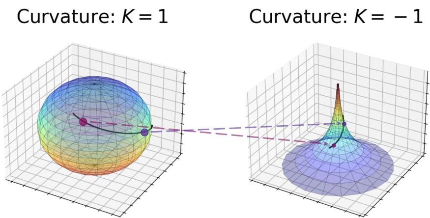
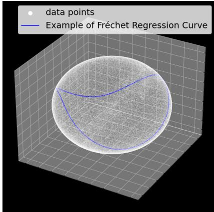
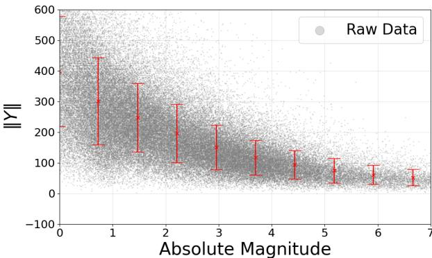
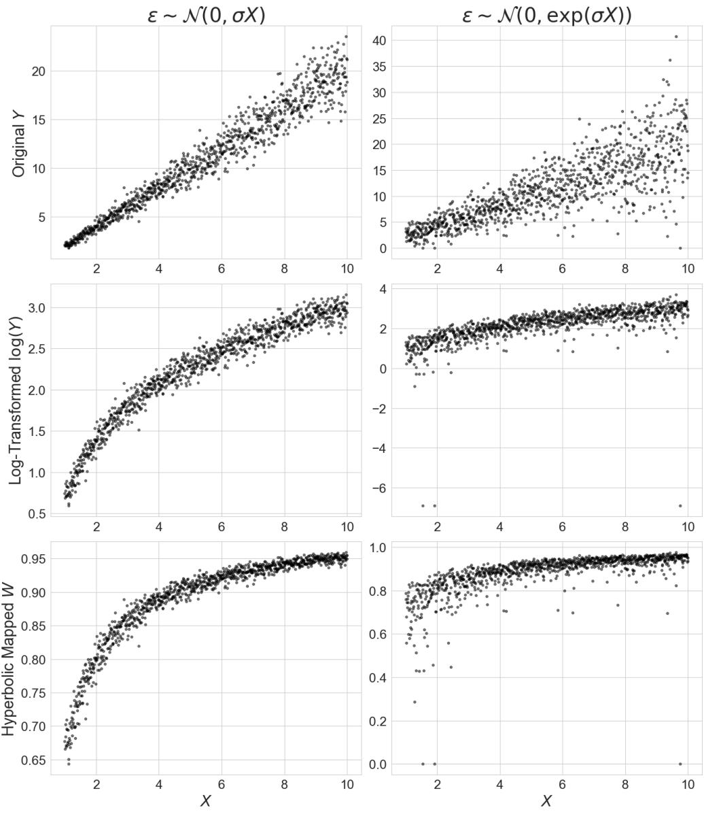
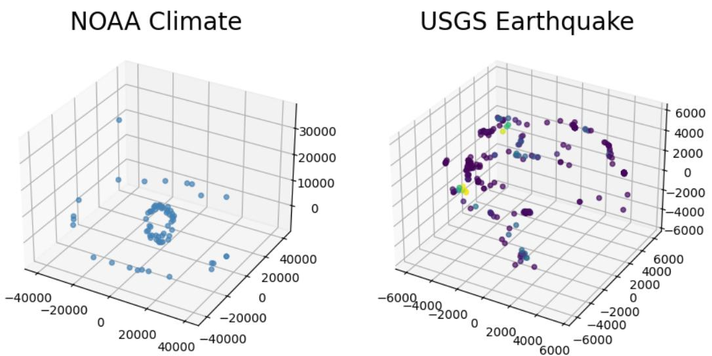
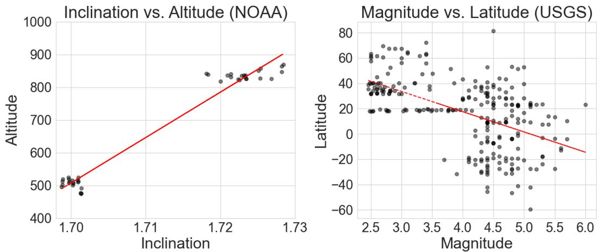

# Theoretical and Practical Analysis of Fréchet Regression via Comparison Geometry

Anonymous Author(s)   
Affiliation   
Address   
email

# Abstract

Fréchet regression extends classical regression methods to non-Euclidean metric   
spaces, enabling the analysis of data relationships on complex structures such   
as manifolds and graphs. This work establishes a rigorous theoretical analysis   
for Fréchet regression through the lens of comparison geometry which leads to   
important considerations for its use in practice. The analysis provides key results   
on the existence, uniqueness, and stability of the Fréchet mean, along with statisti  
cal guarantees for nonparametric regression, including exponential concentration   
bounds and convergence rates. Additionally, insights into angle stability reveal   
the interplay between curvature of the manifold and the behavior of the regression   
estimator in these non-Euclidean contexts. Empirical experiments validate the   
theoretical findings, demonstrating the effectiveness of proposed hyperbolic map  
pings, particularly for data with heteroscedasticity, and highlighting the practical   
usefulness of these results.

# 14 1 Introduction

Fréchet regression [35] is a powerful statistical tool for analyzing relationships between variables   
when the response or predictor lies in a non-Euclidean space. It generalizes classical regression to   
settings where the response variable $Y$ resides in a metric space $\mathcal { M }$ . Given predictors $X$ , Fréchet   
regression seeks to estimate the conditional Fréchet mean.

$$
\mu ( x ) = \underset { m \in \mathcal { M } } { \arg \operatorname* { m i n } } \mathbb { E } \left[ d ^ { 2 } ( Y , m ) \mid X = x \right] ,
$$

where $d$ is the metric on $\mathcal { M }$ . This approach accommodates data in various non-Euclidean spaces,   
such as manifolds, trees, and graphs [29, 17, 18, 36, 13]. In recent years, several variants of Fréchet   
regression have been proposed [39, 7, 37, 19, 44, 42], each addressing different aspects such as   
variable selection, error modeling, and high-dimensional data handling. However, most existing   
studies primarily focus on specific geometric settings or lack a comprehensive theoretical framework   
that accounts for varying curvature bounds. This study fills this gap by leveraging comparison   
geometry to provide a unified theoretical analysis of Fréchet regression across $\mathrm { C A } \bar { \mathrm { T } } ( \bar { K } )$ spaces with   
diverse curvature properties.   
Fréchet regression allows the assumption of a non-Euclidean space in the space of the data, so one   
can expect that its behavior can be described depending on the geometrical properties of the space. To   
investigate this, this study utilizes comparison geometry, which is a fundamental branch of differential   
geometry that investigates the geometric properties of a given space by comparing it to model spaces   
of constant curvature [12, 20, 11, 41]. Unlike information geometry [3, 5, 33, 4, 27, 28], which   
focuses on general statistical manifolds, this framework leverages classical comparison theorems   
to derive insights about the structure and behavior of more complex or less regular spaces. By   
establishing inequalities and structural similarities between a target space and well-understood model   
spaces (e.g., Euclidean, spherical, or hyperbolic geometries), comparison geometry enables the   
extension of geometric and topological results to broader contexts, including spaces that may lack   
smoothness or traditional manifold structures. In this framework, $\operatorname { C A T } ( K )$ spaces are pivotal objects   
of study, which are the generalization of constant curvature space [6, 22, 9]. $\operatorname { C A T } ( K )$ spaces are   
geodesic metric spaces, where geodesic triangles are thinner than their comparison triangles in   
the model space of constant curvature $K$ . Consider several known examples of $\operatorname { C A T } ( K )$ spaces.   
Euclidean spaces $\mathbb { R } ^ { n }$ are classic examples with $K = 0$ , exhibiting flat geometry. Hyperbolic spaces,   
which have constant negative curvature $K < 0$ ), serve as models for spaces exhibiting exponential   
growth and are useful in areas like network analysis and evolutionary biology. On the other hand, trees   
can be viewed as $\mathrm { C A T ( 0 ) }$ spaces, providing a discrete analog with unique geodesics between points.   
Additionally, certain types of manifold structures used in shape analysis and computer graphics   
also qualify as $\operatorname { C A T } ( K )$ spaces under specific curvature conditions. These examples demonstrate   
the broad applicability of $\operatorname { C A T } ( K )$ spaces in modeling diverse geometric contexts encountered in   
statistical analysis. By considering such spaces, this study aims to describe the behavior of the Fréchet   
regression in terms of curvature $K$ in particular.

# 50 2 Notation

In this section, the notations and definitions required for the following analysis are organized. Let   
$\mathcal { M }$ be a metric space and $d$ be the metric on $\mathcal { M }$ . Here, the metric space $( \mathcal { M } , d )$ is geodesic space if   
every pair of points in $\mathcal { M }$ can be connected by a geodesic, a curve whose length equals the distance   
between the points.   
Definition 1 ( $\operatorname { C A T } ( K )$ space). Let $( \mathcal { M } , d )$ be a geodesic metric space and let $K \in \mathbb { R }$ . The space   
$\mathcal { M }$ is said to be a $\operatorname { C A T } ( K )$ space if it satisfies the following curvature condition: for any geodesic   
triangle △pqr in $\mathcal { M }$ with perimeter less than $2 D _ { K }$ (where $D _ { K } = \pi / \sqrt { K } i f K > 0 ,$ , and $D _ { K } = \infty$   
otherwise), and for any points $x , y$ on the edges $[ p q ]$ and [qr] respectively, the distance between $x$ and   
y in $\mathcal { M }$ does not exceed the distance between the corresponding points $\bar { x }$ and $\bar { y }$ on the comparison   
triangle △pqr¯ in the model space of constant curvature $K$ : $d ( x , y ) \leq d _ { \mathbb { M } _ { K } ^ { 2 } } ( \bar { x } , \bar { y } ) $ , where the   
comparison triangle △pqr¯ is a triangle in the simply connected, complete 2-dimensional Riemannian   
manifold $\mathbb { M } _ { K } ^ { 2 }$ of constant curvature $K$ that preserves the side lengths as $d _ { \mathbb { M } _ { K } ^ { 2 } } ( \bar { p } , \bar { q } ) \ : = \ : d ( p , q )$ ,   
$d _ { \mathbb { M } _ { K } ^ { 2 } } ( \bar { q } , \bar { r } ) = d ( q , r )$ , and $d _ { \mathbb { M } _ { K } ^ { 2 } } ( \bar { r } , \bar { p } ) = d ( r , p )$ .

Definition 2 (Geodesic convexity). $A$ function $f \colon \mathcal { M }  \mathbb { R }$ is geodesically convex if for every geodesic $\gamma \colon [ 0 , 1 ] \to { \mathcal { M } }$ , $f ( \gamma ( t ) ) \leq ( 1 - t ) f ( \gamma ( 0 ) ) + t f ( \gamma ( 1 ) ) ,$ , for all $t \in [ 0 , 1 ]$ .

Definition 3 $\lambda$ -strong geodesic convexity). A function $f \colon \mathcal { M }  \mathbb { R }$ is $\lambda$ -strongly geodesically convex   
around $p \in \mathcal { M }$ if there exists a constant $\lambda > 0$ depending only on $K$ and $\mathrm { d i a m } ( { \mathcal { M } } )$ such that

$$
f ( x ) - f ( p ) \geq \lambda d ^ { 2 } ( x , p ) ,
$$

for every $x \in \mathcal { M }$

Definition 4 (Lower semicontinuity). A functional $F \colon \mathcal { M } \to \mathbb { R } \cup \{ + \infty \}$ is lower semicontinuous at   
a point $x \in \mathcal { M }$ if for every sequence $\{ x _ { n } \}$ converging to $x$ , it satisfies

$$
F ( x ) \leq \operatorname* { l i m } _ { n \to + \infty } F ( x _ { n } ) .
$$

Definition 5 (Weak convergence in metric space). A sequence of probability measures $\left\{ \nu _ { n } \right\}$ on $\mathcal { M }$   
is said to converge weakly to a probability measure $\nu$ (denoted by $\nu _ { n } \Rightarrow \nu$ ) if for every bounded   
continuous function $f \colon \mathcal { M }  \mathbb { R }$ ,

$$
\operatorname* { l i m } _ { n  + \infty } \int _ { \mathcal { M } } f ( y ) d \nu _ { n } ( y ) = \int _ { \mathcal { M } } f ( y ) d \nu ( y ) .
$$

Definition 6 (Alexandrov angle). The Alexandrov angle $\angle _ { x } ( y , z )$ is defined as the limit of secular 75 angles between short sub-segments. Concretely, if $y ^ { \prime }$ is a point on $[ x y ]$ with $d ( x , y ^ { \prime } )  0$ and $z ^ { \prime }$ is $a$ point on 76 $[ x z ]$ with $d ( x , z ^ { \prime } ) \stackrel { \cdot } {  } 0$ . Then,

$$
\angle _ { x } ( y , z ) : = \operatorname* { l i m } _ { y ^ { \prime } \to x , z ^ { \prime } \to x } \angle _ { x } ^ { \mathrm { ( s e c ) } } ( y ^ { \prime } z ^ { \prime } ) ,
$$

where 77 $\angle _ { x } ^ { \mathrm { ( s e c ) } } ( y ^ { \prime } z ^ { \prime } )$ is the ordinary angle in the comparison triangle for $\triangle x y ^ { \prime } z ^ { \prime }$ in the model space.

Definition 7 (Riemannian exponential map). Let $T _ { z } { \mathcal { M } }$ be the tangent space of $\mathcal { M }$ at a point $z \in \mathcal { M }$ .   
For a fixed point $z$ , the Riemannian exponential map at $z$ , denoted by $\mathrm { e x p } _ { z }$ is a map from the   
tangent space at $z$ to the manifold $\mathcal { M } \colon \exp _ { z } \colon T _ { z } \mathcal { M } \to \mathcal { M }$ . Here, the Riemannian exponential map   
is constructed as i) Choose a tangent vector $v \in T _ { z } { \mathcal { M } }$ . ii) Consider the unique geodesic $\gamma _ { v } ( t )$   
emanating from $z$ with initial velocity $v$ . Formally, $\gamma _ { v } ( t )$ satisfies $\gamma _ { v } ( 0 ) = z$ and $\gamma _ { v } ^ { \prime } ( 0 ) = v$ . iii) The   
exponential map sends the tangent vector v to the point on the manifold reached by traveling along   
the geodesic $\gamma _ { v }$ for unit time, $\begin{array} { r } { \dot { \exp } _ { z } ( v ) = \gamma _ { v } ( 1 ) } \end{array}$ .

# 3 Theory

See Appendix B for complete proofs of all statements.

# 3.1 Key Lemmas

Here, we summarize key lemmas required for our study. These results follow those of previous studies [43, 23, 24], but are presented below for the sake of uniformity of notation and to keep the manuscript self-contained. First, it can be shown that in $\operatorname { C A T } ( K )$ spaces with $K \leq 0$ , the convexity properties ensure the existence and uniqueness of the Fréchet mean under mild conditions. For $\operatorname { C A T } ( K )$ spaces with $K > 0$ , additional constraints on the diameter of the space may be necessary to ensure uniqueness due to potential multiple minima arising from positive curvature.

Lemma 1. Let $( \mathcal { M } , d )$ be a $\operatorname { C A T } ( K )$ space for $K \leq 0$ . For any fixed point $p \in \mathcal { M }$ , the function $f \colon \mathcal { M }  \mathbb { R }$ defined by $f ( x ) = d ^ { 2 } ( { p , \dot { x } } )$ is geodesically convex.

Lemma 1 establishes that the squared distance function retains geodesic convexity in $\operatorname { C A T } ( K )$   
spaces with non-positive curvature. This property is fundamental because it ensures that the Fréchet   
functional, which aggregates squared distances, inherits convexity. Consequently, optimization   
99 procedures to find the Fréchet mean are well-behaved, avoiding local minima and guaranteeing global   
00 optimality under the given conditions.

Lemma 2. Let $( \mathcal { M } , d )$ be a complete $\operatorname { C A T } ( K )$ space. For any probability measure ν on $\mathcal { M }$ with 02 compact support, there exists at least one minimizer $m \in \mathcal { M }$ of the Fréchet functional:

$$
m = \underset { x \in \mathcal { M } } { \arg \operatorname* { m i n } } \int _ { \mathcal { M } } d ^ { 2 } ( y , x ) d \nu ( y ) .
$$

Lemma 3. Let $( \mathcal { M } , d )$ be a $\operatorname { C A T } ( K )$ space with $K \leq 0$ that is strictly geodesically convex, meaning   
that the squared distance function $f ( x ) = d ^ { 2 } ( p , x )$ is strictly geodesically convex for any fixed point   
$p \in \mathcal { M }$ . Then, for any probability measure $\nu$ on $\mathcal { M }$ with compact support, the Fréchet mean m is   
unique.   
Based on Lemma 1, which ensures geodesic convexity of the squared distance function in non  
positively curved $\operatorname { C A T } ( K )$ spaces, and Lemma 2, which guarantees the existence of a Fréchet   
mean under compact support, one can establish the stability of the Fréchet mean under measure   
perturbations. Furthermore, Lemma 3 ensures uniqueness under strict geodesic convexity, thereby   
enabling Proposition 1 to assert the convergence of Fréchet means in non-positively curved spaces.   
Proposition 1. Let $( \mathcal { M } , d )$ be a $\operatorname { C A T } ( K )$ space with $K \leq 0$ . Suppose $\left\{ \nu _ { n } \right\}$ is a sequence of   
probability measures on $\mathcal { M }$ that converges weakly to a probability measure ν. Assume that for each   
$n ,$ , the measure $\nu _ { n }$ has a unique Fréchet mean $m _ { n }$ , and $\nu$ also has a unique Fréchet mean m. Then,   
the sequence of Fréchet means $\{ m _ { n } \}$ converges to $m \in \mathcal { M }$ .   
Proposition 1 claims that the $\operatorname { C A T } ( K )$ condition with $K \leq 0$ ensures that the space is non-positively   
curved, which imbues the space with strict convexity properties crucial for the uniqueness and stability   
of minimizers. This geometric structure prevents the existence of multiple local minima, thereby   
facilitating the continuity of minimizers under perturbations of the measure. Here, the stability of   
the Fréchet mean under measure perturbations is foundational for Fréchet regression. It ensures that   
as predictors vary and induce changes in the conditional distributions of responses, the conditional   
Fréchet means (regression estimates) behave predictably and converge appropriately as sample size   
123 increases.   
24 Lemma 4. Let $( \mathcal { M } , d )$ be a $\operatorname { C A T } ( K )$ space with positive curvature bound $K > 0$ . If the diameter   
of the support of the probability measure $\nu$ , denoted by diam $\left( \operatorname { s u p p } ( \nu ) \right)$ , satisfies diam $( \operatorname { s u p p } ( \nu ) ) <$   
$\frac { \pi } { 2 \sqrt { K } }$ , then the Fréchet mean m of $\nu$ is unique.   
In Lemma 4, the diameter constraint ensures that all points in the support of √ $\nu$ lie within a geodesic   
ball of radius $R = \pi / 2 \sqrt { K }$ . In $\operatorname { C A T } ( K )$ spaces with $K > 0$ , such balls are geodesically convex,   
meaning any geodesic between two points within the ball lies entirely inside the ball. This local   
convexity is crucial for preserving strict convexity properties of the Fréchet functional.

131 In addition, applying Lemmas 2 and 3, the following statement can be obtained.

32 Lemma 5. Let $( \mathcal { M } , d )$ be a complete $\operatorname { C A T } ( K )$ space and consider a conditional distribution $\nu _ { x }$ of   
3 $Y$ given $X = x$ . If for each $x$ , the support of $\nu _ { x }$ satisfies

$$
\mathrm { d i a m } ( \mathrm { s u p p } ( \nu _ { x } ) ) < D _ { K } = \left\{ + \infty \quad i f K \le 0 , \right.
$$

then then the conditional Fréchet mean in Eq. (1) exists and is unique for each $x$ .

# 3.2 Convergence Rates and Concentration

Let $\hat { \mu } _ { n } ^ { * }$ denote a nonparametric Fréchet regression estimator (e.g., Nadaraya–Watson–type kernel   
smoothing [32, 40, 8] on the predictor space). Then, the following statements for the concentration   
results, the pointwise consistency, and rates of convergence can be obtained. The important point is   
that one has to rely on exponential concentration inequalities valid in $\operatorname { C A T } ( K )$ spaces (e.g., specific   
versions of concentration of measure or deviation bounds for Fréchet means).   
Theorem 1 (Concentration for the sample Fréchet mean). Let $( \mathcal { M } , d )$ be a complete $\operatorname { C A T } ( K )$ space   
of diameter at most $D$ . Suppose that $Y _ { 1 } , Y _ { 2 } , \dots , Y _ { n }$ are independent and identically distributed   
143 random points in $\mathcal { M }$ , and let $\mu$ and $\hat { \mu } _ { n }$ be the population and sample Fréchet mean.

$$
\begin{array} { r l } & { \mu : = \underset { z \in \mathcal { M } } { \arg \operatorname* { m i n } } \mathbb { E } [ d ^ { 2 } ( Y , z ) ] , } \\ & { } \\ & { \hat { \mu } : = \underset { z \in \mathcal { M } } { \arg \operatorname* { m i n } } \frac { 1 } { n } \sum _ { i = 1 } ^ { n } d ^ { 2 } ( Y _ { i } , z ) . } \end{array}
$$

Assume further that each 144 $d ^ { 2 } ( Y _ { i } , z )$ is essentially bounded by $D ^ { 2 }$ , or more generally that $d ^ { 2 } ( Y _ { i } , z )$ 145 has sub-Gaussian tails uniformly in $z$ . Then there exists $\delta > 0$ such that for every $\epsilon > 0$ ,

$$
\mathbb { P } \left[ d ( \hat { \mu } , \mu ) > \epsilon \right] \leq 2 \left( \frac { \alpha ( K , D ) D } { \delta } \right) ^ { m } e ^ { - \frac { n ( \alpha ( K , D ) \epsilon ^ { 2 } ) ^ { 2 } } { 8 D ^ { 2 } } } ,
$$

46 where m is the dimension of the manifold, and $\alpha ( K , D )$ is the strong convexity constant.

In addition to the concentration for the sample Fréchet mean in the standard sense, the following   
proposition gives the concentration in $L _ { p }$ sense.

Proposition 2. Under the hypotheses of Theorem $^ { l }$ , there exist explicit constants $C _ { p } ( K , D )$ such that for any integer $n \geq 1$ and $p \geq 1$ ,

$$
\begin{array} { r } { \mathbb { E } [ d ^ { p } ( \hat { \mu } _ { n } , { \mu } ) ] \le C _ { p } ( K , D ) ( n ^ { - p / 2 } ) . } \end{array}
$$

That is, 151 $d ( \hat { \mu } _ { n } , \mu )$ converges to $O$ in $L ^ { p }$ at a rate on the order of $n ^ { - p / 2 }$ .

Moreover, the following theorem gives the pointwise consistency of nonparametric Fréchet regression   
in a $\operatorname { C A T } ( K )$ space. The main idea parallels classical kernel-based regression arguments in $\mathbf { \mathbb { R } } ^ { d }$ , but   
replaces ordinary arithmetic means by Fréchet means in the metric space $( \mathcal { M } , d )$ .

Assumption 1 (Kernel LLN condition). For any bounded (or square-integrable) function $f \colon { \mathcal { M } }  \mathbb { R } ,$ nonnegative weights 156 $\{ w _ { n , i } ( x ) \} _ { i = 1 } ^ { n }$ satisfies

$$
\sum _ { i = 1 } ^ { n } w _ { n , i } ( x ) f ( Y _ { i } ) \underset { n \to \infty } { \overset { a . s . } { \to } } \mathbb { E } [ f ( x ) \mid X = x ] .
$$

Theorem 2 (Pointwise consistency of nonparametric Fréchet regression). Let $\{ ( X _ { i } , Y _ { i } ) \} _ { i = 1 } ^ { n }$ be i.i.d.   
sample with $X _ { i } \in \mathbb { R } ^ { d }$ and $Y _ { i } \in \mathcal { M }$ , where $( \mathcal { M } , d )$ is a complete $\operatorname { C A T } ( K )$ space with diameter   
$\mathrm { d i a m } ( \mathcal { M } ) \leq D$ . Define the population Fréchet regression function:

$$
\mu ^ { * } ( x ) : = \underset { z \in \mathcal { M } } { \arg \operatorname* { m i n } } \mathbb { E } [ d ^ { 2 } ( Y , z ) \mid X = x ] .
$$

Assume that 160 $\mu ^ { * } ( x )$ is well-defined and unique for each $x$ , provided as Theorem 5 Also, let 161 $\{ w _ { n , i } ( x ) \} _ { i = 1 } ^ { n }$ be nonnegative weights that sum to 1 for each fixed $x$ . For instance, in kernel re162 gression, one sets

$$
w _ { n , i } ( x ) = \frac { W ( \| x - X _ { i } \| / h _ { n } ) } { \sum _ { j = 1 } ^ { n } W ( \| x - X _ { j } \| / h _ { n } ) } ,
$$

where $W ( \cdot )$ is a usual kernel (with compact support or exponential decay), and $h _ { n } \ \to \ 0$ is $a$   
164 bandwidth. Define the nonparametric Fréchet-regression estimator at $x$ by

$$
{ \hat { \mu } } _ { n } ^ { * } ( x ) = \underset { z \in \mathcal { M } } { \arg \operatorname* { m i n } } \sum _ { i = 1 } ^ { n } w _ { n , i } ( x ) d ^ { 2 } ( Y _ { i } , z ) .
$$

Then, under mild regularity conditions on the weights in Assumption $I$ , ${ \hat { \mu } } _ { n } ^ { * } ( x ) \operatorname * { \lrcorner } _ { n  \infty } ^ { a . s . } { \mu } ^ { * } ( x ) ,$ , for each fixed $x \in \mathbb { R } ^ { d }$ .

Here, additional assumptions allow us to obtain the convergence rates in $\operatorname { C A T } ( K )$ spaces.

68 Theorem 3 (Convergence rates in $\operatorname { C A T } ( K )$ spaces). Under the assumptions of Theorem 2, suppose   
additionally:

• $\mu ^ { * } \colon  { \mathbb { R } ^ { d } } \to \mathcal { M }$ is $\beta$ -Hölder (or Lipschitz) continuous, with respect to the usual Euclidean norm on $\mathbb { R } ^ { d }$ and the distance $d$ on $\operatorname { C A T } ( K )$ . That is, there exists $L > 0$ and $\beta > 0$ such that

$$
d ( \mu ^ { * } ( x ) , \mu ^ { * } ( x ^ { \prime } ) ) \leq L \cdot \| x - x ^ { \prime } \| ^ { \beta } ,
$$

for all $x , x ^ { \prime } \in \mathbb { R } ^ { d }$ .

• The kernel weights $w _ { n , i } ( x )$ satisfy standard nonparametric conditions:

$$
\sum _ { i = 1 } ^ { n } w _ { n , i } ( x ) = 1 , w _ { n , i } ( x ) \approx W \left( \frac { \lVert x - X _ { i } \rVert } { h _ { n } } \right) , \qquad h _ { n } \to 0 , \quad n h _ { n } ^ { d } \to + \infty .
$$

• Each conditional distribution $Y$ | $X = x$ has finite second moments in the $\operatorname { C A T } ( K )$ space and a unique Fréchet mean $\mu ^ { * } ( x )$ .

• The distribution of $Y \mid .$ $X = x$ varies smoothly in a local neighborhood of $x$ . Formally, one assumes that for $x ^ { \prime }$ near $x$ , the conditional distributions $\mathbb { P } [ Y \in \cdot \mid X = x ^ { \prime } ]$ do not differ too much, ensuring small bias when $x ^ { \prime } \approx x$ .

Then for the nonparametric Fréchet regression estimator 180 $\hat { \mu } _ { n } ^ { * }$ ,

$$
\operatorname* { s u p } _ { x \in \mathcal { X } _ { 0 } } \mathbb { E } \left[ d ^ { 2 } ( \hat { \mu } _ { n } ^ { * } ( x ) , { \mu } ^ { * } ( x ) ) \right] = O \left( \frac { 1 } { n h _ { n } ^ { d } } + h _ { n } ^ { 2 \beta } \right) ,
$$

where 181 $\mathcal { X } _ { 0 } \subseteq \mathbb { R } ^ { d }$ is any compact subset over which the kernel is applied.

From the above theorem, one can see that the usual $\begin{array} { r } { \left( \frac { 1 } { n h _ { n } ^ { d } } + h _ { n } ^ { \beta } \right) } \end{array}$ trade-off from Euclidean nonparametric statistics carries over to the $\operatorname { C A T } ( K )$ setting, once one accounts for i) geodesic convexity for controlling variance and ii) the Hölder continuity of $\mu ^ { * } ( x )$ for controlling bias.

Implications: Section 3.2 provides the statistical properties of Fréchet regression estimators within $\mathrm { C A T } ( K )$ spaces. Theorem 1 offers exponential concentration bounds for the sample Fréchet mean, indicating that the estimator converges to the true mean with high probability as the sample size increases. Proposition 2 further quantifies this convergence in an $L ^ { p }$ sense, demonstrating that the expected distance between the sample and population Fréchet means decreases at a rate proportional to $n ^ { - 1 / 2 }$ . These results are pivotal for understanding the efficiency and reliability of Fréchet regression estimators. They assure that given sufficient data, the regression estimates will not only be consistent but also achieve convergence rates comparable to those observed in classical Euclidean nonparametric regression.

Understanding not just the position but also the directional relationships around the Fréchet mean is crucial for capturing the local geometry of the data distribution. Angle stability ensures that small perturbations in the underlying probability measures or data configurations do not lead to significant distortions in the angular relationships among points relative to the Fréchet mean. This property is particularly valuable when analyzing directional data or when the regression function’s local behavior depends on angular relationships, such as shape analysis or directional statistics.

First, the following lemma for the angle comparison in $\operatorname { C A T } ( K )$ spaces is provided.

Lemma 6. Let $( \mathcal { M } , d )$ be $\iota \operatorname { C A T } ( K )$ space, and let $\triangle x y z \subset { \mathcal { M } }$ be a geodesic triangle of perimeter $\le \pi / \sqrt { K }$ when $K > 0$ . Let $\triangle$ x¯y¯z¯ be its comparison triangle in the simply connected model space of constant curvature $K$ . Then for each vertex $x$ and the corresponding comparison vertex $\bar { x }$ , $\begin{array} { r } { \angle { _ x } ( y , z ) \le \angle _ { \bar { x } } ( \bar { y } , \bar { z } ) } \end{array}$ , where $\angle _ { x } ( y , z )$ is the Alexandrov angle (or geodesic angle) at $x$ formed by the geodesic segments $[ x y ]$ and $[ x z ]$ .

Note the assumption that the perimeter of $\triangle x y z$ is $\le \pi / \sqrt { K }$ (when $K > 0$ ) is used to ensure i)   
The geodesics $[ { \bar { x } } y ] , [ y z ] , [ z x ]$ are short enough so that the entire triangle $\triangle x y z$ (and sub-triangles√   
$\triangle x y ^ { \prime } z ^ { \prime } )$ can be compared in the standard simply connected model space (the sphere of radius $1 / \sqrt { K }$   
if $K > 0$ ). ii) One avoids the potential degeneracy where side lengths might exceed $\pi / { \sqrt { K } }$ , which   
could cause the model triangle in spherical geometry to become ambiguous or wrap around the sphere.   
In the case $K \leq 0$ , there is no maximum perimeter restriction because the simply connected model   
space (Euclidean or hyperbolic) is unbounded in diameter.

Next, the lemma for the angle continuity under small perturbation is provided.

Lemma 7. Let △pqr and $\triangle p ^ { \prime } q ^ { \prime } r ^ { \prime }$ be two geodesic triangles in a $\operatorname { C A T } ( K )$ space $( \mathcal { M } , d )$ . Suppose each has a perimeter $\pi / { \sqrt { K } }$ when $K > 0$ (no restriction is needed if $K \ \leq \ 0$ ). Also assume $d ( p , p ^ { \prime } ) + \bar { d ( } q , q ^ { \prime } ) + d ( r , r ^ { \prime } )$ is small. Then, for the angles at $p$ in $\triangle$ pqr and at $p ^ { \prime }$ in $\triangle p ^ { \prime } q ^ { \prime } r ^ { \prime }$ ,

$$
\begin{array} { r } { | \angle _ { p } ( q , r ) - \angle _ { p ^ { \prime } } ( q ^ { \prime } , r ^ { \prime } ) | \le C \delta _ { p p ^ { \prime } q q ^ { \prime } r r ^ { \prime } } , } \end{array}
$$

where $C > 0$ is a constant depending only on $K$ and the maximum side length (or perimeter)   
constraints, and

$$
\delta _ { p p ^ { \prime } q q ^ { \prime } r r ^ { \prime } } : = d ( p , p ^ { \prime } ) + d ( q , q ^ { \prime } ) + d ( r , r ^ { \prime } ) .
$$

220 Based on the above lemmas, the following statements are obtained.

Proposition 3 (Angle perturbation via conditional measures). Let $\{ \nu _ { x } \}$ be a family of probability measures on a $\operatorname { C A T } ( K )$ space $( \mathcal { M } , d )$ , each supported in a geodesic ball of diameter $\leq D =$ $\pi / 2 \sqrt { K }$ when $K > 0$ . Let $\mu ^ { * } ( x )$ be the unique Fréchet mean of $\nu _ { x }$ . Suppose $\nu _ { x }$ and $\nu _ { x ^ { \prime } }$ are close in the Wasserstein metric on measures: $d _ { W } ( \nu _ { x } , \nu _ { x ^ { \prime } } ) \leq \epsilon$ . Then, for any fixed $u , v \in { \mathcal { M } }$ , one has

$$
| \angle _ { \mu ^ { * } ( x ) } ( u , v ) - \angle _ { \mu ^ { * } ( x ^ { \prime } ) } ( u , v ) | \le C \epsilon ,
$$

25 where the constant $C > 0$ depends on the strong-convexity modulus $\alpha ( K , D )$ . In particular, smaller ϵ implies the angles at 26 $\mu ^ { * } ( x )$ and $\mu ^ { * } ( x ^ { \prime } )$ to points $u , v$ differ by at most $O ( \epsilon )$ .

Theorem 4 (Angle stability for conditional Fréchet means). Let $\{ ( X _ { i } , Y _ { i } ) \} \subset \mathbb { R } ^ { d } \times \mathcal { M }$ with $\mathcal { M } a$   
$\operatorname { C A T } ( K )$ space of diameter $\le D = \pi / 2 \sqrt { K } i f K > 0$ . For each $\boldsymbol { x } \in \mathbb { R } ^ { d }$ , let $\nu _ { x } ( \cdot )$ be the conditional   
distribution of $Y$ given $X = x$ . Assume each $\nu _ { x }$ has the unique Fréchet mean $\mu ^ { * } ( x )$ . Moreover,   
suppose that for $x , x ^ { \prime }$ sufficiently close, the measures $\mu ^ { * } ( x )$ and $\mu ^ { * } ( x ^ { \prime } )$ differ by at most $\epsilon ( \| x - x ^ { \prime } \| )$   
231 in the Wasserstein distance. Then for any finite set of points $\{ u _ { 1 } , \ldots , u _ { m } \} \subset { \mathcal { M } }$ ,

$$
\operatorname* { s u p } _ { 1 \leq i < j \leq m } \vert { \angle _ { \mu ^ { * } ( x ) } ( u _ { i } , u _ { j } ) - \angle _ { \mu ^ { * } ( x ^ { \prime } ) } ( u _ { i } , u _ { j } ) } \vert \leq C \epsilon _ { x x ^ { \prime } } ,
$$

where $C \ > \ 0$ is a constant depending on the strong-convexity modulus $\alpha ( K , D )$ and $\epsilon _ { x x ^ { \prime } } =$ $\epsilon ( \| x - x ^ { \prime } \| )$ . Thus, all angles at $\mu ^ { * } ( x )$ relative to a finite set of directions $u _ { 1 } , \ldots , u _ { m }$ vary continuously and Lipschitzly with $x$ .

Implications: The established angle stability results in Section 3.3 imply that the geometric structure surrounding the conditional Fréchet mean remains consistent under minor changes in the data distribution. This consistency is essential for applications where the relative orientation of data points carries meaningful information, ensuring that the regression estimates preserve intrinsic geometric relationships.

  
Figure 1: Mapping from spherical data into hyperbolic space.

# 240 3.4 Local Jet Expansion of Fréchet Functionals

Lemma 8. Let $z \in \mathcal { M }$ and let $\exp _ { z } \colon T _ { z } { \mathcal { M } }  { \mathcal { M } }$ be the Riemannian exponential map (in a local sense if $\mathcal { M }$ is a manifold, or a suitable geodesic parameterization if $\mathcal { M }$ is just a geodesic metric space). Then for points $u , v$ sufficiently close to $z$ , define $U : = \exp _ { z } ^ { - 1 } \bar { ( u ) }$ and $V : = \mathrm { e x p } _ { z } ^ { - 1 } ( v )$ . Then,

$$
\begin{array} { r } { \angle _ { z } ( u , v ) = \angle _ { 0 } ( U , V ) + O ( \| \exp _ { z } ^ { - 1 } ( u ) \| ^ { 2 } + \| \exp _ { z } ^ { - 1 } ( v ) \| ^ { 2 } ) , } \end{array}
$$

where $\angle _ { 0 } ( U , V )$ is the standard Euclidean angle in $T _ { z } \mathcal { M } \approx \mathbb { R } ^ { m }$ , and the big-Oh term depends on curvature bounds near $z$ .

Proposition 4 (Local Jet expansion of Fréchet functionals). Let $\nu$ be a probability measure on a sufficiently regular $\operatorname { C A T } ( K )$ space $( \mathcal { M } , d )$ . Suppose that $\mu ( x )$ is the Fréchet mean of $\nu _ { x }$ $ \mathbf { \Phi } _ { x } \colon \mu ( x ) : =$ a $\begin{array} { r } { \mathrm { r g } \operatorname* { m i n } _ { z \in \mathcal { M } } \int d ^ { 2 } ( y , z ) d \nu _ { x } ( y ) } \end{array}$ , and consider the Fréchet functional $\begin{array} { r } { F _ { x } ( z ) = \int \dot { d } ^ { 2 } ( y , z ) \dot { d } \nu _ { x } ( y ) } \end{array}$ . Then, in a sufficiently small neighborhood of $\mu ,$ , the functional $F$ can be expanded in the tangent space $T _ { \mu } { \mathcal { M } }$ via the exponential map. Specifically, using local coordinates $\exp _ { \mu } \colon T _ { \mu } \mathcal { M } \supset B _ { r } ( 0 ) \to \mathcal { M }$ , for a vector $v$ with $\lVert v \rVert$ small, define $z = \exp _ { \mu } ( v )$ . The expansion is given by

$$
F ( \exp _ { \mu } ( v ) ) = F _ { x } ( \mu ) + \langle \nabla F _ { x } ( \mu ) , v \rangle + \frac { 1 } { 2 } \langle H _ { x } v , v \rangle + R ( v ) ,
$$

52 where $\nabla F _ { x } ( \mu )$ is the gradient (which is zero if $\mu$ is the unique minimizer), $H _ { x }$ is the Hessian $a$ linear operator on 53 $T _ { \mu } { \mathcal { M } } )$ , and the remainder term $R ( v )$ satisfies $| R ( v ) | = O ( \| v \| ^ { 3 } )$ .

Implications: The analysis in Section 3.4 offers a nuanced understanding of the Fréchet functional’s local behavior around its minimizer, the Fréchet mean. By expanding the Fréchet functional in the tangent space via the exponential map, one can gain insights into the functional’s curvature and higher-order properties.

# 3.5 Auxiliary Statements

Here, a couple of auxiliary propositions that facilitate a deeper understanding of the structural properties of the Fréchet functional within $\operatorname { C A T } ( K )$ spaces are introduced in this section. These propositions decompose the Fréchet functional into radial and angular components, enabling a more nuanced analysis of variance and stability around the Fréchet mean.

Proposition 5 (Angle Splitting in Distance Sums). Consider the Fréchet functional $F ( z ) =$ $\textstyle \int d ^ { 2 } ( y , z ) d \nu ( y )$ . For $z$ near $\mu ^ { * }$ , decompose:

$$
d ^ { 2 } ( y , z ) = d ^ { 2 } ( y , \mu ^ { * } ) + \Pi _ { d } ( y , z , \mu ^ { * } ) + \Pi _ { \angle } ( y , z , \mu ^ { * } ) ,
$$

where $\Pi _ { d }$ captures radial changes in distances $\Pi _ { \angle }$ represents angular corrections around $\mu ^ { * }$ . If $\angle _ { \mu ^ { * } } ( \boldsymbol { y } , z )$ remains small near $\mu ^ { * }$ , then $\Pi _ { \angle }$ is of order $\langle \angle _ { \mu ^ { * } } ( y , z ) \rangle d ( \mu ^ { * } , z )$ .

Proposition 6 (Angle–Distance Decomposition of Conditional Variance). Let $\nu _ { x }$ be the conditional distribution of 268 $Y$ given $X = x$ on a sufficiently smooth $\operatorname { C A T } ( K )$ space $( \mathcal { M } , d )$ . Suppose $\mu ^ { * } ( x )$ is

Table 1: Evaluation of Fréchet regression on different spaces.   

<table><tr><td>Data manifold</td><td>Mean squared error (MSE)</td></tr><tr><td>Sphere (K =1)</td><td>0.4915(±0.0086)</td></tr><tr><td>Hyperbolic (K =-1)</td><td>0.4228(±0.0021)</td></tr></table>

the unique Fréchet mean of 269 $\nu _ { x }$ . Around $\mu ^ { * } ( x )$ , let

$$
R _ { x } ( y ) : = d ( y , \mu ^ { * } ( x ) ) , \quad \phi _ { x } ( y ) : = \angle _ { \mu ^ { * } ( x ) } ( u _ { 0 } , y ) ,
$$

for a fixed reference point $u _ { 0 } \in \mathcal { M }$ . Then the conditional variance can be partially decomposed into   
a radial variance term, an angle–radial covariance term, and higher-order corrections:

$$
\begin{array} { r l } & { \operatorname { V a r } _ { \nu _ { x } } \left[ d ^ { 2 } ( Y , \mu ^ { * } ( x ) ) \right] } \\ & { \qquad = \operatorname { V a r } [ A _ { x } ( Y ) ] + \operatorname { C o v } \left( \phi _ { x } ( Y ) , R _ { x } ( Y ) ^ { 2 } \right) + \beta , } \end{array}
$$

272 where $A _ { x }$ is the radial part and $\beta$ is the higher-order term.

Implications: The auxiliary propositions presented in Subsection 3.5 play an important role in refining the theoretical underpinnings of Fréchet regression within $\operatorname { C A T } ( K )$ spaces. By decomposing the Fréchet functional into radial and angular components, these propositions enable a more granular analysis of variance and stability around the Fréchet mean.

# 277 4 Experiments

From the discussion in Section 3, it can be seen that the negative curvature space has better properties in terms of estimation than the positive curvature space with broader support. To confirm these results, this section considers numerical experiments. See Appendix A for the intuitive understanding of the following hyperbolic mapping.

# 4.1 Illustrative Example

A point on the unit sphere is parameterized as $x = \sin ( \phi ) \cos ( \theta ) , y = \sin ( \phi ) \sin ( \theta ) , z = \cos ( \phi )$ , where $\phi \in [ 0 , \pi ]$ is the polar angle and $\theta \in [ 0 , 2 \pi ]$ is the azimuthal angle. Let $R$ be the radius of the sphere. Here, consider the stereographic projection: The plane is tangent to the sphere at the south pole $( 0 , 0 , - R )$ and is defined $z = - R$ , and the north pole $N = ( 0 , 0 , R )$ serves as the projection point. For a point $p = ( x , y , z )$ , the stereographic projection $\pi ( p ) = ( u , v )$ on the plane is given by $\begin{array} { r } { u = \frac { R x } { R + z } , \quad v = \frac { R y } { R + z } } \end{array}$ . This plane can be considered in the hyperbolic space, and one can visualize it as the pseudosphere (see Figure 1). Also, a point $( x , y , z )$ can be mapped back to the sphere as

$$
x = { \frac { 2 R ^ { 2 } u } { R ^ { 2 } + u ^ { 2 } + v ^ { 2 } } } , y = { \frac { 2 R ^ { 2 } v } { R ^ { 2 } + u ^ { 2 } + v ^ { 2 } } } , z = R { \frac { u ^ { 2 } + v ^ { 2 } - R ^ { 2 } } { R ^ { 2 } + u ^ { 2 } + v ^ { 2 } } } .
$$

0 See Appendix E (including Python code in Listing 2) for the detailed data-generating process.

Table 1 shows the evaluation results of Fréchet regression on the spherical and hyperbolic coordinates. It can be seen that the hyperbolic mapping yields better results. Note that, the previous studies [15, 16] reported the effectiveness of such mapping for statistical problems of spherical data, and the objective of experiments in this section is just to confirm the theoretical results.

# 4.2 Experiment on Real-world Dataset

In addition to the illustrative example, consider the experiments on the real-world datasets. This section uses the following: i) HYG Steller database 1, which is a comprehensive dataset containing information on stars brighter than magnitude 6.5. ii) USGS Earthquake catalogue 2, represented in spherical coordinates. iii) NOAA Climate data 3, from weather satellites. See Appendix 4.2 for the

  
Figure 2: Visualization of the HYG Stellar database.

  
Figure 3: Heteroscedasticity in the HYG Stellar dataset.

<table><tr><td>Dataset</td><td>MSE</td></tr><tr><td>HYG Stellar USGS Earthquake</td><td>0.3765(±0.0036) 0.5832(±0.0831)</td></tr><tr><td>NOAA Climate</td><td>0.4384(±0.0678)</td></tr><tr><td>HYG Stellar (hyperbolic)</td><td>0.2660( (±0.0032)</td></tr><tr><td>USGS Earthquake (hyperbolic)</td><td>0.4743(±0.0541)</td></tr><tr><td>NOAA Climate (hyperbolic)</td><td>0.3259(±0.0683)</td></tr></table>

Table 2: Evaluation of Fréchet regression on different spaces.

details of this experiment (including Python code in Listing 3 for the visualization and data format   
check of the dataset). Table 2 shows the experimental results of Fréchet regression on different   
coordinates for the real datasets. The mapping procedure is the same as Section 4.1. As with the   
illustrative example, we can confirm that Fréchet regression on hyperbolic surfaces yields better   
results on the real datasets. As discussed in more detail in Appendix A, such a mapping of responses   
to hyperbolic space may be particularly useful when heteroscedasticity is assumed in the data. Indeed,   
306 heteroscedasticity can be observed in the HYG Stellar dataset (see Figure 3).

# 307 5 Conclusion

08 This study provides a comprehensive theoretical analysis of Fréchet regression within the framework   
of comparison geometry, focusing on $\operatorname { C A T } ( K )$ spaces. It establishes foundational results on the   
existence, uniqueness, and stability of the Fréchet mean under varying curvature conditions. Notably,   
the analysis demonstrates how curvature properties influence statistical estimation, with non-positive   
curvature spaces offering advantageous stability and convergence properties. The paper also extends   
statistical guarantees to nonparametric Fréchet regression, including exponential concentration   
bounds and convergence rates, which align with classical Euclidean results. Angle stability and local   
jet expansion further highlight the behavior of Fréchet functionals, offering geometric insights of   
regression in non-Euclidean spaces. Experimental results support the theoretical findings, showing   
that hyperbolic mappings often improve performance under heteroscedasticity assumption.

Limitations: While this study provides a robust theoretical foundation for Fréchet regression in $\operatorname { C A T } ( K )$ spaces, several limitations exist. Firstly, the analysis predominantly focuses on spaces with constant curvature bounds, which may not encompass all practical scenarios where data resides in more heterogeneous geometric contexts. Additionally, the reliance on strong convexity conditions and diameter constraints in positively curved spaces may restrict the applicability of the results. As has been done in the information geometry framework [1, 34, 10, 25, 26, 31, 2], future work could explore relaxing assumptions, extending the framework to broader classes of metric spaces, and developing efficient algorithms.

References   
[1] Shotaro Akaho. The e-pca and m-pca: Dimension reduction of parameters by information geometry. In 2004 IEEE International Joint Conference on Neural Networks (IEEE Cat. No. 04CH37541), volume 1, pages 129–134. IEEE, 2004.   
[2] Shun-Ichi Amari. Natural gradient works efficiently in learning. Neural computation, 10(2): 251–276, 1998.   
[3] Shun-ichi Amari. Information geometry and its applications, volume 194. Springer, 2016.   
[4] Shun-ichi Amari and Hiroshi Nagaoka. Methods of information geometry, volume 191. American Mathematical Soc., 2000.   
[5] Nihat Ay, Jürgen Jost, Hông Vân Lê, and Lorenz Schwachhöfer. Information geometry, volume 64. Springer, 2017.   
[6] Werner Ballmann. Lectures on spaces of nonpositive curvature, volume 25. Springer Science & Business Media, 1995.   
[7] Satarupa Bhattacharjee and Hans-Georg Müller. Single index fréchet regression. The Annals of Statistics, 51(4):1770–1798, 2023.   
[8] Hermanus Josephus Bierens. The nadaraya-watson kernel regression function estimator. 1988.   
[9] Martin R Bridson and André Haefliger. Metric spaces of non-positive curvature, volume 319. Springer Science & Business Media, 2013.   
[10] Kevin M Carter, Raviv Raich, William G Finn, and Alfred O Hero III. Information-geometric dimensionality reduction. IEEE Signal Processing Magazine, 28(2):89–99, 2011.   
[11] Jeff Cheeger and Karsten Grove. Metric and comparison geometry, volume 11. International Press, 2007.   
[12] Jeff Cheeger, David G Ebin, and David Gregory Ebin. Comparison theorems in Riemannian geometry, volume 9. North-Holland publishing company Amsterdam, 1975.   
[13] Yaqing Chen and Hans-Georg Müller. Uniform convergence of local fréchet regression with applications to locating extrema and time warping for metric space valued trajectories. The Annals of Statistics, 50(3):1573–1592, 2022.   
[14] Brad C Davis, P Thomas Fletcher, Elizabeth Bullitt, and Sarang Joshi. Population shape regression from random design data. International journal of computer vision, 90:255–266, 2010.   
[15] TD Downs. Spherical regression. Biometrika, 90(3):655–668, 2003.   
[16] Kajal Eybpoosh, Mansoor Rezghi, and Abbas Heydari. Applying inverse stereographic projection to manifold learning and clustering. Applied Intelligence, pages 1–15, 2022.   
[17] Daniel Ferguson and François G Meyer. Computation of the sample fréchet mean for sets of large graphs with applications to regression. In Proceedings of the 2022 SIAM International Conference on Data Mining (SDM), pages 379–387. SIAM, 2022.   
[18] Aritra Ghosal. Application of the single index methodology to the local Fréchet regression in the context of Object oriented data analysis (OODA). University of California, Santa Barbara, 2023.   
[19] Aritra Ghosal, Wendy Meiring, and Alexander Petersen. Fréchet single index models for object response regression. Electronic Journal of Statistics, 17(1):1074–1112, 2023.   
[20] Karsten Grove and Peter Petersen. Comparison geometry, volume 30. Cambridge University Press, 1997.   
[21] Matthias Hein. Robust nonparametric regression with metric-space valued output. Advances in neural information processing systems, 22, 2009.   
[22] Jürgen Jost. Nonpositive curvature: geometric and analytic aspects. Birkhäuser, 2012.   
[23] Hermann Karcher. Riemannian center of mass and mollifier smoothing. Communications on pure and applied mathematics, 30(5):509–541, 1977.   
[24] David G Kendall. Shape manifolds, procrustean metrics, and complex projective spaces. Bulletin of the London mathematical society, 16(2):81–121, 1984.   
[25] Masanari Kimura. Generalized t-sne through the lens of information geometry. IEEE Access, 9: 129619–129625, 2021.   
[26] Masanari Kimura and Howard Bondell. Density ratio estimation via sampling along generalized geodesics on statistical manifolds. arXiv preprint arXiv:2406.18806, 2024.   
[27] Masanari Kimura and Hideitsu Hino. $\alpha$ -geodesical skew divergence. Entropy, 23(5):528, 2021.   
[28] Masanari Kimura and Hideitsu Hino. Information geometrically generalized covariate shift adaptation. Neural Computation, 34(9):1944–1977, 2022.   
[29] Zhenhua Lin and Hans-Georg Müller. Total variation regularized fréchet regression for metricspace valued data. The Annals of Statistics, 49(6):3510–3533, 2021.   
[30] Dong C Liu and Jorge Nocedal. On the limited memory bfgs method for large scale optimization. Mathematical programming, 45(1):503–528, 1989.   
[31] Noboru Murata, Takashi Takenouchi, Takafumi Kanamori, and Shinto Eguchi. Information geometry of u-boost and bregman divergence. Neural Computation, 16(7):1437–1481, 2004.   
[32] Elizbar A Nadaraya. On estimating regression. Theory of Probability & Its Applications, 9(1): 141–142, 1964.   
[33] Frank Nielsen. An elementary introduction to information geometry. Entropy, 22(10):1100, 2020.   
[34] Adrian M Peter and Anand Rangarajan. Information geometry for landmark shape analysis: Unifying shape representation and deformation. IEEE Transactions on Pattern Analysis and Machine Intelligence, 31(2):337–350, 2008.   
[35] Alexander Petersen and Hans-Georg Müller. Fréchet regression for random objects with euclidean predictors. The Annals of Statistics, 47(2):691–719, 2019.   
[36] Rui Qiu, Zhou Yu, and Ruoqing Zhu. Random forest weighted local fréchet regression with random objects. Journal of Machine Learning Research, 25(107):1–69, 2024.   
[37] Dogyoon Song and Kyunghee Han. Errors-in-variables fr\’echet regression with low-rank covariate approximation. Advances in Neural Information Processing Systems, 36:80575–80607, 2023.   
[38] Florian Steinke and Matthias Hein. Non-parametric regression between manifolds. Advances in neural information processing systems, 21, 2008.   
[39] Danielle C Tucker, Yichao Wu, and Hans-Georg Müller. Variable selection for global fréchet regression. Journal of the American Statistical Association, 118(542):1023–1037, 2023.   
[40] Geoffrey S Watson. Smooth regression analysis. Sankhya: The Indian Journal of Statistics, ¯ Series A, pages 359–372, 1964.   
[41] Guofang Wei and Will Wylie. Comparison geometry for the bakry-emery ricci tensor. Journal of differential geometry, 83(2):337–405, 2009.   
[42] Xingyu Yan, Xinyu Zhang, and Peng Zhao. Frequentist model averaging for global fréchet regression. IEEE Transactions on Information Theory, 2024.   
[43] Takumi Yokota. Convex functions and barycenter on cat (1)-spaces of small radii. Journal of the Mathematical Society of Japan, 68(3):1297–1323, 2016.   
[44] Qi Zhang, Lingzhou Xue, and Bing Li. Dimension reduction for fréchet regression. Journal of the American Statistical Association, 119(548):2733–2747, 2024.

In regression analysis, transforming the response variable can often lead to improved model perfor  
mance by stabilizing variance, normalizing distributions, or linearizing relationships. A classical   
example is the logarithmic transformation ${ \dot { Y } } \mapsto \log ( Y )$ which can enhance the performance of a   
linear regression model under certain conditions. Similarly, mapping spherical responses into hyper  
bolic space can offer analogous benefits, particularly in scenarios where the data exhibits inherent   
geometric or hierarchical structures.

Log Transformation in Linear Regression Consider the simple linear regression model:

$$
\boldsymbol { Y } = \beta \boldsymbol { X } + \epsilon ,
$$

where $Y$ is the response variable, $X$ is the predictor, $\beta$ is the regression coefficient, and $\epsilon$ is the error term with 426 $\mathbb { E } [ \boldsymbol { \epsilon } ] = \bar { 0 }$ and $\mathrm { V a r } ( \epsilon ) = \sigma ^ { 2 }$ . Applying a logarithmic transformation to $Y$ yields

$$
\begin{array} { c } { \log ( Y ) = \beta X + \epsilon , } \\ { Y = \exp ( \beta X + \epsilon ) = \exp ( \beta X ) \cdot \exp ( \epsilon ) . } \end{array}
$$

Assuming $\epsilon$ is small and approximately normally distributed, $\exp ( \epsilon )$ introduces multiplicative noise   
to $Y$ effectively stabilizing variance across different levels of $X$ . This transformation often re  
duces heteroscedasticity in the residuals, leading to improved regression performance. Here, the   
heteroscedasticity refers to the phenomenon where the variability of the errors (or residuals) in a   
regression model is not constant across the range of predictor variables.

Definition 8 (Heteroscedasticity). Consider a regression model:

$$
Y _ { i } = \beta X _ { i } + \epsilon _ { i } ,
$$

where $\epsilon _ { i } \sim \mathcal { N } ( 0 , \sigma ^ { 2 } ( X _ { i } ) )$ . Here, the variance of the error term $\sigma ^ { 2 } ( X )$ depends on $X$ . In a heteroscedastic model, the variance of $\epsilon _ { i }$ is a function of the predictors $X _ { i }$ :

$$
\operatorname { V a r } ( \epsilon _ { i } \mid X _ { i } ) = \sigma ^ { 2 } ( X _ { i } ) .
$$

In contrast, for homoscedasticity, the variance of 435 $\epsilon _ { i }$ is constant.

Hyperbolic Mapping via Stereographic Projection Analogous to the log transformation, hy  
perbolic mapping transforms the response variable into a space where the geometric structure can   
lead to improved regression characteristics. The procedure involves mapping points from a spherical   
representation to a hyperbolic plane using stereographic projection. A point on the unit sphere of   
radius $R$ is parameterized using spherical coordinates:

$$
\begin{array} { l } { x = R \sin ( \phi ) \cos ( \theta ) , } \\ { y = R \sin ( \phi ) \sin ( \theta ) , } \\ { z = R \cos ( \phi ) , } \end{array}
$$

where $\phi \in [ 0 , \pi ]$ is the polar angle and $\theta \in [ 0 , 2 \pi )$ is the azimuthal angle. The stereographic   
projection maps a point $p = ( x , y , z )$ on the sphere to a point $p \mapsto \psi ( p ) = ( \bar { u , v } )$ on the plane tangent   
to the sphere at the south pole $( 0 , 0 , - R )$ and defined by $z = - R$ . The north pole $\bar { N } = ( 0 , \bar { 0 , } R )$   
serves as the projection point. The projection formulas are

$$
\begin{array} { c } { { u = \displaystyle \frac { R x } { R + z } , } } \\ { { v = \displaystyle \frac { R y } { R + z } . } } \end{array}
$$

This plane can be interpreted as a model of hyperbolic space, specifically visualized as a pseudosphere,   
which inherently possesses properties conducive to handling hierarchical or tree-like data structures.   
Both the logarithmic transformation and hyperbolic mapping aim to stabilize variance and linearize   
relationships, through different geometric transformations. To understand the benefits of hyperbolic   
mapping, consider the effect of each transformation on the variance of the response variable. Starting   
with $Y = \beta X + \epsilon$ , applying the log transformation yields

$$
\log Y = \beta X + \epsilon .
$$

Assuming 451 $\epsilon \sim \mathcal { N } ( 0 , \sigma ^ { 2 } )$ , The variance of $\log Y$ remains $\sigma ^ { 2 }$ which can be advantageous if the original 452 $Y$ exhibits multiplicative noise:

$$
\operatorname { V a r } ( Y ) = \operatorname { V a r } ( \exp ( \beta X + \epsilon ) ) = \exp ( 2 \beta X ) \cdot \left( \exp ( \sigma ^ { 2 } ) - 1 \right) .
$$

The transformation effectively decouples the variance from $X$ stabilizing it across different predictor   
values.   
For hyperbolic mapping, consider a response variable represented as a point on the sphere. The   
stereographic projection transforms this spherical representation into the hyperbolic plane. Let   
$Y$ be the original response mapped to a point $p = ( x , y , z )$ on the sphere, and $\psi ( p ) = ( u , v )$ its   
hyperbolic projection. Assuming small deviations around a mean direction, the hyperbolic mapping   
can linearize angular variations similarly to how the log transformation linearizes multiplicative   
variations. Specifically, fluctuations in $Y$ around the mean direction correspond to additive noise   
in the hyperbolic plane, potentially reducing variance in a manner akin to the log transformation.   
Formally, if $Y$ is modeled on the sphere with

$$
Y = R \cdot p + \epsilon ,
$$

where $\epsilon$ represents angular noise, the hyperbolic projection yields

$$
\psi ( Y ) = \left( { \frac { R x } { R + z } } , { \frac { R y } { R + z } } \right) + \epsilon ^ { \prime } ,
$$

whre 464 $\epsilon ^ { \prime }$ is the transformed noise. Under specific conditions (e.g., small angular deviations), $\epsilon ^ { \prime }$ 465 exhibits reduced variance compared to $\epsilon$ , analogous to the variance stabilization achieved by the log 466 transformation.

Example 1 (Stabilizing Variance in Hierarchical Data). Consider a dataset where the response   
variable $Y$ represents hierarchical relationships, such as the popularity of topics in a taxonomy. The   
inherent tree-like structure implies that differences between nodes (topics) grow exponentially with   
depth. Direct regression on $Y$ would face increasing variance as depth increases. By mapping $Y$ into   
hyperbolic space via stereographic projection, the exponential growth inherent in hierarchical data   
is linearized. This transformation stabilizes variance across different levels of the hierarchy, enabling   
more effective regression modeling. Specifically, the hyperbolic mapping aligns the geometric   
properties of the data with the regression framework, similar to how the log transformation aligns   
multiplicative relationships with additive modeling.

Let Y be mapped to hyperbolic space via stereographic projection:

$$
\begin{array} { c } { { u = \displaystyle \frac { R x } { R + z } , } } \\ { { v = \displaystyle \frac { R y } { R + z } . } } \end{array}
$$

Assuming $Y$ lies close to the north pole $N = ( 0 , 0 , R )$ , small perturbations $\epsilon$ around $N$ imply

$$
\begin{array} { l } { { \displaystyle z = R \cos ( \phi ) \approx R \left( 1 - \frac { \phi ^ { 2 } } { 2 } \right) , } } \\ { { \displaystyle x = R \sin ( \phi ) \cos ( \theta ) \approx R \phi \cos ( \theta ) , } } \\ { { \displaystyle y = R \sin ( \phi ) \sin ( \theta ) \approx R \phi \sin ( \theta ) . } } \end{array}
$$

Substituting into the projection formulas,

$$
\begin{array} { r } { \displaystyle { \boldsymbol u } \approx \frac { \boldsymbol { R } \cdot \boldsymbol { R } \phi \cos ( \theta ) } { \boldsymbol { R } + \boldsymbol { R } \left( 1 - \frac { \phi ^ { 2 } } { 2 } \right) } = \frac { \boldsymbol { R } ^ { 2 } \phi \cos ( \theta ) } { 2 \boldsymbol { R } - \frac { \phi ^ { 2 } } { 2 } } \approx \frac { \boldsymbol { R } \phi \cos ( \theta ) } { 2 } , } \\ { \displaystyle { \boldsymbol v } \approx \frac { \boldsymbol { R } \cdot \boldsymbol { R } \phi \sin ( \theta ) } { \boldsymbol { R } + \boldsymbol { R } \left( 1 - \frac { \phi ^ { 2 } } { 2 } \right) } = \frac { \boldsymbol { R } ^ { 2 } \phi \sin ( \theta ) } { 2 \boldsymbol { R } - \frac { \phi ^ { 2 } } { 2 } } \approx \frac { \boldsymbol { R } \phi \sin ( \theta ) } { 2 } . } \end{array}
$$

Thus, small angular deviations $\phi$ result in approximately linear changes in u and $v$ , effectively   
480 reducing the variance from multiplicative to additive in the hyperbolic plane:

$$
\operatorname { V a r } ( u , v ) \approx \left( { \frac { R } { 2 } } \right) ^ { 2 } \operatorname { V a r } ( \phi ) .
$$

  
Figure 4: Illustrative example of transformed responses. Under the heteroscedastic errors assumption, the appropriate transformations of response variable yield stabilized variance. In this figure, $Y$ is the original response variables, $\log ( Y )$ is the log-transformed variables and $W$ is the hyperbolic mapped variables.

# B.1 Proofs for Section 3.1

Proof for Lemma $^ { l }$ . To establish the geodesic convexity of the squared distance function $f ( x ) =$ $d ^ { 2 } ( p , x )$ in a $\operatorname { C A T } ( K )$ space $( \mathcal { M } , d )$ with $K \leq 0$ , one must show that for any two points $x , y \in { \mathcal { M } }$ and any geodesic $\gamma \colon [ 0 , 1 ] \to \mathcal { M }$ connecting $x$ to $y$ , the function $t \mapsto f ( \gamma ( t ) )$ is convex on the interval $[ 0 , 1 ]$ .

In the model space $\mathbb { M } _ { K } ^ { 2 }$ of constant curvature $K \leq 0$ , construct a comparison triangle $\bar { \triangle }$ corresponding to $\triangle = \{ p , x , y \}$ in $\mathcal { M }$ . Let ${ \bar { p } } , { \bar { x } } , { \bar { y } }$ be the vertices of $\bar { \triangle }$ in $\mathbb { M } _ { K } ^ { 2 }$ with side lengths matching those of $\triangle$ . Then, for any points $a , b$ on the sides $[ x , y ]$ and $[ p , x ]$ or $[ p , y ]$ , the distance $d ( a , b )$ in $\mathcal { M }$ is at most the distance $\dot { d } _ { \mathbb { M } _ { K } ^ { 2 } } ( \bar { a } , \bar { b } )$ in the model space.

Let $\gamma ( t )$ corresponds to a point $\bar { \gamma } ( t )$ on the side $[ \bar { x } , \bar { y } ]$ in $\bar { \triangle }$ . By the $\operatorname { C A T } ( K )$ property,

In 496 $\mathbb { M } _ { K } ^ { 2 }$ , which is a uniquely geodesic space, the squared distance satisfies the law of cosines

$$
d ^ { 2 } ( \bar { p } , \bar { \gamma } ( t ) ) \leq ( 1 - t ) d ^ { 2 } ( \bar { p } , \bar { x } ) + t d ^ { 2 } ( \bar { p } , \bar { y } ) - t ( 1 - t ) c _ { K } ,
$$

where $c _ { K }$ is a non-negative constant dependent on $K$ and the geometry of the triangle. Here, since $K \leq 0$ , the space $\mathbb { M } _ { K } ^ { 2 }$ exhibits non-positive curvature, which implies that the term $- t ( 1 - t ) c _ { K }$ does not negatively affect the inequality. Therefore,

$$
d ^ { 2 } ( p , \gamma ( t ) ) \leq d _ { \mathbb { M } ^ { 2 } ) K } ^ { 2 } ( \bar { p } , \bar { \gamma } ( t ) ) \leq ( 1 - t ) d ^ { 2 } ( p , x ) + t d ^ { 2 } ( p , y ) ,
$$

00 and $f$ is geodesically convex.

Proof for Lemma 2. Consider a sequence $\{ x _ { n } \}$ in $\mathcal { M }$ that converges to $x \in \mathcal { M }$ . Given the continuity   
of the distance function in metric spaces, for each $y \in \mathcal { M } , d ( y , x _ { n } )  d ( y , x )$ as $n  + \infty$ . Since   
$d ^ { 2 } ( y , x )$ is continuous in $x$ , by Fatou’s lemma,

$$
\operatorname* { l i m } _ { n \to + \infty } d ^ { 2 } ( y , x _ { n } ) \leq d ^ { 2 } ( y , x ) .
$$

Integrating both sides with respect to $\nu$ ,

$$
\operatorname* { l i m } _ { n \to + \infty } \int _ { \mathcal { M } } d ^ { 2 } ( y , x _ { n } ) d \nu ( y ) \leq \int _ { \mathcal { M } } d ^ { 2 } ( y , x ) d \nu ( y ) .
$$

Thus, $F$ is lower semicontinuous. Also, since

$$
F ( x ) = \int _ { \mathcal { M } } d ^ { 2 } ( y , x ) d \nu ( y ) \geq 0 ,
$$

for any $x \in \mathcal { M }$ , $F$ is bounded below by zero. Therefore, there exists a sequence $\{ m _ { m } \}$ in $\mathcal { M }$ such   
that

$$
F ( m _ { n } ) \to \operatorname* { i n f } _ { x \in \mathcal { M } } F ( x ) ,
$$

as $n  + \infty$ . Let $\{ m _ { n } \}$ be called a minimizing sequence. Given that the support of $\nu$ , denoted by   
$\operatorname { s u p p } ( \nu )$ , is compact, denote it by $S \subseteq { \mathcal { M } }$ . That is, $S$ is compact and $\nu ( S ) = 1$ .   
To ensure that the existence of a convergent subsequence, one need to show that $\{ m _ { n } \}$ is contained   
within a compact subset of $\mathcal { M }$ . Since $S$ is compact, it is bounded. Thus, there exists a radius $R > 0$   
and a point $p \in \mathcal { M }$ such that $S \subseteq B ( p , R )$ , where $B ( p , R ) = \{ x \in \mathcal { M } \mid d ( p , x ) \leq R \}$ . Using the   
triangle inequality in metric spaces,

$$
d ( y , m _ { n } ) \geq d ( p , m _ { n } ) - d ( y , p ) \geq d ( p , m _ { n } ) - R .
$$

Then,

$$
\begin{array} { l } { { \displaystyle F ( m _ { n } ) = \int _ { S } d ^ { 2 } ( y , m _ { n } ) d \nu ( y ) } } \\ { { \displaystyle \quad \geq \int _ { S } \left\{ d ( p , m _ { n } ) - d ( y , p ) \right\} ^ { 2 } d \nu ( y ) } } \\ { { \displaystyle \quad = \int _ { S } \left\{ d ( p , m _ { n } ) ^ { 2 } - 2 d ( p , m _ { n } ) + d ^ { 2 } ( y , p ) \right\} d \nu ( y ) } } \\ { { \displaystyle \quad = d ( p , m _ { n } ) ^ { 2 } - 2 d ( p , m _ { n } ) \int _ { S } d ( y , p ) d \nu ( y ) + \int _ { S } d ^ { 2 } ( y , p ) d \nu ( y ) \leq C } } \end{array}
$$

Let 515 $\begin{array} { r } { A = \int _ { S } d ( y , p ) \nu ( y ) } \end{array}$ and $\begin{array} { r } { B = \int _ { S } d ^ { 2 } ( y , p ) d \nu ( y ) } \end{array}$ , both finite due to the compactness. Thus,

$$
\begin{array} { c l l } { { d ( p , m _ { n } ) ^ { 2 } - 2 A d ( p , m _ { n } ) + B \leq C } } \\ { { } } & { { } } \\ { { d ( p , m _ { n } ) \leq A \pm \sqrt { A ^ { 2 } + C - B } . } } \end{array}
$$

Hence, the sequence $\{ m _ { n } \}$ lies within the closed ball $\overline { { B } } ( p , A + \sqrt { A ^ { 2 } + C - B } )$ , which is compact   
if $\mathcal { M }$ is proper. Here, $\mathrm { C A T } ( K )$ spaces are not necessarily proper in general, bu since $\operatorname { s u p p } ( \nu )$ is   
compact and $\{ m _ { n } \}$ is bounded, one can extract a convergent subsequence under the assumption   
that $\mathcal { M }$ is complete. Given that $\{ m _ { n } \}$ is bounded and $\mathcal { M }$ is complete, one can utilize the Bolzano  
Weierstrass theorem in $\operatorname { C A T } ( K )$ spaces to extract a convergent subsequence. Specifically, since $\mathcal { M }$   
is a geodesic space and $\{ m _ { n } \}$ is bounded, there exists a subsequence $\{ m _ { n _ { k } } \}$ that converges to some   
$m \in \mathcal { M }$ .

Since $F$ is lower semicontinuous and $m _ { n _ { k } }  m$

$$
F ( m ) \leq \operatorname* { l i m } _ { k  + \infty } F ( m _ { n _ { k } } ) = \operatorname* { i n f } _ { x \in \mathcal { M } } F ( x ) .
$$

This implies that $m$ achieves the infimum of $F$ ,

$$
F ( m ) = \operatorname* { i n f } _ { x \in \mathcal { M } } F ( x ) .
$$

Therefore, $m$ is a minimizer of the Fréchet functional.

Proof for Lemma 3. For the sake of contradiction, suppose that there are two distinct points $m _ { 1 } , m _ { 2 } \in$   
$\mathcal { M }$ such that both are minimizers of the Fréchet functional.

$$
\begin{array} { r l } & { m _ { 1 } = \underset { x \in \mathcal { M } } { \arg \operatorname* { m i n } } \int _ { \mathcal { M } } d ^ { 2 } ( y , x ) d \nu ( y ) , } \\ & { m _ { 2 } = \underset { x \in \mathcal { M } } { \arg \operatorname* { m i n } } \int _ { \mathcal { M } } d ^ { 2 } ( y , x ) d \nu ( y ) , } \end{array}
$$

with $m _ { 1 } \neq m _ { 2 }$ . Since $\mathcal { M }$ is a $\operatorname { C A T } ( K )$ space and thus a geodesic metric space, there exists a unique   
geodesic $\gamma \colon [ 0 , 1 ] \to { \mathcal { M } }$ connecting $m _ { 1 }$ to $m _ { 2 }$ .

$$
\begin{array} { r l r } & { \gamma ( 0 ) = m _ { 1 } , } & \\ & { \gamma ( 1 ) = m _ { 2 } , } & \\ & { d ( \gamma ( t ) , \gamma ( t ^ { \prime } ) ) = | t - t ^ { \prime } | \cdot d ( m _ { 1 } , m _ { 2 } ) , \quad \forall t , t ^ { \prime } \in [ 0 , 1 ] . } & \end{array}
$$

Define a function $F \colon [ 0 , 1 ]  \mathbb { R }$ by evaluating the Fréchet functional along the geodesic $\gamma ( t )$ :

$$
F ( t ) = \int _ { \mathcal { M } } d ^ { 2 } ( y , \gamma ( t ) ) d \nu ( y ) .
$$

Since both $m _ { 1 }$ and $m _ { 2 }$ are minimizers,

$$
F ( 0 ) = F ( 1 ) = \operatorname* { i n f } _ { x \in \mathcal { M } } F ( x ) .
$$

Given that $\mathcal { M }$ is strictly geodesically convex, the squared distance function $f ( x ) = d ^ { 2 } ( y , x )$ is strictly convex along any geodesic. Therefore, for each fixed 533 $y \in \mathcal { M }$ , the function $t \mapsto d ^ { 2 } ( y , \gamma ( t ) )$ satisfies

$$
d ^ { 2 } ( y , \gamma ( t ) ) < ( 1 - t ) d ^ { 2 } ( y , m _ { 1 } ) + t d ^ { 2 } ( y , m _ { 1 } ) ,
$$

for all $t \in ( 0 , 1 )$ .

Integrate the strict inequality with respect to the measure $\nu$ yields

$$
\begin{array} { l } { { \displaystyle F ( t ) = \int _ { \mathcal { M } } d ^ { 2 } ( y , \gamma ( t ) ) d \nu ( y ) } } \\ { { \displaystyle ~ < \int _ { \mathcal { M } } \left\{ ( 1 - t ) d ^ { 2 } ( y , m _ { 1 } ) + t d ^ { 2 } ( y , m _ { 2 } ) \right\} d \nu ( y ) } } \\ { { \displaystyle ~ = ( 1 - t ) \int _ { \mathcal { M } } d ^ { 2 } ( y , m _ { 1 } ) d \nu ( y ) + t \int _ { \mathcal { M } } d ^ { 2 } ( y , m _ { 2 } ) d \nu ( y ) . } } \end{array}
$$

But since $m _ { 1 }$ and $m _ { 2 }$ are both minimizers,

$$
\int _ { \mathcal { M } } d ^ { 2 } ( y , m _ { 1 } ) d \nu ( y ) = \int _ { \mathcal { M } } d ^ { 2 } ( y , m _ { 2 } ) d \nu ( y ) = \int _ { x \in \mathcal { M } } F ( x ) .
$$

Thus,

$$
F ( t ) < ( 1 - t ) \operatorname* { i n f } _ { x \in \mathcal { M } } F ( x ) + t \operatorname* { i n f } _ { x \in \mathcal { M } } F ( x ) = \operatorname* { i n f } _ { x \in \mathcal { M } } F ( x ) .
$$

However, this is a contradiction because $F ( x )$ cannot be less than the infimum ${ \mathrm { i n f } } _ { x \in \mathcal { M } } F ( x )$ . The   
contradiction arises from the assumption that two distinct minimizers $m _ { 1 }$ and $m _ { 2 }$ exist. Therefore,   
there can be at most one minimizer. Given that the Fréchet functional attains its infimum by Lemma 2,   
this minimizer is unique. □

Proof for Proposition $^ { l }$ . The Fréchet functional $x \mapsto F _ { \nu } ( x )$ for a measure $\nu$ is defined as

$$
F _ { \nu } ( x ) = \int _ { \mathcal { M } } d ^ { 2 } ( y , x ) d \nu ( y ) .
$$

Given that the squared distance function $d ^ { 2 } ( y , x )$ is continuous in $y$ for each fixed $x$ , weak conver  
gence $\nu _ { n } \Rightarrow \nu$ implies that for each fixed $x \in \mathcal { M }$ ,

$$
\operatorname* { l i m } _ { n  + \infty } F _ { \nu _ { n } } ( x ) = F _ { \nu } ( x ) .
$$

In addition, given that 545 $d ^ { 2 } ( y , x )$ is continuous and bounded by zero, and assuming that the measures 546 $\nu _ { n }$ and $\nu$ have compact supports, as established in Lemma 2, the convergence $\nu _ { n } \Rightarrow \nu$ implies that

$$
\operatorname* { l i m } _ { n \to + \infty } F _ { \nu _ { n } } ( x ) = F _ { \nu } ( x ) , \quad \mathrm { u n i f o r m l y f o r } x \in \mathcal { M } .
$$

This uniform convergence is a consequence of the boundedness of the squared distance function   
over compact supports, and the equicontinuity provided by the geometric properties of the $\operatorname { C A T } ( K )$   
spaces.

Suppose that 550 $m _ { n }$ does not converge to $m$ , Then, there exist an $\epsilon > 0$ and a subsequence $\{ m _ { n _ { k } } \}$ such 551 that

$$
d ( m _ { n _ { k } } , m ) \geq \epsilon ,
$$

for all $k$ . Since $\mathcal { M }$ is a $\operatorname { C A T } ( K )$ space with $K \leq 0$ and hence a geodesic and proper metric space   
under the assumption of compact support from Lemma 2, the sequence $\{ m _ { n _ { k } } \}$ has a convergent   
subsequence. Without loss of generality, assume that $m _ { n _ { k } }  m ^ { \prime }$ as $k \to + \infty$ . By the continuity of   
the Fréchet functional,

$$
\begin{array} { l } { \displaystyle \operatorname* { l i m } _ { k  + \infty } F _ { \nu _ { n _ { k } } } ( m _ { n _ { k } } ) = \underset { k  + \infty } { \operatorname* { l i m } } \underset { x \in \mathcal { M } } { \operatorname* { i n f } } F _ { \nu _ { n _ { k } } } ( x ) } \\ { \displaystyle = F _ { \nu } ( m ) , } \end{array}
$$

since $m$ is the unique minimizer for $\nu$ .

Consider 557 $\nu _ { n } \Rightarrow \nu$ and $m _ { n _ { k } }  m ^ { \prime }$ ,

$$
\operatorname* { l i m } _ { k  + \infty } F _ { \nu _ { n _ { k } } } ( m _ { n _ { k } } ) = F _ { \nu } ( m ^ { \prime } ) .
$$

Then,

$$
F _ { \nu } ( m ^ { \prime } ) = F _ { \nu } ( m ) .
$$

Therefore, $m ^ { \prime }$ is also a minimizer of $F _ { \nu } ( x )$ . Since $\nu$ has a unique Fréchet mean $m$ , it must be that   
$m ^ { \prime } = m$ . Recall that $d ( m _ { n _ { k } } , m ) \geq \epsilon$ for all $k$ , but $m _ { n _ { k } }  m ^ { \prime } = m$ , which implies that

$$
\operatorname * { l i m } _ { k  + \infty } d ( m _ { n _ { k } } , m ) = d ( m ^ { \prime } , m ) = 0 ,
$$

contradicting 561 $d ( m _ { n _ { k } } , m ) \geq \epsilon$ . Therefore, it must be that

$$
m _ { n } \to m , \quad { \mathrm { a s ~ } } n \to + \infty .
$$

Proof for Proposition 4. For $K > 0$ , the comparison space is the standard sphere $\mathbb { S } ^ { n }$ with radius   
$1 / \sqrt { K }$ . In $\mathbb { S } ^ { n }$ , geodesics are great circles, and the distance between two points is given by the   
central angle multiplied by $1 / \sqrt { K }$ . The diameter of $\mathbb { S } ^ { n }$ is $\pi / { \sqrt { K } }$ , meaning that the maximal distance   
between any two points is $\pi / { \sqrt { K } }$ .   
Given $R < \pi / 2 \sqrt { K }$ , the geodesic ball $B ( p , R )$ lies entirely within a hemisphere of $\mathbb { S } ^ { n }$ . In this   
setting, any two points $x , y \in B ( p , R )$ are separated by a distance $d ( x , y )$ , satisfying

$$
\begin{array} { l } { \displaystyle d ( x , y ) \leq d ( x , p ) + d ( p , y ) } \\ { \displaystyle < \frac { \pi } { 2 \sqrt { K } } + \frac { \pi } { 2 \sqrt { K } } } \\ { \displaystyle = \frac { \pi } { \sqrt { K } } . } \end{array}
$$

Since 569 $d ( x , y ) < \pi / \sqrt { K }$ , there exists a unique minimal geodesic connecting $x$ and $y$ within $\mathbb { S } ^ { n }$ .

Assume, for contradiction, that the minimal geodesic $\gamma$ between $x$ and $y$ exits $B ( p , R )$ . Then, there   
exists a point $z \in \gamma$ such that $d ( p , z ) = R$ . Consider the geodesic triagles $\triangle p z x$ and $\triangle p z y$ . Since   
$d ( p , x ) \bar { < } R$ and $d ( p , y ) < R$ , and $\gamma$ is minimal, the angle at $p$ opposite the side $\gamma$ must satisfy certain√   
angular constraints derived from the spherical law of cosines. However, because $R < \pi / 2 \sqrt { K }$ , the   
triangle $\triangle p z x$ lies within a convex hemisphere, ensuring that the path from $p$ to $z$ to $x$ remains within   
$B ( p , R )$ . This contradicts the assumption that $\gamma$ exits ${ \bar { \boldsymbol { B } } } ( { \boldsymbol { p } } , R )$ . Therefore, since any two points in   
$B ( p , R )$ can be connected by a unique minimal geodesic that remains entirely within $B ( p , R )$ , the   
geodesic ball $B ( p , R )$ is geodesically convex in $\mathbb { S } ^ { n }$ for all radius $R < \pi / 2 \sqrt { K }$ . This ensures that   
$\operatorname { C A T } ( K )$ condition preserves the strict convexity.

Given that 79 $\mathrm { d i a m } ( \mathrm { s u p p } ( \nu ) ) < \pi / 2 \sqrt { K }$ , for any geodesic $t \mapsto \gamma ( t )$ connecting two distinct points 80 $m _ { 1 } , m _ { 2 } \in { \mathcal { M } }$ , the Fréchet functional satisfies

$$
F ( \gamma ( t ) ) < ( 1 - t ) F ( m _ { 1 } ) + t F _ { 2 } ( m _ { 2 } ) ,
$$

for all $t \in ( 0 , 1 )$ , provided $m _ { 1 } \neq m _ { 2 }$ . Here, strict convexity of $F ( x )$ ensures that any local minimum   
is a global minimum, and further, that such a minimum is unique within the convex neighborhood.

# 583 B.2 Proofs for Section 3.2

Proof for Theorem $^ { l }$ . Define the population Fréchet functional $F ( z )$ and empirical Fréchet functional   
$F _ { n } ( z )$ as follows.

$$
\begin{array} { c l c r } { { \displaystyle F ( z ) : = \mathbb { E } [ d ^ { 2 } ( Y , m ) ] , } } \\ { { \displaystyle F _ { n } ( z ) : = \frac { 1 } { n } \sum _ { i = 1 } ^ { n } d ^ { 2 } ( Y _ { i } , z ) . } } \end{array}
$$

By definition,

$$
\begin{array} { r } { \mu = \underset { z \in \mathcal { M } } { \arg \operatorname* { m i n } } F ( z ) , } \\ { \hat { \mu } _ { n } = \underset { z \in \mathcal { M } } { \arg \operatorname* { m i n } } F _ { n } ( z ) . } \end{array}
$$

Assume that 587 $\mu$ is unique, which holds if $\mathrm { d i a m } ( \mathcal { M } ) < \pi / 2 \sqrt { K }$ when $K > 0$ or automatically if 588 $K \leq 0$ , from Lemmas 2, 3 and Propositions 1, 4.

A key geometric fact in $\operatorname { C A T } ( K )$ spaces is that the map

$$
z \mapsto \mathbb { E } [ d ^ { 2 } ( Y , z ) ] = F ( z )
$$

is $\lambda$ -strongly geodesically convex around $\mu$ , provided $\mathrm { d i a m } ( { \mathcal { M } } )$ is small enough. Concretely, there   
exists a constant

$$
\alpha = \alpha ( K , D ) > 0 ,
$$

such that for every $z \in \mathcal { M }$ ,

$$
F ( z ) - F ( \mu ) \geq \alpha d ^ { 2 } ( z , \mu ) .
$$

A fully explicit formula for $\alpha ( K , D )$ can be extracted from standard $\operatorname { C A T } ( K )$ lemmas.

• If $K \leq 0$ , one can take $\begin{array} { r } { \alpha ( K , D ) = \frac { 1 } { 2 } } \end{array}$ . Indeed, $\operatorname { C A T } ( K )$ spaces are sometimes called Hadamard spaces, for which $d ^ { 2 } ( y , \cdot )$ is 1-convex along geodesics.

• If $K > 0$ but $\mathrm { d i a m } ( \mathcal { M } ) = D < \pi / 2 \sqrt { K }$ , one obtains an explicit lower bound

$$
\alpha ( K , D ) \geq { \frac { \sin ( 2 { \sqrt { K } } R ) } { 2 R } } ,
$$

where $R = D / 2$ . One often sees, for example,

$$
\alpha ( K , D ) = \frac { 2 } { \pi } \sqrt { K } \sin \left( \frac { \pi } { 2 } - \sqrt { K } D \right) .
$$

Since $\hat { \mu } _ { n }$ is the minimizer of $F _ { n }$ , one can obtain

$$
F _ { n } ( { \hat { \mu } } _ { n } ) \leq F _ { n } ( \mu ) .
$$

Here, rewriting $F _ { n } = F _ { n } - F + F$ ,

$$
\begin{array} { r l } & { F _ { n } ( \hat { \mu } _ { n } ) - F _ { n } ( \mu ) = \big \{ F _ { n } ( \hat { \mu } _ { n } ) - F ( \hat { \mu } _ { n } ) \big \} - \big \{ F _ { n } ( \mu ) - F ( \mu ) \big \} + \big \{ F ( \mu _ { n } ) - F ( \mu ) \big \} } \\ & { \qquad \leq 0 , } \\ & { F ( \hat { \mu } _ { n } ) - F ( \mu ) \leq \big \{ F _ { n } ( \mu ) - F ( \mu ) \big \} - \big \{ F _ { n } ( \hat { \mu } _ { n } ) - F ( \hat { \mu } _ { n } ) \big \} } \\ & { \qquad \leq | F _ { n } ( \mu ) - F ( \mu ) | + | F _ { n } ( \hat { \mu } _ { n } ) - F ( \hat { \mu } _ { n } ) | } \\ & { \qquad \leq 2 \underset { z \in \mathcal { M } } { \operatorname* { s u p } } | F _ { n } ( z ) - F ( z ) | . } \end{array}
$$

On the other hand, by the strong convexity of $F ( z )$ ,

$$
F ( \hat { \mu } _ { n } ) - F ( \mu ) \geq \alpha ( K , D ) d ^ { 2 } ( \hat { \mu } _ { n } , \mu ) .
$$

Therefore, by combining them, if $d ( \hat { \mu } _ { n } , \mu ) \geq \epsilon$ , then

$$
\begin{array} { r l } { \alpha ( K , D ) \epsilon ^ { 2 } \le F ( \hat { \mu } _ { n } ) - F ( { \boldsymbol \mu } ) ~ } & { } \\ { \le 2 \displaystyle \operatorname* { s u p } _ { z \in \mathcal { M } } | F _ { n } ( z ) - F ( z ) | . } \end{array}
$$

Hence,

$$
\left\{ d ( \hat { \mu } _ { n } , \mu ) \geq \epsilon \right\} \subseteq \left\{ \operatorname* { s u p } _ { z \in \mathcal { M } } | F _ { n } ( z ) - F ( z ) | \geq \frac { \alpha ( K , D ) } { 2 } \epsilon ^ { 2 } \right\} ,
$$

and

$$
\mathbb { P } \left[ d ( \hat { \mu } _ { n } , \mu ) \geq \epsilon \right] \leq \mathbb { P } \left[ \operatorname* { s u p } _ { z \in \mathcal { M } } | F _ { n } ( z ) - F ( z ) | \geq \frac { \alpha ( K , D ) } { 2 } \epsilon ^ { 2 } \right] .
$$

So, it suffices to control $\begin{array} { r } { \operatorname* { s u p } _ { z \in \mathcal { M } } | F _ { n } ( z ) - F ( z ) | } \end{array}$ by an exponential tail.

Recall that

$$
F _ { n } ( z ) - F ( z ) = \frac { 1 } { n } \sum _ { i = 1 } ^ { n } \left\{ d ^ { 2 } ( Y _ { i } , z ) - \mathbb { E } [ d ^ { 2 } ( Y , z ) ] \right\} .
$$

Define

$$
X _ { i } ( z ) = d ^ { 2 } ( Y _ { i } , z ) - \mathbb { E } [ d ^ { 2 } ( Y , z ) ] .
$$

Then, $\mathbb { E } [ X _ { i } ( z ) ] = 0$ and

$$
F _ { n } ( z ) - F ( z ) = \frac { 1 } { n } \sum _ { i = 1 } ^ { n } X _ { i } ( z ) .
$$

Because 608 $\mathcal { M }$ has diameter $\mathrm { d i a m } ( { \mathcal { M } } ) \leq D , d ^ { 2 } ( \cdot , \cdot ) \leq D ^ { 2 }$ . Hence, for any $z$

$$
X _ { i } ( z ) \in [ - D ^ { 2 } , D ^ { 2 } ] .
$$

By Hoeffding’s inequality, for a fixed $z$ ,

$$
\begin{array} { c l l } { \displaystyle \mathbb { P } \left[ | F _ { n } ( z ) - F ( z ) | \geq t \right] = \mathbb { P } \left[ \left| \sum _ { i = 1 } ^ { n } X _ { i } ( z ) \right| \geq n t \right] } \\ { \leq 2 \exp \left( - \frac { n t ^ { 2 } } { 2 D ^ { 4 } } \right) . } \end{array}
$$

Here, for every fixed $\epsilon$ , one obtains a bound of the form

$$
\mathbb { P } \left[ \operatorname* { s u p } _ { z \in \mathcal { M } } | F _ { n } ( z ) - F ( z ) | \ge t \right] \le c _ { 1 } ^ { \prime } \exp \left( - c _ { 2 } ^ { \prime } n t ^ { 2 } \right) ,
$$

for constants 611 $c _ { 1 } ^ { \prime } , c _ { 2 } ^ { \prime } > 0$ depending on $K , D$ and on the metric complexity of $\mathcal { M }$

$$
\begin{array} { l } { { \displaystyle c _ { 1 } ^ { \prime } = 2 \left( \frac { \alpha ( K , D ) D } { \delta } \right) ^ { m } } , } \\ { { \displaystyle c _ { 2 } ^ { \prime } = \frac { \alpha ( K , D ) } { 8 D ^ { 2 } } , } } \end{array}
$$

that are from standard references in manifold-valued statistics.

Putting it all together,

$$
\begin{array} { r l } & { \mathbb { P } \left[ d ( \hat { \mu } _ { n } , \mu ) \geq \epsilon \right] \leq \mathbb { P } \left[ \underset { z \in \mathcal { M } } { \operatorname* { s u p } } \left| F _ { n } ( z ) - F ( z ) \right| \geq \frac { \alpha ( K , D ) } { 2 } \epsilon ^ { 2 } \right] } \\ & { \qquad \leq c _ { 1 } ^ { \prime } \exp \left\{ - c _ { 2 } n \left( \frac { \alpha ( K , D ) } { 2 } \epsilon ^ { 2 } \right) ^ { 2 } \right\} . } \end{array}
$$

This concludes the required proof.

Proof for Proposition 2. By Theorem 1, there exist positive constants $c _ { 1 } = c _ { 1 } ( K , D )$ and $c _ { 2 } =$   
$c _ { 2 } ( K , D )$ , such that for every $\epsilon > 0$ ,

$$
\begin{array} { r } { \mathbb { P } \left[ d ( \hat { \mu } _ { n } , \mu ) > \epsilon \right] \leq c _ { 1 } \exp \left( - c _ { 2 } n \epsilon ^ { 2 } \right) . } \end{array}
$$

For any nonnegative random variable $Z$ and any $p \geq 1$ , one has the standard identity

$$
\mathbb { E } [ Z ^ { p } ] = \int _ { 0 } ^ { \infty } p \epsilon ^ { p - 1 } \mathbb { P } ( Z > \epsilon ) d \epsilon .
$$

This follows from writing 618 $\begin{array} { r } { \mathbb { E } [ Z ^ { p } ] = \int _ { 0 } ^ { \infty } p \epsilon ^ { p - 1 } \mathbb { 1 } ( Z > \epsilon ) d \epsilon } \end{array}$ and exchanging expectation and integral.

Applying this to $Z = d ( \hat { \mu } _ { n } , \mu )$ ,

$$
\mathbb { E } [ d ^ { p } ( \hat { \mu } _ { n } , { \boldsymbol { \mu } } ) ] = \int _ { 0 } ^ { \infty } p \epsilon ^ { p - 1 } \mathbb { P } [ d ( \hat { \mu } _ { n } , { \boldsymbol { \mu } } ) > \epsilon ] d \epsilon .
$$

Therefore,

$$
\begin{array} { r } { \mathbb { E } [ d ^ { p } ( \hat { \mu } _ { n } , \mu ) ] \leq \displaystyle \int _ { 0 } ^ { \infty } p \epsilon ^ { p - 1 } \left[ c _ { 1 } \exp ( - c _ { 2 } n \epsilon ^ { 2 } ) \right] d \epsilon } \\ { = c _ { 1 } \displaystyle \int _ { 0 } ^ { \infty } p \epsilon ^ { p - 1 } \exp ( - c _ { 2 } n \epsilon ^ { 2 } ) d \epsilon . } \end{array}
$$

$u = \sqrt { n } \epsilon$ . Then, $\epsilon = u / \sqrt { n }$ and $\begin{array} { r } { d \epsilon = \frac { 1 } { \sqrt { n } } d u } \end{array}$

$$
\begin{array} { c } { { \epsilon ^ { p - 1 } = ( { \displaystyle \frac { u } { \sqrt { n } } } ) ^ { p - 1 } = n ^ { - ( p - 1 ) / 2 } u ^ { p - 1 } , } } \\ { { \mathrm { e x p } ( - c _ { 2 } n \epsilon ^ { 2 } ) = \exp ( - c _ { 2 } u ^ { 2 } ) . } } \end{array}
$$

So,

$$
\begin{array} { l } { { \displaystyle \int _ { 0 } ^ { \infty } \epsilon ^ { p - 1 } \exp ( - c _ { 2 } n \epsilon ^ { 2 } ) d \epsilon = \int _ { 0 } ^ { \infty } n ^ { - ( p - 1 ) / 2 } u ^ { p - 1 } \exp ( - c _ { 2 } u ^ { 2 } ) \frac { 1 } { \sqrt { n } } d u } } \\ { { \displaystyle \qquad = n ^ { - \frac { p - 1 } { 2 } } n ^ { - \frac { 1 } { 2 } } \int _ { 0 } ^ { \infty } u ^ { p - 1 } \exp ( - c _ { 2 } u ^ { 2 } ) d u } } \\ { { \displaystyle \qquad = n ^ { - \frac { p } { 2 } } \int _ { 0 } ^ { \infty } u ^ { p - 1 } \exp ( - c _ { 2 } u ^ { 2 } ) d u . } } \end{array}
$$

Now, evaluate $\begin{array} { r } { \int _ { 0 } ^ { \infty } u ^ { p - 1 } \exp ( - c _ { 2 } u ^ { 2 } ) d u } \end{array}$ . This is a known integral that can be expressed via the   
Gamma function. Indeed,

$$
\int _ { 0 } ^ { \infty } u ^ { p - 1 } \exp ( - c _ { 2 } u ^ { 2 } ) d u = \frac { 1 } { 2 } c _ { 2 } ^ { - \frac { p } { 2 } } \Gamma \left( \frac { p } { 2 } \right) ,
$$

and

$$
\int _ { 0 } ^ { \infty } \epsilon ^ { p - 1 } \exp ( - c _ { 2 } n \epsilon ^ { 2 } ) d \epsilon = n ^ { - { \frac { p } { 2 } } } \left[ { \frac { 1 } { 2 } } c _ { 2 } ^ { - { \frac { p } { 2 } } } \Gamma \left( { \frac { p } { 2 } } \right) \right] .
$$

Therefore,

$$
\mathbb { E } \left[ d ^ { p } ( \hat { \mu } _ { n } , \mu ) \right] \leq c _ { 1 } p \left\{ n ^ { - \frac { p } { 2 } } \left[ \frac { 1 } { 2 } c _ { 2 } ^ { - \frac { p } { 2 } } \Gamma \left( \frac { p } { 2 } \right) \right] \right\} .
$$

Collecting constants and it gives the proof.

Proof for Theorem 2. Fix a point 628 $x \in \mathbb { R } ^ { d }$ . Define the weighted empirical measure of $Y$ given $x$ as

$$
\nu _ { n , x } : = \sum _ { i = 1 } ^ { n } w _ { n , i } ( x ) \delta _ { Y _ { i } } ,
$$

where $\delta _ { Y _ { i } }$ denotes the Dirac measure at $Y _ { i }$ . Because $\textstyle \sum _ { i = 1 } ^ { n } w _ { n , i } ( x ) = 1$ , this is indeed a probability   
measure on . Similarly, let $\nu _ { x }$ be the true conditional distribution of $Y$ given as

$$
\nu _ { x } : = \mathbb { P } \left[ Y \in A \mid X = x \right] ,
$$

for Borel sets 631 $A \subseteq { \mathcal { M } }$ . Then, observe that the estimator $\hat { \mu } _ { n } ^ { * } ( x )$ can be written as

$$
\begin{array} { l } { { \hat { \mu } _ { n } ^ { * } ( x ) = \underset { z \in \mathcal { M } } { \arg \operatorname* { m i n } } \sum _ { i = 1 } ^ { n } w _ { n , i } ( x ) d ^ { 2 } ( Y _ { i } , z ) } } \\ { { = \underset { z \in \mathcal { M } } { \arg \operatorname* { m i n } } \int _ { - \infty } ^ { + \infty } d ^ { 2 } ( y , z ) d \nu _ { n , x } ( y ) . } } \end{array}
$$

That is, $\hat { \mu } _ { n } ^ { * } ( x )$ is precisely the Fréchet mean of the measure $\nu _ { n , x }$ . Meanwhile, $\mu ^ { * } ( x )$ is the Fréchet   
mean of $\nu _ { x }$ :

$$
\mu ^ { * } ( x ) = \underset { z \in \mathcal { M } } { \arg \operatorname* { m i n } } \int _ { - \infty } ^ { + \infty } d ^ { 2 } ( y , z ) d \nu _ { x } ( y ) .
$$

Hence, the problem reduces to showing that as $n  + \infty$ , $\nu _ { n , x }$ converges to $\nu _ { x }$ in a sense strong   
enough to force their Fréchet means to converge.

From Assumption 1, one can expect that for any bounded function $f \colon \mathcal { M }  \mathbb { R }$ ,

$$
\int f d \nu _ { n , x } = \sum _ { i = 1 } ^ { n } w _ { n , i } ( x ) f ( Y _ { i } ) \underset { n \to \infty } { \overset { a . s . } { \to } } \mathbb { E } [ f ( Y ) \mid X = x ] = \int f d \nu _ { x } .
$$

Thus, $\nu _ { n , x }$ converges to $\nu _ { x }$ in the weak topology on probability measures.

For each measure $\nu$ , define its Fréchet functional $F _ { \nu } \colon \mathcal { M } \to \mathbb { R }$ by

$$
F _ { \nu } ( z ) : = \int d ^ { 2 } ( y , z ) d \nu ( y ) .
$$

Here,

$$
\begin{array} { r l } & { \hat { \mu } _ { n } ^ { * } ( x ) = \underset { z \in \mathcal { M } } { \arg \operatorname* { m i n } } F _ { \nu _ { n , x } } ( z ) , } \\ & { } \\ & { \mu ^ { * } ( x ) = \underset { z \in \mathcal { M } } { \arg \operatorname* { m i n } } F _ { \nu _ { x } } ( z ) . } \end{array}
$$

One want $F _ { \nu _ { n , x } } \to F _ { \nu _ { x } }$ in a suitable sense that implies arg min convergence. In fact, for pointwise   
consistency, it suffices to show that for each $z \in \mathcal { M }$ ,

$$
F _ { \nu _ { n , x } } ( z ) = \sum _ { i = 1 } ^ { n } w _ { n , i } ( x ) d ^ { 2 } ( Y _ { i } , z ) \stackrel { a . s . } {  } \int d ^ { 2 } ( y , z ) d \nu _ { x } ( y ) = F _ { \nu _ { x } } ( z ) .
$$

By Assumption 1, this convergence holds for each $z \in \mathcal { M }$ .

To pass from pointwise convergence of 643 $F _ { \nu _ { n , x } }$ to convergence of the minimizers $\hat { \mu } _ { n } ^ { * } ( x ) \to \mu _ { ( } ^ { * } x )$ , 644 one can rely on the strict geodesic convexity of $d ^ { 2 } ( \cdot , \cdot )$ in a $\operatorname { C A T } ( K )$ space with small diameter. 645 Concretely, from earlier arguments, there is a constant $\alpha ( K , D )$ such that

$$
F _ { \nu _ { x } } ( z ) - F _ { \nu _ { x } } ( \mu ^ { * } ( x ) ) \ge \alpha ( K , D ) d ^ { 2 } ( z , \mu ^ { * } ( x ) ) ,
$$

for all 646 $z \in \mathcal { M }$ . This follows from the strong geodesic convexity of $\begin{array} { r } { z \mapsto \int d ^ { 2 } ( y , z ) d \nu _ { x } ( y ) } \end{array}$ . Equivalently, if 647 $z$ is $\epsilon$ -far from $\mu ^ { * } ( x )$ , then $F _ { \nu _ { x } } ( z )$ exceeds the global minimum $F _ { \nu _ { x } } ( \mu ^ { * } ( x ) )$ at least 648 $\alpha ( K , \bar { D } ) \epsilon ^ { 2 }$ .

Now, let $\epsilon > 0$ . Suppose, contrary to what one want, that

$$
d ( \hat { \mu } _ { n } ^ { * } ( x ) , \mu ^ { * } ( x ) ) \geq \epsilon .
$$

By $\operatorname { C A T } ( K )$ -convexity,

$$
F _ { \nu _ { x } } ( \hat { \mu } _ { n } ^ { * } ( x ) ) - F _ { \nu _ { x } } ( { \mu } ^ { * } ( x ) ) \ge \alpha ( K , D ) { \epsilon } ^ { 2 } .
$$

On the other hand,

$$
\begin{array} { r l } { \nabla _ { \nu _ { \alpha } } ( \hat { \mu } _ { n } ^ { * } ( x ) ) - F _ { \nu _ { \alpha } } ( \mu ^ { * } ( x ) ) = \left\{ F _ { \nu _ { n , x } } ( \hat { \mu } _ { n } ^ { * } ( x ) ) - F _ { \nu _ { n , x } } ( \mu ^ { * } ( x ) ) \right\} + ( F _ { \nu _ { \alpha } } - F _ { \nu _ { n , x } } ) ( \hat { \mu } _ { n } ^ { * } ( x ) ) - ( F _ { \nu _ { x } } - F _ { \nu _ { \alpha } } ) ( \hat { \mu } _ { n } ^ { * } ( x ) ) . } \end{array}
$$

Since 652 $\hat { \mu } _ { n } ^ { * } ( x )$ minimizes $F _ { \nu _ { n , x } }$

$$
F _ { \nu , x } ( \hat { \mu } _ { n } ^ { * } ( x ) ) \leq F _ { \nu _ { n , x } } ( \mu ^ { * } ( x ) ) .
$$

Thus,

$$
F _ { \nu _ { n , x } } ( \hat { \mu } _ { n } ^ { * } ( x ) ) - F _ { \nu _ { x } } ( \mu ^ { * } ( x ) ) \leq ( F _ { \nu _ { x } } - F _ { \nu _ { n , x } } ) ( \hat { \mu } _ { n } ^ { * } ( x ) ) - ( F _ { \nu _ { x } } - F _ { \nu _ { n , x } } ) ( \mu ^ { * } ( x ) ) .
$$

Hence,

$$
\alpha ( K , D ) \epsilon ^ { 2 } \le \big | ( F _ { \nu _ { x } } - F _ { \nu _ { n , x } } ) ( \hat { \mu } _ { n } ^ { * } ( x ) ) \big | + \big | ( F _ { \nu _ { x } } - F _ { \nu _ { n , x } } ) ( { \mu ^ { * } } ( x ) ) \big | .
$$

But as $n  + \infty$

$$
F _ { \nu _ { n , x } } ( z ) \to F _ { \nu _ { x } } ( z ) ,
$$

pointwise for each 656 $z$ , so the difference $| F _ { \nu _ { x } } ( z ) - F _ { \nu _ { n , x } } ( z ) | \to 0$ . By dominated convergence theorem,

$$
\operatorname* { s u p } _ { z \in \{ \hat { \mu } _ { n } ^ { * } ( x ) , \mu ^ { * } ( x ) \} } \left| F _ { \nu _ { n , x } } ( z ) - F _ { \nu _ { x } } ( z ) \right| \overset { a . s . } { \underset { n \to 0 } { \to } } 0 .
$$

Hence, for large $n$ , the right-hand side in the above inequality is smaller than $\scriptstyle { \frac { 1 } { 2 } } \alpha ( K , D ) \epsilon ^ { 2 }$ , which is   
incompatible. Thus, for large $n$ ,

$$
d ( \hat { \mu } _ { n } ^ { \ast } ( x ) , \mu ^ { \ast } ( x ) ) < \epsilon ,
$$

and

$$
{ \hat { \mu } } _ { n } ^ { * } ( x ) { \stackrel { a . s . } {  } } \mu ^ { * } ( x ) .
$$

This completes the proof of pointwise consistency.

Proof for Theorem 3. For each $x$ , define the empirical weighted measure as follows.

$$
\nu _ { n , x } : = \sum _ { i = 1 } ^ { n } w _ { n , i } ( x ) \delta _ { Y _ { i } } ,
$$

where $\delta _ { y }$ is the Dirac measure at $y$ . Then,

$$
\hat { \mu } _ { n } ^ { * } ( x ) = \underset { z \in \mathcal { M } } { \arg \operatorname* { m i n } } \int d ^ { 2 } ( y , z ) d \nu _ { n , x } ( y ) .
$$

Simultaneously, define the local population measure near $x$ :

$$
\pi _ { n , x } : = \frac { \mathbb { E } \left[ W \left( \frac { \| x - X \| } { h _ { n } } \right) \mathbb { 1 } ( Y \in \cdot ) \right] } { \mathbb { E } \left[ W \left( \frac { \| x - X \| } { h _ { n } } \right) \right] } ,
$$

which is the ideal measure that the kernel weighting is trying to approximate. Then define the local   
population Fréchet mean as

$$
\tilde { \mu } _ { n } ^ { * } ( x ) = \arg \operatorname* { m i n } _ { z \in \mathcal { M } } \int d ^ { 2 } ( y , z ) d \pi _ { n , x } ( y ) .
$$

Here, $\tilde { \mu } _ { n } ^ { * } ( x )$ is the minimizer of the population version of the local kernel functional, and $\hat { \mu } _ { n } ^ { * } ( x )$ is   
the minimizer of the empirical version. Then one can write

$$
d ( { \hat { \mu } } _ { n } ^ { * } ( x ) , \mu ^ { * } ( x ) ) \leq d ( { \hat { \mu } } _ { n } ^ { * } ( x ) , { \tilde { \mu } } _ { n } ^ { * } ( x ) ) + d ( { \tilde { \mu } } _ { n } ^ { * } ( x ) , \mu ^ { * } ( x ) ) .
$$

Squaring and taking expectation, and applying $2 a b \leq a ^ { 2 } + b ^ { 2 }$ , one can get a bias–variance decompo  
sition:

$$
\begin{array} { r } { \mathbb { E } [ d ^ { 2 } ( \hat { \mu } _ { n } ^ { * } ( x ) , \mu ^ { * } ( x ) ) ] \leq 2 \mathbb { E } [ d ^ { 2 } ( \hat { \mu } _ { n } ^ { * } ( x ) , \tilde { \mu } _ { n } ^ { * } ( x ) ) ] + 2 d ^ { 2 } ( \tilde { \mu } _ { n } ^ { * } ( x ) , \mu ^ { * } ( x ) ) . } \end{array}
$$

The first term in the right-hand side is the variance term, capturing how the empirical local measure 671 $\nu _ { n , x }$ fluctuates around $\pi _ { n , x }$ . The second term in the right-hand side is the bias term, capturing how the local population mean 672 $\tilde { \mu } _ { n } ^ { * } ( x )$ differs from $\mu ^ { * } ( x )$ .

Recall that in a $\operatorname { C A T } ( K )$ space, of diameter $\mathrm { d i a m } ( \mathcal { M } ) \leq D$ , there is a strong geodesic convexity   
constant $\alpha ( K , D )$ such that

$$
\int d ^ { 2 } ( y , z ) d \nu ( y ) - \int d ^ { 2 } ( y , z ^ { * } ) d \nu ( z ^ { * } ) \geq \alpha ( K , D ) d ^ { 2 } ( z , z ^ { * } ) ,
$$

for all probability measures $\nu$ on $\mathcal { M }$ , provided the measure is fully supported in a ball of diameter   
$\mathrm { d i a m } ( \mathbf { \bar { \mathcal { M } } } ) \leq D$ . Hence, for the local measure $\pi _ { n , x }$ ,

$$
\int d ^ { 2 } ( y , \hat { \mu } _ { n } ^ { * } ( x ) ) d \pi _ { n , x } - \int d ^ { 2 } ( y , \tilde { \mu } _ { n } ^ { * } ( x ) ) d \pi _ { n , x } ( y ) \geq \alpha ( K , D ) d ^ { 2 } ( \hat { \mu } _ { n } ^ { * } ( x ) , \tilde { \mu } _ { n } ^ { * } ( x ) ) .
$$

Because 677 $\hat { \mu } _ { n } ^ { * } ( x )$ minimizes $\textstyle \int d ^ { 2 } ( y , z ) d \nu _ { n , x } ( y )$ ,

$$
\int d ^ { 2 } ( y , \hat { \mu } _ { n } ^ { * } ( x ) ) d \nu _ { n , x } ( y ) \leq \int d ^ { 2 } ( y , \tilde { \mu } _ { n } ^ { * } ( x ) ) d \nu _ { n , x } ( y ) .
$$

By subtracting the corresponding population measure integrals,

$$
\begin{array} { l }   \nu _ { n , x } - \pi _ { n , x } \displaystyle \mathop { \displaystyle \pi } ^ { 2 } ( \cdot , \textstyle { \hat { \mu } } _ { n } ^ { * } ( x ) ) - [ \nu _ { n , x } - \pi _ { n , x } ] \displaystyle { d ^ { 2 } ( \cdot , \tilde { \mu } _ { n } ^ { * } ( x ) ) \leq \int } { d ^ { 2 } ( y , \tilde { \mu } _ { n } ^ { * } ( x ) ) d \pi _ { n , x } ( y ) } - \int { d ^ { 2 } ( y , \hat { \mu } _ { n } ^ { * } ( x ) ) \operatorname { d } { \operatorname { d } { \operatorname { d } { \operatorname { d } { \operatorname { d } { \operatorname { d } { \operatorname { d } { \operatorname { d } { \operatorname { d } { \operatorname { d } { \operatorname { d } { \operatorname { d } { \operatorname { d } } } } } } } } } } } } } } \\ { { \displaystyle \int { d ^ { 2 } ( y , \hat { \mu } _ { n } ^ { * } ( x ) ) d \pi _ { n , x } ( y ) } - \int { d ^ { 2 } ( y , \tilde { \mu } _ { n } ^ { * } ( x ) ) d \pi _ { n , x } ( y ) } \leq \Delta _ { n } ( x ) , } } \end{array}
$$

where

$$
\Delta _ { n } ( x ) : = \left| \left[ \nu _ { n , x } - \pi _ { n , x } \right] d ^ { 2 } ( \cdot , \hat { \mu } _ { n } ^ { * } ( x ) ) \right| + \left| \left[ \nu _ { n , x } - \pi _ { n , x } \right] d ^ { 2 } ( \cdot , \tilde { \mu } _ { n } ^ { * } ( x ) ) \right| .
$$

Combining with the strong convexity inequality,

$$
\begin{array} { r l } & { \alpha ( K , D ) d ^ { 2 } ( \hat { \mu } _ { n } ^ { * } ( x ) , \tilde { \mu } _ { n } ^ { * } ( x ) ) \leq \Delta _ { n } ( x ) } \\ & { \qquad d ^ { 2 } ( \hat { \mu } _ { n } ^ { * } ( x ) , \tilde { \mu } _ { n } ^ { * } ( x ) ) \leq \displaystyle \frac { \Delta _ { n } ( x ) } { \alpha ( K , D ) } . } \end{array}
$$

Taking expectation with respect to the sample 681 $\{ ( X _ { i } , Y _ { i } ) \} _ { i = 1 } ^ { n }$ ,

$$
\mathbb { E } [ d ^ { 2 } ( \hat { \mu } _ { n } ^ { * } ( x ) , \tilde { \mu } _ { n } ^ { * } ( x ) ) ] \leq \frac { \mathbb { E } [ \Delta _ { n } ( x ) ] } { \alpha ( K , D ) } .
$$

Recall that

$$
\begin{array} { l } { { \displaystyle \Delta _ { n } ( x ) = \big | [ \nu _ { n , x } - \pi _ { n , x } ] d ^ { 2 } ( \cdot , \hat { \mu } _ { n } ^ { * } ( x ) ) \big | + \big | [ \nu _ { n , x } - \pi _ { n , x } ] d ^ { 2 } ( \cdot , \tilde { \mu } _ { n } ^ { * } ( x ) ) \big | } \ ~ } \\ { { \displaystyle ~ \quad = \left| \sum _ { i = 1 } ^ { n } w _ { n , i } ( x ) \left\{ d ^ { 2 } ( Y _ { i } , \hat { \mu } _ { n } ^ { * } ( x ) ) - \mathbb { E } [ d ^ { 2 } ( Y , \tilde { \mu } _ { n } ^ { * } ( x ) \mid X \approx x ] \right\} \right| } \ ~ } \\ { { \displaystyle ~ \quad \quad + \left| \sum _ { i = 1 } ^ { n } w _ { n , i } ( x ) \left\{ d ^ { 2 } ( Y _ { i } , \hat { \mu } _ { n } ^ { * } ( x ) ) - \mathbb { E } [ d ^ { 2 } ( Y , \tilde { \mu } _ { n } ^ { * } ( x ) \mid X \approx x ] \right\} \right| } . } \end{array}
$$

Since $\hat { \mu } _ { n } ^ { * }$ itself depends on the sample, a straightforward application of Hoeffding’s inequality is   
tricky. However, one can use Efron–Stein or Bennett–type inequalities for U-statistics, or the bounded   
differences approach, carefully analyzing how a single $Y _ { i }$ affects $\hat { \mu } _ { n } ^ { * }$ . Such arguments appear in   
standard references on manifold-valued kernel regression. Thus, one can obtain

$$
\mathbb { E } [ \Delta _ { n } ( x ) ] = O \left( ( n h _ { n } ^ { d } ) ^ { - 1 / 2 } \right) .
$$

Hence,

$$
\mathbb { E } [ d ^ { 2 } ( \hat { \mu } _ { n } ^ { * } ( x ) , \tilde { \mu } _ { n } ^ { * } ( x ) ) ] \leq \frac { C _ { \mathrm { v a r } } } { \alpha ( K , D ) } ( n h _ { n } ^ { d } ) ^ { - 1 / 2 } ,
$$

where $C _ { \mathrm { v a r } }$ is a constant depending on the kernel shape, the distribution of $( X , Y )$ near $x$ and the   
geometry constants $( K , D )$ .

Next, recall that

$$
\begin{array} { l } { { \displaystyle { \tilde { \mu } } _ { n } ^ { * } ( x ) = \arg \operatorname* { m i n } _ { z \in \mathcal { M } } \int d ^ { 2 } ( y , z ) d \pi _ { n , x } ( y ) } , } \\ { { \displaystyle \mu ^ { * } ( x ) = \arg \operatorname* { m i n } _ { z \in \mathcal { M } } \int d ^ { 2 } ( y , z ) d \nu _ { x } ( y ) } , } \end{array}
$$

where 691 $\nu _ { x } ( \cdot ) = \mathbb { P } [ Y \in \cdot \mid X = x ]$ . As one move from $X = x$ to a local neighborhood $\{ x ^ { \prime } \mid$ 692 $\| x - x ^ { \prime } \| \leq O ( h _ { n } ) \}$ , it can be expected that $\tilde { \mu } _ { n } ^ { * } ( x )$ to approximate $\mu ^ { * } ( x ^ { \prime } )$ for some $x ^ { \prime } \approx x$ . Then 693 $\mu ^ { * } ( x ^ { \prime } )$ is close to $\mu ^ { * } ( x )$ if $\mu ^ { * }$ is $\beta$ -Hölder.

Because 94 $\pi _ { n , x }$ is essentially the distribution of $Y \mid X \in \{ x ^ { \prime } \mid \| x ^ { \prime } - x \| \leq c h _ { n } \}$ , let $x ^ { \sharp }$ be some 95 effective point near $x$ . Then by using smoothness or local Lipschitz condition on the conditional 96 distributions,

$$
d ( \tilde { \mu } _ { n } ^ { \ast } ( x ) , \mu ^ { \ast } ( x ^ { \prime } ) ) \leq C _ { \mathrm { b i a s } } ( h _ { n } ^ { \beta } ) ,
$$

for some constant $C _ { \mathrm { b i a s } } > 0$ . Then one adds

$$
d ( \mu ^ { * } ( x ^ { \prime } ) , \mu ^ { * } ( x ) ) \leq L \cdot \| x ^ { \prime } - x \| \approx L h _ { n } ^ { \beta } .
$$

Hence,

$$
d ( \tilde { \mu } _ { n } ^ { * } ( x ) , \mu ^ { * } ( x ) ) \leq d ( \tilde { \mu } _ { n } ^ { * } ( x ) , \mu ^ { * } ( x ^ { \prime } ) ) + d ( \mu ^ { * } ( x ^ { \prime } ) , \mu ^ { * } ( x ) ) = O ( h _ { n } ^ { \beta } ) ,
$$

and

$$
d ^ { 2 } ( \tilde { \mu } _ { n } ^ { \ast } ( x ) , \mu ^ { \ast } ( x ) ) = O ( h _ { n } ^ { 2 \beta } ) .
$$

Putting it all together in the bias–variance decomposition, it completes the required proof.

# 701 B.3 Proofs for Section 3.3

Proof for Lemma $6$ . Let $y ^ { \prime }$ be a point on the geodesic segment $[ x y$ such that $y ^ { \prime }$ is very close to $x$ . Similarly, pick 703 $z ^ { \prime }$ on $[ x z ]$ . So,

$$
\begin{array} { r } { d ( x , y ^ { \prime } ) = \delta , } \\ { d ( x , z ^ { \prime } ) = \delta , } \end{array}
$$

for some 704 $\delta > 0$ . Thi triangle $\triangle x y ^ { \prime } z ^ { \prime }$ has perimeter $\leq d ( x , y ) + d ( y , z ) + d ( z , x )$ , which is assumed 705 $\le \pi / \sqrt { K }$ if $K > 0$ . For $\delta$ small enough, the side lengths of $\triangle x y ^ { \prime } z ^ { \prime }$ are also $\le \pi / \sqrt { K }$ . By the 706 $\operatorname { C A T } ( K )$ definition,

$$
d ( y ^ { \prime } , z ^ { \prime } ) \leq d _ { \mathbb { M } _ { k } } ( \bar { y } ^ { \prime } , \bar { z } ^ { \prime } ) ,
$$

and

$$
\begin{array} { r } { d ( x , y ^ { \prime } ) = d ( \bar { x } , \bar { y } ^ { \prime } ) = \delta , } \\ { d ( x , z ^ { \prime } ) = d ( \bar { x } , \bar { z } ^ { \prime } ) = \delta . } \end{array}
$$

The triangle 708 $\triangle \bar { x } \bar { y } ^ { \prime } \bar { z } ^ { \prime }$ is in the same model plane as $\triangle \bar { x } \bar { y } \bar { z }$ , but its typically much smaller near $\bar { x }$

By definition of the Alexandrov angle,

$$
L _ { x } ( y , z ) = \operatorname* { l i m } _ { \delta \to 0 } \angle _ { x } ^ { \mathrm { ( s e c ) } } ( y ^ { \prime } , z ^ { \prime } ) ,
$$

where 710 $\angle _ { x } ^ { \mathrm { ( s e c ) } } ( y ^ { \prime } , z ^ { \prime } )$ is the secular angle of $\triangle x y ^ { \prime } z ^ { \prime }$ at $x$ . Equivalently, it is the Euclidean angle 711 $\angle { \bar { x } } ( \bar { y } ^ { \prime } , \bar { z } ^ { \prime } )$ in the comparison triangle $\triangle \bar { x } \bar { y } ^ { \prime } \bar { z } ^ { \prime }$ . Thus,

$$
\angle _ { x } ( y , z ) = \operatorname * { l i m } _ { \delta  0 } \angle _ { \bar { x } } ( \bar { y } ^ { \prime } , \bar { z } ^ { \prime } ) .
$$

One also have the angle $\angle _ { \bar { x } } ( \bar { y } , \bar { z } )$ in the large triangle $\triangle \bar { x } \bar { y } \bar { z }$ , and want to show

$$
\begin{array} { r } { \angle _ { \bar { x } } ( \bar { y } ^ { \prime } , \bar { z } ^ { \prime } ) \leq \angle _ { \bar { x } } ( \bar { y } , \bar { z } ) , } \end{array}
$$

for each small $\delta$ , from which it will follow in the limit that $\begin{array} { r } { \angle { _ x } ( y , z ) \le \angle _ { \bar { x } } ( \bar { y } , \bar { z } ) } \end{array}$ .

The 714 $\operatorname { C A T } ( K )$ condition states that $\triangle x y ^ { \prime } z ^ { \prime }$ is no thicker than the model $\triangle \bar { x } \bar { y } ^ { \prime } \bar { z } ^ { \prime }$ . More precisely, if one place 715 $\Delta x y ^ { \prime } z ^ { \prime }$ and $\triangle \bar { x } \bar { y } ^ { \prime } \bar { z } ^ { \prime }$ side by side so that $x  \bar { x }$ , $y ^ { \prime }  \bar { y } ^ { \prime }$ , $z ^ { \prime }  \bar { z } ^ { \prime }$ correspond, one have

$$
d ( y ^ { \prime } , z ^ { \prime } ) \leq d _ { \mathrm { M } _ { K } } ( \bar { y } ^ { \prime } , \bar { z } ^ { \prime } ) .
$$

Meanwhile, 716 $\triangle \bar { x } \bar { y } ^ { \prime } \bar { z } ^ { \prime } \subset \triangle \bar { x } \bar { y } \bar { z }$ or can be inscribed in it, with the property that $a s y ^ { \prime }  x$ and $z ^ { \prime }  x$ , the points 717 $\bar { y } ^ { \prime } \to \bar { x }$ and $\bar { z } ^ { \prime } \to \bar { x }$ .

Geometrically, on the model side, it is known (from classical geometry in constant curvature) that

$$
\begin{array} { r } { \angle _ { \bar { x } } ( \bar { y } ^ { \prime } , \bar { z } ^ { \prime } ) \leq \angle _ { \bar { x } } ( \bar { y } , \bar { z } ) . } \end{array}
$$

This is because in a convex geometry (like a sphere of radius $1 / \sqrt { K }$ or a Euclidean plane if $K = 0$ ),   
drawing smaller radii $\bar { x } \bar { y } ^ { \prime }$ and $\bar { x } \bar { z } ^ { \prime }$ inside the bigger radii $\bar { x } \bar { y }$ and $\bar { x } \bar { z }$ yields smaller or equal angles   
721 from the center $\bar { x }$ .   
22 More precisely, if one revolve the segment $\bar { y } ^ { \prime } \bar { z } ^ { \prime }$ about $\bar { x }$ within the triangle $\triangle \bar { x } \bar { y } \bar { z }$ , the angle $\angle { \bar { x } } ( \bar { y } ^ { \prime } , \bar { z } ^ { \prime } )$   
cannot exceed $\angle _ { \bar { x } } ( \bar { y } , \bar { z } )$ .

One thus have, for each small $\delta > 0$ ,

$$
\begin{array} { r } { \angle _ { \bar { x } } ( \bar { y } ^ { \prime } , \bar { z } ^ { \prime } ) \leq \angle _ { \bar { x } } ( \bar { y } , \bar { z } ) . } \end{array}
$$

By the definition,

$$
\angle _ { x } ( y , z ) = \operatorname* { l i m } _ { \delta \to 0 } \angle _ { \bar { x } } ( \bar { y } ^ { \prime } , \bar { z } ^ { \prime } ) \leq \angle _ { \bar { x } } ( \bar { y } , \bar { z } ) .
$$

This completes the proof. Thus the angle at $x$ in the real triangle $\triangle x y z$ is bounded above by the   
corresponding angle at $\bar { x }$ in the comparison triangle $\triangle \bar { x } \bar { y } \bar { z }$ . □

Proof for Lemma 7. Let $\triangle p q r \subset \mathcal { M }$ have side lengths

$$
a = d ( p , q ) , \quad b = d ( q , r ) , \quad c = d ( r , p ) ,
$$

and let 729 $\angle _ { p } ( q , r )$ denote the Alexandrov angle at $p$ . Similarly, let $\triangle p ^ { \prime } q ^ { \prime } r ^ { \prime }$ have side lengths

$$
a ^ { \prime } = d ( p ^ { \prime } , q ^ { \prime } ) , \quad b ^ { \prime } = d ( q ^ { \prime } , r ^ { \prime } ) , \quad c ^ { \prime } = d ( r ^ { \prime } , p ^ { \prime } ) ,
$$

with angle 730 $\angle _ { p ^ { \prime } } ( q ^ { \prime } , r ^ { \prime } )$ .

Assume that both triangles have perimeter 731 $\leq \pi / \sqrt { K }$ if $K > 0$ , ensuring they can be compared to 732 triangles in the simply connected model space of curvature $K$ (sphere of radius $1 / \sqrt { K }$ if $K > 0$ , 733 Euclidean plane if $K = 0$ , or hyperbolic plane if $K < 0$ ). Then, the goal is to show that

$$
| \mathcal { L } _ { p } ( q , r ) - \mathcal { L } _ { p ^ { \prime } } ( q ^ { \prime } , r ^ { \prime } ) | \leq C \left[ d ( p , p ^ { \prime } ) + d ( q , q ^ { \prime } ) + d ( r , r ^ { \prime } ) \right] ,
$$

for some constant 734 $C$ depending on $\alpha ( K , D )$ or directly $\pi / { \sqrt { K } }$ .

From the triangle inequality, one get for instance

$$
\begin{array} { r } { | a - a ^ { \prime } | = | d ( p , q ) - d ( p ^ { \prime } , q ^ { \prime } ) | } \\ { \leq d ( p , p ^ { \prime } ) + d ( q , q ^ { \prime } ) , } \end{array}
$$

and similarly,

$$
\begin{array} { r } { | b - b ^ { \prime } | \leq d ( q , q ^ { \prime } ) + d ( r , r ^ { \prime } ) , } \\ { | c - c ^ { \prime } | \leq d ( r , r ^ { \prime } ) + d ( p , p ^ { \prime } ) . } \end{array}
$$

Hence, each difference in corresponding side lengths is at most

$$
\operatorname* { m a x } \{ | a - a ^ { \prime } | , | b - b ^ { \prime } | , | c - c ^ { \prime } | \} \leq d ( p , p ^ { \prime } ) + d ( q , q ^ { \prime } ) + d ( r , r ^ { \prime } ) = : \delta _ { p p ^ { \prime } q q ^ { \prime } r r ^ { \prime } } .
$$

Then,

$$
| a - a ^ { \prime } | \leq \delta _ { p p ^ { \prime } q q ^ { \prime } r r ^ { \prime } } , \quad | b - b ^ { \prime } | \leq \delta _ { p p ^ { \prime } q q ^ { \prime } r r r ^ { \prime } } , \quad | c - c ^ { \prime } | \leq \delta _ { p p ^ { \prime } q q ^ { \prime } r r r ^ { \prime } } .
$$

In classical geometry of constant curvature $K$ (sphere, Euclidean plane, and hyperbolic plane),   
the side lengths $( a , b , c )$ uniquely determine the shape of a triangle (up to rigid motion) provided   
$a , b , c$ satisfy the triangle inequality. The angle $\eta : = \bar { \angle } _ { p } ( q , r )$ (or its model-space counterpart $\bar { \eta }$ ) is a   
continuous function of $( a , b , c )$ .

• If $K = 0$ (Euclidean), one have the law of cosines

$$
c ^ { 2 } = a ^ { 2 } + b ^ { 2 } - 2 a b \cos ( \eta ) ,
$$

so

$$
\cos ( \eta ) = \frac { a ^ { 2 } + b ^ { 2 } + c ^ { 2 } } { 2 a b } .
$$

This is a rational, continuous function of $( a , b , c )$ .

• If $K > 0$ (spherical), the spherical law of cosines yield

$$
\cos ( \sqrt { K } c ) = \cos ( \sqrt { K } a ) \cos ( \sqrt { K } b ) + \sin ( \sqrt { K } a ) \sin ( \sqrt { K } a ) \sin ( \sqrt { K } b ) \cos ( \eta ) .
$$

• If $< 0$ (hyperbolic), one have similar hyperbolic law of cosines with cosh and sinh.

$$
\cosh ( c / K ) = \cosh ( a / K ) \cosh ( b / K ) - \sinh ( a / K ) \sinh ( b / K ) \cos ( \eta ) .
$$

In each case, as long as 748 $a , b , c \leq \pi / \sqrt { | K | }$ , one remain in a region where the side-length–angle 749 relation is well-defined and continuously differentiable. Then, there exists a function

$$
F \colon \{ ( a , b , c ) \} \subset \mathbb { R } _ { > 0 } ^ { 3 } \to [ 0 , \pi ] ,
$$

so that if $\triangle x y z$ in the model space has sides $( a , b , c )$ , then the angle at √ $x$ is $F ( a , b , c )$ . Moreover,   
$F$ is Lipschitz continuous on the domain $\{ ( a , b , c ) \mid a + b + c \leq \pi / \sqrt { K } \}$ . Hence, if $( a , b , c )$ and   
$( a ^ { \prime } , b ^ { \prime } , \bar { c ^ { \prime } } )$ are close in $\mathbb { R } ^ { 3 }$ , then

$$
| F ( a , b , c ) - F ( a ^ { \prime } , b ^ { \prime } , c ^ { \prime } ) | \leq K _ { 0 } \left( | a - a ^ { \prime } | + | b - b ^ { \prime } | + | c - c ^ { \prime } | \right) ,
$$

for some constant 753 $K _ { 0 }$ depending only on $\operatorname* { m a x } ( a , b , c ) \leq \pi / { \sqrt { K } }$

Now connect the actual angles 54 $\angle _ { p } ( q , r )$ , $\angle { \boldsymbol { p } } ^ { \prime } ( { \boldsymbol { q } } ^ { \prime } , { \boldsymbol { r } } ^ { \prime } )$ in $\operatorname { C A T } ( K )$ to their comparison angles $\bar { \alpha } , \bar { \alpha } ^ { \prime }$ in 55 the model space. For $\triangle p q r \subset M$ , choose the comparison triangle $\triangle \bar { p } \bar { q } \bar { r } \subset \bar { M }$ in the model space of 56 curvature $K$ , with side lengths ${ \bar { p } } { \bar { q } } = a$ , ${ \bar { q } } { \bar { r } } = b$ , $\bar { r } \bar { p } = c$ . Let $\bar { \eta } = \angle _ { \bar { p } } ( \bar { q } , \bar { r } )$ . For $\triangle p ^ { \prime } q ^ { \prime } r ^ { \prime } \subset M$ , choose 7 $\triangle \bar { p } ^ { \prime } \bar { q } ^ { \prime } \bar { r } ^ { \prime } \subset \bar { M }$ similarly with side lengths $a ^ { \prime } , b ^ { \prime } , c ^ { \prime }$ . Let $\bar { \eta } ^ { \prime } = \angle _ { \bar { p } ^ { \prime } } ( \bar { q } ^ { \prime } , \bar { r } ^ { \prime } )$ .

By Lemma 6 in $\operatorname { C A T } ( K )$ :

$$
\begin{array} { r } { \angle _ { p } ( q , r ) \le \bar { \eta } , } \\ { \angle _ { p ^ { \prime } } ( q ^ { \prime } , r ^ { \prime } ) \le \bar { \eta } ^ { \prime } . } \end{array}
$$

Symmetrically reversing the roles, one also get

$$
\begin{array} { r } { \bar { \eta } \le \angle _ { p } ( q , r ) . } \end{array}
$$

Here, 760 $\begin{array} { r } { \angle _ { p } ( q , r ) \approx \bar { \eta } } \end{array}$ and $\angle _ { p ^ { \prime } } ( q ^ { \prime } , r ^ { \prime } ) \approx \bar { \eta } ^ { \prime }$ . Hence

$$
\begin{array} { r } { | \angle _ { p } ( q , r ) - \angle _ { p ^ { \prime } } ( q ^ { \prime } , r ^ { \prime } ) | \le | \bar { \alpha } - \bar { \eta } ^ { \prime } | + | \angle _ { p } ( q , r ) - \bar { \eta } | + | \angle _ { p ^ { \prime } } ( q ^ { \prime } , r ^ { \prime } ) - \bar { \eta } ^ { \prime } | . } \end{array}
$$

But each difference $\begin{array} { r } { \left| \angle _ { p } ( q , r ) - \bar { \eta } \right| } \end{array}$ is known to be small by the usual √ $\operatorname { C A T } ( K )$ thin triangle property.   
Specifically, if the perimeter is $\le \pi / \sqrt { K }$ , the difference $\begin{array} { r } { \triangle _ { p } ( q , r ) - \bar { \eta } } \end{array}$ can be bounded by a constant   
times the diameter of $\triangle p q r$ ; but that diameter is $\leq \operatorname* { m a x } ( a , b , c )$ , already controlled.

In fact, in standard statements, one typically get an inequality of the form

$$
\begin{array} { r } { | \angle _ { p } ( q , r ) - \bar { \eta } | \leq \varepsilon _ { 1 } ( a , b , c ) \quad \mathrm { w i t h } \varepsilon _ { 1 } \to 0 \mathrm { a s } a , b , c \to 0 , } \end{array}
$$

and similarly for 765 $\angle { \boldsymbol { p } } ^ { \prime } ( { \boldsymbol { q } } ^ { \prime } , { \boldsymbol { r } } ^ { \prime } )$ . Since one are only after a linear bound in the final statement, it suffices√ that each difference is bounded by a universal constant (depending on 766 $\pi / { \sqrt { K } } )$ . Thus, effectively

$$
\begin{array} { r } { | \angle _ { p } ( q , r ) - \angle _ { p ^ { \prime } } ( q ^ { \prime } , r ^ { \prime } ) | \leq 2 \left( \mathrm { c o n s t } \right) + | \bar { \eta } - \bar { \eta } ^ { \prime } | . } \end{array}
$$

Hence collecting all,

$$
\left| \angle _ { p } ( q , r ) - \angle _ { p ^ { \prime } } ( q ^ { \prime } , r ^ { \prime } ) \right| \leq C _ { 1 } + C _ { 2 } \Delta
$$

for constants $C _ { 1 }$ and $C _ { 2 }$ . In typical statements of the lemma, one either arranges that $\Delta$ is small so 769 that the additive constant $C _ { 1 }$ is overshadowed, or uses a slightly refined thinness difference argument to show 770 $\angle _ { p } ( q , r )$ and $\bar { \eta }$ differ by $\le \tilde { C } \cdot \Delta$ . In either case, one get a final bound of the form

$$
\left| \angle _ { p } ( q , r ) ~ - ~ \angle _ { p ^ { \prime } } ( q ^ { \prime } , r ^ { \prime } ) \right| \leq C \Delta = C ( d ( p , p ^ { \prime } ) + d ( q , q ^ { \prime } ) + d ( r , r ^ { \prime } ) ) .
$$

This completes the proof.

Proof for Proposition 3. First, from the geodesic convexity, if $\nu _ { x }$ and $\nu _ { x ^ { \prime } }$ are close in distribution,   
then

$$
d \bigl ( \mu ^ { * } ( x ) , \mu ^ { * } ( x ^ { \prime } ) \bigr ) = C ^ { \prime \prime } \epsilon ,
$$

for some constant 774 $C ^ { \prime \prime }$ depending on $\alpha ( K , D )$ and distributional assumptions (e.g. sub-Gaussianity or 775 bounded diameter ensuring all integrals are finite).

Compare angles $\angle _ { \mu ^ { * } ( x ) } ( u , v )$ and $\mathcal { L } _ { \gamma ^ { * } ( x ^ { \prime } ) } ( u , v )$ . Let $[ \mu ^ { * } ( x ) , u ]$ be the geodesic from $\mu ^ { * } ( x )$ to $u$ ,   
$[ \mu ^ { * } ( x ^ { \prime } ) , u ]$ be the geodesic from $\mu ^ { * } ( x ^ { \prime } )$ to $u$ , and similarly for $[ \mu ^ { * } ( x ) , v ]$ and $[ \mu ^ { ( } x ^ { \prime } ) , v ]$ . Consider   
two triangles $\triangle ( \mu ^ { * } ( x ) , u , \mu ^ { * } ( x ^ { \prime } ) )$ and $\triangle ( \mu ^ { * } ( x ) , v , \mu ^ { * } ( x ^ { \prime } ) )$ . Observe that $\mathrm { d i a m } ( \mathcal { M } ) \leq D$ , so if   
$\mu ^ { * } ( x )$ and $\mu ^ { * } ( x ^ { \prime } )$ are also $\le O ( \epsilon )$ apart, then each of these triangles has perimeter $2 D + O ( \epsilon )$ . If   
$K > 0$ , $2 D + O ( \epsilon ) < \pi / ( \sqrt { K } )$ by the initial assumption $D < \frac { \pi } { 2 \sqrt { K } }$ < π2√K and ϵ small enough. Hence,   
each triangle is validly contained in a region where one can apply $\operatorname { C A T } ( K )$ angle comparisons (and   
the model-space comparison).

Let

$$
p = \mu ^ { * } ( x ) , q = u , r = \mu ^ { * } ( x ^ { \prime } ) ,
$$

and

$$
p ^ { \prime } = \mu ^ { * } ( x ^ { \prime } ) , q ^ { \prime } = u , r ^ { \prime } = \mu ^ { * } ( x ) .
$$

Then the pair 785 $\triangle p q r$ and $\triangle p ^ { \prime } q ^ { \prime } r ^ { \prime }$ have corresponding points:

$$
p  p ^ { \prime } , \quad q  q ^ { \prime } , \quad r  r ^ { \prime } .
$$

Notice that 786 $q = q ^ { \prime }$ is actually the same point $u$ . The sum of vertex perturbations is

$$
\begin{array} { c } { { d ( p , p ^ { \prime } ) + d \bigl ( q , q ^ { \prime } \bigr ) + d \bigl ( r , r ^ { \prime } \bigr ) = d \bigl ( \mu ^ { * } ( x ) , \mu ^ { * } ( x ^ { \prime } ) \bigr ) + 0 + d \bigl ( \mu ^ { * } ( x ^ { \prime } ) , \mu ^ { * } ( x ) \bigr ) } } \\ { { { } } } \\ { { = 2 d \bigl ( \mu ^ { * } ( x ) , \mu ^ { * } ( x ^ { \prime } ) \bigr ) , } } \end{array}
$$

and 787 $d ( \mu ^ { * } ( x ) , \mu ^ { * } ( x ^ { \prime } ) ) \leq C ^ { \prime \prime } \epsilon .$ . By Lemma 7,

$$
\begin{array} { r } { \left| \angle _ { p } ( q , r ) - \angle _ { p ^ { \prime } } ( q ^ { \prime } , r ^ { \prime } ) \right| \le C _ { 1 } \big [ d ( p , p ^ { \prime } ) + d ( q , q ^ { \prime } ) + d ( r , r ^ { \prime } ) \big ] . } \end{array}
$$

Hence

$$
\begin{array} { r l } & { \Big | { \angle _ { \mu ^ { * } ( x ) } \big ( u , \mu ^ { * } ( x ^ { \prime } ) \big ) } - { \angle _ { \mu ^ { * } ( x ^ { \prime } ) } \big ( u , \mu ^ { * } ( x ) \big ) } \Big | \leq C _ { 1 } \left( 2 d ( \mu ^ { * } ( x ) , \mu ^ { * } ( x ^ { \prime } ) ) \right) } \\ & { \qquad \leq 2 C _ { 1 } C ^ { \prime \prime } \epsilon . } \end{array}
$$

Similarly, for 789 $\triangle \mu ^ { * } ( x ) v \mu ^ { * } ( x ^ { \prime } )$ , one get the same type of bound in terms of $\epsilon$ .

790 Recall that $\angle _ { \mu ^ { * } ( x ) } ( u , v )$ is the Alexandrov angle between geodesics $[ \mu ^ { * } ( x ) u ]$ and $[ \mu ^ { * } ( x ) v ]$ . In a 791 $\operatorname { C A T } ( K )$ space, the angle $\angle _ { \mu ^ { * } ( x ) } ( u , v )$ can be added or compared if we know angles involving a third point 792 $\mu ^ { * } ( x ^ { \prime } )$ . Thus,

$$
\big | \angle _ { \mu ^ { * } ( x ) } ( u , v ) \ - \ \big ( \angle _ { \mu ^ { * } ( x ) } ( u , \mu ^ { * } ( x ^ { \prime } ) ) \ + \ \angle _ { \mu ^ { * } ( x ^ { \prime } ) } ( u , v ) - \pi \big ) \big | \ \leq \ C _ { 2 } \cdot d ( \mu ^ { * } ( x ) , \mu ^ { * } ( x ^ { \prime } ) ) ,
$$

93 for some constant $C _ { 2 }$

Putting all these small angle increments together, conclude that

$$
\begin{array} { r c l } { \big | { \mathcal L } _ { \mu ^ { * } ( x ) } ( u , v ) \ - \ { \mathcal L } _ { \mu ^ { * } ( x ^ { \prime } ) } ( u , v ) \big | } & { \le } & { C d ( \mu ^ { * } ( x ) , \mu ^ { * } ( x ^ { \prime } ) ) \ = \ O ( \epsilon ) . } \end{array}
$$

Hence the angles at 795 $\mu ^ { * } ( x )$ versus $\mu ^ { * } ( x ^ { \prime } )$ differ by a linear factor in $\epsilon$ .

Proof for Theorem 4. From Proposition 3, if $\nu _ { x } \approx \nu _ { x ^ { \prime } }$ (i.e. their distance is $\leq \epsilon$ ), then for any pair   
$( u , v )$ ,

$$
\begin{array} { r } { \left| \ \angle _ { \mu ^ { * } ( x ) } ( u , v ) \ - \ \angle _ { \mu ^ { * } ( x ^ { \prime } ) } ( u , v ) \right| \ \leq \ C _ { 1 } \epsilon , } \end{array}
$$

for some constant $C _ { 1 } > 0$ . Hence for one pair of directions $( u , v )$ , one get a linear-in- $\epsilon$ bound on   
how much the angle can change.

Now consider not just one pair, but all pairs 800 $( u _ { i } , u _ { j } )$ with $1 \leq i < j \leq m$ . But since each 801 $\mathcal { L } _ { \mu ^ { * } ( x ) } ( u _ { i } , u _ { j } )$ is covered by the same result,

$$
\begin{array} { r } { \left| \ \angle _ { \mu ^ { * } ( x ) } \bigl ( u _ { i } , u _ { j } \bigr ) \ - \ \angle _ { \mu ^ { * } ( x ^ { \prime } ) } \bigl ( u _ { i } , u _ { j } \bigr ) \right| \ \leq \ C _ { 1 } \epsilon , } \end{array}
$$

for each pair 802 $( u _ { i } , u _ { j } )$ . Then the supremum over $i < j$ is also $\leq C _ { 1 } \epsilon$ . In fact, it is not even needed a 803 union bound in probability sense, and each pair is bounded by the same linear factor $C _ { 1 } \epsilon$ . Hence

$$
\displaystyle \operatorname* { s u p } _ { 1 \leq i < j \leq m } \Big | \angle _ { \mu ^ { * } ( x ) } \big ( u _ { i } , u _ { j } \big ) - \angle _ { \mu ^ { * } ( x ^ { \prime } ) } \big ( u _ { i } , u _ { j } \big ) \Big | \ \leq \ C _ { 1 } \epsilon .
$$

Thus one immediately extend from one pair to all 804 $\binom m 2$ pairs $( u _ { i } , u _ { j } )$ .

In the hypothesis, it is typically stated that whenever 805 $\| x - x ^ { \prime } \|$ is small, then $\nu _ { x }$ and $\nu _ { x ^ { \prime } }$ differ by 806 $\epsilon ( \| x - x ^ { \prime } \| )$ . For instance, in a classical kernel or smoothing scenario, if $\| x - x ^ { \prime } \| \leq \delta$ , then

$$
d _ { W } \big ( \nu _ { x } , \nu _ { x ^ { \prime } } \big ) \ \leq \ \epsilon ( \delta ) .
$$

Hence setting 807 $\epsilon = \epsilon ( \delta )$ , for $\| x - x ^ { \prime } \| \leq \delta$ ,

$$
\operatorname* { s u p } _ { 1 \leq i < j \leq m } \Big | \angle _ { \mu ^ { * } ( x ) } \big ( u _ { i } , u _ { j } \big ) - \angle _ { \mu ^ { * } ( x ^ { \prime } ) } \big ( u _ { i } , u _ { j } \big ) \Big | \leq C _ { 1 } \epsilon ( \delta ) .
$$

Thus the angle difference is a function of $\delta$ . Hence define $C : = C _ { 1 }$ (it might also absorb small   
distributional constants if needed), and putting it all together yields the proof. □   
Proof for Lemma 8. In a smooth Riemannian manifold, for sufficiently close $u$ and $v$ , the unique   
geodesics $\gamma _ { u } \colon [ 0 , \| U \| ] \to \mathcal { M }$ and $\gamma _ { v } : [ 0 , \lVert V \rVert ] \to \mathcal { M }$ from $z$ to $u$ , respectively from $z$ to $v$ ,   
have well-defined initial velocity vectors at $z$ . Let $\dot { \gamma } _ { u } ( 0 ) \in T _ { z } { \mathcal { M } }$ be the tangent vector to $\gamma _ { u }$ at $z$ .   
By construction, this is precisely $U$ if we identify $U \in T _ { z } { \mathcal { M } }$ with the velocity vector in normal   
coordinates. Similarly, $\begin{array} { r } { \dot { \gamma _ { v } } ( 0 ) = \dot { V } \in T _ { z } \mathcal { M } } \end{array}$ .

In Riemannian geometry (without singularities around $z$ ), one then have:

$$
\begin{array} { r } { L _ { z } ( u , v ) \ = \ \angle \Big ( \dot { \gamma } _ { u } ( 0 ) , \dot { \gamma } _ { v } ( 0 ) \Big ) \ = \ \cos ^ { - 1 } \Big ( \frac { g _ { z } \big ( \dot { \gamma } _ { u } ( 0 ) , \dot { \gamma } _ { v } ( 0 ) \big ) } { \lVert \dot { \gamma } _ { u } ( 0 ) \rVert \ \lVert \dot { \gamma } _ { v } ( 0 ) \rVert } \Big ) . } \end{array}
$$

Here $g _ { z } ( \cdot , \cdot )$ is the Riemannian metric at $z$ . In simpler notation, if one identify $\dot { \gamma } _ { u } ( 0 ) = U$ and   
${ \dot { \gamma } } _ { v } ( 0 ) = V$ , then

$$
\angle _ { z } ( u , v ) \ : = \ : \cos ^ { - 1 } \Big ( \frac { g _ { z } ( U , V ) } { \sqrt { \ : g _ { z } ( U , U ) \ : g _ { z } ( V , V ) } } \Big ) .
$$

Use a geodesic coordinate system $\Phi \colon T _ { z } { \mathcal { M } } \supset B _ { \delta } ( 0 ) \to { \mathcal { M } }$ around $z$ , with $\Phi ( 0 ) = z$ and $\mathrm { d } \Phi | _ { 0 } = \mathrm { I d }$   
Concretely, $\Phi ( U ) = \exp _ { z } ( U )$ . In these coordinates, the metric $g _ { i j } ( X )$ at a point $X$ in a small ball   
around $0 \in T _ { z } \mathcal { M }$ has the well-known expansions:

$$
g _ { i j } ( X ) = \delta _ { i j } - { \textstyle \frac { 1 } { 3 } } R _ { i k j \ell } ( 0 ) X ^ { k } X ^ { \ell } + O ( \| X \| ^ { 3 } ) ,
$$

where 822 $R _ { i k j \ell }$ is the Riemann curvature tensor at $z$ . The $- \ { \frac { 1 } { 3 } }$ factor is a standard convention from 823 normal coordinate expansions; the main point is that the first non-trivial corrections appear at second 824 order in $\| X \|$ .

Hence, for vectors $U , V \in T _ { z } { \mathcal { M } }$ with small norms, the inner product in the manifold at $z$ is

$$
g _ { z } ( U , V ) = \delta _ { i j } U ^ { i } V ^ { j } - \frac { 1 } { 3 } \sum _ { k , \ell } \Bigl ( \frac { 1 } { 2 } R _ { i k j \ell } ( 0 ) \Bigr ) \ldots + O \bigl ( \| U \| \| V \| \operatorname* { m a x } ( \| U \| , \| V \| ) \bigr ) .
$$

In simpler notation:

$$
g _ { z } ( U , V ) = \langle U , V \rangle _ { \mathrm { E u c l } } + O \big ( \| U \| \| V \| \operatorname * { m a x } ( \| U \| , \| V \| ) \big ) .
$$

From the above expansions,

$$
\sqrt { g _ { z } ( U , U ) } \ = \ \| U \| _ { \mathrm { E u c l } } \big [ 1 + O ( \| U \| ^ { 2 } ) \big ] ^ { 1 / 2 } \ = \ \| U \| + O ( \| U \| ^ { 3 } ) .
$$

Similarly for $\| V \|$ . In addition,

$$
g _ { z } ( U , V ) = \langle U , V \rangle _ { \mathrm { E u c l } } + O ( \| U \| \| V \| \operatorname* { m a x } ( \| U \| , \| V \| ) ) .
$$

Thus

$$
\frac { g _ { z } ( U , V ) } { \sqrt { g _ { z } ( U , U ) g _ { z } ( V , V ) } } = \frac { \langle U , V \rangle } { \| U \| \| V \| } + O ( \| U \| ^ { 2 } + \| V \| ^ { 2 } ) ,
$$

since each correction is second-order in $\| U \|$ or $\| V \|$ . Moreover,

$$
\mathcal { L } _ { z } ( u , v ) = \cos ^ { - 1 } \Big ( \frac { g _ { z } ( U , V ) } { \sqrt { g _ { z } ( U , U ) g _ { z } ( V , V ) } } \Big ) = \cos ^ { - 1 } \Big ( \frac { \langle U , V \rangle } { \| U \| \| V \| } + { \cal O } ( \| U \| ^ { 2 } + \| V \| ^ { 2 } ) \Big ) .
$$

When $\theta _ { 0 } = \angle _ { 0 } ( U , V )$ denotes the Euclidean angle in the tangent space,

$$
\cos ( \theta _ { 0 } ) ~ = ~ { \frac { \langle U , V \rangle } { \| U \| \ \| V \| } } .
$$

Then

$$
\cos ( \angle _ { z } ( u , v ) ) = \cos ( \theta _ { 0 } ) + O ( \lVert U \rVert ^ { 2 } + \lVert V \rVert ^ { 2 } ) .
$$

Since cos is locally invertible around angles not equal to $0 , \pi$ (and we assume $\theta _ { 0 }$ is not degenerate or   
834 extremely close to $\pi$ for typical use), a standard expansion yields:

$$
\begin{array} { r } { \angle _ { z } ( u , v ) \ = \ \theta _ { 0 } + \ O ( \| U \| ^ { 2 } + \| V \| ^ { 2 } ) . } \end{array}
$$

35 Concretely, if $\theta _ { 1 } = \theta _ { 0 } + \delta$ satisfies $\cos ( \theta _ { 1 } ) = \cos ( \theta _ { 0 } ) + \eta$ , then $\delta = { \cal { O } } ( \eta )$ for small $\eta$ . Here,   
$\eta = O ( \Vert \dot { U } \Vert ^ { 2 } + \Vert V \Vert ^ { 2 } )$ .

Hence,

$$
\begin{array} { r } { \angle _ { z } ( u , v ) = \theta _ { 0 } + { O } ( \| U \| ^ { 2 } + \| V \| ^ { 2 } ) , } \end{array}
$$

where $\theta _ { 0 } = \angle _ { 0 } ( U , V )$ is the Euclidean angle of $U$ and $V$ in $T _ { z } M$ . This completes the proof.

Proof for Proposition839 $^ { 4 }$ . Let $\gamma ( t )$ be a geodesic in $( \mathcal { M } , g )$ with $\gamma ( 0 ) = \mu ^ { * }$ and ${ \dot { \gamma } } ( 0 ) = v$ . Consider 840 $F ( \gamma ( t ) )$ . Then

$$
\begin{array} { r } { \frac { d } { d t } F ( \gamma ( t ) ) \Big | _ { t = 0 } = \frac { d } { d t } \int d ^ { 2 } \big ( y , \gamma ( t ) \big ) d \nu ( y ) \Big | _ { t = 0 } } \\ { = \int \frac { d } { d t } d ^ { 2 } \big ( y , \gamma ( t ) \big ) \Big | _ { t = 0 } d \mu ( y ) . } \end{array}
$$

By standard Riemannian geometry formulas, if $\sigma ( s )$ is the geodesic $[ y \gamma ( t ) ]$ , then

$$
\frac { d } { d t } d ^ { 2 } \big ( y , \gamma ( t ) \big ) \ = \ 2 d ( y , \gamma ( t ) ) \Big \langle \dot { \gamma } ( t ) , \dot { \sigma } ( 0 ) \Big \rangle _ { g _ { \gamma ( t ) } } .
$$

At 842 $t = 0$ , since $\gamma ( 0 ) = \mu ^ { * }$ , one interpret $\dot { \sigma } ( 0 )$ as the initial velocity from $\mu ^ { * }$ toward $y$ . If $\mu ^ { * }$ is a 843 minimizer, the directional derivative must vanish for all directions $v$ . Formally, this implies

$$
\nabla F ( \gamma ^ { * } ) = 0 .
$$

Hence the first-order term in the expansion of 844 $F ( z )$ around $z = \mu ^ { * }$ vanishes.

Next, examine the second derivative (or Hessian) of 845 $F$ at $\gamma ^ { * }$ .

$$
\displaystyle \mathrm { H e s s } _ { z } ( F ) ( v , v ) \ = \left. \frac { d ^ { 2 } } { d t ^ { 2 } } F ( \exp _ { z } ( t v ) ) \right| _ { t = 0 } .
$$

When $z = \mu ^ { * }$ , and $\mu ^ { * }$ is the unique minimizer, these second derivatives measure how strongly $F$ curves upward around 847 $\mu ^ { * }$ .

In fact, the Gauss–Manasse–Busemann formula for second variation of distance shows that

$$
\mathrm { H } _ { \mu ^ { * } } ( F ) ( v , v ) = \int \mathrm { H } _ { \mu ^ { * } } \bigl [ d ^ { 2 } ( y , \cdot ) \bigr ] ( v , v ) d \mu ( y ) .
$$

Each term $\mathrm { H } _ { \mu ^ { * } } \left[ d ^ { 2 } ( y , \cdot ) \right] ( v , v )$ can be computed from the second variation of $\rho ( \mu ^ { * } , y ) = d ( \mu ^ { * } , y )$ .   
In standard curvature conditions (especially nonpositive curvature or small diameter in positive   
curvature), this Hessian is positive semidefinite, ensuring local convexity around $\mu ^ { * }$ . If $\mathrm { \bar { C } A T ( 0 ) }$   
or if diam $< \pi / ( 2 \sqrt { K } )$ in $\operatorname { C A T } ( K )$ , then $d ^ { 2 } ( y , \cdot )$ is geodesically convex with a definite strong   
convexity modulus $\alpha > 0$ . Integrating preserves that positivity, giving $\mathrm { H } _ { \mu ^ { * } } ( F ) \succeq 0$ . Hence there is a   
854 well-defined linear operator $H _ { \mu ^ { * } }$ on $T _ { \mu ^ { * } } { \mathcal { M } }$ representing $\operatorname { H } _ { \mu ^ { * } } ( F )$ .

Because 55 $F$ is at least $C ^ { 2 }$ , one can write the remainder $R ( v )$ in a standard Taylor expansion form:

$$
R ( v ) = O \bigl ( \| v \| ^ { 3 } \bigr ) \quad \mathrm { a s ~ } v \to 0 .
$$

56 Concretely, one can show this by analyzing the third derivative of $F$ in normal coordinates:

$$
\frac { d ^ { 3 } } { d t ^ { 3 } } F \bigl ( \exp _ { \mu ^ { * } } ( t v ) \bigr )
$$

remains bounded as $t \to 0$ , so the third-order term is well-defined.

Hence the local expansion is

$$
\begin{array} { r } { F \big ( \exp _ { \mu ^ { * } } ( v ) \big ) \ = \ F ( \mu ^ { * } ) \ + \ \underbrace { \big \langle \nabla F ( \mu ^ { * } ) , v \big \rangle } _ { = 0 } + \frac { 1 } { 2 } \big \langle H _ { \mu ^ { * } } v , v \big \rangle \ + \ R ( v ) , R ( v ) = O ( \| v \| ^ { 3 } ) . } \end{array}
$$

That is precisely the jet expansion for the Fréchet functional around 859 $\mu ^ { * }$ .

Proof for Proposition 5. From the local Riemannian (or 861 $\operatorname { C A T } ( K ) .$ ) law of cosines in $\triangle \mu ^ { * } y z$

$$
d ^ { 2 } ( y , z ) = d ^ { 2 } { \left( y , \mu ^ { * } \right) } \ + d ^ { 2 } { \left( z , \mu ^ { * } \right) } \ - \ 2 d { \left( y , \mu ^ { * } \right) } d { \left( \mu ^ { * } , z \right) } \cos { \left( \angle _ { \mu ^ { * } } { \left( y , z \right) } \right) } .
$$

Rewriting as

$$
d ^ { 2 } ( y , z ) ~ - ~ d ^ { 2 } \bigl ( y , \mu ^ { * } \bigr ) = ~ d ^ { 2 } \bigl ( z , \mu ^ { * } \bigr ) { } ~ - ~ 2 d \bigl ( y , \mu ^ { * } \bigr ) d \bigl ( \mu ^ { * } , z \bigr ) \cos \Bigl ( \angle _ { \mu ^ { * } } ( y , z ) \Bigr ) .
$$

Here, let

$$
\Delta _ { \mathrm { d i s t } } ( y , z , \mu ^ { * } ) : = d ^ { 2 } ( \mu ^ { * } , z ) - 2 d ( y , \mu ^ { * } ) d ( \mu ^ { * } , z ) ,
$$

$$
\Delta _ { \mathrm { a n g l e } } \bigl ( y , z , \mu ^ { * } \bigr ) : = 2 d \bigl ( y , \mu ^ { * } \bigr ) d \bigl ( z , \mu ^ { * } \bigr ) \Bigl [ 1 - \cos \bigl ( \angle _ { \mu ^ { * } } ( y , z ) \bigr ) \Bigr ] .
$$

Observe that

$$
- 2 { d } ( y , \mu ^ { * } ) { d } ( \mu ^ { * } , z ) \cos ( { \angle _ { \mu ^ { * } } ( y , z ) } ) = \left[ \Delta _ { \mathrm { d i s t } } - { d } ^ { 2 } ( \mu ^ { * } , z ) \right] - \Delta _ { \mathrm { a n g l e } } ,
$$

and

$$
d ^ { 2 } ( y , z ) = d ^ { 2 } \left( y , \mu ^ { * } \right) + \Delta _ { \mathrm { d i s t } } \left( y , z , \mu ^ { * } \right) + \Delta _ { \mathrm { a n g l e } } \left( y , z , \mu ^ { * } \right) .
$$

867 So the desired identity is obtained.

68 Proof for Proposition $6$ . Let

Then from the local law of cosines,

$$
r ( y ) ^ { 2 } = r _ { 0 } ^ { 2 } + \alpha ( y ) ^ { 2 } - 2 r _ { 0 } \alpha ( y ) \cos \bigl ( \angle _ { \mu ^ { * } ( x ) } ( u _ { 0 } , y ) \bigr ) .
$$

But 873 $\mathcal { L } _ { \mu ^ { * } ( x ) } ( u _ { 0 } , y ) = \phi _ { x } ( y )$ . So

$$
r ( y ) ^ { 2 } = r _ { 0 } ^ { 2 } + \alpha ( y ) ^ { 2 } - 2 r _ { 0 } \alpha ( y ) \cos \bigl ( \phi _ { x } ( y ) \bigr ) .
$$

We write it as

$$
\Psi _ { x } ( y ) = r ( y ) ^ { 2 } = r _ { 0 } ^ { 2 } + \alpha ( y ) ^ { 2 } - 2 r _ { 0 } \alpha ( y ) \cos \bigl ( \phi _ { x } ( y ) \bigr ) .
$$

Now, to link $\alpha ( y ) = d ( u _ { 0 } , y )$ with $r ( y )$ and $\phi _ { x } ( y )$ , we may do yet another small expansion or an   
additional law-of-cosines approach. If the manifold is small enough in diameter, we can treat $\alpha ( y )$   
also as a function of $( r ( y ) , \bar { \phi _ { x } } ( y ) )$ .

Also, let

$$
\alpha ( y ) ^ { 2 } = r _ { 0 } ^ { 2 } + r ( y ) ^ { 2 } - 2 r _ { 0 } r ( y ) \cos \bigl ( \angle _ { u _ { 0 } } ( \mu ^ { * } ( x ) , y ) \bigr ) .
$$

But 879 $\angle _ { u _ { 0 } } ( \mu ^ { * } ( x ) , y )$ is not necessarily the same as $\phi _ { x } ( y )$ . Then,

$$
\alpha ( y ) = \alpha \big ( r ( y ) , \phi _ { x } ( y ) \big ) = r _ { 0 } + O \big ( r ( y ) \big )
$$

plus terms involving $\phi _ { x } ( y )$ . In a small neighborhood, these expansions typically become second-order   
in $\phi _ { x } ( y )$ . Hence, $\alpha ( y )$ is not an independent variable; it’s determined once $\phi _ { x } ( y )$ and $r ( y ) = R _ { x } ( y )$   
are known.

In addition,

$$
r ( y ) ^ { 2 } = r _ { 0 } ^ { 2 } + \alpha ( y ) ^ { 2 } - 2 r _ { 0 } \alpha ( y ) \cos \bigl ( \phi _ { x } ( y ) \bigr ) .
$$

This yields a final expression of form

$$
r ( y ) ^ { 2 } = r _ { 0 } ^ { 2 } + \Big ( \mathrm { s o m e ~ l i n e a r ~ o r ~ q u a d r a t i c ~ f u n c t i o n ~ i n ~ } r ( y ) \Big ) + \Big ( \operatorname { t e r m s ~ i n } \phi _ { x } ( y ) \Big ) .
$$

In short, the function 885 $\Psi _ { x } ( y ) = r ( y ) ^ { 2 }$ can be viewed as

$$
\Psi _ { x } ( y ) = \underbrace { f _ { \mathrm { r a d i a l } } { \big ( } r ( y ) { \big ) } } _ { \mathrm { p a r t i g n o r i n g a n g l e s } } + \underbrace { f _ { \mathrm { a n g l e } } { \big ( } r ( y ) , \phi _ { x } ( y ) { \big ) } } _ { \mathrm { a n g l e c o r r e c t i o n s } } ,
$$

where $f _ { \mathrm { a n g l e } }$ is typically second-order or cross-term in $\phi _ { x } ( y )$ .

Consider

$$
\mathbb { E } _ { \nu _ { x } } \big [ \Psi _ { x } ( Y ) \big ] \ = \ \int r ( y ) ^ { 2 } d \nu _ { x } ( y ) .
$$

Let

• $\mathbb { E } _ { \nu _ { x } } [ r ( Y ) ]$ as some average radius.   
• $\mathbb { E } _ { \nu _ { x } } [ \phi _ { x } ( Y ) ]$ as average angle.

One obtains expansions, where

$$
\Psi _ { x } ( Y ) - r ( y ) _ { | \phi _ { x } ( Y ) = 0 } ^ { 2 }
$$

is some cross or higher-order term in $\phi _ { x } ( Y )$ .

Then,

$$
\mathbb { E } \big [ \Psi _ { x } ( Y ) ^ { 2 } \big ] \ = \ \int \big [ r ( y ) ^ { 2 } \big ] ^ { 2 } d \nu _ { x } ( y ) .
$$

Expanding 894 $\left[ r ( y ) ^ { 2 } \right] ^ { 2 }$ yields

$$
\left[ r ( y ) ^ { 2 } \right] ^ { 2 } ~ = ~ r ( y ) ^ { 4 } ~ = ~ \Bigl ( f _ { \mathrm { r a d i a l } } ( r ( y ) ) + f _ { \mathrm { a n g l e } } ( r ( y ) , \phi _ { x } ( y ) ) \Bigr ) ^ { 2 } .
$$

One obtains terms:

$$
\begin{array} { r l } & { \bullet \left[ f _ { \mathrm { r a d i a l } } ( r ) \right] ^ { 2 } , } \\ & { } \\ & { \bullet \mathrm { ~ c r o s s ~ t e r m s : ~ } 2 f _ { \mathrm { r a d i a l } } ( r ) f _ { \mathrm { a n g l e } } ( r , \phi ) , } \\ & { \bullet \left[ f _ { \mathrm { a n g l e } } ( r , \phi ) \right] ^ { 2 } . } \end{array}
$$

By taking expectation,

$$
\begin{array} { r } { \mathbb { E } \big [ r ( y ) ^ { 4 } \big ] \ = \ \mathbb { E } \Big ( \big [ f _ { \mathrm { r a d i a l } } ( r ) \big ] ^ { 2 } \Big ) \ + \ 2 \ \mathbb { E } \Big ( f _ { \mathrm { r a d i a l } } ( r ) \ f _ { \mathrm { a n g l e } } ( r , \phi ) \Big ) \ + \ \mathbb { E } \Big ( \big [ f _ { \mathrm { a n g l e } } ( r , \phi ) \big ] ^ { 2 } \Big ) . } \end{array}
$$

Then, 900 $\operatorname { V a r } [ \Psi _ { x } ( Y ) ] = \mathbb { E } [ \Psi _ { x } ( Y ) ^ { 2 } ] - ( \mathbb { E } [ \Psi _ { x } ( Y ) ] ) ^ { 2 }$ can be rearranged, grouping the radial part of the 901 variance from the angle cross terms:

$$
\begin{array} { r } { [ \mathrm { a r } \big [ \Psi _ { x } ( Y ) \big ] = \mathrm { V a r } \Big ( \underbrace { f _ { \mathrm { r a d i a l } } ( r ( Y ) ) } _ { \mathrm { l i k e r } ( Y ) ^ { 2 } \mathrm { i g n o i n g ~ a n g l e s } } \Big ) + \mathrm { C o v } \big [ \phi _ { x } ( Y ) , r ( Y ) ^ { 2 } \big ] + \big ( \mathrm { s m a l l e r ~ o r ~ h i g h e r - o r d e r ~ e x p a n s } \big ) } \end{array}
$$

Explicitly, let

$$
A _ { x } ( Y ) ~ = ~ f _ { \mathrm { r a d i a l } } ( r ( Y ) ) \quad ( \mathrm { o f t e n } ~ = r ( Y ) ^ { 2 } )
$$

ignoring angular corrections, and

$B _ { x } ( Y ) = f _ { \mathrm { a n g l e } } \bigl ( r ( Y ) , \phi _ { x } ( Y ) \bigr )$ (some function capturing dependence on angle $\phi _ { x } ( Y ) \} _ { \mathrm { { } } }$ ).

Then

$$
\Psi _ { x } ( Y ) = A _ { x } ( Y ) + B _ { x } ( Y ) .
$$

Using

$$
\mathrm { V a r } [ A + B ] = \mathrm { V a r } [ A ] + \mathrm { V a r } [ B ] + 2 \mathrm { C o v } ( A , B ) ,
$$

one have

$$
\mathrm { V a r } [ \Psi _ { x } ( Y ) ] = \mathrm { V a r } [ A _ { x } ( Y ) ] + \mathrm { V a r } [ B _ { x } ( Y ) ] + 2 \mathrm { C o v } \big ( A _ { x } ( Y ) , B _ { x } ( Y ) \big ) .
$$

If $B _ { x } ( Y )$ is small or mostly depends on $\phi _ { x } ( Y )$ with some bounding condition, one can inter  
pret $\operatorname { V a r } [ B _ { x } ( Y ) ]$ and $\mathrm { C o v } ( \hat { A } _ { x } ( Y ) , B _ { x } ( Y ) )$ as cross/higher-order expansions. Here, $\mathrm { V a r } [ A _ { x } ( Y ) ]$   
is the purely radial piece $\mathrm { V a r } [ R _ { x } ( Y ) ^ { 2 } ]$ . The cross terms or expansions in $\phi _ { x } ( Y )$ become   
$\operatorname { C o v } \big ( \phi _ { x } ( Y ) , R _ { x } ( Y ) ^ { 2 } \big )$ . Hence we get the claimed partial decomposition. □   
In comparison geometry framework, the theoretical statements are provided on the model space with   
constant curvature. In practice, however, real-world datasets may lie in spaces that only approximately   
satisfy the curvature conditions. Below we introduce an $\epsilon$ -approximate version of $\operatorname { C A T } ( K )$ space,   
and derive perturbed versions of existence, uniqueness, and convexity-type results.

Definition 9 $\dot { \epsilon }$ -Approximate $\operatorname { C A T } ( K )$ Space). Let $\epsilon > 0$ . A geodesic metric space $( \mathcal { M } , d )$ is said to be ϵ-approximate $\operatorname { C A T } ( K )$ space if for every geodesic triangle △pqr of perimater less than $2 D _ { K }$ (where $D _ { K } = \pi / \sqrt { K }$ if $K > 0$ , otherwise $D _ { K } = \infty .$ ), and for any points $x$ and y on the edges [pq] and $[ q r ]$ , respectively, one has

$$
d ( x , y ) \leq d _ { \mathbb { M } _ { K } ^ { 2 } } ( \bar { x } , \bar { y } ) + \epsilon ,
$$

where $\triangle { \bar { p } } { \bar { q } } { \bar { r } } \subset \mathbb { M } _ { K } ^ { 2 }$ is the usual comparison triangle in the simply connected model space of constant curvature $K$ .

This definition allows a small additive slack $\epsilon$ in the usual comparison inequality. When $\epsilon = 0$ , we recover the standard definition of $\operatorname { C A T } ( K )$ .

Theorem 5 (Approximate Geodesic Convexity of Squared Distance). Let $( \mathcal { M } , d )$ be an $\epsilon$ -approximate $\operatorname { C A T } ( K )$ space with $K < 0$ . Fix any $p \in \mathcal { M }$ , and define $f ( x ) = d ^ { 2 } ( p , \dot { x } )$ . Then, for any geodesic $\gamma \colon [ 0 , 1 ] \to { \mathcal { M } }$ ,

$$
f ( \gamma ( t ) ) \leq ( 1 - t ) f ( \gamma ( 0 ) ) + t f ( \gamma ( 1 ) ) + O ( \epsilon D ) ,
$$

where $D$ is the diameter of the relevant geodesic segment under consideration, or the whole space if bounded.

Proof. Let $\gamma$ : $[ 0 , 1 ]  { \mathcal { M } }$ be a geodesic from $\gamma ( 0 ) = x$ to $\gamma ( 1 ) = y$ . Define $\gamma ( t )$ as the point at   
parameter $t$ . We form a (possibly degenerate) triangle △pxy in $\mathcal { M }$ . Then, $\triangle \bar { p } \bar { x } \bar { y }$ is the comparison   
triangle in the model space $\mathbb { M } _ { K } ^ { 2 }$ that has side lengths

$$
d _ { \mathbb { M } _ { K } ^ { 2 } } ( \bar { p } , \bar { x } ) = d ( p , x ) , \quad d _ { \mathbb { M } _ { K } ^ { 2 } } ( \bar { x } , \bar { y } ) = d ( x , y ) , \quad { \mathfrak { m } } _ { K } ^ { 2 } ( \bar { y } , \bar { p } ) = ( y , p ) .
$$

Let $\bar { \gamma } ( t )$ be the point on $[ \bar { x } , \bar { y } ] \subset \triangle \bar { p } \bar { x } \bar { y }$ at fraction $t$ . Because $\gamma$ is a geodesic and $[ \bar { x } , \bar { y } ]$ is also a   
geodesic in $\mathbb { M } _ { K } ^ { 2 }$ , the pair $\gamma ( t )  \bar { \gamma } ( t )$ correspond naturally for the sub-segment ratio $t$ . Here, we   
have

$$
d ( p , \gamma ( t ) ) \leq d _ { \mathbb { M } _ { K } ^ { 2 } } ( \bar { p } , \bar { \gamma } ( t ) ) + C _ { 1 } \epsilon ,
$$

for some constant $C _ { 1 }$ . By taking squares,

$$
d ^ { 2 } ( p , \gamma ( t ) ) \leq \left( d _ { \mathbb { M } _ { K } ^ { 2 } } ( \bar { p } , \bar { \gamma } ( t ) ) \right) ^ { 2 } + 2 C _ { 1 } \epsilon d _ { \mathbb { M } _ { K } ^ { 2 } } ( \bar { p } , \bar { \gamma } ( t ) ) + ( C _ { 1 } \epsilon ) ^ { 2 } .
$$

Since 936 $K < 0$ , the model space $\mathbb { M } _ { K } ^ { 2 }$ is either Euclidean or hyperbolic. In both cases, it is known that

$$
\{ \bar { \gamma } ( t ) \mid t \in [ 0 , 1 ] \} \subset [ \bar { x } , \bar { y } ] ,
$$

which yields $\bar { \gamma } ( t )$ satisfying the usual convexity of the squared distance in a non-positive curvature   
setting.

$$
\begin{array} { r } { \left( d _ { \mathbb { M } _ { K } ^ { 2 } } \left( \hat { p } , \hat { \gamma } ( t ) \right) \right) ^ { 2 } \le \left( 1 - t \right) \left( d _ { \mathbb { M } _ { K } ^ { 2 } } \left( \hat { p } , \hat { x } \right) \right) ^ { 2 } + t \left( d _ { \mathbb { M } _ { K } ^ { 2 } } \left( \hat { p } , \hat { y } \right) \right) ^ { 2 } . } \end{array}
$$

Therefore,

$$
d _ { \mathbb { M } _ { K } ^ { 2 } } ( \bar { p } , \bar { \gamma } ( t ) ) ^ { 2 } \leq ( 1 - t ) d ^ { 2 } ( p , x ) + t d ^ { 2 } ( p , y ) ,
$$

and

$$
\begin{array} { l } { { d ^ { 2 } ( p , \gamma ( t ) ) \leq ( 1 - t ) d ^ { 2 } ( p , x ) + t d ^ { 2 } ( p , y ) + 2 C _ { 1 } \epsilon \left( d _ { \mathbb { M } _ { K } ^ { 2 } } ( \bar { p } , \bar { \gamma } ( t ) ) \right) + ( C _ { 1 } \epsilon ) ^ { 2 } } } \\ { { \mathrm { ~ } \leq ( 1 - t ) d ^ { 2 } ( p , x ) + t d ^ { 2 } ( p , y ) + 2 C _ { 1 } \epsilon D ^ { \prime } + ( C _ { 1 } \epsilon ) ^ { 2 } } } \\ { { \mathrm { ~ } \leq ( 1 - t ) d ^ { 2 } ( p , x ) + t d ^ { 2 } ( p , y ) + C _ { 2 } \epsilon D , } } \end{array}
$$

for some constant 941 $C _ { 2 } > 0$ , where $D ^ { \prime }$ is the diameter of the model space, and can be bounded by local 942 diameter $D$ . This can be written as

$$
f ( \gamma ( t ) ) = d ^ { 2 } ( p , \gamma ( t ) ) \leq ( 1 - t ) f ( \gamma ( 0 ) ) + t f ( \gamma ( 1 ) ) + C _ { 2 } \epsilon D ,
$$

and it exactly states the approximate geodesic convexity for 943 $f ( x ) = d ^ { 2 } ( p , x )$ .

Corollary 1 (Approximate Uniqueness of Fréchet Mean). Under the same ϵ-approximate $\operatorname { C A T } ( K )$   
assumptions, consider the Fréchet functional

$$
F ( x ) = \int _ { \mathcal { M } } d ^ { 2 } ( y , x ) d \nu ( y ) ,
$$

for a compactly supported probability measure $\nu$ . Then, one has the following.

• A minimizer of $F$ exists for any $\epsilon > 0$ .

• If ϵ is small, any two minimizers $m _ { 1 }$ and $m _ { 2 }$ must lie within a small neighborhood of each other:

$$
d ( m _ { 1 } , m _ { 2 } ) \leq { \cal O } ( \sqrt { \epsilon } ) .
$$

Hence, strict uniqueness is replaced by an $\epsilon$ -dependent bound.

Proposition 7 (Local Existence and Uniqueness). Let $\mathcal { M }$ be a geodesic metric space that is $\operatorname { C A T } ( K )$ (or ϵ-approximately $\operatorname { C A T } ( K )$ space) locally in a geodesic ball $B ( p _ { 0 } , R )$ . That is, for any geodesic triangle fully contained in $B ( p _ { 0 } , R )$ , the usual $\operatorname { C A T } ( K )$ (or approximate) triangle comparison property holds. Suppose $\nu$ is a probability measure on $\mathcal { M }$ whose support $\operatorname { s u p p } ( \nu )$ is contained in $B ( p _ { 0 } , R )$ . Define the Fréchet functional

$$
F ( x ) = \int _ { \mathcal { M } } d ^ { 2 } ( y , x ) d \nu ( y ) .
$$

Then, one has the following.

• The function $F ( x )$ attains its minimum at some $m \in B ( p _ { 0 } , R )$ .

• If $K > 0$ but diam $\begin{array} { r } { \mathrm { ( s u p p } ( \nu ) ) < \frac { \pi } { 2 \sqrt { K } } } \end{array}$ , or if $K \leq 0$ (no diameter restriction), then m is unique within $B ( p _ { 0 } , R )$ .

In other words, the Fréchet mean $m$ exists in the local ball $B ( p _ { 0 } , R )$ and is unique when the (local) curvature constraints enforce strict geodesic convexity.

Proposition 8 (Heavy-Tailed Distributions and Slower Convergence). Let $\mathcal { M }$ be either a strict $\operatorname { C A T } ( K )$ space or an ϵ-approximate $\operatorname { C A T } ( K )$ space of diameter $\le D$ . Suppose $Y _ { 1 } , Y _ { 2 } , \ldots , Y _ { n }$ are i.i.d. random points in $\mathcal { M }$ with common distribution $\nu$ . Denote by

$$
\begin{array} { l } { \displaystyle \mu = \underset { z \in \mathcal { M } } { \arg \operatorname* { m i n } } \mathbb { E } [ d ^ { 2 } ( Y , z ) ] } \\ { \displaystyle \hat { \mu } = \underset { z \in \mathcal { M } } { \arg \operatorname* { m i n } } \frac { 1 } { n } \sum _ { i = 1 } ^ { n } d ^ { 2 } ( Y _ { i } , z ) . } \end{array}
$$

965 Assume that

1. ν has finite second moments $\mathbb { E } [ d ^ { 2 } ( Y , z _ { 0 } ) ] < \infty$ for some reference point $z _ { \mathrm { 0 } }$ , and

. the random variable $d ^ { 2 } ( Y , z _ { 0 } )$ satisfies a sub-exponential-type tail bound: there exist constants $\alpha \geq 0$ , $\gamma \in ( 0 , 1 ]$ such that

$$
\mathbb { P } \left( d ^ { 2 } ( Y , z _ { 0 } ) > t \right) \leq \exp ( - \alpha t ^ { \gamma } ) ,
$$

Then, there exist constants $c , C$ such that for all $n \geq 1$ and all $\epsilon > 0$ ,

$$
\begin{array} { r } { \mathbb { P } \left( d ( \hat { \mu } _ { n } , \mu ) \ge \epsilon \right) \le C \exp \left( - c n \epsilon ^ { 2 \gamma } \right) . } \end{array}
$$

Hence 71 $\hat { \mu } _ { n }$ converges to $\mu$ in probability, and its deviation tails decay sub-exponentially with arte $\epsilon ^ { 2 \gamma }$ .

Proof. Define the population and empirical Fréchet functionals

$$
F ( z ) = \mathbb { E } [ d ^ { 2 } ( Y , z ) ] , \quad F _ { n } ( z ) = \frac { 1 } { n } \sum _ { i = 1 } ^ { n } d ^ { 2 } ( Y _ { i } , z ) .
$$

By definition,

$$
\mu = \underset { z \in \mathcal { M } } { \arg \operatorname* { m i n } } F ( z ) , \quad \hat { \mu } _ { n } = \underset { z \in \mathcal { M } } { \arg \operatorname* { m i n } } F _ { n } ( z ) .
$$

Observe that

$$
\begin{array} { r l } & { F ( \hat { \mu } _ { n } ) - F ( { \boldsymbol \mu } ) = \{ F ( \hat { \mu } _ { n } ) - F _ { n } ( \hat { \mu } _ { n } ) \} + \{ F _ { n } ( \hat { \mu } _ { n } ) - F _ { n } ( { \boldsymbol \mu } ) \} + \{ F _ { n } ( { \boldsymbol \mu } ) - F ( { \boldsymbol \mu } ) \} } \\ & { \qquad \leq \{ F ( \hat { \mu } _ { n } ) - F _ { n } ( \hat { \mu } _ { n } ) \} - \{ F ( { \boldsymbol \mu } ) - F _ { n } ( { \boldsymbol \mu } ) \} , } \\ & { \vert F ( \hat { \mu } _ { n } ) - F ( { \boldsymbol \mu } ) \vert \leq \vert F ( \hat { \mu } _ { n } ) - F _ { n } ( \hat { \mu } _ { n } ) \vert + \vert F ( { \boldsymbol \mu } ) - F _ { n } ( { \boldsymbol \mu } ) \vert . } \end{array}
$$

Therefore,

$$
\left\{ d ( { \hat { \mu } } _ { n } , \mu ) \geq \epsilon \right\} \subseteq \left\{ F ( { \hat { \mu } } _ { n } ) - F ( \mu ) \geq \alpha ( K , D ) \epsilon ^ { 2 } \right\} \subseteq \left\{ \operatorname* { s u p } _ { z \in { \mathcal { M } } } \left| F _ { n } ( z ) - F ( z ) \geq { \frac { \alpha ( K , D ) } { 2 } } \epsilon ^ { 2 } \right| \right\} .
$$

Here,

$$
\operatorname* { s u p } _ { z \in { \mathcal { M } } } | F _ { n } ( z ) - F ( z ) | \leq \operatorname* { m a x } _ { 1 \leq j \leq N _ { \delta } } | F _ { n } ( z _ { j } ) - F ( z _ { j } ) | + \eta ( \delta ) ,
$$

where 977 $N _ { \delta } \leq \exp ( C _ { 1 } ( D / \delta ) ^ { m } )$ is a $\delta$ -net for some $m$ and $\eta ( \delta )  0$ as $\delta  0$ . Taking $\delta  0$

$$
\begin{array} { r l r } {  { \mathbb { P } ( \operatorname* { s u p } _ { z \in \mathcal { M } } | F _ { n } ( z ) - F ( z ) | \ge t ) \le N _ { \delta } \cdot 2 \exp ( - c ^ { \prime } n t ^ { \gamma } ) + \mathbb { P } ( \eta ( \delta ) \ge t / 2 ) } } \\ & { } & { \approx \exp ( \ln N _ { \delta } - c ^ { \prime } n t ^ { \gamma } ) . } \end{array}
$$

For fixed $D , \log N _ { \delta }$ is polynomial in $( 1 / \delta )$ so we can absorb that into a constant factor.

# 979 D Relation to Geodesic Regression

A Riemannian manifold $( \mathcal { M } , g )$ is a smooth manifold endowed with a Riemannian metric $g$ , which   
locally induces a norm on each tangent space $T _ { p } { \mathcal { M } }$ . In such a setting, the geodesic distance between   
two points $p , q \in { \mathcal { M } }$ is given by

$$
d ( p , q ) = \operatorname* { i n f } _ { \gamma } \int _ { 0 } ^ { 1 } { \sqrt { g ( { \dot { \gamma } } ( t ) , { \dot { \gamma } } ( t ) ) } } d t ,
$$

where the infimum is taken over all smooth curves $\gamma$ joining $p$ and $q$ . For points $q$ in a normal   
neighborhood of $p$ , the exponential map $\exp _ { p } \colon T _ { p } { \mathcal { M } }  { \mathcal { M } }$ is a diffeomorphism and we have the   
local relation

$$
d ^ { 2 } ( p , q ) = \| \exp _ { p } ^ { - 1 } ( q ) \| ^ { 2 } .
$$

Moreover, assuming the sectional curvatures of $\mathcal { M }$ are bounded above by $K$ , the manifold is   
also a $\operatorname { C A T } ( K )$ space. In this smooth setting, one can use differential calculus; for example,   
the Fréchet functional $\begin{array} { r } { F ( z ) = \int _ { \mathcal { M } } d ^ { 2 } ( y , z ) d \nu \tilde { ( y ) } } \end{array}$ is differentiable (at least locally), with gradient   
$\begin{array} { r } { \nabla F ( z ) = - 2 \int _ { \mathcal { M } } \exp _ { z } ^ { - 1 } ( y ) d \nu ( \bar { y } ) } \end{array}$ , and a second-order expansion

$$
F ( \exp _ { z } ( v ) ) = F ( z ) + \langle \nabla F ( z ) , v \rangle + \frac { 1 } { 2 } \langle H _ { z } v , v \rangle + O ( \| v \| ^ { 3 } ) .
$$

Here, a $\operatorname { C A T } ( K )$ space is a geodesic metric space $( \mathcal { M } , d )$ satisfying a comparison condition: for   
any geodesic triangle $\triangle p q r$ with perimeter less than a critical value (for $K > 0$ ) and any points $x$   
and $y$ on two of its sides, the distance $d ( x , y )$ is bounded above by the corresponding distance in the   
model space $\mathbb { M } _ { K } ^ { 2 }$ of constant curvature $K$ . In particular, if $\gamma \colon [ 0 , 1 ] \to { \mathcal { M } }$ is a geodesic, one has the   
following (strong) convexity inequality for the squared distance function:

$$
d ^ { 2 } \bigl ( y , \gamma ( t ) \bigr ) \leq ( 1 - t ) d ^ { 2 } ( y , \gamma ( 0 ) ) + t d ^ { 2 } ( y , \gamma ( 1 ) ) - \alpha t ( 1 - t ) d ^ { 2 } \bigl ( \gamma ( 0 ) , \gamma ( 1 ) \bigr ) ,
$$

where $\alpha = \alpha ( K , D )$ is a constant depending on the curvature bound $K$ and the diameter $D$ of   
the region under consideration. The above inequality replaces the role of second-order (Hessian)   
information.   
In geodesic regression on a Riemannian manifold, we assume that the regression function follows a   
geodesic curve. For example, for a predictor $x \in \mathbb { R } ^ { d }$ , one common formulation is:

$$
\begin{array} { r } { \mu ( x ) = \exp _ { p } \Big ( ( \alpha + \beta ^ { \top } x ) v \Big ) , \quad \mathrm { w i t h } v \in T _ { p } \mathcal { M } , } \end{array}
$$

or equivalently, writing the geodesic $\gamma$ from $p$ with initial velocity $v$

$$
\begin{array} { r } { \mu ( x ) = \gamma \big ( \alpha + \beta ^ { \top } x \big ) . } \end{array}
$$

Here, $p \in \mathcal { M }$ is a base point, $v \in T _ { p } { \mathcal { M } }$ is a tangent vector at $p$ , $\exp _ { p }$ is the Riemannian exponential   
map, and $\alpha , \beta$ are the regression parameters. This model implies that the conditional mean of $Y$   
given $X = x$ lies exactly on the geodesic determined by $p$ and $v$ . Fréchet regression is defined more   
generally and does not restrict the mean to lie on a pre-specified geodesic. For each $x$ , the conditional   
Fréchet mean is given by

$$
\mu ( x ) = \underset { z \in \mathcal { M } } { \arg \operatorname* { m i n } } \ \mathbb { E } \Big [ d ^ { 2 } ( Y , z ) \ | \ X = x \Big ] .
$$

If $\mathcal { M }$ is a Riemannian manifold and the conditional distribution of $Y$ given $X = x$ is concentrated   
and symmetric around a geodesic curve, then one may find that the minimizer satisfies

$$
\begin{array} { r } { \mu ( x ) = \exp _ { p } \Big ( ( \alpha + \beta ^ { \top } x ) v \Big ) , } \end{array}
$$

thus recovering the geodesic regression solution. However, in general, Fréchet regression allows   
for much more flexible conditional mean structures. In summary, we can relate these two concepts   
(Fréchet regression and geodesic regression). Riemannian manifolds allow a local linearization via   
the exponential map and a full Taylor expansion, making geodesic regression a natural parametric   
model, and $\operatorname { C A T } ( K )$ spaces provide a more general setting where one relies on strong convexity   
properties of the squared distance function rather than differentiability. Both approaches are unified   
under the Fréchet regression framework, with geodesic regression emerging as a parametric case   
when the conditional means lie on a geodesic.

# 1016 E Details of Experiments

This section describes the details of experiments in Section 4.

Model Details Throughout the experiment, we use an implementation of Fréchet regression based   
on the Nadaraya-Watson estimator [14, 21, 38].

$$
\mu ^ { * } ( x ) = \underset { z \in \mathcal { M } } { \arg \operatorname* { m i n } } \frac { 1 } { n } \sum _ { i = 1 } ^ { n } K _ { h } ( X _ { i } - x ) d ^ { 2 } ( Y _ { i } , z ) ,
$$

where 1020 $K _ { h }$ is a smoothing kernel that corresponds to a probability density with $K _ { h } ( \cdot ) = h ^ { - 1 } K ( \cdot / h )$ .   
For the optimization, we use Limited-memory BFGS [30].

Listing 1: Python code for the Fréchet regression.   

<table><tr><td>1</td><td>import numpy as np</td></tr><tr><td>2</td><td>from scipy.optimize import minimize</td></tr><tr><td>3</td><td></td></tr><tr><td>4</td><td># Kernel function (Gaussian kernel)</td></tr><tr><td>5</td><td>def gaussian_kernel(x，x_data, bandwidth):</td></tr><tr><td>6</td><td>dists = np.linalg.norm(x_data - x，axis=1)</td></tr><tr><td>7</td><td>weights = np.exp(-O.5 * (dists / bandwidth) ** 2)</td></tr><tr><td>8</td><td>return weights / np.sum(weights)</td></tr><tr><td>9</td><td></td></tr><tr><td>10</td><td># Fréchet objective function</td></tr><tr><td>11</td><td>def frechet_objective(y，responses，weights，distance_func): dists = np.array([distance_func(y，r) for r in responses])</td></tr><tr><td>12</td><td>return np.sum(weights * dists**2)</td></tr><tr><td>13 14</td><td></td></tr><tr><td>15</td><td># Fréchet regression function</td></tr><tr><td></td><td>def frechet_regression(X，Y,x_query，bandwidth，distance_func):</td></tr><tr><td>16</td><td>weights = gaussian_kernel(x_query，X,bandwidth)</td></tr><tr><td>17</td><td>y_init = np.mean(Y,axis=O)</td></tr><tr><td>18</td><td></td></tr><tr><td>19</td><td>result = minimize(</td></tr><tr><td>20</td><td>frechet_objective,</td></tr><tr><td>21</td><td>y_init,</td></tr><tr><td>22</td><td>args=(Y，weights，distance_func),</td></tr><tr><td>23</td><td>method=&#x27;L-BFGS-B&#x27;</td></tr><tr><td>24</td><td>）</td></tr><tr><td>25</td><td>return result.x</td></tr></table>

Stereographic Projection Listing 2 shows the Python code for the stereographic projection from   
1023 sphere surface to hyperbolic plane.   
1 # Define the stereographic projection function   
def stereographic_projection(x, y, z, R):   
$\begin{array} { r } { \textbf { u } = \textbf { R } * \textbf { x } / \left( \textbf { R } + \textbf { z } \right) } \\ { \textbf { v } = \textbf { R } * \textbf { y } / \left( \textbf { R } + \textbf { z } \right) } \end{array}$   

return u, v

Listing 2: Python code for the stereographic projection.

Data Generating Process To assess the performance of the Fréchet regression estimator, consider   
to generate simulated data. The regression function is

$$
\mu ( x ) ( \cdot ) = ( ( 1 - x ^ { 2 } ) 1 / 2 \cos ( \pi x ) , ( 1 - x ^ { 2 } ) ^ { 1 / 2 } \sin ( \pi x ) , x ) , \quad x \in ( 0 , 1 ) ,
$$

which maps a spiral on the sphere. To generate a random sample 027 $\{ ( X _ { i } , Y _ { i } ) \} _ { i = 1 } ^ { n }$ , let $X _ { i } \sim \mathcal { U } ( 0 , 1 )$ followed by a bivariate normal random vector 028 $U _ { i }$ , and

$$
Y _ { i } = \cos ( \left. U _ { i } \right. ) \mu ( X _ { i } ) + \sin ( \left. U _ { i } \right. ) { \frac { U _ { i } } { \left. U _ { i } \right. } } .
$$

The sample size of the simulation data is $n = 5 0$ , and Gaussian noise with variance 0.4 is added to each instance.

# E.2 Details for Experiments on Real-world Datasets 4.2

# Details of Datasets

• HYG Stellar: The HYG Stellar Database is a comprehensive star catalog that amalgamates data from several prominent astronomical catalogs, including HIPPARCOS, the Yale Bright Star Catalog, and the Gliese Catalog of Nearby Stars. This integration provides detailed information on stars’ positions, brightness, spectral types, and various identifiers such as traditional names and Bayer designations. It contains detailed information on 119,614 stars including position data, photometric data and luminosity and variability.

• USGS Earthquake: The USGS Earthquake catalogue provides information on earthquakes worldwide with a magnitude of 2.5 and above that have occurred over the past week, and it contains 300 instances.

• NOAA Climate: The NOAA Climate data provides Two-Line Element (TLE) sets for weather satellites, including those operated by NOAA, and contains 72 instances. A TLE consists of two 69-character lines of data, each containing specific parameters that describe the satellite’s orbit.

Table 3 shows the detailed breakdown of variables $X$ and $Y$ for each dataset.   
Table 3: Detailed breakdown of variables for each dataset.   

<table><tr><td>Dataset</td><td>Sample size</td><td>Predictor X</td><td>Response Y</td></tr><tr><td>HYG Stellar</td><td>119,614</td><td>·Observation time t · Brightness of the star m ·Absolute Magnitude m&#x27; · Spectral type s</td><td>Position on the celestial sphere</td></tr><tr><td>USGS Earthquake</td><td>300</td><td>·Observation time t ·Magnitude of the earthquake mEarthquake location ·Depth of the earthquake d</td><td></td></tr><tr><td>NOAA Climate</td><td>72</td><td>· Timestamp of the TLE t ·Orbital parameters θ ·Inclination i</td><td>Satellite position</td></tr></table>

Visualizations of Real-world Spherical Datasets Figure 5 shows the additional visualizations of   
real-world spherical datasets, and Figure 6 shows the heteroscedasticity in the NOAA and USGS   
datasets. In addition, Python code in Listing 3 shows the implementation for the visualization of   
HYG Steller dataset.

  
Figure 5: Visualizations for USGS Earthquake catalogue and NOAA Climate dataset.

  
Figure 6: Heteroscedasticity in the NOAA and USGS datasets.

import numpy as np import matplotlib.pyplot as plt from astropy.io import ascii

# Load the Bright Star Catalog   
$\tt { u r 1 } =$ '{Data URL}' # URL for HYG Steller database   
data $=$ ascii.read(url)

# Extract Right Ascension and Declination ra $=$ np.array(data['ra']) # in hours dec $=$ np.array(data['dec']) # in degrees # Convert RA from hours to degrees ra_deg $=$ ra \* 15

# Convert RA and Dec to radians for plotting   
ra_rad $=$ np.radians(ra_deg)   
dec_rad $=$ np.radians(dec)

# Create a 3D scatter plot fig $=$ plt.figure(figsize $=$ (12, 8)) ax $=$ fig.add_subplot(111, projection $= 1$ 3d')

# Convert spherical coordinates to Cartesian for plotting   
x = np.cos(dec_rad) $^ *$ np.cos(ra_rad)   
y $=$ np.cos(dec_rad) $^ *$ np.sin(ra_rad)   
z $=$ np.sin(dec_rad)

ax.scatter(x, y, z, color $= 1$ white', $\mathtt { s } = 0 \ . 0 1$ , label $=$ "data points")

ax.xaxis.set_ticklabels([]) ax.yaxis.set_ticklabels([]) ax.zaxis.set_ticklabels([])

# # Set plot parameters

ax.set_facecolor('black')   
ax.set_xlabel('X')   
ax.set_ylabel('Y')   
ax.set_zlabel('Z')   
plt.legend(markerscale $\scriptstyle : = 8 0$ , fontsize $\scriptstyle = 3 0$ )   
plt.show()

The checklist is designed to encourage best practices for responsible machine learning research,   
addressing issues of reproducibility, transparency, research ethics, and societal impact. Do not remove   
the checklist: The papers not including the checklist will be desk rejected. The checklist should   
follow the references and follow the (optional) supplemental material. The checklist does NOT count   
towards the page limit.

Please read the checklist guidelines carefully for information on how to answer these questions. For each question in the checklist:

• You should answer [Yes] , [No] , or [NA] .   
• [NA] means either that the question is Not Applicable for that particular paper or the relevant information is Not Available.   
• Please provide a short (1–2 sentence) justification right after your answer (even for NA).

The checklist answers are an integral part of your paper submission. They are visible to the reviewers, area chairs, senior area chairs, and ethics reviewers. You will be asked to also include it (after eventual revisions) with the final version of your paper, and its final version will be published with the paper.

The reviewers of your paper will be asked to use the checklist as one of the factors in their evaluation. While "[Yes] " is generally preferable to "[No] ", it is perfectly acceptable to answer "[No] " provided a proper justification is given (e.g., "error bars are not reported because it would be too computationally expensive" or "we were unable to find the license for the dataset we used"). In general, answering "[No] " or "[NA] " is not grounds for rejection. While the questions are phrased in a binary way, we acknowledge that the true answer is often more nuanced, so please just use your best judgment and write a justification to elaborate. All supporting evidence can appear either in the main paper or the supplemental material, provided in appendix. If you answer [Yes] to a question, in the justification please point to the section(s) where related material for the question can be found.

IMPORTANT, please:

• Delete this instruction block, but keep the section heading “NeurIPS Paper Checklist", • Keep the checklist subsection headings, questions/answers and guidelines below. • Do not modify the questions and only use the provided macros for your answers.

# 1. Claims

Question: Do the main claims made in the abstract and introduction accurately reflect the paper’s contributions and scope?

Answer: [Yes]

Justification: We summarized our contributions, referring the corresponding sections.

Guidelines:

• The answer NA means that the abstract and introduction do not include the claims made in the paper.   
• The abstract and/or introduction should clearly state the claims made, including the contributions made in the paper and important assumptions and limitations. A No or NA answer to this question will not be perceived well by the reviewers.   
• The claims made should match theoretical and experimental results, and reflect how much the results can be expected to generalize to other settings.   
• It is fine to include aspirational goals as motivation as long as it is clear that these goals are not attained by the paper.

# 2. Limitations

Question: Does the paper discuss the limitations of the work performed by the authors?

Answer: [Yes]

Justification: The limitations are discussed in the conclusion section.

# Guidelines:

• The answer NA means that the paper has no limitation while the answer No means that the paper has limitations, but those are not discussed in the paper.   
• The authors are encouraged to create a separate "Limitations" section in their paper.   
• The paper should point out any strong assumptions and how robust the results are to violations of these assumptions (e.g., independence assumptions, noiseless settings, model well-specification, asymptotic approximations only holding locally). The authors should reflect on how these assumptions might be violated in practice and what the implications would be.   
The authors should reflect on the scope of the claims made, e.g., if the approach was only tested on a few datasets or with a few runs. In general, empirical results often depend on implicit assumptions, which should be articulated. The authors should reflect on the factors that influence the performance of the approach. For example, a facial recognition algorithm may perform poorly when image resolution is low or images are taken in low lighting. Or a speech-to-text system might not be used reliably to provide closed captions for online lectures because it fails to handle technical jargon.   
• The authors should discuss the computational efficiency of the proposed algorithms and how they scale with dataset size.   
• If applicable, the authors should discuss possible limitations of their approach to address problems of privacy and fairness.   
• While the authors might fear that complete honesty about limitations might be used by reviewers as grounds for rejection, a worse outcome might be that reviewers discover limitations that aren’t acknowledged in the paper. The authors should use their best judgment and recognize that individual actions in favor of transparency play an important role in developing norms that preserve the integrity of the community. Reviewers will be specifically instructed to not penalize honesty concerning limitations.

# 3. Theory assumptions and proofs

Question: For each theoretical result, does the paper provide the full set of assumptions and a complete (and correct) proof?

Answer: [Yes]

Justification: Full proofs for all statements are provided in the appendix.

Guidelines:

• The answer NA means that the paper does not include theoretical results.   
• All the theorems, formulas, and proofs in the paper should be numbered and crossreferenced.   
• All assumptions should be clearly stated or referenced in the statement of any theorems.   
• The proofs can either appear in the main paper or the supplemental material, but if they appear in the supplemental material, the authors are encouraged to provide a short proof sketch to provide intuition.   
• Inversely, any informal proof provided in the core of the paper should be complemented by formal proofs provided in appendix or supplemental material.   
• Theorems and Lemmas that the proof relies upon should be properly referenced.

# 4. Experimental result reproducibility

Question: Does the paper fully disclose all the information needed to reproduce the main experimental results of the paper to the extent that it affects the main claims and/or conclusions of the paper (regardless of whether the code and data are provided or not)?

Answer: [Yes]

Justification: Full experimental protocol is described in the experiments section.

Guidelines:

• The answer NA means that the paper does not include experiments.

• If the paper includes experiments, a No answer to this question will not be perceived well by the reviewers: Making the paper reproducible is important, regardless of whether the code and data are provided or not.   
• If the contribution is a dataset and/or model, the authors should describe the steps taken to make their results reproducible or verifiable.   
Depending on the contribution, reproducibility can be accomplished in various ways. For example, if the contribution is a novel architecture, describing the architecture fully might suffice, or if the contribution is a specific model and empirical evaluation, it may be necessary to either make it possible for others to replicate the model with the same dataset, or provide access to the model. In general. releasing code and data is often one good way to accomplish this, but reproducibility can also be provided via detailed instructions for how to replicate the results, access to a hosted model (e.g., in the case of a large language model), releasing of a model checkpoint, or other means that are appropriate to the research performed.   
While NeurIPS does not require releasing code, the conference does require all submissions to provide some reasonable avenue for reproducibility, which may depend on the nature of the contribution. For example (a) If the contribution is primarily a new algorithm, the paper should make it clear how to reproduce that algorithm. (b) If the contribution is primarily a new model architecture, the paper should describe the architecture clearly and fully. (c) If the contribution is a new model (e.g., a large language model), then there should either be a way to access this model for reproducing the results or a way to reproduce the model (e.g., with an open-source dataset or instructions for how to construct the dataset). (d) We recognize that reproducibility may be tricky in some cases, in which case authors are welcome to describe the particular way they provide for reproducibility. In the case of closed-source models, it may be that access to the model is limited in some way (e.g., to registered users), but it should be possible for other researchers to have some path to reproducing or verifying the results.

# 5. Open access to data and code

Question: Does the paper provide open access to the data and code, with sufficient instructions to faithfully reproduce the main experimental results, as described in supplemental material?

Answer: [Yes]

Justification: The codes for numerical experiments are submitted as the supplemental material.

Guidelines:

• The answer NA means that paper does not include experiments requiring code.   
• Please see the NeurIPS code and data submission guidelines (https://nips.cc/ public/guides/CodeSubmissionPolicy) for more details.   
• While we encourage the release of code and data, we understand that this might not be possible, so “No” is an acceptable answer. Papers cannot be rejected simply for not including code, unless this is central to the contribution (e.g., for a new open-source benchmark).   
• The instructions should contain the exact command and environment needed to run to reproduce the results. See the NeurIPS code and data submission guidelines (https: //nips.cc/public/guides/CodeSubmissionPolicy) for more details.   
• The authors should provide instructions on data access and preparation, including how to access the raw data, preprocessed data, intermediate data, and generated data, etc.   
• The authors should provide scripts to reproduce all experimental results for the new proposed method and baselines. If only a subset of experiments are reproducible, they should state which ones are omitted from the script and why.   
• At submission time, to preserve anonymity, the authors should release anonymized versions (if applicable).

• Providing as much information as possible in supplemental material (appended to the paper) is recommended, but including URLs to data and code is permitted.

# 6. Experimental setting/details

Question: Does the paper specify all the training and test details (e.g., data splits, hyperparameters, how they were chosen, type of optimizer, etc.) necessary to understand the results?

Answer: [Yes]

Justification: Full experimental protocol is described in experiments section.

Guidelines:

• The answer NA means that the paper does not include experiments. • The experimental setting should be presented in the core of the paper to a level of detail that is necessary to appreciate the results and make sense of them. • The full details can be provided either with the code, in appendix, or as supplemental material.

# 7. Experiment statistical significance

Question: Does the paper report error bars suitably and correctly defined or other appropriate information about the statistical significance of the experiments?

Answer: [Yes]

Justification: All results are reported with standard error.

Guidelines:

• The answer NA means that the paper does not include experiments.   
• The authors should answer "Yes" if the results are accompanied by error bars, confidence intervals, or statistical significance tests, at least for the experiments that support the main claims of the paper.   
The factors of variability that the error bars are capturing should be clearly stated (for example, train/test split, initialization, random drawing of some parameter, or overall run with given experimental conditions).   
• The method for calculating the error bars should be explained (closed form formula, call to a library function, bootstrap, etc.)   
• The assumptions made should be given (e.g., Normally distributed errors).   
• It should be clear whether the error bar is the standard deviation or the standard error of the mean.   
• It is OK to report 1-sigma error bars, but one should state it. The authors should preferably report a 2-sigma error bar than state that they have a $96 \%$ CI, if the hypothesis of Normality of errors is not verified.   
• For asymmetric distributions, the authors should be careful not to show in tables or figures symmetric error bars that would yield results that are out of range (e.g. negative error rates).   
• If error bars are reported in tables or plots, The authors should explain in the text how they were calculated and reference the corresponding figures or tables in the text.

# 8. Experiments compute resources

Question: For each experiment, does the paper provide sufficient information on the computer resources (type of compute workers, memory, time of execution) needed to reproduce the experiments?

Answer: [Yes]

Justification: The computing resource is described in experiments section.

Guidelines:

• The answer NA means that the paper does not include experiments. • The paper should indicate the type of compute workers CPU or GPU, internal cluster, or cloud provider, including relevant memory and storage.

• The paper should provide the amount of compute required for each of the individual experimental runs as well as estimate the total compute.   
• The paper should disclose whether the full research project required more compute than the experiments reported in the paper (e.g., preliminary or failed experiments that didn’t make it into the paper).

# 9. Code of ethics

Question: Does the research conducted in the paper conform, in every respect, with the NeurIPS Code of Ethics https://neurips.cc/public/EthicsGuidelines?

Answer: [Yes]

Justification: The authors reviewed the NeurIPS Code of Ethics.

Guidelines:

• The answer NA means that the authors have not reviewed the NeurIPS Code of Ethics.   
• If the authors answer No, they should explain the special circumstances that require a deviation from the Code of Ethics.   
• The authors should make sure to preserve anonymity (e.g., if there is a special consideration due to laws or regulations in their jurisdiction).

# 10. Broader impacts

Question: Does the paper discuss both potential positive societal impacts and negative societal impacts of the work performed?

Answer: [NA]

Justification: This work is a foundational research.

Guidelines:

• The answer NA means that there is no societal impact of the work performed.   
• If the authors answer NA or No, they should explain why their work has no societal impact or why the paper does not address societal impact.   
• Examples of negative societal impacts include potential malicious or unintended uses (e.g., disinformation, generating fake profiles, surveillance), fairness considerations (e.g., deployment of technologies that could make decisions that unfairly impact specific groups), privacy considerations, and security considerations.   
• The conference expects that many papers will be foundational research and not tied to particular applications, let alone deployments. However, if there is a direct path to any negative applications, the authors should point it out. For example, it is legitimate to point out that an improvement in the quality of generative models could be used to generate deepfakes for disinformation. On the other hand, it is not needed to point out that a generic algorithm for optimizing neural networks could enable people to train models that generate Deepfakes faster.   
• The authors should consider possible harms that could arise when the technology is being used as intended and functioning correctly, harms that could arise when the technology is being used as intended but gives incorrect results, and harms following from (intentional or unintentional) misuse of the technology. If there are negative societal impacts, the authors could also discuss possible mitigation strategies (e.g., gated release of models, providing defenses in addition to attacks, mechanisms for monitoring misuse, mechanisms to monitor how a system learns from feedback over time, improving the efficiency and accessibility of ML).

# 11. Safeguards

Question: Does the paper describe safeguards that have been put in place for responsible release of data or models that have a high risk for misuse (e.g., pretrained language models, image generators, or scraped datasets)?

Answer: [NA]

Justification: The paper poses no such risks.

Guidelines:

• The answer NA means that the paper poses no such risks.

• Released models that have a high risk for misuse or dual-use should be released with necessary safeguards to allow for controlled use of the model, for example by requiring that users adhere to usage guidelines or restrictions to access the model or implementing safety filters.   
• Datasets that have been scraped from the Internet could pose safety risks. The authors should describe how they avoided releasing unsafe images.   
• We recognize that providing effective safeguards is challenging, and many papers do not require this, but we encourage authors to take this into account and make a best faith effort.

# 12. Licenses for existing assets

Question: Are the creators or original owners of assets (e.g., code, data, models), used in the paper, properly credited and are the license and terms of use explicitly mentioned and properly respected?

Answer: [Yes]

Justification: All required libraries and resources are correctly cited.

Guidelines:

• The answer NA means that the paper does not use existing assets.   
• The authors should cite the original paper that produced the code package or dataset.   
• The authors should state which version of the asset is used and, if possible, include a URL.   
• The name of the license (e.g., CC-BY 4.0) should be included for each asset.   
• For scraped data from a particular source (e.g., website), the copyright and terms of service of that source should be provided.   
• If assets are released, the license, copyright information, and terms of use in the package should be provided. For popular datasets, paperswithcode.com/datasets has curated licenses for some datasets. Their licensing guide can help determine the license of a dataset.   
• For existing datasets that are re-packaged, both the original license and the license of the derived asset (if it has changed) should be provided.   
• If this information is not available online, the authors are encouraged to reach out to the asset’s creators.

# 13. New assets

Question: Are new assets introduced in the paper well documented and is the documentation provided alongside the assets?

Answer: [NA]

Justification: The paper does not release new assets.

Guidelines:

• The answer NA means that the paper does not release new assets.   
• Researchers should communicate the details of the dataset/code/model as part of their submissions via structured templates. This includes details about training, license, limitations, etc.   
• The paper should discuss whether and how consent was obtained from people whose asset is used.   
• At submission time, remember to anonymize your assets (if applicable). You can either create an anonymized URL or include an anonymized zip file.

# 14. Crowdsourcing and research with human subjects

Question: For crowdsourcing experiments and research with human subjects, does the paper include the full text of instructions given to participants and screenshots, if applicable, as well as details about compensation (if any)?

Answer: [NA]

Justification: The paper does not involve crowdsourcing nor research with human subjects.

# Guidelines:

• The answer NA means that the paper does not involve crowdsourcing nor research with human subjects.   
• Including this information in the supplemental material is fine, but if the main contribution of the paper involves human subjects, then as much detail as possible should be included in the main paper.   
• According to the NeurIPS Code of Ethics, workers involved in data collection, curation, or other labor should be paid at least the minimum wage in the country of the data collector.

# 15. Institutional review board (IRB) approvals or equivalent for research with human subjects

Question: Does the paper describe potential risks incurred by study participants, whether such risks were disclosed to the subjects, and whether Institutional Review Board (IRB) approvals (or an equivalent approval/review based on the requirements of your country or institution) were obtained?

Answer: [NA]

Justification: The paper does not involve crowdsourcing nor research with human subjects.

Guidelines:

• The answer NA means that the paper does not involve crowdsourcing nor research with human subjects.   
• Depending on the country in which research is conducted, IRB approval (or equivalent) may be required for any human subjects research. If you obtained IRB approval, you should clearly state this in the paper.   
• We recognize that the procedures for this may vary significantly between institutions and locations, and we expect authors to adhere to the NeurIPS Code of Ethics and the guidelines for their institution.   
• For initial submissions, do not include any information that would break anonymity (if applicable), such as the institution conducting the review.

# 16. Declaration of LLM usage

Question: Does the paper describe the usage of LLMs if it is an important, original, or non-standard component of the core methods in this research? Note that if the LLM is used only for writing, editing, or formatting purposes and does not impact the core methodology, scientific rigorousness, or originality of the research, declaration is not required.

Answer: [NA]

Justification: The core method development in this research does not involve LLMs

Guidelines:

• The answer NA means that the core method development in this research does not involve LLMs as any important, original, or non-standard components. • Please refer to our LLM policy (https://neurips.cc/Conferences/2025/LLM) for what should or should not be described.
