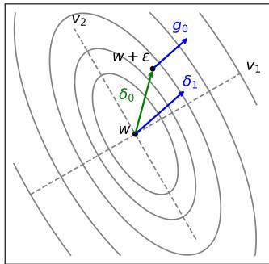
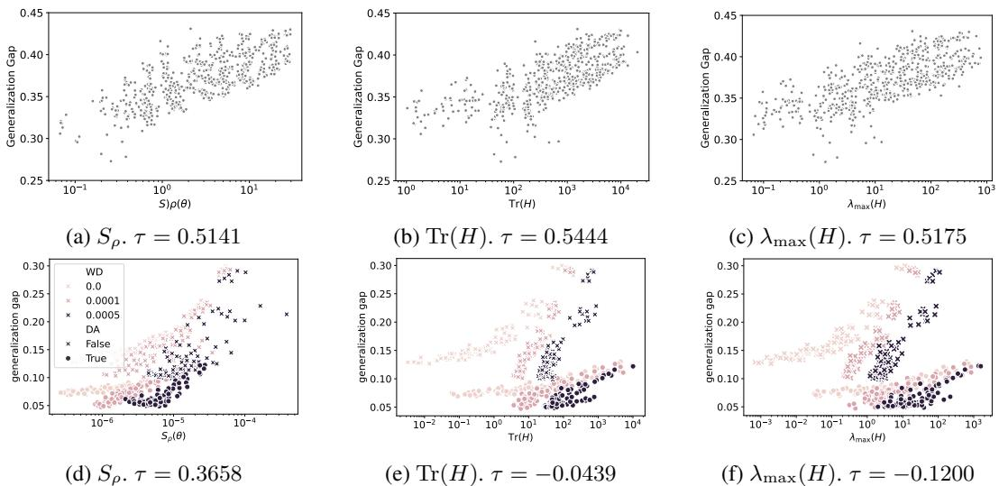
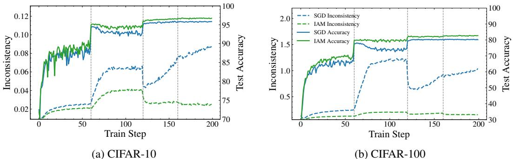
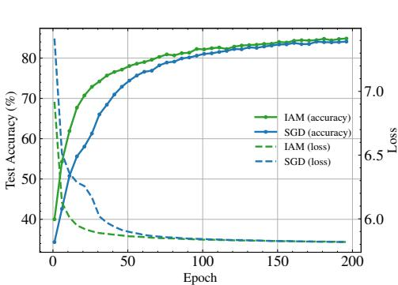
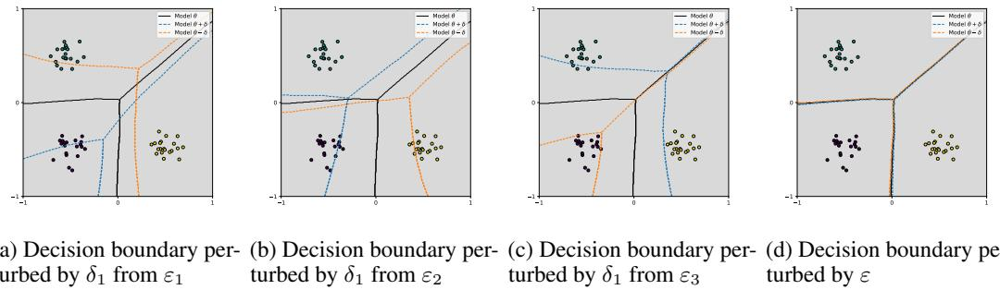
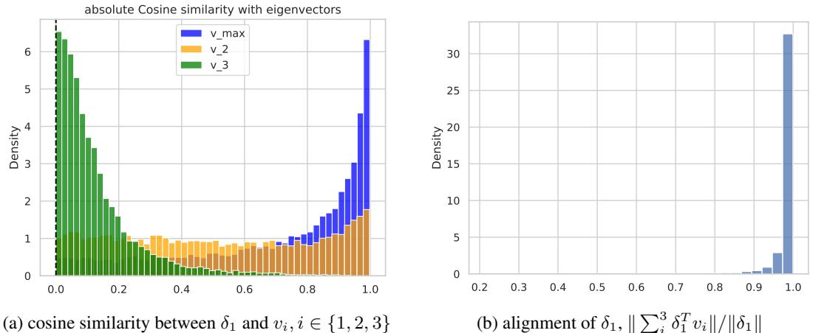

# Inconsistency-Aware Minimization: Improving Generalization with Unlabeled Data

Anonymous Author(s)   
Affiliation   
Address   
email

# Abstract

Estimating the generalization gap and devising optimization methods that general  
ize better are crucial for deep learning models, both for theoretical understanding   
and for practical applications. The ability to leverage unlabeled data for these pur  
poses offers significant advantages in real-world scenarios. This paper introduces   
a novel generalization measure, termed local inconsistency, developed from an   
information-geometric perspective of the neural network’s parameter space. A   
key feature of local inconsistency is its computability from unlabeled data. We   
establish its theoretical underpinnings by connecting local inconsistency to the   
Fisher information matrix and the loss Hessian. Empirically, we demonstrate   
that local inconsistency correlates with the generalization gap also exhibiting   
characteristics comparable to sharpness. Based on these findings, we propose   
Inconsistency-Aware Minimization (IAM) that incorporates local inconsistency   
into the objective. We demonstrate that in standard supervised learning settings,   
IAM enhances generalization, achieving performance comparable to existing meth  
ods such as Sharpness-Aware Minimization. Furthermore, IAM exhibits efficacy   
in semi- and self-supervised learning scenarios, where the local inconsistency is   
computed from the unlabeled data.

# 18 1 Introduction

Estimating the generalization gap and developing optimization techniques to enhance performance   
on unseen data are pivotal challenges in both the theory and practice of deep learning. There are   
numerous reports linking the flatness of the loss landscape to generalization [16, 7, 20, 9]. Conse  
quently, numerous minimization methods leveraging sharpness have been proposed, demonstrating   
improvements in generalization [8, 19, 17, 35] . However, the efficacy of such sharpness-based   
approaches is not fully understood as recent studies, including Andriushchenko et al. [1], indicate   
that sharpness alone does not reliably predict the generalization gap.   
On the other hand, Jiang et al. [14], Johnson and Zhang [15] have investigated alternative gener  
alization measures, such as disagreement and inconsistency. Under certain conditions (e.g., zero   
training error or low randomness of final states), these metrics have been shown to estimate the   
generalization gap more accurately than ones based on sharpness. From a practical standpoint, it is   
highly desirable to leverage unlabeled data to compute these measures. However, existing methods   
for computing disagreement typically require training two separate models under identical conditions   
(while still being subject to training randomness), and estimating inconsistency often necessitates   
training multiple models on each of distinct datasets, thereby incurring substantial computational   
overhead. Such prerequisites hinder the direct minimization of these measures within a single-model   
training paradigm.   
In many real-world applications, unlabeled data is far more abundant and accessible than labeled data.   
Therefore, methods capable of estimating the generalization gap and subsequently minimizing it using   
only unlabeled data within a single-model framework (i.e., without resorting to auxiliary models or   
requiring held-out labels) are crucial for resource-efficient deployment in practical scenarios.   
Addressing this need, this paper introduces local inconsistency, a novel generalization measure derived   
from an information-geometric perspective of the parameter space. This measure is theoretically   
grounded through its connection to the Fisher Information Matrix (FIM) and the loss Hessian.   
Crucially, local inconsistency can be computed using only unlabeled data and from a single trained   
model. We demonstrate that local inconsistency exhibits a predictive capability for the generalization   
gap comparable to sharpness-based measures in some settings. It also shows distinct characteristics   
where traditional sharpness measures may falter. Building upon local inconsistency, we propose   
Inconsistency-Aware Minimization (IAM), a novel optimization strategy that incorporates local   
inconsistency into the training objective. In standard supervised learning settings on CIFAR-10   
and CIFAR-100[18], IAM achieves generalization performance comparable or superior to existing   
methods like Sharpness-Aware Minimization (SAM) [8]. Furthermore, IAM demonstrates its efficacy   
in semi- and self-supervised learning, achieving higher test accuracy than standard SGD when   
integrated with SimCLR [6].

Our contributions can be summarized as follows:

• We propose local inconsistency, a novel generalization measure rooted in information geometry, designed to capture the sensitivity of model outputs to perturbations in the parameter space. This measure offers significant practical advantages as it can be computed using (i) only unlabeled data and (ii) a single trained model.   
• We establish the theoretical underpinnings of local inconsistency by linking it to the Fisher Information Matrix (FIM) and the loss Hessian. Furthermore, we discuss its approximate relationship with the inconsistency measure previously proposed by Johnson and Zhang [15].   
• We develop Inconsistency-Aware Minimization (IAM), a novel optimization framework with two variants (IAM-D and IAM-S), that directly incorporates local inconsistency into the training objective to seek flatter minima in terms of output sensitivity. IAM demonstrates improved generalization performance across diverse learning paradigms, including standard supervised learning and self-supervised learning settings, showcasing its broad applicability.

# 67 2 Related work

Understanding and improving generalization in deep neural networks, especially given their large   
capacity and tendency to overfit [33], remains a central challenge. While networks can memorize   
random labels [33] and learn simple patterns before noise [2], phenomena like double descent [25]   
and the inadequacy of uniform convergence theory [24] highlight the need for novel generalization   
measures beyond loss-based metrics.   
Traditional measures like VC-dimension often fall short. While spectrally-normalized margin bounds   
[3] and PAC-Bayes approaches offer insights, no single measure consistently predicts generalization   
[13]. Recently, disagreement [14] and inconsistency [15] have shown promise, correlating well   
with the generalization gap, even when computed on unlabeled data. However, their reliance on   
training multiple models poses practical limitations for direct optimization in a single-model setup,   
underscoring the need for efficient, label-free, single-model generalization measures.   
The geometry of the loss landscape, particularly the flatness of minima, has been extensively linked   
to generalization [16, 20]. However, the utility of sharpness as a sole predictor is debated due to   
issues like scale invariance [7] and its correlation with training hyperparameters rather than true   
generalization [1]. Indeed, some studies suggest that output inconsistency and instability can be more   
reliable predictors than sharpness [15]. Information geometry has inspired reparametrization-invariant   
sharpness measure [12], but these can be computationally expensive. This context motivates our   
exploration of “local inconsistency”, an alternative geometric measure focusing on output sensitivity   
within a parameter neighborhood, computable from unlabeled data using a single model.   
Various regularization techniques, both explicit (e.g., dropout [30], batch normalization [28], Mixup   
[34]) and implicit (e.g., SGD’s bias [10, 29]), aim to improve generalization. Methods like Sharpness  
Aware Minimization (SAM, [8]) and ASAM [19] directly optimize for flat minima and have shown   
significant improvements. Despite their success, the precise role of sharpness in generalization   
remains an active area of research [13, 1], further motivating the development of complementary   
approaches like our proposed IAM.

# 93 3 Background and preliminaries

In this section, we briefly review fundamental concepts and notations essential for understanding our proposed metric and its theoretical connections. We focus on probabilistic classification models, information geometry, and aspects of the loss landscape.

# 3.1 Notation and problem setup

We consider probabilistic classification models. Let $x \in \mathcal { X }$ be a data point from the input space   
$\mathcal { X }$ , and $y \in [ C ] = \{ 0 , 1 , \dotsc , C - 1 \}$ be the corresponding class label, where $C$ is the total number   
of classes. The data pair $( x , y )$ are assumed to be drawn from an underlying distribution $\mathcal { D }$ over   
$\mathcal { X } \times [ C ]$ . A model, parameterized by $\theta \in \mathbb { R } ^ { m }$ , outputs a probability distribution over classes for a   
given input $x$ . This is typically achieved by transforming a logit vector $z ( x , \theta )$ through a softmax   
function: $f ( x , \theta ) = \mathrm { s o f t m a x } ( z ( x , \theta ) )$ . Thus, $f ( x , \theta ) = [ p ( 0 | x ; \theta ) , p ( 1 | x ; \theta ) , \ldots , p ( C - 1 | x ; \theta ) ] ^ { \intercal }$ .   
Given a training dataset $Z _ { n } = \{ ( x _ { i } , y _ { i } ) : i = 1 , \dots , n \}$ drawn i.i.d. from $\mathcal { D }$ , the model is typically   
trained by minimizing a loss function. For classification, the empirical Cross-Entropy (CE) loss will   
be written as $\begin{array} { r } { L ( \theta ) = \mathbf { \bar { \Omega } } _ { n } ^ { 1 } \sum _ { i = 1 } ^ { n } l _ { i } ( \theta ) } \end{array}$ , where per-sample loss is $l _ { i } ( \theta ) = l ( x _ { i } , y _ { i } ; \theta ) = - \log p ( y _ { i } | x _ { i } ; \theta )$ .

# 107 3.2 Fisher information matrix (FIM) and KL divergence

The Fisher information matrix (FIM), $F ( \theta )$ , for the family of probability density $p ( x , y ; \theta ) =$   
$p ( x ) p ( y | x ; \theta )$ parameterized by a parameters $\theta$ is defined as

$$
\begin{array} { r l } & { \boldsymbol { F } ( \theta ) = \mathbb { E } _ { \boldsymbol { x } \sim p ( \boldsymbol { x } ) } \left[ \mathbb { E } _ { \boldsymbol { y } \sim p ( \boldsymbol { y } \mid \boldsymbol { x } ; \theta ) } \left[ \nabla _ { \theta } l ( \boldsymbol { x } , \boldsymbol { y } ; \theta ) \nabla _ { \theta } l ( \boldsymbol { x } , \boldsymbol { y } ; \theta ) ^ { \top } \right] \right] } \\ & { \qquad = \mathbb { E } _ { \boldsymbol { x } \sim p ( \boldsymbol { x } ) } \left[ \nabla _ { \theta } z ( \boldsymbol { x } _ { i } , \theta ) \left( \mathrm { d i a g } ( f ( \boldsymbol { x } _ { i } , \theta ) ) - f ( \boldsymbol { x } _ { i } , \theta ) f ( \boldsymbol { x } _ { i } , \theta ) ^ { \top } \right) \nabla _ { \theta } z ( \boldsymbol { x } _ { i } , \theta ) ^ { \top } \right] . } \end{array}
$$

In practice, the expectation 110 $\mathbb { E } _ { p ( x ) }$ is often approximated by an empirical average over the available data (e.g., training data 111 $\{ x _ { i } \} _ { i = 1 } ^ { n }$ or unlabeled data).

The Kullback-Leibler (KL) divergence between the output distributions of a model with parameters $\theta$   
and a slightly perturbed model $\theta { + } \delta$ , $f ( x , \theta )$ and $f ( x , \theta \overset { \cdot } { + } \delta )$ , respectively, can be locally approximated   
using a second-order Taylor expansion with respect to $\delta$ as:

$$
\mathbb { E } _ { { x } \sim { p } ( x ) } \left[ \mathrm { K L } \left( f ( x , \theta ) \| f ( x , \theta + \delta ) \right) \right] = \frac { 1 } { 2 } \delta ^ { \top } F ( \theta ) \delta + O ( \| \delta \| _ { 2 } ^ { 3 } ) .
$$

# 115 3.3 Loss Hessian and Gauss-Newton approximation

The geometry of the empirical loss surface $L ( \theta )$ is described by its Hessian matrix $H ( \theta ) = \nabla _ { \theta } ^ { 2 } L ( \theta )$ .   
For the Cross-Entropy (CE) loss, the Hessian can be approximated by the Gauss-Newton (GN) matrix,   
$G ( \theta )$ . The second derivative of the per-sample CE loss $\ell _ { i } ( \theta )$ with respect to the logits $z _ { i } = z ( x _ { i } , \theta )$ ,   
$\nabla _ { z } ^ { 2 } \ell _ { i } ( \theta ) = \mathrm { d i a g } ( f ( x _ { i } , \theta ) ) - f ( x _ { i } , \theta ) f ( x _ { i } , \theta ) ^ { \top }$ , depends only on the model’s output probabilities   
$f ( x _ { i } , \theta )$ . Consequently, the per-sample GN term, tribution in Eq. (1). The empirical GN mat $G _ { i } ( \theta ) = \nabla _ { \theta } z _ { i } ^ { \top } ( \nabla _ { z } ^ { 2 } \ell _ { i } ) \nabla _ { \theta } z _ { i }$ $\begin{array} { r } { G ( \theta ) = \frac { 1 } { n } \sum _ { i = 1 } ^ { n } G _ { i } ( \theta ) } \end{array}$ , is equivalent to thethus often termed the   
$H ( \theta )$   
optimization [22, 26].

# 124 4 Accessing generalization gap via local inconsistency

This section introduces our proposed measure, local inconsistency, designed to capture the gen  
eralization gap. We first define local inconsistency and elucidate its theoretical underpinnings by   
connecting it to the FIM and the loss Hessian. We then discuss its relationship with inconsistency   
[15]. Finally, we present empirical results demonstrating the correlation between local inconsistency   
and the generalization gap, comparing it with other common measures.

We introduce local inconsistency, $S _ { \rho } ( \theta )$ , defined as:

$$
\begin{array} { r } { S _ { \rho } ( \theta ) = \operatorname* { m a x } _ { \| \delta \| \leq \rho } \mathbb { E } _ { x \sim p ( x ) } [ \mathrm { K L } ( f ( x , \theta ) \| f ( x , \theta + \delta ) ) ] , } \end{array}
$$

which represents the sensitivity of the model’s output distribution $f ( x , \theta )$ with respect to the worst   
perturbations $\delta$ , within an Euclidean ball of radius $\rho$ around the parameter $\theta$ . Intuitively, a high   
value of $S _ { \rho } ( \theta )$ indicates that the model’s output distribution is highly sensitive to small perturbations   
in parameter space. This sensitivity suggests potential instability or uncertainty in the model’s   
predictions associated with the vicinity of $\theta$ .   
Practical Advantages of $S _ { \rho }$ Local inconsistency shares a practical advantage with sharpness  
based measures [16, 8] in that it can be calculated using a single trained model. Furthermore, like   
disagreement [14] and inconsistency [15], our metric can be estimated using only unlabeled data.   
A notable advantage over inconsistency and disagreement estimation is that evaluating $S _ { \rho }$ does not   
require training multiple model instances derived from the same training procedure. This potentially   
makes $S _ { \rho }$ more computationally efficient and practical to compute, especially when model training is   
resource-intensive.

# 144 4.2 Connection to FIM and Hessian

The relationship between our metric $S _ { \rho }$ and the Fisher Information Matrix (FIM) can be established   
by leveraging the local quadratic approximation of the KL divergence, as outlined in Section 3. With   
this quadratic approximation, we can approximate $S _ { \rho } ( w )$ with the maximum eigenvalue of FIM,   
scaled by $\rho ^ { 2 } / 2$ :

$$
S _ { \rho } ( \theta ) \approx \operatorname* { m a x } _ { \| \delta \| \leq \rho } \frac { 1 } { 2 } \delta ^ { \top } F ( \theta ) \delta = \frac { 1 } { 2 } ( \rho v _ { \operatorname* { m a x } } ) ^ { \top } F ( \theta ) ( \rho v _ { \operatorname* { m a x } } ) = \frac { 1 } { 2 } \rho ^ { 2 } \lambda _ { \operatorname* { m a x } } ,
$$

where $v _ { \mathrm { m a x } }$ is the eigenvector corresponding to the largest eigenvalue $\lambda _ { \mathrm { m a x } }$ of $F ( \theta )$ . Remarkably,   
this approximation requires only the model $\theta$ and unlabeled data (used to compute the expectation).   
The Fisher Information Matrix $F ( \theta )$ , to which $S _ { \rho } ( \theta )$ is related via its maximum eigenvalue, also   
connects to the Hessian of the loss function $H ( \theta )$ . As detailed in Section 3, for Negative Log   
Likelihood losses such as Cross-Entropy, the Hessian can be approximated by the Gauss-Newton   
matrix $G ( \theta )$ , equivalent to empirical FIM computed using training data.   
Consequently, when calculating $S _ { \rho } ( \theta )$ using the training data, it approximates ${ \scriptstyle { \frac { 1 } { 2 } } } \rho ^ { 2 } \lambda _ { \mathrm { m a x } } ( G ( \theta ) )$ .   
Given that $G ( \theta )$ often provides a good approximation to the true loss Hessian near a local minimum,   
$S _ { \rho } ( \theta )$ therefore offers insights into the maximum curvature of the loss landscape in that vicinity.

# 158 4.3 Local Inconsistency and Generalization Bound

Beyond its connection to the local geometry of the loss landscape, our proposed local inconsistency   
measure, $S _ { \rho } ( \theta )$ , can also be linked to the generalization ability of the model. Inspired by PAC  
Bayesian analyses that connect the geometry of the loss neighborhood to generalization [8], we can   
sketch a theoretical argument suggesting that controlling $S _ { \rho } ( \theta )$ contributes to a generalization bound.   
We present an informal theorem that captures this intuition, with the detailed heuristic derivation   
provided in Appendix C.   
Theorem 1 (Informal Generalization Bound with Local Inconsistency) Under certain assump  
tions regarding the relationship between the worst-case empirical loss increase in a $\rho$ -neighborhood   
and the local inconsistency $S _ { \rho } ( \theta )$ (evaluated on the training set $Z _ { n . }$ ), the true risk $L _ { \mathcal { D } } ( \theta ) ~ =$   
$\mathbb { E } _ { ( x , y ) \sim \mathcal { D } } [ l ( x , y ; \theta ) ]$ can be bounded with high probability as:

$$
L _ { \mathcal { D } } ( \theta ) \lesssim L ( \theta ) + S _ { \rho } ( \theta ) + \mathcal { R } ( \| \theta \| ^ { 2 } / \rho ^ { 2 } )
$$

where 169 $\mathcal { R } : \mathbb { R }  \mathbb { R } ^ { + }$ is a strictly increasing function.

This bound (Eq. (4)) suggests that minimizing a combination of the empirical loss $L _ { S } ( \theta )$ and the   
local inconsistency $S _ { \rho } ( \theta )$ can lead to a lower upper bound on the true risk. This provides a theoretical   
motivation for our Inconsistency-Aware Minimization (IAM) framework, which aims to find solutions   
that are not only accurate on the training data but also exhibit low output sensitivity in the parameter   
space, as measured by $S _ { \rho } ( \theta )$ .   
Local inconsistency exhibits an interesting relationship to the inconsistency in Johnson and Zhang   
[15] defined as:

$$
\begin{array} { r } { \mathcal { C } _ { P } = \mathbb { E } _ { Z _ { n } } \mathbb { E } _ { \theta , \theta ^ { \prime } \sim \Theta _ { P | Z _ { n } } } \mathbb { E } _ { x \sim p ( x ) } [ \mathrm { K L } ( f ( x , \theta ) \| f ( x , \theta ^ { \prime } ) ) ] . } \end{array}
$$

We consider the conditional inconsistency for a fixed $Z _ { n }$ , denoted $\mathcal { C } _ { P \mid Z _ { n } }$ , without outer expectation.   
Then our proposed metric, $S _ { \rho } ( \theta _ { Z _ { n } } )$ , is approximately proportional to the conditional inconsistency   
$\mathcal { C } _ { P \mid Z _ { n } }$ :

$$
\frac { m } { 2 C } \mathcal { C } _ { P | Z _ { n } } \lesssim S _ { \rho } ( \theta _ { Z _ { n } } ) \lesssim \frac { m } { 2 } \mathcal { C } _ { P | Z _ { n } } ,
$$

under certain assumptions, such as assuming the parameter posterior $\Theta _ { P | Z _ { n } }$ as a distribution with   
isotropic covariance and $\theta _ { Z _ { n } }$ as mean. This connection arises because both metrics are related to   
the local geometry captured by the FIM at $\theta _ { Z _ { n } }$ , with $S _ { \rho }$ being linked to its maximum eigenvalue   
and $\mathcal { C } _ { P \mid Z _ { n } }$ to its trace. Practically, the eigenspectra of the FIM of a neural network are observed   
to be dominated by a few large eigenvalues (specifically related to the number of classes, $C$ in   
classification task) while remaining eigenvalues are near zero. This observation indicates that the ratio   
$\lambda _ { \operatorname* { m a x } } ( F ( \theta ) ) / \mathrm { T r } ( F ( \theta ) )$ is larger than $\textstyle { \frac { 1 } { C } }$ $C \ll m )$ . For detailed derivation, please see Appendix B.

# 188 4.5 Estimating $S _ { \rho } ( w )$

Directly computing $S _ { \rho } ( w )$ requires solving the maximization problem over the high-dimensional   
parameter perturbation $\delta$ . For deep neural networks, finding the exact maximum within the $L _ { 2 }$ -ball   
of radius $\rho$ is generally intractable. Therefore, we resort to numerical approximation methods.   
For small perturbations $\delta$ , the expected KL divergence can be accurately approximated by a second  
order Taylor expansion involving the Fisher Information Matrix (FIM), $F ( \theta )$ , as Eq. (2) in Section 3 .   
Under quadratic approximation, as discussed in Section 4.2, the optimal perturbation $\delta ^ { * } = \rho v _ { \operatorname* { m a x } }$ ,   
the maximum value is then $\begin{array} { r } { S _ { \rho } ( \theta ) = \frac { 1 } { 2 } \rho ^ { 2 } \lambda _ { \mathrm { m a x } } } \end{array}$ , and the gradient of the approximated KL divergence   
with respect to $\delta$ is $F ( \theta ) \delta$ .   
This connection motivates not an usual Projected Gradient Ascent, that update $\delta _ { k + 1 } \gets$   
$\Pi _ { \left\{ \delta _ { k } : \| \delta _ { k } \| \leq \rho \right\} } \left( \delta _ { k } + \eta { \cal F } ( \theta ) \delta _ { k } \right)$ , but an iterative gradient ascent approach that update

$$
\delta _ { k + 1 } = \frac { \rho } { \| F ( w ) \delta _ { k } \| } F ( w ) \delta _ { k } , \qquad \delta _ { 0 } = \varepsilon \sim \mathcal { N } \left( 0 , \frac { \sigma ^ { 2 } } { m } I _ { m } \right) ,
$$

where $\sigma ^ { 2 }$ is initial noise scale. Iterative gradient ascent is precisely one iteration of the Power Iteration   
method used to find the dominant eigenvector of $F ( w )$ .

# Algorithm 1 Estimation of $S _ { \rho } ( w )$

201

1: Input: model parameter $w \in \mathbb { R } ^ { m }$ , noise scale $\sigma ^ { 2 }$ ,   
: radius $\rho > 0$ , number of steps $K \geq 1$   
: Initialize $\delta _ { 0 }$ randomly with $\begin{array} { r } { \mathcal { N } ( 0 , \frac { \sigma ^ { 2 } } { m } \mathrm { I } _ { m } ) } \end{array}$ )   
: for $k = 0$ to $K - 1$ do   
: Compute $g _ { k } = \nabla _ { \delta } \mathbb { E } _ { x \sim p ( x ) } \mathrm { K L } ( f ( x , \theta ) | | f ( x , \theta + \delta ) ) | _ { \delta = \delta _ { k } }$   
: Update perturbation: δk+1 = ρ gk∥gk∥2   
: end for   
: return $\mathbb { E } _ { x \sim p ( x ) } \mathrm { K L } ( f ( x , \theta ) \| f ( x , \theta + \delta _ { K } ) )$

# 02 4.5.1 Algorithm for estimating $S _ { \rho } ( w )$

Based on the above, we propose Algorithm 1 to estimate $S _ { \rho } ( w )$ . This algorithm performs $K$ steps of normalized gradient ascent (effectively, Power Iteration under the quadratic approximation) to find an approximate maximizing perturbation $\delta ^ { * }$ .

To assess the predictive capability of local inconsistency $S _ { \rho }$ for the generalization gap, we conducted   
experiments on CIFAR-10. We trained two distinct architectures, a 6-layer CNN (6CNN) and a   
Wide Residual Network (WRN28-2)[32], under various hyperparameter settings (details in Appendix   
E). $S _ { \rho }$ was estimated using a disjoint, unlabeled data set. For comparison, we also computed two   
211 common sharpness-based measures: the trace, $\operatorname { T r } ( H )$ , and the maximum eigenvalue, $\lambda _ { \operatorname* { m a x } } ( H )$ .   
12 Figure 1 presents scatter plots of these metrics against the generalization gap, with Kendall’s Tau   
$( \tau )$ reported for each. For the simpler 6CNN model (top row), $S _ { \rho }$ $\mathit { \Pi } _ { \tau \ } = \ 0 . 5 1 4 1 )$ ) exhibited a   
positive correlation with the generalization gap, comparable to $\operatorname { T r } ( H )$ ( $\tau = 0 . 5 4 4 4 )$ and $\lambda _ { \operatorname* { m a x } } ( H )$   
$( \tau = 0 . 5 1 7 5 )$ ). This suggests that for smaller models, various geometric measures may similarly   
capture aspects of generalization. However, for the larger WRN28-2 model with data augmentation   
(bottom row), a more nuanced behavior emerged. As noted by Andriushchenko et al. [1], different   
training configurations can form distinct solution subgroups. In our WRN28-2 experiments, $\operatorname { T r } ( H )$   
and $\lambda _ { \operatorname* { m a x } } ( H )$ showed positive correlations only within such subgroups, but exhibited negative overall   
correlations globally $\tau = - 0 . 0 4 3 9$ and $\tau = - 0 . 1 2 0 0$ , respectively). In stark contrast, our $S _ { \rho }$   
221 maintained a positive, albeit reduced, correlation across all settings $\tau = 0 . 3 6 5 8$ ).

This divergence, particularly with larger models and data augmentation, suggests that local inconsistency captures information about the generalization gap that is distinct from, or complementary to, traditional Hessian-based sharpness. While the predictive utility of sharpness metrics can be 5 confounded by these subgroup effects, $S _ { \rho }$ demonstrates more consistent global predictiveness, hinting at its potential as a more robust generalization indicator in complex training scenarios.

  
Figure 1: Local inconsistency and sharpness measures vs the generalization gap.

# 227 5 Inconsistency-Aware Minimization (IAM): incorporating local 228 inconsistency into the objective

Our empirical findings suggest that local inconsistency, $S _ { \rho } ( \theta )$ defined in Eq. (3), correlates with the generalization gap. This motivates its use as a regularizer to guide the optimization towards solutions that not only fit the training data, but also exhibit low sensitivity in their output distributions with respect to parameter perturbations. We propose two strategies to incorporate local inconsistency into the training objective.

34 1. Direct Regularization (IAM-D): This approach directly penalizes local inconsistency by adding   
it to the standard training loss $L ( \theta )$ :

$$
L _ { \mathrm { I A M - D } } ( \theta ) = L ( \theta ) + \beta S _ { \rho } ( \theta ) = L ( \theta ) + \beta \operatorname* { m a x } _ { \| \delta \| _ { 2 } \leq \rho } \mathbb { E } _ { X } [ \mathrm { K L } ( f ( X , \theta ) \| f ( X , \theta + \delta ) ) ] ,
$$

where $\beta > 0$ is a hyperparameter balancing the trade-off. This objective seeks parameter values $\theta$ for   
237 which the model outputs are robust across the neighborhood defined by $\rho$ .

2. SAM-like Approach (IAM-S): Inspired by SAM [8], this method aims to find parameters $\theta$ that reside in a neighborhood of uniformly low loss by minimizing the loss at an adversarially perturbed point $\theta + \delta ^ { * }$ :

$$
L _ { \mathrm { I A M } \setminus } ( \theta ) = L ( \theta + \delta ^ { * } ) , \quad \mathrm { w h e r e ~ } \delta ^ { * } = \underset { \| \delta \| _ { 2 } \leq \rho } { \mathrm { a r g } \operatorname* { m a x } } \mathbb { E } _ { X } [ \mathrm { K L } ( f ( X , \theta ) \| f ( X , \theta + \delta ) ) ] .
$$

Here, 241 $\delta ^ { * }$ is the perturbation that maximizes the local inconsistency term. Note that the objective 242 minimizes the original loss $L$ at the perturbed point $\theta + \delta$ :

$$
L ( \theta + \delta ) \approx L ( \theta ) + \delta ^ { \top } \nabla _ { \theta } L ( \theta ) + \frac { 1 } { 2 } \delta ^ { \top } G ( \theta ) \delta .
$$

Thus, IAM-S implicitly minimizes the principal eigenvalues of $G ( \theta )$ , equivalent to empirical FIM.

In the following subsections, we detail the algorithm for IAM-S and provide an analysis of its objective. The algorithm for IAM-D involves a similar inner maximization for $S _ { \rho } ( \theta )$ followed by a standard gradient descent step on $L _ { \mathrm { I A M - D } } ( \theta )$ .

# 5.1 Algorithm for IAM-D and IAM-S

Optimizing $L _ { \mathrm { I A M - S } } ( \theta )$ and $L _ { \mathrm { I A M - S } } ( \theta )$ involves a min-max procedure. The inner maximization to find $\delta ^ { * }$ (i.e., computing $S _ { \rho } ( \theta )$ and the corresponding $\delta ^ { * }$ ) is performed using an Algorithm 1, typically for $K = 1$ step for efficiency. IAM-D simply add the $\beta S _ { \rho } ( \theta )$ with $\delta _ { K }$ to the $L ( \theta )$ , and then update $\theta$ with standard SGD. The outer minimization step of IAM-S updates $\theta$ based on the gradient of the loss $L ( \theta + \delta _ { K } )$ dropping the second-order terms same with SAM: $\nabla _ { \boldsymbol { \theta } } L _ { \mathrm { I A M - S } } ( \boldsymbol { \theta } ) \approx \nabla _ { \boldsymbol { \theta } } \bar { L } ( \boldsymbol { \theta } ) | _ { \boldsymbol { \theta = \theta + \delta _ { K } } }$ . This two-step process is summarized in Algorithm 2 in Appendix D.

# 5.2 Empirical evaluation in supervised learning

We evaluated the performance of IAM against SGD and SAM in image classification tasks. WRN16- 8[32] served as the baseline model, trained on CIFAR-10, 100 with basic augmentations. Optimal hyperparameters for IAM-D were found to be $\beta = 1 . 0$ , $\rho = 0 . 1$ for CIFAR-10, and $\beta = 1 0 . 0 , \rho = 0 . 1$ for CIFAR-100, and for IAM-S were $\rho = 0 . 1 , 0 . 5$ in CIFAR-10 and CIFAR-100 respectively. Table 1 summarizes the test error rates. Both IAM-D (Direct Regularization) and IAM-S (SAM-like Approach) variants not only reduce test error compared to SGD but also achieve performance comparable to SAM. Notably, on CIFAR-100, IAM-S outperforms SAM by a margin of $0 . 7 5 \%$ , demonstrating its effectiveness in more complex datasets.

Table 1: Test Error (mean $\pm$ stderr) of IAM, SAM, and SGD on WRN-16-8 trained with CIFAR-10, CIFAR-100   

<table><tr><td></td><td>SGD</td><td>SAM</td><td>IAM-D</td><td>IAM-S</td></tr><tr><td>CIFAR-10</td><td>3.95 ±0.048</td><td>3.31±0.010</td><td>3.28±0.060</td><td>3.30±0.042</td></tr><tr><td>CIFAR-100</td><td>19.17±0.192</td><td>17.63±0.119</td><td>17.16±0.028</td><td>16.88±0.021</td></tr></table>

Figure 2 illustrates the evolution of local inconsistency $S _ { \rho } ( \theta )$ and test accuracy during training for   
SGD and IAM-D. IAM-D effectively suppresses the increase in $S _ { \rho } ( \theta )$ and mitigates overfitting,   
particularly evident after learning rate decay points where test accuracy for SGD can degrade. Both   
on CIFAR-10, 100 (Figure 2), IAM-D maintains $S _ { \rho } ( \theta )$ below SGD. Although second LR decay   
temporarily reduces inconsistency for both, SGD’s inconsistency quickly rebounds, unlike the stable   
behavior of IAM-D. These observations suggest that minimizing local inconsistency helps confine the   
model to parameter regions with smoother output distributions, correlating with the generalization   
improvements shown in Table 1.

# 5.3 IAM for Learning with Limited or No Explicit Labels

A key advantage of local inconsistency is its computability from unlabeled data, making IAM well  
suited for scenarios with limited or no explicit supervision. We demonstrate this in semi-supervised   
and self-supervised learning settings. Detailed settings are listed in Appendix E.   
Semi-Supervised Learning. In many practical scenarios, labeled data is scarce while unlabeled   
data is abundant. We simulated semi-supervised learning on CIFAR-10 and CIFAR-100 by masking   
$80 \%$ to $9 9 \%$ of training labels. IAM-D was configured to optimize a joint objective: cross-entropy   
loss on the labeled subset plus the local inconsistency penalty computed over the entire mini-batch   
(both labeled and unlabeled examples). In contrast, SGD and SAM utilized only the labeled examples.   
As summarized in Table 2, IAM-D consistently outperforms both baselines across most missing-label   
ratios, confirming that leveraging unlabeled data via the local inconsistency term enhances robustness   
when supervision is sparse.   
Self-Supervised Learning (SSL). The label  
agnostic nature of IAM makes it directly applicable   
to SSL objectives. We integrated IAM-D into the   
SimCLR framework [6], training a ResNet-18[11]   
encoder on CIFAR-10. Performance was evaluated   
via linear probing. The local inconsistency term for   
IAM-D was computed using the model’s projection  
head outputs. Figure 3 shows that SimCLR trained   
with IAM-D (SimCLR-IAM) achieves higher test ac  
curacy on the downstream linear classification task   
compared to vanilla SimCLR (SimCLR-SGD). Fur  
thermore, SimCLR-IAM tends to converge faster in   
terms of test error and also minimizes the SimCLR   
training loss more rapidly, despite the additional lo  
cal inconsistency regularization. This suggests that   
controlling local inconsistency is beneficial even   
when no explicit labels are available during repre  
sentation learning.   
Improving generalization in deep neural networks often involves modulating the entropy of model   
output distributions. Techniques such as Label Smoothing (LS) [31, 23, 4] and Entropy Regularization   
(ER) [27, 5, 34] mitigate the common issue of overconfidence of cross-entropy loss minimization, by   
specifically targeting this output entropy.   
Our Inconsistency-Aware Minimization (IAM) framework regularizes local inconsistency, $S _ { \rho } ( \theta )$ . To   
understand its regularizing effect, we can leverage the identity $\mathrm { K L } ( P \| Q ) = - H ( P ) + \mathrm { C } \dot { \mathrm { E } } ( P , Q )$ ,   
where $H ( P )$ is the entropy of $\mathrm { \bf P }$ and $\operatorname { C E } ( P , Q )$ is cross entropy of $P$ and $Q$ . Since the expectation is   
linear and $\dot { H } ( f ( x ; \theta ) )$ does not depend on $\delta$ , we can rewrite $S _ { \rho }$ as:

  
Figure 2: The evolution of the local inconsistency $S _ { \rho } ( \theta )$ and test accuracy with SGD and IAM-D.

Table 2: Test Error (mean $\pm$ stderr) of IAM-D, SAM, and SGD on WRN-16-8 trained with CIFAR-10 and CIFAR-100 with varying label rates.   

<table><tr><td rowspan="2">Dataset</td><td rowspan="2">Model</td><td colspan="4">Label Rate</td></tr><tr><td>1%</td><td>5%</td><td>10%</td><td>20%</td></tr><tr><td rowspan="3">CIFAR-10</td><td>SGD</td><td>56.54 ± 0.159</td><td>28.64 ± 1.648</td><td>21.93 ± 0.234</td><td>17.42 ± 0.430</td></tr><tr><td>SAM</td><td>55.83 ± 0.728</td><td>28.45 ± 0.119</td><td>20.68 ± 0.102</td><td>14.00 ± 0.075</td></tr><tr><td>IAM-D</td><td>52.78 ± 0.497</td><td>25.66 ± 0.723</td><td>19.44 ± 0.354</td><td>14.24 ± 0.142</td></tr><tr><td rowspan="3">CIFAR-100</td><td>SGD</td><td>89.35 ± 0.098</td><td>72.65 ± 0.519</td><td>60.86 ± 0.204</td><td>50.01 ± 0.299</td></tr><tr><td>SAM</td><td>89.31 ± 0.156</td><td>72.02 ± 0.337</td><td>58.04 ± 0.594</td><td>45.64 ± 0.085</td></tr><tr><td>IAM-D</td><td>88.36 ± 0.292</td><td>69.99 ±0.649</td><td>57.60 ± 0.251</td><td>45.05 ± 0.956</td></tr></table>

  
Figure 3: Test accuracy on linear probe and SimCLR training loss for ResNet-18 on CIFAR-10, comparing SimCLR trained with SGD (SimCLR-SGD) versus SimCLR with IAM-D (SimCLR-IAM).

$$
S _ { \rho } ( \theta ) = - \mathbb { E } _ { x \sim p ( x ) } [ H ( f ( x , \theta ) ) ] + \operatorname* { m a x } _ { \| \delta \| _ { 2 } \leq \rho } \mathbb { E } _ { x \sim p ( x ) } [ \mathrm { C E } ( f ( x , \theta ) , f ( x , \theta + \delta ) ) ] .
$$

Minimizing $S _ { \rho } ( \theta )$ as defined in Eq. (8) thus involves two concurrent objectives. First, maximizing   
the expected output entropy $\mathbb { E } _ { X } [ H ( f ( x , \theta ) ) ]$ . This discourages overconfident (low-entropy) pre  
dictions. Second, Minimizing the worst-case expected cross-entropy between the original model’s   
output $f ( x , \theta )$ and the perturbed model’s output $\mathsf { \bar { f } } ( x , \theta + \delta )$ , which promotes stability of the output   
distribution under parameter perturbations. This dual objective resonates with the goals of established   
regularization techniques like LS and ER. LS effectively increases the entropy of the target distribu  
tion, thereby preventing the model from becoming overly confident in its predictions for the training   
labels. ER directly penalizes the low-entropy output distributions of the model. Formally, LS can   
be interpreted as minimizing a KL divergence to a smoothed target (e.g., $\mathrm { K L } ( q _ { L S } ( y | x ) | | p ( y | x ; \theta ) ) )$ ,   
while ER often involves minimizing $\mathrm { K L } ( \bar { p } ( \boldsymbol { y } | \boldsymbol { x } ; \theta ) | | \boldsymbol { u } )$ , while $u$ is a uniform distribution, both encour  
aging the model to avoid excessive output certainty.   
The first term in Eq. (8) $( - \mathbb { E } _ { X } [ H ( f ( x , \theta ) ) ] )$ directly aligns with the aim of ER to penalize low  
entropy outputs. The second term, by minimizing the “distance” (via CE) to the output of a perturbed   
model, enforces a form of local distributional stability. If highly confident predictions are less stable   
in parameter perturbation, then minimizing $S _ { \rho } ( \theta )$ would implicitly penalize such an overconfidence.

Therefore, minimizing local inconsistency $S _ { \rho } ( \theta )$ acts as a regularization strategy that not only promotes prediction stability against minor parameter variations but also indirectly encourages higher output entropy, akin to mechanisms in LS and ER. This multifaceted regularization is anticipated to yield improved generalization by encouraging the model to learn more robust and less overconfident representations, making them less susceptible to training data idiosyncrasies or parameter instabilities [34, 8].

# 331 6 Conclusion

In this work, we introduced “local inconsistency,” a novel information-geometric generalization   
measure computable from a single model using only unlabeled data. We theoretically linked it to the   
Fisher Information Matrix (FIM) and the loss Hessian. Empirically, local inconsistency correlates   
with the generalization gap and exhibits distinct characteristics from traditional sharpness-based   
metrics.   
Based on this, we proposed Inconsistency-Aware Minimization (IAM), an optimization framework   
that directly incorporates local inconsistency into the training objective. IAM enhances generalization   
in supervised learning, matching or exceeding that of Sharpness-Aware Minimization (SAM). Cru  
cially, IAM proves effective in semi- and self-supervised learning by leveraging unlabeled data for   
local inconsistency computation, improving performance in label-scarce settings. We also elucidated   
IAM’s mechanism as an implicit regularizer of model output entropy.   
These findings offer a practical and theoretically-grounded approach to improving model gener  
alization, particularly valuable in real-world applications where labeled data is limited. Future   
research could focus on a more rigorous establishment of the theoretical relationship between local   
inconsistency and generalization bounds (such as the informal bound presented in Theorem |1) and   
on exploring the scalability and applicability of IAM to a wider array of model architectures and   
large-scale datasets.   
References   
[1] M. Andriushchenko, F. Croce, M. Müller, M. Hein, and N. Flammarion. A modern look at the   
relationship between sharpness and generalization, 2023. URL https://arxiv.org/abs/   
2302.07011.   
[2] D. Arpit, S. Jastrz˛ebski, N. Ballas, D. Krueger, E. Bengio, M. S. Kanwal, T. Maharaj, A. Fischer,   
A. Courville, Y. Bengio, and S. Lacoste-Julien. A closer look at memorization in deep networks,   
2017. URL https://arxiv.org/abs/1706.05394.   
[3] P. L. Bartlett, D. J. Foster, and M. J. Telgarsky. Spectrally-normalized margin bounds for neural   
networks. In I. Guyon, U. V. Luxburg, S. Bengio, H. Wallach, R. Fergus, S. Vishwanathan, and   
R. Garnett, editors, Advances in Neural Information Processing Systems, volume 30. Curran   
Associates, Inc., 2017. URL https://proceedings.neurips.cc/paper_files/paper/   
2017/file/b22b257ad0519d4500539da3c8bcf4dd-Paper.pdf.   
[4] K. Chandrasegaran, N.-T. Tran, Y. Zhao, and N.-M. Cheung. Revisiting label smoothing and   
knowledge distillation compatibility: What was missing?, 2022. URL https://arxiv.org/   
abs/2206.14532.   
[5] P. Chaudhari, A. Choromanska, S. Soatto, Y. LeCun, C. Baldassi, C. Borgs, J. Chayes, L. Sagun,   
and R. Zecchina. Entropy-sgd: Biasing gradient descent into wide valleys, 2017. URL   
https://arxiv.org/abs/1611.01838.   
[6] T. Chen, S. Kornblith, M. Norouzi, and G. Hinton. A simple framework for contrastive learning   
of visual representations, 2020. URL https://arxiv.org/abs/2002.05709.   
[7] L. Dinh, R. Pascanu, S. Bengio, and Y. Bengio. Sharp minima can generalize for deep nets. In   
D. Precup and Y. W. Teh, editors, Proceedings of the 34th International Conference on Machine   
Learning, volume 70 of Proceedings of Machine Learning Research, pages 1019–1028. PMLR,   
06–11 Aug 2017. URL https://proceedings.mlr.press/v70/dinh17b.html.   
[8] P. Foret, A. Kleiner, H. Mobahi, and B. Neyshabur. Sharpness-aware minimization for efficiently   
improving generalization, 2021. URL https://arxiv.org/abs/2010.01412.   
[9] T. Garipov, P. Izmailov, D. Podoprikhin, D. P. Vetrov, and A. G. Wilson. Loss surfaces, mode con  
nectivity, and fast ensembling of dnns. In S. Bengio, H. Wallach, H. Larochelle, K. Grauman,   
N. Cesa-Bianchi, and R. Garnett, editors, Advances in Neural Information Processing Sys  
tems, volume 31. Curran Associates, Inc., 2018. URL https://proceedings.neurips.cc/   
paper_files/paper/2018/file/be3087e74e9100d4bc4c6268cdbe8456-Paper.pdf.   
[10] M. Hardt, B. Recht, and Y. Singer. Train faster, generalize better: Stability of stochastic   
gradient descent. In M. F. Balcan and K. Q. Weinberger, editors, Proceedings of The 33rd   
International Conference on Machine Learning, volume 48 of Proceedings of Machine Learning   
Research, pages 1225–1234, New York, New York, USA, 20–22 Jun 2016. PMLR. URL   
https://proceedings.mlr.press/v48/hardt16.html.   
[11] K. He, X. Zhang, S. Ren, and J. Sun. Deep residual learning for image recognition, 2015. URL   
https://arxiv.org/abs/1512.03385.   
[12] C. Jang, S. Lee, F. Park, and Y.-K. Noh. A reparametrization-invariant sharpness measure based   
on information geometry. Advances in neural information processing systems, 35:27893–27905,   
2022.   
[13] Y. Jiang, B. Neyshabur, H. Mobahi, D. Krishnan, and S. Bengio. Fantastic generalization   
measures and where to find them, 2019. URL https://arxiv.org/abs/1912.02178.   
[14] Y. Jiang, V. Nagarajan, C. Baek, and J. Z. Kolter. Assessing generalization of sgd via disagree  
ment, 2022. URL https://arxiv.org/abs/2106.13799.   
[15] R. Johnson and T. Zhang. Inconsistency, instability, and generalization gap of deep neural   
network training, 2023. URL https://arxiv.org/abs/2306.00169.   
[16] N. S. Keskar, D. Mudigere, J. Nocedal, M. Smelyanskiy, and P. T. P. Tang. On large-batch   
training for deep learning: Generalization gap and sharp minima, 2017. URL https://arxiv.   
org/abs/1609.04836.   
[17] M. Kim, D. Li, S. X. Hu, and T. M. Hospedales. Fisher sam: Information geometry and   
400 sharpness aware minimisation, 2022. URL https://arxiv.org/abs/2206.04920.   
01 [18] A. Krizhevsky. Learning multiple layers of features from tiny images. Technical   
report, University of Toronto, 2009. URL https://www.cs.toronto.edu/\~kriz/   
learning-features-2009-TR.pdf.   
[19] J. Kwon, J. Kim, H. Park, and I. K. Choi. Asam: Adaptive sharpness-aware minimization for   
scale-invariant learning of deep neural networks. In M. Meila and T. Zhang, editors, Proceedings   
of the 38th International Conference on Machine Learning, volume 139 of Proceedings of   
Machine Learning Research, pages 5905–5914. PMLR, 18–24 Jul 2021. URL https://   
proceedings.mlr.press/v139/kwon21b.html.   
[20] H. Li, Z. Xu, G. Taylor, C. Studer, and T. Goldstein. Visualizing the loss landscape of neural   
nets. In S. Bengio, H. Wallach, H. Larochelle, K. Grauman, N. Cesa-Bianchi, and R. Garnett,   
411 editors, Advances in Neural Information Processing Systems, volume 31. Curran Associates,   
12 Inc., 2018. URL https://proceedings.neurips.cc/paper_files/paper/2018/file/   
a41b3bb3e6b050b6c9067c67f663b915-Paper.pdf.   
[21] S. Mandt, M. D. Hoffman, and D. M. Blei. Stochastic gradient descent as approximate bayesian   
inference, 2018. URL https://arxiv.org/abs/1704.04289.   
[22] J. Martens. New insights and perspectives on the natural gradient method. Journal of Machine   
Learning Research, 21(146):1–76, 2020. URL http://jmlr.org/papers/v21/17-678.   
html.   
[23] R. Müller, S. Kornblith, and G. Hinton. When does label smoothing help?, 2020. URL   
https://arxiv.org/abs/1906.02629.   
[24] V. Nagarajan and J. Z. Kolter. Uniform convergence may be unable to explain generalization   
in deep learning. In H. Wallach, H. Larochelle, A. Beygelzimer, F. d'Alché-Buc, E. Fox, and   
R. Garnett, editors, Advances in Neural Information Processing Systems, volume 32. Curran   
Associates, Inc., 2019. URL https://proceedings.neurips.cc/paper_files/paper/   
2019/file/05e97c207235d63ceb1db43c60db7bbb-Paper.pdf.   
[25] P. Nakkiran, G. Kaplun, Y. Bansal, T. Yang, B. Barak, and I. Sutskever. Deep double descent:   
where bigger models and more data hurt\*. Journal of Statistical Mechanics: Theory and   
Experiment, 2021(12):124003, dec 2021. doi: 10.1088/1742-5468/ac3a74. URL https:   
//dx.doi.org/10.1088/1742-5468/ac3a74.   
[26] R. Pascanu and Y. Bengio. Revisiting natural gradient for deep networks, 2014. URL https:   
//arxiv.org/abs/1301.3584.   
[27] G. Pereyra, G. Tucker, J. Chorowski, Łukasz Kaiser, and G. Hinton. Regularizing neural   
networks by penalizing confident output distributions, 2017. URL https://arxiv.org/abs/   
1701.06548.   
[28] S. Santurkar, D. Tsipras, A. Ilyas, and A. Madry. How does batch normalization help optimiza  
tion? In S. Bengio, H. Wallach, H. Larochelle, K. Grauman, N. Cesa-Bianchi, and R. Garnett,   
editors, Advances in Neural Information Processing Systems, volume 31. Curran Associates,   
Inc., 2018. URL https://proceedings.neurips.cc/paper_files/paper/2018/file/   
905056c1ac1dad141560467e0a99e1cf-Paper.pdf.   
[29] D. Soudry, E. Hoffer, M. S. Nacson, S. Gunasekar, and N. Srebro. The implicit bias of gradient   
descent on separable data. Journal of Machine Learning Research, 19(70):1–57, 2018. URL   
http://jmlr.org/papers/v19/18-188.html.   
[30] N. Srivastava, G. Hinton, A. Krizhevsky, I. Sutskever, and R. Salakhutdinov. Dropout: a simple   
way to prevent neural networks from overfitting. J. Mach. Learn. Res., 15(1):1929–1958, Jan.   
2014. ISSN 1532-4435.   
[31] C. Szegedy, V. Vanhoucke, S. Ioffe, J. Shlens, and Z. Wojna. Rethinking the inception architec  
ture for computer vision, 2015. URL https://arxiv.org/abs/1512.00567.   
[32] S. Zagoruyko and N. Komodakis. Wide residual networks, 2017. URL https://arxiv.org/   
abs/1605.07146.   
[33] C. Zhang, S. Bengio, M. Hardt, B. Recht, and O. Vinyals. Understanding deep learning requires   
rethinking generalization, 2017. URL https://arxiv.org/abs/1611.03530.   
[34] H. Zhang, M. Cisse, Y. N. Dauphin, and D. Lopez-Paz. mixup: Beyond empirical risk mini  
mization, 2018. URL https://arxiv.org/abs/1710.09412.   
[35] J. Zhuang, B. Gong, L. Yuan, Y. Cui, H. Adam, N. Dvornek, S. Tatikonda, J. Duncan, and   
T. Liu. Surrogate gap minimization improves sharpness-aware training, 2022. URL https:   
//arxiv.org/abs/2203.08065.   
In this section, we provide a theoretical sketch to connect our proposed local inconsistency measure,   
$S _ { \rho } ( \theta )$ , to the generalization error of a model. Our goal is to show that minimizing $S _ { \rho } ( \theta )$ , along with   
the empirical loss, can lead to a tighter upper bound on the true risk, thereby offering a theoretical   
motivation for our Inconsistency-Aware Minimization (IAM) approach We adapt insights from PAC  
Bayesian theory, particularly drawing from the analysis of Sharpness-Aware Minimization (SAM)   
[8].   
Let $L _ { \mathcal { D } } ( \theta ) = \mathbb { E } _ { ( X , Y ) \sim \mathcal { D } } [ l ( f ( X , \theta ) , Y ) ]$ b the true risk and $\begin{array} { r } { L _ { \mathcal { S } } ( \boldsymbol { \theta } ) = \frac { 1 } { n } \sum _ { i = 1 } ^ { n } l ( f ( X _ { i } , \boldsymbol { \theta } ) , Y _ { i } ) } \end{array}$ be the   
empirical risk on a training set $s$ of size $n$ . Foret et al. [8] provide a PAC-Bayesian generalization   
bound (informally stated, see their Appendix A for the full theorem $[ \mathrm { T h m } 1 , 8 ]$ ) which, with high   
probability $1 - \xi$ over the draw of $s$ , states:

$$
L _ { \mathcal { D } } ( \theta ) \leq \operatorname* { m a x } _ { \| \epsilon \| _ { 2 } \leq \rho } L _ { S } ( \theta + \epsilon ) + \mathcal { R } ( \theta , \rho , n , m , \xi )
$$

where $\mathcal { R } ( \theta , \rho , n , m , \xi )$ is a complexity term that depends on the norm of the parameters $\| \theta \| _ { 2 } ^ { 2 }$ , the perturbation radius $\rho$ , the number of training samples $n$ , the number of parameters $m$ , and the confidence $\xi$ . Specifically,

$$
\mathcal { R } ( \theta , \rho , n , m , \xi ) = \sqrt { \frac { m \log { \left( 1 + \frac { \| \theta \| _ { 2 } ^ { 2 } } { \rho ^ { 2 } } \left( 1 + \sqrt { \frac { \log { n } } { m } } \right) ^ { 2 } \right) } + 4 \log { \frac { n } { \xi } } + \tilde { O } ( 1 ) } { n - 1 } } .
$$

The first term on the right-hand side of Eq. (9) can be rewritten as:

$$
\operatorname* { m a x } _ { \| \epsilon \| _ { 2 } \leq \rho } L _ { S } ( \theta + \epsilon ) = L _ { S } ( \theta ) + \left[ \operatorname* { m a x } _ { \| \epsilon \| _ { 2 } \leq \rho } ( L _ { S } ( \theta + \epsilon ) - L _ { S } ( \theta ) ) \right] .
$$

The term in the square brackets, let’s call it $S \mathcal { H A R P } _ { \rho } ( \theta )$ , represents the sharpness of the loss   
landscape at $\theta$ within a $\rho$ -neighborhood, as considered by SAM. Our aim is to relate this sharpness   
term to our proposed local inconsistency measure $S _ { \rho } ( \theta )$ .   
Recall our definition of local inconsistency (calculated with respect to the empirical distribution over   
the training set $s$ for this analysis):

$$
S _ { \rho } ( \theta ) = \operatorname* { m a x } _ { \| \delta \| _ { 2 } \leq \rho } \mathbb { E } _ { X \sim \mathcal { S } } [ \mathrm { K L } ( f ( X , \theta ) \| f ( X , \theta + \delta ) ) ] .
$$

For the cross-entropy loss $l ( f ( X , { \boldsymbol { \theta } } ) , Y ) = - \log f ( X , { \boldsymbol { \theta } } ) _ { Y }$ , under certain conditions, particularly   
near a good minimizer where the model’s predictions $f ( X , \theta )$ are close to the true label distribution   
(or if we consider $f ( X , \theta )$ as a reference distribution), the change in loss due to parameter perturbation   
can be related to the KL divergence of the output distributions. Specifically, for a single sample   
$( X , Y )$ , a second-order Taylor expansion of the loss $l ( f ( X , \theta + \delta ) , \bar { Y } )$ around $\delta = 0$ gives:

$$
L _ { S } ( \theta + \delta ) - L _ { S } ( \theta ) = \nabla _ { \theta } L _ { S } ( \theta ) ^ { \top } \delta + \frac { 1 } { 2 } \delta ^ { \top } \nabla _ { \theta } ^ { 2 } L _ { S } ( \theta ) \delta + O ( \| \delta \| ^ { 3 } ) .
$$

If $\theta$ is a point where $\nabla _ { \theta } L _ { S } ( \theta ) \approx 0$ (i.e., near a minimum of the empirical risk), the first-order term in   
the empirical average $L s ( \theta + \delta ) - L s ( \theta )$ becomes small. Furthermore, as discussed in Section 4.2   
(and your Background section), for cross-entropy loss, the Hessian $\nabla _ { { \boldsymbol { \theta } } } ^ { 2 } L _ { S } ( { \boldsymbol { \theta } } )$ can be approximated   
by the empirical Fisher Information Matrix (or Gauss-Newton matrix) $F _ { S } ( \theta )$ . Also, we know that   
$\begin{array} { r } { \dot { \mathbb { E } } _ { X \sim \mathcal { S } } [ \mathrm { K L } ( f ( X , \theta ) | | f ( X , \theta + \delta ) ) ] \approx \frac { 1 } { 2 } \delta ^ { \top } F _ { S } ( \theta ) \delta } \end{array}$ for small $\delta$ .   
\*\*Assumption (Approximate Equivalence of Loss Increase and Output KL-Divergence): $^ { * * }$ We   
heuristically assume that, for well-trained models near a local minimum, the worst-case increase in   
empirical loss due to parameter perturbation is approximately proportional to the local inconsistency   
(our $S _ { \rho } ( \theta )$ defined on the empirical data $s$ ):

$$
\operatorname* { m a x } _ { \| \epsilon \| _ { 2 } \leq \rho } ( L _ { S } ( \theta + \epsilon ) - L _ { S } ( \theta ) ) \approx c \cdot S _ { \rho } ( \theta )
$$

for some positive constant $c$ , which may depend on factors like the temperature of a Gibbs distribution   
if one were to formally link the loss to KL divergence from a Bayesian perspective (e.g., $c = 1$ if the   
loss essentially measures KL divergence to empirical targets). This assumption relies on the idea that   
changes in model output distributions (measured by KL divergence) are primary drivers of changes   
in the CE loss, especially for worst-case perturbations. While this is an approximation, it captures the   
intuition that models whose outputs are highly sensitive to parameter changes (high $S _ { \rho } ( \theta ) )$ are likely   
to experience larger increases in loss under such perturbations.

Substituting Eq. (13) into Eq. (10), and then into Eq. (9), we obtain the following generalization bound:

$$
\boxed { L _ { \mathcal { D } } ( \theta ) \lesssim L _ { \mathcal { S } } ( \theta ) + c \cdot S _ { \rho } ( \theta ) + \mathcal { R } ( \theta , \rho , n , m , \xi ) }
$$

where $\lesssim$ indicates that the inequality relies on the approximation in Eq. (13).

Interpretation and Implications. The bound in Eq. (14) suggests that the true risk $L _ { \mathcal { D } } ( \theta )$ is   
upper-bounded by the sum of the empirical risk $L _ { S } ( \theta )$ , our local inconsistency measure $S _ { \rho } ( \theta )$ (scaled   
by a constant $c$ ), and the PAC-Bayesian complexity term $\mathcal { R }$ . This provides a theoretical rationale for   
our IAM procedure: by minimizing an objective that includes both the empirical loss and the local   
inconsistency $S _ { \rho } ( \theta )$ (as in IAM-Direct, or implicitly by IAM-S seeking regions where $S _ { \rho } ( \theta )$ allows   
$L _ { S } ( \theta + \delta ^ { * } )$ to be low), we are effectively attempting to minimize this upper bound on the true risk.   
A smaller ${ \dot { S } } _ { \rho } ( \theta )$ contributes to a tighter bound, potentially leading to better generalization.   
The constant $c$ and the tightness of the approximation in Eq. (13) warrant further investigation.   
However, this sketch provides a plausible pathway to connect $S _ { \rho } ( \theta )$ with generalization guarantees   
by leveraging existing PAC-Bayesian frameworks that deal with loss landscape geometry. Rigorously   
establishing the relationship in Eq. (13) or deriving a similar bound with $S _ { \rho } ( \theta )$ appearing more   
directly through the KL term in a PAC-Bayes analysis (perhaps by defining a posterior whose “spread”   
is related to $\bar { S } _ { \rho } ( \theta ) _ { \cdot }$ ) are important directions for future theoretical work.

# 511 B Relation between our metric and inconsistency

This section outlines an approximate derivation relating the model output inconsistency $\mathcal { C } _ { P }$ , as defined   
by Johnson and Zhang [15], to the local sensitivity metric $S _ { \rho } ( w )$ defined previously. we will show   
simple demonstrations that these two metrics are related primarily through the Fisher Information   
Matrix (FIM), under specific assumptions like isotropic covariance. Then will show results with   
anisotropic covariance.

# 7 Definitions

• Inconsistency $( { \mathcal { C } } _ { P } )$ : Measures the average difference (in terms of KL divergence) between the outputs of models generated by a stochastic training procedure $P$ applied to the same training data $Z _ { n }$ . The average is taken over draws of the training data $Z _ { n }$ and pairs of models $( \Theta , \Theta ^ { \prime } )$ drawn from the conditional distribution $\Theta _ { P | Z _ { n } }$ .

$$
\mathcal { C } _ { P } = \mathbb { E } _ { Z _ { n } } \mathbb { E } _ { \Theta , \Theta ^ { \prime } \sim \Theta _ { P | Z _ { n } } } \mathbb { E } _ { X } [ \mathrm { K L } ( f ( \Theta , X ) \| f ( \Theta ^ { \prime } , X ) ) ]
$$

Here, $\Theta _ { P | Z _ { n } }$ denotes the distribution over parameters resulting from applying procedure $P$ to dataset $Z _ { n }$ .

• Local Sensitivity $( S _ { \rho } ( w ) )$ : Measures the expected maximum change in the model’s output distribution within a $\rho$ -radius ball around a specific parameter vector $w$ . For consistency with the derivation below, we use the form where the expectation is inside the maximization.

$$
S _ { \rho } ( w ) = \operatorname* { m a x } _ { \| \delta \| _ { 2 } \leq \rho } \mathbb { E } _ { X } [ \mathrm { K L } ( f ( X , w + \delta ) \| f ( X , w ) ) ]
$$

Here, $\delta \in \mathbb { R } ^ { d }$ is a perturbation to the parameters $w$

528 Assumptions The following derivation relies on several key assumptions:

1. Isotropic Covariance Posterior Assumption: For a given training set $Z _ { n }$ , the conditional parameter distribution $\Theta _ { P | Z _ { n } }$ can be approximated by an isotropic distribution centered at a specific parameter vector $w _ { Z _ { n } }$ derived from $Z _ { n } \colon \mathbb { E } [ \Theta _ { P | Z _ { n } } ] = w _ { Z _ { n } } , \mathrm { C o v } [ \Theta _ { P | Z _ { n } } ] = s ^ { 2 } \mathbf { I } _ { d }$ , where $s ^ { 2 }$ is a small variance. This approximation is motivated by studies interpreting

Stochastic Gradient Descent (SGD) as a form of approximate Bayesian inference, where the distribution of parameters after training can resemble a Gaussian centered near a mode of a posterior distribution related to the loss function [21].

. Validity of Second-Order KL Approximation: The KL divergence between outputs of models with slightly different parameters can be accurately approximated by a quadratic form involving the Fisher Information Matrix (FIM). This relies on the parameter difference being small, implying $s ^ { 2 }$ must be small.

. Effective FIM Constancy in Expectation: The variations of the FIM $F ( \Theta ^ { \prime } )$ for $\Theta ^ { \prime } \sim$ ${ \mathcal { N } } ( w _ { Z _ { n } } , s ^ { 2 } \mathbf { I } _ { d } )$ around $F ( w _ { Z _ { n } } )$ are assumed to average out sufficiently within the expectation required to calculate $\mathcal { C } _ { P \mid Z _ { n } }$ . This allows the approximation $\vec { \mathcal { C } } _ { P | Z _ { n } } \tilde { \mathbf { \Xi } } \approx s ^ { 2 } \mathrm { T r } ( F ( \tilde { \mathbf { \Xi } } _ { Z _ { n } } ) )$ .

Approximation of $\mathcal { C } _ { P }$ We first consider the conditional inconsistency for a fixed $Z _ { n }$ , denoted   
$\mathcal { C } _ { P \mid Z _ { n } }$ , by removing the outer expectation $\mathbb { E } _ { Z _ { n } }$ :

$$
\mathcal { C } _ { P | Z _ { n } } = \mathbb { E } _ { \Theta , \Theta ^ { \prime } \sim \Theta _ { P | Z _ { n } } } \mathbb { E } _ { X } [ \mathrm { K L } ( f ( \Theta , X ) | | f ( \Theta ^ { \prime } , X ) ) ]
$$

Applying the isotropic covariance posterior assumption, 545 $\Theta = w _ { Z _ { n } } + \delta$ and $\Theta ^ { \prime } = w _ { Z _ { n } } + \delta ^ { \prime }$ , where 546 $\delta , \delta ^ { \prime }$ are independent perturbations $\mathbf { \bar { ( } } \mathbb { E } [ \delta ] = \mathbb { E } [ \delta ^ { \prime } ] = \mathbf { \bar { 0 } } , \mathbf { C o v } [ \delta ] = \mathbf { \dot { C o v } } [ \delta ^ { \prime } ] = s ^ { 2 } \mathbf { I } _ { d } )$ .

$$
\mathcal { C } _ { P | Z _ { n } } \approx \mathbb { E } _ { \delta , \delta ^ { \prime } } \mathbb { E } _ { X } [ \mathrm { K L } ( f ( w _ { Z _ { n } } + \delta , X ) \| f ( w _ { Z _ { n } } + \delta ^ { \prime } , X ) ) ]
$$

Using the second-order Taylor expansion for $\mathrm { K L }$ divergence taking the expectation over $X$ , valid for small 548 $\| \delta - \delta ^ { \prime } \|$ (i.e., small $s ^ { 2 }$ ):

$$
\mathbb { E } _ { X } [ \mathrm { K L } ( f ( w _ { Z _ { n } } + \delta , X ) \| f ( w _ { Z _ { n } } + \delta ^ { \prime } , X ) ) ] = \frac { 1 } { 2 } ( \delta - \delta ^ { \prime } ) ^ { T } F ( w _ { Z _ { n } } + \delta ^ { \prime } ) ( \delta - \delta ^ { \prime } ) + O ( \| \delta \| ^ { 3 } )
$$

Let 549 $u = \Theta - \Theta ^ { \prime } = \delta - \delta ^ { \prime }$ . Since $\delta , \delta ^ { \prime }$ are independent, $u \sim \mathcal { N } ( 0 , 2 s ^ { 2 } \mathbf { I } _ { d } )$ . Substituting this into the expression for 550 $\mathcal { C } _ { P \mid Z _ { n } }$ :

$$
\begin{array} { l l } { \displaystyle \mathcal { C } _ { P | Z _ { n } } = \mathbb { E } _ { u } \left[ \frac { 1 } { 2 } u ^ { T } F ( \Theta ^ { \prime } ) u \right] + O ( \| \delta \| ^ { 3 } ) } \\ { \displaystyle } & { = \mathbb { E } _ { u } \left[ \frac { 1 } { 2 } u ^ { T } F ( w z _ { n } ) u \right] + O ( \| \delta \| ^ { 3 } ) \quad \displaystyle ( \mathrm { F I M ~ C o n s t a n c y ~ i n ~ E x p e c t a t i o n ~ A s s u m p t i o n } ) } \\ { \displaystyle } & { = \frac { 1 } { 2 } \mathrm { T r } ( \mathrm { C o v } ( u ) F ( w z _ { n } ) ) + \frac { 1 } { 2 } \mathbb { E } [ u ] ^ { T } F ( w z _ { n } ) \mathbb { E } [ u ] + O ( \| \delta \| ^ { 3 } ) } \\ { \displaystyle } & { = \frac { 1 } { 2 } \mathrm { T r } ( 2 s ^ { 2 } \mathbf { I } _ { d } F ( w z _ { n } ) ) + 0 + O ( \| \delta \| ^ { 3 } ) \quad \displaystyle ( \mathbb { E } [ u ] = 0 ) } \\ { \displaystyle } & { \approx s ^ { 2 } \mathrm { T r } ( F ( w z _ { n } ) ) } \end{array}
$$

Thus, the conditional inconsistency for a fixed $Z _ { n }$ is approximately proportional to the trace of the FIM evaluated at 552 $w _ { Z _ { n } }$ :

$$
\mathcal { C } _ { P | Z _ { n } } \approx s ^ { 2 } \mathrm { T r } ( F ( w _ { Z _ { n } } ) )
$$

The overall inconsistency 553 $\mathcal { C } _ { P }$ is the expectation of this quantity over $Z _ { n } \colon { \mathcal { C } } _ { P } \approx \mathbb { E } _ { Z _ { n } } [ s ^ { 2 } \mathrm { T r } ( F ( w _ { Z _ { n } } ) ) ]$

Approximation of 554 $S _ { \rho } ( w _ { Z _ { n } } )$ Applying the same second-order KL approximation to the definition of 555 $S _ { \rho } ( w _ { Z _ { n } } )$ :

$$
S _ { \rho } ( w _ { Z _ { n } } ) = \operatorname* { m a x } _ { \| \delta \| _ { 2 } \leq \rho } \frac { 1 } { 2 } \delta ^ { \top } F ( w _ { Z _ { n } } ) \delta + O ( \| \delta \| ^ { 3 } )
$$

The maximum value of the quadratic form $\delta ^ { T } A \delta$ for a positive semi-definite matrix $A$ subject to   
$\| \delta \| _ { 2 } \le \rho$ is achieved when $\delta$ is aligned with the eigenvector corresponding to the largest eigenvalue   
$\lambda _ { \operatorname* { m a x } } ( A ) )$ and has norm $\rho$ . Thus:

$$
S _ { \rho } ( w _ { Z _ { n } } ) = \frac { 1 } { 2 } \rho ^ { 2 } \lambda _ { \operatorname* { m a x } } ( F ( w _ { Z _ { n } } ) )
$$

This shows that the local sensitivity $S _ { \rho }$ is approximately proportional to the largest eigenvalue of the   
FIM.

Connecting $\mathcal { C } _ { P \mid Z _ { n } }$ and $S _ { \rho } ( w _ { Z _ { n } } )$ For a $d \times d$ positive semi-definite matrix $A$ , the relationship 562 between its trace and largest eigenvalue is given by ${ \textstyle { \frac { 1 } { d } } } \mathrm { T r } ( A ) \leq \lambda _ { \operatorname* { m a x } } ( A ) \leq \mathrm { T r } ( A )$ . Applying this to the FIM 563 $F ( w _ { Z _ { n } } )$ :

$$
\frac { 1 } { d } \mathrm { T r } ( F ( w _ { Z _ { n } } ) ) \leq \lambda _ { \operatorname* { m a x } } ( F ( w _ { Z _ { n } } ) ) \leq \mathrm { T r } ( F ( w _ { Z _ { n } } ) )
$$

Substituting this into the approximation for 564 $S _ { \rho } ( w _ { Z _ { n } } )$ from Eq. (16):

$$
\frac { \rho ^ { 2 } } { 2 d } \mathrm { T r } ( F ( w _ { Z _ { n } } ) ) \leq S _ { \rho } ( w _ { Z _ { n } } ) \leq \frac { \rho ^ { 2 } } { 2 } \mathrm { T r } ( F ( w _ { Z _ { n } } ) )
$$

Let’s assume a plausible connection, for instance, 565 $s ^ { 2 } = \rho ^ { 2 } / d$ . Substituting this into the approximation for 566 $\mathcal { C } _ { P \mid Z _ { n } }$ from Eq. (15), we get $\begin{array} { r } { { \mathcal C } _ { P | Z _ { n } } \approx \frac { \rho ^ { 2 } } { d } \mathrm { T r } ( F ( w _ { Z _ { n } } ) ) } \end{array}$ . Combining this with the bounds for 567 $S _ { \rho } ( w _ { Z _ { n } } )$ :

$$
{ \frac { 1 } { 2 } } \left( { \frac { \rho ^ { 2 } } { d } } \mathrm { T r } ( F ( w _ { Z _ { n } } ) ) \right) \leq S _ { \rho } ( w _ { Z _ { n } } ) \leq { \frac { d } { 2 } } \left( { \frac { \rho ^ { 2 } } { d } } \mathrm { T r } ( F ( w _ { Z _ { n } } ) ) \right)
$$

This leads to the final approximate relationship between the conditional inconsistency (for a fixed   
$Z _ { n }$ ) and the local sensitivity (at the corresponding $w _ { Z _ { n } }$ ):

$$
\frac { 1 } { 2 } \mathcal { C } _ { P | Z _ { n } } \leq S _ { \rho } ( w _ { Z _ { n } } ) \leq \frac { d } { 2 } \mathcal { C } _ { P | Z _ { n } }
$$

This result suggests that, under the stated assumptions, the conditional inconsistency 570 $\mathcal { C } _ { P \mid Z _ { n } }$ and the 571 local sensitivity $S _ { \rho } ( w _ { Z _ { n } } )$ are approximately proportional, with the proportionality factor potentially 572 depending on the parameter dimension $d$ .

anisotropic covariance Let $\mathrm { C o v } [ \Theta _ { P | Z _ { n } } ] = s ^ { 2 } \Sigma$ , where $s ^ { 2 } ~ = ~ { \frac { \rho ^ { 2 } } { d } }$ . Starting from $\begin{array} { l l } { \mathcal { C } _ { P | Z _ { n } } } & { = } \end{array}$ $\scriptstyle { \frac { 1 } { 2 } } \mathrm { T r } ( \Sigma F ( w _ { Z _ { n } } ) )$ ,

$$
\begin{array} { r l r } {  { \lambda _ { m i n } ( \Sigma ) \mathrm { T r } ( F ) \leq \mathrm { T r } ( \Sigma F ) \leq \lambda _ { \operatorname* { m a x } } ( \Sigma ) \mathrm { T r } ( F ) } } \\ & { } & { \lambda _ { m i n } ( \Sigma ) \lambda _ { \operatorname* { m a x } } ( F ) \leq \mathrm { T r } ( \Sigma F ) \leq \lambda _ { \operatorname* { m a x } } ( \Sigma ) d \lambda _ { \operatorname* { m a x } } ( F ) } \\ & { } & { \frac { \rho ^ { 2 } } { 2 d \lambda _ { \operatorname* { m a x } } ( \Sigma ) } \mathrm { T r } ( \Sigma F ) \leq \displaystyle \frac { \rho ^ { 2 } } { 2 } \lambda _ { \operatorname* { m a x } } ( F ) \leq \frac { \rho ^ { 2 } } { 2 \lambda _ { m i n } ( \Sigma ) } \mathrm { T r } ( \Sigma F ) } \\ & { } & { \frac { 1 } { \lambda _ { \operatorname* { m a x } } ( \Sigma ) } \mathcal { C } _ { P | Z _ { n } } \leq S _ { \rho } ( w _ { Z _ { n } } ) \leq \frac { d } { \lambda _ { m i n } ( \Sigma ) } \mathcal { C } _ { P | Z _ { n } } ~ } \end{array}
$$

Practical Considerations: Eigenvalue Spectrum of Neural Networks In practice, for deep   
learning models, the FIM often exhibits a sparse eigenvalue spectrum: many eigenvalues are close to   
zero, and only a few are significantly large. In such cases:

• The trace $\textstyle \operatorname { T r } ( F ) = \sum \lambda _ { i }$ is dominated by the sum of the few large eigenvalues. • The ratio $\lambda _ { \operatorname* { m a x } } ( F ) / \mathrm { T r } ( F )$ might be closer to $1 / m ^ { \prime }$ than $1 / d$ , where $m ^ { \prime } \ll d$ is the “effective rank” or number of dominant eigenvalues.

This implies that the bounds relating $\lambda _ { \operatorname* { m a x } } ( F )$ and $\operatorname { T r } ( F )$ might be tighter than the general $1 / d$ and 1   
factors suggest. Consequently, the relationship between $\mathcal { C } _ { P \mid Z _ { n } }$ (related to trace) and $S _ { \rho }$ (related to   
max eigenvalue) could be closer to direct proportionality than Eq. (5) indicates, especially if $s ^ { 2 }$ is   
appropriately related to $\rho ^ { 2 }$ .

Summary and Limitations This analysis provides a heuristic argument suggesting a connection between conditional inconsistency $\mathcal { C } _ { P \mid Z _ { n } }$ and local sensitivity $S _ { \rho } ( w _ { Z _ { n } } )$ . Under assumptions of a Gaussian posterior, small variance $s ^ { 2 }$ , validity of second-order KL approximations, local FIM constancy, and a specific link between $s ^ { 2 }$ and $\rho ^ { 2 }$ (e.g., $s ^ { 2 } = \rho ^ { 2 } / d )$ , we find that $S _ { \rho } ( w _ { Z _ { n } } )$ is approximately proportional to $\mathcal { C } _ { P \mid Z _ { n } }$ , potentially up to a factor related to dimension $d$ . This connection is mediated by the trace and the maximum eigenvalue of the Fisher Information Matrix. The practical observation of sparse FIM eigenvalues might strengthen this relationship.

To intuitively analysis the role of $\delta _ { 1 }$ in training of neural network, we conducted experiments using   
-layer fully-connected neural network on two-dimensional synthetic data. the data is generated   
from a mixture of three Gaussian distributions, a setup analogous to that employed by [12] in their   
investigation of the characteristic of the FIM eigensubspace. Their work demonstrated that perturbing   
parameters along the principal eigenvectors of the FIM can lead to significant modifications in the   
decision boundary, such as increasing or decreasing the margins of specific classes.   
596597 Our investigation focuses on whether $\delta _ { 1 }$ , despite being derived from only a single gradient step   
598 (as described in Algorithm 1) and thus influenced by an initial random noise vector $\varepsilon$ , still induces   
substantial changes in the neural network’s decision boundary. Figure 4 visualizes these effects.   
The black lines in each subfigures depict the original decision boundary obtained with the trained   
parameters $w$ . Figure 4 (a-c) show the perturbed decision boundaries (blue and orange lines) when   
distinct $\pm \delta _ { 1 }$ with $\rho = 0 . 5$ is added to $w$ . Each of these $\delta _ { 1 }$ vectors was computed using a different   
random initialization noise vector, denoted as $\varepsilon _ { 1 } , \varepsilon _ { 2 }$ , and $\varepsilon _ { 3 }$ , respectively. For a direct comparison of   
the pertubation’s nature, Figure 4(d) illustrates the decision boundary perturbed by directly adding   
the random noise vector $\varepsilon$ to $w$ . This vector $\varepsilon$ is sampled from same distribution as initial vectors   
$( \mathrm { e . g . } \varepsilon _ { 1 } )$ and, is scaled to $\| \varepsilon \| _ { 2 } = \rho$ same with $\delta _ { 1 }$ . As observed in Figure 4 (d), direct perturbation with   
such an arbitrary random noise vector does not meaning fully alter the decision boundary, even when   
its norm is equivalent to that of the $\delta _ { 1 }$ . This is sharply opposed with the significant changes induced   
by $\delta _ { 1 }$ perturbations shown in Figures 4 (a-c), underscoring that the direction derived by Algorithm   
1, even in a single step, is substantially more influential than arbitrary noise of the same magnitude.   
This result intuitively suggest that the perturbation $\delta _ { 1 }$ with single gradient step still meaningful and   
aligning with principle eigen vectors of FIM.   
To investigate the alignment between the single-step perturbation vector $\delta _ { 1 }$ and principle eigenspace   
of FIM, we explicitly calculate the FIM and its top three eigenvector $v _ { 1 } , v _ { 2 }$ , and $v _ { 3 }$ , corresponding   
to largesst eigenvalues $\lambda _ { 1 } > \lambda _ { 2 } > \lambda _ { 3 }$ . The perturbation $\delta _ { 1 }$ , results from one normalized gradient   
ascent step applied to the KL divergence objective, starting from an initial random noise $\varepsilon$ . In terms   
of power iteration algorithm, the $\delta _ { 1 }$ after first iteration without normalization, is sum of eigenvector   
of FIM weighted by $\lambda _ { i } \alpha _ { i }$ .   
Formally, let the initial random noise $\varepsilon$ be expressed in the eigenbasis of $F ( w )$ as $\varepsilon = \textstyle \sum _ { i } ^ { m } \alpha _ { i } v _ { i }$ .   
620 $\varepsilon \sim \mathcal { N } ( 0 , \sigma ^ { 2 } \mathrm { I } _ { m } )$ , then the coefficient are i.i.d. as since form an orthonormal basis.

  
Figure 4: A synthetic classification example. the black, blue, orange lines correspond to decision boundaries of the NN with trained parameter values, and parameter values perturbed by $\delta _ { 1 }$ . Each plot use different noise.

$$
\begin{array} { c } { { F ( \theta ) \varepsilon = \displaystyle \sum _ { i } ^ { m } \lambda _ { i } v _ { i } v _ { i } ^ { \top } \sum _ { i } ^ { m } \alpha _ { i } v _ { i } } } \\ { { = \displaystyle \sum _ { i } ^ { m } \lambda _ { i } \alpha _ { i } v _ { i } } } \end{array}
$$

So cosine similarity between 621 $\delta _ { 1 }$ and $v _ { i }$ is $\lambda _ { i } \alpha _ { i }$ . And $\frac { \| \sum _ { i } ^ { 3 } \delta _ { 1 } ^ { T } v _ { i } \| } { \| \delta _ { 1 } \| }$ , which indicates how much the $\delta _ { 1 }$ is in principle eigen space, 622 $\{ u | u = a v _ { 1 } + b v _ { 2 } + c v _ { 3 } $ , $a b c \in [ 0 , 1 ] \}$ of FIM, is $\frac { \| \sum _ { i } ^ { 3 } \alpha _ { i } \lambda _ { i } v _ { i } \| } { \| \delta \| }$ .

  
Figure 5: A synthetic classification example. $\delta _ { 1 }$ are align with top three eigen Vector of FIM sampling from 10000 gaussian noises $\varepsilon$

Figure 5 presents empirical results from this analysis. Figure 5 (a) shows histograms of the absolute cosine similarities between $\delta _ { 1 }$ (generated from 10,000 different $\varepsilon$ samples) and each of the top three eigenvectors $v _ { 1 } , v _ { 2 }$ , and $v _ { 3 }$ . We observe that $\delta _ { 1 }$ tends to have a higher cosine similarity with $v _ { 1 }$ (corresponding to the largest eigenvalue $\lambda _ { 1 }$ ) compared to $v _ { 2 }$ , and $v _ { 3 }$ . Furthermore, Figure 5 (b) displays the distribution of the squared norm of the projection of $\delta _ { 1 }$ onto the top-3 eigenspace. The values are predominantly close to 1, indicating that $\delta$ vectors derived from different initial noise samples are largely confined to this principal subspace. These results empirically support the theoretical expectation that the single-step perturbation $\delta _ { 1 }$ is predominantly aligned with the principal eigenspace of the FIM.

# 632 D IAM algorithms

# Algorithm 2 Inconsistency-Aware Minimization (SAM-like variant: IAM-S)

1: Input: Initial model parameters $\theta ^ { 0 }$ ; Learning rate $\eta$ ; neighborhood size $\rho$ ; training set $Z _ { n }$ ; Batch   
size $b$ ; Number of steps $K$ for Algorithm 1.   
: while not converged do   
: Sample batch $\{ ( x _ { i } , y _ { i } ) \} _ { i = 1 } ^ { b }$ .   
: Compute $\delta _ { K }$ i i i=1from Algorithm 1 using current $\theta , \rho ,$ and data $\{ x _ { i } \} _ { i = 1 } ^ { b }$ .   
: Compute gradient $g = \nabla _ { \boldsymbol { \theta } } L ( \boldsymbol { \theta } ) | _ { \boldsymbol { \theta } + \delta _ { K } }$   
: Update parameters: $\theta  \theta - \eta g$ .   
: end while   
: Return optimized parameters $\theta$ .

# 633 E Experimental Details

# 34 Practical Considerations in estimating $S _ { \rho } ( \theta )$

• Computational Efficiency: Calculating the FIM explicitly and performing eigenvalue decomposition is computationally expensive $( O ( m ^ { 2 } )$ or worse, where $m$ is the number of parameters). Algorithm 1 avoids this by requiring only $K$ gradient computations (forward and backward passes) per estimation, making its computational cost approximately $O ( m K )$ , which is significantly more feasible for large networks.

• Number of Steps ${ \bf ( K ) }$ : Empirical studies on neural network Hessians and FIMs suggest that the eigenspectrum is often dominated by a huge largest eigenvalues. Thus, the Power Iteration method can converge quickly to the dominant eigenvector. In practice, using a small number of steps, often just $K = 3$ , is found to be sufficient to get a reasonable estimate of the maximizing direction. This makes the computation highly efficient. • Averaging for reduce Variance from initialization: The estimate of $S _ { \rho } ( w )$ obtained from Algorithm 1 depends on the random initialization $\delta _ { 0 }$ with just $K = 1$ . To obtain a more stable estimate, we compute the metric multiple times (e.g., 10 times) with different random initializations for $\delta _ { 0 }$ and report the average value: $\mathbb { E } _ { \delta _ { 0 } }$ [Estimate from Alg 1].

Infrastructure Experiments are implemented in PyTorch2.7 and executed on NVIDIAA40 and L4 GPUs.

# E.1 Image classification

Each reported metric is the mean $\pm$ standard error computed over minimum test error from three independent runs.

Dataset. We evaluate on the CIFAR-10 (50,000 training, 10,000 test images) and CIFAR-100 (50,000 training, 10,000 test images). All images are resized to $3 2 \times 3 2$ and preprocessed with

• RandomCrop(32, padding $= 4$ ),   
• RandomHorizontalFlip $p = 0 . 5 )$ , and   
• Normalization using the official mean and standard deviation.

No additional augmentation such as Cutout or Mixup is applied.

Optimization. Models are trained for 200 epochs with mini-batch size 128. We use SGD with momentum 0.9, weight decay $5 \times 1 0 ^ { - 4 }$ as an optimizer, and a multistep learning rate schedule that decays the initial rate 0.1 by 0.2 at epochs 60, 120, and 160.

Hyperparameters. The inconsistency weight $\beta$ and neighborhood radius $\rho$ are selected from $\beta \in \{ 0 . 1 , 1 . 0 , 5 . 0 , 1 0 . 0 , 2 0 . 0 \}$ and $\rho \in \{ 0 . 0 1 , 0 . 0 5 , 0 . 1 , 0 . 5 , 1 . 0 \}$ via grid search on the validation split using $10 \%$ of the training dataset. The best pairs are (1.0, 0.1) for CIFAR-10 and (10.0, 0.1) for CIFAR-100. For IAM-S, 0.1 and 0.5 were selected $\rho$ value for CIFAR-10, 100 respectively.

Loss function. Cross-entropy with label smoothing $( \alpha = 0 . 1$ ) is used for all methods.

# E.2 Semi-supervised learning

In semi-supervised learning experiment, we shared most of the settings with image classification.   
Each reported metric computed over minimum test error from three independent runs.

Optimization. Models are trained for 100 epochs without learning rate scheduling.

Hyperparameters. We used $\beta = 1 . 0$ and $\rho = 0 . 1$ for both CIFAR-10 and CIFAR-100. SAM is also trained with $\rho = 0 . 1$ .

# E.3 Self-supervised learning

Each reported metric is the mean test accuracy obtained from three independent runs.

Dataset. We use the CIFAR-10 benchmark. All images are resized to $3 2 \times 3 2$ and augmented with the SimCLR[6] pipeline:

• RandomResizedCrop(32, scale=(0.4, 1.0)),• RandomHorizontalFlip $\mathrm { { p } = 0 . 5 }$ ),

• ColorJitter $( 0 . 4 , 0 . 4 , 0 . 2 , 0 . 1 )$ with probability 0.8, • RandomGrayscale $( p { = } 0 . 2 )$ , and • Normalization using the official mean and standard deviation.

Encoder&Projection Head. We adopt a ResNet-18 backbone with the first convolution modified to $3 { \times } 3$ layer with stride $= 1$ and the max-pool removed. The projector is a two-layer MLP (hidden size 512, output size128) with ReLU activation.

Optimization. Models are trained for 200 epochs with mini-batch size 1024. We use SGD (momentum 0.9, weight decay $1 \times 1 0 ^ { - 4 }$ ) and a cosine-annealing learning-rate schedule starting at 1.0 after a 10-epoch warm-up.

Contrastive Loss. The NT-Xent loss is computed with temperature $\tau { = } 0 . 5$ .

IAM Hyperparameters. We set the inconsistency weight $\beta { = } 1 . 0$ , neighborhood radius $\rho { = } 0 . 1$ , and noise-scale 3.0 (Gaussian initialization). The local inconsistency is computed between projection head outputs with temperature $\tau { = } 0 . 5$ .

Stability Heuristics. Is identical to image classification setting.

Linear Evaluation. After every 5 epochs (and at the final epoch), a frozen encoder is evaluated via a linear probe trained for 20 epochs with AdamW optimizer on the full training set (batch size 1024). The reported metric is the probe’s test accuracy.

# 1. Claims

Question: Do the main claims made in the abstract and introduction accurately reflect the paper’s contributions and scope?

Answer: [Yes]

Justification: The need to consider unlabeled and single model generalization measure is discussed in Section 1, 2.

Guidelines:

• The answer NA means that the abstract and introduction do not include the claims made in the paper.   
• The abstract and/or introduction should clearly state the claims made, including the contributions made in the paper and important assumptions and limitations. A No or NA answer to this question will not be perceived well by the reviewers.   
• The claims made should match theoretical and experimental results, and reflect how much the results can be expected to generalize to other settings.   
• It is fine to include aspirational goals as motivation as long as it is clear that these goals are not attained by the paper.

# 2. Limitations

Question: Does the paper discuss the limitations of the work performed by the authors?

Answer: [Yes]

Justification: See supplemental materials.

Guidelines:

• The answer NA means that the paper has no limitation while the answer No means that the paper has limitations, but those are not discussed in the paper.   
• The authors are encouraged to create a separate "Limitations" section in their paper.   
• The paper should point out any strong assumptions and how robust the results are to violations of these assumptions (e.g., independence assumptions, noiseless settings, model well-specification, asymptotic approximations only holding locally). The authors should reflect on how these assumptions might be violated in practice and what the implications would be.   
The authors should reflect on the scope of the claims made, e.g., if the approach was only tested on a few datasets or with a few runs. In general, empirical results often depend on implicit assumptions, which should be articulated.   
The authors should reflect on the factors that influence the performance of the approach. For example, a facial recognition algorithm may perform poorly when image resolution is low or images are taken in low lighting. Or a speech-to-text system might not be used reliably to provide closed captions for online lectures because it fails to handle technical jargon.   
• The authors should discuss the computational efficiency of the proposed algorithms and how they scale with dataset size.   
• If applicable, the authors should discuss possible limitations of their approach to address problems of privacy and fairness.   
• While the authors might fear that complete honesty about limitations might be used by reviewers as grounds for rejection, a worse outcome might be that reviewers discover limitations that aren’t acknowledged in the paper. The authors should use their best judgment and recognize that individual actions in favor of transparency play an important role in developing norms that preserve the integrity of the community. Reviewers will be specifically instructed to not penalize honesty concerning limitations.

# 3. Theory assumptions and proofs

Question: For each theoretical result, does the paper provide the full set of assumptions and a complete (and correct) proof?

Answer: [Yes]

Justification: See Appendix B, D. we provides the assumptions and proofs.

# Guidelines:

• The answer NA means that the paper does not include theoretical results.   
• All the theorems, formulas, and proofs in the paper should be numbered and crossreferenced.   
• All assumptions should be clearly stated or referenced in the statement of any theorems.   
• The proofs can either appear in the main paper or the supplemental material, but if they appear in the supplemental material, the authors are encouraged to provide a short proof sketch to provide intuition.   
• Inversely, any informal proof provided in the core of the paper should be complemented by formal proofs provided in appendix or supplemental material.   
• Theorems and Lemmas that the proof relies upon should be properly referenced.

# 4. Experimental result reproducibility

Question: Does the paper fully disclose all the information needed to reproduce the main experimental results of the paper to the extent that it affects the main claims and/or conclusions of the paper (regardless of whether the code and data are provided or not)?

Answer: [Yes]

Justification: See supplemental materials. we provide the codes for experiments.

Guidelines:

• The answer NA means that the paper does not include experiments.   
• If the paper includes experiments, a No answer to this question will not be perceived well by the reviewers: Making the paper reproducible is important, regardless of whether the code and data are provided or not. If the contribution is a dataset and/or model, the authors should describe the steps taken to make their results reproducible or verifiable. Depending on the contribution, reproducibility can be accomplished in various ways. For example, if the contribution is a novel architecture, describing the architecture fully might suffice, or if the contribution is a specific model and empirical evaluation, it may be necessary to either make it possible for others to replicate the model with the same dataset, or provide access to the model. In general. releasing code and data is often one good way to accomplish this, but reproducibility can also be provided via detailed instructions for how to replicate the results, access to a hosted model (e.g., in the case of a large language model), releasing of a model checkpoint, or other means that are appropriate to the research performed.   
• While NeurIPS does not require releasing code, the conference does require all submissions to provide some reasonable avenue for reproducibility, which may depend on the nature of the contribution. For example (a) If the contribution is primarily a new algorithm, the paper should make it clear how to reproduce that algorithm. (b) If the contribution is primarily a new model architecture, the paper should describe the architecture clearly and fully. (c) If the contribution is a new model (e.g., a large language model), then there should either be a way to access this model for reproducing the results or a way to reproduce the model (e.g., with an open-source dataset or instructions for how to construct the dataset). (d) We recognize that reproducibility may be tricky in some cases, in which case authors are welcome to describe the particular way they provide for reproducibility. In the case of closed-source models, it may be that access to the model is limited in some way (e.g., to registered users), but it should be possible for other researchers to have some path to reproducing or verifying the results.

# 5. Open access to data and code

Question: Does the paper provide open access to the data and code, with sufficient instructions to faithfully reproduce the main experimental results, as described in supplemental material?

Answer: [Yes]

Justification: See supplemental materials.

Guidelines:

• The answer NA means that paper does not include experiments requiring code.   
• Please see the NeurIPS code and data submission guidelines (https://nips.cc/ public/guides/CodeSubmissionPolicy) for more details.   
• While we encourage the release of code and data, we understand that this might not be possible, so “No” is an acceptable answer. Papers cannot be rejected simply for not including code, unless this is central to the contribution (e.g., for a new open-source benchmark).   
• The instructions should contain the exact command and environment needed to run to reproduce the results. See the NeurIPS code and data submission guidelines (https: //nips.cc/public/guides/CodeSubmissionPolicy) for more details.   
• The authors should provide instructions on data access and preparation, including how to access the raw data, preprocessed data, intermediate data, and generated data, etc.   
• The authors should provide scripts to reproduce all experimental results for the new proposed method and baselines. If only a subset of experiments are reproducible, they should state which ones are omitted from the script and why.   
• At submission time, to preserve anonymity, the authors should release anonymized versions (if applicable).   
• Providing as much information as possible in supplemental material (appended to the paper) is recommended, but including URLs to data and code is permitted.

# 6. Experimental setting/details

Question: Does the paper specify all the training and test details (e.g., data splits, hyperparameters, how they were chosen, type of optimizer, etc.) necessary to understand the results?

Answer: [Yes]

Justification: See Appendix E

Guidelines:

• The answer NA means that the paper does not include experiments. • The experimental setting should be presented in the core of the paper to a level of detail that is necessary to appreciate the results and make sense of them. • The full details can be provided either with the code, in appendix, or as supplemental material.

# 7. Experiment statistical significance

Question: Does the paper report error bars suitably and correctly defined or other appropriate information about the statistical significance of the experiments?

Answer: [Yes]

Justification: See Section 5

Guidelines:

• The answer NA means that the paper does not include experiments.   
• The authors should answer "Yes" if the results are accompanied by error bars, confidence intervals, or statistical significance tests, at least for the experiments that support the main claims of the paper.   
The factors of variability that the error bars are capturing should be clearly stated (for example, train/test split, initialization, random drawing of some parameter, or overall run with given experimental conditions).   
• The method for calculating the error bars should be explained (closed form formula, call to a library function, bootstrap, etc.)   
• The assumptions made should be given (e.g., Normally distributed errors).   
• It should be clear whether the error bar is the standard deviation or the standard error of the mean.   
• It is OK to report 1-sigma error bars, but one should state it. The authors should preferably report a 2-sigma error bar than state that they have a $96 \%$ CI, if the hypothesis of Normality of errors is not verified.   
• For asymmetric distributions, the authors should be careful not to show in tables or figures symmetric error bars that would yield results that are out of range (e.g. negative error rates).   
• If error bars are reported in tables or plots, The authors should explain in the text how they were calculated and reference the corresponding figures or tables in the text.

# 8. Experiments compute resources

Question: For each experiment, does the paper provide sufficient information on the computer resources (type of compute workers, memory, time of execution) needed to reproduce the experiments?

Answer: [Yes]

Justification: See Appendix E

Guidelines:

• The answer NA means that the paper does not include experiments.   
• The paper should indicate the type of compute workers CPU or GPU, internal cluster, or cloud provider, including relevant memory and storage.   
• The paper should provide the amount of compute required for each of the individual experimental runs as well as estimate the total compute.   
• The paper should disclose whether the full research project required more compute than the experiments reported in the paper (e.g., preliminary or failed experiments that didn’t make it into the paper).

# 9. Code of ethics

Question: Does the research conducted in the paper conform, in every respect, with the NeurIPS Code of Ethics https://neurips.cc/public/EthicsGuidelines?

Answer: [Yes]

Justification: Yes, we reviewed the Code od Ethics.

Guidelines:

• The answer NA means that the authors have not reviewed the NeurIPS Code of Ethics.   
• If the authors answer No, they should explain the special circumstances that require a deviation from the Code of Ethics.   
• The authors should make sure to preserve anonymity (e.g., if there is a special consideration due to laws or regulations in their jurisdiction).

# 10. Broader impacts

Question: Does the paper discuss both potential positive societal impacts and negative societal impacts of the work performed?

Answer: [NA]

Justification: there is no societal impact of the work performed

Guidelines:

• The answer NA means that there is no societal impact of the work performed.   
• If the authors answer NA or No, they should explain why their work has no societal impact or why the paper does not address societal impact.   
• Examples of negative societal impacts include potential malicious or unintended uses (e.g., disinformation, generating fake profiles, surveillance), fairness considerations (e.g., deployment of technologies that could make decisions that unfairly impact specific groups), privacy considerations, and security considerations.   
• The conference expects that many papers will be foundational research and not tied to particular applications, let alone deployments. However, if there is a direct path to any negative applications, the authors should point it out. For example, it is legitimate to point out that an improvement in the quality of generative models could be used to generate deepfakes for disinformation. On the other hand, it is not needed to point out that a generic algorithm for optimizing neural networks could enable people to train models that generate Deepfakes faster.   
The authors should consider possible harms that could arise when the technology is being used as intended and functioning correctly, harms that could arise when the technology is being used as intended but gives incorrect results, and harms following from (intentional or unintentional) misuse of the technology.   
• If there are negative societal impacts, the authors could also discuss possible mitigation strategies (e.g., gated release of models, providing defenses in addition to attacks, mechanisms for monitoring misuse, mechanisms to monitor how a system learns from feedback over time, improving the efficiency and accessibility of ML).

# 11. Safeguards

Question: Does the paper describe safeguards that have been put in place for responsible release of data or models that have a high risk for misuse (e.g., pretrained language models, image generators, or scraped datasets)?

Answer: [NA]

Justification: The paper presents a theoretical analysis and does not release any data or models that carry a risk of misuse.

Guidelines:

• The answer NA means that the paper poses no such risks.   
• Released models that have a high risk for misuse or dual-use should be released with necessary safeguards to allow for controlled use of the model, for example by requiring that users adhere to usage guidelines or restrictions to access the model or implementing safety filters.   
• Datasets that have been scraped from the Internet could pose safety risks. The authors should describe how they avoided releasing unsafe images.   
• We recognize that providing effective safeguards is challenging, and many papers do not require this, but we encourage authors to take this into account and make a best faith effort.

# 12. Licenses for existing assets

Question: Are the creators or original owners of assets (e.g., code, data, models), used in the paper, properly credited and are the license and terms of use explicitly mentioned and properly respected?

Answer: [Yes]

Justification: See supplement materials.

Guidelines:

• The answer NA means that the paper does not use existing assets.   
• The authors should cite the original paper that produced the code package or dataset.   
• The authors should state which version of the asset is used and, if possible, include a URL.   
• The name of the license (e.g., CC-BY 4.0) should be included for each asset.   
• For scraped data from a particular source (e.g., website), the copyright and terms of service of that source should be provided.   
• If assets are released, the license, copyright information, and terms of use in the package should be provided. For popular datasets, paperswithcode.com/datasets has curated licenses for some datasets. Their licensing guide can help determine the license of a dataset.   
• For existing datasets that are re-packaged, both the original license and the license of the derived asset (if it has changed) should be provided.   
• If this information is not available online, the authors are encouraged to reach out to the asset’s creators.

Question: Are new assets introduced in the paper well documented and is the documentation provided alongside the assets?

Answer: [Yes]

Justification: See supplemental materials.

Guidelines:

• The answer NA means that the paper does not release new assets.   
• Researchers should communicate the details of the dataset/code/model as part of their submissions via structured templates. This includes details about training, license, limitations, etc.   
• The paper should discuss whether and how consent was obtained from people whose asset is used.   
• At submission time, remember to anonymize your assets (if applicable). You can either create an anonymized URL or include an anonymized zip file.

# 14. Crowdsourcing and research with human subjects

Question: For crowdsourcing experiments and research with human subjects, does the paper include the full text of instructions given to participants and screenshots, if applicable, as well as details about compensation (if any)?

Answer: [NA]

Justification: the paper does not involve crowdsourcing nor research with human subjects.

Guidelines:

• The answer NA means that the paper does not involve crowdsourcing nor research with human subjects.   
• Including this information in the supplemental material is fine, but if the main contribution of the paper involves human subjects, then as much detail as possible should be included in the main paper.   
• According to the NeurIPS Code of Ethics, workers involved in data collection, curation, or other labor should be paid at least the minimum wage in the country of the data collector.

# 15. Institutional review board (IRB) approvals or equivalent for research with human subjects

Question: Does the paper describe potential risks incurred by study participants, whether such risks were disclosed to the subjects, and whether Institutional Review Board (IRB) approvals (or an equivalent approval/review based on the requirements of your country or institution) were obtained?

Answer: [NA]

Justification: The paper does not involve crowdsourcing nor research with human subjects.

Guidelines:

• The answer NA means that the paper does not involve crowdsourcing nor research with human subjects.   
• Depending on the country in which research is conducted, IRB approval (or equivalent) may be required for any human subjects research. If you obtained IRB approval, you should clearly state this in the paper.   
• We recognize that the procedures for this may vary significantly between institutions and locations, and we expect authors to adhere to the NeurIPS Code of Ethics and the guidelines for their institution.   
• For initial submissions, do not include any information that would break anonymity (if applicable), such as the institution conducting the review.

# 16. Declaration of LLM usage

Question: Does the paper describe the usage of LLMs if it is an important, original, or non-standard component of the core methods in this research? Note that if the LLM is used only for writing, editing, or formatting purposes and does not impact the core methodology, scientific rigorousness, or originality of the research, declaration is not required.

Answer: [NA]

Justification: LLMs was not used to core method development.

Guidelines:

• The answer NA means that the core method development in this research does not involve LLMs as any important, original, or non-standard components.

• Please refer to our LLM policy (https://neurips.cc/Conferences/2025/LLM) for what should or should not be described.
