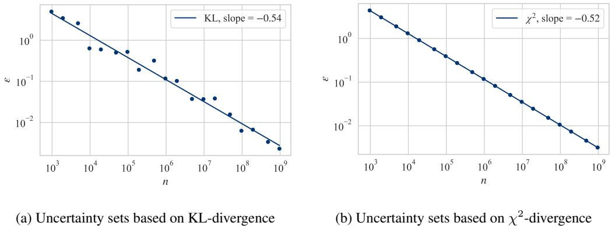
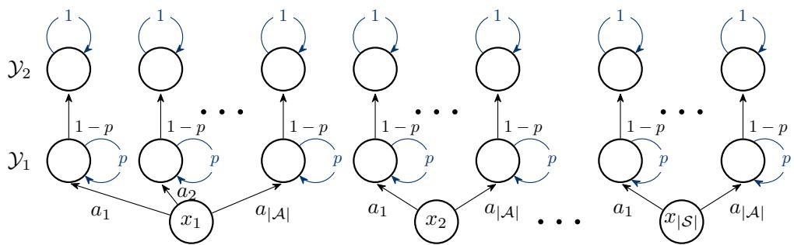
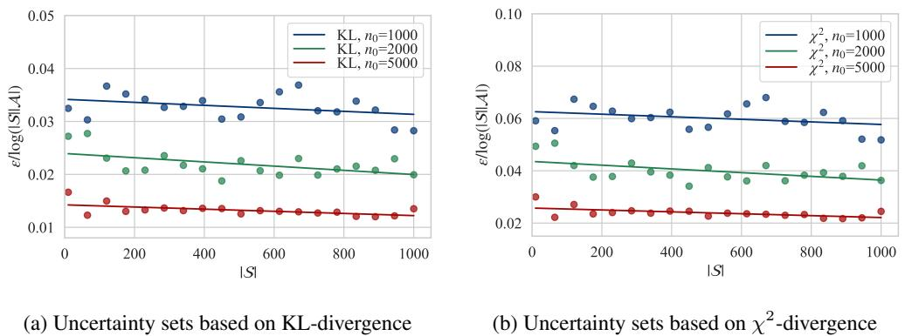
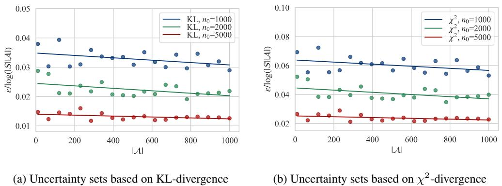

# Near-Optimal Sample Complexities of Divergence-based S-rectangular Distributionally Robust Reinforcement Learning

Anonymous Author(s)   
Affiliation   
Address   
email

# Abstract

Distributionally robust reinforcement learning (DR-RL) has recently gained sig  
nificant attention as a principled approach that addresses discrepancies between   
training and testing environments. To balance robustness, conservatism, and   
computational traceability, the literature has introduced DR-RL models with SA  
rectangular and S-rectangular adversaries. While most existing statistical analyses   
focus on SA-rectangular models, owing to their algorithmic simplicity and the   
optimality of deterministic policies, S-rectangular models more accurately cap  
ture distributional discrepancies in many real-world applications and often yield   
more effective robust randomized policies. In this paper, we study the empirical   
value iteration algorithm for divergence-based S-rectangular DR-RL and establish   
near-optimal sample complexity bounds of $\widetilde { O } ( \vert S \vert \vert \mathcal { A } \vert ( 1 - \gamma ) ^ { - 4 } \varepsilon ^ { - 2 } )$ , where $\varepsilon$ is the   
target accuracy, $| S |$ and $| { \cal A } |$ denote the cardinalities of the state and action spaces,   
and $\gamma$ is the discount factor. To the best of our knowledge, these are the first sample   
complexity results for divergence-based S-rectangular models that achieve optimal   
dependence on $| S | , | A |$ , and $\varepsilon$ simultaneously. We further validate this theoretical   
dependence through numerical experiments on a robust inventory control problem   
and a theoretical worst-case example, demonstrating the fast learning performance   
of our proposed algorithm.

# 19 1 Introduction

Reinforcement learning (RL) Sutton and Barto [20] is a powerful machine learning framework   
in which agents learn to make optimal sequential decisions through continuous interaction with   
an environment. While RL has achieved remarkable success across various domains, its practical   
deployment faces a significant challenge: real-world deployment conditions often differ from the   
training environment (e.g., simulations), resulting in fragile policies that fail to generalize. This   
mismatch undermines RL’s applicability in real-world settings, where discrepancies between training   
and deployment are the norm.   
The framework of distributionally robust reinforcement learning (DR-RL) was thus proposed in   
Zhou et al. [32] to address this mismatch and has since been further developed in a series of works,   
including Panaganti and Kalathil [13], Yang et al. [30], Xu et al. [28], Blanchet et al. [1], Liu et al.   
[10], Wang et al. [21], Yang et al. [31], Wang et al. [25], Shi and Chi [17].   
Popular models in distributionally robust reinforcement learning (DR-RL) include those based on   
SA-rectangular and S-rectangular uncertainty sets. The notion of rectangularity, originally introduced   
in the robust MDP literature to describe the adversary’s temporal flexibility in selecting distributions   
[8], has since been refined. With the incorporation of various information structures and a growing   
focus on constraining adversarial power, rectangularity now serves to impose structural limitations   
on uncertainty sets, as elaborated in Le Tallec [9] and Wiesemann et al. [26]. In particular, SA  
rectangularity allows the adversary to choose separate distributions for each state-action pair, whereas   
S-rectangularity enforces consistency across actions within a given state, thereby offering a more   
confined modeling choice.   
Existing statistical analyses of DR-RL predominantly focus on the SA-rectangular setting, primarily   
due to its computational tractability. Moreover, it has been shown that SA-rectangular models always   
admit deterministic optimal policies. However, as illustrated in the example below, the S-rectangular   
formulation can be more appropriate and less conservative in certain applications, such as inventory   
management.   
Example 1 (Inventory Model). Consider a classical inventory control problem where the inventory   
evolves according to $S _ { t + 1 } = S _ { t } + A _ { t } - D _ { t }$ , with $\{ D _ { t } : t \ge 0 \}$ representing the stochastic   
demand process and $a _ { t }$ denoting the replenishment decision at time $t$ . The reward function is   
$R ( S _ { t } , A _ { t } , S _ { t + 1 } ) = p ( S _ { t } - S _ { t + 1 } + A _ { t } ) + b \operatorname* { m i n } ( S _ { t + 1 } , 0 ) - h \operatorname* { m a x } ( S _ { t + 1 } , 0 ) - c A _ { t }$ , where $p$ is the   
sales price, $c$ is the purchase cost, $h$ is the holding cost, and $b$ is the penalty of backlog. To address   
the uncertainty in demand, distributionally robust reinforcement learning (DR-RL) provides a natural   
framework for enhancing robustness. In this context, it is reasonable to assume that the adversary can   
only modify the distribution of the demand $D _ { t }$ independently of the controller’s action $A _ { t }$ , leading to   
an S-rectangular uncertainty set. By contrast, the SA-rectangular formulation allows the adversary   
to choose different distributions for $D _ { t }$ based on the controller’s action $A _ { t }$ —for example, assigning   
low demand when $A _ { t }$ is large and high demand when $A _ { t }$ is small—granting the adversary excessive   
power and resulting in an unrealistic model.   
This example highlights how S-rectangularity constrains the adversary’s power by preventing it from   
adapting to the controller’s actions, making it a more practical and less conservative modeling choice   
in applications such as inventory management.   
While suitable for many applications, the S-rectangular formulation in DR-RL is more challenging   
than its SA-rectangular counterpart, both statistically and computationally, due to the possibility of   
randomized optimal policies. Computationally, this requires solving a full min-max problem rather   
than a simpler maximization. Fortunately, Ho et al. [7] proposed an efficient method for performing   
Bellman updates in this setting. Statistically, the challenge arises from the fact that the space of   
randomized policies is exponentially larger than the space of deterministic policies typically sufficient   
under SA-rectangularity.   
Another feature of Example 1 is that the reward depends on the current state $S _ { t }$ , the current action $A _ { t }$ ,   
and the next state $S _ { t + 1 }$ . In contrast, the literature typically considers reward functions of the form   
$R ( S _ { t } , A _ { t } )$ , which depend only on the current state and action. The inventory management example   
highlights the necessity of adopting a reward function of the form $R ( S _ { t } , A _ { t } , S _ { t + 1 } )$ to accurately   
capture the underlying dynamics.   
In this work, we study the problem of learning the optimal value function in a divergence-based   
S-rectangular robust MDP, where the uncertainty set is defined as the sum of divergences across all   
actions. This formulation is well motivated in practice, as divergence-based uncertainty sets preserve   
absolute continuity and are widely adopted in the literature [7, 30], where efficient algorithms for   
computing the robust value function have been developed.   
However, a satisfactory analysis of the minimax statistical complexity for learning the value function   
remains missing. To the best of our knowledge, the current state-of-the-art upper bound in Yang et al.   
[30] contains a sample complexity dependence on $| S |$ and $| { \cal A } |$ in the form of $O ( | S | ^ { 2 } | A | ^ { 2 } )$ , where $| { \cal S } |$   
and $| { \cal A } |$ are the cardinalities of the state and action spaces. This significantly deviates from the known   
lower bound of $\Omega ( | S | | A | )$ . In addition, we have pointed out that in many models of practical interest   
(e.g., Example 1), the reward function depends naturally on the next state $S _ { t + 1 }$ , a structural feature   
that is often overlooked in the existing sample complexity literature.   
We contribute to the literature by analyzing divergence-based S-rectangular robust MDPs with reward   
functions that depend on the current state, current action, and next state, i.e., $R ( S _ { t } , A _ { t } , S _ { t + 1 } )$ . We   
establish a sample complexity bound of $\widetilde { O } ( \vert S \vert \vert A \vert ( 1 - \gamma ) ^ { - 4 } \varepsilon ^ { - 2 } )$ , where $\varepsilon$ is the target accuracy and   
$\gamma$ is the discount factor. This bound is optimal in its dependence on $| S | , | A |$ , and $\varepsilon$ , and it holds   
uniformly over the entire range of uncertainty sizes $\rho \in ( 0 , + \infty )$ and discount factors $\gamma \in ( 0 , 1 )$   
To the best of our knowledge, this is the first sample complexity upper bound for divergence-based   
S-rectangular models that simultaneously achieves optimal dependence on $| S | , | A |$ , and $\varepsilon$ .   
To achieve the optimal $| S | | A |$ dependence, we develop a refined sensitivity analysis that improves   
upon the metric entropy bounds derived from the covering numbers of the randomized policy   
class $\Pi = \{ ( \pi ( \cdot | s ) ) _ { s \in \bar { \cal S } } \mid \pi ( \cdot | s ) \in \Delta ( { \cal A } ) \}$ , where $\Delta ( \mathcal { A } )$ denotes the probability simplex over $\mathcal { A }$   
as used in Yang et al. [30]. Moreover, our analyses advance the techniques of Wang et al. [25] by   
relaxing the mutual absolute continuity requirement, thereby extending the allowable range of the   
uncertainty radius to $\mathbb { R } +$ , beyond the previously restrictive regime of ${ \bar { \rho } } = O ( { \mathfrak { p } } _ { \wedge } )$ , while retain an   
$O ( 1 )$ dependence on $\rho$ as $\rho \downarrow 0$ .   
The remainder of this paper is organized as follows: Secction 2 briefly reviews related work on SA  
rectangular and S-rectangular distributionally robust reinforcement learning. Section 3 introduces the   
framework for learning S-rectangular distributionally robust Markov Decision Processes. Section 4   
establishes sample complexity upper bounds for value function estimation. Section 5 presents   
numerical experiments to support our theoretical results.

# 2 Literature Review

In this section, we briefly survey SA-rectangular and S-rectangular distributionally robust reinforcement learning.

SA-rectangular DR-RL: The dynamic programming principles for SA-rectangular distributionally robust Markov decision processes (DR-MDPs) have been gradually established through a series of works under different information structures [6, 8, 12, 15, 24]. Recent advances in SA-rectangular distributionally robust reinforcement learning (DR-RL) have explored sample complexity in various settings. Broadly speaking, model-based approaches have been studied in Zhou et al. [33], Panaganti and Kalathil [13], Yang et al. [30], Shi and Chi [16], Xu et al. [28], Shi et al. [18], Blanchet et al. [1], while the statistical properties of model-free algorithms are presented in Liu et al. [10], Wang et al. [21, 22], Yang et al. [31].

S-rectangular DR-RL: To extend the flexibility of robust MDP models, S-rectangularity was   
introduced in $\mathrm { X u }$ and Mannor [27], Wiesemann et al. [26] as an overarching theoretical framework to   
constrain the adversary while retaining a dynamic programming equation. Ho et al. [7] developed an   
efficient optimization algorithm to solve the Bellman update under this structure. On the statistical   
side, Yang et al. [30] provided the first sample complexity result for S-rectangular DR-RL, achieving   
a rate of $\widetilde { \cal O } ( | S | ^ { 2 } | A | ^ { 2 } ( 1 - \gamma ) ^ { - 4 } \varepsilon ^ { - 2 } )$ , which is suboptimal in its dependence on the number of states   
and actions. More recently, Clavier et al. [2] established near-optimal rates for the S-rectangular   
setting under general $L _ { p }$ norm uncertainty sets. However, their analysis does not directly extend to   
divergence-based uncertainty sets.

# 3 Learning S-rectangular Robust Markov Decision Processes

# 3.1 Classical Markov Decision Processes

We briefly review and establish notation for classical tabular MDP models. Let $\Delta ( \cal S ) , \Delta ( \cal A )$ denote   
the probability simplex over the finite state space $s$ and action space $\mathcal { A }$ respectively. An infinite hori  
zon MDP is defined by the tuple $( S , \mathcal { A } , R , \bar { P _ { \cdot } } \gamma )$ , where $s$ and $\mathcal { A }$ are the finite state and action spaces,   
respectively; $R : S \times A \times S  [ 0 , 1 ]$ is the reward function; $P = \{ P _ { s , a } ( \cdot ) \in \Delta ( S ) : ( s , a ) \in S \times A \}$   
is the controlled transition kernel; and $\gamma \in \mathsf { \Gamma } ( 0 , 1 )$ is the discount factor. Through out the paper,   
given a controlled transition kernel $P$ , we denote $P _ { s } : = ( P _ { s , a } ) _ { a \in \mathcal { A } }$ which is seen as a function   
$P _ { s } : A \to \Delta ( S )$ .   
We define the measurable space $( \Omega , { \mathcal { F } } )$ to be the canonical space $( \boldsymbol { S } \times \boldsymbol { A } ) ^ { \mathbb { N } }$ equipped with the   
$\sigma$ -field generated by cylinder sets. Define state-action process $( S _ { t } , A _ { t } ) _ { t \geq 0 }$ by the point evaluation   
$X _ { t } ( \omega ) = s _ { t } , A _ { t } ( \omega ) = a _ { t }$ for all $t \geq 0$ and $\omega = ( s _ { 0 } , a _ { 0 } , s _ { 1 } , a _ { 1 } , \ldots ) \in \Omega$ .   
An agent may optimize over the class of history-dependent policies, denoted by $\Pi _ { \mathrm { H D } }$ , where each   
policy $\pi = ( \pi _ { t } ) _ { t \geq 0 } \in \Pi _ { \mathrm { H D } }$ is a sequence of decision rules. Each decision rule $\pi _ { t }$ at time $t$   
specifies the conditional distribution of the action $A _ { t }$ given the full history, that is, a mapping   
$\bar { \pi _ { t } } : ( S \times \mathcal { A } ) ^ { t } \times \mathcal { S }  \Delta ( \mathcal { A } )$ . In the setting of classical infinite-horizon discounted MDPs, it is well   
known that optimal decision-making can be achieved using stationary, Markov, deterministic policies,   
denoted $\mathrm { { I I } _ { D } }$ , where each policy is a mapping $\pi : { \mathcal { S } }  A$ [14].   
However, in the context of S-rectangular DRMDPs, policies in $\Pi _ { \mathrm { D } }$ may fail to attain the optimal   
performance achievable within the broader class $\Pi _ { \mathrm { H D } }$ [26]. In this setting, it suffices to consider   
stationary, Markov, randomized policies, which we denote by $\Pi$ throughout the paper. Each $\pi \in \Pi$ is   
a mapping $\pi : S  \Delta ( { \mathcal { A } } )$ , specifying a conditional distribution over actions given the current state   
$S _ { t }$ , uniformly for all $t \geq 0$ . Given this sufficiency, we restrict our attention to policies in the class $\Pi$   
for the remainder of the paper.

Given a controlled transition kernel $P$ of a classical MDP, a policy $\pi \in \Pi$ and an initial distribution $\mu \in \Delta ( \mathcal { S } )$ uniquely defines a probability measure on $( \Omega , { \mathcal { F } } )$ . We will always assume that $\mu$ is the uniform distribution over $s$ . The expectation under this measure is denoted by $E _ { P } ^ { \pi }$ . The infinite horizon discounted value $V _ { P } ^ { \pi }$ is defined as:

$$
V _ { P } ^ { \pi } ( s ) : = E _ { P } ^ { \pi } \left[ \sum _ { t = 0 } ^ { \infty } \gamma ^ { t } R ( S _ { t } , A _ { t } , S _ { t + 1 } ) \Bigg | S _ { 0 } = s \right] .
$$

An optimal policy 147 $\pi ^ { * } \in \Pi$ achieves the optimal value $V _ { P } ^ { * } ( s ) : = \operatorname* { m a x } _ { \pi \in \Pi } V _ { P } ^ { \pi } ( s )$

It is well known that the optimal value function is the unique solution of the following Bellman   
equation:

$$
v ( s ) = \operatorname* { m a x } _ { a \in A } \sum _ { s ^ { \prime } \in S } P _ { s , a } ( s ^ { \prime } ) ( R ( s , a , s ^ { \prime } ) + \gamma v ( s ^ { \prime } ) ) .
$$

Let $v ^ { * }$ be the unique solution, then any deterministic policy $\pi ^ { * } : \mathcal { S }  \mathcal { A }$ with $\pi ^ { * } ( s ) \in$ arg $\begin{array} { r } { \operatorname* { m a x } _ { a \in \mathcal { A } } \sum _ { s ^ { \prime } \in \mathcal { S } } P _ { s , a } ( s ^ { \prime } ) ( R ( s , a , s ^ { \prime } ) + \gamma v ^ { * } ( s ^ { \prime } ) ) } \end{array}$ will achieve the optimal value $V _ { P } ^ { * } ( s )$ .

# 3.2 Robust MDPs and S-Rectangularity

Robust MDPs extend standard MDP models by introducing an adversary that perturbs the transition   
dynamics within a prescribed uncertainty set $\mathcal { P }$ , aiming to minimize the control value achieved by   
the decision maker. This formulation gives rise to a dynamic zero-sum game between the controller   
and the adversary. Consequently, the controller must account for potential model misspecifications   
represented by the adversary perturbation, leading to the design of more robust policies.   
The statistical complexity of policy learning in robust MDPs has been primarily studied under SA- and   
S-rectangular uncertainty sets. As discussed in the previous section, S-rectangularity generalizes SA  
rectangular models and provides a more expressive framework for modeling adversarial perturbations,   
constraining the adversary in a structured way while preserving the dynamic programming principle.   
From this point forward, we will be focusing on S-rectangular robust MDPs.

Definition 1 (Wiesemann et al. [26], S-rectangularity). The uncertainty set $\mathcal { P }$ is S-rectangular if $\mathcal { P } = \times _ { s \in \mathcal { S } } \mathcal { P } _ { s }$ for some $\mathcal { P } _ { s } \subseteq \{ ( \psi _ { a } ) _ { a \in \mathcal { A } } | \psi _ { a } \in \overline { { \Delta ( \mathcal { S } ) , \forall a \in \mathcal { A } } } \}$ for all $s \in S$ .

We focus on a special class of S-rectangular adversarial uncertainty sets, where the controlled   
transition kernels are perturbations of a nominal kernel $\overline { { P } }$ . These sets are defined via a divergence   
function $f$ and a radius parameter $\rho$ . The computational methods and statistical complexity associated   
with this type of uncertainty structure have been extensively studied in the literature [30, 7].   
Specifically, given a divergence function $f$ , i.e. $f : \mathbb { R } _ { + } \to \mathbb { R }$ is convex with $f ( 0 ) = 1$ and   
$\bar { f ( 0 ) } = \bar { \operatorname* { l i m } _ { t \downarrow 0 } } \bar { f } ( t )$ , we consider the S-rectangular uncertainty set $\mathcal { P } ( f , \boldsymbol { \rho } ) = \mathsf { X } _ { s \in \mathcal { S } } \mathcal { P } _ { s } ( f , \boldsymbol { \rho } )$ under   
$f$ -divergence and radius $\rho$ where

$$
\mathcal { P } _ { s } ( f , \boldsymbol { \rho } ) = \left\{ P _ { s , a } \in \Delta ( \mathcal { S } ) \bigg | P _ { s , a } \ll \overline { { P } } _ { s , a } , \sum _ { s ^ { \prime } \in S , a \in \mathcal { A } } \overline { { P } } _ { s , a } ( s ^ { \prime } ) f \left( \frac { P _ { s , a } ( s ^ { \prime } ) } { \overline { { P } } _ { s , a } ( s ^ { \prime } ) } \right) \leq | A | \rho \right\} .
$$

Here, $\ll$ denotes absolute continuity; i.e. a probability measure $p \in \Delta ( \mathcal { S } )$ is absolutely continuous   
with respect to $q \in \Delta ( { \mathcal { S } } )$ , denoted by $p \ll q$ , if $q ( \boldsymbol { s } ) = 0$ implies $p ( s ) = 0$ for any $s \in S$ . The   
dependence of the uncertainty set on $( f , \rho )$ is suppressed when there is no ambiguity.

Given a policy $\pi \in \Pi _ { \mathrm { H D } }$ and uncertainty set $\mathcal { P } = \mathcal { P } ( f , \rho )$ , the robust value function of $\pi$ is

$$
V _ { \mathcal { P } } ^ { \pi } ( s ) = \operatorname* { i n f } _ { P \in \mathcal { P } } E _ { P } ^ { \pi } \left[ \sum _ { t = 0 } ^ { \infty } \gamma ^ { t } R ( S _ { t } , A _ { t } , S _ { t + 1 } ) \Bigg | S _ { 0 } = s \right]
$$

for all 176 $s \in S$ . The optimal value, defined as $\begin{array} { r } { V _ { \mathcal { P } } ^ { * } ( s ) : = \operatorname* { s u p } _ { \pi \in \Pi _ { \mathrm { H D } } } V _ { \mathcal { P } } ^ { \pi } ( s ) } \end{array}$ , is achieved by $\pi ^ { * } \in \Pi$

Definition 2 (DR Bellman Equation). Given S-rectangular 177 $\mathcal { P } = \times _ { s \in \mathcal { S } } \mathcal { P } _ { s }$ , the DR Bellman equation 178 is the following fixed-point equation for $v : S  \mathbb { R }$

$$
v ( s ) = \operatorname* { s u p } _ { \phi \in \Delta ( \mathcal { A } ) } \operatorname* { i n f } _ { P _ { s } \in \mathcal { P } _ { s } } \sum _ { a \in \mathcal { A } } \phi ( a ) \left[ \sum _ { s ^ { \prime } \in \mathcal { S } } P _ { s , a } ( s ^ { \prime } ) \left( R ( s , a , s ^ { \prime } ) + \gamma v ( s ^ { \prime } ) \right) \right] .
$$

It is well known [26] that for 179 $\mathcal { P } = \mathcal { P } ( f , \rho )$ the optimal value $V _ { \mathcal P } ^ { * }$ is the unique solution $v ^ { * }$ to (3.4).

We note that value function in (3.3) assumes an adversary that fixes a controlled transition kernel over   
the entire control horizon, a setting commonly referred to as a static or time-homogeneous adversarial   
model [8, 26, 24]. This framework can be extended to more general Markovian or history-dependent   
adversarial models, while still preserving Markov optimality [24].

184 To facilitate our analysis, we define the DR Bellman operators as follows.

85 Definition 3 (DR Bellman Operators). Given uncertainty set $\mathcal { P } = \mathcal { P } ( f , \rho )$ and $\pi \in \Pi$ the (population)   
DR Bellman operator is defined as

$$
\mathcal { T } ^ { \pi } ( v ) ( s ) : = \operatorname* { i n f } _ { P \in \mathcal { P } } \left( \sum _ { a \in \mathcal { A } } \pi ( a | s ) \left[ \sum _ { s ^ { \prime } \in \mathcal { S } } P _ { s , a } ( s ^ { \prime } ) \left( R ( s , a , s ^ { \prime } ) + \gamma v ( s ^ { \prime } ) \right) \right] \right)
$$

for all 187 $s \in S$ . The optimal DR Bellman operator is $\begin{array} { r } { \mathcal { T } ^ { * } ( v ) ( s ) : = \operatorname* { s u p } _ { \pi \in \Pi } \mathcal { T } ^ { \pi } ( v ) ( s ) , \forall s \in \mathcal { S } . } \end{array}$

# 3.3 Generative Model and the Empirical Bellman Estimator

The sample complexity analysis in this paper assumes the availability of a generative model, a.k.a. a   
$\overline { { P } } _ { s , a }$ lator, wh, for any $( s , a ) \in S \times \mathcal { A }$ o sample independently from the. In particular, given sample size $n$ ominal controlled, we sample i.i.d. $\{ S _ { s , a } ^ { ( 1 ) } , \cdot \cdot \cdot , S _ { s , a } ^ { ( n ) } \}$   
from $\overline { { P } } _ { s , a }$ and construct the empirical transition probability

$$
\overline { { P } } _ { s , a , n } ( s ^ { \prime } ) : = \frac { 1 } { n } \sum _ { i = 1 } ^ { n } \mathbb { 1 } \left\{ S _ { s , a } ^ { ( i ) } = s ^ { \prime } \right\} .
$$

Then, we define $\overline { { P } } _ { n } : = \{ \overline { { P } } _ { s , a , n } | ( s , a ) \in \mathcal { S } \times \mathcal { A } \}$ as the empirical nominal controlled transition   
kernel based on $n$ samples. We define the empirical uncertainty set $\mathcal { P } _ { n } ( f , \boldsymbol { \rho } ) : = \mathsf { X } _ { s \in \mathcal { S } } \mathcal { P } _ { s , n } ( f , \boldsymbol { \rho } )$   
where $\mathcal { P } _ { s , n } ( f , \rho )$ is from (3.2) by replacing $\overline { { P } } _ { s , a }$ with $\overline { { P } } _ { s , a , n }$ . Again, the dependence on $( f , \rho )$ will   
be suppressed for simplicity.

Similarly, the empirical DR Bellman operator ${ \hat { \mathbf { T } } } ^ { \pi }$ is defined as in (3.5) with $\mathcal { P }$ replaced by $\mathcal { P } _ { n }$ . The corresponding optimal empirical DR Bellman operator is $\begin{array} { r } { \hat { \mathbf { T } } ^ { * } ( v ) ( s ) : = \operatorname* { s u p } _ { \pi \in \Pi } \hat { \mathbf { T } } ^ { \pi } ( v ) ( s ) , \forall s \in \mathcal { S } } \end{array}$ .

Equipped with these definitions, we present our strategy to estimate the optimal value of the Srectangular robust MDP via the empirical value function. This is motivated by the fact that $V _ { \mathcal { P } } ^ { * } = v ^ { * }$ where $v ^ { * }$ solves (3.4).

Definition 4 (Empirical Bellman Estimator). Given divergence function $f$ and radius parameter $\rho$ , let $\mathcal { P } = \mathcal { P } ( f , \rho )$ and $\mathcal { P } _ { n } = \mathcal { P } _ { n } ( f , \rho )$ . We define the empirical Bellman estimator $\hat { v }$ to $V _ { \mathcal P } ^ { \ast }$ as the unique solution to the fixed point equation $\hat { \mathbf { T } } ^ { * } ( \hat { v } ) = \hat { v }$ .

The rest of this paper is dedicated to theoretical analyses and numerical validation of the statistical efficiency of estimating $V _ { \mathcal { P } } ^ { * } = v ^ { * }$ using $\hat { v }$ . We conclude this section by introducing the following important proposition that provides an upper bound on the $l _ { \infty }$ estimation error.

Proposition 1. Let $v ^ { * } , \hat { v }$ be the solution of $\boldsymbol { \mathcal { T } ^ { * } } ( \boldsymbol { v } ) = \boldsymbol { v }$ and $\hat { \mathbf { T } } ^ { * } ( v ) = v$ , respectively. Then, the estimation error is upper bounded by

$$
\lVert \hat { \boldsymbol { v } } - \boldsymbol { v } ^ { * } \rVert _ { \infty } \leq \frac { 1 } { 1 - \gamma } \left. \hat { \mathbf { T } } ^ { * } ( \boldsymbol { v } ^ { * } ) - \boldsymbol { T } ^ { * } ( \boldsymbol { v } ^ { * } ) \right. _ { \infty }
$$

with probability $^ { l }$ .

The proof of Proposition 1 is deferred to Appendix A.

In this section, we establish sample complexity upper bounds to achieve an absolute $\epsilon$ error in   
$l _ { \infty }$ distance when estimating $V _ { \mathcal P } ^ { \ast }$ using $\hat { v }$ . We focus on two specific $f$ -divergence uncertainty   
models. When $f _ { \mathrm { K L } } ( t ) = f \bar { ( t ) } \overset { ^ { \prime } } { = } t \log \bar { t }$ , the corresponding uncertainty set $\bar { \mathcal { P } _ { s } ( f _ { \mathrm { K L } } , \rho ) }$ is based   
on the Kullback–Leibler (KL) divergence, which is widely used in the machine learning literature.   
Alternatively, when $f = f _ { k }$ as defined in Definition 6, the resulting $f _ { k }$ -divergence model captures   
another well-studied class of uncertainty sets [4].

We note that our analysis techniques are applicable to a broader class of smooth divergence functions $f$ . However, we focus on these two representative cases for demonstration purposes. This reflects that achieving near-tight sample complexity bounds often requires leveraging specific structural properties of the divergence. In particular, we highlight the desirable feature that, in the regime where the radius $\rho \downarrow 0$ , our bounds remain $O ( 1 )$ in $\rho$ , avoiding the diverging sample complexity upper bounds established in earlier results, as discussed in [25].

To facilitate our analysis and establish sample complexity results, we define the minimum support probability as a complexity metric parameter as follows.

Definition 5. Define the minimum support probability as

$$
\mathfrak { p } _ { \wedge } : = \operatorname* { m i n } _ { s , a \in S \times A } \operatorname* { m i n } _ { s ^ { \prime } \in S : \overline { { P } } _ { s , a } ( s ^ { \prime } ) > 0 } \overline { { P } } _ { s , a } ( \mathfrak { s } ^ { \prime } )
$$

As noted in the literature, the use of ${ \mathfrak { p } } _ { \wedge }$ as a complexity metric is well justified. In the KL case,   
the convergence rate of the estimation error can degrade arbitrarily, depending on the specific MDP   
instance, if there is no lower bound on the minimum support probability. In particular, the rate can   
be as slow as $\Omega ( n ^ { - 1 / \beta } )$ for any $\beta \geq 2$ as the sample size $n$ tends to infinity [19]. Similar negative   
results hold in the $f _ { k }$ -divergence setting when the parameter $k$ approaches 1 [3], highlighting the   
233 necessity of such a complexity measure.

# 4.1 The Kullback-Leibler Divergence Uncertainty Set

In this section, we present sample complexity results under the KL-divergence uncertainty set. Our analysis relies on the following dual representation of the DR Bellman operator and its empirical version.

38 Lemma 1. With $\mathcal { P } = \mathcal { P } ( f _ { \mathrm { K L } } , \rho )$ where $f _ { \mathrm { K L } } ( t ) = t \log t$ and $\rho \in ( 0 , \infty )$ , for any $\pi \in \Pi$ and $s \in S$ ,   
the dual form of the DR Bellman operator with $K L$ uncertainty set $\mathcal { P }$ is

$$
{ \mathcal { T } } ^ { \pi } ( v ) ( s ) = \operatorname* { s u p } _ { \lambda \geq 0 } \left( - \lambda | A | \rho - \sum _ { a \in { \mathcal { A } } } \lambda \log \mathbb { E } _ { \overline { { P } } _ { s , a } } \left[ \exp \left( - { \frac { \pi ( a | s ) ( R ( s , a , S ) + \gamma v ( S ) ) } { \lambda } } \right) \right] \right) .
$$

The240 $K L$ empirical DR Bellman operator $\hat { \mathbf { T } } ^ { \pi }$ satisfies (4.1) with $\overline { { P } } _ { s , a }$ replaced by $\overline { { P } } _ { s , a , n }$

The proof of Lemma 1 is provided in Appendix B.1. Building on this dual formulation, we next   
analyze the statistical error between the empirical and population DR Bellman operators.

Proposition 2. Under the $K L$ -divergence uncertainty set with any $\rho \in ( 0 , \infty )$ , for any $v : { \mathcal { S } }  \mathbb { R }$ and 244 $n \geq 1 2 \mathfrak { p } _ { \wedge } ^ { - 1 } \log ( 4 | S | ^ { 2 } | A | / \eta )$ , with probability at least $1 - \eta$ ,

$$
\| \hat { \mathbf { T } } ^ { * } ( v ) - T ^ { * } ( v ) \| _ { \infty } \leq \frac { 9 \| R + \gamma v \| _ { \infty } } { \sqrt { n \mathfrak { p } _ { \Lambda } } } \sqrt { \log { ( 4 | S | ^ { 2 } | A | / \eta ) } } .
$$

The proof of Proposition 2 is provided in Appendix C.1. Then, combining Proposition 2 with   
Proposition 1, and the fact that $\lvert \lvert R + \gamma v ^ { * } \rvert \rvert _ { \infty } \overset { \bar { < } \bar { 1 } } { \leq 1 } / ( 1 - \gamma )$ under our assumption that $R \in [ 0 , 1 ]$ , we   
247 arrive at the following theorem. The proof is presented in Appendix C.4.   
48 Theorem 1. Under the $K L$ -divergence uncertainty set with any $\rho \in ( 0 , \infty )$ and $n \_ \geq$   
$1 2 { \mathfrak { p } } _ { \wedge } ^ { - 1 } \log ( 4 | S | ^ { 2 } | A | / \eta )$ , with probability at least $1 - \eta$ ,

$$
\| \hat { v } - v ^ { * } \| _ { \infty } \leq \frac { 9 } { ( 1 - \gamma ) ^ { 2 } \sqrt { n { \mathfrak { p } } _ { \Lambda } } } \sqrt { \log ( 4 | S | ^ { 2 } | A | / \eta ) } .
$$

Remark 1. Therefore, under the KL-divergence, to achieve an $\epsilon$ absolute error of estimating $V _ { \mathcal { P } } ^ { * } = v ^ { * }$ with 252 $\hat { v }$ in $l _ { \infty }$ norm w.h.p., we need a total of $\widetilde { \cal O } ( | S | | A | ( 1 - \gamma ) ^ { - 4 } { \mathfrak { p } } _ { \wedge } ^ { - 1 } \epsilon ^ { - 2 } )$ samples from the simulator.

Next, we consider a subclass of the Cressie-Read family of $f _ { k }$ -divergence with $k \in ( 1 , \infty )$ , as studied in Duchi and Namkoong [4].

Definition 6. For $k \in ( 1 , \infty )$ , the $f _ { k }$ -divergence is defined by the divergence functions $f _ { k } ( t ) : =$ $( t ^ { k } - k t + k - 1 ) / ( k ( k - 1 ) )$ . We also define $k ^ { * } = k / ( k - 1 )$ .

Notably, when $k = 2$ , the $f _ { 2 }$ -divergence is the $\chi ^ { 2 }$ -divergence, which sees extensive application in the statistical testing literature. Moreover, when $k \downarrow 1$ , the $f _ { k }$ induced divergence converges to KL.

The analysis for $f _ { k }$ -divergence uncertainty sets follows the same strategy to KL-divergence in the previous subsection. Below we summarise the main results.

Lemma 2. With $\mathcal { P } = \mathcal { P } ( f _ { k } , \rho )$ and $\rho \in ( 0 , \infty )$ , for any $\pi \in \Pi$ and $s \in S$ , the dual form of the DR   
263 Bellman operator with $f _ { k }$ uncertainty set $\mathcal { P }$ is

$$
\mathcal { T } ^ { \pi } ( v ) ( s ) = - \operatorname* { s u p } _ { \eta \in \mathbb { R } ^ { | A | } } \left[ c \left( \sum _ { a \in A } \mathbb { E } _ { \overline { { P } } _ { s , a } } \left[ ( \eta _ { a } - \pi ( a | s ) [ R ( s , a , S ) + \gamma v ( S ) ] ) _ { + } ^ { k ^ { * } } \right] \right) ^ { \frac { 1 } { k ^ { * } } } + \sum _ { a \in A } \eta _ { a } \right] .
$$

where 264 $c = c ( k , \rho , | \boldsymbol { A } | ) = | \boldsymbol { A } | ^ { 1 / k } \left( k ( k - 1 ) \rho + 1 \right) ^ { 1 / k }$ and $( \cdot ) _ { + } = \operatorname* { m a x } ( \cdot , 0 )$ . The $f _ { k }$ empirical $D R$ Bellman operator 265 ${ \hat { \mathbf { T } } } ^ { \pi }$ satisfies a similar equality with $\overline { { P } } _ { s , a }$ replaced by $\overline { { P } } _ { s , a , n } . \ \overline { { P } } _ { s , a , n }$ .

66 The proof of Lemma 2 is provided in Appendix B.2. Again, with this dual representation of the DR   
Bellman operators and refined estimation error analysis, we arrive at the following result.

Proposition 3. Under the $f _ { k }$ -divergence uncertainty set with any $\rho \in ( 0 , \infty )$ , for any $v : { \mathcal { S } }  \mathbb { R }$ and 269 $n \geq 1 2 \mathfrak { p } _ { \wedge } ^ { - 1 } \log ( 4 | S | ^ { 2 } | A | / \eta )$ , with probability at least $1 - \eta$ ,

$$
\| \hat { \mathbf { T } } ^ { * } ( v ) - \mathcal { T } ^ { * } ( v ) \| _ { \infty } \leq \frac { 3 \cdot 2 ^ { k ^ { * } } k ^ { * } \| R + \gamma v \| _ { \infty } } { \sqrt { n \mathfrak { p } _ { \Lambda } } } \sqrt { \log \left( 4 | \mathcal { S } | ^ { 2 } | A | / \eta \right) } .
$$

The proof of Proposition 3 is provided in Appendix D.1. This, combined with Proposition 1, implies   
271 the following error convergence bound, whose proof is deferred to Appendix D.4.   
72 Theorem 2. Under the $f _ { k }$ -divergence uncertainty set with any $\rho \in ( 0 , \infty )$ and $n \_ \geq$   
$1 2 { \mathfrak { p } } _ { \wedge } ^ { - 1 } \log ( 4 | S | ^ { 2 } | A | / \eta )$ , with probability at least $1 - \eta$ ,

$$
\| \hat { v } - v ^ { * } \| _ { \infty } \leq \frac { 3 \cdot 2 ^ { k ^ { * } } k ^ { * } } { ( 1 - \gamma ) ^ { 2 } \sqrt { n { \mathfrak { p } } _ { \Lambda } } } \sqrt { \log ( 4 | S | ^ { 2 } | A | / \eta ) } .
$$

Remark 2. Therefore, under the $f _ { k }$ -divergence for a fixed $k$ , to achieve an $\epsilon$ absolute error of estimating $V _ { \mathcal { P } } ^ { * } = v ^ { * }$ with $\hat { v }$ in $l _ { \infty }$ norm w.h.p., we also need a total of $\widetilde { \cal O } ( | S | | A | ( 1 - \gamma ) ^ { - 4 } { \mathfrak { p } } _ { \wedge } ^ { - 1 } \epsilon ^ { - 2 } )$ samples from the simulator.

# 5 Numerical Experiments

In this section, we present two sets of numerical examples. In Section 5.1, we revisit the robust inventory problem from Ho et al. [7], which features uncertain demand, to demonstrate the $n ^ { - 1 / 2 }$ error decay rate. In Section 5.2, we consider an example from Yang et al. [30] to illustrate the linear dependence on $| { \cal S } | | { \cal A } |$ , which matches the lower bound established in Yang et al. [30].

# 5.1 Robust Inventory Control Problems

We investigate the dependency of the estimation error $\varepsilon$ on the sample size $n$ and evaluate our approach on a classical discrete-time inventory management problem with stochastic demand and backlog [7]. In each period $t$ , an agent decides the order quantity to maximize cumulative discounted rewards, accounting for holding costs, backlog penalties, and profits.

Let $I$ denote the maximum inventory level, $B$ the maximum backlog, and $O$ the maximum order   
289 quantity per period. The state space is defined as $\mathcal { S } = \{ - B , \cdot \cdot \cdot , 0 , \cdot \cdot \cdot , I \}$ , the action space is

90 $\mathcal { A } = \{ 0 , \cdots , O \}$ , where $s _ { t } \in S$ and $a _ { t } \in { \mathcal { A } }$ denote the inventory and order item at the beginning of period 91 $t$ . Demand $D _ { t } \in \{ 0 , \cdots , D _ { \operatorname* { m a x } } \}$ is an i.i.d. sequence, with distribution $P _ { D } \in \Delta ^ { D _ { \operatorname* { m a x } } ^ { - } + 1 }$ .

The MDP dynamics proceed as follows. Due to storage constraints, the effective order size is $\tilde { A } _ { t } = \operatorname* { m i n } ( A _ { t } , I - S _ { t } )$ . Then, the next state evolves as $\bar { S _ { t + 1 } } = \operatorname* { m a x } ( S _ { t } + \tilde { A } _ { t } - D _ { t } , - B )$ , ensuring that the backlog does not exceed $B$ . The actual sales in period $t$ are given by $X _ { t } = S _ { t } - S _ { t + 1 } + \tilde { A } _ { t }$ . A one-step reward $R ( S _ { t } , A _ { t } , S _ { t + 1 } ) = p X _ { t } + b \operatorname* { m i n } ( S _ { t + 1 } , 0 ) - h \operatorname* { m a x } ( S _ { t + 1 } , 0 ) - c \tilde { A } _ { t }$ is collected, where $p$ is the sales price, $c$ is the purchase cost, $h$ is the holding cost, and $b$ is the penalty of backlog.

For our experiments, we set the parameters as follows: $I = 1 0$ , $B = 5$ , $O = 5$ , $p = 3$ , $c = 2$ , $h = 0 . 2$ , $b = 3$ , $\gamma = 0 . 9$ , and use the nominal demand distribution $P _ { D } = [ 0 . 1 , 0 . 2 , 0 . 3 , 0 . 3 , 0 . 1 ]$ , supported on $0 , 1 , 2 , 3 , 4$ . For each $( s , a )$ , we sample $n _ { 0 }$ samples from the nominal transition kernels to generate the estimated transition probability $P _ { n }$ , and solve the DR-MDP problem with uncertainty size $\rho = 1 / 6$ using the algorithm presented in [7].

Figure 1 illustrates the relationship between the sample size $n$ and the error $\varepsilon$ between the empirical   
and population value functions. As shown in the log-log plot, the slope is approximately √ $- 0 . 5$ for   
both the KL and $\chi ^ { 2 }$ cases, indicating that the error decreases at a rate proportional to $1 / \sqrt { n }$ .

  
Figure 1: Estimation error versus sample size $n$ in the robust inventory control problem.

# 305 5.2 MDP Instances from the Lower Bound Construction in Yang et al. [30]

  
Figure 2: MDP instances from the lower bound construction in Yang et al. [30].

In this section, we investigate the relationship between the estimation error and the sizes of the state   
space $| S |$ and action space $| { \cal A } |$ . We adopt the classic MDP structure introduced in Gheshlaghi Azar   
et al. [5] and Yang et al. [30], which comprises three subsets: $s$ , $\mathcal { V } _ { 1 }$ , and $\mathcal { \mathrm { V } } _ { 2 }$ , as illustrated in Figure 2.   
Specifically, $s$ denotes the set of all initial states, each associated with an action set $\mathcal { A }$ . When an   
action $a _ { i } \in { \mathcal { A } }$ is taken in state $s \in S$ , the system deterministically transitions (with probability 1)   
to the corresponding state $y _ { 1 , s , a } \in \mathcal { D } _ { 1 }$ . From each $y _ { 1 , s , a }$ , the system either remains in the same   
state with nominal probability $p$ , or transitions to the corresponding absorbing state $y _ { 2 , s , a } \in \mathcal { D } _ { 2 }$ with   
nominal probability $1 - p$ . All states in $\mathcal { \ V } _ { 2 }$ are absorbing, meaning that once the system enters one of   
these states, it remains there indefinitely via a self-loop with probability 1. The reward function is   
defined such that a reward of 1 is obtained only when the system is in any state within $\mathcal { V } _ { 1 }$ ; all other   
states yield a reward of 0. We solve the DR-MDP problem with uncertainty size $\rho = 0 . 1$ .   
317 In our experiments, we first fix $| { \mathcal { A } } | = 6 5$ and vary the number of states from 10 to 1000, with   
18 the results shown in Figure 3. We then fix $\lvert S \rvert = 6 5$ and vary $| { \cal A } |$ over the same range, with the   
corresponding results presented in Figure 4.   
To align with our theoretical results, we normalize the estimation error by dividing it by $\log ( | S | | A | )$ .   
Figures 3 and 4 display the behavior of this normalized error as $| S |$ and $| { \cal A } |$ vary, respectively.   
Specifically, for each $( s , a )$ pair, we use $n _ { 0 }$ samples, resulting in a total of $\textstyle n _ { 0 } | S | | A |$ samples. The   
left subfigures correspond to the KL-divergence case, while the right subfigures correspond to the $\chi ^ { 2 }$ -   
divergence case. We observe that as either $| S |$ or $| { \cal A } |$ increases, the normalized error is non-increasing.   
This is consistent with our theoretical analysis, which predicts that the sample complexity scales   
linearly (up to logarithmic factors) with the product $| S | | A |$ .

  
Figure 3: Estimation error versus the number of states $| S |$ for the MDP instances based on the lower bound construction in Yang et al. [30].

  
Figure 4: Estimation error versus the number of states $| { \cal A } |$ for the MDP instances based on the lower bound construction in Yang et al. [30].

# 327 6 Conclusion and Future Work

In this paper, we present near-optimal sample complexity results for divergence-based S-rectangular robust MDPs in the discounted reward setting. Our results are the first to achieve optimal dependence on $| S | , | A |$ , and $\varepsilon$ simultaneously. We acknowledge, however, two limitations: the reliance on access to a generative model and the presence of a gap between our upper bound and the minimax lower bound established in Yang [29]. As part of future work, we aim to develop provable theoretical guarantees for other settings, including model-free algorithms and offline reinforcement learning.

References [1] Jose Blanchet, Miao Lu, Tong Zhang, and Han Zhong. Double pessimism is provably efficient for distributionally robust offline reinforcement learning: Generic algorithm and robust partial coverage. Advances in Neural Information Processing Systems, 36, 2024. [2] Pierre Clavier, Laixi Shi, Erwan Le Pennec, Eric Mazumdar, Adam Wierman, and Matthieu Geist. Near-optimal distributionally robust reinforcement learning with general $l _ { - } p$ norms. Advances in Neural Information Processing Systems, 37:1750–1810, 2024. [3] John Duchi and Hongseok Namkoong. Learning Models with Uniform Performance via Distributionally Robust Optimization, July 2020. URL http://arxiv.org/abs/1810.08750. arXiv:1810.08750 [stat]. [4] John C. Duchi and Hongseok Namkoong. Learning models with uniform performance via distributionally robust optimization. The Annals of Statistics, 49(3):1378–1406, 2021. [5] Mohammad Gheshlaghi Azar, Rémi Munos, and Hilbert J Kappen. Minimax pac bounds on the sample complexity of reinforcement learning with a generative model. Machine learning, 91: 325–349, 2013. [6] JI González-Trejo, Onésimo Hernández-Lerma, and Luis F Hoyos-Reyes. Minimax control of discrete-time stochastic systems. SIAM Journal on Control and Optimization, 41(5):1626–1659, 2002. [7] Chin Pang Ho, Marek Petrik, and Wolfram Wiesemann. Fast bellman updates for robust mdps. In International Conference on Machine Learning, pages 1979–1988. PMLR, 2018. [8] Garud N Iyengar. Robust dynamic programming. Mathematics of Operations Research, 30(2): 257–280, 2005. [9] Yann Le Tallec. Robust, risk-sensitive, and data-driven control of Markov decision processes. PhD thesis, Massachusetts Institute of Technology, 2007. [10] Zijian Liu, Qinxun Bai, Jose Blanchet, Perry Dong, Wei Xu, Zhengqing Zhou, and Zhengyuan Zhou. Distributionally robust Q-learning. In Kamalika Chaudhuri, Stefanie Jegelka, Le Song, Csaba Szepesvari, Gang Niu, and Sivan Sabato, editors, Proceedings of the 39th International Conference on Machine Learning, volume 162 of Proceedings of Machine Learning Research, pages 13623–13643. PMLR, 17–23 Jul 2022. URL https://proceedings.mlr.press/ v162/liu22a.html. [11] Paul Milgrom and Ilya Segal. Envelope theorems for arbitrary choice sets. Econometrica, 70 (2):583–601, 2002. [12] Arnab Nilim and Laurent El Ghaoui. Robust control of markov decision processes with uncertain transition matrices. Operations Research, 53(5):780–798, 2005. [13] Kishan Panaganti and Dileep Kalathil. Sample complexity of robust reinforcement learning with a generative model, 2021. URL https://arxiv.org/abs/2112.01506.   
[14] Martin L. Puterman. Markov Decision Processes: Discrete Stochastic Dynamic Programming. Number v.414 in Wiley Series in Probability and Statistics. John Wiley & Sons, Inc, Hoboken, 2009. ISBN 978-0-471-72782-8. [15] Alexander Shapiro. Distributionally robust modeling of optimal control. Operations Research Letters, 50(5):561–567, 2022. [16] Laixi Shi and Yuejie Chi. Distributionally robust model-based offline reinforcement learning with near-optimal sample complexity, 2022. URL https://arxiv.org/abs/2208.05767.   
[17] Laixi Shi and Yuejie Chi. Distributionally Robust Model-Based Offline Reinforcement Learning with Near-Optimal Sample Complexity, December 2023. URL http://arxiv.org/abs/ 2208.05767. arXiv:2208.05767 [cs]. [18] Laixi Shi, Gen Li, Yuting Wei, Yuxin Chen, Matthieu Geist, and Yuejie Chi. The curious price of distributional robustness in reinforcement learning with a generative model, 2023.   
[19] Nian Si, Fan Zhang, Zhengyuan Zhou, and Jose Blanchet. Distributionally Robust Policy Evaluation and Learning in Offline Contextual Bandits. In Proceedings of the 37th International Conference on Machine Learning, pages 8884–8894. PMLR, November 2020. URL https: //proceedings.mlr.press/v119/si20a.html. ISSN: 2640-3498.   
[20] Richard S Sutton and Andrew G Barto. Reinforcement learning: An introduction. MIT press, 2018. [21] Shengbo Wang, Nian Si, Jose Blanchet, and Zhengyuan Zhou. A finite sample complexity bound for distributionally robust Q-learning, 2023. URL https://arxiv.org/abs/2302.13203. [22] Shengbo Wang, Nian Si, Jose Blanchet, and Zhengyuan Zhou. Sample complexity of variancereduced distributionally robust Q-learning, 2023. [23] Shengbo Wang, Nian Si, Jose Blanchet, and Zhengyuan Zhou. Statistical learning of distributionally robust stochastic control in continuous state spaces. arXiv preprint arXiv:2406.11281, 2024. [24] Shengbo Wang, Nian Si, Jose Blanchet, and Zhengyuan Zhou. On the Foundation of Distributionally Robust Reinforcement Learning, January 2024. URL http://arxiv.org/abs/ 2311.09018. arXiv:2311.09018 [cs].   
[25] Shengbo Wang, Nian Si, Jose Blanchet, and Zhengyuan Zhou. Sample Complexity of Variancereduced Distributionally Robust Q-learning, September 2024. URL http://arxiv.org/abs/ 2305.18420. arXiv:2305.18420 [cs]. [26] Wolfram Wiesemann, Daniel Kuhn, and Berç Rustem. Robust markov decision processes. Mathematics of Operations Research, 38(1):153–183, 2013.   
[27] Huan Xu and Shie Mannor. Distributionally robust markov decision processes. In NIPS, pages 2505–2513, 2010. [28] Zaiyan Xu, Kishan Panaganti, and Dileep Kalathil. Improved sample complexity bounds for distributionally robust reinforcement learning, 2023. [29] Insoon Yang. Wasserstein distributionally robust stochastic control: A data-driven approach. IEEE Transactions on Automatic Control, 2020. [30] Wenhao Yang, Liangyu Zhang, and Zhihua Zhang. Toward theoretical understandings of robust markov decision processes: Sample complexity and asymptotics. The Annals of Statistics, 50 (6):3223–3248, 2022.   
[31] Wenhao Yang, Han Wang, Tadashi Kozuno, Scott M. Jordan, and Zhihua Zhang. Avoiding model estimation in robust markov decision processes with a generative model, 2023. [32] Zhengqing Zhou, Qinxun Bai, Zhengyuan Zhou, Linhai Qiu, Jose Blanchet, and Peter Glynn. Finite-sample regret bound for distributionally robust offline tabular reinforcement learning. In International Conference on Artificial Intelligence and Statistics, pages 3331–3339. PMLR, 2021. [33] Zhengqing Zhou, Zhengyuan Zhou, Qinxun Bai, Linhai Qiu, Jose Blanchet, and Peter Glynn. Finite-sample regret bound for distributionally robust offline tabular reinforcement learning. In Arindam Banerjee and Kenji Fukumizu, editors, Proceedings of The 24th International Conference on Artificial Intelligence and Statistics, volume 130 of Proceedings of Machine Learning Research, pages 3331–3339. PMLR, 13–15 Apr 2021. URL https://proceedings. mlr.press/v130/zhou21d.html.

# 424 A Proofs of Value Function Error Bounds

In this section, we prove Proposition 1. We first show that both the population and the empirical   
S-rectangular Bellman operators $\tau ^ { * }$ and $\hat { \mathbf { T } } ^ { * }$ are $\gamma$ -contractions. This is a well-known fact, see for   
example [24]. We include a proof to make the paper self-contained.

Lemma 3. 428 $\tau ^ { * }$ and $\hat { \mathbf { T } } ^ { * }$ are $\gamma$ -contraction operators on $( S \to \mathbb { R } , \| \cdot \| _ { \infty } )$ ; i.e. for all $v _ { 1 } , v _ { 2 } : S \to \mathbb { R }$

$$
\begin{array} { r l } & { \| T ^ { * } ( v _ { 1 } ) - T ^ { * } ( v _ { 2 } ) \| _ { \infty } \leq \gamma \| v _ { 1 } - v _ { 2 } \| _ { \infty } , } \\ & { \| \hat { \mathbf { T } } ^ { * } ( v _ { 1 } ) - \hat { \mathbf { T } } ^ { * } ( v _ { 2 } ) \| _ { \infty } \leq \gamma \| v _ { 1 } - v _ { 2 } \| _ { \infty } . } \end{array}
$$

Proof. Let

$$
f ( v ) ( s ) = \sum _ { a \in \mathcal { A } } \pi ( a | s ) \left[ \sum _ { s ^ { \prime } \in S } P _ { s , a } ( s ^ { \prime } ) \left( R ( s , a , s ^ { \prime } ) + \gamma v ( s ^ { \prime } ) \right) \right]
$$

By definition, we have

$$
\begin{array} { r l } & { | \mathcal { T } ^ { * } ( v _ { 1 } ) ( s ) - \mathcal { T } ^ { * } ( v _ { 2 } ) ( s ) | = \bigg | \underset { \pi \in \Pi } { \operatorname* { s u p } } \mathcal { T } ^ { \pi } ( v _ { 1 } ) ( s ) - \underset { \pi \in \Pi } { \operatorname* { s u p } } \mathcal { T } ^ { \pi } ( v _ { 2 } ) ( s ) \bigg | } \\ & { \quad \quad \quad \quad = \bigg | \underset { \pi \in \Pi } { \operatorname* { s u p } } \underset { P \in \mathcal { P } } { \operatorname* { i n f } } f ( v _ { 1 } ) ( s ) - \underset { \pi \in \Pi } { \operatorname* { s u p } } \underset { P \in \mathcal { P } } { \operatorname* { i n f } } f ( v _ { 2 } ) ( s ) \bigg | . } \end{array}
$$

Since $| \operatorname* { s u p } _ { X } f - \operatorname* { s u p } _ { X } g | \leq \operatorname* { s u p } _ { X } | f - g |$ and $\left| \operatorname* { i n f } _ { X } f - \operatorname* { i n f } _ { X } g \right| \leq \operatorname* { s u p } _ { X } \left| f - g \right|$ , we have

$$
\begin{array} { l } { { \displaystyle  \begin{array} { l } { { \displaystyle T ^ { * } ( v _ { 1 } ) ( s ) - T ^ { * } ( v _ { 2 } ) ( s ) } } \end{array} \} } } \\ { { \displaystyle \leq \mathrm { s u p ~ s u p ~ l e v p ~ } | f ( v _ { 1 } ) ( s ) - f ( v _ { 2 } ) ( s ) | } } \\ { { \displaystyle = \mathrm { s u p ~ s u p ~ } | \sum _ { \alpha , \alpha ^ { \prime } \in \mathbb { T } } | \sum _ { \alpha , \alpha ^ { \prime } \in \mathbb { T } } | R _ { \alpha } | s ^ { \prime } | R _ { s } , a _ { \alpha } s ^ { \prime } | + \gamma \sum _ { \alpha ^ { \prime } \in ( a | s | ) } F _ { \alpha , \alpha } ( s ^ { \prime } ) v _ { 1 } ( s ^ { \prime } ) } } \\ { { \displaystyle = \sum _ { \alpha , \alpha ^ { \prime } \in \mathbb { T } } ( \alpha | s | ) P _ { s , \alpha } ( s ^ { \prime } ) R ( s , a _ { \alpha } s ^ { \prime } ) - \gamma \sum _ { \alpha , \alpha ^ { \prime } } \pi ( a | s | ) P _ { s , \alpha } ( s ^ { \prime } ) v _ { 2 } ( s ^ { \prime } ) } \Bigg | }  \\ { { \displaystyle = \sum _ { \alpha \in \mathbb { T } } \operatorname* { s u p } _ { \alpha \in \mathbb { T } } \gamma | \sum _ { \alpha , \alpha ^ { \prime } \in ( a | s | ) \cap P _ { s , \alpha } ( s ^ { \prime } ) \cap ( s ^ { \prime } ) \cap ( s ^ { \prime } ) \atop \alpha , s ^ { \prime } \in \mathbb { T } } ( a | s | ) P _ { s , \alpha } ( s ^ { \prime } ) \operatorname* { m a x } | \sum _ { \alpha , s ^ { \prime } } \pi | } } \\ { { \displaystyle \leq \gamma | \alpha | \sum _ { \alpha , \alpha ^ { \prime } \in \mathbb { T } } | \sum _ { \alpha , \beta ^ { \prime } \in | \alpha | } | v _ { 1 } - v _ { 2 } | | } \leq \gamma ( \alpha | s | ) P _ { s , \alpha } ( s ^ { \prime } ) \operatorname* { m a x } | \rho _ { s ^ { \prime } } | | } \\   \end{array}
$$

where $\begin{array} { r } { \| P _ { s } \| _ { \infty } = \operatorname* { s u p } _ { \| v \| _ { \infty } = 1 } \| P _ { s } v \| _ { \infty } } \end{array}$ is the induced operator norm. The above inequality holds for   
any $s \in S$ , which lead to

$$
\| T ^ { * } ( v _ { 1 } ) - T ^ { * } ( v _ { 2 } ) \| _ { \infty } \leq \gamma \| v _ { 1 } - v _ { 2 } \| _ { \infty } .
$$

We replace $P _ { s }$ with $P _ { s , n }$ , notice that $\| \boldsymbol { P _ { s , n } } \| _ { \infty } \leq 1$

$$
\begin{array} { r l } & { | \hat { \mathbf { T } } ^ { * } ( v _ { 1 } ) ( s ) - \hat { \mathbf { T } } ^ { * } ( v _ { 2 } ) ( s ) | \leq \gamma \| \pi _ { s } \| _ { \infty } \| P _ { s , n } \| _ { \infty } \| v _ { 1 } - v _ { 2 } \| _ { \infty } } \\ & { \qquad = \gamma \| v _ { 1 } - v _ { 2 } \| _ { \infty } . } \end{array}
$$

which lead to

$$
\| \hat { \mathbf { T } } ^ { * } ( v _ { 1 } ) - \hat { \mathbf { T } } ^ { * } ( v _ { 2 } ) \| _ { \infty } \leq \gamma \| v _ { 1 } - v _ { 2 } \| _ { \infty } .
$$

# A.1 Proof of Proposition 1

Proof. The proof of Proposition 1 follows a similar argument to that used for the continuous-case   
operator in [23].

Let 440 $v _ { 0 } \equiv 0$ and $v _ { k + 1 } = \hat { \mathbf { T } } ^ { * } ( v _ { k } )$ . $\hat { u }$ is defined as the fix point of $\hat { \mathbf { T } } ^ { * } \hat { v } = \hat { \mathbf { T } } ^ { * } ( \hat { v } )$

$$
\begin{array} { r l } & { \Delta _ { k + 1 } = v _ { k + 1 } - v ^ { * } } \\ & { \qquad = \hat { \mathbf { T } } ^ { * } ( v _ { k } ) - \hat { \mathbf { T } } ^ { * } ( v ^ { * } ) + \hat { \mathbf { T } } ^ { * } ( v ^ { * } ) - \mathcal { T } ^ { * } ( v ^ { * } ) } \\ & { \qquad = \Big [ \hat { \mathbf { T } } ^ { * } ( v ^ { * } + \Delta _ { k } ) - \hat { \mathbf { T } } ^ { * } ( v ^ { * } ) \Big ] + \Big [ \hat { \mathbf { T } } ^ { * } ( v ^ { * } ) - \mathcal { T } ^ { * } ( v ^ { * } ) \Big ] } \\ & { \qquad : = \mathbf { H } ( \Delta _ { k } ) + V } \end{array}
$$

By Lemma 3, we have

$$
\begin{array} { r } { \| \mathbf { H } ( \Delta _ { 1 } ) - \mathbf { H } ( \Delta _ { 2 } ) \| _ { \infty } = \left\| \hat { \mathbf { T } } ^ { * } ( v ^ { * } + \Delta _ { 1 } ) - \hat { \mathbf { T } } ^ { * } ( v ^ { * } + \Delta _ { 2 } ) \right\| _ { \infty } \leq \gamma \| \Delta _ { 1 } - \Delta _ { 2 } \| _ { \infty } , } \end{array}
$$

therefore, $\mathbf { H }$ is also a $\gamma$ -contraction operator. Then we show

$$
\| \Delta _ { k } \| _ { \infty } \leq \frac { \gamma ^ { k - 1 } } { 1 - \gamma } + \sum _ { j = 0 } ^ { k - 1 } \gamma ^ { j } \| V \| _ { \infty }
$$

by induction: for $k = 1$ ,

$$
\begin{array} { r l } & { \| \boldsymbol { \Delta } _ { 1 } \| _ { \infty } \leq \| \mathbf { H } ( \boldsymbol { \Delta } _ { 0 } ) \| _ { \infty } + \| V \| _ { \infty } } \\ & { \qquad = \| \mathbf { H } ( \boldsymbol { \Delta } _ { 0 } ) - \mathbf { H } ( 0 ) \| _ { \infty } + \| V \| _ { \infty } } \\ & { \qquad \leq \gamma \| v ^ { * } \| _ { \infty } + \| V \| _ { \infty } } \\ & { \qquad \leq \frac { \gamma } { 1 - \gamma } + \| V \| _ { \infty } . } \end{array}
$$

For any $k$ , we have

$$
\begin{array} { l } { \displaystyle \| \Delta _ { k + 1 } \| _ { \infty } \leq \| { \bf H } ( \Delta _ { k } ) \| _ { \infty } + \| V \| _ { \infty } } \\ { = \| { \bf H } ( \Delta _ { k } ) - { \bf H } ( 0 ) \| _ { \infty } + \| V \| _ { \infty } } \\ { \displaystyle \quad \leq \gamma \| \Delta _ { k } \| _ { \infty } + \| V \| _ { \infty } } \\ { \displaystyle \quad \leq \gamma \left( \frac { \gamma ^ { k - 1 } } { 1 - \gamma } + \displaystyle \sum _ { j = 0 } ^ { k - 1 } \| V \| _ { \infty } \right) + \| V \| _ { \infty } } \\ { \displaystyle \quad = \frac { \gamma ^ { k } } { 1 - \gamma } + \displaystyle \sum _ { j = 0 } ^ { k } \| V \| _ { \infty } . } \end{array}
$$

Therefore,

$$
\| { \hat { v } } - v ^ { * } \| _ { \infty } = \operatorname* { l i m } _ { k \to \infty } \| \Delta _ { k } \| _ { \infty } \leq \sum _ { j = 0 } ^ { \infty } \gamma ^ { j } \| V \| _ { \infty } = { \frac { 1 } { 1 - \gamma } } \left\| { \hat { \mathbf { T } } } ^ { * } ( v ^ { * } ) - { T } ^ { * } ( v ^ { * } ) \right\| .
$$

# 447 B Strong Duality for Divergence-Based S-Rectangular Bellman Operators

The proofs for all $f$ -divergence-based uncertainty sets follow a unified framework. We first present   
Lemma 4, which gives a general dual formulation for any convex $f$ -divergence. For the KL  
divergence and the $f _ { k }$ -divergence, we specialise this result by substituting the corresponding conjugate   
functions $f ^ { * }$ . The detailed derivations for the KL-divergence and the $f _ { k }$ -divergence are provided in   
Appendix B.1 and B.2, respectively.   
Lemma 4. For any $f$ -divergence uncertainty set, where $f : \mathbb { R } _ { + } \to \mathbb { R }$ is a convex function and   
$f ( 0 ) = 1$ and satisfies $f ( 0 ) = \mathrm { l i m } _ { t \downarrow 0 } f ( t )$ , the convex optimization problem

$$
\operatorname* { i n f } _ { P \in \mathcal { P } } \sum _ { a \in \mathcal { A } } \pi ( a | s ) \mathbb { E } _ { P _ { s , a } } \left[ R ( s , a , S ) + \gamma v ( S ) \right]
$$

can be reformulated as:

$$
\operatorname* { s u p } _ { \lambda \geq 0 , \eta \in \mathbb { R } ^ { | \mathcal { A } | } } - \lambda \sum _ { a \in \mathcal { A } } \mathbb { E } _ { \overline { { P } } _ { s , a } } \left[ f ^ { * } \left( \frac { \eta _ { a } - \pi ( a | s ) \left( R ( s , a , S ) + \gamma v ( S ) \right) } { \lambda } \right) \right] - \lambda | \mathcal { A } | \rho + \sum _ { a \in \mathcal { A } } \eta _ { a }
$$

where 456 $\begin{array} { r } { f ^ { * } ( t ) = - \operatorname* { i n f } _ { s \geq 0 } \left( f ( s ) - s t \right) } \end{array}$ .

Proof. We follow the proof of Lemma 8.5 in [30], however, in our case, $R$ is determined by the next   
state. We do a change of variables, let $\begin{array} { r } { L _ { s , a } ( s ^ { \prime } ) = \frac { P _ { s , a } ( s ^ { \prime } ) } { \overline { { P } } _ { s , a } ( s ^ { \prime } ) } } \end{array}$ . The original optimization problem can be   
reformulated as:

$$
\begin{array} { r l r } {  { \operatorname* { i n f } _ { L _ { s } \geq 0 } \sum _ { a \in \mathcal { A } } \pi ( a | s ) \mathbb { E } _ { \overline { { P } } _ { s , a } } [ L _ { s , a } ( R ( s , a , S ) + \gamma v ( S ) ) ] } } \\ & { \mathrm { s . t . } \sum _ { a \in \mathcal { A } } \mathbb { E } _ { \overline { { P } } _ { s , a } } [ f ( L _ { s , a } ) ] \leq | \mathcal { A } | \rho } \\ & { } & { \mathbb { E } _ { \overline { { P } } _ { s , a } } [ L _ { s , a } ] = 1 \quad \mathrm { f o r ~ a l l } ~ a \in \mathcal { A } } \end{array}
$$

The Lagrange function of primal problem is

$$
\begin{array} { r l r } {  { \mathcal { L } ( L , \lambda , \eta ) = \sum _ { a \in A } \pi ( a | s ) \mathbb { E } _ { \overline { { P } } _ { s , a } } [ L _ { s , a } ( R ( s , a , S ) + \gamma v ( S ) ) ] } } \\ & { } & { \quad \quad + \lambda ( \sum _ { a \in A } \mathbb { E } _ { \overline { { P } } _ { s , a } } [ f ( L _ { s , a } ) ] - | A | \rho ) - \sum _ { a \in A } \eta _ { a } ( \mathbb { E } _ { \overline { { P } } _ { s , a } } [ L _ { s , a } ] - 1 ) } \end{array}
$$

Denoting 461 $\begin{array} { r } { f ^ { * } ( t ) = - \operatorname* { i n f } _ { s \geq 0 } \left( f ( s ) - s t \right) } \end{array}$ ,

$$
\begin{array} { r l } & { \mathrm { L } _ { s } \ge 0 } \\ & { = \displaystyle \operatorname* { l i m } _ { L _ { s } \ge 0 } \left( \sum _ { a \in A } \mathbb { E } _ { \overline { { P } } _ { s , a } } \Big [ \pi ( a | s ) L _ { s , a } \left( R ( s , a , S ) + \gamma v ( S ) \right) + \lambda f ( L _ { s , a } ) - \eta _ { a } L _ { s , a } \Big ] \right) - \lambda | A | \rho + \sum _ { a \in A } \eta _ { a } } \\ & { = \lambda \displaystyle \sum _ { a \in A } \operatorname* { l i m } _ { L _ { s , a } \ge 0 } \mathbb { E } _ { \overline { { P } } _ { s , a } } \left[ \frac { \pi ( a | s ) \left( R ( s , a , S ) + \gamma v ( S ) \right) - \eta _ { a } } { \lambda } L _ { s , a } + f ( L _ { s , a } ) \right] - \lambda | A | \rho + \sum _ { a \in A } \eta _ { a } } \\ & { = - \lambda \displaystyle \sum _ { a \in A } \mathbb { E } _ { \overline { { P } } _ { s , a } } \left[ f ^ { * } \left( \frac { \eta _ { a } - \pi ( a | s ) \left( R ( s , a , S ) + \gamma v ( S ) \right) } { \lambda } \right) \right] - \lambda | A | \rho + \sum _ { a \in A } \eta _ { a } } \end{array}
$$

# 63 B.1 Proof of Lemma 1

Proof. Recall that for the KL-divergence, 464 $f ( t ) = t \log t$ , whose conjugate function $f ^ { * } ( s ) = e ^ { s - 1 }$ . Substituting 465 $f ^ { * }$ into Lemma 4, we obtain the following dual form:

$$
\begin{array} { r l } & { \underset { \lambda \geq 0 , \eta \in \mathbb { R } ^ { | \mathcal { A } | } } { \operatorname* { s u p } } - \lambda \displaystyle \sum _ { a \in \mathcal { A } } \mathbb { E } _ { \overline { { P } } _ { s , a } } \left[ f ^ { * } \left( \frac { \eta _ { a } - \pi \left( a | s \right) \left( R \left( s , a , S \right) + \gamma v \left( S \right) \right) } { \lambda } \right) \right] - \lambda | A | \rho + \displaystyle \sum _ { a \in \mathcal { A } } \eta _ { a } } \\ & { = \underset { \lambda \geq 0 , \eta \in \mathbb { R } ^ { | \mathcal { A } | } } { \operatorname* { s u p } } - \lambda \displaystyle \sum _ { a \in \mathcal { A } } \exp \left( \frac { \eta _ { a } - \lambda } { \lambda } \right) \mathbb { E } _ { \overline { { P } } _ { s , a } } \left[ \exp \left( \frac { - \pi \left( a | s \right) \left( R \left( s , a , S \right) + \gamma v \left( S \right) \right) } { \lambda } \right) \right] } \\ & { ~ - \lambda | A | \rho + \displaystyle \sum _ { a \in \mathcal { A } } \eta _ { a } . } \end{array}
$$

We first note that for each action $a$ , the term $\lambda \mathbb { E } _ { \overline { { P } } _ { s , a } } [ \cdot ]$ is a positive constant with respect to $\eta _ { a }$ , while   
the term $- \lambda \mathbb { E } _ { \overline { { P } } _ { s , a } } [ \cdot ] \exp ( ( \eta _ { a } - \lambda ) / \lambda )$ is concave in $\eta _ { a }$ , since for any $c > 0$ , the function $- c \exp ( x )$   
is concave. Moreover, the term $\textstyle \sum _ { a } \eta _ { a }$ is affine, and hence concave. As the sum of concave functions   
is concave, we conclude that (B.1) is concave in $\eta$ . Next, we optimize with respect to $\eta$ by setting   
the gradient with respect to each $\eta _ { a }$ to zero:

$$
- \exp ( \frac { \eta _ { a } - \lambda } { \lambda } ) \mathbb { E } _ { \overline { { P } } _ { s , a } } [ \exp ( \frac { - \pi ( a | s ) ( R ( s , a , S ) + \gamma v ( S ) ) } { \lambda } ) ] + 1 = 0
$$

Solving for $\eta _ { a }$ , we obtain

$$
\eta _ { a } = \lambda - \lambda \log \mathbb { E } _ { \overline { { P } } _ { s , a } } [ \exp ( \frac { - \pi ( a | s ) ( R ( s , a , S ) + \gamma v ( S ) ) } { \lambda } ) ] .
$$

Substituting (B.2) into (B.1), we obtain

$$
\operatorname* { s u p } _ { \lambda \geq 0 , \eta \in \mathbb { R } ^ { | \cdot | \cdot A | } } - \lambda \sum _ { a \in \mathcal { A } } \mathbb { E } _ { \overline { { P } } _ { s , a } } \left[ \exp \left( \frac { - \pi ( a | s ) \left( R ( s , a , S ) + \gamma v ( S ) \right) } { \lambda } \right) \right] - \lambda | \mathcal { A } | \rho .
$$

# B.2 Proof of Lemma 2

Proof. We first introduce the conjugate function of $f _ { k }$ , which will be instrumental for deriving the dual representation of DR Bellman operator.

Lemma 5 (Duchi and Namkoong [4], Section 2). Recall that in $f _ { k }$ -divergence,

$$
f _ { k } ( t ) : = { \frac { t ^ { k } - k t + k - 1 } { k ( k - 1 ) } }
$$

The conjugate function 478 $f _ { k } ^ { * } ( s ) = \operatorname* { s u p } _ { t \geq 0 } \left( s t - f _ { k } ( t ) \right)$ is given by

$$
f _ { k } ^ { * } ( s ) : = \frac { 1 } { k } \left[ ( ( k - 1 ) s + 1 ) _ { + } ^ { k _ { * } } - 1 \right]
$$

where $( x ) _ { + } = \operatorname* { m a x } ( x , 0 )$ .

Substituting 480 $f _ { k } ^ { * }$ into Lemma 4, and let $w _ { s , a } ( S ) : = \pi ( a | s ) \left( R ( s , a , S ) + \gamma v ( S ) \right)$ , we obtain

$$
\begin{array} { l } { \displaystyle \operatorname* { s u p } _ { \lambda \geq 0 , \eta \in \mathbb { R } ^ { | { \cal A } | } } - \sum _ { a \in { \cal A } } \lambda \mathbb { E } _ { \overline { { P } } _ { s , a } } \left[ f ^ { * } \left( \frac { \eta _ { a } - w _ { s , a } ( S ) } { \lambda } \right) \right] - \lambda | { \cal A } | \rho + \sum _ { a \in { \cal A } } \eta _ { a } } \\ { = \displaystyle \operatorname* { s u p } _ { \lambda \geq 0 , \eta \in { \cal A } } - \sum _ { a \in { \cal A } } \lambda \mathbb { E } _ { \overline { { P } } _ { s , a } } \left[ \frac { 1 } { k } \left[ \left( ( k - 1 ) \frac { \eta _ { a } - w _ { s , a } ( S ) } { \lambda } + 1 \right) _ { + } ^ { k _ { * } } - 1 \right] \right] _ { } } \end{array}
$$

Since $k - 1 > 0$ and $\lambda > 0$ are constants with respect to the random variable $S$ , we can factor them   
out of the expectation and the positive-part operator $( \cdot ) _ { + }$ .

$$
= \operatorname* { s u p } _ { \substack { \lambda \geq 0 , \eta \in \mathbb { R } ^ { | A | } } } - \frac { ( k - 1 ) ^ { k ^ { * } } } { k \lambda ^ { k ^ { * } - 1 } } \sum _ { a \in A } \mathbb { E } _ { \mathcal { P } _ { s , a } } \left[ \left( \eta _ { a } - w _ { s , a } ( S ) + \frac { \lambda } { k - 1 } \right) _ { + } ^ { k ^ { * } } \right] - \lambda | A | \left( \rho - \frac { 1 } { k } \right) + \sum _ { a \in A } \eta _ { a }
$$

Finally, we perform the change of variables, let 483 $\begin{array} { r } { \tilde { \eta } _ { a } = \eta _ { a } + \frac { \lambda } { k - 1 } } \end{array}$ , we obtain

$$
= \operatorname* { s u p } _ { \lambda \geq 0 , \bar { \eta } \in \mathbb { R } ^ { | \mathcal { A } | } } - \frac { ( k - 1 ) ^ { k ^ { * } } } { k \lambda ^ { k ^ { * } - 1 } } \sum _ { a \in \mathcal { A } } \mathbb { E } _ { \mathcal { P } _ { s , a } } \left[ ( \tilde { \eta } _ { a } - w _ { s , a } ( S ) ) _ { + } ^ { k * } \right] - \lambda | \mathcal { A } | \left( \rho + \frac { 1 } { k ( k - 1 ) } \right) + \sum _ { a \in \mathcal { A } } \tilde { \eta } _ { a }
$$

Since 484 $- \lambda ^ { - \alpha }$ is concave in $\lambda$ for any $\alpha > 0$ , and $\begin{array} { r } { \lambda | \mathcal { A } | \left( \rho + \frac { 1 } { k ( k - 1 ) } \right) } \end{array}$ is an affine function of $\lambda$ , it 485 follows that (B.3) is concave with respect to $\lambda$ . To optimize over $\lambda$ , we take the derivative with 486 respect to $\lambda$ and set it to zero, which yields:

$$
\frac { ( k - 1 ) ^ { k ^ { * } } } { k ( k - 1 ) \lambda ^ { k ^ { * } } } \sum _ { a \in \mathcal { A } } \mathbb { E } _ { \overline { { P } } _ { s , a } } \left[ ( \tilde { \eta } _ { a } - w _ { s , a } ( S ) ) _ { + } ^ { k * } \right] - | A | \left( \rho + \frac { 1 } { k ( k - 1 ) } \right) = 0
$$

Multiply $k ( k - 1 )$ on both side of the equation, we have

$$
\frac { ( k - 1 ) ^ { k ^ { * } } } { \lambda ^ { k ^ { * } } } \sum _ { a \in \mathcal { A } } \mathbb { E } _ { \overline { { P } } _ { s , a } } \left[ ( \widetilde { \eta } _ { a } - w _ { s , a } ( S ) ) _ { + } ^ { k * } \right] - | A | \left( k ( k - 1 ) \rho + 1 \right) = 0
$$

Therefore, we obtain

$$
\lambda ^ { * } = ( k - 1 ) | { \cal A } | ^ { - 1 / k ^ { * } } \left( k ( k - 1 ) \rho + 1 \right) ^ { - 1 / k ^ { * } } \left( \sum _ { a \in \mathcal { A } } \mathbb { E } _ { \overline { { P } } _ { s , a } } \left[ ( \tilde { \eta } _ { a } - w _ { s , a } ( S ) ) _ { + } ^ { k ^ { * } } \right] \right) ^ { 1 / k ^ { * } }
$$

By substituting 489 $\lambda ^ { * }$ into the equation (B.3) , we have

$$
\begin{array} { l } { \displaystyle \operatorname* { s u p } _ { \lambda \geq 0 , \eta \in \mathbb { R } ^ { 1 , d } } \sum _ { a \in A } \lambda \mathbb { E } _ { \overline { { P } } _ { s , a } } \left[ f ^ { * } \left( \frac { \eta _ { a } - w _ { s , a } ( S ) } { \lambda } \right) \right] - \lambda | A | \rho + \sum _ { a \in A } \tilde { \eta } _ { a } } \\ { = \displaystyle \operatorname* { s u p } _ { \eta \in \mathbb { R } ^ { d } } - \frac { k - 1 } { k } | A | ^ { 1 / k } \left( k ( k - 1 ) \rho + 1 \right) ^ { 1 / k } \left( \sum _ { a \in A } \mathbb { E } _ { \overline { { P } } _ { s , a } } \left[ ( \tilde { \eta } _ { a } - w _ { s , a } ( S ) ) _ { + } ^ { k + } \right] \right) ^ { 1 / k ^ { * } } } \\ { - \displaystyle \frac { 1 } { k } | A | ^ { 1 / k } \left( k ( k - 1 ) \rho + 1 \right) ^ { 1 / k } \left( \sum _ { a \in A } \mathbb { E } _ { \overline { { P } } _ { s , a } } \left[ ( \tilde { \eta } _ { a } - w _ { s , a } ( S ) ) _ { + } ^ { k + } \right] \right) ^ { 1 / k ^ { * } } + \sum _ { a \in A } \tilde { \eta } _ { a } } \\ { = \displaystyle \operatorname* { s u p } _ { \tilde { \eta } \in \mathbb { R } ^ { d } } - | A | ^ { 1 / k } \left( k ( k - 1 ) \rho + 1 \right) ^ { 1 / k } \left( \sum _ { a \in A } \mathbb { E } _ { \overline { { P } } _ { s , a } } \left[ ( \tilde { \eta } _ { a } - w _ { s , a } ( S ) ) _ { + } ^ { k + } \right] \right) ^ { 1 / k ^ { * } } + \sum _ { a \in A } \tilde { \eta } _ { a } } \end{array}
$$

# 491 C Proofs of Properties of the Empirical Bellman Operator: KL Case

Our techniques in this section refine that in Wang et al. [25]. To follow the constructions in Wang   
et al. [25], we introduce some notations. Consider $\mu _ { s , a } \in \Delta ( S )$ and its empirical version $\mu _ { s , a , n }$   
constructed from $n$ i.i.d samples from $\mu _ { s , a }$ . Define the collection of these measures under state $s$ as   
$\mu _ { s } : = \{ \mu _ { s , a } : a \in \mathcal { A } \}$ . For a function $u : S  \mathbb { R }$ and for each $s \in S$ , we define:

$$
\begin{array} { r l r } & { } & { \| u \| _ { \infty , \pmb { \mu } _ { s } } = \displaystyle \operatorname* { m a x } _ { a \in \mathcal { A } } \| u \| _ { L ^ { \infty } ( \mu _ { s , a } ) } , } \\ & { } & { \left\| \frac { d m _ { n } } { d \mu _ { n } ( t ) } \right\| _ { \infty , \pmb { \mu } _ { s } } = \displaystyle \operatorname* { m a x } _ { a \in \mathcal { A } } \left\| \frac { d m _ { a , n } } { d \mu _ { a , n } ( t ) } \right\| _ { L ^ { \infty } ( \mu _ { s , a } ) } . } \end{array}
$$

For the supremum over all states, we define

$$
\| u \| _ { \infty } = \operatorname* { s u p } _ { s \in S } \| u \| _ { \infty , \pmb { \mu } _ { s } } .
$$

We define a "good event" under which the empirical measure $\mu _ { s , a , n }$ uniformly approximates the   
population measure $\mu _ { s , a }$ with relative error bounded by $\delta _ { 0 }$ across all actions $a \in { \mathcal { A } }$ . Formally, this   
event is given by

$$
\Omega _ { n , \delta _ { 0 } } ( \pmb { \mu } _ { s } ) = \left\{ \omega : \operatorname* { s u p } _ { a \in \mathcal { A } } \operatorname* { s u p } _ { s ^ { \prime } \in \mathcal { S } } \left| \frac { \mu _ { s , a , n } ( \omega ) ( s ^ { \prime } ) - \mu _ { s , a } ( s ^ { \prime } ) } { \mu _ { s , a } ( s ^ { \prime } ) } \right| \leq \delta _ { 0 } \right\} .
$$

Further, the good event over all states is defined as

$$
\Omega _ { n , \delta _ { 0 } } = \bigcap _ { s \in S } \Omega _ { n , \delta _ { 0 } } ( \mu _ { s } ) = \left\{ \omega : \operatorname* { s u p } _ { s \in S } \operatorname* { s u p } _ { a \in A , s ^ { \prime } \in S } \left| \frac { \mu _ { s , a , n } ( \omega ) ( s ^ { \prime } ) - \mu _ { s , a } ( s ^ { \prime } ) } { \mu _ { s , a } ( s ^ { \prime } ) } \right| \leq \delta _ { 0 } \right\} .
$$

For notation simplicity, we suppress the dependence on the state variable $s$ . Consider a function   
$u : S  \mathbb { R }$ . The dual function under KL-divergence is given by:

$$
f ( \pmb \mu , u , \lambda ) : = - \lambda | \pmb { A } | \rho - \sum _ { a \in \mathcal A } \lambda \log \mu _ { a } \left[ e ^ { - d _ { a } u / \lambda } \right] ,
$$

where $\lambda > 0$ is the dual regularization parameter, and we denote $d _ { a } : = \pi ( a | s )$ for simplicity.

We define the deviation between empirical and true measures as

$$
m _ { a , n } = \mu _ { a , n } - \mu _ { a } ,
$$

and their convex interpolation by

$$
\begin{array} { r } { \mu _ { a , n } ( t ) = t \mu _ { a } + ( 1 - t ) \mu _ { a , n } . } \end{array}
$$

Proof. By definition and $| \operatorname* { s u p } _ { X } f - \operatorname* { s u p } _ { X } g | \leq \operatorname* { s u p } _ { X } | f - g |$ , we have

$$
\begin{array} { r l } & { P \left( \left| \hat { \mathbf { T } } ^ { * } ( v ) ( s ) - \mathcal { T } ^ { * } ( v ) ( s ) \right| > t \right) } \\ & { \ = P \left( \left| \underset { \pi \in \Pi } { \operatorname* { s u p } } \hat { \mathbf { T } } ^ { \pi } ( v ) ( s ) - \underset { \pi \in \Pi } { \operatorname* { s u p } } \mathcal { T } ^ { \pi } ( v ) ( s ) \right| > t \right) } \\ & { \ \leq P \left( \underset { \pi \in \Pi } { \operatorname* { s u p } } \left| \hat { \mathbf { T } } ^ { \pi } ( v ) ( s ) - \mathcal { T } ^ { \pi } ( v ) ( s ) \right| > t \right) . } \end{array}
$$

Using (C.1) to express Bellman operator, we obtain

$$
\begin{array} { r l } & { \Big | \hat { \mathbf { T } } ^ { \pi } ( v ) ( s ) - \mathcal { T } ^ { \pi } ( v ) ( s ) \Big | \leq \Big | \underset { \lambda > 0 } { \operatorname* { s u p } } f ( P _ { s , n } , R ( s , \cdot , \cdot ) + \gamma v , \lambda ) - \underset { \lambda > 0 } { \operatorname* { s u p } } f ( P _ { s } , R ( s , \cdot , \cdot ) + v , \lambda ) \Big | } \\ & { \qquad \leq \underset { \lambda > 0 } { \operatorname* { s u p } } | f ( P _ { s } , R ( s , \cdot , \cdot ) + \gamma v , \lambda ) - f ( P _ { s } , R ( s , \cdot , \cdot ) + v , \lambda ) | . } \end{array}
$$

We analyze the sensitivity of the mapping $\mu \to f ( \mu , u , \lambda )$ . For any fixed $u , \pmb { \mu }$ and $\pmb { \mu } _ { n }$ , define

$$
g _ { n } ( t , \lambda ) = f \left( \pmb { \mu } _ { n } ( t ) , \boldsymbol { u } , \lambda \right) .
$$

According to mean value theorem, there exists $\tau \in ( 0 , 1 )$ satisfies:

$$
\begin{array} { l } { \displaystyle | f ( \pmb { \mu } _ { n } , u , \lambda ) - f ( \pmb { \mu } , u , \lambda ) | = | g _ { n } ( 0 , \lambda ) - g _ { n } ( 1 , \lambda ) | } \\ { = | \partial _ { t } g _ { n } ( t , \lambda ) | _ { t = \tau } | } \\ { = \displaystyle | \sum _ { a \in \mathcal { A } } \lambda \frac { m _ { a , n } [ e ^ { - d _ { a } u / \lambda } ] } { \mu _ { a , n } ( \tau ) [ e ^ { - d _ { a } u / \lambda } ] } | } \end{array}
$$

To bound the difference above, we invoke the following lemma.

Lemma 6. For any fixed $u$ and $\pi$ , $\mu _ { n } \ll \mu$ , we have that

$$
\operatorname* { s u p } _ { \lambda \geq 0 } \left. \sum _ { a \in \mathcal { A } } \lambda \frac { m _ { a , n } [ e ^ { - d _ { a } u / \lambda } ] } { \mu _ { a , n } ( t ) [ e ^ { - d _ { a } u / \lambda } ] } \right. \leq 2 \| u \| _ { \infty } \left\| \frac { d m _ { n } } { d \mu _ { n } ( t ) } \right\| _ { \infty , \mu } .
$$

The proof is deferred to Appendix C.2. According to lemma 6, we have

$$
\operatorname* { s u p } _ { \lambda \geq 0 } \left. f ( \pmb { \mu } _ { n } , u , \lambda ) - f ( \pmb { \mu } , u , \lambda ) \right. \leq 2 \Vert u \Vert _ { \infty } \left. \frac { d m _ { n } } { d \mu _ { n } ( t ) } \right. _ { \infty , \mu } .
$$

We decomposed the probability using the event $\Omega _ { n , \delta _ { 0 } } ( \mu )$ where the empirical estimates are close to   
the population measures:

$$
\begin{array} { r l } & { P \left( \underset { \lambda \geq 0 , d \in \Delta ( A ) } { \operatorname* { s u p } } | f ( \mu _ { n } , u , \lambda ) - f ( \mu , u , \lambda ) | > t \right) } \\ & { \leq P ( \Omega _ { n , \delta _ { 0 } } ( \pmb { \mu } ) ^ { c } ) + P \left( 2 \left\| u \right\| _ { \infty } \left\| \frac { d m _ { n } } { d \mu _ { n } \left( \tau \right) } \right\| _ { \infty , \mu } > t , \Omega _ { n , \delta _ { 0 } } ( \pmb { \mu } ) \right) } \end{array}
$$

To control the denominator 517 $\mu _ { a , n } ( \tau ) ( s ^ { \prime } )$ appearing in the bound, we use the following lemma, which 518 asserts that under the good event, the empirical and population measures remain close for all $t \in [ 0 , 1 ]$ :

Lemma 7. For any 519 $s ^ { \prime }$ with $\mu ( s ^ { \prime } ) > 0 _ { \mathrm { { \small { ~ \alpha } } } }$ , the measure $\mu _ { n } ( t ) ( s ^ { \prime } )$ satisfies

$$
( 1 - \delta _ { 0 } ) \mu ( s ^ { \prime } ) \leq \mu _ { n } ( t ) ( s ^ { \prime } ) \leq ( 1 + \delta _ { 0 } ) \mu ( s ^ { \prime } ) , \quad \forall t \in [ 0 , 1 ] .
$$

The proof is deferred to Appendix C.3. By using lemma 7, we have $\mu _ { a , n } ( \tau ) ( s ^ { \prime } ) \geq ( 1 - \delta _ { 0 } ) \mu _ { a } ( s ^ { \prime } )$ ,   
therefore,

$$
\leq P \left( \underset { a , s ^ { \prime } } { \operatorname* { s u p } } \left| \frac { \mu _ { a , n } ( s ^ { \prime } ) - \mu _ { a } ( s ^ { \prime } ) } { \mu _ { a } ( s ^ { \prime } ) } \right| > \delta _ { 0 } \right) + P \left( 2 \| u \| _ { \infty } \underset { a , s ^ { \prime } } { \operatorname* { s u p } } \left| \frac { \mu _ { a , n } ( s ^ { \prime } ) - \mu _ { a } ( s ^ { \prime } ) } { ( 1 - \delta _ { 0 } ) \mu _ { a } ( s ^ { \prime } ) } \right| > t \right) .
$$

By using the multiplicative Chernoff bound and Bernstein inequality, we have

$$
\begin{array} { r l } & { \leq P \left( \underset { a , s ^ { \prime } } { \operatorname* { s u p } } \left| \frac { 1 } { n } \sum _ { i = 1 } ^ { n } \mathbb { 1 } \left( S _ { i } = s ^ { \prime } \right) - \mu _ { a } ( s ^ { \prime } ) \right| > \delta _ { 0 } \mu _ { a } ( s ^ { \prime } ) \right) } \\ & { + P \left( \frac { 2 } { 1 - \delta _ { 0 } } \| u \| _ { \infty } \underset { a , s ^ { \prime } } { \operatorname* { s u p } } \frac { 1 } { \mu _ { a } ( s ^ { \prime } ) } \left| \frac { 1 } { n } \sum _ { i = 1 } ^ { n } \mathbb { 1 } \left( S _ { i } = s ^ { \prime } \right) - \mu _ { a } ( s ^ { \prime } ) \right| > t \right) } \\ & { \leq 2 \displaystyle \sum _ { a \in A } \sum _ { s ^ { \prime } \in S } \left( \exp \left( - \frac { \delta _ { 0 } ^ { 2 } n \mu _ { a } ( s ^ { \prime } ) } { 3 } \right) + \exp \left( - \frac { t ^ { 2 } } { 2 } \left( \frac { 4 \| u \| _ { \infty } ^ { 2 } } { ( 1 - \delta _ { 0 } ) ^ { 2 } n \mu _ { a } ( s ^ { \prime } ) } + \frac { 2 \| u \| _ { \infty } t } { 3 ( 1 - \delta _ { 0 } ) n \mu _ { a } ( s ^ { \prime } ) } \right) ^ { - 1 } \right) \right) . } \end{array}
$$

Since 524 $\mu _ { a } ( y ) \geq { \mathfrak { p } } _ { \Lambda }$ , and both exponential term above is monotonically decreasing over $\mu _ { a } ( s ^ { \prime } )$ , we 525 have

$$
\leq 2 | \mathcal { A } | | S | \left( \exp \left( - \frac { \delta _ { 0 } ^ { 2 } n \mathfrak { p } _ { \wedge } } { 3 } \right) + \exp \left( - \frac { t ^ { 2 } } { 2 } \left( \frac { 4 \| u \| _ { \infty } ^ { 2 } } { ( 1 - \delta _ { 0 } ) ^ { 2 } n \mathfrak { p } _ { \wedge } } + \frac { 2 \| u \| _ { \infty } t } { 3 ( 1 - \delta _ { 0 } ) n \mathfrak { p } _ { \wedge } } \right) ^ { - 1 } \right) \right) .
$$

Recall from (C.2) that

$$
\begin{array} { r } { \textup { P } \Big ( \Big | \widehat { \mathbf T } ^ { * } ( v ) ( s ) - { \mathcal T } ^ { * } ( v ) ( s ) \Big | > t \Big ) \leq P \left( \underset { \lambda > 0 , d _ { \alpha } \in \Delta ( A ) } { \operatorname* { s u p } } | f ( P _ { s } , R ( s , \cdot , \cdot ) + \gamma v , \lambda ) - f ( P _ { s } , R ( s , \cdot , \cdot ) + \gamma v , \lambda ) \right) } \end{array}
$$

Replacing 527 $\pmb { \mu }$ with $P _ { s }$ and $\pmb { \mu } _ { n }$ with $P _ { s , n }$ and choose $\begin{array} { r } { \delta _ { 0 } = \frac { 1 } { 2 } } \end{array}$ , by union bound, we have

$$
\begin{array} { r l } & { \displaystyle \left( \left\| \hat { \mathbf { T } } ^ { * } ( v ) - \mathcal { T } ^ { * } ( v ) \right\| _ { \infty } > t \right) } \\ & { \leq P \left( \underset { s } { \operatorname* { s u p } } \underset { \lambda \geq 0 , d \in \Delta } { \operatorname* { s u p } } | f ( P _ { s , n } , R ( s , \cdot , \cdot ) + \gamma v , \lambda ) - f ( P _ { s } , R ( s , \cdot , \cdot ) + v , \lambda ) | > t \right) } \\ & { \leq 2 | S | ^ { 2 } | A | \exp \left( - \frac { n \mathfrak { p } _ { \Lambda } } { 1 2 } \right) + 2 | S | ^ { 2 } | A | \exp \left( - \frac { t ^ { 2 } } { 2 \gamma ^ { 2 } } \left( \frac { 1 6 \| R ( s , \cdot , \cdot ) + \gamma v \| _ { \infty } ^ { 2 } } { n \mathfrak { p } _ { \Lambda } } + \frac { 4 \| R ( s , \cdot , \cdot ) + \gamma v \| _ { \infty } t } { 3 \gamma n \mathfrak { p } _ { \Lambda } } \right) \right. } \end{array}
$$

Set each term to be less than $\eta / 2$ , we need

$$
\begin{array} { c } { n \ge \displaystyle \frac { 1 2 } { \mathfrak { p } _ { \Lambda } } \log \left( 4 | \mathcal { S } | ^ { 2 } | A | / \eta \right) } \\ { t \ge \displaystyle \frac { 8 \| R + \gamma v \| _ { \infty } } { 3 n \mathfrak { p } _ { \Lambda } } \log \left( 4 | \mathcal { S } | ^ { 2 } | A | / \eta \right) + \displaystyle \frac { 4 \| R + \gamma v \| _ { \infty } } { \sqrt { n \mathfrak { p } _ { \Lambda } } } \sqrt { 2 \log \left( 4 | \mathcal { S } | ^ { 2 } | A | / \eta \right) } . } \end{array}
$$

Under (C.3), we have

$$
\frac { \log ( 4 | S | ^ { 2 } | A | / \eta ) } { n \mathfrak { p } _ { \wedge } } \leq \sqrt { \frac { \log ( 4 | S | ^ { 2 } | A | / \eta ) } { n \mathfrak { p } _ { \wedge } } } .
$$

By substituting this bound into (C.4), we have

$$
\begin{array} { r l } & { \frac { 8 \| R + \gamma v \| _ { \infty } } { 3 n \mathfrak { p } _ { \wedge } } \log \left( 4 | S | ^ { 2 } | A | / \eta \right) + \frac { 4 \| R + \gamma v \| _ { \infty } } { \sqrt { n \mathfrak { p } _ { \wedge } } } \sqrt { 2 \log \left( 4 | S | ^ { 2 } | A | / \eta \right) } } \\ & { \leq \left( \frac { 8 } { 3 } + 4 \sqrt { 2 } \right) \frac { \| R + \gamma v \| _ { \infty } } { \sqrt { n \mathfrak { p } _ { \wedge } } } \sqrt { \log \left( 4 | S | ^ { 2 } | A | / \eta \right) } } \\ & { \leq \frac { 9 \| R + \gamma v \| _ { \infty } } { \sqrt { n \mathfrak { p } _ { \wedge } } } \sqrt { \log \left( 4 | S | ^ { 2 } | A | / \eta \right) } } \end{array}
$$

Therefore, for when $n$ specifies (C.3) and $t$ satisfies

$$
t \geq \frac { 9 \| R + \gamma v \| _ { \infty } } { \sqrt { n \mathfrak { p } _ { \Lambda } } } \sqrt { \log { ( 4 | S | ^ { 2 } | A | / \eta ) } } ,
$$

we have

$$
P \left( \left\| \hat { \mathbf { T } } ^ { * } ( v ) - \mathcal { T } ^ { * } ( v ) \right\| _ { \infty } > t \right) \leq \eta .
$$

This implies Proposition 2.

# C.2 Proof of Lemma 6

Proof. Observe that multiplying the numerator and denominator by 535 $e ^ { d _ { a } \| u \| _ { L ^ { \infty } ( \mu _ { a } ) } / \lambda }$ preserves the 536 value of the fraction. This is equivalent to rewriting the exponential terms as:

$$
\left| \sum _ { a \in A } \lambda \frac { m _ { a , n } [ e ^ { - d _ { a } u / \lambda } ] } { \mu _ { a , n } ( t ) [ e ^ { - d _ { a } u / \lambda } ] } \right| = \left| \sum _ { a \in A } \lambda \frac { m _ { a , n } [ e ^ { d _ { a } ( \| u \| _ { L ^ { \infty } ( \mu _ { a } ) } - u ) / \lambda } ] } { \mu _ { a , n } ( t ) [ e ^ { d _ { a } ( \| u \| _ { L ^ { \infty } ( \mu _ { a } ) } - u ) / \lambda } ] } \right| .
$$

Since $m _ { a , n } = \mu _ { a , n } - \mu _ { a }$ , for any constant $c$ , we have $m _ { a , n } [ c ] = 0$ , which lead to

$$
= \left| \sum _ { a \in \mathcal { A } } \lambda \frac { m _ { a , n } \left[ e ^ { d _ { a } \left( \| u \| _ { L ^ { \infty } ( \mu _ { a } ) } - u \right) / \lambda } - 1 \right] } { \mu _ { a , n } ( t ) \left[ e ^ { d _ { a } \left( \| u \| _ { L ^ { \infty } ( \mu _ { a } ) } - u \right) / \lambda } \right] } \right| .
$$

For any measure $m , \mu$ and random variable $w _ { 1 } , w _ { 2 }$ , the following equation holds:

$$
\begin{array} { r l } {  { | \frac { m [ w _ { 1 } ] } { \mu [ w _ { 2 } ] } | = | \sum _ { s } m ( s ) w _ { 1 } ( s ) | } } \\ & { = | ( \sum _ { s } \mu ( s ) \frac { m ( s ) } { \mu ( s ) } w _ { 2 } ( s ) \frac { w _ { 1 } ( s ) } { w _ { 2 } ( s ) } ) ( \sum _ { s } \mu ( s ) w _ { 2 } ( s ) ) ^ { - 1 } | } \\ & { \leq | \sum _ { s } \mu ( s ) w _ { 2 } ( s ) | \cdot \operatorname* { m a x } | \frac { m ( s ) } { \mu ( s ) } | \cdot \operatorname* { m a x } | \frac { w _ { 1 } ( s ) } { w _ { 2 } ( s ) } | } \\ & { = \| \frac { d m } { d \mu } \| _ { L ^ { \infty } ( \mu ) } \| \frac { w _ { 1 } } { w _ { 2 } } \| _ { L ^ { \infty } ( \mu ) } . } \end{array}
$$

Applying this result and 539 $| \Sigma \cdot | \leq \sum | \cdot |$ , we obtain

$$
\left| \sum _ { a \in \mathcal { A } } \lambda \frac { m _ { a , n } [ e ^ { - d _ { a } u / \lambda } ] } { \mu _ { a , n } ( t ) [ e ^ { - d _ { a } u / \lambda } ] } \right| \leq \sum _ { a \in \mathcal { A } } \left\| \lambda \frac { e ^ { d _ { a } ( \| u \| _ { L ^ { \infty } ( \mu _ { a } ) } - u ) / \lambda } - 1 } { e ^ { d _ { a } ( \| u \| _ { L ^ { \infty } ( \mu _ { a } ) } - u ) / \lambda } } \right\| _ { L ^ { \infty } ( \mu _ { a } ) } \left\| \frac { d m _ { a , n } } { d \mu _ { a , n } ( t ) } \right\| _ { L ^ { \infty } ( \mu _ { a } ) } .
$$

Notice that when 540 $x > 0$ , we have $e ^ { x } - 1 > x e ^ { x }$ , then we obtain

$$
\begin{array} { r l } & { \leq \displaystyle \sum _ { \alpha \in \mathcal { A } } \left\| \displaystyle \lambda \frac { \frac { d _ { \alpha } ( | | u | | _ { L ^ { \infty } ( \mu _ { a } ) } - u ) } { \chi } e ^ { d _ { \alpha } ( | | u | | _ { L ^ { \infty } ( \mu _ { a } ) } - u ) / \lambda } } { e ^ { d _ { \alpha } ( | | u | _ { L ^ { \infty } ( \mu _ { a } ) } - u ) / \lambda } } \right\| _ { L ^ { \infty } ( \mu _ { a } ) } \left\| \frac { d m _ { a , n } } { d \mu _ { a , n } ( l ) } \right\| _ { L ^ { \infty } ( \mu _ { a } ) } } \\ & { \leq \displaystyle \sum _ { \alpha \in \mathcal { A } } \left\| d _ { \alpha } ( | | u | | _ { L ^ { \infty } ( \mu _ { a } ) } - u ) \right\| _ { L ^ { \infty } ( \mu _ { a } ) } \left\| \frac { d m _ { a , n } } { d \mu _ { a , n } ( t ) } \right\| _ { L ^ { \infty } ( \mu _ { a } ) } } \\ & { \leq \displaystyle \sum _ { \alpha \in \mathcal { A } } 2 d _ { \alpha } \| u \| _ { \infty } \left\| \frac { d m _ { a , n } } { d \mu _ { a , n } ( t ) } \right\| _ { L ^ { \infty } ( \mu _ { a } ) } } \\ & { \leq 2 \| u \| _ { \infty } \left\| \frac { d m _ { n } } { d \mu _ { n } ( t ) } \right\| _ { \infty , \mu } } \end{array}
$$

as claimed.

Proof. On the event $\Omega _ { n , p }$ , the empirical measure satisfies $\begin{array} { r } { \operatorname* { s u p } _ { s ^ { \prime } \in S } \left. \frac { \mu _ { n } ( s ^ { \prime } ) - \mu ( s ^ { \prime } ) } { \mu ( s ^ { \prime } ) } \right. \le \delta _ { 0 } } \end{array}$ . Hence, for any $s ^ { \prime }$ with $\mu ( s ^ { \prime } ) > 0$ , we have:

$$
( 1 - \delta _ { 0 } ) \mu ( s ^ { \prime } ) \leq \mu _ { n } ( s ^ { \prime } ) \leq ( 1 + \delta _ { 0 } ) \mu ( s ^ { \prime } ) .
$$

Substituting in the above bound on 45 $\mu _ { n } ( s ^ { \prime } )$ into the definition of $\mu _ { n } ( t ) ( s ^ { \prime } )$ gives

$$
( 1 - ( 1 - t ) \delta _ { 0 } ) \mu ( s ^ { \prime } ) \leq t \mu ( s ^ { \prime } ) + ( 1 - t ) \mu _ { n } ( s ^ { \prime } ) \leq ( 1 + ( 1 - t ) \delta _ { 0 } ) \mu ( s ^ { \prime } ) .
$$

For all $t \in [ 0 , 1 ] , ( 1 - t ) \leq 1$ , therefore, we have

$$
( 1 - \delta _ { 0 } ) \mu ( s ^ { \prime } ) \leq \mu _ { n } ( t ) ( s ^ { \prime } ) \leq ( 1 + \delta _ { 0 } ) \mu ( s ^ { \prime } ) .
$$

# 8 C.4 Proof of Theorem 1

Proof. Substituting $\| R + \gamma v \| _ { \infty } \leq 1 / ( 1 - \gamma )$ into the bound from Proposition 2 and applying   
Proposition 1, we obtain the stated result.

$$
\begin{array} { r l } {  { \| \hat { \boldsymbol { v } } - \boldsymbol { v } ^ { * } \| _ { \infty } \leq \frac { 1 } { 1 - \gamma } \| \hat { \mathbf { T } } ^ { * } ( \boldsymbol { v } ^ { * } ) - \mathcal { T } ^ { * } ( \boldsymbol { v } ^ { * } ) \| _ { \infty } } } \\ & { \leq \frac { 9 \| \boldsymbol { R } + \gamma \boldsymbol { v } \| _ { \infty } } { ( 1 - \gamma ) \sqrt { n { \mathfrak { p } } _ { \Lambda } } } \sqrt { \log ( 4 | \mathcal { S } | ^ { 2 } | A | / \eta ) } } \\ & { \leq \frac { 9 } { ( 1 - \gamma ) ^ { 2 } \sqrt { n { \mathfrak { p } } _ { \Lambda } } } \sqrt { \log ( 4 | \mathcal { S } | ^ { 2 } | A | / \eta ) } } \end{array}
$$

with probability $1 - \eta$

553

# D Proofs of Properties of the Empirical Bellman Operator: $f$ -Divergence Case

# D.1 Proof of Proposition 3

55 Proof. Let

$$
f ( \pmb { \mu } , \boldsymbol { u } , \pmb { \eta } ) = - c ( k , \rho , | \mathcal { A } | ) \left( \sum _ { a \in \mathcal { A } } \mu _ { a } \left[ { w _ { a } ^ { k } } ^ { * } \right] \right) ^ { 1 / k ^ { * } } + \sum _ { a \in \mathcal { A } } \eta _ { a } ,
$$

where $w _ { a } = ( \eta _ { a } - d _ { a } u ) _ { + }$ . By definition, we have

$$
\begin{array} { r l } & { \quad P \left( \Big | \hat { \mathbf { T } } ^ { * } ( v ) ( s ) - \mathcal { T } ^ { * } ( v ) ( s ) \Big | > t \right) } \\ & { \le P \left( \underset { \pi } { \operatorname* { s u p } } \Big | \hat { \mathbf { T } } ^ { \pi } ( v ) ( s ) - \mathcal { T } ^ { \pi } ( v ) ( s ) \Big | > t \right) } \\ & { \le P \left( \underset { d \in \Delta ( \vert A \vert ) } { \operatorname* { s u p } } \gamma \Bigg | \underset { \eta \in \mathbb { R } ^ { \vert A \vert } } { \operatorname* { s u p } } f ( \mu _ { n } , R ( s , \cdot , \cdot ) + \gamma v , \eta ) - \underset { \eta \in \mathbb { R } ^ { \vert A \vert } } { \operatorname* { s u p } } f ( \mu , R ( s , \cdot , \cdot ) + \gamma v , \eta ) \Bigg | > t \right) . } \end{array}
$$

We analyze the sensitivity of the mapping $\mu \to f ( \mu , u , \lambda )$ . To control the difference between the   
empirical and the population objective, we establish the following lemma. The proof is deferred to   
Appendix D.2.

Lemma 8. For any fixed $u$ and $\pi$

$$
\left| \operatorname* { s u p } _ { \eta \in \mathbb { R } ^ { | \boldsymbol { A } | } } f ( \mu _ { n } , u , \eta ) - \operatorname* { s u p } _ { \eta \in \mathbb { R } ^ { | \boldsymbol { A } | } } f ( \mu , u , \eta ) \right| \leq c \| u \| _ { \infty , \mu } \left\| \frac { d m _ { n } } { d \mu _ { n } ( t ) } \right\| _ { \infty , \mu }
$$

where 561 $c = 2 ^ { 1 / ( k - 1 ) } k ^ { * }$ .

We decomposed the probability using the event 562 $\Omega _ { n , \delta _ { 0 } } ( \mu )$ where the empirical estimates are close to the population measures. Let 563 $c = 2 ^ { 1 / ( k - 1 ) } k ^ { * }$ , and by using lemma 8, we obtain

$$
\begin{array} { r l } & { P \left( \underset { d \in \Delta ( | A | ) } { \operatorname* { s u p } } \gamma \bigg | \underset { \eta \in \mathbb { R } ^ { | A | } } { \operatorname* { s u p } } f ( \pmb { \mu } _ { n } , u , \eta ) - \underset { \eta \in \mathbb { R } ^ { | A | } } { \operatorname* { s u p } } f ( \pmb { \mu } , u , \eta ) \bigg | > t \right) } \\ & { \leq P ( \Omega _ { n , \delta _ { 0 } } ( \pmb { \mu } ) ^ { c } ) + P \left( c \| u \| _ { \infty } \bigg \| \frac { d m _ { n } } { d \mu _ { n } ( \tau ) } \bigg \| _ { \infty , \mu } > t , \Omega _ { n , \delta _ { 0 } } ( \pmb { \mu } ) \right) } \end{array}
$$

Again using Lemma 7, we have

$$
\leq P \left( \operatorname* { s u p } _ { a \in A , s ^ { \prime } \in S } \left| \frac { \mu _ { a , n } ( s ^ { \prime } ) - \mu _ { a } ( s ^ { \prime } ) } { \mu _ { a } ( s ^ { \prime } ) } \right| > \delta _ { 0 } \right) + P \left( c \| u \| _ { \infty , \mu } \operatorname* { s u p } _ { a \in A , s ^ { \prime } \in S } \left| \frac { \mu _ { a , n } ( s ^ { \prime } ) - \mu _ { a } ( s ^ { \prime } ) } { ( 1 - \delta _ { 0 } ) \mu _ { a } ( s ^ { \prime } ) } \right| > t \right) .
$$

By Chernoff Bound and Bernstein Inequality, we obtain

$$
\begin{array} { r l } & { \displaystyle \leq P \left( \displaystyle \operatorname* { s u p } _ { \alpha \in S , s ^ { \prime } \in S } \left| \frac { 1 } { n } \sum _ { i = 1 } ^ { n } \mathbb { 1 } \left( S _ { i } = s ^ { \prime } \right) - \mu _ { \alpha } ( s ^ { \prime } ) \right| > \delta _ { 0 } \mu _ { \alpha } ( s ^ { \prime } ) \right) } \\ & { \displaystyle + P \left( \frac { c } { 1 - \delta _ { 0 } } \| u \| _ { \infty } \displaystyle \operatorname* { s u p } _ { a \in S , s ^ { \prime } \in S } \frac { 1 } { \mu _ { \alpha } ( s ^ { \prime } ) } \left| \frac { 1 } { n } \sum _ { i = 1 } ^ { n } \mathbb { 1 } \left( S _ { i } = s ^ { \prime } \right) - \mu _ { \alpha } ( s ^ { \prime } ) \right| > t \right) } \\ & { \displaystyle \leq 2 \sum _ { a \in A } \sum _ { s ^ { \prime } \in S } \left( \exp \left( - \frac { \delta _ { 0 } ^ { 2 } n \mu _ { \alpha } ( s ^ { \prime } ) } { 3 } \right) + \exp \left( - \frac { t ^ { 2 } } { 2 } \left( \frac { c ^ { 2 } \| u \| _ { \infty } ^ { 2 } } { ( 1 - \delta _ { 0 } ) ^ { 2 } n \mu _ { \alpha } ( s ^ { \prime } ) } + \frac { c \| u \| _ { \infty } t } { 3 ( 1 - \delta _ { 0 } ) n \mu _ { \alpha } ( s ^ { \prime } ) } \right) ^ { - 1 } \right) \right) . } \end{array}
$$

Since 566 $\mu _ { a } ( s ^ { \prime } ) \geq { \mathfrak { p } } _ { \Lambda }$ , and both exponential term above is monotonically decreasing over $\mu _ { a } ( s ^ { \prime } )$ , we 567 have

$$
\leq 2 | \mathcal { A } | | \mathcal { S } | \left( \exp \left( - \frac { \delta _ { 0 } ^ { 2 } n \mathfrak { p } _ { \Lambda } } { 3 } \right) + \exp \left( - \frac { t ^ { 2 } } { 2 } \left( \frac { c ^ { 2 } \| u \| _ { \infty } ^ { 2 } } { ( 1 - \delta _ { 0 } ) ^ { 2 } n \mathfrak { p } _ { \Lambda } } + \frac { c \| u \| _ { \infty } t } { 3 ( 1 - \delta _ { 0 } ) n \mathfrak { p } _ { \Lambda } } \right) ^ { - 1 } \right) \right)
$$

Choose 568 $\begin{array} { r } { \delta _ { 0 } = \frac { 1 } { 2 } } \end{array}$ , by union bound, we obtain

$$
\begin{array} { r l } & { \mathsf { P } \left( \left\| \hat { \mathbf { T } } ^ { * } ( v ) - \mathcal { T } ^ { * } ( v ) \right\| _ { \infty } > t \right) } \\ & { \le P \left( \underset { s \in \mathcal { S } } { \operatorname* { s u p } } \gamma \underset { d \in \Delta ( A ) } { \operatorname* { s u p } } \bigg | \underset { \eta \in \mathbb { R } ^ { 1 . 4 } } { \operatorname* { s u p } } f ( P _ { s , n } , R ( s , \cdot , \cdot ) + \gamma v , \eta ) - \underset { \eta \in \mathbb { R } ^ { 1 . 4 } } { \operatorname* { s u p } } f ( P _ { s } , R ( s , \cdot , \cdot ) + \gamma v , \mu ) \bigg | > t \right) } \\ & { \le 2 | \mathcal { S } | ^ { 2 } | A | \exp \left( - \frac { n \ p _ { \Lambda } } { 1 2 } \right) + 2 | \mathcal { S } | ^ { 2 } | A | \exp \left( - \frac { t ^ { 2 } } { 2 \gamma ^ { 2 } } \left( \frac { 4 c ^ { 2 } \| R ( s , \cdot , \cdot ) + \gamma v \| _ { \infty } ^ { 2 } } { n \mathfrak { p } _ { \Lambda } } + \frac { 2 c \| R ( s , \cdot , \cdot ) + \gamma v \| _ { \infty } + 2 \gamma v } { 3 \gamma n \mathfrak { p } _ { \Lambda } } \right) \right) } \end{array}
$$

Set each term to be less than $\eta / 2$ , by union bound, we need

$$
\begin{array} { c } { n \ge \displaystyle \frac { 1 2 } { \mathfrak { p } _ { \Lambda } } \log \big ( 4 | \mathcal { S } | ^ { 2 } | A | / \eta \big ) } \\ { t \ge \displaystyle \frac { 4 c \| R + \gamma v \| _ { \infty } } { 3 n \mathfrak { p } _ { \Lambda } } \log \big ( 4 | \mathcal { S } | ^ { 2 } | A | / \eta \big ) + \displaystyle \frac { 2 c \| R + \gamma v \| _ { \infty } } { \sqrt { n \mathfrak { p } _ { \Lambda } } } \sqrt { 2 \log \big ( 4 | \mathcal { S } | ^ { 2 } | A | / \eta \big ) } . } \end{array}
$$

Under (D.1), we have

$$
\frac { \log ( 4 | S | ^ { 2 } | A | / \eta ) } { n \mathfrak { p } _ { \wedge } } \leq \sqrt { \frac { \log ( 4 | S | ^ { 2 } | A | / \eta ) } { n \mathfrak { p } _ { \wedge } } } .
$$

By substituting this bound into (D.2), we obtain

$$
\begin{array} { r l } & { \frac { 4 c \| R + \gamma v \| _ { \infty } } { 3 n \mathfrak { p } _ { \wedge } } \log \left( 4 | S | ^ { 2 } | A | / \eta \right) + \frac { 2 c \| R + \gamma v \| _ { \infty } } { \sqrt { n \mathfrak { p } _ { \wedge } } } \sqrt { 2 \log \left( 4 | S | ^ { 2 } | A | / \eta \right) } } \\ & { \leq \left( \frac { 4 c } { 3 } + 2 \sqrt { 2 } c \right) \frac { \| R + \gamma v \| _ { \infty } } { \sqrt { n \mathfrak { p } _ { \wedge } } } \sqrt { \log \left( 4 | S | ^ { 2 } | A | / \eta \right) } } \\ & { \leq \frac { 3 \cdot 2 ^ { k ^ { \ast } } k ^ { \ast } \| R + \gamma v \| _ { \infty } } { \sqrt { n \mathfrak { p } _ { \wedge } } } \sqrt { \log \left( 4 | S | ^ { 2 } | A | / \eta \right) } . } \end{array}
$$

Therefore, when $n$ satisfies (D.1) and $t$ satisfies

$$
t \geq \frac { 3 \cdot 2 ^ { k ^ { * } } k ^ { * } \| R + \gamma v \| _ { \infty } } { \sqrt { n \mathfrak { p } _ { \Lambda } } } \sqrt { \log { ( 4 | S | ^ { 2 } | A | / \eta ) } } ,
$$

we have

$$
P \left( \left\| \hat { \mathbf { T } } ^ { * } ( v ) - \mathcal { T } ^ { * } ( v ) \right\| _ { \infty } > t \right) \leq \eta ,
$$

which implies the statement of the proposition.

# D.2 Proof of Lemma 8

Proof. We partition 576 $\mathbb { R } ^ { | \boldsymbol { A } | }$ into three subsets, denote as

$$
\begin{array} { r l } & { X _ { 1 } = \left\{ \eta \Big | \eta _ { a } \leq d _ { a } \mathrm { e s s i n f } u \mathrm { f o r } \mathrm { a l l } a \in \mathcal { A } \right\} , } \\ & { X _ { 2 } = \left\{ \eta \Big | \eta _ { a } > d _ { a } \mathrm { e s s i n f } u \mathrm { f o r } \mathrm { a l l } a \in \mathcal { A } \right\} , } \\ & { \qquad X _ { 3 } = { \mathbb R } ^ { | \mathcal { A } | } \backslash \{ X _ { 1 } \cup X _ { 2 } \} . } \end{array}
$$

Next we prove that $X _ { 3 } = \varnothing$ . If $\eta$ is an optimal solution, then it satisfies the conditions described in   
the following lemma.

Lemma 9. Let 579 $\eta ^ { * } ( \mu )$ denote the optimal $\eta$ under measure $\pmb { \mu }$ , then we have

$$
\left( \sum _ { a \in \mathcal { A } } \mu _ { a } \left[ w _ { a } ^ { k ^ { * } } \right] \right) ^ { 1 / k } = c ( k , \rho , | A | ) \mu _ { i } \left[ w _ { i } ^ { 1 / ( k - 1 ) } \right] \quad f o r a l l i \in \mathcal { A }
$$

and when $\pmb { \eta } \in X _ { 2 }$ , we have

$$
f ( \pmb { \mu } , u , \pmb { \eta } ^ { * } ) = - \frac { \sum _ { a \in \mathcal { A } } \mu _ { a } \left[ w _ { a } ^ { k ^ { * } } \right] } { \mu _ { i } \left[ w _ { i } ^ { 1 / ( k - 1 ) } \right] } + \sum _ { a \in \mathcal { A } } \eta _ { a } ^ { * } \quad f o r a n y i \in \mathcal { A } .
$$

Thethat $\eta _ { a ^ { \prime } } \leq d _ { a ^ { \prime } } \exp \Bigl ( - \frac { } { } \Bigr ) u .$ ppendix D.3. , implying that $\mu _ { a ^ { \prime } } \left[ w _ { a ^ { \prime } } ^ { 1 / ( k - 1 ) } \right] = 0$ $\eta \in X _ { 3 }$ en, there exists some . According to (D.3), $a ^ { \prime } \in { \mathcal { A } }$ suchds to   
$\mu _ { a } \left[ w _ { a } ^ { k * } \right] = 0$ for all $a \in { \mathcal { A } }$ , which means $\pmb { \eta } \in X _ { 1 }$ , contradicting the initial assumption. Hence,   
$X _ { 3 } = \varnothing$ .

When $\pmb { \eta } \in X _ { 1 }$ , we have

$$
\begin{array} { l } { \displaystyle \left| \operatorname* { s u p } _ { \eta \in X _ { 1 } } f ( \mu _ { n } , u , \eta ) - \operatorname* { s u p } _ { \eta \in X _ { 1 } } f ( \mu , u , \eta ) \right| \leq \operatorname* { s u p } _ { \eta \in X _ { 1 } } \left| f ( \mu _ { n } , u , \eta ) - f ( \mu , u , \eta ) \right| } \\ { \displaystyle \qquad = \left| \left( - 0 + \sum _ { a \in A } \eta _ { a } \right) - \left( - 0 + \sum _ { a \in A } \eta _ { a } \right) \right| = 0 } \end{array}
$$

Otherwise, $\pmb { \eta } \in X _ { 2 }$ , for any fixed ${ \pmb \mu } , { \pmb \mu } _ { n }$ and $u$ , let

$$
\begin{array} { r l } & { g ( \pmb { \eta } , t ) = f ( \pmb { \mu _ { n } } ( t ) , \ b { u } , \pmb { \eta } ( \pmb { \mu _ { n } } ( t ) ) ) , } \\ & { \qquad V ( t ) = \displaystyle \operatorname* { s u p } _ { \pmb { \eta } \in X _ { 2 } } g ( \pmb { \eta } , t ) . } \end{array}
$$

Before proceeding, we introduce the following version of the envelope theorem, which ensures the   
differentiability of $V ( t )$ and provides an explicit formula for its derivative. This result allows us to   
apply the mean value theorem in the subsequent analysis.

Lemma 10 (Envelope theorem, [11], Corollary 3). Denote $V$ as

$$
V ( t ) = \operatorname* { s u p } _ { \mathbf { x } \in X } f ( \mathbf { x } , t ) .
$$

Suppose that $X$ is a convex set in a linear space and $f : X \times \lbrack 0 , 1 ]  \mathbb { R }$ is a concave function. Also   
suppose that $t _ { 0 } \in ( 0 , 1 )$ , and that there is some $\mathbf { x } ^ { * } \in X ^ { * } ( t _ { 0 } )$ such that $d _ { t } f ( \mathbf { x } ^ { * } , t _ { 0 } )$ exists. Then $V$ is   
differentiable at $t _ { 0 }$ and $d _ { t } V ( t _ { 0 } ) = \partial _ { t } f ( \mathbf { x } ^ { * } , t _ { 0 } )$   
We examine the convexity of $X$ and the concavity of $g$ . $X _ { 2 }$ is a convex set since it is defined by linear   
inequalities for each coordinate. For $g$ , since $f$ serves as the dual objective function and is therefore   
concave, and concavity is preserved under affine mappings. So given that $\pmb { \mu } _ { n } ( t )$ is a linear function   
of $t$ , $g$ inherits the concavity. Therefore according to Lemma 10, $V ( t )$ is differentiable. By mean   
value theorem, there exists $\tau \in ( 0 , 1 )$ , for which the following equation holds:

$$
\begin{array} { l } { \displaystyle | \underset { \eta \in X _ { 2 } } { \operatorname* { s u p } } f ( \mu _ { n } , u , \eta ) - \underset { \eta \in X _ { 2 } } { \operatorname* { s u p } } f ( \mu , u , \eta ) | = | \underset { \eta \in X _ { 2 } } { \operatorname* { s u p } } g ( \eta , 0 ) - \underset { \eta \in X _ { 2 } } { \operatorname* { s u p } } g ( \eta , 1 ) | } \\ { \displaystyle \qquad = | \frac { d } { d t } V ( t ) | _ { t = \tau } | , } \end{array}
$$

and by envelope theorem, we have

$$
\frac { d } { d t } V ( t ) \Big | _ { t = \tau } = \frac { \partial } { \partial t } g ( \pmb { \eta } ^ { * } , t ) \Big | _ { t = \tau } .
$$

Recall that

$$
g ( \pmb { \eta } , t ) = - c ( k , \rho , | \pmb { A } | ) \left( \sum _ { a \in \mathcal { A } } \mu _ { a , n } ( t ) \left[ { w _ { a } ^ { k } } ^ { * } \right] \right) ^ { 1 / k ^ { * } } + \sum _ { a \in \mathcal { A } } \eta _ { a } ,
$$

by using (D.3), we obtain

$$
\begin{array} { c } { \displaystyle \frac { \partial } { \partial t } g ( \pmb { \eta } ^ { * } , t ) = - \frac { c ( \boldsymbol { k } , \rho , | \boldsymbol { A } | ) } { \left( \sum _ { a \in \mathcal { A } } \mu _ { a , n } ( t ) \left[ w _ { a } ^ { \boldsymbol { k } ^ { * } } \right] \right) ^ { 1 / \boldsymbol { k } } } \sum _ { a \in \mathcal { A } } m _ { a , n } \left[ w _ { a } ^ { \boldsymbol { k } ^ { * } } \right] } \\ { = - \frac { \sum _ { a \in \mathcal { A } } m _ { a , n } \left[ w _ { a } ^ { \boldsymbol { k } ^ { * } } \right] } { \mu _ { i , n } ( t ) \left[ w _ { i } ^ { 1 / ( \boldsymbol { k } - 1 ) } \right] } . } \end{array}
$$

Therefore,

$$
\begin{array} { r l } & { | \frac { d } { d t } V ( t ) | _ { t = \tau } | = | \frac { \partial } { \partial t } g ( \eta ^ { * } ( t ) , t ) | _ { t = \tau } | } \\ & { \qquad = | \frac { \sum _ { a \in A } m _ { a , n } [ w _ { a } ^ { k ^ { * } } ] } { \mu _ { i , n } ( \tau ) [ w _ { i } ^ { 1 / ( k - 1 ) } ] } | . } \end{array}
$$

Since the equation above holds for any $i \in { \mathcal { A } }$ , chose $i = a$ for each $a \in { \mathcal { A } }$ , so we can rewrite the   
equation above as

$$
\begin{array} { r l r } & { } & { \displaystyle \left. \operatorname* { s u p } _ { \eta \in \mathbb { R } ^ { | { \cal A } | } } f ( \mu _ { n } , u , \eta ) - \operatorname* { s u p } _ { \eta \in \mathbb { R } ^ { | { \cal A } | } } f ( \mu , u , \eta ) \right. = \displaystyle \left. \sum _ { a \in { \cal A } } \frac { m _ { a , n } \left[ w _ { a } ^ { k ^ { * } } \right] } { \mu _ { a , n } ( \tau ) \left[ w _ { a } ^ { 1 / ( k - 1 ) } \right] } \right. } \\ & { } & { \displaystyle \leq \sum _ { a \in { \cal A } } \left. \frac { m _ { a , n } \left[ w _ { a } ^ { k ^ { * } } \right] } { \mu _ { a , n } ( \tau ) \left[ w _ { a } ^ { 1 / ( k - 1 ) } \right] } \right. . } \end{array}
$$

For each term in the summation, we analyze $\eta _ { a } ~ \ge ~ 2 d _ { a } \| u \| _ { L ^ { \infty } ( \mu _ { a } ) }$ and $d _ { a } \exp \mathrm { i n f } _ { \mu _ { a } } u ~ \le ~ \eta _ { a } ~ <$   
$2 d _ { a } \| u \| _ { L ^ { \infty } ( \mu _ { a } ) }$ separately. For $\eta _ { a } ~ \ge ~ 2 d _ { a } \| u \| _ { L ^ { \infty } ( \mu _ { a } ) }$ , by mean value theorem, there exists $\xi \in \mathbf { \Xi }$   
$( \eta _ { a } - d _ { a } u , \eta _ { a } )$ satisfies

$$
\begin{array} { r } { \left| \frac { m _ { a , n } \left[ w _ { a } ^ { k ^ { * } } \right] } { \mu _ { a , n } ( \tau ) \left[ w _ { a } ^ { 1 / ( k - 1 ) } \right] } \right| = \left| \frac { m _ { a , n } \left[ ( \eta _ { a } - d _ { a } u ) _ { + } ^ { k ^ { * } } - ( \eta _ { a } ) _ { + } ^ { k ^ { * } } \right] } { \mu _ { a , n } ( \tau ) \left[ ( \eta _ { a } - d _ { a } u ) _ { + } ^ { 1 / ( k - 1 ) } \right] } \right| } \\ { = \left| \frac { m _ { a , n } \left[ d _ { a } u k ^ { * } ( \xi ) _ { + } ^ { 1 / ( k - 1 ) } \right] } { \mu _ { a , n } ( \tau ) \left[ ( \eta _ { a } - d _ { a } u ) _ { + } ^ { 1 / ( k - 1 ) } \right] } \right| . } \end{array}
$$

Since609 $\eta _ { a } > 2 d _ { a } \| u \| _ { L ^ { \infty } ( \mu _ { a } ) } , \xi < \eta _ { a } \le 2 ( \eta _ { a } - d _ { a } u )$ , then we have

$$
\begin{array} { r l } & { \quad  \frac { m _ { a , n } } { \mu _ { a , n } ( \tau ) } [ d _ { a } u k ^ { * } ( \xi ) _ { + } ^ { 1 / ( k - 1 ) } ] } \\ & {  | \mu _ { a , n } ( \tau ) [ ( \eta _ { a } - d _ { a } u ) _ { + } ^ { 1 / ( k - 1 ) } ] | } \\ & { \le \| \frac { d _ { a } u k ^ { * } ( \xi ) _ { + } ^ { 1 / ( k - 1 ) } } { ( \eta _ { a } - d _ { a } u ) _ { + } ^ { 1 / ( k - 1 ) } } \| _ { L ^ { \infty } ( \mu _ { a } ) } \| \frac { d m _ { n } } { d \mu _ { n } ( \tau ) } \| _ { L ^ { \infty } ( \mu _ { a } ) } } \\ & { \le \| \frac { d _ { a } u k ^ { * } 2 ^ { 1 / ( k - 1 ) } ( \eta _ { a } - d _ { a } u ) _ { + } ^ { 1 / ( k - 1 ) } } { ( \eta _ { a } - d _ { a } u ) _ { + } ^ { 1 / ( k - 1 ) } } \| _ { L ^ { \infty } ( \mu _ { a } ) } \| \frac { d m _ { n } } { d \mu _ { n } ( \tau ) } \| _ { L ^ { \infty } ( \mu _ { a } ) } } \\ & { = 2 ^ { 1 / ( k - 1 ) } k ^ { * } d _ { a } \| u \| _ { L ^ { \infty } ( \mu _ { a } ) } \| \frac { d m _ { n } } { d \mu _ { n } ( \tau ) } \| _ { L ^ { \infty } ( \mu _ { a } ) } . } \end{array}
$$

For 610 $\begin{array} { r } { d _ { a } \cosh \mathscr { \mu } _ { a } u \leq \eta _ { a } < 2 d _ { a } \| u \| _ { L ^ { \infty } ( \mu _ { a } ) } , ( \eta _ { a } - d _ { a } u ) _ { + } } \end{array}$ is bounded, then we have

$$
\begin{array} { r l } { \displaystyle \left. \frac { m _ { a , n } \left[ w _ { a } ^ { k ^ { * } } \right] } { \mu _ { a , n } ( \tau ) \left[ w _ { a } ^ { 1 / ( k - 1 ) } \right] } \right. = \displaystyle \left. \frac { m _ { a , n } \left[ ( \eta _ { a } - d _ { a } u ) _ { + } ^ { k ^ { * } } \right] } { \mu _ { a , n } ( \tau ) \left[ ( \eta _ { a } - d _ { a } u ) _ { + } ^ { 1 / ( k - 1 ) } \right] } \right. } & { } \\ { = \displaystyle \left. \frac { ( \eta _ { a } - d _ { a } u ) _ { + } ( \eta _ { a } - d _ { a } u ) _ { + } ^ { 1 / ( k - 1 ) } } { ( \eta _ { a } - d _ { a } u ) _ { + } ^ { 1 / ( k - 1 ) } } \right. _ { L ^ { \infty } ( \mu _ { a } ) } \left. \frac { d m _ { n } } { d \mu _ { n } ( \tau ) } \right. _ { L ^ { \infty } ( \mu _ { a } ) } } & { } \\ { \leq 2 d _ { a } \lVert u \rVert _ { L ^ { \infty } ( \mu _ { a } ) } \left. \frac { d m _ { n } } { d \mu _ { n } ( \tau ) } \right. _ { L ^ { \infty } ( \mu _ { a } ) } . } & { } \end{array}
$$

To sum up, we have

$$
\begin{array} { r l } & { \displaystyle \sum _ { \alpha \in A }  \frac { m _ { \alpha , n } [ w _ { \alpha } ^ { k ^ { * } } ] } { \mu _ { \alpha , n } ( \tau ) }  } \\ & { \le \displaystyle \sum _ { \alpha \in A } \operatorname* { m a x } \{  \sum _ { \eta _ { \alpha } \ge 2 d _ { \alpha } \| \mathbf { u } \| _ { L ^ { \infty } ( \mathbb { R } _ { \alpha } ) } }  \frac { m _ { \alpha , n } [ w _ { \alpha } ^ { k ^ { * } } ] } { \mu _ { \alpha , n } ( \tau ) }   \underset {  \sum _ { \alpha \in B + 1 } ^ { 2 d _ { \alpha } } \| \mathbf { u } \| _ { L ^ { \infty } ( \mathbb { R } _ { \alpha } ) } } { \sum _ { \alpha \ge 4 d _ { \alpha } \| \mathbf { u } \| _ { L ^ { \infty } ( \mathbb { R } _ { \alpha } ) } }   \mathbf { u } _ { \alpha , n } ( \tau )  }  \}  } \\ & { = \displaystyle \sum _ { \alpha \in A } \operatorname* { m a x } \{ 2 ^ { 1 / ( k - 1 ) k ^ { * } } , 2 \} d _ { \alpha } \| u \| _ { L ^ { \infty } ( \mu _ { \alpha } ) } \| \frac { d m _ { n } } { d \mu _ { n } ( \tau ) } \| _ { L ^ { \infty } ( \mu _ { \alpha } ) } \| \frac { d m _ { n } } { d \mu _ { n } ( \tau ) } \| _ { L ^ { \infty } ( \mu _ { \alpha } ) } } \\ & { = 2 ^ { 1 / ( k - 1 ) } k ^ { * } \| u \| _ { \infty } \| \frac { d m _ { n } } { d \mu _ { n } ( \tau ) } \| _ { \infty , \mu } . } \end{array}
$$

Overall, let 612 $c = 2 ^ { 1 / ( k - 1 ) } k ^ { * }$ , when $\pmb { \mu } \in X _ { 1 }$ ,

$$
\left| \operatorname* { s u p } _ { \eta \in \mathbb { R } ^ { | \mathcal { A } | } } f ( \mu _ { n } , u , \eta ) - \operatorname* { s u p } _ { \eta \in \mathbb { R } ^ { | \mathcal { A } | } } f ( \mu , u , \eta ) \right| = 0 \leq c \| u \| _ { \infty } \left\| \frac { d m _ { n } } { d \mu _ { n } ( \tau ) } \right\| _ { \infty , \mu } ,
$$

when $\pmb { \mu } \in X _ { 2 }$ ,

$$
\left| \operatorname* { s u p } _ { \eta \in \mathbb { R } ^ { | \mathcal { A } | } } f ( \mu _ { n } , u , \eta ) - \operatorname* { s u p } _ { \eta \in \mathbb { R } ^ { | \mathcal { A } | } } f ( \mu , u , \eta ) \right| \leq \sum _ { a \in \mathcal { A } } \left| \frac { m _ { a , n } \left[ w _ { a } ^ { k ^ { \ast } } \right] } { \mu _ { a , n } ( \tau ) \left[ w _ { a } ^ { 1 / ( k - 1 ) } \right] } \right| \leq c \| u \| _ { \infty } \left\| \frac { d m _ { n } } { d \mu _ { n } ( \tau ) } \right\| _ { \infty , \mu } .
$$

Since $f ( \mu , u , \eta ^ { * } )$ is the objective function of the dual problem and $\eta$ is the dual variable, $f$ is convex with respect to 617 $\eta$ . To optimize $f$ over $\eta$ , we set its derivative with respect to $\eta _ { i }$ to zero, which yields

$$
\frac { \partial } { \partial \eta _ { i } ^ { * } } f ( \mu , u , \eta ^ { * } ) = 1 - c ( k , \rho , | A | ) \left( \sum _ { a \in \mathcal { A } } \mu _ { a } \left[ w _ { a } ^ { k ^ { * } } \right] \right) ^ { - 1 / k } \mu _ { i } \left[ w _ { i } ^ { 1 / ( k - 1 ) } \right] = 0 ,
$$

which means

$$
\left( \sum _ { a \in \mathcal { A } } \mu _ { a } \left[ w _ { a } ^ { k ^ { * } } \right] \right) ^ { 1 / k } = c ( k , \rho , | \mathcal { A } | ) \mu _ { i } \left[ w _ { i } ^ { 1 / ( k - 1 ) } \right] \quad \mathrm { f o r ~ a l l ~ } i \in \mathcal { A } ,
$$

which is (D.3). When 619 $\pmb { \eta } \in X _ { 2 } , \mu _ { i } [ w _ { i } ^ { 1 / ( k - 1 ) } ]$ is positive, plug in $\eta _ { a } ^ { * }$ , we obtain

$$
\begin{array} { l } { f ( \mu , u , \eta ) = - c ( k , \rho , | A | ) \left( \displaystyle \sum _ { a \in \mathcal { A } } \mu _ { a } \left[ w _ { a } ^ { k ^ { * } } \right] \right) ^ { 1 / k ^ { * } } + \displaystyle \sum _ { a \in \mathcal { A } } \eta _ { a } } \\ { = - \displaystyle \frac { \sum _ { a \in \mathcal { A } } \mu _ { a } \left[ w _ { a } ^ { k ^ { * } } \right] } { \mu _ { i } \left[ w _ { i } ^ { 1 / ( k - 1 ) } \right] } + \displaystyle \sum _ { a \in \mathcal { A } } \eta _ { a } ^ { * } . } \end{array}
$$

# 620 D.4 Proof of Theorem 2

Proof. Substituting $\| R + \gamma v \| _ { \infty } \leq 1 / ( 1 - \gamma )$ into the bound from Proposition 2 and applying   
Proposition 1, we obtain the stated result.

$$
\begin{array} { r l } & { \| \hat { \boldsymbol { v } } - \boldsymbol { v } ^ { * } \| _ { \infty } \leq \displaystyle \frac { 1 } { 1 - \gamma } \left\| \hat { \mathbf { T } } ^ { * } ( \boldsymbol { v } ^ { * } ) - \mathcal { T } ^ { * } ( \boldsymbol { v } ^ { * } ) \right\| _ { \infty } } \\ & { \qquad \leq \displaystyle \frac { 3 \cdot 2 ^ { k ^ { * } } k ^ { * } \| R + \gamma v \| _ { \infty } } { ( 1 - \gamma ) \sqrt { n \mathfrak { p } _ { \Lambda } } } \sqrt { \log { ( 4 | \mathcal { S } | ^ { 2 } | A | / \eta ) } } } \\ & { \qquad \leq \displaystyle \frac { 3 \cdot 2 ^ { k ^ { * } } k ^ { * } } { ( 1 - \gamma ) ^ { 2 } \sqrt { n \mathfrak { p } _ { \Lambda } } } \sqrt { \log { ( 4 | \mathcal { S } | ^ { 2 } | A | / \eta ) } } } \end{array}
$$

with probability $1 - \eta$ .

# 624 NeurIPS Paper Checklist

# 1. Claims

Question: Do the main claims made in the abstract and introduction accurately reflect the paper’s contributions and scope?

Answer: [Yes]

Justification: The claims regarding sample complexity and empirical validation in the abstract and introduction are fully supported by the theoretical analyses and experiments presented in the main text.

Guidelines:

• The answer NA means that the abstract and introduction do not include the claims made in the paper.   
• The abstract and/or introduction should clearly state the claims made, including the contributions made in the paper and important assumptions and limitations. A No or NA answer to this question will not be perceived well by the reviewers.   
• The claims made should match theoretical and experimental results, and reflect how much the results can be expected to generalize to other settings.   
• It is fine to include aspirational goals as motivation as long as it is clear that these goals are not attained by the paper.

# 2. Limitations

Question: Does the paper discuss the limitations of the work performed by the authors?

Answer: [Yes]

Justification: We discuss the limitations in the Conclusion and Future Work section.

Guidelines:

• The answer NA means that the paper has no limitation while the answer No means that the paper has limitations, but those are not discussed in the paper.   
• The authors are encouraged to create a separate "Limitations" section in their paper.   
• The paper should point out any strong assumptions and how robust the results are to violations of these assumptions (e.g., independence assumptions, noiseless settings, model well-specification, asymptotic approximations only holding locally). The authors should reflect on how these assumptions might be violated in practice and what the implications would be.   
• The authors should reflect on the scope of the claims made, e.g., if the approach was only tested on a few datasets or with a few runs. In general, empirical results often depend on implicit assumptions, which should be articulated.   
• The authors should reflect on the factors that influence the performance of the approach. For example, a facial recognition algorithm may perform poorly when image resolution is low or images are taken in low lighting. Or a speech-to-text system might not be used reliably to provide closed captions for online lectures because it fails to handle technical jargon.   
• The authors should discuss the computational efficiency of the proposed algorithms and how they scale with dataset size.   
• If applicable, the authors should discuss possible limitations of their approach to address problems of privacy and fairness.   
• While the authors might fear that complete honesty about limitations might be used by reviewers as grounds for rejection, a worse outcome might be that reviewers discover limitations that aren’t acknowledged in the paper. The authors should use their best judgment and recognize that individual actions in favor of transparency play an important role in developing norms that preserve the integrity of the community. Reviewers will be specifically instructed to not penalize honesty concerning limitations.

# 3. Theory assumptions and proofs

Question: For each theoretical result, does the paper provide the full set of assumptions and a complete (and correct) proof?

Answer: [Yes]

Justification: We provided the full set of assumptions in Section 3 and Section 4. The complete proofs are provided in the Appendix. All theorems, lemmas, and their assumptions are clearly stated and properly referenced.

Guidelines:

• The answer NA means that the paper does not include theoretical results.   
• All the theorems, formulas, and proofs in the paper should be numbered and crossreferenced.   
• All assumptions should be clearly stated or referenced in the statement of any theorems.   
• The proofs can either appear in the main paper or the supplemental material, but if they appear in the supplemental material, the authors are encouraged to provide a short proof sketch to provide intuition.   
• Inversely, any informal proof provided in the core of the paper should be complemented by formal proofs provided in appendix or supplemental material.   
• Theorems and Lemmas that the proof relies upon should be properly referenced.

# 4. Experimental result reproducibility

Question: Does the paper fully disclose all the information needed to reproduce the main experimental results of the paper to the extent that it affects the main claims and/or conclusions of the paper (regardless of whether the code and data are provided or not)?

Answer: [Yes]

Justification: We introduced the problem settings (inventory and MDP instances we used) and provided all the hyperparameters in the Numerical Experiment section.

Guidelines:

• The answer NA means that the paper does not include experiments.   
• If the paper includes experiments, a No answer to this question will not be perceived well by the reviewers: Making the paper reproducible is important, regardless of whether the code and data are provided or not.   
• If the contribution is a dataset and/or model, the authors should describe the steps taken to make their results reproducible or verifiable.   
Depending on the contribution, reproducibility can be accomplished in various ways. For example, if the contribution is a novel architecture, describing the architecture fully might suffice, or if the contribution is a specific model and empirical evaluation, it may be necessary to either make it possible for others to replicate the model with the same dataset, or provide access to the model. In general. releasing code and data is often one good way to accomplish this, but reproducibility can also be provided via detailed instructions for how to replicate the results, access to a hosted model (e.g., in the case of a large language model), releasing of a model checkpoint, or other means that are appropriate to the research performed.   
• While NeurIPS does not require releasing code, the conference does require all submissions to provide some reasonable avenue for reproducibility, which may depend on the nature of the contribution. For example (a) If the contribution is primarily a new algorithm, the paper should make it clear how to reproduce that algorithm. (b) If the contribution is primarily a new model architecture, the paper should describe the architecture clearly and fully. (c) If the contribution is a new model (e.g., a large language model), then there should either be a way to access this model for reproducing the results or a way to reproduce the model (e.g., with an open-source dataset or instructions for how to construct the dataset). (d) We recognize that reproducibility may be tricky in some cases, in which case authors are welcome to describe the particular way they provide for reproducibility. In the case of closed-source models, it may be that access to the model is limited in some way (e.g., to registered users), but it should be possible for other researchers to have some path to reproducing or verifying the results.

# 5. Open access to data and code

Question: Does the paper provide open access to the data and code, with sufficient instructions to faithfully reproduce the main experimental results, as described in supplemental material?

Answer: [Yes]

Justification: The code required to reproduce our main results are provided in the supplementary material. Detailed instructions for running the code are included as well.

Guidelines:

• The answer NA means that paper does not include experiments requiring code.   
• Please see the NeurIPS code and data submission guidelines (https://nips.cc/ public/guides/CodeSubmissionPolicy) for more details.   
• While we encourage the release of code and data, we understand that this might not be possible, so “No” is an acceptable answer. Papers cannot be rejected simply for not including code, unless this is central to the contribution (e.g., for a new open-source benchmark).   
• The instructions should contain the exact command and environment needed to run to reproduce the results. See the NeurIPS code and data submission guidelines (https: //nips.cc/public/guides/CodeSubmissionPolicy) for more details.   
• The authors should provide instructions on data access and preparation, including how to access the raw data, preprocessed data, intermediate data, and generated data, etc.   
• The authors should provide scripts to reproduce all experimental results for the new proposed method and baselines. If only a subset of experiments are reproducible, they should state which ones are omitted from the script and why.   
• At submission time, to preserve anonymity, the authors should release anonymized versions (if applicable).   
• Providing as much information as possible in supplemental material (appended to the paper) is recommended, but including URLs to data and code is permitted.

# 6. Experimental setting/details

Question: Does the paper specify all the training and test details (e.g., data splits, hyperparameters, how they were chosen, type of optimizer, etc.) necessary to understand the results?

Answer: [Yes]

Justification: We specify all the hyperparameters in detail. Our experiments do not involve data splitting, optimizer selection, or related settings, as they are not applicable in our setup.

Guidelines:

• The answer NA means that the paper does not include experiments. • The experimental setting should be presented in the core of the paper to a level of detail that is necessary to appreciate the results and make sense of them. • The full details can be provided either with the code, in appendix, or as supplemental material.

# 7. Experiment statistical significance

Question: Does the paper report error bars suitably and correctly defined or other appropriate information about the statistical significance of the experiments?

Answer: [No]

Justification: All experiments were conducted only once under a single set of hyperparameters. Therefore, we do not report error bars or measures of statistical significance.

Guidelines:

• The answer NA means that the paper does not include experiments. • The authors should answer "Yes" if the results are accompanied by error bars, confidence intervals, or statistical significance tests, at least for the experiments that support the main claims of the paper.

• The factors of variability that the error bars are capturing should be clearly stated (for example, train/test split, initialization, random drawing of some parameter, or overall run with given experimental conditions).   
• The method for calculating the error bars should be explained (closed form formula, call to a library function, bootstrap, etc.)   
• The assumptions made should be given (e.g., Normally distributed errors).   
• It should be clear whether the error bar is the standard deviation or the standard error of the mean.   
• It is OK to report 1-sigma error bars, but one should state it. The authors should preferably report a 2-sigma error bar than state that they have a $96 \%$ CI, if the hypothesis of Normality of errors is not verified.   
• For asymmetric distributions, the authors should be careful not to show in tables or figures symmetric error bars that would yield results that are out of range (e.g. negative error rates).   
• If error bars are reported in tables or plots, The authors should explain in the text how they were calculated and reference the corresponding figures or tables in the text.

# 8. Experiments compute resources

Question: For each experiment, does the paper provide sufficient information on the computer resources (type of compute workers, memory, time of execution) needed to reproduce the experiments?

Answer: [No]

Justification: All experiments in this paper were run on standard CPU environments, so we did not provide detailed computing resource specifications in the paper. We believe that this information is of limited impact on the reproducibility of our experiments.

Guidelines:

• The answer NA means that the paper does not include experiments.   
• The paper should indicate the type of compute workers CPU or GPU, internal cluster, or cloud provider, including relevant memory and storage.   
• The paper should provide the amount of compute required for each of the individual experimental runs as well as estimate the total compute.   
• The paper should disclose whether the full research project required more compute than the experiments reported in the paper (e.g., preliminary or failed experiments that didn’t make it into the paper).

# 9. Code of ethics

Question: Does the research conducted in the paper conform, in every respect, with the NeurIPS Code of Ethics https://neurips.cc/public/EthicsGuidelines?

Answer: [Yes]

Justification: Our paper does not involve human subjects or use any datasets. There are no ethical, societal, or environmental concerns. Therefore, the research fully complies with the NeurIPS Code of Ethics.

Guidelines:

• The answer NA means that the authors have not reviewed the NeurIPS Code of Ethics.   
• If the authors answer No, they should explain the special circumstances that require a deviation from the Code of Ethics.   
• The authors should make sure to preserve anonymity (e.g., if there is a special consideration due to laws or regulations in their jurisdiction).

# 10. Broader impacts

Question: Does the paper discuss both potential positive societal impacts and negative societal impacts of the work performed?

Answer: [NA]

Justification: Our work concerns the theoretical analysis of sample complexity and does not involve any particular application, data, or deployment. Therefore, it has no direct societal impact.

Guidelines:

• The answer NA means that there is no societal impact of the work performed.   
• If the authors answer NA or No, they should explain why their work has no societal impact or why the paper does not address societal impact.   
• Examples of negative societal impacts include potential malicious or unintended uses (e.g., disinformation, generating fake profiles, surveillance), fairness considerations (e.g., deployment of technologies that could make decisions that unfairly impact specific groups), privacy considerations, and security considerations.   
• The conference expects that many papers will be foundational research and not tied to particular applications, let alone deployments. However, if there is a direct path to any negative applications, the authors should point it out. For example, it is legitimate to point out that an improvement in the quality of generative models could be used to generate deepfakes for disinformation. On the other hand, it is not needed to point out that a generic algorithm for optimizing neural networks could enable people to train models that generate Deepfakes faster. The authors should consider possible harms that could arise when the technology is being used as intended and functioning correctly, harms that could arise when the technology is being used as intended but gives incorrect results, and harms following from (intentional or unintentional) misuse of the technology. If there are negative societal impacts, the authors could also discuss possible mitigation strategies (e.g., gated release of models, providing defenses in addition to attacks, mechanisms for monitoring misuse, mechanisms to monitor how a system learns from feedback over time, improving the efficiency and accessibility of ML).

# 11. Safeguards

Question: Does the paper describe safeguards that have been put in place for responsible release of data or models that have a high risk for misuse (e.g., pretrained language models, image generators, or scraped datasets)?

Answer: [NA]

Justification: Our paper does not use any real-world datasets or pretrained models, and therefore does not pose such risks.

Guidelines:

• The answer NA means that the paper poses no such risks.   
• Released models that have a high risk for misuse or dual-use should be released with necessary safeguards to allow for controlled use of the model, for example by requiring that users adhere to usage guidelines or restrictions to access the model or implementing safety filters.   
• Datasets that have been scraped from the Internet could pose safety risks. The authors should describe how they avoided releasing unsafe images.   
• We recognize that providing effective safeguards is challenging, and many papers do not require this, but we encourage authors to take this into account and make a best faith effort.

# 12. Licenses for existing assets

Question: Are the creators or original owners of assets (e.g., code, data, models), used in the paper, properly credited and are the license and terms of use explicitly mentioned and properly respected?

Answer: [NA]

Justification: Our paper only uses standard, widely adopted open-source libraries (e.g., Numpy, Pyomo, Ipopt) for implementation and experimentation. No external datasets, pre-trained models, or code assets requiring explicit license attribution are used.

Guidelines:

• The answer NA means that the paper does not use existing assets.   
• The authors should cite the original paper that produced the code package or dataset.   
• The authors should state which version of the asset is used and, if possible, include a URL.   
• The name of the license (e.g., CC-BY 4.0) should be included for each asset.   
• For scraped data from a particular source (e.g., website), the copyright and terms of service of that source should be provided.   
• If assets are released, the license, copyright information, and terms of use in the package should be provided. For popular datasets, paperswithcode.com/datasets has curated licenses for some datasets. Their licensing guide can help determine the license of a dataset.   
• For existing datasets that are re-packaged, both the original license and the license of the derived asset (if it has changed) should be provided.   
• If this information is not available online, the authors are encouraged to reach out to the asset’s creators.

# 13. New assets

Question: Are new assets introduced in the paper well documented and is the documentation provided alongside the assets?

Answer: [NA]

Justification: No new datasets, code assets, or models are introduced or released in our paper.

Guidelines:

• The answer NA means that the paper does not release new assets.   
• Researchers should communicate the details of the dataset/code/model as part of their submissions via structured templates. This includes details about training, license, limitations, etc.   
• The paper should discuss whether and how consent was obtained from people whose asset is used.   
• At submission time, remember to anonymize your assets (if applicable). You can either create an anonymized URL or include an anonymized zip file.

# 14. Crowdsourcing and research with human subjects

Question: For crowdsourcing experiments and research with human subjects, does the paper include the full text of instructions given to participants and screenshots, if applicable, as well as details about compensation (if any)?

Answer: [NA]

Justification: Our paper does not involve crowdsourcing nor research with human subjects.

Guidelines:

• The answer NA means that the paper does not involve crowdsourcing nor research with human subjects.   
• Including this information in the supplemental material is fine, but if the main contribution of the paper involves human subjects, then as much detail as possible should be included in the main paper.   
• According to the NeurIPS Code of Ethics, workers involved in data collection, curation, or other labor should be paid at least the minimum wage in the country of the data collector.

# 15. Institutional review board (IRB) approvals or equivalent for research with human subjects

Question: Does the paper describe potential risks incurred by study participants, whether such risks were disclosed to the subjects, and whether Institutional Review Board (IRB) approvals (or an equivalent approval/review based on the requirements of your country or institution) were obtained?

Answer: [NA]

Justification: Our paper does not involve crowdsourcing nor research with human subjects.

# Guidelines:

• The answer NA means that the paper does not involve crowdsourcing nor research with human subjects.   
• Depending on the country in which research is conducted, IRB approval (or equivalent) may be required for any human subjects research. If you obtained IRB approval, you should clearly state this in the paper.   
• We recognize that the procedures for this may vary significantly between institutions and locations, and we expect authors to adhere to the NeurIPS Code of Ethics and the guidelines for their institution.   
• For initial submissions, do not include any information that would break anonymity (if applicable), such as the institution conducting the review.

# 16. Declaration of LLM usage

Question: Does the paper describe the usage of LLMs if it is an important, original, or non-standard component of the core methods in this research? Note that if the LLM is used only for writing, editing, or formatting purposes and does not impact the core methodology, scientific rigorousness, or originality of the research, declaration is not required.

Answer: [NA]

Justification: The core method development in our research does not involve LLMs as any important, original, or non-standard components.

Guidelines:

• The answer NA means that the core method development in this research does not involve LLMs as any important, original, or non-standard components. • Please refer to our LLM policy (https://neurips.cc/Conferences/2025/LLM) for what should or should not be described.
