# Mechanistic Insights into Grokking from the Embedding Layer

Anonymous Author(s)   
Affiliation   
Address   
email

# Abstract

Grokking, a delayed generalization in neural networks after perfect training per  
formance, has been observed in Transformers and MLPs, but the components   
driving it remain underexplored. We show that embeddings are central to grokking:   
introducing them into MLPs induces delayed generalization in modular arithmetic   
tasks, whereas MLPs without embeddings can generalize immediately. Our analy  
sis identifies two key mechanisms: (1) Embedding update dynamics, where rare   
tokens stagnate due to sparse gradient updates and weight decay, and (2) Bilinear   
coupling, where the interaction between embeddings and downstream weights   
introduces saddle points and increases sensitivity to initialization. To confirm   
these mechanisms, we investigate frequency-aware sampling, which balances token   
updates by minimizing gradient variance, and embedding-specific learning rates,   
derived from the asymmetric curvature of the bilinear loss landscape. We prove   
that an adaptive learning rate ratio, $\begin{array} { r } { \frac { \eta _ { E } } { \eta _ { W } } \propto \frac { \sigma _ { \operatorname* { m a x } } ( E ) } { \sigma _ { \operatorname* { m a x } } ( W ) } \cdot \frac { f _ { W } } { f _ { E } } } \end{array}$ , mitigates bilinear cou  
pling effects, accelerating convergence. Our methods not only improve grokking   
dynamics but also extend to broader challenges in Transformer optimization, where   
bilinear interactions hinder efficient training.

# 17 1 Introduction

The phenomenon of grokking, in which a neural network exhibits delayed generalization after   
achieving close to or perfect training performance, has emerged as a compelling topic in deep learning.   
Initially observed in Transformer architectures by [19], grokking presents a puzzling challenge   
where models that seem to overfit to training data eventually demonstrate remarkable generalization   
capabilities after extensive training. Subsequent research has identified this phenomenon across   
various architectures, including convolutional neural networks (CNNs) and multi-layer perceptrons   
(MLPs) [13, 12]. Despite growing interest, the underlying mechanisms of grokking remain elusive.   
Existing studies have sought to unravel grokking by exploring its connection to delayed robustness,   
local complexity, and model architecture [3, 6]. For instance, [6] suggest that grokking coincides with   
a phase transition in the linear regions of a model’s input space, leading to robust partitions that enable   
generalization after extended training. Others have attributed grokking to emergent circuit behaviors   
or optimization dynamics [17, 21]. However, these studies often focus on high-level phenomena,   
overlooking the role of specific components, such as embedding layers, in shaping the dynamics of   
grokking.   
In this work, we argue that embedding layers are central to understanding the grokking phenomenon.   
By introducing embedding layers into MLP architectures, we observe clear grokking patterns even in   
simple modular arithmetic tasks, such as modular addition. Interestingly, MLPs without embedding   
layers can often generalize without grokking, suggesting that embeddings introduce unique dynamics   
36 that delay generalization. Our analysis identifies two critical factors that influence these dynamics:

1. Embedding update dynamics: Embedding parameters are updated through gradient descent and weight decay. However, embeddings corresponding to tokens not present in a given batch are updated solely via weight decay or residual effects from previous gradients in optimizers like Adam. This imbalance delays stabilization and can hinder training, particularly for low-probability tokens.   
. Coupling with the first-layer weights: When embeddings are multiplied with the weights of the first layer, they form a bilinear interaction. This coupling introduces structural complexity into the optimization landscape, making the process more susceptible to saddle points and increasing the sensitivity to initialization.

Building on these insights, we propose two strategies to address and prove the hypotheses introduced   
for embedding layers. First: A refined sampling methodology that ensures more uniform updates   
across all embeddings, mitigating frequency imbalance. Second: A learning rate adjustment for   
embeddings, setting it higher than that of the rest of the model. This adjustment counteracts the   
coupling effect with the first-layer weights, enabling faster stabilization and reducing the risk of   
optimization stagnation. Our experiments demonstrate that these strategies not only accelerate the   
grokking process but also enable generalization in scenarios where traditional approaches fail.   
Additionally, the bilinear coupling observed in embedding-based MLPs highlights broader challenges   
in optimizing Transformer architectures. Transformers, which rely on multiplicative interactions in   
attention mechanisms, exhibit similar issues due to the bilinearity of query, key, and value projections.   
While softmax attention and scaling by the dimensionality $d$ help smooth the optimization landscape,   
these mechanisms may still struggle with increased saddle points in certain layers [5]. In summary,   
this work contributes to the understanding of grokking and its broader implications for deep learning   
59 by:

• Highlighting the unique role of embedding layers in delaying generalization and their coupling with the first layer in MLPs.   
• Proposing strategies to accelerate grokking, including refined sampling and embeddingspecific learning rates.   
• Connecting the challenges in embedding-based optimization to broader issues in Transformer training, such as bilinearity, saddle points, and the effectiveness of adaptive optimizers like Adam.

7 By bridging insights from grokking and Transformer optimization, we provide a unified perspective   
on the interplay between embedding dynamics, optimization challenges, and generalization.

# 69 2 Related Work

The phenomenon of grokking, where generalization emerges abruptly after prolonged overfitting, was   
first observed in transformers [19] and later extended to CNNs and ResNets [13, 12], indicating it is   
architecture-agnostic. Various explanations have been proposed. [7] attribute it to phase transitions in   
local complexity (“delayed robustness”), while others link it to circuit efficiency [17, 21, 11]. Though   
insightful, these perspectives don’t fully explain the delayed generalization. Connections to double   
descent have also been explored [1, 16], but grokking’s dynamics remain distinct.   
The closest work to ours studies modular addition using permutation-equivariant models [15], where   
one-hot inputs interact with the first layer as a fixed embedding. Their analysis, however, is limited to   
modular tasks and specific activations. In contrast, we generalize across datasets and highlight how   
embedding layers, especially when trainable, interact bilinearly with downstream weights, affecting   
optimization dynamics.   
Related studies like Tensor Programs IV [24] prescribe per-layer scaling based on width, assuming   
independent layer evolution. Our setup differs: the embedding layer’s updates depend on both its   
own width and the spectrum of the coupled layer. Prieto et al. [20] connect delayed generalization to   
numerical instability (Softmax Collapse), proposing solutions that complement our focus on structural   
coupling and gradient imbalance.   
Unlike works that focus on final representations [4], we analyze the embedding layer’s evolving role   
during training. Even with one-hot inputs, its interaction with the first linear layer forms a learnable   
embedding mechanism. Concurrent work shows that transferring embeddings from small to large   
models can accelerate grokking [23]; while we share this motivation, we also observe in preliminary   
trials that transferring other MLP layers may offer similar benefits.

Finally, the bilinear coupling we analyze in MLPs parallels challenges in Transformer architectures, where attention mechanisms introduce similar multiplicative dynamics. Prior work highlights how adaptive optimizers like Adam outperform SGD due to gradient noise and curvature heterogeneity [25, 10, 26]. Our findings help bridge these perspectives by showing how embedding-layer coupling shapes optimization and generalization.

# 3 Preliminaries

# 3.1 Embedding Layers

The Transformer model [22] utilizes a self-attention mechanism to capture dependencies between tokens. In this framework, embeddings map input tokens to highdimensional vectors, which are processed through attention layers. These embeddings help the model capture contextualized representations. In contrast, MLPs rely on fully connected layers without attention mechanisms. We investigate the role of embeddings in MLPs, specifically how they improve model generalization. The core contribution of this work is to examine the role of embedding layers in MLPs. These layers map discrete tokens to dense, high-dimensional vectors, enabling models to handle nonlinear tasks like modular arithmetic. Even with one-hot inputs—as studied in theoretical settings [2, 15]—the first weight matrix effectively functions as a learned embedding. Thus, embeddings, whether explicit or implicit, play a central role in shaping model dynamics. While commonly associated with Transformers, we focus on MLPs as a simpler and more interpretable setting. MLPs avoid the added complexity of self-attention while still exhibiting phenomena like grokking. Importantly, the bilinear coupling between embeddings and downstream weights, central to our analysis, also arises in Transformers but is further complicated by attention. Studying MLPs allows us to isolate and understand this coupling in a clean, controlled environment.

# 3.2 Algorithmic Datasets and Modular Arithmetic

Algorithmic datasets are synthetic datasets carefully constructed with controlled mathematical properties, typically involving operations over finite sets such as modular addition or multiplication. One well-known example is the

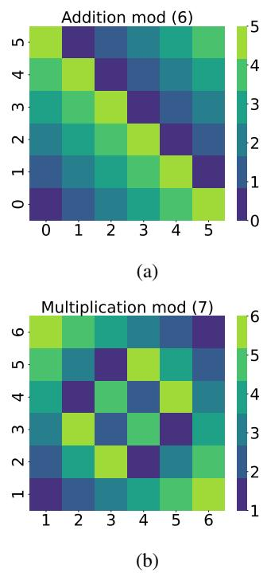  
Figure 1: Heatmaps for (a) additive group (mod 6) and (b) multiplicative group (mod 7). The two groups are isomorphic despite differing appearances.

modular arithmetic dataset studied by [19], where the goal is to uncover relationships between binary   
inputs and produce consistent outputs based on these operations. For instance, given inputs a and   
b, the model is tasked to compute $\mathbf { \bar { \Phi } } ( a + b ) m o d P$ or $( a \times \bar { b } ) m o d P$ , where $P$ is a prime number, and   
both inputs and outputs are constrained within $\{ 0 , 1 , \ldots , P - 1 \}$ (refer to Figure 1).   
This dataset highlights the challenging nature of generalization in grokking: the relationship between   
inputs is defined purely by a deterministic operation, not by a probabilistic distribution. Unlike   
typical machine learning datasets, where examples are drawn from an underlying (often unknown)   
data distribution, algorithmic datasets consist of a finite and complete set of all possible input-output   
combinations. In such cases, there is no statistical "distribution" in the conventional sense; instead, the   
generalization task relies on uncovering the underlying relationship between inputs, which demands a   
model to internalize the algorithm itself. Moreover, any hypothesis consistent with training examples   
can initially seem plausible from a statistical perspective, as no known distribution governs the data.   
The difficulty of generalization thus lies not in interpolating unseen samples but in discovering the   
underlying relation, making it a fundamentally different task.   
We note that there is an equivalence between modular addition and modular multiplication in certain   
settings. Namely, given a prime number $p$ , the groups (in mathematical sense) of modular addition   
$( \{ 0 , \bar { 1 , } . . . , p - \bar { 2 } \} , + )$ (where addition is performed modulo $p - 1 )$ , and of modular multiplication   
$\left( \{ 1 , \ldots , p - 1 \} , * \right)$ (where multiplication is performed modulo $p$ ) are isomorphic. Both groups have   
the same number of elements (which is $p - 1 )$ , and are simple (meaning, there is an element $g$ , called   
generator, such that every other element is of the form $g * \cdots g$ , where $^ *$ is the group operation and   
the number of operations used is less than $p$ . In the first group, any element different from 0 is the   
group generator while in the second group, any element different from 1 is the generator (see Figure   
1).   
The embedding layer strips the input group elements of their numerical meanings, and assigns a   
general, abstract vector to each element. In this way, training on modular addition or multiplication   
presents no difference for MLP (or other architectures) with the embedding layer. In contrast to   
this, the MLP without the embedding layer is able to fit and generalize on modular addition, while it   
completely fails on modular multiplication.

# 3.3 Problem Setup and Motivations

Let $\mathcal { D } = \{ ( x _ { i } , y _ { i } ) \} _ { i = 1 } ^ { N }$ represent an algorithmic dataset, where each $x _ { i }$ is an input token sequence   
(e.g., $a , b$ , operation, $\mathbf { \lambda } = \mathbf { \dot { \lambda } }$ ), and $y _ { i }$ is the output derived from an operation modulo a positive integer $P$   
The task is to learn a mapping $f _ { \theta } : \mathcal { X }  \mathcal { Y }$ parameterized by $\theta$ , capable of generalizing to unseen   
samples from $\mathcal { D } _ { \mathrm { t e s t } }$ .   
To process inputs effectively, we tokenize them as sequences of their digit representations, as the   
model does not inherently interpret numerical values. Each operand $a$ and $b$ is assigned a token in the   
range 0 to $P - 1$ , while the operation and equality symbols are represented by tokens $P$ and $P + 1$   
respectively. For instance, the modular arithmetic expression $( 3 + 2 ) ( { \bmod { 5 } } ) = 0$ is tokenized as   
$[ 3 , 5 , 2 , 6 , 0 ]$ .   
Embedding layers in models provide a dense representation of tokens. However, delayed updates to   
embeddings for infrequent tokens can significantly impact convergence and generalization. Our work   
explores these dynamics, with a focus on the impact of $p _ { i }$ , the $i ^ { \star h }$ -token sampling probability, and   
proposes adjustments to improve convergence. We investigate the use of embeddings in MLPs for   
algorithmic tasks. We started by training a MLP on modular addition and multiplication datasets,   
comparing setups with and without embedding layers.   
MLP Without Embeddings. In this setup, input tokens $( a , b $ , operation $( P )$ , and equality sign   
$( P + 1 ) )$ are encoded directly into a 4-dimensional input vector. The MLP processes these inputs as:

$$
\begin{array} { r } { \pmb { h } _ { 1 } = \sigma ( \mathbf { W } _ { 1 } x + \pmb { b } _ { 1 } ) , \quad \pmb { h } _ { 2 } = \mathbf { W } _ { 2 } \pmb { h } _ { 1 } + \pmb { b } _ { 2 } , } \\ { \pmb { \hat { y } } = \mathrm { S o f t m a x } ( \pmb { h } _ { 2 } ) . \qquad } \end{array}
$$

where $\pmb { x } \in \mathbb { R } ^ { 4 }$ is the encoded input vector (with first and third entry $a$ and $b$ , respectively), $\mathbf { W } _ { 1 } , \mathbf { W } _ { 2 }$   
are weight matrices, $b _ { 1 } , b _ { 2 }$ are biases, $\sigma$ is the ReLU activation function, and $\hat { y }$ represents the   
predicted output.   
This configuration demonstrates that the MLP can fit the addition task with ease, but struggles to   
generalize multiplication. This difficulty arises because multiplication modulo $P$ is not linearly   
separable, as evident in the non-trivial patterns in Figure 1.   
MLP With Embeddings. To overcome the challenges of non-linear separability, we introduced   
an embedding layer. Each token $x$ is mapped to a dense vector $e _ { x }$ through an embedding matrix   
$\mathbf { E } \in \mathbb { R } ^ { V \times d }$ , where $d$ is the embedding dimension. Our input consists of 4 token embeddings of the   
form $\hat { e } = [ e _ { i } , e _ { ^ { \prime } \ast ^ { \prime } } , e _ { k } , e _ { ^ { \prime } = ^ { \prime } } ] ^ { \top }$ , and the modified forward pass is:

$$
\begin{array} { r l } & { \pmb { h } _ { 1 } = \sigma ( \mathbf { W } \hat { e } + b _ { 1 } ) , } \\ & { \pmb { h } _ { 2 } = \mathbf { W } _ { 2 } \pmb { h } _ { 1 } + b _ { 2 } , \quad \pmb { \hat { y } } = \mathrm { S o f t m a x } ( \pmb { h } _ { 2 } ) , } \end{array}
$$

Adding embeddings allows the model to capture more expressive input representations. With this   
setup, we observed that the model generalized well to both addition and multiplication tasks, but with   
a delayed generalization for multiplication. This delay corresponds to the grokking phenomenon,   
which appears as a "trapezoid pattern" in performance plots: a phase of memorization followed by a   
sudden leap in test accuracy, as illustrated in figure 2 .   
These observations motivate a deeper analysis of embedding dynamics during training. In particular,   
we investigated the gradient heatmaps to understand the role of embeddings in delaying generalization.   
By visualizing gradient magnitudes across training epochs, we point out that embeddings receive   
smaller updates compared to other weights of the model, potentially causing grokking. This investi  
gation will help establish a connection between embedding behavior and the observed generalization   
delays.

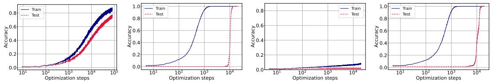  
Figure 2: Training and validation accuracies of the MLP model on modular arithmetic tasks, trained with Adam. Left two: Addition task, without (first) and with (second) embeddings. Right two: Multiplication task, without (third) and with (fourth) embeddings. In the embedding-free cases, training and validation accuracies increase together only for addition; multiplication fails to generalize. In contrast, models with embeddings reach $100 \%$ training accuracy in both tasks, but only begin generalizing after a delay exhibiting the grokking phenomenon.

# 196 4 Main Results

Our methodology investigates the dynamics of embedding layers within MLPs to address challenges   
in generalization, particularly in the context of algorithmic tasks. The key contributions include:   
(1) exploring the novel role of embedding layers attached to MLP architectures, (2) examining the   
impact of embedding sampling probability $p _ { i }$ on training dynamics, and (3) understanding how   
initialization and the coupling of embedding and weight matrices affect learning efficiency. These   
factors contribute to the grokking phenomenon, where generalization is delayed during training.

# 203 4.1 Embedding Dynamics

Let the loss function of the model be $\mathcal { L } ( \boldsymbol { \theta } , \mathbf { E } )$ , where $\theta$ is model parameters other than embedding   
weights. Let $e _ { i , t }$ denote the embedding vector for token $i$ at step $t$ . Under stochastic gradient descent   
(SGD) with weight decay $\lambda$ , the embedding update rule is:

$$
\begin{array} { r } { \pmb { e } _ { i , t + 1 } - \pmb { e } _ { i , t } = - \eta \lambda \pmb { e } _ { i , t } - \eta \nabla _ { \pmb { e } _ { i , t } } \mathcal { L } , } \end{array}
$$

where $\eta$ is the learning rate, and $\nabla _ { \mathbf { e } _ { i } } \mathcal { L }$ is the gradient1. Token embeddings are updated using   
corresponding gradients only when the associated tokens appear in a batch. Assume that token $i$   
being sampled in a batch with a probability $p _ { i }$ . Consequently, taking into account the randomness of   
batch sampling, the expected update can be expressed as:

$$
\mathbb { E } [ e _ { i , t + 1 } - e _ { i , t } ] = - \eta \lambda e _ { i , t } - \eta p _ { i } \nabla _ { e _ { i , t } } \mathcal { L } .
$$

To summarize, the sampling probability $p _ { i }$ directly influences the gradient dynamics of the embedding   
layer. While gradients contribute to tokens only probabilistically, weight decay affects all embeddings   
uniformly, leading to imbalances in parameter updates. This dynamic, visualized in Figure 3,   
highlights the need for a deeper understanding of how $p _ { i }$ affects convergence.   
To analyze the reduction of the loss, we assume that the model’s overall loss function $\mathcal { L } ( \theta , \{ { \bf e } _ { i } \} )$ is   
$\beta$ -smooth. This means it satisfies the following inequality for all updates:

$$
\mathcal { L } ( \theta _ { t + 1 } , \{ e _ { i , t + 1 } \} ) \leq \mathcal { L } ( \theta _ { t } , \{ e _ { i , t } \} ) + \langle \nabla \mathcal { L } , \Delta \rangle + \frac { \beta } { 2 } \| \Delta \| ^ { 2 } .
$$

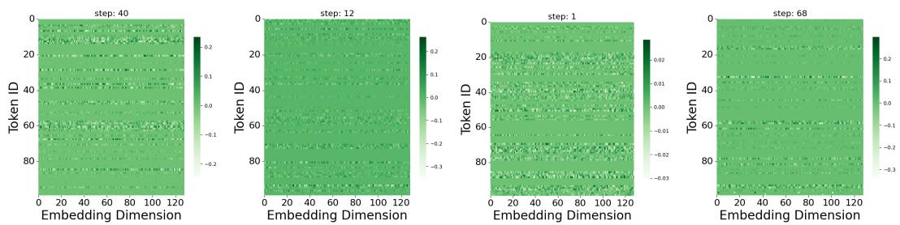  
Figure 3: Gradient heat maps of the MLP model at random optimization steps. Sparse columns in the embedding gradients reflect the absence of certain tokens in sampled batches, leading to uneven learning dynamics and contributing to delayed generalization.

where $\Delta = ( \theta _ { t + 1 } - \theta _ { t } , e _ { i , t + 1 } - e _ { i , t } ) .$

Denote $\mathcal { L } _ { t } : = \mathcal { L } ( \boldsymbol { \theta } _ { t } , \{ \boldsymbol { e } _ { i , t } \} )$ then taking expectations over randomness of batch sampling leads to the   
following expected update:

$$
\begin{array} { r l } & { \mathbb { E } [ \mathcal { L } _ { t + 1 } - \mathcal { L } _ { t } ] \leq \nabla _ { \theta _ { t } } \mathcal { L } ^ { T } ( \theta _ { t + 1 } + \theta _ { t } ) } \\ & { - \displaystyle \sum _ { i = 1 } ^ { V } \nabla _ { e _ { i , t } } \mathcal { L } ^ { T } \mathbb { E } ( e _ { i , t + 1 } - e _ { i , t } ) + \frac { \beta } { 2 } \| \Delta \| ^ { 2 } , } \end{array}
$$

Substituting the embedding update based on equation 4 into the smoothness inequality,

$$
\begin{array} { r l } & { \mathbb { E } [ \mathcal { L } _ { t + 1 } - \mathcal { L } _ { t } ] \leq \nabla _ { \theta _ { t } } \mathcal { L } ^ { T } ( \theta _ { t + 1 } - \theta _ { t } ) } \\ & { \quad - \eta \displaystyle \sum _ { i = 1 } ^ { V } \big ( p _ { i } \| \nabla _ { e _ { i , t } } \mathcal { L } \| ^ { 2 } + \lambda e _ { i , t } ^ { T } \nabla _ { e _ { i , t } } \mathcal { L } \big ) + \frac { \beta } { 2 } \| \Delta \| ^ { 2 } , } \end{array}
$$

and noting from the right hand side of the inequality above, $p _ { i }$ plays important role in reduction of the expected loss. However, the dependence on $p _ { i }$ , is coupled with weight decay, which explains why these two parameters are important to study more deeply to draw a conclusion about grokking.

# 4.2 Dataset Splitting Strategies

To further explore the role of $p _ { i }$ , we investigate how train-test splitting strategies affect its value and, consequently, the grokking process. The train-test split determines the probability of token $i$ appearing in a batch.

We begin by assuming that the weight decay parameter $\lambda$ is zero and that the learning rate $\eta$ is uniform across all parameters. This reduces the optimization problem to focusing on $p _ { i }$ , under the constraints $\begin{array} { r } { \sum _ { i = 1 } ^ { V } p _ { i } = 1 , p _ { i } \ge 0 \forall i } \end{array}$ . Specifically, the optimal $p _ { i }$ can be found by solving for the following:

$$
\operatorname* { m i n } _ { \substack { p _ { i } | p _ { i } \geq 0 , \sum { p _ { i } = 1 } } } - \eta \sum _ { i = 1 } ^ { V } p _ { i } \Vert \nabla _ { e _ { i , t } } \mathcal { L } \Vert ^ { 2 } .
$$

However, solving this exactly is challenging in practice due to the need for estimating all embedding   
gradient norms. Instead, we adopt approximate strategies for splitting the training data, guided by   
234 various assumptions about the gradient structure (see Appendix A for details).

1. Uniform Sampling: Distribute all combinations of $a$ and $b$ evenly across training and test sets.   
. Skewed Sampling: Introduce a bias in the combinations of $a$ that are distributed across training and test sets.   
. Random Sampling: Randomly distribute the examples across training and test sets.

These splits enable us to regulate token sampling probabilities, offering a direct assessment of the   
impact of $p _ { i }$ on embedding convergence and grokking. Furthermore, Section 5.1 provides a detailed   
experiments conducted on two algorithmic datasets.

While the frequency of embedding updates plays a crucial role in training dynamics, as demonstrated in our experiments, it alone cannot fully explain phenomena such as grokking after fitting, its relationship to initialization, weight decay, or the structure of the loss landscape.

Stabilization (or convergence) occurs when the embedding $\mathbf { e } _ { i }$ reaches a steady state where the updates become negligibly small, i.e., when the change in the embedding $\| e _ { i , t + 1 } - e _ { i , t } \|$ is approximately zero. This condition implies that, $( \eta \lambda ) e _ { i , t } \approx \eta p _ { i } \nabla _ { \mathbf { e } _ { i } } \mathcal { L }$ . from equation 4.

For small learning rates $( \eta \ll 1 )$ ), the embedding   
updates behave like a continuous system, and we   
can model this as a differential equation (along   
every dimension):

$$
\frac { d \mathbf { e } _ { i } } { d t } = - \lambda \mathbf { e } _ { i } - p _ { i } \nabla _ { \mathbf { e } _ { i } } \mathcal { L } ,
$$

where $\nabla _ { \mathbf { e } _ { i } } \mathcal { L }$ is the gradient of the loss function   
with respect to the embedding $i$ . Assuming that   
the gradient $\nabla _ { \mathbf { e } _ { i } } \mathcal { L }$ stabilizes to a constant value   
$g$ , the solution to this equation is:

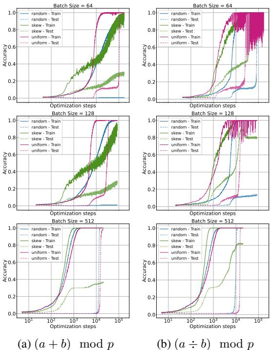  
Figure 4: Sampling strategy comparison for two modular tasks—addition and division—across all batch sizes. Uniform sampling generalizes faster; skewed sampling fails to generalize due to token imbalance.

$$
\mathbf { e } _ { i } ( t ) = C e ^ { - \lambda t } - \frac { \eta p g } { \lambda } ,
$$

where $C$ is an integration constant determined   
by the initial conditions. As time $t$ increases,   
the embedding ${ \bf e } _ { i } ( t )$ converges to the equilib  
rium value $\begin{array} { r } { { \bf e } _ { i } ( t )  - \frac { \eta p g } { \lambda } } \end{array}$ . Thus, convergence   
is achieved when ${ \bf e } _ { i } ( t )$ stabilizes around this   
equilibrium point. The time $T$ to reach convergence is bounded as $\begin{array} { r } { T \geq \frac { 1 } { \lambda } \ln \left( \frac { C } { \epsilon } \right) } \end{array}$ , where $\epsilon$ is a small   
threshold. In summary, convergence time is governed by the embedding gradient $g$ , the weight decay   
$\lambda$ , and the initialization magnitude $C$ : stronger gradients and larger $\lambda$ accelerate convergence, while   
larger initial values $C$ slow it down.   
In bilinear models such as MLPs and Transformers, embedding gradients are tightly coupled with   
those of downstream weights (e.g., W), forming a feedback loop: poor updates to $\mathbf { E }$ degrade $\mathbf { W }$ ,   
and vice versa. To study the role of initialization in this dynamic, we tested two setups: frozen   
embeddings, which led to slow convergence due to limited representational flexibility; and small   
initial embeddings, which improved convergence by allowing stronger early gradients—an effect also   
278 observed in prior work [26, 12], though without analyzing embedding-weight coupling.

Motivated by these observations, we propose the Adam-LR Optimizer, which adjusts the embedding learning rate to balance update magnitudes between $\mathbf { E }$ and $\mathbf { W }$ . This coupling-aware scaling is formalized below:

2 Proposition 4.1. Let E and W be the embedding matrix and first-layer weights. To equalize update   
scales under cross-entropy loss, the learning rate ratio $\begin{array} { r } { c = \frac { \eta _ { E } } { \eta _ { W } } } \end{array}$ ηE should satisfy:

$$
c \propto \frac { \sigma _ { \mathrm { m a x } } ( \mathbf { E } ) } { \sigma _ { \mathrm { m a x } } ( \mathbf { W } ) } \cdot \frac { f _ { W } } { f _ { E } } ,
$$

where $\sigma _ { \mathrm { m a x } } ( \cdot )$ denotes the largest singular value and $f _ { E } , f _ { W }$ are the respective update frequen  
cies,(see appendix $B$ for details).

In practice, we set $c = 1 0$ , guided by empirical singular value trends and supported by sensitivity analysis (see Fig. 7, $\ S 5 . 2 )$ . This adjustment improves convergence and stability, especially under sparse embedding updates common in skewed token distributions.

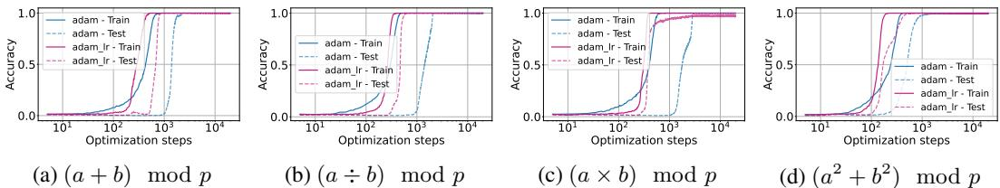  
Figure 5: Performance comparison of Adam-LR and Adam optimizers on four algorithmic datasets. Adam-LR scales the embedding learning rate based on the singular values of the embedding matrix. This adaptive adjustment accelerates convergence and enhances generalization across all datasets. The results demonstrate that Adam-LR significantly speeds up the grokking process compared to the standard Adam optimizer under identical training settings ( $l r = 0 . 0 1$ , batch size $= 5 1 2$ ).

# 289 5 Experiments and Discussions

We begin our exploration with a MLP model. The architecture consists of two layers, where the hidden dimension of the first layer is set to four times the embedding dimension (where four is the sequence length), and embedding dimension is set to 128, as per prior work on grokking. The second layer has a dimension of $P = 9 7$ . The activation function used throughout is ReLU, and optimization is performed using the Adam optimizer with a weight decay of 0.001.

# 5.1 The Effect of Embedding Probability

The first set of experiments investigates various strategies for splitting the training and testing datasets. Specifically, we explore three approaches, namely; uniform sampling, skewed sampling, and random sampling.

The expression $( a + b )$ mod $p$ represents the sum of $a$ and $b$ modulo $p$ . For our experiments, we randomly set aside $20 \%$ of the data as a test set, ensuring that evaluation is performed on unseen samples. From the remaining data, $3 0 / 8 0 \%$ (i.e. $30 \%$ from total set) is sampled as the training set according to each sampling strategy.

Figure 4 compare the performance of the sampling methods (random, uniform, skew) across different splits of the dataset (see appendix D.1 for further datasets and settings). Each represents a specific datasets, while the rows compare batch sizes, and columns compare datasets. The $\mathbf { X }$ -axis is logarithmic to emphasize the convergence trends.

Uniform sampling generally promotes faster generalization and convergence compared to random sampling. However, its benefits diminish at larger batch sizes (e.g., beyond 512), where random sampling becomes nearly as effective due to broader token coverage. Crucially, our results show that skewed sampling—despite fitting the training data and preserving the overall train-test ratio—consistently leads to suboptimal generalization. This suggests that models can converge to lower subaccuracy plateaus when token probabilities are heavily imbalanced. Importantly, even uniform sampling does not guarantee optimality: unless the batch size is sufficiently large, some tokens may be consistently omitted from updates. These findings underscore that token probability, both in expectation and in per-batch coverage, plays a central role in embedding dynamics and grokking behavior.

# 5.2 Comparison of Optimizers

To evaluate the effectiveness of our proposed optimizer, Adam-LR, which incorporates a simple yet effective strategy for treating the embedding layer differently to avoid stagnation or saddle points, we conducted experiments on four datasets. The results are shown in Figure 5, where we compare the performance of the two optimizers, Adam-LR and the standard Adam optimizer, under identical training settings $l r = 0 . 0 1$ , batch size $= 5 1 2$ ).

Using our proposed optimizer, Adam-LR, which scales the embedding learning rate by a factor of 10,   
the results demonstrate a significant acceleration in the grokking process compared to the baseline   
325 Adam optimizer across all datasets.

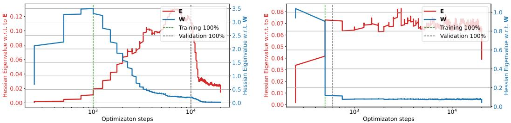  
Figure 6: Maximum eigenvalues of the Hessian with respect to embedding weights $\mathbf { \epsilon } ( \mathbf { E } )$ and downstream weights (W) during training. The left plot corresponds to the Adam optimizer, while the right plot uses Adam_lr optimizer (ours). With Adam (left), the eigenvalues for $\mathbf { E }$ are significantly smaller than those for W, reflecting differences in dimensionality and update frequency. In contrast, with Adam_lr (right), the eigenvalues of W are notably reduced and become closer to those of $\mathbf { E }$ , suggesting a more balanced optimization dynamic. Training accuracy reaches $100 \%$ when the eigenvalues of W begin to decrease, while validation accuracy improves as the eigenvalues of $\mathbf { E }$ decrease. This suggests that W drives early optimization progress, while $\mathbf { E }$ fine-tunes generalization. The Adam_lr optimizer (ours) appears to regularize W, leading to a more stable training process.

# 326 5.3 Analysis of singular values of embedding layer

Prior work attributes Adam’s superiority over SGD in Transformers to factors like gradient noise, descent direction, and Hessian block heterogeneity [25, 10, 18, 26]. However, these studies largely overlook the role of embeddings and their bilinear interactions. Our analysis supports the view that such bilinear structure, especially in embeddings, contributes significantly to the observed curvature differences (see appendix C.1 for more discussion).

32 To analyze the curvature of the loss landscape, we compute the maximum eigenvalue   
333 of the Hessian matrix using the power method with Hessian-vector products (HVPs).   
34 Figure 6 shows the maximum eigenvalues of   
the Hessian with respect to $\mathbf { E }$ and W during   
training. The results highlight distinct curvature   
properties for $\mathbf { E }$ and $\mathbf { W }$ , reflecting their roles in   
the bilinear interaction.

# 339 6 Discussions

In this study, we explored the interplay between   
embedding layers and downstream weights in   
neural networks, highlighting how their bilin  
ear coupling influences optimization and drives   
the grokking phenomenon. We demonstrated   
that embedding layers play a central role in de  
layed generalization and introduced the Adam  
LR optimizer to address the imbalance in update   
dynamics, scaling the embedding learning rate   
based on singular values and update frequencies.   
A key limitation of this work is its focus on   
MLPs, which provide a simplified setting for   
analyzing embedding-weight coupling. While   
this enables controlled analysis, it leaves open   
how these insights transfer to more complex ar  
chitectures such as Transformers, where similar   
bilinear interactions appear in attention mechanisms but with added structural complexity. Extending   
our framework to the Transformer setting is a promising direction for future work.

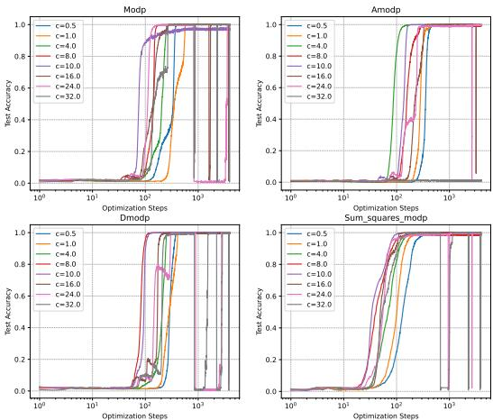  
Figure 7: Sensitivity of test accuracy to the learning rate ratio $c = \eta _ { E } / \eta _ { W }$ across four tasks. Small $c$ leads to under-updating, large $c$ causes instability, and $c = 1 0$ consistently balances convergence and stability.

References   
[1] X. Davies, L. Langosco, and D. Krueger. Unifying grokking and double descent. arXiv preprint arXiv:2303.06173, 2023.   
[2] D. Doshi, T. He, A. Das, and A. Gromov. Grokking modular polynomials. arXiv preprint arXiv:2406.03495, 2024.   
[3] S. Fan, R. Pascanu, and M. Jaggi. Deep grokking: Would deep neural networks generalize better? arXiv preprint arXiv:2405.19454, 2024. [4] A. Gromov. Grokking modular arithmetic. arXiv preprint arXiv:2301.02679, 2023.   
[5] X. S. Huang, F. Perez, J. Ba, and M. Volkovs. Improving transformer optimization through better initialization. In International Conference on Machine Learning, pages 4475–4483. PMLR, 2020.   
[6] A. I. Humayun, R. Balestriero, and R. Baraniuk. Deep networks always grok and here is why. arXiv preprint arXiv:2402.15555, 2024.   
[7] A. Jeffares, A. Curth, and M. van der Schaar. Deep learning through a telescoping lens: A simple model provides empirical insights on grokking, gradient boosting & beyond. Advances in Neural Information Processing Systems, 37:123498–123533, 2024.   
[8] S. Kobayashi, Y. Akram, and J. Von Oswald. Weight decay induces low-rank attention layers. Advances in Neural Information Processing Systems, 37:4481–4510, 2024.   
[9] T. Kumar. Grokking as the transition from lazy to rich training dynamics. PhD thesis, none, 2024.   
[10] F. Kunstner, J. Chen, J. W. Lavington, and M. Schmidt. Noise is not the main factor behind the gap between sgd and adam on transformers, but sign descent might be. arXiv preprint arXiv:2304.13960, 2023.   
[11] J. Lee, B. G. Kang, K. Kim, and K. M. Lee. Grokfast: Accelerated grokking by amplifying slow gradients. arXiv preprint arXiv:2405.20233, 2024.   
[12] Z. Liu, O. Kitouni, N. S. Nolte, E. Michaud, M. Tegmark, and M. Williams. Towards understanding grokking: An effective theory of representation learning. Advances in Neural Information Processing Systems, 35:34651–34663, 2022.   
[13] Z. Liu, E. J. Michaud, and M. Tegmark. Omnigrok: Grokking beyond algorithmic data. In The Eleventh International Conference on Learning Representations, 2022.   
[14] K. Lyu, J. Jin, Z. Li, S. S. Du, J. D. Lee, and W. Hu. Dichotomy of early and late phase implicit biases can provably induce grokking. arXiv preprint arXiv:2311.18817, 2023.   
[15] M. A. Mohamadi, Z. Li, L. Wu, and D. J. Sutherland. Why do you grok? a theoretical analysis of grokking modular addition. arXiv preprint arXiv:2407.12332, 2024.   
[16] P. Nakkiran, G. Kaplun, Y. Bansal, T. Yang, B. Barak, and I. Sutskever. Deep double descent: Where bigger models and more data hurt. Journal of Statistical Mechanics: Theory and Experiment, 2021(12):124003, 2021.   
[17] N. Nanda, L. Chan, T. Lieberum, J. Smith, and J. Steinhardt. Progress measures for grokking via mechanistic interpretability. arXiv preprint arXiv:2301.05217, 2023.   
[18] Y. Pan and Y. Li. Toward understanding why adam converges faster than sgd for transformers. arXiv preprint arXiv:2306.00204, 2023.   
[19] A. Power, Y. Burda, H. Edwards, I. Babuschkin, and V. Misra. Grokking: Generalization beyond overfitting on small algorithmic datasets. arXiv preprint arXiv:2201.02177, 2022.   
[20] L. Prieto, M. Barsbey, P. A. Mediano, and T. Birdal. Grokking at the edge of numerical stability. arXiv preprint arXiv:2501.04697, 2025.

[21] V. Varma, R. Shah, Z. Kenton, J. Kramár, and R. Kumar. Explaining grokking through circuit   
efficiency. arXiv preprint arXiv:2309.02390, 2023.   
[22] A. Vaswani. Attention is all you need. Advances in Neural Information Processing Systems,   
2017.   
[23] Z. Xu, Z. Ni, Y. Wang, and W. Hu. Let me grok for you: Accelerating grokking via embedding   
transfer from a weaker model. arXiv preprint arXiv:2504.13292, 2025.   
[24] G. Yang and E. J. Hu. Tensor programs iv: Feature learning in infinite-width neural networks. In   
M. Meila and T. Zhang, editors, Proceedings of the 38th International Conference on Machine   
Learning, volume 139 of Proceedings of Machine Learning Research, pages 11727–11737.   
PMLR, 18–24 Jul 2021.   
[25] J. Zhang, S. P. Karimireddy, A. Veit, S. Kim, S. Reddi, S. Kumar, and S. Sra. Why are adaptive   
methods good for attention models? Advances in Neural Information Processing Systems,   
33:15383–15393, 2020.   
[26] Y. Zhang, C. Chen, T. Ding, Z. Li, R. Sun, and Z.-Q. Luo. Why transformers need adam: A   
hessian perspective. arXiv preprint arXiv:2402.16788, 2024.

# A Optimizing for Sampling Porbability

# Uniform Importance Assumption

If we assume that all gradients are equally important, i.e., $\| \nabla _ { \mathbf { E } _ { i , t } } \mathcal { L } \| ^ { 2 }$ is uniform across all embeddings:

$$
\| \nabla _ { \mathbf { E } _ { i , t } } \mathcal { L } \| ^ { 2 } = c , \quad \forall i ,
$$

where $c$ is a constant.

In this case, the optimization of 24 $\begin{array} { r } { - \sum _ { i = 1 } ^ { V } p _ { i } \| \nabla _ { \mathbf { E } _ { i , t } } \mathcal { L } \| ^ { 2 } } \end{array}$ becomes independent of $p _ { i }$ . To satisfy the normalization constraint 25 $\begin{array} { r } { \sum _ { i = 1 } ^ { V } p _ { i } = 1 } \end{array}$ , the optimal solution is:

$$
p _ { i } = \frac { 1 } { V } , \quad \forall i .
$$

This corresponds to a uniform distribution, where all embeddings are treated equally (see Figure   
8). While computationally efficient, this approach may lead to suboptimal convergence if some   
embeddings contribute disproportionately to the loss reduction.

# 29 Gradient Norm Bounded by $L _ { i }$

Now, let us assume that the gradient norm for each embedding is bounded,

$$
\| \nabla _ { \mathbf { E } _ { i , t } } \mathcal { L } \| \leq L _ { i } , \quad \forall i ,
$$

where 431 $L _ { i }$ is a known upper bound for embedding $i$ . Using this bound, we approximate,

$$
- \sum _ { i = 1 } ^ { V } p _ { i } \| \nabla _ { \mathbf { E } _ { i , t } } \mathcal { L } \| ^ { 2 } \geq - \sum _ { i = 1 } ^ { V } p _ { i } L _ { i } ^ { 2 } .
$$

To maximize 432 $\textstyle \sum _ { i = 1 } ^ { V } p _ { i } L _ { i } ^ { 2 }$ subject to the constraint $\begin{array} { r } { \sum _ { i = 1 } ^ { V } p _ { i } = 1 } \end{array}$ , we note that the objective function . Therefore, the maximum is attained at a vertex of the probability simplex, meaning the 434 optimal solution is:

$$
p _ { k } = 1 , \quad \mathrm { w h e r e } \quad k = \arg \operatorname* { m a x } _ { i } L _ { i } ^ { 2 } , \quad \mathrm { a n d } \quad p _ { i } = 0 , \quad \forall i \neq k .
$$

This result indicates that the optimal probability distribution assigns all weight to the embedding with   
the highest gradient bound, ignoring all others. Therefore, to obtain a smooth probability distribution,   
we introduce an entropy regularization term as follow,

$$
H ( \mathbf { p } ) = - \sum _ { i = 1 } ^ { V } p _ { i } \log p _ { i } .
$$

We now optimize the modified objective,

$$
\sum _ { i = 1 } ^ { V } p _ { i } L _ { i } ^ { 2 } + \gamma H ( { \bf p } ) ,
$$

subject to the constraint 439 $\begin{array} { r } { \sum _ { i = 1 } ^ { V } p _ { i } = 1 } \end{array}$ , where $\gamma > 0$ controls the strength of the regularization.

The corresponding Lagrangian is as follow,

$$
\mathcal { L } _ { p } = \sum _ { i = 1 } ^ { V } p _ { i } L _ { i } ^ { 2 } + \gamma \left( - \sum _ { i = 1 } ^ { V } p _ { i } \log p _ { i } \right) + \mu \left( \sum _ { i = 1 } ^ { V } p _ { i } - 1 \right) .
$$

Taking the derivative with respect to $p _ { i }$ and setting it to zero, we get,

$$
L _ { i } ^ { 2 } - \gamma ( 1 + \log p _ { i } ) + \mu = 0 .
$$

Solving for $p _ { i }$ gives:

$$
\log p _ { i } = \frac { L _ { i } ^ { 2 } + \mu - \gamma } { \gamma } \quad \Longrightarrow \quad p _ { i } = \exp \left( \frac { L _ { i } ^ { 2 } + \mu - \gamma } { \gamma } \right) .
$$

Applying the constraint 443 $\begin{array} { r } { \sum _ { i = 1 } ^ { V } p _ { i } = 1 } \end{array}$ , would results in the following solution,

$$
p _ { i } ^ { * } = \frac { \exp { \left( L _ { i } ^ { 2 } / \gamma \right) } } { \sum _ { j = 1 } ^ { V } \exp { \left( L _ { j } ^ { 2 } / \gamma \right) } } .
$$

444 This result smoothly distributes probabilities based on the gradient bounds, assigning higher probability to embeddings with larger 445 $\bar { L _ { i } ^ { 2 } }$ while ensuring a non-degenerate distribution.

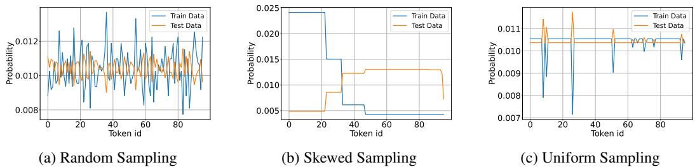  
Figure 8: Token probabilities in the training and test sets under different sampling strategies. Imbalanced sampling leads to uneven token occurrences in mini-batches, causing some tokens to be absent in multiple updates while others appear frequently. This results in highly variable gradient updates, where frequently seen tokens converge faster, while rare tokens stagnate due to sparse updates, affecting overall model generalization.

# 46 B Dynamics of Updates in Bilinear Systems with Initialization Effects

We analyze the interaction between embeddings $\mathbf { E } \in \mathbb { R } ^ { p \times d }$ and weight matrix $\mathbf { W } \in \mathbb { R } ^ { 4 d \times d }$ in a bilinear term:

$$
z ( \mathbf { E W } ) ,
$$

49 where $z$ is an activation function applied elementwise. The gradients of $\mathbf { E }$ and $\mathbf { W }$ are given as:

$$
\nabla _ { \mathbf { E } } \propto \mathbf { W } ^ { \top } \nabla _ { \mathrm { l o s s } } , \quad \nabla _ { \mathbf { W } } \propto \mathbf { E } ^ { \top } \nabla _ { \mathrm { l o s s } } .
$$

The gradient norms are influenced by the dominant singular values of $\mathbf { W }$ and $\mathbf { E }$ . Specifically:

$$
\lVert \nabla _ { \mathbf { E } } \rVert \propto \sigma _ { \operatorname* { m a x } } ( \mathbf { W } ) , \quad \lVert \nabla _ { \mathbf { W } } \rVert \propto \sigma _ { \operatorname* { m a x } } ( \mathbf { E } ) .
$$

At initialization, $\mathbf { E }$ and $\mathbf { W }$ are often drawn from distributions with variances that depend on their   
dimensions (e.g., PyTorch initializes weights with ${ \mathcal { N } } ( 0 , { \sqrt { 2 / d } } )$ scaling). This initialization typically   
ensures $\sigma _ { \mathrm { m a x } } ( \mathbf { E } ) \gg \sigma _ { \mathrm { m a x } } ( \mathbf { W } )$ , as $\mathbf { W }$ is higher-dimensional, amplifying the difference in gradient   
magnitudes.   
The embedding matrix $\mathbf { E }$ is updated less frequently than $\mathbf { W }$ because not all tokens appear in every   
batch. Let $f _ { E }$ and $f _ { W }$ represent the update frequencies of $\mathbf { E }$ and $\mathbf { W }$ , respectively. Typically,   
$f _ { W } > f _ { E }$ , exacerbating the update disparity.   
To balance the effective updates of $\mathbf { E }$ and $\mathbf { W }$ , the learning rates $\eta _ { E }$ and $\eta _ { W }$ must be scaled to account   
for both their singular values and update frequencies. The effective update ratio is:

$$
\frac { \| \Delta \mathbf { E } \| } { \| \Delta \mathbf { W } \| } \propto \frac { \eta _ { E } \cdot \sigma _ { \operatorname* { m a x } } ( \mathbf { W } ) \cdot f _ { E } } { \eta _ { W } \cdot \sigma _ { \operatorname* { m a x } } ( \mathbf { E } ) \cdot f _ { W } } .
$$

For proportional updates 460 $( \| \Delta \mathbf { E } \| \sim \| \Delta \mathbf { W } \| )$ , the ratio $\begin{array} { r } { c = \frac { \eta _ { E } } { \eta _ { W } } } \end{array}$ must satisfy:

$$
c \propto \frac { \sigma _ { \mathrm { m a x } } ( \mathbf { E } ) } { \sigma _ { \mathrm { m a x } } ( \mathbf { W } ) } \cdot \frac { f _ { W } } { f _ { E } } .
$$

The term $\frac { \sigma _ { \mathrm { m a x } } ( \mathbf { E } ) } { \sigma _ { \mathrm { m a x } } ( \mathbf { W } ) }$ reflects the imbalance in singular values due to initialization and structural   
properties. The term $\scriptstyle { \frac { f _ { W } } { f _ { E } } }$ accounts for the frequency imbalance in updates between $\mathbf { E }$ and $\mathbf { W }$ , driven   
by sparse token appearances in batches.

PyTorch initialization, which scales weights by $\mathcal { O } ( \sqrt { 2 / d } )$ , ensures that $\sigma _ { \mathrm { m a x } } ( \mathbf { W } )$ and $\sigma _ { \mathrm { m a x } } ( \mathbf { E } )$ are initially proportional to the dimensions $d$ . This contributes to the observed imbalance in their singular values at the start of training.

# 7 C More experiments

# C.1 Analysis of singular values of embedding layer

Previous studies (e.g., [25], [10], [18], [26]) have explored the gap between SGD and Adam in   
optimizing Transformer models, but the specific role of embeddings and their bilinearity with down  
stream weights remains underexplored. For example, [25] attributes SGD’s suboptimal performance   
to the heavy-tailed distribution of stochastic gradient noise. This observation aligns with our findings   
regarding the randomness in embedding updates for low- $p$ tokens.   
On the other hand, [10] argues that gradient noise alone cannot explain Adam’s superiority. Their   
experiments demonstrate that, even with full-batch training to eliminate stochastic noise, SGD   
underperforms compared to Adam. They suggest that the sign of the gradient might be a more reliable   
descent direction than its magnitude, and since Adam optimally balances both, it outperforms SGD,   
478 particularly in small-batch settings.

Furthermore, [26] provides a novel explanation for Adam’s advantage over SGD in Transformers by analyzing the blockwise Hessian spectrum, introducing the concept of “block heterogeneity.” This refers to significant variations in the Hessian spectra across parameter blocks, a phenomenon observed in Transformers but not in CNNs. However, the underlying source of this heterogeneity is not explicitly discussed. We hypothesize that this stems from the bilinear nature of weights, particularly in the embedding and attention mechanisms. To support this hypothesis, we analyze the Hessian of embedding weights compared to other weight below.

To analyze the curvature of the loss landscape, we compute the maximum eigenvalue of the Hessian matrix using the power method with Hessian-vector products (HVPs). This approach avoids explicitly constructing the Hessian, making it computationally efficient for large-scale systems.

89 The power method iteratively approximates the maximum eigenvalue of the Hessian $\mathbf { H }$ as follows:

1. Initialize a random vector $\mathbf { v } _ { 0 }$ with the same dimensionality as the parameters $[ \mathbf { E } , \mathbf { W } ]$ .

. Compute the Hessian-vector product $\mathbf { H } \mathbf { v } _ { k }$ using automatic differentiation:

$$
\mathbf { H } \mathbf { v } _ { k } = \nabla _ { \pmb { \theta } } \left( \nabla _ { \pmb { \theta } } \mathcal { L } \cdot \mathbf { v } _ { k } \right) ,
$$

where $\pmb { \theta } = [ \mathbf { E } , \mathbf { W } ]$ .

. Normalize the vector and update the eigenvalue estimate:

$$
\mathbf { v } _ { k + 1 } = { \frac { \mathbf { H } \mathbf { v } _ { k } } { \left\| \mathbf { H } \mathbf { v } _ { k } \right\| } } , \quad \sigma _ { \operatorname* { m a x } } \approx { \mathbf { v } _ { k } ^ { \top } } \mathbf { H } \mathbf { v } _ { k } .
$$

Figure 9 shows the maximum eigenvalues of the Hessian with respect to $\mathbf { E }$ and $\mathbf { W }$ during training.   
The results highlight distinct curvature properties for $\mathbf { E }$ and $\mathbf { W }$ , reflecting their roles in the bilinear   
96 interaction.

Extending these insights to attention mechanisms highlights further challenges in bilinear optimization and demonstrates how adaptive learning rates (e.g., Adam) help escape saddle points. This suggests a deeper connection between the bilinearity of weight interactions and the optimization challenges unique to Transformer models.

# C.2 Rank Evolution and Implicit Regularization

02 Recent work has shown that weight decay in bilinear models (e.g., $\mathbf { Z } = \mathbf { E } \mathbf { W }$ ) implicitly regularizes   
the nuclear norm of the product matrix, promoting low-rank solutions and improved generalization

  
Figure 9: Maximum eigenvalues of the Hessian with respect to embedding weights $\mathbf { \epsilon } ( \mathbf { E } )$ and downstream weights (W) during training. The left plot corresponds to the Adam optimizer, while the right plot uses Adam_lr optimizer (ours). With Adam (left), the eigenvalues for $\mathbf { E }$ are significantly smaller than those for W, reflecting differences in dimensionality and update frequency. In contrast, with Adam_lr (right), the eigenvalues of W are notably reduced and become closer to those of $\mathbf { E }$ , suggesting a more balanced optimization dynamic. Training accuracy reaches $100 \%$ when the eigenvalues of W begin to decrease, while validation accuracy improves as the eigenvalues of $\mathbf { E }$ decrease. This suggests that W drives early optimization progress, while $\mathbf { E }$ fine-tunes generalization. The Adam_lr optimizer (ours) appears to regularize W, leading to a more stable training process.

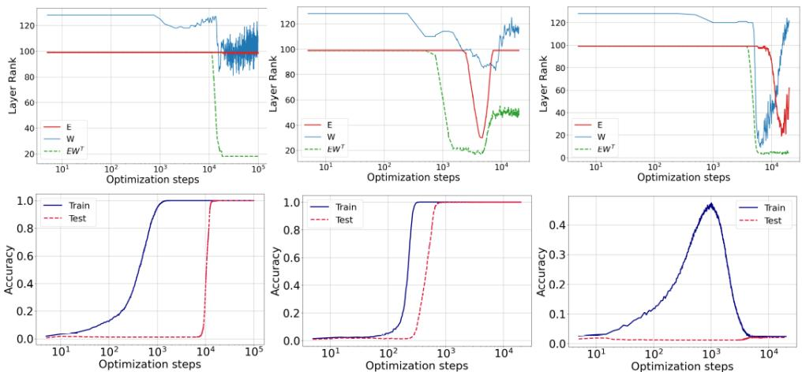  
Figure 10: Rank evolution during training for three optimization setups: Adam $\mathrm { \Gamma } \left( \mathrm { \ w d } { = } 0 . 0 0 1 \right)$ ), AdamLR $\mathrm { \Delta w d { = } 0 . 0 0 1 }$ with learning rate ratio), and Adam with stronger weight decay $\mathrm { \ w d } { = } 0 . 0 0 5 )$ . While all runs show decreasing rank(EW), only Adam-LR continues to adjust rank after generalization. This suggests that rank behavior alone does not fully explain grokking, and supports the need to analyze embedding-weight coupling dynamics.

[8]. This complements our focus on embedding dynamics, as both highlight the impact of bilinear coupling on optimization.

To explore this in our setup, we track the rank evolution of E, W, and the product EW. As shown in   
Figure 10, W exhibits three distinct phases: an early drop during training loss reduction, a plateau,   
and a final decline aligned with grokking. In contrast, $\mathbf { E }$ ’s rank remains largely stable throughout.   
Figure 10 compares three optimization setups: Adam (with weight decay 0.001), Adam-LR (our   
proposed variant with a learning rate ratio), and Adam with stronger weight decay (0.005). All   
configurations lead to a reduction in rank(EW), consistent with implicit nuclear norm regularization.   
However, only Adam-LR shows continued rank changes after generalization, suggesting that rank   
evolution alone does not capture the onset of grokking.   
These findings reinforce that implicit regularization in bilinear systems depends not just on decay   
strength, but also on the interplay between initialization, update frequency, and curvature.

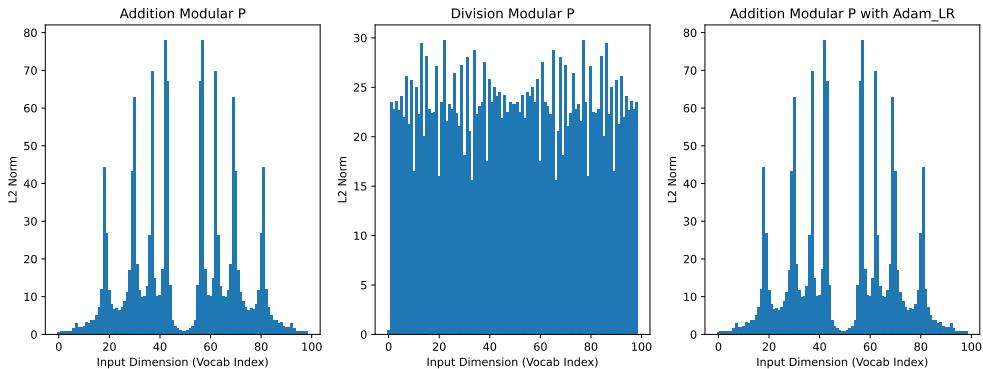  
Figure 11: Discrete Fourier analysis of learned embedding representations across tasks. For each embedding matrix, we compute the DFT across the input dimension and the $\ell _ { 2 }$ -norm across the embedding dimension. Peaks indicate frequency localization that naturally aligns with the periodic structure of the task (e.g., modular addition), while tasks like modular division show more diffuse spectra.

# 516 D Fourier Analysis of Embedding Representations

Fourier features offer a structured way to encode modular arithmetic directly into the input space. By   
encoding periodicity into the representation, such features can bypass the need for learned embeddings   
and mitigate challenges like sparse updates for rare tokens. However, this approach requires prior   
knowledge of the task’s structure—e.g., periodicity—which may not apply in more complex tasks   
such as modular division or nonlinear compositions.   
To investigate whether embedding layers naturally learn such structure, we analyze their frequency   
characteristics. Following the approach in [12], we apply the Discrete Fourier Transform (DFT)   
along the input dimension of the embedding matrix and compute the $\ell _ { 2 }$ -norm across the embedding   
dimension. We then plot the first $P / 2$ components, leveraging the symmetry of the DFT.   
The results for different tasks are shown in Figure 11. Clear frequency peaks indicate that the model   
internally captures task-specific periodic structure. Notably, such structure emerges even without   
explicit Fourier features, especially for modular addition and multiplication. However, in more   
complex tasks, such as modular division, this frequency localization diminishes—suggesting the   
limits of periodic encoding and the growing need for learned representations.

# 531 D.1 Additional Datasets and Learning Rate Sensitivity

In addition to modular addition and division, we evaluate our methods on two further tasks: modular   
multiplication $( a \div b )$ mod $p$ and sum of squares $( a ^ { 2 } + b ^ { 2 } )$ mod $p$ . These tasks share the same   
architecture and tokenization as described in Section 5.

We emphasize that our experimental design is not centered on hyperparameter optimization. While aggressive tuning of learning rates and batch sizes can suppress or delay grokking, our goal is to study it where it naturally occurs. To that end, we identify configurations where grokking persists and focus our analysis there. This approach aligns with prior work on mechanistic understanding of grokking [9, 14], which likewise prioritize clarity of dynamics over benchmark performance. For illustration, Figures 13 and 14 show learning rate sensitivity on four datasets, confirming the robustness of our findings across reasonable settings (skewed distribution of embedding update delay the generalization).

# 543 Compute Resources

All experiments were conducted using an NVIDIA A6000 GPU. Training runs were performed   
using PyTorch, with each configuration fitting comfortably within the GPU’s 48 GB memory. No   
546 distributed training or multi-GPU setups were used.

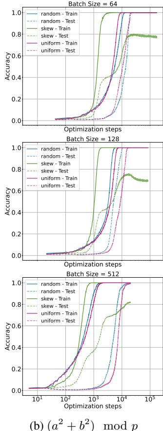

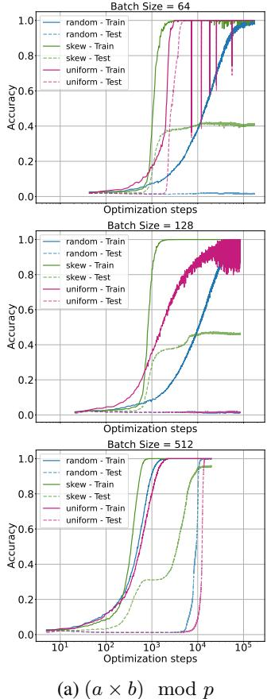  
Figure 12: Sampling strategy comparison for multiplication and sum-of-squares tasks $( l r = 0 . 0 0 1 )$ ). Larger batch sizes narrow the performance gap, but skewed sampling still harms generalization.

# 547 NeurIPS Paper Checklist

48 The checklist is designed to encourage best practices for responsible machine learning research,   
addressing issues of reproducibility, transparency, research ethics, and societal impact. Do not remove   
the checklist: The papers not including the checklist will be desk rejected. The checklist should   
follow the references and follow the (optional) supplemental material. The checklist does NOT count   
552 towards the page limit.   
3 Please read the checklist guidelines carefully for information on how to answer these questions. For   
each question in the checklist:

• You should answer [Yes] , [No] , or [NA] .   
• [NA] means either that the question is Not Applicable for that particular paper or the relevant information is Not Available.   
• Please provide a short (1–2 sentence) justification right after your answer (even for NA).

The checklist answers are an integral part of your paper submission. They are visible to the reviewers, area chairs, senior area chairs, and ethics reviewers. You will be asked to also include it (after eventual revisions) with the final version of your paper, and its final version will be published with the paper.

The reviewers of your paper will be asked to use the checklist as one of the factors in their evaluation. While "[Yes] " is generally preferable to "[No] ", it is perfectly acceptable to answer "[No] " provided a proper justification is given (e.g., "error bars are not reported because it would be too computationally expensive" or "we were unable to find the license for the dataset we used"). In general, answering "[No] " or "[NA] " is not grounds for rejection. While the questions are phrased in a binary way, we

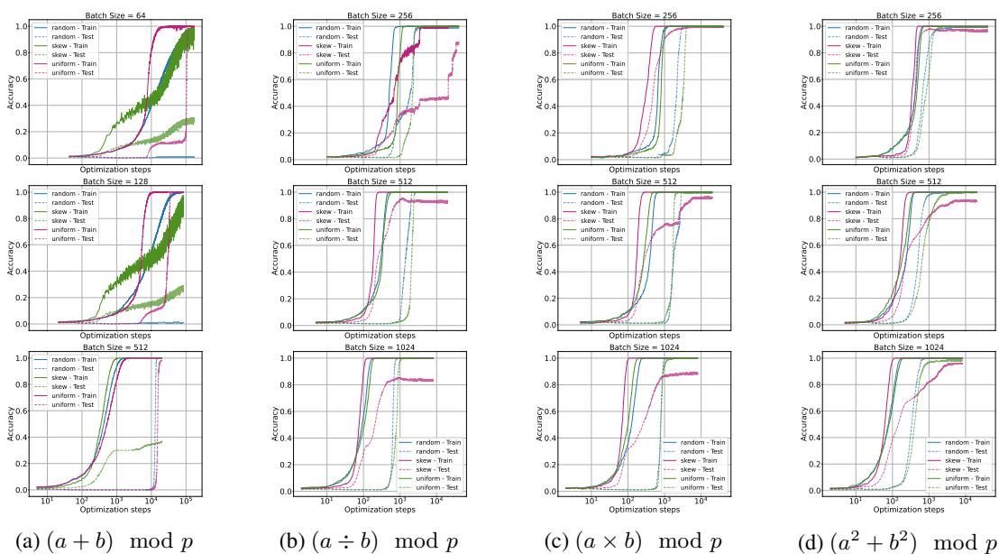  
Figure 13: Training and validation accuracies for the modular multiplication dataset for learning rate 0.01 across batch sizes (256, 512, 1024).

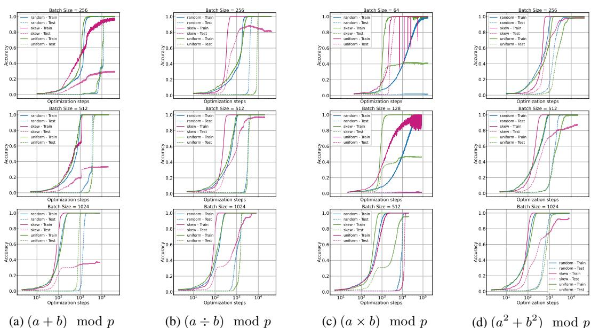  
Figure 14: Training and validation accuracies for the modular multiplication dataset for learning rate 0.005 across batch sizes (256, 512, 1024).

acknowledge that the true answer is often more nuanced, so please just use your best judgment and   
write a justification to elaborate. All supporting evidence can appear either in the main paper or the   
supplemental material, provided in appendix. If you answer [Yes] to a question, in the justification   
please point to the section(s) where related material for the question can be found.

# 572 IMPORTANT, please:

• Delete this instruction block, but keep the section heading “NeurIPS Paper Checklist", • Keep the checklist subsection headings, questions/answers and guidelines below. • Do not modify the questions and only use the provided macros for your answers.

# 1. Claims

Question: Do the main claims made in the abstract and introduction accurately reflect the paper’s contributions and scope?

Answer: [Yes]

Justification: Yes, the main claim made in the abstract and introduction are reflected in the paper Sections 3,4 and 5.

Guidelines:

• The answer NA means that the abstract and introduction do not include the claims made in the paper.   
• The abstract and/or introduction should clearly state the claims made, including the contributions made in the paper and important assumptions and limitations. A No or NA answer to this question will not be perceived well by the reviewers.   
• The claims made should match theoretical and experimental results, and reflect how much the results can be expected to generalize to other settings.   
• It is fine to include aspirational goals as motivation as long as it is clear that these goals are not attained by the paper.

# 2. Limitations

Question: Does the paper discuss the limitations of the work performed by the authors?

Answer: [Yes]

Justification: The limitations are discussed in section 5.3.

Guidelines:

• The answer NA means that the paper has no limitation while the answer No means that the paper has limitations, but those are not discussed in the paper.   
• The authors are encouraged to create a separate "Limitations" section in their paper.   
• The paper should point out any strong assumptions and how robust the results are to violations of these assumptions (e.g., independence assumptions, noiseless settings, model well-specification, asymptotic approximations only holding locally). The authors should reflect on how these assumptions might be violated in practice and what the implications would be.   
The authors should reflect on the scope of the claims made, e.g., if the approach was only tested on a few datasets or with a few runs. In general, empirical results often depend on implicit assumptions, which should be articulated. The authors should reflect on the factors that influence the performance of the approach. For example, a facial recognition algorithm may perform poorly when image resolution is low or images are taken in low lighting. Or a speech-to-text system might not be used reliably to provide closed captions for online lectures because it fails to handle technical jargon.   
• The authors should discuss the computational efficiency of the proposed algorithms and how they scale with dataset size.   
• If applicable, the authors should discuss possible limitations of their approach to address problems of privacy and fairness.   
• While the authors might fear that complete honesty about limitations might be used by reviewers as grounds for rejection, a worse outcome might be that reviewers discover limitations that aren’t acknowledged in the paper. The authors should use their best judgment and recognize that individual actions in favor of transparency play an important role in developing norms that preserve the integrity of the community. Reviewers will be specifically instructed to not penalize honesty concerning limitations.

# 3. Theory assumptions and proofs

Question: For each theoretical result, does the paper provide the full set of assumptions and a complete (and correct) proof?

Answer: [Yes]

Justification: The two main theories are supported by assumptions and proofs in the main body and the appendix.

# Guidelines:

• The answer NA means that the paper does not include theoretical results.   
• All the theorems, formulas, and proofs in the paper should be numbered and crossreferenced.   
• All assumptions should be clearly stated or referenced in the statement of any theorems.   
• The proofs can either appear in the main paper or the supplemental material, but if they appear in the supplemental material, the authors are encouraged to provide a short proof sketch to provide intuition.   
• Inversely, any informal proof provided in the core of the paper should be complemented by formal proofs provided in appendix or supplemental material.   
• Theorems and Lemmas that the proof relies upon should be properly referenced.

# 4. Experimental result reproducibility

Question: Does the paper fully disclose all the information needed to reproduce the main experimental results of the paper to the extent that it affects the main claims and/or conclusions of the paper (regardless of whether the code and data are provided or not)?

Answer: [Yes]

Justification: The details of the experiments are detailed in section 5.

Guidelines:

• The answer NA means that the paper does not include experiments.   
• If the paper includes experiments, a No answer to this question will not be perceived well by the reviewers: Making the paper reproducible is important, regardless of whether the code and data are provided or not.   
• If the contribution is a dataset and/or model, the authors should describe the steps taken to make their results reproducible or verifiable.   
Depending on the contribution, reproducibility can be accomplished in various ways. For example, if the contribution is a novel architecture, describing the architecture fully might suffice, or if the contribution is a specific model and empirical evaluation, it may be necessary to either make it possible for others to replicate the model with the same dataset, or provide access to the model. In general. releasing code and data is often one good way to accomplish this, but reproducibility can also be provided via detailed instructions for how to replicate the results, access to a hosted model (e.g., in the case of a large language model), releasing of a model checkpoint, or other means that are appropriate to the research performed.   
• While NeurIPS does not require releasing code, the conference does require all submissions to provide some reasonable avenue for reproducibility, which may depend on the nature of the contribution. For example (a) If the contribution is primarily a new algorithm, the paper should make it clear how to reproduce that algorithm. (b) If the contribution is primarily a new model architecture, the paper should describe the architecture clearly and fully. (c) If the contribution is a new model (e.g., a large language model), then there should either be a way to access this model for reproducing the results or a way to reproduce the model (e.g., with an open-source dataset or instructions for how to construct the dataset). (d) We recognize that reproducibility may be tricky in some cases, in which case authors are welcome to describe the particular way they provide for reproducibility. In the case of closed-source models, it may be that access to the model is limited in some way (e.g., to registered users), but it should be possible for other researchers to have some path to reproducing or verifying the results.

# 5. Open access to data and code

Question: Does the paper provide open access to the data and code, with sufficient instructions to faithfully reproduce the main experimental results, as described in supplemental material?

Answer: [Yes]

Justification: The data used in the experiments are avaialbe online, and the code of experiments will be submitted with the supplementary files.

# Guidelines:

• The answer NA means that paper does not include experiments requiring code.   
• Please see the NeurIPS code and data submission guidelines (https://nips.cc/ public/guides/CodeSubmissionPolicy) for more details.   
• While we encourage the release of code and data, we understand that this might not be possible, so “No” is an acceptable answer. Papers cannot be rejected simply for not including code, unless this is central to the contribution (e.g., for a new open-source benchmark).   
• The instructions should contain the exact command and environment needed to run to reproduce the results. See the NeurIPS code and data submission guidelines (https: //nips.cc/public/guides/CodeSubmissionPolicy) for more details.   
• The authors should provide instructions on data access and preparation, including how to access the raw data, preprocessed data, intermediate data, and generated data, etc.   
• The authors should provide scripts to reproduce all experimental results for the new proposed method and baselines. If only a subset of experiments are reproducible, they should state which ones are omitted from the script and why.   
• At submission time, to preserve anonymity, the authors should release anonymized versions (if applicable).   
• Providing as much information as possible in supplemental material (appended to the paper) is recommended, but including URLs to data and code is permitted.

# 6. Experimental setting/details

Question: Does the paper specify all the training and test details (e.g., data splits, hyperparameters, how they were chosen, type of optimizer, etc.) necessary to understand the results?

Answer: [Yes]

Justification: The author provides all the details to perform the experiments, and performed sensitivity analysis whenever applicable.

Guidelines:

• The answer NA means that the paper does not include experiments. • The experimental setting should be presented in the core of the paper to a level of detail that is necessary to appreciate the results and make sense of them. • The full details can be provided either with the code, in appendix, or as supplemental material.

# 7. Experiment statistical significance

Question: Does the paper report error bars suitably and correctly defined or other appropriate information about the statistical significance of the experiments?

Answer: [Yes]

Justification: The experiments performed under controlled setting with random seed.

Guidelines:

• The answer NA means that the paper does not include experiments.   
• The authors should answer "Yes" if the results are accompanied by error bars, confidence intervals, or statistical significance tests, at least for the experiments that support the main claims of the paper.   
The factors of variability that the error bars are capturing should be clearly stated (for example, train/test split, initialization, random drawing of some parameter, or overall run with given experimental conditions).   
• The method for calculating the error bars should be explained (closed form formula, call to a library function, bootstrap, etc.)   
• The assumptions made should be given (e.g., Normally distributed errors).   
• It should be clear whether the error bar is the standard deviation or the standard error of the mean.   
• It is OK to report 1-sigma error bars, but one should state it. The authors should preferably report a 2-sigma error bar than state that they have a $96 \%$ CI, if the hypothesis of Normality of errors is not verified.   
• For asymmetric distributions, the authors should be careful not to show in tables or figures symmetric error bars that would yield results that are out of range (e.g. negative error rates).   
• If error bars are reported in tables or plots, The authors should explain in the text how they were calculated and reference the corresponding figures or tables in the text.

# 8. Experiments compute resources

Question: For each experiment, does the paper provide sufficient information on the computer resources (type of compute workers, memory, time of execution) needed to reproduce the experiments?

Answer: [No]

Justification: The computing resources used in every experiments is detailed in appendix, but we dont privde memory and time used in training or testing.

Guidelines:

• The answer NA means that the paper does not include experiments.   
• The paper should indicate the type of compute workers CPU or GPU, internal cluster, or cloud provider, including relevant memory and storage.   
• The paper should provide the amount of compute required for each of the individual experimental runs as well as estimate the total compute.   
• The paper should disclose whether the full research project required more compute than the experiments reported in the paper (e.g., preliminary or failed experiments that didn’t make it into the paper).

# 9. Code of ethics

Question: Does the research conducted in the paper conform, in every respect, with the NeurIPS Code of Ethics https://neurips.cc/public/EthicsGuidelines?

Answer: [Yes]

Justification: We conform to the NeurIPS Code of Ethics.

Guidelines:

• The answer NA means that the authors have not reviewed the NeurIPS Code of Ethics.   
• If the authors answer No, they should explain the special circumstances that require a deviation from the Code of Ethics.   
• The authors should make sure to preserve anonymity (e.g., if there is a special consideration due to laws or regulations in their jurisdiction).

# 10. Broader impacts

Question: Does the paper discuss both potential positive societal impacts and negative societal impacts of the work performed?

Answer: [NA]

Justification: The study doesn’t has societal element to be discussed.

Guidelines:

• The answer NA means that there is no societal impact of the work performed.   
• If the authors answer NA or No, they should explain why their work has no societal impact or why the paper does not address societal impact.   
• Examples of negative societal impacts include potential malicious or unintended uses (e.g., disinformation, generating fake profiles, surveillance), fairness considerations (e.g., deployment of technologies that could make decisions that unfairly impact specific groups), privacy considerations, and security considerations.   
• The conference expects that many papers will be foundational research and not tied to particular applications, let alone deployments. However, if there is a direct path to any negative applications, the authors should point it out. For example, it is legitimate to point out that an improvement in the quality of generative models could be used to generate deepfakes for disinformation. On the other hand, it is not needed to point out that a generic algorithm for optimizing neural networks could enable people to train models that generate Deepfakes faster.   
• The authors should consider possible harms that could arise when the technology is being used as intended and functioning correctly, harms that could arise when the technology is being used as intended but gives incorrect results, and harms following from (intentional or unintentional) misuse of the technology.   
If there are negative societal impacts, the authors could also discuss possible mitigation strategies (e.g., gated release of models, providing defenses in addition to attacks, mechanisms for monitoring misuse, mechanisms to monitor how a system learns from feedback over time, improving the efficiency and accessibility of ML).

# 11. Safeguards

Question: Does the paper describe safeguards that have been put in place for responsible release of data or models that have a high risk for misuse (e.g., pretrained language models, image generators, or scraped datasets)?

Answer: [NA]

Justification: It’s is not applicable.

Guidelines:

• The answer NA means that the paper poses no such risks.   
• Released models that have a high risk for misuse or dual-use should be released with necessary safeguards to allow for controlled use of the model, for example by requiring that users adhere to usage guidelines or restrictions to access the model or implementing safety filters.   
• Datasets that have been scraped from the Internet could pose safety risks. The authors should describe how they avoided releasing unsafe images.   
• We recognize that providing effective safeguards is challenging, and many papers do not require this, but we encourage authors to take this into account and make a best faith effort.

# 12. Licenses for existing assets

Question: Are the creators or original owners of assets (e.g., code, data, models), used in the paper, properly credited and are the license and terms of use explicitly mentioned and properly respected?

Answer: [Yes]

Justification: The datasets originiated by [19] is properly referenced.

Guidelines:

• The answer NA means that the paper does not use existing assets.   
• The authors should cite the original paper that produced the code package or dataset.   
• The authors should state which version of the asset is used and, if possible, include a URL.   
• The name of the license (e.g., CC-BY 4.0) should be included for each asset.   
• For scraped data from a particular source (e.g., website), the copyright and terms of service of that source should be provided.   
• If assets are released, the license, copyright information, and terms of use in the package should be provided. For popular datasets, paperswithcode.com/datasets has curated licenses for some datasets. Their licensing guide can help determine the license of a dataset.   
• For existing datasets that are re-packaged, both the original license and the license of the derived asset (if it has changed) should be provided.

• If this information is not available online, the authors are encouraged to reach out to the asset’s creators.

# 13. New assets

Question: Are new assets introduced in the paper well documented and is the documentation provided alongside the assets?

Answer: [No]

Justification: The study dooesnt provide new assets.

Guidelines:

• The answer NA means that the paper does not release new assets.   
• Researchers should communicate the details of the dataset/code/model as part of their submissions via structured templates. This includes details about training, license, limitations, etc.   
• The paper should discuss whether and how consent was obtained from people whose asset is used.   
• At submission time, remember to anonymize your assets (if applicable). You can either create an anonymized URL or include an anonymized zip file.

# 14. Crowdsourcing and research with human subjects

Question: For crowdsourcing experiments and research with human subjects, does the paper include the full text of instructions given to participants and screenshots, if applicable, as well as details about compensation (if any)?

Answer: [No]

Justification: No crowdsourcing and research with human subjects were conducted.

Guidelines:

• The answer NA means that the paper does not involve crowdsourcing nor research with human subjects.   
• Including this information in the supplemental material is fine, but if the main contribution of the paper involves human subjects, then as much detail as possible should be included in the main paper.   
• According to the NeurIPS Code of Ethics, workers involved in data collection, curation, or other labor should be paid at least the minimum wage in the country of the data collector.

# 15. Institutional review board (IRB) approvals or equivalent for research with human subjects

Question: Does the paper describe potential risks incurred by study participants, whether such risks were disclosed to the subjects, and whether Institutional Review Board (IRB) approvals (or an equivalent approval/review based on the requirements of your country or institution) were obtained?

Answer: [No]

Justification: We did not conduct research with human subjects.

Guidelines:

• The answer NA means that the paper does not involve crowdsourcing nor research with human subjects.   
• Depending on the country in which research is conducted, IRB approval (or equivalent) may be required for any human subjects research. If you obtained IRB approval, you should clearly state this in the paper.   
• We recognize that the procedures for this may vary significantly between institutions and locations, and we expect authors to adhere to the NeurIPS Code of Ethics and the guidelines for their institution.   
• For initial submissions, do not include any information that would break anonymity (if applicable), such as the institution conducting the review.

# 16. Declaration of LLM usage

Question: Does the paper describe the usage of LLMs if it is an important, original, or non-standard component of the core methods in this research? Note that if the LLM is used only for writing, editing, or formatting purposes and does not impact the core methodology, scientific rigorousness, or originality of the research, declaration is not required.

Answer: [No]

Justification: LLMs were not used in the core methods of this research.

Guidelines:

• The answer NA means that the core method development in this research does not involve LLMs as any important, original, or non-standard components. • Please refer to our LLM policy (https://neurips.cc/Conferences/2025/LLM) for what should or should not be described.
