# Recurrent Action Transformer with Memory

Anonymous Author(s)   
Affiliation   
Address   
email

# Abstract

Transformers have become increasingly popular in offline reinforcement learning (RL) due to their ability to treat agent trajectories as sequences, reframing policy learning as a sequence modeling task. However, in partially observable environments (POMDPs), effective decision-making depends on retaining information about past events – something that standard transformers struggle with due to the quadratic complexity of self-attention, which limits their context length. One solution to this problem is to extend transformers with memory mechanisms. We propose the Recurrent Action Transformer with Memory (RATE), a novel transformer-based architecture for offline RL that incorporates a recurrent memory mechanism designed to regulate information retention. We evaluate RATE across a diverse set of environments: memory-intensive tasks (ViZDoom-Two-Colors, TMaze, Memory Maze, Minigrid-Memory, and POPGym), as well as standard Atari and MuJoCo benchmarks. Our comprehensive experiments demonstrate that RATE significantly improves performance in memory-dependent settings while remaining competitive on standard tasks across a broad range of baselines. These findings underscore the pivotal role of integrated memory mechanisms in offline RL and establish RATE as a unified, high-capacity architecture for effective decision-making over extended horizons.

# 19 1 Introduction

Originally developed for Natural Language Processing (NLP), transformers [50] have recently   
demonstrated strong performance across a wide range of Reinforcement Learning (RL) settings [1, 30].   
They have been successfully applied to online [36, 15], offline [10, 23, 52], model-based [9, 42],   
and in-context RL [40, 17, 43]. In particular, transformers show promise for tackling long-horizon   
credit assignment and operating in memory-intensive environments [34, 17, 15, 36], provided the   
full trajectory fits within the model context. Despite their success, transformers face fundamental   
limitations when applied to long sequences due to the quadratic complexity of self-attention [25],   
which restricts their applicability in long-horizon inference tasks. While various techniques have   
been proposed to extend the context window [13, 7], these approaches often suffer from training   
instability [54] or rely on task-specific sparse attention patterns that may not generalize well beyond   
NLP [6, 53]. Memory-augmented transformers offer a promising alternative by enabling access to past   
information without expanding the context length. Motivated by advances in memory mechanisms   
for NLP models [13, 7], we investigate how such approaches can be adapted to RL. Unlike NLP,   
RL involves structured and modality-rich inputs – observations, actions, and rewards – that require   
domain-specific encoding, and frequently exhibit high sparsity in both reward signal and observations.   
In RL, memory usually refers either to using past information within an episode [27, 34], or to   
transferring experience across environments [24, 48], aiding generalization, sample efficiency, and   
Meta-RL [14, 51], and we focus on the former.   
We introduce the Recurrent Action Trans  
former with Memory (RATE; see Figure 1),   
a memory-augmented transformer that incorpo  
rates three complementary mechanisms: learned   
memory embeddings, recurrent caching of past   
hidden states, and a novel Memory Retention   
Valve (MRV) for selective information flow. We   
empirically show that memory mechanisms ef  
fectively preserve information from previous   
steps, allowing the model to use past informa  
tion when making decisions in the present. MRV   
is designed to control the process of updating   
memory embeddings and prevent the loss of   
important information when processing long se  
quences, thus enabling the processing of highly   
sparse tasks. To assess the effectiveness of   
our memory mechanisms, we conduct exten  
sive experiments across a diverse set of memory  
intensive environments, including ViZDoom  
Two-Colors [46], Memory Maze [38], Minigrid  
Memory [11], Passive T-Maze [34], and POP  
Gym [32], as well as standard RL benchmarks such as Atari [5] and MuJoCo [16]. We also study the   
impact of memory on the performance of the proposed model. RATE interpolates and extrapolates   
well outside the transformer context and is able to retain important information for a long time when   
operating in highly sparse environments.

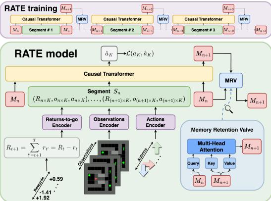  
Figure 1: Recurrent Action Transformer with Memory (RATE). The model processes trajectory divided into $n$ segments $S _ { n }$ with memory embeddings $M _ { n }$ , where $R$ denotes returns-to-go (future rewards), o – observations, $a -$ actions, and $M _ { n } -$ memory embeddings attached to each segment $S _ { n }$ to retain important historical information.

63 Our main contributions are as follows:

1. We propose Recurrent Action Transformer with Memory (RATE), a new transformer for offline RL that combines three complementary memory mechanisms: (i) memory embeddings, (ii) caching of hidden states, and (iii) a Memory Retention Valve (MRV), which uses cross-attention to retain key information over long horizons (see Section 3).   
. We conduct extensive evaluations on memory-intensive tasks – including ViZDoom TwoColors, Memory Maze, Minigrid-Memory, POPGym, and Passive T-Maze – showing that RATE consistently outperforms strong baselines (see Subsection 4.1).   
. We further show that RATE matches or surpasses standard baselines on the Atari and MuJoCo benchmarks, demonstrating strong generalization across task types and highlighting the model’s versatility (see Subsection 4.1).

# 74 2 Background

Offline RL. In RL [47], a task is formalized as a Markov Decision Process (MDP): $\langle s , \mathcal { A } , \mathcal { P } , \mathcal { R } \rangle$ ,   
where $s \in S$ are states, $a \in { \mathcal { A } }$ are actions, $\mathcal { P } ( s ^ { \prime } | s , a )$ is a transition function, and $r = \mathcal { R } ( s , a )$ is a   
reward function. States satisfy the Markov property: $\mathbb { P } ( s _ { t + 1 } | s _ { t } ) = \mathbb { P } ( s _ { t + 1 } | s _ { 1 } , . . . , s _ { t } )$ . A trajectory $\tau$   
of length $T$ is a sequence $\left( s _ { 0 } , a _ { 0 } , r _ { 0 } , \ldots , s _ { T - 1 } , a _ { T - 1 } , r _ { T - 1 } \right)$ , where $r _ { t } = R ( s _ { t } , a _ { t } )$ is the immediate   
reward at the timestep $t$ . The return-to-go [10] $\begin{array} { r } { R _ { t } = \sum _ { t ^ { \prime } = t } ^ { T - 1 } r _ { t ^ { \prime } } } \end{array}$ is the sum of future rewards from   
. The goal is to learn a policy $\pi$ maximizing the expected return. While online RL iteratively   
collects trajectories through environment interaction, offline RL uses a fixed dataset of trajectories,   
making it suitable for scenarios where environment interaction is costly or risky. A popular offline RL   
method, Decision Transformer (DT) [10], models return-conditioned trajectories with a GPT-style   
architecture, avoiding value estimation. However, its fixed context window limits performance in   
tasks with delayed rewards or long-term dependencies, motivating memory-augmented models.   
POMDP. In real-world, agents often receive partial observations rather than full states, breaking the   
Markov property. For instance, a robot using only camera input or an agent relying on past context.   
Such cases are modeled as Partially Observable MDPs (POMDPs): $\langle S , \mathcal { A } , \mathcal { O } , \mathcal { P } , \mathcal { R } , \mathcal { Z } \rangle$ , where $o \in \mathcal { O }$   
are observations and $\mathcal { Z } _ { s ^ { \prime } o } ^ { a } = P ( o _ { t + 1 } | s _ { t + 1 } = s ^ { \prime } , a _ { t } = a )$ defines the observation function. Since   
single observations are insufficient, agents must use history to infer useful state representations.

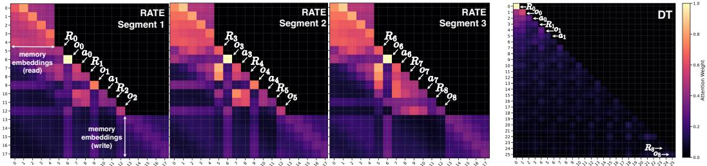  
Figure 2: Attention visualization of RATE and DT on the T-Maze [34] task with a corridor length of $T = 8$ . DT is trained on full 8-step trajectories, while RATE processes the sequence in three segments of length 3 recurrently, passing information between segments through memory embeddings.

# 91 3 Recurrent Action Transformer with Memory

Transformers excel at sequence modeling, including   
offline RL [10, 22], but struggle with long-horizon   
tasks due to fixed context and quadratic attention cost.   
In memory tasks, agents must recall information seen   
thousands of steps earlier—something models like   
DT cannot do once cues fall outside context. We pro  
pose the Recurrent Action Transformer with Mem  
ory (RATE), which introduces segment-level recur  
rence and dynamic memory control. RATE processes   
trajectories in segments, using lightweight memory   
and a learnable Memory Retention Valve (MRV)   
to decide what to retain or discard. In T-Maze [34],   
the agent receives a one-bit cue $o _ { 0 }$ at the first step   
indicating whether to turn left or right at the end of   
a maze. Solving the task requires remembering this   
cue despite sparse rewards. DT fails once $o _ { 0 }$ leaves   
the context, making retrieval at inference impossible.   
Figure 2 shows this: DT attends to $o _ { 0 }$ only when it fits   
the context, while RATE segments the input and prop  
agates the memory embeddings, preserving the cue   
to the end and enabling explicit memory retention.   
RATE combines memory embeddings [7], cached   
hidden states [13], and a novel MRV to handle long   
and sparse sequences. The architecture is shown   
in Figure 1. Let a trajectory $\tau _ { 0 : T - 1 }$ of length $T$   
be represented by triplets $( R _ { t } , o _ { t } , a _ { t } )$ , where $R _ { t }$   
118 is the return-to-go, $o _ { t }$ the observation, and $a _ { t }$ the

# Algorithm 1 RATE

Require: $R \in \mathbb R ^ { T } , o \in \mathbb R ^ { d _ { o } \times T } , a \in \mathbb R ^ { T }$

1: R˜ ← EncoderR(R)   
o˜ ← Encodero(o)   
: a˜ ← Encodera(a) $\tau _ { 0 : T - 1 } \gets \{ ( \tilde { R } _ { t } , \tilde { o } _ { t } , \tilde { a } _ { t } ) \} _ { t = 0 } ^ { T - 1 }$   
: $M _ { n } \gets M _ { 0 } \sim { \mathcal { N } } ( 0 , 1 )$   
: for $n$ in $[ 0 , T / / K - 1 ]$ do   
: $S _ { n } \gets \tau _ { n K : ( n + 1 ) K }$   
: $\ddot { S } _ { n } \gets \mathsf { c o n c a t } ( M _ { n } , S _ { n } , M _ { n } )$   
: aˆn $\mathbf { \tau } _ { \mathrm { : } } , M _ { n + 1 } \gets \mathrm { T r a n s f o r m e r } ( \tilde { S } _ { n } )$   
: $M _ { n + 1 }  \mathsf { M R V } ( M _ { n } , M _ { n + 1 } )$   
Output: $\hat { a } _ { n }  \mathcal { L } ( a _ { n } , \hat { a } _ { n } )$ , $M _ { n + 1 }$   
9: end for

# Algorithm 2 Memory Retention Valve

Require: Mn, Mn+1 ∈ Rm×d   
1: Qh ← MnWh T   
: Kh ← Mn+1Wh TK   
: Vh ← Mn+1Wh TV   
: Mhn+1 ← softmax Q h K T√ h  V h   
: $M _ { n + 1 }  \mathsf { c o n c a t } ( M _ { n + 1 } ^ { 0 } , \hdots , M _ { n + 1 } ^ { h } )$   
: $M _ { n + 1 }  M _ { n + 1 } \mathbf { W } _ { M } ^ { T }$ Output: $M _ { n + 1 }$

action. Each modality is encoded using modality-specific encoders (Algorithm 1): $\begin{array} { r l } { \tilde { R } _ { t } } & { { } = } \end{array}$   
Encoder ${ \bf \nabla } _ { R } ( R _ { t } )$ , $\tilde { o } _ { t } = \mathtt { E n c o d e r } _ { o } ( o _ { t } )$ , $\tilde { \boldsymbol { a } } _ { t } = \mathtt { E n c o d e r } _ { a } ( \boldsymbol { a } _ { t } )$ . The encoded sequence is split into   
$N = T / / K$ non-overlapping segments $S _ { n }$ of length $K$ . Thus, the effective context is $K _ { \mathrm { e f f } } = N \times K$ ,   
well beyond standard attention limits. Each segment is prepended and appended with memory em  
beddings $M _ { n } \in \mathbb { R } ^ { m \times d }$ , where $m$ is the number of memory tokens and $d$ the embedding dimension:   
$\tilde { S } _ { n } = \mathsf { c o n c a t } ( M _ { n } , S _ { n } , M _ { n } ) \in \mathbb { R } ^ { ( 3 K + 2 m ) \times d }$ Each segment is then processed by the transformer:   
$\hat { a } _ { n } , M _ { n + 1 } = \mathrm { T r a n s f o r m e r } ( \tilde { S } _ { n } )$ The output $M _ { n + 1 }$ is then refined via MRV before being passed to   
the next segment.   
Naively forwarding memory embeddings leads to error accumulation or overwriting of relevant   
information. To address this, we introduce the Memory Retention Valve (MRV), a cross-attention   
module that filters new memory tokens through the lens of the previous ones (Algorithm 2):

$$
\mathbf { M R V } ( M _ { n } , M _ { n + 1 } ) = \mathtt { F F N } \left( \mathtt { M u l t i H e a d } ( \mathbf { Q u e r y } = M _ { n } , \mathbf { K e y } = M _ { n + 1 } , \mathbf { V a l u e } = M _ { n + 1 } ) \right)
$$

This mechanism allows $M _ { n }$ to control what to retain or overwrite when updating to $M _ { n + 1 }$ . Unlike   
static recurrence, it preserves sparse, long-range information. RATE overcomes DT’s limits by   
extending context with recurrence, preserving early cues via MRV, and retaining key events in sparse   
settings. As a result, RATE solves tasks where DT fails, generalizes beyond training, and remains   
competitive on standard MDPs.   
Attention pattern analysis. Figure 2 compares attention maps of RATE and DT on a T-Maze   
sequence. DT (right) attends only within a fixed window, focusing on recent tokens while losing   
early cues like $o _ { 0 }$ . RATE (left) segments the input and uses memory tokens to propagate information   
across segments. These tokens retain access to $o _ { 0 }$ even in later segments, demonstrating RATE’s   
ability to model long-range dependencies beyond the context window through structured memory.

# 3.1 Preservation Properties of MRV

We formalize the intuition that the cross-attention–based MRV prevents catastrophic overwriting of   
memory by preserving alignment between consecutive memory states. All vectors are row-vectors.   
We use $\| \cdot \| _ { F }$ for the Frobenius norm and $\| \cdot \| _ { 2 }$ for the $\ell _ { 2 }$ norm.

Let $M _ { n } \in \mathbb { R } ^ { m \times d }$ and $\tilde { M } _ { n + 1 } \in \mathbb { R } ^ { m \times d }$ denote the incoming and updated memory embeddings at segment $n$ , where $m$ is the number of memory tokens and $d$ is the model dimension. We assume that each row $i$ of $M _ { n }$ is $\ell _ { 2 }$ -normalized: $\| M _ { n , i } \| _ { 2 } = 1$ . The MRV computes the next memory state as:

$$
\begin{array} { r } { Q = M _ { n } W _ { Q } , K = \tilde { M } _ { n + 1 } W _ { K } , V = \tilde { M } _ { n + 1 } W _ { V } , A = \mathtt { s o f t m a x } \left( \frac { Q K ^ { \top } } { \sqrt { d } } \right) , M _ { n + 1 } = A V W _ { M } . } \end{array}
$$

$\alpha$ -alignment condition. The memory embeddings are said to satisfy $\alpha$ -alignment if there exists a   
constant $\alpha \in ( 0 , 1 ]$ such that for every row $M _ { n , i }$ , there exists a row $V _ { j }$ for which: $\langle V _ { j } W _ { M } , M _ { n , i } \rangle \geq$   
$\alpha$ . This implies that the angle between $V _ { j } W _ { M }$ and $M _ { n , i }$ is at most arccos $\alpha$ . Empirically, this   
condition holds in trained models, as the transformer tends to preserve useful memory content and   
avoids orthogonal rotations between segments.

Theorem 1 (On memory loss bounds). Let each memory row be $\ell _ { 2 }$ -normalized, the $\alpha$ -alignment condition hold, and 154 $\begin{array} { r } { A = s o f t m a x \left( \frac { Q K ^ { \top } } { \sqrt { d } } \right) } \end{array}$ be the MRV attention matrix. Then:

$$
\Vert M _ { n + 1 } - M _ { n } \Vert _ { F } \leq \sqrt { 2 \left( 1 - \frac { \alpha } { m } \right) } \cdot \Vert M _ { n } \Vert _ { F } , \Vert M _ { n + 1 } \Vert _ { F } \geq \left( 1 - \sqrt { 2 \left( 1 - \frac { \alpha } { m } \right) } \right) \cdot \Vert M _ { n } \Vert _ { F } .
$$

In words: at least a 155 $\left( 1 - { \sqrt { 2 \left( 1 - { \frac { \alpha } { m } } \right) } } \right)$ fraction of the initial memory is guaranteed to be preserved 156 after a single MRV update (2) (right), and the memory loss is upper bounded by (2) (left).

Proof. Since each row of the attention matrix 157 $A$ is a probability distribution, we have $\textstyle \sum _ { j } A _ { i j } = 1$ for every 158 $i$ . By the pigeonhole principle, there exists an index $j ^ { * }$ such that $\begin{array} { r } { A _ { i j ^ { * } } \geq \frac { 1 } { m } } \end{array}$ .

By assumption, for each 159 $M _ { n , i }$ there exists a $V _ { j }$ such that $\langle V _ { j } W _ { M }$ , $M _ { n , i } \rangle \geq \alpha$ . In particular, this holds for 160 $j ^ { * } \colon \langle V _ { j ^ { * } } W _ { M } , \ M _ { n , i } \rangle \geq \alpha$ . Using the MRV definition $\begin{array} { r } { M _ { n + 1 , i } = \sum _ { j } A _ { i j } V _ { j } W _ { M } } \end{array}$ , we write:

$$
\langle M _ { n + 1 , i } , M _ { n , i } \rangle = \sum _ { j } A _ { i j } \langle V _ { j } W _ { M } , M _ { n , i } \rangle \geq A _ { i j ^ { * } } \langle V _ { j ^ { * } } W _ { M } , M _ { n , i } \rangle \geq { \frac { \alpha } { m } } .
$$

Let $\theta _ { i }$ be the angle between $M _ { n + 1 , i }$ and $M _ { n , i }$ . Since both vectors are $\ell _ { 2 }$ -normalized, we have:   
$\begin{array} { r } { \cos \theta _ { i } = \frac { \langle M _ { n + 1 , i } , M _ { n , i } \rangle } { \| M _ { n + 1 , i } \| _ { 2 } \cdot \| M _ { n , i } \| _ { 2 } } \ge \frac { \alpha } { m } } \end{array}$ . Using the identity $\| u - v \| _ { 2 } ^ { 2 } = 2 ( 1 - \cos \theta )$ for unit vectors:   
$\begin{array} { r } { \| M _ { n + 1 , i } - M _ { n , i } \| _ { 2 } ^ { 2 } \leq 2 \left( 1 - \frac { \alpha } { m } \right) , \operatorname { t h u s } \| M _ { n + 1 , i } - M _ { n , i } \| _ { 2 } \leq \sqrt { 2 \left( 1 - \frac { \alpha } { m } \right) } } \end{array}$ Summing over all mem  
ory tokens and applying the previous bound: $\begin{array} { r } { \| M _ { n + 1 } - M _ { n } \| _ { F } ^ { 2 } = \sum _ { i = 1 } ^ { m } \| M _ { n + 1 , i } - M _ { n , i } \| _ { 2 } ^ { 2 } \leq } \end{array}$   
$2 m \left( 1 - \textstyle { \frac { \alpha } { m } } \right)$ , which simplifies to: $\begin{array} { r } { \| M _ { n + 1 } - M _ { n } \| _ { F } \leq \sqrt { 2 m \left( 1 - \frac { \alpha } { m } \right) } } \end{array}$ . Consequently, since   
$\| M _ { n } \| _ { F } = { \sqrt { m } }$ due to row normalization, we conclude: $\begin{array} { r } { \| M _ { n + 1 } - M _ { n } \| _ { F } \leq \sqrt { 2 \left( 1 - \frac { \alpha } { m } \right) } \cdot \| M _ { n } \| _ { F } . } \end{array}$ .   
We now derive the lower bound (2) (left) using the reverse triangle inequality. For any matrices   
$M _ { n + 1 } , M _ { n } \in \mathbb { R } ^ { m \times d }$ , we have: $\Vert M _ { n + 1 } \Vert _ { F } \geq \Vert \bar { M } _ { n } \Vert _ { F } - \Vert M _ { n + 1 } \bar { - M } _ { n } \Vert _ { F } ^ { - }$ . Substituting the upper   
bound from (2) (right): $\begin{array} { r } { \| M _ { n + 1 } - M _ { n } \| _ { F } \leq \sqrt { 2 \left( 1 - \frac { \alpha } { m } \right) } \cdot \| M _ { n } \| _ { F } } \end{array}$ , we obtain: $\Vert M _ { n + 1 } \Vert _ { F } ~ \geq$   
$\begin{array} { r } { \left( 1 - \sqrt { 2 \left( 1 - \frac { \alpha } { m } \right) } \right) \cdot \| M _ { n } \| _ { F } } \end{array}$ , which completes the proof of (2). □

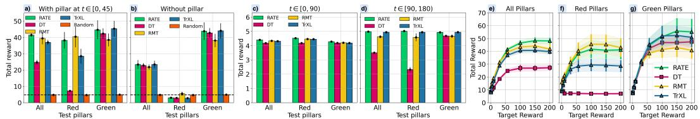  
Figure 3: Comparison of RATE with transformer baselines (DT, RMT, TrXL) on ViZDoom-TwoColors trained on the first $T _ { \mathrm { t r a i n } } = 9 0$ steps of the episode: with (a) and without $\mathbf { ( b ) }$ pillar in the first 45 steps of the episode; calculated at environment steps $0 - 8 9$ (c) and 90 – 179 (d) with pillar in the first 45 steps; depending on the return-to-go (e, f, g). Episode timeout – 2100 steps.

# 171 4 Experimental Evaluation

We designed our experiments to achieve two   
main goals: (a) to showcase the strengths of   
the RATE model in memory-intensive environ  
ments (T-Maze, ViZDoom-Two-Colors, Mem  
ory Maze, Minigrid-Memory, POPGym), and   
(b) to assess its effectiveness in standard MDPs,   
demonstrating its versatility across domains.   
Baselines. To evaluate the performance   
of RATE, we compare it against a diverse   
set of baselines spanning several categories:   
transformer-based models including Decision   
Transformer (DT) [10], Recurrent Memory   
Transformer (RMT) [7] and Transformer-XL   
(TrXL) [13] specially adapted by us for offline   
RL, and Long-Short Decision Transformer (LSDT) [52]; classic baselines such as Behavior Cloning   
with an MLP backbone (BC-MLP) and Conservative $Q$ -Learning [26] with an MLP backbone (CQL  
MLP); recurrent models including Behavior Cloning with an LSTM backbone [21] (BC-LSTM),   
CQL with LSTM (CQL-LSTM), Decision LSTM (DLSTM) [45], and its GRU-based variant [12]   
(DGRU); and a state space model baseline, Decision Mamba (DMamba) [35].   
Memory-intensive environments. We evaluate RATE in tasks that require agents to retain infor  
mation over time Figure 9; full details are in Appendix C. ViZDoom-Two-Colors: the agent must   
recall a briefly visible pillar color to collect matching items; T-Maze: a cue at the start indicates the   
correct turn at the end, testing sparse long-term memory; Minigrid-Memory: like T-Maze, but the   
clue must be located first, combining memory and credit assignment [34]; Memory Maze: the agent   
searches for objects matching a changing target color, requiring spatial memory; POPGym: a suite   
of 46 partially observable tasks [32] designed to probe different aspects of memory.

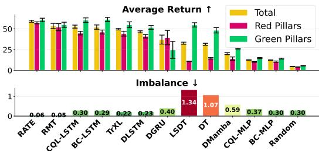  
Figure 4: ViZDoom-Two-Colors results with $T _ { \mathrm { t r a i n } } { = } 1 5 0$ . The top plot shows average return across all episodes (yellow), and separately for red (red) and green (green) pillars. The bottom plot shows the imbalance metric—absolute difference between red and green performance. Lower imbalance indicates more consistent behavior and is as important as average return.

# 198 4.1 Experimental Results

ViZDoom-Two-Colors. Figure 4 shows training with $T _ { \mathrm { t r a i n } } { = } 1 5 0$ and inference up to 2100 steps, where the pillar disappears at step 90. RATE achieves the highest return and lowest imbalance between the red and green pillars, indicating strong and consistent memory use. Figure 3 further tests transformer models trained with $T _ { \mathrm { t r a i n } } = 9 0$ on their ability to retain early cues. With the pillar present (a), RATE again yields the highest and most stable return. DT

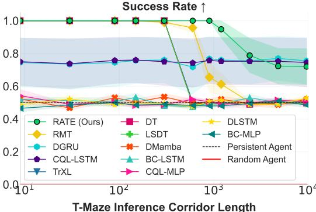  
Figure 5: T-Maze generalization task.

and TrXL underperform and show a higher imbalance. Removing the pillar (b) degrades all models, confirming reliance on the initial cue. DT’s unchanged performance across (a) and (b) highlights its failure to leverage long-term dependencies.

This limitation is clearer in Figure 3 (c, d), which separates performance within and beyond the   
-step context. DT’s return drops by nearly $5 0 \%$ in red-pillar episodes once the cue leaves the

window, while memory models (RATE, RMT, TrXL) remain stable, demonstrating their ability to retain and use information over long horizons.

T-Maze. Figure 5 shows the model generalization in Passive T-Maze as inference length grows from 9 to 9600 steps. All models were trained on episodes up to 900 steps; extrapolation beyond this requires long-horizon generalization. RATE achieves $1 0 0 \%$ success across all in-distribution lengths and performs well even at 9600-step inference, corresponding to trajec

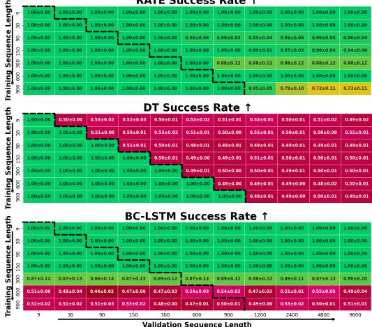  
Figure 3 (e, f, g) shows model performance across target reward levels. RATE consistently outperforms all baselines overall (e), and this advantage is even clearer when separating red (f) and green (g) pillar episodes. While other models show large disparities, RATE maintains stable performance across both conditions, demonstrating effective use of initial cues and validating the strength of its memory architecture.   
Figure 6: Heatmaps of success rates on TMaze tasks. The black dashed line separates indistribution inference (with $T _ { v a l } \leq T _ { t r a i n } )$ from out-of-distribution inference (with $T _ { v a l } > T _ { t r a i n } $ ). Results for other baselines can be found in Appendix, Figure 11.

tories of $3 \times 9 6 0 0 = 2 8 8 0 0$ tokens due to the $( R , o , a )$ triplets. This highlights RATE’s ability to retain and leverage sparse cues over extremely long horizons. Other transformers (e.g., DT, LSDT) match RATE on training-length sequences but degrade sharply beyond. DT collapses to $\sim 5 0 \%$ even at moderate lengths due to its lack of memory. Memory-augmented models like RMT generalize slightly further but deteriorate. TrXL performs similarly to DT, suggesting hidden-state caching alone is insufficient for long-range recall of sparse information. RNNs and SSMs (e.g., BC-LSTM, DMamba) show flat curves and fail to learn from sparse long sequences.

RATE both interpolates within training and extrapolates well beyond, a key strength for solving sparse POMDPs. Notably, poor performance of some memory baselines in Figure 5 is due to difficulty modeling long sequences during training, not just generalization failure: even for $T _ { \mathrm { v a l } } \leq T _ { \mathrm { t r a i n } }$ , they may fail. However, when trained on shorter sequences, some models learn generalizable behaviors. Figure 6 visualizes inference performance for RATE (top), DT (middle), and BC-LSTM (bottom) across training/validation lengths. The black dashed line separates in-distribution $( T _ { \mathrm { v a l } } \leq T _ { \mathrm { t r a i n } } )$ from out-of-distribution $( T _ { \mathrm { v a l } } > T _ { \mathrm { t r a i n } } )$ ). From Figure 6 (bottom), BC-LSTM generalizes well when trained on short sequences $( \leq 1 5 0 )$ , but degrades as training lengths grow, reaching ${ \sim } 0 . 5$ when trained on $T \geq 6 0 0$ , likely due to vanishing gradients or limited capacity [37, 49]. DT (Figure 6 (middle)) handles long training sequences via attention, but fails on longer validation sequences due to fixed context. In contrast, RATE (Figure 6 (top)) maintains high success across all validation lengths, enabled by its combination of attention and recurrent memory, which overcomes the limitations of both DT and RNNs. Average Returns Across Grid Sizes 11x11-501x501

Minigrid-Memory. Figure 7 presents average returns on Minigrid-Memory, where all models were trained on grids of fixed size $4 1 \times 4 1$ and evaluated on a wide range of unseen grid sizes from $1 1 \times 1 1$ to $5 0 1 \times 5 0 1$ . RATE achieves consistently high performance across the entire spectrum, demonstrating both strong interpolation and extrapolation capabilities. While TrXL also performs well on average, its variance is notably higher, indicating sensitivity to grid scale.

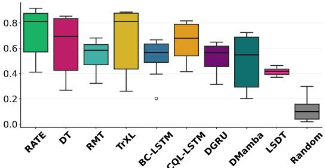  
  
Figure 7: Minigrid-Memory generalization task.

RATE Success Rate ↑   
Table 1: Average return $\pm \mathrm { S E M }$ in the Memory Maze $( 9 \times 9 )$ environment (ep. length: 1000 steps).   

<table><tr><td>Method</td><td>Random</td><td>BC-LSTM</td><td>CQL-LSTM</td><td>DT</td><td>RMT</td><td>TrXL</td><td>RATE</td></tr><tr><td>Return</td><td>0.00±0.00</td><td>4.75±0.15</td><td>0.19±0.02</td><td>6.83±0.51</td><td>7.27±0.21</td><td>7.12±0.24</td><td>7.64±0.41</td></tr></table>

Memory Maze. Table 1 presents results on the   
Memory Maze task. RATE achieves higher av  
erage episode returns by effectively capturing   
implicit structure, such as maze layout. For ref  
erence, the dataset’s average return is 4.69. All   
models were trained on 90-step trajectory sub  
sequences, while full episodes span 1000 steps.   
POPGym. To further assess generalization and memory capabilities, we evaluated models on all 46   
tasks from the POPGym benchmark suite [32], which covers a wide range of partially observable   
RL scenarios. The benchmark is split into 31 memory puzzle tasks and 15 reactive POMDP tasks.   
Table 2 reports average normalized scores across all tasks and subsets. RATE achieves the highest   
overall score (9.54), outperforming all baselines. On the challenging memory tasks, RATE maintains   
a positive average score (0.45), while all other models fall below zero – indicating a consistent   
failure to exploit long-term dependencies. Notably, DT scores $- 3 . 4 9$ and BC-MLP drops to $- 1 1 . 9 1$ ,   
278 highlighting the limitations of both context-limited transformers and non-recurrent policies.

Table 2: Aggregated average returns on 46 POPGym tasks, split into memory and reactive subsets.   

<table><tr><td>Tasks</td><td colspan="3">Rand.BC-MLP DTBC-LSTM RATE</td></tr><tr><td>All (46)</td><td>-12.2 -6.8 5.8</td><td>9.0</td><td>9.5</td></tr><tr><td>Memory (31)-14.6</td><td>-11.9 -3.5</td><td>-0.2</td><td>0.5</td></tr><tr><td>Reactive (15)</td><td>2.3 5.1 9.3</td><td>9.1</td><td>9.1</td></tr></table>

On reactive tasks, all models perform better, but the gap between memory-based and non-memory models narrows. RATE, DT, and BC-LSTM show almost the same results, suggesting that the greatest performance gains from RATE’s memory mechanisms occur on memory puzzle tasks. For simpler reactive POMDPs, lightweight memory mechanisms appear sufficient. These results also underscore RATE’s ability to generalize across both puzzle and reactive settings, confirming that its memory architecture does not hinder performance in simpler tasks while offering clear benefits in those with temporal dependencies. More details are provided in Appendix, Table 9.

Table 3: Normalized scores on MuJoCo tasks from the D4RL benchmark [16]. Although RATE is designed for memory-intensive environments, it performs competitively – and often surpasses – methods tailored for standard MDP control. Top-1 and Top-2 results are highlighted.   

<table><tr><td>Dataset</td><td>Environment</td><td>CQL</td><td>DT</td><td>TAP</td><td>TT</td><td>DMamba</td><td>MambaDM</td><td>RATE (ours)</td></tr><tr><td>ME</td><td>HalfCheetah</td><td>91.6</td><td>86.8±1.3</td><td>91.8±0.8</td><td>95.0±0.2</td><td>91.9±0.6</td><td>86.5±1.2</td><td>87.4±0.1</td></tr><tr><td>ME</td><td>Hopper</td><td>105.4</td><td>107.6±1.8</td><td>105.5±1.7</td><td>110.0±2.7</td><td>111.1±0.3</td><td>110.5±0.3</td><td>112.5±0.2</td></tr><tr><td>ME</td><td>Walker2d</td><td>108.8</td><td>108.1±0.2</td><td>107.4±0.9</td><td>101.9±6.8</td><td>108.3±0.5</td><td>108.8±0.1</td><td>108.7±0.5</td></tr><tr><td>M</td><td>HalfCheetah</td><td>44.4</td><td>42.6±0.1</td><td> 45.0±0.1</td><td>46.9±0.4</td><td>42.8±0.1</td><td>42.8±0.1</td><td>43.5±0.3</td></tr><tr><td>M</td><td>Hopper</td><td>58.0</td><td>67.6±1.0</td><td>63.4±1.4</td><td>61.1±3.6</td><td>83.5±12.5</td><td>85.7±7.8</td><td>77.4±1.4</td></tr><tr><td>M</td><td>Walker2d</td><td>72.5</td><td>74.0±1.4</td><td>64.9±2.1</td><td>79.0±2.8</td><td>78.2±0.6</td><td>78.2±0.6</td><td>80.7±0.7</td></tr><tr><td>MR</td><td>HalfCheetah</td><td>45.5</td><td>36.6±0.8</td><td>40.8±0.6</td><td>41.9±2.5</td><td>39.6±0.1</td><td>39.1±0.1</td><td>39.0±0.6</td></tr><tr><td>MR</td><td>Hopper</td><td>95.0</td><td>82.7±7.0</td><td>87.3±2.3</td><td>91.5±3.6</td><td>82.6±4.6</td><td>86.1±2.5</td><td>83.7±8.2</td></tr><tr><td>MR</td><td>Walker2d</td><td>77.2</td><td>66.6±3.0</td><td>66.8±3.1</td><td>82.6±6.9</td><td>70.9±4.3</td><td>73.4±2.6</td><td>73.7±1.4</td></tr><tr><td></td><td>Average</td><td>77.6</td><td>74.7</td><td>74.8</td><td>78.9</td><td>78.8</td><td>79.0</td><td>78.5</td></tr></table>

Atari and MuJoCo. We evaluate RATE on standard RL benchmarks: Atari games and MuJoCo control tasks (Table 3, Table 4). For comparison, we include results from recent state-of-the-art methods: Decision Mamba (DMamba) [35], Mamba as Decision Maker (MambaDM) [8], Conservative Q-Learning (CQL) [26], Trajectory Transformer (TT) [22], and TAP [23], as reported in their original papers. Results show that RATE matches or outperforms specialized offline RL algorithms across both benchmarks. Combined with its strong performance on memory-intensive tasks, this highlights RATE’s versatility as a general-purpose offline RL model.

See Appendix E for full training details and Table 10 for the evaluation protocol.

# 5 Ablation Study

We conduct a comprehensive ablation study to assess the contributions of individual components and architectural choices in RATE, structured around three key research questions.

1. How do different components of RATE influence performance on memory tasks? (RQ1)   
. What is the upper-bound results RATE can achieve with access to perfect memory? (RQ2)   
. What role does the MRV play, and which configuration is most effective? (RQ3)   
Further ablations exploring key transformer parameters, memory tokens number, and sequence   
segmentation strategies are provided in Appendix F and Appendix G.

Table 4: Raw scores on Atari games. RATE outperforms DT in 3 out of 4 environments.   

<table><tr><td>Environment</td><td>CQL</td><td>BC</td><td>DT</td><td>DMamba</td><td>MambaDM</td><td>RATE (Ours)</td></tr><tr><td>Breakout</td><td>62.5</td><td>42.8</td><td>76.9±27.3</td><td>70.6±9.3</td><td>106.9±5.8</td><td>111.0±2.9</td></tr><tr><td>Qbert</td><td>14013.2</td><td>2862.0</td><td>2215.8±1523.7</td><td>5786.0±1295.2</td><td>10052.5±1116.5</td><td>12486.9± 280.4</td></tr><tr><td>SeaQuest</td><td>782.2</td><td>992.1</td><td>1129.3±189.0</td><td>992.1±57.7</td><td>1286.0±42.0</td><td>1037.9±53.7</td></tr><tr><td>Pong</td><td>18.8</td><td>6.4</td><td>17.1±2.9</td><td>1.6±15.3</td><td>18.4±0.8</td><td>18.8±0.3</td></tr></table>

RQ1: Impact of RATE components. To assess the contribution of individual memory mechanisms in RATE, we conducted inference-time ablations by replacing memory components with random noise. In T-Maze $K = 3 0$ , $N = 3$ segments), corrupting the memory embeddings $M$ caused a sharp drop in performance to a $5 0 \%$ success rate (see Figure 8, right). Notably, the agent still reached the decision point but failed to choose the correct direction—indicating that while the model retained its navigation policy, it lost access to the initial cue. This implies that memory embeddings serve as dedicated storage for task-relevant information, while transformer layers encode general behavioral patterns. In

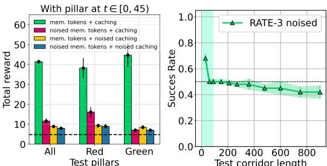  
Figure 8: Effect of memory corruption on RATE at inference. (left) ViZDoom: performance drops when memory tokens or cached states are noised. (right) T-Maze: SR degrades when memory embeddings are corrupted.

ViZDoom-Two-Colors (see Figure 8, left), we further disentangled the roles of memory components by selectively adding noise to memory embeddings and cached hidden states. The results revealed that performance was more sensitive to the corruption of cached hidden states, underscoring their importance in environments with continuous rewards and extended dependency chains. Together, these findings suggest a division of roles: memory embeddings are essential for sparse, discrete decision points (e.g., in T-Maze), whereas cached representations are more critical in dense, continuous-feedback environments like ViZDoom-Two-Colors.

RQ2: Performance upper-bound estimate. To estimate the upper-bound performance achievable by RATE, we introduce OracleDT – a variant of Decision Transformer augmented with perfect prior knowledge about the environment. Specifically, OracleDT receives an additional input vector v ∈ R1×d_model prepended and appended to the context sequence, i.e., $S ^ { \prime } =$ concat $( v , S , v )$ . This vector encodes one bit of environment-critical information known in advance. In T-Maze, $v$ represents the initial clue $\mathit { v } _ { i } = 0$ if left, $v _ { i } = 1$ if right); in ViZDoomTwo-Colors, it encodes the pillar color $\boldsymbol { v } _ { i } = 0$ for red, $v _ { i } = 1$ for green). This setup mirrors a context augmented with perfectly trained mem

Table 5: Performance comparison between DT, RATE, and OracleDT. OracleDT is an oracleinformed variant used solely to approximate the upper bound and is not a feasible baseline.   

<table><tr><td colspan="4">T-Maze</td></tr><tr><td>Success Rate</td><td>OracleDT</td><td>DT</td><td>RATE</td></tr><tr><td>T=90</td><td>1.00±0.00</td><td>1.00±0.00</td><td>1.00±0.00</td></tr><tr><td>T=480</td><td>1.00±0.00</td><td>0.50±0.00</td><td>0.90±0.07</td></tr><tr><td>T=900</td><td>1.00±0.00</td><td>0.50±0.00</td><td>0.90±0.07</td></tr><tr><td colspan="4">ViZDoom-Two-Colors</td></tr><tr><td>Total Reward</td><td>56.5±0.8</td><td>24.8±1.4</td><td>41.5±1.0</td></tr><tr><td>Red Pillars</td><td>55.3±1.6</td><td>7.2±0.4</td><td>38.2±5.1</td></tr><tr><td>Green Pillars</td><td>57.2±0.5</td><td>42.3±3.3</td><td>44.7±5.8</td></tr></table>

ory embeddings, i.e., concat $( M , S , M )$ , where $M$ encodes all relevant information. As a result, OracleDT provides an empirical upper bound on achievable performance when key information is available explicitly. In such settings, we expect the relation $R [ \mathrm { O r a c l e D T } ] \geq R [ \mathrm { R A T E } ] \geq R [ \mathrm { D T } ]$ to hold (see Table 5). Since this privileged information is not generally accessible during training, OracleDT is not a viable baseline but serves as a useful reference. The gap between OracleDT and RATE quantifies the effectiveness of RATE’s memory mechanisms in autonomously discovering, storing, and utilizing task-relevant information.

RQ 3. Memory Retention Valve scheme ablation. In the T-Maze environment, we observed that without MRV, RATE’s performance deteriorates on long corridors $( L \gg K )$ , eventually reaching SR $= 5 0 \%$ (see Table 6). This degradation occurs because critical information to be remembered goes into memory embeddings when processing the first segment of the sequence, and then it must be retrieved when making decisions on the last segment. At the same time, due to the recurrent structure of the architecture, memory embeddings continue to be updated during the processing of intermediate segments when no new information needs to be memorized, causing important information from memory embeddings to leak out. To address this information loss, we introduced the Memory Retention Valve (MRV) and evaluated five variants: MRV-CA-1: Cross-attention mechanism where updated embeddings $( M _ { n + 1 } )$ query incoming ones $( M _ { n } )$ ; MRV-CA-2: Reversed variant where incoming embeddings $( M _ { n } )$ query updated ones $( M _ { n + 1 } )$ ; MRV-G: Gating mechanism inspired by GTrXL [36]; MRV-GRU: GRU-based [12] memory processing with hidden states; MRV-LSTM: LSTM-based [21] memory processing with cell states.

Table 6: Ablation of MRV configurations in TMaze $\scriptstyle K _ { \mathrm { e f f } } = 3 0 \times 5 = 1 5 0 ,$ ). Baseline without MRV is marked $\dagger$ . Default: MRV-CA-2.   

<table><tr><td rowspan=1 colspan=7>Model        150       360      600      900</td></tr><tr><td rowspan=1 colspan=3>W/o MRVt</td><td rowspan=1 colspan=2>1.00 ±0.00 0.66 ±0.08</td><td rowspan=1 colspan=2>0.65 ±0.07  0.61 ±0.07</td></tr><tr><td rowspan=1 colspan=3>MRV-CA-2</td><td rowspan=1 colspan=1>1.00 ±0.00</td><td rowspan=1 colspan=1>0.95 ±0.05</td><td rowspan=1 colspan=1>0.90 ±0.07</td><td rowspan=1 colspan=1>0.90 ±0.07</td></tr><tr><td rowspan=1 colspan=2>MRV-G</td><td rowspan=1 colspan=1></td><td rowspan=1 colspan=1>0.86 ±0.07</td><td rowspan=1 colspan=1>0.77 ±0.08</td><td rowspan=1 colspan=1>0.66 ±0.07</td><td rowspan=1 colspan=1>0.65 ±0.08</td></tr><tr><td rowspan=1 colspan=3>MRV-GRU</td><td rowspan=1 colspan=1>0.99 ±0.01</td><td rowspan=1 colspan=1>0.74 ±0.07</td><td rowspan=1 colspan=1>0.56 ±0.11</td><td rowspan=1 colspan=1>0.55 ±0.12</td></tr><tr><td rowspan=1 colspan=3>MRV-LSTM</td><td rowspan=1 colspan=1>0.85±0.06</td><td rowspan=1 colspan=1>0.64 ±0.10</td><td rowspan=1 colspan=1>0.51±0.11</td><td rowspan=1 colspan=1>0.47 ±0.11</td></tr><tr><td rowspan=1 colspan=3>MRV-CA-1</td><td rowspan=1 colspan=1>0.51 ±0.01</td><td rowspan=1 colspan=1>0.51 ±0.01</td><td rowspan=1 colspan=1>0.49 ±0.02</td><td rowspan=1 colspan=1>0.49 ±0.01</td></tr></table>

Among all tested configurations, MRV-CA-2 demonstrated best performance (see Table 6). This cross-attention scheme uses incoming memory tokens $( M _ { n } )$ as queries and updated tokens $( M _ { n + 1 } )$ as keys and values. This configuration, referred to simply as MRV throughout the paper, effectively controls information flow through memory. By allowing the model to selectively update its memory based on the relevance of new information, it prevents loss of important context over long sequences.

# 6 Related Work

Transformers in RL. Transformers have been applied to online [36, 27, 33, 43, 28], offline [10, 22, 52], and model-based RL [9]. While prior work often relies on compact observations or known dynamics [29, 23], RATE targets long-horizon credit assignment and memory challenges in partially observable environments, using DT [10] as a baseline. A recent extension, Long-Short Decision Transformer (LSDT) [52], augments DT with two context windows but still lacks an explicit, learnable memory. Retrieval-augmented variants, e.g. RA-DT [43], index external trajectories for in-context planning, while Fast and Forgetful Memory (FFM) [33] and Stable Hadamard Memory (SHM) [28] explore lightweight recurrent memory slots with improved stability.

RNNs in RL. Recurrent models like LSTM [21] and GRU [12] have long been used for memory in RL. DLSTM [45] replaces transformers with LSTM to support sequential decision-making. However, RNNs often struggle with long-term dependencies, especially in sparse-reward settings [34].

SSMs in RL. SSMs such as S4 [19] and Mamba [18] offer efficient alternatives to attention, showing strong offline RL results [3, 35, 8]. These models rely on linear dynamics and their ability to handle memory-intensive generalization remains unclear.

Memory-Augmented Transformers. Memory extensions like Transformer-XL [13], Compressive Transformer [41], and RMT [7] improve context handling via caching or compression. RATE builds on these ideas by combining token-level memory, hidden-state caching, and a novel MRV gate.

# 7 Limitations

While RATE is tailored for long-horizon, memory-intensive tasks, its complexity may be unnecessary in fully observable or short-term settings where simpler recurrent models suffice. Nonetheless, RATE matches or exceeds their performance across all tasks. Future work may explore adaptive variants that scale memory based on task complexity.

# 8 Conclusion

We propose the Recurrent Action Transformer with Memory (RATE), a transformer-based architecture for offline RL that combines attention with recurrence for long-horizon decision-making. RATE integrates memory embeddings, hidden state caching, and a Memory Retention Valve (MRV) to selectively retain critical information across segments. RATE achieves state-of-the-art results on memory-intensive tasks such as T-Maze, Minigrid-Memory, ViZDoom-Two-Colors, Memory Maze, and POPGym, generalizing up to 9600-step sequences and outperforming both recurrent and transformer baselines. Theoretical analysis shows that MRV guarantees lower-bounded memory preservation across updates, and ablation studies confirm its importance for long-horizon stability. Despite its memory focus, RATE also performs competitively on standard benchmarks like Atari and MuJoCo, demonstrating broad versatility. These results establish RATE as a unified, general-purpose offline RL model that excels across both short and long temporal contexts.

References   
[1] Pranav Agarwal, Aamer Abdul Rahman, Pierre-Luc St-Charles, Simon JD Prince, and Samira Ebrahimi Kahou. Transformers in reinforcement learning: a survey. arXiv preprint arXiv:2307.05979, 2023.   
[2] Rishabh Agarwal, Dale Schuurmans, and Mohammad Norouzi. An optimistic perspective on offline reinforcement learning. In International Conference on Machine Learning, pages 104–114. PMLR, 2020.   
[3] Shmuel Bar-David, Itamar Zimerman, Eliya Nachmani, and Lior Wolf. Decision s4: Efficient sequence-based rl via state spaces layers. arXiv preprint arXiv:2306.05167, 2023.   
[4] Edward Beeching, Christian Wolf, Jilles Dibangoye, and Olivier Simonin. Deep reinforcement learning on a budget: 3d control and reasoning without a supercomputer. CoRR, abs/1904.01806, 2019. URL http://arxiv.org/abs/1904.01806.   
[5] Marc G Bellemare, Yavar Naddaf, Joel Veness, and Michael Bowling. The arcade learning environment: An evaluation platform for general agents. Journal of Artificial Intelligence Research, 47:253–279, 2013.   
[6] Iz Beltagy, Matthew E Peters, and Arman Cohan. Longformer: The long-document transformer. arXiv preprint arXiv:2004.05150, 2020.   
[7] Aydar Bulatov, Yury Kuratov, and Mikhail Burtsev. Recurrent memory transformer. Advances in Neural Information Processing Systems, 35:11079–11091, 2022.   
[8] Jiahang Cao, Qiang Zhang, Ziqing Wang, Jiaxu Wang, Hao Cheng, Yecheng Shao, Wen Zhao, Gang Han, Yijie Guo, and Renjing Xu. Mamba as decision maker: Exploring multi-scale sequence modeling in offline reinforcement learning. arXiv preprint arXiv:2406.02013, 2024.   
[9] Chang Chen, Yi-Fu Wu, Jaesik Yoon, and Sungjin Ahn. Transdreamer: Reinforcement learning with transformer world models. arXiv preprint arXiv:2202.09481, 2022.   
[10] Lili Chen, Kevin Lu, Aravind Rajeswaran, Kimin Lee, Aditya Grover, Misha Laskin, Pieter Abbeel, Aravind Srinivas, and Igor Mordatch. Decision transformer: Reinforcement learning via sequence modeling. Advances in neural information processing systems, 34:15084–15097, 2021.   
[11] Maxime Chevalier-Boisvert, Bolun Dai, Mark Towers, Rodrigo de Lazcano, Lucas Willems, Salem Lahlou, Suman Pal, Pablo Samuel Castro, and Jordan Terry. Minigrid & miniworld: Modular & customizable reinforcement learning environments for goal-oriented tasks. CoRR, abs/2306.13831, 2023.   
[12] Junyoung Chung, Caglar Gulcehre, KyungHyun Cho, and Yoshua Bengio. Empirical evaluation of gated recurrent neural networks on sequence modeling. arXiv preprint arXiv:1412.3555, 2014.   
[13] Zihang Dai, Zhilin Yang, Yiming Yang, Jaime Carbonell, Quoc V Le, and Ruslan Salakhutdinov. Transformer-xl: Attentive language models beyond a fixed-length context. arXiv preprint arXiv:1901.02860, 2019.   
[14] Yan Duan, John Schulman, Xi Chen, Peter L Bartlett, Ilya Sutskever, and Pieter Abbeel. Rl2: Fast reinforcement learning via slow reinforcement learning. arXiv preprint arXiv:1611.02779, 2016.   
[15] Kevin Esslinger, Robert Platt, and Christopher Amato. Deep transformer q-networks for partially observable reinforcement learning. arXiv preprint arXiv:2206.01078, 2022.   
[16] Justin Fu, Aviral Kumar, Ofir Nachum, George Tucker, and Sergey Levine. D4rl: Datasets for deep data-driven reinforcement learning, 2021.   
[17] Jake Grigsby, Linxi Fan, and Yuke Zhu. AMAGO: Scalable in-context reinforcement learning for adaptive agents. In The Twelfth International Conference on Learning Representations, 2024. URL https://openreview.net/forum?id=M6XWoEdmwf.   
[18] Albert Gu and Tri Dao. Mamba: Linear-time sequence modeling with selective state spaces. arXiv preprint arXiv:2312.00752, 2023.   
[19] Albert Gu, Karan Goel, and Christopher Ré. Efficiently modeling long sequences with structured state spaces. arXiv preprint arXiv:2111.00396, 2021. [20] Danijar Hafner, Timothy Lillicrap, Jimmy Ba, and Mohammad Norouzi. Dream to control: Learning behaviors by latent imagination. arXiv preprint arXiv:1912.01603, 2019.   
[21] Sepp Hochreiter and Jürgen Schmidhuber. Long short-term memory. Neural computation, 9(8): 1735–1780, 1997. [22] Michael Janner, Qiyang Li, and Sergey Levine. Offline reinforcement learning as one big sequence modeling problem. Advances in neural information processing systems, 34:1273– 1286, 2021. [23] Zhengyao Jiang, Tianjun Zhang, Michael Janner, Yueying Li, Tim Rocktäschel, Edward Grefenstette, and Yuandong Tian. Efficient planning in a compact latent action space. In The Eleventh International Conference on Learning Representations, 2023. URL https: //openreview.net/forum?id $\cdot ^ { = }$ cA77NrVEuqn.   
[24] Jikun Kang, Romain Laroche, Xindi Yuan, Adam Trischler, Xue Liu, and Jie Fu. Think before you act: Decision transformers with internal working memory. arXiv preprint arXiv:2305.16338, 2023.   
[25] Feyza Duman Keles, Pruthuvi Mahesakya Wijewardena, and Chinmay Hegde. On the computational complexity of self-attention. In International conference on algorithmic learning theory, pages 597–619. PMLR, 2023.   
[26] Aviral Kumar, Aurick Zhou, George Tucker, and Sergey Levine. Conservative q-learning for offline reinforcement learning. Advances in Neural Information Processing Systems, 33: 1179–1191, 2020.   
[27] Andrew Lampinen, Stephanie Chan, Andrea Banino, and Felix Hill. Towards mental time travel: a hierarchical memory for reinforcement learning agents. Advances in Neural Information Processing Systems, 34:28182–28195, 2021.   
[28] Hung Le, Kien Do, Dung Nguyen, Sunil Gupta, and Svetha Venkatesh. Stable hadamard memory: Revitalizing memory-augmented agents for reinforcement learning. arXiv preprint arXiv:2410.10132, 2024.   
[29] Kuang-Huei Lee, Ofir Nachum, Mengjiao Sherry Yang, Lisa Lee, Daniel Freeman, Sergio Guadarrama, Ian Fischer, Winnie Xu, Eric Jang, Henryk Michalewski, et al. Multi-game decision transformers. Advances in Neural Information Processing Systems, 35:27921–27936, 2022.   
[30] Wenzhe Li, Hao Luo, Zichuan Lin, Chongjie Zhang, Zongqing Lu, and Deheng Ye. A survey on transformers in reinforcement learning. Transactions on Machine Learning Research, 2023. ISSN 2835-8856. URL https://openreview.net/forum?id=r30yuDPvf2. Survey Certification.   
[31] Volodymyr Mnih. Playing atari with deep reinforcement learning. arXiv preprint arXiv:1312.5602, 2013.   
[32] Steven Morad, Ryan Kortvelesy, Matteo Bettini, Stephan Liwicki, and Amanda Prorok. Popgym: Benchmarking partially observable reinforcement learning. arXiv preprint arXiv:2303.01859, 2023.   
495 [33] Steven Morad, Ryan Kortvelesy, Stephan Liwicki, and Amanda Prorok. Reinforcement learning with fast and forgetful memory. Advances in Neural Information Processing Systems, 36: 72008–72029, 2023.

98 [34] Tianwei Ni, Michel Ma, Benjamin Eysenbach, and Pierre-Luc Bacon. When do transformers shine in RL? decoupling memory from credit assignment. In Thirty-seventh Conference on Neural Information Processing Systems, 2023. URL https://openreview.net/forum?id= APGXBNkt6h. [35] Toshihiro Ota. Decision mamba: Reinforcement learning via sequence modeling with selective state spaces. arXiv preprint arXiv:2403.19925, 2024. [36] Emilio Parisotto, Francis Song, Jack Rae, Razvan Pascanu, Caglar Gulcehre, Siddhant Jayakumar, Max Jaderberg, Raphael Lopez Kaufman, Aidan Clark, Seb Noury, et al. Stabilizing transformers for reinforcement learning. In International conference on machine learning, pages 7487–7498. PMLR, 2020. [37] Razvan Pascanu, Tomas Mikolov, and Yoshua Bengio. On the difficulty of training recurrent neural networks. In International conference on machine learning, pages 1310–1318. Pmlr, 2013. [38] Jurgis Pasukonis, Timothy Lillicrap, and Danijar Hafner. Evaluating long-term memory in 3d mazes. arXiv preprint arXiv:2210.13383, 2022. [39] Marco Pleines, Matthias Pallasch, Frank Zimmer, and Mike Preuss. Transformerxl as episodic memory in proximal policy optimization. Github Repository, 2023. URL https://github. com/MarcoMeter/episodic-transformer-memory-ppo. [40] Andrey Polubarov, Nikita Lyubaykin, Alexander Derevyagin, Ilya Zisman, Denis Tarasov, Alexander Nikulin, and Vladislav Kurenkov. Vintix: Action model via in-context reinforcement learning. arXiv preprint arXiv:2501.19400, 2025. [41] Jack W Rae, Anna Potapenko, Siddhant M Jayakumar, and Timothy P Lillicrap. Compressive transformers for long-range sequence modelling. arXiv preprint arXiv:1911.05507, 2019. [42] Jan Robine, Marc Höftmann, Tobias Uelwer, and Stefan Harmeling. Transformer-based world models are happy with 100k interactions. In The Eleventh International Conference on Learning Representations, 2023. URL https://openreview.net/forum?id TdBaDGCpjly. [43] Thomas Schmied, Fabian Paischer, Vihang Patil, Markus Hofmarcher, Razvan Pascanu, and Sepp Hochreiter. Retrieval-augmented decision transformer: External memory for in-context rl. arXiv preprint arXiv:2410.07071, 2024. [44] John Schulman, Filip Wolski, Prafulla Dhariwal, Alec Radford, and Oleg Klimov. Proximal policy optimization algorithms. arXiv preprint arXiv:1707.06347, 2017. [45] Max Siebenborn, Boris Belousov, Junning Huang, and Jan Peters. How crucial is transformer in decision transformer? arXiv preprint arXiv:2211.14655, 2022. URL https://arxiv.org/ abs/2211.14655. [46] Artyom Sorokin, Nazar Buzun, Leonid Pugachev, and Mikhail Burtsev. Explain my surprise: Learning efficient long-term memory by predicting uncertain outcomes. 07 2022. doi: 10. 48550/arXiv.2207.13649. [47] R.S. Sutton and A.G. Barto. Reinforcement Learning, second edition: An Introduction. Adaptive Computation and Machine Learning series. MIT Press, 2018. ISBN 9780262039246. [48] Adaptive Agent Team, Jakob Bauer, Kate Baumli, Satinder Baveja, Feryal Behbahani, Avishkar Bhoopchand, Nathalie Bradley-Schmieg, Michael Chang, Natalie Clay, Adrian Collister, et al. Human-timescale adaptation in an open-ended task space. arXiv preprint arXiv:2301.07608, 2023. [49] Trieu Trinh, Andrew Dai, Thang Luong, and Quoc Le. Learning longer-term dependencies in rnns with auxiliary losses. In International Conference on Machine Learning, pages 4965–4974. PMLR, 2018. [50] Ashish Vaswani, Noam Shazeer, Niki Parmar, Jakob Uszkoreit, Llion Jones, Aidan N Gomez, Łukasz Kaiser, and Illia Polosukhin. Attention is all you need. Advances in neural information processing systems, 30, 2017.

[51] Jane X Wang, Zeb Kurth-Nelson, Dhruva Tirumala, Hubert Soyer, Joel Z Leibo, Remi Munos, Charles Blundell, Dharshan Kumaran, and Matt Botvinick. Learning to reinforcement learn. arXiv preprint arXiv:1611.05763, 2016.   
[52] Jincheng Wang, Penny Karanasou, Pengyuan Wei, Elia Gatti, Diego Martinez Plasencia, and Dimitrios Kanoulas. Long-short decision transformer: Bridging global and local dependencies for generalized decision-making. In The Thirteenth International Conference on Learning Representations, 2025. URL https://openreview.net/forum?id=NHMuM84tRT.   
[53] Manzil Zaheer, Guru Guruganesh, Kumar Avinava Dubey, Joshua Ainslie, Chris Alberti, Santiago Ontanon, Philip Pham, Anirudh Ravula, Qifan Wang, Li Yang, et al. Big bird: Transformers for longer sequences. Advances in neural information processing systems, 33: 17283–17297, 2020.   
[54] Susan Zhang, Stephen Roller, Naman Goyal, Mikel Artetxe, Moya Chen, Shuohui Chen, Christopher Dewan, Mona Diab, Xian Li, Xi Victoria Lin, et al. Opt: Open pre-trained transformer language models. arXiv preprint arXiv:2205.01068, 2022.

# 1. Claims

Question: Do the main claims made in the abstract and introduction accurately reflect the paper’s contributions and scope?

Answer: [Yes]

Justification: We propose a novel offline RL model—RATE—with integrated memory mechanisms, capable of solving memory-intensive tasks, as demonstrated in Section 3 and validated in Section 4.

Guidelines:

• The answer NA means that the abstract and introduction do not include the claims made in the paper.   
• The abstract and/or introduction should clearly state the claims made, including the contributions made in the paper and important assumptions and limitations. A No or NA answer to this question will not be perceived well by the reviewers.   
• The claims made should match theoretical and experimental results, and reflect how much the results can be expected to generalize to other settings.   
• It is fine to include aspirational goals as motivation as long as it is clear that these goals are not attained by the paper.

# 2. Limitations

Question: Does the paper discuss the limitations of the work performed by the authors?

Answer: [Yes]

Justification: The limitation of the proposed model is that its architecture may be redundant to solve simple problems. This limitation is stated in the Limitations section in Section 7.

Guidelines:

• The answer NA means that the paper has no limitation while the answer No means that the paper has limitations, but those are not discussed in the paper.   
• The authors are encouraged to create a separate "Limitations" section in their paper.   
• The paper should point out any strong assumptions and how robust the results are to violations of these assumptions (e.g., independence assumptions, noiseless settings, model well-specification, asymptotic approximations only holding locally). The authors should reflect on how these assumptions might be violated in practice and what the implications would be.   
• The authors should reflect on the scope of the claims made, e.g., if the approach was only tested on a few datasets or with a few runs. In general, empirical results often depend on implicit assumptions, which should be articulated. The authors should reflect on the factors that influence the performance of the approach. For example, a facial recognition algorithm may perform poorly when image resolution is low or images are taken in low lighting. Or a speech-to-text system might not be used reliably to provide closed captions for online lectures because it fails to handle technical jargon.   
• The authors should discuss the computational efficiency of the proposed algorithms and how they scale with dataset size.   
• If applicable, the authors should discuss possible limitations of their approach to address problems of privacy and fairness.   
• While the authors might fear that complete honesty about limitations might be used by reviewers as grounds for rejection, a worse outcome might be that reviewers discover limitations that aren’t acknowledged in the paper. The authors should use their best judgment and recognize that individual actions in favor of transparency play an important role in developing norms that preserve the integrity of the community. Reviewers will be specifically instructed to not penalize honesty concerning limitations.

# 3. Theory assumptions and proofs

Question: For each theoretical result, does the paper provide the full set of assumptions and a complete (and correct) proof?

Answer: [Yes]

Justification: Theorem 1 in Section 3 proves that Memory Retention Valve (MRV) maintains a non-trivial lower bound on memory retention. The proof is complete with clear assumptions, validated empirically in Section 4.

Guidelines:

• The answer NA means that the paper does not include theoretical results.   
• All the theorems, formulas, and proofs in the paper should be numbered and crossreferenced.   
• All assumptions should be clearly stated or referenced in the statement of any theorems.   
• The proofs can either appear in the main paper or the supplemental material, but if they appear in the supplemental material, the authors are encouraged to provide a short proof sketch to provide intuition.   
• Inversely, any informal proof provided in the core of the paper should be complemented by formal proofs provided in appendix or supplemental material.   
• Theorems and Lemmas that the proof relies upon should be properly referenced.

# 4. Experimental result reproducibility

Question: Does the paper fully disclose all the information needed to reproduce the main experimental results of the paper to the extent that it affects the main claims and/or conclusions of the paper (regardless of whether the code and data are provided or not)?

Answer: [Yes]

Justification: The paper provides all the information needed to reproduce the main experimental results, including data collection procedures, hyperparameters, and optimizer choices.

Guidelines:

• The answer NA means that the paper does not include experiments.   
• If the paper includes experiments, a No answer to this question will not be perceived well by the reviewers: Making the paper reproducible is important, regardless of whether the code and data are provided or not.   
• If the contribution is a dataset and/or model, the authors should describe the steps taken to make their results reproducible or verifiable.   
Depending on the contribution, reproducibility can be accomplished in various ways. For example, if the contribution is a novel architecture, describing the architecture fully might suffice, or if the contribution is a specific model and empirical evaluation, it may be necessary to either make it possible for others to replicate the model with the same dataset, or provide access to the model. In general. releasing code and data is often one good way to accomplish this, but reproducibility can also be provided via detailed instructions for how to replicate the results, access to a hosted model (e.g., in the case of a large language model), releasing of a model checkpoint, or other means that are appropriate to the research performed.   
• While NeurIPS does not require releasing code, the conference does require all submissions to provide some reasonable avenue for reproducibility, which may depend on the nature of the contribution. For example (a) If the contribution is primarily a new algorithm, the paper should make it clear how to reproduce that algorithm. (b) If the contribution is primarily a new model architecture, the paper should describe the architecture clearly and fully. (c) If the contribution is a new model (e.g., a large language model), then there should either be a way to access this model for reproducing the results or a way to reproduce the model (e.g., with an open-source dataset or instructions for how to construct the dataset). (d) We recognize that reproducibility may be tricky in some cases, in which case authors are welcome to describe the particular way they provide for reproducibility. In the case of closed-source models, it may be that access to the model is limited in some way (e.g., to registered users), but it should be possible for other researchers to have some path to reproducing or verifying the results.

# 5. Open access to data and code

Question: Does the paper provide open access to the data and code, with sufficient instructions to faithfully reproduce the main experimental results, as described in supplemental material?

Answer: [Yes]

Justification: The paper provides open access to the data and code, with sufficient instructions to faithfully reproduce the main experimental results, as described in the Supplemental Material.

Guidelines:

• The answer NA means that paper does not include experiments requiring code.   
• Please see the NeurIPS code and data submission guidelines (https://nips.cc/ public/guides/CodeSubmissionPolicy) for more details.   
• While we encourage the release of code and data, we understand that this might not be possible, so “No” is an acceptable answer. Papers cannot be rejected simply for not including code, unless this is central to the contribution (e.g., for a new open-source benchmark).   
• The instructions should contain the exact command and environment needed to run to reproduce the results. See the NeurIPS code and data submission guidelines (https: //nips.cc/public/guides/CodeSubmissionPolicy) for more details.   
• The authors should provide instructions on data access and preparation, including how to access the raw data, preprocessed data, intermediate data, and generated data, etc.   
• The authors should provide scripts to reproduce all experimental results for the new proposed method and baselines. If only a subset of experiments are reproducible, they should state which ones are omitted from the script and why.   
• At submission time, to preserve anonymity, the authors should release anonymized versions (if applicable).   
• Providing as much information as possible in supplemental material (appended to the paper) is recommended, but including URLs to data and code is permitted.

# 6. Experimental setting/details

Question: Does the paper specify all the training and test details (e.g., data splits, hyperparameters, how they were chosen, type of optimizer, etc.) necessary to understand the results?

Answer: [Yes]

Justification: The paper specifies all the training and test details necessary to understand the results, including data collection procedures, hyperparameters, and optimizer choices.

Guidelines:

• The answer NA means that the paper does not include experiments. • The experimental setting should be presented in the core of the paper to a level of detail that is necessary to appreciate the results and make sense of them. • The full details can be provided either with the code, in appendix, or as supplemental material.

# 7. Experiment statistical significance

Question: Does the paper report error bars suitably and correctly defined or other appropriate information about the statistical significance of the experiments?

Answer: [Yes]

Justification: In ?? in the Supplementary Material, we provide detailed evaluation setup with statistics for each experiment, including the number of model runs $( N _ { \mathrm { r u n s } } )$ , number of inference episodes with different seeds $( N _ { \mathrm { s e e d s } } )$ , and appropriate error metrics (mean±sem or mean±std) for each environment.

Guidelines:

• The answer NA means that the paper does not include experiments.

• The authors should answer "Yes" if the results are accompanied by error bars, confidence intervals, or statistical significance tests, at least for the experiments that support the main claims of the paper.   
The factors of variability that the error bars are capturing should be clearly stated (for example, train/test split, initialization, random drawing of some parameter, or overall run with given experimental conditions).   
• The method for calculating the error bars should be explained (closed form formula, call to a library function, bootstrap, etc.)   
• The assumptions made should be given (e.g., Normally distributed errors).   
• It should be clear whether the error bar is the standard deviation or the standard error of the mean.   
• It is OK to report 1-sigma error bars, but one should state it. The authors should preferably report a 2-sigma error bar than state that they have a $96 \%$ CI, if the hypothesis of Normality of errors is not verified.   
For asymmetric distributions, the authors should be careful not to show in tables or figures symmetric error bars that would yield results that are out of range (e.g. negative error rates).   
• If error bars are reported in tables or plots, The authors should explain in the text how they were calculated and reference the corresponding figures or tables in the text.

# 8. Experiments compute resources

Question: For each experiment, does the paper provide sufficient information on the computer resources (type of compute workers, memory, time of execution) needed to reproduce the experiments?

Answer: [Yes]

Justification: The paper provides detailed technical specifications in ?? in the Supplementary Material including GPU memory usage, training time, and model parameter counts for each environment and model variant. For example, RATE uses significantly less GPU memory than DT.

Guidelines:

• The answer NA means that the paper does not include experiments.   
• The paper should indicate the type of compute workers CPU or GPU, internal cluster, or cloud provider, including relevant memory and storage.   
• The paper should provide the amount of compute required for each of the individual experimental runs as well as estimate the total compute.   
• The paper should disclose whether the full research project required more compute than the experiments reported in the paper (e.g., preliminary or failed experiments that didn’t make it into the paper).

# 9. Code of ethics

Question: Does the research conducted in the paper conform, in every respect, with the NeurIPS Code of Ethics https://neurips.cc/public/EthicsGuidelines?

Answer: [Yes]

Justification: The authors have reviewed the NeurIPS Code of Ethics and confirm that the research conducted in this paper adheres to all ethical guidelines. The work focuses on developing and evaluating reinforcement learning algorithms in simulated environments, with no human subjects or sensitive data involved. All experiments are conducted in a responsible manner with appropriate statistical analysis and reporting.

# Guidelines:

• The answer NA means that the authors have not reviewed the NeurIPS Code of Ethics.   
• If the authors answer No, they should explain the special circumstances that require a deviation from the Code of Ethics.   
• The authors should make sure to preserve anonymity (e.g., if there is a special consideration due to laws or regulations in their jurisdiction).

# 10. Broader impacts

Question: Does the paper discuss both potential positive societal impacts and negative societal impacts of the work performed?

Answer: [NA]

Justification: There is no societal impact of the work performed.

Guidelines:

• The answer NA means that there is no societal impact of the work performed.   
• If the authors answer NA or No, they should explain why their work has no societal impact or why the paper does not address societal impact. Examples of negative societal impacts include potential malicious or unintended uses (e.g., disinformation, generating fake profiles, surveillance), fairness considerations (e.g., deployment of technologies that could make decisions that unfairly impact specific groups), privacy considerations, and security considerations.   
• The conference expects that many papers will be foundational research and not tied to particular applications, let alone deployments. However, if there is a direct path to any negative applications, the authors should point it out. For example, it is legitimate to point out that an improvement in the quality of generative models could be used to generate deepfakes for disinformation. On the other hand, it is not needed to point out that a generic algorithm for optimizing neural networks could enable people to train models that generate Deepfakes faster.   
The authors should consider possible harms that could arise when the technology is being used as intended and functioning correctly, harms that could arise when the technology is being used as intended but gives incorrect results, and harms following from (intentional or unintentional) misuse of the technology.   
• If there are negative societal impacts, the authors could also discuss possible mitigation strategies (e.g., gated release of models, providing defenses in addition to attacks, mechanisms for monitoring misuse, mechanisms to monitor how a system learns from feedback over time, improving the efficiency and accessibility of ML).

# 11. Safeguards

Question: Does the paper describe safeguards that have been put in place for responsible release of data or models that have a high risk for misuse (e.g., pretrained language models, image generators, or scraped datasets)?

Answer: [NA]

Justification: There is no such risk for misuse.

Guidelines:

• The answer NA means that the paper poses no such risks.   
• Released models that have a high risk for misuse or dual-use should be released with necessary safeguards to allow for controlled use of the model, for example by requiring that users adhere to usage guidelines or restrictions to access the model or implementing safety filters.   
• Datasets that have been scraped from the Internet could pose safety risks. The authors should describe how they avoided releasing unsafe images.   
• We recognize that providing effective safeguards is challenging, and many papers do not require this, but we encourage authors to take this into account and make a best faith effort.

# 12. Licenses for existing assets

Question: Are the creators or original owners of assets (e.g., code, data, models), used in the paper, properly credited and are the license and terms of use explicitly mentioned and properly respected?

Answer: [Yes]

Justification: All existing assets used in this paper are properly credited with appropriate citations. All code and datasets used are from publicly available repositories with appropriate open-source licenses.

Guidelines:

• The answer NA means that the paper does not use existing assets.   
• The authors should cite the original paper that produced the code package or dataset.   
• The authors should state which version of the asset is used and, if possible, include a URL.   
• The name of the license (e.g., CC-BY 4.0) should be included for each asset.   
• For scraped data from a particular source (e.g., website), the copyright and terms of service of that source should be provided.   
• If assets are released, the license, copyright information, and terms of use in the package should be provided. For popular datasets, paperswithcode.com/datasets has curated licenses for some datasets. Their licensing guide can help determine the license of a dataset.   
• For existing datasets that are re-packaged, both the original license and the license of the derived asset (if it has changed) should be provided.   
• If this information is not available online, the authors are encouraged to reach out to the asset’s creators.

# 13. New assets

Question: Are new assets introduced in the paper well documented and is the documentation provided alongside the assets?

Answer: [Yes]

Justification: We have released our code implementation as an open-source repository, which is referenced in the paper. The repository includes detailed documentation, installation instructions, and usage examples.

Guidelines:

• The answer NA means that the paper does not release new assets.   
• Researchers should communicate the details of the dataset/code/model as part of their submissions via structured templates. This includes details about training, license, limitations, etc.   
• The paper should discuss whether and how consent was obtained from people whose asset is used.   
• At submission time, remember to anonymize your assets (if applicable). You can either create an anonymized URL or include an anonymized zip file.

# 14. Crowdsourcing and research with human subjects

Question: For crowdsourcing experiments and research with human subjects, does the paper include the full text of instructions given to participants and screenshots, if applicable, as well as details about compensation (if any)?

Answer: [NA]

Justification: There is no crowdsourcing or research with human subjects in this paper.

Guidelines:

• The answer NA means that the paper does not involve crowdsourcing nor research with human subjects.   
• Including this information in the supplemental material is fine, but if the main contribution of the paper involves human subjects, then as much detail as possible should be included in the main paper.   
• According to the NeurIPS Code of Ethics, workers involved in data collection, curation, or other labor should be paid at least the minimum wage in the country of the data collector.

# 15. Institutional review board (IRB) approvals or equivalent for research with human subjects

Question: Does the paper describe potential risks incurred by study participants, whether such risks were disclosed to the subjects, and whether Institutional Review Board (IRB) approvals (or an equivalent approval/review based on the requirements of your country or institution) were obtained?

Answer: [NA]

Justification: There is no research with human subjects in this paper.

Guidelines:

• The answer NA means that the paper does not involve crowdsourcing nor research with human subjects.   
• Depending on the country in which research is conducted, IRB approval (or equivalent) may be required for any human subjects research. If you obtained IRB approval, you should clearly state this in the paper.   
• We recognize that the procedures for this may vary significantly between institutions and locations, and we expect authors to adhere to the NeurIPS Code of Ethics and the guidelines for their institution.   
• For initial submissions, do not include any information that would break anonymity (if applicable), such as the institution conducting the review.

# 16. Declaration of LLM usage

Question: Does the paper describe the usage of LLMs if it is an important, original, or non-standard component of the core methods in this research? Note that if the LLM is used only for writing, editing, or formatting purposes and does not impact the core methodology, scientific rigorousness, or originality of the research, declaration is not required.

Answer: [NA]

Justification: The core method development in this research does not involve LLMs as any important, original, or non-standard components.

Guidelines:

• The answer NA means that the core method development in this research does not involve LLMs as any important, original, or non-standard components. • Please refer to our LLM policy (https://neurips.cc/Conferences/2025/LLM) for what should or should not be described.

A Discussion: Are RNNs Still Better for Memory? 21   
B Decision Transformer 22   
C Environments 22   
C.1 Memory-intensive environments . 22   
C.2 Standard benchmarks 24

# D Action Associative Retrieval 24

# E Training 27

E.1 ViZDoom-Two-Colors . 27   
E.2 Passive T-Maze 27   
E.3 Memory Maze 27   
E.4 Minigrid-Memory 27   
E.5 POPGym Suite 28   
E.6 Atari and MuJoCo 28

# F Additional ablation studies 28

F.1 Additional ViZDoom-Two-Colors ablation 28   
F.2 Curriculum Learning 29   
F.3 Supplemental MRV ablation . 31   
F.4 Ablation on number of segments and segment length 32   
G Transformer Ablation Studies 32   
H Recommendations for Hyperparameter Settings 32   
I Technical details 34

# A Discussion: Are RNNs Still Better for Memory?

Our experiments provide a systematic comparison between recurrent and transformer-based architectures in memory-intensive tasks. When trained on short sequences, recurrent models such as BC-LSTM perform competitively. For example, in the T-Maze environment, BC-LSTM achieves perfect success rates when trained on sequences up to 150 steps, effectively capturing short-term dependencies via its internal state dynamics.

However, this advantage quickly fades as training sequences grow longer. Increasing the training horizon from 150 to 600 steps causes BC-LSTM’s performance to collapse to a $50 \%$ success rate across all inference lengths—even those shorter than the training context—indicating difficulty with gradient stability and information retention over long spans (Figure 6). In contrast, RATE maintains consistently high performance under the same conditions, demonstrating stronger scalability with sequence length. RATE generalizes robustly to inference horizons up to 9600 steps (28,800 tokens), reflecting the effectiveness of its hybrid memory design. The architecture combines token-based recurrence with gated memory updates via the Memory Retention Valve (MRV), enabling reliable propagation of sparse information across long temporal distances.

These findings extend to more complex environments. In ViZDoom-Two-Colors and Memory Maze (Figure 4, Table 1), RATE significantly outperforms BC-LSTM. In ViZDoom, RATE maintains balanced performance across red and green cues, whereas BC-LSTM exhibits instability and higher variance. In Memory Maze, RATE achieves substantially higher returns, benefiting from its capacity to encode and retrieve spatial-temporal patterns over long episodes.

In conclusion, while RNNs remain effective for short-range temporal dependencies, their performance   
degrades in long-horizon, sparse-reward, and generalization-critical settings. RATE bridges this gap   
by integrating attention with recurrence, offering a scalable and robust memory solution. These results   
underscore the architectural promise of combining transformer attention with recurrent dynamics for   
long-term tasks in RL.

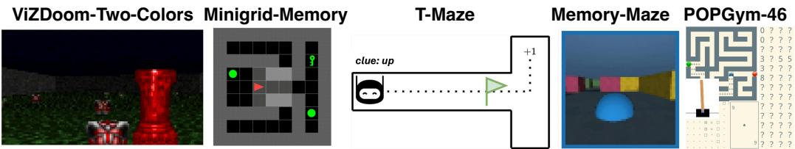  
Figure 9: Memory-intensive environments used to evaluate RATE memory mechanisms.

# 956 B Decision Transformer

Decision Transformer (DT) [10] is an algorithm for offline RL that reduces the RL task to a sequence modeling task. In DT, the scheme of which is presented in Algorithm 3, the trajectory $\tau$ is not divided into segments as in RATE. Instead, random fragments of length $K$ are sampled from the trajectory, since originally this architecture was designed to work only with MDP. The predicted actions $\hat { a }$ are sampled autoregressively.

<table><tr><td>Algorithm3Decision Transformer</td><td></td></tr><tr><td>Require: R ∈ R1xT,0 ∈ Rdo×T,a ∈ R1×T</td><td rowspan="3"></td></tr><tr><td>1: R ∈ RT×d ← Encoderr(R) ó ∈RTxd ← Encoder(o)</td></tr><tr><td>α∈RTxd ← Encodera(a) 2: T0..T ← {(Ro,Oo,ao),...,(Rr,OT,aT)}</td></tr></table>

# C Environments

# C.1 Memory-intensive environments

In this section, we provide an extended description of the environments used in this paper, as well as the methodology used to collect the trajectories. Table 7 summarizes the observations type, rewards type, and actions type for each of the environments considered in this paper.

# C.1.1 ViZDoom-Two-Colors

We used a modified ViZDoom-Two-Colors environment from [46] to assess the model’s memory abilities. The agent initially having 100 hit points (HP) is placed in a room without inner walls filled with acid. At each step in the environment, the agent loses a fixed amount of health $( { 1 0 } / { 3 2 } \mathrm { { H P } }$ per step). In the center of the environment, there is a pillar of either green or red color, which disappears after 45 environment steps. Throughout the environment, objects of two colors (green and red) are generated. When the agent interacts with an object of the same color as the pillar, it gains an increase in health of $+ 2 5$ and a reward of $+ 1$ . When the agent interacts with an object of the opposite color, it loses a similar amount of health. The agent receives an additional reward of $+ 0 . 0 2$ for each step it survives. The episode ends when the agent has zero health. Thus, the agent needs to remember the color of the pillar to select items of the correct color, even if the pillar is out of sight or has disappeared. The agent does not receive information about its current health or rewards, as these observations essentially convey the same information as the color of the pillar but persist beyond step 45.

We collected a dataset of 5000 trajectories of 90 steps in length using a trained A2C [4] agent (an agent trained with a non-disappearing pillar). The average reward for these 90 steps is 4.46. When collecting trajectories, to ensure that the agent saw the pillar before it disappeared, the agent always appeared facing the pillar in the same place – midway between the pillar and the nearest wall. In order to successfully complete this task, the agent needs to remember the color of the pillar. This environment tests the long-term memory mechanism, since the agent needs to retain information about the pillar for a time much longer than the pillar has been in the environment. Using only short-term

Table 7: Description of observations and reward functions for the considered environments.   

<table><tr><td>Environment</td><td>Obs. Type</td><td>Rew. Type</td><td>Act. Space</td><td>Obs.Details</td></tr><tr><td>ViZDoom-Two-Colors</td><td>Image</td><td>Continuous</td><td>Discrete</td><td>First-person view</td></tr><tr><td>T-Maze</td><td>Vector</td><td>Sparse &amp;Discrete</td><td>Discrete</td><td>Low-dimensional vector</td></tr><tr><td>Memory Maze</td><td>Image</td><td>Sparse &amp;Discrete</td><td>Discrete</td><td>First-person view</td></tr><tr><td>Minigrid-Memory</td><td>Image</td><td>Sparse</td><td>Discrete</td><td>3×3 grid centered on agent</td></tr><tr><td>POPGym</td><td>Vector/Image</td><td>Discrete/Continuous</td><td>Discrete/Continuous</td><td>Vector or 2D grid</td></tr><tr><td>Action Assoc.Retrieval</td><td>Vector</td><td>Sparse&amp;Discrete</td><td>Discrete</td><td>Symbolic vector input</td></tr><tr><td>Atari</td><td>Image</td><td>Sparse &amp;Discrete</td><td>Discrete</td><td>Full game screen</td></tr><tr><td>MuJoCo</td><td>Vector</td><td>Continuous</td><td>Continuous</td><td>Low-dimensional state vector</td></tr></table>

memory and, for example, collecting the next item of the same color as the previous collected item,   
it will not be possible for the agent to survive for a long time, as this policy is extremely unstable.   
This is due to the fact that in the training dataset the agent occasionally makes a mistake and picks up   
an object of the opposite color. Thus, irrelevant information about the desired color may enter the   
transformer context and the agent will start collecting items of an opposite color, which will quickly   
lead to a failure.

# 999 C.1.2 T-Maze

To investigate agent’s long-term memory on very long environments (the inference trajectory length is much longer than the effective context length $K _ { e f f } )$ ) we used a modified version of the T-Maze environment [34]. The agent’s objective in this environment is to navigate from the beginning of the T-shaped maze to the junction and choose the correct direction, based on a signal given at the beginning of the trajectory using four possible actions $a \in \{ l e f t , u p , r i g h t , d o \bar { w } n \}$ . This signal, represented as the clue variable and equals to zero everywhere except the first observation, dictates whether the agent should turn up $\mathit { c l u e } = 1$ ) or down $( c l u e = - 1 )$ ). Additionally, a constraint on the episode duration $T = L + 2$ , where the maximum duration is determined by the length of the corridor $L$ to the junction, adds complexity to the problem. To address this, a binary flag, represented as the flag variable, which is equal to 1 one step before the junction and 0 otherwise, indicating the arrival of the agent at the junction, is included in the observation vector. Additionally, a noise channel is added to the observation vector, with random integer values from the set $\{ - 1 , 0 , + 1 \}$ . The observation vector is thus defined as $o = [ y , c l u e , f l a g , n \bar { o } i s e ]$ , where $y$ represents the vertical coordinate. The reward $r$ is given only at the end of the episode and depends on the correctness of the agent’s turn at the junction, being 1 for a correct turn and 0 otherwise. This formulation deviates from the traditional Passive T-Maze environment [34] (different observations and reward functions) and presents a more intricate set of conditions for the agent to navigate and learn within the given time constraint.

The dataset consists of 2000 of trajectories for each segment of length 30 (i.e. 6000 trajectories for   
the $K _ { e f f } = 3 \times 3 0 = 9 0 )$ and consists only of successful episodes. An artificial oracle with a priori   
information about the environment was used to generate the dataset.

# 1021 C.1.3 Memory Maze

In this first-person view 3D environment [38], the agent appears in a randomly generated maze   
containing several objects of different colors at random locations. The agent’s task is to find an object   
of the same color in the maze as the outline around its observation image. After the agent finds an   
object of the desired color and steps on it, the color of the outline changes and the agent must find   
another object. The agent receives a $+ 1$ reward for stepping on the correct object. Otherwise, it   
receives no reward. The duration of an episode is a fixed number and is equal to 1000. Thus, the   
agent’s task is to find as many objects of the desired color as possible in a limited time. The agent’s   
effectiveness in this environment depends on its ability to memorize the structure of the maze and the   
location of objects in it in order to find the desired objects faster. Using the Dreamer model [20] to   
collect dataset of 5000 trajectories only achieved an average award of 4.7 per episode, i.e., a rather   
sparse dataset.

Minigrid-Memory [11] is a 2D grid environment designed to test an agent’s long-term memory and credit-assignment [34]. The environment map is a T-shaped maze with a small room with an object inside it at the beginning of the corridor. The agent appears at a random coordinate in the corridor. The agent’s task is to reach the room with the object and memorize it, then reach the junction at the end of the maze and make a turn in the direction where the same object is located as in the room at the beginning of the maze. A reward $\textstyle r = 1 - 0 . 9 \times { \frac { t } { T } }$ is given for success, and 0 for failure. The episode ends after any agent turns at a junction or after a limited amount of time (95 steps) has elapsed. The agent’s observations are limited to a $3 \times 3$ size frame. 10000 trajectories with grid size 41x41 were collected using PPO [44] with Transformer-XL (TrXL) [39] with a context length equal to the maximum episode duration.

# 1044 C.1.5 POPGym

POPGym [32] is a benchmark suite consisting of 46 diverse partially observable environments designed to isolate different aspects of memory use and generalization in reinforcement learning. The tasks include both short-horizon reactive scenarios and long-horizon memory puzzles that require the agent to remember information across extended delays or infer hidden states from past observations. The environments vary in observation modality (image vs. vector), reward sparsity, and temporal dependencies. For our dataset, we followed the original POPGym evaluation protocol and used a PPO [44] agent with a GRU [12] backbone (PPO-GRU), which showed the best performance in the original benchmark. We collected trajectories using this policy for all 46 environments. The collected dataset reflects the diverse difficulty and memory requirements of the benchmark and serves as a challenging testbed for evaluating general-purpose memory architectures like RATE.

# C.2 Standard benchmarks

# C.2.1 Atari games

For the Atari game environments [5], we used the same dataset as in DT, namely the DQN replay dataset with grayscale state images [2]. This dataset contains 500 thousand of the 50 million steps of an online DQN [31] agent for each game. We use the following set of games: SeaQuest, Breakout, Pong and Qbert.

# C.2.2 MuJoCo.

Despite the fact that memory is not required in decision making in control environments like MuJoCo [16], we conducted additional experiments in this environment to compare with DT. For the continuous control tasks, we selected a standard MuJoCo locomotion environment and a set of trajectories from the D4RL benchmark [16]. Since we chose DT and TAP as the main models for comparison on this data, we focused on the environments used in both works (HalfCheetah, Hopper, and Walker). We used three

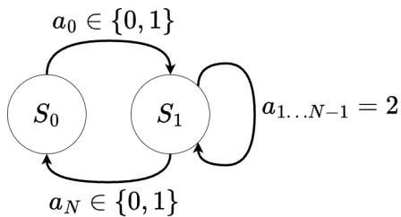  
Figure 10: Action Associative Retrieval.

different dataset settings: 1) Medium – 1 million timesteps generated by a “medium” policy that   
achieves about a third of the score of an expert policy; 2) Medium-Replay – the replay buffer of   
an agent trained with the performance of a medium policy (about $2 0 0 \mathbf { k } { - } 4 0 0 \mathbf { k }$ timesteps in our envi  
ronments); 3) Medium-Expert – 1 million timesteps generated by the medium policy concatenated   
with 1 million timesteps generated by an expert policy. The scores for the MuJoCo experiments are   
normalized such that 100 represents an expert policy, following the benchmark protocol outlined   
in [16]. The performance metrics for Conservative Q-Learning (CQL) and Trajectory Autoencoding   
Planner (TAP) are reported from the TAP paper [23], and for DT from the DT paper [10], as they use   
the same dataset and evaluation protocol.

# 1080 D Action Associative Retrieval

As shown in Figure 6, DT has a $\mathrm { S R } = 5 0 \%$ for inference at corridor lengths longer than the transformer   
context length. This is due to the fact that even a DT trained on balanced data has a slight bias in

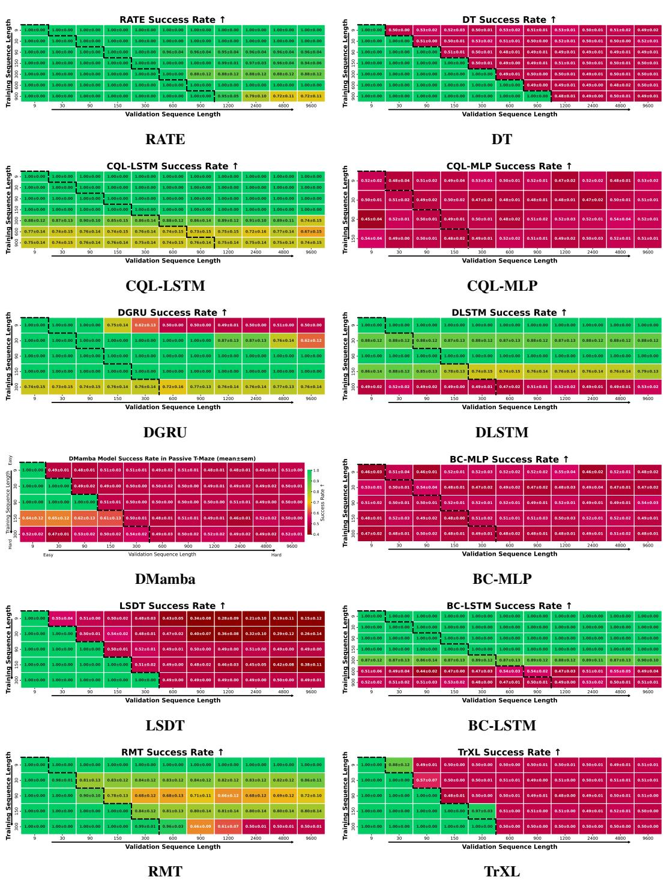  
Figure 11: Results for all models in the T-Maze generalization task.

the predicted probability towards one of the two required actions, which leads to the fact that when $t > K$ the agent constantly produces only one action: up or down. In turn, the presence of memory in the agent allows us to combat this problem.

To check how the agent’s performance changes during training, we design an Action Associative Retrieval (AAR) Figure 10 environment.

There are two states in this environment: $S _ { 0 }$ and $S _ { 1 }$ . The agent appears in state $S _ { 0 }$ and by performing the action $a _ { 0 } \in \{ 0 , 1 \}$ moves to state $S _ { 1 }$ . Next, the agent must take $N - 2$ steps to move from state

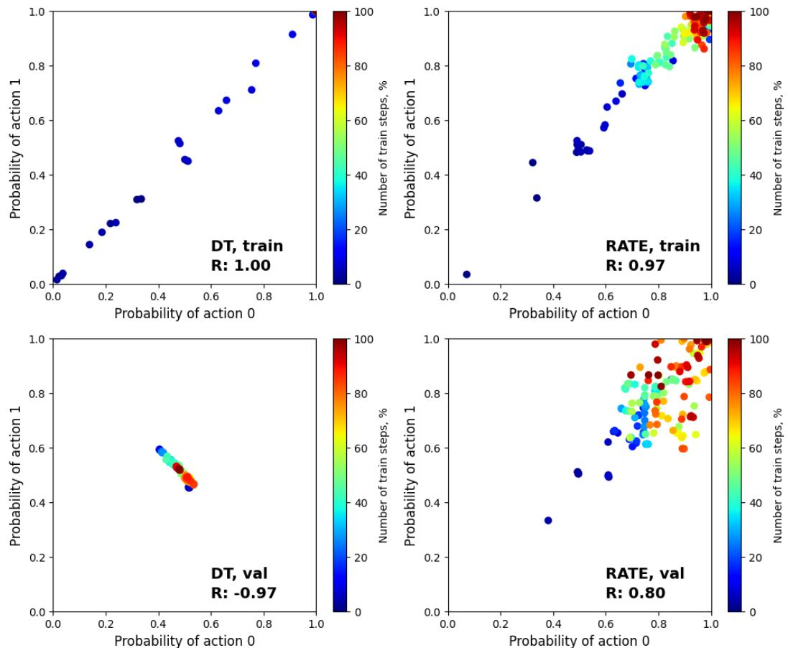  
Figure 12: Experimental results with RATE and DT in the AAR environment. The graphs show the 10-runs average results of training on trajectories of length $T = 9 0$ and validation on trajectories of length $T = 1 8 0$ , for RATE with $K _ { e f f } = 3 \times 3 0 = 9 0$ and for DT with $K = 9 0$ .

$S _ { 1 }$ to state $S _ { 1 }$ by performing action $a = 2$ (no op.). At the end of the episode, the agent must perform   
the same action that moved it from state $S _ { 0 }$ to state $S _ { 1 }$ in order to move from state $S _ { 1 }$ to state $S _ { 0 }$ .   
Thus, the action $a \in \{ 0 , 1 , 2 \}$ . Agent observations $o = [ s t a t e , f l a g , n o i s e ]$ , where state $\in \{ 0 , 1 \}$   
is the index of the current state, $\mathsf { \bar { f } } l a g \in \{ 0 , 1 \}$ is a flag equal to 1 in case the next step requires   
returning to the initial state and equal to 0 otherwise, $n o i s e \in \{ - 1 , 0 , + 1 \}$ is the noise channel. The   
agent receives a $+ 1$ reward if it returns to the initial state $S _ { 0 }$ by performing the action that took it out   
from the $S _ { 0 }$ to the $S _ { 1 }$ , and $- 1$ in other cases. The training dataset consists of oracle-generated 6000   
trajectories with positive reward.   
More formally, we can talk about the presence of memory in an agent when solving AAR (T-Maze  
like) tasks under the condition that:

$$
\forall t > K : \frac { 1 } { N _ { 0 } } \sum _ { i = 1 } ^ { N _ { 0 } } p _ { i } ( a _ { t } = a ^ { 0 } | a _ { 0 } = a ^ { 0 } ) + \frac { 1 } { N _ { 1 } } \sum _ { i = 1 } ^ { N _ { 1 } } p _ { i } ( a _ { t } = a ^ { 1 } | a _ { 0 } = a ^ { 1 } ) > 1
$$

This condition means that if the agent has memory, the sum of the average conditional probabilities   
over all experiments will be greater than one, i.e., these probabilities are independent of each other.   
Provided that the sum of these probabilities is less than or equal to one, the agent will choose at best   
the same target action in most experiments, even if another action is required.

where 1104 $a ^ { 0 } , a ^ { 1 } \in { \mathcal { A } } \cdot$ – two mutually exclusive actions leading to a reward; $t$ is the step at which the 1105 final action is required; $N _ { 0 } , N _ { 1 }$ are the number of experiments in environments where target action 1106 $a _ { t } = a ^ { 0 }$ and $a _ { t } = a ^ { 1 }$ , respectively.

In the results Figure 12, the first $1 \%$ of training steps was removed because it corresponds to the   
beginning of the training and is unrepresentative. Blue dots correspond to the beginning of training,   
red dots to the end of training. As can be seen from Figure 12, during training, the probabilities   
$p _ { i } ( a _ { t } = a ^ { 0 } | a _ { 0 } \mathop { = } a ^ { 0 } )$ $( R _ { t r a i n } ^ { D T } = 1 . 0 0$ $p _ { i } ( \bar { a } _ { t } = a ^ { 1 } | a _ { 0 } = a ^ { 1 } )$ $R _ { t r a i n } ^ { R A T E } = 0 . 9 7 )$ on the , where $R$ ining trajectories have– correlation coefficie tron Thi positivedicates   
that within-context (effective context) DT and RATE models are able to predict both $a ^ { 0 }$ $a ^ { 1 }$   
equally well.   
At the same time, during validation, for the RATE model this pattern is preserved – the red points   
corresponding to the probabilitiesgraph, positive correlation persists $( R _ { v a l } ^ { R A T E } = 0 . 8 0 )$ ns . O $a ^ { 0 }$ and he ot $\setminus a ^ { 1 }$ are in the upper right part of ther hand, in the DT case, the cluster   
of red dots is skewed toward choosing action $a ^ { 1 }$ and action with equal probabilities equal to 0.5.   
$( R _ { v a l } ^ { D T } = - 0 . 9 7 )$ se probabilities are less or equal to one, as evidenced by a strong negative correlation. The results confirm the inability of DT to generalize on trajectories whose lengths   
exceed the context length and the ability of RATE to handle such tasks.

# 1121 E Training

This section provides additional details on the training process of the baselines considered in the   
paper. We treated the inclusion of the feed-forward network (FFN) block in RATE’s transformer   
decoder as a hyperparameter, as RATE performed slightly better without FFN in some environments.   
In contrast, other transformer-based baselines were trained with the standard transformer decoder   
including FFN.

# 1127 E.1 ViZDoom-Two-Colors

Since the pillar disappears at time $t { = } 4 5$ , all trajectories span from $t { = } 0$ to $t { = } 9 0$ to ensure that the   
cue remains available during training. In this setting, we compare DT with context length $K { = } 9 0$ to   
RATE, RMT, and TrXL models using $K { = } 3 0$ and $N { = } 3$ segments. Thus, RATE processes sequences   
of the same total length $K _ { \mathrm { e f f } } { = } N { \times } K { = } 9 0$ but accesses only $K { = } 3 0$ tokens at a time. Additionally, we   
ran experiments with $N { = } 3$ , $K { = } 5 0$ , and $T { = } 1 5 0$ to validate model robustness under longer and more   
complex configurations.

# 1134 E.2 Passive T-Maze

We trained models on sequences of length $T _ { \mathrm { t r a i n } } \in \{ 9 , 3 0 , 9 0 , 1 5 0 , 3 0 0 , 6 0 0 , 9 0 0 \}$ and evaluated   
them on Tval ∈ {9, 30, 90, 150, 300, 600, 900, 1200, 2400, 4800, $9 6 0 0 \}$ . For RATE, each   
sequence was split into $N = 3$ segments, yielding a context length of $K = \dot { T } _ { \mathrm { t r a i n } } / 3$ . All training   
trajectories started from $t = 0$ , ensuring the cue was always included. In what follows, we adopt the   
notation MODEL-N, where $N = 3$ indicates segmentation into three recurrent blocks (e.g., RATE-3   
is trained on full sequences of length $T = 9 0$ with $K = 3 0$ ). This convention is used throughout the   
ablation studies.

# 1142 E.3 Memory Maze

To train RATE, DT, RMT, and TrXL on Memory Maze, we used the same approach as for ViZDoom  
Two-Colors environment, but instead of using fixed trajectories starting at $t \ : = \ : 0$ , we sampled   
consecutive 90-step subsequences from the original 1000-step trajectories. Each subsequence was   
sampled with a stride of 90 steps, resulting in approximately 11 training sequences per original   
trajectory. As in the ViZDoom-Two-Colors case, training for DT was performed with a context length   
of $K = 9 0$ and for RATE, RMT, and TrXL with a context length of $K = 3 0$ and number of segments   
$N = 3$ , i.e., effective context length $K _ { e f f } = N \times K = 3 \times 3 0 = 9 0$ .

# 1150 E.4 Minigrid-Memory

To train baselines in this environment, we used only mazes of fixed size $4 1 \times 4 1$ , ensuring a consistent corridor length during training. For evaluation, models were validated on mazes ranging from $1 1 \times 1 1$ to $5 0 1 \times 5 0 1$ , where corridor lengths vary within each grid, enabling assessment of both interpolation and extrapolation capabilities. All training trajectories used an episode timeout of 96 steps, while

validation trajectories across all maze sizes used a longer timeout of 500 steps. As in T-Maze, each   
trajectory began at $t = 0$ , ensuring the cue was always observed. During training, RATE used a   
context length of $K = 3 0$ with $N = 3$ segments, while other baselines (except RMT and TrXL) used   
$K = 9 0$ .

# E.5 POPGym Suite

POPGym [32] comprises 46 tasks of varying memory complexity, including both memory puzzles and reactive POMDPs. Since episode lengths vary widely across tasks – from as short as 12 steps to as long as 1000 – we ensured a consistent and fair memory evaluation for RATE by setting the context length $K = T / 3$ and using $N = 3$ segments for every environment, where $T$ denotes the maximum episode length of each task. This uniform configuration allowed RATE to process full trajectories with recurrent segmentation, ensuring its memory capacity was equally tested across tasks of different lengths and difficulties.

# 1167 E.6 Atari and MuJoCo

When training RATE on Atari games and MuJoCo control tasks, sequences of length $T = 9 0$ (Atari)   
and $T = 6 0$ (MuJoCo) were sampled randomly from the original trajectories in the dataset. These   
trajectories were then divided into $N = 3$ segments of length $K = 3 0$ (Atari) and $K = 2 0$ (MuJoCo),   
forming an effective context of length $K _ { e f f } = N \times K = 9 0$ (60 for MuJoCo).   
For Atari, we used the identical experimental design described in the DT paper [10]. It is worth   
noting that we presented raw scores for Atari, rather than gamer-normalized scores as described in   
the DT paper. Table 4 shows the results for Atari environments. RATE outperforms DT significantly   
in environments like Breakout and Qbert. We attribute this to the observation that, although these   
environments do not explicitly demand memory, intricate dynamics from the past exert a greater   
influence on agent behavior than in environments such as SeaQuest. Actions executed in the past   
notably alter the present state of the environment in Breakout and Qbert, whereas in SeaQuest, such   
actions hold little significance. For instance, the emergence of enemies and divers in SeaQuest is   
entirely independent of the agent’s prior actions.   
For MuJoCo, our findings suggest that the conventional strategy of utilizing return is not suitable   
for our segment-based scheme. The issue arises during the trajectory, where the agent’s return   
persistently diminishes. However, the true value of the agent’s state at the onset and conclusion of the   
episode could remain unchanged, provided the agent’s policy performs consistently well. To rectify   
this discrepancy, we propose a novel evaluation strategy for MuJoCo tasks. In this approach, each   
segment commences with the maximum return, simulating the scenario where the agent initiates the   
trajectory anew. This method effectively mitigates the aforementioned issue, enhancing the accuracy   
of our evaluation process. Our MuJoCo experiments in Table 3 show that this benefits performance   
significantly for some environments. Thus, using RATE allowed us to obtain the best metrics for   
1190 MuJoCo in 4/9 cases compared to the other baselines. RATE also outperforms DT in 9/9 tasks.

# 1191 F Additional ablation studies

To determine the optimal hyperparameters associated with memory mechanisms, additional ablation studies were performed in ViZDoom-Two-Colors and T-Maze environments, and the results are presented in Figure 14 and Figure 13 (right). From the ablation studies results, it was found that for environments like ViZDoom-Two-Colors with continuous reward signal and image observations, the best results can be obtained using number of cached memory tokens mem_ $. { \bf e n } = ( K \times 3 + 2 \times$ num_mem_tokens) $\mathbf { \Omega } _ { | \mathbf { \Omega } \times N }$ , where $K$ – context length and $N$ – number of segments.

On the other hand, for environments with sparse events like T-Maze, it has been found that using caching of hidden states of previous tokens $\mathrm { ( m e m \mathrm { - } 1 e n > 0 ) }$ prevents remembering important information.

# F.1 Additional ViZDoom-Two-Colors ablation

02 The effect of combining of memory tokens with noise is shown in Figure 13 (left). The noise was   
applied as a convex combination: memory_tokens $= ( 1 - \alpha ) \times$ memory_tokens + $\alpha \times$ noise.   
With unchanged caching of hidden states from previous steps at growth of the noise parameter $\alpha$ , at   
first there is a decrease of performance at inference on green pillars (up to $\alpha = 0 . 5$ ), and only then a   
decrease of performance at inference on red pillars. This phenomenon can be explained by the fact   
that memory embeddings is trained to record mostly information about red pillars, which helps to   
combat bias in the training data.

Table 8: RATE hyperparameters for different experiments. $\ddagger -$ Leaky ReLU used in Atari.Pong. The listed hyperparameters for ViZDoom-Two-Colors and T-Maze correspond to the experiments with $T _ { \mathrm { t r a i n } } = 1 5 0$ , while for POPGym, they reflect the settings used in the POPGym-Concentration task.   

<table><tr><td>Hyperparameter</td><td>ViZDoom2C</td><td>Memory Maze</td><td>T-Maze</td><td>Minigrid-Memory</td><td>POPGym</td><td>Atari</td><td>MuJoCo</td></tr><tr><td colspan="8">Memory-specific parameters</td></tr><tr><td>Number of memory tokens</td><td>15</td><td>15</td><td>10</td><td>10</td><td>30</td><td>15</td><td>5</td></tr><tr><td>Number of cached tokens</td><td>100</td><td>360</td><td>0</td><td>180</td><td>100</td><td>360</td><td>60</td></tr><tr><td>Number of MRV heads</td><td>2</td><td>0</td><td>2</td><td>4</td><td>2</td><td>1</td><td>1</td></tr><tr><td>MRV activation</td><td>ReLU</td><td>ReLU</td><td>ReLU</td><td>ReLU</td><td>ReLU</td><td>ReLUt</td><td>ReLU</td></tr><tr><td colspan="8">Transformer architecture</td></tr><tr><td>Number of layers</td><td>6</td><td>6</td><td>8</td><td>4</td><td>10</td><td>6</td><td>3</td></tr><tr><td>Number of attention heads</td><td>8</td><td>8</td><td>8</td><td>4</td><td>2</td><td>8</td><td>1</td></tr><tr><td>Embedding dimension</td><td>64</td><td>64</td><td>64</td><td>128</td><td>32</td><td>128</td><td>128</td></tr><tr><td>Context length K</td><td>50</td><td>30</td><td>50</td><td>30</td><td>18</td><td>30</td><td>20</td></tr><tr><td>Number of segments</td><td>3</td><td>3</td><td>3</td><td>3</td><td>3</td><td>3</td><td>3</td></tr><tr><td>Skip dec FFN</td><td>False</td><td>True</td><td>True</td><td>False</td><td>True</td><td>True</td><td>True</td></tr><tr><td colspan="8">Regularization</td></tr><tr><td>Hidden dropout</td><td>0.2</td><td>0.5</td><td>0.2</td><td>0.3</td><td>0.1</td><td>0.2</td><td>0.2</td></tr><tr><td>Attention dropout</td><td>0.05</td><td>0.2</td><td>0.1</td><td>0.1</td><td>0.05</td><td>0.05</td><td>0.05</td></tr><tr><td>Weight decay</td><td>0.001</td><td>0.1</td><td>0.001</td><td>0.001</td><td>0.001</td><td>0.1</td><td>0.1</td></tr><tr><td colspan="8">Training configuration</td></tr><tr><td>Max epochs</td><td>150</td><td>80</td><td>200</td><td>500</td><td>200</td><td>10</td><td>10</td></tr><tr><td>Batch size</td><td>128</td><td>64</td><td>64</td><td>64</td><td>32</td><td>128</td><td>4096</td></tr><tr><td>Loss function</td><td>CE</td><td>CE</td><td>CE</td><td>CE</td><td>CE</td><td>CE</td><td>MSE</td></tr><tr><td>Optimizer</td><td>AdamW</td><td>AdamW</td><td>AdamW</td><td>AdamW</td><td>AdamW</td><td>AdamW</td><td>AdamW</td></tr><tr><td>Learning rate</td><td>3e-4</td><td>3e-4</td><td>1e-4</td><td>1e-4</td><td>3e-4</td><td>3e-4</td><td>6e-5</td></tr><tr><td>Grad norm clip</td><td>5.0</td><td>1.0</td><td>1.0</td><td>5.0</td><td>5.0</td><td>1.0</td><td>1.0</td></tr><tr><td>Cosine decay</td><td>False</td><td>True</td><td>False</td><td>False</td><td>False</td><td>True</td><td>False</td></tr><tr><td>Linear warmup</td><td>True</td><td>True</td><td>True</td><td>True</td><td>True</td><td>True</td><td>True</td></tr><tr><td>(β1,β)</td><td>(0.9, 0.999)</td><td>(0.9,0.95)</td><td>(0.9,0.999)</td><td>(0.9, 0.999)</td><td>(0.9, 0.999)</td><td>(0.9,0.95)</td><td>(0.9,0.95)</td></tr></table>

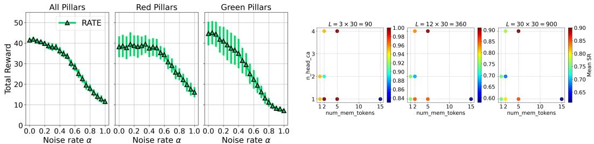  
Figure 13: (left) Investigating the RATE memory tokens noise effect in the ViZDoom-Two-Colors. (right) Results of RATE-3 (trained on corridor lengths $\leq 9 0$ ) ablation studies in the T-Maze environment. n_head_ca – number of MRV attention heads, num_mem_tokens – number of memory tokens.

# F.2 Curriculum Learning

Since in the T-Maze environment, the number of actions at the junction relates to the number of actions when moving straight along the corridor as $\frac { 1 } { L }$ and tends to 0 as $L$ increases, there is a significant imbalance in the agent’s action distribution, which can cause problems when performing rare class (turning actions) prediction. Theoretically, this situation can be remedied through curriculum learning.

Curriculum learning (CL) is a technique in which a model is trained on examples of increasing   
difficulty. In this approach, the model is first trained on the set of trajectories $Q _ { 1 } = q _ { 1 }$ of length   
$K \times 1$ , then the trained model is re-trained on the set of trajectories $Q _ { 2 } = q _ { 1 } \cup q _ { 2 }$ , where the set

Table 9: Performance on POPGym tasks (mean±sem over three runs, 100 seeds each).   

<table><tr><td></td><td rowspan="2">RATE</td><td rowspan="2">DT</td><td rowspan="2">Random</td><td rowspan="2">BC-MLP</td><td rowspan="2">Dataset BC-LSTM Average</td></tr><tr><td>Environment</td></tr><tr><td></td><td>-0.29±0.00</td><td>-0.47 ±0.00</td><td>-0.50±0.00</td><td>-0.47±0.00</td><td>-0.32 ±0.00</td><td>Return -0.26</td></tr><tr><td>AutoencodeEasy-v0 AutoencodeMedium-v0</td><td>-0.47± 0.00</td><td>-0.49 ±0.00</td><td>-0.50±0.00</td><td>-0.49±0.00</td><td>-0.47±0.00</td><td>-0.48</td></tr><tr><td>AutoencodeHard-v0</td><td>-0.46 ±0.00</td><td>-0.49 ±0.00</td><td>-0.50±0.01</td><td>-0.50±0.00</td><td>-0.44±0.00</td><td>-0.43</td></tr><tr><td>BattleshipEasy-v0</td><td>-0.81± 0.02</td><td>-0.93±0.03</td><td>-0.46±0.01</td><td>-1.00 ±0.00</td><td>-0.49 ± 0.01</td><td>-0.35</td></tr><tr><td>BattleshipMedium-v0</td><td>-0.91 ± 0.02</td><td>-0.91 ±0.03</td><td>-0.39 ±0.01</td><td>-1.00±0.00</td><td>-0.81 ±0.02</td><td>-0.43</td></tr><tr><td>BattleshipHard-v0</td><td>-0.92 ±0.01</td><td>-0.97 ±0.01</td><td>-0.41±0.00</td><td>-1.00 ±0.00</td><td>-0.67 ±0.01</td><td>-0.40</td></tr><tr><td>ConcentrationEasy-v0</td><td>-0.06 ± 0.02</td><td>-0.05 ± 0.01</td><td>-0.19 ± 0.01</td><td>-0.92 ±0.00</td><td>-0.14±0.00</td><td>-0.12</td></tr><tr><td>ConcentrationMedium-v0</td><td>-0.84±0.00</td><td>-0.84±0.00</td><td>-0.84±0.00</td><td>-0.88 ±0.00</td><td>-0.84 ±0.00</td><td>-0.87</td></tr><tr><td>ConcentrationHard-vO</td><td>-0.25 ±0.00</td><td>-0.25 ±0.01</td><td>-0.19±0.00</td><td>-0.92 ± 0.00</td><td>-0.19 ± 0.01</td><td>-0.44</td></tr><tr><td>CountRecallEasy-vO</td><td>0.07 ±0.01</td><td>-0.46 ±0.01</td><td>-0.93±0.00</td><td>-0.92 ± 0.00</td><td>0.05±0.00</td><td>0.22</td></tr><tr><td>CountRecallMedium-v0</td><td>-0.47±0.01</td><td>-0.75 ± 0.03</td><td>-0.88 ±0.00</td><td>-0.88 ±0.00</td><td>-0.47 ±0.00</td><td>-0.48</td></tr><tr><td>CountRecallHard-v0</td><td>-0.54± 0.00</td><td>-0.81 ±0.02</td><td>-0.93±0.00</td><td>-0.92 ±0.00</td><td>-0.56 ±0.00</td><td>-0.55</td></tr><tr><td>HigherLowerEasy-v0</td><td>0.50±0.00</td><td>0.50±0.00</td><td>0.00±0.01</td><td>0.47±0.00</td><td>0.50±0.00</td><td>0.51</td></tr><tr><td>HigherLowerMedium-v0</td><td>0.50±0.00</td><td>0.50±0.00</td><td>-0.01±0.00</td><td>0.49±0.00</td><td>0.50±0.00</td><td>0.49</td></tr><tr><td>HigherLowerHard-vO</td><td>0.52±0.00</td><td>0.51 ±0.00</td><td>0.01 ± 0.01</td><td>0.50±0.00</td><td>0.51 ± 0.01</td><td>0.49</td></tr><tr><td>LabyrinthEscapeEasy-v0</td><td>0.95 ±0.00</td><td>0.80±0.01</td><td>-0.39 ±0.00</td><td>0.72 ±0.05</td><td>0.92 ±0.01</td><td>0.95</td></tr><tr><td>LabyrinthEscapeMedium-v0</td><td>-0.81 ± 0.01</td><td>-0.82 ± 0.01</td><td>-0.94± 0.01</td><td>-0.89 ± 0.01</td><td>-0.86 ±0.00</td><td>-0.94</td></tr><tr><td>LabyrinthEscapeHard-v0</td><td>-0.56 ± 0.01</td><td>-0.67 ± 0.04</td><td>-0.84±0.04</td><td>-0.71 ± 0.03</td><td>-0.69 ±0.02</td><td>-0.49</td></tr><tr><td>LabyrinthExploreEasy-v0</td><td>0.95±0.00</td><td>0.88 ±0.06</td><td>-0.34±0.01</td><td>0.87 ±0.01</td><td>0.93±0.00</td><td>0.96</td></tr><tr><td>LabyrinthExploreMedium-v0</td><td>0.79 ±0.00</td><td>0.77±0.01</td><td>-0.73±0.00</td><td>0.26 ±0.01</td><td>0.71 ±0.01</td><td>0.79</td></tr><tr><td>LabyrinthExploreHard-vO</td><td>0.88±0.00</td><td>0.86± 0.01</td><td>-0.61±0.00</td><td>0.45 ± 0.01</td><td>0.82 ±0.01</td><td>0.87</td></tr><tr><td>MineSweeperEasy-v0</td><td>0.15 ±0.03</td><td>-0.33 ± 0.04</td><td>-0.26 ±0.03</td><td>-0.47 ± 0.01</td><td>0.20±0.00</td><td>0.28</td></tr><tr><td>MineSweeperMedium-v0</td><td>-0.44± 0.00</td><td>-0.40±0.01</td><td>-0.43±0.00</td><td>-0.49 ±0.00</td><td>-0.35 ± 0.01</td><td>-0.27</td></tr><tr><td>MineSweeperHard-vO</td><td>-0.20±0.00</td><td>-0.37 ±0.02</td><td>-0.39 ± 0.01</td><td>-0.48 ±0.00</td><td>-0.16 ±0.00</td><td>-0.10</td></tr><tr><td>MultiarmedBanditEasy-v0</td><td>0.37 ± 0.01</td><td>0.27± 0.01</td><td>0.02 ±0.00</td><td>0.05 ±0.00</td><td>0.17 ± 0.02</td><td>0.62</td></tr><tr><td>MultiarmedBanditMedium-v0</td><td>0.22 ± 0.03</td><td>0.27 ± 0.01</td><td>0.01±0.00</td><td>0.01± 0.00</td><td>0.17 ±0.01</td><td>0.43</td></tr><tr><td>MultiarmedBanditHard-v0</td><td>0.32 ± 0.01</td><td>0.35 ± 0.01</td><td>0.01±0.00</td><td>0.21 ± 0.01</td><td>0.14 ±0.00</td><td>0.59</td></tr><tr><td>NoisyPositionOnlyCartPoleEasy-v0</td><td>0.88±0.03</td><td>0.87 ±0.02</td><td>0.11±0.00</td><td>0.23±0.00</td><td>0.44± 0.01</td><td>0.98</td></tr><tr><td>NoisyPositionOnlyCartPoleMedium-v0</td><td>0.18 ±0.01</td><td>0.17 ±0.01</td><td>0.11±0.00</td><td>0.16±0.00</td><td>0.22 ± 0.01</td><td>0.36</td></tr><tr><td>NoisyPositionOnlyCartPoleHard-v0</td><td>0.33± 0.01</td><td>0.34±0.00</td><td>0.12 ± 0.01</td><td>0.18 ±0.00</td><td>0.25 ± 0.01</td><td>0.57</td></tr><tr><td>NoisyPositionOnlyPendulumEasy-v0</td><td>0.87±0.00</td><td>0.84± 0.01</td><td>0.27 ± 0.01</td><td>0.31 ± 0.00</td><td>0.88±0.00</td><td>0.90</td></tr><tr><td>NoisyPositionOnlyPendulumMedium-v0</td><td>0.60± 0.01</td><td>0.56 ± 0.01</td><td>0.26±0.00</td><td>0.28 ±0.00</td><td>0.66±0.00</td><td>0.67</td></tr><tr><td>NoisyPositionOnlyPendulumHard-v0</td><td>0.68 ±0.00</td><td>0.63 ± 0.01</td><td>0.27 ± 0.01</td><td>0.30±0.00</td><td>0.72 ±0.00</td><td>0.73</td></tr><tr><td>PositionOnlyCartPoleEasy-v0</td><td>0.93±0.03</td><td>1.00 ±0.00</td><td>0.12 ±0.00</td><td>0.15 ±0.00</td><td>0.17 ±0.00</td><td>1.00</td></tr><tr><td>PositionOnlyCartPoleMedium-v0</td><td>0.05±0.01</td><td>0.03 ±0.00</td><td>0.04±0.00</td><td>0.05±0.00</td><td>0.06±0.00</td><td>1.00</td></tr><tr><td>PositionOnlyCartPoleHard-v0</td><td>0.07±0.00</td><td>0.34±0.08</td><td>0.05±0.00</td><td>0.09 ± 0.00</td><td>0.12 ±0.00</td><td>1.00</td></tr><tr><td>PositionOnlyPendulumEasy-v0</td><td>0.54± 0.02</td><td>0.51±0.03</td><td>0.27±0.00</td><td>0.29 ±0.00</td><td>0.91 ±0.00</td><td>0.92</td></tr><tr><td>PositionOnlyPendulumMedium-v0</td><td>0.47± 0.01</td><td>0.49 ± 0.01</td><td>0.26±0.00</td><td>0.28 ±0.00</td><td>0.82 ±0.00</td><td>0.82</td></tr><tr><td>PositionOnlyPendulumHard-v0</td><td>0.49 ± 0.01</td><td>0.55 ±0.01</td><td>0.26±0.00</td><td>0.30±0.00</td><td>0.89 ±0.00</td><td>0.88</td></tr><tr><td>RepeatFirstEasy-vO</td><td>1.00 ±0.00</td><td>0.45 ±0.16</td><td>-0.49 ± 0.01</td><td>-0.50±0.00</td><td>1.00 ±0.00</td><td>1.00</td></tr><tr><td>RepeatFirstMedium-v0</td><td>0.10 ± 0.02</td><td>0.42 ± 0.14</td><td>-0.50±0.00</td><td>-0.50±0.00</td><td>-0.50±0.00</td><td>0.99</td></tr><tr><td>RepeatFirstHard-v0</td><td>0.99 ± 0.01</td><td>-0.21 ± 0.18</td><td>-0.50±0.00</td><td>-0.50±0.00</td><td>0.99 ± 0.01</td><td>1.00</td></tr><tr><td>RepeatPreviousEasy-v0</td><td>1.00 ±0.00</td><td>1.00 ±0.00</td><td>-0.49 ±0.01</td><td>-0.52 ± 0.00</td><td>1.00 ±0.00</td><td>1.00</td></tr><tr><td>RepeatPreviousMedium-v0</td><td>-0.46 ± 0.00</td><td>-0.47 ± 0.00</td><td>-0.51±0.00</td><td>-0.48 ± 0.00</td><td>-0.45 ±0.00</td><td>-0.48</td></tr><tr><td>RepeatPreviousHard-v0</td><td>-0.38 ± 0.01</td><td>-0.38 ± 0.00</td><td>-0.50±0.01</td><td>-0.50 ±0.00</td><td>-0.38 ±0.00</td><td>-0.39</td></tr><tr><td>VelocityOnlyCartPoleEasy-v0</td><td>1.00±0.00</td><td>1.00 ±0.00</td><td>0.11 ± 0.00</td><td>0.99 ±0.00</td><td>1.00 ±0.00</td><td>1.00</td></tr><tr><td>VelocityOnlyCartPoleMedium-v0</td><td>1.00 ±0.00</td><td>0.96 ±0.02</td><td>0.04±0.00</td><td>0.63±0.00</td><td>1.00 ± 0.00</td><td>0.99</td></tr><tr><td>VelocityOnlyCartPoleHard-v0</td><td>1.00 ±0.00</td><td>1.00 ±0.00</td><td>0.06±0.00</td><td>0.83 ±0.01</td><td>1.00 ±0.00</td><td>1.00</td></tr></table>

$q _ { 2 }$ is formed by trajectories of length $K \times 2$ , and so on (in order of increasing complexity of the trajectories). Thus, for the 1218 $N$ segments considered during training, the set $\textstyle Q _ { N } = \bigcup _ { i = 1 } ^ { N } q _ { i }$ is used.

In the T-Maze environment, DT, RATE, RMT, and TrXL were trained with and without curriculum   
learning because this approach theoretically produces better results. However, it is important to note   
that the T-Maze task is successfully solved by the RATE model without using curriculum learning,   
and even vice versa – its use slightly degraded performance on long corridors. However, with respect   
to TrXL, the use of CL yielded slightly better results. The work showed that using CL does not   
achieve significantly better performance on the T-Maze task. The results of using the CL on the   
T-Maze environment are presented in Figure 16 (left), and the results of applying noise to memory   
embeddings to assess its importance are presented in Figure 16 (right).

Table 10: Experimental setup and evaluation metrics across different environments. $N _ { r u n s }$ denotes the number of model runs; $N _ { s e e d s }$ denotes the number of inference episodes with different seeds; sem denotes standard error of the mean, and std denotes standard deviation.   

<table><tr><td rowspan="2">Environment</td><td colspan="2">Experiment Setup</td><td colspan="2">Results</td></tr><tr><td>Nruns</td><td>Nseeds</td><td>Metric</td><td>Notation</td></tr><tr><td colspan="5">Memory-intensive environments</td></tr><tr><td>ViZDoom-Two-Colors</td><td>6</td><td>100</td><td>Return</td><td>mean±sem</td></tr><tr><td>T-Maze</td><td>4</td><td>100</td><td>Success Rate</td><td>mean±sem</td></tr><tr><td>Memory Maze</td><td>3</td><td>100</td><td>Return</td><td>mean±sem</td></tr><tr><td>Minigrid-Memory</td><td>3</td><td>100</td><td>Return</td><td>mean±sem</td></tr><tr><td>POPGym</td><td>3</td><td>100</td><td>Return</td><td>mean±sem</td></tr><tr><td colspan="5">Diagnostic environment</td></tr><tr><td>Action Associative Retrieval</td><td>10</td><td></td><td>Success Rate</td><td>mean±sem</td></tr></table>

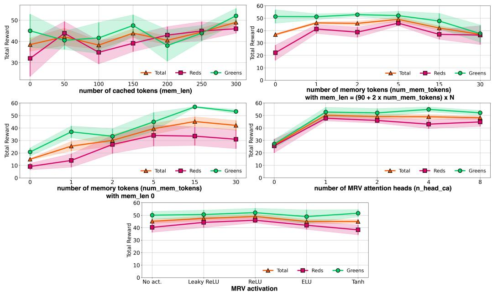  
Figure 14: Results of RATE ablation studies in the ViZDoom-Two-Colors environment.

# 1227 F.3 Supplemental MRV ablation

One of the options for implementing the memory tokenization gating mechanism was an approach similar to the one proposed in Gated Transforer-XL (GTrXL) [36] work. Thus, the MRV-G scheme was inspired by the gating mechanism from GTrXL and implemented as follows:

$$
\begin{array} { c } { r = \sigma ( M _ { n } W _ { r } + M _ { n + 1 } U _ { r } ) } \\ { z = \sigma ( M _ { n } W _ { z } + M _ { n + 1 } U _ { z } - \mathbf { b i a s } ) } \\ { h = \mathbf { t a n h } ( M _ { n } W _ { g } + ( M _ { n + 1 } \times r ) U _ { r } ) } \\ { \tilde { M } _ { n + 1 } = \sigma ( M _ { n } ( 1 - z ) + z \times h ) } \end{array}
$$

The results of the RATE (trained on corridor lengths of $\leq 1 5 0$ ) inference on the T-Maze environment   
with these MRV configurations are shown in Figure 17 and in Table 6. The results presented   
in Figure 17 confirm the high stability of RATE when using cross-attention-based MRV (MRV-CA-2),   
as well as the model’s ability to hold important information in memory embeddings when inference   
1238 on long tasks.

Table 11: RATE encoders for each part of $( R , o , a )$ triplets. We use an Embedding layer for encoding discrete actions and a Linear layer for continuous ones. $\ddagger$ – channels / kernel sizes / padding. For POPGym tasks with grid-based observations (e.g., MineSweeper and Battleship), we encoded the grid using a token dictionary followed by a linear encoder to produce a fixed-length vector. Actions were encoded using an embedding layer for all discrete control tasks, while a linear layer was used for continuous control environments (e.g., PositionOnlyPendulum).   

<table><tr><td rowspan="2">Environment</td><td colspan="4">Encoder Configuration</td></tr><tr><td>Return</td><td>Observation</td><td>Conv. params†</td><td>Action</td></tr><tr><td colspan="5">Image-based environments</td></tr><tr><td>ViZDoom-Two-Colors</td><td>Linear</td><td>Conv2D × 3</td><td>(32,64,64)/(8,4,3)/0</td><td>Embedding</td></tr><tr><td>Memory Maze</td><td>Linear</td><td>Conv2D ×3</td><td>(32,64,64)/(8,4,3) /2</td><td>Embedding</td></tr><tr><td>Minigrid-Memory</td><td>Linear</td><td>Conv2D × 3</td><td>(32,64,64)/(8,4,3)/0</td><td>Embedding</td></tr><tr><td>Atari</td><td>Linear</td><td>Conv2D × 3</td><td>(32,64,64)/(8,4,3)/0</td><td>Embedding</td></tr><tr><td colspan="5">Vector-based environments</td></tr><tr><td>T-Maze</td><td>Linear</td><td>Linear</td><td></td><td>Embedding</td></tr><tr><td>MuJoCo</td><td>Linear</td><td>Linear</td><td></td><td>Linear</td></tr><tr><td>Action Associative Retrieval</td><td>Linear</td><td>Linear</td><td></td><td>Embedding</td></tr><tr><td>POPGym</td><td>Linear</td><td>Linear</td><td></td><td>Embedding /Linear</td></tr></table>

# 1239 F.4 Ablation on number of segments and segment length

Partitioning the trajectories into fixed-length segments allows the RATE model to train on long trajectories without increasing the context size, which makes the parameters $N$ (the number of segments into which the training trajectories are divided) and $K$ (the context length, i.e., the size of a single segment) critical because they determine the length of the effective context $K _ { e f f } = K \times N$ . Figure 18 presents the results of ablation studies for parameters $N$ and $K$ at fixed $K _ { e f f } = 9 0$ .

# 45 G Transformer Ablation Studies

Transformer core hyperparameters. This section presents the results of ablation studies on the main hyperparameters of the RATE transformer. The RATE configuration for the T-Maze environment specified in Table 8 was chosen for the ablation studies. The ablation studies focus on understanding the impact of key hyperparameters by systematically varying one parameter while keeping others constant. The results are shown in Figure 20, Figure 21, and Figure 22.

Feed-Forward Network. For RATE, the inclusion of the decoder feed-forward block is treated as a tunable hyperparameter. In most environments, we disable it, as doing so often leads to better performance Figure 19. However, for ViZDoom-Two-Colors and Minigrid-Memory, we found that retaining the feed-forward block yields slightly improved results, and thus it is enabled in those settings.

# H Recommendations for Hyperparameter Settings

Transformer-based models require careful hyperparameter tuning, and the addition of memory mechanisms in RATE introduces a few more components. However, configuring RATE remains largely similar to tuning a standard transformer. Based on extensive empirical evaluation, we provide the following practical guidelines to simplify the setup process.

# Step-by-step configuration:

1. Segment setup. Divide each trajectory into $N = 3$ segments. For a trajectory of length $T$ , set the context length to $K = T \bar { / } / 3$ .   
. Memory configuration. Use the following default parameters for RATE’s memory mechanisms:

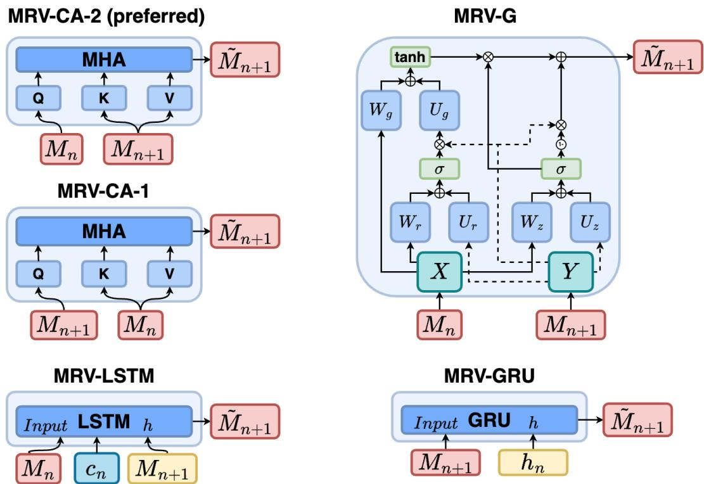  
Figure 15: Memory Retention Valve configurations used in the ablation study. MRV-CA-2: crossattention-based MRV which uses an attention mechanism to control the updating of memory embeddings and which is used in the work as the main mechanism. MRV-CA-1: uses the same mechanism as MRV-CA-2 but the updated memory embeddings $M _ { n + 1 }$ are fed to Query, and the incoming memory embeddings $M _ { n }$ are fed to Key and Value. MRV-G: gated MRV which uses a gating mechanism similar to the one used in Gated Transformer-XL [36]. MRV-GRU: uses a GRU [12] block to process updated memory embeddings with hidden states. MRV-LSTM: uses a LSTM [21] block to process updated memory embeddings with cached states.

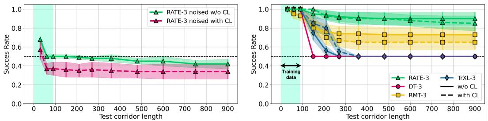  
Figure 16: (left). Results with and without the use of curriculum learning and (right) results of replacing RATE memory tokens with white noise at inference in T-Maze.

• num_mem_tokens $= 5$   
$\begin{array} { r l } & { \bullet \quad \mathtt { m u m l \_ m e a d \_ c o s e a l l s } } \\ & { \bullet \mathrm { ~ \mathtt { n \_ h e a d \_ c a = 1 } ~ } } \\ & { \bullet \mathrm { ~ \mathtt { m r v \_ a c t } = R e L U } } \\ & { \bullet \mathrm { ~ \mathtt { m e m \_ l e n } = ~ } } \end{array}$   

– $( 3 \times K + 2 \times \tt { n u m \_ m e m \_ t o k e n s } ) \times N$ for dense reward environments (e.g.,   
ViZDoom-Two-Colors, Minigrid-Memory)   
1272 – 0 for sparse reward environments (e.g., T-Maze)

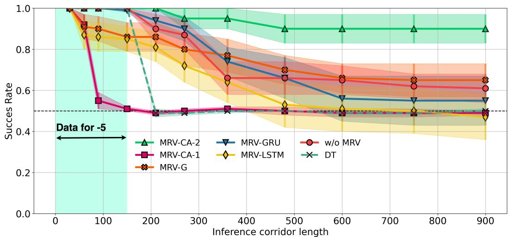  
Figure 17: Results of RATE inference with different MRV configurations on the T-Maze environment. Training was performed with the number of segments $N = 5$ and context length $K = 3 0$ , i.e. on trajectories of length $\leq 1 5 0$ . MRV-CA-2 is the final MRV configuration that is used throughout the work and is designated as MRV.

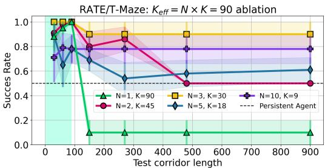  
Figure 18: Ablation of segment size $K$ and segment count $N$ with fixed effective context $K _ { \mathrm { e f f } } = K \uparrow \times N \downarrow = 9 0$ .

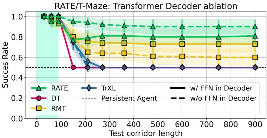  
Figure 19: Ablation of feed-forward block usage in the decoder.

3. Transformer core. Set the standard architecture parameters (number of layers, attention heads, embedding dimension, etc.) based on the task complexity and computational constraints.   
. Memory tuning. After adjust, fine-tune memory-related parameters if needed (e.g., num_mem_tokens, mem_len, dropout rates).

This configuration provides a strong default setup and has consistently performed well across all evaluated tasks.

# I Technical details

Table 12 and Table 13 shows the technical parameters of the training models. Note that the difference between the number of DT and RATE parameters is small. Training RATE with trajectory splitting into $N$ segments allows $\sim N$ smaller GPU memory size usage than for DT. The training was conducted using a single NVIDIA A100 80 Gb graphics card.

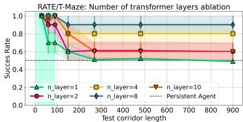  
Figure 20: Results of ablation by the number of layers of the RATE model in T-Maze environment.

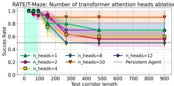  
Figure 21: Results of ablation by the number of attention heads of the RATE model in T-Maze environment.

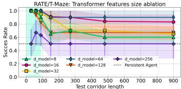  
Figure 22: Results of ablation by the features sizes of the RATE model in T-Maze environment.

Table 12: Comparison of RATE and DT Model Parameters. RATE has $1 . 0 { - } 7 . 7 \%$ less parameters compared to DT due to the fact that RATE does not use feed-forward network in the transformer decoder by default.   

<table><tr><td>Environment</td><td>RATE</td><td>DT</td><td>diff, %</td></tr><tr><td>T-Maze</td><td>1,723,840</td><td>1,775,488</td><td>-2.91</td></tr><tr><td>ViZDoom-Two-Colors</td><td>4,537,504</td><td>4,672,032</td><td>-2.88</td></tr><tr><td>Minigrid-Memory</td><td>2,000,864</td><td>2,051,872</td><td>-2.49</td></tr><tr><td>Memory Maze</td><td>1,639,840</td><td>1,673,696</td><td>-2.02</td></tr><tr><td>POPGym</td><td>6,760,192</td><td>6,827,008</td><td>-0.98</td></tr><tr><td>MIKASA-Robo</td><td>1,412,520</td><td>1,529,896</td><td>-7.67</td></tr></table>

Table 13: Computational efficiency comparison between RATE and DT models across different memory-intensive environments. We report three key metrics: (1) training time per epoch (mean±std, in seconds), (2) inference latency per step (mean±sem, in milliseconds), and (3) GPU memory footprint (in MiB). Lower values indicate better efficiency.   

<table><tr><td></td><td colspan="3">RATE</td><td colspan="3">DT</td></tr><tr><td>Environment</td><td>Train (s)</td><td>Test (ms)</td><td>Size (MiB)</td><td>Train (s)</td><td>Test (ms)</td><td>Size (MiB)</td></tr><tr><td>T-Maze</td><td>16.17±2.75</td><td>7.20±0.31</td><td>3,148</td><td>95.75±0.49</td><td>10.69±0.14</td><td>8.608</td></tr><tr><td>ViZDoom-Two-Colors</td><td>77.44±3.56</td><td>10.35±0.52</td><td>7,750</td><td>68.18±1.56</td><td>10.45±0.41</td><td>14,046</td></tr><tr><td>Minigrid-Memory</td><td>33.74±2.65</td><td>9.94±2.24</td><td>4,102</td><td>16.77±1.37</td><td>10.43±2.84</td><td>4,298</td></tr><tr><td>Memory Maze</td><td>110.26±2.97</td><td>38.98±0.62</td><td>6,638</td><td>82.69±1.56</td><td>40.36±0.46</td><td>10,386</td></tr><tr><td>POPGym</td><td>3.37±0.25</td><td>8.91±0.37</td><td>5,948</td><td>3.64±0.53</td><td>8.98±0.32</td><td>10,696</td></tr><tr><td>MIKASA-Robo</td><td>71.30±8.08</td><td>485.67±8.75</td><td>10,396</td><td>44.90±6.16</td><td>473.29±5.97</td><td>29,902</td></tr></table>
