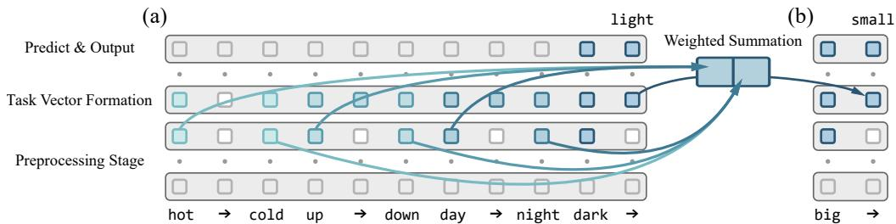
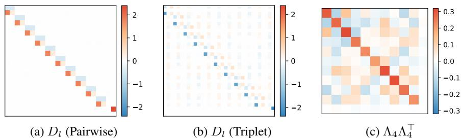
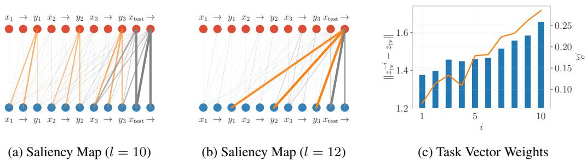
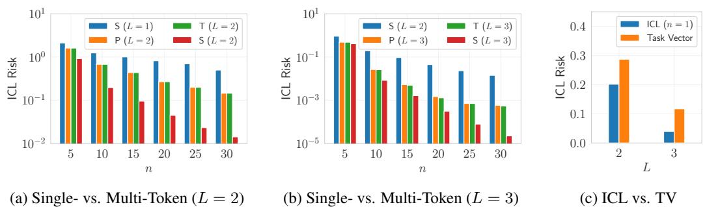

# Understanding Task Vectors in In-Context Learning: Emergence, Functionality, and Limitations

Anonymous Author(s)   
Affiliation   
Address   
email

# Abstract

Task vectors offer a compelling mechanism for accelerating inference in in-context   
learning (ICL) by distilling task-specific information into a single, reusable rep  
resentation. Despite their empirical success, the underlying principles governing   
their emergence and functionality remain unclear. This work proposes the Linear   
Combination Conjecture, positing that task vectors act as single in-context demon  
strations formed through linear combinations of the original ones. We provide   
both theoretical and empirical support for this conjecture. First, we show that task   
vectors naturally emerge in linear transformers trained on triplet-formatted prompts   
through loss landscape analysis. Next, we predict the failure of task vectors on   
representing high-rank mappings and confirm this on practical LLMs. Our findings   
are further validated through saliency analyses and parameter visualization, sug  
gesting an enhancement of task vectors by injecting multiple ones into few-shot   
prompts. Together, our results advance the understanding of task vectors and shed   
light on the mechanisms underlying ICL in transformer-based models.

# 15 1 Introduction

In-context learning (ICL) is a core capability of large language models (LLMs), allowing them to   
perform new tasks without parameter updates by conditioning on a few input-output examples in   
the prompt [2]. Unlike traditional training, ICL relies on attention-based mechanisms to infer task   
structure directly from context. This surprising generalization ability has led to growing interest in   
uncovering the principles of learning purely from contextual examples [21, 3, 4, 15, 5].   
A recent work investigates the task vector method [7] (concurrent works include function vectors   
[16] and in-context vectors [13]), a technique that distills underlying task information from ICL   
demonstrations into a single vector. Typically, ICL prompts are structured as sequences of triplets,   
each encoding a semantic mapping, in addition to a query at the end (e.g., $\mathrm { { } } ^ { \cdot } h o t  c o l d ,$ , $u p  d o w n$ ,   
$d a y \to n i g h t , d a r k \to "$ ). Task vectors are then extracted from the hidden states of the last $(  )$ token.   
Once obtained, these vectors can be injected into the same position in new prompts (e.g., $\cdot b i g  Y )$ ),   
enabling the model to generalize to unseen inputs in a zero-shot fashion.   
Task vectors have been shown to naturally emerge even in small transformer models trained from   
scratch on synthetic data [24], suggesting that their formation is a general property of attention-based   
architectures. Recent studies further demonstrate that task vectors can be enhanced by aggregating   
hidden states across multiple layers and multiple arrow tokens [12]. Beyond language models, task   
vectors are also found effective in large-scale visual [8] and multi-modal [9] models.   
Despite their empirical effectiveness, the underlying mechanism of task vectors, especially how they   
emerge, function, and encode task information, remains poorly understood. This paper takes a step   
toward unveiling the principles behind it by introducing the following conjecture:

  
Figure 1: Overview of task vector and our main conjecture. (a) Task vector emerges during ICL as a linear combination of preceding in-context demonstrations. (b) It can then be injected into zero-shot prompts and functions as a single, representative demonstration, facilitating efficient prediction.

# Linear Combination Conjecture

The injected task vector functions as a single in-context demonstration, formed through a linear combination of the original demonstrations (hidden states).

Figure 1 provides an intuitive illustration for our conjecture. In the following sections, we validate this   
conjecture through various empirical and theoretical perspectives. These analyses comprehensively   
explain how task vectors naturally emerge within attention-based model architectures, effectively   
encode task-related information, and facilitate inference in zero-shot prompts. Our work advances the   
understanding of the underlying mechanisms behind ICL, clarifying both the efficacy and limitations   
of task vectors in transformer-based LLMs. The highlights of this paper are as follows:

• Theoretical Justification in Linear Transformers: We theoretically characterize the critical points of linear-attention transformers and demonstrate how they solve random linear regression tasks through embedding concatenation and gradient descent. With a triplet-formatted input prompt structure, task vectors naturally emerge at arrow tokens as linear combinations of the in-context demonstrations. These vectors serve as redundancy against information loss induced by dropout, thereby improving robustness. Empirically, the learned linear model parameters closely align with the predicted structure and successfully replicate the task vector mechanism.

• Empirical Verification in Practical LLMs: We visualize the information flow in LLMs with saliency analysis and observe patterns consistent with linear models, suggesting they share similar underlying mechanisms. According to our conjecture, inference with task vectors is analogous to 1-shot ICL, which is inherently limited to rank-one meta-predictors under the gradient descent perspective. To validate this, we introduce a series of bijection tasks that are provably unsolvable by rank-one predictors, and empirically confirm this failure in real-world transformers. Building on these insights, we enhance the standard task vector method by injecting multiple vectors into few-shot prompts, resulting in consistent performance gains across a range of ICL tasks.

# 58 2 Setting: Random Linear Regression with Linear-Attention Transformers

Notations: We write $[ n ] = \{ 1 , \cdots , n \}$ . The Hadamard product is denoted by $\circ$ , and the Kronecker   
product by $\otimes$ . The identity matrix of dimension $n$ is denoted by $I _ { n }$ , while $0 _ { n }$ and $0 _ { m \times n }$ represent zero   
vectors or matrices of the corresponding dimensions. Subscripts are omitted when the dimensions are   
clear from context. We define $\bar { \mathcal { M } } ( M ) \overset { = } { = } \bigl \{ \Lambda \in \mathbb { R } ^ { \mathrm { d i m } ( M ) } \ \big | \ \Lambda = M \circ A , \ A \in \mathbb { R } ^ { \mathrm { d i m } ( M ) } \bigr \}$ as the set of   
masked matrices induced by the binary mask $M$ . For a general matrix $A$ , the element at the $i$ -th row   
and $j$ -th column is denoted by $A _ { i , j }$ , and the sub-block from rows $i$ to $k$ and columns $j$ to $l$ is denoted   
by $A _ { i : k , j : l }$ . $\operatorname { d i a g } ( A _ { 1 } , \cdots , A _ { n } )$ represents the block-diagonal matrix constructed by $\{ A _ { i } \} _ { i = 1 } ^ { n }$ .   
Random Linear Regression: Following the settings in literature [6, 17, 1, 20], we consider training   
linear transformers on random instances of linear regression. Let $\{ x _ { i } \} _ { i = 1 } ^ { n + 1 }$ , where $x _ { i } \in \mathbb { R } ^ { d }$ , denote   
covariates drawn i.i.d. from distribution $P _ { x }$ , and let $\{ w _ { i } \} _ { i = 1 } ^ { d }$ , where $w _ { i } \in \mathbb { R } ^ { d }$ , denote coefficients   
drawn i.i.d. from distribution $P _ { w }$ . Define the coefficient matrix as $W = [ w _ { 1 } \quad \cdot \cdot \cdot \quad w _ { d } ] ^ { \intercal } \in \mathbb { R } ^ { d \times d }$   
The responses are then generated as $y _ { i } = W x _ { i }$ for $i \in [ n + 1 ]$ . We denote by $X , Y \in \mathbb { R } ^ { d \times n }$ the   
matrices whose columns are $x _ { i }$ and $y _ { i }$ , respectively, for $i \in [ n ]$ . The query covariate and response are   
denoted by $x _ { \mathrm { t e s t } } = x _ { n + 1 }$ and $y _ { \mathrm { t e s t } } = y _ { n + 1 }$ respectively.   
Linear Self-Attention Transformer: Following prior works [17, 1, 20], we consider transformers   
composed of linear self-attention layers. Let $Z _ { 0 } \in \mathbb { R } ^ { 2 d \times d _ { p } }$ denote the input matrix constructed from   
$X , Y$ and $x _ { \mathrm { t e s t } }$ but excluding $y _ { \mathrm { t e s t } }$ , where $d _ { p }$ denotes the number of tokens. The transformer is   
defined by stacking $L$ attention blocks with skip connections, where the $l$ -th layer is expressed as:

$$
\begin{array} { r } { Z _ { l } = Z _ { l - 1 } + \frac { 1 } { n } \operatorname { A t t n } _ { V _ { l } , Q _ { l } } ( Z _ { l - 1 } ) , \qquad \operatorname { A t t n } _ { V , Q } ( Z ) = V Z M \bigl ( Z ^ { \top } Q Z \bigr ) . } \end{array}
$$

Here, the trainable parameters are $\{ V _ { l } , Q _ { l } \} _ { l = 1 } ^ { L }$ , where $V _ { l } \in \mathbb { R } ^ { 2 d \times 2 d }$ represents a reparameterization   
of the projection and value matrices, and $Q _ { l } \in \mathbf { \bar { R } } ^ { 2 d \times 2 d }$ denotes the query and key matrices. Following   
the work [1], we adopt a masking matrix $M = \mathrm { d i a g } ( I _ { d _ { p } - 1 } , 0 )$ to prevent attention from earlier tokens   
to the final one. The output of the transformer is defined as ${ \sf T F } \left( Z _ { 0 } ; \{ V _ { l } , Q _ { l } \} _ { l = 1 } ^ { L } \right) = \left( Z _ { L } \right) _ { ( d + 1 : 2 d ) , d _ { p } }$   
(i.e., the latter half of the last column). This definition aligns with the structure of the input $Z _ { 0 }$ , which   
will be further discussed in subsequent sections. During training, the parameters are optimized to   
minimize the expected ICL risk over random linear regression instances:

$$
\mathcal { L } \big ( \{ V _ { l } , Q _ { l } \} _ { l = 1 } ^ { L } \big ) = \mathbb { E } _ { Z _ { 0 } , W } \left\| \mathsf { T } \mathsf { F } \big ( Z _ { 0 } ; \{ V _ { l } , Q _ { l } \} _ { l = 1 } ^ { L } \big ) + W x _ { \mathrm { t e s t } } \right\| _ { 2 } ^ { 2 } .
$$

# 84 3 Emergence of Task Vectors in Linear-Attention Transformers

Firstly, we present theoretical evidence indicating that task vectors naturally arise even in simple   
linear transformers. Specifically, we analyze the loss landscape of the in-context risk, focusing on the   
properties of its critical points. As a startup, recall the standard linear regression setup [1, 20], where   
the $( x _ { i } , y _ { i } )$ pairs for each demonstration are concatenated to form the input prompt:

$$
Z _ { 0 } = { \binom { X } { Y } } \quad { \begin{array} { c } { x _ { \mathrm { t e s t } } } \\ { 0 } \end{array} } = { \left[ \begin{array} { l l c c c } { x _ { 1 } } & { x _ { 2 } } & { \cdots } & { x _ { n } } & { x _ { \mathrm { t e s t } } } \\ { y _ { 1 } } & { y _ { 2 } } & { \cdots } & { y _ { n } } & { 0 } \end{array} \right] } \in \mathbb { R } ^ { 2 d \times ( n + 1 ) } .
$$

According to existing analyses [1, 25, 14], each attention layer in this setting performs one step of   
gradient descent on the coefficient matrix $W$ . Specifically, the theoretically optimal single-layer (pos  
sibly nonlinear) attention [10] implements the following predictive function [1] when the covariates   
are drawn from $P _ { x } = \mathcal { N } ( 0 , I _ { d } )$ , by selecting $V _ { 1 } \propto \mathrm { d i a g } ( 0 _ { d \times d } , I _ { d } )$ and $Q _ { 1 } \propto \mathrm { d i a g } ( I _ { d } , 0 _ { d \times d } )$ :

$\begin{array} { r } { \mathsf { T F } ( Z _ { 0 } ; ( V _ { 1 } , Q _ { 1 } ) ) = - \frac { 1 } { n } Y \sigma ( X ) ^ { \top } \sigma ( x _ { \mathrm { t e s t } } ) , \quad \mathrm { w h e r e } ~ \sigma : \mathbb { R } ^ { d } \mapsto \mathbb { R } ^ { r } ~ \mathrm { i n } } \end{array}$ s a kernel function.

Here, we abbreviate $[ \sigma ( x _ { 1 } ) \quad \cdots \quad \sigma ( x _ { n } ) ]$ as $\sigma ( X )$ . Equation (4) employs $W ^ { \prime } \propto Y \sigma ( X ) ^ { \top }$ as an   
estimate of coefficient matrix $W$ , yielding prediction $\hat { y } _ { \mathrm { t e s t } } = W ^ { \prime } \sigma ( x _ { \mathrm { t e s t } } )$ . In this paper, we consider   
alternative settings more reflective of practical scenarios, where $x _ { i }$ and $y _ { i }$ are separated as distinct   
tokens. As noted [26], such separation necessitates the usage of position encodings for bi-directional   
attention. Following prior analysis [11], we assume that position encodings are appended to the input   
tokens, and reformulate the layer-wise update rule of self-attention as:

$$
\mathrm { A t t n } _ { V , Q } ( Z ) = V Z M \left[ Z ^ { \top } \quad P ^ { \top } \right] Q \left[ Q \right] , \quad \mathrm { w h e r e } ~ P \in \mathbb { R } ^ { d _ { p } \times d _ { p } } .
$$

For analytical tractability, we take $P = I _ { d _ { p } }$ as one-hot position encodings. Inspired by the parameter   
structure in [1] and eq. (4), we further impose the following constraints on the trainable parameters:

$$
\begin{array} { r } { V _ { l } = \mathrm { d i a g } ( A _ { l } , B _ { l } ) , \quad Q _ { l } = \mathrm { d i a g } ( C _ { l } , 0 _ { d \times d } , D _ { l } ) , \quad \mathrm { w h e r e } A _ { l } , B _ { l } , C _ { l } \in \mathbb R ^ { d \times d } , D _ { l } \in \mathbb R ^ { d _ { p } \times d _ { p } } . } \end{array}
$$

These parameterizations ensure that the projection and attention operations act independently on the   
covariate, response, and positional components of the input. This structural decoupling is essential for   
understanding how the transformer identifies the dependency between each $( x _ { i } , y _ { i } )$ pair and revealing   
the actual optimization algorithm being executed by the model. The proofs for the main theoretical   
results in this paper are available in Appendix B.

# 106 3.1 Warm-up: Learning with Pairwise Demonstrations

We begin by analyzing the optimization of linear transformers on pairwise demonstrations. Following   
previous approach [6, 19, 22], we decompose each demonstration in eq. (3) into a pair of tokens   
$\dot { Z } _ { 0 } ^ { i } = \left[ \begin{array} { c c } { { x _ { i } } } & { { { \bf \widehat { 0 } } ^ { \prime } } } \\ { { 0 } } & { { y _ { i } } } \end{array} \right] \in \mathbb { R } ^ { 2 \bar { d } \times 2 }$ to better reflect the practical ICL prompt structure:

$$
Z _ { 0 } = \left[ Z _ { 0 } ^ { 1 } \quad \cdots \quad Z _ { 0 } ^ { n } \quad Z _ { 0 } ^ { \mathrm { t e s t } } \right] = \left[ x _ { 1 } \quad 0 \quad \cdots \quad x _ { n } \quad 0 \quad x _ { \mathrm { t e s t } } \quad 0 \right] \in \mathbb { R } ^ { ( 2 d ) \times ( 2 n + 2 ) } .
$$

  
Figure 2: Visualization of learned $D _ { l }$ weights. (a) Pairwise demonstrations yield a block-diagonal structure aligned with Theorem 1. (b) Triplet demonstrations yield a richer structure aligned with Theorem 2. (c) The learned matrix $\Lambda _ { 4 }$ has nearly orthonormal rows as suggested by Proposition 3.

The following theorem suggests that certain critical points of the in-context risk effectively solve   
the regression problem by first concatenating each pair of $( x _ { i } , y _ { i } )$ into the same tokens, and then   
executing a variant of the gradient descent algorithm to compute the prediction. To simplify notation,   
113 we denote $A = \{ A _ { l } \} _ { l = 1 } ^ { L }$ (similarly for $B , C$ , and $D$ ) and present:

Theorem 1 (Critical Points; Pairwise Demonstrations). Assume 114 $P _ { x } = \mathcal { N } ( 0 , \Sigma )$ , $P _ { w } = \mathcal { N } ( 0 , \Sigma ^ { - 1 } )$ with some 115 $\Sigma \in \mathbb { R } ^ { d \times d }$ satisfying $\Sigma \succ 0 .$ . Define $S _ { I } , S _ { \Sigma } \subset \mathbb { R } ^ { d \times d }$ and $S _ { P } \subset \mathbb { R } ^ { d _ { p } \times d _ { p } }$ as

16 Consider optimizing an $L$ -layer linear transformer with pairwise demonstrations and parameter   
configuration given in eq. (6), we then have

$$
\operatorname* { i n f } _ { A , B \in { \mathcal S } _ { I } ^ { L } , C \in { \mathcal S } _ { \Sigma } ^ { L } , \ D \in { \mathcal S } _ { P } ^ { L } } \sum _ { H \in A \cup B \cup C \cup D } \left\| \nabla _ { H } { \mathcal L } \big ( \{ V _ { l } , Q _ { l } \} _ { l = 1 } ^ { L } \big ) \right\| _ { F } ^ { 2 } = 0 .
$$

To understand the behavior of these critical points within a self-attention layer, we fix $\Sigma = I _ { d }$ and   
take $A _ { l } , B _ { l } = I _ { d }$ , $C _ { l } = - \lambda I _ { d }$ , and $D _ { l } = \mathrm { d i a g } ( I _ { n } \otimes \Lambda _ { 1 } , \Lambda _ { 2 } )$ . Let the first and last $d$ rows of $Z _ { l }$ be   
denoted by $X _ { l }$ and $Y _ { l }$ , respectively. Under these settings, the update rule of each layer becomes:

$$
Z _ { l } = Z _ { l - 1 } - \lambda Z _ { l - 1 } M X _ { l - 1 } ^ { \top } X _ { l - 1 } + \left[ Z _ { l - 1 } ^ { 1 } \Lambda _ { 1 } \quad \cdots \quad Z _ { l - 1 } ^ { n } \Lambda _ { 1 } \quad Z _ { l - 1 } ^ { \mathrm { t e s t } } \mathrm { d i a g } ( 1 , 0 ) \Lambda _ { 2 } \right] .
$$

The above update can be decomposed into the following two distinct components:

• Gradient Descent: The first component, $Z _ { l } \gets Z _ { l - 1 } - \lambda Z _ { l - 1 } M X _ { l - 1 } ^ { \top } X _ { l - 1 }$ , implements the $\mathrm { G D + + }$ algorithm [17]. This variant enhances convergence speed over standard gradient descent by improving the condition number of the Gram matrix $X _ { l - 1 } ^ { \top } \dot { X } _ { l - 1 }$ . Notably, this operation modifies only $X _ { l }$ but not $Y _ { l }$ for the first layer, as implied by the structure of $Q _ { l }$ (eq. (6)).

• Embedding Concatenation: The second component, $Z _ { l } ^ { i } \gets Z _ { l - 1 } ^ { i } + Z _ { l - 1 } ^ { i } \Lambda _ { 1 }$ for $i \in [ n ]$ , mixes each pair of $( x _ { i } , y _ { i } )$ tokens. Given that $x _ { i }$ and $y _ { i }$ tokens are initially linearly separable as in our formulation, this operation concatenates each $( x _ { i } , y _ { i } )$ pair, thereby transforming pairwise demonstrations into the original single-token format. For the query token $Z _ { l } ^ { \mathrm { t e s t } }$ , this operation copies $x _ { \mathrm { t e s t } }$ into the final token, reconstructing the structure in eq. (3), where each non-final token directly concatenates $( x _ { i } , y _ { i } )$ of a demonstration, and the final token contains only $x _ { \mathrm { t e s t } }$ .

In summary, our analysis reveals that for pairwise demonstrations, the first attention layer leverages   
position encodings to distinguish between covariate and response tokens, subsequently concatenating   
them to form a single-token prompt structure. The remaining layers then apply the $\mathrm { G D + + }$ algorithm,   
mirroring the learning dynamics on single-token demonstrations. As a result, an $L$ -layer linear   
transformer allocates one layer for embedding concatenation and utilizes the remaining $L - 1$   
layers to perform gradient descent. In Figure 2a, we visualize the learned $D _ { l }$ weights under the   
setting of Theorem 1, and observe that they closely match the critical point structure of $S _ { P }$ .

# 3.2 Emergence of Task Vectors with Triplet Demonstrations

Next, to better reflect the prompt structure of practical ICL, we insert additional zero tokens between   
each pair of $( x _ { i } , y _ { i } )$ to simulate the arrow $(  )$ tokens. This reformulates each demonstration as a   
triplet $( x _ { i } ,  , y _ { i } )$ , enabling us to analyze the critical points with these triplet demonstrations:

$$
Z _ { 0 } = { \left[ \begin{array} { l l l l l l l l l l } { x _ { 1 } } & { 0 } & { 0 } & { \cdots } & { x _ { n } } & { 0 } & { 0 } & { x _ { \mathrm { t e s t } } } & { 0 } & { 0 } \\ { 0 } & { 0 } & { y _ { 1 } } & { \cdots } & { 0 } & { 0 } & { y _ { n } } & { 0 } & { 0 } & { 0 } \end{array} \right] } \in \mathbb { R } ^ { ( 2 d ) \times ( 3 n + 3 ) } .
$$

Theorem 2 (Critical Points; Triplet Demonstrations). Assume 144 $P _ { x } = \mathcal { N } ( 0 , \Sigma )$ , $P _ { w } = \mathcal { N } ( 0 , \Sigma ^ { - 1 } )$ with some 145 $\Sigma \in \mathbb { R } ^ { d \times d }$ satisfying $\Sigma \succ 0$ . Define $S _ { I } , S _ { \Sigma } \subset \mathbb { R } ^ { d \times d }$ and $S _ { P } \subset \mathbb { R } ^ { d _ { p } \times d _ { p } }$ as

$$
\begin{array} { c }  { \mathcal { S } _ { I } = \{ \lambda I _ { d } \mid \lambda \in \mathbb { R } \} , \quad { \mathcal { S } _ { \Sigma } = \{ \lambda \Sigma ^ { - 1 } \mid \lambda \in \mathbb { R } \} , } } \\  { { \mathcal { S } _ { P } = \{ \operatorname { d i a g } ( I _ { n } \otimes \Lambda _ { 1 } , \Lambda _ { 2 } ) + I _ { n + 1 } \otimes \Lambda _ { 3 } + \Lambda _ { 4 } \otimes \Lambda _ { 5 } \} } } \\  { { \Lambda _ { 1 } , \Lambda _ { 2 } \in \mathcal { M } { ( \begin{array} { l l } { 1 _ { 0 } } & { 1 } \\ { 1 } & { 0 } \end{array} ) } , \Lambda _ { 3 } \in \mathcal { M } { ( \begin{array} { l l } { 0 } & { 0 } \\ { 0 } & { 1 } \end{array} ) } , \Lambda _ { 4 } \in \mathbb { R } ^ { ( n + 1 ) \times ( n + 1 ) } , \Lambda _ { 5 } \in \mathcal { M } { ( \begin{array} { l l } { 0 } & { 1 } \\ { 0 } & { 0 } \end{array} ) } \} . } } \end{array}
$$

Consider optimizing an $L$ -layer linear transformer with triplet demonstrations and parameter config  
uration given in eq. (6), we then have

$$
\operatorname* { i n f } _ { A , B \in { \mathcal S } _ { I } ^ { L } , C \in { \mathcal S } _ { \Sigma } ^ { L } , \ D \in { \mathcal S } _ { P } ^ { L } } \sum _ { H \in A \cup B \cup C \cup D } \left\| \nabla _ { H } { \mathcal L } \big ( \{ V _ { l } , Q _ { l } \} _ { l = 1 } ^ { L } \big ) \right\| _ { F } ^ { 2 } = 0 .
$$

To analyze the behavior of each attention layer, we note that the critical points for the matrices $A _ { l }$ ,   
$B _ { l }$ , and $C _ { l }$ remain consistent with Theorem 1, thereby implementing the $\mathrm { G D + + }$ algorithm. For the   
matrix $D _ { l }$ , we decompose its structure into three distinct components:

• Embedding Concatenation: The first component, $\mathrm { d i a g } ( I _ { n } \otimes \Lambda _ { 1 } , \Lambda _ { 2 } )$ , mixes each pair of $( x _ { i } , y _ { i } )$ tokens, effectively concatenating them — analogous to the operation analyzed in the previous section. This converts all non-arrow tokens into single-token demonstrations.

• Self Magnification: The second component, $I _ { n + 1 } \otimes \Lambda _ { 3 }$ , scales the embeddings corresponding to each arrow $(  )$ token by a fixed constant and adds them back to themselves.

• Task Vector Formation: The third component, $\Lambda _ { 4 } \otimes \Lambda _ { 5 }$ , performs a weighted summation across all demonstrations in the prompt. This operation is central to the emergence of task vectors. Let $[ \beta _ { 1 } \mathrm { ~  ~ \beta ~ } \cdot \cdot \cdot \mathrm { ~  ~ \beta ~ } \beta _ { n + 1 } ] \in \mathbb { R } ^ { n \times ( n + 1 ) }$ denote the first $n$ rows of $\Lambda _ { 4 }$ (we will soon show that the last row of th $\Lambda _ { 4 }$ converges to zero), the first self-attention layer then outputs emonstrations as the hidden states for the arrow tokens, ex $n + 1$ lined as s of for $\begin{array} { r } { z _ { \mathrm { t v } } ^ { i } = \bigl [ \begin{array} { l } { \alpha _ { 1 } X \beta _ { i } } \\ { \alpha _ { 2 } Y \beta _ { i } } \end{array} \bigr ] } \end{array}$ $i \in [ n + 1 ]$ , where $\alpha _ { 1 } , \alpha _ { 2 } \in \mathbb { R }$ are the two non-zero entries of $\Lambda _ { 5 }$ . These vectors can then be injected into zero-shot prompts and function as single-token demonstrations.

This mechanism provides strong theoretical evidence for our linear combination conjecture, demon  
strating that task vectors naturally emerge from the optimization dynamics of linear-attention   
transformers operating on triplet-formatted prompts. Notably, the structure of $ { \boldsymbol { S } } _ { P }$ closely aligns   
with our visualization of $D _ { l }$ in Figure 2b, confirming our theoretical analysis. We now further   
167 investigate the structure of the weight matrix $\Lambda _ { 4 }$ , and present the following result:   
68 Proposition 3 (Optimal Task Vector Weights). Assume $P _ { x } , P _ { w } = \mathcal { N } ( 0 , I _ { d } )$ . Consider optimizing   
a 2-layer linear-attention transformer with triplet demonstrations and parameter configuration given   
in eq. (6), and assume $C _ { 1 } = 0$ . Let

$$
D _ { 1 } = \mathrm { d i a g } ( I _ { n } \otimes \Lambda _ { 1 } , \Lambda _ { 2 } ) + I _ { n + 1 } \otimes \Lambda _ { 3 } + \Lambda _ { 4 } \otimes \Lambda _ { 5 } \in { \cal S } _ { P }
$$

be any minimizer of the in-context risk 171 $\mathcal { L } \big ( \{ V _ { l } , Q _ { l } \} _ { l = 1 } ^ { L } \big )$ , we then have $\Lambda _ { 4 } \in S _ { U }$ , where

$$
\mathcal { S } _ { U } = \{ \Lambda \ | \ \Lambda \Lambda ^ { \top } = \lambda \mathrm { d i a g } ( I _ { n } , 0 ) , \lambda \in \mathbb { R } \} .
$$

This result suggests that the optimal $\Lambda _ { 4 }$ weight matrix satisfies two key properties: (1) the last row   
is zero, and (2) the first $n$ rows are mutually orthonormal. These conditions imply that the learned   
weight vectors $\beta _ { 1 } , \cdots , \beta _ { n + 1 }$ are likely to be distinct. Therefore, the $n + 1$ task vectors produce   
diverse linear combinations of the demonstrations, thereby enriching the representation within the   
input prompt. This implication is verified in Figure $2 \mathrm { c }$ . While task vectors are typically extracted   
from the final arrow $(  )$ token in standard usage, here we consider all arrow tokens as task vectors   
as bi-directional attention allows each to aggregate information from the full prompt.

# 79 4 Validating the Linear Combination Conjecture on Bijection Tasks

We then present an empirical observation that supports our conjecture. Consider the setting where   
task vectors are injected into zero-shot prompts. Based on our prior analysis, the injected task vector   
$z _ { \mathrm { t v } }$ is formed as a linear combination of the original demonstrations. As a result, we show that the   
injected prompt reconstructs the single-token structure in eq. (3) with only 1 demonstration:

$$
Z _ { 0 } = [ z _ { \mathrm { t e s t } } \quad z _ { \mathrm { t v } } \quad 0 ] = { \biggl [ } { x _ { \mathrm { t e s t } } \quad x _ { \mathrm { t v } } \quad 0 } { \biggr ] } = { \biggl [ } { x _ { \mathrm { t e s t } } \quad X \beta \quad 0 } { \biggr ] } \in \mathbb { R } ^ { 2 d \times 3 } ,
$$

  
Figure 3: Visualization of saliency matrices as bipartite graphs between layer $l$ ( ) and $l + 1$ ( ), where edge widths indicate saliency magnitude; and variations in the extracted task vector after perturbing the $i$ -th demonstration ( ), alongside the predicted weights $( - )$ obtained by optimizing Proposition 6. (a) Each $y _ { i }$ token is primarily attending to its corresponding $( x _ { i } , y _ { i } )$ pair, reflecting embedding concatenation. (b) The final $(  )$ token attends broadly to all $y _ { i }$ tokens, indicating task vector formation — this occurs just before the optimal injection layer $\mathit { l } = 1 3$ ). (c) The predicted task vector weights closely match the trend of empirical results, validating our theoretical model.

where the weight vector $\beta \in \mathbb { R } ^ { n }$ comes from the last column of $\Lambda _ { 4 }$ (Theorem 2). After the first layer,   
the $\Lambda _ { 2 }$ matrix of $S _ { P }$ moves $x _ { \mathrm { t e s t } }$ to the last token, reducing the prompt to a single-shot, single-token   
demonstration. According to the optimal single-layer transformer (eq. (4)), the estimated coefficient   
matrix is now $W ^ { \prime } = Y \bar { \beta ( } X \beta ) ^ { \top }$ , which is rank-one. Therefore, if our main conjecture holds, task   
vectors will be inherently limited in their expressiveness: they can only realize rank-one coefficient   
matrices. This implication also naturally extends to multi-layer transformers.   
While our analysis is conducted on linear-attention transformers, we demonstrate that similar learning   
patterns also emerge within practical LLMs. Specifically, we visualize the layer-wise information   
flow between tokens using saliency maps [18], where the saliency score for each attention matrix   
is computed as $\begin{array} { r } { S ( A _ { l } ) = \bar { \sum } _ { h } | A _ { l , h } \cdot \partial \bar { \mathcal { L } } / \partial \bar { A } _ { l , h } | , A } \end{array}$ $A _ { l , h }$ denotes the attention matrix of the $h$ -th head   
at layer $l$ , and $\mathcal { L }$ is the ICL loss (i.e., the cross-entropy loss for predicting $y _ { \mathrm { t e s t . } }$ ). As demonstrated   
in Figures 3a and 3b, the saliency maps reveal certain patterns matching the ones of embedding   
concatenation and weighted summation. Importantly, the latter occurs immediately before the optimal   
task vector injection layer. This suggests that real-world models implement a similar algorithm to   
solve ICL tasks and, consequently, inherit the same expressiveness limitation.   
To verify this, we construct a specialized class of ICL tasks, named bijection tasks. Specifically, given   
a bijective mapping from domain $\mathcal { X }$ to codomain $\mathcal { V }$ , one can combine it with its inverse mapping   
to form a new task that maps $\mathcal { X } \cup \mathcal { V }$ onto itself. For instance, combining the "to uppercase" task   
with its inverse "to lowercase" yields a bijection task that maps each letter to its opposite case, and a   
valid ICL prompt takes the form: “ $a \to A$ , $B  b$ , $c \to C$ , $D \to ^ { \prime \prime }$ . Note that this differs from task   
superposition [23], as each input corresponds to a unique, well-defined output. We then establish a   
key limitation of rank-one coefficient matrices in addressing such tasks:

Proposition 4. Let $x , y \in \mathbb { R } ^ { d }$ be non-zero vectors. Then the following are equivalent: $( I )$ There exists a rank-one matrix $W \in \mathbb { R } ^ { d \times d }$ such that $y = W x$ and $x = W y$ ; (2) $x = y$ or $x = - y$ .

This result highlights that rank-one coefficient matrices cannot solve general bijection tasks, and   
are restricted to only the identity mapping $( x = y )$ ) or the negation mapping $( x = - y )$ ). We further   
verify this implication in real-world LLMs: as summarized in Table 1, both ICL and the task vector   
method perform well on the original tasks and their inverses. Nevertheless, for the bijection tasks,   
while ICL preserves performance in many cases, the task vector method consistently fails, confusing   
examples from the two domains and yielding near-random predictions $( 5 0 \% )$ . For instance, in the "to   
uppercase" task, task vectors can predict the correct letter but fail to distinguish between uppercase   
and lowercase. The only notable exceptions are the copy task (corresponding to the $x = y$ case in   
Proposition 4) and the antonym task (corresponding to $x = - y$ ).   
Together, these findings empirically validate our conjecture: the task vector approach, which is   
restricted to rank-one coefficient matrices, cannot solve general bijection tasks. While a variety   
of ICL tasks have been explored to assess the capabilities of task vectors [7, 16, 12], the fundamental   
limitation of task vectors in addressing these bijection tasks has not been previously identified.

Table 1: Comparison of the accuracies of ICL and task vector on bijection tasks (Llama-7B, $n = 1 0$ ). We use gray text to indicate accuracies lower than $6 0 \%$ .   

<table><tr><td rowspan="2">Task</td><td rowspan="2">Domain X</td><td rowspan="2">Domain </td><td rowspan="2">Example</td><td colspan="2">x→</td><td colspan="2">y→x</td><td colspan="2">x←2</td></tr><tr><td>ICL</td><td>TV</td><td>ICL</td><td>TV</td><td>ICL</td><td>TV</td></tr><tr><td>To Upper</td><td>{a，.·，,2}</td><td>{A,.,z}</td><td>a→A</td><td>1.00</td><td>0.91</td><td>1.00</td><td>0.99</td><td>1.00</td><td>0.55</td></tr><tr><td rowspan="3">Translation</td><td>English</td><td>French</td><td>hello → bonjour</td><td>0.83</td><td>0.84</td><td>0.82</td><td>0.70</td><td>0.54</td><td>0.35</td></tr><tr><td>English</td><td>Italian</td><td>hello →ciao</td><td>0.84</td><td>0.78</td><td>0.82</td><td>0.74</td><td>0.70</td><td>0.47</td></tr><tr><td>English</td><td>Spanish</td><td>hello → hola</td><td>0.92</td><td>0.88</td><td>0.89</td><td>0.75</td><td>0.64</td><td>0.43</td></tr><tr><td rowspan="4">Linguistic</td><td>Present</td><td>Gerund</td><td>go→ going</td><td>0.99</td><td>0.95</td><td>1.00</td><td>0.97</td><td>0.80</td><td>0.41</td></tr><tr><td>Present</td><td>Past</td><td>go →went</td><td>0.98</td><td>0.91</td><td>0.99</td><td>0.96</td><td>0.52</td><td>0.33</td></tr><tr><td>Present</td><td>Past Perfect</td><td>go→gone</td><td>0.82</td><td>0.82</td><td>0.94</td><td>0.65</td><td>0.55</td><td>0.33</td></tr><tr><td>Singular</td><td>Plural</td><td>dog→dogs</td><td>0.88</td><td>0.78</td><td>0.94</td><td>0.89</td><td>0.76</td><td>0.51</td></tr><tr><td>Copy</td><td colspan="2">{a,.,z,A,...,Z}</td><td>A→A</td><td></td><td></td><td>1</td><td></td><td>1.00</td><td>0.98</td></tr><tr><td>Antonym</td><td colspan="2">Adjectives</td><td>happy → sad</td><td>0.89</td><td>0.83</td><td></td><td></td><td>0.83</td><td>0.73</td></tr></table>

# 221 5 Further Discussions

Inseparable Covariates and Responses. In our main analysis, we assume that $x _ { i }$ and $y _ { i }$ embeddings are linearly separable, allowing the addition $x _ { i } + y _ { i }$ to act a concatenation operation. However, recognizing that this assumption does not generally hold for real-world transformers, we extend our analysis to the following setting, where $x _ { i }$ and $y _ { i }$ are no longer linearly separable. While this still imposes a $2 d$ -dimensional requirement on the hidden space, such a constraint is easily satisfied in practical transformers, given the high dimensionality of their internal representations.

$$
Z _ { 0 } = { \left[ \begin{array} { l l l l l l l } { 0 } & { 0 } & { \cdots } & { 0 } & { 0 } & { 0 } & { 0 } \\ { x _ { 1 } } & { y _ { 1 } } & { \cdots } & { x _ { n } } & { y _ { n } } & { x _ { \mathrm { t e s t } } } & { 0 } \end{array} \right] } \in \mathbb { R } ^ { ( 2 d ) \times ( 2 n + 2 ) } .
$$

We slightly modify the sparsity constraints for the first layer, and require $( D _ { 0 } ) _ { 2 i , : } = 0$ for $i \in [ n + 1 ]$

$$
V _ { 0 } = \left[ 0 \frac { 0 } { \mathsf { d } _ { d \times d } } \quad A _ { 0 } \right] , \quad Q _ { 0 } = \left[ 0 \frac { 0 _ { 2 d \times 2 d } } { 0 } \quad D _ { 0 } \right] , \quad \mathrm { w h e r e ~ } A _ { 0 } \in \mathbb { R } ^ { d \times d } , D _ { 0 } \in \mathbb { R } ^ { d _ { p } \times d _ { p } } .
$$

With these conditions, we are ready to establish the critical points for inseparable demonstrations.   
Note that $V _ { 0 }$ and $Q _ { 0 }$ do not involve $B _ { 0 }$ and $C _ { 0 }$ , so the sequences $B$ and $C$ have size $L - 1$ .

Theorem 5. Under the same settings as Theorem $^ { l }$ , define $S _ { I } , S _ { \Sigma } \subset \mathbb { R } ^ { d \times d }$ and $S _ { P } \subset \mathbb { R } ^ { d _ { p } \times d _ { p } }$ as

$$
\begin{array} { r } { S _ { I } = \{ \lambda I _ { d } \mid \lambda \in \mathbb { R } \} , \quad S _ { \Sigma } = \left\{ \lambda \Sigma ^ { - 1 } \mid \lambda \in \mathbb { R } \right\} , \quad S _ { P } = \left\{ \mathrm { d i a g } ( I _ { n } \otimes \Lambda _ { 1 } , \Lambda _ { 2 } ) \ \middle \vert \ \Lambda _ { 1 } , \Lambda _ { 2 } \in \mathbb { R } ^ { 2 \times 2 } \right\} . } \end{array}
$$

Consider optimizing an $L$ -layer linear transformer with inseparable pairwise demonstrations and   
parameter configuration given in eq. (12) for the first layer and eq. (6) for the remaining layers, then

$$
\operatorname* { i n f } _ { A \in { \cal S } _ { I } ^ { L } , \ B \in { \cal S } _ { I } ^ { L - 1 } , \ C \in { \cal S } _ { \Sigma } ^ { L - 1 } , \ D \in { \cal S } _ { P } ^ { L } } \sum _ { H \in A \cup B \cup C \cup D } \left\| \nabla _ { H } \mathcal { L } \big ( \{ V _ { l } , Q _ { l } \} _ { l = 1 } ^ { L } \big ) \right\| _ { F } ^ { 2 } = 0 .
$$

This result suggests that for inseparable demonstrations, the first layer performs a functionally similar   
concatenation operation by "moving" the embedding of each $x _ { i }$ to the corresponding $y _ { i }$ position.   
This enables the model to reconstruct the single-token structure without linear separability.   
Optimal Weights for Causal Task Vectors. While task vectors naturally emerge in linear trans  
formers, their embeddings do not directly help minimize the ICL risk, as evidenced by the identical   
performance between pairwise and triplet formatted prompts (Figures 4a and 4b). Instead, we show   
that task vectors contribute to minimizing the training (i.e., LLM pretraining) risk when token-wise   
dropout is applied, acting as redundancies for in-context demonstrations that may be randomly   
dropped during training. This redundancy ensures that essential task information is preserved and   
continues to facilitate accurate prediction despite partial context loss.

Proposition 6. Under the same settings as Proposition 3, consider adding token-wise dropouts $O _ { l }$ :

$$
\begin{array} { r } { Z _ { l } = Z _ { l - 1 } O _ { l } + \frac { 1 } { n } \operatorname { A t t n } _ { V _ { l } , Q _ { l } } ( Z _ { l - 1 } ) O _ { l } , \quad w h e r e \ O _ { l } = \operatorname { d i a g } ( o _ { l } ^ { 1 } , \cdots , o _ { l } ^ { d _ { p } } ) , \ o _ { l } ^ { i } \stackrel { i . i . d } { \sim } \operatorname { B e r n } ( p ) . } \end{array}
$$

  
Figure 4: (a, b) Comparison of the best ICL risk achieved using single (S), pairwise (P), and triplet (T) formatted prompts. (c) Performance comparison between 1-shot ICL and task vector.

Then any minimizer 245 $\Lambda _ { 4 }$ of the in-context risk $\mathcal { L } \big ( \{ V _ { l } , Q _ { l } \} _ { l = 1 } ^ { L } \big )$ satisfies $( \Lambda _ { 4 } ) _ { n + 1 , : } = 0$ and:

$$
\Lambda _ { 4 } ) _ { 1 : n , : } \propto \underset { \Lambda } { \arg \operatorname* { m i n } } c _ { 1 } \| \Lambda \| _ { 4 } ^ { 4 } + c _ { 2 } \sum _ { i = 1 } ^ { n } \| \Lambda _ { i , : } \| _ { 2 } ^ { 4 } + c _ { 3 } \sum _ { j = 1 } ^ { n + 1 } \| \Lambda _ { : , j } \| _ { 2 } ^ { 4 } + c _ { 4 } \big \| \Lambda \Lambda ^ { \top } \big \| _ { F } ^ { 2 } , s . t . \| \Lambda \| _ { F } ^ { 2 } = 1 .
$$

where 246 $c _ { 1 } , \cdots , c _ { 4 }$ are non-negative constants depending on $V _ { l }$ , $Q _ { l } ,$ , and $p$ .

This result suggests that dropout introduces additional higher-order regularization on the task vec  
tor weights, encouraging them to distribute more uniformly across demonstrations. Furthermore,   
when considering causal attention (i.e., enforcing $\Lambda _ { 4 }$ to be upper-triangular), it induces a decaying   
weight pattern from later to earlier demonstrations, which is also consistently observed in practical   
transformer models as evidenced in Figure 3c. While dropout is not always applied during LLM pre  
training or fine-tuning, the injection of position encodings and use of normalization act as alternative   
sources of perturbation, thereby promoting the emergence of such redundancy.

Extra EOS Tokens. In our theoretical analysis, we consistently impose an additional zero token at the end of the input prompt. While this token can be interpreted as an EOS token in practical models, such a design choice is uncommon in standard ICL tasks. We justify this modeling decision with:

Proposition 7 (Informal). Given any L-layer, single-head, $d$ -dimensional linear-attention transformer with EOS tokens, there exists an equivalent $L$ -layer, two-head, $2 d$ -dimensional linear-attention transformer operating without EOS tokens.

This equivalence suggests that the same learning dynamics can be realized through multi-head architectures without relying on explicit EOS tokens. Specifically, one head in this setting is dedicated to task vector formation, while the other handles ICL prediction. This separation allows the model to retain the functional role of the EOS token implicitly within its hidden states. Consequently, our prior theoretical analysis can be naturally extended to practical models that omit explicit EOS tokens.

# 6 Experimental Studies

# 6.1 Synthetic Results with Random Linear Regression

In this section, we validate our critical points analysis with synthetic linear regression tasks. Specifically, we examine the achievable ICL risk of linear transformers trained with single-token (eq. (3)), pairwise (eq. (7)), and triplet (eq. (9)) demonstrations. We set the input dimension to $d = 4$ and $P _ { x } = P _ { w } = \mathcal { N } ( 0 , I _ { d } )$ . For each setting, we train multiple models with different random seeds and report the minimum ICL risk achieved as a proxy for the global optimum. The comparative results across different numbers of layers $L$ and demonstration formats are shown in Figures $4 \mathrm { a }$ and 4b.

These results support our theoretical analysis: when trained with pairwise or triplet demonstrations, the transformer recovers the $\mathrm { G D + + }$ algorithm similar to the single-token case. Notably, the performance of $L$ -layer transformers with pairwise (P) and triplet (T) demonstrations closely aligns, indicating a shared underlying learning pattern. Moreover, their performance consistently lies between that of single-token (S) case $L$ -layer and $( L - 1 )$ -layer models. The observed improvement over the $( L - 1 )$ -layer single-token baselines comes from the additional $\mathrm { G D + + }$ performed solely on $x _ { i }$ tokens in the first layer, effectively acting as a "half-step" of gradient descent.

Table 2: Accuracy comparison between standard ICL (Baseline), the task vector method (TaskV), and our strategy (TaskV-M). The experiment is conducted on Llama-13B with $n = 1 0$ .   

<table><tr><td colspan="2">Method</td><td>Knowledge</td><td>Algorithmic</td><td>Translation</td><td>Linguistic</td><td>Bijection</td><td>Average</td></tr><tr><td rowspan="2">O-shot</td><td>Baseline TaskV</td><td>6.90 ± 2.08</td><td>15.60 ± 1.72</td><td>7.00 ± 1.65</td><td>12.44 ± 1.74</td><td>8.27 ± 1.33</td><td>10.28 ± 0.98</td></tr><tr><td></td><td>68.80 ± 2.66</td><td>86.20 ± 1.61</td><td>73.53 ± 0.91</td><td>85.24 ± 1.80</td><td>50.67 ± 2.32</td><td>72.26 ± 1.01</td></tr><tr><td rowspan="3">1-shot</td><td>Baseline TaskV</td><td>69.50 ± 3.86</td><td>73.67 ± 1.56</td><td>57.80 ± 2.01</td><td>56.22 ± 1.57</td><td>44.76 ± 2.44</td><td>58.11 ± 0.63</td></tr><tr><td></td><td>79.50 ± 2.35</td><td>88.47 ±0.75</td><td>80.67 ± 2.56</td><td>89.11 ± 0.84</td><td>60.44 ± 2.07</td><td>78.79 ± 0.77</td></tr><tr><td>TaskV-M</td><td>81.30 ± 2.80</td><td>89.53 ± 0.65</td><td>80.13 ± 2.14</td><td>88.71 ± 0.62</td><td>61.78 ± 0.96</td><td>79.34 ± 0.37</td></tr><tr><td rowspan="3">2-shot</td><td>Baseline</td><td>78.80 ± 3.30</td><td>85.07 ± 1.37</td><td>75.67 ± 2.64</td><td>76.80 ± 1.18</td><td>56.49 ± 2.87</td><td>72.92 ± 0.59</td></tr><tr><td>TaskV</td><td>84.60 ± 2.11</td><td>88.40 ±0.68</td><td>84.33 ± 0.92</td><td>90.13 ± 0.92</td><td>62.44 ± 2.16</td><td>80.82 ±0.42</td></tr><tr><td>TaskV-M</td><td>85.70 ± 1.63</td><td>89.27 ± 1.10</td><td>84.13 ± 1.15</td><td>89.64 ± 0.86</td><td>64.49 ± 2.02</td><td>81.48 ± 0.37</td></tr><tr><td rowspan="3">3-shot</td><td>Baseline</td><td>86.20 ± 2.69</td><td>88.07 ± 1.06</td><td>80.00 ± 1.67</td><td>84.04 ± 1.19</td><td>62.18 ± 1.52</td><td>78.51 ± 0.42</td></tr><tr><td>TaskV</td><td>90.20 ± 2.23</td><td>88.67 ±0.89</td><td>86.27 ± 2.31</td><td>92.31 ± 0.48</td><td>66.53 ± 0.94</td><td>83.53 ± 0.41</td></tr><tr><td>TaskV-M</td><td>90.30 ± 1.50</td><td>89.87 ± 0.83</td><td>86.07 ± 2.17</td><td>92.36 ± 0.72</td><td>68.13 ± 0.76</td><td>84.15 ± 0.52</td></tr><tr><td rowspan="3">4-shot</td><td>Baseline</td><td>84.80 ± 2.06</td><td>88.07 ±0.61</td><td>83.27 ± 1.82</td><td>88.89 ± 1.91</td><td>67.16 ± 1.47</td><td>81.52 ± 0.66</td></tr><tr><td>TaskV</td><td>88.70 ± 1.69</td><td>89.53 ± 1.34</td><td>86.27 ± 1.08</td><td>92.76 ± 0.54</td><td>70.44 ± 1.35</td><td>84.66 ± 0.39</td></tr><tr><td>TaskV-M</td><td>89.60 ± 1.43</td><td>91.00 ± 1.01</td><td>87.20 ± 0.62</td><td>92.36 ± 1.44</td><td>72.53 ± 0.94</td><td>85.64 ± 0.29</td></tr></table>

Additionally, we successfully reproduce the task vector method in linear transformers. Specifically,   
we extract the hidden state of the final $(  )$ token from triplet demonstrations after the first layer,   
and inject this vector into zero-shot prompts consisting of only $x _ { \mathrm { t e s t } }$ . To simulate the effect of layer   
normalization used in practical transformers, we normalize the task vectors before inference and the   
output vectors before ICL risk evaluation. As shown in Figure 4c, the performance of task vectors is   
parallel to that of standard ICL with a single in-context example. This validates our conjecture that   
the injected task vector effectively acts as a single demonstration.

# 6.2 Enhancing the Task Vector Method

We further explore an enhancement to the original task vector method. According to our previous analysis, a single injected task vector may not provide sufficient information for inference on complex tasks (e.g., bijection tasks). Moreover, in linear-attention models, each $(  )$ token functions as an individual in-context demonstration during the gradient descent phase and thus contributes equally to the ICL risk. Motivated by this, we extend the standard task vector method, which modifies only the final arrow token, and propose a multi-vector variant that injects into every single arrow token in few-shot prompts. This enriched injection scheme enables the model to leverage multiple new demonstrations, thereby providing a more informative and distributed context for prediction.

We compare our multi-vector injection strategy (TaskV-M) against standard $N$ -shot ICL (Baseline) and the original task vector method (TaskV). For each $N$ -shot prompt, we generate $N + 1$ distinct ICL prompts to produce $N + 1$ task vectors, which are then used to replace the embeddings of all arrow tokens in the input. For each task, performance is evaluated over 50 randomly sampled prompts, with mean accuracy and standard deviation reported across 5 independent trials. The final results, summarized in Table 2, span a diverse set of ICL task types, including Knowledge, Algorithmic, Translation, Linguistic, and Bijection, showing that TaskV-M consistently outperforms TaskV, especially on the more challenging bijection tasks. These findings support our analysis that every arrow token contributes meaningfully to the model’s ICL capability.

# 305 7 Conclusion

This paper proposes the linear combination conjecture as a plausible explanation for the emergence and functionality of task vectors in ICL. We support this conjecture with both empirical observations and theoretical analysis, demonstrating how task vectors naturally arise under triplet-formatted demonstrations in simple linear transformer models, and why this method inherently fails on general bijection tasks. While the conjecture may not yet offer a complete characterization of ICL dynamics, it provides a new perspective on the underlying mechanisms and offers a promising direction for interpreting intermediate hidden states in modern transformer-based language models.

References   
[1] Kwangjun Ahn, Xiang Cheng, Hadi Daneshmand, and Suvrit Sra. Transformers learn to implement preconditioned gradient descent for in-context learning. Advances in Neural Information Processing Systems, 36:45614–45650, 2023.   
[2] Tom Brown, Benjamin Mann, Nick Ryder, Melanie Subbiah, Jared D Kaplan, Prafulla Dhariwal, Arvind Neelakantan, Pranav Shyam, Girish Sastry, Amanda Askell, et al. Language models are few-shot learners. Advances in neural information processing systems, 33:1877–1901, 2020.   
[3] Stephanie Chan, Adam Santoro, Andrew Lampinen, Jane Wang, Aaditya Singh, Pierre Richemond, James McClelland, and Felix Hill. Data distributional properties drive emergent in-context learning in transformers. Advances in neural information processing systems, 35:18878–18891, 2022.   
[4] Damai Dai, Yutao Sun, Li Dong, Yaru Hao, Shuming Ma, Zhifang Sui, and Furu Wei. Why can gpt learn in-context? language models secretly perform gradient descent as meta-optimizers. In Findings of the Association for Computational Linguistics: ACL 2023, pages 4005–4019, 2023.   
[5] Gilad Deutch, Nadav Magar, Tomer Natan, and Guy Dar. In-context learning and gradient descent revisited. In Proceedings of the 2024 Conference of the North American Chapter of the Association for Computational Linguistics: Human Language Technologies (Volume 1: Long Papers), pages 1017–1028, 2024.   
[6] Shivam Garg, Dimitris Tsipras, Percy S Liang, and Gregory Valiant. What can transformers learn in-context? a case study of simple function classes. Advances in Neural Information Processing Systems, 35:30583–30598, 2022.   
[7] Roee Hendel, Mor Geva, and Amir Globerson. In-context learning creates task vectors. In Findings of the Association for Computational Linguistics: EMNLP 2023, pages 9318–9333, 2023.   
[8] Alberto Hojel, Yutong Bai, Trevor Darrell, Amir Globerson, and Amir Bar. Finding visual task vectors. In European Conference on Computer Vision, pages 257–273. Springer, 2024.   
[9] Brandon Huang, Chancharik Mitra, Leonid Karlinsky, Assaf Arbelle, Trevor Darrell, and Roei Herzig. Multimodal task vectors enable many-shot multimodal in-context learning. Advances in Neural Information Processing Systems, 37:22124–22153, 2024.   
[10] Angelos Katharopoulos, Apoorv Vyas, Nikolaos Pappas, and François Fleuret. Transformers are rnns: Fast autoregressive transformers with linear attention. In International conference on machine learning, pages 5156–5165. PMLR, 2020.   
[11] Amirhossein Kazemnejad, Inkit Padhi, Karthikeyan Natesan Ramamurthy, Payel Das, and Siva Reddy. The impact of positional encoding on length generalization in transformers. Advances in Neural Information Processing Systems, 36:24892–24928, 2023.   
[12] Dongfang Li, Xinshuo Hu, Zetian Sun, Baotian Hu, Min Zhang, et al. In-context learning state vector with inner and momentum optimization. Advances in Neural Information Processing Systems, 37:7797–7820, 2024.   
[13] Sheng Liu, Haotian Ye, Lei Xing, and James Y Zou. In-context vectors: Making in context learning more effective and controllable through latent space steering. In International Conference on Machine Learning, pages 32287–32307. PMLR, 2024.   
[14] Arvind V. Mahankali, Tatsunori Hashimoto, and Tengyu Ma. One step of gradient descent is provably the optimal in-context learner with one layer of linear self-attention. In The Twelfth International Conference on Learning Representations, 2024.   
[15] Lingfeng Shen, Aayush Mishra, and Daniel Khashabi. Position: Do pretrained transformers learn in-context by gradient descent? In Proceedings of the 41st International Conference on Machine Learning, pages 44712–44740. PMLR, 2024.

[16] Eric Todd, Millicent Li, Arnab Sen Sharma, Aaron Mueller, Byron C Wallace, and David   
Bau. Function vectors in large language models. In The Twelfth International Conference on   
Learning Representations, 2024.   
[17] Johannes Von Oswald, Eyvind Niklasson, Ettore Randazzo, João Sacramento, Alexander   
Mordvintsev, Andrey Zhmoginov, and Max Vladymyrov. Transformers learn in-context by   
gradient descent. In International Conference on Machine Learning, pages 35151–35174.   
PMLR, 2023.   
[18] Lean Wang, Lei Li, Damai Dai, Deli Chen, Hao Zhou, Fandong Meng, Jie Zhou, and Xu Sun.   
Label words are anchors: An information flow perspective for understanding in-context learning.   
In Proceedings of the 2023 Conference on Empirical Methods in Natural Language Processing,   
pages 9840–9855, 2023.   
[19] Kevin Christian Wibisono and Yixin Wang. On the role of unstructured training data in   
transformers’ in-context learning capabilities. In NeurIPS 2023 Workshop on Mathematics of   
Modern Machine Learning, 2023.   
[20] Jingfeng Wu, Difan Zou, Zixiang Chen, Vladimir Braverman, Quanquan Gu, and Peter Bartlett.   
How many pretraining tasks are needed for in-context learning of linear regression? In The   
Twelfth International Conference on Learning Representations, 2024.   
[21] Sang Michael Xie, Aditi Raghunathan, Percy Liang, and Tengyu Ma. An explanation of   
in-context learning as implicit bayesian inference. In International Conference on Learning   
Representations, 2022.   
[22] Yue Xing, Xiaofeng Lin, Chenheng Xu, Namjoon Suh, Qifan Song, and Guang Cheng. Theoret  
ical understanding of in-context learning in shallow transformers with unstructured data. arXiv   
preprint arXiv:2402.00743, 2024.   
[23] Zheyang Xiong, Ziyang Cai, John Cooper, Albert Ge, Vasilis Papageorgiou, Zack Sifakis, Ange  
liki Giannou, Ziqian Lin, Liu Yang, Saurabh Agarwal, et al. Everything everywhere all at once:   
Llms can in-context learn multiple tasks in superposition. arXiv preprint arXiv:2410.05603,   
.   
[24] Liu Yang, Ziqian Lin, Kangwook Lee, Dimitris Papailiopoulos, and Robert Nowak. Task vectors   
in in-context learning: Emergence, formation, and benefit. arXiv preprint arXiv:2501.09240,   
2025.   
[25] Ruiqi Zhang, Spencer Frei, and Peter L Bartlett. Trained transformers learn linear models   
in-context. Journal of Machine Learning Research, 25(49):1–55, 2024.   
[26] Chunsheng Zuo, Pavel Guerzhoy, and Michael Guerzhoy. Position information emerges in causal   
transformers without positional encodings via similarity of nearby embeddings. In Proceedings   
of the 31st International Conference on Computational Linguistics, pages 9418–9430, 2025.

# 395 A Auxiliary Lemmas

Lemma 8 (Proposed in [1]). Given positive objective function $f ( A )$ taking parameters $A = \{ A _ { i } \} _ { i = 1 } ^ { n }$ ,   
where $A _ { i } \in \mathbb { R } ^ { d _ { i } \times d _ { i } }$ . Let $\boldsymbol { S } = \Pi _ { i = 1 } ^ { n } \boldsymbol { S } _ { i } \subset \Pi _ { i = 1 } ^ { n } \mathbb { R } ^ { d _ { i } \times d _ { i } }$ be a predefined parameter subspace. Define   
$\widetilde { A } ( t , R _ { i } ) = \{ A _ { 1 } , \cdots , A _ { i } + t R _ { i } , \cdots , A _ { n } \}$ given $i \in [ 1 , n ]$ , $R _ { i } \in \mathbb { R } ^ { d _ { i } \times d _ { i } }$ and $t \in \mathbb { R }$ . If for any $A \in S$   
and $R _ { i } \in \mathbb { R } ^ { d _ { i } \times d _ { i } }$ , there exists $\widetilde { R } _ { i } \in { S } _ { i }$ such that

then we have

$$
\begin{array} { c } { \displaystyle \frac { \mathrm { d } } { \mathrm { d } t } f \Big ( \widetilde A ( t , \widetilde R _ { i } ) \Big ) \bigg \vert _ { t = 0 } \leq \frac { \mathrm { d } } { \mathrm { d } t } f \Big ( \widetilde A ( t , R _ { i } ) \Big ) \bigg \vert _ { t = 0 } , } \\ { \displaystyle \operatorname* { i n f } _ { A \in { \mathcal { S } } } \sum _ { i = 1 } ^ { n } \| \nabla _ { A _ { i } } f ( A ) \| _ { F } ^ { 2 } = 0 . } \end{array}
$$

Proof. This lemma is proved as part of the main theorems in [1]. We rearrange the proof here to accommodate arbitrary function of matrices. Firstly, notice that for any 402 $R = \{ R _ { i } \} _ { i = 1 } ^ { n } \in \dot { \Pi } _ { i = 1 } ^ { n } \mathbb { R } ^ { d _ { i } \times d _ { i } }$ ,

$$
\left. \sum _ { i = 1 } ^ { n } \frac { \mathrm { d } } { \mathrm { d } t } f \Bigl ( \widetilde { A } ( t , \widetilde { R } _ { i } ) \Bigr ) \right| _ { t = 0 } = \left. \frac { \mathrm { d } } { \mathrm { d } t } f ( A + t R ) \right| _ { t = 0 } .
$$

Therefore, the provided precondition is equivalent to stating that for any 403 $A \in S$ and $R \in \Pi _ { i = 1 } ^ { n } \mathbb { R } ^ { d _ { i } \times d _ { i } }$ , 404 there exists ${ \widetilde { R } } \in { \mathcal { S } }$ such that:

$$
\left. { \frac { \mathrm { d } } { \mathrm { d } t } } f \Bigl ( A + t { \widetilde { R } } \Bigr ) \right| _ { t = 0 } \leq \left. { \frac { \mathrm { d } } { \mathrm { d } t } } f ( A + t R ) \right| _ { t = 0 } .
$$

Let $R = - \nabla _ { A } f ( A )$ , we then have

$$
\frac { \mathrm { d } } { \mathrm { d } t } f ( A + t R ) \bigg | _ { t = 0 } = \left. \left. \frac { \mathrm { d } f ( A - t \nabla _ { A } f ( A ) ) } { \mathrm { d } ( A - t \nabla _ { A } f ( A ) ) } , \frac { \mathrm { d } ( A - t \nabla _ { A } f ( A ) ) } { t } \right. \right| _ { t = 0 }
$$

If the infimum of 406 $\big \| \nabla _ { A } f ( A ) \big \| _ { F } ^ { 2 }$ is not zero but some positive value $p$ , then the $s$ -constrained gradient 407 flow induced by $\widetilde { R }$ will lead to unbounded descent:

$$
\frac { \mathrm { d } } { \mathrm { d } t } f \Bigl ( A + t \widetilde { R } \Bigr ) \bigg | _ { t = 0 } \leq - p .
$$

408 This contradicts the fact that $f ( A ) \geq 0$ and concludes the proof.

09 The following lemma is an extension of Lemma 5 in [1] by accommodating multivariate $y$ samples as   
well as enabling a wider range of demonstration and transformer parameter configurations.

Lemma 9. Let $x _ { 1 } , \cdots , x _ { n + 1 }$ be i.i.d. samples from an input distribution, and let $W$ be sampled independently of 12 $\{ x _ { i } \} _ { i = 1 } ^ { n + 1 }$ . Let $Z _ { 0 } \in \mathbb { R } ^ { ( 2 d ) \times N }$ , where $N \in \mathbb { Z } ,$ , be constructed of form

$$
Z _ { 0 } = \left[ \ast \mathrm { ~  ~ \cdots ~ \unboldmath ~ } ^ { * } \mathrm { ~  ~ \cdot ~ } \mathrm { ~  ~ \ast ~ } \mathrm { ~  ~ \ng ~ } _ { \ast } ^ { * } \right] \in \mathbb { R } ^ { ( 2 d ) \times N } ,
$$

where the413 $^ *$ parts can be arbitrarily constructed from $\{ x _ { i } \} _ { i = 1 } ^ { n + 1 }$ and $W$ . Let $\widetilde { Z } _ { 0 }$ be defined as replacing 414 the zero part of $Z _ { 0 }$ by $y _ { n + 1 }$ :

$$
\widetilde { Z } _ { 0 } = \left[ \begin{array} { r r r r } { \ast } & { \ast \cdot \cdot } & { \ast } & { \ast } \\ { \ast } & { \cdot \cdot \cdot } & { \ast } & { y _ { n + 1 } } \end{array} \right] \in \mathbb { R } ^ { ( 2 d ) \times N } .
$$

Let 415 $\widetilde { Z } _ { l }$ be the output of the $l$ -th layer of the linear transformer, and let $\boldsymbol { \widetilde { X } } _ { l } , \boldsymbol { \widetilde { Y } } _ { l } \in \mathbb { R } ^ { d \times N }$ be the first and last 416 $d$ rows of $\widetilde { Z } _ { l } ,$ , respectively. Suppose that the $\{ Q _ { l } \} _ { l = 1 } ^ { L }$ matrices are of form

$$
Q _ { l } = \left[ \underbrace { * } _ { d c o l u m n s } \begin{array} { c c } { \underbrace { \phantom { | } } _ { \begin{array} { c } { \left( 2 d + d _ { p } \right) \times d } \end{array} } } &  \underbrace { * } _ { \begin{array} { c } { d _ { p } \ : c o l u m n s } \end{array} } \right] , \end{array}
$$

Then the in-context risk of this $L$ -layer linear transformer is equivalent to

$$
\mathcal { L } \big ( \{ V _ { l } , Q _ { l } \} _ { l = 1 } ^ { L } \big ) = \mathbb { E } _ { \widetilde { Z } _ { 0 } , W } \Big [ \mathrm { t r } \Big ( ( I _ { N } - M ) \widetilde { Y } _ { L } ^ { \top } \widetilde { Y } _ { L } ( I _ { N } - M ) \Big ) \Big ] .
$$

Proof. Let the $V _ { l }$ and $Q _ { l }$ matrices be represented as:

$$
V _ { l } = { \binom { V _ { l } ^ { 1 } } { V _ { l } ^ { 2 } } } , \quad Q _ { l } = \left[ Q _ { l } ^ { 1 } \quad 0 \quad Q _ { l } ^ { 2 } \right] ,
$$

where 419 $V _ { l } ^ { 1 } , V _ { l } ^ { 2 } \in \mathbb { R } ^ { d \times 2 d } , Q _ { l } ^ { 1 } \in \mathbb { R } ^ { ( 2 d + d _ { p } ) \times d } , Q _ { l } ^ { 2 } \in \mathbb { R } ^ { ( 2 d + d _ { p } ) \times d _ { p } }$ . Then the update rule in eq. (5) can 420 be rephrased as

$$
\begin{array} { r } { X _ { l } = X _ { l - 1 } + \displaystyle \frac { 1 } { n } V _ { l } ^ { 1 } Z _ { l - 1 } M \left[ Z _ { l - 1 } ^ { \top } , P \right] \left( Q _ { l } ^ { 1 } X _ { l - 1 } + Q _ { l } ^ { 2 } P \right) , } \\ { Y _ { l } = Y _ { l - 1 } + \displaystyle \frac { 1 } { n } V _ { l } ^ { 2 } Z _ { l - 1 } M \left[ Z _ { l - 1 } ^ { \top } , P \right] \left( Q _ { l } ^ { 1 } X _ { l - 1 } + Q _ { l } ^ { 2 } P \right) . } \end{array}
$$

Let $\Delta _ { Z } = \widetilde { Z } _ { 0 } - Z _ { 0 }$ , i.e. an all-zero matrix except that the last half of the last column is $y _ { n + 1 }$ . Let   
$\Delta _ { X }$ and $\Delta _ { Y }$ be its first and last $d$ rows respectively, then $\Delta _ { X } = 0$ and $\Delta _ { Y } = [ 0 \quad \cdot \cdot \cdot \quad 0 \quad y _ { n + 1 } ]$   
Note that $\widetilde { Z } _ { l } = Z _ { l } + \Delta _ { Z }$ holds for $l = 0$ trivially. Now suppose it holds for some $l = k - 1$ , then

$$
\begin{array} { r l } {  { \widetilde { X } _ { k } = \widetilde { X } _ { k - 1 } + \frac { 1 } { n } V _ { k } ^ { 1 } \widetilde { Z } _ { k - 1 } M [ \widetilde { Z } _ { k - 1 } ^ { \top } , P ] ( Q _ { k } ^ { 1 } \widetilde { X } _ { k - 1 } + Q _ { k } ^ { 2 } P ) } \ ~ } & { } \\ & { = X _ { k - 1 } + \frac { 1 } { n } V _ { k } ^ { 1 } Z _ { k - 1 } M [ Z _ { k - 1 } ^ { \top } , P ] ( Q _ { k } ^ { 1 } X _ { k - 1 } + Q _ { k } ^ { 2 } P ) } \\ & { ~ + \frac { 1 } { n } V _ { k } ^ { 1 } \Delta { Z } M [ Z _ { k - 1 } ^ { \top } , P ] ( Q _ { k } ^ { 1 } X _ { k - 1 } + Q _ { k } ^ { 2 } P ) } \\ & { ~ + \frac { 1 } { n } V _ { k } ^ { 1 } Z _ { k - 1 } M [ \Delta _ { Z } ^ { \top } , 0 _ { a , y } \times _ { a p } ] ( Q _ { k } ^ { 1 } X _ { k - 1 } + Q _ { k } ^ { 2 } P ) } \\ & { ~ + \frac { 1 } { n } V _ { k } ^ { 1 } \Delta _ { Z } M [ \Delta _ { Z } ^ { \top } , 0 _ { a , x } \times _ { a p } ] ( Q _ { k } ^ { 1 } X _ { k - 1 } + Q _ { k } ^ { 2 } P ) } \\ & { = X _ { k - 1 } + \frac { 1 } { n } V _ { k } ^ { 1 } Z _ { k - 1 } M [ Z _ { k - 1 } ^ { \top } , P ] ( Q _ { k } ^ { 1 } X _ { k - 1 } + Q _ { k } ^ { 2 } P ) = X _ { k } , } \end{array}
$$

where the last step holds by noticing that $\Delta _ { Z } M = 0$ . Similarly, one can prove that

$$
\widetilde { Y } _ { k } = Y _ { k - 1 } + \Delta _ { Y } + \frac { 1 } { n } V _ { k } ^ { 2 } Z _ { k - 1 } M \big [ Z _ { k - 1 } ^ { \top } , P \big ] \big ( Q _ { k } ^ { 1 } X _ { k - 1 } + Q _ { k } ^ { 2 } P \big ) = Y _ { k } + \Delta _ { Y } .
$$

Therefore, it holds that for any 425 $l \in [ 1 , L ]$ , $\widetilde { Z } _ { l } = Z _ { l } + \Delta _ { Z }$ . Recall the in-context risk in eq. (2):

$$
\begin{array} { r l } & { \mathcal { L } \big ( \{ V _ { l } , Q _ { l } \} _ { l = 1 } ^ { L } \big ) = \mathbb { E } _ { Z _ { 0 } , W } \left\| \big ( Z _ { L } \big ) _ { ( d + 1 : 2 d ) , N } + y _ { n + 1 } \right\| _ { 2 } ^ { 2 } } \\ & { \quad \quad \quad = \mathbb { E } _ { Z _ { 0 } , W } \left\| \big ( Y _ { L } + \Delta _ { Y } \big ) ( I _ { N } - M ) \right\| _ { 2 } ^ { 2 } } \\ & { \quad \quad \quad = \mathbb { E } _ { \widetilde { Z } _ { 0 } , W } \Big [ \mathrm { t r } \Big ( ( I _ { N } - M ) \widetilde { Y } _ { L } ^ { \top } \widetilde { Y } _ { L } ( I _ { N } - M ) \Big ) \Big ] . } \end{array}
$$

The proof is complete.

# 427 B Proof of Theoretical Results

# B.1 Proof of Proposition 4

Proof. We will first prove sufficiency. Let $W = a b ^ { \top }$ be a rank-one matrix, where $a , b \in \mathbb { R } ^ { d }$ . The given conditions imply that $x = W \bar { y } = W W x = a b ^ { \top } a b ^ { \top } x$ , we then have $b ^ { \top } x = b ^ { \top } a b ^ { \top } a b ^ { \top } x =$ $\tilde { ( b ) } ^ { \top } a ) ^ { 2 } b ^ { \top } x$ . Since $b ^ { \dagger } x \neq 0$ , we can conclude that $b ^ { \top } a = \pm 1$ . Then, $x = a b ^ { \top } a b ^ { \top } x = \pm a b ^ { \top } x = \pm y$

To prove the necessity, it suffices to show that selecting $W = x x ^ { \top } / \| x \| _ { 2 } ^ { 2 }$ when $x = y$ satisfies the given conditions (alternatively, select $W = - x x ^ { \top } / \| x \| _ { 2 } ^ { 2 }$ when $x = - y ,$ ). □

# B.2 Proof of Theorem 1

Proof. To enhance the readability of the notations in this proof, we will drop the constant 435 $\textstyle { \frac { 1 } { n } }$ factor in linear attention. Furthermore, we will simplify 436 $\widetilde { Z } _ { 0 } , \widetilde { X } _ { 0 }$ and $\widetilde { Y } _ { 0 }$ in Lemma 9 as $Z _ { 0 }$ , $X _ { 0 }$ and $Y _ { 0 }$

respectively. This results in different definitions compared to the original ones, but we will not refer   
to the original definitions in the remainder of this proof.

$$
Z _ { 0 } = { \left[ \begin{array} { l } { X _ { 0 } } \\ { Y _ { 0 } } \end{array} \right] } = { \left[ \begin{array} { l l l l l l l } { x _ { 1 } } & { 0 } & { \cdots } & { x _ { n } } & { 0 } & { x _ { \mathrm { t e s t } } } & { 0 } \\ { 0 } & { y _ { 1 } } & { \cdots } & { 0 } & { y _ { n } } & { 0 } & { y _ { \mathrm { t e s t } } } \end{array} \right] } \in \mathbb { R } ^ { ( 2 d ) \times ( 2 n + 2 ) } .
$$

Let 439 $Z _ { l }$ be the output of the $l$ -th layer of the transformer, and let $X _ { l } , Y _ { l } \in \mathbb { R } ^ { d \times ( 2 n + 2 ) }$ denote the first and last 440 $d$ rows of $Z _ { l }$ , respectively. Under the constraint in eq. (6), we can verify that

$$
\begin{array} { r l } & { X _ { l } = X _ { l - 1 } + A _ { l } X _ { l - 1 } M ( X _ { l - 1 } ^ { \top } C _ { l } X _ { l - 1 } + D _ { l } ) , } \\ & { ~ Y _ { l } = Y _ { l - 1 } + B _ { l } Y _ { l - 1 } M ( X _ { l - 1 } ^ { \top } C _ { l } X _ { l - 1 } + D _ { l } ) . } \end{array}
$$

In the following analysis, we will use $f ( A  B )$ to denote the result of the function $f$ of $A$ when 442 replacing the value of $A$ with $B$ . Additionally, we denote $f ( A \gets B * A )$ as $f ( A \stackrel { * } {  } B )$ for any 443 operator $^ *$ . Therefore, $f ( A \stackrel { + } {  } B ) = f ( A  A + B )$ . We also denote $f ( A \stackrel { \times } {  } B ) = f ( A  B A )$ and 444 $f ( A \stackrel { \circ } {  } B ) = f ( A  A B )$ for convenience.

Our goal is proving that, for any $E \in A \cup B \cup C \cup D$ and an arbitrary matrix $R \in \mathbb { R } ^ { d \times d } ( \mathbb { R } ^ { d _ { p } \times d _ { p } }$   
for $D$ ), there exists $\widetilde { R } \in { S } _ { I }$ ( $S _ { \Sigma }$ for $C , S _ { P }$ for $D$ ) such that

$$
 { \frac { \mathrm { d } } { \mathrm { d } t } } { \mathcal { L } } ( E \mathbin {  } t { \widetilde { R } } ) | _ { t = 0 } \leq  { \frac { \mathrm { d } } { \mathrm { d } t } } { \mathcal { L } } ( E \mathbin {  } t R ) | _ { t = 0 } .
$$

Let 447 $\overline { { X } } _ { 0 } = [ 0 , x _ { 1 } , \cdot \cdot \cdot , 0 , x _ { \mathrm { t e s t } } ]$ be a function of $X _ { 0 }$ , we then have $Y _ { 0 } = W \overline { { { X } } } _ { 0 }$ . Let $U _ { \perp } \in \mathbb { R } ^ { d \times d }$ be a 448 uniformly sampled random orthonormal matrix, and let $U _ { \Sigma } = \Sigma ^ { 1 / 2 } U _ { \bot } \Sigma ^ { - 1 / 2 }$ . One can verify that 449 $U _ { \Sigma } ^ { - 1 } = \Sigma ^ { 1 / 2 } U _ { \bot } ^ { \top } \Sigma ^ { - 1 / 2 }$ . By applying Lemma 9 and the fact that $X _ { 0 } \overset { d } { = } U _ { \Sigma } X _ { 0 }$ , we have that for any 450 given matrix $R$ ,

$$
\begin{array} { r l } & { \frac { \mathrm { d } } { \mathrm { d } t } \mathcal { L } ( E \mathbin { \stackrel {  } { t } } t R ) \bigg | _ { t = 0 } } \\ & { =  \frac { \mathrm { d } } { \mathrm { d } t } \mathbb { E } _ { X _ { 0 } , W } \bigg [ \mathrm { t r } \bigg ( ( I - M ) Y _ { L } ^ { \top } ( E \mathbin { \stackrel {  } { \varepsilon } } t R ) Y _ { L } ( E \mathbin { \stackrel {  } { \varepsilon } } t R ) ( I - M ) \bigg ) \bigg ] | _ { t = 0 } } \\ & { = 2 \mathbb { E } _ { X _ { 0 } , W } \bigg [ \mathrm { t r } \bigg ( ( I - M ) Y _ { L } ^ { \top }  \frac { \mathrm { d } } { \mathrm { d } t } Y _ { L } ( E \mathbin { \stackrel {  } { \varepsilon } } t R ) | _ { t = 0 } ( I - M ) \bigg ) \bigg ] } \\ & { = 2 \mathbb { E } _ { X _ { 0 } , W , U _ { \bot } } \bigg [ \mathrm { t r } \bigg ( ( I - M ) Y _ { L } ^ { \top } ( X _ { 0 } \mathbin { \stackrel {  } { \varepsilon } } U _ { \Sigma } )  \frac { \mathrm { d } } { \mathrm { d } t } Y _ { L } ( X _ { 0 } \mathbin { \stackrel {  } { \varepsilon } } U _ { \Sigma } , E \mathbin { \stackrel {  } { \varepsilon } } t R ) | _ { t = 0 } ( I - M ) \bigg ) \bigg ] . } \end{array}
$$

Next, we will show that eq. (15) holds for each one of 451 $A _ { i } , B _ { i } , C _ { i } , D _ { i }$ for any $i \in [ 1 , L ]$ .

# 1. Equation (15) holds for $A _ { i }$

We first show that for any $l \in [ 1 , L ]$ , the following equations hold:

$$
\begin{array} { c } { { \displaystyle X _ { l } ( X _ { 0 } \stackrel { \times } { \longleftarrow } U _ { \Sigma } ) = U _ { \Sigma } X _ { l } , } } \\ { { \displaystyle \frac { \mathrm { d } } { \mathrm { d } t } X _ { l } ( X _ { 0 } \stackrel { \times } { \longleftarrow } U _ { \Sigma } , A _ { i } \stackrel {  } { \longleftarrow } t R ) \bigg \vert _ { t = 0 } = U _ { \Sigma } \displaystyle \frac { \mathrm { d } } { \mathrm { d } t } X _ { l } ( A _ { i } \stackrel {  } { \longleftarrow } t U _ { \Sigma } ^ { - 1 } R U _ { \Sigma } ) \bigg \vert _ { t = 0 } . } } \end{array}
$$

It is straightforward to verify that eq. (16) holds for $l = 0$ . Now suppose that eq. (16) holds for some   
$l = k - 1$ , we then have

$$
\begin{array} { r l } & { X _ { k } ( X _ { 0 } \stackrel { \times } {  } U _ { \Sigma } ) } \\ & { = X _ { k - 1 } ( X _ { 0 } \stackrel { \times } {  } U _ { \Sigma } ) + A _ { l } X _ { k - 1 } ( X _ { 0 } \stackrel { \times } {  } U _ { \Sigma } ) M \Big ( X _ { k - 1 } ^ { \top } ( X _ { 0 } \stackrel { \times } {  } U _ { \Sigma } ) C _ { l } X _ { k - 1 } ( X _ { 0 } \stackrel { \times } {  } U _ { \Sigma } ) + D _ { l } \Big ) } \\ & { = U _ { \Sigma } X _ { k - 1 } + A _ { l } U _ { \Sigma } X _ { k - 1 } M \big ( X _ { k - 1 } ^ { \top } U _ { \Sigma } ^ { \top } C _ { l } U _ { \Sigma } X _ { k - 1 } + D _ { l } \big ) } \\ & { = U _ { \Sigma } \big ( X _ { k - 1 } + A _ { l } X _ { k - 1 } M \big ( X _ { k - 1 } ^ { \top } C _ { l } X _ { k - 1 } + D _ { l } \big ) \big ) = U _ { \Sigma } X _ { k } , } \end{array}
$$

where the third equality follows by noticing that when 456 $A _ { l } = a _ { l } I _ { d }$ and $C _ { l } = c _ { l } \Sigma ^ { - 1 }$ , we have 457 $A _ { l } U _ { \Sigma } = U _ { \Sigma } A _ { l }$ and $U _ { \Sigma } ^ { \top } { \bf \dot { C } } _ { l } U _ { \Sigma } = C _ { l }$ . This concludes the proof of eq. (16).

We now turn to the proof of eq. (17). Notice that when $l < i$ , we naturally have

$$
\frac { \mathrm { d } } { \mathrm { d } t } X _ { l } \big ( X _ { 0 } \mathbin { \stackrel {  } {  } } U _ { \Sigma } , A _ { i } \mathbin { \stackrel {  } {  } } t R \big ) \bigg | _ { t = 0 } = U _ { \Sigma } \mathbin { \stackrel { \mathrm { d } } { \mathrm { d } t } } X _ { l } \big ( A _ { i } \mathbin { \stackrel {  } {  } } t U _ { \Sigma } ^ { - 1 } R U _ { \Sigma } \big ) \bigg | _ { t = 0 } = 0 .
$$

When $l = i$ , it is easy to verify that

$$
\begin{array} { r l } & { \frac { \mathrm { d } } { \mathrm { d } t } X _ { l } ( X _ { 0 } \stackrel { \times } {  } U _ { \Sigma } , A _ { i } \stackrel {  } {  } t R ) \bigg | _ { t = 0 } = R U _ { \Sigma } X _ { l - 1 } M ( X _ { l - 1 } ^ { \top } U _ { \Sigma } ^ { \top } C _ { l } U _ { \Sigma } X _ { l - 1 } + D _ { l } ) } \\ & { \qquad = U _ { \Sigma } \cdot U _ { \Sigma } ^ { - 1 } R U _ { \Sigma } M ( X _ { l - 1 } ^ { \top } C _ { l } X _ { l - 1 } + D _ { l } ) } \\ & { \qquad = U _ { \Sigma } \ \frac { \mathrm { d } } { \mathrm { d } t } X _ { l } ( A _ { i } \stackrel {  } {  } t U _ { \Sigma } ^ { - 1 } R U _ { \Sigma } ) \bigg | _ { t = 0 } . } \end{array}
$$

Now suppose that eq. (17) holds for some $l = k - 1 \geq i$ , one can verify that:

$$
\begin{array} { r l } &  \begin{array} { r l } & { \mathrm { d } _ { x } ^ { \mathrm { S } } \times \{ \mathrm { X } _ { y } ^ { \mathrm { S } } , \ \ \Sigma ^ { \mathrm { S } } , \ \mu , \Sigma ^ { \mathrm { S } } , \mu \} } \\ & { =  \mathcal { X } _ { x } ^ { \mathrm { S } } , \ \alpha _ { x } ^ { \dagger } \mathcal { X } _ { y } ^ { \dagger } \otimes \mathcal { X } _ { z } ^ { \dagger } \otimes \mathcal { X } _ { z } \} , } \\ & { =  \mathcal { X } _ { x } ^ { \mathrm { S } } , \ \alpha _ { x } ^ { \dagger } \mathcal { X } _ { z } ^ { \dagger } \otimes \mathcal { X } _ { z } ^ { \dagger } \otimes \mathcal { X } _ { z } ^ { \dagger } \otimes \mathcal { X } _ { z } ^ { \dagger } \otimes \mathcal { X } _ { z } ^ { \dagger } \otimes \mathcal { X } _ { z } ^ { \dagger } \otimes \mathcal { X } _ { z } ^ { \dagger } \otimes \mathcal { X } _ { z } ^ { \dagger }  _ { \mathrm { C o n ~ } } } \\ & { -  \mathcal { X } _ { x } ^ { \mathrm { S } } , \  \mathcal { X } _ { x } ^ { \dagger } , \frac { 1 } { \sqrt { \mathcal { X } } } , \frac { 1 } { \sqrt { \mathcal { X } } } , \frac { 1 } { \sqrt { \mathcal { X } } }  _ { \mathrm { C o n } }  \mathcal { X } _ { x } ^ { \mathrm { S } } , \mathcal { X } _ { z } ^ { \dagger } , \frac { 1 } { \sqrt { \mathcal { X } } } , \frac { 1 } { \sqrt { \mathcal { X } } }  _ { \mathrm { C o n ~ } } + \mathcal { X } _ { y } ^ { \dagger }  _ { \mathrm { C o n ~ } } + \mathcal { X } _ { z } ^ { \dagger }  _ { \mathrm { C o n ~ } }  \mathcal { X } _ { x } ^ { \dagger } , \mathcal { X } _ { z } ^ { \dagger }  _ { \mathrm { C o n ~ } } } \\ &  -  \mathcal { X } _ { x } ^ { \mathrm { S } } , \  \mathcal { X } _ { x } ^ { \dagger } , \frac { 1 } { \sqrt { \mathcal { X } } } , \frac { 1 } { \sqrt { \mathcal { X } } }  _ { \mathrm { C o n ~ } } + \mathcal { X } _ { x } ^ { \dagger }  \mathcal { X } _ { x } ^ { \dagger } , \mathcal { X } _ { z } ^  \ \end{array} \end{array}
$$

This completes the proof of eq. (17).

Under the condition that $B _ { l } = b _ { l } I _ { d }$ for some $b _ { l } \in \mathbb { R }$ , we can simplify eq. (14) as

$$
\begin{array} { l } { { \displaystyle Y _ { l } = Y _ { l - 1 } + b _ { l } Y _ { l - 1 } M ( X _ { l - 1 } ^ { \top } C _ { l } X _ { l - 1 } + { \cal D } _ { l } ) } } \\ { { \displaystyle ~ = Y _ { l - 1 } \big ( I + b _ { l } M ( X _ { l - 1 } ^ { \top } C _ { l } X _ { l - 1 } + { \cal D } _ { l } ) \big ) } } \\ { { \displaystyle ~ = Y _ { 0 } \prod _ { j = 1 } ^ { l } \big ( I + b _ { j } M ( X _ { j - 1 } ^ { \top } C _ { j } X _ { j - 1 } + { \cal D } _ { j } ) \big ) . } } \end{array}
$$

Define 463 $\begin{array} { r } { G _ { l } = \overline { { X } } _ { 0 } \prod _ { j = 1 } ^ { l } \bigl ( I + b _ { j } M ( X _ { j - 1 } ^ { \top } C _ { j } X _ { j - 1 } + D _ { j } ) \bigr ) } \end{array}$ , then it satisfies that $Y _ { l } = W G _ { l }$ . We are ready to prove that similar results to eqs. (16) and (17) also hold for 464 $G _ { l }$ $\iota , l \in [ 1 , L ]$ :

$$
\begin{array} { c } { { \displaystyle { \cal G } _ { l } ( X _ { 0 } \stackrel { \times } {  } U _ { \Sigma } ) = U _ { \Sigma } { \cal G } _ { l } , } } \\ { { \displaystyle { \frac { \mathrm { d } } { \mathrm { d } t } } { \cal G } _ { l } ( X _ { 0 } \stackrel { \times } {  } U _ { \Sigma } , A _ { i } \stackrel {  } {  } t R ) \bigg \vert _ { t = 0 } = U _ { \Sigma } \displaystyle { \frac { \mathrm { d } } { \mathrm { d } t } } { \cal G } _ { l } ( A _ { i } \stackrel {  } {  } t U _ { \Sigma } ^ { - 1 } R U _ { \Sigma } ) \bigg \vert _ { t = 0 } . } } \end{array}
$$

Notice that eq. (18) holds trivially for $l = 0$ as $G _ { 0 } = \overline { { X } } _ { 0 }$ . Now suppose that eq. (18) holds for some   
$l = k - 1$ , we then have

$$
\begin{array} { r l } & { G _ { k } ( X _ { 0 } \mathbin { \stackrel { \times } { \sim } } U _ { \Sigma } ) = G _ { k - 1 } ( X _ { 0 } \mathbin { \stackrel { \times } { \sim } } U _ { \Sigma } ) \Big ( I + b _ { k } M ( X _ { k - 1 } ^ { \top } ( X _ { 0 } \mathbin { \stackrel { \times } { \sim } } U _ { \Sigma } ) C _ { k } X _ { k - 1 } ( X _ { 0 } \mathbin { \stackrel { \times } { \sim } } U _ { \Sigma } ) + D _ { k } ) \Big ) } \\ & { \qquad = U _ { \Sigma } G _ { k - 1 } \big ( I + b _ { k } M ( X _ { k - 1 } ^ { \top } C _ { k } X _ { k - 1 } + D _ { k } ) \big ) = U _ { \Sigma } G _ { k } . } \end{array}
$$

This concludes eq. (18). As for eq. (19), notice that both sides equal 0 when $l \leq i$ . Now suppose that   
eq. (19) holds for some $l = k - 1 \geq i$ , we then have:

$$
\begin{array} { r l } & { \frac { \partial } { \partial t } \partial _ { \theta } \nabla _ { x } \cdot \nabla _ { \theta } \nabla _ { x } \cdot \nabla _ { \theta } \cdot \nabla _ { \theta } \cdot \nabla _ { \theta } \cdot \nabla _ { \theta } } \\ & { = \delta _ { \theta } ( x _ { i - 1 } , x _ { j } , \cdot \nabla _ { \theta } \cdot \partial _ { \theta } ) \cdot \nabla _ { x } \cdot \nabla _ { \theta } \cdot \nabla _ { \theta } \cdot \nabla _ { \theta } \cdot \nabla _ { \theta } \cdot \nabla _ { \theta } \cdot \nabla _ { \theta } \cdot \nabla _ { \theta } \cdot \nabla _ { \theta } \cdot \nabla _ { \theta } \cdot \nabla _ { \theta } \cdot \nabla _ { \theta } } \\ & { \quad + \left( \nabla _ { x } \cdot | x _ { j } , \cdot \nabla _ { \theta } \cdot \nabla _ { \theta } \cdot \nabla _ { \theta } \cdot \nabla _ { \theta } \right) \cdot \nabla _ { \theta } \cdot \nabla _ { \theta } \cdot \nabla _ { \theta } \cdot \nabla _ { \theta } \cdot \nabla _ { \theta } \cdot \nabla _ { \theta } \cdot \nabla _ { \theta } \cdot \nabla _ { \theta } \cdot \nabla _ { \theta } \cdot \nabla _ { \theta } } \\ & { \quad - \left( \nabla _ { x } \cdot | x _ { j } , \cdot \nabla _ { \theta } \cdot \nabla _ { \theta } \right) \cdot \nabla _ { \theta } \cdot \nabla _ { \theta } \cdot \nabla _ { \theta } \cdot \nabla _ { \theta } \cdot \nabla _ { \theta } \cdot \nabla _ { \theta } \cdot \nabla _ { \theta } \cdot \nabla _ { \theta } \cdot \nabla _ { \theta } \cdot \nabla _ { \theta } \cdot \nabla _ { \theta } \cdot \nabla _ { \theta } } \\ & { \quad - \frac { \partial } { \partial t } \nabla _ { x } \cdot \nabla _ { \theta } \cdot \nabla _ { \theta } \cdot \nabla _ { \theta } \cdot \nabla _ { \theta } \cdot \nabla _ { \theta } \cdot \nabla _ { \theta } \cdot \nabla _ { \theta } \cdot \nabla _ { \theta } \cdot \nabla _ { \theta } \cdot \nabla _ { \theta } \cdot \nabla _ { \theta } \cdot \nabla _ { \theta } \cdot \nabla _ { \theta } \cdot \nabla _ { \theta } \cdot \nabla _ { \theta } \cdot \nabla _ { \theta } \cdot \nabla _ { \theta } \cdot \nabla _ { \theta } \cdot \nabla _ { \theta } \cdot \nabla _ { \theta } \cdot \nabla _ { \theta } } \\ &  \quad \times \frac { \partial } { \partial t } \nabla _ { x } \cdot \nabla _ { \theta } \cdot \nabla _ { \theta } \cdot \ \end{array}
$$

This concludes the proof of eq. (19). Consider the in-context risk:

$$
\begin{array} { r l } & { \frac { \mathrm { d } } { \mathrm { d } t } \mathcal { L } ( A _ { i } \mathbin { \stackrel {  } {  } } t R ) \bigg | _ { t = 0 } } \\ & { = 2 \mathbb { E } _ { X _ { 0 } , W , U _ { \bot } } \bigg [ \mathrm { t r } \bigg ( ( I - M ) Y _ { L } ^ { \top } ( X _ { 0 } \mathbin { \stackrel {  } { \varepsilon } } U _ { \Sigma } ) \frac { \mathrm { d } } { \mathrm { d } t } Y _ { L } ( X _ { 0 } \mathbin { \stackrel {  } { \varepsilon } } U _ { \Sigma } , A _ { i } \mathbin { \stackrel {  } { \varepsilon } } t R ) \bigg | _ { t = 0 } ( I - M ) \bigg ) \bigg ] } \\ & { = 2 \mathbb { E } _ { X _ { 0 } , W , U _ { \bot } } \bigg [ \mathrm { t r } \bigg ( ( I - M ) G _ { L } ^ { \top } U _ { \Sigma } ^ { \top } W ^ { \top } W U _ { \Sigma } \frac { \mathrm { d } } { \mathrm { d } t } G _ { L } ( A _ { i } \mathbin { \stackrel {  } { \varepsilon } } t U _ { \Sigma } ^ { - 1 } R U _ { \Sigma } ) \bigg | _ { t = 0 } ( I - M ) \bigg ) \bigg ] } \\ & { = 2 d \mathbb { E } _ { X _ { 0 } } \bigg [ \mathrm { t r } \bigg ( ( I - M ) G _ { L } ^ { \top } \Sigma ^ { - 1 } \frac { \mathrm { d } } { \mathrm { d } t } \mathbb { E } _ { U _ { \bot } } \Big [ G _ { L } \big ( A _ { i } \mathbin { \stackrel {  } { \varepsilon } } t U _ { \Sigma } ^ { - 1 } R U _ { \Sigma } \big ) \bigg ] \bigg | _ { t = 0 } ( I - M ) \bigg ) \bigg ] } \end{array}
$$

$$
\begin{array} { r l } & { = 2 d \mathbb { E } _ { X _ { 0 } } \bigg [ \mathrm { t r } \bigg ( ( I - M ) G _ { L } ^ { \top } \Sigma ^ { - 1 } \frac { \mathrm { d } } { \mathrm { d } t } G _ { L } ( A _ { i } \stackrel {  } {  } \mathbb { E } _ { U _ { \perp } } \big [ t U _ { \Sigma } ^ { - 1 } R U _ { \Sigma } \big ] ) \bigg | _ { t = 0 } ( I - M ) \bigg ) \bigg ] } \\ & { = 2 d \mathbb { E } _ { X _ { 0 } } \bigg [ \mathrm { t r } \bigg ( ( I - M ) G _ { L } ^ { \top } \Sigma ^ { - 1 } \frac { \mathrm { d } } { \mathrm { d } t } G _ { L } ( A _ { i } \stackrel {  } {  } t r I _ { d } ) \bigg | _ { t = 0 } ( I - M ) \bigg ) \bigg ] } \\ & { = \frac { \mathrm { d } } { \mathrm { d } t } \mathbb { E } _ { X _ { 0 } , W } \bigg [ \mathrm { t r } \bigg ( ( I - M ) Y _ { L } ^ { \top } ( A _ { i } \stackrel {  } {  } t r I _ { d } ) Y _ { L } ( A _ { i } \stackrel {  } {  } t r I _ { d } ) ( I - M ) \bigg ) \bigg ] \bigg | _ { t = 0 } } \\ & { = \frac { \mathrm { d } } { \mathrm { d } t } \mathcal { L } ( A _ { i } \stackrel {  } {  } t r I _ { d } ) \bigg | _ { t = 0 } , } \end{array}
$$

where 470 $r = \mathbb { E } _ { U _ { \perp } } [ U _ { \Sigma } ^ { - 1 } R U _ { \Sigma } ] = { \frac { 1 } { d } } \operatorname { t r } \left( \Sigma ^ { - 1 / 2 } R \Sigma ^ { 1 / 2 } \right)$ , and we used the fact that $U _ { \Sigma } ^ { \top } \Sigma ^ { - 1 } U _ { \Sigma } = \Sigma ^ { - 1 }$ , and 471 $\begin{array} { r } { \left. \frac { \mathrm { d } } { \mathrm { d } t } G _ { L } ( A _ { i } \xleftarrow { + } t R ) \right| _ { t = 0 } } \end{array}$ is affine in $R$ . This concludes that eq. (15) holds for $A _ { i }$ , $i \in [ 1 , L ]$ .

# 2. Equation (15) holds for $B _ { i }$ .

From the recursive expressions in eq. (14), we can conclude that the values of $X _ { l }$ do not depend on $B _ { i }$ . Therefore, we naturally have

$$
X _ { l } ( B _ { i } \stackrel { + } {  } t R ) = X _ { l } .
$$

Next, we would like to show that for any $l \in [ 1 , L ]$ ,

$$
\mathbb { E } _ { W } \bigg [ W ^ { \top } \ \frac { \mathrm { d } } { \mathrm { d } t } Y _ { l } ( B _ { i } \stackrel { + } {  } \ t R ) \bigg | _ { t = 0 } \bigg ] = \Sigma ^ { - 1 }  \frac { \mathrm { d } } { \mathrm { d } t } G _ { l } ( b _ { i } \stackrel { + } {  } \ t \mathrm { t r } ( R ) ) | _ { t = 0 } .
$$

When $l < i$ , we can easily verify eq. (21) since both sides equal 0. When $l = i$ , we can get

$$
\begin{array} { r l } & { \mathbb { E } _ { W } \bigg [ W ^ { \top } \ \frac { \textup { d } } { \textup { d } t } Y _ { l } ( B _ { i } \stackrel { , + } { - } \ t R ) \bigg | _ { t = 0 } \bigg ] = \mathbb { E } _ { W } \big [ W ^ { \top } R Y _ { l - 1 } M \big ( X _ { l - 1 } ^ { \top } C _ { l } X _ { l - 1 } + D _ { l } \big ) \big ] } \\ & { \qquad = \mathbb { E } _ { W } \big [ W ^ { \top } R W \big ] G _ { l - 1 } M \big ( X _ { l - 1 } ^ { \top } C _ { l } X _ { l - 1 } + D _ { l } \big ) } \\ & { \qquad = \mathrm { t r } ( R ) { \Sigma } ^ { - 1 } G _ { l - 1 } M \big ( X _ { l - 1 } ^ { \top } C _ { l } X _ { l - 1 } + D _ { l } \big ) } \\ & { \qquad = { \Sigma } ^ { - 1 } \ \frac { \textup { d } } { \textup { d } t } G _ { l } ( b _ { i } \stackrel { , + } { - } \ t \mathrm { t r } ( R ) ) \bigg | _ { t = 0 } . } \end{array}
$$

Suppose that eq. (21) holds for some $l = k - 1 \geq i$ . One can then verify

$$
\begin{array} { r l } & { \mathbb { E } _ { W } [ W ^ { \top } \frac { \mathrm { d } } { \mathrm { d } t } Y _ { k } ( B _ { i } \stackrel {  } { \epsilon } t R ) \Bigg | _ { t = 0 } ] } \\ & { = \mathbb { E } _ { W } [ W ^ { \top } \frac { \mathrm { d } } { \mathrm { d } t } Y _ { k - 1 } ( B _ { i } \stackrel {  } { \epsilon } t R ) \big ( I + b _ { k } M \big ( X _ { k - 1 } ^ { \top } C _ { k } X _ { k - 1 } + D _ { k } \big ) \big ) \Bigg | _ { t = 0 } ] } \\ & { = \mathbb { E } _ { W } [ W ^ { \top } \frac { \mathrm { d } } { \mathrm { d } t } Y _ { k - 1 } ( B _ { i } \stackrel {  } { \epsilon } t R ) \Bigg | _ { t = 0 } ] \Big ( I + b _ { k } M \big ( X _ { k - 1 } ^ { \top } C _ { k } X _ { k - 1 } + D _ { k } \big ) \Big ) } \\ & { = \Sigma ^ { - 1 } \frac { \mathrm { d } } { \mathrm { d } t } G _ { k - 1 } ( b _ { i } \stackrel {  } { \epsilon } t \mathrm { t r } ( R ) \big ) \Bigg | _ { t = 0 } ( I + b _ { k } M \big ( X _ { k - 1 } ^ { \top } C _ { k } X _ { k - 1 } + D _ { k } \big ) ) } \\ & { = \Sigma ^ { - 1 } \frac { \mathrm { d } } { \mathrm { d } t } G _ { k } \big ( b _ { i } \stackrel {  } { \epsilon } t \mathrm { t r } ( R ) \big ) \Bigg | _ { t = 0 } . } \end{array}
$$

The proof of eq. (21) is complete. Now, look at the in-context risk, we have

$$
\begin{array} { r l } { \frac { \mathrm { d } } { \mathrm { d } t } \mathcal { L } ( B _ { i } \mathbin { \stackrel { , } {  } } t R ) \bigg | _ { t = 0 } = 2 \mathbb { E } _ { X _ { 0 } , W } \bigg [ \mathrm { t r } \bigg ( ( I - M ) Y _ { L } ^ { \top } \frac { \mathrm { d } } { \mathrm { d } t } Y _ { L } ( B _ { i } \mathbin { \stackrel { , } {  } } t R ) \bigg | _ { t = 0 } ( I - M ) \bigg ) \bigg ] } & { } \\ { = 2 \mathbb { E } _ { X _ { 0 } } \bigg [ \mathrm { t r } \bigg ( ( I - M ) G _ { L } ^ { \top } \mathbb { E } _ { W } \bigg [ W ^ { \top } \frac { \mathrm { d } } { \mathrm { d } t } Y _ { L } ( B _ { i } \mathbin { \stackrel { , } {  } } t R ) \bigg | _ { t = 0 } \bigg ] ( I - M ) \bigg ) \bigg ] } & { } \\ { = 2 \mathbb { E } _ { X _ { 0 } } \bigg [ \mathrm { t r } \bigg ( ( I - M ) G _ { L } ^ { \top } \Sigma ^ { - 1 } \frac { \mathrm { d } } { \mathrm { d } t } G _ { L } ( b _ { i } \mathbin { \stackrel { , } {  } } t \mathrm { t r } ( R ) ) \bigg | _ { t = 0 } ( I - M ) \bigg ) \bigg ] } & { } \\ { = 2 \mathbb { E } _ { X _ { 0 } , W } \bigg [ \mathrm { t r } \bigg ( ( I - M ) Y _ { L } ^ { \top } \frac { \mathrm { d } } { \mathrm { d } t } Y _ { L } ( B _ { i } \mathbin { \stackrel { , } {  } } t \mathrm { t r } ( R ) I _ { d } ) \bigg | _ { t = 0 } ( I - M ) \bigg ) \bigg ] } & { } \end{array}
$$

$$
= \left. { \frac { \mathrm { d } } { \mathrm { d } t } } { \mathcal { L } } ( B _ { i } \xleftarrow { + } t \operatorname { t r } ( R ) I _ { d } ) \right| _ { t = 0 } .
$$

This concludes that eq. (15) holds for 479 $B _ { i }$ , $i \in [ 1 , L ]$ .

# 3. Equation (15) holds for $C _ { i }$

Similar to the $A _ { i }$ case, we will first prove that for any $l \in [ 1 , L ]$ ,

$$
\frac { \mathrm { d } } { \mathrm { d } t } X _ { l } ( X _ { 0 } \mathbin { \stackrel {  } { \sim } } U _ { \Sigma } , C _ { i } \mathbin { \stackrel {  } {  } } t R ) \bigg | _ { t = 0 } = U _ { \Sigma } \mathbin { \stackrel { \mathrm { d } } { = } } \frac { \mathrm { d } } { \mathrm { d } t } X _ { l } ( C _ { i } \mathbin { \stackrel {  } {  } } t U _ { \Sigma } ^ { \top } R U _ { \Sigma } ) \bigg | _ { t = 0 } .
$$

The equation above holds trivially for $l < i$ . For the case $l = i$ , we have

$$
\begin{array} { r l } & { \frac { \mathrm { d } } { \mathrm { d } t } X _ { l } ( X _ { 0 } \stackrel { \times } {  } U _ { \Sigma } , C _ { i } \stackrel { \cdot } {  } \ t R ) \bigg | _ { t = 0 } } \\ & { = A _ { j } X _ { l - 1 } ( X _ { 0 } \stackrel { \times } {  } U _ { \Sigma } ) M X _ { l - 1 } ^ { \top } ( X _ { 0 } \stackrel { \times } {  } U _ { \Sigma } ) R X _ { l - 1 } ( X _ { 0 } \stackrel { \times } {  } U _ { \Sigma } ) } \\ & { = U _ { \Sigma } A _ { j } X _ { l - 1 } M X _ { l - 1 } ^ { \top } U _ { \Sigma } ^ { \top } R U _ { \Sigma } X _ { l - 1 } = U _ { \Sigma } \ \frac { \mathrm { d } } { \mathrm { d } t } X _ { l } ( C _ { i } \stackrel {  } {  } t U _ { \Sigma } ^ { \top } R U _ { \Sigma } ) \bigg | _ { t = 0 } . } \end{array}
$$

One can conclude the proof of eq. (22) through a similar reduction as eq. (17) for $l > i$ layers. Next, we establish the corresponding result for 484 $G _ { l }$ :

$$
\frac { \mathrm { d } } { \mathrm { d } t } G _ { l } ( X _ { 0 } \mathbin { \stackrel {  } { \sim } } U _ { \Sigma } , C _ { i } \mathbin { \stackrel {  } {  } } t R ) \bigg | _ { t = 0 } = U _ { \Sigma } \mathbin { \stackrel { \mathrm { d } } { = } } G _ { l } ( C _ { i } \mathbin { \stackrel {  } {  } } t U _ { \Sigma } ^ { \top } R U _ { \Sigma } ) \bigg | _ { t = 0 } .
$$

This equation holds trivially for $l < i$ . When taking $l = i$ , we can verify that

$$
\begin{array} { r l } & { \frac { \mathrm { d } } { \mathrm { d } t } G _ { l } ( X _ { 0 } \stackrel { \times } { \Sigma } U _ { \Sigma } , C _ { i } \stackrel {  } {  } t R ) \bigg | _ { t = 0 } = b _ { l } G _ { l - 1 } ( X _ { 0 } \stackrel { \times } {  } U _ { \Sigma } ) M X _ { l - 1 } ^ { \top } ( X _ { 0 } \stackrel { \times } {  } U _ { \Sigma } ) R X _ { l - 1 } ( X _ { 0 } \stackrel { \times } {  } U _ { \Sigma } ) } \\ & { \qquad = b _ { l } U _ { \Sigma } G _ { l - 1 } ( X _ { 0 } \stackrel { \times } {  } U _ { \Sigma } ) M X _ { l - 1 } ^ { \top } U _ { \Sigma } ^ { \top } R U _ { \Sigma } X _ { l - 1 } } \\ & { \qquad = U _ { \Sigma } \ \frac { \mathrm { d } } { \mathrm { d } t } G _ { l } ( C _ { i } \stackrel {  } {  } t U _ { \Sigma } ^ { \top } R U _ { \Sigma } ) \bigg | _ { t = 0 } . } \end{array}
$$

For $l > i$ layers, one can follow similar reductions as eq. (19) to finish the proof. We then consider   
the in-context risk:

$$
\begin{array} { r l } & { \frac { \mathrm { d } } { \mathrm { d } t } \mathcal { E } ( C _ { \lambda } \dot { \epsilon } + \epsilon B \mathcal { E } _ { \lambda } ) \Bigg | _ { t = 0 } } \\ & { - 2 \mathbb { K } _ { X _ { \lambda } , \Psi _ { L } } \Bigg [ \mathbb { r } \bigg ( ( \mathcal { I } - M \mathcal { Y } ) _ { X _ { \lambda } } ^ { T } ( X _ { \lambda } \mathcal { E } \mathcal { S } \mathcal { L } _ { \mathbb { Y } } ) \frac { \mathrm { d } } { \mathrm { d } t } \mathcal { Y } _ { \lambda } ( X _ { \lambda } \mathcal { E } \mathcal { S } _ { \lambda } \mathcal { L } _ { \lambda } \dot { \epsilon } \mathcal { W } \bigg | _ { t = 0 } - M \mathcal { Y } ) \Bigg ) \Bigg ] } \\ & { - 2 \mathbb { K } _ { X _ { \lambda } , \Psi _ { L } } \Bigg [ \mathbb { r } \bigg ( ( \mathcal { I } - M \mathcal { Y } ) _ { \lambda } ^ { T } \mathbb { E } \mathcal { U } _ { \lambda } ^ { T } W ^ { \top } \mathbb { E } W \mathcal { L } _ { \lambda } \frac { \mathrm { d } } { \mathrm { d } t } \mathcal { G } _ { \lambda } ( \mathcal { G } _ { \lambda } \dot { \epsilon } + \epsilon B \mathcal { W } ) \bigg | _ { t = 0 } ( t - M \mathcal { Y } ) \bigg ) \Bigg ] } \\ & { = 2 \mathbb { K } _ { X _ { \lambda } } \mathbb { E } \Bigg [ \mathbb { r } \bigg ( ( - \lambda \mathcal { H } ) G _ { \lambda } ^ { T } \mathbb { E } ^ { - 1 } \frac { \mathrm { d } } { \mathrm { d } t } \mathbb { E } _ { \lambda } \bigg [ \mathbb { G } _ { \lambda } ( \mathcal { L } _ { \mathbb { Y } } \mathcal { G } _ { \lambda } \mathcal { L } \mathcal { H } \mathcal { W } \Sigma _ { \lambda } ^ { - 1 } \bigg ] \bigg | _ { t = 0 } ( I - M \mathcal { Y } ) \bigg ] \Bigg ) } \\ &  = 2 \mathbb { K } _ { X _ { \lambda } } \Bigg [ \mathbb { r } \bigg ( ( - \lambda \mathcal { H } ) G _ { \lambda } ^ { T } \mathbb { E } ^ { - 1 } \frac { \mathrm { d } } { \mathrm { d } t } G _ { \lambda } ( \mathcal { L } _ { \mathbb { Y } } \mathcal { L } _ { \mathbb { Y } } ( \mathcal { L } _ { \mathbb { Y } } \mathcal { L } _ { \mathbb { Y } } \mathcal { R } \mathcal { L } ) \bigg | _ { t = 0 } ( I - M \mathcal { Y } ) \bigg \end{array}
$$

where $r = \mathbb { E } _ { U _ { \Sigma } } [ U _ { \Sigma } ^ { \top } R U _ { \Sigma } ] = { \frac { 1 } { d } } \operatorname { t r } \left( \Sigma ^ { 1 / 2 } R \Sigma ^ { 1 / 2 } \right)$ . This concludes that eq. (15) holds for $C _ { i }$

# 4. Equation (15) holds for $D _ { i }$ .

Let 490 $U _ { p } \in \mathbb { R } ^ { n \times n }$ be a uniformly sampled permutation matrix, i.e., a binary matrix that has exactly one 1 entry in each row and column with all other entries 0. Let 491 $U _ { \circ } = \mathrm { d i a g } ( U _ { p } \otimes I _ { 2 } , I _ { 2 } ) \in \mathbb { R } ^ { ( 2 n + 2 ) \times ( 2 n + 2 ) }$ .

One can verify that by multiplying $X _ { 0 } U _ { \circ }$ , it is equal to shuffling the first $n$ 2-column sub-blocks of   
$X _ { 0 }$ and keeping the last 2 columns unchanged.   
Then, consider a matrix $U _ { \xi } = \mathrm { d i a g } ( \xi _ { 1 } , \dots , \xi _ { n + 1 } ) \in \mathbb { R } ^ { ( n + 1 ) \times ( n + 1 ) }$ where $\xi _ { i } \stackrel { \mathrm { i . i . d . } } { \sim } \mathrm { U n i f } \{ \pm 1 \}$ , i.e., a   
diagonal matrix with random $\pm 1$ entries. Let $U _ { \pm } = U _ { \xi } \otimes I _ { 2 } \in \mathbb { R } ^ { ( 2 n + 2 ) \times ( 2 n + 2 ) }$ . Thus, $U _ { \pm } = U _ { \pm } ^ { \top }$   
and $X _ { 0 } U _ { \pm }$ is randomly flipping the sign of each 2-column sub-block in $X _ { 0 }$ .

We are going to prove that for any 497 $l \in [ 1 , L ]$ , recalling that $f ( A \stackrel { \circ } {  } B ) = f ( A  A B )$

$$
\begin{array} { r } { X _ { l } ( X _ { 0 } \stackrel { \diamond } {  } U _ { \pm } U _ { \circ } ) = X _ { l } U _ { \pm } U _ { \circ } , } \\ { G _ { l } ( X _ { 0 } \stackrel { \diamond } {  } U _ { \pm } U _ { \circ } ) = G _ { l } U _ { \pm } U _ { \circ } . } \end{array}
$$

Equation (24) holds trivially for $l = 0$ . When eq. (24) holds for some $l = k - 1$ , we can verify that

$$
\begin{array} { r l } & { X _ { k } \big ( X _ { 0 } \mathbin { \stackrel {  } {  } } U _ { \pm } U _ { \circ } \big ) } \\ & { = X _ { k - 1 } U _ { \pm } U _ { \circ } + A _ { k } X _ { k - 1 } U _ { \pm } U _ { \circ } M \big ( U _ { \circ } ^ { \top } U _ { \pm } ^ { \top } X _ { k - 1 } ^ { \top } C _ { k } X _ { k - 1 } U _ { \pm } U _ { \circ } + D _ { k } \big ) } \\ & { = X _ { k - 1 } U _ { \pm } U _ { \circ } + A _ { k } X _ { k - 1 } U _ { \pm } U _ { \circ } M U _ { \circ } ^ { \top } U _ { \pm } ^ { \top } \big ( X _ { k - 1 } ^ { \top } C _ { k } X _ { k - 1 } + U _ { \pm } U _ { \circ } D _ { k } U _ { \circ } ^ { \top } U _ { \pm } ^ { \top } \big ) U _ { \pm } U _ { \circ } } \\ & { = X _ { k - 1 } U _ { \pm } U _ { \circ } + A _ { k } X _ { k - 1 } M \big ( X _ { k - 1 } ^ { \top } C _ { k } X _ { k - 1 } + D _ { k } \big ) U _ { \pm } U _ { \circ } } \\ & { = \big ( X _ { k - 1 } + A _ { k } X _ { k - 1 } M \big ( X _ { k - 1 } ^ { \top } C _ { k } X _ { k - 1 } + D _ { k } \big ) \big ) U _ { \pm } U _ { \circ } = X _ { k } U _ { \pm } U _ { \circ } . } \end{array}
$$

It uses the fact that there exists some $D _ { i } ^ { 1 } , D _ { i } ^ { 2 } \in \mathbb R ^ { 2 \times 2 }$ such that $D _ { i } = \mathrm { d i a g } ( I _ { n } \otimes D _ { i } ^ { 1 } , D _ { i } ^ { 2 } )$ , so   
shuffling the first $n \ 2 \times 2$ diagonal sub-blocks of $D _ { i }$ does not change the matrix, and we have   
$U _ { \circ } D _ { i } U _ { \circ } ^ { \dagger } = D _ { i }$ . Similarly, we have $U _ { \pm } D _ { k } U _ { \pm } ^ { \top } = D _ { k }$ . This concludes eq. (24), and eq. (25) could be   
acquired similarly.

Next, we will establish the following equalities for 503 $X _ { l }$ and $G _ { l }$ :

$$
\begin{array} { r l } & { \frac { \mathrm { d } } { \mathrm { d } t } X _ { l } ( X _ { 0 } \mathbin { \stackrel {  } {  } } U _ { \pm } { U } _ { \circ } , D _ { i } \mathbin { \stackrel {  } {  } } t R ) \bigg | _ { t = 0 } = \frac { \mathrm { d } } { \mathrm { d } t } X _ { l } ( D _ { i } \mathbin { \stackrel {  } {  } } t U _ { \pm } U _ { \circ } R U _ { \circ } ^ { \top } U _ { \pm } ^ { \top } ) \bigg | _ { t = 0 } U _ { \pm } U _ { \circ } , } \\ & { \frac { \mathrm { d } } { \mathrm { d } t } G _ { l } ( X _ { 0 } \mathbin { \stackrel {  } {  } } U _ { \pm } U _ { \circ } , D _ { i } \mathbin { \stackrel {  } {  } } t R ) \bigg | _ { t = 0 } = \frac { \mathrm { d } } { \mathrm { d } t } G _ { l } ( D _ { i } \mathbin { \stackrel {  } {  } } t U _ { \pm } U _ { \circ } R U _ { \circ } ^ { \top } U _ { \pm } ^ { \top } ) \bigg | _ { t = 0 } U _ { \pm } U _ { \circ } . } \end{array}
$$

The proof follows by similar reductions as proving eqs. (17) and (19).

Finally, we consider the in-context risk under the permutation of $U _ { p }$ and $U _ { \xi }$ . Since each pair of   
$( x _ { i } , y _ { i } )$ is equivalently sampled from Gaussian distributions, we have $X _ { 0 } \overset { d } { = } X _ { 0 } U _ { \pm } U _ { \circ }$ . Therefore,

$$
\begin{array} { r l } & { \begin{array} { l } { \displaystyle \frac { \mathrm { d } } { \mathrm { d } t } \mathscr { C } ( D _ { i } \xi , t ; t \mathbb { N } _ { i } ) \bigg | _ { t = 0 } } \\ { = 2 \mathbb { E } _ { x _ { 0 } , W } [ \mathrm { t r } ( ( I - M ) Y _ { L } ^ { \top } \frac { \mathrm { d } } { \mathrm { d } t } Y _ { i } ( D _ { i } \xi , t \mathbb { N } ) \bigg | _ { t = 0 } ( I - M ) ) ] } \\ { = 2 \mathbb { E } _ { x _ { 0 } , W , F , \mathbb { N } _ { i } } [ \mathrm { t r } ( ( I - M ) Y _ { L } ^ { \top } ( X _ { 0 } \xi , U _ { \mp } U _ { \mp } U _ { \mp } ) \frac { \mathrm { d } } { \mathrm { d } t } Y _ { L } ( X _ { 0 } , \xi U _ { \mp } U _ { \mp } U _ { \mp } ) \frac { \mathrm { d } } { \mathrm { d } t } ) ] _ { t = 0 } ( I - M ) ) } \end{array} } \\ &  \begin{array} { r l } { \displaystyle = 2 \vec { \mathrm { d } } \mathbb { E } _ { x _ { 0 } , W , F , \mathbb { N } _ { i } } [ \mathrm { t r } ( ( I - M ) Y _ { L } ^ { \top } ( X _ { 0 } \xi , \mathbb { C } ^ { \top } \mathbb { L } ^ { - 1 } \frac { \mathrm { d } } { \mathrm { d } t } G _ { L } ( D _ { i } \xi + U _ { \mp } U _ { \mp } U _ { \mp } U _ { \mp } U _ { \mp } ) \frac { \mathrm { d } } { \mathrm { d } t } ) ] _ { t = 0 } ( I - M ) ) ] } \\ { = 2 \vec { \mathrm { d } } \mathbb { E } _ { x _ { 0 } , W , F , \mathbb { N } _ { i } } [ \mathrm { t r } ( ( I - M ) G _ { L } ^ { \top } \mathbb { L } ^ { \top } G _ { L } ^ { \top } \frac { \mathrm { d } } { \mathrm { d } t } \mathbb { E } _ { L } (  \frac { \mathrm { d } } { \mathrm { d } t } ( D _ { i } \xi + U _ { \mp } U _ { \mp } U _ { \mp } U _ { \mp } U _ { \mp } ) ) \bigg | _ { t = 0 } ( I - M ) ) ] } \\  = 2 \vec { \mathrm { d } } \mathbb { E } _ { x } [ \mathrm { t r } ( ( I - M ) \end{array} \end{array}
$$

where 507 $\widetilde { R } = \mathbb { E } _ { U _ { p } , U _ { \xi } } [ U _ { \pm } { U _ { \circ } ^ { \top } } R U _ { \circ } U _ { \pm } ] = \mathrm { d i a g } ( I _ { n } \otimes R ^ { 1 } , R ^ { 2 } )$ , $\begin{array} { r } { R ^ { 1 } = \frac { 1 } { n } \sum _ { j = 1 } ^ { n } R _ { j } } \end{array}$ , $R ^ { 2 } = R _ { n + 1 }$ , and $R _ { j }$ 508 is the $j$ -th $2 \times 2$ diagonal block of $R$ . The 4th equality uses the fact that $\mathrm { \dot { t r } } [ ( I - M ) A ( I - M ) ]$ is ex509 tracting the right-bottom element of $A$ , so it should be equal to $\mathrm { t r } \big [ ( I - M ) U _ { \circ } ^ { \top } U _ { \pm } ^ { \top } A U _ { \pm } U _ { \circ } ( I - M ) \big ]$ 510 for any matrix $A$ . This concludes that eq. (15) holds for $D _ { i }$ .

Till now, we have proved that eq. (15) holds for each one of $A _ { i } , B _ { i } , C _ { i } , D _ { i }$ . The proof of the whole   
theorem is then completed by applying Lemma 8. □

Proof. In this proof, we follow the same notations as the proof of Theorem 1, where the constant 514 $\frac { 1 } { n }$ factor is dropped and 515 $\widetilde { Z } _ { 0 } , \widetilde { X } _ { 0 } , \widetilde { Y } _ { 0 }$ are simplified as $Z _ { 0 } , X _ { 0 } ,$ $Y _ { 0 }$ respectively.

$$
Z _ { 0 } = { \left[ \begin{array} { l l l l l l l l l l } { x _ { 1 } } & { 0 } & { 0 } & { \cdots } & { x _ { n } } & { 0 } & { 0 } & { x _ { \mathrm { t e s t } } } & { 0 } & { 0 } \\ { 0 } & { 0 } & { y _ { 1 } } & { \cdots } & { 0 } & { 0 } & { y _ { n } } & { 0 } & { 0 } & { y _ { \mathrm { t e s t } } } \end{array} \right] } \in \mathbb { R } ^ { ( 2 d ) \times ( 3 n + 3 ) } .
$$

Let $Z _ { l } \in \mathbb { R } ^ { 2 d \times ( 3 n + 3 ) }$ be the $l$ -th layer’s output and let $X _ { l } , Y _ { l } \in \mathbb { R } ^ { d \times ( 3 n + 3 ) }$ be its first and last $d$   
rows. Our goal is to prove that, for any $E \in A \cup B \cup C \cup D$ and an arbitrary matrix $R \in \mathbb { R } ^ { d \times d }$   
$( \mathbb { R } ^ { d _ { p } \times d _ { p } } f o r D )$ , there exists $\widetilde { R } \in { S } _ { I }$ ( $\displaystyle { \cal { S } } _ { \Sigma }$ for C, $S _ { P }$ for D) such that

$$
 { \frac { \mathrm { d } } { \mathrm { d } t } } { \mathcal { L } } ( E \mathbin { \stackrel { + } {  } } t { \widetilde { R } } ) | _ { t = 0 } \leq { \frac { \mathrm { d } } { \mathrm { d } t } } { \mathcal { L } } ( E \mathbin { \stackrel { + } {  } } t R ) \Biggl | _ { t = 0 } .
$$

The proofs of eq. (29) for $A _ { i } , B _ { i }$ and $C _ { i }$ are identical with the proof of Theorem 1 so we omit them.   
We will be focusing on $D _ { i }$ for the rest of the proof.   
Let $U _ { p } ^ { s } \in \mathbb { R } ^ { n \times n }$ and $U _ { p } ^ { t } \in \mathbb { R } ^ { ( n + 1 ) \times ( n + 1 ) }$ be uniformly sampled permutation matrices. Let $U _ { \circ } ^ { s } =$   
$\mathrm { d i a g } ( U _ { p } ^ { s } , 1 ) \otimes \mathrm { d i a g } ( 1 , 0 , 1 )$ and $U _ { \circ } ^ { t } = U _ { p } ^ { t } \otimes \mathrm { d i a g } ( 0 , 1 , 0 )$ . Therefore, $X _ { 0 } U _ { \circ } ^ { s }$ is shuffling the 1-st   
and 3-rd columns among each 3-column sub-block of $X _ { 0 }$ (except for the last 3-column sub-block),   
and $X _ { 0 } U _ { \circ } ^ { s }$ is shuffling the 2-nd column among each 3-column sub-block. Next, let $U _ { \xi } ^ { s } , U _ { \xi } ^ { t } \in $   
$\mathbb { R } ^ { ( n + 1 ) \times ( n + 1 ) }$ be diagonal matrices with uniformly sampled $\pm 1$ entries. Define $U _ { \pm } ^ { s } \ = \ U _ { \xi } ^ { s } \ \otimes$   
$\mathrm { d i a g } ( 1 , 0 , 1 )$ and $U _ { \pm } ^ { t } = U _ { \xi } ^ { t } \otimes \mathrm { d i a g } ( 0 , 1 , 0 )$ . It can then be verified that $X _ { 0 } U _ { \pm } ^ { s } U _ { \pm } ^ { t } \overset { d } { = } X _ { 0 }$ .

To simplify the notations, let 527 $U _ { \equiv }$ denote $U _ { \pm } ^ { s } U _ { \pm } ^ { t } U _ { \circ } ^ { s } U _ { \circ } ^ { t }$ . We will focus on a subset of $S _ { P }$ :

$$
\begin{array} { r } { \mathcal { S } _ { P } ^ { \prime } = \left\{ \mathrm { d i a g } ( I _ { n } \otimes \Lambda _ { 1 } , \Lambda _ { 2 } ) + I _ { n + 1 } \otimes \Lambda _ { 3 } \ \Big | \ \Lambda _ { 1 } , \Lambda _ { 2 } \in \mathcal { M } \Big ( \ O _ { 1 } ^ { 1 } \ O _ { 0 } \ \underset { 1 } { 0 } \ \underset { 1 } { 0 } \Big ) , \Lambda _ { 3 } \in \mathcal { M } \Big ( \ O _ { 0 } ^ { 0 } \ \underset { 0 } { 1 } \ \underset { 0 } { 1 } \Big ) \right\} . } \end{array}
$$

Assume $D _ { k } = \mathrm { d i a g } ( I _ { n } \otimes \Lambda _ { 1 } , \Lambda _ { 2 } ) + I _ { n + 1 } \otimes \Lambda _ { 3 } \in { \cal S } _ { P } ^ { \prime }$ as defined above, one can verify that it is   
a block-diagonal matrix constructed from the same $3 \times 3$ sub-blocks, and thus is invariant under   
$U _ { \equiv } D _ { k } U _ { \equiv } ^ { \top }$ . We will then prove that for any $l \in [ 1 , L ]$ ,

$$
\begin{array} { c } { { \displaystyle X _ { l } ( X _ { 0 } \stackrel { \diamond } { \longleftarrow } U _ { \equiv } ) = X _ { l } U _ { \equiv } , } } \\ { { \displaystyle G _ { l } ( X _ { 0 } \stackrel { \diamond } { \longleftarrow } U _ { \equiv } ) = G _ { l } U _ { \equiv } , } } \\ { { \displaystyle  \frac { \mathrm { d } } { \mathrm { d } t } X _ { l } ( X _ { 0 } \stackrel { \diamond } { \longleftarrow } U _ { \equiv } , D _ { i } \stackrel { \cdot } { \longleftarrow } t R ) | _ { t = 0 } =  \frac { \mathrm { d } } { \mathrm { d } t } X _ { l } ( D _ { i } \stackrel { \cdot } { \longleftarrow } t U _ { \equiv } R U _ { \equiv } ^ { \top } ) | _ { t = 0 } U _ { \equiv } , } } \\ { { \displaystyle  \frac { \mathrm { d } } { \mathrm { d } t } G _ { l } ( X _ { 0 } \stackrel { \diamond } { \longleftarrow } U _ { \equiv } , D _ { i } \stackrel { \cdot } { \longleftarrow } t R ) | _ { t = 0 } =  \frac { \mathrm { d } } { \mathrm { d } t } G _ { l } ( D _ { i } \stackrel {  } { \longleftarrow } t U _ { \equiv } R U _ { \equiv } ^ { \top } ) | _ { t = 0 } U _ { \equiv } . } } \end{array}
$$

These results can be acquired by similar proofs as eqs. (24) to (27). We then consider the in-context risk under the permutations of 532 $U _ { \equiv }$ . Similarly, we have $X _ { 0 } \overset { d } { = } X _ { 0 } U _ { \equiv }$ and

$$
\begin{array} { r l } & { \frac { \mathrm { d } } { \mathrm { d } t } \mathcal { L } ( D _ { s } , \dot { \varsigma } + t R ) \bigg | _ { t = 0 } } \\ & { = 2 \mathbb { E } _ { x _ { 0 } , W } \left[ \mathrm { t r } \left( ( I - \mathcal { M } ) Y _ { L } ^ { \top } \frac { \mathrm { d } } { \mathrm { d } t } Y _ { L } ( D _ { s } \dot { \varsigma } + t R ) \bigg | _ { t = 0 } ( I - \mathcal { M } ) \right) \right] } \\ & { = 2 d \mathbb { E } _ { x _ { 0 } , U _ { 0 } } \left[ \mathrm { t r } \left( ( I - \mathcal { M } ) G _ { L } ^ { \top } ( X _ { 0 } \dot { \varsigma } ^ { 2 } , U _ { 0 } ) \Sigma ^ { - 1 } \frac { \mathrm { d } } { \mathrm { d } t } G _ { L } ( X _ { 0 } \dot { \varsigma } ^ { 2 } , U _ { 0 } , \dot { \varsigma } + t R ) \bigg | _ { t = 0 } ( I - \mathcal { M } ) \right) \right] } \\ & { = 2 d \mathbb { E } _ { x _ { 0 } , U _ { 0 } } \left[ \mathrm { t r } \left( ( I - \mathcal { M } ) U _ { 0 } ^ { \top } G _ { L } ^ { \top } \Sigma ^ { - 1 } \frac { \mathrm { d } } { \mathrm { d } t } G _ { L } ( D _ { i } \dot { \varsigma } + t U _ { 0 } R U _ { 0 } ^ { \top } ) \bigg | _ { t = 0 } U _ { 0 } ( I - \mathcal { M } ) \right) \right] } \\ & { = 2 d \mathbb { E } _ { x _ { 0 } } \left[ \mathrm { t r } \left( ( I - \mathcal { M } ) G _ { L } ^ { \top } \Sigma ^ { - 1 } \frac { \mathrm { d } } { \mathrm { d } t } G _ { L } ( D _ { i } \dot { \varsigma } + t \mathbb { E } _ { \mathcal { U } _ { \mathbb { U } _ { \mathbb { U } _ { \mathbb { U } _ { \mathbb \Psi } } } } } [ U _ { 0 } ( R - \mathcal { M } ) ] \bigg | _ { t = 0 } ( I - \mathcal { M } ) \right) \right] } \\ & { = \frac { \mathrm { d } } { \mathrm { d } t } \mathcal { L } ( D _ { i } \dot { \varsigma } ^ { 2 } t \tilde { \mathcal { M } } ) \bigg | _ { t = 0 } . } \end{array}
$$

Let 33 $R _ { j }$ be the $j$ -th $3 \times 3$ diagonal block of $R$ , then $\begin{array} { r } { R ^ { 1 } = \frac { 1 } { n } \sum _ { j = 1 } ^ { n } R _ { j } \circ \binom { 1 } { 0 } \frac { 0 } { 0 } \big ( } \\ { 1 0 \mathrm { ~ 1 ~ } \big ) , R ^ { 2 } = R _ { n + 1 } \circ \binom { 1 } { 1 0 \mathrm { ~ 1 ~ } } \cos \theta } \end{array}$ , 34 $\begin{array} { r } { R ^ { 3 } = \frac { 1 } { n + 1 } \sum _ { j = 1 } ^ { n + 1 } R _ { j } \circ \left( \begin{array} { l l l } { 0 } & { 0 } & { 0 } \\ { 0 } & { 1 } & { 0 } \\ { 0 } & { 0 } & { 0 } \end{array} \right) } \end{array}$ and ${ \widetilde { R } } = \mathbb { E } _ { U _ { \equiv } } \left[ U _ { \equiv } R U _ { \equiv } ^ { \top } \right] = \mathrm { d i a g } ( I _ { n } \otimes R ^ { 1 } , R ^ { 2 } ) + I _ { n + 1 } \otimes R ^ { 3 } .$ 0 1 . This indicates that eq. (29) holds for each 5 $D _ { i } \in { \cal S } _ { P } ^ { \prime }$ , and thus the proof of the whole theorem completes by applying Lemma 8 and noticing that 36 $S _ { P } ^ { \prime } \subset \bar { S } _ { P }$ .

# B.4 Proof of Theorem 5

Proof. We keep the same notations as the proof of Theorem 1, dropping the $\frac { 1 } { n }$ factor and simplifying $\widetilde { X } _ { 0 } , \widetilde { Y } _ { 0 } , \widetilde { Z } _ { 0 }$ as $X _ { 0 } , Y _ { 0 } , Z _ { 0 }$ , as follows:

$$
Z _ { 0 } = { \left[ \begin{array} { l l l l l l l } { 0 } & { 0 } & { \cdots } & { 0 } & { 0 } & { 0 } & { 0 } \\ { x _ { 1 } } & { y _ { 1 } } & { \cdots } & { x _ { n } } & { y _ { n } } & { x _ { \mathrm { t e s t } } } & { y _ { \mathrm { t e s t } } } \end{array} \right] } \in \mathbb { R } ^ { ( 2 d ) \times ( 2 n + 2 ) } .
$$

Note that we now have 540 $X _ { 0 }$ and $Y _ { 0 }$ containing both $x _ { i }$ and $y _ { i }$ . Define

$$
\begin{array} { r } { X = \left[ x _ { 1 } \quad 0 \quad \cdots \quad x _ { n } \quad 0 \quad x _ { \mathrm { t e s t } } \quad 0 \right] , } \\ { \overline { { X } } = \left[ 0 \quad x _ { 1 } \quad \cdots \quad 0 \quad x _ { n } \quad 0 \quad x _ { \mathrm { t e s t } } \right] , } \\ { Y = \left[ 0 \quad y _ { 1 } \quad \cdots \quad 0 \quad y _ { n } \quad 0 \quad y _ { \mathrm { t e s t } } \right] . } \end{array}
$$

we then have $Y _ { 0 } = X + Y = X + W \overline { { { X } } }$ . From the parameter configuration in eq. (12), the update   
rule of the first attention layer is

$$
X _ { 1 } = A _ { 1 } Y _ { 0 } M D _ { 1 } = A _ { 1 } X M D _ { 1 } , \quad Y _ { 1 } = Y _ { 0 } = X + W \overline { { { X } } } .
$$

The update rule for the following layers is the same as eq. (14). We are going to prove that, for any   
$E \in A \cup B \cup C \cup D$ and an arbitrary matrix $R \in \mathbb { R } ^ { d \times d }$ $\mathbb { R } ^ { d _ { p } \times d _ { p } }$ for $D$ ), there exists ${ \widetilde { R } } \in { \cal S } _ { I }$ $ S _ { \Sigma }$   
545 for $C$ , $ { \boldsymbol { S } } _ { P }$ for $D$ ) such that

$$
 { \frac { \mathrm { d } } { \mathrm { d } t } } { \mathcal { L } } ( E \mathbin {  } t { \widetilde { R } } ) | _ { t = 0 } \leq  { \frac { \mathrm { d } } { \mathrm { d } t } } { \mathcal { L } } ( E \mathbin {  } t R ) | _ { t = 0 } .
$$

Similarly to Theorem 1, we uniformly sample 546 $U _ { \perp } \in \mathbb { R } ^ { d \times d }$ as an orthonormal random matrix, and let 547 $U _ { \Sigma } = \bar { \Sigma ^ { 1 / 2 } } U _ { \bot } \Sigma ^ { - 1 / 2 }$ . Under the condition that $B _ { l } = b _ { l } I _ { d }$ for some $b _ { l } \in \mathbb { R }$ , we have

$$
\boldsymbol { Y _ { l } } = Y _ { 1 } \prod _ { j = 2 } ^ { l } \bigl ( \boldsymbol { I } + b _ { j } \boldsymbol { M } \bigl ( X _ { j - 1 } ^ { \top } C _ { j } X _ { j - 1 } + D _ { j } \bigr ) \bigr ) .
$$

Let 548 $\begin{array} { r } { F _ { l } = X \prod _ { j = 2 } ^ { l } \bigl ( I + b _ { j } M \bigl ( X _ { j - 1 } ^ { \top } C _ { j } X _ { j - 1 } + D _ { j } \bigr ) \bigr ) , G _ { l } = \overline { { X } } \prod _ { j = 2 } ^ { l } \bigl ( I + b _ { j } M \bigl ( X _ { j - 1 } ^ { \top } C _ { j } X _ { j - 1 } + D _ { j } \bigr ) \bigr ) , } \end{array}$ we then have 549 $\check { Y _ { l } } = F _ { l } + W G _ { l }$ . According to Lemma 9,

$$
\begin{array} { r l } & { \frac { \mathrm { d } } { \mathrm { d } t } \mathcal { E } ( E ^ { \perp } + t R ) \bigg | _ { t = 0 } } \\ & { =  \frac { \mathrm { d } } { \mathrm { d } t } E _ { x _ { 0 } , w } [ \mathrm { t r } \Big ( ( I - M ) Y _ { L } ^ { \top } ( E ^ { \perp } \ell \mathbb { H } ) Y _ { L } ( E ^ { \perp } \ell \mathbb { H } ) ( I - M ) \Big ) ] | _ { t = 0 } } \\ & { =  \frac { \mathrm { d } } { \mathrm { d } t } \mathbb { E } _ { x _ { 0 } , w } [ \mathrm { t r } \Big ( ( I - M ) F _ { L } ^ { \top } ( E ^ { \perp } \ell \mathbb { H } ) F _ { L } ( E ^ { \perp } \ell \mathbb { H } ) ( I - M ) \Big ) ] | _ { t = 0 } } \\ & { \quad +  \frac { \mathrm { d } } { \mathrm { d } t } \mathbb { E } _ { x _ { 0 } , W } [ \mathrm { t r } \Big ( ( I - M ) G _ { L } ^ { \top } ( E ^ { \perp } \ell \mathbb { H } ) W ^ { \top } W G _ { L } ( E ^ { \perp } \ell R ) ( I - M ) \Big ) ] | _ { t = 0 } } \\ & { = 2 \mathbb { E } _ { x _ { 0 } } [ \mathrm { t r } \bigg ( ( I - M ) F _ { L } ^ { \top } \frac { \mathrm { d } } { \mathrm { d } t } F _ { L } ( E ^ { \perp } \ell \mathbb { H } ) \bigg | _ { t = 0 } ( I - M ) \bigg ) ] } \\ & { \quad + 2 d \mathbb { E } _ { x _ { 0 } } [ \mathrm { t r } \bigg ( ( I - M ) G _ { L } ^ { \top } \Sigma ^ { - 1 } \frac { \mathrm { d } } { \mathrm { d } t } G _ { L } ( E ^ { \perp } \ell \mathbb { H } ) \bigg | _ { t = 0 } ( I - M ) ) ] . } \end{array}
$$

Next, we will show that eq. (36) holds for each one of 550 $A _ { i } , B _ { i } , C _ { i } , D _ { i }$ for any $i \in [ 1 , L ]$ .

1. Equation (36) holds for 551 $A _ { i }$ .

One can easily verify that eqs. (16) and (17) still hold. Furthermore, eqs. (18) and (19) hold for both   
$F _ { l }$ and $G _ { l }$ . With these observations, we can then verify

$$
\begin{array} { r l } & { \frac { \mathrm { d } } { \mathrm { d } t } \mathcal { E } ( \lambda _ { 1 } ^ { \varepsilon } , \lambda _ { 2 } ^ { \varepsilon } ; \varepsilon ) \bigg | _ { - \infty } } \\ & { = - 2 \Re \kappa _ { \varepsilon , \varepsilon } [ \mathrm { e } ^ { \lambda } ( ( I - \lambda ( I ) \mathcal { E } _ { 1 } ^ { \varepsilon } ( X , \xi , \varepsilon ) - \frac { \lambda } { \mathrm { d } t } F _ { 2 } ( X , \xi , \varepsilon ) , A _ { 1 } ^ { \varepsilon } - \mathrm { e } ^ { - \lambda } \mathbb { E } ) \bigg | _ { \infty } ) ] } \\ & { \quad - 2 \Re \kappa _ { \varepsilon , \varepsilon } [ \mathrm { e } ^ { \lambda } ( ( I - \lambda ( I ) \mathcal { E } _ { 1 } ^ { \varepsilon } ( X , \xi , \varepsilon ) - \frac { \lambda } { \mathrm { d } t } F _ { 2 } ( X , \xi , \varepsilon ) - \frac { \lambda } { \mathrm { d } t } G _ { 1 } ( X , \xi , \varepsilon ) , A _ { 1 } ^ { \varepsilon } - \mathrm { i } \mathcal { B } ) ) ] } \\ & { \quad - 2 \Re \kappa _ { \varepsilon , \varepsilon } [ \mathrm { e } ^ { \lambda } ( ( I - \lambda ( I ) \mathcal { E } _ { 1 } ^ { \varepsilon } ( X , \xi , \varepsilon ) - \frac { \lambda } { \mathrm { d } t } G _ { 1 } ( X , \xi , \varepsilon ) - \frac { \lambda } { \mathrm { d } t } G _ { 1 } ( X , \xi , \varepsilon ) , A _ { 1 } ^ { \varepsilon } - \lambda \mathcal { B } ) ) ] } \\ & { = 2 \Re \kappa _ { \varepsilon , \varepsilon } [ \mathrm { e } ^ { \lambda } ( ( I - \lambda ( I ) \mathcal { E } _ { 1 } ^ { \varepsilon } \frac { \lambda } { \mathrm { d } t } \overline { { S } } _ { \varepsilon } \nabla _ { \varepsilon , \varepsilon } \frac { \lambda } { \mathrm { d } t } \overline { { S } } _ { \varepsilon } ( \lambda _ { 1 } ^ { \varepsilon } , \lambda _ { 2 } ^ { \varepsilon } \nabla _ { \varepsilon , \varepsilon } ) ) ) ] } \\ &  \quad + 2 \mathrm { d } \mathbb { E } _ { \kappa , \varepsilon } [ \mathrm { e } ^ { \lambda } ( ( I - \lambda ( I ) \overline { { \xi } } _ { 1 } ^ { \varepsilon } \frac { \lambda } { \mathrm { d } t } \overline { { S } } _ { \varepsilon } ^ { \lambda } \frac { \lambda }  \mathrm { d } \end{array}
$$

where 554 $r = \mathbb { E } _ { U _ { \Sigma } } [ U _ { \Sigma } ^ { - 1 } R U _ { \Sigma } ] = \frac { 1 } { d } \operatorname { t r } \left( \Sigma ^ { - 1 / 2 } R \Sigma ^ { 1 / 2 } \right) .$ .

# 2. Equation (36) holds for $B _ { i }$ .

From the definition of 556 $F _ { l }$ and $G _ { l }$ , we can verify that

$$
\begin{array} { r l } & { \frac { \displaystyle \mathrm { d } } { \displaystyle \mathrm { d } t } Y _ { l } ( B _ { i } \mathbin { \stackrel {  } {  } } t R ) \bigg | _ { t = 0 } } \\ & { = R ( F _ { i - 1 } + W G _ { i - 1 } ) M ( X _ { i - 1 } ^ { \top } C _ { i } X _ { i - 1 } + D _ { i } ) \prod _ { j = i + 1 } ^ { l } \big ( I + b _ { j } M ( X _ { j - 1 } ^ { \top } C _ { j } X _ { j - 1 } + D _ { j } ) \big ) . } \end{array}
$$

Define

$$
\begin{array} { r l } & { \qquad \overline { { F } } _ { l } ^ { i } = \big ( F _ { i - 1 } + B _ { i } F _ { i - 1 } M ( X _ { i - 1 } ^ { \top } C _ { i } X _ { i - 1 } + D _ { i } ) \big ) \displaystyle \prod _ { j = i + 1 } ^ { l } \big ( I + b _ { j } M ( X _ { j - 1 } ^ { \top } C _ { j } X _ { j - 1 } + D _ { j } ) \big ) , } \\ & { \qquad \overline { { G } } _ { l } ^ { i } = \big ( W G _ { i - 1 } + B _ { i } W G _ { i - 1 } M ( X _ { i - 1 } ^ { \top } C _ { i } X _ { i - 1 } + D _ { i } ) \big ) \displaystyle \prod _ { j = i + 1 } ^ { l } \big ( I + b _ { j } M ( X _ { j - 1 } ^ { \top } C _ { j } X _ { j - 1 } + D _ { j } ) \big ) , } \end{array}
$$

We then have

$$
 { \frac { \mathrm { d } } { \mathrm { d } t } } Y _ { l } ( B _ { i } \stackrel {  } {  } t R ) | _ { t = 0 } =  { \frac { \mathrm { d } } { \mathrm { d } t } } { \overline { { F } } } _ { l } ^ { i } ( B _ { i } \stackrel {  } {  } t R ) | _ { t = 0 } +  { \frac { \mathrm { d } } { \mathrm { d } t } } { \overline { { G } } } _ { l } ^ { i } ( B _ { i } \stackrel {  } {  } t R ) | _ { t = 0 } .
$$

Similar to eqs. (19) and (21), we can prove that

$$
\begin{array} { r l } & { \displaystyle  \frac { \mathrm { d } } { \mathrm { d } t } \overline { { F } } _ { l } ^ { i } ( X _ { 0 } \stackrel { \times } { \dots } U _ { \Sigma } , B _ { i } \stackrel {  } { \dots } t R ) | _ { t = 0 } = U _ { \Sigma }  \frac { \mathrm { d } } { \mathrm { d } t } \overline { { F } } _ { l } ^ { i } ( B _ { i } \stackrel {  } { \dots } t U _ { \Sigma } ^ { - 1 } R U _ { \Sigma } ) | _ { t = 0 } , } \\ & { \displaystyle \mathbb { E } _ { W } [ { W ^ { \top } }  \frac { \mathrm { d } } { \mathrm { d } t } \overline { { G } } _ { l } ^ { i } ( B _ { i } \stackrel {  } { \dots } t R ) | _ { t = 0 } ] = \Sigma ^ { - 1 }  \frac { \mathrm { d } } { \mathrm { d } t } \overline { { G } } _ { l } ^ { i } ( B _ { i } \stackrel {  } { \dots } t \operatorname { t r } ( R ) I _ { d } ) | _ { t = 0 } . } \end{array}
$$

Without loss of generality, we assume that 560 $r \ = \ { \textstyle \frac { 1 } { d } } \operatorname { t r } \bigl ( \Sigma ^ { - 1 / 2 } R \Sigma ^ { 1 / 2 } \bigr ) \ \leq \ { \textstyle \frac { 1 } { d } } \operatorname { t r } ( R )$ , and let $\gamma =$ 561 $r d / \operatorname { t r } ( R ) \leq 1$ . Then, one can verify that

$$
 \frac { \mathrm { d } } { \mathrm { d } t } \mathcal { L } ( B _ { i } \stackrel { + } {  } t R ) | _ { t = 0 }
$$

$$
\begin{array} { r l } & { = 2 \mathbb { E } _ { X \times \underline { { \delta } } , j _ { c } } [ \mathbb { E } ( ( I - \mathcal { M } ) F _ { i } ^ { \top \top } ( X \cdot \mathcal { U } _ { i } ) \underline { { F } } _ { i } ( \mathcal { R } _ { i } \leq i _ { \mathcal { D } } , E _ { i } \leq i _ { \mathcal { M } } ) \underline { { \Bigg | } } _ { \underline { { \epsilon } } = 0 } ( I - \mathcal { M } ) ) ] } \\ & { \quad + 2 \mathbb { E } _ { X \times \underline { { \delta } } , j _ { c } } [ \mathbb { E } ( ( I - \mathcal { M } _ { i } ^ { \top } \mathbb { E } ) ^ { \top } \underline { { \hat { M } } } _ { i } ( \mathcal { R } _ { i } ^ { \top } + i _ { \mathcal { R } } ) \underline { { \hat { \epsilon } } } ( \mathcal { R } _ { i } \leq i _ { \mathcal { M } } ) \underline { { \Bigg | } } _ { \underline { { \epsilon } } = 0 } ( I - \mathcal { M } ) ) ] } \\ & { = 2 \mathbb { E } _ { X \times \underline { { \delta } } } [ \mathbb { E } ( ( I - \mathcal { M } _ { i } ^ { \top } \mathbb { E } ) ^ { \top } \underline { { \hat { M } } } _ { i } ^ { \top } ( \mathcal { R } _ { i } \leq i _ { \mathcal { M } } ) \underline { { \hat { \epsilon } } } ( \mathcal { U } _ { i } \leq i _ { \mathcal { D } } ) \underline { { 0 } } ) ] } \\ & { \quad + 2 \mathbb { E } _ { X \times \underline { { \delta } } } [ \mathbb { E } ( ( I - \mathcal { M } _ { i } ^ { \top } \mathcal { \hat { M } } _ { i } ^ { \top \top } ) \underline { { \hat { M } } } _ { i } ^ { \top } ( \mathcal { R } _ { i } \leq i _ { \mathcal { M } } ( \mathcal { M } _ { i } ) \underline { { \hat { \epsilon } } } ( \mathcal { U } - \mathcal { M } ) ) ] } \\ &  = 2 \mathbb { E } _ { X \times \underline { { \delta } } } [ \mathbb { E } ( ( J - \mathcal { M } _ { i } ^ { \top \top } \mathcal { \hat { M } } _ { i } ^ { \top \top } \mathcal { \hat { M } } _ { i } ^ { \top } ( \mathcal  \end{array}
$$

The last inequality assumes the positivity of the term involving $G _ { l }$ . Otherwise, one can simply flip the numerator and denominator of $\gamma$ and scale the derivative of $F _ { l }$ instead of $G _ { l }$ to yield an additional positive term besides the risk term to finish the proof.

# 3. Equation (36) holds for $C _ { i } , D _ { i }$ .

Similarly, one can verify that eqs. (22) and (23) still hold (also eqs. (24) to (27)), and finish the proof by following the same reductions as Theorem 1 with $F _ { l }$ and $G _ { l }$ . □

# B.5 Proof of Proposition 3

Proof. Let $A _ { l } = a _ { l } I _ { d } , B _ { l } = b _ { l } I _ { d } , C _ { l } = c _ { l } I _ { d }$ and $D _ { l } = \mathrm { d i a g } ( I _ { n } \otimes D _ { l } ^ { 1 } , D _ { l } ^ { 2 } ) + I _ { n + 1 } \otimes D _ { l } ^ { 3 } + D _ { l } ^ { 4 } \otimes D _ { l } ^ { 5 }$ for $l \in [ 1 , 2 ]$ . Let $Z _ { l } \in \mathbb { R } ^ { 2 d \times ( 3 n + 3 ) }$ be the output of the $l$ -th attention layer, and let $X _ { l } , Y _ { l } \in \mathbb { R } ^ { d \times ( 3 n + 3 ) }$ be its first and last $d$ rows respectively. Note that $Y _ { l }$ in this proof does not contain $y _ { \mathrm { t e s t } }$ .

Let 72 $\begin{array} { r } { D _ { 1 } ^ { 1 } = \binom { d _ { x } ^ { x } 0 d _ { x } ^ { y } } { 0 } , D _ { 1 } ^ { 2 } = \binom { s _ { x } 0 s _ { y } } { 0 } } \\ { d _ { y } ^ { x } 0 d _ { y } ^ { y } } \end{array}$ (note that the last row of $D _ { 1 } ^ { 2 }$ is masked out by $M$ , so we simply set it to 0), and 73 $D _ { 1 } ^ { 5 } = { \left( \begin{array} { l l l } { 0 } & { t _ { x } } & { 0 } \\ { 0 } & { 0 } & { 0 } \\ { 0 } & { t _ { y } } & { 0 } \end{array} \right) }$ . We use $D$ as an abbreviation for $D _ { 1 } ^ { 4 }$ , and use $d _ { i , j }$ to denote 74 the elements in $D$ . One can verify that

$$
\begin{array} { r l r } {  { X _ { 1 } = X _ { 0 } + a _ { 1 } X _ { 0 } M \big ( \mathrm { d i a g } ( I _ { n } \otimes D _ { 1 } ^ { 1 } , D _ { 1 } ^ { 2 } ) + I _ { n + 1 } \otimes D _ { 1 } ^ { 3 } + D _ { 1 } ^ { 4 } \otimes D _ { 1 } ^ { 5 } \big ) } } \\ & { } & { \big [ \begin{array} { l l l } { \quad ( 1 + a _ { 1 } d _ { x } ^ { x } ) x _ { 1 } } & { a _ { 1 } t _ { x } \sum _ { i = 1 } ^ { n + 1 } d _ { i , 1 } x _ { i } } & { a _ { 1 } d _ { x } ^ { y } x _ { 1 } } \\ & { \quad \quad \quad \cdot \cdot } \\ { = } & { \quad ( 1 + a _ { 1 } d _ { x } ^ { x } ) x _ { n } } & { a _ { 1 } t _ { x } \sum _ { i = 1 } ^ { n + 1 } d _ { i , n } x _ { i } } & { a _ { 1 } d _ { x } ^ { y } x _ { n } } \end{array} \big ] } \\ & { } & { \big ( 1 + a _ { 1 } d _ { x } ^ { x } \big ) x _ { \mathrm { t e s t } } \quad a _ { 1 } t _ { x } \sum _ { i = 1 } ^ { n + 1 } d _ { i , n + 1 } x _ { i } \quad a _ { 1 } d _ { x } ^ { y } x _ { \mathrm { t e s t } } \quad \big ] } \end{array}
$$

Similarly, we have

$$
\begin{array} { l } { { Y _ { 1 } = Y _ { 0 } + b _ { 1 } Y _ { 0 } M \big ( \mathrm { d i a g } ( I _ { n } \otimes D _ { 1 } ^ { 1 } , D _ { 1 } ^ { 2 } ) + I _ { n + 1 } \otimes D _ { 1 } ^ { 3 } + D _ { 1 } ^ { 4 } \otimes D _ { 1 } ^ { 5 } \big ) } } \\ { { \big [ \begin{array} { c c c } { { b _ { 1 } d _ { y } ^ { x } y _ { 1 } } } & { { b _ { 1 } t _ { y } \sum _ { i = 1 } ^ { n } d _ { i , 1 } y _ { i } } } & { { ( 1 + b _ { 1 } d _ { y } ^ { y } ) y _ { 1 } } } \\ { { } } & { { \cdot \cdot \cdot } } & { { } } \\ { { b _ { 1 } d _ { y } ^ { x } y _ { n } } } & { { b _ { 1 } t _ { y } \sum _ { i = 1 } ^ { n } d _ { i , n } y _ { i } } } & { { ( 1 + b _ { 1 } d _ { y } ^ { y } ) y _ { n } } } \\ { { 0 } } & { { b _ { 1 } t _ { y } \sum _ { i = 1 } ^ { n } d _ { i , n + 1 } y _ { i } } } & { { 0 } } \end{array} \} } } \end{array} .
$$

By the definition of linear attention, we can show that

$$
\begin{array} { r l } & { \mathsf { T F } ( Z _ { 0 } ; \{ V _ { l } , Q _ { l } \} _ { l = 1 } ^ { 2 } ) = ( Y _ { 2 } ) _ { 3 n + 3 } = b _ { 2 } Y _ { 1 } M \bigl ( c _ { 2 } X _ { 1 } ^ { \top } ( X _ { 1 } ) _ { 3 n + 3 } + ( D _ { 2 } ) _ { 3 n + 3 } \bigr ) } \\ & { \qquad = b _ { 2 } c _ { 2 } a _ { 1 } d _ { x } ^ { y } \displaystyle \left( \sum _ { i = 1 } ^ { 3 n + 2 } ( Y _ { 1 } ) _ { i } ( X _ { 1 } ) _ { i } ^ { \top } \right) x _ { \mathrm { t e s t } } . } \end{array}
$$

Define $\Delta X _ { 1 } = [ 0 \quad a _ { 1 } t _ { x } d _ { n + 1 , 1 } x _ { \mathrm { t e s t } } \quad 0 \quad \cdots \quad 0 \quad a _ { 1 } t _ { x } d _ { n + 1 , n + 1 } x _ { \mathrm { t e s t } } \quad 0 ]$ , and let ${ \overline { { X } } } _ { 1 } = X _ { 1 } -$   
$\Delta X _ { 1 }$ , the $\cdot \mathtt { n } \mathsf { T F } ( Z _ { 0 } ; \{ V _ { l } , Q _ { l } \} _ { l = 1 } ^ { 2 } ) = \mathsf { T F } ( Z _ { 0 } ; \{ V _ { l } , Q _ { l } \} _ { l = 1 } ^ { 2 } , X _ { 1 } \gets \overline { { X } } _ { 1 } ) + \mathsf { T F } ( Z _ { 0 } ; \{ V _ { l } , Q _ { l } \} _ { l = 1 } ^ { 2 } , X _ { 1 } \gets \overline { { X } } _ { 2 } )$   
$\Delta X _ { 1 }$ ). Let $b _ { 1 } d _ { y } ^ { x } ( 1 + a _ { 1 } d _ { x } ^ { x } ) + ( 1 + b _ { 1 } d _ { y } ^ { x } ) a _ { 1 } d _ { x } ^ { x } = a$ , $b _ { 1 } t _ { y } a _ { 1 } t _ { x } = b$ , $b _ { 2 } c _ { 2 } a _ { 1 } d _ { x } ^ { y } = c$ , we then have

$$
\begin{array} { r l } { \mathsf { T F } ( Z _ { 0 } ; \{ V _ { i } , Q _ { i } \} _ { l = 1 } ^ { 2 } , X _ { 1 } \gets \overline { { X } } _ { 1 } ) = } & { \displaystyle { c } \Bigg ( a \sum _ { i = 1 } ^ { n } y _ { i } x _ { i } ^ { \top } + b \sum _ { i = 1 } ^ { n + 1 } \Bigg ( \sum _ { j = 1 } ^ { n } d _ { j , i } y _ { j } \Bigg ) \left( \sum _ { j = 1 } ^ { n } d _ { j , i } x _ { j } ^ { \top } \right) \Bigg ) x _ { \mathrm { t e s t } } } \\ & { \quad \quad = c \Bigg ( a \sum _ { i = 1 } ^ { n } y _ { i } x _ { i } ^ { \top } + b \sum _ { j = 1 } ^ { n } \sum _ { k = 1 } ^ { n } \Bigg ( \sum _ { i = 1 } ^ { n + 1 } d _ { j , i } d _ { k , i } \Bigg ) y _ { j } x _ { k } ^ { \top } \Bigg ) x _ { \mathrm { t e s t } } , ~ ( 3 ) ^ { \top } } \\ { \mathsf { T F } ( Z _ { 0 } ; \{ V _ { i } , Q _ { i } \} _ { l = 1 } ^ { 2 } , X _ { 1 } \gets \Delta X _ { 1 } ) = b c \sum _ { i = 1 } ^ { n + 1 } \sum _ { j = 1 } ^ { n } d _ { j , i } y _ { j } d _ { n + 1 , i } x _ { \mathrm { t e s t } } ^ { \top } x _ { \mathrm { t e s t } } } \\ & { \quad = b c \sum _ { j = 1 } ^ { n } \Bigg ( \displaystyle \sum _ { i = 1 } ^ { n } d _ { j , i } d _ { n + 1 , i } \Bigg ) y _ { j } x _ { \mathrm { t e s t } } ^ { \top } x _ { \mathrm { t e s t } } . } \end{array}
$$

Now consider the in-context risk,

$$
\begin{array} { r l } & { \mathcal { L } ( V , Q ) = \mathbb { E } _ { Z _ { 0 } , W } \| \mathsf { T F } ( Z _ { 0 } ; \{ V , Q \} ) + W x _ { \mathrm { t e s t } } \| _ { 2 } ^ { 2 } } \\ & { = \mathbb { E } _ { Z _ { 0 } , W } [ ( \mathsf { T F } ( Z _ { 0 } ; \{ V , Q \} ) + W x _ { \mathrm { t e s t } } ) ^ { \top } ( \mathsf { T F } ( Z _ { 0 } ; \{ V , Q \} ) + W x _ { \mathrm { t e s t } } ) ] } \\ & { = \mathbb { E } _ { Z _ { 0 } , W } [ ( \mathsf { T F } ( Z _ { 0 } ; \{ V , Q \} , X _ { 1 }  \overline { { X } } _ { 1 } ) + W x _ { \mathrm { t e s t } } ) ^ { \top } \big ( \mathsf { T F } ( Z _ { 0 } ; \{ V , Q \} , X _ { 1 }  \overline { { X } } _ { 1 } ) + W x _ { \mathrm { t e s t } } \big ) ] } \\ & { \quad + 2 \mathbb { E } _ { Z _ { 0 } , W } [ \mathsf { T F } ( Z _ { 0 } ; \{ V , Q \} , X _ { 1 }  \Delta X _ { 1 } ) ^ { \top } \big ( \mathsf { T F } ( Z _ { 0 } ; \{ V , Q \} , X _ { 1 }  \overline { { X } } _ { 1 } ) + W x _ { \mathrm { t e s t } } \big ) ] } \\ & { \quad + \mathbb { E } _ { Z _ { 0 } , W } [ \mathsf { T F } ( Z _ { 0 } ; \{ V , Q \} , X _ { 1 }  \Delta X _ { 1 } ) ^ { \top } \mathsf { T F } ( Z _ { 0 } ; \{ V , Q \} , X _ { 1 }  \Delta X _ { 1 } ) ] . } \end{array}
$$

In the equation above, the 3-rd part is always positive. We then examine the second part:

$$
\begin{array} { r l } & { \mathbb { E } _ { Z _ { 0 } , W } \left[ \mathsf { T F } ( Z _ { 0 } ; \{ V , Q \} , X _ { 1 } \gets \Delta X _ { 1 } ) ^ { \top } \big ( \mathsf { T F } ( Z _ { 0 } ; \{ V , Q \} , X _ { 1 } \gets \overline { { X } } _ { 1 } ) + W x _ { \mathrm { t e s t } } \big ) \right] } \\ & { = \mathbb { E } _ { Z _ { 0 } , W } \left[ x _ { \mathrm { t e s t } } ^ { \top } x _ { \mathrm { t e s t } } v _ { 1 } x _ { \mathrm { t e s t } } + x _ { \mathrm { t e s t } } ^ { \top } x _ { \mathrm { t e s t } } v _ { 2 } x _ { \mathrm { t e s t } } \right] = 0 , } \end{array}
$$

where582 $\begin{array} { r } { v _ { 1 } = b c \sum _ { j = 1 } ^ { n } \biggl ( \sum _ { i = 1 } ^ { n + 1 } d _ { j , i } d _ { n + 1 , i } \biggr ) y _ { j } ^ { \top } c \biggl ( a \sum _ { i = 1 } ^ { n } y _ { i } x _ { i } ^ { \top } + b \sum _ { j = 1 } ^ { n } \sum _ { k = 1 } ^ { n } \biggl ( \sum _ { i = 1 } ^ { n + 1 } d _ { j , i } d _ { k , i } \biggr ) y _ { j } x _ { k } ^ { \top } \biggr ) } \end{array}$ and 583 $\begin{array} { r } { v _ { 2 } = b c \sum _ { j = 1 } ^ { n } \left( \sum _ { i = 1 } ^ { n + 1 } d _ { j , i } d _ { n + 1 , i } \right) y _ { j } ^ { \top } W } \end{array}$ are independent of $x _ { \mathrm { t e s t } }$ . Therefore, $\mathcal { L } ( V , Q )$ attains its 584 minimum only if $\mathsf { T F } ( Z _ { 0 } ; \{ V , Q \} , X _ { 1 } \gets \Delta X _ { 1 } ) = 0$ , implying $d _ { n + 1 , i } = 0$ for $i \in [ 1 , n + 1 ]$ .

In the following analysis, we will assume that the last row of $D$ is $0$ , and let $M \in \mathbb { R } ^ { n \times ( n + 1 ) }$ be   
substituted by the first $n$ rows of $a$ and $D$ . Additionally, we will drop the $b$ . We then define $\begin{array} { r } { \widetilde { W } = a \sum _ { i = 1 } ^ { n } y _ { i } x _ { i } ^ { \top } + b \sum _ { j = 1 } ^ { n } \sum _ { k = 1 } ^ { n } \Bigl ( \sum _ { i = 1 } ^ { n + 1 } d _ { j , i } d _ { k , i } \Bigr ) y _ { j } x _ { k } ^ { \top } } \end{array}$ $c$ factor in eq. (37), since its position could be   
$X = [ x _ { 1 } \quad \cdots \quad x _ { n } ]$ and $Y = [ y _ { 1 } \quad \cdot \cdot \cdot \quad y _ { n } ]$ . One can verify that

$$
\widetilde { W } = a Y X ^ { \top } + b Y M M ^ { \top } X ^ { \top } = a W X X ^ { \top } + b W X M M ^ { \top } X ^ { \top } .
$$

Furthermore, the in-context risk could be expanded as

$$
\begin{array} { r l } & { \mathcal { L } ( V , Q ) = \mathbb { E } _ { Z _ { 0 } , W } \left\| \widetilde { W } x _ { \mathrm { t e s t } } + W x _ { \mathrm { t e s t } } \right\| _ { 2 } ^ { 2 } = \mathbb { E } _ { Z _ { 0 } , W } \Big [ x _ { \mathrm { t e s t } } ^ { \top } ( \widetilde { W } + W ) ^ { \top } ( \widetilde { W } + W ) x _ { \mathrm { t e s t } } \Big ] } \\ & { \qquad = \mathbb { E } _ { Z _ { 0 } , W } \Big [ \mathrm { t r } \Big ( ( \widetilde { W } + W ) ^ { \top } ( \widetilde { W } + W ) \Big ) \Big ] } \\ & { \qquad = \mathbb { E } _ { Z _ { 0 } , W } \Big [ \mathrm { t r } \Big ( \widetilde { W } ^ { \top } \widetilde { W } \Big ) + 2 \mathrm { t r } \Big ( W ^ { \top } \widetilde { W } \Big ) + \mathrm { t r } \big ( W ^ { \top } W \big ) \Big ] . } \end{array}
$$

We will use the identity 590 $\mathbb { E } _ { X } [ X A X ^ { \top } X B X ^ { \top } ] = \left( \operatorname { t r } ( A ) \operatorname { t r } ( B ) + \operatorname { t r } \big ( A B ^ { \top } \big ) + d \operatorname { t r } ( A B ) \right) I _ { d }$ for any 591 $A , B \in \mathbb { R } ^ { n \times n }$ , which can be acquired by expanding each element and applying Isserlis’ theorem. Let 592 $T _ { 1 } = \mathrm { t r } \big ( M M ^ { \top } \big )$ and $T _ { 2 } = \mathrm { t r } ( \dot { M } M ^ { \top } \dot { M } M ^ { \top } )$ , then

$$
\mathbb { E } _ { Z _ { 0 } , W } \left[ \mathrm { t r } \left( ( a W X X ^ { \top } + b W X M M ^ { \top } X ^ { \top } ) ^ { \top } ( a W X X ^ { \top } + b W X M M ^ { \top } X ^ { \top } ) \right) \right]
$$

$$
\begin{array} { r l } & { = \mathbb { E } _ { Z _ { 0 } , W } \left[ a ^ { 2 } \operatorname { t r } \left( X X ^ { \top } W ^ { \top } W X X ^ { \top } \right) + 2 a b \operatorname { t r } \left( X X ^ { \top } W ^ { \top } W X M M ^ { \top } X ^ { \top } \right) \right] } \\ & { \quad + \mathbb { E } _ { Z _ { 0 } , W } \left[ b ^ { 2 } \operatorname { t r } \left( X M M ^ { \top } X ^ { \top } W ^ { \top } W X M M ^ { \top } X ^ { \top } \right) \right] } \\ & { = d \mathbb { E } _ { Z _ { 0 } } \left[ a ^ { 2 } \operatorname { t r } \left( X X ^ { \top } X X ^ { \top } \right) + 2 a b \operatorname { t r } \left( X X ^ { \top } X M M ^ { \top } X ^ { \top } \right) + b ^ { 2 } \operatorname { t r } \left( X M M ^ { \top } X ^ { \top } X M M ^ { \top } X ^ { \top } \right) \right] } \\ & { = a ^ { 2 } d ^ { 2 } n ( n + 1 + d ) + 2 a b d ^ { 2 } ( n + 1 + d ) T _ { 1 } + b ^ { 2 } d ^ { 2 } ( T _ { 1 } ^ { 2 } + ( 1 + d ) T _ { 2 } ) . } \end{array}
$$

Simultaneously, we can verify that 593 $\mathbb { E } _ { Z _ { 0 } , W } [ \mathrm { t r } \big ( W ^ { \top } W \big ) ] = d ^ { 2 }$ and

$$
\begin{array} { r } { \mathbb { E } _ { Z _ { 0 } , W } \left[ \operatorname { t r } \left( W ^ { \top } \widetilde { W } \right) \right] = \mathbb { E } _ { Z _ { 0 } , W } \left[ a W ^ { \top } W X X ^ { \top } + b W ^ { \top } W X M M ^ { \top } X ^ { \top } \right] = a d ^ { 2 } n + b d ^ { 2 } T _ { 1 } . } \end{array}
$$

Combining the results above, we aim to find the optimal $a , b , M$ that minimize

$$
\frac { 1 } { d ^ { 2 } } \mathcal { L } ( V , Q ) = c _ { 0 } + c _ { 1 } T _ { 1 } + c _ { 2 } T _ { 1 } ^ { 2 } + c _ { 3 } T _ { 2 } ,
$$

where

$$
\begin{array} { c } { { c _ { 0 } = a ^ { 2 } n ( n + 1 + d ) + 1 + 2 a n , \quad c _ { 1 } = 2 a b ( n + 1 + d ) + 2 b , } } \\ { { \nonumber } } \\ { { c _ { 2 } = b ^ { 2 } , \quad c _ { 3 } = b ^ { 2 } ( 1 + d ) . } } \end{array}
$$

Since $c _ { 3 } \geq 0$ , to minimize $\mathcal { L } ( V , Q )$ we need to minimize $T _ { 2 }$ . Given that $M M ^ { \top }$ is symmetric, we denote its 597 $n$ eigenvalues as $\lambda _ { i }$ , $i \in [ 1 , n ]$ . Then by Cauchy–Schwarz inequality,

$$
\mathrm { t r } \big ( M M ^ { \top } M M ^ { \top } \big ) = \sum _ { i = 1 } ^ { n } \lambda _ { i } ^ { 2 } \geq \frac { 1 } { n } \Bigg ( \sum _ { i = 1 } ^ { n } \lambda _ { i } \Bigg ) ^ { 2 } = \frac { 1 } { n } \mathrm { t r } ^ { 2 } ( M M ^ { \top } ) .
$$

Therefore, $\mathcal { L } ( V , Q )$ is minimized only if the inequality above holds with equality, which implies   
that $\lambda _ { i } = \lambda _ { j }$ for any $i \neq j$ . This concludes the proof by showing that there exists $\lambda \in \mathbb { R }$ such that   
$M M ^ { \top } = \lambda I _ { d }$ , and thus $D D ^ { \top } = \mathrm { d i a g } ( \lambda I _ { d } , 0 )$ . □

# 601 B.6 Proof of Proposition 6

Proof. We will continue from eqs. (37) and (38). After applying token-wise dropout, we have

$$
\begin{array} { l } { { \mathsf { T F } ( Z _ { 0 } ; \{ V _ { l } , Q _ { l } \} _ { l = 1 } ^ { 2 } , X _ { 1 } \gets \overline { { { X } } } _ { 1 } ) = \displaystyle \sum _ { i = 1 } ^ { n } ( a o _ { 2 } ^ { 3 i - 2 } + b o _ { 2 } ^ { 3 i } ) o _ { 1 } ^ { 3 i - 2 } o _ { 1 } ^ { 3 i } y _ { i } x _ { i } ^ { \top } o _ { 1 } ^ { 3 n + 1 } o _ { 2 } ^ { 3 n + 3 } x _ { \mathrm { t e s t } } } } \\ { { \displaystyle \quad + c \displaystyle \sum _ { j = 1 } ^ { n } \displaystyle \sum _ { k = 1 } ^ { n } \left( \displaystyle \sum _ { i = 1 } ^ { n + 1 } o _ { 2 } ^ { 3 i - 1 } d _ { j , i } d _ { k , i } \right) o _ { 1 } ^ { 3 j } o _ { 1 } ^ { 3 k - 2 } y _ { j } x _ { k } ^ { \top } o _ { 1 } ^ { 3 n + 1 } o _ { 2 } ^ { 3 n + 3 } x _ { \mathrm { t e s t } } , } } \\ { { \mathsf { T F } ( Z _ { 0 } ; \{ V _ { l } , Q _ { l } \} _ { l = 1 } ^ { 2 } , X _ { 1 } \gets \Delta X _ { 1 } ) = c o _ { 2 } ^ { 3 n + 3 } \displaystyle \sum _ { j = 1 } ^ { n } \left( \displaystyle \sum _ { i = 1 } ^ { n } d _ { j , i } d _ { n + 1 , i } \right) o _ { 1 } ^ { 3 j } o _ { 1 } ^ { 3 n + 1 } y _ { j } x _ { \mathrm { t e s t } } ^ { \top } x _ { \mathrm { t e s t } } } } \end{array}
$$

where603 $a = b _ { 2 } c _ { 2 } a _ { 1 } d _ { x } ^ { y } b _ { 1 } d _ { y } ^ { x } ( 1 + a _ { 1 } d _ { x } ^ { x } ) , b = b _ { 2 } c _ { 2 } a _ { 1 } d _ { x } ^ { y } ( 1 + b _ { 1 } d _ { y } ^ { x } ) a _ { 1 } d _ { x } ^ { x }$ and $c = b _ { 2 } c _ { 2 } a _ { 1 } d _ { x } ^ { y } b _ { 1 } t _ { y } a _ { 1 } t _ { x }$ . One can verify that our previous analysis about 604 $\mathsf { T F } ( Z _ { 0 } ; \{ V _ { l } , Q _ { l } \} _ { l = 1 } ^ { 2 } , X _ { 1 } \gets \Delta X _ { 1 } )$ still holds and we thus 605 have $d _ { n + 1 , : } = 0$ . We then define:

$$
\begin{array} { r } { O _ { l } ^ { 1 } = \mathrm { d i a g } ( o _ { l } ^ { 1 } , \cdots , o _ { l } ^ { 3 n - 2 } ) \in \mathbb { R } ^ { n \times n } , \quad O _ { l } ^ { 2 } = \mathrm { d i a g } ( o _ { l } ^ { 3 } , \cdots , o _ { l } ^ { 3 n } ) \in \mathbb { R } ^ { n \times n } , \quad \mathrm { f o r } l \in [ 2 ] , } \\ { O _ { 2 } ^ { 3 } = \mathrm { d i a g } ( o _ { 2 } ^ { 2 } , \cdots , o _ { 2 } ^ { 3 n + 2 } ) \in \mathbb { R } ^ { ( n + 1 ) \times ( n + 1 ) } . \qquad } \end{array}
$$

By defining

$$
\widetilde { W } = \sum _ { i = 1 } ^ { n } ( a o _ { 2 } ^ { 3 i - 2 } + b o _ { 2 } ^ { 3 i } ) o _ { 1 } ^ { 3 i - 2 } o _ { 1 } ^ { 3 i } y _ { i } x _ { i } ^ { \top } + c \sum _ { j = 1 } ^ { n } \sum _ { k = 1 } ^ { n } \left( \sum _ { i = 1 } ^ { n + 1 } o _ { 2 } ^ { 3 i - 1 } d _ { j , i } d _ { k , i } \right) o _ { 1 } ^ { 3 j } o _ { 1 } ^ { 3 k - 2 } y _ { j } x _ { k } ^ { \top } ,
$$

One can verify that

$$
\widetilde { W } = A + B + C \triangleq a Y O _ { 1 } ^ { 2 } O _ { 2 } ^ { 1 } O _ { 1 } ^ { 1 } X ^ { \top } + b Y O _ { 1 } ^ { 2 } O _ { 2 } ^ { 2 } O _ { 1 } ^ { 1 } X ^ { \top } + c Y O _ { 1 } ^ { 2 } M O _ { 2 } ^ { 3 } M ^ { \top } O _ { 1 } ^ { 1 } X ^ { \top } .
$$

Then, we will compute the expectation of each term in the following decomposition:

$$
\mathcal { L } ( V , Q ) = \mathbb { E } _ { Z _ { 0 } , W } \left[ \mathrm { t r } \left( \widetilde { W } ^ { \top } \widetilde { W } \right) + 2 \mathrm { t r } \left( W ^ { \top } \widetilde { W } \right) + \mathrm { t r } \left( W ^ { \top } W \right) \right] ,
$$

Specifically, let 609 $T _ { 1 } = \mathrm { t r } ( M M ^ { \top } )$ , $T _ { 2 } = \mathrm { t r } \big ( M M ^ { \top } M M ^ { \top } \big )$ , T3 = ∥M ∥44 , $\begin{array} { r } { T _ { 4 } = \sum _ { i = 1 } ^ { n } \left. \boldsymbol { M } _ { i , : } \right. _ { 2 } ^ { 4 } } \end{array}$ , 610 $\begin{array} { r } { T _ { 5 } = \sum _ { j = 1 } ^ { n + 1 } \left. \boldsymbol { M } _ { : , j } \right. _ { 2 } ^ { 4 } } \end{array}$ , we then have

$$
\begin{array} { r l } & { \mathbb { E } [ \mathrm { t r } ( A ^ { \top } A ) ] = a ^ { 2 } d ^ { 2 } ( n p ^ { 3 } + n ( n - 1 ) p ^ { 6 } + ( 1 + d ) n p ^ { 3 } ) , } \\ & { \mathbb { E } [ \mathrm { t r } ( B ^ { \top } B ) ] = b ^ { 2 } d ^ { 2 } ( n p ^ { 3 } + n ( n - 1 ) p ^ { 6 } + ( 1 + d ) n p ^ { 3 } ) , } \\ & { \mathbb { E } [ \mathrm { t r } ( C ^ { \top } C ) ] = c ^ { 2 } d ^ { 2 } ( p ^ { 6 } T _ { 1 } ^ { 2 } + ( 1 + d ) ( p ^ { 4 } - p ^ { 6 } ) T _ { 4 } + ( 1 + d ) ( p ^ { 5 } - p ^ { 6 } ) T _ { 5 } } \\ & { \qquad + ( 1 + d ) ( p ^ { 3 } - p ^ { 4 } - p ^ { 5 } + p ^ { 6 } ) T _ { 3 } + ( p ^ { 3 } - p ^ { 4 } ) T _ { 4 } + p ^ { 4 } T _ { 2 } + d p ^ { 6 } T _ { 2 } ) , } \\ & { \mathbb { E } [ \mathrm { t r } ( A ^ { \top } B ) ] = a b d ^ { 2 } ( n p ^ { 4 } + n ( n - 1 ) p ^ { 6 } + ( 1 + d ) n p ^ { 4 } ) , } \\ & { \mathbb { E } [ \mathrm { t r } ( A ^ { \top } C ) ] = a c d ^ { 2 } ( ( p ^ { 4 } + ( n - 1 ) p ^ { 6 } ) T _ { 1 } + ( 1 + d ) p ^ { 4 } T _ { 1 } ) , } \\ & { \mathbb { E } [ \mathrm { t r } ( B ^ { \top } C ) ] = b c d ^ { 2 } ( ( p ^ { 4 } + ( n - 1 ) p ^ { 6 } ) T _ { 1 } + ( 1 + d ) p ^ { 4 } T _ { 1 } ) , } \\ & { \mathbb { E } [ \mathrm { t r } ( W ^ { \top } C ) ] = a d ^ { 2 } n p ^ { 3 } , \quad \mathbb { E } [ \mathrm { t r } ( W ^ { \top } B ) ] = b d ^ { 2 } p ^ { 3 } T _ { 1 } , } \end{array}
$$

Summarizing our analysis above, $\operatorname* { m i n } _ { M } \mathcal { L } ( V , Q )$ is equivalent to:

$$
\operatorname* { m i n } _ { M } \Bigl \{ c _ { 0 } + c _ { 1 } T _ { 1 } + c _ { 2 } T _ { 2 } + c _ { 3 } T _ { 3 } + c _ { 4 } T _ { 4 } + c _ { 5 } T _ { 5 } + c _ { 6 } T _ { 1 } ^ { 2 } \Bigr \} ,
$$

where

$$
\begin{array} { c } { { c _ { 0 } = 1 + n ( 2 + d ) p ^ { 3 } ( a ^ { 2 } + b ^ { 2 } ) + 2 n p ^ { 3 } ( a + b ) + 2 n ( 2 + d ) p ^ { 4 } a b + n ( n - 1 ) p ^ { 6 } ( a + b ) ^ { 2 } , } } \\ { { c _ { 1 } = 2 ( a + b ) c ( p ^ { 4 } + ( n - 1 ) p ^ { 6 } + ( 1 + d ) p ^ { 4 } ) + 2 c p ^ { 3 } , } } \\ { { c _ { 2 } = c ^ { 2 } ( p ^ { 4 } + d p ^ { 6 } ) , } } \\ { { c _ { 3 } = c ^ { 2 } ( 1 + d ) ( p ^ { 3 } - p ^ { 4 } - p ^ { 5 } + p ^ { 6 } ) , } } \\ { { c _ { 4 } = c ^ { 2 } ( ( 1 + d ) ( p ^ { 4 } - p ^ { 6 } ) + ( p ^ { 3 } - p ^ { 4 } ) ) , } } \\ { { c _ { 5 } = c ^ { 2 } ( 1 + d ) ( p ^ { 5 } - p ^ { 6 } ) , } } \\ { { c _ { 6 } = c ^ { 2 } p ^ { 6 } . } } \end{array}
$$

It is easy to verify that $c _ { 2 } , c _ { 3 } , c _ { 4 } , c _ { 5 } , c _ { 6 } \geq 0$ .

# B.7 Proof of Proposition 7

Proposition 7 (Restate). Let $d _ { p }$ denote the number of non-EOS tokens. Given any $L$ -layer, singlehead, $d$ -dimensional linear-attention transformer with EOS tokens:

$$
{ \sf T F } \bigl ( Z _ { 0 } ; \{ V _ { l } , Q _ { l } , P _ { l } \} _ { l \in [ L ] } \bigr ) = ( Z _ { L } ) _ { : , d _ { p } + 1 } , \quad ( Z _ { 0 } ) _ { : , d _ { p } + 1 } = 0 ,
$$

where

$$
Z _ { l } \in \mathbb { R } ^ { d \times ( d _ { p } + 1 ) } , V _ { l } , Q _ { l } \in \mathbb { R } ^ { d \times d } , P _ { l } \in \mathbb { R } ^ { ( d _ { p } + 1 ) \times ( d _ { p } + 1 ) }
$$

$$
Z _ { l } = Z _ { l - 1 } + V _ { l } Z _ { l - 1 } M ( Z _ { l - 1 } ^ { \top } Q _ { l } Z _ { l - 1 } ^ { \top } + P _ { l } ) , \quad M = \mathrm { d i a g } ( I _ { d _ { p } } , 0 ) .
$$

There exists an $L$ -layer, two-head, $2 d$ -dimensional linear-attention transformer operating without   
EOS tokens:

where

$$
{ \sf T F } \big ( \overline { { Z } } _ { 0 } ; \{ \overline { { V } } _ { l } ^ { h } , \overline { { Q } } _ { l } ^ { h } , \overline { { P } } _ { l } ^ { h } \} _ { l \in [ L ] , h \in [ 2 ] } \big ) = \big ( \overline { { Z } } _ { L } \big ) _ { d : 2 d , d _ { p } } ,
$$

$$
\begin{array} { r l } & { \overline { { Z } } _ { l } \in \mathbb { R } ^ { 2 d \times d _ { p } } , \overline { { V } } _ { l } ^ { h } , \overline { { Q } } _ { l } ^ { h } \in \mathbb { R } ^ { 2 d \times 2 d } , \overline { { P } } _ { l } ^ { h } \in \mathbb { R } ^ { d _ { p } \times d _ { p } } , } \\ & { \overline { { Z } } _ { l } = \overline { { Z } } _ { l - 1 } + \displaystyle \sum _ { h = 1 } ^ { 2 } \overline { { V } } _ { l } ^ { h } \overline { { Z } } _ { l - 1 } ( \overline { { Z } } _ { l - 1 } ^ { \top } \overline { { Q } } _ { l } ^ { h } \overline { { Z } } _ { l - 1 } ^ { \top } + \overline { { P } } _ { l } ^ { h } ) . } \end{array}
$$

Such that for any 621 $Z \in \mathbb { R } ^ { d \times d _ { p } }$ , by letting $Z _ { 0 } = [ Z \quad 0 ]$ and $\overline { { Z } } _ { 0 } = \bigg [ \frac { Z } { 0 } \bigg ]$ , we have

$$
\mathsf { T F } \big ( Z _ { 0 } ; \{ V _ { l } , Q _ { l } , P _ { l } \} _ { l \in [ L ] } \big ) = \mathsf { T F } \big ( \overline { { Z } } _ { 0 } ; \{ \overline { { V } } _ { l } ^ { h } , \overline { { Q } } _ { l } ^ { h } , \overline { { P } } _ { l } ^ { h } \} _ { l \in [ L ] , h \in [ 2 ] } \big ) .
$$

Proof. We construct 622 $\overline { { V } } _ { l } ^ { h } , \overline { { Q } } _ { l } ^ { h }$ , and $\overline { { P } } _ { l } ^ { h }$ as follows:

$$
\begin{array} { r l } & { \overline { { V } } _ { l } ^ { 1 } = \left[ V _ { l } \quad 0 \right] , \quad \overline { { Q } } _ { l } ^ { 1 } = \left[ \begin{array} { c c } { Q _ { l } } & { 0 } \\ { 0 } & { 0 } \end{array} \right] , \quad \overline { { P } } _ { l } ^ { 1 } = ( P _ { l } ) _ { 1 : d _ { p } , 1 : d _ { p } } , } \\ & { \overline { { V } } _ { l } ^ { 2 } = \left[ V _ { l } \quad 0 \right] , \quad \overline { { Q } } _ { l } ^ { 2 } = \left[ \begin{array} { c c } { 0 } & { Q _ { l } } \\ { 0 } & { 0 } \end{array} \right] , \quad \overline { { P } } _ { l } ^ { 2 } = \left[ 0 \quad ( P _ { l } ) _ { : , d _ { p } + 1 } \right] . } \end{array}
$$

We will show that for any 623 $l \in [ L ]$ , it satisfies $\overline { { { Z } } } _ { l } = \left[ \begin{array} { c c } { { ( Z _ { l } ) _ { : , ( 1 : d _ { p } - 1 ) } } } & { { ( Z _ { l } ) _ { : , d _ { p } } } } \\ { { 0 } } & { { ( Z _ { l } ) _ { : , d _ { p } + 1 } } } \end{array} \right]$ . One can verify that 624 it holds trivially for $l = 0$ . Then, suppose it holds for some $l = k - 1$ , we have

$$
\begin{array} { r l } & { Z _ { k } = Z _ { k - 1 } + V _ { k } ^ { 1 } Z _ { k - 1 } ( Z _ { k - 1 } ^ { 1 } Q _ { k } ^ { 1 } Z _ { k - 1 } ^ { 1 } + P _ { k } ^ { 1 } ) + V _ { k } ^ { 2 } Z _ { k - 1 } ( Z _ { k - 1 } ^ { 1 } Q _ { k } ^ { 2 } Z _ { k - 1 } ^ { 1 } + P _ { k } ^ { 2 } ) } \\ & { \quad = \overline { { Z } } _ { k - 1 } + \Bigg [ V _ { k } ( Z _ { k - 1 } ) _ { : 1 : 4 \rho _ { y } } \Big ( ( Z _ { k - 1 } ) _ { : 1 : 4 \rho _ { y } } ^ { 1 } Q _ { k } ( Z _ { k - 1 } ) _ { : 1 : 4 \rho _ { y } } + ( P _ { k } ) _ { : 1 : \rho _ { y } , 1 : 4 \rho _ { y } } \Big ) \Bigg ] } \\ & { \quad \quad \quad \quad \quad \quad \quad \quad \quad 0 } \\ & & { \quad \quad \quad \quad \quad \quad \quad \quad \quad \quad \quad \quad \quad \quad \quad \quad \quad \quad 0 } \\ & & { = \bigg [ V _ { k } ( Z _ { k - 1 } ) _ { : 1 : 4 \rho _ { y } } \bigg ] ( [ 0 \quad ( Z _ { k - 1 } ) _ { : 1 : 4 \rho _ { y } } ^ { 1 } Q _ { k } ( Z _ { k - 1 } ) _ { : 4 \rho _ { y } + 1 } ] + [ 0 \quad ( P _ { k } ) _ { : 4 \rho _ { y } + 1 } ] ) } \\ & { \quad \quad \quad \quad \quad \quad \quad \quad \quad \quad \quad \quad \quad 0 } \\ & { \quad \quad \quad \quad \quad \quad \quad \quad \quad \quad \quad 0 } \\ & & { \quad \quad \quad \quad \quad \quad \quad \quad \quad \quad \quad 0 } \\ & & { \quad \quad \quad \quad \quad \quad \quad \quad \quad \quad \quad \quad \quad \quad 0 } \\ & { \quad \quad \quad \quad \quad \quad \quad \quad \quad \quad \quad \quad \quad \quad \quad \quad \quad \quad \quad 0 } \\ & { \quad \quad \quad \quad \quad \quad \quad \quad \quad \quad \quad \quad \quad \quad \quad \quad \quad \quad \quad \quad \quad \quad \quad \quad \quad \quad } \\ & { \quad \quad \quad \quad \quad \quad \quad \quad \quad \quad \quad \quad \quad 0 } \\ &  = \bigg [ \displaystyle ( \overline { { Z _ { k } } } ) _ { : 1 : 4 \rho _ { y } } \bigg ] ( \begin{array} { c c } { 0 } & { 0 } \end{array} \end{array}
$$

The proof is complete.

# C Experiment Details and Additional Results

In this section, we present experiment details and additional results not included in the main text due to space limitations. Our experiments are conducted on an A100 40G GPU. It takes around 30 GPU hours to fully reproduce our results1.

# C.1 Synthetic Experiments on Linear Transformers

We consider training linear-attention transformers on random linear regression instances. We take embedding dimension $d = 4$ , and the distributions for generating $x _ { i }$ and $w _ { i }$ are both $P _ { x } = P _ { w } =$ $\mathcal { N } ( 0 , I _ { d } )$ . We optimize the ICL risk for $L$ -layer linear transformers with $n$ in-context demonstrations using AdamW, where $L \in [ 3 ]$ and $n \in [ 5 , 3 0 ]$ . Each gradient step is computed from a batch size of 1000. We additionally apply $\ell _ { 1 }$ regularization to simplify the found solutions. For training efficiency and stability, we restrict the $A _ { l }$ , $B _ { l }$ , and $C _ { l }$ matrices to $ { \boldsymbol { S } } _ { I }$ during training, and initialize $\boldsymbol { D _ { l } } ^ { - } \in \mathbb { R } ^ { d _ { p } \times d _ { p } ^ { * } }$ with i.i.d. Gaussian matrices. For each case, we train 40 models with different random seeds, and report the minimum achieved ICL risk to approximate the global minimum.

To reproduce the task vector mechanism, we focus on transformers trained with triplet-formatted prompts. The training procedure is identical to the above. For inference, we restrict $P _ { w }$ to rank-one coefficient matrices, by letting $W = w _ { 1 } w _ { 2 } ^ { \top }$ , where $w _ { 1 } , w _ { 2 } \sim \mathcal { N } ( 0 , I _ { d } )$ . We first generate normal ICL prompts to generate task vectors as the hidden states of the last arrow token after the first attention layer, and then inject them into zero-shot prompts after normalization. The final outputs $\hat { y } _ { \mathrm { t e s t } }$ are taken as the output of these injected zero-shot prompts after being processed with the same transformer model. We compute the final risk as $\begin{array} { r } { \mathbb { E } \left\| \frac { \hat { y } _ { \mathrm { t e s t } } } { \| \hat { y } _ { \mathrm { t e s t } } \| } + \frac { y _ { \mathrm { t e s t } } } { \| y _ { \mathrm { t e s t } } \| } \right\| } \end{array}$ to simulate the layer normalization blocks in practical LLMs. The reported scores are averaged for $n \in [ 5 , 3 0 ]$ .

# C.2 Experiments on Practical LLMs

Datasets. Following the settings of the original task vector method [7], our study covers 33 tasks in 5 categories. The detailed description for each task is provided in Table 3.

Table 3: Descriptions of the tasks used in our empirical studies.   

<table><tr><td>Category</td><td>Task</td><td>Example</td><td>Description</td></tr><tr><td></td><td>Contry to Capital</td><td>France→Paris</td><td>Output the capital city of the given country.</td></tr><tr><td></td><td>Person to Language</td><td>Macron →French</td><td>Output the native language of the given person.</td></tr><tr><td>Knowledge</td><td>Location to Continent</td><td>Paris →Europe</td><td>Output the corresponding continent of the given location.</td></tr><tr><td></td><td>Religion</td><td>Saladin →Muslim</td><td>Output the associated religion of the given loca-</td></tr><tr><td></td><td>ListFirst</td><td></td><td>tion or person. Output the first item in the given list.</td></tr><tr><td></td><td>List Last</td><td>[a,b,c] →a [a,b,c]→c</td><td>Output the last item in the given list.</td></tr><tr><td></td><td>Next Letter</td><td>a→b</td><td>Output the next letter of the given letter in the</td></tr><tr><td>Algorithmic</td><td>Prev Letter</td><td>b→a</td><td>alphabet. Output the previous letter of the given letter in</td></tr><tr><td></td><td>To Upper</td><td>a→A</td><td>the alphabet. Output the corresponding uppercase letter of the</td></tr><tr><td></td><td>To Lower</td><td>A→a</td><td>given lowercase letter. Output the corresponding lowercase letter of the</td></tr><tr><td></td><td>English to French</td><td>hello → bonjour</td><td>given uppercase letter. Translate the given word in English to French.</td></tr><tr><td></td><td>English to Italian</td><td>hello →ciao</td><td>Translate the given word in English to Italian.</td></tr><tr><td>Translation</td><td>English to Spanish</td><td>hello → hola</td><td>Translate the given word in English to Spanish.</td></tr><tr><td></td><td>French to English</td><td>bonjour → hello</td><td>Translate the given word in French to English.</td></tr><tr><td></td><td>Italian to English</td><td>ciao →hello</td><td>Translate the given word in Italian to English.</td></tr><tr><td></td><td>Spanish to English</td><td>hola → hello</td><td>Translate the given word in Spanish to English.</td></tr><tr><td></td><td>Present to Gerund</td><td>go →going</td><td>Output the corresponding gerund form of the</td></tr><tr><td></td><td>Present to Past</td><td>go →went</td><td>given verb in present simple tense. Output the corresponding past simple form of</td></tr><tr><td></td><td>Present to Past Perfect</td><td>go → gone</td><td>the given verb in present simple tense. Output the corresponding past perfect form of</td></tr><tr><td></td><td>Gerund to Present</td><td>going → go</td><td>the given verb in present simple tense. Output the corresponding present simple form</td></tr><tr><td>Linguistic</td><td>Past to Present</td><td>went → go</td><td>of the given verb in gerund form. Output the corresponding present simple form</td></tr><tr><td></td><td>Past Perfect to Present</td><td>gone → go</td><td>of the given verb in past simple tense. Output the corresponding present simple form</td></tr><tr><td></td><td>Singular to Plural</td><td>dog →dogs</td><td>of the given verb in past perfect tense. Output the corresponding plural form of the</td></tr><tr><td></td><td>Plural to Singular</td><td></td><td>given noun in singular form. Output the corresponding singular form of the</td></tr><tr><td></td><td></td><td>dogs →dog</td><td>given noun in plural form. Output the antonym of the given adjective.</td></tr><tr><td></td><td>Antonym To Upper &amp; Lower</td><td>happy →sad a←A</td><td>Output the given letter in uppercase if it is in</td></tr><tr><td></td><td></td><td></td><td>lowercase,and vice versa. Translate the given word to French if it is in</td></tr><tr><td></td><td>English&amp;French</td><td>hello ← bonjour</td><td>English,and vice versa. Translate the given word to Italian if it is in</td></tr><tr><td></td><td>English&amp; Italian</td><td>hello ← ciao</td><td>English,and vice versa. Translate the given word to Spanish if it is in</td></tr><tr><td>Bijection</td><td>English&amp; Spanish</td><td>hello ←→ hola</td><td>English,and vice versa.</td></tr><tr><td></td><td>Present &amp; Gerund</td><td>go ← going</td><td>Output the given verb in gerund form if it is in present simple tense,and vice versa.</td></tr><tr><td></td><td>Present &amp; Past</td><td>go ←→ went</td><td>Output the given verb in past simple form if it is in present simple tense,and vice versa.</td></tr><tr><td></td><td>Present &amp; PastPerfect</td><td>go ←→ gone</td><td>Output the given verb in past perfect form if it is in present simple tense,and vice versa.</td></tr><tr><td></td><td>Singular&amp;Plural</td><td>dog ←dogs</td><td>Output the given noun in plural form if it is in singular form,and vice versa.</td></tr></table>

Table 4: Accuracy comparison between standard ICL (Baseline), the task vector method (TaskV), and our strategy (TaskV-M). The experiment is conducted on Pythia-12B with $n = 1 0$ .   

<table><tr><td colspan="2">Method</td><td>Knowledge</td><td>Algorithmic</td><td>Translation</td><td>Linguistic</td><td>Bijection</td><td>Average</td></tr><tr><td>O-shot</td><td>Baseline TaskV</td><td>6.60 ± 1.59 63.30 ± 2.62</td><td>14.07 ± 1.45 84.73 ± 1.22</td><td>8.60 ± 0.68 62.07 ± 0.98</td><td>12.53 ± 1.57 82.58 ± 1.22</td><td>10.31 ± 0.70 42.27 ± 0.92</td><td>10.82 ± 0.48 66.40 ± 0.96</td></tr><tr><td>1-shot</td><td>Baseline TaskV TaskV-M</td><td>61.80 ± 5.45 76.40 ± 2.40 77.70 ± 2.52</td><td>72.80 ± 1.15 84.20 ± 1.05 83.73 ± 1.37</td><td>43.27 ± 2.92 71.47 ± 1.41 71.00 ± 1.48</td><td>57.07 ± 1.15 87.16 ± 2.04 86.80 ± 1.59</td><td>41.91 ± 2.83 53.11 ± 2.37 53.87 ± 2.90</td><td>53.95 ± 1.02 73.59 ± 0.79 73.68 ± 0.90</td></tr><tr><td>2-shot</td><td>Baseline TaskV TaskV-M</td><td>70.30± 3.71 80.30 ± 2.46 81.60 ± 1.56</td><td>82.13 ±0.54 87.00 ± 1.63 86.47 ± 0.40</td><td>60.80 ± 1.81 76.13 ± 3.77 77.27 ± 2.53</td><td>81.16 ± 1.57 89.33 ± 0.70 89.51 ± 0.88</td><td>50.76 ± 2.17 58.67 ± 2.44 59.24 ± 2.48</td><td>68.41 ± 0.64 77.41 ± 0.50 77.87 ± 0.76</td></tr><tr><td>3-shot</td><td>Baseline TaskV TaskV-M</td><td>77.60± 2.40 84.00 ± 2.76 85.40 ± 2.31</td><td>81.87 ± 0.81 86.33 ± 1.17 87.07 ± 1.18</td><td>68.13 ± 2.02 79.53 ± 2.27 78.13 ± 1.86</td><td>86.31 ± 1.93 92.00 ±0.67 92.84 ± 0.68</td><td>55.73 ± 1.60 58.76 ± 1.53 59.56 ± 1.27</td><td>73.20 ± 0.31 79.06 ± 0.67 79.54 ± 0.35</td></tr><tr><td>4-shot</td><td>Baseline TaskV TaskV-M</td><td>78.40 ± 1.83 83.80 ± 1.12 84.30 ± 1.50</td><td>82.73 ±0.44 87.60 ± 1.81 88.13 ± 0.81</td><td>72.40 ± 1.24 80.20 ± 2.39 80.00 ± 2.67</td><td>88.89 ± 1.25 92.18 ± 0.96 91.87 ± 1.25</td><td>57.91 ± 1.46 59.38 ± 0.47 60.31 ± 0.86</td><td>75.46 ± 0.64 79.59 ±0.62 79.87 ± 0.51</td></tr></table>

Prompt Template. The template used to construct ICL demonstrations is “Example: $\{ x _ { i } \} \to \{ y _ { i } \}$ ,   
where $x _ { i }$ and $y _ { i }$ are subsequently replaced by the input and output of the semantic mapping. For   
the query part, $y _ { i }$ is omitted from the prompt. After concatenating each demonstration with $\ " \mathrm { \backslash n } \ "$ , an   
example of the full input prompt is:

$$
\mathrm { E x a m p l e : } \{ x _ { 1 } \}  \{ y _ { 1 } \} \backslash \mathrm { n } \cdot \cdot \mathrm { E x a m p l e : } \{ x _ { n } \}  \{ y _ { n } \} \backslash \mathrm { n E x a m p l e : } \{ x _ { \mathrm { t e s t } } \} 
$$

Evaluation. To evaluate the $N$ -shot performance, we generate $5 0 \times ( N + 1 )$ i.i.d. prompts for each   
task with number of demonstrations $n = 1 0$ for task vector extraction. The hidden states of the   
last token, which is also literally the last token in the prompt, are recorded for every layer in the   
transformer. Thereafter, we generate another 50 i.i.d. prompts with $N$ demonstrations, where $x _ { \mathrm { t e s t } }$ is   
selected to be distinct from the previous chosen ones. The final accuracy is measured by whether   
the next word predicted matches the expected answer. The performance of the standard ICL method   
(Baseline) is acquired by inferring without interference. For the task vector method (TaskV) and our   
multi-vector variant (TaskV-M), the extracted task vectors are injected to replace the hidden states of   
the arrow tokens at a specified layer $l$ . For TaskV, only the last arrow token is injected, while for   
TaskV-M, each of the $N + 1$ arrow tokens is injected with the $N + 1$ extracted task vectors for the   
same task. The performance is reported for the one layer $l \in L$ achieving the highest accuracy. For   
each case, the mean and standard deviation are evaluated through 5 independent trials.

Additional Results. Besides Llama-13B, we also observe consistent accuracy improvement of our TaskV-M method on the Pythia-12B model, as reported in Table 4.

# 668 D Additional Discussions

# 669 D.1 Last Task Vector Weights the Most

While our analysis of linear-attention models suggests that each formed task vector (i.e., the hidden   
state at each arrow token) contributes equally to the final prediction, this assumption does not fully   
hold in practical LLMs. As demonstrated by the conflicting tasks experiment in [7], injecting a   
task vector from task $B$ into an ICL prompt designed for task $A$ causes the model to predominantly   
perform task $B$ . This behavior indicates that LLMs largely rely on the last arrow token to determine   
the task identity. We attribute this to the causal attention mechanism used in practical LLMs, which   
is not captured by our current theoretical analysis. In causal attention, only the final arrow token   
can aggregate information from the entire preceding context, making it the most informative and   
influential for prediction. This explains why our multi-vector strategy offers modest, though consistent,   
performance gains. The improvement suggests that intermediate arrow tokens do participate in the   
inference process, albeit less effectively. Enhancing how LLMs utilize information from all arrow   
tokens remains a promising direction for improving task vector accuracy and robustness.

Multiple prior works [7, 16] have observed an interesting phenomenon: when task vectors are extracted and passed through the final classification layer, the top predicted tokens often belong to the output space of the corresponding task. This effect is particularly prominent in the GPT-J model. Interestingly, we find that this behavior can be naturally explained by our analysis of linear models. Specifically, we assume that the hidden state space has dimensionality at least $2 d$ , where the first $d$ dimensions represent the input $( x _ { i } )$ and the last $d$ dimensions represent the output $( y _ { i } )$ . Task vectors constructed under this architecture preserve this layout: the first half encodes a linear combination of $x _ { i }$ , and the second half encodes a linear combination of $y _ { i }$ . In the final layer, the model predicts $y _ { \mathrm { t e s t } }$ by extracting the last $d$ dimensions of the final token. When this same mechanism is applied to a task vector, it naturally produces a linear combination of the $y _ { i }$ values, thereby generating outputs aligned with the task’s output space. This indicates that practical LLMs adopt a similar partition in the hidden state space, justifying our prompt structure for linear model analysis.

# 695 D.3 Limitations

While our analysis provides new insights into the emergence and functionality of task vectors, it is primarily conducted on simplified linear-attention transformers and synthetic tasks, which may not fully capture the complexity of real-world LLMs. Moreover, our theoretical framework focuses on middle-layer representations and does not fully account for deeper interactions across layers or the role of fine-tuned components such as layer normalization and multi-head attention.

# 701 D.4 Broader Impacts

This work advances the theoretical understanding of in-context learning and task vector mechanisms,   
which can lead to more efficient and interpretable language models. By enabling faster inference   
through task vectors, it may reduce the computational cost and energy consumption of large-scale   
deployment, thereby making AI systems more accessible and environmentally sustainable. Im  
proved interpretability could also enhance trust and transparency in AI applications across education,   
healthcare, and other socially beneficial domains.   
As task vector methods improve efficiency and transferability, they may also be misused to replicate   
or extract functionality from proprietary models without authorization, raising concerns around model   
intellectual property. Additionally, while interpretability is often framed as a benefit, deeper insights   
into model internals could be exploited to engineer adversarial inputs or extract sensitive training   
data. Careful consideration and mitigation strategies are essential to ensure that such work aligns   
with the broader goals of safe and beneficial AI.

# 714 NeurIPS Paper Checklist

# 1. Claims

Question: Do the main claims made in the abstract and introduction accurately reflect the paper’s contributions and scope?

Answer: [Yes]

Guidelines:

• The answer NA means that the abstract and introduction do not include the claims made in the paper.   
• The abstract and/or introduction should clearly state the claims made, including the contributions made in the paper and important assumptions and limitations. A No or NA answer to this question will not be perceived well by the reviewers.   
• The claims made should match theoretical and experimental results, and reflect how much the results can be expected to generalize to other settings.   
• It is fine to include aspirational goals as motivation as long as it is clear that these goals are not attained by the paper.

# 2. Limitations

Question: Does the paper discuss the limitations of the work performed by the authors?

Answer: [Yes]

Guidelines:

• The answer NA means that the paper has no limitation while the answer No means that the paper has limitations, but those are not discussed in the paper.   
• The authors are encouraged to create a separate "Limitations" section in their paper.   
• The paper should point out any strong assumptions and how robust the results are to violations of these assumptions (e.g., independence assumptions, noiseless settings, model well-specification, asymptotic approximations only holding locally). The authors should reflect on how these assumptions might be violated in practice and what the implications would be. The authors should reflect on the scope of the claims made, e.g., if the approach was only tested on a few datasets or with a few runs. In general, empirical results often depend on implicit assumptions, which should be articulated. The authors should reflect on the factors that influence the performance of the approach. For example, a facial recognition algorithm may perform poorly when image resolution is low or images are taken in low lighting. Or a speech-to-text system might not be used reliably to provide closed captions for online lectures because it fails to handle technical jargon.   
• The authors should discuss the computational efficiency of the proposed algorithms and how they scale with dataset size.   
• If applicable, the authors should discuss possible limitations of their approach to address problems of privacy and fairness.   
• While the authors might fear that complete honesty about limitations might be used by reviewers as grounds for rejection, a worse outcome might be that reviewers discover limitations that aren’t acknowledged in the paper. The authors should use their best judgment and recognize that individual actions in favor of transparency play an important role in developing norms that preserve the integrity of the community. Reviewers will be specifically instructed to not penalize honesty concerning limitations.

# 3. Theory assumptions and proofs

Question: For each theoretical result, does the paper provide the full set of assumptions and a complete (and correct) proof?

Answer: [Yes]

Guidelines:

• The answer NA means that the paper does not include theoretical results.

• All the theorems, formulas, and proofs in the paper should be numbered and crossreferenced.   
• All assumptions should be clearly stated or referenced in the statement of any theorems.   
• The proofs can either appear in the main paper or the supplemental material, but if they appear in the supplemental material, the authors are encouraged to provide a short proof sketch to provide intuition.   
Inversely, any informal proof provided in the core of the paper should be complemented by formal proofs provided in appendix or supplemental material.   
• Theorems and Lemmas that the proof relies upon should be properly referenced.

# 4. Experimental result reproducibility

Question: Does the paper fully disclose all the information needed to reproduce the main experimental results of the paper to the extent that it affects the main claims and/or conclusions of the paper (regardless of whether the code and data are provided or not)?

Answer: [Yes]

Guidelines:

• The answer NA means that the paper does not include experiments.   
• If the paper includes experiments, a No answer to this question will not be perceived well by the reviewers: Making the paper reproducible is important, regardless of whether the code and data are provided or not.   
• If the contribution is a dataset and/or model, the authors should describe the steps taken to make their results reproducible or verifiable.   
Depending on the contribution, reproducibility can be accomplished in various ways. For example, if the contribution is a novel architecture, describing the architecture fully might suffice, or if the contribution is a specific model and empirical evaluation, it may be necessary to either make it possible for others to replicate the model with the same dataset, or provide access to the model. In general. releasing code and data is often one good way to accomplish this, but reproducibility can also be provided via detailed instructions for how to replicate the results, access to a hosted model (e.g., in the case of a large language model), releasing of a model checkpoint, or other means that are appropriate to the research performed.   
• While NeurIPS does not require releasing code, the conference does require all submissions to provide some reasonable avenue for reproducibility, which may depend on the nature of the contribution. For example (a) If the contribution is primarily a new algorithm, the paper should make it clear how to reproduce that algorithm.   
(b) If the contribution is primarily a new model architecture, the paper should describe the architecture clearly and fully. (c) If the contribution is a new model (e.g., a large language model), then there should either be a way to access this model for reproducing the results or a way to reproduce the model (e.g., with an open-source dataset or instructions for how to construct the dataset). (d) We recognize that reproducibility may be tricky in some cases, in which case authors are welcome to describe the particular way they provide for reproducibility. In the case of closed-source models, it may be that access to the model is limited in some way (e.g., to registered users), but it should be possible for other researchers to have some path to reproducing or verifying the results.

# 5. Open access to data and code

Question: Does the paper provide open access to the data and code, with sufficient instructions to faithfully reproduce the main experimental results, as described in supplemental material?

Answer: [Yes]

Guidelines:

• The answer NA means that paper does not include experiments requiring code.

• Please see the NeurIPS code and data submission guidelines (https://nips.cc/ public/guides/CodeSubmissionPolicy) for more details.   
• While we encourage the release of code and data, we understand that this might not be possible, so “No” is an acceptable answer. Papers cannot be rejected simply for not including code, unless this is central to the contribution (e.g., for a new open-source benchmark).   
• The instructions should contain the exact command and environment needed to run to reproduce the results. See the NeurIPS code and data submission guidelines (https: //nips.cc/public/guides/CodeSubmissionPolicy) for more details.   
• The authors should provide instructions on data access and preparation, including how to access the raw data, preprocessed data, intermediate data, and generated data, etc.   
• The authors should provide scripts to reproduce all experimental results for the new proposed method and baselines. If only a subset of experiments are reproducible, they should state which ones are omitted from the script and why.   
• At submission time, to preserve anonymity, the authors should release anonymized versions (if applicable).   
• Providing as much information as possible in supplemental material (appended to the paper) is recommended, but including URLs to data and code is permitted.

# 6. Experimental setting/details

Question: Does the paper specify all the training and test details (e.g., data splits, hyperparameters, how they were chosen, type of optimizer, etc.) necessary to understand the results?

Answer: [Yes]

Guidelines:

• The answer NA means that the paper does not include experiments. • The experimental setting should be presented in the core of the paper to a level of detail that is necessary to appreciate the results and make sense of them. • The full details can be provided either with the code, in appendix, or as supplemental material.

# 7. Experiment statistical significance

Question: Does the paper report error bars suitably and correctly defined or other appropriate information about the statistical significance of the experiments?

Answer: [Yes]

Guidelines:

• The answer NA means that the paper does not include experiments.   
• The authors should answer "Yes" if the results are accompanied by error bars, confidence intervals, or statistical significance tests, at least for the experiments that support the main claims of the paper.   
The factors of variability that the error bars are capturing should be clearly stated (for example, train/test split, initialization, random drawing of some parameter, or overall run with given experimental conditions).   
• The method for calculating the error bars should be explained (closed form formula, call to a library function, bootstrap, etc.)   
• The assumptions made should be given (e.g., Normally distributed errors).   
• It should be clear whether the error bar is the standard deviation or the standard error of the mean.   
• It is OK to report 1-sigma error bars, but one should state it. The authors should preferably report a 2-sigma error bar than state that they have a $96 \%$ CI, if the hypothesis of Normality of errors is not verified.   
• For asymmetric distributions, the authors should be careful not to show in tables or figures symmetric error bars that would yield results that are out of range (e.g. negative error rates).

• If error bars are reported in tables or plots, The authors should explain in the text how they were calculated and reference the corresponding figures or tables in the text.

# 8. Experiments compute resources

Question: For each experiment, does the paper provide sufficient information on the computer resources (type of compute workers, memory, time of execution) needed to reproduce the experiments?

Answer: [Yes]

Guidelines:

• The answer NA means that the paper does not include experiments.   
• The paper should indicate the type of compute workers CPU or GPU, internal cluster, or cloud provider, including relevant memory and storage.   
• The paper should provide the amount of compute required for each of the individual experimental runs as well as estimate the total compute.   
• The paper should disclose whether the full research project required more compute than the experiments reported in the paper (e.g., preliminary or failed experiments that didn’t make it into the paper).

# 9. Code of ethics

Question: Does the research conducted in the paper conform, in every respect, with the NeurIPS Code of Ethics https://neurips.cc/public/EthicsGuidelines?

Answer: [Yes]

Guidelines:

• The answer NA means that the authors have not reviewed the NeurIPS Code of Ethics.   
• If the authors answer No, they should explain the special circumstances that require a deviation from the Code of Ethics.   
• The authors should make sure to preserve anonymity (e.g., if there is a special consideration due to laws or regulations in their jurisdiction).

# 10. Broader impacts

Question: Does the paper discuss both potential positive societal impacts and negative societal impacts of the work performed?

Answer: [Yes]

Guidelines:

• The answer NA means that there is no societal impact of the work performed.   
• If the authors answer NA or No, they should explain why their work has no societal impact or why the paper does not address societal impact.   
Examples of negative societal impacts include potential malicious or unintended uses (e.g., disinformation, generating fake profiles, surveillance), fairness considerations (e.g., deployment of technologies that could make decisions that unfairly impact specific groups), privacy considerations, and security considerations.   
The conference expects that many papers will be foundational research and not tied to particular applications, let alone deployments. However, if there is a direct path to any negative applications, the authors should point it out. For example, it is legitimate to point out that an improvement in the quality of generative models could be used to generate deepfakes for disinformation. On the other hand, it is not needed to point out that a generic algorithm for optimizing neural networks could enable people to train models that generate Deepfakes faster.   
The authors should consider possible harms that could arise when the technology is being used as intended and functioning correctly, harms that could arise when the technology is being used as intended but gives incorrect results, and harms following from (intentional or unintentional) misuse of the technology.   
If there are negative societal impacts, the authors could also discuss possible mitigation strategies (e.g., gated release of models, providing defenses in addition to attacks, mechanisms for monitoring misuse, mechanisms to monitor how a system learns from feedback over time, improving the efficiency and accessibility of ML).

# 11. Safeguards

Question: Does the paper describe safeguards that have been put in place for responsible release of data or models that have a high risk for misuse (e.g., pretrained language models, image generators, or scraped datasets)?

Answer: [NA]

Guidelines:

• The answer NA means that the paper poses no such risks.   
• Released models that have a high risk for misuse or dual-use should be released with necessary safeguards to allow for controlled use of the model, for example by requiring that users adhere to usage guidelines or restrictions to access the model or implementing safety filters.   
• Datasets that have been scraped from the Internet could pose safety risks. The authors should describe how they avoided releasing unsafe images.   
• We recognize that providing effective safeguards is challenging, and many papers do not require this, but we encourage authors to take this into account and make a best faith effort.

# 12. Licenses for existing assets

Question: Are the creators or original owners of assets (e.g., code, data, models), used in the paper, properly credited and are the license and terms of use explicitly mentioned and properly respected?

Answer: [Yes]

Guidelines:

• The answer NA means that the paper does not use existing assets.   
• The authors should cite the original paper that produced the code package or dataset.   
• The authors should state which version of the asset is used and, if possible, include a URL.   
• The name of the license (e.g., CC-BY 4.0) should be included for each asset.   
• For scraped data from a particular source (e.g., website), the copyright and terms of service of that source should be provided.   
• If assets are released, the license, copyright information, and terms of use in the package should be provided. For popular datasets, paperswithcode.com/datasets has curated licenses for some datasets. Their licensing guide can help determine the license of a dataset.   
• For existing datasets that are re-packaged, both the original license and the license of the derived asset (if it has changed) should be provided.   
• If this information is not available online, the authors are encouraged to reach out to the asset’s creators.

# 13. New assets

Question: Are new assets introduced in the paper well documented and is the documentation provided alongside the assets?

Answer: [NA]

Guidelines:

• The answer NA means that the paper does not release new assets.   
• Researchers should communicate the details of the dataset/code/model as part of their submissions via structured templates. This includes details about training, license, limitations, etc.   
• The paper should discuss whether and how consent was obtained from people whose asset is used.   
• At submission time, remember to anonymize your assets (if applicable). You can either create an anonymized URL or include an anonymized zip file.

# 14. Crowdsourcing and research with human subjects

Question: For crowdsourcing experiments and research with human subjects, does the paper include the full text of instructions given to participants and screenshots, if applicable, as well as details about compensation (if any)?

Answer: [NA]

Guidelines:

• The answer NA means that the paper does not involve crowdsourcing nor research with human subjects.   
• Including this information in the supplemental material is fine, but if the main contribution of the paper involves human subjects, then as much detail as possible should be included in the main paper.   
• According to the NeurIPS Code of Ethics, workers involved in data collection, curation, or other labor should be paid at least the minimum wage in the country of the data collector.

# 15. Institutional review board (IRB) approvals or equivalent for research with human subjects

Question: Does the paper describe potential risks incurred by study participants, whether such risks were disclosed to the subjects, and whether Institutional Review Board (IRB) approvals (or an equivalent approval/review based on the requirements of your country or institution) were obtained?

Answer: [NA]

Guidelines:

• The answer NA means that the paper does not involve crowdsourcing nor research with human subjects.   
• Depending on the country in which research is conducted, IRB approval (or equivalent) may be required for any human subjects research. If you obtained IRB approval, you should clearly state this in the paper.   
• We recognize that the procedures for this may vary significantly between institutions and locations, and we expect authors to adhere to the NeurIPS Code of Ethics and the guidelines for their institution.   
• For initial submissions, do not include any information that would break anonymity (if applicable), such as the institution conducting the review.

# 16. Declaration of LLM usage

Question: Does the paper describe the usage of LLMs if it is an important, original, or non-standard component of the core methods in this research? Note that if the LLM is used only for writing, editing, or formatting purposes and does not impact the core methodology, scientific rigorousness, or originality of the research, declaration is not required.

Answer: [Yes]

Guidelines:

• The answer NA means that the core method development in this research does not involve LLMs as any important, original, or non-standard components. • Please refer to our LLM policy (https://neurips.cc/Conferences/2025/LLM) for what should or should not be described.
