# Stepwise Feature Learning in Self-Supervised Learning

Anonymous Author(s)   
Affiliation   
Address   
email

# Abstract

Recent advances in self-supervised learning (SSL) have shown remarkable progress   
in representation learning. However, SSL models often exhibit shortcut learning   
phenomenon, where they exploit dataset-specific biases rather than learning gen  
eralizable features, sometimes leading to severe over-optimization on particular   
datasets. We present a theoretical framework that analyzes this shortcut learning   
phenomenon through the lens of extent bias and amplitude bias. By investigating   
the relations among extent bias, amplitude bias, and learning priorities in SSL,   
we demonstrate that learning dynamics is fundamentally governed by the dimen  
sional properties and amplitude of features rather than their semantic importance.   
Our analysis reveals how the eigenvalues of the feature cross-correlation matrix   
influence which features are learned earlier, providing insights into why models   
preferentially learn shortcut features over more generalizable features.

# 13 1 Introduction

While deep neural networks have shown remarkable success in various learning tasks, recent studies   
have revealed a concerning trend: models often exploit unexpected learning behavior, particularly   
shortcut learning, which tends to take easier but potentially less reliable paths to solve general tasks   
[13]. For example, in image classification tasks, models tend to learn earlier larger background   
features than smaller foreground objects [17], potentially leading them to classify cows based on   
whether they appear on grass rather than learning actual cow features, or identify camels primarily by   
detecting desert backgrounds [5]. This phenomenon is prevalent even in SSL [11, 22, 29, 10].   
While previous research has shown that neural networks are vulnerable to spurious correlations in   
data [1], several other contributing factors to shortcut learning have been identified. Hermann et al.   
[17] find shortcuts emerging from color, size, and background. Rahaman et al. [25], Tancik et al.   
[27] find spectral bias that low-frequency features are learned faster than high-frequency features.   
While significant progress has been achieved, current theoretical frameworks provide insufficient   
explanations for why models consistently induce shortcuts.   
Recent studies have demonstrated that SSL models with small weight initialization exhibit stepwise   
learning dynamics, where features are learned sequentially based on the corresponding eigenvalues   
of the feature cross-correlation matrix [26]. Building on this insight, we analyze the eigenvalue   
and eigenvector structure of the feature cross-correlation matrix. This approach provides a novel   
theoretical framework for understanding why certain features, regardless of their semantic importance,   
are consistently learned earlier in the training process. Our investigation focuses particularly on how   
dimensional properties influence learning priority, potentially explaining some observed shortcut   
learning phenomena beyond traditional spurious correlations.

The contributions of our work are as follows:

• We establish theoretical connections between shortcut learning phenomenon, stepwise learning, and eigenvalue-eigenvector of feature cross-correlation matrix on SSL.   
• We extend theoretical research on shortcut learning from supervised learning to SSL.   
• We characterize extent bias, a tendency to prioritize features based on their dimensional extent or spatial coverage rather than their semantic importance.   
• We analyze how amplitude and frequency determine which features are learned earlier in SSL, and characterize amplitude bias, a tendency to prioritize features based on their amplitude rather than their semantic importance.

# 44 2 Related Works

Self-supervised learning SimCLR [7] established a foundational contrastive learning framework   
but required large batch sizes to generate sufficient negative pairs for preventing representational   
collapse. This limitation prompted research into non-contrastive approaches, leading to innovations   
like SimSiam [8] and BYOL [14]. Further research introduced methods focusing on different training   
objectives: VICReg [4] introduced variance-invariance-covariance regularization, while Barlow   
Twins [31] employed cross-correlation matrix to prevent collapse. DINO [6] advanced the field by   
introducing self-distillation with no labels. The success of DINO v2 [23] sparked interest in Joint   
Embedding Predictive Architectures (JEPA) [2], with recent work by Littwin et al. [20] revealing   
JEPA’s tendency to prioritize learning “related” features over “frequently” occurring ones.   
Learning dynamics Following the introduction of Neural Tangent Kernel (NTK) [18], researchers   
have discovered important connections between eigenvalue dynamics and learning behavior, including   
spectral bias phenomena [27, 15]. This theoretical framework has enabled deeper analysis of loss   
function trajectories and saddle point behaviors [19, 24]. Notably, Simon et al. [26] demonstrated   
that these saddle-to-saddle dynamics appear not only in supervised learning but also extend to SSL   
settings.   
Shortcut learning Shortcut learning was first identified in Geirhos et al. [13], describing how   
neural networks take easier but incorrect paths to solve tasks. This phenomenon appears in various   
ways: Geirhos et al. [12], Baker et al. [3], Hermann and Lampinen [16] showed that CNNs rely   
on object texture rather than object shape, Wu et al. [30] demonstrated that even a single pixel can   
mislead model’s decisions, and Hermann et al. [17] revealed that CNNs preferentially learn salient   
but potentially irrelevant features like scale and background elements. These shortcuts can arise   
from dataset properties, particularly through spurious correlations [1] and implicit biases. Our work   
specifically examines how dataset correlations contribute to shortcut learning.

# 68 3 Background (Stepwise Nature of SSL [26])

In this section, following Simon et al. [26], we analyze the stepwise learning dynamics of SSL systems   
through the lens of toy Barlow Twins models [31]. We first introduce the loss function and gradient   
flow dynamics, then derive the connection between cross-correlation matrix and feature learning.   
Finally, we examine how the eigendecomposition of feature cross-correlation matrix connects to the   
theoretical foundation for our analysis of extent bias, amplitude bias.

75 at, $\{ x ^ { ( i ) } \in \mathbb { R } ^ { m } : i = 1 , 2 , \cdot \cdot \cdot , n \}$ Barlow, where is defined asis Frobenius $\mathcal { L } = | | C - I _ { d } | | _ { F } ^ { 2 }$ $\begin{array} { r } { C \equiv \frac { 1 } { 2 n } \sum _ { i = 1 } ^ { n } ( W x ^ { ( i ) } ) ( W x ^ { \prime ( i ) } ) ^ { \top } + ( W x ^ { \prime ( i ) } ) ( W x ^ { ( i ) } ) ^ { \top } } \end{array}$ $| | \cdot | | _ { F }$ 76 norm, $W \in \mathbb { R } ^ { d \times m }$ is learnable parameters, and $C \in \mathbb { R } ^ { d \times d }$ is cross-correlation matrix of $W x$ and 77 $W x ^ { \prime }$ for another view $x ^ { \prime }$ from $x$ . Using the feature cross-correlation matrix

$$
\Gamma \equiv \frac { 1 } { 2 n } \sum _ { i = 1 } ^ { n } ( x ^ { ( i ) } x ^ { \prime ( i ) \top } + x ^ { \prime ( i ) } x ^ { ( i ) \top } ) \in \mathbb { R } ^ { m \times m } ,
$$

we have 78 $\begin{array} { r } { \mathcal { L } \ = \ | | W \Gamma W ^ { \top } \ - \ I _ { d } | | _ { F } ^ { 2 } } \end{array}$ and $C = W \Gamma W ^ { \top }$ . The eigendecomposition of the feature 79 cross-correlation matrix is $\Gamma = V _ { \Gamma } \Lambda _ { \Gamma } V _ { \Gamma } ^ { \top }$ with $\Lambda _ { \Gamma } = \operatorname { d i a g } ( \gamma _ { 1 } , \cdot \cdot \cdot , \gamma _ { m } )$ and $V _ { \Gamma } = [ v _ { 1 } \cdot \cdot \cdot v _ { m } ] \in$ 80 $\mathbb { R } ^ { m \times m }$ ,where $\gamma _ { 1 } \ge \gamma _ { 2 } \ge \cdots \ge \gamma _ { m }$ are eigenvalues of $\Gamma$ and $v _ { i }$ ’s are the corresponding eigenvectors 81 for $\gamma _ { i }$ ’s.

Using (3), we can express the gradient flow as follows:

$$
\frac { d W } { d t } = - \nabla _ { W } \mathcal { L } = - 4 ( W \Gamma W ^ { \top } - I _ { d } ) W \Gamma .
$$

To analyze eigenvector dynamics of weights, we assume weight initialization is aligned.

Assumption 3.1 (Aligned Initialization Simon et al. [26]). At the initialization, we assume that the   
right-singular vectors of $W ( 0 )$ are aligned with the top $d$ eigenvectors of $\Gamma$ , i.e., the singular value   
decomposition is $W ( 0 ) = U S _ { 0 } V _ { \Gamma } ^ { ( \leq d ) \top }$ for a orthogonal matrix $U \in \mathbb { R } ^ { d \times d }$ , the top- $d$ eigenvector   
matrix $V _ { \Gamma } ^ { ( \leq d ) } = \left[ \boldsymbol { v } _ { 1 } \cdot \cdot \cdot \boldsymbol { v } _ { d } \right] \in \mathbb { R } ^ { \bar { m } \times d }$ , and a diagonal matrix $S _ { 0 } = \mathrm { d i a g } ( s _ { 1 } ( 0 ) , \cdot \cdot \cdot , s _ { d } ( 0 ) )$ with a   
small initialization $s _ { j } ( 0 ) > 0$ .   
Under Assumption 3.1, the solution $W ( t )$ for the gradient flow (2) can be expressed as follows   
[26, Proposition 4.1]: $W ( t ) = U S ( t ) V _ { \Gamma } ^ { ( \leq d ) \top }$ for $S ( t ) = \mathrm { d i a g } ( s _ { 1 } ( t ) , \cdot \cdot \cdot , s _ { d } ( t ) )$ , where the singular   
values of $W ( t )$ evolve as

$$
s _ { j } ( t ) = \frac { e ^ { 4 \gamma _ { j } t } } { \sqrt { s _ { j } ^ { - 2 } ( 0 ) + ( e ^ { 8 \gamma _ { j } t } - 1 ) \gamma _ { j } } }
$$

which has a limit of 92 $\gamma _ { j } ^ { - 1 / 2 }$ as $t \to \infty$ and nearly sigmoidal

$$
s _ { j } ^ { 2 } ( t ) \approx \frac { 1 } { \gamma _ { j } + s _ { j } ^ { - 2 } ( 0 ) e ^ { - 8 \gamma _ { j } t } } = : \tilde { s } _ { j } ^ { 2 } ( t ) .
$$

Solving 93 $\begin{array} { r } { \tilde { s } _ { j } ^ { 2 } ( t ) = \frac 1 2 s _ { j } ^ { 2 } ( \infty ) } \end{array}$ at its critical time $t = \tau _ { j }$ , we have

$$
\tau _ { j } = - \frac { \log \left( s _ { j } ^ { 2 } ( 0 ) \gamma _ { j } \right) } { 8 \gamma _ { j } }
$$

around which 94 $s _ { j } ( t )$ (or $\tilde { s } _ { j } ( t ) )$ ) passes $\scriptstyle { \frac { 1 } { 2 } } \gamma _ { j } ^ { - 1 / 2 }$ and rapidly increases from near zero to near the 95 saturation γ−j $\gamma _ { j } ^ { - 1 / 2 }$

In this paper, we focus on the property that the eigenvector feature $v _ { j }$ corresponding to a larger $\gamma _ { j }$ leads to an earlier critical point $\tau _ { j }$ from (4).

# 98 4 Extent bias

In computer vision tasks, backgrounds typically span larger regions while foreground objects occupy   
more concentrated areas. Recent work by Hermann et al. [17] reveals that CNNs preferentially   
learn these background features over object-specific details, creating a specific form of spurious   
correlation between backgrounds and class labels. For example, cows are often classified based on   
grass backgrounds rather than their distinctive features, and camels are identified through desert scenes   
[5]. This phenomenon points to a underlying learning mechanism we term extent bias, a fundamental   
tendency of neural networks to prioritize features based on their dimensional extent or spatial coverage   
rather than their semantic importance. The connection between extent bias and learning dynamics   
implies the need for understanding a more fundamental mechanism beyond traditional spurious   
correlations. While spurious correlations emerge from dataset-specific relationships, the bias toward   
learning background features is inherent in the learning dynamics of neural networks themselves.   
Through our analysis of SSL systems, we demonstrate that this bias for background features emerges   
naturally from how models learn earlier features with higher extent bias, independent of their semantic   
relevance or predictive power.   
In this section, we investigate how different feature properties influence learning priorities in SSL.   
Through extent bias analysis, we demonstrate how features with larger dimensional coverage are   
learned before those with smaller coverage, regardless of their semantic importance.   
We construct a theoretical framework that identifies dimensional effects in feature learning. By   
analyzing how SSL models process features of varying extent bias, we can directly observe how   
extent bias influences learning priority and connects to the background-foreground learning dynamics   
observed in practice.

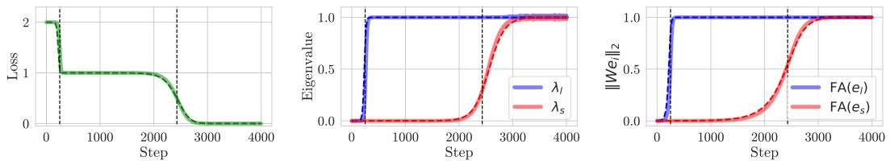  
Figure 1: Effects of extent bias on learning dynamics in SSL. (Left) Stepwise learning curves of Barlow Twins. There are two $\left( d = 2 \right.$ ) learning steps shown with two black dashed vertical lines (also shown in the other two panels) which indicate the time steps $t _ { 1 }$ and $t _ { 2 }$ with $\begin{array} { r } { t _ { 1 } : t _ { 2 } \approx \frac { 1 } { \gamma _ { l } } : \frac { \mathrm { i } } { \gamma _ { s } } = } \end{array}$ $\begin{array} { r } { \frac { 1 } { m _ { l } } : \frac { 1 } { m _ { s } } } \end{array}$ . The predicted loss (dashed green) of $\begin{array} { r } { \mathcal { L } = \sum _ { j = 1 } ^ { d } ( \tilde { \lambda } _ { j } ( t ) - 1 ) ^ { 2 } = \sum _ { j = 1 } ^ { d } ( \tilde { s } _ { j } ^ { 2 } ( t ) \gamma _ { j } - 1 ) ^ { 2 } } \end{array}$ using (3) match the empirical result (solid green). (Center) Evolution of eigenvalues $\lambda _ { j }$ ’s of $C$ during training. At the beginning, the first eigenvalue $\lambda _ { 1 }$ (blue) increases to 1 and then later the second $\lambda _ { 2 }$ (red) follows. We also compare them with the predicted evolution $\tilde { \lambda } _ { j } ( t )$ (dashed lines). (Right) Evolution of the feature alignment $| | W e | | _ { 2 }$ for $e = e _ { l }$ (blue) and $e = e _ { s }$ (red). It shows very similar behaviors with the eigenvalues $\tilde { \lambda } _ { j } ^ { 1 / 2 }$ (dashed lines). See Theorem 4.5. We use $m _ { l } = 9 , \ m _ { s } = 1 .$ See Appendix A.1 for more detailed settings.

# 120 4.1 Settings

We first consider the following base input $x _ { \mathrm { b a s e } } = [ b _ { l } \mathbf { 1 } _ { m _ { l } } ^ { \top } , b _ { s } \mathbf { 1 } _ { m _ { s } } ^ { \top } ] ^ { \top } \in \mathbb { R } ^ { m }$ , where $b _ { l } , b _ { s } \stackrel { \mathrm { i . i . d . } } { \sim } B ( p =$   
0.5) follow the Bernoulli distribution and take the value $\pm 1$ with the equal probability, $m _ { l }$ and $m _ { s }$   
indicate the size of larger part and smaller part, respectively, i.e., $m _ { l } > m _ { s }$ and $m _ { l } + m _ { s } = m$ , and   
$\mathbf { 1 } _ { k }$ is the $k$ -dimensional all-one vector. From now on, we will use the subscript $l$ and $s$ for the indices   
with respect to the larger-part and smaller-part features, respectively.

Then, to obtain the positive pair $( x , x ^ { \prime } )$ , we introduce the following data augmentation $x = x _ { \mathrm { b a s e } } +$ $\varepsilon$ and $x ^ { \prime } = x _ { \mathrm { b a s e } } + \varepsilon ^ { \prime }$ , with the noise $\varepsilon , \varepsilon ^ { \prime } \stackrel { \mathrm { i . i . d . } } { \sim } \mathcal { N } ( 0 _ { m } , a ^ { 2 } I _ { m } )$ for some $a > 0$ .

# 8 4.2 Learning Dynamics on extent bias

In this subsection, we discuss the relationship between $\gamma _ { j }$ and $\mathcal { L }$ , focusing on which features are   
learned earlier. From Section 4.1, we can simplify the feature cross-correlation matrix $\Gamma$ by analyzing   
the expected values of the augmented features. Based on the definition in (1), we have:

$$
\Gamma = \frac { 1 } { 2 n } \sum _ { i = 1 } ^ { n } ( x ^ { ( i ) } x ^ { \prime ( i ) \top } + x ^ { \prime ( i ) } x ^ { ( i ) \top } ) = \mathbb { E } [ x _ { \mathrm { b a s e } } x _ { \mathrm { b a s e } } ^ { \top } ] .
$$

To identify which features drive the loss as stepwise phenomena, we consider basis vectors that   
disentangle individual features. Specifically, we define basis vectors $e _ { l }$ and $e _ { s }$ where each vector has   
ones only in the dimensions corresponding to its respective feature:

$$
\begin{array} { r l } & { \quad e _ { l } = [ \mathbf { 1 } _ { m _ { l } } ^ { \top } , \mathbf { 0 } _ { m _ { s } } ^ { \top } ] ^ { \top } , e _ { s } = [ \mathbf { 0 } _ { m _ { l } } ^ { \top } , \mathbf { 1 } _ { m _ { s } } ^ { \top } ] ^ { \top } \in \mathbb { R } ^ { m } . } \\ & { \quad \quad \quad \mathrm { F A } ( e ) = \| W e \| _ { 2 } \mathrm { f o r } e = e _ { l } , e _ { s } . } \end{array}
$$

By measuring the feature alignment between these basis vectors and the weight matrix through   
$\mathsf { F } \bar { \mathbf { A } } ( e ) = \| W \boldsymbol { e } \| _ { 2 }$ , we can identify which features are being learned at each stage of the training   
process.

138 The eigendecomposition of $\Gamma$ is given by the following proposition:

39 Theorem 4.1. For the correlation matrix in (5), we have the eigenvalue matrix $\Lambda _ { \Gamma }$ and eigenvector   
matrix $V _ { \Gamma }$ :

$$
\Lambda _ { \Gamma } = d i a g \left( \left[ m _ { l } , m _ { s } , { \bf 0 } _ { m - 2 } \right] \right) , V _ { \Gamma } ^ { ( \le 2 ) } = \left[ e _ { l } / \sqrt { m _ { l } } e _ { s } / \sqrt { m _ { s } } \right] .
$$

We defer the proof to Appendix B.1.

We hypothesize that features with larger dimensions are learned faster, regardless of their predictive   
power or potential to cause shortcuts. This is particularly relevant in vision tasks where such features   
might correspond to larger pixel regions. We experiment using a simple toy model to validate our   
theoretical analysis of dimensional influence on feature learning. In our experimental setup, we used   
two distinct features with different dimensional coverage $\ m _ { l } = 9$ and $m _ { s } = 1$ ), allowing us to   
147 clearly observe the learning dynamics.

48 As shown in Figure 1, the results demonstrate three key phenomena:

Figure 1 (Left) shows loss trajectory (green line) exhibits two distinct stepwise phenomena, marked   
by black vertical lines. These stepwise decreases precisely align with the abrupt increase in the   
eigenvalue observed in Figure 1 (Center), confirming our theoretical prediction that eigenvalue   
dynamics drives the learning process.   
Figure 1 (Center) shows a clear stepwise pattern in which two distinct eigenvalues of $\Gamma$ increase   
sequentially. This sequential increase directly corresponds to the learning priority of feature, with the   
higher-dimensional feature $\mathrm { { \Delta } m } _ { l } = 9 \mathrm { { \Delta } }$ ) being learned first.   
Figure 1 (Right) shows that, feature alignment measurements $| | W e | | _ { 2 }$ from (6) provide direct evidence   
of the learning order: the alignment with $e _ { 1 }$ (blue line, corresponding to the larger feature dimension)   
increases during the first loss decrease, while $e _ { 2 }$ alignment (red line) follows during the second phase.   
This learning pattern strongly supports our hypothesis that dimensional coverage determines how   
early the features learned.

This result suggests that the spatial extent of features, rather than their semantic content, plays a crucial role in determining learning priority.

# 4.3 Cross-Correlation eigenvalue $\lambda$ and Loss Relationship

In this subsection, we analyze the relationship between the eigenvalues $\lambda _ { j }$ of cross-correlation matrix $C$ .

Theorem 4.2. Under Assumption 3.1, the eigenvalues $\lambda _ { j }$ of feature cross-correlation matrix $C =$ $W \Gamma W ^ { \top }$ , using the approximation $s _ { j } \approx \tilde { s } _ { j }$ in (3), are approximated as $\lambda _ { j } = s _ { j } ^ { 2 } \gamma _ { j } \approx \tilde { s } _ { j } ^ { 2 } \gamma _ { j } = : \tilde { \lambda } _ { j }$ which have

$$
\tilde { \lambda } _ { j } ( \tau _ { j } ) = \frac { 1 } { 2 } a n d \tilde { \lambda } _ { i } ^ { \prime } ( \tau _ { j } ) \left\{ \begin{array} { l l } { = 2 \gamma _ { j } } & { i f i = j , } \\ { \approx 0 } & { i f i \ne j } \end{array} \right.
$$

at 169 $\tau _ { j } = - \log ( s _ { j } ^ { 2 } ( 0 ) \gamma _ { j } ) / 8 \gamma _ { j }$ in (4). For the Barlow Twins loss $\mathcal { L } = \| C - I _ { d } \| _ { F } ^ { 2 }$ , we have ${ \mathcal { L } } =$ 170 $\begin{array} { r } { \sum _ { j = 1 } ^ { d } ( \lambda _ { j } - 1 ) ^ { 2 } { a n d } - \frac { d \mathcal { L } } { d t } ( \tau _ { j } ) \approx \tilde { \lambda } _ { j } ^ { \prime } ( \tau _ { j } ) = 2 \gamma _ { j } . } \end{array}$

We defer the proof to Appendix B.3.

Figure 6 in Appendix C shows the relationship between cross-correlation eigenvalue $\lambda$ differentiated   
with respect to $t$ and loss derivatives $\textstyle { \frac { d { \mathcal { L } } } { d t } }$ . The close alignment between the loss derivative and $\lambda$   
derivative curves demonstrates that the decrease in loss is directly driven by $\lambda$ , with larger $m _ { l }$ features   
learned, and smaller $m _ { s }$ features learned later. The curves’ relative magnitudes show an approximate   
$m _ { l } : m _ { s }$ ratio, which matches our theoretical predictions.

# 4.4 Weight Singular Value Evolution

To verify the dynamics of weight singular values $s _ { j }$ , we propose the following theorem: Theorem 4.3. Using the approximation (3), the singular values of the weight matrix $W$ satis

at the critical point $t = \tau _ { j }$

We defer the proof to Appendix B.4.

Figure 7 in Appendix C shows two key aspects of singular value dynamics during training. First,√   
the singular values $s _ { j }$ evolve to their theoretical limits $1 / \sqrt { \gamma _ { j } }$ and $1 / \sqrt { \gamma _ { s } }$ , as predicted by our   
analysis. Second, the derivatives of these singular values exhibit peaks at their respective critical√ √   
points, with magnitudes that follow the predicted $\sqrt { 2 \gamma _ { l } } : \sqrt { 2 \gamma _ { s } }$ ratio. These results provide strong   
empirical validation of our theoretical framework, demonstrating that both the convergence values   
and learning priority on different features are governed by their corresponding eigenvalues in the   
188 feature cross-correlation matrix $\Gamma$ .

# 189 4.5 Aligned Initialization and Subspace Alignment

0 To justify our alignment initialization assumption in Assumption 3.1, we first define the following subspace alignment metric:

Definition 4.4 (Subspace Alignment). We define subspace alignment of two subspaces $\operatorname { I m } ( A )$ and   
$\mathrm { I m } ( B )$ :

$$
\mathrm { S A } ( A , B ) = | | A ^ { \top } B | | _ { F } ^ { 2 } / d ,
$$

where 94 $\operatorname { I m } ( A ) = \{ A v \in \mathbb { R } ^ { m } : v \in \mathbb { R } ^ { d } \}$ , $A = [ a _ { 1 } \cdots a _ { d } ] , B = [ b _ { 1 } \cdots b _ { d } ] \in \mathbb { R } ^ { m \times d }$ and $a _ { i } , b _ { i } \in \mathbb { R } ^ { m }$ 95 are unit vectors.

Note that $0 \leq \operatorname { S A } ( A , B ) \leq 1$ and it attains $\mathrm { S A } ( A , B ) = 0$ when $\operatorname { I m } ( A ) \perp \operatorname { I m } ( B )$ , and $\mathrm { S A } ( A , B ) = 1$ when $\operatorname { I m } ( A ) = \operatorname { I m } ( B )$ . Figure 10 (Top) in Appendix D empirically validates Assumption 3.1 using the subspace alignment metric. The model becomes aligned rapidly in the early stages of training, satisfying the assumption.

# 4.6 Orthogonal Feature Learning

Our analysis shows that features are learned as orthogonal to each other, where each feature is acquired independently without interference from others. This orthogonal learning pattern is particularly evident in the evolution of the model’s weight matrix singular vectors. To formalize this observation, we analyze how the left singular vectors of the weight matrix align with the feature vectors during training.

Theorem 4.5. Under Assumption 3.1, the left singular vectors u of $W ( t )$ learn features orthogonally:

$$
\begin{array} { r } { { P r o j } _ { U ^ { ( \leq 2 ) } } ( W e _ { l } ) : = ( u _ { l } ^ { \top } W e _ { l } , u _ { s } ^ { \top } W e _ { l } ) = ( \sqrt { \lambda _ { l } } , 0 ) , } \\ { { P r o j } _ { U ^ { ( \leq 2 ) } } ( W e _ { s } ) : = ( u _ { l } ^ { \top } W e _ { s } , u _ { s } ^ { \top } W e _ { s } ) = ( 0 , \sqrt { \lambda _ { s } } ) , } \end{array}
$$

where 207 $u _ { l } , u _ { s }$ are the corresponding left singular vectors for the singular values $s _ { l } , s _ { s }$

Figure 11 shows orthogonal learning pattern that features are learned independently and sequentially, supporting our theoretical analysis of stepwise learning dynamics.

# 4.7 Non-linear multi layer network

Nonlinearity exhibits distinct learning dynamics compared to linearity. Therefore, we aim to investigate whether extent biass also exists in multilayer perceptrons (MLPs). We experiment with a 3-layer network, using leakyReLU as the activation function, for understanding non-linear feature learning dynamics. Our non-linear network experiments demonstrate that extent bias persists beyond linear models. As shown in Figure 14 in Appendix G, the non-linear network exhibits remarkably similar stepwise learning patterns to those observed in linear models Figure 1. Key similarities include: similar eigenvalue evolution patterns, consistent stepwise loss reduction phases. These results suggest that extent bias is a fundamental learning phenomenon that transcends network architecture complexity, rather than being merely an artifact of linear models.

# 4.8 Practical Study on Colored-MNIST Dataset

We conducted experiments using a Colored-MNIST dataset, where we adjusted the ratio of digits pixels relative to the total image pixels. We tested three different ratios: 0.05, 0.10, and 0.15. In this dataset, we set the correlation between background and label to $70 \%$ for both training and test sets, making it difficult for a model that predicts solely based on background to achieve accuracy higher than $70 \%$ . According to our hypothesis, since backgrounds have larger extent bias than objects, the test set accuracy would rapidly increase from an initial $10 \%$ (random choosing) to $70 \%$ (as the model learns background features), then plateau for a period, before slowly rising to $100 \%$ (as it learns object features). We also hypothesized that this plateau period would decrease as the ratio of label pixels increases in the images, with shorter plateaus observed in the 0.15 ratio condition compared to 0.05.

Figure 2 supports our hypothesis. Across all pixel ratio conditions (0.05, 0.10, 0.15), test accuracy exhibited a consistent pattern: a rapid increase from initial $10 \%$ to $70 \%$ , followed by a plateau period,

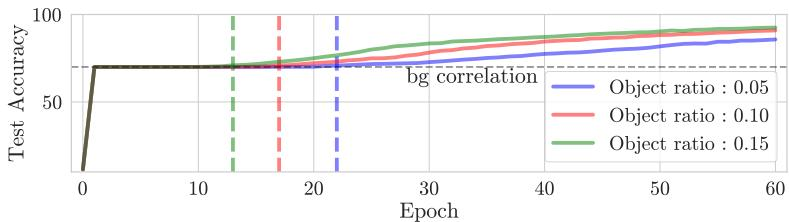  
Figure 2: Extent bias effects on spurious datasets. ResNet18 on the Colored MNIST dataset. (Left) Loss decreases even though the error rate doesn’t decrease. (Right) The error rate has a plateau at $70 \%$ , which corresponds to the correlation between background and object. The lengths of the plateaus become shorter as the object’s pixel ratio increases. See Appendix A.2 for more detailed settings.

and then a gradual ascent to $100 \%$ . Notably, as the object pixel ratio increased, the duration of the   
plateau phase decreased. The loss function continued to decrease even when accuracy remained   
stagnant at $70 \%$ . This suggests a extent bias where larger objects are prioritized during the learning   
process. The pattern reflects how the model initially achieves $70 \%$ accuracy by relying on background   
features, which statistically occupy larger regions, before progressively learning object features.   
Furthermore, this indicates that larger extents occupy greater eigenvalues, implying a reduction in the   
critical point $\tau _ { j }$ .

# 40 5 Amplitude Bias

In regression tasks, the phenomenon of spectral bias has been observed, wherein low-frequency   
components are learned more rapidly than high-frequency components during the training process.   
Conversely, in classification tasks, a phenomenon known as frequency shortcut [28] has been observed,   
wherein the model preferentially learns the distinctive Fourier components of the input during the   
training process. While these studies have primarily focused on supervised learning, we extend this   
investigation to the SSL, seeking to understand whether similar learning dynamics persist within SSL   
247 frameworks.

# 5.1 Settings

49 To analyze how frequency and amplitude bias affect learning dynamics, we consider input data   
$x _ { \mathrm { b a s e } } \in \mathbb { R } ^ { m }$ composed of two sinusoidal components with different frequencies:

$$
x _ { \mathrm { b a s e } } [ t ] = c _ { h } b _ { h } \sin ( f _ { h } t ) + c _ { l } b _ { l } \sin ( f _ { l } t ) ,
$$

where $\begin{array} { r } { f _ { h } = \frac { 2 \pi } { m } k } \end{array}$ and $\begin{array} { r } { f _ { l } = \frac { 2 \pi } { m } k ^ { \prime } } \end{array}$ represent different frequencies for some integers $k$ and $k ^ { \prime } , b _ { h } , b _ { l } \stackrel { \mathrm { i . i . d . } } { \sim }$   
$B ( p = 0 . 5 )$ follow the Bernoulli distribution and take the value $\pm 1$ . Suppose $f _ { h } < f _ { l }$ to examine   
the learning dynamics between low and high frequency components. The coefficients $c _ { h }$ and $c _ { l }$   
control the amplitude of each sinusoidal component, allowing us to investigate how magnitudes affect   
learning earlier. The Bernoulli variables $b _ { h }$ and $b _ { l }$ introduce phase reversal in the signal. The time   
vector $t$ spans the input dimension $m$ . We use the same augmentation with (4.1) to generate positive   
pairs $( x , x ^ { \prime } )$ by adding Gaussian noise.

# 5.2 Learning Dynamics on Amplitude Bias

Similar to Section 4.2, we consider basis vectors $e _ { h }$ and $e _ { l }$ that isolate individual features: $e _ { h } =$ $c _ { h } \sin ( f _ { h } t )$ and $e _ { l } = c _ { l } \sin ( f _ { l } t )$ , where $0 \leq t \leq m$ . Note that these two are orthogonal since $\begin{array} { r } { f _ { h } = \frac { 2 \pi } { m } k } \end{array}$ and ated $\begin{array} { r } { f _ { l } = \frac { 2 \pi } { m } k ^ { \prime } } \end{array}$ with an be $k \neq k ^ { \prime }$ . Similar to Theorem 4.1, the cross-correlation matrix sed as follows: $\Gamma$ for the

Theorem 5.1. Under (8), the correlation matrix $\Gamma$ has

$$
\Lambda _ { \Gamma } = d i a g \left( \left[ c _ { h } ^ { 2 } m / 2 , c _ { l } ^ { 2 } m / 2 , \mathbf { 0 } _ { m - 2 } \right] \right) , V _ { \Gamma } ^ { ( \leq 2 ) } = \left[ e _ { h } e _ { l } \right] .
$$

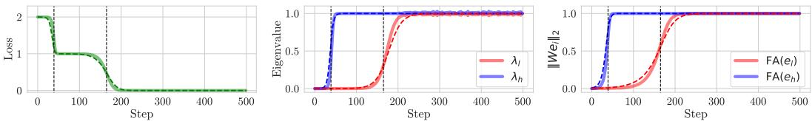  
Figure 3: Amplitude bias effects on learning dynamics in SSL. See the caption of Figure 1. Note that the time steps $t _ { 1 }$ and $t _ { 2 }$ with $\begin{array} { r } { t _ { 1 } : t _ { 2 } \approx \frac { 1 } { \gamma _ { h } } : \frac { 1 } { \gamma _ { l } } = \frac { 1 } { c _ { h } ^ { 2 } } : \frac { 1 } { c _ { l } ^ { 2 } } } \end{array}$ . We use $c _ { h } = 1 , \ c _ { l } = 1 / 2$ . See Appendix A.3 for more detailed settings.

264 We defer the proof to Appendix B.2.

From (9), we observe that eigenvalues are proportional to the squares of the coefficients $c _ { h } ^ { 2 }$ and $c _ { l } ^ { 2 }$ . This implies that the learning dynamics are more strongly influenced by the amplitude rather than the underlying frequency.

68 To validate our theoretical analysis of amplitude bias effect on learning dynamics, we conduct   
experiments using input data defined in (8). Especially, we set $c _ { h } > c _ { l }$ . This configuration shown in   
70 Figure 4 in Appendix A, allows us to examine how high-amplitude $c _ { h } \sin ( f _ { h } t )$ and low-amplitude   
1 $c _ { l } \sin ( f _ { l } t )$ affects feature amplitude bias. More details about the experiment are in Appendix A.3.

Our analysis reveals two dominant eigenvalues. The large eigenvalue corresponds to the highamplitude feature, and small eigenvalue corresponds to the low-amplitude component. The eigenvectors of $\Gamma$ are shown in Figure 5 , Appendix A. The first eigenvector, which corresponds to the largest eigenvalue, captures the dominant high-amplitude oscillation. The second eigenvector, which matches next-largest eigenvalue, captures the low-amplitude oscillation. Other eigenvectors are noise, corresponding to eigenvalues that are almost 0.

# 5.3 Cross-Correlation eigenvalue $\lambda$ and Loss Relationship

We analyze how the eigenvalues $\lambda$ relate to the loss dynamics. The relationship follows similar patterns to those observed in Section 4.3, but with coefficients $c _ { h }$ and $c _ { l }$ rather than $m _ { l }$ and $m _ { s }$ .

Figure 8 in Appendix C shows the close relationship between the derivatives of cross-correlation eigenvalues $\frac { d \bar { \lambda } _ { h } ^ { - } } { d t }$ , $\frac { d \lambda _ { l } } { d t }$ and $\textstyle { \frac { d { \mathcal { L } } } { d t } }$ . The peaks in these derivatives occur at the critical points with magnitudes proportional to the corresponding coefficients $\gamma _ { h } : \gamma _ { l } = c _ { h } ^ { 2 } : c _ { l } ^ { 2 }$ (see (9)). This shows our theoretical predictions Theorem 4.2 matches empirical result.

# 5.4 Weight Singular Value Evolution

We now analyze how the singular values of the weight matrix evolve during training. Similarly to the extent bias case, we expect the singular values $s _ { j }$ to converge to theoretical limits determined by the feature coefficients.

Figure 9 in Appendix C shows the evolution of singular values $s _ { h }$ and $s _ { l }$ of weight matrix $W$ (Left) and their derivatives (Right). The singular values converge to their theoretical limits $1 / \sqrt { \gamma _ { j } }$ predicted by Theorem 4.3, where $\gamma _ { j } = c _ { j } ^ { 2 } \frac { m } { 2 }$ . At the critical points $\tau _ { j }$ , the derivatives achieve their maximum values of $\sqrt { 2 \gamma _ { j } }$ , showing that rates of feature learning are proportional to the coefficients. These results confirm that the feature coefficients, rather than their frequencies, govern both the convergence values and rates of feature learning.

# 5.5 Aligned Initialization and Subspace Alignment

To validate Assumption 3.1 about alignment between the weight matrix singular vectors and eigenvectors of $\Gamma$ , we measure the subspace alignment metric as defined in the extent case Definition 4.4. Figure 10 (Bottom) in Appendix D empirically validates our assumption through subspace alignment measurements. As discussed in Section 4.5, the model achieves alignment rapidly in the early stages of training, even with small random initializations.

Similar to the extent case, we investigate how the weight matrix learns different frequency components orthogonally as shown in Theorem 4.5. The orthogonal learning pattern reveals how frequency features are acquired independently despite their different spectral characteristics.

Figure 12 in Appendix E shows the trajectories of weight matrix in terms of their alignments with frequency components $e _ { h }$ and $e _ { l }$ . The blue trajectory shows the first learning phase where $u _ { 1 }$ aligns with the high-amplitude feature $( c _ { h } \sin ( f _ { h } t ) )$ , followed by the red trajectory showing $u _ { 2 }$ aligning with the low-amplitude feature $( c _ { l } \sin ( f _ { l } t ) )$ . This sequential, orthogonal learning pattern demonstrates that feature learning is primarily determined by coefficient magnitudes rather than frequency characteristics, supporting our analysis in Theorem 4.5.

# 5.7 Non-linear multi layer network

Same as Section 4.7 in Appendix G, we conduct experiments with a 3-layer network using leakyReLU activations to analyze how amplitude coefficients affect learning dynamics in non-linear settings.

Figure 15 in Appendix G demonstrates amplitude bias effects in non-linear networks is similar to linear networks on Figure 3. These results confirm that amplitude bias persists in non-linear architectures, suggesting amplitude magnitude remains a primary determinant of feature learning priority regardless of network complexity.

# 5.8 Discussion

Figure 13 in Appendix F shows that a learning process is driven primarily by feature coefficient magnitude rather than frequency characteristics. The key observation is that the first learned features are those with large coefficients, independent of their spectral properties. This finding parallels frequency shortcut [28] in classification tasks, but reveals a different underlying mechanism. While frequency shortcut suggests models preferentially learn distinctive Fourier components, our results demonstrate that amplitude magnitude—not frequency characteristics—primarily determines feature learning priority.

# 6 Conclusion

In this work, we establish a theoretical connection between eigendecomposition of the feature crosscorrelation matrix, shortcut learning, and stepwise learning behavior in SSL. We provide insights into how dimensional feature properties influence the learning process in SSL frameworks. This work not only explains observed shortcut learning phenomena but also offers a theoretical lens for understanding and potentially mitigating such learning biases. This theoretical framework lays the groundwork for developing more robust SSL algorithms. Future work should focus on leveraging these insights to design mechanisms that encourage learning of generalizable features despite their potentially lower extent bias or amplitude bias.

# References

[1] M. Arjovsky, L. Bottou, I. Gulrajani, and D. Lopez-Paz. Invariant risk minimization. arXiv preprint arXiv:1907.02893, 2019.

[2] M. Assran, Q. Duval, I. Misra, P. Bojanowski, P. Vincent, M. Rabbat, Y. LeCun, and N. Ballas. Self-supervised learning from images with a joint-embedding predictive architecture. In Proceedings of the IEEE/CVF Conference on Computer Vision and Pattern Recognition, pages 15619–15629, 2023.

[3] N. Baker, H. Lu, G. Erlikhman, and P. J. Kellman. Deep convolutional networks do not classify based on global object shape. PLoS computational biology, 14(12):e1006613, 2018.

[4] A. Bardes, J. Ponce, and Y. LeCun. Vicreg: Variance-invariance-covariance regularization for self-supervised learning. arXiv preprint arXiv:2105.04906, 2021.

[5] S. Beery, G. Van Horn, and P. Perona. Recognition in terra incognita. In Proceedings of the   
European Conference on Computer Vision (ECCV), September 2018.   
[6] M. Caron, H. Touvron, I. Misra, H. Jégou, J. Mairal, P. Bojanowski, and A. Joulin. Emerging   
properties in self-supervised vision transformers. In Proceedings of the IEEE/CVF international   
conference on computer vision, pages 9650–9660, 2021.   
[7] T. Chen, S. Kornblith, M. Norouzi, and G. Hinton. A simple framework for contrastive learning   
of visual representations. In International conference on machine learning, pages 1597–1607.   
PMLR, 2020.   
[8] X. Chen and K. He. Exploring simple siamese representation learning. In Proceedings of the   
IEEE/CVF conference on computer vision and pattern recognition, pages 15750–15758, 2021.   
[9] L. Deng. The mnist database of handwritten digit images for machine learning research [best of   
the web]. IEEE signal processing magazine, 29(6):141–142, 2012.   
[10] C. Doersch, A. Gupta, and A. A. Efros. Unsupervised visual representation learning by context   
prediction. In Proceedings of the IEEE International Conference on Computer Vision (ICCV),   
December 2015.   
[11] C. Doersch, A. Gupta, and A. A. Efros. Unsupervised visual representation learning by context   
prediction. In Proceedings of the IEEE international conference on computer vision, pages   
–1430, 2015.   
[12] R. Geirhos, P. Rubisch, C. Michaelis, M. Bethge, F. A. Wichmann, and W. Brendel. Imagenet  
trained cnns are biased towards texture; increasing shape bias improves accuracy and robustness.   
arXiv preprint arXiv:1811.12231, 2018.   
[13] R. Geirhos, J.-H. Jacobsen, C. Michaelis, R. Zemel, W. Brendel, M. Bethge, and F. A. Wichmann.   
Shortcut learning in deep neural networks. Nature Machine Intelligence, 2(11):665–673, 2020.   
[14] J.-B. Grill, F. Strub, F. Altché, C. Tallec, P. Richemond, E. Buchatskaya, C. Doersch,   
B. Avila Pires, Z. Guo, M. Gheshlaghi Azar, et al. Bootstrap your own latent-a new ap  
proach to self-supervised learning. Advances in neural information processing systems, 33:   
21271–21284, 2020.   
[15] M. S. Halvagal, A. Laborieux, and F. Zenke. Implicit variance regularization in non-contrastive   
ssl. arXiv preprint arXiv:2212.04858, 2022.   
[16] K. Hermann and A. Lampinen. What shapes feature representations? exploring datasets,   
architectures, and training. Advances in Neural Information Processing Systems, 33:9995–   
10006, 2020.   
[17] K. L. Hermann, H. Mobahi, T. Fel, and M. C. Mozer. On the foundations of shortcut learning.   
arXiv preprint arXiv:2310.16228, 2023.   
[18] A. Jacot, F. Gabriel, and C. Hongler. Neural tangent kernel: Convergence and generalization in   
neural networks. Advances in neural information processing systems, 31, 2018.   
[19] A. Jacot, F. Ged, B. ¸Sim¸sek, C. Hongler, and F. Gabriel. Saddle-to-saddle dynamics in deep linear   
networks: Small initialization training, symmetry, and sparsity. arXiv preprint arXiv:2106.15933,   
2021.   
[20] E. Littwin, O. Saremi, M. Advani, V. Thilak, P. Nakkiran, C. Huang, and J. Susskind. How jepa   
avoids noisy features: The implicit bias of deep linear self distillation networks. arXiv preprint   
arXiv:2407.03475, 2024.   
[21] I. Loshchilov and F. Hutter. Decoupled weight decay regularization. arXiv preprint   
arXiv:1711.05101, 2017.   
[22] M. Noroozi, H. Pirsiavash, and P. Favaro. Representation learning by learning to count. In   
Proceedings of the IEEE International Conference on Computer Vision (ICCV), Oct 2017.   
[23] M. Oquab, T. Darcet, T. Moutakanni, H. Vo, M. Szafraniec, V. Khalidov, P. Fernandez, D. Haziza,   
F. Massa, A. El-Nouby, et al. Dinov2: Learning robust visual features without supervision.   
arXiv preprint arXiv:2304.07193, 2023.   
[24] S. Pesme and N. Flammarion. Saddle-to-saddle dynamics in diagonal linear networks. Advances   
in Neural Information Processing Systems, 36:7475–7505, 2023.   
[25] N. Rahaman, A. Baratin, D. Arpit, F. Draxler, M. Lin, F. Hamprecht, Y. Bengio, and A. Courville.   
On the spectral bias of neural networks. In International conference on machine learning, pages   
–5310. PMLR, 2019.   
[26] J. B. Simon, M. Knutins, L. Ziyin, D. Geisz, A. J. Fetterman, and J. Albrecht. On the stepwise   
nature of self-supervised learning. In International Conference on Machine Learning, pages   
31852–31876. PMLR, 2023.   
[27] M. Tancik, P. Srinivasan, B. Mildenhall, S. Fridovich-Keil, N. Raghavan, U. Singhal, R. Ra  
mamoorthi, J. Barron, and R. Ng. Fourier features let networks learn high frequency functions in   
low dimensional domains. Advances in neural information processing systems, 33:7537–7547,   
2020.   
[28] S. Wang, R. Veldhuis, C. Brune, and N. Strisciuglio. What do neural networks learn in image   
classification? a frequency shortcut perspective. In Proceedings of the IEEE/CVF International   
Conference on Computer Vision, pages 1433–1442, 2023.   
[29] D. Wei, J. J. Lim, A. Zisserman, and W. T. Freeman. Learning and using the arrow of time.   
In Proceedings of the IEEE Conference on Computer Vision and Pattern Recognition (CVPR),   
June 2018.   
[30] S. Wu, S. Chen, C. Xie, and X. Huang. One-pixel shortcut: on the learning preference of deep   
neural networks. arXiv preprint arXiv:2205.12141, 2022.   
[31] J. Zbontar, L. Jing, I. Misra, Y. LeCun, and S. Deny. Barlow twins: Self-supervised learning via   
redundancy reduction. In International conference on machine learning, pages 12310–12320.   
PMLR, 2021.

# 18 A Experimental Details

# A.1 Extent bias Experiment

For the extent bias experiment shown in Section 4.1, we train the model using 400 epochs. The   
augmentation noise parameter $a$ was set to 0.01. We use a dataset size of $n = 1 0 0 0$ samples with   
feature dimension $m = 1 0$ . We also use learning rate $\eta = 6 \cdot 1 0 ^ { - 4 }$ and scaling factor $5 \cdot 1 \bar { 0 } ^ { - 1 }$ .

# A.2 Colored MNIST Experiment

For the Colored MNIST shown in Section 4.8, we train the model using default augmentation   
(RandomResizedCrop, RandomHorizontalFlip, RandomColorJitter, RandomGrayscale, Random  
GaussianBlur, RandomSolarization) with augmentated image size $4 2 \times 4 2$ . We use background colors   
as [[255, 0, 0], [0, 255, 0], [0, 0, 255], [255, 255, 0], [255, 0, 255], [0, 255, 255], [0, 123, 123], [123,   
0, 123], [123, 123, 0], [123, 0, 0]][digit]. We trained ResNet18 with 60 epochs, AdamW [21] with   
learning rate $\eta = 4 \times 1 0 ^ { - 6 }$ .

# A.3 Amplitude Experiment

431 For the amplitude experiment shown in Section 5.1, we train the model using 500 epochs. The 432 augmentation noise parameter $a$ is set to 0.1. We use a dataset size of $n = 1 0 0 0$ samples with feature 433 frequency $f _ { h } = 2 \frac { 2 \pi } { 2 4 }$ , $f _ { l } = 3 2 \frac { 2 \pi } { 2 4 }$ . We also use learning rate $\eta = 5 \cdot 1 0 ^ { - 5 }$ , scaling factor $3 \cdot 1 0 ^ { - 3 }$ and $m = 9 6$ .

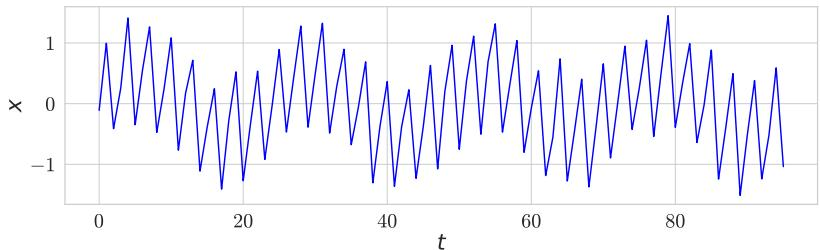  
0.5, Figure 4: Input data $\begin{array} { r } { f _ { h } = \frac { 2 \pi } { m } { 3 2 } } \end{array}$ , $\begin{array} { r } { f _ { l } = \frac { 2 \pi } { m } 8 } \end{array}$ $\begin{array} { r } { x = x _ { b a s e } + \epsilon . x _ { \mathrm { b a s e } } [ t ] = b _ { h } c _ { h } \sin ( f _ { h } t ) + b _ { l } c _ { l } \sin ( f _ { l } t ) . } \end{array}$ , $m = 9 6$ . , where $c _ { h } = 1 , c _ { l } =$

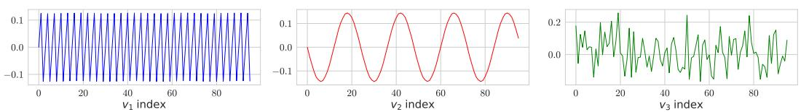  
Figure 5: The eigenvectors $v _ { i }$ ’s of $\Gamma$ for $i = { 1 , 2 , 3 }$ (from Left to Right). (Left) The first eigenvector that correspondent to the largest eigenvalue indicates the (high frequency) feature with a high amplitude $\bar { c } _ { h } \sin \left( f _ { h } t \right)$ , (Center) the second the (low frequency) feature with a low amplitude feature $c _ { l } \sin \left( f _ { l } t \right)$ , (Right) the third (and beyond) noise, where $c _ { l } < c _ { h }$ .

# B Proofs

# B.1 Proof of Theorem 4.1

Through matrix analysis, we can express:

$$
\Gamma = \mathbb { E } [ x _ { \mathrm { b a s e } } x _ { \mathrm { b a s e } } ^ { \top } ] = \left[ \begin{array} { l l } { \mathbf { 1 } _ { m _ { l } \times m _ { l } } } & { \mathbf { 0 } _ { m _ { s } \times m _ { l } } } \\ { \mathbf { 0 } _ { m _ { l } \times m _ { s } } } & { \mathbf { 1 } _ { m _ { s } \times m _ { s } } } \end{array} \right] ,
$$

which has two eigenvectors $e _ { l } / \Vert e _ { l } \Vert$ and $\boldsymbol { e } _ { s } / \Vert \boldsymbol { e } _ { s } \Vert$ correspond to nonzero eigenvalues. We get the   
eigenvalues $m _ { l }$ and $m _ { s }$ from the following equation:

$$
\begin{array} { r } { \operatorname* { d e t } ( \Gamma - \lambda I ) = \operatorname* { d e t } ( { \bf 1 } _ { m _ { l } \times m _ { l } } - \lambda I _ { m _ { l } \times m _ { l } } ) \operatorname* { d e t } ( { \bf 1 } _ { m _ { s } \times m _ { s } } - \lambda I _ { m _ { s } \times m _ { s } } ) = 0 . } \end{array}
$$

Finally, we can get the eigendecomposition $\Gamma = V _ { \Gamma } \Lambda _ { \Gamma } V _ { \Gamma }$ where

$$
\begin{array} { c } { { \Lambda _ { \Gamma } = \mathrm { d i a g } \left( \left[ m _ { l } , m _ { s } , \mathbf { 0 } _ { m - 2 } \right] \right) , } } \\ { { V _ { \Gamma } ^ { \left( \leq d \right) } = \left[ \displaystyle \frac { 1 } { \sqrt { m _ { l } } } e _ { l } \displaystyle \frac { 1 } { \sqrt { m _ { s } } } e _ { s } \right] . } } \end{array}
$$

# 441 B.2 Proof of Theorem 5.1

The cross-correlation matrix $\Gamma$ for this input can be expressed using (5):

$$
\begin{array} { r l } & { \mathrm { ~ \gamma \mathrm { ' } = \mathbb { E } } [ x _ { \mathrm { b a s t } } x _ { \mathrm { b a s l } } ^ { \top } ] } \\ & { \mathrm { ~ \ } = \mathbb { E } [ c _ { h } ^ { 2 } b _ { h } ^ { 2 } \sin ( f _ { h } t ) \sin ( f _ { h } t ) ^ { \top } + c _ { l } ^ { 2 } b _ { h } ^ { 2 } \sin ( f _ { l } t ) \sin ( f _ { l } t ) ^ { \top } + c _ { h } c _ { l } b _ { h } b _ { l } \sin ( f _ { h } t ) \sin ( f _ { l } t ) ^ { \top } + c _ { h } c _ { l } b _ { h } b _ { l } \sin ( f _ { h } t ) ^ { \top } ] } \\ & { \mathrm { ~ \ } = c _ { h } ^ { 2 } \sin ( f _ { h } t ) \sin ( f _ { h } t ) ^ { \top } + c _ { l } ^ { 2 } \sin ( f _ { l } t ) \sin ( f _ { l } t ) ^ { \top } . } \end{array}
$$

Using the orthogonality between $\sin ( f _ { h } t )$ and $\sin ( f _ { l } t ) ( f _ { h } \neq f _ { l } )$ , where $t \in \mathbb N$ ,

$$
\begin{array} { c } { { \Gamma = c _ { h } ^ { 2 } \sin ( f _ { h } t ) \sin ( f _ { h } t ) ^ { \top } + c _ { l } ^ { 2 } \sin ( f _ { l } t ) \sin ( f _ { l } t ) ^ { \top } , } } \\ { { \Gamma \sin ( f _ { h } t ) = c _ { h } ^ { 2 } | | \sin ( f _ { h } t ) | | ^ { 2 } \sin ( f _ { h } t ) , } } \\ { { \Gamma \sin ( f _ { l } t ) = c _ { l } ^ { 2 } | | \sin ( f _ { l } t ) | | ^ { 2 } \sin ( f _ { l } t ) . } } \end{array}
$$

We find eigenvector and eigenvalue as:

$$
\begin{array} { r } { \Lambda _ { \Gamma } = \mathrm { d i a g } \left( \left[ c _ { h } ^ { 2 } | | \sin ( f _ { h } t ) | | ^ { 2 } , c _ { l } ^ { 2 } | | \sin ( f _ { l } t ) | | ^ { 2 } , \mathbf { 0 } _ { m - 2 } \right] \right) , } \\ { V _ { \Gamma } ^ { ( \leq 2 ) } = \left[ e _ { h } \ e _ { l } \right] ^ { \top } . \qquad } \end{array}
$$

$\begin{array} { r } { f = \frac { 2 \pi } { m } k } \end{array}$ for some integer $k$

$$
\begin{array} { l } { | | \sin ( f x ) | | ^ { 2 } = \displaystyle \int _ { 0 } ^ { m } \sin ^ { 2 } ( f x ) d x = \displaystyle \int _ { 0 } ^ { m } \frac { 1 - \cos ( 2 f x ) } { 2 } d x } \\ { = \displaystyle \frac { 1 } { 2 } \left[ x - \frac { \sin ( 2 f x ) } { 2 } \right] _ { 0 } ^ { m } = \displaystyle \frac { m } { 2 } - \frac { \sin ( 2 f m ) } { 4 } = \displaystyle \frac { m } { 2 } . } \end{array}
$$

Finally, we have

$$
\begin{array} { l } { { \displaystyle \Lambda _ { \Gamma } = \mathrm { d i a g } \left( \left[ c _ { h } ^ { 2 } \frac { m } { 2 } , c _ { l } ^ { 2 } \frac { m } { 2 } , { \bf 0 } _ { m - 2 } \right] \right) , } } \\ { { \displaystyle V _ { \Gamma } ^ { ( \leq 2 ) } = \left[ e _ { h } e _ { l } \right] . } } \end{array}
$$

# 447 B.3 Proof of Theorem 4.2

We have

$$
\tilde { \lambda } _ { j } ( t ) = \tilde { s } _ { j } ^ { 2 } ( t ) \gamma _ { j } = ( 1 + \lambda _ { j } ( 0 ) ^ { - 1 } e ^ { - 8 \gamma _ { j } t } ) ^ { - 1 } ,
$$

and thus if we plug in 449 $\tau _ { j } = - \log ( \lambda _ { j } ( 0 ) ) / 8 \gamma _ { j }$ , i.e., $\exp ( - 8 \gamma _ { j } \tau _ { j } ) = \lambda _ { j } ( 0 )$ , then we have $\tilde { \lambda } _ { j } ( \tau _ { j } ) =$ 450 $\begin{array} { r } { ( 1 + 1 ) ^ { - 1 } = \frac { 1 } { 2 } } \end{array}$ . The derivative $\tilde { \lambda } _ { j } ^ { \prime } ( t )$ at $t = \tau _ { j }$ is given as follows:

$$
\begin{array} { r l } & { \tilde { \lambda } _ { j } ^ { \prime } ( t ) = - ( 1 + \lambda _ { j } ( 0 ) ^ { - 1 } e ^ { - 8 \gamma _ { j } t } ) ^ { - 2 } ( - 8 \gamma _ { j } \lambda _ { j } ( 0 ) ^ { - 1 } e ^ { - 8 \gamma _ { j } t } ) } \\ & { \qquad = - \tilde { \lambda } _ { j } ^ { 2 } ( t ) ( - 8 \gamma _ { j } \lambda _ { j } ( 0 ) ^ { - 1 } e ^ { - 8 \gamma _ { j } t } ) } \\ & { \tilde { \lambda } _ { j } ^ { \prime } ( \tau _ { j } ) = - \tilde { \lambda } _ { j } ^ { 2 } ( \tau _ { j } ) ( - 8 \gamma _ { j } \lambda _ { j } ^ { - 1 } ( 0 ) \lambda _ { j } ( 0 ) ) } \\ & { \qquad = 2 \gamma _ { j } . } \end{array}
$$

$$
C = \sum _ { j = 1 } ^ { d } \lambda _ { j } u _ { j } u _ { j } ^ { \top } \mathrm { ~ a n d ~ } C ^ { 2 } = \sum _ { j = 1 } ^ { d } \lambda _ { j } ^ { 2 } u _ { j } u _ { j } ^ { \top } ,
$$

we get the loss

$$
\begin{array} { l } { { \mathcal { L } = | | C - I | | _ { F } ^ { 2 } = \mathrm { T r } ( ( C - I ) ( C - I ) ) = \mathrm { T r } ( C ^ { 2 } ) - 2 \mathrm { T r } ( C ) + d } } \\ { { \displaystyle \quad = \sum _ { j = 1 } ^ { d } \lambda _ { j } ^ { 2 } - 2 \sum _ { j = 1 } ^ { d } \lambda _ { j } + d = \sum _ { j = 1 } ^ { d } ( \lambda _ { j } - 1 ) ^ { 2 } . } } \end{array}
$$

Thus, we get the following equation:

$$
\begin{array} { l } { \displaystyle \frac { d \mathcal { L } } { d t } ( \tau _ { j } ) = \sum _ { i = 1 } ^ { d } 2 ( \lambda _ { i } ( \tau _ { j } ) - 1 ) \lambda _ { i } ^ { \prime } ( \tau _ { j } ) } \\ { \displaystyle \approx \sum _ { i = 1 } ^ { d } 2 ( \tilde { \lambda } _ { i } ( \tau _ { j } ) - 1 ) \tilde { \lambda } _ { i } ^ { \prime } ( \tau _ { j } ) } \\ { \displaystyle \approx 2 ( \tilde { \lambda } _ { j } ( \tau _ { j } ) - 1 ) \tilde { \lambda } _ { j } ^ { \prime } ( \tau _ { j } ) } \\ { \displaystyle = - \tilde { \lambda } _ { j } ^ { \prime } ( \tau _ { j } ) = - 2 \gamma _ { j } . } \end{array}
$$

# 454 B.4 Proof of Theorem 4.3

First, we have

$$
\begin{array} { c } { { \tilde { s } _ { j } ( t ) = ( \gamma _ { j } + s _ { j } ^ { - 2 } ( 0 ) \exp ( - 8 \gamma _ { j } t ) ) ^ { - 1 / 2 } , } } \\ { { \tilde { s } _ { j } ( \tau _ { j } ) = ( \gamma _ { j } + s _ { j } ^ { - 2 } ( 0 ) \lambda _ { j } ( 0 ) ) ^ { - 1 / 2 } } } \\ { { = ( 2 \gamma _ { j } ) ^ { - 1 / 2 } . } } \end{array}
$$

456 and its derivative is given as follows:

$$
\begin{array} { l } { { \displaystyle { \tilde { s } _ { j } ^ { \prime } } ( t ) = - \frac { 1 } { 2 } ( \gamma _ { j } + s _ { j } ^ { - 2 } ( 0 ) \exp ( - 8 \gamma _ { j } t ) ) ^ { - 3 / 2 } ( - 8 \gamma _ { j } s _ { j } ^ { - 2 } ( 0 ) \exp ( - 8 \gamma _ { j } t ) ) , } } \\ { { \displaystyle { \tilde { s } _ { j } ^ { \prime } } ( \tau _ { j } ) = - \frac { 1 } { 2 } ( \gamma _ { j } + s _ { j } ^ { - 2 } ( 0 ) \lambda _ { j } ( 0 ) ) ^ { - 3 / 2 } ( - 8 \gamma _ { j } s _ { j } ^ { - 2 } ( 0 ) \lambda _ { j } ( 0 ) ) } } \\ { { \displaystyle ~ = - \frac { 1 } { 2 } ( 2 \gamma _ { j } ) ^ { - 3 / 2 } ( - 8 \gamma _ { j } ^ { 2 } ) } } \\ { { \displaystyle ~ = ( 2 \gamma _ { j } ) ^ { 1 / 2 } . } } \end{array}
$$

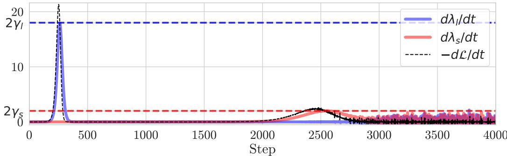  
Figureblue), vatives (solid dλl (blue),  are app $\frac { d \lambda _ { s } } { d t }$ (red), and mately equ $- { \frac { d { \mathcal { L } } } { d t } }$ shed). The deri(dashed blue), $\begin{array} { r } { \frac { d \lambda _ { l } } { d t } ( \tau _ { l } ) } \end{array}$ (solidashed $\begin{array} { r } { \frac { d \lambda _ { s } } { d t } ( \tau _ { s } ) } \end{array}$ $2 \gamma _ { l } = 2 m _ { l }$ $2 \gamma _ { s } = 2 m _ { s }$

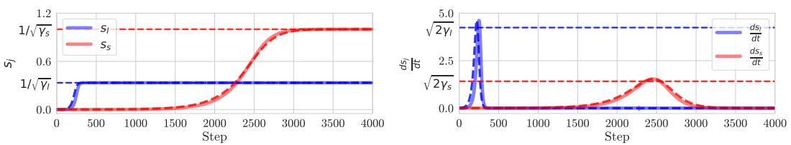  
Figure 7: Evolution of $s _ { j } ( t )$ and $s _ { j } ^ { \prime } ( t )$ . (Left) Evolution of singular values $s _ { l }$ (solid blue) and $s _ { s }$ (solid red) of $W$ during training. They converge near to $1 / \sqrt { \gamma _ { l } } = 1 / 3$ (dashed horizontal blue) and $1 / \sqrt { \gamma _ { s } } = 1$ (dashed horizontal red), respectively. The predicted singular values (dashed blue, dashed red) match the empirired). The derivatives √ l, t) Evolution of the derivativeare approximately equal to $\textstyle { \frac { d s _ { l } } { d t } }$ (solid blue) and (dashed horizo $\frac { d s _ { s } } { d t }$ (solid blue), $\begin{array} { r } { \frac { d s _ { l } } { d t } ( \tau _ { l } ) } \end{array}$ $\begin{array} { r } { \frac { d s _ { s } } { d t } ( \tau _ { s } ) } \end{array}$ $\sqrt { 2 \gamma _ { l } }$ $\sqrt { 2 \gamma _ { s } }$ (dashed horizontal red). The predicted derivatives of singular values (dashed blue, dashed red) also match the empirical result. We use $m _ { l } = 9$ and $m _ { s } = 1$ .

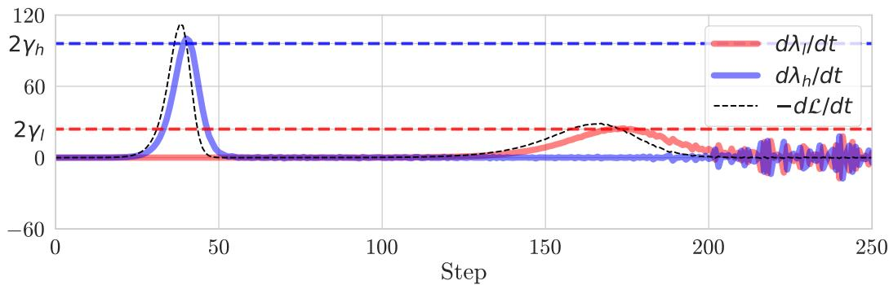  
Figureblue), ivatives  (solid r $\frac { d \lambda _ { h } } { d t }$ (blue), re appr $\frac { d \lambda _ { l } } { d t }$ (red), andately equa $- { \frac { d { \mathcal { L } } } { d t } }$ ashed). The d(dashed blue), $\textstyle { \frac { d \lambda _ { h } } { d t } } \left( \tau _ { h } \right)$ (solidd red). $\begin{array} { r } { \frac { d \lambda _ { l } } { d t } ( \tau _ { l } ) } \end{array}$ $2 \gamma _ { h } = 2 c _ { h } ^ { 2 }$ $2 \gamma _ { l } = 2 c _ { l } ^ { 2 }$

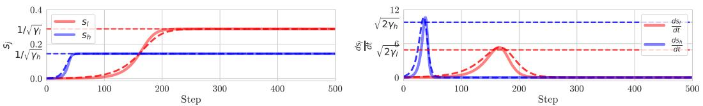  
Figure 9: Evolution of $s _ { j } ( t )$ and $s _ { j } ^ { \prime } ( t )$ . See the caption of Figure 7. (Left) They converge near to $1 / \sqrt { \gamma _ { h } } = 1 / \sqrt { c _ { h } ^ { 2 } \frac { m } { 2 } }$ and √ $1 / \sqrt { \gamma } \stackrel { \cdot } { = } 1 / \sqrt { c _ { l } ^ { 2 } \frac { m } { 2 } }$ . (Right) The derivatives $\textstyle { \frac { d s _ { h } } { d t } } \left( \tau _ { h } \right)$ , $\begin{array} { r } { \frac { d s _ { l } } { d t } ( \tau _ { l } ) } \end{array}$ are approximately equal to $\sqrt { 2 \gamma _ { h } } , \sqrt { 2 \gamma _ { l } }$ . We use $c _ { h } = 1$ and $c _ { l } = 1 / 2$ .

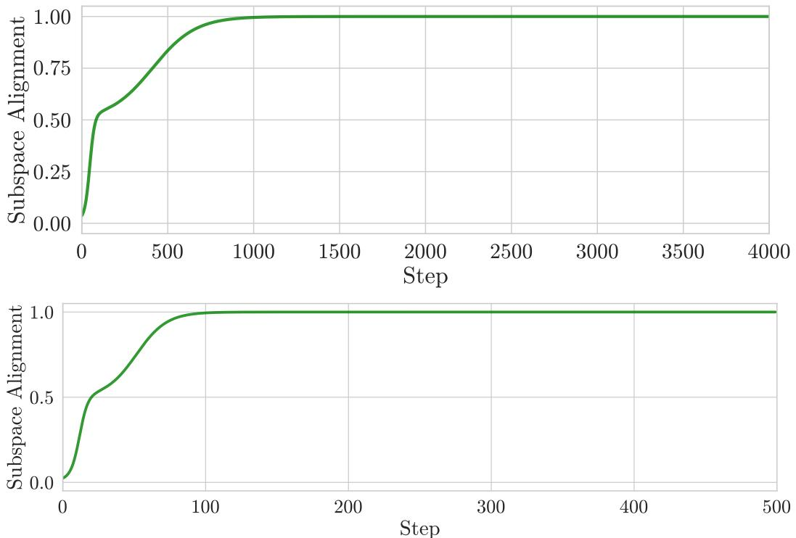  
Figure 10: Evolution of subspace alignment ${ \mathrm { S A } } ( V ^ { ( \leq d ) } , V _ { \Gamma } ^ { ( \leq d ) } )$ $( d = 2 )$ ) between the top- $d$ right singular vectors of $W$ and eigenvectors of $\Gamma$ . We use the data (Top) from Section 4.1 and (Bottom) from Section 5.1. See Appendix A.

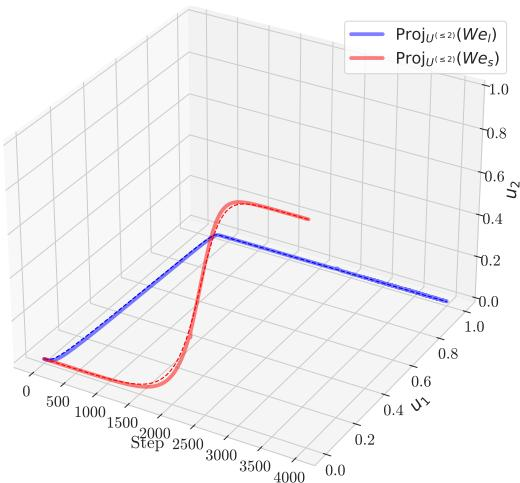  
Figure 11: Visualization of the trajectory of $W e _ { l }$ and $W e _ { s }$ on the subspace spanned by $u _ { 1 } , u _ { 2 }$ during training. The high-dimensional feature $W e _ { h }$ (blue solid line) aligns with $u _ { 1 }$ and the lowdimensional feature $W e _ { l }$ (red solid line) aligns with $u _ { 2 }$ . Dashed lines are predicted trajectory (see Theorem 4.5).

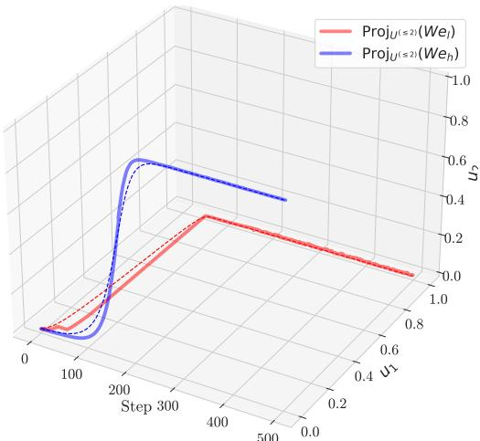  
Figure 12: Visualization of the trajectory of $W e _ { h }$ and $W e _ { l }$ on the subspace spanned by $u _ { 1 } , u _ { 2 }$ during training. See the caption of Figure 11.

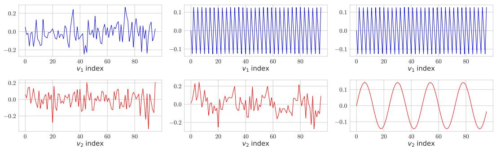  
Figure 13: The first two right singular vectors (Top/Bottom) of $W$ during training (from Left to Right). (Left) At $t = 0$ , the two singular vectors are just noise. (Center) A little after $t = \tau _ { 1 }$ , the first singular value reaches the plateau as shown in Figure 3 and only the (high frequency) feature with a high amplitude is learned. (Right) At the convergence, the model learns the two features.

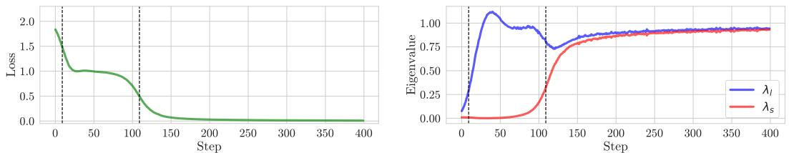  
Figure 14: Effects of extent bias on learning dynamics in non-linear network. (Left) Stepwise learning curves of Barlow Twins. There are two $\left[ d = 2 \right]$ ) learning steps shown with two black dashed vertical lines (also shown in the other two panels) on empirical result (solid green). (Right) Evolution of eigenvalues $\lambda _ { j }$ ’s of $C$ during training. At the beginning, the first eigenvalue $\lambda _ { 1 }$ (blue) increases to 1 and then later the second $\lambda _ { 2 }$ (red) follows. We use same inputs in Figure 1.

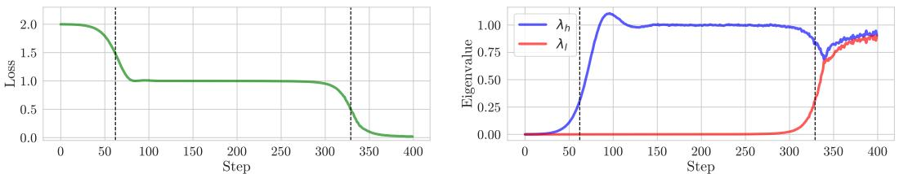  
Figure 15: Amplitude bias effects on learning dynamics in non-linear network. (Left) Stepwise learning curves of Barlow Twins showing two distinct learning phases with vertical dashed lines marking critical transition points during training. The green line shows empirical loss decreasing in two clear stages. (Right) Evolution of eigenvalues $\lambda _ { j }$ of correlation matrix C during training. The eigenvalue $\lambda _ { l }$ (blue) increases first, followed by the eigenvalue $\lambda _ { s }$ (red), demonstrating amplitudebased learning prioritization. We use same inputs in Figure 3.

63 Our study has several limitations due to its simplified assumptions. While our theoretical analysis   
4 provides valuable insights into the relationship between extent bias and shortcut learning, several   
limitations should be acknowledged:

• Linear Network Assumption: We focus on one-layer linear networks, which may not capture the complexities of multi-layer non-linear neural networks.   
• Feature Independence: Our assumption of independent features may not reflect the complex interdependencies in practical scenarios.   
• Augmentation Limitations: Augmentation Limitations: Our basic augmentation approach may not fully represent the sophisticated strategies used in modern SSL methods.

Future work could address these limitations by extending the theoretical framework to non-linear   
networks, incorporating feature interactions, and analyzing the impact of more complex augmentation   
strategies.

# 475 I Supplementary Studies

# 476 I.1 Non-linear Feature Learned Measurement

Nonlinearity exhibits distinct learning dynamics compared to linearity. Therefore, we aim to investigate whether extent biases also exists in multilayer perceptrons (MLPs). We define a measurement of feature learning as:

Definition I.1. (Feature Learning Distance). When a model $f ( \cdot , \theta )$ has sufficiently learned a specific latent feature vector $e _ { f }$ , $f ( X , \theta )$ contains information about $e _ { f }$ for input $X = \bar { p } ( e _ { f } ) \in R ^ { m }$ where $p$ represents some non-linear transformation function. Consequently, if a simple linear probing function $g$ can extract $e _ { f }$ from $f ( X , \theta )$ , we can define that the model $f$ has meaningfully learned $e _ { f }$ Furthermore, to quantify the degree of learning, assuming an optimally trained probe $g$ , we define a feature learning metric

$$
\mathrm { F L D } ( k ) = \operatorname* { m i n } _ { g } \mathbb { E } _ { e _ { f } \in \mathcal { P } _ { k } } \left[ \frac { \mathbf { M S E } ( g ( f ( X , \theta ) ) , e _ { f } ) } { | | e _ { f } | | _ { 2 } ^ { 2 } } \right] ,
$$

where $\mathcal { P } _ { k }$ is distribution of feature $k$ .

# I.2 Non-linear on extent bias

We experiment on Section 4.7, for understanding non-linear feature learning dynamics. Figure 14   
shows this results.   
From Figure 16, we observe $\mathrm { F L D } ( e _ { l } )$ drop earlier than $\mathrm { F L D } ( e _ { s } )$ . Therefore, the phenomenon of $e _ { l }$   
being learned before $e _ { s }$ is consistent with the linear case.

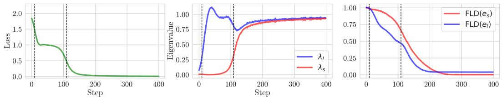  
Figure 16: Effects of extent bias on learning dynamics in non-linear network. (Left) Stepwise learning curves of Barlow Twins. There are two $\left( d = 2 \right.$ ) learning steps shown with two black dashed vertical lines (also shown in the other two panels) on empirical result (solid green). (Center) Evolution of eigenvalues $\lambda _ { j }$ ’s of $C$ during training. At the beginning, the first eigenvalue $\lambda _ { 1 }$ (blue) increases to 1 and then later the second $\lambda _ { 2 }$ (red) follows. (Right) Evolution of the feature learning distance $\mathrm { F L D } ( e )$ for $e _ { l }$ (blue) and $e _ { s }$ (red). See Definition I.1. We use $m _ { l } = 9 , m _ { s } = 1$ . See Appendix A.1 for more detailed settings.

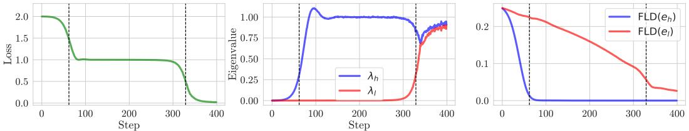  
Figure 17: Amplitude bias effects on learning dynamics in non-linear network. (Left) Stepwise learning curves of Barlow Twins showing two distinct learning phases with vertical dashed lines marking critical transition points during training. The green line shows empirical loss decreasing in two clear stages. (Center) Evolution of eigenvalues $\lambda _ { j }$ of correlation matrix C during training. The eigenvalue $\lambda _ { h }$ (blue) increases first, followed by the eigenvalue $\lambda _ { l }$ (red), demonstrating amplitude-based learning prioritization. (Right) Evolution of feature learning distance $\mathrm { F L D } ( e )$ for high-amplitude feature el (blue) and low-amplitude feature es (red), confirming that features with higher amplitude coefficients $\left( c _ { h } \right)$ are learned before those with lower amplitude $( c _ { l } )$ , even in non-linear architectures. Note that FLD decreases as the network learns to represent the corresponding feature. We use $c _ { h } = 1 , c _ { l } = 0 . 5$ and a 3-layer network with leakyReLU activations. See the caption of Figure 16. See Appendix A for additional experimental details.

# 492 I.3 Non-linear on amplitude bias

Using Definition I.1, we experiment on Section 5.7. Figure 17 demonstrates amplitude bias effects in non-linear networks. The results show that features with higher amplitude $\left( c _ { h } \right)$ are learned before 5 those with lower amplitude $( c _ { l } )$ , consistent with our linear model findings. Specifically, $F L D ( e _ { h } )$ 6 decreases earlier than $F L D ( e _ { l } )$ , mirroring the eigenvalue increase patterns observed in the left and 7 center panels. These results confirm that amplitude bias persists in non-linear architectures, suggesting 98 that amplitude magnitude remains a primary determinant of feature learning priority regardless of 9 network complexity. This provides additional evidence that deep learning models respond more 00 sensitively to amplitude characteristics than frequency properties, even when non-linearities are 01 introduced.

# 502 I.4 Eigenvalues on Shift Augmentation

$$
\begin{array} { l } { { x _ { b a s e } = c _ { a } \sin ( f _ { a } t + \epsilon _ { a } ) + c _ { b } \sin ( f _ { b } t + \epsilon _ { b } ) } } \\ { { \mathrm { } } } \\ { { \epsilon _ { a } , \epsilon _ { b } \overset { \mathrm { i . i . d . } } { \sim } U ( - \pi , \pi ) } } \end{array}
$$

$$
\begin{array} { l } { \Gamma = \mathbb { E } [ x _ { b a s e } x _ { b a s e } ^ { \top } ] } \\ { \Gamma _ { i j } = \mathbb { E } [ c _ { a } ^ { 2 } \sin ( f _ { a } i + \epsilon _ { a } ) \sin ( f _ { a } j + \epsilon _ { a } ) + c _ { a } c _ { b } \sin ( f _ { a } i + \epsilon _ { a } ) \sin ( f _ { b } j + \epsilon _ { b } ) } \\ { + c _ { a } c _ { b } \sin ( f _ { b } i + \epsilon _ { b } ) \sin ( f _ { a } j + \epsilon _ { a } ) + c _ { b } ^ { 2 } \sin ( f _ { b } i + \epsilon _ { b } ) \sin ( f _ { b } j + \epsilon _ { b } ) ] } \end{array}
$$

$$
\begin{array} { r l } { \mathbb { E } _ { \epsilon _ { a } , \epsilon _ { b } } [ \sin ( \theta _ { a } + \epsilon _ { a } ) \sin ( \theta _ { b } + \epsilon _ { b } ) ] = \mathbb { E } _ { \epsilon _ { a } , \epsilon _ { b } } [ \mathrm { I m } ( \exp ( i ( \theta _ { a } + \epsilon _ { a } ) ) ) \mathrm { I m } ( \exp ( i ( \theta _ { b } + \epsilon _ { b } ) ) ) ] } & { } \\ & { = \mathbb { E } _ { \epsilon _ { a } } [ \mathrm { I m } ( \exp ( i ( \theta _ { a } + \epsilon _ { a } ) ) ) ] \mathbb { E } _ { \epsilon _ { b } } [ \mathrm { I m } ( \exp ( i ( \theta _ { b } + \epsilon _ { b } ) ) ) ] } \\ & { = \mathrm { I m } ( \mathbb { E } _ { \epsilon _ { a } } [ \exp ( i ( \theta _ { a } + \epsilon _ { a } ) ) ] ) \mathrm { I m } ( \mathbb { E } _ { \epsilon _ { b } } [ \exp ( i ( \theta _ { b } + \epsilon _ { b } ) ) ] ) } \\ & { = \mathrm { I m } ( \mathbb { E } _ { \epsilon _ { a } } [ \exp ( i \epsilon _ { a } ) \exp ( i \theta _ { a } ) ] ) \mathrm { I m } ( \mathbb { E } _ { \epsilon _ { b } } [ \exp ( i \epsilon _ { b } ) \exp ( i \theta _ { b } ) ] ) } \\ & { = \mathrm { I m } ( \varphi ( 1 ) \exp ( i \theta _ { a } ) ) \mathrm { I m } ( \varphi ( 1 ) \exp ( i \theta _ { b } ) ) } \end{array}
$$

We can define $u , d$ as $u = \mu + \alpha , d = \mu - \alpha , \alpha = 2 \pi$ .

$$
\varphi ( 1 ) = { \frac { \exp ( i u ) - \exp ( i d ) } { i ( u - d ) } } = { \frac { \exp ( i \mu ) } { \alpha i } } { \frac { \exp ( i \alpha ) - \exp ( - i \alpha ) } { 2 i } } = { \frac { \exp ( i \mu ) } { \alpha i } } \sin ( \alpha ) = 0
$$

So,

$$
\mathbb { E } _ { \epsilon _ { a } , \epsilon _ { b } } [ \sin ( \theta _ { a } + \epsilon _ { a } ) \sin ( \theta _ { b } + \epsilon _ { b } ) ] = 0
$$

$$
\begin{array} { l } { \displaystyle \varepsilon [ \sin ( \theta _ { a } + \epsilon _ { a } ) \sin ( \theta _ { b } + \epsilon _ { a } ) ] = - \frac { 1 } { 2 } \mathbb { E } [ \cos ( \theta _ { a } + \theta _ { b } + 2 \epsilon _ { a } ) - \cos ( \theta _ { a } - \theta _ { b } ) ] } \\ { \displaystyle \qquad = - \frac { 1 } { 2 } \mathbb { E } [ \cos ( \theta _ { a } + \theta _ { b } + 2 \epsilon _ { a } ) ] + \frac { 1 } { 2 } \cos ( \theta _ { a } - \theta _ { b } ) } \\ { \displaystyle \qquad = - \frac { 1 } { 2 } \int _ { a } ^ { b } [ \frac { 1 } { b - a } \cos ( \theta _ { a } + \theta _ { b } + 2 x ) d x ] + \frac { 1 } { 2 } \cos ( \theta _ { a } - \theta _ { b } ) } \\ { \displaystyle \qquad = - \frac { 1 } { 4 } \frac { 1 } { b - a } [ \sin ( \theta _ { a } + \theta _ { b } + 2 b ) - \sin ( \theta _ { a } + \theta _ { b } + 2 a ) ] + \frac { 1 } { 2 } \cos ( \theta _ { a } - \theta _ { b } ) } \\ { \displaystyle \qquad = - \frac { 1 } { 4 } \frac { 1 } { b - a } [ 2 \cos ( \theta _ { a } + \theta _ { b } + a + b ) \sin ( b - a ) ] + \frac { 1 } { 2 } \cos ( \theta _ { a } - \theta _ { b } ) } \end{array}
$$

we assumed $b - a = 2 \pi$ ,

$$
\mathbb { E } [ \sin ( \theta _ { a } + \epsilon _ { a } ) \sin ( \theta _ { b } + \epsilon _ { a } ) ] = { \frac { 1 } { 2 } } \cos ( \theta _ { a } - \theta _ { b } )
$$

finally, we get

$$
\Gamma _ { i j } = \frac { c _ { a } ^ { 2 } } { 2 } \cos ( f _ { a } ( i - j ) ) + \frac { c _ { b } ^ { 2 } } { 2 } \cos ( f _ { b } ( i - j ) )
$$

is symmetric circulant matrix when 510 $\begin{array} { r } { f _ { a } = a \frac { 2 \pi } { N } , f _ { b } = b \frac { 2 \pi } { N } } \end{array}$

$$
\begin{array} { l } { { \displaystyle c _ { j } = \frac { c _ { a } ^ { 2 } } { 2 } \cos ( f _ { a } j ) + \frac { c _ { b } ^ { 2 } } { 2 } \cos ( f _ { b } j ) } } \\ { { \displaystyle \Lambda _ { \Gamma , k } = \sum _ { j = 0 } ^ { N - 1 } c _ { j } \omega ^ { - k j } } } \\ { { \displaystyle V _ { \Gamma , k } = \frac { 1 } { \sqrt { N } } \left[ 1 , \omega ^ { k } , \omega ^ { 2 k } , \ldots , \omega ^ { ( N - 1 ) k } \right] ^ { \top } } } \\ { { \displaystyle \omega = \exp ( \frac { 2 \pi i } { n } ) = \cos ( \frac { 2 \pi } { n } ) + i \sin ( \frac { 2 \pi } { n } ) } } \end{array}
$$

This is symmetric, so eigenvalues are real. The eigenvectors can be expressed either in complex form   
or as pairs of real vectors. Using properties of Discrete Fourier Transform (DFT) matrix on $\Lambda _ { \Gamma , k }$ ,

$$
\Lambda _ { \Gamma , k } = \left\{ \begin{array} { l l } { 0 \left( k \neq l _ { a } , N - l _ { a } , l _ { b } , N - l _ { b } \right) } \\ { \frac { c _ { a } ^ { 2 } } { 2 } \left( k = l _ { a } \mathrm { o r } k = N - l _ { a } \right) } \\ { \frac { c _ { b } ^ { 2 } } { 2 } \left( k = l _ { b } \mathrm { o r } k = N - l _ { b } \right) } \end{array} \right.
$$

Finally, we can derive as:

$$
\begin{array} { l } { { \displaystyle \Lambda _ { \Gamma } = \mathrm { d i a g } \left( \left[ \frac { c _ { a } ^ { 2 } } { 2 } , \frac { c _ { a } ^ { 2 } } { 2 } , \frac { c _ { b } ^ { 2 } } { 2 } , \frac { c _ { b } ^ { 2 } } { 2 } , \ : { \bf 0 } _ { m - 2 } \right] \right) , } } \\ { { \displaystyle V _ { \Gamma } ^ { ( \le 4 ) } = \left[ \frac { 1 } { \sqrt { N } } e _ { h , \cos } \frac { 1 } { \sqrt { N } } e _ { h , \mathrm { s i n } } \frac { 1 } { \sqrt { N } } e _ { l , \mathrm { c o s } } \frac { 1 } { \sqrt { N } } e _ { l , \mathrm { s i n } } \right] . } } \end{array}
$$

where

$$
\begin{array} { r } { e _ { h , \mathrm { c o s } } = c _ { a } \cos ( f _ { a } t ) , } \\ { e _ { h , \mathrm { s i n } } = c _ { a } \sin ( f _ { a } t ) , } \\ { e _ { l , \mathrm { c o s } } = c _ { b } \cos ( f _ { b } t ) , } \\ { e _ { l , \mathrm { s i n } } = c _ { b } \sin ( f _ { b } t ) . } \end{array}
$$

# 515 NeurIPS Paper Checklist

# 1. Claims

Question: Do the main claims made in the abstract and introduction accurately reflect the paper’s contributions and scope?

Answer: [Yes]

Justification: The abstract and introduction clearly state our main contributions: (1) establishing theoretical connections between shortcut learning, stepwise learning, and dataset’s cross correlation’s eigendecomposition in SSL, (2) extending theoretical research on shortcut learning to SSL, and (3) characterizing extent bias and amplitude bias in learning dynamics. These claims accurately reflect the scope of our work as demonstrated in Section 4, and Section 5 where we provide both theoretical foundations and empirical validation.

Guidelines:

• The answer NA means that the abstract and introduction do not include the claims made in the paper.   
• The abstract and/or introduction should clearly state the claims made, including the contributions made in the paper and important assumptions and limitations. A No or NA answer to this question will not be perceived well by the reviewers.   
• The claims made should match theoretical and experimental results, and reflect how much the results can be expected to generalize to other settings.   
• It is fine to include aspirational goals as motivation as long as it is clear that these goals are not attained by the paper.

# 2. Limitations

Question: Does the paper discuss the limitations of the work performed by the authors?

Answer: [Yes]

Justification: We acknowledge the limitations of our work in Appendix H. Our analysis primarily focuses on linear networks, which may not fully capture the complexities of deep non-linear architectures used in practice. We also assume feature independence which simplifies analysis but may not reflect real-world feature interdependencies. Additionally, our augmentation approach is more basic than sophisticated strategies used in modern SSL systems. We suggest future research directions to address these limitations.

Guidelines:

• The answer NA means that the paper has no limitation while the answer No means that the paper has limitations, but those are not discussed in the paper.   
• The authors are encouraged to create a separate "Limitations" section in their paper.   
• The paper should point out any strong assumptions and how robust the results are to violations of these assumptions (e.g., independence assumptions, noiseless settings, model well-specification, asymptotic approximations only holding locally). The authors should reflect on how these assumptions might be violated in practice and what the implications would be.   
• The authors should reflect on the scope of the claims made, e.g., if the approach was only tested on a few datasets or with a few runs. In general, empirical results often depend on implicit assumptions, which should be articulated.   
• The authors should reflect on the factors that influence the performance of the approach. For example, a facial recognition algorithm may perform poorly when image resolution is low or images are taken in low lighting. Or a speech-to-text system might not be used reliably to provide closed captions for online lectures because it fails to handle technical jargon.   
• The authors should discuss the computational efficiency of the proposed algorithms and how they scale with dataset size.   
• If applicable, the authors should discuss possible limitations of their approach to address problems of privacy and fairness.

• While the authors might fear that complete honesty about limitations might be used by reviewers as grounds for rejection, a worse outcome might be that reviewers discover limitations that aren’t acknowledged in the paper. The authors should use their best judgment and recognize that individual actions in favor of transparency play an important role in developing norms that preserve the integrity of the community. Reviewers will be specifically instructed to not penalize honesty concerning limitations.

# 3. Theory assumptions and proofs

Question: For each theoretical result, does the paper provide the full set of assumptions and a complete (and correct) proof?

Answer: [Yes]

Justification: All theoretical results in our paper are presented with complete assumptions and rigorous proofs. Each theorem explicitly states its assumptions and corresponding proofs are provided in Appendix B with detailed derivations. We use a consistent numbering system for cross-referencing and provide proof sketches in the main paper to build intuition before directing readers to the complete proofs.

Guidelines:

• The answer NA means that the paper does not include theoretical results.   
• All the theorems, formulas, and proofs in the paper should be numbered and crossreferenced.   
• All assumptions should be clearly stated or referenced in the statement of any theorems.   
• The proofs can either appear in the main paper or the supplemental material, but if they appear in the supplemental material, the authors are encouraged to provide a short proof sketch to provide intuition.   
• Inversely, any informal proof provided in the core of the paper should be complemented by formal proofs provided in appendix or supplemental material.   
• Theorems and Lemmas that the proof relies upon should be properly referenced.

# 4. Experimental result reproducibility

Question: Does the paper fully disclose all the information needed to reproduce the main experimental results of the paper to the extent that it affects the main claims and/or conclusions of the paper (regardless of whether the code and data are provided or not)?

Answer: [Yes]

Justification: We provide comprehensive details to reproduce our experimental results in Section 4 and Section 5, with additional specifics in Appendix A.

Guidelines:

• The answer NA means that the paper does not include experiments.   
• If the paper includes experiments, a No answer to this question will not be perceived well by the reviewers: Making the paper reproducible is important, regardless of whether the code and data are provided or not. If the contribution is a dataset and/or model, the authors should describe the steps taken to make their results reproducible or verifiable. Depending on the contribution, reproducibility can be accomplished in various ways. For example, if the contribution is a novel architecture, describing the architecture fully might suffice, or if the contribution is a specific model and empirical evaluation, it may be necessary to either make it possible for others to replicate the model with the same dataset, or provide access to the model. In general. releasing code and data is often one good way to accomplish this, but reproducibility can also be provided via detailed instructions for how to replicate the results, access to a hosted model (e.g., in the case of a large language model), releasing of a model checkpoint, or other means that are appropriate to the research performed.   
• While NeurIPS does not require releasing code, the conference does require all submissions to provide some reasonable avenue for reproducibility, which may depend on the nature of the contribution. For example (a) If the contribution is primarily a new algorithm, the paper should make it clear how to reproduce that algorithm.   
(b) If the contribution is primarily a new model architecture, the paper should describe the architecture clearly and fully.   
(c) If the contribution is a new model (e.g., a large language model), then there should either be a way to access this model for reproducing the results or a way to reproduce the model (e.g., with an open-source dataset or instructions for how to construct the dataset).   
(d) We recognize that reproducibility may be tricky in some cases, in which case authors are welcome to describe the particular way they provide for reproducibility. In the case of closed-source models, it may be that access to the model is limited in some way (e.g., to registered users), but it should be possible for other researchers to have some path to reproducing or verifying the results.

# 5. Open access to data and code

Question: Does the paper provide open access to the data and code, with sufficient instructions to faithfully reproduce the main experimental results, as described in supplemental material?

Answer: [Yes]

Justification: Yes

Guidelines:

• The answer NA means that paper does not include experiments requiring code.   
• Please see the NeurIPS code and data submission guidelines (https://nips.cc/ public/guides/CodeSubmissionPolicy) for more details.   
• While we encourage the release of code and data, we understand that this might not be possible, so “No” is an acceptable answer. Papers cannot be rejected simply for not including code, unless this is central to the contribution (e.g., for a new open-source benchmark).   
• The instructions should contain the exact command and environment needed to run to reproduce the results. See the NeurIPS code and data submission guidelines (https: //nips.cc/public/guides/CodeSubmissionPolicy) for more details.   
• The authors should provide instructions on data access and preparation, including how to access the raw data, preprocessed data, intermediate data, and generated data, etc.   
• The authors should provide scripts to reproduce all experimental results for the new proposed method and baselines. If only a subset of experiments are reproducible, they should state which ones are omitted from the script and why.   
• At submission time, to preserve anonymity, the authors should release anonymized versions (if applicable).   
• Providing as much information as possible in supplemental material (appended to the paper) is recommended, but including URLs to data and code is permitted.

# 6. Experimental setting/details

Question: Does the paper specify all the training and test details (e.g., data splits, hyperparameters, how they were chosen, type of optimizer, etc.) necessary to understand the results?

Answer: [Yes]

Justification: Section 4.1 and Section 5.1 detail our experimental setup, while Appendix A provides comprehensive information about hyperparameters, training procedures, and implementation details. Extent bias experiments, we specify relevant parameters including dataset size, feature dimensions, learning rates. All essential information needed to understand and reproduce our results is included.

Guidelines:

• The answer NA means that the paper does not include experiments. • The experimental setting should be presented in the core of the paper to a level of detail that is necessary to appreciate the results and make sense of them. • The full details can be provided either with the code, in appendix, or as supplemental material.

# 7. Experiment statistical significance

Question: Does the paper report error bars suitably and correctly defined or other appropriate information about the statistical significance of the experiments?

Answer: [Yes]

Justification: Yes

Guidelines:

• The answer NA means that the paper does not include experiments.   
• The authors should answer "Yes" if the results are accompanied by error bars, confidence intervals, or statistical significance tests, at least for the experiments that support the main claims of the paper. The factors of variability that the error bars are capturing should be clearly stated (for example, train/test split, initialization, random drawing of some parameter, or overall run with given experimental conditions).   
• The method for calculating the error bars should be explained (closed form formula, call to a library function, bootstrap, etc.)   
• The assumptions made should be given (e.g., Normally distributed errors).   
• It should be clear whether the error bar is the standard deviation or the standard error of the mean.   
• It is OK to report 1-sigma error bars, but one should state it. The authors should preferably report a 2-sigma error bar than state that they have a $96 \%$ CI, if the hypothesis of Normality of errors is not verified. For asymmetric distributions, the authors should be careful not to show in tables or figures symmetric error bars that would yield results that are out of range (e.g. negative error rates).   
• If error bars are reported in tables or plots, The authors should explain in the text how they were calculated and reference the corresponding figures or tables in the text.

# 8. Experiments compute resources

Question: For each experiment, does the paper provide sufficient information on the computer resources (type of compute workers, memory, time of execution) needed to reproduce the experiments?

Answer: [No]

Justification: Our experiments do not require a lot of resources. We used a single L40s GPU for training Resnet18, and used L4 GPU for linear model.

Guidelines:

• The answer NA means that the paper does not include experiments.   
• The paper should indicate the type of compute workers CPU or GPU, internal cluster, or cloud provider, including relevant memory and storage.   
• The paper should provide the amount of compute required for each of the individual experimental runs as well as estimate the total compute.   
• The paper should disclose whether the full research project required more compute than the experiments reported in the paper (e.g., preliminary or failed experiments that didn’t make it into the paper).

# 9. Code of ethics

Question: Does the research conducted in the paper conform, in every respect, with the NeurIPS Code of Ethics https://neurips.cc/public/EthicsGuidelines?

Answer: [Yes]

Justification: Our research fully complies with the NeurIPS Code of Ethics.

Guidelines:

• The answer NA means that the authors have not reviewed the NeurIPS Code of Ethics. • If the authors answer No, they should explain the special circumstances that require a deviation from the Code of Ethics.

• The authors should make sure to preserve anonymity (e.g., if there is a special consideration due to laws or regulations in their jurisdiction).

# 10. Broader impacts

Question: Does the paper discuss both potential positive societal impacts and negative societal impacts of the work performed?

Answer: [Yes]

Justification: We discuss broader impacts in Section 6. Positively, our work could lead to more robust machine learning models that are less susceptible to shortcut learning, potentially improving fairness and reliability in real-world applications. Understanding extent bias may help address issues where models learn background correlations rather than meaningful object features.

# Guidelines:

• The answer NA means that there is no societal impact of the work performed.   
• If the authors answer NA or No, they should explain why their work has no societal impact or why the paper does not address societal impact.   
• Examples of negative societal impacts include potential malicious or unintended uses (e.g., disinformation, generating fake profiles, surveillance), fairness considerations (e.g., deployment of technologies that could make decisions that unfairly impact specific groups), privacy considerations, and security considerations.   
• The conference expects that many papers will be foundational research and not tied to particular applications, let alone deployments. However, if there is a direct path to any negative applications, the authors should point it out. For example, it is legitimate to point out that an improvement in the quality of generative models could be used to generate deepfakes for disinformation. On the other hand, it is not needed to point out that a generic algorithm for optimizing neural networks could enable people to train models that generate Deepfakes faster.   
The authors should consider possible harms that could arise when the technology is being used as intended and functioning correctly, harms that could arise when the technology is being used as intended but gives incorrect results, and harms following from (intentional or unintentional) misuse of the technology.   
If there are negative societal impacts, the authors could also discuss possible mitigation strategies (e.g., gated release of models, providing defenses in addition to attacks, mechanisms for monitoring misuse, mechanisms to monitor how a system learns from feedback over time, improving the efficiency and accessibility of ML).

# 11. Safeguards

Question: Does the paper describe safeguards that have been put in place for responsible release of data or models that have a high risk for misuse (e.g., pretrained language models, image generators, or scraped datasets)?

Answer: [NA]

Justification: Our work is primarily theoretical with controlled toy experiments that do not produce models or datasets with potential for misuse. We do not release pre-trained models, generative systems, or scraped datasets that would require safeguards against harmful applications.

Guidelines:

• The answer NA means that the paper poses no such risks.   
• Released models that have a high risk for misuse or dual-use should be released with necessary safeguards to allow for controlled use of the model, for example by requiring that users adhere to usage guidelines or restrictions to access the model or implementing safety filters.   
• Datasets that have been scraped from the Internet could pose safety risks. The authors should describe how they avoided releasing unsafe images.   
• We recognize that providing effective safeguards is challenging, and many papers do not require this, but we encourage authors to take this into account and make a best faith effort.

# 12. Licenses for existing assets

Question: Are the creators or original owners of assets (e.g., code, data, models), used in the paper, properly credited and are the license and terms of use explicitly mentioned and properly respected?

Answer: [Yes]

Justification: We properly cite all relevant prior work including Simon et al. [26] and Zbontar et al. [31] whose theoretical frameworks we build upon. For the Colored-MNIST dataset adaptation in Section 4.8, we acknowledge the original MNIST dataset Deng [9] which is in the public domain. No proprietary or restrictively licensed code or data was used in our research.

Guidelines:

• The answer NA means that the paper does not use existing assets.   
• The authors should cite the original paper that produced the code package or dataset.   
• The authors should state which version of the asset is used and, if possible, include a URL.   
• The name of the license (e.g., CC-BY 4.0) should be included for each asset.   
• For scraped data from a particular source (e.g., website), the copyright and terms of service of that source should be provided.   
• If assets are released, the license, copyright information, and terms of use in the package should be provided. For popular datasets, paperswithcode.com/datasets has curated licenses for some datasets. Their licensing guide can help determine the license of a dataset.   
• For existing datasets that are re-packaged, both the original license and the license of the derived asset (if it has changed) should be provided.   
• If this information is not available online, the authors are encouraged to reach out to the asset’s creators.

# 13. New assets

Question: Are new assets introduced in the paper well documented and is the documentation provided alongside the assets?

Answer: [NA]

Justification: Our paper does not introduce new datasets or code libraries intended for community use beyond the experimental validation of our theoretical claims

Guidelines:

• The answer NA means that the paper does not release new assets.   
• Researchers should communicate the details of the dataset/code/model as part of their submissions via structured templates. This includes details about training, license, limitations, etc.   
• The paper should discuss whether and how consent was obtained from people whose asset is used.   
• At submission time, remember to anonymize your assets (if applicable). You can either create an anonymized URL or include an anonymized zip file.

# 14. Crowdsourcing and research with human subjects

Question: For crowdsourcing experiments and research with human subjects, does the paper include the full text of instructions given to participants and screenshots, if applicable, as well as details about compensation (if any)?

Answer: [NA]

Justification: Our research is purely theoretical and computational, involving no human subjects, crowdsourced data collection, or human evaluation.

Guidelines:

• The answer NA means that the paper does not involve crowdsourcing nor research with human subjects.

• Including this information in the supplemental material is fine, but if the main contribution of the paper involves human subjects, then as much detail as possible should be included in the main paper.   
• According to the NeurIPS Code of Ethics, workers involved in data collection, curation, or other labor should be paid at least the minimum wage in the country of the data collector.

# 15. Institutional review board (IRB) approvals or equivalent for research with human subjects

Question: Does the paper describe potential risks incurred by study participants, whether such risks were disclosed to the subjects, and whether Institutional Review Board (IRB) approvals (or an equivalent approval/review based on the requirements of your country or institution) were obtained?

Answer: [NA]

Justification: No human subjects were involved in our research, so IRB approval was not required or sought.

Guidelines:

• The answer NA means that the paper does not involve crowdsourcing nor research with human subjects.   
• Depending on the country in which research is conducted, IRB approval (or equivalent) may be required for any human subjects research. If you obtained IRB approval, you should clearly state this in the paper.   
• We recognize that the procedures for this may vary significantly between institutions and locations, and we expect authors to adhere to the NeurIPS Code of Ethics and the guidelines for their institution.   
• For initial submissions, do not include any information that would break anonymity (if applicable), such as the institution conducting the review.

# 16. Declaration of LLM usage

Question: Does the paper describe the usage of LLMs if it is an important, original, or non-standard component of the core methods in this research? Note that if the LLM is used only for writing, editing, or formatting purposes and does not impact the core methodology, scientific rigorousness, or originality of the research, declaration is not required.

Answer: [NA]

Justification: No large language models were used in the development of our research methodology, theoretical analysis, or experimental design.

Guidelines:

• The answer NA means that the core method development in this research does not involve LLMs as any important, original, or non-standard components. • Please refer to our LLM policy (https://neurips.cc/Conferences/2025/LLM) for what should or should not be described.
