# Direct Fisher Score Estimation for Likelihood Maximization

# Sherman Khoo ∗

Yakun Wang

Song Liu ∗

Mark Beaumont †

# Abstract

We study the problem of likelihood maximization when the likelihood function is intractable but model simulations are readily available. We propose a sequential, gradient-based optimization method that directly models the Fisher score based on a local score matching technique which uses simulations from a localized region around each parameter iterate. By employing a linear parameterization for the surrogate score model, our technique admits a closed-form, least-squares solution. This approach yields a fast, flexible, and efficient approximation to the Fisher score, effectively smoothing the likelihood objective and mitigating the challenges posed by complex likelihood landscapes. We provide theoretical guarantees for our score estimator, including bounds on the bias introduced by the smoothing. Empirical results on a range of synthetic and real-world problems demonstrate the superior performance of our method compared to existing benchmarks.

# 1 Introduction

Implicit simulator-based models are now routine in many scientific fields, such as biology [Csillery et al., 2010], cosmology [Schafer and Freeman, 2012], neuroscience [Sterratt et al., 2011], engineering [Bharti et al., 2021], and other scientific applications [Toni et al., 2009]. In traditional statistical models, there is a prescribed probabilistic model, which provides an explicit parameterization for the data distribution, allowing development of the likelihood function for further inference. In contrast, simulation-based models define the distribution implicitly through a computational simulator. Thus, while simulation of the data for various parameter settings is possible, the probability density function of the data or the likelihood function is often unavailable in closed form. This problem setting is known as likelihood-free inference or simulation-based inference (SBI) [Cranmer et al., 2020].

Traditionally, methods in this setting have focused on a Bayesian inference technique known as approximate Bayesian computation (ABC) [Beaumont et al., 2002]. Fundamentally, the ABC method builds an approximation to the Bayesian posterior distribution by drawing parameter samples from the prior distribution, generating datasets from the drawn parameter values, and filtering parameter values through a rejection algorithm based on the distance of the generated summary statistic of the dataset from the observations. In recent years, there has been a rise of generative modeling or unsupervised learning in machine learning, which aims to recover a data distribution given a set of samples. Such generative models are often built from neural networks [Mohamed and Lakshminarayanan, 2017], and given the fundamental similarity with the SBI problem setting, this has led to significant cross-pollination across the two fields, with the development of many SBI inference methods using generative neural networks [Durkan et al., 2018, Papamakarios et al., 2018].

While significant progress in SBI has come from Bayesian approaches, such methods are often computationally demanding; furthermore, many scientific disciplines retain a preference towards maximum likelihood approaches. In contrast, practitioners who favor faster point estimation through maximum likelihood lack comparably mature tools. To close this gap, we propose a fast, simulationefficient, and robust gradient-based technique for estimating the maximum likelihood for SBI. We build on a popular technique in generative modeling known as score matching [Hyvärinen and Dayan, 2005], which has seen significant use in score-based generative models [Song and Ermon, 2020], now a cornerstone for many state-of-the-art approaches in generative modeling [Yang et al., 2024]. We adapt score matching to estimate the Fisher score, that is, the gradient of the log-likelihood function with respect to the parameters, within a localized region. This estimated gradient can then be used in any first-order gradient-based stochastic optimization algorithm such as stochastic gradient descent (SGD) to obtain an approximate maximum likelihood estimator (MLE) and serves as a potential avenue for uncertainty quantification for the MLE through the empirical Fisher information matrix.

Our contributions in this work are as follows.

• We propose a lightweight, simulation-efficient, and robust method for maximum likelihood estimation of simulator models based on a novel local Fisher score matching technique   
• We derive theory for our local Fisher score matching technique and establish a connection with the Gaussian smoothing gradient estimator, offering a unifying perspective for zerothorder optimization techniques and likelihood optimization for SBI   
• We demonstrate the effectiveness of our method in real-world experiments for applied machine learning and cosmology problems, showcasing both its efficiency and robust performance compared to existing approaches

# 2 Background

# 2.1 Score Matching

Density estimation is the problem of learning a data distribution $p _ { D } ( \mathbf { x } )$ using only an observed dataset, $\mathbf { x } \sim p _ { D }$ . An approach to this problem is learning the density with an energy-based model (EBM), which parameterizes the model through its scalar-valued energy function $\mathbf { \dot { \it E } } _ { \theta } : \mathbb { R } ^ { k }  \mathbb { R }$ where $\mathbf { x } \in \mathcal { X } \subseteq \mathbb { R } ^ { k }$ , giving the model density $\bar { p _ { \theta } } ( { \bf x } ) = \exp ( - E _ { \theta } ( { \bf x } ) ) / \bar { Z _ { \theta } }$ .

Since the energy function is an unnormalized density function, it can be flexibly parameterized, usually through a neural network. However, note that the normalization constant $\begin{array} { r } { Z _ { \theta } = \overset { \vartriangle } { \int } \exp ( - E _ { \theta } ( \mathbf { x } ) ) d \mathbf { x } } \end{array}$ is still a function of $\theta$ , and therefore will still need to be computed in training the EBM through standard likelihood maximization. Since this multidimensional integral is often intractable and requires a costly approximation method, score matching [Hyvärinen and Dayan, 2005] is often used to bypass the computation of the normalization constant. This is done by considering an alternate training objective instead of MLE, based on the score function $s _ { \theta } : \mathbb { R } ^ { k } \xrightarrow [ ] { } \mathbf { \mathbb { R } } ^ { k }$ , where $s _ { \theta } = \nabla _ { \mathbf { x } } \log p _ { \theta } = - \nabla _ { \mathbf { x } } E _ { \theta }$ . In fact, since equivalence in the score amounts to equivalence in the distribution, matching the scores is equivalent to performing density estimation. One starting point is the explicit score matching objective (ESM). Defining the gradient operator on a scalar-valued function as $\begin{array} { r } { \bar { \nabla _ { \mathbf x } } : = ( \frac { \partial } { \partial x _ { 1 } } , \dots , \frac { \partial } { \partial x _ { k } } ) ^ { \top } } \end{array}$ , where $\frac { \partial } { \partial x _ { i } }$ is the partial derivative operator for $\mathbf { x } = ( x _ { 1 } , \dots , x _ { k } )$ , and the Jacobian operator on a vectorvalued function f $: \mathbb { R } ^ { m }  \mathbb { R } ^ { n }$ as $\begin{array} { r } { \mathbf { J } _ { i , j } = \big [ \frac { \partial f _ { i } } { \partial x _ { j } } \big ] _ { i , j } } \end{array}$ , we have:

$$
\mathcal { L } _ { \mathrm { E S M } } ( \theta ) = \mathbb { E } _ { { \mathbf { x } } \sim p _ { D } ( { \mathbf { x } } ) } \frac { 1 } { 2 } \Vert s _ { \theta } ( { \mathbf { x } } ) - \nabla _ { \mathbf { x } } \log p _ { D } ( { \mathbf { x } } ) \Vert ^ { 2 }
$$

However, this objective is not tractable due to the need to evaluate $\nabla _ { \mathbf { x } } \log p _ { D } ( \mathbf { x } )$ . Hence, this objective is transformed to:

$$
\mathcal { L } _ { \mathrm { E S M } } ( \theta ) = \mathbb { E } _ { { \mathbf { x } } \sim p _ { D } ( { \mathbf { x } } ) } \left[ \frac { 1 } { 2 } \left. s _ { \theta } ( { \mathbf { x } } ) \right. ^ { 2 } + \mathrm { t r } \left( { \mathbf { J } } _ { { \mathbf { x } } } s _ { \theta } ( { \mathbf { x } } ) \right) \right] + ( \mathrm { c o n s t a n t s ~ w . r . t . ~ } \theta )
$$

Although this objective can be directly estimated, and thus optimized and used in the training of an EBM, it is computationally expensive due to the presence of the Jacobian term, motivating further extensions to the standard score matching objective, such as the denoising score matching objective [Vincent, 2011] and the sliced score matching objective [Song et al., 2019].

# 2.2 Maximum Likelihood Estimation and Fisher Score

Maximum likelihood estimation (MLE) is a foundational tool in statistical inference, under standard regularity conditions, it is consistent and asymptotically efficient [Casella and Berger, 2024, Section 10]. Central to the MLE is the Fisher score, defined as the gradient of the log-likelihood with respect to the parameters, $\nabla _ { \theta } \log p ( \mathbf { x } \mid \theta )$ . From an optimization point of view, the score provides the direction of steepest ascent of the log-likelihood in parameter space, and thus drives gradient-based MLE approaches. From an inferential point of view, the covariance of the Fisher score is equal to the Fisher information matrix (FIM), which, through the Cramér–Rao lower bound [Rao, 1992], lower bounds the variance of any unbiased estimator. Furthermore, the distribution of the MLE is asymptotically normal with covariance equal to the inverse of the FIM, which underpins Wald-type confidence intervals and hypothesis tests [Van der Vaart, 2000, Section 5].

# 2.3 Notation and Problem Setup

We consider a statistical model where the data $\mathbf { x } \in \mathcal { X } \subset \mathbb { R } ^ { d _ { \mathbf { x } } }$ are generated from a distribution $P _ { \theta }$ parameterized by $\theta \in \Omega \subset \mathbb { R } ^ { d _ { \theta } }$ . In the simulation-based inference setting, this statistical model is implicitly defined, so we can draw samples from this model for any choice of $\theta$ but the closed-form expression for the probability density function, and hence the likelihood function is not known.

Given a set of $N$ independent and identically distributed observations, $\mathbf { \mathcal { D } } = \{ \mathbf { x } _ { i } \} _ { i = 1 } ^ { N }$ , drawn from the true data-generating process $\mathbf { x } _ { i } \sim P _ { \theta ^ { * } }$ , where $\theta ^ { * }$ denotes the true parameter, the maximum likelihood estimator is $\hat { \theta } _ { \mathrm { M L E } } = \arg \operatorname* { m a x } _ { \theta }$ $p ( \mathcal { D } \mid \theta )$ .

As the likelihood function $\begin{array} { r } { L ( \theta ; \mathcal { D } ) \ : = \ : \prod _ { i = 1 } ^ { N } p ( \mathbf { x } _ { i } \mid \theta ) } \end{array}$ is not available for SBI models, typical likelihood maximization cannot be applied directly. We thus propose a Fisher score matching-based estimator, $ { \hat { \theta } } _ { \mathrm { F S M } }$ . Our method is fundamentally a first-order optimization approach, and our main focus is on the direct estimation of the gradient of the log-likelihood function at each parameter iteration, which is done with a novel local Fisher score matching objective. We first discuss our Fisher score estimation technique in Section 3, before proceeding with the MLE procedure in Section 4.

# 3 Likelihood-free Fisher Score Estimation

Score matching [Hyvärinen and Dayan, 2005] is a classical method in density estimation, but is not directly applicable in likelihood gradient maximization, as it typically targets the Stein score, i.e., the gradient with respect to the data $\nabla _ { \mathbf { x } } \log p _ { \theta } ( \mathbf { x } )$ instead of the Fisher score, which is the gradient with respect to the parameters $\nabla _ { \theta } \log p _ { \theta } ( \mathbf { x } )$ . Hence, we propose to adapt score matching into a novel local Fisher score estimation technique which estimates the gradient of the log-likelihood for a fixed parameter point $\theta _ { t }$ at any data sample $\mathbf { x }$ , $\nabla _ { \boldsymbol { \theta } } \ell ( \boldsymbol { \theta } ; \mathbf { x } ) \big \vert _ { \boldsymbol { \theta } = \boldsymbol { \theta } _ { t } } = \nabla _ { \boldsymbol { \theta } } \log p \big ( \mathbf { x } \mid \boldsymbol { \theta } \big ) \Big \vert _ { \boldsymbol { \theta } = \boldsymbol { \theta } _ { t } } .$

# 3.1 Local Fisher Score Matching Objective

Around the target parameter point $\theta _ { t }$ , we introduce a local proposal distribution $q ( \theta \mid \theta _ { t } )$ , which we typically take as an isotropic Gaussian distribution, $q ( \theta \mid \bar { \theta _ { t } } ) = \mathcal { N } ( \theta _ { t } , \sigma ^ { 2 } I )$ . When combined with the statistical model $P _ { \theta }$ , we induce a joint distribution in both the data and parameter space that has probability density $p ( \mathbf { x } \mid \theta ) q ( \theta \mid \theta _ { t } )$ . Note that by drawing parameter samples from the local proposal distribution and then drawing corresponding data samples for the parameter samples, we can easily draw samples from this joint distribution.

To estimate the score function, we use a score model $S _ { W } : \mathbb { R } ^ { d _ { \mathbf { x } } }  \mathbb { R } ^ { d _ { \theta } }$ , where $S _ { W } ( \mathbf { x } )$ has parameters $W$ . Our starting point is the adapted, localized score matching least-squares loss for the Fisher score.

$$
\mathcal { I } ( W ; \theta _ { t } ) ~ = ~ \mathbb { E } _ { \mathbf { x } \sim p ( \mathbf { x } \mid \theta ) , \theta \sim q ( \theta \mid \theta _ { t } ) } \Big [ \big \| \nabla _ { \theta } \log p ( \mathbf { x } \mid \theta ) - S _ { W } ( \mathbf { x } ) \big \| ^ { 2 } \Big ]
$$

As we are within the simulation-based inference framework, we do not have a closed form expression for the Fisher score $\nabla _ { \theta } \log p ( \mathbf { x } \mid \theta )$ and hence this objective function is not tractable. We first expand the square of Equation (1), which allows us to rewrite $\mathcal { I } ( W ; \theta _ { t } )$ as:

$$
\begin{array} { r } { \mathcal { I } ( W ; \theta _ { t } ) = \mathbb { E } _ { \mathbf { x } \sim p ( \mathbf { x } | \theta ) , \theta \sim q ( \theta | \theta _ { t } ) } \left[ \left| \left| S _ { W } ( \mathbf { x } ) \right| \right| ^ { 2 } - 2 S _ { W } ( \mathbf { x } ) ^ { \top } \nabla _ { \theta } \log p ( \mathbf { x } \mid \theta ) \right] + ( \mathrm { c o n s t a n t s ~ w . r . t . ~ } W ) } \end{array}
$$

We focus on the cross-term, $\mathbb { E } _ { \mathbf { x } \sim p ( \mathbf { x } | \theta ) , \theta \sim q ( \theta | \theta _ { t } ) } \left[ S _ { W } ( \mathbf { x } ) ^ { \top } \nabla _ { \theta } \log p ( \mathbf { x } \mid \theta ) \right]$ . Using an integration-byparts trick, this term can be transformed to $- \mathbb { E } _ { \mathbf { x } \sim p ( \mathbf { x } \mid \theta ) , \theta \sim q ( \theta \mid \theta _ { t } ) } \left[ S _ { W } ( \mathbf { x } ) ^ { \top } \nabla _ { \theta } \log q ( \theta \mid \theta _ { t } ) \right]$ . Note that we have eliminated the dependence on the intractable likelihood function $\log p ( \mathbf { x } \mid \theta )$ . Thus, this allows us to rewrite $\mathcal { I } ( W ; \theta _ { t } ) \big )$ as follows.

Theorem 3.1 (Local Fisher Score Matching (FSM)). Let $\mathcal { I } ( W )$ be defined as in Equation (1). Under suitable boundary conditions, it can be rewritten (up to an additive constant w.r.t. $W$ ) as

$$
\mathcal { I } ( W ; \theta _ { t } ) ~ = ~ \mathbb { E } _ { \mathbf { x } \sim p ( \mathbf { x } \mid \theta ) , \theta \sim q ( \theta \mid \theta _ { t } ) } \Big [ \big \| S _ { W } ( \mathbf { x } ) \big \| ^ { 2 } ~ + ~ 2 S _ { W } ( \mathbf { x } ) ^ { \top } \nabla _ { \theta } \log q ( \theta \mid \theta _ { t } ) \Big ]
$$

The complete details for Theorem 3.1 are provided in Appendix A.1. Given that we can draw proposal samples $\{ \theta ^ { ( j ) } \} _ { j = 1 } ^ { m }$ where $\theta ^ { ( j ) } \sim q ( \theta \mid \theta _ { t } )$ and corresponding data samples $\{ \mathbf { x } _ { k } ^ { ( j ) } \} _ { k = 1 } ^ { n }$ where $\mathbf { x } _ { k } ^ { ( j ) } \sim p ( \mathbf { x } \mid \theta ^ { ( j ) } )$ , the objective $\mathcal { I } ( W ; \theta _ { t } )$ can be approximated by Monte Carlo estimation.

$$
\hat { \mathcal { I } } ( W ; \theta _ { t } ) = \frac { 1 } { m } \sum _ { j = 1 } ^ { m } \frac { 1 } { n } \sum _ { k = 1 } ^ { n } \Bigl [ \bigl \| S _ { W } ( \mathbf { x } _ { k } ^ { ( j ) } ) \bigr \| ^ { 2 } \ + \ 2 S _ { W } ( \mathbf { x } _ { k } ^ { ( j ) } ) ^ { \top } \nabla _ { \theta } \log q ( \theta \mid \theta _ { t } ) \vert _ { \theta = \theta ^ { ( j ) } } \Bigr ]
$$

Next, we show the optimal solution for the local FSM objective, $\mathcal { I } ( W ; \theta _ { t } )$ . The proof of Theorem 3.2 in Appendix A.2.

Theorem 3.2 (Bayes-optimal Local Fisher Score). The optimal score model for the FSM objective $\mathcal { I } ( W ; \theta _ { t } )$ , is

$$
S ^ { * } ( \mathbf { x } ; \theta _ { t } ) = \mathbb { E } _ { \theta \sim p ( \theta | \mathbf { x } , \theta _ { t } ) } \big [ \nabla _ { \theta } \log p ( \mathbf { x } \mid \theta ) \big ]
$$

As the score matching objective Equation (1) is taken as an expectation over the parameter proposal distribution $q ( \theta \mid \theta _ { t } )$ , the Bayes-optimal score model for this objective is generally biased and instead of being the true score at the point $\theta _ { t }$ , it is instead an average of the score over the posterior induced from the proposal distribution and the statistical model, that is, $p ( \boldsymbol { \theta } \mid \mathbf { x } , \boldsymbol { \theta } _ { t } )$ . Thus, this score matching objective targets a smoothed likelihood around $\theta _ { t }$ . We elaborate on this in more detail in Section 5.1.

# 3.2 Score Model Parameterization

A key aspect of the Fisher score matching technique is the choice of parameterization for the surrogate score model, $S _ { W } ( \mathbf { x } ; \theta _ { t } )$ , which approximates the Fisher score at the target parameter iterate $\theta _ { t } , \bar { \nabla _ { \theta } } \log p _ { \theta } ( \mathbf { x } ) | _ { \theta = \theta _ { t } }$ . For computational tractability, we propose using a lightweight linear surrogate score model based on the following derivation.

Let the surrogate score model be defined as $S _ { W } ( \mathbf { x } ; \boldsymbol { \theta } _ { t } ) = W ^ { \top } \mathbf { x }$ , where $W \in \mathbb { R } ^ { d _ { \mathbf { x } } \times d _ { \theta } }$ is the weight matrix for our model. Recall that we first draw a set of parameters $\{ \theta ^ { ( j ) } \} _ { j = 1 } ^ { m }$ from the proposal distribution $q ( \theta \mid \theta _ { t } )$ . Then, define the $j$ -th data matrix as $X _ { j } \in \mathbb { R } ^ { n \times d _ { \mathbf { x } } }$ constructed from $n$ training samples {x(j)k }nk=1 drawn from the model $p ( \mathbf { x } \mid \theta )$ at $\theta ^ { ( j ) }$ , and the $j$ -th Gram matrix as $G _ { j } = X _ { j } ^ { \top } X _ { j }$ . Using the linear score model for the local Fisher score matching objective function in Equation (3) and solving for the first-order conditions, we obtain the normal equation,

$$
( \sum _ { j = 1 } ^ { m } G _ { j } ) \hat { W } = - \sum _ { j = 1 } ^ { m } \sum _ { k = 1 } ^ { n } [ \mathbf { x } _ { k } ^ { ( j ) } \nabla _ { \theta } \log q ( \theta \mid \theta _ { t } ) \big | _ { \theta = \theta ^ { ( j ) } } ^ { \top } ]
$$

We can thus obtain a closed-form solution for the linear Fisher score matching estimator as:

$$
\hat { W } = - ( \sum _ { j = 1 } ^ { m } G _ { j } ) ^ { - 1 } \sum _ { j = 1 } ^ { m } \sum _ { k = 1 } ^ { n } \bigl [ \mathbf { x } _ { k } ^ { ( j ) } \nabla _ { \theta } \log q ( \theta \mid \theta _ { t } ) \bigr | _ { \theta = \theta ^ { ( j ) } } ^ { \top } \bigr ]
$$

Once $\hat { W }$ is obtained, we can use this to construct our Fisher score estimator $\hat { S } ( \mathbf { x } ; \boldsymbol { \theta } _ { t } ) = \hat { W } ^ { \top } \mathbf { x }$ . We provide a complete derivation and further discussion in the Appendix A.3. Although the local Fisher score matching objective is a general framework that is agnostic to the choice of parameterization of the model, using a linear model essentially recasts the model estimation procedure as multivariate linear regression, benefiting from well-understood theory and efficient implementations. Although a linear model might not be sufficient to fully capture the full data-parameter relationship, it provides a strong baseline that we find works well empirically compared to a more flexible neural network-based model, which incurs significant computational costs in the form of an inner optimization loop and increased variance. We provide empirical comparisons with the neural network-based score model in the relevant experimental sections of the appendix, and details of the implementation in Appendix A.4.

# 4 Likelihood-free MLE with Approximate Fisher Score

Using our local Fisher score matching (FSM) method as described in Section 3, we describe how maximum likelihood estimation (MLE) can be performed in the likelihood-free setting. Unlike many SBI methods that attempt to estimate the likelihood globally, our method is inherently sequential by focusing only on a local Fisher score estimation at the parameter point $\theta _ { t }$ .

Given a set of $N$ independent and identically distributed observations, $\mathbfcal { D } ~ = ~ \{ \mathbf { x } _ { i } \} _ { i = 1 } ^ { N }$ , at a fixed parameter point $\theta _ { t }$ , we obtain an estimated FSM model $\hat { S } ( \mathbf { x } ; \theta _ { t } )$ using training samples $\{ \theta _ { - } ^ { ( j ) } \} _ { j = 1 } ^ { m }$ )}mj=1, {x(j)k }nk=1, drawn from θ(j) ∼ q(θ | θt), x(j)k ∼nction of x, we can evaluate it at any observation x , prov $\mathbf { x } _ { k } ^ { ( j ) } \sim p ( \mathbf { x } \mid \theta ^ { ( j ) } )$ . As the FSM model is a fu of the log-lik ihood evaluated at $\theta _ { t }$ , $\begin{array} { r } { \hat { \nabla } _ { \boldsymbol { \theta } } \ell ( \theta _ { t } ; \mathcal { D } ) = \sum _ { i = 1 } ^ { N } \hat { S } ( \mathbf { x } _ { i } ; \theta _ { t } ) } \end{array}$ us with an approximate gradient. This can then be used directly in any iterative stochastic gradient-based algorithm such as stochastic gradient descent (SGD) [Robbins and Monro, 1951], Adam [Kingma and Ba, 2017], or RMSProp [Tieleman, 2012], where at each parameter iteration $\theta _ { t }$ , a new FSM model $\hat { S } ( \mathbf { x } ; \theta _ { t } )$ is estimated. The FSM-MLE algorithm with SGD is presented in Algorithm 1

# Algorithm 1 FSM-MLE Algorithm (SGD)

Input: $N$ independent and identically distributed observations $\mathbf { \mathcal { D } } = \{ \mathbf { x } _ { i } \} _ { i = 1 } ^ { N }$ , initial parameter $\theta _ { 0 }$ ,   
step size $\eta$ , and proposal distribution $q ( \theta \mid \theta _ { t } )$   
Initialize $t \gets 0$   
while $t < T$ do   
1. For current iterate sample correspondin $\theta _ { t }$ , sample ata samp $\{ \theta ^ { ( j ) } \} _ { j = 1 } ^ { m }$ m pro, from $\theta \sim q ( \theta \mid \theta _ { t } )$ , and then $\{ \mathbf { x } _ { k } ^ { ( j ) } \} _ { k = 1 } ^ { n }$ $\mathbf { x } _ { k } ^ { ( j ) } \sim p ( \mathbf { x } \mid \theta ^ { ( j ) } )$ 2. Estimate Fisher score model $\hat { S } ( \mathbf { x } ; \theta _ { t } )$ using training samples $( \{ \theta ^ { ( j ) } \} _ { j = 1 } ^ { m } , \{ \mathbf { x } _ { k } ^ { ( j ) } \} _ { k = 1 } ^ { n } )$ 3. Set $\theta _ { t + 1 } \gets \theta _ { t } + \eta \hat { S } ( \mathcal { D } ; \theta _ { t } )$ , where $\begin{array} { r } { \hat { S } ( \mathcal { D } ; \theta _ { t } ) = \sum _ { i = 1 } ^ { N } \hat { S } ( \mathbf { x } _ { i } ; \theta _ { t } ) } \end{array}$ 4. $t \gets t + 1$   
end while

# 4.1 Fisher Score Proposal Distribution

Our local FSM approach crucially uses a proposal distribution $q ( \theta \mid \theta _ { t } )$ in the parameter space, defining a local region for the estimation of our Fisher score model. Although most distributions with a differentiable and unbounded density can be used, we use an isotropic Gaussian distribution $q ( \theta \mid \theta _ { t } ) = \mathcal { N } ( \theta \mid \theta _ { t } , \sigma ^ { 2 } I )$ , which has a simple, closed-form solution and direct theoretical interpretation as discussed in Section 5. This introduces a single scalar hyperparameter $\sigma$ that controls the width of the proposal distribution. While further extensions such as a diagonal covariance matrix or an adaptive covariance could be explored, we keep to the isotropic Gaussian proposal distribution as it provides a simple and effective baseline. We provide further discussion on the choice of proposal distribution and a calibration scheme for $\sigma$ in Appendix A.5.

# 5 Theoretical Analysis

In this section, we provide a theoretical analysis of our proposed local Fisher score matching technique and the stochastic gradient optimization based on this technique.

# 5.1 Connection to Gaussian Smoothing

Gaussian smoothing is a popular zeroth-order optimization technique that estimates gradients using only function evaluations when the gradient function is not known [Nesterov and Spokoiny, 2017, Duchi et al., 2012]. As the Gaussian smoothing gradient estimator targets a smoothed function, it is widely applicable even for non-smooth functions, which would not be amenable with standard gradient estimation, and has been shown to be robust to local optima [Starnes et al., 2023] and applicable for many challenging machine learning problems [Salimans et al., 2017].

Although standard Gaussian smoothing is straightforward for black-box optimization problems, note that it is not directly applicable in the simulation-based inference setting as the intractable likelihood $L ( \theta ) = p ( \mathbf { x } \mid \theta )$ is not explicitly accessible. Nonetheless, we show here that our proposed local Fisher score matching technique can be directly cast as a likelihood-free analogue of Gaussian smoothing. Specifically, under a Gaussian proposal distribution, $q ( { \boldsymbol { \theta } } \mid { \boldsymbol { \theta } } _ { t } ) = \mathcal { N } ( { \boldsymbol { \theta } } \mid \bar { { \boldsymbol { \theta } } } _ { t } , { \boldsymbol { \sigma } } ^ { 2 } I )$ , the Bayes-optimal Fisher score is exactly the gradient of a smoothed likelihood. We provide a full proof of Theorem 5.1 in Appendix A.6.

Theorem 5.1 (Equivalence as Gaussian Smoothing). Under an isotropic Gaussian proposal, $q ( \theta \mid$ $\theta _ { t } ) = \mathcal { N } ( \theta \mid \hat { \theta } _ { t } , \mathbf { \bar { \sigma } } ^ { 2 } I )$ , the optimal FSM estimator is equivalent to the gradient of the smoothed likelihood

$$
\nabla _ { \boldsymbol { \theta } _ { t } } \tilde { \ell } ( \boldsymbol { \theta } _ { t } ; \mathbf { x } ) = \mathbb { E } _ { \boldsymbol { \theta } \sim \boldsymbol { p } ( \boldsymbol { \theta } | \mathbf { x } , \boldsymbol { \theta } _ { t } ) } \nabla _ { \boldsymbol { \theta } } \log \boldsymbol { p } ( \mathbf { x } \mid \boldsymbol { \theta } )
$$

where $\begin{array} { r } { \tilde { \ell } ( \theta _ { t } ; { \bf x } ) ~ = ~ \log \int p \big ( { \bf x } ~ | ~ \theta \big ) q \big ( \theta ~ | ~ \theta _ { t } \big ) d \theta } \end{array}$ θ and $p ( \theta \mid \mathbf { x } , \theta _ { t } ) \propto p ( \mathbf { x } \mid \theta ) q ( \theta \mid \theta _ { t } )$ is the induced posterior from the proposal distribution $q (  { \dot { \theta } } \mid \theta _ { t } )$

Observe that the smoothed likelihood can be further rewritten as

$$
\begin{array} { r } { \tilde { \ell } ( \theta _ { t } ; \mathbf x ) = \log \mathbb { E } _ { \mathbf z \sim \mathcal { N } ( 0 , I ) } \Big [ L \big ( \theta _ { t } + \sigma \mathbf z ; \mathbf x \big ) \Big ] . } \end{array}
$$

where $L ( \theta ; \mathbf { x } ) = p ( \mathbf { x } \mid \theta )$ . This is exactly the Gaussian-smoothed likelihood function, except importantly that explicit evaluations of the likelihood $L ( \theta )$ were not used. Instead, our Fisher score matching technique only obtains samples from the model $p ( \mathbf { x } \mid \theta )$ for the FSM estimation. Hence, our method directly inherits many of the robustness benefits of Gaussian smoothing while still being applicable in the SBI setting.

Figure 1 demonstrates the effects of smoothing in a one-dimensional, shifted exponential likelihood model with a single observation. The true likelihood is zero for $\begin{array} { r } { \Dot { \theta } \geq \hat { \theta } _ { \mathrm { M L E } } } \end{array}$ , and hence any gradient-based optimization which is initialized beyond the boundary will be stuck in that region. However, using our smoothed likelihood (depicted with differing values of proposal variance $\scriptstyle { \dot { \sigma } } ^ { 2 } .$ ), we are able to obtain a non-zero gradient

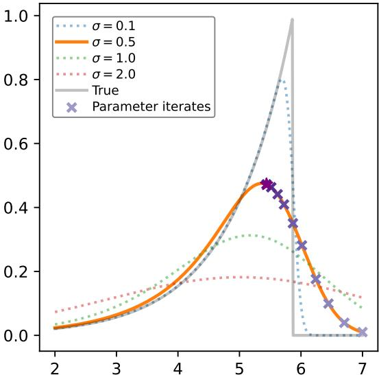  
Figure 1: Optimizing a non-smooth, exponential likelihood with FSM estimator $\left( \sigma = 0 . 5 \right)$ for 10 parameter iterates from initial point $\theta _ { 0 } = 7$

even outside the nominal support, allowing us to successfully optimize the likelihood function.

We can also further view the FSM procedure as a form of Empirical Bayes (EB) [Morris, 1983], by interpreting the proposal distribution $q ( \theta \mid \theta _ { t } )$ as a local prior centered at $\theta _ { t }$ , which, together with the simulator model, defines an EB marginal likelihood function $\tilde { \ell } ( \theta _ { t } ; \mathbf { x } )$ . Theorem 5.1 then shows that our Bayes-optimal FSM estimator is exactly the hyperparameter gradient of the EB marginal likelihood. Hence, this provides a complementary Bayesian interpretation of our FSM method in addition to the optimization viewpoint of Gaussian smoothing.

# 5.2 Properties of the FSM estimator

We now provide theoretical guarantees for our FSM estimator under a Gaussian proposal distribution by characterizing its bias. In particular, by establishing the bias in terms of the smoothing hyperparameter $\sigma$ , we highlight a fundamental trade-off in the FSM estimation procedure.

Theorem 5.2 (Bias characterization of the FSM estimator). Let $\theta ^ { * }$ be the true parameter, and denote $\mathbf { x } _ { 0 } \sim P _ { \theta ^ { * } }$ as random observations sampled from the true model. Suppose there exists a unique maximum likelihood estimator for this model, and that the log-likelihood is $L$ -smooth. Recall that $\begin{array} { r } { g ( \mathbf { x } _ { 0 } ; \theta _ { t } ) = \nabla _ { \theta } \log p ( \mathbf { x } _ { 0 } \mid \theta ) | _ { \theta = \theta _ { t } } } \end{array}$ is the true Fisher score, $S ^ { * } ( \mathbf { x } _ { 0 } ; \theta _ { t } ) = \mathbb { E } _ { \theta \sim p ( \theta | \mathbf { x } , \theta _ { t } ) } \nabla _ { \theta } \log p ( \mathbf { x } \mid \theta )$ is the optimal FSM estimator. For a fixed parameter point $\theta _ { t }$ ,

The bias at $\theta _ { t }$ is bounded by

$$
\begin{array} { r } { \mathbb { E } _ { \mathbf { x } _ { 0 } } \big \| S ^ { * } ( \mathbf { x } _ { 0 } ; \theta _ { t } ) - g ( \mathbf { x } _ { 0 } ; \theta _ { t } ) \big \| \leq L \sqrt { d } \sigma \mathbb { E } _ { \mathbf { x } _ { 0 } } [ R ( \mathbf { x } _ { 0 } ) ] } \end{array}
$$

where R(x) = p(x|θ∗) is a likelihood ratio term and $d$ is the dimension of the parameter space

We provide a full proof in Appendix A.7. From Theorem 5.2, we can see that, increasing $\sigma$ , we increase the bias of the FSM estimator. Intuitively, this is because $\sigma$ governs the degree of smoothing, which induces a "smearing" effect of the FSM gradient estimates. On the other hand, for the linear FSM estimator, note that in the estimator $\hat { W }$ , we have the proposal gradient term $\begin{array} { r } { \nabla _ { \theta } \log q ( \theta \mid \theta _ { t } ) | _ { \theta = \theta ^ { ( j ) } } = - \frac { 1 } { \sigma ^ { 2 } } ( \theta ^ { ( j ) } - \theta _ { t } ) } \end{array}$ and hence taking $\sigma \to 0$ inflates the variance of $\hat { W }$ . Thus, there is a fundamental bias-variance trade-off in the choice of $\sigma$ .

Figure 2 empirically illustrates the bias-variance trade-off of the linear FSM estimator with an

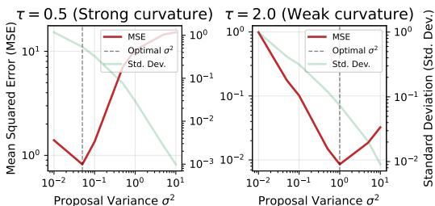  
Figure 2: Mean-squared error and standard deviation of the FSM estimator $\hat { S }$ with varying proposal hyperparameter $\sigma ^ { 2 }$ , for two Gaussian likelihoods $\mathbf { x } \sim \dot { \mathcal { N } } ( \theta , \tau ^ { 2 } )$ with differing curvature.

isotropic Gaussian proposal distribution for two Gaussian likelihood models with differing curvature. In particular, the figure also shows the effect of the log-likelihood curvature, or the gradient-Lipschitz constant $L$ from Theorem 5.2, on the MSE-optimal choice of the proposal scale $\sigma$ . When the curvature is stronger (larger $L$ ), smoothing tends to introduce more bias, and the optimal $\sigma$ is smaller to control the bias. Conversely, when curvature is weaker (smaller $L$ ), a larger $\sigma$ is optimal to reduce the variance of the score estimator.

Furthermore, note that the likelihood ratio term, $\begin{array} { r } { R ( \mathbf { x } ) = \frac { p ( \mathbf { x } | \boldsymbol { \theta } ^ { * } ) } { p ( \mathbf { x } | \boldsymbol { \theta } _ { t } ) } } \end{array}$ encodes the estimation error from using training samples around the parameter iterate points $\theta _ { t }$ to estimate an FSM estimator that is evaluated at observations $\mathbf { x } _ { 0 } \sim P _ { \theta ^ { * } }$ . Hence, for parameter iterates $\theta _ { t }$ that are far from the true parameter $\theta ^ { * }$ , we are likely to get a subpar estimation of the true gradient, while as we approach the true parameter, our estimation is likely to improve. However, increasing $\sigma$ , we can sample from a wider parameter space and are therefore more likely to obtain parameter samples that cover $\theta ^ { * }$ . Thus, $\sigma$ also encodes an inherent exploration-exploitation trade-off.

# 5.3 Convergence Guarantees

As we have shown that our FSM gradient estimator closely relates to the Gaussian smoothing gradient estimator in Section 5.1, we can leverage established results showing the asymptotic convergence of stochastic gradient-based optimization methods with such biased gradient estimators. In particular, instead of using the final parameter iterate of the gradient-based optimization procedure as the approximated MLE $\theta _ { T } \approx \hat { \theta } _ { \mathrm { M L E } }$ , we instead propose using an averaged SGD estimator $\begin{array} { r } { \bar { \theta } _ { T } = \frac { 1 } { T } \sum _ { t = 1 } ^ { \bar { T } } \theta _ { t } } \end{array}$ based on Polyak-Ruppert averaging [Polyak and Juditsky, 1992, Ruppert, 1988], which enjoys stronger theoretical guarantees. We provide the relevant convergence arguments in Appendix A.8.

A further benefit is that since we can obtain the quantification of the algorithmic uncertainty using the averaged SGD, $ { \bar { \theta } } _ { T } -  { \hat { \theta } } _ { \mathrm { M L E } }$ from Appendix A.8 and the statistical uncertainty of the MLE $\hat { \theta } _ { \mathrm { M L E } } - \theta ^ { * }$ from standard statistical theory, we can provide a result showing the quantification of the joint uncertainty using the averaged SGD $\bar { \theta } _ { T }$ as an approximate MLE.

Theorem 5.3. Let $\widehat { \theta } _ { \mathrm { M L E } , N }$ be the MLE for N i.i.d. samples. Suppose that the number of iterations in the optimization algorithm $T$ dominates the number of observations $N$ such that $\sqrt { \frac { N } { T } }  0$ as $N , T \to \infty$ . Then, assuming that $\sqrt { T } (  { \bar { \theta } } _ { T } -  { \hat { \theta } } _ { \mathrm { M L E } , N } ) =  { \mathcal { O } } _ { p } ( 1 )$ uniformly over both $N , T$ and that the standard regularity conditions for the MLE are met, we have as $N , T \to \infty$ ,

$$
\sqrt { N } ( \bar { \theta } _ { T } - \theta ^ { * } )  _ { d } \mathcal { N } ( 0 , \mathcal { T } ( \theta ^ { * } ) ^ { - 1 } )
$$

where ${ \mathcal { T } } ( \theta ^ { * } )$ is the Fisher information matrix evaluated at the true parameter

We provide the proof in Appendix A.9. Given that the Fisher information matrix ${ \mathcal { T } } ( \theta ^ { * } )$ can be approximated using the Fisher score by drawing samples $\mathbf { x } _ { i } \sim P _ { \hat { \theta } }$ and evaluating $\dot { \mathcal { T } } ( \dot { \theta ^ { * } } ) \approx$ $\begin{array} { r } { \frac { 1 } { N } \sum _ { i = 1 } ^ { N } \nabla _ { \theta } \log p ( \mathbf { x } _ { i } \mid \hat { \theta } _ { \mathrm { M L E } } ) \nabla _ { \theta } \log p ( \mathbf { x } _ { i } \mid \hat { \theta } _ { \mathrm { M L E } } ) ^ { \top } } \end{array}$ , we can also estimate this with our FSM method and take advantage of this result to obtain uncertainty quantification based on Theorem 5.3.

# 6 Related Work

The method closest to ours is the approximate MLE approach of Bertl et al. [2015], which first estimates the likelihood through kernel density estimation (KDE) before applying a simultaneous perturbation stochastic approximation (SPSA) [Spall, 1992] algorithm, which amounts to using a finite-differences gradient estimator on the likelihood function estimated using KDE. In contrast, our FSM method directly estimates the Fisher score, merging density and gradient estimation into one step and thereby reducing both model complexity and computational overhead. After posting the first version of this manuscript on arXiv, we became aware of related independent work by Sui et al. [2025], which proposes a similar Fisher score matching estimator. Their focus is on Fisher score estimation more broadly, whereas our work targets simulation-based MLE specifically.

The use of MLE in the simulation-based model setting was first addressed in the seminal work on SBI of Diggle and Gratton [1984], although the inference of SBI is more typically addressed within the Bayesian framework, as exemplified by the ABC algorithm. Naturally, since the maximum a posteriori estimate (MAP) of the posterior distribution under a uniform prior corresponds to the MLE within the prior support, Rubio and Johansen [2013] suggested leveraging the ABC algorithm and using KDE to obtain the MLE, and more recent neural surrogate SBI methods, such as SNLE [Papamakarios et al., 2019], while not specifically targeted for MLE, could be used in the same way. Another similar line of research is the work of Ionides et al. [2017] and Park [2023], which develop the MLE methodology in the SBI setting for partially observed Markov models. Research focused on developing SBI methods using score matching is a growing field [Geffner et al., 2023, Sharrock et al., 2024, Jiang et al., 2025], however, this has been limited to amortized Bayesian inference, and, to our knowledge, we are the first work that has adapted score matching for the purpose of direct Fisher score estimation and MLE in the SBI setting.

# 7 Experimental Results

We evaluate our local Fisher score matching (FSM) technique on both controlled numerical studies and challenging real-world SBI problems.3 For all experiments, we use an isotropic Gaussian proposal distribution $q ( \breve { \theta } \mid \theta _ { t } ) = \mathcal N ( \theta _ { t } , \dot { \sigma } ^ { 2 } I )$ with a linear FSM estimator, and an empirical comparison with the neural network-based FSM estimator is provided in the relevant experiment sections in the Appendix.

As a primary baseline, we compare against the approximate MLE method of Bertl et al. [2015], here referred to as $K D E  – S P$ , which estimates a log-likelihood via kernel density estimation (KDE) and then uses a simultaneous perturbation (SP) estimator to compute gradients:

$$
{ \hat { \nabla } } \ell ( \theta ) = \delta { \frac { { \hat { \ell } } ( \theta ^ { + } ) - { \hat { \ell } } ( \theta ^ { - } ) } { 2 c } }
$$

where $\delta$ is a Rademacher random vector with i.i.d. entries, $\theta ^ { \pm } = \theta \pm c \delta$ , $c$ is a perturbation constant, and $\hat { \ell } ( \theta ; { \mathbf x } _ { o b s } ) = \log \hat { p } ( { \mathbf x } _ { o b s } \mid \theta )$ is the log-likelihood estimated from the KDE by simulating data samples around the target parameter $\theta$ and evaluating at the observations $\mathbf { x } _ { o b s }$ . We provide further details about the implementation in Appendix A.10.

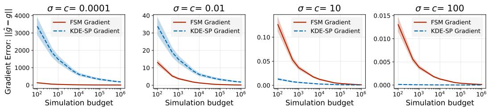  
Figure 3: Comparison of FSM and KDE-SP in a 2D Gaussian model under varying hyperparameters (proposal variance or perturbation constants). Error bars show $9 5 \%$ CIs over 100 repeated gradient approximations.

# 7.1 Numerical Studies

To investigate the accuracy of gradient estimation and parameter estimation, we begin with a multivariate Gaussian model that features a fixed covariance. This model has a closed-form Fisher score, allowing us to directly compare the estimated gradients from FSM and KDE-SP against the ground truth. Further details and results of this experiment are presented in Appendix A.11.

One key aspect of both the FSM and KDE-SP approach is the choice of the hyperparameters, specifically the perturbation constant in KDESP and the proposal variance in FSM. In Figure 3, we show the sensitivity of the gradient approximation quality to different choices of this hyperparameter, as the simulation budget increases. Although the gradient approximation of both methods depends strongly on the choice of hyperparameters, we see that the FSM estimate is always able to match the accuracy of the KDE-SP estimate given sufficient simulation budget, even when the hyperparameters are not favorably tuned. We provide the same ablation study in higher-dimensional settings in Appendix A.11.

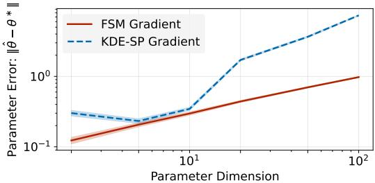  
Figure 4: Parameter estimation accuracy of both the FSM and KDE-SP methods under increasing parameter dimensions, over 100 repeated optimization runs.

In Figure 4, we show the quality of the resulting parameter estimate for the same multivariate Gaussian model with increasing parameter dimension while keeping the simulation budget fixed. While the FSM gradient is able to maintain the quality of the parameter estimate, the KDE-SP struggles in higher dimensional parameter spaces, likely due to the additional kernel density estimation required.

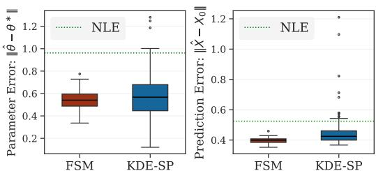  
Figure 5: Parameter estimation and prediction accuracy of the NLE, FSM and KDE-SP methods.

# 7.2 LSST Weak Lensing Cosmology Model

In this example, we use the log-normal forward model proposed by Zeghal et al. [2024] and Lanzieri et al. [2025], which simulates the non-Gaussian structure in gravitational weak-lensing. Using the model in the full LSST-Y10 setting, this model is representative of real-world weak-lensing data. Since the generated data are high-dimensional tomographic convergence maps $( 5 \times 2 5 6 \times 2 5 6 )$ , we use a trained ResNet-18 compressor in Alsing et al. [2018], producing a 6-dimensional summary statistic. As an additional benchmark beyond the KDE-SP method, we further implement a standard neural likelihood estimator (NLE) using the SBI package [Boelts et al., 2025], trained with the same total simulation budget given to both the KDE-SP and FSM gradient-based optimization methods. Evaluated at the observations, NLE can be directly optimized to obtain an approximate maximum likelihood estimator. Further details and results of this experiment are presented in Appendix A.12

In Figure 5, we show both the parameter estimation and the accuracy of the prediction. Given the limited simulation budget available, we observe that sequential gradient-based optimization methods outperform the more simulation-intensive NLE approach and that the FSM approach is generally able to achieve better performance with a smaller variance.

# 7.3 Generator Inversion Task

In this section, we tackle the canonical problem of latent inversion of a generator network [Xia et al., 2022]. For a fixed generator $G _ { w }$ and a query image $\mathbf { x } _ { \mathrm { 0 } }$ , the goal is to recover a latent vector $\mathbf { z }$ such that $\bar { G } _ { w } ( { \bf z } ) \approx { \bf x } _ { 0 }$ . Although typically $\mathbf { z }$ is treated as a point estimate, in this setting, we treat it as a latent variable, $\mathbf { z } \sim \mathcal { N } \left( \boldsymbol { \theta } , \sigma _ { \mathbf { z } } ^ { \tilde { 2 } } I \right)$ and focus on $\theta$ as the parameter of interest. Note the marginal likelihood

$$
p _ { w } ( \mathbf { x } \mid \boldsymbol { \theta } ) = \int \delta \left( \mathbf { x } - G _ { w } ( \mathbf { z } ) \right) \mathcal { N } \left( \mathbf { z } \mid \boldsymbol { \theta } , \sigma _ { \mathbf { z } } ^ { 2 } I \right) \mathrm { d } \mathbf { z }
$$

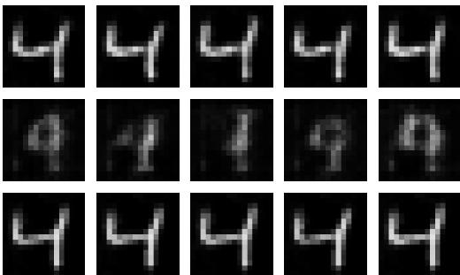  
Figure 6: Images from different latent mean optimization procedure. Top row: FSM, Middle row: KDE-SP, Bottom row: Direct optimization

is intractable because the push-forward density under $G _ { w }$ has no closed form. However, our FSM approach allows us to estimate the Fisher

score $\nabla _ { \theta } \log p _ { w } ( \mathbf { x } \mid \theta )$ at $\mathbf { x } _ { \mathrm { 0 } }$ , enabling us to maximize the likelihood $\ell \left( \theta ; \mathbf { x } _ { 0 } \right) = \log p _ { w } \left( \mathbf { x } _ { 0 } \mid \theta \right)$ without directly estimating the likelihood. Conceptually, this turns the generator inversion problem into likelihood-based inference. Alternatively, given a differentiable generator, we can directly optimize the reconstruction loss to obtain an estimated latent mean (referred to as direct optimization).

We train a GAN model on a $1 6 \times 1 6$ MNIST dataset and apply the generator inversion task, comparing the direct optimization approach, FSM, and KDE-SP method. From Figure 6 we can see that while the FSM and direct optimization is able to recover the target observation, the KDE-SP struggles to achieve the same pixel quality. This is also reflected in Figure 7, which shows the reconstruction loss for the different methods. More details and results for this experiment are provided in Appendix A.13.

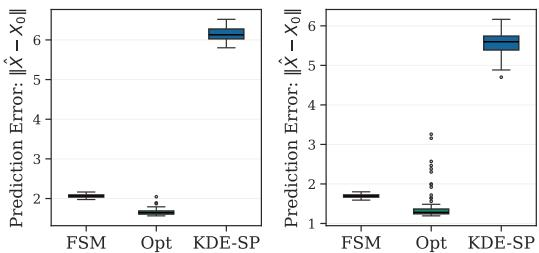  
Figure 7: Prediction error for the FSM, KDE-SP and direct optimization method.

# 8 Conclusion

We introduced FSM-MLE, a novel likelihood-free maximum likelihood estimation technique based on local Fisher score matching. By directly estimating the Fisher score in a simulation-based setting, our method circumvents the need to approximate the likelihood. This significantly reduces the complexity of existing approaches that either rely on kernel density estimation or train expensive neural density estimators. We further showed that under an isotropic Gaussian proposal, our local Fisher score matching estimator admits a natural Gaussian smoothing interpretation, thereby inheriting robustness properties from well-studied Gaussian smoothing techniques in black-box optimization. Empirical results on synthetic examples, a cosmological weak-lensing model, and a generator inversion task highlight the simulation efficiency and robustness of our approach. Further work includes development of a more principled selection of the proposal variance $\sigma ^ { 2 }$ , a richer parameterization of the Fisher score model beyond the linear model, and further investigation into better leveraging the smoothing behavior to tackle challenging likelihood optimization in the SBI setting, as well as utilizing the approximate Fisher information matrix for uncertainty quantification. Since our method is inherently sequential, a promising extension is a "semi-amortized" variant which would leverage a pretrained neural network encoder with a training dataset, which would be coupled with our proposed linear FSM model during inference, thereby enabling a more expressive model while still preserving the benefits of fast, closed-form updates.

# Acknowledgments and Disclosure of Funding

The authors thank the four anonymous reviewers for their constructive feedback. SK was supported by the EPSRC Center for Doctoral Training in Computational Statistics and Data Science, grant number EP/S023569/1.

# References

Justin Alsing, Benjamin Wandelt, and Stephen Feeney. Massive optimal data compression and density estimation for scalable, likelihood-free inference in cosmology. Monthly Notices of the Royal Astronomical Society, 477 (3):2874–2885, 2018.

Mark A Beaumont, Wenyang Zhang, and David J Balding. Approximate bayesian computation in population genetics. Genetics, 162(4):2025–2035, 2002.

Johanna Bertl, Gregory Ewing, Carolin Kosiol, and Andreas Futschik. Approximate maximum likelihood estimation, 2015.

Ayush Bharti, François-Xavier Briol, and Troels Pedersen. A general method for calibrating stochastic radio channel models with kernels. Ieee transactions on antennas and propagation, 70(6):3986–4001, 2021.

Jan Boelts, Michael Deistler, Manuel Gloeckler, Álvaro Tejero-Cantero, Jan-Matthis Lueckmann, Guy Moss, Peter Steinbach, Thomas Moreau, Fabio Muratore, Julia Linhart, Conor Durkan, Julius Vetter, Benjamin Kurt Miller, Maternus Herold, Abolfazl Ziaeemehr, Matthijs Pals, Theo Gruner, Sebastian Bischoff, Nastya Krouglova, Richard Gao, Janne K. Lappalainen, Bálint Mucsányi, Felix Pei, Auguste Schulz, Zinovia Stefanidi, Pedro Rodrigues, Cornelius Schröder, Faried Abu Zaid, Jonas Beck, Jaivardhan Kapoor, David S. Greenberg, Pedro J. Gonçalves, and Jakob H. Macke. sbi reloaded: a toolkit for simulation-based inference workflows. Journal of Open Source Software, 10(108):7754, 2025. doi: 10.21105/joss.07754. URL https://doi.org/10.21105/joss.07754.

George Casella and Roger Berger. Statistical inference. CRC press, 2024.

Kyle Cranmer, Johann Brehmer, and Gilles Louppe. The frontier of simulation-based inference. Proceedings of the National Academy of Sciences, 117(48):30055–30062, May 2020. ISSN 1091-6490. doi: 10.1073/pnas. 1912789117. URL http://dx.doi.org/10.1073/pnas.1912789117.

Katalin Csillery, Michael G. B. Blum, Oscar E. Gaggiotti, and Olivier Francois. Approximate bayesian computation (abc) in practice. Trends in Ecology and Evolution, 25(7):410–418, July 2010. ISSN 0169-5347. doi: 10.1016/j.tree.2010.04.001.

Peter J. Diggle and Richard J. Gratton. Monte carlo methods of inference for implicit statistical models. Journal of the Royal Statistical Society. Series B (Methodological), 46(2):193–227, 1984. ISSN 0035-9246.

John C Duchi, Peter L Bartlett, and Martin J Wainwright. Randomized smoothing for stochastic optimization. SIAM Journal on Optimization, 22(2):674–701, 2012.

Conor Durkan, George Papamakarios, and Iain Murray. Sequential neural methods for likelihood-free inference. (arXiv:1811.08723), November 2018. URL http://arxiv.org/abs/1811.08723. arXiv:1811.08723 [cs, stat].

Tomas Geffner, George Papamakarios, and Andriy Mnih. Compositional score modeling for simulation-based inference, 2023. URL https://arxiv.org/abs/2209.14249.

Aapo Hyvärinen and Peter Dayan. Estimation of non-normalized statistical models by score matching. Journal of Machine Learning Research, 6(4), 2005.

E. L. Ionides, C. Breto, J. Park, R. A. Smith, and A. A. King. Monte carlo profile confidence intervals for dynamic systems. Journal of The Royal Society Interface, 14(132):20170126, July 2017. doi: 10.1098/rsif.2017.0126.

Haoyu Jiang, Yuexi Wang, and Yun Yang. Simulation-based inference via langevin dynamics with score matching, 2025. URL https://arxiv.org/abs/2509.03853.

Yanhao Jin, Tesi Xiao, and Krishnakumar Balasubramanian. Statistical inference for polyak-ruppert averaged zeroth-order stochastic gradient algorithm, 2021. URL https://arxiv.org/abs/2102.05198.

Diederik P. Kingma and Jimmy Ba. Adam: A method for stochastic optimization, 2017.

Denise Lanzieri, Justine Zeghal, T. Lucas Makinen, Alexandre Boucaud, Jean-Luc Starck, and François Lanusse. Optimal neural summarisation for full-field weak lensing cosmological implicit inference, 2025. URL https://arxiv.org/abs/2407.10877.   
Shakir Mohamed and Balaji Lakshminarayanan. Learning in implicit generative models. (arXiv:1610.03483), February 2017. doi: 10.48550/arXiv.1610.03483. URL http://arxiv.org/abs/1610.03483. arXiv:1610.03483 [cs, stat].   
Carl N Morris. Parametric empirical bayes inference: theory and applications. Journal of the American statistical Association, 78(381):47–55, 1983.   
Yurii Nesterov and Vladimir Spokoiny. Random gradient-free minimization of convex functions. Foundations of Computational Mathematics, 17(2):527–566, 2017.   
George Papamakarios, Theo Pavlakou, and Iain Murray. Masked autoregressive flow for density estimation. (arXiv:1705.07057), June 2018. doi: 10.48550/arXiv.1705.07057. URL http://arxiv.org/abs/1705. 07057. arXiv:1705.07057 [cs, stat].   
George Papamakarios, David C. Sterratt, and Iain Murray. Sequential neural likelihood: Fast likelihood-free inference with autoregressive flows, 2019.   
Joonha Park. On simulation-based inference for implicitly defined models. (arXiv:2311.09446), November 2023. doi: 10.48550/arXiv.2311.09446. URL http://arxiv.org/abs/2311.09446. arXiv:2311.09446 [math, stat].   
B. T. Polyak and A. B. Juditsky. Acceleration of stochastic approximation by averaging. SIAM Journal on Control and Optimization, 30(4):838–855, July 1992. ISSN 0363-0129, 1095-7138. doi: 10.1137/0330046.   
C Radhakrishna Rao. Information and the accuracy attainable in the estimation of statistical parameters. In Breakthroughs in Statistics: Foundations and basic theory, pages 235–247. Springer, 1992.   
Herbert Robbins and Sutton Monro. A stochastic approximation method. The annals of mathematical statistics, pages 400–407, 1951.   
F. J. Rubio and Adam M. Johansen. A simple approach to maximum intractable likelihood estimation. (arXiv:1301.0463), January 2013. doi: 10.48550/arXiv.1301.0463. URL http://arxiv.org/abs/1301. 0463. arXiv:1301.0463 [stat].   
David Ruppert. Efficient estimations from a slowly convergent robbins-monro process. Technical report, Cornell University Operations Research and Industrial Engineering, 1988.   
Tim Salimans, Jonathan Ho, Xi Chen, Szymon Sidor, and Ilya Sutskever. Evolution strategies as a scalable alternative to reinforcement learning. arXiv preprint arXiv:1703.03864, 2017.   
Chad Schafer and Peter Freeman. Likelihood-free inference in cosmology: Potential for the estimation of luminosity functions. Lecture Notes in Statistics, 209:3–19, 01 2012. doi: 10.1007/978-1-4614-3520-4-1.   
Louis Sharrock, Jack Simons, Song Liu, and Mark Beaumont. Sequential neural score estimation: Likelihoodfree inference with conditional score based diffusion models, 2024. URL https://arxiv.org/abs/2210. 04872.   
Yang Song and Stefano Ermon. Generative modeling by estimating gradients of the data distribution. (arXiv:1907.05600), October 2020. URL http://arxiv.org/abs/1907.05600. arXiv:1907.05600 [cs, stat].   
Yang Song, Sahaj Garg, Jiaxin Shi, and Stefano Ermon. Sliced score matching: A scalable approach to density and score estimation, 2019.   
J.C. Spall. Multivariate stochastic approximation using a simultaneous perturbation gradient approximation. IEEE Transactions on Automatic Control, 37(3):332–341, 1992. doi: 10.1109/9.119632.   
Andrew Starnes, Anton Dereventsov, and Clayton Webster. Gaussian smoothing gradient descent for minimizing functions (gsmoothgd). arXiv preprint arXiv:2311.00521, 2023.   
David Sterratt, Bruce Graham, Andrew Gillies, and David Willshaw. Principles of Computational Modelling in Neuroscience. 07 2011. ISBN 798-0-521-87795-4. doi: 10.1017/CBO9780511975899.   
Ce Sui, Shivam Pandey, and Benjamin D. Wandelt. Fisher score matching for simulation-based forecasting and inference, 2025. URL https://arxiv.org/abs/2507.07833.

Tijmen Tieleman. Lecture 6.5-rmsprop: Divide the gradient by a running average of its recent magnitude. COURSERA: Neural networks for machine learning, 4(2):26, 2012.

Tina Toni, David Welch, Natalja Strelkowa, Andreas Ipsen, and Michael Stumpf. Toni t, welch d, strelkowa n, ipsen a, stumpf mpapproximate bayesian computation scheme for parameter inference and model selection in dynamical systems. j r soc interface 6: 187-202. Journal of the Royal Society, Interface / the Royal Society, 6: 187–202, 03 2009. doi: 10.1098/rsif.2008.0172.

Aad W Van der Vaart. Asymptotic statistics, volume 3. Cambridge university press, 2000.

Pascal Vincent. A connection between score matching and denoising autoencoders. Neural Computation, 23(7): 1661–1674, July 2011. ISSN 0899-7667, 1530-888X. doi: 10.1162/NECO_a_00142.

Weihao Xia, Yulun Zhang, Yujiu Yang, Jing-Hao Xue, Bolei Zhou, and Ming-Hsuan Yang. Gan inversion: A survey. IEEE transactions on pattern analysis and machine intelligence, 45(3):3121–3138, 2022.

Ling Yang, Zhilong Zhang, Yang Song, Shenda Hong, Runsheng Xu, Yue Zhao, Wentao Zhang, Bin Cui, and Ming-Hsuan Yang. Diffusion models: A comprehensive survey of methods and applications, 2024.

Justine Zeghal, Denise Lanzieri, François Lanusse, Alexandre Boucaud, Gilles Louppe, Eric Aubourg, Adrian E. Bayer, and The LSST Dark Energy Science Collaboration. Simulation-based inference benchmark for lsst weak lensing cosmology, 2024. URL https://arxiv.org/abs/2409.17975.

# NeurIPS Paper Checklist

# 1. Claims

Question: Do the main claims made in the abstract and introduction accurately reflect the paper’s contributions and scope?

Answer: [Yes]

Justification: See Section 3

Guidelines:

• The answer NA means that the abstract and introduction do not include the claims made in the paper.   
• The abstract and/or introduction should clearly state the claims made, including the contributions made in the paper and important assumptions and limitations. A No or NA answer to this question will not be perceived well by the reviewers.   
• The claims made should match theoretical and experimental results, and reflect how much the results can be expected to generalize to other settings.   
• It is fine to include aspirational goals as motivation as long as it is clear that these goals are not attained by the paper.

# 2. Limitations

Question: Does the paper discuss the limitations of the work performed by the authors?

Answer: [Yes]

Justification: The limitations are briefly discussed in Section 8 and left for future work.

Guidelines:

• The answer NA means that the paper has no limitation while the answer No means that the paper has limitations, but those are not discussed in the paper.   
• The authors are encouraged to create a separate "Limitations" section in their paper.   
• The paper should point out any strong assumptions and how robust the results are to violations of these assumptions (e.g., independence assumptions, noiseless settings, model well-specification, asymptotic approximations only holding locally). The authors should reflect on how these assumptions might be violated in practice and what the implications would be. The authors should reflect on the scope of the claims made, e.g., if the approach was only tested on a few datasets or with a few runs. In general, empirical results often depend on implicit assumptions, which should be articulated. The authors should reflect on the factors that influence the performance of the approach. For example, a facial recognition algorithm may perform poorly when image resolution is low or images are taken in low lighting. Or a speech-to-text system might not be used reliably to provide closed captions for online lectures because it fails to handle technical jargon.   
• The authors should discuss the computational efficiency of the proposed algorithms and how they scale with dataset size.   
• If applicable, the authors should discuss possible limitations of their approach to address problems of privacy and fairness.   
• While the authors might fear that complete honesty about limitations might be used by reviewers as grounds for rejection, a worse outcome might be that reviewers discover limitations that aren’t acknowledged in the paper. The authors should use their best judgment and recognize that individual actions in favor of transparency play an important role in developing norms that preserve the integrity of the community. Reviewers will be specifically instructed to not penalize honesty concerning limitations.

# 3. Theory Assumptions and Proofs

Question: For each theoretical result, does the paper provide the full set of assumptions and a complete (and correct) proof?

Answer: [Yes]

Justification: See Appendix A.8

Guidelines:

• The answer NA means that the paper does not include theoretical results.   
• All the theorems, formulas, and proofs in the paper should be numbered and crossreferenced.   
• All assumptions should be clearly stated or referenced in the statement of any theorems.   
• The proofs can either appear in the main paper or the supplemental material, but if they appear in the supplemental material, the authors are encouraged to provide a short proof sketch to provide intuition.   
• Inversely, any informal proof provided in the core of the paper should be complemented by formal proofs provided in appendix or supplemental material.   
• Theorems and Lemmas that the proof relies upon should be properly referenced.

# 4. Experimental Result Reproducibility

Question: Does the paper fully disclose all the information needed to reproduce the main experimental results of the paper to the extent that it affects the main claims and/or conclusions of the paper (regardless of whether the code and data are provided or not)?

Answer: [Yes]

Justification: See Section 7 and Algorithm 1

Guidelines:

• The answer NA means that the paper does not include experiments.   
• If the paper includes experiments, a No answer to this question will not be perceived well by the reviewers: Making the paper reproducible is important, regardless of whether the code and data are provided or not.   
• If the contribution is a dataset and/or model, the authors should describe the steps taken to make their results reproducible or verifiable.   
• Depending on the contribution, reproducibility can be accomplished in various ways. For example, if the contribution is a novel architecture, describing the architecture fully might suffice, or if the contribution is a specific model and empirical evaluation, it may be necessary to either make it possible for others to replicate the model with the same dataset, or provide access to the model. In general. releasing code and data is often one good way to accomplish this, but reproducibility can also be provided via detailed instructions for how to replicate the results, access to a hosted model (e.g., in the case of a large language model), releasing of a model checkpoint, or other means that are appropriate to the research performed.   
• While NeurIPS does not require releasing code, the conference does require all submissions to provide some reasonable avenue for reproducibility, which may depend on the nature of the contribution. For example (a) If the contribution is primarily a new algorithm, the paper should make it clear how to reproduce that algorithm. (b) If the contribution is primarily a new model architecture, the paper should describe the architecture clearly and fully. (c) If the contribution is a new model (e.g., a large language model), then there should either be a way to access this model for reproducing the results or a way to reproduce the model (e.g., with an open-source dataset or instructions for how to construct the dataset). (d) We recognize that reproducibility may be tricky in some cases, in which case authors are welcome to describe the particular way they provide for reproducibility. In the case of closed-source models, it may be that access to the model is limited in some way (e.g., to registered users), but it should be possible for other researchers to have some path to reproducing or verifying the results.

# 5. Open access to data and code

Question: Does the paper provide open access to the data and code, with sufficient instructions to faithfully reproduce the main experimental results, as described in supplemental material?

Answer: [Yes]

Justification: Only publicly accessible datasets are used and code is provided.

Guidelines:

• The answer NA means that paper does not include experiments requiring code.   
• Please see the NeurIPS code and data submission guidelines (https://nips.cc/ public/guides/CodeSubmissionPolicy) for more details.   
• While we encourage the release of code and data, we understand that this might not be possible, so “No” is an acceptable answer. Papers cannot be rejected simply for not including code, unless this is central to the contribution (e.g., for a new open-source benchmark).   
• The instructions should contain the exact command and environment needed to run to reproduce the results. See the NeurIPS code and data submission guidelines (https: //nips.cc/public/guides/CodeSubmissionPolicy) for more details.   
• The authors should provide instructions on data access and preparation, including how to access the raw data, preprocessed data, intermediate data, and generated data, etc.   
• The authors should provide scripts to reproduce all experimental results for the new proposed method and baselines. If only a subset of experiments are reproducible, they should state which ones are omitted from the script and why.   
• At submission time, to preserve anonymity, the authors should release anonymized versions (if applicable).   
• Providing as much information as possible in supplemental material (appended to the paper) is recommended, but including URLs to data and code is permitted.

# 6. Experimental Setting/Details

Question: Does the paper specify all the training and test details (e.g., data splits, hyperparameters, how they were chosen, type of optimizer, etc.) necessary to understand the results?

Answer: [Yes]

Justification: See Appendix A.11, A.12, A.13

Guidelines:

• The answer NA means that the paper does not include experiments. • The experimental setting should be presented in the core of the paper to a level of detail that is necessary to appreciate the results and make sense of them. • The full details can be provided either with the code, in appendix, or as supplemental material.

# 7. Experiment Statistical Significance

Question: Does the paper report error bars suitably and correctly defined or other appropriate information about the statistical significance of the experiments?

Answer: [Yes]

Justification: All figures in Section 7 and Appendix A.11, A.12, and A.13 include either error bars representing the $9 5 \%$ confidence intervals over 100 repeated runs, or boxplots that visualize the distribution of the results.

Guidelines:

• The answer NA means that the paper does not include experiments.   
• The authors should answer "Yes" if the results are accompanied by error bars, confidence intervals, or statistical significance tests, at least for the experiments that support the main claims of the paper.   
• The factors of variability that the error bars are capturing should be clearly stated (for example, train/test split, initialization, random drawing of some parameter, or overall run with given experimental conditions).   
• The method for calculating the error bars should be explained (closed form formula, call to a library function, bootstrap, etc.)   
• The assumptions made should be given (e.g., Normally distributed errors).   
• It should be clear whether the error bar is the standard deviation or the standard error of the mean.   
• It is OK to report 1-sigma error bars, but one should state it. The authors should preferably report a 2-sigma error bar than state that they have a $96 \%$ CI, if the hypothesis of Normality of errors is not verified.   
• For asymmetric distributions, the authors should be careful not to show in tables or figures symmetric error bars that would yield results that are out of range (e.g. negative error rates).   
• If error bars are reported in tables or plots, The authors should explain in the text how they were calculated and reference the corresponding figures or tables in the text.

# 8. Experiments Compute Resources

Question: For each experiment, does the paper provide sufficient information on the computer resources (type of compute workers, memory, time of execution) needed to reproduce the experiments?

Answer: [Yes]

Justification: See Appendix A.11, A.12, and A.13

Guidelines:

• The answer NA means that the paper does not include experiments.   
• The paper should indicate the type of compute workers CPU or GPU, internal cluster, or cloud provider, including relevant memory and storage.   
• The paper should provide the amount of compute required for each of the individual experimental runs as well as estimate the total compute.   
• The paper should disclose whether the full research project required more compute than the experiments reported in the paper (e.g., preliminary or failed experiments that didn’t make it into the paper).

# 9. Code Of Ethics

Question: Does the research conducted in the paper conform, in every respect, with the NeurIPS Code of Ethics https://neurips.cc/public/EthicsGuidelines?

Answer: [Yes]

Justification: The research presented in this paper fully complies with the NeurIPS Code of Ethics

Guidelines:

• The answer NA means that the authors have not reviewed the NeurIPS Code of Ethics.   
• If the authors answer No, they should explain the special circumstances that require a deviation from the Code of Ethics.   
• The authors should make sure to preserve anonymity (e.g., if there is a special consideration due to laws or regulations in their jurisdiction).

# 10. Broader Impacts

Question: Does the paper discuss both potential positive societal impacts and negative societal impacts of the work performed?

Answer: [NA]

Justification: This paper is purely a mathematical work and does not involve direct societal applications.

Guidelines:

• The answer NA means that there is no societal impact of the work performed.   
• If the authors answer NA or No, they should explain why their work has no societal impact or why the paper does not address societal impact.   
• Examples of negative societal impacts include potential malicious or unintended uses (e.g., disinformation, generating fake profiles, surveillance), fairness considerations (e.g., deployment of technologies that could make decisions that unfairly impact specific groups), privacy considerations, and security considerations.   
• The conference expects that many papers will be foundational research and not tied to particular applications, let alone deployments. However, if there is a direct path to any negative applications, the authors should point it out. For example, it is legitimate to point out that an improvement in the quality of generative models could be used to generate deepfakes for disinformation. On the other hand, it is not needed to point out that a generic algorithm for optimizing neural networks could enable people to train models that generate Deepfakes faster.   
• The authors should consider possible harms that could arise when the technology is being used as intended and functioning correctly, harms that could arise when the technology is being used as intended but gives incorrect results, and harms following from (intentional or unintentional) misuse of the technology.   
If there are negative societal impacts, the authors could also discuss possible mitigation strategies (e.g., gated release of models, providing defenses in addition to attacks, mechanisms for monitoring misuse, mechanisms to monitor how a system learns from feedback over time, improving the efficiency and accessibility of ML).

# 11. Safeguards

Question: Does the paper describe safeguards that have been put in place for responsible release of data or models that have a high risk for misuse (e.g., pretrained language models, image generators, or scraped datasets)?

Answer: [NA]

Justification: This paper does not work on language models.

Guidelines:

• The answer NA means that the paper poses no such risks.   
• Released models that have a high risk for misuse or dual-use should be released with necessary safeguards to allow for controlled use of the model, for example by requiring that users adhere to usage guidelines or restrictions to access the model or implementing safety filters.   
• Datasets that have been scraped from the Internet could pose safety risks. The authors should describe how they avoided releasing unsafe images.   
• We recognize that providing effective safeguards is challenging, and many papers do not require this, but we encourage authors to take this into account and make a best faith effort.

# 12. Licenses for existing assets

Question: Are the creators or original owners of assets (e.g., code, data, models), used in the paper, properly credited and are the license and terms of use explicitly mentioned and properly respected?

Answer: [Yes]

Justification: See Section 7

Guidelines:

• The answer NA means that the paper does not use existing assets.   
• The authors should cite the original paper that produced the code package or dataset.   
• The authors should state which version of the asset is used and, if possible, include a URL.   
• The name of the license (e.g., CC-BY 4.0) should be included for each asset.   
• For scraped data from a particular source (e.g., website), the copyright and terms of service of that source should be provided.   
• If assets are released, the license, copyright information, and terms of use in the package should be provided. For popular datasets, paperswithcode.com/datasets has curated licenses for some datasets. Their licensing guide can help determine the license of a dataset.   
• For existing datasets that are re-packaged, both the original license and the license of the derived asset (if it has changed) should be provided.

• If this information is not available online, the authors are encouraged to reach out to the asset’s creators.

# 13. New Assets

Question: Are new assets introduced in the paper well documented and is the documentation provided alongside the assets?

Answer: [NA]

Justification: This paper does not release new assets.

Guidelines:

• The answer NA means that the paper does not release new assets.   
• Researchers should communicate the details of the dataset/code/model as part of their submissions via structured templates. This includes details about training, license, limitations, etc.   
• The paper should discuss whether and how consent was obtained from people whose asset is used.   
• At submission time, remember to anonymize your assets (if applicable). You can either create an anonymized URL or include an anonymized zip file.

# 14. Crowdsourcing and Research with Human Subjects

Question: For crowdsourcing experiments and research with human subjects, does the paper include the full text of instructions given to participants and screenshots, if applicable, as well as details about compensation (if any)?

Answer: [NA]

Justification: This paper does not involve crowdsourcing and human subjects.

Guidelines:

• The answer NA means that the paper does not involve crowdsourcing nor research with human subjects.   
• Including this information in the supplemental material is fine, but if the main contribution of the paper involves human subjects, then as much detail as possible should be included in the main paper.   
• According to the NeurIPS Code of Ethics, workers involved in data collection, curation, or other labor should be paid at least the minimum wage in the country of the data collector.

# 15. Institutional Review Board (IRB) Approvals or Equivalent for Research with Human Subjects

Question: Does the paper describe potential risks incurred by study participants, whether such risks were disclosed to the subjects, and whether Institutional Review Board (IRB) approvals (or an equivalent approval/review based on the requirements of your country or institution) were obtained?

Answer: [NA]

Justification: This paper does not involve crowdsourcing and human subjects.

Guidelines:

• The answer NA means that the paper does not involve crowdsourcing nor research with human subjects.   
• Depending on the country in which research is conducted, IRB approval (or equivalent) may be required for any human subjects research. If you obtained IRB approval, you should clearly state this in the paper.   
• We recognize that the procedures for this may vary significantly between institutions and locations, and we expect authors to adhere to the NeurIPS Code of Ethics and the guidelines for their institution.   
• For initial submissions, do not include any information that would break anonymity (if applicable), such as the institution conducting the review.

# A Appendix / Supplemental Material

# A.1 Fisher score matching objective

Here, we provide a complete theorem and a proof for Theorem 3.1.

Theorem A.1 (Local Fisher Score Matching). Let $\mathcal { I } ( W )$ be defined as in Equation (1). Given the following assumptions:

• $p ( \mathbf { x } \mid \theta ) , q ( \theta \mid \theta _ { t } )$ are differentiable with respect to $\theta$ , $S _ { W } ( \mathbf { x } )$ is differentiable with respect to x   
$\mathbf { \nabla } \cdot \mathbf { \nabla } \forall \mathbf { x } \in \mathbb { R } ^ { d _ { \mathbf { x } } } , \operatorname* { l i m } _ { \| \theta \|  \infty } p ( \mathbf { x } \mid \theta ) q ( \theta \mid \theta _ { t } ) = 0$

$\mathcal { I } ( W )$ can be rewritten (up to an additive constant w.r.t. $W$ ) as

$$
\mathcal { I } ( W ; \theta _ { t } ) ~ = ~ \mathbb { E } _ { \mathbf { x } \sim p ( \mathbf { x } \mid \theta ) , \theta \sim q ( \theta \mid \theta _ { t } ) } [ \| S _ { W } ( \mathbf { x } ) \| ^ { 2 } ~ + ~ 2 ~ S _ { W } ( \mathbf { x } ) ^ { \top } ~ \nabla _ { \theta } \log q ( \theta \mid \theta _ { t } ) ]
$$

Proof. We denote the joint distribution over $( \mathbf { x } , \theta )$ from the distributions $p ( \mathbf { x } \mid \theta )$ and $q ( \theta \mid \theta _ { t } )$ as $p ( \mathbf { x } , \mathbf { \hat { \theta } } \mid \theta _ { t } )$ . First, we expand the square, and remove terms which are not dependent on the score model parameters $W$ .

$$
\begin{array} { r l } { \mathcal { I } ( W ) = \mathbb { E } _ { p ( \mathbf { x } , \theta | \theta _ { t } ) } ( \| \nabla _ { \theta } \log p ( \mathbf { x } \mid \theta ) - S _ { W } ( \mathbf { x } ) \| ^ { 2 } ) } & { } \\ { = \int _ { \theta \in \mathbb { R } ^ { \frac { d } { \theta } } } q ( \theta \mid \theta _ { t } ) \int _ { \mathbf { x } \in \mathbb { R } ^ { d _ { \mathbb { X } } } } p ( \mathbf { x } \mid \theta ) \| \nabla _ { \theta } \log p ( \mathbf { x } \mid \theta ) - S _ { W } ( \mathbf { x } ) \| ^ { 2 } d \mathbf { x } d \theta } & { } \\ { = \int _ { \theta \in \mathbb { R } ^ { d _ { \theta } } } q ( \theta \mid \theta _ { t } ) \int _ { \mathbf { x } \in \mathbb { R } ^ { d _ { \mathbb { X } } } } p ( \mathbf { x } \mid \theta ) \{ \| \nabla _ { \theta } \log p ( \mathbf { x } \mid \theta ) \| ^ { 2 } + \| S _ { W } ( \mathbf { x } ) \| ^ { 2 } } & { } \\ { \quad \quad - 2 \nabla _ { \theta } \log p ( \mathbf { x } \mid \theta ) ^ { \top } S _ { W } ( \mathbf { x } ) \} d \mathbf { x } d \theta } & { } \\ { = \int _ { \theta \in \mathbb { R } ^ { d _ { \theta } } } q ( \theta \mid \theta _ { t } ) \int _ { \mathbf { x } \in \mathbb { R } ^ { d _ { \mathbb { X } } } } p ( \mathbf { x } \mid \theta ) \{ \| S _ { W } ( \mathbf { x } ) \| \} ^ { 2 } - 2 \nabla _ { \theta } \log p ( \mathbf { x } \mid \theta ) ^ { \top } S _ { W } ( \mathbf { x } ) \} d \mathbf { x } d \theta } & { } \\ { \quad \quad + ( \operatorname { c o n s t a n t s w } _ { \mathbf { x } , \mathbf { t } , \mathbf { k } } W ) } & { } \end{array}
$$

Next, by exchanging integrals and using the integration by parts tricks similar to Theorem 1 in Hyvärinen and Dayan [2005],

$$
\begin{array} { r l } { \mathcal { I } ( W ) = \displaystyle \int _ { \theta \in \mathbb R ^ { + } } q ( \theta | \theta _ { i } ) \int _ { \infty } \varphi ( { \mathbf x } \mid \theta ) \| S _ { W } ( { \mathbf x } ) \| ^ { 2 } d { \mathbf x } d \theta } \\ & { \qquad - 2 \displaystyle \int _ { \theta \in \mathbb R ^ { + } } q ( \theta | \theta _ { i } ) \int _ { \mathbb { R } \in \mathbb R ^ { + } } p ( { \mathbf x } | \ \theta ) \nabla _ { \theta } \log p ( { \mathbf x } \mid \theta ) ^ { \top } S _ { W } ( { \mathbf x } ) d { \mathbf x } d \theta } \\ & { = \displaystyle \int _ { \theta \in \mathbb R ^ { + } } q ( \theta | \theta _ { i } ) \int _ { \mathbb { R } \in \mathbb R ^ { + } } p ( { \mathbf x } \mid \theta ) \| S _ { W } ( { \mathbf x } ) \| ^ { 2 } d { \mathbf x } d \theta } \\ & { \qquad - 2 \displaystyle \int _ { \mathbb { R } \in \mathbb R ^ { + } } \int _ { \theta \in \mathbb R ^ { + } } q ( \theta | \ \theta _ { i } ) \nabla _ { \theta } p ( { \mathbf x } \mid \theta ) ^ { \top } S _ { W } ( { \mathbf x } ) d \theta \ d { \mathbf x } } \\ & { = \displaystyle \int _ { \theta \in \mathbb R ^ { + } } q ( \theta | \ \theta _ { i } ) \int _ { \mathbb { R } \in \mathbb R ^ { + } } p ( { \mathbf x } \mid \theta ) \| S _ { W } ( { \mathbf x } ) \| ^ { 2 } d { \mathbf x } d \theta } \\ & { \qquad - 2 \displaystyle \int _ { \mathbb { R } \in \mathbb R ^ { + } } \int _ { \theta \in \mathbb R ^ { + } } q ( \theta | \ \theta _ { i } ) \int _ { \mathbb { R } ^ { - } } \frac { \partial } { \partial \theta } p ( { \mathbf x } \mid \theta ) S _ { W } ^ { ( i ) } ( { \mathbf x } ) d \theta d { \mathbf x } } \end{array}
$$

$$
\begin{array} { l } { \displaystyle \mathcal { J } ( W ) = \int _ { \theta \in \mathbb { R } ^ { d _ { \theta } } } q ( \theta \mid \theta _ { t } ) \int _ { \mathbf { x } \in \mathbb { R } ^ { d _ { \mathbf { x } } } } p ( \mathbf { x } \mid \theta ) \| S _ { W } ( \mathbf { x } ) \| ^ { 2 } d \mathbf { x } d \theta } \\ { \displaystyle \quad \quad - 2 \int _ { \mathbf { x } \in \mathbb { R } ^ { d _ { \mathbf { x } } } } \sum _ { i = 1 } ^ { d _ { \theta } } S _ { W } ^ { ( i ) } ( \mathbf { x } ) \int _ { \theta \in \mathbb { R } ^ { d _ { \theta } } } q ( \theta \mid \theta _ { t } ) \frac { \partial } { \partial \theta _ { i } } p ( \mathbf { x } \mid \theta ) d \theta d \mathbf { x } } \\ { \displaystyle \quad = \int _ { \theta \in \mathbb { R } ^ { d _ { \theta } } } q ( \theta \mid \theta _ { t } ) \int _ { \mathbf { x } \in \mathbb { R } ^ { d _ { \mathbf { x } } } } p ( \mathbf { x } \mid \theta ) \| S _ { W } ( \mathbf { x } ) \| ^ { 2 } d \mathbf { x } d \theta } \\ { \displaystyle \quad \quad + 2 \int _ { \mathbf { x } \in \mathbb { R } ^ { d _ { \mathbf { x } } } } \sum _ { i = 1 } ^ { d _ { \theta } } S _ { W } ^ { ( i ) } ( \mathbf { x } ) \int _ { \theta \in \mathbb { R } ^ { d _ { \theta } } } \frac { \partial } { \partial \theta _ { i } } q ( \theta \mid \theta _ { t } ) p ( \mathbf { x } \mid \theta ) d \theta d \mathbf { x } } \end{array}
$$

Finally, by further simplification

$$
\begin{array} { r l } { \mathcal { I } ( W ) = \displaystyle \int _ { \log \mathbb { R } ^ { 2 } } q ( \theta | \ s _ { \ell } ) \int _ { \infty \mathbb { R } ^ { 2 } \times \mathbb { R } ^ { 3 } } \psi ( x ) | \theta | | S _ { W } ( x ) | | ^ { 2 } \mathrm { d } s _ { \ell k } B } \\ & { \quad + \ : 2 \int _ { \infty \times \mathbb { R } ^ { 3 } - \mathbb { R } ^ { 3 } } \frac { \Delta } { \sin ( W ) } \Big \langle \mathbf { \Delta } f ( x ) , q _ { \ell k } ( \theta ) , \phi _ { \ell k } ( \theta ) , \frac { 1 } { \theta } \log ( \theta ) | \ s _ { \ell } ( \theta ) | \theta | \phi ( x ) | \theta \big \rangle d \theta d \theta ^ { \prime } } \\ & { = \displaystyle \int _ { \log \mathbb { R } ^ { 3 } } q ( \theta ) | \vartheta _ { \ell }  \int _ { \infty \mathbb { R } ^ { 3 } } p ( x ) | \theta | S _ { W } ( x ) | ^ { 2 } \mathrm { d } s _ { \ell k } \mathcal { I } ( \theta ) } \\ & { \quad + \ : 2 \int _ { \infty \times \mathbb { R } ^ { 3 } } q ( \theta ) | \vartheta _ { \ell }  \int _ { \infty \mathbb { R } ^ { 3 } } \frac { \Delta } { \sin ( W ) } \Big \langle \mathbf { \Delta } f ( x ) , \frac { 1 } { \theta } \Big \rangle \Delta _ { \theta } ^ { 2 } \log ( \theta ) | \theta _ { \ell } \log ( \theta ) | \theta \mathrm { d } s \mathrm { d } \theta } \\ &  = \displaystyle \int _ { \mathbb { R } ^ { 3 } \times \mathbb { R } ^ { 3 } } q ( \theta ) | \vartheta _ { \ell }  \int _ { \infty \times \mathbb { R } ^ { 3 } } p ( x ) | \theta | \sum _ { \ell = 1 } ^ { \infty } | \sum _ { \ell = 1 } ^ { \infty } \sum _ { \ell = 1 } ^ { \infty } \sum _ { \ell = 1 } ^ { \infty } \sum _ { \ell = 1 } ^ { \infty } \sum _ { \ell = 1 } ^ { \infty } \sum _ { \ell = 1 } ^ { \infty } \sum _ { \ell = 1 } ^ { \infty } \sum _ { \ell = 1 } ^ { \infty } \sum _ { \ell = 1 } ^ { \infty } \sum _ { \ell = 1 } ^ { \infty } \sum _ { \ell = 1 } ^ { \infty } \sum _ { \ell = 1 } ^ { \infty } \sum _ { \ell = 1 } ^  \infty  \end{array}
$$

# A.2 Bayes-optimal solution to Fisher score matching objective

We present the complete theorem and proof for Theorem 3.2 here.

Theorem A.2. For a general differentiable function $S : \mathbb { R } ^ { d _ { \mathbf { x } } }  \mathbb { R } ^ { d _ { \theta } }$

$$
S ^ { * } = \underset { S } { \mathrm { a r g m i n } } \underset { p ( \mathbf { x } , \theta | \theta _ { t } ) } { \mathbb { E } } \Vert \nabla _ { \theta } \log p ( \mathbf { x } \mid \theta ) - S ( \mathbf { x } ) \Vert ^ { 2 } = \underset { p ( \theta | \mathbf { x } , \theta _ { t } ) } { \mathbb { E } } \nabla _ { \theta } \log p ( \mathbf { x } \mid \theta )
$$

Proof. First, observe that since the function $S$ is only a function of $\mathbf { x }$ , we have

$$
\underset { p ( \mathbf { x } , \theta | \theta _ { t } ) } { \mathbb { E } } S ( \mathbf { x } ) = \underset { p ( \mathbf { x } | \theta _ { t } ) } { \mathbb { E } } S ( \mathbf { x } )
$$

We can decompose the objective function by expanding the square,

$$
\operatorname { t r g m i n } _ { S } \quad \underset { p ( \mathbf { x } , \theta | \theta _ { t } ) } { \mathbb { E } } \Vert \nabla _ { \theta } \log p ( \mathbf { x } \mid \theta ) - S ( \mathbf { x } ) \Vert ^ { 2 } = \operatorname { a r g m i n } _ { S } \underset { p ( \mathbf { x } , \theta | \theta _ { t } ) } { \mathbb { E } } \left( \Vert S ( \mathbf { x } ) \Vert ^ { 2 } - 2 S ( \mathbf { x } ) ^ { \top } \nabla _ { \theta } \log p ( \mathbf { x } \mid \theta ) \right)
$$

Then, our objective can be equivalently expressed as

$$
\underset { p ( \mathbf { x } | \boldsymbol { \theta } _ { t } ) } { \mathbb { E } } \left[ \| S ( \mathbf { x } ) \| ^ { 2 } - 2 S ( \mathbf { x } ) ^ { \top } \underset { p ( \boldsymbol { \theta } | \mathbf { x } , \boldsymbol { \theta } _ { t } ) } { \mathbb { E } } [ \nabla _ { \boldsymbol { \theta } } \log p ( \mathbf { x } \mid \boldsymbol { \theta } ) ] \right]
$$

Which has the optimal solution $S ^ { * } ( \mathbf { x } ) = \mathbb { E } _ { \mathbf { \theta } _ { p } ( \mathbf { \theta } _ { \mathbf { | x } , \theta _ { t } } ) } \nabla _ { \theta } \log p ( \mathbf { x } \mid \mathbf { \theta } )$

# A.3 Linear Fisher score model parameterization

Here, we provide details of the linear Fisher score model derivation.

Recall that the parameter and data space are $\theta \in \mathbb { R } ^ { d _ { \theta } }$ , $\mathbf { x } _ { k } ^ { ( j ) } \in \mathbb { R } ^ { d _ { \mathbf { x } } }$ , the linear score model weights are $W \in \mathbb { R } ^ { d _ { \mathbf { x } } \times d _ { \theta } }$ , and we defined the data matrix as $X _ { j } = \left[ \overset { \mathbf { x } _ { 1 } ^ { ( j ) \top } } { \vdots } \right] \in \mathbb { R } ^ { n \times d _ { \mathbf { x } } }$ and the corresponding Gram matrix as $G _ { j } = X _ { j } ^ { \top } X _ { j }$ .

In practice, we include an intercept term in our regression by augmenting the data matrix with a column of ones, i.e., $\left[ \mathbf { x } _ { k } ^ { ( j ) } \right] \in \mathbb { R } ^ { d _ { \mathbf { x } } + 1 }$ and $W$ as a $( d _ { \mathbf { x } } + 1 ) \times d _ { \theta }$ matrix. For simplicity, we omit this intercept term in our derivation.

We start from the empirical version of the local Fisher score matching objective, Equation (3) (replacing averages by sums for simplicity),

$$
\hat { \mathcal { I } } ( W ) = \sum _ { j = 1 } ^ { m } \sum _ { k = 1 } ^ { n } [ | | S _ { W } ( \mathbf { x } _ { k } ^ { ( j ) } ) | | ^ { 2 } \ + \ 2 S _ { W } ( \mathbf { x } _ { k } ^ { ( j ) } ) ^ { \top } \nabla _ { \theta } \log q ( \theta \mid \theta _ { t } ) | _ { \theta = \theta ^ { ( j ) } } ]
$$

Substituting our linear score model, $S ( \mathbf { x } ; \boldsymbol { \theta } _ { t } ) = W ^ { \top } \mathbf { x }$ ,

$$
\hat { \mathcal { I } } ( W ) = \sum _ { j = 1 } ^ { m } \sum _ { k = 1 } ^ { n } \| W ^ { \top } \mathbf { x } _ { k } ^ { ( j ) } \| ^ { 2 } + 2 \sum _ { j = 1 } ^ { m } \sum _ { k = 1 } ^ { n } ( \mathbf { x } _ { k } ^ { ( j ) \top } W \nabla _ { \theta } \log q ( \theta \mid \theta _ { t } ) | _ { \theta = \theta ^ { ( j ) } } )
$$

To obtain the first-order conditions, we take derivative with respect to $W$ , for each of the terms separately.

For the first term,

$$
\begin{array} { l } { \displaystyle \sum _ { j = 1 } ^ { m } \sum _ { k = 1 } ^ { n } \| W ^ { \top } \mathbf x _ { k } ^ { ( j ) } \| ^ { 2 } = \displaystyle \sum _ { j = 1 } ^ { m } \mathrm { t r } [ ( X _ { j } W ) ^ { \top } ( X _ { j } W ) ] } \\ { = \displaystyle \sum _ { j = 1 } ^ { m } \mathrm { t r } ( W ^ { \top } X _ { j } ^ { \top } X _ { j } W ) } \end{array}
$$

Applying $\frac { \partial } { \partial W }$ gives:

$$
\sum _ { j = 1 } ^ { m } 2 X _ { j } ^ { \top } X _ { j } W = 2 \sum _ { j = 1 } ^ { m } G _ { j } W
$$

For the second term, we can similarly apply $\frac { \partial } { \partial W }$ to give:

$$
2 \sum _ { j = 1 } ^ { m } \sum _ { k = 1 } ^ { n } \frac { \partial } { \partial W } [ \mathbf { x } _ { k } ^ { ( j ) \top } W \nabla _ { \theta } \log q ( \theta \mid \theta _ { t } ) | _ { \theta = \theta ^ { ( j ) } } ] = 2 \sum _ { j = 1 } ^ { m } \sum _ { k = 1 } ^ { n } \mathbf { x } _ { k } ^ { ( j ) } \nabla _ { \theta } \log q ( \theta \mid \theta _ { t } ) | _ { \theta = \theta ^ { ( j ) } } ^ { \top }
$$

Combining the two terms, we obtain

$$
\frac { \partial } { \partial W } \hat { \mathcal { I } } ( W ) = 2 \sum _ { j = 1 } ^ { m } G _ { j } W + 2 \sum _ { j = 1 } ^ { m } \sum _ { k = 1 } ^ { n } \mathbf { x } _ { k } ^ { ( j ) } \nabla _ { \theta } \log q ( \theta \mid \theta _ { t } ) \vert _ { \theta = \theta ^ { ( j ) } } ^ { \top }
$$

Setting this to 0 gives us the normal equations in Equation (4).

If the sum of the Gram matrices, $\sum _ { j = 1 } ^ { m } G _ { j }$ is invertible (otherwise, we may opt to use the ridge penalty), we can directly obtain the linear Fisher score matching estimator in Equation (5).

Naturally, our linear score model setup can be extended to include a Frobenius norm penalty $\lambda \| W \| _ { F } ^ { 2 }$ in the objective, leading to a ridge-type solution:

$$
\hat { W } \ = \ - \ \big [ \sum _ { j = 1 } ^ { m } G _ { j } + \lambda I _ { d _ { \mathbf { x } } } \big ] ^ { - 1 } \sum _ { j = 1 } ^ { m } \sum _ { k = 1 } ^ { n } \Big [ \mathbf { x } _ { k } ^ { ( j ) } \nabla _ { \theta } \log q ( \theta \mid \theta _ { t } ) \big | _ { \theta = \theta ^ { ( j ) } } ^ { \top } \Big ]
$$

This stabilises the inverse and helps prevent overfitting in finite-sample regimes. In practice, we implement the ridge-type linear Fisher score model.

# A.4 Neural Network Fisher score model parameterization

An alternative to the linear Fisher score model provided in Appendix A.3 is a neural network parameterization of the score model. In this setting, we denote $S ( \mathbf { x } ; \theta _ { t } ) = S _ { \phi } ( \mathbf { x } )$ where $S _ { \phi }$ is a neural network with parameters $\phi$ for a fixed parameter iterate $\theta _ { t }$ . The parameters $\phi$ can be obtained by optimizing the FSM objective $\mathcal { I } ( \phi ; \theta _ { t } )$ from Equation (2) (with its Monte Carlo estimate Equation (3)) using standard neural network backpropagation. Thus, following Algorithm 1, using a neural network parameterization requires a potentially costly inner optimization loop for each parameter iterate $\theta _ { t }$ .

# A.5 Fisher score matching proposal distribution

As discussed in Section 5.2, the theoretical optimal choice of the hyperparameter $\sigma$ depends on the curvature of the log-likelihood function. In practice, the curvature is unknown, and thus selecting the optimal $\sigma$ is challenging in general. We propose a simple pilot calibration based on grid search, before running the main FSM-MLE procedure, we execute a short pilot FSM-MLE procedure with different candidate value $\sigma _ { k }$ yielding corresponding candidate parameter estimate $\widehat { \theta } _ { \sigma _ { k } }$ . For each $\sigma _ { k }$ , we simulate data at $\widehat { \theta } _ { \sigma _ { k } }$ , and select the candidate $\sigma _ { k }$ which minimizes the discrepancy between the observed data and the simulated data at the candidate parameter estimate. Thus, this procedure selects hyperparameters $\sigma$ which can produce simulations most consistent with the observations.

A simple annealing schedule which would reduce the hyperparameter $\sigma$ over the course of the FSM-MLE optimization procedure could also be considered. This would ensure that the smoothing bias discussed in Section 5 vanishes asymptotically, however, such a procedure would be complicated by the increase in the variance of the FSM estimator and numerical instability when $\sigma$ is too small. While we attempted to implement such an annealing scheme in our experiments, we found that it introduced additional complexity without meaningful performance gains over a fixed $\sigma$ scheme.

When the likelihood function exhibits strong anisotropic curvature, an isotropic Gaussian proposal is suboptimal. Extending the calibration scheme to diagonal covariances, however, would make grid search scale exponentially with the parameter dimension, making the method computationally prohibitive for higher dimensional problems. Hence, it remains an open question on how to efficiently design scalable procedure to select more expressive proposal distributions.

# A.6 Gaussian smoothing equivalence

We provide here a more detailed derivation of Theorem 5.1.

Theorem A.3 (Equivalence as Gaussian Smoothing). Under an isotropic Gaussian proposal, $q ( \theta \mid$ $\theta _ { t } ) = \mathcal { N } ( \theta \mid \theta _ { t } , \sigma ^ { 2 } I ) .$ , with the assumptions as Theorem A.1, the optimal score matching estimator is equivalent to the gradient of the smoothed likelihood

$$
\nabla _ { \theta _ { t } } \tilde { \ell } ( \theta _ { t } ; \mathbf { x } ) = \mathbb { E } _ { \theta \sim p ( \theta | \mathbf { x } , \theta _ { t } ) } \nabla _ { \theta } \log p ( \mathbf { x } \mid \theta )
$$

where $\begin{array} { r } { \tilde { \ell } ( \theta _ { t } ; { \bf x } ) ~ = ~ \log \int p \big ( { \bf x } \mid \theta \big ) q \big ( \theta \mid \theta _ { t } \big ) } \end{array}$ dθ and $p ( \theta \mid \mathbf { x } , \theta _ { t } ) \propto p ( \mathbf { x } \mid \theta ) q ( \theta \mid \theta _ { t } )$ is the induced posterior from the proposal distribution $q ( \theta \mid \theta _ { t } )$

Proof. First, define $\begin{array} { r } { Z ( \theta _ { t } ) = \int p ( \mathbf { x } \mid \theta ) q ( \theta \mid \theta _ { t } ) d \theta } \end{array}$ such that $\tilde { \ell } ( \theta _ { t } ; \mathbf x ) = \log Z ( \theta _ { t } )$

Now, observe that,

$$
\nabla _ { \theta _ { t } } \widetilde { \ell } ( \theta _ { t } ; { \bf x } ) = \frac { \nabla _ { \theta _ { t } } Z ( \theta _ { t } ) } { Z ( \theta _ { t } ) } = \frac { 1 } { Z ( \theta _ { t } ) } \int { p ( { \bf x } \mid \theta ) \nabla _ { \theta _ { t } } q ( \theta \mid \theta _ { t } ) d \theta }
$$

For an isotropic Gaussian proposal, $q ( \theta \mid \theta _ { t } ) = \mathcal { N } ( \theta \mid \theta _ { t } , \sigma ^ { 2 } I )$ , we have that

$$
\nabla _ { \theta _ { t } } q ( \theta \mid \theta _ { t } ) = - \nabla _ { \theta } q ( \theta \mid \theta _ { t } )
$$

Using the integration-by-parts trick (similarly to the proof in Appendix A.6), we have,

$$
\begin{array} { l } { \displaystyle \int p ( { \bf x } \mid { \boldsymbol \theta } ) \nabla _ { { \boldsymbol \theta } _ { t } } q ( { \boldsymbol \theta } \mid { \boldsymbol \theta } _ { t } ) d { \boldsymbol \theta } = - \int p ( { \bf x } \mid { \boldsymbol \theta } ) \nabla _ { { \boldsymbol \theta } } q ( { \boldsymbol \theta } \mid { \boldsymbol \theta } _ { t } ) d { \boldsymbol \theta } } \\ { \displaystyle = \int \nabla _ { { \boldsymbol \theta } } p ( { \bf x } \mid { \boldsymbol \theta } ) q ( { \boldsymbol \theta } \mid { \boldsymbol \theta } _ { t } ) d { \boldsymbol \theta } } \\ { \displaystyle = \int \nabla _ { { \boldsymbol \theta } } \log p ( { \bf x } \mid { \boldsymbol \theta } ) p ( { \bf x } \mid { \boldsymbol \theta } ) q ( { \boldsymbol \theta } \mid { \boldsymbol \theta } _ { t } ) d { \boldsymbol \theta } } \end{array}
$$

Substituting this expression into $\nabla _ { \boldsymbol { \theta } _ { t } } \widetilde { \ell } ( \boldsymbol { \theta } _ { t } ; \mathbf { x } )$ , we have,

$$
\begin{array} { l } { \nabla _ { \theta _ { t } } \widetilde { \ell } ( \theta _ { t } ; \mathbf { x } ) = \displaystyle \frac { 1 } { Z ( \theta _ { t } ) } \int p ( \mathbf { x } \mid \theta ) \nabla _ { \theta _ { t } } q ( \theta \mid \theta _ { t } ) d \theta } \\ { = \displaystyle \frac { 1 } { Z ( \theta _ { t } ) } \int \nabla _ { \theta } \log p ( \mathbf { x } \mid \theta ) p ( \mathbf { x } \mid \theta ) q ( \theta \mid \theta _ { t } ) d \theta } \\ { = \int \nabla _ { \theta } \log p ( \mathbf { x } \mid \theta ) \frac { p ( \mathbf { x } \mid \theta ) q ( \theta \mid \theta _ { t } ) } { Z ( \theta _ { t } ) } d \theta } \\ { = \mathbb { E } _ { \theta \sim p ( \theta \mid \mathbf { x } , \theta _ { t } ) } \nabla _ { \theta } \log p ( \mathbf { x } \mid \theta ) } \end{array}
$$

# A.7 Bias of FSM

Theorem A.4 (Bias characterization of the FSM estimator). Let $\theta ^ { * }$ be the true parameter, and denote $\mathbf { x } _ { 0 } \sim P _ { \theta ^ { * } }$ as random observations sampled from the true model. Suppose there exists a unique maximum likelihood estimator for this model, and that the log-likelihood is $L$ -smooth. Recall that $\begin{array} { r } { g ( \mathbf { x } _ { 0 } ; \theta _ { t } ) = \nabla _ { \theta } \log p ( \mathbf { x } _ { 0 } \mid \theta ) | _ { \theta = \theta _ { t } } } \end{array}$ is the true Fisher score, $S ^ { * } ( \mathbf { x } _ { 0 } ; \theta _ { t } ) = \mathbb { E } _ { \theta \sim p ( \theta | \mathbf { x } , \theta _ { t } ) } \nabla _ { \theta } \log p ( \mathbf { x } \mid \theta )$ is the optimal FSM estimator. For a fixed parameter point $\theta _ { t }$ ,

The bias at $\theta _ { t }$ is bounded by

$$
\begin{array} { r } { \mathbb { E } _ { \mathbf { x } _ { 0 } } \Big \| S ^ { * } \big ( \mathbf { x } _ { 0 } ; \theta _ { t } \big ) - g ( x _ { 0 } ; \theta _ { t } ) \Big \| \leq L \sqrt { d } \sigma \mathbb { E } _ { \mathbf { x } _ { 0 } } [ R ( \mathbf { x } _ { 0 } ) ] } \end{array}
$$

where R(x) = p(x|θ∗) is a likelihood ratio term and $d$ is the dimension of the parameter space

Proof. Recall that $g ( \mathbf { x } ; \theta _ { t } ) = \nabla _ { \theta } \log p ( \mathbf { x } \mid \theta ) | _ { \theta = \theta _ { t } }$ is the true Fisher score and the optimal FSM estimator is defined as $S ^ { * } ( \mathbf { x } ; \theta _ { t } ) = \mathbb { E } _ { \theta \sim p ( \theta \mid \mathbf { x } , \theta _ { t } ) } \nabla _ { \theta } \log p ( \mathbf { x } \mid \theta ) .$

1. We first show the bias bound $\| S ^ { * } ( \mathbf { x } ; \theta _ { t } ) - g ( \mathbf { x } ; \theta _ { t } ) \|$ , at a fixed data point $\mathbf { x }$ .

$$
\begin{array} { r l } { \| S ^ { * } ( \mathbf { x } ; \theta _ { t } ) - g ( \mathbf { x } ; \theta _ { t } ) \| = \left\| \mathbb { E } _ { \theta \sim p ( \theta | \mathbf { x } , \theta _ { t } ) } \left[ \nabla \theta \log p ( \mathbf { x } \mid \theta ) - \nabla _ { \theta } \log p ( \mathbf { x } \mid \theta ) | _ { \theta = \theta _ { t } } \right] \right\| } & { } \\ { \ } & { \leq \mathbb { E } _ { \theta \sim p ( \theta | \mathbf { x } , \theta _ { t } ) } \Big [ \Big \| \nabla _ { \theta } \log p ( \mathbf { x } \mid \theta ) - \nabla _ { \theta } \log p ( \mathbf { x } \mid \theta ) | _ { \theta = \theta _ { t } } \Big \| \Big ] } \\ { \ } & { \leq L \int \| \theta - \theta _ { t } \| p ( \theta \mid \mathbf { x } , \theta _ { t } ) d \theta } \\ { \ } & { \leq L \underset { \theta } { \operatorname* { s u p } } \frac { p ( \theta \mid \mathbf { x } , \theta _ { t } ) } { q ( \theta \mid \theta _ { t } ) } \int \| \theta - \theta _ { t } \| q ( \theta \mid \theta _ { t } ) d \theta } \\ { \ } & { \leq L \sqrt { d } \sigma \underset { \theta } { \operatorname* { s u p } } \frac { p ( \theta \mid \mathbf { x } , \theta _ { t } ) } { q ( \theta \mid \theta _ { t } ) } } \end{array}
$$

$$
\begin{array} { r } { p ( \mathbf { x } \mid \boldsymbol { \theta } _ { t } ) : = \int p ( \mathbf { x } \mid \boldsymbol { \theta } ) q ( \boldsymbol { \theta } \mid \boldsymbol { \theta } _ { t } ) d \boldsymbol { \theta } , \mathrm { n o t e ~ t h a t } \operatorname* { s u p } _ { \boldsymbol { \theta } } \frac { p ( \boldsymbol { \theta } \mid \mathbf { x } , \boldsymbol { \theta } _ { t } ) } { q ( \boldsymbol { \theta } \mid \boldsymbol { \theta } _ { t } ) } = \frac { p ( \mathbf { x } \mid \hat { \boldsymbol { \theta } } _ { \mathrm { M L E } } ( \mathbf { x } ) ) } { p ( \mathbf { x } \mid \boldsymbol { \theta } _ { t } ) } } \end{array}
$$

2. We now take expectation with respect to the true model, $\mathbf { x } _ { 0 } \sim p ( \mathbf { x } \mid \theta ^ { * } )$ , and the only non-constant term is $\operatorname { s u p } _ { \boldsymbol { \theta } } \frac { p ( \boldsymbol { \theta } | \mathbf { x } , \boldsymbol { \theta } _ { t } ) } { q ( \boldsymbol { \theta } | \boldsymbol { \theta } _ { t } ) }$ .

$$
\begin{array} { r l } { \mathbb { E } _ { \mathbf { x } _ { 0 } } \underset { \theta } { \operatorname* { s u p } } \frac { p \left( \theta \mid \mathbf { x } _ { 0 } , \theta _ { t } \right) } { q \left( \theta \mid \theta _ { t } \right) } = \int \frac { p \left( \mathbf { x } _ { 0 } \mid \hat { \theta } _ { \mathrm { M L E } } \left( \mathbf { x } _ { 0 } \right) \right) } { p \left( \mathbf { x } _ { 0 } \mid \theta _ { t } \right) } p ( \mathbf { x } _ { 0 } \mid \theta ^ { * } ) d \mathbf { x } _ { 0 } ~ } & { } \\ { \approx \int \frac { p \left( \mathbf { x } _ { 0 } \mid \theta ^ { * } \right) } { p \left( \mathbf { x } _ { 0 } \mid \theta _ { t } \right) } p ( \mathbf { x } _ { 0 } \mid \theta ^ { * } ) d \mathbf { x } _ { 0 } } & { } \\ { = \mathbb { E } _ { \mathbf { x } _ { 0 } } \frac { p \left( \mathbf { x } _ { 0 } \mid \theta ^ { * } \right) } { p \left( \mathbf { x } _ { 0 } \mid \theta _ { t } \right) } } & { } \end{array}
$$

# A.8 Convergence guarantees of FSM

In this section, we provide an asymptotic convergence analysis of the stochastic gradient method based on the local Fisher score matching gradient under a Gaussian proposal distribution. Recall that, based on theoretical development in Section 5.1 and Appendix A.6, we have shown that the FSM estimator, under a isotropic Gaussian proposal distribution, targets a smoothed log-likelihood,

$$
\tilde { \ell } _ { \sigma } ( \theta ; { \bf x } ) = \log \int p ( { \bf x } \mid \theta ^ { \prime } ) \mathcal { N } ( \theta ^ { \prime } \mid \theta , \sigma ^ { 2 } I ) d \theta ^ { \prime }
$$

Let the $N$ independent and identically distributed observations be ${ \mathcal { D } } = \{ { \mathbf { x } } _ { i } \} _ { i = 1 } ^ { N }$ and the corresponding smoothed likelihood objective be

$$
\tilde { \ell } _ { \sigma } ( \theta ; \mathcal { D } ) = \sum _ { i = 1 } ^ { N } \tilde { \ell } _ { \sigma } ( \theta ; \mathbf { x } _ { i } )
$$

We define the smoothed maximum likelihood estimator for the dataset $\mathcal { D }$ as

$$
\hat { \theta } _ { \sigma } = \operatorname { a r g m a x } _ { \theta } \sum _ { i = 1 } ^ { N } \tilde { \ell } _ { \sigma } ( \theta ; \mathbf x _ { i } )
$$

Equivalently, assuming the concavity of the smoothed likelihood function, we can characterize the smoothed maximum likelihood estimator with its first-order optimality condition.

$$
\nabla _ { \theta } \tilde { \ell } _ { \sigma } ( \theta ; \mathcal { D } ) = \sum _ { i = 1 } ^ { N } S ^ { * } ( \mathbf { x } _ { i } ; \theta ) = 0
$$

where $S ^ { * } ( \mathbf { x } ; \theta ) = \nabla _ { \theta } \tilde { \ell } _ { \sigma } ( \theta ; \mathbf { x } )$ is the Bayes-optimal FSM estimator.

In practice, however, we utilize the linear FSM estimator $\hat { S } ( \mathbf { x } ; \theta )$ as discussed in Section 3.2 and Appendix A.3. In order to reduce the variance of the resulting approximate maximum likelihood estimator, as well as to provide stronger theoretical guarantees, we use the averaged parameter estimate [Polyak and Juditsky, 1992]

$$
\bar { \theta } _ { T } = \frac { 1 } { T } \sum _ { t = 1 } ^ { T } \theta _ { t }
$$

In the following, we state an asymptotic convergence result, which can be found in Proposition 2.1 of Jin et al. [2021], which is based on Polyak and Juditsky [1992].

Assumption A.1 (Smoothness and concavity of the true log-likelihood). The log-likelihood function $\begin{array} { r } { \ell ( \theta ; \mathcal { D } ) = \sum _ { i = 1 } ^ { N } \log p ( \mathbf { x } _ { i } \mid \theta ) } \end{array}$ is $L$ smooth and $\mu$ strongly concave.

Note that this is a sufficient condition for the strong concavity of the smoothed log-likelihood.

Assand ondition). The step-sizes $\eta _ { t } > 0$ satisfies for all $t ,$ , $\frac { \eta _ { t } - \eta _ { t + 1 } } { \eta _ { t } } = o ( \eta _ { t } )$ $\textstyle \sum _ { t = 1 } ^ { \infty } \eta ^ { ( 1 + \lambda ) / 2 } t ^ { - 1 / 2 } < \infty$

Assumption A.3 (Unbiasedness and Martingale Noise Control). Define the noise term $\begin{array} { r l } { \xi _ { t } } & { { } = } \end{array}$ $\hat { S } ( \theta _ { t - 1 } , u _ { t } ; \sigma ) - S ^ { * } ( \theta _ { t - 1 } ; \sigma )$ , which is a martingale difference sequence with respect to $\mathcal { F } _ { t - 1 } =$ $\sigma ( u _ { 1 } , \ldots , u _ { t - 1 } )$ , where $u _ { t } = \{ ( \theta _ { i , t } , X _ { i , t } ) \} _ { i = 1 } ^ { M }$ represents all the simulations used for the score model estimation at iteration $t$ .

1. For all iterations $t \geq 1$ , the linear FSM estimator is unbiased:

$$
\mathbb { E } [ \hat { S } ( \theta _ { t - 1 } , u _ { t } ; \sigma ) \mid \mathcal { F } _ { t - 1 } ] = S ^ { * } ( \theta _ { t - 1 } ; \sigma )
$$

2. Assume that there exists a constant $K > 0$ such that for all $t \geq 1$ , almost surely:

$$
\mathbb { E } [ \| \xi _ { t } \| ^ { 2 } | \mathcal { F } _ { t - 1 } ] + \| S ^ { * } ( \theta _ { t - 1 } ; \sigma ) \| ^ { 2 } \leq K ( 1 + \| \theta _ { t - 1 } - \hat { \theta } _ { \sigma } \| ^ { 2 } )
$$

Assumption A.4 (Hessian Bound). There is a function $H ( u )$ with bounded fourth moments, such that the operator norm of $\nabla _ { \boldsymbol { \theta } } \hat { S } ( \boldsymbol { \theta } , \boldsymbol { u } )$ is bounded, $\| \nabla _ { \theta } \hat { S } ( \theta , u ) \| \leq H ( u )$ for all $\theta$

Theorem A.5. Suppose Assumptions A.1, A.3 and A.4 hold and the sequence of step sizes fulfills A.2. Using the updates of the gradient descent $\theta _ { t + 1 } \gets \theta _ { t } + \eta _ { t } \hat { S } _ { t } ( \mathbf { x } ; \theta _ { t } , \bar { \sigma } )$ , we have that the averaged parameter iterates $\begin{array} { r } { \bar { \theta } _ { T } = \frac { 1 } { T } \sum _ { t = 1 } ^ { T } \theta _ { t } } \end{array}$ satisfies as $T \to \infty$ :

$\cdot \ \bar { \theta } _ { T }  _ { a . s . } \ \hat { \theta } _ { \sigma }$ 2. $\sqrt { T } ( { \bar { \theta } } _ { T } - { \hat { \theta } } _ { \sigma } )  _ { d } \mathcal { N } ( 0 , V )$

# A.8.1 Relationship between smoothed MLE and the true MLE

Furthermore, we note here that we can establish an upper bound on the distance between the smoothed MLE $\hat { \theta } _ { \sigma }$ and the true $\mathrm { \mathbf { M L E } } \hat { \boldsymbol { \theta } }$ . For simplicity, assume that we only have a single observation in our dataset, $\mathbf { x }$ . Then, using the strong concavity in Assumption A.1, $L$ -smoothness of the log-likelihood as in Theorem A.4, and the result from A.7 for a fixed point $\mathbf { x }$ , and denoting the gradient of the true log-likelihood as $g ( \theta ; \mathbf { x } ) = \nabla _ { \theta } \ell ( \theta ; \mathbf { x } )$ ,

$$
\begin{array} { l } { \displaystyle | | \hat { \theta } _ { \sigma } - \hat { \theta } | | \leq \frac { 1 } { \mu } | | g ( \hat { \theta } _ { \sigma } ; \mathbf { x } ) - g ( \hat { \theta } ; \mathbf { x } ) | | = \frac { 1 } { \mu } | | g ( \hat { \theta } _ { \sigma } ; \mathbf { x } ) | | } \\ { \displaystyle = \frac { 1 } { \mu } | | g ( \hat { \theta } _ { \sigma } ; \mathbf { x } ) - S ^ { * } ( \mathbf { x } ; \hat { \theta } _ { \sigma } ) | | } \\ { \displaystyle = \frac { L \sigma \sqrt { d _ { \theta } } } { \mu } \operatorname* { s u p } _ { \theta } \frac { p ( \theta \mid \mathbf { x } , \hat { \theta } _ { \sigma } ) } { q ( \theta \mid \hat { \theta } _ { \sigma } ) } } \end{array}
$$

Thus, we have shown that $\| \hat { \theta } _ { \sigma } - \hat { \theta } \|$ is approximately of the order $\mathcal { O } ( \sigma )$ .

# A.9 Uncertainty quantification of FSM

Here, we show the uncertainty quantification by leveraging the result from Appendix A.8 with classical MLE theory. As before, we denote $\begin{array} { r } { \bar { \theta } _ { T } = \frac { 1 } { T } \sum _ { t = 1 } ^ { T } \theta _ { t } } \end{array}$ as the averaged parameter iterate from the FSM-SGD procedure, and for clarity, we denote $\widehat { \theta } _ { \mathrm { M L E } , N }$ as the MLE of the true likelihood based√ on $N$ i.i.d. observations. Our goal will be to characterize the distribution of $\sqrt { N } ( \bar { \theta } _ { T } - \theta ^ { * } )$ .

First, we note that we can decompose $\bar { \theta } _ { T } - \theta ^ { * }$ into both algorithmic and statistical uncertainty,

$$
\begin{array} { r } { \bar { \theta } _ { T } - \theta ^ { * } = \underbrace { ( \bar { \theta } _ { T } - \hat { \theta } _ { \mathrm { M L E } , N } ) } _ { \mathrm { a l g o r i t h m i c ~ u n c e r t a i n t y } } + \underbrace { ( \hat { \theta } _ { \mathrm { M L E } , N } - \theta ^ { * } ) } _ { \mathrm { s a m p l i n g ~ u n c e r t a i n t y } } } \end{array}
$$

Multiplying by $\sqrt { N }$ , we obtain the following.

$$
\sqrt { N } (  { \bar { \theta } } _ { T } - \theta ^ { * } ) = \sqrt { N } (  { \bar { \theta } } _ { T } -  { \hat { \theta } } _ { \mathrm { M L E } , N } ) + \sqrt { N } (  { \hat { \theta } } _ { \mathrm { M L E } , N } - \theta ^ { * } )
$$

Focusing on the algorithmic error, observe that

$$
\sqrt { N } ( \bar { \theta } _ { T } - \hat { \theta } _ { \mathrm { M L E } , N } ) = \sqrt { \frac { N } { T } } \cdot \sqrt { T } ( \bar { \theta } _ { T } - \hat { \theta } _ { \mathrm { M L E } , N } )
$$

Since by assumption we know that $\sqrt { \frac { N } { T } }  0$ and $X _ { N , T } = \sqrt { T } ( \bar { \theta } _ { T } - \hat { \theta } _ { \mathrm { M L E } , N } ) = \mathcal { O } _ { p } ( 1 )$ from Appendix A.8, this implies that their product is

$$
{ \sqrt { \frac { N } { T } } } \cdot X _ { N , T } = { \sqrt { N } } ( { \bar { \theta } } _ { T } - { \hat { \theta } } _ { \mathrm { M L E } , N } ) \to _ { p } 0
$$

as $N , T \to \infty$ .

From classical MLE theory, under standard regularity conditions,

$$
\sqrt { N } ( \widehat { \theta } _ { \mathrm { M L E } , N } - \theta ^ { * } ) \to _ { d } \mathcal { N } ( 0 , \mathcal { T } ( \theta ^ { * } ) ^ { - 1 } )
$$

where ${ \mathcal { T } } ( \theta ^ { * } )$ is the Fisher information matrix at the true parameter.

Finally, to combine both results, using Slutsky’s theorem,

$$
\sqrt { N } ( \bar { \theta } _ { T } - \theta ^ { * } )  _ { d } \mathcal { N } ( 0 , \mathcal { T } ( \theta ^ { * } ) ^ { - 1 } )
$$

as $N , T \to \infty$

# A.10 KDE-SP implementation

We implement the KDE-SP gradient estimator as proposed in Bertl et al. [2015], combining a kernel density estimate (KDE)-based likelihood approximation with a simultaneous perturbation stochastic approximation (SPSA). Specifically, at each iteration $t$ , the approximate gradient of the log-likelihood at $\theta$ is given by:

$$
{ \hat { \nabla } } \ell ( \theta ) = \delta _ { t } \frac { { \hat { \ell } } \left( \theta ^ { + } \right) - { \hat { \ell } } \left( \theta ^ { - } \right) } { 2 c _ { t } } ,
$$

where $\theta ^ { + } = \theta + c _ { t } \delta _ { t }$ and $\theta ^ { - } = \theta - c _ { t } \delta _ { t }$ for a random perturbation $\delta _ { t }$ . This gradient estimate is then used in an SPSA update of the form

$$
\theta _ { t } = \theta _ { t - 1 } + \alpha _ { t } \hat { \nabla } \ell \left( \theta _ { t - 1 } \right)
$$

Following the specifications in Bertl et al. [2015], we adopt the standard SPSA step size schedule:

$$
\alpha _ { t } = \frac { a } { ( t + A ) ^ { \alpha } } , \quad c _ { t } = \frac { c } { t ^ { \gamma } }
$$

with $\alpha = 1 , \gamma = 1 / 6$ , and $A = \lfloor 0 . 1 T \rfloor$ , where $T$ is the total number of iterations.

The constants $a$ and $c$ control the initial values of $\alpha _ { t }$ and $c _ { t }$ . We tune both by performing a grid search over pairs $( \ \boldsymbol { a } , \boldsymbol { c } \ )$ . For each candidate pair, we run a short trial of the SPSA optimization, simulate data from the resulting parameter estimates, and measure prediction error relative to the observed dataset. We then select the pair $( \ a , c \ )$ that yields the lowest validation error. We also incorporate the KDE modifications proposed in Section 3.2 of Bertl et al. [2015], which refine the KDE-based likelihood approximation. These modifications help stabilize the KDE estimation for high-dimensional problems.

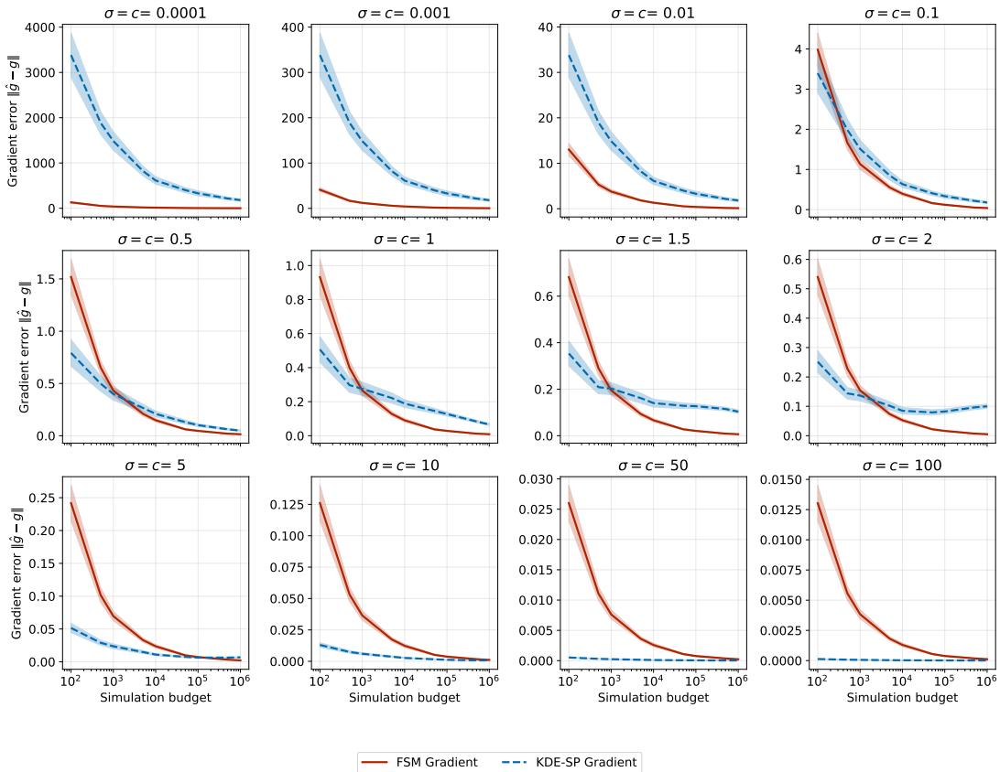  
Figure 8: Gradient accuracy of both the Fisher score matching (FSM) technique and the KDESP method for a bivariate Gaussian likelihood for different choices of the proposal variance and perturbation constants. The error bars represent a $9 5 \%$ confidence interval for 100 repeated gradient approximations.

# A.11 Additional details and results on numerical studies experiment

# A.11.1 Additional results on hyperparameter sensitivity

In Figures 8 and 9, we provide additional results on the ablation study showing the sensitivity of the gradient accuracy between the FSM method and the KDE-SP method for different choices of the proposal variance and perturbation constants, respectively. Figure 3 is a subset of the results shown in Figure 8. Even in higher-dimensional settings, we find that the FSM method can match the gradient accuracy of the KDE-SP method across a wide range of hyperparameter choices.

# A.11.2 Additional results on parameter dimension scaling

Figure 10 includes an additional result with the neural network FSM method for the parameter dimension scaling experiment seen in Figure 4. Furthermore, Figure 11 shows the scaling with parameter dimension, with increasing simulation budgets, complementing the results seen in Figure 10. Generally, we find that the linear FSM method performs the best across different parameter dimensions and simulation budgets. The KDE-SP method performs worse in higher dimensions, likely due to the curse of dimensionality affecting the kernel density estimate. The neural network FSM method shows competitive performance in lower dimensions, but its performance quickly degrades in higher dimensions, possibly due to optimization and/or overfitting issues.

# A.11.3 Additional results on wall-clock time

We provide a comparison of the wall-clock time in Figures 12 and 13 for repeated gradient estimation procedures for both the KDE-SP and FSM methods. As we can see in Figure 12, the FSM scales favorably with respect to the increase in the number of simulation budgets. However, in Figure 13, the matrix inversion step of the linear FSM method grows cubically with the parameter dimension, and hence causes an increase in the wall-clock time for the FSM method. We note that in practice one can reduce this cost considerably by employing faster linear solvers (e.g., conjugate gradient methods), which can greatly improve scalability in higher dimensions.

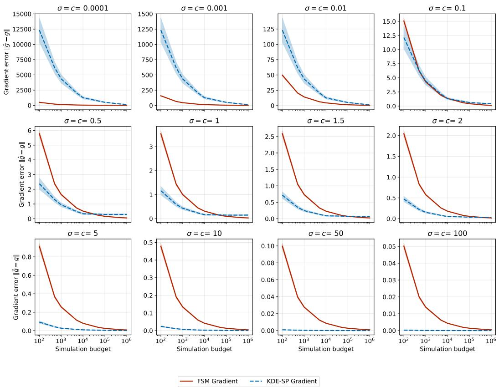  
Figure 9: Gradient accuracy of both the Fisher score matching (FSM) technique and the KDE-SP method for a 20 dimensional Gaussian likelihood for different choices of the proposal variance and perturbation constants. The error bars represent a $9 5 \%$ confidence interval for 100 repeated gradient approximations.

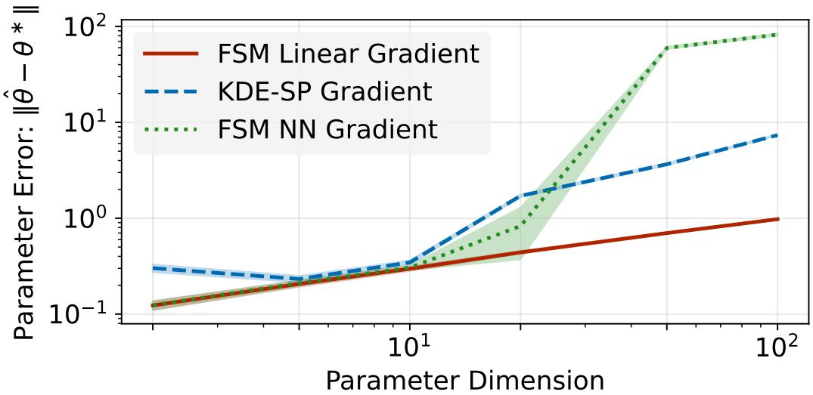  
Figure 10: Parameter estimation accuracy of the Linear FSM, Neural Network FSM, and KDE-SP methods under increasing parameter dimensions, over 100 repeated optimization runs.

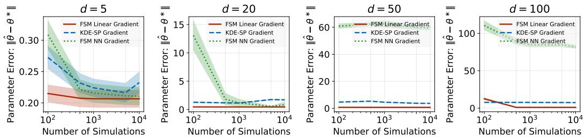  
Figure 11: Parameter estimation accuracy of the Linear FSM, Neural Network FSM, and KDE-SP methods under increasing parameter dimensions and increasing simulation budgets, over 100 repeated optimization runs.

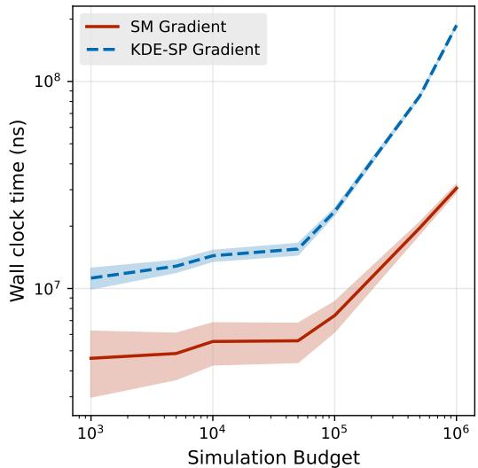  
Figure 12: Wall clock time comparison between FSM and KDE-SP estimation, over 1000 runs for increasing simulation budgets

# A.11.4 Additional results on confidence interval construction

We also note that in Figure 14, we provide a simple validation test for the use of the FSM estimate for the Fisher information matrix estimation. This shows that we can recover a well-calibrated confidence interval even with the use of a stochastic Fisher score estimate.

Further details of these experiments are provided in the Appendix A.11.5.

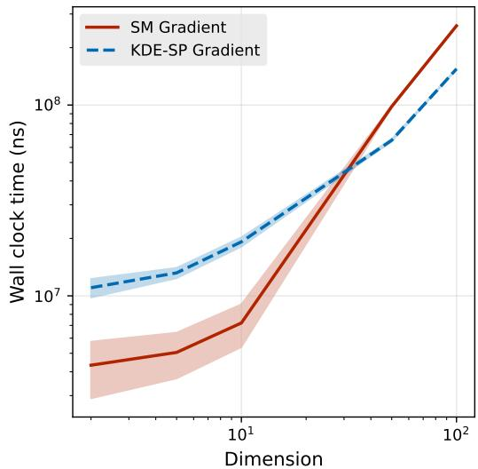  
Figure 13: Wall clock time comparison between FSM and KDE-SP estimation, over 1000 runs for increasing parameter dimension

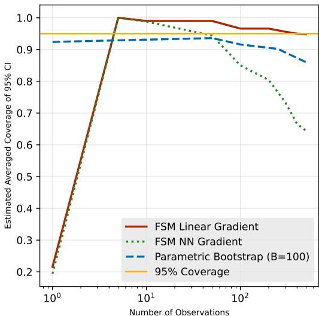  
Figure 14: Estimated coverage of constructed confidence interval (averaged across all parameter dimensions) from the approximated Fisher information matrix estimation with FSM estimates, comparing repeating the FSM estimation procedure with nonparametric bootstrap

# A.11.5 Experimental details

The gradient comparison experiment corresponding to the plots of Figures 3 and 8 was carried out for a bivariate Gaussian mean model with 10 observations. Observations were generated from a true mean of (1.0, 1.0) (Figure 9 used a 20-dimensional Gaussian with the same setting), and Fisher score estimates were taken at the observation means, which is also the maximum likelihood estimator. The uncertainty was obtained by repeating 100 runs of the score estimation for both methods.

The multivariate Gaussian parameter estimation accuracy in Figure 11 was performed with 100 observations, and with parameter dimensions of $d = 5$ , 20, 50, 100 for 100 optimization steps, using 100 repeated runs as with the previous experiment. Figures 4 and 10 were performed in a similar way, by fixing a total simulation budget of 1000 and increasing parameter dimensions of $d = 2 , 5 , 1 0 , 2 0 , 5 0 , 1 0 0$ The true parameters used to generate the observations were similarly taken to be a vectors of ones as with the previous experiment. The $( a , c )$ hyperparameters for the KDE-SP gradient method was selected from a grid of $\left[ 1 0 ^ { - 2 } , 1 0 ^ { - 1 } , 1 0 ^ { 0 } , 1 0 ^ { 1 } , 1 0 ^ { 2 } , 1 0 ^ { 3 } \right] \times \left[ 1 0 ^ { - 2 } , 1 0 ^ { - 1 } , 1 0 ^ { 0 } , 1 0 ^ { 1 } , 1 0 ^ { 2 } , 1 0 ^ { 3 } \right]$ . For the FSM-based estimation, the $( \sigma , \eta )$ hyperparameters, corresponding to the proposal variance and step size, were tuned in the exact same way as the KDE-SP gradient hyperparameters (using the prediction error), but over a grid of $[ 1 0 ^ { - 3 } , 1 0 ^ { - \bar { 2 } } , 1 0 ^ { - 1 } ] \times [ 1 0 ^ { - 2 } , 1 0 ^ { - 1 } , 1 0 ^ { \bar { 0 } } ]$ instead. The Adam [Kingma and Ba, 2017] optimizer was used for the FSM-based estimation, with averaging over the last 50 iterations of the parameter iterates.

For the wall-clock time comparisons in Figures 12 and 13, each gradient estimation procedure was timed for 1000 runs on a bivariate Gaussian mean model with 10 observations. As both the FSM and KDE-SP gradient estimation was implemented in Python and the JAX package, best attempts were made to equalize the comparison between the two methods. All just-in-time (JIT) compilations for both methods were disabled for the wall-clock tests to remove compilation overhead.

For the confidence interval experiment of Figure 14, a 5 dimensional multivariate Gaussian mean model was used. A step size of $1 0 ^ { - 3 }$ with $\sigma = 0 . 0 5$ was used with the RMSProp [Tieleman, 2012] optimizer. The final Fisher information matrix was estimated by simulating 100000 simulations from the resulting MLE estimate of the optimization run, which was used to construct the confidence interval. This was repeated for 100 runs to obtain an estimated coverage probability.

For the neural network-based FSM method, a standard feedforward neural network with two hidden layers of size 16 with ReLU activations was used. Adam optimizer with a step size of $1 0 ^ { - 2 }$ was used to train the neural network for 10 iterations, for each parameter iteration of the MLE optimization procedure.

All experiments in this section were performed on a standard consumer laptop, an Intel i7-11370H CPU with 64GB of RAM.

# A.12 Additional details on LSST weak lensing experiment

For the weak lensing experiment in Figure 15, 100 iterations of the gradient optimization method were used with both the KDE-SP and FSM estimators, with 100 simulations per iteration, giving a total simulation budget of 10000 simulations for the entire optimization process. The dimension of the parameter space is 6, and the dimension of the summary statistics used is 6 as well.

The same amount of simulations was provided to a neural likelihood estimater, which is a standard masked autoregressive flow model in the package SBI in Python [Boelts et al., 2025]. To mimic a general, uninformative prior, we used the priors for the parameters provided in Table 1 of Zeghal et al. [2024], which are all Gaussian priors, and converted them to a uniform prior by taking three standard deviations from the mean, $\mathcal { \bar { U } } [ \mu - 3 * \sigma , \mu + 3 * \sigma ]$ , where the original Gaussian priors are represented as ${ \mathcal { N } } ( \mu , \sigma ^ { 2 } )$ . The NLE was trained with 10000 (parameters, data) pairs drawn from this prior, and 5000 iterations with a standard Adam optimizer were used to train the NLE. To optimize the NLE for a specific observational dataset, we evaluated the trained NLE at the specific dataset, and directly differentiated through the NLE model, giving us a deterministic gradient, which is used in a standard gradient-based optimization procedure. The likelihood is optimized until convergence, where there is no longer any change in the estimated likelihood with the NLE.

The hyperparameters $( a , c )$ for the KDE-SP gradient method were selected from a grid of $[ 1 0 ^ { - 5 } , \dot { 1 } 0 ^ { - \dot { 4 } } , 1 0 _ { \circ } ^ { - 3 } , 1 0 ^ { - \dot { 2 } } ] \times [ 1 0 ^ { - 3 } , 1 0 ^ { - 2 } , 1 0 ^ { - 1 } , \dot { 1 0 } ^ { 0 } ]$ . For the FSM method, we set $\sigma = 1 0 ^ { - \overline { { 3 } } }$ and a step size of $1 0 ^ { - 2 }$ , with parameter averaging over the final 50 iterations.

For the neural network-based FSM method, a standard feedforward neural network with two hidden layers of size 16 with ReLU activations was used. Adam optimizer with a step size of $1 0 ^ { - 2 }$ was used to train the neural network for 10 iterations, for each parameter iteration of the MLE optimization procedure. We find that the neural network-based FSM method did not perform well in this experiment, often suffering from high variance and instability during training.

An RTX 4090 GPU with 24GB of VRAM, 41GB of RAM was used in this experiment.

# A.13 Additional details on generator inversion task

For the generator inversion task in Figure 16, we trained a standard GAN on a down-scaled $1 6 \times 1 6$ MNIST dataset, giving a data dimension of 256 as no summary statistics were used. We used 500 iterations of the gradient optimization method with both the KDE-SP and the FSM gradient

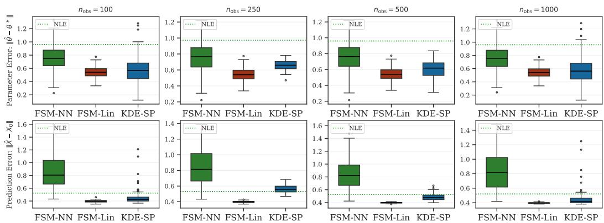  
Figure 15: Parameter estimation and prediction accuracy of the NLE, FSM (linear and neural-network based) and KDE-SP methods for the LSST-Y10 weak lensing model, for increasing number of observations

estimation procedure, with 22500 simulations per parameter iteration used in the gradient estimation.   
The dimension of the parameter space is 50.

The $( a , c )$ hyperparameters for the KDE-SP gradient method was selected from a grid of $[ 1 0 ^ { - 4 } , 1 0 ^ { - 3 } , \tilde { 5 } \times \tilde { 1 } 0 ^ { - 3 } , 1 0 ^ { - 2 } , 5 \times 1 0 ^ { - 2 } ] \times [ 1 0 ^ { - 4 } , 1 0 ^ { - 3 } , 5 \times 1 0 ^ { - 3 } , 1 0 ^ { - 2 } , 5 \times 1 0 ^ { - 2 } ]$ . For the FSM method, we set $\sigma = 0 . 2$ and a step size of $\mathrm { 5 \times 1 0 ^ { - 2 } }$ , with parameter averaging over the last 300 iterations. The latent mean prior, $\sigma _ { z }$ was set at 0.1.

The direct optimization approach was performed by directly minimizing a reconstruction loss (mean squared error in pixel space) between the generated images and the observations, and directly differentiating through the generator network $G _ { w }$ . Specifically, we minimize the following loss function.

$$
\operatorname* { m i n } _ { \theta } \mathcal { L } ( G _ { w } ( \theta ) , \mathbf { x } _ { 0 } ) = \frac { 1 } { n } \sum _ { i = 1 } ^ { n } \| G _ { w } ( \mathbf { z } _ { i } ) - \mathbf { x } _ { 0 } \| ^ { 2 }
$$

where $\mathbf { z } _ { i } \sim \mathcal { N } ( \boldsymbol { \theta } , \sigma _ { \mathbf { z } } ^ { 2 } I )$ . This is done with the Adam optimizer with a step size of $5 \cdot 1 0 ^ { - 1 }$ , and for 1000 iterations, with $n = 1 0 0$ simulations per iteration.

For the neural network-based FSM method, a standard feedforward neural network with two hidden layers of size 16 with ReLU activations was used. Adam optimizer with a step size of $1 0 ^ { - 3 }$ was used to train the neural network for 10 iterations, for each parameter iteration of the MLE optimization procedure. Compared to Appendix A.12, we found that the neural network-based FSM method performed better in this experiment, but still generally had subpar performance compared to the linear FSM method and with increased variance.

An RTX 4090 GPU with 24GB of VRAM, 41GB of RAM was used in this experiment.

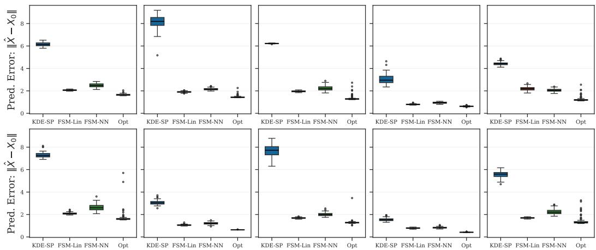  
Figure 16: Prediction error for the FSM (linear and neural-network based), KDE-SP and direct optimization method for the latent GAN inversion, each boxplot corresponds to a different observation