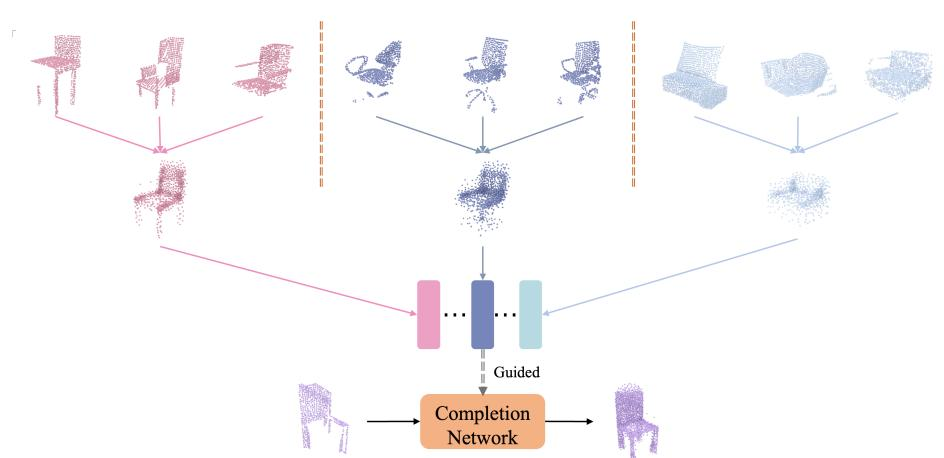
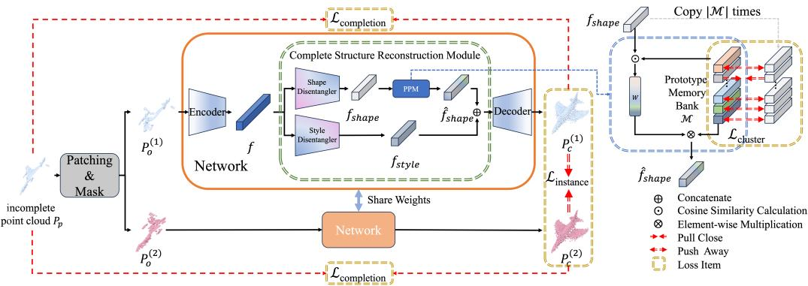
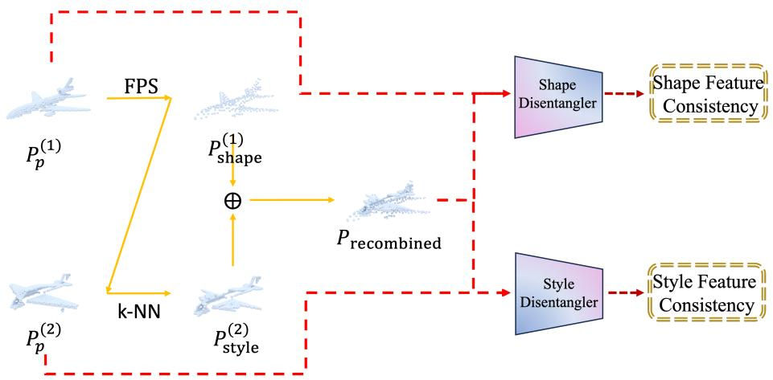
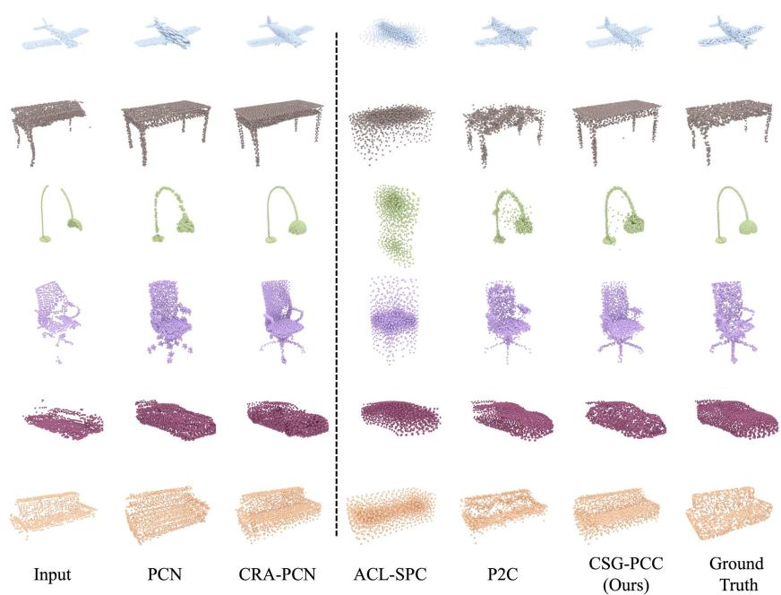
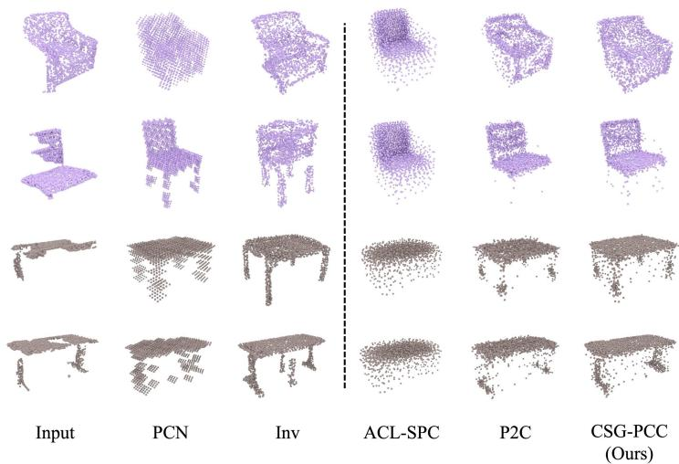
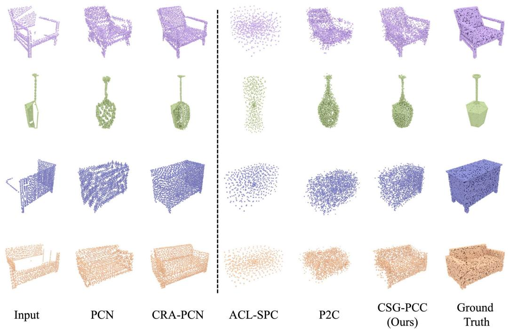
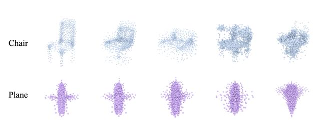
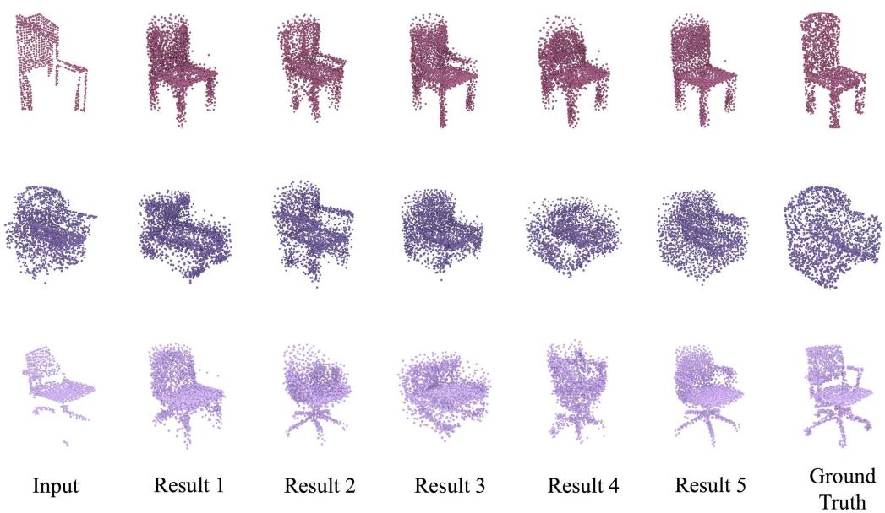

# Complete Structure Guided Point Cloud Completion via Cluster- and Instance-Level Contrastive Learning

Yang Chen1, Yirun Zhou1, Weizhong Zhang2,3, Cheng $\mathbf { J i n ^ { 1 , 3 * } }$

1College of Computer Science and Artificial Intelligence 2School of Data Science, Fudan University 3Shanghai Key Laboratory of Intelligent Information Processing {chen_yang23,yrzhou22}@m.fudan.edu.cn, {weizhongzhang,jc}@fudan.edu.cn

# Abstract

Point cloud completion, aiming to reconstruct missing part from incomplete point clouds, is a pivotal task in 3D computer vision. Traditional supervised approaches often necessitate complete point clouds for training supervision, which are not readily accessible in real-world applications. Recent studies have attempted to mitigate this dependency by employing self-supervise mechanisms. However, these approaches frequently yield suboptimal results due to the absence of complete structure in the point cloud data during training. To address these issues, in this paper, we propose an effective framework to complete the point cloud under the guidance of self learned complete structure. A key contribution of our work is the development of a novel self-supervised complete structure reconstruction module, which can learn the complete structure explicitly from incomplete point clouds and thus eliminate the reliance on training data from complete point clouds. Additionally, we introduce a contrastive learning approach at both the clusterand instance-level to extract shape features guided by the complete structure and to capture style features, respectively. This dual-level learning design ensures that the generated point clouds are both shape-completed and detail-preserving. Extensive experiments on both synthetic and real-world datasets demonstrate that our approach significantly outperforms state-of-the-art self-supervised methods.

# 1 Introduction

The advancement and widespread adoption of 3D sensors, particularly LiDAR, have led to the emergence of point clouds as a dominant representation of 3D shapes across various domains [6, 10] primarily owning to their ease of acquisition and comprehensive geometric features. However, in real-world scenarios, raw point clouds often suffer from incompleteness caused by factors such as self-occlusion and lighting conditions, which can hinder the performance of downstream tasks, including object detection [22] and segmentation [4]. Consequently, point cloud completion has been proposed as an effective solution to infer complete point clouds from incomplete inputs.

Supervised learning is the paradigm adopted by most existing methods [38, 41, 27]. These approaches typically utilize paired complete and incomplete point cloud data to train neural networks, learning a one-to-one mapping from incomplete point clouds to their corresponding complete counterparts. Impressive results have been reported in recent studies. However, since high-quality complete point clouds are often difficult to obtain through real-world scanning, paired data for training is frequently sourced from virtual datasets, such as ShapeNet [2]. As a result, supervised methods contend with the domain gap when applied to real-world data.

  
Figure 1: Illustration of ideas. Our method clusters incomplete point clouds using contrastive learning. By aggregating point clouds in the clusters, we obtain the complete structure in a self-supervised manner, which are used to guide the completion of the point cloud.

To address the above issue, unpaired point cloud completion methods [5, 39, 40] have been proposed as a potential solution. These methods eliminate the need for paired data, yet they still rely on the complete point clouds from virtual datasets, and thus can not fundamentally resolve the problem. Subsequently, weakly supervised methods [13, 26] were introduced, aiming to leverage the consistency of incomplete point clouds from multiple views. However, their effectiveness is highly dependent on registration accuracy, and collecting point clouds from different viewpoints poses significant challenges in real-world scenarios. Recently, several studies have sought to address this issue using a self-supervised paradigm [17, 7], with P2C approach [7] achieving breakthrough results. Nevertheless, due to the absence of guidance from complete structures, the completed point clouds generated by these methods remain suboptimal.

In this paper, we propose a novel self-supervised point cloud completion framework, termed Complete Structure Guided Point Cloud Completion (CSG-PCC). Our method follows an encoder-to-decoder pipeline, while the core innovation lies in adding an effective Complete Structure Reconstruction Module between the encoder and decoder. This module consists of two key components: 1) a feature disentanglement module and 2) a prototype projection module. For feature disentanglement module, we disentangle the point cloud features into two distinct dimensions, i.e., shape and style. The shape feature captures the global structure while the style feature extracts the local details. In the prototype projection module, we aggregate complete structures from the disentangled shape features to form shape prototypes, which are then used to guide point cloud completion by projected the shape feature to prototypes.

To ensure effective feature disentanglement critical for structure aggregation, we propose a Feature Permutation Consistency Constraint (FPCC). Within FPCC, we randomly swap point clouds’ skeleton points obtained through farthest point sampling (FPS) and recompute their $k$ -nearest neighbors to generate recombined point clouds. The FPCC enforces consistency between original and perturbed point clouds in both shape and style feature spaces, effectively decoupling the shape and style features. Building upon this disentanglement module, we construct a two-branch network architecture and design a dual-level contrastive learning method. Specifically, we employ cluster-level contrastive learning to cluster the shape features of the incomplete point clouds. By aggregating similar shapes in each cluster, we learn a corresponding complete structure, as shown in Figure 1. Additionally, we use instance-level contrastive learning on the results of the two branches to ensure that the learned style features focus on instance-specific details.

We conducted experiments with CSG-PCC on both real-world and synthetic datasets to validate the effectiveness of our design. Experimental results demonstrate that the dual-level contrastive learning design enables our method to generate point clouds that are both shape-completed and detailpreserving, achieving state-of-the-art performance in the self-supervised point cloud completion domain. Our main contributions can be summarized as:

1. We propose a novel self-supervised point cloud completion method, CSG-PCC, which can explicitly extract complete structures to guide the completion process.   
2. We propose a dual-level contrastive learning framework to enable efficient training of our self-supervised point cloud completion network.   
3. Extensive experiments on both synthetic and real-world datasets demonstrate that our method can significantly outperform state-of-the-art methods.

# 2 Related Work

# 2.1 Supervised and Unpaired Point Cloud Completion

Traditional point cloud completion methods can be broadly classified into those that leverage geometric priors [30, 19] and those that utilize template matching techniques [23, 28]. With the rise of deep learning, several methods have drawn inspiration from 2D image inpainting techniques and applied them to 3D point cloud completion. These methods [9, 14] typically use 3D convolutional networks to process voxelized point clouds. However, as the resolution of voxel grids increases, the computational cost grows significantly. The introduction of PointNet [24], which directly processes raw point clouds without the need for voxelization or other transformations, marked a significant shift in the field. Then deep learning methods [38, 29, 34, 27] have achieved significant success in the field of point cloud completion. Despite these advancements, the dependence of supervised point cloud completion methods on fully-complete point clouds remains a significant limitation, hindering their application in real-world scenarios. To reduce the dependency on paired data, unpaired methods [5, 31, 39, 11] have been proposed. However, these methods still rely on complete point cloud data, limiting their applicability in real-world scenarios.

# 2.2 Weakly-Supervised and Self-Supervised point cloud Completion

In contrast to previous methods, approaches [13, 21] have proposed weakly supervised paradigms to address the data dependency on complete point clouds. [13] utilizes incomplete point clouds from multiple viewpoints to predict the complete point cloud, using geometric consistency across different views as a constraint. However, these methods require point clouds to be captured from multiple viewpoints, which is not always feasible in real-world scenarios. Later, ACL-SPC [17], as a self-supervised method, introduced the concept of an adaptive cycle system. Inspired by [15] , P2C [7] apply a mask-reconstruction self-supervised paradigm to the point cloud completion task. The self-supervised methods mitigate the dependency of complete point clouds. However, they didn’t fully exploit the structural information corresponding to the complete structure, which limited the performance of completion results. Though [32] adopts a self-supervised approach, it requires additional depth images. [20] utilizes an alternative 3D representation, but our research focus on point cloud.

# 2.3 Contrastive Learning

Contrastive learning has become a powerful paradigm in unsupervised and self-supervised learning tasks, particularly in the domain of representation learning. Early work in contrastive learning [3, 16] focused on learning effective representations by contrasting positive and negative pairs of samples in a latent space. Later, contrastive learning methods [1, 12] further advanced the field by eliminating the need for negative samples. Contrastive learning has also been explored for point cloud [35, 36]. In this work, we propose to introduce contrastive learning into the self-supervised point cloud completion task.

# 3 Method

For point cloud completion, achieving a complete structure is critical for helping the missing region prediction. However, in self-supervised point cloud completion, the lack of complete point clouds makes it challenging to obtain the necessary structural information. In this paper, we propose a novel self-supervised point cloud completion framework, CSG-PCC, which leverages self-learned complete structures to guide the completion process. The overall pipeline of our network is illustrated in Figure 2. In the following, we will present our method by introducing the framework especially the complete structure reconstruction module, cluster- and instance-level learning schemes, and the overall optimization in order.

  
Figure 2: The Pipeline of CSG-PCC. Given a partial point cloud $P _ { p }$ , we divide it into patches, followed by random masking to create two incomplete point clouds, $P _ { o } ^ { ( 1 ) }$ and $P _ { o } ^ { ( 2 ) }$ . Then point clouds are processed through the encoder to extract features, and then fed into the Complete Structure Reconstruction Module. The CSRM are composed of two core components: a) Feature Disentanglement Module: maps encoder outputs into shape features $f _ { \mathrm { s h a p e } }$ and style features $f _ { \mathrm { s t y l e } }$ via two disentanglers. b) Prototype Projection Module: Refines $f _ { \mathrm { s h a p e } }$ via learnable prototype memory bank $\mathcal { M }$ , producing structure-enhanced features $\hat { f } _ { \mathrm { s h a p e } }$ . Then we concatenates $\hat { f } _ { \mathrm { s h a p e } }$ and $f _ { \mathrm { s t y l e } }$ as decoder input to generate the completed point clouds. Dual-level contrastive learning are used to ensure structural completeness and detail preservation.

# 3.1 Framework

As shown in the Figure 2, our contrastive learning-based framework maintains two identical branches during training, with each branch following the encoder-to-decoder pipeline. Through the Patching & Mask, we obtain distinct inputs for the two branches, with specific implementation details as follows:

Patching & Mask. Let $P _ { p } \in \mathbb { R } ^ { N _ { p } \times 3 }$ be an input partial point cloud. We first divide the point cloud into $K$ patches using farthest point sampling (FPS) [25], where $k$ -nearest neighbors are gathered around each sampled center. Then We randomly select $K _ { \mathrm { o } }$ observable patches from the total $K$ patches, then discard the remaining $K - K _ { \mathrm { o } }$ patches through masking to generate the first incomplete observable point cloud $P _ { 0 } ^ { ( 1 ) } \in \mathbb { R } ^ { N _ { 0 } \times 3 }$ for Branch 1. Subsequently, we repeat the masking procedure with a different set of $K - K _ { \mathrm { o } }$ patches removed, thereby producing the second incomplete observable point cloud P (2)o $P _ { 0 } ^ { ( 2 ) } \in \mathbb { R } ^ { N _ { 0 } \times 3 }$ for Branch 2. Both processed point clouds serve as parallel inputs for network training.

Taking Branch 1 as an exemplar, the encoder first extracts a point cloud feature $f \in \mathbb { R } ^ { D }$ from input $\bar { P } _ { 0 } ^ { ( 1 ) }$ , formally expressed as $f = E ( P _ { 0 } ^ { ( 1 ) } )$ . Our key innovation lies in the proposed Complete Structure Reconstruction Module (CSRM) strategically positioned between the encoder and decoder. The CSRM comprises two coordinated submodules:

1) Feature Disentanglement Module : Composed of two parallel disentanglers, this module decouples $f$ into shape feature $f _ { \mathrm { s h a p e } } \in \mathbb { R } ^ { D / 2 }$ and $\bar { f } _ { \mathrm { s t y l e } } \in \mathbb { R } ^ { D / 2 }$ .

2) Prototype Projection Module (PPM): Enhances structural completeness through geometric priors: $\hat { f } _ { \mathrm { s h a p e } } = \mathcal { P } \mathcal { P } \mathcal { M } ( f _ { \mathrm { s h a p e } } )$ .

The refined shape feature $\hat { f } _ { \mathrm { s h a p e } }$ is then concatenated with $f _ { \mathrm { s t y l e } }$ and fed to the decoder $D$ to generate the completed point cloud $P _ { c } ^ { ( 1 ) } = D ( [ \hat { f } _ { \mathrm { s h a p e } } ; f _ { \mathrm { s t y l e } } ] )$ . Symmetrically, Branch 2 processes $P _ { 0 } ^ { ( 2 ) }$ through identical modules to produce $P _ { c } ^ { ( 2 ) }$ . Implementation specifics of Feature Disentanglement Module and PPM are delineated as follows:

  
Figure 3: Illustration of Feature Permutation Consistency Constraint (FPCC). (a) Structural points $P _ { \mathrm { s h a p e } } ^ { \mathrm { ( 1 ) } }$ are extracted from input cloud $P _ { p } ^ { ( 1 ) }$ via farthest point sampling (FPS). (b) The $k$ -nearest neighbors from P (2)p are aggregated as style points $P _ { \mathrm { s t y l e } } ^ { ( 2 ) }$ . (c) Recombined point cloud $P _ { \mathrm { r e c o m b i n e d } }$ is generateddetails of oncatenating . (d) FPCC e $P _ { \mathrm { s h a p e } } ^ { ( 1 ) }$ and es fe $P _ { \mathrm { s t y l e } } ^ { ( 2 ) }$ , which preserves the consistency between ucture of and orig $P _ { p } ^ { ( 1 ) }$ and localclouds for $P _ { p } ^ { ( 2 ) }$ $P _ { \mathrm { r e c o m b i n e d } }$ effective feature disentanglement.

Feature Disentanglement Module. Within the feature disentanglement module, we decompose point cloud features into shape features representing global structures and style features capturing local details. We can effectively aggregate complete structures through cluster-level contrastive learning to the shape features avoiding the interference from local detail variations. And the disentangled style feature can be alse used as to preserve instance-specific details details of input. To ensure the disentangled features correspond accurately to global structure and local details, respectively, we propose a Feature Permutation Consistency Constraint (FPCC), as illustrated in Figure 3. Specifically, we randomly select two incomplete point clouds, $P _ { p } ^ { ( 1 ) }$ and $P _ { p } ^ { ( 2 ) }$ . Then, we perform FPS onin $P _ { p } ^ { ( 1 ) }$ ) n its s P (1)shape. to obtai forming tructural points, . By concatenati or eaand oint in , we c $P _ { \mathrm { s h a p e } } ^ { ( 1 ) }$ , we find ct the rec $k$ -nearest neighborsmbined point cloud P (2)p , $P _ { \mathrm { s t y l e } } ^ { ( 2 ) }$ $\bar { P } _ { \mathrm { s h a p e } } ^ { ( 1 ) }$ e P (2)style onstru o $P _ { \mathrm { r e c o m b i n e d } }$ . We assume that $P _ { \mathrm { r e c o m b i n e d } }$ contains the global structure of $P _ { p } ^ { ( 1 ) }$ and the local details of P (2)p , so we require their corresponding features to remain consistent, which is formulated as:

$$
\mathcal { L } _ { \mathrm { f p c c } } = \phi \left( f _ { \mathrm { s h a p e } } ^ { ( 1 ) } - f _ { \mathrm { s h a p e } } ^ { \mathrm { r e c o m b i n e d } } \right) + \phi \left( f _ { \mathrm { s t y l e } } ^ { ( 2 ) } - f _ { \mathrm { s t y l e } } ^ { \mathrm { r e c o m b i n e d } } \right) ,
$$

where $f _ { \mathrm { s h a p e } } ^ { ( 1 ) }$ , f recombinedshape , $f _ { \mathrm { s t y l e } } ^ { ( 2 ) }$ , and f recombinedstyle are the features extracted from the corresponding point clouds through the network, and $\phi ( \cdot )$ is the Huber loss function [18]. Through FPCC, we effectively disentangle the shape and style features of the point cloud.

Prototype Projection Module (PPM). Specifically, in the PPM, we maintain a learnable prototype memory bank $\mathcal { M }$ . With training (see Section 3.2 for details), each item $\mathcal { M } _ { i } \in \mathbb { R } ^ { D / 2 }$ is considered as a prototype representing to a unique complete structure. For the input shape feature $f _ { \mathrm { s h a p e } }$ , we compute its cosine similarity with each prototype and apply a softmax function to obtain a weight matrix $W$ . The computation formula is as follows:

$$
w _ { i } = \frac { \exp { ( \cos ( f _ { \mathrm { s h a p e } } , \mathcal { M } _ { i } / t ) } } { \sum _ { j \in | \mathcal { M } | } \exp { ( \cos ( f _ { \mathrm { s h a p e } } , \mathcal { M } _ { j } / t ) } } ,
$$

where $t$ is a temperature scaling parameter. Then, based on the weight matrix $W$ , we project $f _ { \mathrm { s h a p e } }$ into the prototypes to obtain the refined feature $\hat { f } _ { \mathrm { s h a p e } }$ , i.e., $\begin{array} { r } { \hat { f } _ { \mathrm { s h a p e } } = \sum _ { i \in | \mathcal { M } | } w _ { i } \cdot \mathcal { M } _ { i } } \end{array}$ .

# 3.2 Cluster-level Contrastive Learning

We employ cluster-level contrastive learning to perform clustering on shape features and utilize the learned cluster centers as complete structural information to guide point cloud completion. Specifically, we maintain a learnable prototype memory bank $\mathcal { M }$ , where each item $\mathcal { M } _ { i } \in \mathbb { R } ^ { D / 2 }$ represents the cluster center with aggregated complete structure and is random initialized. We then define a mapping function $\psi$ , which maps a point cloud $P _ { p }$ to its nearest shape prototype $\mathcal { M } _ { i }$ , i.e., $\psi ( P _ { p } ) = \bar { \mathcal { M } } _ { i }$ , where $i = \arg \operatorname* { m a x } _ { j } \cos ( D _ { \mathrm { s h a p e } } ( E ( P _ { p } ) , \dot { \mathcal { M } } _ { j } ) )$ .

We propose an aggregation loss $\mathcal { L } _ { \mathrm { a g g } }$ to learning shape prototypes. The implementation pipeline contains three key phases: 1) The network first produces the completed point cloud $P _ { c }$ from the partial input $P _ { p }$ . 2) Then, we concatenate the shape prototype $\mathcal { M } _ { i }$ with a zero vector and input it into the decoder to generate the complete structural point cloud $P _ { c } ^ { \mathcal { M } _ { i } }$ . 3) We calculate Chamfer Distance (CD) between the cluster-specific structural point cloud $P _ { c } ^ { \mathcal { M } _ { i } }$ cand predicted complete point cloud $P _ { c }$ , which is formulated in Eq.3:

$$
\mathcal { L } _ { \mathrm { a g g } } = C D ( P _ { c } , P _ { c } ^ { \mathcal { M } _ { i } } ) ,
$$

where CD takes both directions into account and can be defined through Unidirectional Chamfer Distance(UCD) as $C D ( P _ { 1 } , P _ { 2 } ) = U C D ( P _ { 1 } , P _ { 2 } ) + U C D ( P _ { 2 } , P _ { 1 } )$ . The UCD is commonly used to measure the distance between two point clouds [38]. UCD between two point sets $S _ { 1 }$ and $S _ { 2 }$ is defined as follows:

$$
U C D ( S _ { 1 } , S _ { 2 } ) = \frac { 1 } { | S _ { 1 } | } \sum _ { x \in S _ { 1 } } \operatorname* { m i n } _ { y \in S _ { 2 } } \| x - y \| _ { 2 } .
$$

In addition, we introduce an InfoNCE loss [16] to ensure that the learned shape prototypes maintain sufficient discriminability for preventing prototype collapse. This loss encourages the shape feature of the point cloud to be as close as possible to the mapped prototype, while keeping far away from others. The InfoNCE loss is formulated as:

$$
\mathcal { L } _ { \mathrm { I n f o } } = - \log \frac { \exp { ( \cos ( f _ { \mathrm { s h a p e } } , \psi ( P _ { p } ) ) ) / t ) } } { \sum _ { i = 1 } ^ { | \mathcal { M } | } \exp { ( \cos ( f _ { \mathrm { s h a p e } } , \mathcal { M } _ { i } ) ) / t ) } } ,
$$

where $f _ { \mathrm { s h a p e } } = D _ { \mathrm { s h a p e } } ( E ( P _ { p } )$ . Thus, the final loss for the cluster-level contrastive learning is defined as below:

$$
\begin{array} { r } { \mathcal { L } _ { \mathrm { c l } } = \mathcal { L } _ { \mathrm { a g g } } + \mathcal { L } _ { \mathrm { I n f o } } . } \end{array}
$$

# 3.3 Instance-level Contrastive Learning

We propose using instance-level contrastive learning to ensure that the extracted style features focus on the details of the input point cloud. Specifically, as shown in Figure 2, two branches are employed during training, where the inputs to the branches, $P _ { o } ^ { ( 1 ) }$ ) and P (2)o , are obtained by applying different masks to the same sample. $\bar { P } _ { o } ^ { ( 1 ) }$ and $P _ { o } ^ { ( 2 ) }$ serve as positive samples in the context of contrastive learning. By enforcing the two branches to produce identical completed point clouds, the style features are guided to capture the unique details of the input. The instance-level contrastive learning loss is formulated as follows:

$$
\mathcal { L } _ { \mathrm { i n s t a n c e } } = C D ( P _ { c } ^ { ( 1 ) } , P _ { c } ^ { ( 2 ) } ) .
$$

# 3.4 Optimization

Finally, we introduce a completion loss to for point cloud completion. By computing the RegionAware Chamfer Distance (RCD) [7] between $P _ { p }$ and the completed point clouds $P _ { c } ^ { ( 1 ) }$ 1) and P (2)c , the network is encouraged to reconstruct the visible regions while allowing the completion of unseen regions. The formulation is as follows:

$$
\mathcal { L } _ { \mathrm { c o m p l e t i o n } } = R C D ( P _ { p } , P _ { c } ^ { ( 1 ) } ) + R C D ( P _ { p } , P _ { c } ^ { ( 2 ) } ) .
$$

where RCD is aware of observed and unseen regions and thus only evaluates point distance for observed regions, we refer the reader to [7] for more details about RCD. Every input mapped to shape prototype $\mathcal { M } _ { i }$ participates in the aggregation loss computation, thereby enabling $\mathcal { M } _ { i }$ to aggregate the

Table 1: Quantitative comparison result of our method and other methods on the 3D-EPN dataset using $\mathrm { { \bar { c } D { - } } } { \bar { \ell } _ { 2 } } \downarrow ( \times 1 0 ^ { 4 } )$ . Bold numbers indicate the best performance in self-supervised methods.   

<table><tr><td>Method</td><td>Supervision</td><td>Air</td><td>Cab</td><td>Car</td><td>Cha</td><td>Lam</td><td>Sof</td><td>Tab</td><td>Wat</td><td>Avg</td></tr><tr><td>PCN [38] TopNet [29]</td><td rowspan="4">Supervised</td><td>2.5</td><td>8.0</td><td>4.8</td><td>9.0</td><td>12.2</td><td>8.1</td><td>8.9</td><td>6.0</td><td>7.4</td></tr><tr><td></td><td>2.3</td><td>7.5</td><td>4.6</td><td>7.6</td><td>8.9</td><td>7.3</td><td>7.5</td><td>5.2</td><td>6.4</td></tr><tr><td>PoinTr [37]</td><td>1.2</td><td>6.5</td><td>4.0</td><td>5.1</td><td>4.5</td><td>5.4</td><td>5.4</td><td>2.6</td><td>4.3</td></tr><tr><td>CRA-PCN [27]</td><td>0.9</td><td>5.9</td><td>3.3</td><td>4.2</td><td>3.9</td><td>5.5</td><td>3.6</td><td>2.3</td><td>3.7</td></tr><tr><td>C4C [31] Inv [39]</td><td>Unpaired</td><td>3.7 4.3</td><td>12.6 20.7</td><td>8.1 11.9</td><td>14.6 20.6</td><td>18.2 25.9</td><td>26.2 54.8</td><td>22.5 38.0</td><td>8.7 12.8</td><td>14.3 23.6</td></tr><tr><td>Gu et al. [13] PPNet [21]</td><td>Weakly-supervised</td><td>5.9</td><td>20.8</td><td>9.5</td><td>20.4</td><td>34.9</td><td>26.0</td><td>26.0</td><td>11.0</td><td>21.3</td></tr><tr><td rowspan="2">ACL-SPC [17]</td><td rowspan="2"></td><td>5.6</td><td>46.6</td><td>22.4</td><td>24.3</td><td>46.1</td><td>36.4</td><td>28.4</td><td>15.0</td><td>28.1</td></tr><tr><td>14.6</td><td>25.3</td><td>16.4</td><td>45.0</td><td>60.1</td><td>35.6</td><td>40.8</td><td>29.2</td><td>31.6</td></tr><tr><td>P2C [7]</td><td>Self-supervised</td><td>4.3</td><td>19.4</td><td>8.6</td><td>13.5</td><td>16.3</td><td>20.2</td><td>18.1</td><td>12.0</td><td>14.1</td></tr><tr><td>CSG-PCC(Ours)</td><td></td><td>3.5</td><td>16.1</td><td>8.5</td><td>12.1</td><td>14.6</td><td>16.4</td><td>17.4</td><td>9.1</td><td>12.2</td></tr></table>

structural information from these partial point clouds. This can be interpreted as guiding the learning of shape prototypes via positive sample in contrastive learning.

Finally, we sum the previously introduced loss terms to obtain the total loss used for network training:

$$
{ \mathcal { L } } _ { \mathrm { o v e r a l l } } = \lambda _ { \mathrm { c o m p l e t i o n } } { \mathcal { L } } _ { \mathrm { c o m p l e t i o n } } + \lambda _ { \mathrm { c l } } { \mathcal { L } } _ { \mathrm { c l } } + \lambda _ { \mathrm { i n s t a n c e } } { \mathcal { L } } _ { \mathrm { i n s t a n c e } } + \lambda _ { \mathrm { f p c e } } { \mathcal { L } } _ { \mathrm { f p c e } } ,
$$

where $\lambda _ { \mathrm { c o m p l e t i o n } } , \lambda _ { \mathrm { c l } } , \lambda _ { \mathrm { i n s t a n c e } }$ , and $\lambda _ { \mathrm { f p c c } }$ are weighting parameters.

# 4 Experiments

# 4.1 Dataset and Evaluation Metrics

Datasets. To conduct a comprehensive comparison, we performed experiments on both synthetic and real-world datasets. We conducted experiments on the synthetic datasets 3D-EPN [9] and PCN [38]. Both of them are derived from the ShapeNet [2] dataset, with the former containing more data, e.g., the chair class has 40,000 pairs for training in 3D-EPN while 5,750 pairs in PCN. Moreover, we evaluate our method on real-world dataset ScanNet [8]. We employ the ScanNet dataset processed by [5], where both object orientations and positions have been aligned with ShapeNet.

Evaluation Metric. We use $\ell _ { 2 }$ Chamfer Distance (CD)as the evaluation metric for synthetic datasets. In the case of real-world datasets, where ground-truth complete shapes are unavailable, we adopt the Unidirectional Chamfer Distance (UCD), Unidirectional Hausdorff Distance (UHD), and Region-Aware Chamfer Distance (RCD) proposed in P2C [7] to evaluate the fidelity of completed point clouds.

# 4.2 Evaluation on Synthetic Datasets

We compare our proposed method CSG-PCC with state-of-the-art self-supervised method and classical supervised, unpaired methods on 3D-EPN datasets. As quantitatively demonstrated in Table 1, our method establishes new performance records across all eight categories when compared to existing self-supervised approaches. Furthermore, as shown in in Table 2, our methods achieve more improvements on PCN dataset. This occurs because the PCN dataset contains less training data and more severe incompleteness (lower average points in input clouds), while our method explicitly extracts complete structural information to better handle challenging scenarios. Although fully supervised methods still show numerical advantages by heavily exploiting complete and paired ground-truth data, our method has further reduced the performance gap.

Figure 4 presents a qualitative comparison on the 3D-EPN dataset. It can be observed that our method successfully completes the incomplete point clouds with guidance of complete structures. In particular, compared with P2C, our method achieves more complete results on car and sofa categories with severe incompleteness, while preserving richer details for structurally complex lamp and chair categories. We also present the qualitative comparison results on PCN data in section A.2.

  
Figure 4: Qualitative comparisons on the 3D-EPN dataset demonstrate our method achieves both structural completeness (e.g.,car, sofa) and detail preservation (e.g., chair, table). The dashed line categorizes the methods based on whether they utilize complete point clouds for supervision.

Table 2: Quantitative comparison result of our method and other methods on the PCN dataset using $\mathrm { C D - } \ell _ { 2 } \downarrow ( \times 1 0 ^ { 4 } )$ . Bold numbers indicate the best performance in self-supervised methods.   

<table><tr><td>Method</td><td>Supervision</td><td>Air</td><td>Cab</td><td>Car</td><td>Cha</td><td>Lam</td><td>Sof</td><td>Tab</td><td>Wat</td><td>Avg</td></tr><tr><td rowspan="3">PCN [38] TopNet [29] CRA-PCN [27]</td><td rowspan="3">Supervised</td><td>3.0</td><td>7.5</td><td>5.7</td><td>9.7</td><td>9.2</td><td>9.5</td><td>9.2</td><td>6.2</td><td>7.5</td></tr><tr><td>2.3</td><td>8.2</td><td>4.7</td><td>8.6</td><td>11.0</td><td>9.3</td><td>7.5</td><td>5.2</td><td>6.4</td></tr><tr><td>1.1</td><td>6.3</td><td>3.8</td><td>4.3</td><td>3.4</td><td>5.9</td><td>3.7</td><td>2.8</td><td>3.9</td></tr><tr><td rowspan="2">C4C [31] Inv [39]</td><td rowspan="2">Unpaired</td><td>4.1</td><td>14.2</td><td>9.9</td><td>14.6</td><td>19.2</td><td>27.8</td><td>8.4</td><td>7.4</td><td>14.4</td></tr><tr><td>3.9</td><td>17.4</td><td>11.0</td><td>13.8</td><td>14.2</td><td>23.0</td><td>9.7</td><td>6.7</td><td>14.1</td></tr><tr><td rowspan="3">ACL-SPC [17] P2C [7]</td><td rowspan="3">Self-supervised</td><td>10.6</td><td>38.8</td><td>30.5</td><td>41.4</td><td>63.5</td><td>33.2</td><td>42.8</td><td>29.2</td><td>39.2</td></tr><tr><td>4.8</td><td>32.3</td><td>17.8</td><td>18.1</td><td>18.6</td><td>33.0</td><td>19.8</td><td>13.7</td><td>19.8</td></tr><tr><td>3.6</td><td>18.2</td><td>15.7</td><td>13.7</td><td>15.8</td><td>28.6</td><td>19.3</td><td>12.4</td><td>15.9</td></tr></table>

# 4.3 Evaluation on Real-world Datasets

We compare our method with other approaches on real-world datasets, where our method achieves the best performance among self-supervised methods. Both PCN [38] and Inv [39] are pre-trained on the ShapeNet dataset. Inv’s superior UCD metric performance over ours stems from its optimizationbased nature, which explicitly employs UCD as the loss function during inference phase. However, visualization results in Figure 5 reveal that our method produces outputs that are both structurally complete and more faithful to the input.

# 4.4 Ablation Study

Model Design Analysis. To examine the effectiveness of our design, we conduct detailed ablation experiments on the cabinet, chair, lamp, and sofa categories of the PCN dataset, with results summarized in Table 4. The baseline model (Model A) adopts the P2C architecture. We then modify the network by adding shape-style disentanglers and computing FPCC for feature decoupling, forming Model B. Through shape and style feature disentanglement, the network acquires awareness of global structures and local details, achieving moderate improvements across all four categories. Subsequent integration of the prototype projection module with cluster-level contrastive learning constitutes Model C, enabling explicit extraction of complete point cloud structures from shape features. Guided by this complete structural information, our method demonstrates significant performance gains, particularly benefiting severely incomplete categories like cabinets and sofas. Finally, we incorporate instance-level contrastive learning to establish our complete CSG-PCC framework (Model D), achieving state-of-the-art results. Due to space constraints, we include additional ablation experiments in the Appendix section, covering hyperparameter selection, prototype visualization, and other analyses.

Table 3: Quantitative comparison result of our method and other methods on the ScanNet dataset using UCD- $\mathcal { \ell } _ { 2 } \overset { \vartriangle } { \downarrow } \left( \times 1 0 ^ { 4 } \right)$ , $\mathrm { U H D \bar { \downarrow } }$ $( \times 1 0 ^ { 2 } )$ , $\mathrm { R C D \downarrow }$ $( \times 1 0 ^ { 3 } )$ . Bold numbers indicate the best performance in self-supervised methods.   

<table><tr><td>Method</td><td>UCD</td><td>1</td><td>UHD</td><td>一</td><td>RCD</td></tr><tr><td>category</td><td>chair</td><td>table</td><td>chair</td><td>table</td><td>chair table</td></tr><tr><td>PCN [38]</td><td>5.1</td><td>4.9</td><td>6.2</td><td>6.0</td><td>2.1 1.8</td></tr><tr><td>Inv [39]</td><td>2.8</td><td>3.4</td><td>9.9</td><td>12.2</td><td>0.6 0.8</td></tr><tr><td>ACL-SPC [17]</td><td>5.7</td><td>6.8</td><td>7.0</td><td>7.4</td><td>2.3 3.1</td></tr><tr><td>P2C[7]</td><td>3.7</td><td>4.6</td><td>6.5</td><td>6.7 1.0</td><td>1.3</td></tr><tr><td>CSG-PCC(Ours)</td><td>3.3</td><td>3.7</td><td>6.1</td><td>6.4 0.8</td><td>0.9</td></tr></table>

Table 4: Ablation study on the PCN dataset. Results reported in CD- $\ell _ { 2 } \downarrow$ scaled by $1 0 ^ { 4 }$ .   

<table><tr><td>Model</td><td>FPCC</td><td>Leluster</td><td>Linstance</td><td>Cab</td><td>Cha</td><td>Lam</td><td>Sof</td></tr><tr><td>A</td><td></td><td></td><td></td><td>32.3</td><td>18.1</td><td>18.6</td><td>33.0</td></tr><tr><td>B</td><td>√</td><td></td><td></td><td>29.6</td><td>17.9</td><td>17.8</td><td>32.2</td></tr><tr><td>C</td><td>√</td><td>√</td><td></td><td>19.3</td><td>14.8</td><td>16.3</td><td>29.4</td></tr><tr><td>D</td><td>√</td><td>√</td><td>√</td><td>18.2</td><td>13.7</td><td>15.8</td><td>28.6</td></tr></table>

  
Figure 5: Qualitative comparisons on the ScanNet dataset. The dashed line categorizes the methods based on whether they utilize complete point clouds for supervision.

# 5 Limitations

Although CSG-PCC has demonstrated promising results in completing point clouds with only single partial data needed for learning, several limitations still need to be addressed. Notably, all structural information in our method is derived solely from the training data. If the incomplete point clouds in the training set inherently lack certain structures (e.g., all aircraft samples missing wings), our approach cannot recover such missing components (e.g., wings). This limitation aligns with existing self-supervised methods.

# 6 Conclusion

In this paper, we propose a noval self-supervised point cloud completion framework, CSG-PCC, which leverages self-learned complete structures to guide the completion process. Our method achieves the extraction of complete structures and local details from incomplete point clouds through feature disentanglement and dual-level contrastive learning. Experiments demonstrate that the point clouds completed by our method are structure-completed and detail-preserving, and exhibit state-of-the-art performance of self-supervised methods on both synthetic and real-world datasets.

# Acknowledgments and Disclosure of Funding

This work was supported by the National Natural Science Foundation of China (Grant No. 62176064, NO. 62472097), and AI for Science Foundation of Fudan University (FudanX24AI028).

# References

[1] Mathilde Caron, Ishan Misra, Julien Mairal, Priya Goyal, Piotr Bojanowski, and Armand Joulin. Unsupervised learning of visual features by contrasting cluster assignments. Advances in neural information processing systems, 33:9912–9924, 2020.   
[2] Angel X Chang, Thomas Funkhouser, Leonidas Guibas, Pat Hanrahan, Qixing Huang, Zimo Li, Silvio Savarese, Manolis Savva, Shuran Song, Hao Su, et al. Shapenet: An information-rich 3d model repository. arXiv preprint arXiv:1512.03012, 2015.   
[3] Ting Chen, Simon Kornblith, Mohammad Norouzi, and Geoffrey Hinton. A simple framework for contrastive learning of visual representations. In International conference on machine learning, pages 1597–1607. PMLR, 2020.   
[4] Xieyuanli Chen, Shijie Li, Benedikt Mersch, Louis Wiesmann, Jürgen Gall, Jens Behley, and Cyrill Stachniss. Moving object segmentation in 3d lidar data: A learning-based approach exploiting sequential data. IEEE Robotics and Automation Letters, 6(4):6529–6536, 2021.   
[5] Xuelin Chen, Baoquan Chen, and Niloy J Mitra. Unpaired point cloud completion on real scans using adversarial training. arXiv preprint arXiv:1904.00069, 2019.   
[6] Qiangqiang Cheng, Pengyu Sun, Chunsheng Yang, Yubin Yang, and Peter Xiaoping Liu. A morphing-based 3d point cloud reconstruction framework for medical image processing. Computer methods and programs in biomedicine, 193:105495, 2020.   
[7] Ruikai Cui, Shi Qiu, Saeed Anwar, Jiawei Liu, Chaoyue Xing, Jing Zhang, and Nick Barnes. P2c: Self-supervised point cloud completion from single partial clouds. In Proceedings of the IEEE/CVF International Conference on Computer Vision, pages 14351–14360, 2023.   
[8] Angela Dai, Angel X Chang, Manolis Savva, Maciej Halber, Thomas Funkhouser, and Matthias Nießner. Scannet: Richly-annotated 3d reconstructions of indoor scenes. In Proceedings of the IEEE conference on computer vision and pattern recognition, pages 5828–5839, 2017.   
[9] Angela Dai, Charles Ruizhongtai Qi, and Matthias Nießner. Shape completion using 3d-encoderpredictor cnns and shape synthesis. In Proceedings of the IEEE conference on computer vision and pattern recognition, pages 5868–5877, 2017.

[10] Nathan Decker, Yuanxiang Wang, and Qiang Huang. Efficiently registering scan point clouds of 3d printed parts for shape accuracy assessment and modeling. Journal of Manufacturing Systems, 56:587–597, 2020.

[11] Jingyu Gong, Fengqi Liu, Jiachen Xu, Min Wang, Xin Tan, Zhizhong Zhang, Ran Yi, Haichuan Song, Yuan Xie, and Lizhuang Ma. Optimization over disentangled encoding: Unsupervised cross-domain point cloud completion via occlusion factor manipulation. In European Conference on Computer Vision, pages 517–533. Springer, 2022.

[12] Jean-Bastien Grill, Florian Strub, Florent Altché, Corentin Tallec, Pierre Richemond, Elena Buchatskaya, Carl Doersch, Bernardo Avila Pires, Zhaohan Guo, Mohammad Gheshlaghi Azar, et al. Bootstrap your own latent-a new approach to self-supervised learning. Advances in neural information processing systems, 33:21271–21284, 2020.

[13] Jiayuan Gu, Wei-Chiu Ma, Sivabalan Manivasagam, Wenyuan Zeng, Zihao Wang, Yuwen Xiong, Hao Su, and Raquel Urtasun. Weakly-supervised 3d shape completion in the wild. In Computer Vision–ECCV 2020: 16th European Conference, Glasgow, UK, August 23–28, 2020, Proceedings, Part V 16, pages 283–299. Springer, 2020.

[14] Xiaoguang Han, Zhen Li, Haibin Huang, Evangelos Kalogerakis, and Yizhou Yu. Highresolution shape completion using deep neural networks for global structure and local geometry inference. In Proceedings of the IEEE international conference on computer vision, pages 85–93, 2017.

[15] Kaiming He, Xinlei Chen, Saining Xie, Yanghao Li, Piotr Dollár, and Ross Girshick. Masked autoencoders are scalable vision learners. In Proceedings of the IEEE/CVF conference on computer vision and pattern recognition, pages 16000–16009, 2022.

[16] Kaiming He, Haoqi Fan, Yuxin Wu, Saining Xie, and Ross Girshick. Momentum contrast for unsupervised visual representation learning. In Proceedings of the IEEE/CVF conference on computer vision and pattern recognition, pages 9729–9738, 2020.

[17] Sangmin Hong, Mohsen Yavartanoo, Reyhaneh Neshatavar, and Kyoung Mu Lee. Acl-spc: Adaptive closed-loop system for self-supervised point cloud completion. In Proceedings of the IEEE/CVF conference on computer vision and pattern recognition, pages 9435–9444, 2023.

[18] Peter J Huber. Robust estimation of a location parameter. In Breakthroughs in statistics: Methodology and distribution, pages 492–518. Springer, 1992.

[19] Michael Kazhdan and Hugues Hoppe. Screened poisson surface reconstruction. ACM Transactions on Graphics (ToG), 32(3):1–13, 2013.

[20] Mengya Liu, Ajad Chhatkuli, Janis Postels, Luc Van Gool, and Federico Tombari. Selfsupervised shape completion via involution and implicit correspondences. In European Conference on Computer Vision, pages 212–229. Springer, 2025.

[21] Himangi Mittal, Brian Okorn, Arpit Jangid, and David Held. Self-supervised point cloud completion via inpainting. arXiv preprint arXiv:2111.10701, 2021.

[22] Jiangmiao Pang, Kai Chen, Jianping Shi, Huajun Feng, Wanli Ouyang, and Dahua Lin. Libra r-cnn: Towards balanced learning for object detection. In Proceedings of the IEEE/CVF conference on computer vision and pattern recognition, pages 821–830, 2019.

[23] Mark Pauly, Niloy J Mitra, Joachim Giesen, Markus H Gross, and Leonidas J Guibas. Examplebased 3d scan completion. In Symposium on geometry processing, pages 23–32, 2005.

[24] Charles R Qi, Hao Su, Kaichun Mo, and Leonidas J Guibas. Pointnet: Deep learning on point sets for 3d classification and segmentation. In Proceedings of the IEEE conference on computer vision and pattern recognition, pages 652–660, 2017.

[25] Charles Ruizhongtai Qi, Li Yi, Hao Su, and Leonidas J Guibas. Pointnet++: Deep hierarchical feature learning on point sets in a metric space. Advances in neural information processing systems, 30, 2017.

[26] Yiming Ren, Peishan Cong, Xinge Zhu, and Yuexin Ma. Self-supervised point cloud completion on real traffic scenes via scene-concerned bottom-up mechanism. In 2022 IEEE International Conference on Multimedia and Expo (ICME), pages 1–6. IEEE, 2022.

[27] Yi Rong, Haoran Zhou, Lixin Yuan, Cheng Mei, Jiahao Wang, and Tong Lu. Cra-pcn: Point cloud completion with intra-and inter-level cross-resolution transformers. In Proceedings of the AAAI Conference on Artificial Intelligence, volume 38, pages 4676–4685, 2024.   
[28] Minhyuk Sung, Vladimir G Kim, Roland Angst, and Leonidas Guibas. Data-driven structural priors for shape completion. ACM Transactions on Graphics (TOG), 34(6):1–11, 2015.   
[29] Lyne P Tchapmi, Vineet Kosaraju, Hamid Rezatofighi, Ian Reid, and Silvio Savarese. Topnet: Structural point cloud decoder. In Proceedings of the IEEE/CVF conference on computer vision and pattern recognition, pages 383–392, 2019.   
[30] Sebastian Thrun and Ben Wegbreit. Shape from symmetry. In Tenth IEEE International Conference on Computer Vision (ICCV’05) Volume 1, volume 2, pages 1824–1831. IEEE, 2005.   
[31] Xin Wen, Zhizhong Han, Yan-Pei Cao, Pengfei Wan, Wen Zheng, and Yu-Shen Liu. Cycle4completion: Unpaired point cloud completion using cycle transformation with missing region coding. In Proceedings of the IEEE/CVF conference on computer vision and pattern recognition, pages 13080–13089, 2021.   
[32] Lintai Wu, Xianjing Cheng, Yong Xu, Huanqiang Zeng, and Junhui Hou. Self-supervised 3d point cloud completion via multi-view adversarial learning. arXiv preprint arXiv:2407.09786, 2024.   
[33] Rundi Wu, Xuelin Chen, Yixin Zhuang, and Baoquan Chen. Multimodal shape completion via conditional generative adversarial networks. In Computer Vision–ECCV 2020: 16th European Conference, Glasgow, UK, August 23–28, 2020, Proceedings, Part IV 16, pages 281–296. Springer, 2020.   
[34] Peng Xiang, Xin Wen, Yu-Shen Liu, Yan-Pei Cao, Pengfei Wan, Wen Zheng, and Zhizhong Han. Snowflakenet: Point cloud completion by snowflake point deconvolution with skip-transformer. In Proceedings of the IEEE/CVF international conference on computer vision, pages 5499–5509, 2021.   
[35] Saining Xie, Jiatao Gu, Demi Guo, Charles R Qi, Leonidas Guibas, and Or Litany. Pointcontrast: Unsupervised pre-training for 3d point cloud understanding. In Computer Vision–ECCV 2020: 16th European Conference, Glasgow, UK, August 23–28, 2020, Proceedings, Part III 16, pages 574–591. Springer, 2020.   
[36] Yifan Xie, Jihua Zhu, Shiqi Li, and Pengcheng Shi. Cross-modal information-guided network using contrastive learning for point cloud registration. IEEE Robotics and Automation Letters, 9(1):103–110, 2023.   
[37] Xumin Yu, Yongming Rao, Ziyi Wang, Zuyan Liu, Jiwen Lu, and Jie Zhou. Pointr: Diverse point cloud completion with geometry-aware transformers. In Proceedings of the IEEE/CVF international conference on computer vision, 2021.   
[38] Wentao Yuan, Tejas Khot, David Held, Christoph Mertz, and Martial Hebert. Pcn: Point completion network. In 2018 international conference on 3D vision (3DV), pages 728–737. IEEE, 2018.   
[39] Junzhe Zhang, Xinyi Chen, Zhongang Cai, Liang Pan, Haiyu Zhao, Shuai Yi, Chai Kiat Yeo, Bo Dai, and Chen Change Loy. Unsupervised 3d shape completion through gan inversion. In Proceedings of the IEEE/CVF Conference on Computer Vision and Pattern Recognition, pages 1768–1777, 2021.   
[40] Wenxiao Zhang, Hossein Rahmani, Xun Yang, and Jun Liu. Reverse2complete: Unpaired multimodal point cloud completion via guided diffusion. In Proceedings of the 32nd ACM International Conference on Multimedia, pages 5892–5901, 2024.   
[41] Haoran Zhou, Yun Cao, Wenqing Chu, Junwei Zhu, Tong Lu, Ying Tai, and Chengjie Wang. Seedformer: Patch seeds based point cloud completion with upsample transformer. In European conference on computer vision, pages 416–432, 2022.

# NeurIPS Paper Checklist

# 1. Claims

Question: Do the main claims made in the abstract and introduction accurately reflect the paper’s contributions and scope?

Answer: [Yes]

Justification: Both the abstract and conclusion sections include succinct yet comprehensive summaries that clearly outline the paper’s key contributions and research scope.

Guidelines:

• The answer NA means that the abstract and introduction do not include the claims made in the paper.   
• The abstract and/or introduction should clearly state the claims made, including the contributions made in the paper and important assumptions and limitations. A No or NA answer to this question will not be perceived well by the reviewers.   
• The claims made should match theoretical and experimental results, and reflect how much the results can be expected to generalize to other settings.   
• It is fine to include aspirational goals as motivation as long as it is clear that these goals are not attained by the paper.

# 2. Limitations

Question: Does the paper discuss the limitations of the work performed by the authors?

Answer: [Yes]

Justification: See 5 for details.

Guidelines:

• The answer NA means that the paper has no limitation while the answer No means that the paper has limitations, but those are not discussed in the paper.   
• The authors are encouraged to create a separate "Limitations" section in their paper.   
• The paper should point out any strong assumptions and how robust the results are to violations of these assumptions (e.g., independence assumptions, noiseless settings, model well-specification, asymptotic approximations only holding locally). The authors should reflect on how these assumptions might be violated in practice and what the implications would be. The authors should reflect on the scope of the claims made, e.g., if the approach was only tested on a few datasets or with a few runs. In general, empirical results often depend on implicit assumptions, which should be articulated. The authors should reflect on the factors that influence the performance of the approach. For example, a facial recognition algorithm may perform poorly when image resolution is low or images are taken in low lighting. Or a speech-to-text system might not be used reliably to provide closed captions for online lectures because it fails to handle technical jargon.   
• The authors should discuss the computational efficiency of the proposed algorithms and how they scale with dataset size.   
• If applicable, the authors should discuss possible limitations of their approach to address problems of privacy and fairness.   
• While the authors might fear that complete honesty about limitations might be used by reviewers as grounds for rejection, a worse outcome might be that reviewers discover limitations that aren’t acknowledged in the paper. The authors should use their best judgment and recognize that individual actions in favor of transparency play an important role in developing norms that preserve the integrity of the community. Reviewers will be specifically instructed to not penalize honesty concerning limitations.

# 3. Theory assumptions and proofs

Question: For each theoretical result, does the paper provide the full set of assumptions and a complete (and correct) proof?

Answer: [NA]

Justification: The paper does not include theoretical results.

Guidelines:

• The answer NA means that the paper does not include theoretical results.   
• All the theorems, formulas, and proofs in the paper should be numbered and crossreferenced.   
• All assumptions should be clearly stated or referenced in the statement of any theorems.   
• The proofs can either appear in the main paper or the supplemental material, but if they appear in the supplemental material, the authors are encouraged to provide a short proof sketch to provide intuition.   
• Inversely, any informal proof provided in the core of the paper should be complemented by formal proofs provided in appendix or supplemental material.   
• Theorems and Lemmas that the proof relies upon should be properly referenced.

# 4. Experimental result reproducibility

Question: Does the paper fully disclose all the information needed to reproduce the main experimental results of the paper to the extent that it affects the main claims and/or conclusions of the paper (regardless of whether the code and data are provided or not)?

Answer: [Yes]

Justification: We provide a comprehensive description of our method’s architecture, accompanied by a clearly illustrated figure of pipeline .

Guidelines:

• The answer NA means that the paper does not include experiments.   
• If the paper includes experiments, a No answer to this question will not be perceived well by the reviewers: Making the paper reproducible is important, regardless of whether the code and data are provided or not.   
• If the contribution is a dataset and/or model, the authors should describe the steps taken to make their results reproducible or verifiable.   
Depending on the contribution, reproducibility can be accomplished in various ways. For example, if the contribution is a novel architecture, describing the architecture fully might suffice, or if the contribution is a specific model and empirical evaluation, it may be necessary to either make it possible for others to replicate the model with the same dataset, or provide access to the model. In general. releasing code and data is often one good way to accomplish this, but reproducibility can also be provided via detailed instructions for how to replicate the results, access to a hosted model (e.g., in the case of a large language model), releasing of a model checkpoint, or other means that are appropriate to the research performed.   
• While NeurIPS does not require releasing code, the conference does require all submissions to provide some reasonable avenue for reproducibility, which may depend on the nature of the contribution. For example (a) If the contribution is primarily a new algorithm, the paper should make it clear how to reproduce that algorithm. (b) If the contribution is primarily a new model architecture, the paper should describe the architecture clearly and fully. (c) If the contribution is a new model (e.g., a large language model), then there should either be a way to access this model for reproducing the results or a way to reproduce the model (e.g., with an open-source dataset or instructions for how to construct the dataset). (d) We recognize that reproducibility may be tricky in some cases, in which case authors are welcome to describe the particular way they provide for reproducibility. In the case of closed-source models, it may be that access to the model is limited in some way (e.g., to registered users), but it should be possible for other researchers to have some path to reproducing or verifying the results.

# 5. Open access to data and code

Question: Does the paper provide open access to the data and code, with sufficient instructions to faithfully reproduce the main experimental results, as described in supplemental material?

Answer: [No]

Justification: The source code will be made publicly available after we complete its refactoring and documentation.

Guidelines:

• The answer NA means that paper does not include experiments requiring code.   
• Please see the NeurIPS code and data submission guidelines (https://nips.cc/ public/guides/CodeSubmissionPolicy) for more details.   
• While we encourage the release of code and data, we understand that this might not be possible, so “No” is an acceptable answer. Papers cannot be rejected simply for not including code, unless this is central to the contribution (e.g., for a new open-source benchmark).   
• The instructions should contain the exact command and environment needed to run to reproduce the results. See the NeurIPS code and data submission guidelines (https: //nips.cc/public/guides/CodeSubmissionPolicy) for more details.   
• The authors should provide instructions on data access and preparation, including how to access the raw data, preprocessed data, intermediate data, and generated data, etc.   
• The authors should provide scripts to reproduce all experimental results for the new proposed method and baselines. If only a subset of experiments are reproducible, they should state which ones are omitted from the script and why.   
• At submission time, to preserve anonymity, the authors should release anonymized versions (if applicable).   
• Providing as much information as possible in supplemental material (appended to the paper) is recommended, but including URLs to data and code is permitted.

# 6. Experimental setting/details

Question: Does the paper specify all the training and test details (e.g., data splits, hyperparameters, how they were chosen, type of optimizer, etc.) necessary to understand the results?

Answer: [Yes]

Justification: See A.1, A.4 for details.

Guidelines:

• The answer NA means that the paper does not include experiments. • The experimental setting should be presented in the core of the paper to a level of detail that is necessary to appreciate the results and make sense of them. • The full details can be provided either with the code, in appendix, or as supplemental material.

# 7. Experiment statistical significance

Question: Does the paper report error bars suitably and correctly defined or other appropriate information about the statistical significance of the experiments?

Answer: [Yes]

Justification: See Sec 4 for details.

Guidelines:

• The answer NA means that the paper does not include experiments.   
• The authors should answer "Yes" if the results are accompanied by error bars, confidence intervals, or statistical significance tests, at least for the experiments that support the main claims of the paper.   
The factors of variability that the error bars are capturing should be clearly stated (for example, train/test split, initialization, random drawing of some parameter, or overall run with given experimental conditions).   
• The method for calculating the error bars should be explained (closed form formula, call to a library function, bootstrap, etc.)   
• The assumptions made should be given (e.g., Normally distributed errors).   
• It should be clear whether the error bar is the standard deviation or the standard error of the mean.   
• It is OK to report 1-sigma error bars, but one should state it. The authors should preferably report a 2-sigma error bar than state that they have a $96 \%$ CI, if the hypothesis of Normality of errors is not verified.   
• For asymmetric distributions, the authors should be careful not to show in tables or figures symmetric error bars that would yield results that are out of range (e.g. negative error rates).   
• If error bars are reported in tables or plots, The authors should explain in the text how they were calculated and reference the corresponding figures or tables in the text.

# 8. Experiments compute resources

Question: For each experiment, does the paper provide sufficient information on the computer resources (type of compute workers, memory, time of execution) needed to reproduce the experiments?

Answer: [Yes]

Justification: See A.1 for details.

Guidelines:

• The answer NA means that the paper does not include experiments.   
• The paper should indicate the type of compute workers CPU or GPU, internal cluster, or cloud provider, including relevant memory and storage.   
• The paper should provide the amount of compute required for each of the individual experimental runs as well as estimate the total compute.   
• The paper should disclose whether the full research project required more compute than the experiments reported in the paper (e.g., preliminary or failed experiments that didn’t make it into the paper).

# 9. Code of ethics

Question: Does the research conducted in the paper conform, in every respect, with the NeurIPS Code of Ethics https://neurips.cc/public/EthicsGuidelines?

Answer: [Yes]

Justification: The research in the paper conforms with the NeurIPS Code of Ethics.

Guidelines:

• The answer NA means that the authors have not reviewed the NeurIPS Code of Ethics.   
• If the authors answer No, they should explain the special circumstances that require a deviation from the Code of Ethics.   
• The authors should make sure to preserve anonymity (e.g., if there is a special consideration due to laws or regulations in their jurisdiction).

# 10. Broader impacts

Question: Does the paper discuss both potential positive societal impacts and negative societal impacts of the work performed?

Answer: [Yes]

Justification: In the Introduction section, we discuss the positive impact of our method in various application domains, including autonomous driving and 3D asset generation.

Guidelines:

• The answer NA means that there is no societal impact of the work performed.   
• If the authors answer NA or No, they should explain why their work has no societal impact or why the paper does not address societal impact.   
• Examples of negative societal impacts include potential malicious or unintended uses (e.g., disinformation, generating fake profiles, surveillance), fairness considerations (e.g., deployment of technologies that could make decisions that unfairly impact specific groups), privacy considerations, and security considerations.   
• The conference expects that many papers will be foundational research and not tied to particular applications, let alone deployments. However, if there is a direct path to any negative applications, the authors should point it out. For example, it is legitimate to point out that an improvement in the quality of generative models could be used to generate deepfakes for disinformation. On the other hand, it is not needed to point out that a generic algorithm for optimizing neural networks could enable people to train models that generate Deepfakes faster.   
• The authors should consider possible harms that could arise when the technology is being used as intended and functioning correctly, harms that could arise when the technology is being used as intended but gives incorrect results, and harms following from (intentional or unintentional) misuse of the technology.   
If there are negative societal impacts, the authors could also discuss possible mitigation strategies (e.g., gated release of models, providing defenses in addition to attacks, mechanisms for monitoring misuse, mechanisms to monitor how a system learns from feedback over time, improving the efficiency and accessibility of ML).

# 11. Safeguards

Question: Does the paper describe safeguards that have been put in place for responsible release of data or models that have a high risk for misuse (e.g., pretrained language models, image generators, or scraped datasets)?

Answer: [NA]

Justification: The paper poses no such risks.

Guidelines:

• The answer NA means that the paper poses no such risks.   
• Released models that have a high risk for misuse or dual-use should be released with necessary safeguards to allow for controlled use of the model, for example by requiring that users adhere to usage guidelines or restrictions to access the model or implementing safety filters.   
• Datasets that have been scraped from the Internet could pose safety risks. The authors should describe how they avoided releasing unsafe images.   
• We recognize that providing effective safeguards is challenging, and many papers do not require this, but we encourage authors to take this into account and make a best faith effort.

# 12. Licenses for existing assets

Question: Are the creators or original owners of assets (e.g., code, data, models), used in the paper, properly credited and are the license and terms of use explicitly mentioned and properly respected?

Answer: [Yes]

Justification: The assets used in the paper are properly credited and are the license and terms of use explicitly mentioned and properly respected.

Guidelines:

• The answer NA means that the paper does not use existing assets.   
• The authors should cite the original paper that produced the code package or dataset.   
• The authors should state which version of the asset is used and, if possible, include a URL.   
• The name of the license (e.g., CC-BY 4.0) should be included for each asset.   
• For scraped data from a particular source (e.g., website), the copyright and terms of service of that source should be provided.   
• If assets are released, the license, copyright information, and terms of use in the package should be provided. For popular datasets, paperswithcode.com/datasets has curated licenses for some datasets. Their licensing guide can help determine the license of a dataset.   
• For existing datasets that are re-packaged, both the original license and the license of the derived asset (if it has changed) should be provided.

• If this information is not available online, the authors are encouraged to reach out to the asset’s creators.

# 13. New assets

Question: Are new assets introduced in the paper well documented and is the documentation provided alongside the assets?

Answer: [Yes]

Justification: The source code will be made publicly available after we complete its refactoring and documentation.

Guidelines:

• The answer NA means that the paper does not release new assets.   
• Researchers should communicate the details of the dataset/code/model as part of their submissions via structured templates. This includes details about training, license, limitations, etc.   
• The paper should discuss whether and how consent was obtained from people whose asset is used.   
• At submission time, remember to anonymize your assets (if applicable). You can either create an anonymized URL or include an anonymized zip file.

# 14. Crowdsourcing and research with human subjects

Question: For crowdsourcing experiments and research with human subjects, does the paper include the full text of instructions given to participants and screenshots, if applicable, as well as details about compensation (if any)?

Answer: [NA]

Justification: The paper does not involve crowdsourcing nor research with human subjects.

Guidelines:

• The answer NA means that the paper does not involve crowdsourcing nor research with human subjects.   
• Including this information in the supplemental material is fine, but if the main contribution of the paper involves human subjects, then as much detail as possible should be included in the main paper.   
• According to the NeurIPS Code of Ethics, workers involved in data collection, curation, or other labor should be paid at least the minimum wage in the country of the data collector.

# 15. Institutional review board (IRB) approvals or equivalent for research with human subjects

Question: Does the paper describe potential risks incurred by study participants, whether such risks were disclosed to the subjects, and whether Institutional Review Board (IRB) approvals (or an equivalent approval/review based on the requirements of your country or institution) were obtained?

Answer: [NA]

Justification: The paper does not involve crowdsourcing nor research with human subjects.

Guidelines:

• The answer NA means that the paper does not involve crowdsourcing nor research with human subjects.   
• Depending on the country in which research is conducted, IRB approval (or equivalent) may be required for any human subjects research. If you obtained IRB approval, you should clearly state this in the paper.   
• We recognize that the procedures for this may vary significantly between institutions and locations, and we expect authors to adhere to the NeurIPS Code of Ethics and the guidelines for their institution.   
• For initial submissions, do not include any information that would break anonymity (if applicable), such as the institution conducting the review.

# 16. Declaration of LLM usage

Question: Does the paper describe the usage of LLMs if it is an important, original, or non-standard component of the core methods in this research? Note that if the LLM is used only for writing, editing, or formatting purposes and does not impact the core methodology, scientific rigorousness, or originality of the research, declaration is not required.

Answer: [NA]

Justification: The LLM is used only for writing and editing.

Guidelines:

• The answer NA means that the core method development in this research does not involve LLMs as any important, original, or non-standard components. • Please refer to our LLM policy (https://neurips.cc/Conferences/2025/LLM) for what should or should not be described.

# A Technical Appendices and Supplementary Material

# A.1 Implementation Details

We use the encoder from PCN [38] and employ an MLP with two hidden layer as our decoder. Similar to OptDE [11], we take two separate disentanglers, each implemented as MLPs with one hidden layer, to extract shape and style features. For the loss function, we set the $\lambda _ { \mathrm { c o m p l e t i o n } }$ , $\lambda _ { \mathrm { c l u s t e r } }$ , $\lambda _ { \mathrm { { i n s t a n c e } } }$ to 1, 0.1, and 0.01, respectively. The FPCC is computed every 50 backpropagation steps with a weight of 0.1. Like P2C [7], we divide the incomplete point cloud into 64 patches, each containing 32 points. The num of shape prototypes $| { \mathcal { M } } |$ is set to 32 and the temperature scaling parameter $t$ is set to 0.4. We train a separate network for each class using the AdamW optimizer with a starting learning rate of $1 0 ^ { - 3 }$ and a weight decay of $1 0 ^ { - 3 }$ for 300 epochs. The experiments were conducted on four NVIDIA GeForce RTX 3090 GPUs with 24GB memory each.

# A.2 Qualitative comparisons on the PCN dataset

We also present qualitative comparisons in Figure 6 on the PCN dataset. When trained with less data and more incomplete inputs, our method outperform existing self-supervised approaches in both completion quality and input faithfulness, corroborating the robustness of our approach.

  
Figure 6: Qualitative comparisons on the PCN dataset. The dashed line categorizes the methods based on whether they utilize complete point clouds for supervision.

# A.3 Visualization of prototypes.

We concatenate the learned shape prototypes with zero vectors and pass them through the decoder to obtain the point clouds corresponding to the prototypes. By visualizing these point clouds, as shown in Figure 7, we can observe that the learned shape prototypes are structurally complete.

# A.4 Hyperparameter Selection.

We conduct an empirical study to investigate the impact of hyperparameters.

  
Figure 7: Visualization of prototypes.

Table 5: The effect of number of shape prototypes. Results reported in CD- $\ell _ { 2 } \downarrow$ scaled by $1 0 ^ { 4 }$ .

<table><tr><td>Category</td><td>0.1</td><td>0.4</td><td>0.7</td></tr><tr><td>Cab</td><td>21.9</td><td>18.2</td><td>19.6</td></tr><tr><td>Cha</td><td>15.1</td><td>13.7</td><td>14.4</td></tr><tr><td>Lam</td><td>17.5</td><td>15.8</td><td>16.2</td></tr><tr><td>Sof</td><td>30.2</td><td>28.6</td><td>29.1</td></tr><tr><td>Avg</td><td>20.2</td><td>19.1</td><td>19.8</td></tr></table>

Impact of the number of shape prototypes. In particular, we examine the impact of the number of shape prototypes on the model’s performance. The results show in Table 5. We observe that the optimal number of prototypes varies across different categories. However, we set the prototype number to 32 for all categories for simplicity, yielding results superior to existing self-supervised methods.

  
Figure 8: Visualization of multimodal point cloud completion.

impact of the temperature parameter. Additionally, we investigate the impact of the temperature parameter $t$ in the prototype projection module on performance in Table 6. We test three different values of $t$ across four categories, observing that the network achieves optimal performance when $t =$ 0.4. Higher $t$ values cause all negative samples to be treated uniformly with lacking discrimination, whereas lower $t$ values lead to insufficient reference to similar complete structures.

Table 6: The effect of temperature values. Results reported in CD- $\boldsymbol { \cdot } \boldsymbol { \ell } _ { 2 } \downarrow$ scaled by $1 0 ^ { 4 }$ .   

<table><tr><td>Category</td><td>8</td><td>16</td><td>32</td><td>64</td></tr><tr><td>Cab</td><td>18.7</td><td>17.8</td><td>18.2</td><td>21.4</td></tr><tr><td>Cha</td><td>14.8</td><td>14.5</td><td>13.7</td><td>13.9</td></tr><tr><td>Lam</td><td>16.9</td><td>16.4</td><td>15.8</td><td>14.9</td></tr><tr><td>Sof</td><td>29.7</td><td>28.1</td><td>28.6</td><td>29.7</td></tr><tr><td>Avg</td><td>20.3</td><td>19.2</td><td>19.1</td><td>20.0</td></tr></table>

Table 7: Complexity and efficiency analysis in terms of the number of parameters (Params) and frames per second (fps) with the average Chamfer Distance CD- $\mathbf { \ell } \cdot \boldsymbol { \ell } _ { 2 } \downarrow$ on the 3D-EPN dataset as references.   

<table><tr><td>Method</td><td>Params↓</td><td>fps↑</td><td>Avg.CD-l2</td></tr><tr><td>PCN [38]</td><td>4.1M</td><td>20.6</td><td>7.4</td></tr><tr><td>CRA-PCN [27]</td><td>22.3M</td><td>14.7</td><td>3.7</td></tr><tr><td>Inv [39]</td><td>40.1M</td><td>0.03</td><td>23.6</td></tr><tr><td>ACL-SPC [17]</td><td>8.1M</td><td>17.4</td><td>31.6</td></tr><tr><td>P2C [7]</td><td>23.9M</td><td>21.3</td><td>14.1</td></tr><tr><td>CSG-PCC(Ours)</td><td>27.1M</td><td>19.5</td><td>12.2</td></tr></table>

# A.5 Complexity and Efficiency Analysis.

Additionally, we conduct complexity and efficiency analyses in Table 7. While our method entails a moderate parameter increase (due to two disentanglers and prototype memory bank) and slight inference speed reduction compared to P2C, the resultant performance gains justify this trade-off.

# A.6 Multimodal Point Cloud Completion.

Furthermore, due to the design of shape prototypes, we can concatenate the style feature with different shape prototypes to generate different completed point clouds, i.e., multimodal point cloud completion [33]. The multimodal point cloud completion results are shown in Figure 8. It can be observed that our method produces diverse yet plausible completion results for single incomplete input, which demonstrates potential of our methods for multimodal point cloud completion tasks.