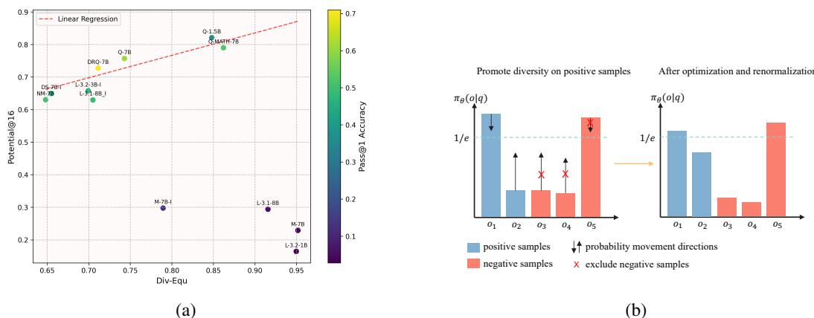
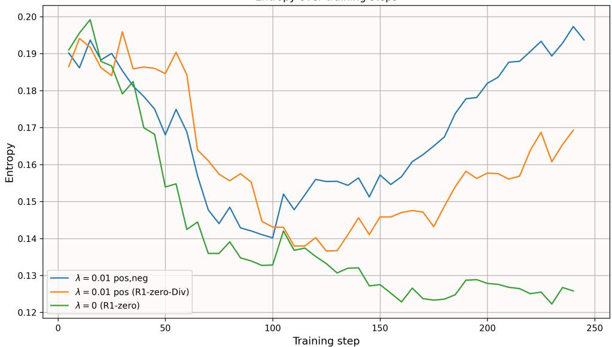

# Diversity-Aware Policy Optimization for Large Language Model Reasoning

Jian $\mathbf { Y a o 1 }$ , Ran Cheng1,2,3 ∗, Xingyu $\mathbf { W } \mathbf { u } ^ { 1 }$ , Jibin $\mathbf { W _ { u } } ^ { 1 , 2 }$ , Kay Chen Tan1

1 Department of Data Science and Artificial Intelligence, The Hong Kong Polytechnic University 2 Department of Computing, The Hong Kong Polytechnic University 3 The Hong Kong Polytechnic University Shenzhen Research Institute, Shenzhen, China nigel97.yao@connect.polyu.hk, {ran-peter.cheng, xingy.wu, jibin.wu, kctan} $@$ polyu.edu.hk

# Abstract

The reasoning capabilities of large language models (LLMs) have advanced rapidly, particularly following the release of DeepSeek-R1, which has inspired a surge of research into data quality and reinforcement learning (RL) algorithms. Despite the pivotal role diversity plays in RL, its influence on LLM reasoning remains largely underexplored. To bridge this gap, this work presents a systematic investigation into the impact of diversity in RL-based training for LLM reasoning, and proposes a novel diversity-aware policy optimization method. Across evaluations on 12 LLMs, we observe a strong positive correlation between the solution diversity and Potential $@ \mathbf { k }$ (a novel metric quantifying an LLM’s reasoning potential) in high-performing models. This finding motivates our method to explicitly promote diversity during RL training. Specifically, we design a token-level diversity and reformulate it into a practical objective, then we selectively apply it to positive samples. Integrated into the R1-zero training framework, our method achieves a $3 . 5 \%$ average improvement across four mathematical reasoning benchmarks, while generating more diverse and robust solutions. The code is available at https://github.com/nigelyaoj/R1_zero_Div.

# 1 Introduction

Recently, the reasoning capabilities of large language models (LLMs) have made remarkable progress, with significant improvements showcased by OpenAI-o1 [35], DeepSeek-R1 [13], and Kimi-k1.5 [43]. Among these advancements, two key innovations have contributed significantly: First, the adoption of a rule-based reward system significantly streamlines the training process by focusing exclusively on rewarding correct final answers and proper output formats, thereby eliminating the complexity associated with process-based reward models [30, 47]. Second, the introduction of a lightweight reinforcement learning (RL) algorithm [13, 43] removes the need for a separate critic model, substantially reducing computational overhead and accelerating the training process. The success of DeepSeek-R1 has attracted numerous follow-up studies [62], which broadly fall into two categories. The first category focuses on improving the quality of training data [33, 15, 21, 2], emphasizing rigorous data set curation through filtering, deduplication, and verification. The second category refines RL algorithms, including detailed optimizations for PPO-based methods such as VCPPO [56] and VAPO [55]; enhancements to GRPO for stability and speed, such as DAPO [54], Dr.GRPO [31] and SRPO [63]; as well as alternative approaches such as REINFORCE $^ { + + }$ [20].

While RL has been extensively applied to LLM reasoning, the role of diversity remains largely unexplored in this context, even though it plays a crucial role in RL research[19, 11, 36, 8, 37, 32, 64,

12, 58, 66, 6, 52]. In traditional RL tasks, incorporating diversity is widely recognized to facilitate exploration by promoting the selection of more stochastic policies, which helps the policy escape local optima and accelerate the convergence of training. This hypothesis has been experimentally validated in previous work [19, 11, 36]. Beyond empirical evidence, theoretical analyses suggest that policies with higher entropy (a measure of diversity) can smooth the optimization landscape [1]. These findings naturally lead us to ask the following question: Is promoting diversity essential during RL training for LLM reasoning?

Intuitively, an LLM capable of generating diverse responses could broaden the exploration of reasoning paths, enabling the model to avoid overfitting to narrow solution patterns in mathematical or logical tasks. To formally address this question, we conduct an evaluation of diversity in LLM reasoning, with a specific focus on mathematical problem-solving. We introduce a novel metric, Potential $@ \mathbf { k }$ , to quantify an LLM’s reasoning potential (the possible performance gain after RL training). We empirically analyze 12 representative LLMs, examining both their solution diversity and Potential $@ \mathbf { k }$ scores. Notably, our results reveal a strong positive correlation between solution diversity and Potential $@ \mathbf { k }$ scores among high-performing models, which suggests that diversity directly contributes to improved final performance after RL training.

The empirical findings motivate us to promote diversity during RL training for LLM reasoning. A commonly used approach for this goal is entropy regularization. However, directly increasing the average entropy of LLM outputs can introduce length bias, as longer responses inherently exhibit higher entropy. To address this, we introduce a token-level diversity metric and reformulate the diversity objective into a practical form. Moreover, promoting diversity often entails a qualitydiversity trade-off. To mitigate this, we strategically apply diversity enhancement only to positive samples, thereby enriching solution diversity while preserving training stability. This design is akin to fostering diversity in high-quality policies in population-based RL training, ensuring that exploration is guided by task-relevant performance criteria [48]. Finally, we integrate our diversity objective into the R1-zero training method and evaluate the enhanced approach across 4 mathematical reasoning benchmarks. Experimental results demonstrate a $3 . 5 \%$ average performance gain over standard R1-zero training, while our method can generate more diverse solutions.

To summarize, our key contributions are:

• We present the first formal investigation into the role of diversity in LLM reasoning. Through experiments on mathematical benchmarks, we identify a positive correlation between solution diversity and an LLM’s reasoning potential, as measured by our proposed Potential $@ \mathbf { k }$ metric. This finding provides empirical motivation for incorporating diversity into policy optimization.   
• We propose a novel token-level diversity objective, which is reformulated into a practical metric and selectively applied to positive samples. This design is further supported through gradient behavior analysis, offering an insight for balancing quality and diversity during optimization.   
• We evaluate our method on four mathematical reasoning benchmarks, each comprising at least 500 problems with stable evaluation metrics. Our method achieves a $3 . 5 \%$ average improvement over standard R1-zero training and consistently produces more diverse solutions.

# 2 Preliminary

# 2.1 RL for LLMs

In the context of RL for LLMs, we frame the LLM generation process as an RL problem. Here, the LLM is modeled as a policy that produces outputs (actions) conditioned on input prompts (states) and receives evaluative feedback (rewards) for its generated responses. This formulation aligns the sequential decision-making nature of language generation with RL’s state-action-reward framework, enabling systematic optimization of the model’s behavior through reward signals.

Formally, in the context of LLM generation for mathmatical problem-solving, where each prompt is a question, we define the prompt as $q \in \mathcal { Q }$ , where $\mathcal { Q }$ represents the set of all possible questions. The set of all potential text outputs $o$ forms an action space $\mathcal { O }$ . Each output $o$ consists of tokens, denoted as $o : = ( o ^ { 1 } , o ^ { 2 } , . . . , o ^ { t } , . . . )$ . To generate an output, a policy $\pi _ { \theta } ( \cdot | q )$ parameterized by $\theta$ is employed, which generates the output according to the distribution:

$$
\pi _ { \boldsymbol { \theta } } ( o | \boldsymbol { q } ) : = \prod _ { t } \pi _ { \boldsymbol { \theta } } ( o ^ { t } | \boldsymbol { q } , o ^ { < t } ) ,
$$

where $o ^ { < t } = ( o ^ { 1 } , o ^ { 2 } , . . . o ^ { t - 1 } )$ .

# 2.2 Reinforcement Learning algorithm

The R1-zero training method proposed by DeepSeek-R1 [13] has attracted significant research attention due to its computational efficiency and effectiveness. In our work, we adopt this training method as our backbone. R1-zero incorporates two key innovations: the GRPO algorithm [40] and a rule-based reward function. In this section, we introduce both components.

Group Relative Policy Optimization (GRPO) GRPO streamlines the process by eliminating the need for a separate critic model, which is usually as large as the policy model, and instead estimates baselines using group scores. Specifically, for each question $q$ , GRPO samples a group of outputs $\left\{ o _ { 1 } , o _ { 2 } , . . . , o _ { G } \right\}$ from the old policy $\pi _ { o l d }$ and optimizes the policy $\pi _ { \theta }$ by maximizing the following objective:

$$
\begin{array} { l } { { \displaystyle { \cal J } _ { G R P O } ( \pi _ { \theta } ) = \mathbb { E } _ { q \sim \mathcal { Q } , \{ \sigma _ { i } \} _ { i = 1 } ^ { G } \sim \pi _ { \alpha l d } ( \cdot | q ) } } } \\ { { \displaystyle \qquad \frac { 1 } { G } \sum _ { i = 1 } ^ { G } \left( \operatorname* { m i n } \left( \frac { \pi _ { \theta } ( o _ { i } | q ) } { \pi _ { o l d } ( o _ { i } | q ) } A _ { i } , \mathrm { c l i p } ( \frac { \pi _ { \theta } ( o _ { i } | q ) } { \pi _ { o l d } ( o _ { i } | q ) } , 1 - \epsilon , 1 + \epsilon ) A _ { i } \right) - \beta \mathbb { D } _ { K L } ( \pi _ { \theta } | | \pi _ { r e f } ) \right) , } } \end{array}
$$

where $\epsilon$ and $\beta$ are hyperparameters, the KL term is defined as

$$
\mathbb { D } _ { K L } ( \pi _ { \theta } | | \pi _ { r e f } ) = \frac { \pi _ { r e f } \big ( o _ { i } | q \big ) } { \pi _ { \theta } \big ( o _ { i } | q \big ) } - \log \frac { \pi _ { r e f } \big ( o _ { i } | q \big ) } { \pi _ { \theta } \big ( o _ { i } | q \big ) } - 1 ,
$$

and the advantage $A _ { i }$ is computed using a group of rewards $\{ r _ { 1 } , r _ { 2 } , . . . , r _ { G } \}$ :

$$
A _ { i } = { \frac { r _ { i } - \mathrm { m e a n } ( \{ r _ { 1 } , r _ { 2 } , . . . , r _ { G } \} ) } { \mathrm { s t d } ( \{ r _ { 1 } , r _ { 2 } , . . . , r _ { G } \} ) } } .
$$

Reward functions In line with DeepSeek-R1 [13], we implement two types of rule-based rewards: accuracy rewards and format rewards. The accuracy reward model assesses whether the response is correct by comparing the predicted answer to the golden reference answer, while the format reward model ensures that the final answer is presented in a $\left\backslash \mathrm { b o x e d } \{ \right\}$ format for reliable verification.

# 3 Correlation between LLMs’ reasoning potential and solution diversity

The role of diversity has long been established as critical in traditional RL tasks. Numerous studies [19, 11, 36, 8, 37] have shown that promoting diversity can enhance the final quality of the policy. However, its impact in the realm of RL for LLM reasoning still remains under-explored. In this section, we investigate the relationship between solution diversity and the reasoning abilities of LLMs on mathematical benchmarks. We adopt the equation diversity in prior work [49] to quantify the variety of solutions generated for mathematical problem-solving. For reasoning ability, we introduce a novel metric to evaluate an LLM’s training potential (related to the performance gain achieved after RL training).

Experimental setup We evaluate 12 LLMs on the MATH benchmark [16]. For each question, we calculate: (1) Pass $\ @ \mathbf { 1 }$ accuracy using greedy decoding, and (2) Diversity with (3) Potential $@ \mathbf { k }$ , both evaluated from 16 sampled responses (temperature $- 0 . 9$ ).

For diversity, we adopt the metric (denoted as Div-Equ) from prior work [49], which measures the ratio of distinct equations among the responses:

$$
\mathrm { D i v - E q u } : = \frac { 1 } { N } \sum _ { i = 1 } ^ { N } \frac { | \mathcal { U } _ { i } | } { | \mathcal { A } _ { i } | } ,
$$

  
Figure 1: (a) Evaluation of $\mathrm { P a s s } @ 1$ accuracy, Div-Equ diversity, and Potential $@ 1 6$ across 12 LLMs on the MATH benchmark. Model naming conventions: Prefixes denote base architectures (Q: Qwen2.5-Math, DS: DeepSeekMath, M: Mistral, L: Llama, DRQ: DeepSeek-R1-Distill-Qwen, NM: NuminaMath); suffix ’-I’ indicates ’-Instruct’. (b) Illustration of probability movement during diversity optimization on positive samples.

where $\mathcal { U } _ { i }$ and $A _ { i }$ are the sets of unique equations and all equations extracted from the $k$ sampled responses (with $k = 1 6$ in our experiments) of question $i$ , respectively. And $N = 5 0 0$ is the amount of the data.

For Potential, we define a metric termed Potential $@ \mathbf { k }$ to quantify the model’s capability to correct answers within $k$ trials (with $k = 1 6$ in our experiments) on its $\mathrm { P a s s } @ 1$ failure samples. Formally:

$$
{ \mathrm { P o t e n t i a l @ k } } : = { \frac { \sum _ { i = 1 } ^ { N } { \mathrm { P a s s @ k } } ( q _ { i } ) \cdot ( 1 - { \mathrm { P a s s @ 1 } } ( q _ { i } ) ) } { \sum _ { i = 1 } ^ { N } ( 1 - { \mathrm { P a s s @ 1 } } ( q _ { i } ) ) } } ,
$$

where $q _ { i }$ denotes the $i$ -th question.

Empirical findings The results are shown in Figure 1a. The results show a bifurcated pattern: For LLMs with limited reasoning ability $( \mathrm { P a s s } @ 1 < 0 . 4 )$ , we observe no significant relationship between solution diversity and model potential. For stronger performers $( \mathrm { P a s s } @ 1 > 0 . 4 )$ , a clear positive correlation emerges between these metrics. Linear regression on this high-performing subset yields $R ^ { 2 } = 0 . 8 1$ , confirming a strong predictive relationship where increased diversity corresponds to higher model potential.

Through an investigation of the Objective 2 in the GRPO algorithm, we observe that for each question in the training set, if all samples within a group are either entirely positive or entirely negative, the advantage score becomes 0, resulting in no gradient update. Crucially, the training signal originates from the reward discrepancy between positive and negative samples within the group, which is inherently linked to our definition of potential (to some extent, the algorithm’s improvement can be characterized by the dynamics of this potential metric, as discussed in Appendix B). This indicates that promoting diversity for LLM may result in higher performance after RL training.

Takeaways A positive correlation between the LLM’s reasoning potential and solution diversity is observed in our experiment. As illustrated in Section 2.2, the optimization direction is guided by correct answers in multiple sampled responses. This directly links our Potential $@ \mathbf { k }$ metric to RL training improvements. Hence, the observation strongly motivates us to enhance diversity during the RL training process.

# 4 Diversity-aware policy optimization

Building on the insights from Section 3, in this section, we introduce an entropy-based diversity and propose its targeted application to positive samples during policy optimization for LLM reasoning. We incorporate this diversity objective into the R1-zero training method [13], which employs the

GRPO algorithm with the reward function defined in Section 2.2. We refer to this enhanced approach as R1-zero-Div.

# 4.1 Entropy-based diversity

A straightforward approach is to define diversity as the average entropy of the LLM’s outputs per question i.e., $E _ { q \sim Q } [ \mathcal { \bar { H } } ( \pi _ { \theta } ( \cdot | q ) ) ]$ . However, this formulation introduces length bias: longer responses inherently exhibit higher entropy (due to more token-level uncertainties), causing the metric to artificially favor longer outputs regardless of actual solution diversity. To address this issue, we introduce token-level entropy, which calculates the entropy for each token sampled from the old policy $\pi _ { \mathrm { o l d } }$ . Formally, we define:

$$
\widehat { J } _ { D i v } ( \pi _ { \theta } ) : = \mathbb { E } _ { q \sim \mathcal { Q } , o \sim \pi _ { o l d } ( \cdot | q ) } \left[ \frac { 1 } { T } \sum _ { t = 1 } ^ { T } \mathcal { H } ( \pi _ { \theta } ( \cdot | q , o ^ { < t } ) ) \right] ,
$$

where $T$ is the length of the output.

During training, the gradient of diversity with respect to the policy $\pi _ { \theta }$ in the $\mathcal { H } ( \pi _ { \boldsymbol { \theta } } ( \cdot | \boldsymbol { q } , o ^ { < t } ) )$ is intractable. We therefore reformulate the diversity objective to enable effective backpropagation:

$$
\begin{array} { r l r } & { } & { \widehat { J } _ { D i v } ( \pi _ { \theta } ) = { \mathbb E } _ { q \sim \mathcal { Q } , o \sim \pi _ { o l d } ( \cdot \vert q ) } \left[ - \displaystyle \frac { 1 } { T } \sum _ { t = 1 } ^ { T } { \mathbb E } _ { \widetilde { \sigma } ^ { t } \sim \pi _ { \theta } ( \cdot \vert q , o ^ { < t } ) } [ \log \pi _ { \theta } ( \widetilde { o } ^ { t } \vert q , o ^ { < t } ) ] \right] } \\ & { } & { = { \mathbb E } _ { q \sim \mathcal { Q } , o \sim \pi _ { o l d } ( \cdot \vert q ) } \left[ - \displaystyle \frac { 1 } { T } \sum _ { t = 1 } ^ { T } \frac { \pi _ { \theta } ( o ^ { t } \vert q , o ^ { < t } ) } { \pi _ { o l d } ( o ^ { t } \vert q , o ^ { < t } ) } \log \pi _ { \theta } ( o ^ { t } \vert q , o ^ { < t } ) \right] . } \end{array}
$$

A proof for the last equation can be found in Appendix A.1. In practice, building on the R1-zero training method, we can use the samples within the group to calculate Objective 8.

# 4.2 Promoting diversity on positive samples

Empirical evidence indicates that the direct application of Objective 8 inadvertently increases diversity in incorrect solutions. Intuitively, negative samples offer more room for diversity enhancement, which can skew the model’s optimization process. To address this issue, we concentrate on promoting diversity exclusively within positive samples:

$$
J _ { D i v } ( \pi _ { \theta } ) = \mathbb { E } _ { q \sim Q , o \sim \pi _ { o l d } ( \cdot | q ) } \left[ - \mathbb { I } ( r = 1 ) \cdot \frac { 1 } { T } \sum _ { t = 1 } ^ { T } \frac { \pi _ { \theta } ( o ^ { t } | q , o ^ { < t } ) } { \pi _ { o l d } ( o ^ { t } | q , o ^ { < t } ) } \log { \pi _ { \theta } ( o ^ { t } | q , o ^ { < t } ) } \right] ,
$$

where $\mathbb { I } ( \cdot )$ denotes the indicator function and $r$ is the accuracy reward for output $o$ .

This is akin to fostering diversity in high-quality policies in population-based RL training [48], while we focus on positive samples rather than policies here. Beyond intuitive justification, we further justify this design by analyzing the gradient on each token.

According to Equation 8, we have:

$$
\nabla _ { \pi _ { \theta } } \widehat { J } _ { D i v } ( \pi _ { \theta } ) = \mathbb { E } _ { q \sim Q , o \sim \pi _ { o l d } ( \cdot | q ) } \left[ - \frac { 1 } { T } \sum _ { t = 1 } ^ { T } \frac { \nabla _ { \theta } \left[ \pi _ { \theta } \left( o ^ { t } | q , o ^ { < t } \right) \log \pi _ { \theta } \left( o ^ { t } | q , o ^ { < t } \right) \right] } { \pi _ { o l d } \left( o ^ { t } | q , o ^ { < t } \right) } \right] .
$$

Thus, the gradient can be decomposed into per-token contributions (each term in the summation contributes a component). Up to a constant scaling factor, the gradient from each token is:

$$
- \nabla _ { \theta } \pi _ { \theta } ( o ^ { t } | q , o ^ { < t } ) \log \pi _ { \theta } ( o ^ { t } | q , o ^ { < t } ) = - [ 1 + \log \pi _ { \theta } ( o ^ { t } | q , o ^ { < t } ) ] \cdot \nabla _ { \theta } \pi _ { \theta } ( o ^ { t } | q , o ^ { < t } ) .
$$

Hence, for tokens with small probabilities (in that case $\pi _ { \theta } ( o ^ { t } | q , o ^ { < t } ) < e ^ { - 1 }$ , and this holds for most of tokens since the sum of probability is equal to 1), the gradient aligns with $\nabla _ { \boldsymbol { \theta } } \pi _ { \boldsymbol { \theta } } \big ( o ^ { t } | \boldsymbol { q } , o ^ { < t } \big )$ . This suggests that the diversity component’s gradient actively promotes increasing the probability of low-probability tokens, which inherently offer substantial growth potential. However, this tendency is undesirable for negative samples. Thus, excluding diversity enhancement for negative samples mitigates conflicts between solution quality and diversity. A visual illustration is provided in Figure 1b. Moreover, the experimental results in Section 5.3 and Appendix E.1 further support our design.

Finally, we incorporate the diversity optimization into the standard R1-zero training, and use the samples in the group to calculate the diversity, yielding the final training objective:

$$
\begin{array} { l } { { J ( \pi _ { \theta } ) = J _ { G R P O } ( \pi _ { \theta } ) + \lambda \cdot J _ { D i v } ( \pi _ { \theta } ) } } \\ { { \displaystyle \quad \quad = \mathbb { E } _ { q \sim \mathcal { Q } , \{ \sigma _ { i } \} _ { i = 1 } ^ { G } \sim \pi _ { o l d } ( \cdot | q ) } \frac { 1 } { G } \sum _ { i = 1 } ^ { G } \big [ \operatorname* { m i n } \big ( \frac { \pi _ { \theta } \big ( { o _ { i } | q } \big ) } { \pi _ { o l d } \big ( { o _ { i } | q } \big ) } A _ { i } , \mathrm { c l i p } \big ( \frac { \pi _ { \theta } \big ( { o _ { i } | q } \big ) } { \pi _ { o l d } \big ( { o _ { i } | q } \big ) } , 1 - \epsilon , 1 + \epsilon \big ) A _ { i } \big ) } } \\ { { \displaystyle \quad \quad \quad - \beta \mathbb { D } _ { K L } \big ( \pi _ { \theta } \big | | \pi _ { r e f } \big ) - \lambda \mathbb { I } \big ( r _ { i } = 1 \big ) \cdot \frac { 1 } { T _ { i } } \sum _ { t = 1 } ^ { T _ { i } } \frac { \pi _ { \theta } \big ( { o _ { i } ^ { t } | q } , { o _ { i } ^ { \epsilon } } t \big ) } { \pi _ { o l d } \big ( { o _ { i } ^ { t } | q } , { o _ { i } ^ { \epsilon } } t \big ) } \log \pi _ { \theta } \big ( { o _ { i } ^ { t } | q } , { o _ { i } ^ { \epsilon } } t \big ) \big ] , \qquad \quad \mathrm { ( ) } } } \end{array}
$$

where $\lambda$ is the diversity weight and $i$ denotes the $i$ -th sample in the group. In practice, we choose $\lambda = 0 . 0 1$ . Other implementation details are provided in Section 5.1 and Appendix D.

# 5 Experiments

In this experimental section, we aim to address the following questions:

Q1. Can our method effectively enhance reasoning abilities and provide diverse solutions? Q2. Does the design of the diversity coefficient $\lambda$ influence the results? Q3. Does our method demonstrate consistent performance across different model sizes?

# 5.1 Experimental setup

Base models We choose Qwen2.5-Math-7B (Qwen7B) [51] as our base model, which is commonly used for mathematical reasoning benchmarks [59, 67, 24]. Additionally, we conduct an ablation study using Qwen2.5-Math-1.5B (Qwen1.5B)[51] to assess the effectiveness of our approach in smaller LLMs.

Benchmarks We selected 4 mathematical benchmarks to evaluate the models’ reasoning abilities: GSM8K [7], MATH500 [16], Olympiad Bench [14], and College Math [42]. Each contains at least 500 data points for testing. We excluded some commonly used mathematical benchmarks that provide limited data, e,g, AIME24 2 with 30 items, as they can lead to unstable and biased evaluation outcomes. We train the base model on the GSM8K training set and then evaluate on the 4 benchmarks.

Baselines The most pertinent baselines for comparison are the base model itself and the base model trained via R1-zero. Additionally, we incorporate the latest prominent "R1-zero-Like" models with similar backbones for reference: SimpleRL-Zoo [59], PRIME-Zero-7B [9]. It is important to note that these methods are trained with different computational resources and datasets, making direct comparisons challenging. Our approach is designed to enhance diversity rather than compete directly with these methods. In fact, our method is compatible with and can be integrated into these existing approaches.

Implementation details For R1-zero-Div, we train the base model on the GSM8K training set using the loss function in Equation 12, with a learning rate of $3 \times 1 0 ^ { - 6 }$ and the AdamW optimizer. During rollout, we sample 6 responses with a temperature of 0.9 and train for 2 epochs. Our implementation is built on TRL [46] and runs on $8 \times \mathbf { A } 6 0 0 0$ GPUs. For R1-zero, we maintain identical settings to R1-zero-Div but exclude the diversity objective. For other baselines, we evaluate open-sourced models downloaded from Hugging Face3, following the settings recommended in their original papers. Additional implementation details are provided in Appendix D.

Table 1: Pass $@ 1$ accuracy on mathematical benchmarks.   

<table><tr><td>Method</td><td>GSM8K</td><td>MATH500</td><td>Olympiad Bench</td><td>College Math</td><td>Avg</td></tr><tr><td>Qwen2.5-Math-7B</td><td>57.6</td><td>51.8</td><td>16.1</td><td>21.4</td><td>36.7</td></tr><tr><td>R1-zero</td><td>88.7</td><td>74.6</td><td>37.3</td><td>43.3</td><td>61.0</td></tr><tr><td>R1-zero-Div (Ours)</td><td>91.7</td><td>78.2</td><td>40.1</td><td>47.6</td><td>64.4</td></tr><tr><td>SimpleRL-Zo0</td><td>90.2</td><td>80.0</td><td>39.0</td><td>47.2</td><td>64.1</td></tr><tr><td>Eurus-2-7B-PRIME</td><td>88.0</td><td>74.4</td><td>39.4</td><td>46.6</td><td>62.1</td></tr></table>

Table 2: Avg $\ @ 8$ accuracy on mathematical benchmarks.   

<table><tr><td>Method</td><td>GSM8K</td><td>MATH500</td><td>Olympiad Bench</td><td> College Math</td><td>Avg</td></tr><tr><td>Qwen2.5-Math-7B</td><td>53.37 (0.56)</td><td>48.10 (0.82)</td><td>15.80 (0.22)</td><td>19.36 (0.14)</td><td>34.16</td></tr><tr><td>R1-zero</td><td>87.77 (0.86)</td><td>72.97 (1.20)</td><td>37.26 (0.52)</td><td>42.22 (0.31)</td><td>60.06</td></tr><tr><td>R1-zero-Div (Ours)</td><td>90.64 (0.89)</td><td>76.92 (1.24)</td><td>39.19 (0.55)</td><td>47.49 (0.32)</td><td>63.56</td></tr><tr><td>SimpleRL-Zo0</td><td>89.46 (0.87)</td><td>77.15 (1.23)</td><td>39.43 (0.57)</td><td>47.19 (0.34)</td><td>63.31</td></tr><tr><td>Eurus-2-7B-PRIME</td><td>88.31 (0.86)</td><td>73.92 (1.18)</td><td>36.56 (0.50)</td><td>45.27 (0.30)</td><td>61.02</td></tr></table>

# 5.2 Main results

R1-zero-Div enhances reasoning abilities We evaluate the reasoning performance using Pass $@ 1$ accuracy, as shown in Table 1. In our experiment, R1-zero-Div demonstrates superior performance compared to R1-zero, achieving an average improvement of $3 . 5 \%$ . Despite being trained with limited computational resources (discussed in Appendx B), R1-zero-Div achieves comparable results to stateof-the-art methods (SimpleRL-Zoo and Eurus-2-7B-PRIME). These results suggest that promoting diversity on positive samples in training can effectively enhance the model’s reasoning capabilities. Also, following the recommendations in prior work [4, 17], we evaluated 8 samples per question with a temperature of 0.5. We report $\operatorname { A v g } @ \operatorname { ‰}$ and its standard error in the Table 2. The conclusion regarding the effectiveness of our approach remains consistent with the pass $@ 1$ metric results.

R1-zero-Div generates diverse solutions We empirically demonstrate that R1-zero-Div produces more diverse solutions than other RL-finetuning baselines. Our evaluation on the GSM8K test set generates 5 responses for each of 1,319 questions, measuring diversity through three metrics: Div-Equ, and two additional metrics in prior work [26]: (1) N-gram diversity (proportion of distinct n-grams per response, capturing intra-diversity) and (2) Self-BLEU diversity (100 minus Self-BLEU score, capturing inter-diversity). All metrics range from 0 to 100, with higher values indicating greater diversity. As shown in Table 3, while RL fine-tuning methods significantly reduce diversity (compared to the base model), R1-zero-Div effectively preserves diversity. We further provide concrete examples in Appendix E showing that R1-zero-Div generates distinct solutions for the same question.

# 5.3 Ablation study

We conduct an ablation study to analyze (1) the impact of different diversity weights and (2) our method’s generalization capability on smaller base models.

Analysis on the choice of diversity weights $\lambda$ Table 4 presents $\mathrm { P a s s } @ 1$ accuracy when applying different $\lambda$ values to promote diversity on positive samples (denoted as “pos”). The results demonstrate that small values $\lambda \leq 0 . 0 2 )$ effectively enhance reasoning performance, with $\lambda = 0 . 0 1$ emerging as the optimal choice in our experimental setup. We further compare diversity promotion strategies: positive samples only (“pos”) versus all samples (“pos+neg”). The marginal improvement observed when applying diversity to all samples supports our methodological design choice in Section 4.2.

Table 3: Diversity of different methods on GSM8K test set.   

<table><tr><td>Method</td><td>Div-Equ</td><td>Div-N-gram</td><td>Div-Self-BLEU</td></tr><tr><td>Qwen2.5-Math-7B</td><td>92.26</td><td>29.29</td><td>85.98</td></tr><tr><td>Eurus-2-7B-PRIME</td><td>60.86</td><td>24.08</td><td>48.20</td></tr><tr><td>SimpleRL-Zo0</td><td>74.89</td><td>25.41</td><td>49.32</td></tr><tr><td>R1-zero</td><td>75.02</td><td>27.75</td><td>56.00</td></tr><tr><td>zero-Div (Ours)</td><td>79.29</td><td>29.60</td><td>58.89</td></tr></table>

Experiment on 1.5B base model We perform both R1-zero-Div and R1-zero on the Qwen2.5-Math1.5B base model [51], with results shown in Table 5. The experiments demonstrate that, compared to R1-zero, R1-zero-Div enhances reasoning performance on 3 out of 4 benchmarks, achieving an average improvement of $2 . 3 \%$ , validating the scalability of our approach to a smaller model.

Table 4: Ablation Study on different diversity weights on mathematical benchmarks   

<table><tr><td>Method</td><td>GSM8K</td><td>MATH500</td><td>Olympiad Bench</td><td>College Math</td><td>Avg</td></tr><tr><td>入=0</td><td>88.7</td><td>74.6</td><td>37.3</td><td>43.3</td><td>61.0</td></tr><tr><td>入 = 0.05, pos</td><td>88.1</td><td>74.8</td><td>38.2</td><td>45.8</td><td>61.7</td></tr><tr><td>λ = 0.02, pos</td><td>90.7</td><td>76.0</td><td>38.4</td><td>45.9</td><td>62.8</td></tr><tr><td>λ= 0.01, pos</td><td>91.7</td><td>78.2</td><td>40.1</td><td>47.6</td><td>64.4</td></tr><tr><td>入 = 0.01, pos+neg</td><td>89.8</td><td>76.6</td><td>39.6</td><td>46.9</td><td>63.2</td></tr></table>

Table 5: Ablation Study on Qwen2.5-Math-1.5B base model   

<table><tr><td>Method</td><td>GSM8K</td><td>MATH500</td><td>Olympiad Bench</td><td>College Math</td><td>Avg</td></tr><tr><td>Qwen2.5-Math-1.5B</td><td>39.4</td><td>36.4</td><td>23.0</td><td>6.6</td><td>26.3</td></tr><tr><td>R1-zero</td><td>82.9</td><td>66.4</td><td>32.1</td><td>43.1</td><td>56.1</td></tr><tr><td>R1-zero-Div (Ours)</td><td>83.2</td><td>70.4</td><td>32.0</td><td>43.9</td><td>57.4</td></tr></table>

# 6 Related work

RL for LLM reasoning The reasoning capabilities of LLMs have seen remarkable progress recently, with notable improvements demonstrated by OpenAI-o1 [35], DeepSeek-R1 [13], and Kimi-k1.5 [43]. Our work builds upon the R1-zero training method proposed by DeepSeek-R1 [13], which significantly improves LLM reasoning through two innovations that simplify the training pipeline and accelerate training: the GRPO algorithm [40], which replaces critic models with group score baselines, and a rule-based reward system that focuses solely on final answer correctness and output format.

Subsequent research has advanced this approach in two directions: (1) improving training data quality [28, 33, 15, 54, 21, 18] and (2) refining RL algorithms. Regarding RL algorithm refinement, one category focuses on PPO-like methods. SimpleRL-zero [60] demonstrates that PPO with replacing the reward model by a rule-based reward function can significantly improve the LLM’s reasoning ability. VinePPO [25] leverages the flexibility of language environments to compute unbiased Monte Carlobased estimates, eliminating the need for large value networks. VCPPO [56] employs a pretrained value model to address value initialization bias and decouples Generalized Advantage Estimation (GAE) computation between the actor and critic to mitigate reward signal decay. VAPO [55] further shows that value-based RL frameworks outperform value-free methods in long Chain-of-Thought reasoning. The second category focuses on GRPO enhancements for stability and speed. DAPO [54] identifies the critical shortcomings (entropy collapse, training instability, and biased loss) in the original GRPO algorithm and addresses them via decoupled clipping and dynamic sampling. Dr.GRPO [31] reveals two biases in GRPO: response-level length bias and question-level difficulty bias. SRPO [63] introduces a two-stage history-resampling method to improve training efficiency. Alternative approaches explore algorithms like REINFORCE: Kimi-k1.5 [43] demonstrates stable training with REINFORCE-like policy gradients, while REINFORCE $^ { + + }$ [20] and GPG [5] aim to enhance REINFORCE’s stability and scalability, respectively.

Diversity in RL Research on policy diversity in deep reinforcement learning can be categorized into three groups based on how diversity is utilized [48]. The first category uses diversity primarily to improve exploration efficiency, where diversity emerges as a byproduct of maximizing final task performance [19, 11, 36, 8, 37, 53]. The second category treats diversity either as a constraint (optimizing quality subject to diversity constraints) or as an objective (optimizing diversity under quality constraints) [32, 64, 12, 58, 66]. The third category optimizes quality and diversity simultaneously, known as Quality-Diversity RL methods [6, 38, 45, 3]. Our work extends the first paradigm to RL for LLM reasoning. While existing research in this category has proposed various diversity metrics, such as distance regularization between the current policy and a previous policy [19], reward randomization [41], we develop our approach based on a simple yet effective entropy-based diversity metric.

Diversity in LLMs Prior work has explored diversity in LLMs across several domains. GEM [29] proposes methods to preserve diversity during supervised fine-tuning, while Bstar [61] investigates the exploration-exploitation tradeoff in self-improvement settings. Additional studies have examined diversity in reinforcement learning from human feedback [34, 26] and LLM ensembles [44]. However, diversity remains understudied in RL for LLM reasoning scenarios. To our knowledge, we are the first to formally analyze diversity and propose a principled diversity-aware training method for this setting.

# 7 Conclusion, limitations, and discussion

In this research, we investigate the role of diversity in RL for LLM reasoning. Through comprehensive evaluations across 12 LLMs, we empirically establish a strong positive correlation between a model’s reasoning potential and the diversity of its generated solutions, underscoring the necessity of fostering diversity during RL training. To this end, we introduce a novel diversity-aware policy optimization method that optimizes the token-level diversity in positive samples. Experimentally, we demonstrate that our method not only enhances LLMs’ reasoning ability but also generates more diverse solutions. By bridging the gap between diversity promotion and policy optimization, we aim to provide new insights for advancing the robustness and creativity of LLMs in complex reasoning scenarios.

Due to computational constraints, our experiments were conducted on $8 \times$ NVIDIA A6000 GPUs, which restricted our analysis to $1 . 5 B$ and $7 B$ parameter-scale models. This naturally introduces a limitation: the generalizability of our diversity-aware policy optimization method to larger-scale LLMs remains to be explored. While our method demonstrates significant improvements on midsized models, extrapolating these findings to larger architectures may require adjustments to the entropy regularization scheme or training dynamics, given the known differences in optimization landscapes across model scales. We urge future research to investigate these scalability challenges and hope our work will inspire the community to explore diversity-enhanced RL strategies for both small and large LLMs, fostering more robust reasoning capabilities across the spectrum of model architectures. Beyond scaling, the diversity-aware optimization mechanism could also be extended to other LLM tasks [65, 50, 23, 22], suggesting its broader applicability beyond reasoning tasks.

Another promising future direction lies in the semantic definition of diversity. In this work, we employ entropy-based regularization to implicitly promote diverse behaviors during LLM generation, which captures statistical variance in output distributions. However, many real-world applications demand user-intended diversity (e.g., requiring both algebraic and arithmetic solutions to a math problem, or generating code with distinct algorithmic approaches). Such scenario-specific diversity requires explicit modeling of user-defined diversity, a challenge well-studied in RL [10, 48]. By bridging LLM reasoning with explicit diversity optimization from RL, future work could unlock more controllable and context-aware generative capabilities, addressing the gap between statistical diversity and human-intentional variety in complex tasks.

# Acknowledgments and Disclosure of Funding

This work was supported in part by the National Natural Science Foundation of China under Grant U21A20512 and the Research Grants Council of the Hong Kong SAR under Grant No. C5052- 23G, Grant PolyU 15229824, Grant PolyU 15218622, and Grant PolyU 15215623. This work was also partially supported by Guangdong Basic and Applied Basic Research Foundation (No. 2024B1515020019). This work was also partially supported by the Research Grants Council of the Hong Kong SAR (Grant No. PolyU15217424, PolyU25216423) and the Hong Kong Polytechnic University (Project IDs: P0043563).

# References

[1] Zafarali Ahmed, NicolasLe Roux, Mohammad Norouzi, and Dale Schuurmans. Understanding the impact of entropy on policy optimization. International Conference on Machine Learning, 2019.   
[2] Alon Albalak, Duy Phung, Nathan Lile, Rafael Rafailov, Kanishk Gandhi, Louis Castricato, Anikait Singh, Chase Blagden, Violet Xiang, Dakota Mahan, et al. Big-math: A large-scale, high-quality math dataset for reinforcement learning in language models. arXiv preprint arXiv:2502.17387, 2025.   
[3] Sumeet Batra, Bryon Tjanaka, Matthew C Fontaine, Aleksei Petrenko, Stefanos Nikolaidis, and Gaurav Sukhatme. Proximal policy gradient arborescence for quality diversity reinforcement learning. arXiv preprint arXiv:2305.13795, 2023.   
[4] Nikhil Chandak, Shashwat Goel, and Ameya Prabhu. Incorrect baseline evaluations call into question recent llm-rl claims, 2025. Notion Blog, 2025.   
[5] Xiangxiang Chu, Hailang Huang, Xiao Zhang, Fei Wei, and Yong Wang. Gpg: A simple and strong reinforcement learning baseline for model reasoning. arXiv preprint arXiv:2504.02546, 2025.   
[6] Geoffrey Cideron, Thomas Pierrot, Nicolas Perrin, Karim Beguir, and Olivier Sigaud. Qd-rl: Efficient mixing of quality and diversity in reinforcement learning. corr abs/2006.08505 (2020). arXiv preprint arXiv:2006.08505, 2020.   
[7] Karl Cobbe, Vineet Kosaraju, Mohammad Bavarian, Mark Chen, Heewoo Jun, Lukasz Kaiser, Matthias Plappert, Jerry Tworek, Jacob Hilton, Reiichiro Nakano, Christopher Hesse, and John Schulman. Training verifiers to solve math word problems. arXiv preprint arXiv:2110.14168, 2021.   
[8] Edoardo Conti, Vashisht Madhavan, Felipe Petroski Such, Joel Lehman, Kenneth Stanley, and Jeff Clune. Improving exploration in evolution strategies for deep reinforcement learning via a population of novelty-seeking agents. Advances in neural information processing systems, 31, 2018.   
[9] Ganqu Cui, Lifan Yuan, Zefan Wang, Hanbin Wang, Wendi Li, Bingxiang He, Yuchen Fan, Tianyu Yu, Qixin Xu, Weize Chen, et al. Process reinforcement through implicit rewards. arXiv preprint arXiv:2502.01456, 2025.   
[10] Li Ding, Jenny Zhang, Jeff Clune, Lee Spector, and Joel Lehman. Quality diversity through human feedback: Towards open-ended diversity-driven optimization. arXiv preprint arXiv:2310.12103, 2023.   
[11] Benjamin Eysenbach, Abhishek Gupta, Julian Ibarz, and Sergey Levine. Diversity is all you need: Learning skills without a reward function. arXiv preprint arXiv:1802.06070, 2018.

[12] Mahsa Ghasemi, Evan Scope Crafts, Bo Zhao, and Ufuk Topcu. Multiple plans are better than one: Diverse stochastic planning. In Proceedings of the International Conference on Automated Planning and Scheduling, volume 31, pages 140–148, 2021.

[13] Daya Guo, Dejian Yang, Haowei Zhang, Junxiao Song, Ruoyu Zhang, Runxin Xu, Qihao Zhu, Shirong Ma, Peiyi Wang, Xiao Bi, et al. Deepseek-r1: Incentivizing reasoning capability in llms via reinforcement learning. arXiv preprint arXiv:2501.12948, 2025.

[14] Chaoqun He, Renjie Luo, Yuzhuo Bai, Shengding Hu, Zhen Leng Thai, Junhao Shen, Jinyi Hu, Xu Han, Yujie Huang, Yuxiang Zhang, et al. Olympiadbench: A challenging benchmark for promoting agi with olympiad-level bilingual multimodal scientific problems. arXiv preprint arXiv:2402.14008, 2024.

[15] Zhiwei He, Tian Liang, Jiahao Xu, Qiuzhi Liu, Xingyu Chen, Yue Wang, Linfeng Song, Dian Yu, Zhenwen Liang, Wenxuan Wang, et al. Deepmath-103k: A large-scale, challenging, decontaminated, and verifiable mathematical dataset for advancing reasoning. arXiv preprint arXiv:2504.11456, 2025.

[16] Dan Hendrycks, Collin Burns, Saurav Kadavath, Akul Arora, Steven Basart, Eric Tang, Dawn Song, and Jacob Steinhardt. Measuring mathematical problem solving with the math dataset. arXiv preprint arXiv:2103.03874, 2021.

[17] Andreas Hochlehnert, Hardik Bhatnagar, Vishaal Udandarao, Samuel Albanie, Ameya Prabhu, and Matthias Bethge. A sober look at progress in language model reasoning: Pitfalls and paths to reproducibility. arXiv preprint arXiv:2504.07086, 2025.

[18] Andreas Hochlehnert, Hardik Bhatnagar, Vishaal Udandarao, Ameya Prabhu, and Matthias Bethge. Curatedthoughts: Data curation for rl training datasets, 2025.

[19] Zhang-Wei Hong, Tzu-Yun Shann, Shih-Yang Su, Yi-Hsiang Chang, Tsu-Jui Fu, and Chun-Yi Lee. Diversity-driven exploration strategy for deep reinforcement learning. Advances in neural information processing systems, 31, 2018.

[20] Jian Hu. Reinforce++: A simple and efficient approach for aligning large language models. arXiv preprint arXiv:2501.03262, 2025.

[21] Jingcheng Hu, Yinmin Zhang, Qi Han, Daxin Jiang, Xiangyu Zhang, and Heung-Yeung Shum. Open-reasoner-zero: An open source approach to scaling up reinforcement learning on the base model, 2025.

[22] Beichen Huang, Xingyu Wu, Yu Zhou, Jibin Wu, Liang Feng, Ran Cheng, and Kay Chen Tan. Evaluation of large language models as solution generators in complex optimization. IEEE Computational Intelligence Magazine, 20(4):56–70, 2025.

[23] Yuxiao Huang, Wenjie Zhang, Liang Feng, Xingyu Wu, and Kay Chen Tan. How multimodal integration boost the performance of llm for optimization: Case study on capacitated vehicle routing problems. In 2025 IEEE Symposium for Multidisciplinary Computational Intelligence Incubators (MCII), pages 1–7. IEEE, 2025.

[24] Hugging Face. Open r1: A fully open reproduction of deepseek-r1, January 2025.

[25] Amirhossein Kazemnejad, Milad Aghajohari, Eva Portelance, Alessandro Sordoni, Siva Reddy, Aaron Courville, and Nicolas Le Roux. Vineppo: Unlocking rl potential for llm reasoning through refined credit assignment. arXiv preprint arXiv:2410.01679, 2024.

[26] Robert Kirk, Ishita Mediratta, Christoforos Nalmpantis, Jelena Luketina, Eric Hambro, Edward Grefenstette, and Roberta Raileanu. Understanding the effects of rlhf on llm generalisation and diversity. arXiv preprint arXiv:2310.06452, 2023.

[27] Woosuk Kwon, Zhuohan Li, Siyuan Zhuang, Ying Sheng, Lianmin Zheng, Cody Hao Yu, Joseph E. Gonzalez, Hao Zhang, and Ion Stoica. Efficient memory management for large language model serving with pagedattention. In Proceedings of the ACM SIGOPS 29th Symposium on Operating Systems Principles, 2023.

[28] Xuefeng Li, Haoyang Zou, and Pengfei Liu. Limr: Less is more for rl scaling. arXiv preprint arXiv:2502.11886, 2025.

[29] Ziniu Li, Congliang Chen, Tian Xu, Zeyu Qin, Jiancong Xiao, Zhi-Quan Luo, and Ruoyu Sun. Preserving diversity in supervised fine-tuning of large language models. In The Thirteenth International Conference on Learning Representations, 2025.

[30] Hunter Lightman, Vineet Kosaraju, Yuri Burda, Harrison Edwards, Bowen Baker, Teddy Lee, Jan Leike, John Schulman, Ilya Sutskever, and Karl Cobbe. Let’s verify step by step. In The Twelfth International Conference on Learning Representations, 2023.

[31] Zichen Liu, Changyu Chen, Wenjun Li, Penghui Qi, Tianyu Pang, Chao Du, Wee Sun Lee, and Min Lin. Understanding r1-zero-like training: A critical perspective. arXiv preprint arXiv:2503.20783, 2025.

[32] Muhammad A Masood and Finale Doshi-Velez. Diversity-inducing policy gradient: Using maximum mean discrepancy to find a set of diverse policies. arXiv preprint arXiv:1906.00088, 2019.

[33] Chunyang Meng, Shijie Song, Haogang Tong, Maolin Pan, and Yang Yu. Deepscaler: Holistic autoscaling for microservices based on spatiotemporal gnn with adaptive graph learning. In 2023 38th IEEE/ACM International Conference on Automated Software Engineering (ASE), pages 53–65. IEEE, 2023.

[34] Sonia K Murthy, Tomer Ullman, and Jennifer Hu. One fish, two fish, but not the whole sea: Alignment reduces language models’ conceptual diversity. arXiv preprint arXiv:2411.04427, 2024.

[35] OpenAI. Learning to reason with llms. https://openai.com/index/ learning-to-reason-with-llms, 2024.

[36] Jack Parker-Holder, Aldo Pacchiano, Krzysztof M Choromanski, and Stephen J Roberts. Effective diversity in population based reinforcement learning. Advances in Neural Information Processing Systems, 33:18050–18062, 2020.

[37] Zhenghao Peng, Hao Sun, and Bolei Zhou. Non-local policy optimization via diversityregularized collaborative exploration. arXiv preprint arXiv:2006.07781, 2020.

[38] Thomas Pierrot, Valentin Macé, Felix Chalumeau, Arthur Flajolet, Geoffrey Cideron, Karim Beguir, Antoine Cully, Olivier Sigaud, and Nicolas Perrin-Gilbert. Diversity policy gradient for sample efficient quality-diversity optimization. In Proceedings of the Genetic and Evolutionary Computation Conference, pages 1075–1083, 2022.

[39] Jeff Rasley, Samyam Rajbhandari, Olatunji Ruwase, and Yuxiong He. Deepspeed: System optimizations enable training deep learning models with over 100 billion parameters. In Proceedings of the 26th ACM SIGKDD international conference on knowledge discovery & data mining, pages 3505–3506, 2020.

[40] Zhihong Shao, Peiyi Wang, Qihao Zhu, Runxin Xu, Junxiao Song, Xiao Bi, Haowei Zhang, Mingchuan Zhang, YK Li, Y Wu, et al. Deepseekmath: Pushing the limits of mathematical reasoning in open language models. arXiv preprint arXiv:2402.03300, 2024.

[41] Zhenggang Tang, Chao Yu, Boyuan Chen, Huazhe Xu, Xiaolong Wang, Fei Fang, Simon Du, Yu Wang, and Yi Wu. Discovering diverse multi-agent strategic behavior via reward randomization. arXiv preprint arXiv:2103.04564, 2021.

[42] Zhengyang Tang, Xingxing Zhang, Benyou Wang, and Furu Wei. Mathscale: Scaling instruction tuning for mathematical reasoning. arXiv preprint arXiv:2403.02884, 2024.

[43] Kimi Team, Angang Du, Bofei Gao, Bowei Xing, Changjiu Jiang, Cheng Chen, Cheng Li, Chenjun Xiao, Chenzhuang Du, Chonghua Liao, et al. Kimi k1.5: Scaling reinforcement learning with llms. arXiv preprint arXiv:2501.12599, 2025.

[44] Selim Furkan Tekin, Fatih Ilhan, Tiansheng Huang, Sihao Hu, and Ling Liu. Llm-topla: Efficient llm ensemble by maximising diversity. arXiv preprint arXiv:2410.03953, 2024.   
[45] Bryon Tjanaka, Matthew C Fontaine, Julian Togelius, and Stefanos Nikolaidis. Approximating gradients for differentiable quality diversity in reinforcement learning. In Proceedings of the Genetic and Evolutionary Computation Conference, pages 1102–1111, 2022.   
[46] Leandro von Werra, Younes Belkada, Lewis Tunstall, Edward Beeching, Tristan Thrush, Nathan Lambert, Shengyi Huang, Kashif Rasul, and Quentin Gallouédec. Trl: Transformer reinforcement learning. https://github.com/huggingface/trl, 2020.   
[47] Peiyi Wang, Lei Li, Zhihong Shao, RX Xu, Damai Dai, Yifei Li, Deli Chen, Yu Wu, and Zhifang Sui. Math-shepherd: Verify and reinforce llms step-by-step without human annotations. arXiv preprint arXiv:2312.08935, 2023.   
[48] Shuang Wu, Jian Yao, Haobo Fu, Ye Tian, Chao Qian, Yaodong Yang, Qiang Fu, and Yang Wei. Quality-similar diversity via population based reinforcement learning. In The eleventh international conference on learning representations, 2023.   
[49] Ting Wu, Xuefeng Li, and Pengfei Liu. Progress or regress? self-improvement reversal in post-training. arXiv preprint arXiv:2407.05013, 2024.   
[50] Xingyu Wu, Sheng-hao Wu, Jibin Wu, Liang Feng, and Kay Chen Tan. Evolutionary computation in the era of large language model: Survey and roadmap. IEEE Transactions on Evolutionary Computation, 2024.   
[51] An Yang, Beichen Zhang, Binyuan Hui, Bofei Gao, Bowen Yu, Chengpeng Li, Dayiheng Liu, Jianhong Tu, Jingren Zhou, Junyang Lin, Keming Lu, Mingfeng Xue, Runji Lin, Tianyu Liu, Xingzhang Ren, and Zhenru Zhang. Qwen2.5-math technical report: Toward mathematical expert model via self-improvement. arXiv preprint arXiv:2409.12122, 2024.   
[52] Hanlin Yang, Jian Yao, Weiming Liu, Qing Wang, Hanmin Qin, Kirk Tang, Jiechao Xiong, Chao Yu, Kai Li, Junliang Xing, et al. Diverse policies recovering via pointwise mutual information weighted imitation learning. In The Thirteenth International Conference on Learning Representations, 2025.   
[53] Jian Yao, Weiming Liu, Haobo Fu, Yaodong Yang, Stephen McAleer, Qiang Fu, and Wei Yang. Policy space diversity for non-transitive games. Advances in Neural Information Processing Systems, 36:67771–67793, 2023.   
[54] Qiying Yu, Zheng Zhang, Ruofei Zhu, Yufeng Yuan, Xiaochen Zuo, Yu Yue, Tiantian Fan, Gaohong Liu, Lingjun Liu, Xin Liu, et al. Dapo: An open-source llm reinforcement learning system at scale, 2025. URL https://arxiv. org/abs/2503.14476, 2025.   
[55] Yufeng Yuan, Qiying Yu, Xiaochen Zuo, Ruofei Zhu, Wenyuan Xu, Jiaze Chen, Chengyi Wang, TianTian Fan, Zhengyin Du, Xiangpeng Wei, et al. Vapo: Efficient and reliable reinforcement learning for advanced reasoning tasks. arXiv preprint arXiv:2504.05118, 2025.   
[56] Yufeng Yuan, Yu Yue, Ruofei Zhu, Tiantian Fan, and Lin Yan. What’s behind ppo’s collapse in long-cot? value optimization holds the secret. arXiv preprint arXiv:2503.01491, 2025.   
[57] Yang Yue, Zhiqi Chen, Rui Lu, Andrew Zhao, Zhaokai Wang, Shiji Song, and Gao Huang. Does reinforcement learning really incentivize reasoning capacity in llms beyond the base model? arXiv preprint arXiv:2504.13837, 2025.   
[58] Tom Zahavy, Brendan O’Donoghue, Andre Barreto, Volodymyr Mnih, Sebastian Flennerhag, and Satinder Singh. Discovering diverse nearly optimal policies with successor features. arXiv preprint arXiv:2106.00669, 2021.   
[59] Weihao Zeng, Yuzhen Huang, Qian Liu, Wei Liu, Keqing He, Zejun Ma, and Junxian He. Simplerl-zoo: Investigating and taming zero reinforcement learning for open base models in the wild, 2025.   
[60] Weihao Zeng, Yuzhen Huang, Wei Liu, Keqing He, Qian Liu, Zejun Ma, and Junxian He. 7b model and 8k examples: Emerging reasoning with reinforcement learning is both effective and efficient. https://hkust-nlp.notion.site/simplerl-reason, 2025. Notion Blog.   
[61] Weihao Zeng, Yuzhen Huang, Lulu Zhao, Yijun Wang, Zifei Shan, and Junxian He. B-star: Monitoring and balancing exploration and exploitation in self-taught reasoners. arXiv preprint arXiv:2412.17256, 2024.   
[62] Chong Zhang, Yue Deng, Xiang Lin, Bin Wang, Dianwen Ng, Hai Ye, Xingxuan Li, Yao Xiao, Zhanfeng Mo, Qi Zhang, et al. 100 days after deepseek-r1: A survey on replication studies and more directions for reasoning language models. arXiv preprint arXiv:2505.00551, 2025.   
[63] Xiaojiang Zhang, Jinghui Wang, Zifei Cheng, Wenhao Zhuang, Zheng Lin, Minglei Zhang, Shaojie Wang, Yinghan Cui, Chao Wang, Junyi Peng, et al. Srpo: A cross-domain implementation of large-scale reinforcement learning on llm. arXiv preprint arXiv:2504.14286, 2025.   
[64] Yunbo Zhang, Wenhao Yu, and Greg Turk. Learning novel policies for tasks. In International Conference on Machine Learning, pages 7483–7492. PMLR, 2019.   
[65] Yu Zhou, Xingyu Wu, Jibin Wu, Liang Feng, and Kay Chen Tan. HM3: Hierarchical multiobjective model merging for pretrained models. arXiv preprint arXiv:2409.18893, 2024.   
[66] Zihan Zhou, Wei Fu, Bingliang Zhang, and Yi Wu. Continuously discovering novel strategies via reward-switching policy optimization. arXiv preprint arXiv:2204.02246, 2022.   
[67] Yuxin Zuo, Kaiyan Zhang, Shang Qu, Li Sheng, Xuekai Zhu, Biqing Qi, Youbang Sun, Ganqu Cui, Ning Ding, and Bowen Zhou. Ttrl: Test-time reinforcement learning. arXiv preprint arXiv:2504.16084, 2025.

# NeurIPS Paper Checklist

# 1. Claims

Question: Do the main claims made in the abstract and introduction accurately reflect the paper’s contributions and scope?

Answer: [Yes]

Justification: Yes, the main claims made in the abstract and introduction accurately reflect the paper’s contributions and scope.

Guidelines:

• The answer NA means that the abstract and introduction do not include the claims made in the paper.   
• The abstract and/or introduction should clearly state the claims made, including the contributions made in the paper and important assumptions and limitations. A No or NA answer to this question will not be perceived well by the reviewers.   
• The claims made should match theoretical and experimental results, and reflect how much the results can be expected to generalize to other settings.   
• It is fine to include aspirational goals as motivation as long as it is clear that these goals are not attained by the paper.

# 2. Limitations

Question: Does the paper discuss the limitations of the work performed by the authors?

Answer: [Yes]

Justification: Please refer to the Limitation Section.

Guidelines:

• The answer NA means that the paper has no limitation while the answer No means that the paper has limitations, but those are not discussed in the paper.   
• The authors are encouraged to create a separate "Limitations" section in their paper.   
• The paper should point out any strong assumptions and how robust the results are to violations of these assumptions (e.g., independence assumptions, noiseless settings, model well-specification, asymptotic approximations only holding locally). The authors should reflect on how these assumptions might be violated in practice and what the implications would be. The authors should reflect on the scope of the claims made, e.g., if the approach was only tested on a few datasets or with a few runs. In general, empirical results often depend on implicit assumptions, which should be articulated.   
The authors should reflect on the factors that influence the performance of the approach. For example, a facial recognition algorithm may perform poorly when image resolution is low or images are taken in low lighting. Or a speech-to-text system might not be used reliably to provide closed captions for online lectures because it fails to handle technical jargon.   
• The authors should discuss the computational efficiency of the proposed algorithms and how they scale with dataset size.   
• If applicable, the authors should discuss possible limitations of their approach to address problems of privacy and fairness.   
• While the authors might fear that complete honesty about limitations might be used by reviewers as grounds for rejection, a worse outcome might be that reviewers discover limitations that aren’t acknowledged in the paper. The authors should use their best judgment and recognize that individual actions in favor of transparency play an important role in developing norms that preserve the integrity of the community. Reviewers will be specifically instructed to not penalize honesty concerning limitations.

# 3. Theory assumptions and proofs

Question: For each theoretical result, does the paper provide the full set of assumptions and a complete (and correct) proof?

Answer: [Yes]

Justification: The paper has some theoretical analysis. We provide a complete and correct analysis.

Guidelines:

• The answer NA means that the paper does not include theoretical results.   
• All the theorems, formulas, and proofs in the paper should be numbered and crossreferenced.   
• All assumptions should be clearly stated or referenced in the statement of any theorems.   
• The proofs can either appear in the main paper or the supplemental material, but if they appear in the supplemental material, the authors are encouraged to provide a short proof sketch to provide intuition.   
• Inversely, any informal proof provided in the core of the paper should be complemented by formal proofs provided in appendix or supplemental material.   
• Theorems and Lemmas that the proof relies upon should be properly referenced.

# 4. Experimental result reproducibility

Question: Does the paper fully disclose all the information needed to reproduce the main experimental results of the paper to the extent that it affects the main claims and/or conclusions of the paper (regardless of whether the code and data are provided or not)?

Answer: [Yes]

Justification: Please refer to Experiment Section and Appendix.

Guidelines:

• The answer NA means that the paper does not include experiments.   
• If the paper includes experiments, a No answer to this question will not be perceived well by the reviewers: Making the paper reproducible is important, regardless of whether the code and data are provided or not. If the contribution is a dataset and/or model, the authors should describe the steps taken to make their results reproducible or verifiable.   
• Depending on the contribution, reproducibility can be accomplished in various ways. For example, if the contribution is a novel architecture, describing the architecture fully might suffice, or if the contribution is a specific model and empirical evaluation, it may be necessary to either make it possible for others to replicate the model with the same dataset, or provide access to the model. In general. releasing code and data is often one good way to accomplish this, but reproducibility can also be provided via detailed instructions for how to replicate the results, access to a hosted model (e.g., in the case of a large language model), releasing of a model checkpoint, or other means that are appropriate to the research performed.   
• While NeurIPS does not require releasing code, the conference does require all submissions to provide some reasonable avenue for reproducibility, which may depend on the nature of the contribution. For example (a) If the contribution is primarily a new algorithm, the paper should make it clear how to reproduce that algorithm. (b) If the contribution is primarily a new model architecture, the paper should describe the architecture clearly and fully. (c) If the contribution is a new model (e.g., a large language model), then there should either be a way to access this model for reproducing the results or a way to reproduce the model (e.g., with an open-source dataset or instructions for how to construct the dataset). (d) We recognize that reproducibility may be tricky in some cases, in which case authors are welcome to describe the particular way they provide for reproducibility. In the case of closed-source models, it may be that access to the model is limited in some way (e.g., to registered users), but it should be possible for other researchers to have some path to reproducing or verifying the results.

# 5. Open access to data and code

Question: Does the paper provide open access to the data and code, with sufficient instructions to faithfully reproduce the main experimental results, as described in supplemental material?

Answer: [Yes]

Justification: Our code and instructions are included in the supplementary material. The data we use for the experiments are all from open-access datasets.

Guidelines:

• The answer NA means that paper does not include experiments requiring code.   
• Please see the NeurIPS code and data submission guidelines (https://nips.cc/ public/guides/CodeSubmissionPolicy) for more details.   
• While we encourage the release of code and data, we understand that this might not be possible, so “No” is an acceptable answer. Papers cannot be rejected simply for not including code, unless this is central to the contribution (e.g., for a new open-source benchmark).   
• The instructions should contain the exact command and environment needed to run to reproduce the results. See the NeurIPS code and data submission guidelines (https: //nips.cc/public/guides/CodeSubmissionPolicy) for more details.   
• The authors should provide instructions on data access and preparation, including how to access the raw data, preprocessed data, intermediate data, and generated data, etc.   
• The authors should provide scripts to reproduce all experimental results for the new proposed method and baselines. If only a subset of experiments are reproducible, they should state which ones are omitted from the script and why.   
• At submission time, to preserve anonymity, the authors should release anonymized versions (if applicable).   
• Providing as much information as possible in supplemental material (appended to the paper) is recommended, but including URLs to data and code is permitted.

# 6. Experimental setting/details

Question: Does the paper specify all the training and test details (e.g., data splits, hyperparameters, how they were chosen, type of optimizer, etc.) necessary to understand the results?

Answer: [Yes]

Justification: Please refer to Experiment Section and Appendix.

Guidelines:

• The answer NA means that the paper does not include experiments. • The experimental setting should be presented in the core of the paper to a level of detail that is necessary to appreciate the results and make sense of them. • The full details can be provided either with the code, in appendix, or as supplemental material.

# 7. Experiment statistical significance

Question: Does the paper report error bars suitably and correctly defined or other appropriate information about the statistical significance of the experiments?

Answer: [Yes]

Justification: Please refer to Experiment Section.

Guidelines:

• The answer NA means that the paper does not include experiments.   
• The authors should answer "Yes" if the results are accompanied by error bars, confidence intervals, or statistical significance tests, at least for the experiments that support the main claims of the paper.   
The factors of variability that the error bars are capturing should be clearly stated (for example, train/test split, initialization, random drawing of some parameter, or overall run with given experimental conditions).   
• The method for calculating the error bars should be explained (closed form formula, call to a library function, bootstrap, etc.)   
• The assumptions made should be given (e.g., Normally distributed errors).   
• It should be clear whether the error bar is the standard deviation or the standard error of the mean.   
• It is OK to report 1-sigma error bars, but one should state it. The authors should preferably report a 2-sigma error bar than state that they have a $96 \%$ CI, if the hypothesis of Normality of errors is not verified.   
• For asymmetric distributions, the authors should be careful not to show in tables or figures symmetric error bars that would yield results that are out of range (e.g. negative error rates).   
• If error bars are reported in tables or plots, The authors should explain in the text how they were calculated and reference the corresponding figures or tables in the text.

# 8. Experiments compute resources

Question: For each experiment, does the paper provide sufficient information on the computer resources (type of compute workers, memory, time of execution) needed to reproduce the experiments?

Answer: [Yes]

Justification: Please refer to the implementation details in the Appendix.

Guidelines:

• The answer NA means that the paper does not include experiments.   
• The paper should indicate the type of compute workers CPU or GPU, internal cluster, or cloud provider, including relevant memory and storage.   
• The paper should provide the amount of compute required for each of the individual experimental runs as well as estimate the total compute.   
• The paper should disclose whether the full research project required more compute than the experiments reported in the paper (e.g., preliminary or failed experiments that didn’t make it into the paper).

# 9. Code of ethics

Question: Does the research conducted in the paper conform, in every respect, with the NeurIPS Code of Ethics https://neurips.cc/public/EthicsGuidelines?

Answer: [Yes]

Justification: The research conducted in the paper conform with the NeurIPS Code of Ethics.

Guidelines:

• The answer NA means that the authors have not reviewed the NeurIPS Code of Ethics.   
• If the authors answer No, they should explain the special circumstances that require a deviation from the Code of Ethics.   
• The authors should make sure to preserve anonymity (e.g., if there is a special consideration due to laws or regulations in their jurisdiction).

# 10. Broader impacts

Question: Does the paper discuss both potential positive societal impacts and negative societal impacts of the work performed?

Answer: [Yes]

Justification: We list potential positive societal impacts in the Appendix.

Guidelines:

• The answer NA means that there is no societal impact of the work performed.   
• If the authors answer NA or No, they should explain why their work has no societal impact or why the paper does not address societal impact.   
• Examples of negative societal impacts include potential malicious or unintended uses (e.g., disinformation, generating fake profiles, surveillance), fairness considerations (e.g., deployment of technologies that could make decisions that unfairly impact specific groups), privacy considerations, and security considerations.   
• The conference expects that many papers will be foundational research and not tied to particular applications, let alone deployments. However, if there is a direct path to any negative applications, the authors should point it out. For example, it is legitimate to point out that an improvement in the quality of generative models could be used to   
generate deepfakes for disinformation. On the other hand, it is not needed to point out that a generic algorithm for optimizing neural networks could enable people to train models that generate Deepfakes faster.   
• The authors should consider possible harms that could arise when the technology is being used as intended and functioning correctly, harms that could arise when the technology is being used as intended but gives incorrect results, and harms following from (intentional or unintentional) misuse of the technology.   
If there are negative societal impacts, the authors could also discuss possible mitigation strategies (e.g., gated release of models, providing defenses in addition to attacks, mechanisms for monitoring misuse, mechanisms to monitor how a system learns from feedback over time, improving the efficiency and accessibility of ML).

# 11. Safeguards

Question: Does the paper describe safeguards that have been put in place for responsible release of data or models that have a high risk for misuse (e.g., pretrained language models, image generators, or scraped datasets)?

Answer: [NA]

Justification: The paper poses no such risks.

Guidelines:

• The answer NA means that the paper poses no such risks.   
• Released models that have a high risk for misuse or dual-use should be released with necessary safeguards to allow for controlled use of the model, for example by requiring that users adhere to usage guidelines or restrictions to access the model or implementing safety filters.   
• Datasets that have been scraped from the Internet could pose safety risks. The authors should describe how they avoided releasing unsafe images.   
• We recognize that providing effective safeguards is challenging, and many papers do not require this, but we encourage authors to take this into account and make a best faith effort.

# 12. Licenses for existing assets

Question: Are the creators or original owners of assets (e.g., code, data, models), used in the paper, properly credited and are the license and terms of use explicitly mentioned and properly respected?

Answer: [Yes]

Justification: We properly credit data, paper, and ideas that we used in this paper.

Guidelines:

• The answer NA means that the paper does not use existing assets.   
• The authors should cite the original paper that produced the code package or dataset.   
• The authors should state which version of the asset is used and, if possible, include a URL.   
• The name of the license (e.g., CC-BY 4.0) should be included for each asset.   
• For scraped data from a particular source (e.g., website), the copyright and terms of service of that source should be provided.   
• If assets are released, the license, copyright information, and terms of use in the package should be provided. For popular datasets, paperswithcode.com/datasets has curated licenses for some datasets. Their licensing guide can help determine the license of a dataset.   
• For existing datasets that are re-packaged, both the original license and the license of the derived asset (if it has changed) should be provided.

• If this information is not available online, the authors are encouraged to reach out to the asset’s creators.

# 13. New assets

Question: Are new assets introduced in the paper well documented and is the documentation provided alongside the assets?

Answer: [Yes]

Justification: We document well about the asset.

Guidelines:

• The answer NA means that the paper does not release new assets.   
• Researchers should communicate the details of the dataset/code/model as part of their submissions via structured templates. This includes details about training, license, limitations, etc.   
• The paper should discuss whether and how consent was obtained from people whose asset is used.   
• At submission time, remember to anonymize your assets (if applicable). You can either create an anonymized URL or include an anonymized zip file.

# 14. Crowdsourcing and research with human subjects

Question: For crowdsourcing experiments and research with human subjects, does the paper include the full text of instructions given to participants and screenshots, if applicable, as well as details about compensation (if any)?

Answer: [NA]

Justification: This paper does not involve crowdsourcing nor research with human subjects.

Guidelines:

• The answer NA means that the paper does not involve crowdsourcing nor research with human subjects.   
• Including this information in the supplemental material is fine, but if the main contribution of the paper involves human subjects, then as much detail as possible should be included in the main paper.   
• According to the NeurIPS Code of Ethics, workers involved in data collection, curation, or other labor should be paid at least the minimum wage in the country of the data collector.

# 15. Institutional review board (IRB) approvals or equivalent for research with human subjects

Question: Does the paper describe potential risks incurred by study participants, whether such risks were disclosed to the subjects, and whether Institutional Review Board (IRB) approvals (or an equivalent approval/review based on the requirements of your country or institution) were obtained?

Answer: [NA]

Justification: This paper does not involve crowdsourcing nor research with human subjects.

Guidelines:

• The answer NA means that the paper does not involve crowdsourcing nor research with human subjects.   
• Depending on the country in which research is conducted, IRB approval (or equivalent) may be required for any human subjects research. If you obtained IRB approval, you should clearly state this in the paper.   
• We recognize that the procedures for this may vary significantly between institutions and locations, and we expect authors to adhere to the NeurIPS Code of Ethics and the guidelines for their institution.   
• For initial submissions, do not include any information that would break anonymity (if applicable), such as the institution conducting the review.

# 16. Declaration of LLM usage

Question: Does the paper describe the usage of LLMs if it is an important, original, or non-standard component of the core methods in this research? Note that if the LLM is used only for writing, editing, or formatting purposes and does not impact the core methodology, scientific rigorousness, or originality of the research, declaration is not required.

Answer: [Yes]

Justification: We decrible the pipeline to fine-tune the LLM in the Experiment Section.

Guidelines:

• The answer NA means that the core method development in this research does not involve LLMs as any important, original, or non-standard components. • Please refer to our LLM policy (https://neurips.cc/Conferences/2025/LLM) for what should or should not be described.

# A Theoretical analysis

# A.1 Proof for Equation 8

The equation we want to prove is:

$$
\begin{array} { r l } & { \mathbb { E } _ { q \sim \mathcal { Q } , o \sim \pi _ { o l d } ( \cdot | q ) } \left[ - \cfrac { 1 } { T } \sum _ { t = 1 } ^ { T } \mathbb { E } _ { \widetilde { o } ^ { t } \sim \pi _ { \theta } ( \cdot | q , o < t ) } \left[ \log \pi _ { \theta } ( \widetilde { o } ^ { t } | q , o ^ { < t } ) \right] \right] } \\ & { = \mathbb { E } _ { q \sim \mathcal { Q } , o \sim \pi _ { o l d } ( \cdot | q ) } \left[ - \cfrac { 1 } { T } \sum _ { t = 1 } ^ { T } \frac { \pi _ { \theta } \left( o ^ { t } | q , o ^ { < t } \right) } { \pi _ { o l d } \left( o ^ { t } | q , o ^ { < t } \right) } \log \pi _ { \theta } ( o ^ { t } | q , o ^ { < t } ) \right] . } \end{array}
$$

Since $T$ is a random variable that depends on $\pi _ { o l d }$ , the proof is not straightforward. We prove it in two stages.

(1). When $T$ is fixed, the proof proceeds straightforwardly by examining each term in the summation. Note that $o ^ { < t }$ is sampled from $\pi _ { \mathrm { o l d } }$ while $\widetilde { o } ^ { t }$ is sampled from $\pi _ { \theta }$ , hence:

$$
\begin{array} { r l } & { \quad \forall _ { \xi \in \partial \xi \sim \mathcal { N } _ { n } , \xi \in \mathcal { N } _ { n } } [ \| \Gamma \frac { \lambda } { T } \sum _ { t = 1 } ^ { N } \sum _ { \xi \in \mathcal { N } _ { n } \in \mathcal { N } _ { n } \cap \xi \in \mathcal { N } _ { t } } \| \phi _ { t , \xi \in \mathcal { N } _ { n } } ( \xi ) \| _ { \xi \in \mathcal { N } _ { n } } \mathcal { A } _ { t } ^ { \xi } ] } \\ & { = - \frac { 1 } { T } \sum _ { t = 1 } ^ { N } \sum _ { \xi \in \mathcal { N } _ { n } \in \mathcal { N } _ { n } \cap \xi \in \mathcal { N } _ { n } } [ | \xi _ { \xi \in \mathcal { N } _ { n } \cap \xi \in \mathcal { N } _ { n } } \| \phi _ { t , \xi \in \mathcal { N } _ { n } } \| \phi _ { t , \xi \in \mathcal { N } _ { n } } \| ] } \\ & { = \frac { 1 } { T } \sum _ { t = 1 } ^ { N } \sum _ { \xi \in \mathcal { N } _ { n } \in \mathcal { N } _ { n } \cap \xi \in \mathcal { N } _ { n } } [ | \Gamma | _ { 2 \xi \sim \mathcal { N } _ { n } \oplus \xi \in \mathcal { N } _ { n } } \pi _ { t } \mathcal { A } _ { t } ^ { \xi } ] | \phi _ { t , \xi \in \mathcal { N } _ { n } } ] } \\ & { = \frac { 1 } { T } \sum _ { t = 1 } ^ { N } \sum _ { \xi \in \mathcal { N } _ { n } \in \mathcal { N } _ { n } \cap \xi \in \mathcal { N } _ { n } } [ | \Gamma | _ { 2 \xi \sim \mathcal { N } _ { n } \oplus \xi \in \mathcal { N } _ { n } } \pi _ { t } \mathcal { A } _ { t } ^ { \xi } ] | \phi _ { t , \xi \in \mathcal { N } _ { n } } ] } \\ &  = \frac { 1 } { T } \sum _ { t = 1 } ^ { N } \sum _ { \xi \in \mathcal { N } _ { n } \in \mathcal { N } _ { n } \cap \xi \in \mathcal { N } _ { n } } [ | \Gamma \psi _ { t , \xi \in \mathcal { N } _ { n } \cap \xi } \pi _ { t } \psi _ { t , \xi \in \mathcal { N } _ { n } } \pi _ { t } \psi _ { t , \xi \in \mathcal { N } _ { n } } ] \frac { 1 } { T }  \end{array}
$$

The second and fifth equations hold because we may add or remove any random variables that are not in the target expectation. The third equation results from applying importance sampling to reweight probabilities.

(2). For the case that $T$ is a random variable, roughly, the idea is to apply the law of total probability:

$$
\begin{array} { r l } & { \mathbb { E } _ { q \sim \mathcal { Q } , o \sim \pi _ { o l d } ( \cdot | q ) } \left[ - \frac { 1 } { T } \sum _ { t = 1 } ^ { T } \mathbb { E } _ { \widetilde { \sigma } ^ { t } \sim \pi _ { \theta } ( \cdot | q , o ^ { < t } ) } [ \log \pi _ { \theta } ( \widetilde { \sigma } ^ { t } | q , o ^ { < t } ) ] \right] } \\ & { = \mathbb { E } _ { q \sim \mathcal { Q } } \left[ \displaystyle \sum _ { T _ { 0 } = 0 } ^ { \infty } P ( T = T _ { 0 } ) \mathbb { E } _ { o \sim \pi _ { o l d } ( \cdot | q , T = T _ { 0 } ) } [ - \frac { 1 } { T _ { 0 } } \sum _ { t = 1 } ^ { T _ { 0 } } \mathbb { E } _ { \widetilde { \sigma } ^ { t } \sim \pi _ { \theta } ( \cdot | q , o ^ { < t } ) } [ \log \pi _ { \theta } ( \widetilde { \sigma } ^ { t } | q , o ^ { < t } ) ] ] \right] } \end{array}
$$

And apply case (1) to finish the proof.

# B More discussion

# More discussion about Potential@k

The definition of Potential $@ \mathbf { k }$ aims to quantify the performance improvement achievable through RL training for LLMs. By examining its formulation, we derive:

$$
\mathrm { P o t e n t i a l @ k } : = \frac { \sum _ { i = 1 } ^ { N } \mathrm { P a s s @ k } ( q _ { i } ) \cdot ( 1 - \mathrm { P a s s @ 1 } ( q _ { i } ) ) } { \sum _ { i = 1 } ^ { N } ( 1 - \mathrm { P a s s @ 1 } ( q _ { i } ) ) } \approx \sum _ { i = 1 } ^ { N } [ \mathrm { P a s s @ k } ( q _ { i } ) - \mathrm { P a s s @ 1 } ( q _ { i } ) ] .
$$

This metric essentially captures the discrepancy between $\mathrm { P a s s } @ \mathrm { k }$ and $\mathrm { P a s s } @ 1$ . While Pass $@ \mathbf { k }$ i s often treated as the performance boundary for RL training on LLM [57], our Potential $@ \mathbf { k }$ specifically measures the performance gain from RL training, approximated by subtracting Pass $@ 1$ (a measure for initial performance) from $\mathrm { P a s s } @ \mathrm { k }$ .

For each question $q _ { i }$ before training begins, if $\operatorname { P a s s @ 1 } ( q _ { i } ) = 1$ , the question is already mastered with no improvement potential. When $\mathrm { P a s s } \ @ 1 ( q _ { i } ) \ : = \ : 0$ but $\mathrm { P a s s @ \bar { \mathrm { k } } } ( q _ { i } ) ~ = ~ 1$ , GRPO training uses positive samples from $k$ trials to teach the correct response. If both $\mathrm { P a s s } \ @ 1 ( q _ { i } ) = 0$ and $\mathrm { P a s s } \bar { \ @ } \mathrm { k } ( q _ { i } ) = 0$ , the question provides no training signal as it remains unsolved. Hence, our definition of Potential $@ \mathbf { k }$ focuses training on questions with partial capability, excluding both mastered and unsolvable questions, thereby capturing the true learning potential through the $\mathrm { P a s s } @ \mathrm { k }$ to $\mathrm { P a s s } @ 1$ performance gap.

# Why the performance of our reproduction of R1-zero is worse than the state-of-the-art methods reproductions (e.g. SimpleRL-Zoo)?

We believe the performance gap between our R1-zero reproduction and SimpleRL-Zoo’s implementation stems primarily from resource constraints. Our experiments were conducted on a modest $8 \times \mathbf { A } 6 0 0 0$ GPUs setup, necessitating several efficiency optimizations: we employed the simpler GSM8K dataset, constrained generation lengths (appropriate for GSM8K’s short responses). In contrast, SimpleRL-Zoo utilized significantly more powerful $2 { \times } 8$ H100-80G GPUs, trained on more complex datasets with longer response lengths. Importantly, our study’s primary objective was not to surpass SimpleRL-Zoo’s results, but rather to demonstrate that our diversity-enhanced method outperforms standard R1-zero. Our method of independence can be applied to enhance the SimpleRL-Zoo and other state-of-the-art methods.

# Why are the 4 mathematical datasets chosen?

We require the number of data points in the test dataset to be at least 500. Since we find that the results are unstable when we test on a small dataset. In some recent work, they report by sampling many times and calculate the average. However, we think the distribution shift issue still exists (i.e., the small test data may biasly represent the hard/medium/easy-level benchmark)

# C Broader impacts

Our diversity-aware RL approach for LLM reasoning offers valuable benefits for AI applications. First, in education, generating multiple valid reasoning paths could enhance AI tutoring systems by providing alternative solution strategies to students. Second, for scientific research, the improved ability to explore diverse reasoning approaches may aid in hypothesis generation and problem-solving where multiple perspectives are valuable.

# D Implementation details

We provide more details for experiments in Section 5.

# D.1 Experiment environment

For training R1-zero and R1-zero-Div, the codebase runs on Python 3.11, utilizing TRL 0.16.0 [46] with PyTorch 2.5.1. We employ DeepSpeed [39] for distributed training and incorporate vLLM 0.7.2 [27] for efficient rollout, all deployed on $8 \times$ NVIDIA A6000 GPUs. Each experiment runs for 3 days. For other baselines, we evaluate open-sourced models downloaded from Hugging Face4

  
Figure 2: System prompt

For evaluation, we utilize the code from Qwen2.5-Math. 5 To calculate $\mathrm { P a s s } @ 1$ , we use greedy decoding for our models and baselines, except for SimpleRL-Zoo [59], which we evaluate using temperature $^ { \cdot = 1 }$ and top- $\mathrm { \cdot p { = } 0 . 9 5 }$ as suggested in their paper.

# D.2 Hyperparameter settings

We provide the system prompt in Figure 2 and other detailed hyperparameter settings in Table 6. Due to computational resource constraints, we train on the simpler dataset (GSM8K), which allows for a shorter maximum response length, and use a well-designed prompt to obtain a stronger initial checkpoint. The experiment settings for R1-zero and R1-zero-Div are the same except for $\lambda = 0$ in R1-zero and $\lambda = 0 . 0 1$ in R1-zero-Div.

Table 6: Hyperparameter settings   

<table><tr><td>Hyperparameter</td><td>Value</td></tr><tr><td>General settings</td><td></td></tr><tr><td>dataset</td><td>GSM8K</td></tr><tr><td>max prompt length</td><td>256</td></tr><tr><td>max completion length</td><td>756</td></tr><tr><td>num generations</td><td>6</td></tr><tr><td>use vllm</td><td>true</td></tr><tr><td>vllm gpu memory utilization</td><td>0.5</td></tr><tr><td>torch dtype</td><td>bfloat16</td></tr><tr><td>learning rate</td><td>3.0e-06</td></tr><tr><td>lr scheduler type</td><td>cosine</td></tr><tr><td>beta</td><td>0.0001</td></tr><tr><td>zero stage</td><td>2</td></tr><tr><td>offload optimizer device</td><td>CPU</td></tr><tr><td>offload param device</td><td>none</td></tr><tr><td>distributed type</td><td>DEEPSPEED</td></tr><tr><td>Basemodel: Qwen/Qwen2.5-Math-7B</td><td></td></tr><tr><td>num train epochs</td><td>2</td></tr><tr><td>per device train batch size</td><td>1</td></tr><tr><td> gradient accumulation steps</td><td>64</td></tr><tr><td>Base model: Qwen/Qwen2.5-Math-1.5B</td><td></td></tr><tr><td>num train epochs</td><td>3</td></tr><tr><td>per device train batch size</td><td>6</td></tr><tr><td>gradient accumulation steps</td><td>16</td></tr></table>

  
Figure 3: Entropy during the RL training

Table 7: $\operatorname { A v g } @ \operatorname { ‰}$ on GPQA Diamond dataset   

<table><tr><td>Method</td><td>GPQA Diamond</td></tr><tr><td>Qwen2.5-Math-7B</td><td>28.5 (0.64)</td></tr><tr><td>R1-zero</td><td>32.7 (0.70)</td></tr><tr><td>R1-zero-Div (Ours)</td><td>34.3 (0.79)</td></tr><tr><td>SimpleRL-Zo0</td><td>33.9 (0.56)</td></tr><tr><td>Eurus-2-7B-PRIME</td><td>34.0 (0.74)</td></tr></table>

# E More experiment results

# E.1 Entropy during the RL training

We analyze the entropy dynamics during training. As shown in the Figure 3, when $\lambda = 0$ (i.e., the baseline R1-zero method), entropy collapses rapidly, indicating a loss of exploration. When applying the diversity objective with $\lambda = 0 . 0 1$ to all samples (both positive and negative), entropy exhibits late-stage exploration during training; however, this tends to degrade model quality, as reflected by the final performance in Table 4. In contrast, applying the diversity objective with $\lambda = 0 . 0 1$ exclusively to positive samples strikes a better balance between quality and diversity, yielding the optimal final performance.

# E.2 Evaluation on GPQA

We present the $\operatorname { a v g } @ \operatorname { \overline { { \alpha } } } 8$ results on the GPQA Diamond dataset in Table 7, where we directly evaluated the models listed in Table 1. These results demonstrate the generalizability of our method.

# E.3 Solution diversity in R1-zero-Div

We show the case where our method generates diverse solutions in Figure 4. The text outputs are generated by our model (R1-zero-Div training on Qwen2.5-Math-7B), and we render LaTeX expressions for better visualization. As illustrated in Figure 4, the model generates two distinct yet mathematically valid solutions to the problem. The first solution demonstrates elegant mathematical

Question: There exist real numbers $_ x$ and $_ y$ , both greater than 1, such that $\log _ { x } \left( y ^ { x } \right) =$ $\log _ { y } \left( x ^ { 4 y } \right) = 1 0$ . Find $x y$ .

Solution 1:

Given the equations:

$$
\log _ { x } ( y ^ { x } ) = 1 0 \quad { \mathrm { a n d } } \quad \log _ { y } ( x ^ { 4 y } ) = 1 0
$$

1. First, we simplify the equations using logarithmic properties:

2. Using the change of base formula, we know that . logx (y) = log (x) 1 Therefore:

$$
\begin{array} { r l } & { \log _ { x } ( y ) = \frac { 1 0 } { x } \quad \mathrm { a n d } \quad \log _ { y } ( x ) = \frac { 5 } { 2 y } } \\ & { \stackrel { 1 0 } { x } = \frac { 1 } { \frac { 5 } { 2 y } } \implies \frac { 1 0 } { x } = \frac { 2 y } { 5 } \implies 1 0 \cdot 5 = x \cdot 2 y \implies 5 0 = 2 x y \implies x y = 2 5 } \end{array}
$$

Thus, the nal answer is: 2

Solution 2:

Given the equations:

$$
\log _ { x } ( y ^ { x } ) = 1 0 \quad { \mathrm { a n d } } \quad \log _ { y } ( x ^ { 4 y } ) = 1 0
$$

we can use the properties of logarithms to simplify these equations.

1. Simplifying the rst equation:

$\begin{array} { r } { \log _ { x } ( y ^ { x } ) = 1 0 \implies x \log _ { x } ( y ) = 1 0 \implies \log _ { x } ( y ) = \frac { 1 0 } { x } } \end{array}$ $\begin{array} { r } { \log _ { x } ( y ) = \frac { \log ( y ) } { \log ( x ) } } \end{array}$ $\begin{array} { r } { \frac { \log ( y ) } { \log ( x ) } = \frac { 1 0 } { x } } \end{array}$ This implies: $\begin{array} { r } { \log ( y ) = \frac { 1 0 \log ( x ) } { x } } \end{array}$

2. Simplifying the second equation:

$\begin{array} { r } { \log _ { y } ( x ^ { 4 y } ) = 1 0 \implies 4 y \log _ { y } ( x ) = 1 0 \implies \log _ { y } ( x ) = \frac { 1 0 } { 4 y } = \frac { 5 } { 2 y } } \end{array}$ Using the change of base formula $\begin{array} { r } { \log _ { y } ( x ) = \frac { \log ( x ) } { \log ( y ) } } \end{array}$ , we get: $\begin{array} { r } { \frac { \log ( x ) } { \log ( y ) } = \frac { 5 } { 2 y } } \end{array}$ This implies: $\begin{array} { r } { \log ( x ) = \frac { 5 \log ( y ) } { 2 y } } \end{array}$

Now we have two equations:

$$
\begin{array} { r } { \log ( y ) = { \frac { 1 0 \log ( x ) } { x } } , \operatorname { l o g } ( x ) = { \frac { 5 \log ( y ) } { 2 y } } } \end{array}
$$

Substituting the second equation into the rst:

$$
\begin{array} { r } { \log ( y ) = { \frac { 1 0 \left( ^ { 5 \log ( y ) } \right) } { x } } = { \frac { 2 5 \log ( y ) } { x y } } } \end{array}
$$

Dividing both sides by $\log ( y )$ (assuming $\log ( y ) \neq 0 )$ : $\textstyle 1 = { \frac { 2 5 } { x y } } \implies x y = 2 5$

Thus, the value of $x y$ is:  25

insight by utilizing the reciprocal property of logarithmic functions. The second solution adopts a more systematic approach, first establishing two equations for $\log ( y )$ and $\log ( x )$ (more precisely, $\lg y$ and $\lg x$ ). And then solve these two equations. Both methods ultimately arrive at the correct solution, showcasing the model’s ability to discover multiple valid reasoning paths.