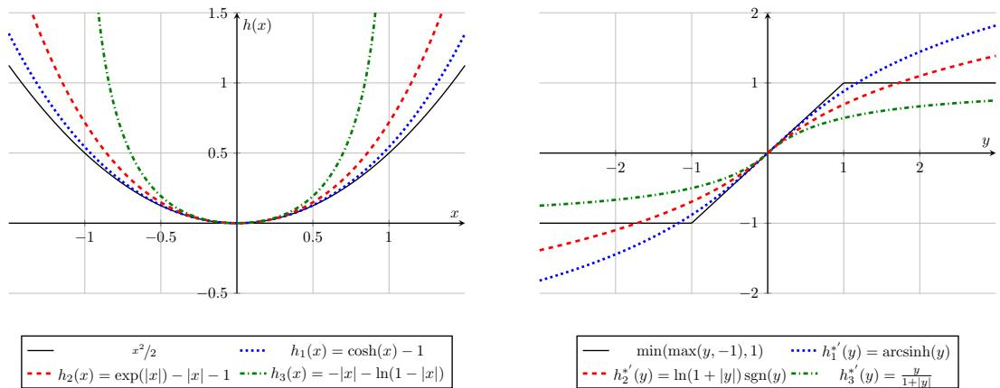
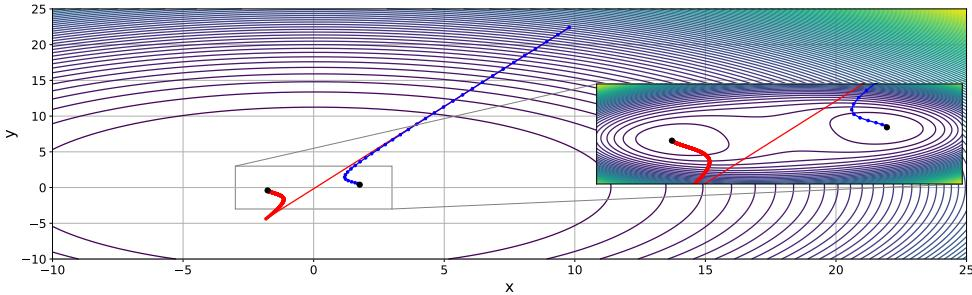
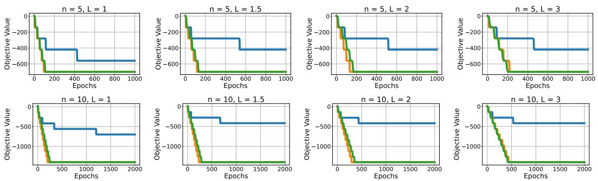
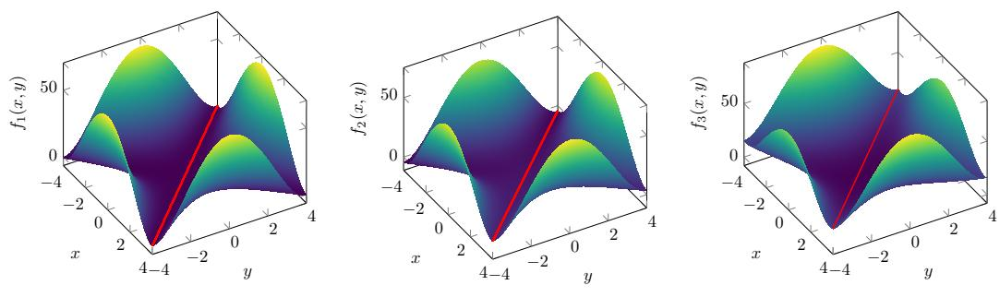

# Escaping saddle points without Lipschitz smoothness: the power of nonlinear preconditioning

Alexander Bodard ESAT-STADIUS & Leuven.AI KU Leuven alexander.bodard@kuleuven.be

Panagiotis Patrinos ESAT-STADIUS & Leuven.AI KU Leuven panos.patrinos@esat.kuleuven.be

# Abstract

We study generalized smoothness in nonconvex optimization, focusing on $( L _ { 0 } , L _ { 1 } )$ - smoothness and anisotropic smoothness. The former was empirically derived from practical neural network training examples, while the latter arises naturally in the analysis of nonlinearly preconditioned gradient methods. We introduce a new sufficient condition that encompasses both notions, reveals their close connection, and holds in key applications such as phase retrieval and matrix factorization. Leveraging tools from dynamical systems theory, we then show that nonlinear preconditioning – including gradient clipping – preserves the saddle point avoidance property of classical gradient descent. Crucially, the assumptions required for this analysis are actually satisfied in these applications, unlike in classical results that rely on restrictive Lipschitz smoothness conditions. We further analyze a perturbed variant that efficiently attains second-order stationarity with only logarithmic dependence on dimension, matching similar guarantees of classical gradient methods.

# 1 Introduction

We consider the unconstrained optimization problem

$$
{ \underset { x \in \mathbb { R } ^ { n } } { \operatorname { m i n i m i z e } } } f ( x ) ,
$$

where $f : \mathbb { R } ^ { n }  \mathbb { R }$ is a twice continuously differentiable nonconvex function. This work studies the nonlinearly preconditioned gradient method, with iterates described by

$$
x ^ { k + 1 } = T _ { \gamma , \lambda } ( x ^ { k } ) : = x ^ { k } - \gamma \nabla \phi ^ { * } ( \lambda \nabla f ( x ^ { k } ) ) ,
$$

where $\phi : \mathbb { R } ^ { n }  \mathbb { R } \cup \{ \infty \}$ is referred to as the reference function, and $\phi ^ { * }$ , its convex conjugate, is called the dual reference function.

Nonlinear preconditioning provides a flexible framework for constructing and analyzing gradientbased optimization algorithms [36, 21, 31]. For instance, when $\begin{array} { r } { \phi ( x ) = \frac { 1 } { 2 } \| x \| ^ { 2 } } \end{array}$ , the update (P-GD) reduces to classical gradient descent. More broadly, we focus on isotropic reference functions of the form $\phi ( x ) = h ( \| x \| ) { \bar { \phi } }$ for some scalar kernel function $h : \mathbb { R }  \mathbb { R } _ { + } \cup \{ \infty \}$ , though our results extend in part to more general settings, including separable reference functions $\textstyle { \dot { \phi } } ( x ) = \sum _ { i = 1 } ^ { n } h ( x _ { i } )$ . Some kernel functions of interest include:

$$
h _ { 1 } ( x ) = \cosh ( x ) - 1 , \quad h _ { 2 } ( x ) = \exp ( | x | ) - | x | - 1 , \quad h _ { 3 } ( x ) = - | x | - \ln ( 1 - | x | ) ,
$$

each of which upper bounds the quadratic function $x ^ { 2 } / 2$ , as visualized in Fig. 1. These choices induce preconditioners that closely resemble common gradient clipping heuristics, as shown in Fig. 1.

The effectiveness of gradient clipping has been justified using the concept of $( L _ { 0 } , L _ { 1 } )$ -smoothness, which is empirically motivated by practical neural network training scenarios [42]. However, it remains unclear under what precise conditions this smoothness assumption holds in real-world applications. On the other hand, the preconditioned gradient method is naturally analyzed under anisotropic smoothness [36], another generalization of the classical Lipschitz smoothness condition. Rather than imposing a global quadratic upper bound, anisotropic smoothness permits more flexible upper bounds defined in terms of the reference function $\phi$ . This makes the preconditioned gradient method particularly attractive in settings where the standard Lipschitz condition is too restrictive. This leads us to our first central question:

  
Figure 1: Comparison of (a) kernel functions and (b) their corresponding nonlinear preconditioners.

Can we formally establish anisotropic smoothness and $( L _ { 0 } , L _ { 1 } )$ -smoothness of practical problems where traditional assumptions fail?

Our second line of inquiry focuses on the behavior of the preconditioned gradient method when applied to nonconvex objectives. Classical gradient descent is known to avoid strict saddle points under the assumption of (global) Lipschitz smoothness [24], a phenomenon which helps explain its strong empirical performance in nonconvex settings. However, for many practical applications Lipschitz smoothness holds only locally or on compact sets around a minimizer, meaning that this assumption is not truly satisfied. This raises the following question:

Does nonlinear preconditioning preserve the saddle point avoidance properties of gradient descent under a possibly less stringent smoothness assumption?

Our results reveal novel connections between different generalizations of smoothness and provide strong theoretical support for nonlinear preconditioning, particularly in nonconvex settings where the classical Lipschitz smoothness assumption may fail.

Contributions Our contributions can be summarized as follows.

• We investigate the classes of problems for which $( L _ { 0 } , L _ { 1 } )$ -smoothness and anisotropic smoothness – two generalizations of the classical Lipschitz smoothness condition – are applicable. To this end, we propose a novel sufficient condition (Assumption 2.8) that guarantees both anisotropic and $( L _ { 0 } , L _ { 1 } )$ -smoothness, thereby revealing a structural link between these two frameworks. We further demonstrate in section 2.3 that this condition holds for several prominent nonconvex problems, including phase retrieval, low-rank matrix factorization, and Burer-Monteiro factorizations of MaxCut-type problems.

• We establish that nonlinear preconditioning preserves the saddle point avoidance behavior of gradient descent, and moreover extends results from the classical Lipschitz smoothness framework to the broader setting of anisotropic smoothness. Specifically, we prove asymptotic avoidance of strict saddle points by leveraging the stable-center manifold theorem. By invoking a recent nonsmooth generalization of this theorem, this analysis is then further extended to accommodate hard gradient clipping. Finally, we present a complexity analysis for a perturbed variant of the preconditioned gradient method, showing that it converges to a second-order stationary point with only logarithmic dependence on the problem dimension.

Notation Let $\mathbb { S } ^ { n \times n }$ be the set of symmetric $n \times n$ matrices. We denote the standard Euclidean inner product on $\mathbb { R } ^ { n }$ by $\langle \cdot , \cdot , \rangle$ , and the corresponding norm by $\| \cdot \|$ . For $X , Y \in \mathbb { R } ^ { m \times n }$ , $\langle X , Y \rangle =$ $\operatorname { t r a c e } ( X ^ { \top } Y )$ is the standard inner product on $\mathbb { R } ^ { m \times n }$ and $\| \cdot \|$ denotes the spectral norm. The class of $k$ times continuously differentiable functions on an open set $O \subseteq \mathbb { R } ^ { n }$ is denoted by ${ \mathcal { C } } ^ { k } ( O )$ . We write $\overline { { \mathrm { s g n } } } ( x ) = x / \| x \|$ for $x \in \mathbb { R } ^ { n } \setminus \{ 0 \}$ and 0 otherwise. A function $f \in { \mathcal { C } } ^ { 2 } ( \mathbb { R } ^ { n } )$ is $L$ -Lipschitz smooth if for all $x , y \in \mathbb { R } ^ { n }$ it holds that $\| \nabla f ( x ) - \nabla f ( y ) \| \leq L \| x - y \|$ , with $L \geq 0$ , and $( L _ { 0 } , L _ { 1 } )$ -smooth if $\| \nabla ^ { 2 } f ( x ) \| \leq L _ { 0 } + L _ { 1 } \| \nabla f ( x ) \|$ for all $x \in \mathbb { R } ^ { n }$ with $L _ { 0 } , L _ { 1 } \ge 0$ . Otherwise, we follow [37].

# 1.1 Related work

Generalized smoothness Gradient descent is traditionally analyzed under the assumption of Lipschitz smoothness [34], although many applications violate this condition. Bregman relative smoothness is a popular extension which allows the Hessian to grow unbounded, see e.g. [30] which assumes a certain polynomial growth. More recently, the $( L _ { 0 } , L _ { 1 } )$ -smoothness condition was proposed by Zhang et al. [42], based on empirical observations in LSTMs, and used to analyze clipped gradient descent and a momentum variant [41]. The framework has since been applied to stochastic normalized gradient descent [43] and generalized SignSGD [12]. Notably, Crawshaw et al. [12] provided empirical evidence that $( L _ { 0 } , L _ { 1 } )$ -smoothness holds for Transformers [40], albeit with layer-wise variation in constants. Further generalizations include $\alpha$ -symmetric smoothness [9] and $\ell$ -smoothness [28], and the latter was used to analyze the convergence of Adam [29]. Despite empirical support for these conditions in key applications, theoretical guarantees remain limited.

Nonlinear preconditioning The preconditioned gradient method with updates given by (P-GD) was introduced in the convex setting by Maddison et al. [31]. Then, Laude et al. [22, 21] studied $L$ -anisotropic smoothness and, under this condition, showed convergence of (P-GD) for nonconvex problems. The method was later extended to measure spaces [4]. Oikonomidis et al. [36] proposed the $( L , { \bar { L } } )$ -anisotropic smoothness condition, connected it to $( L _ { 0 } , L _ { 1 } )$ -smoothness, and analyzed convergence of (P-GD) in both convex and nonconvex settings. We also highlight the works [26, 35] that study the concept of $\Phi$ -convexity, which is closely related to anisotropic smoothness.

Saddle point avoidance To explain the success of gradient descent on nonconvex problems, much work has focused on its (strict) saddle point avoidance properties [25, 24]. It was shown that gradient descent may take exponential time to escape saddle points, even with random initialization [13]. The works [27, 33] showed that noise-injected normalized gradient descent escapes them more efficiently. Jin et al. [17, 18] demonstrated that perturbed gradient descent escapes saddle points in time polylogarithmic in the problem dimension. Recently, Cao et al. [8] studied saddle point avoidance under a second-order self-bounding regularity condition rather than under classical Lipschitz smoothness.

# 2 Anisotropic smoothness

# 2.1 Definition and basic properties

This section introduces $( L , { \bar { L } } )$ -anisotropic smoothness as proposed by [36]. The following assumption, which guarantees in particular that $\phi ^ { * } \in { \mathcal { C } } ^ { 1 } ( \mathbb { R } ^ { n } )$ and $\phi \geq 0$ , is considered valid throughout.

Assumption 2.1. The function $\phi : \mathbb { R } ^ { n } \to { \overline { { \mathbb { R } } } }$ is proper, lsc, strongly convex and even with $\phi ( 0 ) = 0$

We usually also assume the following condition, which ensures in particular that $\phi ^ { * } \in { \mathcal { C } } ^ { 2 } ( \mathbb { R } ^ { n } )$ .

Assumption 2.2. in $\tan \phi \neq \emptyset$ ; $\phi \in { \mathcal { C } } ^ { 2 } ( \operatorname { i n t } \mathrm { d o m } \phi )$ , and for any sequence $\{ x ^ { k } \} _ { k \in \mathbb { N } }$ that converges to some boundary point of int $\operatorname { d o m } \phi ,$ , it follows that $\| \nabla \phi ( x ^ { k } ) \| \to \infty$ .

We follow the definition of anisotropic smoothness by [36], which reduces to [21, Def. 3.1] with reference function $\bar { L } \phi$ if $\operatorname { d o m } \phi = \mathbb { R } ^ { n }$ . If $f \in { \mathcal { C } } ^ { 1 }$ , this concept corresponds to a global version of anisotropic prox-regularity of $- f$ [20, Def. 2.13]. For a geometric intuition, we refer to [26, 35, 36].

Definition 2.3 ( $( L , { \bar { L } } )$ -anisotropic smoothness [36]). $A$ function $f ~ : ~ \mathbb { R } ^ { n } ~ \to ~ \mathbb { R }$ is $( L , { \bar { L } } )$ anisotropically smooth relative to a reference function $\phi$ with constants $L , \bar { L } > 0 i f$

$$
f ( x ) \leq f ( { \bar { x } } ) + { \bar { L } } L ^ { - 1 } \phi ( L ( x - { \bar { y } } ) ) - { \bar { L } } L ^ { - 1 } \phi ( L ( { \bar { x } } - { \bar { y } } ) )
$$

for all $x , { \bar { x } } \in \mathbb R ^ { n }$ , where $\bar { y } = T _ { L ^ { - 1 } , \bar { L } ^ { - 1 } } ( \bar { x } ) = \bar { x } - L ^ { - 1 } \nabla \phi ^ { * } ( \bar { L } ^ { - 1 } \nabla f ( \bar { x } ) )$

The following proposition provides a sufficient condition for anisotropic smoothness. We consider the case $\phi ^ { * } \in \mathcal { C } ^ { 2 }$ for simplicity of exposition, but note that a variant for $\bar { \boldsymbol { \phi } } ^ { * } \notin \mathcal { C } ^ { 2 }$ can also be formulated. Proposition 2.4 (Second-order characterization of $( L , { \bar { L } } )$ -anisotropic smoothness). Suppose that Assumption 2.2 holds, and let $f \in { \mathcal { C } } ^ { 2 }$ be such that for all $x \in \mathbb { R } ^ { n }$

$$
\lambda _ { \operatorname* { m a x } } \bigl ( \nabla ^ { 2 } \phi ^ { * } ( \bar { L } ^ { - 1 } \nabla f ( x ) ) \nabla ^ { 2 } f ( x ) \bigr ) \leq L \bar { L } ,
$$

and $\begin{array} { r } { \operatorname* { l i m } _ { \| \boldsymbol { x } \|  \infty } \| T _ { L ^ { - 1 } , \bar { L } ^ { - 1 } } ( \boldsymbol { x } ) \| = \infty } \end{array}$ . Moreover, assume that either $\operatorname { d o m } \phi$ is bounded or that $\operatorname { d o m } \phi = \mathbb { R } ^ { n }$ , and that for all $x \in \mathbb { R } ^ { n }$ we have $f ( x ) \leq \bar { L } r ^ { - 1 } \phi ( r x ) - \beta$ for some $r \in ( 0 , L )$ , $b \in \mathbb { R }$ . Then, $f$ is $( \delta L , \bar { L } )$ -anisotropically smooth relative to $\phi$ for any $\delta > 1$ .

We say that $f$ satisfies the second-order characterization of anisotropic smoothness if (3) holds. Note that the growth condition on $f$ is not restrictive when $\phi = \operatorname { d o m } \mathbb { R } ^ { n }$ , and that the coercivity assumption on the iteration map $T _ { L ^ { - 1 } , \bar { L } ^ { - 1 } }$ is very mild; we refer the reader to the arguments in [36]. Finally, we connect anisotropic smoothness to some popular smoothness notions.

Example 2.5 (Lipschitz-smoothness [36, Proposition 2.3]). Suppose that $f \in { \mathcal { C } } ^ { 2 }$ is $L _ { f }$ -Lipschitz smooth. Denote by $\mu > 0$ the parameter of strong convexity of a reference function $\phi$ . Then $f$ is $\left( L _ { f } / \mu , 1 \right)$ -anisotropically smooth relative to $\phi$ .

Example 2.6 $( ( L _ { 0 } , L _ { 1 } )$ -smoothness). Let $f \in { \mathcal { C } } ^ { 2 }$ be $( L _ { 0 } , L _ { 1 } )$ -smooth, let ${ \cal L } = { \cal L } _ { 1 } , \bar { \cal L } = { \cal L } _ { 0 } / { \cal L } _ { 1 }$ , and let $\phi ( x ) = - \| x \| - \ln ( 1 - \| x \| )$ . Then $f$ satisfies the second-order characterization of $( L , { \bar { L } } )$ - anisotropic smoothness relative to $\phi$ [36, Proposition 2.6 & Corollary 2.7].

# 2.2 A novel sufficient condition for generalized smoothness

Although it is well-known that univariate polynomials are $( L _ { 0 } , L _ { 1 } )$ -smooth [42, Lemma 2], this is not necessarily the case for multivariate polynomials, as illustrated by the following example.

Example 2.7. Consider the polynomial $f ( x , y ) = { \textstyle \frac { 1 } { 4 } } x ^ { 4 } + { \textstyle \frac { 1 } { 4 } } y ^ { 4 } - { \textstyle \frac { 1 } { 2 } } x ^ { 2 } y ^ { 2 }$ with gradient and Hessian

$$
\nabla f ( x , y ) = \left( x ^ { 3 } - x y ^ { 2 } \right) , \qquad \nabla ^ { 2 } f ( x , y ) = \left( { 3 x ^ { 2 } - y ^ { 2 } \qquad - 2 x y } \right) .
$$

Remark that $\nabla f ( x , - x ) = 0$ and $\nabla ^ { 2 } f ( x , - x ) = x ^ { 2 } \left( { \begin{array} { c } { 2 } & { - 2 } \\ { - 2 } & { 2 } \end{array} } \right)$ . Clearly, $f$ cannot be $( L _ { 0 } , L _ { 1 } )$ -smooth since $\| \nabla ^ { 2 } f ( x , - x ) \| _ { F } = 4 \| x \| ^ { 2 }$ grows unbounded, while $\| \nabla f ( x , - x ) \| = 0$ for all $x \in \mathbb { R }$ .

For multivariate polynomials there may exist a path of $\| x \|  \infty$ along which the gradient norm grows slower than the Hessian norm, in which case $( L _ { 0 } , L _ { 1 } )$ -smoothness cannot hold. More examples are included in appendix A.2. Based on this insight, we propose the following novel condition.

Assumption 2.8. There exists an $R \in \mathbb N$ such that for all $x \in \mathbb { R } ^ { n }$

$$
\| \nabla ^ { 2 } f ( x ) \| _ { F } \leq p _ { R } ( \| x \| ) , \quad a n d \quad \| \nabla f ( x ) \| \geq q _ { R + 1 } ( \| x \| ) .
$$

Here $\begin{array} { r } { p _ { R } ( \alpha ) = \sum _ { i = 0 } ^ { R } a _ { i } \alpha ^ { i } } \end{array}$ and $\begin{array} { r } { q _ { R + 1 } ( \alpha ) = \sum _ { i = 0 } ^ { R + 1 } b _ { i } \alpha ^ { i } } \end{array}$ are polynomials of degree $R$ and $R + 1$ respectively, and in particular we assume that $b _ { R + 1 } > 0$ .

Note that [30] constructs a Bregman distance inducing kernel function under a similar polynomial upper bound to the Hessian norm. Appendix A.1 verifies Assumption 2.8 for univariate polynomials. The following result states that Assumption 2.8 is a sufficient condition for $( L _ { 0 } , L _ { 1 } )$ -smoothness.1

Theorem 2.9. Suppose that Assumption 2.8 holds for $f \in { \mathcal { C } } ^ { 2 }$ . Then, for any $L _ { 1 } > 0$ there exists an $L _ { 0 } > 0$ such that $f$ is $( L _ { 0 } , L _ { 1 } )$ -smooth.

Under mild conditions on the kernel function $h$ , which appendix A.5 shows hold for all examples in (2), Assumption 2.8 also implies the second-order characterization of anisotropic smoothness. In fact, it implies the stronger condition that $\| \nabla ^ { 2 } \phi ^ { * } ( \bar { L } ^ { - 1 } \nabla f ( x ) ) \nabla ^ { 2 } f ( x ) \|$ is uniformly bounded.

Assumption 2.10. The reference function $\phi$ is isotropic, i.e., $\phi ( x ) = h ( \| x \| )$ , and such that (i) $h ^ { * \prime } ( y ) / y$ is a decreasing function on $\mathbb { R } _ { + }$ , (ii) $\begin{array} { r } { \operatorname* { l i m } _ { y  + \infty } \dot { y } h ^ { * \prime \prime } ( y ) = \dot { C } _ { \mathrm { 2 } } } \end{array}$ , for some $C _ { 2 } \in \mathbb { R } _ { + }$ , and (iii)

$$
\operatorname* { l i m } _ { y \to + \infty } { \frac { h ^ { * ^ { \prime } } ( s _ { d } ( y ) ) } { y } } = 0 , \qquad { \mathrm { f o r ~ a n y ~ p o l y n o m i a l ~ } } s _ { d } ( \alpha ) = \sum _ { i = 0 } ^ { d } u _ { i } \alpha ^ { i } { \mathrm { ~ o f ~ } } \deg _ { i } = { \mathrm { ~ ( ~ s ~ o ~ u ~ r ~ ) ~ } } .
$$

Theorem 2.11. Suppose that $f$ satisfies Assumption 2.8. If $\phi$ satisfies Assumption 2.2 and Assumption $2 . I O$ , then for any $\bar { L } > 0$ there exists an $L > 0$ such that $f$ satisfies the second-order characterization of $( \check { L } , \bar { L } )$ -anisotropic smoothness relative to $\phi$ .

1In fact, Theorem 2.9 still holds if Assumption 2.8 is relaxed to $\| \nabla f ( x ) \| \geq q _ { R } ( \| x \| )$ .

# 2.3 Applications

We now establish for a number of key applications that Assumption 2.8 holds, thus proving that the objective is $( L _ { 0 } , L _ { 1 } )$ -smooth and satisfies the second-order characterization of $( L , \bar { L } )$ -anisotropic smoothness. Remark that for all of these, the classical Lipschitz smoothness assumption is violated.

# 2.3.1 Phase retrieval

Consider the real-valued phase retrieval problem with objective and gradient

$$
f ( \boldsymbol { x } ) = \frac { 1 } { 4 } \sum _ { i = 1 } ^ { m } \left( y _ { i } ^ { 2 } - ( a _ { i } ^ { \top } \boldsymbol { x } ) ^ { 2 } \right) ^ { 2 } , \quad \nabla f ( \boldsymbol { x } ) = - \sum _ { i = 1 } ^ { m } \left( y _ { i } ^ { 2 } - ( a _ { i } ^ { \top } \boldsymbol { x } ) ^ { 2 } \right) a _ { i } a _ { i } ^ { \top } \boldsymbol { x } .
$$

Here, $a _ { i } \in \mathbb { R } ^ { n }$ and $y _ { i } \in \mathbb { R }$ for $i \in \mathbb { N } _ { [ 1 , m ] }$ are the measurement vectors and the corresponding measurements, respectively. A relaxed smoothness condition for the phase retrieval problem has been explored in [3] based on Bregman distances. The following theorem establishes that whenever the measurement vectors span $\mathbb { R } ^ { n }$ , the objective $f$ also satisfies our Assumption 2.8. Note that the measurement vectors can only span $\mathbb { R } ^ { n }$ if $m \geq n$ . Moreover, the assumption on spanning $\mathbb { R } ^ { n }$ is mild compared to well-studied conditions that guarantee signal recovery in the phase retrieval problem. These conditions either require randomly sampled measurement vectors with $m$ on the order of $n \log n$ [7], or the so-called complement property [1]. The former ensures the spanning property with high probability, while the latter guarantees it deterministically.

Theorem 2.12. Consider the phase retrieval problem with objective (4) and suppose that the vectors $\{ a _ { i } \} _ { i = 1 } ^ { m }$ span $\mathbb { R } ^ { n }$ .

(i) For any $L _ { 1 } > 0$ there exists $L _ { 0 } > 0$ such that $f$ is $( L _ { 0 } , L _ { 1 } )$ -smooth. (ii) If $\phi$ satisfies Assumptions 2.2 and 2.10, then for any $\bar { L } > 0$ , there exists an $L > 0$ such that $f$ satisfies the second-order characterization of $( \overrightharpoon { L } , \overbar { L } )$ -anisotropic smoothness.

# 2.3.2 Symmetric matrix factorization

Consider the symmetric matrix factorization problem with objective and gradient

$$
f ( U ) = \frac { 1 } { 2 } \| U U ^ { \top } - Y \| _ { F } ^ { 2 } , \quad \nabla f ( U ) = ( U U ^ { \top } - Y ) U .
$$

Here, $U \in \mathbb { R } ^ { n \times r }$ is the optimization variable, and $Y \in \mathbb { S } ^ { n \times n }$ is a given symmetric matrix. When $r < n$ , minimizing $f$ yields a low-rank approximation of $Y$ with rank at most $r$ . Such low-rank matrix factorizations are fundamental in a variety of applications, most notably in principal component analysis (PCA) [19], where one seeks to capture the most significant directions of variation in the data. More broadly, symmetric matrix factorization plays a central role across various domains: in machine learning, it underlies techniques such as non-negative matrix factorization for parts-based representation learning [23]; in signal processing, it is employed in matrix completion and compressed sensing to reconstruct structured signals from incomplete or noisy measurements [6].

Theorem 2.13. Consider the symmetric matrix factorization problem with objective (5). Then the following statements hold.

(i) For any $L _ { 1 } > 0$ there exists an $L _ { 0 } > 0$ such that $f$ is $( L _ { 0 } , L _ { 1 } )$ -smooth. (ii) If $\phi$ satisfies Assumptions 2.2 and 2.10, then for any $\bar { L } > 0$ , there exists an $L > 0$ such that $f$ satisfies the second-order characterization of $( \overrightharpoon { L } , \overbar { L } )$ -anisotropic smoothness.

# 2.3.3 Asymmetric matrix factorization

Consider the regularized asymmetric matrix factorization problem with objective

$$
f ( W , H ) = \frac { 1 } { 2 } \| W H - Y \| _ { F } ^ { 2 } + \frac { \kappa } { 4 } \| W \| _ { F } ^ { 4 } + \frac { \kappa } { 4 } \| H \| _ { F } ^ { 4 } ,
$$

where $W \in \mathbb { R } ^ { m \times r }$ and $H \in \mathbb { R } ^ { r \times n }$ are the optimization variables, $Y \in \mathbb { R } ^ { m \times n }$ is a given matrix, and $\kappa \geq 0$ is a regularization parameter. When $\kappa = 0$ and $r < \operatorname* { m i n } \{ m , n \}$ , this reduces to the classical low-rank matrix factorization problem. Additionally, such objectives have been used to model the training of two-layer linear networks, such as in the case of two-layer autoencoders [15]. We note that the results below also hold for regularization terms of the form $\dot { \kappa } \| W ^ { \top } W - H H ^ { \top } \| _ { F } ^ { 2 }$ as described in [11], and highlight the work of [32], which designed a Bregman proximal-gradient method for similar regularized matrix factorization problems.

Theorem 2.14. Consider the asymmetric matrix factorization problem with objective (6) and let $\kappa > 0$ . Then the following statements hold.

(i) For any $L _ { 1 } > 0$ there exists an $L _ { 0 } > 0$ such that $f$ is $( L _ { 0 } , L _ { 1 } )$ -smooth. (ii) If $\phi$ satisfies Assumptions 2.2 and 2.10, then for any $\bar { L } > 0$ , there exists an $L > 0$ such that $f$ satisfies the second-order characterization of $( \overrightharpoon { L } , \overbar { L } )$ -anisotropic smoothness.

Note that Theorem 2.14 requires $\kappa > 0$ . To understand why, observe that the gradient of $f$ is given by

$$
\begin{array} { r } { \nabla _ { W } f ( W , H ) = ( W H - Y ) H ^ { \top } + \kappa \| W \| _ { F } ^ { 2 } W , \quad \mathrm { a n d } \quad \nabla _ { H } f ( W , H ) = W ^ { \top } ( W H - Y ) + \kappa \| H \| _ { F } ^ { 2 } H . } \end{array}
$$

Let $x$ denote the concatenation of the vectors $\mathrm { v e c } ( W )$ and ${ \mathrm { v e c } } ( H )$ , such that $\| x \| ^ { 2 } = \| W \| _ { F } ^ { 2 } + \| H \| _ { F } ^ { 2 }$ . In contrast to symmetric matrix factorization, if $\kappa = 0$ , the gradient norm of $f$ can approach zero as $\| x \| \to \infty$ , whereas Assumption 2.8 requires an asymptotic growth proportional to $\| \bar { \boldsymbol { x } } \| ^ { 3 }$ . To see this, consider $W ^ { \star } \in \mathbb { R } ^ { m \times r }$ , $H ^ { \star } \in \mathbb { R } ^ { r \times n }$ such that $W ^ { \star } H ^ { \star } = Y$ . In this case, the gradient norm is zero, and rescaling $W ^ { \star }$ and $H ^ { \star }$ with a nonsingular matrix $D \in \mathbb { R } ^ { r \times r }$ , i.e., $\tilde { W } = W ^ { \star } D$ and $\tilde { H } = D ^ { - 1 } H ^ { \star }$ , preserves the gradient norm. As a result, one can construct counterexamples where the gradient norm remains zero while $\| D \|  \infty$ , and consequently $\| x \| \to \infty$ .

Finally, we remark that the key step in proving Theorem 2.14 entails lower bounding $\| \nabla f ( W , H ) \|$ in terms of the variable $V : = \operatorname* { m a x } ( \| W \| _ { F } , \| H \| _ { F } )$ , and exploiting that $\| V \|  \infty$ if and only if $\| x \| \to \infty$ . It appears that this strategy can be generalized to the factorization of $Y$ into more than two factors, which is relevant for training deep linear networks.

# 2.3.4 Burer-Monteiro factorizations of MaxCut-type semidefinite programs

Let us consider so-called MaxCut-type semidefinite programs (SDPs)

$$
\begin{array} { l l } { \underset { X \in \mathbb { S } ^ { n \times n } } { \mathrm { m i n i m i z e } } } & { - \left. C , X \right. } \\ { \mathrm { s u b j e c t ~ t o } } & { X \succeq 0 } \\ & { \mathrm { d i a g } ( X ) = 1 _ { n } , } \end{array}
$$

where $C \in \mathbb { S } ^ { n \times n }$ is the cost matrix. The relaxation (7) provides a precise relaxation to the MaxCut problem, a fundamental combinatorial problem arising in graph optimization [16, 14]. In an effort to exploit the typical low-rank structure of the solution, a Burer-Monteiro factorization [5] decomposes $X ^ { ^ { \bullet } } = { V V } ^ { \top }$ for $V \in \mathbb { R } ^ { n \times r }$ . This yields

$$
\begin{array} { r l } { \underset { V \in \mathbb { R } ^ { n \times r } } { \mathrm { m i n i m i z e } } } & { { } - \langle C , V V ^ { \top } \rangle } \\ { \mathrm { s u b j e c t ~ t o } } & { { } \mathrm { d i a g } ( V V ^ { \top } ) = 1 _ { n } . } \end{array}
$$

Choosing $r$ much smaller than $n$ significantly decreases the number of variables from $n ^ { 2 }$ to $n r$ However, the downside of this approach is that convexity is lost. Fortunately, under certain conditions every second-order stationary point of this nonconvex problem is a global minimizer [14]. Let us denote by $x _ { i } \in \mathbb { R } ^ { r }$ the $i ^ { \because }$ ’th row of $V$ , such that $V ^ { \top } = [ x _ { 1 } , x _ { 2 } , \dots , x _ { n } ]$ . We also define the vectorized variable $x : = [ x _ { 1 } ^ { \top } , x _ { 2 } ^ { \top } , \ldots , x _ { n } ^ { \top } ] ^ { \top } \in \mathbb { R } ^ { d }$ where $d = n r$ . Then we denote by $f ( x )$ the objective of (8) in terms of $x$ , and likewise by $A ( x ) = 0$ the constraint of (8) in terms of $x$ .

As proposed in the seminal work [5], this nonconvex constrained problem can be solved with an augmented Lagrangian method (ALM). Each iteration consists of minimizing with respect to the primal variable $x$ the (unconstrained) augmented Lagrangian with penalty parameter $\beta > 0$ , i.e.,

$$
L _ { \beta } ( x , y ) = f ( x ) + \langle A ( x ) , y \rangle + \frac { \beta } { 2 } \| A ( x ) \| ^ { 2 } ,
$$

followed by an update of the multipliers $y \in \mathbb { R } ^ { n }$ . A similar strategy was also used in [38] for Burer-Monteiro factorizations of clustering SDPs. The following theorem establishes generalized smoothness of the augmented Lagrangian with respect to the primal variable.

Theorem 2.15. Consider the Burer-Monteiro factorization (8) of the MaxCut-type SDP (7) and let $L _ { \beta }$ denote the augmented Lagrangian with penalty parameter $\beta > 0$ of this factorized problem. Then, with respect to the primal variable $x \in \mathbb { R } ^ { d }$ and for some fixed multiplier $y \in \mathbb { R } ^ { n }$ the following statements hold.

(i) For any $L _ { 1 } > 0$ there exists $L _ { 0 } > 0$ such that $\boldsymbol { L } _ { \beta } ( \cdot , y )$ is $( L _ { 0 } , L _ { 1 } )$ -smooth. (ii) If $\phi$ satisfies Assumptions 2.2 and 2.10, then for any $\bar { L } > 0$ , there exists an $L > 0$ such that $\boldsymbol { L } _ { \beta } ( \cdot , y )$ satisfies the second-order characterization of $( L , { \bar { L } } )$ -anisotropic smoothness.

# 3 Saddle point avoidance of the preconditioned gradient method

The remarkable performance of simple gradient descent-like methods for minimizing nonconvex functions is often attributed to the fact that they avoid strict saddle points of Lipschitz smooth objectives. This section establishes that nonlinear preconditioning of the gradient preserves this desirable property, and in fact generalizes this result to anisotropically smooth functions.

# 3.1 Asymptotic results based on the stable-center manifold theorem

Denote by $\mathcal { X } ^ { \star }$ the set of strict saddle points of a function $f \in { \mathcal { C } } ^ { 2 }$ , i.e.,

$$
\begin{array} { r } { \mathcal { X } ^ { \star } : = \left\{ x ^ { \star } \mid \nabla f ( x ^ { \star } ) = 0 , \quad \lambda _ { \operatorname* { m i n } } \bigl ( \nabla ^ { 2 } f ( x ^ { \star } ) \bigr ) < 0 \right\} . } \end{array}
$$

Classical results like [25, 24], which are based on the stable-center manifold theorem [39], exploit the fact that the eigenvalues of the Hessian $\nabla ^ { 2 } f$ are uniformly bounded. In a similar way, for the preconditioned gradient descent method we require that the second-order characterization of $( L , \dot { \bar { L } } )$ -anisotropic smoothness holds. By exploiting the fact that $\nabla ^ { 2 } \phi ^ { * } ( 0 ) = I$ , we then obtain the following theorem, which generalizes [25, Theorem 4].

Theorem 3.1. Let $f \in { \mathcal { C } } ^ { 2 }$ and suppose that Assumption 2.2 holds. Consider the iterates $( x ^ { k } ) _ { k \in \mathbb { N } }$ generated by the preconditioned gradient method, i.e., $\boldsymbol { x } ^ { k + 1 } = T _ { \gamma , \bar { L } ^ { - 1 } } ( \boldsymbol { x } ^ { k } ) ;$ , where the initial iterate $\boldsymbol { x } ^ { 0 } \in \mathbb { R } ^ { n }$ is chosen uniformly at random. If $f$ satisfies the second-order characterization of $( L , { \bar { L } } )$ - anisotropic smoothness, and $\begin{array} { r } { i f \gamma < \frac { 1 } { L } } \end{array}$ , then

$$
\mathbb { P } \left( \operatorname* { l i m } _ { k \to \infty } x ^ { k } \in \mathcal { X } ^ { \star } \right) = 0 .
$$

Assumption 2.2 ensures $\phi ^ { * } \in \mathcal { C } ^ { 2 }$ , which in turn guarantees that $T _ { \gamma , \bar { L } ^ { - 1 } } \in \mathcal { C } ^ { 1 }$ , as needed for the stable-center manifold theorem [39, 24]. Unfortunately, this means that the reference function $\phi ( x ) = h ( \| x \| )$ with $\begin{array} { r } { h = \frac { 1 } { 2 } \| \cdot \| ^ { 2 } + \delta _ { [ - 1 , 1 ] } } \end{array}$ , which gives rise to a version of the gradient clipping method [36, Example 1.7], is not covered by Theorem 3.1. Indeed, in this case we have $h ^ { * \prime } ( y ) =$ $\Pi _ { [ - 1 , 1 ] } ( y ) = \operatorname* { m a x } \left\{ \operatorname* { m i n } \left\{ y , 1 \right\} , - 1 \right\}$ . Note however that this projection is a piecewise affine function, and therefore $h ^ { * \prime }$ is continuously differentiable almost everywhere, i.e., except at the points $y = \pm 1$ .

Based on a recent variant of the stable-center manifold theorem [10] we now establish that also the above clipped gradient variant with $\phi ^ { * } \notin { \mathcal { C } } ^ { 2 }$ avoids strict saddle points with probability one. In particular, [10, Proposition 2.5] only requires that the iteration map $T _ { \gamma , \lambda }$ is continuously differentiable on a set of measure one which contains the set of strict saddle points $\mathcal { X } ^ { \star }$ . We thus have to show that (i) $\nabla \phi ^ { * } ( \check { L } ^ { - 1 } \nabla f ( \cdot ) )$ is differentiable almost everywhere; and that (ii) $\nabla \phi ^ { * } ( \cdot )$ is differentiable around the point $\bar { L } ^ { - 1 } \nabla f ( x ^ { \star } ) = 0$ , with $x ^ { \star } \in \mathcal { X } ^ { \star }$ . Remark that the former requires an additional assumption for guaranteeing that $\nabla f$ maps a set of measure one onto a set on which $\nabla \phi ^ { * }$ is differentiable.

Theorem 3.2. Let $f \in \mathcal { C } ^ { 2 + }$ and $\phi ( x ) \ = \ h ( \| x \| )$ with $h = \textstyle { \frac { 1 } { 2 } } \| \cdot \| ^ { 2 } + \delta _ { [ - 1 , 1 ] }$ . Consider the iterates $( x ^ { k } ) _ { k \in \mathbb { N } }$ generated by the preconditioned gradient method, i.e., $x ^ { k + 1 } \stackrel { \cdot } { = } T _ { \gamma , \bar { L } ^ { - 1 } } ( x ^ { k } ) =$ $x ^ { k } - \gamma \operatorname* { m i n } ( { 1 } / { \| \nabla f ( x ^ { k } ) \| } , { \bar { L } } ^ { - 1 } ) \nabla f ( x ^ { k } )$ , where the initial iterate $x ^ { 0 } \in \mathbb { R } ^ { n }$ is chosen uniformly at random. Moreover, suppose that the set

$$
U : = \{ x \in \mathbb { R } ^ { n } \mid \| \nabla f ( x ) \| \neq { \bar { L } } \}
$$

is a set of measure one. If $f$ satisfies the second-order sufficient condition for $( L , { \bar { L } } )$ -anisotropic smoothness, and if $\begin{array} { r } { \gamma < \frac { 1 } { L } } \end{array}$ , then

$$
\mathbb { P } ( \operatorname* { l i m } _ { k  \infty } x ^ { k } \in \mathcal { X } ^ { \star } ) = 0 .
$$

# 3.2 Efficiently avoiding strict saddle points through perturbations

Despite avoiding strict saddle points asymptotically for almost any initialization, gradient descent may actually be significantly slowed down around saddle points. In fact, gradient descent can take exponential time to escape strict saddle points [13], in the sense that the number of iterations depends exponentially on the dimension $n$ of the optimization variable. Yet, by adding small perturbations, this issue can be mitigated, and the complexity of obtaining a second-order stationary point then depends only polylogarithmically on the dimension $n$ [17, 18]. This section establishes a similar result for a perturbed preconditioned gradient method.

Existing works analyzing the complexity of gradient descent for converging to a second-order stationary point require not only Lipschitz continuity of the gradients, but also of the Hessian. This is quite restrictive, since for example any (non-degenerate) polynomial of degree more than 2 violates this assumption. Instead, we require Lipschitz continuity of the mapping

$$
H _ { \lambda } ( x ) : = \lambda ^ { - 1 } J [ \nabla \phi ^ { * } ( \lambda \nabla f ( x ) ) ] = \nabla ^ { 2 } \phi ^ { * } ( \lambda \nabla f ( x ) ) \nabla ^ { 2 } f ( x ) .
$$

To ensure well-definedness of $H _ { \lambda }$ , Assumption 2.2 is assumed in the remainder of this section.

Assumption 3.3. The mapping $H _ { \lambda } ( x ) : = \nabla ^ { 2 } \phi ^ { * } ( \lambda \nabla f ( x ) ) \nabla ^ { 2 } f ( x )$ is $\rho$ -Lipschitz-continuous, i.e.

$$
\exists \rho > 0 : \| H _ { \lambda } ( x ) - H _ { \lambda } ( y ) \| \leq \rho \| x - y \| , \quad \forall x , y \in \mathbb { R } ^ { n } .
$$

This new condition appears significantly less restrictive, as illustrated by the following example.

Example 3.4. Let $\begin{array} { r } { f ( x ) = \frac { 1 } { 4 } x ^ { 4 } - \frac { 1 } { 2 } x ^ { 2 } } \end{array}$ and $\phi ( x ) = \cosh ( | x | ) - 1$ . Since arcsinh is an odd function,

$$
\nabla \phi ^ { * } ( \lambda f ^ { \prime } ( x ) ) = \operatorname { a r c s i n h } ( | \lambda f ^ { \prime } ( x ) | ) \bar { \mathrm { s g n } } ( \lambda f ^ { \prime } ( x ) ) = \operatorname { a r c s i n h } ( \lambda f ^ { \prime } ( x ) ) = \operatorname { a r c s i n h } ( \lambda ( x ^ { 3 } - x ) ) .
$$

Therefore, we obtain that Hλ(x) = λ−1 d(∇ϕ∗(λf′(x))) $\begin{array} { r } { H _ { \lambda } ( x ) = \lambda ^ { - 1 } \frac { \mathrm { d } \left( \nabla \phi ^ { \ast } \left( \lambda f ^ { \prime } ( x ) \right) \right) } { \mathrm { d } x } = \frac { ( 3 x ^ { 2 } - 1 ) } { \sqrt { 1 + \lambda ^ { 2 } ( x ^ { 3 } - x ) ^ { 2 } } } } \end{array}$ . One easily verifies that $H _ { \lambda } \in { \mathcal { C } } ^ { 1 }$ with bounded derivative, which implies the required Lipschitz-continuity of $H _ { \lambda }$ . In fact, this reasoning generalizes to any univariate polynomial, regardless of its degree.

Under anisotropic smoothness, it is natural to consider $\lambda ^ { - 1 } \phi ( \nabla \phi ^ { * } ( \lambda \nabla f ( x ) ) )$ as a first-order stationarity measure, and $\lambda _ { \operatorname* { m i n } } ( H _ { \lambda } ( x ) )$ as a second-order stationarity measure. Therefore, we say that a point $x \in \mathbb { R } ^ { n }$ is an $\epsilon$ -second-order stationary point of an $( L , { \bar { L } } )$ -anisotropically smooth function $f$ if

$$
\begin{array} { r } { \lambda ^ { - 1 } \phi ( \nabla \phi ^ { * } ( \lambda \nabla f ( x ) ) ) \leq \epsilon ^ { 2 } , \qquad \mathrm { a n d } \qquad \lambda _ { \operatorname* { m i n } } ( \nabla ^ { 2 } \phi ^ { * } ( \lambda \nabla f ( x ) ) \nabla ^ { 2 } f ( x ) ) \geq - \sqrt { \rho \epsilon } . } \end{array}
$$

For $\phi = { \textstyle { \frac { 1 } { 2 } } } \| \cdot \| ^ { 2 }$ we recover the classical notion of $\epsilon$ -second-order stationarity, with $\rho$ the constant of Lipschitz continuity of $\nabla ^ { 2 } f$ .

Algorithm 1 describes a perturbed preconditioned gradient method that closely resembles perturbation schemes presented in [17, 18]. In particular, whenever the first-order stationarity is sufficiently small, then a perturbation is added followed by $\lceil \mathcal { T } \rceil > 0$ unperturbed iterations.

# Algorithm 1 Perturbed preconditioned gradient descent

REQUIRE: $x ^ { 0 } \in \mathbb { R } ^ { n }$ , $\gamma , \lambda > 0$ , perturbation radius $r > 0$ , time interval $\tau > 0$ , tolerance $\mathcal { G } > 0$   
1: $k _ { \mathrm { p e r t u r b } } = 0$   
2: for $k = 0 , 1 , \ldots$ do   
3: if $\begin{array} { r } { \lambda ^ { - 1 } \phi ( \nabla \phi ^ { * } ( \lambda \nabla f ( x ^ { k } ) ) ) \le \frac { \mathcal { G } ^ { 2 } } { 2 } } \end{array}$ and $k - k _ { \mathrm { p e r t u r b } } > T$ then   
4: $x ^ { k }  x ^ { k } + \gamma \xi ^ { k }$ , $\xi ^ { k } \sim \mathbb { B } _ { 0 } ( r )$ uniformly, $k _ { \mathrm { p e r t u r b } }  k$   
5: $x ^ { k + 1 } = x ^ { k } - \gamma \nabla \phi ^ { * } ( \lambda \nabla f ( x ^ { k } ) )$

We analyze the complexity of algorithm 1 under the following assumption.

Assumption 3.5. Suppose that Assumption 2.2 holds, such that $\phi ^ { * } \in \mathcal { C } ^ { 2 }$ , and let $\phi ( x ) = h ( \| x \| )$ where in particular $h \in \mathcal { C } ^ { 2 }$ . Moreover, let $h ( x ) \geq x ^ { 2 } / 2 \qquad $ , and $h ( x ) = x ^ { 2 } / 2 + o ( x ^ { 2 } )$ as $x \to 0$ .

This assumption holds for kernel functions from (2). Remark that there is no real loss of generality by fixing the scale of $h$ around 0, since a rescaled version of $h$ can be obtained by modifying $\bar { L }$ .

In our analysis, we specify the parameters of algorithm 1 in terms of $L , \bar { L } , \epsilon$ and some $\chi \geq 1$

$$
\begin{array} { r } { \gamma = \frac { 1 } { L } , \quad \lambda = \frac { 1 } { L } , \quad r = \frac { \epsilon } { 4 0 0 \chi ^ { 3 } } , \quad \mathcal { T } = \frac { L } { \sqrt { \rho \epsilon } } \chi , \quad \mathcal { G } = \operatorname* { m i n } \left\{ 1 , \frac { 1 } { \sqrt { \lambda } } \right\} r , } \end{array}
$$

and introduce two additional constants that are used only in the analysis, i.e.,

$$
\begin{array} { r } { \mathcal { F } = \frac { 1 } { 5 0 \lambda \chi ^ { 3 } } \sqrt { \frac { \epsilon ^ { 3 } } { \rho } } , \quad \mathcal { Z } = \frac { 1 } { 4 \chi } \sqrt { \frac { \epsilon } { \rho } } . } \end{array}
$$

We obtain the following complexity of algorithm 1 for converging to a second-order stationary point. Theorem 3.6 (Iteration complexity). Let $f$ be $( L , { \bar { L } } )$ -anisotropically relative to $\phi$ . Moreover, suppose that Assumptions 3.3 and 3.5 hold, and define constants $\Delta _ { f } ~ \ge ~ f ( x ^ { 0 } ) - \operatorname { i n f } f$ and $\begin{array} { r } { \chi = \log _ { 2 } \left( \frac { L ^ { 2 } \sqrt { n } \Delta _ { f } } { c \sqrt { \rho } \bar { L } \epsilon ^ { 5 / 2 } \delta } \right) } \end{array}$ for some $c > 0$ . There exists a constant $c _ { \operatorname* { m a x } } > 0$ such that if $c \leq c _ { \mathrm { m a x } }$ , then for any $\epsilon > 0$ sufficiently small, and for any $\delta \in ( 0 , 1 )$ , Algorithm $^ { l }$ with parameters as in (12) and (13), visits an $\epsilon$ -second-order stationary point in at least $T / 2$ iterations with probability at least $1 - \delta$ , where

$$
\begin{array} { r } { T = 8 \operatorname* { m a x } \left\{ \frac { ( f ( x ^ { 0 } ) - \operatorname* { i n f } f ) T } { \mathcal { F } } , \lambda \frac { ( f ( x ^ { 0 } ) - \operatorname* { i n f } f ) } { 2 \gamma \mathcal { G } ^ { 2 } } \right\} = \tilde { O } \left( \frac { L ( f ( x ^ { 0 } ) - \operatorname* { i n f } f ) } { \bar { L } \epsilon ^ { 2 } } \right) . } \end{array}
$$

The $\tilde { \mathcal { O } }$ notation hides a factor $\chi ^ { 4 }$ which is polylogarithmic in the dimension $n$ and in the tolerance $\epsilon$

Theorem 3.6 generalizes [18, Theorem 18], and relies on a similar high-level proof strategy, which goes as follows. If the current iterate $x$ is not an $\epsilon$ -second-order stationary point, then either $\bar { \lambda } ^ { - 1 } \phi ( \nabla \phi ^ { * } ( \lambda \nabla f ( x ) ) )$ is large, or $\lambda _ { \operatorname* { m i n } } ( H _ { \lambda } )$ is sufficiently negative. In either case, we establish a significant decrease in function value after at most $\lceil \mathcal T \rceil$ iterations of algorithm 1. Since $f ( x ^ { 0 } ) - \operatorname { i n f } f$ is bounded, the number of iterates which are not $\epsilon$ -second-order stationary can be bounded.

Nevertheless, the generalization of [18, Theorem 18] to the setting of Algorithm 1 is by no means straightforward. The original proofs rely heavily on Lipschitz smoothness, in a way that often does not generalize directly to the anisotropically smooth setting. Here, we highlight two such difficulties. First, consider a point $x \in \mathbb { R } ^ { n }$ and the perturbed point $\bar { x } : = x + \gamma \xi$ for some perturbation $\xi \in \mathbb { B } _ { 0 } ( r )$ . Then, by anisotropic smoothness we can upper bound

$$
f ( \bar { x } ) - f ( x ) \leq \frac { \gamma } { \lambda } \phi ( \xi + \nabla \phi ^ { * } ( \lambda \nabla f ( x ) ) ) .
$$

While Lipschitz-smoothness with $\phi = { \textstyle { \frac { 1 } { 2 } } } \| \cdot \| ^ { 2 }$ readily provides an upper bound in terms of $\| \xi \| ^ { 2 } \leq r ^ { 2 }$ and $\| \nabla f ( x ) \| ^ { 2 }$ , the reference functions are not typically such that an upper bound in terms of

$$
\phi ( \xi ) + \phi ( \nabla \phi ^ { * } ( \lambda \nabla f ( x ) ) )
$$

can be obtained. Second, unlike in the $L$ -Lipschitz-smooth case where $\| \nabla ^ { 2 } f \| \leq L$ , the norm $\| H _ { \lambda } \|$ cannot be upper bounded uniformly, even under the second-order characterization of $( L , { \bar { L } } )$ - anisotropic smoothness. The latter only guarantees that $\lambda _ { \operatorname* { m a x } } ( H _ { \lambda } ) \leq L \bar { L }$ , but it does not lower bound $\lambda _ { \operatorname* { m i n } } ( H _ { \lambda } )$ . And even if the eigenvalues of $H _ { \lambda }$ were bounded in absolute value, this still would not guarantee boundedness of $\| H _ { \lambda } \|$ , since $H _ { \lambda }$ is not a normal matrix in general.

# 4 Numerical validation

Lastly, we illustrate some merits of nonlinear preconditioning, and validate the complexity result of Theorem 3.6 numerically. The source code is publicly available.2

Nonlinear preconditioning for symmetric matrix factorization For the symmetric matrix factorization problem (5) with $n = 2$ and $r = 1$ , Fig. 2 presents a 2D visualization of the level curves of the objective, along with the iterates of both vanilla gradient descent (GD) and the preconditioned variant (P-GD) with $\phi ( x ) = \cosh ( \| x \| ) - 1$ . Unless GD is initialized close to a stationary point, the stepsize must be chosen very small to prevent the iterates from diverging – as expected, because the quartic objective is not Lipschitz smooth. In contrast, the (P-GD) iterations take the form (for $\bar { L } = 1$ )

$$
\begin{array} { r } { x ^ { + } = x - \gamma \frac { \sinh ^ { - 1 } ( \| \nabla f ( x ) \| ) } { \| \nabla f ( x ) \| } \nabla f ( x ) . } \end{array}
$$

In this case, large gradients are damped – recall the close resemblance to clipping methods, cf. Fig. 1 – resulting in the convergence of (P-GD) for stepsizes $\gamma$ that are often orders of magnitudes larger than the maximum stepsize of GD. In turn, this causes (P-GD) to often require significantly fewer iterations, and overall outperform GD for fixed stepsize.

  
Figure 2: Iterates of GD (red) and (P-GD) (blue) on a symmetric matrix factorization problem.

  
Figure 3: Performance of vanilla GD (blue), perturbed vanilla GD [13, Alg 1] (orange), and Algorithm 1 (green) on the ‘octopus’ function [13].

Fast avoidance of saddle points Fig 3 validates the fast escape of saddle points by Algorithm 1. We consider the ‘octopus’ objective [13] which was constructed such that GD takes exponential time to escape saddle points. We select all hyperparameters as in [13, $\ S 5 ]$ , and set the only additional hyperparameter $\stackrel {  } { \bar { L } } = 1$ . We compare against vanilla GD and perturbed vanilla GD [13, Alg 1], and vary the constant $L \in \{ 1 , 1 . 5 , 2 , 3 \}$ and dimension $n \in \{ 5 , \bar { 1 0 } \}$ , thus creating counterparts to [11, Figs 3 and 4]. We observe that algorithm 1 performs similar to perturbed vanilla GD, and also scales in a similar way with respect to $n$ and $L$ . This validates the complexity result from Theorem 3.6.

# 5 Conclusion

This work introduced a novel sufficient condition unifying $( L _ { 0 } , L _ { 1 } )$ -smoothness and anisotropic smoothness. We showed that this condition holds in key applications such as phase retrieval, matrix factorization, and Burer-Monteiro factorizations of MaxCut.

We further analyzed the nonlinearly preconditioned gradient method, which naturally aligns with anisotropic smoothness. Notably, we proved that it preserves the saddle point avoidance properties of gradient descent and extends them to anisotropically smooth settings. This contrasts with prior analyses requiring either global Lipschitz smoothness, or local smoothness combined with compactness, both of which are often unmet in practice.

To our knowledge, this is the first work to rigorously establish saddle point avoidance for problems like phase retrieval and matrix factorization under a smoothness condition that is both practical and verifiable. These results strengthen the theoretical foundations of first-order methods for nonconvex optimization and in particular encourage further study of nonlinear gradient preconditioning.

# Acknowledgments and Disclosure of Funding

The authors are supported by the Research Foundation Flanders (FWO) research projects G081222N, G033822N, G0A0920N and the Research Council KU Leuven C1 project with ID C14/24/103.

We thank Konstantinos Oikonomidis, Jan Quan and Emanuel Laude for the insightful discussions.

# References

[1] A. S. Bandeira, J. Cahill, D. G. Mixon, and A. A. Nelson. “Saving phase: Injectivity and stability for phase retrieval”. In: Applied and Computational Harmonic Analysis 37.1 (July 2014), pp. 106–125.   
[2] D. P. Bertsekas. Nonlinear Programming. 2nd ed. Athena Scientific, 1999.   
[3] J. Bolte, S. Sabach, M. Teboulle, and Y. Vaisbourd. “First order methods beyond convexity and Lipschitz gradient continuity with applications to quadratic inverse problems”. In: SIAM Journal on Optimization 28.3 (2018), pp. 2131–2151.   
[4] C. Bonet, T. Uscidda, A. David, P.-C. Aubin-Frankowski, and A. Korba. “Mirror and Preconditioned Gradient Descent in Wasserstein Space”. In: Advances in Neural Information Processing Systems 37 (Dec. 2024), pp. 25311–25374.   
[5] S. Burer and R. D. Monteiro. “A nonlinear programming algorithm for solving semidefinite programs via low-rank factorization”. In: Mathematical Programming 95.2 (Feb. 2003), pp. 329–357.   
[6] E. J. Candès and B. Recht. “Exact Matrix Completion via Convex Optimization”. In: Foundations of Computational Mathematics 9.6 (Dec. 2009), pp. 717–772.   
[7] E. J. Candès, T. Strohmer, and V. Voroninski. “PhaseLift: Exact and Stable Signal Recovery from Magnitude Measurements via Convex Programming”. In: Communications on Pure and Applied Mathematics 66.8 (2013), pp. 1241–1274.   
[8] D. Y. Cao, A. Y. Chen, K. Sridharan, and B. Tang. Efficiently Escaping Saddle Points under Generalized Smoothness via Self-Bounding Regularity. Mar. 2025.   
[9] Z. Chen, Y. Zhou, Y. Liang, and Z. Lu. “Generalized-Smooth Nonconvex Optimization is As Efficient As Smooth Nonconvex Optimization”. In: International Conference on Machine Learning (June 2023), pp. 5396–5427.   
[10] P. Cheridito, A. Jentzen, and F. Rossmannek. “Gradient Descent Provably Escapes Saddle Points in the Training of Shallow ReLU Networks”. In: Journal of Optimization Theory and Applications (Sept. 2024).   
[11] Y. Chi, Y. M. Lu, and Y. Chen. “Nonconvex Optimization Meets Low-Rank Matrix Factorization: An Overview”. In: IEEE Transactions on Signal Processing 67.20 (Oct. 2019), pp. 5239–5269.   
[12] M. Crawshaw, M. Liu, F. Orabona, W. Zhang, and Z. Zhuang. “Robustness to Unbounded Smoothness of Generalized SignSGD”. In: Advances in Neural Information Processing Systems 35 (Dec. 2022), pp. 9955–9968.   
[13] S. S. Du, C. Jin, J. D. Lee, M. I. Jordan, A. Singh, and B. Poczos. “Gradient Descent Can Take Exponential Time to Escape Saddle Points”. In: Advances in Neural Information Processing Systems. Vol. 30. 2017.   
[14] F. R. Endor and I. Waldspurger. Benign landscape for Burer-Monteiro factorizations of MaxCut-type semidefinite programs. arXiv:2411.03103 [math]. Mar. 2025.   
[15] I. Fatkhullin and N. He. “Taming Nonconvex Stochastic Mirror Descent with General Bregman Divergence”. In: Proceedings of The 27th International Conference on Artificial Intelligence and Statistics. PMLR, Apr. 2024, pp. 3493–3501.   
[16] M. X. Goemans and D. P. Williamson. “Improved approximation algorithms for maximum cut and satisfiability problems using semidefinite programming”. In: J. ACM 42.6 (Nov. 1995), pp. 1115–1145.   
[17] C. Jin, R. Ge, P. Netrapalli, S. M. Kakade, and M. I. Jordan. “How to Escape Saddle Points Efficiently”. In: Proceedings of the 34th International Conference on Machine Learning. PMLR, July 2017, pp. 1724–1732.   
[18] C. Jin, P. Netrapalli, R. Ge, S. M. Kakade, and M. I. Jordan. “On Nonconvex Optimization for Machine Learning: Gradients, Stochasticity, and Saddle Points”. In: J. ACM 68.2 (Feb. 2021), 11:1–11:29.   
[19] I. T. Joliffe. Principal Component Analysis. Springer Series in Statistics. New York: SpringerVerlag, 2002.   
[20] E. Laude. “Lower envelopes and lifting for structured nonconvex optimization”. PhD thesis. Technische Universität München, 2021.   
[21] E. Laude and P. Patrinos. “Anisotropic proximal gradient”. In: Mathematical Programming (Apr. 2025).   
[22] E. Laude, A. Themelis, and P. Patrinos. “Dualities for Non-Euclidean Smoothness and Strong Convexity under the Light of Generalized Conjugacy”. In: SIAM Journal on Optimization 33.4 (Dec. 2023), pp. 2721–2749.   
[23] D. D. Lee and H. S. Seung. “Learning the parts of objects by non-negative matrix factorization”. In: Nature 401.6755 (Oct. 1999), pp. 788–791.   
[24] J. D. Lee, I. Panageas, G. Piliouras, M. Simchowitz, M. I. Jordan, and B. Recht. “First-order methods almost always avoid strict saddle points”. In: Mathematical Programming 176.1 (July 2019), pp. 311–337.   
[25] J. D. Lee, M. Simchowitz, M. I. Jordan, and B. Recht. “Gradient Descent Only Converges to Minimizers”. In: Conference on Learning Theory. PMLR, June 2016, pp. 1246–1257.   
[26] F. Léger and P.-C. Aubin-Frankowski. Gradient descent with a general cost. arXiv:2305.04917 [math]. June 2023.   
[27] K. Y. Levy. The Power of Normalization: Faster Evasion of Saddle Points. arXiv:1611.04831 [cs]. Nov. 2016.   
[28] H. Li, J. Qian, Y. Tian, A. Rakhlin, and A. Jadbabaie. “Convex and Non-convex Optimization Under Generalized Smoothness”. In: Advances in Neural Information Processing Systems 36 (Dec. 2023), pp. 40238–40271.   
[29] H. Li, A. Rakhlin, and A. Jadbabaie. “Convergence of Adam Under Relaxed Assumptions”. In: Advances in Neural Information Processing Systems 36 (Dec. 2023), pp. 52166–52196.   
[30] H. Lu, R. M. Freund, and Y. Nesterov. “Relatively Smooth Convex Optimization by First-Order Methods, and Applications”. In: SIAM Journal on Optimization 28.1 (Jan. 2018), pp. 333–354.   
[31] C. J. Maddison, D. Paulin, Y. W. Teh, and A. Doucet. “Dual Space Preconditioning for Gradient Descent”. In: SIAM Journal on Optimization 31.1 (Jan. 2021), pp. 991–1016.   
[32] M. C. Mukkamala and P. Ochs. “Beyond Alternating Updates for Matrix Factorization with Inertial Bregman Proximal Gradient Algorithms”. In: Advances in Neural Information Processing Systems. Vol. 32. 2019.   
[33] R. Murray, B. Swenson, and S. Kar. “Revisiting Normalized Gradient Descent: Fast Evasion of Saddle Points”. In: IEEE Transactions on Automatic Control 64.11 (Nov. 2019), pp. 4818– 4824.   
[34] Y. Nesterov. Lectures on Convex Optimization. Vol. 137. Springer Optimization and Its Applications. Springer International Publishing, 2018.   
[35] K. Oikonomidis, E. Laude, and P. Patrinos. Forward-backward splitting under the light of generalized convexity. arXiv:2503.18098 [math]. Mar. 2025.   
[36] K. Oikonomidis, J. Quan, E. Laude, and P. Patrinos. Nonlinearly Preconditioned Gradient Methods under Generalized Smoothness. arXiv:2502.08532 [math]. Feb. 2025.   
[37] R. T. Rockafellar and R. J. B. Wets. Variational Analysis. Ed. by M. Berger et al. Vol. 317. Grundlehren der mathematischen Wissenschaften. Berlin, Heidelberg: Springer, 1998.   
[38] M. F. Sahin, A. Eftekhari, A. Alacaoglu, F. Latorre, and V. Cevher. “An Inexact Augmented Lagrangian Framework for Nonconvex Optimization with Nonlinear Constraints”. In: Advances in Neural Information Processing Systems. Vol. 32. 2019.   
[39] M. Shub. Global Stability of Dynamical Systems. Springer New York, 1987.   
[40] A. Vaswani, N. Shazeer, N. Parmar, J. Uszkoreit, L. Jones, A. N. Gomez, Ł. u. Kaiser, and I. Polosukhin. “Attention is All you Need”. In: Advances in Neural Information Processing Systems. Vol. 30. 2017.   
[41] B. Zhang, J. Jin, C. Fang, and L. Wang. “Improved Analysis of Clipping Algorithms for Non-convex Optimization”. In: Advances in Neural Information Processing Systems. Vol. 33. 2020, pp. 15511–15521.   
[42] J. Zhang, T. He, S. Sra, and A. Jadbabaie. Why gradient clipping accelerates training: A theoretical justification for adaptivity. arXiv:1905.11881 [math]. Feb. 2020.   
[43] S.-Y. Zhao, Y.-P. Xie, and W.-J. Li. “On the convergence and improvement of stochastic normalized gradient descent”. In: Science China Information Sciences 64.3 (Feb. 2021), p. 132103.

# NeurIPS Paper Checklist

# 1. Claims

Question: Do the main claims made in the abstract and introduction accurately reflect the paper’s contributions and scope?

Answer: [Yes]

Justification: The abstract and introduction accurately reflect the paper’s contributions and scope.

Guidelines:

• The answer NA means that the abstract and introduction do not include the claims made in the paper.   
• The abstract and/or introduction should clearly state the claims made, including the contributions made in the paper and important assumptions and limitations. A No or NA answer to this question will not be perceived well by the reviewers.   
• The claims made should match theoretical and experimental results, and reflect how much the results can be expected to generalize to other settings.   
• It is fine to include aspirational goals as motivation as long as it is clear that these goals are not attained by the paper.

# 2. Limitations

Question: Does the paper discuss the limitations of the work performed by the authors?

Answer: [Yes]

Justification: We clearly define our assumptions and their limitations.

Guidelines:

• The answer NA means that the paper has no limitation while the answer No means that the paper has limitations, but those are not discussed in the paper.   
• The authors are encouraged to create a separate "Limitations" section in their paper.   
• The paper should point out any strong assumptions and how robust the results are to violations of these assumptions (e.g., independence assumptions, noiseless settings, model well-specification, asymptotic approximations only holding locally). The authors should reflect on how these assumptions might be violated in practice and what the implications would be.   
The authors should reflect on the scope of the claims made, e.g., if the approach was only tested on a few datasets or with a few runs. In general, empirical results often depend on implicit assumptions, which should be articulated.   
• The authors should reflect on the factors that influence the performance of the approach. For example, a facial recognition algorithm may perform poorly when image resolution is low or images are taken in low lighting. Or a speech-to-text system might not be used reliably to provide closed captions for online lectures because it fails to handle technical jargon.   
• The authors should discuss the computational efficiency of the proposed algorithms and how they scale with dataset size.   
• If applicable, the authors should discuss possible limitations of their approach to address problems of privacy and fairness.   
• While the authors might fear that complete honesty about limitations might be used by reviewers as grounds for rejection, a worse outcome might be that reviewers discover limitations that aren’t acknowledged in the paper. The authors should use their best judgment and recognize that individual actions in favor of transparency play an important role in developing norms that preserve the integrity of the community. Reviewers will be specifically instructed to not penalize honesty concerning limitations.

# 3. Theory assumptions and proofs

Question: For each theoretical result, does the paper provide the full set of assumptions and a complete (and correct) proof?

Answer: [Yes]

Justification: A detailed proof is provided for every theoretical result.

Guidelines:

• The answer NA means that the paper does not include theoretical results.   
• All the theorems, formulas, and proofs in the paper should be numbered and crossreferenced.   
• All assumptions should be clearly stated or referenced in the statement of any theorems.   
• The proofs can either appear in the main paper or the supplemental material, but if they appear in the supplemental material, the authors are encouraged to provide a short proof sketch to provide intuition.   
• Inversely, any informal proof provided in the core of the paper should be complemented by formal proofs provided in appendix or supplemental material.   
• Theorems and Lemmas that the proof relies upon should be properly referenced.

# 4. Experimental result reproducibility

Question: Does the paper fully disclose all the information needed to reproduce the main experimental results of the paper to the extent that it affects the main claims and/or conclusions of the paper (regardless of whether the code and data are provided or not)?

Answer: [Yes]

Justification: The paper discloses all the information needed to reproduce the main experimental results.

Guidelines:

• The answer NA means that the paper does not include experiments.   
• If the paper includes experiments, a No answer to this question will not be perceived well by the reviewers: Making the paper reproducible is important, regardless of whether the code and data are provided or not.   
• If the contribution is a dataset and/or model, the authors should describe the steps taken to make their results reproducible or verifiable.   
Depending on the contribution, reproducibility can be accomplished in various ways. For example, if the contribution is a novel architecture, describing the architecture fully might suffice, or if the contribution is a specific model and empirical evaluation, it may be necessary to either make it possible for others to replicate the model with the same dataset, or provide access to the model. In general. releasing code and data is often one good way to accomplish this, but reproducibility can also be provided via detailed instructions for how to replicate the results, access to a hosted model (e.g., in the case of a large language model), releasing of a model checkpoint, or other means that are appropriate to the research performed.   
• While NeurIPS does not require releasing code, the conference does require all submissions to provide some reasonable avenue for reproducibility, which may depend on the nature of the contribution. For example (a) If the contribution is primarily a new algorithm, the paper should make it clear how to reproduce that algorithm. (b) If the contribution is primarily a new model architecture, the paper should describe the architecture clearly and fully. (c) If the contribution is a new model (e.g., a large language model), then there should either be a way to access this model for reproducing the results or a way to reproduce the model (e.g., with an open-source dataset or instructions for how to construct the dataset). (d) We recognize that reproducibility may be tricky in some cases, in which case authors are welcome to describe the particular way they provide for reproducibility. In the case of closed-source models, it may be that access to the model is limited in some way (e.g., to registered users), but it should be possible for other researchers to have some path to reproducing or verifying the results.

# 5. Open access to data and code

Question: Does the paper provide open access to the data and code, with sufficient instructions to faithfully reproduce the main experimental results, as described in supplemental material?

Answer: [Yes]

Justification: The paper provides open access to the code at https://github.com/ alexanderbodard/escaping_saddles_with_preconditioning.

Guidelines:

• The answer NA means that paper does not include experiments requiring code.   
• Please see the NeurIPS code and data submission guidelines (https://nips.cc/ public/guides/CodeSubmissionPolicy) for more details.   
• While we encourage the release of code and data, we understand that this might not be possible, so “No” is an acceptable answer. Papers cannot be rejected simply for not including code, unless this is central to the contribution (e.g., for a new open-source benchmark).   
• The instructions should contain the exact command and environment needed to run to reproduce the results. See the NeurIPS code and data submission guidelines (https: //nips.cc/public/guides/CodeSubmissionPolicy) for more details.   
• The authors should provide instructions on data access and preparation, including how to access the raw data, preprocessed data, intermediate data, and generated data, etc.   
• The authors should provide scripts to reproduce all experimental results for the new proposed method and baselines. If only a subset of experiments are reproducible, they should state which ones are omitted from the script and why.   
• At submission time, to preserve anonymity, the authors should release anonymized versions (if applicable).   
• Providing as much information as possible in supplemental material (appended to the paper) is recommended, but including URLs to data and code is permitted.

# 6. Experimental setting/details

Question: Does the paper specify all the training and test details (e.g., data splits, hyperparameters, how they were chosen, type of optimizer, etc.) necessary to understand the results?

Answer: [Yes]

Justification: The paper specifies all hyperparameters directly or indirectly (same as described in other papers).

Guidelines:

• The answer NA means that the paper does not include experiments. • The experimental setting should be presented in the core of the paper to a level of detail that is necessary to appreciate the results and make sense of them. • The full details can be provided either with the code, in appendix, or as supplemental material.

# 7. Experiment statistical significance

Question: Does the paper report error bars suitably and correctly defined or other appropriate information about the statistical significance of the experiments?

Answer: [NA]

Justification: The illustrative experiments in this paper do not involve statistical results.

Guidelines:

• The answer NA means that the paper does not include experiments.   
• The authors should answer "Yes" if the results are accompanied by error bars, confidence intervals, or statistical significance tests, at least for the experiments that support the main claims of the paper.   
• The factors of variability that the error bars are capturing should be clearly stated (for example, train/test split, initialization, random drawing of some parameter, or overall run with given experimental conditions).   
• The method for calculating the error bars should be explained (closed form formula, call to a library function, bootstrap, etc.)   
• The assumptions made should be given (e.g., Normally distributed errors).   
• It should be clear whether the error bar is the standard deviation or the standard error of the mean.   
• It is OK to report 1-sigma error bars, but one should state it. The authors should preferably report a 2-sigma error bar than state that they have a $96 \%$ CI, if the hypothesis of Normality of errors is not verified.   
• For asymmetric distributions, the authors should be careful not to show in tables or figures symmetric error bars that would yield results that are out of range (e.g. negative error rates).   
• If error bars are reported in tables or plots, The authors should explain in the text how they were calculated and reference the corresponding figures or tables in the text.

# 8. Experiments compute resources

Question: For each experiment, does the paper provide sufficient information on the computer resources (type of compute workers, memory, time of execution) needed to reproduce the experiments?

Answer: [NA]

Justification: The illustrative experiments in this paper required negligible compute.

Guidelines:

• The answer NA means that the paper does not include experiments.   
• The paper should indicate the type of compute workers CPU or GPU, internal cluster, or cloud provider, including relevant memory and storage.   
• The paper should provide the amount of compute required for each of the individual experimental runs as well as estimate the total compute.   
• The paper should disclose whether the full research project required more compute than the experiments reported in the paper (e.g., preliminary or failed experiments that didn’t make it into the paper).

# 9. Code of ethics

Question: Does the research conducted in the paper conform, in every respect, with the NeurIPS Code of Ethics https://neurips.cc/public/EthicsGuidelines?

Answer: [Yes]

Justification: Our research conforms with the NeurIPS Code of Ethics.

Guidelines:

• The answer NA means that the authors have not reviewed the NeurIPS Code of Ethics.   
• If the authors answer No, they should explain the special circumstances that require a deviation from the Code of Ethics.   
• The authors should make sure to preserve anonymity (e.g., if there is a special consideration due to laws or regulations in their jurisdiction).

# 10. Broader impacts

Question: Does the paper discuss both potential positive societal impacts and negative societal impacts of the work performed?

Answer: [NA]

Justification: We study generalized smoothness and optimization algorithms from a theoretical perspective. Any societal impact would be indirect and the result of further research.

Guidelines:

• The answer NA means that there is no societal impact of the work performed.   
• If the authors answer NA or No, they should explain why their work has no societal impact or why the paper does not address societal impact.   
• Examples of negative societal impacts include potential malicious or unintended uses (e.g., disinformation, generating fake profiles, surveillance), fairness considerations (e.g., deployment of technologies that could make decisions that unfairly impact specific groups), privacy considerations, and security considerations.   
• The conference expects that many papers will be foundational research and not tied to particular applications, let alone deployments. However, if there is a direct path to any negative applications, the authors should point it out. For example, it is legitimate to point out that an improvement in the quality of generative models could be used to   
generate deepfakes for disinformation. On the other hand, it is not needed to point out that a generic algorithm for optimizing neural networks could enable people to train models that generate Deepfakes faster.   
• The authors should consider possible harms that could arise when the technology is being used as intended and functioning correctly, harms that could arise when the technology is being used as intended but gives incorrect results, and harms following from (intentional or unintentional) misuse of the technology.   
If there are negative societal impacts, the authors could also discuss possible mitigation strategies (e.g., gated release of models, providing defenses in addition to attacks, mechanisms for monitoring misuse, mechanisms to monitor how a system learns from feedback over time, improving the efficiency and accessibility of ML).

# 11. Safeguards

Question: Does the paper describe safeguards that have been put in place for responsible release of data or models that have a high risk for misuse (e.g., pretrained language models, image generators, or scraped datasets)?

Answer: [NA]

Justification: The paper poses no such risks.

Guidelines:

• The answer NA means that the paper poses no such risks.   
• Released models that have a high risk for misuse or dual-use should be released with necessary safeguards to allow for controlled use of the model, for example by requiring that users adhere to usage guidelines or restrictions to access the model or implementing safety filters.   
• Datasets that have been scraped from the Internet could pose safety risks. The authors should describe how they avoided releasing unsafe images.   
• We recognize that providing effective safeguards is challenging, and many papers do not require this, but we encourage authors to take this into account and make a best faith effort.

# 12. Licenses for existing assets

Question: Are the creators or original owners of assets (e.g., code, data, models), used in the paper, properly credited and are the license and terms of use explicitly mentioned and properly respected?

Answer: [NA]

Justification: The paper does not use existing assets.

Guidelines:

• The answer NA means that the paper does not use existing assets.   
• The authors should cite the original paper that produced the code package or dataset.   
• The authors should state which version of the asset is used and, if possible, include a URL.   
• The name of the license (e.g., CC-BY 4.0) should be included for each asset.   
• For scraped data from a particular source (e.g., website), the copyright and terms of service of that source should be provided.   
• If assets are released, the license, copyright information, and terms of use in the package should be provided. For popular datasets, paperswithcode.com/datasets has curated licenses for some datasets. Their licensing guide can help determine the license of a dataset.   
• For existing datasets that are re-packaged, both the original license and the license of the derived asset (if it has changed) should be provided.

• If this information is not available online, the authors are encouraged to reach out to the asset’s creators.

# 13. New assets

Question: Are new assets introduced in the paper well documented and is the documentation provided alongside the assets?

Answer: [NA]

Justification: The paper does not release new assets.

Guidelines:

• The answer NA means that the paper does not release new assets.   
• Researchers should communicate the details of the dataset/code/model as part of their submissions via structured templates. This includes details about training, license, limitations, etc.   
• The paper should discuss whether and how consent was obtained from people whose asset is used.   
• At submission time, remember to anonymize your assets (if applicable). You can either create an anonymized URL or include an anonymized zip file.

# 14. Crowdsourcing and research with human subjects

Question: For crowdsourcing experiments and research with human subjects, does the paper include the full text of instructions given to participants and screenshots, if applicable, as well as details about compensation (if any)?

Answer: [NA]

Justification: The paper does not involve crowdsourcing nor research with human subjects.

Guidelines:

• The answer NA means that the paper does not involve crowdsourcing nor research with human subjects.   
• Including this information in the supplemental material is fine, but if the main contribution of the paper involves human subjects, then as much detail as possible should be included in the main paper.   
• According to the NeurIPS Code of Ethics, workers involved in data collection, curation, or other labor should be paid at least the minimum wage in the country of the data collector.

# 15. Institutional review board (IRB) approvals or equivalent for research with human subjects

Question: Does the paper describe potential risks incurred by study participants, whether such risks were disclosed to the subjects, and whether Institutional Review Board (IRB) approvals (or an equivalent approval/review based on the requirements of your country or institution) were obtained?

Answer: [NA]

Justification: The paper does not involve crowdsourcing nor research with human subjects.

Guidelines:

• The answer NA means that the paper does not involve crowdsourcing nor research with human subjects.   
• Depending on the country in which research is conducted, IRB approval (or equivalent) may be required for any human subjects research. If you obtained IRB approval, you should clearly state this in the paper.   
• We recognize that the procedures for this may vary significantly between institutions and locations, and we expect authors to adhere to the NeurIPS Code of Ethics and the guidelines for their institution.   
• For initial submissions, do not include any information that would break anonymity (if applicable), such as the institution conducting the review.

# 16. Declaration of LLM usage

Question: Does the paper describe the usage of LLMs if it is an important, original, or non-standard component of the core methods in this research? Note that if the LLM is used only for writing, editing, or formatting purposes and does not impact the core methodology, scientific rigorousness, or originality of the research, declaration is not required.

Answer: [NA]

Justification: The core method development in this research does not involve LLMs as any important, original, or non-standard components.

Guidelines:

• The answer NA means that the core method development in this research does not involve LLMs as any important, original, or non-standard components. • Please refer to our LLM policy (https://neurips.cc/Conferences/2025/LLM) for what should or should not be described.

# A Additional results

# A.1 Univariate polynomials satisfy Assumption 2.8

Theorem A.1. Let $\textstyle f ( x ) = \sum _ { i = 0 } ^ { d } a _ { i } x ^ { i }$ be a univariate polynomial of degree $d$ in $x$ with coefficients $a _ { i } \in \mathbb { R }$ . Then, $f$ satisfies Assumption 2.8.

Proof. Without loss of generality, assume that $\textstyle { a _ { d } \neq 0 }$ , since otherwise $f$ would be a polynomial of lower degree. Then, by the triangle inequality we have

$$
| f ^ { \prime \prime } ( x ) | \leq \sum _ { i = 0 } ^ { d - 2 } | ( i + 1 ) ( i + 2 ) a _ { i + 2 } x ^ { i } | \leq \sum _ { i = 0 } ^ { d - 2 } ( i + 1 ) ( i + 2 ) | a _ { i + 2 } | | x | ^ { i }
$$

which is a polynomial of degree $d - 2$ in $| x |$ . In a similar way, we obtain from the triangle inequality

$$
\begin{array} { r } { | f ^ { \prime } ( x ) | \geq | d a _ { d } x ^ { d - 1 } | - | \displaystyle \sum _ { i = 0 } ^ { d - 2 } ( i + 1 ) a _ { i + 1 } x ^ { i } | \geq | d a _ { d } x ^ { d - 1 } | - ( d - 1 ) \displaystyle \sum _ { i = 0 } ^ { d - 2 } | a _ { i + 1 } | | x ^ { i } | } \\ { = d | a _ { d } | | x ^ { d - 1 } | - ( d - 1 ) \displaystyle \sum _ { i = 0 } ^ { d - 2 } | a _ { i + 1 } | | x ^ { i } | } \end{array}
$$

which is a polynomial of degree $d - 1$ in $| x |$ where the leading coefficient $d | a _ { d } |$ is nonzero.

# A.2 Multivariate polynomials for which $( L _ { 0 } , L _ { 1 } )$ -smoothness fails

This section extends example 2.7 and provides some simple multivariate polynomials which are not $( L _ { 0 } , L _ { 1 } )$ -smooth. In particular, we illustrate that this may still happen if the gradient norm grows unbounded.

Consider the following functions

$$
f _ { 1 } ( x , y ) = { \frac { 1 } { 4 } } ( x ^ { 4 } + y ^ { 4 } ) - { \frac { 1 } { 2 } } x ^ { 2 } y ^ { 2 } , \qquad f _ { 2 } ( x , y ) = f _ { 1 } ( x , y ) + x , \qquad f _ { 3 } ( x , y ) = f _ { 1 } ( x , y ) + x ^ { 2 } .
$$

By a similar reasoning as in example 2.7, we remark that along a path $y = - x$ these functions have gradients

$$
\nabla f _ { 1 } ( x , - x ) = { \binom { 0 } { 0 } } , \qquad \nabla f _ { 2 } ( x , - x ) = { \binom { 1 } { 0 } } , \qquad \nabla f _ { 3 } ( x , - x ) = { \binom { 2 x } { 0 } }
$$

and Hessians

$$
7 ^ { 2 } f _ { 1 } ( x , - x ) = \nabla ^ { 2 } f _ { 2 } ( x , - x ) = x ^ { 2 } \left( { \begin{array} { l l } { 2 } & { - 2 } \\ { - 2 } & { 2 } \end{array} } \right) , \quad \nabla ^ { 2 } f _ { 3 } ( x , - x ) = x ^ { 2 } \left( { \begin{array} { l l } { 2 } & { - 2 } \\ { - 2 } & { 2 } \end{array} } \right) + 2 \left( { \begin{array} { l l } { 1 } & { 0 } \\ { 0 } & { 0 } \end{array} } \right) .
$$

Clearly, these functions cannot be $( L _ { 0 } , L _ { 1 } )$ -smooth, because for $y = - x$ the Hessian norms grow proportionally to $| x | ^ { 2 }$ , whereas the gradient norms are zero (for $f _ { 1 }$ ), constant (for $f _ { 2 , }$ ), or grow proportionally to $| x |$ (for $f _ { 3 , }$ ). This is visualized in fig. 4.

Remark that $f _ { 3 }$ illustrates that unboundedness of the gradient norm is not sufficient for $( L _ { 0 } , L _ { 1 } )$ - smoothness. Instead, the gradient norm needs to grow ‘sufficiently fast’; a sufficient condition is given by Assumption 2.8.

# A.3 Anisotropic smoothness is more general than $( L _ { 0 } , L _ { 1 } )$ -smoothness

Example 2.6 already established that if a function $f$ is $( L _ { 0 } , L _ { 1 } )$ -smooth, then it also satisfies the second-order characterization of $\left( L _ { 1 } , L _ { 0 } / L _ { 1 } \right)$ -anisotropic smoothness (Assumption 2.8) relative to the reference function $\phi ( x ) = - \| x \| - \ln ( 1 - \| x \| )$ . We now show that the function $f ( x ) = \exp ( \| x \| ^ { 2 } )$ is not $( L _ { 0 } , L _ { 1 } )$ -smooth, but satisfies the second-order characterization of $( L , { \bar { L } } )$ -anisotropic smoothness with $L = 2 , \bar { L } = 1$ , thus confirming that anisotropic smoothness generalizes $( L _ { 0 } , L _ { 1 } )$ -smoothness.

Note that the function $f ( x ) = \exp ( \| x \| ^ { 2 } )$ has gradient and Hessian

$$
\begin{array} { r } { \nabla f ( x ) = 2 \exp ( r ^ { 2 } ) x , \qquad \nabla ^ { 2 } f ( x ) = 2 \exp ( r ^ { 2 } ) \left( I + 2 x x ^ { \top } \right) } \end{array}
$$

  
Figure 4: Surface plot of some multivariate polynomials which are not $( L _ { 0 } , L _ { 1 } )$ -smooth. The gradient norm is zero (left), constant (middle), or scales proportional to $| x |$ (right) along the path $y = - x$ (red), whereas the Hessian norm scales with $| x | ^ { 2 }$ .

where we defined $r : = \| x \|$ for ease of notation. Remark also that

$$
\| \nabla f ( x ) \| = 2 \exp ( r ^ { 2 } ) \| x \| = 2 r \exp ( r ^ { 2 } ) , \qquad \| \nabla ^ { 2 } f ( x ) \| = 2 \exp ( r ^ { 2 } ) ( 1 + 2 r ^ { 2 } ) ,
$$

where the norm of the Hessian follows from the observation that $x x ^ { \top }$ has eigenvalues $0$ and $r ^ { 2 }$ .

The following theorem establishes that $f ( x ) = \exp ( \| x \| ^ { 2 } )$ is not $( L _ { 0 } , L _ { 1 } )$ -smooth.

Theorem A.2. There do not exist constants $L _ { 0 } , L _ { 1 } \ge 0$ for which the function $f ( x ) = \exp ( \| x \| ^ { 2 } )$ is $( L _ { 0 } , L _ { 1 } )$ -smooth.

Proof. Assume, by contradiction that there exist constants $L _ { 0 } , L _ { 1 } \ge 0$ for which

$$
\begin{array} { r } { \| \nabla ^ { 2 } f ( x ) \| \leq L _ { 0 } + L _ { 1 } \| \nabla f ( x ) \| , \qquad \mathrm { f o r ~ a l l ~ } x \in \mathbb { R } ^ { n } . } \end{array}
$$

This means that

$$
2 \exp ( r ^ { 2 } ) ( 1 + 2 r ^ { 2 } ) \leq L _ { 0 } + 2 r L _ { 1 } \exp ( r ^ { 2 } ) , \qquad { \mathrm { f o r ~ a l l ~ } } x \in \mathbb { R } ^ { n } ,
$$

or equivalently,

$$
1 + 2 r ^ { 2 } \leq \frac { L _ { 0 } } { 2 \exp ( r ^ { 2 } ) } + L _ { 1 } r , \qquad \mathrm { f o r ~ a l l ~ } x \in \mathbb { R } ^ { n } .
$$

Clearly, this cannot hold, since the left hand side grows faster than the right hand side as $r  \infty$

Theorem A.3. The function $f ( x ) = \exp ( \| x \| ^ { 2 } )$ satisfies the second-order characterization of $( L , { \bar { L } } )$ - anisotropic smoothness relative to the reference function $\phi ( x ) = - \| x \| - \ln ( 1 - \| x \| )$ for $\bar { L } = 1$ and $L \geq 2$ .

Proof. By [36, Lemma 2.5], the second-order characterization of anisotropic smoothness for $\bar { L } = 1$ is equivalent to

$$
L ^ { - 1 } \nabla ^ { 2 } f ( x ) \preceq \left[ \nabla ^ { 2 } \phi ^ { * } ( \nabla f ( x ) ) \right] ^ { - 1 } .
$$

For our particular reference function, this condition becomes

$$
\begin{array} { r } { L ^ { - 1 } \nabla ^ { 2 } f ( x ) \preceq ( 1 + \| \nabla f ( x ) \| ) ( I + \frac { 1 } { \| \nabla f ( x ) \| } \nabla f ( x ) \nabla f ( x ) ^ { \top } ) . } \end{array}
$$

Let us define $\alpha : = 1 + \| \nabla f ( x ) \| = 1 + 2 r \exp ( r ^ { 2 } )$ and recall that $\nabla f ( x ) = 2 \exp ( r ^ { 2 } ) x$ . Then it remains to show that the matrix

$$
M _ { L } ( x ) = \alpha \left( I + \left\| \nabla f ( x ) \right\| { \frac { x x ^ { \top } } { \left\| x \right\| ^ { 2 } } } \right) - { \frac { 2 \exp ( r ^ { 2 } ) } { L } } \left( I + 2 x x ^ { \top } \right)
$$

is positive semidefinite for $L \geq 2$ , uniformly in $x \in \mathbb { R } ^ { n }$ . Note that we can rewrite

$$
M _ { L } ( \boldsymbol { x } ) = \underbrace { \left( \alpha - \frac { 2 \exp ( r ^ { 2 } ) } { L } \right) } _ { : = A } I + \underbrace { \left( \alpha \| \nabla f ( \boldsymbol { x } ) \| - \frac { 4 \exp ( r ^ { 2 } ) } { L } \| \boldsymbol { x } \| ^ { 2 } \right) } _ { : = B } \frac { \boldsymbol { x } \boldsymbol { x } ^ { \top } } { \| \boldsymbol { x } \| ^ { 2 } }
$$

as the weighted sum of two symmetric positive semidefinite matrices. We now show that both weights $A$ and $B$ are nonnegative for $L \geq 2$ , for any $r \geq 0$ , from which the claim follows.

The weight $A$ equals

$$
A ( r ) = \alpha - { \frac { 2 \exp ( r ^ { 2 } ) } { L } } = 1 + \exp ( r ^ { 2 } ) \left( 2 r - { \frac { 2 } { L } } \right)
$$

and has derivative

$$
A ^ { \prime } ( r ) = \exp ( r ^ { 2 } ) \left( 2 - \frac { 4 r } { L } + 4 r ^ { 2 } \right) = \exp ( r ^ { 2 } ) \left( 2 - \frac { 1 } { L ^ { 2 } } + \left( \frac { 1 } { L } - 2 r \right) ^ { 2 } \right) .
$$

For $L \geq 2$ this yields

$$
A ^ { \prime } ( r ) \geq \exp ( r ^ { 2 } ) \left( 1 + \left( { \frac { 1 } { L } } - 2 r \right) ^ { 2 } \right) > 0 ,
$$

meaning that $A ( r )$ is strictly increasing. Since $\begin{array} { r } { A ( 0 ) = 1 - \frac { 2 } { L } } \end{array}$ , we conclude that $A ( r )$ is nonnegative for $r \geq 0$ .

As for the weight $B$ , remark that

$$
\alpha \| \nabla f ( x ) \| = ( 1 + 2 r \exp ( r ^ { 2 } ) ) 2 r \exp ( r ^ { 2 } ) = 2 r \exp ( r ^ { 2 } ) + 4 r ^ { 2 } \exp ( 2 r ^ { 2 } ) ,
$$

and

$$
\frac { 4 \exp ( r ^ { 2 } ) } { L } \| x \| ^ { 2 } = \frac { 4 r ^ { 2 } \exp ( r ^ { 2 } ) } { L } .
$$

Therefore, the second coefficient becomes

$$
B ( r ) = 4 r ^ { 2 } \exp ( r ^ { 2 } ) \left( \exp ( r ^ { 2 } ) - { \frac { 1 } { L } } \right) + 2 r \exp ( r ^ { 2 } )
$$

which is nonnegative for $L \geq 2$ since $\begin{array} { r } { \exp ( r ^ { 2 } ) \ge 1 > \frac { 1 } { L } } \end{array}$ .

As a second example, we consider the function $f ( x ) = \exp ( \| x \| ^ { 2 } ) - 2 \| x \| ^ { 2 }$ , which has gradient and Hessian

$$
\nabla f ( x ) = 2 \left( \exp ( r ^ { 2 } ) - 2 \right) x , \qquad \nabla ^ { 2 } f ( x ) = 2 \exp ( r ^ { 2 } ) \left( I + 2 x x ^ { \top } \right) - 4 I
$$

where we defined $r : = \| x \|$ for ease of notation. Remark also that

$$
\| \nabla f ( x ) \| = 2 \left| \exp ( r ^ { 2 } ) - 2 \right| \| x \| = 2 r \left| \exp ( r ^ { 2 } ) - 2 \right| , \quad \| \nabla ^ { 2 } f ( x ) \| = 2 \exp ( r ^ { 2 } ) ( 1 + 2 r ^ { 2 } ) - 4 ,
$$

where the norm of the Hessian follows from the observation that $x x ^ { \top }$ has eigenvalues $0$ and $r ^ { 2 }$ .

The following theorem establishes that $f$ is not $( L _ { 0 } , L _ { 1 } )$ -smooth.

Theorem A.4. There do not exist constants $L _ { 0 } , L _ { 1 } \ge 0$ for which the function $f ( x ) = \exp ( \| x \| ^ { 2 } ) -$ $2 \| x \| ^ { 2 }$ is $( L _ { 0 } , L _ { 1 } )$ -smooth.

Proof. Assume, by contradiction that there exist constants $L _ { 0 } , L _ { 1 } \ge 0$ for which

$$
\begin{array} { r } { \| \nabla ^ { 2 } f ( x ) \| \leq L _ { 0 } + L _ { 1 } \| \nabla f ( x ) \| , \qquad \mathrm { f o r ~ a l l ~ } x \in \mathbb { R } ^ { n } . } \end{array}
$$

This means that

$$
2 \exp ( r ^ { 2 } ) ( 1 + 2 r ^ { 2 } ) - 4 \leq L _ { 0 } + 2 r L _ { 1 } \left| \exp ( r ^ { 2 } ) - 2 \right| , \qquad { \mathrm { f o r ~ a l l ~ } } x \in \mathbb { R } ^ { n } ,
$$

or equivalently,

$$
1 + 2 r ^ { 2 } \leq { \frac { L _ { 0 } + 4 } { 2 \exp ( r ^ { 2 } ) } } + L _ { 1 } r { \frac { \left| \exp ( r ^ { 2 } ) - 2 \right| } { \exp ( r ^ { 2 } ) } } , \qquad { \mathrm { f o r ~ a l l ~ } } x \in \mathbb { R } ^ { n } .
$$

Clearly, this cannot hold, since the left hand side grows faster than the right hand side as $r  \infty$ .

Theorem A.5. The function $f ( x ) = \exp ( \| x \| ^ { 2 } ) - 2 \| x \| ^ { 2 }$ satisfies the second-order characterization of $( L , { \bar { L } } )$ -anisotropic smoothness relative to the reference function $\phi ( x ) = - \| x \| - \ln ( 1 - \| x \| )$ for $\bar { L } = 1$ and $L = 1 0$ .

Proof. By [36, Lemma 2.5], the second-order characterization of anisotropic smoothness for $\bar { L } = 1$ is equivalent to

$$
L ^ { - 1 } \nabla ^ { 2 } f ( x ) \preceq \left[ \nabla ^ { 2 } \phi ^ { * } ( \nabla f ( x ) ) \right] ^ { - 1 } .
$$

For our particular reference function, this condition becomes

$$
\begin{array} { r } { L ^ { - 1 } \nabla ^ { 2 } f ( x ) \preceq ( 1 + \| \nabla f ( x ) \| ) ( I + \frac { 1 } { \| \nabla f ( x ) \| } \nabla f ( x ) \nabla f ( x ) ^ { \top } ) . } \end{array}
$$

Let us define $\alpha : = 1 + \| \nabla f ( x ) \| = 1 + 2 r \left| \exp ( r ^ { 2 } ) - 2 \right|$ and recall that $\nabla f ( x ) = 2 \left( \exp ( r ^ { 2 } ) - 2 \right) x$ Then it remains to show that the matrix

$$
M _ { L } ( x ) = \alpha \left( I + \| \nabla f ( x ) \| \frac { x x ^ { \top } } { \| x \| ^ { 2 } } \right) - \frac { 2 \exp ( r ^ { 2 } ) } { L } \left( I + 2 x x ^ { \top } \right) + \frac { 4 } { L } I
$$

is positive semidefinite for $L = 1 0$ , uniformly in $x \in \mathbb { R } ^ { n }$ . Note that we can rewrite

$$
M _ { L } ( x ) = \underbrace { \left( \alpha - { \frac { 2 \exp ( r ^ { 2 } ) } { L } } + { \frac { 4 } { L } } \right) } _ { : = A } I + \underbrace { \left( \alpha \| \nabla f ( x ) \| - { \frac { 4 \exp ( r ^ { 2 } ) } { L } } \| x \| ^ { 2 } \right) } _ { : = B } \underbrace { { \frac { x x ^ { \top } } { \| x \| ^ { 2 } } } } _ { \| x \| ^ { 2 } } .
$$

Our proof strategy goes as follows. First, we show that $A ( r ) \geq 0 . 8$ for all $r \geq 0$ . Since the eigenvalues of $\frac { \boldsymbol { v } \boldsymbol { v } ^ { \top } } { \| \boldsymbol { v } \| ^ { 2 } }$ are 0 and 1, and since adding a multiple of the identity matrix shifts the eigenvalues by that multiple, it then suffices to show that $B ( r ) \geq - 0 . 8$ for $r \geq 0$ . This then implies positive semidefiniteness of $M _ { L }$ and proves the claim.

We start by lower bounding

$$
A ( r ) = \alpha - \frac { 2 \exp ( r ^ { 2 } ) } { L } + \frac { 4 } { L } = 1 + 2 r \left| \exp ( r ^ { 2 } ) - 2 \right| - \frac { 2 \exp ( r ^ { 2 } ) } { L } + \frac { 4 } { L } .
$$

We distinguish three cases. If $\exp ( r ^ { 2 } ) < 2$ , then $| \exp ( r ^ { 2 } ) - 2 | = 2 - \exp ( r ^ { 2 } )$ , and hence

$$
\begin{array} { l } { { A ( r ) = 1 + 2 r \left( 2 - \exp ( r ^ { 2 } ) \right) - \frac { 2 \exp ( r ^ { 2 } ) } { L } + \displaystyle \frac { 4 } { L } = 1 + 4 r - 2 \exp ( r ^ { 2 } ) \left( r + \displaystyle \frac { 1 } { L } \right) + \frac { 4 } { L } } } \\ { { > 1 + 4 r - 4 \left( r + \displaystyle \frac { 1 } { L } \right) + \displaystyle \frac { 4 } { L } = 1 - \displaystyle \frac { 4 } { L } + \displaystyle \frac { 4 } { L } = 1 . } } \end{array}
$$

On the other hand, if $\exp ( r ^ { 2 } ) \ge 2$ , then $| \exp ( r ^ { 2 } ) - 2 | = \exp ( r ^ { 2 } ) - 2$ , and hence

$$
A ( r ) = 1 + 2 r \left( \exp ( r ^ { 2 } ) - 2 \right) - \frac { 2 \exp ( r ^ { 2 } ) } { L } + \frac { 4 } { L } \geq 1 - \frac { 2 \exp ( r ^ { 2 } ) } { L } + \frac { 4 } { L } .
$$

When additionally $\exp ( r ^ { 2 } ) \le 3$ , then clearly $\begin{array} { r } { A ( r ) \geq 1 - \frac { 2 } { L } = 0 . 8 } \end{array}$ . Thus, it remains to verify the case $\exp ( r ^ { 2 } ) > 3$ , i.e., $r > \sqrt { \ln ( 3 ) }$ . We compute the derivative

$$
A ^ { \prime } ( r ) = \exp ( r ^ { 2 } ) \left( 2 - \frac { 4 r } { L } + 4 r ^ { 2 } \right) - 4 = \exp ( r ^ { 2 } ) \left( 2 - \frac { 1 } { L ^ { 2 } } + \left( \frac { 1 } { L } - 2 r \right) ^ { 2 } \right) - 4 .
$$

Since $\exp ( r ^ { 2 } ) \ge 3$ this yields

$$
A ^ { \prime } ( r ) \geq 3 \left( 2 - { \frac { 1 } { L ^ { 2 } } } + \left( { \frac { 1 } { L } } - 2 r \right) ^ { 2 } \right) - 4 = 2 - { \frac { 3 } { L ^ { 2 } } } + 3 \left( { \frac { 1 } { L } } - 2 r \right) ^ { 2 } \geq 2 - { \frac { 3 } { 1 0 0 } } > 0
$$

meaning that $A ( r )$ is strictly increasing for $r \geq \sqrt { \ln ( 3 ) }$ . Since $A ( \sqrt { \ln ( 3 ) } ) = 1 + 2 \sqrt { \ln ( 3 ) } - { \frac { 2 } { L } } \geq 0 . 8 ,$ , we conclude that $A ( r ) \geq 0 . 8$ for $r \geq \sqrt { \ln ( 3 ) }$ . Putting everything together, we have shown that $A ( r ) \geq 0 . 8$ for $r \geq 0$ .

As for the weight $B$ , remark that

$$
\alpha \| \nabla f ( x ) \| = ( 1 + 2 r \left| \exp ( r ^ { 2 } ) - 2 \right| ) 2 r \left| \exp ( r ^ { 2 } ) - 2 \right| \ge 4 r ^ { 2 } \left( \exp ( r ^ { 2 } ) - 2 \right) ^ { 2 } ,
$$

and

$$
\frac { 4 \exp ( r ^ { 2 } ) } { L } \| x \| ^ { 2 } = \frac { 4 r ^ { 2 } \exp ( r ^ { 2 } ) } { 1 0 } .
$$

Therefore, the second coefficient is lower bounded by

$$
B ( r ) \geq 4 r ^ { 2 } \left( \left( \exp ( r ^ { 2 } ) - 2 \right) ^ { 2 } - \frac { \exp ( r ^ { 2 } ) } { 1 0 } \right) = 4 r ^ { 2 } \left( \exp ( r ^ { 2 } ) ^ { 2 } - 4 \exp ( r ^ { 2 } ) + 4 - \frac { \exp ( r ^ { 2 } ) } { 1 0 } \right) .
$$

Let us define $z = r ^ { 2 } \ge 0$ and $w = \exp ( z ) \geq 1$ . Then we can express this lower bound as

$$
\begin{array} { r } { Q ( w , z ) : = z \left( 4 w ^ { 2 } - 1 6 . 4 w + 1 6 \right) . } \end{array}
$$

The quadratic factor is negative only when $1 . 6 < w < 2 . 5$ , and is minimized at $w ^ { \star } = 2 . 0 5$ where it attains the minimum value $- 0 . 8 1$ . It remains to lower bound $Q ( w , z )$ for $\ln ( 1 . 6 ) < z < \ln ( 2 . 5 )$ . We have

$$
Q ( w , z ) > - 0 . 8 1 z > - 0 . 8 1 \ln ( 2 . 5 ) > - 0 . 8 .
$$

We conclude that $B ( r ) \geq - 0 . 8$ for $r \geq 0$ , which completes the proof.

# A.4 Connection to $( \rho , L _ { 0 } , L _ { \rho } )$ -smoothness

This section establishes a connection between anisotropic smoothness and $( \rho , L _ { 0 } , L _ { \rho } )$ -smoothness, which arguably describes the most important subset of $\ell$ -smooth functions [28].

Definition A.6 ([28, Definition 3]). A twice continuously differentiable function $f : \mathbb { R } ^ { n }  \mathbb { R }$ is $( \rho , L _ { 0 } , L _ { \rho } )$ -smooth for constants $\begin{array} { r } { \rho , L _ { 0 } , L _ { \rho } \geq 0 \ i f \| \nabla ^ { 2 } f ( x ) \| \overset {  } { \leq } L _ { 0 } + L _ { \rho } \| \overset {  } { \nabla } f ( x ) \| ^ { \rho } } \end{array}$ for all $x \in \mathbb { R } ^ { n }$ .

Note that the original definition is slightly more general, as it encompasses functions without full domain and only requires the Hessian upper bound almost everywhere.

Theorem A.7. Suppose that a univariate function $f : \mathbb { R } \to \mathbb { R }$ is $( \rho , L _ { 0 } , L _ { \rho } )$ -smooth for constants $\rho , L _ { 0 } , L _ { \rho } \geq 0$ , with $\rho \leq 2 .$ . Then, $f$ satisfies the second-order characterization of $( L , { \bar { L } } )$ -anisotropic smoothness relative to the reference function $\phi ( x ) = - \| x \| - \ln ( 1 - \| x \| )$ for $\bar { L } = 1$ and $L \geq$ $2 \operatorname* { m a x } \{ L _ { 0 } , L _ { \rho } \}$ .

Proof. By [36, Lemma 2.5], the second-order characterization of anisotropic smoothness for $\bar { L } = 1$ is equivalent to

$$
L ^ { - 1 } \nabla ^ { 2 } f ( x ) \preceq \left[ \nabla ^ { 2 } \phi ^ { * } ( \nabla f ( x ) ) \right] ^ { - 1 } .
$$

or our particular reference function and because $f$ is univariate, this condition becomes

$$
L ^ { - 1 } f ^ { \prime \prime } ( x ) \leq ( 1 + | f ^ { \prime } ( x ) | ) ^ { 2 } = 1 + 2 | f ^ { \prime } ( x ) | + f ^ { \prime } ( x ) ^ { 2 }
$$

We now prove that this upper bound holds. By $( \rho , L _ { 0 } , L _ { \rho } )$ -smoothness we have for all $x \in \mathbb { R }$ that

$$
L ^ { - 1 } f ^ { \prime \prime } ( x ) \leq L ^ { - 1 } | f ^ { \prime \prime } ( x ) | \leq \frac { L _ { 0 } } { L } + \frac { L _ { \rho } } { L } | f ^ { \prime } ( x ) | ^ { \rho } .
$$

We distinguish two cases. If $| f ^ { \prime } ( x ) | \leq 1$ , then $\begin{array} { r } { L ^ { - 1 } f ^ { \prime \prime } ( x ) \le \frac { L _ { 0 } } { L } + \frac { L _ { \rho } } { L } } \end{array}$ and for $L \ge 2 \operatorname* { m a x } \{ L _ { 0 } , L _ { \rho } \}$ we obtain $L ^ { - 1 } f ^ { \prime \prime } ( x ) \leq 1$ , which establishes the required upper bound. If $| f ^ { \prime } ( x ) | > 1$ , then it follows from $\rho \le 2$ and $L \ge \operatorname* { m a x } \{ L _ { 0 } , L _ { \rho } \}$ that

$$
L ^ { - 1 } f ^ { \prime \prime } ( x ) \le \frac { L _ { 0 } } { L } + \frac { L _ { \rho } } { L } | f ^ { \prime } ( x ) | ^ { 2 } \le 1 + | f ^ { \prime } ( x ) | ^ { 2 } ,
$$

which implies the required upper bound.

Remark that most examples of univariate $( \rho , L _ { 0 } , L _ { \rho } )$ -smooth functions in [28] satisfy $\rho \le 2$ . Besides polynomials, this includes exponential functions $a ^ { x }$ with $a > 1$ , and double exponentials $a ^ { ( b ^ { x } ) }$ with $a , b > 0$ .

# A.5 Verification of assumptions on the reference functions

Throughout this work, we have made a number of assumptions which only relate to the reference function $\phi$ , i.e., Assumptions 2.1, 2.2, 2.10 and 3.5. This section explicitly verifies these assumptions for isotropic reference functions $\phi = h \circ \| \cdot \|$ where the kernel function $h$ is one of the following:

$$
h _ { 1 } ( x ) = \cosh ( x ) - 1 , \quad h _ { 2 } ( x ) = \exp ( | x | ) - | x | - 1 , \quad h _ { 3 } ( x ) = - | x | - \ln ( 1 - | x | ) .
$$

To this end, the following results from [36, Table 1] will prove useful:

$$
\begin{array} { r l r l r l } & { h _ { 1 } ^ { * \prime } ( y ) = \mathrm { a r c s i n h } ( y ) , \quad } & & { h _ { 2 } ^ { * \prime } ( y ) = \ln ( 1 + | y | ) \bar { \mathrm { s g n } } ( y ) , \quad } & & { h _ { 3 } ^ { * \prime } ( y ) = \frac { y } { 1 + | y | } } \\ & { h _ { 1 } ^ { * \prime \prime } ( y ) = \frac { 1 } { \sqrt { 1 + y ^ { 2 } } } , \quad } & & { h _ { 2 } ^ { * \prime \prime } ( y ) = \frac { 1 } { 1 + | y | } , \quad } & & { h _ { 3 } ^ { * \prime \prime } ( y ) = \frac { 1 } { ( 1 + | y | ) ^ { 2 } } . } \end{array}
$$

Assumption 2.10 To verify (i), i.e., whether $\frac { h ^ { * \prime } ( y ) } { y }$ is decreasing on $\mathbb { R } _ { + }$ , we can check if for $y > 0$

$$
\begin{array} { r } { \frac { d } { d y } \left( \frac { h ^ { * \prime } ( y ) } { y } \right) = \frac { y h ^ { * \prime \prime } ( y ) - h ^ { * \prime } ( y ) } { y ^ { 2 } } < 0 , . } \end{array}
$$

or equivalently, $y h ^ { * \prime \prime } ( y ) < h ^ { * \prime } ( y )$ . This holds for $h _ { 1 } , h _ { 2 }$ , and $h _ { 3 }$ . Part (ii) holds, since

$$
\operatorname* { l i m } _ { y \to \infty } y h _ { 1 } ^ { \ast \prime \prime } ( y ) = 1 , \qquad \operatorname* { l i m } _ { y \to \infty } y h _ { 2 } ^ { \ast \prime \prime } ( y ) = 1 , \qquad \operatorname* { l i m } _ { y \to \infty } y h _ { 3 } ^ { \ast \prime \prime } ( y ) = 0 .
$$

Also (iii) is satisfied, since $h _ { 1 } ^ { * \prime }$ and $h _ { 2 } ^ { * \prime }$ scale logarithmically and $h _ { 3 } ^ { * \prime }$ is bounded. In particular,

$$
\begin{array} { l } { \displaystyle \operatorname* { l i m } _ { y  + \infty } \frac { h _ { 1 } ^ { \ast \prime } ( s _ { d } ( y ) ) } { y } = \displaystyle \operatorname* { l i m } _ { y  + \infty } \frac { d \ln ( y ) } { y } = 0 } \\ { \displaystyle \operatorname* { l i m } _ { y  + \infty } \frac { h _ { 2 } ^ { \ast \prime } ( s _ { d } ( y ) ) } { y } = \displaystyle \operatorname* { l i m } _ { y  + \infty } \frac { d \ln ( y ) } { y } = 0 } \\ { \displaystyle \operatorname* { l i m } _ { y  + \infty } \frac { h _ { 3 } ^ { \ast \prime } ( s _ { d } ( y ) ) } { y } = \displaystyle \operatorname* { l i m } _ { y  + \infty } \frac { 1 } { y } = 0 . } \end{array}
$$

Here we used the fact that $\operatorname { a r c s i n h } ( y ) = \ln ( y + { \sqrt { y ^ { 2 } + 1 } } )$ . Thus, Assumption 2.10 holds for $h _ { 1 }$ , $h _ { 2 }$ and $h _ { 3 }$ .

Assumption 3.5 The kernel functions have the following Taylor expansions:

$$
\begin{array} { l } { { \displaystyle h _ { 1 } ( x ) = \sum _ { n = 1 } ^ { \infty } \frac { x ^ { 2 n } } { ( 2 n ) ! } = \frac { x ^ { 2 } } { 2 ! } + \frac { x ^ { 4 } } { 4 ! } + . . . } } \\ { { \displaystyle h _ { 2 } ( x ) = \sum _ { n = 2 } ^ { \infty } \frac { | x | ^ { n } } { n ! } = \frac { | x | ^ { 2 } } { 2 ! } + \frac { | x | ^ { 3 } } { 3 ! } + . . . } } \\ { { \displaystyle h _ { 3 } ( x ) = \sum _ { n = 2 } ^ { \infty } \frac { | x | ^ { n } } { n } = \frac { | x | ^ { 2 } } { 2 } + \frac { | x | ^ { 3 } } { 3 } + . . . } } \end{array}
$$

We remark in particular that each summand is nonnegative, and that the term with the lowest degree equals $\bar { x } ^ { 2 } / 2$ for all three kernel functions. This immediately implies $h _ { i } ( x ) \ \geq \ x ^ { 2 } / 2$ and $h _ { i } \overline { { ( x ) } } = \dot { x } ^ { 2 } / 2 + \stackrel { . } { o } ( x ^ { 2 } )$ as $x \to 0$ , for $i \in \{ 1 , 2 , 3 \}$ , and proves that the assumption holds for $h _ { 1 }$ , $h _ { 2 }$ and $h _ { 3 }$ .

# A.6 Generalized smoothness of regularized neural networks with quadratic loss

The main goal of this section is to investigate the generalized smoothness of the quadratic loss of a deep neural network, and in particular, whether Assumption 2.8 holds. It turns out that, under sufficient regularization, this is indeed the case. To establish this result, we need to bound the gradient and Hessian norm of the loss by a polynomial of an appropriate degree.

Consider a deep $N$ -layer neural network with quadratic loss. Each layer – of which we denote the index by $t \in \mathbb { N } _ { [ 0 , N _ { . } - 1 ] }$ – consists of weights $W _ { t } \in \mathbb { R } ^ { n _ { t + 1 } \times n _ { t } }$ , a bias term $b ^ { t } \in \mathbb { R } ^ { n _ { t + 1 } }$ , and a componentwise activation function $\Sigma _ { t } : \mathbb { R } ^ { n _ { t + 1 } }  \mathbb { R } ^ { n _ { t + 1 } }$ . The final mapping $\Sigma _ { N - 1 }$ is assumed to be the identity mapping, as common in regression problems. For a given data point $\bar { x } \in \mathbb { R } ^ { n _ { 0 } }$ and corresponding label $\bar { y } \in \mathbb { R } ^ { n _ { N } }$ , training this network entails minimizing the loss function

$$
\frac { 1 } { 2 } \| \Sigma _ { N - 1 } ( W _ { N - 1 } \Sigma _ { N - 2 } ( \dots \Sigma _ { 0 } ( W _ { 0 } \bar { x } + b ^ { 0 } ) \dots ) + b ^ { t } ) - \bar { y } \| ^ { 2 } .
$$

Neural networks are usually trained on a large set of pairs $\{ \bar { x } _ { - } ^ { i } , \bar { y } ^ { i } \} _ { i \in \mathbb { N } _ { [ 1 , I ] } }$ , in which case the total loss becomes a summation of the losses for each individual pair. To simplify the presentation, we proceed with $I = 1$ , i.e., with (14), but the results are easily extended to the case $I > 1$ .

Let us denote intermediate variables $x ^ { t + 1 } ~ = ~ f _ { t } ( x ^ { t } , w ^ { t } ) ~ = ~ \Sigma _ { t } ( W _ { t } x ^ { t } + b ^ { t } ) ~ \in ~ \mathbb { R } ^ { n _ { t + 1 } }$ , where we use the convention $x ^ { 0 } = { \bar { x } }$ , and define the vectorized weights and bias at layer $t$ by $w ^ { t } = $ $\left( \operatorname { v e c } ( W _ { t } ) ^ { \top } , b ^ { t ^ { \top } } \right) ^ { \top } \in \mathbb { R } ^ { ( n _ { t } + 1 ) n _ { t + 1 } }$ . Then the loss (14) can be compactly written as $\textstyle { \frac { 1 } { 2 } } \| x ^ { N } - y \| ^ { 2 }$ .

The minimization of the loss (14) can then be interpreted as an optimal control problem (OCP) of horizon $N$ with states $x ^ { t } \in \mathbb { R } ^ { n _ { t } }$ and inputs $w ^ { t } \in \mathbb { R } ^ { ( \overline { { n } } _ { t } + 1 ) n _ { t + 1 } }$ , i.e.,

$$
\mathrm { m i n i m i z e } \quad \sum _ { t = 0 } ^ { N - 1 } \ell _ { t } ( x ^ { t } , w ^ { t } ) + \ell _ { N } ( x ^ { N } ) \quad \mathrm { s u b j e c t ~ t o } \quad \quad x ^ { t + 1 } = f _ { t } ( x ^ { t } , w ^ { t } ) , t = 0 , \dots , N - 1 ,
$$

where $x ^ { 0 } = { \bar { x } }$ , $\ell _ { t } \equiv 0$ for $t \in \mathbb { N } _ { [ 0 , N - 1 ] }$ and $\begin{array} { r } { \ell _ { N } ( x ^ { N } ) = \frac { 1 } { 2 } \| x ^ { N } - \bar { y } \| ^ { 2 } } \end{array}$ . In the context of OCPs, the functions $f _ { t } ( x ^ { t } , w ^ { t } ) = \Sigma _ { t } ( W _ { t } x ^ { t } + b ^ { t } )$ are called the dynamics, and have gradients

$$
\begin{array} { r l } & { \nabla _ { x ^ { t } } f _ { t } ( x ^ { t } , w ^ { t } ) = W _ { t } ^ { \top } ( \Sigma _ { t } ^ { \prime } ( W _ { t } x ^ { t } + b ^ { t } ) ) ^ { \top } \qquad \in \mathbb { R } ^ { n _ { t } \times n _ { t + 1 } } } \\ & { \nabla _ { w ^ { t } } f _ { t } ( x ^ { t } , w ^ { t } ) = \binom { x ^ { t } \otimes I _ { n _ { t + 1 } } } { I _ { n _ { t + 1 } } } \left( \Sigma _ { t } ^ { \prime } ( W _ { t } x ^ { t } + b ^ { t } ) \right) ^ { \top } \quad \in \mathbb { R } ^ { ( n _ { t } + 1 ) n _ { t + 1 } \times n _ { t + 1 } } . } \end{array}
$$

Let x := (x1⊤, $\boldsymbol { x } : = ( \boldsymbol { x } ^ { 1 ^ { \top } } , \ldots , \boldsymbol { x } ^ { N ^ { \top } } ) ^ { \top }$ and $\boldsymbol { w } : = ( \boldsymbol { w } ^ { 0 ^ { \top } } , \dots , \boldsymbol { w } ^ { N - 1 ^ { \top } } ) ^ { \top }$ denote the vectors containing all states and inputs respectively. We aim to derive expressions for the gradient and Hessian of the loss function (14) with respect to $w$ . To that end, we use a standard idea in optimal control and eliminate the dynamics. This approach is known as single shooting. Following Bertsekas [2, $\ S 1 . 9]$ , we introduce mappings

$$
F _ { t + 1 } ( w ) = f _ { t } ( F _ { t } ( w ) , w ) = x ^ { t + 1 } , \quad t = 0 , \dots , N - 1 .
$$

with $F _ { - 1 } ( w ) = \bar { x }$ . Let $F ( w ) = ( F _ { 1 } ( w ) ^ { \top } , \cdot \cdot \cdot , F _ { N } ^ { \top } ) ^ { \top }$ and note that [2, Eq. (1.246) and below]

$$
\begin{array} { r l r } { \nabla F ( w ) = \left( \begin{array} { c c c c } { \nabla _ { w ^ { 0 } } f _ { 0 } } & { \nabla _ { w ^ { 0 } } f _ { 0 } \nabla _ { x ^ { 1 } } f _ { 1 } } & { \dots } & { \nabla _ { w ^ { 0 } } f _ { 0 } \nabla _ { x ^ { 1 } } f _ { 1 } \dots \nabla _ { x ^ { N - 1 } } f _ { N - 1 } } \\ { 0 } & { \nabla _ { w ^ { 1 } } f _ { 1 } } & { \dots } & { \nabla _ { w ^ { 1 } } f _ { 1 } \nabla _ { x ^ { 2 } } f _ { 2 } \dots \nabla _ { x ^ { N - 1 } } f _ { N - 1 } } \\ { \vdots } & { \vdots } & { \dots } & { \vdots } \\ { 0 } & { 0 } & { \dots } & { \nabla _ { w ^ { N - 1 } } f _ { N - 1 } } \end{array} \right) } \end{array}
$$

We highlight that the block columns correspond to the gradients of the individual mappings $F _ { t }$ , i.e.,

$$
\nabla F ( w ) = ( \nabla F _ { 1 } ( w ) \quad \nabla F _ { 2 } ( w ) \quad \dots \quad F _ { N } ( w ) ) .
$$

Therefore, the OCP, and equivalently, the neural network training problem, is compactly written as

$$
\operatorname* { m i n i m i z e } _ { w } J ( w ) : = \ell _ { N } { \big ( } F _ { N } ( w ) { \big ) } = { \frac { 1 } { 2 } } \| F _ { N } ( w ) - { \bar { y } } \| ^ { 2 }
$$

The gradient of $J$ is then easily expressed by

$$
\nabla J ( w ) = \nabla _ { w } F _ { N } ( w ) ( F _ { N } ( w ) - y ) .
$$

Obtaining an expression for the Hessian is morLagrangian function of the OCP with multipliers $\ S 1 . 9 ]$ ch uses the, i.e., $\lambda = ( { \lambda ^ { 1 } } ^ { \top } , \dots , { \lambda ^ { N } } ^ { \top } ) ^ { \top } \in \mathbb { R } ^ { \sum _ { t = 0 } ^ { N - 1 } n _ { t + 1 } }$

$$
L ( x , w , \lambda ) = \ell _ { N } ( x ) + \sum _ { t = 0 } ^ { N - 1 } ( f _ { t } ( x ^ { t } , w ^ { t } ) - x ^ { t + 1 } ) ^ { \top } \lambda ^ { t + 1 } .
$$

The central idea is to express $\nabla J ( w )$ in terms of $\nabla _ { \boldsymbol { x } } L ( \boldsymbol { x } , \boldsymbol { w } , \lambda )$ and $\nabla _ { w } L ( x , w , \lambda )$ . The computation of $\nabla ^ { 2 } J ( w )$ is simplified by selecting an appropriate multiplier, which is recursively defined by

$$
\begin{array} { r l } { \boldsymbol { \lambda } ^ { N } = \boldsymbol { F } _ { N } - \bar { \boldsymbol { y } } } & { { } \in \mathbb { R } ^ { n _ { N } } } \\ { \boldsymbol { \lambda } ^ { t } = ( \nabla _ { x ^ { t } } f _ { t } ) \boldsymbol { \lambda } ^ { t + 1 } } & { { } \in \mathbb { R } ^ { n _ { t } } , \qquad t = 1 , \dots { N } - 1 . } \end{array}
$$

This yields for example $\lambda ^ { 1 } = \nabla _ { x ^ { 1 } } f _ { 1 } \nabla _ { x ^ { 2 } } f _ { 2 } \dots \nabla _ { x ^ { N - 1 } } f _ { N - 1 } ( F _ { N } - y )$ . Bertsekas [2, Eq. (1.242)] establishes that

$$
\begin{array} { r l } & { \nabla ^ { 2 } J ( w ) = \nabla F ( w ) \nabla _ { x x } ^ { 2 } L ( F ( w ) , w , \lambda ) \nabla F ( w ) ^ { \top } + 2 \nabla F ( w ) \nabla _ { x w } ^ { 2 } L ( F ( w ) , w , \lambda ) } \\ & { \qquad + \nabla _ { w w } ^ { 2 } L ( F ( w ) , w , \lambda ) . } \end{array}
$$

The following theorem establishes that, under sufficient regularization, the regularized loss function of neural network training satisfies Assumption 2.8, and consequently satisfies the generalized smoothness notions investigated in this work. We emphasize that the rather restrictive bound on the power $P$ of the regularizer can be relaxed significantly by exploiting the structure of $\nabla F ( w )$ (cf. (16)) and further working out the Hessian $\nabla ^ { 2 } J ( w )$ (cf. (19)) before upper bounding its norm. However, for simplicity, the proof below immediately uses submultiplicativity of the matrix norm (cf. (21)).

Theorem A.8. Consider the regularized neural network training problem with objective

$$
\tilde { J } ( w ) = J ( w ) + \kappa \| w \| ^ { P }
$$

where $J ( w )$ is the quadratic loss of an $N$ -layer network as defined in (17). Suppose that the mappings $\Sigma _ { t }$ are bounded and have bounded first and second derivatives for $t \in \mathbb { N } _ { [ 0 , N - 2 ] }$ , and that the mapping $\Sigma _ { N - 1 }$ is the identity map. If $P \ge 3 N + 2$ , then the following statements hold for any $\kappa > 0$ .

(i) For any $L _ { 1 } > 0$ there exists an $L _ { 0 } > 0$ such that $\tilde { J }$ is $( L _ { 0 } , L _ { 1 } )$ -smooth.

(ii) If $\phi$ satisfies Assumptions 2.2 and 2.10, then for any $\bar { L } > 0$ , there exists an $L > 0$ such that $\tilde { J }$ satisfies the second-order characterization of $( L , { \bar { L } } )$ -anisotropic smoothness.

Proof. By boundedness of $\Sigma _ { t }$ , also the states $x ^ { t + 1 }$ are bounded for $t \in \mathbb { N } _ { [ 0 , N - 2 ] }$ , whereas we note that $\| x ^ { N } \| = \| F _ { N } ( w ) \| = { \mathcal { O } } ( \| w \| )$ . From the gradient expressions (15), we observe that $\lVert \nabla _ { w ^ { t } } f _ { t } \rVert = \mathcal { O } ( 1 )$ and $\| \nabla _ { x ^ { t } } f _ { t } \| = \mathcal { O } ( \| w \| )$ , and by (16) we obtain $\lVert \nabla F ( w ) \rVert = \mathcal { O } ( \lVert w \rVert ^ { N - 1 } )$ . Therefore, the gradient $\nabla J ( w )$ as defined in (18) is upper bounded by a polynomial of degree $N$ in $\lVert \boldsymbol { w } \rVert$ , i.e., $\lVert \nabla \bar { J ( w ) } \rVert = \mathcal { O } ( \lVert \dot { w } \rVert ^ { N } )$ . Consequently,

$$
\| \nabla \tilde { J } ( w ) \| \ge \kappa P \| w \| ^ { P - 1 } - \| \nabla J ( w ) \| = \kappa P \| w \| ^ { P - 1 } - { \mathcal O } ( \| w \| ^ { N } ) .
$$

As for the Hessian norm, we have by (19) that

$$
\begin{array} { r l } & { \| \nabla ^ { 2 } J ( w ) \| = \mathcal { O } ( \| w \| ^ { 2 N - 2 } \bigg \| ( \nabla _ { w w } ^ { 2 } L ( F ( w ) , w , \lambda )    \nabla _ { w x } ^ { 2 } L ( F ( w ) , w , \lambda ) ) \bigg \| ) . } \end{array}
$$

We compute the gradient of the Lagrangian with respect to $x$ and $w$

$$
\begin{array} { r l r l } & { \nabla _ { x ^ { t } } L ( x , w , \lambda ) = ( \nabla _ { x ^ { t } } f _ { t } ( x ^ { t } , w ^ { t } ) ) \lambda ^ { t + 1 } - \lambda ^ { t } \qquad } & & { t = 1 , \dots . N - 1 } \\ & { \nabla _ { x ^ { N } } L ( x , w , \lambda ) = ( x ^ { N } - \bar { y } ) - \lambda ^ { N } } \\ & { \nabla _ { w ^ { t } } L ( x , w , \lambda ) = ( \nabla _ { w ^ { t } } f _ { t } ( x ^ { t } , w ^ { t } ) ) \lambda ^ { t + 1 } , \qquad } & & { t = 0 , \dots , N - 1 . } \end{array}
$$

Clearly, ∇2xxL(F (w), w, λ) is block diagonal. The last block ∇2xN xN L(x, w, λ) = InN is straightforward to compute. For the other ones, we proceed by rewriting

$$
\nabla _ { x ^ { t } } L ( x , w , \lambda ) = \operatorname { v e c } ( ( \nabla _ { x ^ { t } } f _ { t } ( x ^ { t } , w ^ { t } ) ) \lambda ^ { t + 1 } ) - \lambda ^ { t } = \left( \lambda ^ { t + 1 ^ { \top } } \otimes I _ { n _ { t } } \right) \operatorname { v e c } ( ( \nabla _ { x ^ { t } } f _ { t } ( x ^ { t } , w ^ { t } ) ) ) - \lambda ^ { t } .
$$

Here we used the fact that $\sec ( z ) = z$ for any vector, and $\operatorname { v e c } ( I B A ) = ( A ^ { \top } \otimes I ) \operatorname { v e c } ( B )$ for any matrices $A , B$ and identity matrix $I$ of compatible dimensions. This yields

$$
\nabla _ { x ^ { t } x ^ { t } } ^ { 2 } L ( x , w , \lambda ) = \left( \lambda ^ { t + 1 } { } ^ { \top } \otimes I _ { n _ { t } } \right) \frac { \partial \operatorname { v e c } ( ( \nabla _ { x ^ { t } } f _ { t } ( x ^ { t } , w ^ { t } ) ) ) } { \partial x ^ { t } } .
$$

From the fact that $\| \lambda ^ { t + 1 } \| = \mathcal { O } ( \| w \| ^ { N - t } )$ for $t = 0 , \ldots , N - 1$ , and from boundedness of $\Sigma _ { t } ^ { \prime \prime }$ we obtain

$$
\| \nabla _ { x ^ { t } x ^ { t } } ^ { 2 } L ( x , w , \lambda ) \| = \mathcal { O } ( \| w \| ^ { N - t + 2 } ) , \qquad t = 0 , \ldots , N - 1 .
$$

and it follows that $\| \nabla _ { x x } ^ { 2 } L ( x , w , \lambda ) \| = \mathcal { O } ( \| w \| ^ { N + 2 } )$ . Similar arguments can be used to show that also the other Hessian blocks of the Lagrangian satisfy a similar upper bound. In conclusion, we obtain that $\| \nabla ^ { 2 } J ( w ) \| = \mathcal { O } ( \| w \| ^ { 2 N - 2 } \| w \| ^ { N + 2 } ) = \mathcal { O } ( \| w \| ^ { 3 N } )$ . It follows immediately that $\| \nabla ^ { 2 } \tilde { J } ( w ) \|$ is upper bounded by a polynomial of degree $3 N$ in $\lVert \boldsymbol { w } \rVert$ . And since by (20) the gradient $\| \nabla \tilde { J } ( w ) \|$ is lower bounded by a polynomial of degree $3 N + 1$ in $\lVert \boldsymbol { w } \rVert$ with strictly positive leading coefficient, we conclude that Assumption 2.8 holds. The claims then follow by Theorems 2.9 and 2.11. □

# B Auxiliary results

Lemma B.1 (Power Mean inequality). Let $p > q > 0$ . Then,

$$
\left( \frac { 1 } { m } \sum _ { i = 1 } ^ { m } | \alpha _ { i } | ^ { p } \right) ^ { 1 / p } \geq \left( \frac { 1 } { m } \sum _ { i = 1 } ^ { m } | \alpha _ { i } | ^ { q } \right) ^ { 1 / q } .
$$

Proof. Note that the function $\varphi ( \alpha ) = \alpha ^ { q / p }$ is concave for $\alpha > 0$ since $q < p$ . By Jensen’s inequality, this implies

$$
\left( \frac { 1 } { m } \sum _ { i = 1 } ^ { m } | \alpha _ { i } | ^ { p } \right) ^ { q / p } = \varphi \left( \frac { 1 } { m } \sum _ { i = 1 } ^ { m } | \alpha _ { i } | ^ { p } \right) \geq \frac { 1 } { m } \sum _ { i = 1 } ^ { m } \varphi ( | \alpha _ { i } | ^ { p } ) = \frac { 1 } { m } \sum _ { i = 1 } ^ { m } | \alpha _ { i } | ^ { q } .
$$

Raising both sides to the power $1 / q$ establishes the claim.

Lemma B.2. Let $F : \mathbb { R } ^ { n }  \mathbb { R } ^ { m }$ be a mapping satisfying, for all $x \in \mathbb { R } ^ { n }$ ,

$$
\| F ( x ) \| ^ { 2 } \geq a \| x \| ^ { 6 } - b \| x \| ^ { 4 } ,
$$

where $a > 0$ and $b \geq 0$ . Then, for all $x \in \mathbb { R } ^ { n }$ ,

$$
\| F ( x ) \| \geq { \sqrt { a } } \| x \| ^ { 3 } - { \frac { b } { \sqrt { a } } } \| x \| .
$$

Proof. In the proof we write $r = \| x \|$ for simplicity. The given inequality becomes:

$$
\| F ( x ) \| ^ { 2 } \ge a r ^ { 6 } - b r ^ { 4 } = r ^ { 4 } ( a r ^ { 2 } - b ) .
$$

We distinguish two cases:

Case 1: $r ^ { 2 } \geq { \frac { b } { a } }$ . In this case the given lower bound is nonnegative. Taking the square root yields

$$
\| F ( x ) \| \ge \sqrt { r ^ { 4 } ( a r ^ { 2 } - b ) } = r ^ { 2 } \sqrt { a r ^ { 2 } - b } .
$$

We apply the inequality ${ \sqrt { 1 - z } } \geq 1 - z$ for $0 \leq z \leq 1$ , by letting $\begin{array} { r } { z = \frac { b } { a r ^ { 2 } } \in [ 0 , 1 ] } \end{array}$

$$
\sqrt { a r ^ { 2 } - b } = \sqrt { a r ^ { 2 } \left( 1 - \frac { b } { a r ^ { 2 } } \right) } = \sqrt { a } r \sqrt { 1 - \frac { b } { a r ^ { 2 } } } \ge \sqrt { a } r \left( 1 - \frac { b } { a r ^ { 2 } } \right) = \sqrt { a } r - \frac { b } { \sqrt { a r } } .
$$

Multiplying both sides by $r ^ { 2 }$ , we obtain

$$
\| F ( x ) \| \ge r ^ { 2 } \left( \sqrt { a } r - \frac { b } { \sqrt { a } r } \right) = \sqrt { a } r ^ { 3 } - \frac { b } { \sqrt { a } } r .
$$

Case 2: $\textstyle r ^ { 2 } < { \frac { b } { a } }$ . The claim follows immediately by nonnegativity of the norm and from the fact that the desired lower bound is negative in this case, i.e.,

$$
\| F ( x ) \| \ge 0 > \frac { r } { \sqrt { a } } \left( a r ^ { 2 } - b \right) = \sqrt { a } r ^ { 3 } - \frac { b } { \sqrt { a } } r .
$$

Lemma B.3. Suppose that Assumption 3.5 holds, and that a point $x \in \mathbb { R } ^ { n }$ satisfies

$$
\lambda ^ { - 1 } \phi ( \nabla \phi ^ { \ast } ( \lambda \nabla f ( x ) ) ) \leq \frac { \mathcal { G } ^ { 2 } } { 2 } ,
$$

where $\mathcal { G }$ is defined as in (12). Then,

$$
\| \nabla \phi ^ { * } ( \lambda \nabla f ( x ) ) \| \leq \sqrt { \lambda } \mathcal { G } .
$$

Proof. The bound $\textstyle \phi ( x ) \geq { \frac { \| x \| ^ { 2 } } { 2 } }$ yields

$$
\phi ( \nabla \phi ^ { \ast } ( \lambda \nabla f ( x ) ) ) \leq \frac { \lambda \mathcal { G } ^ { 2 } } { 2 } \leq \phi ( \sqrt \lambda \mathcal { G } ) .
$$

The claim then follows by $\phi = h \circ \| \cdot \|$ , nonnegativity of $\mathcal { G }$ and strict monotonicity of $h$

# C Missing proofs of section 2

# C.1 Proof theorem 2.4

Proof. This proposition is a direct combination of [36, Propositions 2.6 & 2.9].

# C.2 Proof of theorem 2.9

Proof. By Assumption 2.8 we have

$$
\operatorname* { l i m } _ { \| x \| \to \infty } \operatorname* { s u p } _ { \| \nabla f ( x ) \| } \le \operatorname* { l i m } _ { \| x \| \to \infty } \operatorname* { s u p } _ { q _ { R + 1 } ( \| x \| ) } = \operatorname* { l i m } _ { \| x \| \to \infty } \frac { a _ { R } } { b _ { R + 1 } \| x \| } = 0 .
$$

By nonnegativity of $\| { \nabla ^ { 2 } f ( x ) } \| _ { F } \big / \| \nabla f ( x ) \|$ we conclude that $\begin{array} { r } { \operatorname* { l i m } _ { \| \boldsymbol { x } \|  \infty } \frac { \| \nabla ^ { 2 } f ( \boldsymbol { x } ) \| _ { F } } { \| \nabla f ( \boldsymbol { x } ) \| } = 0 } \end{array}$ ∥∇2f(x)∥F = 0. Thus, for any $L _ { 1 } > 0$ there exists $\delta > 0$ such that

$$
\| x \| > \delta \Rightarrow \| \nabla ^ { 2 } f ( x ) \| _ { F } \leq L _ { 1 } \| \nabla f ( x ) \| .
$$

Moreover, by continuity of $\nabla ^ { 2 } f$ , we know that $\| \nabla ^ { 2 } f ( x ) \| _ { F }$ is bounded on the compact set $\Omega : = \{ x \mid$ $\| x \| \leq \delta \}$ . We conclude that $f$ is $( L _ { 0 } , L _ { 1 } )$ -smooth with $\begin{array} { r } { \dot { L } _ { 0 } = \operatorname* { m a x } _ { x \in \Omega } \| \nabla ^ { 2 } f ( x ) \| _ { F } } \end{array}$ .

# C.3 Proof of theorem 2.11

Proof. Fix an arbitrary $\bar { L } > 0$ and, for ease of notation, define

$$
H _ { \lambda } ( x ) : = \nabla ^ { 2 } \phi ^ { * } ( \bar { L } ^ { - 1 } \nabla f ( x ) ) \nabla ^ { 2 } f ( x ) .
$$

If $\begin{array} { r } { \operatorname* { l i m } _ { \| \boldsymbol { x } \|  \infty } \| H _ { \lambda } ( \boldsymbol { x } ) \| = 0 } \end{array}$ , then for any $\epsilon > 0$ there exists $\delta > 0$ such that

$$
\| x \| > \delta \Rightarrow \| H _ { \lambda } ( x ) \| < \epsilon .
$$

Therefore, the continuous function $x \to \| H _ { \lambda } ( x ) \|$ is bounded on the compact set $\Omega : = \{ x \mid \| x \| \leq \delta \}$ , and for all $x \in \mathbb { R } ^ { n } \setminus \Omega$ we know that $\| H _ { \lambda } ( x ) \| \leq \epsilon$ . We conclude that if $\begin{array} { r } { \operatorname* { l i m } _ { \| \boldsymbol { x } \|  \infty } \| H _ { \lambda } ( \boldsymbol { x } ) \| = 0 } \end{array}$ , then $\Vert H _ { \lambda } ( x ) \Vert$ is bounded on $\mathbb { R } ^ { n }$ , and because $\lambda _ { \operatorname* { m a x } } ( H _ { \lambda } ( x ) ) \leq \| H _ { \lambda } ( x ) \|$ , this would prove the claim. By equivalence of norms, it suffices to show boundedness of any norm; we proceed with the Frobenius norm $\| H _ { \lambda } ( x ) \| _ { F }$ . Because for isotropic reference functions

$$
\nabla ^ { 2 } \phi ^ { * } ( y ) = { h ^ { * } } ^ { \prime \prime } ( \| y \| ) \frac { y y ^ { \top } } { \| y \| ^ { 2 } } + \frac { { h ^ { * } } ^ { \prime } ( \| y \| ) } { \| y \| } \left( I - \frac { y y ^ { \top } } { \| y \| ^ { 2 } } \right) ,
$$

it follows that

$$
\begin{array} { r l } & { H _ { \lambda } ( x ) \| _ { F } \leq \left\| h ^ { * \prime \prime } ( \| \hat L ^ { - 1 } \nabla f ( x ) \| ) \frac { \nabla f ( x ) \nabla f ( x ) ^ { \top } } { \| \nabla f ( x ) \| ^ { 2 } } + \frac { h ^ { * \prime } ( \| \hat L ^ { - 1 } \nabla f ( x ) \| ) } { \| \hat L ^ { - 1 } \nabla f ( x ) \| } \left( I - \frac { \nabla f ( x ) \nabla f ( x ) ^ { \top } } { \| \nabla f ( x ) \| ^ { 2 } } \right) \right\| \| \nabla ^ { 2 } f ( x ) \| _ { F } } \\ & { \qquad \leq \left( | h ^ { * \prime \prime } ( \| \hat L ^ { - 1 } \nabla f ( x ) \| ) | + \frac { | h ^ { * \prime } ( \| \hat L ^ { - 1 } \nabla f ( x ) \| ) | } { \| \hat L ^ { - 1 } \nabla f ( x ) \| } \right) p _ { R } ( \| x \| ) . } \end{array}
$$

Taking the limes superior and using Assumption 2.10 yields

$$
\begin{array} { r l } { \displaystyle \operatorname* { l i m s u p } _ { \| \mathbf x \|  \infty } \| H _ { \lambda } ( x ) \| _ { F } = \operatorname* { l i m s u p } _ { \| \mathbf x \|  \infty } ( | h ^ { * \prime } ( \| \bar { L } ^ { - 1 } \nabla f ( x ) \| ) | + \frac { | h ^ { * \prime } ( \| \bar { L } ^ { - 1 } \nabla f ( x ) \| ) | } { \| \bar { L } ^ { - 1 } \nabla f ( x ) \| } ) p _ { R } ( \| x \| ) } & { } \\ & { = \operatorname* { l i m s u p } _ { \| \mathbf x \|  \infty } ( \frac { C _ { 2 } } { \| \bar { L } ^ { - 1 } \nabla f ( x ) \| } + \frac { | h ^ { * \prime } ( \| \bar { L } ^ { - 1 } \nabla f ( x ) \| ) | } { \| \bar { L } ^ { - 1 } \nabla f ( x ) \| } ) p _ { R } ( \| x \| ) } \\ & { \leq \displaystyle \operatorname* { l i m s u p } _ { \| \mathbf x \|  \infty } ( \frac { C _ { 2 } } { \bar { L } ^ { - 1 } q _ { R + 1 } ( \| x \| ) } + \frac { | h ^ { * \prime } ( \bar { L } ^ { - 1 } q _ { R + 1 } ( \| \mathbf x \| ) ) | } { \bar { L } ^ { - 1 } q _ { R + 1 } ( \| x \| ) } ) p _ { R } ( \| x \| ) } \\ & { \leq \displaystyle \operatorname* { l i m s u p } _ { \| \mathbf x \|  \infty } \frac { a _ { R } C _ { 2 } } { b _ { R + 1 } \| x \| } + \frac { a _ { R } | h ^ { * \prime } ( \bar { L } ^ { - 1 } q _ { R + 1 } ( \| x \| ) ) | } { b _ { R + 1 } \| x \| } = 0 . } \end{array}
$$

Here, the third step used the fact that $h ^ { * } { } ^ { \prime } ( x ) / _ { x }$ is decreasing on $\mathbb { R } _ { + }$ in combination with $\| \bar { L } ^ { - 1 } \nabla f ( x ) \| \ge \bar { L } ^ { - \mathrm { i } } q _ { R + 1 } ( \| x \| )$ . Since $\| \cdot \| \geq 0$ , we conclude $\begin{array} { r } { \operatorname* { l i m } _ { \| \boldsymbol { x } \|  \infty } \| H _ { \lambda } ( \boldsymbol { x } ) \| = 0 } \end{array}$ . □

# C.4 Proof of theorem 2.12

Lemma C.1 (Gradient norm lower bound). Consider the phase retrieval problem with objective (4) and suppose that that the vectors $\{ a _ { i } \} _ { i = 1 } ^ { m }$ span $\mathbb { R } ^ { n }$ . Then, there exists a constant $C > 0$ which depends on the measurement vectors $\{ a _ { i } \} _ { i = 1 } ^ { m }$ (but not on $x$ ) such that

$$
\| \nabla f ( { \boldsymbol { x } } ) \| \geq C \| { \boldsymbol { x } } \| ^ { 3 } - \sum _ { j = 1 } ^ { m } \| y _ { j } ^ { 2 } a _ { j } a _ { j } ^ { \top } \| \| { \boldsymbol { x } } \|
$$

Proof. Clearly, the gradient norm can be lower bounded by

$$
\| \nabla f ( x ) \| \ge \bigg \| \sum _ { i = 1 } ^ { m } ( a _ { i } ^ { \top } x ) ^ { 3 } a _ { i } \bigg \| - \sum _ { j = 1 } ^ { m } \| y _ { j } ^ { 2 } a _ { j } a _ { j } ^ { \top } \| \| x \| .
$$

Let us further lower bound $\begin{array} { r } { \| \sum _ { i = 1 } ^ { m } ( { a } _ { i } ^ { \top } { x } ) ^ { 3 } { a } _ { i } \| } \end{array}$ in terms of $\lVert x \rVert$ . For ease of notation, we denote $g ( x ) : = \| G ( x ) \|$ where $\begin{array} { r } { G ( x ) : = \sum _ { i = 1 } ^ { m } ( a _ { i } ^ { \top } x ) ^ { 3 } a _ { i } } \end{array}$ ∥ ∥. Observe that $g$ is positively homogeneous of degree 3 [37, Definition 13.4], since for any $\lambda > 0$

$$
g ( \lambda x ) = \Big \| \sum _ { i = 1 } ^ { m } ( \lambda a _ { i } ^ { \top } x ) ^ { 3 } a _ { i } \Big \| = \lambda ^ { 3 } \Big \| \sum _ { i = 1 } ^ { m } ( a _ { i } ^ { \top } x ) ^ { 3 } a _ { i } \Big \| = \lambda ^ { 3 } g ( x ) .
$$

For any $x \in \mathbb { R } ^ { n }$ we have $g ( x ) = \| x \| ^ { 3 } g \left( { x } / { \| x \| } \right)$ , and hence it suffices to lower bound $g$ on the unit sphere $\mathbb { S } ^ { n - 1 } : = \left\{ x \in \mathbb { R } ^ { n } \mid \left. x \right. = 1 \right\}$ . Remark that $g$ achieves a minimum over $\mathbb { S } ^ { n - 1 }$ because $\mathbb { S } ^ { n - 1 }$ is compact and $g$ is continuous. Denote this minimum by $\begin{array} { r } { C : = \operatorname* { m i n } _ { u \in \mathbb { S } ^ { n - 1 } } g ( u ) } \end{array}$ , such that

$$
g ( x ) \geq C \| x \| ^ { 3 } .
$$

If $C > 0$ , then the proof is done. For this reason, we show by contradiction that the case $C = 0$ is not possible. If $C = 0$ , there exists $u ^ { \star } \in \mathbb { S } ^ { n - 1 }$ such that

$$
G ( u ^ { \star } ) = \sum _ { i = 1 } ^ { m } ( a _ { i } ^ { \top } u ^ { \star } ) ^ { 3 } a _ { i } = 0 .
$$

It follows that

$$
\boldsymbol { u } ^ { \star } ^ { \top } \boldsymbol { G } ( \boldsymbol { u } ^ { \star } ) = \sum _ { i = 1 } ^ { m } ( a _ { i } ^ { \top } \boldsymbol { u } ^ { \star } ) ^ { 4 } = 0 ,
$$

and since $( a _ { i } ^ { \top } u ^ { \star } ) ^ { 4 } \geq 0$ we conclude that $a _ { i } ^ { \top } u ^ { \star } = 0$ for $i = 1 , \ldots m$ , i.e., $u ^ { \star }$ is orthogonal to all measurement vectors. Therefore, $u ^ { \star } \in ( \mathrm { s p a n } \{ a _ { 1 } , \ldots , a _ { m } \} ) ^ { \top } = ( \mathbb { R } ^ { n } ) ^ { \top } = \{ 0 \}$ . This results in a contradiction, since $u ^ { \star } = 0 \not \in \mathbb { S } ^ { n - 1 }$ . We conclude that $C > 0$ , which proves the claim. □

Proof. The objective $f$ is a fourth-order polynomial in the variables $x$ . Hence, one easily verifies that

$$
\| \nabla ^ { 2 } f ( x ) \| \leq \left( 3 \sum _ { i = 1 } ^ { m } \| a _ { i } \| ^ { 4 } \right) \| x \| ^ { 2 } + \left( \sum _ { j = 1 } ^ { m } y _ { j } ^ { 2 } \| a _ { j } \| ^ { 2 } \right) ,
$$

where the upper bound is a polynomial of degree 2 in $\lVert x \rVert$ . Moreover, by lemma C.1 the gradient norm $\| \nabla f ( x ) \|$ can be lower bounded by a polynomial of degree 3 in $\| x \|$ , with strictly positive leading coefficient. Therefore, Assumption 2.8 holds. Theorem 2.12(i) now follows directly from Theorem 2.9, and Theorem 2.12(ii) from Theorem 2.11. □

# C.5 Proof of theorem 2.13

Lemma C.2 (Gradient norm lower bound). Consider the matrix factorization problem with objective (5). Then the gradient norm can be lower bounded by

$$
\| \nabla f ( { U } ) \| _ { F } ^ { 2 } \ge \frac { 1 } { n ^ { 2 } } \| { U } \| _ { F } ^ { 6 } - 2 \| { Y } \| _ { F } \| { U } \| _ { F } ^ { 4 } .
$$

Proof. We have that

$$
\begin{array} { r l } & { \| \nabla f ( U ) \| _ { F } ^ { 2 } = \mathrm { t r a c e } \big ( \nabla f ( U ) ^ { \top } \nabla f ( U ) \big ) = \mathrm { t r a c e } \big ( U ^ { \top } ( U U ^ { \top } - Y ) ( U U ^ { \top } - Y ) U \big ) } \\ & { \qquad = \mathrm { t r a c e } ( U ^ { \top } U U ^ { \top } U U ^ { \top } U - 2 U ^ { \top } Y U U ^ { \top } U + U ^ { \top } Y Y U ) } \\ & { \qquad = \mathrm { t r a c e } ( U ^ { \top } U U ^ { \top } U U ^ { \top } U ) - 2 \mathrm { t r a c e } ( U ^ { \top } Y U U ^ { \top } U ) + \mathrm { t r a c e } ( U ^ { \top } Y Y U ) } \\ & { \qquad \geq \mathrm { t r a c e } ( U ^ { \top } U U ^ { \top } U U ^ { \top } U ) - 2 \| Y \| _ { F } \| U \| _ { F } ^ { 4 } . } \end{array}
$$

Remark that $U ^ { \top } U$ is symmetric and positive semi-definite with eigenvalues $\lambda _ { 1 } , \ldots , \lambda _ { n } \geq 0$ . Therefore, $\begin{array} { r } { \mathrm { t r a c e } ( U ^ { \top } U ) = \dot { \sum } _ { i = 1 } ^ { n } \lambda _ { i } = \| U \| _ { F } ^ { 2 } } \end{array}$ , and

$$
\mathrm { t r a c e } ( \boldsymbol { U } ^ { \top } \boldsymbol { U } \boldsymbol { U } ^ { \top } \boldsymbol { U } \boldsymbol { U } ^ { \top } \boldsymbol { U } ) = \mathrm { t r a c e } ( ( \boldsymbol { U } ^ { \top } \boldsymbol { U } ) ^ { 3 } ) = \sum _ { i = 1 } ^ { 3 } \lambda _ { i } ^ { 3 } .
$$

The power mean inequality (lemma B.1) with $p = 3$ and $q = 1$ yields

$$
\left( \frac { 1 } { n } \sum _ { i = 1 } ^ { n } \lambda _ { i } ^ { 3 } \right) ^ { 1 / 3 } \geq \left( \frac { 1 } { n } \sum _ { i = 1 } ^ { n } \lambda _ { i } \right)
$$

and hence

$$
\mathrm { t r a c e } ( U ^ { \top } U U ^ { \top } U U ^ { \top } U ) = \mathrm { t r a c e } ( ( U ^ { \top } U ) ^ { 3 } ) = \sum _ { i = 1 } ^ { n } \lambda _ { i } ^ { 3 } \geq \frac { 1 } { n ^ { 2 } } \left( \sum _ { i = 1 } ^ { n } \lambda _ { i } \right) ^ { 3 } = \frac { 1 } { n ^ { 2 } } \| U \| _ { F } ^ { 6 } .
$$

Proof. We trace the steps from Theorem 2.12. Since $f$ is a fourth-order polynomial in the variables $U$ , the Hessian norm can be upper bounded by a second-order polynomial in $\| U \|$ . By combining lemmas B.2 and C.2, we conclude that the gradient norm is lower bounded by a polynomial of degree 3 in $\| U \|$ , with strictly positive leading coefficient. Therefore, Assumption 2.8 holds. The claim then follows from Theorems 2.9 and 2.11, respectively. □

# C.6 Proof of theorem 2.14

Lemma C.3 (Gradient norm lower bound). Consider the asymmetric matrix factorization problem with objective (6). Denote $V = \operatorname* { m a x } ( \| W \| , \| H \| _ { F } )$ . Then,

$$
\begin{array} { r } { \| \nabla f ( W , H ) \| ^ { 2 } \geq \kappa ^ { 2 } V ^ { 6 } - 4 ( 1 + \kappa ) \| Y \| _ { F } V ^ { 4 } . } \end{array}
$$

Proof. We have that

$$
\begin{array} { r } { \| \nabla f ( W , H ) \| ^ { 2 } = \| \nabla _ { W } f ( W , H ) \| _ { F } ^ { 2 } + \| \nabla _ { H } f ( W , H ) \| _ { F } ^ { 2 } . } \end{array}
$$

The first term can be lower bounded by

$$
\begin{array} { r l } { \| \nabla _ { W } f ( W , R ) \| _ { F } ^ { 2 } = \mathrm { t r a n c e } ( H ( R ^ { \top } \mathbb { W } - Y ^ { \top } ) + \mathrm { r } \| W \| _ { F } ^ { 2 } W ^ { T } ) ( ( W H - Y ) H ^ { T } + \epsilon \| W \| _ { F } ^ { 2 } W ) ) } \\ & { = \mathrm { t r a n c e } ( H ( R ^ { \top } \mathbb { W } ^ { T } \Gamma - Y ^ { T } ) ( W H - Y ) H ^ { T } ) } \\ & { \qquad + 2 \alpha | W | _ { F } ^ { 2 } | ^ { \alpha } \mathrm { t r a n c e } ( W ^ { \top } ( W H - Y ) H ^ { T } ) + \kappa ^ { 2 } \| W \| _ { F } ^ { 2 } } \\ & { = \| W \| H ^ { T } \| _ { F } ^ { 2 } - 2 \mathrm { t r a n c e } ( H ( Y ^ { \top } \mathbb { W } H \hat { H } ^ { T } ) + \mathrm { t r a n c e } ( H ) Y ^ { T } T \hat { H } ^ { 2 } ) } \\ & { \qquad + 2 \alpha | W | _ { F } ^ { 2 } \| _ { F } ^ { 2 } \mathrm { t r a n c e } ( W ^ { \top } ( W H - Y ) H ^ { T } ) + \kappa ^ { 2 } \| W \| _ { F } ^ { 2 } } \\ & { \geq - 2 \| Y | _ { F } ^ { 2 } \| _ { W } \| _ { F } ^ { 2 } \| \mathrm { t l } \| _ { F } ^ { 2 } + \| Y H ^ { T } \| _ { F } ^ { 2 } + 2 \mathrm { t i b } \| _ { F } ^ { 2 } \| _ { F } ^ { 2 } \mathrm { t r a n c e } ( W ^ { \top } W H ^ { T } ) } \\ & { \qquad - \mathrm { t r a n c e } ( W ^ { \top } Y ^ { T } ) + \kappa ^ { 2 } \| W \| _ { F } ^ { 2 } } \\ & { \geq - 2 \| Y | _ { F } ^ { 2 } \| _ { W } \| _ { F } ^ { 2 } \| H \| _ { F } ^ { 2 } + 2 \kappa \| _ { F } \| _ { F } ^ { 2 } \mathrm { t r a c e } ( H ^ { \top } W ^ { T } ) } \\ & { \qquad - 2 \kappa | W | _ { F } ^ { 2 } \| Y \| _ { F } \| H \| _ { F } ^ { 2 } + \kappa ^ { 2 } \| W \| _ { F } ^ { 2 } } \\ & { = - 2 \| Y \| _ { F } ^ { 2 } \| Y \| _ { F } ^ { 2 } \| \kappa ^ { 2 } \| _ { F } ^ { 2 } } \end{array}
$$

Here the second to last step used the cyclic property of the trace. In a similar way, we obtain

$$
\begin{array} { r } { \| \nabla _ { H } f ( W , H ) \| _ { F } ^ { 2 } \geq - 2 \| Y \| _ { F } \| H \| _ { F } \| W \| _ { F } ^ { 3 } - 2 \kappa \| H \| _ { F } ^ { 3 } \| Y \| _ { F } \| W \| _ { F } + \kappa ^ { 2 } \| H \| _ { F } ^ { 6 } . } \end{array}
$$

Putting this all together, we have that

$$
\begin{array} { r l } & { \| \nabla f ( W , H ) \| ^ { 2 } \geq \kappa ^ { 2 } \left( \| W \| _ { F } ^ { 6 } + \| H \| _ { F } ^ { 6 } \right) - 2 ( 1 + \kappa ) \| Y \| _ { F } \left( \| W \| _ { F } \| H \| _ { F } ^ { 3 } + \| W \| _ { F } ^ { 3 } \| H \| _ { F } \right) } \\ & { \qquad \geq \kappa ^ { 2 } V ^ { 6 } - 4 ( 1 + \kappa ) \| Y \| _ { F } V ^ { 4 } . } \end{array}
$$

Proof. Let $x$ be the concatenation of $\mathrm { v e c } ( W )$ and ${ \mathrm { v e c } } ( H )$ , and let $V : = \operatorname* { m a x } \left( \| W \| _ { F } , \| H \| _ { F } \right)$ . Then $\begin{array} { r } { \| x \| = \sqrt { \| W \| _ { F } ^ { 2 } + \| H \| _ { F } ^ { 2 } } \ge V \ge \frac { 1 } { 2 } \sqrt { \| W \| _ { F } ^ { 2 } + \| H \| _ { F } ^ { 2 } } = \frac { 1 } { 2 } \| x \| } \end{array}$ , and we remark that $\| x \| \to \infty$ if and only if $V  \infty$ .

We now trace the steps from Theorem 2.12. Since $f$ is a fourth-order polynomial in the variables $x$ , the Hessian norm can be upper bounded by a second-order polynomial in $\| x \|$ . By combining lemmas B.2 and C.3 with $\| x \| \geq V \geq { \textstyle { \frac { 1 } { 2 } } } \| x \|$ , we conclude that the gradient norm is lower bounded by a polynomial of degree 3 in $\lVert x \rVert$ , with strictly positive leading coefficient. Therefore, Assumption 2.8 holds. The claim then follows from Theorems 2.9 and 2.11, respectively. □

# C.7 Proof of theorem 2.15

We first establish the following lemma.

Lemma C.4. Consider the Burer-Monteiro factorization (8) of the MaxCut-type SDP (7) and let $L _ { \beta }$ denote the augmented Lagrangian with penalty parameter $\beta > 0$ of this factorized problem. Then, there exist constants $C _ { 1 } , C _ { 0 } \geq 0$ such that

$$
\| \nabla _ { x } L _ { \beta } ( x , y ) \| \ge \frac { 2 \beta } { n } \| x \| ^ { 3 } - C _ { 1 } \| x \| - C _ { 0 }
$$

Proof. The gradient of the augmented Lagrangian with respect to $x$ is

$$
\nabla _ { x } L _ { \beta } ( x , y ) = \nabla f ( x ) + J A ^ { \top } ( x ) y + \nabla _ { x } \left( \frac { \beta } { 2 } \| A ( x ) \| ^ { 2 } \right)
$$

and since $f$ and $A$ are quadratic in $x$ we can lower bound its norm by

$$
\begin{array} { r l } & { \| \nabla _ { x } L _ { \beta } ( x , y ) \| \ge \beta \bigg \| \nabla _ { x } \bigg ( \frac { 1 } { 2 } \| A ( x ) \| ^ { 2 } \bigg ) \bigg \| - \| \nabla f ( x ) \| - \| J A ( x ) \| \| y \| } \\ & { \qquad \ge \beta \bigg \| \nabla _ { x } \bigg ( \frac { 1 } { 2 } \| A ( x ) \| ^ { 2 } \bigg ) \bigg \| - C _ { 1 } \| x \| - C _ { 0 } . } \end{array}
$$

The constraint mapping $A$ has the particular form

$$
\begin{array}{c} A ( x ) = \mathrm { d i a g } ( V V ^ { \top } ) - 1 _ { n } = \mathrm { d i a g } \left( \left( \begin{array} { l l l } { x _ { 1 } ^ { \top } } \\ { \vdots } \\ { x _ { n } ^ { \top } } \end{array} \right) ( x _ { 1 }  & { \ldots } & { x _ { n } ) } \end{array} \right) - 1 _ { n } = \left( \begin{array} { l } { \| x _ { 1 } \| ^ { 2 } - 1 } \\ { \vdots } \\ { \| x _ { n } \| ^ { 2 } - 1 } \end{array} \right) ,
$$

and therefore the gradient of the augmenting term equals

$$
\nabla _ { \boldsymbol { x } } \left( \frac { 1 } { 2 } \| \boldsymbol { A } ( \boldsymbol { x } ) \| ^ { 2 } \right) = 2 \underbrace { \left( \begin{array} { l } { \| \boldsymbol { x } _ { 1 } \| ^ { 2 } x _ { 1 } } \\ { \vdots } \\ { \| \boldsymbol { x } _ { n } \| ^ { 2 } x _ { n } } \end{array} \right) } _ { : = \boldsymbol { y } } - 2 \boldsymbol { x } .
$$

Since $\textstyle \| y \| ^ { 2 } = \sum _ { i = 1 } ^ { n } \| \| x _ { i } \| ^ { 2 } x _ { i } \| ^ { 2 } = \sum _ { i = 1 } ^ { n } \| x _ { i } \| ^ { 6 }$ , we can apply the power mean inequality lemma B.1 with $p = 6$ and $q = 2$ . This yields

$$
{ \frac { 1 } { n ^ { 1 / 6 } } } \| y \| ^ { 2 / 6 } = \left( { \frac { 1 } { n } } \sum _ { i = 1 } ^ { n } \| x _ { i } \| ^ { 6 } \right) ^ { 1 / 6 } \geq \left( { \frac { 1 } { n } } \sum _ { i = 1 } ^ { n } \| x _ { i } \| ^ { 2 } \right) ^ { 1 / 2 } = { \frac { 1 } { n ^ { 1 / 2 } } } \| x \| .
$$

Thus $\| y \| ^ { 1 / 3 } \geq { \frac { 1 } { n ^ { 1 / 3 } } } \| x \|$ or $\textstyle \| y \| \geq { \frac { 1 } { n } } \| x \| ^ { 3 }$ . Putting everything together, we obtain

$$
\begin{array} { r l } { \| \nabla _ { x } L _ { \beta } ( x , y ) \| \ge \beta \bigg \| \nabla _ { x } \Big ( \frac 1 2 \| A ( x ) \| ^ { 2 } \Big ) \bigg \| - C _ { 1 } \| x \| - C _ { 0 } } & { } \\ { \ge 2 \beta \| y \| - 2 \beta \| x \| - C _ { 1 } \| x \| - C _ { 0 } } & { } \\ { \ge \displaystyle \frac { 2 \beta } { n } \| x \| ^ { 3 } - 2 \beta \| x \| - C _ { 1 } \| x \| - C _ { 0 } . } & { } \end{array}
$$

The claim follows by redefining the constant $C _ { 1 }$ .

We now present the proof of Theorem 2.15.

Proof. We again trace the steps from Theorem 2.12. Since for fixed multipliers $y$ , the augmented Lagrangian $L _ { \beta }$ is a fourth-order polynomial in the variables $x$ , it follows that the Hessian norm can be upper bounded by a second-order polynomial in $\lVert x \rVert$ . Moreover, from lemma C.4, we know that the gradient norm is lower bounded by a polynomial of degree 3 in $\lVert x \rVert$ , with strictly positive leading coefficient. Therefore, Assumption 2.8 holds. The claim then follows from Theorems 2.9 and 2.11, respectively. □

# D Missing proofs of section 3

# D.1 Proof of theorem 3.1

Proof. First, under Assumption 2.2 the iteration map $T _ { \gamma , \bar { L } ^ { - 1 } }$ is a $\mathcal { C } ^ { 1 }$ mapping with Jacobian

$$
J T _ { \gamma , \bar { L } ^ { - 1 } } ( x ) = I - \gamma \bar { L } ^ { - 1 } \nabla ^ { 2 } \phi ^ { * } ( \bar { L } ^ { - 1 } \nabla f ( x ) ) \nabla ^ { 2 } f ( x ) .
$$

Since $\lambda _ { \operatorname* { m a x } } \left( \nabla ^ { 2 } \phi ^ { * } ( { \bar { L } } ^ { - 1 } \nabla f ( x ) ) \nabla ^ { 2 } f ( x ) \right) \leq L { \bar { L } }$ and $\begin{array} { r } { \gamma < \frac { 1 } { L } } \end{array}$ it follows that

$$
\lambda _ { \operatorname* { m i n } } \left( J T _ { \gamma , \bar { L } ^ { - 1 } } ( x ) \right) \geq 1 - \gamma \bar { L } ^ { - 1 } L \bar { L } > 0 .
$$

Hence, $\operatorname* { d e t } J T _ { \gamma , \bar { L } ^ { - 1 } } ( x ) \neq 0$ for all $x \in \mathbb { R } ^ { n }$

Second, denote the set of unstable fixed points by

$$
\mathcal { A } ^ { \star } = \left\{ x ^ { \star } \mid T _ { \gamma , \bar { L } ^ { - 1 } } ( x ^ { \star } ) = x ^ { \star } , \quad \operatorname* { m a x } _ { i } \mid \lambda _ { i } ( J T _ { \gamma , \bar { L } ^ { - 1 } } ( x ^ { \star } ) ) \mid > 1 \right\} .
$$

For any stationary point $x ^ { \star }$ , satisfying $\nabla f ( x ^ { \star } ) = 0$ , we know that $x ^ { \star } = T _ { \gamma , \bar { L } ^ { - 1 } } ( x ^ { \star } )$ , and therefore

$$
\begin{array} { r l } & { \underset { i } { \operatorname* { m a x } } \left| \lambda _ { i } ( J T _ { \gamma , \bar { L } ^ { - 1 } } ( \boldsymbol { x } ^ { \star } ) ) \right| = \underset { i } { \operatorname* { m a x } } \left| \lambda _ { i } ( I - \gamma \bar { L } ^ { - 1 } \nabla ^ { 2 } \phi ^ { * } ( \bar { L } ^ { - 1 } \nabla f ( \boldsymbol { x } ^ { \star } ) ) \nabla ^ { 2 } f ( \boldsymbol { x } ^ { \star } ) ) \right| } \\ & { \quad \quad \quad \quad = \underset { i } { \operatorname* { m a x } } \left| \lambda _ { i } ( I - \gamma \bar { L } ^ { - 1 } \nabla ^ { 2 } f ( \boldsymbol { x } ^ { \star } ) ) \right| . } \end{array}
$$

Hence, if $\lambda _ { \mathrm { m i n } } ( \nabla ^ { 2 } f ( x ^ { \star } ) ) < 0$ , then $\mathrm { m a x } _ { i } | \lambda _ { i } ( J T _ { \gamma , \bar { L } ^ { - 1 } } ( x ^ { \star } ) ) | > 1$ . We conclude that ${ \mathcal { X } } ^ { \star } \subseteq A ^ { \star }$ Thus, we have established all conditions of [24, Corollary 1], from which the claim follows.

# D.2 Proof of theorem 3.2

Proof. First, remark that $U$ is an open set. For $x \in U$ we have by [36, Lemma 1.3] that

$$
\begin{array} { r l } & { \nabla \phi ^ { * } ( \bar { L } ^ { - 1 } \nabla f ( x ) ) = h ^ { * \prime } ( \| \bar { L } ^ { - 1 } \nabla f ( x ) \| ) \overline { { \mathrm { s i g n } } } ( \bar { L } ^ { - 1 } \nabla f ( x ) ) } \\ & { \qquad = \operatorname* { m i n } \left\{ 1 , \| \bar { L } ^ { - 1 } \nabla f ( x ) \| \right\} \overline { { \mathrm { s i g n } } } ( \bar { L } ^ { - 1 } \nabla f ( x ) ) } \\ & { \qquad = \operatorname* { m i n } \left\{ \frac { 1 } { \| \bar { L } ^ { - 1 } \nabla f ( x ) \| } , 1 \right\} \bar { L } ^ { - 1 } \nabla f ( x ) . } \end{array}
$$

We partition $U$ into two sets

$$
\begin{array} { r } { U _ { 1 } : = \left\{ x \in \mathbb { R } ^ { n } \vert \| \bar { L } ^ { - 1 } \nabla f ( x ) \| < 1 \right\} , \quad U _ { 2 } : = \left\{ x \in \mathbb { R } ^ { n } \vert \| \bar { L } ^ { - 1 } \nabla f ( x ) \| > 1 \right\} . } \end{array}
$$

If $x \in U _ { 1 }$ , then $\nabla \phi ^ { * } ( \bar { L } ^ { - 1 } \nabla f ( x ) ) = \bar { L } ^ { - 1 } \nabla f ( x )$ . Thus, $T _ { \gamma , \bar { L } ^ { - 1 } }$ is continuously differentiable with locally Lipschitz continuous Jacobian on $U _ { 1 }$ . If $x \in U _ { 2 }$ , then $\nabla \phi ^ { * } \bigl ( \bar { L } ^ { - 1 } \nabla f ( x ) \bigr ) = \nabla f ( x ) \bigl / \| \nabla f ( x ) \| ,$ Since the function $\mapsto z { \big / } \| z \|$ is twice continuously differentiable on $\mathbb { R } ^ { n } \setminus \{ 0 \}$ and since $f \in { \mathcal { C } } ^ { 2 + }$ , it follows that $T _ { \gamma , \bar { L } ^ { - 1 } }$ is continuously differentiable with locally Lipschitz continuous Jacobian on $U _ { 2 }$ . Since $U = U _ { 1 } \ ' \cup U _ { 2 }$ , we conclude that $J T _ { \gamma , \bar { L } ^ { - 1 } }$ is locally Lipschitz continuous on $U$ . By the same arguments as in the proof of Theorem 3.1 we conclude that

$$
\lambda _ { \operatorname* { m i n } } \left( J T _ { \gamma , \bar { L } ^ { - 1 } } ( x ) \right) \geq 1 - \gamma \bar { L } ^ { - 1 } L \bar { L } > 0 ,
$$

and that for any $x ^ { \star } \in \mathcal { X } ^ { \star }$ the Jacobian $J T _ { \gamma , \bar { L } ^ { - 1 } } ( x ^ { \star } )$ is symmetric and has an eigenvalue of absolute value strictly greater than 1. The claim now follows immediately by applying [10, Proposition 2.5]. □

# D.3 Proof of theorem 3.6

Henceforth, we assume that $f$ is $( L , { \bar { L } } )$ -anisotropically smooth relative to $\phi$ , without further mention.   
We first describe the following descent lemma.

Lemma D.1 (Descent lemma). Suppose that Assumption 3.5 holds. Let $\gamma = \alpha / L$ , $\alpha \in ( 0 , 1 )$ , and let $( x ^ { k } ) _ { k \in \mathbb { N } }$ denote a preconditioned gradient sequence, i.e., $x ^ { k + 1 } = T _ { \gamma , \lambda } ( x ^ { k } )$ for $k \in \mathbb N$ . Then,

$$
f ( x ^ { k + 1 } ) - f ( x ^ { k } ) \leq - \frac { \gamma } { 2 \lambda } \| \nabla \phi ^ { * } ( \lambda \nabla f ( x ^ { k } ) ) \| ^ { 2 } .
$$

Proof. By [36, $\ S { \bf C } . 1 ]$ we have

$$
f ( x ^ { k + 1 } ) - f ( x ^ { k } ) \leq - \frac { \alpha } { \lambda L } \phi ( \nabla \phi ^ { * } ( \lambda \nabla f ( x ^ { k } ) ) ) .
$$

The claim then follows from $\phi ( x ) \geq \| x \| ^ { 2 } / 2$ .

We now establish the two key lemmas for our analysis. First, we establish that if the objective does not decrease much, then the iterates will remain close to the initial point.

Lemma D.2 (Improve or localize). Suppose that Assumption 3.5 holds. Let $( x ^ { k } ) _ { k \in \mathbb { N } }$ denote a preconditioned gradient sequence, i.e., $x ^ { k + 1 } = T _ { \gamma , \lambda } ( x ^ { k } )$ for $k \in \mathbb N$ . Then, for any $t \geq \tau > 0$

$$
\| x ^ { \tau } - x ^ { 0 } \| \leq \sqrt { 2 \lambda \gamma t \left( f ( x ^ { 0 } ) - f ( x ^ { \tau } ) \right) } .
$$

Proof. By consecutively applying the triangle inequality, Cauchy-Schwarz, and lemma D.1 we obtain

$$
\begin{array} { r } { \| x ^ { \tau } - x ^ { 0 } \| \leq \displaystyle \sum _ { i = 1 } ^ { \tau } \| x ^ { i } - x ^ { i - 1 } \| \leq \displaystyle \sum _ { i = 1 } ^ { t } \| x ^ { i } - x ^ { i - 1 } \| \leq \left[ t \displaystyle \sum _ { i = 1 } ^ { t } \| x ^ { i } - x ^ { i - 1 } \| ^ { 2 } \right] ^ { 1 / 2 } } \\ { \leq \left[ \gamma ^ { 2 } t \displaystyle \sum _ { i = 1 } ^ { t } \| \nabla \phi ^ { * } ( \lambda \nabla f ( x ^ { i - 1 } ) ) \| ^ { 2 } \right] ^ { 1 / 2 } \leq \sqrt { 2 \lambda \gamma t \left( f ( x ^ { 0 } ) - f ( x ^ { t } ) \right) } . } \end{array}
$$

Second, we show that the region in which the iterates of algorithm 1 remain stuck for at least $\lceil \mathcal T \rceil$ iterations (if initialized there) is small. We do this by showing that there exists a point, not to far away, which does yield sufficient decrease.

Lemma D.3 (Coupling sequence). Suppose that Assumptions 3.3 and 3.5 holds. Let a point ${ \tilde { x } } \in$ $\mathbb { R } ^ { n }$ satisfy $\lambda _ { \operatorname* { m i n } } ( H _ { \lambda } ( \tilde { x } ) ) ~ \le ~ - \sqrt { \rho \epsilon }$ where $\epsilon \leq \frac { { \cal L } ^ { 2 } } { \rho }$ . Moreover, let $( x ^ { k } ) _ { k \in \mathbb { N } } , ( y ^ { k } ) _ { k \in \mathbb { N } }$ denote two preconditioned gradient sequences, i.e., $\boldsymbol { x } ^ { k + 1 } = \dot { T } _ { \gamma , \lambda } ( \boldsymbol { x } ^ { k } )$ and $y ^ { k + 1 } = T _ { \gamma , \lambda } ( y ^ { k } )$ for $k \in \mathbb N$ , which additionally satisfy

$$
\operatorname* { m a x } \left\{ \| x ^ { 0 } - \tilde { x } \| , \| y ^ { 0 } - \tilde { x } \| \right\} \leq \gamma r , \quad a n d \quad x ^ { 0 } - y ^ { 0 } = \gamma r _ { 0 } e _ { 1 } ,
$$

where $e _ { 1 }$ is the minimum eigenvector of $H _ { \lambda } ( \tilde { x } )$ and $r _ { 0 } > \omega : = 2 ^ { 2 - \chi } L \mathcal { Z }$ . Then,

$$
\operatorname* { m i n } { \big \{ } f ( x ^ { \mathcal { T } } ) - f ( x ^ { 0 } ) , f ( y ^ { \mathcal { T } } ) - f ( y ^ { 0 } ) { \big \} } \leq - \mathcal { F } .
$$

Proof. By contradiction, assume that $\operatorname* { m i n } { \left\{ { f ( x ^ { \mathcal { T } } ) - f ( x ^ { 0 } ) , f ( y ^ { \mathcal { T } } ) - f ( y ^ { 0 } ) } \right\} } > - \mathcal { F }$ . Lemma D.2 states that for any $t \leq \tau$

$$
\begin{array} { r l } & { \operatorname* { m a x } \left\{ \| x ^ { t } - \tilde { x } \| , \| y ^ { t } - \tilde { x } \| \right\} \leq \operatorname* { m a x } \left\{ \| x ^ { t } - x ^ { 0 } \| , \| y ^ { t } - y ^ { 0 } \| \right\} + \operatorname* { m a x } \left\{ \| x ^ { 0 } - \tilde { x } \| , \| y ^ { 0 } - \tilde { x } \| \right\} } \\ & { \qquad \leq \sqrt { 2 \lambda \gamma T \operatorname* { m a x } \left\{ f ( x ^ { 0 } ) - f ( x ^ { T } ) , f ( y ^ { 0 } ) - f ( y ^ { T } ) \right\} } + \gamma r } \\ & { \qquad \leq \sqrt { 2 \lambda \gamma T \mathcal { F } } + \gamma r \leq \mathcal { Z } . } \end{array}
$$

Here the last step follows from $\begin{array} { r } { \epsilon \le \frac { L ^ { 2 } } { \rho } } \end{array}$ . Denote by $z ^ { t } : = x ^ { t } - y ^ { t }$ the difference between the two sequences. Then, it follows by the mean value theorem that

$$
\begin{array} { r l } & { z ^ { t + 1 } = z ^ { t } - \gamma \left[ \nabla \phi ^ { * } ( \lambda x ^ { t } ) - \nabla \phi ^ { * } ( \lambda y ^ { t } ) \right] = \left( I - \gamma \mathcal { H } \right) z ^ { t } - \gamma \Delta _ { t } z ^ { t } } \\ & { \quad = \underbrace { \left( I - \gamma \mathcal { H } \right) ^ { t + 1 } z ^ { 0 } } _ { p \left( t + 1 \right) } - \underbrace { \gamma \displaystyle \sum _ { i = 0 } ^ { t } \left( I - \gamma \mathcal { H } \right) ^ { t - i } \Delta _ { i } z ^ { i } } _ { q \left( t + 1 \right) } , } \end{array}
$$

where $\mathcal { H } : = H _ { \lambda } ( \tilde { x } )$ and $\begin{array} { r } { \Delta _ { t } : = \int _ { 0 } ^ { 1 } \left[ H _ { \lambda } ( y ^ { t } + \theta ( x ^ { t } - y ^ { t } ) ) - \mathcal { H } \right] d \theta . } \end{array}$ . We show by induction that

$$
\| q ( t ) \| \leq \frac { 1 } { 2 } \| p ( t ) \| , \quad \forall t \in [ 0 , T ] .
$$

For the base case $t = 0$ , the claim holds trivially, since $\begin{array} { r } { \| q ( 0 ) \| = 0 \leq \frac { 1 } { 2 } \| p ( 0 ) \| } \end{array}$ . For the induction step, we assume that the claim holds for $t$ and show that it also holds for $t + 1$ . Since $z ^ { 0 }$ lies along the minimum eigenvector of $H _ { \lambda } ( \tilde { x } )$ , we have for any $\tau \leq t$

$$
\begin{array} { r } { \| z ^ { \tau } \| \leq \| p ( \tau ) \| + \| q ( \tau ) \| \leq 2 \| p ( \tau ) \| = 2 \| ( I - \gamma \mathcal { H } ) ^ { \tau } z ^ { 0 } \| = 2 ( 1 + \gamma \Gamma ) ^ { \tau } \gamma r _ { 0 } , } \end{array}
$$

where $\Gamma : = - \lambda _ { \operatorname* { m i n } } ( H _ { \lambda } ( \tilde { x } ) )$ . By Lipschitz-continuity of $H _ { \lambda }$ (cfr. Assumption 3.3) we have

$$
\| \Delta _ { t } \| \leq \int _ { 0 } ^ { 1 } \rho \| y ^ { t } - \tilde { x } + \theta ( x ^ { t } - y ^ { t } ) \| d \theta \leq \rho \operatorname* { m a x } \big \{ \| x ^ { t } - \tilde { x } \| , \| y ^ { t } - \tilde { x } \| \big \} \leq \rho \mathcal { Z } .
$$

Combined with $2 \gamma \rho \mathcal { Z } \mathcal { T } = 1 / 2$ , we obtain

$$
\begin{array} { r l } & { \| q ( t + 1 ) \| \leq \left\| \gamma \displaystyle \sum _ { i = 0 } ^ { t } \left( I - \gamma \mathcal { H } \right) ^ { t - i } \Delta _ { i } z ^ { i } \right\| \leq \gamma \rho \mathcal { Z } \displaystyle \sum _ { i = 0 } ^ { t } \left\| \left( I - \gamma \mathcal { H } \right) ^ { t - i } \right\| \left\| z ^ { i } \right\| } \\ & { \qquad \leq 2 \gamma \rho \mathcal { Z } \displaystyle \sum _ { i = 0 } ^ { t } ( 1 + \gamma \Gamma ) ^ { t } \gamma r _ { 0 } \leq 2 \gamma \rho \mathcal { Z } \mathcal { T } ( 1 + \gamma \Gamma ) ^ { t } \gamma r _ { 0 } } \\ & { \qquad = 2 \gamma \rho \mathcal { Z } \mathcal { T } \| p ( t + 1 ) \| \leq \frac { 1 } { 2 } \| p ( t + 1 ) \| . } \end{array}
$$

This completes the proof of (23). In turn, we conclude that

$$
\begin{array} { r l } & { \operatorname* { m a x } \big \{ \| x ^ { T } - \tilde { x } \| , \| y ^ { T } - \tilde { x } \| \big \} \geq \frac { 1 } { 2 } \| z ^ { T } \| \geq \frac { 1 } { 2 } \| p ( T ) \| - \frac { 1 } { 2 } \| q ( T ) \| \geq \frac { 1 } { 2 } \| p ( T ) \| - \frac { 1 } { 4 } \| p ( T ) \| } \\ & { \qquad = \frac { 1 } { 4 } \| p ( T ) \| = \frac { \big ( 1 + \gamma \Gamma \big ) ^ { T } \gamma _ { T 0 } } { 4 } \geq 2 ^ { \chi - 2 } \gamma r _ { 0 } > \mathcal { Z } . } \end{array}
$$

Here we used $( 1 + x ) ^ { 1 / x } \geq 2$ for $x \in ( 0 , 1 ]$ . This contradicts (22) and completes the proof.

By combining lemma D.2 and lemma D.3, we can show that the iterates of algorithm 1 will escape from a strict saddle point with high probability.

Lemma D.4 (Escaping strict saddle points). Suppose that a point $\tilde { x }$ satisfies

$$
\lambda ^ { - 1 } \phi ( \nabla \phi ^ { * } ( \lambda \nabla f ( \tilde { x } ) ) ) \leq \frac { \mathcal { G } ^ { 2 } } { 2 } , \quad a n d \quad \lambda _ { \operatorname* { m i n } } ( \nabla ^ { 2 } \phi ^ { * } ( \lambda \nabla f ( \tilde { x } ) ) \nabla ^ { 2 } f ( \tilde { x } ) ) \leq - \sqrt { \rho \epsilon }
$$

for $\epsilon > 0$ small enough. Let $x ^ { 0 } : = \tilde { x } + \gamma \xi$ where $\xi$ is sampled uniformly from a ball with radius $r$ , and that $x ^ { k + 1 } = x ^ { k } - \gamma \nabla \phi ^ { * } ( \lambda \nabla f ( x ^ { k } ) )$ for $k \in \mathbb N$ . Then,

$$
\mathbb { P } \left( f ( x ^ { \mathcal { T } } ) - f ( \tilde { x } ) \leq - \frac { \mathcal { F } } { 2 } \right) \geq 1 - \frac { L \sqrt { n } } { \sqrt { \rho \epsilon } } \chi ^ { 2 } 2 ^ { 8 - \chi } .
$$

Proof. We define $\mathcal { X } _ { \mathrm { s t u c k } }$ as in [18, Lemma 20], i.e.,

By the same arguments as in [18, Lemma 20] we conclude that

$$
\mathbb { P } \left( x ^ { 0 } \in \mathcal { X } _ { \mathrm { s t u c k } } \right) \le \frac { L \sqrt { n } } { \sqrt { \rho \epsilon } } \chi ^ { 2 } 2 ^ { 8 - \chi } .
$$

We now proceed by showing that $f ( x ^ { \mathcal { T } } ) - f ( \tilde { x } ) \leq - \frac { \mathcal { F } } { 2 }$ if $x ^ { 0 } \notin \mathcal { X } _ { \mathrm { s t u c k } }$ . By anisotropic smoothness, we have

$$
f ( x ^ { 0 } ) - f ( \tilde { x } ) \leq \frac { \gamma } { \lambda } \phi ( \xi + \nabla \phi ^ { * } ( \lambda \nabla f ( \tilde { x } ) ) ) = \frac { \gamma } { \lambda } h ( \| \xi + \nabla \phi ^ { * } ( \lambda \nabla f ( \tilde { x } ) ) \| ) .
$$

By monotonicity of $h$ , the triangle inequality and lemma B.3, we have

$$
f ( x ^ { 0 } ) - f ( \tilde { x } ) \leq \frac { \gamma } { \lambda } h ( \| \xi \| + \| \nabla \phi ^ { * } ( \lambda \nabla f ( \tilde { x } ) ) \| ) \leq \frac { \gamma } { \lambda } h ( r + \sqrt { \lambda } \mathcal { G } ) \leq \frac { \gamma } { \lambda } h ( 2 r ) .
$$

Here, the last step uses the bound ${ \sqrt { \lambda } } { \mathcal { G } } \leq r$ , which follows from $\begin{array} { r } { \mathcal { G } = \operatorname* { m i n } \left\{ 1 , \frac { 1 } { \sqrt { \lambda } } \right\} r } \end{array}$ . For $r$ sufficiently small – which holds for $\epsilon$ sufficiently small – we can further bound $\begin{array} { r } { h ( 2 r ) \leq \frac { 5 } { 8 } ( 2 r ) ^ { 2 } = } \end{array}$ ${ \frac { 5 } { 2 } } r ^ { 2 }$ . This yields, again using $\begin{array} { r } { \epsilon \le \frac { L ^ { 2 } } { \rho } } \end{array}$ , that $\begin{array} { r } { f ( x ^ { 0 } ) - f ( \tilde { x } ) \le \frac { 5 } { 2 } \frac { \gamma } { \lambda } r ^ { 2 } = { \mathcal F } / 2 } \end{array}$ . We conclude that if $x ^ { 0 } \notin \mathcal { X } _ { \mathrm { s t u c k } }$ , then

$$
f ( x ^ { \mathcal { T } } ) - f ( \tilde { x } ) = \left[ f ( x ^ { \mathcal { T } } ) - f ( x ^ { 0 } ) \right] + \left[ f ( x ^ { 0 } ) - f ( \tilde { x } ) \right] \leq - \mathcal { F } + \frac { \mathcal { F } } { 2 } = - \frac { \mathcal { F } } { 2 } .
$$

Theorem 3.6 now follows by combining lemmas D.1 and D.4.

Proof. Let the total number of iterations of algorithm 1 be

$$
\begin{array} { r l } & { \Gamma = 8 \operatorname* { m a x } \left\{ \frac { \left( f ( x ^ { 0 } ) - f ^ { * } \right) \mathcal { T } } { \mathcal { F } } , \lambda \frac { \left( f ( x ^ { 0 } ) - f ^ { * } \right) } { 2 \gamma \mathcal { G } ^ { 2 } } \right\} = \frac { 8 L \left( f ( x ^ { 0 } ) - f ^ { * } \right) } { \bar { L } \epsilon ^ { 2 } } \operatorname* { m a x } \left\{ 5 0 \chi ^ { 4 } , 2 0 0 \operatorname* { m i n } \left\{ 1 , \sqrt { \bar { L } } \right\} \right\} } \\ & { \qquad \leq \frac { 8 L \left( f ( x ^ { 0 } ) - f ^ { * } \right) } { \bar { L } \epsilon ^ { 2 } } \operatorname* { m a x } \left\{ 5 0 \chi ^ { 4 } , 2 0 0 \chi ^ { 3 } \right\} . } \end{array}
$$

Using max $\{ 5 0 \chi ^ { 4 } , 2 0 0 \chi ^ { 3 } \} \le 2 ^ { 8 } \cdot 5 0 \chi ^ { 4 } \le 2 ^ { 8 + 7 + 1 3 + x / 4 }$ for all $\chi > { ^ { 1 } / 4 }$ and , we find

$$
T \frac { L \sqrt { n } } { \sqrt { \rho \epsilon } } \chi ^ { 2 } 2 ^ { 8 - \chi } \leq \frac { L ^ { 2 } \sqrt { n } } { \sqrt { \rho \epsilon } } \frac { ( f ( x ^ { 0 } ) - f ^ { * } ) } { \bar { L } \epsilon ^ { 2 } } 2 ^ { 1 1 } 2 ^ { 2 8 + x / 4 } \chi ^ { 2 } 2 ^ { - \chi }
$$

and since for $\textstyle \chi > { \frac { 1 } { 4 } }$ we have $\chi ^ { 2 } 2 ^ { - \chi } \leq 2 ^ { 1 0 - x / 2 }$ it follows that

$$
T \frac { L \sqrt { n } } { \sqrt { \rho \epsilon } } \chi ^ { 2 } 2 ^ { 8 - \chi } \leq \frac { L ^ { 2 } \sqrt { n } } { \sqrt { \rho \epsilon } } \frac { ( f ( x ^ { 0 } ) - f ^ { * } ) } { \bar { L } \epsilon ^ { 2 } } 2 ^ { 3 9 } 2 ^ { - x / 4 } .
$$

Selecting $c _ { \mathrm { m a x } } = 2 ^ { - 3 9 }$ , i.e., $\begin{array} { r } { \chi \geq 4 \log _ { 2 } \left( 2 ^ { 3 9 } \frac { L ^ { 2 } \sqrt { n } \Delta _ { f } } { \sqrt { \rho } \bar { L } \epsilon ^ { 5 / 2 } \delta } \right) } \end{array}$ we obtain

$$
T \frac { L \sqrt { n } } { \sqrt { \rho \epsilon } } \chi ^ { 2 } 2 ^ { 8 - \chi } \leq \delta .
$$

Observe that $\mathcal { G } \leq \epsilon$ , such that $\begin{array} { r } { \lambda ^ { - 1 } \phi ( \nabla \phi ^ { * } ( \lambda \nabla f ( x ^ { k } ) ) ) \le \frac { g ^ { 2 } } { 2 } } \end{array}$ implies $\lambda ^ { - 1 } \phi ( \nabla \phi ^ { * } ( \lambda \nabla f ( x ^ { k } ) ) ) \le \epsilon ^ { 2 }$ With probability at least $1 - \delta$ , algorithm 1 adds a perturbation at most $T / _ { 4 } \tau$ times to a point, because by lemma D.4 we have

$$
f ( x ^ { \mathcal { T } } ) \leq f ( x ^ { 0 } ) - \frac { T } { 4 \mathcal { T } } \frac { \mathcal { F } } { 2 } \leq f ^ { * } .
$$

Excluding the iterations which follow within $\tau$ steps after adding a perturbation, we have at most   
$3 T / 4$ iterations left. They eithets. Among these, at most isfy are $\begin{array} { r } { \lambda ^ { - 1 } \phi ( \nabla \phi ^ { * } ( \lambda \nabla f ( x ^ { k } ) ) ) \ge \frac { \mathcal { G } ^ { 2 } } { 2 } } \end{array}$ or areints, b $\epsilon$ -second-order stationarycause by lemma D.1 we $T / _ { 4 }$   
have

$$
f ( x ^ { T } ) \leq f ( x ^ { 0 } ) - T \frac { \gamma } { 2 \lambda } \frac { \mathcal { G } ^ { 2 } } { 2 } < f ^ { * } .
$$

Therefore, we conclude that at least $T / 2$ iterations of algorithm 1 are $\epsilon$ -second-order stationary points. □