# Inner Speech as Behavior Guides: Steerable Imitation of Diverse Behaviors for Human-AI coordination

Rakshit S. Trivedi∗† Massachusetts Institute of Technology triver@mit.edu

Kartik Sharma∗ Georgia Institute of Technology ksartik@gatech.edu

David C. Parkes Harvard University parkes@eecs.harvard.edu

# Abstract

Effective human-AI coordination requires artificial agents capable of exhibiting and responding to human-like behaviors while adapting to changing contexts. Imitation learning has emerged as one of the prominent approaches to build such agents by training them to mimic human-demonstrated behaviors. However, current methods struggle to capture the inherent diversity and non-Markovian nature of human behavior and lack the ability to steer behavior at inference time. Drawing inspiration from the theory of human cognitive processes, where inner speech guides action selection before execution, we propose MIMIC (Modeling Inner Motivations for Imitation and Control), a framework that uses language as an internal representation of behavioral intent. MIMIC employs the novel use of vision-language models as linguistic scaffolding to train a conditional variational autoencoder capable of generating inner speech from observations. A diffusion-based behavior cloning policy then selects actions conditioned on current observations and the generated inner speech. MIMIC enables fine-grained steering of behavior at inference time by conditioning the agent on behavior-specific speech. Experiments across robotic manipulation tasks and human-AI collaboration games demonstrate that MIMIC significantly enhances both behavior diversity and fidelity to human demonstrations while enabling nuanced behavioral steering without training on additional demonstrations. We open source our code and provide pre-trained MIMIC agents and qualitative demos at: https://mimic-research.github.io.

# 1 Introduction

Human-AI collaboration in complex settings requires artificial agents that can anticipate, understand, and appropriately respond to the full spectrum of human behavior. This capability appears important in ensuring AI safety and alignment with human values and expectations [5, 7, 28]. One direction towards progress is to develop artificial agents which are able to mimic human behavioral patterns. Through in silico surrogates for the richness of human behavior, we can hope to support the safe deployment of AI technologies involving human-AI collaboration—enabling comprehensive predeployment testing and validation across diverse interaction scenarios that would otherwise be impractical or unsafe to assess through direct human participation.

Imitation learning $( I L )$ presents a promising paradigm for developing these human-like agents by enabling behavioral acquisition directly from demonstrations. However, the effective design of such agents imposes several requirements: (1) capture multimodal distributions of human behaviors reflecting diverse motivations and skill levels; (2) generate contextually appropriate novel behaviors beyond those demonstrated; (3) provide mechanisms for controlled behavior generation; (4) process visual inputs characteristic of realistic environments; and (5) operate without requiring environment interactions during training.

In this work, we focus on behavior cloning

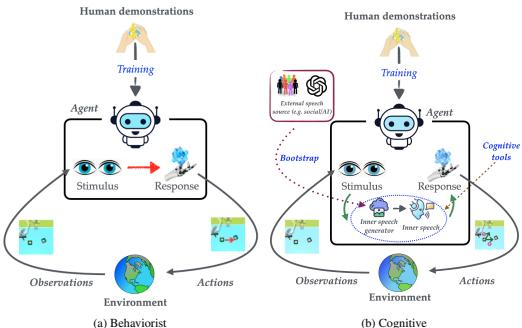  
Figure 1: Paradigm comparison. (a) direct stateto-action mapping. (b) inner speech $m _ { t }$ mediates between perception and action. Extended discussion available in Appendix B.1.

$( B C )$ [34], which uses supervised learning to model human demonstrations. Despite its theoretical limitations [38], BC offers a simple, efficient, and offline approach to IL that has demonstrated remarkable efficacy across different domains [33]. Recent advances in BC extend beyond standard implementations to explicitly address behavioral diversity through the use of transformer models [39, 24] and diffusion-based behavior policies [33, 36]. While achieving state-of-art results, these approaches still leave significant room for improvement with respect to distributional realism. Further, these approaches exhibit fundamental constraints in their capabilities: some lack support for controlled generation entirely [39, 33], while others restrict themselves to goal-conditional generation [24, 36]. This limitation stands in contrast to our objective—enabling steerable imitation and generation of novel behaviors through designer-specified control at inference time—a more general paradigm that subsumes goal-conditional generation while offering significant flexibility in behavior synthesis.

A typical IL model assumes that the human takes her decision given the state as $s _ { t } \mapsto _ { \mathcal { H } } a _ { t }$ and aims to directly approximate this conditional probability distribution $\pi _ { \theta } ( a \mid s ) \approx p _ { \mathcal { H } } ( a \mid s )$ . However, this state-to-action mapping overlooks a crucial insight from psychological and cognitive science literature [44, 42, 6]: human decisions are influenced by intrinsic motivations and inner speech that mediate between perception and action, even when not explicitly tied to task objectives. Cognitive science research on inner speech [44, 42], conceptualizes inner speech as an internalized form of language that serves as a mediational mechanism1 between environmental perception and action selection. This inner speech provides a cognitive framework that explains how identical environmental stimuli can produce diverse behavioral responses across different individuals. Figure 1 illustrates this paradigm shift: whereas traditional IL treats behavior as direct state-to-action mapping $( s _ { t }  a _ { t } )$ ), the cognitive approach introduces inner speech as a mediational layer $\begin{array} { r } { ( s _ { t }  m _ { t }  a _ { t }  } \end{array}$ ), enabling behavioral diversity through internal deliberation. Based on this theoretical foundation, we posit that effective imitation learning should model both the conditional action policy $p _ { \mathcal { H } } ( a \mid s , m )$ and the inner speech generation process $p _ { \mathcal { H } } ( m \mid s )$ to better capture how humans act in a given scenario:

Proposition 1 (Imitating with Inner Speech $m$ ). Instead of directly learning the human action distribution conditioned on the environment’s state, $\pi _ { \theta } ( a \mid s ) \approx p _ { \mathcal { H } } ( a \mid s ) ,$ , we propose to model human behavior through inner speech mediation: $\begin{array} { r } { P _ { \mathcal { H } } ( a \mid s ) = \int p _ { \mathcal { H } } ( a \mid s , m ) p _ { \mathcal { H } } ( m \mid s ) d m . } \end{array}$ . Here, inner speech m is: (1) an internal representation that mediates task performance while potentially encompassing broader motivations, (2) represented in natural language, and (3) internal to the agent and not directly observable from demonstrations.

To this end, we formalize “inner speech as behavior guides”, a computational framework building on Vygotsky’s mediational theory [44] and Sokolov’s empirical observations [42]. We then introduce MIMIC (Modeling Inner Motivations for Imitation and $C o n t r o l )$ , a novel imitation framework that operationalizes this theoretical foundation through three key components: (1) an inner speech conditioned behavior cloner implemented using conditional diffusion-based policy; (2) a behavior guided inner speech generator utilizing a conditional variational autoencoder (CVAE) that captures the stochastic and semantically condensed nature of inner speech; and (3) a vision-language model serving as linguistic scaffolding that provides external language input to train the inner speech generator. During simulation, the agent generates its own inner speech based on ongoing behavior and uses this to condition its policy. MIMIC enables designer control through two mechanisms: (i) accepting textual descriptions of desired behavior as initial inner speech, with the agent continuing to generate its own inner speech as needed, and (ii) allowing designers to set a polling window that determines inner speech generation frequency, thereby serving the dual purpose of finetuning the amount of inner speech and facilitating behavior corrections at regular intervals—a feature particularly valuable in addressing behavior cloning’s brittleness.

We evaluate MIMIC’s efficacy across three dimensions: (i) fidelity in imitating diverse behaviors, (ii) capability for steerable behavior generation during simulation, and (iii) performance enhancement in human-AI collaborative contexts. For the first two dimensions, we conduct experiments on the D3IL benchmark dataset [21], which encompasses diverse robotic manipulation tasks. Our results demonstrate that MIMIC surpasses state-of-the-art BC approaches in generating human-like behaviors, achieving higher entropy, higher fidelity and often higher success rates in its generated trajectories while enabling designer-specified control over behavior generation. Next, we consider the Overcooked environment in a 2-player setting [5], where MIMIC agents evaluated in collaboration with human proxy models achieve consistently higher cooperative rewards than agents trained using other BC approaches. We substantiate these empirical findings with comprehensive qualitative analysis and architectural ablation studies. Our results highlight the potential of this inner speech based approach to create adaptive, human-like agents that can act as effective human surrogates, facilitating the safe development and evaluation of AI agents before their deployment among humans.

# 2 Preliminaries and Related Work

Problem Setup. Let $( S , { \mathcal { A } } , { \mathcal { P } } , r , \nu , \gamma )$ define a Markov Decision Process (MDP), where $s$ and $\mathcal { A }$ represent state and action spaces, $\mathcal { P } : \mathcal { S } \times \mathcal { A } \times \mathcal { S }  \mathbb { R }$ is the transition probability distribution, $r$ denotes the reward function, $\nu : \mathcal { S }  \mathbb { R }$ is the initial state distribution, and $\gamma \in ( 0 , 1 )$ is the discount factor. A stochastic behavior policy $\pi : S \times A \to [ 0 , 1 ]$ defines an agent’s action selection.

Imitation learning focuses on learning polireward signals. We consider expert policy $\pi$ directly from demonstras a mixture of experts t access to, represent$\pi _ { E }$ $\{ \pi _ { E } ^ { 0 } , \pi _ { E } ^ { 1 } , . . . \}$ $\boldsymbol { \tau } ^ { i } = \{ ( s _ { 0 } ^ { i } , a _ { 0 } ^ { i } ) , . . . , ( s _ { T } ^ { i } , \dot { a _ { T } ^ { i } } ) \}$ specializations, or behavioral variations. A demonstra records a sequence of state-action pairs. Given dataset $\mathcal { D } = \bar { \{ \tau ^ { i } \} } _ { i = 1 } ^ { N }$ of $N$ trajectories, behavior cloning (BC) applies supervised learning over state-action pairs, maximizing action likelihood: $\begin{array} { r } { \mathcal { L } _ { B C } = \operatorname* { m a x } _ { \theta } \sum _ { i = 1 } ^ { \tilde { N } } \sum _ { t = 1 } ^ { | \tau _ { i } | } \mathrm { \tilde { l o g } } \pi _ { \theta } ( a _ { t } ^ { i } | s _ { t } ^ { i } ) } \end{array}$ . Our technical approach employs diffusion models and conditional variational autoencoders (CVAEs) and refer interested readers to Appendix D for a background discussion on these models.

Language-Interfaced Imitation Learning. Recent advances in language-based interfaces for $\mathrm { I L }$ include Thought cloning (TC) [18], which directly imitates human thoughts but differs from our method in that it requires access to annotation of actual human thought for each step in the demonstration trajectory. Further, its performance is highly tied with goal (mission) conditioning and degrades by almost $40 \%$ in our experiments once the goal (mission) condition is removed. Similarly, external speech has also been used to steer agent behaviors through action re-ranking [30] although with mechanisms that remain external to the agent. Closest prior is [46] that use “intra-agent speech” as semi-supervised captioning that is frozen and used as auxiliary supervision during BC to achieve zero-shot object-level generalization. We instead treat inner speech as a latent mediator that conditions the policy and is generated online, enabling steerable, diverse imitation.

AI Approaches to Modeling Cognitive Processes. Recent AI research has explored computational implementations of cognitive processes. [6] propose autotelic AI which internalizes language for selfdirected learning, emphasizing language as a tool for goal generation and intrinsic motivation. While sharing our interest in cognitive foundations, autotelic systems focus on autonomous learning rather than behavioral diversity, using language primarily for goal generation rather than as a mediational mechanism. [19] utilize large language models to simulate reasoning processes (chain of thought) before action selection, implementing serial, deterministic reasoning rather than the stochastic, parallel processing characteristic of inner speech in Vygotskian theory. Our framework models inner speech as a probabilistic process that generates diverse behavioral patterns, more closely aligning with cognitive theories of human behavioral diversity. [4] propose natural language as a latent space for reinforcement learning, using language to give a hierarchical structure to behavior. While this approach shares our recognition of language as a cognitive tool, it focuses on decomposing complex tasks rather than generating behavioral diversity. Our framework uniquely combines the stochastic nature of inner speech with IL to capture human behavioral variation without explicit linguistic supervision. An extended related work discussion is available in Appendix C.

# 3 MIMIC: Inner Speech as Behavior Guides

As discussed in Section 1, existing IL techniques [18, 30, 39, 24, 46, 43] do not satisfy Proposition 1, and struggle to fully capture the noisy, diverse, and non-Markovian nature of human behavior. Here, we first present a theoretical formulation that connects inner speech and behavioral diversity, grounded in Vygotsky’s characterization of inner speech as a mediational mechanism. We then present MIMIC, a novel imitation framework that operationalizes this theoretical model to enable agents to generate inner speech and condition their action selection on these representations. Our framework enables steerable generation of diverse behaviors: by conditioning on user-specified speech and generating its own inner speech representations, the agent can adopt corresponding behavioral modes.

# 3.1 Theoretical Formulation of Inner Speech

The theoretical framework conceptualizes inner speech as a mediational mechanism for capturing behavioral diversity in imitation learning.

# 3.1.1 Inner Speech as a Generative Mediating Process

Drawing from Vygotsky’s [44] theoretical characterization of inner speech as a cognitive mediator between perception and action, we formalize inner speech as a stochastic process that transforms environmental observations into linguistic representations before generating behavior. For an agent operating in environment $\mathcal { E }$ , we define: $s$ as the state space, representing environmental percepts; $\mathcal { A }$ as the action space, encompassing possible behavioral responses; $\mathcal { Z }$ as the inner speech representation space, a latent embedding of verbalized cognition; $f _ { \phi } : { \mathcal { S } }  { \mathcal { Z } }$ as the inner speech generation function; and $g _ { \theta } : \mathcal { S } \times \mathcal { Z }  \mathcal { A }$ as the action policy conditioned on observation and inner speech.

Vygotsky identified following structural properties characterizing inner speech that inform our computational design: (i) Predicativity: Inner speech emphasizes relationships and actions rather than entities. For example, an agent internally represents “moving left to coordinate” rather than “the box is on the left”. (ii) Semantic Condensation: Complex strategic meanings compress into compact representations while preserving functional significance, e.g. a multi-step coordination strategy becomes a brief internal directive. (iii) Regulatory Dynamics: As Vygotsky conceptualized inner speech as enabling organization of behavior—regulating responses over time—we formalize this as temporal regulatory dynamics. Inner speech generation operates over extended timescales, conditioned on behavioral history rather than instantaneous state, reflecting that strategic processing integrates information across temporal windows. This is consistent with empirical observations that inner speech intensifies during complex cognitive tasks [42]. These properties indicate that inner speech operates as a compressed, semantically enriched representation—reduced in dimensionality relative to perceptual input, yet preserving task-relevant strategic information and temporal context.

# 3.1.2 Mathematical Formulation

We formalize inner speech as a stochastic mediational process grounded in Vygotsky’s theoretical characterization. The agent’s policy decomposes through inner speech as a latent mediator:

$$
p ( a | s ) = \int _ { \mathcal Z } p ( a | s , m ) p ( m | s ) d m
$$

where $s \in S$ is the environmental state, $m \in { \mathcal { Z } }$ represents the inner speech embedding, $p ( m | s )$ generates inner speech from observations, and $p ( a | s , m )$ produces actions conditioned on both state and inner speech. This stochastic formulation captures behavioral diversity: different inner speech representations lead to different behavioral modes even when facing identical environmental states.

We now provide mathematical formalizations of the three structural properties characterized above, showing how each property shapes the computational structure of inner speech generation.

Predicativity: Relational Structure Extraction. The emphasis on relationships over entities is formalized through a relational encoding that generates inner speech distributions: $p ( m _ { t } | \mathcal { H } _ { t } ) =$ $f _ { \phi } ( \mathcal { H } _ { t } ; \psi _ { \mathrm { r e l } } )$ , where $\psi _ { \mathrm { r e l } }$ denotes parameters that prioritize relational features in the behavioral history $\mathcal { H } _ { t }$ . This ensures inner speech captures strategic patterns.

Semantic Condensation: Information-Theoretic Formulation. The compression of complex meanings into compact representations is formalized through the information bottleneck framework: $\begin{array} { r l } & { \operatorname* { m a x } _ { m } \left[ I ( m ; \mathcal { H } _ { t } ) - \beta \cdot D _ { K L } ( p ( m | \mathcal { H } _ { t } ) \| p ( m ) ) \right] } \end{array}$ , where $I ( m ; \mathcal { H } _ { t } )$ measures mutual information between inner speech and behavioral history, $\tilde { D _ { K L } } ( p ( m | \mathcal { H } _ { t } ) | | p ( m ) )$ enforces compression toward a simple prior, and $\beta$ controls the trade-off. Higher $\beta$ enforces stronger compression, modeling the progression from elaborate external descriptions toward abbreviated mature inner speech.

Temporal Regulatory Dynamics. We formalize this through non-Markovian conditioning on behavioral history: $p ( m _ { t } | \mathcal { H } _ { t } )$ , where $\mathcal { H } _ { t } = \left\{ s _ { t - W : t } , a _ { t - W : t - 1 } \right\}$ , where $\mathcal { H } _ { t }$ represents a window of length $W$ encompassing recent states $s _ { t - W : t }$ and actions $a _ { t - W : t - 1 }$ . This formulation reflects that strategic processing emerges from accumulated experience rather than instantaneous perception.

# 3.1.3 Architectural Correspondence

We now describe how our computational architecture operationalizes the theoretical formulation presented above. Our framework explicitly implements predicativity, semantic condensation, and temporal regulatory dynamics through dedicated architectural components.

Transformer Attention as Predicative Processing. The emphasis on relational structures is implemented through the transformer’s multi-head attention mechanism that processes inner speech alongside state and action representations: Attention $\begin{array} { r } { ( Q , K , V ) = \mathrm { s o f t m a x } \left( \frac { Q K ^ { T } } { \sqrt { d _ { k } } } \right) V } \end{array}$ , where $Q , K , V$ are derived from the concatenated representation $\ [ { \bf z } _ { s } , { \bf z } _ { m } , { \bf z } _ { a } , { \bf z } _ { \tau } ]$ encoding state, inner speech, action history, and temporal information respectively. The cross-attention mechanism naturally focuses on relationships between inner speech $\mathbf { z } _ { m }$ and behavioral context, capturing task-relevant strategic patterns (“how to coordinate”) rather than merely encoding object features (“what is present”).

Variational Compression for Semantic Condensation. The Conditional Variational Autoencoder architecture directly instantiates the information bottleneck formulation. The encoder compresses behavioral history into a latent bottleneck $q _ { \phi } ( z | \mathcal { H } _ { t } ) = \mathcal { N } ( \mu _ { \phi } ( \mathcal { H } _ { t } ) , \sigma _ { \phi } ^ { 2 } ( \mathcal { H } _ { t } ) )$ , from which inner speech codes are sampled as $z \sim q _ { \phi } ( z | \mathcal { H } _ { t } )$ and decoded via $p _ { \theta } ( m | z , \mathcal { H } _ { t } ) = \Psi _ { \mathrm { d e c } } ( z , \mathcal { H } _ { t } )$ . The variational objective realizes the information-theoretic trade-off: $\mathcal { L } _ { \mathrm { I S } } = \mathbb { E } _ { q _ { \phi } ( z | \mathcal { H } _ { t } ) } [ \log p _ { \theta } ( m | z , \mathcal { H } _ { t } ) ] -$ $\beta D _ { K L } ( q _ { \phi } ( z | \mathcal { H } _ { t } ) | | p ( z ) )$ , where the reconstruction term $\mathbb { E } [ \log p _ { \theta } ( m | z , \mathcal { H } _ { t } ) ]$ corresponds to maximizing $I ( m ; \mathcal { H } _ { t } )$ (preserving behavioral relevance), while the KL divergence term enforces compression toward a simple prior $p ( z )$ . The annealing parameter $\beta$ models the progressive shift from flexible external linguistic structure to compressed autonomous inner speech generation.

Periodic Generation as Temporal Regulation. The non-Markovian temporal structure is implemented through periodic inner speech generation at fixed intervals: $m _ { t } = \Psi _ { \mathrm { d e c } } ( \Psi _ { \mathrm { e n c } } ( \mathcal { H } _ { t } ) , \mathcal { H } _ { t } )$ if $t$ mod $W = 0$ , and $m _ { t } = m _ { t - 1 }$ otherwise. This $W$ -step update cycle captures the intermittent nature of strategic processing. The agent generates new inner speech every $W$ steps based on accumulated behavioral history, then conditions its actions on this inner speech until the next update.

# 3.2 Learning Inner Speech and Behavior Generation from Demonstrations

We now describe how MIMIC learns these components from demonstrations. The framework consists of two key elements—an inner speech-conditioned behavior cloner and a behavior-conditioned inner speech generator—implementing the theoretical formulation presented above (c.f. 2).

# 3.2.1 Inner Speech-conditioned Behavior Cloner

initial speech $m$ llowing Proposition 1, we learn th. Given a dataset of demonstrations $\boldsymbol { m } ^ { ( i ) }$ to obtain $\mathcal { D } _ { M } = \{ ( m ^ { ( i ) } , s _ { t } ^ { ( i ) } , a _ { t } ^ { ( i ) } ) ~ | ~ t \in [ 1 , T ] , i \in [ 1 , n ] \}$ $\bar { \mathcal { D } } = \{ ( s _ { t } ^ { ( i ) } , a _ { t } ^ { ( i ) } ) ~ | ~ t \in [ 1 , T ] , i \in \bar { [ 1 , n ] } \}$ e of an inner speech, we augment it with . We then train an imitator $\pi _ { \theta } ( a \mid s , m )$ that models the probability of an action given the environment’s state and the inner speech $m$ of the agent. We implement the action policy $g _ { \boldsymbol { \theta } }$ in the theoretical framework using a diffusion-based policy with a transformer architecture $( D D P M  – T )$ [33]. This architecture trains a transformer-based conditional denoising network $\hat { \epsilon } _ { \theta } ( \hat { \mathbf { a } } _ { \tau } , s , m , \tau )$ to predict the noise added to the action $\hat { \mathbf { a } }$ at step $\tau$ given the current state $s$ and inner speech $m$ . The diffusion process follows:

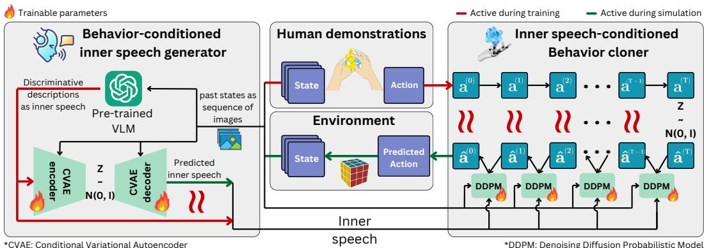  
Figure 2: Overview of MIMIC: Agent inner speech is scaffolded by using a pre-trained VLM to discriminate different behaviors in human demonstrations. Next, we train a DDPM-T (diffusion policy with transformer architecture) behavior cloner conditioned on this inner speech and a VAE-based inner speech generator conditioned on the history of states. During simulation, the inner speech is periodically generated to influence the behavior cloner given the actions it generated in the past.

$$
\left\{ \begin{array} { l l } { \mathrm { F o r w a r d ~ d i f f u s i o n } \colon \mathbf { a } _ { \tau + 1 } \sim \mathcal { N } ( \sqrt { 1 - \beta _ { \tau } } \mathbf { a } _ { \tau } , \beta _ { t } \mathbf { I } ) } \\ { \mathrm { R e v e r s e ~ d i f f u s i o n } \colon \hat { \mathbf { a } } _ { \tau } \sim \mathcal { N } ( \frac { 1 } { \sqrt { 1 - \beta _ { \tau } } } ( \hat { \mathbf { a } } _ { \tau + 1 } - \beta _ { \tau } \hat { \epsilon } _ { \theta } ( \hat { \mathbf { a } } _ { \tau + 1 } , s , m , \tau ) ) , \beta _ { \tau } \mathbf { I } ) } \end{array} \right.
$$

We train this network using a reconstruction Fisher divergence loss:

$$
\mathcal { L } _ { \mathrm { d i f f } } ( \mathcal { D } _ { M } ) = \mathbb { E } _ { ( s , \mathbf { a } _ { 0 } , m ) \sim \mathcal { D } _ { M } , \tau \sim [ 1 , T _ { D } ] } \| \hat { \epsilon } ( \mathbf { a } _ { \tau } , s , m , \tau ) - \epsilon \| _ { 2 } ^ { 2 } .
$$

The network is trained using classifier-free guidance, where $\mathbf { m }$ is randomly replaced with 0 with probability $p$ during training [16]. This enables the model to operate both with and without inner speech conditioning. $\hat { \epsilon }$ is a transformer architecture that can take inputs of arbitrary size. We first encode the inputs $s , m , \hat { \mathbf { a } }$ , and $\tau$ using different encoders and then concatenate the representations $\mathbf { z } _ { s } , \mathbf { z } _ { m } , \mathbf { z } _ { \hat { \mathbf { a } } }$ , and ${ \bf z } _ { \tau }$ together before passing into the transformer. The state $s$ is encoded using domain-specific encoders such as a vision-based convolutional encoder for a vision environment or a locomotion-based feature encoder for a vision-free environment. Inner speech $m$ will be provided as latent representations in the natural language space and use a trainable 2-layer MLP to obtain $\mathbf { z } _ { m } . \mathbf { z } _ { \hat { \mathbf { a } } }$ and ${ \bf z } _ { \tau }$ are obtained using standard linear encoding and cosine-based encoding, respectively.

# 3.2.2 Behavior-Conditioned Inner Speech Generator

This component instantiates the inner speech generation function $f _ { \phi } : { \mathcal { S } }  { \mathcal { Z } }$ . We implement it using a conditional variational autoencoder (CVAE) architecture to capture the stochastic and semantically condensed nature of inner speech. The variational nature of this implementation models the probabilistic nature of cognitive self-regulation, allowing for the generation of diverse yet contextually appropriate inner speech representations.

# Algorithm 1 (Appendix A): Training and Vision-Language Model Scaffolding.

The training process for the inner speech generator implements a learning-based internalization of linguistic structure. Central to this process is the use of vision-language models (VLMs) to provide external linguistic scaffolding. The VLMs generate initial descriptive characterizations of demonstrated behaviors, providing explicit linguistic structure that serves as training targets for the CVAE. We model the agent’s inner speech $m$ as linguistic descriptions of behavior. For each demonstration in our dataset, we obtain a sequence of $\mathrm { T }$ images $( \bar { \mathbf { I } _ { 1 } ^ { ( i ) } } , \mathbf { I } _ { 2 } ^ { ( i ) } , \cdots , \mathbf { I } _ { T } ^ { ( i ) } )$ , which are converted into a GIF where T is the task horizon. We then use a VLM to generate descriptive external speech that characterizes the behavior by passing $\scriptstyle \mathbf { k } = 8$ randomly picked GIFs with the prompt:

Immerse yourself in the role of the {agent} that has enacted the actions in the attached GIFs. {environment}. Generate your inner thought process that helps describe the distinctive behaviors shown in the each of the GIF. ONLY generate those phrases that differentiate the behavior adopted in different GIFs. YOU MUST return the thought process of each GIF in a new line.

This process generates linguistic descriptions $c ^ { ( i ) }$ of each demonstration’s behavior, which we encode using the CLIP [35] embedding model to obtain $\boldsymbol { m } ^ { ( i ) }$ . Figure 3 shows the latent space of inner speech obtained from demonstrations, exemplifying the diversity captured by inner speech. These external descriptions serve as initial scaffolding that the model learns to compress and internalize, implementing the semantic condensation principle.

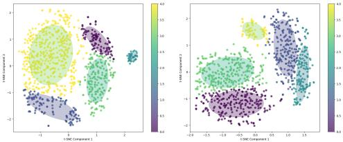  
Figure 3: TSNE visualization of inner speech for Aligning dataset. (c.f. Appendix G for others.)

By using pre-trained VLMs, we leverage their rich linguistic knowledge to generate descriptions that capture behaviorally-relevant attributes and strategic patterns. Critically, this scaffolding approach circumvents the need for explicit human annotation of thought during demonstrations, making MIMIC more scalable and broadly applicable than approaches requiring verbalized thoughts at each step [18].

For computational efficiency, we train a specific generative model $\Psi$ to generate realistic inner speech by only looking at a limited historical behavior. We use a conditional variational auto-encoder (CVAE), where both encoder $\Psi _ { \mathrm { e n c } }$ and decoder $\Psi _ { \mathrm { d e c } }$ are conditioned on the past image sequence, which is encoded by pooling over the convolutional representations. The CVAE is trained to generate the CLIP-encoded inner speech generated by the oracle VLM by minimizing the loss function:

$$
\mathcal { L } _ { \mathrm { i s } } ( \mathcal { D } _ { M } ) = \sum _ { i = 1 } ^ { n } \sum _ { t = W } ^ { T } \left. m ^ { ( i ) } - \Psi _ { \mathrm { d e c } } ( \Psi _ { \mathrm { e n c } } ( m ^ { ( i ) } , \mathbf { I } _ { t - W : t } ^ { ( i ) } ) , \mathbf { I } _ { t - W : t } ^ { ( i ) } ) \right. _ { 2 } ^ { 2 } + \beta \Delta _ { K L } ( \Psi _ { e n c } ( m ^ { ( i ) } ) , \mathcal { N } ( \mathbf { 0 } , \mathbf { I } ) ) ,
$$

where $\Delta _ { K L }$ denotes the re-parameterized KL divergence and $W$ denotes a fixed window size. The regularization parameter $\beta$ is annealed during training as described in the architectural correspondence, modeling the progressive shift from flexible external linguistic structure to compressed autonomous inner speech generation. This loss is independent of the diffusion policy $\pi$ and can be trained in a decoupled manner. Through this end-to-end optimization, the CVAE learns to fuse perceptual features, strategic intentions, and temporal context into compact representations—a process that connects to Vygotsky’s concept of agglutination, where multiple semantic components bind into unified cognitive structures.

This training procedure implements a learning-based internalization process inspired by Vygotsky’s theory of internalization. The VLM-generated descriptions serve as initial external linguistic targets, providing explicit structure that guides early training. Through continued training, the CVAE learns to autonomously generate compressed inner speech representations from behavioral patterns alone, implementing the structural transformation from elaborate external descriptions to the compact autonomous representations characteristic of mature inner speech.

Algorithm 2 (Appendix A): Simulation. During simulation, the agent must generate its own inner speech based on its ongoing behavior. To enable this, we use the CVAE decoder $\Psi _ { \mathrm { d e c } }$ to generate the inner speech given the images of the past actions. We employ the W-step update cycle described in Section 3.1.3 for this purpose. We also wait for $t _ { 0 }$ timesteps before the first generation. Thus, starting from a null speech of $m \gets 0$ , a new inner speech is generated periodically using $\Psi _ { \mathrm { d e c } }$ after every $W$ timesteps starting from $t = t _ { 0 }$ . The framework enables explicit control over agent behavior through linguistic prompts, realizing the linguistic controllability aspect of the theoretical framework. By providing a natural language description $\boldsymbol { B }$ of the desired behavior, we override the initial inner speech from $m \gets \mathbf { 0 }$ to $m \gets B$ . The agent then continues its periodic updates to maintain consistency with the trained inner motivation space.

# 4 Experiments

#

Datasets. We use three robotic control environments from the D3IL benchmark [21]: Aligning, Sorting, and Stacking. These datasets include images taken from a top camera and an in-hand camera during the demonstration. For the human-AI coordination task, we use the Overcooked dataset [5] in three different layouts: Cramped room, Coordination ring, and Asymmetric Advantages. These include two agents (one with a green and one with a blue hat). Both vision-based observations (denoted as “-Vision”) and feature-based observations are considered for the evaluation. For simulation, we consider the standard rollouts and trajectories in the D3IL benchmark, while for Overcooked we simulate 100 games to evaluate our agent.

Methods.3 We denote the proposed method as MIMIC while the state-of-art baseline behavior cloner is denoted BC. Each uses the same diffusion-based architecture of DDPM-T for behavior policy.

Implementation. We use the Adam optimizer [22] with the learning rate tuned for each dataset (following Jia et al. [21]) to train both our CVAE-based inner speech generator and the diffusionbased behavior cloner. The other hyperparameters are searched for the best performance, with first update step $t _ { 0 } \in \{ 0 , 1 , W / 2 , W \overset { \cdot } { - } \overset { \cdot } { 1 } \}$ and update window $W \in \{ 1 , 1 0 , 2 \bar { 0 } , 5 0 , 1 0 0 \}$ for low horizon tasks and $W \in \{ 1 0 0 , 2 0 0 , 3 0 0 \}$ for higher ones. The optimal random dropout probability for the diffusion model training is found to be optimal $\in \{ 0 , \bar { 0 } . 1 \}$ depending on task, while the parameter $\beta = 0 . 1$ was found to be optimal through tuning for training the CVAE. To obtain the inner speech from the VLM, we fix the batch size of inner speech $B = 8$ . Further details on the training, computation, and other experimental setup can be found in Appendix E.

Metrics. For control tasks, we use the standard metrics of the D3IL benchmark during simulation, i.e., success rate or proportion of successful completions of the task, and behavioral entropy comparing the entropy of simulations with a categorical distribution of behavior descriptors. Higher values indicate accurate learning of the successful and diverse behaviors shown in human demonstrations. To assess our objective of high fidelity imitation, we also report the mean distance from the end-point in the Aligning task, and the Wasserstein distance between the generated and training state and completion time distributions wherever feasible, following [33]. For Overcooked, we evaluate the performance using the mean collective reward obtained when the trained agent plays along with a proxy human agent and Wasserstein distance between the discrete actions.

# 4.2 Results

# 4.2.1 Does MIMIC achieve high fidelity imitation of diverse behaviors on D3IL benchmark?

Table 1: Comparison of MIMIC against BC with the DDPM-T architecture on the D3IL benchmark. ‘-wass’ denotes Wasserstein Distance metrics for the non-vision environments (infeasible in case of vision) where state Wasserstein distance is calculated using 5 random rollouts.   

<table><tr><td>Environment</td><td>Model</td><td>Success rate ↑</td><td>Distance ↓</td><td>Entropy ↑</td><td>State-wass ↓</td><td>Time-wass ↓</td></tr><tr><td rowspan="4">Aligning</td><td>BC</td><td>0.6645</td><td>0.1105</td><td>0.4743</td><td>0.6961</td><td>59.034</td></tr><tr><td>MIMIC-S</td><td>0.8021</td><td>0.0664</td><td>0.4184</td><td>0.0459</td><td>50.569</td></tr><tr><td>MIMIC-E</td><td>0.7229</td><td>0.0847</td><td>0.6148</td><td>0.0492</td><td>45.397</td></tr><tr><td>BC</td><td>0.1833</td><td>0.1875</td><td>0.0895</td><td>-</td><td>-</td></tr><tr><td rowspan="3">Aligning-Vision Sorting-Vision</td><td>MIMIC-S</td><td>0.2229</td><td>0.1885</td><td>0.0849</td><td></td><td></td></tr><tr><td>MIMIC-E</td><td>0.2083</td><td>0.1849</td><td>0.1473</td><td></td><td></td></tr><tr><td>BC</td><td>0.7972</td><td></td><td>0.3596</td><td></td><td></td></tr><tr><td rowspan="3"></td><td>MIMIC-S</td><td>0.8417</td><td></td><td>0.3719</td><td></td><td></td></tr><tr><td>MIMIC-E</td><td>0.8083</td><td></td><td>0.4494</td><td></td><td></td></tr><tr><td></td><td>1 box/2 box</td><td>=</td><td>1 box/2 box/3 box</td><td></td><td></td></tr><tr><td rowspan="3">Stacking</td><td>BC</td><td>0.8027 /0.4879</td><td></td><td></td><td></td><td></td></tr><tr><td>MIMIC-S</td><td>0.8129 / 0.6074</td><td></td><td>0.2058/0.1503 /0.1049 0.1774/0.0737 /0.0394</td><td>9.43 0.75</td><td>336.51 345.14</td></tr><tr><td>MIMIC-E</td><td>0.8213 / 0.5333</td><td></td><td>0.2115 /0.1556/ 0.0878</td><td>13.69</td><td>336.51</td></tr></table>

Table 1 shows that MIMIC is superior at generating human-like behaviors across four different benchmark D3IL environments, achieving higher entropy and higher success rate in its generated trajectories than the state-of-the-art DDPM-T-based behavioral cloner. We consider two different variants of MIMIC: MIMIC-S and MIMIC-E, denoting the combination of hyperparameters that gives the highest success rate and highest entropy, respectively. In almost all cases, both variants of MIMIC improve the performance over the BC model. We improve significantly in the Aligning task, while in the more complex Stacking task, MIMIC-E achieves the best success rates and entropy for 1 and 2 boxes. increasing the success rate by 2 substantially. BC gives competitive values of entropy for the 3rd box, perhaps due to the actions being random since the success rate for the two boxes remains low. The gains of MIMIC remain consistent even in environments with vision-based observations, indicating that useful supplementary information is provided through inner speech. We further validate MIMIC’s effectiveness in capturing diverse human behavior with high fidelity, showing significantly lower Wasserstein distance between the generated and training distributions of the state and completion time distributions (following [33]) in both aligning and stacking environments.

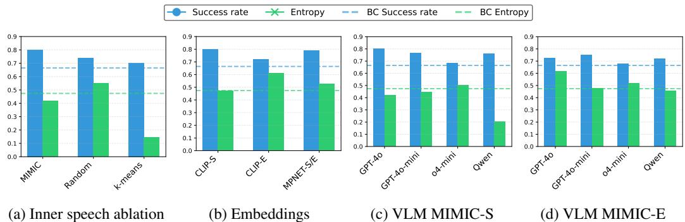  
Figure 4: Effect on Success Rate and Entropy performance of MIMIC on changing various components on the Aligning dataset: (a) removing inner speech during simulation, (b) changing the embedding model, (c-d) using different VLMs for training and scaffolding.

# 4.2.2 Do MIMIC agents serve as effective in silico human surrogates, achieving successful coordination when evaluated with human proxy models in collaborative tasks?

Table 2 shows that MIMIC significantly improves the collective reward achieved in three different settings of the Overcooked environment. The total reward achieved by the actions of MIMIC with the human agent is significantly higher than BC with the human agent in all cases, achieving an increase of up to 30. These results highlight the impact of using inner speech in improving human-AI coordination and demonstrate that modeling the inner speech of the agent consistently improves performance when evaluated against human proxy models. Additional results are provided in Appendix G.

Table 2: Comparison of MIMIC against BC with DDPM-T on the Overcooked environments.   

<table><tr><td>Environment</td><td>Model</td><td>Collective reward</td></tr><tr><td>Cramped room</td><td>BC MIMIC</td><td>115.8 ± 3.86 151.8 ± 2.45</td></tr><tr><td>Cramped</td><td>BC</td><td>73.6 ± 6.18</td></tr><tr><td>room-Vision</td><td>MIMIC</td><td>108.8 ± 4.84</td></tr><tr><td>Coordination</td><td>BC</td><td>113.0 ± 2.21</td></tr><tr><td>ring</td><td>MIMIC</td><td>121.0 ± 1.93</td></tr><tr><td>Asymmetric</td><td>BC</td><td>215.8 ± 3.04</td></tr><tr><td>advantages</td><td>MIMIC</td><td>227.6 ± 2.69</td></tr></table>

# 4.2.3 How does the performance of MIMIC vary with different components?

Ablation on inner speech. To validate the importance of language as inner speech we compare MIMIC with other forms of inner speech such as a completely random vector and a clustered vector of the training trajectories. For clustering, we employ a $K$ -means algorithm with $K = 8$ and learn a CVAE to generate the mean cluster representation for each action in the training set. These inner speech generators are used directly during simulation as described above. Figure 4a shows that MIMIC is significantly better than other formulations, with the worst being the K-means algorithm and random more effective than the base BC model.

Embeddings. Figure 4b shows the effect of changing the CLIP model to encode the linguistic descriptions with a text-only MPNET model 4. We find that MIMIC-S with CLIP outperforms the MPNET variant in success rate, while MIMIC-E with CLIP outperforms it in entropy. This shows that a shared vision-language representation space is useful to obtain effective inner speech.

Table 3: GPT-4o evaluation. ‘-’ denotes no update.   

<table><tr><td>to</td><td>W</td><td>Success rate</td><td>Entropy</td><td colspan="2">GPT-4o Eval (1-5)</td></tr><tr><td></td><td></td><td></td><td></td><td>Top</td><td>Inhand</td></tr><tr><td colspan="6">Training conditions</td></tr><tr><td>-</td><td>1</td><td>0.6083</td><td>0.4690</td><td>4.03 ± 0.63</td><td>4.05±0.51</td></tr><tr><td>10</td><td>20</td><td>0.7417</td><td>0.3815</td><td>3.98 ±0.68</td><td>3.98 ± 0.81</td></tr><tr><td>49</td><td>50</td><td>0.6042</td><td>0.5156</td><td>3.88 ± 0.72</td><td>4.05 ± 0.71</td></tr><tr><td colspan="6">Validation conditions</td></tr><tr><td>-</td><td>1</td><td>0.6687</td><td>0.5787</td><td>3.83 ± 0.69</td><td>4.40 ± 0.49</td></tr><tr><td>10</td><td>20</td><td>0.6479</td><td>0.2949</td><td>3.94 ± 0.64</td><td>4.17 ± 0.37</td></tr><tr><td>49</td><td>50</td><td>0.7250</td><td>0.6357</td><td>4.23 ± 0.42</td><td>4.30±0.46</td></tr></table>

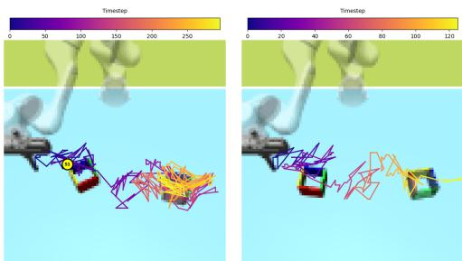  
Grip the box from the right and I approach from a diagonal toprotate it counter-clockwise to right angle, requiring a swift rotaachieve alignment tion to align   
Figure 5: Conditional behavior generation. Figures in the right panel show generated behaviors for the specified condition as inner speech with no subsequent updates.

Vision-language model. We study the effect of changing the VLM from GPT-4o to o4-mini, 4o-mini, and Qwen (Qwen2.5-VL-72B-Instruct). Figures 4c and 4d show that GPT-4o gives the best success rate compared with other VLMs, followed closely by the open-source Qwen model. Surprisingly, we find o4-mini to lack in success rate even though its descriptions lead to the most diversity (highest entropy). We believe this is due to the CLIP model failing to distinguish the nuanced behaviors generated using o4-mini. More importantly, we find that in all cases, MIMIC outperforms the BC model in success rate and often increases the base entropy in all cases except Qwen. This is likely due to a lack of diversity in Qwen generated descriptions of the dataset.

# 4.2.4 Can MIMIC be used to generate desired behavior, thereby enabling steerable imitation?

We study the effectiveness of MIMIC in generating desired behaviors. Here, we consider using the behavioral descriptions generated by the VLM for the training and validation sets as the desired conditions. Then, we follow Section 3 to give the desired condition as the initial inner speech and generate successful behaviors that can match the desired description. We then use GPT-4o as a judge to evaluate how well the generated trajectory matches the desired description (full prompt provided in Appendix E). Table 3 shows that MIMIC can be used to generate successful and controllable behaviors in the Aligning dataset. Using three different combinations of simulation parameters, we find that MIMIC generates highly successful and desired trajectories for both training and validation descriptions as conditions. Generating training behaviors is likely to need no mediation since behaviors are already conditionally captured, so no updates work best for training, while periodic updates help in validation. Figure 5 further shows examples of generated behavior with no periodic updates. In the first case, we note how it grips the box from the right side and keeps rotating it to follow the condition, while in the second case, we find an approach from a diagonal top-right angle for alignment. More examples are provided in Appendix G.

# 5 Conclusion

This paper introduces MIMIC, a framework that bridges cognitive science and imitation learning by operationalizing the theory of inner speech as a mediational mechanism between perception and action. By formalizing inner speech as a behavior guide, we address fundamental limitations in conventional behavior cloning approaches, which attempt to directly map states to actions. The empirical results validate the theoretical proposition that language-based internal representations enable more faithful modeling of human decision-making, shown here to achieve superior imitation fidelity with higher entropy and success rates while enabling designer-specified control. Appendix B provides an extended discussion on future directions, limitations, and the broader societal impact of our approach. Our findings establish the theoretical and practical viability of inner speech mechanisms as a computational foundation for imitation learning systems that can simultaneously exhibit behavioral richness and remain controllable. This research further opens significant avenues for investigation on potentially transforming how AI systems internalize human-like decision processes while establishing new research trajectories in language-mediated control and multi-agent collaboration—laying essential groundwork for systems that reliably collaborate across the full spectrum of human behaviors.

References   
[1] Pieter Abbeel and Andrew Ng. Apprenticeship learning via inverse reinforcement learning. In International Conference on Machine Learning, pages 1–8, 2004.   
[2] Ben Alderson-Day and Charles Fernyhough. Inner speech: Development, cognitive functions, phenomenology, and neurobiology. Psychological Bulletin, 141(5):931–965, 2015.   
[3] Ben Alderson-Day, Susanne Weis, Simon McCarthy-Jones, Peter Moseley, David Smailes, and Charles Fernyhough. The brain’s conversation with itself: Neural substrates of dialogic inner speech. Social Cognitive and Affective Neuroscience, 11(1):110–120, 2016.   
[4] Jacob Andreas, Dan Klein, and Sergey Levine. Learning with latent language. In Proceedings of the 2018 Conference of the North American Chapter of the Association for Computational Linguistics: Human Language Technologies, pages 2166–2179, 2018.   
[5] Micah Carroll, Rohin Shah, Mark K Ho, Tom Griffiths, Sanjit Seshia, Pieter Abbeel, and Anca Dragan. On the utility of learning about humans for human-ai coordination. In Neurips, 2019.   
[6] Cédric Colas, Tristan Karch, Clément Moulin-Frier, and Pierre-Yves Oudeyer. Language and culture internalization for human-like autotelic ai. Nature Machine Intelligence, 4(12): 1068–1076, 2022.   
[7] Allan Dafoe, Edward Hughes, Yoram Bachrach, Tantum Collins, Kevin R. McKee, Joel Z. Leibo, Kate Larson, and Thore Graepel. Open problems in cooperative ai, 2020.   
[8] Sudeep Dasari, Frederik Ebert, Stephen Tian, Suraj Nair, Bernadette Bucher, Karl Schmeckpeper, Siddharth Singh, Sergey Levine, and Chelsea Finn. Robonet: Large-scale multi-robot learning. In Proceedings of the Conference on Robot Learning, 2020.   
[9] Prafulla Dhariwal and Alexander Nichol. Diffusion models beat GANs on image synthesis. Advances in Neural Information Processing Systems, 34:8780–8794, 2021.   
[10] Charles Fernyhough. The voices within: The history and science of how we talk to ourselves. Basic Books, 2016.   
[11] Roy Fox, Richard Shin, William Paul, Yitian Zou, Dawn Song, Ken Goldberg, Pieter Abbeel, and Ion Stoica. Hierarchical variational imitation learning of control programs, 2019.   
[12] Justin Fu, Katie Luo, and Sergey Levine. Learning robust rewards with adversarial inverse reinforcement learning. In International Conference on Learning Representations, 2018.   
[13] Justin Fu, Aviral Kumar, Ofir Nachum, George Tucker, and Sergey Levine. D4rl: Datasets for deep data-driven reinforcement learning. arXiv preprint arXiv:2004.07219, 2020.   
[14] Nathan Gavenski, Felipe Meneguzzi, Michael Luck, and Odinaldo Rodrigues. A survey of imitation learning methods, environments and metrics, 2024.   
[15] Jonathan Ho and Stefano Ermon. Generative adversarial imitation learning. In Neural Information Processing Systems, pages 4565–4573, 2016.   
[16] Jonathan Ho and Tim Salimans. Classifier-free diffusion guidance. arXiv preprint arXiv:2207.12598, 2022.   
[17] Jonathan Ho, Ajay Jain, and Pieter Abbeel. Denoising diffusion probabilistic models. Advances in Neural Information Processing Systems, 33:6840–6851, 2020.   
[18] Shengran Hu and Jeff Clune. Thought cloning: Learning to think while acting by imitating human thinking. Advances in Neural Information Processing Systems, 36, 2024.   
[19] Wenlong Huang, Pieter Abbeel, Deepak Pathak, and Igor Mordatch. Language models as zero-shot planners: Extracting actionable knowledge for embodied agents. In International conference on machine learning, pages 9118–9147. PMLR, 2022.   
[20] Ahmed Hussein, Mohamed Gaber, Eyad Elyan, and Chris Jayne. Imitation learning: A survey of learning methods. ACM Computing Surveys, 50(2):21:1–21:35, 2017.   
[21] Xiaogang Jia, Denis Blessing, Xinkai Jiang, Moritz Reuss, Atalay Donat, Rudolf Lioutikov, and Gerhard Neumann. Towards diverse behaviors: A benchmark for imitation learning with human demonstrations. arXiv preprint arXiv:2402.14606, 2024.   
[22] Diederik P Kingma and Jimmy Ba. Adam: A method for stochastic optimization. arXiv preprint arXiv:1412.6980, 2014.   
[23] Diederik P Kingma and Max Welling. Auto-encoding variational Bayes. International Conference on Learning Representations, 2014.   
[24] Seungjae Lee, Yibin Wang, Haritheja Etukuru, H. Jin Kim, Nur Muhammad Mahi Shafiullah, and Lerrel Pinto. Behavior generation with latent actions. arXiv preprint arXiv:2403.03181, 2024.   
[25] Yunzhi Li, Jiaming Song, and Stefano Ermon. Infogail: Interpretable imitation learning from visual demonstrations. In Neural Information Processing Systems, pages 3815–3825, 2017.   
[26] Oier Mees, Lukas Hermann, Erick Rosete-Beas, and Wolfram Burgard. Calvin: A benchmark for language-conditioned policy learning for long-horizon robot manipulation tasks, 2022.   
[27] Andrew N Meltzoff. ’like me’: A foundation for social cognition. Developmental Science, 10 (1):126–134, 2007.   
[28] Reuth Mirsky, Ignacio Carlucho, Arrasy Rahman, Elliot Fosong, William Macke, Mohan Sridharan, Peter Stone, and Stefano V. Albrecht. A survey of ad hoc teamwork research, 2022.   
[29] Alain Morin. The self-reflective functions of inner speech: Thirteen years later. In Peter Langland-Hassan and Agustín Vicente, editors, Inner Speech: New Voices, pages 276–298. Oxford University Press, 2018.   
[30] Mitsuhiko Nakamoto, Oier Mees, Aviral Kumar, and Sergey Levine. Steering your generalists: Improving robotic foundation models via value guidance. arXiv preprint arXiv:2410.13816, 2024.   
[31] Andrew Ng and Stuart Russell. Algorithms for inverse reinforcement learning. In International Conference on Machine Learning, pages 663–670, 2000.   
[32] Takayuki Osa, Joni Pajarinen, Gerhard Neumann, J. Andrew Bagnell, Pieter Abbeel, and Jan Peters. An algorithmic perspective on imitation learning. Foundations and Trends® in Robotics, 2018.   
[33] Tim Pearce, Tabish Rashid, Anssi Kanervisto, Dave Bignell, Mingfei Sun, Raluca Georgescu, Sergio Valcarcel Macua, Shan Zheng Tan, Ida Momennejad, Katja Hofmann, and Sam Devlin. Imitating human behaviour with diffusion models. In ICLR, 2023.   
[34] Dean Pomerleau. Alvinn: An autonomous land vehicle in a neural network. In Neural Information Processing Systems, pages 305–313, 1989.   
[35] Alec Radford, Jong Wook Kim, Chris Hallacy, Aditya Ramesh, Gabriel Goh, Sandhini Agarwal, Girish Sastry, Amanda Askell, Pamela Mishkin, Jack Clark, Gretchen Krueger, and Ilya Sutskever. Learning transferable visual models from natural language supervision. In Proceedings of the 38th International Conference on Machine Learning, 2021.   
[36] Moritz Reuss, Maximilian Li, Xiaogang Jia, and Rudolf Lioutikov. Goal-conditioned imitation learning using score-based diffusion policies. In Robotics: Science and Systems, 2023.   
[37] Giacomo Rizzolatti and Laila Craighero. The mirror-neuron system. Annu. Rev. Neurosci., 27 (1):169–192, 2004.   
[38] Stephane Ross, Geoffrey Gordon, and Drew Bagnell. A reduction of imitation learning and structured prediction to no-regret online learning. In AISTATS, 2011.   
[39] Nur Muhammad Shafiullah, Zichen Cui, Ariuntuya Arty Altanzaya, and Lerrel Pinto. Behavior transformers: Cloning $k$ modes with one stone. Advances in neural information processing systems, 35:22955–22968, 2022.   
[40] Jascha Sohl-Dickstein, Eric Weiss, Niru Maheswaranathan, and Surya Ganguli. Deep unsupervised learning using nonequilibrium thermodynamics. Proceedings of the 32nd International Conference on Machine Learning, pages 2256–2265, 2015.   
[41] Kihyuk Sohn, Honglak Lee, and Xinchen Yan. Learning structured output representation using deep conditional generative models. Advances in Neural Information Processing Systems, 28: 3483–3491, 2015.   
[42] Aleksandr Sokolov. Inner speech and thought. Springer Science & Business Media, 2012.   
[43] Megha Srivastava, Cedric Colas, Dorsa Sadigh, and Jacob Andreas. Policy learning with a language bottleneck. arXiv preprint arXiv:2405.04118, 2024.   
[44] Lev S. Vygotsky. Thought and Language. MIT Press, Cambridge, MA, 1987. ISBN 978- 0262720106. Original work published 1934.   
[45] Ziyu Wang, Josh Merel, Scott Reed, Greg Wayne, Nando de Freitas, and Nicolas Heess. Robust imitation of diverse behaviors. In Neural Information Processing Systems, 2017.   
[46] Chen Yan, Federico Carnevale, Petko I Georgiev, Adam Santoro, Aurelia Guy, Alistair Muldal, Chia-Chun Hung, Joshua Abramson, Timothy Lillicrap, and Gregory Wayne. Intra-agent speech permits zero-shot task acquisition. Advances in Neural Information Processing Systems, 35: 2423–2438, 2022.

# NeurIPS Paper Checklist

# 1. Claims

Question: Do the main claims made in the abstract and introduction accurately reflect the paper’s contributions and scope?

Answer: [Yes]

Justification: Section 3 presents the theoretical formalism for the proposition stated in Introduction and discusses the framework outlined in abstract and introduction. Section 4.2 provide emprical evidence in support of our claims.

Guidelines:

• The answer NA means that the abstract and introduction do not include the claims made in the paper.   
• The abstract and/or introduction should clearly state the claims made, including the contributions made in the paper and important assumptions and limitations. A No or NA answer to this question will not be perceived well by the reviewers.   
• The claims made should match theoretical and experimental results, and reflect how much the results can be expected to generalize to other settings.   
• It is fine to include aspirational goals as motivation as long as it is clear that these goals are not attained by the paper.

# 2. Limitations

Question: Does the paper discuss the limitations of the work performed by the authors?

Answer: [Yes]

Justification: See Appendix B.

Guidelines:

• The answer NA means that the paper has no limitation while the answer No means that the paper has limitations, but those are not discussed in the paper.   
• The authors are encouraged to create a separate "Limitations" section in their paper.   
• The paper should point out any strong assumptions and how robust the results are to violations of these assumptions (e.g., independence assumptions, noiseless settings, model well-specification, asymptotic approximations only holding locally). The authors should reflect on how these assumptions might be violated in practice and what the implications would be.   
• The authors should reflect on the scope of the claims made, e.g., if the approach was only tested on a few datasets or with a few runs. In general, empirical results often depend on implicit assumptions, which should be articulated. The authors should reflect on the factors that influence the performance of the approach. For example, a facial recognition algorithm may perform poorly when image resolution is low or images are taken in low lighting. Or a speech-to-text system might not be used reliably to provide closed captions for online lectures because it fails to handle technical jargon.   
• The authors should discuss the computational efficiency of the proposed algorithms and how they scale with dataset size.   
• If applicable, the authors should discuss possible limitations of their approach to address problems of privacy and fairness.   
• While the authors might fear that complete honesty about limitations might be used by reviewers as grounds for rejection, a worse outcome might be that reviewers discover limitations that aren’t acknowledged in the paper. The authors should use their best judgment and recognize that individual actions in favor of transparency play an important role in developing norms that preserve the integrity of the community. Reviewers will be specifically instructed to not penalize honesty concerning limitations.

# 3. Theory assumptions and proofs

Question: For each theoretical result, does the paper provide the full set of assumptions and a complete (and correct) proof?

Answer: [NA]

Justification: The paper does not include theoretical results.

Guidelines:

• The answer NA means that the paper does not include theoretical results.   
• All the theorems, formulas, and proofs in the paper should be numbered and crossreferenced.   
• All assumptions should be clearly stated or referenced in the statement of any theorems.   
• The proofs can either appear in the main paper or the supplemental material, but if they appear in the supplemental material, the authors are encouraged to provide a short proof sketch to provide intuition.   
• Inversely, any informal proof provided in the core of the paper should be complemented by formal proofs provided in appendix or supplemental material.   
• Theorems and Lemmas that the proof relies upon should be properly referenced.

# 4. Experimental result reproducibility

Question: Does the paper fully disclose all the information needed to reproduce the main experimental results of the paper to the extent that it affects the main claims and/or conclusions of the paper (regardless of whether the code and data are provided or not)?

Answer: [Yes]

Justification: See Section 4.1 and Appendix E.

Guidelines:

• The answer NA means that the paper does not include experiments.

• If the paper includes experiments, a No answer to this question will not be perceived well by the reviewers: Making the paper reproducible is important, regardless of whether the code and data are provided or not.

• If the contribution is a dataset and/or model, the authors should describe the steps taken to make their results reproducible or verifiable.

• Depending on the contribution, reproducibility can be accomplished in various ways. For example, if the contribution is a novel architecture, describing the architecture fully might suffice, or if the contribution is a specific model and empirical evaluation, it may be necessary to either make it possible for others to replicate the model with the same dataset, or provide access to the model. In general. releasing code and data is often one good way to accomplish this, but reproducibility can also be provided via detailed instructions for how to replicate the results, access to a hosted model (e.g., in the case of a large language model), releasing of a model checkpoint, or other means that are appropriate to the research performed.

• While NeurIPS does not require releasing code, the conference does require all submissions to provide some reasonable avenue for reproducibility, which may depend on the nature of the contribution. For example

(a) If the contribution is primarily a new algorithm, the paper should make it clear how to reproduce that algorithm.   
(b) If the contribution is primarily a new model architecture, the paper should describe the architecture clearly and fully.   
(c) If the contribution is a new model (e.g., a large language model), then there should either be a way to access this model for reproducing the results or a way to reproduce the model (e.g., with an open-source dataset or instructions for how to construct the dataset).   
(d) We recognize that reproducibility may be tricky in some cases, in which case authors are welcome to describe the particular way they provide for reproducibility. In the case of closed-source models, it may be that access to the model is limited in some way (e.g., to registered users), but it should be possible for other researchers to have some path to reproducing or verifying the results.

# 5. Open access to data and code

Question: Does the paper provide open access to the data and code, with sufficient instructions to faithfully reproduce the main experimental results, as described in supplemental material?

Answer: [Yes]

Justification: We use publicly available datasets [5, 21] and provide a link to our project website that contains the code.

Guidelines:

• The answer NA means that paper does not include experiments requiring code.   
• Please see the NeurIPS code and data submission guidelines (https://nips.cc/ public/guides/CodeSubmissionPolicy) for more details.   
• While we encourage the release of code and data, we understand that this might not be possible, so “No” is an acceptable answer. Papers cannot be rejected simply for not including code, unless this is central to the contribution (e.g., for a new open-source benchmark).   
• The instructions should contain the exact command and environment needed to run to reproduce the results. See the NeurIPS code and data submission guidelines (https: //nips.cc/public/guides/CodeSubmissionPolicy) for more details.   
• The authors should provide instructions on data access and preparation, including how to access the raw data, preprocessed data, intermediate data, and generated data, etc.   
• The authors should provide scripts to reproduce all experimental results for the new proposed method and baselines. If only a subset of experiments are reproducible, they should state which ones are omitted from the script and why.   
• At submission time, to preserve anonymity, the authors should release anonymized versions (if applicable).   
• Providing as much information as possible in supplemental material (appended to the paper) is recommended, but including URLs to data and code is permitted.

# 6. Experimental setting/details

Question: Does the paper specify all the training and test details (e.g., data splits, hyperparameters, how they were chosen, type of optimizer, etc.) necessary to understand the results?

Answer: [Yes]

Justification: See Sections 4.1 and Appendix E.

Guidelines:

• The answer NA means that the paper does not include experiments. • The experimental setting should be presented in the core of the paper to a level of detail that is necessary to appreciate the results and make sense of them. • The full details can be provided either with the code, in appendix, or as supplemental material.

# 7. Experiment statistical significance

Question: Does the paper report error bars suitably and correctly defined or other appropriate information about the statistical significance of the experiments?

Answer: [Yes]

Justification: See Section 4.2.

Guidelines:

• The answer NA means that the paper does not include experiments.   
• The authors should answer "Yes" if the results are accompanied by error bars, confidence intervals, or statistical significance tests, at least for the experiments that support the main claims of the paper.   
• The factors of variability that the error bars are capturing should be clearly stated (for example, train/test split, initialization, random drawing of some parameter, or overall run with given experimental conditions).   
• The method for calculating the error bars should be explained (closed form formula, call to a library function, bootstrap, etc.)   
• The assumptions made should be given (e.g., Normally distributed errors).   
• It should be clear whether the error bar is the standard deviation or the standard error of the mean.   
• It is OK to report 1-sigma error bars, but one should state it. The authors should preferably report a 2-sigma error bar than state that they have a $96 \%$ CI, if the hypothesis of Normality of errors is not verified.   
• For asymmetric distributions, the authors should be careful not to show in tables or figures symmetric error bars that would yield results that are out of range (e.g. negative error rates).   
• If error bars are reported in tables or plots, The authors should explain in the text how they were calculated and reference the corresponding figures or tables in the text.

# 8. Experiments compute resources

Question: For each experiment, does the paper provide sufficient information on the computer resources (type of compute workers, memory, time of execution) needed to reproduce the experiments?

Answer: [Yes]

Justification: See Appendix E.

Guidelines:

• The answer NA means that the paper does not include experiments.   
• The paper should indicate the type of compute workers CPU or GPU, internal cluster, or cloud provider, including relevant memory and storage.   
• The paper should provide the amount of compute required for each of the individual experimental runs as well as estimate the total compute.   
• The paper should disclose whether the full research project required more compute than the experiments reported in the paper (e.g., preliminary or failed experiments that didn’t make it into the paper).

# 9. Code of ethics

Question: Does the research conducted in the paper conform, in every respect, with the NeurIPS Code of Ethics https://neurips.cc/public/EthicsGuidelines?

Answer: [Yes]

Justification: We preserve anonymity and comply with the Code of Ethics.

Guidelines:

• The answer NA means that the authors have not reviewed the NeurIPS Code of Ethics.   
• If the authors answer No, they should explain the special circumstances that require a deviation from the Code of Ethics.   
• The authors should make sure to preserve anonymity (e.g., if there is a special consideration due to laws or regulations in their jurisdiction).

# 10. Broader impacts

Question: Does the paper discuss both potential positive societal impacts and negative societal impacts of the work performed?

Answer: [Yes]

Justification: See Section B.

Guidelines:

• The answer NA means that there is no societal impact of the work performed.   
• If the authors answer NA or No, they should explain why their work has no societal impact or why the paper does not address societal impact.   
Examples of negative societal impacts include potential malicious or unintended uses (e.g., disinformation, generating fake profiles, surveillance), fairness considerations (e.g., deployment of technologies that could make decisions that unfairly impact specific groups), privacy considerations, and security considerations.   
• The conference expects that many papers will be foundational research and not tied to particular applications, let alone deployments. However, if there is a direct path to any negative applications, the authors should point it out. For example, it is legitimate to point out that an improvement in the quality of generative models could be used to   
generate deepfakes for disinformation. On the other hand, it is not needed to point out that a generic algorithm for optimizing neural networks could enable people to train models that generate Deepfakes faster.   
• The authors should consider possible harms that could arise when the technology is being used as intended and functioning correctly, harms that could arise when the technology is being used as intended but gives incorrect results, and harms following from (intentional or unintentional) misuse of the technology.   
If there are negative societal impacts, the authors could also discuss possible mitigation strategies (e.g., gated release of models, providing defenses in addition to attacks, mechanisms for monitoring misuse, mechanisms to monitor how a system learns from feedback over time, improving the efficiency and accessibility of ML).

# 11. Safeguards

Question: Does the paper describe safeguards that have been put in place for responsible release of data or models that have a high risk for misuse (e.g., pretrained language models, image generators, or scraped datasets)?

Answer: [NA]

Justification: The paper poses no such risks.

Guidelines:

• The answer NA means that the paper poses no such risks.   
• Released models that have a high risk for misuse or dual-use should be released with necessary safeguards to allow for controlled use of the model, for example by requiring that users adhere to usage guidelines or restrictions to access the model or implementing safety filters.   
• Datasets that have been scraped from the Internet could pose safety risks. The authors should describe how they avoided releasing unsafe images.   
• We recognize that providing effective safeguards is challenging, and many papers do not require this, but we encourage authors to take this into account and make a best faith effort.

# 12. Licenses for existing assets

Question: Are the creators or original owners of assets (e.g., code, data, models), used in the paper, properly credited and are the license and terms of use explicitly mentioned and properly respected?

Answer: [Yes]

Justification: See Section 4.1 And Appendix E.

Guidelines:

• The answer NA means that the paper does not use existing assets.   
• The authors should cite the original paper that produced the code package or dataset.   
• The authors should state which version of the asset is used and, if possible, include a URL.   
• The name of the license (e.g., CC-BY 4.0) should be included for each asset.   
• For scraped data from a particular source (e.g., website), the copyright and terms of service of that source should be provided.   
• If assets are released, the license, copyright information, and terms of use in the package should be provided. For popular datasets, paperswithcode.com/datasets has curated licenses for some datasets. Their licensing guide can help determine the license of a dataset.   
• For existing datasets that are re-packaged, both the original license and the license of the derived asset (if it has changed) should be provided.

• If this information is not available online, the authors are encouraged to reach out to the asset’s creators.

# 13. New assets

Question: Are new assets introduced in the paper well documented and is the documentation provided alongside the assets?

Answer: [Yes]

Justification: Our project website and codebase will be assisted with proper documentation.

Guidelines:

• The answer NA means that the paper does not release new assets.   
• Researchers should communicate the details of the dataset/code/model as part of their submissions via structured templates. This includes details about training, license, limitations, etc.   
• The paper should discuss whether and how consent was obtained from people whose asset is used.   
• At submission time, remember to anonymize your assets (if applicable). You can either create an anonymized URL or include an anonymized zip file.

# 14. Crowdsourcing and research with human subjects

Question: For crowdsourcing experiments and research with human subjects, does the paper include the full text of instructions given to participants and screenshots, if applicable, as well as details about compensation (if any)?

Answer: [NA]

Justification: The paper does not involve crowdsourcing nor research with human subjects.

Guidelines:

• The answer NA means that the paper does not involve crowdsourcing nor research with human subjects.   
• Including this information in the supplemental material is fine, but if the main contribution of the paper involves human subjects, then as much detail as possible should be included in the main paper.   
• According to the NeurIPS Code of Ethics, workers involved in data collection, curation, or other labor should be paid at least the minimum wage in the country of the data collector.

# 15. Institutional review board (IRB) approvals or equivalent for research with human subjects

Question: Does the paper describe potential risks incurred by study participants, whether such risks were disclosed to the subjects, and whether Institutional Review Board (IRB) approvals (or an equivalent approval/review based on the requirements of your country or institution) were obtained?

Answer: [NA]

Justification: The paper does not involve crowdsourcing nor research with human subjects.

Guidelines:

• The answer NA means that the paper does not involve crowdsourcing nor research with human subjects.   
• Depending on the country in which research is conducted, IRB approval (or equivalent) may be required for any human subjects research. If you obtained IRB approval, you should clearly state this in the paper.   
• We recognize that the procedures for this may vary significantly between institutions and locations, and we expect authors to adhere to the NeurIPS Code of Ethics and the guidelines for their institution.   
• For initial submissions, do not include any information that would break anonymity (if applicable), such as the institution conducting the review.

# 16. Declaration of LLM usage

Question: Does the paper describe the usage of LLMs if it is an important, original, or non-standard component of the core methods in this research? Note that if the LLM is used only for writing, editing, or formatting purposes and does not impact the core methodology, scientific rigorousness, or originality of the research, declaration is not required.

Answer: [Yes]

Justification: The core method development in this research involves a novel use of VisionLanguage models and the corresponding prompts are clearly written (Section 3.2.2).

Guidelines:

• The answer NA means that the core method development in this research does not involve LLMs as any important, original, or non-standard components. • Please refer to our LLM policy (https://neurips.cc/Conferences/2025/LLM) for what should or should not be described.

# Supplementary Material for Inner Speech as Behavior Guides

# A Algorithms for MIMIC Training and Simulation

This section provides the pseudocode for the algorithms described in Section 3.2.2.

# Algorithm 1 MIMIC: Training

# Algorithm 2 MIMIC: Simulation

Require: Set of human demonstrations $\mathcal { D }$ , Batch   
size 1: Obt $B$ , Hyperparamet demonstration or trainingas images . $\in \mathcal { D }$ $\mathbf { I } _ { 1 : T } ^ { ( i ) }$   
2: Inner speech $[ m ^ { ( i ) } \cdot \cdot \cdot m ^ { ( i + B ) } ]  \mathrm { C L I P }$ (VLM $( [ \mathbf { I } _ { 1 : T } ^ { ( i ) } , \cdot \cdot \cdot , \mathbf { I } _ { 1 : T } ^ { ( i + B ) } ] ) )$ .   
3: Construct $\mathcal { D } _ { M }$ by augmenting $\{ m ^ { ( i ) } \}$ to $\mathcal { D }$ .   
4: Train $\pi _ { \boldsymbol { \theta } } , \Psi$ to minimize $\mathcal { L } _ { \mathrm { d i f f } } ( \mathcal { D } _ { M } )$ [Eq. 3] and $\mathcal { L } _ { \mathrm { i s } } ( \mathcal { D } _ { M } )$ [Eq. 4] respectively.

Require: Initial state $s _ { 1 }$ of the environment, First   
update step $t _ { 0 }$ , and update window $W$   
1: Inner speech $m \gets \mathbf { 0 }$   
2: for $t = 1$ to T do   
3: if $t$ $( { \bmod { W } } ) \equiv t _ { 0 }$ then   
4: Past images $\mathbf { I } _ { t - W : t }$ from $s _ { t - W : t }$   
5: Sample $z \sim \mathcal { N } ( 0 , I )$ .   
6: Update $m \gets \Psi _ { \mathrm { d e c } } ( z , \mathbf { I } _ { t - W : t } )$   
7: end if   
8: Generate the action $a _ { t } \sim \pi _ { \theta } ( \cdot \mid s _ { t } , m )$   
9: Update the state $\boldsymbol { s } _ { t + 1 } \gets \boldsymbol { \mathcal { E } } ( \boldsymbol { s } _ { t } , \boldsymbol { a } _ { t } )$ .   
10: end for

# B Discussions

# B.1 Inner Speech as a Behavior Guide

MIMIC provides an alternative to the conventional behaviorist framework in $\mathrm { I L }$ in the form of a mediated action selection framework that is grounded in cognitive science. The fundamental distinction between the behaviorist and cognitive approaches to IL, as illustrated in Figure 6, represents more than a technical architectural choice. It reflects competing theories of how intelligent behavior emerges.

The behaviorist paradigm (left panel) conceptualizes human action as direct responses to environmental stimuli, where an agent learns a mapping function from states to actions $( s _ { t } \mapsto \varkappa a _ { t }$ ). This approach, while computationally elegant, treats the human mind as a black box, assuming that behavioral patterns can be fully captured through observed input-output pairs. In contrast, the cognitive approach (right panel) recognizes that human actions are mediated by internal mental processes—what cognitive science literature terms ’inner speech,’ internalized linguistic structures that guide behavior. Here, the same environmental state can produce diverse actions because it is filtered through an intermediate cognitive layer $s _ { t } \mapsto m _ { t } \mapsto a _ { t }$ ), where m represents the inner dialogue that shapes interpretation and response selection. This mediational architecture explains a fundamental observation about human behavior: why different individuals, or even the same individual at different moments, can respond differently to identical situations.

In this way, the cognitive model seeks to capture not just what humans do but to also approximates how they deliberate, through internal linguistic reasoning that weighs options, considers context, and reflects individual motivations. The computational instantiation of this cognitive framework leverages the latent space of inner speech as a principled mechanism for both behavioral diversity and designer control. The continuous latent representation $m$ enables stochastic sampling during inference, naturally inducing behavioral variability that mirrors human decision-making heterogeneity, while simultaneously providing a semantic interface for control—designers can specify desired behaviors through natural language that constrains the latent distribution. Crucially, the vision-language model (VLM) shown in Figure 6 serves as developmental scaffolding, transforming visual observations into external linguistic descriptions that bootstrap the inner speech generator during training.

For artificial agents intended to collaborate with humans, the distinction between these two frameworks is critical: while behaviorist approaches may achieve high task performance, they fail to generate the behavioral diversity and contextual adaptability that characterize human partners, limiting their effectiveness in real-world collaborative scenarios where understanding and predicting varied human responses is essential. Table 4 distills MIMIC’s unique position as the only approach that achieves language-grounded control without requiring exhaustive human linguistic supervision, instead leveraging vision-language models to automatically generate the necessary training signals from existing visual demonstrations.

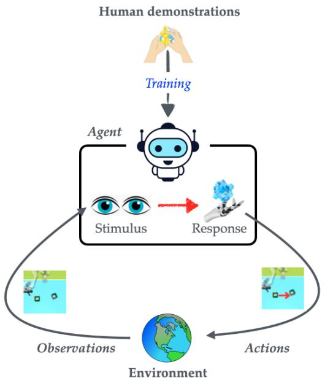  
(a) Behaviorist framework: Direct stimulus-response mapping

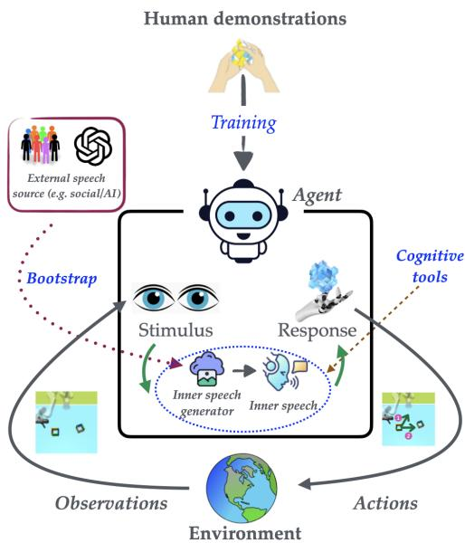  
(b) Cognitive framework: Linguistically-mediated action selection

Figure 6: Contrasting theoretical frameworks for IL. (a) The behaviorist approach models human behavior as a direct mapping from environmental states to actions $\mathit { \Pi } _ { \mathcal { S } _ { t } } \mapsto _ { \mathcal { H } } \mathit { \Pi } _ { \mathcal { A } _ { t } } ,$ ), treating cognitive processes as opaque transformations. (b) The cognitive approach instantiated by MIMIC introduces inner speech as a mediational layer $\begin{array} { r } { ( s _ { t }  m _ { t }  a _ { t } } \end{array}$ ), where $m _ { t }$ represents linguistically-structured internal deliberation that enables behavioral diversity and contextual adaptation.   
Table 4: Comparative analysis of $\mathrm { I L }$ approaches across key dimensions of behavioral modeling and control. Legend: ${ \checkmark } = \mathrm { F u l l }$ support; $\bf { \Psi } \times \bf { \Psi } = \bf { N } \bf { 0 }$ support. Annotations: 1Generates diversity through diffusion but only within goal-constrained trajectories. 2Conditions on fixed human-provided thoughts, limiting emergent diversity. 3Uses linguistic signals that remain external annotations rather than internally generated mediators. 4Bootstraps from visual observations using VLM-generated captions, eliminating the need for human language annotations.   

<table><tr><td rowspan=1 colspan=1>Approach</td><td rowspan=1 colspan=1>BehavioralDiversity</td><td rowspan=1 colspan=1>DesignerControl</td><td rowspan=1 colspan=1>SpeechType</td><td rowspan=1 colspan=1>LanguageGrounding</td><td rowspan=1 colspan=1>LanguageAnnotationsRequired</td><td rowspan=1 colspan=1>LatentSpace</td><td rowspan=1 colspan=1>ConditioningType</td></tr><tr><td rowspan=1 colspan=1>Behavior Transformer [39]</td><td rowspan=1 colspan=1>√(discrete modes)</td><td rowspan=1 colspan=1>×</td><td rowspan=1 colspan=1>N/A</td><td rowspan=1 colspan=1>×</td><td rowspan=1 colspan=1>No</td><td rowspan=1 colspan=1>×</td><td rowspan=1 colspan=1>Unconditional</td></tr><tr><td rowspan=1 colspan=1>Diffusion BC [33]</td><td rowspan=1 colspan=1>√(continuous)</td><td rowspan=1 colspan=1>×</td><td rowspan=1 colspan=1>N/A</td><td rowspan=1 colspan=1>×</td><td rowspan=1 colspan=1>No</td><td rowspan=1 colspan=1>(implicit)</td><td rowspan=1 colspan=1>Unconditional</td></tr><tr><td rowspan=1 colspan=1>BESO [36]</td><td rowspan=1 colspan=1>√(partial)1</td><td rowspan=1 colspan=1>√(goals only)</td><td rowspan=1 colspan=1>External</td><td rowspan=1 colspan=1>√(goals）</td><td rowspan=1 colspan=1>Yes(goals)</td><td rowspan=1 colspan=1>√</td><td rowspan=1 colspan=1>Goal-conditioned</td></tr><tr><td rowspan=1 colspan=1>Thought Cloning [18]</td><td rowspan=1 colspan=1>+</td><td rowspan=1 colspan=1>×</td><td rowspan=1 colspan=1>External3</td><td rowspan=1 colspan=1>(thoughts)</td><td rowspan=1 colspan=1>Yes(per-step)</td><td rowspan=1 colspan=1>×</td><td rowspan=1 colspan=1>Unconditional</td></tr><tr><td rowspan=1 colspan=1>MIMIC (Ours)</td><td rowspan=1 colspan=1>√(stochastic)</td><td rowspan=1 colspan=1>√(general)</td><td rowspan=1 colspan=1>Internal</td><td rowspan=1 colspan=1>√(inner speech)</td><td rowspan=1 colspan=1>No4</td><td rowspan=1 colspan=1>√(CVAE)</td><td rowspan=1 colspan=1>Generallinguistic</td></tr></table>

# B.2 Limitations and Future Extensions

While MIMIC represents a significant advance in cognitively-grounded IL, several limitations warrant consideration for robust deployment across diverse contexts. First, the fidelity of inner speech generation remains contingent upon the quality of linguistic annotations produced by vision-language models during training, creating a dependency where advances in behavioral modeling are partially gated by progress in vision-language understanding—though notably, improvements in VLM capabilities will naturally enhance MIMIC’s performance without architectural modifications.

Second, the temporal granularity of inner speech generation, controlled through the $W$ parameter, requires careful calibration for different task domains, as excessive polling may induce behavioral instability through frequent re-planning while insufficient polling reduces the framework’s capacity to correct for distributional drift.

Furthermore, while the CVAE’s latent representation enables stochastic behavioral generation, the mapping between latent codes and semantic content remains opaque; post-hoc clustering or CLIPbased projection to natural language recovers partial interpretability but potentially loses nuanced behavioral intentions encoded in the continuous space.

Finally, the framework’s efficacy in complex multi-agent environments with heterogeneous behavioral patterns remains unexplored, and coordination complexity may scale non-linearly with agent count in scenarios beyond dyadic interaction.

Future directions could include exploring semi-supervised approaches leveraging limited human annotations to calibrate VLM-generated captions so as to mitigate data quality dependencies, potentially through active learning frameworks that identify high-uncertainty trajectories for targeted human review. Adaptive polling mechanisms that dynamically adjust temporal granularity based on task complexity or behavioral uncertainty metrics would provide more robust default behaviors while reducing practitioner burden. Developing disentangled latent representations or incorporating discrete latent variables with explicit semantic grounding could enhance interpretability without sacrificing behavioral diversity. For multi-agent scalability, hierarchical inner speech architectures that model group-level intentions alongside individual cognition present a promising direction, enabling agents to reason about collective dynamics while maintaining individual behavioral authenticity.

# B.3 Beyond diffusion based behavior policy

While our current implementation employs a diffusion-based behavior policy (DDPM-T), the MIMIC framework is fundamentally model-agnostic. The core insight—that inner speech serves as a stochastic mediator between perception and action—can be instantiated with any conditional behavior cloning architecture. The framework decomposes into two independent components: (1) an inner speech generator $p ( m | \mathcal { H } _ { t } )$ that produces linguistic representations from behavioral history, and (2) a behavior policy $p ( a | s , m )$ that conditions on these representations. This modular design means the behavior policy can be implemented using transformers (e.g., Behavior Transformer), flow-based models, energy-based models, or even standard supervised learning approaches—any architecture capable of conditional generation.

The key requirement is that the base model accepts an additional conditioning signal. Since inner speech is represented as a continuous embedding $m \in { \mathcal { Z } }$ , it can be naturally incorporated through concatenation with state features, cross-attention mechanisms, FiLM conditioning, or additive conditioning depending on the architecture.

The periodic generation mechanism (parameter $W$ ) is similarly architecture-agnostic, as it operates at the simulation level rather than within the model architecture. Any autoregressive policy can maintain a fixed inner speech representation for $W$ steps before regenerating, making this a general inference-time control mechanism applicable across model families. Future work could explore this architectural flexibility to identify optimal policy architectures for different task domains while maintaining the core inner speech framework.

# B.4 Cognitive Inspiration vs. Biological Plausibility

Our framework draws computational inspiration from cognitive theory without claiming biological fidelity or neurobiological correspondence. This distinction is crucial: we operationalize functional properties from cognitive theories of inner speech—semantic condensation, predicativity, and temporal regulation—through computational mechanisms (CVAE, transformer attention, diffusion policy) rather than attempting to replicate neural substrates.

This approach follows a productive tradition in AI where psychological theories inform architectural design without requiring neural isomorphism. Convolutional networks leverage principles of hierarchical visual processing without mimicking V1 neurons; attention mechanisms capture aspects of human focus without replicating neural attention circuits. Similarly, MIMIC extracts functional principles from inner speech theory to address behavioral diversity in imitation learning.

Our technical contributions lie in: (1) formalizing inner speech properties through informationtheoretic and probabilistic frameworks (Section 3.1), (2) instantiating these properties through specific architectural choices (Section 3.2), and (3) empirically validating that these computational mechanisms improve behavioral fidelity and diversity. We make no claims about whether artificial agents experience phenomenological "inner speech" or whether our architectures replicate human cognitive processes at a mechanistic level.

The value of cognitive inspiration lies in generating testable hypotheses about computational mechanisms—in our case, that introducing linguistic mediation between perception and action can capture human behavioral diversity. Our empirical results validate this computational hypothesis while remaining agnostic about biological implementation.

# B.5 Broader Impact

The development of cognitively-grounded artificial agents through MIMIC presents opportunities as well as ethical considerations for human-AI collaboration. The capacity to generate behaviorallyrealistic human surrogates enables comprehensive pre-deployment safety validation, potentially preventing harmful interactions in high-stakes domains such as healthcare and autonomous systems. By incorporating linguistically-mediated control mechanisms, MIMIC also enhances transparency in AI decision-making while modeling cognitive diversity through stochastic inner speech generation—facilitating more inclusive systems that account for varied cultural reasoning patterns and individual differences in collaborative scenarios.

However, the same sophistication in replicating human-like behavioral patterns also introduces novel risks requiring careful governance. The ability to generate convincing behaviors could enable sophisticated social engineering attacks or deceptive AI personas designed to exploit human trust. When functioning correctly, such technology might enable unauthorized behavioral profiling; when producing incorrect outputs, it could generate inappropriate social behaviors violating cultural norms; and through intentional misuse, it could facilitate manipulative agents targeting human cognitive vulnerabilities. Additionally, biases embedded in vision-language models used for bootstrapping could perpetuate societal inequities if generated inner speech reflects discriminatory patterns in training corpora.

Mitigation strategies should focus on balancing innovation with principles of transparency and accountability. Disclosure of artificial agency through technical markers in inner speech generation could prevent deceptive practices. Establishing auditable logs of cognitive mediation processes would enable post-hoc analysis supporting accountability in high-stakes applications. These kinds of mitigations would would help to promote further advances in cognitively-grounded AI enhancing rather than undermining human agency in increasingly automated societies.

# C Extended Related Work

Imitation learning. IL algorithms are commonly organized into behavior cloning, inversereinforcement learning, and distribution-matching families [20, 32, 14]. Classic behavior cloning (BC) regresses actions from expert states; the seminal ALVINN system kept a vehicle in its lane by copying recorded steering commands [34]. Covariate-shift issues in BC motivated Dataset Aggregation (DAgger) [38], which iteratively queries experts on states visited by the learned policy to mitigate distribution mismatch. Inverse-reinforcement learning (IRL) infers a reward explaining the demonstrations [31, 1], while generative adversarial IL (GAIL) matches occupancy measures via an adversarial game [15]. The discriminator in GAIL can be interpreted as a potential-based reward, linking it back to IRL [12]. Hierarchical $\cal { I L }$ discovers latent sub-policies that can be sequenced for long-horizon manipulation [11]. While these approaches model imitation as direct mappings from states to actions or through inferred rewards, MIMIC introduces inner speech as a mediational mechanism between perception and behavior, enabling both distributional matching and designer control through linguistic intervention—a capability absent in traditional IL paradigms.

Diverse behavior imitation: from single mode to multimodal. Human demonstrations are multimodal. Recognizing this, InfoGAIL augments GAIL with an information term so a latent captures hidden styles [25], employing mutual information maximization to discover discrete behavioral modes within expert demonstrations.

Variational methods [45] learn conditional VAEs to embed motor skills, allowing one-shot imitation by sampling different latent states. Such approaches encode behavioral diversity through continuous latent representations that can be manipulated to generate novel skill variations. A hierarchical VAE extends this idea to multi-scale variation [11], decomposing complex behaviors into temporal hierarchies where higher-level latent representations control long-horizon strategies while lower-level latent representations capture execution details. Sequence models such as Behavior Transformers okenize continuous actions and clone $k$ distinct modes using prompt tokens [39], leveraging the transformer architecture’s capacity for in-context learning to capture multimodal action distributions through discrete behavioral prototypes.

Score-based approaches fit diffusion models directly on trajectories, reproducing the full joint-action distribution [33]. These methods model the entire behavioral manifold through iterative denoising processes, achieving high-fidelity reproduction of demonstration diversity. BESO shows the same mechanism can be goal-conditioned with only three denoising steps [36], demonstrating computational efficiency while maintaining distributional expressiveness through accelerated diffusion sampling. These techniques broaden behavioral variety, but explicit control over which behavior type will appear at test time remains limited. This is a gap addressed by MIMIC’s language-grounded inner speech. MIMIC builds on diffusion BC but conditions the denoising step on an inner-speech vector learned via a vision–language scaffold, enabling fine-grained linguistic control without retraining.

Imitation learning for studying Human–AI coordination. The deployment of AI agents in collaborative human environments necessitates computational approaches that transcend purely algorithmic optimization to encompass the full spectrum of human behavioral patterns and coordination dynamics. In multi-agent coordination domains, empirical evidence demonstrates the critical role of human behavioral modeling: in Overcooked, self-play agents confuse human partners due to convergence in self-play to non-human equilibria, whereas agents fine-tuned after first imitating human gameplay coordinate effectively [5]. Similarly, in Hanabi, monte-carlo search regularized with a human-behavior prior achieves high human-partner win rates by incorporating human-like suboptimalities and communication patterns. These systems employ a two-stage pipeline—learn a human model, then train a best response—yet this segregation introduces computational inefficiency and potential misalignment between the human model and the coordination policy.

The effectiveness of the above approaches is constrained by data availability: existing datasets exhibit significant limitations in capturing behavioral diversity. D4RL offers benchmark tasks but its demonstrations stem from synthetic experts, limiting stylistic variety [13]; RoboNet amasses large tele-operation sets yet focuses on narrow table-top primitives [8]; CALVIN provides language supervision but shows a single canonical solution per goal [26]; and Overcooked traces are short and stylistically homogeneous [5]. D3IL deliberately captures multiple human strategies for each manipulation task, making it a rare test-bed for diversity [21]. The BabyAI dataset is another exception, in providing explicit thought annotations for every action, enabling thought cloning [18] to learn from paired action-thought demonstrations. However, this kind of linguistic supervision is expensive and its availability is rare.

MIMIC addresses the architectural and data challenges: it unifies the two-stage pipeline as the diffusion policy trained by imitation already exhibits human-like variability and can serve directly as the partner model during new-agent optimization, while mitigating data bottlenecks by using automatically generated captions to train its inner-speech generator on existing video-only corpora—effectively bootstrapping linguistic mediation from visual demonstrations without requiring the exhaustive human annotation.

Language Interfaced Imitation Learning. Thought cloning (TC) [18] discussed above directly imitates human thoughts but requires access to annotation of actual human thought for each step in the demonstration trajectory. Further, the performance of TC is highly tied with goal (mission) conditioning and degrades by almost $40 \%$ in our experiments once the goal (mission) condition is removed. Similarly, external speech has been used to steer agent behaviors through action reranking [30], though these speech mechanisms remain external to the agent. [43] enforce linguistic bottlenecks through auxiliary tasks but through approaches that operate outside the IL paradigm. Closest prior is [46], who frame intra-agent speech as semi-supervised captioning: a vision-language captioner is pretrained and then frozen to provide auxiliary caption and caption-matching supervision that improves behavior cloning and enables zero-shot object-level generalization with few additional captions. In contrast, we model inner speech as an explicit latent mediator that conditions the policy, i.e., $\begin{array} { r } { p ( a \mid s ) = \int p ( a \mid s , m ) p ( \bar { m } \mid s ) d m } \end{array}$ , and we generate m online from recent history via a conditional VAE. This shift from auxiliary language supervision to mediational control yields steerable and distributionally realistic imitation (designer-prompted behaviors, periodic refresh) rather than only improved supervision signals.

Cognitive Theories of Inner Speech and Behavioral Diversity. The relationship between inner speech and behavioral diversity has been extensively studied within cognitive psychology and neuroscience, providing rich theoretical foundations for our computational approach. Vygotsky’s seminal work [44] established inner speech as internalized social dialogue that mediates higher cognitive functions, proposing that the transformation of interpersonal communication into intrapersonal dialogue creates a mechanism for behavioral self-regulation. This theoretical framework was subsequently empirically observed by Sokolov [42], who characterized inner speech as possessing distinctive structural and functional properties that differentiate it from external communication.

Contemporary cognitive research has extended these foundations to explain behavioral diversity. Fernyhough’s [10] dialogic theory posits that inner speech maintains the dialogical characteristics of interpersonal communication, suggesting that behavioral diversity emerges from the multiplicity of internalized perspectives. As Alderson-Day and Fernyhough [2] note, “inner speech allows for the simulation of multiple action pathways before behavioral execution," providing a cognitive mechanism for generating diverse behavioral responses to identical environmental stimuli.

Neuroimaging studies [3] have identified neural correlates of inner speech, showing activation in both language production regions and motor planning areas during inner speech episodes. These findings are consistent with the hypothesis that inner speech serves as a cognitive rehearsal mechanism for behavioral alternatives. Morin’s [29] self-regulatory framework further proposes that inner speech functions as a behavioral selection mechanism, where verbalized thoughts act as “cognitive filters” that modulate action selection based on contextual factors beyond immediate environmental stimuli.

This theoretical perspective aligns with empirical observations in human imitation learning. Meltzoff’s [27] “like me” framework demonstrates that human imitation is not merely mimicry but rather an inferential process that reconstructs the intentions and mental states underlying observed actions. The diversity in imitative behavior derives from this reconstructive process, where different individuals generate different internal models of the demonstrator’s cognitive states. Our computational architecture operationalizes this cognitive process, modeling how inner speech mediates between observation and action to produce diverse yet contextually appropriate behaviors.

AI Approaches to Modeling Cognitive Processes. Some AI research has explored computational implementations of cognitive processes. [6] propose “autotelic AI” that internalizes language for self-directed learning, emphasizing language as a tool for goal generation and intrinsic motivation. While sharing our interest in cognitive foundations, autotelic systems focus on autonomous learning rather than behavioral diversity, using language primarily for goal generation. [19] utilize large language models to simulate reasoning processes (“chain of thought”) before action selection, implementing serial, deterministic reasoning rather than the stochastic, parallel processing characteristic of inner speech in Vygotskian theory. Our framework models inner speech as a probabilistic process generating diverse behavioral patterns from identical environmental states, more closely aligning with cognitive theories of human behavioral diversity. [4] propose natural language as a latent space for reinforcement learning, using language to structure behavior hierarchically. While this approach shares with us the adoption of language as a cognitive tool, it focuses on decomposing complex tasks rather than generating behavioral diversity. Our framework uniquely combines the stochastic nature of inner speech with IL to capture a wide spectrum of human behavioral variation without requiring explicit linguistic supervision.

# D Technical Background

In this section, we provide a detailed background on diffusion models and conditional variational autoencoders, which constitute the backbone of MIMIC’s architecture.

# D.1 Diffusion Models

Diffusion models, specifically denoising diffusion probabilistic models (DDPMs), constitute a class of generative models that transform noise distributions into target data distributions through iterative denoising processes. Their theoretical foundation derives from non-equilibrium thermodynamics and Markovian diffusion processes, establishing a principled approach to generative modeling through progressive noise injection and removal [17, 9, 40].

The diffusion framework comprises two fundamental stochastic processes operating in complementary directions. The forward diffusion process defines a Markov chain that incrementally incorporates Gaussian noise according to a predefined variance schedule, systematically destroying the data structure. Given data $\mathbf { x } _ { 0 } \sim q ( \mathbf { x } )$ , this process generates increasingly noisy latents through:

$$
q ( \mathbf { x } _ { t } | \mathbf { x } _ { t - 1 } ) = \mathcal { N } ( \mathbf { x } _ { t } ; \sqrt { 1 - \beta _ { t } } \mathbf { x } _ { t - 1 } , \beta _ { t } \mathbf { I } ) ,
$$

where $\{ \beta _ { t } \} _ { t = 1 } ^ { T }$ represents the noise schedule with $0 < \beta _ { t } < 1$ . The noise schedule can follow various strategies including linear, cosine, or learned schedules, each affecting the quality-efficiency trade-off during generation. This formulation admits a tractable closed-form expression for any timestep:

$$
q ( \mathbf { x } _ { t } | \mathbf { x } _ { 0 } ) = \mathcal { N } ( \mathbf { x } _ { t } ; \sqrt { \bar { \alpha } _ { t } } \mathbf { x } _ { 0 } , ( 1 - \bar { \alpha } _ { t } ) \mathbf { I } ) ,
$$

where $\alpha _ { t } = 1 - \beta _ { t }$ and $\begin{array} { r } { \bar { \alpha } _ { t } = \prod _ { i = 1 } ^ { t } \alpha _ { i } } \end{array}$ . As $T \to \infty$ with an appropriate schedule, $\mathbf { x } _ { T }$ approximates an isotropic Gaussian distribution, effectively erasing all information about the original data.

The reverse diffusion process recovers the original data distribution through learned denoising transformations, parameterized as:

$$
p _ { \theta } ( \mathbf { x } _ { t - 1 } \vert \mathbf { x } _ { t } ) = \mathcal { N } ( \mathbf { x } _ { t - 1 } ; \mu _ { \theta } ( \mathbf { x } _ { t } , t ) , \boldsymbol { \Sigma } _ { \theta } ( \mathbf { x } _ { t } , t ) ) ,
$$

where $p _ { \theta } ( \mathbf { x } _ { T } ) = \mathcal { N } ( \mathbf { x } _ { T } ; \mathbf { 0 } , \mathbf { I } )$ . Following established practice, the variance is typically fixed as $\Sigma _ { \theta } ( \mathbf { x } _ { t } , t ) = \sigma _ { t } ^ { 2 } \mathbf { I }$ , with $\sigma _ { t } ^ { 2 }$ either learned or set to $\beta _ { t }$ or $\begin{array} { r } { \tilde { \beta } _ { t } = \frac { 1 - \bar { \alpha } _ { t - 1 } } { 1 - \bar { \alpha } _ { t } } \beta _ { t } } \end{array}$ . The mean $\mu _ { \theta } ( \mathbf { x } _ { t } , t )$ is parameterized through a neural network that predicts the noise component:

$$
{ \pmb \mu } _ { \theta } ( { \bf x } _ { t } , t ) = \frac { 1 } { \sqrt { \alpha _ { t } } } \left( { \bf x } _ { t } - \frac { \beta _ { t } } { \sqrt { 1 - \bar { \alpha } _ { t } } } { \pmb \epsilon } _ { \theta } ( { \bf x } _ { t } , t ) \right) ,
$$

where $\epsilon _ { \theta } ( \mathbf { x } _ { t } , t )$ predicts the noise added during the forward process. This parameterization establishes a fundamental connection to score-based generative models, as the predicted noise is proportional to the score function $\nabla _ { \mathbf { x } _ { t } } \log q ( \mathbf { x } _ { t } )$ .

The training objective, derived from variational inference principles, minimizes the negative evidence lower bound (NELBO). However, empirical investigations demonstrate that a simplified objective yields superior practical results:

$$
\mathcal { L } _ { \mathrm { s i m p l e } } = \mathbb { E } _ { t \sim \mathcal { U } [ 1 , T ] , \mathbf { x } _ { 0 } \sim q ( \mathbf { x } ) , \epsilon \sim \mathcal { N } ( \mathbf { 0 } , \mathbf { I } ) } \left[ \| \epsilon - \epsilon _ { \theta } \big ( \sqrt { \bar { \alpha } _ { t } } \mathbf { x } _ { 0 } + \sqrt { 1 - \bar { \alpha } _ { t } } \epsilon , t \big ) \| ^ { 2 } \right] .
$$

This formulation enables efficient training through direct noise prediction across all timesteps simultaneously, while sampling necessitates iterative denoising from pure noise.

# D.2 Conditional Variational Autoencoders

Conditional variational autoencoders (CVAEs) extend the traditional VAE framework by incorporating conditional information into the generative process, thereby enabling controlled generation based on specified attributes, contextual constraints, or structural specifications [41, 23]. This conditional paradigm addresses the fundamental limitation of standard VAEs in providing explicit control over generated outputs, establishing CVAEs as particularly valuable for applications demanding targeted generation capabilities.

CVAEs introduce a conditioning variable c to model the conditional data distribution $p ( \mathbf { x } | \mathbf { c } )$ through a latent variable framework. The generative process is formulated hierarchically as:

$$
p _ { \theta } ( \mathbf { x } | \mathbf { c } ) = \int p _ { \theta } ( \mathbf { x } | \mathbf { z } , \mathbf { c } ) p _ { \theta } ( \mathbf { z } | \mathbf { c } ) d \mathbf { z } .
$$

The conditioning mechanism operates at multiple architectural levels: influencing the prior distribution $p _ { \boldsymbol { \theta } } ( \mathbf { z } | \mathbf { c } )$ , the likelihood $p _ { \theta } ( \mathbf { x } | \mathbf { z } , \mathbf { c } )$ , or both components simultaneously. Different conditioning strategies yield distinct modeling capabilities, ranging from simple attribute control to complex structural generation tasks requiring sophisticated conditional dependencies.

Since direct computation of the posterior $p _ { \theta } ( \mathbf { z } | \mathbf { x } , \mathbf { c } )$ remains intractable, CVAEs employ variational inference with an approximate posterior $q _ { \phi } ( \mathbf { z } | \mathbf { x } , \mathbf { c } )$ , yielding the conditional evidence lower bound (ELBO):

$$
\begin{array} { r } { \log p _ { \theta } ( \mathbf { x } \vert \mathbf { c } ) \geq \mathbb { E } _ { q _ { \phi } ( \mathbf { z } \vert \mathbf { x } , \mathbf { c } ) } \left[ \log p _ { \theta } ( \mathbf { x } \vert \mathbf { z } , \mathbf { c } ) \right] - D _ { K L } \left( q _ { \phi } ( \mathbf { z } \vert \mathbf { x } , \mathbf { c } ) \vert \vert p _ { \theta } ( \mathbf { z } \vert \mathbf { c } ) \right) . } \end{array}
$$

The conditional prior $p _ { \theta } ( \mathbf { z } | \mathbf { c } )$ can be parameterized as a learned function of the conditioning variable, enabling the model to adapt the latent space structure based on conditional information. This adaptability fundamentally distinguishes CVAEs from simpler conditional generation approaches that merely concatenate conditions with inputs.

Neural networks parameterize both the encoder $q _ { \phi } ( \mathbf { z } | \mathbf { x } , \mathbf { c } )$ as a conditional Gaussian distribution and the decoder $p _ { \theta } ( \mathbf { x } | \mathbf { z } , \mathbf { c } )$ , which reconstructs inputs based on both latent variables and conditioning information. The encoder produces conditional distributional parameters:

$$
\begin{array} { r } { q _ { \phi } ( \mathbf { z } | \mathbf { x } , \mathbf { c } ) = \mathcal { N } ( \mathbf { z } ; \pmb { \mu } _ { \phi } ( \mathbf { x } , \mathbf { c } ) , \mathrm { d i a g } ( \pmb { \sigma } _ { \phi } ^ { 2 } ( \mathbf { x } , \mathbf { c } ) ) ) . } \end{array}
$$

The reparameterization trick facilitates gradient-based optimization through:

$$
\mathbf { z } = \pmb { \mu } _ { \phi } ( \mathbf { x } , \mathbf { c } ) + \pmb { \sigma } _ { \phi } ( \mathbf { x } , \mathbf { c } ) \odot \epsilon , \quad \epsilon \sim \mathcal { N } ( \mathbf { 0 } , \mathbf { I } ) .
$$

The complete training objective minimizes the negative conditional ELBO:

$$
{ \mathcal { L } } _ { \mathrm { C V A E } } = - \mathbb { E } _ { q _ { \phi } ( \mathbf { z } | \mathbf { x } , \mathbf { c } ) } \left[ \log p _ { \theta } ( \mathbf { x } | \mathbf { z } , \mathbf { c } ) \right] + D _ { K L } \left( q _ { \phi } ( \mathbf { z } | \mathbf { x } , \mathbf { c } ) \| p _ { \theta } ( \mathbf { z } | \mathbf { c } ) \right) .
$$

This objective balances reconstruction fidelity against latent space regularization while incorporating conditional constraints. The KL divergence term encourages the approximate posterior to remain proximate to the conditional prior, enabling meaningful interpolation within the conditional manifold and ensuring that latent representations respect the conditioning structure.

# E Experimental Setup

# E.1 Additional Environment details

Figure 7 (a,b,c) illustrates the D3IL 5 environments used in our experiments. We use the 4-box and vision-based setting for the Sorting environment, as we observed more stability and higher performance in the BC model under these settings. The following outlines some brief details on those environments.

Aligning: The Aligning task requires the robot to precisely manipulate a box such that it aligns with a target box within specified tolerances, with the constraint that colors must match for each side. The task admits two distinct behavioral modalities: pushing from the inside or from the outside of the box configuration, thereby introducing controlled multi-modality in the action space. The state representation encompasses end-effector position in Cartesian space, pushing box position and quaternion, and target box position and quaternion, with actions represented as desired Cartesian velocities. This task exemplifies the challenge of precision control under multi-modal behavioral strategies, requiring policies to master fine-grained manipulation while maintaining behavioral diversity.

Sorting: The Sorting task requires the robot to sort red and blue blocks into their color-matching target boxes, with task complexity scaling from 2 to 6 blocks. For the 6-block variant, the task exhibits

20 distinct behaviors and demands complex manipulation sequences with high variation in trajectory lengths, challenging existing IL approaches. The state representation includes end-effector position, all boxes’ positions and tangent of Euler angles along the $\mathbf { Z }$ -axis, with dimensionality scaling linearly with the number of objects. This environment tests an agent’s capacity to handle combinatorial complexity and maintain closed-loop sensory feedback across extended manipulation sequences.

Stacking: The Stacking task requires the robot to sequentially stack 1-3 blocks in a designated yellow target zone, employing a parallel gripper and augmented reality control interface for enhanced dexterity. The state representation includes robot joint positions, gripper width, and boxes’ positions with Euler angle tangents, while actions encompass both joint velocities and gripper width control. Success criteria demand not only lateral positioning within the target zone but also appropriate vertical heights confirming successful stacking. This task represents the pinnacle of manipulation complexity in the D3IL suite, requiring precise grasp-place sequences, dynamic stability maintenance, and adaptive recovery from perturbations.

Figure 7 (d,e,f) illustrates the Overcooked 6 environments used in our experiments. Note: We use the term “Greedy agent" to report results for Overcooked environments, however, this agent is the same as the human proxy agent (split of the trajectories collected from humans) as reported in [5].

Cramped Room: Agents must navigate a confined workspace while executing sequential cooking tasks. The constrained spatial topology induces frequent collision possibilities, necessitating real-time trajectory adaptation and implicit coordination protocols that emerge through embodied interaction rather than explicit communication. The environment’s state space encompasses agent positions, object locations, and cooking progress indicators, with actions comprising discrete movement commands and object interactions. This layout operationalizes fundamental questions about emergent coordination strategies in spatially constrained multi-agent systems, where optimal policies must balance task efficiency against collision avoidance through anticipatory modeling of partner trajectories.

Asymmetric Advantages: The Asymmetric Advantages layout tests whether agents can develop high-level strategic reasoning that leverages differential access to resources, as players begin in distinct spatial regions with asymmetric proximity to cooking stations. This environmental structure necessitates role specialization and adaptive task allocation, where agents must infer and exploit comparative advantages based on spatial positioning and partner capabilities. The layout embodies game-theoretic coordination challenges where multiple Nash equilibria exist, each corresponding to different role assignments and workflow patterns. Success requires agents to transcend myopic task completion toward globally efficient coordination strategies that emerge through iterated interaction and mutual adaptation.

Coordination Ring: The Coordination Ring layout presents a topologically constrained environment where the ring-like spatial structure forces agents to establish and maintain directional conventions (clockwise or counterclockwise movement) to prevent deadlock scenarios. Agents must rapidly converge on shared behavioral protocols without explicit communication channels. The circular topology creates a coordination game with multiple equilibria, where misaligned conventions result in systematic inefficiencies through blocking behaviors. This layout thus serves as a minimal testbed for studying how artificial agents can develop and adapt to emergent social conventions, mirroring fundamental processes in human social coordination where arbitrary but stable behavioral patterns facilitate collective action.

# E.1.1 Environment descriptions for the inner speech prompt

Aligning. The GIF(s) show a {camera} view of your actions and your task was to move a box starting from different positions using a robotic hand to align with the other box, which is fixed.

Sorting. The GIF(s) show a {camera} view of your actions where your goal was to sort red and blue blocks to their color-matching target box.

Stacking. The GIF(s) show a {camera} view of your actions where your goal to stack blocks with different colors in a (yellow) target zone.

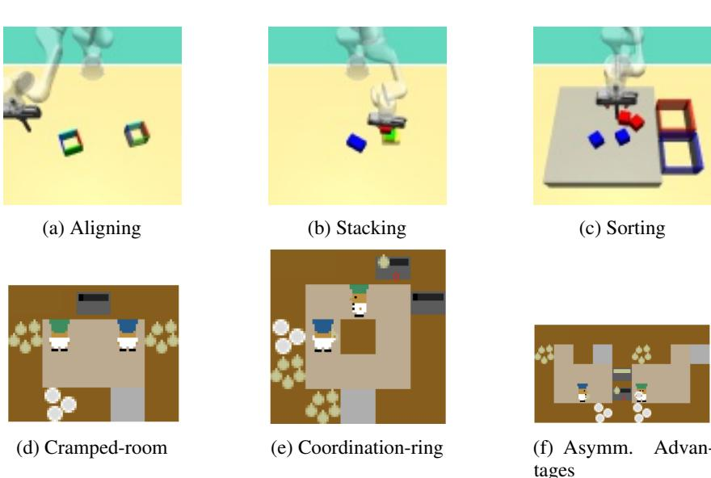  
Figure 7: Environments used in our experiments. (a-c): D3IL environments Aligning, Stacking and Sorting environments, respectively. (d-f): Overcooked map layouts Cramped-room, Coorindation ring, and Asymmetric Advantage, respectively.

Overcooked: The goal is to place three onions in a pot (dark grey), take out the resulting soup on a plate (white) and deliver it (light grey), as many times as possible within the time limit. The GIF(s) show how the {agent} moves and interacts with other agents in a cramped room.

# E.2 Conditional evaluation

Evaluate the ability of the caption to describe the overall motion in the gif from 1 to 5.

Also give your reasoning. The caption is deliberately succinct and ignores the small motion so do not consider these points while evaluating.

Caption: {caption} GIF: attached Score:

# E.3 Large language models

We use API version ‘2025-01-01-preview’ for all models and employ structured output API to obtain the behavior descriptions corresponding to each GIF. 7

# E.4 Computational environment

All experiments were conducted on a high-performance computing server, equipped with a 64-core $\mathrm { x 8 6 \_ 6 4 }$ processor (128 threads) and 1007 GB of RAM, running Ubuntu 22.04 LTS (kernel 5.15.0- 153-generic). For GPU-accelerated computations, we utilized an NVIDIA A100 80GB PCIe GPU with CUDA version 12.6. The experiments were implemented using Python 3.10.14 (conda-forge distribution) with PyTorch 2.7.0.

# E.5 Extension to multi-agent speech

A novel implication of MIMIC’s flexibility arises in multi-agent settings where an agent can be conditioned not only on its own inner speech but also on the inner speech of other agents, inspired by

mirror neuron theory of social cognition [37]. This extension models how inner speech mediates social interaction, allowing agents to adapt their behavior based on their perception of others’ cognitive states8. We denote it as MIMIC-MA in our experiments.

# F Complexity Analysis

Training. First, generating inner-speech captions with GPT-4o is inexpensive: we make $N / B$ API calls with average context length of $\sim 1 0 0$ for text and $\sim B \cdot ( 8 5 + 1 7 0 n )$ for images (with $n$ tiles of $5 1 2 \times 5 1 2 { \mathrm { p x } } ,$ ), totaling $\sim N \cdot 1 7 0 n$ tokens which is about $\$ 2$ for over 400 trajectories, even with high resolution $2 0 4 8 \times 2 0 4 8$ images. The CLIP model $\mathrm { \sim 0 . 5 B }$ parameters) is likewise lightweight and can be efficiently used during training to generate the inner speech.

Inference. Let $T _ { C V A E }$ and $T _ { d i f f }$ denote one forward pass through the CVAE and diffusion models, respectively. Over a simulation horizon $H$ with window size $W$ , we perform $H$ diffusion passes and $H / W$ CVAE passes, yielding a total complexity of $O ( H T _ { d i f f } + H / W T _ { C V A E } ) \rangle$ . Since both are vision-conditioned with similar runtimes and $H > H / \dot { W }$ , the diffusion term dominates. So, MIMIC adds no inference overhead.

# G Additional Experiment Results

We first report the extended results in each environment along with the parameter configurations that correspond to the reported best performance. We then analyze the sensitivity of MIMIC to various hyper-parameters and different VLM models. We conclude with the visualization of behaviors obtained through designer specified control text for the Aligning and Sorting environments.9

# G.1 How is inner speech represented in the embedding space?

Figure 8 shows the TSNE visualization of the CLIP-encoded inner speech of different environments, as generated using GPT-4o. We find that it tends to cluster together similar behaviors while separating distinct behaviors in this 2D space.

# G.2 Which configurations maximize the efficacy of MIMIC?

Robotic Manipulation Task. Table 5 reports the hyperparameters corresponding to the best performance reported in Table 1 for D3IL benchmark. Here, $p _ { d r o p }$ denotes the probability of randomly dropping the $m$ for ${ \mathcal { L } } _ { \mathrm { d i f f } }$ . We note that higher update windows are preferred for long horizon environments, such as Stacking and Sorting than Aligning, where smaller update windows $( W )$ gives high performance. Initial steps show more variation while indicating that higher values are preferred in non-vision environments. This means that for the first few steps, the agent takes its action with no inner speech. On the other hand, random dropout probability of inner speech $( p _ { d r o p } )$ is found to be important for the Aligning environment for higher performance while no such dropout is more useful in others.

Overcooked Tasks. Table 6 shows the hyperparameters along with the Wasserstein distance between the actions for the OverCooked environment. We also include the reward collected by the $\mathrm { P P O } _ { H _ { p r o x y } }$ model from [5]. This approach trains the PPO agent in partnership with the $H _ { p r o x y }$ model, essentially giving it access to ground truth. [5] calls this value the "gold standard" and reports only the PPO agent trained in the presence of an imitator reaching close to the gold standard. The results demonstrate that MIMIC already outperforms BC significantly and reaches closer to or surpasses the gold standard performance, demonstrating the capability of MIMIC agent to collaborate effectively with human proxy model. The results further show that the best hyperparameters often include a low initial step and a high update window with a non-zero dropping of probability. The Wasserstein distance between the generated and training actions to also small, following the trend in Table 1. This showcases the high fidelity of behavior imitation as compared to just task success that MIMIC achieves.

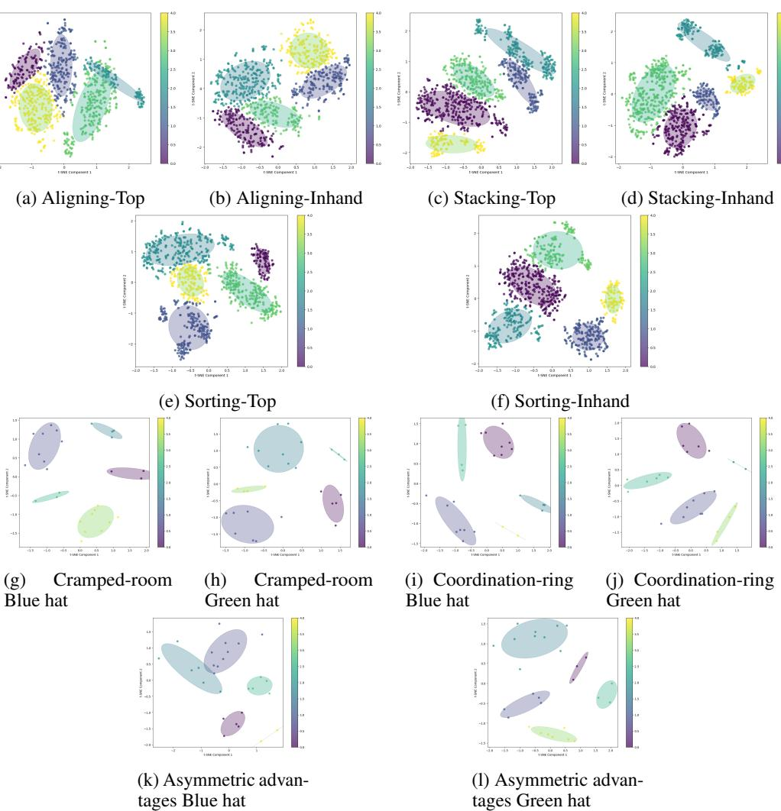  
Figure 8: TSNE visualization of CLIP-encoded inner speech generated using GPT-4o for the environments used in our experiments. (a-f): Top and inhand cameras in D3IL: Aligning, Stacking and Sorting environments, respectively. $\mathbf { \left( { { \bf { g } } - 1 } \right) }$ : Blue and green hat agents in overcooked map layouts: Cramped-room, Coorindation ring, and Asymmetric Advantages, respectively.

We also study the setting of using the other agent’s speech (denoted as MIMIC-MA) and find the performance to slightly improve in Coordination-ring, a layout where coordination becomes central to the task. Using the green hat agent’s speech in this case is found to be useful, whereas in all other layouts, the agents collect less reward when using just the blue hat agent’s own speech.

# G.3 How sensitive is MIMIC to hyperparameters?

Figure 9 shows how performance varies with change in the initial step and polling window of the simulation in the D3IL benchmark. The performance goes down by delaying the first step of the inner speech update. The performance improves when increasing the update window in the Aligning dataset, but only up to a limit after which the success rate starts going down while the entropy increases. We find that higher polling windows are preferred in Stacking and Sorting environments, while other trends are similar to Aligning.

Figures 10b and 10c shows the hyperparameter sensitivity in Overcooked cramped room environment and we find a similar trend as D3IL benchmark of increasing the performance with increase in the initial step to some extent, while update/polling windows show a drop in performance after a point.

Table 5: Comparison of MIMIC against BC with the DDPM-T architecture on the D3IL benchmark.   

<table><tr><td>Environment</td><td>Model</td><td>Pdrop</td><td>to</td><td>W</td><td>Success rate ↑</td><td>Distance↓</td><td>Entropy ↑</td></tr><tr><td>Aligning</td><td>BC</td><td></td><td></td><td></td><td>0.6645</td><td>0.1105</td><td>0.4743</td></tr><tr><td></td><td>MIMIC-S</td><td>0.1</td><td>50</td><td>50</td><td>0.8021</td><td>0.0664</td><td>0.4184</td></tr><tr><td></td><td>MIMIC-E</td><td>0.1</td><td>12</td><td>50</td><td>0.7229</td><td>0.0847</td><td>0.6148</td></tr><tr><td>Aligning-Vision</td><td>BC</td><td></td><td></td><td></td><td>0.1833</td><td>0.1875</td><td>0.0895</td></tr><tr><td></td><td>MIMIC-S</td><td>0.1</td><td>1</td><td>20</td><td>0.2229</td><td>0.1885</td><td>0.0849</td></tr><tr><td></td><td>MIMIC-E</td><td>0.0</td><td>1</td><td>20</td><td>0.2083</td><td>0.1849</td><td>0.1473</td></tr><tr><td>Sorting-Vision</td><td>BC</td><td></td><td></td><td></td><td>0.7972</td><td>-</td><td>0.3596</td></tr><tr><td></td><td>MIMIC-S</td><td>0.0</td><td>100</td><td>200</td><td>0.8417</td><td>=</td><td>0.3719</td></tr><tr><td></td><td>MIMIC-E</td><td>0.0</td><td>50</td><td>100</td><td>0.8083</td><td>=</td><td>0.4494</td></tr><tr><td></td><td></td><td></td><td></td><td></td><td>1 box/2 box</td><td>=</td><td>1 box /2 box/3 box</td></tr><tr><td>Stacking</td><td>BC</td><td></td><td></td><td></td><td>0.8027 /0.4879</td><td></td><td>0.2058 /0.1503 /0.1049</td></tr><tr><td></td><td>MIMIC-S</td><td>0.0</td><td>30</td><td>50</td><td>0.8129 / 0.6074</td><td></td><td>0.1774 / 0.0737 /0.0394</td></tr></table>

Table 6: Comparison of MIMIC against BC with DDPM-T on the Overcooked environments. ‘-’ denotes “action Wasserstein" is not feasible or not available. ∗ denotes values taken directly from [5]. Note that “state Wasserstein" is infeasible due to a large dimension (96) of state features.   

<table><tr><td>Environment</td><td>Model</td><td>Pdrop</td><td>to</td><td>W</td><td>Collective reward</td><td>Action Wasserstein</td></tr><tr><td rowspan="4">Cramped room</td><td></td><td></td><td></td><td></td><td>~ 155－160</td><td>=</td></tr><tr><td>BC</td><td></td><td></td><td></td><td>115.8 ± 3.86</td><td>0.24</td></tr><tr><td>MIMIC</td><td>0.1</td><td>10</td><td>100</td><td>151.8 ± 2.45</td><td>0.25</td></tr><tr><td>MIMIC-MA</td><td>0.1</td><td>1</td><td>50</td><td>148.4 ± 2.17</td><td>0.25</td></tr><tr><td rowspan="3">Cramped room- Vision</td><td>BC</td><td></td><td></td><td></td><td>73.6 ± 6.18</td><td>1</td></tr><tr><td>MIMIC</td><td>0.0</td><td>1</td><td>50</td><td>108.8 ± 4.84</td><td></td></tr><tr><td>MIMIC-MA</td><td>0.0</td><td>1</td><td>20</td><td>103.6 ± 3.69</td><td>=</td></tr><tr><td rowspan="4">Coordination ring</td><td>PPOHprory</td><td></td><td></td><td></td><td>~ 145－150</td><td></td></tr><tr><td>BC</td><td></td><td></td><td></td><td>113.0 ± 2.21</td><td>0.08</td></tr><tr><td>MIMIC</td><td>0.1</td><td>10</td><td>50</td><td>121 ± 1.93</td><td>0.09</td></tr><tr><td>MIMIC-MA</td><td>0.1</td><td>10</td><td>20</td><td>128.6 ± 1.75</td><td>0.03</td></tr><tr><td rowspan="4">Asymmetric advan- tages</td><td></td><td></td><td></td><td></td><td>~ 125－130</td><td>1</td></tr><tr><td>BC</td><td></td><td></td><td></td><td>215.8 ± 3.04</td><td>0.14</td></tr><tr><td>MIMIC</td><td>0.1</td><td>10</td><td>200</td><td>227.6 ± 2.69</td><td>0.10</td></tr><tr><td>MIMIC-MA</td><td>0.1</td><td>10</td><td>50</td><td>227.0 ± 1.84</td><td>0.11</td></tr></table>

We also evaluate the effect of changing the embedding and VLM in the overcooked environment. Figure 10a shows that CLIP-encoded and GPT-4o-scaffolded inner speech is most effective in obtaining the highest collective reward in the Overcooked cramped room. However, we find that even by changing the embedding and VLM, MIMIC still outperforms the BC variant.

# G.4 How does MIMIC compare against other strong imitation learning approaches?

While our choice of BC (DDPM-T, [33]) is motivated by its high benchmark performance, we also compare against two additional approaches for comprehensiveness: BESO [36] and BeT [39]. For a fair comparison, we use the BESO’s diffusion model architecture as the underlying policy network in MIMIC instead of a DDPM-T architecture. Table 8 shows that MIMIC substantially outperforms these approaches as well, further highlighting the advantages of using inner speech.

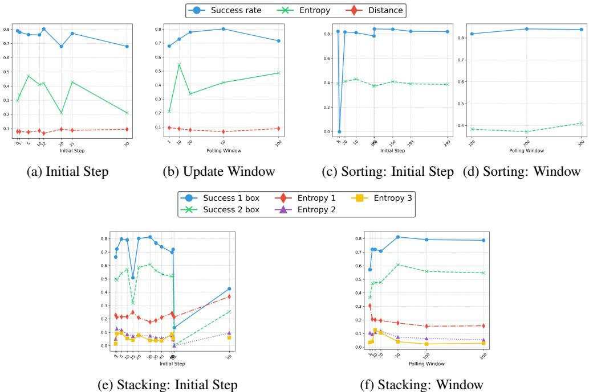  
Figure 9: Hyperparameter sensitivity of MIMIC on the $\mathrm { D } 3 \mathrm { I L }$ benchmark.

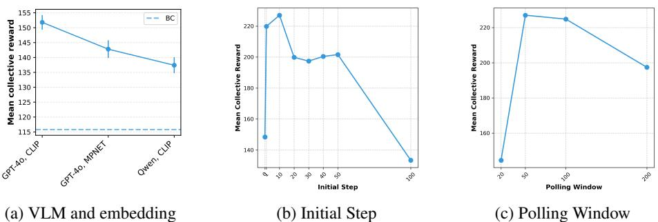  
Figure 10: Sensitivity on overcooked Cramped-room

# G.5 How efficient is MIMIC during inference?

We confirm the findings of Appendix F empirically by showing in Table 7 that MIMIC’s simulation runtime matches that of DDPM-T BC in visionbased environments. Since MIMIC’s CVAE is vision-based, it would be unfair to compare against non-vision policy networks.

Table 7: Runtime (s) $\downarrow$ for different vision environments.   

<table><tr><td>Environment</td><td>BC</td><td>MIMIC</td></tr><tr><td>Aligning</td><td>40.69</td><td>57.16</td></tr><tr><td>Sorting</td><td>71.50</td><td>78.5</td></tr><tr><td>Overcooked</td><td>93.23</td><td>94.72</td></tr></table>

# G.6 How well does MIMIC enable designer-specified control to generate desired behaviors?

Figure 11 shows examples of different behaviors produced by the MIMIC model conditioned with different descriptions of behaviors. Figure 11a shows a quick repositioning at the start, but due to mediating inner speech, it is not realized later. Figure 11b, on the other hand, shows an attempt to align/match the edges at the start according to the condition. Figure 11c shows an attempt to adjust the box position before pushing straight ahead after a mediation. We find a right side curve approach in Figure 11d, but due to misalignment, it does a lot of rotation at the end. A mediation would have helped here. We find that the zig-zag motion is exhibited in both Figures 11e and 11f while Figure 11f shows more adjustment at the final step as described in the input behavior description.

Table 8: Comparison with other imitation learning models. Here, we use BESO as the base diffusion policy network in MIMIC instead of DDPM-T for fairness.   

<table><tr><td colspan="4">Aligning</td><td colspan="2">Overcooked cramped room 1</td></tr><tr><td>Model</td><td>Success rate</td><td>Distance</td><td>Entropy</td><td>Model</td><td>Collective Reward</td></tr><tr><td>BeT</td><td>0.51667</td><td>0.12949</td><td>0.40475</td><td>BeT</td><td>47.2 ± 4.64</td></tr><tr><td>BeSO</td><td>0.85417</td><td>0.04954</td><td>0.6141</td><td>BESO</td><td>67.8 ± 4.55</td></tr><tr><td>MIMIC-S</td><td>0.88125</td><td>0.04234</td><td>0.7215</td><td>MIMIC</td><td>120.2 ± 2.86</td></tr><tr><td>MIMIC-E</td><td>0.86875</td><td>0.04759</td><td>0.7706</td><td>MIMIC-MA</td><td>141.2 ± 3.68</td></tr></table>

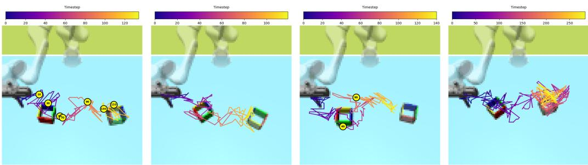  
(a) I quickly reposition and (b) I align the edges first (c) I adjust the box position (d) I curve around from push to achieve contact before making full contact. slightly before making the the right side, adjusting for final approach alignment mid-way.

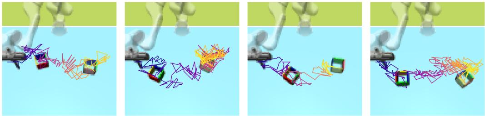  
(e) I apply a zigzag path to (f) I use a zigzag pattern to (g) I use a swift motion (h) I begin with a swift side navigate around an obsta-close the distance, adjust-from the top, maintaining approach, then slow down cle ing final position carefully a steady path for alignment to ensure precise alignment   
Figure 11: Conditional generation on the Aligning dataset. The color gradient (Plasma) shows the simulation time going from 0 (dark purple) to the end (bright yellow), going through red and orange. Inner speech updates are marked as yellow circles with corresponding times inside; the first inner speech is equal to the specified condition.

On the other hand, Figure $\cdot$ shows a swift motion moving from the top and fast convergence to the desired box, as mentioned in the input text while Figure 11h begins with a swift approach but then spends a lot of time in the final alignment with the desired box as mentioned in the text, similar to Figure 11f. These results demonstrate significant success achieved by MIMIC towards enabling steerable imitation of desired behaviors.

We also extend this analysis to the Sorting dataset as we find how it prioritizes the closest red block before any blue in Figure 12a, alternate color sorting in Figure 12b, and a behavior of grouping before moving into desired sorted places in Figure 12c.

# G.7 What does generated inner speech look like during simulation?

Since CVAE-generated inner speech lies in the latent embedding space, it is hard to fully interpret and visualize them. We thus employ a heuristic technique to analyze the inner speech during simulation by retrieving the top-2 training descriptions in CLIP’s embedding space at each update step. We use the cosine similarity to find the nearest training description and provide the value in parentheses.

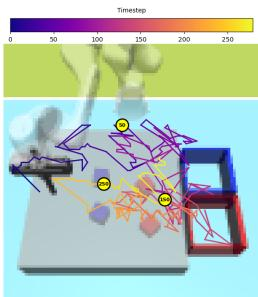  
(a) I prioritize the closest red block before any blue.

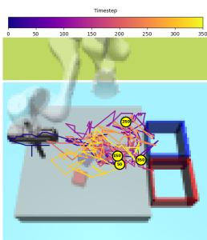  
(c) I sort blocks by color, grouping similar colors together before moving them.

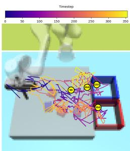  
(b) I alternate between picking a red block and a blue block.   
Figure 12: Conditional generation on the Sorting dataset. The color gradient (Plasma) shows the simulation time going from 0 (dark purple) to the end (bright yellow) going through red and orange. Inner speech updates are marked as yellow circles with corresponding times inside; the first inner speech is equal to the specified condition.

Here, we provide examples for both conditional and unconditional simulations and find how the top captions change along with the similarity score.

# G.7.1 Conditional

# I rotate the box first before aligning it with the target.

<table><tr><td>Timestep</td><td>Closest description</td><td>Similarity</td></tr><tr><td>t=49</td><td>I push the box directly without rotation, aiming for a straightforward alignment.</td><td>0.9183</td></tr><tr><td>t=99</td><td>I approach directly, then rotate in place to align perfectly.</td><td>0.9614</td></tr><tr><td>t=149</td><td>I approach directly, then rotate in place to align perfectly.</td><td>0.9614</td></tr><tr><td>t=249</td><td>Starting from a slightly rotated angle, I need a mid-action adjustment to align.</td><td>0.9616</td></tr></table>

# I begin with a swift side approach, then slow down to ensure precise alignment.

<table><tr><td>Timestep</td><td>Closest description</td><td>Similarity</td></tr><tr><td>t=49</td><td>I approach the box from the side, rotating slightly to align smoothly with the fixed box.</td><td>0.9471</td></tr><tr><td>t=99</td><td>I approach directly, then rotate in place to align perfectly.</td><td>0.9614</td></tr><tr><td>t=149</td><td>I approach directly, then rotate in place to align perfectly.</td><td>0.9619</td></tr><tr><td>t=249</td><td>I approach with a direct path but make a last-second adjustment to align perfectly.</td><td>0.9611</td></tr></table>

# I use a swift motion from the top, maintaining a steady path for alignment.

<table><tr><td>Timestep</td><td>Closest description</td><td>Similarity</td></tr><tr><td>t=49</td><td>Iexecute a direct push from behind, minimizing lateral movement.</td><td>0.9477</td></tr><tr><td>t=99</td><td>I carefully approach from the left, ensuring alignment from a diagonal perspective.</td><td>0.9613</td></tr><tr><td>t=149</td><td>Starting from a slightly rotated angle,I need a mid-action adjustment to align.</td><td>0.9613</td></tr><tr><td>t=249</td><td>I approach with a direct path but make a last-second adjustment to align perfectly.</td><td>0.9613</td></tr></table>

# G.7.2 Unconditional

Aligning   

<table><tr><td>Timestep</td><td>Closest description</td><td>Similarity</td></tr><tr><td>t=0</td><td>I start with a straight approach from a central position, requiring minimal rotation for alignment.</td><td>0.9693</td></tr><tr><td>t=50</td><td>I start with a straight approach from a central position, requiring minimal rotation for alignment.</td><td>0.9691</td></tr><tr><td>t=100</td><td>I start with a straight approach from a central position, requiring minimal rotation for alignment.</td><td>0.9696</td></tr></table>

# Sorting

<table><tr><td>Timestep</td><td>Closest description</td><td>Similarity</td></tr><tr><td>t=100</td><td>I focus on sorting all blocks of one color first before switching to the other.</td><td>0.9607</td></tr><tr><td>t=300</td><td>I focus on sorting all blocks of one color first before switching to the other.</td><td>0.9604</td></tr></table>

# Overcooked Cramped room

<table><tr><td>Timestep</td><td>Closest description</td><td> Similarity</td></tr><tr><td>t=100</td><td>I quickly grab onions from the pile and place them in the pot, prioritizing speed over precision.</td><td>0.9082</td></tr><tr><td>t=200</td><td>I quickly grab onions from the pile and place them in the pot, prioritizing speed over precision.</td><td>0.9096</td></tr><tr><td>t=300</td><td>I quickly grab onions from the pile and place them in the pot, prioritizing speed over precision.</td><td>0.9062</td></tr><tr><td>t=400</td><td>I quickly grab onions from the pile and place them in the pot, prioritizing speed over precision.</td><td>0.9086</td></tr></table>

# Overcooked Coordination ring

<table><tr><td>Timestep</td><td>Closest description</td><td>Similarity</td></tr><tr><td>t=60</td><td>I adjust its movement pattern to avoid congestion, optimizing its task execution efficiency.</td><td>0.9521</td></tr><tr><td>t=110</td><td>I adjust its movement pattern to avoid congestion, optimizing its task execution efficiency.</td><td>0.9405</td></tr><tr><td>t=160</td><td>I adjust its movement pattern to avoid congestion, optimizing its task execution efficiency.</td><td>0.9466</td></tr><tr><td>t=210</td><td>I adjust its movement pattern to avoid congestion, optimizing its task execution efficiency.</td><td>0.9407</td></tr><tr><td>t=260</td><td>I adjust its movement patern to avoid congestion, optimizing its task execution efficiency.</td><td>0.9395</td></tr></table>

# Overcooked Asymmetric Advantages

<table><tr><td>Timestep</td><td>Closest description</td><td>Similarity</td></tr><tr><td>t=50</td><td>I maneuver around obstacles effectively.</td><td>0.8391</td></tr><tr><td>t=100</td><td>I balance interactions with other agents and time efficiency.</td><td>0.8416</td></tr><tr><td>t=150</td><td>I balance interactions with other agents and time efficiency.</td><td>0.8463</td></tr><tr><td>t=200</td><td>I maneuver around obstacles effectively.</td><td>0.8443</td></tr><tr><td>t=250</td><td>I balance interactions with other agents and time efficiency.</td><td>0.8401</td></tr></table>