Hyungjoo Chae1∗ Sunghwan $\mathbf { K i m ^ { 2 * } }$ Junhee $\mathbf { C h o ^ { 2 * } }$   
Seungone Kim3 Seungjun Moon2 Gyeom Hwangbo2 Dongha Lim2 Minjin Kim2   
Yeonjun Hwang2 Minju Gwak2 Dongwook Choi2 Minseok Kang2 Gwanhoon Im2 ByeongUng Cho2 Hyojun $\mathbf { K } \mathbf { i m } ^ { 2 }$ Jun Hee Han2 Taeyoon Kwon2 Minju $\mathbf { K i m } ^ { 2 }$ Beong-woo Kwak2 Dongjin Kang2 Jinyoung Yeo2†

1Georgia Institute of Technology 2Department of Artificial Intelligence, Yonsei University 3Carnegie Mellon University

# Abstract

Web navigation is a unique domain that can automate many repetitive real-life tasks and is challenging as it requires long-horizon sequential decision making beyond typical multimodal large language model (MLLM) tasks. Yet, specialized reward models for web navigation that can be utilized during both training and test-time have been absent until now. Despite the importance of speed and costeffectiveness, prior works have utilized MLLMs as reward models, which poses significant constraints for real-world deployment. To address this, in this work, we propose the first process reward model (PRM) called WEB-SHEPHERD which could assess web navigation trajectories in a step-level. To achieve this, we first construct the WEBPRM COLLECTION, a large-scale dataset with 40K step-level preference pairs and annotated checklists spanning diverse domains and difficulty levels. Next, we also introduce the WEBREWARDBENCH, the first meta-evaluation benchmark for evaluating PRMs. In our experiments, we observe that our WEBSHEPHERD achieves about 30 points better accuracy compared to using GPT-4o on WEBREWARDBENCH. Furthermore, when testing on WebArena-lite by using GPT-4o-mini as the policy and WEB-SHEPHERD as the verifier, we achieve 10.9 points better performance, in $1 0 \times$ less cost compared to using GPT-4o-mini as the verifier. Our model, dataset, and code are publicly available at LINK.

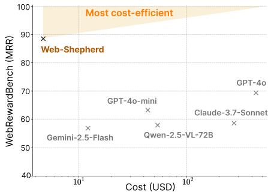

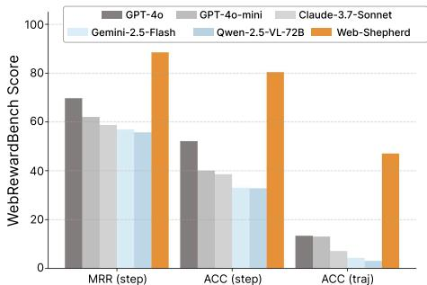  
Figure 1: Performance and cost-efficiency of WEB-SHEPHERD (3B). WEB-SHEPHERD achieves the state-of-the-art performance while requiring significantly lower cost compared to existing baselines.

# 1 Introduction

Web browsers serve as a common interface for countless digital tasks, making automation in this space a natural focus for recent advances in intelligent agents. Recent advances in multimodal large language models (MLLMs) have enabled agents to handle basic web interactions, such as retrieve addresses from map services or navigating simple webpages [1, 2]. However, current agents remain highly unreliable, often exhibiting brittle behaviors such as repeatedly entering the same query when encountering minor issues, eventually failing the task [3–5]. This unreliability primarily stems from the long-horizon nature of web navigation, requiring agents to reason across multiple steps and maintain goal-directed planning, which MLLMs often find challenging [6]. Hence, to create a better performing web agent, there is a need for better learning methods and inference-time algorithms.

One effective method that allowed large language models (LLMs) to perform well across various tasks is using a reward model to perform search at test-time (e.g., Best-of- $\mathbf { \nabla } \cdot n$ ), or using it for Reinforcement Learning (e.g., RLHF). However, specially trained reward models have been under-explored in the web navigation domain. Prior works such as Pan et al. [7] and Koh et al. [8] do not train separate reward models, but instead employ MLLMs as evaluators in inference-time algorithms, which has fundamental problems. First, using the evaluation from prompted MLLMs becomes a significant constraint in web navigation where speed and cost are crucially important. For example, using only GPT-4o for tree search on WebArena (consisting of 812 queries) requires approximately $\$ 14,000$ , and running inference on one A100 takes 40 hours, which is a major obstacle to deploying MLLMs as web navigation agents in real-world scenarios. Additionally, throughout our experiments, we confirm that prompting MLLMs performs worse than trained reward models. In summary, considering speed, cost, and performance, specially designed reward models for web navigation are absolutely necessary.

To address these challenges, we present WEB-SHEPHERD, which is, to the best of our knowledge, the first reward model trained specifically for evaluating trajectories of web navigation. In particular, WEB-SHEPHERD is designed as a process reward model (PRM) rather than an outcome reward model (ORM), because unlike other domains, ORM cannot be integrated into test-time algorithms in web navigation. For example, in mathematics, an LLM can write multiple solutions and the ORM can choose one, but in web navigation, if an LLM makes eight attempts to book a plane ticket, the airplane ticket cannot be refunded, so decisions about which action to take must be made at the process level. Furthermore, even during training-time, PRM can provide more fine-grained reward signals, making it more reliable than ORM [9, 10]. WEB-SHEPHERD employs a structured checklist that explicitly decomposes high-level user instructions into clear, interpretable subgoals. By referencing this checklist as evaluation criteria, WEB-SHEPHERD accurately assesses step-level progress, enabling precise and robust guidance throughout agent trajectories.

The key contribution of this paper is that we also provide a suite of training data and benchmark to test PRMs for web navigation. First, we release the WEBPRM COLLECTION, which contains human-crafted instructions that covers diverse tasks across multiple difficulty levels. The notable feature of the WEBPRM COLLECTION is that it contains 40K step-level annotations for which action an agent should take and that each instruction contains an annotated checklist—structured sequences of subgoals that enable WEB-SHEPHERD to make accurate judgments. Second, we release the WEBREWARDBENCH, the first meta-evaluation benchmark to assess PRMs in web navigation. The WEBREWARDBENCH allows practitioners to test newly proposed PRMs without running resourceintensive web navigation agents, enabling efficient testing of different design choices and conducting ablation experiments. WEB-SHEPHERD achieves $8 5 . 0 \%$ performance on the WEBREWARDBENCH (WebArena set), significantly outperforming GPT-4o-mini with prompting at $5 . 0 \%$ . Furthermore, when using WEB-SHEPHERD’s reward as guidance in tree search on GPT-4o-mini policy, it achieves $3 4 . 5 5 \%$ success rate on WebArena-lite [1, 11], confirming it is 10.9 points better in performance, and $1 0 \times$ more cost-effective than using GPT-4o-mini as the evaluator.

# 2 Related Work

MLLM-based web agents. Multimodal large language models (MLLMs) have emerged as powerful foundation models for web agents due to their strong generalization capabilities and adaptability to diverse interface. Previous work has leveraged MLLMs to complete web tasks via carefully designed instructions, often augmented with external tools (e.g., grounding module or verification) [12–15] or workflow [4]. Moreover, other approaches have trained MLLM-based agents to imitate expert trajectories using next-token prediction objective [16–18]. While these models perform well in-distribution, they often fail to generalize to unseen environments. To overcome these challenges, recent research has increasingly focused on inference-time scaling [7, 19] or reinforcement learning (RL) [20–22], which enables agents to improve decision-making through reward feedback.

Inference-time scaling for web agents. Inference-time scaling has emerged as a crucial approach for multi-turn interactions in web environment. Recent studies have explored techniques such as tree search [23, 19], long chain-of-thought (CoT) [24, 25], and incorporating verifiers or judges to enhance agent performance with natural language feedback [26, 27]. For example, Pan et al. [27] use a prompting-based evaluator to assess whether a trajectory is successful; if not, they apply Reflexion [26] to retry based on the generated feedback. Extending this direction, other work [8, 5] investigates an interesting direction that tries to search the optimal browsing path with a prompted value function and $\mathbf { A } ^ { * }$ -like algorithm and world model.

Rewards for web navigation. Prior works rely on binary rewards (success or failure) [21, 22] from rule-based evaluations that require human annotation and lacks scalability in dynamic web environments [1, 3]. To address these, recent studies have explored leveraging LLMs via prompting [14, 7] or training outcome reward models (ORMs) [20]. However, binary reward offers limited guidance for credit assignment, especially in long-horizon tasks. To enable more informative feedback, the reasoning literature has introduced process reward models (PRMs), which assign step-level reward [9, 10]. Building on this idea, recent work has explored using LLMs to estimate state-action values by prompting [19, 28, 29]. Nevertheless, the reliability and efficiency of MLLMs as process-level reward models remain underexplored. In this work, we aim to develop a PRM for web agents to support effective learning and cost-efficient inference-time guidance.

# 3 Preliminaries

We formulate the web navigation problem as a partially observable Markov decision process (POMDP) defined by the tuple $( S , \mathcal { A } , \mathcal { O } , T , R )$ , where $s$ is the set of environment states, $\mathcal { A }$ is the set of agent actions, $\mathcal { O }$ is the set of observations, $T ( s ^ { \prime } \mid s , a )$ is the transition function, $R ( s , a )$ is the reward function. At each time step $t$ , the agent receives a browser-rendered observation $o _ { t } \in \mathcal { O }$ that only partially reflects the true underlying state $s _ { t } \in S$ . In the context of web environments, $o _ { t }$ consists of two modalities: (1) an accessibility tree $o _ { t } ^ { \mathrm { t x t } }$ , a text sequence of intractable elements that captures the hierarchical and semantic structure of the webpage elements [1, 30], and (2) a rendered screenshot image $o _ { t } ^ { \mathrm { i m g } }$ depicting the visual appearance of the browser [3]. Given these observations, the agent selects an action $a _ { t } \in \mathcal A$ from a discrete set of browser-level commands, including operations such as click(i), scroll(d), and type(“text”), where $i$ is the index of a DOM or accessibility node, and $d$ denotes a scroll direction or offset. The agent’s goal is to select actions that maximize the expected reward over a trajectory $\tau = ( o _ { 1 } , a _ { 1 } , \dots , o _ { T } )$

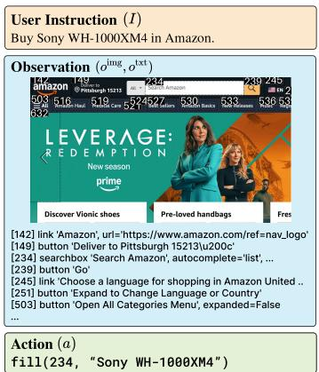  
Figure 2: Example of web navigation under a POMDP.

# 4 WEBPRM COLLECTION

The major challenge of building a PRM in web navigation is the lack of a training dataset. To address this, we collect WEBPRM COLLECTION, the first dataset for training PRMs for web agents. Our goal is to collect a dataset $\mathcal { D }$ that contains $( I , O , C , A ^ { + } , A ^ { - } )$ , where $A ^ { + }$ is a sequence of chosen actions $( a _ { 1 } ^ { + } , a _ { 2 } ^ { + } , . . . , a _ { n } ^ { + } )$ , i.e., an expert trajectory, and $A ^ { - }$ is a sequence of rejected actions $( a _ { 1 } ^ { - } , a _ { 2 } ^ { - } , . . . , a _ { n } ^ { - } )$ along with the checklist $C$ , observations $O = ( o _ { 1 } , o _ { 2 } , . . . , o _ { n } )$ , and user instruction $I$ .

# 4.1 Collecting User Instruction and Expert Trajectory

From human experts, we collect user instructions $I$ and the chosen actions $A ^ { + }$ . We select websites that permit access via playwright from the pool of sites used in Mind2Web [16]. Prior to annotation, all annotators participated in a three-hour training session designed to familiarize them with our annotation toolkit and to clarify the differences between human and agent browsing behaviors. Following annotation, all collected data were reviewed by a panel of 10 human evaluators to ensure quality and consistency. During this process, we filtered out invalid trajectories that could not be reproduced, as well as vague instructions prone to misinterpretation. Annotators were instructed to craft instructions $I$ spanning three difficulty levels: easy, medium, and hard.

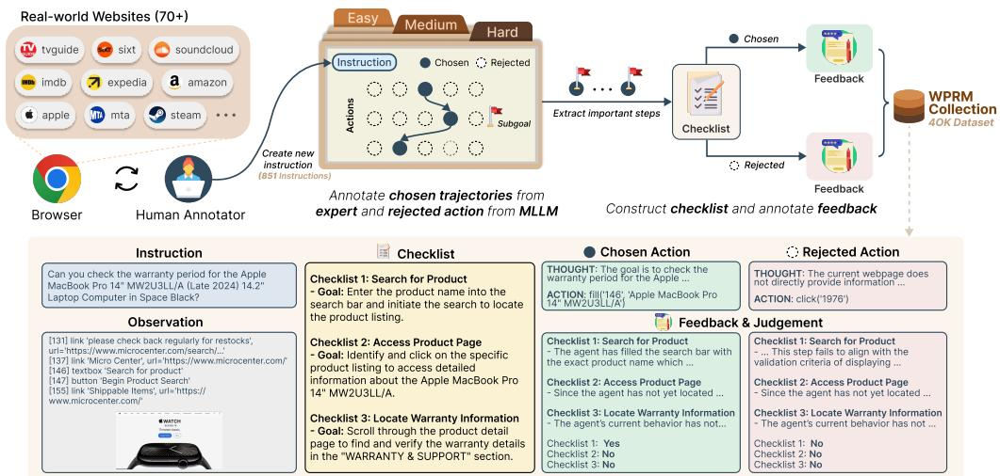  
Figure 3: Overview of the dataset collection process of WEBPRM COLLECTION (top) and an example instance of our dataset (bottom).

# 4.2 Annotating Checklist and Rejected Action

Checklist. To mitigate bias toward specific websites and reduce sensitivity to action orderings, we construct coarse-grained checklists that emphasize meaningful task progress over exact execution steps. For example, fine-grained actions such as filter $A$ and filter $B$ are abstracted into a higher-level subgoal like filtering. This abstraction enables the model to generalize across semantically equivalent strategies. Given an instruction $I$ and an expert trajectory $A ^ { + }$ , we use GPT-4o to generate subgoal analysis and corresponding checklists.

Rejected actions. To collect rejected actions $a _ { t } ^ { - }$ we sample 5 candidate actions from diverse policies and select those that differ from the expert action $a _ { t } ^ { + }$ . However, some of these alternatives may correspond to valid but different actions toward task completion (e.g., fill(423, “Sony Camera”) vs. click(search_box)), rather than being truly suboptimal or incorrect. To minimize such cases, we apply rule-based filtering and collect up to five rejected actions $a _ { t } ^ { - }$ per expert action $a _ { t } ^ { + }$ . More details about dataset construction are provided in Appendix B.

# 4.3 Dataset Statistics

As shown in Figure 4, we analyze two key aspects across difficulty levels: the length of agent trajectories and the number of checklist subgoals. The left violin plot illustrates that trajectory length increases with difficulty. Easy tasks generally require fewer steps (median $\approx 5$ ), whereas medium tasks show more variability (median $\approx 9$

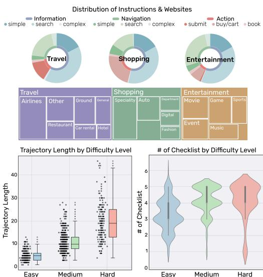  
Figure 4: Statistics of WEBPRM COLLECTION.

), and hard tasks involve significantly longer trajectories (median $\approx 2 0$ ), with some exceeding 40 steps. This indicates that our difficulty annotation effectively reflects the complexity and required interaction depth. The right violin plot shows that the number of checklist items also grows with task difficulty, though the range is more concentrated. Easy tasks typically involve 3–4 checklist items, while medium and hard tasks consistently require 4–5 subgoals.

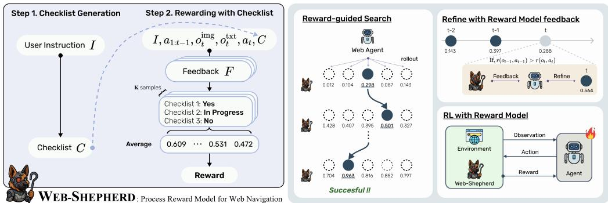  
Figure 5: Overview of WEB-SHEPHERD (left) and its diverse use cases (right).

# 5 WEB-SHEPHERD

In this section, we introduce WEB-SHEPHERD, a process reward model designed to provide dense and reliable supervision to web agents and enable more informative credit assignment. We train WEB-SHEPHERD on the WEBPRM COLLECTION to support two key functionalities: (1) generating task-specific checklists, and (2) assigning rewards based on checklist completion.

# 5.1 Step 1: Checklist Generation

As illustrated in Figure 5, WEB-SHEPHERD first generates a checklist that outlines key intermediate milestones for achieving the user’s goal. Given an instruction $I$ , it produces a checklist $C$ comprising a sequence of natural language subgoals $( g _ { 1 } , g _ { 2 } , \cdots , g _ { k } )$ . This checklist then serves as the foundation for reward prediction, enabling WEB-SHEPHERD to track progress toward the goal. We further investigate the impact of checklist quality in Section 7.1.

# 5.2 Step 2: Reward Modeling with Checklist

Reward modeling as next-token prediction. To leverage the internal reasoning capabilities of MLLMs, we choose next-token prediction as our learning objective [31]. We optimize the language modeling loss over targets formed by concatenating the feedback $F$ and the judgment $J$ , treating the full sequence as a coherent response. For example, given an input consisting of a checklist $C$ , an observation $o$ , and an answer $a$ , the model is trained to generate the corresponding feedback and judgment in an auto-regressive manner. The loss is defined as:

$$
\mathcal { L } _ { \mathrm { N T P } } = - \sum _ { t } \log P _ { \theta } ( y _ { t } \mid y _ { < t } , C , o , a ) ,
$$

where $y = [ F ; J ]$ denotes the concatenated feedback and judgment tokens. This objective encourages the model to learn to evaluate the trajectories based on the checklist with reasoning and provide valuable feedback that explains the evaluation.

Scoring process reward. Since the reward is predicted via token generation, the output resides in a discrete space. To obtain a continuous reward signal, several mapping strategies can be employed. One approach is to sample multiple output sequences and compute the average reward. Alternatively, we employ a verbalizer [32] to estimate soft probabilities over label tokens (e.g., “Yes”, “No”, and “In Progress”) using the logits from the LM head. At inference time, WEB-SHEPHERD generates the feedback $F \sim P ( \cdot | \bar { I } , C , o , \bar { a } )$ and compute the reward for each checklist item using the probabilities

of “Yes” and “In Progress” tokens follow:

$$
r _ { k } ( o , a ) = \frac { 1 } { L } \sum _ { l } ^ { L } P ( ^ { \mathrm { * Y } } \mathrm { e s } ^ { \mathrm { * } } | I , C , o , a , F ) + 0 . 5 \times P ( ^ { \mathrm { * } } \mathrm { I n } \mathrm { P r o g r e s s ^ { \mathrm { * } } } | I , C , o , a , F ) ,
$$

reward is computed as the average: where $L$ denotes the number of checklist and $\begin{array} { r } { r ( o , a ) = \sum _ { k = 1 } ^ { K } r _ { k } ( o , a ) } \end{array}$ $r _ { k }$ is the score assigned to the . We provide an empirical comparison $k ^ { \mathrm { { t h } } }$ response. The final of different scoring strategies in Appendix E.3.

# 6 Experiments

To evaluate the effectiveness of PRMs for web navigation, we conduct comprehensive experiments in assigning process-level reward for web agents, focusing on both the accuracy of reward assignment and the utility of those rewards in improving agent performance.

# 6.1 WEBREWARDBENCH

In developing PRMs, a reliable benchmark (e.g., RewardBench [33]) is essential for evaluating their performance. However, there does not yet exist a benchmark specifically designed to evaluate how accurately models assign process rewards to web agents’ trajectories. To address this, we introduce WEBREWARDBENCH, a benchmark that directly measures the accuracy of predicted rewards.

# 6.1.1 Setup

Benchmark construction. We use two data sources, Mind2Web and WebArena, to obtain user instructions for web navigation tasks. For Mind2Web, we utilize the expert demonstrations provided in the dataset. In contrast, since expert trajectories are unavailable in WebArena, we manually annotate them. As a result, we obtain 69 instances from WebArena and 707 instances from Mind2Web. To construct a reliable benchmark for evaluating PRMs, we follow the setup of Kim et al. [34] and collect preference pairs $( o _ { t } , a _ { t } ^ { + } , \{ a _ { ( t , i ) } ^ { - } \} _ { i = 1 } ^ { 4 } \} )$ , where each observation $o _ { t }$ is paired with one chosen action and four rejected actions. Additionally, we provide reference checklists for each tasks to ensure fair and consistent evaluation. Further details on benchmark construction are provided in Appendix D.1.

Metrics. We evaluate process reward prediction using the following three metrics: (1) Mean Reciprocal Rank (MRR): The average of the reciprocal ranks of the preferred action in the list of all candidate actions sorted by predicted reward. A higher MRR indicates that the model consistently ranks the preferred action closer to the top. (2) Step Accuracy (Acc. step): The proportion of steps where the model assigns the highest predicted reward to the preferred action $\bar { a } _ { t } ^ { + }$ among the five candidates. (3) Trajectory Accuracy (Acc. traj): The proportion of full trajectories where the model ranks $a ^ { + }$ highest at every step among the candidate actions.

Baselines. Prior work has leveraged prompted MLLMs to obtain process-level rewards by exploiting their reasoning and image understanding capabilities [5, 8]. Following this approach, we construct baselines using representative MLLMs from both open-source and closed-source categories. For open-source models, we use GPT-4o-mini and GPT-4o; for closed-source models, we adopt Qwen2.5-VL-72B, which are widely used in recent literature.

Implementation of WEB-SHEPHERD. We train WEB-SHEPHERD on our dataset using the following base models: for text-only settings, we use Qwen2.5-3B [35] and Qwen3-8B [36]; for multimodal settings, we use Qwen2.5-VL-3B [37]. All models are trained for 3 epochs using LoRA [38].

# 6.1.2 Results

MLLMs struggle with assigning correct process rewards. We evaluate the ability of models to accurately assign process rewards on WEBREWARDBENCH under different input types (text only vs. text and image) and with or without using the checklist. As shown in Table 1, state-of-the-art MLLMs struggle to provide reliable rewards for web navigation tasks.3 This limitation is particularly evident in the trajectory accuracy metric. In this measure, models frequently fail to assign correct rewards consistently at each time step within a single task. In contrast, WEB-SHEPHERD significantly outperforms all baselines, demonstrating a substantial performance gap across all benchmark settings.

Table 1: Evaluation results on WEBREWARDBENCH. T: text observation, I: image observation.   

<table><tr><td rowspan="3">Model</td><td rowspan="3">Inputs</td><td rowspan="3">Checklist</td><td colspan="6">Mind2Web</td><td colspan="2">WebArena</td></tr><tr><td colspan="2">Cross-Task</td><td colspan="2">Cross-Website</td><td colspan="2">Cross-Domain</td><td colspan="2">Test</td></tr><tr><td>MRR</td><td>Acc. (traj)</td><td>MRR</td><td>Acc. (traj)</td><td>MRR</td><td>Acc. (traj)</td><td>MRR</td><td>Acc. (traj)</td></tr><tr><td rowspan="4">GPT-4o-mini</td><td>T T</td><td></td><td>47.5</td><td>0.0</td><td>47.6</td><td>13.5</td><td>45.4</td><td>0.8</td><td>34.4</td><td>5.0</td></tr><tr><td></td><td>X</td><td>63.9</td><td>5.0</td><td>66.1</td><td>12.8</td><td>63.3</td><td>12.4</td><td>60.0</td><td>15.0</td></tr><tr><td>T+I</td><td>X</td><td>48.2</td><td>0.0</td><td>49.3</td><td>0.0</td><td>49.5</td><td>0.8</td><td>38.7</td><td>0.0</td></tr><tr><td>T+I</td><td>√</td><td>58.8</td><td>2.5</td><td>64.4</td><td>5.1</td><td>63.0</td><td>4.1</td><td>53.8</td><td>5.0</td></tr><tr><td rowspan="4">GPT-40</td><td>T</td><td>X</td><td>56.9</td><td>5.0</td><td>55.8</td><td>2.6</td><td>59.8</td><td>3.3</td><td>59.2</td><td>15.0</td></tr><tr><td>T</td><td>√</td><td>67.4</td><td>7.5</td><td>70.3</td><td>5.1</td><td>70.2</td><td>11.6</td><td>69.7</td><td>15.0</td></tr><tr><td>T+I</td><td>×</td><td>52.5</td><td>5.0</td><td>52.2</td><td>0.0</td><td>52.8</td><td>1.7</td><td>49.7</td><td>5.0</td></tr><tr><td>T+I</td><td>√</td><td>62.4</td><td>5.0</td><td>68.1</td><td>15.4</td><td>65.1</td><td>6.6</td><td>59.7</td><td>10.0</td></tr><tr><td rowspan="4">Qwen-2.5-VL-72B</td><td>T</td><td>X</td><td>55.7</td><td>5.0</td><td>51.8</td><td>0.0</td><td>54.2</td><td>1.7</td><td>54.6</td><td>5.0</td></tr><tr><td>T</td><td>√</td><td>59.4</td><td>0.0</td><td>62.4</td><td>0.0</td><td>57.9</td><td>1.7</td><td>52.3</td><td>5.0</td></tr><tr><td>T+I</td><td></td><td>50.1</td><td>2.5</td><td>47.6</td><td>0.0</td><td>49.8</td><td>0.8</td><td>43.1</td><td>0.0</td></tr><tr><td>T+I</td><td>×</td><td>52.9</td><td>2.5</td><td>53.5</td><td>2.6</td><td>52.0</td><td>2.5</td><td>47.3</td><td>0.0</td></tr><tr><td rowspan="2">WEB-SHEPHERD (3B)</td><td>T</td><td>氵</td><td>87.6</td><td>55.0</td><td>88.0</td><td>43.6</td><td>87.2</td><td>47.1</td><td>91.1</td><td>60.0</td></tr><tr><td>T+I</td><td></td><td>85.0</td><td>42.5</td><td>87.3</td><td>41.0</td><td>84.4</td><td>37.2</td><td>92.5</td><td>65.0</td></tr><tr><td>WEB-SHEPHERD (8B)</td><td>T</td><td>√</td><td>88.3</td><td>57.5</td><td>87.9</td><td>51.3</td><td>91.3</td><td>61.2</td><td>97.8</td><td>85.0</td></tr></table>

Checklist allows reliable reward assignment. Table 1 demonstrates that both baseline and our models benefit significantly from the checklist in assigning rewards. Checklists lead to more accurate and consistent reward assignments, as evidenced by improvements in trajectory accuracy across all baselines. These results suggests that checklists serve as valuable guidance, helping models maintain coherence in predicting the process reward. Furthermore, as shown in Figure 6, when we conduct ablation studies with models that are trained to either assign rewards without checklists or use checklists without feedback, we observe a substantial performance drop. These findings underscore the importance of both checklists and feedback for assigning reliable rewards.

Multimodal input does not always improve performance. Contrary to our expectations, incorporating multimodal input does not always lead to performance gains; in some cases, using multimodal input even degrades the performance. For example, when using GPT-4o as the reward model, we observe a notable improvement in trajectory accuracy only on the cross-website of Mind2Web subset. This observation is consistent with the findings of Xue et al. [6], which suggest that processing inputs from multiple modalities can introduce ambiguity and act as a source of noise, ultimately hindering the model performance.

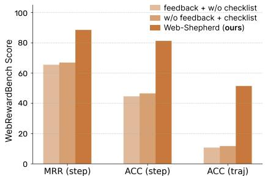  
Figure 6: Results of ablation study with WEB-SHEPHERD (3B).

# 6.2 Reward-Guided Trajectory Search

Reward-guided search using Best-of- $\boldsymbol { n }$ (BoN) sampling offers a practical proxy for evaluating the capability of a reward model to guide policies [10, 39, 40]. Notably, it allows us to assess the potential for reward overoptimization without relying on reinforcement learning. In addition, it provides an effective approach to adapting an MLLM policy without fine-tuning [8, 5, 41].

Setup. We evaluate our approach on WebArena-lite and WorkArena [30] in an online setting. WebArena-lite [11] is a subset of WebArena [1], comprising 165 instructions with error-corrected judge code from the earlier version. WorArena is a remote-hosted benchmark of 33 tasks based on the widely-used ServiceNow platform. Among 5 action candidates sampled from the policy, the action that is assigned the highest reward is executed. For the policy, we use GPT-4o-mini, and compare performance when guided by our proposed PRM versus a prompt-based PRMs. We report the success rate (SR), which measures the proportion of tasks in which the final state satisfies the condition.

Table 2: Success rates of trajectory search with GPT-4o-mini and GPT-4o as policy on WebArena-lite.   

<table><tr><td>Policy</td><td>PRM</td><td>Checklist</td><td>Shopping</td><td>CMS</td><td>Reddit</td><td>GitLab</td><td>Map</td><td>Total</td><td>△</td></tr><tr><td rowspan="5">GPT-4o-mini</td><td>w/o Trajectory Search</td><td>N/A</td><td>21.74</td><td>22.86</td><td>19.05</td><td>34.38</td><td>19.35</td><td>23.64</td><td>1</td></tr><tr><td>GPT-4o-mini</td><td></td><td>13.04</td><td>14.29</td><td>9.52</td><td>25.00</td><td>16.13</td><td>15.75</td><td>-7.89</td></tr><tr><td></td><td>xν/ν</td><td>21.74</td><td>31.43</td><td>14.29</td><td>34.38</td><td>16.13</td><td>24.24</td><td>+0.60</td></tr><tr><td>WEB-SHEPHERD (3B)</td><td></td><td>32.61</td><td>37.14</td><td>19.05</td><td>34.38</td><td>32.26</td><td>32.12</td><td>+8.48</td></tr><tr><td>WEB-SHEPHERD (8B)</td><td></td><td>26.09</td><td>45.71</td><td>23.81</td><td>40.62</td><td>35.48</td><td>34.55</td><td>+10.90</td></tr><tr><td rowspan="4">GPT-40</td><td>w/o Trajectory Search</td><td>N/A</td><td>23.91</td><td>31.43</td><td>28.57</td><td>56.25</td><td>19.35</td><td>31.52</td><td>1</td></tr><tr><td>GPT-4o-mini</td><td></td><td>21.74</td><td>31.43</td><td>28.57</td><td>40.62</td><td>12.90</td><td>26.67</td><td>-4.85</td></tr><tr><td>WEB-SHEPHERD (3B)</td><td>：</td><td>28.26</td><td>37.14</td><td>47.62</td><td>53.12</td><td>25.81</td><td>36.97</td><td>+5.45</td></tr><tr><td>WEB-SHEPHERD (8B)</td><td></td><td>30.43</td><td>42.86</td><td>47.62</td><td>46.88</td><td>35.48</td><td>39.39</td><td>+7.87</td></tr></table>

Table 3: Success rates of trajectory search with GPT-4o-mini as policy on WorkArena.   

<table><tr><td>PRM</td><td>Checklist</td><td>Dashboard</td><td>Form</td><td>Knowledge</td><td>List-filter</td><td>List-sort</td><td>Menu</td><td>Service Catalog</td><td>Total</td><td>A</td></tr><tr><td>w/o Trajectory Search</td><td>N/A</td><td>50.00</td><td>0.00</td><td>10.00</td><td>0.00</td><td>5.00</td><td>25.00</td><td>2.22</td><td>9.39</td><td>1</td></tr><tr><td>GPT-4o-mini</td><td></td><td>55.00</td><td>10.00</td><td>10.00</td><td>0.00</td><td>6.67</td><td>20.00</td><td>5.56</td><td>12.42</td><td>+3.03</td></tr><tr><td>Web-Shepherd (3B)</td><td>√</td><td>57.50</td><td>14.00</td><td>10.00</td><td>0.00</td><td>10.00</td><td>10.00</td><td>11.11</td><td>14.85</td><td>+5.46</td></tr><tr><td>Web-Shepherd (8B)</td><td>√</td><td>65.00</td><td>14.00</td><td>20.00</td><td>0.00</td><td>10.00</td><td>20.00</td><td>7.78</td><td>15.76</td><td>+6.37</td></tr></table>

Main results. We present the results in Table 2. Interestingly, when using GPT-4o-mini as the reward model, we observe a slight improvement in the GPT-4o-mini policy. However, overall performance degrades when GPT-4o is used as the policy model, dropping from 31.52 to 26.67. In contrast, applying WEB-SHEPHERD leads to substantial performance gains for both the GPT-4o-mini and GPT-4o policies across nearly all domains. Notably, WEB-SHEPHERD boosts the GPT-4o-mini’s browsing performance from 23.64 to 34.55, which is about 3 points higher than GPT-4o without trajectory search. These results suggest that WEB-SHEPHERD remains effective in the online setting, even when paired with a stronger policy model.

Results on WorkArena. To assess the robustness across domains, we also evaluate our models on WorkArena, a benchmark completely out-of-domain for WEB-SHEPHERD. As shown in Table 3, trajectory search guided by the PRM improves the success rate in WorkArena, where the Total score increases from 9.39 to 12.42 when comparing the baseline without trajectory search. Moreover, our model consistently outperforms GPT-4o-mini across all domains except for Menu. We attribute the relatively low performance in the Menu domain to the complexity of its multi-level dropdowns and embedded search boxes, which cause the policy model to produce unreliable action candidates.

Can WEB-SHEPHERD provide useful feedback? To evaluate the effectiveness of the feedback generated by WEB-SHEPHERD, we conduct experiments in which the agent performs step-wise refinement using our feedback, similar to the Self-Refine [42]. Specifically, the agent refine current action with the feedback when its current reward is lower than the previous reward assigned by WEBSHEPHERD. Interestingly, contrary to previous findings by Chae et al. [5] suggesting that step-wise feedback from models is not helpful and may even be detrimental, we observe notable improvements when incorporating model feedback during refinement. A possible explanation is that WEB-SHEPHERD not only learns the impact of actions but also identifies patterns that characterize suboptimal behavior.

Table 4: Results of refinement with feedback from WEB-SHEPHERD using GPT4o-mini as the policy on WebArena-lite.   

<table><tr><td rowspan=1 colspan=1>Models</td><td rowspan=1 colspan=1>SR</td><td rowspan=1 colspan=1>△</td></tr><tr><td rowspan=1 colspan=1>w/o refine</td><td rowspan=1 colspan=1>23.64</td><td rowspan=1 colspan=1>1</td></tr><tr><td rowspan=1 colspan=1>WEB-SHEPHERD (3B)</td><td rowspan=1 colspan=1>26.67</td><td rowspan=1 colspan=1>+3.03</td></tr><tr><td rowspan=1 colspan=1>WEB-SHEPHERD (8B)</td><td rowspan=1 colspan=1>27.88</td><td rowspan=1 colspan=1>+4.24</td></tr></table>

# 7 Discussion

# 7.1 The Impact of Checklist Quality in Reward Prediction

We assess the quality of checklists generated by both baseline models and WEB-SHEPHERD using G-Eval [43], with GPT-4o as the evaluator. To ensure a reliable evaluation, we provide the reference checklist to the evaluator alongside each generated checklist. The details of G-Eval are provided in Appendix E.7. As shown in Figure 7 (left), all models, except WEB-SHEPHERD (3B), generate high quality checklists. Notably, our model, which is trained solely for checklist generation, achieves the highest score. Motivated by this result, we also release a standalone version of the checklist generation model. To better understand the role of checklist quality, we analyze reward prediction performance using checklists from various sources: an early version of our model (A), our final models (B and C) and ground-truth checklists (D). In Figure 7 (right), we observe that high-quality checklists lead to more reliable reward assignments. However, the results also suggest that model’s capability imposes a natural ceiling on reward prediction performance, regardless of checklist quality.

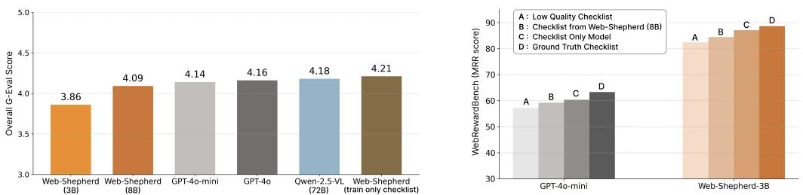  
Figure 7: Evaluation of checklist quality (left) and its relationship to reward accuracy (right).

Table 5: Effect of instruction proportion and the number of rejected actions on model performance.   
(a) Effect of instruction proportion.   

<table><tr><td rowspan="3">Proportion of instruction</td><td colspan="2">Mind2Web</td><td colspan="2">WebArena</td></tr><tr><td>MRR (step)</td><td>ACC (traj)</td><td>MRR (step)</td><td>ACC (traj)</td></tr><tr><td>0.25</td><td>68.38</td><td>11.34</td><td>65.97</td><td>10.00</td></tr><tr><td>0.5</td><td>77.46</td><td>21.54</td><td>73.57</td><td>15.00</td></tr><tr><td>0.75</td><td>83.64</td><td>33.63</td><td>88.09</td><td>55.00</td></tr><tr><td>Ours (3B)</td><td>87.62</td><td>48.57</td><td>91.06</td><td>60.00</td></tr></table>

(b) Ablation on the number of rejected actions.   

<table><tr><td rowspan="2">#max rejected actions</td><td colspan="2">Mind2Web</td><td colspan="2">WebArena</td></tr><tr><td>MRR (step)</td><td>ACC (traj)</td><td>MRR (step)</td><td>ACC (traj)</td></tr><tr><td>1</td><td>71.42</td><td>12.79</td><td>63.04</td><td>10.00</td></tr><tr><td>2</td><td>77.66</td><td>17.55</td><td>76.47</td><td>20.00</td></tr><tr><td>3</td><td>79.70</td><td>24.91</td><td>77.46</td><td>20.00</td></tr><tr><td>4(Ours,3B)</td><td>87.62</td><td>48.57</td><td>91.06</td><td>60.00</td></tr></table>

# 7.2 Training Objective: Bradley-Terry Modeling vs. Generative Reward Modeling

The Bradley-Terry (BT) loss has been widely adopted as a training objective for learning reward models based on human preferences [44]. However, its suitability for building PRMs in web navigation remains an open question. To investigate this, we compare WEB-SHEPHERD (3B) with a variant trained using the BT loss, with the identical training data. As shown in Figure 8, the BT-based model underperforms than ours, particularly in WebArena subset (out-of-distribution).

We find that the BT loss fails to effectively leverage the checklist for reward assignment, resulting in weaker sensitivity to task progress. These findings suggest that BT modeling’s key limitation—poor generalization observed across domains—also manifests in PRMs for web navigation.

# 7.3 Cost Efficiency of WEB-SHEPHERD

We assess the cost efficiency of WEB-SHEPHERD by comparing it to API-based models. For WEBSHEPHERD, costs are estimated using the hourly rate of an A100 80GB GPU instance $( \$ 1.19/\mathrm { h o u r } )$ , combined with throughput measured via vLLM [45]. Each instance averages 81,287 input and 1,953 output tokens and we compute cost of API-based models using publicly available prices. As shown in Figure 1 (right), WEB-SHEPHERD delivers the best performance at the lowest cost per 1,000 instances—roughly $1 0 \times$ cheaper than GPT-4o-mini and $1 0 0 \times$ cheaper than GPT-4o.

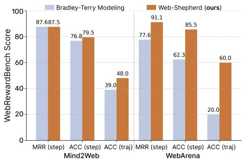  
Figure 8: Analysis on the training objective.

# 7.4 Data Scaling Law for PRM Training

We conduct analysis on the effect of the (1) number of instructions, and (2) number of rejected actions in the dataset on the performance of the PRM. Specifically, we construct datasets using the subset of WebPRMCollection 0.25, 0.5, and 0.75 percent of instruction and its corresponding chosen-rejected pairs and 1,2, and 3 number of max rejected actions. We trained variants of Web-Shepherd with these datasets using the same model (i.e., Qwen-2.5-3B-Instruct) and hyperparameters. The results are shown in Table 5a and Table 5b.

Overall, if we use about half of the original dataset (in terms of both the number of instructions and the number of rejected actions), there is a drastic decrease in ACC (traj) on both of the benchmarks. Especially, in the out-of-domain benchmark, WebArena, instruction ablation results in ACC (traj) decreases from 60.0 to 15.0, which suggests it failed to generalize to unseen domains. In rejected ablation, only decreasing by one rejected action is critical, resulting $6 0 . 0  2 0 . 0$ ACC (traj) score in WebArena. These results highlight that both the number of instructions and the number of rejected actions are critical for training an effective PRM; reducing either significantly impairs generalization, particularly in out-of-domain settings such as WebArena.

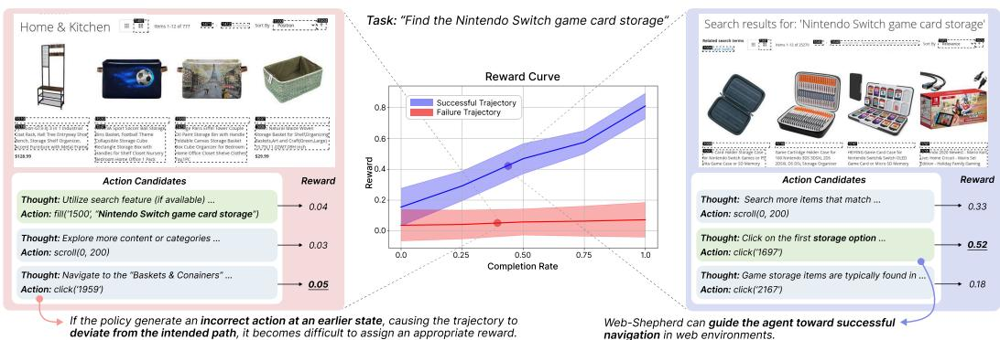  
Figure 9: Trends of reward score for successful and failed cases of reward-guided trajectory search.

# 7.5 Case Study

Figure 9 presents a qualitative analysis of WEB-SHEPHERD. We sample 30 success and 30 failure cases and plot the reward score trends as a function of the normalized step index over the trajectory length. While failure cases exhibit relatively flat reward curves, successful cases show a smooth and consistent increase in reward over time. In addition, we identify the three most frequent sources of error: (1) incorrect reasoning about the effects of actions, where the model fails to anticipate future rewards appropriately—for example, assigning a low reward to a scroll action that would have revealed the desired information in the next step; (2) misinterpretation of the observed state, often due to not properly accounting for the impact of previous actions, leading the model to repeat actions unnecessarily; and (3) hallucinations in the generated checklist, such as assuming the presence of filtering functionality on a website when no such feature exists.

# 8 Conclusion

This paper studies process reward modeling for web navigation and introduces WEB-SHEPHERD, the first PRM designed specifically for evaluating web agent trajectories. We also release two key resources to support the development of PRMs: (1) WEBPRM COLLECTION, a dataset consisting of human-annotated instructions and expert trajectories, and (2) WEBREWARDBENCH, a reliable benchmark designed to evaluate the capabilities of PRMs. Our experiments demonstrate that processlevel rewards improve inference-time search, achieving $3 4 . 5 5 \%$ success rate on WebArena-lite compared to $2 3 . 6 4 \%$ for baselines. The checklist-based approach offers a generalizable framework that could extend beyond web navigation to other sequential decision-making domains where sparse rewards and partial observability remain challenging. We believe WEB-SHEPHERD establishes a foundation for developing more reliable web agents through interpretable reward modeling.

# Acknowledgement

This work was supported by Institute of Information & communications Technology Planning & Evaluation (IITP) grant funded by the Korea government (MSIT) (No. RS-2024-00457882, National AI Research Lab Project). This research was supported by the MSIT (Ministry of Science, ICT), Korea, under the Global Research Support Program in the Digital Field program (RS-2024- 00436680) supervised by the IITP (Institute for Information & Communications Technology Planning & Evaluation). This project is supported by Microsoft Research Asia. This research was supported by a grant of Korean ARPA-H Project through the Korea Health Industry Development Institute (KHIDI), funded by the Ministry of Health & Welfare, Republic of Korea (grant number : RS-2024-00512374). Jinyoung Yeo is the corresponding author.

# References

[1] Shuyan Zhou, Frank F Xu, Hao Zhu, Xuhui Zhou, Robert Lo, Abishek Sridhar, Xianyi Cheng, Tianyue Ou, Yonatan Bisk, Daniel Fried, et al. Webarena: A realistic web environment for building autonomous agents. In The Twelfth International Conference on Learning Representations, 2024.   
[2] Yichen Pan, Dehan Kong, Sida Zhou, Cheng Cui, Yifei Leng, Bing Jiang, Hangyu Liu, Yanyi Shang, Shuyan Zhou, Tongshuang Wu, et al. Webcanvas: Benchmarking web agents in online environments. arXiv preprint arXiv:2406.12373, 2024.   
[3] Jing Yu Koh, Robert Lo, Lawrence Jang, Vikram Duvvur, Ming Lim, Po-Yu Huang, Graham Neubig, Shuyan Zhou, Russ Salakhutdinov, and Daniel Fried. Visualwebarena: Evaluating multimodal agents on realistic visual web tasks. In Proceedings of the 62nd Annual Meeting of the Association for Computational Linguistics (Volume 1: Long Papers), pages 881–905, 2024.   
[4] Zora Zhiruo Wang, Jiayuan Mao, Daniel Fried, and Graham Neubig. Agent workflow memory. arXiv preprint arXiv:2409.07429, 2024.   
[5] Hyungjoo Chae, Namyoung Kim, Kai Tzu iunn Ong, Minju Gwak, Gwanwoo Song, Jihoon Kim, Sunghwan Kim, Dongha Lee, and Jinyoung Yeo. Web agents with world models: Learning and leveraging environment dynamics in web navigation. In The Thirteenth International Conference on Learning Representations, 2025. URL https://openreview.net/forum? id=moWiYJuSGF.   
[6] Tianci Xue, Weijian Qi, Tianneng Shi, Chan Hee Song, Boyu Gou, Dawn Song, Huan Sun, and Yu Su. An illusion of progress? assessing the current state of web agents. arXiv preprint arXiv:2504.01382, 2025.   
[7] Jiayi Pan, Yichi Zhang, Nicholas Tomlin, Yifei Zhou, Sergey Levine, and Alane Suhr. Autonomous evaluation and refinement of digital agents. arXiv preprint arXiv:2404.06474, 2024.   
[8] Jing Yu Koh, Stephen McAleer, Daniel Fried, and Ruslan Salakhutdinov. Tree search for language model agents. arXiv preprint arXiv:2407.01476, 2024.   
[9] Hunter Lightman, Vineet Kosaraju, Yuri Burda, Harrison Edwards, Bowen Baker, Teddy Lee, Jan Leike, John Schulman, Ilya Sutskever, and Karl Cobbe. Let’s verify step by step. In The Twelfth International Conference on Learning Representations, 2023.   
[10] Peiyi Wang, Lei Li, Zhihong Shao, Runxin Xu, Damai Dai, Yifei Li, Deli Chen, Yu Wu, and Zhifang Sui. Math-shepherd: Verify and reinforce llms step-by-step without human annotations. In Proceedings of the 62nd Annual Meeting of the Association for Computational Linguistics (Volume 1: Long Papers), pages 9426–9439, 2024.   
[11] Xiao Liu, Tianjie Zhang, Yu Gu, Iat Long Iong, Song XiXuan, Yifan Xu, Shudan Zhang, Hanyu Lai, Jiadai Sun, Xinyue Yang, Yu Yang, Zehan Qi, Shuntian Yao, Xueqiao Sun, Siyi Cheng, Qinkai Zheng, Hao Yu, Hanchen Zhang, Wenyi Hong, Ming Ding, Lihang Pan, Xiaotao Gu, Aohan Zeng, Zhengxiao Du, Chan Hee Song, Yu Su, Yuxiao Dong, and Jie Tang. Visualagentbench: Towards large multimodal models as visual foundation agents. In The Thirteenth International Conference on Learning Representations, 2025. URL https://openreview.net/forum?id=2snKOc7TVp.

[12] Boyuan Zheng, Boyu Gou, Jihyung Kil, Huan Sun, and Yu Su. Gpt-4v (ision) is a generalist web agent, if grounded. In International Conference on Machine Learning, pages 61349–61385. PMLR, 2024.

[13] Longtao Zheng, Rundong Wang, Xinrun Wang, and Bo An. Synapse: Trajectory-as-exemplar prompting with memory for computer control. In The Twelfth International Conference on Learning Representations, 2023.

[14] Hongliang He, Wenlin Yao, Kaixin Ma, Wenhao Yu, Yong Dai, Hongming Zhang, Zhenzhong Lan, and Dong Yu. Webvoyager: Building an end-to-end web agent with large multimodal models. In Proceedings of the 62nd Annual Meeting of the Association for Computational Linguistics (Volume 1: Long Papers), pages 6864–6890, 2024.

[15] Heyi Tao, Sethuraman T V, Michal Shlapentokh-Rothman, and Derek Hoiem. Webwise: Web interface control and sequential exploration with large language models, 2023. URL https://arxiv.org/abs/2310.16042.

[16] Xiang Deng, Yu Gu, Boyuan Zheng, Shijie Chen, Samuel Stevens, Boshi Wang, Huan Sun, and Yu Su. Mind2web: towards a generalist agent for the web. In Proceedings of the 37th International Conference on Neural Information Processing Systems, pages 28091–28114, 2023.

[17] Kanzhi Cheng, Qiushi Sun, Yougang Chu, Fangzhi Xu, Yantao Li, Jianbing Zhang, and Zhiyong Wu. Seeclick: Harnessing gui grounding for advanced visual gui agents, 2024. URL https://arxiv.org/abs/2401.10935.

[18] Jihyung Kil, Chan Hee Song, Boyuan Zheng, Xiang Deng, Yu Su, and Wei-Lun Chao. Dualview visual contextualization for web navigation, 2024. URL https://arxiv.org/abs/ 2402.04476.

[19] Jing Yu Koh, Stephen McAleer, Daniel Fried, and Ruslan Salakhutdinov. Tree search for language model agents, 2024. URL https://arxiv.org/abs/2407.01476.

[20] Zehan Qi, Xiao Liu, Iat Long Iong, Hanyu Lai, Xueqiao Sun, Wenyi Zhao, Yu Yang, Xinyue Yang, Jiadai Sun, Shuntian Yao, Tianjie Zhang, Wei Xu, Jie Tang, and Yuxiao Dong. Webrl: Training llm web agents via self-evolving online curriculum reinforcement learning, 2025. URL https://arxiv.org/abs/2411.02337.

[21] Hao Bai, Yifei Zhou, Jiayi Pan, Mert Cemri, Alane Suhr, Sergey Levine, and Aviral Kumar. Digirl: Training in-the-wild device-control agents with autonomous reinforcement learning. In The Thirty-eighth Annual Conference on Neural Information Processing Systems, 2024.

[22] Hao Bai, Yifei Zhou, Li Erran Li, Sergey Levine, and Aviral Kumar. Digi-q: Learning q-value functions for training device-control agents, 2025. URL https://arxiv.org/abs/2502. 15760.

[23] Xidong Feng, Ziyu Wan, Muning Wen, Stephen Marcus McAleer, Ying Wen, Weinan Zhang, and Jun Wang. Alphazero-like tree-search can guide large language model decoding and training. arXiv preprint arXiv:2309.17179, 2023.

[24] Aaron Jaech, Adam Kalai, Adam Lerer, Adam Richardson, Ahmed El-Kishky, Aiden Low, Alec Helyar, Aleksander Madry, Alex Beutel, Alex Carney, et al. Openai o1 system card. arXiv preprint arXiv:2412.16720, 2024.

[25] Daya Guo, Dejian Yang, Haowei Zhang, Junxiao Song, Ruoyu Zhang, Runxin Xu, Qihao Zhu, Shirong Ma, Peiyi Wang, Xiao Bi, et al. Deepseek-r1: Incentivizing reasoning capability in llms via reinforcement learning. arXiv preprint arXiv:2501.12948, 2025.

[26] Noah Shinn, Federico Cassano, Ashwin Gopinath, Karthik Narasimhan, and Shunyu Yao. Reflexion: Language agents with verbal reinforcement learning. Advances in Neural Information Processing Systems, 36, 2024.

[27] Jiayi Pan, Yichi Zhang, Nicholas Tomlin, Yifei Zhou, Sergey Levine, and Alane Suhr. Autonomous evaluation and refinement of digital agents. In First Conference on Language Modeling, 2024.   
[28] Pranav Putta, Edmund Mills, Naman Garg, Sumeet Motwani, Chelsea Finn, Divyansh Garg, and Rafael Rafailov. Agent q: Advanced reasoning and learning for autonomous ai agents, 2024. URL https://arxiv.org/abs/2408.07199.   
[29] Gaole Dai, Shiqi Jiang, Ting Cao, Yuanchun Li, Yuqing Yang, Rui Tan, Mo Li, and Lili Qiu. Advancing mobile gui agents: A verifier-driven approach to practical deployment, 2025. URL https://arxiv.org/abs/2503.15937.   
[30] Alexandre Drouin, Maxime Gasse, Massimo Caccia, Issam H Laradji, Manuel Del Verme, Tom Marty, Léo Boisvert, Megh Thakkar, Quentin Cappart, David Vazquez, et al. Workarena: How capable are web agents at solving common knowledge work tasks? arXiv preprint arXiv:2403.07718, 2024.   
[31] Dakota Mahan, Duy Van Phung, Rafael Rafailov, Chase Blagden, Nathan Lile, Louis Castricato, Jan-Philipp Fränken, Chelsea Finn, and Alon Albalak. Generative reward models. arXiv preprint arXiv:2410.12832, 2024.   
[32] Shengding Hu, Ning Ding, Huadong Wang, Zhiyuan Liu, Jingang Wang, Juanzi Li, Wei Wu, and Maosong Sun. Knowledgeable prompt-tuning: Incorporating knowledge into prompt verbalizer for text classification. In Proceedings of the 60th Annual Meeting of the Association for Computational Linguistics (Volume 1: Long Papers), pages 2225–2240, 2022.   
[33] Nathan Lambert, Valentina Pyatkin, Jacob Morrison, LJ Miranda, Bill Yuchen Lin, Khyathi Chandu, Nouha Dziri, Sachin Kumar, Tom Zick, Yejin Choi, et al. Rewardbench: Evaluating reward models for language modeling. arXiv preprint arXiv:2403.13787, 2024.   
[34] Sunghwan Kim, Dongjin Kang, Taeyoon Kwon, Hyungjoo Chae, Jungsoo Won, Dongha Lee, and Jinyoung Yeo. Evaluating robustness of reward models for mathematical reasoning. arXiv preprint arXiv:2410.01729, 2024.   
[35] An Yang, Baosong Yang, Beichen Zhang, Binyuan Hui, Bo Zheng, Bowen Yu, Chengyuan Li, Dayiheng Liu, Fei Huang, Haoran Wei, Huan Lin, Jian Yang, Jianhong Tu, Jianwei Zhang, Jianxin Yang, Jiaxi Yang, Jingren Zhou, Junyang Lin, Kai Dang, Keming Lu, Keqin Bao, Kexin Yang, Le Yu, Mei Li, Mingfeng Xue, Pei Zhang, Qin Zhu, Rui Men, Runji Lin, Tianhao Li, Tingyu Xia, Xingzhang Ren, Xuancheng Ren, Yang Fan, Yang Su, Yichang Zhang, Yu Wan, Yuqiong Liu, Zeyu Cui, Zhenru Zhang, and Zihan Qiu. Qwen2.5 technical report. arXiv preprint arXiv:2412.15115, 2024.   
[36] An Yang, Anfeng Li, Baosong Yang, Beichen Zhang, Binyuan Hui, Bo Zheng, Bowen Yu, Chang Gao, Chengen Huang, Chenxu Lv, Chujie Zheng, Dayiheng Liu, Fan Zhou, Fei Huang, Feng Hu, Hao Ge, Haoran Wei, Huan Lin, Jialong Tang, Jian Yang, Jianhong Tu, Jianwei Zhang, Jianxin Yang, Jiaxi Yang, Jing Zhou, Jingren Zhou, Junyang Lin, Kai Dang, Keqin Bao, Kexin Yang, Le Yu, Lianghao Deng, Mei Li, Mingfeng Xue, Mingze Li, Pei Zhang, Peng Wang, Qin Zhu, Rui Men, Ruize Gao, Shixuan Liu, Shuang Luo, Tianhao Li, Tianyi Tang, Wenbiao Yin, Xingzhang Ren, Xinyu Wang, Xinyu Zhang, Xuancheng Ren, Yang Fan, Yang Su, Yichang Zhang, Yinger Zhang, Yu Wan, Yuqiong Liu, Zekun Wang, Zeyu Cui, Zhenru Zhang, Zhipeng Zhou, and Zihan Qiu. Qwen3 technical report, 2025. URL https://arxiv.org/abs/2505.09388.   
[37] Shuai Bai, Keqin Chen, Xuejing Liu, Jialin Wang, Wenbin Ge, Sibo Song, Kai Dang, Peng Wang, Shijie Wang, Jun Tang, et al. Qwen2. 5-vl technical report. arXiv preprint arXiv:2502.13923, 2025.   
[38] Edward J Hu, Yelong Shen, Phillip Wallis, Zeyuan Allen-Zhu, Yuanzhi Li, Shean Wang, Lu Wang, Weizhu Chen, et al. Lora: Low-rank adaptation of large language models. ICLR, 1 (2):3, 2022.   
[39] Yantao Liu, Zijun Yao, Rui Min, Yixin Cao, Lei Hou, and Juanzi Li. Pairwise rm: Perform best-of-n sampling with knockout tournament. arXiv preprint arXiv:2501.13007, 2025.

[40] Zijun Liu, Peiyi Wang, Runxin Xu, Shirong Ma, Chong Ruan, Peng Li, Yang Liu, and Yu Wu. Inference-time scaling for generalist reward modeling. arXiv preprint arXiv:2504.02495, 2025.

[41] Yu Gu, Kai Zhang, Yuting Ning, Boyuan Zheng, Boyu Gou, Tianci Xue, Cheng Chang, Sanjari Srivastava, Yanan Xie, Peng Qi, et al. Is your llm secretly a world model of the internet? model-based planning for web agents. arXiv preprint arXiv:2411.06559, 2024.

[42] Aman Madaan, Niket Tandon, Prakhar Gupta, Skyler Hallinan, Luyu Gao, Sarah Wiegreffe, Uri Alon, Nouha Dziri, Shrimai Prabhumoye, Yiming Yang, et al. Self-refine: Iterative refinement with self-feedback. Advances in Neural Information Processing Systems, 36, 2024.

[43] Yang Liu, Dan Iter, Yichong Xu, Shuohang Wang, Ruochen Xu, and Chenguang Zhu. G-eval: Nlg evaluation using gpt-4 with better human alignment. In Proceedings of the 2023 Conference on Empirical Methods in Natural Language Processing, pages 2511–2522, 2023.

[44] Long Ouyang, Jeffrey Wu, Xu Jiang, Diogo Almeida, Carroll Wainwright, Pamela Mishkin, Chong Zhang, Sandhini Agarwal, Katarina Slama, Alex Ray, et al. Training language models to follow instructions with human feedback. Advances in neural information processing systems, 35:27730–27744, 2022.

[45] Woosuk Kwon, Zhuohan Li, Siyuan Zhuang, Ying Sheng, Lianmin Zheng, Cody Hao Yu, Joseph E. Gonzalez, Hao Zhang, and Ion Stoica. Efficient memory management for large language model serving with pagedattention. In Proceedings of the ACM SIGOPS 29th Symposium on Operating Systems Principles, 2023.

[46] Shunyu Yao, Jeffrey Zhao, Dian Yu, Nan Du, Izhak Shafran, Karthik Narasimhan, and Yuan Cao. React: Synergizing reasoning and acting in language models. In International Conference on Learning Representations (ICLR), 2023.

[47] Yaowei Zheng, Richong Zhang, Junhao Zhang, Yanhan Ye, Zheyan Luo, Zhangchi Feng, and Yongqiang Ma. Llamafactory: Unified efficient fine-tuning of $1 0 0 +$ language models. In Proceedings of the 62nd Annual Meeting of the Association for Computational Linguistics (Volume 3: System Demonstrations), Bangkok, Thailand, 2024. Association for Computational Linguistics. URL http://arxiv.org/abs/2403.13372.

[48] Pin-Lun Hsu, Yun Dai, Vignesh Kothapalli, Qingquan Song, Shao Tang, and Siyu Zhu. Ligerkernel: Efficient triton kernels for llm training, 2024. URL https://github.com/linkedin/ Liger-Kernel.

[49] Lunjun Zhang, Arian Hosseini, Hritik Bansal, Mehran Kazemi, Aviral Kumar, and Rishabh Agarwal. Generative verifiers: Reward modeling as next-token prediction. arXiv preprint arXiv:2408.15240, 2024.

[50] De Chezelles, Thibault Le Sellier, Maxime Gasse, Alexandre Lacoste, Alexandre Drouin, Massimo Caccia, Léo Boisvert, Megh Thakkar, Tom Marty, Rim Assouel, et al. The browsergym ecosystem for web agent research. arXiv preprint arXiv:2412.05467, 2024.

# A Limitations and Societal Impacts

# A.1 Limitations

Expansion to coordinate-based actions. Recently, coordinate-based actions—where agents interact with digital environments using direct coordinate inputs without requiring additional backend programs to convert actions—have gained attention due to their adaptability across diverse interfaces. We have also collected a dataset to extend WEB-SHEPHERD to support coordinate-based action formats. However, as this direction falls outside the primary scope of this work, we leave its exploration for future research.

Application to reinforcement learning. An interesting direction for future work is to use WEBSHEPHERD as a reward signal in reinforcement learning. While we plan to explore this setting, it requires significant computational resources and is therefore left for future work. In particular, we aim to investigate whether reward signals from PRMs can improve learning efficiency—i.e., how quickly rewards increase during training—as well as final performance on existing benchmarks.

Selection of the base model for WEB-SHEPHERD. While our current implementation of WEBSHEPHERD uses relatively lightweight base models (3B–8B), the approach is model-agnostic and can be extended to larger scales. In principle, WEB-SHEPHERD can be scaled up to stronger foundation models in the 32B–72B range, which may further improve performance in complex web environments. We leave the exploration of such scaling as future work, particularly in resource-rich settings.

Multimodal instructions. While most instructions in existing web agent benchmarks are purely textual, some tasks—such as those in VisualWebArena [3]—incorporate both text and image modalities. Extending WEB-SHEPHERD to handle multimodal instructions is a promising direction for future work, as it would enable the agent to operate in more complex and realistic web environments that require visual understanding in addition to text comprehension.

# A.2 Societal Impacts

Positive impacts. Web agents have the potential to perform a wide range of tasks typically carried out through a web browser, which serves as a universal interface for information access, online services, and task execution. However, current agents are often restricted to simple tasks, such as retrieving an address or clicking through static pages. We believe that WEB-SHEPHERD can broaden the capabilities of web agents, enabling them to tackle more complex, goal-oriented tasks in dynamic environments. This advancement could benefit users with accessibility needs, support automated workflows in professional domains, and improve the scalability of digital assistance.

Negative impacts. Despite their potential benefits, web agents also pose several risks. Without proper safeguards, agents with the ability to autonomously interact with websites could unintentionally or maliciously perform harmful actions—such as submitting unauthorized forms, modifying user data, or accessing sensitive information. Moreover, if reward models are misaligned or insufficiently robust, agents may exploit unintended shortcuts to maximize rewards without accomplishing the intended task. To mitigate these risks, it is crucial to incorporate safety mechanisms, including strict execution constraints, permission controls, human-in-the-loop oversight, and careful auditing of model outputs in deployment scenarios.

# B WEBPRM COLLECTION

# B.1 Data Annotation Toolkit

To reduce the burden of human annotation, we developed a specialized toolkit for collecting web agent trajectories. It is designed to streamline the annotation process while ensuring the collection of high-quality data. Figure 10 shows a screenshot of the toolkit interface. This tool helps the annotators to interact with the browser by taking the user’s inputs and showing the execution output (e.g., observation) within the graphical interface. For example, they select an action type from a predefined set (e.g., fill) and provide the corresponding argument (e.g., “sony headphone”) via the action panel. Selecting the action type via button clicks, rather than manually typing the entire action sequence, significantly reduces errors. In addition, the sidebar displays snapshots of previous user interactions, allowing annotators to easily track progress, review past actions, and undo the most recent one if necessary.

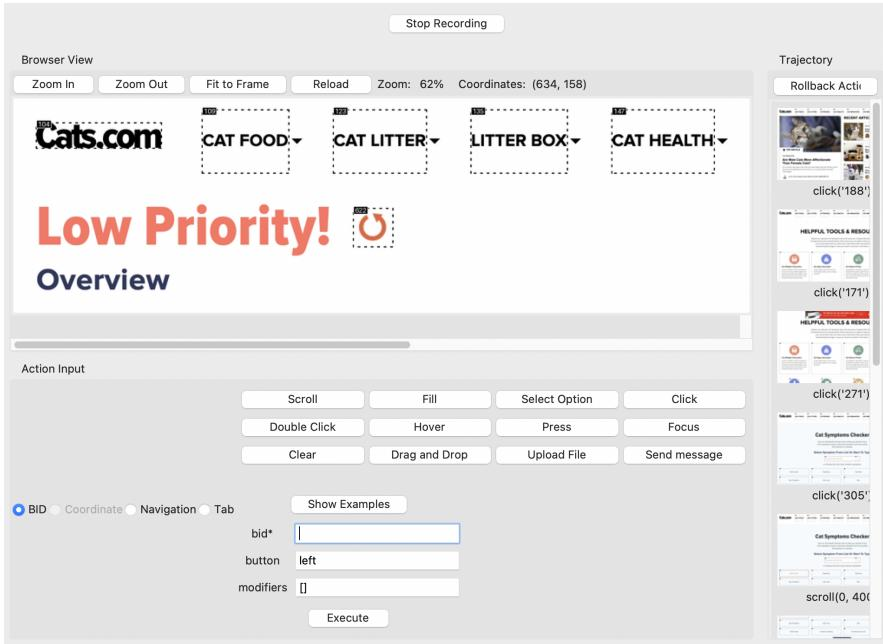  
Figure 10: Our annotation toolkit used for collecting WEBPRM COLLECTION.

# B.2 Details of Human Annotation

Our data collection process follows the steps below:

Step 1: Website list selection. We begin by selecting candidate websites from those used in the Mind2Web training dataset. Since web navigation requires browser automation, we manually filter out websites that are incompatible with our annotation process—specifically, those that block Playwright by requiring CAPTCHA verification or by rejecting HTTP requests entirely. After applying this filtering process, we retain 50 websites that are technically accessible and semantically appropriate for annotation.

Step 2: Annotator recruiting and education. We recruit groups of human annotators to construct the dataset, with overall supervision and quality control handled by designated project managers. All annotators completed a three-hour education session conducted by the project managers prior to annotation. This training covers a detailed explanation about data annotation interface, guidelines for writing quality task instructions, examples of good and bad trajectories, and principles for designing judge codes. Upon completing the training, each annotator is assigned to 3-4 websites from the filtered website list.

Step 3: Data annotation. The annotation process is structured into three distinct phases. In the first phase, we ask each annotator to create 20 task instructions for each of their assigned websites. These tasks are distributed across three difficulty levels: 5 easy, 10 medium, and 5 hard tasks. Annotators are instructed to design tasks that reflect realistic user goals, such as booking a reservation, retrieving specific information, or modifying a user profile. In the second phase, annotators execute the tasks they created and record expert trajectories interacting with our annotation toolkit (Figure 10). These expert trajectories have a complete sequence of observation-action pairs needed to complete the task successfully. Lastly, annotators write a judge code that can automatically assess the trajectory towards the user’s goal. To ensure compatibility with existing benchmarks and code bases, we follow the format of judge code of WebArena [1].

Step 4: Verification. To ensure the quality of WEBPRM COLLECTION, we introduce two safeguards throughout the annotation process.

• Automatic Verification: To verify judge codes, we conduct programmatic verification that checks whether each judge code correctly evaluates the corresponding annotated trajectory as ‘success’. If a mismatch is detected, the annotator is instructed to revise the judge code. • Manual Verification: Project managers manually review all annotated trajectories and their associated judge codes, filtering out erroneous or low-quality data. As a result, $15 \%$ of the annotated data was discarded during this step.

# B.3 Annotating Dataset with MLLMs

Reasoning for chosen action. Recent web agents widely adopt a ReAct (i.e., Reason $^ +$ Act) [46] framework, in which the agent first produces a rationale (thought) to explain its current understanding or intent, and then selects an action based on that reasoning. However, our human-annotated datasets lacks this intermediate reasoning step—it does not capture what the agent was thinking when choosing each action. To enrich our dataset with such reasoning traces, we leverage Qwen-2.5- VL-72B, prompting it with the current observation (URL, accessibility tree representation, image screenshot), the selected action and a screenshot obtained after executing the action. The model is then asked to generate a corresponding rationale that explains the decision behind the chosen action.

Checklist with human trajectory. To effectively extract key subgoals (i.e., checklist) that are essential for achieving the user’s instruction, we provide GPT-4o with both user instruction and human trajectories, which include the intermediate thoughts. The model is prompted to generated a reasoning process that analyzes the give task, and then to produce a checklist grounded in that reasoning. This approach significantly enhances checklist quality. In contrast, the low-quality checklist shown in Figure 7 were generated by a model trained without the reasoning component, highlighting the importance of the task-specific reasoning in generating reliable checklists.

Annotating additional checklist. The number of checklists obtained from human trajectories is 851 instances, which is relatively small for training. To address this, we first augmented the dataset using 1K user instructions provided in the Mind2Web training set. For each instruction, we used GPT-4o to generate a corresponding checklist. Subsequently, we further expanded the dataset by prompting the model to generate new instructions based on existing examples, and then constructing corresponding checklists for each, Through this augmentation process, we collected a total of 3.6K checklist instances.

Collecting rejected actions from various policy models. To construct a robust reward model, we collect diverse candidate actions from multiple policy models. These include Qwen-2.5-VL-7B and Qwen-2.5-VL-72B (both in text-only and multimodal settings), GPT-4o-mini (used specifically for generating negative actions that differ from the given chosen action), and a Qwen-2.5-3B model fine-tuned with human trajectories from WEBPRM COLLECTION. For each chosen action, we collect up to five rejected actions sampled from these policies. However, an action that differs from the chosen one is not necessarily incorrect. For example, directly filling a search box versus clicking it before typing can both be functionally valid. To eliminate such cases, we apply a rule-based filtering that retains only clearly invalid (i.e., rejected) actions. Each action consists of a keyboard or mouse operation (e.g., click and fill) and its corresponding argument, such as a unique element ID or a text string. We apply different filtering rules depending on the type of the chosen action, as detailed below:

• send_msg_to_user, scroll, goto: If the operation type differs, the candidate is considered a negative action. In particular, if the operation is send_msg_to_user, we verify its correctness using GPT-4o.   
• drag_and_drop: If the candidate action’s operation is not one of drag_and_drop, scroll, or hover, it is classified as a negative action.   
• click, dclick: If the argument (e.g., element ID) does not match the chosen action’s argument and the candidate action is not semantically equivalent (e.g., clicking an unrelated element), it is considered incorrect.   
• click, fill: If both actions target the same element but differ only in order, the candidate is not considered negative. Otherwise, mismatches in target elements or unrelated inputs are marked as negative.   
• Others: Actions with unmatched operation types or arguments that do not lead to equivalent outcomes are treated as negative.

While this rule-based filtering substantially improves the quality of negative samples, it cannot guarantee correctness in all cases. We leave further improvement of this filtering process for future work. Finally, if more than five valid rejected actions remain after filtering, we randomly sample a subset to maintain a consistent number of action pairs per instance.

# B.4 Statistics of WEBPRM COLLECTION

Human annotated data. Figure 11 shows the statistics of human annotated data, collected a total of 851 tasks through ad annotation process, as detailed in Appendix B.2. These tasks are categorized into 244 easy, 426 medium, and 181 hard tasks, covering a wide range of real-world scenarios with varying levels of complexity. Our annotated data spans a diverse set of websites, as illustrated in Figure 11a, which shows the distribution of verified tasks across different domains. A portion of annotated data—amounting of $15 \%$ —was discarded during a manual verification step conducted by project managers to ensure data quality.

Figures 11b provides a linguistic overview of the instructions in our dataset. This sunburst chart visualizes root verbs and their most common direct objects, revealing frequent combinations such as visit webpage and find restaurant. These patterns reflect realistic user intents and highlight the diversity of task formulations in the dataset. In addition, Figure 11c presents the distribution of action types observed during annotation, with click, scroll, and fill appearing most frequently.

Rejected actions. After the rejected action generation step, we obtained 30,960 rejected actions from 9,473 chosen actions. Figure 12 presents an overview of the rejection statistics. The generation flow—i.e., how rejected actions are derived from specific chosen actions—is shown in Figure 12a. Also, Figure 12b compares the distributions of chosen and rejected actions. As in the statistics, the distribution of rejected actions differs slightly from that of the chosen actions. For example, the proportion of click actions increased, while the proportion of scroll actions decreased. We leave the development of more refined methods to reduce this distributional difference to future work.

# C WEB-SHEPHERD

# C.1 Training

We train the model for 3 epochs with a learning rate of 1e-4, using LoRA with a rank of 16. Training is conducted using DeepSpeed ZeRO Stage 2 on an RTX A6000 (48GB) server with 8 GPUs, totaling approximately 16 GPU-hours. We leverage the LLaMA-Factory [47] framework and apply the Liger kernel [48] optimization during training.

# C.2 Inference

We use vLLM [45] to perform inference with WEB-SHEPHERD. The decoding is configured with a temperature of 1.0, and nucleus sampling is applied to generate five output sequences per prompt.

To compute the probability of each label, we apply a mapping from semantic labels to token-level logits. Specifically, we aggregate the logits of the following token variants corresponding to each label:

• Yes: ["˙GYes", "Yes", "˙CYes", "˙Gyes", "yes", "˙Cyes", "˙GYES", "YES", "˙CYES", "˙GDone", "Done", "˙CDone", "˙GCompleted", "Completed", "˙CCompleted", "˙GCorrect", "Correct", "˙CCorrect"]   
• No: ["˙GNo", "No", "˙CNo", "˙GNO", "NO", "˙CNO", "˙GNot", "Not", "˙CNot", "˙GNone", "None", "˙CNone", "˙GNope", "Nope", "˙CNope", "˙GUn", "Un", "˙CUn", "˙GWrong", "Wrong", "˙CWrong"]

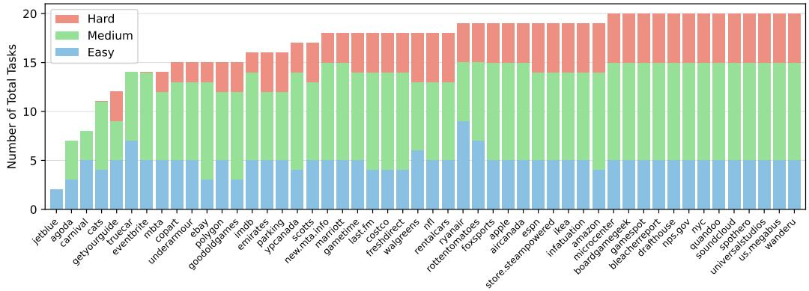  
Number of Tasks by Website   
(a) Number of tasks by website.

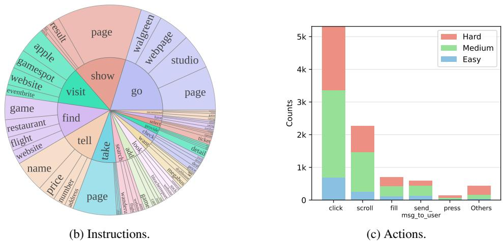  
Figure 11: Statistics of the human-annotated dataset: (a) Number of tasks per website, grouped by difficulty (Easy, Medium, and Hard). (b) The distribution of root verbs and direct objects in instructions. (c) Action type distribution, broken down by difficulty.

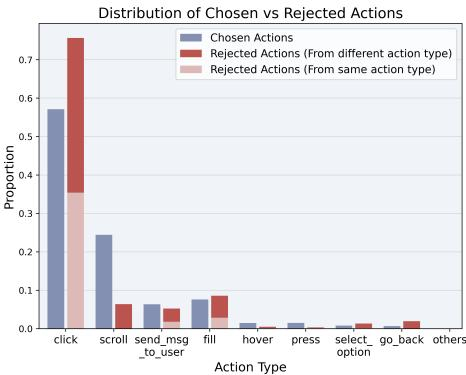

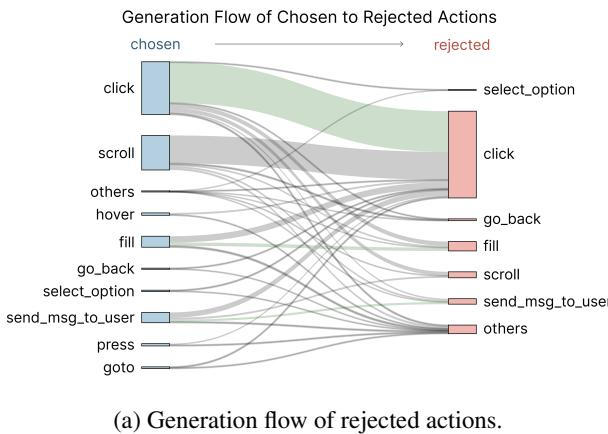  
(b) Proportions of chosen and rejected actions.   
Figure 12: Statistics of the rejected actions: (a) Generation flow of chosen to rejected actions. Green bands indicate that the rejected actions share the same action type as their originating chosen action. (b) Proportions of chosen and rejected actions. showing how the distribution of action types shifts during the rejection generation process.

• In Progress: ["˙GIn", "In", "˙CIn", "˙GPending", "Pending", "˙CPending", "˙GPart", "Part", "˙CPart", "˙GPartial", "Partial", "˙CPartial", "˙GInProgress", "InProgress", "˙CInProgress"]

Logits corresponding to these token variants are summed for each label to compute the final label probabilities.

# D WEBREWARDBENCH

# D.1 Data Construction

Chosen action. For WebArena, we manually annotate the expert trajectories, since it is not provided in the benchmark. On the other hand, Mind2Web provide them, so we use them as the chosen actions. One important change we make on Mind2Web is converting the HTML observation space to bid-based observation. In the HTML there exist DOM backend ids so we utilize them for the conversion. Lastly, since it is increasingly hard to assure the quality of human-annotated rationales, we incorporate LLMs to annotate Chain-of-Thought (CoT) in a post-hoc manner.

Rejected actions. Following the setup of Kim et al. [34], we construct a reliable benchmark by collecting multiple rejected samples from various models. In this work, we use three MLLMs—GPT4o-mini, Qwen-2.5-VL-7B, and Qwen-2.5-VL-72B—as policy models. For each chosen action, we sample four rejected actions from these policies. To ensure that the rejected actions are truly incorrect, we apply rule-based filtering (as described in Appendix B.3) and additional human filtering performed by the authors. Finally, we collect 776 step-level data instances derived from 220 task, each associated with one chosen and four rejected actions, resulting in a total of 3,880 test instances.

# D.2 Analysis of WEBREWARDBENCH

Figure 13a shows the distribution of chosen and rejected actions categorized by action type and source model across both WebArena and Mind2Web. In both datasets, click and fill actions dominate among the chosen actions, which is consistent with the typical interaction patterns required in web navigation environments. Notably, the rejected actions across all source models exhibit similar distributions, with click actions being the most frequently rejected. This suggests that despite differences in model architecture and scale, the failure modes of MLLMs often concentrate on similar types of actions. Additionally, the inclusion of multiple source models—GPT-4o-mini, Qwen2.5- 7B, and Qwen2.5-72B—further contributes to the diversity of rejected actions. This model-level heterogeneity ensures that the benchmark captures a broad range of suboptimal behaviors, enhancing its generality and diagnostic value.

Figure 13b visualizes the joint distribution of trajectory length and the number of checklist items associated with each task instance. The majority of trajectories fall within the 2–8 step range, while checklist items typically range from 2 to 5. The plot reveals a general trend that longer trajectories tend to be accompanied by a greater number of checklist items, indicating that tasks with longer horizons are generally more complex and goal-rich. However, we also observe several short trajectories with multiple checklist items, suggesting that brevity in execution does not necessarily imply low task complexity. This variability further highlights the importance of step-level evaluation in addition to trajectory-level metrics.

# E Additional Results

# E.1 Evaluating MLLMs as Process Reward Models for Web Navigation

We conduct experiments to investigate the most suitable format for reward prediction when using MLLMs as preference reward models (PRMs). Specifically, we evaluate how helpful a generated action is in progressing toward the goal from the current state. We consider two formats: a Likert scale rating (1-5) and a 3-class classification with labels helpful, neutral, not helpful. To reduce variance, each instance is sampled five times and the scores are averaged. Table 8 shows that the Likert scale consistently outperforms the 3-class classification, indicating that fine-grained evaluation provides a more informative learning signals.

Table 6: Evaluation results on WEBREWARDBENCH without using checklist. T denotes text observation, and I denotes image observation. Acc. (s) refers to step accuracy, while Acc. (t) refers to trajectory accuracy.   

<table><tr><td rowspan="2">Model</td><td rowspan="2">Inputs</td><td colspan="8"></td><td colspan="4">WebArena</td></tr><tr><td>MRR</td><td></td><td>Cross-Task Acc. (s)Acc.(t)</td><td>MRR </td><td>Cross-Website Acc. (s)Acc.(t)</td><td></td><td>MRR</td><td>Cross-Domain Acc.(s）Acc. (t)</td><td></td><td>MRR</td><td>Test Acc. (s)</td><td>Acc. (t)</td></tr><tr><td colspan="10">Reward Assignment withLikert Scale</td><td></td><td></td><td></td><td></td></tr><tr><td rowspan="2">GPT-4o-mini</td><td>T T+I</td><td>47.5</td><td>15.5</td><td>0.0</td><td>47.6</td><td>13.5</td><td>0.0</td><td>45.4 11.8</td><td>0.8</td><td></td><td>34.4</td><td>5.8</td><td>5.0</td></tr><tr><td></td><td>44.7</td><td>12.7</td><td>2.5</td><td>42.8</td><td>8.8</td><td>0.0</td><td>43.1</td><td>10.1</td><td>0.0</td><td>34.6</td><td>8.7</td><td>5.0</td></tr><tr><td rowspan="2">GPT-40</td><td>T</td><td>56.9</td><td>28.8</td><td>5.0</td><td>55.8</td><td>26.4</td><td>2.6</td><td>59.8</td><td>33.6</td><td>3.3</td><td>59.2</td><td>37.7</td><td>15.0</td></tr><tr><td>T+I</td><td>52.5</td><td>21.8</td><td>5.0</td><td>52.2</td><td>21.0</td><td>0.0</td><td>52.8</td><td>23.3</td><td>1.7</td><td>50.0</td><td>24.6</td><td>5.0</td></tr><tr><td rowspan="2">Qwen-2.5-VL-72B</td><td>T T+I</td><td>55.7</td><td>26.1</td><td>5.0</td><td>51.8</td><td>20.3</td><td>0.0</td><td>54.2</td><td>24.7</td><td>1.7</td><td>54.6</td><td>31.9</td><td>5.0</td></tr><tr><td>53.5</td><td></td><td>23.2</td><td>2.5</td><td>47.6</td><td>15.5</td><td>0.0</td><td>49.8</td><td>19.4</td><td>0.8</td><td>43.1</td><td>15.9</td><td>0.0</td></tr><tr><td colspan="10">Reward Assignment with3Class</td><td colspan="3"></td></tr><tr><td>GPT-4o-mini</td><td>T</td><td>44.7</td><td>12.7</td><td>2.5</td><td>42.8</td><td>8.8</td><td>0.0</td><td>43.1</td><td>10.1</td><td>0.0</td><td>34.6</td><td>8.7</td><td>5.0</td></tr><tr><td>GPT-40</td><td>T</td><td>49.3</td><td>17.6</td><td>2.5</td><td>44.5</td><td>12.2</td><td>2.6</td><td>47.2</td><td>16.6</td><td>0.0</td><td>44.9</td><td>20.3</td><td>0.0</td></tr><tr><td>Qwen-2.5-VL-72B</td><td>T</td><td>50.6</td><td>25.4</td><td>7.5</td><td>53.3</td><td>29.1</td><td>5.1</td><td>54.4</td><td>30.5</td><td>2.5</td><td>48.0</td><td>24.6</td><td>0.0</td></tr></table>

Table 7: Evaluation results on WEBREWARDBENCH with using checklist. Results are averaged over four test set types, and reflect performance under different setting, including whether the “In Progress” label is used during prediction.   

<table><tr><td rowspan="2">Model</td><td rowspan="2">Use ‘In Progress&#x27;</td><td colspan="3">WEBREWARDBENCH</td></tr><tr><td>MRR</td><td>Acc. (step)</td><td>Acc. (traj)</td></tr><tr><td rowspan="2">GPT-40-mini</td><td>X</td><td>59.3</td><td>33.5</td><td>5.2</td></tr><tr><td></td><td>63.3</td><td>40.7</td><td>11.3</td></tr></table>

Table 8: Evaluation results on WEBREWARDBENCHwith using checklist. T denotes text observation, and I denotes image observation. Acc. (s) refers to step accuracy, while Acc. (t) refers to trajectory accuracy.   

<table><tr><td rowspan="2">Model</td><td rowspan="2">Inputs</td><td colspan="8">Mind2Web</td><td colspan="3">WebArena</td></tr><tr><td>Cross-Task MRR Acc. (s)Acc. (t)</td><td></td><td>MRR Acc. (s)Acc. (t)</td><td>Cross-Website</td><td></td><td>MRR</td><td>Cross-Domain Acc. (s)Acc.(t)</td><td></td><td>MRR</td><td>Test Acc. (s)</td><td>Acc.(t)</td></tr><tr><td colspan="10">Reward Assignment withReferenceChecklist</td><td></td><td></td><td></td><td></td></tr><tr><td>GPT-4o-mini</td><td>T T+I</td><td>63.9 58.8</td><td>40.1 33.8</td><td>5.0 66.1 2.5 64.4</td><td>42.6 41.2</td><td>5.0</td><td>63.3 63.0</td><td>40.8 39.3</td><td>12.4 4.1</td><td>60.0 53.8</td><td>39.1 29.0</td><td>15.0 5.0</td></tr><tr><td>GPT-40</td><td>T T+I</td><td>67.4 62.4</td><td>46.5 39.4</td><td>7.5 70.3 5.0 68.1</td><td>52.0 50.0</td><td>5.1 5.1 15.4</td><td>70.2 65.1</td><td>51.3 43.2</td><td>11.6 6.6</td><td>69.7 60.0</td><td>53.6 37.7</td><td>15.0 10.0</td></tr><tr><td>Qwen-2.5-VL-72B</td><td>T T+I</td><td>59.4 52.9</td><td>35.2</td><td>0.0</td><td>62.4</td><td>40.5</td><td>0.0 57.9 52.0</td><td>32.9 25.9</td><td>1.7</td><td>52.3</td><td>30.4</td><td>5.0</td></tr><tr><td>Claude-3.7-sonnet</td><td>T</td><td>60.7</td><td>28.2 41.6</td><td>2.5 7.5</td><td>53.5 58.7</td><td>27.7 34.5</td><td>2.6 10.3 60.3</td><td>40.3</td><td>2.5 5.8</td><td>47.3 55.2</td><td>24.6 37.7</td><td>0.0 5.0</td></tr><tr><td>Gemini-2.5-flash</td><td>T</td><td>53.4</td><td>27.5</td><td>5.0</td><td>59.7</td><td>35.8</td><td>7.7 57.2</td><td>32.1</td><td>4.1</td><td>57.2</td><td>36.2</td><td>0.0</td></tr><tr><td>WEB-SHEPHERD (3B)</td><td>T</td><td>87.6</td><td>80.3</td><td>55.0</td><td>88.0</td><td>79.7</td><td>43.6 87.2</td><td>79.1</td><td>47.1</td><td>91.1</td><td>85.5</td><td>60.0</td></tr><tr><td>WEB-SHEPHERD (8B)</td><td>T+I T</td><td>85.0 88.8</td><td>76.8 82.4</td><td>42.5 57.5</td><td>87.3 87.9</td><td>79.1 80.4</td><td>41.0 84.4 91.3</td><td>74.1 85.9</td><td>37.2 61.2</td><td>92.5</td><td>87.0 95.7</td><td>65.0 85.0</td></tr><tr><td colspan="10">51.3 Reward Assignment with Checklist Generation</td><td>97.8</td><td></td><td></td></tr><tr><td colspan="10"></td><td></td><td></td><td></td></tr><tr><td>GPT-4o-mini</td><td>T T+I</td><td>55.3 59.9</td><td>30.3</td><td>粥</td><td>57.7 29.7 27.0</td><td>5.1 0.0</td><td>56.6</td><td>31.7</td><td>4.1</td><td>51.3</td><td>30.4</td><td>5.0</td></tr><tr><td>GPT-40</td><td>T</td><td>59.6</td><td>36.6</td><td></td><td>55.4</td><td>2.6</td><td>57.0 58.4</td><td>32.6</td><td>5.0</td><td>57.8</td><td>37.7</td><td>15.0</td></tr><tr><td>Qwen-2.5-VL-72B</td><td>T</td><td>50.4</td><td>39.4</td><td>7.5</td><td>54.8</td><td>32.4</td><td>54.8</td><td>36.9 29.0</td><td>4.1</td><td>55.4</td><td>34.8 31.9</td><td>5.0 0.0</td></tr><tr><td></td><td>T</td><td>85.3</td><td>23.2 75.4</td><td>2.5</td><td>54.8 83.8</td><td>28.4 74.3</td><td>0.0 33.3 84.8</td><td>75.3</td><td>2.5 39.7</td><td>52.4 94.6</td><td>89.9</td><td>70.0</td></tr><tr><td>WEB-SHEPHERD (3B)</td><td>T+I</td><td>81.1</td><td>69.7</td><td>50.0 25.0</td><td>78.6</td><td>64.9</td><td>23.1 77.9</td><td>64.3</td><td>22.3</td><td>85.9</td><td>75.4</td><td>40.0</td></tr><tr><td>WEB-SHEPHERD (8B)</td><td>T</td><td>87.3</td><td>80.3</td><td>50.0</td><td>84.3</td><td>76.4</td><td>38.5 86.0</td><td>76.7</td><td>43.8</td><td>96.5</td><td>94.2</td><td>80.0</td></tr></table>

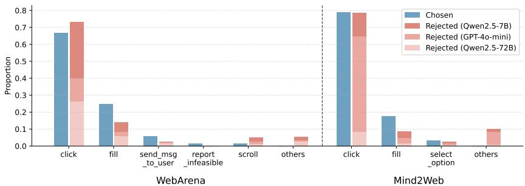  
Distribution of Chosen vs. Rejected Actions in WebArena and Mind2Web source   
(a) Distribution of chosen and rejected actions in WEBREWARDBENCH.

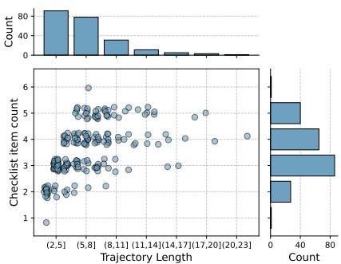  
(b) Trajectory length and checklist item count.   
Figure 13: Statistics of WEBREWARDBENCH: (a) Proportions of each chosen versus rejected action. (b) Distribution of trajectory lengths and number of checklist items.

Table 9: Detailed results of refinement with feedback from WEB-SHEPHERD in Table 4   

<table><tr><td>Policy</td><td>Model</td><td>Shopping</td><td>CMS</td><td>Reddit</td><td>GitLab</td><td>Map</td><td>Total</td><td>A</td></tr><tr><td rowspan="3">GPT-4o-mini</td><td>w/o refine</td><td>21.74</td><td>22.86</td><td>19.05</td><td>34.38</td><td>19.35</td><td>23.64</td><td>1</td></tr><tr><td>WEB-SHEPHERD (3B)</td><td>23.91</td><td>31.43</td><td>19.05</td><td>34.38</td><td>22.58</td><td>26.67</td><td>+3.03</td></tr><tr><td>WEB-SHEPHERD (8B)</td><td>23.91</td><td>34.29</td><td>33.33</td><td>34.38</td><td>16.13</td><td>27.88</td><td>+4.24</td></tr></table>

Furthermore, we examine how reward prediction changes when a reference checklist is provided. We compare two evaluation schemes: one that uses binary labels (‘Yes’ or ‘No’) for each checklist item, and another that introduces an additional label (‘In Progress’) to indicate when an action partially completes a checklist item. As shown in Table 7, incorporating the In Progress label leads to more reliable reward assignments when using checklists. Based on this finding, we adopt the In Progress setting for checklist-based reward prediction in both the WEBREWARDBENCH evaluation and the training of WEB-SHEPHERD.

# E.2 Detailed Results of Refinement

We conduct experiments for refinement with feedback from reward models (Table 4). We show the detailed experimental results in Table 9.

# E.3 Scoring Strategy: Probability vs. Token

When using generative models for reward prediction, on can either directly interpret the model’s natural language output (e.g., ‘Yes’) as a reward signal or compute the probability of specific response [49] to derive a reward. To investigate which approach is more effective, we compare the following strategies:

Table 10: The impact of scoring strategies on reward assignment. Results are evaluated on WEBREWARDBENCHand represent the average score across four types of test sets.   

<table><tr><td rowspan="2">Model</td><td rowspan="2">Strategy</td><td colspan="3">WEBREWARDBENCH</td></tr><tr><td>MRR</td><td>Acc. (step)</td><td>Acc. (traj)</td></tr><tr><td rowspan="4">WEB-SHEPHERD (3B)</td><td>1 res</td><td>72.7</td><td>60.7</td><td>12.2</td></tr><tr><td>1 prob</td><td>86.3</td><td>77.0</td><td>43.1</td></tr><tr><td>5avg</td><td>83.7</td><td>75.2</td><td>29.5</td></tr><tr><td>5 prob</td><td>88.5</td><td>81.2</td><td>51.4</td></tr><tr><td rowspan="4">WEB-SHEPHERD (8B)</td><td>1res</td><td>77.7</td><td>67.4</td><td>14.8</td></tr><tr><td>1 prob</td><td>86.9</td><td>79.2</td><td>48.2</td></tr><tr><td>5avg</td><td>88.8</td><td>82.9</td><td>51.6</td></tr><tr><td>5 prob</td><td>91.3</td><td>86.1</td><td>63.7</td></tr></table>

Table 11: Impact of the ratio between chosen and rejected samples on WEB-SHEPHERD’s performance.   

<table><tr><td rowspan="2">Model</td><td rowspan="2">Sample ratio (chosen : rejected)</td><td colspan="6">WebArena-Lite [11]</td></tr><tr><td>Total</td><td>Shopping</td><td>CMS</td><td>Reddit</td><td>GitLab</td><td>Map</td></tr><tr><td rowspan="2">WEB-SHEPHERD (8B)</td><td>1:1</td><td>24.85</td><td>23.91</td><td>25.71</td><td>19.05</td><td>34.38</td><td>19.35</td></tr><tr><td>1 : 4 (Ours)</td><td>32.12</td><td>32.61</td><td>37.14</td><td>19.05</td><td>34.38</td><td>32.26</td></tr></table>

• 1 res: Sample a single response at temperature 0 and use the output directly for reward assignment.

• 1 prob: Compute the probability of a specific word (e.g., ‘Yes’) at temperature 0.

• 5 avg: Sample five responses at temperature 1, convert each to a reward directly and compute average.

• 5 prob: Sample five responses at temperature 1 and compute the average probability of the targe word.

This setup allows us to analyze the trade-offs between deterministic and stochastic decoding, as well as between output-based and probability-based reward estimation. As illustrated in Table 10, we observe that sampling multiple responses (e.g., 5 samples) leads to more effective reward estimation overall. When using only a single sample, computing the probability or the target tokens yeilds significantly better results than relying on the raw token output—especially at the treajectory level, where the performance gap is more pronounced.

# E.4 Relationship between Reward and Task Success

A potential issue in using signal from reward model in RL is reward over-optimization, where policy is overfitted to the imperfect reward signal [34]. In such cases, the model may receive high reward signals despite failing the actual task, resulting in degraded performance. To mitigate this, the reward model must be well-aligned with actual task success and progression. Therefore, we examine the alignment between WEB-SHEPHERD and task success. Figure 14 presents the correlation between final-step rewards and task success, based on the reward-guided trajectory search results described in Section 6.2. To compare rewards across trajectories, we normalize the final-step reward by subtracting the average reward of preceding steps within the same trajectory. For WEB-SHEPHERD, we observe that higher normalized final-step rewards are associated with higher success rates, while GPT-4o-mini shows no clear correlation between normalized rewards and task success. This suggests that WEB-SHEPHERD is better aligned with actual task success and thus less susceptible to reward over-optimization compared to GPT-4o-mini.

# E.5 The Impact of the Ratio between Chosen and Rejected Actions in Training Dataset

To better understand the effect of learning to criticize rejected actions, we construct training datasets with two different ratios of positive to negative examples: 1:1 and 1:4. Using GPT-4o-mini as the policy model, we conduct trajectory search experiments on WebArena-Lite. As shown in Table 11,

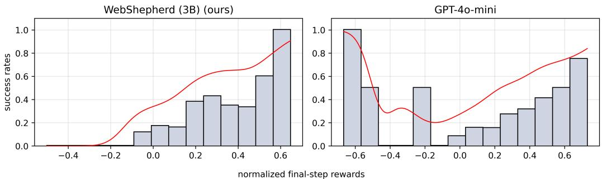  
Figure 14: Task success rates binned by normalized final-step reward for WEB-SHEPHERD (3B) (left) and GPT-4o-mini (right).   
instances. This allows for a fair comparison with API-based models, whose costs are based on pricing information from OpenRouter4, OpenAI5, Anthropic6, and Google7.

models trained with the 1:4 ratio provide more effective guidance at inference-time. This finding suggests that learning to predict rewards across diverse set of rejected actions is more beneficial, even wen the ratio of positives is highly imbalanced.

# E.6 Cost Efficiency

We provide the full cost breakdown for WEB-SHEPHERD and the baseline models in Table 12. The cost of WEBSHEPHERD is estimated as follows: first, we compute the number of input and output tokens per instance by running the model on the evaluation set. Then, we measure the throughput—defined as the number of tokens (input $^ +$ output) processed per minute—on a server equipped with a single A100 80GB GPU. Finally, using the hourly cost of the hardware (\$1.19/hour), we derive the cost per 1,000

Table 12: Cost per 1,000 instances (USD) across different models.   

<table><tr><td>Model</td><td>Cost (USD)</td></tr><tr><td>GPT-40</td><td>435.74</td></tr><tr><td>GPT-4o-mini</td><td>43.57</td></tr><tr><td>Qwen-2.5-VL-72B Claude Sonnet 3.7</td><td>53.69</td></tr><tr><td>Gemini 1.5 (Pro)</td><td>273.16 13.37</td></tr><tr><td>WEB-SHEPHERD 3B</td><td>4.67</td></tr></table>

# E.7 Evaluating the Quality of the Generated Checklist

We use LLM-as-a-Judge method [43] to evaluate the quality of the generated checklists. However, since LLMs are trained on large-scale web data but do not possess complete or up-to-date knowledge of all websites, their evaluations can be unreliable in this context. To address this limitation, we provide a reference checklist during evaluation, allowing the LLM to assess the generated output relative to a known, task-specific ground truth. We evaluate the quality of checklist along three key dimensions: (1) Validity—whether any incorrect or irrelevant checklist items are generated; (2) Subgoal Granularity—whether the steps are overly fine-grained or unnecessarily detailed; and (3) Goal Coverage—whether the checklist includes all key steps necessary to complete the final goal. Specifically, the LLM is prompted to assign a quality score on a Likert scale (i.e., from 1 to 5), along with a rationale explaining the evaluation. To reduce evaluation variance, each instance is rated three times, and we report the average score.

Table 13 presents the checklist quality across different checklist sources, evaluated along three dimensions and an overall score. We observe that, with the exception of our initial model version (trained only on checklist generation without reasoning) and WEB-SHEPHERD (3B), most models produce checklists of comparable quality. Notably, the model trained solely for checklist generation (i.e., without multi-task learning like WEB-SHEPHERD), suggesting the benefit of task-specific supervision. Based on this observation, we also release the checklist—only model to support broader use cases.

Table 13: Results of G-Eval on checklist quality evaluation.   

<table><tr><td>Checklist Source</td><td>Overall</td><td>Validity</td><td>Subgoal Granularity</td><td>Goal Coverage</td></tr><tr><td>GPT-4o-mini</td><td>4.14</td><td>4.39</td><td>4.12</td><td>3.92</td></tr><tr><td>GPT-40</td><td>4.16</td><td>4.42</td><td>4.15</td><td>3.90</td></tr><tr><td>Qwen-2.5-VL-72B</td><td>4.18</td><td>4.36</td><td>4.21</td><td>3.97</td></tr><tr><td>Early version of ours (low quality)</td><td>2.97</td><td>3.08</td><td>3.10</td><td>2.74</td></tr><tr><td>WEB-SHEPHERD (3B)</td><td>3.86</td><td>4.00</td><td>3.97</td><td>3.60</td></tr><tr><td>WEB-SHEPHERD (8B)</td><td>3.91</td><td>4.07</td><td>3.97</td><td>3.68</td></tr><tr><td>Checklist only model (ours,8B)</td><td>4.21</td><td>4.50</td><td>4.17</td><td>3.97</td></tr></table>

# F Details of Experiments

# F.1 WEBREWARDBENCH

Evaluation. We evaluate model performance under the following default setting: five sampled outputs are generated using a temperature of 1.0. In the baseline setting without a checklist, outputs are assessed using a Likert-scale. For the checklist-based reward prediction setup, we evaluate the completion status of each checklist item using three labels: Yes, In Progress, and No. The prompts used to evaluate PRMs on WEBREWARDBENCH are presented below:

• Reward prediction w/o checklist: Figure 18 • Checklist generation: Figure 19 (baseline), Figure 21 (ours) • Reward prediction based on checklist: Figure 20 (baseline), Figure 22 (ours)

# F.2 Reward-guided Trajectory Search

Environment. We use BrowserGym [50], a unified framework for evaluating web agents in online environments. BrowserGym standardizes the action space across different implementations, improving reproducibility. It also processes both textual and visual observations through an overlay of set-of-marks, enabling richer interaction signals. Additionally, it supports automatic Docker-based website resets and identifies task dependencies to prevent unintended side effects between tasks.

Policy and action selection. We use GPT-4o-mini and GPT-4o as the policy model. To obtain action candidates, we sample 20 output sequences using nucleus sampling with a temperature of 1.0. The top- $\mathbf { \nabla } \cdot n$ most frequent actions across these samples are selected as candidates.

We then score each candidate action using the reward model and select the one with the highest predicted reward. In cases where multiple actions receive the same score, we execute the action that was sampled more frequently.

Refinment experiments. We use reward model’s thought and checklist evaluation responses—excluding the actual reward score—as feedback for refinement. The refinement is repeated up to two times, as long as it leads to a higher reward score than the previous step. At the end of the refinement step, we obtain up to three action candidates and select the one with the highest reward score as the final action.

# G Case Study

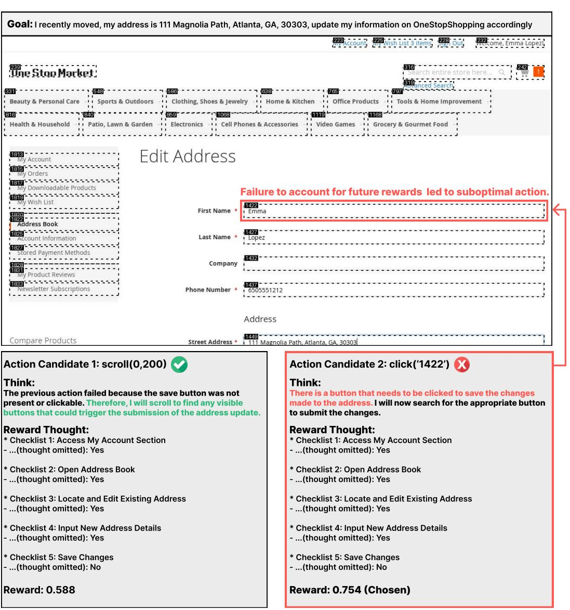

Figure 15: Erroneous Example. Failed to properly anticipate future rewards, the agents clicked a sub-optimal bid instead of scrolling to find the save button.

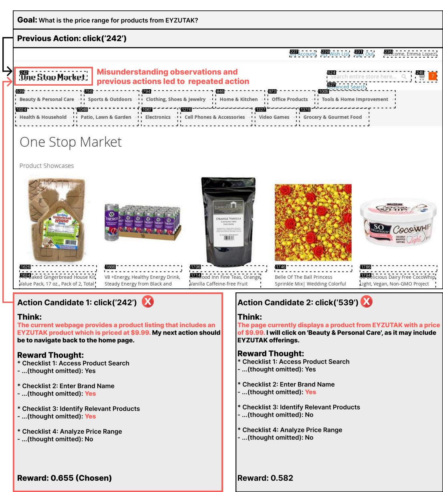  
Figure 16: Erroneous Example. By misinterpreting the current observation and ignoring previous actions, the agent performs repetitive actions.

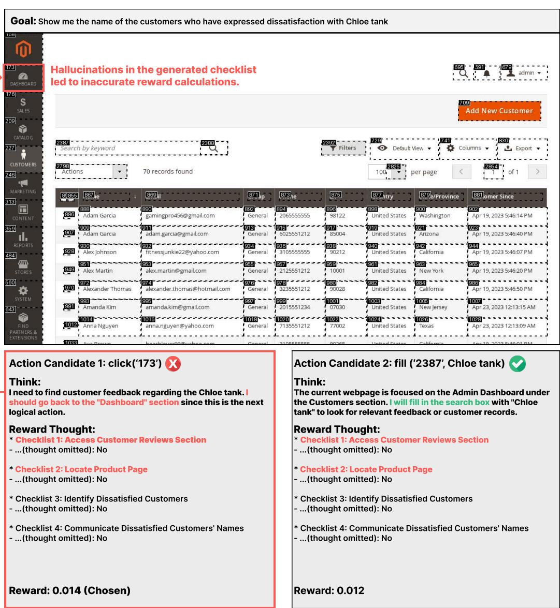  
Figure 17: Erroneous Example. When generating the checklist, hallucinations such as navigating to non-existent sections (Customer Reviews Section) or referencing pages that don’t exist (Product Page) lead to incorrect reward calculations.

# H Prompts Used in Our Works

# Prompts

You are an expert evaluator of web agent.

Your task is to assess how helpful a given agent’s THOUGHT and ACTION is in making progress toward the user’s goal, based on the current state of the webpage.

# Action space: [Description of Action space] # Task Description

Evaluate how helpful the given thought and action is for achieving the goal. Use the following scale:

\*\*Scoring Criteria (1 to 5):\*\*   
- $^ { \ast \ast 5 }$ (Very Helpful)\*\*: The action directly and effectively moves toward fulfilling a key part of the goal.   
- $\ast \ast 4$ (Helpful)\*\*: The action contributes meaningfully to progress, though it may require follow-up actions.   
- $^ { * * 3 }$ (Somewhat Helpful)\*\*: The action is partially relevant or a preparatory step, but doesn’t make immediate progress.   
- $^ { * * 2 }$ (Slightly Helpful)\*\*: The action is weakly related to the goal or might only indirectly help.   
- $^ { * * } 1$ (Not Helpful)\*\*: The action is unrelated, redundant, or distracts from the goal.

# Given Information ## User Instruction {intent}

## Trajectory {trajectory} ## Current State ### Current URL {current_url} ### AXTREE

Note: [bid] is the unique alpha-numeric identifier at the beginning of lines for each element in the AXTree. Always use bid to refer to elements in your actions. {text_observation}

### SOM Image Screenshot   
Here is a current image screenshot of the page, it is annotated with bounding boxes and   
corresponding bids:   
<IMAGE_PLACEHOLDER>

## Agent’s Response

THOUGHT: {thought}

REASON: [Your explanation for the score]

SCORE: [1-5]

# Prompts

You are an AI assistant tasked with generating structured checklists that highlight key subgoals necessary to complete a task.

## Task Description

User Instruction (Goal): {intent}

Start Website URL: {start_url}

Guidelines for Checklist Generation

1. Identify Essential High-Level Subgoals:

- A subgoal should represent a significant step involving user interaction that leads to noticeable page transitions or meaningful changes in system state.

- Consolidate closely related user actions (such as applying multiple filters or selecting several options) into a single subgoal, rather than separate checklist items for each action.

- Prioritize only the most critical interactions necessary for meaningful progression, avoiding the inclusion of minor or unnecessary steps (e.g., scroll, hover).

2. Provide a Concise Subgoal Analysis:   
- Before creating the checklist, offer a brief paragraph summarizing the main subgoals, emphasizing significant transitions or page-level interactions.

- If multiple related interactions occur (e.g., setting filters 1, 2, and 3), combine them into one subgoal with clear criteria verifying all required conditions.

- The checklist should contain only essential steps, explicitly excluding unnecessary actions, and should not exceed five critical subgoals. It is not necessary to use all five checklist items if fewer steps adequately represent the essential subgoals.

### Output Format

Before generating the checklist, first produce a concise subgoal analysis in a single paragraph summarizing the required interactions. Then, based on this, generate the checklist following the format below:

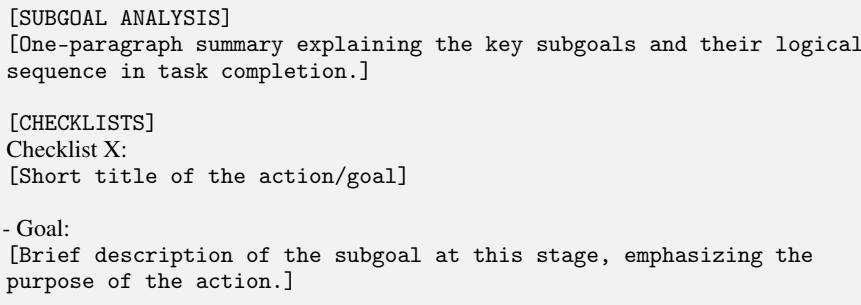  
Figure 19: Prompt used to generate checklist for baseline models.

# NeurIPS Paper Checklist

# 1. Claims

Question: Do the main claims made in the abstract and introduction accurately reflect the paper’s contributions and scope?

Answer: [Yes]

You are an expert evaluator of web agent.

Your task is to assess how helpful a given agent’s THOUGHT and ACTION is in making progress toward the user’s goal, based on the current state of the webpage.

# Action space: [Description of Action space]

# Task Description

Your task is to evaluate how well the agent’s THOUGHT and ACTION satisfy each item in the checklist.

Use the task instruction, trajectory (including previously completed steps from history), current webpage state, and the agent’s current response as evidence for your evaluation.

For each checklist item:

- Mark it as ‘Yes’ if it is clearly and fully satisfied either in the current response or already completed in the history.

- Mark it as ‘In Progress’ if the agent has made partial but meaningful progress toward completing the item.

- Mark it as ‘No’ if there is ambiguity, insufficient evidence, or the step is incomplete or not yet started.

# Given Information ## User Instruction {intent}

## Trajectory {trajectory} ## Current State ### Current URL {current_url} ### AXTREE

Note: [bid] is the unique alpha-numeric identifier at the beginning of lines for each element in the AXTree. Always use bid to refer to elements in your actions.   
{text_observation}   
### SOM Image Screenshot   
Here is a current image screenshot of the page, it is annotated with bounding boxes and corresponding bids:   
<IMAGE_PLACEHOLDER>   
## Agent’s Response   
THOUGHT:   
{thought}   
ACTION:   
{action}

## Output Format Please return your response in the following format:

REASON:

[Write a single, coherent paragraph explaining how well the agent’s response satisfies the checklist overall. Use both the history and the agent’s current thought/action as evidence. Mention specific strengths or missing elements that influence your decision.]

CHECKLIST EVALUATION: Checklist X: [Yes / In Progress / No]

Justification: The abstract and the introduction well reflect our contributions. Especially, the third and the last paragraph covers our scope and contributions, respectively.

# Prompts

You are an AI assistant tasked with generating structured checklists that highlight key subgoals necessary to complete a task.

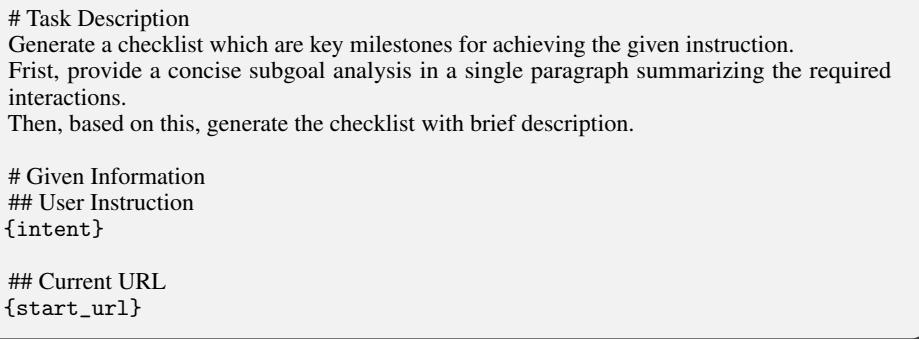  
Figure 21: Prompt used to generate checklist for WEB-SHEPHERD.

Guidelines:

• The answer NA means that the abstract and introduction do not include the claims made in the paper.   
• The abstract and/or introduction should clearly state the claims made, including the contributions made in the paper and important assumptions and limitations. A No or NA answer to this question will not be perceived well by the reviewers.   
• The claims made should match theoretical and experimental results, and reflect how much the results can be expected to generalize to other settings.   
• It is fine to include aspirational goals as motivation as long as it is clear that these goals are not attained by the paper.

# 2. Limitations

Question: Does the paper discuss the limitations of the work performed by the authors?

Answer: [Yes]

Justification: We discuss the limitation of our work in Appendix A.1.

Guidelines:

• The answer NA means that the paper has no limitation while the answer No means that the paper has limitations, but those are not discussed in the paper.   
• The authors are encouraged to create a separate "Limitations" section in their paper.   
• The paper should point out any strong assumptions and how robust the results are to violations of these assumptions (e.g., independence assumptions, noiseless settings, model well-specification, asymptotic approximations only holding locally). The authors should reflect on how these assumptions might be violated in practice and what the implications would be.   
• The authors should reflect on the scope of the claims made, e.g., if the approach was only tested on a few datasets or with a few runs. In general, empirical results often depend on implicit assumptions, which should be articulated.   
• The authors should reflect on the factors that influence the performance of the approach. For example, a facial recognition algorithm may perform poorly when image resolution is low or images are taken in low lighting. Or a speech-to-text system might not be used reliably to provide closed captions for online lectures because it fails to handle technical jargon.   
• The authors should discuss the computational efficiency of the proposed algorithms and how they scale with dataset size.   
• If applicable, the authors should discuss possible limitations of their approach to address problems of privacy and fairness.

You are an expert evaluator of web agent.

Your task is to assess how helpful a given agent’s THOUGHT and ACTION is in making progress toward the user’s goal, based on the current state of the webpage.

# Task Description

Evaluate how well the agent’s THOUGHT and ACTION satisfy each item in the checklist using the task instruction, trajectory (including previously completed steps), current webpage state, and the agent’s latest response.

Start by writing a concise paragraph summarizing the agent’s overall performance.

Refer to the reasoning provided in the trajectory, and discuss whether the THOUGHT is appropriate and the ACTION moves the task forward.

Then, assess each checklist item individually using the following labels: - Yes: The item is fully and clearly satisfied, either in the current response or previously completed. - In Progress: There is meaningful partial progress toward completing the item. - No: The item is not satisfied due to ambiguity, insufficient evidence, or lack of progress.

# Given Information ## User Instruction {intent}

## Trajectory {trajectory} ## Current State ### Current URL {current_url}

Note: [bid] is the unique alpha-numeric identifier at the beginning of lines for each element in the AXTree.Always use bid to refer to elements in your actions.   
{text_observation}

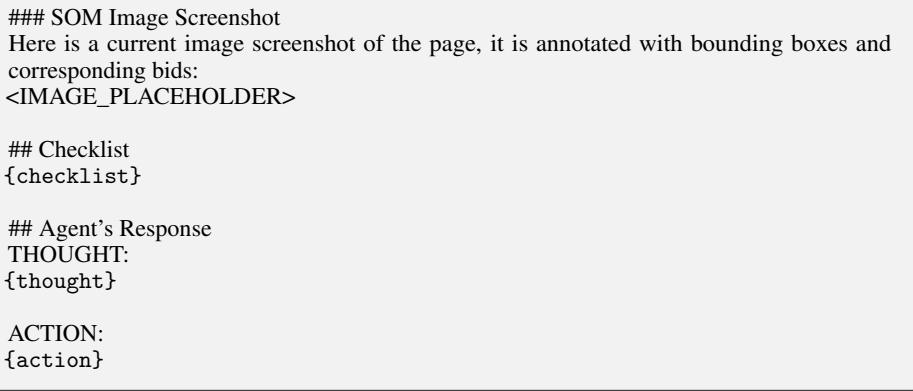  
Figure 22: Prompt used to assign rewards for WEB-SHEPHERD.

• While the authors might fear that complete honesty about limitations might be used by reviewers as grounds for rejection, a worse outcome might be that reviewers discover limitations that aren’t acknowledged in the paper. The authors should use their best judgment and recognize that individual actions in favor of transparency play an important role in developing norms that preserve the integrity of the community. Reviewers will be specifically instructed to not penalize honesty concerning limitations.

# 3. Theory Assumptions and Proofs

Question: For each theoretical result, does the paper provide the full set of assumptions and a complete (and correct) proof?

# Prompts

# Instructions

You are given a draft thought and action for the current step. This draft has not been executed yet.   
It was evaluated by a reward model using a checklist based on the task goals.

ur task is to reflect on the checklist-based feedback and improve the proposed action.

Based on the page state and the provided feedback, revise the thought if needed and produce a better action that will be executed.

Your answer will be interpreted and executed by a program, so be precise and follow the formatting instructions.

# Goal: {intent} # Current State ## Current URL: {current_url} ## AXTree:

Note: [bid] is the unique alpha-numeric identifier at the beginning of lines for each element in the AXTree. Always use bid to refer to elements in your actions.

Note: only elements that are visible in the viewport are presented. You might need to scroll the page, or open tabs or menus to see more.

Note: You can only interact with visible elements. If the "visible" tag is not present, the element is not visible on the page.

{text_observation} # History of interaction with the task: {trajectory}

# Action space: [Description of Action space] # Draft Thought and Action: Thought: {thought} Action: {action}

# Reward Model Feedback:   
The reward model evaluates actions using a checklist derived from task-specific goals. Each checklist item represents a key subgoal or intermediate step.

Feedback: <feedback> {feedback} </feedback>

# Concrete Examples Here is a concrete example of how to format your answer. Make sure to follow the template with proper tags:

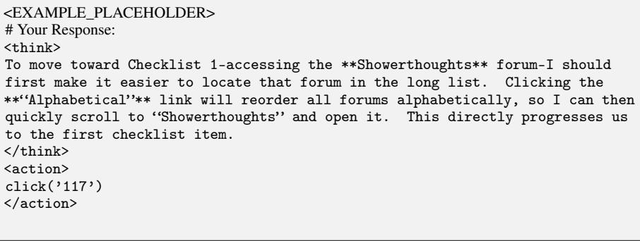  
Figure 23: Prompt used to generate a refined action for Refinement.

Answer: [NA]

Justification: We do not have any theoretical results.

Guidelines:

You are an expert evaluator of web agent. Your task is to assess how helpful a given agent’s THOUGHT and ACTION is in making progress toward the user’s goal, based on the current state of the webpage.

# Action space: [Description of Action space] # Given Information ## User Instruction {intent}

## Trajectory {trajectory} ## Current State ### Current URL {current_url} ## Agent’s Response THOUGHT: {thought} ACTION: {action}

# Output Format:   
Please return your response in the following format:   
REASON: [Your explanation for the score]   
SCORE: [1-5]   
• The answer NA means that the paper does not include theoretical results.   
• All the theorems, formulas, and proofs in the paper should be numbered and crossreferenced.   
• All assumptions should be clearly stated or referenced in the statement of any theorems.   
• The proofs can either appear in the main paper or the supplemental material, but if they appear in the supplemental material, the authors are encouraged to provide a short proof sketch to provide intuition.   
• Inversely, any informal proof provided in the core of the paper should be complemented by formal proofs provided in appendix or supplemental material.   
• Theorems and Lemmas that the proof relies upon should be properly referenced.

# 4. Experimental Result Reproducibility

Question: Does the paper fully disclose all the information needed to reproduce the main experimental results of the paper to the extent that it affects the main claims and/or conclusions of the paper (regardless of whether the code and data are provided or not)?

Answer: [Yes]

Justification: We fully provide the experimental details in Appendix D. In addition, we release the code and data to allow easy reproduction of our results.

Guidelines:

• The answer NA means that the paper does not include experiments.   
• If the paper includes experiments, a No answer to this question will not be perceived well by the reviewers: Making the paper reproducible is important, regardless of whether the code and data are provided or not.   
• If the contribution is a dataset and/or model, the authors should describe the steps taken to make their results reproducible or verifiable.

# Prompts

You are an expert evaluator of web agent. Your task is to assess how helpful a given agent’s THOUGHT and ACTION is in making progress toward the user’s goal, based on the current state of the webpage.

# Action space:   
[Action Space Description]   
# Task Description   
Your task is to evaluate how well the agent’s THOUGHT and ACTION satisfy each item in the checklist.   
Use the task instruction, trajectory (including previously completed steps from history), current webpage state, and the agent’s current response as evidence for your evaluation. Clearly consider any items already successfully completed or currently in progress according to the provided trajectory.   
For each checklist item:   
- Mark it as ‘Yes’ if it is clearly and fully satisfied either in the current response or already completed in the history.   
- Mark it as ‘In Progress’ if the agent has made partial but meaningful progress toward completing the item.   
- Mark it as ‘No’ if there is ambiguity, insufficient evidence, or the step is incomplete or not yet started.

# Given Information ## User Instruction {intent}

## Trajectory {trajectory} ## Current State ### Current URL {current_url}

Note: [bid] is the unique alpha-numeric identifier at the beginning of lines for each element in the AXTree. Always use bid to refer to elements in your actions.   
{text_observation}

## Checklist {checklist} ## Agent’s Response THOUGHT: {thought} ACTION: {action}

Checklist X: [Yes / In Progress / No]

Figure 25: Prompt used to assign rewards with checklists for baseline models in trajectory search.

• Depending on the contribution, reproducibility can be accomplished in various ways. For example, if the contribution is a novel architecture, describing the architecture fully might suffice, or if the contribution is a specific model and empirical evaluation, it may be necessary to either make it possible for others to replicate the model with the same dataset, or provide access to the model. In general. releasing code and data is often one good way to accomplish this, but reproducibility can also be provided via detailed instructions for how to replicate the results, access to a hosted model (e.g., in the case

# Prompts

## Instruction

You are an expert evaluator tasked with assessing checklists for goal-directed web navigation. These checklists are designed to guide an agent through multi-step tasks on a website. Each checklist consists of subgoals, presented step-by-step, with brief descriptions explaining the purpose of each step. Using the provided intent, start URL, and the reference checklist, evaluate the quality of the checklist according to the following criterion.

Criteria: Checklist Validity - Does the checklist contain only valid, relevant, and logically consistent steps that align with the intent and the reference checklist, without introducing incorrect or misleading actions?

Using the rubric below, provide a brief justification and assign a score from 1 to 5 (number only, where $1 =$ very poor and $5 =$ excellent).

Rubric:

-1: Very poor: Checklist contains multiple invalid, irrelevant, or misleading steps that conflict with the intent or contradict the reference checklist.

-2: Poor: Checklist includes some valid steps but also contains serious logical errors or clearly irrelevant actions that compromise task validity.

-3: Fair: Most steps are reasonable and aligned with the task, but there are one or two questionable or weakly justified steps that reduce overall reliability.

-4: Good: Checklist is mostly valid and logically sound, with only minor issues such as slight ambiguities or borderline-relevant steps.

-5: Excellent: All steps are valid, relevant, and logically consistent with the intent and reference checklist, with no incorrect or misleading content.

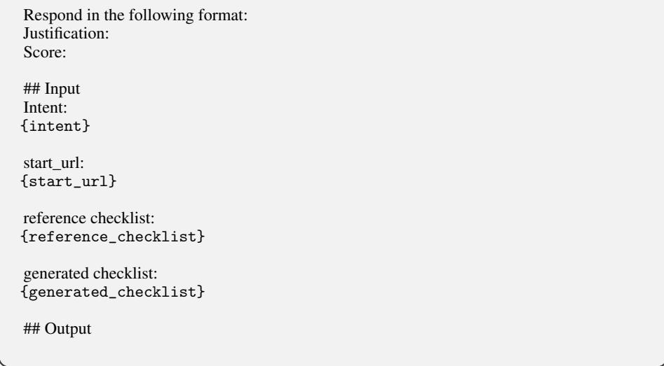  
Figure 26: Prompt used to evaluate the quality of the generated checklist based on checklist validity.

of a large language model), releasing of a model checkpoint, or other means that are appropriate to the research performed.

• While NeurIPS does not require releasing code, the conference does require all submissions to provide some reasonable avenue for reproducibility, which may depend on the nature of the contribution. For example

(a) If the contribution is primarily a new algorithm, the paper should make it clear how to reproduce that algorithm.   
(b) If the contribution is primarily a new model architecture, the paper should describe the architecture clearly and fully.

## Instruction

You are an expert evaluator tasked with assessing checklists for goal-directed web navigation. These checklists are designed to guide an agent through multi-step tasks on a website. Each checklist consists of subgoals, presented step-by-step, with brief descriptions explaining the purpose of each step. Using the provided intent, start URL, and the reference checklist, evaluate the quality of the checklist according to the following criterion.

- Are the checklist steps appropriately scoped, neither too fine-grained nor too coarse, and aligned with the level of detail found in the reference checklist?

Using the rubric below, provide a brief justification and assign a score from 1 to 5 (number only, where $1 =$ very poor and $5 =$ excellent).

Rubric:

-1: Very poor: Checklist is extremely unbalanced in granularity, with most steps being either overly fine-grained or excessively coarse, making the structure difficult to interpret or use.

-2: Poor: There are several steps with inappropriate granularity—too detailed or too broad—and the overall checklist lacks consistency in how actions are broken down.

-3: Fair: The checklist has a mix of well-scoped and poorly scoped steps, with a few instances of overly fine or coarse granularity that cause mild disruption in flow.

-4: Good: Most steps are appropriately scoped, with only minor inconsistencies in granularity or density that do not significantly hinder readability or execution.

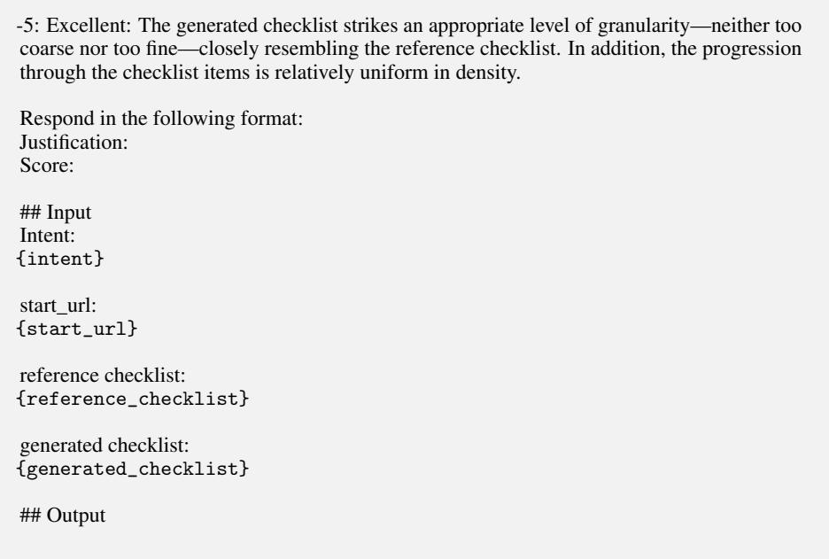  
Figure 27: Prompt used to evaluate the quality of the generated checklist based on subgoal granularity.

(c) If the contribution is a new model (e.g., a large language model), then there should either be a way to access this model for reproducing the results or a way to reproduce the model (e.g., with an open-source dataset or instructions for how to construct the dataset).

(d) We recognize that reproducibility may be tricky in some cases, in which case authors are welcome to describe the particular way they provide for reproducibility. In the case of closed-source models, it may be that access to the model is limited in some way (e.g., to registered users), but it should be possible for other researchers to have some path to reproducing or verifying the results.

# Prompts

## Instruction

You are an expert evaluator tasked with assessing checklists for goal-directed web navigation. These checklists are designed to guide an agent through multi-step tasks on a website. Each checklist consists of subgoals, presented step-by-step, with brief descriptions explaining the purpose of each step. Using the provided intent, start URL, and the reference checklist, evaluate the quality of the checklist according to the following criterion.

Criteria: Goal Coverage

- Does the checklist comprehensively reflect the key steps necessary to achieve the final goal, as captured in the reference checklist?

Using the rubric below, provide a brief justification and assign a score from 1 to 5 (number only, where $1 =$ very poor and $5 =$ excellent).

Rubric:

-1: Very poor: Checklist omits most key steps found in the reference checklist and contains vague, irrelevant, or misleading content.

-2: Poor: Checklist includes a few relevant steps, but misses many essential ones from the reference checklist, resulting in a structure that does not support goal completion.

-3: Fair: Checklist reflects most major steps from the reference checklist but misses one or two key actions or includes loosely related steps.

-4: Good: Checklist includes nearly all essential steps from the reference checklist, with only minor omissions or slight ambiguities in an otherwise coherent structure.

-5: Excellent: Checklist fully captures all key steps covered in the reference checklist, with clear subgoals that directly support achieving the final goal.

# 5. Open access to data and code

Question: Does the paper provide open access to the data and code, with sufficient instructions to faithfully reproduce the main experimental results, as described in supplemental material?

Answer: [Yes]

Justification: The code for our experiments and example data from WEBPRM COLLECTION and WEBREWARDBENCH are included in the supplemental material.

Guidelines:

• The answer NA means that paper does not include experiments requiring code.

• Please see the NeurIPS code and data submission guidelines (https://nips.cc/   
public/guides/CodeSubmissionPolicy) for more details.   
• While we encourage the release of code and data, we understand that this might not be possible, so “No” is an acceptable answer. Papers cannot be rejected simply for not including code, unless this is central to the contribution (e.g., for a new open-source benchmark).   
• The instructions should contain the exact command and environment needed to run to reproduce the results. See the NeurIPS code and data submission guidelines (https: //nips.cc/public/guides/CodeSubmissionPolicy) for more details.   
• The authors should provide instructions on data access and preparation, including how to access the raw data, preprocessed data, intermediate data, and generated data, etc.   
• The authors should provide scripts to reproduce all experimental results for the new proposed method and baselines. If only a subset of experiments are reproducible, they should state which ones are omitted from the script and why.   
• At submission time, to preserve anonymity, the authors should release anonymized versions (if applicable).   
• Providing as much information as possible in supplemental material (appended to the paper) is recommended, but including URLs to data and code is permitted.

# 6. Experimental Setting/Details

Question: Does the paper specify all the training and test details (e.g., data splits, hyperparameters, how they were chosen, type of optimizer, etc.) necessary to understand the results?

Answer: [Yes]

Justification: We provide the training and inference hyperparameters in Appendix C.2.

Guidelines:

• The answer NA means that the paper does not include experiments. • The experimental setting should be presented in the core of the paper to a level of detail that is necessary to appreciate the results and make sense of them. • The full details can be provided either with the code, in appendix, or as supplemental material.

# 7. Experiment Statistical Significance

Question: Does the paper report error bars suitably and correctly defined or other appropriate information about the statistical significance of the experiments?

Answer: [Yes]

Justification: In the experiment in Section 6.2 we sample 20 outputs from the policy to allow reliable experiment.

Guidelines:

• The answer NA means that the paper does not include experiments.   
• The authors should answer "Yes" if the results are accompanied by error bars, confidence intervals, or statistical significance tests, at least for the experiments that support the main claims of the paper.   
• The factors of variability that the error bars are capturing should be clearly stated (for example, train/test split, initialization, random drawing of some parameter, or overall run with given experimental conditions).   
• The method for calculating the error bars should be explained (closed form formula, call to a library function, bootstrap, etc.)   
• The assumptions made should be given (e.g., Normally distributed errors).   
• It should be clear whether the error bar is the standard deviation or the standard error of the mean.   
• It is OK to report 1-sigma error bars, but one should state it. The authors should preferably report a 2-sigma error bar than state that they have a $96 \%$ CI, if the hypothesis of Normality of errors is not verified.

• For asymmetric distributions, the authors should be careful not to show in tables or figures symmetric error bars that would yield results that are out of range (e.g. negative error rates). • If error bars are reported in tables or plots, The authors should explain in the text how they were calculated and reference the corresponding figures or tables in the text.

# 8. Experiments Compute Resources

Question: For each experiment, does the paper provide sufficient information on the computer resources (type of compute workers, memory, time of execution) needed to reproduce the experiments?

Answer: [Yes]

Justification: The compute resources used for running the experiments are described in Appendix C.2.

Guidelines:

• The answer NA means that the paper does not include experiments.   
• The paper should indicate the type of compute workers CPU or GPU, internal cluster, or cloud provider, including relevant memory and storage.   
• The paper should provide the amount of compute required for each of the individual experimental runs as well as estimate the total compute.   
• The paper should disclose whether the full research project required more compute than the experiments reported in the paper (e.g., preliminary or failed experiments that didn’t make it into the paper).

# 9. Code Of Ethics

Question: Does the research conducted in the paper conform, in every respect, with the NeurIPS Code of Ethics https://neurips.cc/public/EthicsGuidelines?

Answer: [Yes]

Justification: We have carefully read the code of ethics.

Guidelines:

• The answer NA means that the authors have not reviewed the NeurIPS Code of Ethics.   
• If the authors answer No, they should explain the special circumstances that require a deviation from the Code of Ethics.   
• The authors should make sure to preserve anonymity (e.g., if there is a special consideration due to laws or regulations in their jurisdiction).

# 10. Broader Impacts

Question: Does the paper discuss both potential positive societal impacts and negative societal impacts of the work performed?

Answer: [Yes]

Justification: We discuss them in Appendix A.2.

Guidelines:

• The answer NA means that there is no societal impact of the work performed.   
• If the authors answer NA or No, they should explain why their work has no societal impact or why the paper does not address societal impact. Examples of negative societal impacts include potential malicious or unintended uses (e.g., disinformation, generating fake profiles, surveillance), fairness considerations (e.g., deployment of technologies that could make decisions that unfairly impact specific groups), privacy considerations, and security considerations. The conference expects that many papers will be foundational research and not tied to particular applications, let alone deployments. However, if there is a direct path to any negative applications, the authors should point it out. For example, it is legitimate to point out that an improvement in the quality of generative models could be used to generate deepfakes for disinformation. On the other hand, it is not needed to point out that a generic algorithm for optimizing neural networks could enable people to train models that generate Deepfakes faster.

• The authors should consider possible harms that could arise when the technology is being used as intended and functioning correctly, harms that could arise when the technology is being used as intended but gives incorrect results, and harms following from (intentional or unintentional) misuse of the technology. • If there are negative societal impacts, the authors could also discuss possible mitigation strategies (e.g., gated release of models, providing defenses in addition to attacks, mechanisms for monitoring misuse, mechanisms to monitor how a system learns from feedback over time, improving the efficiency and accessibility of ML).

# 11. Safeguards

Question: Does the paper describe safeguards that have been put in place for responsible release of data or models that have a high risk for misuse (e.g., pretrained language models, image generators, or scraped datasets)?

Answer: [Yes]

Justification: We describe the verification process for constructing our dataset in Appendix B.

Guidelines:

• The answer NA means that the paper poses no such risks.   
• Released models that have a high risk for misuse or dual-use should be released with necessary safeguards to allow for controlled use of the model, for example by requiring that users adhere to usage guidelines or restrictions to access the model or implementing safety filters.   
• Datasets that have been scraped from the Internet could pose safety risks. The authors should describe how they avoided releasing unsafe images.   
• We recognize that providing effective safeguards is challenging, and many papers do not require this, but we encourage authors to take this into account and make a best faith effort.

# 12. Licenses for existing assets

Question: Are the creators or original owners of assets (e.g., code, data, models), used in the paper, properly credited and are the license and terms of use explicitly mentioned and properly respected?

Answer: [Yes]

Justification: We include the citations and the explanations for the models, benchmarks, and code used in our work.

Guidelines:

• The answer NA means that the paper does not use existing assets.   
• The authors should cite the original paper that produced the code package or dataset.   
• The authors should state which version of the asset is used and, if possible, include a URL.   
• The name of the license (e.g., CC-BY 4.0) should be included for each asset.   
• For scraped data from a particular source (e.g., website), the copyright and terms of service of that source should be provided.   
• If assets are released, the license, copyright information, and terms of use in the package should be provided. For popular datasets, paperswithcode.com/datasets has curated licenses for some datasets. Their licensing guide can help determine the license of a dataset.   
• For existing datasets that are re-packaged, both the original license and the license of the derived asset (if it has changed) should be provided.   
• If this information is not available online, the authors are encouraged to reach out to the asset’s creators.

# 13. New Assets

Question: Are new assets introduced in the paper well documented and is the documentation provided alongside the assets?

Answer: [Yes]

Justification: We provide the details of WEBPRM COLLECTION and WEB-SHEPHERD in Appendix B and Appendix C.2, respectively.

Guidelines:

• The answer NA means that the paper does not release new assets.   
• Researchers should communicate the details of the dataset/code/model as part of their submissions via structured templates. This includes details about training, license, limitations, etc.   
• The paper should discuss whether and how consent was obtained from people whose asset is used.   
• At submission time, remember to anonymize your assets (if applicable). You can either create an anonymized URL or include an anonymized zip file.

# 14. Crowdsourcing and Research with Human Subjects

Question: For crowdsourcing experiments and research with human subjects, does the paper include the full text of instructions given to participants and screenshots, if applicable, as well as details about compensation (if any)?

Answer: [Yes]

Justification: We detail the human annotation process in Appendix B.2.

Guidelines:

• The answer NA means that the paper does not involve crowdsourcing nor research with human subjects.   
• Including this information in the supplemental material is fine, but if the main contribution of the paper involves human subjects, then as much detail as possible should be included in the main paper.   
• According to the NeurIPS Code of Ethics, workers involved in data collection, curation, or other labor should be paid at least the minimum wage in the country of the data collector.

# 15. Institutional Review Board (IRB) Approvals or Equivalent for Research with Human Subjects

Question: Does the paper describe potential risks incurred by study participants, whether such risks were disclosed to the subjects, and whether Institutional Review Board (IRB) approvals (or an equivalent approval/review based on the requirements of your country or institution) were obtained?

Answer: [NA]

Justification: All annotation is made by the authors.

Guidelines:

• The answer NA means that the paper does not involve crowdsourcing nor research with human subjects.   
• Depending on the country in which research is conducted, IRB approval (or equivalent) may be required for any human subjects research. If you obtained IRB approval, you should clearly state this in the paper.   
• We recognize that the procedures for this may vary significantly between institutions and locations, and we expect authors to adhere to the NeurIPS Code of Ethics and the guidelines for their institution.   
• For initial submissions, do not include any information that would break anonymity (if applicable), such as the institution conducting the review.