# Structured Sparse Transition Matrices to Enable State Tracking in State-Space Models

Aleksandar Terzic´1,2∗ aleksandar.terzic1@ibm.com

Nicolas Menet1,2∗ nicolas.menet@ibm.com

Michael Hersche1 michael.hersche@ibm.com

Thomas Hofmann2 thomas.hofmann@inf.ethz.ch

Abbas Rahimi1 abr@zurich.ibm.com

1IBM Research – Zurich, 2Department of Computer Science, ETH Zürich

# Abstract

Modern state-space models (SSMs) often utilize structured transition matrices which enable efficient computation but pose restrictions on the model’s expressivity, as measured in terms of the ability to emulate finite-state automata (FSA). While unstructured transition matrices are optimal in terms of expressivity, they come at a prohibitively high compute and memory cost, even for moderate state sizes. We propose a structured sparse parametrization of transition matrices in SSMs that enables FSA state tracking with provably optimal state size and depth, while keeping the computational cost of the recurrence comparable to that of diagonal SSMs. Our method, PD-SSM, parametrizes the transition matrix as the product of a column one-hot matrix $( P )$ and a complex-valued diagonal matrix $( D )$ . As a result, the computational cost of parallel scans scales linearly with the state size. Theoretically, the model is BIBO-stable and can emulate any $N$ -state FSA with one layer of dimension $N$ and a linear readout of size $N \times N$ , significantly improving on all current structured SSM guarantees. Experimentally, the model significantly outperforms a wide collection of modern SSM variants on various FSA state tracking tasks. On multivariate time-series classification, it outperforms neural controlled differential equations, a paradigm explicitly built for time-series analysis. Finally, we integrate PD-SSM into a hybrid Transformer-SSM architecture and demonstrate that the model can effectively track the states of a complex FSA in which transitions are encoded into sets of variable-length English sentences. The code is available at https://github.com/IBM/expressive-sparse-state-space-model.

# 1 Introduction

The Transformer (Vaswani et al. 2017) marked a paradigm shift in machine learning, providing a unified yet versatile architecture with strong scalability. However, experimental and theoretical results indicate that Transformers struggle in algorithmic state tracking tasks such as finite-state automaton (FSA) emulation (Hahn 2020; Bhattamishra et al. 2020; Merrill and Sabharwal 2023; Delétang et al. 2023; Liu et al. 2023; Strobl et al. 2024). Moreover, the inherent quadratic cost of the attention mechanism hinders the training on very long sequences, and its linearly growing key/value cache can lead to memory issues during inference.

In contrast, state-space models (SSMs) (Gu et al. 2022b; Gupta et al. 2022; Fu et al. 2023; Smith et al. 2023; Orvieto et al. 2023; Gu and Dao 2023) offer a scalable alternative to Transformers with complementary properties: they generalize better to longer sequences, the number of total operations scales linearly with the sequence length, and memory is constant during inference. Modern large language models (LLMs) are increasingly adopting a hybrid architecture that integrates both Transformer and SSM layers (Yang et al. 2024; Ren et al. 2025; De et al. 2024; Waleffe et al. 2024; Lenz et al. 2025; Wu et al. 2025). To achieve computational efficiency competitive with that of Transformers, modern SSMs often utilize diagonal transition matrices. Empirically, in time-invariant SSMs, this strategy has proven effective in a range of applications (Gupta et al. 2022; Gu et al. 2022a; Orvieto et al. 2023), while time-varying diagonal SSMs can achieve language modeling performance comparable to that of the Transformer (Gu and Dao 2023).

Despite their promising performance in language modeling, diagonal SSMs are restricted in the type of FSA they can emulate (Merrill et al. 2024). This stands in stark contrast with the nonlinear RNN, which can quickly learn such algorithmic abstractions (Delétang et al. 2023). To enable FSA state tracking, previous approaches propose using transition matrices of various structures such as fully unstructured (i.e., dense) (Terzic et al. 2025), or (semi-)structured matrices such as ´ block-diagonal (Fan et al. 2024), diagonal plus low-rank (DPLR) (Schlag et al. 2021a; Yang et al. 2024; Walker et al. 2025; Peng et al. 2025) or products of DPLR matrices Siems et al. (2025). While any $N$ -state FSA can be represented by an unstructured SSM with a single layer, state dimensionality $N$ , and a readout size $N \times N$ , unstructured SSMs scale unfavorably and thus prohibit large-scale training. Current (semi-)structured approaches are more efficient, but do not allow for such compact encodings. With this in mind, the goal of this work can be summarized as follows:

We aim to enable single-layer time-varying SSMs with state size $N$ and readout size $N \times N$ to represent any FSA with $N$ states while keeping the cost comparable to that of diagonal SSMs.

To this end, we propose a novel structured sparse matrix parametrization of SSM transition matrices, denoted as $P D$ parametrization, defined as a product of a binary column-one-hot matrix $( P )$ and a complex-valued diagonal matrix $( D )$ . A $P D$ parametrization of transition matrices is preserved under multiplication, meaning that the product of $P D$ matrices is still a $P D$ matrix. As such, a chained product of $L P D$ matrices can be computed using parallel scans (Blelloch 1990; Martin and Cundy 2018; Smith et al. 2023) in $\Theta ( L N )$ concurrent operations and $\Theta ( L N )$ memory, matching the complexity and concurrency of a chain of diagonal matrix products. In terms of expressivity, the $P D$ matrices encompass the commonly used diagonal transition matrices, but can also represent transition functions of arbitrary $N$ -state automata. Our contributions are as follows:

• We propose PD-SSM, a time-varying SSM that can emulate any $N$ -state FSA with a single layer, state dimension $N$ , and a linear readout of size $N \times N$ . Theoretically, we prove that PD-SSM is stable and that it achieves universal FSA emulation with (almost) the least possible state size. • Empirically, we demonstrate that PD-SSM learns to track the states of complex automata by exhibiting state-of-the-art length generalization. We furthermore test our model on long-range multivariate time-series classification tasks and observe that it exhibits high performance, comparable to that of neural controlled differential equations. • We provide a novel benchmark in which each FSA transition is redundantly encoded by meaningful English sentences. Adopting a hybrid Transformer-SSM architecture, we show that integrating PD-SSM enables the model to emulate the underlying FSA and to generalize to longer sequences, in contrast to diagonal SSMs which fail on in-domain sequences.

# 2 Background

# 2.1 State-Space Models

By state-space models (SSMs), we denote neural networks that utilize the recurrence equations

$$
\begin{array} { r l } & { x _ { t } = A ( u _ { t } ) x _ { t - 1 } + B ( u _ { t } ) u _ { t } } \\ & { y _ { t } = C ( u _ { t } ) x _ { t } + D ( u _ { t } ) u _ { t } } \\ & { o _ { t } = \psi ( y _ { t } ) } \end{array}
$$

with $u _ { t } \in \mathbb { R } ^ { D }$ the input to the system, $\boldsymbol { x } _ { t } \in \mathbb { C } ^ { N }$ its (hidden) state, $\boldsymbol { y } _ { t } \in \mathbb { C } ^ { D }$ the complex-valued output, and $o _ { t } \in \mathbb { R } ^ { D }$ the real-valued output. $A ( u _ { t } ) \in \mathbb { C } ^ { N \times N }$ is the state transition matrix, $B ( u _ { t } ) \in \mathbb { C } ^ { D \times N }$

<table><tr><td>Matrix Structure</td><td>Example Models</td><td>Solvable</td><td>Non-Solvable</td><td>Cost</td></tr><tr><td>R Diagonal</td><td>Mamba, S6, S7, GLA, mLSTM</td><td>X</td><td>×</td><td>0(LN)</td></tr><tr><td>C Diagonal</td><td>PD-SSM with P = IN (Ours)</td><td>*</td><td>×</td><td>(LN)</td></tr><tr><td>DPLR</td><td>(Gated) DeltaNet,DeltaProduct,RWKV-7</td><td>*</td><td>*</td><td>(L²N)</td></tr><tr><td>R Dense</td><td>SD-SSM</td><td>√</td><td>√</td><td>(LN3)</td></tr><tr><td>Structured Sparse</td><td>PD-SSM (Ours)</td><td>√</td><td>√</td><td>(LN)</td></tr></table>

Table 1: The structure of the transition matrix $A ( u _ { t } )$ in time-varying SSMs determines the class of FSA they can emulate. We consider two classes of automata, partitioned based on the solvability of their transformation group. $\checkmark$ indicates that the structure enables the emulation of any $N$ -state FSA from the partition using one layer, state dimension $N$ and a linear readout of dimension $N \times N$ . $\checkmark ^ { \ast }$ indicates that the matrix structure can emulate any automaton from the partition, but at potentially high dimension or depth, and in case of RWKV-7 exponentially large linear layers Siems et al. (2025). The cost only considers the complexity of the parallel computation of (1). Modern DPLR methods trade off FLOPs for increased parallelism and better memory management. The recurrent complexity is $\Theta ( L N ^ { 2 } )$ , but modern methods utilize algorithms that scale quadratically in $L$ (Yang et al. 2024).

and $C ( u _ { t } ) \in \mathbb { C } ^ { D \times N }$ map from embeddings to states and vice versa, and $D ( u _ { t } ) \in \mathbb { C } ^ { D \times D }$ is a memoryless skip connection. Finally, $\psi : \mathbb { C } ^ { D } \to \mathbb { R } ^ { D }$ extracts a real-valued embedding from a complex-valued embedding, often implemented as $\psi ( y _ { t } ) = R e \{ y _ { t } \}$ (Gu et al. 2022a; Gupta et al. 2022; Orvieto et al. 2023). The time-variance of the system stems from the time dependence of $A ( u _ { t } ) , B ( u _ { t } ) , C ( u _ { t } ) , D ( u _ { t } )$ . In this work we only consider time dependence in the $A ( u _ { t } )$ matrix, this being the crucial differentiator between time-varying and time-invariant SSMs (Gu and Dao 2023; Merrill et al. 2024). We thus fix $B ( u _ { t } ) = B , C ( u _ { t } ) = C , D ( u _ { t } ) = D$ .

If the system is time-invariant, i.e., $A ( u _ { t } ) = A$ , then its dynamics can be equivalently represented by a diagonal transition matrix up to an arbitrarily small perturbation of the entries of $A$ (Orvieto et al. 2023; Axler 2024).1 Indeed, writing $A = W \dot { \Lambda } W ^ { - 1 }$ results, upon change of basis $\tilde { x } _ { t } : = W ^ { - 1 } x _ { t }$ , in an equivalent state evolution $\tilde { x } _ { t } = \bar { \Lambda } \tilde { x } _ { t } + W ^ { - 1 } B u _ { t }$ but with a diagonal state transition matrix $\Lambda$ .

In contrast, if $A ( u _ { t } )$ is a function of time, then the system admits a diagonal representation if and only if all $A ( u _ { t } )$ are diagonalizable under the same change of basis. That is, there must exist a single $W \in \mathbb { C } ^ { N \times N }$ such that for all $t$ , $A ( u _ { t } ) = W \Lambda _ { t } W ^ { - 1 }$ . This is a much more restrictive condition. It can in fact only be fulfilled if the matrix product commutes for all state transition matrices occurring over time, i.e., $\forall i \neq j , A ( u _ { i } ) A ( u _ { j } ) = A { \bar { ( } } u _ { j } { \mathrm { ) } } A ( u _ { i } )$ (Axler 2024). This fact hints at the restrictiveness of diagonal transition matrices, which is expanded upon in an alternative framework in Section 2.3

# 2.2 Modeling Finite-State Automata with SSMs

In this work, we measure the expressivity of an SSM by considering the type of deterministic finitestate automaton (FSA) it can emulate. A deterministic FSA is an abstract model of computation defined as a 5-tuple $( Q , \Sigma , \delta , q _ { \mathrm { i n i t } } , F )$ where $Q$ is a finite set of states, $\Sigma$ is a finite input alphabet, $\delta : Q \times \Sigma  Q$ is the state transition function, $q _ { \mathrm { i n i t } } \in Q$ is a fixed initial state, and $F \subseteq Q$ is the set of accepting states.

Any (deterministic) FSA can be mapped to a time-variant SSM as follows. Encode each $q \in Q$ using $e n c : Q \to \mathbb { R } ^ { | Q | }$ such that the encodings of different states are orthogonal. Note that orthogonality is a sufficient but not necessary condition for mapping an FSA to a selective SSM, as certain automata such as modular counters allow alternative, more compact, mappings to SSMs. Given such an orthogonal encoding of states, we can map the state transition function $\delta : Q \times \Sigma  Q$ to the state transition matrices $A ( u _ { t } )$ via $A ( \sigma ) = \Sigma _ { q \in Q } e n c ( \delta ( q , \sigma ) ) \cdot e n c ( q ) ^ { T }$ , set $B = 0$ , $C = \mathbb { I }$ , $D = 0$ , and $\psi = i d$ . Upon identification of $q$ with $e n c ( q )$ and $q _ { \mathrm { i n i t } }$ with $x _ { 0 }$ , the SSM matches the FSA exactly.

# 2.3 Limitations of Time-Variant SSMs for FSA State Tracking

To demonstrate the limitations of various SSMs structures for state tracking in automata, it suffices to consider automata with group structure in their state transitions. The transformation group (Straubing 1994) of such an automaton is then the algebraic group of invertible state-to-state mappings with function composition as a binary operation2. For conciseness, we equate such automata with their transformation group, thus saying, for instance, solvable automaton.

Through a circuit complexity argument, Merrill et al. (2024) showed that non-solvable automata cannot be emulated using bounded-depth logarithmic precision diagonal time-variant SSMs, providing an upper bound on their expressivity. Through an explicit construction Sarrof et al. (2024) demonstrate that all solvable automata can be emulated using finite-precision complex-valued diagonal time-variant SSMs, although the depth of the SSM stack exhibits a non-trivial dependence on the complexity of the FSA. Concretely, the SSM stack depth is proportional to the Krohn-Rhodes complexity of the transformation group Margolis et al. (2024). A more recent family of time-variant SSM models utilizes diagonal plus low-rank (DPLR) transition matrices Grazzi et al. (2024); Peng et al. (2025); Siems et al. (2025). While such matrices enable the emulation of any FSA, the necessary model depth is either a function of the automaton’s structure, or the model requires exponentially large linear layers Siems et al. (2025). In contrast, unstructured SSMs Terzic et al. (2025); Walker et al. (2025) ´ enable the emulation of any $N$ -state FSA using a single layer, a state size of $N$ and a readout size $N \times N$ . However, they scale poorly with the state size. For an overview of the results, see Table 1.

# 2.4 Associative Scan for Fully Parallelizable Recurrence in SSMs

We use parallel scans to concurrently compute the states of an SSM (Blelloch 1990; Martin and Cundy 2018; Smith et al. 2023). Suppose a binary associative operator $\bullet$ , i.e., $( a \bullet b ) \bullet c = a \bullet ( b \bullet c )$ , and a sequence of $L$ elements $[ a _ { 1 } , a _ { 2 } , \ldots , a _ { L } ]$ . The scan operation (sometimes referred to as allprefix-sum) then returns the sequence $[ a _ { 1 } , ( a _ { 1 } \bullet a _ { 2 } ) , \ldots , ( a _ { 1 } \bullet a _ { 2 } \bullet \cdot \cdot \cdot \bullet a _ { L } ) ]$ . Note that composition of the linear recurrence of a (time-variant) SSM $x _ { t } = A _ { t } x _ { t - 1 } + b _ { t }$ takes precisely the form of a parallel scan $( A _ { t + 1 } , b _ { t + 1 } ) \bullet ( A _ { t } , b _ { t } ) \mapsto ( A _ { t + 1 } A _ { t } , A _ { t + 1 } b _ { t } + b _ { t + 1 } )$ with prefix elements $a _ { t } = \left( A _ { t } , b _ { t } \right)$ . According to Blelloch (1990, Section 1.4), associative scans can be computed in $\Theta ( T _ { \odot } L )$ total operations (i.e., in work-efficient manner) with $\Theta ( \log L )$ sequential steps, where $T _ { \odot }$ represents the cost of matrix-matrix multiplication. For dense matrices $A _ { t } \in \mathbb { R } ^ { N \times N }$ , $T _ { \odot } = O ( N ^ { 3 } )$ and thus the associative scan quickly becomes prohibitively expensive in deep learning settings. In contrast, if $A _ { t }$ are diagonal matrices, $T _ { \odot } = O ( N )$ . In terms of memory, parallel scans with dense matrices use $\Theta ( N ^ { 2 } L )$ memory, whereas diagonal matrices lead to a $\Theta ( N L )$ memory consumption.

# 3 PD Parametrization for Efficient and Expressive Transition Matrices

Prior research indicates that the expressiveness of time-varying SSMs can be significantly enhanced by relaxing the structural constraints of the transition matrix $A ( u _ { t } )$ to allow for non-diagonal structures. (Merrill et al. 2024; Cirone et al. 2024; Terzic et al. 2025). As noted by Terzi ´ c et al. (2025), a ´ relaxation to arbitrary matrices prohibitively increases the compute cost of parallel scans from $\Theta ( L N )$ to $\Theta ( L N ^ { 3 } )$ . To circumvent these limitations, we propose to parameterize the transition matrices as the product $A ( u _ { t } ) = P ( u _ { t } ) D ( u _ { t } )$ , where $P ( u _ { t } )$ is a binary matrix in which each column has a single non-zero element, and $D ( u _ { t } )$ is a complex-valued diagonal matrix.

Figure 1 presents our architecture for generating transition matrices with PD parametrization. The diagonal matrices are generated by two nonlinear feed-forward neural networks, each with a single hidden layer employing the GeLU nonlinearity $\sigma _ { \mathrm { g e l u } }$ and a saturating nonlinearity in the form of the sigmoid $\sigma$ . The two networks define a magnitude generator $| D ( u _ { t } ) |$ and a phase generator $\phi ( D ( u _ { t } ) )$ :

$$
\begin{array} { r l } & { \quad | D ( u _ { t } ) | = \sigma ( W _ { o } ^ { M } ( \sigma _ { \mathrm { g e l u } } ( W _ { i } ^ { M } u _ { t } + b _ { i } ^ { M } ) + b _ { o } ^ { M } ) ) \in ( 0 , 1 ) ^ { N } } \\ & { \quad \phi ( D ( u _ { t } ) ) = 2 \pi \sigma ( W _ { o } ^ { P } ( \sigma _ { \mathrm { g e l u } } ( W _ { i } ^ { P } u _ { t } + b _ { i } ^ { P } ) + b _ { o } ^ { P } ) ) \in ( 0 , 2 \pi ) ^ { N } } \end{array}
$$

Concerning the column one-hot matrix $P$ , the input $u _ { t }$ generates the weights $s ( u _ { t } )$ , which are used to soft-select among a set of trainable transition matrices, written as the dictionary $\{ M _ { i } \in \mathbb { R } ^ { N \times N } \} _ { i \in [ K ] }$ with $K$ being a hyperparameter. Sparsity of $P$ is achieved by applying a column-wise hardmax after

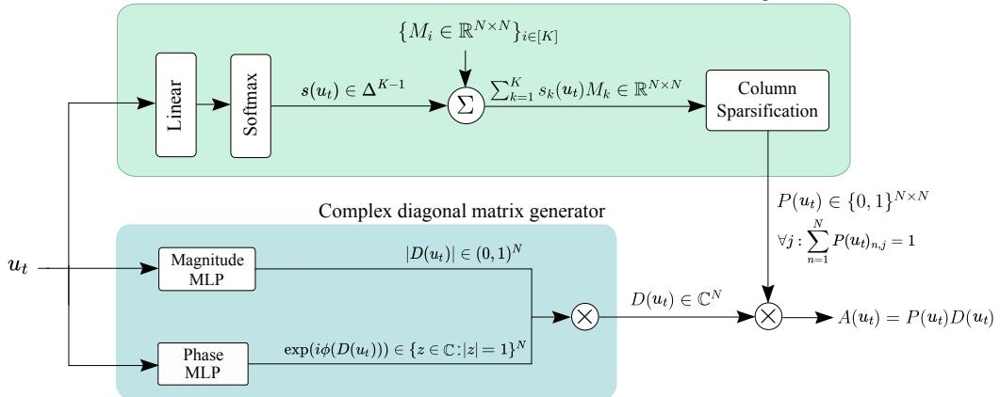  
Figure 1: The PD parametrization can be integrated into any selective SSM by adopting the shown architecture for generation of structured sparse state transition matrices $A ( u _ { t } ) = P ( u _ { t } ) D ( u _ { t } )$ .

soft-selection of the state transition. More formally:

$$
\begin{array} { l } { s ( u _ { t } ) = \displaystyle \mathrm { s o f t m a x } ( S u _ { t } ) \in \Delta ^ { K - 1 } } \\ { \displaystyle M ( u _ { t } ) = \sum _ { k = 1 } ^ { K } s _ { k } ( u _ { t } ) M _ { k } \in \mathbb R ^ { N \times N } } \\ { P _ { : , j } ( u _ { t } ) = \displaystyle \mathrm { h a r d m a x } ( M _ { : , j } ( u _ { t } ) ) \in \{ 0 , 1 \} ^ { N } \mathrm { ~ w h e r e ~ h a r d m a x } ( \mathbf { x } ) _ { i } : = \delta _ { i , \mathrm { a r g ~ m a x } _ { j } x _ { j } } } \end{array}
$$

The parametrization is motivated by Terzic et al. (2025), which has shown that models utilizing ´ normalized Fan et al. (2024) convex combinations of dense transition matrices can achieve perfect length generalization on FSA emulation tasks and are parameter-efficient compared to alternative proposals such as e.g. (Hasani et al. 2023; Fan et al. 2024; Merrill et al. 2024).

The $P$ and $D$ factors of our parametrization have complementary strengths for encoding automata into time-varying SSMs. The $P$ matrix enables emulating any FSA, but the required dimension scales linearly with the number of states. For cyclic automata, which form a central building block of all solvable automata (Krohn and Rhodes 1965; Sarrof et al. 2024), complex diagonal matrices provide a more compact encoding compared to column one-hot matrices. Visual intuition is provided in Figure 2. Additionally, as proven in the following section, the diagonal matrices provide a guarantee for the system’s BIBO stability as the magnitude of each entry lies in $( 0 , 1 )$ .

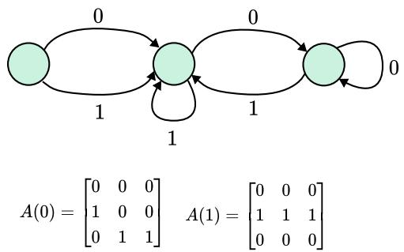  
(b) A cyclic FSA whose behavior can be emulated with a single complex number.

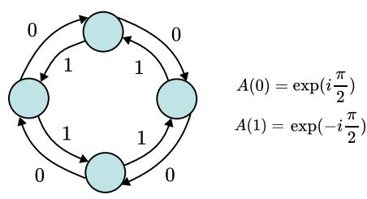

(a) A non-cyclic FSA and its two corresponding column one-hot transition matrices.

Figure 2: Any $N$ -state FSA can be encoded using sparse binary $N \times N$ transition matrices (a), but modular counters admit a more compact representation based on diagonal transition matrices (b).

# 3.1 Surrogate Gradients

Strictly speaking, ∂P (u)∂M(u) is a generalized function—it vanishes almost everywhere, except at isolated points where it exhibits Dirac delta-like singularities. To smooth these singularities over sets of non-zero measure, we approximate the hardmax with softmax during the backward pass.

$$
{ \frac { \partial P } { \partial M } } = { \frac { \partial \mathrm { h a r d m a x } ( M ) } { \partial M } } \approx { \frac { \partial \mathrm { s o f t m a x } ( M ) } { \partial M } }
$$

This is reminiscent of the slope-annealed straight-through estimator (Bengio et al. 2013; Paulus et al. 2021), yet we use stochasticity neither in the forward nor in the backward pass (ablations with stochastic categorical sampling in $P$ are reported in Appendix E). Note that during the forward pass we do not relax the hardmax, since doing so would break the sparsity essential for an efficient parallel scan. With tempered softmax in the low-temperature limit, the above expression becomes exact.

# 3.2 Algebraic Structure of the PD Parametrization

In this section, we formalize the set of transition matrices $\mathbb { H } ^ { N \times N }$ that are decomposable into a binary one-hot column matrix $P$ and a complex diagonal matrix $D$ . Note that our $P D$ matrices exhibit such a column one-hot structure. Hence, all of the subsequent statements made for the set $\mathbb { H }$ immediately also hold for our matrix parametrization. All proofs are in Appendix C.

Definition 1 (One-hot Column Matrices). Let $\mathbb { H } ^ { M \times N } : = \{ A \in \mathbb { C } ^ { M \times N } : \forall i \| A _ { : , i } \| _ { 0 } = 1 \}$ where $\| x \| _ { 0 }$ denotes the $\ell ^ { 0 }$ -"norm" counting the number of non-zero entries in $x$ .

Under matrix multiplication as its binary operation, $\mathbb { H } ^ { N \times N }$ forms a monoid.

Property 1 (Algebraic Structure of One-hot Column Matrices). $\mathbb { H } ^ { N \times N }$ is a monoid under matrix multiplication, i.e., it is closed under associative matrix multiplication and contains the identity.

Closure under multiplication is essential for efficient chained matrix multiplication via parallel scans, because matrix multiplication in HN×N can be implemented in $\Theta ( N )$ instead of the usual $\Theta ( N ^ { 3 } )$ , as formalized by Property 2 and visualized in Figure 3.

Property 2 (Computational Efficiency of Matrix Multiplication in $\mathbb { H } ^ { N \times N } .$ ). Let $A , B \in \mathbb { H } ^ { N \times N }$ .   
Then $C = A B \in \mathbb { H } ^ { N \times N }$ can be computed in $\Theta ( N )$ arithmetic operations.

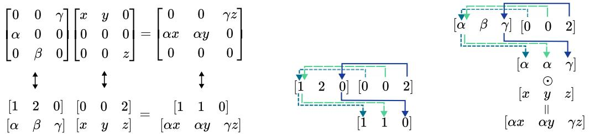  
Figure 3: Left: The sparse matrices in $\mathbb { H } ^ { N \times N }$ can be efficiently represented by separately storing the indices of the active elements and their values. Center: The indices of the matrix product are computed with a gather-scatter operation. Right: The nonzero entries of the matrix product are computed using gather-scatter followed by element-wise multiplication.

# 3.3 Stability and Expressivity of the PD Parametrization

If the PD parametrization is adopted for state transition matrices and if one ensures matrix entries inside the complex unit circle, then the state space model becomes provably bounded-input, boundedoutput (BIBO) stable. Note that our parametrization of $| D ( u _ { t } ) |$ with a sigmoid-based MLP ensures all conditions for BIBO stability are met.

Proposition 1 (System Stability under PD-Parametrization). Let $\varepsilon \in ( 0 , 1 ]$ and consider the state transition $x _ { t } = A _ { t } x _ { t - 1 } + b _ { t }$ with $A _ { t } \in \mathbb { H } ^ { N \times N } : \| A _ { t } \| _ { \infty } \leq 1 - \varepsilon$ . Let further $\| x _ { 0 } \| _ { 2 } \le B$ and $\| b _ { t } \| _ { 2 } \leq B$ for $B \in \mathbb { R } _ { + }$ . Then it holds that

$$
\| x _ { t } \| _ { 2 } \leq \sqrt { N } B / \varepsilon \quad \forall t .
$$

As a direct consequence of the FSA to SSM mapping described in Section 2.2, Proposition 2 holds: Proposition 2 (Expressivity of PD Parametrization). Any FSA with $N$ states can be exactly represented by a single-layer PD-SSM with a state size N and linear readout of size $N \times N$ .

Not only can PD-SSMs represent any FSA, they do so with the (almost) smallest state size possible, i.e., PD-SSMs are maximally expressive for regular languages.

Proposition 3 (Optimality of PD Parametrization). For any $N$ there exists a finite-state automaton with $N$ states that cannot be emulated by any single-layer SSM with state size less than $N - 1$ under unique state encodings.

The assumption of unique state encodings, meaning that each state is represented by a single, unique vector, is a practical necessity for readout. Indeed, without unique state encodings (and with arbitrary precision), even a single-layer real SSM with state size 1 can represent any FSA, albeit in a format that requires exponentially large lookup tables to read out. Proposition 4 makes this statement exact.

Proposition 4 (Arbitrary Precision and Readout). Consider √ $x _ { t + 1 } = x _ { t } + b _ { t }$ where $b _ { t } = \boldsymbol { u } _ { t } \cdot \boldsymbol { k } _ { t }$ with $u _ { t } \in \mathbb { Q }$ input encodings and $k _ { t } = \sqrt { p _ { t } } \in \mathbb { R } / \mathbb { Q }$ time encodings, where $p _ { t }$ is the $t$ -th prime. Then, any FSA can be encoded into this scalar-valued SSM under an appropriate lookup table as readout.

# 4 Results

# 4.1 Runtime Measurements

We first measure how the runtime of a single-layer SSM scales as a function of the transition matrix structure as well as the hidden dimension on an NVIDIA A100-80GB GPU. We compare PD-SSM with the unstructured (dense) real-valued SDSSM (Terzic et al. 2025), as well as a diagonal vari- ´ ant of PD-SSM that sets $A ( u _ { t } ) = D ( u _ { t } ) \in \mathbb { C } ^ { N _ { c } }$ To equalize the effective state size, the state dimensionality $N _ { r }$ of the real-valued dense SSM is twice that of the complex-valued models $N _ { c }$ . The embedding size is scaled as $D = N _ { r } = 2 N _ { c }$ . In Figure 4 we see that PD-SSM scales significantly better than the dense SSM, with a $7 1 \times$ speed-up at $D = 5 6 3 2$ At this dimension, the diagonal SSM is $7 \times$ faster than PD-SSM. The PD model’s higher runtime mainly stems from the additional operations in the generation of $\mathrm { \bf P }$ matrices. For more details and results under different settings, see Appendix E.

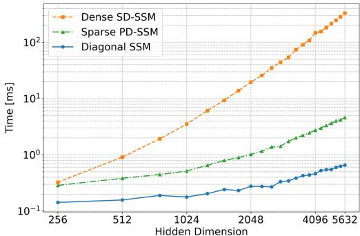  
Figure 4: Runtimes of single-layer SSMs with varying dimension and sequence length 64.

# 4.2 FSA Emulation

We first evaluate our model on a set of automaton state tracking tasks, originally introduced in Delé- tang et al. (2023). The four tasks correspond to four finite-state automata of various complexities. The benchmark is centered at evaluating the length generalization of the models, which serves as a proxy of the model having learned the correct algorithmic abstraction, avoiding fixed-length shortcut solutions Liu et al. (2023). Concretely, the models are trained for 100,000 steps on randomly sampled sequences of inputs of length 3 to 40, and are evaluated on sequences of length 40–256. We extend the set of results from Walker et al. (2025) which evaluates each model under a single varying hyperparameter choice, state dimensionality of 128 or 512. We instead fix the dimensionality to 128, finding that it is sufficient for high performance. Table 2 reports the mean and standard deviation of the best validation accuracy of five randomly initialized models. The set of evaluated models consists of recurrent and parallelizable models, where we bold and underline the best and second-best parallelizable model, respectively. Excluding the Transformer, the parallelizable models can be interpreted as SSMs with various transition matrix structures, namely diagonal (Gu and Dao (2023); Walker et al. (2025) and our $\mathbb { C }$ diagonal model defined by setting $P ( u _ { t } )$ to identity), diagonal plus low-rank (Schlag et al. (2021a); Yang et al. (2024); Grazzi et al. (2024)), product of diagonal plus low-rank (Walker et al. 2025; Peng et al. 2025; Siems et al. 2025), as well as alternative variants including block-diagonal, a Walsh-Hadamard matrix modulated by an input-dependent diagonal matrix, and a mixture of diagonal and dense matrices Walker et al. (2025). As we can read from the table, our model performs best, with a significant margin over the second-best method.

<table><tr><td>Model</td><td>Cycle Nav.</td><td>Even Pairs</td><td>Mod Arith.</td><td>Parity</td><td>Average</td></tr><tr><td colspan="6">Recurrent</td></tr><tr><td>LSTM</td><td>100.0 ± 0.0</td><td>100.0 ± 0.0</td><td>99.9 ± 0.1</td><td>100.0 ± 0.0</td><td>100.0 ± 0.0</td></tr><tr><td>sLSTM</td><td>32.5 ± 0.4</td><td>100.0 ± 0.0</td><td>27.7 ± 0.6</td><td>100.0 ± 0.0</td><td>65.1 ± 0.2</td></tr><tr><td>xLSTM[1:1]</td><td>53.5 ± 5.6</td><td>99.0 ± 1.9</td><td>29.3 ± 1.6</td><td>100.0 ± 0.0</td><td>70.5 ± 1.5</td></tr><tr><td colspan="6">Parallel</td></tr><tr><td>Transformer</td><td>24.4 ± 0.5</td><td>90.4 ± 10.4</td><td>23.6 ± 0.7</td><td>52.2 ± 0.4</td><td>47.7 ± 2.6</td></tr><tr><td>Mamba</td><td>48.4 ± 2.2</td><td>100.0 ± 0.0</td><td>33.1 ± 6.6</td><td>54.2 ± 2.1</td><td>58.9 ± 1.8</td></tr><tr><td>D-SLiCE</td><td>69.5 ± 6.3</td><td>100.0 ± 0.0</td><td>20.9 ± 0.1</td><td>100.0 ± 0.0</td><td>72.6 ± 1.6</td></tr><tr><td>C Diag.</td><td>90.4 ± 4.3</td><td>82.4 ± 4.8</td><td>59.9 ± 27.0</td><td>61.8 ± 6.8</td><td>73.6 ± 7.1</td></tr><tr><td>DeltaNet</td><td>49.8 ± 4.7</td><td>100.0 ± 0.0</td><td>42.2 ± 4.8</td><td>57.8 ± 0.8</td><td>62.5 ± 1.7</td></tr><tr><td>DeltaNet[-1,1]</td><td>46.7 ± 6.1</td><td>100.0 ± 0.0</td><td>66.4 ± 8.8</td><td>97.7 ± 2.0</td><td>77.7 ± 2.7</td></tr><tr><td>Gated DeltaNet</td><td>53.8 ± 8.8</td><td>100.0 ± 0.0</td><td>42.8 ± 8.2</td><td>56.5 ± 1.9</td><td>63.3 ± 3.0</td></tr><tr><td>Gated DeltaProduct[-1,1]</td><td>46.3 ± 6.6</td><td>100.0 ± 0.0</td><td>78.4 ± 10.9</td><td>98.0 ± 1.4</td><td>80.7 ± 3.2</td></tr><tr><td>RWKV-7</td><td>37.8 ± 5.0</td><td>88.1 ± 14.2</td><td>39.5 ± 6.1</td><td>51.1 ± 0.3</td><td>54.1 ± 4.1</td></tr><tr><td>DPLR-SLiCEdn =57,r=4</td><td>81.1 ± 16.6</td><td>100.0 ± 0.0</td><td>68.3 ± 19.3</td><td>91.0 ± 18.0</td><td>85.1 ± 7.8</td></tr><tr><td>WH-SLiCE</td><td>69.7 ± 8.8</td><td>93.1 ± 13.9</td><td>23.8 ± 1.1</td><td>71.4 ± 12.9</td><td>64.5 ± 5.2</td></tr><tr><td>BD-SLiCEdn=128,b=4</td><td>99.8 ± 0.2</td><td>85.9 ± 11.3</td><td>54.0 ± 12.5</td><td>95.3 ± 3.9</td><td>83.8 ± 4.3</td></tr><tr><td>D-DE-SLiCEdh=272,b=16</td><td>73.3 ± 29.4</td><td>84.8 ± 8.5</td><td>98.4 ± 0.7</td><td>83.8 ± 11.3</td><td>85.1 ± 8.2</td></tr><tr><td>PD-SSM</td><td>99.5 ± 0.7</td><td>99.7 ± 0.3</td><td>96.2 ± 3.4</td><td>99.9 ± 0.1</td><td>98.8 ± 0.9</td></tr><tr><td>Random</td><td>20.0</td><td>50.0</td><td>20.0</td><td>50.0</td><td>35.0</td></tr></table>

Table 2: Average and standard deviation of validation accuracy across 5 seeds for a range of models on FSA emulation tasks. The baseline results are taken from (Walker et al. 2025).

We further analyse the method on two non-solvable groups, $A _ { 5 }$ and $S _ { 5 }$ . For both groups, consisting of 60 and 120 permutations respectively, all of the group elements can be generated using only two permutations corresponding to two transition matrices as per the mapping in Secion 2.2. To increase the connectivity of the resulting automaton’s states, we introduce additional randomly selected permutations. We compare a PD-SSM with $K = 3 2$ against two layers of the complex diagonal model with $A ( u _ { t } ) = D ( u _ { t } )$ , and one or two layers of a DPLR model, Gated DeltaProduct [-1,1] with ${ n } _ { h } = 4$ (Siems et al. 2025), with state dimension 128. We perform a learning rate grid search and train the models for 100,000 steps with batch size 256. We train the models on sequences of length up to 40 and report the best validation accuracy on sequences of length up to 40-256 in Table 3.

<table><tr><td>Model</td><td>Depth</td><td>(A5,2)</td><td>(A5,6)</td><td>（A5,8)</td><td>(A5,12)</td><td>(S5，4)</td><td>(S5,8)</td><td>(S5,32)</td></tr><tr><td>C Diagonal</td><td>2</td><td>15.5</td><td></td><td>丨</td><td></td><td></td><td></td><td></td></tr><tr><td>Gated DP [-1,1]</td><td>1</td><td>97.9</td><td>92.5</td><td>91.8</td><td>60.5</td><td>88.7</td><td>57.4</td><td>1.23</td></tr><tr><td>Gated DP [-1,1]</td><td>2</td><td>丨</td><td>一</td><td>丨</td><td>68.4</td><td>84.7</td><td>62.2</td><td>丨</td></tr><tr><td>PD-SSM</td><td>1</td><td>100.0</td><td>100.0</td><td>100.0</td><td>100.0</td><td>100.0</td><td>100.0</td><td>1.07</td></tr></table>

Table 3: Best validation accuracy $( \% )$ on longer sequences across 3 random seeds. Each task is defined in terms of a non-solvable algebraic group ( $. A _ { 5 }$ or $S _ { 5 }$ ) generated with redundant set of permutations, the cardinality of which is the number $n$ in each tuple ( $[ A _ { 5 }$ or $S _ { 5 } , n )$ .

As predicted by the theory, the complex diagonal model fails on the simplest task, $( A _ { 5 } , 2 )$ . Gated DeltaProduct with ${ n } _ { h } = 4$ exhibits degrading accuracy with a higher number of permutations, which cannot be recovered by stacking two layers of the model. PD-SSM maintains full accuracy for all automata with a single layer, excepting $S _ { 5 }$ with 32 generating permutations.

# 4.3 Multivariate Time-Series Classification

We next provide an evaluation on multivariate time-series classification. We evaluate our model on a subset of the University of East Anglia (UEA) Multivariate Time-Series Classification Archive (UEA-MTSCA) (Dau et al. 2019), extending on the results from Walker et al. (2024); Rusch and Rus (2025). We consider six tasks from the archive previously selected due to their long sequence lengths, which range from around 400 to over 17,000. Conforming to the evaluation methodology and data splits defined in Rusch and Rus (2025); Walker et al. (2024), we report the average and standard deviation of the test accuracy across five random initializations, with the hyperparameter grid conforming to that of (Rusch and Rus 2025) with the exception of the state size, which in our case is selected from $\{ 1 6 , 6 4 , 1 2 8 \}$ as opposed to $\{ 1 6 , 6 4 , 2 5 6 \}$ of the baselines. The set of evaluated models includes neural controlled differential equations (Walker et al. 2024), LTI SSMs (Smith et al. 2023; Orvieto et al. 2023), time-varying SSMs (Gu and Dao 2023), as well as an SSM paradigm based on a system of forced harmonic oscillators (Rusch and Rus 2025). The results are reported in Table 4. As we can see, our model maintains very high accuracy on this set of tasks, achieving an estimated mean accuracy that is within standard error of the state-of-the art SSM.

<table><tr><td>Model</td><td>Worms</td><td>SCP1</td><td>SCP2</td><td>Ethanol</td><td>Heartbeat</td><td>Motor</td><td>Average</td></tr><tr><td>NRDE</td><td>83.9 ± 7.3</td><td>80.9 ± 2.5</td><td>53.7 ± 6.9</td><td>25.3 ± 1.8</td><td>72.9 ± 4.8</td><td>47.0 ± 5.7</td><td>60.6 ± 2.15</td></tr><tr><td>NCDE</td><td>75.0 ± 3.9</td><td>79.8 ± 5.6</td><td>53.0± 2.8</td><td>29.9 ± 6.5</td><td>73.9 ± 2.6</td><td>49.5 ± 2.8</td><td>60.2 ± 1.76</td></tr><tr><td>Log-NCDE</td><td>85.6± 5.1</td><td>83.1± 2.8</td><td>53.7 ± 4.1</td><td>34.4 ± 6.4</td><td>75.2 ± 4.6</td><td>53.7 ± 5.3</td><td>64.3 ± 1.99</td></tr><tr><td>LRU</td><td>87.8± 2.8</td><td>82.6± 3.4</td><td>51.2 ± 3.6</td><td>21.5 ± 2.1</td><td>78.4 ± 6.7</td><td>48.4± 5.0</td><td>61.7 ± 1.72</td></tr><tr><td>S5</td><td>81.1 ± 3.7</td><td>89.9 ± 4.6</td><td>50.5 ± 2.6</td><td>24.1 ± 4.3</td><td>77.7 ± 5.5</td><td>47.7 ± 5.5</td><td>61.8 ± 1.83</td></tr><tr><td>S6</td><td>85.0 ± 16.1</td><td>82.8± 2.7</td><td>49.9 ± 9.4</td><td>26.4± 6.4</td><td>76.5 ± 8.3</td><td>51.3 ± 4.7</td><td>62.0± 3.68</td></tr><tr><td>Mamba</td><td>70.9 ± 15.8</td><td>80.7 ± 1.4</td><td>48.2 ± 3.9</td><td>27.9 ± 4.5</td><td>76.2 ± 3.8</td><td>47.7 ± 4.5</td><td>58.6± 2.99</td></tr><tr><td>LinOSS-IMEX</td><td>80.0± 2.7</td><td>87.5 ± 4.0</td><td>58.9 ± 8.1</td><td>29.9 ± 1.0</td><td>75.5 ± 4.3</td><td>57.9 ± 5.3</td><td>65.0 ± 1.95</td></tr><tr><td>LinOSS-IM</td><td>95.0 ± 4.4</td><td>87.8± 2.6</td><td>58.2 ± 6.9</td><td>29.9 ± 0.6</td><td>75.8 ± 3.7</td><td>60.0 ± 7.5</td><td>67.8 ± 2.00</td></tr><tr><td>PD-SSM</td><td>90.0± 5.7</td><td>80.9 ± 2.0</td><td>56.1 ± 8.6</td><td>34.7 ± 4.0</td><td>80.0 ± 2.6</td><td>60.0 ± 3.7</td><td>67.0± 2.02</td></tr></table>

Table 4: Mean and standard deviation of test accuracies across 5 seeds on selected long-sequence UEA time-series classification datasets as per (Rusch and Rus 2025).

# 4.4 Long-Range Arena

The long-range arena (Tay et al. 2021) dataset (LRA) covers mathematical expressions, freeform text, and images, all represented in sequences up to length 16k. We evaluate our model on a subset of LRA, with sequences up to length $4 \mathrm { k \Omega }$ . The baseline results are taken from Soydan et al. (2024). We consistently use 4 layers with embedding dimension 128 and state dimension 128 for all tasks except

Retrieval, which used state dimension 64. For all tasks, the transition matrix dictionary size is set to $K = 6$ . Time-invariant SSMs perform significantly better on average than the shown collection of timevariant ones. Among the time-variant SSMs (Mamba, S7, and PD-SSM), ours performs best on average on this set of tasks. Together with the time-series results, this serves as evidence that the PD parametrization can be effective on realistic long-sequence tasks.

<table><tr><td rowspan="2"></td><td colspan="2">Time-Invariant</td><td colspan="3">Time-Variant</td></tr><tr><td>Dataset S4</td><td>LRU</td><td>Mamba</td><td>S7</td><td>PD-SSM</td></tr><tr><td>ListOps</td><td>59.6</td><td>60.2</td><td>38.0</td><td>63.8</td><td>61.0</td></tr><tr><td>Text</td><td>86.8</td><td>89.4</td><td>83.0</td><td>87.2</td><td>88.1</td></tr><tr><td>Image</td><td>88.6</td><td>89.0</td><td>69.8</td><td>61.1</td><td>70.4</td></tr><tr><td>Retrieval</td><td>90.9</td><td>89.9</td><td>72.1</td><td>91.8</td><td>90.0</td></tr><tr><td>Pathfinder</td><td>94.2</td><td>95.1</td><td>69.3</td><td>65.5</td><td>62.6</td></tr><tr><td>Average</td><td>84.0</td><td>84.7</td><td>66.4</td><td>73.9</td><td>74.4</td></tr></table>

Table 5: LRA results, average over 3 seeds.

# 4.5 State Tracking in Natural Language

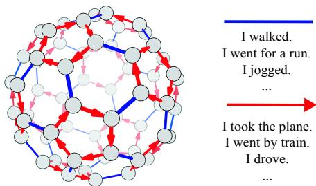  
Figure 5: Cayley diagram of the $A _ { 5 }$ group (Carter 2009). We encode state transitions into sets of English sentences.

Finally, we introduce a novel task which we call state tracking in natural language, a more complex version of the FSA state tracking task with the crucial difference that the inputs are encoded in natural language. As a result, a state transition is only triggered after a lengthvarying sequence of tokens. A real-world instance of such state tracking in natural language is geographic location tracking given text information, where the model has to work with descriptions such as I took the bus, $I$ walked, and $I$ went for a run. In this benchmark, we assume that an agent transitions through a fixed state space according to a sequence of meaningful English sentences. Each transition in the underlying automaton is redundantly encoded through multiple sentences of different lengths. For instance, $A _ { 5 }$ is understood as encoding a transportation network where an agent can either move along a ring of motorized transportation (via bus, plane, train, car) or move (i.e., walk, run, jog, hike) between such rings. Red transitions correspond to movement using motorized transport, whereas blue transitions are taken without motorized transport, see Figure 5. Figure 6 shows the performance of diagonal SSMs as well as PD-SSM for state tracking in natural language. To benefit from large-scale pretraining and to demonstrate the modularity of our approach, we freeze a pretrained Qwen 2.5-1.5B model and replace its final layer with a single trainable SSM layer. This analysis centers around the applicability of the sparse parametrization in a larger-scale setting, and also serves as a test of the utility of the $P D$ parametrization as opposed to purely diagonal models. Concretely, we vary the matrix structure such that it is either real-valued diagonal $( \hat { A ( u _ { t } ) } = | D ( u _ { t } ) | )$ , complex-valued diagonal $( A ( u _ { t } ) = D ( u _ { t } ) )$ , or structured sparse $( A ( u _ { t } ) = P ( u _ { t } ) D ( u _ { t } ) )$ . We train the model for 100,000 steps with batches of size 256. Each batch consists of sequences of English sentences, with the number of sentences randomly sampled up to 25, each sentence triggering a state transition in the underlying automaton. The automata are Parity and $A _ { 5 }$ with two generators as in Figure 5. In Figure 6 we report the best validation performance out of 3 random seeds of each model with an equivalent hyperparameter grid search. Even though complex diagonal SSMs can represent parity (Sarrof et al. 2024), the models did not learn to do so in the experiments. On this task, PD-SSM converges within 10,000 steps.

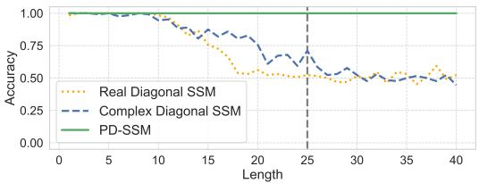  
(a) Accuracy on the natural language version of Parity

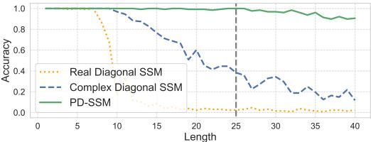  
(b) Accuracy on the natural language version of $A _ { 5 }$   
Figure 6: Applying one layer of our PD-SSM at the output of a frozen Qwen-2.5 1.5B allows the model to learn to follow the state transitions of automata when the inputs are redundantly encoded in English sentences. The vertical dashed line indicates the maximum training sequence length.

# 5 Conclusion

We introduced an expressive and efficient structured sparse parametrization of transition matrices for time-varying SSMs manifesting in the PD-SSM architecture. Theoretically, PD-SSM can emulate arbitrary finite-state automata while reaching the lower bound on the network depth and state size required to do so in the worst case. It is significantly more efficient than unstructured SSMs and reaches a new state-of-the-art in synthetic state-tracking tasks. Among the investigated time-varying SSMs, PD-SSM on average performs best on tasks from the LRA benchmark requiring the processing of long sequences (up to 4k), and additionally exhibits high performance on multivariate time-series classification with long sequences (up to 17k), demonstrating performance within standard error of the state-of-the-art SSM. Finally, we verified its effectiveness in a hybrid Attention-SSM architecture on a novel state-tracking in natural language task, showing that it can track non-solvable automaton states even when the inputs are redundantly encoded in variable-length English sentences.

Limitations and Future Work Although we significantly improve upon the scalability of SD-SSM while retaining its favorable expressivity, PD-SSM still incurs overhead when generating the $P ( u _ { t } )$ matrices. Our future work will investigate how our method can benefit from more efficient one-hot column matrix generation strategies, and how it can be utilized in large-scale pretraining.

# 6 Broader Impact

The paper introduces a novel neural network architecture with increased expressivity while retaining efficiency. More expressive and efficient models can potentially have unpredictable societal impacts in the future, but we do not foresee any immediate and direct negative impact of this work.

# Acknowledgement

This work is supported by the Swiss National Science foundation (SNF), grant 10002666.

# References

S. Arora and B. Barak. Computational Complexity: A Modern Approach. Cambridge University Press, 2009.   
S. Axler. Linear Algebra Done Right. Undergraduate Texts in Mathematics. Springer International Publishing, Cham, 2024. URL https://link.springer.com/10.1007/ 978-3-031-41026-0.   
D. A. Barrington. Bounded-width polynomial-size branching programs recognize exactly those languages in NC1. Journal of Computer and System Sciences, 38(1):150–164, 1989. ISSN 0022-0000. URL https://www.sciencedirect.com/science/article/pii/0022000089900378.   
Y. Bengio, N. Léonard, and A. Courville. Estimating or propagating gradients through stochastic neurons for conditional computation. arXiv preprint arXiv:1308.3432, 2013. URL https: //arxiv.org/abs/1308.3432.   
S. Bhattamishra, K. Ahuja, and N. Goyal. On the Ability and Limitations of Transformers to Recognize Formal Languages. In Proceedings of the 2020 Conference on Empirical Methods in Natural Language Processing (EMNLP), pages 7096–7116. Association for Computational Linguistics, 2020. doi: 10.18653/v1/2020.emnlp-main.576. URL https://www.aclweb.org/ anthology/2020.emnlp-main.576.   
C. H. Bischof and C. Van Loan. The WY Representation for Products of Householder Matrices. SIAM Journal on Scientific and Statistical Computing, 8(1):s2–s13, 1987. doi: 10.1137/0908009.   
G. E. Blelloch. Prefix Sums and Their Applications, 1990.   
N. C. Carter. Visual group theory. Classroom resource materials. Mathematical Association of America, Washington, D.C., 2009.   
N. M. Cirone, A. Orvieto, B. Walker, C. Salvi, and T. Lyons. Theoretical foundations of deep selective state-space models. In Advances in Neural Information Processing Systems (NeurIPS), 2024. URL https://openreview.net/forum?id $\equiv$ 3SzrqwupUx.   
T. Dao. FlashAttention-2: Faster attention with better parallelism and work partitioning. In International Conference on Learning Representations (ICLR), 2024.   
H. A. Dau, A. Bagnall, K. Kamgar, C.-C. M. Yeh, Y. Zhu, S. Gharghabi, C. A. Ratanamahatana, and E. Keogh. The ucr time series archive. IEEE/CAA Journal of Automatica Sinica, 6(6):1293–1305, 2019. doi: 10.1109/JAS.2019.1911747.   
S. De, S. L. Smith, A. Fernando, A. Botev, G. Cristian-Muraru, A. Gu, R. Haroun, L. Berrada, Y. Chen, S. Srinivasan, G. Desjardins, A. Doucet, D. Budden, Y. W. Teh, R. Pascanu, N. De Freitas, and C. Gulcehre. Griffin: Mixing gated linear recurrences with local attention for efficient language models. arXiv preprint arXiv:2402.19427, Feb. 2024. URL http://arxiv.org/abs/2402. 19427.   
G. Delétang, A. Ruoss, J. Grau-Moya, T. Genewein, L. K. Wenliang, E. Catt, C. Cundy, M. Hutter, S. Legg, J. Veness, and P. A. Ortega. Neural networks and the Chomsky hierarchy. In The Eleventh International Conference on Learning Representations (ICLR), 2023. URL https: //openreview.net/forum?id=WbxHAzkeQcn.   
T.-H. Fan, T.-C. Chi, and A. I. Rudnicky. Advancing regular language reasoning in linear recurrent neural networks. In Proceedings of the 2024 Conference of the North American Chapter of the Association for Computational Linguistics: Human Language Technologies (Volume 2: Short Papers), pages 45–53. Association for Computational Linguistics, 2024. URL https://aclanthology.org/2024.naacl-short.4/.   
D. Y. Fu, T. Dao, K. K. Saab, A. W. Thomas, A. Rudra, and C. Re. Hungry hungry hippos: Towards language modeling with state space models. In The Eleventh International Conference on Learning Representations (ICLR), 2023. URL https://openreview.net/forum?id $\cdot ^ { = }$ COZDy0WYGg.   
R. Grazzi, J. Siems, J. K. Franke, A. Zela, F. Hutter, and M. Pontil. Unlocking state-tracking in linear RNNs through negative eigenvalues. In NeurIPS 2024 Workshop on Mathematics of Modern Machine Learning, 2024. URL https://openreview.net/forum?id=EXGAodFkQX.   
A. Gu and T. Dao. Mamba: Linear-Time Sequence Modeling with Selective State Spaces. arXiv preprint arXiv:2312.00752, 2023. URL http://arxiv.org/abs/2312.00752.   
A. Gu, T. Dao, S. Ermon, A. Rudra, and C. Ré. HiPPO: Recurrent Memory with Optimal Polynomial Projections. In H. Larochelle, M. Ranzato, R. Hadsell, M. Balcan, and H. Lin, editors, Advances in Neural Information Processing Systems, volume 33, pages 1474–1487. Curran Associates, Inc., 2020. URL https://proceedings.neurips.cc/paper_files/paper/2020/ file/102f0bb6efb3a6128a3c750dd16729be-Paper.pdf.   
A. Gu, I. Johnson, K. Goel, K. Saab, T. Dao, A. Rudra, and C. Ré. Combining Recurrent, Convolutional, and Continuous-time Models with Linear State-Space Layers. In Advances in Neural Information Processing Systems (NeurIPS), volume 34, pages 572–585, 2021.   
A. Gu, K. Goel, A. Gupta, and C. Ré. On the parameterization and initialization of diagonal state space models. In Advances in Neural Information Processing Systems (NeurIPS), volume 35, pages 35971–35983, 2022a. URL https://proceedings.neurips.cc/paper_files/paper/ 2022/file/e9a32fade47b906de908431991440f7c-Paper-Conference.pdf.   
A. Gu, K. Goel, and C. Ré. Efficiently modeling long sequences with structured state spaces. In International Conference on Learning Representations (ICLR), 2022b. URL https://openreview. net/forum?id=uYLFoz1vlAC.   
A. Gupta, A. Gu, and J. Berant. Diagonal state spaces are as effective as structured state spaces. In Advances in Neural Information Processing Systems (NeurIPS), volume 35, pages 22982– 22994, 2022. URL https://proceedings.neurips.cc/paper_files/paper/2022/file/ 9156b0f6dfa9bbd18c79cc459ef5d61c-Paper-Conference.pdf.   
M. Hahn. Theoretical limitations of self-attention in neural sequence models. Transactions of the Association for Computational Linguistics, 8:156–171, 01 2020. ISSN 2307-387X. doi: 10.1162/tacl_a_00306. URL https://doi.org/10.1162/tacl_a_00306.   
R. Hasani, M. Lechner, T.-H. Wang, M. Chahine, A. Amini, and D. Rus. Liquid structural state-space models. In The Eleventh International Conference on Learning Representations (ICLR), 2023. URL https://openreview.net/forum?id=g4OTKRKfS7R.   
S. Hochreiter and J. Schmidhuber. Long short-term memory. Neural Computation, 9(8):1735–1780, Nov. 1997. URL https://direct.mit.edu/neco/article/9/8/1735-1780/6109.   
E. Jaffe. Linearly independent integer roots over the scalar field q. The University of Chicago, 2007.   
E. Jang, S. Gu, and B. Poole. Categorical reparameterization with gumbel-softmax. In 5th International Conference on Learning Representations ICLR. OpenReview.net, 2017. URL https://openreview.net/forum?id $\cdot ^ { = }$ rkE3y85ee.   
K. Krohn and J. Rhodes. Algebraic Theory of Machines. I. Prime Decomposition Theorem for Finite Semigroups and Machines. Transactions of the American Mathematical Society, 116:450–464, 1965. ISSN 00029947, 10886850. doi: 10.2307/1994127. URL http://www.jstor.org/ stable/1994127. Publisher: American Mathematical Society.   
B. Lenz, O. Lieber, A. Arazi, A. Bergman, A. Manevich, B. Peleg, B. Aviram, C. Almagor, C. Fridman, D. Padnos, D. Gissin, D. Jannai, D. Muhlgay, D. Zimberg, E. M. Gerber, E. Dolev, E. Krakovsky, E. Safahi, E. Schwartz, G. Cohen, G. Shachaf, H. Rozenblum, H. Bata, I. Blass, I. Magar, I. Dalmedigos, J. Osin, J. Fadlon, M. Rozman, M. Danos, M. Gokhman, M. Zusman, N. Gidron, N. Ratner, N. Gat, N. Rozen, O. Fried, O. Leshno, O. Antverg, O. Abend, O. Dagan, O. Cohavi, R. Alon, R. Belson, R. Cohen, R. Gilad, R. Glozman, S. Lev, S. Shalev-Shwartz, S. H. Meirom, T. Delbari, T. Ness, T. Asida, T. B. Gal, T. Braude, U. Pumerantz, J. Cohen, Y. Belinkov, Y. Globerson, Y. P. Levy, and Y. Shoham. Jamba: Hybrid transformer-mamba language models. In The Thirteenth International Conference on Learning Representations (ICLR), 2025. URL https://openreview.net/forum?id $\cdot ^ { = }$ JFPaD7lpBD.   
B. Liu, J. T. Ash, S. Goel, A. Krishnamurthy, and C. Zhang. Transformers learn shortcuts to automata. In The Eleventh International Conference on Learning Representations (ICLR), 2023. URL https://openreview.net/forum?id $\equiv$ De4FYqjFueZ.   
X. Ma, C. Zhou, X. Kong, J. He, L. Gui, G. Neubig, J. May, and L. Zettlemoyer. MEGA: moving average equipped gated attention. In The Eleventh International Conference on Learning Representations (ICLR), 2023. URL https://openreview.net/forum?id=qNLe3iq2El.   
S. Margolis, J. Rhodes, and A. Schilling. Decidability of Krohn-Rhodes complexity for all finite semigroups and automata, 2024. URL https://arxiv.org/abs/2406.18477.   
E. Martin and C. Cundy. Parallelizing Linear Recurrent Neural Nets Over Sequence Length. In International Conference on Learning Representations (ICLR), 2018. URL https://openreview. net/forum?id $\cdot ^ { = }$ HyUNwulC-.   
W. Merrill and A. Sabharwal. The parallelism tradeoff: Limitations of log-precision transformers. Transactions of the Association for Computational Linguistics, 11:531–545, 2023.   
W. Merrill, J. Petty, and A. Sabharwal. The illusion of state in state-space models. In International Conference on Machine Learning (ICML), 2024. URL https://openreview.net/forum?id= QZgo9JZpLq.   
D. A. Mix Barrington, K. Compton, H. Straubing, and D. Thérien. Regular languages in NC1. Journal of Computer and System Sciences, 44(3):478–499, 1992. ISSN 0022-0000. doi: https:// doi.org/10.1016/0022-0000(92)90014-A. URL https://www.sciencedirect.com/science/ article/pii/002200009290014A.   
A. Orvieto, S. L. Smith, A. Gu, A. Fernando, C. Gulcehre, R. Pascanu, and S. De. Resurrecting recurrent neural networks for long sequences. In International Conference on Machine Learning (ICML). PMLR, 2023.   
M. B. Paulus, C. J. Maddison, and A. Krause. Rao-Blackwellizing the straight-through gumbelsoftmax gradient estimator. In International Conference on Learning Representations (ICLR), May 2021. URL https://openreview.net/forum?id=Mk6PZtgAgfq.   
B. Peng, R. Zhang, D. Goldstein, E. Alcaide, X. Du, H. Hou, J. Lin, J. Liu, J. Lu, W. Merrill, G. Song, K. Tan, S. Utpala, N. Wilce, J. S. Wind, T. Wu, D. Wuttke, and C. Zhou-Zheng. RWKV-7 ”Goose” with Expressive Dynamic State Evolution. In Second Conference on Language Modeling, 2025.   
L. Ren, Y. Liu, Y. Lu, C. Liang, W. Chen, et al. Samba: Simple hybrid state space models for efficient unlimited context language modeling. In The Thirteenth International Conference on Learning Representations (ICLR), 2025.   
T. K. Rusch and D. Rus. Oscillatory state-space models. In The Thirteenth International Conference on Learning Representations (ICLR), 2025. URL https://openreview.net/forum?id= GRMfXcAAFh.   
Y. Sarrof, Y. Veitsman, and M. Hahn. The expressive capacity of state space models: A formal language perspective. In The Thirty-eighth Annual Conference on Neural Information Processing Systems (NeurIPS), 2024. URL https://openreview.net/forum?id ${ } = -$ eV5YIrJPdy.   
I. Schlag, K. Irie, and J. Schmidhuber. Linear transformers are secretly fast weight programmers. In International Conference on Machine Learning (ICML), pages 9355–9366. PMLR, 2021a.   
I. Schlag, T. Munkhdalai, and J. Schmidhuber. Learning associative inference using fast weight memory. In International Conference on Learning Representations (ICLR), 2021b. URL https: //openreview.net/forum?id=TuK6agbdt27.   
J. Schmidhuber. Learning to control fast-weight memories: An alternative to dynamic recurrent networks. Neural Computation, 4(1):131–139, 1992. doi: 10.1162/neco.1992.4.1.131.   
J. Siems, T. Carstensen, A. Zela, F. Hutter, M. Pontil, and R. Grazzi. Deltaproduct: Improving state-tracking in linear RNNs via Householder products. In ICLR 2025 Workshop on Foundation Models in the Wild, 2025.   
Smith and Zipser. Encoding sequential structure: experience with the real-time recurrent learning algorithm. In International 1989 Joint Conference on Neural Networks, pages 645–648 vol.1, 1989. doi: 10.1109/IJCNN.1989.118646.   
J. T. H. Smith, A. Warrington, and S. W. Linderman. Simplified state space layers for sequence modeling. In The Eleventh International Conference on Learning Representations (ICLR), 2023. URL https://openreview.net/forum?id=Ai8Hw3AXqks.   
T. Soydan, N. Zubic, N. Messikommer, S. Mishra, and D. Scaramuzza. S7: Selective and simplified ´ state space layers for sequence modeling. arXiv preprint arXiv:2410.03464, 2024.   
H. Straubing. Finite automata, formal logic, and circuit complexity. Birkhauser Verlag, CHE, 1994.   
L. Strobl, W. Merrill, G. Weiss, D. Chiang, and D. Angluin. What formal languages can transformers express? a survey. Transactions of the Association for Computational Linguistics, 12:543–561, 05 2024. ISSN 2307-387X. doi: 10.1162/tacl_a_00663. URL https://doi.org/10.1162/tacl_ a_00663.   
Y. Tay, M. Dehghani, S. Abnar, Y. Shen, D. Bahri, P. Pham, J. Rao, L. Yang, S. Ruder, and D. Metzler. Long range arena : A benchmark for efficient transformers. In International Conference on Learning Representations (ICLR), 2021. URL https://openreview.net/forum?id $=$ qVyeW-grC2k.   
A. Terzic, M. Hersche, G. Camposampiero, T. Hofmann, A. Sebastian, and A. Rahimi. On the ´ expressiveness and length generalization of selective state-space models on regular languages. In Proceedings of the AAAI Conference on Artificial Intelligence, volume 39, pages 20876–20884, 2025.   
A. Vaswani, N. Shazeer, N. Parmar, J. Uszkoreit, L. Jones, A. N. Gomez, L. Kaiser, and I. Polosukhin. Attention Is All You Need. In Advances in Neural Information Processing Systems (NeurIPS), volume 30, 2017. URL https://proceedings.neurips.cc/paper_files/paper/2017/ file/3f5ee243547dee91fbd053c1c4a845aa-Paper.pdf.   
R. Waleffe, W. Byeon, D. Riach, B. Norick, V. Korthikanti, T. Dao, A. Gu, A. Hatamizadeh, S. Singh, D. Narayanan, et al. An empirical study of mamba-based language models. arXiv preprint arXiv:2406.07887, 2024.

B. Walker, A. D. McLeod, T. Qin, Y. Cheng, H. Li, and T. Lyons. Log neural controlled differential equations: The lie brackets make a difference. International Conference on Machine Learning (ICML), 2024. B. Walker, L. Yang, N. M. Cirone, C. Salvi, and T. Lyons. Structured linear CDEs: Maximally expressive and parallel-in-time sequence models. arXiv preprint arXiv:2505.17761, 2025. B. Wu, J. Shi, Y. Wu, N. Tang, and Y. Luo. Transxssm: A hybrid transformer state space model with unified rotary position embedding. arXiv preprint arXiv:2506.09507, 2025. R. Xiong, Y. Yang, D. He, K. Zheng, S. Zheng, C. Xing, H. Zhang, Y. Lan, L. Wang, and T.-Y. Liu. On layer normalization in the transformer architecture. In Proceedings of the 37th International Conference on Machine Learning (ICML), ICML’20. JMLR.org, 2020. S. Yang, B. Wang, Y. Zhang, Y. Shen, and Y. Kim. Parallelizing linear transformers with the delta rule over sequence length. In The Thirty-eighth Annual Conference on Neural Information Processing Systems (NeurIPS), 2024. URL https://openreview.net/forum?id=y8Rm4VNRPH.

# NeurIPS Paper Checklist

The checklist is designed to encourage best practices for responsible machine learning research, addressing issues of reproducibility, transparency, research ethics, and societal impact. Do not remove the checklist: The papers not including the checklist will be desk rejected. The checklist should follow the references and follow the (optional) supplemental material. The checklist does NOT count towards the page limit.

Please read the checklist guidelines carefully for information on how to answer these questions. For each question in the checklist:

• You should answer [Yes] , [No] , or [NA] .   
• [NA] means either that the question is Not Applicable for that particular paper or the relevant information is Not Available.   
• Please provide a short (1–2 sentence) justification right after your answer (even for NA).

The checklist answers are an integral part of your paper submission. They are visible to the reviewers, area chairs, senior area chairs, and ethics reviewers. You will be asked to also include it (after eventual revisions) with the final version of your paper, and its final version will be published with the paper.

The reviewers of your paper will be asked to use the checklist as one of the factors in their evaluation. While "[Yes] " is generally preferable to "[No] ", it is perfectly acceptable to answer "[No] " provided a proper justification is given (e.g., "error bars are not reported because it would be too computationally expensive" or "we were unable to find the license for the dataset we used"). In general, answering "[No] " or "[NA] " is not grounds for rejection. While the questions are phrased in a binary way, we acknowledge that the true answer is often more nuanced, so please just use your best judgment and write a justification to elaborate. All supporting evidence can appear either in the main paper or the supplemental material, provided in appendix. If you answer [Yes] to a question, in the justification please point to the section(s) where related material for the question can be found.

IMPORTANT, please:

• Delete this instruction block, but keep the section heading “NeurIPS Paper Checklist", • Keep the checklist subsection headings, questions/answers and guidelines below. • Do not modify the questions and only use the provided macros for your answers.

# 1. Claims

Question: Do the main claims made in the abstract and introduction accurately reflect the paper’s contributions and scope?

Answer: [Yes]

Justification: The paper experimentally and theoretically validates all claims made in the abstract and the introduction.

Guidelines:

• The answer NA means that the abstract and introduction do not include the claims made in the paper.   
• The abstract and/or introduction should clearly state the claims made, including the contributions made in the paper and important assumptions and limitations. A No or NA answer to this question will not be perceived well by the reviewers.   
• The claims made should match theoretical and experimental results, and reflect how much the results can be expected to generalize to other settings.   
• It is fine to include aspirational goals as motivation as long as it is clear that these goals are not attained by the paper.

# 2. Limitations

Question: Does the paper discuss the limitations of the work performed by the authors?

Answer: [Yes]

Justification: The paper clearly states that the proposed method is a trade-off between efficiency and expressiveness. We also clearly show that the method does not match the accuracy of LTI systems in image processing. Furthermore, the runtime is discussed in detail under various settings in Appendix E.

Guidelines:

• The answer NA means that the paper has no limitation while the answer No means that the paper has limitations, but those are not discussed in the paper.   
• The authors are encouraged to create a separate "Limitations" section in their paper.   
• The paper should point out any strong assumptions and how robust the results are to violations of these assumptions (e.g., independence assumptions, noiseless settings, model well-specification, asymptotic approximations only holding locally). The authors should reflect on how these assumptions might be violated in practice and what the implications would be.   
The authors should reflect on the scope of the claims made, e.g., if the approach was only tested on a few datasets or with a few runs. In general, empirical results often depend on implicit assumptions, which should be articulated.   
The authors should reflect on the factors that influence the performance of the approach. For example, a facial recognition algorithm may perform poorly when image resolution is low or images are taken in low lighting. Or a speech-to-text system might not be used reliably to provide closed captions for online lectures because it fails to handle technical jargon.   
• The authors should discuss the computational efficiency of the proposed algorithms and how they scale with dataset size.   
• If applicable, the authors should discuss possible limitations of their approach to address problems of privacy and fairness.   
• While the authors might fear that complete honesty about limitations might be used by reviewers as grounds for rejection, a worse outcome might be that reviewers discover limitations that aren’t acknowledged in the paper. The authors should use their best judgment and recognize that individual actions in favor of transparency play an important role in developing norms that preserve the integrity of the community. Reviewers will be specifically instructed to not penalize honesty concerning limitations.

# 3. Theory assumptions and proofs

Question: For each theoretical result, does the paper provide the full set of assumptions and a complete (and correct) proof?

Answer: [Yes]

Justification: The paper does provide several theoretical results, the assumptions and full proofs are provided in the appendix.

Guidelines:

• The answer NA means that the paper does not include theoretical results.   
• All the theorems, formulas, and proofs in the paper should be numbered and crossreferenced.   
• All assumptions should be clearly stated or referenced in the statement of any theorems.   
• The proofs can either appear in the main paper or the supplemental material, but if they appear in the supplemental material, the authors are encouraged to provide a short proof sketch to provide intuition.   
• Inversely, any informal proof provided in the core of the paper should be complemented by formal proofs provided in appendix or supplemental material.   
• Theorems and Lemmas that the proof relies upon should be properly referenced.

# 4. Experimental result reproducibility

Question: Does the paper fully disclose all the information needed to reproduce the main experimental results of the paper to the extent that it affects the main claims and/or conclusions of the paper (regardless of whether the code and data are provided or not)?

Answer: [Yes]

Justification: All of the hyperparameters for reproducing our results are reported in the appendix or in the provided codebase. Moreover, we provide the code for reproducing the main experimental results.

# Guidelines:

• The answer NA means that the paper does not include experiments.   
• If the paper includes experiments, a No answer to this question will not be perceived well by the reviewers: Making the paper reproducible is important, regardless of whether the code and data are provided or not.   
• If the contribution is a dataset and/or model, the authors should describe the steps taken to make their results reproducible or verifiable.   
• Depending on the contribution, reproducibility can be accomplished in various ways. For example, if the contribution is a novel architecture, describing the architecture fully might suffice, or if the contribution is a specific model and empirical evaluation, it may be necessary to either make it possible for others to replicate the model with the same dataset, or provide access to the model. In general. releasing code and data is often one good way to accomplish this, but reproducibility can also be provided via detailed instructions for how to replicate the results, access to a hosted model (e.g., in the case of a large language model), releasing of a model checkpoint, or other means that are appropriate to the research performed. While NeurIPS does not require releasing code, the conference does require all submissions to provide some reasonable avenue for reproducibility, which may depend on the nature of the contribution. For example (a) If the contribution is primarily a new algorithm, the paper should make it clear how to reproduce that algorithm. (b) If the contribution is primarily a new model architecture, the paper should describe the architecture clearly and fully. (c) If the contribution is a new model (e.g., a large language model), then there should either be a way to access this model for reproducing the results or a way to reproduce the model (e.g., with an open-source dataset or instructions for how to construct the dataset). (d) We recognize that reproducibility may be tricky in some cases, in which case authors are welcome to describe the particular way they provide for reproducibility. In the case of closed-source models, it may be that access to the model is limited in some way (e.g., to registered users), but it should be possible for other researchers to have some path to reproducing or verifying the results.

# 5. Open access to data and code

Question: Does the paper provide open access to the data and code, with sufficient instructions to faithfully reproduce the main experimental results, as described in supplemental material?

Answer: [Yes]

Justification: We provide a github repository with a summary of the paper and instructions on reproducing the main experimental results.

Guidelines:

• The answer NA means that paper does not include experiments requiring code.   
• Please see the NeurIPS code and data submission guidelines (https://nips.cc/ public/guides/CodeSubmissionPolicy) for more details.   
• While we encourage the release of code and data, we understand that this might not be possible, so “No” is an acceptable answer. Papers cannot be rejected simply for not including code, unless this is central to the contribution (e.g., for a new open-source benchmark).   
• The instructions should contain the exact command and environment needed to run to reproduce the results. See the NeurIPS code and data submission guidelines (https: //nips.cc/public/guides/CodeSubmissionPolicy) for more details.   
• The authors should provide instructions on data access and preparation, including how to access the raw data, preprocessed data, intermediate data, and generated data, etc.   
• The authors should provide scripts to reproduce all experimental results for the new proposed method and baselines. If only a subset of experiments are reproducible, they should state which ones are omitted from the script and why.   
• At submission time, to preserve anonymity, the authors should release anonymized versions (if applicable).   
• Providing as much information as possible in supplemental material (appended to the paper) is recommended, but including URLs to data and code is permitted.

# 6. Experimental setting/details

Question: Does the paper specify all the training and test details (e.g., data splits, hyperparameters, how they were chosen, type of optimizer, etc.) necessary to understand the results?

Answer: [Yes]

Justification: The paper provides the code and data needed to reproduce all of our results, from which all of the required details are evident. Details on the experimental setup, data splits and hyperparameters are also provided in the appendix.

Guidelines:

• The answer NA means that the paper does not include experiments. • The experimental setting should be presented in the core of the paper to a level of detail that is necessary to appreciate the results and make sense of them. • The full details can be provided either with the code, in appendix, or as supplemental material.

# 7. Experiment statistical significance

Question: Does the paper report error bars suitably and correctly defined or other appropriate information about the statistical significance of the experiments?

Answer: [Yes]

Justification: We repeated all benchmarks with multiple seeds and have reported mean and standard deviation for most results. In certain experiments we only report the bestperforming seed following standard practice on similar studies.

Guidelines:

• The answer NA means that the paper does not include experiments.   
• The authors should answer "Yes" if the results are accompanied by error bars, confidence intervals, or statistical significance tests, at least for the experiments that support the main claims of the paper.   
The factors of variability that the error bars are capturing should be clearly stated (for example, train/test split, initialization, random drawing of some parameter, or overall run with given experimental conditions).   
• The method for calculating the error bars should be explained (closed form formula, call to a library function, bootstrap, etc.)   
• The assumptions made should be given (e.g., Normally distributed errors).   
• It should be clear whether the error bar is the standard deviation or the standard error of the mean.   
• It is OK to report 1-sigma error bars, but one should state it. The authors should preferably report a 2-sigma error bar than state that they have a $96 \%$ CI, if the hypothesis of Normality of errors is not verified.   
For asymmetric distributions, the authors should be careful not to show in tables or figures symmetric error bars that would yield results that are out of range (e.g. negative error rates).   
• If error bars are reported in tables or plots, The authors should explain in the text how they were calculated and reference the corresponding figures or tables in the text.

# 8. Experiments compute resources

Question: For each experiment, does the paper provide sufficient information on the computer resources (type of compute workers, memory, time of execution) needed to reproduce the experiments?

Answer: [Yes]

Justification: We report the main specification of the system used to train the models as well as the approximate compute time needed to reproduce representative experiments in Appendix D.2.

Guidelines:

• The answer NA means that the paper does not include experiments.   
• The paper should indicate the type of compute workers CPU or GPU, internal cluster, or cloud provider, including relevant memory and storage.   
• The paper should provide the amount of compute required for each of the individual experimental runs as well as estimate the total compute.   
• The paper should disclose whether the full research project required more compute than the experiments reported in the paper (e.g., preliminary or failed experiments that didn’t make it into the paper).

# 9. Code of ethics

Question: Does the research conducted in the paper conform, in every respect, with the NeurIPS Code of Ethics https://neurips.cc/public/EthicsGuidelines?

Answer: [Yes]

Justification: The research conducted fully conforms to the NeurIPS Code of Ethics.

Guidelines:

• The answer NA means that the authors have not reviewed the NeurIPS Code of Ethics.   
• If the authors answer No, they should explain the special circumstances that require a deviation from the Code of Ethics.   
• The authors should make sure to preserve anonymity (e.g., if there is a special consideration due to laws or regulations in their jurisdiction).

# 10. Broader impacts

Question: Does the paper discuss both potential positive societal impacts and negative societal impacts of the work performed?

Answer: [Yes]

Justification: The paper introduces a new neural network model and analyses its behavior on datasets with no immediate societal impacts. Certainly, more expressive and efficient models can have significant societal impacts down the line, but we do not see any direct and immediate negative impacts of this work.

Guidelines:

• The answer NA means that there is no societal impact of the work performed.   
• If the authors answer NA or No, they should explain why their work has no societal impact or why the paper does not address societal impact.   
• Examples of negative societal impacts include potential malicious or unintended uses (e.g., disinformation, generating fake profiles, surveillance), fairness considerations (e.g., deployment of technologies that could make decisions that unfairly impact specific groups), privacy considerations, and security considerations.   
• The conference expects that many papers will be foundational research and not tied to particular applications, let alone deployments. However, if there is a direct path to any negative applications, the authors should point it out. For example, it is legitimate to point out that an improvement in the quality of generative models could be used to generate deepfakes for disinformation. On the other hand, it is not needed to point out that a generic algorithm for optimizing neural networks could enable people to train models that generate Deepfakes faster. The authors should consider possible harms that could arise when the technology is being used as intended and functioning correctly, harms that could arise when the technology is being used as intended but gives incorrect results, and harms following from (intentional or unintentional) misuse of the technology.

• If there are negative societal impacts, the authors could also discuss possible mitigation strategies (e.g., gated release of models, providing defenses in addition to attacks, mechanisms for monitoring misuse, mechanisms to monitor how a system learns from feedback over time, improving the efficiency and accessibility of ML).

# 11. Safeguards

Question: Does the paper describe safeguards that have been put in place for responsible release of data or models that have a high risk for misuse (e.g., pretrained language models, image generators, or scraped datasets)?

Answer: [NA]

Justification: The paper poses no immediate risk of misuse.

Guidelines:

• The answer NA means that the paper poses no such risks.   
• Released models that have a high risk for misuse or dual-use should be released with necessary safeguards to allow for controlled use of the model, for example by requiring that users adhere to usage guidelines or restrictions to access the model or implementing safety filters.   
• Datasets that have been scraped from the Internet could pose safety risks. The authors should describe how they avoided releasing unsafe images.   
• We recognize that providing effective safeguards is challenging, and many papers do not require this, but we encourage authors to take this into account and make a best faith effort.

# 12. Licenses for existing assets

Question: Are the creators or original owners of assets (e.g., code, data, models), used in the paper, properly credited and are the license and terms of use explicitly mentioned and properly respected?

Answer: [Yes]

Justification: For each existing asset, the original source is cited and the license terms are respected.

Guidelines:

• The answer NA means that the paper does not use existing assets.   
• The authors should cite the original paper that produced the code package or dataset.   
• The authors should state which version of the asset is used and, if possible, include a URL.   
• The name of the license (e.g., CC-BY 4.0) should be included for each asset.   
• For scraped data from a particular source (e.g., website), the copyright and terms of service of that source should be provided.   
• If assets are released, the license, copyright information, and terms of use in the package should be provided. For popular datasets, paperswithcode.com/datasets has curated licenses for some datasets. Their licensing guide can help determine the license of a dataset.   
• For existing datasets that are re-packaged, both the original license and the license of the derived asset (if it has changed) should be provided.   
• If this information is not available online, the authors are encouraged to reach out to the asset’s creators.

# 13. New assets

Question: Are new assets introduced in the paper well documented and is the documentation provided alongside the assets?

Answer: [Yes]

Justification: The paper releases new assets which are described in detail in the paper as well as the associated code.

Guidelines:

• The answer NA means that the paper does not release new assets.   
• Researchers should communicate the details of the dataset/code/model as part of their submissions via structured templates. This includes details about training, license, limitations, etc.   
• The paper should discuss whether and how consent was obtained from people whose asset is used.   
• At submission time, remember to anonymize your assets (if applicable). You can either create an anonymized URL or include an anonymized zip file.

# 14. Crowdsourcing and research with human subjects

Question: For crowdsourcing experiments and research with human subjects, does the paper include the full text of instructions given to participants and screenshots, if applicable, as well as details about compensation (if any)?

Answer: [NA]

Justification: The research did not involve crowdsourcing nor human subjects.

Guidelines:

• The answer NA means that the paper does not involve crowdsourcing nor research with human subjects.   
• Including this information in the supplemental material is fine, but if the main contribution of the paper involves human subjects, then as much detail as possible should be included in the main paper.   
• According to the NeurIPS Code of Ethics, workers involved in data collection, curation, or other labor should be paid at least the minimum wage in the country of the data collector.

# 15. Institutional review board (IRB) approvals or equivalent for research with human subjects

Question: Does the paper describe potential risks incurred by study participants, whether such risks were disclosed to the subjects, and whether Institutional Review Board (IRB) approvals (or an equivalent approval/review based on the requirements of your country or institution) were obtained?

Answer: [NA]

Justification: The research did not involve crowdsourcing nor human subjects.

Guidelines:

• The answer NA means that the paper does not involve crowdsourcing nor research with human subjects.   
• Depending on the country in which research is conducted, IRB approval (or equivalent) may be required for any human subjects research. If you obtained IRB approval, you should clearly state this in the paper.   
• We recognize that the procedures for this may vary significantly between institutions and locations, and we expect authors to adhere to the NeurIPS Code of Ethics and the guidelines for their institution.   
• For initial submissions, do not include any information that would break anonymity (if applicable), such as the institution conducting the review.

# 16. Declaration of LLM usage

Question: Does the paper describe the usage of LLMs if it is an important, original, or non-standard component of the core methods in this research? Note that if the LLM is used only for writing, editing, or formatting purposes and does not impact the core methodology, scientific rigorousness, or originality of the research, declaration is not required.

Answer: [NA]

Justification: LLMs were not used in any important, original or non-standard way during the research.

Guidelines:

• The answer NA means that the core method development in this research does not involve LLMs as any important, original, or non-standard components. • Please refer to our LLM policy (https://neurips.cc/Conferences/2025/LLM) for what should or should not be described.

# A Background

The goal of this section is to provide knowledge of abstract algebra and circuit complexity theory at a level sufficient to understand the motivation behind our paper. While the presentation is fully precise, we do omit certain details for clarity, and we often focus on providing an intuitive understanding by considering visual and textual explanations and examples for important concepts. This approach is highly inspired by Carter (2009). As the core of our work is the design and analysis of a novel neural network architecture, one does not need to have a deep understanding of these topics to understand our paper. As such, the entire Appendix A can be skipped without significantly affecting the understanding of our PD method. For a deeper treatment of the topics, one may consult the following resources: (Straubing 1994; Carter 2009; Arora and Barak 2009).

We start by motivating the connection between abstract algebra and FSAs in A.1. We then explain the central algebraic concepts in A.2, starting with the definition of a group and finishing with step-bystep reasoning about why a certain group is solvable. In A.3, we introduce the main relevant concepts and classes from circuit complexity theory. We finish in A.4 by examining the most important results on the expressivity of SSMs that combine the two presented frameworks.

# A.1 Algebra and Finite-State Automata

Algebra is, broadly speaking, the study of sets and binary operations on elements of sets. The set elements can be of various nature. An intuitive example of an algebraic structure is the set of integers under addition, often denoted as $\mathbb { Z } ^ { + }$ . In more generality, one may consider sets of functions with the binary operation being function composition. This is in fact highly related to the study of finite-state automata (FSAs), where we consider sets of transition functions corresponding to the input elements, and we study the effect of composing transition functions. This described set is defined for any automaton $\boldsymbol { \dot { A } } = ( Q , \Sigma , \delta )$ as

$$
\mathcal { T } ( A ) = \{ \delta ( \cdot , \sigma _ { 1 , \ldots , T } ) : T \in \mathbb { N } , \forall i \in [ T ] , \sigma _ { i } \in \Sigma \}
$$

where $\delta ( \cdot , \sigma _ { 1 , . . . , T } ) : Q  Q$ is the transition function obtained by composing the transition functions of each input in the sequence, namely, $\delta ( \cdot , \sigma _ { 1 , \ldots , T } ) = \delta ( \delta ( \cdot \ldots \delta ( \cdot , \sigma _ { 1 } ) , \cdot \ldots \bar { \sigma _ { T - 1 } } ) , \sigma _ { T } ) .$ .

This set contains all of the transition functions that can be expressed by the given automaton. The limitations of SSMs on FSA emulation stem from the discrepancy between $\mathcal { T } ( A )$ and the transition functions that SSMs with different transition matrix structures can express. A motivating illustrative example is given in Figure S1, in which we consider the $A _ { 5 }$ automaton and a time-variant SSM with diagonal transition matrices and $\forall t : b ( u _ { t } ) = 0$ . Please note that this figure only serves to illuminate the connection between FSAs with algebraic structure and SSMs, with precise bounds being presented later.

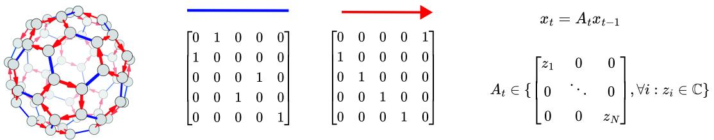  
Figure S1: Left: A visualization of the $A _ { 5 }$ automaton as we used it in our experiments (Carter 2009). Center: The two transitions of $A _ { 5 }$ equivalently represented in matrix form. $\mathcal { T } ( A )$ is isomorphic to the set of all possible unique iterated products of the two matrices, of which there are a total of 60. Right: A simplified diagonal SSM that omits the $B ( u _ { t } ) u _ { t }$ term. As the transition matrices are restricted to be diagonal, and since the two transition matrices represented in the center are not simultaneously diagonalizable, there seems to exist a discrepancy between $\mathcal { T } ( A )$ and the SSM.

The reasoning in the figure above is only valid for a single SSM layer with no $B ( u _ { t } ) u _ { t }$ term. In order to reason about several layers of the full model, recent work Merrill et al. (2024); Sarrof et al. (2024) have utilized the frameworks of Abstract Algebra (A.2) and Circuit Complexity Theory (A.3).

# A.2 Algebraic Groups and their Properties

We will now define algebraic objects that are of interest to us. We start with groups.

Definition 2 (Algebraic Group). $A n$ algebraic group is a set $G$ equipped with a binary operation · that is

1. Associative: $( a \cdot b ) \cdot c = a \cdot ( b \cdot c ) .$ for all $a , b , c \in G$ ,   
2. Has a neutral element $e \in G$ such that $a \cdot e = e \cdot a = a$ for all $a \in G$ ,   
3. And where every element has an inverse: for each $a \in G$ , there exists $a ^ { - 1 } \in G$ such that $a a ^ { - 1 } = a ^ { - 1 } a \dot { = } e .$ .

Algebraic groups can be graphically represented using Cayley diagrams. Starting from the neutral element, a Cayley diagram visualizes the structure of the group by applying the group operation in conjunction with a group element to the current element. This can be easily understood by considering the group of integers under addition modulo 4 $\left( \mathbb { Z } _ { 4 } \right)$ in the figure on the right. We draw the Cayley diagram by first drawing the neutral element, 0. Starting from 0, all other elements are generated by iteratively applying $+ 1$ on the current element. For some groups, in order to generate all elements of the set, we need to consider more than one generating element. An example is the $A _ { 5 }$ group. While Figure S1 refers to it as an automaton, the figure is equivalently the Cayley diagram of $A _ { 5 }$ with the two selected generating permutations.

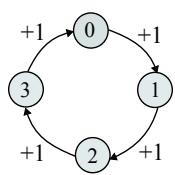

A central property of groups is the commutativity of the binary operation. The binary operation of a group is commutative only if $\forall a , b \in G : a \cdot b = b \cdot a$ .

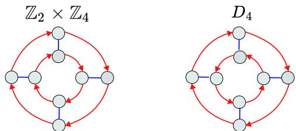  
Figure S2: Cayley diagrams of the group $\mathbb { Z } _ { 2 } \times \mathbb { Z } _ { 4 }$ and the dihedral group $D _ { 4 }$ (Carter 2009). $\mathbb { Z } _ { 2 } \times \mathbb { Z } _ { 4 }$ is a commutative group, while $D _ { 4 }$ is not. Both are solvable, with solvability of $\mathbb { Z } _ { 2 } \times \mathbb { Z } _ { 4 }$ shown in Example 3.

Solvability Another central property of groups is solvability. We will first present it informally and will then precisely define it. Loosely speaking, a group is solvable if it can be constructed from commutative groups. The details of the construction are particularly easy to understand on the example of the $\mathbb { Z } _ { 2 } \times \mathbb { Z } _ { 4 }$ group, shown in Figure S3. The $\mathbb { Z } _ { 2 } \times \mathbb { Z } _ { 4 }$ group is solvable, as it corresponds to the direct product of two commutative groups. While the $D _ { 4 }$ group shown previously is not commutative, it is solvable as it can be constructed from commutative groups in a similar manner as $\mathbb { Z } _ { 2 } \times \mathbb { Z } _ { 4 }$ . However, $A _ { 5 }$ cannot be constructed using commutative groups Carter (2009). To speak about solvability in more definite terms, we need to define several concepts. The remainder of this subsection defines and explains solvability in concrete terms. It can be freely skipped without any effect on reading the rest of the appendix. Firstly, we will define subgroups, which are in essence closed subsets of a group.

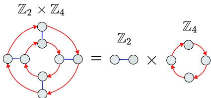  
Figure S3: Composition of $\mathbb { Z } _ { 2 } \times \mathbb { Z } _ { 4 }$ .

Definition 3 (Subgroup). Let $G$ be a group . $A$ subset $H \subseteq G$ is called a subgroup if $H$ is itself a group under the operation inherited from $G$ . That is, $H$ is a subgroup $i f$ :

1. $e \in H$ , where e is the identity element of $G$ ,   
2. For all $a , b \in H$ , the product $a \cdot b$ is in $H$ ,   
3. For all $a \in H$ , the inverse $a ^ { - 1 }$ is in $H$ .

Of central interest are normal subgroups, which is a particularly well-behaved category of subgroup. We will normal subgroups them to partition a group into a sequence of subgroups. The solvability of a group can be determined by examining the structure of a sequence of normal subgroups.

Definition 4 (Normal Subgroup). $A$ normal subgroup $N$ of a group $G$ , written $N \triangleleft G ,$ , is a subgroup invariant under conjugation by elements of $G$ , i.e., for each $n \in N$ , it holds that g $n g ^ { - 1 } = n$ for all $g \in G$ .

In particular, the sequence of group partitions we want to examine is the group’s normal series.

Definition 5 (Normal Series). $A$ normal series of a group $G$ is a finite sequence of subgroups

$$
\{ e \} = G _ { 0 } \triangleleft G _ { 1 } \triangleleft \cdot \cdot \cdot \triangleleft G _ { n } = G ,
$$

such that each subgroup $G _ { i }$ is normal in the next one, i.e., $G _ { i } { \triangleleft { G _ { i + 1 } } }$ for all $i$ , and the series terminates in the trivial group $\{ e \}$ .

Apart from subgroups, we need to define cosets, as they are a central concept when analyzing how groups decompose. A coset is a subset of the group formed by a subgroup, but in contrast to a subgroup, it is not necessarily closed under the group operation.

Definition 6 (Coset). Let $G$ be a group and $H$ a subgroup of $G$ . For any element $g \in G$ , the left coset of $H$ in $G$ with respect to $g$ is the set

$$
g H : = \{ g h : h \in H \} .
$$

Similarly, the right coset is

$$
H g : = \{ h g : h \in H \} .
$$

Cosets partition the group $G$ into disjoint subsets of equal size.

Consider, for example, the partition of the integers into even and odd. As the following example shows, the even numbers are a normal subgroup, the odd numbers are a coset, and together they form all integers.

Example 1. The integers under addition form a group which we write as $\mathbb { Z } ^ { + }$ . The even integers, written as $2 \mathbb { Z } ^ { + }$ , form a subgroup of $\mathbb { Z } ^ { + }$ , as the sum of two even numbers is again even and the neutral element, $O _ { \mathrm { i } }$ , is even. In particular, this is a normal subgroup, an easily verifiable immediate consequence of the commutativity of addition.

The odd integers are a coset of $\mathbb { Z } ^ { + }$ constructed from $2 \mathbb { Z } ^ { + }$ by adding 1 to each even number. That is, the odd integers form the set $1 + 2 \mathbb { Z } ^ { + }$ . This is not a subgroup, as it does not contain the neutral element. The sets are disjoint, are of equal size by a $I$ -to-1 mapping of the elements, and together they form $\mathbb { Z }$ .

It is precisely the decomposition of a group by use of a normal subgroup that we are interested in. This procedure creates a new group structure called a factor group, which describes the relation between a group and its normal subgroup.

Definition 7 (Factor Group). Let $N$ be a normal subgroup of a group $G$ . A factor group (or quotient group) $G / N$ is the set of left cosets of $N$ in $G$ , concretely $G / N = \left\{ g N : g \in G \right\}$ , equipped with $a$ natural group operation.

Let us again consider the even and odd integers. We have seen that this is the full set of cosets of $\mathbb { Z } ^ { + }$ . If we abstract away the individual numbers and only consider the concepts of even and odd, we can see that the two concepts form a group structure.

Example 2. Consider the set $\{ E \nu e n , O d d \}$ with the binary operation defined as per Figure S4. This figure is in fact the Cayley diagram of $\mathbb { Z } / 2 \mathbb { Z }$ .

A solvable group is one in which we can create a sequence of such factor groups with each factor group being commutative. The sequence should also end with the trivial group containing only the neutral element.

Definition 8 (Solvable Group). A finite group $G$ is solvable if there exists a finite sequence of subgroups

$$
\{ e \} = G _ { 0 } \triangleleft G _ { 1 } \triangleleft \cdot \cdot \cdot \triangleleft G _ { n } = G
$$

such that each $G _ { i }$ is a normal subgroup of $G _ { i + 1 }$ and each factor group $G _ { i + 1 } / G _ { i }$ is commutative.   
Equivalently, $G$ has a normal series whose successive quotients are commutative groups.

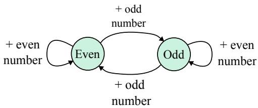  
Figure S4: The Even and Odd cosets of $\mathbb { Z }$ themselves form a group under addition, in particular the factor group $\mathbb { Z } / 2 \mathbb { Z }$ . The even numbers act as the neutral element, addition is associative, and the integers are closed under addition.

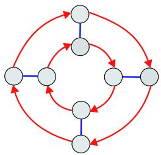  
Figure S5: The $\mathbb { Z } _ { 2 } \times \mathbb { Z } _ { 4 }$ group Cayley diagram.

We will understand these concepts better if we use them, for example, to argue about why $\mathbb { Z } _ { 2 } \times \mathbb { Z } _ { 4 }$ is a solvable group.

Example 3. Consider the group $G = \mathbb { Z } _ { 2 } \times \mathbb { Z } _ { 4 }$ . We can understand the group by considering its Cayley diagram visualized in Figure S5:

We can identify the elements $G = \mathbb { Z } _ { 2 } \times \mathbb { Z } _ { 4 }$ using two integers $[ a , b ]$ . We define the group operation as $[ a , b ] + [ c , d ] = [ a + c$ mod 2, $b + d$ mod 4]. If we choose the upper-most element to be the neutral element $[ 0 , 0 ]$ , and generate the rest of the group using $+ [ 0 , 1 ]$ and $+ [ 1 , 0 ]$ , we obtain the Cayley diagram shown below.

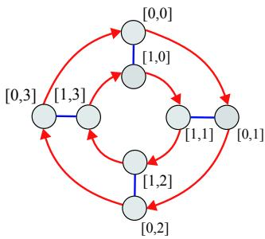  
Figure S6: The $\mathbb { Z } _ { 2 } \times \mathbb { Z } _ { 4 }$ group Cayley diagram, labeled by integer tuples.

We can first notice that the outer ring in the diagram forms a subgroup. Adding any two elements on this ring produces an element on that same ring, and the neutral element $[ 0 , 0 ]$ is part of it. This group is isomorphic to the integers under addition modulo $^ { 4 , }$ , written as $\mathbb { Z } _ { 4 }$ . The outer ring is in fact a normal subgroup of $\mathbb { Z } _ { 2 } \times \mathbb { Z } _ { 4 }$ . When the group operation is commutative, as it is in this case, conjugation is a trivial operation and each subgroup is normal. Concretely, if we use commutativity in the definition of a normal subgroup (Definition 4), we see that gn $\jmath ^ { - 1 } \doteq g g ^ { - 1 } n = n$ trivially holds.

The outer ring forms a normal subgroup isomorphic to $\mathbb { Z } _ { 4 }$ , and we know that we can use a normal subgroup to construct a factor group as per Definition 7. We have seen this in Example 2, when we created a factor group dividing all integers using the even ones. In this case of partitioning $G = \mathbb { Z } _ { 2 } \times \mathbb { Z } _ { 4 }$ using $\mathbb { Z } _ { 4 }$ , we obtain the same factor group as we did in Example 2. To this end, we will generate the coset $[ 1 , 0 ] + [ 0 , \mathbb { Z } _ { 4 } ]$ , which contains all elements of the inner ring in Figure S6. It is not a subgroup, as it does not contain the neutral element. We can easily verify that the two cosets of $\mathbb { Z } _ { 2 } \times \mathbb { Z } _ { 4 }$ follow the behavior shown in Figure S7.

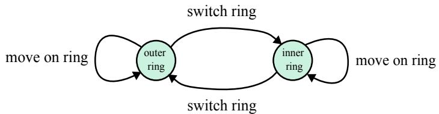  
Figure S7: The factor group obtained by dividing $\mathbb { Z } _ { 2 } \times \mathbb { Z } _ { 4 }$ by the outer ring normal subgroup.

Abstracting away the details, this is conceptually the same figure as the one we have seen previously when dividing $\mathbb { Z }$ by $2 \mathbb { Z }$ . The factor group is therefore $\mathbb { Z } / 2 \mathbb { Z }$ . We have now constructed the first part of the normal series, $\mathbb { Z } _ { 4 } \triangleleft \mathbb { Z } _ { 2 } \times \mathbb { Z } _ { 4 }$ , and we know that the factor group $\mathbb { Z } _ { 2 } \times \mathbb { Z } _ { 4 } / \mathbb { Z } _ { 4 } = \mathbb { Z } / 2 \mathbb { Z }$ is commutative because its group operation is isomorphic to integer addition modulo 2.

We can now perform a similar exercise to derive that $\mathbb { Z } _ { 2 } \triangleleft \mathbb { Z } _ { 4 }$ and that $\mathbb { Z } _ { 4 } / \mathbb { Z } _ { 2 }$ is a commutative group. However, we spare ourselves the effort by first noting that $\{ e \} \triangleleft _ { 4 }$ and that $\mathbb { Z } _ { 4 } / \{ e \}$ is commutative. Firstly, the trivial group is a normal subgroup of any group. Secondly, $\mathbb { Z } _ { 4 } / \{ e \}$ is commutative because $\mathbb { Z } _ { 4 }$ is commutative and for each group $G$ , $G / \{ e \} = G$ . Both of these properties can be verified using the tools we introduced above. With this, we complete the chain of normal subgroups with commutative factor groups, showing the solvability of $\mathbb { Z } _ { 2 } \times \mathbb { Z } _ { 4 }$ by

$$
\{ e \} \triangleleft \mathbb { Z } _ { 4 } \triangleleft \mathbb { Z } _ { 2 } \times \mathbb { Z } _ { 4 }
$$

The entire exercise could of course have been skipped by directly noting that $\mathbb { Z } _ { 2 } \times \mathbb { Z } _ { 4 }$ is commutative.   
In this case, trivially stating $\{ e \} \triangleleft \mathbb { Z } _ { 2 } \times \mathbb { Z } _ { 4 }$ suffices.

We are now equipped with a basic understanding of what a solvable group is. To better understand the implications of this concept for state-tracking with SSMs, we need to introduce a different, yet perhaps surprisingly related framework (Straubing 1994), that of Boolean circuit complexity.

# A.3 Circuit Complexity Theory

The theory of circuit complexity aims to provide an abstract understanding of highly parallel algorithms. One might imagine that there exist problems for which it is difficult, if not impossible, to design one efficient algorithm which operates on arbitrary-length inputs, yet in which all input lengths admit a bespoke, highly efficient and parallel algorithm3. Such considerations are especially important in cryptography, as an efficient algorithm for the factorization of n-bit integers would be a significant development for any large $n$ . Boolean circuit complexity is the study of such parallel algorithms, or rather circuit families. Let us first define a Boolean circuit.

Definition 9 (Boolean Circuit). A Boolean circuit is a directed acyclic graph where internal nodes are logic gates (typically AND, OR, and NOT), leaves are input variables or constants (0 or 1), and there is a single designated output node. The circuit computes a Boolean function by propagating values from the inputs through the gates to the output.

A Boolean circuit family is simply the collection of problem-specific Boolean circuits, with one circuit being defined per input length.

Definition 10 (Boolean Circuit Family). A Boolean circuit family is a sequence of Boolean circuits $\{ C _ { n } \} _ { n \in \mathbb { N } }$ , where each circuit $C _ { n }$ has n input variables and produces a single output bit.

We will now present the two classes of circuits directly relevant to our work.

Definition 11 ( $T C ^ { i }$ Circuit Complexity Classes). The class ${ \mathsf { T } } { \mathsf { C } } ^ { i }$ consists of languages decidable by families of Boolean circuits of polynomial size $O ( p o l y ( n ) )$ and depth $O ( \log ^ { i } n )$ , with unbounded fan-in AND, OR, NOT, and majority (threshold) gates.

$T C ^ { 0 }$ consists of shallow (constant-depth) but arbitrary fan-in Boolean circuits of standard elements (AND, OR, NOT) augmented with a majority gate. Emulating solvable automata is proven to be within $T C ^ { 0 }$ (Sarrof et al. 2024).

Definition 12 ( $N C ^ { 1 }$ Circuit Complexity Class). The class ${ \mathsf { N C } } ^ { 1 }$ consists of languages decidable by families of Boolean circuits of polynomial size $O ( p o l y ( n ) )$ and depth $O ( \log n )$ , with AND, OR, and NOT gates of fan-in 2.

$N C ^ { 1 }$ allows for logarithmic depth, but restricts the fan-in of the gates to 2. Emulating solvable automata is proven to be an $\hat { N C } ^ { 1 }$ -complete problem Barrington (1989), meaning that all $N C ^ { 1 }$ problems can be reduced to it.

Many relations between circuit complexity classes remain unknown. It is, for example, not known whether $T C ^ { 0 } \neq N C ^ { 1 }$ . It is in fact not even known whether $T C ^ { 0 }$ is equal to $P$ , the class of problems decidable in polynomial time (Arora and Barak 2009). As a consequence, certain restrictions have been placed on the generation of Boolean circuits in order to allow for a more realistic and fine-grained study of their properties. The central restriction is that of uniform generation, or uniformity.

Definition 13 (Uniform Boolean Circuits). A family of Boolean circuits $\{ C _ { n } \} _ { n \in \mathbb { N } }$ is uniform if there exists a deterministic Turing machine that, given $1 ^ { n }$ , outputs a description of $C _ { n }$ in time bounded by some resource (e.g., logarithmic space or logarithmic time). Of particular interest to us is log-space uniformity, in which the Turing machine operates using $O ( \log n )$ space for input length $n$ .

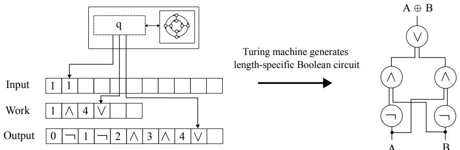  
Figure S8: A visualization of a uniformly generated circuit family, with the specific example being the XOR circuit for inputs of length 2. On the left we see a Turing machine whose input is 11, signifying that the circuit should be generated for inputs of length 2. Either the size of the work tape or the number of computational steps is upper bounded as a function of the input length. The output tape contains the description of the circuit visualized on the right. This is in fact a log-space uniform circuit family, symbolized by the short work tape. The XOR circuit is highly related to the parity automaton, as it outputs 1 if and only if the number of ones in the input is odd.

# A.4 SSM Expressivity Results

We finally arrive at the results that this section was building up to, bounds on the expressivity of SSMs within the framework of algebraic groups and Boolean circuits. We do not prove any new theorems here nor restate the proofs, opting instead to refer to work which proves the claims. Let us start by restating a classic result in the terminology that we introduced in our paper:

Theorem 1 (Barrington (1989), Theorem 5). The word problem for any nonsolvable group is complete for $N C ^ { 1 }$ under $A \breve { C } ^ { 0 }$ reductions.

The word problem of a group is defined as follows Merrill et al. (2024):

Definition 14 (Group Word Problem). Let $( M , \cdot )$ be a finite group. The word problem of $M$ is defined as evaluating the product of arbitrary sequences of elements of $M$ . That is, given a sequence $m _ { 0 } m _ { 1 } \cdots _ { k }$ , solving the word problem involves returning $m \in M$ such that $m _ { 0 } \cdot m _ { 1 } \cdot \cdot \cdot m _ { k } = m$ .

The separation of word problems over solvable and non-solvable groups rests on the widely-held conjecture that $T C ^ { 0 } \neq \dot { N } { \cal C } ^ { 1 }$ Arora and Barak (2009), combined with the result that word problems of solvable groups belong to $T C ^ { 0 }$ :

Theorem 2 (Mix Barrington et al. (1992), Theorem 8). The word problem for any solvable group is in $T C ^ { 0 }$ .

A recent work analyses the expressivity of diagonal SSMs by demonstrating that the individual computations in the SSM can be emulated by logspace-uniform $T C ^ { 0 }$ circuits, under the assumption that the numerical representation capacity is logarithmic in the sequence length. Concretely, it is $O ( \log n )$ .

Theorem 3 (Merrill et al. (2024), Theorem 4.4). Every fixed depth log-precision diagonal SSM can be emulated by a logspace-uniform $T C ^ { 0 }$ circuit.

This is the main upper bound we refer to in the paper, and is what we mean when we say that non-solvable automata cannot be emulated by diagonal SSMs, which is implied by combining the strict inclusion logspace-uniform $T C ^ { 0 } \subset T C ^ { \tilde { 0 } }$ with the conjectured $T C ^ { 0 } \cap { \bar { N } } C ^ { 1 } \not = \emptyset$ , and utilizing Theorem 3. This bound rests on an unproven conjecture, but it is supported by significant experimental evidence Merrill et al. (2024); Cirone et al. (2024); Grazzi et al. (2024); Sarrof et al. (2024); Terzic´ et al. $( 2 0 2 5 ) ^ { 4 }$ .

# B Architectural Details

# B.1 Full Architecture

This work mainly describes a new method for generating the SSM transition matrices. The method is itself embedded into a larger architecture, which mostly follows standard practice in neural network design as pioneered by the Transformer (Vaswani et al. 2017). That is, we embed the $P D$ parametrization into neural network layers which consist of nonlinear feed-forward networks, vector normalization, and residual connections, calling the entire model PD-SSM. The connection pattern of PD-SSM closely follows that of pre- or post-norm Transformers, and can be seen in (Xiong et al. 2020). We show two sketches of the full PD-SSM model in Figure S9.

Readout The readout from the state, $\psi ( x _ { t } )$ , is different from standard practice, which typically implements it as $\psi ( x _ { t } ) = R e \{ x _ { t } \}$ (Orvieto et al. 2023; Gu et al. $2 0 2 2 \mathrm { b }$ ; Gu and Dao 2023; Smith et al. 2023). Instead of taking the real part of $x _ { t }$ , we apply a transformation on the concatenation of the real and imaginary part of $x _ { t }$ , denoted as $R e \{ x _ { t } \} \bar { | } I \dot { m } \{ x _ { t } \}$ . Depending on the benchmark, the readout is either a GELU-activated nonlinear network:

$$
\psi ( x _ { t } ) = W ^ { R e a d , O } \sigma _ { G e l u } ( W ^ { R e a d , I } ( R e \{ x _ { t } \} | I m \{ x _ { t } \} ) + b ^ { R e a d , I } ) + b ^ { R e a d , O }
$$

Or, if we refer to it as a linear readout, we concretely mean the transformation:

$$
\psi ( x _ { t } ) = W ^ { R e a d } ( R e \{ x _ { t } \} | | I m \{ x _ { t } \} ) + b ^ { R e a d }
$$

For the long-range arena tasks, we employ the nonlinear readout and a deeper architecture. For the state tracking tasks, we apply the linear readout and a single-layer architecture. See Appendix E.

# B.2 Efficiently Computing the Parallel Scan Gradients

The total derivative of a loss $L$ with respect to $x _ { k }$ , written as $\frac { d L } { d x _ { k } }$ , satisfies the equation below:

$$
{ \frac { d L } { d x _ { k } } } = { \frac { \partial L } { \partial x _ { k } } } + { \frac { d L } { \partial x _ { k + 1 } } } { \frac { \partial x _ { k + 1 } } { \partial x _ { k } } }
$$

In our notation, $\frac { d L } { d x _ { k } }$ explains the total effect of $x _ { k }$ on $L$ via all of the intermediate computations, whereas $\frac { \partial L } { \partial x _ { k } }$ denotes the direct effect of $x _ { k }$ on $L$ , ignoring the influence of $x _ { k }$ on the rest of the sequence.

The expression above is equivalent to:

$$
{ \frac { d L } { d x _ { k } } } = { \frac { \partial L } { \partial x _ { k } } } + { \frac { d L } { d x _ { k + 1 } } } A _ { k + 1 }
$$

(a) Full PD-SSM model with a linear readout, as used in the state-tracking experiments.

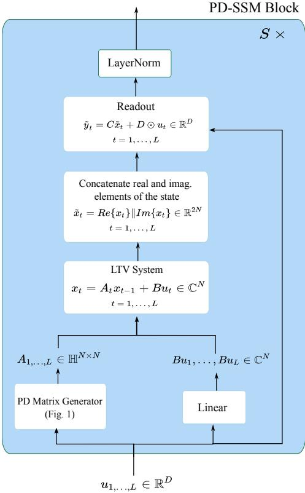  
Figure S9: Full PD-SSM models we used in our state-tracking and LRA experiments. In the timeseries classification experiments, we used a model equivalent to the one shown in subfigure S9b, with the exception that $\tilde { x } _ { t } = R e \{ x _ { t } \} \in \mathbb R ^ { N }$ .

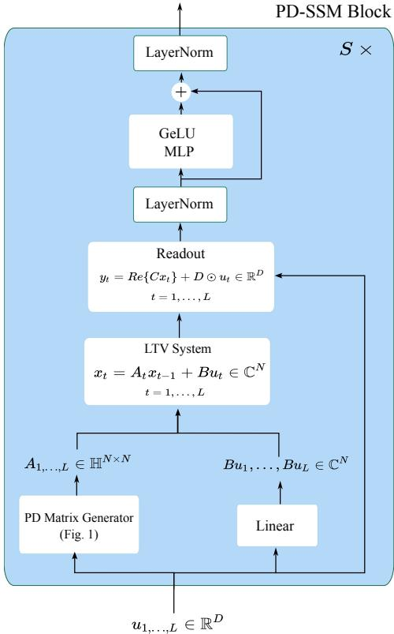  
(b) Full PD-SSM model with a nonlinear readout, as used in the LRA and time-series experiments.

We can see that computing the derivative of $L$ with respect to the states $x _ { k }$ is a linear recurrence with sparse transition matrices $A _ { k + 1 }$ . Computing the gradient thus reduces to a reverse parallel scan with matrix multiplication complexity of $O ( N )$ . Within the framework of the parallel scan introduced in Section 2.4, gradient computation can then be parallelized using the following associative operation:

$$
( A _ { i } , { \frac { d L } { d x _ { i - 1 } } } ) \bullet ( A _ { i + 1 } , { \frac { d L } { d x _ { i } } } ) = ( A _ { i } A _ { i + 1 } , { \frac { d L } { d x _ { i } } } A _ { i } + { \frac { d L } { d x _ { i - 1 } } } )
$$

# C Proofs

We first restate and prove the two properties of the space of column one-hot matrices, $\mathbb { H } ^ { N \times N }$ .

Property 1 (Algebraic Structure of One-hot Column Matrices). $\mathbb { H } ^ { N \times N }$ is a monoid under matrix multiplication, i.e., it is closed under associative matrix multiplication and contains the identity.

Proof. It is easy to verify that $\mathbb { H } ^ { N \times N }$ contains the identity, as it is a column one-hot matrix. It is also trivial to verify that the product of two column one-hot matrices remains column one-hot. Given $A , B \in \mathbb { H } ^ { N \times \hat { N } }$ , the columns of $B$ select and scale the columns of $A$ . More precisely, the entry in row $i$ , column $j$ of the product matrix $C = A B$ is given by:

$$
C _ { i j } = \sum _ { k = 1 } ^ { N } A _ { i k } B _ { k j }
$$

Since for each fixed $j$ , the matrix $B$ has exactly one non-zero entry in column $j$ , say at row $k = r$ , all other terms in the sum are zero. That is,

$$
B _ { k j } = 0 \quad { \mathrm { f o r ~ a l l ~ } } k \neq r , \quad { \mathrm { a n d ~ } } B _ { r j } \neq 0
$$

So the sum reduces to a single term:

$$
\begin{array} { r } { C _ { i j } = A _ { i r } \cdot B _ { r j } } \end{array}
$$

Now, since matrix $A$ also has exactly one non-zero entry in each column, the $r$ -th column of $A$ has only one non-zero value, say at row $i = s$ . Therefore,

$$
A _ { i r } = 0 \quad { \mathrm { f o r ~ a l l ~ } } i \neq s , \quad { \mathrm { a n d ~ } } A _ { s r } \neq 0
$$

This implies that for each column $j$ of the product $C$ , there is exactly one row $i$ such that $C _ { i j } \neq 0$ and all other entries in that column are zero. □

Property 2 (Computational Efficiency of Matrix Multiplication in $\mathbb { H } ^ { N \times N } .$ ). Let $A , B \in \mathbb { H } ^ { N \times N }$ .   
Then $C = A B \in \mathbb { H } ^ { N \times N }$ can be computed in $\Theta ( N )$ arithmetic operations.

Proof. As per the previous proof, in order to compute $C = A B$ for $A , B \in \mathbb { H } ^ { N \times N }$ , we only need to compute one element in each column of $C$ . Figure 3 in the main text outlines the details of the computation. □

The following proof is an application of a chain of inequalities that shows that under certain assumptions, which are fulfilled by the PD-parametrization, the SSM is BIBO-stable.

Proposition 1 (System Stability under PD-Parametrization). Let $\varepsilon \in ( 0 , 1 ]$ and consider the state transition $x _ { k } = A _ { k } x _ { k - 1 } + b _ { k }$ with $A _ { k } \in \mathbb { H } ^ { N \times N } : \| A _ { k } \| _ { \infty } \leq 1 - \varepsilon$ . Let further $\| x _ { 0 } \| _ { 2 } \le B$ and $\| b _ { k } \| _ { 2 } \leq B$ for $B < \infty$ . Then it holds that

$$
\| x _ { k } \| _ { 2 } \leq \sqrt { N } B / \varepsilon \quad \forall k .
$$

Proof. Expanding the recursion of the state transition results in

$$
x _ { k } = ( \prod _ { j = k } ^ { 1 } A _ { j } ) x _ { 0 } + \sum _ { t = 1 } ^ { k } ( \prod _ { j = k } ^ { t + 1 } A _ { j } ) b _ { t } ,
$$

where we define $\prod _ { j = k } ^ { i } A _ { j } = \mathbb { I }$ whenever $i > k$ , with $\mathbb { I }$ denoting the identity matrix.

We bound the norm of the state as follows:

$$
\begin{array} { r l } & { \| x _ { k } \| _ { 2 } = \| ( \displaystyle \prod _ { j = k } ^ { 1 } A _ { j } ) x _ { 0 } \big \rangle _ { t = 1 } \displaystyle \sum _ { j = 1 } ^ { k } ( \displaystyle \prod _ { j = k } ^ { t + 1 } A _ { j } ) b _ { t } \| _ { 2 } } \\ & { \qquad \le \| ( \displaystyle \prod _ { j = k } ^ { 1 } A _ { j } ) x _ { 0 } \| _ { 2 } + \| \displaystyle \sum _ { t = 1 } ^ { k } ( \displaystyle \prod _ { j = k } ^ { t + 1 } A _ { j } ) b _ { t } \| _ { 2 } } \\ & { \qquad \le \| \displaystyle \prod _ { j = k } ^ { 1 } A _ { j } \| \| x _ { 0 } \| _ { 2 } + \displaystyle \sum _ { t = 1 } ^ { k } \| \displaystyle \prod _ { j = k } ^ { t + 1 } A _ { j } \| \| b _ { t } \| _ { 2 } } \\ & { \qquad \le B ( \displaystyle \| \displaystyle \prod _ { j = k } ^ { 1 } A _ { j } \| + \displaystyle \sum _ { t = 1 } ^ { k } \| \displaystyle \prod _ { j = k } ^ { t + 1 } A _ { j } \| ) } \end{array}
$$

where the first inequality is the result of the triangle inequality, the second inequality results from the definition of the matrix spectral norm in both terms (specifically, denoting the spectral norm of a square matrix $A$ as $\| A \|$ , it holds that for a vector $b$ , $\| A b \| _ { 2 } \leq \| A \| \| b \| _ { 2 } )$ and the triangle inequality in the second term, and the final inequality is due to the assumptions on the norms of $x _ { 0 }$ and $b _ { t }$ .

To bound the spectral norms of the two products of the form $\textstyle \prod _ { j = k } ^ { i } A _ { j }$ , we will use the fact that for general complex-valued matrices $A$ , it holds that $\| A \| \leq \| A \| _ { F }$ . We will additionally leverage the algebraic structure of PD matrices, i.e., the fact that $\textstyle \prod _ { j = k } ^ { i } A _ { j } , k \geq i$ has a column one-hot structure, which enables us to use the trivial bound $\begin{array} { r } { \| \prod _ { j = k } ^ { i } A _ { j } \| _ { F } \leq \sqrt { N } \| \prod _ { j = k } ^ { i } A _ { j } \| _ { \infty } } \end{array}$ . We will combine these results to derive the following upper bound:

$$
\| \prod _ { j = k } ^ { i } A _ { j } \| \leq \| \prod _ { j = k } ^ { i } A _ { j } \| _ { F } \leq \sqrt { N } \| \prod _ { j = k } ^ { i } A _ { j } \| _ { \infty } \leq \sqrt { N } ( 1 - \epsilon ) ^ { k - i + 1 }
$$

We will prove this by induction, assuming that the follwing formula holds for a fixed $i$ and arbitrary $k \geq i$ :

$$
\| \prod _ { j = k } ^ { i } A _ { j } \| _ { \infty } \leq ( 1 - \epsilon ) ^ { k - i + 1 }
$$

The base case $k = i$ holds as a direct consequence of the assumption’s proposition:

$$
\| \prod _ { j = i } ^ { i } A _ { j } \| _ { \infty } = \| A _ { i } \| _ { \infty } \leq ( 1 - \epsilon )
$$

Suppose now that Equation 8 holds for some $k > i$ . Then, for $k + 1$ ,

$$
\parallel \prod _ { j = k + 1 } ^ { i } A _ { j } \parallel _ { \infty } = \parallel A _ { k + 1 } \prod _ { j = k } ^ { i } A _ { j } \parallel _ { \infty } = \parallel P _ { k + 1 } D _ { k + 1 } \prod _ { j = k } ^ { i } A _ { j } \parallel _ { \infty }
$$

where we decomposed $A _ { k + 1 }$ into the column one-hot matrix $P _ { k + 1 }$ and the complex diagonal matrix $D _ { k + 1 }$ . By the proposition’s assumption, $\| D _ { k + 1 } \| _ { \infty } \leq 1 - \epsilon$ . By the induction’s assumption, $\| \textstyle \prod _ { j = k } ^ { i } A _ { j } \| _ { \infty } \le ( 1 - \epsilon ) ^ { k - i + 1 }$ . Since $D _ { k + 1 }$ is diagonal, $\begin{array} { r } { \| D _ { k + 1 } \prod _ { j = k } ^ { i } A _ { j } \| _ { \infty } \le ( 1 - \epsilon ) ^ { k - j + 2 } } \end{array}$ . Finally, $P _ { k + 1 }$ only rearranges the entries of $\textstyle D _ { k + 1 } \prod _ { j = k } ^ { i } A _ { j }$ , so that, as desired,

$$
\| \prod _ { j = k + 1 } ^ { i } A _ { j } \| _ { \infty } = \| A _ { k + 1 } \prod _ { j = k } ^ { i } A _ { j } \| _ { \infty } = \| P _ { k + 1 } D _ { k + 1 } \prod _ { j = k } ^ { i } A _ { j } \| _ { \infty } \leq ( 1 - \epsilon ) ^ { ( k + 1 ) - j + 1 }
$$

We obtain the final result by plugging these bounds into Equation (7), i.e., we have, with $k \geq 1$

$$
\begin{array} { r l } { \| x _ { k } \| _ { 2 } \leq B ( | | \displaystyle \prod _ { j = k } ^ { 1 } A _ { j } | | + \sum _ { i = 1 } ^ { k } \| \displaystyle \prod _ { j = k } ^ { k + 1 } A _ { j } | | ) } & { } \\ & { \qquad \quad \ : \ : \ : \ : \ : \xi - 1 } \\ & { \leq B ( \sqrt { N } | | \displaystyle \prod _ { j = k } ^ { 1 } A _ { j } | | \alpha + \sum _ { i = 1 } ^ { k } \sqrt { N } | | \displaystyle \prod _ { j = k } ^ { k + 1 } A _ { j } | | \alpha ) } \\ & { \leq B \sqrt { N } \left[ ( 1 - \epsilon ) ^ { k } + \sum _ { i = 1 } ^ { k } ( 1 - \epsilon ) ^ { k - \epsilon } \right] } \\ & { = B \sqrt { N } \left[ ( 1 - \epsilon ) ^ { k } ( 1 + \displaystyle \sum _ { i = 1 } ^ { k } ( \frac { 1 } { 1 - \epsilon } ) ^ { j } ) \right] } \\ & { = B \sqrt { N } \left[ ( 1 - \epsilon ) ^ { k } ( 1 + \frac { ( 1 - \epsilon ) ^ { k } } { \epsilon } - 1 \right] = B \sqrt { N } \left[ ( 1 - \epsilon ) ^ { k } ( 1 - \frac { 1 } { \epsilon } ) + \frac { 1 } { \epsilon } \right] \leq \frac { B \sqrt { N } } { \epsilon } } \end{array}
$$

The following lemma will be of use for proving the optimality of $P D$ parametrization.

Lemma 1. Any single-layer complex SSM with state size $d$ can be reduced to a single-layer real SSM with state size $2 d .$ .

Proof. Let $x _ { t } , b _ { t } \in \mathbb { C } ^ { d }$ and $A _ { t } \in \mathbb { C } ^ { d \times d }$ with $x _ { t + 1 } = A _ { t } x _ { t } + b _ { t }$ . Write $\boldsymbol { x } _ { t } ^ { r } = \mathcal { R } ( \boldsymbol { x } _ { t } )$ , $x _ { t } ^ { i } = \mathcal { I } ( x _ { t } )$ $b _ { t } ^ { r } = \mathcal { R } ( b _ { t } )$ , $b _ { t } ^ { i } = \mathcal { I } ( b _ { t } )$ , $A _ { t } ^ { r } = \mathcal { R } ( A _ { t } )$ , and $A _ { t } ^ { i } = \mathcal { T } ( A _ { t } )$ . Then

$$
\begin{array} { r l } & { x _ { t + 1 } ^ { r } + i x _ { t + 1 } ^ { i } = x _ { t + 1 } = A _ { t } x _ { t } + b _ { t } = ( A _ { t } ^ { r } + i A _ { t } ^ { i } ) ( x _ { t } ^ { r } + i x _ { t } ^ { i } ) + b _ { t } ^ { r } + i b _ { t } ^ { i } } \\ & { \qquad = A _ { t } ^ { r } x _ { t } ^ { r } - A _ { t } ^ { i } x _ { t } ^ { i } + b _ { t } ^ { r } + i ( A _ { t } ^ { i } x _ { t } ^ { r } + A _ { t } ^ { r } x _ { t } ^ { i } + b _ { t } ^ { i } ) . } \end{array}
$$

In block matrix form, the complex SSM can be represented as a real SSM through

$$
\begin{array} { r } { \left( \begin{array} { l } { x _ { t + 1 } ^ { r } } \\ { x _ { t + 1 } ^ { i } } \end{array} \right) = \left[ \begin{array} { l l } { A _ { t } ^ { r } } & { - A _ { t } ^ { i } } \\ { A _ { t } ^ { i } } & { + A _ { t } ^ { r } } \end{array} \right] \left( \begin{array} { l } { x _ { t } ^ { r } } \\ { x _ { t } ^ { i } } \end{array} \right) + \left( \begin{array} { l } { b _ { t } ^ { r } } \\ { b _ { t } ^ { i } } \end{array} \right) . } \end{array}
$$

The following proposition states that for each $N \in \mathbb N$ , one can construct an FSA which requires a state dimensionality of at least $N - 1$ to emulate using an SSM, under the assumption that each automaton state has a unique vector encoding. By combining this with Proposition 2, which states that all $N$ -state automata can be emulated using a $P D$ -SSM with one layer and state size $N$ , the optimality of the $P D$ decomposition for emulating FSAs is established.

Proposition 3 (Optimality of PD Parametrization). For any $N$ there exists a finite-state automaton with $N$ states that cannot be emulated by any single-layer SSM with state size less than $N - 1$ under unique state encodings.

Proof. Interpreting complex state size as $2 d$ and real state size as $d$ for $\boldsymbol { x } ~ \in ~ \mathbb { R } ^ { d }$ and $\boldsymbol { x } ~ \in ~ \mathbb { C } ^ { d }$ , respectively, we can invoke Lemma 1 and stick to real SSMs in the remainder of this proof. Let $N \in \mathbb N$ . For $N \leq 2$ the statement is trivial, so suppose $N \geq 3$ . Consider the FSA A with states $s _ { 1 } , \ldots , s _ { N }$ and input vocabulary equal to the set of states mapping to state transitions

$$
s _ { x } \mapsto f _ { x } { \mathrm { ~ w h e r e ~ } } f _ { x } ( s _ { i } ) = { \left\{ \begin{array} { l l } { s _ { i + 1 } { \bmod { N } } } & { i = x } \\ { s _ { i } } & { i \neq x . } \end{array} \right. }
$$

Now, assume by contradiction a unique (one-to-one) encoding $s _ { i } \cong v _ { i } \in \mathbb { R } ^ { d }$ with $d \leq N - 2$ . Then there exist two states $s _ { x } , s _ { y }$ , w.l.o.g. set to $s _ { N - 1 } , s _ { N }$ , such that

$$
\boldsymbol { \vartheta } : = \operatorname { s p a n } \{ v _ { 1 } , \dots , v _ { N } \} = \operatorname { s p a n } \{ v _ { 1 } , \dots , v _ { N - 2 } \} \mathrm { ~ a n d ~ } v _ { N - 1 } = \sum _ { i = 1 } ^ { N - 2 } \alpha _ { i } v _ { i } \mathrm { ~ a s ~ w e l l ~ a s ~ } v _ { N } = \sum _ { i = 1 } ^ { N - 2 } \beta _ { i } v _ { i } .
$$

Now, a single-layer SSM that emulates A must satisfy

$$
A _ { c } v _ { i } + b _ { c } = { \left\{ \begin{array} { l l } { v _ { i } } & { i \neq c } \\ { v _ { i + 1 \bmod { \ N } } } & { i = c . } \end{array} \right. }
$$

An immediate consequence is that $\textstyle \sum _ { i = 1 } ^ { N - 2 } \alpha _ { i } \neq 1 \neq \sum _ { i = 1 } ^ { N - 2 } \beta _ { i }$ , since otherwise either

$$
\begin{array} { r } { v _ { N } = A _ { N - 1 } v _ { N - 1 } + b _ { N - 1 } = \sum _ { i = 1 } ^ { N - 2 } \alpha _ { i } \big ( A _ { N - 1 } v _ { i } + b _ { N - 1 } \big ) + b _ { N - 1 } \big ( 1 - \sum _ { i = 1 } ^ { N - 2 } \alpha _ { i } \big ) = v _ { N - 1 } + 0 } \end{array}
$$

or

$$
\begin{array} { r } { v _ { 1 } = A _ { N } v _ { N } + b _ { N } = \sum _ { i = 1 } ^ { N - 2 } \beta _ { i } ( A _ { N } v _ { i } + b _ { N } ) + b _ { N } ( 1 - \sum _ { i = 1 } ^ { N - 2 } \beta _ { i } ) = v _ { N } + 0 , } \end{array}
$$

violating the uniqueness assumption. But then

$$
\mathbb { V } = \operatorname { s p a n } \{ v _ { 1 } - v _ { N - 1 } , \ldots , v _ { N - 2 } - v _ { N - 1 } \} ,
$$

since $\begin{array} { r } { \sum _ { i = 1 } ^ { N - 2 } \alpha _ { i } ( v _ { i } - v _ { N - 1 } ) = v _ { N - 1 } ( 1 - \sum _ { i = 1 } ^ { N - 2 } \alpha _ { i } ) \neq 0 } \end{array}$ . We can now leverage this spanning property by noting that $A _ { N } ( v _ { i } - v _ { N - 1 } ) = ( v _ { i } - v _ { N - 1 } ) \forall i \in \{ 1 , \ldots , N - 2 \}$ . But if $A _ { N }$ acts as identity on $\mathbb { V } \ni v _ { N }$ , then $v _ { 1 } = A _ { N } v _ { 1 } + b _ { N } = v _ { 1 } + b _ { N }$ and hence $b _ { N } = 0$ . But then we reach the contradiction violating uniqueness of state encodings

$$
v _ { 1 } = A _ { N } v _ { N } + b _ { N } = A _ { N } \vert _ { \mathbb { V } } v _ { N } + b _ { N } = I \vert _ { \mathbb { V } } v _ { N } + b _ { N } = v _ { N } .
$$

The following proposition is meant to highlight the importance of assuming a restricted readout, such as done in Proposition 3 with unique state encodings. Indeed, by using lookup tables that are exponentially large in the maximum sequence length, even a scalar SSM can emulate any finite state automaton. In practice, however, such lookup tables are entirely impractical.

Proposition 4 (Arbitrary Precision and Readout). Consider $x _ { t + 1 } = x _ { t } + b _ { t }$ where $b _ { t } = \boldsymbol { u } _ { t } \cdot \boldsymbol { k } _ { t }$ with $u _ { t } \in \mathbb { Q }$ input encodings and $k _ { t } = \sqrt { p _ { t } } \in \mathbb { R } / \mathbb { Q }$ time encodings, where $p _ { t }$ is the $t$ -th prime. Then, any FSA can be encoded into this scalar-valued SSM under an appropriate lookup table as readout.

Proof. According to Jaffe (2007), $k _ { t }$ is linearly independent over $\mathbb { Q }$ , i.e., for $u _ { i } \in \mathbb { Q }$ it holds that $u _ { 1 } k _ { 1 } + \cdot \cdot \cdot + u _ { n } k _ { n } = 0 \iff u _ { 1 } = \cdot \cdot \cdot = u _ { n } = 0 ,$ . Therefore, no two differing input sequences $u _ { 1 } , \ldots , u _ { n }$ and $v _ { 1 } , \ldots , v _ { m }$ will result in the same state representation $x _ { t } = { { x } _ { 0 } } + { { \bar { \sum } } _ { i } } u _ { i } k _ { i }$ . Now, a simple identification of every FSA state with all the state representations $x _ { t }$ of associated input sequences that lead to said FSA state shows universal expressivity under arbitrary readout. □

# D Experimental Setup

# D.1 Hyperparameter Selection

FSA Emulation On FSA emulation, Table 2, we did not perform a hyperparameter grid search. We re-used the fixed hyperparameters which were used to evaluate all of the baseline methods, as per Walker et al. (2025). In contrast to the baseline methods which were evaluated using various state sizes including 128, we only evaluated our model using only state size 128. We used Adam with the default parameters (0.9, 0.999).

On experiments with non-solvable groups in Table 3, we ran a learning rate grid search in $\{ 1 e - 4 , 5 e - 4 , 1 e - 3 , 5 e - 3 , 1 e - 2 \}$ , and report the best validation accuracy over any of the 3 random seeds and hyperparameter configurations. The state size was 128. We used Adam with the default parameters (0.9, 0.999).

Time-Series Classification We performed the following grid search, following Rusch and Rus (2025): Learning rate in $\{ 1 e - 5 , 1 e - 4 , 1 e - 3 \}$ , number of layers in $\{ 2 , 4 , 6 \}$ , state dimension in $\{ 1 6 , 6 4 , 1 2 8 \}$ and embedding dimension in $\{ 1 6 , 6 4 , 1 2 8 \}$ . We used Adam with the default parameters (0.9, 0.999).

Long-Range Arena We performed a grid search defined by all combinations of the following values: Learning rate in $\{ 1 e - 5 , 5 e - 5 , 1 e - 4 , 5 e - 4 , 1 e - 3 \}$ , weight decay in $\{ 0 . 0 0 1 , 0 . 0 1 , 0 . 1 , 0 . 0 5 \}$ , and dropout in $\{ 0 . 0 , 0 . { \dot { 1 } } , 0 . 3 \}$ . On each task, we report the average accuracy over three random seeds. The embedding dimension and state size were both fixed to 128, with the exception of the Retrieval dataset in which we reduced it to 64. We used Adam with the default parameters (0.9, 0.999). The hyperparameters of the models we compare with were obtained via an extensive Bayesian hyperparameter search, as outlined in Soydan et al. (2024).

Natural Language State Tracking The setup of this task is equivalent to symbolic state tracking, only we train for 100,000 steps or until convergence on a validation set with length 40. We only ran a grid search over learning rates in $\{ 1 e - 4 , 5 e - 4 , 1 e - 3 \}$ . State size was fixed to 128, and the number of dictionary matrices (K) was 6.

# D.2 Training Times

We report the training time for representative benchmarks using NVIDIA A100 40GB GPUS.

Natural Language State Tracking This benchmark uses an inefficient PyTorch implementation of the PD-SSM, resulting in extended training times. The experiment can be executed significantly more efficiently using the provided JAX implementation.

On the Parity automaton:

• PD : 7.2 hours • Complex diagonal: 70.3 hours

• Real diagonal: 68.6 hours

On the $A _ { 5 }$ automaton:

• PD : 82.8 hours • Complex diagonal: 68.4 hours • Real diagonal: 63.6 hours

# Long-Range Arena

• CIFAR: 2.5 hours • ListOps: 9.3 hours • IMDB: 6.6 hours • AAN: 34 hours

UEA Time-Series All results can be obtained within several hours on the specified GPU.

# E Additional Results

# E.1 Runtime Measurements

Measurement Details The runtime measurements were obtained using optimized and compiled JAX code5. We did not implement custom system-aware methods, which can certainly make a difference in practice (Gu and Dao 2023; Dao 2024). We assume that our runtime measurement setup is reflective of most researchers’ typical use cases, and should provide an equal testbed for all the methods. All of the runtime measurements were obtained on an NVIDIA A100 80GB GPU. The code is implemented in JAX, version 0.4.24. The parallel scan relies on the jax.lax.associative_scan primitive. The computation is parallelized across the batch dimension and sequence length using jax.vmap, and is finally just-in-time compiled. At the time of writing, the parallel scan primitive is a work-in-progress in PyTorch. In our experience, the JAX version was significantly more efficient.

State Representation Size Matched Comparison We extend the comparison of our PD model with two representative methods, a time-variant SSM with unstructured but column-normalized transition matrices (SD-SSM) Terzic et al. (2025) ´ 6, and a time-variant SSM with diagonal transition matrices generated using our MLP generation $A ( u _ { t } ) = D ( u _ { t } )$ . Below, we extend the results from Figure 4 by considering sequence lengths 256 and 512. Concretely, the dimension of SD-SSM is again set to twice that of the other models to account for the discrepancy between the real and complex-valued state representations. The results are shown in Figure S10.

From Figure 4, at sequence length 64 and embedding dimension 5632, the SD-SSM exhibits an around $7 1 \times$ slowdown compared to PD-SSM. The PD-SSM in turn is around $7 \times$ slower than the diagonal model.

At hidden dimension $D = 2 0 4 8$ , the relative speed-up of PD-SSM over SD-SSM is $1 8 . 8 \times$ for $L = 6 4$ , $2 8 . 3 \times$ for $L = 2 5 6$ , and $3 0 . 3 \times$ for $L = 5 1 2$ , an increasing trend in $L$ .

State Size Matched Comparison Previously, the unstructured SSM had double the state dimensionality of the other two models to account for the discrepancy between the real and complex-valued state representations. We now set the state dimensionalities of all models to be equal and again evaluate the scaling as a function of embedding size under sequence lengths 64 and 256. The results are shown in Figure S11.

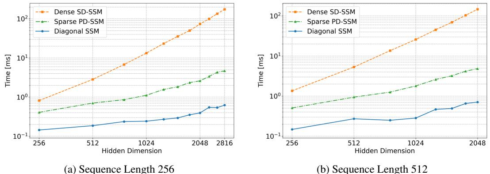  
Figure S10: Runtimes with state dimension of SD-SSM set to twice that of other models.

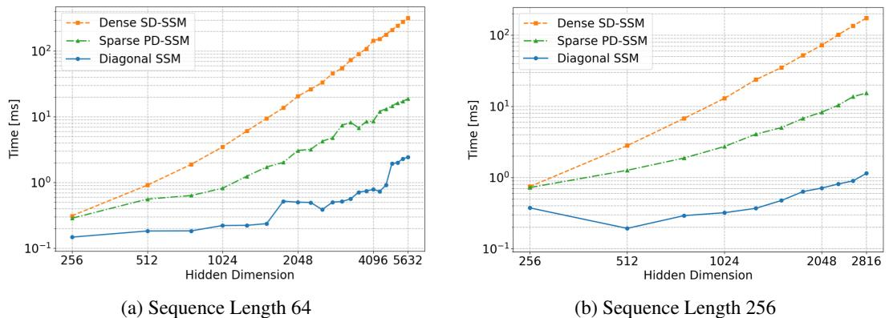  
Figure S11: Runtime measurements with equal state size.

At sequence length 64 and embedding dimension 5632, the SD-SSM exhibits a $1 6 . 6 \times$ slowdown compared to PD-SSM. The PD-SSM is in turn $7 . 6 \times$ slower than the diagonal model, a similar ratio as in the state matched setup above but now with double the state size.

At hidden dimension $D = 2 0 4 8$ , the relative speed-up of PD-SSM over SD-SSM is $6 . 8 \times$ for $L = 6 4$ , $8 . 8 \times$ for $L = 2 5 6$ , and $9 . 7 \times$ for $L = 5 1 2$ (not shown). Again, an increasing trend with $L$ .

Parameter Matched Comparison Given state size $N$ , embedding dimension $D$ and $K$ transition matrices in the dictionary where applicable, the models have the following total parameter cost: $N ( 2 D + K N ) + K D$ for SD-SSM, $\bar { N ( 6 D + 2 N + K N + 4 ) } + K D$ for PD-SSM, and $\bar { N } ( 6 D + 2 N + 4 )$ for the diagonal SSM. Let us denote the state size of SD-SSM as $N _ { r }$ and that of PD-SSM as $N _ { c }$ . Suppose further that $D = N _ { r }$ and $K = 6$ , as used in our measurements. To equalize the parameter cost of PD-SSM with SD-SSM, $N _ { c }$ must be set as:

$$
N _ { c } = \left\lfloor \frac { - ( 6 N _ { r } + 4 ) + \sqrt { ( 6 N _ { r } + 4 ) ^ { 2 } + 1 9 2 N _ { r } ^ { 2 } } } { 1 2 } \right\rfloor
$$

With this, given for example $N _ { r } = D = 2 0 4 8$ , the corresponding $N _ { c }$ is 1552. The corresponding relationship for the state dimensionality of the diagonal model $N _ { d }$ given $D = N _ { r }$ and $K = 6$ is:

$$
N _ { d } = \left\lfloor \frac { - ( 6 N _ { r } + 4 ) + \sqrt { ( 6 N _ { r } + 4 ) ^ { 2 } + 6 4 N _ { r } ^ { 2 } + 4 8 N _ { r } } } { 4 } \right\rfloor
$$

which for $N _ { r } = 2 0 4 8$ exactly sets $N _ { d } = 2 0 4 8$ . This adapted scaling results in the Figure S12.

At sequence length 64 and embedding dimension 5632, the SD-SSM exhibits a $2 1 . 7 \times$ slowdown compared to PD-SSM. The PD-SSM is now around $6 . 0 \times$ slower than the diagonal model.

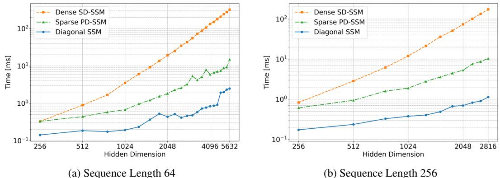  
Figure S12: Runtime measurements in a parameter-matched setting.

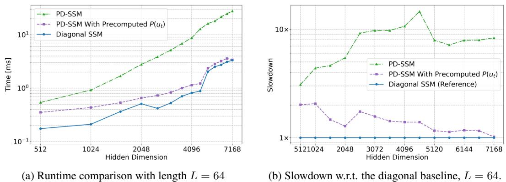  
Figure S13: Measuring the overhead of generating $P$ matrices.

At hidden dimension $D = 2 0 4 8$ , the relative speed-up of PD-SSM over SD-SSM is $1 0 . 6 \times$ for $L = 6 4$ , $1 3 . 9 \times$ for $L = 2 5 6$ , and $1 5 . 5 \times$ for $L = 5 1 2$ (not shown). Once again, an increasing trend with $L$ .

Effect of $P$ Generation Under Equal State Size In this measurement, we compare the runtime of the PD-SSM and the diagonal SSM with a version of PD-SSM that receives pre-computed random sparse $P$ matrices as input. In this scenario, we set the state size of all models to be equal. The results are reported in Figure S13. As predicted in Table 1, the $P D$ parallel scan incurs a constant, even diminishing overhead compared to the diagonal scan. The overhead stems primarily from the generation of the $P ( u _ { t } )$ matrices.

# E.2 Varying Mamba Depth on $( A _ { 5 } , 2 )$

Mamba (Gu and Dao 2023) uses non-negative real-valued transition matrices, which are in theory highly restrictive even for emulating solvable automata (Grazzi et al. $2 0 2 4 ) ^ { 7 }$ . However, we can observe that several layers of the model can in fact learn to emulate the non-solvable automaton on in-domain lengths, as shown in Figure S14. The model however does not exhibit any substantial length generalization.

# E.3 PD-SSM Ablations on Arithmetic

We ablate several design choices on the Arithmetic task from Delétang et al. (2023).

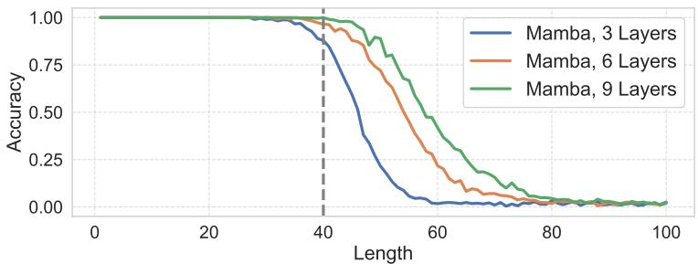  
Figure S14: Mamba with varying number of layers trained to emulate the non-solvable $( A _ { 5 } , 2 )$ automaton.

Stochastic $P$ Generation and Inference With Dense $P$ Matrices: The first ablation is centered on the generation of $P$ matrices, in particular the following deterministic equations:

$$
\begin{array} { r l } & { \quad P = \operatorname { h a r d m a x } ( M ) \in \{ 0 , 1 \} ^ { N } \mathrm { ~ w h e r e ~ h a r d m a x } ( \mathrm { x } ) _ { i } : = \mathbb { 1 } _ { i = \arg \operatorname* { m a x } _ { j } x _ { j } } } \\ & { \frac { \partial P } { \partial M } = \frac { \partial \operatorname { h a r d m a x } ( M ) } { \partial M } \approx \frac { \partial \mathrm { s o f m a x } ( M ) } { \partial M } } \end{array}
$$

The dependence on $u _ { t }$ as well as the indices are omitted for notational simplicity. Typically, straightthrough gradient approximators, an example of which is our approximation of the hardmax via a softmax, are used in conjunction with categorical sampling schemes (Paulus et al. 2021; Jang et al. 2017; Bengio et al. 2013). In particular, a widely used stochastic scheme takes the following form, called Gumbel max:

$$
{ \frac { P = { \mathrm { h a r d m a x } } ( M + G ) \in \{ 0 , 1 \} ^ { N } } { \partial M } } = { \frac { \partial { \mathrm { h a r d m a x } } ( M + G ) } { \partial M } } \approx { \frac { \partial { \mathrm { s o f t m a x } } ( M + G ) } { \partial M } }
$$

Given the prominence of this scheme, we test its effectiveness on learning to emulate the Arithmetic automaton. Simultaneously, we test the effectiveness of using dense $P$ matrices during inference. While the $P$ matrices must be sparse in order to ensure high efficiency during parallel training, at inference, the structure of the $P$ matrix can be relaxed8 . We test the effectiveness of employing the following $P$ matrix generation during inference, $P _ { : , j } = \mathrm { s o f t m a x } ( M _ { : , j } ) \in \mathbb { R } ^ { N }$ . This is optionally combined with stochasticity as shown above. The best obtained results with all four combinations of deterministic/stochastic $P$ generation and hardmax/softmax $P$ activation are shown in Figure S15.

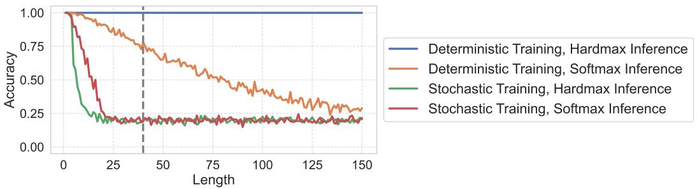  
Figure S15: $P$ parametrization ablations on the Arithmetic FSA with 1 layer of PD-SSM with a linear readout. The dashed vertical line indicates the maximum training length.

We can see that introducing stochasticity and relaxing sparsity both have detrimental effects on accuracy.

Nonlinear Readout Experiments: The second ablation is centered on the readout function $\psi ( x _ { t } )$ . As previously stated, for our state-tracking experiments, the readout function is defined as

$$
\psi ( x _ { t } ) = W ^ { R e a d } ( R e \{ x _ { t } \} | I m \{ x _ { t } \} ) + b ^ { R e a d }
$$

with $| |$ denoting vector concatenation. Typically, however, neural networks interleave sequence processing layers with nonlinearly activated feed-forward networks (Vaswani et al. 2017), as opposed to the affine transformation that we applied. We test the effect of a nonlinear readout, defined as

$$
\psi ( x _ { t } ) = W ^ { R e a d , O } \sigma _ { G e l u } ( W ^ { R e a d , I } ( R e \{ x _ { t } \} | I m \{ x _ { t } \} ) + b ^ { R e a d , I } ) + b ^ { R e a d , O }
$$

We repeat all of the experiments that we report in Figure S15, but now with the nonlinear readout. We see in Figure S16 that the results are significantly worse than with a linear readout. No method performs well even on in-domain lengths.

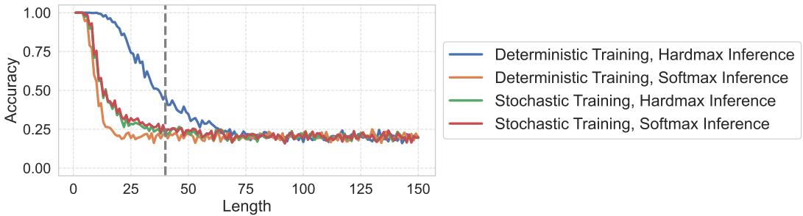  
Figure S16: $P$ parametrization ablations on the Arithmetic FSA with 1 layer of PD-SSM with a nonlinear readout. The dashed vertical line indicates the maximum training length.

# F Related Work

General Overview of SSMs LTI SSMs have been proposed as a more scalable alternative to Transformers that is also more performant on long sequences Gu et al. (2020, 2021, 2022b,a); Gupta et al. (2022); Smith et al. (2023); Orvieto et al. (2023). A subsequent analysis showed promising language modeling performance with hybrid architectures based on gated SSMs and Attention Ma et al. (2023); Fu et al. (2023). Time-variant hybrid systems were then shown to perform significantly better on practical tasks with the Mamba SSM which utilizes diagonal transition matrices Gu and Dao (2023). Consequently, a line of work has demonstrated that hybrid models utilizing diagonal time-variant SSMs and attention exhibit better generalization to longer sequences, better general language modeling and reasoning performance (Ren et al. 2025; De et al. 2024; Lenz et al. 2025; Wu et al. 2025; Waleffe et al. 2024).

Overview of Formal Results and SSM Matrix Structures Concurrently, formal analyses of time-varying SSMs have shown limitations of the diagonal transition matrix structure Merrill et al. (2024); Cirone et al. (2024), spurring a line of work investigating the utility of block-diagonal and unstructured matrices Fan et al. (2024); Terzic et al. (2025), as well as more expressive structured ´ transition matrices, most notably diagonal plus low-rank Yang et al. (2024); Grazzi et al. (2024); Peng et al. (2025); Siems et al. (2025), with the original inspiration stemming from at least as far back as fast-weight programmers Schlag et al. (2021a,b); Schmidhuber (1992) whose computational structure contains products of generalized Householder matrices Yang et al. (2024), which enables the adoption of early algorithmic optimizations of such procedures Bischof and Van Loan (1987).

Details of Formal Results As a lower bound on diagonal SSMs, Sarrof et al. (2024) show that a stack of complex diagonal SSM layers can emulate any solvable automaton, with the stack depth proportional to the Krohn-Rhodes (KR) complexity of the transformation semigroup Krohn and Rhodes (1965); Margolis et al. (2024). As an upper bound on diagonal SSMs, Merrill et al. (2024) derives a bound on fixed-depth diagonal selective SSMs with logarithmic precision representation, placing them in the L-uniform $T C ^ { \tilde { 0 } }$ circuit complexity class. This complexity class encompasses solvable automata. DPLR matrices can emulate any automaton with depth proportional to KRcomplexity and width linear in depth and arbitrary readout Siems et al. (2025).

Experimental Expressivity Analyses Experimental analysis of sequential neural networks trained on formal language tasks goes back to at least (Smith and Zipser 1989; Hochreiter and Schmidhuber 1997). The exact experimental setup we build on is a more recent one, with the set of tasks taken from Delétang et al. (2023), and the experimental setup borrowed from Walker et al. (2025). All of the non-solvable group word problems were generated using modified sample generation code from Liu et al. (2023).