# FUDOKI: Discrete Flow-based Unified Understanding and Generation via Kinetic-Optimal Velocities

Jin Wang∗,1 Yao Lai∗,1 Aoxue $\mathbf { L i } ^ { 2 }$ Shifeng Zhang2 Jiacheng Sun2 Ning Kang2 Chengyue Wu1 Zhenguo Li†,2 Ping Luo†,1

1The University of Hong Kong 2Huawei Noah’s Ark Lab

# Abstract

The rapid progress of large language models (LLMs) has catalyzed the emergence of multimodal large language models (MLLMs) that unify visual understanding and image generation within a single framework. However, most existing MLLMs rely on autoregressive (AR) architectures, which impose inherent limitations on future development, such as the raster-scan order in image generation and restricted reasoning abilities in causal context modeling. In this work, we challenge the dominance of AR-based approaches by introducing FUDOKI, a unified multimodal model purely based on discrete flow matching, as an alternative to conventional AR paradigms. By leveraging metric-induced probability paths with kinetic optimal velocities, our framework goes beyond the previous masking-based corruption process, enabling iterative refinement with self-correction capability and richer bidirectional context integration during generation. To mitigate the high cost of training from scratch, we initialize FUDOKI from pre-trained AR-based MLLMs and adaptively transition to the discrete flow matching paradigm. Experimental results show that FUDOKI achieves performance comparable to state-of-the-art AR-based MLLMs across both visual understanding and image generation tasks, highlighting its potential as a foundation for next-generation unified multimodal models. Furthermore, we show that applying test-time scaling techniques to FUDOKI yields significant performance gains, further underscoring its promise for future enhancement through reinforcement learning.

# 1 Introduction

Driven by the rapid progress of large language models (LLMs) [1–5], a new wave of large-scale multimodal models has emerged, delivering remarkable advances in the two fundamental pillars of artificial general intelligence (AGI): understanding [6–10] and generation [11–15]. Building on this momentum, a growing body of work [16–25] seeks to unify perception and synthesis within a single framework, introducing versatile multimodal large language models (MLLMs) that seamlessly integrate visual understanding with image generation.

In prior research, most MLLMs adopt the autoregressive (AR) architecture of standard LLMs, processing multimodal tokens sequentially from left to right for both understanding and generation tasks [26, 27]. While these MLLMs deliver strong performance across many multimodal tasks, their

# Generation

# Understanding

# Spatial Relation

Question: What is the relation between the couch and the coffee table in the living room?

A. The couch is on top of the coffee table B. The coffee table is in front of the couch C. The coffee table is behind the couch D. The couch and the coffee table are not related

Answer: The coffee table is in front of the couch.

# Future Prediction

Question: What is the anticipated outcome in this image?

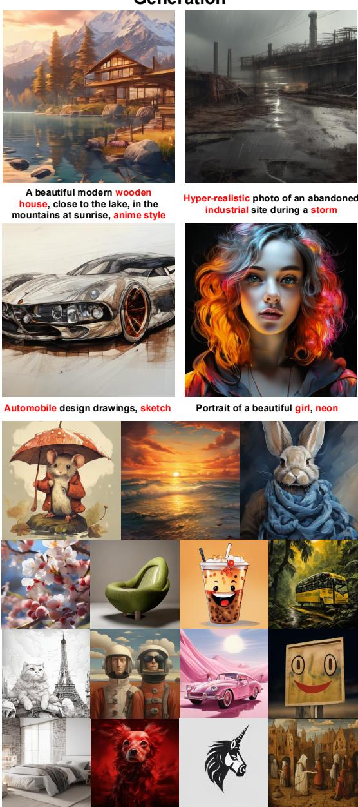  
Figure 1: Qualitative Results of Visual Generation and Understanding Capabilities of FUDOKI. FUDOKI is designed based on the framework of discrete flow matching for both visual and textual modalities, capable of performing understanding and generation simultaneously under one unified paradigm.

A. He will be released from the police station B. He will escape from the police station C. He will be arrested and taken to the police station D. He will be visiting the police station voluntarily

Answer: The image shows a person being escorted by police officers, with the person's hands behind their back. This indicates that the person has been arrested and is being taken to the police station. Therefore, the correct answer is C. He will be arrested and taken to the police station.

# Scene Understanding

Question: What is the main event that is happening in the image?

A. An award show B. A concert performance C. A graduation ceremony D. A sporting event

Answer: The main event happening in the image is a graduation ceremony. This is evident from the individuals wearing graduation caps and gowns, and the presence of a large audience in a stadium-like setting, which is typical for graduation performance ceremonies.

# Instance Counting

Question: How many people are sitting in the background of the image? A. None B. One C. Three or more D. Two Answer: C. Three or more

# Physics

Question: What is the transformation in this image?

A. The water will freeze B. The water will remain liquid C. The water will evaporate D. The water will condense

Answer: The image shows a container of water being heated, with blue spheres representing molecules moving from the liquid to the gas phase. This process is known as boiling products, which transitions from a liquid to a gas state. Therefore, the correct answer is C. The water will evaporate.

inherent AR design’s limitations have become increasingly apparent as shown in recent studies, such as weaker performance in complex reasoning [28–30], challenges in future planning [31], and difficulties with self-correction [32]. These shortcomings are particularly critical for emerging domains such as embodied AI and autonomous agents, where complex reasoning and deep contextual understanding are essential. This prompts a fundamental question for the future of AGI development: what architectural paradigm could define the next generation of MLLMs?

To this end, discrete-space generative flow and diffusion models have gained attention as a promising alternative for generative modeling. These models have seen success in the domain of text generation [33–38], protein design [39], image synthesis [37, 38], and code generation [37, 40]. Unlike sequential autoregressive models, these models usually begin with a fully corrupted sequence and iteratively denoise the entire sequence in parallel, which allows richer integration of information from both directions to enhance prolonged reasoning. Moreover, these models enable flexible and controllable generation through their inherent iterative refinement process, while offering the potential for accelerated sampling via novel training designs [41–43]. Recent studies like LLaDA [44] and Dream [45] have also scaled discrete diffusion models to 7B parameters, further highlighting their growing potential to overcome the fundamental limitations of autoregressive approaches.

To advance the application of discrete generative flow modeling and challenge the dominance of the AR-based paradigm in MLLMs, we present FUDOKI, a unified multimodal model purely based on discrete flow matching. Different from previous diffusion-based unified multimodal models [46–48] focusing solely on the case of masking as a corruption process, we adopt the novel framework of discrete flow matching [37, 38], which substantially expanded the design space of discrete-space generative models by enabling metric-induced probability paths with kinetic optimal velocities. This design enables better performance than masked construction [38] and allows models to continuously self-correct their responses during the iterative refinement process. Moreover, to mitigate the high training cost of training large discrete flow matching models for multimodal tasks, we leverage the pre-trained AR-based MLLM [20] as the initialization and adaptively transfer it to the discrete flow matching paradigm [49].

The contributions of this paper can be summarized as follows: 1) We introduce FUDOKI4, the first general-purpose unified multimodal model built entirely on discrete flow matching. Unlike traditional approaches that rely on masking-based corruption, FUDOKI leverages a metric-induced probability path with kinetically optimal velocities, expanding the design space of discrete multimodal modeling and offering advantages during inference; 2) Through extensive experiments, we show that FUDOKI achieves competitive performance on both visual understanding and text-to-image generation tasks, rivaling autoregressive-based MLLMs; 3) We apply test-time inference scaling techniques to FUDOKI inspired by [50], which yield substantial improvements across visual generation and understanding benchmarks. This suggests strong potential for future enhancement of FUDOKI via reinforcement learning [1, 51]. We believe that FUDOKI provides a compelling foundation for the development of next-generation unified multimodal models.

# 2 Preliminary: Discrete Flow Matching

In this section, we present key concepts and notations in discrete flow matching [37] to facilitate understanding in the following sections. Generally speaking, the objective of discrete flow matching $p ( x )$ approx, where $x = ( x ^ { 1 } , x ^ { 2 } , . . . , x ^ { D } )$ erlying data distribution  belongs to the discrete $q ( x )$ ${ \mathcal { S } } = { \mathcal { T } } ^ { D }$ source, where $D$ own distributionis the number of discrete variables and $\mathcal { T } = [ K ] = \{ 1 , 2 , \dots , K \}$ represents a finite set of possible discrete values.

Probability Paths. Given a source distribution $p ( x )$ and a target distribution $q ( x )$ defined over a finite state space $s$ , discrete flow matching defines a family of time-indexed probability distributions $\{ p _ { t } ( x ) \} _ { t \in [ 0 , 1 ] }$ to describe a smooth transformation from $p$ to $q$ , referred to as probability paths. Each $p _ { t } ( x )$ is constructed as: $\begin{array} { r } { p _ { t } ( x ) : = \sum _ { x _ { 1 } \in S } p _ { t } ( x \mid x _ { 1 } ) q ( x _ { 1 } ) } \end{array}$ , where the conditional distribution is factorized across dimensions, namely $\begin{array} { r } { p _ { t } ( x \mid x _ { 1 } ) : = \prod _ { i = 1 } ^ { D } p _ { t } ( x ^ { i } \mid x _ { 1 } ^ { i } ) } \end{array}$ . Here, each $p _ { t } ( x ^ { i } \mid x _ { 1 } ^ { i } )$ defines a univariate interpolation between a base distribution $p ( x ^ { i } )$ and a point mass $\delta _ { x _ { 1 } ^ { i } } \left( x ^ { i } \right)$ , i.e., $\delta _ { x _ { 1 } ^ { i } } ( x ^ { i } ) = 1$ if $x ^ { i } = x _ { 1 } ^ { i }$ else 0. A common design for such interpolations is the mixture path, defined via a time-dependent scheduler $\kappa _ { t } ( x _ { 1 } ^ { i } ) \in [ 0 , 1 ]$ :

$$
p _ { t } ( x ^ { i } \mid x _ { 1 } ^ { i } ) = ( 1 - \kappa _ { t } ( x _ { 1 } ^ { i } ) ) p ( x ^ { i } ) + \kappa _ { t } ( x _ { 1 } ^ { i } ) \delta _ { x _ { 1 } ^ { i } } ( x ^ { i } ) ,
$$

where $\kappa _ { 0 } ( \cdot ) = 0$ and $\kappa _ { 1 } ( \cdot ) = 1$ . This class of paths recovers the masked data construction when $p ( x ^ { i } ) = \delta _ { m } ( x ^ { i } )$ with $m$ denoting the mask token, which are widely used in previous studies [35, 36].

Probability Velocities. To simulate the generative process that evolves along the prescribed path $\{ p _ { t } ( x ) \} _ { t \in [ 0 , 1 ] }$ , we consider a continuous-time Markov chain (CTMC) $\{ x _ { t } \} _ { t \in [ 0 , 1 ] }$ over the discrete space $s$ , such that: $x _ { t } \sim p _ { t }$ . Specifically, we describe this CTMC via a probability velocity $u _ { t } ^ { i } ( \cdot , x _ { t } )$

(also known as the rate matrix), describing the rate of probability change of $x _ { t }$ in its $i$ -th token. Reminiscent of the velocity field in the continuous Flow Matching [42, 41], discrete flow matching features the following definition:

Definition 1. A probability velocity $u _ { t }$ is said to generate the probability path $p _ { t }$ if, for all $t \in [ 0 , 1 )$ and for any sample $x _ { t } \sim p _ { t }$ , the updated sample $x _ { t + h } ^ { i } \sim \delta _ { x _ { t } ^ { i } } \mathbf { \bar { ( } } \cdot ) + h u _ { t } ^ { i } \mathbf { \bar { ( } } \cdot , x _ { t } )$ for each coordinate $i$ satisfies the condition that $x _ { t + h } \sim p _ { t + h } + o ( h ) ^ { 5 }$ as $h  0$ .

Besides, the probability velocity $u _ { t }$ should satisfy the following rate condition:

$$
\sum _ { x ^ { i } \in [ K ] } u _ { t } ^ { i } ( x ^ { i } , z ) = 0 , \quad \mathrm { a n d } \quad u _ { t } ^ { i } ( x ^ { i } , z ) \geq 0 \quad \forall i \in [ D ] , x ^ { i } \neq z ^ { i } ,
$$

such that the updated $x _ { t + h } ^ { i }$ can be sampled from a valid probability distribution. Further, previous studies [37, 39] also demonstrate the Continuity Equation (also known as the Kolmogorov forward equation) in discrete flow matching, which describes the state probability rate $\dot { p } _ { t } ( x )$ , $x \in S$ by:

$$
\dot { p } _ { t } ( x ) + \mathbf { d i v } _ { x } ( p _ { t } u _ { t } ) = 0 .
$$

where $\begin{array} { r } { \mathbf { d i v } _ { x } ( p _ { t } u _ { t } ) = \sum _ { z \in S } \sum _ { i = 1 } ^ { D } \delta _ { x } ( z ^ { \bar { i } } ) \left[ p _ { t } ( x ) u _ { t } ^ { i } ( z ^ { i } , x ) - p _ { t } ( z ) u _ { t } ^ { i } ( x ^ { i } , z ) \right] . } \end{array}$ , measuring the total outgoing flux $x \to z$ minus the total incoming flux $z  x$ for state $x \in S$ . Here $\begin{array} { r } { \delta _ { x } ( z ^ { \overline { { i } } } ) = \prod _ { j \neq i } \delta _ { x ^ { j } } ( z ^ { j } ) } \end{array}$ , which indicates that we only consider $x$ and $z$ when they only differ in the $i$ -th coordinate for calculating the flux [37, 34]. Intuitively, Eq. 3 expresses that the rate of probability at $x$ is equal to the final remaining probability flux $p _ { t } u _ { t }$ at $x$ . Previous studies [37, 39] have shown that if the Continuity Equation is satisfied, then $u _ { t }$ is said to generate the probability path $p _ { t }$ as in Definition 1.

# 3 FUDOKI: A Multimodal Model Purely Based on Discrete Flow Matching

This section introduces FUDOKI, a new multimodal architecture that unifies vision and language through the novel lens of discrete flow matching. By adopting this framework, FUDOKI enables an integrated approach to both perception and generation across visual and textual modalities.

# 3.1 Metric-induced Probability Paths with Kinetic Optimal Velocities

Based on the recent theoretical advancement of discrete flow matching [38], we adopt a more general probability path for FUDOKI, instead of the commonly used mask-based mixture paths [37, 36, 35, 46, 45]. Specifically, we consider the probability paths induced by discrete metrics. Given a distance function $d : \mathcal { T } \times \mathcal { T }  \mathbb { R } _ { \ge 0 }$ satisfying $d ( x ^ { i } , { \bar { x _ { 1 } ^ { i } } } ) = 0$ if and only if $x ^ { i } = x _ { 1 } ^ { i }$ , we define a path of conditional distributions via:

$$
p _ { t } ( x ^ { i } \mid x _ { 1 } ^ { i } ) = \mathrm { s o f t m a x } \big ( - \beta _ { t } \cdot d ( x ^ { i } , x _ { 1 } ^ { i } ) \big ) ,
$$

where $\beta _ { t } : [ 0 , 1 ] \to \mathbb { R } _ { \geq 0 }$ is a monotonic schedule with boundary values $\beta _ { 0 } = 0$ , $\beta _ { 1 } = \infty$ . At $t = 0$ , this yields a uniform distribution, and as $t \to 1$ , the distribution converges to a delta function at $x _ { 1 } ^ { i }$ . Compared to the previous mask-based probability path (i.e., Eq. 1), this metric-induced probability path defines a more semantically meaningful transformation, allowing the probabilities of tokens similar to $x _ { 1 } ^ { i }$ to also increase as $t \to 1$ , when setting $d ( \cdot , \cdot )$ to measure token embedding distances.

After defining the prescribed metric-induced probability path, we then obtain the probability velocities via minimizing the kinetic energy [38]. In other words, it is expected to minimize the magnitude of flux $p _ { t } u _ { t }$ for probability velocities to obtain a smooth transformation along the probability path. Meanwhile, the obtained velocities should also satisfy several conditions, including the Continuity Equation (i.e., Eq. 3), the non-negativity of the flux between different states (i.e., Eq. 2), and the boundary conditions for $p$ and $q$ . We leave the detailed mathematical formulations in the appendix. In this way, the kinetic optimal velocity for Eq. 4 can be formulated as follows [38],

$$
u _ { t } ^ { i } ( x ^ { i } , z \mid x _ { 1 } ) = p _ { t } ( x ^ { i } \mid x _ { 1 } ^ { i } ) \dot { \beta } _ { t } [ d ( z ^ { i } , x _ { 1 } ^ { i } ) - d ( x ^ { i } , x _ { 1 } ^ { i } ) ] _ { + }
$$

where $[ \cdot ] _ { + } = \operatorname* { m a x } \{ \cdot , 0 \}$ is the ReLU operator and $\dot { \beta } _ { t }$ is the derivative of $\beta _ { t }$ w.r.t $t$ . Intuitively, for the $i$ -th coordinate $z ^ { i } \in { \mathcal { T } }$ , this velocity ensures that probability mass flows from state $z ^ { i }$ to state $x ^ { i }$ only when $x ^ { i }$ lies closer to $x _ { 1 } ^ { i }$ than $z ^ { i }$ does, i.e., $d ( x ^ { i } , x _ { 1 } ^ { i } ) < d ( z ^ { i } , x _ { 1 } ^ { i } )$ . As a result, the flow monotonically progresses toward $x _ { 1 } ^ { i }$ . After introducing the mathematical foundation of discrete flow matching, we now dive into FUDOKI’s model structure details.

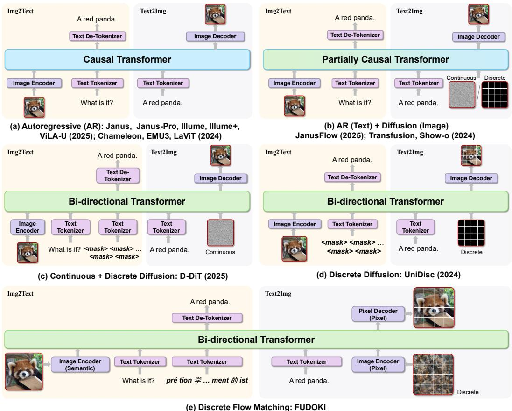  
Figure 2: Comparison of Model Architectures in Unified Multimodal Models. (a) AR-based models [20, 26, 21, 52–54, 18, 55] perform multimodal tasks via sequential token generation under strictly causal context modeling. (b) Hybrid AR $^ +$ Diffusion models, such as Transfusion [19] and Show-o [56], integrate AR for text and diffusion models for images, enabling improved visual generation quality. (c-d) Diffusion-based models: D-DiT [46] applies mask-based discrete diffusion to text and continuous diffusion to images, while UniDisc [48] employs mask-based discrete diffusion for both modalities. (e) FUDOKI adopts a unified discrete flow matching framework for both modalities, leveraging a metric-induced probability path to enhance performance in understanding and generation tasks. The inference advantages of FUDOKI over mask-based discrete diffusion modeling used in (c-d) are shown in Fig. 3.

# 3.2 Architecture Overview

As shown in Fig. 2(e), FUDOKI is based on the Janus-1.5B [20] architecture, with minor adaptations to support unified vision-language discrete flow modeling. Specifically, to facilitate effective learning and accelerate convergence, 1) we adopt a full attention mask instead of the standard causal mask to allow all tokens to attend to each other, which helps the model better capture global context; 2) we apply a shifting operation [49] to the output logits by one position, so that our model can inherit the next-token prediction capabilities of AR-based MLLMs as much as possible; 3) unlike continuous diffusion models [57, 12], we do not incorporate additional time embedding layers in the model to explicitly indicate the noise level in the corrupted input. Following the intuition of mask-based discrete diffusion models [49, 58], we observe that our discrete generative model can also implicitly infer the timesteps from the corrupted input along our defined metric-induced probability path (i.e., Eq. 4), resulting in faster adaptation in experiments. The rest of the architecture remains identical to Janus-1.5B. For the text modality, we use the tokenizer with a vocabulary size of 102, 400. For images, we decouple the processing paths for understanding and generation. The semantic encoder SigLIP [59] extracts high-dimensional features for image understanding, which are reshaped and mapped into the LLM input space via an adaptor. For image generation, we follow LlamaGen [60], employing a pixel encoder and decoder to convert images into discrete tokens, with the image token vocabulary size set to 16, 384. Each image token embedding is further transformed into an input feature via a generation adaptor before being fed into the LLM. At the output stage, we use two output heads, a text head and an image head, which convert the transformer outputs into discrete categorical distributions. The appropriate head is selected depending on the target modality during inference. Comparisons with previous AR-based and diffusion-based MLLMs are shown in Fig. 2.

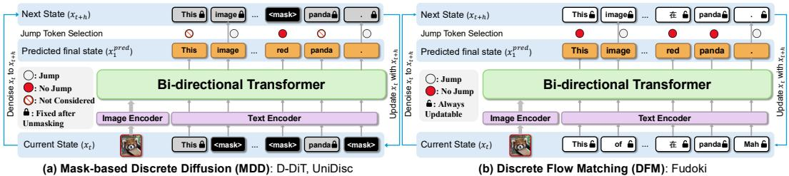  
Figure 3: Inference Comparisons between (a) Mask-Based Discrete Diffusion Models and (b) Discrete Flow Matching-Based FUDOKI. In mask-based discrete diffusion models, once a token is unmasked, it typically cannot be modified again, which hinders self-correction. In contrast, our proposed FUDOKI allows its responses to be continuously updated during inference, enabling potential corrections.

# 3.3 Training

We follow the discrete flow matching framework [34] for model training. Our model is initialized from the pretrained weights of Janus-1.5B [20] and further adapted to our collected dataset, which contains both text-to-image (generation) and image-to-text (understanding) data. Specifically, we divide the training of FUDOKI into two stages: 1) The main goal of the first stage is to quickly relearn the AR-based LLM such that it can effortlessly support the discrete flow matching paradigm. To this end, we only fine-tune the parameters of the transformer while keeping other parts of the model frozen, including the semantic encoders and embedding adaptors. This can help accelerate convergence and stabilize our training; 2) After the first stage, we further fine-tune the whole model to enhance its overall performance on understanding and generation based on discrete flow matching.

Specifically, in each training stage, the ground-truth target $x _ { 1 }$ is drawn from the data distribution $q ( \cdot )$ , where the condition is either a text prompt (for T2I) or an image-question pair (for I2T). The target $x _ { 1 }$ is the image token sequence in the T2I setting and the textual token sequence in the I2T setting. At each training step, a time $t \in [ 0 , 1 ]$ is uniformly sampled, and a noised sequence $x _ { t }$ is sampled according to the defined probability path $p _ { t } ( \cdot \mid x _ { 1 } )$ in Eq. 4. We set the distance function $d ( \cdot , \cdot )$ to measure the L2-distances between normalized token embeddings, which helps increase the probability of sampling tokens whose embeddings are close to the corresponding ground-truth token $x _ { 1 } ^ { i }$ in the embedding space, thereby making the corruption process more semantically meaningful and facilitating learning. The model then receives $x _ { t }$ as input and predicts $x _ { 1 }$ , outputting per-token logits for each position. The training loss is defined as the expected cross-entropy between the ground-truth sequence $x _ { 1 }$ and the model’s predicted distribution:

$$
\mathcal { L } _ { \mathrm { C E } } ( \theta ) = \mathbb { E } _ { t \sim U [ 0 , 1 ] , x _ { 1 } \sim q ( \cdot ) , x _ { t } \sim p _ { t } ( \cdot \vert x _ { 1 } ) } \left[ - \sum _ { i = 1 } ^ { D } \log p _ { 1 \mid t } ^ { \theta } \left( x _ { 1 } ^ { i } \mid x _ { t } \right) \right]
$$

where $p _ { 1 | t } ^ { \theta } ( \cdot \vert x _ { t } )$ denotes the model’s predicted categorical distribution for the $i$ -th position, parameterized by $\theta$ , given input $x _ { t }$ .

# 3.4 Inference

During inference, we apply an Euler solver for more robust sampling as suggested in [38]. This solver simulates the continuous-time Markov chain (CTMC) process $( x _ { t } ) _ { 0 \leq t \leq 1 }$ . Given that $x _ { t } \sim p _ { t }$ , the solver updates the $i$ -th coordinate from time $t$ to $t + h$ using the following procedure:

• Sample $x _ { 1 } ^ { i } \sim p _ { 1 | t } ^ { i } ( \cdot | x _ { t } )$ from our model;   
• Compute the total conditional transition rate $\begin{array} { r } { \lambda ^ { i } = \sum _ { x ^ { i } \neq x _ { t } ^ { i } } u _ { t } ^ { i } ( x ^ { i } , x _ { t } ^ { i } | x _ { 1 } ^ { i } ) } \end{array}$ (see Eq. 5);   
• Draw a uniform random variable $Z _ { \mathrm { c h a n g e } } ^ { i } \sim U [ 0 , 1 ]$ ;

• Sample otherwi $x _ { t + h } ^ { i }$ : if . He $Z _ { \mathrm { c h a n g e } } ^ { i } \leq 1 - e ^ { - h \lambda ^ { i } }$ , sample ction. $x _ { t + h } ^ { i }$ from uit(·,xit|xi1)i (1 − δxi (·)); $x _ { t + h } ^ { i } = x _ { t } ^ { i }$ $\delta _ { x _ { t } ^ { i } } ( \cdot )$

We provide a detailed understanding of this inference process as follows. In the second step, $\lambda ^ { i }$ can be interpreted as the intensity with which the probability mass at $\boldsymbol { x } _ { t } ^ { i }$ flows to other states $\dot { \boldsymbol { x } } ^ { i } \neq \boldsymbol { x } _ { t } ^ { i }$ . The probability that $\ v { x } _ { t } ^ { i }$ will change at the current timestep is determined by comparing the threshold $1 - e ^ { - h \lambda ^ { i } }$ with a uniform random variable $Z _ { \mathrm { c h a n g e } } ^ { i }$ : the larger $\lambda ^ { i }$ is, the more likely a jump will occur. If a change happens, $x _ { t + h } ^ { i }$ is sampled from all other possible states according to the distribution proportional to $u _ { t } ^ { i } ( \cdot , x _ { t } ^ { i } | x _ { 1 } ^ { i } )$ , as defined in Eq. 5. This means the update tends to move $x _ { t + h } ^ { i }$ towards states that are closer to the model’s prediction $x _ { 1 } ^ { i }$ . In this way, our sampling process enables the model to: (1) continuously refine its predictions along the probability path, and (2) flexibly adjust tokens towards semantically similar alternatives at each timestep. As shown in Fig. 3, this is in contrast to previous mask-based discrete diffusion models [36, 35, 45], where once a token is unmasked, it generally cannot be modified again, even if it contains an error.

# 4 Experiments

# 4.1 Implementation Details

In both training stages, we use approximately 13M supervised finetuning data to learn our FUDOKI, including 9M in-house generation data for text-to-image generation and 4M public understanding data, which covers various aspects including OCR [61, 62], doc [63], chart [64], screen [65], math [66, 67], language [68], etc. This is less than Chameleon’s 1.4B data [54] and LWM’s 1B data [69]. We leave the detailed dataset collections in the appendix. For text generation, the sequence length for the response is set to 500, while for image generation, it is set to 576 to match the input size of the image encoder. The text embeddings for calculating the metric distance function $d ( \cdot , \cdot )$ are taken from the original embedding layer of Janus-Pro-7B [26] and the image embeddings are obtained from the codebook of LlamaGen [60]. We set $\begin{array} { r } { \beta _ { t } = c \left( \frac { t } { 1 - t } \right) ^ { a } } \end{array}$ with $c = 3$ and $a = 0 . 9$ , as suggested in [38]. Besides, following previous studies [45, 44], for the text modality, we pad each sequence with <eos> (end-of-sequence) and $< p a d >$ tokens to the maximum length during training, and compute the loss over model’s answer tokens, including these special tokens. After the sampling process, we only keep the model responses ahead of the first $< _ { \tt e o s s }$ token. The sampling iterations are set as 32 by default, and the resolution of generated images by FUDOKI is $3 8 4 \times 3 8 4$ . The entire training process spanned approximately 43,000 GPU hours.

# 4.2 Comparison with State-of-the-arts

Visual Generation Performance. We evaluate the generation capabilities of FUDOKI on the widely used GenEval benchmark [75]. Table 1 presents the summarized comparisons, where FUDOKI achieved competitive overall performance (0.77), matching the top score of prior models in the category of both the generation-only and the understanding-and-generation categories. These results underscore our model’s advantages in accurate multi-object understanding and attribute binding, making it promising for complex visual generation tasks that go beyond simple object depiction. This can be attributed to the discrete flow matching framework of FUDOKI, which allows visual information to integrate in both directions for better layout design of generated images.

Besides, we evaluate the visual generation performance of FUDOKI on DPG-Bench [76] (Dense Prompt Graph Benchmark), a comprehensive dataset comprising 1,065 lengthy and densely composed prompts specifically designed to assess the fine-grained semantic alignment capabilities of text-toimage models. As shown in Table 2, FUDOKI demonstrates competitive performance compared to both generation-specialized and unified multimodal models. These results highlight FUDOKI’s strong ability to handle complex, information-rich prompts, establishing it as a robust and versatile solution for multi-aspect visual generation tasks.

Multimodal Understanding. We evaluate the understanding capabilities of FUDOKI on several benchmarks, including POPE [91], MME-P [92], SEED [93], MMB [94], GQA [95], MMMU [96], and MM-Vet [97]. Table 3 presents the summarized results 6. Notably, our FUDOKI model (1.5B parameters) achieved highly competitive results, which are on par with or surpass several AR-based MLLMs of similar or even larger scale. This demonstrates that FUDOKI delivered robust multimodal understanding capabilities, which can be attributed to the bidirectional reasoning property of discrete flow matching. Moreover, we provide generation process comparisons for understanding in Fig. 4, which further highlight the advantages of sampling through discrete flow matching for reasoning, e.g., self-correcting the reasoning process for coherency. Our findings highlight the effectiveness and efficiency of FUDOKI, making it a strong alternative to the established AR-based MLLMs.

Table 1: Visual Generation Performance on the GenEval Benchmark. "Und." and "Gen." denotes "Understanding" and "Generation". † denotes models that integrate an external pretrained diffusion model.   

<table><tr><td>Type</td><td>Paradigm</td><td>Method</td><td>Single Obj.</td><td>Two Obj.</td><td>Counting</td><td>Colors</td><td>Position</td><td>Color Attri.</td><td>Overall个</td></tr><tr><td rowspan="10">Gen. Only</td><td rowspan="2">AR</td><td>LlamaGen [60]</td><td>0.71</td><td>0.34</td><td>0.21</td><td>0.58</td><td>0.07</td><td>0.04</td><td>0.32</td></tr><tr><td>Emu3-Gen [18]</td><td>0.98</td><td>0.71</td><td>0.34</td><td>0.81</td><td>0.17</td><td>0.21</td><td>0.54</td></tr><tr><td rowspan="7"></td><td>LDM[12]</td><td>0.92</td><td>0.29</td><td>0.23</td><td>0.70</td><td>0.02</td><td>0.05</td><td>0.37</td></tr><tr><td>SDv1.5[12]</td><td>0.97</td><td>0.38</td><td>0.35</td><td>0.76</td><td>0.04</td><td>0.06</td><td>0.43</td></tr><tr><td>PixArt-α [13]</td><td>0.98</td><td>0.50</td><td>0.44</td><td>0.80</td><td>0.08</td><td>0.07</td><td>0.48</td></tr><tr><td>SDv2.1[12]</td><td>0.98</td><td>0.51</td><td>0.44</td><td>0.85</td><td>0.07</td><td>0.17</td><td>0.50</td></tr><tr><td>DALL-E2 [70]</td><td>0.94</td><td>0.66</td><td>0.49</td><td>0.77</td><td>0.10</td><td>0.19</td><td>0.52</td></tr><tr><td>SDXL [71]</td><td>0.98</td><td>0.74</td><td>0.39</td><td>0.85</td><td>0.15</td><td>0.23</td><td>0.55</td></tr><tr><td>DALL-E 3 [72]</td><td>0.96</td><td>0.87</td><td>0.47</td><td>0.83</td><td>0.43</td><td>0.45</td><td>0.67</td></tr><tr><td rowspan="10"></td><td rowspan="5"></td><td>SD3-Medium [14]</td><td>0.99</td><td>0.94</td><td>0.72</td><td>0.89</td><td>0.33</td><td>0.60</td><td>0.74</td></tr><tr><td>SEED-X† [73] LWM [69]</td><td>0.97</td><td>0.58</td><td>0.26</td><td>0.80</td><td>0.19</td><td>0.14</td><td>0.49</td></tr><tr><td>ILLUME [21]</td><td>0.93 0.99</td><td>0.41</td><td>0.46</td><td>0.79</td><td>0.09</td><td>0.15</td><td>0.47</td></tr><tr><td></td><td></td><td>0.86</td><td>0.45</td><td>0.71</td><td>0.39</td><td>0.28</td><td>0.61</td></tr><tr><td>TokenFlow-XL [74] Chameleon [54]</td><td>0.95</td><td>0.60</td><td>0.41</td><td>0.81</td><td>0.16</td><td>0.24</td><td>0.55</td></tr><tr><td rowspan="3"></td><td></td><td>1</td><td>1</td><td>-</td><td>-</td><td>1</td><td>-</td><td>0.39</td></tr><tr><td>Janus [20]</td><td>0.97</td><td>0.68</td><td>0.30 0.51</td><td>0.84</td><td>0.46 0.65</td><td>0.42</td><td>0.61 0.73</td></tr><tr><td>Janus-Pro-1B [26]</td><td>0.98</td><td>0.82</td><td></td><td>0.89</td><td></td><td>0.56</td><td></td></tr><tr><td rowspan="2">AR+Diffusion</td><td>Show-o [56] Transfusion [19]</td><td>0.95</td><td>0.52</td><td>0.49</td><td>0.82</td><td>0.11</td><td>0.28</td><td></td><td>0.53 0.63</td></tr><tr><td>UniDisc [48]</td><td>-</td><td>-</td><td>-</td><td>-</td><td>、</td><td>-</td><td></td></tr><tr><td rowspan="2">Diffusion</td><td>D-DiT [46]</td><td>0.92 0.97</td><td>0.47 0.80</td><td>0.15 0.54</td><td>0.67 0.76</td><td>0.13 0.32</td><td>0.19 0.50</td><td></td><td>0.42 0.65</td></tr><tr><td></td><td>0.96</td><td></td><td>0.56</td><td></td><td></td><td></td><td></td><td></td></tr><tr><td rowspan="2">Discrete Flow</td><td rowspan="2">FUDOKI(Ours)</td><td></td><td>0.85</td><td></td><td></td><td>0.88</td><td>0.68</td><td>0.67</td><td>0.77</td></tr><tr><td>+Inference Scaling</td><td>0.98</td><td>0.95</td><td>0.73</td><td>0.94</td><td>0.88</td><td>0.78</td><td>0.88</td></tr></table>

Table 2: Visual Generation Performance on DPG-Bench.   

<table><tr><td>Method</td><td>Global</td><td>Entity</td><td>Attribute</td><td>Relation</td><td>Other</td><td>Overall个</td></tr><tr><td>SDv1.5[12]</td><td>74.63</td><td>74.23</td><td>75.39</td><td>73.49</td><td>67.81</td><td>63.18</td></tr><tr><td>PixArt-α [13]</td><td>74.97</td><td>79.32</td><td>78.60</td><td>82.57</td><td>76.96</td><td>71.11</td></tr><tr><td>Lumina-Next [77]</td><td>82.82</td><td>88.65</td><td>86.44</td><td>80.53</td><td>81.82</td><td>74.63</td></tr><tr><td>SDXL [71]</td><td>83.27</td><td>82.43</td><td>80.91</td><td>86.76</td><td>80.41</td><td>74.65</td></tr><tr><td>Playground v2.5 [78]</td><td>83.06</td><td>82.59</td><td>81.20</td><td>84.08</td><td>83.50</td><td>75.47</td></tr><tr><td>Hunyuan-DiT[79]</td><td>84.59</td><td>80.59</td><td>88.01</td><td>74.36</td><td>86.41</td><td>78.87</td></tr><tr><td>PixArt-∑[80]</td><td>86.89</td><td>82.89</td><td>88.94</td><td>86.59</td><td>87.68</td><td>80.54</td></tr><tr><td>Emu3-Gen [18]</td><td>85.21</td><td>86.68</td><td>86.84</td><td>90.22</td><td>83.15</td><td>80.60</td></tr><tr><td>DALL-E 3 [72]</td><td>90.97</td><td>89.61</td><td>88.39</td><td>90.58</td><td>89.83</td><td>83.50</td></tr><tr><td>SD3-Medium [14]</td><td>87.90</td><td>91.01</td><td>88.83</td><td>80.70</td><td>88.68</td><td>84.08</td></tr><tr><td>Janus [20]</td><td>82.33</td><td>87.38</td><td>87.70</td><td>85.46</td><td>86.41</td><td>79.68</td></tr><tr><td>Janus-Pro-1B [26]</td><td>87.58</td><td>88.63</td><td>88.17</td><td>88.98</td><td>88.30</td><td>82.63</td></tr><tr><td>FUDOKI(Ours)</td><td>80.55</td><td>89.73</td><td>88.05</td><td>93.66</td><td>78.00</td><td>83.63</td></tr></table>

Inference Scaling. We applied test-time inference scaling techniques [50] to FUDOKI, leveraging a judge model to score multiple candidate outputs and select the highest-scoring responses. The last rows of Table 1 and Table 3 illustrate the impact of inference scaling on visual generation and understanding. For generation, we used the VILA-Judge model [98] to select the top 4 images from 32 candidates per prompt in the GenEval benchmark, resulting in significant performance gains. For understanding, we employed an LLM as the judge to choose the best response from 8 candidates in the challenging MMVet benchmark, where improvements were observed. These results highlight FUDOKI’s potential for further enhancement through reinforcement learning approaches [1, 99].

Table 3: Multimodal Understanding Performance on Various Benchmarks. "Und." and "Gen." denotes "Understanding" and "Generation". † denotes models that integrate an external pretrained diffusion model.   

<table><tr><td>Type</td><td>Paradigm</td><td>Model</td><td>#LLMParams POPE↑MME-P↑MMB↑ SEED↑GQA↑MMMU↑ MM-Vet↑</td><td></td><td></td><td></td><td></td><td></td><td></td><td></td></tr><tr><td rowspan="10">Und. Only</td><td rowspan="10"></td><td>LLaVA-v1.5-Phi-1.5[56]</td><td>1.3B 1.4B</td><td>84.1 84.5</td><td>1128.0</td><td>=</td><td></td><td>56.5 56.1</td><td>30.7</td><td></td></tr><tr><td>MobileVLM[81]</td><td></td><td></td><td>1196.2</td><td>53.2</td><td></td><td></td><td></td><td></td></tr><tr><td>MobileVLM-V2 [82]</td><td>1.4B</td><td>84.3</td><td>1302.8</td><td>57.7</td><td></td><td>59.3</td><td></td><td></td></tr><tr><td>MobileVLM[81]</td><td>2.7B</td><td>84.9</td><td>1288.9</td><td>59.6</td><td></td><td>59.0</td><td></td><td>=</td></tr><tr><td>MobileVLM-V2 [82]</td><td>2.7B</td><td>84.7</td><td>1440.5</td><td>63.2</td><td></td><td>61.1</td><td></td><td>=</td></tr><tr><td>LLaVA-Phi [83]</td><td>2.7B</td><td>85.0</td><td>1335.1</td><td>59.8</td><td></td><td>-</td><td></td><td>28.9</td></tr><tr><td>LLaVA [6]</td><td>7B</td><td>76.3</td><td>809.6</td><td>38.7</td><td>33.5</td><td>-</td><td></td><td>25.5</td></tr><tr><td>LLaVA-v1.5 [84]</td><td>7B</td><td>85.9</td><td>1510.7</td><td>64.3</td><td>58.6</td><td>62.0</td><td>35.4</td><td>31.1</td></tr><tr><td>InstructBLIP [8]</td><td>7B</td><td>=</td><td>-</td><td>36.0</td><td>53.4</td><td>49.2</td><td>-</td><td>26.2</td></tr><tr><td>Qwen-VL-Chat [85]</td><td>7B</td><td>=</td><td>1487.5</td><td>60.6</td><td>58.2</td><td>57.5</td><td></td><td>-</td></tr><tr><td></td><td>IDEFICS-9B[86]</td><td>8B</td><td>=</td><td>=</td><td>48.2</td><td>=</td><td>38.4</td><td>=</td><td>= 37.2</td></tr><tr><td></td><td>Emu3-Chat [18] InstructBLIP [8]</td><td>8B 13B</td><td>85.2 78.9</td><td>1244 1212.8</td><td>58.5 1</td><td>68.2 =</td><td>60.3 49.5</td><td>31.6</td><td>25.6</td></tr><tr><td rowspan="10"></td><td>LaVIT+ [87]</td><td></td><td></td><td></td><td></td><td></td><td></td><td></td><td></td></tr><tr><td>MetaMorph† [88]</td><td>7B 8B</td><td>=</td><td>= =</td><td>- 75.2</td><td>71.8</td><td>46.8 =</td><td>-</td><td>1 1</td></tr><tr><td>Gemini-Nano-1 [89]</td><td>1.8B</td><td></td><td>=</td><td></td><td>-</td><td>=</td><td>26.3</td><td>-</td></tr><tr><td>ILLUME [21]</td><td>7B</td><td>88.5</td><td>1445.3</td><td>65.1</td><td>72.9</td><td>1</td><td>38.2</td><td>37.0</td></tr><tr><td>TokenFlow-XL [74]</td><td>13B</td><td>86.8</td><td>1545.9</td><td>68.9</td><td>68.7</td><td>62.7</td><td>38.7</td><td>40.7</td></tr><tr><td>LWM[69]</td><td>7B</td><td>75.2</td><td>-</td><td></td><td>-</td><td>44.8</td><td>-</td><td>9.6</td></tr><tr><td>VILA-U [90]</td><td>7B</td><td>85.8</td><td>1401.8</td><td>1 =</td><td>59.0</td><td>60.8</td><td>=</td><td>33.5</td></tr><tr><td>Chameleon [54]</td><td>7B</td><td>-</td><td>-</td><td>1</td><td>-</td><td>1</td><td>22.4</td><td>8.3</td></tr><tr><td>Janus [20]</td><td>1.5B</td><td>87.0</td><td>1338.0</td><td>69.4</td><td>63.7</td><td>59.1</td><td>30.5</td><td>34.3</td></tr><tr><td>Janus-Pro-1B [26]</td><td></td><td></td><td>1444.0</td><td>75.5</td><td>68.3</td><td></td><td></td><td></td></tr><tr><td rowspan="2"></td><td>Show-0-256 [56]</td><td>1.5B</td><td>86.2</td><td></td><td></td><td></td><td>59.3</td><td>36.3</td><td>39.8</td></tr><tr><td>AR+Diffusion Show-0-512 [56]</td><td>1.3B 1.3B</td><td>73.8 80.0</td><td>948.4</td><td></td><td>=</td><td>48.7</td><td>25.1</td><td>=</td></tr><tr><td rowspan="2">Diffusion</td><td></td><td></td><td></td><td>1097.2</td><td>1</td><td></td><td>58.0</td><td>26.7</td><td>1</td></tr><tr><td>D-Dit [46]</td><td>2.0B</td><td>84.0</td><td>1124.7</td><td>1</td><td>-</td><td>59.2</td><td>-</td><td>1</td></tr><tr><td rowspan="2">Discrete Flow</td><td>FUDOKI(Ours)</td><td>1.5B</td><td>86.1</td><td>1485.4</td><td>73.9</td><td>68.2</td><td>57.6</td><td>34.3</td><td>38.0</td></tr><tr><td>+Inference Scaling</td><td>1.5B</td><td>-</td><td>=</td><td>1</td><td></td><td>-</td><td>-</td><td>55.5</td></tr></table>

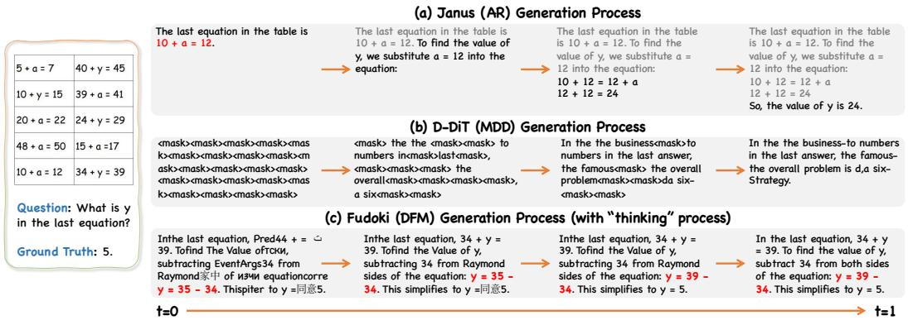  
Figure 4: Generation process of different methods. (a) AR-based Janus can only generate tokens sequentially; if an error is made in the initial step, subsequent outputs will consistently propagate this mistake. (b) D-DiT (mask-based discrete diffusion, MDD) cannot revise tokens once unmasked, making errors irreversible and leading to poor generalization. (c) FUDOKI (discrete flow matching, DFM) allows generated tokens to be revised in subsequent steps, enabling step-by-step reasoning and error correction for more accurate answers.

# 4.3 Ablation Studies

Training Strategies. 1) AR Initialization vs Training from Scratch: As shown in Fig. 5 (left), we compare models initialized with autoregressive (AR) weights [20] against models trained from scratch. The results indicate that AR initialization provided a substantial advantage for accelerating model training, leading to consistently lower training loss throughout the optimization process. 2) Effects of Time-embedding Layers: We also evaluate the impact of incorporating time embedding layers into the model architecture. The results in Fig. 5 (middle) show that the model without time embedding layers consistently achieves slightly lower training loss than the version with time embeddings. This suggests that our discrete generative model can implicitly infer timesteps from corrupted input, and removing time embeddings reduces model complexity.

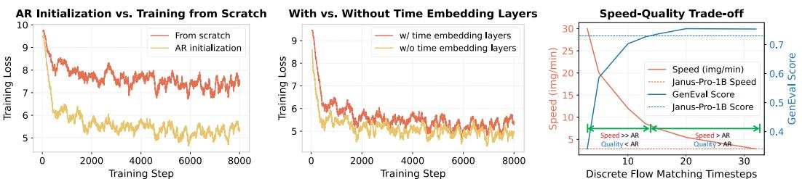  
Figure 5: Comparison of training loss and speed-quality trade-off. (Left, Middle) AR initialization and removing time embedding layers both reduce training loss. (Right) With fewer timesteps, FUDOKI achieves much higher speed but slightly lower quality than AR; at the optimal timestep, both metrics surpass the AR.

Table 4: Quantitative comparisons between the AR-based models and our proposed FUDOKI in terms of the self-correcting capabilities.   

<table><tr><td>Method</td><td>Baseline</td><td>+Janus-Pro-1B to correct</td><td>+Janus-Pro-7B to correct</td><td>+FUDOKI to correct</td></tr><tr><td>MMVet</td><td>37.98</td><td>36.33 (-1.65)</td><td>38.30 (+0.32)</td><td>38.53 (+0.55)</td></tr></table>

Quality-Speed Trade-off. Fig. 5 (right) illustrates the trade-off between speed (in images per minute) and quality (GenEval score) in terms of setting different inference timesteps for visual generation. It compares the inference performance of FUDOKI with the autoregressive (AR) baseline, Janus-Pro-1B (with KV cache enabled). The red solid line (to the left vertical axis) represents the speed of FUDOKI, which decreases as the number of timesteps increases, while the blue solid line (to the right vertical axis) represents the generation quality of FUDOKI, which improves and stabilizes as timesteps increase. We also draw the dashed horizontal lines indicating the baseline values for Janus-Pro-1B, with the red dashed line for speed and the blue dashed line for quality. Please pay attention to the intersection point of the green arrows. This intersection marks the point where FUDOKI achieves a significant speed advantage over the AR baseline (as the red solid line exceeds the red dashed line) and comparable output quality (where the blue solid line meets the blue dashed line). This can be attributed to FUDOKI’s fewer inference steps and richer bidirectional context modeling.

Results on the Self-Correction Capability. We quantitatively evaluated the self-correcting capabilities of FUDOKI and performed comparisons with the AR-based models. In experiments, both FUDOKI and AR-based models were tasked with correcting baseline responses where necessary. The baseline responses were obtained from Janus-Pro-1B on the MMVet benchmark, using the OpenCompass VLMEvalKit codebase [100]. To assess their correction abilities: 1) For AR-based models, we appended the following prompt to the original prompt: "Your original response is: <placeholder>. Please correct it if needed. Otherwise, you may keep it the same." The models were then evaluated on their ability to revise or retain the response as appropriate; 2) For FUDOKI, we initialized the responses with the baseline responses (rather than uniformly-sampled noise tokens) and performed iterative refinements over 32 steps, as described in the paper. As shown in Table 4, FUDOKI achieved the highest performance improvement, while Janus-Pro-1B’s performance declined and Janus-Pro-7B showed less increase, despite its larger model size than ours. We attribute such results to the increased context length introduced by the baseline responses, which may distract the AR-based model’s focus. This further highlights the limitations of the AR paradigm for effective self-correction.

# 5 Conclusion

In this work, we introduced FUDOKI, a multimodal model that uses discrete flow matching to unify visual understanding and generation. Unlike conventional autoregressive and masking-based approaches, FUDOKI leverages discrete flow matching for iterative self-correction, bidirectional reasoning, and flexible generation. Experiments show that FUDOKI performs competitively with leading AR-based MLLMs on both visual understanding and text-to-image generation tasks. These results highlight discrete generative flow models—exemplified by FUDOKI—as a promising direction for advancing multimodal language models and meeting future AGI challenges.

# Acknowledgments

This paper is partially supported by the National Key R&D Program of China No.2022ZD0161000 and the General Research Fund of Hong Kong No.17208825 and 17209324.

# References

[1] DeepSeek-AI. Deepseek-r1: Incentivizing reasoning capability in llms via reinforcement learning, 2025.   
[2] An Yang, Baosong Yang, Beichen Zhang, Binyuan Hui, Bo Zheng, Bowen Yu, Chengyuan Li, Dayiheng Liu, Fei Huang, Haoran Wei, et al. Qwen2.5 technical report. arXiv preprint arXiv:2412.15115, 2024.   
[3] Abhimanyu Dubey, Abhinav Jauhri, Abhinav Pandey, Abhishek Kadian, Ahmad Al-Dahle, Aiesha Letman, Akhil Mathur, Alan Schelten, Amy Yang, Angela Fan, Anirudh Goyal, Anthony S. Hartshorn, Aobo Yang, et al. The llama 3 herd of models. ArXiv, abs/2407.21783, 2024.   
[4] Zheng Cai, Maosong Cao, Haojiong Chen, Kai Chen, Keyu Chen, Xin Chen, Xun Chen, Zehui Chen, Zhi Chen, Pei Chu, Xiaoyi Dong, et al. Internlm2 technical report, 2024.   
[5] OpenAI. Chatgpt. https://chat.openai.com/, 2023.   
[6] Haotian Liu, Chunyuan Li, Qingyang Wu, and Yong Jae Lee. Visual instruction tuning. Advances in neural information processing systems, 36, 2024.   
[7] Deyao Zhu, Jun Chen, Xiaoqian Shen, Xiang Li, and Mohamed Elhoseiny. Minigpt-4: Enhancing vision-language understanding with advanced large language models. arXiv preprint arXiv:2304.10592, 2023.   
[8] Wenliang Dai, Junnan Li, Dongxu Li, Anthony Meng Huat Tiong, Junqi Zhao, Weisheng Wang, Boyang Li, Pascale Fung, and Steven Hoi. Instructblip: Towards general-purpose vision-language models with instruction tuning, 2023.   
[9] Haoyu Lu, Wen Liu, Bo Zhang, Bingxuan Wang, Kai Dong, Bo Liu, Jingxiang Sun, Tongzheng Ren, Zhuoshu Li, Yaofeng Sun, et al. Deepseek-vl: towards real-world vision-language understanding. arXiv preprint arXiv:2403.05525, 2024.   
[10] Zhe Chen, Weiyun Wang, Hao Tian, Shenglong Ye, Zhangwei Gao, Erfei Cui, Wenwen Tong, Kongzhi Hu, Jiapeng Luo, Zheng Ma, et al. How far are we to gpt-4v? closing the gap to commercial multimodal models with open-source suites. arXiv preprint arXiv:2404.16821, 2024.   
[11] Prafulla Dhariwal and Alexander Nichol. Diffusion models beat gans on image synthesis. Advances in neural information processing systems, 34:8780–8794, 2021.   
[12] Robin Rombach, Andreas Blattmann, Dominik Lorenz, Patrick Esser, and Björn Ommer. High-resolution image synthesis with latent diffusion models. In Proceedings of the IEEE/CVF conference on computer vision and pattern recognition, pages 10684–10695, 2022.   
[13] Junsong Chen, Jincheng Yu, Chongjian Ge, Lewei Yao, Enze Xie, Yue Wu, Zhongdao Wang, James Kwok, Ping Luo, Huchuan Lu, et al. Pixart-alpha: Fast training of diffusion transformer for photorealistic text-to-image synthesis. arXiv preprint arXiv:2310.00426, 2023.   
[14] Patrick Esser, Sumith Kulal, A. Blattmann, Rahim Entezari, Jonas Muller, Harry Saini, Yam Levi, Dominik Lorenz, Axel Sauer, Frederic Boesel, Dustin Podell, Tim Dockhorn, Zion English, Kyle Lacey, Alex Goodwin, Yannik Marek, and Robin Rombach. Scaling rectified flow transformers for high-resolution image synthesis. ArXiv, abs/2403.03206, 2024.   
[15] Black Forest Labs. Flux. https://github.com/black-forest-labs/flux, 2024.   
[16] Yuying Ge, Yixiao Ge, Ziyun Zeng, Xintao Wang, and Ying Shan. Planting a seed of vision in large language model. arXiv preprint arXiv:2307.08041, 2023.   
[17] Yuying Ge, Sijie Zhao, Ziyun Zeng, Yixiao Ge, Chen Li, Xintao Wang, and Ying Shan. Making llama see and draw with seed tokenizer. arXiv preprint arXiv:2310.01218, 2023.   
[18] Xinlong Wang, Xiaosong Zhang, Zhengxiong Luo, Quan Sun, Yufeng Cui, Jinsheng Wang, Fan Zhang, Yueze Wang, Zhen Li, Qiying Yu, et al. Emu3: Next-token prediction is all you need, 2024.   
[19] Chunting Zhou, Lili Yu, Arun Babu, Kushal Tirumala, Michihiro Yasunaga, Leonid Shamis, Jacob Kahn, Xuezhe Ma, Luke Zettlemoyer, and Omer Levy. Transfusion: Predict the next token and diffuse images with one multi-modal model. arXiv preprint arXiv:2408.11039, 2024.   
[20] Chengyue Wu, Xiaokang Chen, Zhiyu Wu, Yiyang Ma, Xingchao Liu, Zizheng Pan, Wen Liu, Zhenda Xie, Xingkai Yu, Chong Ruan, and Ping Luo. Janus: Decoupling visual encoding for unified multimodal understanding and generation. ArXiv, abs/2410.13848, 2024.   
[21] Chunwei Wang, Guansong Lu, Junwei Yang, Runhui Huang, Jianhua Han, Lu Hou, Wei Zhang, and Hang Xu. Illume: Illuminating your llms to see, draw, and self-enhance, 2024.   
[22] Rongchang Xie, Chen Du, Ping Song, and Chang Liu. Muse-vl: Modeling unified vlm through semantic discrete encoding. arXiv preprint arXiv:2411.17762, 2024.   
[23] Weijia Shi, Xiaochuang Han, Chunting Zhou, Weixin Liang, Xi Victoria Lin, Luke Zettlemoyer, and Lili Yu. Lmfusion: Adapting pretrained language models for multimodal generation. arXiv preprint arXiv:2412.15188, 2024.   
[24] Jialv Zou, Bencheng Liao, Qian Zhang, Wenyu Liu, and Xinggang Wang. Omnimamba: Efficient and unified multimodal understanding and generation via state space models. arXiv preprint arXiv:2503.08686, 2025.   
[25] Chaorui Deng, Deyao Zhu, Kunchang Li, Chenhui Gou, Feng Li, Zeyu Wang, Shu Zhong, Weihao Yu, Xiaonan Nie, Ziang Song, et al. Emerging properties in unified multimodal pretraining. arXiv preprint arXiv:2505.14683, 2025.   
[26] Xiaokang Chen, Zhiyu Wu, Xingchao Liu, Zizheng Pan, Wen Liu, Zhenda Xie, Xingkai Yu, and Chong Ruan. Janus-pro: Unified multimodal understanding and generation with data and model scaling. ArXiv, abs/2501.17811, 2025.   
[27] Runhui Huang, Chunwei Wang, Junwei Yang, Guansong Lu, Yunlong Yuan, Jianhua Han, Lu Hou, Wei Zhang, Lanqing Hong, Hengshuang Zhao, and Hang Xu. Illume+: Illuminating unified mllm with dual visual tokenization and diffusion refinement, 2025.   
[28] Sébastien Bubeck, Varun Chandrasekaran, Ronen Eldan, Johannes Gehrke, Eric Horvitz, Ece Kamar, Peter Lee, Yin Tat Lee, Yuanzhi Li, Scott Lundberg, Harsha Nori, Hamid Palangi, Marco Tulio Ribeiro, and Yi Zhang. Sparks of artificial general intelligence: Early experiments with gpt-4, 2023.   
[29] Nouha Dziri, Ximing Lu, Melanie Sclar, Xiang Lorraine Li, Liwei Jiang, Bill Yuchen Lin, Peter West, Chandra Bhagavatula, Ronan Le Bras, Jena D. Hwang, Soumya Sanyal, Sean Welleck, Xiang Ren, Allyson Ettinger, Zaid Harchaoui, and Yejin Choi. Faith and fate: Limits of transformers on compositionality, 2023.   
[30] Gregor Bachmann and Vaishnavh Nagarajan. The pitfalls of next-token prediction. ArXiv, abs/2403.06963, 2024.   
[31] Jiacheng Ye, Jiahui Gao, Shansan Gong, Lin Zheng, Xin Jiang, Zhenguo Li, and Lingpeng Kong. Beyond autoregression: Discrete diffusion for complex reasoning and planning. ArXiv, abs/2410.14157, 2024.   
[32] Jie Huang, Xinyun Chen, Swaroop Mishra, Huaixiu Steven Zheng, Adams Wei Yu, Xinying Song, and Denny Zhou. Large language models cannot self-correct reasoning yet. $A r X i \nu$ , abs/2310.01798, 2023.   
[33] Jacob Austin, Daniel D Johnson, Jonathan Ho, Daniel Tarlow, and Rianne Van Den Berg. Structured denoising diffusion models in discrete state-spaces. Advances in neural information processing systems, 34:17981–17993, 2021.   
[34] Aaron Lou, Chenlin Meng, and Stefano Ermon. Discrete diffusion modeling by estimating the ratios of the data distribution. In Proceedings of the 41st International Conference on Machine Learning, pages 32819–32848, 2024.   
[35] Jiaxin Shi, Kehang Han, Zhe Wang, Arnaud Doucet, and Michalis Titsias. Simplified and generalized masked diffusion for discrete data. Advances in neural information processing systems, 37:103131–103167, 2024.   
[36] Subham Sahoo, Marianne Arriola, Yair Schiff, Aaron Gokaslan, Edgar Marroquin, Justin Chiu, Alexander Rush, and Volodymyr Kuleshov. Simple and effective masked diffusion language models. Advances in Neural Information Processing Systems, 37:130136–130184, 2024.   
[37] Itai Gat, Tal Remez, Neta Shaul, Felix Kreuk, Ricky TQ Chen, Gabriel Synnaeve, Yossi Adi, and Yaron Lipman. Discrete flow matching. Advances in Neural Information Processing Systems, 37:133345–133385, 2024.   
[38] Neta Shaul, Itai Gat, Marton Havasi, Daniel Severo, Anuroop Sriram, Peter Holderrieth, Brian Karrer, Yaron Lipman, and Ricky T. Q. Chen. Flow matching with general discrete paths: A kinetic-optimal perspective. In The Thirteenth International Conference on Learning Representations, 2025.   
[39] Andrew Campbell, Jason Yim, Regina Barzilay, Tom Rainforth, and Tommi Jaakkola. Generative flows on discrete state-spaces: Enabling multimodal flows with applications to protein co-design. In International Conference on Machine Learning, pages 5453–5512. PMLR, 2024.   
[40] Mercury coder, 2025. URL https://www.inceptionlabs.ai/news.   
[41] Xingchao Liu, Chengyue Gong, and Qiang Liu. Flow straight and fast: Learning to generate and transfer data with rectified flow. arXiv preprint arXiv:2209.03003, 2022.   
[42] Yaron Lipman, Ricky TQ Chen, Heli Ben-Hamu, Maximilian Nickel, and Matt Le. Flow matching for generative modeling. arXiv preprint arXiv:2210.02747, 2022.   
[43] Yang Song, Prafulla Dhariwal, Mark Chen, and Ilya Sutskever. Consistency models. 2023.   
[44] Shen Nie, Fengqi Zhu, Zebin You, Xiaolu Zhang, Jingyang Ou, Jun Hu, Jun Zhou, Yankai Lin, Ji-Rong Wen, and Chongxuan Li. Large language diffusion models. arXiv preprint arXiv:2502.09992, 2025.   
[45] Jiacheng Ye, Zhihui Xie, Lin Zheng, Jiahui Gao, Zirui Wu, Xin Jiang, Zhenguo Li, and Lingpeng Kong. Dream 7b, 2025. URL https://hkunlp.github.io/blog/2025/dream.   
[46] Zijie Li, Henry Li, Yichun Shi, Amir Barati Farimani, Yuval Kluger, Linjie Yang, and Peng Wang. Dual diffusion for unified image generation and understanding. arXiv preprint arXiv:2501.00289, 2024.   
[47] Minghui Hu, Chuanxia Zheng, Heliang Zheng, Tat-Jen Cham, Chaoyue Wang, Zuopeng Yang, Dacheng Tao, and Ponnuthurai N Suganthan. Unified discrete diffusion for simultaneous vision-language generation. arXiv preprint arXiv:2211.14842, 2022.   
[48] Alexander Swerdlow, Mihir Prabhudesai, Siddharth Gandhi, Deepak Pathak, and Katerina Fragkiadaki. Unified multimodal discrete diffusion. arXiv preprint arXiv:2503.20853, 2025.   
[49] Shansan Gong, Shivam Agarwal, Yizhe Zhang, Jiacheng Ye, Lin Zheng, Mukai Li, Chenxin An, Peilin Zhao, Wei Bi, Jiawei Han, et al. Scaling diffusion language models via adaptation from autoregressive models. arXiv preprint arXiv:2410.17891, 2024.   
[50] Enze Xie, Junsong Chen, Yuyang Zhao, Jincheng Yu, Ligeng Zhu, Chengyue Wu, Yujun Lin, Zhekai Zhang, Muyang Li, Junyu Chen, et al. Sana 1.5: Efficient scaling of training-time and inference-time compute in linear diffusion transformer. arXiv preprint arXiv:2501.18427, 2025.

[51] Zeyue Xue, Jie Wu, Yu Gao, Fangyuan Kong, Lingting Zhu, Mengzhao Chen, Zhiheng Liu, Wei Liu, Qiushan Guo, Weilin Huang, and Ping Luo. Dancegrpo: Unleashing grpo on visual generation, 2025.

[52] Runhui Huang, Chunwei Wang, Junwei Yang, Guansong Lu, Yunlong Yuan, Jianhua Han, Lu Hou, Wei Zhang, Lanqing Hong, Hengshuang Zhao, et al. Illume+: Illuminating unified mllm with dual visual tokenization and diffusion refinement. arXiv preprint arXiv:2504.01934, 2025.

[53] Yecheng Wu, Zhuoyang Zhang, Junyu Chen, Haotian Tang, Dacheng Li, Yunhao Fang, Ligeng Zhu, Enze Xie, Hongxu Yin, Li Yi, Song Han, and Yao Lu. VILA-u: a unified foundation model integrating visual understanding and generation. In The Thirteenth International Conference on Learning Representations, 2025.

[54] Chameleon Team. Chameleon: Mixed-modal early-fusion foundation models. arXiv preprint arXiv:2405.09818, 2024.

[55] Yang Jin, Kun Xu, Kun Xu, Liwei Chen, Chao Liao, Jianchao Tan, Quzhe Huang, Bin CHEN, Chengru Song, dai meng, Di ZHANG, Wenwu Ou, Kun Gai, and Yadong MU. Unified language-vision pretraining in LLM with dynamic discrete visual tokenization. In The Twelfth International Conference on Learning Representations, 2024.

[56] Jinheng Xie, Weijia Mao, Zechen Bai, David Junhao Zhang, Weihao Wang, Kevin Qinghong Lin, Yuchao Gu, Zhijie Chen, Zhenheng Yang, and Mike Zheng Shou. Show-o: One single transformer to unify multimodal understanding and generation. arXiv preprint arXiv:2408.12528, 2024.

[57] Jonathan Ho, Ajay Jain, and Pieter Abbeel. Denoising diffusion probabilistic models. Advances in neural information processing systems, 33:6840–6851, 2020.

[58] Zhengfu He, Tianxiang Sun, Qiong Tang, Kuanning Wang, Xuan-Jing Huang, and Xipeng Qiu. Diffusionbert: Improving generative masked language models with diffusion models. In Proceedings of the 61st Annual Meeting of the Association for Computational Linguistics (Volume 1: Long Papers), pages 4521–4534, 2023.

[59] Xiaohua Zhai, Basil Mustafa, Alexander Kolesnikov, and Lucas Beyer. Sigmoid loss for language image pre-training. In Proceedings of the IEEE/CVF international conference on computer vision, pages 11975–11986, 2023.

[60] Peize Sun, Yi Jiang, Shoufa Chen, Shilong Zhang, Bingyue Peng, Ping Luo, and Zehuan Yuan. Autoregressive model beats diffusion: Llama for scalable image generation. arXiv preprint arXiv:2406.06525, 2024.

[61] Yanzhe Zhang, Ruiyi Zhang, Jiuxiang Gu, Yufan Zhou, Nedim Lipka, Diyi Yang, and Tong Sun. Llavar: Enhanced visual instruction tuning for text-rich image understanding. arXiv preprint arXiv:2306.17107, 2023.

[62] Chris Wendler. wendlerc/renderedtext, 2023.

[63] Minesh Mathew, Dimosthenis Karatzas, and CV Jawahar. Docvqa: A dataset for vqa on document images. In WACV, 2021.

[64] Jason Obeid and Enamul Hoque. Chart-to-text: Generating natural language descriptions for charts by adapting the transformer model, 2020. URL https://arxiv.org/abs/2010. 09142.

[65] Ryota Tanaka, Kyosuke Nishida, and Sen Yoshida. Visualmrc: Machine reading comprehension on document images. In AAAI, 2021.

[66] Jiahui Gao, Renjie Pi, Jipeng Zhang, Jiacheng Ye, Wanjun Zhong, Yufei Wang, Lanqing Hong, Jianhua Han, Hang Xu, Zhenguo Li, and Lingpeng Kong. G-llava: Solving geometric problem with multi-modal large language model, 2023. URL https://arxiv.org/abs/ 2312.11370.

[67] Jiaqi Chen, Jianheng Tang, Jinghui Qin, Xiaodan Liang, Lingbo Liu, Eric P. Xing, and Liang Lin. Geoqa: A geometric question answering benchmark towards multimodal numerical reasoning, 2022. URL https://arxiv.org/abs/2105.14517.   
[68] Zhangchen Xu, Fengqing Jiang, Luyao Niu, Yuntian Deng, Radha Poovendran, Yejin Choi, and Bill Yuchen Lin. Magpie: Alignment data synthesis from scratch by prompting aligned llms with nothing. ArXiv, abs/2406.08464, 2024. URL https://api.semanticscholar. org/CorpusID:270391432.   
[69] Hao Liu, Wilson Yan, Matei Zaharia, and Pieter Abbeel. World model on million-length video and language with blockwise ringattention. In The Thirteenth International Conference on Learning Representations, 2025.   
[70] Aditya Ramesh, Prafulla Dhariwal, Alex Nichol, Casey Chu, and Mark Chen. Hierarchical text-conditional image generation with clip latents. arXiv preprint arXiv:2204.06125, 1(2):3, 2022.   
[71] Dustin Podell, Zion English, Kyle Lacey, Andreas Blattmann, Tim Dockhorn, Jonas Müller, Joe Penna, and Robin Rombach. Sdxl: Improving latent diffusion models for high-resolution image synthesis. arXiv preprint arXiv:2307.01952, 2023.   
[72] James Betker, Gabriel Goh, Li Jing, Tim Brooks, Jianfeng Wang, Linjie Li, Long Ouyang, Juntang Zhuang, Joyce Lee, Yufei Guo, et al. Improving image generation with better captions. Computer Science. https://cdn. openai. com/papers/dall-e-3. pdf, 2(3):8, 2023.   
[73] Yuying Ge, Sijie Zhao, Jinguo Zhu, Yixiao Ge, Kun Yi, Lin Song, Chen Li, Xiaohan Ding, and Ying Shan. Seed-x: Multimodal models with unified multi-granularity comprehension and generation. arXiv preprint arXiv:2404.14396, 2024.   
[74] Liao Qu, Huichao Zhang, Yiheng Liu, Xu Wang, Yi Jiang, Yiming Gao, Hu Ye, Daniel K Du, Zehuan Yuan, and Xinglong Wu. Tokenflow: Unified image tokenizer for multimodal understanding and generation. arXiv preprint arXiv:2412.03069, 2024.   
[75] Dhruba Ghosh, Hannaneh Hajishirzi, and Ludwig Schmidt. Geneval: An object-focused framework for evaluating text-to-image alignment. Advances in Neural Information Processing Systems, 36, 2024.   
[76] Xiwei Hu, Rui Wang, Yixiao Fang, Bin Fu, Pei Cheng, and Gang Yu. Ella: Equip diffusion models with llm for enhanced semantic alignment. arXiv preprint arXiv:2403.05135, 2024.   
[77] Le Zhuo, Ruoyi Du, Han Xiao, Yangguang Li, Dongyang Liu, Rongjie Huang, Wenze Liu, Lirui Zhao, Fu-Yun Wang, Zhanyu Ma, et al. Lumina-Next: Making Lumina-T2X stronger and faster with Next-DiT. arXiv preprint arXiv:2406.18583, 2024.   
[78] Daiqing Li, Aleks Kamko, Ehsan Akhgari, Ali Sabet, Linmiao Xu, and Suhail Doshi. Playground v2. 5: Three insights towards enhancing aesthetic quality in text-to-image generation. arXiv preprint arXiv:2402.17245, 2024.   
[79] Zhimin Li, Jianwei Zhang, Qin Lin, Jiangfeng Xiong, Yanxin Long, Xinchi Deng, Yingfang Zhang, Xingchao Liu, Minbin Huang, Zedong Xiao, et al. Hunyuan-DiT: A powerful multiresolution diffusion transformer with fine-grained chinese understanding. arXiv preprint arXiv:2405.08748, 2024.   
[80] Junsong Chen, Chongjian Ge, Enze Xie, Yue Wu, Lewei Yao, Xiaozhe Ren, Zhongdao Wang, Ping Luo, Huchuan Lu, and Zhenguo Li. Pixart- $\cdot \sigma$ : Weak-to-strong training of diffusion transformer for 4k text-to-image generation. In European Conference on Computer Vision, pages 74–91. Springer, 2024.   
[81] Xiangxiang Chu, Limeng Qiao, Xinyang Lin, Shuang Xu, Yang Yang, Yiming Hu, Fei Wei, Xinyu Zhang, Bo Zhang, Xiaolin Wei, et al. Mobilevlm: A fast, reproducible and strong vision language assistant for mobile devices. arXiv preprint arXiv:2312.16886, 2023.   
[82] Xiangxiang Chu, Limeng Qiao, Xinyu Zhang, Shuang Xu, Fei Wei, Yang Yang, Xiaofei Sun, Yiming Hu, Xinyang Lin, Bo Zhang, et al. Mobilevlm v2: Faster and stronger baseline for vision language model. arXiv preprint arXiv:2402.03766, 2024.   
[83] Yichen Zhu, Minjie Zhu, Ning Liu, Zhicai Ou, Xiaofeng Mou, and Jian Tang. Llava-phi: Efficient multi-modal assistant with small language model. arXiv preprint arXiv:2401.02330, 2024.   
[84] Haotian Liu, Chunyuan Li, Yuheng Li, and Yong Jae Lee. Improved baselines with visual instruction tuning. In Proceedings of the IEEE/CVF Conference on Computer Vision and Pattern Recognition, pages 26296–26306, 2024.   
[85] Jinze Bai, Shuai Bai, Shusheng Yang, Shijie Wang, Sinan Tan, Peng Wang, Junyang Lin, Chang Zhou, and Jingren Zhou. Qwen-vl: A frontier large vision-language model with versatile abilities. arXiv preprint arXiv:2308.12966, 2023.   
[86] Hugo Laurençon, Daniel van Strien, Stas Bekman, Leo Tronchon, Lucile Saulnier, Thomas Wang, Siddharth Karamcheti, Amanpreet Singh, Giada Pistilli, Yacine Jernite, and et al. Introducing idefics: An open reproduction of state-of-the-art visual language model, 2023. URL https://huggingface.co/blog/idefics.   
[87] Yang Jin, Kun Xu, Liwei Chen, Chao Liao, Jianchao Tan, Bin Chen, Chenyi Lei, An Liu, Chengru Song, Xiaoqiang Lei, et al. Unified language-vision pretraining with dynamic discrete visual tokenization. arXiv preprint arXiv:2309.04669, 2023.   
[88] Shengbang Tong, David Fan, Jiachen Zhu, Yunyang Xiong, Xinlei Chen, Koustuv Sinha, Michael Rabbat, Yann LeCun, Saining Xie, and Zhuang Liu. Metamorph: Multimodal understanding and generation via instruction tuning. arXiv preprint arXiv:2412.14164, 2024.   
[89] Gemini Team, Rohan Anil, Sebastian Borgeaud, Yonghui Wu, Jean-Baptiste Alayrac, Jiahui Yu, Radu Soricut, Johan Schalkwyk, Andrew M Dai, Anja Hauth, et al. Gemini: a family of highly capable multimodal models. arXiv preprint arXiv:2312.11805, 2023.   
[90] Yecheng Wu, Zhuoyang Zhang, Junyu Chen, Haotian Tang, Dacheng Li, Yunhao Fang, Ligeng Zhu, Enze Xie, Hongxu Yin, Li Yi, et al. Vila-u: a unified foundation model integrating visual understanding and generation. arXiv preprint arXiv:2409.04429, 2024.   
[91] Yifan Li, Yifan Du, Kun Zhou, Jinpeng Wang, Wayne Xin Zhao, and Ji-Rong Wen. Evaluating object hallucination in large vision-language models. arXiv preprint arXiv:2305.10355, 2023.   
[92] Chaoyou Fu, Peixian Chen, Yunhang Shen, Yulei Qin, Mengdan Zhang, Xu Lin, Jinrui Yang, Xiawu Zheng, Ke Li, Xing Sun, et al. Mme: A comprehensive evaluation benchmark for multimodal large language models. arXiv preprint arXiv:2306.13394, 2023.   
[93] Bohao Li, Rui Wang, Guangzhi Wang, Yuying Ge, Yixiao Ge, and Ying Shan. Seedbench: Benchmarking multimodal llms with generative comprehension. arXiv preprint arXiv:2307.16125, 2023.   
[94] Yuan Liu, Haodong Duan, Yuanhan Zhang, Bo Li, Songyang Zhang, Wangbo Zhao, Yike Yuan, Jiaqi Wang, Conghui He, Ziwei Liu, et al. Mmbench: Is your multi-modal model an all-around player? arXiv preprint arXiv:2307.06281, 2023.   
[95] Drew A Hudson and Christopher D Manning. Gqa: A new dataset for real-world visual reasoning and compositional question answering. In Proceedings of the IEEE/CVF conference on computer vision and pattern recognition, pages 6700–6709, 2019.   
[96] Xiang Yue, Yuansheng Ni, Kai Zhang, Tianyu Zheng, Ruoqi Liu, Ge Zhang, Samuel Stevens, Dongfu Jiang, Weiming Ren, Yuxuan Sun, et al. Mmmu: A massive multi-discipline multimodal understanding and reasoning benchmark for expert agi. In Proceedings of the IEEE/CVF Conference on Computer Vision and Pattern Recognition, pages 9556–9567, 2024.   
[97] Weihao Yu, Zhengyuan Yang, Linjie Li, Jianfeng Wang, Kevin Lin, Zicheng Liu, Xinchao Wang, and Lijuan Wang. Mm-vet: Evaluating large multimodal models for integrated capabilities. arXiv preprint arXiv:2308.02490, 2023.

[98] Zhijian Liu, Ligeng Zhu, Baifeng Shi, Zhuoyang Zhang, Yuming Lou, Shang Yang, Haocheng Xi, Shiyi Cao, Yuxian Gu, Dacheng Li, et al. Nvila: Efficient frontier visual language models. arXiv preprint arXiv:2412.04468, 2024.

[99] Jie Liu, Gongye Liu, Jiajun Liang, Yangguang Li, Jiaheng Liu, Xintao Wang, Pengfei Wan, Di Zhang, and Wanli Ouyang. Flow-grpo: Training flow matching models via online rl. arXiv preprint arXiv:2505.05470, 2025.

[100] Haodong Duan, Junming Yang, Yuxuan Qiao, Xinyu Fang, Lin Chen, Yuan Liu, Xiaoyi Dong, Yuhang Zang, Pan Zhang, Jiaqi Wang, et al. Vlmevalkit: An open-source toolkit for evaluating large multi-modality models. In Proceedings of the 32nd ACM international conference on multimedia, pages 11198–11201, 2024.

[101] Jiasen Lu, Christopher Clark, Rowan Zellers, Roozbeh Mottaghi, and Aniruddha Kembhavi. Unified-io: A unified model for vision, language, and multi-modal tasks. arXiv preprint arXiv:2206.08916, 2022.

[102] Jiasen Lu, Christopher Clark, Sangho Lee, Zichen Zhang, Savya Khosla, Ryan Marten, Derek Hoiem, and Aniruddha Kembhavi. Unified-io 2: Scaling autoregressive multimodal models with vision language audio and action. In Proceedings of the IEEE/CVF Conference on Computer Vision and Pattern Recognition, pages 26439–26455, 2024.

[103] Jun Zhan, Junqi Dai, Jiasheng Ye, Yunhua Zhou, Dong Zhang, Zhigeng Liu, Xin Zhang, Ruibin Yuan, Ge Zhang, Linyang Li, et al. Anygpt: Unified multimodal llm with discrete sequence modeling. arXiv preprint arXiv:2402.12226, 2024.

[104] Kaihang Pan, Wang Lin, Zhongqi Yue, Tenglong Ao, Liyu Jia, Wei Zhao, Juncheng Li, Siliang Tang, and Hanwang Zhang. Generative multimodal pretraining with discrete diffusion timestep tokens. arXiv preprint arXiv:2504.14666, 2025.

[105] Runpei Dong, Chunrui Han, Yuang Peng, Zekun Qi, Zheng Ge, Jinrong Yang, Liang Zhao, Jianjian Sun, Hongyu Zhou, Haoran Wei, et al. Dreamllm: Synergistic multimodal comprehension and creation. In ICLR, 2024.

[106] Kaizhi Zheng, Xuehai He, and Xin Eric Wang. Minigpt-5: Interleaved vision-and-language generation via generative vokens. arXiv preprint arXiv:2310.02239, 2023.

[107] Shengqiong Wu, Hao Fei, Leigang Qu, Wei Ji, and Tat-Seng Chua. Next-gpt: Any-to-any multimodal llm. In Forty-first International Conference on Machine Learning, 2024.

[108] Jiuhai Chen, Zhiyang Xu, Xichen Pan, Yushi Hu, Can Qin, Tom Goldstein, Lifu Huang, Tianyi Zhou, Saining Xie, Silvio Savarese, Le Xue, Caiming Xiong, and Ran Xu. Blip3-o: A family of fully open unified multimodal models-architecture, training and dataset, 2025.

[109] Yiyang Ma, Xingchao Liu, Xiaokang Chen, Wen Liu, Chengyue Wu, Zhiyu Wu, Zizheng Pan, Zhenda Xie, Haowei Zhang, Liang Zhao, et al. Janusflow: Harmonizing autoregression and rectified flow for unified multimodal understanding and generation. arXiv preprint arXiv:2411.07975, 2024.

[110] Michael Albergo and Eric Vanden-Eijnden. Building normalizing flows with stochastic interpolants. In ICLR 2023 Conference, 2023.

[111] Aram Davtyan, Sepehr Sameni, and Paolo Favaro. Efficient video prediction via sparsely conditioned flow matching. In Proceedings of the IEEE/CVF International Conference on Computer Vision, pages 23263–23274, 2023.

[112] Team Wan, Ang Wang, Baole Ai, Bin Wen, Chaojie Mao, Chen-Wei Xie, Di Chen, Feiwu Yu, Haiming Zhao, Jianxiao Yang, Jianyuan Zeng, Jiayu Wang, Jingfeng Zhang, Jingren Zhou, Jinkai Wang, Jixuan Chen, Kai Zhu, Kang Zhao, Keyu Yan, Lianghua Huang, Mengyang Feng, Ningyi Zhang, Pandeng Li, Pingyu Wu, Ruihang Chu, Ruili Feng, Shiwei Zhang, Siyang Sun, Tao Fang, Tianxing Wang, Tianyi Gui, Tingyu Weng, Tong Shen, Wei Lin, Wei Wang, Wei Wang, Wenmeng Zhou, Wente Wang, Wenting Shen, Wenyuan Yu, Xianzhong Shi, Xiaoming Huang, Xin Xu, Yan Kou, Yangyu Lv, Yifei Li, Yijing Liu, Yiming Wang, Yingya Zhang,

Yitong Huang, Yong Li, You Wu, Yu Liu, Yulin Pan, Yun Zheng, Yuntao Hong, Yupeng Shi, Yutong Feng, Zeyinzi Jiang, Zhen Han, Zhi-Fan Wu, and Ziyu Liu. Wan: Open and advanced large-scale video generative models, 2025.

[113] Tim Brooks, Bill Peebles, Connor Holmes, Will DePue, Yufei Guo, Li Jing, David Schnurr, Joe Taylor, Troy Luhman, Eric Luhman, Clarence Ng, Ricky Wang, and Aditya Ramesh. Video generation models as world simulators. 2024. URL https://openai.com/research/ video-generation-models-as-world-simulators.

[114] Weijie Kong, Qi Tian, Zijian Zhang, Rox Min, Zuozhuo Dai, Jin Zhou, Jiangfeng Xiong, Xin Li, Bo Wu, Jianwei Zhang, Kathrina Wu, Qin Lin, Junkun Yuan, Yanxin Long, Aladdin Wang, Andong Wang, Changlin Li, Duojun Huang, Fang Yang, Hao Tan, Hongmei Wang, Jacob Song, Jiawang Bai, Jianbing Wu, Jinbao Xue, Joey Wang, Kai Wang, Mengyang Liu, Pengyu Li, Shuai Li, Weiyan Wang, Wenqing Yu, Xinchi Deng, Yang Li, Yi Chen, Yutao Cui, Yuanbo Peng, Zhentao Yu, Zhiyu He, Zhiyong Xu, Zixiang Zhou, Zunnan Xu, Yangyu Tao, Qinglin Lu, Songtao Liu, Dax Zhou, Hongfa Wang, Yong Yang, Di Wang, Yuhong Liu, Jie Jiang, and Caesar Zhong. Hunyuanvideo: A systematic framework for large video generative models, 2025.

[115] Alexander H Liu, Matt Le, Apoorv Vyas, Bowen Shi, Andros Tjandra, and Wei-Ning Hsu. Generative pre-training for speech with flow matching. arXiv preprint arXiv:2310.16338, 2023.

[116] Matthew Le, Apoorv Vyas, Bowen Shi, Brian Karrer, Leda Sari, Rashel Moritz, Mary Williamson, Vimal Manohar, Yossi Adi, Jay Mahadeokar, et al. Voicebox: Text-guided multilingual universal speech generation at scale. Advances in neural information processing systems, 36:14005–14034, 2023.

[117] Apoorv Vyas, Bowen Shi, Matthew Le, Andros Tjandra, Yi-Chiao Wu, Baishan Guo, Jiemin Zhang, Xinyue Zhang, Robert Adkins, William Ngan, et al. Audiobox: Unified audio generation with natural language prompts. arXiv preprint arXiv:2312.15821, 2023.

[118] Jason Yim, Andrew Campbell, Andrew YK Foong, Michael Gastegger, José JiménezLuna, Sarah Lewis, Victor Garcia Satorras, Bastiaan S Veeling, Regina Barzilay, Tommi Jaakkola, et al. Fast protein backbone generation with se (3) flow matching. arXiv preprint arXiv:2310.05297, 2023.

[119] Bowen Jing, Bonnie Berger, and Tommi Jaakkola. Alphafold meets flow matching for generating protein ensembles. In International Conference on Machine Learning, pages 22277–22303. PMLR, 2024.

[120] Avishek Joey Bose, Tara Akhound-Sadegh, Guillaume Huguet, Kilian Fatras, Jarrid RectorBrooks, Cheng-Hao Liu, Andrei Cristian Nica, Maksym Korablyov, Michael Bronstein, and Alexander Tong. Se (3)-stochastic flow matching for protein backbone generation. arXiv preprint arXiv:2310.02391, 2023.

[121] Kevin Black, Noah Brown, Danny Driess, Adnan Esmail, Michael Equi, Chelsea Finn, Niccolo Fusai, Lachy Groom, Karol Hausman, Brian Ichter, Szymon Jakubczak, Tim Jones, Liyiming Ke, Sergey Levine, Adrian Li-Bell, Mohith Mothukuri, Suraj Nair, Karl Pertsch, Lucy Xiaoyang Shi, James Tanner, Quan Vuong, Anna Walling, Haohuan Wang, and Ury Zhilinsky. $\pi _ { 0 }$ : A vision-language-action flow model for general robot control, 2024.

[122] Alexander Quinn Nichol and Prafulla Dhariwal. Improved denoising diffusion probabilistic models. In International conference on machine learning, pages 8162–8171. PMLR, 2021.

[123] Yang Song, Jascha Sohl-Dickstein, Diederik P Kingma, Abhishek Kumar, Stefano Ermon, and Ben Poole. Score-based generative modeling through stochastic differential equations. In International Conference on Learning Representations, 2021.

[124] Xiang Li, John Thickstun, Ishaan Gulrajani, Percy S Liang, and Tatsunori B Hashimoto. Diffusion-lm improves controllable text generation. Advances in neural information processing systems, 35:4328–4343, 2022.

[125] Shansan Gong, Mukai Li, Jiangtao Feng, Zhiyong Wu, and Lingpeng Kong. Diffuseq: Sequence to sequence text generation with diffusion models. In The Eleventh International Conference on Learning Representations, 2023.   
[126] Ishaan Gulrajani and Tatsunori B Hashimoto. Likelihood-based diffusion language models. Advances in Neural Information Processing Systems, 36:16693–16715, 2023.   
[127] Emiel Hoogeboom, Didrik Nielsen, Priyank Jaini, Patrick Forré, and Max Welling. Argmax flows and multinomial diffusion: Learning categorical distributions. Advances in neural information processing systems, 34:12454–12465, 2021.   
[128] Huiwen Chang, Han Zhang, Lu Jiang, Ce Liu, and William T Freeman. Maskgit: Masked generative image transformer. In Proceedings of the IEEE/CVF conference on computer vision and pattern recognition, pages 11315–11325, 2022.   
[129] Tianxiao Shen, Hao Peng, Ruoqi Shen, Yao Fu, Zaid Harchaoui, and Yejin Choi. Film: Fill-in language models for any-order generation. arXiv preprint arXiv:2310.09930, 2023.   
[130] Lin Zheng, Jianbo Yuan, Lei Yu, and Lingpeng Kong. A reparameterized discrete diffusion model for text generation. In First Conference on Language Modeling, 2024.   
[131] Haoran Sun, Lijun Yu, Bo Dai, Dale Schuurmans, and Hanjun Dai. Score-based continuoustime discrete diffusion models. In The Eleventh International Conference on Learning Representations, 2023.   
[132] Andrew Campbell, Joe Benton, Valentin De Bortoli, Thomas Rainforth, George Deligiannidis, and Arnaud Doucet. A continuous time framework for discrete denoising models. Advances in Neural Information Processing Systems, 35:28266–28279, 2022.   
[133] Shen Nie, Fengqi Zhu, Chao Du, Tianyu Pang, Qian Liu, Guangtao Zeng, Min Lin, and Chongxuan Li. Scaling up masked diffusion models on text. arXiv preprint arXiv:2410.18514, 2024.   
[134] Jiacheng Ye, Shansan Gong, Liheng Chen, Lin Zheng, Jiahui Gao, Han Shi, Chuan Wu, Xin Jiang, Zhenguo Li, Wei Bi, et al. Diffusion of thought: Chain-of-thought reasoning in diffusion language models. In The Thirty-eighth Annual Conference on Neural Information Processing Systems, 2024.   
[135] Jiacheng Ye, Zhenyu Wu, Jiahui Gao, Zhiyong Wu, Xin Jiang, Zhenguo Li, and Lingpeng Kong. Implicit search via discrete diffusion: A study on chess. In The Thirteenth International Conference on Learning Representations, 2025.   
[136] Jiacheng Ye, Jiahui Gao, Shansan Gong, Lin Zheng, Xin Jiang, Zhenguo Li, and Lingpeng Kong. Beyond autoregression: Discrete diffusion for complex reasoning and planning. In The Thirteenth International Conference on Learning Representations, 2025.   
[137] Pan Lu, Hritik Bansal, Tony Xia, Jiacheng Liu, Chunyuan Li, Hannaneh Hajishirzi, Hao Cheng, Kai-Wei Chang, Michel Galley, and Jianfeng Gao. Mathvista: Evaluating mathematical reasoning of foundation models in visual contexts. In The Twelfth International Conference on Learning Representations.   
[138] Shanghai AI Laboratory. Sharegpt-4o: Comprehensive multimodal annotations with gpt-4o, 2023.   
[139] Fangyu Liu, Guy Edward Toh Emerson, and Nigel Collier. Visual spatial reasoning. Transactions of the Association for Computational Linguistics, 2023.   
[140] Guiming Hardy Chen, Shunian Chen, Ruifei Zhang, Junying Chen, Xiangbo Wu, Zhiyi Zhang, Zhihong Chen, Jianquan Li, Xiang Wan, and Benyou Wang. Allava: Harnessing gpt4v-synthesized data for lite vision-language models, 2024.   
[141] Pan Lu, Liang Qiu, Jiaqi Chen, Tony Xia, Yizhou Zhao, Wei Zhang, Zhou Yu, Xiaodan Liang, and Song-Chun Zhu. Iconqa: A new benchmark for abstract diagram understanding and visual language reasoning. In NeurIPS, 2021.

[142] Junke Wang, Lingchen Meng, Zejia Weng, Bo He, Zuxuan Wu, and Yu-Gang Jiang. To see is to believe: Prompting gpt-4v for better visual instruction tuning. arXiv preprint arXiv:2311.07574, 2023.

[143] Lin Chen, Jisong Li, Xiaoyi Dong, Pan Zhang, Conghui He, Jiaqi Wang, Feng Zhao, and Dahua Lin. Sharegpt4v: Improving large multi-modal models with better captions. arXiv preprint arXiv:2311.12793, 2023.

[144] Paul Lerner, Olivier Ferret, Camille Guinaudeau, Hervé Le Borgne, Romaric Besançon, Jose G Moreno, and Jesús Lovón Melgarejo. ViQuAE, a dataset for knowledge-based visual question answering about named entities. In Proceedings of The 45th International ACM SIGIR Conference on Research and Development in Information Retrieval, SIGIR’22, New York, NY, USA, 2022. Association for Computing Machinery. doi: 10.1145/3477495.3531753.

[145] Chi Zhang, Feng Gao, Baoxiong Jia, Yixin Zhu, and Song-Chun Zhu. Raven: A dataset for relational and analogical visual reasoning. In CVPR, 2019.

[146] Yuke Zhu, Oliver Groth, Michael Bernstein, and Li Fei-Fei. Visual7W: Grounded Question Answering in Images. In IEEE Conference on Computer Vision and Pattern Recognition, 2016.

[147] Zheng Huang, Kai Chen, Jianhua He, Xiang Bai, Dimosthenis Karatzas, Shijian Lu, and C. V. Jawahar. Icdar2019 competition on scanned receipt ocr and information extraction. In 2019 International Conference on Document Analysis and Recognition (ICDAR). IEEE, 2019. doi: 10.1109/icdar.2019.00244.

[148] Jean-Philippe Thiran Guillaume Jaume, Hazim Kemal Ekenel. Funsd: A dataset for form understanding in noisy scanned documents. In Accepted to ICDAR-OST, 2019.

[149] Anand Mishra, Shashank Shekhar, Ajeet Kumar Singh, and Anirban Chakraborty. Ocr-vqa: Visual question answering by reading text in images. In ICDAR, 2019.

[150] Mlhme-38k, 2025. URL https://ai.100tal.com/icdar.

[151] A. Mishra, K. Alahari, and C. V. Jawahar. Scene text recognition using higher order language priors. In BMVC, 2012.

[152] Ye Yuan, Xiao Liu, Wondimu Dikubab, Hui Liu, Zhilong Ji, Zhongqin Wu, and Xiang Bai. Syntax-aware network for handwritten mathematical expression recognition. arXiv preprint arXiv:2203.01601, 2022.

[153] Geewook Kim, Teakgyu Hong, Moonbin Yim, JeongYeon Nam, Jinyoung Park, Jinyeong Yim, Wonseok Hwang, Sangdoo Yun, Dongyoon Han, and Seunghyun Park. Ocr-free document understanding transformer. In European Conference on Computer Vision (ECCV), 2022.

[154] Jianfeng Kuang, Wei Hua, Dingkang Liang, Mingkun Yang, Deqiang Jiang, Bo Ren, and Xiang Bai. Visual information extraction in the wild: practical dataset and end-to-end solution. In International Conference on Document Analysis and Recognition, pages 36–53. Springer, 2023.

[155] U-V Marti and Horst Bunke. The iam-database: an english sentence database for offline handwriting recognition. International journal on document analysis and recognition, 5: 39–46, 2002.

[156] Oleksii Sidorov, Ronghang Hu, Marcus Rohrbach, and Amanpreet Singh. Textcaps: a dataset for image captioning with reading comprehension, 2020.

[157] Andreas Veit, Tomas Matera, Lukas Neumann, Jiri Matas, and Serge Belongie. Coco-text: Dataset and benchmark for text detection and recognition in natural images. arXiv preprint arXiv:1601.07140, 2016.

[158] Markus Diem, Stefan Fiel, Florian Kleber, Robert Sablatnig, Jose M. Saavedra, David Contreras, Juan Manuel Barrios, and Luiz S. Oliveira. Proceedings of ieee international conference on frontiers in handwriting recognition. In 2014 14th International Conference on Frontiers in Handwriting Recognition, pages 779–784, 2014. doi: 10.1109/ICFHR.2014.136.

[159] Deepform, 2025. URL https://wandb.ai/stacey/deepform_v1/reports/ DeepForm-Understand-Structured-Documents-at-Scale--VmlldzoyODQ3Njg.   
[160] Tomasz Stanisławek, Filip Gralinski, Anna Wróblewska, Dawid Lipi ´ nski, Agnieszka Kaliska, ´ Paulina Rosalska, Bartosz Topolski, and Przemysław Biecek. Kleister: key information extraction datasets involving long documents with complex layouts. In International Conference on Document Analysis and Recognition, pages 564–579. Springer, 2021.   
[161] Fengbin Zhu, Wenqiang Lei, Fuli Feng, Chao Wang, Haozhou Zhang, and Tat-Seng Chua. Towards complex document understanding by discrete reasoning. In Proceedings of the 30th ACM International Conference on Multimedia, pages 4857–4866, 2022.   
[162] Panupong Pasupat and Percy Liang. Compositional semantic parsing on semi-structured tables. arXiv preprint arXiv:1508.00305, 2015.   
[163] Pan Lu, Liang Qiu, Kai-Wei Chang, Ying Nian Wu, Song-Chun Zhu, Tanmay Rajpurohit, Peter Clark, and Ashwin Kalyan. Dynamic prompt learning via policy gradient for semi-structured mathematical reasoning. In International Conference on Learning Representations (ICLR), 2023.   
[164] Yilun Zhao, Chen Zhao, Linyong Nan, Zhenting Qi, Wenlin Zhang, Xiangru Tang, Boyu Mi, and Dragomir Radev. Robut: A systematic study of table qa robustness against humanannotated adversarial perturbations. arXiv preprint arXiv:2306.14321, 2023.   
[165] Ahmed Masry, Do Xuan Long, Jia Qing Tan, Shafiq Joty, and Enamul Hoque. Chartqa: A benchmark for question answering about charts with visual and logical reasoning. In ACL, 2022.   
[166] Nitesh Methani, Pritha Ganguly, Mitesh M Khapra, and Pratyush Kumar. Plotqa: Reasoning over scientific plots. In Proceedings of the IEEE/CVF Winter Conference on Applications of Computer Vision, pages 1527–1536, 2020.   
[167] Kushal Kafle, Brian Price, Scott Cohen, and Christopher Kanan. Dvqa: Understanding data visualizations via question answering. In CVPR, 2018.   
[168] Minesh Mathew, Viraj Bagal, Rubèn Tito, Dimosthenis Karatzas, Ernest Valveny, and CV Jawahar. Infographicvqa. In Proceedings of the IEEE/CVF Winter Conference on Applications of Computer Vision, pages 1697–1706, 2022.   
[169] Benny J. Tang, Angie Boggust, and Arvind Satyanarayan. Vistext: A benchmark for semantically rich chart captioning, 2023. URL https://arxiv.org/abs/2307.05356.   
[170] Bo Li, Yuanhan Zhang, Dong Guo, Renrui Zhang, Feng Li, Hao Zhang, Kaichen Zhang, Peiyuan Zhang, Yanwei Li, Ziwei Liu, et al. Llava-onevision: Easy visual task transfer. arXiv preprint arXiv:2408.03326, 2024.   
[171] Fuxiao Liu, Kevin Lin, Linjie Li, Jianfeng Wang, Yaser Yacoob, and Lijuan Wang. Aligning large multi-modal model with robust instruction tuning. arXiv preprint arXiv:2306.14565, 2023.   
[172] Xingyu Chen, Zihan Zhao, Lu Chen, Danyang Zhang, Jiabao Ji, Ao Luo, Yuxuan Xiong, and Kai Yu. Websrc: a dataset for web-based structural reading comprehension. arXiv preprint arXiv:2101.09465, 2021.   
[173] Renrui Zhang, Xinyu Wei, Dongzhi Jiang, Yichi Zhang, Ziyu Guo, Chengzhuo Tong, Jiaming Liu, Aojun Zhou, Bin Wei, Shanghang Zhang, Peng Gao, and Hongsheng Li. Mavis: Mathematical visual instruction tuning, 2024. URL https://arxiv.org/abs/2407.08739.   
[174] Mehran Kazemi, Hamidreza Alvari, Ankit Anand, Jialin Wu, Xi Chen, and Radu Soricut. Geomverse: A systematic evaluation of large models for geometric reasoning. arXiv preprint arXiv:2312.12241, 2023.   
[175] Pan Lu, Ran Gong, Shibiao Jiang, Liang Qiu, Siyuan Huang, Xiaodan Liang, and Song-Chun Zhu. Inter-gps: Interpretable geometry problem solving with formal language and symbolic reasoning, 2021. URL https://arxiv.org/abs/2105.04165.   
[176] Ke Wang, Junting Pan, Weikang Shi, Zimu Lu, Houxing Ren, Aojun Zhou, Mingjie Zhan, and Hongsheng Li. Measuring multimodal mathematical reasoning with math-vision dataset. Advances in Neural Information Processing Systems, 37:95095–95169, 2024.   
[177] Shengbang Tong, Ellis Brown, Penghao Wu, Sanghyun Woo, Manoj Middepogu, Sai Charitha Akula, Jihan Yang, Shusheng Yang, Adithya Iyer, Xichen Pan, et al. Cambrian-1: A fully open, vision-centric exploration of multimodal llms. arXiv preprint arXiv:2406.16860, 2024.   
[178] Aniruddha Kembhavi, Minjoon Seo, Dustin Schwenk, Jonghyun Choi, Ali Farhadi, and Hannaneh Hajishirzi. Are you smarter than a sixth grader? textbook question answering for multimodal machine comprehension. In Proceedings of the IEEE Conference on Computer Vision and Pattern recognition, pages 4999–5007, 2017.   
[179] Pan Lu, Swaroop Mishra, Tony Xia, Liang Qiu, Kai-Wei Chang, Song-Chun Zhu, Oyvind Tafjord, Peter Clark, and Ashwin Kalyan. Learn to explain: Multimodal reasoning via thought chains for science question answering. In The 36th Conference on Neural Information Processing Systems (NeurIPS), 2022.   
[180] Aniruddha Kembhavi, Mike Salvato, Eric Kolve, Minjoon Seo, Hannaneh Hajishirzi, and Ali Farhadi. A diagram is worth a dozen images. In Computer Vision–ECCV 2016: 14th European Conference, Amsterdam, The Netherlands, October 11–14, 2016, Proceedings, Part IV 14, pages 235–251. Springer, 2016.   
[181] Xiang Yue, Xingwei Qu, Ge Zhang, Yao Fu, Wenhao Huang, Huan Sun, Yu Su, and Wenhu Chen. Mammoth: Building math generalist models through hybrid instruction tuning. arXiv preprint arXiv:2309.05653, 2023.   
[182] Chandeepa Dissanayake, Lahiru Lowe, Sachith Gunasekara, and Yasiru Ratnayake. Openbezoar: Small, cost-effective and open models trained on mixes of instruction data. arXiv preprint arXiv:2404.12195, 2024.   
[183] Xiang Yue, Tianyu Zheng, Ge Zhang, and Wenhu Chen. Mammoth2: Scaling instructions from the web. Advances in Neural Information Processing Systems, 37:90629–90660, 2024.   
[184] Kai Chen, Yunhao Gou, Runhui Huang, Zhili Liu, Daxin Tan, Jing Xu, Chunwei Wang, Yi Zhu, Yihan Zeng, Kuo Yang, et al. Emova: Empowering language models to see, hear and speak with vivid emotions. arXiv preprint arXiv:2409.18042, 2024.

# NeurIPS Paper Checklist

# 1. Claims

Question: Do the main claims made in the abstract and introduction accurately reflect the paper’s contributions and scope?

Answer: [Yes]

Justification: Please see Section 3 and Section 4 for details.

Guidelines:

• The answer NA means that the abstract and introduction do not include the claims made in the paper.   
• The abstract and/or introduction should clearly state the claims made, including the contributions made in the paper and important assumptions and limitations. A No or NA answer to this question will not be perceived well by the reviewers.   
• The claims made should match theoretical and experimental results, and reflect how much the results can be expected to generalize to other settings.   
• It is fine to include aspirational goals as motivation as long as it is clear that these goals are not attained by the paper.

# 2. Limitations

Question: Does the paper discuss the limitations of the work performed by the authors?

Answer: [Yes]

Justification: Please see appendix for details.

Guidelines:

• The answer NA means that the paper has no limitation while the answer No means that the paper has limitations, but those are not discussed in the paper.   
• The authors are encouraged to create a separate "Limitations" section in their paper.   
• The paper should point out any strong assumptions and how robust the results are to violations of these assumptions (e.g., independence assumptions, noiseless settings, model well-specification, asymptotic approximations only holding locally). The authors should reflect on how these assumptions might be violated in practice and what the implications would be. The authors should reflect on the scope of the claims made, e.g., if the approach was only tested on a few datasets or with a few runs. In general, empirical results often depend on implicit assumptions, which should be articulated. The authors should reflect on the factors that influence the performance of the approach. For example, a facial recognition algorithm may perform poorly when image resolution is low or images are taken in low lighting. Or a speech-to-text system might not be used reliably to provide closed captions for online lectures because it fails to handle technical jargon.   
• The authors should discuss the computational efficiency of the proposed algorithms and how they scale with dataset size.   
• If applicable, the authors should discuss possible limitations of their approach to address problems of privacy and fairness.   
• While the authors might fear that complete honesty about limitations might be used by reviewers as grounds for rejection, a worse outcome might be that reviewers discover limitations that aren’t acknowledged in the paper. The authors should use their best judgment and recognize that individual actions in favor of transparency play an important role in developing norms that preserve the integrity of the community. Reviewers will be specifically instructed to not penalize honesty concerning limitations.

# 3. Theory assumptions and proofs

Question: For each theoretical result, does the paper provide the full set of assumptions and a complete (and correct) proof?

Answer: [NA]

Justification: We did not make new theoretical contributions in the paper.

Guidelines:

• The answer NA means that the paper does not include theoretical results.   
• All the theorems, formulas, and proofs in the paper should be numbered and crossreferenced.   
• All assumptions should be clearly stated or referenced in the statement of any theorems.   
• The proofs can either appear in the main paper or the supplemental material, but if they appear in the supplemental material, the authors are encouraged to provide a short proof sketch to provide intuition.   
• Inversely, any informal proof provided in the core of the paper should be complemented by formal proofs provided in appendix or supplemental material.   
• Theorems and Lemmas that the proof relies upon should be properly referenced.

# 4. Experimental result reproducibility

Question: Does the paper fully disclose all the information needed to reproduce the main experimental results of the paper to the extent that it affects the main claims and/or conclusions of the paper (regardless of whether the code and data are provided or not)?

Answer: [Yes]

Justification: Please see Section 3 and Section 4 for details.

Guidelines:

• The answer NA means that the paper does not include experiments.   
• If the paper includes experiments, a No answer to this question will not be perceived well by the reviewers: Making the paper reproducible is important, regardless of whether the code and data are provided or not.   
• If the contribution is a dataset and/or model, the authors should describe the steps taken to make their results reproducible or verifiable.   
Depending on the contribution, reproducibility can be accomplished in various ways. For example, if the contribution is a novel architecture, describing the architecture fully might suffice, or if the contribution is a specific model and empirical evaluation, it may be necessary to either make it possible for others to replicate the model with the same dataset, or provide access to the model. In general. releasing code and data is often one good way to accomplish this, but reproducibility can also be provided via detailed instructions for how to replicate the results, access to a hosted model (e.g., in the case of a large language model), releasing of a model checkpoint, or other means that are appropriate to the research performed.   
• While NeurIPS does not require releasing code, the conference does require all submissions to provide some reasonable avenue for reproducibility, which may depend on the nature of the contribution. For example (a) If the contribution is primarily a new algorithm, the paper should make it clear how to reproduce that algorithm. (b) If the contribution is primarily a new model architecture, the paper should describe the architecture clearly and fully. (c) If the contribution is a new model (e.g., a large language model), then there should either be a way to access this model for reproducing the results or a way to reproduce the model (e.g., with an open-source dataset or instructions for how to construct the dataset). (d) We recognize that reproducibility may be tricky in some cases, in which case authors are welcome to describe the particular way they provide for reproducibility. In the case of closed-source models, it may be that access to the model is limited in some way (e.g., to registered users), but it should be possible for other researchers to have some path to reproducing or verifying the results.

# 5. Open access to data and code

Question: Does the paper provide open access to the data and code, with sufficient instructions to faithfully reproduce the main experimental results, as described in supplemental material?

Answer: [No]

Justification: We will release the code and model weight when the paper is accepted.

Guidelines:

• The answer NA means that paper does not include experiments requiring code.   
• Please see the NeurIPS code and data submission guidelines (https://nips.cc/ public/guides/CodeSubmissionPolicy) for more details.   
• While we encourage the release of code and data, we understand that this might not be possible, so “No” is an acceptable answer. Papers cannot be rejected simply for not including code, unless this is central to the contribution (e.g., for a new open-source benchmark).   
• The instructions should contain the exact command and environment needed to run to reproduce the results. See the NeurIPS code and data submission guidelines (https: //nips.cc/public/guides/CodeSubmissionPolicy) for more details.   
• The authors should provide instructions on data access and preparation, including how to access the raw data, preprocessed data, intermediate data, and generated data, etc.   
• The authors should provide scripts to reproduce all experimental results for the new proposed method and baselines. If only a subset of experiments are reproducible, they should state which ones are omitted from the script and why.   
• At submission time, to preserve anonymity, the authors should release anonymized versions (if applicable).   
• Providing as much information as possible in supplemental material (appended to the paper) is recommended, but including URLs to data and code is permitted.

# 6. Experimental setting/details

Question: Does the paper specify all the training and test details (e.g., data splits, hyperparameters, how they were chosen, type of optimizer, etc.) necessary to understand the results?

Answer: [Yes]

Justification: Please see Section 4 for details.

Guidelines:

• The answer NA means that the paper does not include experiments. • The experimental setting should be presented in the core of the paper to a level of detail that is necessary to appreciate the results and make sense of them. • The full details can be provided either with the code, in appendix, or as supplemental material.

# 7. Experiment statistical significance

Question: Does the paper report error bars suitably and correctly defined or other appropriate information about the statistical significance of the experiments?

Answer: [Yes]

Justification: Please see Section 4 for details.

Guidelines:

• The answer NA means that the paper does not include experiments.   
• The authors should answer "Yes" if the results are accompanied by error bars, confidence intervals, or statistical significance tests, at least for the experiments that support the main claims of the paper.   
The factors of variability that the error bars are capturing should be clearly stated (for example, train/test split, initialization, random drawing of some parameter, or overall run with given experimental conditions).   
• The method for calculating the error bars should be explained (closed form formula, call to a library function, bootstrap, etc.)   
• The assumptions made should be given (e.g., Normally distributed errors).   
• It should be clear whether the error bar is the standard deviation or the standard error of the mean.   
• It is OK to report 1-sigma error bars, but one should state it. The authors should preferably report a 2-sigma error bar than state that they have a $96 \%$ CI, if the hypothesis of Normality of errors is not verified.   
• For asymmetric distributions, the authors should be careful not to show in tables or figures symmetric error bars that would yield results that are out of range (e.g. negative error rates).   
• If error bars are reported in tables or plots, The authors should explain in the text how they were calculated and reference the corresponding figures or tables in the text.

# 8. Experiments compute resources

Question: For each experiment, does the paper provide sufficient information on the computer resources (type of compute workers, memory, time of execution) needed to reproduce the experiments?

Answer: [Yes]

Justification: Please see Section 4 for details.

Guidelines:

• The answer NA means that the paper does not include experiments.   
• The paper should indicate the type of compute workers CPU or GPU, internal cluster, or cloud provider, including relevant memory and storage.   
• The paper should provide the amount of compute required for each of the individual experimental runs as well as estimate the total compute.   
• The paper should disclose whether the full research project required more compute than the experiments reported in the paper (e.g., preliminary or failed experiments that didn’t make it into the paper).

# 9. Code of ethics

Question: Does the research conducted in the paper conform, in every respect, with the NeurIPS Code of Ethics https://neurips.cc/public/EthicsGuidelines?

Answer: [Yes]

Justification: Please see the main paper.

Guidelines:

• The answer NA means that the authors have not reviewed the NeurIPS Code of Ethics.   
• If the authors answer No, they should explain the special circumstances that require a deviation from the Code of Ethics.   
• The authors should make sure to preserve anonymity (e.g., if there is a special consideration due to laws or regulations in their jurisdiction).

# 10. Broader impacts

Question: Does the paper discuss both potential positive societal impacts and negative societal impacts of the work performed?

Answer: [Yes]

Justification: Please see appendix for details.

Guidelines:

• The answer NA means that there is no societal impact of the work performed.   
• If the authors answer NA or No, they should explain why their work has no societal impact or why the paper does not address societal impact.   
• Examples of negative societal impacts include potential malicious or unintended uses (e.g., disinformation, generating fake profiles, surveillance), fairness considerations (e.g., deployment of technologies that could make decisions that unfairly impact specific groups), privacy considerations, and security considerations.   
• The conference expects that many papers will be foundational research and not tied to particular applications, let alone deployments. However, if there is a direct path to any negative applications, the authors should point it out. For example, it is legitimate to point out that an improvement in the quality of generative models could be used to generate deepfakes for disinformation. On the other hand, it is not needed to point out that a generic algorithm for optimizing neural networks could enable people to train models that generate Deepfakes faster.   
The authors should consider possible harms that could arise when the technology is being used as intended and functioning correctly, harms that could arise when the technology is being used as intended but gives incorrect results, and harms following from (intentional or unintentional) misuse of the technology.   
• If there are negative societal impacts, the authors could also discuss possible mitigation strategies (e.g., gated release of models, providing defenses in addition to attacks, mechanisms for monitoring misuse, mechanisms to monitor how a system learns from feedback over time, improving the efficiency and accessibility of ML).

# 11. Safeguards

Question: Does the paper describe safeguards that have been put in place for responsible release of data or models that have a high risk for misuse (e.g., pretrained language models, image generators, or scraped datasets)?

Answer: [No]

Justification: We will put efforts in this when we release our model in the future.

Guidelines:

• The answer NA means that the paper poses no such risks.   
• Released models that have a high risk for misuse or dual-use should be released with necessary safeguards to allow for controlled use of the model, for example by requiring that users adhere to usage guidelines or restrictions to access the model or implementing safety filters.   
• Datasets that have been scraped from the Internet could pose safety risks. The authors should describe how they avoided releasing unsafe images.   
• We recognize that providing effective safeguards is challenging, and many papers do not require this, but we encourage authors to take this into account and make a best faith effort.

# 12. Licenses for existing assets

Question: Are the creators or original owners of assets (e.g., code, data, models), used in the paper, properly credited and are the license and terms of use explicitly mentioned and properly respected?

Answer: [Yes]

Justification: Please see the Reference Section for details

Guidelines:

• The answer NA means that the paper does not use existing assets.   
• The authors should cite the original paper that produced the code package or dataset.   
• The authors should state which version of the asset is used and, if possible, include a URL.   
• The name of the license (e.g., CC-BY 4.0) should be included for each asset.   
• For scraped data from a particular source (e.g., website), the copyright and terms of service of that source should be provided.   
• If assets are released, the license, copyright information, and terms of use in the package should be provided. For popular datasets, paperswithcode.com/datasets has curated licenses for some datasets. Their licensing guide can help determine the license of a dataset.   
For existing datasets that are re-packaged, both the original license and the license of the derived asset (if it has changed) should be provided.   
• If this information is not available online, the authors are encouraged to reach out to the asset’s creators.

# 13. New assets

Question: Are new assets introduced in the paper well documented and is the documentation provided alongside the assets?

Answer: [NA]

Justification: We will put efforts in this when we release our model in the future.

Guidelines:

• The answer NA means that the paper does not release new assets.   
• Researchers should communicate the details of the dataset/code/model as part of their submissions via structured templates. This includes details about training, license, limitations, etc.   
• The paper should discuss whether and how consent was obtained from people whose asset is used.   
• At submission time, remember to anonymize your assets (if applicable). You can either create an anonymized URL or include an anonymized zip file.

# 14. Crowdsourcing and research with human subjects

Question: For crowdsourcing experiments and research with human subjects, does the paper include the full text of instructions given to participants and screenshots, if applicable, as well as details about compensation (if any)?

Answer: [NA]

Justification: The paper does not involve crowdsourcing nor research with human subjects.

Guidelines:

• The answer NA means that the paper does not involve crowdsourcing nor research with human subjects.   
• Including this information in the supplemental material is fine, but if the main contribution of the paper involves human subjects, then as much detail as possible should be included in the main paper.   
• According to the NeurIPS Code of Ethics, workers involved in data collection, curation, or other labor should be paid at least the minimum wage in the country of the data collector.

# 15. Institutional review board (IRB) approvals or equivalent for research with human subjects

Question: Does the paper describe potential risks incurred by study participants, whether such risks were disclosed to the subjects, and whether Institutional Review Board (IRB) approvals (or an equivalent approval/review based on the requirements of your country or institution) were obtained?

Answer: [NA]

Justification: The paper does not involve crowdsourcing nor research with human subjects.

Guidelines:

• The answer NA means that the paper does not involve crowdsourcing nor research with human subjects.   
• Depending on the country in which research is conducted, IRB approval (or equivalent) may be required for any human subjects research. If you obtained IRB approval, you should clearly state this in the paper.   
• We recognize that the procedures for this may vary significantly between institutions and locations, and we expect authors to adhere to the NeurIPS Code of Ethics and the guidelines for their institution.   
• For initial submissions, do not include any information that would break anonymity (if applicable), such as the institution conducting the review.

# 16. Declaration of LLM usage

Question: Does the paper describe the usage of LLMs if it is an important, original, or non-standard component of the core methods in this research? Note that if the LLM is used only for writing, editing, or formatting purposes and does not impact the core methodology, scientific rigorousness, or originality of the research, declaration is not required.

Answer: [NA]

Justification: The core method development in this research does not involve LLMs as any important, original, or non-standard components.

Guidelines:

• The answer NA means that the core method development in this research does not involve LLMs as any important, original, or non-standard components. • Please refer to our LLM policy (https://neurips.cc/Conferences/2025/LLM) for what should or should not be described.

# A Related Work

# A.1 Unified multimodal LLMs

Autoregressive Paradigms: End-to-End and Two-Stage Modeling. Autoregressive (AR) modeling remains a core strategy for unified multimodal understanding and generation, but recent advances have led to two distinct AR-based paradigms.

The first is the end-to-end AR paradigm, in which all modalities—including images, text, video, and even audio—are tokenized into a unified discrete space and directly modeled within a single AR sequence framework. Representative works such as Unified-IO [101, 102], Chameleon [54], AnyGPT [103], and Emu3 [18] follow this approach: a transformer autoregressively predicts the next token across modalities, with image tokens directly decoded back to pixels via learned decoders such as VQGAN. DDT-Llama [104] further improves tokenization by introducing recursive diffusion timestep tokens, enabling better alignment with language modeling and image reconstruction. This approach enables strong performance in both understanding and generation, and supports flexible modality conversion (e.g., AnyGPT covers speech and music). Building on this foundation, models like Janus [20] and Janus-Pro [26] decouple visual encoding for understanding and generation to address the granularity mismatch, while VILA-U [90], LWM [69], and LaVIT [55] focus on efficient tokenization, unified visual-text alignment, and scaling to long-context and video scenarios. Illume [21] and Illume $^ +$ [52] further enhance data efficiency and token alignment, with Illume+ introducing dual visual tokenization and a diffusion-based decoder for higher-fidelity image synthesis and editing.

By contrast, the two-stage $A R +$ diffusion paradigm separates sequence modeling and image synthesis: AR models first generate image tokens, which are then used as conditions for downstream diffusion decoders to boost image quality and diversity. Representative works include DreamLLM [105], which enables free-form interleaved multimodal generation; MiniGPT-5 [106], which improves imagetext coherence with a two-stage pipeline; NExT-GPT [107], which supports any-to-any modality conversion by connecting AR sequence modeling with modular diffusion decoders; MetaMorph [88], which efficiently adapts LLMs for unified text and visual token generation; SEED-LLaMA [17], which aligns image token semantics with text for scalable multimodal autoregression; and SEED-X [73], which further enables arbitrary-size and multi-granularity image generation. Recently, BLIP3-o [108] advanced this paradigm by generating CLIP-based image features using a diffusion transformer and adopting sequential pretraining to better balance understanding and generation. Collectively, these models demonstrate the flexibility and high image fidelity achievable with the two-stage approach, highlighting a distinct trade-off with end-to-end AR models in reasoning and generation quality.

Hybrid Paradigm: Integrating AR and Diffusion within a Unified Framework. To bridge the gap between the reasoning strengths of AR models and the generative power of diffusion models, hybrid paradigms have emerged that combine both mechanisms in a unified architecture. For example, JanusFlow [109] employs a continuous reactified flow for image generation, Show-o [56] adopts a discrete MaskGIT-style diffusion, while Transfusion [19] utilizes a continuous U-Net-based DDPM. Despite their differences in diffusion implementation, these hybrid models all enable more flexible and controllable vision-language generation, further blurring the boundaries between AR and diffusion approaches.

Diffusion Paradigm: Fully Diffusion-Based Multimodal Generation. In parallel, fully diffusionbased approaches have also been proposed for unified multimodal modeling. UniDisc [48] and D-Dit [46] formulate both text and image generation as a discrete diffusion process, starting from masked sequences and enabling joint inpainting, editing, and controllable multimodal generation. By leveraging the iterative denoising process, diffusion models typically achieve superior generation fidelity and support fine-grained, high-quality editing. Moreover, unlike autoregressive models that generate tokens sequentially, diffusion-based approaches can produce multiple tokens in parallel during inference, improving efficiency and enabling more globally consistent outputs. While these models offer enhanced controllability and flexible inference, they may still face challenges in complex instruction following and sequential reasoning. Nevertheless, fully diffusion-based paradigms represent a promising direction for scenarios requiring fine-grained editing, state-of-the-art generation quality, and efficient parallel decoding across modalities.

Comparisons with Bagel [25]. Bagel [25] is a very strong recent advance in unified multimodal understanding and generation. While both FUDOKI and Bagel aim for unified multimodal modeling, they are based on fundamentally different generative paradigms and architectural choices. Specifically, Bagel employs a large Mixture-of-Transformer-Experts (MoT) architecture and follows the autoregressive (AR) modeling paradigm, enabling it to efficiently scale with massive, carefully structured interleaved multimodal data. In contrast, FUDOKI is the first general-purpose unified multimodal model built entirely on discrete flow matching, which allows for bidirectional information integration and iterative self-correction during generation. In terms of empirical performance, Bagel demonstrates strong results on both multimodal generation and understanding, including advanced tasks such as free-form image manipulation. We acknowledge that FUDOKI currently lags behind Bagel, which can be attributed mainly to Bagel’s novel data scaling strategies and substantially larger model size (14B parameters for Bagel vs. 1.5B for FUDOKI). We will explore integrating similar scaling approaches in future work.

# A.2 Flow Matching

Flow matching offers a fundamentally different approach to generative modeling compared to diffusion models. While diffusion models rely on repeatedly injecting random noise into data and then iteratively denoising it, flow matching instead learns a smooth, continuous transformation, formulated through ordinary differential equations (ODEs), that maps a simple distribution (such as Gaussian noise) directly to real data. This approach eliminates the need for repeated noise addition and removal.

Pioneering this direction, Lipman et al. [42] introduced Continuous Normalizing Flows (CNFs) and the flow matching framework, which trains neural networks by regressing vector fields along flexible probability paths. This work laid the foundation for subsequent advances in CNF-based generative modeling. Building on this, Liu et al. [41] proposed Rectified Flow, which learns neural ODEs along straight-line paths between distributions, enabling more efficient and scalable training for tasks such as image generation and domain adaptation. More recently, Albergo and Vanden-Eijnden [110] presented InterFlow, which simplifies training by directly inferring the velocity field from the probability flow of an interpolant density, thus avoiding costly ODE backpropagation and supporting efficient likelihood estimation and high-resolution generation.

A key advantage of flow matching is its sampling efficiency: by allowing deterministic sampling in just a few ODE steps, it achieves competitive FID scores with orders of magnitude fewer steps compared to diffusion-based samplers. This remarkable efficiency has quickly made flow matching a dominant approach in state-of-the-art image and video generation models.

Recent studies have also extended flow matching to discrete data domains. Campbell et al. [39] introduced Discrete Flow Models (DFMs), which generalize flow matching to discrete spaces using continuous-time Markov chains, improving multimodal modeling of both continuous and discrete data over discrete diffusion models. Similarly, Gat et al. [37] proposed Discrete Flow Matching, a framework that supports general probability paths and scalable non-autoregressive generation, significantly narrowing the performance gap between discrete flow and autoregressive models on coding benchmarks.

Thanks to these advances, flow matching methods have demonstrated strong performance across a wide range of domains, including image synthesis [14, 15], video generation [111–114], speech and audio generation [115–117], protein design [118–120], and robot control [121]. These successes underscore the broad applicability and effectiveness of flow matching frameworks.

# A.3 Discrete Diffusion Models

Diffusion models have achieved remarkable success in continuous domains such as images and audio [57, 122, 123]. However, their adaptation to natural language poses unique challenges due to the discrete nature of text. Early attempts to overcome this primarily injected Gaussian noise into token embedding spaces, followed by denoising to reconstruct discrete sequences [124, 125]. Representative models in this line include Diffusion-LM [124], DiffuSeq [125], and Plaid [126]. While these approaches show promise for controllable generation and sequence-to-sequence tasks, the need to map between discrete and continuous representations complicates training and inference.

Recent research has shifted to discrete noise-based diffusion models to address these limitations, where noise injection and denoising are directly defined in the symbol space. The most influential early works in this direction are Argmax Flows [127] and D3PM [33]. D3PM, in particular, provides a systematic framework for discrete diffusion, formalizing both absorbing (mask-based) and uniform (categorical) noise processes for sequence corruption. These foundational studies enable the progressive corruption of discrete sequences through distinct forward processes: in the absorbing (mask-based) process, tokens in the original sequence are gradually replaced with a special absorbing token (e.g., <MASK>); in the uniform (categorical) process, tokens are progressively replaced with randomly sampled tokens from the vocabulary. The diffusion model is then trained to reverse these processes, denoising the corrupted sequence back to the original data. Building on these foundations, subsequent models such as DiffusionBERT [58], LLaDA [44], and MD4 [35] introduce improvements in noise scheduling, scalability, and training objectives. Methods like MaskGIT [128] and FiLM [129], although originally proposed for vision or general infilling tasks, are methodologically aligned with mask-based diffusion, employing iterative generation with absorbing masks. These models have achieved performance competitive with, or even superior to, autoregressive models in language modeling, infilling, and reasoning tasks.

In addition to mask-based approaches, the uniform (categorical) transition process, also formalized in D3PM, corrupts sequences by progressively replacing tokens in the original data with tokens sampled uniformly from the vocabulary, rather than a single mask token. SEDD [34] extends score matching to discrete data via a score entropy loss, achieving state-of-the-art results and in some cases surpassing autoregressive baselines. RDM [130] introduces a reparameterized sampling framework to improve training and sampling efficiency. Furthermore, recent studies [131, 132] model discrete diffusion as a continuous-time Markov chain, advancing theoretical understanding and practical efficiency. Most recently, Discrete Flow Matching (DFM) [37] was proposed as a novel discrete flow paradigm for generative modeling of high-dimensional discrete data. Unlike flow matching and diffusion models designed for continuous domains, DFM introduces a general family of probability paths that interpolate between source and target distributions in discrete space, and provides a unified formula for sampling from these paths using learned posteriors such as probability denoisers and noise predictors. Empirically, DFM demonstrates that adopting a uniform (categorical) transition process, rather than an absorbing (mask-based) process, consistently leads to improved generative performance.

Recent scaling studies further demonstrate that, in addition to matching autoregressive models in perplexity and generation quality, discrete diffusion models have achieved strong performance on complex reasoning and planning tasks, underscoring their flexibility and potential as competitive alternatives for natural language generation and understanding [133–136, 44, 35]. Recent work [49] explores directly adapting pretrained autoregressive language models into non-autoregressive diffusion models via continual finetuning, enabling efficient knowledge transfer between paradigms. Building on this line, Dream 7B [45] further advances diffusion LMs by consistently outperforming previous diffusion models and matching the performance of top autoregressive models of similar size.

# B More Comparison with State-of-the-arts

Qualitative Comparisons on Visual Generation. Figure 6 presents qualitative comparisons of visual generation results produced by three models: Janus [20], D-DiT [46], and our method, FUDOKI, across a diverse set of text prompts. Each row corresponds to a different prompt, covering scenarios such as animals in unusual environments, cartoon avatars, and objects with specific attributes. As shown in the figure, FUDOKI consistently produced images that more accurately captured the semantics of the prompts, demonstrating superior text-image alignment and higher visual fidelity.

Qualitative Comparisons on Visual Understanding. Figure 7 presents qualitative comparisons of visual understanding capabilities among Janus (AR) [20], D-DiT (mask-based discrete diffusion, MDD) [46], and our FUDOKI (discrete flow matching, DFM). The upper section shows selected intermediate outputs from each model’s answer generation process, illustrating their reasoning dynamics. The lower section presents additional visual question answering cases, where FUDOKI demonstrates higher reasoning accuracy and better alignment with ground truth answers, highlighting its superior ability to generate reliable and precise responses.

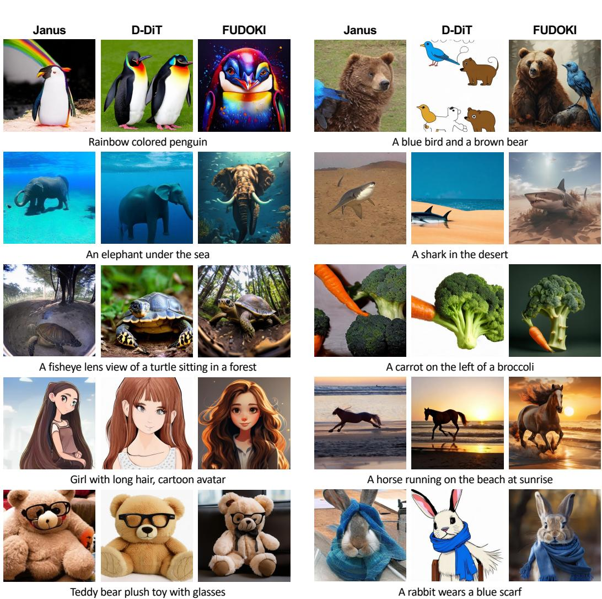  
Figure 6: Qualitative Comparisons on Visual Generation. Comparison among Janus [20], D-DiT [46] and FUDOKI on various text prompts. The results demonstrate that our method (FUDOKI) achieved superior text-image alignment and aesthetics.

# C Further Results

The Denoising Process of FUDOKI. Fig. 8 illustrates the iterative refinement process enabled by the discrete flow matching framework in FUDOKI, demonstrating its application to both generation and understanding tasks. The top panel visualizes how images are progressively denoised over iterations, transitioning smoothly from an initial noisy prior $x _ { 0 }$ to the final high-fidelity image $x _ { 1 }$ . Across diverse generation examples—ranging from animals to objects—the model incrementally sharpens semantic details and corrects spatial structure at each refinement step. The bottom panel depicts a similar iterative refinement for the understanding task, where the model extracts text from an image. Starting from a noisy token sequence, irrelevant or incorrect tokens are gradually replaced with accurate tokens (e.g., “Sara Lee”) as the model converges to the correct answer. The red arrows highlight token-level updates during each step, emphasizing the model’s ability to systematically and continuously correct errors and align predictions. This figure showcases how discrete flow matching enables fine-grained control and progressive improvement in both modalities by modeling transitions in discrete space, leading to more accurate and coherent outputs. More cases can be found in our project page: fudoki-dfm.github.io/fudoki/.

Maze Navigation. In this section, we train our proposed FUDOKI model on a novel task—maze navigation—which simultaneously requires understanding and generation capabilities. To this end,

  
Figure 7: Qualitative Comparisons on Visual Understanding. The upper part of the figure shows selected intermediate outputs from the answer generation process of different models—Janus (AR), D-DiT (mask-based discrete diffusion, MDD), and our FUDOKI (discrete flow matching, DFM)—to illustrate their reasoning approaches. Specifically, Janus, the AR-based model, is unable to revise its initial incorrect response (i.e., "Yes, it is summertime ..."), even after generating the correct rationale later (i.e., "The large pumpkins ... suggest that it is autumn"), making its response inconsistent overall. Meanwhile, D-DiT, the mask-based diffusion model, fails to handle this reasoning task, often producing empty outputs (i.e., only ${ < } / s { > }$ tokens). In contrast, our discrete flow matching model, FUDOKI, demonstrates a coherent and accurate reasoning trajectory, producing consistent and correct answers. The lower part of the figure provides additional qualitative examples on visual question answering tasks. FUDOKI consistently delivers more accurate and well-aligned reasoning with the ground truth.

Fig. 9 presents a series of multimodal decision-making scenarios where FUDOKI and GPT-4o/GPTImage-1 are evaluated on their ability to reason over spatial layouts and produce both textual and visual outputs. Each case involves a frozen lake grid of increasing size $( 3 \times 3 , 4 \times 4$ , and $5 { \times } 5$ ), with a defined goal and a character’s current position. The task is to select a safe move that avoids hazards (dark blue holes) while progressing toward the treasure. We notice that while GPT-4o provided wellreasoned textual explanations that include safety considerations, goal alignment, and environmental awareness, its visual updates lacked consistency with its textual responses, and even altered the maze structure (in the third row of the figure). In contrast, FUDOKI consistently predicted plausible directions and generated coherent visual updates aligned with the task constraints, showing basic

# Iterative Refinements for Generation

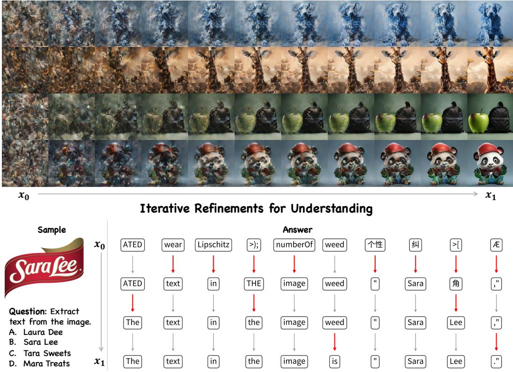  
Figure 8: Visualization of the iterative refinement process enabled by discrete flow matching in FUDOKI, demonstrating denoising process for text-to-image generation and visual understanding tasks.

Table 5: Performance Comparisons on the MathVista Benchmark.   

<table><tr><td>Method</td><td>Janus-1.5B</td><td>Janus-Pro-1B</td><td>FUDOKI</td></tr><tr><td>MathVista</td><td>32.4</td><td>35.1</td><td>38.6</td></tr></table>

spatial awareness. Furthermore, as shown in Fig. 10, FUDOKI is capable of completing the entire maze navigation sequence, moving from the initial position to the treasure step by step.

Results on the MathVista [137] Benchmark. We also evaluated our proposed FUDOKI on a more challenging mathematical reasoning benchmark, MathVista (testmini) [137]. As shown in Table 5, we find that FUDOKI achieved the best performance compared to AR-based models at the same scale. We attribute this improvement to FUDOKI’s discrete flow matching framework, which leverages bidirectional context modeling to facilitate complex reasoning.

# D Dataset Collections

Our training set comprises a total of 12.62 million samples, divided into two main categories: Generation (8.76M, $69 \%$ ) and Understanding (3.86M, $3 1 \%$ ), as shown in Fig. 11. The Generation subset, which is entirely composed of in-house data, is constructed for text-to-image generation tasks. In contrast, the Understanding subset covers a diverse set of information extraction and comprehension tasks. This balanced and large-scale collection ensures comprehensive support for both generative and understanding capabilities.

Specifically, the public Understanding of data covers the following aspects:

• General (1506.8K, $4 0 . 6 \%$ ): ShareGPT-4o (57.2K) [138], VSR (12.8K) [139], ALLaVAInstruct (680.4K) [140], IconQA (29.9K) [141], LVIS-Instruct4V (10.0K) [142], ShareGPT4V (613.3K) [143], VIQuAE (18.5K) [144], RAVEN (0.3K) [145], Visual7W (14.4K) [146], In-house (70.0K)

User: Task: Find a safe path through the frozen lake to reach the goal.

You're on a 3x3 frozen lake grid   
- Your goal is to reach the treasure   
- Avoid falling into holes (dark blue areas)   
- Current position: (1, 2)   
- Goal position: (3, 3)

What direction should you move (Up, Down, Left, Right)? Also provide the coordinates you'll reach after this move. Then, generate an image of the frozen lake after making this move.

FUDOKI: Down (2, 2)

GPT-4o/GPT-Image-1: Based on the current position (1, 2), the best   
direction to move is Down to (2, 2) to safely progress toward the goal (3, 3). Here is the updated frozen lake grid after the move:   
•The character has moved from (1, 2) to (2, 2).   
•The treasure remains at (3, 3).

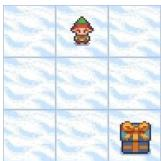

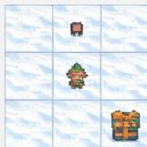

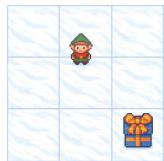

User: Task: Find a safe path through the frozen lake to reach the goal.

- You're on a 4x4 frozen lake grid   
- Your goal is to reach the treasure   
- Avoid falling into holes (dark blue areas)   
- Current position: (2, 2)   
- Goal position: (4, 4)

What direction should you move (Up, Down, Left, Right)? Also provide the coordinates you'll reach after this move. Then, generate an image of the frozen lake after making this move.

FUDOKI: Right (2, 3)

GPT-4o/GPT-Image-1: Based on the current position (2, 2), the best   
direction to move is Right to (2, 3) to safely progress toward the goal (4, 4) while avoiding the hole at (3, 2).   
Here is the updated frozen lake grid after the move:   
•The character has moved from (2, 2) to (2, 3).   
•The treasure remains at (4, 4).   
•The hole at (3, 2) is still present.

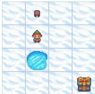

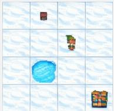

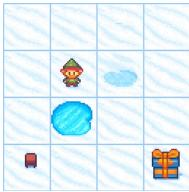

User: Task: Find a safe path through the frozen lake to reach the goal.

You're on a 5x5 frozen lake grid   
- Your goal is to reach the treasure   
- Avoid falling into holes (dark blue areas)   
Current position: (5, 3)   
- Goal position: (2, 2)

What direction should you move (Up, Down, Left, Right)? Also provide the coordinates you'll reach after this move. Then, generate an image of the frozen lake after making this move.

FUDOKI: Left (5, 2)

GPT-4o/GPT-Image-1: Based on the current position (5, 3), the best   
direction to move is Up to (4, 3) to   
safely progress toward the goal (2, 2) while avoiding the holes.   
Here is the updated frozen lake grid after the move:   
The character has moved from (5, 3) to (4, 3).   
The treasure remains at (2, 2).   
The holes remain in their respective positions.

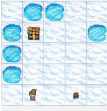

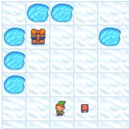

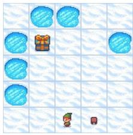  
Figure 9: Comparison of FUDOKI and GPT-4o/GPT-Image-1 on frozen lake maze navigation tasks. GPT4o/GPT-Image-1 offered well-reasoned textual outputs with safety and goal awareness but generated inconsistent visuals, even altering the maze (e.g., the third row). FUDOKI, by contrast, consistently produced valid directions and coherent visual updates aligned with task constraints, demonstrating stronger spatial consistency.

• OCR (428.0K, $1 1 . 5 \%$ ): LLaVAR (59.3K) [61], SROIE (17.1K) [147], FUNSD (6.8K) [148], OCRVQA (80K) [149], MLHME-38K (30K) [150], Rendered Text (10.0K) [62], IIIT5K

User: Task: Find a safe path through the frozen lake to reach the goal.

# Game Information:

You're on a 5x5 frozen lake grid Your goal is to reach the treasure - Avoid falling into holes (dark blue areas) Current position: (4, 1) - Goal position: (5, 4)

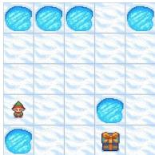  
FUDOKI: Right (4, 2)

What direction should you move (Up, Down, Left, Right)? Also provide the coordinates you'll reach after this move.

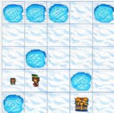

Then, generate an image of the frozen lake after making this move.

User: Task: Find a safe path through the frozen lake to reach the goal.

# Game Information:

You're on a 5x5 frozen lake grid   
Your goal is to reach the treasure   
- Avoid falling into holes (dark blue areas) Current position: (4, 2)   
- Goal position: (5, 4)

FUDOKI: Down (5, 2)

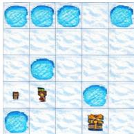

What direction should you move (Up, Down, Left, Right)? Also provide the coordinates you'll reach after this move.

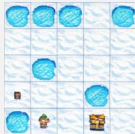

Then, generate an image of the frozen lake after making this move.

User: Task: Find a safe path through the frozen lake to reach the goal.

Game Information:

You're on a 5x5 frozen lake grid Your goal is to reach the treasure   
- Avoid falling into holes (dark blue areas) Current position: (5, 2)   
- Goal position: (5, 4)

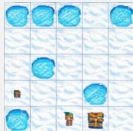  
FUDOKI: Right (5, 3)

What direction should you move (Up, Down, Left, Right)? Also provide the coordinates you'll reach after this move.

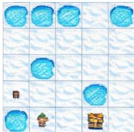

Then, generate an image of the frozen lake after making this move.

User: Task: Find a safe path through the frozen lake to reach the goal.

Game Information:

You're on a 5x5 frozen lake grid   
- Your goal is to reach the treasure   
- Avoid falling into holes (dark blue areas)   
Current position: (5, 3)   
- Goal position: (5, 4)

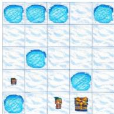

What direction should you move (Up, Down, Left, Right)? Also provide the coordinates you'll reach after this move.

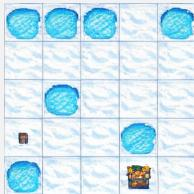  
FUDOKI: Right (5, 4)   
Success!

Then, generate an image of the frozen lake after making this move.

Figure 10: FUDOKI successfully completed the full maze navigation task step by step. Starting from the initial position at (4, 1), it sequentially selected safe moves—Right $ \mathrm { D o w n }  \mathrm { R i g h t }  \mathrm { 1 }$ Right—while avoiding holes and progressing toward the treasure at (5, 4). At each step, FUDOKI generated an updated image of the frozen lake, reflecting the character’s new position and preserving the environment’s structure, culminating in a successful arrival at the goal. Notably, in rows 2 through 4, the input images were taken directly from FUDOKI’s previous outputs, demonstrating the model’s ability to maintain coherent state tracking and visual continuity throughout the multistep decision-making process.

(6.0K) [151], HME100K (74.5K) [152], SynthDoG-EN (29.8K) [153], POIE (9.4K) [154], IAM (5.7K) [155], TextCaps (60.5K) [156], COCO-Text V2.0 (28.1K) [157], ChromeWriting (8.8K) [62], ORAND-CAR (2K) [158]

• Document (155.8K, $4 . 2 \%$ ): DocVQA (122.4K) [63], FUNSD (6.8K) [148], Deepform (9.2K) [159], Kleister CharityAI (15.2K) [160], TAT-DQA (2.2K) [161]

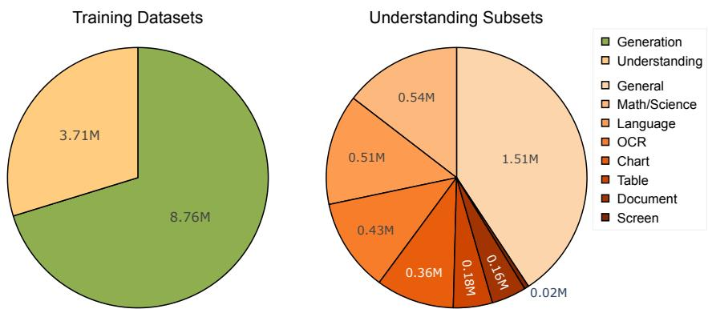  
Figure 11: Training Dataset Distribution. The overall training data consists of $8 . 7 6 \mathbf { M }$ Generation samples $( 6 9 \% )$ and $3 . 8 6 \mathbf { M }$ Understanding samples $( 3 1 \% )$ , as shown on the left. The right chart depicts the composition of the Understanding subset by category.

• Table (180.2K, $4 . 9 \%$ ): TabFact (65.6K) [161], WikiTable (29.5K) [162], TabMWP (38.4K) [163], RoBUT WTQ (38.2K) [164], RoBUT SQA (8.5K) [164]   
Chart (362.6K, $9 . 8 \%$ ): ChartQA (62.9K) [165], Chart2Text (27.0K) [64], PlotQA (10K) [166], DVQA (200K) [167], Infographic VQA (47.6K) [168], VisText (10.0K) [169], Diagram Image2Text (0.3K) [170], LRV Chart (1.8K) [171]   
• Screen (24.6K, $0 . 7 \%$ ): WebSRC (5.1K) [172], VisualMRC (19.5K) [65]   
• Math/Science (544.9K, $1 4 . 7 \%$ ): MAVIS (187.3K) [173], G-LLaVA (162.4K) [66], GeoQA $^ +$ (72.3K) [67], GeoMVerse (9.3K) [174], Geometry3K (3.0K) [175], MathVision (3.0K) [176], Cambrian Data Engine (50.8K) [177], Textbook QA (21.8K) [178], ScienceQA (19.2K) [179], AI2d (18.8K) [180]   
• Language (510.2K, $1 3 . 7 \%$ ): MathInstruct (81.5K) [181], Evol-Instruct (142.8K) [182], MathPlus (95.2K) [183], Magpie Pro (L3 MT) (50.0K) [68], ShareGPT4 (40.7K) [184], Magpie Pro (L3 ST) (50.0K) [68], Magpie Pro (Qwen2 ST) (50.0K) [68]

# E Mathematical Formulations of Kinetic Optimal Velocity

To facilitate understanding, we use a simplified notation here and let $\tau$ denote the finite discrete state space, with elements $x , z \in \tau$ (in the main paper, we have $x ^ { i } , z ^ { i } \in \mathcal T )$ . A probability path is a time-varying distribution $p _ { t } ( x )$ , and a velocity field $u _ { t } ( x , z )$ describes mass transport between states over time. In this way, we have the Continuity Equation as follows.

$$
\dot { p } _ { t } ( x ) + \mathrm { d i v } _ { x } ( j _ { t } ) = 0 , \quad \forall x \in T
$$

with the discrete divergence given by $\begin{array} { r } { \mathrm { d i v } _ { x } ( j _ { t } ) = \sum _ { z \neq x } j _ { t } ( z , x ) - \sum _ { z \neq x } j _ { t } ( x , z ) } \end{array}$ and $\textstyle j _ { t } ( x , z )$ is the   
flux, defined by $j _ { t } ( x , z ) = u _ { t } ( x , z ) p _ { t } ( z )$ , which represents the flow of probability mass from $z$ to $u _ { t } ( x , z ) = { \left\{ \begin{array} { l l } { { \frac { j _ { t } ( x , z ) } { p _ { t } ( z ) } } } \\ { 0 } \end{array} \right. }$ if $p _ { t } ( z ) > 0$ when and   
$x$ . In this way, the velocity can be obtained by $x \neq z$ otherwise   
$\begin{array} { r } { u _ { t } ( z , z ) = - \sum _ { x \neq z } u _ { t } ( x , z ) } \end{array}$ to ensure the rate condition in Eq. 2. With such notations, we expect to   
minimize the kinetic energy during the flow process, namely,

$$
\operatorname* { m i n } _ { p _ { t } , j _ { t } } \int _ { 0 } ^ { 1 } \sum _ { x \neq z } w _ { t } ( x , z ) { \frac { j _ { t } ( x , z ) ^ { 2 } } { p _ { t } ( z ) } } d t
$$

subject to:

• Continuity Equation: $\mathrm { d i v } _ { x } ( j _ { t } ) = - { \dot { p } } _ { t } ( x )$ • Non-negativity of the flux: $j _ { t } ( x , z ) \geq 0 \quad \forall x \neq z$ • Boundary conditions: $p _ { 0 } = p , \quad p _ { 1 } = q$

Here, $w _ { t } ( x , z ) > 0$ is a problem-specific weight controlling the "cost" of mass moving from $z$ to $x$ . As evidenced in [38], when $p _ { t }$ is given and let $w _ { t } ( x , z ) \stackrel { - } { = } 1 / p _ { t } ( x )$ , the kinetic optimal solution can be obtained via $j _ { t } ^ { \star } ( x , z ) = \left[ p _ { t } ( z ) \dot { p } _ { t } ( x ) - \dot { p } _ { t } ( z ) p _ { t } ( x ) \right] _ { + } \forall x \neq z$ . In this way, if we apply this kinetic optimal $j _ { t } ^ { \star } ( x , z )$ for the probability path in Eq. 4, we can obtain the velocity defined in Eq. 5.

# F Limitations and Broader Impacts

Limitations. Despite its promising results, FUDOKI also presents several limitations that warrant further investigation. First, despite the advantages of discrete flow matching—such as being agnostic to token order and compatible with bidirectional Transformers—the current implementation requires the sequence length to be fixed prior to sampling. This constraint limits flexibility in generation and makes dynamic-length outputs challenging. A promising direction for future work is to extend the sampling scheme to support variable-length generation, which would broaden the applicability of the model across open-ended tasks and enhance the flexibility on the computational cost during inference. Besides, as shown in Fig. 12, while FUDOKI shows strong performance, it still faces challenges under certain scenarios, such as performing text-to-image generation given complex prompts or prompts involving rendering specific texts in images, as well as performing visual understanding tasks that demand expert-level reasoning and domain-specific knowledge.

# Image Understanding

# Image Generation

# Question: What is the substance that is developing on these leaves?

A. Algae B. Downy mildew C. Powdery mildew D. Sooty mould Ground Truth: A

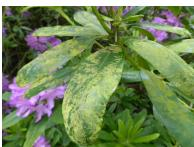  
Figure 12: Examples of failed cases on visual understanding and generation. While FUDOKI demonstrated strong performance, it still struggled with harder tasks—such as generating images from complex prompts involving specific texts, and understanding visuals that require expert-level knowledge.

FUDOKI : To determine the substance developing on the leaves, let's analyze the image. The leaves show a yellowish-green patchy appearance, which is characteristic of downy mildew. Downy mildew is a fungal disease that affects many plants, causing discoloration and fuzzy growth on the underside of the leaves. The other options, such as algae, powdery mildew, and sooty mold, do not typically cause this kind of growth. Therefore, the correct answer is B. Downy mildew.

  
New York Skyline with 'Diffusion' written with fireworks on the sky.

  
A keyboard made of water, the water is made of light, the light is turned off.

Broader Impacts. FUDOKI introduces a novel paradigm for unified multimodal modeling that departs from the long-dominant autoregressive approach, potentially redefining how future multimodal systems are designed. By leveraging discrete flow matching with metric-induced probability paths, FUDOKI enables controllable and interpretable generation processes, which could prove valuable in critical applications such as education, embodied AI, and autonomous driving. Its iterative, selfcorrecting refinement process aligns well with human reasoning patterns and may support safer, more reliable AI agents in domains requiring high precision, such as medicine and law. Furthermore, FUDOKI’s unified architecture for both understanding and generation fosters more integrated, generalpurpose agents—an important step toward realizing practical artificial general intelligence (AGI). However, as with any generative technology, ethical considerations around bias, misuse, and content safety must be carefully addressed as adoption scales.