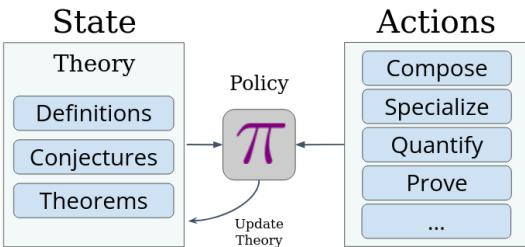
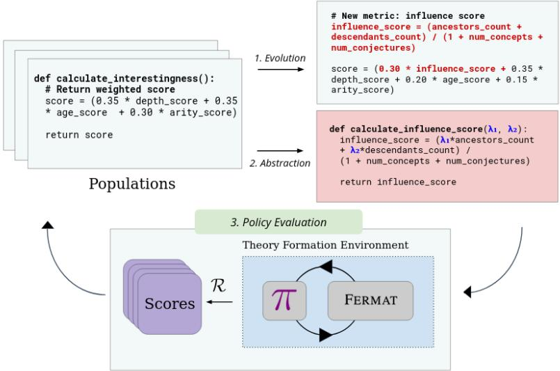
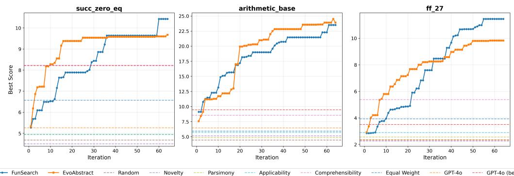
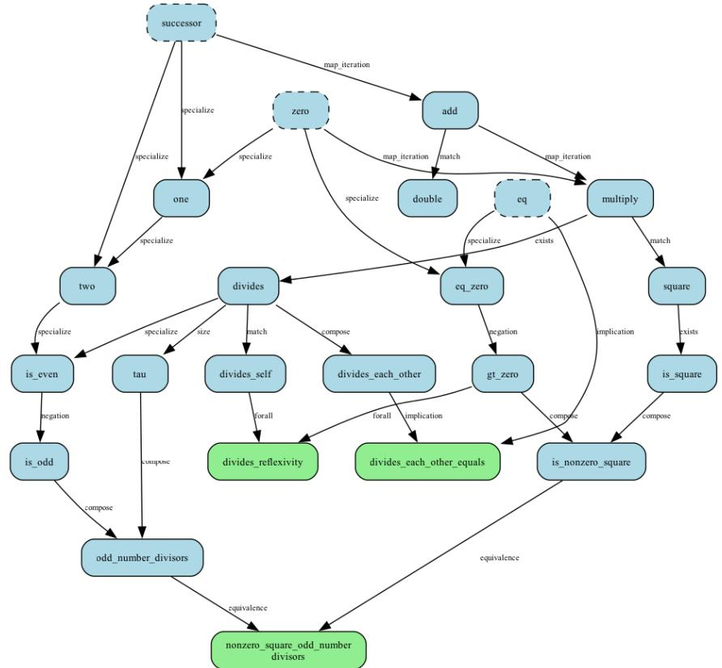
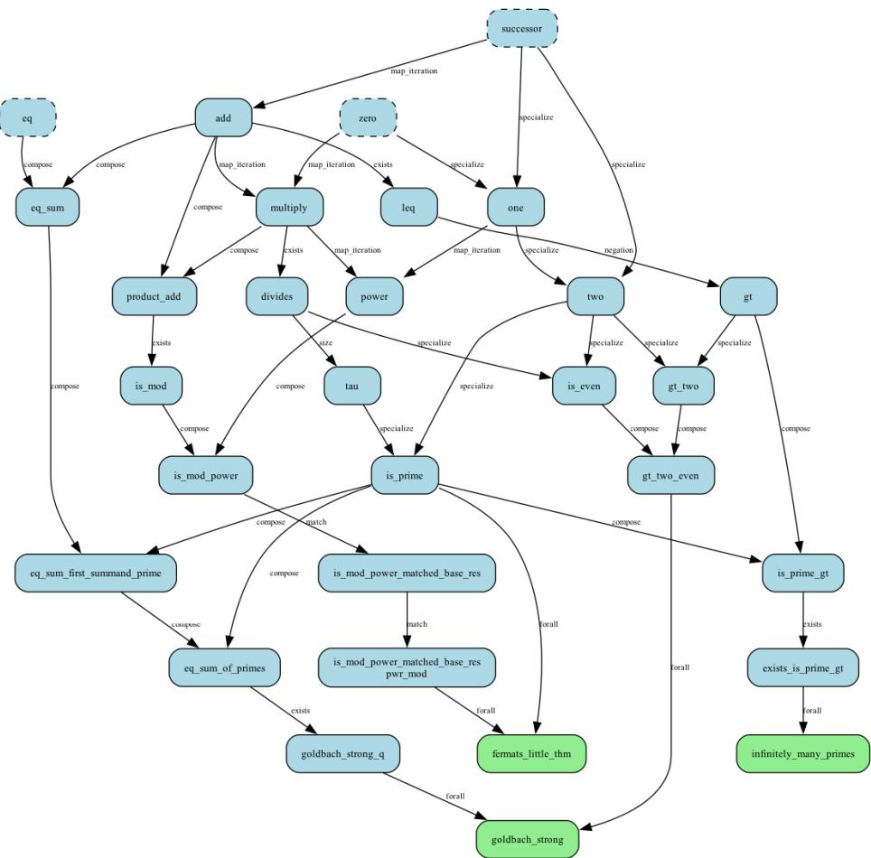
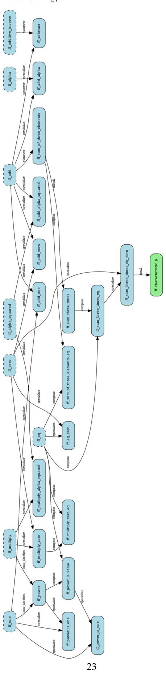
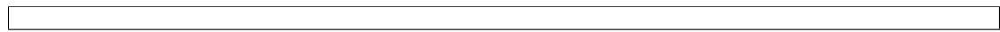
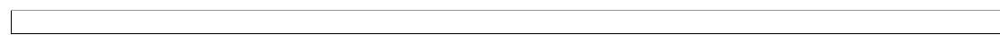
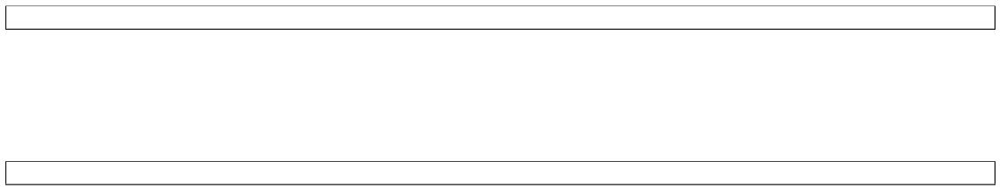
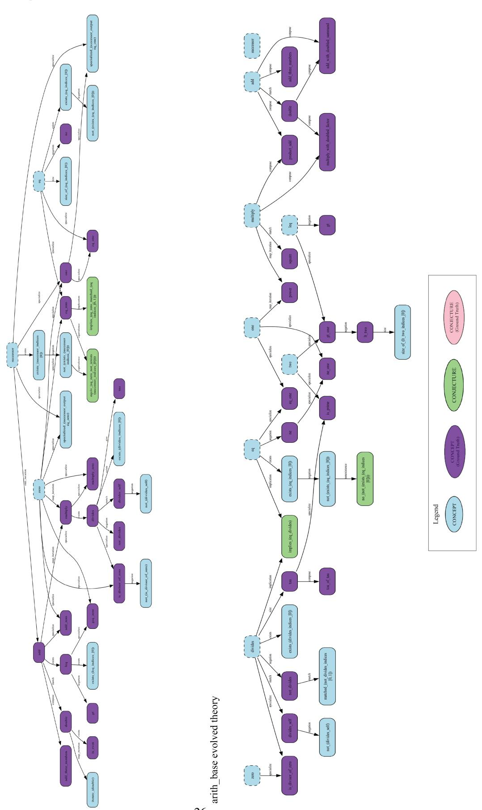

# Learning Interestingness in Automated Mathematical Theory Formation

George Tsoukalas UT Austin george.tsoukalas@utexas.edu

Rahul Saha UT Austin rahul.saha@utexas.edu

Amitayush Thakur UT Austin amitayush@utexas.edu

Sabrina Reguyal Princeton University, Stanford University sreguyal $@$ stanford.edu

Swarat Chaudhuri UT Austin swarat@cs.utexas.edu

# Abstract

We take two key steps in automating the open-ended discovery of new mathematical theories, a grand challenge in artificial intelligence. First, we introduce FERMAT, a reinforcement learning (RL) environment that models concept discovery and theorem-proving using a set of symbolic actions, opening up a range of RL problems relevant to theory discovery. Second, we explore a specific problem through FERMAT: automatically scoring the interestingness of mathematical objects. We investigate evolutionary algorithms for synthesizing nontrivial interestingness measures. In particular, we introduce an LLM-based evolutionary algorithm that features function abstraction, leading to notable improvements in discovering elementary number theory and finite fields over hard-coded baselines. We open-source the FERMAT environment at github.com/trishullab/Fermat.

# 1 Introduction

AI researchers have dreamed of building an “automated mathematician” since the 1950s [29]. Such a system would allow human mathematicians to harness the vast processing capacity of computers to discover entirely new areas of mathematics [42]. An emerging body of work seeks to realize this dream using the tools of modern machine learning. In particular, the AI community has developed a wide range of systems that can prove formal theorems [13, 47] and search for programs discovering mathematical constructions [31, 40].

However, a key limitation of much of this research is that it is focused on solving predefined problems. Mathematicians develop theories through an open-ended process of defining new concepts, studying their properties, making conjectures, and proving or finding counterexamples. While some work [35] has offered systems that construct new problems in addition to solving them, there is currently no framework that supports the full theory-formation process, including, for example, the synthesis of new definitions in addition to problems.

A central challenge in this open-ended process is guiding the search. The space of possible definitions and conjectures is combinatorially vast, and most paths lead to trivial or dull mathematics. Human mathematicians navigate this space using a nuanced, intuitive sense of “interestingness" — a judgment of scientific potential that directs their focus. An explicit formulation of this concept has long been debated, with different perspectives valuing properties such as the surprising connection between disparate fields [36], depth and generality [22], or its unexpected real-world applicability [49].

In this paper, we take two key steps towards addressing these challenges. First, we provide a reinforcement learning (RL) framework, called FERMAT (Figure 1), which can be used to design and evaluate new algorithms for automatic theory formation. The system generalizes the early symbolic computing-prover system HR [8], which used a system of production rules to generate new concepts and conjectures, either symbolically or from explicit examples, and proof mechanisms for resolving conjectures. We model these symbolic steps as the actions of a Markov Decision Process (MDP), and the mathematical knowledge available at a given point during exploration as an MDP state. This formulation opens up numerous RL problems relevant to theory formation.

Our second contribution is a solution to a particular algorithmic problem in FERMAT: learning an interestingness heuristic for selecting mathematical concepts to develop. To form a theory, one must navigate a combinatorial search space of mathematical objects, most objects in which are not meaningful or worthy of study. Prior works were attentive to this problem, but required hard-coded measures to formalize the concept of interestingness [8, 26]. In contrast, we frame the discovery of this heuristic as a learning problem. We specifically learn interestingness measures as programmatic representations, as this makes them interpretable and allows us to analyze what may contribute to fruitful discovery. To this end, we develop an LLM-driven method, called EvoAbstract, for learning the intrinsic value of mathematical objects in the context of the current theory. EvoAbstract is an evolutionary program synthesis algorithm that extends the FunSearch [40] approach with a form of abstraction learning, allowing for interpretable abstractions to be discovered during function search. We experimentally show that EvoAbstract can automatically synthesize interestingness measures that lead to significant improvements in discovering concepts in elementary number theory and finite fields over hard-coded baselines.

# 2 Problem Formulation and Motivation

# 2.1 Mathematical Theory Formation as a Markov Decision Process (MDP)

To rigorously study automated mathematical theory formation using reinforcement learning, we first formalize the process as an MDP $( \bar { \cal S } , \bar { \cal A } , \bar { \cal T } , \mathcal { R } )$ . This framework allows us to model the sequential nature of mathematical discovery, where an agent iteratively expands a body of knowledge by making choices about definitions, conjectures, and proof attempts. Let $\mathcal { M }$ denote the universe of all well-formed mathematical entities. The components of this MDP are defined as follows:

• Mathematical State Space $( S )$ : A state $S \in$ $s$ represents the current state of mathematical knowledge, represented as a directed knowledge graph $G = ( V , E )$ , where:

• $V \subseteq { \mathcal { M } }$ is the set of mathematical entities, categorized into definitions $\mathcal { D }$ , conjectures $\mathcal { C }$ , and theorems $\mathcal { T }$ . • $E$ is the set of dependency edges, where an edge $( u , v )$ exists if entity $u$ was used as direct input for the action that generated entity $v$ , and is labeled with that action.

  
Figure 1: A high-level description of FERMAT, our environment for mathematical theory formation. At any given time, the current theory (state) is represented as a knowledge graph consisting of the mathematical definitions, conjectures, and theorems discovered so far. At each step, the policy $\pi$ inputs the current state and selects an action to apply, updating the theory with additional information. The action space allows the production of new definitions, conjectures, and proofs of theorems.

• Action Space $( \mathcal { A } )$ : An action $a \in { \mathcal { A } }$ represents an operation that modifies the knowledge graph by introducing a new entity or acting upon existing ones. Actions fall into the following categories:

• Definition Production Actions $( \boldsymbol { A } _ { d e f } )$ : Introduces a new definition, adding a node $d ^ { \prime }$ to $G$ and connecting it to relevant entities via a function $\delta _ { d e f } : \mathcal { S } \times \mathcal { A } _ { d e f } \to \mathcal { S }$ . • Conjecture Production Actions $( \mathcal { A } _ { c o n j } )$ : Formulates a new conjecture $c ^ { \prime }$ based on existing entities and relationships, governed by a function $\delta _ { c o n j } : S \times \mathcal { A } _ { c o n j } \to S$ . • Proof Actions $( \mathcal { A } _ { p r o o f } = \{ p r o v e , d i s p r o v e \} )$ : Verifies or refutes a conjecture $c \in { \mathcal { C } }$ by invoking a backend theorem prover, updating its status to theorem or disproven.

• Transition Function $( \mathcal { T } )$ : The transition function $\mathcal { T } : \mathcal { S } \times \mathcal { A } \times \mathcal { S }  [ 0 , 1 ]$ models how applying an action updates the knowledge graph. $ { \mathcal { T } } ( S , a , S ^ { \prime } )$ denotes the probability of transitioning from state $S$ to $S ^ { \prime }$ after applying action $a$ . In particular,

• Adding a new definition or conjecture $c$ extends $V$ and introduces edges emanating from the entities to which the production rule was applied: $V ^ { \prime } { = } V \cup \{ c \}$ , $E ^ { \prime } { = } E \bar { \cup } \{ ( v , c ) ~ | ~ v \in \mathop { V } _ { i n p u t s } \}$ • A successful prove action converts a conjecture $c$ into a theorem and attaches a proof attribute: ${ \mathcal { C } } ^ { \prime } = { \mathcal { C } } \setminus \{ c \}$ , $\mathcal { T } ^ { \prime } = \mathcal { T } \cup \{ t \}$ with proof structure $\pi _ { t }$ . A successful disprove action refutes the conjecture $c$ , marking it as false and attaching a counterexample as a witness, where possible.

• Reward Function: We design an extrinsic reward function $\mathcal { R } _ { \mathcal { E } } : \mathcal { S } \times \mathcal { A } \times \mathcal { S }  \mathbb { R }$ to incentivize the discovery of a pre-defined set $\mathcal { E }$ of well-known mathematical entities. Let the application of action $a$ to state $S$ produce a state $S ^ { \prime }$ with a new entity $m _ { n e w } \in \mathcal { M }$ . The reward is defined as:

$$
\mathcal { R } _ { \mathcal { E } } ( S , a , S ^ { \prime } ) = \left\{ \begin{array} { l l } { 1 } & { \mathrm { i f } m _ { n e w } \in \mathcal { E } } \\ { 0 } & { \mathrm { o t h e r w i s e } } \end{array} \right.
$$

A reward is thus granted only when the agent’s action results in the discovery of a specific groundtruth concept. A policy, denoted by $\pi ( a | s )$ , defines a strategy by specifying the probability of taking action $a$ in a given state $s$ . A rollout refers to a single episode of interaction used to evaluate this policy by generating a trajectory, $\tau = ( S _ { 0 } , a _ { 0 } , r _ { 1 } , S _ { 1 } , a _ { 1 } , r _ { 2 } , \dots , a _ { T - 1 } , r _ { T } , S _ { T } )$ . This sequence is formed by starting in $S _ { 0 }$ and repeatedly sampling an action $a _ { t } \sim \pi ( \cdot | S _ { t } )$ , after which the environment dictates the next state $S _ { t + 1 } \sim \mathcal { T } ( S _ { t } , a _ { t } , \cdot )$ and the corresponding reward $r _ { t + 1 } = \mathscr { R } _ { \mathcal { E } } ( S _ { t } , a _ { t } , S _ { t + 1 } )$ .

The intrinsic reward $\mathcal { R } _ { \mathcal { I } }$ is a function $\mathcal { R } _ { \mathcal { T } } : \mathcal { S } \times \mathcal { A } \times \mathcal { S }  \mathbb { R }$ that serves as a mechanism for the agent/policy to learn effectively in a sparse extrinsic reward setting. Such internal rewards can be critical for driving exploration and acquisition of general knowledge about the environment and discovery of useful subgoals, especially when external feedback is infrequent or absent, by promoting behaviors like curiosity or novelty-seeking [1, 3, 32, 33, 41, 43].

# 2.2 Interestingness as Intrinsic Reward

Humans use intuition and are intrinsically motivated to define interesting mathematical goals. Capturing this notion for an autonomous agent is a key challenge. We approach this by modeling interestingness as a learnable intrinsic reward, guiding a policy to discover meaningful theory. In this work, we wish to discover such interestingness measures autonomously, and view the synthesis of an effective interestingness measure as a problem of intrinsic reward optimization.

Formally, we define the interestingness measure to be a function $\mathcal { T } : \mathcal { M } \times \mathcal { S }  \mathbb { R }$ , where $\mathcal { T } ( m , S )$ provides an estimate of the value of a mathematical entity $m$ in the context of the current theory $S$ . We connect this entity-scoring function to our RL framework by defining the intrinsic reward $\mathcal { R } _ { \mathcal { Z } }$ for a state transition as the interestingness score of the newly generated entity. If taking action $a$ in state $S$ produces a new entity $m _ { \mathrm { n e w } }$ in state $S ^ { \prime }$ , the intrinsic reward is $\mathcal { R } _ { \mathcal { T } } ( S , a , S ^ { \prime } ) = \mathcal { T } ( m _ { \mathrm { n e w } } , S ^ { \prime } )$ .

In this work, we search over the class of interestingness measures that can be represented as programmatic functions. The policy, $\pi _ { \mathcal { T } }$ , is built using the measure $\mathcal { T }$ according to a fixed template (detailed in Section 5), and is designed to leverage the function’s scores to guide its selection of actions. While the policy $\pi _ { \mathcal { T } }$ acts based on this local, short-term measure, our learning problem is to discover an optimal function $\boldsymbol { \mathcal { T } ^ { * } }$ that maximizes the cumulative long-term extrinsic reward:

$$
\mathcal { T } ^ { * } = \arg \operatorname* { m a x } _ { \mathcal { T } } \mathbb { E } _ { \tau \sim \pi _ { \mathcal { T } } } \left[ \sum _ { t } \gamma ^ { t } \mathcal { R } _ { \mathcal { E } } ( S _ { t } , a _ { t } ) \right]
$$

where $\gamma \in [ 0 , 1 ]$ represents the discount factor. In Section 4, we detail our evolutionary algorithm designed towards discovering an optimal $\mathcal { T }$ .

# 3 FERMAT: A Framework for Automated Theory Formation

In this section, we discuss FERMAT, our framework for automated mathematical theory formation built atop our MDP formulation of the theory discovery.

# 3.1 Mathematical Entities

The FERMAT framework, implemented in Python, provides the environment for automated theory formation. It is built upon a structured representation of mathematical entities within an evolving knowledge graph. At its core is a formal domain specific language (DSL) to define these entities.

Each mathematical entity $m$ within the knowledge graph $G = ( V , E )$ (where $m \in V$ ) encapsulates its meaning through several key components:

(1) Symbolic Definition $( m _ { s y m } )$ . This holds the formal representation of the entity $m$ expressed in FERMAT’s DSL. It precisely defines the entity’s logical structure. For an entity $m =$ is_prime, the symbolic definition might be the following expressed programmatically,

$$
m _ { s y m } = \mathrm { \lambda } \mathrm { n } . \left( \mathrm { n } > 1 \right) \wedge \forall \mathrm { k } \in \mathbb { N } \ . \left( \underbrace { \exists \mathrm { q } \in \mathbb { N } \ . \mathrm { n } = \mathrm { q } \times \mathrm { k } } _ { \mathrm { d i v i d e s } ( \mathrm { k } , \mathrm { n } ) } \ \Rightarrow \ ( \mathrm { k } = 1 \ \vee \ \mathrm { k } = \mathrm { n } ) \right)
$$

(2) Computational Interpretation $( m _ { c o m p } )$ . This is an executable Python function that provides an efficient, concrete evaluation of the entity’s symbolic definition $m _ { s y m }$ . Let $I$ be the space of potential input instances for $m$ . The interpretation is a mapping $m _ { c o m p } : I  \{ \mathrm { T r u }$ e, False, Unknown} where, for an instance $i \in I$ , the function returns:

• True (resp. False) if $i$ has been verified computationally (resp. not) to satisfy $m _ { s y m }$ . • Unknown when the evaluation of $i$ could not be determined computationally within resource limits (e.g. due to universal quantification over an infinite set).

As an example, for an entity $m =$ square, its computational interpretation could be given by $m _ { c o m p } = 1 \mathrm { a m b d a }$ a, b: b == a\*a.

(3) Cached Instances $\mathcal { X } ( m ) = ( \mathcal { X } ^ { + } ( m ) , \mathcal { X } ^ { - } ( m ) )$ . These components store explicit input instances for the entity $m$ , where $\mathcal { X } ^ { + } ( m ) = \{ i \in I \mid m ( i ) = \mathrm { T r u e } \}$ stores examples, and $\mathcal { X } ^ { - } ( \bar { m _ { ) } } = \{ i \in I \ \vert$ $m ( i ) = \operatorname { F a l s e } \}$ stores nonexamples. These instances ground the entity’s semantics and can be used for various purposes. For $m =$ divides:

$$
\mathcal { X } ^ { + } ( m ) = \{ ( 2 , 4 ) , ( 1 , 3 ) , ( 2 , 2 ) , ( 3 , 6 ) , \ldots \} , \qquad \mathcal { X } ^ { - } ( m ) = \{ ( 2 , 3 ) , ( 3 , 5 ) , ( 4 , 1 ) , ( 5 , 4 ) , \ldots \}
$$

We write $m _ { i } , m _ { o }$ for input and output arity of $m$ , and $\mathrm { s i z e } ( m ) = m _ { i } + m _ { o }$ for size of the examples.

The construction history $\mathcal { C } ( m ) = \{ a _ { 1 } , . . . , a _ { n } \}$ of an entity $m$ is the ordered list of actions applied to produce it. Definitions $m \in \mathcal { D } ,$ ) are further classified as either predicates or functions. This informs which production rules in the action space $\mathcal { A }$ are applicable.

# 3.2 Production Rules

Following HR [8], FERMAT comes equipped with a set of production rules, consisting of composable actions for constructing new definitions and conjectures from prior ones. These rules define all construction actions in $\mathcal { A } _ { d e f } , \mathcal { A } _ { c o n j } \subseteq \mathcal { A }$ to produce new entities. We divide the production rules by whether they produce definitions or conjectures. We include a complete description of all the production rules present in FERMAT in Appendix A.1, and give two condensed examples:

# Definition Production Rules.

(1) Exists: Let $\mathcal { P } ( \mathbf { x } _ { 1 } , \ldots . . . \mathbf { x } _ { n } )$ be a predicate and $I : = \{ i _ { 1 } , \ldots , i _ { k } \}$ be a list of indices to existentially quantify over, and let $J : = \{ j _ { 1 } , \dots , j _ { n - k } \}$ be the remaining indices in increasing order. Then the production rule outputs a new predicate $\mathcal { Q }$ as follows,

$$
\operatorname { e x i s t s } \mathcal { P } I \to \left[ \begin{array} { l } { \mathcal { Q } ( \mathbf { x } _ { j _ { 1 } } , \dots , \mathbf { x } _ { j _ { n - k } } ) : = \exists \mathbf { x } _ { i _ { 1 } } , \dots , \mathbf { x } _ { i _ { k } } \quad \mathrm { s . t . } \quad \mathcal { P } ( \mathbf { x } _ { 1 } , \dots , \mathbf { x } _ { n } ) } \end{array} \right] .
$$

Example. Consider the predicate $P ( x , y )$ defined by $P ( x , y ) : \Longleftrightarrow \exists z . , y = x \times z$ , which expresses that $x$ divides $y$ . This can be constructed by applying the Exists production rule to the predicate produc $( x , z , y )$ , which holds when $y = x \times z$ , with the index list $I = \{ 1 \}$ corresponding to the variable $z$ to be existentially quantified. Formally,

(2) Specialize: Given an entity, this rule outputs a new definition by specializing a variable to a fixed value. Let $\mathcal { A } ( \mathbf { x } _ { 1 } , \ldots , \mathbf { x } _ { n } )$ be a function (resp. predicate), and let $i$ be the index to specialize, and $v$ be the value to substitute. Then the rule outputs a function (resp. predicate) $\boldsymbol { B }$ as follows,

$$
\begin{array} { r } { \textsf { \textsf { S A } i } v \to \left\lceil \begin{array} { l l l l l l l l } { \mathcal { B } ( \mathbf { x } _ { 1 } , \ldots , \mathbf { x } _ { i - 1 } , \mathbf { x } _ { i + 1 } , \ldots , \mathbf { x } _ { n } ) : = \mathcal { A } ( \mathbf { x } _ { 1 } , \ldots , \mathbf { x } _ { i - 1 } , v , \mathbf { x } _ { i + 1 } , \ldots , \mathbf { x } _ { n } ) } & { \mathbf { x } _ { i + 1 } : \ldots , \mathbf { x } _ { n } } & { \mathbf { x } _ { i + 1 } } & { \mathbf { x } _ { 1 } \ldots \mathbf { x } _ { n } } & { \mathbf { x } _ { n } } & { \mathbf { x } _ { i + 1 } } \end{array} \right\rceil } \end{array}
$$

FERMAT contains 7 other definition production rules: (i) Compose, which composes definitions, (ii) MapIterate, which successively applies an iterator function, (iii) ForAll, which universally quantifies over variables in definitions, (iv) Match, which asserts equality of chosen variables in definitions, (v) Negate, which outputs the negation of a concept, (vi) Size, which outputs a definition of the cardinality of the set of inputs satisfying a condition, and (vii) Constant, which creates constants from examples.

Conjecture Production Rules. FERMAT contains 4 production rules designed to construct conjectures. These are: (i) Implication, which asserts that one definition implies another over all inputs, (ii) Equivalence, which asserts that two definitions are equivalent, (iii) Nonexistence, which asserts that no examples of a definition exist, (iv) Exclusivity, which asserts that the only examples of a given definition belong to a given finite set.

# 3.3 Prover

To complete the action space, we require the ability to validate conjectures generated using FERMAT’s DSL. Critically, the generic DSL supports nested definitions, facilitating modular construction of definitions and conjectures. These conjectures, which may involve previously defined concepts, are automatically constructed by our framework and passed to a backend theorem prover for verification. We instantiate this backend using the Z3 Theorem Prover [11], and provide it with SMT-LIB input generated from our DSL via a custom-designed compiler. We choose Z3 as it is a powerful off-theshelf black-box prover, the use of which enables us isolate the problem of synthesizing definitions and conjectures. We include examples of the Z3 support available through our DSL, and compilation down to SMT-LIB format in Appendix A.3.

# 4 Learning Interestingness

In this section, we discuss our approach for automatically learning an interestingness measure $\mathcal { T } ( m , S )$ that guides the agent in discovering human mathematical knowledge. Following HR [8], which developed simple programmatic representations of measures over features of the state, we search in the space of Python programs that implement interestingness measures. To this end, we introduce EvoAbstract (Figure 2), an evolutionary search algorithm designed to optimize an objective function given a simple numerical evaluator function.

LLM-Driven Evolutionary Search. (EVOLUTIONSTEP). At its core, EvoAbstract is an evolutionary algorithm, aimed at synthesizing programs iteratively. Each population consists of candidate interestingness programs. The generation of

  
Figure 2: Overview of EvoAbstract, which aims to discover an optimal interestingness measure for mathematical theory formation. It operates through three phases: (1) Evolution, where populations of candidate programs are generated and refined through LLM-driven mutations; (2) Abstraction, where high-performing programs are analyzed and reusable subroutines are extracted; and (3) Policy Evaluation, where the resulting programs are evaluated within the theory formation environment using FERMAT, producing feedback that guides subsequent evolutionary steps.

new programs is primarily driven by an LLM, $\mathcal { L } _ { v a r }$ , conditioned on a prompt instructing it to perform evolution. In each evolutionary step, $\mathcal { L } _ { v a r }$ takes the program template $T$ and a selection of high-performing parent programs from a population as input, and synthesizes new candidate solutions $( f _ { n e w } )$ . $\mathcal { L } _ { v a r }$ thus acts as an operator for exploration and exploitation, intended to perform complex mutations informed by successful prior programs. We employ an island model with $k$ parallel populations $( \mathcal { P } _ { i } )$ to maintain diversity.

Abstraction Learning. (ABSTRACTIONSTEP). Our central innovation in EvoAbstract is its abstraction learning mechanism. This component is designed to identify and reuse valuable subroutines from evolved programs. This system comprises two main parts:

• Discovering and Utilizing Abstractions: Periodically EvoAbstract enters an abstraction phase, where an LLM $\mathcal { L } _ { a b s }$ , analyzes a set of high-scoring programs $( S _ { i } ^ { \prime } )$ sampled from each population. $\mathcal { L } _ { a b s }$ is tasked with identifying abstractions — valuable, reusable subroutines with defined signatures and implementations —– within these successful programs and proposing them as new, generalized functions $( A _ { n e w } )$ . These proposed abstractions are then filtered for criteria such as syntactic validity and uniqueness before being added to the island’s $\operatorname { L i b } _ { i }$ .

• The Abstraction Library $\left( \mathbf { L i b } _ { i } \right)$ : Each island $i$ maintains a dynamic Abstraction Library, $\operatorname { L i b } _ { i }$ This library serves as a repository for functional abstractions that are identified as potentially useful during the search. Initially, these libraries are empty. After each abstraction phase, the generated abstractions are added to their respective libraries $\operatorname { L i b } _ { i }$ . The evolutionary LLM, $\mathcal { L } _ { v a r }$ is conditioned not only on the template $T$ and sampled programs but, crucially, also given access to the current set of abstractions in $\operatorname { L i b } _ { i }$ when generating new candidate programs. This encourages $\mathcal { L } _ { v a r }$ to compose solutions by utilizing these validated sub-components, thereby promoting modularity, facilitating the construction of more complex solutions, and guiding the search towards more promising regions of the program space.

Policy Evaluation. (POLICYEVALUATIONSTEP). In each iteration, candidate programs produced through evolution are assessed via episodic rollouts within the theory-formation environment. During a rollout, a policy instantiated by an interestingness program interacts with FERMAT to guide the discovery process over multiple steps. The cumulative reward obtained across these rollouts determines each program’s fitness, providing the signal that drives subsequent evolutionary and abstraction phases.

The overall EvoAbstract algorithm, detailed in Algorithm 1 (Appendix), thus proceeds in generations. Within each generation, the evolutionary search driven by $\mathcal { L } _ { v a r }$ refines the populations on each island. Periodically, the abstraction phase mediated by $\mathcal { L } _ { a b s }$ enriches the abstraction libraries, which in turn provide more powerful building blocks for subsequent evolutionary steps. This interplay between LLM-driven evolution and LLM-driven abstraction learning allows EvoAbstract to progressively discover and refine programmatic subroutines.

# 5 Experiments

In this section, we present empirical results evaluating the effectiveness of our approach. We aim to answer key questions about the ability of EvoAbstract to learn effective interestingness measures and the capability of FERMAT, guided by these measures, to generate meaningful mathematical theories.

Environment Configuration. FERMAT centrally supports exploration in elementary number theory and finite fields, as these areas are extremely rich while easily represented. The number theory environment is supported by the Z3 Theorem Prover, while finite field reasoning is handled by a custom prover implemented in Python. For number theory, the ground truth benchmark $\mathcal { E }$ used for the extrinsic reward function $\mathcal { R }$ comprises 180 concepts, conjectures, and theorems sourced from an introductory number theory textbook [2], constituting a set of interesting entities. We similarly curated 67 such ground truth entities over $\mathbb { F } _ { 2 7 }$ , the primary finite-field setting in our experiments. These concepts span a range of theoretical sophistication, from the reflexive properties to the Goldbach conjecture. A detailed description of $\mathcal { E }$ along with subsets of the ground truth knowledge graph is detailed in Appendix A.4. For our experiments, we use three different starting configurations: (i) succ_zero_eq — The definitions of zero, successor function, and the equality predicate with arity 2; (ii) arithmetic_base — Containing zero, one, two, addition, multiplication, divides, $\leq$ , and the equality predicate; (iii) ff_27 — Defining zero, one, and generators of $\mathbb { F } _ { 2 7 }$ . We include the policy template in Algorithm 2 (Appendix).

  
Figure 3: A plot of the best program found per iteration for FunSearch and EvoAbstract, shown for the three different starting knowledge graphs, averaged over four runs. As can be seen, the EvoAbstract and FunSearch methods dominate performance universally across all baselines. On arithmetic_base, EvoAbstract slightly outperforms FunSearch, while on succ_zero_eq and ff_27 EvoAbstract optimizes the interestingness measures early on, but its performance plateaus sooner than FunSearch, which continues to improve.

Evaluation Metrics. To evaluate an interestingness measure, we instantiate the scoring function as extrinsic reward obtained through episodic rollouts of a policy depending on the measure through FERMAT. We run 64 episodes with a timeout of 60 seconds\*, and average the reward. This evaluation metric measures the ability of the given policy to reconstruct the curriculum of human-made ground truth mathematical entities $\mathcal { E }$ . We also provide qualitative analysis of the learned interestingness measures and the content of the generated theories.

Baselines. We compare EvoAbstract against the following baseline methods for generating or selecting interestingness measures:

• Random Policy: Selects applicable actions uniformly at random.   
• HR Measures: We re-implement a number of interestingness measures manually defined in HR [8], which operate on the state $S$ and the newly generated entity $m$ (which can be extracted from the action $a$ applied and the new state $S ^ { \prime }$ ). In particular, we include the following measures: 1. Novelty. Computes the fraction of entities with the same example classification: $M _ { \mathrm { n o v e l t y } } ( m ) = \bar { \# } \{ m ^ { \prime } \in S | \mathcal { X } ( m ) = \mathcal { X } ( m ^ { \prime } ) \} / \# S$ . 2. Parsimony. Rewards a concept with fewer inputs: $M _ { \mathrm { p a r s i m o n y } } ( m ) = \mathrm { s i z e } ( m ) ^ { - 1 }$ . 3. Productivity. Measures how many subsequent environment steps use that entity in a production rule: $\dot { M } _ { \mathrm { p r o d u c t i v i t y } } ( m ) = \# \{ \dot { m } ^ { \prime } \in S | \dot { m }$ is in an action $\in \mathcal { C } ( \boldsymbol { m } ^ { \prime } ) \} / \# S$ . 4. Applicability. Computes the fraction of all known instances that are examples: $\hat { M _ { \mathrm { a p p l i c a b i l i t y } } ( m ) } = \hat { { \chi ^ { + } } ( m ) / ( \chi ^ { + } ( m ) + \chi ^ { - } ( m ) ) }$ . 5. Comprehensibility. Rewards a concept which is more comprehensible, measured by the inverse of the number of construction steps: $M _ { \mathrm { c o m p r e h e n s i b i l i t y } } ( \mathbf { \bar { \it m } } ) = \# \mathcal { C } ( m ) ^ { - 1 }$ .

We evaluate these measures individually and when combined in an equally weighted sum. Note that all of these measures are easily representable as Python programs.

• One-shot LLM. Instead of evolving a program, we sample 64 programs from GPT-4o and evaluate their performance through episodic roll-outs, averaging the result.

• FunSearch: An ablation study where EvoAbstract is missing the abstraction component, which is equivalent to the FunSearch [40] algorithm without island crossover, ran at a scale afforded by our budget. We use the same hyperparameters as in our EvoAbstract evaluation.

EvoAbstract configuration. We configure EvoAbstract to employ $k = 4$ islands and runs over $N _ { g e n } = 6 4$ iterations, with each interestingness function being evaluated in 16 i.i.d. rollouts. We run every configuration of EvoAbstract & FunSearch 4 times and average the results. We instantiate both the evolution and abstraction samplers $\mathcal { L } _ { v a r } , \mathcal { L } _ { a b s }$ to use GPT-4o-mini, and sample 2 programs per iteration. We perform the abstraction phase every 8 iterations, sampling at most two abstractions per island. $\mathcal { L } _ { v a r } , \mathcal { L } _ { a b s }$ are conditioned through prompting: a system-level instruction on generating interestingness measures is attached, as well as a description of a set of Python functions which return features of the state’s knowledge graph representation as well as individual entities. These functions represent the base features for the interestingness measures to manipulate. We provide a more detailed list of hyperparameters, the full prompts, and our computational resources for experiments in Appendix A.5.

# 5.1 Experimental Results

We address the following research questions:

RQ1: Can EvoAbstract effectively learn interestingness measures that outperform baseline strategies in discovering ground-truth mathematical entities?

RQ2: What do the learned interestingness measures look like? Do they capture non-trivial patterns?

RQ3: Can we rediscover well-known concepts in elementary number theory and finite fields?

Among static HR measures, the random and novelty measures perform worst, exhibiting roughly equivalent scores. Parsimony’s inefficacy likely stems from its limited discriminative power, as most generated definitions involve few inputs, offering insufficient signal. Comprehensibility is the strongest HR measure as it rewards simplicity of entities. However, it alone cannot scale to more complex entities due to the combinatorial expansion of the action space.

Interestingly, the GPT-4o baseline performs only slighter better than even the random baseline (see Figure 14), and is outper

Performance Comparison (RQ1). We compare the cumulative extrinsic reward of policies guided by measures from EvoAbstract against baselines, with results summarized in Table 4. As expected, starting with a larger initial theory (arithmetic_base) generally leads to greater rewards.   
Figure 4: Performance comparison of EvoAbstract against various baseline measures on three starting theories: succ_zero_eq, arithmetic_base, and ff_27. Each baseline receives 64 theoryformation evaluations. For FunSearch and EvoAbstract, we include the average score (standard deviation) of the best found program over four independent runs.   

<table><tr><td>Measure</td><td>succ_zero_eq</td><td>arithmetic _base</td><td>ff_27</td></tr><tr><td>Random</td><td>4.68 (2.25)</td><td>4.44 (2.23)</td><td>2.33 (1.20)</td></tr><tr><td>Novelty</td><td>4.50 (2.39)</td><td>5.14 (2.83)</td><td>2.26 (1.47)</td></tr><tr><td>Parsimony</td><td>4.94 (2.90)</td><td>4.85 (3.09)</td><td>2.56 (1.32)</td></tr><tr><td>Applicability</td><td>4.95 (2.25)</td><td>5.71 (3.05)</td><td>2.89 (1.69)</td></tr><tr><td>Comprehensibility</td><td>8.23 (2.84)</td><td>8.55 (3.22)</td><td>5.38 (1.89)</td></tr><tr><td>Equal Weight</td><td>6.57 (2.45)</td><td>5.93 (2.82)</td><td>3.93 (2.82)</td></tr><tr><td>GPT-40</td><td>5.26 (1.11)</td><td>6.46 (1.98)</td><td>2.36 (0.40)</td></tr><tr><td>GPT-4o (best)</td><td>8.21 (4.09)</td><td>9.45 (3.44)</td><td>3.50 (1.87)</td></tr><tr><td>FunSearch</td><td>10.23 (1.70)</td><td>22.41 (2.68)</td><td>11.34 (4.09)</td></tr><tr><td>EvoAbstract</td><td>9.62 (2.97)</td><td>23.98 (10.50)</td><td>9.82 (4.83)</td></tr></table>

formed by just the comprehensibility measure. Despite generating more complex measures, its emphasis on rewarding construction depth and connectivity often assigns disproportionately high interestingness to initial, but irrelevant, entities. This leads to a cascading effect away from the ground truth set $\mathcal { E }$ , explaining its suboptimal performance.

FunSearch [40] & EvoAbstract demonstrate the value of evolutionary search. In contrast to GPT-4o, where few generated measures surpassed the random baseline, evolutionary program synthesis yields significantly more performant measures, with the best measure discovered averaging (10.23, 22.41, 11.34) ground-truth entities per episodic roll-out on (succ_zero_eq, arithmetic_base, ff_27). Incorporating the abstraction phase in EvoAbstract introduces slight gains on arithmetic_base, yielding measures that discover an average of 23.98 ground-truth entities, but with higher variance. Notably, on ff_27 and succ_zero_eq, EvoAbstract finds better solutions quicker, but the progress slows down and yields suboptimal performance at the end of the runs, on average. The abstractions are helpful in optimizing on known patterns, but produces an abstraction “lock-in” later on where it is difficult for the LLM to produce diverse samples that continue to increase the reward. Beyond improved discovery, this phase also develops interpretable modular components. Figure 3 illustrates the performance trajectory of EvoAbstract & FunSearch compared to the baselines.

Analysis of Learned Interestingness Measures (RQ2). We also conduct a qualitative analysis of the measures that EvoAbstract synthesizes. Figures 15, 17 presents an example of the best-performing program discovered by EvoAbstract on the succ_zero_eq task. A key characteristic of this program is its utilization of numerous abstractions and subroutines that were identified and refined during earlier abstraction phases. These abstractions are detailed in Figures 16, 18, which we now analyze.

First, EvoAbstract rediscovers and often refines variants of the baseline HR measures. For instance, it generates applicability-like measures, such as compute_example_balance, which calculates the ratio of examples to nonexamples. Notably, EvoAbstract can refine previous abstractions, exemplified by calculate_uniqueness_score_v2, which generalizes prior uniqueness abstractions. Furthermore, measures distinct from the HR baselines are found, such as calculate_rule_diversity_score, which weighs the diversity of rules in the construction history. Additionally, it produces abstractions which generalize known construction patterns, as seen from adjust_score_by_node_type.

A comparison with the best program generated by FunSearch (detailed in Figure 19) is instructive. While the FunSearch program utilizes similar components to those found by EvoAbstract, they are fewer in number. FunSearch tends to integrate these functionalities more directly, resulting in a less modular structure. The distinct modularity evident in Figure 15 lends itself to quicker readability of the high-level operation of the interestingness function.

Analysis of Generated Theories (RQ3). EvoAbstract & FunSearch discover a notable portion of fundamental math concepts in our ground truth benchmark. When starting from the succ_zero_eq base, the agent successfully develops the notion of addition, multiplication, divisibility, and the tau function. Furthermore, it makes progress towards conjecturing fundamental properties of divisibility, such as the reflexivity of divisibility. When starting from arithmetic_base, the agent goes further — discovering the concepts of powers and primality along with more complex compositions of functions. In ff_27, the evolutionary methods are capable of discovering concepts such as ff_sum_three_times, but cannot find the conjecture stating the characteristic of c $\operatorname { r a r } ( \mathbb { F } _ { 2 7 } ) = 3$ , which requires further rule applications to discover. Relevant samples of the evolved knowledge graphs are shown in Figure 20.

We note that the best-performing interestingness measures we find can still be suboptimal, upweighting entities are not particularly interesting to humans. For instance, we find that equals, which important for initial exploration, is assigned overly high interestingness, leading to an excess of redundant or vacuous statements during theory formation. While the agent generated conjectures, it had difficulty discovering many ground truth conjectures, which is likely due to the limited correct ways to correctly specify a conjecture compared to a definition.

# 5.2 Discussion

We find that there are several avenues for further exploration towards discovering richer theories. Firstly, the policy template we employ, designed to manage combinatorial growth, exposes only a subset of complete action space at any step. This choice, while pragmatic, limits scalability to more complex mathematical objects where a lengthy list of actions must be applied in a specific order. Secondly, we observe that there are “bottleneck” entities, such as primality, which must be discovered in order to continue the development of an interesting theory (see Figure 8). In our experiments, when primality is discovered, the resultant knowledge graph is prohibitively large so as to obstruct valuable actions involving it. Finally, FERMAT does not yet exploit symmetries in entities leading to representational redundancy. For instance, while exhaustively checking for equivalences between definitions would reduce this redundancy, we found the approach to be computationally intractable with Z3 as theories grow. Further experimentation with FunSearch and EvoAbstract with heavy compute budgets will help to investigate the potential for significant discovery with evolutionary methods in these domains. Addressing these points will be crucial for advancing FERMAT’s ability to construct deeper and more sophisticated mathematical theories.

# 6 Related Works

Automated Theory Formation. AM (1977) [26, 27] was a theory formation program which relied on a curated set of 243 heuristics to discover concepts and prove conjectures in elementary set theory and number theory. Similarly, the Graph Theorist (1987) [17] performed conjecturing & proving using an input set of definitions. HR (2000) [8] introduces a small set of production rules and manually curated heuristics to perform mathematical theory formation. Theorema (2006) [6] performed human-in-the-loop theory exploration, leveraging computational tools in Mathematica and with an emphasis on producing human-readable proofs. Theory formation is less explored in the modern era. Notably, Minimo [35] trains a neural model to play a game of conjecture and proof, but remains restricted to the initial axiomatic definitions. QuickSpec [44] is a symbolic theory exploration tool that interleaves term generation and random testing for conjecturing. As a final note, automated theory formation can be studied for domains other than mathematics — BACON (1983) [25] represents a program which aimed to rediscover empirical laws in chemistry.

Conjecturing. Many works have focused on the particular problem of synthesizing plausible conjectures. The PSLQ algorithm [19] was developed for identifying integer relations between mathematical constants. Graffiti & TxGraffiti [18, 10] produced conjectures in graph theory using several heuristics, given a large set of graphs and graph invariants. The Ramanujan Machine [4] utilized several algorithms to conjecture relations between fundamental constants such as $\pi$ and $\zeta ( 3 )$ . Davies et al. [9] uses machine learning techniques to identify patterns that lead to conjectures.

Theorem-Proving. The most significant attention in modern research has been applied towards the problem of theorem-proving. Simon & Newell’s Logic Theorist and Hao Wang’s Program II [29, 48], were early explorations into a theorem-proving system. Recently, neural systems [15, 24, 38, 45, 37] invoking interactive theorem provers like Lean [12], Isabelle [34], and Coq [46] have seen great interest. AlphaProof [13] and AlphaGeometry [47] together attained a silver medal at the International Mathematical Olympiad. Another interesting angle for resolving conjectures comes from use of SAT & SMT solvers — notably, yielding a resolution to the Boolean Pythagorean Triples problem [23]. Notably, the Four Colour Theorem was proved through computer-assisted case-checking [39]. Similarly, [7] used a combination of neural and symbolic techniques to disprove conjectures.

Program Synthesis & RL. FunSearch [40] and AlphaEvolve[31] are LLM-guided evolutionary algorithms used to discover programs producing mathematical constructions. The closely related LaSR [21] algorithm uses LLM-guided evolution and a learned textual abstraction library for symbolic regression. Eureka [28] uses iterative LLM refinement to produce extrinsic reward functions that outperform human-engineered rewards on a suite of RL environments. Several efforts [5, 16, 20] perform program synthesis in functional languages and develop abstraction libraries using symbolic abstraction algorithms. An interesting direction would be to develop separate explorative and exploitative policies, as in [30], for mathematical theory formation.

# 7 Conclusion

In this work, we targeted the problem of capturing the interestingness of concepts in the context of open-ended mathematical discovery. To support our research, we introduced FERMAT, a novel RL environment for theory formation. We introduced EvoAbstract, an LLM-based evolutionary procedure which abstracts and stores useful subroutines identified during search. We show that our learned interestingness measures outperforms several baselines when conducting theory formation using FERMAT, starting from basic definitions, in elementary number theory and finite fields.

Our investigation is a starting point for much broader research in automated theory formation. Integrating interactive theorem provers, like Lean [12], into FERMAT will allow exploration in more complex domains and enable studying the problem of learning to prove tabula rasa. It is also an open problem how to autonomously synthesize production rules. In future work, we see that extensions of FERMAT could lead to the development of new mathematics as envisioned in the early days of Artificial Intelligence.

# 8 Acknowledgement

This research was supported in part by NSF awards CCF-2212559 and CCF-2403211, a grant from Renaissance Philanthropy’s AI for Math Fund, and the NSF AI Institute for Foundations of Machine Learning. We would also like to thank the anonymous reviewers for their insightful feedback, which helped improve the quality of this manuscript.

# References

[1] Ferran Alet, Martin F. Schneider, Tomas Lozano-Perez, and Leslie Pack Kaelbling. Metalearning curiosity algorithms, 2020. URL https://arxiv.org/abs/2003.05325.

[2] Titu Andreescu, Dorin Andrica, and Zuming Feng. 104 Number Theory Problems: From the Training of the USA IMO Team. Birkhäuser Boston, 2007. ISBN 978-0-8176-4527-4.

[3] Marc G. Bellemare, Sriram Srinivasan, Georg Ostrovski, Tom Schaul, David Saxton, and Remi Munos. Unifying count-based exploration and intrinsic motivation, 2016. URL https: //arxiv.org/abs/1606.01868.

[4] Guy Ben-Aroya, Shahar Gottlieb, Ran J. Landsberg, and Ido Kaminer. The Ramanujan Machine: Automatically generated conjectures on fundamental constants. Nature, 589(7842):67–73, 2021. doi: 10.1038/s41586-020-03067-y.

[5] Matthew Bowers, Theo X. Olausson, Lionel Wong, Gabriel Grand, Joshua B. Tenenbaum, Kevin Ellis, and Armando Solar-Lezama. Top-down synthesis for library learning. Proceedings of the ACM on Programming Languages, 7(POPL):1182–1213, January 2023. ISSN 2475-1421. doi: 10.1145/3571234. URL http://dx.doi.org/10.1145/3571234.

[6] Bruno Buchberger, Adrian Craciun, Tudor Jebelean, Laura Kovács, Temur Kutsia, Koji Naka- ˇ gawa, Florina Piroi, Nikolaj Popov, Judit Robu, Markus Rosenkranz, and Wolfgang Windsteiger. Theorema: Towards computer-aided mathematical theory exploration. Journal of Applied Logic, 4(4):470–504, 2006. ISSN 1570-8683. doi: https://doi.org/10.1016/j.jal.2005.10.006.

URL https://www.sciencedirect.com/science/article/pii/S1570868305000716.   
Towards Computer Aided Mathematics.

[7] François Charton, Jordan S. Ellenberg, Adam Zsolt Wagner, and Geordie Williamson. Patternboost: Constructions in mathematics with a little help from ai, 2024. URL https: //arxiv.org/abs/2411.00566.

[8] Simon Colton, Alan Bundy, and Toby Walsh. HR: Automatic Concept Formation in Pure Mathematics. Automated Software Engineering, 17(1):139–174, 2000. doi: 10.1023/A: 1008923120573.

[9] Alex Davies, Petar Velickovi ˇ c, Lars Buesing, Sam Blackwell, Daniel Zheng, Nenad Tomašev, ´ Richard Tanburn, Peter Battaglia, Charles Blundell, András Juhász, Marc Lackenby, Geordie Williamson, Demis Hassabis, and Pushmeet Kohli. Advancing mathematics by guiding human intuition with ai. Nature, 600(7887):70–74, dec 2021. ISSN 1476-4687. doi: 10.1038/ s41586-021-04086-x. URL https://doi.org/10.1038/s41586-021-04086-x.

[10] Randy Davila. Automated conjecturing in mathematics with TxGraffiti, 2024. URL https: //arxiv.org/abs/2409.19379.

[11] Leonardo De Moura and Nikolaj Bjørner. Z3: An Efficient smt Solver. In Proceedings of the Theory and Practice of Software, 14th International Conference on Tools and Algorithms for the Construction and Analysis of Systems, TACAS’08/ETAPS’08, pp. 337–340, Berlin, Heidelberg, 2008. Springer-Verlag. ISBN 3540787992.

[12] Leonardo de Moura, Soonho Kong, Jeremy Avigad, Floris Van Doorn, and Jakob von Raumer. The Lean theorem prover (system description). In Automated Deduction-CADE-25: 25th International Conference on Automated Deduction, Berlin, Germany, August 1-7, 2015, Proceedings 25, pp. 378–388. Springer, 2015.

[13] DeepMind. AI achieves silver-medal standard solving International Mathematical Olympiad problems. Google DeepMind Blog, July 2024. URL https://deepmind.google/discover/ blog/ai-solves-imo-problems-at-silver-medal-level/. Accessed on 2025-04-22. Blog post announcing AlphaProof and AlphaGeometry 2 results at IMO 2024. Technical details on AlphaProof were stated to be forthcoming.

[14] Igor Dejanovic. Parglare: A lr/glr parser for python. ´ Science of Computer Programming, pp. 102734, 2021. ISSN 0167-6423. doi: 10.1016/j.scico.2021.102734. URL https://www. sciencedirect.com/science/article/pii/S0167642321001271.

[15] Kefan Dong and Tengyu Ma. STP: Self-play llm theorem provers with iterative conjecturing and proving, 2025. URL https://arxiv.org/abs/2502.00212.

[16] Kevin Ellis, Catherine Wong, Maxwell Nye, Mathias Sable-Meyer, Luc Cary, Lucas Morales, Luke Hewitt, Armando Solar-Lezama, and Joshua B. Tenenbaum. Dreamcoder: Growing generalizable, interpretable knowledge with wake-sleep bayesian program learning, 2020. URL https://arxiv.org/abs/2006.08381.

[17] Susan L. Epstein. On the discovery of mathematical theorems. In Proceedings of the 10th International Joint Conference on Artificial Intelligence - Volume 1, IJCAI’87, pp. 194–197, San Francisco, CA, USA, 1987. Morgan Kaufmann Publishers Inc.

[18] Siemion Fajtlowicz. On conjectures of graffiti. In J. Akiyama, Y. Egawa, and H. Enomoto (eds.), Graph Theory and Applications, volume 38 of Annals of Discrete Mathematics, pp. 113–118. Elsevier, 1988. doi: https://doi.org/10.1016/S0167-5060(08)70776-3. URL https: //www.sciencedirect.com/science/article/pii/S0167506008707763.

[19] Helaman Ferguson and David Bailey. A polynomial time, numerically stable integer relation algorithm. 01 1992.

[20] Gabriel Grand, Lionel Wong, Maddy Bowers, Theo X. Olausson, Muxin Liu, Joshua B. Tenenbaum, and Jacob Andreas. Lilo: Learning interpretable libraries by compressing and documenting code, 2024. URL https://arxiv.org/abs/2310.19791.

[21] Arya Grayeli, Atharva Sehgal, Omar Costilla-Reyes, Miles Cranmer, and Swarat Chaudhuri. Symbolic regression with a learned concept library, 2024. URL https://arxiv.org/abs/ 2409.09359.

[22] G. H. Hardy. A mathematician’s apology. Philosophy, 16(63):323–326, 1941.

[23] Marijn J. H. Heule, Oliver Kullmann, and Victor W. Marek. Solving and Verifying the Boolean Pythagorean Triples Problem via Cube-and-Conquer, pp. 228–245. Springer International Publishing, 2016. ISBN 9783319409702. doi: 10.1007/978-3-319-40970-2_15. URL http: //dx.doi.org/10.1007/978-3-319-40970-2_15.

[24] Albert Q. Jiang, Sean Welleck, Jin Peng Zhou, Wenda Li, Jiacheng Liu, Mateja Jamnik, Timothée Lacroix, Yuhuai Wu, and Guillaume Lample. Draft, sketch, and prove: Guiding formal theorem provers with informal proofs, 2023. URL https://arxiv.org/abs/2210.12283.

[25] Pat Langley, Gary L. Bradshaw, and Herbert A. Simon. Rediscovering Chemistry with the Bacon System, pp. 307–329. Springer Berlin Heidelberg, Berlin, Heidelberg, 1983. ISBN 978- 3-662-12405-5. doi: 10.1007/978-3-662-12405-5_10. URL https://doi.org/10.1007/ 978-3-662-12405-5_10.

[26] Douglas B. Lenat. AM: An artificial intelligence approach to discovery in mathematics as heuristic search. PhD thesis, Stanford University, 1977.

[27] Douglas B. Lenat. Eurisko: A program that learns new heuristics and domain concepts. In Artificial Intelligence, volume 21, pp. 61–98. Elsevier, 1983. doi: 10.1016/S0004-3702(83) 80005-8.

[28] Yecheng Jason Ma, William Liang, Guanzhi Wang, De-An Huang, Osbert Bastani, Dinesh Jayaraman, Yuke Zhu, Linxi Fan, and Anima Anandkumar. Eureka: Human-level reward design via coding large language models, 2024. URL https://arxiv.org/abs/2310.12931.

[29] Allen Newell, J. C. Shaw, and Herbert A. Simon. The logic theory machine: A complex information processing system. In IRE Transactions on Information Theory, volume 2, pp. 61–79. Institute of Radio Engineers, 1956. doi: 10.1109/TIT.1956.1056813.

[30] Ben Norman and Jeff Clune. First-explore, then exploit: Meta-learning to solve hard explorationexploitation trade-offs, 2024. URL https://arxiv.org/abs/2307.02276.

[31] Alexander Novikov, Ngân Vu, Marvin Eisenberger, Emilien Dupont, Po-Sen Huang, Adam Zsolt ˜ Wagner, Sergey Shirobokov, Borislav Kozlovskii, Francisco J. R. Ruiz, Abbas Mehrabian, M. Pawan Kumar, Abigail See, Swarat Chaudhuri, George Holland, Alex Davies, Sebastian Nowozin, Pushmeet Kohli, and Matej Balog. Alphaevolve: A coding agent for scientific and algorithmic discovery, 2025. URL https://arxiv.org/abs/2506.13131.

[32] Pierre-Yves Oudeyer, Frdric Kaplan, and Verena V. Hafner. Intrinsic motivation systems for autonomous mental development. IEEE Transactions on Evolutionary Computation, 11(2): 265–286, 2007. doi: 10.1109/TEVC.2006.890271.

[33] Deepak Pathak, Pulkit Agrawal, Alexei A. Efros, and Trevor Darrell. Curiosity-driven exploration by self-supervised prediction, 2017. URL https://arxiv.org/abs/1705.05363.

[34] Lawrence C Paulson. Isabelle: A generic theorem prover. Springer, 1994.

[35] Gabriel Poesia, David Broman, Nick Haber, and Noah D. Goodman. Learning formal mathematics from intrinsic motivation, 2024. URL https://arxiv.org/abs/2407.00695.

[36] Henri Poincaré. Mathematical creation. The Monist, 20(3):321–335, 1910. doi: 10.5840/ monist19102037.

[37] Stanislas Polu and Ilya Sutskever. Generative language modeling for automated theorem proving, 2020. URL https://arxiv.org/abs/2009.03393.

[38] Z. Z. Ren, Zhihong Shao, Junxiao Song, Huajian Xin, Haocheng Wang, Wanjia Zhao, Liyue Zhang, Zhe Fu, Qihao Zhu, Dejian Yang, Z. F. Wu, Zhibin Gou, Shirong Ma, Hongxuan Tang, Yuxuan Liu, Wenjun Gao, Daya Guo, and Chong Ruan. Deepseek-prover-v2: Advancing formal mathematical reasoning via reinforcement learning for subgoal decomposition, 2025. URL https://arxiv.org/abs/2504.21801.

[39] Neil Robertson, Daniel Sanders, Paul Seymour, and Robin Thomas. The four-colour theorem. Journal of Combinatorial Theory, Series B, 70(1):2–44, 1997. ISSN 0095-8956. doi: https://doi. org/10.1006/jctb.1997.1750. URL https://www.sciencedirect.com/science/article/ pii/S0095895697917500.

[40] Bernardino Romera-Paredes, Mohammadamin Barekatain, Alexander Novikov, Matej Balog, M. Pawan Kumar, Emilien Dupont, Francisco J. R. Ruiz, Jordan S. Ellenberg, Pengming Peng, Alhussein Fawzi, et al. Mathematical discoveries from program search with large language models. Nature, 625(7995):466–474, 2024. doi: 10.1038/s41586-023-06924-6. URL https://doi.org/10.1038/s41586-023-06924-6.

[41] Jürgen Schmidhuber. Formal theory of creativity, fun, and intrinsic motivation (1990–2010). IEEE Transactions on Autonomous Mental Development, 2(3):230–247, 2010. doi: 10.1109/ TAMD.2010.2056368.

[42] Michael Shulman. Strange new universes: Proof assistants and synthetic foundations. Bull. New Ser. Am. Math. Soc., 61(2):257–270, February 2024.

[43] Satinder Singh, Richard L. Lewis, Andrew G. Barto, and Jonathan Sorg. Intrinsically motivated reinforcement learning: An evolutionary perspective. IEEE Transactions on Autonomous Mental Development, 2(2):70–82, 2010. doi: 10.1109/TAMD.2010.2051031.

[44] Nicholas Smallbone, Moa Johansson, Koen Claessen, and Maximilian Algehed. Quick specifications for the busy programmer. Journal of Functional Programming, 27:e18, 2017. doi: 10.1017/S0956796817000090.

[45] Amitayush Thakur, George Tsoukalas, Yeming Wen, Jimmy Xin, and Swarat Chaudhuri. An in-context learning agent for formal theorem-proving, 2024. URL https://arxiv.org/abs/ 2310.04353.

[46] The Coq Development Team. The Coq Proof Assistant, September 2023.

[47] Trieu H Trinh, Yuhuai Wu, Quoc V Le, He He, and Thang Luong. Solving olympiad geometry without human demonstrations. Nature, 625(7995):476–482, 2024.

[48] H. Wang. Toward mechanical mathematics. IBM Journal of Research and Development, 4(1): 2–22, 1960. doi: 10.1147/rd.41.0002.

[49] Eugene P. Wigner. The unreasonable effectiveness of mathematics in the natural sciences. Communications on Pure and Applied Mathematics, 13(1):1–14, 1960. doi: 10.1002/cpa. 3160130102.

# A Appendix / supplemental material

# A.1 Production Rules.

Here we include a full description of each production rule available in FERMAT, including those mentioned in the main content for completeness.

# Definition Production Rules.

1. Compose: This rule allows for composition of functions, predicates, and function-topredicates.

Function Composition. Let

$$
\mathcal { F } : X _ { 1 } \times . . . \times X _ { n } \to Y _ { 1 } \times . . . \times Y _ { m } , \qquad \mathcal { G } : Z _ { 1 } \times . . . \times Z _ { k } \to W
$$

be functions, and $I : \{ 1 , \dots , m \} \to \{ 1 , \dots , k \}$ be a map from $\mathcal { F }$ ’s output indices to $\mathcal { G }$ ’s input indices. Let $\mathbf { x } _ { 1 } , \ldots , \mathbf { x } _ { n }$ denote the parameters to be passed into $\mathcal { F }$ , and $\mathbf { p } _ { 1 } , \ldots , \mathbf { p } _ { i }$ denote any additional parameters to be passed to $\mathcal { G }$ . Then the production rule outputs a function as follows,

$$
\mathsf { c o m p o s e } \mathcal { F G I } \to \left[ \begin{array} { l } { \mathcal { H } ( \mathbf { x } _ { 1 } , \ldots , \mathbf { x } _ { n } , \mathbf { p } _ { 1 } , \ldots , \mathbf { p } _ { i } ) : = \mathcal { G } ( \mathbf { v } _ { 1 } , \ldots , \mathbf { v } _ { k } ) } \end{array} \right] .
$$

where

$$
\begin{array}{c} \mathbf { v } _ { j } \begin{array} { l } { \displaystyle \int = \mathcal { F } ( \mathbf { x } _ { 1 } , \ldots , \mathbf { x } _ { n } ) _ { i } , \quad \mathrm { i f } \ j = I ( i ) , } \\ { \displaystyle \in \{ \mathbf { p } _ { 1 } , \ldots , \mathbf { p } _ { i } \} , \quad \ \mathrm { i f } \ j \notin \mathrm { I m a g e } ( I ) . } \end{array}  \end{array}
$$

# Predicate Composition. Let

$$
{ \mathcal { P } } : X _ { 1 } \times \cdots \times X _ { n } \longrightarrow \mathrm { B o o l } , \qquad { \mathcal { Q } } : Z _ { 1 } \times \cdots \times Z _ { k } \longrightarrow \mathrm { B o o l } .
$$

be predicates, and $S : \{ 1 , \dots , n \} \to \{ 1 , \dots , k \}$ be a sharing map from $\mathcal { P }$ ’s input variables to $\mathcal { Q }$ ’s input variables, that is, $S ( i ) = j$ if the $i$ -th input variable of $\mathcal { P }$ and $j$ -th input variable of $\mathcal { Q }$ will be shared when constructing the output predicate $\mathcal { R }$ defined below. Let $\operatorname { I m a g e } ( S ) = \{ i _ { 1 } , \dots , i _ { s } \}$ with $i _ { 1 } < . . . < i _ { s }$ . Then the production rule outputs a predicate as follows,

compose ${ \mathcal { P Q S } }  { \Big | } \ { \mathcal { R } } ( \mathbf { x } _ { 1 } , \ldots , \mathbf { x } _ { n } , \mathbf { p } _ { 1 } , \ldots , \mathbf { p } _ { i } ) : = { \mathcal { P } } ( \mathbf { x } _ { 1 } , \ldots , \mathbf { x } _ { n } ) \ \wedge \ { \mathcal { Q } } ( \mathbf { v } _ { 1 } , \ldots , \mathbf { v } _ { k } ) \ $ where

$$
\begin{array} { r } { \mathbf { v } _ { j } \begin{array} { l l } { \mathbf { \int } = \mathbf { x } _ { i } , } & { \mathrm { i f ~ } j = I ( i ) , } \\ { \mathbf { v } _ { j } } & { \left\{ \begin{array} { l l } { \frac { } { } } \end{array} \right. } \end{array} } \\ { \in \{ \mathbf { p } _ { 1 } , \dots , \mathbf { p } _ { i } \} , } & { \mathrm { i f ~ } j \notin \operatorname { I m a g e } ( I ) . } \end{array}
$$

Function to Predicate Composition. This case works identically to function composition. Let

$$
\mathcal { F } : X _ { 1 } \times . . . \times X _ { n } \to Y _ { 1 } \times . . . \times Y _ { m } , \qquad \mathcal { P } : Z _ { 1 } \times . . . \times Z _ { k } \to \mathrm { B o o l }
$$

be a function and a predicate, and $I : \{ 1 , \dots , m \} \to \{ 1 , \dots , k \}$ be a map from $\mathcal { F }$ ’s output indices to $\mathcal { P }$ ’s input indices. Let $\mathbf { x } _ { 1 } , \ldots , \mathbf { x } _ { n }$ denote the parameters to be passed into $\mathcal { F }$ , and $\mathbf { p } _ { 1 } , \ldots , \mathbf { p } _ { i }$ denote any additional parameters to be passed to $\mathcal { P }$ . Then the production rule outputs a predicate as follows,

$$
\mathsf { c o m p o s e } \mathcal { F P I } \to \left\lfloor \mathcal { H } ( \mathbf { x } _ { 1 } , \hdots , \mathbf { x } _ { n } , \mathbf { p } _ { 1 } , \hdots , \mathbf { p } _ { i } ) : = \mathcal { P } ( \mathbf { v } _ { 1 } , \hdots , \mathbf { v } _ { k } ) \right\rfloor ,
$$

where

$$
\begin{array}{c} \mathbf { v } _ { j } \begin{array} { l } { \displaystyle \int = \mathcal { F } ( \mathbf { x } _ { 1 } , \ldots , \mathbf { x } _ { n } ) _ { i } , \quad \mathrm { i f } \ j = I ( i ) , } \\ { \displaystyle \in \{ \mathbf { p } _ { 1 } , \ldots , \mathbf { p } _ { i } \} , \quad \ \mathrm { i f } \ j \notin \mathrm { I m a g e } ( I ) . } \end{array}  \end{array}
$$

2. Exists: This rule allows for existentially quantifying out variables in a predicate or function.

Predicate. Let $\mathcal { P } ( \mathbf { x } _ { 1 } , \ldots . . . \mathbf { x } _ { n } )$ be a predicate, and let $I : = \{ i _ { 1 } , \ldots , i _ { k } \}$ , where $k < n$ , be a list of input indices to existentially quantify over. Let $J : = \{ \bar { 1 } , \dots , n \} \backslash J = \{ j _ { 1 } , \dots , j _ { n - k } \}$

with $j _ { 1 } < \ldots j _ { n - k }$ be the remaining indices. Then the production rule outputs a new predicate $\mathcal { Q }$ as follows,

Function. Let $\mathcal { F } ( \mathbf { x } _ { 1 } , \ldots . . . \mathbf { x } _ { n } )$ be a function, and let $I$ and $J$ be defined similarly as before. Then the production rules outputs a new predicate $\mathcal { Q }$ as follows,

3. Map Iterate: This rule turns an iterator function (unary or binary) into a new function by applying the iterator function $n$ times.

Unary Function. Let $\mathcal { F }$ be a unary iterator function. Let ${ \mathcal { F } } ^ { n }$ be the $n$ -fold application of $\mathcal { F }$ , that is, $\mathcal { F } ^ { n } ( \boldsymbol { x } ) = \mathcal { F } \big ( \mathcal { F } \big ( . . . \mathcal { F } ( \dot { \boldsymbol { x } } ) \big ) \ldots \big )$ . Then this rule outputs a new function $\mathcal { G }$ as {zn times

follows,

Binary Function. Let $\mathcal { F }$ be a binary iterator function, and $v$ be an initial value concept to be passed into the iterator. Then this production rule outputs a new function $\mathcal { G }$ as follows,

$$
\operatorname { m a p \_ i t e r a t e } \mathcal { F } v \to \left\lceil \begin{array} { c } { \mathcal { G } ( \mathbf { x } , 0 ) : = v , } \\ { \mathcal { G } ( \mathbf { x } , n + 1 ) : = \mathcal { F } ( \mathcal { G } ( \mathbf { x } , n ) , \mathbf { x } ) . } \end{array} \right\rceil
$$

4. Forall: This rule allows for universal quantification of variables over either one or two predicates.

Single Predicate. Let $\mathcal { P } ( \mathbf { x } _ { 1 } , \ldots , \mathbf { x } _ { n } )$ be a predicate, and let $U = \{ u _ { 1 } , \dotsc , u _ { j } \}$ be a list of indices of the variables to universally quantify over. Let $\bar { U } = \{ \bar { u } _ { 1 } , \dotsc , \bar { u } _ { n - j } \}$ be the remaining indices of the free variables. The production rule outputs a new predicate $\mathcal { R }$ such that

$$
{ \mathrm { \bf ~ f o r a l l ~ } } { \mathcal { P } } U \to \left| \ { \mathcal { R } } ( \mathbf { x } _ { \bar { u } _ { 1 } } , \ldots , \mathbf { x } _ { \bar { u } _ { n - j } } ) : = \qquad { \mathrm { \forall } } \mathbf { x } _ { u _ { 1 } } , \ldots , \mathbf { x } _ { u _ { j } } , \quad { \mathcal { P } } ( \mathbf { x } _ { 1 } , \ldots , \mathbf { x } _ { n } ) \ \right|
$$

Two Predicates. Let $\mathcal { P } ( \mathbf { x } _ { 1 } , \ldots , \mathbf { x } _ { n } )$ and $\mathcal { Q } ( \mathbf { y } _ { 1 } , \ldots , \mathbf { y } _ { k } )$ be predicates. Let $S \subseteq$ $\{ 1 , \ldots , n \} \times \{ 1 , \ldots , k \}$ be a one-to-one sharing map, so that whenever $( i , j ) \in S$ , we identify the variables $\mathbf { x } _ { i }$ and $\mathbf { y } _ { j }$ by substituting $\mathbf { y } _ { j }$ with $\mathbf { x } _ { i }$ .

Define the merged variable set $\mathbf { M } : = \left\{ \mathbf { m } _ { 1 } , \ldots , \mathbf { m } _ { n + k - | S | } \right\}$ where the first $n$ variables are $\mathbf { x } _ { 1 } , \ldots , \mathbf { x } _ { n }$ in order, and the next $k - | S |$ variables are $\mathbf { y } _ { i }$ variables where $i$ does not appear in the second component of any pair in $S$ , indexed in ascending order. Let $\mathbf { m } _ { \tau ( i ) }$ denote the variable in $\mathbf { M }$ corresponding to $\mathbf { y } _ { i }$ .

Define the universal quantifier set $U _ { - } \subseteq \{ 1 , \dots , n + k - | S | \}$ to be the set of indices of variables in $\mathbf { M }$ to quantify over. Let $\bar { U }$ denote the remaining indices of the free variables. Letting $U = \{ u _ { 1 } , \dotsc , u _ { j } \}$ and $\bar { U } = \left\{ \bar { u } _ { 1 } , \dots , \bar { u } _ { n + k - | S | - j } \right\}$ , the production rule outputs a new predicate $\mathcal { R }$ such that

$$
\begin{array} { r } { \mathcal { R } ( \mathbf { m } _ { \bar { u } _ { 1 } } , \ldots , \mathbf { m } _ { \bar { u } _ { | \mathcal { O } | } } ) : = \forall \mathbf { m } _ { u _ { 1 } } , \ldots , \mathbf { m } _ { u _ { j } } , \mathcal { P } ( \mathbf { m } _ { 1 } , \ldots , \mathbf { m } _ { n } ) \implies \mathcal { Q } ( \mathbf { m } _ { \tau ( 1 ) } , \ldots , \mathbf { m } _ { \tau ( k ) } ) . } \end{array}
$$

5. Match: This rule allows variables to be set equal to each other. Let $\mathcal { A } ( \mathbf { x } _ { 1 } , \ldots , \mathbf { x } _ { n } )$ be a function (resp. predicate), and let $I : = \{ i _ { 1 } , \ldots \bar { } , i _ { k } \}$ with $i _ { 1 } < \ldots i _ { k }$ be a set of indices to be matched. Let $J : = \left( \left\{ 1 , \dots , n \right\} \setminus I \right) \cup \left\{ i _ { 1 } \right\} = \left\{ j _ { 1 } , \dots , j _ { n - k + 1 } \right\}$ with $j _ { 1 } < . . . j _ { n - k + 1 }$ . Then the rule outputs a new function (resp. predicate) $\boldsymbol { B }$ with $n - k + 1$ arguments satisfying

$$
{ \mathrm { m a t c h ~ } } A I  \lceil \begin{array} { l } { { \mathcal { B } } { ( \mathbf { x } _ { j _ { 1 } } , \ldots , \mathbf { x } _ { j _ { n - k + 1 } } ) } }        { : = } { \mathcal { A } } { ( \mathbf { x } _ { 1 } , \ldots , \mathbf { x } _ { n } ) } \Big | _ { \mathbf { x } _ { i _ { 2 } } , \ldots , \mathbf { x } _ { i _ { k } } \gets \mathbf { x } _ { i _ { 1 } } }  \end{array} \rceil
$$

—that is, every occurrence of $\mathbf { x } _ { i _ { 2 } } , \ldots , \mathbf { x } _ { i _ { k } }$ in $\mathcal { A }$ is replaced by the variable $\mathbf { x } _ { i _ { 1 } }$

6. Constant: This rule can turn an example into a concept (that accepts no inputs, i.e. a value concept). In FERMAT, we make the distinction between concepts and examples, and this rule provides a convenient way to bridge the gap. Let $e \in { \mathcal { X } } ^ { + } ( m )$ be an example of the concept $m$ . Then the production rule synthesizes a value concept $E$ out of this example,

$$
\mathsf { c o n s t a n t } e \to \boxed { E }
$$

7. Specialize: This rule allows for specializing the input (for functions and predicates) or output (for functions).

Specialize Input. Let $\pmb { \mathcal { A } } ( \mathbf { x } _ { 1 } , \ldots , \mathbf { x } _ { n } )$ be a function (resp. predicate), and let $i$ be the index to specialize, and $v$ be the value to substitute. Then the rule outputs a new function (resp. predicate) $\boldsymbol { B }$ satisfying

$$
\begin{array} { r } {  { A i v } \to \left\lceil \begin{array} { l } { \mathcal { B } ( \mathbf { x } _ { 1 } , \ldots , \mathbf { x } _ { i - 1 } , \mathbf { x } _ { i + 1 } , \ldots , \mathbf { x } _ { n } ) : = \mathcal { A } ( \mathbf { x } _ { 1 } , \ldots , \mathbf { x } _ { i - 1 } , v , \mathbf { x } _ { i + 1 } , \ldots , \mathbf { x } _ { n } ) \times \mathbf { x } _ { i - 1 } , } \end{array} \right\rceil _ { w ^ { \prime } } \equiv  { A d } ( \mathbf { x } _ { 1 } , \ldots , \mathbf { x } _ { i - 1 } , v , \mathbf { x } _ { i + 1 } , \ldots , \mathbf { x } _ { n } ) } \end{array}
$$

Specialize Output. Let $\mathcal { F } ( \mathbf { x } _ { 1 } , \ldots , \mathbf { x } _ { n } )$ be a function and let $v$ be the value we want to specialize the concept to. Then the rule outputs a new predicate $\mathcal { P }$ satisfying

8. Negate: Let $\mathcal { P }$ be a predicate, then this production rule outputs the negation of the predicate, i.e.

$$
\mathsf { n e g a t e } \mathcal { P } \to \boxed { \mathrm { ~ \mathscr ~ { Q } : = N o t } ( \mathcal { P } ) }
$$

9. Size: Let $\mathcal { P } ( \mathbf { x } _ { 1 } , \ldots , \mathbf { x } _ { n } )$ be a predicate and $I = \{ i _ { 1 } , \ldots , i _ { m } \}$ be a set of indices. Let $J : = \{ 1 , \dotsc , n \} \setminus I = \{ j _ { 1 } , \dotsc , j _ { n - m } \}$ with $j _ { 1 } < \ldots j _ { n - k }$ . Then the production rule outputs a new concept $\mathcal { Q }$

$$
\mathbf { s i z e } \mathcal { P } I  \Big | \ Q ( \mathbf { x } _ { j _ { 1 } } , \ldots , \mathbf { x } _ { j _ { n - m } } ) : = \# \{ ( \mathbf { x } _ { i _ { 1 } } , \ldots , \mathbf { x } _ { i _ { m } } ) | \mathcal { P } ( \mathbf { x } _ { 1 } , \ldots , \mathbf { x } _ { n } ) \}
$$

where $\# X$ denotes the cardinality of the set $X$ .

# Conjecture Production Rules.

1. Implication: Let $\mathcal { P }$ and $\mathcal { Q }$ be predicates over the same domain, each with $n$ inputs. Then the production rule outputs a conjecture

2. Equivalence: This rule conjectures equivalence of concepts.

Predicate. Let $\mathcal { P }$ and $\mathcal { Q }$ be predicates over the same domain, each with $n$ inputs. Then the production rule outputs a conjecture

$$
\mathcal { P Q } \to \left| \ \forall \mathbf { x } _ { 1 } , \dots , \mathbf { x } _ { n } , \mathcal { P } ( \mathbf { x } _ { 1 } , \dots , \mathbf { x } _ { n } ) \iff \mathcal { Q } ( \mathbf { x } _ { 1 } , \dots , \mathbf { x } _ { n } ) \ \right|
$$

Function. Let $\mathcal { F }$ and $\mathcal { G }$ be functions over the same domain, each with $n$ inputs. Then the production rule outputs a conjecture

3. Nonexistence: This rule asserts non-existence conjectures.

Predicate. Let $\mathcal { P } ( \mathbf { x } _ { 1 } , \ldots , \mathbf { x } _ { n } )$ be a predicate. Then the production rule outputs a conjecture $\mathsf { n o n e x i s t e n c e } \mathcal P \to \left[ \begin{array} { l } { \mathbb J \mathbf { x } _ { 1 } , \hdots , \mathbf { x } _ { n } , \mathcal P ( \mathbf { x } _ { 1 } , \hdots , \mathbf { x } _ { n } ) } \end{array} \right.$

Function. Let $\mathcal { F } ( \mathbf { x } _ { 1 } , \ldots , \mathbf { x } _ { n } )$ be a function and $v$ be a value. Then the production rule outputs a conjecture

4. Exclusivity: This production rule outputs conjectures stating that certain concepts are satisfied only on a particular finite set of inputs.

Predicate. Let $\mathcal { P } ( \mathbf { x } _ { 1 } , \ldots , \mathbf { x } _ { n } )$ be a predicate, and $S$ be a subset of Domain $( \mathcal { P } )$ . Then the production rule outputs a conjecture

Function. Let $\mathcal { F } ( \mathbf { x } _ { 1 } , \ldots , \mathbf { x } _ { n } )$ be a function and $v$ be a value. Then the production rule outputs a conjecture

A production rule application will propagate the input entities’ computational implementation and examples where possible. While the produced symbolic definitions and computational implementations are deterministic, some rules have nondeterminism in the manner which new examples are adding upon creating.

# A.2 FERMAT Technical Details.

Here we describe further implementation details regarding FERMAT.

1. Forbidden paths: Following HR, we institute some forbidden paths which disallow the application of certain rules automatically. In particular, this disallows the creation of the following definitions & conjectures on input definition $P$ : $[ \neg \neg P , P \implies P , P \iff$ $P , P \Longleftrightarrow \neg P ]$ . Though this forms a minor optimization for our experiments, we believe that this set of forbidden paths can be learned automatically. In particular, in an extension of FERMAT which also allows interpretable proofs, an agent may quickly recognize these paths lead to uninteresting proofs and prevent their usage in the future.

2. Global Instance Storage: By instance of a theory, we refer to all concrete values of the domain introduced thus far in the theory. Our environment keeps track of all instances seen in the theory throughout the theory exploration process.

3. Z3 Example Addition: Definitions created involving the universal or existential quantifier rules cannot add examples or non-examples respectively. This is because adding such instances to the data of the entity requires iterating over all values of the Nat type, which is infinite. However, the more data an entity has the richer the theory. For such cases, we add certified examples for such definitions, by randomly sampling an instance of values, and using Z3 to determine whether it forms an example or non-example. We find this helps to prevent future nonexistence and trivial implication conjectures.

# A.3 Proving through Z3.

Our DSL allows users to define functions and predicates over bounded and unbounded parameters, and to compose them into logical conjectures using constructs such as ForAll, Exists, Implies, And, and arithmetic expressions. Critically, the DSL supports nested definitions: a predicate can define helper functions and other predicates inside its body, and similarly for functions. This enables the modular construction of conjectures and facilitates reuse of previously discovered building blocks.

Compiler and SMT-LIB Translation. The DSL is compiled to SMT-LIB, the input language accepted by Z3. Our compiler performs:

1. Flattening of nested definitions into top-level SMT functions,   
2. Lexical scoping resolution and name hygiene to avoid collisions,   
3. Translation of DSL-level constructs into logically equivalent SMT forms. We write a compiler which converts our DSL into the SMT-lib target language. The compiler is written using the parglare [14] library.   
f_0 := Func ( params 1; bounded params 0; ReturnExpr 2 \* x_0 ; ReturnPred None ;   
) ;   
f_1 : $=$ Func ( params 0; bounded params 0; ReturnExpr 6; ReturnPred None ;   
) ;   
ReturnExpr None ;   
ReturnPred Exists ( [ b_0 ] , $\underline { { \mathbf { f } } } _ { - } 0 \left( \underline { { \mathbf { x } } } _ { - } 0 = \mathtt { b } _ { - } 0 \right) \ \mathrm { = = } \ \underline { { \mathbf { f } } } _ { - } 1 \left( \begin{array} { l } { } \end{array} \right)$   
) ;

(a) A DSL program asserting that 6 is even using function composition.

p_0 := Pred ( params 1; bounded params 1; f_0 := Func ( params 1; bounded params 0; ReturnExpr $\mathrm { ~ \bf ~ x ~ } _ { - } 0 + 1$ ; ReturnPred None ; ) ; ReturnExpr None ; ReturnPred Exists ( [ b_0 ] , $\underline { { \mathbf { f } } } _ { - } 0 \left( \underline { { \mathbf { x } } } _ { - } 0 = \mathbf { b } _ { - } 0 \right) \quad = = \phantom { - } \underline { { \mathbf { x } } } _ { - } 0$ ) ;   
) ;

(b) A nested DSL predicate defining an inner function and using it in an existential condition.

Figure 5: DSL snippets   

<table><tr><td>(define-fun f_O_p_O ((x_O Int)） Int (+ x_0 1)) (define-fun p_O （(x_O Int)）Bool</td></tr></table>

Semantics and Proof Feedback. When a conjecture is compiled and passed to Z3, the prover returns one of three outcomes:

UNSAT — The conjecture is logically valid. It is added to the theory as a verified theorem and can be used in future derivations.

SAT — The conjecture is invalid. Z3 returns a counterexample, which is parsed back into the DSL domain.

Timeout — We used 2s timeout with the Z3 solver.

Theory-Guided Composition. The DSL serves as a unifying language in our system: all definitions, lemmas, and conjectures are expressed as DSL programs. As new concepts are discovered by our theory formation framework (FERMAT), they are registered as definitions in the DSL. New conjectures are then automatically generated by composing these building blocks. This compositional ability—enabled by nesting and a hygienic compiler—allows our system to express and verify arbitrarily structured mathematical ideas.

# A.4 Ground Truth Set

We curated 180 ground truth functions, theorems, and conjectures using a well-known introductory elementary number theory text [2] as well as a small set of famous conjectures in the number theory literature, and an additional 67 ground truth entities drawn from the theory of finite fields over $\mathbb { F } _ { 2 7 }$ . These ground truth concepts can be entirely derived by applying the production rules to the base concepts ( zero, successor, and equality for number theory, and generators and field operations for $\mathbb { F } _ { 2 7 }$ ). Figure 7 illustrates a small subset of ground truth concepts that relate to divisibility, demonstrating an area in which the model would receive extrinsic reward for discovering the most basic properties of natural numbers. On the other hand, Figure 8 illustrates a small subset of ground truth concepts relating to more sophisticated theorems and conjectures in the theory of prime numbers which offer extrinsic reward in theorizing about abstract ideas such as the existence of infinite instances. Figure 9 covers a subset of definitions and theorems in $\mathbb { F } _ { 2 7 }$ .

It is worth noting that there may be multiple paths to arriving at a single concept. For example, it is possible to derive the concept is even either by applying:

apply specialized divides two index_to_specialize $\scriptstyle = 0$ which gives a new concept with the first argument of the divides function to two, or by applying:

apply exists double indices_to_quantify $\scriptstyle = 0$ which gives a new concept that returns True for an input if there exists a natural number such that doubling it results in the input. The number of possible paths to reach a certain ground truth concept increases exponentially with complexity. Because we want to evaluate the algorithm on its ability to find a ground truth concept regardless of the path it takes, we included redundant concepts in our ground truth set. In this manner, we cover as many paths to meaningful math concepts as possible, and we provide a smooth reward signal to the algorithm for defining interestingness.

# A.5 Computational Resources & Hyperparameters

Our experiments are run on 64 Intel Xeon Platinum 8352Y and 64 AMD EPYC 7413 24C CPUs. We leverage parallelism built into FERMAT to enable speedup in the evaluations. Given this allocation, evaluating a single interestingness measure through episodic rollouts with FERMAT using the configuration detailed in takes $\sim M = 1 2 0$ seconds when using 64 workers. Our FunSearch and EvoAbstract experiments take significantly longer due to large number of interestingness measures generated and evaluated during evolutionary search. In particular, each experimental result reported with either FunSearch/EvoAbstract takes approximately 18 hours with 64 workers. The evaluation of our GPT-4o baseline takes a total of 6 hours when using 64 workers.

  
Figure 7: Sample knowledge graph of ground truth entities relating to basic properties of divisibility in the domain of natural numbers.

Algorithm 1 EvoAbstract: Synthesis via Evolution and Abstraction Learning

Require: Template $T$ ; Number of islands $k$ ; Generations $N _ { g e n }$ ; Abstraction frequency $G \in \mathbb { N } ^ { + }$ ; Require: Parent sample size $n _ { p } \in \mathbb { N } ^ { + }$ ; Abstraction candidate sample size $n _ { a b s } \in \mathbb { N } ^ { + }$ ; Evolution sample size $n _ { e }$ ;   
Require: Evolution & Abstraction LLMs $\mathcal { L } _ { v a r } , \mathcal { L } _ { a b s }$ ;   
1: Initialize $k$ populations $\mathcal { P } _ { 1 } , \ldots , \mathcal { P } _ { k }$ with seed programs.   
2: Initialize $k$ empty abstraction libraries $\operatorname { L i b } _ { 1 } , \ldots , \operatorname { L i b } _ { k }$ .   
3: for generation $g = 1$ to $N _ { g e n }$ do   
4: Sample island $i \sim \mathrm { U n i f o r m } \{ 1 , \ldots , k \}$ .   
5: $P \gets \mathrm { E v o L U T I O N S T E P } ( \mathcal { P } _ { i } , T , \mathrm { L i b } _ { i } , n _ { p } , n _ { e } , \mathcal { L } _ { v a r } , \mathrm { S c o r e s } ) _ { \mathrm { i } }$   
6: Score POLICYEVALUATIONSTEP(P ).   
7: Update population ${ \mathcal { P } } _ { i } \gets { \mathcal { P } } _ { i } \cup \{ P \}$   
8: if $g$ mod $G \equiv 0$ then ▷ Perform abstraction phase periodically 9: for all islands $i = 1$ to $k$ do   
10: $\mathrm { L i b } _ { i } \gets \mathrm { L i b } _ { i } \cup \mathrm { A B S T R A C T I O N S T E P } ( \mathcal { P } _ { i } , T , \mathrm { L i b } _ { i } , n _ { a b s } , \mathcal { L } _ { a b s } , \mathrm { S c o r e s } ) .$   
11: return Best program $f ^ { * }$ found across all populations $\mathcal { P } _ { 1 } , \ldots , \mathcal { P } _ { k }$ .

  
Figure 8: Sample knowledge graph of ground truth entities relating to theorems and conjectures central to the theory of prime numbers. Note that the concept of primality, is_prime, is an ancestor of many concepts.

# Algorithm 2 Policy Template for Action Selection

Require: Interestingness measure $\mathcal { T } ( \mathrm { e n t i t y } , \mathrm { g r a p h } ) \mapsto \mathbb { R }$ .   
Require: Knowledge Graph $G = ( V , E )$ with definitions $\mathcal { D } \subset V$ .   
Require: Number of definitions to sample $N \in \mathbb { N } ^ { + }$ .   
Require: Simulation limit $S _ { l i m } \in \mathbb { N } ^ { + }$ .   
1: $\dot { \mathcal { D } } _ { s a m p l e d }  \emptyset$ $\triangleright$ Set of $N$ sampled definitions 2: $S c o r \dot { e } s \gets \{ \}$ ▷ Map each definition to its interestingness score 3: for each definition $d \in \mathcal { D }$ do   
4: $S c o r e s [ d ] \gets \mathbb { Z } ( d , G )$   
5: end for   
6: $\mathcal { D } _ { s a m p l e d }  \mathrm { S a m p l e B y S c o r e } ( S c o r e s , N )$   
7: $\mathcal { A } _ { p o t e n t i a l } $ EnumeratePossibleActions $( \mathcal { D } _ { s a m p l e d } , G )$   
8: Asim ← Sample(Apotential, min(Slim, |Apotential|)) ▷ Randomly sample up to $S _ { l i m }$ actions for simulation   
9: SimulatedActionScores ← {}   
10: for each action $a \in \mathcal { A } _ { s i m }$ do   
11: enew ← SimulateAction $( a , G )$ ▷ Simulate action $a$ to get resulting entity $e _ { n e w }$ 12: $s c o r e _ { a } \gets \tau ( e _ { n e w } , G )$ ▷ Compute interestingness of the new entity 13: SimulatedActionScores[a] ← scorea   
14: end for   
15: $a ^ { * }  s$ ampleByScore $( \mathcal { A } _ { s i m } , 1 )$   
16: return $a ^ { * }$

  
Figure 9: Sample knowledge graph of ground truth entities relating to theorems and conjectures central to the theory of the finite field $\mathbb { F } _ { 2 7 }$ .

Figure 10: The one-shot prompt for our GPT-4o baseline. We do not insert the primitives here for brevity, these can be found in Figure 11.

  
Figure 11: A list of primitive methods available to the interestingness measure synthesizers. Each method returns a simple property or information about the knowledge graph and/or the input entity.

We note that our episodic roll-outs are time-capped, not finishing after a limit number of steps. This is because there is a natural variance in the types of mathematical entities that get constructed, and calls to the Z3 theorem prover can often take many seconds. When resolving conjectures, we set the timeout to Z3 to be 2.0 seconds, and to 0.5 seconds when using Z3 to add instances to entities without any.

# A.6 REPL

FERMAT also comes equipped with a read-eval-print-loop (REPL) for manual interaction with the environment. The REPL allows the user to use an interactive shell to define, inspect, and evaluate mathematical entities.

Available commands.   

<table><tr><td>Command</td><td>Description</td></tr><tr><td>help</td><td>Get help on commands or list available rules</td></tr><tr><td>list</td><td>List available concepts, rules,or conjectures</td></tr><tr><td>apply</td><td>Apply a production rule to create new concepts/conjectures</td></tr><tr><td>inspect</td><td>Show detailed information about an entity</td></tr><tr><td>compute</td><td>Test computational implementation with arguments</td></tr><tr><td>rename</td><td>Rename an entity</td></tr><tr><td>remove</td><td>Remove an entity</td></tr><tr><td>visualize</td><td>Create a visualization of the current knowledge graph</td></tr><tr><td>clear</td><td>Clear the screen</td></tr><tr><td>save</td><td>Save knowledge graph to file</td></tr><tr><td>exit</td><td>Exit the REPL</td></tr></table>

Example usage.   

<table><tr><td>REPL Command</td><td>Concept Produced</td></tr><tr><td>apply iter successor</td><td>add</td></tr><tr><td>apply iter add zero</td><td>multiply</td></tr><tr><td>apply match add indices_to_match=[0,1]</td><td>double</td></tr><tr><td>apply match multiply indices_to_match=[0,1]</td><td>square</td></tr><tr><td>apply specialize successor zero index_to_specialize=O</td><td>one</td></tr></table>

Figure 13: The prompt supplied to the abstraction sampler $\mathcal { L } _ { a b s }$ , indicating the abstraction task that needs to be carried out.

Figure 14: An interestingness measure generated by GPT-4o. It begins by extracting relevant features of the state using the primitives. The measure itself is not very performant as it overly rewards complexity and node connectivity in the graph, which only increase in new entities. As groundtruth entities are not developed immediately using this measure, the episodes proceed by producing increasingly convoluted and uninteresting objects.

Figure 15: The best program found by EvoAbstract in our main run on the starting knowledge graph succ_zero_eq. We include the abstractions identified which are used in this program in Figure 16.

  
Figure 16: The abstractions used in the best program found by EvoAbstract during the run on succ_zero_eq.

Figure 17: A performant program found by EvoAbstract in our main run on the starting knowledge graph ff_27. We include the abstractions identified which are used in this program in Figure 18.

Figure 18: The abstractions used in the best program found by EvoAbstract during the run on ff_27.   
Note that often newer abstractions use previous ones, sometimes trivially.

  
Figure 19: The best program found by FunSearch during the run on succ_zero_eq.

  
Figure 20: Sample sections of elementary number theory discovered by EvoAbstract during runs on succ_zero_eq and arith_base.

# NeurIPS Paper Checklist

# 1. Claims

Question: Do the main claims made in the abstract and introduction accurately reflect the paper’s contributions and scope?

Answer: [Yes]

Justification: Yes, the abstract and introductory aptly describe our contributions in FERMAT, investigations in interestingness learning, and EvoAbstract.

Guidelines:

• The answer NA means that the abstract and introduction do not include the claims made in the paper.   
• The abstract and/or introduction should clearly state the claims made, including the contributions made in the paper and important assumptions and limitations. A No or NA answer to this question will not be perceived well by the reviewers.   
• The claims made should match theoretical and experimental results, and reflect how much the results can be expected to generalize to other settings.   
• It is fine to include aspirational goals as motivation as long as it is clear that these goals are not attained by the paper.

# 2. Limitations

Question: Does the paper discuss the limitations of the work performed by the authors?

Answer: [Yes]

Justification: Yes, our paper discusses limitations of our investigation and framework in the discussion portion of the experiments section (Section 5).

Guidelines:

• The answer NA means that the paper has no limitation while the answer No means that the paper has limitations, but those are not discussed in the paper.   
• The authors are encouraged to create a separate "Limitations" section in their paper.   
• The paper should point out any strong assumptions and how robust the results are to violations of these assumptions (e.g., independence assumptions, noiseless settings, model well-specification, asymptotic approximations only holding locally). The authors should reflect on how these assumptions might be violated in practice and what the implications would be.   
• The authors should reflect on the scope of the claims made, e.g., if the approach was only tested on a few datasets or with a few runs. In general, empirical results often depend on implicit assumptions, which should be articulated.   
The authors should reflect on the factors that influence the performance of the approach. For example, a facial recognition algorithm may perform poorly when image resolution is low or images are taken in low lighting. Or a speech-to-text system might not be used reliably to provide closed captions for online lectures because it fails to handle technical jargon.   
• The authors should discuss the computational efficiency of the proposed algorithms and how they scale with dataset size.   
• If applicable, the authors should discuss possible limitations of their approach to address problems of privacy and fairness.   
While the authors might fear that complete honesty about limitations might be used by reviewers as grounds for rejection, a worse outcome might be that reviewers discover limitations that aren’t acknowledged in the paper. The authors should use their best judgment and recognize that individual actions in favor of transparency play an important role in developing norms that preserve the integrity of the community. Reviewers will be specifically instructed to not penalize honesty concerning limitations.

# 3. Theory assumptions and proofs

Question: For each theoretical result, does the paper provide the full set of assumptions and a complete (and correct) proof?

Answer: [NA]

Justification: Our paper does not include theoretical results.

Guidelines:

• The answer NA means that the paper does not include theoretical results.   
• All the theorems, formulas, and proofs in the paper should be numbered and crossreferenced.   
• All assumptions should be clearly stated or referenced in the statement of any theorems.   
• The proofs can either appear in the main paper or the supplemental material, but if they appear in the supplemental material, the authors are encouraged to provide a short proof sketch to provide intuition.   
• Inversely, any informal proof provided in the core of the paper should be complemented by formal proofs provided in appendix or supplemental material.   
• Theorems and Lemmas that the proof relies upon should be properly referenced.

# 4. Experimental result reproducibility

Question: Does the paper fully disclose all the information needed to reproduce the main experimental results of the paper to the extent that it affects the main claims and/or conclusions of the paper (regardless of whether the code and data are provided or not)?

Answer: [Yes]

Justification: Yes, the paper discloses all information required to reproduce the main results.

Guidelines:

• The answer NA means that the paper does not include experiments.   
• If the paper includes experiments, a No answer to this question will not be perceived well by the reviewers: Making the paper reproducible is important, regardless of whether the code and data are provided or not.   
• If the contribution is a dataset and/or model, the authors should describe the steps taken to make their results reproducible or verifiable.   
• Depending on the contribution, reproducibility can be accomplished in various ways. For example, if the contribution is a novel architecture, describing the architecture fully might suffice, or if the contribution is a specific model and empirical evaluation, it may be necessary to either make it possible for others to replicate the model with the same dataset, or provide access to the model. In general. releasing code and data is often one good way to accomplish this, but reproducibility can also be provided via detailed instructions for how to replicate the results, access to a hosted model (e.g., in the case of a large language model), releasing of a model checkpoint, or other means that are appropriate to the research performed.   
• While NeurIPS does not require releasing code, the conference does require all submissions to provide some reasonable avenue for reproducibility, which may depend on the nature of the contribution. For example (a) If the contribution is primarily a new algorithm, the paper should make it clear how to reproduce that algorithm. (b) If the contribution is primarily a new model architecture, the paper should describe the architecture clearly and fully. (c) If the contribution is a new model (e.g., a large language model), then there should either be a way to access this model for reproducing the results or a way to reproduce the model (e.g., with an open-source dataset or instructions for how to construct the dataset). (d) We recognize that reproducibility may be tricky in some cases, in which case authors are welcome to describe the particular way they provide for reproducibility. In the case of closed-source models, it may be that access to the model is limited in some way (e.g., to registered users), but it should be possible for other researchers to have some path to reproducing or verifying the results.

# 5. Open access to data and code

Question: Does the paper provide open access to the data and code, with sufficient instructions to faithfully reproduce the main experimental results, as described in supplemental material?

Answer: [Yes]

Justification: Yes, we include our code and commands for running experiments in the supplementary material.

Guidelines:

• The answer NA means that paper does not include experiments requiring code.   
• Please see the NeurIPS code and data submission guidelines (https://nips.cc/ public/guides/CodeSubmissionPolicy) for more details.   
• While we encourage the release of code and data, we understand that this might not be possible, so “No” is an acceptable answer. Papers cannot be rejected simply for not including code, unless this is central to the contribution (e.g., for a new open-source benchmark).   
• The instructions should contain the exact command and environment needed to run to reproduce the results. See the NeurIPS code and data submission guidelines (https: //nips.cc/public/guides/CodeSubmissionPolicy) for more details.   
• The authors should provide instructions on data access and preparation, including how to access the raw data, preprocessed data, intermediate data, and generated data, etc.   
• The authors should provide scripts to reproduce all experimental results for the new proposed method and baselines. If only a subset of experiments are reproducible, they should state which ones are omitted from the script and why.   
• At submission time, to preserve anonymity, the authors should release anonymized versions (if applicable).   
• Providing as much information as possible in supplemental material (appended to the paper) is recommended, but including URLs to data and code is permitted.

# 6. Experimental setting/details

Question: Does the paper specify all the training and test details (e.g., data splits, hyperparameters, how they were chosen, type of optimizer, etc.) necessary to understand the results?

Answer: [Yes]

Justification: Yes, we share all details for hyperparameters in our experiments.

Guidelines:

• The answer NA means that the paper does not include experiments. • The experimental setting should be presented in the core of the paper to a level of detail that is necessary to appreciate the results and make sense of them. • The full details can be provided either with the code, in appendix, or as supplemental material.

# 7. Experiment statistical significance

Question: Does the paper report error bars suitably and correctly defined or other appropriate information about the statistical significance of the experiments?

Answer: [Yes]

Justification: Yes, we report standard deviations of rewards obtained during experiments with different measures, and run our method averaged over 4 runs for a comparison with FunSearch.

Guidelines:

• The answer NA means that the paper does not include experiments. • The authors should answer "Yes" if the results are accompanied by error bars, confidence intervals, or statistical significance tests, at least for the experiments that support the main claims of the paper.

• The factors of variability that the error bars are capturing should be clearly stated (for example, train/test split, initialization, random drawing of some parameter, or overall run with given experimental conditions).   
• The method for calculating the error bars should be explained (closed form formula, call to a library function, bootstrap, etc.)   
• The assumptions made should be given (e.g., Normally distributed errors).   
• It should be clear whether the error bar is the standard deviation or the standard error of the mean.   
• It is OK to report 1-sigma error bars, but one should state it. The authors should preferably report a 2-sigma error bar than state that they have a $96 \%$ CI, if the hypothesis of Normality of errors is not verified.   
• For asymmetric distributions, the authors should be careful not to show in tables or figures symmetric error bars that would yield results that are out of range (e.g. negative error rates).   
• If error bars are reported in tables or plots, The authors should explain in the text how they were calculated and reference the corresponding figures or tables in the text.

# 8. Experiments compute resources

Question: For each experiment, does the paper provide sufficient information on the computer resources (type of compute workers, memory, time of execution) needed to reproduce the experiments?

Answer: [Yes]

Justification: We list the computational resources we used in the Appendix.

Guidelines:

• The answer NA means that the paper does not include experiments.   
• The paper should indicate the type of compute workers CPU or GPU, internal cluster, or cloud provider, including relevant memory and storage.   
• The paper should provide the amount of compute required for each of the individual experimental runs as well as estimate the total compute.   
• The paper should disclose whether the full research project required more compute than the experiments reported in the paper (e.g., preliminary or failed experiments that didn’t make it into the paper).

# 9. Code of ethics

Question: Does the research conducted in the paper conform, in every respect, with the NeurIPS Code of Ethics https://neurips.cc/public/EthicsGuidelines?

Answer: [Yes]

Justification: We have verified that our research conforms with the NeurIPS code of ethics.

Guidelines:

• The answer NA means that the authors have not reviewed the NeurIPS Code of Ethics.   
• If the authors answer No, they should explain the special circumstances that require a deviation from the Code of Ethics.   
• The authors should make sure to preserve anonymity (e.g., if there is a special consideration due to laws or regulations in their jurisdiction).

# 10. Broader impacts

Question: Does the paper discuss both potential positive societal impacts and negative societal impacts of the work performed?

Answer: [NA]

Justification: There is no immediate societal impact of the work performed.

Guidelines:

• The answer NA means that there is no societal impact of the work performed. • If the authors answer NA or No, they should explain why their work has no societal impact or why the paper does not address societal impact.

• Examples of negative societal impacts include potential malicious or unintended uses (e.g., disinformation, generating fake profiles, surveillance), fairness considerations (e.g., deployment of technologies that could make decisions that unfairly impact specific groups), privacy considerations, and security considerations.   
• The conference expects that many papers will be foundational research and not tied to particular applications, let alone deployments. However, if there is a direct path to any negative applications, the authors should point it out. For example, it is legitimate to point out that an improvement in the quality of generative models could be used to generate deepfakes for disinformation. On the other hand, it is not needed to point out   
that a generic algorithm for optimizing neural networks could enable people to train models that generate Deepfakes faster.   
The authors should consider possible harms that could arise when the technology is being used as intended and functioning correctly, harms that could arise when the technology is being used as intended but gives incorrect results, and harms following from (intentional or unintentional) misuse of the technology.   
• If there are negative societal impacts, the authors could also discuss possible mitigation strategies (e.g., gated release of models, providing defenses in addition to attacks, mechanisms for monitoring misuse, mechanisms to monitor how a system learns from feedback over time, improving the efficiency and accessibility of ML).

# 11. Safeguards

Question: Does the paper describe safeguards that have been put in place for responsible release of data or models that have a high risk for misuse (e.g., pretrained language models, image generators, or scraped datasets)?

Answer: [NA]

Justification: Our paper poses no such risks.

Guidelines:

• The answer NA means that the paper poses no such risks.   
• Released models that have a high risk for misuse or dual-use should be released with necessary safeguards to allow for controlled use of the model, for example by requiring that users adhere to usage guidelines or restrictions to access the model or implementing safety filters.   
• Datasets that have been scraped from the Internet could pose safety risks. The authors should describe how they avoided releasing unsafe images.   
• We recognize that providing effective safeguards is challenging, and many papers do not require this, but we encourage authors to take this into account and make a best faith effort.

# 12. Licenses for existing assets

Question: Are the creators or original owners of assets (e.g., code, data, models), used in the paper, properly credited and are the license and terms of use explicitly mentioned and properly respected?

Answer: [Yes]

Justification: All assets we do not exclusively develop are properly credited and respected.

Guidelines:

• The answer NA means that the paper does not use existing assets.   
• The authors should cite the original paper that produced the code package or dataset.   
• The authors should state which version of the asset is used and, if possible, include a URL.   
• The name of the license (e.g., CC-BY 4.0) should be included for each asset.   
• For scraped data from a particular source (e.g., website), the copyright and terms of service of that source should be provided.   
• If assets are released, the license, copyright information, and terms of use in the package should be provided. For popular datasets, paperswithcode.com/datasets has curated licenses for some datasets. Their licensing guide can help determine the license of a dataset.   
• For existing datasets that are re-packaged, both the original license and the license of the derived asset (if it has changed) should be provided.   
• If this information is not available online, the authors are encouraged to reach out to the asset’s creators.

# 13. New assets

Question: Are new assets introduced in the paper well documented and is the documentation provided alongside the assets?

Answer: [Yes]

Justification: Yes, our new framework and codebase comes with documentation.

Guidelines:

• The answer NA means that the paper does not release new assets.   
• Researchers should communicate the details of the dataset/code/model as part of their submissions via structured templates. This includes details about training, license, limitations, etc.   
• The paper should discuss whether and how consent was obtained from people whose asset is used.   
• At submission time, remember to anonymize your assets (if applicable). You can either create an anonymized URL or include an anonymized zip file.

# 14. Crowdsourcing and research with human subjects

Question: For crowdsourcing experiments and research with human subjects, does the paper include the full text of instructions given to participants and screenshots, if applicable, as well as details about compensation (if any)?

Answer: [NA]

Justification: Our paper does not involve crowdsourcing nor research with human subjects.

Guidelines:

• The answer NA means that the paper does not involve crowdsourcing nor research with human subjects.   
• Including this information in the supplemental material is fine, but if the main contribution of the paper involves human subjects, then as much detail as possible should be included in the main paper.   
• According to the NeurIPS Code of Ethics, workers involved in data collection, curation, or other labor should be paid at least the minimum wage in the country of the data collector.

# 15. Institutional review board (IRB) approvals or equivalent for research with human subjects

Question: Does the paper describe potential risks incurred by study participants, whether such risks were disclosed to the subjects, and whether Institutional Review Board (IRB) approvals (or an equivalent approval/review based on the requirements of your country or institution) were obtained?

Answer: [NA]

Justification: Our paper does not involve crowdsourcing nor research with human subjects.

Guidelines:

• The answer NA means that the paper does not involve crowdsourcing nor research with human subjects.   
• Depending on the country in which research is conducted, IRB approval (or equivalent) may be required for any human subjects research. If you obtained IRB approval, you should clearly state this in the paper.   
• We recognize that the procedures for this may vary significantly between institutions and locations, and we expect authors to adhere to the NeurIPS Code of Ethics and the guidelines for their institution.   
• For initial submissions, do not include any information that would break anonymity (if applicable), such as the institution conducting the review.

# 16. Declaration of LLM usage

Question: Does the paper describe the usage of LLMs if it is an important, original, or non-standard component of the core methods in this research? Note that if the LLM is used only for writing, editing, or formatting purposes and does not impact the core methodology, scientific rigorousness, or originality of the research, declaration is not required.

Answer: [NA]

Justification: We did not use LLMs to conduct any core method development in this paper.

Guidelines:

• The answer NA means that the core method development in this research does not involve LLMs as any important, original, or non-standard components. • Please refer to our LLM policy (https://neurips.cc/Conferences/2025/LLM) for what should or should not be described.