# ∆Flow: An Efficient Multi-frame Scene Flow Estimation Method

Qingwen Zhang1,B Xiaomeng $\mathbf { Z } \mathbf { h } \mathbf { u } ^ { 1 , 3 }$ Yushan Zhang2,B Yixi Cai1 Olov Andersson1 Patric Jensfelt1

1KTH Royal Institute of Technology 2Linköping University 3Scania CV AB qingwen@kth.se, yushan.zhang@liu.se

# Abstract

Previous dominant methods for scene flow estimation focus mainly on input from two consecutive frames, neglecting valuable information in the temporal domain. While recent trends shift towards multi-frame reasoning, they suffer from rapidly escalating computational costs as the number of frames grows. To leverage temporal information more efficiently, we propose DeltaFlow (∆Flow), a lightweight 3D framework that captures motion cues via a $\Delta$ scheme, extracting temporal features with minimal computational cost, regardless of the number of frames. Additionally, scene flow estimation faces challenges such as imbalanced object class distributions and motion inconsistency. To tackle these issues, we introduce a Category-Balanced Loss to enhance learning across underrepresented classes and an Instance Consistency Loss to enforce coherent object motion, improving flow accuracy. Extensive evaluations on the Argoverse 2, Waymo and nuScenes datasets show that $\Delta$ Flow achieves state-of-the-art performance with up to $22 \%$ lower error and $2 \times$ faster inference compared to the next-best multi-frame supervised method, while also demonstrating a strong cross-domain generalization ability. The code is open-sourced at https://github.com/Kin-Zhang/DeltaFlow along with trained model weights.

# 1 Introduction

Scene flow estimation determines the 3D motion of each point between consecutive point clouds, making it an important task in computer vision and essential for autonomous driving [31, 3, 43, 41] and motion compensation [8, 46]. While early approaches focused on per-point feature learning [49, 47, 25, 26, 48, 40] and achieve high accuracy on small-scale datasets, they become computationally expensive when processing large-scale, high-density point clouds typical in autonomous driving. To reduce computational costs and enable real-time inference, recent methods [15, 44, 17, 28, 18] voxelize point features to estimate the scene flow vector field.

Meanwhile, real-world LiDAR data is acquired as a continuous stream rather than isolated frame pairs, making it crucial to leverage temporal information from multiple frames for more accurate motion estimation. To incorporate temporal information, existing multi-frame approaches either concatenate voxel features along the feature dimension [15, 44, 17] (see Figure 1(a)), or introduce an explicit temporal dimension to stack them [28, 18] (see Figure 1(b)). Both strategies lead to increased feature size and network parameters as the number of frames increases, resulting in higher memory consumption and slower training and inference.

To address these limitations, we propose DeltaFlow (∆Flow), a computationally efficient 3D framework for multi-frame scene flow estimation. It applies a direct $\Delta$ scheme between voxelized frames, as shown in Figure 1(c), avoiding the feature concatenation or 4D stacking used by prior methods in

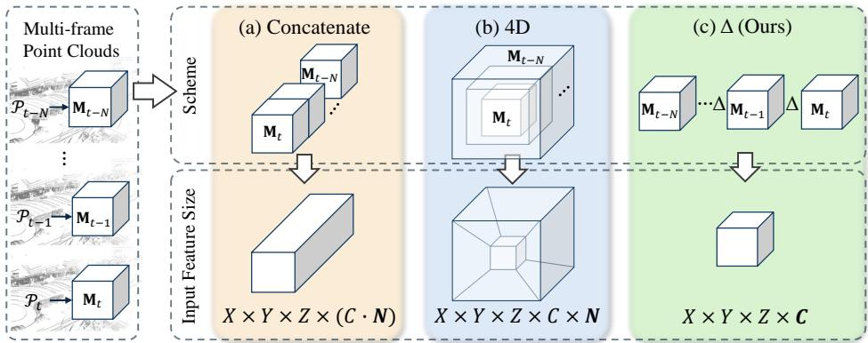  
Figure 1: Comparison of multi-frame strategies for scene flow estimation. For clarity, voxelized features are shown in dense formats. $X , Y , Z$ denote spatial resolution, $C$ represents feature channels, and $N$ is the number of frames. Existing methods process voxelized representations using (a) Concatenation features along the channel dimension [44, 15]; (b) 4D methods stack features in an additional temporal dimension [18, 28]. Both increase input size as $N$ grows. (c) Our proposed $\Delta$ Flow applies a $\Delta$ scheme between voxelized frame, maintaining a compact feature representation and a constant feature size independent of $N$ .

Figure 1(a), (b). The scheme allows the network to focus on “what is changing” in the scene rather than the static background, aligning with the core objective of scene flow estimation. It also keeps the input feature size of $\Delta$ Flow constant regardless of the number of frames, effectively addressing the scalability challenge in multi-frame scene flow estimation.

We further propose improvements to the scene flow supervision signal. Existing approaches [44, 15, 34] for driving scenarios primarily focus on distinguishing between static and moving objects. However, they do not explicitly address severe class imbalances (e.g., cars versus pedestrians) as mentioned in [16], nor ensure motion consistency across all points within the same object. To tackle these issues, we propose a Category-Balanced Loss to achieve more balanced training across all the classes, including the underrepresented classes (e.g., pedestrians, cyclists), and an Instance Consistency Loss to enforce a uniform motion for each individual instance.

$\Delta$ Flow achieves the best performance for real-time scene flow estimation on Argoverse 2, Waymo and nuScenes datasets, outperforming the next-best multi-frame supervised method by up to $22 \%$ . It also demonstrates high computational efficiency and scalability in multi-frame settings, achieving up to $2 \times$ faster inference, and exhibits strong generalization ability across different datasets. With its accuracy and efficiency, $\Delta$ Flow is well-suited for real-world autonomous driving applications. The contributions of this paper are as follows: (1) We propose $\Delta$ Flow, a lightweight 3D framework for multi-frame scene flow estimation that efficiently extracts motion cues by a $\Delta$ scheme between voxelized frames, maintaining a compact feature representation that is scalable in the temporal domain. (2) We introduce a Category-Balanced Loss and an Instance Consistency Loss to enhance dynamic flow for underrepresented classes and improve motion consistency for individual instances. (3) We demonstrate that $\Delta$ Flow achieves state-of-the-art real-time performance on three datasets, while exhibiting high computational efficiency and strong cross-domain generalization ability.

# 2 Related Work

Scene Flow Estimation Scene flow estimation describes the 3D motion field between temporally successive point clouds [36, 23, 41, 14, 49]. Early methods focused on point-wise feature learning [38, 20, 37, 25, 47, 49], achieving high accuracy on small-scale synthetic datasets such as ShapeNet [6] and FlyingThings3D [29]. However, when applied to large-scale, high-density point clouds typical in autonomous driving [11, 33, 30, 5, 2, 10], these methods require downsampling due to high memory costs and are not well optimized for sequential data, limiting their practical utility.

To handle large-scale point clouds, FastFlow3D [15] voxelized point clouds and concatenated voxelized features from two frames before feeding them into the network. However, voxelization sacrifices fine-grained motion details, as point-to-voxel transformations reduce spatial resolution, thereby diminishing accuracy at the object level. DeFlow [44] addressed this by introducing GRUbased voxel-to-point refinement, while SSF [17] leveraged sparse convolutions and virtual voxels to enhance long-range scene flow estimation.

Multi-frame challenges Multi-frame modeling has become a key trend in scene flow estimation, as leveraging past frames provides richer temporal context and allows for a more comprehensive understanding of motion dynamics over time [18, 13, 35]. One approach is to process all frames in a sequence offline, as demonstrated by EulerFlow [35]. Although it achieves high accuracy, it is highly computationally demanding, requiring 24 hours to process a sequence of 157 frames in Argoverse 2, making it infeasible for real-time applications. An alternative is to concatenate multi-frame features, as done by most voxelized methods mentioned earlier. However, this leads to feature expansion, higher memory consumption, and limited temporal consistency as more frames are added.

To improve efficiency, two common strategies are used: 1) spatial optimization and 2) temporal optimization. For spatial optimization, methods in [15, 44, 17] reduce spatial dimensions by compressing the Z-dimension into a bird’s-eye view (BEV) representation, effectively transforming the network into 2D processing. While this reduces the computational cost, it removes height information, which may degrade accuracy. Alternatively, Kim et al. [18] applies sparse voxelization, using storage formats like coordinate format (COO) to store only nonzero elements with an indices matrix for coordinates and a value array for features. This efficiently reduces memory consumption while preserving the full 3D structure. For temporal optimization, Kim et al. [18] introduces an explicit temporal dimension, avoiding direct feature concatenation across frames. Instead of increasing feature channels, it proposes a 4D network with separate 3D spatial and 1D temporal convolutions, scaling input size multiplicatively with the number of frames. This reduces feature expansion and enhances the feasibility of multi-frame processing.

In this work, we also enhance spatial efficiency with sparse voxelization, preserving 3D structure while reducing memory usage. For temporal efficiency, we introduce a $\Delta$ scheme that extracts motion cues without expanding feature size, addressing scalability challenges in multi-frame scene flow estimation.

Other challenges Beyond computational challenges, scene flow estimation is further complicated by label imbalance. Most LiDAR points in autonomous driving scenarios belong to static structures such as buildings or roads, while dynamic objects are comparatively scarce. This imbalance biases model learning, making motion variations harder to capture. Prior works [44, 15, 34, 45] attempt to mitigate this issue using scaling functions in loss design to balance motion contributions. Among them, the motion-aware loss from DeFlow [44], which applies unweighted three-speed ranges, has shown the most effectiveness.

However, category imbalance remains a challenge. The recent scene flow evaluation metric [16] highlights that small but safety-critical categories, such as pedestrians and cyclists, are underrepresented compared to larger vehicle classes, making small-instance predictions challenging. Meanwhile, Zhang et al. [45] emphasize the need for object-level motion consistency, where instances within the same object should share coherent scene flow. To address these issues, we introduce a CategoryBalanced Loss and Instance Consistency Loss in this paper.

# 3 Method

# 3.1 Problem Formulation

Given two consecutive point clouds, $\mathcal { P } _ { t - 1 } \in \mathbb { R } ^ { N _ { t - 1 } \times 3 }$ and $\mathcal { P } _ { t } \in \mathbb { R } ^ { N _ { t } \times 3 }$ , scene flow estimation aims to predict how the points $p _ { t - 1 } \in \mathcal P _ { t - 1 }$ move from time $t - 1$ to $t$ , resulting in a scene flow vector field $\mathcal { F } _ { t - 1 } \in \mathbb { R } ^ { N _ { t - 1 } \times 3 }$ . The estimated flow $\hat { \mathcal { F } } _ { t - 1 }$ from $\mathcal { P } _ { t - 1 }$ to $\mathcal { P } _ { t }$ can be decomposed as:

$$
\hat { \mathcal { F } } = \mathcal { F } _ { e g o } + \Delta \hat { \mathcal { F } } ,
$$

where $\mathcal { F } _ { e g o }$ represents the motion caused by the ego vehicle. This motion is computed from the relative transformation of the sensor pose $\mathbf { T } _ { e g o } ^ { t - 1  t }$ between time $t - 1$ and $t$ , i.e., ${ \mathcal F } _ { e g o } =$ $\mathbf { T } _ { e g o } ^ { t - 1  t } \mathcal { P } _ { t - 1 } - \mathcal { P } _ { t - 1 }$ . Since $\mathcal { F } _ { e g o }$ can be determined directly from odometry, the goal is to estimate the residual scene flow with our approach.

Most existing scene flow estimation methods focus on reasoning with two consecutive point cloud $\{ \mathbf { T } _ { e q o } ^ { t - 1 \to t } \mathcal { P } _ { t - 1 } ^ { - } , \mathcal { P } _ { t } \} \to \Delta \mathcal { F } _ { t - 1 }$ . With the re-s on learning:s for improved   
$\{ \mathbf { T } _ { e g o } ^ { t - N  t } \mathcal { P } _ { t - N } , . . . , \mathbf { T } _ { e g o } ^ { t - 1  t } \mathcal { P } _ { t - 1 } , \mathcal { P } _ { t } \}  \Delta \mathcal { F } _ { t - 1 }$   
motion estimation.

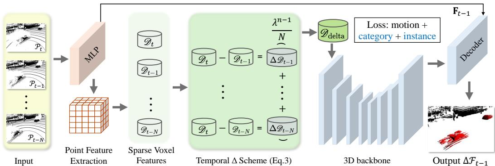  
Figure 2: Overview of the proposed $\Delta$ Flow architecture. The framework first extracts point-level features and voxelize them to obtain sparse voxel features $\mathcal { D }$ . The core temporal $\Delta$ scheme then computes the difference between the current frame $t$ and previous frames $( t - 1 , \ldots , t - N )$ , weighted by a time-decay factor $\lambda$ . The resulting $\Delta$ feature $\mathcal { D } _ { \mathrm { d e l t a } }$ is then passed to a 3D backbone–decoder network to estimate the final scene flow $\Delta \mathcal { F } _ { t - 1 }$ . This approach captures motion-specific cues efficiently while keeping the architecture compact and scalable, regardless of the number of frames.

# 3.2 ∆Flow

To effectively learn multi-frame information, we propose $\Delta$ Flow, as shown in Figure 2. We extract a sparse $\Delta$ feature that efficiently encodes temporal and spatial information from the frames, then feed it into a standard backbone-decoder network for scene flow estimation.

Point Feature Extraction Following common practices in scene flow estimation [15, 44, 18], we first encode individual point clouds using PointPillars [19], generating point-wise feature representations $\left\{ \mathbf { F } _ { t - N } , . . . , \mathbf { F } _ { t - 1 } , \mathbf { \bar { F } } _ { t } \right\}$ . Each $\mathbf { F } _ { t } \in \mathbb { R } ^ { N _ { t } \times C }$ represents the feature embedding for $\mathcal { P } _ { t }$ , where $N _ { t }$ is the number of points and $C$ is the feature dimension.

Sparse Spatial Representation We then encode the point features into a sparse 3D representation, which processes only non-empty voxels to reduce computational overhead in large-scale 3D grids. Given encoded point features $\mathbf { \bar { F } } \in \mathbb { R } ^ { N _ { \mathcal { P } } \times C }$ , we construct sparse voxel features $\mathcal { D } \in \mathbb { R } ^ { V \times C }$ through point-to-voxel aggregation:

$$
\mathcal { D } [ v _ { i } ] = \left\{ \begin{array} { l l } { \frac { \sum _ { p \in \mathcal { P } ^ { v _ { i } } } \mathbf { f } _ { p } } { | \mathcal { P } ^ { v _ { i } } | } } & { v _ { i } \in \mathcal { V } , } \\ { \mathbf { 0 } } & { \mathrm { o t h e r w i s e } , } \end{array} \right.
$$

where $\boldsymbol { v } _ { i } = ( x _ { i } , y _ { i } , z _ { i } )$ denotes the $i$ -th active voxel coordinate in $\nu$ (the set of non-empty voxels with $| \nu | = V ,$ ). $\mathcal { P } ^ { v _ { i } }$ represents points inside voxel $v _ { i }$ and $\mathbf { f } _ { p } \in \mathbb { R } ^ { C }$ is the feature of point $p$ .

Temporal $\Delta$ Scheme In order to extract motion signals from the sparse voxel features, we propose a simple yet effective $\Delta$ scheme comprising subtraction, temporal weighting and summation steps:

$$
\mathcal { D } _ { \mathrm { d e l t a } } = \sum _ { n = 1 } ^ { N } \lambda ^ { n - 1 } ( \mathcal { D } _ { t } - \mathcal { D } _ { t - n } ) / N ,
$$

resulting in the $\Delta$ feature $\mathcal { D } _ { \mathrm { d e l t a } } \in \mathbb { R } ^ { V \times C }$ . $N$ is the number of past frames considered, and $\lambda$ applies a temporal decay to earlier frames.

The $\Delta$ scheme is designed to extract global motion patterns from multiple frames while maintaining computational efficiency. First, voxel-wise differences between the current frame and previous ones are computed, encouraging the model to focus on what is changing in the scene while minimizing reliance on static features. These differences are then weighted by a decay factor $\lambda \in ( 0 , 1 ]$ , which assigns higher importance to more recent frames. The weighted differences are subsequently summed to accumulate the trail of moving objects and produce a temporal representation that captures longterm motion information. The intuition for this accumulation is to mimic how humans can interpret motion in a single image from motion blur. We provide qualitative support for the design of the $\Delta$ scheme in Section 5.5, which illustrates the temporal behavior of the proposed method and highlights its emphasis on motion-related changes.

Notably, this scheme maintains a constant feature dimension, ensuring that the feature size remains unaffected by the number of frames. This allows the model to process an arbitrary number of past frames without increasing computational overhead in the backbone-decoder network.

Backbone-Decoder network The $\Delta$ feature $\mathcal { D } _ { \mathrm { d e l t a } }$ is then served as input to a 3D backbone-decoder network for scene flow estimation. It is first processed by a 3D backbone for feature extraction:

$$
\mathcal { D } _ { ( \mathrm { o u t } ) } \ = \ \mathrm { B a c k b o n e } \Big ( \mathcal { D } _ { \mathrm { d e l t a } } ; \mathbf { W } _ { \mathrm { n e t } } \Big ) ,
$$

where Backbone refers to any network capable of processing sparse 3D voxel inputs, and $\mathbf { W } _ { \mathrm { n e t } }$ are trainable network parameters. The backbone output $\mathcal { D } _ { \mathrm { ( o u t ) } }$ is then sent to a scene flow decoder network to estimate a per-point 3D scene flow vector:

$$
\Delta \hat { \mathcal { F } } = \operatorname { D e c o d e r } \big ( \operatorname { V } 2 \operatorname { P } ( \mathcal { D } _ { ( \mathrm { o u t } ) } ) , \mathbf { F } _ { t - 1 } ; \mathbf { W } _ { d } \big ) ,
$$

where the mapping $\mathrm { V 2 P } ( \mathcal { D } _ { \mathrm { ( o u t ) } } ) : \mathrm { R } ^ { V \times C }  \mathrm { R } ^ { N _ { t - 1 } \times C }$ maps features back to points via pre-recorded coordinate indexing, and $\mathbf { W } _ { d }$ are trainable decoder weights.

# 3.3 Loss Function

We employ three loss functions to supervise scene flow estimation: the motion-awareness loss from DeFlow [44], and two new ones proposed in this work, a category-balanced loss and an instance consistency loss, that address class imbalance and motion inconsistency.

Motion-awareness Loss The motion-awareness loss $\mathcal { L } _ { \mathrm { d e f l o w } }$ from DeFlow [44] is designed to mitigate data imbalance between static and dynamic points by prioritizing dynamic point flow estimation. It categorizes points in $\mathcal { P } _ { t }$ based on their motion speed into three groups1: $\{ \bar { \mathcal { P } } _ { t / 1 } , \mathcal { P } _ { t / 2 } , \mathcal { P } _ { t / 3 } \}$ , resulting in the loss:

$$
\mathcal { L } _ { \mathrm { d e f l o w } } = \sum _ { i = 1 } ^ { 3 } \frac { 1 } { | \mathcal { P } _ { t / i } | } \sum _ { p \in \mathcal { P } _ { t , s } } \Big \| \Delta \hat { \mathcal { F } } ( p ) - \Delta \mathcal { F } _ { \mathrm { g t } } ( p ) \Big \| _ { 2 } .
$$

Category-Balanced Loss The Category-Balanced Loss is designed to categorize dynamic objects based on class and motion speed, ensuring a more balanced scene flow learning across different object categories. To achieve this, we assign to each point $p$ a meta-category from the set $\mathcal { C }$ , with each category $c$ assigned a predefined weight $w _ { c }$ . The loss is then defined as:

$$
\mathcal { L } _ { C } = \sum _ { c \in \mathcal { C } } w _ { c } \sum _ { b \in \mathcal { B } } \gamma _ { b } \frac { 1 } { \left| \mathcal { P } _ { c , b } \right| } \sum _ { p \in \mathcal { P } _ { c , b } } \Big \| \Delta \hat { \mathcal { F } } ( p ) - \Delta \mathcal { F } _ { \mathrm { g t } } ( p ) \Big \| _ { 2 } ,
$$

where $\gamma _ { b }$ are speed-dependent coefficients that adjust the weighting based on motion speed.

Instance Consistency Loss The instance consistency loss is designed to ensure that all points on a rigid object exhibit a consistent scene flow. To achieve this, we let $\mathcal { T }$ be the set of object instances, and for each instance $I \in \mathcal { T }$ , let $\mathcal { P } _ { I }$ denote the set of points belonging to $I$ . The per-instance average estimated error is defined as:

$$
\hat { e } _ { I } = \sum _ { p \in \mathcal { P } _ { I } } \frac { | | \Delta \hat { \mathcal { F } } ( p ) - \Delta \mathcal { F } _ { \mathrm { g t } } ( p ) | | _ { 2 } } { | \mathcal { P } _ { I } | } .
$$

Each instance is assigned a representative meta-category $c _ { I }$ , and only moving instances $( \mathcal { T } ^ { \prime } )$ where speed exceeds $0 . 4 \mathrm { m } / \mathrm { s }$ are considered. The loss is then defined as:

$$
\mathcal { L } _ { I } = \frac { 1 } { \vert \mathcal { T } ^ { \prime } \vert } \sum _ { I \in \mathcal { I } ^ { \prime } } \omega _ { c _ { I } } \hat { e } _ { I } \exp \left( \hat { e } _ { I } \right) .
$$

The final loss function is the sum of all three losses:

$$
\mathcal { L } _ { \mathrm { t o t a l } } = \mathcal { L } _ { \mathrm { d e f l o w } } + \mathcal { L } _ { C } + \mathcal { L } _ { I } .
$$

# 4 Experiments Setup

# 4.1 Datasets

Experiments are conducted on three commonly used large-scale autonomous driving datasets in scene flow estimation: Argoverse 2 [39], which employs two roof-mounted 32-channel LiDARs; Waymo [33], which uses a single 64-channel LiDAR; and nuScenes [5], which uses a 32-channel LiDAR. Ground removal is applied to Argoverse 2 and Waymo using HDMap information following [34], and to nuScenes using line-fit ground segmentation [12].

Argoverse 2 provides an official public scene flow challenge [1], consisting of 700 training and 150 validation scenes, each lasting 15 seconds at $1 0 \ : \mathrm { H z }$ , totaling 110,071 point cloud frames.

An additional 150 test scenes are available for evaluation via the online leaderboard. The scene flow ground truth is generated from human annotations with tracking-based inference to estimate 3D motion. However, as noted in [46], non-ego motion distortion can lead to inaccurate annotations, as points from fast-moving objects may fall outside their labeled bounding boxes. To address this issue, we follow the velocity-aware annotation refinement strategy in [46], which enlarges the bounding box of each object along its motion direction to include all distorted points. As illustrated in Figure 3, the 3D flow vectors (red lines) accurately capture the true motion of previously distorted points.

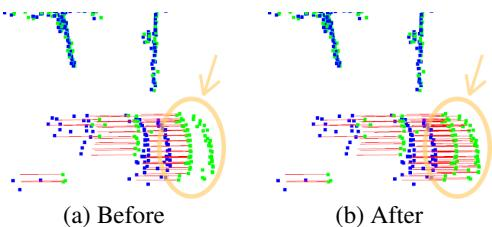  
Figure 3: Comparison of scene flow ground truth before and after motion compensation on a highspeed car. Blue points: LiDAR scan at $t + 1$ ; Green points: LiDAR scan at $t$ ; Red lines: annotated flow vectors.

Waymo [15, 33] contains 798 training and 202 validation sequences, each recorded at $1 0 \ : \mathrm { H z }$ for around 20 seconds. The training set consists of 155,000 frames. Motion distortion affects both the point cloud and ground truth. However, direct annotation refinement is infeasible as it does not provide per-point timestamps. Thus, evaluation is conducted using the original annotations.

nuScenes [5] includes 700 training and 150 validation scenes, each recorded at $2 0 \mathrm { { H z } }$ for around 20 seconds. The training set contains 275,150 frames, of which 27,392 $( \approx 1 0 \% )$ are annotated with ground-truth labels, yielding an effective annotation rate of $2 \ : \mathrm { H z }$ . For consistency with Argoverse 2 and Waymo, we downsample the LiDAR data to $1 0 \ : \mathrm { H z }$ , yielding a standard $1 0 0 \mathrm { m s }$ interval between consecutive frames. Ground-truth scene flow is constructed by computing a rigid transformation for each object from its annotated 3D bounding box and velocity, then applying this transformation to all points within the object to obtain flow vectors.

# 4.2 Evaluation Metrics

The leaderboard [1] evaluates scene flow using two metrics: three-way End Point Error (EPE) and Dynamic Bucket-Normalized EPE. EPE is defined as the L2 norm of the difference between predicted and ground truth flow vectors, measured in centimeters. Three-way EPE [7] computes the unweighted average EPE over three regions: foreground dynamic (FD), foreground static (FS), and background static (BS). A point is classified as dynamic if its ground truth velocity exceeds $0 . 5 \mathrm { m } / \mathrm { s }$ , and foreground if it lies within the bounding box of any tracked object. Dynamic Bucket-Normalized EPE [16] groupby mean speed $\frac { \dot { \mathrm { M e a n } } \mathrm { E P E } } { \mathrm { M e a n s p e e d } }$ to predefined motion buckets based on their speeds and normalizes EPE). This metric evaluates four object categories: regular cars (CAR), other (VRU), including bicycles and motorcycles.

# 4.3 Implementation Details

In our implementation, we adopt MinkowskiNet [9] as our 3D backbone, a widely used sparse convolutional network known for strong performance in 3D perception tasks. The scene flow decoder follows DeFlow [44], enabling effective per-point scene flow prediction. Further details on the $\Delta$ scheme and the full 3D backbone-decoder architecture are provided in Appendix A.1.

For Argoverse 2, test set results are obtained directly from the public leaderboard [1] to ensure a fair comparison. For Waymo and other local experiments, all baselines are retrained and reproduced with ego-motion compensation under identical device settings for consistent evaluation. Training

Table 1: Performance comparisons on Argoverse 2 test set from the public leaderboard [1]. Upper groups are self-supervised methods, lower are supervised methods. Our method achieves state-ofthe-art performance in scene flow estimation. ‘#F’ denotes the number of input frames. Runtime is reported per sequence (around 157 frames), with ‘-’ indicating unreported runtime. ‘s’, $\cdot _ { \mathrm { m } } ,$ , and ‘h’ represent seconds, minutes, and hours, respectively. Purple highlighted runtimes indicate offline methods. Bold and underline mark the best and second-best results.   

<table><tr><td rowspan="2">Methods</td><td rowspan="2">#F</td><td rowspan="2">Runtime per seq</td><td colspan="5">Dynamic Bucket-Normalized ↓</td><td colspan="4">Three-way EPE(cm)↓</td></tr><tr><td>Mean</td><td>CAR</td><td>OTHER</td><td>PED</td><td>VRU</td><td>Mean</td><td>FD</td><td>FS</td><td>BS</td></tr><tr><td>Ego Motion Flow</td><td>：</td><td>1</td><td>1.000</td><td>1.000</td><td>1.000</td><td>1.000</td><td>1.000</td><td>18.13</td><td>53.35</td><td>1.03</td><td>0.00</td></tr><tr><td>SeFlow [45]</td><td>2</td><td>7.2s</td><td>0.309</td><td>0.214</td><td>0.291</td><td>0.464</td><td>0.265</td><td>4.86</td><td>12.14</td><td>1.84</td><td>0.60</td></tr><tr><td>ICP Flow [24]</td><td>2</td><td>-</td><td>0.331</td><td>0.195</td><td>0.331</td><td>0.435</td><td>0.363</td><td>6.50</td><td>13.69</td><td>3.32</td><td>2.50</td></tr><tr><td>ZeroFlow [34]</td><td>3</td><td>5.4s</td><td>0.439</td><td>0.238</td><td>0.258</td><td>0.808</td><td>0.452</td><td>4.94</td><td>11.77</td><td>1.74</td><td>1.31</td></tr><tr><td>FastNSF [22]</td><td>2</td><td>12m</td><td>0.383</td><td>0.296</td><td>0.413</td><td>0.500</td><td>0.322</td><td>11.18</td><td>16.34</td><td>8.14</td><td>9.07</td></tr><tr><td>NSFP [21]</td><td>2</td><td>1.0h</td><td>0.422</td><td>0.251</td><td>0.331</td><td>0.722</td><td>0.383</td><td>6.06</td><td>11.58</td><td>3.16</td><td>3.44</td></tr><tr><td>Floxels [13]</td><td>13</td><td>24m</td><td>0.154</td><td>0.112</td><td>0.213</td><td>0.195</td><td>0.097</td><td>4.73</td><td>10.30</td><td>3.65</td><td>0.24</td></tr><tr><td>EulerFlow [35]</td><td>all</td><td>24h</td><td>0.130</td><td>0.093</td><td>0.141</td><td>0.195</td><td>0.093</td><td>4.23</td><td>4.98</td><td>2.45</td><td>5.25</td></tr><tr><td>FastFlow3D[15]</td><td>2</td><td>5.4s</td><td>0.532</td><td>0.243</td><td>0.391</td><td>0.982</td><td>0.514</td><td>6.20</td><td>15.64</td><td>2.45</td><td>0.49</td></tr><tr><td>TrackFlow [16]</td><td>-</td><td>-</td><td>0.269</td><td>0.182</td><td>0.305</td><td>0.358</td><td>0.230</td><td>4.73</td><td>10.30</td><td>3.65</td><td>0.24</td></tr><tr><td>DeFlow [44]</td><td>2</td><td>7.2s</td><td>0.276</td><td>0.113</td><td>0.228</td><td>0.496</td><td>0.266</td><td>3.43</td><td>7.32</td><td>2.51</td><td>0.46</td></tr><tr><td>SSF[17]</td><td>2</td><td>5.2s</td><td>0.181</td><td>0.099</td><td>0.162</td><td>0.292</td><td>0.169</td><td>2.73</td><td>5.72</td><td>1.76</td><td>0.72</td></tr><tr><td>Flow4D [18]</td><td>2</td><td>12.8s</td><td>0.174</td><td>0.095</td><td>0.167</td><td>0.278</td><td>0.155</td><td>2.51</td><td>5.73</td><td>1.48</td><td>0.30</td></tr><tr><td></td><td>5</td><td>15s</td><td>0.145</td><td>0.087</td><td>0.150</td><td>0.216</td><td>0.127</td><td>2.24</td><td>4.94</td><td>1.31</td><td>0.47</td></tr><tr><td>△Flow (Ours)</td><td>2</td><td>7.6s</td><td>0.145</td><td>0.084</td><td>0.144</td><td>0.225</td><td>0.125</td><td>2.30</td><td>4.81</td><td>1.44</td><td>0.66</td></tr><tr><td></td><td>5</td><td>8s</td><td>0.113</td><td>0.077</td><td>0.129</td><td>0.149</td><td>0.096</td><td>2.11</td><td>4.33</td><td>1.37</td><td>0.64</td></tr></table>

Table 2: Comparisons on Waymo validation set where each sequence contains around 200 frames. Upper groups are self-supervised methods, lower are supervised methods.   

<table><tr><td rowspan="2">Methods</td><td rowspan="2">Runtim per seq</td><td colspan="4">Three-way EPE (cm)↓</td></tr><tr><td>Mean</td><td>FD</td><td>FS</td><td>BS</td></tr><tr><td>SeFlow [45]</td><td>14.8s</td><td>5.98</td><td>15.06</td><td>1.81</td><td>1.06</td></tr><tr><td>ZeroFlow [34]</td><td>12.4s</td><td>8.52</td><td>21.62</td><td>1.53</td><td>2.41</td></tr><tr><td>NSFP [21]</td><td>1.6h</td><td>10.05</td><td>17.12</td><td>10.81</td><td>2.21</td></tr><tr><td>FastFlow3D[15]</td><td>12.4s</td><td>7.84</td><td>19.54</td><td>2.46</td><td>1.52</td></tr><tr><td>DeFlow [44]</td><td>14.8s</td><td>4.46</td><td>9.80</td><td>2.59</td><td>0.98</td></tr><tr><td>Flow4D[18]</td><td>33s</td><td>2.03</td><td>4.82</td><td>0.78</td><td>0.49</td></tr><tr><td>△Flow (Ours)</td><td>18s</td><td>1.64</td><td>4.04</td><td>0.29</td><td>0.58</td></tr></table>

resources and settings are detailed in Appendix A.2. The code is open-sourced at https://github. com/Kin-Zhang/DeltaFlow along with trained model weights.

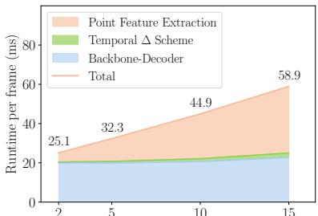  
Figure 4: Runtime breakdown of ∆Flow on Argoverse 2 validation set as the number of input frames varies from 2 to 15 ( $\mathbf { \dot { x } }$ -axis).

# 5 Results and Discussion

# 5.1 State-of-the-art Comparison

The Argoverse leaderboard test set results are summarized in Table 1. The proposed ∆Flow achieves the best mean EPE and dynamic bucket-normalized EPE scores among all methods, demonstrating both high accuracy and efficiency. It reduces mean dynamic bucket-normalized EPE by $13 \%$ compared to the second-best method, EulerFlow, and by $22 \%$ compared to Flow4D, while running twice as fast as Flow4D and thousands of times faster than EulerFlow. Even with two frames, ∆Flow outperforms all methods using the same setting, indicating that the $\Delta$ scheme effectively encodes motion differences between frames without subtracting out the important information. This state-ofthe-art performance is consistently validated on other large-scale datasets. On the Waymo dataset (shown in Table 2), $\Delta$ Flow again achieves the lowest mean EPE, outperforming the next-best model Flow4D by $19 \%$ while being $45 \%$ faster. On the nuScenes validation set (shown in Table 3), $\Delta$ Flow establishes a new benchmark by a significant margin, reducing the mean EPE by $39 \%$ compared to Flow4D. This consistently leading performance across datasets with different LiDAR configurations highlights the robustness and generalization capability of our approach.

Table 3: Comparisons on nuScenes validation set with a $1 0 \mathrm { H z }$ LiDAR frequency, where each sequence contains around 200 frames. Upper groups are self-supervised methods, lower are supervised methods.   

<table><tr><td rowspan="2">Methods</td><td rowspan="2">#F</td><td rowspan="2">Runtime per seq</td><td colspan="5">Dynamic Bucket-Normalized ↓</td><td colspan="4">Three-way EPE (cm)↓</td></tr><tr><td>Mean</td><td>CAR</td><td>OTHER</td><td>PED</td><td>VRU</td><td>Mean</td><td>FD</td><td>FS</td><td>BS</td></tr><tr><td>Ego Motion Flow</td><td>1</td><td>-</td><td>1.000</td><td>1.000</td><td>1.000</td><td>1.000</td><td>1.000</td><td>12.34</td><td>35.94</td><td>1.07</td><td>0.00</td></tr><tr><td>SeFlow [45]</td><td></td><td>6s</td><td>0.544</td><td>0.396</td><td>0.635</td><td>0.726</td><td>0.419</td><td>8.19</td><td>16.15</td><td>3.97</td><td>4.45</td></tr><tr><td>FastNSF[22]</td><td>2</td><td>2.6m</td><td>0.560</td><td>0.436</td><td>0.523</td><td>0.737</td><td>0.543</td><td>12.16</td><td>18.20</td><td>6.11</td><td>12.18</td></tr><tr><td>NSFP [21]</td><td>2</td><td>3.5m</td><td>0.602</td><td>0.463</td><td>0.456</td><td>0.829</td><td>0.662</td><td>10.79</td><td>20.26</td><td>4.88</td><td>7.23</td></tr><tr><td>DeFlow [44]</td><td>2</td><td>6s</td><td>0.314</td><td>0.163</td><td>0.286</td><td>0.533</td><td>0.275</td><td>3.98</td><td>6.99</td><td>3.45</td><td>1.50</td></tr><tr><td>Flow4D[18]</td><td>5</td><td>9s</td><td>0.279</td><td>0.204</td><td>0.312</td><td>0.379</td><td>0.222</td><td>3.82</td><td>8.05</td><td>1.82</td><td>1.58</td></tr><tr><td>△Flow (Ours)</td><td>5</td><td>7s</td><td>0.216</td><td>0.138</td><td>0.219</td><td>0.327</td><td>0.181</td><td>2.33</td><td>4.83</td><td>1.37</td><td>0.79</td></tr></table>

Table 4: Scalability comparison of multi-frame scene flow estimation on the Argoverse 2 validation set. ‘#F’ denotes the number of input frames processed. Flow4D and our $\Delta$ Flow are evaluated across increasing frame counts, reporting relative training speed, memory usage, and bucket-normalized accuracy.   

<table><tr><td rowspan="2">Method</td><td rowspan="2">#F</td><td rowspan="2">Speed ↑</td><td rowspan="2">Memory↓</td><td colspan="4">Dynamic Bucket-Normalized ↓</td><td rowspan="2">VRU</td></tr><tr><td>Mean</td><td>CAR</td><td>OTHER</td><td>PED</td></tr><tr><td rowspan="4">Flow4D</td><td>2</td><td>1.03×</td><td>1.20×</td><td>0.2269</td><td>0.1648</td><td>0.1738</td><td>0.2960</td><td>0.2729</td></tr><tr><td>5</td><td>0.65×</td><td>1.85×</td><td>0.2147</td><td>0.1631</td><td>0.1767</td><td>0.2522</td><td>0.2667</td></tr><tr><td>10</td><td>0.37×</td><td>2.82×</td><td>0.2022</td><td>0.1494</td><td>0.1707</td><td>0.2284</td><td>0.2603</td></tr><tr><td>15</td><td>0.26×</td><td>3.7×</td><td>0.2055</td><td>0.1593</td><td>0.1738</td><td>0.2280</td><td>0.2607</td></tr><tr><td rowspan="4">△Flow</td><td>2</td><td>1.04×</td><td>0.98×</td><td>0.2116</td><td>0.1543</td><td>0.1751</td><td>0.2723</td><td>0.2449</td></tr><tr><td>5</td><td>1.00×</td><td>1.00×</td><td>0.1901</td><td>0.1479</td><td>0.1723</td><td>0.2160</td><td>0.2243</td></tr><tr><td>10</td><td>0.68×</td><td>1.2×</td><td>0.1901</td><td>0.1500</td><td>0.1853</td><td>0.2010</td><td>0.2241</td></tr><tr><td>15</td><td>0.51×</td><td>1.22×</td><td>0.1916</td><td>0.1511</td><td>0.1911</td><td>0.2001</td><td>0.2242</td></tr></table>

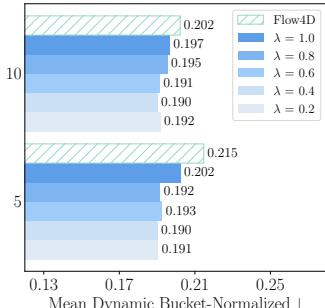  
Figure 5: Ablation study of the decay factor $\lambda$ in $\Delta$ Flow, evaluated with 5 and 10 input frame settings.

# 5.2 Multi-frame Analysis

To further evaluate $\Delta$ Flow in multi-frame settings, we analyze its efficiency, scalability, and performance as frames increase, comparing it to Flow4D [18]. We also assess the effect of the time decay factor $\lambda$ in the $\Delta$ scheme on multi-frame processing.

Efficency and scalability Table 4 compares the computational cost and accuracy of $\Delta$ Flow and Flow4D across different frame counts. As the number of input frames increases, Flow4D experiences a sharp drop in speed and a significant rise in memory consumption. By 15 frames, it requires $3 . 7 \times$ more memory and runs at only $0 . 2 6 \times$ speed, making large-frame modeling impractical. In contrast, $\Delta$ Flow scales more efficiently, with only $1 . 2 2 \times$ memory growth and twice the speed of Flow4D at higher frame counts. Notably, the slowdown of $\Delta$ Flow mainly stems from the point feature extraction for each additional frame, as shown in the runtime breakdown in Figure 4, while the temporal $\Delta$ scheme and backbone-decoder network add negligible cost. As a result, $\Delta$ Flow enables multi-frame processing without excessive computational overhead. This efficiency also validates the scalability of the $\Delta$ scheme, where the $\Delta$ feature maintains a constant feature size across frames, preventing the feature expansion problem seen in prior methods. Additional analysis on $\Delta$ scheme efficiency is provided in Appendix B.1.

Performance Beyond computational efficiency, both $\Delta$ Flow and Flow4D achieve lower mean dynamic bucket-normalized EPE with 5 or 10 frames compared to only 2 frames in Table 4, indicating that multi-frame modeling improves performance. However, this improvement diminishes or even declines at 15 frames. A likely reason is that long-ago frames become less informative for predicting current motion, and incorporating such outdated context may introduce noise. This highlights an open challenge in optimizing long-term temporal information usage in real-time to maximize scene flow performance.

Time decay factor We evaluate different decay factor $\lambda$ values (in Eq. (3)) for 5-frame and 10-frame settings and summarize the results in Figure 5 to analyze their impact on multi-frame processing. Overall, applying a decay $\lambda < 1$ consistently improves mean dynamic bucket-normalized performance over the non-decayed $\lambda = 1$ baseline, as it emphasizes recent frames and downweighting older ones.

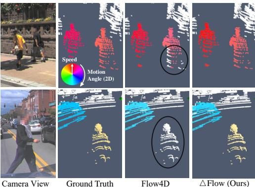  
Figure 6: Qualitative comparison on the Argoverse 2. The left column displays camera views for reference, while the right columns visualize scene flow predictions, where Hue encodes direction and saturation represents magnitude. Our method, $\Delta$ Flow, produces more accurate and consistent flow estimates than the prior SOTA, Flow4D, particularly for small objects. (Best viewed in color.)

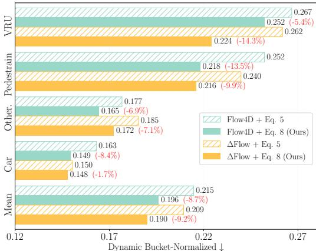  
Figure 7: Ablation on our proposed loss (Eq. (8)) compared to the baseline (Eq. (5)) for both Flow4D and ∆Flow. Red percentages indicate relative error reduction compared to the baseline loss. Bucketnormalized error across dynamic categories shows consistent improvements, especially for smaller classes like pedestrians and vulnerable road users.

Notably, even without decay, $\Delta$ Flow surpasses Flow4D [18], demonstrating the robustness of our approach, with temporal decay providing additional performance gains. Additional per-category results for different $\lambda$ are provided in Appendix B.2.

# 5.3 Loss Analysis

To assess the impact of our proposed loss functions on $\Delta$ Flow, we analyze its performance across different object categories. As shown in Table 1, we observe that $\Delta$ Flow significantly improves pedestrian and wheeled object accuracy, reducing pedestrian error by $2 3 . 6 \%$ compared to the nextbest competitor, EulerFlow, demonstrating its ability to better capture small dynamic instances. Additionally, qualitative comparisons in Figure 6 further show that $\Delta$ Flow produces more accurate motion vectors than Flow4D, particularly for small objects like pedestrians, with points of the same pedestrian exhibiting greater motion consistency. These improvements might come from the contribution of the Category-Balanced Loss and Instance Consistency Loss.

To validate this, we compare our proposed loss functions Eq. (8) with the baseline loss Eq. (5), evaluating both Flow4D and $\Delta$ Flow, as shown in Figure 7. The results demonstrate that our loss consistently improves bucket-normalized accuracy across all dynamic categories, particularly for underrepresented small objects. The improvements are observed across both models, with mean, pedestrian, and VRU errors reduced by approximately $10 \%$ , confirming the general effectiveness of our loss design. Furthermore, while improving dynamic bucketed-normalized performance, our loss preserves static scene information, as three-way mean EPE scores remain stable. More results and ablation studies on each loss item are provided in Appendix B.3.

Table 5: Cross-domain generalization measured by the three-way EPE (cm) metric. Each model is trained on one dataset (LiDAR number and channel in parentheses) and evaluated on another with a different LiDAR channel. Lower EPE indicates better generalization. Our proposed $\Delta$ Flow achieves the best performance in both evaluations.   

<table><tr><td rowspan="3">Methods</td><td colspan="8">Three-way EPE (cm)↓</td></tr><tr><td colspan="4">Argoverse 2 (2x32)→Waymo (64)</td><td colspan="4">Waymo (64)→Argoverse 2 (2x32)</td></tr><tr><td>Mean</td><td>FD</td><td>FS</td><td>BS</td><td>Mean</td><td>FD</td><td>FS</td><td>BS</td></tr><tr><td>SeFlow [45]</td><td>5.98</td><td>15.06</td><td>1.81</td><td>1.06</td><td>6.29</td><td>15.56</td><td>1.16</td><td>2.16</td></tr><tr><td>NSFP [21]</td><td>10.05</td><td>17.12</td><td>10.81</td><td>2.21</td><td>6.81</td><td>13.28</td><td>3.43</td><td>3.71</td></tr><tr><td>DeFlow [44]</td><td>4.47</td><td>11.39</td><td>1.51</td><td>0.51</td><td>4.50</td><td>10.74</td><td>2.01</td><td>0.75</td></tr><tr><td>Flow4D [18]</td><td>3.33</td><td>8.31</td><td>0.92</td><td>0.75</td><td>4.01</td><td>9.56</td><td>1.74</td><td>0.74</td></tr><tr><td>△Flow (Ours)</td><td>3.12</td><td>7.91</td><td>0.77</td><td>0.67</td><td>3.24</td><td>7.12</td><td>1.57</td><td>1.02</td></tr></table>

# 5.4 Cross-domain Generalization

∆Flow also demonstrates strong cross-domain generalization, performing well when trained on one dataset (Argoverse 2 or Waymo) and tested on the other, as shown in Table 9. This setting is particularly challenging due to differences in sensor channels, point density, and scene distribution. To evaluate the cross-domain capability of ∆Flow, we include self-supervised methods such as SeFlow and NSFP as baselines, which are trained or optimized directly on the unlabeled target domain. $\Delta$ Flow achieves state-of-the-art performance compared to both the baselines and other supervised methods, with a three-way EPE of approximately $3 \mathrm { c m }$ and a foreground dynamic EPE of around $7 \mathrm { c m }$ . This strong performance is consistent across different object categories. A detailed breakdown of the dynamic bucket-normalized EPE per category is provided in Appendix B.4.

# 5.5 Visualization of the $\Delta$ Feature

To understand the effectiveness of our $\Delta$ scheme, we visualize feature maps from the $\Delta$ feature $\mathcal { D } _ { \mathrm { d e l t a } }$ , single-frame features $( \mathcal { D } _ { t } , \mathcal { D } _ { t - 1 } , \mathcal { D } _ { t - 2 } )$ , and the final backbone output ${ \mathcal D } _ { \mathrm { ( o u t ) } }$ , as shown in Figure 8. Each map is rendered by selecting the most activated channel after a max projection along the $\mathbf { Z }$ -axis. Compared to single-frame features, $\mathcal { D } _ { \mathrm { d e l t a } }$ focuses on “what is changing” in the scene. Zoom-in views (i) and (ii) in $\mathcal { D } _ { \mathrm { d e l t a } }$ show trail-like activations on moving vehicles, confirming that the $\Delta$ feature effectively captures dynamic cues. View (iii) highlights static background noise, which is largely suppressed in ${ \mathcal D } _ { \mathrm { ( o u t ) } }$ . This demonstrates that after passing through the backbone, motion cues are further refined while irrelevant static context is filtered out. These visualizations confirm that the $\Delta$ scheme guides the model to attend to dynamic regions, enabling cleaner and more robust motion representations.

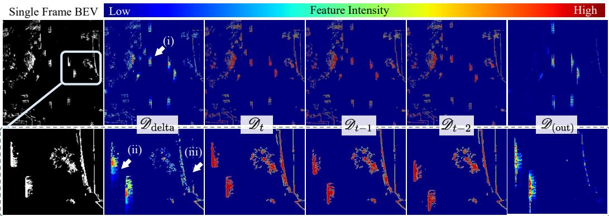  
Figure 8: Visualization of feature maps. Top: BEV projections; bottom: zoomed-in views. The first column shows the BEV map of the point cloud $\mathcal { P } _ { t }$ , while the remaining columns visualize normalized feature maps from $\mathcal { D } _ { \mathrm { d e l t a } }$ $_ { \mathrm { l t a } } , \mathcal { D } _ { t } , \mathcal { D } _ { t - 1 } , \mathcal { Q }$ $\mathcal { D } _ { t - 2 }$ and the final backbone output ${ \mathcal { D } } _ { ( \mathrm { o u t } ) }$ . Each map is rendered by selecting the most activated channel after applying a max projection along the $\mathbf { Z }$ -axis. Compared to the single-frame features, $\mathcal { D } _ { \mathrm { d e l t a } }$ emphasizes regions with motion, such as moving vehicles in panels (i) and (ii), while downplaying static structures like buildings in panel (iii), highlighting its motion-centric design. The final feature, $\mathcal { D } _ { \mathrm { ( o u t ) } }$ , shows that the network further refines these cues.

# 6 Conclusion

This paper introduces $\Delta$ Flow, an efficient framework for multi-frame scene flow estimation. It addresses the scalability challenge by leveraging a $\Delta$ scheme to extract motion cues without feature expansion as the number of frames grows. $\Delta$ Flow achieves state-of-the-art performance on the Argoverse 2 and Waymo datasets while maintaining low computational cost and strong cross-domain generalization. Additionally, the proposed Category-Balanced Loss and Instance Consistency Loss enhance learning for underrepresented small objects and enforce coherent object-level motion. With its accuracy and efficiency, $\Delta$ Flow is well-suited for real-world autonomous driving applications.

Limitations and Future Work While $\Delta$ Flow offers a highly efficient multi-frame pipeline for scene flow estimation, it currently relies on ground-truth annotations for supervised training. A promising direction for future work is to incorporate self-supervised learning strategies into the $\Delta$ Flow framework. This could enable high-efficiency, multi-frame scene flow estimation without labeled data, and enhance the real-time capabilities of self-supervised methods.

Acknowledgement We thank Chenhan Jiang and Yunqi Miao for helpful discussions during revision. This work was partially supported by the Wallenberg AI, Autonomous Systems and Software Program (WASP) funded by the Knut and Alice Wallenberg Foundation. This work was also in part financially supported by Digital Futures. The computations were enabled by the supercomputing resource Berzelius provided by National Supercomputer Centre at Linköping University and the Knut and Alice Wallenberg Foundation, Sweden.

# References

[1] Argoverse 2. Argoverse 2 scene flow online leaderboard. https://eval.ai/web/challenges/ challenge-page/2210/leaderboard/5463, 2025 May 13th.   
[2] Mina Alibeigi, William Ljungbergh, Adam Tonderski, Georg Hess, Adam Lilja, Carl Lindstrom, Daria Motorniuk, Junsheng Fu, Jenny Widahl, and Christoffer Petersson. Zenseact open dataset: A large-scale and diverse multimodal dataset for autonomous driving. In Proceedings of the IEEE/CVF International Conference on Computer Vision, 2023.   
[3] Stefan Baur, Frank Moosmann, and Andreas Geiger. Liso: Lidar-only self-supervised 3d object detection. In European Conference on Computer Vision (ECCV), 2024.   
[4] Richard P Brent. The parallel evaluation of general arithmetic expressions. Journal of the ACM (JACM), 21(2):201–206, 1974.   
[5] Holger Caesar, Varun Bankiti, Alex H. Lang, Sourabh Vora, Venice Erin Liong, Qiang Xu, Anush Krishnan, Yu Pan, Giancarlo Baldan, and Oscar Beijbom. nuscenes: A multimodal dataset for autonomous driving. In CVPR, 2020.   
[6] Angel X Chang, Thomas Funkhouser, Leonidas Guibas, Pat Hanrahan, Qixing Huang, Zimo Li, Silvio Savarese, Manolis Savva, Shuran Song, Hao Su, et al. Shapenet: An information-rich 3d model repository. arXiv preprint arXiv:1512.03012, 2015.   
[7] Nathaniel Chodosh, Deva Ramanan, and Simon Lucey. Re-evaluating lidar scene flow. In Proceedings of the IEEE/CVF Winter Conference on Applications of Computer Vision (WACV), pages 6005–6015, 2024.   
[8] Nathaniel Eliot Chodosh, Anish Madan, Simon Lucey, and Deva Ramanan. SMORE: Simultaneous map and object REconstruction. In International Conference on 3D Vision 2025, 2025.   
[9] Christopher Choy, JunYoung Gwak, and Silvio Savarese. 4d spatio-temporal convnets: Minkowski convolutional neural networks. In Proceedings of the IEEE Conference on Computer Vision and Pattern Recognition, pages 3075–3084, 2019.   
[10] Felix Fent, Fabian Kuttenreich, Florian Ruch, Farija Rizwin, Stefan Juergens, Lorenz Lechermann, Christian Nissler, Andrea Perl, Ulrich Voll, Min Yan, et al. Man truckscenes: A multimodal dataset for autonomous trucking in diverse conditions. Advances in Neural Information Processing Systems, 37: 62062–62082, 2024.   
[11] Andreas Geiger, Philip Lenz, Christoph Stiller, and Raquel Urtasun. Vision meets robotics: The kitti dataset. International Journal of Robotics Research (IJRR), 2013.   
[12] Michael Himmelsbach, Felix V Hundelshausen, and H-J Wuensche. Fast segmentation of 3d point clouds for ground vehicles. In Intelligent Vehicles Symposium (IV), 2010 IEEE, pages 560–565. IEEE, 2010.   
[13] David T Hoffmann, Syed Haseeb Raza, Hanqiu Jiang, Denis Tananaev, Steffen Klingenhoefer, and Martin Meinke. Floxels: Fast unsupervised voxel based scene flow estimation. In Proceedings of the Computer Vision and Pattern Recognition Conference, pages 22328–22337, 2025.   
[14] Chaokang Jiang, Guangming Wang, Jiuming Liu, Hesheng Wang, Zhuang Ma, Zhenqiang Liu, Zhujin Liang, Yi Shan, and Dalong Du. 3dsflabelling: Boosting 3d scene flow estimation by pseudo autolabelling. In Proceedings of the IEEE/CVF Conference on Computer Vision and Pattern Recognition, pages 15173–15183, 2024.   
[15] Philipp Jund, Chris Sweeney, Nichola Abdo, Zhifeng Chen, and Jonathon Shlens. Scalable scene flow from point clouds in the real world. IEEE Robotics and Automation Letters, 7(2):1589–1596, 2021.   
[16] Ishan Khatri, Kyle Vedder, Neehar Peri, Deva Ramanan, and James Hays. I can’t believe it’s not scene flow! In European Conference on Computer Vision, pages 242–257. Springer, 2024.   
[17] Ajinkya Khoche, Qingwen Zhang, Laura Pereira Sanchez, Aron Asefaw, Sina Sharif Mansouri, and Patric Jensfelt. SSF: Sparse long-range scene flow for autonomous driving. In 2025 IEEE International Conference on Robotics and Automation (ICRA), pages 6394–6400, 2025.   
[18] Jaeyeul Kim, Jungwan Woo, Ukcheol Shin, Jean Oh, and Sunghoon Im. Flow4D: Leveraging 4d voxel network for lidar scene flow estimation. IEEE Robotics and Automation Letters, pages 1–8, 2025.   
[19] Alex H Lang, Sourabh Vora, Holger Caesar, Lubing Zhou, Jiong Yang, and Oscar Beijbom. Pointpillars: Fast encoders for object detection from point clouds. In Proceedings of the IEEE/CVF conference on computer vision and pattern recognition, pages 12697–12705, 2019.   
[20] Itai Lang, Dror Aiger, Forrester Cole, Shai Avidan, and Michael Rubinstein. Scoop: Self-supervised correspondence and optimization-based scene flow. In Proceedings of the IEEE/CVF Conference on Computer Vision and Pattern Recognition, pages 5281–5290, 2023.   
[21] Xueqian Li, Jhony Kaesemodel Pontes, and Simon Lucey. Neural scene flow prior. Advances in Neural Information Processing Systems, 34:7838–7851, 2021.   
[22] Xueqian Li, Jianqiao Zheng, Francesco Ferroni, Jhony Kaesemodel Pontes, and Simon Lucey. Fast neural scene flow. In Proceedings of the IEEE/CVF International Conference on Computer Vision, pages 9878–9890, 2023.   
[23] Yiqing Liang, Abhishek Badki, Hang Su, James Tompkin, and Orazio Gallo. Zero-shot monocular scene flow estimation in the wild. In Proceedings of the Computer Vision and Pattern Recognition Conference, pages 21031–21044, 2025.   
[24] Yancong Lin and Holger Caesar. Icp-flow: Lidar scene flow estimation with icp. In CVPR, 2024.   
[25] Jiuming Liu, Guangming Wang, Weicai Ye, Chaokang Jiang, Jinru Han, Zhe Liu, Guofeng Zhang, Dalong Du, and Hesheng Wang. Difflow3d: Toward robust uncertainty-aware scene flow estimation with iterative diffusion-based refinement. In Proceedings of the IEEE/CVF Conference on Computer Vision and Pattern Recognition, pages 15109–15119, 2024.   
[26] Xingyu Liu, Charles R Qi, and Leonidas J Guibas. Flownet3d: Learning scene flow in 3d point clouds. CVPR, 2019.   
[27] Ilya Loshchilov, Frank Hutter, et al. Fixing weight decay regularization in adam. arXiv preprint arXiv:1711.05101, 5, 2017.   
[28] Jiehao Luo, Jintao Cheng, Xiaoyu Tang, Qingwen Zhang, Bohuan Xue, and Rui Fan. Mambaflow: A novel and flow-guided state space model for scene flow estimation. arXiv preprint arXiv:2502.16907, 2025.   
[29] Nikolaus Mayer, Eddy Ilg, Philip Hausser, Philipp Fischer, Daniel Cremers, Alexey Dosovitskiy, and Thomas Brox. A large dataset to train convolutional networks for disparity, optical flow, and scene flow estimation. In Proceedings of the IEEE conference on computer vision and pattern recognition, pages 4040–4048, 2016.   
[30] Moritz Menze and Andreas Geiger. Object scene flow for autonomous vehicles. In Proceedings of the IEEE conference on computer vision and pattern recognition, pages 3061–3070, 2015.   
[31] Mahyar Najibi, Jingwei Ji, Yin Zhou, Charles R Qi, Xinchen Yan, Scott Ettinger, and Dragomir Anguelov. Motion inspired unsupervised perception and prediction in autonomous driving. In European Conference on Computer Vision, pages 424–443. Springer, 2022.   
[32] Amelie Royer, Tijmen Blankevoort, and Babak Ehteshami Bejnordi. Scalarization for multi-task and multi-domain learning at scale. Advances in Neural Information Processing Systems, 36:16917–16941, 2023.   
[33] Pei Sun, Henrik Kretzschmar, Xerxes Dotiwalla, Aurelien Chouard, Vijaysai Patnaik, Paul Tsui, James Guo, Yin Zhou, Yuning Chai, Benjamin Caine, et al. Scalability in perception for autonomous driving: Waymo open dataset. In Proceedings of the IEEE/CVF conference on computer vision and pattern recognition, pages 2446–2454, 2020.   
[34] Kyle Vedder, Neehar Peri, Nathaniel Chodosh, Ishan Khatri, Eric Eaton, Dinesh Jayaraman, Yang Liu Deva Ramanan, and James Hays. ZeroFlow: Fast Zero Label Scene Flow via Distillation. International Conference on Learning Representations (ICLR), 2024.   
[35] Kyle Vedder, Neehar Peri, Ishan Khatri, Siyi Li, Eric Eaton, Mehmet Kemal Kocamaz, Yue Wang, Zhiding Yu, Deva Ramanan, and Joachim Pehserl. Neural eulerian scene flow fields. In The Thirteenth International Conference on Learning Representations, 2025.   
[36] Sundar Vedula, Peter Rander, Robert Collins, and Takeo Kanade. Three-dimensional scene flow. IEEE transactions on pattern analysis and machine intelligence, 27(3):475–480, 2005.   
[37] Ziyi Wang, Yi Wei, Yongming Rao, Jie Zhou, and Jiwen Lu. 3d point-voxel correlation fields for scene flow estimation. IEEE Transactions on Pattern Analysis and Machine Intelligence, 2023.   
[38] Yi Wei, Ziyi Wang, Yongming Rao, Jiwen Lu, and Jie Zhou. PV-RAFT: Point-Voxel Correlation Fields for Scene Flow Estimation of Point Clouds. In CVPR, 2021.   
[39] Benjamin Wilson, William Qi, Tanmay Agarwal, John Lambert, Jagjeet Singh, and et al. Argoverse 2: Next generation datasets for self-driving perception and forecasting. In Proceedings of the Neural Information Processing Systems Track on Datasets and Benchmarks (NeurIPS Datasets and Benchmarks 2021), 2021.   
[40] Wenxuan Wu, Zhi Yuan Wang, Zhuwen Li, Wei Liu, and Li Fuxin. Pointpwc-net: Cost volume on point clouds for (self-) supervised scene flow estimation. In European Conference on Computer Vision, pages 88–107, 2020.   
[41] Jiawei Yang, Boris Ivanovic, Or Litany, Xinshuo Weng, Seung Wook Kim, Boyi Li, Tong Che, Danfei Xu, Sanja Fidler, Marco Pavone, and Yue Wang. EmerneRF: Emergent spatial-temporal scene decomposition via self-supervision. In The Twelfth International Conference on Learning Representations, 2024.   
[42] Yi Yang, Kei Ikemura, Qingwen Zhang, Xiaomeng Zhu, Ci Li, Nazre Batool, Sina Sharif Mansouri, and John Folkesson. AutoScale: Linear scalarization guided by multi-task optimization metrics. arXiv preprint arXiv:2508.13979, 2025.   
[43] Lunjun Zhang, Anqi Joyce Yang, Yuwen Xiong, Sergio Casas, Bin Yang, Mengye Ren, and Raquel Urtasun. Towards unsupervised object detection from lidar point clouds. In Proceedings of the IEEE/CVF Conference on Computer Vision and Pattern Recognition, pages 9317–9328, 2023.   
[44] Qingwen Zhang, Yi Yang, Heng Fang, Ruoyu Geng, and Patric Jensfelt. DeFlow: Decoder of scene flow network in autonomous driving. In 2024 IEEE International Conference on Robotics and Automation (ICRA), pages 2105–2111, 2024.   
[45] Qingwen Zhang, Yi Yang, Peizheng Li, Olov Andersson, and Patric Jensfelt. SeFlow: A self-supervised scene flow method in autonomous driving. In European Conference on Computer Vision (ECCV), page 353–369. Springer, 2024.   
[46] Qingwen Zhang, Ajinkya Khoche, Yi Yang, Li Ling, Sina Sharif Mansouri, Olov Andersson, and Patric Jensfelt. HiMo: High-speed objects motion compensation in point cloud. IEEE Transactions on Robotics, 41:5896–5911, 2025.   
[47] Yushan Zhang, Johan Edstedt, Bastian Wandt, Per-Erik Forssén, Maria Magnusson, and Michael Felsberg. Gmsf: Global matching scene flow. Advances in Neural Information Processing Systems, 36, 2024.   
[48] Yifei Zhang, Huan-ang Gao, Zhou Jiang, and Hao Zhao. Dual-frame fluid motion estimation with test-time optimization and zero-divergence loss. Advances in Neural Information Processing Systems, 2024.   
[49] Yushan Zhang, Bastian Wandt, Maria Magnusson, and Michael Felsberg. Diffsf: Diffusion models for scene flow estimation. Advances in Neural Information Processing Systems, 37:111227–111247, 2024.

# A Implementation Details

# A.1 Method

Temporal $\Delta$ Scheme The $\Delta$ scheme in the sparse implementation, shown in Algorithm 1, leverages CUDA memory coalescing and bank conflict avoidance techniques for optimal efficiency.

# Algorithm 1 $\Delta$ Scheme Implementation

Notation: $\boldsymbol { \mathcal { D } } = ( \boldsymbol { \nu } , \mathbf { F } )$ includes active voxel coordinate set $\nu$ and corresponding feature vector $\mathbf { F }$   
1: function SPARSEDELTA $( \mathcal { D } _ { A } , \mathcal { D } _ { B }$ , op) $\textsf { \textsf { P o p } } \in \{ \oplus , \ominus \}$   
2: $( \mathscr { V } _ { \cup } , \mathbf { F } _ { \cup } ) \gets \mathsf { s o r t \_ b y \_ k e y } ( [ \mathscr { V } _ { A } , \mathscr { V } _ { B } ] , [ \mathbf { F } _ { A } , \mathsf { o p } \mathbf { F } _ { B } ] )$   
3: $\gamma _ { \Delta } , \mathbf { F } _ { \Delta } \gets$ reduce_by_key $( \mathcal { V } _ { \cup } , \mathbf { F } _ { \cup } )$   
4: $\mathcal { D } = ( \mathcal { V } _ { \Delta } , \mathbf { F } _ { \Delta } )$   
5: return $\mathcal { D }$   
6: end function

# Equation 3 Implementation:

▷ Initialize with empty set ▷ $N$ : #Input frame

7: $\bar { \mathcal { D } } _ { \mathrm { d e l t a } } ^ { - }  ( \varnothing , \mathbf { 0 } ) \bar { }$   
8: for $i \gets 1$ to $N$ do   
9: $/ / \ominus$ : frame differencing   
10: Dtmp ← SPARSEDELTA(Dt, Dt−i, ⊖)   
11: $/ / \oplus$ : motion cue fusion   
12: $\mathcal { D } _ { \mathrm { d e l t a } } \gets \mathrm { S P A R S E D E L T A } \left( \mathcal { D } _ { \mathrm { d e l t a } } , \lambda ^ { i - 1 } \mathcal { D } _ { \mathrm { t m p } } , \oplus \right)$   
13: end for

Backbone-Decoder Network We implement the 3D backbone MinkowskiNet18 network architecture in Backbone $( \cdot )$ , using the spconv library2, following the design in Fig. 4 of [9]. The detailed implementation of Decoder $( \cdot )$ is described below, following [44].

$$
\begin{array} { r l } & { \mathbf { Z } _ { i } = \sigma \left( \mathrm { C o n v } _ { 1 \mathrm { d } } \left( \left[ \mathbf { H } _ { i - 1 } , \mathbf { F } _ { t - 1 } \right] , \mathbf { W } _ { z } \right) \right) } \\ & { \mathbf { R } _ { i } = \sigma \left( \mathrm { C o n v } _ { 1 \mathrm { d } } \left( \left[ \mathbf { H } _ { i - 1 } , \mathbf { F } _ { t - 1 } \right] , \mathbf { W } _ { r } \right) \right) } \\ & { \tilde { \mathbf { H } } _ { i } = \operatorname { t a n h } \left( \mathrm { C o n v } _ { 1 \mathrm { d } } \left( \left[ \mathbf { R } _ { i } \odot \mathbf { H } _ { i - 1 } , \mathbf { F } _ { t - 1 } \right] , \mathbf { W } _ { h } \right) \right) } \\ & { \mathbf { H } _ { i } = \mathbf { Z } _ { i } \odot \mathbf { H } _ { i - 1 } + \left( 1 - \mathbf { Z } _ { i } \right) \odot \tilde { \mathbf { H } } _ { i } } \\ & { \Delta \hat { \mathcal { F } } = \mathrm { M L P } ( \mathbf { H } , \mathbf { F } _ { t - 1 } ) , } \end{array}
$$

where $\mathbf { H } _ { i - 1 }$ represents the previous hidden state at the $i$ -th iteration. In the first iteration, $\mathbf { H } _ { 0 }$ is initialized using $\mathrm { V 2 P } ( \mathcal { D } _ { \mathrm { ( o u t ) } } ) : \mathrm { R } ^ { V \times C }  \mathrm { R } ^ { N _ { t - 1 } \times C }$ as described in the main paper. The tensors $\mathbf { Z }$ , $\mathbf { H }$ , and $\mathbf { F }$ all have dimensions $\mathbb { R } ^ { N _ { t - 1 } \times C }$ , where $N _ { t - 1 }$ is the number of points and $C$ is the feature dimension. $\mathbf { W } _ { z } , \mathbf { W } _ { r }$ , and $\mathbf { W } _ { h }$ are trainable weight parameters in the convolutional gated recurrent unit (GRU). $\mathbf { H }$ is the final output of GRU.

# A.2 Training Settings

For leaderboard experiments, Argoverse 2 [39] test set results are directly obtained from the public leaderboard [1] to ensure a fair comparison. In the public leaderboard setting, evaluation is conducted within a $7 0 \times 7 0 \mathrm { m }$ area (or a $\mathrm { 3 5 ~ m }$ perception range) around the ego vehicle. To align with this, $\Delta$ Flow is initially trained on a $7 6 . 8 \times 7 6 . 8 \ : \mathrm { m }$ grid, corresponding to a $3 8 . 4 \mathrm { m }$ perception range. The voxel grid size is $5 1 2 \times 5 1 2 \times 3 2$ with voxel resolution set to (0.15, 0.15, 0.15) m in our best-performing configuration. The number of input frames is set to 5, with a time decay factor $\lambda = 0 . 4$ . The model is trained using the Adam optimizer [27], with a batch size of 20 across 10 NVIDIA 3080 GPUs for around 18 hours over 21 epochs. We use a cosine decay learning rate schedule with a linear warmup. The learning rate reaches a target of $2 \times 1 0 ^ { - 3 }$ after the 2-epoch warmup phase and then decays to a minimum of $2 \times 1 0 ^ { - 4 }$ .

For Waymo and other local experiments, all baselines are retrained and reproduced under the same device settings to ensure consistent evaluation. To match default settings in prior methods, all models, including ours, are trained with a voxel resolution of $0 . 2 \mathrm { m }$ , a spatial range of $5 1 . 2 \mathrm { m }$ , a fixed total of 15 epochs, and the same training augmentation on the same computing cluster. We used a batch size of 32, a fixed learning rate of $4 \times 1 \bar { 0 } ^ { - 3 }$ , and trained on four NVIDIA A100 GPUs for all models. Runtime evaluations are conducted on a desktop system equipped with an Intel i7-12700KF processor and a single NVIDIA RTX 3090 GPU.

For all experiments, to improve robustness against elevation variations and sensor viewpoint changes, we apply random height augmentation with $80 \%$ probability (uniform offset $\in [ 0 . 5 , 2 . 0 ] \mathrm { { m } }$ along $z$ -axis) and random flipping along the $x y$ -axis with a $20 \%$ probability per iteration during all training.

For loss formulations, we assign category weights $w _ { c } = [ 1 . 0 , 1 . 5 , 2 . 0 , 2 . 5 ]$ corresponding to the meta-categories $c = [ \mathrm { c a r s } ]$ , other vehicles, pedestrians, VRUs] as defined by Argoverse 2 [39]. We also apply speed-dependent weights $\gamma _ { b } = [ 0 . 1 , 0 . 4 , 0 . 5 ]$ for static $\mathit { v } < 0 . 4 \mathrm { m } / \mathrm { s } ,$ ), slow-moving $( 0 . 4 \leq v < 1 . 0 \mathrm { m / s } )$ , and dynamic $\mathrm { { \Delta } v \geq 1 . 0 m / s } \mathrm { { \Omega } }$ objects. These weights are experimentally determined with a focus on safety prioritization. Higher values are assigned to vulnerable road users (VRUs) and pedestrians to reflect their critical safety importance, as well as to dynamic objects. In the future, the weighting scheme within the loss function may be guided by a multi-task learning strategy, such as the one proposed in [32, 42].

# B Additional Analysis

# B.1 $\Delta$ Scheme Efficiency Analysis

Table 6: Comparison of the average number of voxels in $\mathcal { D } _ { \mathtt { d e l t a } }$ across different frame settings (Sparse vs. Dense Representation) in Argoverse 2 validation set. The storage ratio is calculated as #Active Voxels × 100%. The dense baseline assumes a resolution of $X { \times } Y { \times } Z =$ $5 1 2 \times 5 1 2 \times 3 2$ .   

<table><tr><td>Frame</td><td>#Active Voxels</td><td>Storage Ratio</td></tr><tr><td>2</td><td>29475</td><td>0.35%</td></tr><tr><td>5</td><td>45310</td><td>0.54%</td></tr><tr><td>10</td><td>63745</td><td>0.76%</td></tr><tr><td>15</td><td>78666</td><td>0.94%</td></tr><tr><td>Dense</td><td>8388608</td><td>100.00%</td></tr></table>

Based on Brent’s theorem [4], the parallel time complexity for the sparse $\Delta$ scheme in Algorithm 1 is O(|V∆| log(|V∆|))N + log2(|V∆|), where |V∆| represents the number of voxels containing points, and $N _ { p }$ denotes the number of parallel threads. In multiframe settings, while the number of active voxels $| \nu _ { \Delta } |$ increases with more frames, its growth rate remains low relative to the dense format, as reflected in the ratio shown in Table 6. Consequently, the time consumption for the sparse $\Delta$ scheme exhibits minimal variation across different frame settings in

Fig. 3 of the main paper, consistent with our parallel time complexity analysis. In comparison with the dense matrix operation, which requires a parallel time complexity of $\frac { O ( \mathsf { | \bar { V } _ { d e n s e } | } ) } { N _ { p } }$ , the sparse operation achieves up to a $1 0 \times$ speedup and $1 0 0 \times$ memory reduction. This stems from the substantial disparity in the number of voxels to be processed, where $| \mathcal { V } _ { \Delta } | \gg | \mathcal { V } _ { \sf d e n s e } |$ as in Table 6.

# B.2 Temporal Decay Analysis

To integrate motion cues across multiple frames, we introduce a decay factor $\lambda$ in the $\Delta$ scheme, which progressively downweights older frames. Table 7 compares in detail scene flow estimation performance on different $\lambda$ values for both 5-frame and 10-frame settings.

As shown in Table 7, incorporating $\lambda$ consistently improves performance compared to the nondecayed setting $( \lambda { = } 1 )$ . Notably, all decay configurations outperform the previous state-of-the-art method, Flow4D, demonstrating the effectiveness of our approach regardless of the specific $\lambda$ choice.

Different $\lambda$ values impact performance in distinct ways. A smaller $\lambda$ (e.g., 0.4) reduces errors for fast-moving objects (e.g., cars), while a larger $\lambda$ (e.g., 0.8) improves static background estimation (Mean Three-way EPE). This suggests that a lower $\lambda$ downweights older frames, benefiting fast motion, whereas a higher $\lambda$ preserves historical context, enhancing stability in static regions. Further analysis on optimal $\lambda$ selection based on scenario dynamics will be explored in future work.

# B.3 Loss Function

Table 8 compares different combinations of different loss items: motion-based $\mathcal { L } _ { \mathrm { d e f l o w } } [ 4 4 ]$ , categorybalanced, and instance-consistency, evaluated using Dynamic Bucket-Normalized metrics and threeway EPE.

Table 7: Ablation study of the time decay factor $\lambda$ in $\Delta$ Flow, evaluated on the Argoverse 2 validation set with 5 and 10 input frames.   

<table><tr><td rowspan="2">#f</td><td rowspan="2">入/Method</td><td colspan="5">Dynamic Bucket-Normalized ↓</td><td colspan="4">Three-way EPE (cm) ↓</td></tr><tr><td>Mean</td><td>CAR</td><td>OTHER</td><td>PED</td><td>WHE</td><td>Mean</td><td>FD</td><td>FS</td><td>BS</td></tr><tr><td rowspan="6">5</td><td>0.2</td><td>0.1905</td><td>0.1488</td><td>0.1725</td><td>0.2163</td><td>0.2244</td><td>3.31</td><td>7.85</td><td>1.35</td><td>0.74</td></tr><tr><td>0.4</td><td>0.1901</td><td>0.1479</td><td>0.1723</td><td>0.2160</td><td>0.2243</td><td>3.31</td><td>7.85</td><td>1.35</td><td>0.74</td></tr><tr><td>0.6</td><td>0.1926</td><td>0.1501</td><td>0.1670</td><td>0.2182</td><td>0.2352</td><td>3.30</td><td>7.88</td><td>1.31</td><td>0.72</td></tr><tr><td>0.8</td><td>0.1915</td><td>0.1482</td><td>0.1750</td><td>0.2137</td><td>0.2291</td><td>3.26</td><td>7.84</td><td>1.24</td><td>0.70</td></tr><tr><td>1</td><td>0.2024</td><td>0.1493</td><td>0.1876</td><td>0.2268</td><td>0.2460</td><td>3.34</td><td>7.98</td><td>1.31</td><td>0.74</td></tr><tr><td>Flow4D[18]</td><td>0.2147</td><td>0.1631</td><td>0.1767</td><td>0.2522</td><td>0.2667</td><td>3.59</td><td>8.49</td><td>1.39</td><td>0.89</td></tr><tr><td rowspan="6">10</td><td>0.2</td><td>0.1917</td><td>0.1537</td><td>0.1846</td><td>0.2070</td><td>0.2217</td><td>3.35</td><td>8.02</td><td>1.25</td><td>0.78</td></tr><tr><td>0.4</td><td>0.1901</td><td>0.1500</td><td>0.1853</td><td>0.2010</td><td>0.2241</td><td>3.30</td><td>7.94</td><td>1.23</td><td>0.73</td></tr><tr><td>0.6</td><td>0.1913</td><td>0.1514</td><td>0.1873</td><td>0.2021</td><td>0.2245</td><td>3.36</td><td>8.06</td><td>1.25</td><td>0.76</td></tr><tr><td>0.8</td><td>0.1954</td><td>0.1557</td><td>0.1789</td><td>0.2001</td><td>0.2471</td><td>3.26</td><td>7.84</td><td>1.24</td><td>0.70</td></tr><tr><td>1</td><td>0.1967</td><td>0.1505</td><td>0.1847</td><td>0.2087</td><td>0.2431</td><td>3.37</td><td>8.14</td><td>1.24</td><td>0.72</td></tr><tr><td>Flow4D[18]</td><td>0.2022</td><td>0.1494</td><td>0.1707</td><td>0.2284</td><td>0.2603</td><td>3.45</td><td>8.09</td><td>1.46</td><td>0.81</td></tr></table>

Table 8: Ablation study of proposed loss items. Results are evaluated on the Argoverse 2 validation set using the $\Delta$ Flow model $( \lambda = 0 . 8 )$ with 5 input frames. Bold indicates the best performance, underline marks the second-best, and red highlights settings with a significant performance drop.   

<table><tr><td colspan="3">Loss item</td><td colspan="4">Dynamic Bucket-Normalized ↓</td><td colspan="4">Three-way EPE(cm)↓</td></tr><tr><td>Ldeflow</td><td>category</td><td>instance</td><td>Mean</td><td>CAR</td><td>OTHER</td><td>PED</td><td>VRU</td><td>Mean</td><td>FD FS</td><td>BS</td></tr><tr><td>√</td><td></td><td></td><td>0.2094</td><td>0.1504</td><td>0.1854</td><td>0.2398</td><td>0.2618</td><td>3.32</td><td>8.04 1.25</td><td>0.66</td></tr><tr><td>√</td><td>√</td><td></td><td>0.1962</td><td>0.1511</td><td>0.1732</td><td>0.2148 0.2457</td><td>3.27</td><td>7.94</td><td>1.22</td><td>0.65</td></tr><tr><td>√</td><td></td><td>√</td><td>0.1971</td><td>0.1501</td><td>0.1675 0.2238</td><td>0.2471</td><td>3.38</td><td>7.94</td><td>1.45</td><td>0.75</td></tr><tr><td></td><td></td><td>√</td><td>0.1881</td><td>0.1482</td><td>0.1609</td><td>0.2151 0.2280</td><td>3.93</td><td>7.84</td><td>1.27</td><td>2.69</td></tr><tr><td>√</td><td>√</td><td>√</td><td>0.1915</td><td>0.1482</td><td>0.1750</td><td>0.2137 0.2291</td><td>3.26</td><td>7.84</td><td>1.24</td><td>0.70</td></tr></table>

The baseline model includes only the motion-based loss [44], which already achieves promising results. Adding the category-balancing loss significantly improves performance for underrepresented categories, reducing pedestrian error from 0.240 to 0.215 and VRU error from 0.262 to 0.246. This stems from the increasing weight of these objects in the category-balancing loss. However, increasing the weight of these categories slightly lowers accuracy for larger objects, such as cars. Despite this trade-off, the overall mean bucket-normalized error improves from 0.209 to 0.196.

Incorporating the Instance Consistency Loss improves performance across all dynamic objects, reducing the mean dynamic bucket-normalized error from 0.209 to 0.197 by enforcing consistency across moving instances. However, this comes with a slight increase in three-way EPE, mainly on static points.

When using only the category-balanced and instance consistency losses without motion-based supervision, the mean dynamic bucket-normalized error drops to 0.188, the best among all combinations. However, the three-way EPE increases sharply from 3.26 to $3 . 9 3 ~ \mathrm { c m }$ , mainly due to a spike in background static error ( $\mathrm { f r o m } 0 . 7 0$ to $2 . 6 9 \ \mathrm { c m }$ ). This highlights the importance of motion-based supervision in constraining overall scene flow predictions.

The best balance between mean Dynamic Bucket-Normalized and Three-way EPE is achieved when all three items are combined. The mean Dynamic Bucket-Normalized error reaches 0.192, and pedestrian error decreases by approximately $11 \%$ compared to the motion-only baseline (0.240 to 0.214). Importantly, the three-way EPE remains stable or slightly improves (3.26 vs. $3 . 3 2 ~ \mathrm { c m }$ ), showing that our full loss formulation enhances learning for smaller, dynamic objects without compromising motion estimation for the rest of the scene. These results validate the effectiveness of our final loss design in improving accuracy.

# B.4 Cross-domain Generalization

This section provides a detailed per-category breakdown of the cross-domain generalization results discussed in Section 5.4. As shown in Table 9, the evaluation is conducted using the Dynamic Bucket

Normalized EPE metric. The results confirm that ∆Flow maintains state-of-the-art generalization performance across diverse object categories, such as CAR, PED, and VRU, in both cross-domain settings. Notably, the largest gains are observed in the pedestrian and VRU categories, where motion and sensor-domain differences are the most significant.

Table 9: Detailed cross-domain generalization results using the Dynamic Bucket-Normalized EPE metric (lower is better). Performance is shown for Argoverse 2 ( $2 \times 3 2$ -channel) Waymo (64- channel) and vice versa. The ‘OTHER’ vehicle category is not labeled in the Waymo dataset and is therefore excluded from the Waymo evaluation. Our method consistently outperforms competitors across all object categories in both cross-domain scenarios.   

<table><tr><td rowspan="2">Methods</td><td colspan="8">Dynamic Bucket-Normalized ↓</td></tr><tr><td colspan="4">Argoverse 2 (2x32)→Waymo (64)</td><td colspan="4">Waymo (64)→ Argoverse 2 (2x32)</td></tr><tr><td></td><td>Mean</td><td>CAR</td><td>PED</td><td>VRU</td><td>Mean</td><td>CAR</td><td>OTHER PED</td><td>VRU</td></tr><tr><td>SeFlow</td><td>0.423</td><td>0.252</td><td>0.626</td><td>0.391</td><td>0.400</td><td>0.269 0.349</td><td>0.559</td><td>0.421</td></tr><tr><td>NSFP</td><td>0.574</td><td>0.315</td><td>0.823</td><td>0.584</td><td>0.597 0.427</td><td>0.319</td><td>0.915</td><td>0.728</td></tr><tr><td>DeFlow</td><td>0.346</td><td>0.156</td><td>0.545</td><td>0.339</td><td>0.326 0.201</td><td>0.267</td><td>0.434</td><td>0.400</td></tr><tr><td>Flow4D</td><td>0.217</td><td>0.091</td><td>0.424</td><td>0.135</td><td>0.205</td><td>0.158 0.195</td><td>0.218</td><td>0.246</td></tr><tr><td>△Flow (Ours)</td><td>0.198</td><td>0.091</td><td>0.395</td><td>0.109</td><td>0.194</td><td>0.155 0.184</td><td>0.203</td><td>0.234</td></tr></table>

# B.5 Qualitative Results

The qualitative results in the main paper are derived from the scenes ‘fbd62533-2d32-3c95-8590- 7fd81bd68c87’ and ‘dfc32963-1524-34f4-9f5e-0292f0f223ae’ in the Argoverse 2 validation set. Here, we present additional qualitative results, comparing ground truth, the previous state-of-the-art method Flow4D [18], and our approach ∆Flow.

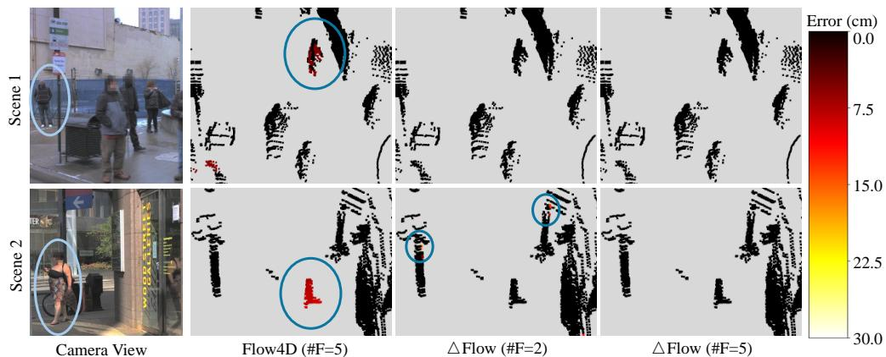  
Figure 9: Error maps comparison of 3D flow prediction from the Argoverse 2 validation set, focusing on small objects such as pedestrians. The color bar represents the pointwise L2 norm error in centimeters. $\Delta$ Flow with $\cdot \# \mathrm { F } { = } 2 ^ { \cdot }$ denotes a two-frame input, while all others use five frames. The two scenes correspond to scene IDs ‘c8ec7be0-92aa-3222-946e-fbcf398c841e’ and ‘9f871fb4-3b8e-34b3- 9161-ed961e71a6da’.

Figure 9 and Figure 10 illustrate error maps for small (pedestrians) and large (trucks) objects, respectively. In Figure 9, the upper row (Scene 1) shows that $\Delta$ Flow with two frames improves motion consistency for pedestrians compared to Flow4D, highlighting the effectiveness of the Instance Consistency Loss. The bottom row (Scene 2) further demonstrates improved detection of underrepresented small objects, suggesting that Category-Balanced Loss enhances motion estimation for these classes. Figure 10 evaluates large objects. $\Delta$ Flow better captures truck motion, demonstrating improved accuracy for large-scale dynamics.

Across all settings, five-frame $\Delta$ Flow outperforms the two-frame variant. This suggests that ∆Flow effectively captures global motion cues across multi-frames while maintaining a stable input size.

The color-flow visualization in Figure 11 further supports these findings. Color shifts from the ground-truth color indicate discrepancies in speed and direction. $\Delta$ Flow consistently outperforms

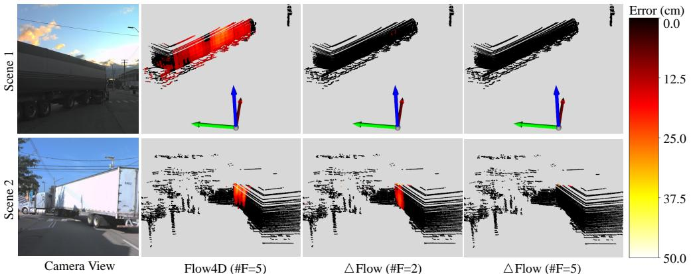  
Figure 10: Error maps comparison of 3D flow prediction from the Argoverse 2 validation set, focusing on large vehicles, such as trucks. The color bar represents the pointwise L2 norm error in centimeters. $\Delta$ Flow with $\# \mathrm { F } = 2 ^ { \circ }$ denotes a two-frame input, while all others use five frames. The two scenes correspond to scene IDs ‘2c652f9e-8db8-3572-aa49-fae1344a875b’ and ‘adf9a841-e0db-30ab-b5b3- bf0b61658e1e’.

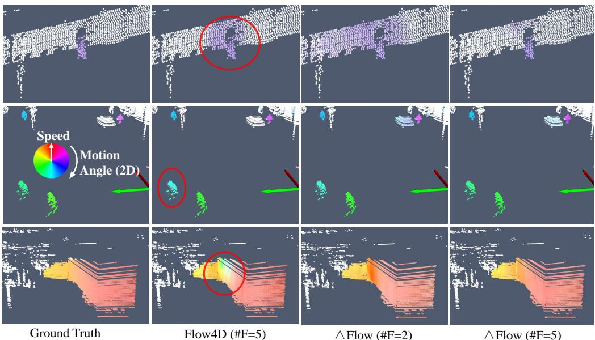  
Figure 11: Color-flow visualization comparison of 3D flow prediction from the Argoverse 2 validation set. Direction is encoded as hue, and magnitude as saturation. Ground-truth labels are shown on the left. The three scenes correspond to scene IDs ‘77574006-881f-3bc8-bbb6-81d79cf02d83’, ‘78f7cb5c-9d51-34f0-b356-9b3d83263c75’ and ‘adf9a841-e0db-30ab-b5b3-bf0b61658e1e’.

Flow4D across static backgrounds (row 1), small objects (row 2), and large objects (row 3), with five frames yielding the most accurate motion estimates.

# C Other Discussion

Broader Impact Our ∆Flow framework offers scalable and efficient multi-frame 3D motion estimation, enhancing safety and reliability in applications such as autonomous driving, robotic assistance, and augmented reality through improved dynamic scene understanding. Its scalability and computational efficiency reduce overall resource consumption, contributing to more sustainable machine learning system development. However, the same efficient motion tracking capabilities could be misused for pervasive surveillance or unauthorized monitoring, posing privacy risks. Responsible data governance, strict access control, and adherence to ethical deployment standards are essential to ensure the technology is used for societal benefit.

# NeurIPS Paper Checklist

# 1. Claims

Question: Do the main claims made in the abstract and introduction accurately reflect the paper’s contributions and scope?

Answer: [Yes]

Justification: Our main contribution are detailed in Section 1. Also see Section 5 and Appendix B for more experimental evidence.

Guidelines:

• The answer NA means that the abstract and introduction do not include the claims made in the paper.   
• The abstract and/or introduction should clearly state the claims made, including the contributions made in the paper and important assumptions and limitations. A No or NA answer to this question will not be perceived well by the reviewers.   
• The claims made should match theoretical and experimental results, and reflect how much the results can be expected to generalize to other settings.   
• It is fine to include aspirational goals as motivation as long as it is clear that these goals are not attained by the paper.

# 2. Limitations

Question: Does the paper discuss the limitations of the work performed by the authors?

Answer: [Yes]

Justification: Limitation of the work can be found in Section 6.

Guidelines:

• The answer NA means that the paper has no limitation while the answer No means that the paper has limitations, but those are not discussed in the paper.   
• The authors are encouraged to create a separate "Limitations" section in their paper.   
• The paper should point out any strong assumptions and how robust the results are to violations of these assumptions (e.g., independence assumptions, noiseless settings, model well-specification, asymptotic approximations only holding locally). The authors should reflect on how these assumptions might be violated in practice and what the implications would be. The authors should reflect on the scope of the claims made, e.g., if the approach was only tested on a few datasets or with a few runs. In general, empirical results often depend on implicit assumptions, which should be articulated. The authors should reflect on the factors that influence the performance of the approach. For example, a facial recognition algorithm may perform poorly when image resolution is low or images are taken in low lighting. Or a speech-to-text system might not be used reliably to provide closed captions for online lectures because it fails to handle technical jargon.   
• The authors should discuss the computational efficiency of the proposed algorithms and how they scale with dataset size.   
• If applicable, the authors should discuss possible limitations of their approach to address problems of privacy and fairness.   
• While the authors might fear that complete honesty about limitations might be used by reviewers as grounds for rejection, a worse outcome might be that reviewers discover limitations that aren’t acknowledged in the paper. The authors should use their best judgment and recognize that individual actions in favor of transparency play an important role in developing norms that preserve the integrity of the community. Reviewers will be specifically instructed to not penalize honesty concerning limitations.

# 3. Theory assumptions and proofs

Question: For each theoretical result, does the paper provide the full set of assumptions and a complete (and correct) proof?

Answer: [NA]

Justification: The paper does not include theoretical results.

Guidelines:

• The answer NA means that the paper does not include theoretical results.   
• All the theorems, formulas, and proofs in the paper should be numbered and crossreferenced.   
• All assumptions should be clearly stated or referenced in the statement of any theorems.   
• The proofs can either appear in the main paper or the supplemental material, but if they appear in the supplemental material, the authors are encouraged to provide a short proof sketch to provide intuition.   
• Inversely, any informal proof provided in the core of the paper should be complemented by formal proofs provided in appendix or supplemental material.   
• Theorems and Lemmas that the proof relies upon should be properly referenced.

# 4. Experimental result reproducibility

Question: Does the paper fully disclose all the information needed to reproduce the main experimental results of the paper to the extent that it affects the main claims and/or conclusions of the paper (regardless of whether the code and data are provided or not)?

Answer: [Yes]

Justification: The detailed experiment setting, implementation detail and training setting can be found in Section 5 and Appendix A.

Guidelines:

• The answer NA means that the paper does not include experiments.   
• If the paper includes experiments, a No answer to this question will not be perceived well by the reviewers: Making the paper reproducible is important, regardless of whether the code and data are provided or not.   
• If the contribution is a dataset and/or model, the authors should describe the steps taken to make their results reproducible or verifiable.   
• Depending on the contribution, reproducibility can be accomplished in various ways. For example, if the contribution is a novel architecture, describing the architecture fully might suffice, or if the contribution is a specific model and empirical evaluation, it may be necessary to either make it possible for others to replicate the model with the same dataset, or provide access to the model. In general. releasing code and data is often one good way to accomplish this, but reproducibility can also be provided via detailed instructions for how to replicate the results, access to a hosted model (e.g., in the case of a large language model), releasing of a model checkpoint, or other means that are appropriate to the research performed.   
• While NeurIPS does not require releasing code, the conference does require all submissions to provide some reasonable avenue for reproducibility, which may depend on the nature of the contribution. For example (a) If the contribution is primarily a new algorithm, the paper should make it clear how to reproduce that algorithm. (b) If the contribution is primarily a new model architecture, the paper should describe the architecture clearly and fully. (c) If the contribution is a new model (e.g., a large language model), then there should either be a way to access this model for reproducing the results or a way to reproduce the model (e.g., with an open-source dataset or instructions for how to construct the dataset). (d) We recognize that reproducibility may be tricky in some cases, in which case authors are welcome to describe the particular way they provide for reproducibility. In the case of closed-source models, it may be that access to the model is limited in some way (e.g., to registered users), but it should be possible for other researchers to have some path to reproducing or verifying the results.

# 5. Open access to data and code

Question: Does the paper provide open access to the data and code, with sufficient instructions to faithfully reproduce the main experimental results, as described in supplemental material?

Answer: [Yes]

Justification: We use publicly-accessable dataset Argoverse 2 [39], Waymo [33] and nuScenes [5]. Our code is available at https://github.com/Kin-Zhang/ DeltaFlow, including our proposed method, all the baselines, and model checkpoints.

# Guidelines:

• The answer NA means that paper does not include experiments requiring code.   
• Please see the NeurIPS code and data submission guidelines (https://nips.cc/ public/guides/CodeSubmissionPolicy) for more details.   
While we encourage the release of code and data, we understand that this might not be possible, so “No” is an acceptable answer. Papers cannot be rejected simply for not including code, unless this is central to the contribution (e.g., for a new open-source benchmark).   
• The instructions should contain the exact command and environment needed to run to reproduce the results. See the NeurIPS code and data submission guidelines (https: //nips.cc/public/guides/CodeSubmissionPolicy) for more details.   
• The authors should provide instructions on data access and preparation, including how to access the raw data, preprocessed data, intermediate data, and generated data, etc.   
• The authors should provide scripts to reproduce all experimental results for the new proposed method and baselines. If only a subset of experiments are reproducible, they should state which ones are omitted from the script and why.   
• At submission time, to preserve anonymity, the authors should release anonymized versions (if applicable).   
• Providing as much information as possible in supplemental material (appended to the paper) is recommended, but including URLs to data and code is permitted.

# 6. Experimental setting/details

Question: Does the paper specify all the training and test details (e.g., data splits, hyperparameters, how they were chosen, type of optimizer, etc.) necessary to understand the results?

Answer: [Yes]

Justification: Please see Section 5 and Appendix A.

Guidelines:

• The answer NA means that the paper does not include experiments. • The experimental setting should be presented in the core of the paper to a level of detail that is necessary to appreciate the results and make sense of them. • The full details can be provided either with the code, in appendix, or as supplemental material.

# 7. Experiment statistical significance

Question: Does the paper report error bars suitably and correctly defined or other appropriate information about the statistical significance of the experiments?

Answer: [No]

Justification: Error bars are not reported because the data needed to produce them would be too computationally expensive to generate.

Guidelines:

• The answer NA means that the paper does not include experiments.   
• The authors should answer "Yes" if the results are accompanied by error bars, confidence intervals, or statistical significance tests, at least for the experiments that support the main claims of the paper.   
• The factors of variability that the error bars are capturing should be clearly stated (for example, train/test split, initialization, random drawing of some parameter, or overall run with given experimental conditions).   
• The method for calculating the error bars should be explained (closed form formula, call to a library function, bootstrap, etc.)   
• The assumptions made should be given (e.g., Normally distributed errors).   
• It should be clear whether the error bar is the standard deviation or the standard error of the mean.   
• It is OK to report 1-sigma error bars, but one should state it. The authors should preferably report a 2-sigma error bar than state that they have a $96 \%$ CI, if the hypothesis of Normality of errors is not verified.   
• For asymmetric distributions, the authors should be careful not to show in tables or figures symmetric error bars that would yield results that are out of range (e.g. negative error rates).   
• If error bars are reported in tables or plots, The authors should explain in the text how they were calculated and reference the corresponding figures or tables in the text.

# 8. Experiments compute resources

Question: For each experiment, does the paper provide sufficient information on the computer resources (type of compute workers, memory, time of execution) needed to reproduce the experiments?

Answer: [Yes]

Justification: The computer resources we used are specified in Appendix A.

Guidelines:

• The answer NA means that the paper does not include experiments.   
• The paper should indicate the type of compute workers CPU or GPU, internal cluster, or cloud provider, including relevant memory and storage.   
• The paper should provide the amount of compute required for each of the individual experimental runs as well as estimate the total compute.   
• The paper should disclose whether the full research project required more compute than the experiments reported in the paper (e.g., preliminary or failed experiments that didn’t make it into the paper).

# 9. Code of ethics

Question: Does the research conducted in the paper conform, in every respect, with the NeurIPS Code of Ethics https://neurips.cc/public/EthicsGuidelines?

Answer: [Yes]

Justification: The research conducted in the paper confirm, in every respect, with NeurIPS Code of Ethics.

Guidelines:

• The answer NA means that the authors have not reviewed the NeurIPS Code of Ethics.   
• If the authors answer No, they should explain the special circumstances that require a deviation from the Code of Ethics.   
• The authors should make sure to preserve anonymity (e.g., if there is a special consideration due to laws or regulations in their jurisdiction).

# 10. Broader impacts

Question: Does the paper discuss both potential positive societal impacts and negative societal impacts of the work performed?

Answer: [Yes]

Justification: Societal impacts of the work can be found in Appendix C.

Guidelines:

• The answer NA means that there is no societal impact of the work performed.   
• If the authors answer NA or No, they should explain why their work has no societal impact or why the paper does not address societal impact.   
• Examples of negative societal impacts include potential malicious or unintended uses (e.g., disinformation, generating fake profiles, surveillance), fairness considerations (e.g., deployment of technologies that could make decisions that unfairly impact specific groups), privacy considerations, and security considerations.   
• The conference expects that many papers will be foundational research and not tied to particular applications, let alone deployments. However, if there is a direct path to any negative applications, the authors should point it out. For example, it is legitimate to point out that an improvement in the quality of generative models could be used to generate deepfakes for disinformation. On the other hand, it is not needed to point out that a generic algorithm for optimizing neural networks could enable people to train models that generate Deepfakes faster.   
• The authors should consider possible harms that could arise when the technology is being used as intended and functioning correctly, harms that could arise when the technology is being used as intended but gives incorrect results, and harms following from (intentional or unintentional) misuse of the technology.   
If there are negative societal impacts, the authors could also discuss possible mitigation strategies (e.g., gated release of models, providing defenses in addition to attacks, mechanisms for monitoring misuse, mechanisms to monitor how a system learns from feedback over time, improving the efficiency and accessibility of ML).

# 11. Safeguards

Question: Does the paper describe safeguards that have been put in place for responsible release of data or models that have a high risk for misuse (e.g., pretrained language models, image generators, or scraped datasets)?

Answer: [NA]

Justification: The work does not have a high risk for misuse such that safeguards are needed.

Guidelines:

• The answer NA means that the paper poses no such risks.   
• Released models that have a high risk for misuse or dual-use should be released with necessary safeguards to allow for controlled use of the model, for example by requiring that users adhere to usage guidelines or restrictions to access the model or implementing safety filters.   
• Datasets that have been scraped from the Internet could pose safety risks. The authors should describe how they avoided releasing unsafe images.   
• We recognize that providing effective safeguards is challenging, and many papers do not require this, but we encourage authors to take this into account and make a best faith effort.

# 12. Licenses for existing assets

Question: Are the creators or original owners of assets (e.g., code, data, models), used in the paper, properly credited and are the license and terms of use explicitly mentioned and properly respected?

Answer: [Yes]

Justification: The creators or original owners of assets (e.g., code, data, models), used in the paper are properly credited.

Guidelines:

• The answer NA means that the paper does not use existing assets.   
• The authors should cite the original paper that produced the code package or dataset.   
• The authors should state which version of the asset is used and, if possible, include a URL.   
• The name of the license (e.g., CC-BY 4.0) should be included for each asset.   
• For scraped data from a particular source (e.g., website), the copyright and terms of service of that source should be provided.   
• If assets are released, the license, copyright information, and terms of use in the package should be provided. For popular datasets, paperswithcode.com/datasets has curated licenses for some datasets. Their licensing guide can help determine the license of a dataset.   
• For existing datasets that are re-packaged, both the original license and the license of the derived asset (if it has changed) should be provided.

• If this information is not available online, the authors are encouraged to reach out to the asset’s creators.

# 13. New assets

Question: Are new assets introduced in the paper well documented and is the documentation provided alongside the assets?

Answer: [NA]

Justification: No new assets is introduced in the paper.

Guidelines:

• The answer NA means that the paper does not release new assets.   
• Researchers should communicate the details of the dataset/code/model as part of their submissions via structured templates. This includes details about training, license, limitations, etc.   
• The paper should discuss whether and how consent was obtained from people whose asset is used.   
• At submission time, remember to anonymize your assets (if applicable). You can either create an anonymized URL or include an anonymized zip file.

# 14. Crowdsourcing and research with human subjects

Question: For crowdsourcing experiments and research with human subjects, does the paper include the full text of instructions given to participants and screenshots, if applicable, as well as details about compensation (if any)?

Answer: [NA]

Justification: Not applicable.

Guidelines:

• The answer NA means that the paper does not involve crowdsourcing nor research with human subjects.   
• Including this information in the supplemental material is fine, but if the main contribution of the paper involves human subjects, then as much detail as possible should be included in the main paper.   
• According to the NeurIPS Code of Ethics, workers involved in data collection, curation, or other labor should be paid at least the minimum wage in the country of the data collector.

# 15. Institutional review board (IRB) approvals or equivalent for research with human subjects

Question: Does the paper describe potential risks incurred by study participants, whether such risks were disclosed to the subjects, and whether Institutional Review Board (IRB) approvals (or an equivalent approval/review based on the requirements of your country or institution) were obtained?

Answer: [NA]

Justification: Not applicable.

Guidelines:

• The answer NA means that the paper does not involve crowdsourcing nor research with human subjects.   
• Depending on the country in which research is conducted, IRB approval (or equivalent) may be required for any human subjects research. If you obtained IRB approval, you should clearly state this in the paper.   
• We recognize that the procedures for this may vary significantly between institutions and locations, and we expect authors to adhere to the NeurIPS Code of Ethics and the guidelines for their institution.   
• For initial submissions, do not include any information that would break anonymity (if applicable), such as the institution conducting the review.

# 16. Declaration of LLM usage

Question: Does the paper describe the usage of LLMs if it is an important, original, or non-standard component of the core methods in this research? Note that if the LLM is used only for writing, editing, or formatting purposes and does not impact the core methodology, scientific rigorousness, or originality of the research, declaration is not required.

Answer: [NA]

Justification: The core method development in this research does not involve LLMs as any important, original, or non-standard components.