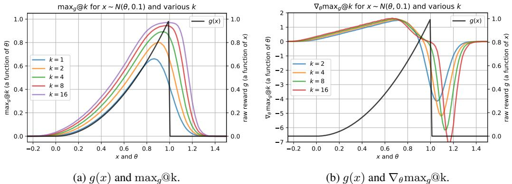
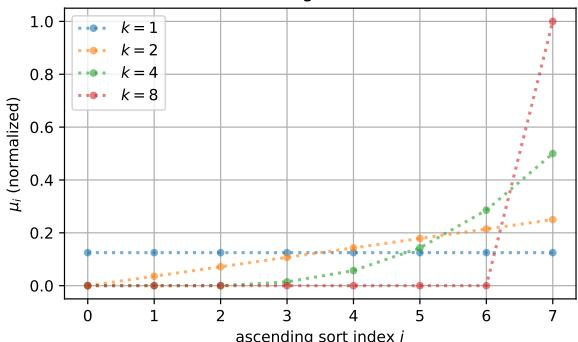
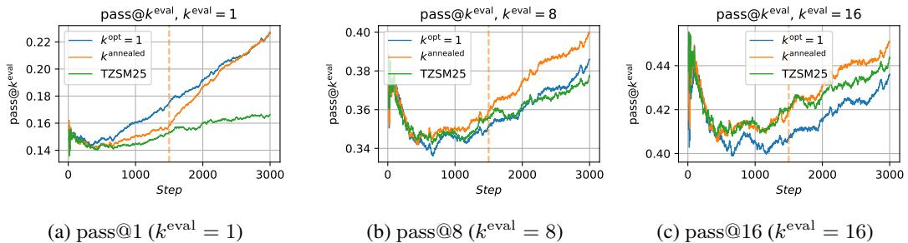
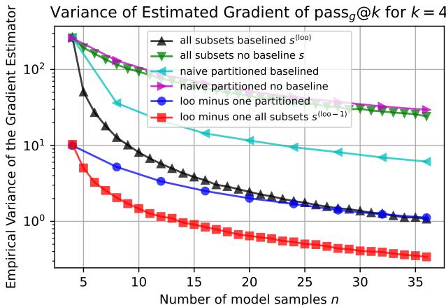
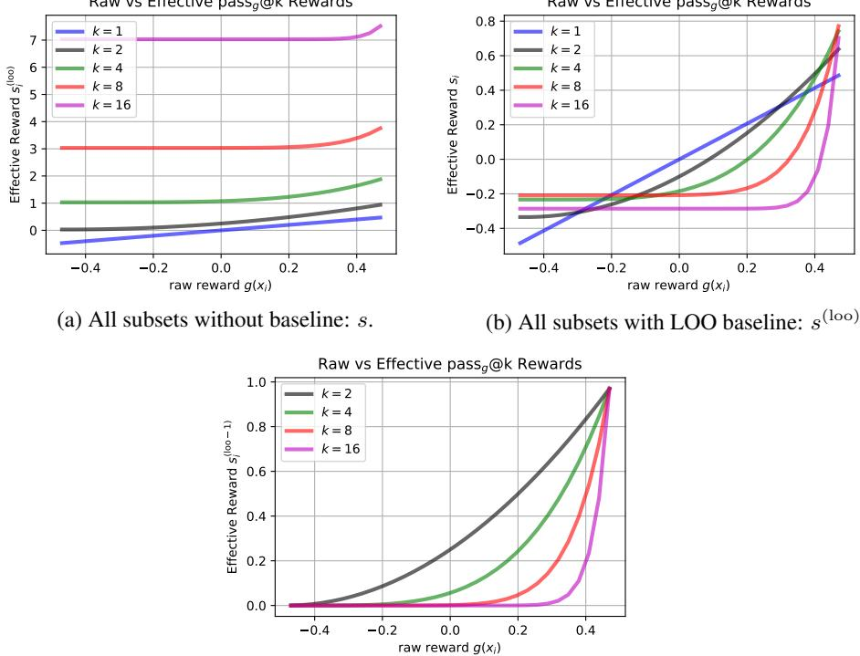
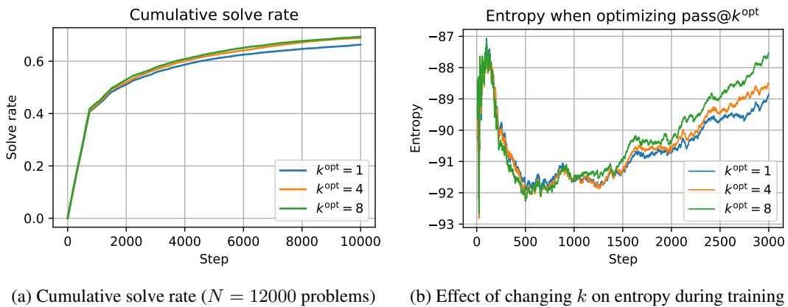
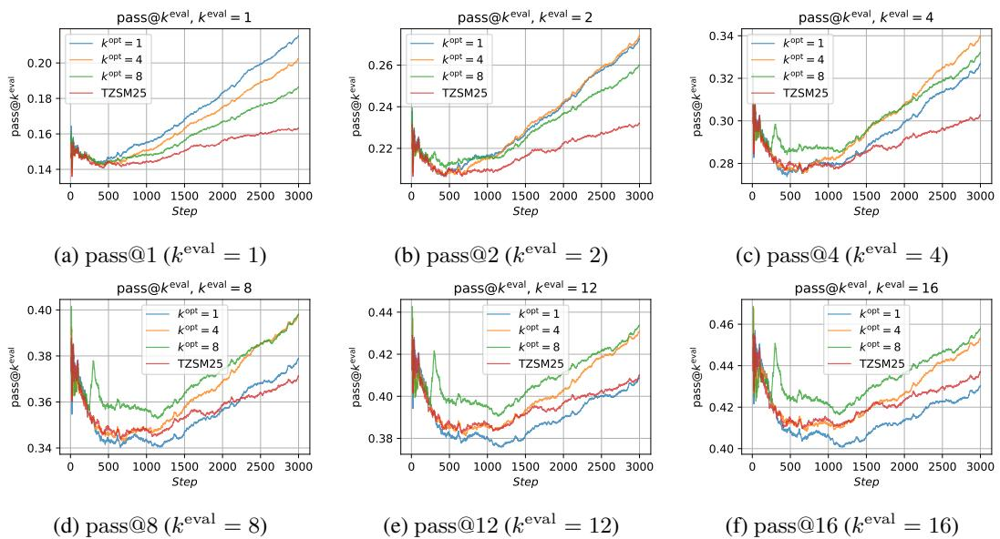
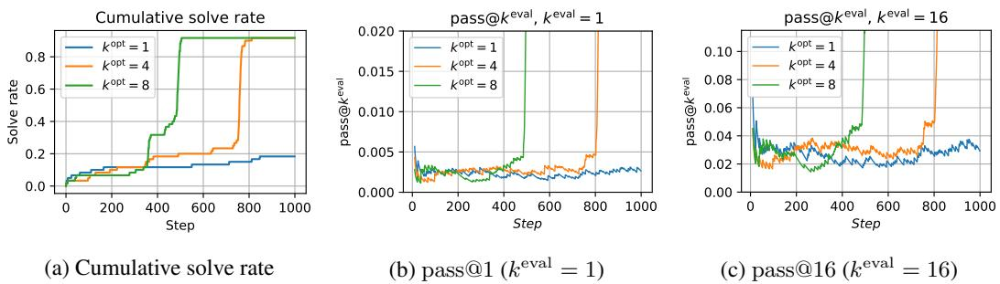

# Pass@K Policy Optimization: Solving Harder Reinforcement Learning Problems

Christian Walder & Deep Karkhanis Google DeepMind cwalder/dkarkhanis@google.com

# Abstract

Reinforcement Learning algorithms commonly sample multiple $( n > 1 )$ ) solution attempts for each problem and reward them independently. This optimizes for pass $@ 1$ performance and prioritizes individual sample performance over the diversity and collective utility of a set of samples. Such algorithms under-utilize the sampling capacity, limiting exploration and eventual improvement on harder examples. As a fix, we propose Pass-at- $k$ Policy Optimization (PKPO), a multivariate transformation on batches of rewards which leads to direct optimization of pass $@ \mathrm { k }$ performance, thus optimizing for sets of samples that feature a large maximum reward when considered jointly. Our primary contribution is to derive novel low variance unbiased estimators for the pass $^ \mathrm { @ k }$ and its gradient, in both the binary and continuous reward settings. We show that optimizing with these estimators reduces to reinforcement learning with (batches of) rewards that have been jointly transformed by a function that is stable and efficient to compute.

While previous efforts propose transformations for $k = n$ , our transformations are the first to enable robust optimization of the pass $@ \mathrm { k }$ for any arbitrary $k \leq n$ . Rather than simply trading off pass $@ 1$ performance for pass $@ \mathrm { k }$ gains, our method allows annealing $k$ during training, optimizing both metrics and often achieving strong pass $@ 1$ performance alongside significant pass $@ \mathrm { k }$ gains.

We validate our transformations on illustrative toy experiments, which reveal the variance reducing properties of our formulations. We also include real-world examples using the open-source models GEMMA2 and LLAMA3.1. We find that our transformation effectively optimizes for the target $k$ . Furthermore, higher $k$ values enable solving more and harder problems, while annealing $k$ boosts both the pass $@ 1$ and pass $@ \mathrm { k }$ . Crucially, for challenging task sets where conventional pass $@ 1$ optimization stalls, our pass $@ \mathrm { k }$ approach unblocks learning, likely by improving exploration through the prioritization of joint utility over the utility of individual samples

# 1 Introduction

Recent years have seen the rapid rise of large language models (LLMs) trained with internet-scale pretraining data $[ \mathsf { R N S ^ { + } 1 8 } ]$ with post training using both supervised fine-tuning $[ \mathrm { W } \mathrm { B } Z ^ { + } 2 1 ]$ and reinforcement learning (RL) $[ \mathrm { A A } \bar { \mathbf { A } } ^ { + } 2 3$ , Tea23, Ant, $\mathrm { G Y Z ^ { + } } 2 \bar { 5 } ]$ ]. The seminal paradigm of RL with human feedback $[ \mathrm { C L B ^ { + } 1 7 } ]$ is limited by the human-derived data it is based on and the reward hacking issues that arise from the use of subjective signals more generally $[ \mathsf { A B C } ^ { + } 2 1 ]$ . To enable progress toward superhuman capabilities, current work is focusing on grounded reward signals that are free of fine-grained human input as in code generation [SJTR23, $\mathrm { L W G } ^ { + } 2 2$ , $\mathrm { D L J } ^ { + } 2 4$ , $\mathrm { Y T C ^ { + } } 2 3$ , $\mathrm { G Z C ^ { + } } 2 4 ]$ and mathematics $[ \mathrm { L C } \bar { \mathrm { C } } ^ { + } 2 2$ , AT, $\bar { \mathrm { C T O ^ { + } 2 5 } }$ , $\mathrm { Y } \mathrm { S } \mathrm { G } ^ { + } 2 3 $ ].

  
Figure 1: The effect of $k$ on the optimal policy for a one-dimensional toy problem. The policy is normal with mean parameter $\theta$ and fixed standard deviation 0.1. For the $\operatorname* { m a x } _ { g } ( \mathbb { O } \mathrm { k }$ objective (left, defined in Equation (11)) the optimal $\theta$ corresponds to the horizontal position with maximum $\operatorname* { m a x } _ { g } ( \mathbb { O } \mathrm { k }$ . For the derivative (right, the estimation of which is the focus of this paper), the optimal $\theta$ corresponds to the location of the zero crossing. For larger $k$ the optimal $\theta$ is more risk tolerant, allowing more samples to exceed one (getting zero reward) in order to increase the chance of obtaining at least one sample close to, but less than one (getting a large reward). See Section 5.1 for more details.

The policy gradients family of RL methods [Wil92] has proven effective in language model training $[ \mathrm { G Y Z ^ { + } } 2 \dot { 5 } ]$ . To scale to new capabilities, model training needs to tackle challenging RL task sets with no known solutions but for which correctness may be verified, as in formal mathematics environments [AT]. In such settings, the RL training loop both updates model parameters and searches for solutions to problems at the continuously advancing frontier of model capabilities.

The specific search algorithm introduces a coupling between inference and model updates, which means that naively optimizing the expected single sample reward, or pass $@ 1$ may be suboptimal. While various inference-time search methods are possible $\mathrm { [ H Y M ^ { + } 2 4 }$ , $\mathrm { K Z A } ^ { + } 2 4$ , $\mathrm { L K B } ^ { + } 2 3$ , $\mathrm { W S L } ^ { + } 2 4 ]$ , simply taking multiple independent samples from the model has proven rather effective $[ \mathrm { O I W } ^ { + } 2 3 ]$ . Our contribution is to couple this simple search method with model parameter updates by enabling robust optimization of the pass@k objective, which is the expected maximum reward over $k$ independent samples.

Related Literature The pass@k was championed by $\left[ \mathrm { C T J } ^ { + } 2 1 \mathrm { a } \right]$ who gave a popular unbiased estimator of the metric which we derive from a new perspective (to set up our gradient estimators) as Theorem 1, generalize to continuous rewards in Theorem 3, and provide additional characterisations in Corollaries 2 and 3. Concurrently with our work [TZSM25] offered an elegant variance reduction method for the gradient of the pass $@ \mathrm { k }$ which corresponds to the special case $n = k$ of our Equation (33). Interpreting pass $@ \mathrm { k }$ in terms of a partial sort, [CTV19] and $[ \mathrm { X D C ^ { + } } 2 0 ]$ present elegant approximations that are rather general but less efficient in our setting. Others have provided variational approximations for handling the closely related Best-of- $N$ $\bar { [ \mathbf { C } \mathbf { T } \mathbf { G } ^ { + } 2 4 }$ , AVAC24] and other more general $[ \mathrm { B S B } ^ { + } 2 4 ]$ inference-time algorithms. The contrasting idea of training a model to approximate the Best-of- $N$ prediction with a single sample was addressed by $[ \mathrm { S D H ^ { + } } \bar { 2 4 } ]$ . Our contribution can be interpreted as a generalization and variance reduction of [TZSM25]. For a general discussion of gradient estimation, variance reduction, and Monte Carlo, we recommend [MRFM20, Owe13].

Overview and Contributions Our theme is constructing robust estimators of the pass $@ \mathrm { k }$ and its gradient given $n \geq k$ samples by averaging (over all $\binom { n } { k }$ subsets of size $k$ ) simple estimators that are functions of $k$ samples. This is straightforward for binary rewards (Section 2), using the counting proof of Theorem 4. We generalize to continuous rewards using the key trick of assuming without loss of generality that the rewards are sorted, as in Section 3. Finally, we give baselining methods that require more involved derivations due to averaging over all subsets that do not include a given element (to retain unbiasedness) but which boil down to the same easy-to-apply results in Section 4, yielding our Pass-at- $k$ Policy Optimization (PKPO). We present toy experiments in Section 5.1 which demonstrate the variance reduction afforded by our estimators. Finally, Section 5.2 demonstrates that using our reward transformation solves more tasks and selectively optimizes pass@k through RL experiments on GEMMA2 $[ \mathrm { T R P ^ { + } } 2 4 ]$ and LLAMA3.1 $[ \mathrm { G D J ^ { + } } 2 4 ]$ , showcasing real-world impact.

How to Apply this Method It is easy to adapt any policy gradient algorithm to use our results. Assume a vector $( g ( x _ { 1 } ) , g ( x _ { 2 } ) , \ldots , g ( \bar { x } _ { n } ) ) ^ { \top }$ of per-sample rewards for a given task. For example, the $x _ { i }$ could be model samples of source code addressing a specific task (which should be the same for all $n$ samples), and $g$ could provide a numeric score that measures how many tests the code passes, or an overall binary pass indicator, or some combination with additional stylistic or brevity terms, etc. Then in order to optimize the pass $^ \mathrm { @ k }$ of Equation (1) (or the continuous analog $\operatorname* { m a x } _ { g } ( \mathbb { O } \mathrm { k }$ of Equation (11)) we simply transform the vector of rewards using either the sloo or the sloo minus one function of Listing 1, which map $\mathbb { R } ^ { n } \mapsto \mathbb { R } ^ { n }$ .1

# 2 Binary Rewards

Given a binary reward function $f : \mathcal { X }  \{ 0 , 1 \}$ on the action space $\mathcal { X }$ , the pass@k for the model $p ( x | \theta )$ is the probability that at least one of $k$ samples drawn i.i.d. is correct:

$$
\begin{array} { l } { \displaystyle \mathrm { p a s s @ k } = \mathbb { P } \left[ \bigvee _ { i = 1 } ^ { k } [ f ( x _ { i } ) = 1 ] \right] } \\ { \displaystyle = \mathbb { E } \left[ 1 - \prod _ { i = 1 } ^ { k } ( 1 - f ( x _ { i } ) ) \right] , } \end{array}
$$

where the expectation is over i.i.d. $x _ { 1 } , x _ { 2 } , \cdot \cdot \cdot , x _ { k } \sim p ( x | \theta )$ .

# 2.1 An Unbiased pass@k Estimator

An estimator for the pass $@ \mathrm { k }$ was given in $\left[ \mathrm { C T J } ^ { + } 2 1 \mathrm { a } \right]$ : given $n \geq k$ i.i.d. samples of which $c$ are correct, the estimator is

$$
\begin{array} { r } { \rho ( n , c , k ) \equiv 1 - \frac { { \binom { n - c } { k } } } { { \binom { n } { k } } } . } \end{array}
$$

The following was proven in $\mathrm { [ C T J ^ { + } 2 1 a ] }$ ; we give a different proof that sets up our gradient estimator.

Theorem 1. $\rho ( n , c , k )$ is an unbiased estimator of the pass@k.

Proof. Let $x _ { 1 } , x _ { 2 } , \cdot \cdot \cdot , x _ { n } \sim p ( x | \theta )$ , $f _ { i } = f ( x _ { i } )$ , and $\mathcal { T }$ be a set of $k$ elements sampled uniformly without replacement from $\{ 1 , 2 , \ldots , n \}$ . Then

$$
\mathrm { p a s s @ k } = \mathbb { E } _ { \boldsymbol { x } _ { 1 } , \boldsymbol { x } _ { 2 } , \ldots , \boldsymbol { x } _ { n } } \mathbb { E } _ { \mathcal { T } } \left[ 1 - \prod _ { i \in \mathcal { T } } ( 1 - f _ { i } ) \right] .
$$

Averaging over all subsets of size $k$ recovers $\rho$ :

$$
\begin{array} { l } { \displaystyle \frac { 1 } { { \binom { n } { k } } } \sum _ { \stackrel { { \scriptstyle | \mathcal { Z } | = k } } { \mathcal { Z } \subseteq \{ 1 , 2 , \ldots , n \} } } \left( 1 - \prod _ { i \in \mathcal { Z } } ( 1 - f _ { i } ) \right) = 1 - \displaystyle \frac { 1 } { { \binom { n } { k } } } \sum _ { \stackrel { { \scriptstyle | \mathcal { Z } | = k } } { \mathcal { Z } \subseteq \{ 1 , 2 , \ldots , n \} } } \prod _ { i \in \mathcal { Z } } ( 1 - f _ { i } ) } \\ { = 1 - \displaystyle \frac { { \binom { n - c } { k } } } { \binom { n } { k } } } \\ { \equiv \rho ( n , c , k ) , } \end{array}
$$

where (6) holds because the sum on the r.h.s. of (5) is the number of subsets of size $k$ of the $( n - c )$ incorrect elements. Since averaging in this way retains unbiasedness, this completes the proof. We show in Corollary 2 that no such unbiased estimator exists for $n < k$ , and in Corollary 3 that the asymptotic variance of this estimator decreases at a rate of $1 / n$ .

  
Figure 2: The effect $k$ has on the effective weight $\mu _ { i } / \binom { n } { k }$ of (12) for a mini-batch of size $n = 8$ . This is the weight of the contribution of each sample assuming that the samples have been sorted in ascending order from left to right. The horizontal axis is the sort index. For $k = n = 8$ only the largest sample is included; for $k = 1$ all samples are weighted equally. Intermediate values interpolate these extremes in a precise manner that gives rise to unbiased gradient estimation.

# 2.2 An Unbiased pass@k Gradient Estimator

Given a mini-batch of $n$ i.i.d. samples $x _ { 1 } , x _ { 2 } , \ldots , x _ { n }$ from $p ( x | \theta )$ with corresponding correctness $f _ { i } \in \{ 0 , 1 \}$ , we want to optimize the passmber of correct samples, we wil $^ \mathrm { @ k }$ w.r.t. the model parameters monstrate unbiasedness of th $\theta$ . Letting estimator $c =$ $\textstyle \sum _ { i = 1 } ^ { n } { \dot { f } } _ { i }$

$$
\widehat { \nabla } = \sum _ { i = 1 } ^ { n } r _ { i } \nabla _ { \theta } \log p ( x _ { i } | \theta ) , \mathrm { ~ w h e r e ~ } r _ { i } = \left\{ \begin{array} { l l } { \frac { k } { n } } & { \mathrm { i f ~ } f _ { i } = 1 } \\ { \frac { k } { n } \cdot \rho ( n - 1 , c , k - 1 ) } & { \mathrm { i f ~ } f _ { i } = 0 , } \end{array} \right.
$$

that assigns more weight to correct samples, while also assigning some reward to incorrect samples to encourage exploration. The following well-known results will be used to show that (8) is unbiased.

Lemma 1 (Policy Gradients). For any absolutely continuous distribution $p ( x | \theta )$

$$
\begin{array} { r } { \mathbb { E } _ { { x } \sim { p } ( { x } \mid { \theta } ) } \left[ { r } ( { x } ) \nabla _ { \theta } \log { p } ( { x } \mid { \theta } ) \right] = \nabla _ { \theta } \mathbb { E } _ { { x } \sim { p } ( { x } \mid { \theta } ) } \left[ { r } ( { x } ) \right] . } \end{array}
$$

Corollary 1. If c is constant w.r.t. both $\theta$ and $x$ then $\begin{array} { r } { \mathbb { E } _ { p ( x | \theta ) } \left[ c \nabla _ { \theta } \log p ( x | \theta ) \right] = 0 , } \end{array}$

Proof. By Lemma 1, $\begin{array} { r } { \mathbb { E } _ { p ( x | \theta ) } \left[ c \nabla _ { \theta } \log p ( x | \theta ) \right] = \nabla _ { \theta } \mathbb { E } \left[ c \right] = \nabla _ { \theta } c = 0 . } \end{array}$ We can now give our first main result:

Theorem 2. $\hat { \nabla }$ is an unbiased estimator of the gradient of the pass@k:

$$
\mathbb { E } _ { x _ { 1 } , x _ { 2 } , \ldots , x _ { n } \sim p ( x | \theta ) } \left[ \widehat { \nabla } \right] = \nabla _ { \theta } \mathrm { p a s s } \ @ \mathrm { k } .
$$

See Appendix A.3 for a proof.

# 3 Continuous Rewards

We generalize the pass $@ \mathrm { k }$ to non-binary rewards $g : \mathcal { X }  \mathbb { R }$ as

$$
\mathrm { m a x } _ { g } @ \mathrm { k } \equiv \mathbb { E } \left[ \mathrm { m a x } \left( \{ g ( x _ { i } ) \} _ { i = 1 } ^ { k } \right) \right] .
$$

# 3.1 An Unbiased $\operatorname* { m a x } _ { g } ( \mathbb { O } \mathrm { k }$ Estimator

The following estimator for the $\operatorname* { m a x } _ { g } ( \mathbb { O } \mathrm { k }$ is a direct analog of $\rho$ : given $n \geq k$ i.i.d. samples, assuming w.l.o.g. that the rewards $g _ { i } = g ( x _ { i } )$ are sorted, so that $g _ { 1 } \leq g _ { 2 } \leq \cdots \leq g _ { n }$ the estimator is

$$
\rho ^ { ( g ) } ( n , c , k ) \equiv \frac { 1 } { { \binom { n } { k } } } \sum _ { i = k } ^ { n } \mu _ { i } g _ { i } ,
$$

where

$$
\mu _ { i } = { \binom { i - 1 } { k - 1 } } .
$$

To compute this stably we cancel factors in the binomial coefficients to get2

$$
\rho ^ { ( g ) } ( n , c , k ) \equiv \frac { k } { n - k + 1 } \sum _ { i = k } ^ { n } g _ { i } \prod _ { j = 1 } ^ { k - 1 } \frac { i - j } { n - j + 1 } .
$$

Theorem 3. $\rho ^ { ( g ) } ( n , c , k )$ is an unbiased estimator of the $\operatorname* { m a x } _ { g } { \widehat { \mathbb { O } } } \mathrm { k }$

Proof. The proof is similar to Theorem 1. Here we exploit the assumption that the $g _ { i }$ are sorted, so

$$
\begin{array} { l } { \displaystyle \frac { 1 } { { \binom { n } { k } } } \sum _ { \mathbb { Z } \subseteq \{ 1 , 2 , \dots , n \} } \operatorname* { m a x } _ { i \in \mathbb { Z } } g _ { i } = \displaystyle \frac { 1 } { { \binom { n } { k } } } \sum _ { \mathbb { Z } \subseteq \{ 1 , 2 , \dots , n \} } g _ { \operatorname* { m a x } _ { i \in \mathbb { Z } } } } \\ { \displaystyle \qquad = \frac { 1 } { { \binom { n } { k } } } \sum _ { i = k } ^ { n } \mu _ { i } g _ { i } } \\ { \displaystyle \qquad \equiv \rho ^ { ( g ) } ( n , c , k ) , } \end{array}
$$

since $\mu _ { i }$ is the number of subsets of $1 , 2 , \ldots , i - 1$ of size $k - 1$ , which equals $\binom { i - 1 } { k - 1 }$ . The sum starts at $k$ because all subsets of size $k$ include elements that are greater than or equal to $g _ { k }$ .

See Line 17 of Listing 1 for an implementation of $\rho ^ { ( g ) }$ .

# 3.2 An Unbiased $\operatorname* { m a x } _ { g } ( \mathbb { O } \mathrm { k }$ Gradient Estimator

We propose the gradient estimator

$$
\widehat { \nabla } ^ { ( g ) } = \sum _ { i = 1 } ^ { n } s _ { i } \nabla _ { \theta } \log p ( x _ { i } | \theta ) ,
$$

where if we assume w.l.o.g. that the $g _ { i }$ are sorted, the $s _ { i }$ are a weighted combination of them,

$$
s _ { i } = { \frac { 1 } { \binom { n } { k } } } \sum _ { j = i } ^ { n } m _ { i j } g _ { j } ,
$$

where the diagonals are

$$
m _ { i i } = { \left\{ \begin{array} { l l } { { \binom { i - 1 } { k - 1 } } } & { { \mathrm { ~ i f ~ } } i \geq k - 1 } \\ { 0 } & { { \mathrm { ~ o t h e r w i s e } } , } \end{array} \right. }
$$

and the off-diagonals are

$$
m _ { i j } = { \left\{ \begin{array} { l l } { { \binom { j - 2 } { k - 2 } } } & { { \mathrm { ~ i f ~ } } ( j > i ) \wedge ( j \geq k ) \wedge ( k \geq 2 ) } \\ { 0 } & { { \mathrm { o t h e r w i s e . } } } \end{array} \right. }
$$

Theorem 4. $\widehat { \nabla } ^ { ( g ) }$ is an unbiased estimator of the gradient of the $\operatorname* { m a x } _ { g } { \widehat { \mathbb { Q } } } \operatorname { k }$

$$
\mathbb { E } _ { x _ { 1 } , x _ { 2 } , \ldots , x _ { n } \sim p ( x | \theta ) } \left[ \widehat { \nabla } ^ { ( g ) } \right] = \nabla _ { \theta } \mathrm { m a x } _ { g } \mathrm { @ k . }
$$

2We thank to Ruixu Zhou of Tsinghua University for correcting errors in equations 14, 31 and 32.

Proof. The proof is analogous to that of Theorem 2. Here we have

$$
\begin{array} { l } { { \displaystyle \hat { \nabla } \equiv \rho ^ { ( g ) } ( n , c , k ) \nabla _ { \theta } \sum _ { i = 1 } ^ { n } \log p ( x _ { i } | \theta ) } } \\ { { \displaystyle \quad = \frac { 1 } { \binom { n } { k } } \sum _ { | Z | = k } \operatorname* { m a x } _ { j \in Z } g _ { j } \sum _ { i = 1 } ^ { n } \nabla _ { \theta } \log p ( x _ { i } | \theta ) } } \\ { { \displaystyle \quad \quad \frac { \mathbb { E } } { \underline { { Z } } \leq \{ 1 , 2 , \dots , n \} } \sum _ { \theta } \log p ( x _ { i } | \theta ) \sum _ { j = 1 } ^ { n } m _ { i j } g _ { j } , } } \end{array}
$$

By assumption the $g _ { i }$ are sorted, so $\begin{array} { r } { \operatorname* { m a x } _ { j \in { \mathcal { T } } } g _ { j } = g _ { \operatorname* { m a x } _ { j \in { \mathcal { T } } } } } \end{array}$ . Therefore $m _ { i j }$ is the number of subsets $\mathcal { T }$ of $\{ 1 , 2 , \ldots , n \}$ that

1. are of size $k$ ,   
2. have $j \geq i$ as the largest element (so that we can factor out $g _ { j }$ ),   
3. include $i$ (so that (25) holds in expectation by Corollary 1).

Due to the second condition, the form of $m _ { i j }$ depends on whether $i = j$ .

The diagonals $m _ { i i }$ are zero if $i < k$ since the largest element of any subset of size $k$ is at least $k$ . If $i \geq k$ then we fix $i$ and are left with $i - 1$ elements from which to choose $k - 1$ which we can do $\binom { i = 1 } { k - 1 }$ ways in line with (20).

The $m _ { i j }$ for $i \neq j$ are obtained by fixing $i$ and $j$ leaving $j - 2$ elements $1 , 2 , \ldots , i - 1 , \ldots , i +$ $1 , \ldots , j - 1$ from which to choose $k - 2$ which we can do $\binom { j - 2 } { k - 2 }$ ways in line with (21). □

Theorem 5. $s _ { 1 } , s _ { 2 } , \ldots , s _ { n }$ can be computed in total time $\mathcal { O } ( k + n \log n )$ .

See Appendix A.4 for the proof and Line 36 of Listing 1 for an implementation based on it.

# 4 Variance Reduction

# 4.1 Leave-One-Out Baseline for the Simple Case

A popular variance reduction method [MRFM20, Owe13, $\mathrm { G Y Z ^ { + } } 2 5 ]$ for point-wise rewards $g ( x )$ subtracts the mean of the leave one out (LOO) rewards within each mini-batch $x _ { 1 } , x _ { 2 } , \ldots , x _ { n }$ :

$$
g ^ { ( \mathrm { l o o } ) } ( x _ { i } ) = g ( x _ { i } ) - { \frac { 1 } { n - 1 } } \sum _ { \stackrel { j = 1 } { j \neq i } } ^ { n } g ( x _ { j } ) .
$$

Since the subtracted part does not depend on $x _ { i }$ , by Corollary 1 this retains unbiasedness.

# 4.2 Leave-One-Out Baseline for $\operatorname* { m a x } _ { g } ( \mathbb { O } \mathrm { k }$

Baselining the $s _ { i }$ of (19) in this way introduces bias, however, as each $s _ { i }$ depends on all $x _ { 1 } , \ldots , x _ { n }$ . We instead apply LOO to the following form of $s _ { i }$ that follows from Theorem 4 and the proof thereof:

$$
s _ { i } = \frac { 1 } { \binom { n } { k } } \sum _ { | \mathcal { Z } | = k \atop i \in \mathcal { Z } } \operatorname* { m a x } _ { \substack { j \in \mathcal { Z } } } g _ { j }
$$

$$
\equiv S ( i , k , \{ 1 , 2 , \dots , n \} ) ,
$$

We can then retain unbiasedness by excluding $i$ from the baseline, by defining

$$
s _ { i } ^ { ( \mathrm { l o o } ) } \equiv S ( i , k , \{ 1 , 2 , \ldots , n \} ) - \frac { 1 } { n - 1 } \sum _ { \stackrel { j = 1 } { j \neq i } } ^ { n } S ( j , k , \{ 1 , 2 , \ldots , n \} \setminus i ) .
$$

Theorem 6. s(loo)1 , $s _ { 1 } ^ { ( l o o ) } , s _ { 2 } ^ { ( l o o ) } , \ldots , s _ { n } ^ { ( l o o ) }$ can be computed in total time $\mathcal { O } ( k + n \log n )$ .

Proof. Given (5) it is sufficient to consider computing, for $i = 1 , 2 , \dots , n$ ,

$$
b _ { i } ^ { ( k ) } \equiv \sum _ { \stackrel { j = 1 } { j \neq i } } ^ { n } S ( j , k , \{ 1 , 2 , \ldots , n \} \setminus i ) .
$$

By assuming w.l.o.g. an ascending ordering of $g ( x _ { i } )$ , excluding the first index does not change the ordering of the remaining indices. The first term is therefore2

$$
b _ { 1 } ^ { ( k ) } = \sum _ { i = 2 } ^ { N } s _ { i } = \frac { 1 } { { \binom { n - 1 } { k } } } \sum _ { i = 2 } ^ { N } { \big ( } m _ { i i } + m _ { i - 1 , i } ( i - 2 ) { \big ) } g ( x _ { i } ) ,
$$

where (31) follows from (49). From (49) we obtain for $1 \leq i < n$ the left to right recursion

$$
b _ { i + 1 } ^ { ( k ) } = b _ { i } ^ { ( k ) } + \frac { 1 } { \binom { n - 1 } { k } } \big ( g ( x _ { i } ) - g ( x _ { i + 1 } ) \big ) \big ( m _ { i i } + m _ { i - 1 , i } ( i - 2 ) \big ) .
$$

Similar arguments to the proof of Theorem 5 therefore imply the same time complexity.

Line 52 of Listing 1 implements $s _ { i } ^ { ( \mathrm { l o o } ) }$ using the recursion in the above proof.

# 4.3 $\operatorname* { m a x } _ { g } \textcircled { \textcircled { \mathrm { a } } } ( \mathrm { k } - 1 )$ Leave-One-Out Baseline for maxg@k

The baseline $b _ { i } ^ { ( k ) }$ is an average of the $\operatorname* { m a x } _ { g } ( \mathbb { O } \mathrm { k }$ estimates over sets of size $k$ . For a number of samples $n$ equal to $k$ , there are no such subsets to construct the baseline. [TZSM25] recently overcame this issue for the specific case $n = k$ by using $\operatorname* { m a x } _ { g } \widehat { \mathbf { \mu } } ( \mathbf { k } - 1 )$ as the baseline statistic. We generalize their approach to $k < n$ and to averaging over all subsets by defining similarly to Equation (27)

$$
s _ { i } ^ { ( \mathrm { l o o - 1 } ) } = \frac { 1 } { { \binom { n } { k } } } \sum _ { \stackrel { | \mathcal { Z } | = k } { 1 \in \mathcal { Z } } } \big ( \operatorname* { m a x } _ { j \in \mathcal { Z } } g _ { j } - \operatorname* { m a x } _ { b \in \mathcal { Z } \backslash i } g _ { b } \big ) .
$$

Averaging smaller but more numerous subsets in the baseline reduces variance but introduces bias (in the baseline, not i s(loo−1)). Given our previous results it is straightforward to show

Theorem 7. s(loo−1), s $s _ { 1 } ^ { ( l o o - 1 ) } , s _ { 2 } ^ { ( l o o - 1 ) } , \dots , s _ { n } ^ { ( l o o - 1 ) }$ can be computed in total time $\mathcal { O } ( k + n \log n )$ .

Proof. By the linearity of the expectation we can split the two terms in the parentheses of Equation (33) into two separate sums. The first summation is by definition simply $s _ { i }$ of Equation (19). The (negation of the) second summation can be computed efficiently using

$$
\frac { 1 } { \binom { n } { k } } \sum _ { | \mathcal { I } | = k } \operatorname* { m a x } _ { b \in \mathcal { T } \backslash i } g _ { b } = \frac { 1 } { \binom { n } { k } } \sum _ { | \mathcal { B } | = k - 1 } \operatorname* { m a x } _ { b \in \mathcal { B } } g _ { b } = \frac { k } { n ( k - 1 ) } b _ { i } ^ { ( k - 1 ) } ,
$$

where the final equality follows with a little algebra from Equation (28) and Equation (30).   
Listing 1 implements $s _ { i } ^ { ( \mathrm { l o o - 1 } ) }$ using (34); Figure 5 compares si, s(li $s _ { i } ^ { ( \mathrm { l o o } ) }$ , and $s _ { i } ^ { ( \mathrm { l o o - 1 } ) }$ .

# 5 Experiments

# 5.1 One-Dimensional Toy Example

We start with a policy that is Gaussian with a fixed standard deviation and mean parameter $\theta$ we wish to learn, so that $\dot { x } \sim \mathcal N ( \theta , 0 . 1 )$ . We set the raw reward to be

$$
g ( x ) = \left\{ { x ^ { 2 } } \begin{array} { l l } { { 0 \leq x \leq 1 } } \\ { { 0 } } & { { \mathrm { o t h e r w i s e } . } } \end{array} \right.
$$

The optimal policy under the $\operatorname* { m a x } _ { g } ( \mathbb { O } \mathrm { k }$ reward varies with $k$ (see Figure 1). The variance of our estimators is compared in Figure 4 where $s ^ { ( 1 0 0 - 1 ) }$ is the strongest.

Table 1: Results for GEMMA2-9B on the MATH benchmark.   

<table><tr><td>GEMMA2-9B</td><td>k_eval=1</td><td>k_eval=2</td><td>k_eval=4</td><td>k_eval=8</td><td>k_eval=16</td></tr><tr><td>k_opt=1</td><td>22.24 ± 0.50</td><td>25.35 ± 0.55</td><td>30.73 ± 0.59</td><td>37.08± 0.64</td><td>42.59 ± 0.68</td></tr><tr><td>k_opt=2</td><td>21.46 ± 0.51</td><td>28.61 ± 0.56</td><td>32.92 ± 0.61</td><td>39.59 ± 0.66</td><td>45.34 ± 0.70</td></tr><tr><td>k_opt=4</td><td>21.25 ± 0.53</td><td>27.15 ± 0.58</td><td>34.93 ± 0.63</td><td>41.71 ± 0.69</td><td>47.05 ± 0.74</td></tr><tr><td>k_opt=8</td><td>20.69 ± 0.56</td><td>26.78 ± 0.60</td><td>33.68 ± 0.66</td><td>42.62 ± 0.72</td><td>48.37 ± 0.77</td></tr><tr><td>[TZSM25]</td><td>19.48 ± 0.61</td><td>25.41 ± 0.67</td><td>31.17 ± 0.73</td><td>39.34 ± 0.79</td><td>44.82 ± 0.83</td></tr><tr><td>EntropyReg</td><td>20.85 ± 0.58</td><td>26.05 ± 0.64</td><td>32.48 ± 0.70</td><td>38.21 ± 0.76</td><td>43.95 ± 0.81</td></tr></table>

Table 2: Results for LLAMA3.1-8B on the MATH benchmark.   

<table><tr><td>LLAMA3.1-8B</td><td>k_eval=1</td><td>k_eval=2</td><td>k_eval=4</td><td>k_eval=8</td><td>k_eval=16</td></tr><tr><td>k_opt=1</td><td>51.15 ± 0.61</td><td>51.82 ± 0.64</td><td>53.69 ± 0.68</td><td>55.41 ± 0.72</td><td>56.83 ± 0.76</td></tr><tr><td>k_opt=2</td><td>49.72 ± 0.62</td><td>53.51 ± 0.66</td><td>55.45 ± 0.70</td><td>57.23 ± 0.74</td><td>58.71 ± 0.78</td></tr><tr><td>k_opt=4</td><td>49.18 ± 0.64</td><td>52.20 ± 0.68</td><td>57.83 ± 0.72</td><td>58.47 ± 0.77</td><td>59.28 ± 0.81</td></tr><tr><td>k_opt=8</td><td>48.63 ± 0.67</td><td>52.14 ± 0.71</td><td>56.28 ± 0.75</td><td>59.04 ± 0.80</td><td>61.88 ± 0.84</td></tr><tr><td>[TZSM25]</td><td>48.21 ± 0.70</td><td>50.93 ± 0.75</td><td>54.38 ± 0.80</td><td>57.11 ± 0.85</td><td>58.55 ± 0.90</td></tr><tr><td>EntropyReg</td><td>48.51 ± 0.68</td><td>51.95 ± 0.73</td><td>55.33 ± 0.78</td><td>56.95 ± 0.83</td><td>58.18 ± 0.88</td></tr></table>

Table 3: Results for GEMMA2-9B on the Coding benchmark.   

<table><tr><td>GEMMA2-9B</td><td>k_eval=1</td><td>k_eval=2</td><td>k_eval=4</td><td>k_eval=8</td><td>k_eval=16</td></tr><tr><td>k_opt=1</td><td>37.71 ± 0.60</td><td>42.03 ± 0.65</td><td>48.19 ± 0.69</td><td>55.07 ± 0.75</td><td>60.98 ± 0.79</td></tr><tr><td>k_opt=2</td><td>36.84 ± 0.61</td><td>46.56 ± 0.67</td><td>52.68 ± 0.72</td><td>59.73 ± 0.78</td><td>65.86 ± 0.84</td></tr><tr><td>k_opt=4</td><td>36.49 ± 0.63</td><td>44.95 ± 0.69</td><td>57.09 ± 0.76</td><td>63.64 ± 0.83</td><td>69.51 ± 0.88</td></tr><tr><td>k_opt=8</td><td>35.75 ± 0.67</td><td>44.41 ± 0.73</td><td>55.08 ± 0.80</td><td>65.56 ± 0.88</td><td>71.91 ± 0.94</td></tr><tr><td>[TZSM25]</td><td>34.36 ± 0.72</td><td>42.81 ± 0.78</td><td>52.36 ± 0.86</td><td>61.07 ± 0.95</td><td>66.41 ± 1.01</td></tr><tr><td>EntropyReg</td><td>35.91 ± 0.70</td><td>43.75 ± 0.76</td><td>53.28 ± 0.84</td><td>60.13 ± 0.93</td><td>65.29 ± 0.99</td></tr></table>

Table 4: Results for LLAMA3.1-8B on the Coding benchmark.   

<table><tr><td>LLAMA3.1-8B</td><td>k_eval=1</td><td>k_eval=2</td><td>k_eval=4</td><td>k_eval=8</td><td>k_eval=16</td></tr><tr><td>k_opt=1</td><td>67.38 ± 0.72</td><td>67.45 ± 0.76</td><td>69.22 ± 0.80</td><td>71.11 ± 0.84</td><td>72.84 ± 0.88</td></tr><tr><td>k_opt=2</td><td>64.91 ± 0.73</td><td>69.73 ± 0.78</td><td>72.03 ± 0.82</td><td>74.08 ± 0.87</td><td>75.89 ± 0.91</td></tr><tr><td>k_opt=4</td><td>64.25 ± 0.75</td><td>68.47 ± 0.80</td><td>74.67 ± 0.85</td><td>75.01 ± 0.90</td><td>77.75 ± 0.95</td></tr><tr><td>k_opt=8</td><td>63.57 ± 0.78</td><td>68.39 ± 0.83</td><td>72.84 ± 0.88</td><td>76.82 ± 0.94</td><td>79.33 ± 0.99</td></tr><tr><td>[TZSM25]</td><td>62.77 ± 0.82</td><td>66.86 ± 0.88</td><td>70.83 ± 0.94</td><td>73.95 ± 1.01</td><td>75.47 ± 1.06</td></tr><tr><td>EntropyReg</td><td>63.91 ± 0.80</td><td>67.85 ± 0.86</td><td>71.78 ± 0.92</td><td>72.99 ± 0.98</td><td>74.31 ± 1.04</td></tr></table>

# 5.2 RL on Open Source LLMs

We demonstrate promising RL results with the 2B and 9B parameter variants of GEMMA2 $[ \mathrm { T R P ^ { + } } 2 4 ]$ and the 8B parameter variant of LLAMA3.1 on real-world problems in MATH $[ \mathrm { H B K ^ { + } } 2 1 ]$ , code generation $[ \bar { \mathbf { A O N } } ^ { + } 2 1 ]$ $[ \mathrm { C T J } ^ { + } 2 1 \mathrm { b } ]$ , and the easy public subset of ARC-AGI-1 [CKKL25]. The latter is a challenging reasoning task-set even for state-of-the-art models much larger than GEMMA2.

For GEMMA2-2B we use a v5litepod-128 [Goo] which needs around 4 hours per 1000 training steps. Each RL training run $[ \mathrm { S W D ^ { + } } 1 7 ]$ involves sampling a fixed $n$ number of completions $\{ \bar { x _ { i } } \} _ { i = 1 } ^ { n }$ for a given prompt at a given training step. For our experiments, we set $n = 1 6$ . The rewards are computed for every completion using a reward function $g ( \cdot )$ . We transform these rewards $\{ g ( x _ { i } ) \} _ { i = 1 } ^ { n }$ using our unbiased estimator $s ^ { ( \mathrm { l o o - 1 } ) }$ of (33), which we favour due to Figure 4, and which we refer to as PKPO. We repeat the training for a selection of $k ^ { \mathrm { o p t } }$ , thus optimizing a different pass $\mathbb { \textregistered } \mathrm { k ^ { o p t } }$ each time. Since $k ^ { \mathrm { o p \bar { t } } } = 1$ leads to no reward transformation, this is our baseline (although we use basic LOO mean centering of Equation (26), without which the training diverges). For each run, we measure pass $\mathbb { Q } \mathrm { k } ^ { \mathrm { e v a l } }$ for every $k ^ { \mathrm { \bar { e } v a l } } \in \{ 1 , 2 , 4 , 8 , 1 2 , 1 6 \}$ at each step. Additionally, we also track model entropy and cumulative solve rate during training. The latter is defined as the fraction of tasks from the task-set for which the model has sampled a correct solution at least once; this is a critical metric that reflects the success of the model’s exploration and measures its ability to find novel solutions.

Table 5: Results for GEMMA2-9B on the ARC-AGI-1 benchmark.   

<table><tr><td>GEMMA2-9B</td><td>Cumulative Solve Rate</td><td>pass@1</td><td>pass@16</td></tr><tr><td>k_opt=1</td><td>12.00 ± 04.33</td><td>02.00 ± 01.69</td><td>08.18 ± 04.00</td></tr><tr><td>k_opt=4</td><td>82.33 ± 04.14</td><td>22.00 ± 02.00</td><td>38.18 ± 04.67</td></tr><tr><td>k_opt=8</td><td>84.14 ± 04.67</td><td>26.67 ± 02.50</td><td>44.50 ± 04.33</td></tr><tr><td>[TZSM25]</td><td>22.00 ± 04.44</td><td>06.00 ± 02.67</td><td>10.16 ± 04.57</td></tr><tr><td>EntropyReg</td><td>24.67 ± 04.50</td><td>04.00 ± 02.33</td><td>08.89 ± 04.89</td></tr></table>

Table 6: Results for LLAMA3.1-8B on the ARC-AGI-1 benchmark.   

<table><tr><td>LLAMA3.1-8B</td><td>Cumulative Solve Rate</td><td>pass@1</td><td>pass@16</td></tr><tr><td>k_opt=1</td><td>22.00 ± 04.18</td><td>03.33 ± 02.00</td><td>08.00 ± 04.50</td></tr><tr><td>k_opt=4</td><td>87.17 ± 04.14</td><td>24.33 ± 02.33</td><td>42.00 ± 04.16</td></tr><tr><td>k_opt=8</td><td>88.89 ± 04.33</td><td>29.67 ± 02.67</td><td>43.13 ± 04.67</td></tr><tr><td>[TZSM25]</td><td>36.00 ± 02.50</td><td>08.00 ± 04.00</td><td>18.00 ± 04.89</td></tr><tr><td>EntropyReg</td><td>28.00 ± 04.44</td><td>08.00 ± 02.50</td><td>14.67 ± 04.44</td></tr></table>

Entropy regularization baseline In addition to our PKPO and the special case thereof of [TZSM25], we also add the entropy regularization baseline, which is PPO with an additional entropy term in the objective. We give this baseline an arguably unfair advantage by performing a small sweep over the values $0 . 0 0 1 , 0 . 0 0 5 , 0 . 0 1 , 0 . 0 5 , 0 . 1$ for the entropy coefficient for each (model, benchmark) pair and only report the best result as EntropyReg.

# 5.2.1 Choosing $k ^ { \mathrm { o p t } }$ selectively optimizes pass $\mathbb { Q } \mathrm { k } ^ { \mathrm { e v a l } }$ and solves more tasks

We use the training split of Hendrycks MATH $[ \mathrm { H B K ^ { + } } 2 1 ]$ which contains 12,000 problems as our task set. Figure 6a shows that a higher $k ^ { \mathrm { o p t } }$ in our transformation leads to a consistently higher cumulative solve rate throughout training, as well as a higher entropy. By optimizing pass $@ \mathrm { k }$ instead of pass $@ 1$ , the model appears to better utilize the exploration budget thus finding more solutions.

In Figure 7, we compare pass $\bf \Pi ^ { \mathrm { ( a l ) } } k ^ { \mathrm { e v a l } }$ across our runs $( k ^ { \mathrm { o p t } } \in \{ 1 , 4 , 8 \} )$ ) for various $k ^ { \mathrm { e v a l } }$ . We find the best pass $\mathbb { Q } \mathrm { k } ^ { \mathrm { e v a l } }$ when $k ^ { \mathrm { o p t } } = k ^ { \mathrm { e v a l } }$ (or $k ^ { \mathrm { o p t } }$ is closest to $k ^ { \mathrm { e v a l } }$ among available $k ^ { \mathrm { o p t } }$ ). Nontransformed rewards optimize pass $@ 1$ , leading to sub-optimal pass $\mathrm { @ k ^ { e v a l } }$ for $k ^ { \mathrm { e v a l } } \neq 1$ , and the deficit worsens as $k ^ { \mathrm { e v a l } }$ increases. Thus, our experiments also demonstrate that setting $k ^ { \mathrm { o p t } } { : = } k ^ { \mathrm { e v a l } }$ in our transformation suffices to optimize pass $\bf \bar { \langle \mathrm { a \vert } \mathrm { k ^ { e v a l } } }$ for a $k ^ { \mathrm { e v a l } } \leq n$ . This generalizes the already powerful result of [TZSM25] by alleviating the coupling that restricts to optimizing either pass $@ \mathrm { n }$ or pass $@ 1$ . In other words, since RL training of LLMs typically samples a large batch $( n \gg 1 )$ ), failing to use our transformation results in sub-optimal pass $^ \mathrm { @ k }$ performance, especially for modest values of $k$ .

As $k ^ { \mathrm { o p t } } \longrightarrow n$ , the variance of our estimator increases as there are fewer subsets in (33) (see Figure 4). We presume this is why 1) gains of $k ^ { \mathrm { o p t } } = 8$ over $k ^ { \mathrm { o p t } } = 4$ are more prominent when $k ^ { \mathrm { e v a l } } \in \{ 1 2 , 1 6 \}$ than when $k ^ { \mathrm { e v a l } } = 8$ . That is, when $k ^ { \mathrm { e v a l } }$ is further away from $k ^ { \mathrm { o p t } } \in \{ 4 , 8 \}$ than when it is closer, and 2) the special case $n = k ^ { \mathrm { o p t } }$ of [TZSM25] struggles to optimize the pass $@ \mathrm { n }$ .

# 5.2.2 PKPO robustly improves pass $@ \mathrm { k }$ on held out evaluations

Tables 1-4 above (and Tables 7-8 in the appendix) present performance on held-out sets for two tasks. We report the mean and standard error based on three runs with different random seeds. For math, we train on the train split and evaluate on the test split of Hendrycks MATH $[ \mathrm { H B K ^ { + } } 2 1 ]$ . To

  
Figure 3: Annealing $k ^ { \mathrm { o p t } }$ during PKPO training improves pass $@ k ^ { \mathrm { e v a l } }$ without sacrificing pass $@ 1$ For $k ^ { \mathrm { a n n e a l e d } }$ , we train with $k ^ { \mathrm { o p t } } = 8$ up to step 1500 and $k ^ { \mathrm { o p t } } = 1$ thereafter.

evaluate coding, we use MBPP $[ \mathsf { A O N } ^ { + } 2 1 ]$ for training and evaluate on HUMANEVAL $[ \mathrm { C T J } ^ { + } 2 1 \mathrm { b } ]$ . MBPP has multiple unit tests per problem and hence we use this not only as a proxy for additional benchmarks but also to showcase our handling of a continuous reward function ( $\%$ unit tests passed).

# 5.2.3 Improving pass@k without sacrificing pass $@ 1$

Figure 3 demonstrates that as PKPO can use any arbitrary $k ^ { \mathrm { o p t } } \leq n$ , this allows varying $k ^ { \mathrm { o p t } }$ over the course of training to good effect. We show a simple annealing procedure which starts training with a high $k ^ { \mathrm { o p t } } = \bar { 8 }$ and reduces it to $k ^ { \mathrm { o p t } } = 1$ after 1500 steps. This trains the model to initially prioritize exploration (optimize pass $\mathrm { @ k }$ ) and then consolidate the single-sample policy (optimize pass $@ 1$ ). This switch is apparent in Figure 3a, at step 1500 where the slope of $k ^ { \mathrm { a n n e a l e d } }$ changes. While traditional methods like [TZSM25] suffer from a trade-off between pass@k and pass $@ 1$ , we get a final model which has higher pass $\mathbb { Q } \mathrm { k } ^ { \mathrm { e v a l } }$ for all $k ^ { \mathrm { e v a l } } > 1$ with no sacrifice in pass $@ 1$ .

# 5.2.4 PKPO is essential for learning on hard problems

Figure 8 shows the limitation of traditional pass $@ 1$ optimization through RL on an especially challenging task-set. We use the easy subset of ARC-AGI-1 [CKKL25]. We observe that conventional pass $@ 1$ optimization stalls. However, our pass $@ \mathrm { k }$ approach unblocks learning, and results in higher pass $\mathrm { \ @ k ^ { e v a l } }$ across all $k ^ { \mathrm { e v a l } }$ including $k ^ { \mathrm { e v a l } } = 1$ . Furthermore, we see higher $k ^ { \mathrm { o p t } }$ leads to more effective and faster learning. This is likely because the benefits of prioritizing joint utility over individual sample utility are more prominent on a harder task-set.

Tables 5 and 6 show more extensive experiments on ARC-AGI-1. We make an 80:20 train:test split of the same easy subset as before and report the cumulative solve rate on the train set and pass@k rate on the test set. We train to saturation (no change in cumulative rate for 1k steps), and again use three random restarts to provide standard errors. By encouraging exploration in a direct and stable manner, our method unblocks learning unlike other methods. Entropy Regularization does indeed sacrifice pass@1 and slightly improves pass $@ \mathrm { k }$ by promoting exploration, but it is hard to tune, and is significantly outperformed by our method. Moreover, it has no explicit way to optimize for a specific k eval. [TZSM25] targets the same objective as PKPO, but couples the minibatch size to $k$ and thereby incurs higher variance than PKPO with $k < n$ .

# 6 Conclusions and Outlook

In RL training with multiple independent samples per task, optimizing the pass $@ \mathrm { k }$ maximizes the expectation of the best reward in the set of samples, rather than the average one. This preserves model output diversity, which leads to solving more problems and ultimately yields stronger policies. We provide drop-in replacements for more traditional RL reward transformations that robustly and efficiently optimize the pass $@ \mathrm { k }$ . This work can be extended in various ways, such as to other inference-time search algorithms, and to more sophisticated baseline techniques.

# References

$[ \mathrm { A A A ^ { + } } 2 3 ]$ ] Josh Achiam, Steven Adler, Sandhini Agarwal, Lama Ahmad, Ilge Akkaya, Florencia Leoni Aleman, Diogo Almeida, Janko Altenschmidt, Sam Altman, Shyamal Anadkat, et al. Gpt-4 technical report. arXiv preprint arXiv:2303.08774, 2023.   
$[ \mathsf { A B C } ^ { + } 2 1 ]$ Amanda Askell, Yuntao Bai, Anna Chen, Dawn Drain, Deep Ganguli, Tom Henighan, Andy Jones, Nicholas Joseph, Ben Mann, Nova DasSarma, et al. A general language assistant as a laboratory for alignment. arXiv preprint arXiv:2112.00861, 2021. [Ant] Anthropic. Claude 3.5 Sonnet. https://www.anthropic.com/news/claude-3.   
$[ \mathsf { A O N } ^ { + } 2 1 ]$ Jacob Austin, Augustus Odena, Maxwell Nye, Maarten Bosma, Henryk Michalewski, David Dohan, Ellen Jiang, Carrie Cai, Michael Terry, Quoc Le, and Charles Sutton. Program synthesis with large language models, 2021. [AT] DeepMind AlphaProof and AlphaGeometry Teams. AI achieves silver-medal standard solving international mathematical olympiad problems. https://tinyurl.com/alphaproof.   
[AVAC24] Afra Amini, Tim Vieira, Elliott Ash, and Ryan Cotterell. Variational Best-of-N alignment. arXiv preprint arXiv:2407.06057, 2024.   
$[ \mathrm { B S B } ^ { + } 2 4 ]$ Ananth Balashankar, Ziteng Sun, Jonathan Berant, Jacob Eisenstein, Michael Collins, Adrian Hutter, Jong Lee, Chirag Nagpal, Flavien Prost, Aradhana Sinha, et al. Infalign: Inference-aware language model alignment. arXiv preprint arXiv:2412.19792, 2024.   
[CKKL25] Francois Chollet, Mike Knoop, Gregory Kamradt, and Bryan Landers. Arc prize 2024: Technical report, 2025.   
$[ \mathrm { C L B ^ { + } 1 7 } ]$ Paul F Christiano, Jan Leike, Tom Brown, Miljan Martic, Shane Legg, and Dario Amodei. Deep reinforcement learning from human preferences. Advances in neural information processing systems, 30, 2017.   
$[ \mathrm { C T G ^ { + } } 2 4 ]$ Yinlam Chow, Guy Tennenholtz, Izzeddin Gur, Vincent Zhuang, Bo Dai, Sridhar Thiagarajan, Craig Boutilier, Rishabh Agarwal, Aviral Kumar, and Aleksandra Faust. Inference-aware fine-tuning for Best-of-N sampling in large language models, 2024.   
$[ \mathrm { C T J ^ { + } } 2 1 \mathrm { a }$ ] Mark Chen, Jerry Tworek, Heewoo Jun, Qiming Yuan, Henrique Ponde de Oliveira Pinto, Jared Kaplan, Harri Edwards, Yuri Burda, Nicholas Joseph, Greg Brockman, Alex Ray, Raul Puri, Gretchen Krueger, Michael Petrov, Heidy Khlaaf, Girish Sastry, Pamela Mishkin, Brooke Chan, Scott Gray, Nick Ryder, Mikhail Pavlov, Alethea Power, Lukasz Kaiser, Mohammad Bavarian, Clemens Winter, Philippe Tillet, Felipe Petroski Such, Dave Cummings, Matthias Plappert, Fotios Chantzis, Elizabeth Barnes, Ariel Herbert-Voss, William Hebgen Guss, Alex Nichol, Alex Paino, Nikolas Tezak, Jie Tang, Igor Babuschkin, Suchir Balaji, Shantanu Jain, William Saunders, Christopher Hesse, Andrew N. Carr, Jan Leike, Josh Achiam, Vedant Misra, Evan Morikawa, Alec Radford, Matthew Knight, Miles Brundage, Mira Murati, Katie Mayer, Peter Welinder, Bob McGrew, Dario Amodei, Sam McCandlish, Ilya Sutskever, and Wojciech Zaremba. Evaluating large language models trained on code. arXiv, 2021.   
$[ \mathrm { C T J } ^ { + } 2 1 \mathrm { b } ]$ Mark Chen, Jerry Tworek, Heewoo Jun, Qiming Yuan, Henrique Ponde de Oliveira Pinto, Jared Kaplan, Harri Edwards, Yuri Burda, Nicholas Joseph, Greg Brockman, Alex Ray, Raul Puri, Gretchen Krueger, Michael Petrov, Heidy Khlaaf, Girish Sastry, Pamela Mishkin, Brooke Chan, Scott Gray, Nick Ryder, Mikhail Pavlov, Alethea Power, Lukasz Kaiser, Mohammad Bavarian, Clemens Winter, Philippe Tillet, Felipe Petroski Such, Dave Cummings, Matthias Plappert, Fotios Chantzis, Elizabeth Barnes, Ariel Herbert-Voss, William Hebgen Guss, Alex Nichol, Alex Paino, Nikolas Tezak, Jie Tang, Igor Babuschkin, Suchir Balaji, Shantanu Jain, William Saunders, Christopher Hesse, Andrew N. Carr, Jan Leike, Josh Achiam, Vedant Misra, Evan Morikawa, Alec Radford, Matthew Knight, Miles Brundage, Mira Murati, Katie Mayer, Peter Welinder, Bob McGrew, Dario Amodei, Sam McCandlish, Ilya Sutskever, and Wojciech Zaremba. Evaluating large language models trained on code, 2021.   
$[ \mathrm { C T O } ^ { + } 2 5 ]$ ] Yuri Chervonyi, Trieu H. Trinh, Miroslav Olsak, Xiaomeng Yang, Hoang Nguyen, Marcelo Menegali, Junehyuk Jung, Vikas Verma, Quoc V. Le, and Thang Luong. Goldmedalist performance in solving olympiad geometry with alphageometry2, 2025.

[CTV19] Marco Cuturi, Olivier Teboul, and Jean-Philippe Vert. Differentiable ranking and sorting using optimal transport. In Advances in Neural Information Processing Systems, volume 32, 2019.

$[ \mathrm { D L J ^ { + } } 2 4 ]$ Shihan Dou, Yan Liu, Haoxiang Jia, Limao Xiong, Enyu Zhou, Wei Shen, Junjie Shan, Caishuang Huang, Xiao Wang, Xiaoran Fan, et al. Stepcoder: Improve code generation with reinforcement learning from compiler feedback. arXiv preprint arXiv:2402.01391, 2024.   
$[ \mathrm { G D J ^ { + } } 2 4 ]$ Aaron Grattafiori, Abhimanyu Dubey, Abhinav Jauhri, Abhinav Pandey, Abhishek Kadian, Ahmad Al-Dahle, Aiesha Letman, Akhil Mathur, Alan Schelten, Alex Vaughan, Amy Yang, Angela Fan, Anirudh Goyal, Anthony Hartshorn, Aobo Yang, Archi Mitra, Archie Sravankumar, Artem Korenev, Arthur Hinsvark, Arun Rao, Aston Zhang, Aurelien Rodriguez, Austen Gregerson, Ava Spataru, Baptiste Roziere, Bethany Biron, Binh Tang, Bobbie Chern, Charlotte Caucheteux, Chaya Nayak, Chloe Bi, Chris Marra, Chris McConnell, Christian Keller, Christophe Touret, Chunyang Wu, Corinne Wong, Cristian Canton Ferrer, Cyrus Nikolaidis, Damien Allonsius, Daniel Song, Danielle Pintz, Danny Livshits, Danny Wyatt, David Esiobu, Dhruv Choudhary, Dhruv Mahajan, Diego Garcia-Olano, Diego Perino, Dieuwke Hupkes, Egor Lakomkin, Ehab AlBadawy, Elina Lobanova, Emily Dinan, Eric Michael Smith, Filip Radenovic, Francisco Guzman, Frank Zhang, Gabriel Synnaeve, Gabrielle Lee, Georgia Lewis Ander- ´ son, Govind Thattai, Graeme Nail, Gregoire Mialon, Guan Pang, Guillem Cucurell, Hailey Nguyen, Hannah Korevaar, Hu Xu, Hugo Touvron, Iliyan Zarov, Imanol Arrieta Ibarra, Isabel Kloumann, Ishan Misra, Ivan Evtimov, Jack Zhang, Jade Copet, Jaewon Lee, Jan Geffert, Jana Vranes, Jason Park, Jay Mahadeokar, Jeet Shah, Jelmer van der Linde, Jennifer Billock, Jenny Hong, Jenya Lee, Jeremy Fu, Jianfeng Chi, Jianyu Huang, Jiawen Liu, Jie Wang, Jiecao Yu, Joanna Bitton, Joe Spisak, Jongsoo Park, Joseph Rocca, Joshua Johnstun, Joshua Saxe, Junteng Jia, Kalyan Vasuden Alwala, Karthik Prasad, Kartikeya Upasani, Kate Plawiak, Ke Li, Kenneth Heafield, Kevin Stone, Khalid El-Arini, Krithika Iyer, Kshitiz Malik, Kuenley Chiu, Kunal Bhalla, Kushal Lakhotia, Lauren Rantala-Yeary, Laurens van der Maaten, Lawrence Chen, Liang Tan, Liz Jenkins, Louis Martin, Lovish Madaan, Lubo Malo, Lukas Blecher, Lukas Landzaat, Luke de Oliveira, Madeline Muzzi, Mahesh Pasupuleti, Mannat Singh, Manohar Paluri, Marcin Kardas, Maria Tsimpoukelli, Mathew Oldham, Mathieu Rita, Maya Pavlova, Melanie Kambadur, Mike Lewis, Min Si, Mitesh Kumar Singh, Mona Hassan, Naman Goyal, Narjes Torabi, Nikolay Bashlykov, Nikolay Bogoychev, Niladri Chatterji, Ning Zhang, Olivier Duchenne, Onur C¸ elebi, Patrick Alrassy, Pengchuan Zhang, Pengwei Li, Petar Vasic, Peter Weng, Prajjwal Bhargava, Pratik Dubal, Praveen Krishnan, Punit Singh Koura, Puxin Xu, Qing He, Qingxiao Dong, Ragavan Srinivasan, Raj Ganapathy, Ramon Calderer, Ricardo Silveira Cabral, Robert Stojnic, Roberta Raileanu, Rohan Maheswari, Rohit Girdhar, Rohit Patel, Romain Sauvestre, Ronnie Polidoro, Roshan Sumbaly, Ross Taylor, Ruan Silva, Rui Hou, Rui Wang, Saghar Hosseini, Sahana Chennabasappa, Sanjay Singh, Sean Bell, Seohyun Sonia Kim, Sergey Edunov, Shaoliang Nie, Sharan Narang, Sharath Raparthy, Sheng Shen, Shengye Wan, Shruti Bhosale, Shun Zhang, Simon Vandenhende, Soumya Batra, Spencer Whitman, Sten Sootla, Stephane Collot, Suchin Gururangan, Sydney Borodinsky, Tamar Herman, Tara Fowler, Tarek Sheasha, Thomas Georgiou, Thomas Scialom, Tobias Speckbacher, Todor Mihaylov, Tong Xiao, Ujjwal Karn, Vedanuj Goswami, Vibhor Gupta, Vignesh Ramanathan, Viktor Kerkez, Vincent Gonguet, Virginie Do, Vish Vogeti, V´ıtor Albiero, Vladan Petrovic, Weiwei Chu, Wenhan Xiong, Wenyin Fu, Whitney Meers, Xavier Martinet, Xiaodong Wang, Xiaofang Wang, Xiaoqing Ellen Tan, Xide Xia, Xinfeng Xie, Xuchao Jia, Xuewei Wang, Yaelle Goldschlag, Yashesh Gaur, Yasmine Babaei, Yi Wen, Yiwen Song, Yuchen Zhang, Yue Li, Yuning Mao, Zacharie Delpierre Coudert, Zheng Yan, Zhengxing Chen, Zoe Papakipos, Aaditya Singh, Aayushi Srivastava, Abha Jain, Adam Kelsey, Adam Shajnfeld, Adithya Gangidi, Adolfo Victoria, Ahuva Goldstand, Ajay Menon, Ajay Sharma, Alex Boesenberg, Alexei Baevski, Allie Feinstein, Amanda Kallet, Amit Sangani, Amos Teo, Anam Yunus, Andrei Lupu, Andres Alvarado, Andrew Caples, Andrew Gu, Andrew Ho, Andrew Poulton, Andrew Ryan, Ankit Ramchandani, Annie Dong, Annie Franco, Anuj Goyal, Aparajita Saraf, Arkabandhu Chowdhury, Ashley Gabriel, Ashwin Bharambe, Assaf Eisenman, Azadeh Yaz

dan, Beau James, Ben Maurer, Benjamin Leonhardi, Bernie Huang, Beth Loyd, Beto De Paola, Bhargavi Paranjape, Bing Liu, Bo Wu, Boyu Ni, Braden Hancock, Bram Wasti, Brandon Spence, Brani Stojkovic, Brian Gamido, Britt Montalvo, Carl Parker, Carly Burton, Catalina Mejia, Ce Liu, Changhan Wang, Changkyu Kim, Chao Zhou, Chester Hu, Ching-Hsiang Chu, Chris Cai, Chris Tindal, Christoph Feichtenhofer, Cynthia Gao, Damon Civin, Dana Beaty, Daniel Kreymer, Daniel Li, David Adkins, David Xu, Davide Testuggine, Delia David, Devi Parikh, Diana Liskovich, Didem Foss, Dingkang Wang, Duc Le, Dustin Holland, Edward Dowling, Eissa Jamil, Elaine Montgomery, Eleonora Presani, Emily Hahn, Emily Wood, Eric-Tuan Le, Erik Brinkman, Esteban Arcaute, Evan Dunbar, Evan Smothers, Fei Sun, Felix Kreuk, Feng Tian, Filippos Kokkinos, Firat Ozgenel, Francesco Caggioni, Frank Kanayet, Frank Seide, Gabriela Medina Florez, Gabriella Schwarz, Gada Badeer, Georgia Swee, Gil Halpern, Grant Herman, Grigory Sizov, Guangyi, Zhang, Guna Lakshminarayanan, Hakan Inan, Hamid Shojanazeri, Han Zou, Hannah Wang, Hanwen Zha, Haroun Habeeb, Harrison Rudolph, Helen Suk, Henry Aspegren, Hunter Goldman, Hongyuan Zhan, Ibrahim Damlaj, Igor Molybog, Igor Tufanov, Ilias Leontiadis, Irina-Elena Veliche, Itai Gat, Jake Weissman, James Geboski, James Kohli, Janice Lam, Japhet Asher, Jean-Baptiste Gaya, Jeff Marcus, Jeff Tang, Jennifer Chan, Jenny Zhen, Jeremy Reizenstein, Jeremy Teboul, Jessica Zhong, Jian Jin, Jingyi Yang, Joe Cummings, Jon Carvill, Jon Shepard, Jonathan McPhie, Jonathan Torres, Josh Ginsburg, Junjie Wang, Kai Wu, Kam Hou U, Karan Saxena, Kartikay Khandelwal, Katayoun Zand, Kathy Matosich, Kaushik Veeraraghavan, Kelly Michelena, Keqian Li, Kiran Jagadeesh, Kun Huang, Kunal Chawla, Kyle Huang, Lailin Chen, Lakshya Garg, Lavender A, Leandro Silva, Lee Bell, Lei Zhang, Liangpeng Guo, Licheng Yu, Liron Moshkovich, Luca Wehrstedt, Madian Khabsa, Manav Avalani, Manish Bhatt, Martynas Mankus, Matan Hasson, Matthew Lennie, Matthias Reso, Maxim Groshev, Maxim Naumov, Maya Lathi, Meghan Keneally, Miao Liu, Michael L. Seltzer, Michal Valko, Michelle Restrepo, Mihir Patel, Mik Vyatskov, Mikayel Samvelyan, Mike Clark, Mike Macey, Mike Wang, Miquel Jubert Hermoso, Mo Metanat, Mohammad Rastegari, Munish Bansal, Nandhini Santhanam, Natascha Parks, Natasha White, Navyata Bawa, Nayan Singhal, Nick Egebo, Nicolas Usunier, Nikhil Mehta, Nikolay Pavlovich Laptev, Ning Dong, Norman Cheng, Oleg Chernoguz, Olivia Hart, Omkar Salpekar, Ozlem Kalinli, Parkin Kent, Parth Parekh, Paul Saab, Pavan Balaji, Pedro Rittner, Philip Bontrager, Pierre Roux, Piotr Dollar, Polina Zvyagina, Prashant Ratanchandani, Pritish Yuvraj, Qian Liang, Rachad Alao, Rachel Rodriguez, Rafi Ayub, Raghotham Murthy, Raghu Nayani, Rahul Mitra, Rangaprabhu Parthasarathy, Raymond Li, Rebekkah Hogan, Robin Battey, Rocky Wang, Russ Howes, Ruty Rinott, Sachin Mehta, Sachin Siby, Sai Jayesh Bondu, Samyak Datta, Sara Chugh, Sara Hunt, Sargun Dhillon, Sasha Sidorov, Satadru Pan, Saurabh Mahajan, Saurabh Verma, Seiji Yamamoto, Sharadh Ramaswamy, Shaun Lindsay, Shaun Lindsay, Sheng Feng, Shenghao Lin, Shengxin Cindy Zha, Shishir Patil, Shiva Shankar, Shuqiang Zhang, Shuqiang Zhang, Sinong Wang, Sneha Agarwal, Soji Sajuyigbe, Soumith Chintala, Stephanie Max, Stephen Chen, Steve Kehoe, Steve Satterfield, Sudarshan Govindaprasad, Sumit Gupta, Summer Deng, Sungmin Cho, Sunny Virk, Suraj Subramanian, Sy Choudhury, Sydney Goldman, Tal Remez, Tamar Glaser, Tamara Best, Thilo Koehler, Thomas Robinson, Tianhe Li, Tianjun Zhang, Tim Matthews, Timothy Chou, Tzook Shaked, Varun Vontimitta, Victoria Ajayi, Victoria Montanez, Vijai Mohan, Vinay Satish Kumar, Vishal Mangla, Vlad Ionescu, Vlad Poenaru, Vlad Tiberiu Mihailescu, Vladimir Ivanov, Wei Li, Wenchen Wang, Wenwen Jiang, Wes Bouaziz, Will Constable, Xiaocheng Tang, Xiaojian Wu, Xiaolan Wang, Xilun Wu, Xinbo Gao, Yaniv Kleinman, Yanjun Chen, Ye Hu, Ye Jia, Ye Qi, Yenda Li, Yilin Zhang, Ying Zhang, Yossi Adi, Youngjin Nam, Yu, Wang, Yu Zhao, Yuchen Hao, Yundi Qian, Yunlu Li, Yuzi He, Zach Rait, Zachary DeVito, Zef Rosnbrick, Zhaoduo Wen, Zhenyu Yang, Zhiwei Zhao, and Zhiyu Ma. The llama 3 herd of models, 2024.

[Goo] Google. Google cloud platform. https://cloud.google.com.

$[ \mathrm { G Z C ^ { + } } 2 4 ]$ Jonas Gehring, Kunhao Zheng, Jade Copet, Vegard Mella, Quentin Carbonneaux, Taco Cohen, and Gabriel Synnaeve. Rlef: Grounding code llms in execution feedback with reinforcement learning. arXiv preprint arXiv:2410.02089, 2024.   
$[ \mathrm { H B K ^ { + } } 2 1 ]$ Dan Hendrycks, Collin Burns, Saurav Kadavath, Akul Arora, Steven Basart, Eric Tang, Dawn Song, and Jacob Steinhardt. Measuring mathematical problem solving with the math dataset, 2021. [Hoe48] Wassily Hoeffding. A class of statistics with asymptotically normal distribution. Annals of Mathematical Statistics, 19:308–334, 1948.   
$\mathrm { [ H Y M ^ { + } } 2 4 ]$ Arian Hosseini, Xingdi Yuan, Nikolay Malkin, Aaron Courville, Alessandro Sordoni, and Rishabh Agarwal. V-star: Training verifiers for self-taught reasoners. arXiv preprint arXiv:2402.06457, 2024. [Kol50] A. N. Kolmogorov. Unbiased estimates. Izvestiya Akademii Nauk SSSR. Seriya Matematicheskaya, 14(4):303–326, 1950.   
$[ \mathrm { K Z A } ^ { + } 2 4 ]$ Aviral Kumar, Vincent Zhuang, Rishabh Agarwal, Yi Su, John D Co-Reyes, Avi Singh, Kate Baumli, Shariq Iqbal, Colton Bishop, Rebecca Roelofs, et al. Training language models to self-correct via reinforcement learning. arXiv preprint arXiv:2409.12917, 2024.   
$[ \mathrm { L C C } ^ { + } 2 2 ]$ Yujia Li, David Choi, Junyoung Chung, Nate Kushman, Julian Schrittwieser, Remi Leblond, Tom Eccles, James Keeling, Felix Gimeno, Agustin Dal Lago, et al. Competition-level code generation with alphacode. Science, 378(6624):1092–1097, 2022. [Leh98] George Lehmann, E. L. ; Casella. Theory of Point Estimation. Springer, 2nd edition, 1998.   
$[ \mathrm { L K B } ^ { + } 2 3 ]$ Hunter Lightman, Vineet Kosaraju, Yuri Burda, Harrison Edwards, Bowen Baker, Teddy Lee, Jan Leike, John Schulman, Ilya Sutskever, and Karl Cobbe. Let’s verify step by step. In The Twelfth International Conference on Learning Representations, 2023.   
$[ \mathrm { L W G } ^ { + } 2 2 ]$ Hung Le, Yue Wang, Akhilesh Deepak Gotmare, Silvio Savarese, and Steven Chu Hong Hoi. Coderl: Mastering code generation through pretrained models and deep reinforcement learning. Advances in Neural Information Processing Systems, 35:21314–21328, 2022.   
[MRFM20] Shakir Mohamed, Mihaela Rosca, Michael Figurnov, and Andriy Mnih. Monte carlo gradient estimation in machine learning. Journal of Machine Learning Research, 21(132):1–62, 2020.   
$[ \mathrm { O I W } ^ { + } 2 3 ]$ Theo X Olausson, Jeevana Priya Inala, Chenglong Wang, Jianfeng Gao, and Armando Solar-Lezama. Is self-repair a silver bullet for code generation? arXiv preprint arXiv:2306.09896, 2023. [Owe13] Art B. Owen. Monte Carlo theory, methods and examples. https://artowen.su.domains/mc/, 2013.   
[PYTG25] Nilay Pande, Sahiti Yerramilli, Jayant Sravan Tamarapalli, and Rynaa Grover. Marvlqa: A benchmark for mathematical reasoning over visual landscapes. arXiv preprint arXiv:2508.17180, 2025.   
$[ \mathrm { R N S ^ { + } } 1 8 ]$ Alec Radford, Karthik Narasimhan, Tim Salimans, Ilya Sutskever, et al. Improving language understanding by generative pre-training, 2018.   
$[ \mathrm { S D H ^ { + } } 2 4 ]$ Pier Giuseppe Sessa, Robert Dadashi, Leonard Hussenot, Johan Ferret, Nino Vieillard, Alexandre Rame, Bobak Shahriari, Sarah Perrin, Abe Friesen, Geoffrey Cideron, Sertan Girgin, Piotr Stanczyk, Andrea Michi, Danila Sinopalnikov, Sabela Ramos, Amelie Heliou, Aliaksei Severyn, Matt Hoffman, Nikola Momchev, and Olivier Bachem. BOND: aligning LLMs with Best-of-N distillation. CoRR, abs/2407.14622, 2024.   
[SJTR23] Parshin Shojaee, Aneesh Jain, Sindhu Tipirneni, and Chandan K Reddy. Executionbased code generation using deep reinforcement learning. arXiv preprint arXiv:2301.13816, 2023.   
$[ \mathrm { S W D ^ { + } 1 7 } ]$ John Schulman, Filip Wolski, Prafulla Dhariwal, Alec Radford, and Oleg Klimov. Proximal policy optimization algorithms, 2017.

[Tea23] Gemini Team. Gemini: a family of highly capable multimodal models. arXiv preprint arXiv:2312.11805, 2023.

Gemma Team, Morgane Riviere, Shreya Pathak, Pier Giuseppe Sessa, Cassidy Hardin, Surya Bhupatiraju, Leonard Hussenot, Thomas Mesnard, Bobak Shahriari, Alexan- ´ dre Rame, Johan Ferret, Peter Liu, Pouya Tafti, Abe Friesen, Michelle Casbon, ´ Sabela Ramos, Ravin Kumar, Charline Le Lan, Sammy Jerome, Anton Tsitsulin, Nino Vieillard, Piotr Stanczyk, Sertan Girgin, Nikola Momchev, Matt Hoffman, Shantanu Thakoor, Jean-Bastien Grill, Behnam Neyshabur, Olivier Bachem, Alanna Walton, Aliaksei Severyn, Alicia Parrish, Aliya Ahmad, Allen Hutchison, Alvin Abdagic, Amanda Carl, Amy Shen, Andy Brock, Andy Coenen, Anthony Laforge, Antonia Paterson, Ben Bastian, Bilal Piot, Bo Wu, Brandon Royal, Charlie Chen, Chintu Kumar, Chris Perry, Chris Welty, Christopher A. Choquette-Choo, Danila Sinopalnikov, David Weinberger, Dimple Vijaykumar, Dominika Rogozinska, Dustin Herbison, Elisa Bandy, ´ Emma Wang, Eric Noland, Erica Moreira, Evan Senter, Evgenii Eltyshev, Francesco Visin, Gabriel Rasskin, Gary Wei, Glenn Cameron, Gus Martins, Hadi Hashemi, Hanna Klimczak-Plucinska, Harleen Batra, Harsh Dhand, Ivan Nardini, Jacinda Mein, Jack ´ Zhou, James Svensson, Jeff Stanway, Jetha Chan, Jin Peng Zhou, Joana Carrasqueira, Joana Iljazi, Jocelyn Becker, Joe Fernandez, Joost van Amersfoort, Josh Gordon, Josh Lipschultz, Josh Newlan, Ju yeong Ji, Kareem Mohamed, Kartikeya Badola, Kat Black, Katie Millican, Keelin McDonell, Kelvin Nguyen, Kiranbir Sodhia, Kish Greene, Lars Lowe Sjoesund, Lauren Usui, Laurent Sifre, Lena Heuermann, Leticia Lago, Lilly McNealus, Livio Baldini Soares, Logan Kilpatrick, Lucas Dixon, Luciano Martins, Machel Reid, Manvinder Singh, Mark Iverson, Martin Gorner, Mat Velloso, Ma- ¨ teo Wirth, Matt Davidow, Matt Miller, Matthew Rahtz, Matthew Watson, Meg Risdal, Mehran Kazemi, Michael Moynihan, Ming Zhang, Minsuk Kahng, Minwoo Park, Mofi Rahman, Mohit Khatwani, Natalie Dao, Nenshad Bardoliwalla, Nesh Devanathan, Neta Dumai, Nilay Chauhan, Oscar Wahltinez, Pankil Botarda, Parker Barnes, Paul Barham, Paul Michel, Pengchong Jin, Petko Georgiev, Phil Culliton, Pradeep Kuppala, Ramona Comanescu, Ramona Merhej, Reena Jana, Reza Ardeshir Rokni, Rishabh Agarwal, Ryan Mullins, Samaneh Saadat, Sara Mc Carthy, Sarah Cogan, Sarah Perrin, Sebastien ´ M. R. Arnold, Sebastian Krause, Shengyang Dai, Shruti Garg, Shruti Sheth, Sue Ronstrom, Susan Chan, Timothy Jordan, Ting Yu, Tom Eccles, Tom Hennigan, Tomas Kocisky, Tulsee Doshi, Vihan Jain, Vikas Yadav, Vilobh Meshram, Vishal Dharmadhikari, Warren Barkley, Wei Wei, Wenming Ye, Woohyun Han, Woosuk Kwon, Xiang Xu, Zhe Shen, Zhitao Gong, Zichuan Wei, Victor Cotruta, Phoebe Kirk, Anand Rao, Minh Giang, Ludovic Peran, Tris Warkentin, Eli Collins, Joelle Barral, Zoubin Ghahramani, Raia Hadsell, D. Sculley, Jeanine Banks, Anca Dragan, Slav Petrov, Oriol Vinyals, Jeff Dean, Demis Hassabis, Koray Kavukcuoglu, Clement Farabet, Elena Buchatskaya, Sebastian Borgeaud, Noah Fiedel, Armand Joulin, Kathleen Kenealy, Robert Dadashi, and Alek Andreev. Gemma 2: Improving open language models at a practical size, 2024.

[TZSM25] Yunhao Tang, Kunhao Zheng, Gabriel Synnaeve, and Remi Munos. Optimizing lan- ´ guage models for inference time objectives using reinforcement learning. arXiv preprint arXiv:2503.19595, 2025.

$[ \mathrm { W } \mathrm { B } Z ^ { + } 2 1 ]$ ] Jason Wei, Maarten Bosma, Vincent Y Zhao, Kelvin Guu, Adams Wei Yu, Brian Lester, Nan Du, Andrew M Dai, and Quoc V Le. Finetuned language models are zero-shot learners. arXiv preprint arXiv:2109.01652, 2021.

[Wil92] Ronald J Williams. Simple statistical gradient-following algorithms for connectionist reinforcement learning. Machine learning, 8:229–256, 1992.

$[ \mathrm { W S L ^ { + } } 2 4 ]$ Yangzhen Wu, Zhiqing Sun, Shanda Li, Sean Welleck, and Yiming Yang. Inference scaling laws: An empirical analysis of compute-optimal inference for problem-solving with language models. arXiv preprint arXiv:2408.00724, 2024.

$[ \mathrm { X D C ^ { + } } 2 0 ]$ Yujia Xie, Hanjun Dai, Minshuo Chen, Bo Dai, Tuo Zhao, Hongyuan Zha, Wei Wei, and Tomas Pfister. Differentiable top-k with optimal transport. In Advances in Neural Information Processing Systems, volume 33, 2020.

$[ \mathrm { Y } \mathrm { S } \mathrm { G } ^ { + } 2 3 ]$ ] Kaiyu Yang, Aidan Swope, Alex Gu, Rahul Chalamala, Peiyang Song, Shixing Yu, Saad Godil, Ryan J Prenger, and Animashree Anandkumar. Leandojo: Theorem proving with retrieval-augmented language models. Advances in Neural Information Processing Systems, 36:21573–21612, 2023.

$[ \mathrm { Y } \mathrm { T } \mathrm { C } ^ { + } 2 3 ]$ ] Zishun Yu, Yunzhe Tao, Liyu Chen, Tao Sun, and Hongxia Yang. B-coder: Value-based deep reinforcement learning for program synthesis. arXiv preprint arXiv:2310.03173, 2023.

# A Additional Theoretical Statements and Proofs

A.1 Statement and proof that $n \geq k$ samples are required to unbiasedly estimate pass@k

This result is a direct consequence of a well-known theorem concerning the unbiased estimability of parametric functions for the Bernoulli distribution.

Theorem 8 (Kolmogorov [Kol50]). Let $Y _ { 1 } , \dots , Y _ { n }$ be i.i.d. Bernoulli random variables with success probability $p \in [ 0 , 1 ]$ . A function $\rho ( p )$ is unbiasedly estimable from this sample if and only if it can be expressed as a polynomial in $p$ of degree at most $n$ .

A sketch of a proof of Theorem 8 can be found in Lehmann and Casella [Leh98].

Corollary 2. Given a sequence of n i.i.d. model samples $x _ { 1 } , x _ { 2 } , \ldots , x _ { n }$ , the pass@k is unbiasedly estimable if and only if $n \geq k$ .

Proof. It is sufficient to consider a single a fixed and observed correctness function $f$ , so that the independence of the $x _ { i }$ implies the independence of the correctness events $[ f ( x _ { i } ) = 1 ]$ . Let $p =$ $\mathbb { P } \big [ [ f ( x _ { i } ) = 1 ] \big ]$ be the probability that any single sample is correct. The pass $@ \mathrm { k }$ is defined as the complement of the probability that all $k$ samples are incorrect, which for the specific assumptions adopted in this proof is $1 - ( \dot { 1 } - p ) ^ { k }$ . Because this expression is a polynomial in $p$ of degree $k$ , the result follows immediately from Theorem 8. □

# A.2 Characterization of the Variance

Our proof of Theorem 1 identifies the pass $@ \mathbf { k }$ estimator $\rho ( n , c , k )$ as a $U$ -statistic. To characterize its variance, we apply Hoeffding’s asymptotic theory.

Theorem 9 (Hoeffding [Hoe48]). Let $X _ { 1 } , \ldots , X _ { n }$ be independent and identically distributed random variables with distribution $F$ . Let $h ( x _ { 1 } , \ldots , x _ { k } )$ be a symmetric kernel with $\mathbb { E } [ h ( X _ { 1 } , \ldots , X _ { k } ) ^ { 2 } ] < \infty$ . Define the parameter $\mu = \mathbb { E } _ { F } [ h ( X _ { 1 } , \ldots , X _ { k } ) ]$ and the $U$ -statistic:

$$
U _ { n } = { \binom { n } { k } } ^ { - 1 } \sum _ { 1 \leq i _ { 1 } < \cdots < i _ { k } \leq n } h ( X _ { i _ { 1 } } , \dots , X _ { i _ { k } } ) .
$$

Let $h _ { 1 } ( x ) = \mathbb { E } [ h ( x , X _ { 2 } , \ldots , X _ { k } ) ]$ be the projection of the kernel onto a single variable. Hoeffding proved that i $f \zeta _ { 1 } = V a r ( h _ { 1 } ( X _ { 1 } ) ) > 0$ , then as $n \to \infty$ :

$$
{ \sqrt { n } } ( U _ { n } - \mu ) \ { \xrightarrow { d } } \ N ( 0 , k ^ { 2 } \zeta _ { 1 } ) .
$$

In the standard application of pass $^ \mathrm { @ k }$ we evaluate the estimator on a specific problem defined by a prompt and a correctness oracle. While the true pass rate $\nu$ is unknown to the observer, it is a fixed property of the model-problem pair. Consequently, the correctness outcomes of the generated samples are i.i.d. conditioned on the problem.

The following lemma derives the variance parameter $\zeta _ { 1 }$ under this conditioning. We abuse the notation by allowing the $X _ { i }$ to denote correctness.

Lemma 2 (Conditional Variance of the Projection). Fix a problem instance such that the correctnesses $X _ { i }$ are i.i.d. Bernoull $( \nu )$ . For the pass@k kernel $\bar { h } ( x _ { 1 } , \dots , x _ { k } ) = \operatorname* { m a x } ( x _ { 1 } , \dots , x _ { k } ) ,$ , the variance of the first-order projection is:

$$
\zeta _ { 1 } ( \nu , k ) = \nu ( 1 - \nu ) ^ { 2 k - 1 } .
$$

Proof. The projection $h _ { 1 } ( x )$ is the expected value of the kernel given the first sample is fixed to $x$ , while $X _ { 2 } , \ldots , X _ { k }$ remain random variates drawn from Bernoulli $( \nu )$ .

$$
h _ { 1 } ( x ) = \mathbb { E } [ \operatorname* { m a x } ( x , X _ { 2 } , \ldots , X _ { k } ) ] .
$$

We evaluate this for the two possible realizations of $x$ :

1. Case $x = 1$ (Success): The maximum is 1 regardless of the remaining samples.

$$
h _ { 1 } ( 1 ) = 1 .
$$

2. Case $x = 0$ (Failure): The maximum is 0 if and only if all remaining $k - 1$ samples fail. Since the remaining samples are i.i.d. with failure probability $( 1 - \nu )$ ,

$$
h _ { 1 } ( 0 ) = 1 - ( 1 - \nu ) ^ { k - 1 } .
$$

The projection $h _ { 1 } ( X _ { 1 } )$ is thus a binary random variable taking value $h _ { 1 } ( 1 )$ with probability $\nu$ and $h _ { 1 } ( 0 )$ with probability $1 - \nu$ , so that

$$
\begin{array} { l } { { \zeta _ { 1 } = \nu ( 1 - \nu ) \left( h _ { 1 } ( 1 ) - h _ { 1 } ( 0 ) \right) ^ { 2 } } } \\ { { \ = \nu ( 1 - \nu ) \left( 1 - [ 1 - ( 1 - \nu ) ^ { k - 1 } ] \right) ^ { 2 } } } \\ { { \ = \nu ( 1 - \nu ) \left( ( 1 - \nu ) ^ { k - 1 } \right) ^ { 2 } } } \\ { { \ = \nu ( 1 - \nu ) ^ { 2 k - 1 } . } } \end{array}
$$

We can now substitute this explicit form back into Hoeffding’s general result.

Corollary 3. For $a$ fixed problem with pass rate $\nu$ , as $n  \infty$ , the asymptotic variance of the estimator $\rho ( n , c , k )$ is:

$$
V a r ( \rho ) \approx \frac { 1 } { n } \left[ k ^ { 2 } \nu ( 1 - \nu ) ^ { 2 k - 1 } \right] .
$$

# A.3 Proof of Theorem 2

Although Theorem 2 is a special case of Theorem 4, we include both because the following proof uses a different approach from that of the more general statement, and is arguably the easier of the two.

Proof. By Lemma 1 the gradient $\nabla _ { \theta }$ pass@k has the unbiased estimator

$$
\begin{array} { l } { \displaystyle \widehat { \nabla } \equiv \rho ( n , c , k ) \nabla _ { \theta } \sum _ { i = 1 } ^ { n } \log p ( x _ { i } | \theta ) } \\ { \displaystyle \quad = \frac { 1 } { \binom { n } { k } } \sum _ { | I | = k } \left( 1 - \prod _ { i \in \mathcal { I } } ( 1 - f _ { i } ) \right) \sum _ { i = 1 } ^ { n } \nabla _ { \theta } \log p ( x _ { i } | \theta ) } \\ { \displaystyle \qquad \mathbb { Z } \Xi \{ 1 , 2 , \dots , n \} } \\ { \displaystyle \equiv \frac { 1 } { \binom { n } { k } } \sum _ { i = 1 } ^ { n } m _ { i } \nabla _ { \theta } \log p ( x _ { i } | \theta ) , } \end{array}
$$

where (42) substitutes the l.h.s. of (5). $m _ { i }$ is the number of subsets $\mathcal { T }$ of $\{ 1 , 2 , \ldots , n \}$ that

1. are of size $k$ ,   
2. contain at least one correct element, so that $\begin{array} { r } { \big ( 1 - \prod _ { i \in \mathbb { Z } } ( 1 - f _ { i } ) \big ) = 1 } \end{array}$ ,   
3. contain $i$ , so that (43) holds in expectation by Corollary 1.

Due to the second condition, $m _ { i }$ therefore equals one of two values, which we denote by $m ^ { ( 1 ) }$ and $m ^ { ( 0 ) }$ , depending on whether $f _ { i } = 1$ or $f _ { i } = 0$ , respectively.

If $f _ { i } = 1$ then all subsets that include $i$ also include at least one correct element ( $i$ itself), so that $m ^ { ( 1 ) }$ is just the number of subsets of size $k$ of $\{ 1 , 2 , \ldots , n \}$ that include $i$ , which equals the number of subsets of size $k - 1$ of $\{ 1 , 2 , \ldots , n - 1 \}$ :

$$
m ^ { ( 1 ) } = { \binom { n - 1 } { k - 1 } } .
$$

If $f _ { i } = 0$ then we assume w.l.o.g. that $i = n$ , so that $m ^ { ( 0 ) }$ is the number of subsets of size $k - 1$ of $\{ 1 , 2 , \ldots , n - 1 \}$ with at least one correct element,

$$
m ^ { ( 0 ) } = \sum _ { \substack { \mathcal { I } \subseteq \{ 1 , 2 , \ldots , n - 1 \} } } \left( 1 - \prod _ { j \in \mathcal { I } } ( 1 - f _ { j } ) \right) \equiv \binom { n - 1 } { k - 1 } \rho ( n - 1 , c , k - 1 ) ,
$$

where we again used (5), this time to get an expression in terms of $\rho$ . Using $m ^ { ( 0 ) }$ and $m ^ { ( 1 ) }$ we can compute $r ^ { ( 0 ) }$ and $r ^ { ( 1 ) }$ using (43) as

$$
r ^ { ( 1 ) } = \frac { m ^ { ( 1 ) } } { { \binom { n } { k } } } = \frac { { \binom { n - 1 } { k - 1 } } } { { \binom { n } { k } } } = \frac { k } { n } ,
$$

and

$$
r ^ { ( 0 ) } = \frac { m ^ { ( 0 ) } } { \binom { n } { k } } = \frac { \binom { n - 1 } { k - 1 } \rho ( n - 1 , c , k - 1 ) } { \binom { n } { k } } = \frac { k } { n } \cdot \rho ( n - 1 , c , k - 1 ) ,
$$

in line with (8).

# A.4 Proof of Theorem 5

Proof. The vector $\pmb { \mathscr { s } } = ( \mathscr { s } _ { 1 } , \mathscr { s } _ { 2 } , \mathscr { . ~ . ~ . ~ } , \mathscr { s } _ { n } ) ^ { \top }$ can be written as $\mathbf { \boldsymbol { s } } ~ = ~ M \mathbf { \boldsymbol { g } }$ where we have introduced $\pmb { \mathscr { g } } = ( g ( x _ { 1 } ) , g ( x _ { 2 } ) , \dots , g ( x _ { n } ) ) ^ { \top }$ as well as the matrix $M$ with

1. diagonal elements $m _ { i i }$ given by (20),   
2. upper diagonals $m _ { i j }$ for $i < j$ given by (21) which is independent of $i$ ,   
3. lower diagonals $m _ { i j }$ for $i > j$ equal to zero.

Because of the structure of $M$ , we have that

$$
s _ { n } = { \frac { 1 } { { \binom { n } { k } } } } m _ { n n } g ( x _ { n } ) ,
$$

and, for $1 \leq i < n$ , the right to left recursion

$$
s _ { i } = s _ { i + 1 } + { \frac { 1 } { { \binom { n } { k } } } } { \Big ( } g ( x _ { i } ) m _ { i i } + g ( x _ { i + 1 } ) { \big ( } m _ { i , i + 1 } - m _ { i + 1 , i + 1 } { \big ) } { \Big ) } .
$$

The ratios of $m _ { i i }$ , $m _ { i , i + 1 }$ and $m _ { i + 1 , i + 1 }$ divided by $\binom { n } { k }$ can be simplified by cancelling factors in the binomial coefficients and writing the remaining factors as a product of $k$ ratios similarly to (14), for a total cost of $\mathcal { O } ( n k )$ ; this computation can be further simplified by noting that the required ratios can be lazily computed in sequence (for example to obtain $m _ { i + 1 , i + 1 }$ from $m _ { i i }$ ) at a cost of $\mathcal { O } ( 1 )$ after computing the first at a cost of $O ( k )$ , giving a total cost of ${ \mathcal { O } } ( k + n )$ . The additional ${ \mathcal { O } } ( n \log n )$ comes from assuming the $i$ are sorted in increasing order of $g ( x _ { i } )$ . □

# B Implementation

if $\mathrm { ~ \bf ~ i ~ } = = \mathrm { ~ \bf ~ j ~ }$ and $\begin{array} { r l r } { \dot { \bf { 1 } } } & { { } > = } & { { \bf { K } } - 1 } \end{array}$ :   
return (   
4 K / (N - K +1) \*   
5 np . prod ( np . arange ( $\dot { \bf \varphi } _ { \dot { 1 } } - { \bf K } + 2$ , $\dot { \ b { \mathrm { 1 } } } + \ b { \mathrm { 1 } }$ ) / np . arange ( $\mathbb { N } - \mathbb { K } + 2$ , $\mathbb { N } { + } 1 \mathbb { 1 }$   
6 )   
elif $\dot { \mathrm { ~ \scriptsize ~ j ~ } } > \dot { \mathrm { ~ \scriptsize ~ 1 ~ } }$ and $\mathrm { ~ \ j ~ } > = \mathrm { ~ \mathbb { K } ^ { - 1 } }$ and $\mathrm { ~ \texttt ~ } > = \mathrm { ~ \texttt ~ { ~ 2 ~ } ~ }$ :   
8 return (   
9 K / (N - K +1) \* (K -1) / N \*   
10 np . prod ( np . arange (j - K +2 , j ) / np . arange ( $\mathbb { N } - \mathbb { K } + 2$ , N ) )   
11 )   
12 return 0   
13   
14 def _m_diagonal ( N : int , K : int ) -> np . ndarray :   
15 return np . array ([ _m_normed (N , K , i , i ) for i in range ( N ) ])   
16   
17 def rho ( g : np . ndarray , K : int ) -> float :   
18 ” ” ” See Equation (12). ” ” ”   
19 return ( np . sort ( g ) \* _m_diagonal ( len( g ) , K ) ) . sum ()   
20   
21 def _delta ( N : int , K : int , i : int ) -> float :   
22 return _m_normed (N , K , i , i +1) - _m_normed (N , K , $\dot { \ b { \mathrm { 1 } } } + \ b { \mathrm { 1 } }$ , $\dot { \ b { \mathrm { 1 } } } + \ b { \mathrm { 1 } }$ )   
23   
24 def _deltas ( N : int , K : int ) -> np . ndarray :   
25 return np . array ([ _delta (N -1 , K , i ) for i in range (N -2) ])   
26   
27 def _sorted_apply ( func : Callable ) -> Callable :   
28 def inner ( x : np . ndarray , $^ *$ args , \*\* kwargs ) -> np . ndarray :   
29 i_sort $=$ np . argsort ( x )   
30 func_x $=$ np . zeros_like ( x )   
31 func_x [ i_sort ] $=$ func ( x [ i_sort ] , \* args , \*\* kwargs )   
32 return func_x   
33 return inner   
34   
35 @_sorted_apply   
36 def s ( g : np . ndarray , K : int ) : 37 ” ” ” See Equation (19). ” ” ”   
38 N = len( g )   
39 c = g \* _m_diagonal (N , K )   
40 c [:( N -1) ] += g [1:] \* _deltas ( N +1 , K )   
41 return np . cumsum ( c [:: -1]) [:: -1]   
42   
43 @_sorted_apply   
44 def _b ( g : np . ndarray , K : int ) -> np . ndarray :   
45 $\begin{array} { r l } { \mathbb { V } } & { { } = } \end{array}$ len( g )   
46 $\begin{array} { r l } { \mathbb { W } } & { { } = } \end{array}$ ( _m_diagonal (N -1 , K ) \* np . arange (1 , N ) ) . astype ( float )   
47 w [1:] $+ =$ _deltas (N , K ) \* np . arange (1 , N -1)   
48 $\begin{array} { r l } { \mathtt { c l } } & { { } = } \end{array}$ np . array ([( w \* g [1:]) . sum () ])   
49 c2 = ( g [: -1] - g [1:]) \* w   
50 return np . cumsum ( np . concatenate (( c1 , c2 ) ) )   
51   
52 def sloo ( g : np . ndarray , K : int ) -> np . ndarray :   
53 ” ” ” See Equation (29). ” ” ”   
54 return s (g , K ) - _b (g , K ) / ( len( g ) - 1)   
55   
56 def sloo_minus_one ( g : np . ndarray , K : int ) -> np . ndarray :   
57 ” ” ” See Equation (33). ” ” ”   
58 return $\bar { \bf s } \left( \mathrm {  ~ g ~ } , \mathrm {  ~ K ~ } \right) - { \mathrm {  ~ \sigma ~ } } _ { - } { \mathrm {  ~ b ~ } } ( \mathrm {  ~ g ~ } , \mathrm {  ~ K - 1 ~ } ) \mathrm {  ~ * ~ } \mathrm {  ~ K ~ } / \left( \mathrm {  ~ K - 1 ~ } \right) / \left( \mathrm {  ~ \xi ~ } \mathrm {  ~ \xi ~ } ( \mathrm {  ~ g ~ } ) \right) .$

Listing 1: Python reward batch transformations. Functions with names that begin with an underscore are helpers, while the remaining four functions rho, s, sloo and sloo minus one implement $\rho ^ { ( g ) }$ , $s _ { i }$ , $s _ { i } ^ { ( \mathrm { l o o } ) }$ and $s _ { i } ^ { ( \mathrm { l o o - 1 } ) }$ , respectively. For simplicity this implementation costs $\mathcal { O } ( n k + n \log n ) -$ reducing this to $\mathcal { O } ( k + n \log n )$ would require optimizing deltas and m diagonal.

# C Additional Figures

  
Figure 4: The variance of different estimators of the gradient of $\operatorname* { m a x } _ { g } ( \mathbb { O } \mathrm { k }$ with $k = 4$ for the onedimensional problem depicted in Figure 1 at the location $x = 1$ . Each data-point is the sample variance of 10,000 independent unbiased gradient estimates (lower is better). The horizontal axis denotes the number of samples $n$ used to construct each of the 10,000 estimates. We compare the following methods:

all subsets baselined: $s ^ { ( \mathrm { l o o } ) }$ — our novel estimator of Equation (29) that analytically sums over all subsets of size $k$ of the $n$ samples with our unbiased baseline method that subtracts for each element $i$ the mean of the estimator over all subsets of size $k$ that do not include $i$ .

all subsets no baseline: $s$ — our novel estimator of Equation (19) that analytically sums over all subsets of size $k$ of the $n$ samples but that does not include a variance-reducing baseline.

naive partitioned baselined — a naive transformation that sets all $k$ transformed rewards in a subset of $k$ samples equal to the largest raw reward in that subset. To extend this method to $n > k$ we partition the $n$ samples (for integer multiples of $k$ ) into disjoint subsets of size $k$ and average the estimated gradient obtained from each. Furthermore, as a simple variance reduction method, for each such set of $k$ samples we subtract the mean of the transformed rewards from the other sets of $k$ samples (thereby averaging over $( n - k )$ samples and subtracting the result from the $k$ samples and repeating $n / k$ times in a leave-one-out fashion over the subsets of size $k$ ). If we were to randomly sample an increasing number of partitions of the samples and average over all of them, then intuitively the resulting estimator would approach the variance of $s ^ { ( \mathrm { l o o } ) }$ , but this would be expensive and indeed the limiting case of considering all partitions is intractable for general $n$ and $k$ . Our estimators have the key property of summing over all such partitions while nonetheless being efficient to compute.

naive partitioned no baseline — a similar method to the previous one, but without the naive mean subtraction based variance reduction step.

loo minus one partitioned — a method that uses the same partitioning approach as the previous two, but instead of using the naive estimate (which sets every transformed reward to simple max of the raw reward in a given set of $k$ samples) it uses the $s ^ { ( \mathrm { l o o - 1 } ) }$ method applied separately to each disjoint set of $k$ samples, and averages that over all such subsets. In this way, this is a trivial generalization of [TZSM25] which extends to $n > k$ by applying the basic method to disjoint subsets and averaging the results. We do not subtract a baseline across sets as this did not improve the variance, possibly because the method within each $k$ already includes a variance reduction baseline.

loo minus one all subsets: $s ^ { ( \mathrm { l o o - 1 } ) }$ — our novel estimator of Equation (33) that analytically sums over all subsets of size $k$ of the $n$ samples and uses all appropriate subsets of size $k - 1$ to form the variance-reducing baseline that retains unbiasedness, thereby non-trivially generalizing [TZSM25] to all $n > k$ with strong variance reduction.

  
(c) All $k$ sized subsets with $k - 1$ sized subsets baseline: $s ^ { ( \mathrm { l o o - 1 } ) }$

  
Figure 5: The effect of the LOO baseline on the effective rewards derived from $n = 3 2$ raw rewards $g ( x _ { i } )$ sampled uniformly from $[ - 1 / 2 , + 1 / 2 ]$ . The non baselined effective rewards (a) from (19) include a vertical offset that grows with $k$ despite being a function of raw rewards (horizontal axis) that are centered around zero. The baselined effective rewards (b) and (c) from (29) and (33) respectively are more centered, and give rise to reduced gradient estimator variance. To construct the figure we grouped reward values into regularly spaced bins and averaged the transformed reward for each bin to construct the curves. Note: because our transformations are from $\mathbb { R } ^ { n } \mapsto \mathbb { R } ^ { n }$ it is not possible to directly inspect a one-dimensional transformation.   
Figure 6: (a): Increasing $k ^ { \mathrm { o p t } }$ in PKPO training solves more problems during GEMMA2 RL. (b): A higher $k ^ { \mathrm { o p t } }$ makes the model learn to have higher entropy during RL. Thus, by optimizing for pass $^ \mathrm { @ k }$ with $k > 1$ instead of pass $@ 1$ , the model tends to have higher entropy leading to better exploration and solving more problems. Note that the size of one epoch, which is 750 steps, is evident in (a), where we see the slope decrease at each epoch boundary.

  
Figure 7: Effect of $k ^ { \mathrm { o p t } }$ (used in our PKPO training) on the rolling pass $\mathbb { Q } \mathrm { k } ^ { \mathrm { e v a l } }$ in GEMMA2 RL. Setting $k ^ { \mathrm { o p t } } = k ^ { \mathrm { e v a l } }$ usually achieves the best pass $\bf \Pi ^ { \mathrm { ( a \bar { } k ^ { e v a l } } }$ . Prior work [TZSM25] (which is equivalent to the specific case of $\dot { k } ^ { \mathrm { o p t } } = n = 1 6$ in our notation) is also shown for comparison, and suffers here presumably due to the larger estimator variance and unreliable gradient (see also Figure 4).

  
Figure 8: Our PKPO $k ^ { \mathrm { o p t } } > 1 \rangle$ ) dramatically improves progress on the challenging ARC-AGI-1.

Table 7: Results for GEMMA2-2B on the MATH benchmark.   

<table><tr><td>GEMMA2-2B</td><td>k_eval=1</td><td>k_eval=2</td><td>k_eval=4</td><td>k_eval=8</td><td>k_eval=16</td></tr><tr><td>k_opt=1</td><td>15.91 ± 0.40</td><td>18.12 ± 0.43</td><td>23.37 ± 0.48</td><td>29.58± 0.53</td><td>35.02 ± 0.58</td></tr><tr><td>k_opt=2</td><td>15.15 ± 0.41</td><td>20.73 ± 0.45</td><td>25.81 ± 0.50</td><td>31.96 ± 0.55</td><td>37.75 ± 0.60</td></tr><tr><td>k_opt=4</td><td>14.86 ± 0.43</td><td>19.86 ± 0.47</td><td>27.59 ± 0.52</td><td>34.27 ± 0.58</td><td>38.91 ± 0.62</td></tr><tr><td>k_opt=8</td><td>14.19 ± 0.46</td><td>19.33 ± 0.50</td><td>26.45 ± 0.55</td><td>35.49 ± 0.60</td><td>40.73 ± 0.65</td></tr><tr><td>[TZSM25]</td><td>13.11 ± 0.50</td><td>18.09 ± 0.54</td><td>24.58 ± 0.60</td><td>31.81 ± 0.66</td><td>37.24 ± 0.71</td></tr><tr><td>EntropyReg</td><td>14.51 ± 0.48</td><td>18.95 ± 0.52</td><td>25.33 ± 0.58</td><td>30.95 ± 0.64</td><td>36.18 ± 0.69</td></tr></table>

Table 8: Results for GEMMA2-2B on the Coding benchmark.   

<table><tr><td>GEMMA2-2B</td><td>k_eval=1</td><td>k_eval=2</td><td>k_eval=4</td><td>k_eval=8</td><td>k_eval=16</td></tr><tr><td>k_opt=1</td><td>19.82 ± 0.53</td><td>23.81 ± 0.57</td><td>29.75 ± 0.62</td><td>36.33 ± 0.66</td><td>42.04 ± 0.71</td></tr><tr><td>k_opt=2</td><td>18.70 ± 0.54</td><td>26.94 ± 0.59</td><td>33.82 ± 0.64</td><td>40.95 ± 0.69</td><td>47.03 ± 0.74</td></tr><tr><td>k_opt=4</td><td>18.69 ± 0.56</td><td>26.43 ± 0.61</td><td>36.81 ± 0.67</td><td>44.81 ± 0.73</td><td>50.55 ± 0.78</td></tr><tr><td>k_opt=8</td><td>17.94 ± 0.59</td><td>25.86 ± 0.64</td><td>35.88 ± 0.70</td><td>46.45 ± 0.77</td><td>52.83 ± 0.83</td></tr><tr><td>[TZSM25]</td><td>16.81 ± 0.65</td><td>24.27 ± 0.69</td><td>33.11 ± 0.76</td><td>41.98 ± 0.84</td><td>47.26 ± 0.89</td></tr><tr><td>EntropyReg</td><td>18.05 ± 0.62</td><td>25.13 ± 0.67</td><td>34.01 ± 0.74</td><td>40.88 ± 0.81</td><td>46.15 ± 0.86</td></tr></table>

# NeurIPS Paper Checklist

# 1. Claims

Question: Do the main claims made in the abstract and introduction accurately reflect the paper’s contributions and scope?

Answer: [Yes]

Justification: the abstract and introduction are typical and represent the paper’s contribution and scope.

Guidelines:

• The answer NA means that the abstract and introduction do not include the claims made in the paper.   
• The abstract and/or introduction should clearly state the claims made, including the contributions made in the paper and important assumptions and limitations. A No or NA answer to this question will not be perceived well by the reviewers.   
• The claims made should match theoretical and experimental results, and reflect how much the results can be expected to generalize to other settings.   
• It is fine to include aspirational goals as motivation as long as it is clear that these goals are not attained by the paper.

# 2. Limitations

Question: Does the paper discuss the limitations of the work performed by the authors?

Answer: [Yes]

Justification: The paper is largely theoretical, and the theorems include appropriate qualifiers and assumptions.

Guidelines:

• The answer NA means that the paper has no limitation while the answer No means that the paper has limitations, but those are not discussed in the paper. The authors are encouraged to create a separate ”Limitations” section in their paper. The paper should point out any strong assumptions and how robust the results are to violations of these assumptions (e.g., independence assumptions, noiseless settings, model well-specification, asymptotic approximations only holding locally). The authors should reflect on how these assumptions might be violated in practice and what the implications would be. The authors should reflect on the scope of the claims made, e.g., if the approach was only tested on a few datasets or with a few runs. In general, empirical results often depend on implicit assumptions, which should be articulated.   
• The authors should reflect on the factors that influence the performance of the approach. For example, a facial recognition algorithm may perform poorly when image resolution is low or images are taken in low lighting. Or a speech-to-text system might not be used reliably to provide closed captions for online lectures because it fails to handle technical jargon.   
• The authors should discuss the computational efficiency of the proposed algorithms and how they scale with dataset size. If applicable, the authors should discuss possible limitations of their approach to address problems of privacy and fairness. While the authors might fear that complete honesty about limitations might be used by reviewers as grounds for rejection, a worse outcome might be that reviewers discover limitations that aren’t acknowledged in the paper. The authors should use their best judgment and recognize that individual actions in favor of transparency play an important role in developing norms that preserve the integrity of the community. Reviewers will be specifically instructed to not penalize honesty concerning limitations.

# 3. Theory assumptions and proofs

Question: For each theoretical result, does the paper provide the full set of assumptions and a complete (and correct) proof?

Answer: [Yes]

Justification: we have made every effort to ensure that the results are precise and rigorous.

Guidelines:

• The answer NA means that the paper does not include theoretical results.   
• All the theorems, formulas, and proofs in the paper should be numbered and crossreferenced.   
• All assumptions should be clearly stated or referenced in the statement of any theorems. The proofs can either appear in the main paper or the supplemental material, but if they appear in the supplemental material, the authors are encouraged to provide a short proof sketch to provide intuition.   
• Inversely, any informal proof provided in the core of the paper should be complemented by formal proofs provided in appendix or supplemental material.   
• Theorems and Lemmas that the proof relies upon should be properly referenced.

# 4. Experimental result reproducibility

Question: Does the paper fully disclose all the information needed to reproduce the main experimental results of the paper to the extent that it affects the main claims and/or conclusions of the paper (regardless of whether the code and data are provided or not)?

Answer: [Yes]

Justification: the main contribution is a reward transformation method that need only modify a standard RL algorithm by mapping batches of scalar rewards to their transformed values. We have provided the code for this transformation in Listing 1.

Guidelines:

• The answer NA means that the paper does not include experiments.   
• If the paper includes experiments, a No answer to this question will not be perceived well by the reviewers: Making the paper reproducible is important, regardless of whether the code and data are provided or not.   
• If the contribution is a dataset and/or model, the authors should describe the steps taken to make their results reproducible or verifiable. Depending on the contribution, reproducibility can be accomplished in various ways. For example, if the contribution is a novel architecture, describing the architecture fully might suffice, or if the contribution is a specific model and empirical evaluation, it may be necessary to either make it possible for others to replicate the model with the same dataset, or provide access to the model. In general. releasing code and data is often one good way to accomplish this, but reproducibility can also be provided via detailed instructions for how to replicate the results, access to a hosted model (e.g., in the case of a large language model), releasing of a model checkpoint, or other means that are appropriate to the research performed.   
• While NeurIPS does not require releasing code, the conference does require all submissions to provide some reasonable avenue for reproducibility, which may depend on the nature of the contribution. For example (a) If the contribution is primarily a new algorithm, the paper should make it clear how to reproduce that algorithm. (b) If the contribution is primarily a new model architecture, the paper should describe the architecture clearly and fully.   
(c) If the contribution is a new model (e.g., a large language model), then there should either be a way to access this model for reproducing the results or a way to reproduce the model (e.g., with an open-source dataset or instructions for how to construct the dataset).   
(d) We recognize that reproducibility may be tricky in some cases, in which case authors are welcome to describe the particular way they provide for reproducibility. In the case of closed-source models, it may be that access to the model is limited in some way (e.g., to registered users), but it should be possible for other researchers to have some path to reproducing or verifying the results.

# 5. Open access to data and code

Question: Does the paper provide open access to the data and code, with sufficient instructions to faithfully reproduce the main experimental results, as described in supplemental material?

Answer: [Yes]

Justification: the main non-trivial code that is required to transform the rewards is provided in the document as Listing 1.

Guidelines:

• The answer NA means that paper does not include experiments requiring code.   
• Please see the NeurIPS code and data submission guidelines (https://nips.cc/ public/guides/CodeSubmissionPolicy) for more details.   
• While we encourage the release of code and data, we understand that this might not be possible, so “No” is an acceptable answer. Papers cannot be rejected simply for not including code, unless this is central to the contribution (e.g., for a new open-source benchmark).   
• The instructions should contain the exact command and environment needed to run to reproduce the results. See the NeurIPS code and data submission guidelines (https: //nips.cc/public/guides/CodeSubmissionPolicy) for more details.   
• The authors should provide instructions on data access and preparation, including how to access the raw data, preprocessed data, intermediate data, and generated data, etc.   
• The authors should provide scripts to reproduce all experimental results for the new proposed method and baselines. If only a subset of experiments are reproducible, they should state which ones are omitted from the script and why.   
• At submission time, to preserve anonymity, the authors should release anonymized versions (if applicable).   
• Providing as much information as possible in supplemental material (appended to the paper) is recommended, but including URLs to data and code is permitted.

# 6. Experimental setting/details

Question: Does the paper specify all the training and test details (e.g., data splits, hyperparameters, how they were chosen, type of optimizer, etc.) necessary to understand the results?

Answer: [Yes]

Justification: Every effort has been made to report this information to an appropriate level of detail.

Guidelines:

• The answer NA means that the paper does not include experiments. • The experimental setting should be presented in the core of the paper to a level of detail that is necessary to appreciate the results and make sense of them. • The full details can be provided either with the code, in appendix, or as supplemental material.

# 7. Experiment statistical significance

Question: Does the paper report error bars suitably and correctly defined or other appropriate information about the statistical significance of the experiments?

Answer: [Yes]

Justification: the paper is typical in that due to the computational cost of the experiments, we do not provide detailed condifence intervals, etc. However, we made every effort to provide a suitable level of detail on the scope and significance of the experimental results.

Guidelines:

• The answer NA means that the paper does not include experiments.   
• The authors should answer ”Yes” if the results are accompanied by error bars, confidence intervals, or statistical significance tests, at least for the experiments that support the main claims of the paper. The factors of variability that the error bars are capturing should be clearly stated (for example, train/test split, initialization, random drawing of some parameter, or overall run with given experimental conditions).   
• The method for calculating the error bars should be explained (closed form formula, call to a library function, bootstrap, etc.)   
• The assumptions made should be given (e.g., Normally distributed errors).   
• It should be clear whether the error bar is the standard deviation or the standard error of the mean.   
• It is OK to report 1-sigma error bars, but one should state it. The authors should preferably report a 2-sigma error bar than state that they have a $96 \%$ CI, if the hypothesis of Normality of errors is not verified. For asymmetric distributions, the authors should be careful not to show in tables or figures symmetric error bars that would yield results that are out of range (e.g. negative error rates).   
• If error bars are reported in tables or plots, The authors should explain in the text how they were calculated and reference the corresponding figures or tables in the text.

# 8. Experiments compute resources

Question: For each experiment, does the paper provide sufficient information on the computer resources (type of compute workers, memory, time of execution) needed to reproduce the experiments?

Answer: [Yes]

Justification: we have provided as much information as we are permitted to by our organization at this stage. The compute requirements are already strongly indicated by the fact that we specify that we are training with the open source 2B GEMMA2 model. We can expand on this for the camera ready.

Guidelines:

• The answer NA means that the paper does not include experiments.   
• The paper should indicate the type of compute workers CPU or GPU, internal cluster, or cloud provider, including relevant memory and storage. The paper should provide the amount of compute required for each of the individual experimental runs as well as estimate the total compute. The paper should disclose whether the full research project required more compute than the experiments reported in the paper (e.g., preliminary or failed experiments that didn’t make it into the paper).

# 9. Code of ethics

Question: Does the research conducted in the paper conform, in every respect, with the NeurIPS Code of Ethics https://neurips.cc/public/EthicsGuidelines?

Answer: [Yes]

Justification: The paper conforms rather comfortably, as it is mainly a theoretical paper with standard experimental results on existing publicly available data.

Guidelines:

• The answer NA means that the authors have not reviewed the NeurIPS Code of Ethics.   
• If the authors answer No, they should explain the special circumstances that require a deviation from the Code of Ethics.   
• The authors should make sure to preserve anonymity (e.g., if there is a special consideration due to laws or regulations in their jurisdiction).

# 10. Broader impacts

Question: Does the paper discuss both potential positive societal impacts and negative societal impacts of the work performed?

Answer: [NA]

Justification: this is a methodological work that is not tied to any specific applications.   
There is no new and direct path from this paper to specific societal impacts.

Guidelines:

• The answer NA means that there is no societal impact of the work performed.   
• If the authors answer NA or No, they should explain why their work has no societal impact or why the paper does not address societal impact. Examples of negative societal impacts include potential malicious or unintended uses (e.g., disinformation, generating fake profiles, surveillance), fairness considerations (e.g., deployment of technologies that could make decisions that unfairly impact specific groups), privacy considerations, and security considerations.   
• The conference expects that many papers will be foundational research and not tied to particular applications, let alone deployments. However, if there is a direct path to any negative applications, the authors should point it out. For example, it is legitimate to point out that an improvement in the quality of generative models could be used to generate deepfakes for disinformation. On the other hand, it is not needed to point out that a generic algorithm for optimizing neural networks could enable people to train models that generate Deepfakes faster.   
The authors should consider possible harms that could arise when the technology is being used as intended and functioning correctly, harms that could arise when the technology is being used as intended but gives incorrect results, and harms following from (intentional or unintentional) misuse of the technology. If there are negative societal impacts, the authors could also discuss possible mitigation strategies (e.g., gated release of models, providing defenses in addition to attacks, mechanisms for monitoring misuse, mechanisms to monitor how a system learns from feedback over time, improving the efficiency and accessibility of ML).

# 11. Safeguards

Question: Does the paper describe safeguards that have been put in place for responsible release of data or models that have a high risk for misuse (e.g., pretrained language models, image generators, or scraped datasets)?

Answer: [NA]

Justification: this paper poses no such risks.

Guidelines:

• The answer NA means that the paper poses no such risks.

• Released models that have a high risk for misuse or dual-use should be released with necessary safeguards to allow for controlled use of the model, for example by requiring that users adhere to usage guidelines or restrictions to access the model or implementing safety filters.   
Datasets that have been scraped from the Internet could pose safety risks. The authors should describe how they avoided releasing unsafe images. We recognize that providing effective safeguards is challenging, and many papers do not require this, but we encourage authors to take this into account and make a best faith effort.

# 12. Licenses for existing assets

Question: Are the creators or original owners of assets (e.g., code, data, models), used in the paper, properly credited and are the license and terms of use explicitly mentioned and properly respected?

Answer: [Yes]

Justification: we have made every effort to include these details.

Guidelines:

• The answer NA means that the paper does not use existing assets.   
• The authors should cite the original paper that produced the code package or dataset.   
• The authors should state which version of the asset is used and, if possible, include a URL.   
• The name of the license (e.g., CC-BY 4.0) should be included for each asset.   
• For scraped data from a particular source (e.g., website), the copyright and terms of service of that source should be provided. If assets are released, the license, copyright information, and terms of use in the package should be provided. For popular datasets, paperswithcode.com/datasets has curated licenses for some datasets. Their licensing guide can help determine the license of a dataset. For existing datasets that are re-packaged, both the original license and the license of the derived asset (if it has changed) should be provided.   
• If this information is not available online, the authors are encouraged to reach out to the asset’s creators.

# 13. New assets

Question: Are new assets introduced in the paper well documented and is the documentation provided alongside the assets?

Answer: [NA]

Justification: the paper does not introduce new assets.

Guidelines:

• The answer NA means that the paper does not release new assets.   
• Researchers should communicate the details of the dataset/code/model as part of their submissions via structured templates. This includes details about training, license, limitations, etc.   
• The paper should discuss whether and how consent was obtained from people whose asset is used.   
• At submission time, remember to anonymize your assets (if applicable). You can either create an anonymized URL or include an anonymized zip file.

# 14. Crowdsourcing and research with human subjects

Question: For crowdsourcing experiments and research with human subjects, does the paper include the full text of instructions given to participants and screenshots, if applicable, as well as details about compensation (if any)?

Answer: [NA]

Justification: the paper does not use human subjects.

Guidelines:

• The answer NA means that the paper does not involve crowdsourcing nor research with human subjects.   
• Including this information in the supplemental material is fine, but if the main contribution of the paper involves human subjects, then as much detail as possible should be included in the main paper.   
• According to the NeurIPS Code of Ethics, workers involved in data collection, curation, or other labor should be paid at least the minimum wage in the country of the data collector.

# 15. Institutional review board (IRB) approvals or equivalent for research with human subjects

Question: Does the paper describe potential risks incurred by study participants, whether such risks were disclosed to the subjects, and whether Institutional Review Board (IRB) approvals (or an equivalent approval/review based on the requirements of your country or institution) were obtained?

Answer: [NA]

Justification: see above.

Guidelines:

• The answer NA means that the paper does not involve crowdsourcing nor research with human subjects.   
• Depending on the country in which research is conducted, IRB approval (or equivalent) may be required for any human subjects research. If you obtained IRB approval, you should clearly state this in the paper. We recognize that the procedures for this may vary significantly between institutions and locations, and we expect authors to adhere to the NeurIPS Code of Ethics and the guidelines for their institution. For initial submissions, do not include any information that would break anonymity (if applicable), such as the institution conducting the review.

# 16. Declaration of LLM usage

Question: Does the paper describe the usage of LLMs if it is an important, original, or non-standard component of the core methods in this research? Note that if the LLM is used only for writing, editing, or formatting purposes and does not impact the core methodology, scientific rigorousness, or originality of the research, declaration is not required.

Answer: [NA]

Justification: the LLM training in our experiments is standard and on standard publicly available tasks.

Guidelines:

• The answer NA means that the core method development in this research does not involve LLMs as any important, original, or non-standard components. • Please refer to our LLM policy (https://neurips.cc/Conferences/2025/LLM) for what should or should not be described.