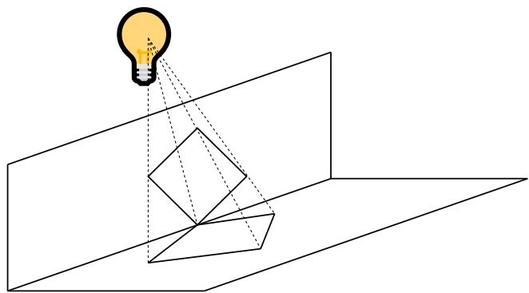
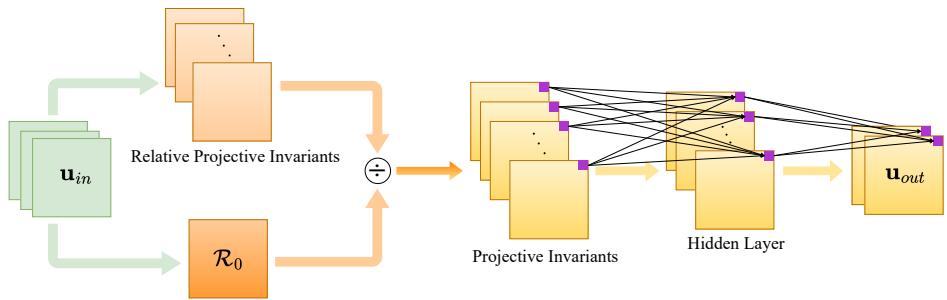
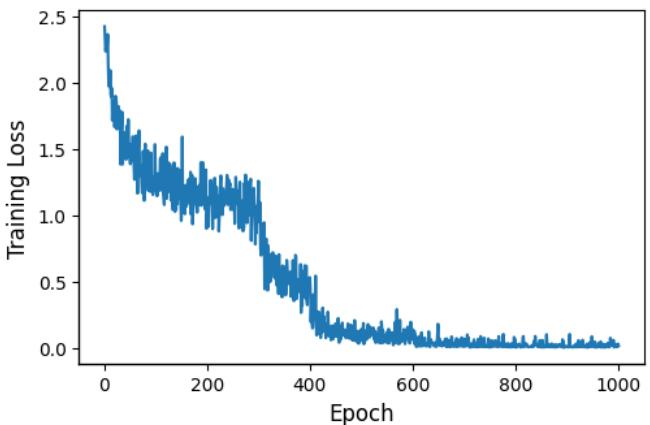
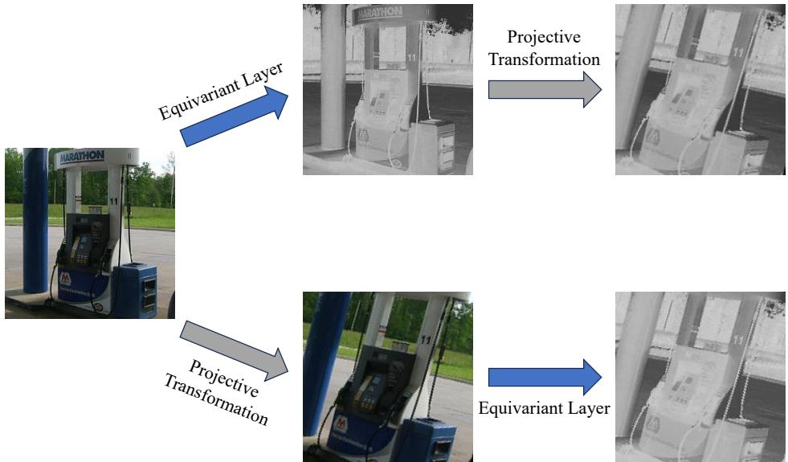

# Projective Equivariant Networks via Second-order Fundamental Differential Invariants

Yikang $\mathbf { L i } ^ { 1 }$ , Yeqing $\mathbf { Q i u ^ { 2 , 3 } }$ , Yuxuan Chen4, Lingshen $\mathbf { H e } ^ { 1 }$ , Lexiang $\mathbf { H } \mathbf { u } ^ { 1 }$ , Zhouchen Lin1,5∗   
1State Key Lab of General AI, School of Intelligence Science and Technology, Peking University 2School of Science and Engineering, The Chinese University of Hong Kong, Shenzhen 3Shenzhen Research Institute of Big Data 4Khoury College of Computer Sciences, Northeastern University 5Institute for Artificial Intelligence, Peking University liyk18@pku.edu.cn, yeqingqiu@link.cuhk.edu.cn, chen.yuxuan7@northeastern.edu lingshenhe@pku.edu.cn, hulx@stu.pku.edu.cn, zlin@pku.edu.cn

# Abstract

Equivariant networks enhance model efficiency and generalization by embedding symmetry priors into their architectures. However, most existing methods, primarily based on group convolutions and steerable convolutions, face significant limitations when dealing with complex transformation groups, particularly the projective group, which plays a crucial role in vision. In this work, we tackle the challenge by constructing projective equivariant networks based on differential invariants. Using the moving frame method with a carefully selected cross section tailored for multi-dimensional functions, we derive a complete and concise set of second-order fundamental differential invariants of the projective group. We provide a rigorous analysis of the properties and transformation relationships of their underlying components, yielding a further simplified and unified set of fundamental differential invariants, which facilitates both theoretical analysis and practical applications. Building on this foundation, we develop PDINet, the first framework for deep projective equivariant networks, achieving full projective equivariance without discretizing or sampling the group. Empirical results on the projectively transformed STL-10 and Imagenette datasets show that PDINet achieves improvements of $1 1 . 3 9 \%$ and $5 . 6 6 \%$ in accuracy over the respective standard baselines under out-of-distribution settings, demonstrating its strong generalization to complex geometric transformations.

# 1 Introduction

Incorporating symmetry as an inductive bias into neural networks has emerged as a powerful approach to enhance model efficiency and generalization. Convolutional neural networks (CNNs) [Krizhevsky et al., 2012, Simonyan and Zisserman, 2015, He et al., 2016, Chen et al., 2017], which are among the most widely used architectures in deep learning, owe much of their success to the inherent translational equivariance. Building on this idea, Cohen and Welling [2016a] proposed Group Equivariant CNNs (G-CNNs), which generalize equivariance to broader transformations like rotations and reflections. Equivariant networks achieve symmetry incorporation by constructing network layers whose outputs transform in a predictable pattern under group actions applied to the inputs.

The development of equivariant networks began with G-CNNs, whose feature map can be seen as a function on a group. Although G-CNNs have proven effective in various tasks [Worrall and Brostow, 2018, Esteves et al., 2019, Lafarge et al., 2021, Shamsolmoali et al., 2021], they are less suited to continuous groups, as handling such groups typically requires group sampling or discretization, which introduces approximation errors and computational complexity. Then, steerable CNNs [Cohen and Welling, 2016b, Weiler and Cesa, 2019] were proposed to overcome these limitations by viewing features as fields that transform according to specified group representations. In this framework, G-CNNs can be interpreted as a special case where the group representation is chosen to be the regular representation. Steerable CNNs are capable of handling continuous groups such as SO(2) and SO(3) directly, thereby significantly broadening the scope of equivariant networks to include real-world symmetries beyond discrete groups [Weiler et al., 2018, Wang et al., 2020, Wang and Walters, 2022]. However, for more complex non-compact Lie groups such as the projective group, deriving closedform steerable basis filters becomes intractable, inherently limiting the applicability of steerable CNNs. To address this, MacDonald et al. [2022] enabled group convolutions over finite-dimensional Lie groups by computing the integral on the Lie algebra, thus introducing a projective equivariant model, homConv. However, this method still relies on group sampling, which results in exponential memory growth with increasing network depth, thereby hindering scalability to deeper architectures. Mironenco and Forré [2024] improved sampling efficiency via group decompositions, but focused solely on affine subgroups like $\mathbb { R } ^ { n } \rtimes \mathrm { G L } ^ { + } ( n , \mathbf { \bar { \mathbb { R } } } )$ and $\mathbb { R } ^ { \bar { n } } \rtimes \bar { \mathrm { S L } } ( n , \bar { \mathbb { R } } )$ , without addressing more complex groups such as the projective group. Recently, Li et al. [2024, 2025] proposed InvarLayer and steerable EquivarLayer that construct affine equivariant networks based on invariants, enabling closed-form and sampling-free affine equivariance. However, these works remain specialized to the affine group and do not yet generalize to more complex non-compact groups like the projective group.

  
Figure 1: An illustration of a projective transformation: when a planar object is projected onto another plane, a projective transformation occurs.

Actually, projective transformations play a fundamental role in computer vision [Mohr and Triggs, 1996, Birchfield, 1998, Hartley and Zisserman, 2003], as they capture the relationships between objects and their images under perspective projections (see Figure 1). Achieving equivariance on projective transformations is especially critical in practical applications such as mobile robot navigation, 3D scene analysis, and camera pose estimation, where accurately handling perspective effects and viewpoint changes can significantly enhance model robustness and accuracy [Lee et al., 2000, Hartley and Zisserman, 2003, Mur-Artal et al., 2015, Schönberger et al., 2016]. Early on, Suk and Flusser [2004] proposed a projective invariant feature extraction method based on projective moment invariants. Nevertheless, the invariants are formulated as infinite series of moment products, leading to significant computational overhead and intractable error analysis in practical implementations. To overcome this limitation, Li et al. [2018] proposed an alternative framework that constructs projective invariants using finite combinations of weighted moments, where the weights are derived from relative projective differential invariants. Note that moment-based projective invariants are essentially global image descriptors, which makes them inappropriate for constructing equivariant operators that act locally on feature fields for capturing fine-grained spatial patterns. Instead, differential invariants inherently hold the property of acting locally at each spatial position, which makes them a natural foundation for building equivariant operators [Sangalli et al., 2022, 2023, Li et al., 2024, 2025]. While Olver [2023] has proposed a systematic framework for the computation of projective differential invariants via the moving frame method, it requires at least third-order derivatives because the projective action is not free at second order for scalar functions. Besides, they only consider single-channel cases, and the extension to multi-dimensional cases needs more complex expressions involving high-order derivatives, which limits their practicality in computation and applications on color images.

In this work, we construct projective equivariant networks based on differential invariants, achieving full projective equivariance without relying on group discretization or sampling. This overcomes the depth limitations of homConv [MacDonald et al., 2022] and enables effective scaling to deeper architectures. A core challenge lies in deriving concise and practical projective differential invariants. To support color images and multi-channel intermediate features in modern neural networks, we focus on the differential invariants for multi-dimensional functions. In this case, the projective group acts freely on the second-order jet space, allowing us to derive a complete set of second-order fundamental differential invariants using the moving frame method [Olver, 2015], which can express any secondorder invariant of the projective group. However, the choice of cross section used to define the moving frame significantly affects the form of the resulting invariants. While a direct extension of the cross section in [Olver, 2023] to the multi-dimensional case is theoretically valid, it leads to prohibitively long expressions with hundreds of terms, rendering them impractical. Instead, we propose a new cross section tailored to the multi-dimensional structure, which involves up to second-order derivatives, yielding a much more concise set of fundamental differential invariants. Further analysis reveals that these fundamental invariants are composed of a set of simpler components. By exploring the algebraic properties and transformation relationships of these components, we further simplify invariants into a unified set of fundamental invariants, facilitating both practical use and theoretical analysis. Based upon these simplified invariants, we design learnable equivariant operators by combining them with parameterized multi-layer perceptrons (MLPs), and embed the operators into standard neural network backbones to build PDINet, the first framework for deep projective equivariant networks free from group sampling. Empirical evaluations under challenging out-of-distribution settings demonstrate the strong generalization ability of our model to complex geometric transformations.

We summarize our main contributions as follows:

• We employ the moving frame method to derive a complete set of second-order fundamental differential invariants of the projective group for multi-dimensional functions, enabling support for color images and multi-channel features.   
• We conduct an in-depth analysis of the algebraic structure and transformation properties of these invariants, resulting in a further simplified and unified set of fundamental invariants that facilitate both theoretical understanding and practical computation.   
• We develop PDINet based on second-order projective differential invariants. It is the first time that deep networks achieve full projective equivariance without relying on group discretization or sampling, thus allowing effective scaling to deeper architectures.   
• Numerical experiments on projectively deformed STL-10 and Imagenette2 under out-ofdistribution settings demonstrate the effectiveness of our model, with improvements of $1 1 . 3 9 \%$ and $5 . 6 6 \%$ over the standard baseline results, showcasing its strong generalization capability under complex geometric transformations.3

# 2 Method

# 2.1 Basic concepts and notations

To begin with, we introduce some basic concepts and notations necessary for our formulation. An image can be viewed as a continuous function $\mathbf { u } ( x , y )$ defined on a 2D plane. For example, an RGB image corresponds to a three-dimensional function. Likewise, intermediate features in neural networks can also be interpreted as functions, and each layer can be seen as an operator that maps one function to another.

A central concept in this work is equivariance. If the output of an operator undergoes a corresponding transformation when the input is transformed, it is referred to as equivariance. The formal definition is as follows:

Definition 1 An operator $\psi : { \mathcal { F } } _ { 1 }  { \mathcal { F } } _ { 2 }$ is said to be equivariant with respect to a group $G$ if

$$
g \cdot \psi ( \mathbf { u } ) = \psi ( g \cdot \mathbf { u } ) , \quad \forall g \in G , \mathbf { u } \in \mathcal { F } _ { 1 } ,
$$

where $\mathcal { F } _ { 1 }$ and $\mathcal { F } _ { 2 }$ are the input and output function spaces, respectively.

Let $X$ denote the domain, $U = \mathbb { R } ^ { n }$ be the range of a function, and $U ^ { ( d ) } = U \times U _ { 1 } \times \cdot \cdot \cdot \times U _ { d }$ be the derivative space up to order $d$ . A group action $g \cdot \mathbf { x }$ on the domain naturally induces an action on functions, defined as $( g \cdot \mathbf { u } ) ( \mathbf { x } ) \stackrel { - } { = } \mathbf { u } ( \bar { g } ^ { - 1 } \cdot \mathbf { x } )$ , which models how geometric transformations deform images. This action further extends to derivatives through prolongation to the jet space $X \times U ^ { ( d ) }$ . For example, the first-order prolongation of the action on ${ \bar { X } } \times U ^ { ( 1 ) }$ can be expressed as: $( { \bf x } , { \bf u } ( { \bf x } ) , \nabla { \bf u } ( { \bf x } ) ) \mapsto ( \tilde { { \bf x } } , \tilde { { \bf u } } ( \tilde { { \bf x } } ) , \nabla \tilde { { \bf u } } ( \tilde { { \bf x } } ) )$ , where $\tilde { \mathbf { x } } \triangleq g \cdot \mathbf { x }$ and $\tilde { \mathbf { u } } \triangleq g \cdot \mathbf { u }$ , with $\tilde { \mathbf { u } } ( \tilde { \mathbf { x } } ) = \mathbf { u } ( \mathbf { x } )$ .

A differential invariant is a quantity that remains unchanged under the prolonged group action. The definition is given below.

Definition 2 Given a group $G$ acting on $X$ , a $d$ -th order differential invariant is a function $\mathcal { T }$ : $\boldsymbol { X } \times \boldsymbol { U } ^ { ( d ) }  \mathbb { R }$ such that

$$
\begin{array} { r } { \mathcal { T } \big ( g \cdot ( \mathbf { x } , \mathbf { u } ^ { ( d ) } ) \big ) = \mathcal { T } ( \mathbf { x } , \mathbf { u } ^ { ( d ) } ) , \quad \forall g \in G , ( \mathbf { x } , \mathbf { u } ^ { ( d ) } ) \in X \times U ^ { ( d ) } , } \end{array}
$$

where $g \cdot ( \mathbf { x } , \mathbf { u } ^ { ( d ) } )$ denotes the prolonged group action on the jet space $X \times U ^ { ( d ) }$

The definition can be extended to the multi-dimensional case. Specifically, we call $\pmb { \mathcal { I } } = ( \mathbb { Z } _ { 1 } , \ldots , \mathbb { Z } _ { k } ) ^ { \top }$ an $k$ -dimensional differential invariant. In addition, we define relative differential invariants, which may transform with a weight function under the group action:

$$
\begin{array} { r } { \mathcal { R } ( g \cdot ( \mathbf { x } , \mathbf { u } ^ { ( d ) } ) ) = w ( g , \mathbf { x } ) \cdot \mathcal { R } ( \mathbf { x } , \mathbf { u } ^ { ( d ) } ) , } \end{array}
$$

where $w ( g , \mathbf { x } )$ is a scalar weight depending on the group element $g$ and the point $\mathbf { x }$ . Notably, differential invariants are closely tied to equivariance, as a (multi-dimensional) differential invariant $\boldsymbol { \mathscr { x } }$ yields an equivariant operator $\hat { \pmb { \mathscr { T } } } ( \mathbf { u } ) ( \mathbf { x } ) \triangleq \pmb { \mathscr { T } } ( \mathbf { x } , \mathbf { u } ^ { ( d ) } )$ satisfying ${ \hat { \pmb { \mathscr { T } } } } ( g \cdot \mathbf { u } ) = g \cdot { \hat { \pmb { \mathscr { T } } } } ( \mathbf { u } )$ .

In this work, we focus on constructing such differential invariants and using them to build projective equivariant operators for neural networks.

# 2.2 Method of moving frames

The method of moving frames is a powerful technique for deriving differential invariants [Olver, 2003, 2015]. We begin with the definition of a moving frame.

Definition 3 [Olver, 2015] Let $G$ be a Lie group acting on a manifold $\mathcal { M }$ . A moving frame is a map $\eta : \mathcal { M } \to G$ such that

$$
\eta ( g \cdot z ) = \eta ( z ) \cdot g ^ { - 1 } , \quad g \in G , z \in \mathcal { M } .
$$

Given a moving frame, the invariantization of a function $F : \mathcal { M }  \mathbb { R }$ is defined as

$$
\iota ( F ) ( z ) \triangleq F ( \eta ( z ) \cdot z ) ,
$$

which converts an arbitrary function $F$ into a group-invariant function satisfying $\iota ( F ) ( g { \cdot } z ) = \iota ( F ) ( z )$ . More generally, we can define an invariant as $\bar { \mathcal { T } } ( g \cdot z ) = \mathcal { T } ( z ) , g \in G , z \in \bar { \mathcal { M } }$ . In our context, the manifold of interest is the jet space $\mathcal { M } = X \times U ^ { ( n ) }$ and we focus on differential invariants.

A necessary and sufficient condition for the existence of a moving frame is that the group $G$ acts freely and regularly on the manifold $\mathcal { M }$ . Under this condition, a moving frame can be constructed via a cross section, as described below:

Theorem 4 [Olver, 2015] Let $G$ be a $r$ -dimensional Lie group acting freely and regularly on a $m$ -dimensional manifold $\mathcal { M }$ . Given local coordinates $z = ( z _ { 1 } , \dots , z _ { m } )$ on $\mathcal { M }$ , let $\kappa$ be a cross section of the form $\mathcal { K } = \{ z _ { 1 } = c _ { 1 } , z _ { 2 } = c _ { 2 } , \dots , z _ { r } = c _ { r } \} \subset \mathcal { M }$ , where $c _ { i }$ are constants. Then for $z \in \mathcal { M }$ , there exists a unique $g \in G$ such that $g \cdot z \in K$ . Defining $\eta ( z ) = g$ , namely $\eta ( z ) \cdot z \in \mathcal { K }$ , yields a map $\eta : \mathcal { M } \to G$ , which is a moving frame.

Here, the group action is said to be free if for any $g \in G$ , $g \cdot z = z$ implies $g = e$ , where $e$ is the identity element of the group. Usually, the group action can be made free by increasing the order of the jet space. The action is regular if the orbits form a regular foliation, which is typically satisfied in common groups.

With a moving frame obtained from Theorem 4, we can construct a complete set of fundamental invariants, meaning any invariant can be expressed as a combination of these fundamental invariants.

Theorem 5 [Olver, 2015] Let $\eta : \mathcal { M } \to G$ be a moving frame from Theorem 4 and define $w ( g , z ) \triangleq$ $g \cdot z$ . Then

$$
w ( \eta ( z ) , z ) = ( c _ { 1 } , c _ { 2 } , \ldots , c _ { r } , w _ { r + 1 } ( \eta ( z ) , z ) , \ldots , w _ { m } ( \eta ( z ) , z ) ) ,
$$

where $\mathcal { T } _ { 1 } ( z ) \triangleq w _ { r + 1 } ( \eta ( z ) , z )$ , . . ., ${ \mathcal { T } } _ { m - r } ( z ) \triangleq w _ { m } ( \eta ( z ) , z )$ constitute a complete system of functionally independent invariants, called fundamental invariants.

This theorem provides a method to construct fundamental invariants via the moving frame and indicates that the number of fundamental invariants is $m - r$ . In the following sections, we will leverage these results to derive projective differential invariants.

# 2.3 Projective transformation

Projective transformations are ubiquitous in the visual world as two different views of the same planar object can be related by a 2D projective transformation. A standard projective group action is described by the projective special linear group $\mathrm { { P S L } ( 3 , \mathbb { R } ) }$ acting on the 2D projective plane $\mathbb { R } \mathbb { P } ^ { 2 }$ , which can be interpreted as the set of equivalence classes of points $( x , y , p ) \sim ( c x , c y , c p )$ for any $c \neq 0$ . Points in $\mathbb { R } \mathbb { P } ^ { 2 }$ with $p \neq 0$ can be represented in inhomogeneous coordinates as $( x , y )$ , corresponding to the homogeneous coordinate $( x , y , 1 )$ . Thus, the action of a projective transformation on 2D coordinates can be written as

$$
\tilde { x } = \frac { \alpha x + \beta y + \gamma } { \rho x + \sigma y + \tau } , \tilde { y } = \frac { \lambda x + \mu y + \nu } { \rho x + \sigma y + \tau } ,
$$

where the transformation is parameterized by the coefficient matrix

$$
\mathbf { P } = \left( \begin{array} { l l l } { \alpha } & { \beta } & { \gamma } \\ { \lambda } & { \mu } & { \nu } \\ { \rho } & { \sigma } & { \tau } \end{array} \right) .
$$

Since the transformation is defined up to a nonzero scaling factor, we can normalize by requiring the determinant of $\mathbf { P }$ to be 1, i.e., $\bar { \Delta { \bf \Psi } } = \operatorname* { d e t } ( { \bf P } ) = 1$ . Thus, there are 8 independent degrees of freedom. The transformation reduces to an affine transformation when $\rho = \sigma = 0$ , while a pure projective transformation, characterized by $\rho ^ { 2 } + \sigma ^ { 2 } \neq 0$ , exhibits nonlinear behavior. Thus, projective transformations represent a more general and complex class of geometric transformations.

For an $n$ -dimensional function $\mathbf { u } ( x , y )$ , the projective transformation of coordinates induces a natural action on the function, $\tilde { \mathbf { u } } ( \tilde { x } , \tilde { y } ) = \mathbf { u } ( x , y )$ , which can be further prolonged to its derivatives. We denote the derivatives of the $i$ -th component function $u ^ { [ i ] }$ as

$$
u _ { j k } ^ { [ i ] } \triangleq D _ { x } ^ { j } D _ { y } ^ { k } u ^ { [ i ] } ,
$$

where $D _ { x }$ and $D _ { y }$ are the differentiation operators with respect to $x$ and $y$ , respectively. Under a projective transformation, these derivatives transform as

$$
u _ { j k } ^ { [ i ] } \mapsto \tilde { u } _ { j k } ^ { [ i ] } = D _ { \tilde { x } } ^ { j } D _ { \tilde { y } } ^ { k } \tilde { u } ^ { [ i ] } ,
$$

with the transformed differential operators given by

$$
\begin{array} { l } { { D _ { \tilde { x } } = \displaystyle \frac { \rho x + \sigma y + \tau } { \Delta } \left( ( ( \mu \rho - \lambda \sigma ) x + \mu \tau - \nu \sigma ) D _ { x } + ( ( \mu \rho - \lambda \sigma ) y - \lambda \tau + \nu \rho ) D _ { y } \right) , } } \\ { { D _ { \tilde { y } } = \displaystyle \frac { \rho x + \sigma y + \tau } { \Delta } \left( ( ( \alpha \sigma - \beta \rho ) x - \beta \tau + \gamma \sigma ) D _ { x } + ( ( \alpha \sigma - \beta \rho ) y + \alpha \tau - \gamma \rho ) D _ { y } \right) . } } \end{array}
$$

# 2.4 Projective differential invariants of multi-dimensional functions

The projective group action is not free on the second-order jet space for scalar functions, requiring prolongation to the third-order jet space to achieve freeness. This leads to complex formulations [Olver, 2023], which may limit the practicality of the resulting invariants due to their complexity and computational cost. Moreover, in practice, third-order derivatives are harder to estimate reliably from data than lower-order ones. In this work, we focus on multi-dimensional functions, which naturally align with applications such as color image processing. In this setting, the group action is free on the second-order jet space, allowing the existence of second-order differential invariants. Using the method of moving frames, we can derive these invariants, where the choice of cross section significantly influences the simplicity of the resulting expressions. Although the cross section proposed by Olver [2023] can be extended to the multi-dimensional case, the resulting invariants tend to be lengthy, typically involving hundreds of terms, which makes them less practical. Instead, we propose an alternative cross section that leverages multiple dimensions while relying only on derivatives up to second order, yielding invariants with significantly more concise and tractable forms.

Specifically, we choose the following cross section:

$$
\begin{array} { r } { \mathcal { K } = \{ x = y = 0 , u _ { x } ^ { [ 1 ] } = 1 , u _ { y } ^ { [ 1 ] } = 0 , u _ { x } ^ { [ 2 ] } = 0 , u _ { y } ^ { [ 2 ] } = 1 , u _ { x x } ^ { [ 1 ] } = u _ { x y } ^ { [ 1 ] } = 0 \} . } \end{array}
$$

This defines 8 normalization equations, which, together with the constraint $\Delta = 1$ , determine all group parameters, thereby establishing the moving frame $\eta$ . The detailed derivation of the moving frame is provided in the Appendix.

With the moving frame $\eta$ constructed, we can then apply the invariantization process according to Theorem 5 to obtain a complete set of fundamental differential invariants. For the coordinates involved in the cross section, we have

$$
\begin{array} { r l } & { \iota ( x ) = 0 , \iota ( y ) = 0 , \iota ( u _ { x } ^ { [ 1 ] } ) = 1 , \iota ( u _ { y } ^ { [ 1 ] } ) = 0 , } \\ & { \iota ( u _ { x } ^ { [ 2 ] } ) = 0 , \iota ( u _ { y } ^ { [ 2 ] } ) = 1 , \iota ( u _ { x x } ^ { [ 1 ] } ) = 0 , \iota ( u _ { x y } ^ { [ 1 ] } ) = 0 . } \end{array}
$$

The remaining coordinates of the second-order jet space yield the following differential invariants:

$$
\begin{array} { r l } & { \hat { \rho } _ { 0 , 1 } ^ { ( 1 ) } = \frac { \hat { \rho } _ { 1 , 1 } ^ { ( 1 ) } } { \hat { \rho } _ { 0 , 2 } ^ { ( 1 ) } } , } \\ & { \hat { \rho } _ { 0 , 2 } ^ { ( 2 ) } = \frac { \hat { \rho } _ { 1 , 2 } ^ { ( 2 ) } } { \hat { \rho } _ { 0 , 2 } ^ { ( 2 ) } } , } \\ & { \hat { \rho } _ { 0 , 3 } ^ { ( 2 ) } = \frac { \hat { \rho } _ { 1 , 2 } ^ { ( 2 ) } } { \hat { \rho } _ { 0 , 2 } ^ { ( 2 ) } } , } \\ & { \hat { \rho } _ { 0 , 2 } ^ { ( 2 ) } = \frac { \hat { \rho } _ { 1 , 2 } ^ { ( 2 ) } } { \hat { \rho } _ { 0 , 2 } ^ { ( 2 ) } } , } \\ & { \hat { \rho } _ { 0 , 3 } ^ { ( 2 ) } = \frac { \hat { \rho } _ { 1 , 2 } ^ { ( 2 ) } - \hat { \rho } _ { 1 , 3 } ^ { ( 2 ) } } { \hat { \rho } _ { 0 , 2 } ^ { ( 2 ) } } , } \\ & { \hat { \rho } _ { 0 , 4 } ^ { ( 3 ) } = \frac { \hat { \rho } _ { 0 , 2 } ^ { ( 3 ) } } { \hat { \rho } _ { 0 , 3 } ^ { ( 2 ) } } , \quad \mathrm { ~ a ~ s ~ i ~ \le ~ } } \\ & { \hat { \rho } _ { 0 , 4 } ^ { ( 3 ) } = \frac { \hat { \rho } _ { 0 , 4 } ^ { ( 3 ) } } { \hat { \rho } _ { 0 , 2 } ^ { ( 2 ) } } , \quad \mathrm { ~ a ~ s ~ i ~ \le ~ } } \\ & { \hat { \rho } _ { 0 , 5 } ^ { ( 4 ) } = \frac { \hat { \rho } _ { 0 , 5 } ^ { ( 4 ) } - \hat { \rho } _ { 0 , 5 } ^ { ( 4 ) } } { \hat { \rho } _ { 0 , 2 } ^ { ( 2 ) } } , } \\ & { \hat { \rho } _ { 0 , 4 } ^ { ( 4 ) } = \frac { \hat { \rho } _ { 0 , 4 } ^ { ( 3 ) } - \hat { \rho } _ { 0 , 5 } ^ { ( 4 ) } } { \hat { \rho } _ { 0 , 2 } ^ { ( 2 ) } } , \quad \mathrm { ~ a ~ s ~ i ~ s ~ o ~ } } \\ &  \hat { \rho } _  0 \end{array}
$$

where $\mathcal { I } _ { i j }$ and $\mathcal { T } _ { i j k }$ are two key quantities defined as:

$$
\begin{array} { r l } & { \mathcal { I } _ { i j } \triangleq u _ { x } ^ { [ i ] } u _ { y } ^ { [ j ] } - u _ { x } ^ { [ j ] } u _ { y } ^ { [ i ] } , } \\ & { \mathcal { T } _ { i j k } \triangleq u _ { x x } ^ { [ i ] } u _ { y } ^ { [ j ] } u _ { y } ^ { [ k ] } + u _ { y y } ^ { [ i ] } u _ { x } ^ { [ j ] } u _ { x } ^ { [ k ] } - u _ { x y } ^ { [ i ] } ( u _ { x } ^ { [ j ] } u _ { y } ^ { [ k ] } + u _ { x } ^ { [ k ] } u _ { y } ^ { [ j ] } ) , } \end{array}
$$

satisfying $\mathcal { I } _ { i i } = 0$ , ${ \mathcal { I } } _ { i j } = - { \mathcal { I } } _ { j i }$ , and $\mathcal { T } _ { i j k } = \mathcal { T } _ { k j i }$ .

The invariants (14)-(22), together with the obvious zeroth-order invariants

$$
S _ { 0 } = \{ u ^ { [ i ] } \mid 1 \leq i \leq n \} ,
$$

form a complete set of second-order fundamental differential invariants of the projective group. Compared to projective invariants for scalar functions [Olver, 2023], our results involve up to second-order derivatives and are expressed in a more concise form.

# 2.5 Fundamental components of projective differential invariants

In the previous subsection, we have derived a complete set of second-order fundamental differential invariants. While relatively concise, their expressions are asymmetric and depend on the specific choice of the first two dimensions used in the cross section. To obtain a simpler, more unified, and elegant formulation, we conduct a deeper analysis of the fundamental components of these invariants. This enables us to further simplify their structure while preserving completeness.

Note that the numerators and denominators in (14)-(22) are all relative invariants. Thus, we focus on the properties of these relative invariants, as absolute invariants can be obtained by taking the ratio of two relative invariants with the same weight. Moreover, since the expressions are built from the basic quantities $\mathcal { I } _ { i j }$ and $\mathcal { T } _ { i j k }$ , we will delve into their transformation properties and algebraic relationships.

We first present three classes of simplified relative differential invariants of the projective group.

Theorem 6 Let $\begin{array} { r } { W = \frac { ( \rho x + \sigma y + \tau ) ^ { 3 } } { \Delta } } \end{array}$ . Then the following quantities are relative differential invariants of the projective group:

• For $i \neq j$ , $\mathcal { I } _ { i j }$ is a relative differential invariant of weight W .   
• For $1 \leq i \leq n$ , $\mathcal { T } _ { i i i }$ is a relative differential invariant of weight $W ^ { 2 }$ .   
• F $o r 1 \leq i , j \leq n , T _ { i j i } + 2 T _ { i i j }$ is a relative differential invariant of weight $W ^ { 2 }$ .

These relative invariants are not functionally independent; rather, they can be transformed into one another. Given that there are $6 n - 6$ second-order fundamental differential invariants according to Section 2.4, we expect a complete and independent set of relative invariants to contain $6 n - 5$ elements. To this end, we investigate the transformation rules among the relative invariants and aim to identify a minimal generating set sufficient to express all fundamental differential invariants. We start with the transformation properties of $\mathcal { I } _ { i j }$ .

Theorem 7 For any indices $1 \leq i _ { 1 } , i _ { 2 } , i _ { 3 } , i _ { 4 } \leq n ,$ , the following equation holds:

$$
\mathcal { I } _ { i _ { 1 } i _ { 2 } } \cdot \mathcal { I } _ { i _ { 3 } i _ { 4 } } + \mathcal { I } _ { i _ { 1 } i _ { 3 } } \cdot \mathcal { I } _ { i _ { 4 } i _ { 2 } } + \mathcal { I } _ { i _ { 1 } i _ { 4 } } \cdot \mathcal { I } _ { i _ { 2 } i _ { 3 } } = 0 .
$$

This implies that for any four distinct indices $i _ { 1 } , i _ { 2 } , i _ { 3 } , i _ { 4 }$ , the six pairwise combinations of $\mathcal { I } _ { i j }$ are dependent such that once any five are known, the remaining one can be determined. Based on Theorem 7, we can construct a subset of $\{ \mathcal { T } _ { i j } \mid i \neq j \}$ that is sufficient to express all $\mathcal { I } _ { i j }$ .

Theorem 8 Define the following sets of relative invariants:

$$
\begin{array} { r } { S _ { 1 } \triangleq \{ \mathcal { T } _ { 1 2 } , \mathcal { T } _ { 2 3 } , \hdots , \mathcal { T } _ { n - 1 , n } \} , } \\ { S _ { 2 } \triangleq \{ \mathcal { T } _ { 1 3 } , \mathcal { T } _ { 2 4 } , \hdots , \mathcal { T } _ { n - 2 , n } \} . } \end{array}
$$

Then $S _ { 1 } \cup S _ { 2 }$ is a generating set for the collection $\{ \mathcal { T } _ { i j } \mid i \neq j \}$ , meaning that any $\mathcal { I } _ { i j }$ can be expressed as a functional combination of these elements.

According to Theorem 7, $\mathcal { I } _ { i , i + 3 }$ can be written in terms of $\mathcal { T } _ { i , i + 1 } , \mathcal { T } _ { i + 1 , i + 2 } , \mathcal { T } _ { i + 2 , i + 3 } , \mathcal { T } _ { i , i + 2 }$ , and $\mathcal { I } _ { i + 1 , i + 3 }$ , all of which belong to $S _ { 1 } \cup S _ { 2 }$ . By induction, any $\mathcal { I } _ { i j }$ can thus be recovered from the generating set. A complete and rigorous proof is provided in the Appendix.

Before establishing the transformation relationships for $\mathcal { T } _ { i j k }$ , we provide a more compact representa tion of $\mathcal { I } _ { i j }$ and $\mathcal { T } _ { i j k }$ to clarify their structural relationships:

$$
\begin{array} { r l } & { \mathcal { I } _ { i j } = \mathbf { g } _ { i } ^ { \top } \mathbf { Q } \mathbf { g } _ { j } , } \\ & { \mathcal { T } _ { i j k } = \mathbf { g } _ { i } ^ { \top } \mathbf { Q } ^ { \top } \mathbf { H } _ { j } \mathbf { Q } \mathbf { g } _ { k } , } \end{array}
$$

  
Figure 2: A single layer of PDINet. (1) Compute projective invariants from relative projective invariants. (2) Combine these invariants with an MLP to produce equivariant outputs.

where $\mathbf { g } _ { i } \triangleq \left( u _ { x } ^ { [ i ] } , u _ { y } ^ { [ i ] } \right) ^ { \top }$ is the gradient of the $i$ -th component function, $\mathbf { H } _ { j }$ is the Hessian matrix of the $j$ -th component function, and $\mathbf { Q }$ is a fixed orthogonal matrix defined as:

$$
{ \bf Q } \triangleq \left( \begin{array} { c c } { 0 } & { 1 } \\ { - 1 } & { 0 } \end{array} \right) .
$$

Notably, $\{ \mathcal { T } _ { i j } \}$ can be used to establish the transformation relationships between the gradients.

Lemma 9 For any distinct indices $i , j , k$ , the gradient $\mathbf { g } _ { k }$ can be expressed in terms of $\mathbf { g } _ { i }$ and $\mathbf { g } _ { j }$ as:

$$
\mathbf { g } _ { k } = \frac { \mathcal { T } _ { k j } } { \mathcal { T } _ { i j } } \mathbf { g } _ { i } + \frac { \mathcal { T } _ { k i } } { \mathcal { T } _ { j i } } \mathbf { g } _ { j } .
$$

Using Lemma 9 and the form of $\mathcal { T } _ { i j k }$ in (29), we derive the transformation rule for $\mathcal { T } _ { i j k }$ given $\{ \mathcal { T } _ { i j } \}$

Theorem 10 Let $i \neq k$ , and let $i ^ { \prime } , j , k ^ { \prime }$ be arbitrary indices. Then $\mathcal { T } _ { i ^ { \prime } j k ^ { \prime } }$ can be expressed as:

$$
{ \mathcal { T } } _ { i ^ { \prime } j k ^ { \prime } } = { \frac { { \mathcal { T } } _ { i ^ { \prime } k } { \mathcal { T } } _ { k ^ { \prime } k } } { { \mathcal { T } } _ { i k } ^ { 2 } } } { \mathcal { T } } _ { i j i } - { \frac { { \mathcal { T } } _ { i ^ { \prime } k } { \mathcal { T } } _ { k ^ { \prime } i } + { \mathcal { T } } _ { i ^ { \prime } i } { \mathcal { T } } _ { k ^ { \prime } k } } { { \mathcal { T } } _ { i k } ^ { 2 } } } { \mathcal { T } } _ { i j k } + { \frac { { \mathcal { T } } _ { i ^ { \prime } i } { \mathcal { T } } _ { k ^ { \prime } i } } { { \mathcal { T } } _ { i k } ^ { 2 } } } { \mathcal { T } } _ { k j k } .
$$

This result implies that, for a fixed $j$ , the triplet $\{ \mathcal { T } _ { i j i } , \mathcal { T } _ { i j k } , \mathcal { T } _ { k j k } \}$ serves as a generating set for $\{ \mathcal { T } _ { i ^ { \prime } j k ^ { \prime } } \ | \ 1 \leq i ^ { \dagger } , k ^ { \prime } \leq n \}$ , provided $\{ \mathcal { T } _ { i j } \}$ is known.

With the transformation relationships for $\mathcal { I } _ { i j }$ and $\mathcal { T } _ { i j k }$ established, we can now construct a minimal set of relative invariants that suffices to express all the relative invariants in Theorem 6.

Theorem 11 Define the following sets of relative invariants:

$$
\begin{array} { r l } & { S _ { 3 } \triangleq \{ { \mathcal { T } } _ { 1 1 1 } , { \mathcal { T } } _ { 2 2 2 } , \ldots , { \mathcal { T } } _ { n n n } \} , } \\ & { S _ { 4 } \triangleq \{ { \mathcal { T } } _ { 1 2 1 } + 2 { \mathcal { T } } _ { 1 1 2 } , { \mathcal { T } } _ { 1 3 1 } + 2 { \mathcal { T } } _ { 1 1 3 } , \ldots , { \mathcal { T } } _ { n - 1 , n , n - 1 } + 2 { \mathcal { T } } _ { n - 1 , n - 1 , n } \} , } \\ & { S _ { 5 } \triangleq \{ { \mathcal { T } } _ { 2 1 2 } + 2 { \mathcal { T } } _ { 2 2 1 } , { \mathcal { T } } _ { 3 2 3 } + 2 { \mathcal { T } } _ { 3 3 2 } , \ldots , { \mathcal { T } } _ { n , n - 1 , n } + 2 { \mathcal { T } } _ { n , n , n - 1 } \} . } \end{array}
$$

Then $S _ { 1 } \cup S _ { 2 } \cup S _ { 3 } \cup S _ { 4 } \cup S _ { 5 }$ can express all the relative invariants in Theorem $6$

It can be shown (see the Appendix) that the fundamental differential invariants (14)-(22) can be expressed via the relative invariants in Theorem 6. Therefore, we arrive at the following conclusion:

Theorem 12 The union $S \triangleq S _ { 0 } \cup S _ { 1 } \cup S _ { 2 } \cup S _ { 3 } \cup S _ { 4 } \cup S _ { 5 }$ forms a complete set of relative differential invariants to express all second-order differential invariants of the projective group.

This set contains exactly $6 n - 5$ elements, matching the expected minimal number needed to express all second-order fundamental differential invariants. Compared to the invariants derived in Section 2.4, the current formulation is further simplified and independent of the specific choice of the first two dimensions in the cross section, exhibiting a more unified structure. Moreover, while the original invariants involve polynomials of degree up to five, the present set only contains at most cubic expressions, resulting in lower computational complexity.

# 2.6 Projective equivariant networks

As discussed before, with a set of relative invariants obtained, we can convert them into absolute invariants by dividing each by another relative invariant with the same weight. We apply this procedure to relative invariants in $S$ to construct a complete set of fundamental differential invariants.

Specifically, we select $\begin{array} { r } { \mathcal { R } _ { 0 } = \frac { 1 } { n } ( \mathcal { I } _ { 1 2 } + \mathcal { I } _ { 2 3 } + . . . + \mathcal { I } _ { n 1 } ) } \end{array}$ as the denominator, which is a relative invariant of weight $W$ . We keep the elements in $S _ { 0 }$ unchanged, divide the elements in $S _ { 1 } \cup S _ { 2 }$ by $\mathcal { R } _ { 0 }$ , and divide those in $S _ { 3 } \cup S _ { 4 } \cup S _ { 5 }$ by $\mathcal { R } _ { 0 } ^ { 2 }$ . This yields a set of differential invariants sufficient to express all second-order fundamental differential invariants. In fact, this set with $6 n - 5$ invariants may contain one redundant element, but completeness is of greater concern. To avoid division by zero, we add a positive constant $\epsilon$ to the denominator during division, enhancing numerical stability.

Let $\pmb { \mathcal { T } } = ( \mathcal { T } _ { 1 } , \ldots , \mathcal { T } _ { N } ) ^ { \top }$ denote the set of differential invariants we obtained, which naturally induces an equivariant operator $\hat { \boldsymbol { \tau } }$ . Theoretically, the invariants $\mathcal { T } _ { 1 } , \ldots , \mathcal { T } _ { N }$ are sufficient to express all second-order differential invariants. In practice, we leverage the expressive power of neural networks to combine $\mathcal { T } _ { 1 } , \ldots , \mathcal { T } _ { N }$ using a two-layer MLP to produce the output [Li et al., 2024, 2025]. This leads to a learnable equivariant operator:

$$
{ \bf u } _ { o u t } = { \bf h } _ { \theta } \circ \hat { \pmb { \mathscr { T } } } ( { \bf u } _ { i n } ) ,
$$

where $\mathbf { h } _ { \theta }$ is an MLP parameterized by $\theta$ . By integrating this operator into standard network architectures, we can build projective equivariant models. We refer to the resulting model as the Projective Differential Invariant Network (PDINet), as illustrated in Figure 2.

# 3 Experiments

For empirical evaluation, we conduct image classification tasks under out-of-distribution settings, where models are trained on the original dataset and tested on images deformed by projective transformations. We adopt ResNet-18 [He et al., 2016] as the backbone and replace its convolutional layers with our equivariant operators defined in (35) to construct a projective equivariant network, PDINet. As the main counterpart, we consider homConv, a projective equivariant model proposed by MacDonald et al. [2022]. To ensure a fair comparison, we attempted to implement homConv using the same backbone. However, homConv relies on group sampling, which leads to exponential memory growth with network depth, resulting in out-of-memory (OOM) issues. Therefore, we follow the original network configuration of MacDonald et al. [2022] and reduce the number of samples to avoid OOM. In addition, we also include ResNet-18 trained with projective data augmentation (DA) as a reference baseline.

# 3.1 Proj-STL-10

STL-10 [Coates et al., 2011] is a dataset containing 5000 training images and 8000 test images. Each image has a resolution of $9 6 \times 9 6$ with RGB channels. We apply random projective transformations to the test set to generate the Proj-STL-10 dataset. Models are trained on the original STL-10 dataset (or with projective data augmentation for the DA baseline) and evaluated on Proj-STL-10, forming a challenging out-of-distribution setting that assesses the model’s ability to generalize beyond the training distribution.

Table 1: Test accuracy $( \% )$ on Proj-STL-10.   

<table><tr><td>Model</td><td>Accuracy</td><td>#Params</td></tr><tr><td>ResNet-18</td><td>39.73±0.33</td><td>11.18M</td></tr><tr><td>ResNet-18 with DA</td><td>48.73±0.53</td><td>11.18M</td></tr><tr><td>homConv</td><td>20.88±0.32</td><td>376K</td></tr><tr><td>PDINet (ours)</td><td>51.12±0.47</td><td>8.90M</td></tr></table>

Each experiment is repeated five times with different random seeds, and we report the average accuracy and standard deviation in Table 1. PDINet substantially outperforms the standard ResNet18 on the transformed test set, achieving an $1 1 . 3 9 \%$ improvement in accuracy. While projective data augmentation considerably enhances ResNet-18’s robustness, PDINet still achieves the highest accuracy. In contrast, homConv performs poorly due to its restriction on network depth.

# 3.2 Proj-Imagenette

Imagenette is a ten-class subset of the ImageNet dataset [Deng et al., 2009], consisting of 9469 training images and 3925 test images. All images are adapted to a uniform resolution of $2 5 6 \times 2 5 6$ for model input. We apply random projective transformations to the test set to generate the Proj-Imagenette dataset, while keeping the training set unchanged. This setup simulates an out-of-distribution scenario and evaluates the model’s ability to generalize to geometric transformations.

Table 2: Test accuracy $( \% )$ on Proj-Imagenette.   

<table><tr><td>Model</td><td>Accuracy</td><td>#Params</td></tr><tr><td>ResNet-18</td><td>65.64±0.39</td><td>11.18M</td></tr><tr><td>ResNet-18 with DA</td><td>70.77±0.76</td><td>11.18M</td></tr><tr><td>homConv</td><td>25.72±0.52</td><td>376K</td></tr><tr><td>PDINet (ours)</td><td>71.30±0.45</td><td>8.90M</td></tr></table>

Each experiment is repeated five times with different random seeds, and we report the mean $\pm$ standard deviation of test accuracy in Table 2. The results demonstrate that PDINet retains strong performance under distribution shift, outperforming the standard ResNet-18 by $5 . 6 6 \%$ . It confirms the effectiveness of the projective equivariance of our model in enhancing out-of-distribution generalization. Although ResNet-18 with DA reduces the performance gap, it still lags behind PDINet. Meanwhile, the shallow homConv model struggles to handle higher-resolution inputs due to its limited depth.

Detailed experimental settings and implementation details can be found in the Appendix.

# 4 Conclusion

In this work, we propose PDINet, a framework for projective equivariant networks, based on second-order differential invariants of the projective group. Our method overcomes the exponential memory growth encountered by homConv [MacDonald et al., 2022], enabling effective scaling to deeper networks. Leveraging the moving frame method and a carefully chosen cross section tailored to multi-dimensional functions, we derive a complete and concise set of second-order projective fundamental differential invariants. Further analysis reveals transformation relationships among projective invariants, allowing us to obtain a unified and simplified formulation that enhances both theoretical clarity and computational efficiency. Building upon these invariants, we design a learnable projective equivariant operator that can be seamlessly integrated into various network architectures. It is the first time to achieve full projective equivariance in deep networks without group sampling or discretization. Experiments under out-of-distribution settings demonstrate the strong generalization ability of our model. With the prevalence and significance of projective transformations in vision, PDINet holds promising potential for broader applications in computer vision.

One limitation of our approach is that the second-order invariants we derive vanish in the onedimensional case, preventing the direct application of PDINet to grayscale images. In addition, this work focuses on group actions on scalar fields and does not yet cover more general cases involving arbitrary group representations, which we consider a valuable direction for future research.

# Acknowledgments

Z. Lin was supported by National Key R&D Program of China (2022ZD0160300), the NSF China (No. 62276004) and the State Key Laboratory of General Artificial Intelligence.

# References

Stan Birchfield. An introduction to projective geometry (for computer vision). Unpublished note, Stanford University, 14, 1998.

Georg Bökman, Axel Flinth, and Fredrik Kahl. In search of projectively equivariant networks. Transactions on Machine Learning Research, 2023.

Liang-Chieh Chen, George Papandreou, Iasonas Kokkinos, Kevin Murphy, and Alan L Yuille. DeepLab: Semantic image segmentation with deep convolutional nets, atrous convolution, and fully connected CRFs. IEEE Transactions on Pattern Analysis and Machine Intelligence, pages 834–848, 2017.

Adam Coates, Andrew Ng, and Honglak Lee. An analysis of single-layer networks in unsupervised feature learning. In Proceedings of the fourteenth International Conference on Artificial Intelligence and Statistics, 2011.

Taco S Cohen and Max Welling. Group equivariant convolutional networks. In International Conference on Machine Learning, 2016a.

Taco S Cohen and Max Welling. Steerable CNNs. In International Conference on Learning Representations, 2016b.

Jia Deng, Wei Dong, Richard Socher, Li-Jia Li, Kai Li, and Li Fei-Fei. Imagenet: A large-scale hierarchical image database. In IEEE Conference on Computer Vision and Pattern Recognition, 2009.

Terrance DeVries and Graham W Taylor. Improved regularization of convolutional neural networks with cutout. arXiv preprint arXiv:1708.04552, 2017.

Carlos Esteves, Yinshuang Xu, Christine Allen-Blanchette, and Kostas Daniilidis. Equivariant multiview networks. In Proceedings of the IEEE/CVF International Conference on Computer Vision, 2019.

Mark Fels and Peter J Olver. Moving coframes: II. regularization and theoretical foundations. Acta Applicandae Mathematica, 55:127–208, 1999.

Marc Finzi, Samuel Stanton, Pavel Izmailov, and Andrew Gordon Wilson. Generalizing convolutional neural networks for equivariance to Lie groups on arbitrary continuous data. In International Conference on Machine Learning, 2020.

Marc Finzi, Max Welling, and Andrew Gordon Wilson. A practical method for constructing equivariant multilayer perceptrons for arbitrary matrix groups. In International Conference on Machine Learning, 2021.

Fabian Fuchs, Daniel Worrall, Volker Fischer, and Max Welling. SE(3)-transformers: 3D rototranslation equivariant attention networks. In Advances in Neural Information Processing Systems, 2020.

Richard Hartley and Andrew Zisserman. Multiple view geometry in computer vision. Cambridge University Press, 2003.

Kaiming He, Xiangyu Zhang, Shaoqing Ren, and Jian Sun. Deep residual learning for image recognition. In Proceedings of the IEEE/CVF Conference on Computer Vision and Pattern Recognition, 2016.

Lingshen He, Yuxuan Chen, Zhengyang Shen, Yiming Dong, Yisen Wang, and Zhouchen Lin. Efficient equivariant network. In Advances in Neural Information Processing Systems, 2021.

Lingshen He, Yuxuan Chen, Zhengyang Shen, Yibo Yang, and Zhouchen Lin. Neural ePDOs: Spatially adaptive equivariant partial differential operator based networks. In International Conference on Learning Representations, 2022.

Boce Hu, Xupeng Zhu, Dian Wang, Zihao Dong, Haojie Huang, Chenghao Wang, Robin Walters, and Robert Platt. Orbitgrasp: SE(3)-equivariant grasp learning. arXiv preprint arXiv:2407.03531, 2024.

Boce Hu, Heng Tian, Dian Wang, Haojie Huang, Xupeng Zhu, Robin Walters, and Robert Platt. Push-grasp policy learning using equivariant models and grasp score optimization. arXiv preprint arXiv:2504.03053, 2025a.

Boce Hu, Dian Wang, David Klee, Heng Tian, Xupeng Zhu, Haojie Huang, Robert Platt, and Robin Walters. 3D equivariant visuomotor policy learning via spherical projection. arXiv preprint arXiv:2505.16969, 2025b.

Lexiang Hu, Yikang Li, and Zhouchen Lin. Explicit discovery of nonlinear symmetries from dynamic data. In International Conference on Machine Learning, 2025c.

Lexiang Hu, Yikang Li, and Zhouchen Lin. Governing equation discovery from data based on differential invariants. In ICML 2025 2nd AI for Math Workshop, 2025d.

Lexiang Hu, Yikang Li, and Zhouchen Lin. Symmetry discovery for different data types. Neural Networks, page 107481, 2025e.

Lexiang Hu, Yisen Wang, and Zhouchen Lin. Incorporating arbitrary matrix group equivariance into KANs. In International Conference on Machine Learning, 2025f.

Alex Krizhevsky, Ilya Sutskever, and Geoffrey E Hinton. Imagenet classification with deep convolutional neural networks. Advances in neural information processing systems, 2012.

Maxime W Lafarge, Erik J Bekkers, Josien PW Pluim, Remco Duits, and Mitko Veta. Roto-translation equivariant convolutional networks: Application to histopathology image analysis. Medical Image Analysis, 68:101849, 2021.

Jongmin Lee, Byungjin Kim, and Minsu Cho. Self-supervised equivariant learning for oriented keypoint detection. In Proceedings of the IEEE/CVF Conference on Computer Vision and Pattern Recognition, 2022.

Wang-Heun Lee, Kyoung-Sig Roh, and In-So Kweon. Self-localization of a mobile robot without camera calibration using projective invariants. Pattern Recognition Letters, 21(1):45–60, 2000.

Erbo Li, Hanlin Mo, Dong Xu, and Hua Li. Image projective invariants. IEEE Transactions on Pattern Analysis and Machine Intelligence, 41(5):1144–1157, 2018.

Yikang Li, Yeqing Qiu, Yuxuan Chen, Lingshen He, and Zhouchen Lin. Affine equivariant networks based on differential invariants. In Proceedings of the IEEE/CVF Conference on Computer Vision and Pattern Recognition, 2024.

Yikang Li, Yeqing Qiu, Yuxuan Chen, and Zhouchen Lin. Affine steerable equivariant layer for canonicalization of neural networks. In International Conference on Learning Representations, 2025.

Yi-Lun Liao and Tess Smidt. Equiformer: Equivariant graph attention transformer for 3D atomistic graphs. In International Conference on Learning Representations, 2022.

Risheng Liu, Zhouchen Lin, Wei Zhang, and Zhixun Su. Learning PDEs for image restoration via optimal control. In Proceedings of the European Conference on Computer Vision, 2010.

Risheng Liu, Zhouchen Lin, Wei Zhang, Kewei Tang, and Zhixun Su. Toward designing intelligent PDEs for computer vision: an optimal control approach. Image and Vision Computing, 31(1): 43–56, 2013.

Ziming Liu, Yixuan Wang, Sachin Vaidya, Fabian Ruehle, James Halverson, Marin Soljacic, Thomas Y Hou, and Max Tegmark. KAN: Kolmogorov–Arnold networks. In International Conference on Learning Representations, 2025.

Lachlan E MacDonald, Sameera Ramasinghe, and Simon Lucey. Enabling equivariance for arbitrary Lie groups. In Proceedings of the IEEE/CVF Conference on Computer Vision and Pattern Recognition, 2022.

Mircea Mironenco and Patrick Forré. Lie group decompositions for equivariant neural networks. In International Conference on Learning Representations, 2024.

Thomas W Mitchel, Noam Aigerman, Vladimir G Kim, and Michael Kazhdan. Möbius convolutions for spherical CNNs. In ACM SIGGRAPH 2022 Conference Proceedings, 2022.

Roger Mohr and Bill Triggs. Projective geometry for image analysis. In XVIIIth International Symposium on Photogrammetry & Remote Sensing (ISPRS’96), 1996.

Joseph L Mundy and Andrew Zisserman. Geometric invariance in computer vision. MIT Press, 1992.

Raul Mur-Artal, Jose Maria Martinez Montiel, and Juan D Tardos. Orb-slam: A versatile and accurate monocular slam system. IEEE Transactions on Robotics, 31(5):1147–1163, 2015.

Peter J Olver. Applications of Lie groups to differential equations, volume 107. Springer Science & Business Media, 1993.

Peter J Olver. Moving frames. Journal of Symbolic Computation, 36(3-4):501–512, 2003.

Peter J Olver. Modern developments in the theory and applications of moving frames. London Math. Soc. Impact150 Stories, 1:14–50, 2015.

Peter J Olver. Projective invariants of images. European Journal of Applied Mathematics, 34(5): 936–946, 2023.

Peter J Olver, Guillermo Sapiro, and Allen Tannenbaum. Affine invariant detection: edge maps, anisotropic diffusion, and active contours. Acta Applicandae Mathematica, 59:45–77, 1999.

David W Romero and Jean-Baptiste Cordonnier. Group equivariant stand-alone self-attention for vision. In International Conference on Learning Representations, 2021.

Mateus Sangalli, Samy Blusseau, Santiago Velasco-Forero, and Jesús Angulo. Differential invariants for SE(2)-equivariant networks. In IEEE International Conference on Image Processing, 2022.

Mateus Sangalli, Samy Blusseau, Santiago Velasco-Forero, and Jesus Angulo. Moving frame net: SE(3)-equivariant network for volumes. In NeurIPS Workshop on Symmetry and Geometry in Neural Representations, 2023.

Johannes L Schönberger, Enliang Zheng, Jan-Michael Frahm, and Marc Pollefeys. Pixelwise view selection for unstructured multi-view stereo. In European Conference on Computer Vision, pages 501–518, 2016.

Pourya Shamsolmoali, Masoumeh Zareapoor, Jocelyn Chanussot, Huiyu Zhou, and Jie Yang. Rotation equivariant feature image pyramid network for object detection in optical remote sensing imagery. IEEE Transactions on Geoscience and Remote Sensing, 60, 2021.

Zhengyang Shen, Lingshen He, Zhouchen Lin, and Jinwen Ma. PDO-eConvs: Partial differential operator based equivariant convolutions. In International Conference on Machine Learning, 2020.

Zhengyang Shen, Tao Hong, Qi She, Jinwen Ma, and Zhouchen Lin. PDO-s3DCNNs: Partial differential operator based steerable 3D CNNs. In International Conference on Machine Learning, 2022.

Zhengyang Shen, Yeqing Qiu, Jialun Liu, Lingshen He, and Zhouchen Lin. Efficient learning of scale-adaptive nearly affine invariant networks. Neural Networks, 174:106229, 2024.

Karen Simonyan and Andrew Zisserman. Very deep convolutional networks for large-scale image recognition. In International Conference on Learning Representations, 2015.

Ivan Sosnovik, Michał Szmaja, and Arnold Smeulders. Scale-equivariant steerable networks. In International Conference on Learning Representations, 2019.

Tomas Suk and Jan Flusser. Projective moment invariants. IEEE Transactions on Pattern Analysis and Machine Intelligence, 26(10):1364–1367, 2004.

Dian Wang and Robin Walters. SO (2) equivariant reinforcement learning. In International Conference on Learning Representations, 2022.

Rui Wang, Robin Walters, and Rose Yu. Incorporating symmetry into deep dynamics models for improved generalization. In International Conference on Learning Representations, 2020.

Maurice Weiler and Gabriele Cesa. General E(2)-equivariant steerable CNNs. In Advances in Neural Information Processing Systems, 2019.   
Maurice Weiler, Mario Geiger, Max Welling, Wouter Boomsma, and Taco S Cohen. 3D steerable CNNs: Learning rotationally equivariant features in volumetric data. In Advances in Neural Information Processing Systems, 2018.   
Daniel Worrall and Gabriel Brostow. Cubenet: Equivariance to 3D rotation and translation. In Proceedings of the European Conference on Computer Vision, 2018.   
Jianke Yang, Robin Walters, Nima Dehmamy, and Rose Yu. Generative adversarial symmetry discovery. In International Conference on Machine Learning, 2023.   
Jianke Yang, Nima Dehmamy, Robin Walters, and Rose Yu. Latent space symmetry discovery. In International Conference on Machine Learning, 2024.   
Linfeng Zhao, Xupeng Zhu, Lingzhi Kong, Robin Walters, and Lawson LS Wong. Integrating symmetry into differentiable planning with steerable convolutions. In International Conference on Learning Representations, 2022.

# NeurIPS Paper Checklist

# 1. Claims

Question: Do the main claims made in the abstract and introduction accurately reflect the paper’s contributions and scope?

Answer: [Yes]

Justification: The claims in the abstract and introduction strictly follow the paper’s contributions and scope.

Guidelines:

• The answer NA means that the abstract and introduction do not include the claims made in the paper.   
• The abstract and/or introduction should clearly state the claims made, including the contributions made in the paper and important assumptions and limitations. A No or NA answer to this question will not be perceived well by the reviewers.   
• The claims made should match theoretical and experimental results, and reflect how much the results can be expected to generalize to other settings.   
• It is fine to include aspirational goals as motivation as long as it is clear that these goals are not attained by the paper.

# 2. Limitations

Question: Does the paper discuss the limitations of the work performed by the authors?

Answer: [Yes]

Justification: We discuss the limitations of the work in Section 4.

Guidelines:

• The answer NA means that the paper has no limitation while the answer No means that the paper has limitations, but those are not discussed in the paper.   
• The authors are encouraged to create a separate "Limitations" section in their paper.   
• The paper should point out any strong assumptions and how robust the results are to violations of these assumptions (e.g., independence assumptions, noiseless settings, model well-specification, asymptotic approximations only holding locally). The authors should reflect on how these assumptions might be violated in practice and what the implications would be. The authors should reflect on the scope of the claims made, e.g., if the approach was only tested on a few datasets or with a few runs. In general, empirical results often depend on implicit assumptions, which should be articulated. The authors should reflect on the factors that influence the performance of the approach. For example, a facial recognition algorithm may perform poorly when image resolution is low or images are taken in low lighting. Or a speech-to-text system might not be used reliably to provide closed captions for online lectures because it fails to handle technical jargon.   
• The authors should discuss the computational efficiency of the proposed algorithms and how they scale with dataset size.   
• If applicable, the authors should discuss possible limitations of their approach to address problems of privacy and fairness.   
• While the authors might fear that complete honesty about limitations might be used by reviewers as grounds for rejection, a worse outcome might be that reviewers discover limitations that aren’t acknowledged in the paper. The authors should use their best judgment and recognize that individual actions in favor of transparency play an important role in developing norms that preserve the integrity of the community. Reviewers will be specifically instructed to not penalize honesty concerning limitations.

# 3. Theory assumptions and proofs

Question: For each theoretical result, does the paper provide the full set of assumptions and a complete (and correct) proof?

Answer: [Yes]

Justification: All theorems in Section 2 are presented with the full set of assumptions. We also provide the complete proofs in the Appendix.

Guidelines:

• The answer NA means that the paper does not include theoretical results.   
• All the theorems, formulas, and proofs in the paper should be numbered and crossreferenced.   
• All assumptions should be clearly stated or referenced in the statement of any theorems.   
• The proofs can either appear in the main paper or the supplemental material, but if they appear in the supplemental material, the authors are encouraged to provide a short proof sketch to provide intuition.   
Inversely, any informal proof provided in the core of the paper should be complemented by formal proofs provided in appendix or supplemental material.   
• Theorems and Lemmas that the proof relies upon should be properly referenced.

# 4. Experimental result reproducibility

Question: Does the paper fully disclose all the information needed to reproduce the main experimental results of the paper to the extent that it affects the main claims and/or conclusions of the paper (regardless of whether the code and data are provided or not)?

Answer: [Yes]

Justification: We provide all the information for experimental reproduction in Section 3 and the Appendix.

Guidelines:

• The answer NA means that the paper does not include experiments.   
• If the paper includes experiments, a No answer to this question will not be perceived well by the reviewers: Making the paper reproducible is important, regardless of whether the code and data are provided or not.   
• If the contribution is a dataset and/or model, the authors should describe the steps taken to make their results reproducible or verifiable. Depending on the contribution, reproducibility can be accomplished in various ways. For example, if the contribution is a novel architecture, describing the architecture fully might suffice, or if the contribution is a specific model and empirical evaluation, it may be necessary to either make it possible for others to replicate the model with the same dataset, or provide access to the model. In general. releasing code and data is often one good way to accomplish this, but reproducibility can also be provided via detailed instructions for how to replicate the results, access to a hosted model (e.g., in the case of a large language model), releasing of a model checkpoint, or other means that are appropriate to the research performed. While NeurIPS does not require releasing code, the conference does require all submissions to provide some reasonable avenue for reproducibility, which may depend on the nature of the contribution. For example (a) If the contribution is primarily a new algorithm, the paper should make it clear how to reproduce that algorithm. (b) If the contribution is primarily a new model architecture, the paper should describe the architecture clearly and fully. (c) If the contribution is a new model (e.g., a large language model), then there should either be a way to access this model for reproducing the results or a way to reproduce the model (e.g., with an open-source dataset or instructions for how to construct the dataset). (d) We recognize that reproducibility may be tricky in some cases, in which case authors are welcome to describe the particular way they provide for reproducibility. In the case of closed-source models, it may be that access to the model is limited in some way (e.g., to registered users), but it should be possible for other researchers to have some path to reproducing or verifying the results.

# 5. Open access to data and code

Question: Does the paper provide open access to the data and code, with sufficient instructions to faithfully reproduce the main experimental results, as described in supplemental material?

Answer: [No]

Justification: We will make the data and code publicly available upon acceptance.

Guidelines:

• The answer NA means that paper does not include experiments requiring code.   
• Please see the NeurIPS code and data submission guidelines (https://nips.cc/ public/guides/CodeSubmissionPolicy) for more details.   
• While we encourage the release of code and data, we understand that this might not be possible, so ?No? is an acceptable answer. Papers cannot be rejected simply for not including code, unless this is central to the contribution (e.g., for a new open-source benchmark).   
• The instructions should contain the exact command and environment needed to run to reproduce the results. See the NeurIPS code and data submission guidelines (https: //nips.cc/public/guides/CodeSubmissionPolicy) for more details.   
• The authors should provide instructions on data access and preparation, including how to access the raw data, preprocessed data, intermediate data, and generated data, etc.   
• The authors should provide scripts to reproduce all experimental results for the new proposed method and baselines. If only a subset of experiments are reproducible, they should state which ones are omitted from the script and why.   
• At submission time, to preserve anonymity, the authors should release anonymized versions (if applicable).   
• Providing as much information as possible in supplemental material (appended to the paper) is recommended, but including URLs to data and code is permitted.

# 6. Experimental setting/details

Question: Does the paper specify all the training and test details (e.g., data splits, hyperparameters, how they were chosen, type of optimizer, etc.) necessary to understand the results?

Answer: [Yes]

Justification: We provide the experimental setup and implementation details in Section 3 and the Appendix.

Guidelines:

• The answer NA means that the paper does not include experiments. • The experimental setting should be presented in the core of the paper to a level of detail that is necessary to appreciate the results and make sense of them. • The full details can be provided either with the code, in appendix, or as supplemental material.

# 7. Experiment statistical significance

Question: Does the paper report error bars suitably and correctly defined or other appropriate information about the statistical significance of the experiments?

Answer: [Yes]

Justification: Error bars are reported for all results in Section 3.

Guidelines:

• The answer NA means that the paper does not include experiments.   
• The authors should answer "Yes" if the results are accompanied by error bars, confidence intervals, or statistical significance tests, at least for the experiments that support the main claims of the paper.   
• The factors of variability that the error bars are capturing should be clearly stated (for example, train/test split, initialization, random drawing of some parameter, or overall run with given experimental conditions).   
• The method for calculating the error bars should be explained (closed form formula, call to a library function, bootstrap, etc.)   
• The assumptions made should be given (e.g., Normally distributed errors).   
• It should be clear whether the error bar is the standard deviation or the standard error of the mean.   
• It is OK to report 1-sigma error bars, but one should state it. The authors should preferably report a 2-sigma error bar than state that they have a $96 \%$ CI, if the hypothesis of Normality of errors is not verified.   
• For asymmetric distributions, the authors should be careful not to show in tables or figures symmetric error bars that would yield results that are out of range (e.g. negative error rates).   
• If error bars are reported in tables or plots, The authors should explain in the text how they were calculated and reference the corresponding figures or tables in the text.

# 8. Experiments compute resources

Question: For each experiment, does the paper provide sufficient information on the computer resources (type of compute workers, memory, time of execution) needed to reproduce the experiments?

Answer: [Yes]

Justification: We provide sufficient information on the computer resources in the Appendix.

Guidelines:

• The answer NA means that the paper does not include experiments.   
• The paper should indicate the type of compute workers CPU or GPU, internal cluster, or cloud provider, including relevant memory and storage.   
• The paper should provide the amount of compute required for each of the individual experimental runs as well as estimate the total compute.   
• The paper should disclose whether the full research project required more compute than the experiments reported in the paper (e.g., preliminary or failed experiments that didn’t make it into the paper).

# 9. Code of ethics

Question: Does the research conducted in the paper conform, in every respect, with the NeurIPS Code of Ethics https://neurips.cc/public/EthicsGuidelines?

Answer: [Yes]

Justification: Our work conforms with the NeurIPS Code of Ethics.

Guidelines:

• The answer NA means that the authors have not reviewed the NeurIPS Code of Ethics.   
• If the authors answer No, they should explain the special circumstances that require a deviation from the Code of Ethics.   
• The authors should make sure to preserve anonymity (e.g., if there is a special consideration due to laws or regulations in their jurisdiction).

# 10. Broader impacts

Question: Does the paper discuss both potential positive societal impacts and negative societal impacts of the work performed?

Answer: [NA]

Justification: Our paper focuses on the research of equivariant deep learning algorithms, and we do not foresee immediate positive or negative societal outcomes.

Guidelines:

• The answer NA means that there is no societal impact of the work performed. • If the authors answer NA or No, they should explain why their work has no societal impact or why the paper does not address societal impact.

• Examples of negative societal impacts include potential malicious or unintended uses (e.g., disinformation, generating fake profiles, surveillance), fairness considerations (e.g., deployment of technologies that could make decisions that unfairly impact specific groups), privacy considerations, and security considerations.   
The conference expects that many papers will be foundational research and not tied to particular applications, let alone deployments. However, if there is a direct path to any negative applications, the authors should point it out. For example, it is legitimate to point out that an improvement in the quality of generative models could be used to generate deepfakes for disinformation. On the other hand, it is not needed to point out that a generic algorithm for optimizing neural networks could enable people to train models that generate Deepfakes faster.   
The authors should consider possible harms that could arise when the technology is being used as intended and functioning correctly, harms that could arise when the technology is being used as intended but gives incorrect results, and harms following from (intentional or unintentional) misuse of the technology.   
If there are negative societal impacts, the authors could also discuss possible mitigation strategies (e.g., gated release of models, providing defenses in addition to attacks, mechanisms for monitoring misuse, mechanisms to monitor how a system learns from feedback over time, improving the efficiency and accessibility of ML).

# 11. Safeguards

Question: Does the paper describe safeguards that have been put in place for responsible release of data or models that have a high risk for misuse (e.g., pretrained language models, image generators, or scraped datasets)?

Answer: [NA]

Justification: The paper poses no such risks.

Guidelines:

• The answer NA means that the paper poses no such risks.   
• Released models that have a high risk for misuse or dual-use should be released with necessary safeguards to allow for controlled use of the model, for example by requiring that users adhere to usage guidelines or restrictions to access the model or implementing safety filters.   
• Datasets that have been scraped from the Internet could pose safety risks. The authors should describe how they avoided releasing unsafe images.   
• We recognize that providing effective safeguards is challenging, and many papers do not require this, but we encourage authors to take this into account and make a best faith effort.

# 12. Licenses for existing assets

Question: Are the creators or original owners of assets (e.g., code, data, models), used in the paper, properly credited and are the license and terms of use explicitly mentioned and properly respected?

Answer: [Yes]

Justification: For the code and dataset used in the paper, we respect the license and terms of use, and cite the relevant papers properly.

Guidelines:

• The answer NA means that the paper does not use existing assets.   
• The authors should cite the original paper that produced the code package or dataset.   
• The authors should state which version of the asset is used and, if possible, include a URL.   
• The name of the license (e.g., CC-BY 4.0) should be included for each asset.   
• For scraped data from a particular source (e.g., website), the copyright and terms of service of that source should be provided.   
• If assets are released, the license, copyright information, and terms of use in the package should be provided. For popular datasets, paperswithcode.com/datasets has curated licenses for some datasets. Their licensing guide can help determine the license of a dataset.   
• For existing datasets that are re-packaged, both the original license and the license of the derived asset (if it has changed) should be provided.   
• If this information is not available online, the authors are encouraged to reach out to the asset’s creators.

# 13. New assets

Question: Are new assets introduced in the paper well documented and is the documentation provided alongside the assets?

Answer: [NA]

Justification: The paper does not release new assets.

Guidelines:

• The answer NA means that the paper does not release new assets.   
• Researchers should communicate the details of the dataset/code/model as part of their submissions via structured templates. This includes details about training, license, limitations, etc.   
• The paper should discuss whether and how consent was obtained from people whose asset is used.   
• At submission time, remember to anonymize your assets (if applicable). You can either create an anonymized URL or include an anonymized zip file.

# 14. Crowdsourcing and research with human subjects

Question: For crowdsourcing experiments and research with human subjects, does the paper include the full text of instructions given to participants and screenshots, if applicable, as well as details about compensation (if any)?

Answer: [NA]

Justification: The paper does not involve crowdsourcing nor research with human subjects.

Guidelines:

• The answer NA means that the paper does not involve crowdsourcing nor research with human subjects.   
• Including this information in the supplemental material is fine, but if the main contribution of the paper involves human subjects, then as much detail as possible should be included in the main paper.   
• According to the NeurIPS Code of Ethics, workers involved in data collection, curation, or other labor should be paid at least the minimum wage in the country of the data collector.

# 15. Institutional review board (IRB) approvals or equivalent for research with human subjects

Question: Does the paper describe potential risks incurred by study participants, whether such risks were disclosed to the subjects, and whether Institutional Review Board (IRB) approvals (or an equivalent approval/review based on the requirements of your country or institution) were obtained?

Answer: [NA]

Justification: The paper does not involve crowdsourcing nor research with human subjects.

Guidelines:

• The answer NA means that the paper does not involve crowdsourcing nor research with human subjects.   
• Depending on the country in which research is conducted, IRB approval (or equivalent) may be required for any human subjects research. If you obtained IRB approval, you should clearly state this in the paper.   
• We recognize that the procedures for this may vary significantly between institutions and locations, and we expect authors to adhere to the NeurIPS Code of Ethics and the guidelines for their institution.   
• For initial submissions, do not include any information that would break anonymity (if applicable), such as the institution conducting the review.

# 16. Declaration of LLM usage

Question: Does the paper describe the usage of LLMs if it is an important, original, or non-standard component of the core methods in this research? Note that if the LLM is used only for writing, editing, or formatting purposes and does not impact the core methodology, scientific rigorousness, or originality of the research, declaration is not required.

Answer: [NA]

Justification: The core method development in this research does not involve LLMs as any important, original, or non-standard components.

Guidelines:

• The answer NA means that the core method development in this research does not involve LLMs as any important, original, or non-standard components. • Please refer to our LLM policy (https://neurips.cc/Conferences/2025/LLM) for what should or should not be described.

# A Related work

# A.1 Differential invariants

Differential invariants are quantities involving derivatives that remain unchanged under the action of a given transformation group [Olver, 1993]. They have proven useful in various image analysis applications [Mundy and Zisserman, 1992, Olver et al., 1999, Hartley and Zisserman, 2003, Li et al., 2018]. Leveraging the connection between differential invariants and symmetric partial differential equations (PDEs) [Olver, 1993], Liu et al. [2010, 2013] constructed learnable PDEs as linear combinations of differential invariants, achieving shift and rotation equivariance. This connection has also been explored for symmetry-informed discovery of governing PDEs [Hu et al., 2025d]. The method of moving frames offers a systematic framework for deriving differential invariants given a transformation group [Fels and Olver, 1999, Olver, 2003, 2015]. Based on this approach, Olver [2023] provided a characterization of differential invariants of the projective group. However, since the projective group does not act freely on the second-order jet space of scalar functions, Olver [2023] prolonged the group action to the third-order jet space, resulting in complex expressions that are computationally expensive and difficult to estimate from data due to the involvement of higher-order derivatives. Differently, our work focuses on multi-dimensional functions, where the projective group acts freely on the second-order jet space. This allows us to derive a complete and concise set of second-order fundamental differential invariants, which we further simplify through structural analysis.

# A.2 Equivariant networks

Early developments in equivariant networks primarily focused on designing architectures that are equivariant to discrete groups, such as cyclic or dihedral groups. A representative approach is the G-CNN [Cohen and Welling, 2016a] framework, which models feature maps as functions defined on a group and implements convolution-like operations via discrete permutations over the input domain. Building upon this viewpoint, subsequent works [Shen et al., 2020, Romero and Cordonnier, 2021, He et al., 2021] developed a broader range of group-equivariant operators beyond standard group convolutions. To achieve equivariance with respect to continuous groups, steerable CNNs [Cohen and Welling, 2016b, Weiler and Cesa, 2019] were proposed, which treat feature maps as fields transforming according to specified group representations. This framework enables principled handling of Euclidean groups in 2D and 3D settings [Weiler and Cesa, 2019, Fuchs et al., 2020, Wang et al., 2020, Zhao et al., 2022, Shen et al., 2022, Liao and Smidt, 2022, Hu et al., 2024, 2025a,b], by explicitly encoding the group action on the feature spaces.

Symmetries are ubiquitous and can be leveraged in model design, either from prior knowledge or discovered from data [Yang et al., 2023, 2024, Hu et al., 2025c,e]. However, generalizing equivariant architectures to high-dimensional Lie groups, such as the projective group, poses significant challenges. For such groups, deriving explicit steerable basis filters is often intractable, limiting the applicability of steerable CNNs, while G-CNN based methods require group discretization or sampling, introducing scalability issues. Bökman et al. [2023] explored equivariance in a projective sense and achieved equivariant models with respect to projective representations of certain simple groups, rather than the full projective group. Another related effort is Möbius Convolution (MC) [Mitchel et al., 2022], which achieves equivariance to spherical Möbius transformations for geometry and spherical image processing tasks. While both MC and our method aim to build equivariant models under certain projective group actions, MC operates on the Riemann sphere under the complex-valued $\mathrm { S L } ( 2 , \mathbb { C } )$ , whereas our work considers planar projective transformations governed by $\mathrm { S L } ( 3 , \mathbb { R } )$ , corresponding to the commonly studied projective transformations in vision. Additionally, EMLP [Finzi et al., 2021] and EKAN [Hu et al., 2025f] incorporate arbitrary matrix group equivariance into MLPs and KANs [Liu et al., 2025], respectively, but they target linear transformations on vectors or tensors and are not directly suitable for image inputs. Shen et al. [2024] combined rotation-equivariant networks with data augmentation to obtain nearly affine invariant features, without achieving full equivariance. LieConv [Finzi et al., 2020] attempts to handle Lie group equivariance by sampling from the Haar measure, but struggles to extend to complex groups due to inaccessibility to the Haar measure. To mitigate this problem, MacDonald et al. [2022] performed group convolutions by computing the integral on the Lie algebra, resulting in a projective equivariant model, homConv. Nevertheless, it suffers from exponential memory growth as network depth increases, making it impractical for deep networks. Mironenco and Forré [2024] improved sampling efficiency via group decompositions, but their method remains constrained to affine subgroups. Besides these two mainstream approaches, G-CNNs and steerable CNNs, Li et al. [2024, 2025] resorted to another route by constructing equivariant networks based on differential invariants, achieving affine equivariance without requiring group sampling or discretization. However, their method is confined to affine groups and does not generalize to the projective group. In particular, projective differential invariants for multi-channel inputs have not yet been developed, and the SupNorm normalization technique used to construct affine invariants cannot be directly extended to the projective group. In our work, we target projective equivariance by deriving a complete set of second-order fundamental differential invariants for multi-channel inputs using a tailored moving frame construction. Through algebraic analysis, we obtain simplified projective invariants for practical use, which enable the construction of deep projective equivariant networks without relying on sampling or discretizing the group.

# B Detailed proofs

In this section, we provide the detailed derivation of the moving frame and complete proofs of Theorems 8, 11, and 12.

For completeness, we briefly comment on the results that can be verified primarily through direct computation, while omitting the detailed algebraic steps:

• Theorem 6 follows directly from the definitions of $\mathcal { I } _ { i j }$ and $\mathcal { T } _ { i j k }$ , together with the transformation rules for first- and second-order derivatives under the group action derived from (11)-(12), followed by straightforward simplification.   
• Theorem 7 and Lemma 9 can be verified by substituting the definition of $\mathcal { I } _ { i j }$ and expanding the expressions algebraically.   
• Theorem 10 can be proved by rewriting $\mathcal { T } _ { i ^ { \prime } j k ^ { \prime } }$ in the compact form $\mathbf { g } _ { i ^ { \prime } } ^ { \top } \mathbf { Q } ^ { \top } \mathbf { H } _ { j } \mathbf { Q } \mathbf { g } _ { k ^ { \prime } }$ as shown in (29), then applying Lemma 9 to express the gradient vectors $\mathbf { g } _ { i ^ { \prime } }$ and $\mathbf { g } _ { k ^ { \prime } }$ in terms of $\mathbf { g } _ { i }$ and $\mathbf { g } _ { k }$ , and simplifying the resulting expression.

# B.1 Derivation of the moving frame

We begin by setting $x ^ { \prime } = y ^ { \prime } = 0$ , yielding

$$
\begin{array} { r } { \gamma = - \alpha x - \beta y , } \\ { \nu = - \lambda x - \mu y . } \end{array}
$$

Next, imposing $u _ { x } ^ { [ 1 ] ^ { \prime } } = 1 , u _ { y } ^ { [ 1 ] ^ { \prime } } = 0$ gives

$$
\begin{array} { r } { \alpha = u _ { x } ^ { [ 1 ] } ( \rho x + \sigma y + \tau ) , } \\ { \beta = u _ { y } ^ { [ 1 ] } ( \rho x + \sigma y + \tau ) . } \end{array}
$$

Similarly, enforcing $u _ { x } ^ { [ 2 ] ^ { \prime } } = 0 , u _ { y } ^ { [ 2 ] ^ { \prime } } = 1$ leads to

$$
\begin{array} { r } { \lambda = u _ { x } ^ { [ 2 ] } ( \rho x + \sigma y + \tau ) , } \\ { \mu = u _ { y } ^ { [ 2 ] } ( \rho x + \sigma y + \tau ) . } \end{array}
$$

We then apply the conditions $u _ { x x } ^ { [ 1 ] ^ { \prime } } = u _ { x y } ^ { [ 1 ^ { \prime } ] } = 0$ , which yield the equations for $\sigma$ and $\tau$ .

$$
\begin{array} { r l } & { \sigma = \rho \frac { \mathcal { I } _ { 1 2 } ( u _ { y y } ^ { [ 1 ] } u _ { x } ^ { [ 2 ] } - u _ { x y } ^ { [ 1 ] } u _ { y } ^ { [ 2 ] } ) + u _ { y } ^ { [ 2 ] } \mathcal { T } _ { 1 1 2 } } { - u _ { x } ^ { [ 1 ] } \mathcal { T } _ { 2 1 2 } + 2 u _ { x } ^ { [ 2 ] } \mathcal { T } _ { 1 1 2 } } , } \\ & { \tau = \rho \frac { x ( u _ { x } ^ { [ 1 ] } \mathcal { T } _ { 2 1 2 } - 2 u _ { x } ^ { [ 2 ] } \mathcal { T } _ { 1 1 2 } ) + y ( u _ { y } ^ { [ 1 ] } \mathcal { T } _ { 2 1 2 } - 2 u _ { y } ^ { [ 1 ] } \mathcal { T } _ { 1 1 2 } ) } { - u _ { x } ^ { [ 1 ] } \mathcal { T } _ { 2 1 2 } + 2 u _ { x } ^ { [ 2 ] } \mathcal { T } _ { 1 1 2 } } . } \end{array}
$$

Finally, setting $\Delta = 1$ determines the parameter $\rho$ as:

$$
\rho = \frac { u _ { x } ^ { [ 1 ] } \mathcal { T } _ { 2 1 2 } - 2 u _ { x } ^ { [ 2 ] } \mathcal { T } _ { 1 1 2 } } { 2 \mathcal { T } _ { 1 2 } ^ { 7 / 3 } } .
$$

With all the parameters now fully determined, we obtain the moving frame $\eta$ .

# B.2 Proof of Theorem 8

Proof. Define $J _ { k } \triangleq \{ \mathcal { I } _ { i , i + k } ~ | ~ 1 \leq i \leq n - k \} , k = 1 , 2 , \ldots , n - 1$ . To prove the theorem, it suffices to show that each $J _ { k }$ for $1 \leq k \leq n - 1$ can be expressed in terms of elements from $S _ { 1 } \cup S _ { 2 }$ .

We proceed by mathematical induction on $k$ .

Base case $( k = 1 , 2$ ): This holds by definition, as $J _ { 1 } = S _ { 1 }$ and $J _ { 2 } = { \cal S } _ { 2 }$ .

Inductive step: Assume that for all $k \leq l - 1$ with $l \geq 3$ , each set $J _ { k }$ can be expressed in terms of elements from $S _ { 1 } \cup S _ { 2 }$ . We aim to show that $J _ { l }$ can also be written using elements from $S _ { 1 } \cup S _ { 2 }$ .

By the induction hypothesis, the following quantities can all be expressed by elements in $S _ { 1 } \cup S _ { 2 }$ :

$$
\mathcal { I } _ { i , i + 1 } , \quad \mathcal { J } _ { i , i + l - 1 } , \quad \mathcal { J } _ { i + 1 , i + l - 1 } , \quad \mathcal { J } _ { i + 1 , i + l } , \quad \mathcal { J } _ { i + l - 1 , i + l } .
$$

For any $\mathcal { I } _ { i , i + l } \in J _ { l }$ , note that when $l \geq 3$ , the indices $i , i + 1 , i + l - 1 , i + l$ are distinct. By Theorem 7, it follows that $\mathcal { I } _ { i , i + l }$ can be expressed as a function of these five relative invariants. Hence, $\mathcal { I } _ { i , i + l }$ can be expressed by elements in $S _ { 1 } \cup S _ { 2 }$ .

By the principle of mathematical induction, all $J _ { k }$ for any $1 \leq k \leq n - 1$ can be generated from $S _ { 1 } \cup S _ { 2 }$ , completing the proof. □

# B.3 Proof of Theorem 11

Proof. Recall that $\mathcal { I } _ { i j }$ has been established in Theorem 8, and $\mathcal { T } _ { i i i }$ is already included in $S _ { 3 }$ . So we focus on proving that $\mathcal { T } _ { i j i } + 2 \mathcal { T } _ { i i j }$ can be expressed in terms of elements from $S _ { 1 } \cup S _ { 2 } \cup S _ { 3 } \cup S _ { 4 } \cup S _ { 5 }$ . Define

$$
\begin{array} { r } { T _ { k } ^ { + } \triangleq \left\{ \mathcal { T } _ { i , i + k , i } + 2 \mathcal { T } _ { i , i , i + k } \ | \ 1 \leq i \leq n - k \right\} , } \\ { T _ { k } ^ { - } \triangleq \left\{ \mathcal { T } _ { i , i - k , i } + 2 \mathcal { T } _ { i , i , i - k } \ | \ k + 1 \leq i \leq n \right\} . } \end{array}
$$

Our goal is to show that each element in $T _ { k } ^ { + }$ and $T _ { k } ^ { - }$ for $1 \leq k \leq n - 1$ can be expressed in terms of elements from $S _ { 1 } \cup S _ { 2 } \cup S _ { 3 } \cup S _ { 4 } \cup S _ { 5 }$ . We present the proof for $T _ { k } ^ { + }$ ; the case of $T _ { k } ^ { - }$ follows analogously due to index symmetry.

We proceed by mathematical induction on $k$

Base case $k = 1$ ): This holds by definition, as $T _ { 1 } ^ { + } = S _ { 4 }$ .

Inductive step: Assume that for all $k \leq l - 1$ with $l \geq 2$ , each element in $T _ { k } ^ { + }$ can be expressed in terms of elements from $S _ { 1 } \cup S _ { 2 } \cup S _ { 3 } \cup S _ { 4 } \cup S _ { 5 }$ . We aim to show that every element $\mathcal { T } _ { i , i + l , i } + 2 \mathcal { T } _ { i , i , i + l } \in T _ { l } ^ { + }$ can also be expressed using this union. From the transformation rule in Theorem 10, we have:

$$
\begin{array} { r l } & { \quad \mathcal { T } _ { i , i + l , i } + 2 \mathcal { T } _ { i , i , i + l } } \\ & { = ( C _ { 1 } \mathcal { T } _ { i + l - 1 , i + l , i + l - 1 } - C _ { 2 } \mathcal { T } _ { i + l - 1 , i + l , i + l } + C _ { 3 } \mathcal { T } _ { i + l , i + l , i + l } ) + 2 \left( C _ { 4 } \mathcal { T } _ { i i i } - C _ { 5 } \mathcal { T } _ { i , i , i + l - 1 } \right) } \\ & { = C _ { 1 } ( \mathcal { T } _ { i + l - 1 , i + l , i + l - 1 } + 2 \mathcal { T } _ { i + l - 1 , i + l - 1 , i + l } ) - \displaystyle \frac { 1 } { 2 } C _ { 2 } ( 2 \mathcal { T } _ { i + l - 1 , i + l , i + l } + \mathcal { T } _ { i + l , i + l - 1 , i + l } ) } \\ & { \quad + C _ { 3 } \mathcal { T } _ { i + l , i + l , i + l } + 2 C _ { 4 } \mathcal { T } _ { i i i } - C _ { 5 } ( 2 \mathcal { T } _ { i , i , i + l - 1 } + \mathcal { T } _ { i , i + l - 1 , i } ) } \\ & { \quad - 2 C _ { 1 } \mathcal { T } _ { i + l - 1 , i + l - 1 , i + l } + \displaystyle \frac { 1 } { 2 } C _ { 2 } \mathcal { T } _ { i + l , i + l - 1 , i + l } + C _ { 5 } \mathcal { T } _ { i , i + l - 1 , i } , } \end{array}
$$

where the coefficients are defined as:

$$
\begin{array} { l l } { \displaystyle { C _ { 1 } = \frac { \mathcal { I } _ { i , i + l } ^ { 2 } } { \mathcal { I } _ { i + l - 1 , i + l } ^ { 2 } } , ~ C _ { 2 } = \frac { 2 \mathcal { I } _ { i , i + l } \mathcal { I } _ { i , i + l - 1 } } { \mathcal { I } _ { i + l - 1 , i + l } ^ { 2 } } , ~ C _ { 3 } = \frac { \mathcal { I } _ { i , i + l - 1 } ^ { 2 } } { \mathcal { I } _ { i + l - 1 , i + l } ^ { 2 } } , } } \\ { \displaystyle { C _ { 4 } = \frac { \mathcal { I } _ { i + l , i + l - 1 } } { \mathcal { I } _ { i , i + l - 1 } } , ~ C _ { 5 } = \frac { \mathcal { I } _ { i + l , i } } { \mathcal { I } _ { i , i + l - 1 } } . } } \end{array}
$$

By the induction hypothesis, $2 \mathcal T _ { i , i , i + l - 1 } + \mathcal T _ { i , i + l - 1 , i } \in T _ { l - 1 } ^ { + }$ can be expressed using elements from $S _ { 1 } \cup S _ { 2 } \cup S _ { 3 } \cup S _ { 4 } \cup S _ { 5 }$ . In addition, it holds that $\mathcal { T } _ { i i i } \in S _ { 3 } , \mathcal { T } _ { i + l - 1 , i + l , i + l - 1 } + 2 \mathcal { T } _ { i + l - 1 , i + l - 1 , i + l } \in S _ { 4 } .$ ,

and $2 \mathcal { T } _ { i + l - 1 , i + l , i + l } + \mathcal { T } _ { i + l , i + l - 1 , i + l } \in S _ { 5 }$ . The only remaining terms are:

$$
\begin{array} { r l } & { \quad - 2 C _ { 1 } \mathcal { T } _ { i + l - 1 , i + l - 1 , i + l } + \frac { 1 } { 2 } C _ { 2 } \mathcal { T } _ { i + l , i + l - 1 , i + l } + C _ { 5 } \mathcal { T } _ { i , i + l - 1 , i } } \\ & { = - 2 C _ { 1 } \mathcal { T } _ { i + l - 1 , i + l - 1 , i + l } + \frac { 1 } { 2 } C _ { 2 } \mathcal { T } _ { i + l , i + l - 1 , i + l } } \\ & { \quad + C _ { 5 } ( C _ { 1 } \mathcal { T } _ { i + l - 1 , i + l - 1 , i + l - 1 } - C _ { 2 } \mathcal { T } _ { i + l - 1 , i + l - 1 , i + l } + C _ { 3 } \mathcal { T } _ { i + l , i + l - 1 , i + l } ) } \\ & { = C _ { 5 } C _ { 1 } \mathcal { T } _ { i + l - 1 , i + l - 1 , i + l - 1 } , } \end{array}
$$

which can be expressed in terms of $S _ { 1 } \cup S _ { 2 } \cup S _ { 3 } \cup S _ { 4 } \cup S _ { 5 }$ as well. Hence, the full expression for $\mathcal { T } _ { i , i + l , i } + 2 \mathcal { T } _ { i , i , i + l }$ is a combination of elements in $S _ { 1 } \cup S _ { 2 } \cup S _ { 3 } \cup S _ { 4 } \cup S _ { 5 }$ .

Therefore, by the principle of mathematical induction, all elements in $T _ { k } ^ { + }$ for any $1 \leq k \leq n - 1$ can be generated from the given sets.

# B.4 Proof of Theorem 12

Proof. To prove Theorem 12, it suffices to show that all second-order fundamental differential invariants of the projective group, namely the quantities in (14)-(22), along with the set $S _ { 0 }$ , can be expressed in terms of the elements in $S$ . Since $S _ { 0 } \subset S$ , we may disregard $S _ { 0 }$ in the following discussion.

Moreover, Theorem 11 has established that all relative invariants given in Theorem 6 can be generated by elements in the union $S _ { 1 } \cup S _ { 2 } \cup S _ { 3 } \cup S _ { 4 } \cup S _ { 5 } \subset S$ . Therefore, it remains to prove that the expressions (14)-(22) can be written in terms of the relative invariants from Theorem 6.

Among these fundamental invariants, (14)-(19) can be directly expressed using the relative invariants from Theorem 6. Thus, it remains to focus on the final three expressions (20)-(22). Since the denominators are already included in the set $S$ , it suffices to consider only the numerators:

$$
\begin{array} { r l } & { \mathcal { I } _ { 1 2 } \mathcal { T } _ { 2 i 2 } + \mathcal { I } _ { 2 i } \mathcal { T } _ { 2 1 2 } , \quad 3 \leq i \leq n , } \\ & { 2 \mathcal { I } _ { 1 2 } \mathcal { T } _ { 1 i 2 } + \mathcal { I } _ { 1 2 } \mathcal { T } _ { 2 1 i } + 3 \mathcal { I } _ { 2 i } \mathcal { T } _ { 1 1 2 } , \quad 3 \leq i \leq n , } \\ & { \mathcal { I } _ { 1 2 } \mathcal { T } _ { 1 i 1 } + 2 \mathcal { I } _ { 1 i } \mathcal { T } _ { 1 1 2 } , \quad 3 \leq i \leq n . } \end{array}
$$

We now show that each of these numerators can indeed be expressed using the relative invariants in Theorem 6.

For (54), we have

$$
\begin{array} { r l } & { \quad \mathcal { J } _ { 1 2 } \mathcal { T } _ { 2 i 2 } + \mathcal { J } _ { 2 i } \mathcal { T } _ { 2 1 2 } } \\ & { = \mathcal { J } _ { 1 2 } ( \mathcal { T } _ { 2 i 2 } + 2 \mathcal { T } _ { 2 2 i } ) + \mathcal { J } _ { 2 i } ( \mathcal { T } _ { 2 1 2 } + 2 \mathcal { T } _ { 2 2 1 } ) - 2 \mathcal { J } _ { 1 2 } \mathcal { T } _ { 2 2 i } - 2 \mathcal { J } _ { 2 i } \mathcal { T } _ { 2 2 1 } } \\ & { = \mathcal { J } _ { 1 2 } ( \mathcal { T } _ { 2 i 2 } + 2 \mathcal { T } _ { 2 2 i } ) + \mathcal { J } _ { 2 i } ( \mathcal { T } _ { 2 1 2 } + 2 \mathcal { T } _ { 2 2 1 } ) - 2 \mathcal { J } _ { 1 2 } ( C _ { 6 } \mathcal { T } _ { 2 2 1 } + C _ { 7 } \mathcal { T } _ { 2 2 2 } ) - 2 \mathcal { J } _ { 2 i } \mathcal { T } _ { 2 2 1 } } \\ & { = \mathcal { J } _ { 1 2 } ( \mathcal { T } _ { 2 i 2 } + 2 \mathcal { T } _ { 2 2 i } ) + \mathcal { J } _ { 2 i } ( \mathcal { T } _ { 2 1 2 } + 2 \mathcal { T } _ { 2 2 1 } ) - 2 \mathcal { J } _ { 1 2 } C _ { 7 } \mathcal { T } _ { 2 2 2 } , } \end{array}
$$

where the coefficients are defined as:

$$
C _ { 6 } = \frac { \mathcal { T } _ { i 2 } } { \mathcal { T } _ { 1 2 } } , \quad C _ { 7 } = \frac { \mathcal { T } _ { i 1 } } { \mathcal { T } _ { 2 1 } } .
$$

For (55), we first rewrite $\mathcal { T } _ { 1 i 2 }$ as:

$$
\begin{array} { r l } & { \mathcal { T } _ { 1 i 2 } = C _ { 8 } \mathcal { T } _ { 1 i 1 } + C _ { 9 } \mathcal { T } _ { 1 i i } } \\ & { \quad \quad = C _ { 8 } ( \mathcal { T } _ { 1 i 1 } + 2 \mathcal { T } _ { 1 1 i } ) + \displaystyle \frac { 1 } { 2 } C _ { 9 } ( 2 \mathcal { T } _ { 1 i i } + \mathcal { T } _ { i 1 i } ) - 2 C _ { 8 } \mathcal { T } _ { 1 1 i } - \frac { 1 } { 2 } C _ { 9 } \mathcal { T } _ { i 1 i } } \\ & { \quad \quad = C _ { 8 } ( \mathcal { T } _ { 1 i 1 } + 2 \mathcal { T } _ { 1 1 i } ) + \displaystyle \frac { 1 } { 2 } C _ { 9 } ( 2 \mathcal { T } _ { 1 i i } + \mathcal { T } _ { i 1 i } ) } \\ & { \quad \quad \quad - 2 C _ { 8 } ( C _ { 6 } \mathcal { T } _ { 1 1 1 } + C _ { 7 } \mathcal { T } _ { 1 1 2 } ) - \displaystyle \frac { 1 } { 2 } C _ { 9 } ( C _ { 6 } ^ { 2 } \mathcal { T } _ { 1 1 1 } + 2 C _ { 6 } C _ { 7 } \mathcal { T } _ { 1 1 2 } + C _ { 7 } ^ { 2 } \mathcal { T } _ { 2 1 2 } ) , } \end{array}
$$

where the coefficients are defined as:

$$
C _ { 8 } = \frac { \mathcal { I } _ { 2 i } } { \mathcal { I } _ { 1 i } } \quad C _ { 9 } = \frac { \mathcal { I } _ { 2 1 } } { \mathcal { I } _ { i 1 } } .
$$

Similarly, we rewrite $\mathcal { T } _ { 2 1 i }$ as:

$$
\mathcal { T } _ { 2 1 i } = C _ { 6 } \mathcal { T } _ { 2 1 1 } + C _ { 7 } \mathcal { T } _ { 2 1 2 } .
$$

Substituting these into (55), we have:

$$
\begin{array} { r l } {  { 2 \mathcal { I } _ { 1 2 } \mathcal { T } _ { 1 i 2 } + \mathcal { I } _ { 1 2 } \mathcal { T } _ { 2 1 i } + 3 \mathcal { I } _ { 2 i } \mathcal { T } _ { 1 1 2 } } } \\ & { = 2 \mathcal { I } _ { 1 2 } ( C _ { 8 } ( \mathcal { T } _ { 1 i 1 } + 2 \mathcal { T } _ { 1 1 i } ) + \frac { 1 } { 2 } C _ { 9 } ( 2 \mathcal { T } _ { 1 i i } + \mathcal { T } _ { i 1 i } ) ) } \\ & { \ + 2 \mathcal { I } _ { 1 2 } ( - 2 C _ { 8 } ( C _ { 6 } \mathcal { T } _ { 1 1 1 } + C _ { 7 } \mathcal { T } _ { 1 1 2 } ) - \frac { 1 } { 2 } C _ { 9 } ( C _ { 6 } ^ { 2 } \mathcal { T } _ { 1 1 1 } + 2 C _ { 6 } C _ { 7 } \mathcal { T } _ { 1 1 2 } + C _ { 7 } ^ { 2 } \mathcal { T } _ { 2 1 2 } ) ) } \\ & { \ + \mathcal { I } _ { 1 2 } ( C _ { 6 } \mathcal { T } _ { 2 1 1 } + C _ { 7 } \mathcal { T } _ { 2 1 2 } ) + 3 \mathcal { I } _ { 2 i } \mathcal { T } _ { 1 1 2 } } \\ & { = 2 \mathcal { I } _ { 1 2 } ( C _ { 8 } ( \mathcal { T } _ { 1 i 1 } + 2 \mathcal { T } _ { 1 1 i } ) + \frac { 1 } { 2 } C _ { 9 } ( 2 \mathcal { T } _ { 1 i i } + \mathcal { T } _ { i 1 i } ) ) - ( 4 \mathcal { T } _ { 1 2 } C _ { 6 } C _ { 8 } + \mathcal { T } _ { 1 2 } C _ { 9 } C _ { 6 } ^ { 2 } ) \mathcal { T } _ { 1 1 1 } . } \end{array}
$$

For (56), we have:

$$
\begin{array} { r l } & { \quad \mathcal { J } _ { 1 2 } \mathcal { T } _ { 1 i 1 } + 2 \mathcal { J } _ { 1 i } \mathcal { T } _ { 1 1 2 } } \\ & { = \mathcal { J } _ { 1 2 } ( \mathcal { T } _ { 1 i 1 } + 2 \mathcal { T } _ { 1 1 i } ) + 2 \mathcal { J } _ { 1 i } \mathcal { T } _ { 1 1 2 } - 2 \mathcal { J } _ { 1 2 } \mathcal { T } _ { 1 1 i } } \\ & { = \mathcal { J } _ { 1 2 } ( \mathcal { T } _ { 1 i 1 } + 2 \mathcal { T } _ { 1 1 i } ) + 2 \mathcal { J } _ { 1 i } \mathcal { T } _ { 1 1 2 } - 2 \mathcal { J } _ { 1 2 } ( C _ { 6 } \mathcal { T } _ { 1 1 1 } + C _ { 7 } \mathcal { T } _ { 1 1 2 } ) } \\ & { = \mathcal { J } _ { 1 2 } ( \mathcal { T } _ { 1 i 1 } + 2 \mathcal { T } _ { 1 1 i } ) - 2 \mathcal { J } _ { 1 2 } C _ { 6 } \mathcal { T } _ { 1 1 1 } } \end{array}
$$

This completes the proof that all second-order fundamental differential invariants in (14)-(22) are expressible in terms of the relative invariants in Theorem 6, and thus can be generated by $S$ . □

# C Implementation details of PDINet

While our theoretical foundation is developed in the continuous setting, practical applications involve discrete image data defined on grid points, where derivatives must be approximated numerically. To this end, we estimate spatial derivatives using Gaussian derivatives [Li et al., 2018, He et al., 2022, Li et al., 2024]. For example, the partial derivative with respect to $x$ is computed via convolution as $\begin{array} { r } { \frac { \partial f } { \partial { x } } \approx f * \frac { \partial { G _ { \sigma } } } { \partial { x } } } \end{array}$ , where $G _ { \sigma }$ is a Gaussian kernel with zero mean and standard deviation $\sigma$ . In our implementation, we set $\sigma = 0 . 9 9$ and use a kernel size of 9.

As mentioned in Subsection 2.6, we construct projective invariants by dividing each relative invariant by a designated relative invariant $\mathcal { R } _ { 0 }$ or $\mathcal { R } _ { 0 } ^ { 2 }$ , which is computed from the input image. To prevent division by zero, we add a positive constant $\epsilon$ to the denominator. We set $\epsilon = 1$ . After obtaining the invariants, we apply SupNorm normalization [Li et al., 2024, 2025], which preserves equivariance and is beneficial for training stability. Then we combine the invariants using a two-layer MLP, which is implemented as a sequence of two $1 \times 1$ convolutions with a ReLU activation function in between.

Given a standard convolutional network architecture, we construct a projective equivariant network by replacing each convolutional layer with our equivariant operator. If a convolutional layer has stride greater than 1, we insert an average pooling layer with a kernel size equal to the stride before the second $1 \times 1$ convolutional layer in the equivariant operator. Additionally, we also apply the same pooling when computing $\mathcal { R } _ { 0 }$ to ensure resolution consistency between the numerator and denominator. Figure 3 shows the training loss curve on the STL-10 dataset, demonstrating stable optimization behavior of PDINet during training.

# D Experimental details

All experiments are conducted on a single NVIDIA RTX 3090 GPU. Each experiment is repeated five times with independently generated test sets using random projective transformations, and we report the mean accuracy and standard deviation.

Experiments on Proj-STL-10. Models are trained on the 5000 samples of the STL-10 training set and tested on the 8000 samples of the Proj-STL-10 test set, which is generated by applying projective transformations to each sample in the STL-10 test set. Specifically, we decompose a projective transformation into an affine transformation followed by horizontal and vertical pure projections, defined as (x′, y′)⊤ = ( x1+c1x , y1+c1x ) and $\textstyle ( x ^ { \prime } , y ^ { \prime } ) ^ { \top } = ( { \frac { x } { 1 + c _ { 2 } y } } , { \frac { y } { 1 + c _ { 2 } y } } ) ^ { \top }$ y+c y )⊤, respectively. The affine transformation consists of random rotation between $- 9 0 ^ { \circ }$ and $9 0 °$ , scaling in the range [0.9, 1.1], shear within $\pm 4 ^ { \circ }$ , and translation within $[ - 0 . 1 , 0 . 1 ]$ , while the projection parameters $c _ { 1 }$ and $c _ { 2 }$ are uniformly sampled from $[ - 0 . 0 0 0 1 , 0 . 0 0 0 1 ]$ . All images are normalized by channel-wise mean subtraction and standard deviation division. Following [Sosnovik et al., 2019], data augmentation during training includes 12-pixel zero-padding followed by random cropping to $9 6 \times 9 6$ , random horizontal flipping, and Cutout [DeVries and Taylor, 2017] with a single $3 2 \times 3 2$ hole. We train the models for 1000 epochs using SGD optimizer with Nesterov momentum of 0.9 and a batch size of 64. The initial learning rate is set to 0.1 and decayed by a factor of 0.2 at epochs 300, 400, 600, and 800. For the DA baseline, since the projective group is a complex non-compact group and the specific range or distribution of transformation parameters in test scenarios is typically unknown, we adopt a considerably wide range of geometric transformations. Specifically, we apply random rotation between $- 1 8 0 ^ { \circ }$ and $1 8 0 ^ { \circ }$ , scaling in the range [0.3, 1.7], shear within $\pm 4 5 ^ { \circ }$ , translation within $[ - 0 . 1 , 0 . 1 ]$ , and projection parameters $c _ { 1 } , c _ { 2 }$ uniformly sampled from $[ - 0 . 0 0 2 , 0 . 0 0 2 ]$ . For homConv, we use the Adam optimizer following the original setup of [MacDonald et al., 2022], as training with SGD fails to converge, while keeping other hyperparameters identical to those described above.

  
Figure 3: Training loss curve of PDINet on the STL-10 dataset.

Experiments on Proj-Imagenette. Models are trained on the 9469 samples of the Imagenette training set and evaluated on the 3925 samples of the Proj-Imagenette test set. The Proj-Imagenette dataset is generated by applying projective transformations to each test image in the original Imagenette dataset, following the same procedure as Proj-STL-10. All images are normalized by subtracting the perchannel mean and dividing by the per-channel standard deviation. During training, data augmentation includes random resized cropping to $2 2 4 \times 2 2 4$ and random horizontal flipping. We train the models for 100 epochs using AdamW optimizer with a batch size of 64. The initial learning rate is set to 0.002 and decayed via a cosine annealing scheduler. The same strategy as in experiments on Proj-STL-10 is used for the DA baseline, while homConv is also trained with Adam as in [MacDonald et al., 2022].

# E Additional experiments

# E.1 Equivariance error

Table 3: Equivariance error across different image resolutions.   

<table><tr><td>Image size</td><td>16 ×16</td><td>32× 32</td><td>64×64</td><td>128 × 128</td><td>256 × 256</td></tr><tr><td>Equivariance error (%)</td><td>0.34</td><td>0.14</td><td>0.08</td><td>0.04</td><td>0.02</td></tr></table>

Theoretically, the projective equivariance of our operators is rigorously guaranteed by the fundamental properties of differential invariants. In implementation, however, derivatives are estimated on discrete grids, which inevitably introduces minor equivariance errors. To quantitatively evaluate this effect,

we follow the protocol in [MacDonald et al., 2022] and define the equivariance error as

$$
\mathrm { E r r o r } = \frac { \| g \cdot \psi ( \mathbf { u } ) - \psi ( g \cdot \mathbf { u } ) \| ^ { 2 } } { \| g \cdot \psi ( \mathbf { u } ) \| ^ { 2 } } ,
$$

where $\psi$ denotes the equivariant layer and $g$ is a random projective transformation. Since the projective equivariance of PDINet is intrinsic and does not rely on training, we measure this error using a randomly initialized equivariant layer. We compute the error on the Imagenette test set, resizing images to multiple resolutions. As shown in Table 3, the equivariance error remains consistently small across all resolutions and decreases monotonically with increasing image size, which is expected due to more accurate derivative approximation at higher resolutions.

To further visualize equivariance, Figure 4 compares the features $g \cdot \psi ( \mathbf { u } )$ and $\psi ( g \cdot { \bf u } )$ , showing that they are nearly identical and thus confirming the commutativity between the equivariant layer and projective transformations.

  
Figure 4: Visualization of projective equivariance: the features $g \cdot \psi ( \mathbf { u } )$ and $\psi ( g \cdot { \bf u } )$ remain consistent, illustrating the commutativity between the equivariant layer of PDINet and projective transformations.

# E.2 Computational complexity

Our projective equivariant layer exhibits linear growth in both time and space complexity with respect to the input size. Specifically, the computation includes estimating derivatives, computing differential invariants, and combining differential invariants, each with linear complexity. To quantify the overhead, we compare PDINet and ResNet-18 in terms of memory usage and FLOPs using torchstat, and report the results in Table 4. As shown, both models exhibit linear scaling with input resolution, highlighting the scalability of our model to higher-resolution inputs. While PDINet consumes slightly more memory than ResNet-18, it requires fewer FLOPs.

To provide an explicit runtime comparison, we further evaluate both models on the same hardware by measuring the total time required to process $1 0 0 0 \ \mathrm { R G B }$ images $( 2 2 4 \times 2 2 4 )$ with a batch size of 100. Each experiment is repeated five times, and the mean and standard deviation are reported in Table 5. Despite its lower theoretical FLOPs, PDINet runs slower in practice, primarily due to the highly optimized low-level implementations of ResNet-18. We expect this gap can be narrowed through further engineering and implementation optimization.

# E.3 Application on keypoint detection

To further demonstrate the practical benefit of PDINet, we conduct an additional experiment on keypoint detection, a task that inherently involves projective distortions and thus provides a natural setting to evaluate the effectiveness of built-in projective equivariance. We integrate PDINet as the backbone into the REKD [Lee et al., 2022] framework for keypoint detection. To reduce confounding factors, we simplify the pipeline by removing the orientation estimation branch (which depends on steerable filters) and retain only the keypoint detection component. A three-layer PDINet is used and compared against a CNN baseline with the same architecture. The number of channels is adjusted to keep the parameter counts on the same order of magnitude, with PDINet using fewer parameters overall.

Table 4: Memory usage and FLOPs of ResNet-18 and PDINet at different input resolutions.   

<table><tr><td></td><td>Memory (MB)</td><td colspan="2">FLOPs</td></tr><tr><td>Input Size</td><td>ResNet-18 PDINet</td><td>ResNet-18</td><td>PDINet</td></tr><tr><td>32×32</td><td>0.53 0.93</td><td>3.72 ×107</td><td>3.65×107</td></tr><tr><td>64 × 64</td><td>2.10 3.73</td><td>1.49 × 108</td><td>1.46 ×108</td></tr><tr><td>128 × 128</td><td>8.38 14.91</td><td>5.94 × 108</td><td>5.84 ×108</td></tr><tr><td>256 × 256</td><td>33.50 59.63</td><td>2.38×109</td><td>2.33 ×109</td></tr><tr><td>512 × 512</td><td>134.00 238.50</td><td>9.51 ×109</td><td>9.34 ×109</td></tr></table>

Table 5: Runtime comparison on 1000 RGB images $( 2 2 4 \times 2 2 4 )$ with batch size 100.   

<table><tr><td>Model</td><td>ResNet-18</td><td>PDINet</td></tr><tr><td>Runtime (s)</td><td>3.61±0.35</td><td>6.84±0.44</td></tr></table>

We evaluate both models on the viewpoint split of the HPatches dataset, which includes 59 scenes. Each scene contains a reference image and five target images captured from different viewpoints, resulting in projective distortions between image pairs. We follow the setup of Lee et al. [2022] for data construction and loss formulation, and train each model for 20 epochs using the AdamW optimizer with a cosine learning rate schedule (initial learning rate 0.01). A downsampling pyramid√ with scaling factor 1.2 is applied during training, and a symmetric pyramid with scaling factor $\sqrt { 2 }$ (plus an identity branch) is used at inference, with two levels of down-sampling and up-sampling.

We report the Repeatability metric, which measures the consistency of keypoint detection under viewpoint changes. A higher value indicates better robustness. As shown in Table 6, PDINet achieves higher repeatability than the baseline while using fewer parameters, suggesting that built-in projective equivariance enhances geometric consistency in keypoint detection. This supplementary experiment complements our main results and demonstrates the broader applicability of PDINet to real-world tasks.

Table 6: Keypoint detection results on the HPatches viewpoint split.   

<table><tr><td>Model</td><td>Repeatability ↑</td><td># Params</td></tr><tr><td>CNN</td><td>42.1</td><td>8.3K</td></tr><tr><td>PDINet</td><td>45.2</td><td>3.2K</td></tr></table>

# F Discussion

While PDINet consistently outperforms the baselines in our main experiments, some misclassifications still occur. We believe these errors are largely attributable to the nature of synthetically generated data. Synthetic projective transformations involve interpolation and padding, which can introduce aliasing, distortions, and unnatural edges, especially under strong shearing, scaling or non-orthogonal rotations. Such artifacts can interfere with the model’s ability to maintain equivariance and thus degrade performance. In addition, since PDINet relies on differential invariants that depend on discrete approximations of derivatives, image resolution may also affect performance. For example, PDINet performs better on Proj-Imagenette than on Proj-STL-10, may partially attributed to the higher resolution enabling more accurate derivative estimation.

We expect that applying PDINet to real-world data at higher resolutions with naturally occurring projective distortions would help mitigate these artifacts and better demonstrate its full potential. In practical scenarios, such as multiview settings involving planar objects, transformations between different viewpoints are well modeled by projective mappings, making PDINet naturally suited for these cases. While exact equivariance may not strictly hold for non-planar or 3D objects, the projective inductive bias still contributes to improved robustness by approximately preserving geometric structure under near projective transformations. Exploring such extensions, including more general 3D settings, is a promising direction for future work.

Another avenue for exploration is to extend our method to other transformation groups. According to the general theory of differential invariants [Olver, 1993], such invariants exist for any regular Lie group action on a smooth manifold, for example, $\mathrm { S L } ( 2 , \mathbb { C } )$ acting on the sphere, which corresponds to Möbius transformations. In principle, our framework can be adapted to these settings by deriving the appropriate differential invariants and designing corresponding equivariant architectures. While identifying explicit, concise, low-order, and numerically stable invariant forms for different groups (e.g., the Möbius group) is highly non-trivial, our experience suggests that recognizing relative invariants as atomic components can greatly facilitate the construction and simplification of a complete and practical invariant basis.