# Graph-Based Attention for Differentiable MaxSAT Solving

Sota Moriyama1,2 Katsumi Inoue2 1The Graduate University for Advanced Studies, SOKENDAI 2National Institute of Informatics {sotam,inoue}@nii.ac.jp

# Abstract

The use of deep learning to solve fundamental AI problems such as Boolean Satisfiability (SAT) has been explored recently to develop robust and scalable reasoning systems. This work advances such neural-based reasoning approaches by developing a new Graph Neural Network (GNN) to differentiably solve (weighted) Maximum Satisfiability (MaxSAT). To this end, we propose SAT-based Graph Attention Networks (SGATs) as novel GNNs that are built on t-norm based attention and message passing mechanisms, and structurally designed to approximate greedy distributed local search. To demonstrate the effectiveness of our model, we develop a local search solver that uses SGATs to continuously solve any given MaxSAT problem. Experiments on (weighted) MaxSAT benchmark datasets demonstrate that SGATs significantly outperform existing neural-based architectures, and achieve state-of-the-art performance among continuous approaches, highlighting the strength of the proposed model.1

# 1 Introduction

Neuro-symbolic AI aims to develop robust and scalable reasoning systems by combining the strengths of both symbolic logic and neural networks [20, 6]. Boolean Satisfiability (SAT), a fundamental reasoning problem in AI and Computer Science, has long been examined as an important topic in neuro-symbolic research. There have been many studies on developing SAT solving methods using deep learning, which can either solve SAT problems in an end-to-end manner [22, 1], or can be combined with existing discrete solvers to enhance their performance [21, 11].

Maximum Satisfiability (MaxSAT), an optimization generalization of SAT, has been viewed as a promising approach towards accomplishing various neuro-symbolic tasks [9, 28]. SATNet is one representative approach, capable of learning to solve structured reasoning tasks such as visual sudoku by employing a differentiable MaxSAT solving layer [27]. This layer is built upon a continuous optimization algorithm, specifically based on the use of Semidefinite Programming (SDP) [26]. While this algorithm has proved effective on certain problem types, other promising approaches have also been proposed, such as the use of Fourier analysis [12] and Graph Neural Networks [17]. The latter, however, remains largely underexplored.

Graph Neural Networks (GNNs) have been widely used in relational and symbolic domains, as well as in multiple neuro-symbolic systems [13]. There has recently been a surge of interest in using GNNs as a key building block for combinatorial optimization problems [3]. In particular, several works have applied GNNs to MaxSAT solving, either in an end-to-end manner [17], or by using their predictions as heuristics for existing solvers [16]. In contrast, we propose GNN architectures capable of differentiably solving weighted MaxSAT problems, and are effective against practical problem instances.

In this paper, we present SAT-based Graph Attention Networks (SGATs) as novel GNNs crafted for solving MaxSAT, which are the first GNNs to be able to handle weighted MaxSAT problems. SGATs are composed of GNN layers with novel t-norm based attention, where attention mechanisms operate on values computed using t-norms. When a clause is unsatisfied by a candidate assignment, the clause node sends messages to all its connected variable nodes, requesting them to update their values in parallel towards satisfying the clause. The attention mechanism then computes priorities to decide which variable nodes should change their values to maximally satisfy those requests from clauses, allowing the model to learn which clauses to focus on. Intuitively, this can be regarded as learning a general heuristic that can be applied to a variety of MaxSAT problems. To show the effectiveness of SGATs, we further build a local search algorithm that finds solutions with the continuous optimization of GNNs through iterative training, which can be used with any GNN architecture as the backbone.

To evaluate the effectiveness of our model, we first compare the performance against existing neuralbased architectures using benchmark instances from the MaxSAT Evaluations in 2018. We then conduct ablation studies to analyze the effectiveness of each component of SGATs, including the t-norm based attention and message passing mechanisms. Subsequently, we use benchmark instances used in MaxSAT evaluations from 2020 to 2024, and compare the qualities of the predictions with solvers based on state-of-the-art (SOTA) continuous approaches. The experimental results show that SGATs demonstrate excellent stability and performance compared to existing neural architectures and mechanisms during training, and is able to achieve the SOTA performance for continuous solvers on all benchmark sets. We discuss the limitations and broader impacts of our work in Appendix F and Appendix G, respectively.

# Our key contributions are as follows:

• We present SAT-based Graph Attention Networks (SGATs) as the first GNN architecture specifically designed for MaxSAT solving, and is able to handle weighted MaxSAT problems.   
• We introduce novel t-norm based attention and message passing mechanisms that are specifically designed to approximate greedy distributed local search.   
• We demonstrate that SGATs outperform existing neural architectures, and achieve SOTA performance for continuous solvers on all benchmark sets.

# 2 Related Work

# 2.1 Differentiable Solvers

In SAT, there have been multiple works attempting to construct differentiable solvers, with deep learning being the main method to accomplish this. Particularly, most works have focused on using GNNs [1, 11] as well as Recurrent Neural Networks (RNNs) [22]. Others have attempted to use these models as heuristics for state-of-the-art (SOTA) solvers, in an effort to further bridge the gap between the two fields [21, 31], with reinforcement learning being one prominent approach [8, 11]. To support further research in this domain, [15] has built a codebase that deploys a wide range of neural architectures, as well as benchmarks known to date. Constraint Satisfaction Problems (CSPs) are another related field, with works focusing on learning search heuristics or end-to-end solvers via neural architectures, with the use of GNNs and transformer variants [23, 29].

In the context of MaxSAT solving, not many differentiable solvers have been proposed to this day, and works that do mainly focus on solving synthesized problems with the use of GNNs [17]. However, there are no works that utilize Graph Attention Networks (GATs), which had been shown to be effective for related problems such as SAT, CSP, and Minimal Unsatisfiable Subset extraction [4, 29, 18]. In contrast, our work focuses on developing a much more robust GNN architecture that employs attention and message passing mechanisms that utilize t-norm computation, a direction not explored in prior works to the best of our knowledge.

# 2.2 Continuous Optimization Based MaxSAT Solvers

Several approaches have been proposed for MaxSAT solving with the use of continuous optimization. The Mixing method [26] is one such approach, specifically using low-rank coordinate descent for Semidefinite Programming (SDP). Together with multiple techniques such as branch-and-bound, it has achieved SOTA performance in solving Max2SAT problems, a special case of MaxSAT problems where each clause has strictly 2 literals [25]. FourierSAT is another continuous optimization based approach, utilizing the Fourier analysis of Boolean functions to handle various types of Boolean constraints [12]. Although this is the only line of work to address weighted MaxSAT, their current implementation does not fully support this, indicating the practical difficulties of handling them.

# 3 Background

# 3.1 SAT, MaxSAT and Weighted MaxSAT

In Boolean Satisfiability (SAT), a propositional logic formula consisting of variables, negations $( \neg )$ , conjunctions $( \wedge )$ , and disjunctions (∨) is encoded into Conjunctive Normal Form (CNF). A CNF formula is composed by conjunctions of multiple sub-formulas called clauses, with each clause being composed by disjunctions of variables or their negations, called literals. Each variable can be assigned a logical value of false (0) or true (1), and the formula is satisfied if and only if there exists an assignment where at least one literal in each clause is mapped to true (each clause is satisfied).

In Maximum Satisfiability (MaxSAT), the objective is to find the assignment of variables that maximizes the number of satisfied clauses in the formula. In weighted MaxSAT, the objective shifts to finding the assignment that maximizes the total weight of satisfied clauses. In the following sections, we will use $n$ and $m$ to denote the number of variables and clauses in a problem, and $w _ { i }$ to denote the weight of clause $C _ { i }$ . Furthermore, we refer to cost as the total sum of weights of unsatisfied clauses.

In MaxSAT, there are two major categories of algorithms: complete and incomplete. Complete algorithms guarantee that given solutions are optimal, while incomplete algorithms aim to find good-quality assignments within a reasonable time frame. In our work, we focus on the latter, mainly as guaranteeing optimalities of solutions are difficult with continuous approaches. The current SOTA incomplete solvers are based on Stochastic Local Search, with multiple of them being proposed in recent years [5, 33].

# 3.2 Graph Attention Network

Recent research has shown the usage of GNNs with combinatorial optimization problems (including MaxSAT) to be promising [3, 17]. As such, we take inspiration from Graph Attention Networks (GATs), one of the SOTA architectures for graph based learning [24]. GATs are equipped with attention mechanisms that compute specific weights (attention coefficients) for each neighboring node in order to prioritize important nodes, enabling a leap in model capacity.

The attention mechanism of GATs proceeds as follows. First, the attention coefficients $\epsilon _ { i j }$ and normalized attention coefficients $\alpha _ { i j }$ for neighbor node $j$ of node $i$ are calculated:

$$
\begin{array} { r c l } { \epsilon _ { i j } } & { = } & { \mathrm { L e a k y R e L U } ( \mathbf { a } ^ { T } [ \mathbf { W } h _ { i } ] | \mathbf { W } h _ { j } | | \mathbf { W } _ { e } e _ { i j }  ] ) } \\ { \alpha _ { i j } } & { = } & { \frac { \exp { ( \epsilon _ { i j } ) } } { \sum _ { k \in \mathcal { N } _ { i } } { \exp { ( \epsilon _ { i k } ) } } } } \end{array}
$$

Here, $\mathbf { a } \in \mathbb { R } ^ { 2 F ^ { \prime } }$ is a weight vector, $\parallel$ is a concatenation operation, and $\mathbf { W } \in \mathbb { R } ^ { F ^ { \prime } \times F }$ , $\mathbf { W } _ { e } \in \mathbb { R } ^ { F ^ { \prime } \times F _ { e } }$ are weight matrices ( $F$ and $F ^ { \prime }$ represent the number of features in a node at the input and output, and nd $F _ { e }$ the number of features in an edge), with the LeakyReLU nonlinearity being applied (ReLU with a slight negative slope). Furthermore, $h _ { i } \in { \mathbb { R } } ^ { F }$ is the feature of node $i$ , $e _ { i j } \in \mathbb { R } ^ { \tilde { F _ { e } } }$ is the edge feature between node $i$ and $j$ , and ${ \mathcal { N } } _ { i }$ is the set of neighbors of node $i$ . The above notation is slightly modified to allow the use of multi-dimensional edge features [7]. Subsequently, these normalized attention coefficients are used to compute the final output feature $h _ { i } ^ { \prime } \in \mathbb { R } ^ { F ^ { \prime } }$ for node $i$ :

$$
h _ { i } ^ { \prime } = \sum _ { j \in \mathcal { N } _ { i } } \alpha _ { i j } \mathbf { W } h _ { j }
$$

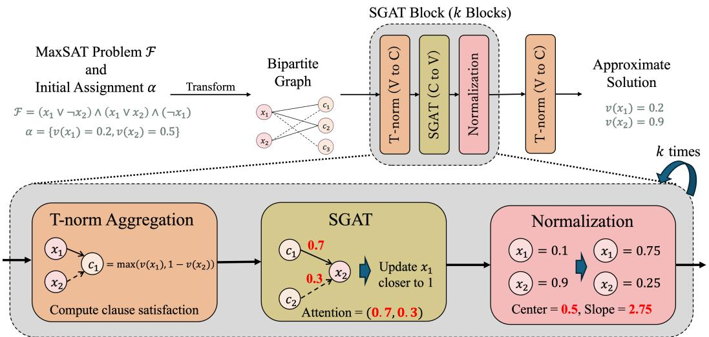  
Figure 1: Architectural Diagram of SGATs. Each SGAT block is composed of a t-norm layer, SGAT layer, and a normalization layer. Red represents the values that are learned.

# 4 SAT-based Graph Attention Network

In this section, we present key building blocks for constructing SGATs as shown in Figure 1. SGATs are composed of three main components: (i) T-norm layers that compute clause valuations $v ( C )$ from the valuations of connected variables $v ( x )$ , (ii) SGAT layers that update the valuations of variables based on the valuations of connected clauses, and (iii) a normalization layer that ensures the valuations of all variables are sufficiently spread out. A single block of SGATs approximates a distributed local search step, with the attention mechanism learning which clauses to focus on, essentially serving as a heuristic. We denote variables by $x _ { i }$ and clauses by $C _ { j }$ , with valuations $v ( x _ { i } ) , v ( C _ { j } ) \in [ 0 , 1 ]$ . For clarity, $v ( x _ { i } )$ and $v ( C _ { j } )$ correspond to features at nodes $h _ { i }$ and $h _ { j + n }$ , respectively.

# 4.1 Graph Representation of MaxSAT Problems

Before applying GNNs to MaxSAT problems, we have to transform them into graphs. To accomplish this, we employ a factor graph representation of given formulas, as done in most prior works involving SAT and MaxSAT Solving [22, 30, 17]. Specifically, we opt for a representation similar to [30], and obtain a bipartite graph with two types of nodes for both the clauses and variables as shown in Figure 2. The positive and negative polarities of the variables are then embedded into the edge features.

While existing graph representations used edge features to mainly differentiate between the polarities of variables, we propose to embed crucial information as edge features, to allow the model to further differentiate between similar connections. We define the edge feature $e _ { i , j + n }$ between variable $x _ { i }$ and clause $C _ { j }$ as follows:

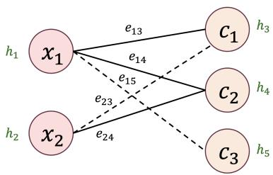  
Figure 2: Bipartite graph for ${ \mathcal { F } } =$ $( x _ { 1 } ^ { - } \lor \lnot x _ { 2 } ) \land ( x _ { 1 } \lor x _ { 2 } ) \land ( \lnot x _ { 1 } )$ . Solid and dashed lines each represent the positive and negative polarities respectively.

$$
e _ { i , j + n } = \{ ( \begin{array} { l l } { ( \frac { 1 } { | \mathcal { N } _ { j } ^ { + } | } , \frac { 1 } { | \mathcal { N } _ { j } ^ { - } | } , 0 , 0 ) \cdot w _ { j } ^ { \mathrm { n o r m } } } & { \mathrm { i f } i \in \mathcal { N } _ { j } ^ { + } } \\ { ( 0 , 0 , \frac { 1 } { | \mathcal { N } _ { j } ^ { + } | } , \frac { 1 } { | \mathcal { N } _ { j } ^ { - } | } ) \cdot w _ { j } ^ { \mathrm { n o r m } } } & { \mathrm { i f } i \in \mathcal { N } _ { j } ^ { - } } \end{array}  ,
$$

Here, $\mathcal { N } _ { j } ^ { + }$ and $\mathcal { N } _ { j } ^ { - }$ correspond to the set of variables with positive and negative polarities included in clause $C _ { j }$ , and $w _ { j } ^ { \mathrm { n o r m } } \in ( 0 , 1 ]$ represents the normalized weight of clause $C _ { j }$ . Note that when the denominator is $_ 0$ , we set the corresponding value to 0. These features align with common strategies

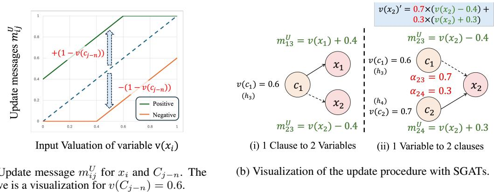  
Figure 3: Illustration of the SGAT layer.

prioritizing shorter clauses over long ones [10], while also giving higher scores to clauses with larger weights; this is especially relevant as edge features are directly used for attention computation.

# 4.2 T-norm Layer: Variable to Clause

Here, we propose the use of t-norm based aggregations when computing clause valuations from connected variable valuations, as shown in the bottom left of Figure 1. By using t-norms, we compute clause valuations continuously while keeping all valuations in $[ 0 , 1 ]$ . Given fuzzy truth degrees $a _ { 1 } , \ldots , a _ { k } \in [ 0 , 1 ]$ the fuzzy conjunctions of these values can be computed using t-norms $T : [ 0 , 1 ] ^ { k } \to [ 0 , 1 ]$ . We specifically use the following three well-known t-norms:

1. Gödel t-norm: $T _ { G } ( a _ { 1 } , \dots , a _ { k } ) = \operatorname* { m i n } ( a _ { 1 } , \dots , a _ { k } )$   
2. Product t-norm: $\begin{array} { r } { T _ { P } ( a _ { 1 } , \dots , a _ { k } ) = \prod _ { i = 1 } ^ { k } a _ { i } } \end{array}$   
3. Łukasiewicz t-norm: $\begin{array} { r } { T _ { L } ( a _ { 1 } , \dots , a _ { k } ) = \operatorname* { m a x } \left( 0 , \sum _ { i = 1 } ^ { k } a _ { i } - ( k - 1 ) \right) } \end{array}$

As each clause is a disjunction of literals, we compute valuations by negating the conjunction of each negated literal. Using strong negation defined as $1 - a$ for $a \in [ 0 , 1 ]$ , we set $\tilde { v } _ { i r } = 1 - v ( x _ { i r } )$ if $l _ { i r } = x _ { i r }$ and $\tilde { v } _ { i r } = v ( x _ { i r } )$ if $l _ { i r } = \lnot x _ { i r }$ for a clause $C _ { i } = l _ { i 1 } \vee \cdots \vee l _ { i \ell _ { i } }$ , and define

$$
v _ { \star } ( C _ { i } ) = 1 - T _ { \star } \bigl ( \tilde { v } _ { i 1 } , \ldots , \tilde { v } _ { i \ell _ { i } } \bigr ) , \qquad \mathrm { w h e r e } \star \in \{ G , P , L \} .
$$

For simplicity, we refer to the clause valuation computed by the chosen t-norm as $v ( C _ { i } )$

Unsupervised Loss Function. By applying a t-norm aggregation, we obtain clause valuations $v ( C _ { k } ) ^ { }$ . We then define a loss function that computes the total cost of the current assignment as:

$$
\mathcal { L } = \frac { \sum _ { k = 1 } ^ { m } w _ { k } \left( 1 - v ( C _ { k } ) \right) ^ { 2 } } { \sum _ { k = 1 } ^ { m } w _ { k } }
$$

where $m$ is the total number of clauses. The equation is a weighted mean squared error of how unsatisfied each clause is, with the weights corresponding to the given weights for each clause. This loss function forces the model to train to minimize the total weight of unsatisfied clauses, without requiring any sort of ground truth labels, with the assumption that a cost of 0 (all clauses satisfied) is the optimal solution.

# 4.3 SGAT Layer: Clause to Variable

To efficiently learn which variables to update, we employ an attention mechanism and a messagepassing function that update the valuations of variables based on the valuations of the clauses to which they are connected (Figure 3b). Specifically, we define the update message $m _ { i j } ^ { U }$ and attention message $m _ { i j } ^ { A }$ between variable $x _ { i }$ and clause $C _ { j - n }$ as follows:

$$
\begin{array} { r l r l r l } { m _ { i j } ^ { U } = } & { \left\{ \begin{array} { l l } { v ( x _ { i } ) + \left( 1 - v ( C _ { j - n } ) \right) } & { \mathrm { i f ~ } i \in \mathcal { N } _ { j - n } ^ { + } } \\ { v ( x _ { i } ) - \left( 1 - v ( C _ { j - n } ) \right) } & { \mathrm { o t h e r w i s e } } \end{array} , \right. } & { \quad m _ { i j } ^ { A } = } & { \left\{ \begin{array} { l l } { m _ { i j } ^ { U } } & { \mathrm { i f ~ } i \in \mathcal { N } _ { j - n } ^ { + } } \\ { 1 - m _ { i j } ^ { U } } & { \mathrm { o t h e r w i s e } } \end{array} \right. } \end{array}
$$

The update messages $m _ { i j } ^ { U }$ represent the valuation the clause requests the variable to move toward, as shown in Figure 3a. The attention messages $m _ { i j } ^ { A }$ represent the strength of this request by flipping the valuation for negatively appearing literals, aligning all messages in a common direction regardless of polarity. Using these messages, Equations (1) and (2) are redefined as:

$$
\begin{array} { r c l } { \epsilon _ { i j } } & { = } & { { \displaystyle \mathrm { L e a k y R e L U } ( \mathbf { a } ^ { T } [ \mathbf { W } m _ { i j } ^ { A } ] | \mathbf { W } _ { e } e _ { i j }  ] } ) } \\ { v ^ { \prime } ( x _ { i } ) } & { = } & { \displaystyle \sum _ { j \in \mathcal { N } _ { i } } \alpha _ { i j } m _ { i j } ^ { U } } \\ & & { } & \end{array}
$$

From the equation, as long as the input valuations $v ( x _ { i } ) \in [ 0 , 1 ]$ , $\alpha _ { i j } \in [ 0 , 1 ]$ , and $\textstyle \sum _ { j \in { \mathcal { N } } _ { i } } \alpha _ { i j } = 1$ , the outputs $v ^ { \prime } ( x _ { i } ) \in [ 0 , 1 ]$ are guaranteed to hold. This eliminates the need for additional activation functions after each layer, simplifying the computation of both variable assignments and the loss function. Additionally, we clamp the values of update messages to range $[ 0 , 1 ]$ whenever they leave the range (possible with certain t-norms). Extensive information on how SGATs handle input-output dimensions is provided in Appendix A.

SGATs are approximations of greedy distributed local search; they perform local search in a fully parallel and greedy manner. After computing clause valuations $v ( C )$ , they send messages $( m _ { i j } ^ { U } )$ to all connected variable nodes (greedy) in parallel, with the strength proportional to how unsatisfied the clause valuation remains $( \overline { { m } } _ { i j } ^ { A } )$ . The variables then use the attention mechanism explained above to decide which clause messages to prioritize, to maximally satisfy those requests from clauses. SGATs learn these distributed local search heuristics through attention, which lead to the best approximations.

Multi-head attention. Velickovic et al. [24] further employed multi-head attention to stabilize the learning process of self-attention for GATs. We also employ the same strategy by computing $K$ independent attention coefficients and averaging the outputs of all heads. As the outputs for each head are guaranteed to be in range [0,1], the final outputs here are also guaranteed to be in range [0,1].

# 4.4 Normalization Layer

To prevent feature values from being overly concentrated or dispersed, we apply a normalization layer based on the sigmoid function, as shown in the bottom right of Figure 1. The normalized feature for node $h _ { i } ^ { \prime } \in [ 0 , 1 ]$ is computed as:

$$
h _ { i } ^ { \prime } = \sigma \big ( \gamma \left( 2 h _ { i } - 1 - k \right) \big )
$$

where $\sigma ( \cdot )$ denotes the sigmoid function, $\gamma$ a parameter for controlling the spread of the values, and $k \in [ - 1 , \dot { 1 } ]$ a parameter for controlling the center of the values. The input feature $h _ { i } \in [ 0 , 1 ]$ is first scaled to the $[ - 1 , 1 ]$ range, after which the sigmoid modulates how close the output is to 0 or 1.

# 4.5 Approximation Ratio of SGATs

In previous works [17, 25], the capabilities of differentiable MaxSAT solvers were evaluated theoretically using the approximation ratio, which is the lower bound of the ratio of the value computed with the algorithm to the optimal value. In [17], a $1 / 2$ -approximation ratio for unweighted MaxSAT is achieved by GNN architectures with hidden dimension sizes dependent on the number of clauses. We can prove that SGATs achieve a $1 / 2$ -approximation for any unweighted Max-EkSAT problem (problems with exactly $k$ literals per clause), and that this guarantee holds with fixed architectural settings independent of the number of clauses. This result establishes a deterministic baseline that helps us understand the theoretical capabilities of SGATs. The details are provided in Appendix E.

# 4.6 Local Search with GNNs

To solve MaxSAT problems with SGATs, we introduce LS-GNN (Local Search with GNN, Algorithm 1), a novel local search solver based on the continuous optimization of SGATs. LS-GNN takes as input a weighted MaxSAT instance $\mathcal { F }$ and returns the best valuation $v _ { \mathrm { b e s t } }$ and cost $\mathcal { C } _ { \mathrm { b e s t } }$ found for a given problem within a time limit. Starting from a random valuation $v$ , SGAT maps the current valuations of variables and clauses to valuations that aim to maximize clause satisfaction. We iteratively optimize SGATs to minimize the loss in Equation (3), moving the valuations toward better solutions.

# Algorithm 1: LS-GNN

In : Weighted MaxSAT instance $\mathcal { F }$ , timeout $T$ .   
Out : Best valuation $v _ { \mathrm { b e s t } }$ and its cost $\mathcal { C } _ { \mathrm { b e s t } }$ .   
1 $v _ { \mathrm { b e s t } } = \emptyset$ , $\mathcal { C } _ { \mathrm { b e s t } } = + \infty$ , $v =$ random assignment   
2 while elapsed time $< T$ do   
3 $k = 0$ , $k _ { \mathrm { l o c a l } } = 0$ , vlocal = ∅, Clocal = +∞   
4 while early stopping $\ge k - k _ { l o c a l }$ do   
5 optimize SGAT with respect to $v$   
6 $\begin{array} { r l } & { \dot { \mathcal { C } } = \mathrm { c o s t } \big ( \mathcal { F } , \mathrm { S G A T } ( \mathcal { F } , \dot { v } ) \big ) } \\ & { { \bf i f } \mathcal { C } < \mathcal { C } _ { l o c a l } \mathrm { t h e n } } \\ & { \quad \big | \begin{array} { l } { { v } _ { \mathrm { l o c a l } } = \mathrm { S G A T } ( \mathcal { F } , v ) , \ k _ { \mathrm { l o c a l } } = k , \ \mathcal { C } _ { \mathrm { l o c a l } } = \mathcal { C } } \\ { { \bf e n d } } \\ { k = k + 1 } \end{array} } \end{array}$   
7   
8   
9   
10   
11 end   
12 if $\mathcal { C } _ { l o c a l } < \mathcal { C } _ { b e s t }$ then   
13 $\begin{array} { r l } { | } & { { } v _ { \mathrm { b e s t } } = v _ { \mathrm { l o c a l } } , \mathcal { C } _ { \mathrm { b e s t } } = \mathcal { C } _ { \mathrm { l o c a l } } } \end{array}$   
14 end   
15 $v = ( 1 - \beta ) \cdot v + \beta \cdot \Delta$   
16 end

To reduce the risk of the algorithm being stuck in a local optimum, we periodically randomize a subset of valuations (L15). This is done by sampling a binary mask $\beta$ via thresholding a uniform random distribution, and injecting new random valuations $\Delta$ for the masked variables. The randomization procedure is triggered whenever the best cost stops improving for early stopping epochs (L4). The parameters early stopping, elapsed time, $\beta$ , and $\Delta$ control the termination and randomization behavior of LS-GNN; their specific values are provided in Appendix A.

While Algorithm 1 used SGATs as the GNN model, it can be used with any arbitrary model that is able to output assignment predictions. For simplicity, we refer to the LS-GNN with SGATs and GATs as LS-SGAT and LS-GAT, respectively.

# 5 Experiments

In this section, we conduct multiple experiments to answer the following questions regarding SGATs: Q1) Are SGATs better than existing GNN architectures? Q2) What component makes our model efficient? and Q3) How can LS-GNN be compared with other continuous solvers? For evaluation, we use instances used in non-partial unweighted and weighted benchmark instances provided in MaxSAT evaluations2, which we denote as MS and WMS (and collectively referred to as $\mathbf { W M S + }$ ). We also prepare a subset of these datasets with instances that are below specific file sizes such as 2MB for purposes such as training, and denote as WMS+(2MB). The training and testing splits are shown in Appendix D.

# 5.1 Model Architecture

To evaluate the effectiveness of our model in learning to solve practical instances (MaxSAT Evaluation benchmark instances), we first conduct experiments using different model architectures. Provided that there is only one work regarding end-to-end MaxSAT solving with GNNs [17], we also compare with models that were built for SAT. Specifically, we use NeuroSAT [22] and GGNN [14] with unsupervised loss functions presented in [19], as they were shown to empirically work well [15]. Specific details regarding models are given in Appendix B.

We compare the model performance on the MS2018(2MB) dataset, with training done on two different datasets: (i) MS2018(2MB), and (ii) SR(U(40,200)), a randomly generated dataset with 40 to 200 variables [22]. We use the satisfied weight ratio as a performance metric, which is defined as:

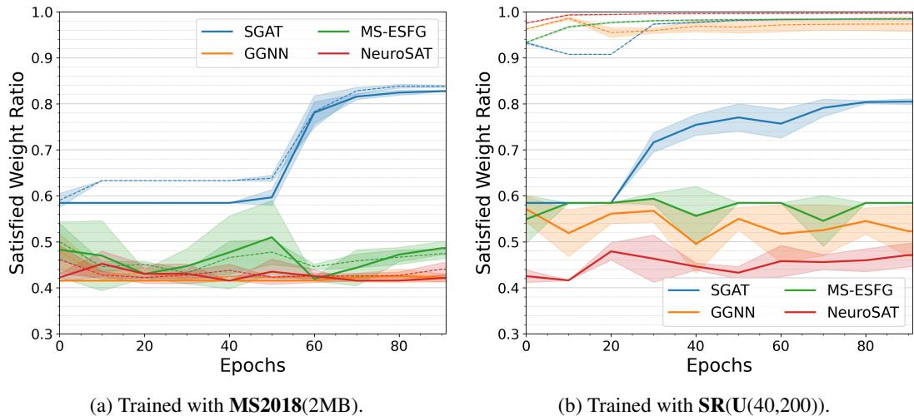  
Figure 4: Comparative analysis of model architectures, with different training datasets. Test sets for both were MS2018(2MB). Solid: Test, Dashed: Train.

$$
{ \mathrm { S a t i s f i e d ~ W e i g h t ~ R a t i o } } = { \frac { \sum _ { k = 1 } ^ { m } w _ { k } \cdot { \mathrm { r o u n d } } { \bigl ( } v _ { G } ( C _ { k } ) { \bigr ) } } { \sum _ { k = 1 } ^ { m } w _ { k } } } ,
$$

where $v _ { G } ( C _ { k } ) \in [ 0 , 1 ]$ is the valuation of clause $C _ { k }$ computed using the Gödel t-norm, $w _ { k }$ is the weight of clause $C _ { k }$ , and $m$ is the total number of clauses. This score represents the ratio of the total weight of satisfied clauses to the total weight of all clauses, with a higher score indicating a strictly better solution.

We used SGATs with 6 SGAT blocks composed with Gödel T-norm layers and SGAT layers with 2 attention heads and 4 channels. For training, we used the Adam optimizer with a learning rate of $2 \times 1 0 ^ { - 3 }$ , and a batch size of 4. For existing models, the default provided settings were used. The number of blocks are generally chosen to strike the best balance between performance and computational efficiency, with the specific empirical results shown in Appendix D.

# 5.1.1 Results

As shown in Figure 4, our model is able to learn to solve from practical instances, while others completely fail to do so. Given that the training dataset consists of problems from various domains, we can infer that SGATs are capable of learning to solve a wide range of problems. Figure 4b further supports this conclusion; even with synthesized datasets, our model is able to learn a distributed local search heuristic that has high performance on practical (non-synthesized) datasets. Overall, this shows our models’ dominant strength in solving MaxSAT problems. Additionally, the scalability difference between existing models and SGATs is shown to be huge, due to the large difference in parameter numbers. For the training with MS2018(2MB), existing architectures could only handle a batch size of 1. In contrast, SGATs could support batch sizes of up to 4, contributing to the high stability of our model. Extensive results are shown and discussed in Appendix D.

# 5.2 Ablation Study

To highlight which components of our model yields the highest performance increase, we performed ablation studies focusing on two points: (a) SGAT and T-norm layer, and (b) types of t-norm. For (a), we consider two variants of our model, one with SGATs swapped to GAT with Sigmoid, and another swapping out the T-norm layers with GATs. As SGATs are dependent on T-norm layers being used, we do not experiment with T-norm layers swapped with SGATs. For (b), we compare using three different fundamental t-norms that have been frequently used for machine learning: Gödel, Product, and Łukasiewicz. The experiments were all performed with $\mathbf { W M S } \mathbf { + } 2 \mathbf { 0 } \mathbf { 1 } \mathbf { 8 } ( 2 \mathbf { M } \mathbf { B } )$ as the training and testing set, with the same model parameters as the previous experiment.

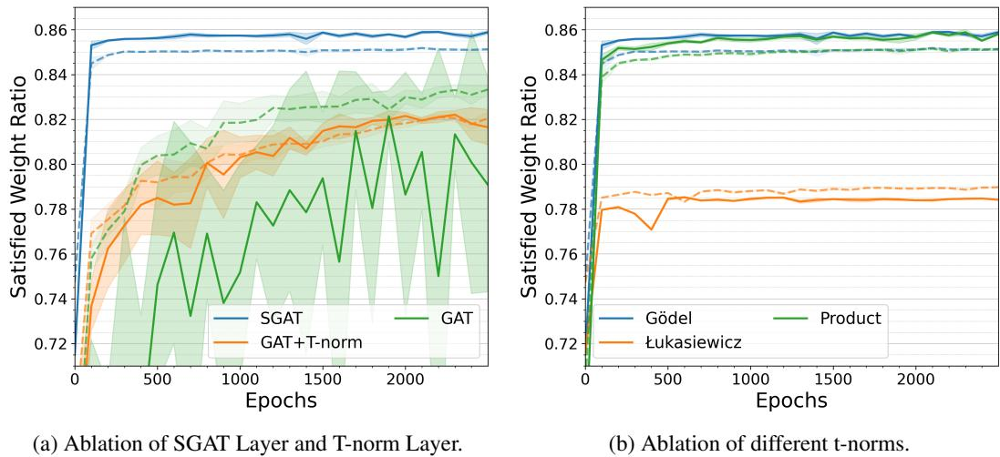  
Figure 5: Results of ablation studies. Training and testing were done on $\mathbf { W M S } { + } 2 \mathbf { 0 } \mathbf { 1 } \mathbf { 8 }$ (2MB). Solid: Test, Dashed: Train.

# 5.2.1 Results

Figure 5 shows the results for each ablation study. From the first ablation study, we can see that our current model architecture achieves the best performance, with significantly high stability. Furthermore, we can see that having the T-norm layer for clause value updates in place of a GAT layer highly increases the stability, even though the total number of trainable layers essentially halve.

From the second ablation study, we can observe that Gödel and Product t-norms work substantially better than Łukasiewicz. This is thought to be because Łukasiewicz outputs 0 when the input values are too low, making the gradients zero in certain regions, hindering the training process. On the other hand, the other two t-norms do not have this issue, resulting in more stable and effective optimization. Additionally, we can observe that Gödel converges slightly faster than Product. This is thought to be due to the compatibility between SGAT layers and Gödel t-norm; as it is guaranteed that no variable will have higher values than the clause it is connected to, the update message never goes out of the range [0,1], removing the need of any clamping procedures.

# 5.3 Local Search with SGATs

In our second experiment, we tested the performance of our solvers based on continuous optimization at approximating solutions on both unweighted and weighted benchmark instances. We used LS-GNN with GATs and SGATs pretrained in the previous experiment (as LS-GAT and LS-SGAT) as backbone models. We compared our solvers to three existing solvers based on continuous optimization: the Mixing method [25], the MIXSAT algorithm [26], and FourierSAT [12]. The default settings were used for all solvers. As the only continuous solver that addresses weighted MaxSAT is FourierSAT, we conduct experiments comparing our model only with FourierSAT on WMS instances. We specifically make implementation changes to support weights, as the original does not do so at default.

To evaluate the approximations computed by each solver, we calculated the incomplete scores, a metric that has been used to evaluate incomplete MaxSAT solvers in recent years of MaxSAT evaluations. The incomplete scores are defined as

$$
\operatorname { s c o r e } ( s , i ) = { \frac { ( 1 + \operatorname { c o s t } \operatorname { o f } \ b e s t \ k n o w n \cos t \operatorname { f o r } i ) } { ( 1 + \operatorname { c o s t } \operatorname { o f } \ s o l u t i o n \ f o r \ i \operatorname { f o u n d } \ b y \ s ) } } ,
$$

where $i$ is the instance and $s$ is the solver used. For reference, we retrieve the best known cost for each instance from the official MaxSAT Evaluation results. We combine this with the best found cost for each dataset and timeout setting, keeping it comparable with existing methods. However, we note that due to our solvers finding better solutions than the competition results, the best known cost is not completely identical to the official results.

Table 1: Average Incomplete Score for solvers based on continuous optimization, evaluated on unweighted (MS) and weighted (WMS) benchmark instances. Bold shows the best score, and underlined show the second best score.   

<table><tr><td rowspan="2">Type</td><td rowspan="2">Solvers</td><td colspan="5"> 60s timeout</td><td colspan="5">300s timeout</td></tr><tr><td>2020</td><td>2021</td><td>2022</td><td>2023</td><td>2024</td><td>2020</td><td>2021</td><td>2022</td><td>2023</td><td>2024</td></tr><tr><td rowspan="5">MS</td><td>Mixing</td><td>0.3729</td><td>0.3442</td><td>0.3864</td><td>0.0703</td><td>0.1564</td><td>0.3603</td><td>0.3443</td><td>0.3864</td><td>0.0703</td><td>0.1564</td></tr><tr><td>MIXSAT</td><td>0.4887</td><td>0.5017</td><td>0.4980</td><td>0.1367</td><td>0.3077</td><td>0.4796</td><td>0.5053</td><td>0.5269</td><td>0.1429</td><td>0.3100</td></tr><tr><td>FourierSAT</td><td>0.4304</td><td>0.4023</td><td>0.3560</td><td>0.1429</td><td>0.1189</td><td>0.4498</td><td>0.4672</td><td>0.4205</td><td>0.1692</td><td>0.1595</td></tr><tr><td>LS-GAT</td><td>0.3948</td><td>0.4268</td><td>0.4839</td><td>0.0331</td><td>0.1284</td><td>0.4281</td><td>0.4359</td><td>0.5263</td><td>0.0919</td><td>0.1413</td></tr><tr><td>LS-SGAT</td><td>0.5237</td><td>0.5420</td><td>0.6202</td><td>0.1653</td><td>0.3516</td><td>0.5289</td><td>0.5541</td><td>0.6403</td><td>0.1828</td><td>0.3684</td></tr><tr><td rowspan="3">WMS</td><td>FourierSAT</td><td>0.2304</td><td>0.3340</td><td>0.4452</td><td>0.2974</td><td>0.0144</td><td>0.2369</td><td>0.3523</td><td>0.4490</td><td>0.2967</td><td>0.0163</td></tr><tr><td>LS-GAT</td><td>0.6936</td><td>0.7197</td><td>0.6925</td><td>0.7636</td><td>0.6650</td><td>0.7384</td><td>0.8005</td><td>0.7283</td><td>0.8216</td><td>0.7156</td></tr><tr><td>LS-SGAT</td><td>0.8499</td><td>0.8973</td><td>0.7587</td><td>0.8432</td><td>0.7816</td><td>0.8342</td><td>0.8835</td><td>0.7594</td><td>0.8471</td><td>0.7840</td></tr></table>

# 5.3.1 Results

Table 1 shows the average incomplete score for each solver depending on the year of evaluation. From the results, we can see that LS-SGAT clearly outperforms every other existing solver based on continuous optimization, with an average improvement of 0.055 for MS, and 0.09 for WMS versus the second best solver. However, we can also observe that the differences are not constant for every year. This is analyzed to be due to the types of problem each year contains; some solvers perform better on specific instances than others. Nevertheless, we can confirm that the overall, SGATs perform significantly better on a wide range of problems compared to existing continuous methods.

Another important factor that we observed was that the size of problems the algorithm was able to handle was much different. While SGATs were able to handle all but one instance, others went over the timelimit on tens to up to hundreds of instances, showing that our model and algorithm scales much better than existing approaches. This is mainly due to the efficiency of GNN architectures; GNNs tend to have much fewer parameters, which are independent of the problem size. We further analyze this with more experimental results in Appendix D.

SGATs as Initialization Heuristics. While our primary concern is to develop a differentiable method for MaxSAT solving, it is worth investigating how SGATs can predict good assignments for a given Weighted MaxSAT instance and whether such a predicted assignment can be used as an initial assignment for a SOTA solver. In this context, we have conducted an additional experiment where the predictions of SGATs are used as initialization heuristics for state-of-the-art incomplete solvers. The results were positive, with incomplete solvers being able to achieve substantially higher incomplete scores when combined with SGATs, supporting our claim that SGATs can work equally well in practical settings. The extensive results are shown in Appendix C.

# 6 Conclusion and Future Work

We presented SGATs as novel GNNs that utilize attention and message passing mechanisms that operate on t-norms. SGAT layers approximate greedy distributed local search, with their heuristics being the main learnable component. To demonstrate the effectiveness of our model, we further developed a continuous local search algorithm that is built on top of SGATs to solve given MaxSAT instances in a continuous manner. Experimental results showed that SGATs train in a highly stable manner, with approximations clearly outperforming those produced by existing neural-based architectures. Our model also outperforms state-of-the-art continuous solving approaches, demonstrating the strength of our model to output good approximations, even against theoretically sound approaches.

Future works will be focused on expanding the current framework to support partial MaxSAT problems, which require the satisfaction of hard clauses, and is known to be difficult for Neural Networks. Another interesting direction would be to incorporate SGATs into machine learning systems for tasks such as recognition and prediction. Especially in neuro-symbolic systems where MaxSAT solvers are used [9], SGATs can easily replace the solvers to allow for end-to-end learning.

# Acknowledgments

This work has been supported by JSPS KAKENHI Grant Number JP25K03190, JST CREST Grant Number JPMJCR22D3 and JST SPRING Grant Number JPMJSP2104, Japan.

References   
[1] Saeed Amizadeh, Sergiy Matusevych, and Markus Weimer. Learning To Solve Circuit-SAT: An Unsupervised Differentiable Approach. In 7th International Conference on Learning Representations, ICLR. OpenReview.net, 2019. URL https://openreview.net/forum? id=BJxgz2R9t7.   
[2] Shaowei Cai and Zhendong Lei. Old techniques in new ways: Clause weighting, unit propagation and hybridization for maximum satisfiability. Artif. Intell., 287:103354, 2020. doi: 10.1016/ J.ARTINT.2020.103354. URL https://doi.org/10.1016/j.artint.2020.103354.   
[3] Quentin Cappart, Didier Chételat, Elias B. Khalil, Andrea Lodi, Christopher Morris, and Petar Velickovic. Combinatorial Optimization and Reasoning with Graph Neural Networks. J. Mach. Learn. Res., 24:130:1–130:61, 2023. URL http://jmlr.org/papers/v24/21-0449.html.   
[4] Wenjing Chang, Hengkai Zhang, and Junwei Luo. Predicting Propositional Satisfiability Based on Graph Attention Networks. Int. J. Comput. Intell. Syst., 15(1):84, 2022. doi: 10.1007/ S44196-022-00139-9. URL https://doi.org/10.1007/s44196-022-00139-9.   
[5] Yi Chu, Shaowei Cai, and Chuan Luo. NuWLS: Improving Local Search for (Weighted) Partial MaxSAT by New Weighting Techniques. In Thirty-Seventh AAAI Conference on Artificial Intelligence, pages 3915–3923. AAAI Press, 2023. doi: 10.1609/AAAI.V37I4.25505. URL https://doi.org/10.1609/aaai.v37i4.25505.   
[6] Artur d’Avila Garcez and Luís C. Lamb. Neurosymbolic AI: the 3rd wave. Artif. Intell. Rev., 56 (11):12387–12406, 2023. doi: 10.1007/S10462-023-10448-W. URL https://doi.org/10. 1007/s10462-023-10448-w.   
[7] Matthias Fey and Jan E. Lenssen. Fast Graph Representation Learning with PyTorch Geometric. In ICLR Workshop on Representation Learning on Graphs and Manifolds, 2019.   
[8] Thomas Fournier, Arnaud Lallouet, Télio Cropsal, Gaël Glorian, Alexandre Papadopoulos, Antoine Petitet, Guillaume Perez, Suruthy Sekar, and Wijnand Suijlen. A Deep Reinforcement Learning Heuristic for SAT based on Antagonist Graph Neural Networks. In 34th IEEE International Conference on Tools with Artificial Intelligence, ICTAI, pages 1218–1222. IEEE, 2022. doi: 10.1109/ICTAI56018.2022.00185. URL https://doi.org/10.1109/ ICTAI56018.2022.00185.   
[9] Eleonora Giunchiglia, Mihaela Catalina Stoian, Salman Khan, Fabio Cuzzolin, and Thomas Lukasiewicz. ROAD-R: the autonomous driving dataset with logical requirements. Mach. Learn., 112(9):3261–3291, 2023. doi: 10.1007/S10994-023-06322-Z. URL https://doi. org/10.1007/s10994-023-06322-z.   
[10] Saïd Jabbour, Jerry Lonlac, Lakhdar Saïs, and Yakoub Salhi. Revisiting the Learned Clauses Database Reduction Strategies. Int. J. Artif. Intell. Tools, 27(8):1850033:1– 1850033:19, 2018. doi: 10.1142/S0218213018500331. URL https://doi.org/10.1142/ S0218213018500331.   
[11] Vitaly Kurin, Saad Godil, Shimon Whiteson, and Bryan Catanzaro. Can Q-Learning with Graph Networks Learn a Generalizable Branching Heuristic for a SAT Solver? In Advances in Neural Information Processing Systems 33: Annual Conference on Neural Information Processing Systems, 2020. URL https://proceedings.neurips.cc/paper/2020/hash/ 6d70cb65d15211726dcce4c0e971e21c-Abstract.html.   
[12] Anastasios Kyrillidis, Anshumali Shrivastava, Moshe Y. Vardi, and Zhiwei Zhang. FourierSAT: A Fourier Expansion-Based Algebraic Framework for Solving Hybrid Boolean Constraints. In The Thirty-Fourth AAAI Conference on Artificial Intelligence, AAAI 2020, pages 1552–1560.

AAAI Press, 2020. doi: 10.1609/AAAI.V34I02.5515. URL https://doi.org/10.1609/ aaai.v34i02.5515.

[13] Luís C. Lamb, Artur S. d’Avila Garcez, Marco Gori, Marcelo O. R. Prates, Pedro H. C. Avelar, and Moshe Y. Vardi. Graph Neural Networks Meet Neural-Symbolic Computing: A Survey and Perspective. In Proceedings of the Twenty-Ninth International Joint Conference on Artificial Intelligence, IJCAI 2020, pages 4877–4884. ijcai.org, 2020. doi: 10.24963/IJCAI.2020/679. URL https://doi.org/10.24963/ijcai.2020/679.

[14] Yujia Li, Daniel Tarlow, Marc Brockschmidt, and Richard S. Zemel. Gated Graph Sequence Neural Networks. In 4th International Conference on Learning Representations, ICLR 2016, Conference Track Proceedings, 2016. URL http://arxiv.org/abs/1511.05493.

[15] Zhaoyu Li, Jinpei Guo, and Xujie Si. G4SATBench: Benchmarking and Advancing SAT Solving with Graph Neural Networks. Trans. Mach. Learn. Res., 2024, 2024. URL https: //openreview.net/forum?id=7VB5db72lr.

[16] Chanjuan Liu, Guangyuan Liu, Chuan Luo, Shaowei Cai, Zhendong Lei, Wenjie Zhang, Yi Chu, and Guojing Zhang. Optimizing local search-based partial MaxSAT solving via initial assignment prediction. Science China Information Sciences, 68(2):122101–122101, 2024. doi: 10.1007/s11432-023-3900-7. URL https://doi.org/10.1007/s11432-023-3900-7.

[17] Minghao Liu, Fuqi Jia, Pei Huang, Fan Zhang, Yuchen Sun, Shaowei Cai, Feifei Ma, and Jian Zhang. Can Graph Neural Networks Learn to Solve MaxSAT Problem? CoRR, abs/2111.07568, 2021. URL https://arxiv.org/abs/2111.07568.

[18] Sota Moriyama, Koji Watanabe, and Katsumi Inoue. GNN Based Extraction of Minimal Unsatisfiable Subsets. In Inductive Logic Programming - 32nd International Conference, ILP 2023, volume 14363 of Lecture Notes in Computer Science, pages 77–92. Springer, 2023. doi: 10.1007/978-3-031-49299-0\_6. URL https://doi.org/10.1007/978-3-031-49299-0_ 6.

[19] Emils Ozolins, Karlis Freivalds, Andis Draguns, Eliza Gaile, Ronalds Zakovskis, and Sergejs Kozlovics. Goal-Aware Neural SAT Solver. In International Joint Conference on Neural Networks, IJCNN 2022, Padua, Italy, July 18-23, 2022, pages 1–8. IEEE, 2022. doi: 10. 1109/IJCNN55064.2022.9892733. URL https://doi.org/10.1109/IJCNN55064.2022. 9892733.

[20] Md. Kamruzzaman Sarker, Lu Zhou, Aaron Eberhart, and Pascal Hitzler. Neuro-symbolic artificial intelligence. AI Commun., 34(3):197–209, 2021. doi: 10.3233/AIC-210084. URL https://doi.org/10.3233/AIC-210084.

[21] Daniel Selsam and Nikolaj S. Bjørner. Guiding High-Performance SAT Solvers with Unsat-Core Predictions. In Mikolás Janota and Inês Lynce, editors, Theory and Applications of Satisfiability Testing - SAT 2019 - 22nd International Conference, volume 11628 of Lecture Notes in Computer Science, pages 336–353. Springer, 2019. doi: 10.1007/978-3-030-24258-9\_24. URL https: //doi.org/10.1007/978-3-030-24258-9_24.

[22] Daniel Selsam, Matthew Lamm, Benedikt Bünz, Percy Liang, Leonardo de Moura, and David L. Dill. Learning a SAT Solver from Single-Bit Supervision. In 7th International Conference on Learning Representations, ICLR 2019. OpenReview.net, 2019. URL https://openreview. net/forum?id=HJMC_iA5tm.

[23] Jan Tönshoff, Berke Kisin, Jakob Lindner, and Martin Grohe. One Model, Any CSP: Graph Neural Networks as Fast Global Search Heuristics for Constraint Satisfaction. In Proceedings of the Thirty-Second International Joint Conference on Artificial Intelligence, IJCAI 2023, pages 4280–4288. ijcai.org, 2023. doi: 10.24963/IJCAI.2023/476. URL https://doi.org/10. 24963/ijcai.2023/476.

[24] Petar Velickovic, Guillem Cucurull, Arantxa Casanova, Adriana Romero, Pietro Liò, and Yoshua Bengio. Graph Attention Networks. In 6th International Conference on Learning Representations, ICLR 2018. OpenReview.net, 2018. URL https://openreview.net/forum?id= rJXMpikCZ.

[25] Po-Wei Wang and J. Zico Kolter. Low-Rank Semidefinite Programming for the MAX2SAT Problem. In The Thirty-Third AAAI Conference on Artificial Intelligence, AAAI 2019, pages 1641–1649. AAAI Press, 2019. doi: 10.1609/AAAI.V33I01.33011641. URL https://doi. org/10.1609/aaai.v33i01.33011641.

[26] Po-Wei Wang, Wei-Cheng Chang, and J. Zico Kolter. The Mixing method: coordinate descent for low-rank semidefinite programming. CoRR, abs/1706.00476, 2017. URL http://arxiv. org/abs/1706.00476.

[27] Po-Wei Wang, Priya L. Donti, Bryan Wilder, and J. Zico Kolter. SATNet: Bridging deep learning and logical reasoning using a differentiable satisfiability solver. In Proceedings of the 36th International Conference on Machine Learning, ICML 2019, volume 97 of Proceedings of Machine Learning Research, pages 6545–6554. PMLR, 2019. URL http://proceedings. mlr.press/v97/wang19e.html.

[28] Meixi Wu, Wenya Wang, and Sinno Jialin Pan. Deep Weighted MaxSAT for Aspectbased Opinion Extraction. In Proceedings of the 2020 Conference on Empirical Methods in Natural Language Processing, EMNLP 2020, pages 5618–5628. Association for Computational Linguistics, 2020. doi: 10.18653/V1/2020.EMNLP-MAIN.453. URL https: //doi.org/10.18653/v1/2020.emnlp-main.453.

[29] Zhun Yang, Adam Ishay, and Joohyung Lee. Learning to Solve Constraint Satisfaction Problems with Recurrent Transformer. In The Eleventh International Conference on Learning Representations, ICLR 2023. OpenReview.net, 2023. URL https://openreview.net/forum?id $=$ udNhDCr2KQe.

[30] Emre Yolcu and Barnabás Póczos. Learning Local Search Heuristics for Boolean Satisfiability. In Advances in Neural Information Processing Systems 32: Annual Conference on Neural Information Processing Systems 2019, NeurIPS 2019, pages 7990–8001, 2019. URL https://proceedings.neurips.cc/paper/2019/hash/ 12e59a33dea1bf0630f46edfe13d6ea2-Abstract.html.

[31] Wenjie Zhang, Zeyu Sun, Qihao Zhu, Ge Li, Shaowei Cai, Yingfei Xiong, and Lu Zhang. NLocalSAT: Boosting Local Search with Solution Prediction. In Proceedings of the TwentyNinth International Joint Conference on Artificial Intelligence, IJCAI 2020, pages 1177–1183. ijcai.org, 2020. doi: 10.24963/IJCAI.2020/164. URL https://doi.org/10.24963/ijcai. 2020/164.

[32] Jiongzhi Zheng, Kun He, Jianrong Zhou, Yan Jin, Chu-Min Li, and Felip Manyà. BandMaxSAT: A Local Search MaxSAT Solver with Multi-armed Bandit. In Proceedings of the ThirtyFirst International Joint Conference on Artificial Intelligence, IJCAI 2022, Vienna, Austria, 23-29 July 2022, pages 1901–1907. ijcai.org, 2022. doi: 10.24963/IJCAI.2022/264. URL https://doi.org/10.24963/ijcai.2022/264.

[33] Jiongzhi Zheng, Zhuo Chen, Chu-Min Li, and Kun He. Rethinking the Soft Conflict Pseudo Boolean Constraint on MaxSAT Local Search Solvers. In Proceedings of the Thirty-Third International Joint Conference on Artificial Intelligence, IJCAI 2024, pages 1989–1997. ijcai.org, 2024. URL https://www.ijcai.org/proceedings/2024/220.

# NeurIPS Paper Checklist

# 1. Claims

Question: Do the main claims made in the abstract and introduction accurately reflect the paper’s contributions and scope?

Answer: [Yes]

Justification: The abstract and introduction clearly state that the paper proposes SGATs and uses them for solving MaxSAT problems using continuous optimization, which matches the core contributions evaluated through experiments (Sections 3, 5, and 6).

Guidelines:

• The answer NA means that the abstract and introduction do not include the claims made in the paper.   
• The abstract and/or introduction should clearly state the claims made, including the contributions made in the paper and important assumptions and limitations. A No or NA answer to this question will not be perceived well by the reviewers.   
• The claims made should match theoretical and experimental results, and reflect how much the results can be expected to generalize to other settings.   
• It is fine to include aspirational goals as motivation as long as it is clear that these goals are not attained by the paper.

# 2. Limitations

Question: Does the paper discuss the limitations of the work performed by the authors?

Answer: [Yes]

Justification: The paper discusses how the proposed method currently does not support partial MaxSAT and that integration into complete solvers remains future work (Section 6). An extensive discussion is given in Appendix F.

Guidelines:

• The answer NA means that the paper has no limitation while the answer No means that the paper has limitations, but those are not discussed in the paper.   
• The authors are encouraged to create a separate "Limitations" section in their paper. The paper should point out any strong assumptions and how robust the results are to violations of these assumptions (e.g., independence assumptions, noiseless settings, model well-specification, asymptotic approximations only holding locally). The authors should reflect on how these assumptions might be violated in practice and what the implications would be.   
The authors should reflect on the scope of the claims made, e.g., if the approach was only tested on a few datasets or with a few runs. In general, empirical results often depend on implicit assumptions, which should be articulated.   
The authors should reflect on the factors that influence the performance of the approach. For example, a facial recognition algorithm may perform poorly when image resolution is low or images are taken in low lighting. Or a speech-to-text system might not be used reliably to provide closed captions for online lectures because it fails to handle technical jargon.   
• The authors should discuss the computational efficiency of the proposed algorithms and how they scale with dataset size.   
• If applicable, the authors should discuss possible limitations of their approach to address problems of privacy and fairness.   
• While the authors might fear that complete honesty about limitations might be used by reviewers as grounds for rejection, a worse outcome might be that reviewers discover limitations that aren’t acknowledged in the paper. The authors should use their best judgment and recognize that individual actions in favor of transparency play an important role in developing norms that preserve the integrity of the community. Reviewers will be specifically instructed to not penalize honesty concerning limitations.

# 3. Theory assumptions and proofs

Question: For each theoretical result, does the paper provide the full set of assumptions and a complete (and correct) proof?

Answer: [Yes]

Justification: The appendix contains a complete proof (Appendix E), and all assumptions are clearly stated.

Guidelines:

• The answer NA means that the paper does not include theoretical results.   
• All the theorems, formulas, and proofs in the paper should be numbered and crossreferenced.   
• All assumptions should be clearly stated or referenced in the statement of any theorems.   
• The proofs can either appear in the main paper or the supplemental material, but if they appear in the supplemental material, the authors are encouraged to provide a short proof sketch to provide intuition.   
Inversely, any informal proof provided in the core of the paper should be complemented by formal proofs provided in appendix or supplemental material.   
• Theorems and Lemmas that the proof relies upon should be properly referenced.

# 4. Experimental result reproducibility

Question: Does the paper fully disclose all the information needed to reproduce the main experimental results of the paper to the extent that it affects the main claims and/or conclusions of the paper (regardless of whether the code and data are provided or not)?

Answer: [Yes]

Justification: The paper describes model architecture, training setup, evaluation metrics, and datasets used (Section 5), with additional details provided in Appendix D.

Guidelines:

• The answer NA means that the paper does not include experiments.   
• If the paper includes experiments, a No answer to this question will not be perceived well by the reviewers: Making the paper reproducible is important, regardless of whether the code and data are provided or not.   
• If the contribution is a dataset and/or model, the authors should describe the steps taken to make their results reproducible or verifiable.   
• Depending on the contribution, reproducibility can be accomplished in various ways. For example, if the contribution is a novel architecture, describing the architecture fully might suffice, or if the contribution is a specific model and empirical evaluation, it may be necessary to either make it possible for others to replicate the model with the same dataset, or provide access to the model. In general. releasing code and data is often one good way to accomplish this, but reproducibility can also be provided via detailed instructions for how to replicate the results, access to a hosted model (e.g., in the case of a large language model), releasing of a model checkpoint, or other means that are appropriate to the research performed. While NeurIPS does not require releasing code, the conference does require all submissions to provide some reasonable avenue for reproducibility, which may depend on the nature of the contribution. For example   
(a) If the contribution is primarily a new algorithm, the paper should make it clear how to reproduce that algorithm.   
(b) If the contribution is primarily a new model architecture, the paper should describe the architecture clearly and fully.   
(c) If the contribution is a new model (e.g., a large language model), then there should either be a way to access this model for reproducing the results or a way to reproduce the model (e.g., with an open-source dataset or instructions for how to construct the dataset).   
(d) We recognize that reproducibility may be tricky in some cases, in which case authors are welcome to describe the particular way they provide for reproducibility. In the case of closed-source models, it may be that access to the model is limited in some way (e.g., to registered users), but it should be possible for other researchers to have some path to reproducing or verifying the results.

# 5. Open access to data and code

Question: Does the paper provide open access to the data and code, with sufficient instructions to faithfully reproduce the main experimental results, as described in supplemental material?

Answer: [Yes]

Justification: The datasets are from publicly available MaxSAT evaluations. The code is available at https://github.com/sotam2369/SGAT-MS.

Guidelines:

• The answer NA means that paper does not include experiments requiring code.   
• Please see the NeurIPS code and data submission guidelines (https://nips.cc/ public/guides/CodeSubmissionPolicy) for more details.   
• While we encourage the release of code and data, we understand that this might not be possible, so “No” is an acceptable answer. Papers cannot be rejected simply for not including code, unless this is central to the contribution (e.g., for a new open-source benchmark).   
• The instructions should contain the exact command and environment needed to run to reproduce the results. See the NeurIPS code and data submission guidelines (https: //nips.cc/public/guides/CodeSubmissionPolicy) for more details.   
• The authors should provide instructions on data access and preparation, including how to access the raw data, preprocessed data, intermediate data, and generated data, etc.   
• The authors should provide scripts to reproduce all experimental results for the new proposed method and baselines. If only a subset of experiments are reproducible, they should state which ones are omitted from the script and why.   
• At submission time, to preserve anonymity, the authors should release anonymized versions (if applicable).   
• Providing as much information as possible in supplemental material (appended to the paper) is recommended, but including URLs to data and code is permitted.

# 6. Experimental setting/details

Question: Does the paper specify all the training and test details (e.g., data splits, hyperparameters, how they were chosen, type of optimizer, etc.) necessary to understand the results?

Answer: [Yes]

Justification: Section 5 and Appendix D detail the model parameters, optimizers, datasets, and training protocol. More information can be found in the repository.

Guidelines:

• The answer NA means that the paper does not include experiments. • The experimental setting should be presented in the core of the paper to a level of detail that is necessary to appreciate the results and make sense of them. • The full details can be provided either with the code, in appendix, or as supplemental material.

# 7. Experiment statistical significance

Question: Does the paper report error bars suitably and correctly defined or other appropriate information about the statistical significance of the experiments?

Answer: [Yes]

Justification: Experiments were conducted multiple times, and the graphs are clearly accompanies by error bars. The appendix also provides a detailed description of the experimental results.

Guidelines:

• The answer NA means that the paper does not include experiments. • The authors should answer "Yes" if the results are accompanied by error bars, confidence intervals, or statistical significance tests, at least for the experiments that support the main claims of the paper.

• The factors of variability that the error bars are capturing should be clearly stated (for example, train/test split, initialization, random drawing of some parameter, or overall run with given experimental conditions).   
• The method for calculating the error bars should be explained (closed form formula, call to a library function, bootstrap, etc.)   
• The assumptions made should be given (e.g., Normally distributed errors).   
• It should be clear whether the error bar is the standard deviation or the standard error of the mean.   
• It is OK to report 1-sigma error bars, but one should state it. The authors should preferably report a 2-sigma error bar than state that they have a $96 \%$ CI, if the hypothesis of Normality of errors is not verified.   
• For asymmetric distributions, the authors should be careful not to show in tables or figures symmetric error bars that would yield results that are out of range (e.g. negative error rates).   
• If error bars are reported in tables or plots, The authors should explain in the text how they were calculated and reference the corresponding figures or tables in the text.

# 8. Experiments compute resources

Question: For each experiment, does the paper provide sufficient information on the computer resources (type of compute workers, memory, time of execution) needed to reproduce the experiments?

Answer: [Yes]

Justification: The appendix describes the compute setup including GPU usage and timeout thresholds.

Guidelines:

• The answer NA means that the paper does not include experiments.   
• The paper should indicate the type of compute workers CPU or GPU, internal cluster, or cloud provider, including relevant memory and storage.   
• The paper should provide the amount of compute required for each of the individual experimental runs as well as estimate the total compute.   
• The paper should disclose whether the full research project required more compute than the experiments reported in the paper (e.g., preliminary or failed experiments that didn’t make it into the paper).

# 9. Code of ethics

Question: Does the research conducted in the paper conform, in every respect, with the NeurIPS Code of Ethics https://neurips.cc/public/EthicsGuidelines?

Answer: [Yes]

Justification: No ethical issues arise; standard datasets and models are used, and no sensitive or human data is involved.

Guidelines:

• The answer NA means that the authors have not reviewed the NeurIPS Code of Ethics.   
• If the authors answer No, they should explain the special circumstances that require a deviation from the Code of Ethics.   
• The authors should make sure to preserve anonymity (e.g., if there is a special consideration due to laws or regulations in their jurisdiction).

# 10. Broader impacts

Question: Does the paper discuss both potential positive societal impacts and negative societal impacts of the work performed?

Answer: [Yes]

Justification: The conclusion highlights possible integration into neuro-symbolic systems and other ML pipelines, noting both performance and deployment benefits. An extensive discussion is given in Appendix G.

# Guidelines:

• The answer NA means that there is no societal impact of the work performed.   
• If the authors answer NA or No, they should explain why their work has no societal impact or why the paper does not address societal impact.   
• Examples of negative societal impacts include potential malicious or unintended uses (e.g., disinformation, generating fake profiles, surveillance), fairness considerations (e.g., deployment of technologies that could make decisions that unfairly impact specific groups), privacy considerations, and security considerations.   
• The conference expects that many papers will be foundational research and not tied to particular applications, let alone deployments. However, if there is a direct path to any negative applications, the authors should point it out. For example, it is legitimate to point out that an improvement in the quality of generative models could be used to generate deepfakes for disinformation. On the other hand, it is not needed to point out that a generic algorithm for optimizing neural networks could enable people to train models that generate Deepfakes faster.   
The authors should consider possible harms that could arise when the technology is being used as intended and functioning correctly, harms that could arise when the technology is being used as intended but gives incorrect results, and harms following from (intentional or unintentional) misuse of the technology. If there are negative societal impacts, the authors could also discuss possible mitigation strategies (e.g., gated release of models, providing defenses in addition to attacks, mechanisms for monitoring misuse, mechanisms to monitor how a system learns from feedback over time, improving the efficiency and accessibility of ML).

# 11. Safeguards

Question: Does the paper describe safeguards that have been put in place for responsible release of data or models that have a high risk for misuse (e.g., pretrained language models, image generators, or scraped datasets)?

Answer: [NA]

Justification: The paper introduces no high-risk model or dataset requiring special safeguards.

Guidelines:

• The answer NA means that the paper poses no such risks.   
• Released models that have a high risk for misuse or dual-use should be released with necessary safeguards to allow for controlled use of the model, for example by requiring that users adhere to usage guidelines or restrictions to access the model or implementing safety filters.   
• Datasets that have been scraped from the Internet could pose safety risks. The authors should describe how they avoided releasing unsafe images.   
• We recognize that providing effective safeguards is challenging, and many papers do not require this, but we encourage authors to take this into account and make a best faith effort.

# 12. Licenses for existing assets

Question: Are the creators or original owners of assets (e.g., code, data, models), used in the paper, properly credited and are the license and terms of use explicitly mentioned and properly respected?

Answer: [Yes]

Justification: All datasets and methods are cited properly with references to their original publications and public repositories.

Guidelines:

• The answer NA means that the paper does not use existing assets. • The authors should cite the original paper that produced the code package or dataset. • The authors should state which version of the asset is used and, if possible, include a URL.

• The name of the license (e.g., CC-BY 4.0) should be included for each asset.   
• For scraped data from a particular source (e.g., website), the copyright and terms of service of that source should be provided.   
• If assets are released, the license, copyright information, and terms of use in the package should be provided. For popular datasets, paperswithcode.com/datasets has curated licenses for some datasets. Their licensing guide can help determine the license of a dataset.   
• For existing datasets that are re-packaged, both the original license and the license of the derived asset (if it has changed) should be provided.   
• If this information is not available online, the authors are encouraged to reach out to the asset’s creators.

# 13. New assets

Question: Are new assets introduced in the paper well documented and is the documentation provided alongside the assets?

Answer: [Yes]

Justification: The SGAT model is novel, and its details are fully described in the paper with implementation provided in the repository.

Guidelines:

• The answer NA means that the paper does not release new assets.   
• Researchers should communicate the details of the dataset/code/model as part of their submissions via structured templates. This includes details about training, license, limitations, etc.   
• The paper should discuss whether and how consent was obtained from people whose asset is used.   
• At submission time, remember to anonymize your assets (if applicable). You can either create an anonymized URL or include an anonymized zip file.

# 14. Crowdsourcing and research with human subjects

Question: For crowdsourcing experiments and research with human subjects, does the paper include the full text of instructions given to participants and screenshots, if applicable, as well as details about compensation (if any)?

Answer: [NA]

Justification: No human subjects or crowdsourcing were involved.

Guidelines:

• The answer NA means that the paper does not involve crowdsourcing nor research with human subjects.   
• Including this information in the supplemental material is fine, but if the main contribution of the paper involves human subjects, then as much detail as possible should be included in the main paper.   
• According to the NeurIPS Code of Ethics, workers involved in data collection, curation, or other labor should be paid at least the minimum wage in the country of the data collector.

# 15. Institutional review board (IRB) approvals or equivalent for research with human subjects

Question: Does the paper describe potential risks incurred by study participants, whether such risks were disclosed to the subjects, and whether Institutional Review Board (IRB) approvals (or an equivalent approval/review based on the requirements of your country or institution) were obtained?

Answer: [NA]

Justification: No human subject data was used.

Guidelines:

• The answer NA means that the paper does not involve crowdsourcing nor research with human subjects.

• Depending on the country in which research is conducted, IRB approval (or equivalent) may be required for any human subjects research. If you obtained IRB approval, you should clearly state this in the paper.   
• We recognize that the procedures for this may vary significantly between institutions and locations, and we expect authors to adhere to the NeurIPS Code of Ethics and the guidelines for their institution.   
• For initial submissions, do not include any information that would break anonymity (if applicable), such as the institution conducting the review.

# 16. Declaration of LLM usage

Question: Does the paper describe the usage of LLMs if it is an important, original, or non-standard component of the core methods in this research? Note that if the LLM is used only for writing, editing, or formatting purposes and does not impact the core methodology, scientific rigorousness, or originality of the research, declaration is not required.

Answer: [NA]

Justification: LLMs were not used for method development or experiments.

Guidelines:

• The answer NA means that the core method development in this research does not involve LLMs as any important, original, or non-standard components. • Please refer to our LLM policy (https://neurips.cc/Conferences/2025/LLM) for what should or should not be described.

# A Additional Details on SGATs

# A.1 SGAT Architecture

The SGAT model begins with a lightweight initializer module that transforms the input variable assignment into a hidden embedding. This module is implemented as a single-layer MLP:

$$
\mathbf { i n i t } ( x ) = \sigma ( \mathbf { W } \cdot x + b )
$$

where $x \in \mathbb { R } ^ { n \times 1 }$ is the initial assignment (usually $x _ { i } \sim \mathrm { U n i f o r m } ( 0 , 1 ) )$ , $\sigma$ is a sigmoid activation, and W is a learned weight matrix mapping from dimension 1 to the hidden dimension $d$ .

The purpose of the initializer is to project scalar input values into a richer embedding space before message passing begins. This allows the attention mechanism in subsequent SGAT blocks to operate over informative feature vectors rather than raw values.

Empirically, this step contributes to faster convergence and higher clause satisfaction, especially during early training. The initializer is shared across all variables and does not depend on graph structure, ensuring a consistent embedding style for all inputs.

On the other hand, outputs are simply averaged, essentially making the final assignment of variables a vote over all hidden dimensions.

# A.2 Early Stopping and Random Restarts for LS-GNN

During the search we combine per-instance early stopping with controlled variable perturbation and occasional random restarts to avoid local optima. Each instance maintains its own early-stopping counter and patience, which is adaptively increased when significant improvements are observed; when the counter triggers, we do not fully reinitialize the assignment. Instead a binary mask $\beta$ is sampled by thresholding a uniform distribution at per-instance probability $p$ (the probabilities cycle through a schedule such as $\{ 0 . 1 , 0 . 2 , 0 . 3 , 0 . 5 , 1 . 0 \bar { \} }$ on successive triggers). New random values $\Delta$ are sampled and used to replace only the subset of variables selected by $\beta$ , preserving useful partial assignments while injecting diversity. Occasionally, when prolonged stagnation occurs, we perform a full random restart. This adaptive combination of targeted perturbation and occasional restarts balances local exploitation and global exploration, improving the solver’s ability to escape local minima while retaining promising partial solutions.

# B GNN Architectures

Table 2: Training configurations for GNN baselines. All models were trained for 100 epochs with early stopping and learning rate scheduling. The MS-ESFG configuration was manually added for comparison.   

<table><tr><td>Model</td><td>Graph</td><td>Iterations</td><td>Hidden Dim</td><td>LR</td><td>Weight Decay</td></tr><tr><td>GGNN [14]</td><td>VCG</td><td>32</td><td>64</td><td>0.002</td><td>1×10-8</td></tr><tr><td>NeuroSAT [22]</td><td>LCG</td><td>32</td><td>128</td><td>0.002</td><td>1×10-8</td></tr><tr><td>MS-ESFG [17]</td><td>VCG</td><td>20</td><td>128</td><td>2 ×10-5</td><td>1 ×10-10</td></tr></table>

GGNN [14]: A gated graph neural network architecture that uses GRU-style updates to propagate information over graph nodes. It has been commonly used for reasoning tasks due to its recurrent structure.

NeuroSAT [22]: A message passing neural network designed for satisfiability problems, using symmetric updates over literals and clauses on the LCG (literal-clause graph).

MS-ESFG [17]: A GNN architecture proposed by Liu et al. [17] for learning to solve MaxSAT. It uses edge-splitting factor graphs (ESFG) with a transformer-style encoder and was evaluated on synthetic MaxSAT benchmarks.

VCG and LCG VCG (Variable-Clause Graph) is a bipartite graph representation where nodes correspond to variables and clauses, with edges indicating the inclusion of a variable (or its negation)

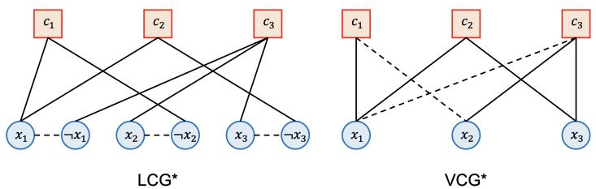  
Figure 6: Visual comparison between VCG and LCG representations, as shown in [15].

in a clause. Polarity (positive or negative) is often encoded as edge features. LCG (Literal-Clause Graph), used in NeuroSAT, instead treats each literal (i.e., $x _ { i }$ and $\neg x _ { i }$ ) as a separate node, resulting in a more fine-grained graph with symmetric updates between literal and clause nodes (see Figure 6).

To implement all GNNs above, including GGNN, NeuroSAT, and MS-ESFG, we utilized the opensource G4SATBench framework [15], which provides standardized model definitions, training procedures, and evaluation protocols for GNN-based SAT solvers. This ensures consistency across implementations and allows for fair comparison under unified training and evaluation settings. Additionally, we modified the evaluation routine to calculate Clause Satisfaction, as defined and used in the main paper shown in Section 5.1.

# B.1 Unsupervised Loss Function

All models were trained using the unsupervised loss function originally proposed by Ozolins et al. [19]. Let $v ( x _ { i } ) \in [ 0 , 1 ]$ denote the valuation assigned to variable $x _ { i }$ . The loss is defined as

$$
\mathcal { L } _ { \phi } ( v ) = - \sum _ { C \in \phi } \log \left( 1 - \prod _ { x _ { i } \in C ^ { + } } \left( 1 - v ( x _ { i } ) \right) \prod _ { x _ { i } \in C ^ { - } } v ( x _ { i } ) \right) ,
$$

where $C ^ { + }$ and $C ^ { - }$ denote the sets of variables appearing positively and negatively in clause $C$ , respectively. This formulation provides a smooth and fully differentiable estimate of clause valuations, allowing effective training without ground-truth labels.

# Algorithm 2: SLS solver with SGAT-Based initialization

Input :MaxSAT instance $\mathcal { F }$ , timeout $T$ .   
Output :Best solution found $x _ { \mathrm { b e s t } }$ and its cost $C _ { \mathrm { b e s t } }$ .   
1 $x _ { \mathrm { b e s t } } = \emptyset$ , $C _ { \mathrm { b e s t } } = + \infty$   
2 while elapsed time $< T$ do   
3 $x = { \tt S G A T }$ _Initialize $( \mathcal { F } )$   
4 while Restart condition not reached do   
5 $C = \cos \mathtt { t } ( x )$   
6 if $C < C _ { b e s t }$ then   
7 $\begin{array} { r l } { | } & { { } x _ { \mathrm { b e s t } } = x , \ C _ { \mathrm { b e s t } } = C } \end{array}$   
8 end   
9 l = SelectVariable()   
10 Flip(x, l)   
11 end   
1 2 end   
13 return xbest, $C _ { \mathrm { b e s t } }$

# Algorithm 3: SGAT-Based Initialization

Input :MaxSAT instance $\mathcal { F }$ .   
Output :Initial assignment $x$ .   
1 $v ( x ) ^ { \mathrm { { 0 } } } = \mathtt { R a n d o m A s s i g n m e n t ( ) }$   
2 $v ( x ) ^ { \mathrm { S G A T } } = \mathtt { S G A T } ( { \mathcal F } , v ( x ) ^ { 0 } )$   
3 foreach variable $x _ { i }$ in $\mathcal { F }$ do   
4 if Uni ${ } ; f o r m ( 0 , 1 ) < v ( x ) _ { i } ^ { S G A T }$ then   
5 $x _ { i } = 1$   
6 else   
7 $x _ { i } = 0$   
8 end   
9 end   
10 return $x$

# C SGATs as Initialization Heuristics

# C.1 Stochastic Local Search with SGAT

We propose SLS-SGAT (Stochastic Local Search with SGAT), a solver that integrates SGAT predictions as initialization heuristics for state-of-the-art SLS solvers, as shown in Algorithms 2 and 3. This builds on prior work that uses GNN predictions for heuristic guidance in SAT solvers [31], but introduces a novel variable assignment scheme based entirely on SGAT predictions. Specifically, each variable is initialized based on thresholding its predicted value, enabling the solver to take full advantage of the inductive biases learned by SGATs.

In principle, this approach can be applied to any SLS solver that relies on random initialization. In this paper, we evaluate this technique by modifying four SOTA solvers to follow the SGAT-based initialization scheme shown in Algorithm 2.

# C.2 Experiments

In this experiment, we evaluate whether SGAT predictions can serve as effective initialization heuristics for four state-of-the-art SLS solvers: SPB [33], NuWLS [5], BandHS [32], and SATLike3.0 [2]. These solvers represent the top-performing incomplete MaxSAT solvers from recent MaxSAT Evaluations, with NuWLS and SPB featured in winning entries from 2022 to 2024.

Each solver was modified to incorporate the SGAT-based initialization strategy described in Algorithms 2 and 3. To ensure a fair comparison, SGAT inference time was included in the overall solver timeout.

Table 3: Average Incomplete Score for each SLS solver and our proposed modification, evaluated on unweighted and weighted benchmark instances. Bold shows the best score, and underlined shows the second best score.   

<table><tr><td rowspan="2">Solvers</td><td colspan="5">60s timeout</td><td colspan="5">300s timeout</td></tr><tr><td>2020</td><td>2021</td><td>2022</td><td>2023</td><td>2024</td><td>2020</td><td>2021</td><td>2022</td><td>2023</td><td>2024</td></tr><tr><td>SPB</td><td>0.8964</td><td>0.9175</td><td>50.9159</td><td></td><td>0.8862 0.7699</td><td>0.9050</td><td>0.9206</td><td>50.92150.8907</td><td></td><td>70.7820</td></tr><tr><td>+ SLS-SGAT 0.9045</td><td></td><td>0.9220</td><td>）0.9200</td><td>0.8955 0.7845 0.9178 0.9258</td><td></td><td></td><td></td><td>0.9335 0.8998</td><td></td><td>80.7914</td></tr><tr><td>NuWLS</td><td>0.8932</td><td>0.9143</td><td>0.9155</td><td>0.88070.88850.9045 0.9213</td><td></td><td></td><td></td><td>0.91770.89070.9053</td><td></td><td></td></tr><tr><td>+ SLS-SGAT 0.9049 0.9209</td><td></td><td></td><td></td><td>0.9217 0.8944 0.9036 0.9175 0.9280 0.9327</td><td></td><td></td><td></td><td></td><td>Z 0.8988</td><td>0.9134</td></tr><tr><td>BandHS ---</td><td></td><td>0.8563 0.8754</td><td>0.8630</td><td>0.8696</td><td></td><td></td><td>0.7412 0.8751 0.8903 0.8841</td><td></td><td>0.8810</td><td>50.7591</td></tr><tr><td>+ SLS-SGAT 0.8616 0.8813 0.8634 0.8783</td><td></td><td></td><td></td><td></td><td></td><td></td><td>0.7557 0.8785 0.8924 0.8827</td><td></td><td>0.8888</td><td>80.7747</td></tr><tr><td>SATLike3.0 0.8327 0.8474 0.8193 0.8582 0.7393 0.8479 0.8628 0.8295 0.8718 0.7543</td><td></td><td></td><td></td><td></td><td></td><td></td><td></td><td></td><td></td><td></td></tr><tr><td>+ SLS-SGAT 0.8388 0.8640 0.8093 0.8707 0.7492 0.8521 0.8754 0.8367 0.8781 0.7671</td><td></td><td></td><td></td><td></td><td></td><td></td><td></td><td></td><td></td><td></td></tr></table>

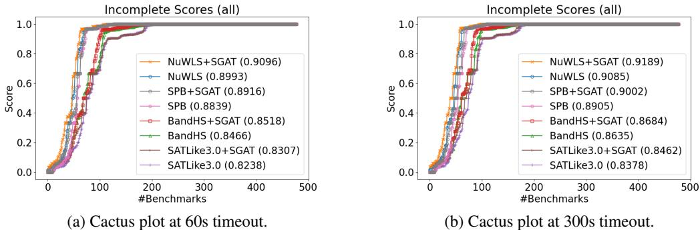  
Figure 7: Cactus plots comparing incomplete solvers before and after SGAT-based initialization. Y-axis shows the score achieved, and $\mathbf { X }$ -axis shows the number of benchmark instances. Higher is better.

# C.2.1 Results

Table 3 presents the average incomplete scores across benchmark sets from 2020 to 2024. All solvers consistently benefited from SGAT-based initialization, with hybrid versions of NuWLS and SPB achieving state-of-the-art results. Notably, ${ \mathrm { N u W L S } }$ showed an average improvement of 0.008—comparable to or greater than the score margin separating first and second place in recent MaxSAT Evaluation tracks.

While minor regressions were observed in isolated cases (e.g., NuWLS on 2022), the consistent overall improvements demonstrate the utility of SGATs in guiding local search. These gains suggest that SGATs effectively prune the search space by providing better starting points.

Figure 7 illustrates these results as cactus plots, showing the number of benchmark instances solved across a range of score thresholds. SGAT-enhanced solvers consistently improve upon their vanilla counterparts under both 60s and 300s timeouts.

# D Additional Experimental Details

All code for experiments can be found in: https://github.com/sotam2369/SGAT-MS

Evaluation Environment. All experiments were done on a machine with AMD Ryzen Threadripper PRO 3975WX 32-Cores and two NVIDIA RTX A6000 GPUs.

# D.1 Benchmark Instances

Table 4: The number of benchmark instances used from each year of the MaxSAT evaluations   

<table><tr><td>Year</td><td>Unweighted.Weighted</td><td></td></tr><tr><td>MaxSAT 2020</td><td>75</td><td>57</td></tr><tr><td>MaxSAT2021</td><td>55</td><td>60</td></tr><tr><td>MaxSAT 2022</td><td>50</td><td>36</td></tr><tr><td>MaxSAT2023</td><td>30</td><td>49</td></tr><tr><td>MaxSAT 2024</td><td>39</td><td>34</td></tr></table>

We particularly performed experiments on the non-partial weighted and unweighted benchmark instances that were used throughout each year’s competitions. The number of instances per year is shown in Table 4. The train/test splits for MaxSAT 2018 is given in the repository.

Table 5: Effect of number of SGAT blocks on Weighted Satisfaction Ratio (WSR).   

<table><tr><td>Metric</td><td>1</td><td>2</td><td>3</td><td>4</td><td>5</td><td>6</td><td>7</td><td>8</td><td>9</td><td>10</td></tr><tr><td>WSR</td><td>83.57</td><td>83.78</td><td>84.20</td><td>84.29</td><td>84.04</td><td>84.38</td><td>84.46</td><td>84.42</td><td>84.52</td><td>84.56</td></tr></table>

# D.2 Effect of number of layers

The number of SGAT blocks used in the model was chosen empirically. While increasing the number of blocks tends to improve model performance during training as shown in Table 5, larger models increase the runtime of the optimization procedure (Algorithm 1) and require more memory. After sweeping the number of blocks we found that performance improved up to a point and then leveled off or degraded due to these practical costs. We therefore use 6 blocks as our default, which we found to be the best trade-off between performance and resource cost in our experiments.

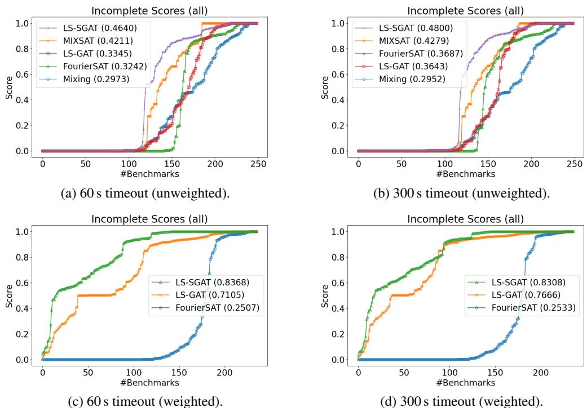  
Figure 8: Cactus plots of continuous MaxSAT solvers. The $x$ -axis shows the number of benchmark instances, and the $y$ -axis shows the incomplete scores achieved. LS-SGAT and LS-GAT consistently outperform classical solvers such as FourierSAT, and this advantage holds across both unweighted and weighted benchmarks.

# D.3 Cactus Plots of Continuous Solvers

Figures 8a, 8b, 8c and 8d present cactus plots that compare continuous MaxSAT solvers on both unweighted and weighted benchmarks. These results focus exclusively on continuous approaches such as LS-SGAT, LS-GAT, FourierSAT, MIXSAT, and Mixing. LS-SGAT consistently achieves the best performance across all settings, with LS-GAT also outperforming traditional baselines. These trends highlight the superior performance and robustness of SGAT-based methods in continuous optimization frameworks for MaxSAT.

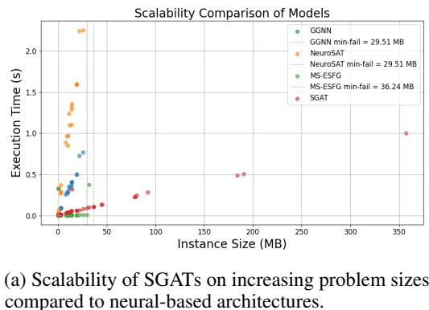  
Figure 9: Comparison of SGAT scalability and parameter efficiency.

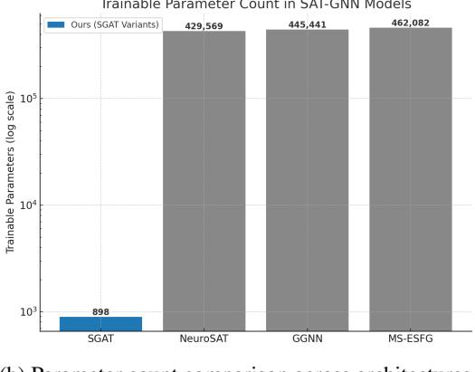  
(b) Parameter count comparison across architectures.

# D.4 Scalability Analysis

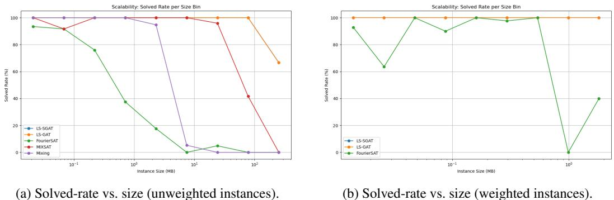  
Figure 10: Scalability analysis for continuous MaxSAT solvers based on the proportion of instances solved within logarithmic size bins. A point at $1 0 0 \mathbf { M B }$ on the $y$ -axis means the solver succeeded on all test instances whose DIMACS file is between 64MB and 128MB. LS-SGAT retains a $100 \%$ solve ratio across every bin, while LS-GAT remains competitive up to $\sim 2 0 0 \mathrm { M B }$ . Classical continuous baselines (FourierSAT, MIXSAT, Mixing) degrade sharply beyond a few megabytes.

Figure 9 compares the scalability and parameter efficiency of SGATs with prior neural SAT solvers. The right subfigure shows that SGAT uses orders of magnitude fewer parameters compared to NeuroSAT, GGNN, and MS-ESFG (with only 898 parameters). This reflects the architectural simplicity of SGATs, which rely on fixed attention structures and minimal trainable components.

In contrast, prior models utilize deep multi-layer networks with complex gating or transformer-based components, leading to parameter counts exceeding 400K. Even with orders-of-magnitude fewer parameters, the left subfigure shows that SGAT maintains superior scalability: execution time grows slowly with problem size, and SGAT is the only model that remains tractable on problems exceeding 100MB. Models like NeuroSAT and GGNN begin to fail around 30MB, while MS-ESFG fails around 36MB.

These results highlight SGAT’s suitability for large-scale SAT solving, where both inference speed and memory footprint are critical. By combining low parameter count with favorable runtime scaling, SGATs enable efficient reasoning on real-world datasets that challenge conventional architectures.

Figure 10 complements this view by showing the solved-rate curves: LS-SGAT maintains a near $100 \%$ solve ratio across every size bin, highlighting its robustness on very large weighted and unweighted instances, compared to continuous baselines like FourierSAT, MIXSAT, and Mixing.

# Algorithm 4: Polarity-Majority Assignment

Input: CNF $F = \{ C _ { 1 } , \dots , C _ { m } \}$ with $| C _ { j } | = k$ ; variables $x _ { 1 } , \ldots , x _ { n }$   
Output: $\hat { x } \in \{ 0 , 1 \} ^ { n }$   
// Count positive/negative occurrences per variable   
1 for $i = 1 , \ldots , n$ do   
2 $\mathbf { \| } \mathtt { p o s } _ { i }  0 , \mathtt { n e g } _ { i }  0$   
3 end   
4 for $j = 1 , \ldots , m$ do   
5 foreach literal $\ell \in C _ { j }$ do   
6 if $\ell = x _ { i }$ then $\mathtt { p o s } _ { i }  \mathtt { p o s } _ { i } + 1$   
7 if $\ell = \lnot x _ { i }$ then $\mathbf { n e g } _ { i } \gets \mathbf { n e g } _ { i } + 1$   
8 end   
9 end   
// Assign by literal majority   
10 for $i = 1 , \ldots , n$ do   
11 if $p o s _ { i } \geq n e g _ { i }$ then   
12 ${ \hat { x } } _ { i } \gets 1$   
13 else   
14 xˆi ← 0   
15 end   
16 end   
17 return $\hat { x }$

# E Theoretical Analysis of SGATs

We show that a one-layer SGAT with fixed parameters realizes the polarity-majority assignment algorithm on unweighted Max-EkSAT and therefore attains a deterministic $\frac { \mathrm { i } } { 2 }$ -approximation.

Theorem 1 (Polarity-majority assignment achieves a half-approximation on Max-EkSAT). Let $F = \{ C _ { 1 } , \ldots , C _ { m } \}$ be a $k$ -CNF formula (every clause has exactly $k$ literals). Then, the assignment produced by Algorithm 4 satisfies at least $m / 2$ clauses.

Proof. Give each literal weight 1 so that every clause carries total mass $k$ . Let $\mathtt { p o s } _ { i }$ and $\mathtt { n e g } _ { i }$ be the positive and negative occurrence counts tracked by Algorithm 4, and define

$$
W ^ { + } = \sum _ { i } \mathrm { m a x } \{ \mathrm { p o s } _ { i } , \mathrm { n e g } _ { i } \} , \qquad W ^ { - } = \sum _ { i } \mathrm { m i n } \{ \mathrm { p o s } _ { i } , \mathrm { n e g } _ { i } \} .
$$

By construction $W ^ { + } ~ \geq ~ W ^ { - }$ . Moreover, for each variable $x _ { i }$ , the term $\operatorname* { m a x } \{ { \tt p o s } _ { i } , { \tt n e g } _ { i } \} +$ $\operatorname* { m i n } \{ { \tt p o s } _ { i } , { \tt n e g } _ { i } \}$ simplifies to $\mathtt { p o s } _ { i } + \mathtt { n e g } _ { i }$ . Summing over $i$ therefore gives

$$
W ^ { + } + W ^ { - } = \sum _ { i } ( \mathsf { p o s } _ { i } + \mathsf { n e g } _ { i } ) = m k ,
$$

because every clause contributes exactly $k$ literal occurrences. For instance, if a variable appears twice positively and once negatively, it contributes $2 + 1 = 3$ units of weight in total, matching the three literals that mention it.

Let $U$ be the number of unsatisfied clauses under the assignment returned by Algorithm 4. In any unsatisfied clause, each literal disagrees with the assignment on its variable. Since the algorithm picks the majority polarity for each variable, disagreeing literals belong to the minority side and therefore each contributes 1 to $W ^ { - }$ . Consequently $W ^ { - } \subseteq k U$ . Combining this with $\dot { W } ^ { + } \ge W ^ { - }$ and $W ^ { + } + W ^ { - } = m k$ yields

$$
k U \leq W ^ { - } \leq \frac { W ^ { + } + W ^ { - } } { 2 } = \frac { m k } { 2 } ,
$$

so $U \leq m / 2$ . Hence at least $m - U \geq m / 2$ clauses are satisfied.

Theorem 2 (One-block SGAT realizes Algorithm 4). There exists SGATs with one SGAT block, Gödel t-norm, one attention head, and hidden dimension $d { = } 1$ (scalars on nodes), using fixed parameters, that produces exactly the assignment of Algorithm 4 on any unweighted Max-EkSAT instance.

Proof. We employ the initializer module to output $\begin{array} { r } { v ^ { ( 0 ) } ( x _ { i } ) = \frac { 1 } { 2 } } \end{array}$ for every variable. With the Gödel t-norm $T _ { G }$ computing clause valuations, each clause obtains $\begin{array} { r } { v _ { G } ( \bar { C } _ { j } ) = \frac { 1 } { 2 } } \end{array}$ . The SGAT update message $m _ { i j } ^ { U } = v ^ { ( 0 ) } ( x _ { i } ) \pm \left( 1 - v _ { G } ( C _ { j } ) \right)$ therefore yields $m _ { i j } ^ { U } = 1$ on positive literal edges and $m _ { i j . } ^ { U } = 0$ on negative ones. Using a single attention head with all parameters set to zero makes the variable-side softmax uniform; with hidden dimension $d { = } 1$ , node features are scalars and the post-aggregation valuation becomes $v ^ { ( 1 ) } ( x _ { i } ) = \mathtt { p o s } _ { i } / ( \mathtt { p o s } _ { i } + \mathtt { n e g } _ { i } )$ . We then directly threshold $v ^ { ( 1 ) } ( x _ { i } )$ at $1 / 2$ to set $x _ { i } = 1$ iff $\mathsf { p o s } _ { i } \geq \mathsf { n e g } _ { i }$ . This matches Algorithm 4 exactly. □

# E.1 Polarity-Majority Assignment (PMA) vs SGAT Predictions

To better understand how the Polarity-Majority Assignment (PMA) algorithm performs in comparison with the learned SGAT predictor, we evaluated both on the unweighted benchmark sets from MaxSAT evaluations (2020–2024). For each year we report: the win counts (how many problems each method achieved a strictly higher clause satisfaction on), and the mean clause satisfaction across the test set for each method.

Table 6: Summary comparison between Polarity-Majority Assignment (PMA) and learned SGAT predictions.   

<table><tr><td>Metric</td><td>Solver</td><td>2020</td><td>2021</td><td>2022</td><td>2023</td><td>2024</td></tr><tr><td>Clause satisfaction</td><td>PMA SGAT</td><td>0.7113 0.9216</td><td>0.7025 0.9335</td><td>0.5276 0.9230</td><td>0.8032 0.9862</td><td>0.7742 0.9910</td></tr><tr><td>Wins</td><td>PMA SGAT</td><td>0 75</td><td>0 55</td><td>0 50</td><td>0 30</td><td>0 39</td></tr></table>

The results shown in Table 6 indicate that the learned SGAT predictor consistently outperforms the deterministic Polarity-Majority Assignment (PMA) algorithm across all evaluated years, both in per-problem wins and clause satisfaction. PMA fails to win in any benchmarks in this comparison, underscoring our claim that SGATs can at least realize the PMA algorithm.

# F Limitations

While SGATs demonstrate strong empirical performance across multiple MaxSAT benchmarks, there are several limitations that warrant discussion. First, our framework currently does not support partial MaxSAT, where some clauses must be satisfied (hard clauses). Extending SGATs to explicitly distinguish and satisfy hard constraints remains an open challenge, particularly due to the soft nature of our t-norm-based loss formulation. Second, although SGATs generalize well across diverse datasets, their performance may still depend on the diversity and representativeness of training instances. Handling highly domain-specific or adversarially structured formulas is not guaranteed. Lastly, while our theoretical results do not cover weighted MaxSAT, they apply to general (non-partial) MaxSAT without clause weights. Extending these guarantees to handle weighted clauses or partial MaxSAT settings remains an open direction.

# G Broader Impact

The proposed SGAT architecture introduces a differentiable framework for MaxSAT solving, with potential implications in both academic and applied settings. On the positive side, SGATs provide a viable tool for integrating symbolic reasoning into neural systems, enabling end-to-end training for complex constraint-driven tasks. This could benefit domains such as autonomous driving and explainable AI, where the ability to make transparent, constraint-aware decisions is critical. In particular, our work contributes to the growing field of neuro-symbolic AI, which seeks to integrate symbolic reasoning with neural learning systems for improved interpretability and performance in safety-critical environments. However, the integration of neural reasoning into decision-making pipelines must be approached with caution. As our method does not enforce global optimality or fairness constraints, its deployment in sensitive applications—such as law, finance, or healthcare—should be carefully monitored. Moreover, as with many machine learning systems, there is a risk that SGATs inherit biases from their training data. Transparency and rigorous evaluation remain essential for safe use.