# ModHiFi: Identifying High Fidelity predictive components for Model Modification

Dhruva Kashyap CSA, IISc kdhruva@iisc.ac.in

Chaitanya Murti HP Inc. AI Lab chaitanya.murti@hp.com

Pranav Nayak CSA, IISc pranavk@iisc.ac.in

Tanay Narshana ∗ Google tanaynarshana@google.com

Chiranjib Bhattacharyya CSA, IISc chiru@iisc.ac.in

# Abstract

Open weight models, which are ubiquitous, rarely provide access to their training data or loss function. This makes modifying such models for tasks such as pruning or unlearning, which are constrained by this unavailability, an active area of research. Existing techniques typically require gradients or ground-truth labels, rendering them infeasible in settings with limited computational resources. In this work, we investigate the fundamental question of identifying components that are critical to the model’s predictive performance, without access to either gradients or the loss function, and with only distributional access such as synthetic data. We theoretically demonstrate that the global error is linearly bounded by local reconstruction errors for Lipschitz-continuous networks such as CNNs and well-trained Transformers (which, contrary to existing literature, we find exhibit Lipschitz continuity). This motivates using the locally reconstructive behavior of component subsets to quantify their global importance, via a metric that we term Subset Fidelity. In the uncorrelated features setting, selecting individual components based on their Subset Fidelity scores is optimal, which we utilize to propose ModHiFi, an algorithm for model modification that requires neither training data nor access to a loss function. ModHiFi-P, for structured pruning, achieves an $11 \%$ speedup over the current state of the art on ImageNet models and competitive performance on language models. ModHiFi-U, for classwise unlearning, achieves complete unlearning on CIFAR-10 without fine-tuning and demonstrates competitive performance on Swin Transformers.

# 1 Introduction

Modern deep learning has made significant strides in a wide variety of tasks, such as classification [36, 37], image generation [22], and natural language processing [51]; moreover, well-trained open weight models for such tasks are easily accessible. However, significant challenges remain in their deployment, such as inference in resource-constrained settings [62, 72], inference with unbalanced or biased data [29, 30], and interpretable inference [97]. These challenges have increased interest in methods that modify the parameters of well-trained models to alter their behavior [64, 66, 68]. These methods include pruning [28], classwise unlearning [32, 35, 68], and debiasing [52, 68], among other model modifications. Moreover, recent work has studied model modification in the setting where the original training data and loss function are unavailable [55]; this is motivated by concerns related to privacy and security [92], and also the use of synthetic data, which has become critical in a variety of language modeling settings [10, 76]. Thus, we address the challenging problem of altering well-trained models without training data or the loss function, and only with distributional access to the original training distribution in the form of synthetic data, focusing specifically on structured pruning and classwise unlearning.

Modifying open weight models without the loss function and only synthetic data requires answering a fundamental question: which components in a model contribute significantly to its predictive performance3? However, most methods that identify critical components for specific modifications (e.g., pruning) cannot be applied to others (e.g., unlearning) [55], often require expensive fine-tuning, and are architecture-specific. Moreover, most methods utilize gradients to assess the impact of a component on the loss objective, which is not feasible in the absence of the loss function and the training data. While the LLM pruning literature uses calibration datasets to mitigate the problem of the absence of datasets [2, 48], the problem of achieving sparsity in vision models without original training data is hard and unsolved [28]. Moreover, the issue of performing classwise unlearning without access to the original training data has not been addressed [33, 55].

Towards enabling the modification of well-trained open weight models amidst these challenges, we make the following contributions:

(C1) Local-to-Global with Lipschitzness. An open question is the extent to which local model modifications impact the predictive performance of the model. In the absence of loss functions and training sets, estimating the impact of component modification by using gradients (as done in [33, 45, 48]) is infeasible. To address this, in Theorem 3.6, we show that for Lipschitz continuous networks, the reconstruction error at the final layer is at most linear in the local reconstruction errors. Moreover, contrary to the assertion that transformers are not Lipschitz continuous [63], in Corollary B.4, we show that this is not the case for well-trained transformers, allowing us to apply Theorem 3.6 to not just CNNs, but well-trained ViTs and LLMs as well.

(C2) Identifying Subsets of Important Components. Contrary to prior work, which usually infers saliencies for single components, we propose measuring the importance of sets of components to understand the cumulative effects of groups of components on a model’s predictive performance. Leveraging Theorem 3.6, we propose Subset Fidelity, which quantifies the extent to which a subset of components can reconstruct the output after modifying their weights. However, computing optimal subsets is NP-complete, motivating us to compute Subset Fidelity scores for singleton sets. Theorem 3.9 establishes that selecting singletons with the highest subset fidelity scores is optimal when the features are uncorrelated.

(C3) Modifying Models with ModHiFi-X. Motivated by Theorem 3.9, we propose the ModHiFi algorithm, which uses the subset fidelity of singletons to modify models for pruning and classwise unlearning; the algorithm identifies important components using the singleton scores, and removes them (for classwise unlearning, ModHiFi-U) or retains them (for structured pruning, ModHiFi-P). We demonstrate that ModHiFi-P achieves state-of-the-art speedup for ImageNet models and consistently competes with current baselines for language models. For classwise unlearning, ModHiFi-U achieves complete unlearning on all CIFAR-10 classes without finetuning and is competitive with baselines on Swin-Transformers that require fine-tuning. When allowing for a similar fine-tuning budget as said baselines, ModHiFi-U outperforms, particularly when given access to training data. These empirical results demonstrate the practical effectiveness of Subset Fidelity.

# 2 Background, Setup, and Related Work

In this section, we review the background relevant to our study, establish the notation, and formalize the model modification problem. We also unify Convolutional Networks (CNNs) and Transformers under a single abstraction that underpins our theoretical results in Section 3.

# 2.1 Background and Notation

Notation Let $[ p ] = \{ 1 , \dotsc , p \}$ for $p \in \mathbb N$ . We denote vectors by $\boldsymbol { v } \in \mathbb { R } ^ { n }$ with entries $v _ { i }$ , and matrices by $B \in \mathbb { R } ^ { n \times m }$ with rows $ { \boldsymbol { b } } _ { i } ^ { \top }$ and columns $B _ { : , j }$ . The vectors ${ \bf 1 } _ { d }$ and $\mathbf { 0 } _ { d }$ denote the all-ones and all-zeros vectors in $\mathbb { R } ^ { d }$ , respectively. We use $\lVert \pmb { v } \rVert _ { 2 }$ for the Euclidean norm. For matrices ${ C , D }$ , the inner product is $\langle C , D \rangle = \mathrm { T r } ( C ^ { \top } D )$ , the Frobenius norm is $\| C \| = { \sqrt { \langle C , C \rangle } }$ , and the spectral norm $\| C \| _ { 2 }$ is the largest singular value. For index sets $A \subseteq [ n ]$ and $B \subseteq [ m ] , C [ A , B ]$ denotes the submatrix of $C$ defined by these indices. Expectations of a random variable $\mathrm { X }$ are written $\mathbb { E } _ { \mathrm { X } } [ \cdot ]$ , omitting the subscript when clear from context.

2D Convolution Consider the $l$ -th layer of a convolutional network. It transforms an input (the output of preceding layers) Φl(X) ∈ Rclin×hl−1×wl−1 i nto output $\forall ^ { l } ( X ) \in \mathbb { R } ^ { c _ { \mathrm { o u t } } ^ { l } \times h ^ { l } \times \bar { w } ^ { l } }$ . The layer is parameterized by a weight tensor $\boldsymbol { \mathsf { W } } ^ { l } \in \mathbb { R } ^ { c _ { \mathrm { o u t } } ^ { l } \times c _ { \mathrm { i n } } ^ { l } \times k ^ { l } \times k ^ { l } }$ . Each output channel $c \in [ c _ { \mathrm { o u t } } ^ { l } ]$ is computed as the sum of convolved input channels:

$$
\mathbf { } Y _ { c } ^ { l } ( \mathbf { X } ) = \sum _ { i = 1 } ^ { c _ { \mathrm { i n } } ^ { l } } \Phi _ { i } ^ { l } ( \mathbf { X } ) \star W _ { c i } ^ { l } = \sum _ { i = 1 } ^ { c _ { \mathrm { i n } } ^ { l } } A _ { c i } ^ { l } ( \mathbf { X } ) ,
$$

where $\star$ denotes the standard 2D convolution. We define $\pmb { A } _ { c i } ^ { l } ( \pmb { X } ) : = \Phi _ { i } ^ { l } ( \pmb { X } ) \star \pmb { W } _ { c i } ^ { l } \ \left( \in \mathbb { R } ^ { h ^ { l } \times w ^ { l } } \right)$ as the input contribution from channel $i$ to output channel $c$ . For notational simplicity, we omit explicit bias terms and stride/padding specifications, as our analysis generalizes to these standard configurations without loss of generality.

Transformers Transformer blocks consist of Multi-Head Attention (MHA) and Feed-Forward Networks (FFN), with pre-normalization (LayerNorm or RMSNorm) [2, 3]. Our analysis focuses on the FFN; we leave attention-specific analysis for future work. Let the input to the $l .$ -th layer be $\phi ^ { l } ( \pmb { X } ) \in \mathbb { R } ^ { T \times d }$ , where $T$ is sequence length and $d$ is model dimension. The FFN comprises two linear transformations, $W _ { U } ^ { l } \in \mathbb { R } ^ { d \times d _ { \mathrm { f f } } }$ and $W _ { D } ^ { l } \in \mathbb { R } ^ { d _ { \mathrm { f f } } \times d }$ , and an elementwise nonlinearity $\sigma ( \cdot )$ and it’s output, $\mathrm { F F N } ^ { l } ( \phi ^ { l } ( { \bf X } ) ) = \sigma ( \phi ^ { l } ( { \bf X } ) W _ { U } ^ { l } ) W _ { D } ^ { l }$ . Defining the intermediate activation $\Phi ^ { l } ( \pmb { X } ) : = \sigma ( \phi ^ { l } ( \pmb { X } ) W _ { U } ^ { l } ) \in \mathbb { R } ^ { T \times d _ { \mathrm { f f } } }$ , the contribution from intermediate neuron $i \in [ d _ { \mathrm { H } } ]$ to output coordinate $c \in [ d ]$ is:

$$
\pmb { A } _ { c i } ^ { l } ( \pmb { X } ) : = \Phi _ { : , i } ^ { l } ( \pmb { X } ) W _ { D , c i } ^ { l } .
$$

Unified Notation To unify these architectures, we define a common abstraction used in our theoretical results. Let $\mathrm { N } _ { \boldsymbol { \theta } } = \mathbf { \bar { \boldsymbol { f } } } ^ { L } \circ \cdot \cdot \cdot \circ f ^ { 1 }$ be a network composed of $L$ layers. Each layer $l$ maps an input $\Phi ^ { l } ( X )$ to an output $\pmb { \forall } ^ { l } ( \pmb { X } )$ . Crucially, for both CNNs and Transformers, the output channel $c$ can be decomposed as a sum of atomic input contributions: $\begin{array} { r } { \pmb { Y } _ { c } ^ { l } ( \pmb { X } ) = \sum _ { i = 1 } ^ { c _ { \mathrm { i n } } ^ { l } } \pmb { A } _ { c i } ^ { l } ( \pmb { X } ) } \end{array}$ , where $A _ { c i } ^ { l }$ represents either the spatial convolution (Equation (CONV)) or the token-wise linear projection (Equation (LIN)). This decomposition is central to our analysis of component importance. This additive structure allows us to analyze component fidelity in an architecture-agnostic manner.

# 2.2 Modifying Open Weight Models without Training Data or the Loss Function via Distributional Access

We formally define model modification as the process of selectively altering parameters of a pretrained model, without retraining from scratch, to satisfy constraints such as efficiency, privacy, or safety [28, 33, 66, 68]. This includes tasks including structured pruning, unlearning [38], debiasing [32], continual or life-long learning [21, 64]. A major impediment in real-world modification is the unavailability of the original training data and loss function [28, 55]. To address this, we operate under the constraint of distributional access, specifically utilizing synthetic data [10, 76], to proxy the underlying data distribution without requiring the original corpus.

These considerations motivate the central question addressed in this work: Can we effectively modify trained models, for tasks such as structured pruning or unlearning, using only distributional access provided through synthetic data?

Formulating Model Modification Let $\theta ^ { \star } \in \mathbb { R } ^ { D }$ be the parameters of a well-trained model. We seek a modification mask $\mathfrak { m } ^ { \star } \in \mathcal { M }$ (where $\mathcal { M }$ defines permissible modifications, e.g., binary masks for pruning) to produce modified parameters $\theta ^ { E } = \theta ^ { \star } \odot \mathsf { m } ^ { \star }$ . Given data distributions $\{ \mathcal { D } _ { i } \} _ { i = 1 } ^ { K }$ and weights ${ \pmb { \alpha } } \in \mathbb { R } ^ { K }$ , the optimal modification mask is defined as:

$$
\displaystyle \mathfrak { m } ^ { \star } = \mathop { \arg \operatorname* { m i n } } _ { \mathfrak { m } \in \mathcal { M } } \sum _ { i } \alpha _ { i } \mathbb { E } _ { \mathbf { X } \sim \mathcal { D } _ { i } } \left[ \mathcal { L } ( \mathrm { N } _ { \theta ^ { \star } \odot \mathfrak { m } } ( \mathrm { X } ) ) \right] .
$$

We instantiate this framework for two distinct tasks:

Structured Pruning The goal is to maximize performance subject to sparsity. Let the parameters be partitioned into $G$ disjoint structured groups $\{ \stackrel { . } { \mathcal { G } } _ { g } \} _ { g = 1 } ^ { G }$ (e.g., filters, channels, rows, or columns), with $\theta ^ { \star } = ( \theta _ { \mathcal { G } _ { 1 } } ^ { \star } , \ldots , \theta _ { \mathcal { G } _ { G } } ^ { \star } )$ . The admissible set enforces a sparsity budget $B$ $3 , \mathcal { M } _ { \mathrm { S P } } : = \left\{ \mathbf { m } \in \mathbb { R } ^ { D } \mid \exists z \in \right.$ $\{ 0 , 1 \} ^ { G } , ~ \pmb { \delta } \in \mathbb { R } ^ { D }$ Gs.ng $\mathsf { m } _ { j } = \mathsf { z } _ { g } \delta _ { j } \ \forall j \in \mathcal { G } _ { g }$ ,i $\textstyle \sum _ { g = 1 } ^ { G } z _ { g } \leq B \}$ . Strion), prun, and ered from, yielding $K = 1$ $\mathcal { D } _ { 1 } = \mathcal { D }$ $\alpha _ { 1 } = 1$ $\mathcal { M } = \mathcal { M } _ { \mathrm { S P } }$

$$
\begin{array} { r } { \mathsf { m } ^ { \star } = \underset { \mathsf { m } \in \mathcal { M } _ { S P } } { \arg \operatorname* { m i n } } \ \mathbb { E } _ { \mathcal { D } } \left[ \mathcal { L } ( \mathrm { N } _ { \theta ^ { \star } \odot \mathsf { m } } ( \mathrm { X } ) ) \right] . } \end{array}
$$

(STRUCT-PRUNE)

Classwise Unlearning The goal is to degrade performance on a forget distribution $\mathcal { D } _ { f }$ while preserving performance on a retain distribution $\mathcal { D } _ { r }$ . We impose no additional structural constraints on the modification and set $\mathcal { M } _ { U } = \mathbb { R } ^ { D }$ . Classwise unlearning is obtained from (MODIFY) by setting $K = 2$ , $( \mathcal { D } _ { 1 } , \mathcal { D } _ { 2 } ) = ( \mathcal { D } _ { r } , \mathcal { D } _ { f } )$ , $( \alpha _ { 1 } , \alpha _ { 2 } ) = ( 1 , - 1 )$ , and $\mathcal { M } = \mathcal { M } _ { U }$ , yielding

$$
\mathfrak { m } ^ { \star } \ = \ \underset { \mathfrak { m } \in \mathcal { M } _ { U } } { \arg \operatorname* { m i n } } \mathbb { E } _ { \mathbf { X } \sim \mathcal { D } _ { r } } [ \mathcal { L } ( \mathrm { N } _ { \theta ^ { \star } \odot \mathfrak { m } } ( \mathrm { X } ) ) ] - \mathbb { E } _ { \mathbf { X } \sim \mathcal { D } _ { f } } [ \mathcal { L } ( \mathrm { N } _ { \theta ^ { \star } \odot \mathfrak { m } } ( \mathrm { X } ) ) ] .
$$

Our core challenge is to solve (MODIFY) using only synthetic samples, without access to ground-truth labels or the original loss.

# 2.3 Related Work

We briefly situate our work within the literature on vision and language model modification. A comprehensive survey is provided in Appendix A.

Vision Model Modification While structured pruning is well-established for CNNs and ViTs [14, 14, 28, 93, 95], and classwise unlearning has seen recent progress [11, 33], these tasks are typically treated in isolation. Crucially, prior methods for jointly addressing these problems rely heavily on access to labeled data [55]. Our work presents the first unified framework for both pruning and unlearning, which operates effectively using only unlabeled synthetic data.

LLM Modification Efficiency in LLMs is primarily addressed via structured pruning [48, 49] or sparsification [2]. However, these methods are often architecture-specific and do not extend to unlearning. By validating our method on both LLMs and vision models, we demonstrate a generalized approach to model modification that bridges the gap between these distinct domains.

# 3 Which Components Are Important for Modifying Well-Trained Models?

We now address the problem of identifying model components critical to predictive performance. We introduce Subset Fidelity, a metric that quantifies the local reconstructive capacity of component groups and High-Fidelity (HiFi) components. We show theoretically that maximizing local fidelity minimizes a linear upper bound on the global predictive error.

# 3.1 High-Fidelity Components and the Subset Fidelity Score

Our objective is to estimate the impact of removing a subset of input contributions on the model’s output, after optimally compensating for this removal. Directly quantifying this effect is difficult, so we introduce the Subset Fidelity, a measure of how well a subset of components can locally approximate the layer’s output.

Definition 3.1 (Subset Fidelity). The fidelity of a subset of components $C \subseteq [ c _ { i n } ^ { l } ]$ in layer $l$ for output channel $c$ is defined as

$$
\mathrm { F S } _ { c } ^ { l } ( C ) : = \operatorname* { m a x } _ { \substack { \delta _ { c } ^ { l } \in \mathbb { R } ^ { c _ { i n } ^ { l } } } } \left( 1 - \frac { \mathbb { E } \left[ \Vert \mathbf { Y } _ { c } ^ { l } ( \mathrm { X } ) - \sum _ { i \in C } \delta _ { c i } ^ { l } A _ { c i } ^ { l } ( \mathrm { X } ) \Vert ^ { 2 } \right] } { \mathbb { E } \left[ \Vert \mathbf { Y } _ { c } ^ { l } ( \mathrm { X } ) \Vert ^ { 2 } \right] } \right) ,
$$

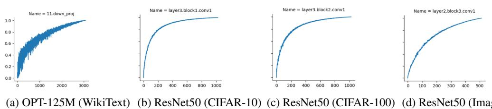  
Figure 1: Monte Carlo estimation of Equation (K-MFS) across selected layers of various models. The $\mathbf { X }$ -axis indicates subset size $k$ , and the y-axis the maximum fidelity found across random samples.

where $\delta _ { c } ^ { l }$ is the compensation term.

The following properties (proved in Appendix B.2) justify its use as an importance measure.

Lemma 3.2 (Properties of Subset Fidelity). For any subset $C \subseteq [ c _ { i n } ^ { l } ]$ in layer $l ,$ , (Boundedness) $0 \leq \mathrm { F S } _ { c } ^ { l } ( C ) \leq 1$ and (Monotonicity) If $D \subseteq C$ , then $\mathrm { F S } _ { c } ^ { l } ( D ) \leq \mathrm { F S } _ { c } ^ { l } ( C )$ .

A larger Subset Fidelity indicates that the subset more effectively reconstructs the output, thereby reducing the error of approximating the sum of components with components from a subset. Lemma 3.2 implies two key insights: (1) Fidelity serves as a principled measure of component importance, and (2) Monotonicity suggests that greedy selection strategies may be effective.

Remark 3.3. Equation (1) is a generalizes the formulation of Halabi et al. [25]. In this work, we focus only on the case where the subset fidelities are measured with the expected squared difference. We leave to future work an exploration of other possible measures of distributional similarity.

To capture the tradeoff between the size of a subset and its fidelity, we define HIFI Sets.

Definition 3.4 $( k , \eta )$ -HIFI Set). Given a target subset size $k$ and a fidelity threshold $\eta \in ( 0 , 1 )$ , the $( k , \eta )$ -HIFI Set $S _ { c } ^ { k , \eta }$ for output channel $c$ is any subset in $[ c _ { i n } ^ { l } ]$ satisfying

$$
\mathrm { F S } _ { c } ^ { l } ( S _ { c } ^ { k , \eta } ) \geq \eta , \quad | S _ { c } ^ { k , \eta } | \leq k .
$$

Thus, attributing predictive performance to components reduces to finding the HIFI set for a given $( k , \eta )$ . We can reduce the identification of HIFI sets to solving an optimization problem, the solution of which yields the Maximum Fidelity Subset, which contains the components that best recover the layer’s output.

Definition 3.5 ( $k$ -Maximum Fidelity Subset). Given a target subset size $k$ for layer $l$ , the Maximum Fidelity Subset $S _ { c } ^ { l \star }$ for channel $c$ is defined as

$$
S _ { c } ^ { l \star } = \underset { S \subseteq [ c _ { i n } ^ { l } ] , | S | = k } { \arg \operatorname* { m a x } } ~ \mathrm { F S } _ { c } ^ { l } ( S ) .
$$

A simple algorithm for identifying a $( k , \eta )$ -HIFI set is to solve Equation (K-MFS) for the given $k$ and check whether its fidelity exceeds $\eta$ . If it does not, no such $( k , \eta )$ -HIFI set exists. Before proceeding to our theoretical analysis, we empirically verify whether small HiFi sets actually exist in standard models. Our experiments in Section 5.2 empirically establish the existence of a small subset of components that can achieve high fidelity. Moreover, in Section 5.3, we validate the effectiveness of HiFi components with the model’s predictive performance. Figure 1 indicates a sample of the results indicating that fewer than $20 \%$ of components can achieve high fidelity $( \ge 0 . 8 )$ .

# 3.2 Local Distributional Measures of Component Importance

Finding HIFI subsets corresponds to finding subsets that minimize the $l _ { 2 }$ reconstruction error while accounting for weight compensation. Additionally, it enables the derivation of a closed-form expression for weight compensation, allowing for accuracy recovery without requiring fine-tuning.

Bounding Global Error via Local Modification We now show that the influence of a component on its immediate layer output provides a tractable proxy for its overall effect on model predictions. The global error is the expectation of the squared difference in the predictions of a network under a modification.

Theorem 3.6 (Local to Global). Consider a network $\mathrm { N } _ { \theta }$ as defined in Section 2.1. Let $M ^ { \iota }$ be a mask modifying parameters at layer $l$ , and let $m _ { c } ^ { l }$ be the mask vector for output channel $c$ . Assume there exist scalars $r ^ { \ell } > 0$ for all layers $\ell > l$ such that $\| \Phi _ { c } ^ { \ell } ( \mathrm { X } ) \| _ { F } \geq r ^ { \ell }$ almost surely. Then,

$$
\mathbb { E } \left[ \| \mathrm { N } _ { \theta } ( \mathrm { X } ) - \mathrm { N } _ { \theta \odot M ^ { \iota } } ( \mathrm { X } ) \| ^ { 2 } \right] \le \mathcal { O } \left( \sum _ { c = 1 } ^ { c _ { o u t } ^ { l } } \mathbb { E } \left[ \| \mathbf { Y } _ { c } ^ { l } ( \mathrm { X } ) - \sum _ { i \in C } m _ { c i } ^ { l } A _ { c i } ^ { l } ( \mathrm { X } ) \| ^ { 2 } \right] \right)
$$

Sketch. The proof relies on the propagation of error through Lipschitz-continuous layers. See Appendix B.1. □

Theorem 3.6 upper-bounds the global error, given by the left-hand side, by a linear function of the local reconstruction errors for each channel in layer $l$ . This implies that global error grows at most linearly with local error, making local fidelity a practical, architecture-agnostic proxy for component influence. The theorem requires that the networks discussed in this work are Lipschitz continuous under suitable conditions. While CNNs are known to be Lipschitz continuous [94], transformers are not [63]. In Corollary B.4, we show that this is not the case for well-trained transformers.

Remark 3.7. The leading constant in the order notation quantifies the amplification of local errors through subsequent layers and activations, and is independent of the data distribution, depending only on the model’s architecture. Empirical estimates of the constant reported in Appendix C.2 demonstrate the practicality of these constants.

Subset Fidelity for Individual Components Next, we show that both the compensation term and the singleton fidelity scores admit closed-form expressions, thus motivating their use in this work. A derivation is provided in Appendix B.3.

Proposition 3.8 (Compensation and Singleton Fidelity). For the $l _ { 2 }$ reconstruction error, the optimal compensation term ${ \delta } _ { c } ^ { \star }$ , which is the value at which the fidelity score is computed according to Equation (1) for a subset $C$ , is given by,

$$
\delta _ { c i } ^ { l * } ( C ) = \left\{ \begin{array} { l l } { 1 + ( ( \pmb { Q } _ { c } ^ { l } [ C , C ] ) ^ { - 1 } ) _ { i } ^ { \top } \pmb { Q } _ { c } ^ { l } [ C , \overline { { C } } ] \mathbf { 1 } _ { n - k } } & { i f i \in C } \\ { 0 } & { i f i \notin C } \end{array} \right.
$$

where $Q _ { c } ^ { l } \in \mathbb { R } ^ { c _ { i n } ^ { l } \times c _ { i n } ^ { l } }$ is the component similarity matrix (CSM) for channel $c$ , with entries $( Q _ { c } ^ { l } ) _ { i j } =$ $\mathbb { E } [ \langle A _ { c i } ^ { l } ( \mathrm { X } ) , A _ { c j } ^ { l } ( \mathrm { X } ) \rangle ]$ . The singleton fidelity scores are:

$$
s _ { c i } ^ { l } = \mathrm { F S } _ { c } ^ { l } ( \{ i \} ) = 1 - \frac { \mathbb { E } [ \| Y _ { c } ^ { l } ( \mathrm { X } ) - \alpha _ { c i } ^ { l } A _ { c i } ^ { l } ( \mathrm { X } ) \| ^ { 2 } ] } { \mathbb { E } [ \| Y _ { c } ^ { l } ( \mathrm { X } ) \| ^ { 2 } ] } , \quad \alpha _ { c i } ^ { l } = \frac { \mathbb { E } [ \langle Y _ { c } ^ { l } ( \mathrm { X } ) , A _ { c i } ^ { l } ( \mathrm { X } ) \rangle ] } { \mathbb { E } [ \| A _ { c i } ^ { l } ( \mathrm { X } ) \| ^ { 2 } ] } .
$$

Note that solving Equation (K-MFS) exactly is still equivalent to a constrained binary quadratic optimization problem, known to be NP-hard [1]. Viewing $Q ^ { c }$ as the adjacency matrix of a weighted graph, maximizing Equation (K-MFS) corresponds to identifying a clique of size $k$ , the decision version of the MAXIMUM CLIQUE problem. Intuitively, such cliques correspond to groups of components whose joint removal maximally increases the reconstruction error.

Computing the $\mathbf { k }$ -MFS Since fidelity is monotonic, a natural heuristic selects the $k$ components with the highest singleton fidelities $s _ { c i } ^ { l }$ ; we call this strategy: NAIVE. To compute the set of highest fidelity, the $\mathbf { k }$ -MFS, we identify conditions under which the NAIVE selection strategy is optimal.

Theorem 3.9. Consider output channel c in the ${ { l } ^ { t h } }$ layer of a network described in Section 2.1. Let the $s _ { c i } ^ { l }$ be defined according to Equation (3) and $S _ { c } ^ { l \star }$ be defined according to Definition 3.5. Let $\hat { S } _ { c } ^ { l } = \{ i \mid s _ { c i } ^ { l } \geq s _ { ( k ) } \}$ where $s _ { ( k ) }$ is the $k ^ { t h }$ largest value of $\mathbf { \Delta } _ { s _ { c } ^ { l } } ^ { l }$ . Assuming that there are no ties, $| \hat { S } _ { c } ^ { l } | = k$ . I ${ } ^ { r } \mathbb { E } [ \langle \pmb { A } _ { c i } ^ { l } ( \mathrm { X } ) , \pmb { A } _ { c j } ^ { l } ( \mathrm { X } ) \rangle ] = 0 \ \forall i \neq j$ , then $\hat { S } _ { c } ^ { l } = S _ { c } ^ { l \star }$ .

Sketch. Under the assumptions, the objective simplifies from quadratic to linear. See Appendix B.4. □

Remark 3.10. Theorem 3.9 connects a statistical property of the representations to the efficient discovery of HIFI components. It states that when the input contributions are pairwise uncorrelated, the optimal subset is the set of components with the highest fidelity score.

Although the assumption of uncorrelated features rarely holds exactly in practice, it offers a sound theoretical justification for NAIVE HIFI selection. We demonstrate the practical effectiveness of NAIVE HIFI selection through our experiments in Section 5.

# 4 Modifying Model Behavior using HiFi Sets

We now propose MODHIFI, a unified algorithmic framework for model modification using only distributional access. We apply this framework to two distinct tasks: structured pruning (MODHIFIP) and classwise unlearning (MODHIFI-U). The central idea is to identify high-fidelity (HIFI) components and then modify them in a targeted manner using a unified algorithmic procedure, as shown in Algorithm 1. The two tasks operate as duals: pruning retains the high-fidelity components necessary for general performance, while unlearning removes the high-fidelity components most discriminative for a specific target class. Additional details, including complexity and implementation specifics, are provided in Appendix D.

Structured Pruning To address Equation (STRUCT-PRUNE), where the objective is to remove entire input channels (or features) that contribute minimally to the model’s predictive performance. In convolutional architectures, we identify and remove input channels across all layers that do not appear in the HIFI sets of any output channel of the residual-coupled layers. For CNNs, pruning is applied to the input channels of convolutional layers. For LLMs, we target the input features of the MLP down-projection matrices $( W ^ { D } )$ . After pruning, we compute the optimal compensation term $\delta ^ { \star }$ (derived in Proposition 3.8) using the remaining weights. This step restores the fidelity of the layer output without requiring gradient-based fine-tuning.

Class Unlearning The goal of Equation (UNLEARN) is to erase the influence of a specific forget class. To perform unlearning, we first compute HIFI sets using only samples from the class we wish to forget. The components in these sets are then zeroed out, effectively erasing the influence of that class. This causes the model’s predictive performance on the forgotten class to degrade, without significantly impacting the performance of other classes.

Fidelity Estimation For vision models, the singleton fidelity score $\mathrm { F S } _ { c } ^ { l } ( \cdot )$ can be estimated efficiently using distributional ac

# Algorithm 1 ModHiFi-X

Require: Model parameters $\theta$ , layer $l$ , $k$ components, threshold $\eta$ , data $\mathcal { D }$   
Ensure: Modified parameters $\theta ^ { E }$   
1: Estimate Fidelity: Compute singleton scores $\mathbf { s } ^ { l }$ on $\mathcal { D }$ via Equation (3).   
2: Select HiFi Set: $H _ { l } \gets \mathrm { T o p } – k$ indices of $\mathbf { s } ^ { l }$ .   
3: if $X =$ Prune then 4: for $i \in [ c _ { i n } ^ { l } ] \setminus \{ i \mid ( c , i ) \in H _ { l } \} \mathbf { d o }$   
5: ${ W _ { c , i } ^ { l } } \gets \mathbf { 0 } \quad \forall c \in [ c _ { o u t } ^ { l } ]$ 6: Apply compensation $\delta ^ { \star }$ to remaining weights. 7: else if $X = \mathrm { { U n l e a r n } }$ then   
8: for $( c , i ) \in H _ { l }$ do   
9: ${ \pmb W } _ { c , i } ^ { l }  { \bf 0 }$   
10: return $\hat { \theta }$

cess to the input data, i.e., synthetic samples. In practice, for vision models, we estimate the scalar coefficients $\hat { \alpha } _ { c i } ^ { l }$ directly via batched forward passes on synthetic samples. A large $\alpha _ { c i } ^ { l }$ indicates a high-fidelity component. For LLMs, we develop a tractable Cholesky-based heuristic to estimate the score, providing details in Appendix D.2.

# 5 Experiments

We empirically validate our framework by addressing four central questions:

(Q1) Existence of HiFi components. Do a small subset of components exist that can achieve high fidelity?   
(Q2) Effectiveness of HIFI components. Do HIFI components accurately represent those components important for the predictive performance?   
(Q3) Effectiveness of using HIFI components for pruning using ModHiFi-P. Does ModHiFi-P result in better accuracy-sparsity tradeoff compared to structured pruning algorithms for vision tasks and language modeling tasks?   
(Q4) Effectiveness of using HIFI components for machine unlearning using ModHiFi-U. Is it possible to perform machine unlearning, as posed by Jia et al. [33], without finetuning? If so, how does ModHiFi-U compare to their method?

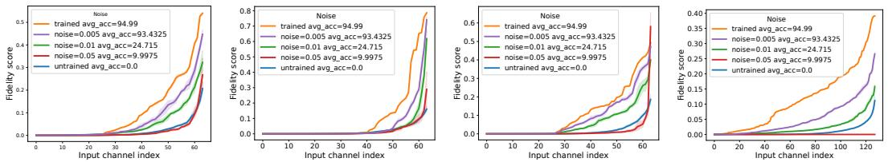  
Figure 2: Fidelity score of selected layers of a ResNet-50 model on CIFAR10 and the effect of noise on the fidelity score.

# 5.1 Details of the experimental setup

Models, Datasets, and Evaluation We conduct experiments on ResNet-50/101 [26], VGG19 [73], Swin-Transformer [46] and Llama-2-7B [80], benchmarking against relevant experiments from related literature [2, 48]. For vision tasks, we measure the classification accuracy, and for NLP tasks, we use EleutherAI’s lm-eval-harness [19].

Distributional Access For CIFAR10/100 [36], we use synthetically generated images as detailed in Appendix C.3. We use Alpaca [78] (a synthetic dataset) and WikiText-2 [50] as calibration data for NLP tasks following related literature [2, 48]. We provide ablations to measure the impact of synthetic data quality in Appendix C.3.3.

Compute platform and implementation details We discuss the compute platform, implementation details, and hyperparameters used for our experiments in Appendix C.6.

# 5.2 Existence of HIFI components: Exploring (Q1)

To empirically assess whether small subsets can achieve high fidelity, we estimate $S _ { c } ^ { \star }$ by sampling random subsets of size $k$ across different architectures and selecting the subset with the highest fidelity. Detailed results are presented in Appendix C.1.

Observation 1. Across all evaluated models, each layer typically contains a small subset of input channels (fewer than $20 \%$ ) that achieves high subset fidelity $( \ge 0 . 8 )$ .

This empirical observation suggests that in trained models, only a small subset of components in each layer is responsible for the model’s prediction. This observation aligns with the success of structured pruning algorithms in constructing small subnetworks with high statistical performance.

# 5.3 Effectiveness of HIFI components: Exploring (Q2)

To answer (Q2), and verify whether HIFI components are the components that matter for the final predictive performance, we measure the effects of the fidelity of a component getting destroyed by noising. For a ResNet-50 on CIFAR-10, when $20 \%$ of the HIFI components are perturbed with a zero mean Gaussian noise with standard deviation of 0.01, the accuracy of the model drops by around $12 \%$ . In contrast, perturbing $80 \%$ of the non-HIFI components identically results in an accuracy drop of only $1 \%$ . At $50 \%$ of components with a noise of standard deviation 0.02, the accuracy drops by $85 \%$ when HIFI components are noised compared to only around $1 . 4 \%$ when non-HIFI components are noised. In Appendix C.1.3, we make similar observations across various models and tasks. In Appendix C.1.2, we additionally performed experiments where we compare the removal of HIFI, non HIFI, and random sets of the same size and make similar observations.

# 5.4 Structured Pruning Experiments: (Q3)

# 5.4.1 Vision Models

Baselines We compare against the state-of-the-art structured pruning algorithms specialized for pruning vision models [8, 47, 58, 83], and present additional results on other architectures and datasets in Appendix C.4 where we make similar observations. Following [17], we update the batch norm statistics using the data from distributional access.

Table 1: Comparison of pruning methods on ResNet50 evaluated on ImageNet.   

<table><tr><td>Algorithm</td><td>Accuracy</td><td>FLOPReduction</td><td>ParamReduction</td><td>CPU Speedup</td><td>GPU Speedup</td></tr><tr><td>Unpruned</td><td>76.1</td><td>1x</td><td>1x</td><td>1x</td><td>1x</td></tr><tr><td>GReg-2 [83]</td><td>73.9</td><td>3.02x</td><td>2.31x</td><td>1.36x</td><td>1.53x</td></tr><tr><td>OTO[8]</td><td>74.7</td><td>2.86x</td><td>2.81x</td><td>1.25x</td><td>1.45x</td></tr><tr><td>DepGRAPH[13]</td><td>75.83</td><td>2.07x</td><td>=</td><td>=</td><td>=</td></tr><tr><td>ThiNet [47]</td><td>71.6</td><td>3.46x</td><td>2.95x</td><td>1.38x</td><td>1.50x</td></tr><tr><td>DFPC (30) [58]</td><td>75.9</td><td>1.98x</td><td>1.84x</td><td>1.42x</td><td>1.53x</td></tr><tr><td>DFPC (54) [58]</td><td>73.80</td><td>3.46x</td><td>2.65x</td><td>2.37x</td><td>2.38x</td></tr><tr><td>Ours</td><td>76.70</td><td>2.17x</td><td>1.47x</td><td>1.69x</td><td>1.70x</td></tr><tr><td>Ours</td><td>73.82</td><td>3.66x</td><td>3.05x</td><td>2.42x</td><td>2.38x</td></tr></table>

Table 2: Comparison of pruning methods on ResNet50 with CIFAR10 (ST: Synthetic Tuning).   

<table><tr><td>Algorithm</td><td>Accuracy</td><td>FLOPReduction</td><td>Param Reduction</td></tr><tr><td>Unpruned</td><td>94.99</td><td>1x</td><td>1x</td></tr><tr><td>DFPC [58]</td><td>90.25</td><td>1.46x</td><td>2.07x</td></tr><tr><td>L2 [41]</td><td>15.91</td><td>4.07x</td><td>4.71x</td></tr><tr><td>L2 w/ ST[41]</td><td>90.12</td><td>4.07x</td><td>4.71x</td></tr><tr><td>Ours</td><td>91.02</td><td>4.07x</td><td>5.36x</td></tr></table>

Observations We find that our method yields a better accuracy-vs-sparsity tradeoff compared to other algorithms across various datasets. We also train a model obtained with $L _ { 2 }$ norm-based structured pruning using the synthetic set based on CIFAR10 for comparison. In Table 2, we observe that for the same FLOP sparsity, our method obtains higher accuracy than the model finetuned on synthetic samples, indicating that our method can outperform finetuning in some cases using synthetic samples for the same sparsity. For the ImageNet dataset, we compare our approach against various state-of-the-art structured pruning algorithms for networks with complex interconnections, including those trained on the ImageNet training set. In Table 1, we observe that for models of similar accuracy, our algorithm obtains the best accuracy-speedup tradeoff with fewer epochs of finetuning. Details of pre-trained networks and post-training are given in Appendix C.7.2. Our study of the effect of the quality of synthetic samples on our algorithm in Appendix C.3.3 indicates that the sparsity-accuracy tradeoff of our algorithm degrades with lower quality samples, but it does not degrade as much as $L _ { 2 }$ pruning $^ +$ finetuning on synthetic samples.

# 5.4.2 Large Language Models

Baselines We evaluate ModHiFi on Llama-2-7B, comparing it against state-of-the-art algorithms for structured pruning [2, 49]. The use of calibration datasets to compute statistics aligns with our framing of distributional access to data, as LLMs do not make their training data openly accessible. Unless otherwise specified, the algorithms use WikiText-2 for calibration, with 128 samples of length $1 0 2 4 ^ { \ 4 }$ . None of the algorithms performs post-pruning recovery finetuning. Additional details about our choice of baselines can be found in Appendix C.4.3.

Evaluation We also measure the performance of the model via its zero-shot accuracy on a suite of standard NLP tasks [5, 9, 65, 96] and WikiText perplexity. In Table 3, we observe that our method is competitive, with consistently high average and task-specific performance, and outperforms at moderate sparsity levels. We find that the quality of the calibration set plays a crucial role, with the performance of ModHiFi-P-Alpaca outperforming that of ModHiFi-P-WikiText. This indicates that retaining only HIFI components provides a model-agnostic approach to structured pruning, with its application to LLMs requiring no modifications beyond its application to vision models.

# 5.5 Class Unlearning Experiments: (Q4)

Baselines and Metrics We report the forget and retain accuracy averaged across 10 classes of the CIFAR10 dataset on ResNet-50 and Swin-T models. We benchmark against Gradient Ascent and Jia et al. [33], which are both retraining-based techniques for Unlearning.

Table 3: Comparison of pruning methods on Llama-2-7B, measured with PPL and task accuracy   

<table><tr><td>Sparsity</td><td>Algorithm</td><td>WikiText PPL↓</td><td>ARC-e 个</td><td>ARC-c ↑</td><td>PIQA 个</td><td>WinoG.↑</td><td>HellaS.个</td><td>Average</td></tr><tr><td>0%</td><td>Dense</td><td>5.12</td><td>74.58</td><td>46.25</td><td>79.11</td><td>69.06</td><td>75.99</td><td>69.00</td></tr><tr><td rowspan="3">10%</td><td>SliceGPT[2]</td><td>6.46</td><td>56.14</td><td>35.33</td><td>69.53</td><td>64.80</td><td>59.02</td><td>59.96</td></tr><tr><td>ModHiFi-P-WikiText (ours)</td><td>5.97</td><td>68.1</td><td>41.89</td><td>75.89</td><td>65.43</td><td>69.92</td><td>64.23</td></tr><tr><td>ModHiFi-P-Alpaca (ours)</td><td>6.36</td><td>71.42</td><td>42.06</td><td>76.44</td><td>68.19</td><td>71.67</td><td>65.96</td></tr><tr><td rowspan="4">20%</td><td>ShortGPT[49]</td><td>14.32</td><td>58.33</td><td>38.05</td><td>72.58</td><td>65.51</td><td>65.27</td><td>59.95</td></tr><tr><td>SliceGPT[2]</td><td>8.13</td><td>50.08</td><td>31.14</td><td>64.85</td><td>62.04</td><td>48.84</td><td>51.39</td></tr><tr><td>ModHiFi-P-WikiText (ours)</td><td>7.91</td><td>60.1</td><td>34.89</td><td>70.62</td><td>61.48</td><td>58.7</td><td>57.16</td></tr><tr><td>ModHiFi-P-Alpaca (ours)</td><td>9.38</td><td>64.73</td><td>38.22</td><td>72.79</td><td>64.64</td><td>62.7</td><td>60.62</td></tr><tr><td rowspan="4">30%</td><td>ShortGPT [49]</td><td>33.21</td><td>48.65</td><td>32.85</td><td>64.31</td><td>64.33</td><td>56.13</td><td>53.25</td></tr><tr><td>SliceGPT[2]</td><td>10.96</td><td>44.19</td><td>27.47</td><td>58.71</td><td>57.46</td><td>41.27</td><td>45.82</td></tr><tr><td>ModHiFi-P-WikiText (ours)</td><td>11.53</td><td>48.98</td><td>28.07</td><td>64.03</td><td>55.88</td><td>46.19</td><td>48.63</td></tr><tr><td>ModHiFi-P-Alpaca (ours)</td><td>14.78</td><td>53.15</td><td>32.5</td><td>66.59</td><td>59.35</td><td>50.61</td><td>52.44</td></tr></table>

Table 4: Comparison of class unlearning methods on CIFAR10.   

<table><tr><td>Model</td><td>Algorithm</td><td>Forget Acc.</td><td>Remain Acc.</td><td>Time (sec)</td></tr><tr><td rowspan="4">ResNet-50</td><td>Base</td><td>94.99</td><td>94.99</td><td>-</td></tr><tr><td>Gradient Ascent</td><td>6.59</td><td>93.44</td><td>30</td></tr><tr><td>Jia et al. [33]</td><td>3.54</td><td>94.14</td><td>363</td></tr><tr><td>Ours</td><td>0.2</td><td>92.98</td><td>10</td></tr><tr><td rowspan="3">Swin-T[46]</td><td>Base</td><td>92.31</td><td>92.31</td><td>-</td></tr><tr><td>Jia et al. [33]</td><td>1.20</td><td>90.69</td><td>235</td></tr><tr><td>Ours</td><td>8.83</td><td>73.57</td><td>2</td></tr></table>

Unlearning Results We report the results of our algorithm in Table 4. To answer (Q4), we observe that it is possible to perform unlearning without finetuning in a general editing framework $1 0 \times$ faster than our baseline. In Appendix C.5, we compare results with finetuning using synthetic and training data. We note that the results for Swin-Transformer without finetuning fail to achieve the state of the art. However, as reported in Appendix C.5, we observe a drastic improvement with only three epochs of finetuning on synthetic samples. After 10 epochs of finetuning with our algorithm, we find that our forget accuracy is superior to that of [33] (who use full training) when using synthetic samples. Both forget and remain accuracy are superior when using training samples. Experiments with VGG-19 are present in Appendix C.5 where we make similar observations.

# 6 Discussion and Conclusion

We have addressed the challenge of modifying well-trained deep networks without access to gradients, loss functions, or original training data. By theoretically connecting local layer-wise reconstruction to global predictive error, we established Subset Fidelity as a rigorous proxy for component importance. Our empirical analysis reveals a fundamental property of modern networks: predictive performance is concentrated in sparse HIFI substructures that are robust to noise and identifiable via synthetic data. Leveraging this insight, we proposed MODHIFI, a unified framework for model modification. Unlike prior architecture-specific heuristics, MODHIFI is domain-agnostic, effectively handling both structured pruning and classwise unlearning across CNNs and Transformers. Crucially, our method is designed for the regime of distributional access, making it uniquely suited for modern deployments where privacy or scale necessitates the use of synthetic data.

Limitations and Future Work Our theoretical bounds in Theorem 3.6 rely on the local Lipschitz continuity of the network. While we demonstrate that this property holds for well-trained models (including Transformers on bounded domains), it is not guaranteed at initialization. This suggests that the emergence of High-Fidelity components is a consequence of the training dynamics. In this work, we use the expected square loss as a measure of distributional similarity, and we leave for future work the exploration of other metrics of distributional similarity, like the TV distance or Wasserstein metric.

# Acknowledgments and Disclosure of Funding

We, the authors, gratefully acknowledge AMD for its support. The authors thank Ramaswamy Govindarajan (IISc) and Prakash Raghavendra (AMD) for their insight and assistance in this work. The authors are also grateful to the reviewers of this work for their valuable feedback, which has significantly improved the content.

# References

[1] Sanjeev Arora and Boaz Barak. Computational Complexity: A Modern Approach. Cambridge University Press, USA, 1st edition, 2009. ISBN 0521424267. (Cited on page 3.2.) [2] Saleh Ashkboos, Maximilian L Croci, Marcelo Gennari do Nascimento, Torsten Hoefler, and James Hensman. Slicegpt: Compress large language models by deleting rows and columns. arXiv preprint arXiv:2401.15024, 2024. (Cited on pages 1, 2.1, 2.3, 5.1, 5.1, 5.4.2, 3, A, and C.4.3.) [3] Jimmy Lei Ba, Jamie Ryan Kiros, and Geoffrey E. Hinton. Layer normalization, 2016. (Cited on page 2.1.) [4] Cenk Baykal, Lucas Liebenwein, Igor Gilitschenski, Dan Feldman, and Daniela Rus. Datadependent coresets for compressing neural networks with applications to generalization bounds. In International Conference on Learning Representations, 2018. (Cited on page A.) [5] Yonatan Bisk, Rowan Zellers, Ronan Le Bras, Jianfeng Gao, and Yejin Choi. Piqa: Reasoning about physical commonsense in natural language, 2019. URL https://arxiv.org/abs/   
1911.11641. (Cited on page 5.4.2.) [6] Davis Blalock, Jose Javier Gonzalez Ortiz, Jonathan Frankle, and John Guttag. What is the state of neural network pruning? Proceedings of machine learning and systems, 2:129–146,   
2020. (Cited on page A.) [7] Lucas Bourtoule, Varun Chandrasekaran, Christopher A Choquette-Choo, Hengrui Jia, Adelin Travers, Baiwu Zhang, David Lie, and Nicolas Papernot. Machine unlearning. In 2021 IEEE Symposium on Security and Privacy (SP), pages 141–159. IEEE, 2021. (Cited on page A.) [8] Tianyi Chen, Bo Ji, Tianyu Ding, Biyi Fang, Guanyi Wang, Zhihui Zhu, Luming Liang, Yixin Shi, Sheng Yi, and Xiao Tu. Only train once: A one-shot neural network training and pruning framework, 2021. URL https://arxiv.org/abs/2107.07467. (Cited on pages 5.4.1 and 1.) [9] Peter Clark, Isaac Cowhey, Oren Etzioni, Tushar Khot, Ashish Sabharwal, Carissa Schoenick, and Oyvind Tafjord. Think you have solved question answering? try arc, the ai2 reasoning challenge, 2018. URL https://arxiv.org/abs/1803.05457. (Cited on page 5.4.2.) [10] Bosheng Ding, Chengwei Qin, Ruochen Zhao, Tianze Luo, Xinze Li, Guizhen Chen, Wenhan Xia, Junjie Hu, Luu Anh Tuan, and Shafiq Joty. Data augmentation using llms: Data perspectives, learning paradigms and challenges. In Findings of the Association for Computational Linguistics ACL 2024, pages 1679–1705, 2024. (Cited on pages 1 and 2.2.) [11] Chongyu Fan, Jiancheng Liu, Yihua Zhang, Eric Wong, Dennis Wei, and Sijia Liu. Salun: Empowering machine unlearning via gradient-based weight saliency in both image classification and generation. arXiv preprint arXiv:2310.12508, 2023. (Cited on page 2.3.) [12] Gongfan Fang, Xinyin Ma, Mingli Song, Michael Bi Mi, and Xinchao Wang. Depgraph: Towards any structural pruning. In Proceedings of the IEEE/CVF Conference on Computer Vision and Pattern Recognition, pages 16091–16101, 2023. (Cited on page A.) [13] Gongfan Fang, Xinyin Ma, Mingli Song, Michael Bi Mi, and Xinchao Wang. Depgraph: Towards any structural pruning, 2023. URL https://arxiv.org/abs/2301.12900. (Cited on page 1.)

[14] Gongfan Fang, Xinyin Ma, Michael Bi Mi, and Xinchao Wang. Isomorphic pruning for vision models. In European Conference on Computer Vision, pages 232–250. Springer, 2024. (Cited on page 2.3.)

[15] Jonathan Frankle and Michael Carbin. The lottery ticket hypothesis: Finding sparse, trainable neural networks. In International Conference on Learning Representations, 2018. (Cited on page A.)

[16] Elias Frantar and Dan Alistarh. Sparsegpt: Massive language models can be accurately pruned in one-shot. In International Conference on Machine Learning, pages 10323–10337. PMLR, 2023. (Cited on page A.)

[17] Elias Frantar, Sidak Pal Singh, and Dan Alistarh. Optimal brain compression: A framework for accurate post-training quantization and pruning, 2022. URL https://openreview.net/ forum?id=ksVGCOlOEba. (Cited on pages 5.4.1 and A.)

[18] Rohit Gandikota, Joanna Materzynska, Jaden Fiotto-Kaufman, and David Bau. Erasing concepts from diffusion models. In Proceedings of the IEEE/CVF International Conference on Computer Vision, pages 2426–2436, 2023. (Cited on page A.)

[19] Leo Gao, Jonathan Tow, Baber Abbasi, Stella Biderman, Sid Black, Anthony DiPofi, Charles Foster, Laurence Golding, Jeffrey Hsu, Alain Le Noac’h, Haonan Li, Kyle McDonell, Niklas Muennighoff, Chris Ociepa, Jason Phang, Laria Reynolds, Hailey Schoelkopf, Aviya Skowron, Lintang Sutawika, Eric Tang, Anish Thite, Ben Wang, Kevin Wang, and Andy Zou. The language model evaluation harness, 07 2024. URL https://zenodo.org/records/12608602. (Cited on page 5.1.)

[20] Aditya Golatkar, Alessandro Achille, and Stefano Soatto. Eternal sunshine of the spotless net: Selective forgetting in deep networks. In Proceedings of the IEEE/CVF Conference on Computer Vision and Pattern Recognition, pages 9304–9312, 2020. (Cited on page A.)

[21] Siavash Golkar, Michael Kagan, and Kyunghyun Cho. Continual learning via neural pruning. arXiv preprint arXiv:1903.04476, 2019. (Cited on page 2.2.)

[22] Ian Goodfellow, Jean Pouget-Abadie, Mehdi Mirza, Bing Xu, David Warde-Farley, Sherjil Ozair, Aaron Courville, and Yoshua Bengio. Generative adversarial networks. Communications of the ACM, 63(11):139–144, 2020. (Cited on page 1.)

[23] Sven Gowal, Sylvestre-Alvise Rebuffi, Olivia Wiles, Florian Stimberg, Dan Calian, and Timothy Mann. Improving robustness using generated data. In Proceedings of the 35th International Conference on Neural Information Processing Systems, NIPS ’21, Red Hook, NY, USA, 2024. Curran Associates Inc. ISBN 9781713845393. (Cited on page C.3.2.)

[24] Laura Graves, Vineel Nagisetty, and Vijay Ganesh. Amnesiac machine learning. In Proceedings of the AAAI Conference on Artificial Intelligence, volume 35, pages 11516–11524, 2021. (Cited on page A.)

[25] Marwa El Halabi, Suraj Srinivas, and Simon Lacoste-Julien. Data-efficient structured pruning via submodular optimization. In S. Koyejo, S. Mohamed, A. Agarwal, D. Belgrave, K. Cho, and A. Oh, editors, Advances in Neural Information Processing Systems, volume 35, pages 36613–36626. Curran Associates, Inc., 2022. URL https://proceedings.neurips.cc/paper_files/paper/2022/file/ ed5854c456e136afa3faa5e41b1f3509-Paper-Conference.pdf. (Cited on pages 3.3 and A.)

[26] Kaiming He, Xiangyu Zhang, Shaoqing Ren, and Jian Sun. Deep residual learning for image recognition. In Proceedings of the IEEE conference on computer vision and pattern recognition, pages 770–778, 2016. (Cited on pages 5.1 and D.2.)

[27] Martin Heusel, Hubert Ramsauer, Thomas Unterthiner, Bernhard Nessler, and Sepp Hochreiter. Gans trained by a two time-scale update rule converge to a local nash equilibrium. In

I. Guyon, U. Von Luxburg, S. Bengio, H. Wallach, R. Fergus, S. Vishwanathan, and R. Garnett, editors, Advances in Neural Information Processing Systems, volume 30. Curran Associates, Inc., 2017. URL https://proceedings.neurips.cc/paper%5Ffiles/paper/ 2017/file/8a1d694707eb0fefe65871369074926d-Paper.pdf. (Cited on page C.3.1.)

[28] Torsten Hoefler, Dan Alistarh, Tal Ben-Nun, Nikoli Dryden, and Alexandra Peste. Sparsity in deep learning: Pruning and growth for efficient inference and training in neural networks. Journal of Machine Learning Research, 22(241):1–124, 2021. (Cited on pages 1, 2.2, 2.3, and A.)

[29] Sara Hooker, Aaron Courville, Gregory Clark, Yann Dauphin, and Andrea Frome. What do compressed deep neural networks forget? arXiv preprint arXiv:1911.05248, 2019. (Cited on pages 1 and A.)

[30] Sara Hooker, Nyalleng Moorosi, Gregory Clark, Samy Bengio, and Emily Denton. Characterising bias in compressed models. arXiv preprint arXiv:2010.03058, 2020. (Cited on page 1.)

[31] Zachary Izzo, Mary Anne Smart, Kamalika Chaudhuri, and James Zou. Approximate data deletion from machine learning models. In International Conference on Artificial Intelligence and Statistics, pages 2008–2016. PMLR, 2021. (Cited on page A.)

[32] Saachi Jain, Hannah Lawrence, Ankur Moitra, and Aleksander Madry. Distilling model failures as directions in latent space. arXiv preprint arXiv:2206.14754, 2022. (Cited on pages 1 and 2.2.)

[33] Jinghan Jia, Jiancheng Liu, Parikshit Ram, Yuguang Yao, Gaowen Liu, Yang Liu, Pranay Sharma, and Sijia Liu. Model sparsity can simplify machine unlearning. In Thirty-seventh Conference on Neural Information Processing Systems, 2023. URL https://openreview. net/forum?id $\equiv$ 0jZH883i34. (Cited on pages 1, (C1), 2.2, 2.3, (Q4), 5.5, 4, A, C.5, and 12.)

[34] Tero Karras, Miika Aittala, Timo Aila, and Samuli Laine. Elucidating the design space of diffusion-based generative models. In Proc. NeurIPS, 2022. (Cited on page C.3.3.)

[35] Sangamesh Kodge, Gobinda Saha, and Kaushik Roy. Deep unlearning: Fast and efficient gradient-free class forgetting. Transactions on Machine Learning Research, 2024. (Cited on page 1.)

[36] Alex Krizhevsky. Learning multiple layers of features from tiny images. Technical report, University of Toronto, 2009. URL https://www.cs.toronto.edu/\~kriz/ learning-features-2009-TR.pdf. (Cited on pages 1 and 5.1.)

[37] Alex Krizhevsky, Ilya Sutskever, and Geoffrey E Hinton. Imagenet classification with deep convolutional neural networks. In F. Pereira, C.J. Burges, L. Bottou, and K.Q. Weinberger, editors, Advances in Neural Information Processing Systems, volume 25. Curran Associates, Inc., 2012. URL https://proceedings.neurips.cc/paper%5FFfiles/paper/2012/file/ c399862d3b9d6b76c8436e924a68c45b-Paper.pdf. (Cited on page 1.)

[38] Meghdad Kurmanji, Peter Triantafillou, Jamie Hayes, and Eleni Triantafillou. Towards unbounded machine unlearning. Advances in Neural Information Processing Systems, 36, 2024. (Cited on pages 2.2 and A.)

[39] Yann LeCun, John Denker, and Sara Solla. Optimal brain damage. Advances in neural information processing systems, 2, 1989. URL https://proceedings.neurips.cc/paper% 5Ffiles/paper/1989/file/6c9882bbac1c7093bd25041881277658-Paper.pdf. (Cited on page A.)

[40] Hao Li, Asim Kadav, Igor Durdanovic, Hanan Samet, and Hans Peter Graf. Pruning filters for efficient convnets. arXiv preprint arXiv:1608.08710, 2016. (Cited on page A.)

[41] Hao Li, Asim Kadav, Igor Durdanovic, Hanan Samet, and Hans Peter Graf. Pruning filters for efficient convnets. In International Conference on Learning Representations, 2017. URL https://openreview.net/forum?id=rJqFGTslg. (Cited on pages 2 and A.)

[42] Lucas Liebenwein, Cenk Baykal, Harry Lang, Dan Feldman, and Daniela Rus. Provable filter pruning for efficient neural networks. In International Conference on Learning Representations, 2019. (Cited on page A.)

[43] Mingbao Lin, Rongrong Ji, Yan Wang, Yichen Zhang, Baochang Zhang, Yonghong Tian, and Ling Shao. Hrank: Filter pruning using high-rank feature map. In Proceedings of the IEEE/CVF conference on computer vision and pattern recognition, pages 1529–1538, 2020. (Cited on page A.)

[44] Jing Liu, Bohan Zhuang, Zhuangwei Zhuang, Yong Guo, Junzhou Huang, Jinhui Zhu, and Mingkui Tan. Discrimination-aware network pruning for deep model compression. IEEE Transactions on Pattern Analysis and Machine Intelligence, 2021. (Cited on page A.)

[45] Liyang Liu, Shilong Zhang, Zhanghui Kuang, Aojun Zhou, Jing-Hao Xue, Xinjiang Wang, Yimin Chen, Wenming Yang, Qingmin Liao, and Wayne Zhang. Group fisher pruning for practical network compression. In International Conference on Machine Learning, pages 7021–7032. PMLR, 2021. (Cited on pages (C1) and A.)

[46] Ze Liu, Yutong Lin, Yue Cao, Han Hu, Yixuan Wei, Zheng Zhang, Stephen Lin, and Baining Guo. Swin transformer: Hierarchical vision transformer using shifted windows, 2021. URL https://arxiv.org/abs/2103.14030. (Cited on pages 5.1, 4, and D.2.)

[47] Jian-Hao Luo, Jianxin Wu, and Weiyao Lin. Thinet: A filter level pruning method for deep neural network compression. In Proceedings of the IEEE international conference on computer vision, pages 5058–5066, 2017. (Cited on pages 5.4.1 and 1.)

[48] Xinyin Ma, Gongfan Fang, and Xinchao Wang. Llm-pruner: On the structural pruning of large language models. Advances in neural information processing systems, 36:21702–21720, 2023. (Cited on pages 1, (C1), 2.3, 5.1, 5.1, and A.)

[49] Xin Men, Mingyu Xu, Qingyu Zhang, Bingning Wang, Hongyu Lin, Yaojie Lu, Xianpei Han, and Weipeng Chen. Shortgpt: Layers in large language models are more redundant than you expect. arXiv preprint arXiv:2403.03853, 2024. (Cited on pages 2.3, 5.4.2, 3, A, and C.4.3.)

[50] Stephen Merity, Caiming Xiong, James Bradbury, and Richard Socher. Pointer sentinel mixture models, 2016. URL https://arxiv.org/abs/1609.07843. (Cited on pages 5.1 and C.3.)

[51] Bonan Min, Hayley Ross, Elior Sulem, Amir Pouran Ben Veyseh, Thien Huu Nguyen, Oscar Sainz, Eneko Agirre, Ilana Heintz, and Dan Roth. Recent advances in natural language processing via large pre-trained language models: A survey. ACM Computing Surveys, 56(2): 1–40, 2023. (Cited on page 1.)

[52] Eric Mitchell, Charles Lin, Antoine Bosselut, Chelsea Finn, and Christopher D Manning. Fast model editing at scale. arXiv preprint arXiv:2110.11309, 2021. (Cited on page 1.)

[53] P Molchanov, S Tyree, T Karras, T Aila, and J Kautz. Pruning convolutional neural networks for resource efficient inference. In 5th International Conference on Learning Representations, ICLR 2017-Conference Track Proceedings, 2019. (Cited on page A.)

[54] Pavlo Molchanov, Arun Mallya, Stephen Tyree, Iuri Frosio, and Jan Kautz. Importance estimation for neural network pruning. In Proceedings of the IEEE/CVF Conference on Computer Vision and Pattern Recognition, pages 11264–11272, 2019. (Cited on page A.)

[55] Chaitanya Murti and Chiranjib Bhattacharyya. DisCEdit: Model editing by identifying discriminative components. In The Thirty-eighth Annual Conference on Neural Information Processing Systems, 2024. URL https://openreview.net/forum?id $\equiv$ tuiqq1G8I5. (Cited on pages 1, 3, 2.2, 2.3, A, C.5, C.5, 9, and 10.)

[56] Chaitanya Murti, Tanay Narshana, and Chiranjib Bhattacharyya. Tvsprune-pruning nondiscriminative filters via total variation separability of intermediate representations without fine tuning. In The Eleventh International Conference on Learning Representations, 2022. (Cited on page A.)

[57] Preetum Nakkiran, Behnam Neyshabur, and Hanie Sedghi. The deep bootstrap framework: Good online learners are good offline generalizers, 2021. URL https://arxiv.org/abs/ 2010.08127. (Cited on page C.3.1.)

[58] Tanay Narshana, Chaitanya Murti, and Chiranjib Bhattacharyya. Dfpc: Data flow driven pruning of coupled channels without data. In The Eleventh International Conference on Learning Representations, 2023. (Cited on pages 5.4.1, 1, 2, 3, A, C.4.2, C.6, and D.3.)

[59] Thanh Tam Nguyen, Thanh Trung Huynh, Phi Le Nguyen, Alan Wee-Chung Liew, Hongzhi Yin, and Quoc Viet Hung Nguyen. A survey of machine unlearning. arXiv preprint arXiv:2209.02299, 2022. (Cited on page A.)

[60] Adam Paszke, Sam Gross, Francisco Massa, Adam Lerer, James Bradbury, Gregory Chanan, Trevor Killeen, Zeming Lin, Natalia Gimelshein, Luca Antiga, Alban Desmaison, Andreas Kopf, Edward Yang, Zachary DeVito, Martin Raison, Alykhan Tejani, Sasank Chilamkurthy, Benoit Steiner, Lu Fang, Junjie Bai, and Soumith Chintala. Pytorch: An imperative style, high-performance deep learning library. In H. Wallach, H. Larochelle, A. Beygelzimer, F. d'Alché-Buc, E. Fox, and R. Garnett, editors, Advances in Neural Information Processing Systems, volume 32. Curran Associates, Inc., 2019. URL https://proceedings.neurips.cc/paper%5Ffiles/paper/2019/file/ bdbca288fee7f92f2bfa9f7012727740-Paper.pdf. (Cited on pages C.6 and C.7.2.)

[61] Adam Paszke, Sam Gross, Francisco Massa, Adam Lerer, James Bradbury, Gregory Chanan, Trevor Killeen, Zeming Lin, Natalia Gimelshein, Luca Antiga, Alban Desmaison, Andreas Köpf, Edward Yang, Zach DeVito, Martin Raison, Alykhan Tejani, Sasank Chilamkurthy, Benoit Steiner, Lu Fang, Junjie Bai, and Soumith Chintala. Pytorch: An imperative style, high-performance deep learning library, 2019. URL https://arxiv.org/abs/1912.01703. (Cited on page C.6.)

[62] Prafull Prakash, Chaitanya Murti, Saketha Nath, and Chiranjib Bhattacharyya. Optimizing dnn architectures for high speed autonomous navigation in gps denied environments on edge devices. In Pacific Rim International Conference on Artificial Intelligence, pages 468–481. Springer, 2019. (Cited on pages 1 and A.)

[63] Xianbiao Qi, Jianan Wang, Yihao Chen, Yukai Shi, and Lei Zhang. Lipsformer: Introducing lipschitz continuity to vision transformers. In The Eleventh International Conference on Learning Representations, 2023. URL https://openreview.net/forum?id cHf1DcCwcH3. (Cited on pages (C1) and 3.2.)

[64] Sabyasachi Sahoo, Mostafa Elaraby, Jonas Ngnawe, Yann Pequignot, Frédéric Precioso, and Christian Gagné. Layerwise early stopping for test time adaptation. arXiv preprint arXiv:2404.03784, 2024. (Cited on pages 1 and 2.2.)

[65] Keisuke Sakaguchi, Ronan Le Bras, Chandra Bhagavatula, and Yejin Choi. Winogrande: An adversarial winograd schema challenge at scale, 2019. URL https://arxiv.org/abs/1907. 10641. (Cited on page 5.4.2.)

[66] Shibani Santurkar, Dimitris Tsipras, Mahalaxmi Elango, David Bau, Antonio Torralba, and Aleksander Madry. Editing a classifier by rewriting its prediction rules. Advances in Neural Information Processing Systems, 34:23359–23373, 2021. (Cited on pages 1 and 2.2.)

[67] Ayush Sekhari, Jayadev Acharya, Gautam Kamath, and Ananda Theertha Suresh. Remember what you want to forget: Algorithms for machine unlearning. Advances in Neural Information Processing Systems, 34:18075–18086, 2021. (Cited on page A.)

[68] Harshay Shah, Andrew Ilyas, and Aleksander Madry. Decomposing and editing predictions by modeling model computation. In Forty-first International Conference on Machine Learning, 2024. URL https://openreview.net/forum?id=rTBR0eqE4G. (Cited on pages 1, 3, and 2.2.)

[69] Maying Shen, Hongxu Yin, Pavlo Molchanov, Lei Mao, Jianna Liu, and Jose Alvarez. Structural pruning via latency-saliency knapsack. In Advances in Neural Information Processing Systems, volume 35, pages 12894–12908, 2022. (Cited on page C.6.)

[70] Maying Shen, Hongxu Yin, Pavlo Molchanov, Lei Mao, Jianna Liu, and Jose M Alvarez. Structural pruning via latency-saliency knapsack. Advances in Neural Information Processing Systems, 35:12894–12908, 2022. (Cited on page A.)

[71] Xuan Shen, Zhao Song, Yufa Zhou, Bo Chen, Jing Liu, Ruiyi Zhang, Ryan A. Rossi, Hao Tan, Tong Yu, Xiang Chen, Yufan Zhou, Tong Sun, Pu Zhao, Yanzhi Wang, and Jiuxiang Gu. Numerical pruning for efficient autoregressive models. In Proceedings of the ThirtyNinth AAAI Conference on Artificial Intelligence and Thirty-Seventh Conference on Innovative Applications of Artificial Intelligence and Fifteenth Symposium on Educational Advances in Artificial Intelligence, AAAI’25/IAAI’25/EAAI’25. AAAI Press, 2025. ISBN 978-1-57735- 897-8. doi: 10.1609/aaai.v39i19.34249. URL https://doi.org/10.1609/aaai.v39i19. 34249. (Cited on page A.)

[72] Md Maruf Hossain Shuvo, Syed Kamrul Islam, Jianlin Cheng, and Bashir I Morshed. Efficient acceleration of deep learning inference on resource-constrained edge devices: A review. Proceedings of the IEEE, 111(1):42–91, 2022. (Cited on page 1.)

[73] Karen Simonyan and Andrew Zisserman. Very deep convolutional networks for large-scale image recognition. In International Conference on Learning Representations, 2015. URL http://arxiv.org/abs/1409.1556. (Cited on pages 5.1 and D.2.)

[74] Yang Sui, Miao Yin, Yi Xie, Huy Phan, Saman Aliari Zonouz, and Bo Yuan. Chip: Channel independence-based pruning for compact neural networks. Advances in Neural Information Processing Systems, 34, 2021. (Cited on page A.)

[75] Mingjie Sun, Zhuang Liu, Anna Bair, and J Zico Kolter. A simple and effective pruning approach for large language models. arXiv preprint arXiv:2306.11695, 2023. (Cited on page A.)

[76] Zhen Tan, Dawei Li, Song Wang, Alimohammad Beigi, Bohan Jiang, Amrita Bhattacharjee, Mansooreh Karami, Jundong Li, Lu Cheng, and Huan Liu. Large language models for data annotation and synthesis: A survey. In Proceedings of the 2024 Conference on Empirical Methods in Natural Language Processing, pages 930–957, 2024. (Cited on pages 1 and 2.2.)

[77] Hidenori Tanaka, Daniel Kunin, Daniel L Yamins, and Surya Ganguli. Pruning neural networks without any data by iteratively conserving synaptic flow. Advances in Neural Information Processing Systems, 33:6377–6389, 2020. (Cited on page A.)

[78] Rohan Taori, Ishaan Gulrajani, Tianyi Zhang, Yann Dubois, Xuechen Li, Carlos Guestrin, Percy Liang, and Tatsunori B. Hashimoto. Stanford alpaca: An instruction-following llama model. https://github.com/tatsu-lab/stanford_alpaca, 2023. (Cited on pages 5.1 and C.3.)

[79] Anvith Thudi, Gabriel Deza, Varun Chandrasekaran, and Nicolas Papernot. Unrolling sgd: Understanding factors influencing machine unlearning. In 2022 IEEE 7th European Symposium on Security and Privacy (EuroS&P), pages 303–319. IEEE, 2022. (Cited on page A.)

[80] Hugo Touvron, Louis Martin, Kevin Stone, Peter Albert, Amjad Almahairi, Yasmine Babaei, Nikolay Bashlykov, Soumya Batra, Prajjwal Bhargava, Shruti Bhosale, Dan Bikel, Lukas Blecher, Cristian Canton Ferrer, Moya Chen, Guillem Cucurull, David Esiobu, Jude Fernandes, Jeremy Fu, Wenyin Fu, Brian Fuller, Cynthia Gao, Vedanuj Goswami, Naman Goyal, Anthony Hartshorn, Saghar Hosseini, Rui Hou, Hakan Inan, Marcin Kardas, Viktor Kerkez, Madian Khabsa, Isabel Kloumann, Artem Korenev, Punit Singh Koura, Marie-Anne Lachaux, Thibaut Lavril, Jenya Lee, Diana Liskovich, Yinghai Lu, Yuning Mao, Xavier Martinet, Todor Mihaylov, Pushkar Mishra, Igor Molybog, Yixin Nie, Andrew Poulton, Jeremy Reizenstein, Rashi Rungta, Kalyan Saladi, Alan Schelten, Ruan Silva, Eric Michael Smith, Ranjan Subramanian, Xiaoqing Ellen Tan, Binh Tang, Ross Taylor, Adina Williams, Jian Xiang Kuan, Puxin Xu, Zheng Yan, Iliyan Zarov, Yuchen Zhang, Angela Fan, Melanie Kambadur, Sharan Narang, Aurelien Rodriguez, Robert Stojnic, Sergey Edunov, and Thomas Scialom. Llama 2: Open foundation and fine-tuned chat models, 2023. (Cited on page 5.1.)

[81] Murad Tukan, Loay Mualem, and Alaa Maalouf. Pruning neural networks via coresets and convex geometry: Towards no assumptions. Advances in Neural Information Processing Systems, 35:38003–38019, 2022. (Cited on page A.)

[82] Enayat Ullah and Raman Arora. From adaptive query release to machine unlearning. In International Conference on Machine Learning, pages 34642–34667. PMLR, 2023. (Cited on page A.)

[83] Huan Wang, Can Qin, Yulun Zhang, and Yun Fu. Neural pruning via growing regularization. In International Conference on Learning Representations, 2021. URL https://openreview. net/forum?id o966%5FIs%5FnPA. (Cited on pages 5.4.1 and 1.)

[84] Junxiao Wang, Song Guo, Xin Xie, and Heng Qi. Federated unlearning via class-discriminative pruning. In Proceedings of the ACM Web Conference 2022, pages 622–632, 2022. (Cited on page A.)

[85] Liyuan Wang, Xingxing Zhang, Hang Su, and Jun Zhu. A comprehensive survey of continual learning: Theory, method and application. IEEE Transactions on Pattern Analysis and Machine Intelligence, 2024. (Cited on page A.)

[86] Alexander Warnecke, Lukas Pirch, Christian Wressnegger, and Konrad Rieck. Machine unlearning of features and labels. arXiv preprint arXiv:2108.11577, 2021. (Cited on page A.)

[87] Thomas Wolf, Lysandre Debut, Victor Sanh, Julien Chaumond, Clement Delangue, Anthony Moi, Pierric Cistac, Tim Rault, Rémi Louf, Morgan Funtowicz, Joe Davison, Sam Shleifer, Patrick von Platen, Clara Ma, Yacine Jernite, Julien Plu, Canwen Xu, Teven Le Scao, Sylvain Gugger, Mariama Drame, Quentin Lhoest, and Alexander M. Rush. Huggingface’s transformers: State-of-the-art natural language processing, 2020. URL https://arxiv.org/abs/1910. 03771. (Cited on page C.6.)

[88] Mengzhou Xia, Tianyu Gao, Zhiyuan Zeng, and Danqi Chen. Sheared llama: Accelerating language model pre-training via structured pruning. arXiv preprint arXiv:2310.06694, 2023. (Cited on page A.)

[89] Zuobin Xiong, Wei Li, Yingshu Li, and Zhipeng Cai. Exact-fun: an exact and efficient federated unlearning approach. In 2023 IEEE International Conference on Data Mining (ICDM), pages 1439–1444. IEEE, 2023. (Cited on page A.)

[90] Jie Xu, Zihan Wu, Cong Wang, and Xiaohua Jia. Machine unlearning: Solutions and challenges. IEEE Transactions on Emerging Topics in Computational Intelligence, 2024. (Cited on page A.)

[91] Haonan Yan, Xiaoguang Li, Ziyao Guo, Hui Li, Fenghua Li, and Xiaodong Lin. Arcane: An efficient architecture for exact machine unlearning. In IJCAI, volume 6, page 19, 2022. (Cited on page A.)

[92] Hongxu Yin, Pavlo Molchanov, Jose M Alvarez, Zhizhong Li, Arun Mallya, Derek Hoiem, Niraj K Jha, and Jan Kautz. Dreaming to distill: Data-free knowledge transfer via deepinversion. In Proceedings of the IEEE/CVF Conference on Computer Vision and Pattern Recognition, pages 8715–8724, 2020. (Cited on page 1.)

[93] Fang Yu, Kun Huang, Meng Wang, Yuan Cheng, Wei Chu, and Li Cui. Width & depth pruning for vision transformers. In Proceedings of the AAAI Conference on Artificial Intelligence, volume 36, pages 3143–3151, 2022. (Cited on page 2.3.)

[94] Ruichi Yu, Ang Li, Chun-Fu Chen, Jui-Hsin Lai, Vlad I Morariu, Xintong Han, Mingfei Gao, Ching-Yung Lin, and Larry S Davis. Nisp: Pruning networks using neuron importance score propagation. In Proceedings of the IEEE Conference on Computer Vision and Pattern Recognition, pages 9194–9203, 2018. (Cited on pages 3.2, A, and B.1.1.)

[95] Shixing Yu, Tianlong Chen, Jiayi Shen, Huan Yuan, Jianchao Tan, Sen Yang, Ji Liu, and Zhangyang Wang. Unified visual transformer compression. arXiv preprint arXiv:2203.08243, 2022. (Cited on page 2.3.)

[96] Rowan Zellers, Ari Holtzman, Yonatan Bisk, Ali Farhadi, and Yejin Choi. Hellaswag: Can a machine really finish your sentence?, 2019. URL https://arxiv.org/abs/1905.07830. (Cited on page 5.4.2.)

[97] Yu Zhang, Peter Tino, Aleš Leonardis, and Ke Tang. A survey on neural network interpretability. ˇ IEEE Transactions on Emerging Topics in Computational Intelligence, 5(5):726–742, 2021. (Cited on page 1.)

[98] Xunyu Zhu, Jian Li, Yong Liu, Can Ma, and Weiping Wang. A survey on model compression for large language models. Transactions of the Association for Computational Linguistics, 12: 1556–1577, 2024. (Cited on page A.)

# NeurIPS Paper Checklist

# 1. Claims

Question: Do the main claims made in the abstract and introduction accurately reflect the paper’s contributions and scope?

Answer: [Yes]

Justification: We link each contribution in the paper’s contents when we theoretically or empirically justify the claims.

Guidelines:

• The answer NA means that the abstract and introduction do not include the claims made in the paper.   
• The abstract and/or introduction should clearly state the claims made, including the contributions made in the paper and important assumptions and limitations. A No or NA answer to this question will not be perceived well by the reviewers.   
• The claims made should match theoretical and experimental results, and reflect how much the results can be expected to generalize to other settings.   
• It is fine to include aspirational goals as motivation as long as it is clear that these goals are not attained by the paper.

# 2. Limitations

Question: Does the paper discuss the limitations of the work performed by the authors?

Answer: [Yes]

Justification: We discuss limitations in Section 6.

Guidelines:

• The answer NA means that the paper has no limitation while the answer No means that the paper has limitations, but those are not discussed in the paper.   
• The authors are encouraged to create a separate "Limitations" section in their paper.   
• The paper should point out any strong assumptions and how robust the results are to violations of these assumptions (e.g., independence assumptions, noiseless settings, model well-specification, asymptotic approximations only holding locally). The authors should reflect on how these assumptions might be violated in practice and what the implications would be.   
• The authors should reflect on the scope of the claims made, e.g., if the approach was only tested on a few datasets or with a few runs. In general, empirical results often depend on implicit assumptions, which should be articulated.   
• The authors should reflect on the factors that influence the performance of the approach. For example, a facial recognition algorithm may perform poorly when image resolution is low or images are taken in low lighting. Or a speech-to-text system might not be used reliably to provide closed captions for online lectures because it fails to handle technical jargon.   
• The authors should discuss the computational efficiency of the proposed algorithms and how they scale with dataset size.   
• If applicable, the authors should discuss possible limitations of their approach to address problems of privacy and fairness.

• While the authors might fear that complete honesty about limitations might be used by reviewers as grounds for rejection, a worse outcome might be that reviewers discover limitations that aren’t acknowledged in the paper. The authors should use their best judgment and recognize that individual actions in favor of transparency play an important role in developing norms that preserve the integrity of the community. Reviewers will be specifically instructed to not penalize honesty concerning limitations.

# 3. Theory assumptions and proofs

Question: For each theoretical result, does the paper provide the full set of assumptions and a complete (and correct) proof?

Answer: [Yes]

Justification: Yes, for each theoretical result, we provide a complete set of assumptions and a correct proof. Proofs are attached in the appendix, Appendix B. We link the relevant appendices in the main body for the reader.

Guidelines:

• The answer NA means that the paper does not include theoretical results.   
• All the theorems, formulas, and proofs in the paper should be numbered and crossreferenced.   
• All assumptions should be clearly stated or referenced in the statement of any theorems.   
• The proofs can either appear in the main paper or the supplemental material, but if they appear in the supplemental material, the authors are encouraged to provide a short proof sketch to provide intuition.   
Inversely, any informal proof provided in the core of the paper should be complemented by formal proofs provided in appendix or supplemental material.   
• Theorems and Lemmas that the proof relies upon should be properly referenced.

# 4. Experimental result reproducibility

Question: Does the paper fully disclose all the information needed to reproduce the main experimental results of the paper to the extent that it affects the main claims and/or conclusions of the paper (regardless of whether the code and data are provided or not)?

Answer: [Yes]

Justification: Yes, we fully disclose all the information to reproduce the main experimental results in Section 5 and the appendices mentioned within that section.

Guidelines:

• The answer NA means that the paper does not include experiments.   
• If the paper includes experiments, a No answer to this question will not be perceived well by the reviewers: Making the paper reproducible is important, regardless of whether the code and data are provided or not. If the contribution is a dataset and/or model, the authors should describe the steps taken to make their results reproducible or verifiable.   
• Depending on the contribution, reproducibility can be accomplished in various ways. For example, if the contribution is a novel architecture, describing the architecture fully might suffice, or if the contribution is a specific model and empirical evaluation, it may be necessary to either make it possible for others to replicate the model with the same dataset, or provide access to the model. In general. releasing code and data is often one good way to accomplish this, but reproducibility can also be provided via detailed instructions for how to replicate the results, access to a hosted model (e.g., in the case of a large language model), releasing of a model checkpoint, or other means that are appropriate to the research performed.   
• While NeurIPS does not require releasing code, the conference does require all submissions to provide some reasonable avenue for reproducibility, which may depend on the nature of the contribution. For example (a) If the contribution is primarily a new algorithm, the paper should make it clear how to reproduce that algorithm. (b) If the contribution is primarily a new model architecture, the paper should describe the architecture clearly and fully.   
(c) If the contribution is a new model (e.g., a large language model), then there should either be a way to access this model for reproducing the results or a way to reproduce the model (e.g., with an open-source dataset or instructions for how to construct the dataset).   
(d) We recognize that reproducibility may be tricky in some cases, in which case authors are welcome to describe the particular way they provide for reproducibility. In the case of closed-source models, it may be that access to the model is limited in some way (e.g., to registered users), but it should be possible for other researchers to have some path to reproducing or verifying the results.

# 5. Open access to data and code

Question: Does the paper provide open access to the data and code, with sufficient instructions to faithfully reproduce the main experimental results, as described in supplemental material?

Answer: [Yes]

Justification: The code and the instructions to reproduce the experiments are provided at the GitHub: https://github.com/DhruvaKashyap/modhifi. Moreover, the data sets used are open-sourced, and details on how to obtain them are provided on our GitHub.

Guidelines:

• The answer NA means that paper does not include experiments requiring code.   
• Please see the NeurIPS code and data submission guidelines (https://nips.cc/ public/guides/CodeSubmissionPolicy) for more details.   
• While we encourage the release of code and data, we understand that this might not be possible, so “No” is an acceptable answer. Papers cannot be rejected simply for not including code, unless this is central to the contribution (e.g., for a new open-source benchmark).   
• The instructions should contain the exact command and environment needed to run to reproduce the results. See the NeurIPS code and data submission guidelines (https: //nips.cc/public/guides/CodeSubmissionPolicy) for more details.   
• The authors should provide instructions on data access and preparation, including how to access the raw data, preprocessed data, intermediate data, and generated data, etc.   
• The authors should provide scripts to reproduce all experimental results for the new proposed method and baselines. If only a subset of experiments are reproducible, they should state which ones are omitted from the script and why.   
• At submission time, to preserve anonymity, the authors should release anonymized versions (if applicable).   
• Providing as much information as possible in supplemental material (appended to the paper) is recommended, but including URLs to data and code is permitted.

# 6. Experimental setting/details

Question: Does the paper specify all the training and test details (e.g., data splits, hyperparameters, how they were chosen, type of optimizer, etc.) necessary to understand the results?

Answer: [Yes]

Justification: All details to understand the results and reproduce the results are provided in Section 5 and the appendices mentioned therein.

Guidelines:

• The answer NA means that the paper does not include experiments. • The experimental setting should be presented in the core of the paper to a level of detail that is necessary to appreciate the results and make sense of them. • The full details can be provided either with the code, in appendix, or as supplemental material.

# 7. Experiment statistical significance

Question: Does the paper report error bars suitably and correctly defined or other appropriate information about the statistical significance of the experiments?

Answer: [Yes]

Justification: For experiments where error bars are relevant and computationally feasible, we report them.

Guidelines:

• The answer NA means that the paper does not include experiments.   
• The authors should answer "Yes" if the results are accompanied by error bars, confidence intervals, or statistical significance tests, at least for the experiments that support the main claims of the paper.   
The factors of variability that the error bars are capturing should be clearly stated (for example, train/test split, initialization, random drawing of some parameter, or overall run with given experimental conditions).   
• The method for calculating the error bars should be explained (closed form formula, call to a library function, bootstrap, etc.)   
• The assumptions made should be given (e.g., Normally distributed errors).   
• It should be clear whether the error bar is the standard deviation or the standard error of the mean.   
• It is OK to report 1-sigma error bars, but one should state it. The authors should preferably report a 2-sigma error bar than state that they have a $96 \%$ CI, if the hypothesis of Normality of errors is not verified. For asymmetric distributions, the authors should be careful not to show in tables or figures symmetric error bars that would yield results that are out of range (e.g. negative error rates).   
• If error bars are reported in tables or plots, The authors should explain in the text how they were calculated and reference the corresponding figures or tables in the text.

# 8. Experiments compute resources

Question: For each experiment, does the paper provide sufficient information on the computer resources (type of compute workers, memory, time of execution) needed to reproduce the experiments?

Answer: [Yes]

Justification: We sufficiently describe the compute resources used for our experiments in Section 5 and the appendices referred to within the section, specifically, Appendix C.6.

Guidelines:

• The answer NA means that the paper does not include experiments.   
• The paper should indicate the type of compute workers CPU or GPU, internal cluster, or cloud provider, including relevant memory and storage.   
• The paper should provide the amount of compute required for each of the individual experimental runs as well as estimate the total compute.   
• The paper should disclose whether the full research project required more compute than the experiments reported in the paper (e.g., preliminary or failed experiments that didn’t make it into the paper).

# 9. Code of ethics

Question: Does the research conducted in the paper conform, in every respect, with the NeurIPS Code of Ethics https://neurips.cc/public/EthicsGuidelines?

Answer: [Yes]

Justification: We go through the NeurIPS Code of Ethics and confirm that we adhere to them.

Guidelines:

• The answer NA means that the authors have not reviewed the NeurIPS Code of Ethics.   
• If the authors answer No, they should explain the special circumstances that require a deviation from the Code of Ethics.   
• The authors should make sure to preserve anonymity (e.g., if there is a special consideration due to laws or regulations in their jurisdiction).

# 10. Broader impacts

Question: Does the paper discuss both potential positive societal impacts and negative societal impacts of the work performed?

Answer: [No]

Justification: We do not discuss the societal impact of the work performed in this manuscript since this is foundational research and not tied to any particular applications.

Guidelines:

• The answer NA means that there is no societal impact of the work performed.   
• If the authors answer NA or No, they should explain why their work has no societal impact or why the paper does not address societal impact.   
• Examples of negative societal impacts include potential malicious or unintended uses (e.g., disinformation, generating fake profiles, surveillance), fairness considerations (e.g., deployment of technologies that could make decisions that unfairly impact specific groups), privacy considerations, and security considerations.   
• The conference expects that many papers will be foundational research and not tied to particular applications, let alone deployments. However, if there is a direct path to any negative applications, the authors should point it out. For example, it is legitimate to point out that an improvement in the quality of generative models could be used to generate deepfakes for disinformation. On the other hand, it is not needed to point out that a generic algorithm for optimizing neural networks could enable people to train models that generate Deepfakes faster.   
The authors should consider possible harms that could arise when the technology is being used as intended and functioning correctly, harms that could arise when the technology is being used as intended but gives incorrect results, and harms following from (intentional or unintentional) misuse of the technology. If there are negative societal impacts, the authors could also discuss possible mitigation strategies (e.g., gated release of models, providing defenses in addition to attacks, mechanisms for monitoring misuse, mechanisms to monitor how a system learns from feedback over time, improving the efficiency and accessibility of ML).

# 11. Safeguards

Question: Does the paper describe safeguards that have been put in place for responsible release of data or models that have a high risk for misuse (e.g., pretrained language models, image generators, or scraped datasets)?

Answer: [NA]

Justification: We do not release generative models or data in this work.

Guidelines:

• The answer NA means that the paper poses no such risks.   
• Released models that have a high risk for misuse or dual-use should be released with necessary safeguards to allow for controlled use of the model, for example by requiring that users adhere to usage guidelines or restrictions to access the model or implementing safety filters.   
• Datasets that have been scraped from the Internet could pose safety risks. The authors should describe how they avoided releasing unsafe images.   
• We recognize that providing effective safeguards is challenging, and many papers do not require this, but we encourage authors to take this into account and make a best faith effort.

# 12. Licenses for existing assets

Question: Are the creators or original owners of assets (e.g., code, data, models), used in the paper, properly credited and are the license and terms of use explicitly mentioned and properly respected?

Answer: [Yes]

Justification: We credit original owners of assets used in this work appropriately through citations.

# Guidelines:

• The answer NA means that the paper does not use existing assets.   
• The authors should cite the original paper that produced the code package or dataset.   
• The authors should state which version of the asset is used and, if possible, include a URL.   
• The name of the license (e.g., CC-BY 4.0) should be included for each asset.   
• For scraped data from a particular source (e.g., website), the copyright and terms of service of that source should be provided.   
• If assets are released, the license, copyright information, and terms of use in the package should be provided. For popular datasets, paperswithcode.com/datasets has curated licenses for some datasets. Their licensing guide can help determine the license of a dataset. For existing datasets that are re-packaged, both the original license and the license of the derived asset (if it has changed) should be provided.   
• If this information is not available online, the authors are encouraged to reach out to the asset’s creators.

# 13. New assets

Question: Are new assets introduced in the paper well documented and is the documentation provided alongside the assets?

Answer: [NA]

Justification: The paper does not release any new assets.

Guidelines:

• The answer NA means that the paper does not release new assets.   
• Researchers should communicate the details of the dataset/code/model as part of their submissions via structured templates. This includes details about training, license, limitations, etc.   
• The paper should discuss whether and how consent was obtained from people whose asset is used.   
• At submission time, remember to anonymize your assets (if applicable). You can either create an anonymized URL or include an anonymized zip file.

# 14. Crowdsourcing and research with human subjects

Question: For crowdsourcing experiments and research with human subjects, does the paper include the full text of instructions given to participants and screenshots, if applicable, as well as details about compensation (if any)?

Answer: [NA]

Justification: The paper does not involve crowdsourcing nor research with human subjects.

Guidelines:

• The answer NA means that the paper does not involve crowdsourcing nor research with human subjects.   
• Including this information in the supplemental material is fine, but if the main contribution of the paper involves human subjects, then as much detail as possible should be included in the main paper.   
• According to the NeurIPS Code of Ethics, workers involved in data collection, curation, or other labor should be paid at least the minimum wage in the country of the data collector.

# 15. Institutional review board (IRB) approvals or equivalent for research with human subjects

Question: Does the paper describe potential risks incurred by study participants, whether such risks were disclosed to the subjects, and whether Institutional Review Board (IRB) approvals (or an equivalent approval/review based on the requirements of your country or institution) were obtained?

Answer: [NA]

Justification: The paper does not involve crowdsourcing nor research with human subjects.

Guidelines:

• The answer NA means that the paper does not involve crowdsourcing nor research with human subjects.   
• Depending on the country in which research is conducted, IRB approval (or equivalent) may be required for any human subjects research. If you obtained IRB approval, you should clearly state this in the paper.   
• We recognize that the procedures for this may vary significantly between institutions and locations, and we expect authors to adhere to the NeurIPS Code of Ethics and the guidelines for their institution.   
• For initial submissions, do not include any information that would break anonymity (if applicable), such as the institution conducting the review.

# 16. Declaration of LLM usage

Question: Does the paper describe the usage of LLMs if it is an important, original, or non-standard component of the core methods in this research? Note that if the LLM is used only for writing, editing, or formatting purposes and does not impact the core methodology, scientific rigorousness, or originality of the research, declaration is not required.

Answer: [NA]

Justification: We do not use LLMs to develop any methods presented in this work. We clarify further in Appendix E.

Guidelines:

• The answer NA means that the core method development in this research does not involve LLMs as any important, original, or non-standard components. • Please refer to our LLM policy (https://neurips.cc/Conferences/2025/LLM) for what should or should not be described.

# APPENDIX

This appendix and their takeaways are summarized below for ease of navigation:

1. Appendix A contains additional related work and description of the gaps in existing literature addressed in our work.

2. Appendix B contains proofs and discussions not presented in the main body. In particular, we present the following:

• In Appendix B.1, we provide the proof for Theorem 3.6. We also state and justify the assumption used towards proving the Theorem.

• In Appendix B.2, we prove the properties of Subset Fidelity stated in Lemma 3.2.

• In Appendix B.4, we prove the optimality of the naive algorithm in selecting the $k$ -MFS Optimal set. While the assumption of uncorrelated features might not hold under practical scenarios, this result provides an indication that the method could result in effective identification of critical model components in practical settings. Our experiments in Section 5 and Appendix C practically demonstrate the empirical efficacy of the methodology.

3. Appendix C contains additional experimental validation that make the following points:

• In Appendix C.1 we validate the existence of HiFi sets. – In Appendix C.1.1, we show the results of the full Monte-Carlo experiments on more models and datasets to strengthen our answer for Question (Q1). – In Appendix C.1.2, we conduct counterfactual experiments to validate if the sets computed by our proposed method are disproportionately responsible for predictive performance. This emphasizes the effectiveness of Subset Fidelity in addition to our theoretical results in Theorem 3.9. In Appendix C.1.3, we empirically discuss the sensitivity of the estimation of $Q ^ { c }$ . This ablation study shows that the Subset Fidelity score is robust to the number of samples used for estimation. Among the datasets used, we see that we require at most 200 synthetic samples per class for accurate estimation.

• In Appendix C.3, we study the effect of quality of synthetic samples on our proposed method. We find that higher quality data leads to an improved sparsity accuracy tradeoff.

• In Appendix C.4 we provide pruning results on additional datasets strengthen our validation of Question (Q3). – In Appendix C.4.1 we show that each sub-module of our model modification is critical towards successful model modification. – In Appendix C.4.2 we compare the pruned ImageNet models of ModHiFi-P against SoTA data-free structured pruning DFPC [58] to compare layer-wise sparsity to see where is improved speedup coming from. – In Appendix C.4.3, we justify the appropriateness of our baselines for the LLM pruning baselines.

• In Appendix C.5 we provide additional unlearning experiments with different models to strengthen our validation of Question (Q4) and discuss unlearning with finetuning. We validate that ModHifi-U performs competitively without finetuning against baselines. Moreover, with very few epochs of finetuning over synthetically generated samples, we achieve complete unlearning, as opposed to our baselines who fully-finetune on entire training set.   
• In Appendix C.6, we discuss implementation and compute platform details and additional timing measurements, to improve replicability of our empirical results.   
• In Appendix C.7 we discuss hyperparameters used for training, to improve replicability of our empirical results.

4. Appendix D contains additional algorithmic details including

• Appendix D.1 clarifies of the role of Lipschitz Constants in our algorithms since they are critical to Theorem 3.6.   
• Appendix D.2 presents practical details as to how we implement fidelity estimation in our model modification algorithms.

• Appendix D.3 presents the computational complexity of estimating fidelity. The fidelity is linear in number of layers as opposed to the component identification module of SoTA in data-free structured pruning, which is quadratic in the number of layers.

# A Related Work

We present a short literature review in Section 2. In this section, we discuss recent related work on structured pruning and unlearning not discussed in the main body.

Structured Pruning Structured pruning has been widely researched, with a wide variety of methods proposed for it [28]. Unlike unstructured pruning, which sparsifies the weight matrices without changing the architecture of the model [6, 15, 17, 39, 77], structured pruning enables immediate improvements in real-world performance measures such as inference time and memory footprint without requiring specialized hardware or software [28, 53, 62]. A variety of methods have been proposed for structured pruning of convolutional networks, including using norms of weight tensors [40, 41], directional derivative scores [53, 54, 70], feature map ranks [43, 74], coresets [4, 42, 81], discriminative ability of filters [44, 56], and reconstruction error [25, 71, 94]. However, modern neural networks possess complex interconnections, making them difficult to structurally compress [12, 45, 58], for which some recent algorithms have been proposed that use gradient information [45] or bounds on the reconstruction error [58, 94]. Moreover, pruning without access to either the training data or the loss function is an increasingly important area of research, for which some works have been proposed that use the discriminative ability of filters as a saliency [44, 56]. However, none of these works address the problem of pruning large language models.

Pruning of Large Language Models (LLMs) has garnered significant interest in recent years [98]. A variety of unstructured pruning methods have been proposed, such as [16, 75]. However, these methods do not provide direct improvements on inference time and memory footprint. Thus, the problem of pruning models with structural interconnections has naturally been applied to pruning LLMs as well, in works such as [2, 48, 49, 88]. A key drawback of these works is that most are not applicable to CNNs or other kinds of models. Our work proposes a unified framework for both pruning models with complex interconnections, including transformers and ResNets, as well as classwise unlearning.

Classwise Unlearning Machine unlearning has gained significant interest in recent years, both for data privacy concerns as well as connections to continual learning [7, 29, 59, 85]. Machine unlearning is typically categorized into exact and approximate unlearning [90]. Exact unlearning involves training models from scratch without the forget data (the data to be forgotten), or by training modules or experts on subsets of data [89, 91]. Approximate unlearning, on the other hand, refers to techniques that approximate exact unlearning via various approaches [31, 90]. Machine unlearning can be further classified into sample unlearning (wherein individual samples or random subsets of samples are unlearned)[67, 82] or classwise unlearning (where classes or concepts are unlearned) [18, 24]. In this work, we focus on classwise unlearning.

A variety of approaches have been proposed for classwise unlearning [24]. Popular methods include fine-tuning the model without data from the forget class [20, 86], gradient ascent on the forget set [24, 79], distillation-based approaches [38], and influence function based methods [31]. More recent work studies using sparsity for machine unlearning, such as [33], which first sparsifies the model, and then applies a fine-tuning-based unlearning algorithm, or [55, 84], which identify class-discriminative filters in CNNs, and removes them for unlearning. Two key drawbacks of prior art, however, are: first they exclusively address classwise unlearning, and do not address wider problems of model modification. Second, all prior art assumes access to the original training data. Our proposed approach for classwise unlearning differs from prior art because it only requires synthetic class data, uses a variety of granularities for sparsity in unlearning, and is part of a unified approach to model modification.

# B Proofs

In this section, we restate the formal statements made in the main body of the paper and present the proofs omitted in the main body. We follow the notation defined in Section 2.

# B.1 Proof of Theorem 3.6

We now provide a proof of Theorem 3.6. We first state the properties of the normalization layer and provide empirical evidence to justify their validity, followed by a restatement of the theorem and its proof.

Definition B.1 (RMSNorm and LayerNorm). Consider the $l$ -th layer parameterized by $\gamma ^ { l } , \beta ^ { l } \in \mathbb { R } ^ { d }$ For an input $\pmb { \phi } ( \pmb { x } ) \in \mathbb { R } ^ { d }$ , the output $\mathbf { y } \in \mathbb { R } ^ { d }$ is defined as:

$$
\begin{array} { r } { \mathrm { N M } ( \phi ( \pmb { x } ) ) = \gamma ^ { l } \odot \frac { \mathbf z } { \| \mathbf z \| _ { 2 } } + \beta ^ { l } , \quad \mathrm { w h e r e ~ } \mathbf z = \mathbf { M } \phi ( \pmb { x } ) . } \end{array}
$$

Here, $\odot$ denotes the Hadamard product. For RMSNorm, ${ \mathbf { M } } = { \mathbf { I } } _ { d }$ . For LayerNorm, $\begin{array} { r } { \mathbf { M } = \mathbf { I } _ { d } - \frac { 1 } { d } \mathbf { 1 } _ { d } \mathbf { 1 } _ { d } ^ { \top } } \end{array}$ (the centering matrix).

Normalization layers are not globally Lipschitz continuous due to the singularity at zero. However, they are locally Lipschitz on domains bounded away from the origin.

Definition B.2. A function $f : \mathbb { R } ^ { m }  \mathbb { R } ^ { n }$ is Lipschitz continuous in its domain if there exists a positive scalar constant $\mathrm { L }$ such that

$$
\| f ( \pmb { x } ) - f ( \pmb { y } ) \| _ { 2 } \leq L \| \pmb { x } - \pmb { y } \| _ { 2 } \quad \forall \pmb { x } , \pmb { y } \in \mathbb { R } ^ { m }
$$

for all $\mathbf { \nabla } _ { \mathbf { x } , \mathbf { y } }$ in the domain of $f$ .

Lemma B.3. Let Xr = {x ∈ Rd | ∥x∥2 ≥ r > 0}. Define the map f : Xr → Sd−1 as f (x) = x∥x∥2 . Then $f$ is Lipschitz continuous on $\mathcal { X } _ { r }$ with constant $L _ { f } = 1 / r$ . That is,

$$
\| f ( \pmb { x } ) - f ( \pmb { y } ) \| _ { 2 } \leq \frac { 1 } { r } \| \pmb { x } - \pmb { y } \|
$$

Proof. For any $\mathbf { x } , \mathbf { y } \in \mathcal { X } _ { r }$ ,

$$
\begin{array} { l } { \displaystyle \| \boldsymbol { f } ( \pmb { x } ) - \boldsymbol { f } ( \pmb { y } ) \| _ { 2 } ^ { 2 } = \left\| \frac { \pmb { x } } { \| \pmb { x } \| } - \frac { \pmb { y } } { \| \pmb { y } \| } \right\| _ { 2 } ^ { 2 } } \\ { = 2 - 2 \frac { \pmb { x } ^ { \top } \pmb { y } } { \| \pmb { x } \| \pmb { y } \| } } \end{array}
$$

Simultaneously,

$$
\begin{array} { r } { \| \mathbf x - \mathbf y \| _ { 2 } ^ { 2 } = \| \mathbf x \| ^ { 2 } + \| \mathbf y \| ^ { 2 } - 2 \mathbf x ^ { \top } \mathbf y } \\ { = \| \mathbf x \| \| \mathbf y \| \left( \frac { \| \mathbf x \| } { \| \mathbf y \| } + \frac { \| \mathbf y \| } { \| \mathbf x \| } - 2 \frac { \mathbf x ^ { \top } \mathbf y } { \| \mathbf x \| \| \mathbf y \| } \right) . } \end{array}
$$

Using the AM-GM inequality $a + 1 / a \ge 2$ for $a > 0$ , and noting that $\| \mathbf { x } \| , \| \mathbf { y } \| \geq r$ :

$$
\begin{array} { r } { \| \mathbf { x } - \mathbf { y } \| _ { 2 } ^ { 2 } \geq \| \mathbf { x } \| \| \mathbf { y } \| \left( 2 - 2 \frac { \mathbf { x } ^ { \top } \mathbf { y } } { \| \mathbf { x } \| \| \mathbf { y } \| } \right) = \| \mathbf { x } \| \| \mathbf { y } \| \| f ( \mathbf { x } ) - f ( \mathbf { y } ) \| _ { 2 } ^ { 2 } \geq r ^ { 2 } \| f ( \mathbf { x } ) - f ( \mathbf { y } ) \| _ { 2 } ^ { 2 } . } \end{array}
$$

Rearranging terms completes the proof.

Using Lemma B.3, we can show that the operation performed by normalization layers is Lipschitz continuous in Corollary B.4.

Corollary B.4. Let the input to the l-th normalization layer satisfy $\lVert \mathbf { M } \Phi ( { \pmb x } ) \rVert _ { 2 } \geq r > 0$ for all $_ { \textbf { \em x } }$ Then, the normalization layer satisfies

$$
\| \mathrm { N M } ( \phi ( \pmb { x } ) ) - \mathrm { N M } ( \phi ( \pmb { y } ) ) \| \leq \frac { \| \gamma ^ { l } \| _ { \infty } } { r } \| \mathbf { M } \| _ { 2 } \| \phi ( \pmb { x } ) - \phi ( \pmb { y } ) \| .
$$

Note that $\| \mathbf { M } \| _ { 2 } = 1$ for both RMSNorm and LayerNorm.

Proof. Let $\mathbf { u } ( \mathbf { x } ) \ = \ \mathbf { M } \mathbf { x }$ . Then $\begin{array} { r l r } { \| \mathrm { N M } ( \mathbf { x } ) - \mathrm { N M } ( \mathbf { y } ) \| _ { 2 } } & { = } & { \| \gamma ^ { l } \odot \left( \frac { \mathbf { u } ( \mathbf { x } ) } { \| \mathbf { u } ( \mathbf { x } ) \| } - \frac { \mathbf { u } ( \mathbf { y } ) } { \| \mathbf { u } ( \pmb { y } ) \| } \right) \| _ { 2 } \le } \end{array}$ $\| \gamma ^ { l } \| _ { \infty } \frac { 1 } { r } \| \mathbf { M } ( \mathbf { x } - \mathbf { y } ) \| _ { 2 }$ by applying Lemma B.3 to complete the proof.

While the lower bound assumption $\| \mathbf { z } \| \geq r$ is technically not guaranteed for all $\textbf { x } \in \mathbb { R } ^ { d }$ , we empirically verify that for trained networks, activation norms are strictly bounded away from zero. This validates the local Lipschitz property in the region of interest. We show the layer-wise minimum norm of the pre-LayerNorm representations in Figure 3, estimated on 100 samples from the Alpaca dataset. For various models, we observe the lower bound to be between 0.2 and 60. For clarity of exposition, we only show the layers with the largest and smallest values, along with 5 randomly selected layers. Code for generating these plots can be found in Appendix C. We also observe that this value tends to increase for layers deeper in the network, and leave the utilization of this observation to future work.

# B.1.1 Main Proof

We first state a well-known fact about Lipschitz functions. We then restate and prove Theorem 3.6. Fact 1. A function $f = f ^ { L } \circ f ^ { L - 1 } \circ . . . \circ f ^ { 1 }$ where each $f ^ { i }$ is Lipschitz continuous with Lipschitz constant $L ^ { i }$ , is Lipschitz continuous with Lipschitz constant $\textstyle \prod _ { i = 1 } ^ { L } L ^ { i }$ .

Theorem 3.6 (Local to Global). Consider a network $\mathrm { N } _ { \theta }$ as defined in Section 2.1. Let $M ^ { l }$ be a mask modifying parameters at layer $l$ , and let $m _ { c } ^ { l }$ be the mask vector for output channel c. Assume there exist scalars $r ^ { \ell } > 0$ for all layers $\ell > l$ such that $\| \Phi _ { c } ^ { \ell } ( \mathrm { X } ) \| _ { F } \geq r ^ { \ell }$ almost surely. Then,

$$
\mathbb { E } \left[ \| \mathrm { N } _ { \theta } ( \mathrm { X } ) - \mathrm { N } _ { \theta \odot M ^ { \iota } } ( \mathrm { X } ) \| ^ { 2 } \right] \le \mathcal { O } \left( \sum _ { c = 1 } ^ { c _ { o u t } ^ { l } } \mathbb { E } \left[ \| \mathbf { Y } _ { c } ^ { l } ( \mathrm { X } ) - \sum _ { i \in C } m _ { c i } ^ { l } A _ { c i } ^ { l } ( \mathrm { X } ) \| ^ { 2 } \right] \right)
$$

Proof. Consider a network as defined in Section 2.1. Let $\mathrm { N } _ { \theta } \ = \ f ^ { L } \circ . . . \circ f ^ { l } \circ f ^ { l - 1 : 1 }$ where $f ^ { l - 1 : 1 } = f ^ { l - 1 } \circ . . . \circ f ^ { 1 }$ . Under standard assumptions on the smoothness of activations [94], each layer $f ^ { l }$ is Lipschitz continuous with Lipschitz constant $L _ { f } ^ { l }$ . From Fact 1,

$$
\mathbb { E } \left[ \Vert \mathrm { N } _ { \theta } ( \mathbf { X } ) - \mathrm { N } _ { \theta \odot M ^ { \iota } } ( \mathbf { X } ) \Vert ^ { 2 } \right] \leq ( \prod _ { \ell > l } ^ { L } L _ { f } ^ { \ell } ) \sum _ { c = 1 } ^ { c _ { o u t } ^ { l } } \mathbb { E } [ \Vert \mathbf { Y } ^ { l } ( \mathbf { X } ) - \sum _ { i } m _ { c i } \pmb { A } _ { c i } ( \mathbf { X } ) ] \Vert ^ { 2 }
$$

By taking an upper bound on the Lipschitz constants of each layer in the composition, we see that the subnetwork after layer $l$ has a Lipschitz constant of at least $\begin{array} { r } { C ^ { l } = \prod _ { \ell > l } ^ { L } L _ { f } ^ { \ell } } \end{array}$ . Where, for convolution-based networks,

$$
C _ { l } = \left( \operatorname* { m a x } _ { i } \frac { \gamma _ { i } ^ { l } } { \sigma _ { i } ^ { l } } \right) \eta ^ { L - l } \prod _ { \ell > l } \| \mathcal { W } ^ { \ell } \| _ { 2 } \cdot \operatorname* { m a x } _ { i } \frac { | \gamma _ { i } ^ { \ell } | } { \sigma _ { i } ^ { \ell } }
$$

and for transformer models,

$$
C _ { l } = \eta ^ { L - l } \prod _ { \ell > l } \| \mathcal { W } ^ { \ell } \| _ { 2 } \cdot \operatorname* { m a x } _ { i } \frac { | \gamma _ { i } ^ { \ell } | } { r ^ { \ell } }
$$

The expected squared error at the final output is:

$$
\begin{array} { r } { \mathbb { E } [ \| \mathrm { N } _ { \theta } ( \mathrm { X } ) - \mathrm { N } _ { \theta \odot \mathbf { M } } ( \mathrm { X } ) \| ^ { 2 } ] \leq C _ { l } ^ { 2 } \mathbb { E } [ \| \mathbf { Y } ^ { l } ( \mathrm { X } ) - \tilde { \mathrm { Y } } ^ { l } ( \mathbf { X } ) \| ^ { 2 } ] . } \end{array}
$$

We decompose the layer output by channels $c \in \ [ c _ { \mathrm { o u t } } ^ { l } ]$ . The masked output for channel $c$ is $\begin{array} { r } { \tilde { \mathbf { Y } } _ { c } ^ { l } = \sum _ { i } m _ { c i } \mathbf { A } _ { c i } ^ { l } } \end{array}$ , where $m _ { c i } \in \{ 0 , 1 \}$ are entries of $\mathbf { M } ^ { l }$ .

$$
\begin{array} { r l } { \displaystyle \mathbb { E } [ \| { \mathbf { Y } } ^ { l } ( { \mathbf { X } } ) - \tilde { { \mathbf { Y } } } ^ { l } ( { \mathbf { X } } ) \| ^ { 2 } ] = \sum _ { c = 1 } ^ { c _ { \mathrm { o u t } } ^ { l } } \mathbb { E } \left[ \left\| \sum _ { i = 1 } ^ { c _ { \mathrm { i n } } } { \mathbf { A } } _ { c i } ^ { l } ( { \mathbf { X } } ) - \sum _ { i = 1 } ^ { c _ { \mathrm { i n } } } m _ { c i } { \mathbf { A } } _ { c i } ^ { l } ( { \mathbf { X } } ) \right\| ^ { 2 } \right] } & { } \\ { \displaystyle = \sum _ { c = 1 } ^ { c _ { \mathrm { o u t } } ^ { l } } \mathbb { E } \left[ \left\| \sum _ { i = 1 } ^ { c _ { \mathrm { i n } } } ( 1 - m _ { c i } ) { \mathbf { A } } _ { c i } ^ { l } ( { \mathbf { X } } ) \right\| ^ { 2 } \right] . } \end{array}
$$

Let $\mathbf { v } _ { c } = \mathbf { 1 } - \mathbf { m } _ { c }$ be the indicator vector of removed components. Expanding the squared norm:

$$
\begin{array} { r l } & { \mathbb { E } \left[ \left. \displaystyle \sum _ { i } v _ { c i } \mathbf { A } _ { c i } ^ { l } ( \mathrm { X } ) \right. ^ { 2 } \right] = \mathbb { E } \left[ \displaystyle \sum _ { i } \sum _ { j } v _ { c i } v _ { c j } \big \langle \mathbf { A } _ { c i } ^ { l } ( \mathrm { X } ) , \mathbf { A } _ { c j } ^ { l } ( \mathrm { X } ) \big \rangle \right] } \\ & { \qquad = \displaystyle \sum _ { i , j } v _ { c i } ( \mathbf { Q } _ { c } ^ { l } ) _ { i j } v _ { c j } = \mathbf { v } _ { c } ^ { \top } \mathbf { Q } _ { c } ^ { l } \mathbf { v } _ { c } . } \end{array}
$$

Substituting this back completes the proof.

# B.2 Proof of Lemma 3.2

In this section, we prove the properties of Subset Fidelity stated in Lemma 3.2. We restate the definition of fidelity score and state a proposition. We then restate the proposition and provide a proof.

Definition 3.1 (Subset Fidelity). The fidelity of a subset of components $C \subseteq [ c _ { i n } ^ { l } ]$ in layer $l$ for output channel $c$ is defined as

$$
\mathrm { F S } _ { c } ^ { l } ( C ) : = \operatorname* { m a x } _ { \substack { \delta _ { c } ^ { l } \in \mathbb { R } ^ { c _ { i n } ^ { l } } } } \left( 1 - \frac { \mathbb { E } \left[ \Vert \mathbf { Y } _ { c } ^ { l } ( \mathrm { X } ) - \sum _ { i \in C } \delta _ { c i } ^ { l } A _ { c i } ^ { l } ( \mathrm { X } ) \Vert ^ { 2 } \right] } { \mathbb { E } \left[ \Vert \mathbf { Y } _ { c } ^ { l } ( \mathrm { X } ) \Vert ^ { 2 } \right] } \right) ,
$$

where $\delta _ { c } ^ { l }$ is the compensation term.

Lemma 3.2 (Properties of Subset Fidelity). For any subset $C \subseteq [ c _ { i n } ^ { l } ]$ in layer $l ,$ , (Boundedness) $0 \leq \mathrm { F S } _ { c } ^ { l } ( C ) \leq 1$ and (Monotonicity) If $D \subseteq C$ , then $\mathrm { F S } _ { c } ^ { l } ( D ) \leq \mathrm { F S } _ { c } ^ { l } ( C )$ .

Proof. Let $\begin{array} { r } { \mathcal { L } ( \boldsymbol { \delta } ; C ) : = \mathbb { E } [ | | \mathbf { Y } _ { c } ^ { l } ( \mathrm { X } ) - \sum _ { i \in C } \delta _ { i } \mathbf { A } _ { c i } ^ { l } ( \mathrm { X } ) | | ^ { 2 } ] } \end{array}$ . The fidelity is $\begin{array} { r } { \mathrm { F S } _ { c } ^ { l } ( C ) = 1 - \frac { \operatorname* { m i n } _ { \delta } \mathcal { L } ( \delta ; C ) } { \mathbb { E } [ \| \mathbf { Y } _ { c } ^ { l } ( \mathrm { X } ) \| ^ { 2 } ] } } \end{array}$

1. Boundedness: Since the norm is non-negative, $\mathcal { L } ( \delta ; C ) \ge 0 \implies \mathrm { F S } \le 1$ . Selecting $\delta = \mathbf { 0 }$ yields $\mathcal { L } ( \mathbf { 0 } ; C ) = \mathbb { E } [ \| \mathbf { Y } _ { c } ^ { l } \| ^ { 2 } ]$ . Since the minimum is bounded by this value, the ratio is $\leq 1$ , so $\mathrm { F S } \geq 0$ .

2. Monotonicity: Let $D \subset C$ . The optimization for $D$ is equivalent to optimizing over $C$ with the constraint $\delta _ { i } = 0 \forall i \in C \setminus D$ . Since $D \subset C$ , the feasible set for $D$ is a subset of the feasible set for $C$ . Therefore, m $\begin{array} { r } { \operatorname* { i n } _ { \delta } \mathcal { L } ( \delta ; C ) \le \operatorname* { m i n } _ { \delta ^ { \prime } } \mathcal { L } ( \delta ^ { \prime } ; D ) } \end{array}$ . A lower minimum error implies a higher fidelity score. Thus, $\mathrm { F S } _ { c } ^ { l } ( C ) \ge \mathrm { F S } _ { c } ^ { l } ( D )$ . □

# B.3 Proof of Proposition 3.8

Proposition 3.8 (Compensation and Singleton Fidelity). For the $l _ { 2 }$ reconstruction error, the optimal compensation term ${ \delta } _ { c } ^ { \star }$ , which is the value at which the fidelity score is computed according to Equation (1) for a subset $C$ , is given by,

$$
\delta _ { c i } ^ { l \star } ( C ) = \left\{ \begin{array} { l l } { 1 + ( ( \pmb { Q } _ { c } ^ { l } [ C , C ] ) ^ { - 1 } ) _ { i } ^ { \top } \pmb { Q } _ { c } ^ { l } [ C , \overline { { C } } ] \mathbf { 1 } _ { n - k } } & { i f i \in C } \\ { 0 } & { i f i \notin C } \end{array} \right.
$$

where $Q _ { c } ^ { l } \in \mathbb { R } ^ { c _ { i n } ^ { l } \times c _ { i n } ^ { l } }$ is the component similarity matrix (CSM) for channel $c$ , with entries $( Q _ { c } ^ { l } ) _ { i j } =$ $\mathbb { E } [ \langle A _ { c i } ^ { l } ( \mathrm { X } ) , A _ { c j } ^ { l } ( \mathrm { X } ) \rangle ]$ . The singleton fidelity scores are:

$$
s _ { c i } ^ { l } = \mathrm { F S } _ { c } ^ { l } ( \{ i \} ) = 1 - \frac { \mathbb { E } [ \| Y _ { c } ^ { l } ( \mathrm { X } ) - \alpha _ { c i } ^ { l } A _ { c i } ^ { l } ( \mathrm { X } ) \| ^ { 2 } ] } { \mathbb { E } [ \| Y _ { c } ^ { l } ( \mathrm { X } ) \| ^ { 2 } ] } , \quad \alpha _ { c i } ^ { l } = \frac { \mathbb { E } [ \langle Y _ { c } ^ { l } ( \mathrm { X } ) , A _ { c i } ^ { l } ( \mathrm { X } ) \rangle ] } { \mathbb { E } [ \| A _ { c i } ^ { l } ( \mathrm { X } ) \| ^ { 2 } ] } .
$$

Proof. Define the error ${ \bf e } ( \mathrm { X } ) = { \bf Y } _ { c } ^ { l } ( \mathrm { X } ) - \sum _ { i \in C } \delta _ { i } { \bf A } _ { c i } ^ { l } ( \mathrm { X } )$ . We minimize $J ( \pmb \delta ) = \mathbb { E } [ \| \mathbf { e } ( \mathrm { X } ) \| ^ { 2 } ]$ . Recall that but we con $\begin{array} { r } { \mathbf { Y } _ { c } ^ { l } ( \mathrm { X } ) = \sum _ { i = 1 } ^ { c _ { \mathrm { i n } } } \mathbf { A } _ { c i } ^ { l } ( \mathrm { X } ) } \end{array}$ . L for $\mathbf { u } = \mathbf { 1 } - \delta$ , where bjectiv $\mathbf { u }$ is supported on the full set of indicess: $\delta _ { i } = 0$ $u _ { i } = 1 $ $i \not \in C$

$$
J ( \mathbf { u } ) = \mathbb { E } \left[ \left. \sum _ { i = 1 } ^ { c _ { \mathrm { i n } } } u _ { i } \mathbf { A } _ { c i } ^ { l } ( \mathrm { X } ) \right. ^ { 2 } \right] = \mathbf { u } ^ { \top } \mathbf { Q } _ { c } ^ { l } \mathbf { u } .
$$

We partition indices into $C$ and $\overline { { C } }$ . Decompose $\mathbf { u }$ as $[ \mathbf { u } _ { C } ; \mathbf { u } _ { \overline { { C } } } ]$ . The constraint $\delta _ { i } = 0$ for $i \not \in C$ implies $\mathbf { u } _ { \overline { { C } } } = \mathbf { 1 } _ { \overline { { C } } }$ . We optimize with respect to $\mathbf { u } _ { C }$ :

$$
\begin{array} { r l } & { J ( \mathbf { u } _ { C } ) = \left[ \mathbf { u } _ { C } ^ { \top } \quad \mathbf { 1 } _ { \overline { { C } } } ^ { \top } \right] \left[ \mathbf { Q } _ { C C } \quad \mathbf { Q } _ { C \overline { { C } } } \right] \left[ \mathbf { u } _ { C } \right] } \\ & { \qquad = \mathbf { u } _ { C } ^ { \top } \mathbf { Q } _ { C C } \mathbf { u } _ { C } + 2 \mathbf { u } _ { C } ^ { \top } \mathbf { Q } _ { C \overline { { C } } } \mathbf { 1 } _ { \overline { { C } } } + \mathrm { c o n s t . } } \end{array}
$$

This is a convex quadratic function, whose optima can be computed by taking the gradient w.r.t $\mathbf { u } _ { C }$ and setting to zero:

$$
2 { \bf Q } _ { C C } { \bf u } _ { C } + 2 { \bf Q } _ { C \overline { { { C } } } } { \bf 1 } _ { \overline { { { C } } } } = 0 \implies { \bf u } _ { C } ^ { \star } = - { \bf Q } _ { C C } ^ { - 1 } { \bf Q } _ { C \overline { { { C } } } } { \bf 1 } _ { \overline { { { C } } } } .
$$

Recalling $\delta _ { C } = \mathbf { 1 } _ { C } - \mathbf { u } _ { C }$ , we obtain:

$$
\delta _ { C } ^ { \star } = \mathbf { 1 } _ { C } + \mathbf { Q } _ { C C } ^ { - 1 } \mathbf { Q } _ { C \overline { { C } } } \mathbf { 1 } _ { \overline { { C } } } .
$$

This matches Equation (3).

# B.4 Proof of Theorem 3.9

In this section, we prove the optimality of the naive algorithm in selecting the $k$ -MFS Optimal set.

Theorem 3.9. Consider output channel c in the ${ { l } ^ { t h } }$ layer of a network described in Section 2.1. Let the $s _ { c i } ^ { l }$ be defined according to Equation (3) and $S _ { c } ^ { l \star }$ be defined according to Definition 3.5. Let $\hat { S } _ { c } ^ { l } = \{ i \mid s _ { c i } ^ { l } \geq s _ { ( k ) } \}$ where $s _ { ( k ) }$ is the $k ^ { t h }$ largest value of $\mathbf { \Delta } _ { s _ { c } ^ { l } } ^ { l }$ . Assuming that there are no ties, $| \hat { S } _ { c } ^ { l } | = k$ . If ${ } ^ { r } \mathbb { E } [ \langle A _ { c i } ^ { l } ( \mathrm { X } ) , A _ { c j } ^ { l } ( \mathrm { X } ) \rangle ] = 0 \ \forall i \neq j$ , then $\hat { S } _ { c } ^ { l } = S _ { c } ^ { l \star }$ .

Proof. The assumption $\mathbb { E } [ \langle \mathbf { A } _ { c i } ^ { l } , \mathbf { A } _ { c j } ^ { l } \rangle ] = 0$ for $i \neq j$ implies that the Component Similarity Matrix $\mathbf { Q } _ { c } ^ { l }$ is diagonal. Let $q _ { i i } = ( \mathbf { Q } _ { c } ^ { l } ) _ { i i } = \mathbb { E } [ \| \mathbf { A } _ { c i } ^ { l } \| ^ { 2 } ] \geq 0$ . This implies that the component similarity matrix is diagonal. For any subset $S$ , the optimal compensation $\delta ^ { \star }$ for diagonal $\mathbf { Q }$ simplifies. The reconstruction error for subset $S$ is minimized when we perfectly reconstruct the components in $S$ (since they are orthogonal to components in $\overline { S }$ ). Thus, the residual error comes purely from the removed components $\overline { S }$ :

$$
\operatorname* { m i n } _ { \pmb { \mathscr { s } } } \mathbb { E } \left[ \left\| \mathbf { Y } _ { c } ^ { l } ( \mathrm { X } ) - \sum _ { i \in S } \delta _ { i } \mathbf { A } _ { c i } ^ { l } ( \mathrm { X } ) \right\| ^ { 2 } \right] = \mathbb { E } \left[ \left\| \sum _ { j \in \overline { { S } } } \mathbf { A } _ { c j } ^ { l } ( \mathrm { X } ) \right\| ^ { 2 } \right] = \sum _ { j \notin S } q _ { j j } .
$$

The Subset Fidelity is:

$$
\mathrm { F S } _ { c } ^ { l } ( S ) = 1 - \frac { \sum _ { j \notin S } q _ { j j } } { \sum _ { k } q _ { k k } } = \frac { \sum _ { i \in S } q _ { i i } } { \mathrm { T r } ( \mathbf { Q } _ { c } ^ { l } ) } .
$$

Similarly, the singleton fidelity score for component i is slci = qiiTr(Qlc) . The optimization problem

$$
S ^ { \star } = \underset { | S | = k } { \arg \operatorname* { m a x } } \mathrm { F S } _ { c } ^ { l } ( S ) = \underset { | S | = k } { \arg \operatorname* { m a x } } \sum _ { i \in S } q _ { i i } .
$$

This linear objective is trivially maximized by selecting the $k$ indices with the largest $q _ { i i }$ values. Since $s _ { c i } ^ { l } \propto q _ { i i }$ , this is equivalent to selecting the top- $k$ singleton fidelity scores. □

Remark B.5. While the assumption of uncorrelated features might not hold under practical scenarios, this result provides an indication that the method could result in effective identification of critical model components in practical settings. Our experiments in Section 5 and Appendix C practically demonstrate the empirical efficacy of the methodology.

# C Additional Experiments

In this appendix we detail additional results and ablations.

1. We elaborate on the Monte Carlo simulations of Equation (K-MFS) across multiple models, as well as the efficiency with which Subset Fidelity estimates this while being robust to data samples. We present noising and counterfactual results to demonstrate this.

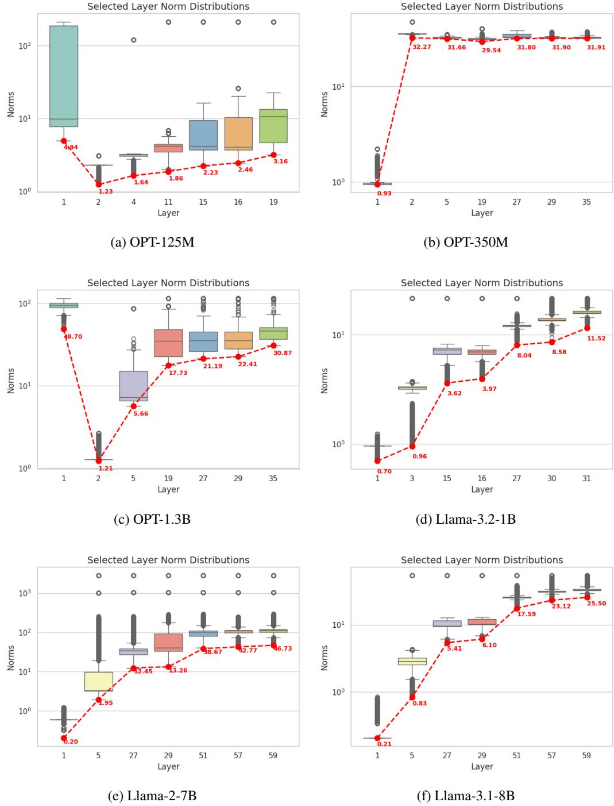  
Figure 3: Boxplots for the distribution of norms of inputs to normalization layer. Minimum value indicated in Red, showing that $\textstyle { \frac { 1 } { r } }$ is at most 5. Y-axis is log scale.

2. We discuss the synthetic samples used in our vision experiments and the effect of their quality on the algorithm.   
3. We provide additional pruning and unlearning experiments for a variety of architectures.   
4. We provide details of our compute platform, hyperparameters, and training procedure for our experiments.

Our code is available at https://github.com/DhruvaKashyap/modhifi.

# C.1 Validating Subset Fidelity and HIFI Sets

# C.1.1 Monte Carlo Experiments

In this section, we provide additional details regarding Figure 1 and demonstrate this behaviour across architectures.

Ideally, one would solve Equation (K-MFS) exactly to compute those sets that have optimal reconstructive ability at different sizes. However, since enumerating across subsets is a combinatorial problem, we instead approximate a solution by randomly sampling 1000 sets of the given size and compute the maximum across these samples. This will always provide a lower bound for the “true” curve.

Solving Equation (K-MFS) allows us to compute the optimal $( k , \eta )$ -HIFI sets, since this captures the relation between $\eta$ and $k$ , i.e. the tradeoff between sparsity and accuracy. We observe that in many layers (at least $50 \%$ of the model), across multiple models, there are sets which contain at most $20 \%$ of components but have a subset fidelity of around 0.8. We also observe that as the difficulty of the task increases (CIFAR10 to ImageNet), fewer layers exhibit this sparsity, validating the assertion that networks trained on harder problems are less overparameterized.

Figures 4 to 6 show this for a ResNet-50 trained on CIFAR10, CIFAR100, and ImageNet. Figure 7 shows this for a OPT- $1 2 5 \mathrm { m }$ model using 128 samples of WikiText and 100 random subsets instead of a 1000. Due to the expensive nature of this experiment, we are forced to use only 100 random subsets for each size, leading to a noisier curve. However, it is clear to see that the general trend continues to hold for several layers, especially for the “down-projection" weight matrices, which are the focus of our pruning algorithm for LLMs.

# C.1.2 Counterfactual study of HiFi sets

We compare the effect of removing HiFi components from a layer with the effect of removing a random subset of the same size. For a ResNet-50 model trained on CIFAR-10, when around $22 \%$ of HiFi components are removed, the accuracy drops by around $70 \%$ , whereas removing a random subset of the same size decreases the accuracy by $32 \%$ . Note that there is a roughly $1 \%$ decrease in accuracy when only $22 \%$ of the non-HiFi components are removed. This indicates that components classed as “High Fidelity" have a significantly higher impact on the model’s predictive performance than those with lower fidelity scores.

# C.1.3 Robustness of the Fidelity Score

In this section, we perform ablations on the number of samples required for estimating the fidelity score and show how it reacts to additive noise on the model’s weights.

In Figures 8 and 9 we show how different data sizes affect different layers in a ResNet50 model trained on CIFAR10 and ImageNet, respectively. Each data size is selected over 3 random seeds, with error bars shown. For clarity, we show only a subset of layers and provide plots and code to generate them.

We observe that the values remain stable for $0 . 2 \%$ , $0 . 5 \%$ , and $2 \%$ of the data selected, indicating that the model is robust to the number of samples selected.

We also observe the effect of training in these graphs. In untrained models, almost all components have very small fidelity scores with a sharp increase for some values. This indicates that HiFi components are a function of training, with the well-trainedness of the network being a prerequisite for their presence

When investigating the effect of adding noise to the weights and its effect on accuracy and the fidelity score, we observe that adding zero mean noise of larger standard deviations, starting from 0.005 to 0.05, decreases the fidelity of components, with noisier weights behaving more like untrained models. We test this on a ResNet-50 trained on CIFAR10 and present the results in Figure 10. Again, we present only a random subset of the layers for clarity.

Table 5: Effect of data quality when pruning a ResNet-50 on CIFAR10   

<table><tr><td>FID</td><td>Diffusion Steps</td><td> Accuracy</td><td>FLOPReduction</td><td>Param Reduction</td></tr><tr><td>85.80</td><td>4</td><td>86.27</td><td>2.63x</td><td>2.66x</td></tr><tr><td>35.58</td><td>5</td><td>90.75</td><td>2.78x</td><td>2.78x</td></tr><tr><td>14.42</td><td>6</td><td>90.39</td><td>3.50x</td><td>3.60x</td></tr></table>

# C.2 Constants in Theorem 3.6

In this section, we provided worst case and average case estimates of the constant $C _ { l }$ in Theorem 3.6. In Figure 11a, we plot the constants obtained in the proof of Theorem 3.6 in Appendix B.1 for a ResNet-50 trained on ImageNet, and observe that the values can be very large (38 orders of magnitude). However, it is important to note that these are worst case guarantees, and that these constants are much smaller in practice. In Figure 11b, we compute the ratio between the global error, $\mathbb { E } \left[ \lVert \pmb { y } ( \mathrm { X } ) - \pmb { y } ( \mathrm { X } ; M ^ { l } ) \rVert ^ { 2 } \right]$ and the local error, $\begin{array} { r } { \sum _ { c = 1 } ^ { c _ { o u t } ^ { l } } \mathbb { E } \left[ \left. \mathbf { Y } _ { c } ^ { l } ( \mathrm { X } ) - \sum _ { i \in C } m _ { c i } ^ { l } \pmb { A } _ { c i } ^ { l } ( \mathrm { X } ) \right. ^ { 2 } \right] } \end{array}$ and observe that these values are indeed much smaller (10-50) for random values of $M ^ { l }$ for the expected square loss.

# C.3 Discussion on the synthetic samples used in the experiments

We describe the synthetic datasets used in our vision experiments to simulate distributional access. Randomly selected example images are provided in Figure 12. For NLP tasks, we use WikiText and Alpaca datasets [50, 78] which are standard in this field.

# C.3.1 CIFAR5M

For experiments with the CIFAR10 dataset, we use CIFAR5M, a dataset containing 6 million synthetic CIFAR-10-like images sampled from a Diffusion model and labeled by a Big-Transfer model [57], which we randomly sample 10,000 samples from each of the 10 classes to create our dataset. This dataset has an FID [27] of 15.95 with respect to the CIFAR10 training set. This dataset is obtained from here.

# C.3.2 CIFAR100-DDPM

For experiments with the CIFAR100 dataset, we use CIFAR100-DDPM [23], which we randomly downsample to contain 1,000 samples from each of the 100 classes. This dataset has an FID of 4.74 with respect to the CIFAR100 training set. We randomly sample 1,000 samples from each of the 100 classes to create our dataset. This dataset is obtained from here.

# C.3.3 Effect of Data Quality

To study the effect of data quality on the performance of our algorithm in vision tasks, we apply the pruning algorithm using synthetic datasets based on CIFAR10 generated with different FIDs. We use a diffusion model [34] to generate 3 datasets of differing quality by changing the number of diffusion steps (4,5, and 6). We report the results of our pruning algorithm with different quality datasets in Table 5. We observe that higher quality data leads to an improved sparsity - accuracy tradeoff.

# C.4 Additional Pruning Experiments

We present additional pruning experiments in Tables 6 and 7.

# C.4.1 Ablation of weight compensation and BatchNorm correction

In this section, we perform ablations for each component of our pruning algorithm, simple pruning, correcting batch norm statistics and weight compensation. We report our results for pruning ResNet50 on CIFAR 10 in Table 8. We observe that each component allows for a better accuracy sparsity trade-off.

Table 6: Comparison of ResNet-50 pruning for CIFAR10 and CIFAR100. ST $=$ Synthetic Training, i.e. training using synthetic samples.   

<table><tr><td>Dataset</td><td>Algorithm</td><td>Accuracy</td><td>FLOPReduction</td><td>ParamReduction</td></tr><tr><td rowspan="5">CIFAR10</td><td>Unpruned</td><td>94.99</td><td>1x</td><td>1x</td></tr><tr><td>DFPC</td><td>90.25</td><td>1.46x</td><td>2.07x</td></tr><tr><td>L2</td><td>15.91</td><td>4.07x</td><td>4.71x</td></tr><tr><td>L2 w/ ST</td><td>90.12</td><td>4.07x</td><td>4.71x</td></tr><tr><td>Ours</td><td>91.02</td><td>4.07x</td><td>5.36x</td></tr><tr><td rowspan="5">CIFAR100</td><td>Unpruned</td><td>78.85</td><td>1x</td><td>1x</td></tr><tr><td>DFPC</td><td>70.31</td><td>1.27x</td><td>1.22x</td></tr><tr><td>L2</td><td>16.77</td><td>1.93x</td><td>1.40x</td></tr><tr><td>L2 w/ ST</td><td>73.83</td><td>1.93x</td><td>1.40x</td></tr><tr><td>Ours</td><td>70.93</td><td>1.93x</td><td>1.38x</td></tr></table>

Table 7: Comparison of ResNet-101/VGG-19 pruning on CIFAR10 and CIFAR100. ST $=$ Synthetic Training, i.e. training using synthetic samples.   

<table><tr><td>Dataset</td><td>Model</td><td>Algorithm</td><td>Accuracy</td><td>FLOP Reduction</td><td>Param Reduction</td></tr><tr><td rowspan="5">CIFAR-100</td><td rowspan="5">VGG19</td><td>Unpruned</td><td>72.02</td><td>1x</td><td>1x</td></tr><tr><td>DFPC</td><td>70.10</td><td>1.26x</td><td>1.50x</td></tr><tr><td>L2</td><td>56.46</td><td>1.50x</td><td>2.40x</td></tr><tr><td>L2 W/ST</td><td>72.42</td><td>1.50x</td><td>2.40x</td></tr><tr><td>Ours</td><td>70.26</td><td>1.51x</td><td>2.31x</td></tr><tr><td rowspan="8">CIFAR10</td><td rowspan="4">ResNet-101</td><td>Unpruned</td><td>95.09</td><td>1x</td><td>1x</td></tr><tr><td>DFPC</td><td>89.80</td><td>1.53x</td><td>1.84x</td></tr><tr><td>L2 W/ST</td><td>90.49</td><td>4.20</td><td>5.29x</td></tr><tr><td>Ours</td><td>91.20</td><td>4.21x</td><td>4.79x</td></tr><tr><td rowspan="4">VGG19</td><td>Unpruned</td><td>93.50</td><td>1x</td><td>1x</td></tr><tr><td>DFPC</td><td>90.25</td><td>1.46x</td><td>2.07x</td></tr><tr><td>L2 w/ ST</td><td>89.23</td><td>2.39x</td><td>9.19x</td></tr><tr><td>Ours</td><td>91.80</td><td>2.39x</td><td>5.52x</td></tr></table>

# C.4.2 Final ImageNet Pruned Model

In Figures 13 and 14 we compare the final pruned models for ResNet-50 on ImageNet with DFPC [58]. We observe that our pruning algorithm removes more channels in later coupled channels than DFPC leading to higher gains in sparsity.

# C.4.3 Baseline selection for LLM Pruning

We choose ShortGPT [49] and SliceGPT [2] as baselines against which we compare ModHiFi. We do so for two broad reasons: all three methods together represent three different granularities for conducting structured pruning for LLMs, and both ShortGPT and SliceGPT are the state-of-the-art within their respective lanes.

The three different granularities are

1. Layer pruning: Entire layers (i.e. transformer decoder blocks) are removed from the network. This is viable since transformers are constant width networks, i.e., there are no architectural restrictions to the ordering or number of layers. ShortGPT falls within this granularity.

Table 8: Ablation of different components   

<table><tr><td>BatchNorm</td><td>Compensation</td><td>Accuracy</td><td>FLOPReduction</td><td>Param Reduction</td></tr><tr><td>No</td><td>No</td><td>93.37</td><td>1.61x</td><td>1.53x</td></tr><tr><td>No</td><td>Yes</td><td>93.49</td><td>2.21x</td><td>2.17x</td></tr><tr><td>Yes</td><td>No</td><td>93.17</td><td>2.53x</td><td>2.39x</td></tr><tr><td>Yes</td><td>Yes</td><td>93.76</td><td>3.22x</td><td>3.30x</td></tr></table>

2. Embedding pruning: The width of the network (i.e. the embedding dimension) is pruned at a uniform rate across the entire network. This entails a form of feature selection: along with weight matrix pruning, one also has to prune the corresponding dimensions from the feature matrix being fed into every layer. SliceGPT falls within this granularity. 3. Hidden dimension pruning: Here, the number of layers and the width of the embedding are left unchanged. Instead, one prunes the hidden dimensions within the modules that constitute a transformer decoder block. ModHiFi falls within this granularity.

We would like to emphasize that both SliceGPT and ShortGPT are designed to operate on Transformer models, and as such are able to leverage specifics of the architecture to their advantage. In return for this specificity, however, they trade off the ability to generalize to CNNs, something that ModHiFi does with ease due to its architecture-agnostic nature; the only assumption made by the Fidelity Score is that the components being scored belong to linear layers.

# C.5 Additional Unlearning Experiments

We report additional experiments in Table 9 on class unlearning on different architectures. For VGG-19 networks, we remove the HiFi channels for the forget class of the last 12 convolution layers. We also compare our work with DisCEdit-U from [55] wherein we remove discriminative components from the last 8 convolutional layers. We use a custom implementation of the algorithm for our VGG19 and ResNet50 models for CIFAR10, as those models are unavailable in the codebase of [55].

We also compare our work with DisCEdit-U on ResNet50 trained on CIFAR10 as well, which we present in Table 10

We show that our unlearning method achieves similar or superior performance to that of [55] without fine-tuning. Moreover, unlike [55], our approach uses only synthetic samples, showing the efficacy of our work in classwise unlearning, even in the absence of training data.

Unlearning with finetuning Here we compare our method with 3 additional epochs of finetuning on synthetic samples of the remaining class data. Although this setup does not fall into the setup of the work since we do not assume access to the loss function, we provide these results to indicate that even using very few synthetic samples we can perform perfect unlearning. We present these results in Table 11, where we observe almost perfect unlearning for both ResNet-50 and Swin-Transformers.

Unlearning with baseline budgets In this section, we compare our method when allowing for the same amount of finetuning as [33], with both synthetic data and training data access. While this violates our assumptions about loss function and training data access, we present these results to provide a fair comparison of our algorithm when run within the same constraints as our baselines. Our results can be found in Table 12 for the Swin Transformer.

# C.6 Compute Platform

Implementation Details We implement our proposed methods in PyTorch [61] and use Huggingface’s transformers [87] for LLM implementations.

Inference time measurements We follow the inference time measurement setting of [58, 69]. Inference time is the time taken for a model to compute the forward pass for an input and does not account for loading data into memory. We compute the inference time for a batch of 640 random tensors for GPU and 64 for CPU. 100 iterations are used for warm up, after which the inference time is averaged over the next 1000 forward passes. We compute CPU and GPU measurements on a machine whose specifications can be found in Appendix C.6.

Table 9: Class unlearning on CIFAR10 for VGG19   

<table><tr><td>Model</td><td>Algorithm</td><td>Forget Accuracy</td><td>Remain Accuracy</td></tr><tr><td rowspan="3">VGG19</td><td>-</td><td>93.50</td><td>93.50</td></tr><tr><td>DisCEdit-U [55]</td><td>2.39</td><td>84.2</td></tr><tr><td>Ours</td><td>0.86</td><td>77.85</td></tr></table>

Table 10: Class unlearning on CIFAR10 for ResNet50   

<table><tr><td>Model</td><td>Algorithm</td><td>Forget Accuracy</td><td>Remain Accuracy</td></tr><tr><td rowspan="3">ResNet50</td><td>=</td><td>94.99</td><td>94.99</td></tr><tr><td>DisCEdit-U [55]</td><td>3.2</td><td>91.6</td></tr><tr><td>Ours</td><td>0.2</td><td>92.98</td></tr></table>

Table 11: Class unlearning with 3 epochs of finetuning on synthetic samples   

<table><tr><td>Model</td><td>Remain Accuracy</td><td>Forget Accuracy</td></tr><tr><td>ResNet-50</td><td>93.1</td><td>0</td></tr><tr><td>Swin-T</td><td>83.6</td><td>0.1</td></tr></table>

JIT Compilation We present inference time numbers with JIT compilation on Pytorch [60].

Hardware Table 13 details the hardware we use to conduct our experiments. Values in (\*) indicate reported values obtained from https://www.amd.com/en/products/accelerators/ instinct/mi200/mi210.html. This machine runs Ubuntu 22.04.3 LTS with kernel 6.8.0-40- generic with the hardware in Table 13. Our software stack comprises of Python 3.12.8, PyTorch 2.5.1 built for $\mathrm { R O C m } 6 . 2$ , and torchvision version 0.20.1 built for $\mathrm { R O C m } 6 . 2$ .

Inference times are measured on a machine running Ubuntu 20.04.1 LTS with kernel 5.15.0-91- generic on the hardware specified in Table 14. The software stack used for inference consists of Python 3.12.8, PyTorch 2.5.1, and Torchvision 0.20.1 for CUDA 12.3.

# C.6.1 Module-level Time Consumption

In this section, we break down the time each component of our algorithm takes. For 2000 samples batched into batches of size 64, when running the algorithm on a ResNet-50:

• Computation of fidelity scores takes between 32GB to 51GB of VRAM, and between 2 minutes to 5 minutes, on 1 GPU of machine 13, across data from CIFAR10, CIFAR100, and ImageNet. • Computing ${ \delta } _ { c } ^ { \star }$ across 4 GPUs using an average of 60GB per GPU takes 60 minutes for CIFAR10/100, and 90 minutes for ImageNet, averaging to roughly 1 minute per layer.

# C.7 Hyperparameters and Training Procedure

# C.7.1 Hyperparameters for Experiments

We typically set the percentile of removed components to be between 0.01 to 0.2. We randomly select $2 \%$ of our synthetic samples to select data for vision tasks and select 128 samples for NLP tasks.

Table 12: Class unlearning with 10 epochs of finetuning   

<table><tr><td>Approach</td><td>Dataset</td><td>Forget Accuracy</td><td>Remain Accuracy</td></tr><tr><td>Jia et al. [33]</td><td>CIFAR10 Train</td><td>1.20</td><td>90.69</td></tr><tr><td>Ours</td><td>CIFAR10 Synthetic</td><td>0.37</td><td>84.63</td></tr><tr><td>Ours</td><td>CIFAR10 Train</td><td>0.00</td><td>91.1</td></tr></table>

Table 13: Specifications of GPU hardware used for computation   

<table><tr><td>CPU Model Name</td><td>AMDEPYC 9654 96-Core Processor</td></tr><tr><td>CPU(s)</td><td>192 1</td></tr><tr><td>Thread(s) per core</td><td></td></tr><tr><td>Core(s) per socket</td><td>96 2</td></tr><tr><td>Socket(s)</td><td></td></tr><tr><td>NUMA node(s)</td><td>2</td></tr><tr><td>CPU MHz(Max)</td><td>3707.8120</td></tr><tr><td>Lld&amp;Llicache</td><td>6MiB</td></tr><tr><td>L2 cache</td><td>192 MiB</td></tr><tr><td>L3 cache</td><td>768MiB</td></tr><tr><td>RAM</td><td>1.48 TiB (DDR5, 4800 MT/s)</td></tr><tr><td>GPU Model name</td><td>Instinct MI210</td></tr><tr><td>GPU(s)</td><td>4</td></tr><tr><td>GPU Architecture</td><td>AMDAldebaran</td></tr><tr><td>Dedicated Memory Size(per GPU) ROCm Version</td><td>64 GB</td></tr><tr><td></td><td>6.0.2</td></tr><tr><td>Peak FP32 Performance*</td><td>22.6 TFLOPs</td></tr><tr><td>Peak FP64 Performance*</td><td>22.6 TFLOPs</td></tr><tr><td>Memory Clock*</td><td>1.6 GHz</td></tr><tr><td>Peak Memory Bandwidth*</td><td>1.6 TB/s</td></tr></table>

Table 14: Specifications of GPU and CPU hardware used for computing inference time   

<table><tr><td>CPU Model Name</td><td>Intel(R) Xeon(R) Silver 4216 CPU @ 2.10GHz</td></tr><tr><td>CPU(s)</td><td>64</td></tr><tr><td>Thread(s) per core</td><td>2</td></tr><tr><td>Core(s) per socket</td><td>16</td></tr><tr><td>Socket(s)</td><td>2</td></tr><tr><td>NUMA node(s)</td><td>2</td></tr><tr><td>CPU MHz(Max)</td><td>3200</td></tr><tr><td>L1d&amp;Llicache</td><td>1 MiB</td></tr><tr><td>L2 cache</td><td>32 MiB</td></tr><tr><td>L3 cache</td><td>44 MiB</td></tr><tr><td>RAM</td><td>62.53 GiB (DDR4, 2666 MT/s)</td></tr><tr><td>GPU Model name</td><td>NVIDIA GeForce RTX 2080 Ti</td></tr><tr><td>CUDA version</td><td>12.3</td></tr><tr><td>GPU(s)</td><td>8</td></tr><tr><td>GPUArchitecture</td><td>NVIDIA Turing</td></tr><tr><td>Dedicated Memory Size(per GPU)</td><td>11.81 GB</td></tr></table>

# C.7.2 Training procedure

Pretraining procedure: For CIFAR10 and CIFAR100, we train models using SGD with a momentum factor of 0.9 and weight decay of $5 \times 1 0 ^ { - 4 }$ , for 200 epochs using Cosine Annealing step sizes with an initial learning rate of 0.1.

ImageNet post training: For ImageNet, we use off-the-shelf pretrained models from Torchvision [60]. We train the model for 3 epochs after each iteration of pruning with learning rates of 0.1, 0.01, 0.001. After the pruning ends, we finally train the network for 160 epochs with a batch size of 512. We use the SGD Optimizer with a momentum factor of 0.9 and weight decay of $1 \times 1 0 ^ { - 4 }$ and start with an LR warm-up for 10 epochs, followed by Cosine Annealed step sizes with an initial learning rate of 0.1 with Cutmix and Mixup augmentations.

$L _ { 2 }$ Post training procedure: For the synthetic training experiments mentioned in Section 5, we first prune the model using $L _ { 2 }$ norm as the grouped saliency to a similar sparsity as our algorithm. We then train the model using 50000 samples from the synthetic dataset for 100 epochs with a batch size of 128 using SGD optimizer with momentum factor of 0.9 with initial learning rate of 0.01 and a MultiStepLR learning rate scheduler with milestones at 60 and 80 epochs.

# D Additional Algorithm details

In this section, we discuss algorithmic nuances not discussed in the main body of the paper.

# D.1 Clarification on Lipschitz Bounds and Their Role

In Section 3, we introduced a local-to-global error bound (Theorem 3.6) that connects intermediatelayer deviations to changes in the final-layer output, assuming the model is composed of Lipschitzcontinuous layers with constants $C _ { l }$ . This result serves to theoretically motivate the use of local reconstruction error – what we formalize as Subset Fidelity – as a proxy for reconstruction error at the output.

Importantly, we do not compute or estimate Lipschitz constants in any part of our algorithm. Our pruning and unlearning algorithms do not depend on knowledge of the values of $C _ { l }$ . The bound in Theorem 3.6 is used qualitatively to support the intuition that preserving high-fidelity intermediate representations leads to stability in the final model predictions.

Empirically, we find that Subset Fidelity correlates strongly with the effect of component removal on prediction quality (see Figure 1 and Appendix C), even in the absence of explicit Lipschitz bound estimation. This supports our design choice to treat Theorem 3.6 as a motivating principle, not an operational tool.

We believe this distinction is important to clarify: while our framework draws conceptual inspiration from Lipschitz continuity, it remains loss-free, and hyperparameter-driven in practice, with no reliance on any difficult-to-estimate constants.

# D.2 Additional Algorithmic details on Fidelity Estimation

To efficiently estimate the fidelity of each component at a given layer, we use a saliency measure to approximate the fidelity score. This is based on the component’s contribution to reconstructing the layer’s output, computed via the inner product between the layer output and the component-specific activation contribution. This can be written as

$$
\tilde { R } _ { c i } ^ { l } = \mathbb { E } \left[ \langle \pmb { Y } _ { c } ( \mathrm { X } ) , \pmb { A } _ { c i } ( \mathrm { X } ) \rangle \right] = \langle \pmb { Q } _ { i } ^ { c } , \pmb { 1 } \rangle = \alpha _ { c i } ^ { l } \mathbb { E } [ | \pmb { A } _ { c i } | | ^ { 2 } ]
$$

In networks that include BatchNorm (e.g., ResNets [26], VGG [73]), we refine this reconstruction by centering the activations using the BatchNorm’s stored running mean. This leads to a modified formulation of the component similarity matrix:

$$
\tilde { Q } _ { i j } ^ { c } = \mathbb { E } \left[ \langle \pmb { A } _ { c i } ( \mathrm { X } ) , \pmb { A } _ { c j } ( \mathrm { X } ) \rangle \right] - \langle \mathbb { E } [ \pmb { A } _ { c i } ( \mathrm { X } ) ] , \mathbb { E } [ \pmb { A } _ { c j } ( \mathrm { X } ) ] \rangle
$$

These quantities are computed efficiently using modern GPU architectures. The forward activations from a calibration set are batched and evaluated across multiple GPUs in parallel. In sequence-based architectures such as Transformers [46], we compute the expectation over all elements in the sequence dimension.

Numerical Stability and Regularization. To compute the optimal linear compensation for modifying components, we solve a least-squares system involving the component similarity matrix $\tilde { Q } ^ { c }$ . However, this matrix may be ill-conditioned or rank-deficient in practice. To ensure numerical stability and avoid inversion errors, we add a small $\ell _ { 2 }$ regularization term $\lambda = 1 0 ^ { - 4 }$ ) to the diagonal before solving.

Behavior of HiFi Components During Editing. The role of HiFi components depends on the editing task:

• Structured Pruning: We retain HiFi components and discard the rest. While we cannot guarantee a fixed sparsity level in the output model (since HiFi components may span all inputs), we observe in practice that reasonable sparsity emerges naturally. For more aggressive pruning, the algorithm is applied iteratively.

• Class Unlearning: Simply discarding low-fidelity components is insufficient. Instead, we aim to remove or disrupt the influence of HiFi components that are specific to the forget class. The editing strategy depends on the network type:

– In BatchNorm networks, we zero out the weights of HiFi components computed as per the forget class samples.   
– In LayerNorm-based networks with residual connections (e.g., Swin-T), we negate the weights of HiFi components. This rotates the forget-class representation in the opposite direction due to the residual path.

The unlearning strategy for Transformer-based architectures is captured in the following procedure:

# Algorithm 2 ViT-Edit-X: Structured Editing for Transformers

Require: Model parameters $\theta$ , HiFi components $H$ , coupled channels $C C$

Ensure: Edited model parameters $\hat { \theta }$

$$
\forall c \in [ c _ { \mathrm { o u t } } ^ { l } ] , ~ l \in C C
$$

1: if $X = { \mathsf { P r u n e } }$ then   
2: for $\begin{array} { r } { i \in [ c _ { \mathrm { i n } } ^ { l } ] \setminus \{ i \mid ( c , i ) \in \bigcup _ { l } H _ { l } \} } \end{array}$ do   
3: ${ W _ { c , i } ^ { l } } \gets 0$   
4: else if $X =$ Unlearn then   
5: for each layer $l \in C C$ do   
6: $\hat { W } _ { c , i } ^ { l } \gets - W _ { c , i } ^ { l }$   
7: Return: ˆθ

$$
\forall ( c , i ) \in H _ { l }
$$

Fidelity Estimation in LLMs Due to the large scale of LLMs and the range of floating point values, estimation of scores becomes more challenging. We estimate the the fidelity scores by computing the row norms of the regularized Cholesky decomposition of $Q$ . The scores are estimated as

$\mathrm { F S } ( \{ i \} ) \approx | | L _ { i } | | ^ { 2 } \mathrm { w h e r e } Q = L L ^ { \top }$ is the Cholesky decomposition of $Q$

We use the Cholesky decomposition since it is efficient to compute.

# D.3 Computational cost

Let $N$ be the number of data points used to estimate the saliency and $M ^ { l }$ be the complexity of computing the input contribution at layer $l$ for a single sample in a set of coupled channels with $m$ layers. The complexity to compute the set of retained channels for an output channel of a layer is, $t _ { s a l } ^ { l ^ { - } } = O ( N M ^ { l } \dot { C } _ { i n } ^ { l } d ^ { l } )$ . To select the components for the coupled channels, the top $p$ elements for each layer and output channel in them are collected, this costs $O ( \sum _ { l = 1 } ^ { m } C _ { o u t } ^ { l } ( C _ { i n } ^ { l } \log C _ { i n } ^ { l } + t _ { s a l } ^ { l } ) )$ . The algorithm shows a linear dependence on the number of layers in the network, compared with the BGSC algorithm [58] which has a quadratic dependence.

# E Full LLM Disclosure

We employed Large Language Models (LLMs) to refine the text for grammar and clarity. Additionally, LLMs were used to generate auxiliary scripts for data visualization (plots). We confirm that LLMs were not used to implement any of the core algorithms or methodologies proposed in this work.

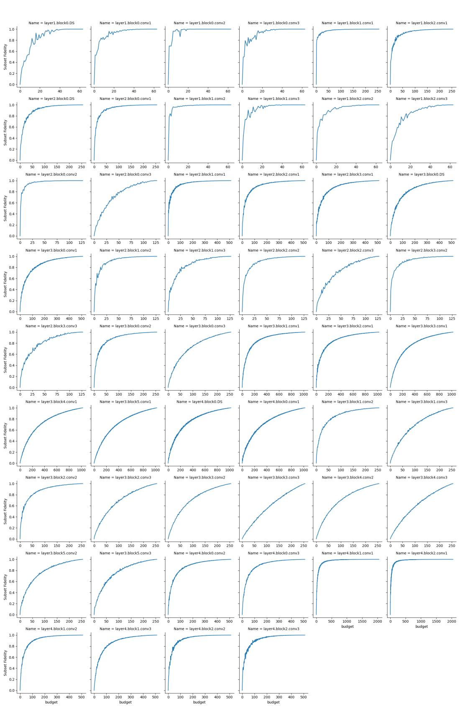  
Figure 4: Estimates of Optimal subset fidelity for ResNet-50 on CIFAR10.

  
Figure 5: Estimates of Optimal subset fidelity for ResNet-50 on CIFAR100.

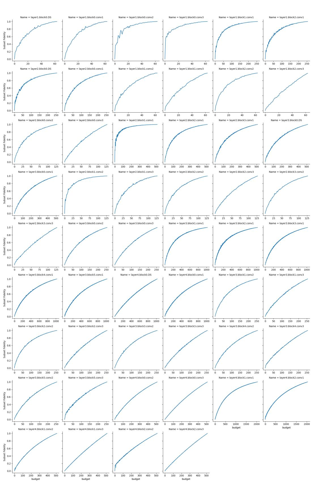  
Figure 6: Estimates of Optimal subset fidelity for ResNet-50 on ImageNet.

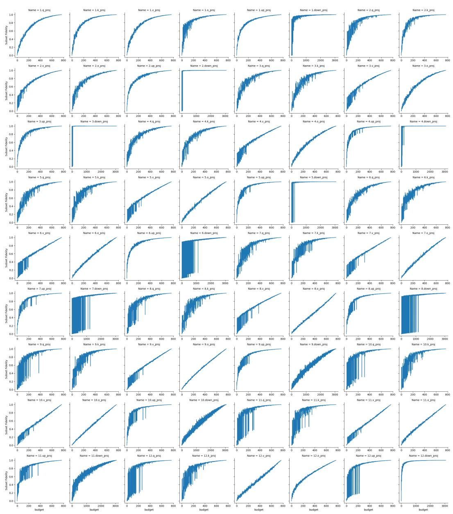  
Figure 7: Estimates of Optimal subset fidelity for OPT-125M.

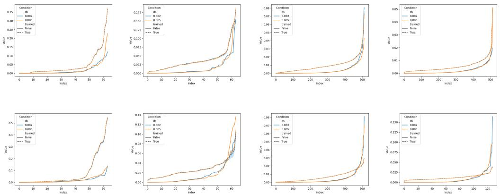  
Figure 8: Fidelity scores for select layers of ResNet50 trained on ImageNet showing the effect of training and data set size (ds).

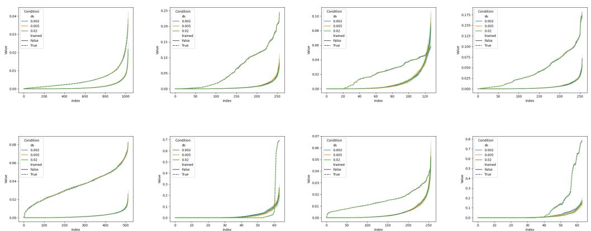  
Figure 9: Fidelity scores for select layers of ResNet50 trained on CIFAR10 showing the effect of training and data set size.

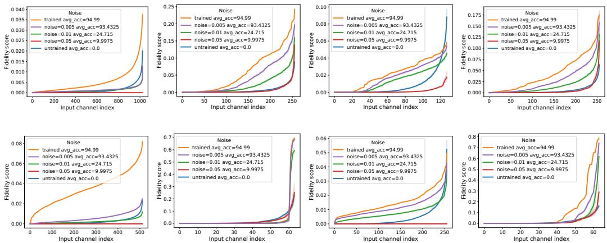  
Figure 10: Fidelity scores for select layers of ResNet50 trained on CIFAR10 showing the effect of adding noise

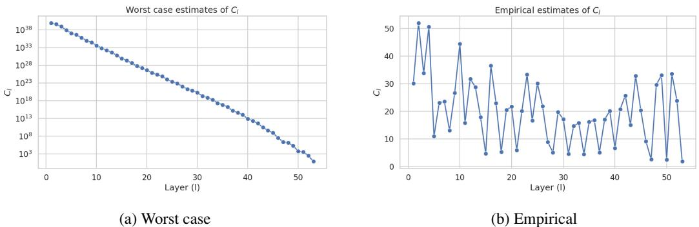  
Figure 11: Estimates of constants $C _ { l }$ across layers for a ResNet-50 trained on ImageNet.

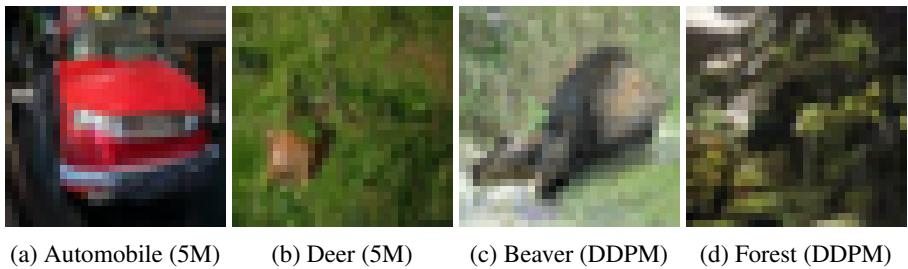  
Figure 12: Randomly selected images from the synthetic sets

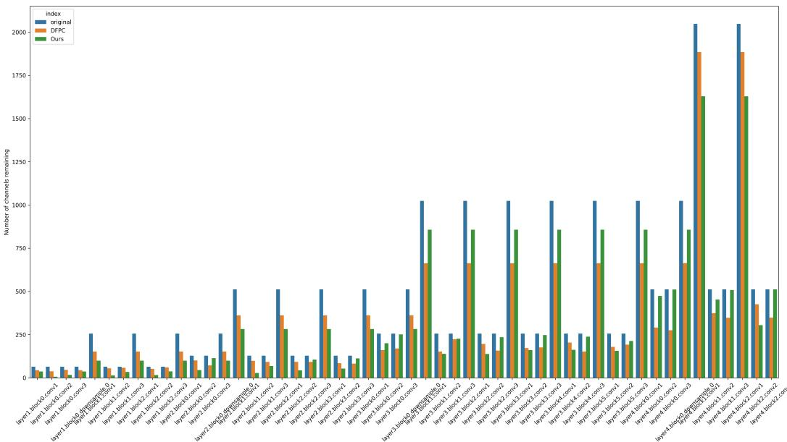  
Figure 13: Number of remaining channels of pruned ImageNet model compared with DFPC (30)

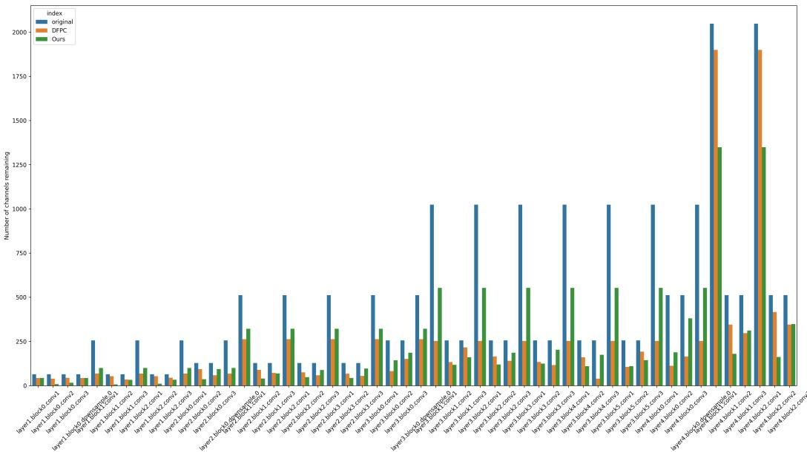  
Figure 14: Number of remaining channels of pruned ImageNet model compared with DFPC (54)