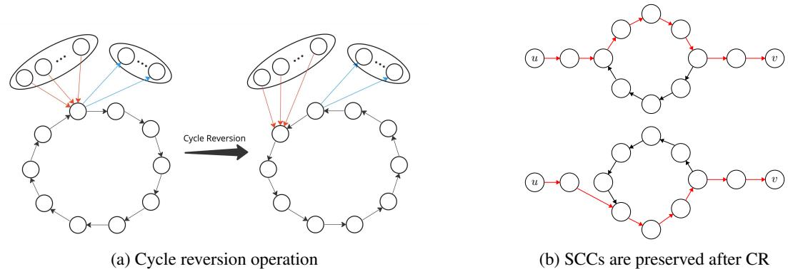
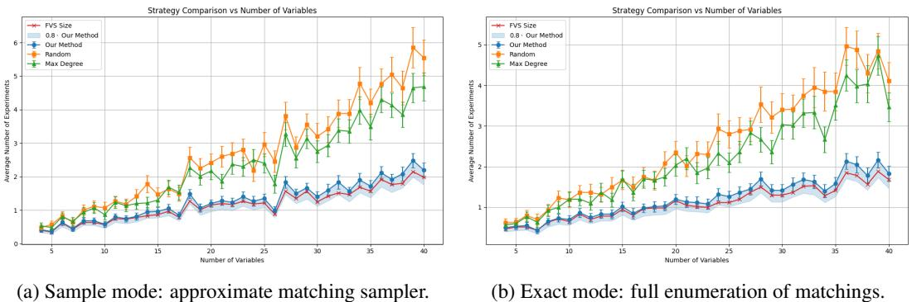

# Near-Optimal Experiment Design in Linear non-Gaussian Cyclic Models

Ehsan Sharifian EPFL, Lausanne, Switzerland ehsan.sharifian@epfl.ch

Saber Salehkaleybar Leiden University, Leiden, The Netherlands s.salehkaleybar@liacs.leidenuniv.nl

Negar Kiyavash EPFL, Lausanne, Switzerland negar.kiyavash@epfl.ch

# Abstract

We study the problem of causal structure learning from a combination of observational and interventional data generated by a linear non-Gaussian structural equation model that might contain cycles. Recent results show that using mere observational data identifies the causal graph only up to a permutation-equivalence class. We obtain a combinatorial characterization of this class by showing that each graph in an equivalence class corresponds to a perfect matching in a bipartite graph. This bipartite representation allows us to analyze how interventions modify or constrain the matchings. Specifically, we show that each atomic intervention reveals one edge of the true matching and eliminates all incompatible causal graphs. Consequently, we formalize the optimal experiment design task as an adaptive stochastic optimization problem over the set of equivalence classes with a natural reward function that quantifies how many graphs are eliminated from the equivalence class by an intervention. We show that this reward function is adaptive submodular and provide a greedy policy with a provable near-optimal performance guarantee. A key technical challenge is to efficiently estimate the reward function without having to explicitly enumerate all the graphs in the equivalence class. We propose a sampling-based estimator using random matchings and analyze its bias and concentration behavior. Our simulation results show that performing a small number of interventions guided by our stochastic optimization framework recovers the true underlying causal structure.

# 1 Introduction

Learning causal relationships among variables of interest in a complex system is a central goal in empirical sciences, forming the foundation for prediction, intervention, and explanation [25]. These relationships are typically represented by causal graphs in which an edge from variable $X$ to variable $Y$ indicates that $X$ is a direct cause of $Y$ . Much of the existing literature on causal structure learning assumes that the underlying causal graph is a Directed Acyclic Graph (DAG). However, many natural and engineered systems include feedback mechanisms that give rise to cycles in their causal representations. Such cyclic structures emerge in equilibrium models, low-frequency temporal sampling of dynamical systems, and various biological networks [3].

In acyclic settings, a variety of methods (such as those based on conditional independence tests) allow us to recover the skeleton and orientations of the causal graph from observational data. These methods often fail when applied to graphs with cycles. More specifically, observational data alone does not even suffice for learning the skeleton, let alone orienting the edges of the graph [23].

Interventions, i.e., actively perturbing the system and observing the resulting distributional changes can allow us to learn the graphs even with cycles. The experiment design problem studies how to best design interventions in order to maximize the information gained about the causal structure. Again, unlike the case of DAGs, where a body of work on experiment design exist, the work in the cyclic setting [23] is few and far in between. This is in part due to the fact that, unlike in DAGs, where an intervention on a subset of the vertices orients all the edges incident to them, in cyclic directed graphs, performing experiments in some cases, neither leads to learning the presence of edges nor orienting them [23].

In this work, we study the problem of causal structure learning from a combination of observational and interventional data in systems governed by linear non-Gaussian structural causal models (SCMs) that may contain cycles. Our main contributions are as follows:

• We establish that, under linear non-Gaussian assumptions, the causal graph can be identified from observational data only up to an equivalence class. We further provide a combinatorial characterization of the equivalence class, where each graph corresponds to a perfect matching in a bipartite graph (Section 4.2). Additionally, we show that the condensation graph, or Strongly Connected Components (SCCs), of the true causal graph can also be identified (4.1).   
• The bipartite representation allows us to analyze how atomic interventions constrain the space of causal graphs. Specifically, we show that each intervention reveals one edge of the true matching and eliminates all incompatible graphs from the equivalence class (Section 5). Therefore, we can formulate the optimal experiment design problem as an adaptive stochastic optimization over the space of equivalence classes, using a reward function that quantifies the number of eliminated graphs following an intervention. We prove that this reward function is adaptive submodular and hence a greedy policy has provably near-optimal performance guarantees for intervention design (Section 6).   
• To address the computational challenge of reward estimation, we propose a sampling-based estimator based on random matchings and provide a theoretical analysis of its bias and concentration properties (Section 7).   
• Experiments show that our adaptive strategy outperforms other heuristic methods and closely matches the feedback vertex set (FVS) lower bound (see more details in Section ??).

# 2 Related Work

Causal discovery is concerned with learning the underlying causal graph which encodes both the existence and direction of edges among variables of interest in a system. From observational data alone, the causal graph can be recovered only up to its Markov equivalence class (MEC). [29] provided necessary and sufficient conditions for Markov equivalence of directed graphs (DGs) and proposed an algorithm for structure learning up to the MEC [28]. [24] extended the applicability of a classic algorithms for constraint-based causal discovery (i.e., FCI [32]) to cyclic DGs and showed that it can recover the structure up to the MEC in this more general setting.

To address latent confounding and nonlinear mechanisms, [6] introduced $\sigma$ -connection graphs ( $\scriptstyle { \overbrace { \sigma \mathrm { - } } }$ CGs)—a flexible class of mixed graphs—and developed a discovery algorithm that handles both latent variables and interventional data. [10] focused on distributional equivalence for linear Gaussian models, providing necessary and sufficient conditions and proposing a score-based learning method. In the context of linear non-Gaussian models, [21] extended the Independent Component Analysis (ICA)-based approach of [31] to cyclic graphs to learn the equivalence class from the observational data.

The research on experiment design in acyclic models has focused on various aspects, including cost minimization and efficient learning under budget constraints. [5] provided worst-case bounds on the number of experiments to identify the graph. [14] introduced adaptive and exact non-adaptive algorithms for singleton interventions. [13] proposed optimal one-shot and adaptive heuristics to minimize undirected edges. [30] offered lower bounds for experiment design using separating systems, and [20] introduced a stage-wise approach in the presence of latent variables. In cost-aware settings, [19] developed an optimal algorithm for variable-cost interventions without size constraints. [12] and [33] designed approximation algorithms for trees and general graphs, respectively.

Fixed-budget design was initiated by [8] with a greedy Monte Carlo-based approach. [9] improved MEC sampling efficiency, and [7] developed an exact experiment design algorithm for tree structures. [2] proposed an exact method to enumerate DAGs post-intervention. [36, 37] showed that MEC counting and sampling can be done in polynomial time. Bayesian methods include the adaptive submodular algorithm [1] and its extension [34] to optimize both intervention targets and their assigned values.

To the best of our knowledge, only a handful of work on experiment design in cyclic graphs exists. For general SCMs, [23] proposed an experiment design approach that can learn both cyclic and acyclic graphs. They provided a lower bound on the number of experiments required to guarantee the unique identification of the causal graph in the worst case, showing that the proposed approach is order-optimal in terms of the number of experiments up to an additive logarithmic term. Our approach differs from [23] in three key aspects. First, their framework is non-adaptive, that is, all interventions are selected in advance based solely on observational data. In contrast, our method is adaptive as each experiment is selected based on the outcomes of prior interventions. Second, [23] allow intervening on multiple variables in a single experiment. Although they also considered the setup where the number of interventions per experiment is bounded, this bound should be greater than the size of the largest strongly connected component in the graph minus one. By contrast, our framework limits each experiment to a single-variable intervention, making it more practical in settings where fine-grained or limited interventions are preferred. Third, the approach in [23] is designed for general SCMs and relies on conditional independence testing to recover the causal structure. In our work, we focus specifically on linear non-Gaussian models, which enables us to use results from ICA to infer the underlying graph.

# 3 Preliminaries and Problem Formulation

Consider a Structural Causal Model (SCM) ${ \mathfrak { C } } : = ( \mathbf { S } , P _ { \mathbf { e } } )$ , where $\mathbf { S }$ consists of $n$ structural equations and $P _ { \mathbf { e } }$ is the joint distribution over exogenous noise terms [26]. In a linear SCM (LSCM), the structural equations take the following form:

$$
{ \bf x } = W { \bf x } + { \bf e } ,
$$

where $\mathbf { x } \in \mathcal { X } \subseteq \mathbb { R } ^ { n }$ denotes the vector of observable variables, $\mathbf { e } \in \mathcal { E } \subseteq \mathbb { R } ^ { n }$ represents the vector of independent exogenous noises, and $W \in \mathbb { R } ^ { n \times n }$ is the matrix of linear coefficients. The directed graph $G = ( V , E )$ induced by the SCM captures the causal structure: node $i$ corresponds to the variable $x _ { i }$ , and for any nonzero coefficient $W _ { i j } \neq 0$ , a directed edge $( j , i ) \in E$ is drawn. The binary adjacency matrix $\bar { B _ { G } } \bar { \in } \{ 0 , 1 \} ^ { n \times n }$ is defined as $[ B _ { G } ] _ { i j } = \mathbb { 1 } _ { \{ W _ { i j } \neq 0 \} }$ , and the “free parameters” are the nonzero entries $\operatorname { s u p p } ( W ) = \{ ( i , j ) : W _ { i j } \neq 0 \}$ . We impose the following assumptions:

Assumption 3.1. The model has no self-loops: $W _ { i i } = 0$ for all $i \in [ n ]$ .

Remark. This assumption can be made without loss of generality, as any self-loop can be algebraically removed by reparametrizing the structural equations. For a detailed explanation, see [22].

Assumption 3.2. The matrix $I - W$ is invertible.

Assumption 3.3. The components of $\mathbf { e }$ are jointly independent, and at most one component is Gaussian. That is,

$$
P _ { \mathbf { e } } \in { \mathcal { P } } ( \mathcal { E } ) : = \left\{ P _ { \mathbf { e } } : P _ { \mathbf { e } } = \prod _ { i = 1 } ^ { n } P _ { e _ { i } } , { \mathrm { ~ w i t h ~ a t ~ m o s t ~ o n e ~ } } P _ { e _ { i } } { \mathrm { ~ G a u s s i a n } } \right\} .
$$

Under these assumptions, the model admits a unique solution: $\mathbf { x } = ( I - W ) ^ { - 1 } \mathbf { e } = A \mathbf { e } $ . The observational distribution $P _ { \mathbf { x } }$ is thus given by the push-forward measure $P _ { \mathbf { x } } = ( I - T _ { W } ) _ { \# } ^ { - 1 } ( P _ { \mathbf { e } } )$ , where $T _ { W }$ denotes the linear map associated with $W$ .

We consider perfect interventions, in which the causal mechanism for a variable $x _ { i }$ is replaced with an exogenous noise ${ \tilde { e } } _ { i }$ , removing all incoming edges to $x _ { i }$ . The interventional SCM is given by:

$$
\mathbf { x } = W ^ { ( i ) } \mathbf { x } + \mathbf { e } ^ { ( i ) } ,
$$

where the $i$ -th row of $W ^ { ( i ) }$ is zeroed out and the noise in the $i$ -th row of $\mathbf { e }$ is replaced with the new independent noise ${ \tilde { e } } _ { i }$ . We denote the new noise vector by $\mathbf { e } ^ { ( i ) }$ . While $( I - W ^ { ( i ) } )$ might not always be invertible, we assume that the probability it becomes singular is zero under mild randomness conditions on the rows of $W$ . Thus, we treat $( I - W ^ { ( i ) } )$ as invertible so that the interventional distribution $P ( \mathbf { x } | \mathrm { d o } ( x _ { i } ) ) = ( I - T _ { W ^ { ( i ) } } ) _ { \# } ^ { - 1 } ( P _ { \mathbf { e } ^ { ( i ) } } )$ is well defined.

In interventional structure learning, we perform $K$ distinct experiments to reduce uncertainty over the underlying causal graph. Each experiment involves a perfect intervention on a single variable. We denote the set of intervention targets by $\mathcal { T } = \left\{ i _ { 1 } , i _ { 2 } , \dotsc , i _ { K } \right\} \subseteq [ n ]$ , where $i _ { j } \in [ n ]$ indicates that the $j$ -th experiment intervenes on variable $x _ { i _ { j } }$ . In the single-intervention setting we consider, each experiment replaces the structural assignment of the target variable with a new exogenous noise term (cf. Equation 2). As a result, data from the $j$ -th experiment is drawn from the interventional distribution $\mathbf { \bar { \rho } } P ( \mathbf x | \mathrm { d o } ( x _ { i _ { j } } ) )$ .

Each such experiment provides partial information about the true structural matrix $W$ by revealing the causal parents of the intervened variable. The overall objective is to combine observational data with strategically designed interventions to eliminate incorrect graph candidates and recover the true causal structure with minimal experimentation.

Before formulating an optimization strategy for experiment design, we first investigate the extent to which the observational distribution constrains the underlying causal graph and matrix $W$ . This characterizes the observational equivalence class of graphs, that is, the set of causal structures that cannot be distinguished based on observational data alone.

# 4 Distribution Equivalent Graphs

We aim to characterize the class of linear structural causal models (LSCMs) and their associated graphs that generate the same distribution over observable variables. There are two related but distinct notions in the literature:

• Distribution-entailment equivalence, which considers whether two parameterized LSCMs yield the same observational distribution.   
• Distribution equivalence, which concerns whether two graph structures admit the same set of observable distributions across all compatible LSCMs.

These concepts are formally defined and compared in Appendix A. In our setting—linear SCMs with non-Gaussian noise—the two notions coincide due to identifiability guarantees from ICA. For a detailed discussion, see also Lacerda et al. [22].

In the remainder of this section, we focus on a graph operation that connects distribution-equivalent graphs.

Definition 4.1 (Cycle Reversion). Let $C$ be a cycle in the graph $G$ . The cycle reversion (CR) operation involves swapping the rows of each member of $C$ in $I + B _ { G }$ with the row corresponding to its subsequent node in the cycle. This operation reverses the direction of the cycle $C$ . Moreover, any edge from a node outside $C$ that was originally a parent of some $X \in C$ will now point to the predecessor of $X$ in the original cycle $C$ (see Figure 1a).

Propositions A.3 and A.4 (see Appendix A) shows that distribution-equivalent graphs can be transformed into one another through a sequence of cycle reversions.

# 4.1 Strongly Connected Components

In this section, we examine an important property that remains invariant under cycle reversion. To establish this, we first define strongly connected components (SCCs) in directed graphs.

Definition 4.2 (Strongly Connected Component (SCC)). Two vertices $u$ and $v$ in a directed graph $G$ are said to be strongly connected if there are directed paths from $u$ to $v$ and from $v$ to $u$ . This defines an equivalence relation on the vertex set, whose equivalence classes are called strongly connected components (SCCs). Each SCC is a maximal subgraph in which every pair of vertices is strongly connected, and no additional vertex from $G$ can be added without violating this property. The collection of SCCs forms a partition of the vertex set of $G$ . See [4, Section 22.5]

  
Figure 1: (a) Graph representation of cycle reversion. (b) The figure highlights representative nodes from an SCC to show that their reachability is maintained, although the full SCC is not depicted.

Definition 4.3 (Condensation Graph). The condensation graph of a directed graph $G$ is obtained by contracting each SCC into a single vertex and mapping all edges between SCCs to a single edge. The resulting graph is a directed acyclic graph (DAG).

Theorem 4.4. 1 Strongly connected components remain unchanged in distribution-equivalent graphs.

Figure 1b illustrates the core idea behind the proof by showing how cycle reversion operations preserve strongly connected components. The following corollary is a direct consequence of the above theorem and the definition of the condensation graph in 4.3.

Corollary 4.5. The condensation graphs of all distribution-equivalent graphs are identical.

Additionally, note that for a subset of vertices in the condensation graph that correspond to single vertices in the original graph, their corresponding row in the recovered matrix via $I C A$ can be identified. This is because cycles only occur within an SCC, and if an SCC consists of a single vertex, no cycle passes through it, eliminating any $C R$ ambiguity. Therefore, the corresponding row can be determined. Furthermore, if the original graph is acyclic, all its SCCs contain only one vertex, meaning that row permutation ambiguity is entirely resolved. As a result, the original data-generating graph can be inferred purely from observational data, a result previously established in Linear Non-Gaussian Acyclic Models (LiNGAM) in [31].

# 4.2 Matching in Bipartite Graphs

Graphs in a distribution-entailment equivalence class correspond to perfect matchings in a bipartite graph. Given $I - W _ { \mathrm { I C A } }$ , recovered via ICA from observational data, any equivalent graph can be written as $P _ { \pi } D ( I - W _ { \mathrm { I C A } } )$ , where $P _ { \pi }$ is a row permutation matrix such that its diagonal entries remain nonzero.

Define a bipartite graph $G _ { b } = ( \{ r _ { 1 } , \ldots , r _ { n } \} , [ n ] , E )$ , where each node $r _ { i }$ represents the $i$ -th row of the matrix $I \mathrm { ~ - ~ } { \cal W } _ { \mathrm { I C A } }$ , and an edge $( r _ { i } , j ) \in E$ exists if and only if $\bar { W _ { \mathrm { I C A } } } [ i , j ] \neq 0$ . Each valid permutation $\pi$ defines a perfect matching $r _ { i } \mapsto \pi ( i )$ , and vice versa. Thus, distributionequivalent graphs correspond to row permutations consistent with matchings in $G _ { b }$ (see an example in Appendix A.4).

This bipartite view provides a combinatorial handle on equivalence classes and forms the foundation for analyzing how interventions restrict the matching space.

# 5 Interventional Distribution

We now investigate how interventional data, when combined with observational data, provides additional knowledge about the causal structure. In particular, we show that an intervention on a single variable enables the identification of its causal parents.

Proposition 5.1. Given the observational distribution generated by the model in (1) and the interventional distribution from model (2), the $i$ -th row of the matrix $W$ can be recovered. Consequently, the parents of $x _ { i }$ and their causal effects are identifiable.

# 5.1 Recovering an Edge of the True Matching in the Bipartite Graph

Proposition 5.1 has a natural interpretation in the bipartite graph of 4.2. Recall that each perfect matching in the bipartite graph $G _ { b } \overset { \cdot } { = } ( \{ r _ { 1 } , \ldots , r _ { n } \} , [ \overset { \cdot } { n } ] , E )$ , with edges $( r _ { i } , j ) \in E$ iff $W _ { \mathrm { I C A } } [ i , j ] \neq$ 0, corresponds to a valid permutation matrix $P _ { \pi }$ defining a distribution-equivalent graph.

Intervening on variable $x _ { i }$ , identifies the row corresponding to $x _ { i }$ . In the bipartite graph, this identifies the matching edge $\left( r _ { \pi ^ { - 1 } \left( i \right) } , i \right)$ corresponding to the true permutation. This eliminates ambiguity for row $r _ { \pi ^ { - 1 } ( i ) }$ and restricts the possible options for matching the remaining vertices in the bipartite graph (see an example in Appendix B.2).

# 6 Adaptive Experiment Design

In previous sections, we showed that observational data alone allows us to recover the causal structure only up to an equivalence class of graphs, denoted by $\mathcal { G } _ { \mathrm { e q } }$ . Each member of this class corresponds to a different row permutation of the matrix $I - W _ { \mathrm { I C A } }$ , which is itself associated with a valid matching in the bipartite graph introduced in Section 4.2.

To uniquely identify the causal structure, we need to perform interventions. As demonstrated in Proposition 5.1, an intervention on variable $x _ { i }$ reveals the row corresponding to $x _ { i }$ , thereby identifies the correct matching edge $( r _ { \pi ^ { - 1 } ( i ) } , i )$ in the bipartite graph. Each such intervention removes all graphs from $\mathcal { G } _ { \mathrm { e q } }$ that are incompatible with the identified edge, shrinking the equivalence class.

We now define an adaptive experiment design framework tailored to this setting. Our objective is to strategically select a sequence of intervention targets to maximally reduce the size of the equivalence class $\mathcal { G } _ { \mathrm { e q } }$ , with the goal of identifying the true causal graph $G ^ { * }$ using as few interventions as possible.

Let $\mathcal { T } = \left\{ i _ { 1 } , i _ { 2 } , \dotsc , i _ { K } \right\} \subseteq [ n ]$ be the set of selected variables for intervention. For each $i _ { j } \in \mathcal { I }$ , we collect the interventional data from the distribution $\mathbf { x } ^ { ( i _ { j } ) } \sim P ( \mathbf { x } | \mathrm { d o } ( x _ { i _ { j } } ) )$ , and perform ICA to estimate the corresponding interventional matrix $I - W ^ { ( i _ { j } ) }$ . By comparing this estimate with the observational estimate $I - W _ { \mathrm { I C A } }$ , we recover the row of $x _ { i _ { j } }$ and hence the corresponding matching edge. We then eliminate all graphs in $\mathcal { G } _ { \mathrm { e q } }$ that are incompatible with this edge.

Let $\Omega : = \mathcal { G } _ { \mathrm { e q } }$ denote the initial equivalence class. For a given intervention set ${ \mathcal { T } } \subseteq [ n ]$ and a true graph $\phi \in \Omega$ , let $\Omega ^ { ( \mathcal { T } , \phi ) } \subseteq \Omega$ denote the set of all graphs that are compatible with the result of interventions on variables in $\mathcal { T }$ . The objective is to find the set $\mathcal { T }$ that minimizes the size of the reduced equivalence class $| \Omega ^ { ( \mathcal { I } , \phi ) } |$ . In the absence of a prior on the true graph $\phi \in \Omega$ , we consider a uniform prior over $\Omega$ . This leads to an expected-size criterion for selecting the next intervention.

# 6.1 Adaptive Stochastic Optimization

Our aim is to eliminate as many candidate graphs as possible adaptively, by choosing each intervention based on the outcomes observed so far. Let the unknown true graph be a random variable drawn uniformly from the set of observationally equivalent graphs, i.e., $\Phi \sim { \mathrm { U n i f } } ( \Omega )$ .

Following the Adaptive Stochastic Optimization framework [11], we define:

• A policy $\pi$ is an adaptive strategy that, at each step $t$ , selects an intervention $I _ { t } ~ =$ $\pi \big ( \bar { ( } i _ { 1 } , \dot { O } _ { 1 } ) , \dots , ( i _ { t - 1 } , \bar { O } _ { t - 1 } ) \big )$ , based on the history of past interventions $i _ { 1 } , \ldots , i _ { t - 1 }$ and their observed outcomes $O _ { 1 } , \ldots , O _ { t - 1 }$ . Here, each outcome $O _ { s }$ corresponds to the information gained from intervening on variable $i _ { s }$ —for example, the index $\bar { \pi } ^ { - 1 } ( i _ { s } )$ of the true row recovered via ICA, or equivalently, the bipartite matching edge $\left( r _ { \pi ^ { - 1 } \left( i _ { s } \right) } , i _ { s } \right)$ that was identified.   
• For a given realization $\phi \in \Omega$ and policy $\pi$ , let ${ \mathcal { T } } ( \pi , \phi ) = \{ i _ { 1 } , i _ { 2 } , . . . , i _ { K } \}$ be the (random) set of variables on which $\pi$ intervenes before terminating (subject to a budget of $K$ interventions).

• Define the reward function as

$$
f ( \mathcal { T } , \phi ) : = | \Omega | - | \Omega ^ { ( \mathcal { T } , \phi ) } | ,
$$

where ${ \mathcal { T } } \subseteq [ n ]$ denotes the set of intervened variables, and $\Omega ^ { ( \mathcal { T } , \phi ) } \subseteq \Omega$ is the set of graphs that agree with $\phi$ on the outcomes of all interventions in $\mathcal { T }$ .

The utility of a policy $\pi$ is the expected reward:

$$
{ \cal F } ( \pi ) = \mathbb { E } _ { \Phi \sim \operatorname { U n i f } ( \Omega ) } \left[ f { \big ( } { \mathcal { T } } ( \pi , \Phi ) , \Phi { \big ) } \right] .
$$

Our goal is to find an adaptive policy $\pi$ , subject to a budget of $K$ interventions, that maximizes $F ( \pi )$ .

# 6.2 Adaptive Monotonicity and Submodularity

We now review some relavent definitions from the adaptive submodularity framework [11], and show that our reward function satisfies these properties.

Definition 6.1 (Universe and Random Realization). Let $\Omega$ be the finite set of all possible true graphs (realizations) consistent with the observational data. We treat the true graph as a random variable $\Phi \sim \mathrm { U n i f } ( \Omega )$ .

Definition 6.2 (Partial Realization). Let $\mathcal { E } = \{ 1 , 2 , \dots , n \}$ denote the set of variables eligible for intervention, which, in most cases, coincides with the full set of observed variables, and let $O$ denote the set of possible outcomes from each intervention. A partial realization $\psi$ is a function

$$
\psi : \mathrm { d o m } ( \psi )  { \cal O } , \quad \mathrm { d o m } ( \psi ) \subseteq { \mathcal E } ,
$$

where $\psi ( i ) \in O$ records the observed outcome (e.g., recovered matching edge) for intervention $i$ . We write $\Phi \sim \psi$ to denote the posterior distribution over realizations conditioned on consistency with all observations in $\psi$ , i.e.,

$$
\mathrm { P r } [ \Phi = \phi | \Phi \sim \psi ] \propto \left\{ { 1 } \begin{array} { l } { { { \mathrm { ~ i f ~ } } \phi { \mathrm { ~ a g r e e s ~ w i t h ~ } } \psi , } } \\ { { 0 \quad \mathrm { o t h e r w i s e . } } } \end{array} \right.
$$

Definition 6.3 (Conditional Expected Marginal Benefit). Let $f : 2 ^ { \mathcal { E } } \times \Omega \to \mathbb { R } _ { \geq 0 }$ be a reward function and let $\psi$ be a partial realization. For any $v \not \in \mathrm { d o m } ( \psi )$ , define the conditional expected marginal benefit as

$$
\Delta ( v | \psi ) : = \mathbb { E } \left[ f \big ( \mathrm { d o m } ( \psi ) \cup \{ v \} , \Phi \big ) - f \big ( \mathrm { d o m } ( \psi ) , \Phi \big ) \mid \Phi \sim \psi \right] .
$$

Definition 6.4 (Adaptive Monotonicity). A reward function $f$ is adaptive monotone if

$$
\Delta ( v | \psi ) \geq 0
$$

for every partial realization $\psi$ and item $v \not \in \mathrm { d o m } ( \psi )$

Definition 6.5 (Adaptive Submodularity). A reward function $f$ is adaptive submodular if, for all partial realizations $\psi \subseteq \psi ^ { \prime }$ and all $v \not \in \mathrm { d o m } ( \psi ^ { \prime } )$ ,

$$
\Delta ( v | \psi ) \geq \Delta ( v | \psi ^ { \prime } ) .
$$

Theorem 6.6. Let $f ( \mathbb { Z } , \phi )$ be the number of graphs eliminated after performing interventions $\mathcal { T }$ under realization $\phi$ , as defined in Equation (3). Then $f$ is adaptive monotone and adaptive submodular with respect to the uniform prior distribution over realizations.

Let $F ( \pi ) = \mathbb { E } _ { \Phi \sim \operatorname { U n i f } ( \Omega ) } \left[ f \big ( \mathcal { T } ( \pi , \Phi ) , \Phi \big ) \right]$ denote the expected number of eliminated graphs under an adaptive policy $\pi$ , as defined in Equation (4). Then the adaptive greedy policy achieves a $( 1 - 1 / e )$ -approximation to the optimal value of $F$ .

# 7 Estimating the Reward Function by Sampling

Based on Theorem 6.6, at each step (after observing the results of previous interventions), we greedily intervene on the variable that maximally reduces the size of the remaining equivalence class. Thus, it is sufficient to compute the conditional expected marginal benefit $\Delta ( v | \psi )$ for each candidate variable $v \not \in \mathrm { d o m } ( \psi )$ .

Let $\phi$ be any realization consistent with $\psi$ , and define $N = | \Omega ^ { ( \mathrm { d o m } ( \psi ) , \phi ) } |$ . In the bipartite-matching representation of the problem, the column vertex $v$ in the bipartite graph may be matched to different rows across the candidate graphs in $\Omega ^ { ( \mathrm { d o m } ( \psi ) , \phi ) }$ . Concretely, recall that each graph in this equivalence class corresponds to a perfect matching in the bipartite graph $G _ { b }$ , whose left nodes are rows $r _ { 1 } , \ldots , r _ { n }$ , and whose right nodes are column indices $1 , \ldots , n$ . Before intervening on variable $v$ , the right-hand node $v$ may be matched to different row nodes $r _ { z _ { 1 } } , \ldots , r _ { z _ { k } }$ across the $N$ graphs. Denote these distinct row indices by $z _ { 1 } , z _ { 2 } , \ldots , z _ { k }$ . Therefore, the set of candidate edges for node $v$ is

$$
\{ ( r _ { z _ { i } } , v ) : i = 1 , \ldots , k \} .
$$

Each graph $g \in \Omega ^ { ( \mathrm { d o m } ( \psi ) , \phi ) }$ selects exactly one of these edges in its matching. Let

$$
n _ { i } = { \big | } { \big \{ } g \in \Omega ^ { ( \mathrm { d o m } ( \psi ) , \phi ) } : g \ \mathrm { m a t c h e s } \ v \ \mathsf { t o } \ r _ { z _ { i } } { \big \} } { \big | } , \qquad \sum _ { i = 1 } ^ { k } n _ { i } = N .
$$

Therefore, prior to an intervention, the probability that $v$ is matched to row $r _ { z _ { i } }$ is $p _ { i } : = n _ { i } / N$ . Once we intervene on $v$ and recover its true row, we identify the correct edge $( r _ { z _ { i } } , v )$ and eliminate all graphs that do not contain this edge. If edge $( r _ { z _ { i } } , v )$ is observed, exactly $n _ { i }$ graphs survive, and the number of eliminated graphs is $N - n _ { i }$ . Hence, the conditional expected marginal benefit under $\psi$ is:

$$
\Delta ( v | \psi ) = \sum _ { i = 1 } ^ { k } p _ { i } ( N - n _ { i } ) = N \sum _ { i = 1 } ^ { k } p _ { i } ( 1 - p _ { i } ) .
$$

To compute $\Delta ( v | \psi )$ via Equation (8), we need to know the full equivalence class $\Omega ^ { ( \mathrm { d o m } ( \psi ) , \phi ) }$ (This is necessary for evaluating $n _ { i }$ and $N$ ). Since explicitly enumerating all graphs in this class is computationally infeasible due to the exponential number of perfect matchings, we estimate $\Delta ( v | \psi )$ by sampling from $\Omega ^ { ( \mathrm { d o m } ( \psi ) , \phi ) }$ .

Let $\mathbf { p } = [ p _ { 1 } , \ldots , p _ { k } ] ^ { T }$ and define the normalized marginal benefit as $\begin{array} { r } { L ( \mathbf { p } ) : = \sum _ { i = 1 } ^ { k } p _ { i } ( 1 - p _ { i } ) } \end{array}$ Although $\mathbf { p }$ is not directly accessible, we assume a sampling oracle $s$ that returns i.i.d. samples from p. This corresponds to sampling a perfect matching uniformly at random and observing the edge incident to $v$ . A single batch of such samples allows us to estimate $L ( \mathbf { p } )$ for all intervention candidates.

The existence of a polynomial-time approximate uniform sampler is ensured by the FPRAS of Jerrum, Sinclair, and Vigoda [16]. While their method offers theoretical guarantees, we also consider faster heuristic alternatives in practice. For the sake of analysis, it suffices to assume access to such a sampler.

Given samples $X _ { 1 } , \dotsc , X _ { M } \sim \mathbf { p }$ , where each $X _ { j } \in [ k ]$ indicates the row matched to $v$ , we construct an empirical estimate $\hat { \bf p }$ and use it to approximate $\Delta ( v | \psi )$ .

# 7.1 Statistical Accuracy of Sampling-Based Estimation

We now quantify the accuracy of estimating the marginal benefit $\Delta ( v | \psi ) = N L ( { \bf p } ) = $ $\textstyle N \sum _ { i = 1 } ^ { k } p _ { i } ( 1 - p _ { i } )$ via empirical sampling.

Let $\mathbf { p } = \left( p _ { 1 } , \ldots , p _ { k } \right)$ be the unknown categorical distribution over candidate rows (i.e., the edges connected to $v$ in the bipartite graph). Let $X _ { 1 } , \ldots , X _ { M } \overset { \mathrm { i i d } } { \sim } \mathbf { p }$ , and define the empirical distribution:

$$
\hat { \mathbf { p } } = ( \hat { p } _ { 1 } , \dots , \hat { p } _ { k } ) , \quad \hat { p } _ { i } : = \frac { 1 } { M } \sum _ { j = 1 } ^ { M } \mathbf { 1 } \{ X _ { j } = i \} .
$$

We use the estimator $\begin{array} { r } { L ( \hat { \bf p } ) = \sum _ { i = 1 } ^ { k } \hat { p } _ { i } ( 1 - \hat { p } _ { i } ) } \end{array}$ . The following theorem provides an estimation error bound on $| L ( \mathbf { p } ) - L ( { \hat { \mathbf { p } } } ) |$ .

Theorem 7.1. Given $M$ i.i.d samples $X _ { 1 } , \ldots , X _ { M } \stackrel { i i d } { \sim } { \bf p } ,$ , for the estimsator $L ( \hat { \bf p } )$ , we have:

$$
\mathbb { P } \left[ \left| L ( \hat { \mathbf { p } } ) - L ( \mathbf { p } ) \right| \geq \frac { 1 } { M } + \sqrt { \frac { 2 } { M } \log \left( \frac { 2 } { \epsilon } \right) } \right] \leq \epsilon .
$$

  
Figure 2: Comparison of intervention strategies assuming an ideal ICA oracle. Our method (Adaptive) consistently performs close to the feedback vertex set (FVS) lower bound.

In particular, picking $\begin{array} { r } { \epsilon = \frac { 1 } { M } } \end{array}$ implies that with probability at least $\textstyle { 1 - { \frac { 1 } { M } } }$ , the error satisfies

$$
| L ( { \hat { \mathbf { p } } } ) - L ( \mathbf { p } ) | \leq { \frac { 1 } { M } } + { \sqrt { \frac { 2 \log ( 2 M ) } { M } } } = { \mathcal { O } } \left( { \sqrt { \frac { \log M } { M } } } \right) = { \tilde { \mathcal { O } } } \left( { \sqrt { \frac { 1 } { M } } } \right) .
$$

# 8 Experimental Results

We evaluate the performance of our adaptive experiment design method for identifying causal graphs under the linear non-Gaussian structural causal model assumption. Experiments are conducted on synthetic data generated from Erdos–Rényi random directed graphs, where each possible directed edge ˝ (excluding self-loops) is included independently with a fixed probability. To ensure identifiability, we enforce that the resulting matrix $I - W$ is invertible. We measure the average number of interventions required for full causal identification.

# 8.1 Performance with an Ideal ICA Oracle

To evaluate the intervention strategy on its own, isolating it from statistical estimation errors, we assume access to an ideal ICA procedure that returns a row-permuted and scaled version of the true matrix $I - W$ . The adaptive method uses a bipartite representation of the graph and samples perfect matchings using two modes: exact, where all matchings are enumerated, and sample, where a fast greedy heuristic is used (E.2). We compare our adaptive strategy against two baselines: Random, which selects a target uniformly at random, and Max Degree, which chooses the node with the highest degree in the bipartite graph.

As a theoretical baseline, we compute the feedback vertex set (FVS) of each true graph. The FVS size represents a fundamental lower bound on the number of interventions required to break all cycles. Although computing the FVS is NP-hard, we solve it exactly to obtain the best possible benchmark.

Figures 2a and 2b show that our adaptive method consistently outperforms the baselines and operates remarkably close to the intractable FVS lower bound, despite having no knowledge of the true graph structure. This demonstrates the near-optimality of our greedy approach in an ideal setting. For more details, please refer to E.

# 8.2 Robustness in a Practical Setting with Finite-Sample ICA

To assess the practical viability of our method, we evaluate its performance in a more realistic setting without an ideal ICA oracle. Instead, we apply the FastICA algorithm [15] to finite samples generated from both observational and interventional distributions. This introduces estimation noise, which can corrupt the recovered matrices. To handle these challenges, we introduce two key algorithmic modifications for robustness: adaptive thresholding of matrix entries and a safe matching procedure to prevent incorrect row assignments. A detailed description of these modifications is provided in Appendix E.3.

In this setting, our adaptive strategy continues to exhibit a performance trend similar to the ideal case, consistently outperforming the Random and Max Degree baselines and remaining remarkably close to the FVS lower bound (see Figure 6 in Appendix E.3), confirming its effectiveness even under estimation noise of ICA.

Furthermore, to analyze the quality of the recovered structure, we measured the relative error $\begin{array} { r } { ( \varepsilon _ { \mathrm { r e l } } = \frac { \left\| \widehat { W } - W ^ { * } \right\| _ { F } } { \left\| W ^ { * } \right\| _ { F } } ) } \end{array}$ between the estimated matrix $\widehat { W }$ and the ground-truth $W ^ { * }$ . Our result, presented in Appendix E.3, shows that the algorithm achieves a high-fidelity recovery of the true causal structure in the vast majority of runs.

# 9 Extensions

Our core framework focuses on adaptive, single-variable, perfect interventions in linear non-Gaussian models. Here, we briefly discuss how the proposed method can be extended to more general settings. We defer detailed derivations and proofs to Appendix F.

# 9.1 Multi-Node Interventions

The proposed method can be generalized to handle simultaneous interventions on a set of variables $E = \{ i _ { 1 } , \ldots , i _ { t } \}$ . Such an intervention is always informative, as it localizes the row-permutation ambiguity to the intervened set $E$ and effectively disambiguates it from the rest of the graph. Furthermore, if the subgraph induced by the variables in $E$ is acyclic, the internal cycle reversion ambiguity within $E$ is fully resolved. This allows for the unique recovery of the true row for each variable in $E$ , enabling the safe parallelization of experiments to accelerate the causal discovery process. We provide a detailed analysis in Appendix F.1.

# 9.2 Imperfect Interventions

Our approach is also robust to imperfect interventions. The core requirement for identifying a variable’s corresponding row is that the intervention sufficiently perturbs its causal mechanism. As long as the post-intervention row is distinguishable from the set of observational rows after ICA estimation, the intervention is informative. This condition holds for some realistic noisy or incomplete intervention types, enhancing the practical applicability of our method. Further details are discussed in Appendix F.2.

# 9.3 Generalization to Non-linear Models

While we focused on the linear case, our experimental design strategy could be extended to non-linear structural causal models. Recent advances in non-linear ICA can recover the Jacobian of the model’s inverse function, whose sparsity pattern reveals the underlying causal graph structure up to the same permutation ambiguity found in the linear setting [27]. Our bipartite matching formulation and reward function could then be applied to resolve this ambiguity. We outline this potential generalization in Appendix F.3.

# 10 Conclusion

We introduced a framework for causal structure learning in linear non-Gaussian models with cycles, leveraging a combinatorial characterization of equivalence classes via bipartite matchings. By formalizing experiment design as an adaptive submodular optimization problem, we developed a nearoptimal greedy policy that incrementally resolves causal ambiguity through targeted interventions. Our sampling-based estimator enables practical implementation without exhaustive enumeration. Empirical results confirm that our method recovers the true graph with few interventions, often matching the feedback vertex set lower bound, despite having no access to the true structure.

# References

[1] Raj Agrawal, Chandler Squires, Karren Yang, Karthikeyan Shanmugam, and Caroline Uhler. Abcd-strategy: Budgeted experimental design for targeted causal structure discovery. In

International Conference on Artificial Intelligence and Statistics, pages 3400–3409. PMLR, 2019.   
[2] Ali AhmadiTeshnizi, Saber Salehkaleybar, and Negar Kiyavash. Lazyiter: a fast algorithm for counting markov equivalent dags and designing experiments. In International Conference on Machine Learning, pages 125–133. PMLR, 2020.   
[3] Stephan Bongers, Patrick Forré, Jonas Peters, and Joris M Mooij. Foundations of structural causal models with cycles and latent variables. The Annals of Statistics, 49(5):2885–2915, 2021.   
[4] Thomas H Cormen, Charles E Leiserson, Ronald L Rivest, and Clifford Stein. Introduction to algorithms. MIT press, 2022.   
[5] Frederick Eberhardt, Clark Glymour, and Richard Scheines. On the number of experiments sufficient and in the worst case necessary to identify all causal relations among n variables. In Conference on Uncertainty and Artificial Intelligence, pages 178–184, 2005.   
[6] Patrick Forré and Joris M Mooij. Constraint-based causal discovery for non-linear structural causal models with cycles and latent confounders. In Conference on Uncertainty in Artificial Intelligence, 2018.   
[7] AmirEmad Ghassami, Saber Salehkaleybar, and Negar Kiyavash. Interventional experiment design for causal structure learning. arXiv preprint arXiv:1910.05651, 2019.   
[8] AmirEmad Ghassami, Saber Salehkaleybar, Negar Kiyavash, and Elias Bareinboim. Budgeted experiment design for causal structure learning. In International Conference on Machine Learning, pages 1724–1733. PMLR, 2018.   
[9] AmirEmad Ghassami, Saber Salehkaleybar, Negar Kiyavash, and Kun Zhang. Counting and sampling from markov equivalent dags using clique trees. In Proceedings of the AAAI Conference on Artificial Intelligence, volume 33, pages 3664–3671, 2019.   
[10] AmirEmad Ghassami, Alan Yang, Negar Kiyavash, and Kun Zhang. Characterizing distribution equivalence and structure learning for cyclic and acyclic directed graphs. In International Conference on Machine Learning, pages 3494–3504. PMLR, 2020.   
[11] Daniel Golovin and Andreas Krause. Adaptive submodularity: Theory and applications in active learning and stochastic optimization. Journal of Artificial Intelligence Research, 42:427–486, 2011.   
[12] Kristjan Greenewald, Dmitriy Katz, Karthikeyan Shanmugam, Sara Magliacane, Murat Kocaoglu, Enric Boix Adsera, and Guy Bresler. Sample efficient active learning of causal trees. Advances in Neural Information Processing Systems, 32, 2019.   
[13] Alain Hauser and Peter Bühlmann. Two optimal strategies for active learning of causal models from interventional data. International Journal of Approximate Reasoning, 55(4):926–939, 2014.   
[14] Yang-Bo He and Zhi Geng. Active learning of causal networks with intervention experiments and optimal designs. Journal of Machine Learning Research, 9(Nov):2523–2547, 2008.   
[15] Aapo Hyvärinen and Erkki Oja. Independent component analysis: algorithms and applications. Neural networks, 13(4-5):411–430, 2000.   
[16] Mark Jerrum, Alistair Sinclair, and Eric Vigoda. A polynomial-time approximation algorithm for the permanent of a matrix with nonnegative entries. Journal of the ACM (JACM), 51(4):671–697, 2004.   
[17] Ilyes Khemakhem, Diederik Kingma, Ricardo Monti, and Aapo Hyvarinen. Variational autoencoders and nonlinear ica: A unifying framework. In International conference on artificial intelligence and statistics, pages 2207–2217. PMLR, 2020.   
[18] Bohdan Kivva, Goutham Rajendran, Pradeep Ravikumar, and Bryon Aragam. Identifiability of deep generative models without auxiliary information. Advances in Neural Information Processing Systems, 35:15687–15701, 2022.

[19] Murat Kocaoglu, Alex Dimakis, and Sriram Vishwanath. Cost-optimal learning of causal graphs. In International Conference on Machine Learning, pages 1875–1884. PMLR, 2017.

[20] Murat Kocaoglu, Karthikeyan Shanmugam, and Elias Bareinboim. Experimental design for learning causal graphs with latent variables. Advances in Neural Information Processing Systems, 30, 2017.

[21] Gustavo Lacerda, Peter L Spirtes, Joseph Ramsey, and Patrik O Hoyer. Discovering cyclic causal models by independent components analysis. In Conference on Uncertainty in Artificial Intelligence, pages 366–374, 2008.

[22] Gustavo Lacerda, Peter L Spirtes, Joseph Ramsey, and Patrik O Hoyer. Discovering cyclic causal models by independent components analysis. arXiv preprint arXiv:1206.3273, 2012.

[23] Ehsan Mokhtarian, Saber Salehkaleybar, AmirEmad Ghassami, and Negar Kiyavash. A unified experiment design approach for cyclic and acyclic causal models. Journal of Machine Learning Research, 24(354):1–31, 2023.

[24] Joris M Mooij and Tom Claassen. Constraint-based causal discovery using partial ancestral graphs in the presence of cycles. In Conference on Uncertainty in Artificial Intelligence, pages 1159–1168. PMLR, 2020.

[25] Judea Pearl. Causality. Cambridge university press, 2009.

[26] Jonas Peters, Dominik Janzing, and Bernhard Schölkopf. Elements of causal inference: foundations and learning algorithms. The MIT Press, 2017.

[27] Patrik Reizinger, Yash Sharma, Matthias Bethge, Bernhard Schölkopf, Ferenc Huszár, and Wieland Brendel. Jacobian-based causal discovery with nonlinear ica. Transactions on Machine Learning Research, 2023.

[28] Thomas S Richardson. A discovery algorithm for directed cyclic graphs. arXiv preprint arXiv:1302.3599, 2013.

[29] Thomas S Richardson. A polynomial-time algorithm for deciding markov equivalence of directed cyclic graphical models. arXiv preprint arXiv:1302.3600, 2013.

[30] Karthikeyan Shanmugam, Murat Kocaoglu, Alexandros G Dimakis, and Sriram Vishwanath. Learning causal graphs with small interventions. Advances in Neural Information Processing Systems, 28, 2015.

[31] Shohei Shimizu, Patrik O Hoyer, Aapo Hyvärinen, Antti Kerminen, and Michael Jordan. A linear non-gaussian acyclic model for causal discovery. Journal of Machine Learning Research, 7(10), 2006.

[32] Peter Spirtes, Clark N Glymour, and Richard Scheines. Causation, prediction, and search. MIT press, 2000.

[33] Chandler Squires, Sara Magliacane, Kristjan Greenewald, Dmitriy Katz, Murat Kocaoglu, and Karthikeyan Shanmugam. Active structure learning of causal dags via directed clique trees. Advances in Neural Information Processing Systems, 33:21500–21511, 2020.

[34] Panagiotis Tigas, Yashas Annadani, Andrew Jesson, Bernhard Schölkopf, Yarin Gal, and Stefan Bauer. Interventions, where and how? experimental design for causal models at scale. Advances in Neural Information Processing Systems, 35:24130–24143, 2022.

[35] Roman Vershynin. High-dimensional probability: An introduction with applications in data science, volume 47. Cambridge university press, 2018.

[36] Marcel Wienöbst, Max Bannach, and Maciej Liskiewicz. Polynomial-time algorithms for counting and sampling markov equivalent dags. In Proceedings of the AAAI Conference on Artificial Intelligence, volume 35, pages 12198–12206, 2021.

[37] Marcel Wienöbst, Max Bannach, and Maciej Liskiewicz. Polynomial-time algorithms for ´ counting and sampling markov equivalent dags with applications. Journal of Machine Learning Research, 24(213):1–45, 2023.

# NeurIPS Paper Checklist

The checklist is designed to encourage best practices for responsible machine learning research, addressing issues of reproducibility, transparency, research ethics, and societal impact. Do not remove the checklist: The papers not including the checklist will be desk rejected. The checklist should follow the references and follow the (optional) supplemental material. The checklist does NOT count towards the page limit.

Please read the checklist guidelines carefully for information on how to answer these questions. For each question in the checklist:

• You should answer [Yes] , [No] , or [NA] .   
• [NA] means either that the question is Not Applicable for that particular paper or the relevant information is Not Available.   
• Please provide a short (1–2 sentence) justification right after your answer (even for NA).

The checklist answers are an integral part of your paper submission. They are visible to the reviewers, area chairs, senior area chairs, and ethics reviewers. You will be asked to also include it (after eventual revisions) with the final version of your paper, and its final version will be published with the paper.

The reviewers of your paper will be asked to use the checklist as one of the factors in their evaluation. While "[Yes] " is generally preferable to "[No] ", it is perfectly acceptable to answer "[No] " provided a proper justification is given (e.g., "error bars are not reported because it would be too computationally expensive" or "we were unable to find the license for the dataset we used"). In general, answering "[No] " or "[NA] " is not grounds for rejection. While the questions are phrased in a binary way, we acknowledge that the true answer is often more nuanced, so please just use your best judgment and write a justification to elaborate. All supporting evidence can appear either in the main paper or the supplemental material, provided in appendix. If you answer [Yes] to a question, in the justification please point to the section(s) where related material for the question can be found.

IMPORTANT, please:

• Delete this instruction block, but keep the section heading “NeurIPS Paper Checklist", • Keep the checklist subsection headings, questions/answers and guidelines below. • Do not modify the questions and only use the provided macros for your answers.

# 1. Claims

Question: Do the main claims made in the abstract and introduction accurately reflect the paper’s contributions and scope?

Answer: [Yes]

Justification: The main contribution of the paper is to introduce near-optimal experiment design in linear non-Gaussian cyclic model, as mentioned in the the abstract and introduction.

Guidelines:

• The answer NA means that the abstract and introduction do not include the claims made in the paper.   
• The abstract and/or introduction should clearly state the claims made, including the contributions made in the paper and important assumptions and limitations. A No or NA answer to this question will not be perceived well by the reviewers.   
• The claims made should match theoretical and experimental results, and reflect how much the results can be expected to generalize to other settings.   
• It is fine to include aspirational goals as motivation as long as it is clear that these goals are not attained by the paper.

# 2. Limitations

Question: Does the paper discuss the limitations of the work performed by the authors?

Answer: [Yes]

Justification: The assumptions of the work are clearly mentioned in Assumption 3.1-3.3.

Guidelines:

• The answer NA means that the paper has no limitation while the answer No means that the paper has limitations, but those are not discussed in the paper.   
• The authors are encouraged to create a separate "Limitations" section in their paper.   
• The paper should point out any strong assumptions and how robust the results are to violations of these assumptions (e.g., independence assumptions, noiseless settings, model well-specification, asymptotic approximations only holding locally). The authors should reflect on how these assumptions might be violated in practice and what the implications would be.   
• The authors should reflect on the scope of the claims made, e.g., if the approach was only tested on a few datasets or with a few runs. In general, empirical results often depend on implicit assumptions, which should be articulated.   
The authors should reflect on the factors that influence the performance of the approach. For example, a facial recognition algorithm may perform poorly when image resolution is low or images are taken in low lighting. Or a speech-to-text system might not be used reliably to provide closed captions for online lectures because it fails to handle technical jargon.   
• The authors should discuss the computational efficiency of the proposed algorithms and how they scale with dataset size.   
• If applicable, the authors should discuss possible limitations of their approach to address problems of privacy and fairness. While the authors might fear that complete honesty about limitations might be used by reviewers as grounds for rejection, a worse outcome might be that reviewers discover limitations that aren’t acknowledged in the paper. The authors should use their best judgment and recognize that individual actions in favor of transparency play an important role in developing norms that preserve the integrity of the community. Reviewers will be specifically instructed to not penalize honesty concerning limitations.

# 3. Theory assumptions and proofs

Question: For each theoretical result, does the paper provide the full set of assumptions and a complete (and correct) proof?

Answer: [Yes]

Justification: We present proofs of all theorems in the appendix, for improved readability and space limitations.

Guidelines:

• The answer NA means that the paper does not include theoretical results.   
• All the theorems, formulas, and proofs in the paper should be numbered and crossreferenced.   
• All assumptions should be clearly stated or referenced in the statement of any theorems.   
• The proofs can either appear in the main paper or the supplemental material, but if they appear in the supplemental material, the authors are encouraged to provide a short proof sketch to provide intuition.   
• Inversely, any informal proof provided in the core of the paper should be complemented by formal proofs provided in appendix or supplemental material.   
• Theorems and Lemmas that the proof relies upon should be properly referenced.

# 4. Experimental result reproducibility

Question: Does the paper fully disclose all the information needed to reproduce the main experimental results of the paper to the extent that it affects the main claims and/or conclusions of the paper (regardless of whether the code and data are provided or not)?

Answer: [Yes]

Justification: The codes are available as a supplementary material and experimental setups are explained in the appendix.

Guidelines:

• The answer NA means that the paper does not include experiments.   
• If the paper includes experiments, a No answer to this question will not be perceived well by the reviewers: Making the paper reproducible is important, regardless of whether the code and data are provided or not.   
• If the contribution is a dataset and/or model, the authors should describe the steps taken to make their results reproducible or verifiable. Depending on the contribution, reproducibility can be accomplished in various ways. For example, if the contribution is a novel architecture, describing the architecture fully might suffice, or if the contribution is a specific model and empirical evaluation, it may be necessary to either make it possible for others to replicate the model with the same dataset, or provide access to the model. In general. releasing code and data is often one good way to accomplish this, but reproducibility can also be provided via detailed instructions for how to replicate the results, access to a hosted model (e.g., in the case of a large language model), releasing of a model checkpoint, or other means that are appropriate to the research performed.   
• While NeurIPS does not require releasing code, the conference does require all submissions to provide some reasonable avenue for reproducibility, which may depend on the nature of the contribution. For example   
(a) If the contribution is primarily a new algorithm, the paper should make it clear how to reproduce that algorithm.   
(b) If the contribution is primarily a new model architecture, the paper should describe the architecture clearly and fully.   
(c) If the contribution is a new model (e.g., a large language model), then there should either be a way to access this model for reproducing the results or a way to reproduce the model (e.g., with an open-source dataset or instructions for how to construct the dataset).   
(d) We recognize that reproducibility may be tricky in some cases, in which case authors are welcome to describe the particular way they provide for reproducibility. In the case of closed-source models, it may be that access to the model is limited in some way (e.g., to registered users), but it should be possible for other researchers to have some path to reproducing or verifying the results.

# 5. Open access to data and code

Question: Does the paper provide open access to the data and code, with sufficient instructions to faithfully reproduce the main experimental results, as described in supplemental material?

Answer: [Yes]

Justification: The codes are available as a supplementary material to faithfully reproduce the results.

Guidelines:

• The answer NA means that paper does not include experiments requiring code.   
• Please see the NeurIPS code and data submission guidelines (https://nips.cc/ public/guides/CodeSubmissionPolicy) for more details.   
• While we encourage the release of code and data, we understand that this might not be possible, so “No” is an acceptable answer. Papers cannot be rejected simply for not including code, unless this is central to the contribution (e.g., for a new open-source benchmark).   
• The instructions should contain the exact command and environment needed to run to reproduce the results. See the NeurIPS code and data submission guidelines (https: //nips.cc/public/guides/CodeSubmissionPolicy) for more details.   
• The authors should provide instructions on data access and preparation, including how to access the raw data, preprocessed data, intermediate data, and generated data, etc.   
The authors should provide scripts to reproduce all experimental results for the new proposed method and baselines. If only a subset of experiments are reproducible, they should state which ones are omitted from the script and why.

• At submission time, to preserve anonymity, the authors should release anonymized versions (if applicable). • Providing as much information as possible in supplemental material (appended to the paper) is recommended, but including URLs to data and code is permitted.

# 6. Experimental setting/details

Question: Does the paper specify all the training and test details (e.g., data splits, hyperparameters, how they were chosen, type of optimizer, etc.) necessary to understand the results?

Answer: [Yes]

Justification: The detail of experiments are discussed in Section 8 and in the appendix.

Guidelines:

• The answer NA means that the paper does not include experiments. • The experimental setting should be presented in the core of the paper to a level of detail that is necessary to appreciate the results and make sense of them. • The full details can be provided either with the code, in appendix, or as supplemental material.

# 7. Experiment statistical significance

Question: Does the paper report error bars suitably and correctly defined or other appropriate information about the statistical significance of the experiments?

Answer: [Yes]

Justification: The confidence intervals are reported in the appendix.

Guidelines:

• The answer NA means that the paper does not include experiments.   
• The authors should answer "Yes" if the results are accompanied by error bars, confidence intervals, or statistical significance tests, at least for the experiments that support the main claims of the paper.   
The factors of variability that the error bars are capturing should be clearly stated (for example, train/test split, initialization, random drawing of some parameter, or overall run with given experimental conditions).   
• The method for calculating the error bars should be explained (closed form formula, call to a library function, bootstrap, etc.)   
• The assumptions made should be given (e.g., Normally distributed errors).   
• It should be clear whether the error bar is the standard deviation or the standard error of the mean.   
• It is OK to report 1-sigma error bars, but one should state it. The authors should preferably report a 2-sigma error bar than state that they have a $96 \%$ CI, if the hypothesis of Normality of errors is not verified.   
For asymmetric distributions, the authors should be careful not to show in tables or figures symmetric error bars that would yield results that are out of range (e.g. negative error rates).   
• If error bars are reported in tables or plots, The authors should explain in the text how they were calculated and reference the corresponding figures or tables in the text.

# 8. Experiments compute resources

Question: For each experiment, does the paper provide sufficient information on the computer resources (type of compute workers, memory, time of execution) needed to reproduce the experiments?

Answer: [Yes]

Justification: Compute resources are reported in the appendix.

Guidelines:

• The answer NA means that the paper does not include experiments.

• The paper should indicate the type of compute workers CPU or GPU, internal cluster, or cloud provider, including relevant memory and storage.   
• The paper should provide the amount of compute required for each of the individual experimental runs as well as estimate the total compute.   
• The paper should disclose whether the full research project required more compute than the experiments reported in the paper (e.g., preliminary or failed experiments that didn’t make it into the paper).

# 9. Code of ethics

Question: Does the research conducted in the paper conform, in every respect, with the NeurIPS Code of Ethics https://neurips.cc/public/EthicsGuidelines?

Answer: [Yes]

Justification: -

Guidelines:

• The answer NA means that the authors have not reviewed the NeurIPS Code of Ethics.   
• If the authors answer No, they should explain the special circumstances that require a deviation from the Code of Ethics.   
• The authors should make sure to preserve anonymity (e.g., if there is a special consideration due to laws or regulations in their jurisdiction).

# 10. Broader impacts

Question: Does the paper discuss both potential positive societal impacts and negative societal impacts of the work performed?

Answer: [NA]

Justification: This paper presents work whose goal is to advance the field of machine learning. There are general potential societal consequences as a result of improvement in alignment techniques, none of which we feel must be specifically highlighted.

Guidelines:

• The answer NA means that there is no societal impact of the work performed.   
• If the authors answer NA or No, they should explain why their work has no societal impact or why the paper does not address societal impact.   
Examples of negative societal impacts include potential malicious or unintended uses (e.g., disinformation, generating fake profiles, surveillance), fairness considerations (e.g., deployment of technologies that could make decisions that unfairly impact specific groups), privacy considerations, and security considerations.   
• The conference expects that many papers will be foundational research and not tied to particular applications, let alone deployments. However, if there is a direct path to any negative applications, the authors should point it out. For example, it is legitimate to point out that an improvement in the quality of generative models could be used to generate deepfakes for disinformation. On the other hand, it is not needed to point out that a generic algorithm for optimizing neural networks could enable people to train models that generate Deepfakes faster.   
• The authors should consider possible harms that could arise when the technology is being used as intended and functioning correctly, harms that could arise when the technology is being used as intended but gives incorrect results, and harms following from (intentional or unintentional) misuse of the technology.   
If there are negative societal impacts, the authors could also discuss possible mitigation strategies (e.g., gated release of models, providing defenses in addition to attacks, mechanisms for monitoring misuse, mechanisms to monitor how a system learns from feedback over time, improving the efficiency and accessibility of ML).

# 11. Safeguards

Question: Does the paper describe safeguards that have been put in place for responsible release of data or models that have a high risk for misuse (e.g., pretrained language models, image generators, or scraped datasets)?

Answer: [NA]

Justification: -

Guidelines:

• The answer NA means that the paper poses no such risks.   
• Released models that have a high risk for misuse or dual-use should be released with necessary safeguards to allow for controlled use of the model, for example by requiring that users adhere to usage guidelines or restrictions to access the model or implementing safety filters.   
• Datasets that have been scraped from the Internet could pose safety risks. The authors should describe how they avoided releasing unsafe images.   
• We recognize that providing effective safeguards is challenging, and many papers do not require this, but we encourage authors to take this into account and make a best faith effort.

# 12. Licenses for existing assets

Question: Are the creators or original owners of assets (e.g., code, data, models), used in the paper, properly credited and are the license and terms of use explicitly mentioned and properly respected?

Answer: [Yes]

Justification: All code-bases used in the experiments are cited.

Guidelines:

• The answer NA means that the paper does not use existing assets.   
• The authors should cite the original paper that produced the code package or dataset.   
• The authors should state which version of the asset is used and, if possible, include a URL.   
• The name of the license (e.g., CC-BY 4.0) should be included for each asset.   
• For scraped data from a particular source (e.g., website), the copyright and terms of service of that source should be provided.   
• If assets are released, the license, copyright information, and terms of use in the package should be provided. For popular datasets, paperswithcode.com/datasets has curated licenses for some datasets. Their licensing guide can help determine the license of a dataset.   
• For existing datasets that are re-packaged, both the original license and the license of the derived asset (if it has changed) should be provided.   
• If this information is not available online, the authors are encouraged to reach out to the asset’s creators.

# 13. New assets

Question: Are new assets introduced in the paper well documented and is the documentation provided alongside the assets?

Answer: [NA]

Justification: -

Guidelines:

• The answer NA means that the paper does not release new assets.   
• Researchers should communicate the details of the dataset/code/model as part of their submissions via structured templates. This includes details about training, license, limitations, etc.   
• The paper should discuss whether and how consent was obtained from people whose asset is used.   
• At submission time, remember to anonymize your assets (if applicable). You can either create an anonymized URL or include an anonymized zip file.

# 14. Crowdsourcing and research with human subjects

Question: For crowdsourcing experiments and research with human subjects, does the paper include the full text of instructions given to participants and screenshots, if applicable, as well as details about compensation (if any)?

Answer: [NA]

Justification: -

Guidelines:

• The answer NA means that the paper does not involve crowdsourcing nor research with human subjects.   
• Including this information in the supplemental material is fine, but if the main contribution of the paper involves human subjects, then as much detail as possible should be included in the main paper.   
• According to the NeurIPS Code of Ethics, workers involved in data collection, curation, or other labor should be paid at least the minimum wage in the country of the data collector.

# 15. Institutional review board (IRB) approvals or equivalent for research with human subjects

Question: Does the paper describe potential risks incurred by study participants, whether such risks were disclosed to the subjects, and whether Institutional Review Board (IRB) approvals (or an equivalent approval/review based on the requirements of your country or institution) were obtained?

Answer: [NA]

Justification: -

Guidelines:

• The answer NA means that the paper does not involve crowdsourcing nor research with human subjects.   
• Depending on the country in which research is conducted, IRB approval (or equivalent) may be required for any human subjects research. If you obtained IRB approval, you should clearly state this in the paper.   
• We recognize that the procedures for this may vary significantly between institutions and locations, and we expect authors to adhere to the NeurIPS Code of Ethics and the guidelines for their institution.   
• For initial submissions, do not include any information that would break anonymity (if applicable), such as the institution conducting the review.

# 16. Declaration of LLM usage

Question: Does the paper describe the usage of LLMs if it is an important, original, or non-standard component of the core methods in this research? Note that if the LLM is used only for writing, editing, or formatting purposes and does not impact the core methodology, scientific rigorousness, or originality of the research, declaration is not required.

Answer: [NA]

Justification: -

Guidelines:

• The answer NA means that the core method development in this research does not involve LLMs as any important, original, or non-standard components. • Please refer to our LLM policy (https://neurips.cc/Conferences/2025/LLM) for what should or should not be described.